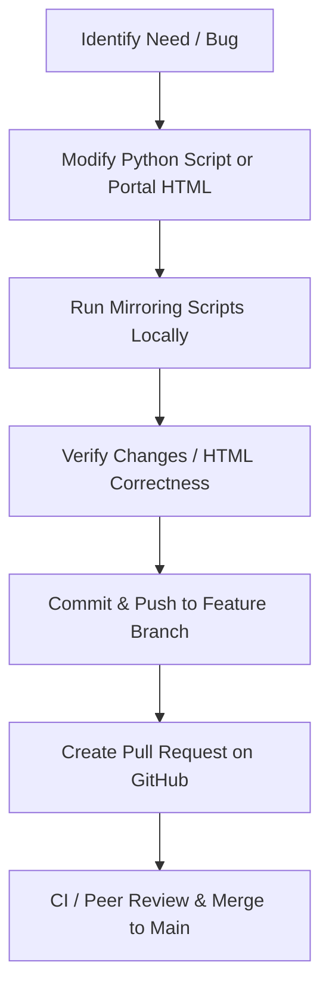

# Contributing Guidelines

Thank you for contributing to **chanmainvest/reading_library**! 

To maintain the integrity, consistency, and machine-readability of this repository, we enforce strict automated and agent-driven workflows.

---

## 🚫 The Golden Rule: Humans are Banned from Direct Editing

> [!CAUTION]
> **No Direct Edits to Generated Materials:**
> Humans are **strictly prohibited** from manually editing, modifying, or creating HTML files or images inside the generated book directories (such as `/books/oil101`, `/books/natgas101`, or EPUB-converted folders). 

### Why this rule exists:
1. **Automation Drift:** Manual edits will be completely overwritten the next time a mirroring script is executed.
2. **Machine Readability:** The books and papers in this repository are designed to be indexed and read by AI models. Automated scrapers ensure clean, highly standardized markup without human syntax errors.
3. **Reproducibility:** All mirrors must be 100% reproducible from their online sources using the code under the `scripts/` directory.

---

## 🛠️ Permitted Contributions

You are welcome to contribute by proposing changes to:
1. **Mirroring Code:** Modifying or improving the scraping, cleaning, asset-downloading, EPUB conversion, or SVG-rendering logic in `scripts/`.
2. **Repository Architecture:** Adding new mirroring or conversion scripts in the `scripts/` directory for other books, articles, or research papers.
3. **Portal Design:** Improving the style, aesthetics, or accessibility of the root `index.html` portal.
4. **Catalog Metadata:** Updating `books/catalog.json` with source/status metadata.
5. **Documentation:** Refining `README.md`, `AGENTS.md`, or `CONTRIBUTING.md`.

Full-text commercial EPUB conversions require explicit rights. Once rights are confirmed, use `scripts/convert_epub.py` to generate `books/<slug>/index.html` and update `books/catalog.json`.

---

## 🔄 Standard Pull Request (PR) Flow

All changes, whether submitted by humans or AI agents, must follow a standard pull request flow:



### 1. Code Edits
All edits to book chapters must be made by modifying the **Python mirroring scripts** (under `scripts/`).

### 2. Local Regeneration
Before submitting a PR, always run the appropriate mirror script locally to regenerate the output:
```bash
py scripts/mirror_natgas101.py
py scripts/mirror_oil101.py
py scripts/convert_epub.py "E:\ebook\Books\path\book.epub" --slug book-slug
```

### 3. Review and Verification
- Verify that the resulting HTML pages load successfully and render correctly in a browser.
- Ensure that no syntax errors or dangling script tags are committed.
- Verify that all local image references remain functional and do not point to absolute external URLs.

### 4. Create Pull Request
Submit your changes as a pull request to `github.com/chanmainvest/reading_library`. Direct commits to `main` are disabled. All PRs will be automatically reviewed for compliance.
