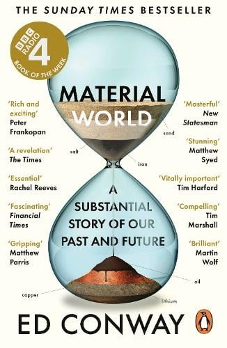

# Material World

*Ed Conway · single-page EPUB conversion*

<!-- rl-section id="section-1" class="epub-section" kicker="Section 1" title="Section 1" -->

## Section 1

<!-- rl-section id="brand_page" class="epub-section" -->

<!-- rl-section id="section-2" class="epub-section" kicker="Section 2" title="About the Author" -->

## About the Author

**Ed Conway**
is a writer and broadcaster. He is the Economics and Data Editor of Sky News and a regular columnist for *The Times*
and *Sunday Times*
. He has written two critically acclaimed and bestselling books and has won numerous awards for his journalism. He lives in London.

<!-- rl-section id="ata001" class="chapter" title="About the Author" -->

## About the Author

**Ed Conway**
is a writer and broadcaster. He is the Economics and Data Editor of Sky News and a regular columnist for *The Times*
and *Sunday Times*
. He has written two critically acclaimed and bestselling books and has won numerous awards for his journalism. He lives in London.

<!-- rl-section id="section-3" class="epub-section" kicker="Section 3" title="BY THE SAME AUTHOR" -->

### BY THE SAME AUTHOR

*50 Economics Ideas You Really Need to Know*

*The Summit: The Biggest Battle of the Second World War – Fought Behind Closed Doors*

<!-- rl-section id="sec-alsoby_001" class="chapter" -->

### BY THE SAME AUTHOR

*50 Economics Ideas You Really Need to Know*

*The Summit: The Biggest Battle of the Second World War – Fought Behind Closed Doors*

<!-- rl-section id="section-4" class="epub-section" kicker="Section 4" title="Ed Conway" -->

## Ed Conway

---

### MATERIAL WORLD

#### A Substantial Story of Our Past and Future

<!-- rl-section id="sec-titlepage001" class="titlepage" title="Ed Conway" -->

## Ed Conway

---

### MATERIAL WORLD

#### A Substantial Story of Our Past and Future

<!-- rl-section id="section-5" class="epub-section" kicker="Section 5" title="Contents" -->

## Contents

1. [Cover](Image00002.jpg)
2. [About the Author](#section-2)
3. [By the Same Author](#section-3)
4. [Title Page](#section-4)
5. [Dedication](#section-6)
6. [Introduction](#section-7)
7. [PART ONE:
   Sand](#section-8)
   1. [1:
      *Homo Faber*](#section-9)
   2. [2:
      Built upon Sand](#section-10)
   3. [3:
      The Longest Journey](#section-11)
8. [PART TWO:
   Salt](#section-12)
   1. [4:
      Salt Routes](#section-13)
   2. [5:
      Salt of the Earth](#section-14)
   3. [6:
      The Fire Drug](#section-15)
      1. [Postscript:
         Many Salts](#section-16)
9. [PART THREE:
   Iron](#section-17)
   1. [7:
      You Don’t Have a Country](#section-18)
   2. [8:
      Inside the Volcano](#section-19)
   3. [9:
      The Last Blast](#section-20)
10. [PART FOUR:
    Copper](#section-21)
    1. [10:
       The Next Greatest Thing](#section-22)
    2. [11:
       The Hole](#section-23)
    3. [12:
       The Deep](#section-24)
11. [PART FIVE:
    Oil](#section-25)
    1. [13:
       The Elephant](#section-26)
    2. [14:
       Pipes](#section-27)
    3. [15:
       The Everything Thing](#section-28)
       1. [Postscript: Peak Oil](#section-29)
12. [PART SIX:
    Lithium](#section-30)
    1. [16:
       White Gold](#section-31)
    2. [17:
       Jelly Rolls](#section-32)
    3. [18:
       Unmanufacturing](#section-33)
13. [Conclusion](#section-34)
14. [*Notes*](#section-35)
15. [*Bibliography*](#section-36)
16. [*Acknowledgements*](#section-37)
17. [*Index*](#section-38)
18. [Copyright](#section-40)

1. [501](#section-2)
2. [ii](#section-3)
3. [v](#section-6)
4. [1](#section-7)
5. [2](#section-7)
6. [3](#section-7)
7. [4](#section-7)
8. [5](#section-7)
9. [6](#section-7)
10. [7](#section-7)
11. [8](#section-7)
12. [9](#section-7)
13. [10](#section-7)
14. [11](#section-7)
15. [12](#section-7)
16. [13](#section-7)
17. [14](#section-7)
18. [15](#section-7)
19. [16](#section-7)
20. [17](#section-7)
21. [18](#section-7)
22. [19](#section-7)
23. [20](#section-7)
24. [21](#section-7)
25. [22](#section-7)
26. [23](#section-7)
27. [25](#section-8)
28. [27](#section-9)
29. [28](#section-9)
30. [29](#section-9)
31. [30](#section-9)
32. [31](#section-9)
33. [32](#section-9)
34. [33](#section-9)
35. [34](#section-9)
36. [35](#section-9)
37. [36](#section-9)
38. [37](#section-9)
39. [38](#section-9)
40. [39](#section-9)
41. [40](#section-9)
42. [41](#section-9)
43. [42](#section-9)
44. [43](#section-9)
45. [44](#section-9)
46. [45](#section-9)
47. [46](#section-9)
48. [47](#section-9)
49. [48](#section-9)
50. [49](#section-9)
51. [50](#section-9)
52. [51](#section-9)
53. [52](#section-9)
54. [53](#section-9)
55. [54](#section-9)
56. [55](#section-9)
57. [56](#section-9)
58. [57](#section-9)
59. [58](#section-9)
60. [59](#section-9)
61. [60](#section-9)
62. [61](#section-9)
63. [62](#section-9)
64. [63](#section-10)
65. [64](#section-10)
66. [65](#section-10)
67. [66](#section-10)
68. [67](#section-10)
69. [68](#section-10)
70. [69](#section-10)
71. [70](#section-10)
72. [71](#section-10)
73. [72](#section-10)
74. [73](#section-10)
75. [74](#section-10)
76. [75](#section-10)
77. [76](#section-10)
78. [77](#section-10)
79. [78](#section-10)
80. [79](#section-10)
81. [80](#section-10)
82. [81](#section-10)
83. [82](#section-10)
84. [83](#section-10)
85. [84](#section-10)
86. [85](#section-10)
87. [86](#section-10)
88. [87](#section-11)
89. [88](#section-11)
90. [89](#section-11)
91. [90](#section-11)
92. [91](#section-11)
93. [92](#section-11)
94. [93](#section-11)
95. [94](#section-11)
96. [95](#section-11)
97. [96](#section-11)
98. [97](#section-11)
99. [98](#section-11)
100. [99](#section-11)
101. [100](#section-11)
102. [101](#section-11)
103. [102](#section-11)
104. [103](#section-11)
105. [104](#section-11)
106. [105](#section-11)
107. [106](#section-11)
108. [107](#section-11)
109. [108](#section-11)
110. [109](#section-11)
111. [110](#section-11)
112. [111](#section-11)
113. [112](#section-11)
114. [113](#section-11)
115. [114](#section-11)
116. [115](#section-11)
117. [116](#section-11)
118. [117](#section-11)
119. [118](#section-11)
120. [119](#section-11)
121. [120](#section-11)
122. [121](#section-11)
123. [123](#section-12)
124. [125](#section-13)
125. [126](#section-13)
126. [127](#section-13)
127. [128](#section-13)
128. [129](#section-13)
129. [130](#section-13)
130. [131](#section-13)
131. [132](#section-13)
132. [133](#section-13)
133. [134](#section-13)
134. [135](#section-13)
135. [136](#section-13)
136. [137](#section-13)
137. [138](#section-13)
138. [139](#section-13)
139. [140](#section-13)
140. [141](#section-13)
141. [142](#section-13)
142. [143](#section-14)
143. [144](#section-14)
144. [145](#section-14)
145. [146](#section-14)
146. [147](#section-14)
147. [148](#section-14)
148. [149](#section-14)
149. [150](#section-14)
150. [151](#section-14)
151. [152](#section-14)
152. [153](#section-14)
153. [154](#section-14)
154. [155](#section-14)
155. [156](#section-14)
156. [157](#section-14)
157. [158](#section-14)
158. [159](#section-14)
159. [160](#section-14)
160. [161](#section-14)
161. [162](#section-14)
162. [163](#section-15)
163. [164](#section-15)
164. [165](#section-15)
165. [166](#section-15)
166. [167](#section-15)
167. [168](#section-15)
168. [169](#section-15)
169. [170](#section-15)
170. [171](#section-15)
171. [172](#section-15)
172. [173](#section-15)
173. [174](#section-15)
174. [175](#section-15)
175. [176](#section-15)
176. [177](#section-16)
177. [178](#section-16)
178. [179](#section-16)
179. [180](#section-16)
180. [181](#section-16)
181. [182](#section-16)
182. [183](#section-16)
183. [184](#section-16)
184. [185](#section-16)
185. [186](#section-16)
186. [187](#section-16)
187. [188](#section-16)
188. [189](#section-16)
189. [190](#section-16)
190. [191](#section-16)
191. [193](#section-17)
192. [195](#section-18)
193. [196](#section-18)
194. [197](#section-18)
195. [198](#section-18)
196. [199](#section-18)
197. [200](#section-18)
198. [201](#section-18)
199. [202](#section-18)
200. [203](#section-18)
201. [204](#section-18)
202. [205](#section-18)
203. [206](#section-18)
204. [207](#section-18)
205. [208](#section-18)
206. [209](#section-18)
207. [210](#section-18)
208. [211](#section-18)
209. [212](#section-18)
210. [213](#section-18)
211. [214](#section-19)
212. [215](#section-19)
213. [216](#section-19)
214. [217](#section-19)
215. [218](#section-19)
216. [219](#section-19)
217. [220](#section-19)
218. [221](#section-19)
219. [222](#section-19)
220. [223](#section-19)
221. [224](#section-19)
222. [225](#section-19)
223. [226](#section-19)
224. [227](#section-19)
225. [228](#section-19)
226. [229](#section-19)
227. [230](#section-19)
228. [231](#section-19)
229. [232](#section-19)
230. [233](#section-20)
231. [234](#section-20)
232. [235](#section-20)
233. [236](#section-20)
234. [237](#section-20)
235. [238](#section-20)
236. [239](#section-20)
237. [240](#section-20)
238. [241](#section-20)
239. [242](#section-20)
240. [243](#section-20)
241. [244](#section-20)
242. [245](#section-20)
243. [246](#section-20)
244. [247](#section-20)
245. [248](#section-20)
246. [249](#section-21)
247. [251](#section-22)
248. [252](#section-22)
249. [253](#section-22)
250. [254](#section-22)
251. [255](#section-22)
252. [256](#section-22)
253. [257](#section-22)
254. [258](#section-22)
255. [259](#section-22)
256. [260](#section-22)
257. [261](#section-22)
258. [262](#section-22)
259. [263](#section-22)
260. [264](#section-22)
261. [265](#section-23)
262. [266](#section-23)
263. [267](#section-23)
264. [268](#section-23)
265. [269](#section-23)
266. [270](#section-23)
267. [271](#section-23)
268. [272](#section-23)
269. [273](#section-23)
270. [274](#section-23)
271. [275](#section-23)
272. [276](#section-23)
273. [277](#section-23)
274. [278](#section-23)
275. [279](#section-23)
276. [280](#section-23)
277. [281](#section-23)
278. [282](#section-23)
279. [283](#section-23)
280. [284](#section-23)
281. [285](#section-23)
282. [286](#section-23)
283. [287](#section-23)
284. [288](#section-23)
285. [289](#section-23)
286. [290](#section-24)
287. [291](#section-24)
288. [292](#section-24)
289. [293](#section-24)
290. [294](#section-24)
291. [295](#section-24)
292. [296](#section-24)
293. [297](#section-24)
294. [298](#section-24)
295. [299](#section-24)
296. [300](#section-24)
297. [301](#section-24)
298. [302](#section-24)
299. [303](#section-24)
300. [304](#section-24)
301. [305](#section-24)
302. [307](#section-25)
303. [309](#section-26)
304. [310](#section-26)
305. [311](#section-26)
306. [312](#section-26)
307. [313](#section-26)
308. [314](#section-26)
309. [315](#section-26)
310. [316](#section-26)
311. [317](#section-26)
312. [318](#section-26)
313. [319](#section-26)
314. [320](#section-26)
315. [321](#section-26)
316. [322](#section-26)
317. [323](#section-26)
318. [324](#section-26)
319. [325](#section-26)
320. [326](#section-26)
321. [327](#section-27)
322. [328](#section-27)
323. [329](#section-27)
324. [330](#section-27)
325. [331](#section-27)
326. [332](#section-27)
327. [333](#section-27)
328. [334](#section-27)
329. [335](#section-27)
330. [336](#section-27)
331. [337](#section-27)
332. [338](#section-27)
333. [339](#section-27)
334. [340](#section-27)
335. [341](#section-27)
336. [342](#section-27)
337. [343](#section-27)
338. [344](#section-28)
339. [345](#section-28)
340. [346](#section-28)
341. [347](#section-28)
342. [348](#section-28)
343. [349](#section-28)
344. [350](#section-28)
345. [351](#section-28)
346. [352](#section-28)
347. [353](#section-28)
348. [354](#section-28)
349. [355](#section-28)
350. [356](#section-28)
351. [357](#section-28)
352. [358](#section-28)
353. [359](#section-28)
354. [360](#section-28)
355. [361](#section-29)
356. [362](#section-29)
357. [363](#section-29)
358. [364](#section-29)
359. [365](#section-29)
360. [366](#section-29)
361. [367](#section-29)
362. [368](#section-29)
363. [369](#section-30)
364. [371](#section-31)
365. [372](#section-31)
366. [373](#section-31)
367. [374](#section-31)
368. [375](#section-31)
369. [376](#section-31)
370. [377](#section-31)
371. [378](#section-31)
372. [379](#section-31)
373. [380](#section-31)
374. [381](#section-31)
375. [382](#section-31)
376. [383](#section-31)
377. [384](#section-31)
378. [385](#section-31)
379. [386](#section-31)
380. [387](#section-31)
381. [388](#section-31)
382. [389](#section-31)
383. [390](#section-31)
384. [391](#section-31)
385. [392](#section-31)
386. [393](#section-31)
387. [394](#section-31)
388. [395](#section-31)
389. [396](#section-31)
390. [397](#section-32)
391. [398](#section-32)
392. [399](#section-32)
393. [400](#section-32)
394. [401](#section-32)
395. [402](#section-32)
396. [403](#section-32)
397. [404](#section-32)
398. [405](#section-32)
399. [406](#section-32)
400. [407](#section-32)
401. [408](#section-32)
402. [409](#section-32)
403. [410](#section-32)
404. [411](#section-32)
405. [412](#section-32)
406. [413](#section-33)
407. [414](#section-33)
408. [415](#section-33)
409. [416](#section-33)
410. [417](#section-33)
411. [418](#section-33)
412. [419](#section-33)
413. [420](#section-33)
414. [421](#section-33)
415. [422](#section-33)
416. [423](#section-33)
417. [424](#section-33)
418. [425](#section-34)
419. [426](#section-34)
420. [427](#section-34)
421. [428](#section-34)
422. [429](#section-34)
423. [430](#section-34)
424. [431](#section-34)
425. [432](#section-34)
426. [433](#section-34)
427. [434](#section-34)
428. [435](#section-34)
429. [436](#section-34)
430. [437](#section-34)
431. [438](#section-34)
432. [439](#section-34)
433. [440](#section-34)
434. [441](#section-34)
435. [442](#section-34)
436. [443](#section-34)
437. [445](#section-35)
438. [446](#section-35)
439. [447](#section-35)
440. [448](#section-35)
441. [449](#section-35)
442. [450](#section-35)
443. [451](#section-35)
444. [452](#section-35)
445. [453](#section-35)
446. [454](#section-35)
447. [455](#section-35)
448. [456](#section-35)
449. [457](#section-35)
450. [458](#section-35)
451. [459](#section-35)
452. [460](#section-35)
453. [461](#section-36)
454. [462](#section-36)
455. [463](#section-36)
456. [464](#section-36)
457. [465](#section-36)
458. [466](#section-36)
459. [467](#section-36)
460. [468](#section-36)
461. [469](#section-36)
462. [470](#section-36)
463. [471](#section-37)
464. [472](#section-37)
465. [473](#section-37)
466. [475](#section-38)
467. [476](#section-38)
468. [477](#section-38)
469. [478](#section-38)
470. [479](#section-38)
471. [480](#section-38)
472. [481](#section-38)
473. [482](#section-38)
474. [483](#section-38)
475. [484](#section-38)
476. [485](#section-38)
477. [486](#section-38)
478. [487](#section-38)
479. [488](#section-38)
480. [489](#section-38)
481. [490](#section-38)
482. [491](#section-38)
483. [492](#section-38)
484. [493](#section-38)
485. [494](#section-38)
486. [495](#section-38)
487. [496](#section-38)
488. [497](#section-38)
489. [498](#section-38)
490. [499](#section-38)
491. [500](#section-38)

1. [Cover](Image00002.jpg)
2. [Frontmatter](#section-1)
3. [Contents](#section-5)
4. [Begin Reading](#section-7)

<!-- rl-section id="section-6" class="epub-section" kicker="Section 6" title="Section 6" -->

## Section 6

*For Eliza*

<!-- rl-section id="sec-dedication001" class="dedication" -->

*For Eliza*

<!-- rl-section id="section-7" class="epub-section" kicker="Section 7" title="Introduction" -->

## Introduction

I was standing on the edge of a precipice looking down into the deepest hole I had ever seen. At the bottom was a group of people in hard hats, or at least so I was told; they were much too far to make out with the naked eye. In the ground near them were hundreds of pounds of high explosive. This was enough, I was informed, to demolish a city block.

In front of me was a metal panel with two buttons, and next to me was a man with a walkie-talkie. We were listening in to the control room where someone was counting down. I had been told to press the two buttons simultaneously when the countdown reached zero. The charge from the detonator would take a split second to reach the bottom of the pit, at which point a football pitch-sized square of the Nevada dirt would evaporate before our eyes.

‘You’ll feel the shockwave first,’ said the man with the walkie-talkie. ‘Then you’ll see the earth going up, then you’ll hear the explosion. In that order. It’s kinda weird.’

I hadn’t travelled out into the high desert to set off a bomb; I had come because of a spreadsheet. Some months earlier, scanning through Britain’s trade statistics, I had noticed something odd: flows of gold were distorting the figures, and hence our picture of the nation’s economy. Gold, it turned out, had briefly overtaken cars and pharmaceuticals as the UK’s biggest export. 
Given Britain does not have a gold-mining industry this was perplexing. How could a country with no significant gold reserves become one of its biggest producers? As far as I could make out, part of the answer was that much of the world’s physical gold passes through London on its way somewhere else. In order to solve the riddle I travelled out to where the precious metal is actually extracted, to chart the journey of gold from the ground to the refinery and then, in the form of bars of bullion, around the world. But as we began filming it dawned on me that there was an even more intriguing story to tell, one that says rather a lot about humankind’s relationship with the world.

It had taken some months for my producer to persuade the miner in question, Barrick Gold Corporation, to open its doors, and a few days to get there from London. The Cortez mine is not the kind of place you happen upon accidentally. In our case it took two flights and a four-hour drive west across the salt flats of Utah, followed by another two-hour car journey with Barrick’s minders. There was a highway, mostly empty except for the occasional heavy truck, then a long desert road, then a dirt track winding into a long, dry uninhabited valley. Cowboy country.

The mine itself is located on the slopes of a hill called Mount Tenabo, a sacred site for the tribespeople of the Western Shoshone. The process of mining is comparatively simple, and echoes the techniques used by gold miners back in the nineteenth century, albeit at a gargantuan scale. The rocks are blasted out of the earth, crushed and then ground into a fine dust, and eventually mixed with a cyanide solution which helps separate out the gold itself.

This is the reality of twenty-first-century resource exploitation: reducing vast quantities of rock into granules and chemically processing what remains. It is both awe inspiring and disturbing. One risk is that the cyanide and mercury used in the method could escape into the surrounding ecosystem. After 
all, while miners like Barrick insist they follow all the rules laid down by the US Environmental Protection Agency (EPA), campaigners warn that pollution often finds its way out of the mine. Indeed, a few years earlier the EPA had fined Barrick and another nearby miner $618,000 for failing to report the release of toxic chemicals including cyanide, lead and mercury. But the main thing I was struck by as I observed each stage in this process was just how far we will go these days to secure a tiny shred of shiny metal.

The scale, for one thing, was mind-boggling. As I looked down into the pit I could just about make out some trucks on the bottom, but only when they emerged at the top did I realise that they were bigger than three-storey buildings; the tyres alone were the size of a double-decker bus. How much earth do you have to remove to produce a gold bar? I asked my minders. They didn’t know, but they did know that in a single working day those trucks would shift rocks equivalent to the weight of the Empire State Building. Later on I did the sums for myself. For a standard gold bar (400 troy ounces) they would have to dig about 5,000 tonnes of earth. That’s nearly the same weight as ten fully laden Airbus A380 super-jumbos, the world’s largest passenger planes – for one bar of gold.

Perhaps you already knew this is how gold is mined these days – that it doesn’t come out of the earth in nuggets or as a rich seam forged by Mother Nature. Perhaps you knew that it is instead the product of a chemical reaction involving one of the most toxic cocktails known to humankind, that it’s extracted not by burrowing in the earth so much as by tearing down entire mountains. Perhaps I was naive but I, for one, hadn’t quite realised.

As I looked down into the open pit at the house-sized trucks and the miners scurrying like ants around the blast site, I started 
to feel a little queasy. It wasn’t just the spectacle in front of me – it was something I was wearing on my finger.

Some months earlier I had got married. My wife and I stood in front of our family and friends and exchanged gold rings as a token of our love. As the countdown continued on the walkie-talkie beside me, I thumbed the ring and pondered. The chances were it was probably extracted from the ground through precisely the same techniques I was now witnessing. Why hadn’t I checked where it came from? I made a point of checking the diamonds in my wife’s engagement ring weren’t conflict diamonds, so why didn’t I find out what was sacrificed, by man and land, for the gold? Later I would learn that while it might once have taken about 0.3 tonnes of ore, extracted via more traditional mining methods, to obtain enough gold for a typical wedding ring, these days it might take between 4 and 20 tonnes of rock. Standing there with the detonator in front of me, I felt like someone who has just enjoyed a slap-up sausage and egg breakfast before being shown around the abattoir.

Then there was the mountain itself. The pit I was staring into was not just somewhere near Mount Tenabo. It was Mount Tenabo. The mine was literally being dug into the shoulders of the peak. As I looked across to the other side of the hole I could count layer upon layer of multicoloured rock strata constituting the internals of this mountain. I don’t believe in the water gods the Indigenous Western Shoshone tribes worship but even so it was hard not to feel there was something, well, brutal and significant about peeling away the skin of the soil and peering beneath the surface.

As the countdown continued I turned around and looked desperately towards my producer. ‘Would you like the honour?’

She looked at me in disbelief and then took my place. Shamefacedly I stepped back and watched.

The countdown reached zero. ‘Firing shot one, Cortez Hills,’ said the man into the walkie-talkie, and pointed at the buttons. She pressed them both. There was a momentary pause – a second or so. Then a wave of pressure hit us – nothing dramatic, more like a waft of air. Then the ground was shaking and I looked down hundreds of feet towards the bottom of the pit where the earth had turned to liquid. The explosion rippled along the base of the mine, casting dirt and smoke up into the air. Only then did we hear the rumble. It boomed and echoed around the valley for what felt like minutes.

The economist John Maynard Keynes once called gold a ‘barbarous relic’. His point was that while it might look pretty on a necklace or inside a sarcophagus it doesn’t really do all that much.

Clearly it has value – why else would we blow up entire mountains for a few bars of it? But think, for a moment, about what gold actually *does*
. It plays an important if somewhat fringe role in electronics and chemistry, but that accounts for less than a tenth of demand these days. Instead, its primary uses are in jewellery, decoration and as an asset for those who worry about economic disaster. Some of the gold I saw being mined in Nevada is probably now on someone else’s ring finger. Or it might just as plausibly be back underground again, this time in the form of a bar in a bank vault. Sacrilegious as this will sound to jewellers and jumpy investors, the world would probably not cease to function, nor civilisation grind to a halt, if we suddenly ran out of gold.[1](#section-35)

So in the months after I returned from Nevada I kept returning to a few questions. If this is what it takes to extract a metal we could mostly live without, then what does it take to extract those materials we *really*
need? Come to mention it, what *are*
the materials we really depend on? What are the physical ingredients 
without which civilisation really would grind to a halt, and where do they actually come from?

I had a hunch that steel would have to be among them. Most buildings and cars – not to mention the machines with which we build everything else too – are made from this alloy of iron, carbon and a few other crucial elements. Nor could we create modern spaces without concrete. Copper was surely essential, given it underpins the electrical networks upon which we depend. Since we still rely on fossil fuels for so much of our energy they would, I guessed, qualify as essential materials too – though perhaps one should also consider something like lithium, the element at the heart of all those batteries we will need in future. But how is one to quantify our dependence on these materials? And did their extraction invariably involve the same species of destruction I had witnessed at the Cortez mine?

Economics, the discipline in which I have been immersed for most of my professional life, seemed to have few definitive answers to these sorts of questions. Something’s value is what someone is willing to pay for it, goes the standard explanation. If something is in short supply, people will cut back, find a suitable substitute (if such a thing exists) and move on. End of story.

Yet the story doesn’t seem to accord with the reality, because this stuff clearly matters. For all that we are told we live in an increasingly dematerialised world, where ever more value lies in intangible items – apps and networks and online services – the physical world continues to underpin everything else. This is not especially evident when you glance at the balance sheets of our economies, which show that, for instance, four out of every five dollars generated in the US can be traced back to the services sector and an ever vanishing fraction is attributed to energy, mining and manufacturing. But pretty much everything from 
social networks to retail to financial services is wholly reliant upon the physical infrastructure that facilitates it and the energy that powers it. Without concrete, copper and fibre optics there would be no data centres, no electricity, no internet. The world, dare I say, would not end if Twitter or Instagram suddenly ceased to exist; if we suddenly ran out of steel or natural gas, however, that would be a very different story.

We all know this instinctively. And such principles are self-evident during periods of war, shortage or financial meltdown. Yet as far as all-important statistics like gross domestic product (GDP) are concerned a dollar is a dollar, whether it is spent on Facebook or on food. There is a logic and elegance to this, but it didn’t exactly answer my questions. It is all very well knowing the *price*
of something, but price is not the same thing as *importance*
.

This book started off as my attempt to answer these questions – a meditation not so much on the market value of substances but our *dependence*
upon them. But as I journeyed deeper, beyond my comfort zone of conventional economics, it became something else: a story of wonder. For the more I understood about these materials – commonplace, humdrum and often, yes, cheap – the more magical they appeared to be.

Consider something as simple as a grain of sand. There is no element in the earth’s crust, save for oxygen, which is more commonplace than sand’s main ingredient – silicon. Yet kneel down and examine what’s in the ground and you soon realise that you are sinking into a universe of complexity. There are coarse, angular grains, perfect for construction. There are marine sands sitting on the seafloor until they are dredged up and turned into new land. There are desert sands, so worn by the wind that when you study them under a microscope you see what looks like a pile of marbles – the edges of the grains rounded down by thousands 
of years of erosion. There are sands left behind by ancient tropical oceans of such purity that they are traded around the world.

Mix sand and small stones with cement, add some water and you have concrete, quite literally the foundational material for modern cities. Add it to gravel and bitumen and you have asphalt, of which most roads are made – those that aren’t made of concrete, that is. Without silicon we would not be able to make the computer chips that support the modern world. Melt sand at a high enough temperature with the right additives and you make glass. Glass – plain, simple glass – is, it turns out, one of the great mysteries of material science; neither liquid nor solid with an atomic structure we still do not entirely understand. And the glass you have in your windscreen is just the beginning of it, for, woven into strands and accompanied by resin, glass becomes fibreglass: the substance out of which wind-turbine blades are made. Refined into pure wires, it becomes the fibre optics from which the internet is woven. Add lithium to the mix and you get a strong, resilient glass; add boron and you get something called borosilicate glass.

You will have encountered borosilicate glass before, probably under the brand name the manufacturer Corning gave it: Pyrex. Stable, clear and robust, capable of withstanding a wide range of temperatures, from the naked flame of a Bunsen burner to the piercing cold of deep space, borosilicate glass is one of the unsung heroes of the modern age. Unlike regular glass, which when exposed to potent chemicals can leach small particles into the liquid, borosilicate glass remains chemically inert, making it the perfect material for test tubes, lab beakers and medical vials. The one thing almost every medicine or vaccine in history – including those developed for COVID-19 – has in common is the borosilicate containers in which they were worked on, stored and transported.

But we tend not to pay much attention to these kinds of things until we run short of them. That was certainly the case with borosilicate glass, which received a sudden flurry of interest in the wake of the COVID pandemic, amid worries that the main thing holding back the distribution of vaccinations might not be the pharmaceuticals themselves but the containers in which they would be shipped. In the event, thousands of workers along a complex supply chain stretching from mines to refineries to factories helped avert disaster. Corning even deployed an entirely new type of glass, made not with boron but with aluminium, calcium and magnesium, to help satisfy the demand for medicinal vials.

Other sectors were not so fortunate. In the pandemic and thereafter, there were shortages of face masks, of swabs and diagnostic reagents, shortages of cement and steel, of timber and toilet paper, of industrial gases and chemicals, shortages of meats, of mustards, of eggs and dairy. There was such a shortfall of silicon chips – semiconductors as they are often called – that car manufacturers across the world had to down tools and shutter their plants. Computer and smartphone manufacturers were unable to fulfil orders. Even a year after their launch, the new generation of games consoles was still in short supply. Only after around two years did those shortages come to an end.

The funny thing about these supply chain crises was that each of them seemed to take the world’s governments and policymakers by complete surprise. They were surprised that there was a shortage of semiconductors, that cars needed so many of them and that the shortage of new cars would push second-hand car prices up to record highs.

The UK government was similarly startled in late 2021 when it suddenly ran short of carbon dioxide and discovered that without CO2
the food industry is unable not merely to make 
sparkling drinks fizzy but also to preserve and store foods, as well as to stun pigs and chickens before slaughter. This could all be traced back to the sudden closure of two fertiliser plants in Cheshire and Teesside. The majority of Britain’s CO2
supplies came, it turned out, from these two sites whose primary purpose was to make something else altogether: ammonia. And since natural gas prices were high and since ammonia is made, as we shall see in the following chapters, from natural gas, a lurch in one price had caused a sudden shortage in another, seemingly unrelated substance.

But should this *really*
all have come as such a surprise? For a clue about the answer, consider a famous essay written in 1958 by Leonard Read, an American economist, called ‘I, Pencil’. ‘I am a lead pencil,’ it begins, ‘the ordinary wooden pencil familiar to all boys and girls and adults who can read and write.’ Yet, continues Read, or rather the pencil, ‘not a single person on the face of this earth knows how to make me’.[2](#section-35)

The wood in the pencil comes from cedars growing in western America, sawn down with steel made in blast furnaces and finished in workshops. It is milled into slats and dried and dyed and dried again, and the slats are grooved and glued into place. The lead in the pencil’s core is graphite mined in Sri Lanka, refined and mixed with clay from Mississippi, alongside chemicals made from animal fat and sulphuric acid. The wood and lead of the pencil are coated in lacquer made from castor oil derived from castor beans, resins are used to label it, and it is capped on its base with brass made from copper and zinc, mined on the other side of the world. The eraser is made from rapeseed oil from Indonesia, with numerous chemicals along the way, from sulphur chloride to cadmium sulphide.

All for that simplest of things, a pencil. Yet from the manufacturers who worked on each ingredient to the hauliers who 
shipped the parts to those working in power stations providing the energy for the process, ‘millions of people’, writes Read’s pencil, ‘have had a hand in my creation, no one of whom even knows more than a very few of the others’.

There are a couple of straightforward lessons here. The first is how little we understand about how everyday products are actually made. The second is that, given all this complexity, no single human being could carry out, or for that matter direct, these numerous processes. For obvious reasons ‘I, Pencil’, written at the height of the Cold War, put most of the emphasis on the second of those lessons. Read’s essay was championed by the free market economist Milton Friedman as an illustration of why his Soviet counterparts were wrong to try to run their economy via central planning committees.

Yet as I contemplated the breakdown in twenty-first-century supply chains, it struck me that we might have done just as well to remember the first of those lessons. Surely if we spent a little more time contemplating how the items upon which we rely actually get produced, we might not be so baffled when they run short. Thanks to Read’s essay, millions of economics students now know their way around the supply chain of a pencil, but what about a smartphone or a vaccine or a battery? What about the supply chain for carbon dioxide or borosilicate glass?

These networks of people and expertise, turning raw materials into sophisticated products and then delivering them to us, stand alongside the substances themselves as the other star of this book. In the following pages you will find a celebration of how networks of humans, most of whom do not know each other, can collaborate to turn seemingly unpromising, inert substances into things of wonder. And few supply chains, I discovered, are quite as wondrous as those producing silicon chips.

Long before the chip shortage, I had undertaken to try to tell the story of a grain of silicon, all the way from the quarry through to the semiconductor foundry and assembly plant where it would become part of a smartphone. I soon realised that, much as with Read’s pencil, no single person, even those working on the supply chain itself, could fully explain to me the processes – even the very simplified processes – that took place at each stage along this journey. Those working at foundries understood plenty about photolithography and chemical abrasion, but little about how the ultra-pure silicon wafers they were working on were actually made. No one at the quarry digging quartzite from the ground (the chips, it turns out, begin their lives not as grains of sand but as fist-sized lumps of stone) understood much about its eventual destiny.

Yet most striking of all was the extraordinary length and drama of this journey. Between being blasted out of the ground in a quarry and ending up inside a smartphone, this grain of silicon will have circumnavigated the world numerous times. It will have been heated to more than 1,000°C and then cooled, not once or twice but three times. It will have been transformed from an amorphous mass into one of the purest crystalline structures in the universe. It will have been zapped with lasers powered by a form of light that you can’t see and doesn’t survive exposure to the atmosphere. This – the process of turning silicon into a tiny silicon chip – was the most extraordinary journey I had ever traced.

But this was just the beginning. Over the following months I would see more quarries. I would descend to the sweltering depths of the deepest mine in Europe. I would see where salt comes from and how it gets transformed into the chemicals without which we would all struggle to survive. I saw red rock being turned into molten metal and then hammered into steel. 
I travelled to eerie green pools from where we get lithium and followed the substance as it was pasted and rolled and squeezed into a battery for an electric car. And the more I travelled, the more I realised that I had spent most of my life inhabiting another world altogether, a place I came to think of as the ethereal world.

Perhaps you live there too: it is a rather lovely place, a world of ideas. In the ethereal world we sell services and management and administration; we build apps and websites; we transfer money from one column to another; we trade mostly in thoughts and advice, in haircuts and food delivery. If mountains are being torn down on the other side of the planet, it hardly seems especially relevant here in the ethereal world.

When I flew out to Nevada to film that mountain being exploded I was really looking to film a visual metaphor, to turn the physical into something ethereal: a news report that would help people understand an idea like trade flows that bit better. Standing at the edge of the pit there, though, it occurred to me that my perspective had been dangerously shallow. All of a sudden I realised I was staring out from the brink of one world and into another: the Material World.

The Material World is what undergirds our everyday lives. Without this place your beautifully designed smartphone wouldn’t switch on, your brand new electric car would have no battery. The Material World will not provide you with a gorgeous home, but it will ensure your home can actually stand up. It will keep you warm, clean, fed and well, however little heed you may pay it.

The Material World is where you will find the most important companies you’ve never heard of, companies like CATL, Wacker, Codelco, Shagang, TSMC and ASML. These names may mean nothing to you, but they are just as important, perhaps more important, than the familiar brands everyone has heard of – the 
Walmarts, Apples, Teslas and Googles of this world. For the best-kept secret of the modern economy is that these world-famous brands depend entirely on the obscure firms of the Material World to make their products and help their clever ideas, well, materialise. It is where ideas become a tangible reality.

Why are today’s megabrands so happy to rely on other companies to get the real work done? Partly, frankly, because operating in the Material World, where you have to dig and extract stuff and turn it into physical products, can be a difficult, dangerous, dirty business. In the following pages we will witness how far twenty-first-century humanity is willing to go for these materials, whether that means digging a hole as deep as a canyon or scouring the bottom of the ocean to discover metals of concentrations richer than anything that exists on dry land.

That brings us to perhaps the most dangerous of all the myths that predominate the ethereal world – the idea that we humans are weaning ourselves off physical materials. Some economists point to data in the US and UK showing that we are consuming ever fewer resources for each dollar or pound of income we generate. While for most of human history our economic output closely tracked our exploitation of natural resources – and for that matter our energy use – in the past couple of decades these two lines have diverged: GDP kept on rising while our use of such resources plateaued. This, they say, is cast iron proof that we are getting ‘more from less’.[3](#section-35)

It is an appealing idea – especially with the world’s climate heating up and everyone casting around for good news – but having just witnessed a sacred mountain being destroyed for something we don’t exactly need, I was a little sceptical. Was there a chance, I wondered, that we were instead simply outsourcing all this dirty stuff to a different place where we didn’t have to think about it? In short, to the Material World?

I probed a little more, and discovered that while material consumption is certainly falling in post-industrial nations like the US and UK, on the other side of the world, in the countries whence Americans and Britons import most of their goods, it is rising at a breakneck rate. Indeed, gold mines in Nevada are the barest fraction of it. We go to far more extraordinary lengths to extract copper and oil, iron and cobalt, manganese and lithium from the ground. We dig for sand, for rock, for salt, for stone. And we do so at an astonishing rate. Far from being a sideshow, this activity is getting more important, not less. The most topical example of this comes back to climate change. It’s a crucial irony that pursuing our various environmental goals will, in the short and medium term, require considerably more materials to build the electric cars, wind turbines and solar panels needed to replace fossil fuels. The upshot is that in the coming decades we are likely to extract more metals from the earth’s surface than ever before.

Yet this is only the latest chapter in a long saga. This stuff is happening *already*
. In 2019, the latest year of data at the time of writing, we mined, dug and blasted more materials from the earth’s surface than the sum total of everything we extracted from the dawn of humanity all the way through to 1950. Consider that for a moment. In a single *year*
we extracted more resources than humankind did in the vast majority of its history – from the earliest days of mining to the industrial revolution, world wars and all. Nor was 2019 a one-off. In fact, you could have said precisely the same thing about every year since 2012. And far from diminishing, our appetite for raw materials continues to grow, up by 2.8 per cent in 2019, with not a single category of mineral extraction, from sand and metals to oil and coal, falling.

You don’t hear about this all that much, or if you do it is primarily through a fossil fuel prism. For all sorts of understandable reasons there is plenty of attention given to the hydrocarbons we 
are still extracting. You will probably already know that we have, for decades, been mining enormous amounts of coal and oil from under the earth’s surface. You will probably realise that we are now gradually beginning to wean ourselves off these fuels – or rather we are slightly slowing the rate at which we extract them from the ground.

You might presume, then, that this means our broader appetite for minerals is diminishing. Not a bit of it. For it turns out oil and other fossil fuels have only ever represented a fraction of the total mass of resources we’re extracting from the earth. For every tonne of fossil fuels, we exploit 6 tonnes of other materials – mostly sand and stone, but also metals, salts and chemicals. Even as we citizens of the ethereal world pare back our consumption of fossil fuels we have redoubled our consumption of everything else. But, somehow, we have deluded ourselves into believing precisely the opposite.

My hunch is that this partly comes back to data – or lack of it. We are very good at counting dollars of GDP, but our understanding of how much *stuff*
we are pulling out from the ground is surprisingly primitive. The United Nations and a few national data bodies such as the Office for National Statistics in the UK have begun in recent years to put together what are known as material flow analyses – measuring the substances we are extracting from the earth, consuming and then recycling or discarding. But this data only tracks the ‘material’ being mined, not the ten super-jumbo jets’ worth of earth and rock displaced to get hold of it. From a statistical perspective, this ‘waste rock’ – this sacred mountain – is simply never accounted for. Humankind’s true footprint on the earth is, in other words, far larger than we realise. And, I would later learn, the footprint of gold mining is dwarfed by that of metals like iron and copper, and they in turn are dwarfed by the sand and stone we dig and blast.

This urge to obtain minerals has always been among the strongest forces driving humanity. It did not begin or end at Mount Tenabo with the ancestral lands of the Shoshone; it continues from the United States to China to Africa and Europe and even to the depths of the Atlantic Ocean. Yet because it increasingly happens out of sight and doesn’t show up in conventional economic data, we are getting ever better at convincing ourselves it’s not happening.

It was not always thus. For much of our history governments placed an extraordinary emphasis on the control of these materials. This struggle for control was, as we shall explore, the driving factor behind some of the epochs of history whose legacy we are still attempting to understand and reconcile: empire, colonisation and war. When the Berlin Wall fell, some economists declared that we had begun a new era for global resources – that with the advent of truly global trade and supply chains, the race for materials had come to an end. As a result, many countries, the United States included, began to run down their stockpiles of these crucial minerals, built up over the previous half-century. As trade barriers were lifted, manufacturing became a truly global enterprise, comprised of just-in-time supply chains bestriding the planet.

But today it is rapidly dawning on governments the world over that the control of these materials and processes matters more than ever. One of Joe Biden’s first acts upon becoming US president was to sign an executive order on ‘America’s Supply Chains’, to examine where the US was reliant on other countries. For semiconductors, it is the silicon chips whose manufacture we will encounter in the following pages. For batteries, it is a collection of metals including cobalt, nickel, zinc and, most importantly of all, lithium.

This book about the Material World is told through six materials: sand, salt, iron, copper, oil and lithium. Casting these materials 
as the protagonists might seem slightly perverse, given most stories of human progress come from our own perspective. Why do some countries thrive while others fail? Why did the industrial revolution take place in England rather than in Ethiopia? The fashionable view these days is that it mostly comes down to a combination of history, happenstance and having the right kinds of institutions that allow people to innovate and thrive. But this has never been the full story, for the secret of humankind’s success is about more than our DNA or our political institutions. Our destiny has invariably been intertwined with what we have extracted from the earth and adapted to our purposes.

While terms like the Stone, the Bronze and the Iron Age are typically used to refer to distant, forgotten eras, actually our reliance on physical tools and materials has exploded rather than diminishing. Given how much sand and rock we still blast from the planet, we are still firmly embedded in the Stone Age. Our need for steel and copper has multiplied in recent years. This, then, is also the Iron Age, not to mention the age of copper, of salt, of oil and lithium.

These six materials are the essential ingredients of the environment in which you’re reading this – the battery without which your phone would cease to function, the concrete without which your home’s foundations would crumble. These materials rarely feature in stories of human endeavour or innovation, or if they do it is as an inert substance magically transformed by a brilliant inventor.

But it is time now to give these materials their moment in the sun, and to tell our story from their perspective. We might, just about, be able to live without these six materials but we could not thrive without them. They are the substances for which there is, for the most part, no ideal substitute. They helped us build our world, and we would be thrown into chaos if we were to lose 
access to them – indeed, as we will discover, the collapse of some civilisations and the triumph of others can be laid at the door of one or a number of the six.

We will discover how the pursuit of these materials shaped geopolitical history and is beginning to shape its future. We will uncover the uncomfortable consequences for our environment of our insatiable appetite for these materials. At times you will find it an unsettling experience – especially since we are all to some extent complicit, creating the demand for the raw materials we extract from the ground. You might be left with the impression that the best solution is for us all to try to consume less and recycle more, and this, frankly, would be no bad thing.

But towards the end of the book there is also a tantalising glimpse of something else: a world where, for the first time since the industrial revolution, we might be able to sustain ourselves without digging much deeper into the earth and exploding mountains to satisfy our demand for commodities. We will never live in a truly dematerialised world; ever since humans picked up stone and fashioned it into tools we have been exploiting the earth and leaving our mark. But we *can*
shrink our footprint. In so doing we could help mitigate the rise of greenhouse gas emissions and confront climate change. The paradox, as you will see, is that getting to that promised land may involve digging and blasting more than we ever have before.

In that promised land, we may no longer rely on fossil fuels, but for the time being we remain hopelessly dependent on them. That became abundantly clear in early 2022 when Russia invaded Ukraine. The invasion pushed up European energy prices to record highs, which in turn fuelled a rise in the cost of living. The scale of the increase took economists by surprise – after all, in the ethereal world it is easy to convince ourselves that we have decoupled ourselves from grimy things like energy and 
raw materials. But one of the lessons you quickly learn when parachuted into the Material World is that in economics nearly everything comes back to energy – even the stuff you least expect. Fertilisers and salts, chemicals and plastics, food and drinks – they are all, to a greater or lesser extent, fossil fuel products.

The events in Ukraine may well speed up our transition towards renewable energy – provided it doesn’t push the world back towards coal – but that will raise some fresh challenges. Even as we become less reliant on fossil fuels and petrostates like Russia, we will become more dependent on another more obscure suite of metals from other countries, with which we can build machines to provide us with clean energy. And since renewable energy is so much less energy-dense than fossil fuels or nuclear power, we will have to build many more structures to produce the same amount of energy. So it goes in the Material World.

Why only six materials? Why only sand, salt, iron, copper, oil and lithium? After all, there are hundreds of elements, compounds and materials that play important roles in producing the products we rely on and the services we need in the modern world. Boron never featured on any pandemic preparedness plan, yet getting hold of enough has proved central to the effort to produce and distribute a vaccine for COVID-19 – no easy task given boron is mostly found in a handful of spots with volcanic activity and an arid climate. Nearly a third of the global reserves are in Turkey, with other supplies located in the deserts of California and the Far Eastern reaches of Russia.

Moreover borates, the salts in which the element is found, have plenty of other uses: they are an ingredient in fertilisers, helping seed development and crop yield; they help preserve wood by protecting it from insects and fungal decay. When added to steel, boron can increase its strength; sprinkled into a 
swimming pool, borate salts can help reduce the acidity of the water and prevent the build-up of algae.

Or what about tin, which is both a crucial component in electronic circuit boards and one of the earliest metals our ancestors learned to exploit? What about aluminium, the most common metal in the earth’s crust – albeit one we only learned to refine relatively recently? What about platinum and its sister metals such as palladium and rhodium – scarce, important ingredients in electrical components and catalytic convertors? What about chromium, which plays an essential role in the manufacture of stainless steel, or cobalt, or rare earth metals such as neodymium, which goes into precision magnets?

The line I have drawn is as follows: while the six materials that star in this book are not the only important substances in the world, it is hard to imagine modern civilisation without them. We can make batteries without cobalt. We can make headphones and electric motors without neodymium magnets – though they would be bigger and less efficient. The materials in this book are the very hardest to replace.

Albert Einstein was once asked by a group of reporters to explain his theory of relativity. ‘I can explain it as follows,’ he said. ‘It was formerly believed that if all material things disappeared out of the universe, time and space would be left. According to the relativity theory, however, time and space disappear together with the things.’ You might say the same thing about the Material World. These substances are the fabric of civilisation. Without them, normal life as we know it would disintegrate.[4](#section-35)

It is no accident, for instance, that we begin with sand, for this is the material from which humankind has made so much of our environment. It also provides us with a *tour d’horizon*
of the Material World. Here, we have the world’s oldest manufactured product (glass) and one of its most advanced (semiconductors). 
While sand is the substance from which we make things, salt is a magical material we use to transform things, as well as a vital ingredient for our health and nourishment. The sections on iron and copper are sequenced thus because the story of iron is intertwined with the story of coal while copper is the medium of electricity. Putting them in this order means we cover the first and then the second great energy transitions of the modern age: the adoption of fossil fuels and of electric power. The third and fourth energy transitions are covered in the oil section, which actually features both oil and gas. Having spent much of the book considering the materials which helped bring us the industrial revolutions of centuries gone by, we finish with the material which promises to deliver the next one. Lithium is at the heart of the next energy transition – away from fossil fuels and towards renewable resources.

I have taken a few liberties along the way. Purists may question my decision to lump oil and gas together in one section, or the fact that the salt section does not concern itself purely with sodium chloride, taking a detour into a few other salts besides. And other materials – coal, for instance, and nitrogen-based fertilisers – make regular cameos along the way, even though they are not nominally among the six materials.

Journeying through this world has been the single most fascinating and intellectually exhilarating experience of my career. But it was something else too: unexpectedly therapeutic. As I ventured deeper and researched the primal ingredients of modern life, I began to feel ever so slightly more connected with the world around me. Granted, I was no closer to being able to manufacture a car battery, a sheet of glass or a smartphone, but these objects were no longer complete mysteries to me. Having spent most of my life cosseted in the ethereal world, blissfully ignorant about how we make and get things, I began to look out with fresh eyes. 
My hope is that this book inspires you to take a second look at the world we inhabit, where there is magic in everyday objects and wonder in simple substances.

The six materials described in this book may not be scarce. They may not look or feel particularly sexy. They are not especially valuable in and of themselves. Yet they are the primary building blocks of our world. They have fuelled the prosperity of empires. They have helped us to build cities and tear them down. They have changed the climate and may, in time, help save it. These materials are the unsung heroes of the modern age, and it is time we heard their story.

<!-- rl-section id="sec-introduction_001" class="chapter" title="Introduction" -->

## Introduction

I was standing on the edge of a precipice looking down into the deepest hole I had ever seen. At the bottom was a group of people in hard hats, or at least so I was told; they were much too far to make out with the naked eye. In the ground near them were hundreds of pounds of high explosive. This was enough, I was informed, to demolish a city block.

In front of me was a metal panel with two buttons, and next to me was a man with a walkie-talkie. We were listening in to the control room where someone was counting down. I had been told to press the two buttons simultaneously when the countdown reached zero. The charge from the detonator would take a split second to reach the bottom of the pit, at which point a football pitch-sized square of the Nevada dirt would evaporate before our eyes.

‘You’ll feel the shockwave first,’ said the man with the walkie-talkie. ‘Then you’ll see the earth going up, then you’ll hear the explosion. In that order. It’s kinda weird.’

I hadn’t travelled out into the high desert to set off a bomb; I had come because of a spreadsheet. Some months earlier, scanning through Britain’s trade statistics, I had noticed something odd: flows of gold were distorting the figures, and hence our picture of the nation’s economy. Gold, it turned out, had briefly overtaken cars and pharmaceuticals as the UK’s biggest export. 
Given Britain does not have a gold-mining industry this was perplexing. How could a country with no significant gold reserves become one of its biggest producers? As far as I could make out, part of the answer was that much of the world’s physical gold passes through London on its way somewhere else. In order to solve the riddle I travelled out to where the precious metal is actually extracted, to chart the journey of gold from the ground to the refinery and then, in the form of bars of bullion, around the world. But as we began filming it dawned on me that there was an even more intriguing story to tell, one that says rather a lot about humankind’s relationship with the world.

It had taken some months for my producer to persuade the miner in question, Barrick Gold Corporation, to open its doors, and a few days to get there from London. The Cortez mine is not the kind of place you happen upon accidentally. In our case it took two flights and a four-hour drive west across the salt flats of Utah, followed by another two-hour car journey with Barrick’s minders. There was a highway, mostly empty except for the occasional heavy truck, then a long desert road, then a dirt track winding into a long, dry uninhabited valley. Cowboy country.

The mine itself is located on the slopes of a hill called Mount Tenabo, a sacred site for the tribespeople of the Western Shoshone. The process of mining is comparatively simple, and echoes the techniques used by gold miners back in the nineteenth century, albeit at a gargantuan scale. The rocks are blasted out of the earth, crushed and then ground into a fine dust, and eventually mixed with a cyanide solution which helps separate out the gold itself.

This is the reality of twenty-first-century resource exploitation: reducing vast quantities of rock into granules and chemically processing what remains. It is both awe inspiring and disturbing. One risk is that the cyanide and mercury used in the method could escape into the surrounding ecosystem. After 
all, while miners like Barrick insist they follow all the rules laid down by the US Environmental Protection Agency (EPA), campaigners warn that pollution often finds its way out of the mine. Indeed, a few years earlier the EPA had fined Barrick and another nearby miner $618,000 for failing to report the release of toxic chemicals including cyanide, lead and mercury. But the main thing I was struck by as I observed each stage in this process was just how far we will go these days to secure a tiny shred of shiny metal.

The scale, for one thing, was mind-boggling. As I looked down into the pit I could just about make out some trucks on the bottom, but only when they emerged at the top did I realise that they were bigger than three-storey buildings; the tyres alone were the size of a double-decker bus. How much earth do you have to remove to produce a gold bar? I asked my minders. They didn’t know, but they did know that in a single working day those trucks would shift rocks equivalent to the weight of the Empire State Building. Later on I did the sums for myself. For a standard gold bar (400 troy ounces) they would have to dig about 5,000 tonnes of earth. That’s nearly the same weight as ten fully laden Airbus A380 super-jumbos, the world’s largest passenger planes – for one bar of gold.

Perhaps you already knew this is how gold is mined these days – that it doesn’t come out of the earth in nuggets or as a rich seam forged by Mother Nature. Perhaps you knew that it is instead the product of a chemical reaction involving one of the most toxic cocktails known to humankind, that it’s extracted not by burrowing in the earth so much as by tearing down entire mountains. Perhaps I was naive but I, for one, hadn’t quite realised.

As I looked down into the open pit at the house-sized trucks and the miners scurrying like ants around the blast site, I started 
to feel a little queasy. It wasn’t just the spectacle in front of me – it was something I was wearing on my finger.

Some months earlier I had got married. My wife and I stood in front of our family and friends and exchanged gold rings as a token of our love. As the countdown continued on the walkie-talkie beside me, I thumbed the ring and pondered. The chances were it was probably extracted from the ground through precisely the same techniques I was now witnessing. Why hadn’t I checked where it came from? I made a point of checking the diamonds in my wife’s engagement ring weren’t conflict diamonds, so why didn’t I find out what was sacrificed, by man and land, for the gold? Later I would learn that while it might once have taken about 0.3 tonnes of ore, extracted via more traditional mining methods, to obtain enough gold for a typical wedding ring, these days it might take between 4 and 20 tonnes of rock. Standing there with the detonator in front of me, I felt like someone who has just enjoyed a slap-up sausage and egg breakfast before being shown around the abattoir.

Then there was the mountain itself. The pit I was staring into was not just somewhere near Mount Tenabo. It was Mount Tenabo. The mine was literally being dug into the shoulders of the peak. As I looked across to the other side of the hole I could count layer upon layer of multicoloured rock strata constituting the internals of this mountain. I don’t believe in the water gods the Indigenous Western Shoshone tribes worship but even so it was hard not to feel there was something, well, brutal and significant about peeling away the skin of the soil and peering beneath the surface.

As the countdown continued I turned around and looked desperately towards my producer. ‘Would you like the honour?’

She looked at me in disbelief and then took my place. Shamefacedly I stepped back and watched.

The countdown reached zero. ‘Firing shot one, Cortez Hills,’ said the man into the walkie-talkie, and pointed at the buttons. She pressed them both. There was a momentary pause – a second or so. Then a wave of pressure hit us – nothing dramatic, more like a waft of air. Then the ground was shaking and I looked down hundreds of feet towards the bottom of the pit where the earth had turned to liquid. The explosion rippled along the base of the mine, casting dirt and smoke up into the air. Only then did we hear the rumble. It boomed and echoed around the valley for what felt like minutes.

The economist John Maynard Keynes once called gold a ‘barbarous relic’. His point was that while it might look pretty on a necklace or inside a sarcophagus it doesn’t really do all that much.

Clearly it has value – why else would we blow up entire mountains for a few bars of it? But think, for a moment, about what gold actually *does*
. It plays an important if somewhat fringe role in electronics and chemistry, but that accounts for less than a tenth of demand these days. Instead, its primary uses are in jewellery, decoration and as an asset for those who worry about economic disaster. Some of the gold I saw being mined in Nevada is probably now on someone else’s ring finger. Or it might just as plausibly be back underground again, this time in the form of a bar in a bank vault. Sacrilegious as this will sound to jewellers and jumpy investors, the world would probably not cease to function, nor civilisation grind to a halt, if we suddenly ran out of gold.[1](#section-35)

So in the months after I returned from Nevada I kept returning to a few questions. If this is what it takes to extract a metal we could mostly live without, then what does it take to extract those materials we *really*
need? Come to mention it, what *are*
the materials we really depend on? What are the physical ingredients 
without which civilisation really would grind to a halt, and where do they actually come from?

I had a hunch that steel would have to be among them. Most buildings and cars – not to mention the machines with which we build everything else too – are made from this alloy of iron, carbon and a few other crucial elements. Nor could we create modern spaces without concrete. Copper was surely essential, given it underpins the electrical networks upon which we depend. Since we still rely on fossil fuels for so much of our energy they would, I guessed, qualify as essential materials too – though perhaps one should also consider something like lithium, the element at the heart of all those batteries we will need in future. But how is one to quantify our dependence on these materials? And did their extraction invariably involve the same species of destruction I had witnessed at the Cortez mine?

Economics, the discipline in which I have been immersed for most of my professional life, seemed to have few definitive answers to these sorts of questions. Something’s value is what someone is willing to pay for it, goes the standard explanation. If something is in short supply, people will cut back, find a suitable substitute (if such a thing exists) and move on. End of story.

Yet the story doesn’t seem to accord with the reality, because this stuff clearly matters. For all that we are told we live in an increasingly dematerialised world, where ever more value lies in intangible items – apps and networks and online services – the physical world continues to underpin everything else. This is not especially evident when you glance at the balance sheets of our economies, which show that, for instance, four out of every five dollars generated in the US can be traced back to the services sector and an ever vanishing fraction is attributed to energy, mining and manufacturing. But pretty much everything from 
social networks to retail to financial services is wholly reliant upon the physical infrastructure that facilitates it and the energy that powers it. Without concrete, copper and fibre optics there would be no data centres, no electricity, no internet. The world, dare I say, would not end if Twitter or Instagram suddenly ceased to exist; if we suddenly ran out of steel or natural gas, however, that would be a very different story.

We all know this instinctively. And such principles are self-evident during periods of war, shortage or financial meltdown. Yet as far as all-important statistics like gross domestic product (GDP) are concerned a dollar is a dollar, whether it is spent on Facebook or on food. There is a logic and elegance to this, but it didn’t exactly answer my questions. It is all very well knowing the *price*
of something, but price is not the same thing as *importance*
.

This book started off as my attempt to answer these questions – a meditation not so much on the market value of substances but our *dependence*
upon them. But as I journeyed deeper, beyond my comfort zone of conventional economics, it became something else: a story of wonder. For the more I understood about these materials – commonplace, humdrum and often, yes, cheap – the more magical they appeared to be.

Consider something as simple as a grain of sand. There is no element in the earth’s crust, save for oxygen, which is more commonplace than sand’s main ingredient – silicon. Yet kneel down and examine what’s in the ground and you soon realise that you are sinking into a universe of complexity. There are coarse, angular grains, perfect for construction. There are marine sands sitting on the seafloor until they are dredged up and turned into new land. There are desert sands, so worn by the wind that when you study them under a microscope you see what looks like a pile of marbles – the edges of the grains rounded down by thousands 
of years of erosion. There are sands left behind by ancient tropical oceans of such purity that they are traded around the world.

Mix sand and small stones with cement, add some water and you have concrete, quite literally the foundational material for modern cities. Add it to gravel and bitumen and you have asphalt, of which most roads are made – those that aren’t made of concrete, that is. Without silicon we would not be able to make the computer chips that support the modern world. Melt sand at a high enough temperature with the right additives and you make glass. Glass – plain, simple glass – is, it turns out, one of the great mysteries of material science; neither liquid nor solid with an atomic structure we still do not entirely understand. And the glass you have in your windscreen is just the beginning of it, for, woven into strands and accompanied by resin, glass becomes fibreglass: the substance out of which wind-turbine blades are made. Refined into pure wires, it becomes the fibre optics from which the internet is woven. Add lithium to the mix and you get a strong, resilient glass; add boron and you get something called borosilicate glass.

You will have encountered borosilicate glass before, probably under the brand name the manufacturer Corning gave it: Pyrex. Stable, clear and robust, capable of withstanding a wide range of temperatures, from the naked flame of a Bunsen burner to the piercing cold of deep space, borosilicate glass is one of the unsung heroes of the modern age. Unlike regular glass, which when exposed to potent chemicals can leach small particles into the liquid, borosilicate glass remains chemically inert, making it the perfect material for test tubes, lab beakers and medical vials. The one thing almost every medicine or vaccine in history – including those developed for COVID-19 – has in common is the borosilicate containers in which they were worked on, stored and transported.

But we tend not to pay much attention to these kinds of things until we run short of them. That was certainly the case with borosilicate glass, which received a sudden flurry of interest in the wake of the COVID pandemic, amid worries that the main thing holding back the distribution of vaccinations might not be the pharmaceuticals themselves but the containers in which they would be shipped. In the event, thousands of workers along a complex supply chain stretching from mines to refineries to factories helped avert disaster. Corning even deployed an entirely new type of glass, made not with boron but with aluminium, calcium and magnesium, to help satisfy the demand for medicinal vials.

Other sectors were not so fortunate. In the pandemic and thereafter, there were shortages of face masks, of swabs and diagnostic reagents, shortages of cement and steel, of timber and toilet paper, of industrial gases and chemicals, shortages of meats, of mustards, of eggs and dairy. There was such a shortfall of silicon chips – semiconductors as they are often called – that car manufacturers across the world had to down tools and shutter their plants. Computer and smartphone manufacturers were unable to fulfil orders. Even a year after their launch, the new generation of games consoles was still in short supply. Only after around two years did those shortages come to an end.

The funny thing about these supply chain crises was that each of them seemed to take the world’s governments and policymakers by complete surprise. They were surprised that there was a shortage of semiconductors, that cars needed so many of them and that the shortage of new cars would push second-hand car prices up to record highs.

The UK government was similarly startled in late 2021 when it suddenly ran short of carbon dioxide and discovered that without CO2
the food industry is unable not merely to make 
sparkling drinks fizzy but also to preserve and store foods, as well as to stun pigs and chickens before slaughter. This could all be traced back to the sudden closure of two fertiliser plants in Cheshire and Teesside. The majority of Britain’s CO2
supplies came, it turned out, from these two sites whose primary purpose was to make something else altogether: ammonia. And since natural gas prices were high and since ammonia is made, as we shall see in the following chapters, from natural gas, a lurch in one price had caused a sudden shortage in another, seemingly unrelated substance.

But should this *really*
all have come as such a surprise? For a clue about the answer, consider a famous essay written in 1958 by Leonard Read, an American economist, called ‘I, Pencil’. ‘I am a lead pencil,’ it begins, ‘the ordinary wooden pencil familiar to all boys and girls and adults who can read and write.’ Yet, continues Read, or rather the pencil, ‘not a single person on the face of this earth knows how to make me’.[2](#section-35)

The wood in the pencil comes from cedars growing in western America, sawn down with steel made in blast furnaces and finished in workshops. It is milled into slats and dried and dyed and dried again, and the slats are grooved and glued into place. The lead in the pencil’s core is graphite mined in Sri Lanka, refined and mixed with clay from Mississippi, alongside chemicals made from animal fat and sulphuric acid. The wood and lead of the pencil are coated in lacquer made from castor oil derived from castor beans, resins are used to label it, and it is capped on its base with brass made from copper and zinc, mined on the other side of the world. The eraser is made from rapeseed oil from Indonesia, with numerous chemicals along the way, from sulphur chloride to cadmium sulphide.

All for that simplest of things, a pencil. Yet from the manufacturers who worked on each ingredient to the hauliers who 
shipped the parts to those working in power stations providing the energy for the process, ‘millions of people’, writes Read’s pencil, ‘have had a hand in my creation, no one of whom even knows more than a very few of the others’.

There are a couple of straightforward lessons here. The first is how little we understand about how everyday products are actually made. The second is that, given all this complexity, no single human being could carry out, or for that matter direct, these numerous processes. For obvious reasons ‘I, Pencil’, written at the height of the Cold War, put most of the emphasis on the second of those lessons. Read’s essay was championed by the free market economist Milton Friedman as an illustration of why his Soviet counterparts were wrong to try to run their economy via central planning committees.

Yet as I contemplated the breakdown in twenty-first-century supply chains, it struck me that we might have done just as well to remember the first of those lessons. Surely if we spent a little more time contemplating how the items upon which we rely actually get produced, we might not be so baffled when they run short. Thanks to Read’s essay, millions of economics students now know their way around the supply chain of a pencil, but what about a smartphone or a vaccine or a battery? What about the supply chain for carbon dioxide or borosilicate glass?

These networks of people and expertise, turning raw materials into sophisticated products and then delivering them to us, stand alongside the substances themselves as the other star of this book. In the following pages you will find a celebration of how networks of humans, most of whom do not know each other, can collaborate to turn seemingly unpromising, inert substances into things of wonder. And few supply chains, I discovered, are quite as wondrous as those producing silicon chips.

Long before the chip shortage, I had undertaken to try to tell the story of a grain of silicon, all the way from the quarry through to the semiconductor foundry and assembly plant where it would become part of a smartphone. I soon realised that, much as with Read’s pencil, no single person, even those working on the supply chain itself, could fully explain to me the processes – even the very simplified processes – that took place at each stage along this journey. Those working at foundries understood plenty about photolithography and chemical abrasion, but little about how the ultra-pure silicon wafers they were working on were actually made. No one at the quarry digging quartzite from the ground (the chips, it turns out, begin their lives not as grains of sand but as fist-sized lumps of stone) understood much about its eventual destiny.

Yet most striking of all was the extraordinary length and drama of this journey. Between being blasted out of the ground in a quarry and ending up inside a smartphone, this grain of silicon will have circumnavigated the world numerous times. It will have been heated to more than 1,000°C and then cooled, not once or twice but three times. It will have been transformed from an amorphous mass into one of the purest crystalline structures in the universe. It will have been zapped with lasers powered by a form of light that you can’t see and doesn’t survive exposure to the atmosphere. This – the process of turning silicon into a tiny silicon chip – was the most extraordinary journey I had ever traced.

But this was just the beginning. Over the following months I would see more quarries. I would descend to the sweltering depths of the deepest mine in Europe. I would see where salt comes from and how it gets transformed into the chemicals without which we would all struggle to survive. I saw red rock being turned into molten metal and then hammered into steel. 
I travelled to eerie green pools from where we get lithium and followed the substance as it was pasted and rolled and squeezed into a battery for an electric car. And the more I travelled, the more I realised that I had spent most of my life inhabiting another world altogether, a place I came to think of as the ethereal world.

Perhaps you live there too: it is a rather lovely place, a world of ideas. In the ethereal world we sell services and management and administration; we build apps and websites; we transfer money from one column to another; we trade mostly in thoughts and advice, in haircuts and food delivery. If mountains are being torn down on the other side of the planet, it hardly seems especially relevant here in the ethereal world.

When I flew out to Nevada to film that mountain being exploded I was really looking to film a visual metaphor, to turn the physical into something ethereal: a news report that would help people understand an idea like trade flows that bit better. Standing at the edge of the pit there, though, it occurred to me that my perspective had been dangerously shallow. All of a sudden I realised I was staring out from the brink of one world and into another: the Material World.

The Material World is what undergirds our everyday lives. Without this place your beautifully designed smartphone wouldn’t switch on, your brand new electric car would have no battery. The Material World will not provide you with a gorgeous home, but it will ensure your home can actually stand up. It will keep you warm, clean, fed and well, however little heed you may pay it.

The Material World is where you will find the most important companies you’ve never heard of, companies like CATL, Wacker, Codelco, Shagang, TSMC and ASML. These names may mean nothing to you, but they are just as important, perhaps more important, than the familiar brands everyone has heard of – the 
Walmarts, Apples, Teslas and Googles of this world. For the best-kept secret of the modern economy is that these world-famous brands depend entirely on the obscure firms of the Material World to make their products and help their clever ideas, well, materialise. It is where ideas become a tangible reality.

Why are today’s megabrands so happy to rely on other companies to get the real work done? Partly, frankly, because operating in the Material World, where you have to dig and extract stuff and turn it into physical products, can be a difficult, dangerous, dirty business. In the following pages we will witness how far twenty-first-century humanity is willing to go for these materials, whether that means digging a hole as deep as a canyon or scouring the bottom of the ocean to discover metals of concentrations richer than anything that exists on dry land.

That brings us to perhaps the most dangerous of all the myths that predominate the ethereal world – the idea that we humans are weaning ourselves off physical materials. Some economists point to data in the US and UK showing that we are consuming ever fewer resources for each dollar or pound of income we generate. While for most of human history our economic output closely tracked our exploitation of natural resources – and for that matter our energy use – in the past couple of decades these two lines have diverged: GDP kept on rising while our use of such resources plateaued. This, they say, is cast iron proof that we are getting ‘more from less’.[3](#section-35)

It is an appealing idea – especially with the world’s climate heating up and everyone casting around for good news – but having just witnessed a sacred mountain being destroyed for something we don’t exactly need, I was a little sceptical. Was there a chance, I wondered, that we were instead simply outsourcing all this dirty stuff to a different place where we didn’t have to think about it? In short, to the Material World?

I probed a little more, and discovered that while material consumption is certainly falling in post-industrial nations like the US and UK, on the other side of the world, in the countries whence Americans and Britons import most of their goods, it is rising at a breakneck rate. Indeed, gold mines in Nevada are the barest fraction of it. We go to far more extraordinary lengths to extract copper and oil, iron and cobalt, manganese and lithium from the ground. We dig for sand, for rock, for salt, for stone. And we do so at an astonishing rate. Far from being a sideshow, this activity is getting more important, not less. The most topical example of this comes back to climate change. It’s a crucial irony that pursuing our various environmental goals will, in the short and medium term, require considerably more materials to build the electric cars, wind turbines and solar panels needed to replace fossil fuels. The upshot is that in the coming decades we are likely to extract more metals from the earth’s surface than ever before.

Yet this is only the latest chapter in a long saga. This stuff is happening *already*
. In 2019, the latest year of data at the time of writing, we mined, dug and blasted more materials from the earth’s surface than the sum total of everything we extracted from the dawn of humanity all the way through to 1950. Consider that for a moment. In a single *year*
we extracted more resources than humankind did in the vast majority of its history – from the earliest days of mining to the industrial revolution, world wars and all. Nor was 2019 a one-off. In fact, you could have said precisely the same thing about every year since 2012. And far from diminishing, our appetite for raw materials continues to grow, up by 2.8 per cent in 2019, with not a single category of mineral extraction, from sand and metals to oil and coal, falling.

You don’t hear about this all that much, or if you do it is primarily through a fossil fuel prism. For all sorts of understandable reasons there is plenty of attention given to the hydrocarbons we 
are still extracting. You will probably already know that we have, for decades, been mining enormous amounts of coal and oil from under the earth’s surface. You will probably realise that we are now gradually beginning to wean ourselves off these fuels – or rather we are slightly slowing the rate at which we extract them from the ground.

You might presume, then, that this means our broader appetite for minerals is diminishing. Not a bit of it. For it turns out oil and other fossil fuels have only ever represented a fraction of the total mass of resources we’re extracting from the earth. For every tonne of fossil fuels, we exploit 6 tonnes of other materials – mostly sand and stone, but also metals, salts and chemicals. Even as we citizens of the ethereal world pare back our consumption of fossil fuels we have redoubled our consumption of everything else. But, somehow, we have deluded ourselves into believing precisely the opposite.

My hunch is that this partly comes back to data – or lack of it. We are very good at counting dollars of GDP, but our understanding of how much *stuff*
we are pulling out from the ground is surprisingly primitive. The United Nations and a few national data bodies such as the Office for National Statistics in the UK have begun in recent years to put together what are known as material flow analyses – measuring the substances we are extracting from the earth, consuming and then recycling or discarding. But this data only tracks the ‘material’ being mined, not the ten super-jumbo jets’ worth of earth and rock displaced to get hold of it. From a statistical perspective, this ‘waste rock’ – this sacred mountain – is simply never accounted for. Humankind’s true footprint on the earth is, in other words, far larger than we realise. And, I would later learn, the footprint of gold mining is dwarfed by that of metals like iron and copper, and they in turn are dwarfed by the sand and stone we dig and blast.

This urge to obtain minerals has always been among the strongest forces driving humanity. It did not begin or end at Mount Tenabo with the ancestral lands of the Shoshone; it continues from the United States to China to Africa and Europe and even to the depths of the Atlantic Ocean. Yet because it increasingly happens out of sight and doesn’t show up in conventional economic data, we are getting ever better at convincing ourselves it’s not happening.

It was not always thus. For much of our history governments placed an extraordinary emphasis on the control of these materials. This struggle for control was, as we shall explore, the driving factor behind some of the epochs of history whose legacy we are still attempting to understand and reconcile: empire, colonisation and war. When the Berlin Wall fell, some economists declared that we had begun a new era for global resources – that with the advent of truly global trade and supply chains, the race for materials had come to an end. As a result, many countries, the United States included, began to run down their stockpiles of these crucial minerals, built up over the previous half-century. As trade barriers were lifted, manufacturing became a truly global enterprise, comprised of just-in-time supply chains bestriding the planet.

But today it is rapidly dawning on governments the world over that the control of these materials and processes matters more than ever. One of Joe Biden’s first acts upon becoming US president was to sign an executive order on ‘America’s Supply Chains’, to examine where the US was reliant on other countries. For semiconductors, it is the silicon chips whose manufacture we will encounter in the following pages. For batteries, it is a collection of metals including cobalt, nickel, zinc and, most importantly of all, lithium.

This book about the Material World is told through six materials: sand, salt, iron, copper, oil and lithium. Casting these materials 
as the protagonists might seem slightly perverse, given most stories of human progress come from our own perspective. Why do some countries thrive while others fail? Why did the industrial revolution take place in England rather than in Ethiopia? The fashionable view these days is that it mostly comes down to a combination of history, happenstance and having the right kinds of institutions that allow people to innovate and thrive. But this has never been the full story, for the secret of humankind’s success is about more than our DNA or our political institutions. Our destiny has invariably been intertwined with what we have extracted from the earth and adapted to our purposes.

While terms like the Stone, the Bronze and the Iron Age are typically used to refer to distant, forgotten eras, actually our reliance on physical tools and materials has exploded rather than diminishing. Given how much sand and rock we still blast from the planet, we are still firmly embedded in the Stone Age. Our need for steel and copper has multiplied in recent years. This, then, is also the Iron Age, not to mention the age of copper, of salt, of oil and lithium.

These six materials are the essential ingredients of the environment in which you’re reading this – the battery without which your phone would cease to function, the concrete without which your home’s foundations would crumble. These materials rarely feature in stories of human endeavour or innovation, or if they do it is as an inert substance magically transformed by a brilliant inventor.

But it is time now to give these materials their moment in the sun, and to tell our story from their perspective. We might, just about, be able to live without these six materials but we could not thrive without them. They are the substances for which there is, for the most part, no ideal substitute. They helped us build our world, and we would be thrown into chaos if we were to lose 
access to them – indeed, as we will discover, the collapse of some civilisations and the triumph of others can be laid at the door of one or a number of the six.

We will discover how the pursuit of these materials shaped geopolitical history and is beginning to shape its future. We will uncover the uncomfortable consequences for our environment of our insatiable appetite for these materials. At times you will find it an unsettling experience – especially since we are all to some extent complicit, creating the demand for the raw materials we extract from the ground. You might be left with the impression that the best solution is for us all to try to consume less and recycle more, and this, frankly, would be no bad thing.

But towards the end of the book there is also a tantalising glimpse of something else: a world where, for the first time since the industrial revolution, we might be able to sustain ourselves without digging much deeper into the earth and exploding mountains to satisfy our demand for commodities. We will never live in a truly dematerialised world; ever since humans picked up stone and fashioned it into tools we have been exploiting the earth and leaving our mark. But we *can*
shrink our footprint. In so doing we could help mitigate the rise of greenhouse gas emissions and confront climate change. The paradox, as you will see, is that getting to that promised land may involve digging and blasting more than we ever have before.

In that promised land, we may no longer rely on fossil fuels, but for the time being we remain hopelessly dependent on them. That became abundantly clear in early 2022 when Russia invaded Ukraine. The invasion pushed up European energy prices to record highs, which in turn fuelled a rise in the cost of living. The scale of the increase took economists by surprise – after all, in the ethereal world it is easy to convince ourselves that we have decoupled ourselves from grimy things like energy and 
raw materials. But one of the lessons you quickly learn when parachuted into the Material World is that in economics nearly everything comes back to energy – even the stuff you least expect. Fertilisers and salts, chemicals and plastics, food and drinks – they are all, to a greater or lesser extent, fossil fuel products.

The events in Ukraine may well speed up our transition towards renewable energy – provided it doesn’t push the world back towards coal – but that will raise some fresh challenges. Even as we become less reliant on fossil fuels and petrostates like Russia, we will become more dependent on another more obscure suite of metals from other countries, with which we can build machines to provide us with clean energy. And since renewable energy is so much less energy-dense than fossil fuels or nuclear power, we will have to build many more structures to produce the same amount of energy. So it goes in the Material World.

Why only six materials? Why only sand, salt, iron, copper, oil and lithium? After all, there are hundreds of elements, compounds and materials that play important roles in producing the products we rely on and the services we need in the modern world. Boron never featured on any pandemic preparedness plan, yet getting hold of enough has proved central to the effort to produce and distribute a vaccine for COVID-19 – no easy task given boron is mostly found in a handful of spots with volcanic activity and an arid climate. Nearly a third of the global reserves are in Turkey, with other supplies located in the deserts of California and the Far Eastern reaches of Russia.

Moreover borates, the salts in which the element is found, have plenty of other uses: they are an ingredient in fertilisers, helping seed development and crop yield; they help preserve wood by protecting it from insects and fungal decay. When added to steel, boron can increase its strength; sprinkled into a 
swimming pool, borate salts can help reduce the acidity of the water and prevent the build-up of algae.

Or what about tin, which is both a crucial component in electronic circuit boards and one of the earliest metals our ancestors learned to exploit? What about aluminium, the most common metal in the earth’s crust – albeit one we only learned to refine relatively recently? What about platinum and its sister metals such as palladium and rhodium – scarce, important ingredients in electrical components and catalytic convertors? What about chromium, which plays an essential role in the manufacture of stainless steel, or cobalt, or rare earth metals such as neodymium, which goes into precision magnets?

The line I have drawn is as follows: while the six materials that star in this book are not the only important substances in the world, it is hard to imagine modern civilisation without them. We can make batteries without cobalt. We can make headphones and electric motors without neodymium magnets – though they would be bigger and less efficient. The materials in this book are the very hardest to replace.

Albert Einstein was once asked by a group of reporters to explain his theory of relativity. ‘I can explain it as follows,’ he said. ‘It was formerly believed that if all material things disappeared out of the universe, time and space would be left. According to the relativity theory, however, time and space disappear together with the things.’ You might say the same thing about the Material World. These substances are the fabric of civilisation. Without them, normal life as we know it would disintegrate.[4](#section-35)

It is no accident, for instance, that we begin with sand, for this is the material from which humankind has made so much of our environment. It also provides us with a *tour d’horizon*
of the Material World. Here, we have the world’s oldest manufactured product (glass) and one of its most advanced (semiconductors). 
While sand is the substance from which we make things, salt is a magical material we use to transform things, as well as a vital ingredient for our health and nourishment. The sections on iron and copper are sequenced thus because the story of iron is intertwined with the story of coal while copper is the medium of electricity. Putting them in this order means we cover the first and then the second great energy transitions of the modern age: the adoption of fossil fuels and of electric power. The third and fourth energy transitions are covered in the oil section, which actually features both oil and gas. Having spent much of the book considering the materials which helped bring us the industrial revolutions of centuries gone by, we finish with the material which promises to deliver the next one. Lithium is at the heart of the next energy transition – away from fossil fuels and towards renewable resources.

I have taken a few liberties along the way. Purists may question my decision to lump oil and gas together in one section, or the fact that the salt section does not concern itself purely with sodium chloride, taking a detour into a few other salts besides. And other materials – coal, for instance, and nitrogen-based fertilisers – make regular cameos along the way, even though they are not nominally among the six materials.

Journeying through this world has been the single most fascinating and intellectually exhilarating experience of my career. But it was something else too: unexpectedly therapeutic. As I ventured deeper and researched the primal ingredients of modern life, I began to feel ever so slightly more connected with the world around me. Granted, I was no closer to being able to manufacture a car battery, a sheet of glass or a smartphone, but these objects were no longer complete mysteries to me. Having spent most of my life cosseted in the ethereal world, blissfully ignorant about how we make and get things, I began to look out with fresh eyes. 
My hope is that this book inspires you to take a second look at the world we inhabit, where there is magic in everyday objects and wonder in simple substances.

The six materials described in this book may not be scarce. They may not look or feel particularly sexy. They are not especially valuable in and of themselves. Yet they are the primary building blocks of our world. They have fuelled the prosperity of empires. They have helped us to build cities and tear them down. They have changed the climate and may, in time, help save it. These materials are the unsung heroes of the modern age, and it is time we heard their story.

<!-- rl-section id="section-8" class="epub-section" kicker="Section 8" title="Part One" -->

## Part One

---

### SAND

<!-- rl-section id="sec-part001" class="part" title="Part One" -->

## Part One

---

### SAND

<!-- rl-section id="section-9" class="epub-section" kicker="Section 9" title="1" -->

## 1

## *Homo Faber*

This story begins with a bang.

An explosion of such magnitude that it would have been audible in two, maybe three continents. Not that there was anyone around to hear it. Because this was roughly 29 million years ago – long before the birth of *Homo sapiens*
– somewhere near the modern-day border between Egypt and Libya.

There in the Great Sand Sea desert a meteor pierced the sky and exploded. The force of the blast was truly cataclysmic, enough to create a fireball and a sound that rattled the sabre-toothed cats and apes who roamed the other side of the Mediterranean.

This meteor strike is less well-known than the one that is thought to have done for the dinosaurs 60 million years earlier. As far as we know it did not cause widespread extinctions. Scientists disagree on whether the meteor exploded mid-air or upon impact with the ground and the search for a plausible crater is still ongoing. But the African meteor nonetheless has a special significance, for it provides the most compelling explanation for a mystery story that has puzzled archaeologists and geologists for a century.

Among the treasures discovered with the sarcophagus of Tutankhamen was a necklace depicting the sun god Ra. It was a 
stunning piece of jewellery, subtler but no less beguiling than the iconic gold funeral mask of the Egyptian boy king. This pectoral, as it is sometimes called, was encrusted with precious gems and metals: gold, silver, lapis lazuli, turquoise and carnelian. But at its centre was a beetle carved out of a translucent, canary-yellow stone. All the other gems were familiar but at the time of the tomb’s discovery, in the early twentieth century, no one had seen anything like this yellow material before. Why? What was it? And where did it come from? Only when explorers ventured deep into the desert would they begin to find answers.

The Great Sand Sea was so named by Gerhard Rohlfs, a German explorer who in 1873 led an expedition westward into what in Pharaonic times was called the Land of the Dead. A hundred miles after he left the Dakhla Oasis, weeks after setting eyes on any trace of human life, he suddenly encountered an impassable barrier.

‘Sand dunes, and sand beyond, truly an ocean of sand,’ he wrote. He tried to cross the dunes: impossible, too high, the sand too loose underfoot, even for the camels. He tried to go around them: impossible, for they stretched north and south as far as the eye could see. He marched his team alongside the dunes for weeks, to no avail. Eventually he decided to turn back northwards towards Siwa, the nearest oasis. He and his team wrote a message, put it in a bottle in case they didn’t survive the return journey, and built a cairn of rocks over it. If you travel to the Great Sand Sea and pass by the cairn today it is customary to leave your own message in a bottle.

Rohlfs barely survived the return journey. He would surely have perished, in fact, had it not been for an extraordinary stroke of luck. For while returning across one of the world’s driest regions, where parts can go without rain for decades, the heavens unexpectedly opened and his crew were able to replenish their 
water supplies. Weeks later this fortunate, emaciated German and his companions reached safety. They brought with them such dismal testimony that no one else bothered attempting the journey for more than 50 years.

Glance at satellite images of this territory and you soon see what he encountered; long, parallel dunes running north to south, separated by flat corridors straight as a Roman road. These perpendicular formations, a product of the prevailing winds, are called seif dunes – after the Arabic word for ‘sword’ – and some run for nearly a hundred miles. There is a uniformity, a kind of symmetry to them. Except that by the time you’ve seen the images they are already out of date.

The dunes are constantly on the move, devouring anything that stands in their way. Herodotus once wrote of a Persian prince who sent an army into this desert. Not long after they entered the Great Sand Sea they were engulfed by a sandstorm and were never seen again. Every so often an archaeologist surfaces with supposed evidence of the lost army.

But surveying these dunes from above fails to convey the feeling of standing at their feet. It is not for nothing that most of the early explorers described these formations as living creatures.

‘They grow,’ wrote Ralph Bagnold, a Briton who explored the Sahara in the 1930s. ‘Some … can live independently, can keep their shape while moving from place to place, and can even breed.’[1](#section-35)

Sometimes the seif dunes collapse over escarpments and form into crescent dunes – barchans, as they are known. Sometimes one seif can mount another, and together they form a whaleback, or mega-barchan.

The way these grains interact with each other, the wind and their surroundings seems mysterious and unpredictable, but actually the physics of sand is just incredibly complex. Having 
encountered these dunes as he traversed the deserts, Bagnold devoted the rest of his life to trying to understand them.

Anyone who studies sand dunes labours under Bagnold’s long shadow. He became so influential that when NASA was attempting to understand the dunes on Mars it was to Bagnold’s books that they turned. Indeed, if you followed the mission of the *Curiosity*
rover you may recall that it spent two years exploring Mars’s Bagnold Dunes.

Bagnold and a band of fellow explorers were the first people to traverse this desert in the early thirties, finishing the journey Rohlfs had failed to complete half a century earlier. They navigated the seifs in motor vehicles, letting the air out of the tyres of their Model A Fords to drive and surf the loose sand of the dunes. One of Bagnold’s colleagues, an Irishman called Pat Clayton, was crossing the lip of one such dune in December 1932 when he suddenly heard a crunching sound beneath his wheels. He got out to investigate and discovered that the desert was covered in great sheets of yellow glass.

Only in the late 1990s did scientists finally confirm that the canary-yellow beetle at the heart of Tutankhamen’s necklace was carved from the very same material Pat Clayton had crunched over 500 miles away in the Great Sand Sea. The Egyptian boy king was buried in the Valley of the Gods with a precious stone plucked from the Land of the Dead. This luminous stone was not forged like diamonds, sapphires and other such gems over thousands of years of heat and pressure within the earth’s crust. Instead, it was created in the blink of an eye by a falling star. That meteor 29 million years ago had turned the sand into a kind of glass – Libyan desert glass.

There are other forms of glass that occur in nature. Obsidian, a jet-black stone used by our prehistoric ancestors as a tool, is actually a kind of volcanic glass formed by magma as it rapidly cools 
into stone. There are tektites: glassy pebbles created by meteorites or comets smashing into the earth’s surface, bits of which then fuse into shiny stones. There are fulgurites: gnarly, hollow tubes you sometimes find on a beach or dune after a lightning strike. But what distinguishes the glass Clayton found there in the desert was that it was utterly, almost unbelievably, pure.

The main ingredient in most sands is silica – silicon dioxide or, as it’s sometimes known, quartz. And since glass is, for want of a better phrase, *melted sand*
, silica is also the primary ingredient in glass. But that silica content can vary significantly. The glasses we drink from or have in our window panes typically have about 70 per cent silica. The silica content of obsidian and of most tektites is generally between 65 per cent and 80 per cent. The silica content of Libyan desert glass, on the other hand, is a staggering 98 per cent. Not only did this make it the purest naturally occurring glass to have been discovered anywhere, it was purer than anything humankind could create – for the time being at least.[2](#section-35)

Sand is the great enigma of the Material World.

There is no shortage of the stuff. Heave your way to the top of those dunes and look out over the Great Sand Sea and all you can see is an unending vista of silicon. Silicon in the grains beneath your feet, silicon in the floors of the corridors that separate the seifs, silicon in the Palaeozoic sandstones of the Gilf Kebir on the horizon. After oxygen, which attaches itself to pretty much everything else, silicon is comfortably the most common element in the earth’s crust.

Given this ubiquity, it’s perhaps unsurprising we’ve found so many different things to do with it. We dig and quarry and blast more sand out of the earth than any other material. Yet the economic enigma of sand is that in certain guises it is very precious, 
so much so that the European Union deems its purest, most elemental forms a critical raw material.

The earth is made of sand, yet we frequently hear stories of desperate shortages. In some corners of the world there are sand mafias who fight and kill for control of grains of silicon. Under cover of night, renegade crews dig up beaches and riverbeds and smuggle and trade the sand on the black market.

Some sands are prized for their value, some for their beauty, some for the shape of their grains, others for their purity. In Sardinia the authorities have started fining people for removing the iconic white sand from its beaches. At Cleopatra Beach, a bay on an island off the Anatolian coast of Turkey, the unusually white sand is so prized that you must wash it from your feet before leaving, so you do not inadvertently take a single grain away with you. In parts of Asia, river ecosystems are under threat because of excessive dredging as grey-market sand miners attempt to satisfy a seemingly unending appetite for building sand and aggregates. Lives have been ruined and the environment threatened, all in the pursuit of something that appears to be everywhere.

Except that saying it’s everywhere is to miss the point, for there are many different types of sand, each with their own unique characteristics. While most sands are primarily silica, some, especially the beautiful white ones on tropical beaches, are composed mainly of something else: the ground-down remains of seashells and corals. Indeed, if you’re on a pristine beach in the Caribbean or Hawaii, the chances are that your feet are probably sinking into parrotfish excrement: the fish eat the corals, extract the nutrients, and poop the remaining calcium carbonate on to the seabed. For the most part, the whiter and warmer the beach, the more likely it is to have come out of the bottom of a parrotfish.

The question of what sand is made from is of more than passing consequence. Geologists have something called the 
Udden–Wentworth scale, which dictates that any solid, loose grain of a given size (strictly speaking somewhere between 0.0625mm and 2mm) is a type of sand. Paradoxically, this means that sugar and salt are actually sand. But for our sakes let’s ignore the Udden–Wentworth scale and focus primarily on the 70 per cent of sands that are mostly made of silica.

The silica content of sand matters because that ultimately determines what you can do with it. Some sands, including those in the Great Sand Sea, are relatively rich in silica – which is part of the explanation for why Libyan desert glass is so pure. But much of the sand you or I tread on has too little silica and too many impurities to be turned into clear glass or, for that matter, silicon chips. Still: part of what makes sand so enigmatic is that in the wild no two handfuls are alike.

Silicon is a chemical enigma too, metallic yet not quite metal, conductive but only on its own terms. It can be made into a polymer, a plastic. Sand can be gloriously soft to touch but each grain is mightily hard, its astounding strength helping to explain why it is used for the physical foundations of the twenty-first-century world. It is at once the basis of the very oldest and the very newest products humankind has learned how to manufacture. It bookends civilisation.

Sand, you see, is the most ancient and the most modern substance of all. It was our transformation of silicon into beads and cups and jewellery that marked the beginning of the era of *Homo faber*
– man the manufacturer. Yet this same substance can be used to create the smartphones and smart weaponry of the twenty-first century.

Here on the beach and in the desert we have our first protagonist. For a long time, chemists sought the key to alchemy – how to turn lead and other unpromising metals into gold. The quest failed, or at least so says the conventional wisdom. But hang on. 
Today we routinely turn silicon into products that are quite literally worth their weight in gold. We forge wondrous products from golden sand.

Given we have learned how to transform a cheap, inert substance into something so valuable, perhaps we shouldn’t be shocked that these skills have become so highly prized. When trade wars have erupted, sand has often been at the very centre of them. China’s ability to manufacture its own silicon chips to the same extraordinary levels of intricacy as those being made in Taiwan and South Korea is a frequent concern in Washington these days. Will it develop quantum computers faster and with more success than those in the United States?

Since Beijing has surpassed its rivals in so many other economic fields in recent years, Chinese silicon supremacy might feel inevitable, but at least at the time of writing, we are nowhere near there yet. China may be able to dominate global steel, construction, battery and smartphone manufacturing, and even, more lately, social media, but a world-beating semiconductor industry? Not yet.

Why? In part because the process of turning sand into silicon chips is, as we shall see later in this section, among the most extraordinary feats of engineering. Indeed, many of the techniques employed to create transistors so small they are measured in atoms sound so far-fetched that even someone with an overactive imagination would struggle to envisage them. And it is in part because Western leaders will stop at nothing to prevent China from gaining supremacy in this technology. They are determined to prevent the intellectual property, the tools of twenty-first-century alchemy, from escaping. Still, as contemporary as this all sounds, sand has always been at the heart of cutting-edge technology, long before the era of silicon chips.

For centuries governments vied with each other to control another leading technology derived from sand, a technology that endowed those using it with bionic powers. That technology was glass. Just as today’s governments attempt to build up their semiconductor industries and electric car sectors, their predecessors pulled every lever they could, from industrial strategy to industrial subterfuge, to control the trade in glass. In much the same way as scientists are today prevented from smuggling their secrets from the West to Asia, something similar went for the artisans of Murano, the first craftsmen to learn how to make truly clear, thin, beautiful glass. They were threatened with death if they attempted to leave the island in the Venetian lagoon.

When he discovered how to create beautiful crystalline glass, with the help of craftsmen smuggled out of Murano, English glassmaker George Ravenscroft and his workers refused to divulge the secret ingredient (which might have made commercial sense at the time, but looks irresponsible in hindsight, given that his secret ingredient was lead, a toxic metal that can leach into drinks left in a crystal decanter). During the Napoleonic Wars Britain attempted to starve France of glass. In the early days of the United States, English glassmakers were forbidden from emigrating there, by a government determined to protect the domestic industry via regulation and taxes. We often remember the early American colonists’ frustration with taxes on tea, but we’re much less aware of their frustrations with the British taxes on glass.

So no, there is nothing new about the technology war over silicon. It is a war that has been fought for centuries, between different superpowers across many fronts and many continents. It is a war that has happened in all sorts of unexpected places, including forgotten corners of quiet lands, hundreds of miles from the front line.

#### Glass

When they consider humankind’s development, economic historians tend to look straight through glass. Why did the industrial revolution happen when and where it did: in Europe in the eighteenth and nineteenth centuries? There are many theories – about the role of political institutions or social and educational mores or geography. Sometimes one or two critical innovations might come up: the steam engine or the blast furnace, for instance. But if you posit that glass might have played a role, you are generally met with a blank stare.

But glass lenses enabled us to peer into space, helping early astronomers such as Galileo discover that the earth orbited the sun. They helped boost the economic might of countries by enabling people to work more; until the invention of lenses, those losing their sight would have to retire early, but thanks to bi-convex lenses in spectacle frames, millions of people were able to extend their working lives. No one doubts the importance of breakthrough technologies such as the printing press. But what about the fact that its advent coincided with a mass market for the spectacles which enabled a significant chunk of the literate population to read?

Glass lenses and prisms allowed scientists such as Robert Hooke and Antonie van Leeuwenhoek to create the world’s earliest microscopes so they could peer into a world no human had seen before. It was thanks to these glass tools that we learned about the existence of bacteria, of cell reproduction. Glass greenhouses enabled European horticulturalists to bend the climate to their will.

Due to the advent of glass mirrors – before which people were mostly reliant on polished metal surfaces, which reflected barely a fifth of the light – Renaissance artists could suddenly see the 
world from a different perspective. Look through the accounts of early masters such as Leonardo da Vinci and you are left in no doubt about the role played by this new material. The mirror, wrote Leonardo, was the ‘master of painters’, to be used as a reference tool when painting objects. Indeed, there is a school of thought, articulated most famously by painter David Hockney, that many of the works of the Old Masters could only have been produced with the help of optical aids, including lenses and curved mirrors.[3](#section-35)

Is it a coincidence that the Renaissance happened in the very locations where affordable and effective mirrors were suddenly available – whether that was northern Italy or Holland? Is it a coincidence that countries which embraced glassmaking would be the very places where the Enlightenment and then the industrial revolution took hold, while regions which abandoned the craft, such as China and much of the Middle East, languished economically in the following centuries? A few years ago two historians, Alan Macfarlane and Gerry Martin, went methodically through 20 of the great experiments that advanced human knowledge – everything from Robert Boyle and Robert Hooke’s creation of a vacuum chamber to Isaac Newton’s theory of light to Michael Faraday’s investigations into electricity – and discovered that all but four of them relied in some way on glass prisms or containers or contraptions.[4](#section-35)

Glass, in other words, was a foundational innovation, a general purpose technology like the wheel or the steam engine or the silicon chip. This magical product was important not just for what it *was*
but for *what it enabled us to do*
– to make further leaps of imagination and feats of invention. Indeed, it continues to play that role even today. The internet is mostly a mesh of information transmitted through glass wires and, as you’ll see later on in this section, without glass we would be unable to make the 
brains of the most advanced computers. Not bad for something that is ultimately just melted sand.

#### The World’s First Manufactured Product

No one knows for sure who first invented glass. The earliest and most famous origin story comes from Pliny the Elder, the Roman soldier-intellectual who died in the eruption of Vesuvius in AD
79. The tale goes that many centuries earlier, Phoenician sailors had landed on a beach in what is now Israel. The Phoenicians, the great traders of the ancient era, were importing blocks of natron, an early form of soap rich in sodium (natron is why sodium’s chemical symbol is Na). Before turning in for the night, the Phoenicians lit a fire on the beach, and in the absence of anywhere else to rest their pots, they perched them on some of the natron blocks. As they lit their fire and heated the blocks of natron, something extraordinary happened. Pliny writes: ‘Upon its being subjected to the action of the fire, in combination with the sand of the seashore, they beheld transparent streams flowing forth of a liquid hitherto unknown: this, it is said, was the origin of glass.’[5](#section-35)

The account should be taken with a pinch of salt. In practice, glassmaking had probably been discovered and rediscovered by numerous generations in numerous settings through the ages. Some have attributed it to the Syrians, others the Chinese, others the Egyptians. Some date the first innovations to the early days of pottery glazing nearly 10,000 years ago. Others put it at some point between the second and third millennia BC
. Even so, apocryphal or not, Pliny’s story underlines the most important lesson in the chemistry of glassmaking.

The challenge in making glass is that sand’s main ingredient, silica (silicon dioxide), melts at extremely high temperatures—over 1,700°C, far higher than anything an open fire or primitive 
furnace could manage. However, add a so-called ‘flux’ to the mix and you can persuade the silica to melt and flow (flux) at much lower temperatures. Indeed, choose the right flux and not only will it reduce silica’s effective melting temperature, it will also sop up the impurities in the glass, helping improve the final product.

For all that Pliny’s story sounds like a tall tale, there are a few details which ring true, starting with the location. According to his account this all happened near the mouth of the Belus River, known these days as the Na’aman. Modern analyses show that the grains of sand found where the Na’aman empties into the Bay of Haifa are more than 80 per cent silica, with the remainder mostly consisting of fragments of shells and limestone. There are few of the impurities you often find in coastal sands.

The Phoenicians, it turns out, had happened upon the perfect sand for glassmaking. The ratio of silica to lime is just about right, so that if you added some natron to the mix and heated it enough you would end up with what is known today as soda-lime glass. Alongside the silica there was sodium carbonate (the primary ingredient in natron) for the flux and a sprinkle of lime, which helped strengthen the eventual structure.

The structure of glass is, frankly, a bit of a mess. Clear and perfect as it might appear to our eyes, down at the molecular level, glass looks more like a random ball-pit of atoms. The technical term for this jumble depends on who you’re asking: for some scientists it is an ‘amorphous solid’, for others a ‘supercooled liquid’. In theory it’s both liquid and solid, though, given the way it behaves, in practice it’s really the latter. Contrary to the conventional wisdom, at room temperature glass never behaves as a liquid, even an imperceptibly viscous one, even over long periods of time (though it can ‘sweat’ if you don’t add enough lime to the mix). Those misshapen panes you sometimes see in 
old stained-glass windows, thicker at the bottom than the top, are generally not that way because the glass is slowly sagging over time. Unless the church has endured temperatures of more than 400°C, the chances are they are uneven because that’s the way they were blown and solidified in the first place. Flat glass was only developed in the nineteenth century and we had to wait until the middle of the twentieth century for truly flat, thin panes.

The paradox is that, despite it being one of the very oldest human-made substances, scientists still struggle to comprehend why glass behaves the way it does. Glass seems to defy most molecular laws. As one glassmaker put it, glass is not a material; it’s a state. It is more adjective than noun. Philip Anderson, who won the Nobel Prize in Physics in 1977, wrote a couple of decades later: ‘The deepest and most interesting unsolved problem in solid state theory is probably the theory of the nature of glass and the glass transition.’ It remains unsolved to this day.[6](#section-35)

You could say something similar about much of our Material World. Our species has mastered and affected the natural environment more than any other in history yet our understanding of precisely what’s *happening*
to it when we experiment with it – burning this or reshaping that – remains surprisingly shallow. In much the same way as we do not fully understand the physics of glass, we don’t entirely comprehend what’s happening at a molecular level when concrete sets, or what’s happening in the furnace when we turn quartz into metallic silicon. Mysteries abound.

Yet the eventual product, mysterious as it may be, begins with grains of sand. Much is made of the skill of the craftsmen of Murano in making extraordinary glass, but less is said about the fact that Venice happened to be perfectly sited for the raw materials needed to make that glass. The sand could come from the Lido – a nearby sandbank – and other sites along the coastline; 
soda ash could be sailed in from Egypt or Alicante; wood for the furnaces could be brought down from the lower Italian Alps; clay from Vicenza and salt from Dalmatia. Eventually the craftsmen realised that they could get even purer sands by roasting and grinding quartz pebbles – *cogoli*
, as they called them – the best of which came from the bed of the River Ticino, which flows from the Swiss Alps into northern Italy. The resulting ground-down quartz was roughly 98 per cent silica. Without these sands there would have been no Venetian glass industry. For such sands are not commonplace. Which raises a question: where do we get these sands from today? Where, to put it another way, can one find the perfect grain?[7](#section-35)

#### A Quest for the Holy Grain

Lochaline is not the most remote town in Scotland, but it still takes some getting to: a three-to-four-hour journey from Glasgow, a ferry ride and then a long, winding drive along single-lane roads through valley after valley, each more breathtaking than the last. You need a good excuse to travel somewhere like this, but as it happens I had the ideal excuse. I was on the hunt for the perfect grain of sand.

What constitutes the perfect grain of sand rather depends on who you’re asking. Someone hoping to use it as an ingredient in cement or concrete will have a very different notion of perfection than someone who intends to scatter that sand on a sandpit or a volleyball court. But what I was after was nonetheless something very special indeed: one of the world’s purest silica sands.

Silica sands, which is to say sands with more than 95 per cent silica, have plenty of uses. We need them to help filter our water and to make foundry moulds into which you can pour molten metals. Without silica sands the rail system would grind to a halt, 
or rather it would fail to grind to a halt, since these sands are used in modern trains’ braking systems. But, most of all, silica sand is the primary ingredient in the manufacture of glass. And if you want the very clearest, finest glass, you need the very purest of all silica sands, sometimes called silver sands.

The world’s most famous silver sands – at least to those who know about these things – are probably those at Fontainebleau, a forest just south of Paris. The famous glass pyramid at the Louvre is made of Fontainebleau sand. There are silver sands in Mol in Belgium, in Maastricht in the Netherlands and Lippe in Germany, as well as in Canada, the US, Brazil and other corners of the world. But while they are not exactly scarce, nor are they commonplace. Some countries have no such sands; that, indeed, was the assumption in Britain for a long time, until the discovery of Lochaline about a century ago.

My journey there was mostly conducted in heavy rain, which bombarded the windscreen as I sped past Loch Lomond and through Glen Coe, but the minute I reached the Corran ferry it suddenly stopped and gave way to warm, regenerative sunshine. I stood on the platform as the ferry pulled out across Loch Linnhe and caught a glimpse of something striking. There on the horizon was a long rift running as far as I could make out, with mountains on either side.

What I was staring at was a kind of geological scar, an ancient fault line that once split Scotland in two. This is the Great Glen Fault, a huge glacial valley that runs north-east all the way up to Inverness. At some point between 300 and 400 million years ago the land to the north detached itself from the land to the south and slid sideways, 64 miles north up the glen.

We know this because geologists have compared the rocks from one side of the fault with those from the other side. Indeed, this realisation was one of the precursors to the discovery of plate 
tectonics. The idea of great continental crusts grinding up against each other, forcing up mountains here, rifts there, creating volcanoes and earthquakes and pouring forth magma to become fresh rock, is actually surprisingly novel. Yet for much of the planet’s existence that kind of thing – geological rather than biological action – was the main game in town.

You have probably heard of the geological clock or geological year analogy but it’s worth reiterating here all the same. Imagine we compressed the entire existence of this planet into one calendar year: so the earth formed at midnight on 1 January and now, the moment you’re reading this, is the very microsecond of midnight, 365 days later on New Year’s Eve. Single-celled organisms would begin to form in late February. Some of the oldest existing rocks would form in early March. The Lewisian gneiss, a series of rocks you will find further up the coast from Lochaline, would form in April, which is to say up to 3 billion years ago. But life as we might recognise it, the first insects and reptiles, would not evolve until the beginning of December, about the same time as the Great Glen Fault was splitting Scotland apart. The age of the dinosaurs would begin on 13 December and end on 26 December. That meteor probably responsible for Libyan desert glass would smash into the Great Sand Sea early in the morning on 29 December, while the very first human-like animals would evolve at 5.18pm, early in the evening of 31 December. What of *Homo sapiens*
? Well, we would finally arrive, late to the party, a few hundred thousand years ago, which is to say: at about a quarter to midnight on New Year’s Eve.

Looking at the world through this prism – deep time, as it is sometimes called – is a useful exercise, especially for anyone who assumes that the story of the materials we are using begins when we pull them out of the ground or assemble them in a factory. As I crossed the Great Glen Fault into the Morvern peninsula 
and began the final leg of the drive towards Lochaline I was also travelling back through deep time.

Implausible as it might sound, this windswept landscape of hills and lochs was, once upon a time, an estuary by a tropical sea. Glorious white beaches of quartz-like sand would have fringed the lapping waves, where shellfish and crustacea fed on microscopic organisms in the balmy waters. Over tens of millions of years, the sea ground down the mountains and naturally sifted the sand into purer and purer grains. Then, suddenly, 60 million years ago, this vision of paradise was obliterated by an enormous volcanic eruption, which covered the entire peninsula with lava.

There are plenty of clues dotted around if you look close enough. The Isle of Mull is really the remnants of that volcano; most of the island is made of that same basalt that coated the land of Morvern. In some streams on the peninsula the water has eroded away the basalt crust revealing white sandstones studded with what the locals call ‘devils’ toenails’ – fossilised shellfish that look a little like wizened claws if you pluck them off the rocks just right. But these are not the only treasure that was trapped under the lava from that eruption.

Here, beneath that crust of volcanic rock, are deep, thick deposits of silver sands. Composed of 99 per cent silica with barely a smidge of iron oxide, this sand is unlike any you have come across before. If you are looking to build a sandcastle, you’ve come to the wrong place. Lochaline sand is so fine and floury it simply falls through your fingers a little like caster sugar. Peer at it through a microscope and you can see why it feels so much softer than ordinary sand: the grains are round and spherical, having been ground away by millions of years of erosion and compression. It does, however, make for brilliant, incredibly clear glass.

Unusually for the sand business, rather than quarrying the sand here they mine it, digging deep into the Morvern peninsula. 
Lochaline is also, on the face of it, a strange place for a sand mine – so remote that the only way to get the sand away is by water and hundreds of miles from the plants and factories that will turn the raw material into a usable product. Since sand is heavy and not especially valuable compared with many other things we pull out of the ground, the quarries are usually located somewhere close to where the material is needed. But then few sands are like Lochaline sands.

Getting into the mine itself means entering through one of the loch-side adits – entranceways that mark the beginning of subterranea. But before I got there I had to submit myself to the ceremony that precedes most such visits: donning the boots and high-visibility jacket, tying the emergency respirator around my waist, the safety briefings and filling forms. At Lochaline this all happened in a tiny cottage near the mine’s entrance that has served as its headquarters since its earliest days. On the wall was a faded hand-drawn map from the 1940s ‘shewing’ – the old spelling – the very first passages to be cut into the sandstone. Leaning up against it was a more up-to-date plan. In the first map there were a few tunnels gingerly penetrating the hills of Lochaline. In the second that small web had blossomed into an enormous honeycomb plan of caves burrowing deep into the rock.

‘Nobody’s ever counted but it must be more than two hundred miles,’ said Ally Nudds as he drove me into one of the adits. Ally, a shift supervisor here, is one of the few people who know his way through the mine. These are his tunnels; every so often he will block up one passage and open another to ventilate the deeper reaches of the mine.

After one or two dips and turns we were in complete darkness, the tunnels lit only by the headlights of the Jeep and the reflections of the beams off the blinding white rockface. As we 
drove deeper, following the strata of pure sand further under the ground, it occurred to me that we were travelling along an ancient, expired beach – a fossilised paradise hundreds of millions of years old. For ten minutes the car lurched across the sandy floors as if driving through snow, until eventually we reached a fork in the road and Ally turned off the engine. For a moment there was only black, silence and a whiff of diesel from the engine. I fumbled for the switch on my headtorch and clambered out of the truck.

‘This,’ he declared, ‘is the best sand we’ve ever mined. Seventy parts per million,’ he added, referring to the iron content of the sand. To the untrained eye, it looked much the same as every other tunnel in the mine. We stood there for a while staring up at the sheer grey-white wall, the silence broken only by the drip-drip-drip of water somewhere off in the dark. Eventually, after we navigated our way out of the mine, past an area that is now flooded and can only be navigated on a boat, through the maze of tunnels back out into the Scottish rain, I would see why glassmakers hate iron quite so much. Back at the cottage the office manager Veronique Walraven showed me two bottles, one made with ‘my sand’, as she called it, and the other with a more typical glass sand, with a few more parts per million of iron. One bottle had a green hue in its thickest parts; the other, the Lochaline sand bottle, was nearly completely clear.

A clearer glass might seem like an unnecessary luxury to all but the pickiest whisky connoisseur or window glazer, but it turns out this matters enormously. The clarity of glass, and hence the purity of the sand from which it is made, makes a big difference when that glass is being used for optical purposes. And were it not for optical glass, specifically the kinds of lenses you need for binoculars, periscopes and gunsights, this mine might never have opened at all. That brings us to the First World War, 
where glass played a role in one of the most extraordinary stories of modern military history.

#### The Glass Famine

It is late summer, 1915. Allied troops are mired in trench warfare with the Germans on the Western Front. Further south in Ottoman Turkey, British and Anzac troops have been beset in their efforts to take control of the Dardanelles.

As the fighting rages, an agent is secretly dispatched from the Ministry of Munitions in London to Switzerland. His mission is to secure a shipment of one of the most desperately needed military technologies for the British arsenal: field glasses.

In an era when anyone can easily order a cheap pair of binoculars for next-day delivery, it feels almost implausible that military supremacy could hinge on the availability of seemingly unexceptional tools like these. Yet for much of the twentieth century, they represented the very cutting-edge of technology. Indeed, as we will shortly see, in some respects they still do. In 1915 they certainly did.

Most previous wars had tended towards close-quarter fighting. Guns and artillery were primarily aimed by the naked eye, since their range was generally pretty short. By the early twentieth century, however, weaponry had advanced so much that shells could be propelled tens of miles, making proper optical rangefinders an absolute necessity. The biggest guns were only useful if they could be aimed. The odds favoured those who had enough binoculars to help their troops scan the horizon from the trenches and the waves, those with the best snipers with the most powerful rifles and the longest telescopic sights.

And in 1914, when Archduke Franz Ferdinand of Austria and his wife were assassinated, triggering the chain reaction 
that would lead to war, there was no doubting who the odds favoured: Germany. In the preceding decades Germany had achieved a stranglehold on the global supply of precision optics – binoculars, telescopes, periscopes and rangefinders, as well as a spectrum of other scientific lenses. This was not purely an academic or economic matter. So complete was the German monopoly on telescopic rifle sights that at the start of the war its snipers enjoyed a considerable advantage. Allied troops were routinely terrorised by German marksmen who could seemingly defy the laws of physics by killing from so far away.

The brand name etched on the side of nearly all these riflescopes was Zeiss and the glass inside them came from a separate, if related, firm: Schott. Otto Schott was a German chemist who spent much of his life experimenting with ways to improve glass, adding elements from the periodic table to a molten mix, one by one, to see what kinds of effects they would elicit. It was Schott who invented the borosilicate glass we still use today in ovenware and the vials that transported the COVID-19 vaccines. Schott, Carl Zeiss and scientist Ernst Abbe, all of whom worked together in the Thuringian town of Jena, are widely regarded today as the pivotal figures in precision glassmaking.

By 1914, Britain was reliant on Germany, or rather Zeiss, for some 60 per cent of all its precision glass (France provided the next 30 per cent with only 10 per cent coming from domestic firms, led by Chance Brothers of Smethwick in the West Midlands). In June of that year, shortly before the assassination of the archduke, the British Science Guild wrote that

> Britain has fallen so far behind in the development of her optical manufacture that not only is she unable to supply her scientific and industrial requirements, but at the present moment she could not, unaided, produce sufficient quantities for the service 
> of the Army and Navy of the optical aids which are so important in modern warfare.[8](#section-35)

Upon the declaration of war, those German supplies were cut off immediately. France’s needs for its own soldiers meant its exports were also stifled, leaving the British military facing a perilous shortfall. In September 1914 one of the British Army’s leading lights, Field Marshal Lord Roberts, issued an ‘almost despairing appeal’ for the general public to donate any binoculars, opera glasses and telescopes lying around in their homes to troops heading to the trenches. In the space of a few weeks more than 2,000 were donated, including four pairs each from the king and queen. A fine gesture, but it fell far short of the tens of thousands, potentially hundreds of thousands, needed for the armed forces.

As autumn gave way to winter and then to spring, newspapers carried forlorn advertisements and requests for field glasses from soldiers en route to the front. Some called it the ‘glass famine’ – a chastening example of what happens when one country gains a near monopoly on a particular industry, forged from grains of sand. For while there were plenty of British companies able to assemble binoculars, they all relied on glass from Germany.

This brings us back to 1915 and that secret agent, dispatched to neutral Switzerland by the Ministry of Munitions. Why the secrecy? Because he was being asked to do something extraordinary. His mission, reads the account from his department’s official history, was to procure binoculars from the very country Britain was fighting:

> Preliminary investigations had led to the conclusion that the only country which could supply optical instruments in bulk was Germany, and in order to obviate a breakdown in the supply of these essential instruments a representative of the 
> Ministry of Munitions was sent out to Switzerland in August, 1915, to ascertain whether it was possible to obtain instruments from German sources.

The only thing more remarkable than the Britons asking Germans to help was what happened next: Germany said yes.

‘Through Swiss channels it was ascertained, from information received from Germany, that the German War Office would be disposed to let the British Government have the following binoculars,’ reads the official account, before listing the supplies: 32,000 binoculars immediately, 15,000 a month in future – enough, in short, to all but resolve Britain’s shortfall. And not just that: the Germans also offered up 500 telescopic rifle sights and a further 5,000 to 10,000 a month. ‘In order to obtain samples of the instruments,’ the record continued, with some aplomb, ‘it was suggested that the British Forces might inspect the equipment of captured German officers and artillery.’[9](#section-35)

It is an astounding story, but with enough corroborating detail in official British records to suggest it was deadly serious. Why was Germany prepared to provide Britain with technology that could be used to kill Germans? The main answer, it turns out, was that they desperately needed something in return: rubber. Not only were Britain and its allies – or rather its colonies – among the world’s biggest rubber producers, they had successfully blockaded German imports, starving the country of natural resources of rubber latex, an essential ingredient in tyres, tubing and fan belts in engines. So the Germans demanded rubber in exchange for their binoculars with, reads the official report, ‘compensation to be made in Switzerland on the German frontier’.[fn1](#section-41)

What happened next remains the subject of some debate. The department’s official history suggests that despite this illicit agreement, the UK decided instead to seek supplies from elsewhere, including the US. But trade data shows that the UK did indeed take delivery of German binoculars in the following years. When Guy Hartcup, the late historian of military technology, investigated this issue some years ago he came across a memorandum in Britain’s National Archives that said that 32,000 pairs were delivered in August 1915. That note seems subsequently to have been removed from the relevant folders.[10](#section-35)

Rubber and glass. For a period, a shortage of these materials was regarded as so critical that the great powers were willing to suspend the normal rules of warfare. Such occasions are worth studying since, for one thing, they come around so infrequently. For most of our lives we can safely assume that a given item, whether it is a pair of binoculars or a semiconductor or a lump of base metal, can be easily sourced from one part of the world or another. But every so often a catastrophe, be it a war or a pandemic or an unfortunate ship getting jammed in the Suez Canal, forces us to think twice.

The striking thing is how rarely the price of such goods ever reflects their importance. Look at the national accounts of any 
large nation and it’s staggering to consider how much raw materials are reflected in national GDP. Staggering, because it is so minuscule.

There is a clear and cogent economic logic to this: statistics like gross domestic product are ultimately measures of how much people will pay for a given item, and 99 times out of 100 raw materials – be they metal or mineral or food – are pretty cheap. But price is not the same thing as value, and occasionally, in extraordinary circumstances such as war – ‘supply shocks’, economists call them – you end up where the British and Germans ended up in 1915: prepared to trade critical goods with which the better to kill each other. You end up with naval officers from different sides wielding binoculars made in the same factory, as happened in the North Sea in 1916, when the British and German fleets clashed in the Battle of Jutland. As the bombs rained down all around his ship, one British officer remarked on how ‘interesting’ it was that the ‘Hun perched up in one of those distant masts’ was watching the British fleet ‘through a pair of Zeiss binoculars and I was watching his ship through a similar pair of Zeiss’.[11](#section-35)

#### Glass and the Invention of Industrial Strategy

The irony is that in a parallel universe those highly prized field glasses would have been manufactured not by Zeiss of Jena but by Chance Brothers of Smethwick. Up until the nineteenth century Britain was widely considered to be the world’s foremost manufacturer of quality glass, with the stuff coming from Bohemia regarded as sub-par and disappointing. Long before Otto Schott started experimenting with glass recipes, English clergyman and politician William Vernon Harcourt was doing something similar, throwing beryllium, cadmium, fluorine, lithium, 
magnesium, molybdenum, nickel, tungsten and vanadium into the melt to see what materialised. At one stage he even added uranium, producing glassware that glowed an eerie green in ultraviolet light. Decades before Schott so famously invented borosilicate glass, Michael Faraday, best known today as the scientist whose discoveries on electromagnetism and electrolysis helped usher in the age of electricity, created a form of lead borosilicate glass.

The passing of optical supremacy from Britain to Germany – an economic superpower ceding the technological lead – was one of those moments that frequently punctuates the story of the Material World. Indeed, while Britain was perhaps the world’s leading glassmaker in the eighteenth century, that mantle had already been passed plenty of times throughout the long history of glassmaking: from Murano in Venice, from Rome, from Syria and from Egypt – a long thread of innovation that demarcates human civilisation.

Today we take glass so much for granted that we tend to forget what it is made of. Not so for previous generations; indeed, when in the seventeenth century George Ravenscroft created lead crystal glass – or, more accurately, when one of his Italian employees did – he called it flint glass after the quartzite flints found throughout much of south-east England. The main ingredient changed from flint to silica sand in the following years but the name stuck.

While flint glass began as a tableware, soon enough lens-makers discovered something interesting – something best illustrated if you fill a glass with water and pop a straw in it. Look down at that glass and you’ll probably notice that the straw looks bent. Why? Because light takes longer to pass through water than it does through air or a vacuum – 1.33 times longer, to be precise. That number, the refractive index, is one of the most important 
numbers in science, since understanding how to bend light enables you to start bending it to your will.

Flint glasses, it turned out, had a higher refractive index than normal soda-lime glasses (sometimes called crown glasses). By combining a layer of flint glass with a layer of crown glass, you could create crystal-clear lenses, which can magnify images without refracting them. This principle of combining glasses with different refractive indices remains one of the mainstays of modern optics. A fibre optic wire can successfully transmit light over vast distances because it combines an inner glass core with an outer glass cladding with a different refractive index. Rather than escaping when it hits the edge of the fibre, the light is bent back inside. You have probably already witnessed this phenomenon, ‘total internal reflection’, as it’s known. It is what explains why the surface of a swimming pool or aquarium sometimes looks like a mirror when you look up at it from underwater.

This discovery meant that for much of the seventeenth and eighteenth centuries, England became the leading centre both for commercial glass production and for advanced optics. Cast your eyes back through history and you encounter an uncanny pattern: in each era the rule of thumb is that the ascendant economic power also tends to be the global centre of gravity for glassmaking. From the ancient Egyptians to the Romans to the Venetians in the thirteenth century and the Dutch in the sixteenth century, to the British and French in the eighteenth century, all the way to the Germans in 1914.

The tale of how Germany surpassed Britain in this technological race owes something to the hard work of Otto Schott, whose experimentation in Jena created the modern optical industry, but it might just as well be traced back to something far more mundane: taxes. You have probably heard of the window tax, first levied in 1696, during the reign of William III. This was long 
before the introduction of income taxes, and in a bid to raise money the government reasoned that the better off someone was, the bigger their house and the more windows it would have, so they taxed people based on the number of windows in their property. The upshot was that many homeowners bricked up their windows in an effort to reduce their tax bill; you can still see many such ‘blind’ windows around England today.

However, the window tax was not the only glass tax, since there was also a set of duties, mostly forgotten these days, on glass production itself. These taxes, in place between 1745 and 1845, were imposed on everything from window glass to flint glass, on raw materials and, later, finished products. The heavier the glass, the higher the tax owed, with the consequence that for a period only the wealthiest purchased heavy crystal glasses and built greenhouses. Meanwhile the industry was crippled by these charges on activity. While some amateurs such as William Vernon Harcourt carried on experimenting with new glass recipes, most glassmaking businesses consolidated. By the time the Glass Excise was abolished in 1845 the damage was already done. Chance Brothers, Britain’s foremost technical glassmaker, focused on improving the quality of standard glasses rather than hiring in scientists to devise new formulas.

The idea that Britain might lose its preeminent position in this industry was occasionally raised in Parliament, but the dominant economic imperative of the nineteenth century was to open up rather than to protect. As one government report put it a few years after the First World War, ‘For nearly a century the country had prospered under the individualistic doctrines of the *Laisser-Faire*
[*sic*
] school; Free Trade had flourished for more than seventy years.’[12](#section-35)

Meanwhile, in Prussia, the state provided financial support and guaranteed orders for the nascent glass sector, a kind of 
nineteenth-century industrial strategy led, strange as this may sound, by the poet Johann Wolfgang von Goethe. Schott, Abbe and Zeiss were given time and support to experiment. Their discoveries of new glass recipes with a host of different behaviours and refractive indices, and their success at mass producing them, meant that in the space of a few decades Germany became utterly dominant in precision optics, a position it held as war broke out in 1914.

It is going too far to blame Britain’s glass famine on taxes and laissez-faire economic policies. The rise of German glassmaking was not a fluke – far from it. Indeed, the German chemical and pharmaceutical industries were doing something similar to their glass counterparts: businesses were taking trades once regarded as artisanal and introducing rigorous scientific techniques. There in Germany, in the nineteenth century, research and development were being born. The Material World was being taken seriously.

Yet the striking thing about what happened next is how quickly Britain managed to catch up. Following the low point of 1915 and that secret glass–rubber trade, the Ministry of Munitions poured money and labour into glassmaking. Within a few months British scientists were able to reverse-engineer many of the German glass products and by the end of the war the UK was producing enough glass to supply its own troops and some of its allies. The lesson, if there is one, is that with enough effort and support it is quite possible to rejuvenate a country’s industries. But while expertise can be learned, it cannot magic up the raw materials you need to make things.

During the First World War Britain was fortunate enough still to have access to the sands of Fontainebleau – the main ingredient for its optical industry. However, it was completely cut off from German potash supplies, which had provided the flux for glassmakers – much like those natron blocks had for the 
Phoenicians millennia before. Starved of this resource, Britain had to improvise. According to official accounts, when it came to the replacement of German potash,

> Suggestions of the most varied kind were received, ranging from the use of prickly pears, bracken, and cocoanut [*sic*
> ] husks to the utilisation of flue dust from town refuse destructors. Each one was considered and carefully followed out, practical investigations being conducted if necessary.

In the end, Britain was able to scramble together enough potash – partly from unconventional sources such as the dust leftover from steel production in blast furnaces and partly by relying on imports from Russia and India.[13](#section-35)

The Second World War was a different matter. The territory taken by the Nazis during the invasion of France included the Fontainebleau sand quarries. Britain’s optical factories, competent as they now were, were next to useless without the right sand to melt into lenses. So officials were dispatched from Glasgow across the Corran Narrows and the Great Glen Fault, down the Morvern peninsula to Lochaline, to investigate whether this obscure site in one of Britain’s most remote corners could rescue the glass industry.

The Lochaline quartz sand mine was opened in the summer of 1940 and in the following years it would become a crucial cog in the British war machine, producing sand that was shipped south to optical factories, where it was melted and worked into lenses for binoculars, periscopes and gunsights. Long before anyone came up with the concept of critical minerals, Lochaline was a site of military and national importance – even if few people, then as now, knew of its existence. As bombs rained down on London, Coventry and other parts of the UK, the silver sands here were called upon to play a role in rescuing Britain from the Nazis.

Save for a three-year period following the 2008 recession, the mine has been operating ever since. It is hardly a big operation: there are about 30 people working here out of the little loch-side cottage and the tunnels and machines where sand is mined and sifted – though that still makes it easily the single biggest employer in this town of roughly 200 people.

Today the mine is run as a joint venture between an Italian company, Minerali Industriali, and NSG, the Japanese company that bought famed British glass manufacturer Pilkington some years ago. I stood for a moment outside the mine in the rain as streams of silver-grey sand – among the most perfect such grains in the world – were piled up in a silo. Every week or so a ship arrives and ferries these piles away. Some of the sand goes into those ultra-clear bottles that allow you to admire the unadulterated tint of your single malt. Some of it serves more intriguing purposes.

For a fraction of Lochaline sand gets transported to Norway where it is used to make silicon carbide, a material that is rapidly becoming one of the most important ingredients in the electrification of the world’s vehicles. Silicon carbide inverters are capable of making cars like Tesla’s Model 3 run longer, charge faster and consume less power than their predecessors. This magic material could play an outsize role in saving the planet.

But the vast majority of the sand dug out of the ground here is sent south to Pilkington, where it is melted and floated on a bed of molten tin, becoming thin, perfectly flat panels. While considerably more advanced, the process in these factories is not fundamentally dissimilar to what the Phoenicians were doing on that beach. The chemical composition is alike, as is the reaction at the heart of its production. Indeed, it wasn’t until the 1930s that anyone came up with a radically different method.

#### The Internet Is Made of Glass

In 1934, while working in upstate New York at the labs at Corning, the glassmaking business, a young American chemist called James Franklin Hyde managed to make glass by synthesising it from chemicals, spraying silicon tetrachloride (a liquid formed by dissolving silica sand in chloride compounds) into the flame of a welder’s torch. The resulting glass was remarkable, not just for the way it was created – the first step-shift in glassmaking in thousands of years – but for its chemical composition. Hyde had manufactured a nearly immaculate form of silica glass, a glass as pure – indeed, purer – than Libyan desert glass. What nature had created with a meteor strike in the Great Sand Sea could now be produced in a laboratory.

In due course, fused silica would revolutionise optics, but as is often the case with these kinds of innovations, it took some time before Corning’s researchers realised what to do with it. They experimented by adding it to cookware, creating even more resilient pots than with Pyrex. Its temperature resistance meant fused silica could be used on missile nose cones and windows in the Space Shuttle and International Space Station. But the real eureka moment – the one that would ultimately enable our digital lives – happened in a concrete office block in the outer reaches of London’s commuter belt.

The Standard Telecommunication Laboratories (STL) do not exist any more. But for a period, this unprepossessing complex just outside Harlow in Essex was one of the world’s most important sites of scientific research, thanks in no small part to the discoveries made there by Charles Kao, an electrical engineer initially from Shanghai and Taiwan.

Ever since Alexander Graham Bell had invented the telephone in the 1870s, most information had been transmitted 
down copper wires – a fine solution, but with some serious problems. Telephone signals tended to become thinner or ‘attenuate’ the further they travelled. Engineers working at Bell’s company AT&T and its research arm Bell Labs spent much of the ensuing decades trying to surmount this problem. They made thicker and stiffer copper wires, they installed coils and amplifiers, they invented vacuum tubes (made of carefully blown glass) to boost the signal along the way. These technologies were capable and reliable enough to enable AT&T to string copper wires across the United States and, in the 1950s, across the Atlantic from Nova Scotia to Oban, just south of Lochaline (the successor to the slow, inadequate transatlantic telegraph cables of the nineteenth century).

But copper wire can only carry a limited amount of information at limited speed. And in the 1960s at STL, the research wing of Standard Telephones and Cables Ltd, Kao made the breakthrough that would transform long-distance communication, giving birth to the optical fibre era, which is to say the era we’re living in now.

It’s hard to overstate the significance of this innovation. All modern communication these days goes, one way or another, via optical fibre. As we waft around the world waving devices that connect wirelessly to local or phone networks it’s easy to convince ourselves that we have dematerialised the information age. Yet none of this – video calls, internet searches, email, cloud servers, streaming box sets – would be possible without something very physical indeed. For, save for the final few yards – between you and your router or between your home and the local exchange – pretty much every mile travelled by data online occurs as beams of light on strands of glass.

An optical fibre is essentially a long wire made of glass, or rather two long glass wires, one inside the other – an inner core 
to transmit the information and an outer layer of glass to keep that light bouncing, refracting, onwards in the fibre rather than escaping. Creating one of these strands entails forging a thick two-layer tube, which looks like a giant glass canister – a preform, as it’s known – and stretching it under intense heat until it’s a nearly hair-thin diameter. Kao’s discovery back in the 1960s was that light could be sent long distances down these fibres provided the glass was clear enough.

The problem at the time was that the best optical glasses made using conventional methods could only carry light for about 10 metres, so Kao went in search of an even clearer glass. He found it in the form of that ultra-pure fused glass first developed by James Franklin Hyde at Corning back in the 1930s. Kao calculated that light could travel for kilometres down such a glass with barely any data loss. And since the bandwidth of tiny fibres was so much greater than far thicker copper ones, even an incredibly thin strand could carry multiples more information.

The invention of optical fibre was, like most great leaps forward, a synthesis of brainpower and material science. To the extent that anyone recalls these breakthroughs, they remember Sir Charles Kao – awarded the Nobel Prize in Physics in 2009, knighted by Queen Elizabeth II the following year. The business park built after the STL labs in Harlow were demolished is called Kaopark. We spend little time contemplating the astonishing properties of glass, without which none of the information infrastructure we rely on would function. But beneath the ground, out of sight, traversing oceans and ringing the world, there is a wreath of hair-thin strands of glass that make the modern world go round.

No one pays these things all that much attention, in much the same way as they tend to ignore the copper wiring delivering us power, the fertilisers keeping us fed and the steel reinforcing our 
buildings. Then again, that is rather the point: this stuff is everywhere and it is nowhere. Some years ago a US Supreme Court justice tried to explain his definition of pornography: ‘I know it when I see it’. In the Material World you are better off turning that phrase on its head. What really matters, above all, for human civilisation? ‘You know it when you can’t see it.’

And few substances fly quite so far beneath the radar as the sands we use to build the world around us. They are the basis of modern life yet, it turns out, we pay so little attention to them that we barely even understand how much they matter.

<!-- rl-section id="sec-chapter001" class="chapter" title="1" -->

## *Homo Faber*

This story begins with a bang.

An explosion of such magnitude that it would have been audible in two, maybe three continents. Not that there was anyone around to hear it. Because this was roughly 29 million years ago – long before the birth of *Homo sapiens*
– somewhere near the modern-day border between Egypt and Libya.

There in the Great Sand Sea desert a meteor pierced the sky and exploded. The force of the blast was truly cataclysmic, enough to create a fireball and a sound that rattled the sabre-toothed cats and apes who roamed the other side of the Mediterranean.

This meteor strike is less well-known than the one that is thought to have done for the dinosaurs 60 million years earlier. As far as we know it did not cause widespread extinctions. Scientists disagree on whether the meteor exploded mid-air or upon impact with the ground and the search for a plausible crater is still ongoing. But the African meteor nonetheless has a special significance, for it provides the most compelling explanation for a mystery story that has puzzled archaeologists and geologists for a century.

Among the treasures discovered with the sarcophagus of Tutankhamen was a necklace depicting the sun god Ra. It was a 
stunning piece of jewellery, subtler but no less beguiling than the iconic gold funeral mask of the Egyptian boy king. This pectoral, as it is sometimes called, was encrusted with precious gems and metals: gold, silver, lapis lazuli, turquoise and carnelian. But at its centre was a beetle carved out of a translucent, canary-yellow stone. All the other gems were familiar but at the time of the tomb’s discovery, in the early twentieth century, no one had seen anything like this yellow material before. Why? What was it? And where did it come from? Only when explorers ventured deep into the desert would they begin to find answers.

The Great Sand Sea was so named by Gerhard Rohlfs, a German explorer who in 1873 led an expedition westward into what in Pharaonic times was called the Land of the Dead. A hundred miles after he left the Dakhla Oasis, weeks after setting eyes on any trace of human life, he suddenly encountered an impassable barrier.

‘Sand dunes, and sand beyond, truly an ocean of sand,’ he wrote. He tried to cross the dunes: impossible, too high, the sand too loose underfoot, even for the camels. He tried to go around them: impossible, for they stretched north and south as far as the eye could see. He marched his team alongside the dunes for weeks, to no avail. Eventually he decided to turn back northwards towards Siwa, the nearest oasis. He and his team wrote a message, put it in a bottle in case they didn’t survive the return journey, and built a cairn of rocks over it. If you travel to the Great Sand Sea and pass by the cairn today it is customary to leave your own message in a bottle.

Rohlfs barely survived the return journey. He would surely have perished, in fact, had it not been for an extraordinary stroke of luck. For while returning across one of the world’s driest regions, where parts can go without rain for decades, the heavens unexpectedly opened and his crew were able to replenish their 
water supplies. Weeks later this fortunate, emaciated German and his companions reached safety. They brought with them such dismal testimony that no one else bothered attempting the journey for more than 50 years.

Glance at satellite images of this territory and you soon see what he encountered; long, parallel dunes running north to south, separated by flat corridors straight as a Roman road. These perpendicular formations, a product of the prevailing winds, are called seif dunes – after the Arabic word for ‘sword’ – and some run for nearly a hundred miles. There is a uniformity, a kind of symmetry to them. Except that by the time you’ve seen the images they are already out of date.

The dunes are constantly on the move, devouring anything that stands in their way. Herodotus once wrote of a Persian prince who sent an army into this desert. Not long after they entered the Great Sand Sea they were engulfed by a sandstorm and were never seen again. Every so often an archaeologist surfaces with supposed evidence of the lost army.

But surveying these dunes from above fails to convey the feeling of standing at their feet. It is not for nothing that most of the early explorers described these formations as living creatures.

‘They grow,’ wrote Ralph Bagnold, a Briton who explored the Sahara in the 1930s. ‘Some … can live independently, can keep their shape while moving from place to place, and can even breed.’[1](#section-35)

Sometimes the seif dunes collapse over escarpments and form into crescent dunes – barchans, as they are known. Sometimes one seif can mount another, and together they form a whaleback, or mega-barchan.

The way these grains interact with each other, the wind and their surroundings seems mysterious and unpredictable, but actually the physics of sand is just incredibly complex. Having 
encountered these dunes as he traversed the deserts, Bagnold devoted the rest of his life to trying to understand them.

Anyone who studies sand dunes labours under Bagnold’s long shadow. He became so influential that when NASA was attempting to understand the dunes on Mars it was to Bagnold’s books that they turned. Indeed, if you followed the mission of the *Curiosity*
rover you may recall that it spent two years exploring Mars’s Bagnold Dunes.

Bagnold and a band of fellow explorers were the first people to traverse this desert in the early thirties, finishing the journey Rohlfs had failed to complete half a century earlier. They navigated the seifs in motor vehicles, letting the air out of the tyres of their Model A Fords to drive and surf the loose sand of the dunes. One of Bagnold’s colleagues, an Irishman called Pat Clayton, was crossing the lip of one such dune in December 1932 when he suddenly heard a crunching sound beneath his wheels. He got out to investigate and discovered that the desert was covered in great sheets of yellow glass.

Only in the late 1990s did scientists finally confirm that the canary-yellow beetle at the heart of Tutankhamen’s necklace was carved from the very same material Pat Clayton had crunched over 500 miles away in the Great Sand Sea. The Egyptian boy king was buried in the Valley of the Gods with a precious stone plucked from the Land of the Dead. This luminous stone was not forged like diamonds, sapphires and other such gems over thousands of years of heat and pressure within the earth’s crust. Instead, it was created in the blink of an eye by a falling star. That meteor 29 million years ago had turned the sand into a kind of glass – Libyan desert glass.

There are other forms of glass that occur in nature. Obsidian, a jet-black stone used by our prehistoric ancestors as a tool, is actually a kind of volcanic glass formed by magma as it rapidly cools 
into stone. There are tektites: glassy pebbles created by meteorites or comets smashing into the earth’s surface, bits of which then fuse into shiny stones. There are fulgurites: gnarly, hollow tubes you sometimes find on a beach or dune after a lightning strike. But what distinguishes the glass Clayton found there in the desert was that it was utterly, almost unbelievably, pure.

The main ingredient in most sands is silica – silicon dioxide or, as it’s sometimes known, quartz. And since glass is, for want of a better phrase, *melted sand*
, silica is also the primary ingredient in glass. But that silica content can vary significantly. The glasses we drink from or have in our window panes typically have about 70 per cent silica. The silica content of obsidian and of most tektites is generally between 65 per cent and 80 per cent. The silica content of Libyan desert glass, on the other hand, is a staggering 98 per cent. Not only did this make it the purest naturally occurring glass to have been discovered anywhere, it was purer than anything humankind could create – for the time being at least.[2](#section-35)

Sand is the great enigma of the Material World.

There is no shortage of the stuff. Heave your way to the top of those dunes and look out over the Great Sand Sea and all you can see is an unending vista of silicon. Silicon in the grains beneath your feet, silicon in the floors of the corridors that separate the seifs, silicon in the Palaeozoic sandstones of the Gilf Kebir on the horizon. After oxygen, which attaches itself to pretty much everything else, silicon is comfortably the most common element in the earth’s crust.

Given this ubiquity, it’s perhaps unsurprising we’ve found so many different things to do with it. We dig and quarry and blast more sand out of the earth than any other material. Yet the economic enigma of sand is that in certain guises it is very precious, 
so much so that the European Union deems its purest, most elemental forms a critical raw material.

The earth is made of sand, yet we frequently hear stories of desperate shortages. In some corners of the world there are sand mafias who fight and kill for control of grains of silicon. Under cover of night, renegade crews dig up beaches and riverbeds and smuggle and trade the sand on the black market.

Some sands are prized for their value, some for their beauty, some for the shape of their grains, others for their purity. In Sardinia the authorities have started fining people for removing the iconic white sand from its beaches. At Cleopatra Beach, a bay on an island off the Anatolian coast of Turkey, the unusually white sand is so prized that you must wash it from your feet before leaving, so you do not inadvertently take a single grain away with you. In parts of Asia, river ecosystems are under threat because of excessive dredging as grey-market sand miners attempt to satisfy a seemingly unending appetite for building sand and aggregates. Lives have been ruined and the environment threatened, all in the pursuit of something that appears to be everywhere.

Except that saying it’s everywhere is to miss the point, for there are many different types of sand, each with their own unique characteristics. While most sands are primarily silica, some, especially the beautiful white ones on tropical beaches, are composed mainly of something else: the ground-down remains of seashells and corals. Indeed, if you’re on a pristine beach in the Caribbean or Hawaii, the chances are that your feet are probably sinking into parrotfish excrement: the fish eat the corals, extract the nutrients, and poop the remaining calcium carbonate on to the seabed. For the most part, the whiter and warmer the beach, the more likely it is to have come out of the bottom of a parrotfish.

The question of what sand is made from is of more than passing consequence. Geologists have something called the 
Udden–Wentworth scale, which dictates that any solid, loose grain of a given size (strictly speaking somewhere between 0.0625mm and 2mm) is a type of sand. Paradoxically, this means that sugar and salt are actually sand. But for our sakes let’s ignore the Udden–Wentworth scale and focus primarily on the 70 per cent of sands that are mostly made of silica.

The silica content of sand matters because that ultimately determines what you can do with it. Some sands, including those in the Great Sand Sea, are relatively rich in silica – which is part of the explanation for why Libyan desert glass is so pure. But much of the sand you or I tread on has too little silica and too many impurities to be turned into clear glass or, for that matter, silicon chips. Still: part of what makes sand so enigmatic is that in the wild no two handfuls are alike.

Silicon is a chemical enigma too, metallic yet not quite metal, conductive but only on its own terms. It can be made into a polymer, a plastic. Sand can be gloriously soft to touch but each grain is mightily hard, its astounding strength helping to explain why it is used for the physical foundations of the twenty-first-century world. It is at once the basis of the very oldest and the very newest products humankind has learned how to manufacture. It bookends civilisation.

Sand, you see, is the most ancient and the most modern substance of all. It was our transformation of silicon into beads and cups and jewellery that marked the beginning of the era of *Homo faber*
– man the manufacturer. Yet this same substance can be used to create the smartphones and smart weaponry of the twenty-first century.

Here on the beach and in the desert we have our first protagonist. For a long time, chemists sought the key to alchemy – how to turn lead and other unpromising metals into gold. The quest failed, or at least so says the conventional wisdom. But hang on. 
Today we routinely turn silicon into products that are quite literally worth their weight in gold. We forge wondrous products from golden sand.

Given we have learned how to transform a cheap, inert substance into something so valuable, perhaps we shouldn’t be shocked that these skills have become so highly prized. When trade wars have erupted, sand has often been at the very centre of them. China’s ability to manufacture its own silicon chips to the same extraordinary levels of intricacy as those being made in Taiwan and South Korea is a frequent concern in Washington these days. Will it develop quantum computers faster and with more success than those in the United States?

Since Beijing has surpassed its rivals in so many other economic fields in recent years, Chinese silicon supremacy might feel inevitable, but at least at the time of writing, we are nowhere near there yet. China may be able to dominate global steel, construction, battery and smartphone manufacturing, and even, more lately, social media, but a world-beating semiconductor industry? Not yet.

Why? In part because the process of turning sand into silicon chips is, as we shall see later in this section, among the most extraordinary feats of engineering. Indeed, many of the techniques employed to create transistors so small they are measured in atoms sound so far-fetched that even someone with an overactive imagination would struggle to envisage them. And it is in part because Western leaders will stop at nothing to prevent China from gaining supremacy in this technology. They are determined to prevent the intellectual property, the tools of twenty-first-century alchemy, from escaping. Still, as contemporary as this all sounds, sand has always been at the heart of cutting-edge technology, long before the era of silicon chips.

For centuries governments vied with each other to control another leading technology derived from sand, a technology that endowed those using it with bionic powers. That technology was glass. Just as today’s governments attempt to build up their semiconductor industries and electric car sectors, their predecessors pulled every lever they could, from industrial strategy to industrial subterfuge, to control the trade in glass. In much the same way as scientists are today prevented from smuggling their secrets from the West to Asia, something similar went for the artisans of Murano, the first craftsmen to learn how to make truly clear, thin, beautiful glass. They were threatened with death if they attempted to leave the island in the Venetian lagoon.

When he discovered how to create beautiful crystalline glass, with the help of craftsmen smuggled out of Murano, English glassmaker George Ravenscroft and his workers refused to divulge the secret ingredient (which might have made commercial sense at the time, but looks irresponsible in hindsight, given that his secret ingredient was lead, a toxic metal that can leach into drinks left in a crystal decanter). During the Napoleonic Wars Britain attempted to starve France of glass. In the early days of the United States, English glassmakers were forbidden from emigrating there, by a government determined to protect the domestic industry via regulation and taxes. We often remember the early American colonists’ frustration with taxes on tea, but we’re much less aware of their frustrations with the British taxes on glass.

So no, there is nothing new about the technology war over silicon. It is a war that has been fought for centuries, between different superpowers across many fronts and many continents. It is a war that has happened in all sorts of unexpected places, including forgotten corners of quiet lands, hundreds of miles from the front line.

#### Glass

When they consider humankind’s development, economic historians tend to look straight through glass. Why did the industrial revolution happen when and where it did: in Europe in the eighteenth and nineteenth centuries? There are many theories – about the role of political institutions or social and educational mores or geography. Sometimes one or two critical innovations might come up: the steam engine or the blast furnace, for instance. But if you posit that glass might have played a role, you are generally met with a blank stare.

But glass lenses enabled us to peer into space, helping early astronomers such as Galileo discover that the earth orbited the sun. They helped boost the economic might of countries by enabling people to work more; until the invention of lenses, those losing their sight would have to retire early, but thanks to bi-convex lenses in spectacle frames, millions of people were able to extend their working lives. No one doubts the importance of breakthrough technologies such as the printing press. But what about the fact that its advent coincided with a mass market for the spectacles which enabled a significant chunk of the literate population to read?

Glass lenses and prisms allowed scientists such as Robert Hooke and Antonie van Leeuwenhoek to create the world’s earliest microscopes so they could peer into a world no human had seen before. It was thanks to these glass tools that we learned about the existence of bacteria, of cell reproduction. Glass greenhouses enabled European horticulturalists to bend the climate to their will.

Due to the advent of glass mirrors – before which people were mostly reliant on polished metal surfaces, which reflected barely a fifth of the light – Renaissance artists could suddenly see the 
world from a different perspective. Look through the accounts of early masters such as Leonardo da Vinci and you are left in no doubt about the role played by this new material. The mirror, wrote Leonardo, was the ‘master of painters’, to be used as a reference tool when painting objects. Indeed, there is a school of thought, articulated most famously by painter David Hockney, that many of the works of the Old Masters could only have been produced with the help of optical aids, including lenses and curved mirrors.[3](#section-35)

Is it a coincidence that the Renaissance happened in the very locations where affordable and effective mirrors were suddenly available – whether that was northern Italy or Holland? Is it a coincidence that countries which embraced glassmaking would be the very places where the Enlightenment and then the industrial revolution took hold, while regions which abandoned the craft, such as China and much of the Middle East, languished economically in the following centuries? A few years ago two historians, Alan Macfarlane and Gerry Martin, went methodically through 20 of the great experiments that advanced human knowledge – everything from Robert Boyle and Robert Hooke’s creation of a vacuum chamber to Isaac Newton’s theory of light to Michael Faraday’s investigations into electricity – and discovered that all but four of them relied in some way on glass prisms or containers or contraptions.[4](#section-35)

Glass, in other words, was a foundational innovation, a general purpose technology like the wheel or the steam engine or the silicon chip. This magical product was important not just for what it *was*
but for *what it enabled us to do*
– to make further leaps of imagination and feats of invention. Indeed, it continues to play that role even today. The internet is mostly a mesh of information transmitted through glass wires and, as you’ll see later on in this section, without glass we would be unable to make the 
brains of the most advanced computers. Not bad for something that is ultimately just melted sand.

#### The World’s First Manufactured Product

No one knows for sure who first invented glass. The earliest and most famous origin story comes from Pliny the Elder, the Roman soldier-intellectual who died in the eruption of Vesuvius in AD
79. The tale goes that many centuries earlier, Phoenician sailors had landed on a beach in what is now Israel. The Phoenicians, the great traders of the ancient era, were importing blocks of natron, an early form of soap rich in sodium (natron is why sodium’s chemical symbol is Na). Before turning in for the night, the Phoenicians lit a fire on the beach, and in the absence of anywhere else to rest their pots, they perched them on some of the natron blocks. As they lit their fire and heated the blocks of natron, something extraordinary happened. Pliny writes: ‘Upon its being subjected to the action of the fire, in combination with the sand of the seashore, they beheld transparent streams flowing forth of a liquid hitherto unknown: this, it is said, was the origin of glass.’[5](#section-35)

The account should be taken with a pinch of salt. In practice, glassmaking had probably been discovered and rediscovered by numerous generations in numerous settings through the ages. Some have attributed it to the Syrians, others the Chinese, others the Egyptians. Some date the first innovations to the early days of pottery glazing nearly 10,000 years ago. Others put it at some point between the second and third millennia BC
. Even so, apocryphal or not, Pliny’s story underlines the most important lesson in the chemistry of glassmaking.

The challenge in making glass is that sand’s main ingredient, silica (silicon dioxide), melts at extremely high temperatures—over 1,700°C, far higher than anything an open fire or primitive 
furnace could manage. However, add a so-called ‘flux’ to the mix and you can persuade the silica to melt and flow (flux) at much lower temperatures. Indeed, choose the right flux and not only will it reduce silica’s effective melting temperature, it will also sop up the impurities in the glass, helping improve the final product.

For all that Pliny’s story sounds like a tall tale, there are a few details which ring true, starting with the location. According to his account this all happened near the mouth of the Belus River, known these days as the Na’aman. Modern analyses show that the grains of sand found where the Na’aman empties into the Bay of Haifa are more than 80 per cent silica, with the remainder mostly consisting of fragments of shells and limestone. There are few of the impurities you often find in coastal sands.

The Phoenicians, it turns out, had happened upon the perfect sand for glassmaking. The ratio of silica to lime is just about right, so that if you added some natron to the mix and heated it enough you would end up with what is known today as soda-lime glass. Alongside the silica there was sodium carbonate (the primary ingredient in natron) for the flux and a sprinkle of lime, which helped strengthen the eventual structure.

The structure of glass is, frankly, a bit of a mess. Clear and perfect as it might appear to our eyes, down at the molecular level, glass looks more like a random ball-pit of atoms. The technical term for this jumble depends on who you’re asking: for some scientists it is an ‘amorphous solid’, for others a ‘supercooled liquid’. In theory it’s both liquid and solid, though, given the way it behaves, in practice it’s really the latter. Contrary to the conventional wisdom, at room temperature glass never behaves as a liquid, even an imperceptibly viscous one, even over long periods of time (though it can ‘sweat’ if you don’t add enough lime to the mix). Those misshapen panes you sometimes see in 
old stained-glass windows, thicker at the bottom than the top, are generally not that way because the glass is slowly sagging over time. Unless the church has endured temperatures of more than 400°C, the chances are they are uneven because that’s the way they were blown and solidified in the first place. Flat glass was only developed in the nineteenth century and we had to wait until the middle of the twentieth century for truly flat, thin panes.

The paradox is that, despite it being one of the very oldest human-made substances, scientists still struggle to comprehend why glass behaves the way it does. Glass seems to defy most molecular laws. As one glassmaker put it, glass is not a material; it’s a state. It is more adjective than noun. Philip Anderson, who won the Nobel Prize in Physics in 1977, wrote a couple of decades later: ‘The deepest and most interesting unsolved problem in solid state theory is probably the theory of the nature of glass and the glass transition.’ It remains unsolved to this day.[6](#section-35)

You could say something similar about much of our Material World. Our species has mastered and affected the natural environment more than any other in history yet our understanding of precisely what’s *happening*
to it when we experiment with it – burning this or reshaping that – remains surprisingly shallow. In much the same way as we do not fully understand the physics of glass, we don’t entirely comprehend what’s happening at a molecular level when concrete sets, or what’s happening in the furnace when we turn quartz into metallic silicon. Mysteries abound.

Yet the eventual product, mysterious as it may be, begins with grains of sand. Much is made of the skill of the craftsmen of Murano in making extraordinary glass, but less is said about the fact that Venice happened to be perfectly sited for the raw materials needed to make that glass. The sand could come from the Lido – a nearby sandbank – and other sites along the coastline; 
soda ash could be sailed in from Egypt or Alicante; wood for the furnaces could be brought down from the lower Italian Alps; clay from Vicenza and salt from Dalmatia. Eventually the craftsmen realised that they could get even purer sands by roasting and grinding quartz pebbles – *cogoli*
, as they called them – the best of which came from the bed of the River Ticino, which flows from the Swiss Alps into northern Italy. The resulting ground-down quartz was roughly 98 per cent silica. Without these sands there would have been no Venetian glass industry. For such sands are not commonplace. Which raises a question: where do we get these sands from today? Where, to put it another way, can one find the perfect grain?[7](#section-35)

#### A Quest for the Holy Grain

Lochaline is not the most remote town in Scotland, but it still takes some getting to: a three-to-four-hour journey from Glasgow, a ferry ride and then a long, winding drive along single-lane roads through valley after valley, each more breathtaking than the last. You need a good excuse to travel somewhere like this, but as it happens I had the ideal excuse. I was on the hunt for the perfect grain of sand.

What constitutes the perfect grain of sand rather depends on who you’re asking. Someone hoping to use it as an ingredient in cement or concrete will have a very different notion of perfection than someone who intends to scatter that sand on a sandpit or a volleyball court. But what I was after was nonetheless something very special indeed: one of the world’s purest silica sands.

Silica sands, which is to say sands with more than 95 per cent silica, have plenty of uses. We need them to help filter our water and to make foundry moulds into which you can pour molten metals. Without silica sands the rail system would grind to a halt, 
or rather it would fail to grind to a halt, since these sands are used in modern trains’ braking systems. But, most of all, silica sand is the primary ingredient in the manufacture of glass. And if you want the very clearest, finest glass, you need the very purest of all silica sands, sometimes called silver sands.

The world’s most famous silver sands – at least to those who know about these things – are probably those at Fontainebleau, a forest just south of Paris. The famous glass pyramid at the Louvre is made of Fontainebleau sand. There are silver sands in Mol in Belgium, in Maastricht in the Netherlands and Lippe in Germany, as well as in Canada, the US, Brazil and other corners of the world. But while they are not exactly scarce, nor are they commonplace. Some countries have no such sands; that, indeed, was the assumption in Britain for a long time, until the discovery of Lochaline about a century ago.

My journey there was mostly conducted in heavy rain, which bombarded the windscreen as I sped past Loch Lomond and through Glen Coe, but the minute I reached the Corran ferry it suddenly stopped and gave way to warm, regenerative sunshine. I stood on the platform as the ferry pulled out across Loch Linnhe and caught a glimpse of something striking. There on the horizon was a long rift running as far as I could make out, with mountains on either side.

What I was staring at was a kind of geological scar, an ancient fault line that once split Scotland in two. This is the Great Glen Fault, a huge glacial valley that runs north-east all the way up to Inverness. At some point between 300 and 400 million years ago the land to the north detached itself from the land to the south and slid sideways, 64 miles north up the glen.

We know this because geologists have compared the rocks from one side of the fault with those from the other side. Indeed, this realisation was one of the precursors to the discovery of plate 
tectonics. The idea of great continental crusts grinding up against each other, forcing up mountains here, rifts there, creating volcanoes and earthquakes and pouring forth magma to become fresh rock, is actually surprisingly novel. Yet for much of the planet’s existence that kind of thing – geological rather than biological action – was the main game in town.

You have probably heard of the geological clock or geological year analogy but it’s worth reiterating here all the same. Imagine we compressed the entire existence of this planet into one calendar year: so the earth formed at midnight on 1 January and now, the moment you’re reading this, is the very microsecond of midnight, 365 days later on New Year’s Eve. Single-celled organisms would begin to form in late February. Some of the oldest existing rocks would form in early March. The Lewisian gneiss, a series of rocks you will find further up the coast from Lochaline, would form in April, which is to say up to 3 billion years ago. But life as we might recognise it, the first insects and reptiles, would not evolve until the beginning of December, about the same time as the Great Glen Fault was splitting Scotland apart. The age of the dinosaurs would begin on 13 December and end on 26 December. That meteor probably responsible for Libyan desert glass would smash into the Great Sand Sea early in the morning on 29 December, while the very first human-like animals would evolve at 5.18pm, early in the evening of 31 December. What of *Homo sapiens*
? Well, we would finally arrive, late to the party, a few hundred thousand years ago, which is to say: at about a quarter to midnight on New Year’s Eve.

Looking at the world through this prism – deep time, as it is sometimes called – is a useful exercise, especially for anyone who assumes that the story of the materials we are using begins when we pull them out of the ground or assemble them in a factory. As I crossed the Great Glen Fault into the Morvern peninsula 
and began the final leg of the drive towards Lochaline I was also travelling back through deep time.

Implausible as it might sound, this windswept landscape of hills and lochs was, once upon a time, an estuary by a tropical sea. Glorious white beaches of quartz-like sand would have fringed the lapping waves, where shellfish and crustacea fed on microscopic organisms in the balmy waters. Over tens of millions of years, the sea ground down the mountains and naturally sifted the sand into purer and purer grains. Then, suddenly, 60 million years ago, this vision of paradise was obliterated by an enormous volcanic eruption, which covered the entire peninsula with lava.

There are plenty of clues dotted around if you look close enough. The Isle of Mull is really the remnants of that volcano; most of the island is made of that same basalt that coated the land of Morvern. In some streams on the peninsula the water has eroded away the basalt crust revealing white sandstones studded with what the locals call ‘devils’ toenails’ – fossilised shellfish that look a little like wizened claws if you pluck them off the rocks just right. But these are not the only treasure that was trapped under the lava from that eruption.

Here, beneath that crust of volcanic rock, are deep, thick deposits of silver sands. Composed of 99 per cent silica with barely a smidge of iron oxide, this sand is unlike any you have come across before. If you are looking to build a sandcastle, you’ve come to the wrong place. Lochaline sand is so fine and floury it simply falls through your fingers a little like caster sugar. Peer at it through a microscope and you can see why it feels so much softer than ordinary sand: the grains are round and spherical, having been ground away by millions of years of erosion and compression. It does, however, make for brilliant, incredibly clear glass.

Unusually for the sand business, rather than quarrying the sand here they mine it, digging deep into the Morvern peninsula. 
Lochaline is also, on the face of it, a strange place for a sand mine – so remote that the only way to get the sand away is by water and hundreds of miles from the plants and factories that will turn the raw material into a usable product. Since sand is heavy and not especially valuable compared with many other things we pull out of the ground, the quarries are usually located somewhere close to where the material is needed. But then few sands are like Lochaline sands.

Getting into the mine itself means entering through one of the loch-side adits – entranceways that mark the beginning of subterranea. But before I got there I had to submit myself to the ceremony that precedes most such visits: donning the boots and high-visibility jacket, tying the emergency respirator around my waist, the safety briefings and filling forms. At Lochaline this all happened in a tiny cottage near the mine’s entrance that has served as its headquarters since its earliest days. On the wall was a faded hand-drawn map from the 1940s ‘shewing’ – the old spelling – the very first passages to be cut into the sandstone. Leaning up against it was a more up-to-date plan. In the first map there were a few tunnels gingerly penetrating the hills of Lochaline. In the second that small web had blossomed into an enormous honeycomb plan of caves burrowing deep into the rock.

‘Nobody’s ever counted but it must be more than two hundred miles,’ said Ally Nudds as he drove me into one of the adits. Ally, a shift supervisor here, is one of the few people who know his way through the mine. These are his tunnels; every so often he will block up one passage and open another to ventilate the deeper reaches of the mine.

After one or two dips and turns we were in complete darkness, the tunnels lit only by the headlights of the Jeep and the reflections of the beams off the blinding white rockface. As we 
drove deeper, following the strata of pure sand further under the ground, it occurred to me that we were travelling along an ancient, expired beach – a fossilised paradise hundreds of millions of years old. For ten minutes the car lurched across the sandy floors as if driving through snow, until eventually we reached a fork in the road and Ally turned off the engine. For a moment there was only black, silence and a whiff of diesel from the engine. I fumbled for the switch on my headtorch and clambered out of the truck.

‘This,’ he declared, ‘is the best sand we’ve ever mined. Seventy parts per million,’ he added, referring to the iron content of the sand. To the untrained eye, it looked much the same as every other tunnel in the mine. We stood there for a while staring up at the sheer grey-white wall, the silence broken only by the drip-drip-drip of water somewhere off in the dark. Eventually, after we navigated our way out of the mine, past an area that is now flooded and can only be navigated on a boat, through the maze of tunnels back out into the Scottish rain, I would see why glassmakers hate iron quite so much. Back at the cottage the office manager Veronique Walraven showed me two bottles, one made with ‘my sand’, as she called it, and the other with a more typical glass sand, with a few more parts per million of iron. One bottle had a green hue in its thickest parts; the other, the Lochaline sand bottle, was nearly completely clear.

A clearer glass might seem like an unnecessary luxury to all but the pickiest whisky connoisseur or window glazer, but it turns out this matters enormously. The clarity of glass, and hence the purity of the sand from which it is made, makes a big difference when that glass is being used for optical purposes. And were it not for optical glass, specifically the kinds of lenses you need for binoculars, periscopes and gunsights, this mine might never have opened at all. That brings us to the First World War, 
where glass played a role in one of the most extraordinary stories of modern military history.

#### The Glass Famine

It is late summer, 1915. Allied troops are mired in trench warfare with the Germans on the Western Front. Further south in Ottoman Turkey, British and Anzac troops have been beset in their efforts to take control of the Dardanelles.

As the fighting rages, an agent is secretly dispatched from the Ministry of Munitions in London to Switzerland. His mission is to secure a shipment of one of the most desperately needed military technologies for the British arsenal: field glasses.

In an era when anyone can easily order a cheap pair of binoculars for next-day delivery, it feels almost implausible that military supremacy could hinge on the availability of seemingly unexceptional tools like these. Yet for much of the twentieth century, they represented the very cutting-edge of technology. Indeed, as we will shortly see, in some respects they still do. In 1915 they certainly did.

Most previous wars had tended towards close-quarter fighting. Guns and artillery were primarily aimed by the naked eye, since their range was generally pretty short. By the early twentieth century, however, weaponry had advanced so much that shells could be propelled tens of miles, making proper optical rangefinders an absolute necessity. The biggest guns were only useful if they could be aimed. The odds favoured those who had enough binoculars to help their troops scan the horizon from the trenches and the waves, those with the best snipers with the most powerful rifles and the longest telescopic sights.

And in 1914, when Archduke Franz Ferdinand of Austria and his wife were assassinated, triggering the chain reaction 
that would lead to war, there was no doubting who the odds favoured: Germany. In the preceding decades Germany had achieved a stranglehold on the global supply of precision optics – binoculars, telescopes, periscopes and rangefinders, as well as a spectrum of other scientific lenses. This was not purely an academic or economic matter. So complete was the German monopoly on telescopic rifle sights that at the start of the war its snipers enjoyed a considerable advantage. Allied troops were routinely terrorised by German marksmen who could seemingly defy the laws of physics by killing from so far away.

The brand name etched on the side of nearly all these riflescopes was Zeiss and the glass inside them came from a separate, if related, firm: Schott. Otto Schott was a German chemist who spent much of his life experimenting with ways to improve glass, adding elements from the periodic table to a molten mix, one by one, to see what kinds of effects they would elicit. It was Schott who invented the borosilicate glass we still use today in ovenware and the vials that transported the COVID-19 vaccines. Schott, Carl Zeiss and scientist Ernst Abbe, all of whom worked together in the Thuringian town of Jena, are widely regarded today as the pivotal figures in precision glassmaking.

By 1914, Britain was reliant on Germany, or rather Zeiss, for some 60 per cent of all its precision glass (France provided the next 30 per cent with only 10 per cent coming from domestic firms, led by Chance Brothers of Smethwick in the West Midlands). In June of that year, shortly before the assassination of the archduke, the British Science Guild wrote that

> Britain has fallen so far behind in the development of her optical manufacture that not only is she unable to supply her scientific and industrial requirements, but at the present moment she could not, unaided, produce sufficient quantities for the service 
> of the Army and Navy of the optical aids which are so important in modern warfare.[8](#section-35)

Upon the declaration of war, those German supplies were cut off immediately. France’s needs for its own soldiers meant its exports were also stifled, leaving the British military facing a perilous shortfall. In September 1914 one of the British Army’s leading lights, Field Marshal Lord Roberts, issued an ‘almost despairing appeal’ for the general public to donate any binoculars, opera glasses and telescopes lying around in their homes to troops heading to the trenches. In the space of a few weeks more than 2,000 were donated, including four pairs each from the king and queen. A fine gesture, but it fell far short of the tens of thousands, potentially hundreds of thousands, needed for the armed forces.

As autumn gave way to winter and then to spring, newspapers carried forlorn advertisements and requests for field glasses from soldiers en route to the front. Some called it the ‘glass famine’ – a chastening example of what happens when one country gains a near monopoly on a particular industry, forged from grains of sand. For while there were plenty of British companies able to assemble binoculars, they all relied on glass from Germany.

This brings us back to 1915 and that secret agent, dispatched to neutral Switzerland by the Ministry of Munitions. Why the secrecy? Because he was being asked to do something extraordinary. His mission, reads the account from his department’s official history, was to procure binoculars from the very country Britain was fighting:

> Preliminary investigations had led to the conclusion that the only country which could supply optical instruments in bulk was Germany, and in order to obviate a breakdown in the supply of these essential instruments a representative of the 
> Ministry of Munitions was sent out to Switzerland in August, 1915, to ascertain whether it was possible to obtain instruments from German sources.

The only thing more remarkable than the Britons asking Germans to help was what happened next: Germany said yes.

‘Through Swiss channels it was ascertained, from information received from Germany, that the German War Office would be disposed to let the British Government have the following binoculars,’ reads the official account, before listing the supplies: 32,000 binoculars immediately, 15,000 a month in future – enough, in short, to all but resolve Britain’s shortfall. And not just that: the Germans also offered up 500 telescopic rifle sights and a further 5,000 to 10,000 a month. ‘In order to obtain samples of the instruments,’ the record continued, with some aplomb, ‘it was suggested that the British Forces might inspect the equipment of captured German officers and artillery.’[9](#section-35)

It is an astounding story, but with enough corroborating detail in official British records to suggest it was deadly serious. Why was Germany prepared to provide Britain with technology that could be used to kill Germans? The main answer, it turns out, was that they desperately needed something in return: rubber. Not only were Britain and its allies – or rather its colonies – among the world’s biggest rubber producers, they had successfully blockaded German imports, starving the country of natural resources of rubber latex, an essential ingredient in tyres, tubing and fan belts in engines. So the Germans demanded rubber in exchange for their binoculars with, reads the official report, ‘compensation to be made in Switzerland on the German frontier’.[fn1](#section-41)

What happened next remains the subject of some debate. The department’s official history suggests that despite this illicit agreement, the UK decided instead to seek supplies from elsewhere, including the US. But trade data shows that the UK did indeed take delivery of German binoculars in the following years. When Guy Hartcup, the late historian of military technology, investigated this issue some years ago he came across a memorandum in Britain’s National Archives that said that 32,000 pairs were delivered in August 1915. That note seems subsequently to have been removed from the relevant folders.[10](#section-35)

Rubber and glass. For a period, a shortage of these materials was regarded as so critical that the great powers were willing to suspend the normal rules of warfare. Such occasions are worth studying since, for one thing, they come around so infrequently. For most of our lives we can safely assume that a given item, whether it is a pair of binoculars or a semiconductor or a lump of base metal, can be easily sourced from one part of the world or another. But every so often a catastrophe, be it a war or a pandemic or an unfortunate ship getting jammed in the Suez Canal, forces us to think twice.

The striking thing is how rarely the price of such goods ever reflects their importance. Look at the national accounts of any 
large nation and it’s staggering to consider how much raw materials are reflected in national GDP. Staggering, because it is so minuscule.

There is a clear and cogent economic logic to this: statistics like gross domestic product are ultimately measures of how much people will pay for a given item, and 99 times out of 100 raw materials – be they metal or mineral or food – are pretty cheap. But price is not the same thing as value, and occasionally, in extraordinary circumstances such as war – ‘supply shocks’, economists call them – you end up where the British and Germans ended up in 1915: prepared to trade critical goods with which the better to kill each other. You end up with naval officers from different sides wielding binoculars made in the same factory, as happened in the North Sea in 1916, when the British and German fleets clashed in the Battle of Jutland. As the bombs rained down all around his ship, one British officer remarked on how ‘interesting’ it was that the ‘Hun perched up in one of those distant masts’ was watching the British fleet ‘through a pair of Zeiss binoculars and I was watching his ship through a similar pair of Zeiss’.[11](#section-35)

#### Glass and the Invention of Industrial Strategy

The irony is that in a parallel universe those highly prized field glasses would have been manufactured not by Zeiss of Jena but by Chance Brothers of Smethwick. Up until the nineteenth century Britain was widely considered to be the world’s foremost manufacturer of quality glass, with the stuff coming from Bohemia regarded as sub-par and disappointing. Long before Otto Schott started experimenting with glass recipes, English clergyman and politician William Vernon Harcourt was doing something similar, throwing beryllium, cadmium, fluorine, lithium, 
magnesium, molybdenum, nickel, tungsten and vanadium into the melt to see what materialised. At one stage he even added uranium, producing glassware that glowed an eerie green in ultraviolet light. Decades before Schott so famously invented borosilicate glass, Michael Faraday, best known today as the scientist whose discoveries on electromagnetism and electrolysis helped usher in the age of electricity, created a form of lead borosilicate glass.

The passing of optical supremacy from Britain to Germany – an economic superpower ceding the technological lead – was one of those moments that frequently punctuates the story of the Material World. Indeed, while Britain was perhaps the world’s leading glassmaker in the eighteenth century, that mantle had already been passed plenty of times throughout the long history of glassmaking: from Murano in Venice, from Rome, from Syria and from Egypt – a long thread of innovation that demarcates human civilisation.

Today we take glass so much for granted that we tend to forget what it is made of. Not so for previous generations; indeed, when in the seventeenth century George Ravenscroft created lead crystal glass – or, more accurately, when one of his Italian employees did – he called it flint glass after the quartzite flints found throughout much of south-east England. The main ingredient changed from flint to silica sand in the following years but the name stuck.

While flint glass began as a tableware, soon enough lens-makers discovered something interesting – something best illustrated if you fill a glass with water and pop a straw in it. Look down at that glass and you’ll probably notice that the straw looks bent. Why? Because light takes longer to pass through water than it does through air or a vacuum – 1.33 times longer, to be precise. That number, the refractive index, is one of the most important 
numbers in science, since understanding how to bend light enables you to start bending it to your will.

Flint glasses, it turned out, had a higher refractive index than normal soda-lime glasses (sometimes called crown glasses). By combining a layer of flint glass with a layer of crown glass, you could create crystal-clear lenses, which can magnify images without refracting them. This principle of combining glasses with different refractive indices remains one of the mainstays of modern optics. A fibre optic wire can successfully transmit light over vast distances because it combines an inner glass core with an outer glass cladding with a different refractive index. Rather than escaping when it hits the edge of the fibre, the light is bent back inside. You have probably already witnessed this phenomenon, ‘total internal reflection’, as it’s known. It is what explains why the surface of a swimming pool or aquarium sometimes looks like a mirror when you look up at it from underwater.

This discovery meant that for much of the seventeenth and eighteenth centuries, England became the leading centre both for commercial glass production and for advanced optics. Cast your eyes back through history and you encounter an uncanny pattern: in each era the rule of thumb is that the ascendant economic power also tends to be the global centre of gravity for glassmaking. From the ancient Egyptians to the Romans to the Venetians in the thirteenth century and the Dutch in the sixteenth century, to the British and French in the eighteenth century, all the way to the Germans in 1914.

The tale of how Germany surpassed Britain in this technological race owes something to the hard work of Otto Schott, whose experimentation in Jena created the modern optical industry, but it might just as well be traced back to something far more mundane: taxes. You have probably heard of the window tax, first levied in 1696, during the reign of William III. This was long 
before the introduction of income taxes, and in a bid to raise money the government reasoned that the better off someone was, the bigger their house and the more windows it would have, so they taxed people based on the number of windows in their property. The upshot was that many homeowners bricked up their windows in an effort to reduce their tax bill; you can still see many such ‘blind’ windows around England today.

However, the window tax was not the only glass tax, since there was also a set of duties, mostly forgotten these days, on glass production itself. These taxes, in place between 1745 and 1845, were imposed on everything from window glass to flint glass, on raw materials and, later, finished products. The heavier the glass, the higher the tax owed, with the consequence that for a period only the wealthiest purchased heavy crystal glasses and built greenhouses. Meanwhile the industry was crippled by these charges on activity. While some amateurs such as William Vernon Harcourt carried on experimenting with new glass recipes, most glassmaking businesses consolidated. By the time the Glass Excise was abolished in 1845 the damage was already done. Chance Brothers, Britain’s foremost technical glassmaker, focused on improving the quality of standard glasses rather than hiring in scientists to devise new formulas.

The idea that Britain might lose its preeminent position in this industry was occasionally raised in Parliament, but the dominant economic imperative of the nineteenth century was to open up rather than to protect. As one government report put it a few years after the First World War, ‘For nearly a century the country had prospered under the individualistic doctrines of the *Laisser-Faire*
[*sic*
] school; Free Trade had flourished for more than seventy years.’[12](#section-35)

Meanwhile, in Prussia, the state provided financial support and guaranteed orders for the nascent glass sector, a kind of 
nineteenth-century industrial strategy led, strange as this may sound, by the poet Johann Wolfgang von Goethe. Schott, Abbe and Zeiss were given time and support to experiment. Their discoveries of new glass recipes with a host of different behaviours and refractive indices, and their success at mass producing them, meant that in the space of a few decades Germany became utterly dominant in precision optics, a position it held as war broke out in 1914.

It is going too far to blame Britain’s glass famine on taxes and laissez-faire economic policies. The rise of German glassmaking was not a fluke – far from it. Indeed, the German chemical and pharmaceutical industries were doing something similar to their glass counterparts: businesses were taking trades once regarded as artisanal and introducing rigorous scientific techniques. There in Germany, in the nineteenth century, research and development were being born. The Material World was being taken seriously.

Yet the striking thing about what happened next is how quickly Britain managed to catch up. Following the low point of 1915 and that secret glass–rubber trade, the Ministry of Munitions poured money and labour into glassmaking. Within a few months British scientists were able to reverse-engineer many of the German glass products and by the end of the war the UK was producing enough glass to supply its own troops and some of its allies. The lesson, if there is one, is that with enough effort and support it is quite possible to rejuvenate a country’s industries. But while expertise can be learned, it cannot magic up the raw materials you need to make things.

During the First World War Britain was fortunate enough still to have access to the sands of Fontainebleau – the main ingredient for its optical industry. However, it was completely cut off from German potash supplies, which had provided the flux for glassmakers – much like those natron blocks had for the 
Phoenicians millennia before. Starved of this resource, Britain had to improvise. According to official accounts, when it came to the replacement of German potash,

> Suggestions of the most varied kind were received, ranging from the use of prickly pears, bracken, and cocoanut [*sic*
> ] husks to the utilisation of flue dust from town refuse destructors. Each one was considered and carefully followed out, practical investigations being conducted if necessary.

In the end, Britain was able to scramble together enough potash – partly from unconventional sources such as the dust leftover from steel production in blast furnaces and partly by relying on imports from Russia and India.[13](#section-35)

The Second World War was a different matter. The territory taken by the Nazis during the invasion of France included the Fontainebleau sand quarries. Britain’s optical factories, competent as they now were, were next to useless without the right sand to melt into lenses. So officials were dispatched from Glasgow across the Corran Narrows and the Great Glen Fault, down the Morvern peninsula to Lochaline, to investigate whether this obscure site in one of Britain’s most remote corners could rescue the glass industry.

The Lochaline quartz sand mine was opened in the summer of 1940 and in the following years it would become a crucial cog in the British war machine, producing sand that was shipped south to optical factories, where it was melted and worked into lenses for binoculars, periscopes and gunsights. Long before anyone came up with the concept of critical minerals, Lochaline was a site of military and national importance – even if few people, then as now, knew of its existence. As bombs rained down on London, Coventry and other parts of the UK, the silver sands here were called upon to play a role in rescuing Britain from the Nazis.

Save for a three-year period following the 2008 recession, the mine has been operating ever since. It is hardly a big operation: there are about 30 people working here out of the little loch-side cottage and the tunnels and machines where sand is mined and sifted – though that still makes it easily the single biggest employer in this town of roughly 200 people.

Today the mine is run as a joint venture between an Italian company, Minerali Industriali, and NSG, the Japanese company that bought famed British glass manufacturer Pilkington some years ago. I stood for a moment outside the mine in the rain as streams of silver-grey sand – among the most perfect such grains in the world – were piled up in a silo. Every week or so a ship arrives and ferries these piles away. Some of the sand goes into those ultra-clear bottles that allow you to admire the unadulterated tint of your single malt. Some of it serves more intriguing purposes.

For a fraction of Lochaline sand gets transported to Norway where it is used to make silicon carbide, a material that is rapidly becoming one of the most important ingredients in the electrification of the world’s vehicles. Silicon carbide inverters are capable of making cars like Tesla’s Model 3 run longer, charge faster and consume less power than their predecessors. This magic material could play an outsize role in saving the planet.

But the vast majority of the sand dug out of the ground here is sent south to Pilkington, where it is melted and floated on a bed of molten tin, becoming thin, perfectly flat panels. While considerably more advanced, the process in these factories is not fundamentally dissimilar to what the Phoenicians were doing on that beach. The chemical composition is alike, as is the reaction at the heart of its production. Indeed, it wasn’t until the 1930s that anyone came up with a radically different method.

#### The Internet Is Made of Glass

In 1934, while working in upstate New York at the labs at Corning, the glassmaking business, a young American chemist called James Franklin Hyde managed to make glass by synthesising it from chemicals, spraying silicon tetrachloride (a liquid formed by dissolving silica sand in chloride compounds) into the flame of a welder’s torch. The resulting glass was remarkable, not just for the way it was created – the first step-shift in glassmaking in thousands of years – but for its chemical composition. Hyde had manufactured a nearly immaculate form of silica glass, a glass as pure – indeed, purer – than Libyan desert glass. What nature had created with a meteor strike in the Great Sand Sea could now be produced in a laboratory.

In due course, fused silica would revolutionise optics, but as is often the case with these kinds of innovations, it took some time before Corning’s researchers realised what to do with it. They experimented by adding it to cookware, creating even more resilient pots than with Pyrex. Its temperature resistance meant fused silica could be used on missile nose cones and windows in the Space Shuttle and International Space Station. But the real eureka moment – the one that would ultimately enable our digital lives – happened in a concrete office block in the outer reaches of London’s commuter belt.

The Standard Telecommunication Laboratories (STL) do not exist any more. But for a period, this unprepossessing complex just outside Harlow in Essex was one of the world’s most important sites of scientific research, thanks in no small part to the discoveries made there by Charles Kao, an electrical engineer initially from Shanghai and Taiwan.

Ever since Alexander Graham Bell had invented the telephone in the 1870s, most information had been transmitted 
down copper wires – a fine solution, but with some serious problems. Telephone signals tended to become thinner or ‘attenuate’ the further they travelled. Engineers working at Bell’s company AT&T and its research arm Bell Labs spent much of the ensuing decades trying to surmount this problem. They made thicker and stiffer copper wires, they installed coils and amplifiers, they invented vacuum tubes (made of carefully blown glass) to boost the signal along the way. These technologies were capable and reliable enough to enable AT&T to string copper wires across the United States and, in the 1950s, across the Atlantic from Nova Scotia to Oban, just south of Lochaline (the successor to the slow, inadequate transatlantic telegraph cables of the nineteenth century).

But copper wire can only carry a limited amount of information at limited speed. And in the 1960s at STL, the research wing of Standard Telephones and Cables Ltd, Kao made the breakthrough that would transform long-distance communication, giving birth to the optical fibre era, which is to say the era we’re living in now.

It’s hard to overstate the significance of this innovation. All modern communication these days goes, one way or another, via optical fibre. As we waft around the world waving devices that connect wirelessly to local or phone networks it’s easy to convince ourselves that we have dematerialised the information age. Yet none of this – video calls, internet searches, email, cloud servers, streaming box sets – would be possible without something very physical indeed. For, save for the final few yards – between you and your router or between your home and the local exchange – pretty much every mile travelled by data online occurs as beams of light on strands of glass.

An optical fibre is essentially a long wire made of glass, or rather two long glass wires, one inside the other – an inner core 
to transmit the information and an outer layer of glass to keep that light bouncing, refracting, onwards in the fibre rather than escaping. Creating one of these strands entails forging a thick two-layer tube, which looks like a giant glass canister – a preform, as it’s known – and stretching it under intense heat until it’s a nearly hair-thin diameter. Kao’s discovery back in the 1960s was that light could be sent long distances down these fibres provided the glass was clear enough.

The problem at the time was that the best optical glasses made using conventional methods could only carry light for about 10 metres, so Kao went in search of an even clearer glass. He found it in the form of that ultra-pure fused glass first developed by James Franklin Hyde at Corning back in the 1930s. Kao calculated that light could travel for kilometres down such a glass with barely any data loss. And since the bandwidth of tiny fibres was so much greater than far thicker copper ones, even an incredibly thin strand could carry multiples more information.

The invention of optical fibre was, like most great leaps forward, a synthesis of brainpower and material science. To the extent that anyone recalls these breakthroughs, they remember Sir Charles Kao – awarded the Nobel Prize in Physics in 2009, knighted by Queen Elizabeth II the following year. The business park built after the STL labs in Harlow were demolished is called Kaopark. We spend little time contemplating the astonishing properties of glass, without which none of the information infrastructure we rely on would function. But beneath the ground, out of sight, traversing oceans and ringing the world, there is a wreath of hair-thin strands of glass that make the modern world go round.

No one pays these things all that much attention, in much the same way as they tend to ignore the copper wiring delivering us power, the fertilisers keeping us fed and the steel reinforcing our 
buildings. Then again, that is rather the point: this stuff is everywhere and it is nowhere. Some years ago a US Supreme Court justice tried to explain his definition of pornography: ‘I know it when I see it’. In the Material World you are better off turning that phrase on its head. What really matters, above all, for human civilisation? ‘You know it when you can’t see it.’

And few substances fly quite so far beneath the radar as the sands we use to build the world around us. They are the basis of modern life yet, it turns out, we pay so little attention to them that we barely even understand how much they matter.

<!-- rl-section id="section-10" class="epub-section" kicker="Section 10" title="2" -->

## 2

## Built upon Sand

> *And every one that heareth these sayings of mine, and doeth them not, shall be likened unto a foolish man, which built his house upon the sand:*
>
> *And the rain descended, and the floods came, and the winds blew, and beat upon that house; and it fell: and great was the fall of it.*
>
> Matthew 7:26–7

The parable of the two builders – the one who built upon rock and the other who built upon sand – is rather hard to shake. If, like me, you grew up in the Christian faith and have a tendency to take these things rather literally, you grew up believing that it would be madness to build anything upon grains of sand.

But there is nothing inherently wrong with building upon sand. We do it all the time: we build on sand, we build with sand, we make homes from blocks made in large part from sand. When we reclaim land, we do it with sand. The built world as we know it – the skyscrapers, the car parks, the roads, the very foundations – is mostly made of sand.

The parable, part of the Sermon on the Mount, could perhaps have been a little more specific about this. The problem wasn’t 
so much that the foolish man built his house upon the sand, but that he built it upon *the wrong kind of sand*
. Maybe he chose a site with desert sands, whose rounded edges do not cohere. Even more likely, he built it atop alluvial sands, which are flat and hard in the dry season but can suddenly become loose and unstable when the rains come and rivers burst their banks.

But there is nothing to stop us building even on unpromising sands like these, provided you know how to negotiate them, whether that means digging the appropriate foundations or using the right techniques to turn loose or soggy sand into something more solid. Consider the world’s tallest building, the Burj Khalifa in Dubai, which is quite literally built atop shifting desert sands. In its case, the sands actually make it more stable, not less, for the foundations include 192 piles – long, round concrete pillars – that reach 47 metres down into the ground, and use the friction of these sands and sandstone bedrocks to anchor the building in place.

Up the coast from the skyscraper you will find the Palm Jumeirah, a complex of human-made islands made in large part from millions of tonnes of sand dredged up from the seafloor of the Persian Gulf before being sprayed into place and vibro-compacted into a flat, solid surface. Again, not any sand will do; even the best compaction technology cannot transform desert sands into new land. And from the minute they are finished, these human-made islands are engaged in a constant battle with nature, with the tidal systems that erode them and slowly wash the sands away. The local authorities have built breakwaters around the islands but still there is evidence that they are, ever so slowly, sinking.

#### Shifting Sands

Dubai’s effort to increase its landmass is only the latest episode in a long-running saga. The Netherlands has been doing much the same thing since at least the fourteenth century. But more recently the craze for land reclamation (it is always *re*
-clamation even if the land being claimed was never in human hands) has reached an unprecedented pitch. Nowhere is this being done with more enthusiasm than in Asia. Tokyo has added 25,000 new hectares of land, dredged up from the sea, since the nineteenth century. China is gradually expanding its coastal cities, new and old.

Given a country’s territorial waters are determined by its coastline, the emplacement of sand has become a new frontline of twenty-first-century diplomacy. The bigger those territorial waters are, the bigger the area a country can fish and drill and mine for offshore resources. Then there are the military consequences. Between 2006 and 2010 China reclaimed an average of 270 square miles a year on its coastline. Its dredging and land reclamation activities across islands in the South China Sea more recently are of such a scale that one US admiral referred to them as representing a ‘Great Wall of Sand’. The Spratly Islands, a disputed archipelago variously claimed by China, Taiwan, Malaysia and a handful of other Asian nations, were once just reefs inhabited mostly by birds. Today they have been expanded and covered with concrete runways and military bases.[1](#section-35)

As the world confronts climate change and rising sea levels, the race to procure the right kind of sand to spray and compact into barriers and flood defences will accelerate. The Maldives, much of which could be underwater if sea levels rise as much as scientists project in the coming century, is using sand and rock to build enormous barriers around its capital Malé. 
Singapore – whose leaders have characterised land reclamation as a defence against climate change, rising sea levels and water insecurity – is the world’s leading sand importer. The country is growing at a rate of more than 10 square miles a decade and, since more land means more inhabitants, more parks, more room for medical centres, schools and so on, its hunger for sand is only increasing. And as Singapore grows, neighbouring countries are quite literally shrinking. Indonesia, which provided much of that sand to Singapore, recently warned that dredging and sand mining had become so extensive that it had lost a number of its islands entirely, affecting its maritime borders.

But it is hard to get a full handle on the scale of this sand statecraft because the numbers remain so murky. Consider: Singapore says it imported around 600 million tonnes of sand from elsewhere between 2000 and 2020. Yet the countries exporting their sand to Singapore say they only sent 280 million tonnes. There is, in short, a missing 320 million tonnes for which no one can account. Someone must have mined it, but no one is owning up to it.[2](#section-35)

#### The Race for Sand

This brings us to a deeper issue. We tend to treat sand as a common, essentially infinite material, which makes lots of sense if you assume all sands are alike. But as we know, they are not: why else would a desert nation like Dubai import sand from Belgium, the Netherlands and even, believe it or not, the UK? The short answer is that some sands are more useful than others. There are plenty of grains of silica in the Great Sand Sea, but far fewer with the purity of those you’ll find at Lochaline or Fontainebleau.[3](#section-35)

Yet unlike most other mined materials, there are few regulations, controls or for that matter statistics monitoring how 
much sand we dredge and remove from the earth’s surface each year. So resolving a simple question – how much of this planet have we dug up and displaced in human history? – turns out to be far from simple. A few years ago some geologists sifted through the data in search of an answer. They estimated that the amount of sand, soil and rock we humans mine and quarry and dredge each year is some 24 times greater than the amount of sediment moved each year by Earth’s natural erosive processes, which is to say rivers grinding away sand and sending it down towards the sea. Humans, in other words, are a considerably bigger geological force than nature itself, and have been, according to the data, ever since 1955. Or – another way of looking at it – by 2020 the total weight of human-made products, from iron to concrete and everything else besides, was greater than the total weight of every natural living thing on the planet.[4](#section-35)

Analyses like this are rather helpful, since they provide a statistical backbone for the concept of the Anthropocene – that idea that humankind has given rise to an entirely new and distinguishable geological era. And the further you burrow into the numbers on our displacement of sand and rock, the more breathtaking and confounding they get. The sum total amount of material we have dug out of the ground in the past century is a figure so big that even the numerical unit itself is rarely ever used: a teratonne. Or rather 6.7 teratonnes (or, to be even more precise, 6,742,000,000,000 tonnes). Given the combined weight of every object manufactured by humankind is, according to one estimate, around 1.1 teratonnes, here is another way of looking at it: for every human-made object on this planet, every building, plane, train, car and phone, try to picture a pile of earth, sand and dirt six times its weight. And the pile of moved material is getting bigger with every year that passes.[5](#section-35)

Where that sand comes from is no trivial question. Most sand is carried in grains down through rivers to the sea. Inert and piddling as they may seem, at each stage along the way these grains are playing an important role in local ecosystems: sometimes they help carry sediment along the way, which fertilises flood plains, sometimes they act as aquifers or help prevent floods or protect shorelines from erosion, sometimes they provide harbour for animals, from turtles and birds to microbial creatures. If you have to mine sand (and it’s hard to imagine the modern world without doing so), these active sedimentary systems are the wrong place to mine. Instead you should be looking for what are known as ‘fossil deposits’: sands that were once part of an active river or coastal system but now, hundreds of millions of years later, lie inert.

And that’s precisely where most sand comes from in developed nations, where sand removal and land reclamation are heavily regulated. But elsewhere there is strong evidence that sand is being mined from active systems. Long stretches of coastline in Morocco and Western Sahara have been removed to provide sand, which is shipped to Europe and the Canary Islands, where it is used for construction and to replenish tourist beaches (you might be surprised at how many of Europe’s beaches are in fact created from imported sand). Natural storm barriers built up over thousands of years have been scraped away. In Asia, demand for construction sand to help fuel breakneck economic growth in recent years has taken its toll on local ecosystems. Nowhere is this more evident than in the Mekong Delta, a sweaty, swampy, gloriously fertile swathe of land that constitutes Vietnam’s ‘rice bowl’, accounting for the majority of the country’s rice and fish. The soil and silt that underlie the delta are being affected by intensive sand mining and dams upriver, which radically affect flows into the basin.[6](#section-35)

Sometimes the sand is removed illegally; sometimes officially endorsed miners exceed their extraction limits. Ride down the river on a motorboat on any given day and alongside the farmers working in their rice paddies you will occasionally see a crew with a boat or barge and a team hauling sand, dredged from underwater, into a waiting truck with shovels, buckets, baskets and hydraulic pumps. Studies imply that far more sand is being removed than the official statistics suggest.[7](#section-35)

Where once there were riverbanks, today there are sheer drops into the water where the sand has been removed. Around two square miles of land are being lost each year and six provinces in the delta region have declared administrative emergencies, with the river now threatening to consume roads, schools and hospitals. Another study suggests that the entire delta is gradually sinking, starved of the sediment that once replenished it. That in turn is causing the coastline to be eaten up by the sea at a rate of one-and-a-half football fields every day. But studies say this could only be the beginning, with one warning that ‘without concerted action, it is likely that nearly half of the Mekong Delta’s land surface will be below sea level by 2100, with the remaining areas impacted by salinization and frequent flooding’.[8](#section-35)

Further north, China’s authorities have been on a cat-and-mouse chase with unofficial sand miners for decades. The Yangtze River, whose drainage basin covers a fifth of China’s land area and about a third of its population, has been so extensively mined that lengths of its banks have collapsed into the river, threatening some of its bridges, not to mention its ecosystem. Rather than eliminating the activity, the various clampdowns on mining have simply driven many small operators upriver to Lake Poyang, where there has been so much sand mining that it is believed to have lowered the lake’s water levels. Indeed, some suggest this lake might constitute the single biggest sand mine in the world.[9](#section-35)

Downriver on the Yangtze, where miners hide in quiet tributaries on boats disguised as cargo carriers and work at night or on rainy or foggy days, another ban on illegal mining began in 2021. Early that year authorities announced the arrest of one gang of 11 people who had mined and sold 20,000 tonnes in the previous two months alone.[10](#section-35)

In India, where central and regional governments’ grip is looser, ‘sand mafias’ have come to represent a deep, wide network of corruption, from those who dig the sand out from riverbeds and beaches to the supply chain sending that sand to construction sites, to real estate developers, police and even, it is rumoured, some politicians. There have been murders and kidnappings, brutal beatings and countless arrests, all in the pursuit of sand. Here are a few stories collected during a couple of months in the course of writing this book: police stoned in Nawada district in the Indian state of Bihar; 18 police officers in Bihar transferred after being found to be protecting the local sand mafia; forest officers in the Chambal region shot at by a sand mafia gang illegally digging with a tractor.[11](#section-35)

Sand is a serious business. According to the United Nations Environment Programme, if we are to avert a ‘sand crisis’ we should be treating it not as a commonplace resource but a strategic mineral, something to be uttered in the same breath as metals like copper or even battery materials like lithium. These grains might seem somewhat unexceptional until you step back for a moment and think about what they enable us to do. Without sand, there is no built environment, no economic growth. Sand is what will help us pull millions out of destitution and poverty, and help them live longer.[12](#section-35)

That might sound a little over the top until you note one of the main destinations for all these grains of sand. Alongside the marine grains being shipped away to be turned into new land, 
changing the borders of the world, alongside the silica sand being turned into glass and the aggregates being baked into asphalt to pave our roads, is sand that will play an even more marvellous role. These grains, which were once eroded off rockfaces millions of years ago and washed down rivers into the sea, are reconstituted into a new form of rock altogether.

#### The Most Underrated Material of All

It is one of the most magical materials in the world yet most of it is out of sight. When it pokes its head above ground it is often mocked and dismissed. The French architecture and design critic Georges Gromort spoke for much of the world when he said: ‘*Le béton? Mais c’est de la boue!*
’ (Concrete? But it’s just mud!)[13](#section-35)

Yet for all that it is traduced, looked down on or misunderstood (it most certainly is *not*
mud), concrete, a mixture of sand, aggregate and cement, is nonetheless quite extraordinary. Perhaps the best place to start is to ask a question: if you were looking to improve the lot of low-income families in poor parts of the developing world, which of the following would you provide for them? A bundle of cash, nutritional supplements or a bag of cement?

You already know where this is heading, of course, but let me explain: one of the biggest problems for young children in poor countries is intestinal parasites, which can damage their health and keep them from school. These parasites usually live in faeces, which often gets brought into the family home on the bottom of someone’s feet. If that home is a shack with a dirt floor, the parasites can go undetected for longer and get transmitted to more children.

A few years ago, Mexico began providing families with the cement to pave over dirt floors, with the consequence that 
parasitic infections dropped by 78 per cent. The number of children with diarrhoea dropped by half; those with anaemia dropped by four-fifths. There were all sorts of other happy outcomes too – children did better at school, their mothers became happier and less depressed. And all thanks to a cheap bag of cement.[14](#section-35)

The virtues of this material do not end there. Replacing dirt tracks with paved roads (i.e. concrete) has been shown to increase the wages of those who work near them by more than a quarter and also increases the proportion of children who enrol in school.[15](#section-35)

We tend to underestimate the importance of the built world. Shelter is one of humanity’s primary needs, yet it is easy, when you have a roof over your head and a firm floor beneath you, to forget this. And when it comes to the built world, no other material has made such an enormous difference quite as quickly as cement.

Rather than having to form and fire bricks before laying them laboriously with mortar, you can simply pour concrete into a mould. A job that would hitherto have taken days or even weeks can be done in hours with a fraction of the workforce. A couple of centuries ago, nearly all building was done with brick or timber; today concrete accounts for about 80 per cent of all the materials we use in construction. Yet because concrete is unfashionable it is usually overlooked in histories of technology in favour of other, more shiny materials like steel and semiconductors.

The deeper you delve into concrete, however, the more awe inspiring it is. Much as with glass, we still have yet to understand fully what is happening at the heart of concrete when it is setting. In some respects, those dull, brutalist monoliths in our city centres are more alive than anything else in the urban 
environment. The concrete is still curing, the stones still reacting with the environment. Even the Hoover Dam, the enormous Depression-era project on the Colorado River, is still thought to be curing today – gaining ever so slightly in strength with each year that passes.

While the terms are sometimes used interchangeably, concrete and cement are not quite the same thing. The simplest way to put it is that cement is the magic ingredient, the glue, that sticks concrete together. The cement itself is a powder formed when you roast and crush limestone or chalk along with clay, sand and, occasionally, some other additives such as iron oxide. When you add water, the calcium and silicon in the cement react with it to form a gloopy grey gel, inside of which are millions of microscopic stony tendrils. These tendrils, crystals of calcium silicate hydrate, grow and mesh and spread their fingers throughout the gel, locking in the water and forming a kind of skeletal stone-like structure. Add some gravel and sand to the initial mix and, rather than just bonding to themselves, these tendrils will glue themselves around the stone and sand too, creating concrete. Liquid stone. A rock you can pour.[16](#section-35)

There is an art in the pouring and the finishing. I vividly remember watching a craftsman finishing the concrete that would become the wall of an underground rail tunnel a few years ago. He carefully, lovingly almost, ran his trowel over it, smoothing a surface that would probably never be glimpsed again by human eyes. It was like watching a sculptor at work.

Some would suggest that for all its scientific advantages, concrete nonetheless lacks a sense of *place*
. After all, the most glorious urban environments are products not just of architectural merit but of the materials that surround those settlements. The honey limestone of Oxford quadrangles, the brownstones 
of Brooklyn, the granite of Aberdeen: these buildings are made not of anonymous beige blocks but of the very stones found in nearby quarries. They are hewn from their environment.

Yet so too is concrete. Since it is ultimately just reconstituted grains of sand and stone, glued into a new stony formation with the help of that lime, it too is made from local grains. Lay your hand on a concrete block in Manchester and you are likely touching gravel and rocks from the Peak District. Concrete in New York often began its life as sand from Jamaica Bay in Long Island. London’s concrete has an even more mystical backstory, since much of the sand and aggregate used to make it is scraped up from a shallow-lying sandbank in the North Sea called Dogger Bank. Back in the last Ice Age when sea levels were lower, this was a land bridge connecting the UK and Europe. This submerged land – Doggerland, as it is sometimes called – has also provided much of the sand used to shore up the Netherlands, and for that matter to create London’s Canary Wharf. Next time you see a concrete block in Britain’s capital and are tempted to dismiss it as a modernist monstrosity, ponder for a moment that it may well have been made of the sands from this mysterious drowned world, out in the middle of the North Sea.

In the world of concrete, mundaneness often sits alongside the mystical and wonderful, seemingly dead rocks are in fact alive and the ancient is moulded into something resembling the future. The barges dredging sand from Doggerland routinely discover mammoth tusks clogging up their machines. There are woolly rhinos’ teeth and Palaeolithic hand axes in our museums that were uncovered in our pursuit of construction sand. That we know so much about this prehistoric world is in large part thanks to our insatiable appetite for concrete, and for the sands and stones with which we make it.

#### A Rock of Ages

As materials go, concrete is, depending on how you look at it, either incredibly old or surprisingly new. Humans have been cooking lime and using it in their buildings for thousands of years. There is evidence of cement use in the floors and pillars in Neolithic ruins found in Turkey that date back more than 10,000 years. Bedouins in the south of Syria and northern Jordan created concrete-like structures in around 6500 BC
. Most famously of all, the Romans used a form of concrete in many of their buildings. Concrete makes up the foundations of the Colosseum in Rome and, most spectacularly, the enormous dome of the Pantheon, still the world’s biggest unreinforced concrete dome.

The original recipe for concrete was lost for hundreds of years after the fall of the Roman Empire, and interest in it was only reignited in the fifteenth century, when *On Architecture*
, a manuscript by the Roman architect Vitruvius, was discovered. Vitruvius’ book was translated into French and then English, triggering a great scientific quest to rediscover the secret of concrete. Throughout the eighteenth and nineteenth centuries, inventors and industrialists raced to come up with new concoctions that could replicate or even outdo the Roman recipe. Indeed, even today scientists are still trying to reverse-engineer that original Roman concoction, with researchers at MIT claiming fresh breakthroughs as recently as 2023.[17](#section-35)

But the recipe for the cement we mostly use today was patented in 1824 by a man called Joseph Aspdin. He called it Portland cement, because its colour resembled the Portland stone quarried in Dorset. In truth, however, there were all sorts of vying recipes around the same time, and no one is quite sure whether Aspdin, a slightly shady character, really won the race or actually purloined his blueprint from somebody else.[18](#section-35)

Still, inventing something is one thing; turning it into a success is another. Cement is ultimately a recipe, and in much the same way as the wrong proportions of ingredients can spell disaster for a muffin or soufflé, the same is true of this substance. Some early cement mixes were catastrophically wayward, with no two batches entirely consistent, and as with formulas for types of glass, it was left once again to the Germans to perfect the recipe, imposing a scientific discipline on the weighing, mixing and finishing of cements. By the end of the nineteenth century German cements were far superior to the British varieties.

But arguably the single most important figure in the history of concrete is someone remembered for many innovations but not this one: Thomas Edison. Edison – who we will encounter again later in the book – often features as a funny footnote in accounts of concrete because he came up with the delightful wheeze of building entire homes out of it, including concrete furniture, concrete beds and concrete phonographs. Yet his contribution was far more significant than is widely understood today, for it was Edison who perfected the mass production of concrete.

To see why, it is worth taking a visit to a modern cement plant, in my case the one that sits just outside Rugby, in England’s West Midlands. There has been a cement plant here since 1865. Back in the Victorian era, when it made the cement that helped build industrial Britain, the mills here were fed with stone from the neighbouring limestone quarries. That limestone is now pretty much exhausted and these days the chalk comes down a 57-mile pipeline, from a quarry in Bedfordshire.

At the centre of the plant – indeed the heart of the cement business – is the kiln. But this is not a bottle-shaped brick oven like the pottery furnaces still preserved in Stoke-on-Trent, home of Britain’s ceramic industry. When I first looked around the site I missed it altogether, for a rotary kiln is not a chimney but an 
enormous metallic tube that passes from one hangar to another. Watching it turn is an unexpectedly hypnotic experience. There is no fire to be seen anywhere, no smoke or noise save for the hum of machinery and the occasional blast of air to keep the raw ingredients moving, but you can see the heat haze above it and, when it rains, the water turns instantly to steam as it hits the kiln’s surface.

The kiln must keep rotating 24 hours a day, for if it stopped for any extended period the terrific heat inside would begin to melt the structure, which would sag and then fail. This, said the plant’s manager, is his greatest fear, the greatest fear of any cement plant manager. So the kiln keeps rolling, the ingredients keep passing down it, tumbling through until they have turned into clinker – a kind of dark nugget, which is then ground down into cement, the glue that bonds the Material World together.

Edison’s breakthrough was to build the world’s longest kiln, all of 150 feet, which is not much shorter than the one rotating in Rugby. He adopted the German improvements to the recipe, added a few steps of his own and patented the system. It would prove one of his most lucrative inventions and, based on its impact on the world, you could make a strong case that it was also one of his most important. Yet this being concrete – boring, unfashionable concrete – at the time of writing it doesn’t even feature in Edison’s Wikipedia page.[19](#section-35)

What Edison brought to the cement industry was something all-important: scale. Using his enormous rotary kiln, plants could churn out a thousand barrels of cement a day – more than enough to cover the costs of the fuel and the rocks needed to make it. The ability to produce vast quantities of a given substance might not capture the imagination, but it is another of the recurring themes one encounters as one tours the Material World. From concrete to copper, from iron to lithium, it is our ability not merely to invent 
the future but to mass produce and disseminate these materials that has enhanced lives and lifted millions from poverty. To put it another way, the reason cement has changed the world is not merely because it has magical qualities but because it is cheap and it is everywhere.

#### The Darker Side of Concrete

To say that concrete is everywhere is hardly an exaggeration. Despite the fact that we only began mass producing this mixture of sand, aggregates and cement just over a century ago, there are now more than 80 tonnes of concrete on this planet for every person alive – around 650 gigatonnes in total. To put that slightly meaningless number into perspective, it is considerably more than the combined weight of every single living thing on the planet: every cow, every tree, every human, plant, animal, bacterium and single-celled organism. Each year we produce enough concrete around the world to cover the entire landmass of England.[20](#section-35)

For a sense of what this means in practice, consider Tianjin, a megacity of 15 million people that sprawls all the way from the coastline to within touching distance of Beijing. This place used to be famed for the salt produced in the ponds on the coast and traded far and wide, but these days it is renowned for having covered its urban area with an almost imponderable amount of concrete. Some of the concrete covers the land, turning what used to be marsh and field into road and parking lot, but almost as much is used to construct skyscraper after skyscraper.

Back in 2014 Tianjin was feted as the ‘tall-building capital of the world’. In that year alone 6 per cent of all new skyscrapers completed, a whopping 1.25 vertical kilometres (4,100 feet), were here in this second-tier Chinese city, and Chinese cement 
production was growing at breakneck speed, doubling roughly every ten years. If you recall those charts showing the spread of COVID-19 you’ll probably be familiar with the shape: a sharply exponential curve, except this time what was spreading was not a virus but the crystalline tendrils of cement around grains of sand and lumps of aggregate. On the basis of the data up to 2013, wrote one academic, the entire planet would be covered with concrete within 50 years.[21](#section-35)

The tallest building in Tianjin is called Goldin Finance 117, but is better known as the ‘Walking Stick’, on account of the fact that it was designed to have a kind of knob on top – a three-storey diamond-shaped complex containing the world’s highest observation deck, highest bar-restaurant and highest swimming pool. As it was being constructed, papers were written about the exquisite engineering necessary to make a building this tall and thin in an area that was and is extremely earthquake prone, the secret being its complex structural frame of ‘mega columns’ of reinforced concrete, ‘mega braces’ of steel and, most importantly of all, a thick concrete core running all the way through the structure. It is one of the most advanced steel and concrete structures on the planet. But the most interesting thing about this tower is the fact that it is unfinished. It is a ‘ghostscraper’, years after its planned opening date.

Construction was halted in 2010, and again in 2015, and again in 2018. In the intervening period, the craze for skyscrapers has abated. Tianjin’s construction boom has turned to a bust; the area’s economic growth rate, once the strongest in China, is now among its weakest. Even the completed office blocks and apartments across the city’s version of Manhattan are far from fully occupied. In 2020 the Chinese government issued a decree to limit the number and the height of skyscrapers being built around the country. In 2021 it began a programme of demolition, 
with many ghostscrapers razed to the ground. The Walking Stick is merely the tallest of these unfinished towers, cautionary tales dotting the city’s skyline.

While the country may now be dotted with ghost towns and even ghostscrapers, and while concrete’s annual production is no longer increasing at an exponential rate, the absolute scale of it remains mind-bogglingly enormous. In the time it takes you to read this page, more than 120,000 wheelbarrows’ worth of concrete will have been poured in China. In the three years between 2018 and 2020, China poured more concrete than the US had in its entire existence, from 1865, when it opened its first plant producing Portland cement – that variety patented by Joseph Aspdin – via the construction of the Hoover Dam, the US highway system, Manhattan and everything else through to the present day.[22](#section-35)

The great attractions of concrete – its strength, ease of application and cheapness – are also its great curse. It is everywhere: not just in essential infrastructure and housing, not just in the world’s tallest buildings and longest bridges, not just in the iconic buildings of Frank Lloyd Wright or Oscar Niemeyer or the Sydney Opera House or the brutalist monoliths of the 1960s, but everywhere else too. It is overused and over-poured, in grim car parks and high-rise blocks, in ugly, nondescript overpasses, in factories and offices the world over. And every so often it is misused as well.

For the other curse of concrete is that while it is pretty easy to get the recipe right, it is very easy to get it wrong. When an earthquake struck Haiti in 2010 the amount of destruction – a quarter of a million buildings destroyed, many tens of thousands dead – was partly attributed to poor-quality construction. The Pantheon may have lasted more than 2,000 years, but the quality of some newly constructed concrete housing in China is so poor that it has an average lifespan of about 20 years. According to the Federal 
Highway Administration, nearly one in ten bridges in the US is structurally deficient, with the proportion in Rhode Island and West Virginia over one in five. In the UK the figure may be even higher, with nearly half of all bridges on motorways or A-roads showing evidence of defects.[23](#section-35)

This is in part a consequence of another of the great innovations from concrete’s history, where it is poured alongside bars of iron or steel. Reinforced concrete or ‘rebar’, as this is called, allowed the construction of even more audacious buildings and bridges, but when the recipe was wrong, it led to even more catastrophes. Sometimes, the steel corrodes and causes critical defects. When an apartment block collapsed in Surfside, just north of Miami, in 2021, forensic surveyors said cracked concrete and corroded steel reinforcement bars were the likely culprits. It was the same thing when the Morandi Bridge collapsed in the Italian city of Genoa in 2018, and when the Hammersmith flyover in London was closed for emergency repairs. The hangover left by poor concrete construction is only just beginning.

#### Concrete and Climate Change

These problems, however, pale in comparison with the environmental implications. For the other curse of concrete is that it is one of the biggest emitters of carbon on the planet. For all the attention lavished on other sources of greenhouse gases such as aviation or deforestation, the production of cement generates more CO2
than those two sectors combined. Cement production accounts for a staggering 7–8 per cent of all carbon emissions.

At the time of writing, those global emissions were split roughly 60:40 between the chemical reaction occurring in chalk or limestone as it burns off its carbon in the process of becoming cement, and the energy needed to heat the kiln. The latter 
is relatively easy to resolve by using alternative fuels rather than fossil fuels to heat the kiln. The cement plant at Rugby has swapped most of its coal with something called Climafuel, essentially a form of processed waste. Developed economies, including the UK and the US, have managed to reduce their cement carbon emissions by more than 50 per cent, thanks in part to this kind of substitution and in part by adding other products to the powder that comes out of the kiln.

But the chemical reaction is a far harder nut to crack. Humans have been heating calcium carbonate to produce calcium oxide or quicklime, the central reaction in the production of cements, for thousands of years; indeed, this process was humankind’s very first large-scale carbon emission, millennia before the era of fossil fuels. And we have yet to find an easy way of removing the carbon without producing carbon dioxide.

There are some solutions: you can dilute the clinker with other powders without diminishing the strength of the eventual cement. You can add other substances such as fly ash and limestone. These techniques are now widely practised, and have helped to reduce carbon emissions, but they cannot eliminate them altogether. For that, the cement industry is putting its hope in something called carbon capture and storage (CCS). You do not go far in the Material World without hearing about CCS, a technology that would filter the CO2
out from chimneys and turn it into a substance that could then be stored elsewhere, most likely underground. The problem with CCS is that while it works in theory, it is so expensive that it is hard to make the sums add up – especially in a high-volume, low-margin sector like cement.

The same issue of scale overshadows some of the more radical solutions to concrete’s carbon problem. There are other ways of making cement, which bypass that chemical reaction entirely, therefore generating no carbon emissions, but the most promising 
concoctions begin with waste from blast furnaces which, in turn, create a lot of their own carbon. There are encouraging examples of such cements, mostly to be found in Ukraine and other parts of eastern Europe, where a shortage of conventional cement back in the 1950s forced Soviet scientists to improvise. But no one knows for sure how resilient these alternative cements are in the very long term.

‘If it’s engineered correctly and formulated correctly, this cement is good enough to have the performance that either meets or exceeds traditional Portland cement,’ Brant Walkley, who works on these alkali-activated cements at Sheffield University, told me. ‘These new materials have been developed very recently. We only have 30 to 40 years of data. But compare that to the 200 years of empirical data on Portland cement use and there’s a huge challenge.’

So, all of a sudden, obscure Soviet-era buildings made with these cements are being examined by researchers to see how long-lived their concretes could be. Monolithic high-rise blocks in Lipetsk in Russia, concrete towers in Finland – these drab buildings are now of scientific interest. When Russian forces shelled the Ukrainian port of Mariupol in 2022, among the buildings under fire were some of the earliest examples produced from blocks of alkali-activated cement. Amid the loss of human life and immiseration of a people, something else was being destroyed too: one of the best clues we have about how to mass produce this magical material without causing such damage to the planet.

Sometimes such clues are compromised inadvertently. There is an old jetty at Skinningrove, in the north-east of England, built using similar materials in an experiment that long predates these Soviet buildings. Except that a few years ago the jetty was restored and much of that precious old concrete was covered up with conventional Portland cement.

In some countries, the problem of carbon emissions is further compounded by a shortage of the materials needed to make cement itself. Plentiful as it is, many countries are becoming increasingly leery of signing new licences to mine and quarry limestone, without which we wouldn’t have the glue at the heart of cement. In 2021 Sweden faced a sudden shortage of concrete, with work on many projects threatened by a decision of the Supreme Land and Environmental Court to reject a new limestone mining licence in Gotland for the country’s biggest cement producer, Cementa.

Nor is limestone the only seemingly plentiful ingredient that could turn out to be anything but. Concrete production is also desperately thirsty, reliant on a good, constant supply of water for that chemical reaction. So vast is our appetite for it that concrete use alone accounts for around a tenth of the world’s industrial water use. That is perfectly supportable where there is a reliable supply of water, but now consider that much of the world’s fresh concrete is currently being poured in countries that face droughts and water insecurity.

Still, there are some prototypic technologies that could help, and new types of concrete that could revolutionise the business. There are concretes based on hemp that promise to be stronger and more environmentally friendly than their traditional alternatives. Researchers at the Graphene Engineering Innovation Centre in Manchester say they have produced a new variant of Portland cement called ‘Concretene’, which is both stronger and greener than the traditional variety. These days you can buy concrete that is self-healing, impregnated with a special type of bacteria that excretes calcite minerals if a crack forms in the presence of water. There are also self-cleaning concretes. And there is more research than ever into this form of artificial rock.

There are many exciting start-ups aiming to mass produce carbon-negative concretes, which sounds mind-bending until 
you realise that even Portland cement slowly absorbs carbon dioxide from the air as it cures – a kind of reversal of the chemical reaction in the kiln during its creation. The problem is that traditional cements only reabsorb about 17 per cent of the carbon emissions from their production. One of the more exciting contenders in this field, an American company called Solidia, has developed a cement that promises to absorb as much as 240kg of carbon dioxide for every 1,000kg of cement. But there are two catches. The first is that its cement is nonetheless responsible for some carbon emissions during its production – albeit considerably less than Portland. The second – and perhaps more challenging – problem is that Solidia cement is so reliant on CO2
that you need to cure it in a chamber enriched with carbon. Given the vast majority of the world’s concrete is simply poured into casts and holes in building sites, this is a serious challenge. Still, perhaps the breakthrough will come from elsewhere anyway. Tellingly, given how much of the world’s concrete is being poured there, more than 50 per cent of the new patents in novel concretes have been taken out by Chinese companies and academic institutions.[24](#section-35)

So there is hope. In much the same way as scientists, builders and hobbyists raced to rediscover the recipe for Roman concrete back in the eighteenth and nineteenth centuries, a new race is underway to reinvent concrete without the carbon emissions. And the chances are tomorrow’s Joseph Aspdin will be found not in England but in China. Still, even once those emissions have been dealt with, concrete will continue to be a product of the Material World. In much the same way as the greenest electric car or wind turbine or solar panel has its own environmental footprint, so too does the greenest cement. It needs water. It needs limestone. And, most of all, it needs sand – the right kind of sand. Which means digging more out of the ground, which in 
turn poses fresh risks to the ecosystem. So goes the inescapable dilemma of the Material World.

Yet the paradox of sand is that it is not merely the substrate of glass – the world’s first manufactured product – or for that matter the fabric of the built world. It is not merely deployed as the foundations of buildings or the substance with which countries extend their territory. The story of sand is not only one of astounding scale, but one of astounding miniaturisation. For the very same atom that comprises the backbone of concrete is the atom upon which we etched and formed the computer age.

The paradox of sand is that today we make one of humankind’s most precious creations from one of nature’s most abundant elements. But doing so involves a set of transformations even more astounding than that of glass or of concrete. It also involves one of the most marvellous journeys in the world.

<!-- rl-section id="sec-chapter002" class="chapter" title="2" -->

## Built upon Sand

> *And every one that heareth these sayings of mine, and doeth them not, shall be likened unto a foolish man, which built his house upon the sand:*
>
> *And the rain descended, and the floods came, and the winds blew, and beat upon that house; and it fell: and great was the fall of it.*
>
> Matthew 7:26–7

The parable of the two builders – the one who built upon rock and the other who built upon sand – is rather hard to shake. If, like me, you grew up in the Christian faith and have a tendency to take these things rather literally, you grew up believing that it would be madness to build anything upon grains of sand.

But there is nothing inherently wrong with building upon sand. We do it all the time: we build on sand, we build with sand, we make homes from blocks made in large part from sand. When we reclaim land, we do it with sand. The built world as we know it – the skyscrapers, the car parks, the roads, the very foundations – is mostly made of sand.

The parable, part of the Sermon on the Mount, could perhaps have been a little more specific about this. The problem wasn’t 
so much that the foolish man built his house upon the sand, but that he built it upon *the wrong kind of sand*
. Maybe he chose a site with desert sands, whose rounded edges do not cohere. Even more likely, he built it atop alluvial sands, which are flat and hard in the dry season but can suddenly become loose and unstable when the rains come and rivers burst their banks.

But there is nothing to stop us building even on unpromising sands like these, provided you know how to negotiate them, whether that means digging the appropriate foundations or using the right techniques to turn loose or soggy sand into something more solid. Consider the world’s tallest building, the Burj Khalifa in Dubai, which is quite literally built atop shifting desert sands. In its case, the sands actually make it more stable, not less, for the foundations include 192 piles – long, round concrete pillars – that reach 47 metres down into the ground, and use the friction of these sands and sandstone bedrocks to anchor the building in place.

Up the coast from the skyscraper you will find the Palm Jumeirah, a complex of human-made islands made in large part from millions of tonnes of sand dredged up from the seafloor of the Persian Gulf before being sprayed into place and vibro-compacted into a flat, solid surface. Again, not any sand will do; even the best compaction technology cannot transform desert sands into new land. And from the minute they are finished, these human-made islands are engaged in a constant battle with nature, with the tidal systems that erode them and slowly wash the sands away. The local authorities have built breakwaters around the islands but still there is evidence that they are, ever so slowly, sinking.

#### Shifting Sands

Dubai’s effort to increase its landmass is only the latest episode in a long-running saga. The Netherlands has been doing much the same thing since at least the fourteenth century. But more recently the craze for land reclamation (it is always *re*
-clamation even if the land being claimed was never in human hands) has reached an unprecedented pitch. Nowhere is this being done with more enthusiasm than in Asia. Tokyo has added 25,000 new hectares of land, dredged up from the sea, since the nineteenth century. China is gradually expanding its coastal cities, new and old.

Given a country’s territorial waters are determined by its coastline, the emplacement of sand has become a new frontline of twenty-first-century diplomacy. The bigger those territorial waters are, the bigger the area a country can fish and drill and mine for offshore resources. Then there are the military consequences. Between 2006 and 2010 China reclaimed an average of 270 square miles a year on its coastline. Its dredging and land reclamation activities across islands in the South China Sea more recently are of such a scale that one US admiral referred to them as representing a ‘Great Wall of Sand’. The Spratly Islands, a disputed archipelago variously claimed by China, Taiwan, Malaysia and a handful of other Asian nations, were once just reefs inhabited mostly by birds. Today they have been expanded and covered with concrete runways and military bases.[1](#section-35)

As the world confronts climate change and rising sea levels, the race to procure the right kind of sand to spray and compact into barriers and flood defences will accelerate. The Maldives, much of which could be underwater if sea levels rise as much as scientists project in the coming century, is using sand and rock to build enormous barriers around its capital Malé. 
Singapore – whose leaders have characterised land reclamation as a defence against climate change, rising sea levels and water insecurity – is the world’s leading sand importer. The country is growing at a rate of more than 10 square miles a decade and, since more land means more inhabitants, more parks, more room for medical centres, schools and so on, its hunger for sand is only increasing. And as Singapore grows, neighbouring countries are quite literally shrinking. Indonesia, which provided much of that sand to Singapore, recently warned that dredging and sand mining had become so extensive that it had lost a number of its islands entirely, affecting its maritime borders.

But it is hard to get a full handle on the scale of this sand statecraft because the numbers remain so murky. Consider: Singapore says it imported around 600 million tonnes of sand from elsewhere between 2000 and 2020. Yet the countries exporting their sand to Singapore say they only sent 280 million tonnes. There is, in short, a missing 320 million tonnes for which no one can account. Someone must have mined it, but no one is owning up to it.[2](#section-35)

#### The Race for Sand

This brings us to a deeper issue. We tend to treat sand as a common, essentially infinite material, which makes lots of sense if you assume all sands are alike. But as we know, they are not: why else would a desert nation like Dubai import sand from Belgium, the Netherlands and even, believe it or not, the UK? The short answer is that some sands are more useful than others. There are plenty of grains of silica in the Great Sand Sea, but far fewer with the purity of those you’ll find at Lochaline or Fontainebleau.[3](#section-35)

Yet unlike most other mined materials, there are few regulations, controls or for that matter statistics monitoring how 
much sand we dredge and remove from the earth’s surface each year. So resolving a simple question – how much of this planet have we dug up and displaced in human history? – turns out to be far from simple. A few years ago some geologists sifted through the data in search of an answer. They estimated that the amount of sand, soil and rock we humans mine and quarry and dredge each year is some 24 times greater than the amount of sediment moved each year by Earth’s natural erosive processes, which is to say rivers grinding away sand and sending it down towards the sea. Humans, in other words, are a considerably bigger geological force than nature itself, and have been, according to the data, ever since 1955. Or – another way of looking at it – by 2020 the total weight of human-made products, from iron to concrete and everything else besides, was greater than the total weight of every natural living thing on the planet.[4](#section-35)

Analyses like this are rather helpful, since they provide a statistical backbone for the concept of the Anthropocene – that idea that humankind has given rise to an entirely new and distinguishable geological era. And the further you burrow into the numbers on our displacement of sand and rock, the more breathtaking and confounding they get. The sum total amount of material we have dug out of the ground in the past century is a figure so big that even the numerical unit itself is rarely ever used: a teratonne. Or rather 6.7 teratonnes (or, to be even more precise, 6,742,000,000,000 tonnes). Given the combined weight of every object manufactured by humankind is, according to one estimate, around 1.1 teratonnes, here is another way of looking at it: for every human-made object on this planet, every building, plane, train, car and phone, try to picture a pile of earth, sand and dirt six times its weight. And the pile of moved material is getting bigger with every year that passes.[5](#section-35)

Where that sand comes from is no trivial question. Most sand is carried in grains down through rivers to the sea. Inert and piddling as they may seem, at each stage along the way these grains are playing an important role in local ecosystems: sometimes they help carry sediment along the way, which fertilises flood plains, sometimes they act as aquifers or help prevent floods or protect shorelines from erosion, sometimes they provide harbour for animals, from turtles and birds to microbial creatures. If you have to mine sand (and it’s hard to imagine the modern world without doing so), these active sedimentary systems are the wrong place to mine. Instead you should be looking for what are known as ‘fossil deposits’: sands that were once part of an active river or coastal system but now, hundreds of millions of years later, lie inert.

And that’s precisely where most sand comes from in developed nations, where sand removal and land reclamation are heavily regulated. But elsewhere there is strong evidence that sand is being mined from active systems. Long stretches of coastline in Morocco and Western Sahara have been removed to provide sand, which is shipped to Europe and the Canary Islands, where it is used for construction and to replenish tourist beaches (you might be surprised at how many of Europe’s beaches are in fact created from imported sand). Natural storm barriers built up over thousands of years have been scraped away. In Asia, demand for construction sand to help fuel breakneck economic growth in recent years has taken its toll on local ecosystems. Nowhere is this more evident than in the Mekong Delta, a sweaty, swampy, gloriously fertile swathe of land that constitutes Vietnam’s ‘rice bowl’, accounting for the majority of the country’s rice and fish. The soil and silt that underlie the delta are being affected by intensive sand mining and dams upriver, which radically affect flows into the basin.[6](#section-35)

Sometimes the sand is removed illegally; sometimes officially endorsed miners exceed their extraction limits. Ride down the river on a motorboat on any given day and alongside the farmers working in their rice paddies you will occasionally see a crew with a boat or barge and a team hauling sand, dredged from underwater, into a waiting truck with shovels, buckets, baskets and hydraulic pumps. Studies imply that far more sand is being removed than the official statistics suggest.[7](#section-35)

Where once there were riverbanks, today there are sheer drops into the water where the sand has been removed. Around two square miles of land are being lost each year and six provinces in the delta region have declared administrative emergencies, with the river now threatening to consume roads, schools and hospitals. Another study suggests that the entire delta is gradually sinking, starved of the sediment that once replenished it. That in turn is causing the coastline to be eaten up by the sea at a rate of one-and-a-half football fields every day. But studies say this could only be the beginning, with one warning that ‘without concerted action, it is likely that nearly half of the Mekong Delta’s land surface will be below sea level by 2100, with the remaining areas impacted by salinization and frequent flooding’.[8](#section-35)

Further north, China’s authorities have been on a cat-and-mouse chase with unofficial sand miners for decades. The Yangtze River, whose drainage basin covers a fifth of China’s land area and about a third of its population, has been so extensively mined that lengths of its banks have collapsed into the river, threatening some of its bridges, not to mention its ecosystem. Rather than eliminating the activity, the various clampdowns on mining have simply driven many small operators upriver to Lake Poyang, where there has been so much sand mining that it is believed to have lowered the lake’s water levels. Indeed, some suggest this lake might constitute the single biggest sand mine in the world.[9](#section-35)

Downriver on the Yangtze, where miners hide in quiet tributaries on boats disguised as cargo carriers and work at night or on rainy or foggy days, another ban on illegal mining began in 2021. Early that year authorities announced the arrest of one gang of 11 people who had mined and sold 20,000 tonnes in the previous two months alone.[10](#section-35)

In India, where central and regional governments’ grip is looser, ‘sand mafias’ have come to represent a deep, wide network of corruption, from those who dig the sand out from riverbeds and beaches to the supply chain sending that sand to construction sites, to real estate developers, police and even, it is rumoured, some politicians. There have been murders and kidnappings, brutal beatings and countless arrests, all in the pursuit of sand. Here are a few stories collected during a couple of months in the course of writing this book: police stoned in Nawada district in the Indian state of Bihar; 18 police officers in Bihar transferred after being found to be protecting the local sand mafia; forest officers in the Chambal region shot at by a sand mafia gang illegally digging with a tractor.[11](#section-35)

Sand is a serious business. According to the United Nations Environment Programme, if we are to avert a ‘sand crisis’ we should be treating it not as a commonplace resource but a strategic mineral, something to be uttered in the same breath as metals like copper or even battery materials like lithium. These grains might seem somewhat unexceptional until you step back for a moment and think about what they enable us to do. Without sand, there is no built environment, no economic growth. Sand is what will help us pull millions out of destitution and poverty, and help them live longer.[12](#section-35)

That might sound a little over the top until you note one of the main destinations for all these grains of sand. Alongside the marine grains being shipped away to be turned into new land, 
changing the borders of the world, alongside the silica sand being turned into glass and the aggregates being baked into asphalt to pave our roads, is sand that will play an even more marvellous role. These grains, which were once eroded off rockfaces millions of years ago and washed down rivers into the sea, are reconstituted into a new form of rock altogether.

#### The Most Underrated Material of All

It is one of the most magical materials in the world yet most of it is out of sight. When it pokes its head above ground it is often mocked and dismissed. The French architecture and design critic Georges Gromort spoke for much of the world when he said: ‘*Le béton? Mais c’est de la boue!*
’ (Concrete? But it’s just mud!)[13](#section-35)

Yet for all that it is traduced, looked down on or misunderstood (it most certainly is *not*
mud), concrete, a mixture of sand, aggregate and cement, is nonetheless quite extraordinary. Perhaps the best place to start is to ask a question: if you were looking to improve the lot of low-income families in poor parts of the developing world, which of the following would you provide for them? A bundle of cash, nutritional supplements or a bag of cement?

You already know where this is heading, of course, but let me explain: one of the biggest problems for young children in poor countries is intestinal parasites, which can damage their health and keep them from school. These parasites usually live in faeces, which often gets brought into the family home on the bottom of someone’s feet. If that home is a shack with a dirt floor, the parasites can go undetected for longer and get transmitted to more children.

A few years ago, Mexico began providing families with the cement to pave over dirt floors, with the consequence that 
parasitic infections dropped by 78 per cent. The number of children with diarrhoea dropped by half; those with anaemia dropped by four-fifths. There were all sorts of other happy outcomes too – children did better at school, their mothers became happier and less depressed. And all thanks to a cheap bag of cement.[14](#section-35)

The virtues of this material do not end there. Replacing dirt tracks with paved roads (i.e. concrete) has been shown to increase the wages of those who work near them by more than a quarter and also increases the proportion of children who enrol in school.[15](#section-35)

We tend to underestimate the importance of the built world. Shelter is one of humanity’s primary needs, yet it is easy, when you have a roof over your head and a firm floor beneath you, to forget this. And when it comes to the built world, no other material has made such an enormous difference quite as quickly as cement.

Rather than having to form and fire bricks before laying them laboriously with mortar, you can simply pour concrete into a mould. A job that would hitherto have taken days or even weeks can be done in hours with a fraction of the workforce. A couple of centuries ago, nearly all building was done with brick or timber; today concrete accounts for about 80 per cent of all the materials we use in construction. Yet because concrete is unfashionable it is usually overlooked in histories of technology in favour of other, more shiny materials like steel and semiconductors.

The deeper you delve into concrete, however, the more awe inspiring it is. Much as with glass, we still have yet to understand fully what is happening at the heart of concrete when it is setting. In some respects, those dull, brutalist monoliths in our city centres are more alive than anything else in the urban 
environment. The concrete is still curing, the stones still reacting with the environment. Even the Hoover Dam, the enormous Depression-era project on the Colorado River, is still thought to be curing today – gaining ever so slightly in strength with each year that passes.

While the terms are sometimes used interchangeably, concrete and cement are not quite the same thing. The simplest way to put it is that cement is the magic ingredient, the glue, that sticks concrete together. The cement itself is a powder formed when you roast and crush limestone or chalk along with clay, sand and, occasionally, some other additives such as iron oxide. When you add water, the calcium and silicon in the cement react with it to form a gloopy grey gel, inside of which are millions of microscopic stony tendrils. These tendrils, crystals of calcium silicate hydrate, grow and mesh and spread their fingers throughout the gel, locking in the water and forming a kind of skeletal stone-like structure. Add some gravel and sand to the initial mix and, rather than just bonding to themselves, these tendrils will glue themselves around the stone and sand too, creating concrete. Liquid stone. A rock you can pour.[16](#section-35)

There is an art in the pouring and the finishing. I vividly remember watching a craftsman finishing the concrete that would become the wall of an underground rail tunnel a few years ago. He carefully, lovingly almost, ran his trowel over it, smoothing a surface that would probably never be glimpsed again by human eyes. It was like watching a sculptor at work.

Some would suggest that for all its scientific advantages, concrete nonetheless lacks a sense of *place*
. After all, the most glorious urban environments are products not just of architectural merit but of the materials that surround those settlements. The honey limestone of Oxford quadrangles, the brownstones 
of Brooklyn, the granite of Aberdeen: these buildings are made not of anonymous beige blocks but of the very stones found in nearby quarries. They are hewn from their environment.

Yet so too is concrete. Since it is ultimately just reconstituted grains of sand and stone, glued into a new stony formation with the help of that lime, it too is made from local grains. Lay your hand on a concrete block in Manchester and you are likely touching gravel and rocks from the Peak District. Concrete in New York often began its life as sand from Jamaica Bay in Long Island. London’s concrete has an even more mystical backstory, since much of the sand and aggregate used to make it is scraped up from a shallow-lying sandbank in the North Sea called Dogger Bank. Back in the last Ice Age when sea levels were lower, this was a land bridge connecting the UK and Europe. This submerged land – Doggerland, as it is sometimes called – has also provided much of the sand used to shore up the Netherlands, and for that matter to create London’s Canary Wharf. Next time you see a concrete block in Britain’s capital and are tempted to dismiss it as a modernist monstrosity, ponder for a moment that it may well have been made of the sands from this mysterious drowned world, out in the middle of the North Sea.

In the world of concrete, mundaneness often sits alongside the mystical and wonderful, seemingly dead rocks are in fact alive and the ancient is moulded into something resembling the future. The barges dredging sand from Doggerland routinely discover mammoth tusks clogging up their machines. There are woolly rhinos’ teeth and Palaeolithic hand axes in our museums that were uncovered in our pursuit of construction sand. That we know so much about this prehistoric world is in large part thanks to our insatiable appetite for concrete, and for the sands and stones with which we make it.

#### A Rock of Ages

As materials go, concrete is, depending on how you look at it, either incredibly old or surprisingly new. Humans have been cooking lime and using it in their buildings for thousands of years. There is evidence of cement use in the floors and pillars in Neolithic ruins found in Turkey that date back more than 10,000 years. Bedouins in the south of Syria and northern Jordan created concrete-like structures in around 6500 BC
. Most famously of all, the Romans used a form of concrete in many of their buildings. Concrete makes up the foundations of the Colosseum in Rome and, most spectacularly, the enormous dome of the Pantheon, still the world’s biggest unreinforced concrete dome.

The original recipe for concrete was lost for hundreds of years after the fall of the Roman Empire, and interest in it was only reignited in the fifteenth century, when *On Architecture*
, a manuscript by the Roman architect Vitruvius, was discovered. Vitruvius’ book was translated into French and then English, triggering a great scientific quest to rediscover the secret of concrete. Throughout the eighteenth and nineteenth centuries, inventors and industrialists raced to come up with new concoctions that could replicate or even outdo the Roman recipe. Indeed, even today scientists are still trying to reverse-engineer that original Roman concoction, with researchers at MIT claiming fresh breakthroughs as recently as 2023.[17](#section-35)

But the recipe for the cement we mostly use today was patented in 1824 by a man called Joseph Aspdin. He called it Portland cement, because its colour resembled the Portland stone quarried in Dorset. In truth, however, there were all sorts of vying recipes around the same time, and no one is quite sure whether Aspdin, a slightly shady character, really won the race or actually purloined his blueprint from somebody else.[18](#section-35)

Still, inventing something is one thing; turning it into a success is another. Cement is ultimately a recipe, and in much the same way as the wrong proportions of ingredients can spell disaster for a muffin or soufflé, the same is true of this substance. Some early cement mixes were catastrophically wayward, with no two batches entirely consistent, and as with formulas for types of glass, it was left once again to the Germans to perfect the recipe, imposing a scientific discipline on the weighing, mixing and finishing of cements. By the end of the nineteenth century German cements were far superior to the British varieties.

But arguably the single most important figure in the history of concrete is someone remembered for many innovations but not this one: Thomas Edison. Edison – who we will encounter again later in the book – often features as a funny footnote in accounts of concrete because he came up with the delightful wheeze of building entire homes out of it, including concrete furniture, concrete beds and concrete phonographs. Yet his contribution was far more significant than is widely understood today, for it was Edison who perfected the mass production of concrete.

To see why, it is worth taking a visit to a modern cement plant, in my case the one that sits just outside Rugby, in England’s West Midlands. There has been a cement plant here since 1865. Back in the Victorian era, when it made the cement that helped build industrial Britain, the mills here were fed with stone from the neighbouring limestone quarries. That limestone is now pretty much exhausted and these days the chalk comes down a 57-mile pipeline, from a quarry in Bedfordshire.

At the centre of the plant – indeed the heart of the cement business – is the kiln. But this is not a bottle-shaped brick oven like the pottery furnaces still preserved in Stoke-on-Trent, home of Britain’s ceramic industry. When I first looked around the site I missed it altogether, for a rotary kiln is not a chimney but an 
enormous metallic tube that passes from one hangar to another. Watching it turn is an unexpectedly hypnotic experience. There is no fire to be seen anywhere, no smoke or noise save for the hum of machinery and the occasional blast of air to keep the raw ingredients moving, but you can see the heat haze above it and, when it rains, the water turns instantly to steam as it hits the kiln’s surface.

The kiln must keep rotating 24 hours a day, for if it stopped for any extended period the terrific heat inside would begin to melt the structure, which would sag and then fail. This, said the plant’s manager, is his greatest fear, the greatest fear of any cement plant manager. So the kiln keeps rolling, the ingredients keep passing down it, tumbling through until they have turned into clinker – a kind of dark nugget, which is then ground down into cement, the glue that bonds the Material World together.

Edison’s breakthrough was to build the world’s longest kiln, all of 150 feet, which is not much shorter than the one rotating in Rugby. He adopted the German improvements to the recipe, added a few steps of his own and patented the system. It would prove one of his most lucrative inventions and, based on its impact on the world, you could make a strong case that it was also one of his most important. Yet this being concrete – boring, unfashionable concrete – at the time of writing it doesn’t even feature in Edison’s Wikipedia page.[19](#section-35)

What Edison brought to the cement industry was something all-important: scale. Using his enormous rotary kiln, plants could churn out a thousand barrels of cement a day – more than enough to cover the costs of the fuel and the rocks needed to make it. The ability to produce vast quantities of a given substance might not capture the imagination, but it is another of the recurring themes one encounters as one tours the Material World. From concrete to copper, from iron to lithium, it is our ability not merely to invent 
the future but to mass produce and disseminate these materials that has enhanced lives and lifted millions from poverty. To put it another way, the reason cement has changed the world is not merely because it has magical qualities but because it is cheap and it is everywhere.

#### The Darker Side of Concrete

To say that concrete is everywhere is hardly an exaggeration. Despite the fact that we only began mass producing this mixture of sand, aggregates and cement just over a century ago, there are now more than 80 tonnes of concrete on this planet for every person alive – around 650 gigatonnes in total. To put that slightly meaningless number into perspective, it is considerably more than the combined weight of every single living thing on the planet: every cow, every tree, every human, plant, animal, bacterium and single-celled organism. Each year we produce enough concrete around the world to cover the entire landmass of England.[20](#section-35)

For a sense of what this means in practice, consider Tianjin, a megacity of 15 million people that sprawls all the way from the coastline to within touching distance of Beijing. This place used to be famed for the salt produced in the ponds on the coast and traded far and wide, but these days it is renowned for having covered its urban area with an almost imponderable amount of concrete. Some of the concrete covers the land, turning what used to be marsh and field into road and parking lot, but almost as much is used to construct skyscraper after skyscraper.

Back in 2014 Tianjin was feted as the ‘tall-building capital of the world’. In that year alone 6 per cent of all new skyscrapers completed, a whopping 1.25 vertical kilometres (4,100 feet), were here in this second-tier Chinese city, and Chinese cement 
production was growing at breakneck speed, doubling roughly every ten years. If you recall those charts showing the spread of COVID-19 you’ll probably be familiar with the shape: a sharply exponential curve, except this time what was spreading was not a virus but the crystalline tendrils of cement around grains of sand and lumps of aggregate. On the basis of the data up to 2013, wrote one academic, the entire planet would be covered with concrete within 50 years.[21](#section-35)

The tallest building in Tianjin is called Goldin Finance 117, but is better known as the ‘Walking Stick’, on account of the fact that it was designed to have a kind of knob on top – a three-storey diamond-shaped complex containing the world’s highest observation deck, highest bar-restaurant and highest swimming pool. As it was being constructed, papers were written about the exquisite engineering necessary to make a building this tall and thin in an area that was and is extremely earthquake prone, the secret being its complex structural frame of ‘mega columns’ of reinforced concrete, ‘mega braces’ of steel and, most importantly of all, a thick concrete core running all the way through the structure. It is one of the most advanced steel and concrete structures on the planet. But the most interesting thing about this tower is the fact that it is unfinished. It is a ‘ghostscraper’, years after its planned opening date.

Construction was halted in 2010, and again in 2015, and again in 2018. In the intervening period, the craze for skyscrapers has abated. Tianjin’s construction boom has turned to a bust; the area’s economic growth rate, once the strongest in China, is now among its weakest. Even the completed office blocks and apartments across the city’s version of Manhattan are far from fully occupied. In 2020 the Chinese government issued a decree to limit the number and the height of skyscrapers being built around the country. In 2021 it began a programme of demolition, 
with many ghostscrapers razed to the ground. The Walking Stick is merely the tallest of these unfinished towers, cautionary tales dotting the city’s skyline.

While the country may now be dotted with ghost towns and even ghostscrapers, and while concrete’s annual production is no longer increasing at an exponential rate, the absolute scale of it remains mind-bogglingly enormous. In the time it takes you to read this page, more than 120,000 wheelbarrows’ worth of concrete will have been poured in China. In the three years between 2018 and 2020, China poured more concrete than the US had in its entire existence, from 1865, when it opened its first plant producing Portland cement – that variety patented by Joseph Aspdin – via the construction of the Hoover Dam, the US highway system, Manhattan and everything else through to the present day.[22](#section-35)

The great attractions of concrete – its strength, ease of application and cheapness – are also its great curse. It is everywhere: not just in essential infrastructure and housing, not just in the world’s tallest buildings and longest bridges, not just in the iconic buildings of Frank Lloyd Wright or Oscar Niemeyer or the Sydney Opera House or the brutalist monoliths of the 1960s, but everywhere else too. It is overused and over-poured, in grim car parks and high-rise blocks, in ugly, nondescript overpasses, in factories and offices the world over. And every so often it is misused as well.

For the other curse of concrete is that while it is pretty easy to get the recipe right, it is very easy to get it wrong. When an earthquake struck Haiti in 2010 the amount of destruction – a quarter of a million buildings destroyed, many tens of thousands dead – was partly attributed to poor-quality construction. The Pantheon may have lasted more than 2,000 years, but the quality of some newly constructed concrete housing in China is so poor that it has an average lifespan of about 20 years. According to the Federal 
Highway Administration, nearly one in ten bridges in the US is structurally deficient, with the proportion in Rhode Island and West Virginia over one in five. In the UK the figure may be even higher, with nearly half of all bridges on motorways or A-roads showing evidence of defects.[23](#section-35)

This is in part a consequence of another of the great innovations from concrete’s history, where it is poured alongside bars of iron or steel. Reinforced concrete or ‘rebar’, as this is called, allowed the construction of even more audacious buildings and bridges, but when the recipe was wrong, it led to even more catastrophes. Sometimes, the steel corrodes and causes critical defects. When an apartment block collapsed in Surfside, just north of Miami, in 2021, forensic surveyors said cracked concrete and corroded steel reinforcement bars were the likely culprits. It was the same thing when the Morandi Bridge collapsed in the Italian city of Genoa in 2018, and when the Hammersmith flyover in London was closed for emergency repairs. The hangover left by poor concrete construction is only just beginning.

#### Concrete and Climate Change

These problems, however, pale in comparison with the environmental implications. For the other curse of concrete is that it is one of the biggest emitters of carbon on the planet. For all the attention lavished on other sources of greenhouse gases such as aviation or deforestation, the production of cement generates more CO2
than those two sectors combined. Cement production accounts for a staggering 7–8 per cent of all carbon emissions.

At the time of writing, those global emissions were split roughly 60:40 between the chemical reaction occurring in chalk or limestone as it burns off its carbon in the process of becoming cement, and the energy needed to heat the kiln. The latter 
is relatively easy to resolve by using alternative fuels rather than fossil fuels to heat the kiln. The cement plant at Rugby has swapped most of its coal with something called Climafuel, essentially a form of processed waste. Developed economies, including the UK and the US, have managed to reduce their cement carbon emissions by more than 50 per cent, thanks in part to this kind of substitution and in part by adding other products to the powder that comes out of the kiln.

But the chemical reaction is a far harder nut to crack. Humans have been heating calcium carbonate to produce calcium oxide or quicklime, the central reaction in the production of cements, for thousands of years; indeed, this process was humankind’s very first large-scale carbon emission, millennia before the era of fossil fuels. And we have yet to find an easy way of removing the carbon without producing carbon dioxide.

There are some solutions: you can dilute the clinker with other powders without diminishing the strength of the eventual cement. You can add other substances such as fly ash and limestone. These techniques are now widely practised, and have helped to reduce carbon emissions, but they cannot eliminate them altogether. For that, the cement industry is putting its hope in something called carbon capture and storage (CCS). You do not go far in the Material World without hearing about CCS, a technology that would filter the CO2
out from chimneys and turn it into a substance that could then be stored elsewhere, most likely underground. The problem with CCS is that while it works in theory, it is so expensive that it is hard to make the sums add up – especially in a high-volume, low-margin sector like cement.

The same issue of scale overshadows some of the more radical solutions to concrete’s carbon problem. There are other ways of making cement, which bypass that chemical reaction entirely, therefore generating no carbon emissions, but the most promising 
concoctions begin with waste from blast furnaces which, in turn, create a lot of their own carbon. There are encouraging examples of such cements, mostly to be found in Ukraine and other parts of eastern Europe, where a shortage of conventional cement back in the 1950s forced Soviet scientists to improvise. But no one knows for sure how resilient these alternative cements are in the very long term.

‘If it’s engineered correctly and formulated correctly, this cement is good enough to have the performance that either meets or exceeds traditional Portland cement,’ Brant Walkley, who works on these alkali-activated cements at Sheffield University, told me. ‘These new materials have been developed very recently. We only have 30 to 40 years of data. But compare that to the 200 years of empirical data on Portland cement use and there’s a huge challenge.’

So, all of a sudden, obscure Soviet-era buildings made with these cements are being examined by researchers to see how long-lived their concretes could be. Monolithic high-rise blocks in Lipetsk in Russia, concrete towers in Finland – these drab buildings are now of scientific interest. When Russian forces shelled the Ukrainian port of Mariupol in 2022, among the buildings under fire were some of the earliest examples produced from blocks of alkali-activated cement. Amid the loss of human life and immiseration of a people, something else was being destroyed too: one of the best clues we have about how to mass produce this magical material without causing such damage to the planet.

Sometimes such clues are compromised inadvertently. There is an old jetty at Skinningrove, in the north-east of England, built using similar materials in an experiment that long predates these Soviet buildings. Except that a few years ago the jetty was restored and much of that precious old concrete was covered up with conventional Portland cement.

In some countries, the problem of carbon emissions is further compounded by a shortage of the materials needed to make cement itself. Plentiful as it is, many countries are becoming increasingly leery of signing new licences to mine and quarry limestone, without which we wouldn’t have the glue at the heart of cement. In 2021 Sweden faced a sudden shortage of concrete, with work on many projects threatened by a decision of the Supreme Land and Environmental Court to reject a new limestone mining licence in Gotland for the country’s biggest cement producer, Cementa.

Nor is limestone the only seemingly plentiful ingredient that could turn out to be anything but. Concrete production is also desperately thirsty, reliant on a good, constant supply of water for that chemical reaction. So vast is our appetite for it that concrete use alone accounts for around a tenth of the world’s industrial water use. That is perfectly supportable where there is a reliable supply of water, but now consider that much of the world’s fresh concrete is currently being poured in countries that face droughts and water insecurity.

Still, there are some prototypic technologies that could help, and new types of concrete that could revolutionise the business. There are concretes based on hemp that promise to be stronger and more environmentally friendly than their traditional alternatives. Researchers at the Graphene Engineering Innovation Centre in Manchester say they have produced a new variant of Portland cement called ‘Concretene’, which is both stronger and greener than the traditional variety. These days you can buy concrete that is self-healing, impregnated with a special type of bacteria that excretes calcite minerals if a crack forms in the presence of water. There are also self-cleaning concretes. And there is more research than ever into this form of artificial rock.

There are many exciting start-ups aiming to mass produce carbon-negative concretes, which sounds mind-bending until 
you realise that even Portland cement slowly absorbs carbon dioxide from the air as it cures – a kind of reversal of the chemical reaction in the kiln during its creation. The problem is that traditional cements only reabsorb about 17 per cent of the carbon emissions from their production. One of the more exciting contenders in this field, an American company called Solidia, has developed a cement that promises to absorb as much as 240kg of carbon dioxide for every 1,000kg of cement. But there are two catches. The first is that its cement is nonetheless responsible for some carbon emissions during its production – albeit considerably less than Portland. The second – and perhaps more challenging – problem is that Solidia cement is so reliant on CO2
that you need to cure it in a chamber enriched with carbon. Given the vast majority of the world’s concrete is simply poured into casts and holes in building sites, this is a serious challenge. Still, perhaps the breakthrough will come from elsewhere anyway. Tellingly, given how much of the world’s concrete is being poured there, more than 50 per cent of the new patents in novel concretes have been taken out by Chinese companies and academic institutions.[24](#section-35)

So there is hope. In much the same way as scientists, builders and hobbyists raced to rediscover the recipe for Roman concrete back in the eighteenth and nineteenth centuries, a new race is underway to reinvent concrete without the carbon emissions. And the chances are tomorrow’s Joseph Aspdin will be found not in England but in China. Still, even once those emissions have been dealt with, concrete will continue to be a product of the Material World. In much the same way as the greenest electric car or wind turbine or solar panel has its own environmental footprint, so too does the greenest cement. It needs water. It needs limestone. And, most of all, it needs sand – the right kind of sand. Which means digging more out of the ground, which in 
turn poses fresh risks to the ecosystem. So goes the inescapable dilemma of the Material World.

Yet the paradox of sand is that it is not merely the substrate of glass – the world’s first manufactured product – or for that matter the fabric of the built world. It is not merely deployed as the foundations of buildings or the substance with which countries extend their territory. The story of sand is not only one of astounding scale, but one of astounding miniaturisation. For the very same atom that comprises the backbone of concrete is the atom upon which we etched and formed the computer age.

The paradox of sand is that today we make one of humankind’s most precious creations from one of nature’s most abundant elements. But doing so involves a set of transformations even more astounding than that of glass or of concrete. It also involves one of the most marvellous journeys in the world.

<!-- rl-section id="section-11" class="epub-section" kicker="Section 11" title="3" -->

## 3

## The Longest Journey

There are many extraordinary journeys in the natural world. The European eel’s long, mysterious migration to the Sargasso Sea; the pole-to-pole journey of the Arctic tern, which can cover a million and a half miles in its lifetime; the rush of king salmon hundreds of miles upstream, up waterfalls, into tearing river torrents.

Journeys through the Material World are no less awe inspiring, especially when viewed through the dimension of time. Consider the humble sand grain, a tiny speck of quartz. Over millions of years – sometimes billions – it has witnessed the passage of deep time. It has been rock and then grain and then rock again. It has been compacted into stone, pressed under the earth for hundreds of millions of years before being freed by the erosion of a river or the wind. It has been swirled downstream into estuaries and beachheads, tossed and turned in the tide, packed and compressed back into rock. Ground down by glaciers, tipped through channels and waterfalls, this grain has lain dormant before being picked up for the cycle to begin all over again.

It is thought that about half of all quartz sand grains have been through six cycles like these, from rock to sand to rock again. The rocks may wear down through the ages but the sand 
grain remains, on its onward voyage. It is perhaps the second most extraordinary journey in the Material World.

Why only second? Because, remarkable as this journey is, it pales in comparison with another epic odyssey. This journey begins with a piece of rock pulled from the ground; it ends up in your pocket, having been transformed into one of the most technologically advanced pieces of machinery in existence. Along the way it involves two, maybe three or more treks around the planet. This voyage doesn’t merely span continents and time. It takes us into the furthest reaches of chemistry, physics and nanotechnology, involving processes so far out, so seemingly implausible, that they sound like science fiction. But don’t be fooled; this is happening in the real world every day on a mammoth scale, because this, the longest odyssey of all, is the supply chain that turns silicon into silicon chips.

That these chips make the modern world go round is, by now, quite well-established. Everyone knows they represent the brains of our computers and smartphones; but few realise just how prevalent they are. They are *everywhere*
. That main processor in your phone is only one of dozens of different chips, each controlling discrete functions. A modern car might have hundreds of chips: for the entertainment system, the navigation, controlling the engine, the windows and so on. Even in devices that don’t have ‘smart’ in their name, mechanical linkages have long since given way to a network of semiconductors. They are not just the world’s brain or even its nervous system but, increasingly, its sinews, veins and receptors. Nearly every economic activity, nearly every dollar of global GDP, relies in one way or another on the microscopic switches of semiconductors.

Glance at one of these wafers of pure silicon circuitry and you might struggle to reconcile this shiny, metallic object with the silicon we are more familiar with: the primary ingredient in sand, stone or concrete. Yet the marvel of silicon is that not only does it 
have unique properties that enable it to become a glass; not only is it strong enough to hold up buildings in concrete form; it also has electrical attributes that set it apart from most other occupants of the periodic table, for it is a semiconductor.

Semiconductors are anomalous materials that for many decades did little more than perplex scientists. They didn’t conduct electricity like copper does, but nor did they insulate its current like, well, glass. No one could quite think what to do with them, but eventually they discovered that they worked brilliantly as a kind of switch. The first such switch, or transistor, as it was named, was made a couple of days before Christmas 1947 by Walter Brattain and John Bardeen, two physicists working under William Shockley at Bell Labs in the US. When you see it today (there is a replica in the Smithsonian Museum in Washington, DC) it looks somewhat ungainly, like a soldering experiment gone wrong. It dangles from a Perspex block: a mess of tangled wires plugged into what looks like a wedge-shaped piece of plastic, all sitting atop a dirty-looking slab of dark metal – in this case germanium.

But this first solid state switch represented a revolution. For, by combining enough of these switches, each one a tiny, physical manifestation of the binary code, zero or one, you could create a computer on a tiny piece of silicon, chipped off a circular wafer (hence ‘chips’). These leaps of innovation, from the switch itself to the ‘integrated circuit’, the first of which was etched on to silicon by Robert Noyce at Fairchild Semiconductor in 1959, represented the physical foundation of the computing age.

That word, physical, matters here. Sometimes innovations are the fruit of a simple brainwave. As historian Anton Howes has pointed out, there was no inherent reason why the flying shuttle – John Kay’s 1733 invention which revolutionised the weaving of wool – couldn’t have been produced thousands of years earlier. But often it takes decades or centuries of material advances 
before ideas can manifest as working contraptions. That was the case with Leonardo da Vinci’s sketches of a helicopter, which couldn’t become a physical reality until the materials caught up, and it was the case with computers, which were conceptualised by Ada Lovelace and Charles Babbage more than a century before the invention of the transistor. There were computers with glass vacuum tubes playing the role of switches from the 1940s, but a solid state switch had long been the goal. Far more efficient, far more reliable, far smaller, with no moving parts, save for the electrons buzzing silently through the switches – the transistor was the material advance that birthed the modern age. The latest smartphones and devices and, these days, the latest cars and fridges are all reliant, in some cases utterly, on these small, thin slices of silicon, doped (a form of chemical infusion) with various other materials and etched with a set of microscopic transistors.[1](#section-35)

That first contraption from 1947 was about the size of a small child’s hand, but the part that really matters, the transistor itself, was perhaps about a centimetre. Now consider what happened in the following 75 years. By the time of the Intel 4004, the first modern computer chip, in 1971 there were just over 2,000 transistors crammed into roughly the same area, each single one about the size of a red blood cell. Roll forward to the early 2020s and smartphone processors could fit around 12 billion transistors into an area slightly *smaller*
than a square centimetre.

This race to the bottom of the metric system, most famously formalised by Intel co-founder Gordon Moore, who noted in the 1960s that the number of components inside these integrated circuits was doubling at a constant speed, is one of the wonders of the modern age and it represents a virtuous circle. The smaller the transistors get, the better they get: they can be turned on and off again (remember each one is ultimately just an electrical switch) even faster and with less power.

Computer chips can be used for all sorts of purposes: at their simplest, they can act like a switch, turning on or off the headlights in a car. You are surrounded by more of these ‘power silicon’ chips than you probably realise, since they are in every single modern electronic product, from a hairdryer or vacuum cleaner to a power cable for your phone. There are semiconductors everywhere: in your smartphone there are many different varieties, some serving as the sensors in the camera, others storing photos of your family. Most exciting, however, are those that act as the brains of our devices, where the more transistors you have, the more calculations you can carry out and the more powerful the computer. The latest such chips can fit roughly 15 million transistors into a dot the size of a single full stop on this page. The transistors in today’s smartphones are not just smaller than a red blood cell (about a thousand times smaller, as it happens); they are smaller than the COVID-19 virus. Actually you could fit four of them inside a coronavirus, each transistor having about the same dimensions as one of the virus’s spike proteins, those club-like tendrils radiating out from its centre.

It is tempting to describe these features as microscopic but, at the risk of being pedantic, today’s transistors are even smaller than the wavelength of visible light and are thus totally indiscernible to the naked eye through even the most powerful conventional microscope. They are measured not in micrometres but in nanometres. According to Intel we are actually now only a few chip generations (new sizes tend to be developed every couple of years) from the ‘Angstrom era’, where transistors will be measured in angstroms, which are 0.1 nanometres, or 0.00000001cm. For reference, a silicon atom measures just over five angstroms.

Perhaps the reason so few people are astonished about this – for it truly is astonishing – is that these products are invisible to us, packed deep in the innards of everyday gadgets. Perhaps it’s 
because, unlike iconic engineering feats of old, like the 1970s jet Concorde, whose tickets were so expensive only the very wealthiest could experience supersonic flight, this marvel is something available to nearly everyone, even in the developing world. Perhaps the reason Silicon Valley is oblivious to the march of the Material World is that these days no silicon chips are made in Silicon Valley. The last major semiconductor manufacturing plant there shut down a decade and a half ago, and while there are still some firms in the valley focused on the design of semiconductors, these days they are outnumbered by what is sometimes called ‘soft tech’: apps, platforms and services.

So if you want to trace the most extraordinary journey in the world you must look somewhere else entirely. Let us imagine you are lucky enough to have picked up the very latest iPhone (we are using the iPhone as the example here, but in practical terms the journey we’re embarking on is much the same for most new Android devices too – indeed their semiconductors are often made in the very same factories as those of their competitors). Look at the smartphone’s packaging. It says it was designed in California and assembled in China, but this is a vast oversimplification, for this miniature computer is a tapestry of technology that comes from all over the world. The display, the glass covering it, the battery, the cameras, the accelerometer, the modem and transceivers, the storage and power management chips; each comes from a different factory before they are assembled in China and then shipped to you.

Much of this activity does not happen in China or California. Indeed, it’s worth noting at this stage that pretty much all the physical components in the phone are not made by Apple itself, which is not really a manufacturer at all, but a brilliant re-packager of the technology made by other people. Even the chips that bear Apple’s name – the A16 Bionic was the latest iPhone chip at the time of writing – are in fact manufactured by 
another company altogether, Taiwan Semiconductor Manufacturing Company or, as it’s better known, TSMC. That company in turn was only able to make the chip with the help of machines made by another, even more obscure company, ASML. And at the heart of ASML’s machines are critical components made by other companies, some of which will be familiar (the lenses are made by Zeiss, with glass from Schott) and some less so (the lasers are made by another German company, Trumpf).

All of that covers only a fraction of the journey – the final steps our silicon atom takes before it is admitted into your smartphone. But our journey must begin not at the assembly plant or the silicon foundry where those tiny transistors are etched on to a silicon wafer, but with the very moment the silicon contained in that computer chip was first removed from the ground. It begins not in a manufacturing plant so sterile that there is barely a mite of dust to be found, but amid dirt, smoke and fire.

#### The Birth of a Silicon Chip

We are on a dusty stone track in a forest about 15 miles south of Santiago de Compostela. This part of Galicia is best known for the pilgrimage that draws more than a quarter of a million people from around the world each year to visit the tomb of St James the Apostle in Santiago’s cathedral.

The hills are green and lush, dotted with medieval monasteries and pretty stone villages. Early in the morning the clouds here often sit low in the valleys, with the hilltops floating above them, seemingly suspended in the sky. The most distinctive of those hills is Pico Sacro, an outcrop you can see from miles around, a pyramid jutting over the fertile fields below.

Locals tell a fair few stories about the hill. One is that the two disciples carrying St James’s body to Santiago appealed to 
Queen Lupa, the devious mythical ruler of this region, for a cart to help them. She sent them up to Pico Sacro, knowing there was a dragon there and hoping it would devour them. When the dragon appeared, the disciples made the sign of the cross, defeating it instantly. A different story goes that the original plan was to bury St James’s body here at the summit until the dragon was discovered, forcing them into an abrupt change of plan.

The geological explanation for how this hill came to be is only slightly more prosaic. Around 350 million years ago this was where two supercontinents, Laurasia and Gondwana, collided, thrusting up the land and forcing a quartz outcrop hundreds of metres into the sky. Walk up the hill and you can see the white quartz stone alongside granite rocks. Look down towards the valley and there, alongside the high-speed railway, you see something else: a long, deep gash in the green fields and woods of the hillside, gleaming so bright it looks almost like a snowfield. Drive down the dusty road through the forest and eventually you come across a sign marked ‘Serrabal’.

You hear the trucks and the clank of rocks long before you enter the premises. But once inside you realise what that blinding white expanse really is: an enormous rock quarry. Serrabal is a quartz mine. The vein of rock that lifts the Pico Sacro and its adjoining hillocks heavenwards is one of the purest quartz deposits to be found anywhere in the world, a rock so white that it is sought after far and wide.

The quartz pulled out of the ground here is sometimes used to make kitchen work surfaces. It is ground down into gravel for ornamental gardens and pure white sand for golf bunkers. But the real reason we have come here is for the bigger lumps of quartz that come from this hillside. These white, dusty chunks of stone are the raw materials that will eventually – months or more likely years down the line – become the next generation 
of silicon chips. This is the place we have been looking for, the beginning of our journey.

The company that owns the mine is Ferroglobe, a Spanish business which is the world’s biggest silicon metal producer outside of China. This final distinction is all-important, for the vast majority of these raw ingredients for the technological revolution are mined and refined in China these days. Ferroglobe, which also has quartz mines in the US, Canada and South Africa, is one of the rare exceptions.

Quartz rocks like the ones you find here are not common, but nor are they incredibly rare. There are veins of quartzite in Norway, Russia, China, Turkey and Egypt. Surprising as this might sound, the rock that comes out of the ground here in Serrabal, snow pure as it is, has a slightly lower silica content than the sands at Lochaline, Fontainebleau and many other sand mines. But silica content isn’t everything; if you want to make silicon metal, what matters far more is shape. Actually, what we’re looking for here isn’t exactly sand – at least as the Udden–Wentworth scale would have it – but more a sort of large gravel, with chunks the size of a cricket ball.

After they are blasted out of the ground, cleaned and emptied into lorries, the chunks are driven an hour or so north towards an industrial park just outside the port of A Coruña. This is the Sabón plant, a set of hulking blue corrugated iron sheds and warehouses. On the other side of the inlet is an enormous chimney belonging to a gas-fired power station. The fact that the Ferroglobe processing plant is next door to a power station is not a coincidence; you need a lot of power to turn quartz into silicon metal.

The rocks from Serrabal are emptied on to the floor outside the warehouses, a pile of white stone on the grey concrete. After a while they are mixed with coking coal (a baked form of coal) and woodchips and tipped into a furnace, heated up above 
1,800°C. What happens in that furnace, where an electrical current is run into the mixture of quartz and coal, remains something of a mystery.

‘Even after more than a hundred years of production, there are still things people don’t understand about what’s happening in this reaction,’ says Håvard Moe, one of the directors of Elkem, a Norwegian company, which is another one of Europe’s biggest silicon producers. ‘It’s just too complex. There are lots of chemical reactions; it’s all happening under a very strong electrical field, which also affects the reaction. Making a mathematical model of this is quite difficult.’

The upshot, however, is that the now-molten silicon from those quartz stones parts with its oxygen and sinks to the bottom of the furnace, where it is released through a tap. For every 6 tonnes of raw materials thrown into the melt – quartz, coal and woodchips – about a tonne of silicon metal comes out. The mechanics of this furnace, by the way, are what explains why granular sand won’t work as the raw material for silicon chips. While there’s nothing wrong with its chemical composition, sand grains are simply the wrong size.

‘These are huge furnaces and there are convection flows of carbon dioxide bubbling through them,’ says Reiner Haus, a German scientist who is one of the few people in the world who understand the complexities of this supply chain. ‘If you were using sand it would be blown up into the filters and wouldn’t melt. So you need large, fist-sized lumps of quartz.’

If at this stage you’re starting to wonder whether this doesn’t all sound a little, well, industrial, like the production of steel or aluminium, then you have a point. These furnaces are roaring, smoking, red-hot cauldrons of molten metal and coal. You can’t get anywhere close without wearing a heatproof suit, a little like the kind you sometimes see volcanologists wearing near the crater of a spewing volcano.

In fact, the terminology used to describe processing quartz does evoke volcanoes. The process of getting silicon from quartz rocks is called smelting. The heart of the furnace is called the crater. Watching these rocks being melted into their metallic form is a little like witnessing the industrial revolution in all its glory and brutality. It is, as one industry analyst told me, ‘like the Middle Ages. There are guys heaping coal. It’s like the mines of Moria from *The Lord of the Rings*
.’

Nor are the consequences of all this smoke and heat trivial. It takes about 45 megawatts of electricity to power one of these furnaces – enough to power a small town. It is, says Moe, frankly impossible to turn quartz into silicon at scale without emitting carbon dioxide, which means that even if the electricity powering the furnace is generated from hydropower, these silicon smelters would still be contributing to global carbon emissions. But few pay much heed to the carbon emissions produced during the creation of a silicon chip. And anyway, we are still only at the beginning of this journey.

After the silicon metal produced by the furnaces here at Sabón is poured out of the furnace and solidifies, it is smashed up into a kind of granulated metal. At this stage the silicon is around 98 to 99 per cent pure, which sounds pretty good to most of us, but is a long way from the purity you need for a silicon chip or a solar panel.

#### Purer Than Pure

On to the next stage of our journey, with the metallurgical-grade silicon whisked away from Ferroglobe to another company most people have never heard of, where it will be turned into an even purer version of silicon known as polysilicon. The firm in question is Wacker, a German business which produces 
more polysilicon than anyone else outside of China. Its main plant is in Burghausen, an hour and a half east of Munich, just on the Austrian border. This town prides itself on having the world’s longest castle, a handsome fortress that snakes along a ridge overlooking a bend in the River Salzach. Burghausen has always been two things: small and rich, for this was one of the main hubs on the ancient salt route between Austria and Germany. Having been ferried down the Salzach (‘salt river’) on barges, salt was unloaded here, taxed and then sent on its way. The old salt trade may be long gone, but Burghausen is still one of Germany’s richer towns, because, like so many former salt-trading communities, this is now a hub for the chemical industry.

Actually that somewhat understates it, for the chemical plant at Burghausen is so vast it takes up about the same footprint as the town it sits alongside. There is a power station, an oil refinery, there are more chimneys than you can count and neighbourhood after neighbourhood of chemical silos and sheds. There is even a football stadium for the plant’s club (SV Wacker Burghausen), which plays in the Bavarian League. And this – the chemicals plant, not the football pitch – is the next stop for the silicon metal from Spain.

What happens next is known as the Siemens process and it involves breaking down that pure silicon metal into its elemental pieces and re-forming them all over again. The metal is ground into a powder, mixed with pure hydrogen chloride, distilled and then heated up in a bell jar to 1,150°C. At the end you are left with long rods a little like the heating elements in an old kettle, except that the material here is not furred-up limescale but ultra-pure silicon.

Tearing apart atoms and reconstituting them, which is essentially what happens here, is another energy-intensive exercise. According to scientist Vaclav Smil, the energy cost of ultra-pure 
silicon such as this is more than 3,000 times that of cement and 1,000 times that of turning iron into steel. It’s true that the sheer quantities here may be smaller, but this is a demanding, costly and frequently dirty process. The end product, however, is silicon of astonishing purity – purer than nearly anything else on the planet – which can now be called polysilicon. Depending on how thoroughly the solution is distilled, you get a variety of grades, each of which is named on the basis of how many nines there are in the purity number.[2](#section-35)

There is solar grade polysilicon for multicrystalline cells, with up to eight nines (99.999999 per cent pure silicon). There is monocrystalline solar grade polysilicon, which has up to nine nines (99.9999999 per cent). Indeed, the vast, vast majority of polysilicon goes towards solar panels, and the vast, vast majority of that is made in China. What is striking, however, is that China has yet to master the manufacture of the *pièce de résistance*
of the silicon world: semiconductor grade polysilicon. This can have as many as ten nines (99.99999999 per cent purity), where for every impure atom there are essentially 10 billion pure silicon atoms.

But even after being exploded out of a rockface, melted down in a roaring furnace, smashed into oblivion, ground down and dissolved into solution, distilled at extraordinary temperatures and snapped into pieces, our silicon is still not quite ready to become a silicon chip. We have barely passed the midway point of our journey.

#### The Purest Substance in the World

At this stage you could be forgiven for asking: why all the fuss over a few decimal points? Is it honestly worth the effort? Would anyone actually notice if we skipped a step? Short answer: yes, absolutely. A lone, rogue atom in an otherwise pure silicon matrix 
is enough to disrupt the flow of electrons in a transistor. If one of the secret weapons of cement is that it is a surprisingly forgiving recipe, where you can usually get away with a slight deviation from the strict instructions, the very opposite is the case here. And purity isn’t the only thing that matters: so too does structure. The more perfect the atomic structure in your silicon, the more easily and freely electrons can flow around. The more defects – so-called grain boundaries – the greater the chance of that flow being disrupted and the semiconductor conking out. Picture eggs packed neatly in a box, as opposed to lying around higgledy-piggledy.

This is another one of those recurrent reminders of how much the material bit of the Material World really matters. Most of the initial efforts to create transistors were hamstrung not by a shortage of brainpower or a lack of imagination but by the absence of truly reliable materials. That very first transistor made by Brattain and Bardeen at Bell Labs in 1947 was made not of silicon but germanium. However, germanium was ill-suited for use as a transistor. It didn’t function very well at high temperatures, something that is deeply inconvenient given semiconductors can, as you’ll know if you’ve worked your laptop hard while perching it on your knees, get very hot. Silicon, with its high melting point, was a far more attractive material, at least in theory. But this was back before the Siemens process, so, frankly, those first semiconductors were impure and hence a bit rubbish.[3](#section-35)
[fn1](#section-41)

That brings us back to our silicon, which began its life in a quarry in Spain but has now been blasted and reconstituted into ultra-pure polysilicon. The next task (and the next leg of the 
journey) involves rearranging its pure but higgledy-piggledy atoms into a perfect matrix. That means flying the polysilicon to the other side of the planet, to a plant on the north-west coast of the United States, just outside Portland, Oregon. We are just on the other side of the mighty Columbia River, in a complex of grey buildings that sit amid the suburban sprawl. The name on the outside is another one of those companies few have heard of but which are titans of the Material World: Shin-Etsu.

This Japanese company is, among other things, one of the world’s leading producers of silicon wafers. Indeed, it is arguably here, on the banks of the Columbia River, that you will find the epicentre of the twenty-first-century US silicon industry. That we are by this river, which rolls down from the Rocky Mountains towards the Pacific, powering 14 hydroelectric dams along the way, is no coincidence. For turning polysilicon into wafers – the pure, crystalline structures, which can then be sent to semiconductor foundries – is, like most other links in this extraordinary supply chain, another energy-hungry process.

The air is fresh here but the silicon has already bidden its farewell to the outside world with all its imperceptible microbes and dust. It is now so pure that it needs to be handled with extreme care; from hereon it will be kept in sterile conditions, in ultra-clean factories and beneath protective seals, until the moment it reaches your front door.

The engineers at Shin-Etsu are some of the world’s finest practitioners in something called the Czochralski technique, or CZ as they prefer to call it. ‘Everyone here just calls it CZ,’ says Neil Weaver of SEH, the US division of Shin-Etsu. ‘I actually just had to look up how to spell it.’

There are many weird and wonderful manufacturing techniques in the Material World but the Czochralski process is among the most captivating. The polysilicon is tipped into a 
quartz crucible (the crucible must be incredibly pure, or else it may introduce impurities back into the silicon) and heated up to just under 1,500°C. A seed crystal, a pencil-sized rod of silicon, is dipped into the melt and is then slowly pulled upwards, rotating slightly. Gradually, a perfect, solid ingot, a boule, begins to form out of the melt.[fn2](#section-41)

Perhaps the best analogy is someone pulling candyfloss on to a stick, except that this is the very opposite of a fairground filled with screaming children; the Czochralski process occurs inside a chamber filled only with argon gas. The boule slowly turns and is gradually lifted, until eventually above the crucible there is an extraordinary-looking, long, shiny, dark metallic cylinder hanging by a thread only a few millimetres thick. But only when you use X-ray diffraction to examine this torpedo, this silicon 
sausage, do you see the most extraordinary thing: the atoms are arranged into a quite perfect crystal.

This silicon boule is about 2 or 3 metres tall by the time it is finished, but soon enough a silicon carbide wire-saw carves it into incredibly thin slices, each less than a millimetre thick. These circles, each about the circumference of a small pizza, are buffed and cleaned with chemicals until they are absolutely flat, and there you have it: what left the ground as a chunk of quartz is now a silicon wafer. This is, as you might imagine, an enormous oversimplification. In fact, the silicon will spend months inside Shin-Etsu’s laboratories, being shuttled from one machine to another, being pulled, sliced, smoothed, cleaned and tested. But you get the idea.

For much of the past 70 years or so, these processes were as much an art as a science. In the early days of Silicon Valley, back when most chip manufacturers made their own silicon wafers, crystals were mostly pulled by hand, with machine operators (almost all of whom were women) eyeballing the molten crucibles through black glasses in an effort to judge whether they were lifting and turning the crystals at the right speed. The most skilled crystal pullers swiftly gained a reputation. These artisans became prized employees, fought over by the emerging tech firms as they sought to improve the quality of their wafers.[4](#section-35)

That, of course, was a long time ago. These days none of the companies whose names appear on silicon chips has much to do with the manufacture of the silicon, leaving it instead to Shin-Etsu or a handful of other companies from Germany, Singapore or Korea. The process occurs in sterile rooms where few human beings – especially those from outside these companies – are ever admitted.

When I ask Neil whether I could have a brief peep into the room where they do the Czochralski process, he simply laughs. 
‘It won’t happen. We’re really paranoid about these secrets getting out. There are all these trade secrets and we really want to protect them.’

Perhaps this is to be expected: so much of what goes on inside there is enormously valuable intellectual property. Everything from the speed at which that growing boule of silicon is rotated and lifted and the way the temperature of the bubbling crucible is managed to the methods used to avoid any defects turn out to be trade secrets, and some companies – some countries, even – will go to extreme lengths to uncover them.

It doesn’t take much imagination to realise which country Neil is most concerned about. In the past couple of decades, China has come to dominate much of the silicon business. About 90 per cent of silicon production these days is not for computer chips but for solar panels, and nearly all of that takes place not on the east coast of the US but in China. That has a couple of important implications. First, while much of the silicon in Europe is produced using alternative energy sources, especially hydropower, the Chinese silicon industry is far more reliant on coal for the enormous amounts of power needed to turn quartz into polysilicon. Producing silicon is a dirtier business than you might have thought, but especially so in China. Second, there are concerns that some of China’s silicon producers, especially those in the Xinjiang Uyghur Autonomous Region, have inhumane working conditions.

Indeed, as this book was being written the US imposed a ban on imports of silicon from Hoshine, one of China’s, and the world’s, biggest producers. The White House alleges that the company has intimidated and threatened its workers. The Chinese producers, and Beijing itself, have in turn accused the US of imposing these sanctions in an effort to protect its own economy and stifle China’s.

But here’s the thing: while China controls much of the global supply chain of metallic silicon and solar polysilicon, it has yet to crack the manufacturing techniques needed to create wafers for the most advanced silicon chips. In much the same way as it has yet to master the processes Wacker uses to turn out polysilicon with less than one in a billion atoms of impurity, it has not yet refined the Czochralski process enough to produce wafers as perfect as those pulled out of the crucibles at Shin-Etsu. Which is why you or I won’t ever be allowed into this holy of manufacturing holies: for fear of industrial espionage – that these methods and secrets could be stolen and replicated in a factory in Xinjiang.

There is another thing preventing China from dominating this end of the market, and it comes back, once again, to sand – a very particular type of sand. For those crucibles in which Shin-Etsu melts the hyper-pure silicon before pulling it into that perfect boule and slicing it into wafers are all made – every single one of them – out of a very particular type of quartz, one you can only get in a single place in the world.

It is rare, unheard of almost, for a single site to control the global supply of a crucial material. Yet if you want to get high-purity quartz – the kind you need to make those crucibles without which you can’t make silicon wafers – it has to come from Spruce Pine, a small town on the Blue Ridge escarpment in North Carolina. For a long time, this mine – and by extension the entire global supply of high-purity quartz – was operated by a single company, a secretive Belgian business called Sibelco.

You don’t have to go far around Spruce Pine to hear rumours about the lengths to which Sibelco will go to protect its privacy. Few people are admitted to the mine, still fewer to the facilities where the quartz is processed and ground into the high-purity product out of which those crucibles are made.

According to one person who has done business with Sibelco, going to their headquarters was ‘a bit like getting into Fort Knox’. There are 25-foot-high fences surrounding the complex, ringed with barbed wire, and there are security cameras and frequent security patrols.

‘When contractors from other companies are brought in for repairs [at the plant] they are literally blindfolded and marched into the factory up to the machine they need to fix,’ says another insider. ‘It’s like something out of Willy Wonka.’

Why this cloak-and-dagger behaviour? Why the secrecy? According to Reiner Haus, the silicon analyst: ‘If you have a monopoly, why would you want to talk to anyone? There’s no need to market your product. There’s no need to talk to anyone.’

These days there are two mines at Spruce Pine. Alongside Sibelco is another, smaller operation: the Quartz Corp, which ships the stones it mines to Norway for processing. The rocks, which look a little unremarkable from the outside – more like granite than the bright white quartz of Serrabal – are washed, crushed, ground up, magnetically separated and rinsed in chemicals. Eventually they become a special type of sand – one pure enough to hold that molten silicon as it is pulled up into a silicon wafer. There are five or ten companies scouring the geological records of other countries around the world to find alternative seams of quartz that might match the quality of these rocks. China has tried for decades to produce quartz of a similar standard, to no avail. It turns out that while it is pretty hard to find sources of quartz as pure as the snow-white rocks of Serrabal, it is nigh on impossible to find quartz as pure as that of Spruce Pine.

In the Material World, there are few such cases where we are so utterly reliant on a single place. There are a few micro producers in India and Siberia, but nothing to rival the consistency and quality of the two mines in Spruce Pine, which raises 
some unsettling questions. What if something happened to those mines? What if, say, the single road that winds down from them to the rest of the world was destroyed in a landslide? Short answer: it would not be pretty.

‘Here’s something scary,’ says one veteran of the sector. ‘If you flew over the two mines in Spruce Pine with a crop duster loaded with a very particular powder, you could end the world’s production of semiconductors and solar panels within six months.’ No high-purity quartz means no Czochralski crucibles, which means no monocrystalline silicon wafers, which means, well, the end of computer chip manufacture as we know it. We would adapt; find a new process or an alternative substance. But it would be a grisly few years. Perhaps this is why those who work in high-purity quartz are so jumpy. Perhaps that’s why the man who passed on that scary thought exercise insisted that I didn’t print the type of powder that would play such havoc with the processing of those mines in North Carolina, which quietly serve this tiny but pivotal role in the functioning of the modern world.

#### Crunching Through Wafers

Our silicon, which began its life (or at least this chapter of its life) on the side of a Galician mountain and has been through numerous transformations – from solid to liquid to solid to vapour to solid to liquid to solid again – now finds itself inside a sealed canister on the other side of the world. We are on the outskirts of Tainan, the old capital of Taiwan. Head north from the city centre and the office blocks and houses soon give way to fields of sugarcane and cabbage. The air is sticky and for a moment it feels almost as if you are heading for the middle of nowhere. But no: for anyone who works in computing, this is the centre of the universe.

Rising from the fields ahead of you there is a gatepost and, some way behind it, a complex of shiny, silvery buildings. The full name of the site is Southern Taiwan Science and Technology Park, but it is better known as the main production hub for a company whose name is emblazoned in red on the buildings: TSMC. This is Fab 18 – the most advanced factory in the world.

That the building is here at all is testament to a man called Morris Chang, who founded the Taiwan Semiconductor Manufacturing Company in 1987. Having moved to the US from China in 1949, Chang climbed the rungs of the American silicon industry, eventually becoming the head of the semiconductor division at Texas Instruments. But when he was overlooked as chief executive, suddenly, at the age of 51, he found himself at a career dead-end. Then the Taiwanese premier called and asked whether he could help set up a semiconductor industry in his country.

Given computing was then so entirely dominated by American firms, the proposal was somewhat bold. Taiwan had little experience of this kind of engineering; nor did it have much of a skills base. But over the following years, in much the same way as the Prussian state helped the glass industry of Jena, the Taiwanese government steadily supported TSMC. What really set it apart from established rivals like Texas Instruments or Intel was its business model: while those companies designed and manufactured the chips themselves, TSMC would make chips for other people – it would be a ‘foundry’.

If you are looking for a company that embodies the Material World, you could hardly do better than TSMC. Here is a business whose sole purpose is to manufacture the processors dreamed up by Apple or Tesla, or ‘fabless’ chip companies like Nvidia and Qualcomm (‘fab’ being short for fabrication plant). Obscure enough that few outside the computing sector have heard of it, it has nonetheless pushed the boundaries of physics, in the process becoming 
one of the world’s most valuable, and most important, companies. But this dominance does not come cheap. Over a three-year period from 2021, TSMC was budgeting to invest $135 billion, more than many developed countries would outlay over that period, and the equivalent of ten US Gerald R. Ford-class aircraft carriers.

How on earth does a single company, based mostly in a few sites in a single country, spend these kinds of sums in such a short space of time? The answer is here before you in the sweaty fields of southern Taiwan, for Fab 18 is very, very expensive. Actually Fab 18 isn’t a single building but a whole complex of six interconnected units, some of which were still under construction at the time of writing. The budgeted cost is $17 billion, which makes this factory a touch more expensive than the Channel Tunnel (adjusted for inflation). The likelihood is that another factory will overtake Fab 18 in cost terms in the next few years and the likelihood is it will be another semiconductor plant, possibly another TSMC plant. Such is the logic of Moore’s law, where every two years the transistors must get smaller and the factories more expensive.[fn3](#section-41)

The buildings themselves are each about the size of a multi-storey carpark, but were you to peel away that silver exterior you would discover that a large proportion of the space inside the shell is given over not to working space, offices or, for that matter, cars but to enormous filtration and air-conditioning systems, designed to keep the most critical part of the building utterly, utterly clean. An office building might have its air circulated and filtered five or six times an hour; a class 1 cleanroom, which is what this is, has the air changed 600 times every hour. The cleanroom at Fab 18, which, when you combine all the different units, will be about the same area as 25 football pitches, is one of the cleanest places on earth – provided you ignore the toxic solvents about to be doused on the wafers. That brings us to what you’ll find beneath the cleanroom: a whole other floor known as the sub-fab, where the cocktails of chemicals used to wash and treat the wafers are constantly churning and sloshing their way up to the waiting machines above. A semiconductor plant without chemicals is essentially useless: without them there would be no transistors whatsoever.

Beneath the sub-fab is one of the most sophisticated set of dampers on the planet, meaning the edifice is almost entirely disconnected from *terra firma*
, which, given this is one of the more seismically active parts of the world, is no bad thing. Any movement, however indiscernible, can disturb the workings of the machinery here, which is why you don’t tend to find fabs very close to airports or motorways.

Those machines are comfortably the most expensive thing in the fab. There are whole rows of them, most of them white, self-contained units about the size of a minibus. Some of them implant chemicals on to the wafers – doping, as it’s called – others deposit nanolayers of material and some use lasers to etch circuits on to the silicon. Back in the 1950s, semiconductor assembly 
involved lines of women working at desks, using tweezers to manipulate transistor wires into place. In today’s fabs you might see one or two human beings, kitted up in white body suits so as not to introduce impurities to the cleanroom, but almost everything here is done by robots. These plants are so automated they are known as ‘lights-out’ fabs – where they can operate almost entirely without workers. It is a surreal, somewhat dystopian vision: a world without humans. Yet from a silicon wafer’s perspective, human beings with their grimy nails, their flaky skin and tainted breath are walking vectors for impurities. All you need in one of these fabs is for a single stray atom to float into the machinery and thousands of dollars’ worth of transistors will be instantly ruined. If all goes to plan, our silicon wafer will not be touched by a single human hand until its surface is sealed up and it is ready for dispatch.[5](#section-35)

That moment won’t come for some time, however, for a single wafer such as ours can spend three or four months whizzing around a fab like this, being carried from one machine to another in a sterile box called a FOUP (a front-opening universal pod). Arguably the most important of these machines carry out what is known as photolithography. For some decades, transistors have been etched on to silicon wafers not by hand or by physical machinery, but by light. The principle is a little like a movie projector, except in reverse. While a projector takes a small image and uses lenses to blow it up to a cinema-sized screen, photolithography begins with a big blueprint of a silicon chip, with all its transistors and features, and uses lenses to project that image down into mind-bogglingly small dimensions. When that computer-chip-sized micro-projection hits the silicon, with the help of some laser light and chemicals coated on to the surface, it fries away tiny channels and grooves, effectively engraving the circuitry on to the wafer.

This might just sound like a convenient analogy, but in the 1950s at Fairchild Semiconductor, Gordon Moore and his colleague Robert Noyce would buy up old 16mm movie camera lenses to make some of their earliest chips. Early Silicon Valley chip designers quite literally drew their initial designs, transistor by transistor, on to a blackboard-sized piece of film, and then allowed the lenses to do their magic. Today those designs are so intricate that were you to do the same exercise with, say, one of Intel’s computer chips, you would need a blackboard about the height of the world’s tallest building, the Burj Khalifa, and more than a kilometre wide. These so-called photomasks – the modern-day equivalent of those blackboard-sized films chip designers used to draw on – are made out of fused silica, itself made from sand. Sand upon sand upon sand.[6](#section-35)

How on earth can one physically beam that kind of detail down on to a chip the size of a few centimetres? With one of the most expensive machines in the world. The TWINSCAN NXE:3600D – made by ASML, a Dutch business which used to be part of Philips – costs hundreds of millions of dollars. That might sound excessive, given it is ultimately just bouncing light around a box, but this is no ordinary light and no ordinary box. After all, recall that the transistors TSMC wants to make are so small they are quite literally invisible, so a conventional wavelength laser and a series of lenses will no longer do. In order to get the finest of all resolutions you need light with the smallest of all wavelengths, which in this case means extreme ultraviolet (EUV) light.

Working with EUV light is so challenging that, in much the same way as some people assumed in the 1950s that we would never master the manufacture of perfect silicon wafers, up until recently some people assumed we would never have machines capable of doing what ASML’s bus-sized unit does. The first and most obvious challenge is creating the light itself, which cannot 
simply be generated by a laser unit. Instead, we need to enter a kind of parallel universe, which sounds far more like something from an Arthur C. Clarke novel than a manufacturing production line in the real world.

In a vacuum chamber inside this machine, tin is melted until it becomes a liquid. That molten tin is then dropped down into the chamber in a continuous stream. In the midway point of their cascade, each of these tiny droplets is zapped twice by pulse lasers, provided by German company Trumpf, which are powerful enough to cut through metal. These bursts heat the tin up to a million degrees, transforming it into a kind of plasma that simultaneously creates a burst of EUV light. This pinpoint smashing of molecules happens 50,000 times per second, so fast that the stream of tin droplets and the laser explosions are totally indiscernible. All of this to generate a stream of EUV light whose real task is yet to come, for only then is it bounced out towards our waiting wafer.

Actually, calling it light is a bit misleading for it is more like a kind of radiation, a little bit like an X-ray. And like an X-ray, EUV light has a habit of being absorbed by most solid materials, including most lenses. This is where sand makes yet another cameo appearance, for in order to bounce this EUV light down on to the wafer, ASML has contracted Zeiss to produce a set of special mirrors called Bragg reflectors, made from layers of silicon and molybdenum.

Quite how these mirrors are made is yet another closely guarded trade secret, but according to Zeiss, they are ground down from blocks weighing 50 kilograms, and robots are used to polish and correct the outer layer with ion beams. Suffice it to say, they are, according to one ASML engineer, ‘probably the smoothest man-made structures in the universe’. If you blew one of them up to the size of the United States, the biggest bump 
would be less than half a millimetre high. Having bounced off a staircase of these mirrors, the EUV light in all its 13.5 nanometre glory hits the wafer and etches that intricate design on to it. There is more than a whiff of science fiction about all of this – astoundingly perfect silicon wafers being manipulated by mind-bogglingly flat pieces of glass – yet there is nothing fantastical about it at all. And here at the heart of the silicon supply chain is that very same company that produced the glass in those binoculars the British government secretly traded for rubber during the First World War.

#### The Chip War

As of this moment, ASML is the only company in the world capable of making these machines, and TSMC is, alongside Samsung, the only company capable of putting such technology into mass production. Intel, which long dominated the industry, is often regarded as lagging at least one generation behind and, despite having been involved in research on EUV from the very earliest days, it is struggling to use those machines to mass produce chips. And then there’s China, whose leading chipmaker, SMIC, is prohibited by a suite of US restrictions from buying any of the machines at all.

While in theory the export ban will likely hamper China’s efforts to catch up with the Taiwanese and South Korean industries, according to some senior figures in the business, the gap had already been widening rather than narrowing for some time. A decade ago SMIC’s technology was four years behind TSMC’s. Today SMIC is thought to be 10 or 12 years behind TSMC, despite a flood of government money being unleashed on the sector. In much the same way as they vied with each other to build the biggest bridge or the most high-speed railway lines a few years 
ago, today Chinese provinces are all building new fabs. The problem, however, is that they are struggling to find the expertise to run them.

A senior executive from one of the world’s leading semiconductor companies says: ‘If I quit my job tomorrow I would go straight to China and convince any and every province to give me $10 billion to build a fab. Do I know how to build a fab? No way. But that doesn’t stop the rest of the semiconductor con artists over there.

‘They’re building state-of-the-art clean rooms but no one knows how to use them. Most of these new fabs are just big buildings filled with unopened boxes. They have no idea what they’re doing.’

One theory is that part of the reason Taiwan has succeeded where China has failed is that it simply struck it lucky with its timing; back in the 1960s and 1970s when it sent many of its graduates to university in the US, they ended up studying engineering and working at companies like Intel and Texas Instruments. They brought that technical knowledge back to Taiwan.

But by the time China opened up and began sending students to the US in the 1990s and 2000s, the American tech industry had changed. The companies in ascendancy were software firms like Microsoft, Amazon and Google. That generation of Chinese students came home and, rather than establishing a hardware industry, they used what they had learned in the US to set up internet services firms. Rather than building the new titans of the Material World, this generation of Chinese entrepreneurs built retail giant Alibaba, TenCent (which owns WeChat) and ByteDance (which owns TikTok).

In steel production, cement, manufacturing, distribution and even social media, China has managed to catch up and even 
overtake the rest. But not, crucially, in semiconductors, for while it has begun to dominate in less complex, lower value silicon chip manufacture, Chinese fabs still trail those leading-edge designs, however much money and effort they expend. What separates Taiwan and China is not merely an ocean strait but a gulf of technology, which further intensifies the tension in this part of the world. As Morris Chang put it in 2019, ‘As the world is no longer peaceful, TSMC is gaining vital importance in geostrategic terms.’[7](#section-35)

And the scale of this reliance is greater than you might imagine. China spends more money on importing computer chips these days than it does importing oil. Indeed, according to Chris Miller, the author of a history of silicon chips, China’s semiconductor import costs as of 2017 were greater than Saudi Arabia’s total revenue from oil exports, or for that matter the entire *global*
trade in aircraft. ‘No product,’ he says, ‘is more central to international trade than semiconductors.’[8](#section-35)

Back in Fab 18, our wafer has left the EUV machine but its journey is still not over, for after this first pass it is washed and dried, another layer of chemicals is deposited and then the process repeats itself all over again. Layer upon layer of detail is added, sometimes with EUV, sometimes with other lasers. Sometimes detail is deposited, atom by atom, in other bus-sized machines made by companies like Applied Materials from California. Weeks pass, then months, and still our silicon is clocking up miles within the foundry, being shuttled from one machine to another. The process to create the world’s fastest technology turns out to be surprisingly slow and laborious; by one calculation there are more than 10,000 different steps over these months. By the time the work at the fab is finished, months after it began, there may be as many as a hundred different layers of transistors on our silicon wafer, though 
each is so ineffably thin that, to the human eye, the whole thing looks little bigger than when it entered.

There is much debate these days about whether these continual improvements in miniaturisation will eventually cease, bringing Moore’s law to a shattering end. Some wonder whether we will soon reach silicon’s atomic limits and have to seek out an alternative material. Some talk about ‘compound semiconductors’ such as gallium arsenide. Others suggest that the future may lie with the material in that first, primitive transistor: germanium. Then again, scientists have been saying such things for decades, and for decades silicon has been the main game in town. Though it is far from the only game.

As transistors have multiplied, so too has the number of chemicals deposited during the average chip’s journey through a fab. These days your average chip may be made up of 60 elements, compared with around 15 in the 1990s and perhaps 11 in the 1980s. The typical smartphone, with its display and battery, might contain as many as 70, making it one of the most advanced manifestations of chemistry in history. But for the time being, we invariably end up back with silicon. Even quantum processors, the next generation of computers which function not in a binary world like most transistors but somewhere in-between, are still reliant on silicon wafers. These extraordinary machines, which have to be supercooled down to just above absolute zero (-273°C), may have circuitry of aluminium and niobium, but it all still sits on silicon.[9](#section-35)

With the currently available technology there are still a few generations’ – maybe a decade or so – worth of miniaturisation left. What then? One option is to do what cities do when they run out of landmass, and to build up. To see how this might be achieved, consider the glimpse of future chips served up by IBM, which used to make computers but these days does lots of the 
semiconductor research that companies like Intel then adopt. It has built prototype chips whose transistor gate length is 12 nanometres, though due to the somewhat illogical naming convention given by chipmakers, this would qualify them as 2-nanometre chips. The upshot is it can fit 50 billion transistors into a space roughly the size of a fingernail.

When you look at these transistors in an electron microscope (and that is the only way to see them) they look a little like a triple cheeseburger without a bun – three slices of silicon stacked on top of each other, with a chemical coating in-between each slice. Of course, these are no ordinary burgers: each slice is about as thick as two strands of DNA. The advantage of stacking the transistors in this way is that you can go on stacking them higher and higher, creating an ever denser computer chip, much faster and more efficient than today’s equivalents.

Layer upon layer, material upon material, the onward march continues, as does the journey of our silicon wafer, now etched with all its transistors and ready to be sliced and diced into one or two hundred chips, each of which is placed into a protective shield. The transformation from lump of quartz into a computer processor is now complete. Its journey still isn’t quite over, however. For now this chip is shipped to another factory altogether, this one in Malaysia, where it undergoes further inspection. The fragile silicon surface is covered with a protective layer and wiring is added so it can be attached to a circuit board. This fingernail-sized marvel is finally more or less finished, ready to become part of a smartphone. From Malaysia it is then shipped to the assembly plant in China. In these enormous, town-sized factories, most of them run by a company called Hon Hai Technology Group, better known as Foxconn, they are attached to logic boards alongside a dozen or more other chips from companies like Qualcomm and Texas Instruments.

Few, even in the industry itself, understand the length and complexity of this journey, the number of processes involved, the quantity of companies playing a part. The media frequently writes about Apple, sometimes about Foxconn. Occasionally specialist outlets write about TSMC and maybe even ASML. They cite the centrality of Taiwan and the Netherlands to the semiconductor supply chain. But this is only the tip of the iceberg, for there are hundreds of other companies without whom these somewhat more prominent parts of the supply chain would be unable to function. What about Linton Crystal, which makes the furnaces for the Czochralski process and the diamond saws that slice up the boules? What about JSR, one of the world leaders in photoresist technology? What about EV Group and IMS Nanofabrication, which dominate wafer bonding and mask production and are both based in Austria? What about all the other firms providing critical machinery for the fabs, which read like a list of mysterious names and acronyms: Veeco, Tokyo Electron, Lam Research, ASM Pacific, Applied Materials and Edwards …? Remove one or two of these companies and, well: no more computers or smartphones.

This is worth pondering, for the world’s two leading superpowers both talk with increasing volume about attempting to ‘re-shore’ that supply chain. Joe Biden wants to bring semiconductor manufacture back to the US, introducing legislation in 2022 to encourage more investment in the business. Xi Jinping has a ‘Made in China 2025’ policy, which promises to increase China’s dominance and self-sufficiency in the manufacture of everything from complex machinery to semiconductors. Yet it is hard, mind-boggling, even, to imagine compressing the journey we have just experienced into a single country, without relying on companies or imports from other parts of the world.

Even if China invaded Taiwan and even if TSMC’s fabs survived the assault (some have suggested that the company incorporates explosives into the foundations, to be detonated upon invasion much as armies destroy bridges before retreating), that would not resolve its issue. Fab 18 might be where the world’s most advanced chips are made, but they are mostly designed elsewhere, primarily in the US, with intellectual property that derives from a company based in Cambridge, England: ARM. TSMC’s fabs would not function without machine tools from the Netherlands and Japan, or chemicals from Germany and bits and pieces from a range of other nations. There is only a handful of companies capable of making perfect silicon wafers, and none is headquartered in either the US or China. And there is only one site in the world capable of making the quartz sand for the crucibles where those wafers are crystallised. When politicians talk lazily about re-shoring, it often betrays a deep ignorance of what is happening out there in the Material World.

Tempting as it is to conclude that the journey we have just been on is unique – an extreme example of economic intricacy in the twenty-first century – it is anything but. Given how ubiquitous semiconductors are, it turns out that most of the gadgets and tools in your life, not to mention the solar panels bedecking many of our buildings and fields, have been on a similar ride before ending up in your hands. Arduous and wondrous though it might have been, the longest journey of all is not at all unusual. This is just how our world fits together.

And the deeper one delves, the clearer it is that each of these supply chains is interwoven with another. We are in a web, not a chain. There would be no silicon chips without the roaring coal-fuelled furnaces turning quartzite into metallurgical silicon. There would be no polysilicon without the hydrogen 
chloride we use to dissolve it and initiate the Siemens process. There would be no semiconductors without the chemicals and gases being pumped up into the cleanroom from the sub-fab level below it. And where, pray, do many of those chemicals come from? The answer might just be sitting on your kitchen table.

<!-- rl-section id="sec-chapter003" class="chapter" title="3" -->

## The Longest Journey

There are many extraordinary journeys in the natural world. The European eel’s long, mysterious migration to the Sargasso Sea; the pole-to-pole journey of the Arctic tern, which can cover a million and a half miles in its lifetime; the rush of king salmon hundreds of miles upstream, up waterfalls, into tearing river torrents.

Journeys through the Material World are no less awe inspiring, especially when viewed through the dimension of time. Consider the humble sand grain, a tiny speck of quartz. Over millions of years – sometimes billions – it has witnessed the passage of deep time. It has been rock and then grain and then rock again. It has been compacted into stone, pressed under the earth for hundreds of millions of years before being freed by the erosion of a river or the wind. It has been swirled downstream into estuaries and beachheads, tossed and turned in the tide, packed and compressed back into rock. Ground down by glaciers, tipped through channels and waterfalls, this grain has lain dormant before being picked up for the cycle to begin all over again.

It is thought that about half of all quartz sand grains have been through six cycles like these, from rock to sand to rock again. The rocks may wear down through the ages but the sand 
grain remains, on its onward voyage. It is perhaps the second most extraordinary journey in the Material World.

Why only second? Because, remarkable as this journey is, it pales in comparison with another epic odyssey. This journey begins with a piece of rock pulled from the ground; it ends up in your pocket, having been transformed into one of the most technologically advanced pieces of machinery in existence. Along the way it involves two, maybe three or more treks around the planet. This voyage doesn’t merely span continents and time. It takes us into the furthest reaches of chemistry, physics and nanotechnology, involving processes so far out, so seemingly implausible, that they sound like science fiction. But don’t be fooled; this is happening in the real world every day on a mammoth scale, because this, the longest odyssey of all, is the supply chain that turns silicon into silicon chips.

That these chips make the modern world go round is, by now, quite well-established. Everyone knows they represent the brains of our computers and smartphones; but few realise just how prevalent they are. They are *everywhere*
. That main processor in your phone is only one of dozens of different chips, each controlling discrete functions. A modern car might have hundreds of chips: for the entertainment system, the navigation, controlling the engine, the windows and so on. Even in devices that don’t have ‘smart’ in their name, mechanical linkages have long since given way to a network of semiconductors. They are not just the world’s brain or even its nervous system but, increasingly, its sinews, veins and receptors. Nearly every economic activity, nearly every dollar of global GDP, relies in one way or another on the microscopic switches of semiconductors.

Glance at one of these wafers of pure silicon circuitry and you might struggle to reconcile this shiny, metallic object with the silicon we are more familiar with: the primary ingredient in sand, stone or concrete. Yet the marvel of silicon is that not only does it 
have unique properties that enable it to become a glass; not only is it strong enough to hold up buildings in concrete form; it also has electrical attributes that set it apart from most other occupants of the periodic table, for it is a semiconductor.

Semiconductors are anomalous materials that for many decades did little more than perplex scientists. They didn’t conduct electricity like copper does, but nor did they insulate its current like, well, glass. No one could quite think what to do with them, but eventually they discovered that they worked brilliantly as a kind of switch. The first such switch, or transistor, as it was named, was made a couple of days before Christmas 1947 by Walter Brattain and John Bardeen, two physicists working under William Shockley at Bell Labs in the US. When you see it today (there is a replica in the Smithsonian Museum in Washington, DC) it looks somewhat ungainly, like a soldering experiment gone wrong. It dangles from a Perspex block: a mess of tangled wires plugged into what looks like a wedge-shaped piece of plastic, all sitting atop a dirty-looking slab of dark metal – in this case germanium.

But this first solid state switch represented a revolution. For, by combining enough of these switches, each one a tiny, physical manifestation of the binary code, zero or one, you could create a computer on a tiny piece of silicon, chipped off a circular wafer (hence ‘chips’). These leaps of innovation, from the switch itself to the ‘integrated circuit’, the first of which was etched on to silicon by Robert Noyce at Fairchild Semiconductor in 1959, represented the physical foundation of the computing age.

That word, physical, matters here. Sometimes innovations are the fruit of a simple brainwave. As historian Anton Howes has pointed out, there was no inherent reason why the flying shuttle – John Kay’s 1733 invention which revolutionised the weaving of wool – couldn’t have been produced thousands of years earlier. But often it takes decades or centuries of material advances 
before ideas can manifest as working contraptions. That was the case with Leonardo da Vinci’s sketches of a helicopter, which couldn’t become a physical reality until the materials caught up, and it was the case with computers, which were conceptualised by Ada Lovelace and Charles Babbage more than a century before the invention of the transistor. There were computers with glass vacuum tubes playing the role of switches from the 1940s, but a solid state switch had long been the goal. Far more efficient, far more reliable, far smaller, with no moving parts, save for the electrons buzzing silently through the switches – the transistor was the material advance that birthed the modern age. The latest smartphones and devices and, these days, the latest cars and fridges are all reliant, in some cases utterly, on these small, thin slices of silicon, doped (a form of chemical infusion) with various other materials and etched with a set of microscopic transistors.[1](#section-35)

That first contraption from 1947 was about the size of a small child’s hand, but the part that really matters, the transistor itself, was perhaps about a centimetre. Now consider what happened in the following 75 years. By the time of the Intel 4004, the first modern computer chip, in 1971 there were just over 2,000 transistors crammed into roughly the same area, each single one about the size of a red blood cell. Roll forward to the early 2020s and smartphone processors could fit around 12 billion transistors into an area slightly *smaller*
than a square centimetre.

This race to the bottom of the metric system, most famously formalised by Intel co-founder Gordon Moore, who noted in the 1960s that the number of components inside these integrated circuits was doubling at a constant speed, is one of the wonders of the modern age and it represents a virtuous circle. The smaller the transistors get, the better they get: they can be turned on and off again (remember each one is ultimately just an electrical switch) even faster and with less power.

Computer chips can be used for all sorts of purposes: at their simplest, they can act like a switch, turning on or off the headlights in a car. You are surrounded by more of these ‘power silicon’ chips than you probably realise, since they are in every single modern electronic product, from a hairdryer or vacuum cleaner to a power cable for your phone. There are semiconductors everywhere: in your smartphone there are many different varieties, some serving as the sensors in the camera, others storing photos of your family. Most exciting, however, are those that act as the brains of our devices, where the more transistors you have, the more calculations you can carry out and the more powerful the computer. The latest such chips can fit roughly 15 million transistors into a dot the size of a single full stop on this page. The transistors in today’s smartphones are not just smaller than a red blood cell (about a thousand times smaller, as it happens); they are smaller than the COVID-19 virus. Actually you could fit four of them inside a coronavirus, each transistor having about the same dimensions as one of the virus’s spike proteins, those club-like tendrils radiating out from its centre.

It is tempting to describe these features as microscopic but, at the risk of being pedantic, today’s transistors are even smaller than the wavelength of visible light and are thus totally indiscernible to the naked eye through even the most powerful conventional microscope. They are measured not in micrometres but in nanometres. According to Intel we are actually now only a few chip generations (new sizes tend to be developed every couple of years) from the ‘Angstrom era’, where transistors will be measured in angstroms, which are 0.1 nanometres, or 0.00000001cm. For reference, a silicon atom measures just over five angstroms.

Perhaps the reason so few people are astonished about this – for it truly is astonishing – is that these products are invisible to us, packed deep in the innards of everyday gadgets. Perhaps it’s 
because, unlike iconic engineering feats of old, like the 1970s jet Concorde, whose tickets were so expensive only the very wealthiest could experience supersonic flight, this marvel is something available to nearly everyone, even in the developing world. Perhaps the reason Silicon Valley is oblivious to the march of the Material World is that these days no silicon chips are made in Silicon Valley. The last major semiconductor manufacturing plant there shut down a decade and a half ago, and while there are still some firms in the valley focused on the design of semiconductors, these days they are outnumbered by what is sometimes called ‘soft tech’: apps, platforms and services.

So if you want to trace the most extraordinary journey in the world you must look somewhere else entirely. Let us imagine you are lucky enough to have picked up the very latest iPhone (we are using the iPhone as the example here, but in practical terms the journey we’re embarking on is much the same for most new Android devices too – indeed their semiconductors are often made in the very same factories as those of their competitors). Look at the smartphone’s packaging. It says it was designed in California and assembled in China, but this is a vast oversimplification, for this miniature computer is a tapestry of technology that comes from all over the world. The display, the glass covering it, the battery, the cameras, the accelerometer, the modem and transceivers, the storage and power management chips; each comes from a different factory before they are assembled in China and then shipped to you.

Much of this activity does not happen in China or California. Indeed, it’s worth noting at this stage that pretty much all the physical components in the phone are not made by Apple itself, which is not really a manufacturer at all, but a brilliant re-packager of the technology made by other people. Even the chips that bear Apple’s name – the A16 Bionic was the latest iPhone chip at the time of writing – are in fact manufactured by 
another company altogether, Taiwan Semiconductor Manufacturing Company or, as it’s better known, TSMC. That company in turn was only able to make the chip with the help of machines made by another, even more obscure company, ASML. And at the heart of ASML’s machines are critical components made by other companies, some of which will be familiar (the lenses are made by Zeiss, with glass from Schott) and some less so (the lasers are made by another German company, Trumpf).

All of that covers only a fraction of the journey – the final steps our silicon atom takes before it is admitted into your smartphone. But our journey must begin not at the assembly plant or the silicon foundry where those tiny transistors are etched on to a silicon wafer, but with the very moment the silicon contained in that computer chip was first removed from the ground. It begins not in a manufacturing plant so sterile that there is barely a mite of dust to be found, but amid dirt, smoke and fire.

#### The Birth of a Silicon Chip

We are on a dusty stone track in a forest about 15 miles south of Santiago de Compostela. This part of Galicia is best known for the pilgrimage that draws more than a quarter of a million people from around the world each year to visit the tomb of St James the Apostle in Santiago’s cathedral.

The hills are green and lush, dotted with medieval monasteries and pretty stone villages. Early in the morning the clouds here often sit low in the valleys, with the hilltops floating above them, seemingly suspended in the sky. The most distinctive of those hills is Pico Sacro, an outcrop you can see from miles around, a pyramid jutting over the fertile fields below.

Locals tell a fair few stories about the hill. One is that the two disciples carrying St James’s body to Santiago appealed to 
Queen Lupa, the devious mythical ruler of this region, for a cart to help them. She sent them up to Pico Sacro, knowing there was a dragon there and hoping it would devour them. When the dragon appeared, the disciples made the sign of the cross, defeating it instantly. A different story goes that the original plan was to bury St James’s body here at the summit until the dragon was discovered, forcing them into an abrupt change of plan.

The geological explanation for how this hill came to be is only slightly more prosaic. Around 350 million years ago this was where two supercontinents, Laurasia and Gondwana, collided, thrusting up the land and forcing a quartz outcrop hundreds of metres into the sky. Walk up the hill and you can see the white quartz stone alongside granite rocks. Look down towards the valley and there, alongside the high-speed railway, you see something else: a long, deep gash in the green fields and woods of the hillside, gleaming so bright it looks almost like a snowfield. Drive down the dusty road through the forest and eventually you come across a sign marked ‘Serrabal’.

You hear the trucks and the clank of rocks long before you enter the premises. But once inside you realise what that blinding white expanse really is: an enormous rock quarry. Serrabal is a quartz mine. The vein of rock that lifts the Pico Sacro and its adjoining hillocks heavenwards is one of the purest quartz deposits to be found anywhere in the world, a rock so white that it is sought after far and wide.

The quartz pulled out of the ground here is sometimes used to make kitchen work surfaces. It is ground down into gravel for ornamental gardens and pure white sand for golf bunkers. But the real reason we have come here is for the bigger lumps of quartz that come from this hillside. These white, dusty chunks of stone are the raw materials that will eventually – months or more likely years down the line – become the next generation 
of silicon chips. This is the place we have been looking for, the beginning of our journey.

The company that owns the mine is Ferroglobe, a Spanish business which is the world’s biggest silicon metal producer outside of China. This final distinction is all-important, for the vast majority of these raw ingredients for the technological revolution are mined and refined in China these days. Ferroglobe, which also has quartz mines in the US, Canada and South Africa, is one of the rare exceptions.

Quartz rocks like the ones you find here are not common, but nor are they incredibly rare. There are veins of quartzite in Norway, Russia, China, Turkey and Egypt. Surprising as this might sound, the rock that comes out of the ground here in Serrabal, snow pure as it is, has a slightly lower silica content than the sands at Lochaline, Fontainebleau and many other sand mines. But silica content isn’t everything; if you want to make silicon metal, what matters far more is shape. Actually, what we’re looking for here isn’t exactly sand – at least as the Udden–Wentworth scale would have it – but more a sort of large gravel, with chunks the size of a cricket ball.

After they are blasted out of the ground, cleaned and emptied into lorries, the chunks are driven an hour or so north towards an industrial park just outside the port of A Coruña. This is the Sabón plant, a set of hulking blue corrugated iron sheds and warehouses. On the other side of the inlet is an enormous chimney belonging to a gas-fired power station. The fact that the Ferroglobe processing plant is next door to a power station is not a coincidence; you need a lot of power to turn quartz into silicon metal.

The rocks from Serrabal are emptied on to the floor outside the warehouses, a pile of white stone on the grey concrete. After a while they are mixed with coking coal (a baked form of coal) and woodchips and tipped into a furnace, heated up above 
1,800°C. What happens in that furnace, where an electrical current is run into the mixture of quartz and coal, remains something of a mystery.

‘Even after more than a hundred years of production, there are still things people don’t understand about what’s happening in this reaction,’ says Håvard Moe, one of the directors of Elkem, a Norwegian company, which is another one of Europe’s biggest silicon producers. ‘It’s just too complex. There are lots of chemical reactions; it’s all happening under a very strong electrical field, which also affects the reaction. Making a mathematical model of this is quite difficult.’

The upshot, however, is that the now-molten silicon from those quartz stones parts with its oxygen and sinks to the bottom of the furnace, where it is released through a tap. For every 6 tonnes of raw materials thrown into the melt – quartz, coal and woodchips – about a tonne of silicon metal comes out. The mechanics of this furnace, by the way, are what explains why granular sand won’t work as the raw material for silicon chips. While there’s nothing wrong with its chemical composition, sand grains are simply the wrong size.

‘These are huge furnaces and there are convection flows of carbon dioxide bubbling through them,’ says Reiner Haus, a German scientist who is one of the few people in the world who understand the complexities of this supply chain. ‘If you were using sand it would be blown up into the filters and wouldn’t melt. So you need large, fist-sized lumps of quartz.’

If at this stage you’re starting to wonder whether this doesn’t all sound a little, well, industrial, like the production of steel or aluminium, then you have a point. These furnaces are roaring, smoking, red-hot cauldrons of molten metal and coal. You can’t get anywhere close without wearing a heatproof suit, a little like the kind you sometimes see volcanologists wearing near the crater of a spewing volcano.

In fact, the terminology used to describe processing quartz does evoke volcanoes. The process of getting silicon from quartz rocks is called smelting. The heart of the furnace is called the crater. Watching these rocks being melted into their metallic form is a little like witnessing the industrial revolution in all its glory and brutality. It is, as one industry analyst told me, ‘like the Middle Ages. There are guys heaping coal. It’s like the mines of Moria from *The Lord of the Rings*
.’

Nor are the consequences of all this smoke and heat trivial. It takes about 45 megawatts of electricity to power one of these furnaces – enough to power a small town. It is, says Moe, frankly impossible to turn quartz into silicon at scale without emitting carbon dioxide, which means that even if the electricity powering the furnace is generated from hydropower, these silicon smelters would still be contributing to global carbon emissions. But few pay much heed to the carbon emissions produced during the creation of a silicon chip. And anyway, we are still only at the beginning of this journey.

After the silicon metal produced by the furnaces here at Sabón is poured out of the furnace and solidifies, it is smashed up into a kind of granulated metal. At this stage the silicon is around 98 to 99 per cent pure, which sounds pretty good to most of us, but is a long way from the purity you need for a silicon chip or a solar panel.

#### Purer Than Pure

On to the next stage of our journey, with the metallurgical-grade silicon whisked away from Ferroglobe to another company most people have never heard of, where it will be turned into an even purer version of silicon known as polysilicon. The firm in question is Wacker, a German business which produces 
more polysilicon than anyone else outside of China. Its main plant is in Burghausen, an hour and a half east of Munich, just on the Austrian border. This town prides itself on having the world’s longest castle, a handsome fortress that snakes along a ridge overlooking a bend in the River Salzach. Burghausen has always been two things: small and rich, for this was one of the main hubs on the ancient salt route between Austria and Germany. Having been ferried down the Salzach (‘salt river’) on barges, salt was unloaded here, taxed and then sent on its way. The old salt trade may be long gone, but Burghausen is still one of Germany’s richer towns, because, like so many former salt-trading communities, this is now a hub for the chemical industry.

Actually that somewhat understates it, for the chemical plant at Burghausen is so vast it takes up about the same footprint as the town it sits alongside. There is a power station, an oil refinery, there are more chimneys than you can count and neighbourhood after neighbourhood of chemical silos and sheds. There is even a football stadium for the plant’s club (SV Wacker Burghausen), which plays in the Bavarian League. And this – the chemicals plant, not the football pitch – is the next stop for the silicon metal from Spain.

What happens next is known as the Siemens process and it involves breaking down that pure silicon metal into its elemental pieces and re-forming them all over again. The metal is ground into a powder, mixed with pure hydrogen chloride, distilled and then heated up in a bell jar to 1,150°C. At the end you are left with long rods a little like the heating elements in an old kettle, except that the material here is not furred-up limescale but ultra-pure silicon.

Tearing apart atoms and reconstituting them, which is essentially what happens here, is another energy-intensive exercise. According to scientist Vaclav Smil, the energy cost of ultra-pure 
silicon such as this is more than 3,000 times that of cement and 1,000 times that of turning iron into steel. It’s true that the sheer quantities here may be smaller, but this is a demanding, costly and frequently dirty process. The end product, however, is silicon of astonishing purity – purer than nearly anything else on the planet – which can now be called polysilicon. Depending on how thoroughly the solution is distilled, you get a variety of grades, each of which is named on the basis of how many nines there are in the purity number.[2](#section-35)

There is solar grade polysilicon for multicrystalline cells, with up to eight nines (99.999999 per cent pure silicon). There is monocrystalline solar grade polysilicon, which has up to nine nines (99.9999999 per cent). Indeed, the vast, vast majority of polysilicon goes towards solar panels, and the vast, vast majority of that is made in China. What is striking, however, is that China has yet to master the manufacture of the *pièce de résistance*
of the silicon world: semiconductor grade polysilicon. This can have as many as ten nines (99.99999999 per cent purity), where for every impure atom there are essentially 10 billion pure silicon atoms.

But even after being exploded out of a rockface, melted down in a roaring furnace, smashed into oblivion, ground down and dissolved into solution, distilled at extraordinary temperatures and snapped into pieces, our silicon is still not quite ready to become a silicon chip. We have barely passed the midway point of our journey.

#### The Purest Substance in the World

At this stage you could be forgiven for asking: why all the fuss over a few decimal points? Is it honestly worth the effort? Would anyone actually notice if we skipped a step? Short answer: yes, absolutely. A lone, rogue atom in an otherwise pure silicon matrix 
is enough to disrupt the flow of electrons in a transistor. If one of the secret weapons of cement is that it is a surprisingly forgiving recipe, where you can usually get away with a slight deviation from the strict instructions, the very opposite is the case here. And purity isn’t the only thing that matters: so too does structure. The more perfect the atomic structure in your silicon, the more easily and freely electrons can flow around. The more defects – so-called grain boundaries – the greater the chance of that flow being disrupted and the semiconductor conking out. Picture eggs packed neatly in a box, as opposed to lying around higgledy-piggledy.

This is another one of those recurrent reminders of how much the material bit of the Material World really matters. Most of the initial efforts to create transistors were hamstrung not by a shortage of brainpower or a lack of imagination but by the absence of truly reliable materials. That very first transistor made by Brattain and Bardeen at Bell Labs in 1947 was made not of silicon but germanium. However, germanium was ill-suited for use as a transistor. It didn’t function very well at high temperatures, something that is deeply inconvenient given semiconductors can, as you’ll know if you’ve worked your laptop hard while perching it on your knees, get very hot. Silicon, with its high melting point, was a far more attractive material, at least in theory. But this was back before the Siemens process, so, frankly, those first semiconductors were impure and hence a bit rubbish.[3](#section-35)
[fn1](#section-41)

That brings us back to our silicon, which began its life in a quarry in Spain but has now been blasted and reconstituted into ultra-pure polysilicon. The next task (and the next leg of the 
journey) involves rearranging its pure but higgledy-piggledy atoms into a perfect matrix. That means flying the polysilicon to the other side of the planet, to a plant on the north-west coast of the United States, just outside Portland, Oregon. We are just on the other side of the mighty Columbia River, in a complex of grey buildings that sit amid the suburban sprawl. The name on the outside is another one of those companies few have heard of but which are titans of the Material World: Shin-Etsu.

This Japanese company is, among other things, one of the world’s leading producers of silicon wafers. Indeed, it is arguably here, on the banks of the Columbia River, that you will find the epicentre of the twenty-first-century US silicon industry. That we are by this river, which rolls down from the Rocky Mountains towards the Pacific, powering 14 hydroelectric dams along the way, is no coincidence. For turning polysilicon into wafers – the pure, crystalline structures, which can then be sent to semiconductor foundries – is, like most other links in this extraordinary supply chain, another energy-hungry process.

The air is fresh here but the silicon has already bidden its farewell to the outside world with all its imperceptible microbes and dust. It is now so pure that it needs to be handled with extreme care; from hereon it will be kept in sterile conditions, in ultra-clean factories and beneath protective seals, until the moment it reaches your front door.

The engineers at Shin-Etsu are some of the world’s finest practitioners in something called the Czochralski technique, or CZ as they prefer to call it. ‘Everyone here just calls it CZ,’ says Neil Weaver of SEH, the US division of Shin-Etsu. ‘I actually just had to look up how to spell it.’

There are many weird and wonderful manufacturing techniques in the Material World but the Czochralski process is among the most captivating. The polysilicon is tipped into a 
quartz crucible (the crucible must be incredibly pure, or else it may introduce impurities back into the silicon) and heated up to just under 1,500°C. A seed crystal, a pencil-sized rod of silicon, is dipped into the melt and is then slowly pulled upwards, rotating slightly. Gradually, a perfect, solid ingot, a boule, begins to form out of the melt.[fn2](#section-41)

Perhaps the best analogy is someone pulling candyfloss on to a stick, except that this is the very opposite of a fairground filled with screaming children; the Czochralski process occurs inside a chamber filled only with argon gas. The boule slowly turns and is gradually lifted, until eventually above the crucible there is an extraordinary-looking, long, shiny, dark metallic cylinder hanging by a thread only a few millimetres thick. But only when you use X-ray diffraction to examine this torpedo, this silicon 
sausage, do you see the most extraordinary thing: the atoms are arranged into a quite perfect crystal.

This silicon boule is about 2 or 3 metres tall by the time it is finished, but soon enough a silicon carbide wire-saw carves it into incredibly thin slices, each less than a millimetre thick. These circles, each about the circumference of a small pizza, are buffed and cleaned with chemicals until they are absolutely flat, and there you have it: what left the ground as a chunk of quartz is now a silicon wafer. This is, as you might imagine, an enormous oversimplification. In fact, the silicon will spend months inside Shin-Etsu’s laboratories, being shuttled from one machine to another, being pulled, sliced, smoothed, cleaned and tested. But you get the idea.

For much of the past 70 years or so, these processes were as much an art as a science. In the early days of Silicon Valley, back when most chip manufacturers made their own silicon wafers, crystals were mostly pulled by hand, with machine operators (almost all of whom were women) eyeballing the molten crucibles through black glasses in an effort to judge whether they were lifting and turning the crystals at the right speed. The most skilled crystal pullers swiftly gained a reputation. These artisans became prized employees, fought over by the emerging tech firms as they sought to improve the quality of their wafers.[4](#section-35)

That, of course, was a long time ago. These days none of the companies whose names appear on silicon chips has much to do with the manufacture of the silicon, leaving it instead to Shin-Etsu or a handful of other companies from Germany, Singapore or Korea. The process occurs in sterile rooms where few human beings – especially those from outside these companies – are ever admitted.

When I ask Neil whether I could have a brief peep into the room where they do the Czochralski process, he simply laughs. 
‘It won’t happen. We’re really paranoid about these secrets getting out. There are all these trade secrets and we really want to protect them.’

Perhaps this is to be expected: so much of what goes on inside there is enormously valuable intellectual property. Everything from the speed at which that growing boule of silicon is rotated and lifted and the way the temperature of the bubbling crucible is managed to the methods used to avoid any defects turn out to be trade secrets, and some companies – some countries, even – will go to extreme lengths to uncover them.

It doesn’t take much imagination to realise which country Neil is most concerned about. In the past couple of decades, China has come to dominate much of the silicon business. About 90 per cent of silicon production these days is not for computer chips but for solar panels, and nearly all of that takes place not on the east coast of the US but in China. That has a couple of important implications. First, while much of the silicon in Europe is produced using alternative energy sources, especially hydropower, the Chinese silicon industry is far more reliant on coal for the enormous amounts of power needed to turn quartz into polysilicon. Producing silicon is a dirtier business than you might have thought, but especially so in China. Second, there are concerns that some of China’s silicon producers, especially those in the Xinjiang Uyghur Autonomous Region, have inhumane working conditions.

Indeed, as this book was being written the US imposed a ban on imports of silicon from Hoshine, one of China’s, and the world’s, biggest producers. The White House alleges that the company has intimidated and threatened its workers. The Chinese producers, and Beijing itself, have in turn accused the US of imposing these sanctions in an effort to protect its own economy and stifle China’s.

But here’s the thing: while China controls much of the global supply chain of metallic silicon and solar polysilicon, it has yet to crack the manufacturing techniques needed to create wafers for the most advanced silicon chips. In much the same way as it has yet to master the processes Wacker uses to turn out polysilicon with less than one in a billion atoms of impurity, it has not yet refined the Czochralski process enough to produce wafers as perfect as those pulled out of the crucibles at Shin-Etsu. Which is why you or I won’t ever be allowed into this holy of manufacturing holies: for fear of industrial espionage – that these methods and secrets could be stolen and replicated in a factory in Xinjiang.

There is another thing preventing China from dominating this end of the market, and it comes back, once again, to sand – a very particular type of sand. For those crucibles in which Shin-Etsu melts the hyper-pure silicon before pulling it into that perfect boule and slicing it into wafers are all made – every single one of them – out of a very particular type of quartz, one you can only get in a single place in the world.

It is rare, unheard of almost, for a single site to control the global supply of a crucial material. Yet if you want to get high-purity quartz – the kind you need to make those crucibles without which you can’t make silicon wafers – it has to come from Spruce Pine, a small town on the Blue Ridge escarpment in North Carolina. For a long time, this mine – and by extension the entire global supply of high-purity quartz – was operated by a single company, a secretive Belgian business called Sibelco.

You don’t have to go far around Spruce Pine to hear rumours about the lengths to which Sibelco will go to protect its privacy. Few people are admitted to the mine, still fewer to the facilities where the quartz is processed and ground into the high-purity product out of which those crucibles are made.

According to one person who has done business with Sibelco, going to their headquarters was ‘a bit like getting into Fort Knox’. There are 25-foot-high fences surrounding the complex, ringed with barbed wire, and there are security cameras and frequent security patrols.

‘When contractors from other companies are brought in for repairs [at the plant] they are literally blindfolded and marched into the factory up to the machine they need to fix,’ says another insider. ‘It’s like something out of Willy Wonka.’

Why this cloak-and-dagger behaviour? Why the secrecy? According to Reiner Haus, the silicon analyst: ‘If you have a monopoly, why would you want to talk to anyone? There’s no need to market your product. There’s no need to talk to anyone.’

These days there are two mines at Spruce Pine. Alongside Sibelco is another, smaller operation: the Quartz Corp, which ships the stones it mines to Norway for processing. The rocks, which look a little unremarkable from the outside – more like granite than the bright white quartz of Serrabal – are washed, crushed, ground up, magnetically separated and rinsed in chemicals. Eventually they become a special type of sand – one pure enough to hold that molten silicon as it is pulled up into a silicon wafer. There are five or ten companies scouring the geological records of other countries around the world to find alternative seams of quartz that might match the quality of these rocks. China has tried for decades to produce quartz of a similar standard, to no avail. It turns out that while it is pretty hard to find sources of quartz as pure as the snow-white rocks of Serrabal, it is nigh on impossible to find quartz as pure as that of Spruce Pine.

In the Material World, there are few such cases where we are so utterly reliant on a single place. There are a few micro producers in India and Siberia, but nothing to rival the consistency and quality of the two mines in Spruce Pine, which raises 
some unsettling questions. What if something happened to those mines? What if, say, the single road that winds down from them to the rest of the world was destroyed in a landslide? Short answer: it would not be pretty.

‘Here’s something scary,’ says one veteran of the sector. ‘If you flew over the two mines in Spruce Pine with a crop duster loaded with a very particular powder, you could end the world’s production of semiconductors and solar panels within six months.’ No high-purity quartz means no Czochralski crucibles, which means no monocrystalline silicon wafers, which means, well, the end of computer chip manufacture as we know it. We would adapt; find a new process or an alternative substance. But it would be a grisly few years. Perhaps this is why those who work in high-purity quartz are so jumpy. Perhaps that’s why the man who passed on that scary thought exercise insisted that I didn’t print the type of powder that would play such havoc with the processing of those mines in North Carolina, which quietly serve this tiny but pivotal role in the functioning of the modern world.

#### Crunching Through Wafers

Our silicon, which began its life (or at least this chapter of its life) on the side of a Galician mountain and has been through numerous transformations – from solid to liquid to solid to vapour to solid to liquid to solid again – now finds itself inside a sealed canister on the other side of the world. We are on the outskirts of Tainan, the old capital of Taiwan. Head north from the city centre and the office blocks and houses soon give way to fields of sugarcane and cabbage. The air is sticky and for a moment it feels almost as if you are heading for the middle of nowhere. But no: for anyone who works in computing, this is the centre of the universe.

Rising from the fields ahead of you there is a gatepost and, some way behind it, a complex of shiny, silvery buildings. The full name of the site is Southern Taiwan Science and Technology Park, but it is better known as the main production hub for a company whose name is emblazoned in red on the buildings: TSMC. This is Fab 18 – the most advanced factory in the world.

That the building is here at all is testament to a man called Morris Chang, who founded the Taiwan Semiconductor Manufacturing Company in 1987. Having moved to the US from China in 1949, Chang climbed the rungs of the American silicon industry, eventually becoming the head of the semiconductor division at Texas Instruments. But when he was overlooked as chief executive, suddenly, at the age of 51, he found himself at a career dead-end. Then the Taiwanese premier called and asked whether he could help set up a semiconductor industry in his country.

Given computing was then so entirely dominated by American firms, the proposal was somewhat bold. Taiwan had little experience of this kind of engineering; nor did it have much of a skills base. But over the following years, in much the same way as the Prussian state helped the glass industry of Jena, the Taiwanese government steadily supported TSMC. What really set it apart from established rivals like Texas Instruments or Intel was its business model: while those companies designed and manufactured the chips themselves, TSMC would make chips for other people – it would be a ‘foundry’.

If you are looking for a company that embodies the Material World, you could hardly do better than TSMC. Here is a business whose sole purpose is to manufacture the processors dreamed up by Apple or Tesla, or ‘fabless’ chip companies like Nvidia and Qualcomm (‘fab’ being short for fabrication plant). Obscure enough that few outside the computing sector have heard of it, it has nonetheless pushed the boundaries of physics, in the process becoming 
one of the world’s most valuable, and most important, companies. But this dominance does not come cheap. Over a three-year period from 2021, TSMC was budgeting to invest $135 billion, more than many developed countries would outlay over that period, and the equivalent of ten US Gerald R. Ford-class aircraft carriers.

How on earth does a single company, based mostly in a few sites in a single country, spend these kinds of sums in such a short space of time? The answer is here before you in the sweaty fields of southern Taiwan, for Fab 18 is very, very expensive. Actually Fab 18 isn’t a single building but a whole complex of six interconnected units, some of which were still under construction at the time of writing. The budgeted cost is $17 billion, which makes this factory a touch more expensive than the Channel Tunnel (adjusted for inflation). The likelihood is that another factory will overtake Fab 18 in cost terms in the next few years and the likelihood is it will be another semiconductor plant, possibly another TSMC plant. Such is the logic of Moore’s law, where every two years the transistors must get smaller and the factories more expensive.[fn3](#section-41)

The buildings themselves are each about the size of a multi-storey carpark, but were you to peel away that silver exterior you would discover that a large proportion of the space inside the shell is given over not to working space, offices or, for that matter, cars but to enormous filtration and air-conditioning systems, designed to keep the most critical part of the building utterly, utterly clean. An office building might have its air circulated and filtered five or six times an hour; a class 1 cleanroom, which is what this is, has the air changed 600 times every hour. The cleanroom at Fab 18, which, when you combine all the different units, will be about the same area as 25 football pitches, is one of the cleanest places on earth – provided you ignore the toxic solvents about to be doused on the wafers. That brings us to what you’ll find beneath the cleanroom: a whole other floor known as the sub-fab, where the cocktails of chemicals used to wash and treat the wafers are constantly churning and sloshing their way up to the waiting machines above. A semiconductor plant without chemicals is essentially useless: without them there would be no transistors whatsoever.

Beneath the sub-fab is one of the most sophisticated set of dampers on the planet, meaning the edifice is almost entirely disconnected from *terra firma*
, which, given this is one of the more seismically active parts of the world, is no bad thing. Any movement, however indiscernible, can disturb the workings of the machinery here, which is why you don’t tend to find fabs very close to airports or motorways.

Those machines are comfortably the most expensive thing in the fab. There are whole rows of them, most of them white, self-contained units about the size of a minibus. Some of them implant chemicals on to the wafers – doping, as it’s called – others deposit nanolayers of material and some use lasers to etch circuits on to the silicon. Back in the 1950s, semiconductor assembly 
involved lines of women working at desks, using tweezers to manipulate transistor wires into place. In today’s fabs you might see one or two human beings, kitted up in white body suits so as not to introduce impurities to the cleanroom, but almost everything here is done by robots. These plants are so automated they are known as ‘lights-out’ fabs – where they can operate almost entirely without workers. It is a surreal, somewhat dystopian vision: a world without humans. Yet from a silicon wafer’s perspective, human beings with their grimy nails, their flaky skin and tainted breath are walking vectors for impurities. All you need in one of these fabs is for a single stray atom to float into the machinery and thousands of dollars’ worth of transistors will be instantly ruined. If all goes to plan, our silicon wafer will not be touched by a single human hand until its surface is sealed up and it is ready for dispatch.[5](#section-35)

That moment won’t come for some time, however, for a single wafer such as ours can spend three or four months whizzing around a fab like this, being carried from one machine to another in a sterile box called a FOUP (a front-opening universal pod). Arguably the most important of these machines carry out what is known as photolithography. For some decades, transistors have been etched on to silicon wafers not by hand or by physical machinery, but by light. The principle is a little like a movie projector, except in reverse. While a projector takes a small image and uses lenses to blow it up to a cinema-sized screen, photolithography begins with a big blueprint of a silicon chip, with all its transistors and features, and uses lenses to project that image down into mind-bogglingly small dimensions. When that computer-chip-sized micro-projection hits the silicon, with the help of some laser light and chemicals coated on to the surface, it fries away tiny channels and grooves, effectively engraving the circuitry on to the wafer.

This might just sound like a convenient analogy, but in the 1950s at Fairchild Semiconductor, Gordon Moore and his colleague Robert Noyce would buy up old 16mm movie camera lenses to make some of their earliest chips. Early Silicon Valley chip designers quite literally drew their initial designs, transistor by transistor, on to a blackboard-sized piece of film, and then allowed the lenses to do their magic. Today those designs are so intricate that were you to do the same exercise with, say, one of Intel’s computer chips, you would need a blackboard about the height of the world’s tallest building, the Burj Khalifa, and more than a kilometre wide. These so-called photomasks – the modern-day equivalent of those blackboard-sized films chip designers used to draw on – are made out of fused silica, itself made from sand. Sand upon sand upon sand.[6](#section-35)

How on earth can one physically beam that kind of detail down on to a chip the size of a few centimetres? With one of the most expensive machines in the world. The TWINSCAN NXE:3600D – made by ASML, a Dutch business which used to be part of Philips – costs hundreds of millions of dollars. That might sound excessive, given it is ultimately just bouncing light around a box, but this is no ordinary light and no ordinary box. After all, recall that the transistors TSMC wants to make are so small they are quite literally invisible, so a conventional wavelength laser and a series of lenses will no longer do. In order to get the finest of all resolutions you need light with the smallest of all wavelengths, which in this case means extreme ultraviolet (EUV) light.

Working with EUV light is so challenging that, in much the same way as some people assumed in the 1950s that we would never master the manufacture of perfect silicon wafers, up until recently some people assumed we would never have machines capable of doing what ASML’s bus-sized unit does. The first and most obvious challenge is creating the light itself, which cannot 
simply be generated by a laser unit. Instead, we need to enter a kind of parallel universe, which sounds far more like something from an Arthur C. Clarke novel than a manufacturing production line in the real world.

In a vacuum chamber inside this machine, tin is melted until it becomes a liquid. That molten tin is then dropped down into the chamber in a continuous stream. In the midway point of their cascade, each of these tiny droplets is zapped twice by pulse lasers, provided by German company Trumpf, which are powerful enough to cut through metal. These bursts heat the tin up to a million degrees, transforming it into a kind of plasma that simultaneously creates a burst of EUV light. This pinpoint smashing of molecules happens 50,000 times per second, so fast that the stream of tin droplets and the laser explosions are totally indiscernible. All of this to generate a stream of EUV light whose real task is yet to come, for only then is it bounced out towards our waiting wafer.

Actually, calling it light is a bit misleading for it is more like a kind of radiation, a little bit like an X-ray. And like an X-ray, EUV light has a habit of being absorbed by most solid materials, including most lenses. This is where sand makes yet another cameo appearance, for in order to bounce this EUV light down on to the wafer, ASML has contracted Zeiss to produce a set of special mirrors called Bragg reflectors, made from layers of silicon and molybdenum.

Quite how these mirrors are made is yet another closely guarded trade secret, but according to Zeiss, they are ground down from blocks weighing 50 kilograms, and robots are used to polish and correct the outer layer with ion beams. Suffice it to say, they are, according to one ASML engineer, ‘probably the smoothest man-made structures in the universe’. If you blew one of them up to the size of the United States, the biggest bump 
would be less than half a millimetre high. Having bounced off a staircase of these mirrors, the EUV light in all its 13.5 nanometre glory hits the wafer and etches that intricate design on to it. There is more than a whiff of science fiction about all of this – astoundingly perfect silicon wafers being manipulated by mind-bogglingly flat pieces of glass – yet there is nothing fantastical about it at all. And here at the heart of the silicon supply chain is that very same company that produced the glass in those binoculars the British government secretly traded for rubber during the First World War.

#### The Chip War

As of this moment, ASML is the only company in the world capable of making these machines, and TSMC is, alongside Samsung, the only company capable of putting such technology into mass production. Intel, which long dominated the industry, is often regarded as lagging at least one generation behind and, despite having been involved in research on EUV from the very earliest days, it is struggling to use those machines to mass produce chips. And then there’s China, whose leading chipmaker, SMIC, is prohibited by a suite of US restrictions from buying any of the machines at all.

While in theory the export ban will likely hamper China’s efforts to catch up with the Taiwanese and South Korean industries, according to some senior figures in the business, the gap had already been widening rather than narrowing for some time. A decade ago SMIC’s technology was four years behind TSMC’s. Today SMIC is thought to be 10 or 12 years behind TSMC, despite a flood of government money being unleashed on the sector. In much the same way as they vied with each other to build the biggest bridge or the most high-speed railway lines a few years 
ago, today Chinese provinces are all building new fabs. The problem, however, is that they are struggling to find the expertise to run them.

A senior executive from one of the world’s leading semiconductor companies says: ‘If I quit my job tomorrow I would go straight to China and convince any and every province to give me $10 billion to build a fab. Do I know how to build a fab? No way. But that doesn’t stop the rest of the semiconductor con artists over there.

‘They’re building state-of-the-art clean rooms but no one knows how to use them. Most of these new fabs are just big buildings filled with unopened boxes. They have no idea what they’re doing.’

One theory is that part of the reason Taiwan has succeeded where China has failed is that it simply struck it lucky with its timing; back in the 1960s and 1970s when it sent many of its graduates to university in the US, they ended up studying engineering and working at companies like Intel and Texas Instruments. They brought that technical knowledge back to Taiwan.

But by the time China opened up and began sending students to the US in the 1990s and 2000s, the American tech industry had changed. The companies in ascendancy were software firms like Microsoft, Amazon and Google. That generation of Chinese students came home and, rather than establishing a hardware industry, they used what they had learned in the US to set up internet services firms. Rather than building the new titans of the Material World, this generation of Chinese entrepreneurs built retail giant Alibaba, TenCent (which owns WeChat) and ByteDance (which owns TikTok).

In steel production, cement, manufacturing, distribution and even social media, China has managed to catch up and even 
overtake the rest. But not, crucially, in semiconductors, for while it has begun to dominate in less complex, lower value silicon chip manufacture, Chinese fabs still trail those leading-edge designs, however much money and effort they expend. What separates Taiwan and China is not merely an ocean strait but a gulf of technology, which further intensifies the tension in this part of the world. As Morris Chang put it in 2019, ‘As the world is no longer peaceful, TSMC is gaining vital importance in geostrategic terms.’[7](#section-35)

And the scale of this reliance is greater than you might imagine. China spends more money on importing computer chips these days than it does importing oil. Indeed, according to Chris Miller, the author of a history of silicon chips, China’s semiconductor import costs as of 2017 were greater than Saudi Arabia’s total revenue from oil exports, or for that matter the entire *global*
trade in aircraft. ‘No product,’ he says, ‘is more central to international trade than semiconductors.’[8](#section-35)

Back in Fab 18, our wafer has left the EUV machine but its journey is still not over, for after this first pass it is washed and dried, another layer of chemicals is deposited and then the process repeats itself all over again. Layer upon layer of detail is added, sometimes with EUV, sometimes with other lasers. Sometimes detail is deposited, atom by atom, in other bus-sized machines made by companies like Applied Materials from California. Weeks pass, then months, and still our silicon is clocking up miles within the foundry, being shuttled from one machine to another. The process to create the world’s fastest technology turns out to be surprisingly slow and laborious; by one calculation there are more than 10,000 different steps over these months. By the time the work at the fab is finished, months after it began, there may be as many as a hundred different layers of transistors on our silicon wafer, though 
each is so ineffably thin that, to the human eye, the whole thing looks little bigger than when it entered.

There is much debate these days about whether these continual improvements in miniaturisation will eventually cease, bringing Moore’s law to a shattering end. Some wonder whether we will soon reach silicon’s atomic limits and have to seek out an alternative material. Some talk about ‘compound semiconductors’ such as gallium arsenide. Others suggest that the future may lie with the material in that first, primitive transistor: germanium. Then again, scientists have been saying such things for decades, and for decades silicon has been the main game in town. Though it is far from the only game.

As transistors have multiplied, so too has the number of chemicals deposited during the average chip’s journey through a fab. These days your average chip may be made up of 60 elements, compared with around 15 in the 1990s and perhaps 11 in the 1980s. The typical smartphone, with its display and battery, might contain as many as 70, making it one of the most advanced manifestations of chemistry in history. But for the time being, we invariably end up back with silicon. Even quantum processors, the next generation of computers which function not in a binary world like most transistors but somewhere in-between, are still reliant on silicon wafers. These extraordinary machines, which have to be supercooled down to just above absolute zero (-273°C), may have circuitry of aluminium and niobium, but it all still sits on silicon.[9](#section-35)

With the currently available technology there are still a few generations’ – maybe a decade or so – worth of miniaturisation left. What then? One option is to do what cities do when they run out of landmass, and to build up. To see how this might be achieved, consider the glimpse of future chips served up by IBM, which used to make computers but these days does lots of the 
semiconductor research that companies like Intel then adopt. It has built prototype chips whose transistor gate length is 12 nanometres, though due to the somewhat illogical naming convention given by chipmakers, this would qualify them as 2-nanometre chips. The upshot is it can fit 50 billion transistors into a space roughly the size of a fingernail.

When you look at these transistors in an electron microscope (and that is the only way to see them) they look a little like a triple cheeseburger without a bun – three slices of silicon stacked on top of each other, with a chemical coating in-between each slice. Of course, these are no ordinary burgers: each slice is about as thick as two strands of DNA. The advantage of stacking the transistors in this way is that you can go on stacking them higher and higher, creating an ever denser computer chip, much faster and more efficient than today’s equivalents.

Layer upon layer, material upon material, the onward march continues, as does the journey of our silicon wafer, now etched with all its transistors and ready to be sliced and diced into one or two hundred chips, each of which is placed into a protective shield. The transformation from lump of quartz into a computer processor is now complete. Its journey still isn’t quite over, however. For now this chip is shipped to another factory altogether, this one in Malaysia, where it undergoes further inspection. The fragile silicon surface is covered with a protective layer and wiring is added so it can be attached to a circuit board. This fingernail-sized marvel is finally more or less finished, ready to become part of a smartphone. From Malaysia it is then shipped to the assembly plant in China. In these enormous, town-sized factories, most of them run by a company called Hon Hai Technology Group, better known as Foxconn, they are attached to logic boards alongside a dozen or more other chips from companies like Qualcomm and Texas Instruments.

Few, even in the industry itself, understand the length and complexity of this journey, the number of processes involved, the quantity of companies playing a part. The media frequently writes about Apple, sometimes about Foxconn. Occasionally specialist outlets write about TSMC and maybe even ASML. They cite the centrality of Taiwan and the Netherlands to the semiconductor supply chain. But this is only the tip of the iceberg, for there are hundreds of other companies without whom these somewhat more prominent parts of the supply chain would be unable to function. What about Linton Crystal, which makes the furnaces for the Czochralski process and the diamond saws that slice up the boules? What about JSR, one of the world leaders in photoresist technology? What about EV Group and IMS Nanofabrication, which dominate wafer bonding and mask production and are both based in Austria? What about all the other firms providing critical machinery for the fabs, which read like a list of mysterious names and acronyms: Veeco, Tokyo Electron, Lam Research, ASM Pacific, Applied Materials and Edwards …? Remove one or two of these companies and, well: no more computers or smartphones.

This is worth pondering, for the world’s two leading superpowers both talk with increasing volume about attempting to ‘re-shore’ that supply chain. Joe Biden wants to bring semiconductor manufacture back to the US, introducing legislation in 2022 to encourage more investment in the business. Xi Jinping has a ‘Made in China 2025’ policy, which promises to increase China’s dominance and self-sufficiency in the manufacture of everything from complex machinery to semiconductors. Yet it is hard, mind-boggling, even, to imagine compressing the journey we have just experienced into a single country, without relying on companies or imports from other parts of the world.

Even if China invaded Taiwan and even if TSMC’s fabs survived the assault (some have suggested that the company incorporates explosives into the foundations, to be detonated upon invasion much as armies destroy bridges before retreating), that would not resolve its issue. Fab 18 might be where the world’s most advanced chips are made, but they are mostly designed elsewhere, primarily in the US, with intellectual property that derives from a company based in Cambridge, England: ARM. TSMC’s fabs would not function without machine tools from the Netherlands and Japan, or chemicals from Germany and bits and pieces from a range of other nations. There is only a handful of companies capable of making perfect silicon wafers, and none is headquartered in either the US or China. And there is only one site in the world capable of making the quartz sand for the crucibles where those wafers are crystallised. When politicians talk lazily about re-shoring, it often betrays a deep ignorance of what is happening out there in the Material World.

Tempting as it is to conclude that the journey we have just been on is unique – an extreme example of economic intricacy in the twenty-first century – it is anything but. Given how ubiquitous semiconductors are, it turns out that most of the gadgets and tools in your life, not to mention the solar panels bedecking many of our buildings and fields, have been on a similar ride before ending up in your hands. Arduous and wondrous though it might have been, the longest journey of all is not at all unusual. This is just how our world fits together.

And the deeper one delves, the clearer it is that each of these supply chains is interwoven with another. We are in a web, not a chain. There would be no silicon chips without the roaring coal-fuelled furnaces turning quartzite into metallurgical silicon. There would be no polysilicon without the hydrogen 
chloride we use to dissolve it and initiate the Siemens process. There would be no semiconductors without the chemicals and gases being pumped up into the cleanroom from the sub-fab level below it. And where, pray, do many of those chemicals come from? The answer might just be sitting on your kitchen table.

<!-- rl-section id="section-12" class="epub-section" kicker="Section 12" title="Part Two" -->

## Part Two

---

### SALT

<!-- rl-section id="sec-part002" class="part" title="Part Two" -->

## Part Two

---

### SALT

<!-- rl-section id="section-13" class="epub-section" kicker="Section 13" title="4" -->

## 4

## Salt Routes

### BOULBY, ENGLAND

Steve Sherlock was seeing ghosts.

‘Over there,’ he pointed at the field next door, ‘is an Iron Age site.’ He pivoted and gesticulated at a clump of grass nearby. ‘With my eye of faith I can see the vegetation here is somewhat different … there were Roman buildings; they were making pottery, jewellery made out of jet. It’s a geological phenomenon, you know: fossilised monkey puzzle trees …’

We were both staring at the same field but only one of us was seeing anything other than some patchy grass, a few bare spots of earth and the occasional molehill. It was harvest time and a farmer in a tractor drove past pulling a trailer. Steve paid no heed and strode onwards, or rather backwards through time.

We were a few hundred yards from where the cliffs meet the sea at what is the tallest point on the east coast of England. The landscape here is marked with strange depressions: the scars of old alum and iron mines. This earth was turned into the steel from which the Tyne Bridge and Sydney Harbour Bridge were built. But Steve was more interested in what was now directly beneath his feet.

He has been coming here for more than four decades, ever since 1979, when he left university determined upon a life in archaeology. He now travels the country on behalf of Highways England and swivels his eye of faith on to the ground where new roads are going to be built. On the A14 upgrade between Cambridge and Huntingdon he found mammoth tusks, rare coins from the era of Roman emperor Laelianus and the earliest evidence of beer making in Britain. More recently he has been looking for Roman and Iron Age sites along the A428 as it gets renovated between Black Cat and Caxton Gibbet. But he cannot quite tear himself away from these fields.

He can be forgiven, for this is one of the most intriguing sites in British archaeology. Street House, as these fields have become known, first hit the headlines back in 2006 when Steve and his team discovered an Anglo-Saxon graveyard: row upon row of bodies encircling the remains of a young woman who has become known as the ‘Anglo-Saxon Princess’. Whether or not she was really a princess remains a matter of debate, but she was clearly of high status, given she was buried on an ornate bed of ash-wood and iron, along with three gold pendants.

One of these pendants, a gemstone carved into the shape of a scallop seashell and surrounded by red garnets and gold, is among the most glorious finds from the period, rivalling some of the artefacts famously discovered at the Sutton Hoo site in Suffolk. All told, the treasures were worth more than a hundred thousand pounds, ‘which is why,’ said Sherlock, ‘I can dig everywhere I want around here, because everyone says: “Steve will make me rich.”’

But Anglo-Saxon treasure was only the start of it, because the deeper Steve dug, the more he found and the further back in time he travelled. Beneath the Anglo-Saxon graveyard (AD
630–70) were Roman buildings (AD
70–140) and beneath them an Iron Age settlement (200–1 BC
) and, deeper still, a Neolithic site 
(3800–3700 BC
). And the further back in time Steve travelled, the more remarkable the discoveries.

Each of these finds in each of these periods happened to have something in common: salt. They were making salt here in the Roman era and in the Iron Age and, it turns out, in the Neolithic era too. Why salt? Why here?

The short answer is that our history and our present are infused with salt. At its simplest, there is a biological imperative for this. Each year the human body needs several kilograms of table salt, sodium chloride, if it is to keep on functioning. Among other things, salt helps our machinery of nerves, muscles and tendons to operate, allowing electrical currents to flow. And much like most electrical machines, our physical apparatus will conk out when it can’t get enough and will go into overload if it has too much. Up until the invention of modern refrigerators, salt was the primary method of preserving food. It has antiseptic qualities, which kill bacteria; when we salt meat, we are literally curing it of the harm it could do us. The salt of the earth is the stuff of life.

Yet as with sand, we spend little time pondering our reliance on this humble substance. In fact, our complacency about salt is, if anything, even more ingrained. While few people comprehend the continued importance of glass to the modern economy, no one questions the importance of silicon chips. Salt, on the other hand, is invariably considered somewhat trivial. But to say salt is the stuff of life remains as true today as it was in Roman times. It is not merely that we need it in our food; salt is the very basis of much of the sanitary and pharmaceutical sector. Think of a handful of the stuff you find underneath your kitchen sink. Baking soda for cooking, bleach for cleaning – even the pipes down which the waste water travels. All of these end products begin with salt. This humble grain is still the foundation for much 
of the chemical industry. Implausible as this might sound, many of those gases and acids coursing through the pipes from the sub-fab up to the cleanroom in that astoundingly advanced silicon foundry in Taiwan began their lives as grains of salt mined from under the ground, or evaporated out of the sea.

There is another reason why it pays not to underestimate this substance. If you want to understand capitalism and power, the best place to begin is with salt. That the following pages are rammed with politics, oppression and war is not coincidental. The fact that salt is essential for human survival (and that other more obscure salts have been essential for our sustenance) means it has been an instrument of power since its very earliest days. The reason salt earns its place as one of the six chief members of the Material World is not merely for its extraordinary properties – of which more later – but because of what it enabled us to do. If that sounds far-fetched then consider for a moment what Steve uncovered in his field on the clifftop here at Boulby.

#### The Missing Link

In his latest dig, Steve found some clay bowls and burned stone implements that were far older than his previous finds; radiocarbon dating put them at nearly 6,000 years old. They look like something you might wedge under a kettle as you heat it in the fire. That suggested an oven. He found traces of chlorine, a tell-tale sign of salt making. So far so interesting: while there was some evidence of Neolithic salt making in central Europe, nothing along those lines had been discovered this far north. Then his scans showed there were lipids: fatty deposits, which suggested people had been working with milk. As he roved up and down the field, his neck hunched slightly from years craning down into excavation pits, he realised that this was the earliest sign of 
cheesemaking in Britain (you need a lot of salt to make a hard cheese like cheddar).

But only as he dug further did the ultimate revelation occur. Alongside that first oven he found a second and a third one; a whole series of ovens. Slowly it dawned on him that this was no ordinary settlement. This place did not fit the standard image of a small, informal community of subsistence farmers. This was a factory, a production line. Almost by accident, Steve had uncovered one of the earliest pieces of evidence of the origin of manufacture and trade.

This is, after all, the late Stone Age we’re talking about, a period when people in England had yet to harness metalworking and were only beginning to transition from hunter-gathering to agricultural life. The saltern – salt factory – here was up and running, churning out salt and cheese and possibly other products too, a thousand years before Stonehenge’s standing stones were even erected.

Ponder that for a moment: a millennium before one of the world’s most famous ancient monuments was constructed, the people here were already mass producing products and trading them. This settlement is a kind of missing link between the agricultural revolution and everything that followed. The people who worked here – who are thought to have come across from mainland Europe, possibly from France – had brought with them knowledge about how to turn natural resources into a product, before selling or trading it onwards. Squint a bit, and you can see the very origins of what some might now call intellectual property, tech transfer and, for that matter, capitalism.

There have been many great transitions in history, some of which we will cover in the following chapters, but this moment, in which our early ancestors corralled their friends and family together to work to produce something not for their own 
consumption but to trade or sell to others, stands as an important watershed. That salt was the product in question might sound peculiar to the modern reader, who probably takes this staple product for granted, cheap and ubiquitous as it is. But it was not always so; until relatively recently making salt was very hard work indeed.

If you have visited an artisan salt maker you will already know what I mean. On the Mediterranean islands of Ibiza and Mallorca they have been making it since the Phoenician era. They guide the tide in through channels and sluice gates to ponds and pools where it is warmed under the sun, leaving an ever-more concentrated brine solution from which, eventually, salt crystals can be scraped away. These crystals – *fleur de sel*
as they call them in France, *flor de sal*
in Spain – are the most prized of all salts, a delicate, flaky variety that chefs these days like to sprinkle over their burrata and mozzarella.[fn1](#section-41)

The reason *fleur de sel*
is so expensive is much the same as the reason salt was long one of the most precious substances: doing it this way takes time and energy – in this case both solar energy to evaporate the water and human energy to rake the salt. The people who lived in the Neolithic settlement Steve discovered would have followed a similar process – but in the absence of a Mediterranean climate they would have evaporated the seawater 
in ceramic vessels in those ovens rather than leaving them in shallow pools under the sun. They would have added more and more saltwater and heated it again and again until, eventually, they could smash those containers to reveal a cake of precious, white salt.

‘It’s an industrial process,’ said Steve. ‘There’s someone going down to the beach at Skinningrove, collecting seawater, evaporating it, carrying the brine up the hill; someone collecting firewood for the stoves; someone keeping the dairy herd … These were pioneering communities.’

Historians have long theorised that the reason much of human civilisation began on coastlines was because of easy access to salt. In this field on the top of the cliffs at Boulby, Steve had discovered one of the first solid pieces of evidence. What happened to the salt and cured meats and cheeses made thousands of years ago on this cliff? Our best guess is that they were traded, most likely with people who came from far and wide to buy this produce.

Today these fields border the North York Moors, a purple-brown landscape of heather, bilberries and peaty grasses, but back when this early salt factory was operational the moors and much of the country besides were still covered in thick oak and hazel forests. However, as the first farmers settled and began to rear cattle and sheep, those forests were cut back and gave way to fields and farms. Each was connected by a web of paths and ways along which people would travel to trade food, valuables and, of course, salt.

#### Earning Their Salt

You can cross most of England on old salt routes. From Droitwich to Warwick, from Buxton to Sheffield, there are paths and roads that have been padded along for thousands of years, where people carried salt from where it was made to where it was consumed. 
Indeed many of what the English call their Roman roads were originally ancient salt routes, which the Romans simply paved over when they conquered the country.

Medieval Europe was criss-crossed with such roads: from Venice to Trieste, Trieste to Vienna, Augsburg to Salzburg (literally: salt-town) and, perhaps most famous of all, between the brine springs at Lüneburg and the port of Lübeck on the north coast of Germany. From Lübeck salt was shipped to the Baltic, to Norway and even up to the Shetland Islands, where it was used to salt cod.

Even in the US, many modern roads are built atop the paths once beaten by herds of bison and other such animals as they walked from one brine spring to another. Towns often sprang up near such places. Syracuse in upstate New York rapidly became one of the most important cities in America after settlers discovered brine springs in nearby Onondaga.

All around the world, we are all still walking salt routes – or driving them. The SS4 autostrada that cuts across Italy from Rome to Porto d’Ascoli is in fact built on top of the ancient Roman Via Salaria – the salt road. That the road ends up at the Adriatic is no coincidence: for thousands of years, this was one of the great salt-making hubs. Since at least the medieval era, salt from Venice was transported to Modena and Parma and other regions on the banks of the River Po, where it was used in the manufacture of ham and cheese. A wheel of Parmigiano Reggiano cheese tastes as it does because it is dunked in a salty brine solution for 20 days before being left to mature for a year, during which the salt gradually spreads to its core. Parma ham, prosciutto, salami: they were all products not just of meat but of salt, sourced most typically from Genoa and Venice.

That Venice’s story is inextricably bound up with salt might seem counterintuitive: wasn’t it famous for more exotic business, 
such as the trade of spices with Asia? Well, yes, but before that, and for that matter afterwards too, Venice was a salt economy. As early as AD
523 when the Ostrogoths ruled what was once the Western Roman Empire, their administrator Cassiodorus wrote to the Venetians that:

> All your energies are spent on your salt-fields; in them indeed lies your prosperity, and your power to purchase those things which you have not. For though there may be men who have little need of gold, yet none live who desire not salt.[1](#section-35)

In those early centuries the Venetians controlled much of the salt production on the Adriatic, repeatedly going to war with nearby competitors and conquering their saltworks. But in due course the city realised that it could do far better not merely by producing salt but by controlling its trade. Salt from across the Mediterranean – from Algeria, Sardinia, Ibiza and Mallorca, Cyprus and Crete – was shipped into Venice, where it was then sold on to markets throughout Italy and beyond. So rich did salt make its merchants that they could afford even more adventurous voyages to India and the Far East, where they soon came to dominate the spice trade. Venice’s Camera Salis, the salt office, became the heart of its fiscal system, accounting for more than one in seven of every ducat earned by the entire Venetian state.[fn2](#section-41)

Perhaps you are beginning to see the pattern here. On the cliffs at Boulby, salt was the product that inspired a community to experiment with mass production. Here in the Venetian lagoon, we have salt providing the bedrock of a trade economy. This substance allowed farmers and fishermen to sell their produce not just within a few days’ journey but far out across the oceans, endowing raw foods not merely with a unique taste, but something even more important: time. Suddenly a fish caught yesterday didn’t have to be sold tomorrow. Meats could be cured and left on the shelves for a year or more. Milk could be turned into cheese, which could last for years.

Today we know there is no shortage of salt. If you were to remove all the sodium chloride from the oceans and spread it evenly over the land, you would glaze the world in a salt crust over 500 feet thick. That is before one considers the reserves under the ground, which are similarly copious. Indeed, it so happens that in Boulby, hundreds of metres beneath Steve’s very field, there is an enormous slab of pure, crystalline salt. But we only discovered that relatively recently; the Neolithic people had nothing for it but to lug seawater up and down this cliff.

That they did so tells you something about value. They built these ovens and created one of the world’s first known production lines because there was a market for it.

For much of the ancient world, salt was a signifier of wealth. In Africa it was traded with merchants in exchange for gold. It was used as a form of currency, to pay for goods and sometimes for slaves. This is not just ancient history, by the way. During the Second World War, as Nigeria faced shortages and the threat of 
famine, salt was used as a currency in many of the villages in the north, with British salt fetching the highest exchange rate.[2](#section-35)

The Romans were among the first culture to provide formal salt rations to their soldiers – each one received an allowance, which is where the word ‘salary’ comes from, though it might better be thought of as a form of health insurance than cash, since they were also paid in money. When we talk about someone ‘earning their salt’ or being ‘worth his salt’, we are following an old Roman tradition. And the tradition of providing soldiers with salt lived on until relatively recently. Either in its raw form or as salted fish or corned beef, salt became a staple of ration packs in Britain and beyond for centuries. One of the first things a country would do before going to war was to stockpile salt.

In war, salt was weaponised. During the American War of Independence, the British blockaded American ports and targeted saltworks on the Atlantic coast. During the American Civil War, the Union army intercepted shipments of food and salt to the south; it sought out saltworks and destroyed them, breaking brine pumps so that even if they were recaptured they would be useless. Even as it fought the Confederates it starved them too.

#### Salt and Power

Understand the history of salt and you don’t merely comprehend the origins of trade and commerce; you understand the origins of power and tyranny. For as long as there have been rulers, they have sought to rule with salt, controlling it, regulating it and taxing it to cement their power, and in no country has this been more evident than in China.

There have been 13 major dynasties in China – some lasting hundreds of years. There have been different political creeds from feudalism to communism, but throughout 
this country’s extraordinarily long history there has been one institutional thread, one constant: the salt monopoly. The principle that governors should control and tax the trade in salt can be traced back as far as the seventh century BC
, before the Han dynasty; before the construction of the Great Wall of China, before the Roman Empire or for that matter Alexander the Great or Plato or Aristotle. One and a half thousand years before Machiavelli wrote *Il Principe*
, China had the *Guanzi*
– arguably the first great work on realpolitik – and the *Guanzi*
was concerned, in part, with salt.

‘If you were to announce a poll tax on all adults and children, everyone would certainly complain and oppose it,’ went this document, attributed to Guan Zhong, who served as chancellor to Duke Huan of Qi, one of the feudal states of early China. ‘But,’ it continued, ‘if you implement a salt tax policy, one hundred times the profits will accrue to you, the ruler, while the people will be unable to escape it. This is what is meant by managing finances.’[3](#section-35)

In other words, to paraphrase Frank Herbert: he who controls the salt, controls the universe. And China’s early emperors heeded this advice, drafting in workers to make salt, dictating everything from the size of evaporation pans to daily output levels, controlling the distribution around the empire and the sales to consumers. And since the state controlled everything it was able to sell the finished product to consumers at a price which vastly exceeded the cost of production, accruing sizeable revenues along the way. By the third century AD
salt was routinely accounting for nearly 90 per cent of state revenues.[4](#section-35)

It wasn’t merely that salt – so precious, so important for human nutrition and healthcare – was fiscally important; it raised all sorts of deeper political issues too. How much power is too much power? Where does the role of the state end and 
the citizen begin? Does individual liberty trump national security? In what circumstances should central government override private business?

Such questions feel inherently modern, yet they were the subject of a debate held in the imperial court in 81 BC
and documented in one of the most famous early works on governance, the *Yán Tiě Lùn*
, the *Discourse on Salt and Iron*
. On one side of the debate were the modernists, who argued that monopolies on salt and iron production were important cogs in the machinery financing the army and securing the state. On the other were the reformists, disciples of philosopher Confucius who wanted an end to these centralised strictures and who questioned why it should be that ‘the state competes with the people’. Even today, 2,000 years on, no one can quite agree who actually won the debate; the salt monopoly stayed in place for a few decades, then it was abolished, then it was swiftly reinstated.[5](#section-35)

When theorists ponder the nature of modern China they often consider the Communist Party and its tentacles; they consider the legacy of Mao Zedong and occasionally even the political structures that predate the twentieth century. They might do better, however, to ponder the governance of salt. For it was in part the control of this substance that necessitated the construction of an enormous, centralised bureaucracy and the subordination of private business, not just in the past century but for two millennia. Save for a few brief pauses, the monopoly survived into the twenty-first century.

As recently as 2013 China’s ‘salt police’ – a 25,000-strong force with its own special gold badge in the shape of salt crystals – was cracking down on private merchants who had been trying to sell salt online. This was ostensibly less about state control or revenues than about public health: China has had a spate of food contamination mishaps, and has been battling iodine deficiency 
among much of its rural population for years. The latest rendition of the salt monopoly, then, was about getting iodised salt, which contains a tiny amount of iodine, to as much of the population as possible. By 2000 it had reached 90 per cent and by 2010 the Ministry of Health declared that it had eliminated iodine deficiency in all parts of China save for its remotest provinces. In 2016 the government ended price controls on salt, a move which was described as the end of the 2,000-year-old monopoly, though with the market still dominated by the state-owned giant China National Salt Industry Corporation, many contend that this remains a monopoly in all but name.

Of course, a monopoly is not the only means by which a government can raise money; more common still are taxes, and since the early days of taxation such levies have been imposed on salt. Civilisations from the Chinese to the British to the Ottoman Empire charged duties and taxes on the sale of salt, but none was quite as notorious as those in France. The *gabelle*
, as the French salt tax was known, was costly, it was arbitrary – with some parts of the country facing eye-watering levies and others none – and it was universally hated. In some senses it was the prototype for the tax system as we know it today, analogous to the energy taxes that so squeeze households as they try to heat and power their homes. Small wonder that when the French Revolution came this tax on everyday life was at the very heart of it.[6](#section-35)

In the years running up to the revolution, the rate on that tax had crept higher and higher, consigning some households to hunger and malnutrition. Even those who sought to reduce their salt consumption could do little to skirt the *gabelle*
, since every person was also obliged to buy 7 kilograms of salt a year, the so-called *sel du devoir*
, making this tax inescapable. Smuggling was rife and punishment for avoidance correspondingly brutal: men, women and children were sent to prison or the galleys. 
Some were tortured, some ritually shamed, some even broken on the wheel – the most grisly of all forms of execution. Over the centuries resentment bubbled ever higher, and so did the *gabelle*
revenues. By the time of King Louis XIV it was the mainstay of French public finances.[7](#section-35)

Louis’s finance minister Jean-Baptiste Colbert once famously remarked that ‘The art of taxation consists in so plucking the goose as to obtain the largest number of feathers with the least possible amount of hissing.’ But Colbert’s own reforms to the *gabelle*
only served to increase the hissing: he codified this hated tax, turning a resented set of informal rules into something more rigid. The numbers of those punished for avoidance crept higher. The tax on salt was not the only cause of the revolution, but it became emblematic of everything that was wrong with *ancien régime*
France – a political pinch point that sparked rebellions across the country. In 1790, after the revolutionaries deposed the monarchy, the *gabelle*
was swiftly abolished and all those who had been charged with smuggling or avoidance were set free. It was quietly reintroduced by Napoleon in 1806.

Is it plausible that the revolution could have been stoked up by a different tax on a different product? Perhaps. Then again, there is clearly something special about salt, for France’s experience is hardly unique. In an 1875 book called *Das Salz*
, a German botanist, Matthias Jakob Schleiden, wrote that there was a clear relationship between salt taxes and despotism. Those regimes that sought to monetise this precious, essential substance tended to be the very same places where inequality was rife and people mistreated. In the following years, Schleiden’s thesis manifested perhaps the most appropriate example of all: India.

The history of salt making in India does not go back quite as far as that of China, but it is ancient all the same. For thousands of years Indians evaporated seawater along the coastline, as people 
did on the Adriatic or on the Balearic Islands in the Mediterranean. But having occupied the country, the British came to change that. Colonies and territories were not merely viewed as places with rich natural resources to exploit, but, perhaps even more so, as captive markets for domestic goods. So the British banned the sale of local salt in Bengal and mandated that British salt be sold there. Predictably, smuggling became rife, whereupon the British simply took control of local production, implementing a state monopoly and making it illegal to make or trade salt.

Policing these restrictions proved somewhat challenging. While the Chinese employed a battalion of salt police and the French authorities had their own hated army, the Gabelous, the British sought a somewhat more British solution: a hedge. They installed customs checkpoints around the state of Bengal and then planted an extraordinary hedgerow of prickly pears, Indian plum trees and spiky acacias all the way around the border, some 2,400 miles from the foothills of the Himalayas to the saltworks at Odisha. The great hedge of India, as it became known, was patrolled night and day in an effort to enforce the salt monopoly – a Sisyphean task since smugglers were constantly looking for weak points. It was, according to author Roy Moxham, ‘a continual reminder of what Indians saw as unjust – British taxes. Nevertheless, it continued to be strengthened.’[8](#section-35)

Only when the British took control of all Indian salt production was the hedge allowed to decay (little or no trace of it remains today) but resentment over the colonial control of salt kept spreading. With local Indian production stifled, the country was forced to rely on British salt, which flooded in and, in a further feat of financial extortion, was taxed along the way. The British had somehow combined the worst aspects of the Chinese monopoly and *gabelle*
tax in their salt policy.

All of which helps explain why, when a 60-year-old Mahatma Gandhi chose to protest British colonial occupation in 1930 he did so by evoking salt, and these British taxes which cost poor villagers an average of three days’ income.

‘[The] British system seems to be designed to crush the very life out of [the Indian peasant]’, he wrote in a studiously polite letter to Lord Irwin, the viceroy of India.

> Even the salt he must use to live is so taxed as to make the burden fall heaviest on him, if only because of the heartless impartiality of its incidence. The tax shows itself still more burdensome on the poor man when it is remembered that salt is the only thing he must eat more than the rich man both individually and collectively … I regard this tax to be the most iniquitous of all from the poor man’s standpoint.[9](#section-35)

The viceroy was slightly baffled by the choice of issue, as were some of Gandhi’s colleagues. Some had proposed a boycott on British land taxes, which seemed a far weightier matter. But salt had a special symbolism: here was a staple, used every day by most people (not, interestingly, Gandhi himself who had forsworn salt some years earlier) and yet of vital importance to British tax revenues.

Having informed the viceroy of his plans, Gandhi set out on a 240-mile march to the coast, gathering crowds of disciples, supporters and the press as he walked. After 24 days he arrived at the seaside village of Dandi on the western coast, scooped up some seawater, splashed it on himself and then, as the film cameras whirred, picked up some of the grains of salt that had evaporated there on the beach. In so doing he had broken one of the country’s most resented laws.

‘With this I am shaking the foundations of the British Empire,’ 
he declared. ‘I want world sympathy in this battle of Right against Might.’

Gandhi’s ‘salt satyagraha’ was one of the pivotal waypoints on the road to Indian independence, triggering a chain reaction of civil disobedience across the country. Gandhi was subsequently arrested but by then it was too late. Sarojini Naidu, whom Gandhi had appointed to lead the campaign in his absence, led a march to the Dharasana saltworks, one of the most important production plants in Gujarat province. Wave after wave of non-violent protestors were brutally beaten by the police. Hundreds were injured and two died. The brutal event attracted international opprobrium.

One can draw a continuous line between that moment, with Gandhi gathering salt crystals on the beach at Dandi, and independence in 1949. To the uninitiated, the idea that salt – simple grains of common salt – provided the seeds of Indian independence might seem improbable. But salt is far more significant than most people assume: it was the bedrock for economic trade; the tool of power; the icon of protest. That, however, is all history. But perhaps the most remarkable thing about salt is that quietly, invisibly, it still remains part of the backbone of the modern world.

<!-- rl-section id="sec-chapter004" class="chapter" title="4" -->

## Salt Routes

### BOULBY, ENGLAND

Steve Sherlock was seeing ghosts.

‘Over there,’ he pointed at the field next door, ‘is an Iron Age site.’ He pivoted and gesticulated at a clump of grass nearby. ‘With my eye of faith I can see the vegetation here is somewhat different … there were Roman buildings; they were making pottery, jewellery made out of jet. It’s a geological phenomenon, you know: fossilised monkey puzzle trees …’

We were both staring at the same field but only one of us was seeing anything other than some patchy grass, a few bare spots of earth and the occasional molehill. It was harvest time and a farmer in a tractor drove past pulling a trailer. Steve paid no heed and strode onwards, or rather backwards through time.

We were a few hundred yards from where the cliffs meet the sea at what is the tallest point on the east coast of England. The landscape here is marked with strange depressions: the scars of old alum and iron mines. This earth was turned into the steel from which the Tyne Bridge and Sydney Harbour Bridge were built. But Steve was more interested in what was now directly beneath his feet.

He has been coming here for more than four decades, ever since 1979, when he left university determined upon a life in archaeology. He now travels the country on behalf of Highways England and swivels his eye of faith on to the ground where new roads are going to be built. On the A14 upgrade between Cambridge and Huntingdon he found mammoth tusks, rare coins from the era of Roman emperor Laelianus and the earliest evidence of beer making in Britain. More recently he has been looking for Roman and Iron Age sites along the A428 as it gets renovated between Black Cat and Caxton Gibbet. But he cannot quite tear himself away from these fields.

He can be forgiven, for this is one of the most intriguing sites in British archaeology. Street House, as these fields have become known, first hit the headlines back in 2006 when Steve and his team discovered an Anglo-Saxon graveyard: row upon row of bodies encircling the remains of a young woman who has become known as the ‘Anglo-Saxon Princess’. Whether or not she was really a princess remains a matter of debate, but she was clearly of high status, given she was buried on an ornate bed of ash-wood and iron, along with three gold pendants.

One of these pendants, a gemstone carved into the shape of a scallop seashell and surrounded by red garnets and gold, is among the most glorious finds from the period, rivalling some of the artefacts famously discovered at the Sutton Hoo site in Suffolk. All told, the treasures were worth more than a hundred thousand pounds, ‘which is why,’ said Sherlock, ‘I can dig everywhere I want around here, because everyone says: “Steve will make me rich.”’

But Anglo-Saxon treasure was only the start of it, because the deeper Steve dug, the more he found and the further back in time he travelled. Beneath the Anglo-Saxon graveyard (AD
630–70) were Roman buildings (AD
70–140) and beneath them an Iron Age settlement (200–1 BC
) and, deeper still, a Neolithic site 
(3800–3700 BC
). And the further back in time Steve travelled, the more remarkable the discoveries.

Each of these finds in each of these periods happened to have something in common: salt. They were making salt here in the Roman era and in the Iron Age and, it turns out, in the Neolithic era too. Why salt? Why here?

The short answer is that our history and our present are infused with salt. At its simplest, there is a biological imperative for this. Each year the human body needs several kilograms of table salt, sodium chloride, if it is to keep on functioning. Among other things, salt helps our machinery of nerves, muscles and tendons to operate, allowing electrical currents to flow. And much like most electrical machines, our physical apparatus will conk out when it can’t get enough and will go into overload if it has too much. Up until the invention of modern refrigerators, salt was the primary method of preserving food. It has antiseptic qualities, which kill bacteria; when we salt meat, we are literally curing it of the harm it could do us. The salt of the earth is the stuff of life.

Yet as with sand, we spend little time pondering our reliance on this humble substance. In fact, our complacency about salt is, if anything, even more ingrained. While few people comprehend the continued importance of glass to the modern economy, no one questions the importance of silicon chips. Salt, on the other hand, is invariably considered somewhat trivial. But to say salt is the stuff of life remains as true today as it was in Roman times. It is not merely that we need it in our food; salt is the very basis of much of the sanitary and pharmaceutical sector. Think of a handful of the stuff you find underneath your kitchen sink. Baking soda for cooking, bleach for cleaning – even the pipes down which the waste water travels. All of these end products begin with salt. This humble grain is still the foundation for much 
of the chemical industry. Implausible as this might sound, many of those gases and acids coursing through the pipes from the sub-fab up to the cleanroom in that astoundingly advanced silicon foundry in Taiwan began their lives as grains of salt mined from under the ground, or evaporated out of the sea.

There is another reason why it pays not to underestimate this substance. If you want to understand capitalism and power, the best place to begin is with salt. That the following pages are rammed with politics, oppression and war is not coincidental. The fact that salt is essential for human survival (and that other more obscure salts have been essential for our sustenance) means it has been an instrument of power since its very earliest days. The reason salt earns its place as one of the six chief members of the Material World is not merely for its extraordinary properties – of which more later – but because of what it enabled us to do. If that sounds far-fetched then consider for a moment what Steve uncovered in his field on the clifftop here at Boulby.

#### The Missing Link

In his latest dig, Steve found some clay bowls and burned stone implements that were far older than his previous finds; radiocarbon dating put them at nearly 6,000 years old. They look like something you might wedge under a kettle as you heat it in the fire. That suggested an oven. He found traces of chlorine, a tell-tale sign of salt making. So far so interesting: while there was some evidence of Neolithic salt making in central Europe, nothing along those lines had been discovered this far north. Then his scans showed there were lipids: fatty deposits, which suggested people had been working with milk. As he roved up and down the field, his neck hunched slightly from years craning down into excavation pits, he realised that this was the earliest sign of 
cheesemaking in Britain (you need a lot of salt to make a hard cheese like cheddar).

But only as he dug further did the ultimate revelation occur. Alongside that first oven he found a second and a third one; a whole series of ovens. Slowly it dawned on him that this was no ordinary settlement. This place did not fit the standard image of a small, informal community of subsistence farmers. This was a factory, a production line. Almost by accident, Steve had uncovered one of the earliest pieces of evidence of the origin of manufacture and trade.

This is, after all, the late Stone Age we’re talking about, a period when people in England had yet to harness metalworking and were only beginning to transition from hunter-gathering to agricultural life. The saltern – salt factory – here was up and running, churning out salt and cheese and possibly other products too, a thousand years before Stonehenge’s standing stones were even erected.

Ponder that for a moment: a millennium before one of the world’s most famous ancient monuments was constructed, the people here were already mass producing products and trading them. This settlement is a kind of missing link between the agricultural revolution and everything that followed. The people who worked here – who are thought to have come across from mainland Europe, possibly from France – had brought with them knowledge about how to turn natural resources into a product, before selling or trading it onwards. Squint a bit, and you can see the very origins of what some might now call intellectual property, tech transfer and, for that matter, capitalism.

There have been many great transitions in history, some of which we will cover in the following chapters, but this moment, in which our early ancestors corralled their friends and family together to work to produce something not for their own 
consumption but to trade or sell to others, stands as an important watershed. That salt was the product in question might sound peculiar to the modern reader, who probably takes this staple product for granted, cheap and ubiquitous as it is. But it was not always so; until relatively recently making salt was very hard work indeed.

If you have visited an artisan salt maker you will already know what I mean. On the Mediterranean islands of Ibiza and Mallorca they have been making it since the Phoenician era. They guide the tide in through channels and sluice gates to ponds and pools where it is warmed under the sun, leaving an ever-more concentrated brine solution from which, eventually, salt crystals can be scraped away. These crystals – *fleur de sel*
as they call them in France, *flor de sal*
in Spain – are the most prized of all salts, a delicate, flaky variety that chefs these days like to sprinkle over their burrata and mozzarella.[fn1](#section-41)

The reason *fleur de sel*
is so expensive is much the same as the reason salt was long one of the most precious substances: doing it this way takes time and energy – in this case both solar energy to evaporate the water and human energy to rake the salt. The people who lived in the Neolithic settlement Steve discovered would have followed a similar process – but in the absence of a Mediterranean climate they would have evaporated the seawater 
in ceramic vessels in those ovens rather than leaving them in shallow pools under the sun. They would have added more and more saltwater and heated it again and again until, eventually, they could smash those containers to reveal a cake of precious, white salt.

‘It’s an industrial process,’ said Steve. ‘There’s someone going down to the beach at Skinningrove, collecting seawater, evaporating it, carrying the brine up the hill; someone collecting firewood for the stoves; someone keeping the dairy herd … These were pioneering communities.’

Historians have long theorised that the reason much of human civilisation began on coastlines was because of easy access to salt. In this field on the top of the cliffs at Boulby, Steve had discovered one of the first solid pieces of evidence. What happened to the salt and cured meats and cheeses made thousands of years ago on this cliff? Our best guess is that they were traded, most likely with people who came from far and wide to buy this produce.

Today these fields border the North York Moors, a purple-brown landscape of heather, bilberries and peaty grasses, but back when this early salt factory was operational the moors and much of the country besides were still covered in thick oak and hazel forests. However, as the first farmers settled and began to rear cattle and sheep, those forests were cut back and gave way to fields and farms. Each was connected by a web of paths and ways along which people would travel to trade food, valuables and, of course, salt.

#### Earning Their Salt

You can cross most of England on old salt routes. From Droitwich to Warwick, from Buxton to Sheffield, there are paths and roads that have been padded along for thousands of years, where people carried salt from where it was made to where it was consumed. 
Indeed many of what the English call their Roman roads were originally ancient salt routes, which the Romans simply paved over when they conquered the country.

Medieval Europe was criss-crossed with such roads: from Venice to Trieste, Trieste to Vienna, Augsburg to Salzburg (literally: salt-town) and, perhaps most famous of all, between the brine springs at Lüneburg and the port of Lübeck on the north coast of Germany. From Lübeck salt was shipped to the Baltic, to Norway and even up to the Shetland Islands, where it was used to salt cod.

Even in the US, many modern roads are built atop the paths once beaten by herds of bison and other such animals as they walked from one brine spring to another. Towns often sprang up near such places. Syracuse in upstate New York rapidly became one of the most important cities in America after settlers discovered brine springs in nearby Onondaga.

All around the world, we are all still walking salt routes – or driving them. The SS4 autostrada that cuts across Italy from Rome to Porto d’Ascoli is in fact built on top of the ancient Roman Via Salaria – the salt road. That the road ends up at the Adriatic is no coincidence: for thousands of years, this was one of the great salt-making hubs. Since at least the medieval era, salt from Venice was transported to Modena and Parma and other regions on the banks of the River Po, where it was used in the manufacture of ham and cheese. A wheel of Parmigiano Reggiano cheese tastes as it does because it is dunked in a salty brine solution for 20 days before being left to mature for a year, during which the salt gradually spreads to its core. Parma ham, prosciutto, salami: they were all products not just of meat but of salt, sourced most typically from Genoa and Venice.

That Venice’s story is inextricably bound up with salt might seem counterintuitive: wasn’t it famous for more exotic business, 
such as the trade of spices with Asia? Well, yes, but before that, and for that matter afterwards too, Venice was a salt economy. As early as AD
523 when the Ostrogoths ruled what was once the Western Roman Empire, their administrator Cassiodorus wrote to the Venetians that:

> All your energies are spent on your salt-fields; in them indeed lies your prosperity, and your power to purchase those things which you have not. For though there may be men who have little need of gold, yet none live who desire not salt.[1](#section-35)

In those early centuries the Venetians controlled much of the salt production on the Adriatic, repeatedly going to war with nearby competitors and conquering their saltworks. But in due course the city realised that it could do far better not merely by producing salt but by controlling its trade. Salt from across the Mediterranean – from Algeria, Sardinia, Ibiza and Mallorca, Cyprus and Crete – was shipped into Venice, where it was then sold on to markets throughout Italy and beyond. So rich did salt make its merchants that they could afford even more adventurous voyages to India and the Far East, where they soon came to dominate the spice trade. Venice’s Camera Salis, the salt office, became the heart of its fiscal system, accounting for more than one in seven of every ducat earned by the entire Venetian state.[fn2](#section-41)

Perhaps you are beginning to see the pattern here. On the cliffs at Boulby, salt was the product that inspired a community to experiment with mass production. Here in the Venetian lagoon, we have salt providing the bedrock of a trade economy. This substance allowed farmers and fishermen to sell their produce not just within a few days’ journey but far out across the oceans, endowing raw foods not merely with a unique taste, but something even more important: time. Suddenly a fish caught yesterday didn’t have to be sold tomorrow. Meats could be cured and left on the shelves for a year or more. Milk could be turned into cheese, which could last for years.

Today we know there is no shortage of salt. If you were to remove all the sodium chloride from the oceans and spread it evenly over the land, you would glaze the world in a salt crust over 500 feet thick. That is before one considers the reserves under the ground, which are similarly copious. Indeed, it so happens that in Boulby, hundreds of metres beneath Steve’s very field, there is an enormous slab of pure, crystalline salt. But we only discovered that relatively recently; the Neolithic people had nothing for it but to lug seawater up and down this cliff.

That they did so tells you something about value. They built these ovens and created one of the world’s first known production lines because there was a market for it.

For much of the ancient world, salt was a signifier of wealth. In Africa it was traded with merchants in exchange for gold. It was used as a form of currency, to pay for goods and sometimes for slaves. This is not just ancient history, by the way. During the Second World War, as Nigeria faced shortages and the threat of 
famine, salt was used as a currency in many of the villages in the north, with British salt fetching the highest exchange rate.[2](#section-35)

The Romans were among the first culture to provide formal salt rations to their soldiers – each one received an allowance, which is where the word ‘salary’ comes from, though it might better be thought of as a form of health insurance than cash, since they were also paid in money. When we talk about someone ‘earning their salt’ or being ‘worth his salt’, we are following an old Roman tradition. And the tradition of providing soldiers with salt lived on until relatively recently. Either in its raw form or as salted fish or corned beef, salt became a staple of ration packs in Britain and beyond for centuries. One of the first things a country would do before going to war was to stockpile salt.

In war, salt was weaponised. During the American War of Independence, the British blockaded American ports and targeted saltworks on the Atlantic coast. During the American Civil War, the Union army intercepted shipments of food and salt to the south; it sought out saltworks and destroyed them, breaking brine pumps so that even if they were recaptured they would be useless. Even as it fought the Confederates it starved them too.

#### Salt and Power

Understand the history of salt and you don’t merely comprehend the origins of trade and commerce; you understand the origins of power and tyranny. For as long as there have been rulers, they have sought to rule with salt, controlling it, regulating it and taxing it to cement their power, and in no country has this been more evident than in China.

There have been 13 major dynasties in China – some lasting hundreds of years. There have been different political creeds from feudalism to communism, but throughout 
this country’s extraordinarily long history there has been one institutional thread, one constant: the salt monopoly. The principle that governors should control and tax the trade in salt can be traced back as far as the seventh century BC
, before the Han dynasty; before the construction of the Great Wall of China, before the Roman Empire or for that matter Alexander the Great or Plato or Aristotle. One and a half thousand years before Machiavelli wrote *Il Principe*
, China had the *Guanzi*
– arguably the first great work on realpolitik – and the *Guanzi*
was concerned, in part, with salt.

‘If you were to announce a poll tax on all adults and children, everyone would certainly complain and oppose it,’ went this document, attributed to Guan Zhong, who served as chancellor to Duke Huan of Qi, one of the feudal states of early China. ‘But,’ it continued, ‘if you implement a salt tax policy, one hundred times the profits will accrue to you, the ruler, while the people will be unable to escape it. This is what is meant by managing finances.’[3](#section-35)

In other words, to paraphrase Frank Herbert: he who controls the salt, controls the universe. And China’s early emperors heeded this advice, drafting in workers to make salt, dictating everything from the size of evaporation pans to daily output levels, controlling the distribution around the empire and the sales to consumers. And since the state controlled everything it was able to sell the finished product to consumers at a price which vastly exceeded the cost of production, accruing sizeable revenues along the way. By the third century AD
salt was routinely accounting for nearly 90 per cent of state revenues.[4](#section-35)

It wasn’t merely that salt – so precious, so important for human nutrition and healthcare – was fiscally important; it raised all sorts of deeper political issues too. How much power is too much power? Where does the role of the state end and 
the citizen begin? Does individual liberty trump national security? In what circumstances should central government override private business?

Such questions feel inherently modern, yet they were the subject of a debate held in the imperial court in 81 BC
and documented in one of the most famous early works on governance, the *Yán Tiě Lùn*
, the *Discourse on Salt and Iron*
. On one side of the debate were the modernists, who argued that monopolies on salt and iron production were important cogs in the machinery financing the army and securing the state. On the other were the reformists, disciples of philosopher Confucius who wanted an end to these centralised strictures and who questioned why it should be that ‘the state competes with the people’. Even today, 2,000 years on, no one can quite agree who actually won the debate; the salt monopoly stayed in place for a few decades, then it was abolished, then it was swiftly reinstated.[5](#section-35)

When theorists ponder the nature of modern China they often consider the Communist Party and its tentacles; they consider the legacy of Mao Zedong and occasionally even the political structures that predate the twentieth century. They might do better, however, to ponder the governance of salt. For it was in part the control of this substance that necessitated the construction of an enormous, centralised bureaucracy and the subordination of private business, not just in the past century but for two millennia. Save for a few brief pauses, the monopoly survived into the twenty-first century.

As recently as 2013 China’s ‘salt police’ – a 25,000-strong force with its own special gold badge in the shape of salt crystals – was cracking down on private merchants who had been trying to sell salt online. This was ostensibly less about state control or revenues than about public health: China has had a spate of food contamination mishaps, and has been battling iodine deficiency 
among much of its rural population for years. The latest rendition of the salt monopoly, then, was about getting iodised salt, which contains a tiny amount of iodine, to as much of the population as possible. By 2000 it had reached 90 per cent and by 2010 the Ministry of Health declared that it had eliminated iodine deficiency in all parts of China save for its remotest provinces. In 2016 the government ended price controls on salt, a move which was described as the end of the 2,000-year-old monopoly, though with the market still dominated by the state-owned giant China National Salt Industry Corporation, many contend that this remains a monopoly in all but name.

Of course, a monopoly is not the only means by which a government can raise money; more common still are taxes, and since the early days of taxation such levies have been imposed on salt. Civilisations from the Chinese to the British to the Ottoman Empire charged duties and taxes on the sale of salt, but none was quite as notorious as those in France. The *gabelle*
, as the French salt tax was known, was costly, it was arbitrary – with some parts of the country facing eye-watering levies and others none – and it was universally hated. In some senses it was the prototype for the tax system as we know it today, analogous to the energy taxes that so squeeze households as they try to heat and power their homes. Small wonder that when the French Revolution came this tax on everyday life was at the very heart of it.[6](#section-35)

In the years running up to the revolution, the rate on that tax had crept higher and higher, consigning some households to hunger and malnutrition. Even those who sought to reduce their salt consumption could do little to skirt the *gabelle*
, since every person was also obliged to buy 7 kilograms of salt a year, the so-called *sel du devoir*
, making this tax inescapable. Smuggling was rife and punishment for avoidance correspondingly brutal: men, women and children were sent to prison or the galleys. 
Some were tortured, some ritually shamed, some even broken on the wheel – the most grisly of all forms of execution. Over the centuries resentment bubbled ever higher, and so did the *gabelle*
revenues. By the time of King Louis XIV it was the mainstay of French public finances.[7](#section-35)

Louis’s finance minister Jean-Baptiste Colbert once famously remarked that ‘The art of taxation consists in so plucking the goose as to obtain the largest number of feathers with the least possible amount of hissing.’ But Colbert’s own reforms to the *gabelle*
only served to increase the hissing: he codified this hated tax, turning a resented set of informal rules into something more rigid. The numbers of those punished for avoidance crept higher. The tax on salt was not the only cause of the revolution, but it became emblematic of everything that was wrong with *ancien régime*
France – a political pinch point that sparked rebellions across the country. In 1790, after the revolutionaries deposed the monarchy, the *gabelle*
was swiftly abolished and all those who had been charged with smuggling or avoidance were set free. It was quietly reintroduced by Napoleon in 1806.

Is it plausible that the revolution could have been stoked up by a different tax on a different product? Perhaps. Then again, there is clearly something special about salt, for France’s experience is hardly unique. In an 1875 book called *Das Salz*
, a German botanist, Matthias Jakob Schleiden, wrote that there was a clear relationship between salt taxes and despotism. Those regimes that sought to monetise this precious, essential substance tended to be the very same places where inequality was rife and people mistreated. In the following years, Schleiden’s thesis manifested perhaps the most appropriate example of all: India.

The history of salt making in India does not go back quite as far as that of China, but it is ancient all the same. For thousands of years Indians evaporated seawater along the coastline, as people 
did on the Adriatic or on the Balearic Islands in the Mediterranean. But having occupied the country, the British came to change that. Colonies and territories were not merely viewed as places with rich natural resources to exploit, but, perhaps even more so, as captive markets for domestic goods. So the British banned the sale of local salt in Bengal and mandated that British salt be sold there. Predictably, smuggling became rife, whereupon the British simply took control of local production, implementing a state monopoly and making it illegal to make or trade salt.

Policing these restrictions proved somewhat challenging. While the Chinese employed a battalion of salt police and the French authorities had their own hated army, the Gabelous, the British sought a somewhat more British solution: a hedge. They installed customs checkpoints around the state of Bengal and then planted an extraordinary hedgerow of prickly pears, Indian plum trees and spiky acacias all the way around the border, some 2,400 miles from the foothills of the Himalayas to the saltworks at Odisha. The great hedge of India, as it became known, was patrolled night and day in an effort to enforce the salt monopoly – a Sisyphean task since smugglers were constantly looking for weak points. It was, according to author Roy Moxham, ‘a continual reminder of what Indians saw as unjust – British taxes. Nevertheless, it continued to be strengthened.’[8](#section-35)

Only when the British took control of all Indian salt production was the hedge allowed to decay (little or no trace of it remains today) but resentment over the colonial control of salt kept spreading. With local Indian production stifled, the country was forced to rely on British salt, which flooded in and, in a further feat of financial extortion, was taxed along the way. The British had somehow combined the worst aspects of the Chinese monopoly and *gabelle*
tax in their salt policy.

All of which helps explain why, when a 60-year-old Mahatma Gandhi chose to protest British colonial occupation in 1930 he did so by evoking salt, and these British taxes which cost poor villagers an average of three days’ income.

‘[The] British system seems to be designed to crush the very life out of [the Indian peasant]’, he wrote in a studiously polite letter to Lord Irwin, the viceroy of India.

> Even the salt he must use to live is so taxed as to make the burden fall heaviest on him, if only because of the heartless impartiality of its incidence. The tax shows itself still more burdensome on the poor man when it is remembered that salt is the only thing he must eat more than the rich man both individually and collectively … I regard this tax to be the most iniquitous of all from the poor man’s standpoint.[9](#section-35)

The viceroy was slightly baffled by the choice of issue, as were some of Gandhi’s colleagues. Some had proposed a boycott on British land taxes, which seemed a far weightier matter. But salt had a special symbolism: here was a staple, used every day by most people (not, interestingly, Gandhi himself who had forsworn salt some years earlier) and yet of vital importance to British tax revenues.

Having informed the viceroy of his plans, Gandhi set out on a 240-mile march to the coast, gathering crowds of disciples, supporters and the press as he walked. After 24 days he arrived at the seaside village of Dandi on the western coast, scooped up some seawater, splashed it on himself and then, as the film cameras whirred, picked up some of the grains of salt that had evaporated there on the beach. In so doing he had broken one of the country’s most resented laws.

‘With this I am shaking the foundations of the British Empire,’ 
he declared. ‘I want world sympathy in this battle of Right against Might.’

Gandhi’s ‘salt satyagraha’ was one of the pivotal waypoints on the road to Indian independence, triggering a chain reaction of civil disobedience across the country. Gandhi was subsequently arrested but by then it was too late. Sarojini Naidu, whom Gandhi had appointed to lead the campaign in his absence, led a march to the Dharasana saltworks, one of the most important production plants in Gujarat province. Wave after wave of non-violent protestors were brutally beaten by the police. Hundreds were injured and two died. The brutal event attracted international opprobrium.

One can draw a continuous line between that moment, with Gandhi gathering salt crystals on the beach at Dandi, and independence in 1949. To the uninitiated, the idea that salt – simple grains of common salt – provided the seeds of Indian independence might seem improbable. But salt is far more significant than most people assume: it was the bedrock for economic trade; the tool of power; the icon of protest. That, however, is all history. But perhaps the most remarkable thing about salt is that quietly, invisibly, it still remains part of the backbone of the modern world.

<!-- rl-section id="section-14" class="epub-section" kicker="Section 14" title="5" -->

## 5

## Salt of the Earth

### WARMINGHAM, ENGLAND

The heart of Britain’s salt industry is a field deep in the Cheshire countryside.

There is a herd of sheep munching away at the grass and off on the horizon is a quaint farmhouse. Look a little closer, however, and you might spot something else: a gravel driveway leading to a clearing with some pipes jutting a couple of metres out of the ground. It could easily be mistaken for a piece of farm equipment but in fact these pipes are a clue about what is happening beneath our feet.

A couple of hundred metres under this grassy meadow, millions of tonnes of salt are being mined from enormous underground caverns – some small, others vast as cathedrals. Down there the walls, ceilings and floors are a stunning translucent pinky-brown. Were you to shine a light into them they would glow warm like flesh; except you can’t do anything of the sort, for no human has set foot in the caves below this field. Which leaves one pondering a riddle: what kind of mine has no miners?

Before we get to the answer, recall that there are, broadly speaking, three ways to make salt. You can evaporate it from the 
sea, a painstaking process the Neolithic people in Boulby were carrying out at scale thousands of years ago. You can dig rock salt out from the ground, as happens in perhaps the oldest operational mine in the world: the Khewra salt mine in Pakistan, which is said to date back to the era of Alexander the Great. You’ve probably encountered Khewra salt before; it is better known these days as pink Himalayan salt, though the mine is actually about 200 miles from the Himalayan foothills, making this a cheeky bit of marketing, a little like bottling London’s River Thames and selling it as Yorkshire Dales spring water.

There are other famous salt mines: the Hallein mine in the north-west of Austria is so old that the remains of an ancient Celtic miner, trapped thousands of years ago, were once discovered there. These days, it is no longer being exploited for rock salt and you can take a funicular railway down into the depths, and then float across an underground lake in one of the salt caverns. In the Wieliczka salt mine in Krakow, Poland, you can see statues and even entire chapels carved out of the salt.

The third and final way to produce salt is to extract it from the ground in the form of brine – a saline solution that is more than 30 per cent salt, as opposed to the 3 per cent of seawater. This is called ‘solution mining’ and in a sense it’s not so different from digging it out physically: you are still mining the same seam, only solution miners use remote hoses of pressurised water rather than drills and dynamite.

Solution mining, surreal as it sounds, is one of the main ways we get salt these days, at least in those parts of the world without enough heat and sunlight to evaporate seawater. Much of America’s salt comes from underground in Kansas, Louisiana, Texas and New York state. Morton, one of the most famous producers, makes salt in Rittman, Ohio, and Silver Springs, New York, but 
as solution mines, they are essentially invisible. All there is to see at ground level are a few pipes, pumping down water and pressurised air, and pumping up salty brine.

As I stand in the middle of the field in Cheshire, rooted into the seemingly solid earth, I try for a moment to visualise what is going on a few hundred metres underground. It is a spooky, vertiginous exercise, if only because the scale of these holes beggars belief.

‘One thing I sometimes tell people is that you could fit Blackpool Tower inside one of these salt cavities,’ says Joe Evans of British Salt. We are standing by borehole 19, listening to the birdsong and, in my case at least, feeling suddenly a little unsteady at the thought of this unseen hole beneath my feet, not just deep but also astoundingly wide. Joe points to the hedgerows in the distance to show how far the cavern probably extends. The word ‘probably’ is doing quite a lot of work here, for while the mine operators use sonar, ultrasound and other remote equipment to check the dimensions, no one is entirely sure what is going on down there.

‘You pick what you think is a good area but in practice you can’t know for sure what will happen. You’re trying to create a kind of teardrop shape under the ground. But sometimes you hit marlstone and the shape is asymmetrical. Sometimes rocks can fall off and snap the metal pipes.’

The whole process, in other words, is as much an art as it is a science. We walk over to the pipes and Joe turns a small tap. What looks like a foamy water comes coursing out of a small nozzle.

‘That’s the brine,’ he says, giving it a taste. ‘About 32 per cent salinity.’ I splash a bit on my finger and touch it to my mouth. It is shockingly salty, instantly turning my lips dry.

Having been pumped out of the ground here, the brine is piped across to British Salt’s plant a few miles away at 
Middlewich. We follow the pipes to the enormous purification tanks where the brine sloshes around and other magnesium and sulphate salts are removed. The water from the brine is evaporated in enormous hot vessels, which leave the salt about the same consistency as wet sand. After a run through another oven, what emerges are glistening pure crystals of salt. I run my hands through the grains as they emerge, surprised for a moment by how hot they are to touch.

‘This is ultra fine,’ says Joe. ‘It goes into Wotsits.’

It turns out it is impossible to go a day in this country without consuming Cheshire salt, directly or indirectly. Snacks like Wotsits are just the start of it. There is one type that gets compressed into tablets, which go into water softeners; there are coarser grains sold as dishwasher salt. The stuff you’re probably most familiar with is known in the industry as PDV – pure dried vacuum salt – but everyone else calls it table salt. If you’ve ever sprinkled salt from a British supermarket or a leading brand over your food, the chances are it started out in one of these fields before it was packaged up and branded.

#### A History of Cheshire Salt

The layer of salt beneath the farm here dates back a couple of hundred million years to the Triassic era, when part of the county was covered by an inland sea, which was later cut off as land rose to the north. The seawater evaporated, leaving a large salt lake, which was gradually covered by marlstone. Time passed – lots of it – and that lake is today an enormous slab of salt.

For most of England’s history those who lived here were unaware of the slab of rock salt – halite as it is technically known – but there was little need: there were brine springs where salty water naturally issued from the ground. Celtic and then Roman 
settlements were built around these springs in Middlewich and Northwich, Nantwich and Leftwich. Over time the -wich suffix in a town’s name came to denote saltworking.

By the seventeenth century those natural brine springs were overtaken by man-made substitutes: primitive drills and pipes, which prefigured today’s solution mines. Again, England was comparatively late to the party; Chinese salt makers had been using such techniques for millennia, employing percussive drills to mine for brine.

But what ensued was one of the most extraordinary boom–bust stories in history. Local forests were stripped away for wood to fuel the pans in which the salt solution was evaporated. Steam pumps were introduced to maximise the extraction of brine. Mines were dug for raw salt. In the space of a century or so Britain went from having to rely on imports from France and Germany to being one of the world’s biggest salt exporters. Canals were built to connect the saltworks of Cheshire to the River Mersey, which in turn connected it to the port of Liverpool.

In time Liverpool would, alongside Bristol, become one of the pivotal ports in the slave business, that shameful triangular trade that brought goods to Africa, slaves to America and tobacco and sugar back to England. But it was also dependent on another triangular trade: between Cheshire, Liverpool and the Lancashire coalfields that fuelled the furnaces back at the saltworks. Ships left Liverpool full of salt for Ireland, for Rotterdam and the Baltic, and returned with iron, timber, hemp and flax. They shipped salt in its tonnes to Prussia, to the Netherlands, to Canada and Russia. The world was becoming addicted to Cheshire salt or, as it was often branded, ‘Liverpool Salt’.[1](#section-35)

It was this salt that the British were attempting to foist on the Indians up until Gandhi’s satyagraha, this salt that Britain 
would sell to her colonies and dominions until they declared independence and created their own salt industries. So dominant was the British brand that for a while no one would accept any other type of salt. When salt was discovered at Onondaga Lake in Syracuse, New York, local producers soon renamed the settlement where it was being made (a village called ‘Little Ireland’) Liverpool so they could sell this American product as Liverpool Salt.

For a while, salt was regarded as one of Britain’s great status symbols. When, in the summer of 1844, Tsar Nicholas I of Russia arrived in Britain for a state visit, after the receptions at Windsor Castle and Buckingham Palace he was ferried to the Old Marston salt mine in Cheshire where he and his entourage were lowered 150 metres underground. Here in the vaulted catacombs of salt, whose pinky-brown translucent pillars and walls were lit by 4,000 candles, the Royal Society put on a lavish banquet for the Russian emperor. The whole notion might sound a little bit twee to the modern ear, but then again it is not so different from foreign dignitaries visiting Taiwanese semiconductor plants to witness first-hand the supply chain upon which their countries depend. Salt power was just one of the many economic levers used by Britain to exert its imperial dominance.[2](#section-35)

As the industry boomed, the air in this hitherto serene corner of England became thick with noxious smoke from the saltworks. To add to the somewhat diabolical aspect, great holes started opening up in the ground. Roads and buildings around the -wich towns would suddenly be consumed by enormous sinkholes, which rapidly filled with salty water.

The cause, it turned out, was that alongside the companies operating on the open market, hundreds of unofficial black-market miners had been drawn into the region, where they 
secretly pumped brine out of the ground. In much the same way as ‘artisan miners’ in today’s Democratic Republic of Congo sneak into pits and dig for cobalt, in nineteenth-century Cheshire hundreds, perhaps thousands, of people were drilling their own private holes to pump brine.

This ‘wild’ or ‘bastard’ brine pumping had, it turned out, eroded gaping voids in that slab of rock salt that underlies the county, resulting in pockets of subsidence. To make matters worse, the caverns in some of those early salt mines had too few pillars to hold the roofs, causing further collapses. Locals showed remarkable resilience in the face of these episodes. In 1850 when a pub called the Townshend Arms, known by locals as ‘The Witch and Devil’, began to sink into the ground, the landlord simply moved the bar up one flight of stairs. The pub finally disappeared beneath the earth in 1915.[3](#section-35)

In an effort to construct buildings that could withstand the sudden disappearance of their foundations, new houses were built out of timber frames, as they once were back in the Middle Ages. They were fitted with jacking points so that they could be lifted or moved to another location altogether if the ground beneath them fell. New bridges used floating pontoons, since land was considered a less reliable foundation than water.

The Cheshire salt boom soon came to a miserable end. As invariably occurs when the supply of an item grows exponentially, the salt price then fell exponentially. In 1888, in a desperate bid to halt the slide, Cheshire’s salt producers clubbed together and established the Salt Union, a cartel that would agree prices and production levels. *The Economist*
magazine intoned:

> We are not, of course, denying the right of the salt proprietors to combine if they see fit. In our opinion, they are using the wrong 
> remedy. The natural cure for such headlong competition as that which is alleged to prevail in the salt trade is the gradual elimination of the weakest producers. Any other remedy is, we are certain, predestined to ultimate failure. If, however, the Syndicate believes otherwise, let them try their experiment.[4](#section-35)

The experiment was not a success. In the ensuing years salt production fell heavily; the industry imploded, factories were consolidated and then closed. Most of the old rock-salt mines have been lost to floods. The chimneys which belched black smoke have gone and the only remaining open-pan sheds are part of a local museum. Solution mines like the British Salt one, which carve out caverns carefully so as not to cause the same sinkholes those ‘bastard’ brine wells did in previous centuries, are so unobtrusive you struggle to spot them at all.

#### Salt at the Heart of the Modern World

As you travel across this post-industrial landscape, you might be left with the impression that this industry has disappeared altogether. But don’t be fooled. For it turns out Cheshire is today making more salt – much more – than it did at that comparative high point in the late nineteenth century: anywhere between 2 million and 4 million tonnes a year. The only difference is that these days no one makes much fuss about it, and these days you can’t see much evidence of it on the surface, save the odd bit of concrete and piping.

Where does all that salt go? It turns out the stuff you sprinkle on your chips is only the start of it, for what makes sodium chloride such an important part of the Material World and cements its place alongside the other five materials in this book is that today salt is the bedrock for the chemicals and pharmaceuticals 
industry. While a fraction of the brine pumped out from under the ground here in Cheshire gets turned into table salt, the majority is piped up to factories where it is turned into products that quite literally keep us alive.

This brings us to the chloralkali process. Don’t worry if you haven’t heard of it; even the people who carry out the chloralkali process don’t talk about it all that much. Most people who work in chemicals are, like many in the Material World, desperately private. As one of them put it: ‘the very first thing you learn in this business is never *ever*
talk to the press. If you’re talking to the press it’s usually because of an emergency or a disaster.’ One consequence is that hardly anyone has ever heard of the chloralkali process, which is a shame because it is one of the most important industrial achievements of the modern age.

Here’s how it works. Brine is pumped out of the fields in Cheshire and piped up to a plant in Runcorn, which used to be part of Imperial Chemical Industries (ICI) but is today owned by another firm, Inovyn, part of Ineos. There on the banks of the Manchester Ship Canal, the brine is piped into a room full of hundreds of electrolysis cells, where a strong current is run through it. The scale of power you need for an operation like this is mind-boggling. This single room of electrolysis cells consumes more electricity than the city of Liverpool. It also creates such an enormous magnetic field that anyone with a pacemaker is not allowed anywhere near the building.

Yet the funny thing about electromagnetic power is that the human body can’t detect it. I stood there in the middle of the dusty cell room at Runcorn, being exposed to the strongest magnetic field anywhere in the country, yet I felt … nothing. Right next to me, beyond a flimsy Perspex screen, this electrical current was tearing the brine apart, atom by atom. There was a low hum and the sound of sloshing liquid as out of one electrode 
came a yellow cocktail of chlorine gas and some brine; out of the other came hydrogen gas and sodium hydroxide, better known as caustic soda. These substances, humdrum as they may sound, are among the most important chemicals in the modern world.

Caustic soda is another one of those substances no one spends all that much time pondering, but without which civilisation would cease to function. It is used in countless industrial processes, including in the manufacture of paper and aluminium, but perhaps most critically, it is what we use to make soap and detergents.

Chlorine, on the other hand, is one of those chemicals that is both lifesaving and life-threatening in more or less equal measure. Chlorine gas is among the worst chemical weapons discovered by humankind, deployed most notoriously by the German army at Ypres in 1915, but used as recently as 2014 in Syria. It is a critical ingredient in the production of polyvinyl chloride (PVC), an unpleasant plastic that humankind has produced rather too much of over the past century or so. Indeed there’s a theory that part of the reason we made so much of it was that it was a handy way of sopping up the excess chlorine produced by the chloralkali process (caustic soda being the somewhat more useful product). On the flipside, chlorine helps purify the water we drink. It also represents the chemical foundations for a whole suite of medicines – including sedatives like Librium, anti-depressants like Valium, antibiotics like vancomycin, used to kill the bacteria *Staphylococcus*
, and anti-malarial drugs like chloroquine.

It is thanks to these products, the fruit of the chloralkali process, that we can expect clean drinking water and clean living conditions. It’s still easy to lose sight of just what a revolution it was when, in the late nineteenth and early twentieth centuries, 
soaps and detergents went from being expensive, artisanal creations to mass-produced items. The availability of cheap soaps and sanitary items arguably helped increase life expectancy more than any other innovation over the past couple of centuries. And at the very heart of this revolution was salt.

It remains the keystone today. When asked what constitutes critical infrastructure in their countries, most people might mention nuclear power plants and military bases. Few would pick out cell rooms like these, yet they are arguably just as important. The one in Runcorn provides about 98 per cent of Britain’s chlorine, which is then used to purify its tap water. As we stared at the tank where the chlorine is mixed with the caustic soda to create hypochlorite – the compound that goes into bleach and water purification systems – one worker whispered: ‘If this place goes down unexpectedly then within seven days this country is rationing drinking water.’ Yet few are even aware of the existence of this forgotten node of the Material World. And that suits them here just fine.

The chloralkali process, by the way, is just the start of it. Consider the story of soda ash, that chemical used as a flux in glassmaking since the dawn of civilisation. This extraordinary alkali can help reduce the melting point of silica sand when added in a furnace. When mixed with oils and fats it can create soaps and it’s also instrumental in the production of paper. You will rarely go a day of your life without touching something that owes its existence to soda ash.

Yet up until the industrial revolution it was a scarce, precious material, tricky to pin down and refine. You could try to get hold of some natron or you could burn some kelp, saltwort or certain other seaweeds, but what emerged from such exercises was rarely very pure. Moreover, these processes were so inefficient 
and painstaking that as the world began to industrialise it rapidly ran short of soda ash. By the eighteenth century everyone knew that *in theory*
you should be able to make it out of salt, but how? In 1783 King Louis XVI of France offered a cash prize to whoever could come up with an answer.

The person who eventually solved the puzzle was a French doctor called Nicolas Leblanc, who came up with a two-stage operation that involves reacting the salt with sulphuric acid, cooking it with coal and limestone, and then soaking the resulting black ash. Despite building a plant to carry out the process in 1791, Leblanc never received the prize, for his discovery had coincided with the French Revolution and the king was on the run. Worse was to come for Leblanc: his plant was seized by revolutionaries who promptly sold it off and publicised his method. Leblanc committed suicide in 1806.

Still, in a way, this was where the modern chemicals industry began, in these Leblanc plants with their hulking chimneys, gobbling up vast quantities of salt and coal and pumping out noxious black smoke into the sky. They were not pretty things, but they certainly changed the world in a few respects. Finally this alkali could be manufactured in the vast quantities necessary to satisfy the industrialising world. With pure soda ash we could at last manufacture glass to the precision demanded by scientists like Otto Schott. The discovery of the Solvay process, a method whose origin story in Belgium was significantly less interesting and less tragic than Leblanc’s, provided a cleaner way of turning salt (in this case brine) into alkali. Today, we still rely on the Solvay process to turn salt into soda ash, which is then used throughout the industrial world.

In the Cheshire town of Northwich, not far from where the brine comes out of the ground, you will find another part of this salt diaspora, an old ICI site run these days by Tata Chemicals, 
which also owns British Salt. That the Cheshire salt which once provided Gandhi with the cause for his iconic satyagraha is now being produced by an Indian company is one of those ironies little appreciated outside the Material World.

Northwich is an oddly quiet site today. The vast factory still hums, pumping out soda ash and sodium bicarbonate from massive iron machinery, some of which dates back to the 1930s. Some of the bicarb goes into baking powder but it has another critical medical use as well these days, as the chemical foundation for kidney dialysis. Not that anyone here pays the plant much heed. Tourists flock next door instead to see the famous Anderton Boat Lift, a glorious Victorian 50-foot elevator, and try their hardest to frame the ugly industrial site in the background out of their photos. The River Weaver, along which traders once carried their salt for export, is now mostly navigated by narrowboats on pleasure cruises, little aware that they are passing by a site where salt is still being turned into a substance that helps saves lives.

Salt and health: they were synonymous for the Romans, who named their goddess of health Salus, and so it remains today. That the very modern biotech and chemical industries might still depend upon the same substance the Neolithic settlers were producing thousands of years ago on the cliffs at Boulby might seem slightly surreal, yet it is there today in our industrial geography. Look at the map of the world’s pharmaceuticals and chemicals companies, and you see that we are still following ancient salt routes. In Britain these chemicals and drugs firms are still located next to salt: some atop the slab of halite in Cheshire, others in Teesside where we used to extract salt. It is not for nothing that American chemicals giant Dow is headquartered in Michigan, above those deep rock-salt formations that sit beneath Detroit. As the trucks come and go with chemicals and pharmaceuticals, 
they are essentially retracing the same ancient salt routes as our ancestors.

The chemicals revolution is perhaps the most-overlooked aspect of the industrial revolution, yet the development of chemical products arguably changed more lives than, for instance, the mass production of steel. It certainly saved more lives, purifying our water and cleansing our homes, saving us from bacteria and germs long before we understood the nature of their threats. Yet while we celebrate the pioneers of steelmaking and steam power, we have mostly forgotten the earliest giants of industrial chemistry, like Leblanc or Ernest Solvay. While there are museums aplenty to celebrate iron production and mining, we have whitewashed most of our chemical heritage.

For example, Glasgow was once the world’s biggest chemicals manufacturer, ingesting vast quantities of salt and coal into enormous Leblanc plants that spread across acres of the city. It had two of the tallest chimneys in the world at Port Dundas and St Rollox. Today, not only are the chimneys no longer standing, but all memory of this period has been erased from the urban landscape. All that remains where those chimneys once stood are concrete walkways, motorway overpasses and forbidding high-rise blocks. Even the plaque that once marked the spot on a grimy roadside underpass where the chemical works used to stand has disappeared.

Perhaps it is easier to erase this history because alongside the chemicals industry’s achievements sits a dirtier, more shameful story. The reason for those tall chimneys in Glasgow was to pump noxious sulphurous fumes from the Leblanc process high into the stratosphere. The earliest chloralkali cells used mercury and generated poisonous waste, which was sometimes simply dumped into local lakes and rivers where it poisoned the wildlife.

Around the world, there are few sites of salt exploitation that 
do not bear such scars. For decades, chemicals firms dumped mercury waste into Onondaga Lake near Syracuse, New York, tainting stretches of the water. In Cheshire, not only is the landscape pockmarked with flooded old sinkholes, known locally as ‘flashes’, but the local chemicals firms also used many of the holes as dumps, tipping soda ash, lime and other toxic waste into them. It is hard to contemplate the wonders of chlorine without also recognising its horrors, such as its use as a chemical weapon. Here, as in so many other corners of the Material World, there is a dark side to technological progress.

But amid the scars there are also tantalising glimpses of recovery. Finally, after years of work, in 2019 Onondaga Lake was declared clean. Today’s chemicals works are far less pollutive than their forebears. Mercury electrolysis has now been banned in most developed economies and in future we may even be able to use the hydrogen it produces – long regarded as a waste product from the chloralkali process – as a green fuel.

Today, far from being choked with fumes as it was in its Victorian heyday, the sky above Cheshire is clean if not clear. The landscape is more heavily wooded and richer in wildlife than for many decades. And the flashes, once covered in chemical waste, have transformed into strange, wild landscapes. Out of that pallid, tainted earth, strange shrubs began to appear; the unfamiliar minerals completely transformed the habitat.

These old chemical dumps have become unique sites of scientific interest. Around Neumann’s Flash there are coastal plants growing in the salty water amid wildfowl and waders. Fluttering around Ashton’s Flash are the rare dingy skipper butterfly and six-belted clearwing moth. Nature has wasted little time reclaiming the landscape we once attempted to ruin.

#### Deep into the Salt

The closest one can get to seeing inside one of these solution mines, these enormous voids under the earth’s surface, is to visit a physical salt mine. The Winsford mine, just round the corner from British Salt in Middlewich, is the last such mine in Cheshire. Having been opened in 1844 – the same year Tsar Nicholas I visited the region – it is now the longest-running mine in the UK. These days it is owned by an American parent company, Compass Minerals, and is not open to the public. But after some persuasion the commercial manager, Chris Heywood, agreed to let me in.

We drove down vast tunnels, wide as a dual carriageway, ceilings high as a church. It felt a little like going through the Mont Blanc tunnel, if only the Mont Blanc tunnel were an empty, airy, unlit gymnasium. There was a smell familiar from the mine in Lochaline: diesel fumes trapped in enclosed spaces. But there was also something else: fine particles of salt, suspended in the air, which clung to the skin and dried my lips and mouth. The sensation was not altogether unpleasant: a slight tang in the mouth and an ever so slight sting in the eyes. In health spas these days you sometimes get salt rooms, which aim to simulate the cleansing effect. ‘Except,’ said Chris, ‘they use maybe a teaspoon of salt in the air. Nothing like in this place.’

Further we went, into the matrix of tunnels. On a map Winsford is not so different from the sand mine in Lochaline. They both use what’s known as the ‘room and pillar’ method: pillars of sand or salt are left in place to hold up the ceiling of each ‘room’. Except that here the scale was massive and while the tunnels under Lochaline felt somewhat organic, as if a giant mole had burrowed into the rock, the walls and roofs in Winsford were unnervingly perpendicular, a little like in the computer 
game *Minecraft*
. As we drove I spotted side alleys where ancient-looking vans and machines were sitting, covered in salt dust.

‘That’s where we dump all the old equipment,’ said Chris. ‘Once it’s down it never comes out. Including us if I can’t find our way out. Now,’ he added as he stopped the car, ‘let me show you the roof.’

We got out and he pointed his headtorch at the ceiling. At first glance the surface was unremarkable – entirely flat, save for small ridges where it was cut away by the machines – but then the torchlight revealed a beautiful, marbled pattern, pinky-brown with white veins running through it. Suddenly I realised I had seen this before.

When visiting the Balearic Islands of the Mediterranean to see how they made sea salt, guiding the tide into inland ponds to be evaporated by the sun, I had noticed, there at the edges of the brine, hexagonal shapes forming in the shallows: white salt-ridged pools filled with pink water. Now underground, as I looked up at the ceiling I could see that same phenomenon in fossil form: hexagonal veins of salt enclosing pinky rock salt in the middle – a mirror image of what I saw on the surface, captured in stone. Here, as if projected on to the ceiling, were the imprints of the pools that formed 200 million years ago when the briny waters collected across what is now Cheshire. It was unexpectedly profound, utterly beautiful.

Chris jolted me out of my daydream: ‘Come on, into the abyss.’

A few years ago Compass realised that if it wanted more salt it would have to dig even deeper, so it is now mining at a depth of 400 metres. We drove further into the darkness until we bumped at the bottom, turned a corner and found ourselves at the mine head. Here, a gigantic continuous mining rig, a great orange monster with tungsten carbide teeth, was gnawing away 
the salt with such precision that it left that square, blocky finish. Fittingly, given it felt like we were inside a session of *Minecraft*
, the man behind the rig was controlling the 200-tonne beast with what Chris called a ‘glorified PlayStation controller’. He pushed the joystick with his thumb and it lurched forward into the rockface, spewing chunks of salt on to a conveyor belt, which sent it hurtling back towards the mine shaft.

Chris picked up a hunk of salt that had fallen on to the floor and handed it to me. It was pink at its heart and brown at the edges. I shone my torch through the salt and it sparkled like an unpolished gemstone.

‘It’s like pink Himalayan salt,’ I exclaimed.

Chris laughed. ‘More like brown Cheshire salt,’ he said.

The vast majority of brown Cheshire salt is ground down into smallish granules and carried all around the country, where it will be used to grit roads in the following months. Road gritting may not seem like the most sophisticated of activities but it is far more complex than you might have assumed. There are different-sized grades of salt (10mm and 6mm) for different types of road and finely honed rates at which the salt should be spread, dependent on the weather conditions and the presence of snow.

‘What keeps roads safe is not salt,’ said Chris, ‘it’s brine. So you need the salt to dissolve and then you get an immediate de-icing effect. If you’re in a heavy-traffic road [the grains] will break up quicker and you have to go out and reapply them.’

In the UK, where many years can pass between serious nationwide blizzards, few people pay much attention to road salt until that once-in-a-decade flurry when we risk running out of the stuff. Any shortage and the country rapidly slides into national panic. Last time that happened, just over a decade ago, the government issued emergency instructions rationing road salt and 
ordering mines like Winsford to send it to particular parts of the country. It imported half a million tonnes of salt from overseas in case of future shortages. This was Britain’s ‘salt of last resort’. At first I thought Chris was being deadpan when he used this phrase, but he was totally sincere. For ten years the salt has apparently been sitting in piles on Britain’s docks waiting for the next winter blizzard.

As we began our drive back towards the mine shaft, we passed old corridors and rooms now dedicated to specialised storage. These days there are priceless artworks stashed away in these mined-out rooms, alongside ancient government records that have outgrown their archives. Somewhere else among these warrens are places where toxic waste is safely stored. A project is underway to carve much of the world’s most important knowledge on to stone tablets and deposit them in the Hallein salt mine in Austria, alongside the remains of those ancient Celtic miners.

It was into similar salt caverns that most of Europe’s emergency gas was pumped after Russia invaded Ukraine in 2022, to be stored there as a kind of energy bank to get the continent through winter without gas from Siberia. America’s Department of Energy has a Strategic Petroleum Reserve, which keeps crude oil in old subterranean salt chambers in Texas and Louisiana. And such places are already being readied for a new future, where they can be used to store carbon dioxide captured from the environment and sequestered underground to reduce atmospheric greenhouse gases. These are the places where we will keep the green fuels like hydrogen, created from solar and wind power. In much the same way as the world’s chemicals industry is, often quite literally, built atop halite, tomorrow’s green energy industry will cluster around salt deposits. In salt we trust.

Though the temperature outside had yet to drop below freezing, already calls were coming in for more rock salt. Brown 
Cheshire salt was being trucked around the country to local silos, ready for the next icy day, when it would be spread on the road. What was once an ancient ocean had been repurposed into granules that would dissolve and wash down into our sewers, to continue their onward geological journey. And as they do, on the other side of the world salts of a very different kind are being extracted from the ground. These salts will be turned not into pharmaceuticals or grit for the roads, but into another type of chemical altogether. It is a salt that was once so prized it provoked one of the most consequential wars in history.

<!-- rl-section id="sec-chapter005" class="chapter" title="5" -->

## Salt of the Earth

### WARMINGHAM, ENGLAND

The heart of Britain’s salt industry is a field deep in the Cheshire countryside.

There is a herd of sheep munching away at the grass and off on the horizon is a quaint farmhouse. Look a little closer, however, and you might spot something else: a gravel driveway leading to a clearing with some pipes jutting a couple of metres out of the ground. It could easily be mistaken for a piece of farm equipment but in fact these pipes are a clue about what is happening beneath our feet.

A couple of hundred metres under this grassy meadow, millions of tonnes of salt are being mined from enormous underground caverns – some small, others vast as cathedrals. Down there the walls, ceilings and floors are a stunning translucent pinky-brown. Were you to shine a light into them they would glow warm like flesh; except you can’t do anything of the sort, for no human has set foot in the caves below this field. Which leaves one pondering a riddle: what kind of mine has no miners?

Before we get to the answer, recall that there are, broadly speaking, three ways to make salt. You can evaporate it from the 
sea, a painstaking process the Neolithic people in Boulby were carrying out at scale thousands of years ago. You can dig rock salt out from the ground, as happens in perhaps the oldest operational mine in the world: the Khewra salt mine in Pakistan, which is said to date back to the era of Alexander the Great. You’ve probably encountered Khewra salt before; it is better known these days as pink Himalayan salt, though the mine is actually about 200 miles from the Himalayan foothills, making this a cheeky bit of marketing, a little like bottling London’s River Thames and selling it as Yorkshire Dales spring water.

There are other famous salt mines: the Hallein mine in the north-west of Austria is so old that the remains of an ancient Celtic miner, trapped thousands of years ago, were once discovered there. These days, it is no longer being exploited for rock salt and you can take a funicular railway down into the depths, and then float across an underground lake in one of the salt caverns. In the Wieliczka salt mine in Krakow, Poland, you can see statues and even entire chapels carved out of the salt.

The third and final way to produce salt is to extract it from the ground in the form of brine – a saline solution that is more than 30 per cent salt, as opposed to the 3 per cent of seawater. This is called ‘solution mining’ and in a sense it’s not so different from digging it out physically: you are still mining the same seam, only solution miners use remote hoses of pressurised water rather than drills and dynamite.

Solution mining, surreal as it sounds, is one of the main ways we get salt these days, at least in those parts of the world without enough heat and sunlight to evaporate seawater. Much of America’s salt comes from underground in Kansas, Louisiana, Texas and New York state. Morton, one of the most famous producers, makes salt in Rittman, Ohio, and Silver Springs, New York, but 
as solution mines, they are essentially invisible. All there is to see at ground level are a few pipes, pumping down water and pressurised air, and pumping up salty brine.

As I stand in the middle of the field in Cheshire, rooted into the seemingly solid earth, I try for a moment to visualise what is going on a few hundred metres underground. It is a spooky, vertiginous exercise, if only because the scale of these holes beggars belief.

‘One thing I sometimes tell people is that you could fit Blackpool Tower inside one of these salt cavities,’ says Joe Evans of British Salt. We are standing by borehole 19, listening to the birdsong and, in my case at least, feeling suddenly a little unsteady at the thought of this unseen hole beneath my feet, not just deep but also astoundingly wide. Joe points to the hedgerows in the distance to show how far the cavern probably extends. The word ‘probably’ is doing quite a lot of work here, for while the mine operators use sonar, ultrasound and other remote equipment to check the dimensions, no one is entirely sure what is going on down there.

‘You pick what you think is a good area but in practice you can’t know for sure what will happen. You’re trying to create a kind of teardrop shape under the ground. But sometimes you hit marlstone and the shape is asymmetrical. Sometimes rocks can fall off and snap the metal pipes.’

The whole process, in other words, is as much an art as it is a science. We walk over to the pipes and Joe turns a small tap. What looks like a foamy water comes coursing out of a small nozzle.

‘That’s the brine,’ he says, giving it a taste. ‘About 32 per cent salinity.’ I splash a bit on my finger and touch it to my mouth. It is shockingly salty, instantly turning my lips dry.

Having been pumped out of the ground here, the brine is piped across to British Salt’s plant a few miles away at 
Middlewich. We follow the pipes to the enormous purification tanks where the brine sloshes around and other magnesium and sulphate salts are removed. The water from the brine is evaporated in enormous hot vessels, which leave the salt about the same consistency as wet sand. After a run through another oven, what emerges are glistening pure crystals of salt. I run my hands through the grains as they emerge, surprised for a moment by how hot they are to touch.

‘This is ultra fine,’ says Joe. ‘It goes into Wotsits.’

It turns out it is impossible to go a day in this country without consuming Cheshire salt, directly or indirectly. Snacks like Wotsits are just the start of it. There is one type that gets compressed into tablets, which go into water softeners; there are coarser grains sold as dishwasher salt. The stuff you’re probably most familiar with is known in the industry as PDV – pure dried vacuum salt – but everyone else calls it table salt. If you’ve ever sprinkled salt from a British supermarket or a leading brand over your food, the chances are it started out in one of these fields before it was packaged up and branded.

#### A History of Cheshire Salt

The layer of salt beneath the farm here dates back a couple of hundred million years to the Triassic era, when part of the county was covered by an inland sea, which was later cut off as land rose to the north. The seawater evaporated, leaving a large salt lake, which was gradually covered by marlstone. Time passed – lots of it – and that lake is today an enormous slab of salt.

For most of England’s history those who lived here were unaware of the slab of rock salt – halite as it is technically known – but there was little need: there were brine springs where salty water naturally issued from the ground. Celtic and then Roman 
settlements were built around these springs in Middlewich and Northwich, Nantwich and Leftwich. Over time the -wich suffix in a town’s name came to denote saltworking.

By the seventeenth century those natural brine springs were overtaken by man-made substitutes: primitive drills and pipes, which prefigured today’s solution mines. Again, England was comparatively late to the party; Chinese salt makers had been using such techniques for millennia, employing percussive drills to mine for brine.

But what ensued was one of the most extraordinary boom–bust stories in history. Local forests were stripped away for wood to fuel the pans in which the salt solution was evaporated. Steam pumps were introduced to maximise the extraction of brine. Mines were dug for raw salt. In the space of a century or so Britain went from having to rely on imports from France and Germany to being one of the world’s biggest salt exporters. Canals were built to connect the saltworks of Cheshire to the River Mersey, which in turn connected it to the port of Liverpool.

In time Liverpool would, alongside Bristol, become one of the pivotal ports in the slave business, that shameful triangular trade that brought goods to Africa, slaves to America and tobacco and sugar back to England. But it was also dependent on another triangular trade: between Cheshire, Liverpool and the Lancashire coalfields that fuelled the furnaces back at the saltworks. Ships left Liverpool full of salt for Ireland, for Rotterdam and the Baltic, and returned with iron, timber, hemp and flax. They shipped salt in its tonnes to Prussia, to the Netherlands, to Canada and Russia. The world was becoming addicted to Cheshire salt or, as it was often branded, ‘Liverpool Salt’.[1](#section-35)

It was this salt that the British were attempting to foist on the Indians up until Gandhi’s satyagraha, this salt that Britain 
would sell to her colonies and dominions until they declared independence and created their own salt industries. So dominant was the British brand that for a while no one would accept any other type of salt. When salt was discovered at Onondaga Lake in Syracuse, New York, local producers soon renamed the settlement where it was being made (a village called ‘Little Ireland’) Liverpool so they could sell this American product as Liverpool Salt.

For a while, salt was regarded as one of Britain’s great status symbols. When, in the summer of 1844, Tsar Nicholas I of Russia arrived in Britain for a state visit, after the receptions at Windsor Castle and Buckingham Palace he was ferried to the Old Marston salt mine in Cheshire where he and his entourage were lowered 150 metres underground. Here in the vaulted catacombs of salt, whose pinky-brown translucent pillars and walls were lit by 4,000 candles, the Royal Society put on a lavish banquet for the Russian emperor. The whole notion might sound a little bit twee to the modern ear, but then again it is not so different from foreign dignitaries visiting Taiwanese semiconductor plants to witness first-hand the supply chain upon which their countries depend. Salt power was just one of the many economic levers used by Britain to exert its imperial dominance.[2](#section-35)

As the industry boomed, the air in this hitherto serene corner of England became thick with noxious smoke from the saltworks. To add to the somewhat diabolical aspect, great holes started opening up in the ground. Roads and buildings around the -wich towns would suddenly be consumed by enormous sinkholes, which rapidly filled with salty water.

The cause, it turned out, was that alongside the companies operating on the open market, hundreds of unofficial black-market miners had been drawn into the region, where they 
secretly pumped brine out of the ground. In much the same way as ‘artisan miners’ in today’s Democratic Republic of Congo sneak into pits and dig for cobalt, in nineteenth-century Cheshire hundreds, perhaps thousands, of people were drilling their own private holes to pump brine.

This ‘wild’ or ‘bastard’ brine pumping had, it turned out, eroded gaping voids in that slab of rock salt that underlies the county, resulting in pockets of subsidence. To make matters worse, the caverns in some of those early salt mines had too few pillars to hold the roofs, causing further collapses. Locals showed remarkable resilience in the face of these episodes. In 1850 when a pub called the Townshend Arms, known by locals as ‘The Witch and Devil’, began to sink into the ground, the landlord simply moved the bar up one flight of stairs. The pub finally disappeared beneath the earth in 1915.[3](#section-35)

In an effort to construct buildings that could withstand the sudden disappearance of their foundations, new houses were built out of timber frames, as they once were back in the Middle Ages. They were fitted with jacking points so that they could be lifted or moved to another location altogether if the ground beneath them fell. New bridges used floating pontoons, since land was considered a less reliable foundation than water.

The Cheshire salt boom soon came to a miserable end. As invariably occurs when the supply of an item grows exponentially, the salt price then fell exponentially. In 1888, in a desperate bid to halt the slide, Cheshire’s salt producers clubbed together and established the Salt Union, a cartel that would agree prices and production levels. *The Economist*
magazine intoned:

> We are not, of course, denying the right of the salt proprietors to combine if they see fit. In our opinion, they are using the wrong 
> remedy. The natural cure for such headlong competition as that which is alleged to prevail in the salt trade is the gradual elimination of the weakest producers. Any other remedy is, we are certain, predestined to ultimate failure. If, however, the Syndicate believes otherwise, let them try their experiment.[4](#section-35)

The experiment was not a success. In the ensuing years salt production fell heavily; the industry imploded, factories were consolidated and then closed. Most of the old rock-salt mines have been lost to floods. The chimneys which belched black smoke have gone and the only remaining open-pan sheds are part of a local museum. Solution mines like the British Salt one, which carve out caverns carefully so as not to cause the same sinkholes those ‘bastard’ brine wells did in previous centuries, are so unobtrusive you struggle to spot them at all.

#### Salt at the Heart of the Modern World

As you travel across this post-industrial landscape, you might be left with the impression that this industry has disappeared altogether. But don’t be fooled. For it turns out Cheshire is today making more salt – much more – than it did at that comparative high point in the late nineteenth century: anywhere between 2 million and 4 million tonnes a year. The only difference is that these days no one makes much fuss about it, and these days you can’t see much evidence of it on the surface, save the odd bit of concrete and piping.

Where does all that salt go? It turns out the stuff you sprinkle on your chips is only the start of it, for what makes sodium chloride such an important part of the Material World and cements its place alongside the other five materials in this book is that today salt is the bedrock for the chemicals and pharmaceuticals 
industry. While a fraction of the brine pumped out from under the ground here in Cheshire gets turned into table salt, the majority is piped up to factories where it is turned into products that quite literally keep us alive.

This brings us to the chloralkali process. Don’t worry if you haven’t heard of it; even the people who carry out the chloralkali process don’t talk about it all that much. Most people who work in chemicals are, like many in the Material World, desperately private. As one of them put it: ‘the very first thing you learn in this business is never *ever*
talk to the press. If you’re talking to the press it’s usually because of an emergency or a disaster.’ One consequence is that hardly anyone has ever heard of the chloralkali process, which is a shame because it is one of the most important industrial achievements of the modern age.

Here’s how it works. Brine is pumped out of the fields in Cheshire and piped up to a plant in Runcorn, which used to be part of Imperial Chemical Industries (ICI) but is today owned by another firm, Inovyn, part of Ineos. There on the banks of the Manchester Ship Canal, the brine is piped into a room full of hundreds of electrolysis cells, where a strong current is run through it. The scale of power you need for an operation like this is mind-boggling. This single room of electrolysis cells consumes more electricity than the city of Liverpool. It also creates such an enormous magnetic field that anyone with a pacemaker is not allowed anywhere near the building.

Yet the funny thing about electromagnetic power is that the human body can’t detect it. I stood there in the middle of the dusty cell room at Runcorn, being exposed to the strongest magnetic field anywhere in the country, yet I felt … nothing. Right next to me, beyond a flimsy Perspex screen, this electrical current was tearing the brine apart, atom by atom. There was a low hum and the sound of sloshing liquid as out of one electrode 
came a yellow cocktail of chlorine gas and some brine; out of the other came hydrogen gas and sodium hydroxide, better known as caustic soda. These substances, humdrum as they may sound, are among the most important chemicals in the modern world.

Caustic soda is another one of those substances no one spends all that much time pondering, but without which civilisation would cease to function. It is used in countless industrial processes, including in the manufacture of paper and aluminium, but perhaps most critically, it is what we use to make soap and detergents.

Chlorine, on the other hand, is one of those chemicals that is both lifesaving and life-threatening in more or less equal measure. Chlorine gas is among the worst chemical weapons discovered by humankind, deployed most notoriously by the German army at Ypres in 1915, but used as recently as 2014 in Syria. It is a critical ingredient in the production of polyvinyl chloride (PVC), an unpleasant plastic that humankind has produced rather too much of over the past century or so. Indeed there’s a theory that part of the reason we made so much of it was that it was a handy way of sopping up the excess chlorine produced by the chloralkali process (caustic soda being the somewhat more useful product). On the flipside, chlorine helps purify the water we drink. It also represents the chemical foundations for a whole suite of medicines – including sedatives like Librium, anti-depressants like Valium, antibiotics like vancomycin, used to kill the bacteria *Staphylococcus*
, and anti-malarial drugs like chloroquine.

It is thanks to these products, the fruit of the chloralkali process, that we can expect clean drinking water and clean living conditions. It’s still easy to lose sight of just what a revolution it was when, in the late nineteenth and early twentieth centuries, 
soaps and detergents went from being expensive, artisanal creations to mass-produced items. The availability of cheap soaps and sanitary items arguably helped increase life expectancy more than any other innovation over the past couple of centuries. And at the very heart of this revolution was salt.

It remains the keystone today. When asked what constitutes critical infrastructure in their countries, most people might mention nuclear power plants and military bases. Few would pick out cell rooms like these, yet they are arguably just as important. The one in Runcorn provides about 98 per cent of Britain’s chlorine, which is then used to purify its tap water. As we stared at the tank where the chlorine is mixed with the caustic soda to create hypochlorite – the compound that goes into bleach and water purification systems – one worker whispered: ‘If this place goes down unexpectedly then within seven days this country is rationing drinking water.’ Yet few are even aware of the existence of this forgotten node of the Material World. And that suits them here just fine.

The chloralkali process, by the way, is just the start of it. Consider the story of soda ash, that chemical used as a flux in glassmaking since the dawn of civilisation. This extraordinary alkali can help reduce the melting point of silica sand when added in a furnace. When mixed with oils and fats it can create soaps and it’s also instrumental in the production of paper. You will rarely go a day of your life without touching something that owes its existence to soda ash.

Yet up until the industrial revolution it was a scarce, precious material, tricky to pin down and refine. You could try to get hold of some natron or you could burn some kelp, saltwort or certain other seaweeds, but what emerged from such exercises was rarely very pure. Moreover, these processes were so inefficient 
and painstaking that as the world began to industrialise it rapidly ran short of soda ash. By the eighteenth century everyone knew that *in theory*
you should be able to make it out of salt, but how? In 1783 King Louis XVI of France offered a cash prize to whoever could come up with an answer.

The person who eventually solved the puzzle was a French doctor called Nicolas Leblanc, who came up with a two-stage operation that involves reacting the salt with sulphuric acid, cooking it with coal and limestone, and then soaking the resulting black ash. Despite building a plant to carry out the process in 1791, Leblanc never received the prize, for his discovery had coincided with the French Revolution and the king was on the run. Worse was to come for Leblanc: his plant was seized by revolutionaries who promptly sold it off and publicised his method. Leblanc committed suicide in 1806.

Still, in a way, this was where the modern chemicals industry began, in these Leblanc plants with their hulking chimneys, gobbling up vast quantities of salt and coal and pumping out noxious black smoke into the sky. They were not pretty things, but they certainly changed the world in a few respects. Finally this alkali could be manufactured in the vast quantities necessary to satisfy the industrialising world. With pure soda ash we could at last manufacture glass to the precision demanded by scientists like Otto Schott. The discovery of the Solvay process, a method whose origin story in Belgium was significantly less interesting and less tragic than Leblanc’s, provided a cleaner way of turning salt (in this case brine) into alkali. Today, we still rely on the Solvay process to turn salt into soda ash, which is then used throughout the industrial world.

In the Cheshire town of Northwich, not far from where the brine comes out of the ground, you will find another part of this salt diaspora, an old ICI site run these days by Tata Chemicals, 
which also owns British Salt. That the Cheshire salt which once provided Gandhi with the cause for his iconic satyagraha is now being produced by an Indian company is one of those ironies little appreciated outside the Material World.

Northwich is an oddly quiet site today. The vast factory still hums, pumping out soda ash and sodium bicarbonate from massive iron machinery, some of which dates back to the 1930s. Some of the bicarb goes into baking powder but it has another critical medical use as well these days, as the chemical foundation for kidney dialysis. Not that anyone here pays the plant much heed. Tourists flock next door instead to see the famous Anderton Boat Lift, a glorious Victorian 50-foot elevator, and try their hardest to frame the ugly industrial site in the background out of their photos. The River Weaver, along which traders once carried their salt for export, is now mostly navigated by narrowboats on pleasure cruises, little aware that they are passing by a site where salt is still being turned into a substance that helps saves lives.

Salt and health: they were synonymous for the Romans, who named their goddess of health Salus, and so it remains today. That the very modern biotech and chemical industries might still depend upon the same substance the Neolithic settlers were producing thousands of years ago on the cliffs at Boulby might seem slightly surreal, yet it is there today in our industrial geography. Look at the map of the world’s pharmaceuticals and chemicals companies, and you see that we are still following ancient salt routes. In Britain these chemicals and drugs firms are still located next to salt: some atop the slab of halite in Cheshire, others in Teesside where we used to extract salt. It is not for nothing that American chemicals giant Dow is headquartered in Michigan, above those deep rock-salt formations that sit beneath Detroit. As the trucks come and go with chemicals and pharmaceuticals, 
they are essentially retracing the same ancient salt routes as our ancestors.

The chemicals revolution is perhaps the most-overlooked aspect of the industrial revolution, yet the development of chemical products arguably changed more lives than, for instance, the mass production of steel. It certainly saved more lives, purifying our water and cleansing our homes, saving us from bacteria and germs long before we understood the nature of their threats. Yet while we celebrate the pioneers of steelmaking and steam power, we have mostly forgotten the earliest giants of industrial chemistry, like Leblanc or Ernest Solvay. While there are museums aplenty to celebrate iron production and mining, we have whitewashed most of our chemical heritage.

For example, Glasgow was once the world’s biggest chemicals manufacturer, ingesting vast quantities of salt and coal into enormous Leblanc plants that spread across acres of the city. It had two of the tallest chimneys in the world at Port Dundas and St Rollox. Today, not only are the chimneys no longer standing, but all memory of this period has been erased from the urban landscape. All that remains where those chimneys once stood are concrete walkways, motorway overpasses and forbidding high-rise blocks. Even the plaque that once marked the spot on a grimy roadside underpass where the chemical works used to stand has disappeared.

Perhaps it is easier to erase this history because alongside the chemicals industry’s achievements sits a dirtier, more shameful story. The reason for those tall chimneys in Glasgow was to pump noxious sulphurous fumes from the Leblanc process high into the stratosphere. The earliest chloralkali cells used mercury and generated poisonous waste, which was sometimes simply dumped into local lakes and rivers where it poisoned the wildlife.

Around the world, there are few sites of salt exploitation that 
do not bear such scars. For decades, chemicals firms dumped mercury waste into Onondaga Lake near Syracuse, New York, tainting stretches of the water. In Cheshire, not only is the landscape pockmarked with flooded old sinkholes, known locally as ‘flashes’, but the local chemicals firms also used many of the holes as dumps, tipping soda ash, lime and other toxic waste into them. It is hard to contemplate the wonders of chlorine without also recognising its horrors, such as its use as a chemical weapon. Here, as in so many other corners of the Material World, there is a dark side to technological progress.

But amid the scars there are also tantalising glimpses of recovery. Finally, after years of work, in 2019 Onondaga Lake was declared clean. Today’s chemicals works are far less pollutive than their forebears. Mercury electrolysis has now been banned in most developed economies and in future we may even be able to use the hydrogen it produces – long regarded as a waste product from the chloralkali process – as a green fuel.

Today, far from being choked with fumes as it was in its Victorian heyday, the sky above Cheshire is clean if not clear. The landscape is more heavily wooded and richer in wildlife than for many decades. And the flashes, once covered in chemical waste, have transformed into strange, wild landscapes. Out of that pallid, tainted earth, strange shrubs began to appear; the unfamiliar minerals completely transformed the habitat.

These old chemical dumps have become unique sites of scientific interest. Around Neumann’s Flash there are coastal plants growing in the salty water amid wildfowl and waders. Fluttering around Ashton’s Flash are the rare dingy skipper butterfly and six-belted clearwing moth. Nature has wasted little time reclaiming the landscape we once attempted to ruin.

#### Deep into the Salt

The closest one can get to seeing inside one of these solution mines, these enormous voids under the earth’s surface, is to visit a physical salt mine. The Winsford mine, just round the corner from British Salt in Middlewich, is the last such mine in Cheshire. Having been opened in 1844 – the same year Tsar Nicholas I visited the region – it is now the longest-running mine in the UK. These days it is owned by an American parent company, Compass Minerals, and is not open to the public. But after some persuasion the commercial manager, Chris Heywood, agreed to let me in.

We drove down vast tunnels, wide as a dual carriageway, ceilings high as a church. It felt a little like going through the Mont Blanc tunnel, if only the Mont Blanc tunnel were an empty, airy, unlit gymnasium. There was a smell familiar from the mine in Lochaline: diesel fumes trapped in enclosed spaces. But there was also something else: fine particles of salt, suspended in the air, which clung to the skin and dried my lips and mouth. The sensation was not altogether unpleasant: a slight tang in the mouth and an ever so slight sting in the eyes. In health spas these days you sometimes get salt rooms, which aim to simulate the cleansing effect. ‘Except,’ said Chris, ‘they use maybe a teaspoon of salt in the air. Nothing like in this place.’

Further we went, into the matrix of tunnels. On a map Winsford is not so different from the sand mine in Lochaline. They both use what’s known as the ‘room and pillar’ method: pillars of sand or salt are left in place to hold up the ceiling of each ‘room’. Except that here the scale was massive and while the tunnels under Lochaline felt somewhat organic, as if a giant mole had burrowed into the rock, the walls and roofs in Winsford were unnervingly perpendicular, a little like in the computer 
game *Minecraft*
. As we drove I spotted side alleys where ancient-looking vans and machines were sitting, covered in salt dust.

‘That’s where we dump all the old equipment,’ said Chris. ‘Once it’s down it never comes out. Including us if I can’t find our way out. Now,’ he added as he stopped the car, ‘let me show you the roof.’

We got out and he pointed his headtorch at the ceiling. At first glance the surface was unremarkable – entirely flat, save for small ridges where it was cut away by the machines – but then the torchlight revealed a beautiful, marbled pattern, pinky-brown with white veins running through it. Suddenly I realised I had seen this before.

When visiting the Balearic Islands of the Mediterranean to see how they made sea salt, guiding the tide into inland ponds to be evaporated by the sun, I had noticed, there at the edges of the brine, hexagonal shapes forming in the shallows: white salt-ridged pools filled with pink water. Now underground, as I looked up at the ceiling I could see that same phenomenon in fossil form: hexagonal veins of salt enclosing pinky rock salt in the middle – a mirror image of what I saw on the surface, captured in stone. Here, as if projected on to the ceiling, were the imprints of the pools that formed 200 million years ago when the briny waters collected across what is now Cheshire. It was unexpectedly profound, utterly beautiful.

Chris jolted me out of my daydream: ‘Come on, into the abyss.’

A few years ago Compass realised that if it wanted more salt it would have to dig even deeper, so it is now mining at a depth of 400 metres. We drove further into the darkness until we bumped at the bottom, turned a corner and found ourselves at the mine head. Here, a gigantic continuous mining rig, a great orange monster with tungsten carbide teeth, was gnawing away 
the salt with such precision that it left that square, blocky finish. Fittingly, given it felt like we were inside a session of *Minecraft*
, the man behind the rig was controlling the 200-tonne beast with what Chris called a ‘glorified PlayStation controller’. He pushed the joystick with his thumb and it lurched forward into the rockface, spewing chunks of salt on to a conveyor belt, which sent it hurtling back towards the mine shaft.

Chris picked up a hunk of salt that had fallen on to the floor and handed it to me. It was pink at its heart and brown at the edges. I shone my torch through the salt and it sparkled like an unpolished gemstone.

‘It’s like pink Himalayan salt,’ I exclaimed.

Chris laughed. ‘More like brown Cheshire salt,’ he said.

The vast majority of brown Cheshire salt is ground down into smallish granules and carried all around the country, where it will be used to grit roads in the following months. Road gritting may not seem like the most sophisticated of activities but it is far more complex than you might have assumed. There are different-sized grades of salt (10mm and 6mm) for different types of road and finely honed rates at which the salt should be spread, dependent on the weather conditions and the presence of snow.

‘What keeps roads safe is not salt,’ said Chris, ‘it’s brine. So you need the salt to dissolve and then you get an immediate de-icing effect. If you’re in a heavy-traffic road [the grains] will break up quicker and you have to go out and reapply them.’

In the UK, where many years can pass between serious nationwide blizzards, few people pay much attention to road salt until that once-in-a-decade flurry when we risk running out of the stuff. Any shortage and the country rapidly slides into national panic. Last time that happened, just over a decade ago, the government issued emergency instructions rationing road salt and 
ordering mines like Winsford to send it to particular parts of the country. It imported half a million tonnes of salt from overseas in case of future shortages. This was Britain’s ‘salt of last resort’. At first I thought Chris was being deadpan when he used this phrase, but he was totally sincere. For ten years the salt has apparently been sitting in piles on Britain’s docks waiting for the next winter blizzard.

As we began our drive back towards the mine shaft, we passed old corridors and rooms now dedicated to specialised storage. These days there are priceless artworks stashed away in these mined-out rooms, alongside ancient government records that have outgrown their archives. Somewhere else among these warrens are places where toxic waste is safely stored. A project is underway to carve much of the world’s most important knowledge on to stone tablets and deposit them in the Hallein salt mine in Austria, alongside the remains of those ancient Celtic miners.

It was into similar salt caverns that most of Europe’s emergency gas was pumped after Russia invaded Ukraine in 2022, to be stored there as a kind of energy bank to get the continent through winter without gas from Siberia. America’s Department of Energy has a Strategic Petroleum Reserve, which keeps crude oil in old subterranean salt chambers in Texas and Louisiana. And such places are already being readied for a new future, where they can be used to store carbon dioxide captured from the environment and sequestered underground to reduce atmospheric greenhouse gases. These are the places where we will keep the green fuels like hydrogen, created from solar and wind power. In much the same way as the world’s chemicals industry is, often quite literally, built atop halite, tomorrow’s green energy industry will cluster around salt deposits. In salt we trust.

Though the temperature outside had yet to drop below freezing, already calls were coming in for more rock salt. Brown 
Cheshire salt was being trucked around the country to local silos, ready for the next icy day, when it would be spread on the road. What was once an ancient ocean had been repurposed into granules that would dissolve and wash down into our sewers, to continue their onward geological journey. And as they do, on the other side of the world salts of a very different kind are being extracted from the ground. These salts will be turned not into pharmaceuticals or grit for the roads, but into another type of chemical altogether. It is a salt that was once so prized it provoked one of the most consequential wars in history.

<!-- rl-section id="section-15" class="epub-section" kicker="Section 15" title="6" -->

## 6

## The Fire Drug

### ANTOFAGASTA, CHILE

Standing in the shadows of the barren hills of the Atacama, overlooked by the colourful shacks of the shanty town, shouldered by skyscrapers and shopping malls, the old railway station in Antofagasta could hardly look more out of place. This grand set of colonial-style British buildings, painted a handsome green and linked in the middle by an imposing wooden staircase, is one of the unexpected delights of this port city on the Pacific coast of South America.

There is an old train with Pullman carriages parked alongside the platform and every few yards you find another relic from the railway’s past: a cast iron set of weighing scales, an old wooden luggage trolley with the company initials, a faded map of the train route. Standing here in the station yard, it is easy to forget that you are thousands of miles and many decades away from Victorian England. Yet if you linger long enough you might be startled by the horn of a modern diesel locomotive passing through the yard on its way to the port.

This, the headquarters of the FCAB – the Ferrocarril de Antofagasta a Bolivia – is very much part of a working railway. These days the railway carries no passengers and no one pays much 
attention when its trains pass through town. But this trainline has almost certainly played a role – however small – in your life. Every few hours one of the locomotives arrives carrying raw materials – primarily copper – down from the mountains to be shipped off around the planet.

This was once the highest railway in the world, climbing thousands of metres from sea level through barren desert landscapes, past frigid salt lakes dotted with flamingos all the way into the Andes. It represented an extraordinary feat of engineering in those early days of locomotion. These days there are railways that run higher, but how many can lay claim to having started a war? How many railways can say they changed the world map, permanently?[1](#section-35)

The FCAB, you see, is very special indeed. But before we get to that, let’s begin with why it was constructed in the first place: to carry a particular cargo down from the desert to the port. That cargo was saltpetre, a type of salt that was explosive in both senses of the word. Sprinkled on to plants, it would make them grow thick and fast. But, even more consequentially, as a basic ingredient of gunpowder, saltpetre was also the key to winning wars.

#### A Very Special Salt

The Chinese had been the first to discover this substance, scraping a white tangy salt we now know as potassium nitrate away from rocks and bricks and setting it alight, with ferocious results. They called the salt *huo yao*
– the ‘fire drug’ – but in the West it became known as saltpetre – Latin for ‘salt of the stone’ – since it was often found encrusted on stone walls underground in old cellars and crypts. Mix this salt with a tiny fraction of sulphur and charcoal dust and you have gunpowder.

But the problem with saltpetre was that for most of history it was frustratingly difficult to find. For hundreds of years, the main source was fetid organic matter, most notably rotting meat and urine. For a while military leaders of the time were disproportionately concerned with dung heaps and old, abandoned privies. Men were dispatched around medieval kingdoms on the hunt for patches of putrid earth. Having identified and tasted a patch for quality, they would dig up the stinking ground, boil it, strain it and evaporate it to produce precious flakes of saltpetre.

If you do a job you don’t much enjoy, you can always console yourself that you were not one of these dung collectors – petermen as they called them in England – who had to contend not merely with a disgusting living, but also with near universal unpopularity. No one liked the petermen, who had licence to dig up any promising piece of earth they could find, even if someone was doing their business on top of it at that very moment. But they were only doing the king’s bidding; indeed, in 1626, King Charles I ordered his subjects to retain all their urine – and that of their horses, cows and other animals – for donation to the crown. Whether from the saltpetre ‘plantations’ where these mixtures matured or the finished product itself, smeared across the fields, the countryside was permanently shrouded in a thick stench.

Yet even in these plantations, saltpetre would grow in tiny white crystals at a snail’s pace, yielding only small fractions of the salt for every pound of manure added to the plantation. When large deposits were discovered in the muds of India’s River Ganges it precipitated the country’s occupation. Within a few decades saltpetre became one of the most important items traded by the British East India Company.

Then, in the mid-nineteenth century, word reached the US and Europe of a group of islands just off the coast of Peru that promised to change everything. The Chincha Islands are a grey 
set of rocks inhabited mostly by flocks of boobies, cormorants and penguins. Over thousands of years the birds’ droppings had accumulated into a bouncy crust more than a hundred feet deep. This was, it turns out, one of the finest natural fertilisers the world has ever known: a rich combination of phosphates and nitrogen compounds.

Although this was technically a different compound to the saltpetre found in Chinese cellars and the Ganges, what it had in common was nitrogen. Nitrogen is the key to growth. It is what helps plants make chlorophyll, which allows them to photosynthesise. Alongside carbon, hydrogen and oxygen, it is the critical element in amino acids, from which all proteins are made. It is, in other words, the building block of cellular building blocks.

Yet while the air we breathe is roughly 78 per cent nitrogen, turning that gas into a form of nitrogen we can actually *use*
is no easy matter. The chemical explanation for this is that atmospheric nitrogen exists in the form of two atoms fused together in an incredibly tight bond; breaking these atoms apart and forming them into other nitrogen compounds we can use – ‘fixing’, as it’s usually called – involves phenomenal amounts of heat and energy. This also, by the way, helps explain why fixed nitrogen is at the heart of most explosives: just as it takes a lot of energy to break that atmospheric nitrogen apart, you generate a lot of energy when you put it back together.

For most of our existence the only way of fixing nitrogen from the atmosphere was to hope for a lightning strike or to wait months for the bacteria in certain plants to do it. Saltpetre represented a valuable shortcut, as did manures and compost, both of which are rich in nitrogen, albeit less rich than the fossilised bird droppings of the Chincha Islands. For years the Incas had collected this smelly earth – *huanu*
as they called it – and ground it into a dust they sprinkled on to their fields. In recognition of 
the miracle they made the Chinchas holy islands, where killing a bird was a capital offence. When the Spanish conquistadores arrived and laid waste to what is now Peru, they paid surprisingly little attention to guano, as it became known, even though it was viewed by the Incas as being as precious as gold.

But when the British and Americans learned of the Chinchas it spurred a sudden rush to mine this magical material before it was all gone. The Peruvian government nationalised the islands and handed out licences for the harvesting and shipping of guano. Flocks of boats converged on the islands, with labourers forced to dig and shovel out the noxious earth in heinous conditions. The money flowed in and for a period it looked as if Peru was destined to become the world’s richest nation. Then, as suddenly as it began, this gold rush came to an end. In the late 1850s, barely a couple of decades after the first ships arrived, miners began to strike bare stone; the Chinchas were exhausted.

Devastating as this was, the Peruvians had a secret weapon on the mainland. The Atacama Desert, whose northern reaches they controlled, was covered in crusts of a unique salt the locals called caliche. Caliche is derived from the Quechua word for salt, *cachi*
, and the origin story here is eerily similar to the one about the Phoenicians on the beach discovering how to make glass.

Back in the fourteenth century, long before the Europeans arrived, a group of locals was travelling from the foothills of the Andes towards the Pacific Ocean. On their way through the Atacama, they stopped up for the night and made camp. But when they lit the fire they were astonished to see some of the rocks on the ground sparking and igniting. Fearing evil demons they made a run for it. But in time word spread about these ‘devil’s stones’. People soon realised that not only were they explosive, when they were thrown out on the ground they made that earth especially fertile.

The explanation came down to the stones’ chemical content: alongside plenty of sodium chloride – table salt – were all sorts of other exotic salts: nitrates, iodates, sulphates and chlorides. Quite how it came to be found here almost uniquely on earth remains something of a mystery. One theory is that the caliche is a product of the eerie fog that often forms across the desert at night and morning – the *camanchaca*
as locals call it. Another is that these salts washed down from the Andes, another that they were once deposited by an ancient sea.[2](#section-35)

This caliche was ever so slightly different to traditional saltpetre – it was sodium nitrate rather than potassium nitrate – but in the nineteenth century, not long after the Chinchas boom and bust, chemists worked out how to convert it into the more explosive Chinese variety. From there it could be turned into nitric acid, nitroglycerine and dynamite, the high explosives that would make Alfred Nobel one of the world’s richest men. And so in the decades following the demise of the Chinchas guano trade, South American nitrates became one of the most important raw materials in the world.[fn1](#section-41)

#### The Saltpetre War

That brings us back to Antofagasta, or more specifically the Antofagasta Nitrate and Railway Company, the English name of the train’s first operator. The railway was just one of many businesses 
set up in the 1870s with British money behind them to facilitate the mining, refining and transportation of caliche. Demand for explosives was ballooning as European nations embarked on conflict after conflict – from the Crimean War to the Anglo-Prussian War to the Boer Wars. And at the same time, millions of Europeans moved from the countryside to cities, increasing the pressure on farmers to squeeze ever more crops out of their land. Food and guns: these two forces fuelled the rush for nitrates.

At the time of the company’s creation, Antofagasta was part of Bolivia – indeed, was one of its most important ports – and the majority of the caliche reserves were in Peruvian and Bolivian territory. However, it was enterprising Chilean immigrants who discovered most of the caliche, did most of the mining and forged the all-important links with English and German financiers who provided the capital for their businesses. Were you to have walked the streets of Antofagasta in the mid-1870s you would have found yourself mostly surrounded by Chilean immigrants. The Bolivians and Peruvians paid little attention to the Atacama, until, that is, the money started rolling in.

In 1874 the Bolivians had signed a treaty pledging not to impose taxes on mineral exploitation but as the scale of the profits became clearer, tensions bubbled up. They exploded four years later when Bolivia exacted a retrospective tax of ten cents for every *quintal*
(about 100lb) of nitrates exported from the area. The railway’s manager, a hot-headed Cornishman with lamb-chop whiskers called George Hicks, flatly refused to pay it. Eventually, the Bolivian authorities ordered for the company’s possessions to be seized and for Hicks to be arrested, whereupon he sought refuge on a Chilean warship stationed off the coast. A few weeks later Chilean troops landed at Antofagasta and swiftly occupied the port. Borders in this part of the world had always been contentious things but now the occasional gripes over maps and 
rights were inflamed by the presence of one of the world’s most valuable resources, and so began five years of war between Chile on the one hand and Peru and Bolivia on the other.

The war was fought mostly at sea. After Bolivia was quickly vanquished, Peruvian and Chilean ships spent years bombarding each other with cannonballs – hence the name it is often given: the War of the Pacific, though depending on who you are talking to, it is variously called the Ten Cents War or the Saltpetre War. In perhaps the most famous battle, a young Chilean officer, Arturo Prat, single-handedly led a courageous attack on the most fearsome of all Peruvian vessels, the *Huáscar*
. He was gunned down shortly after boarding the *Huáscar*
and in so doing became a national hero, commemorated in street names up and down the country.[3](#section-35)

But while the Peruvians won that battle, they and the Bolivians lost the war – and not just by a little. The Saltpetre War ended with a stunning victory for Chile. In January 1881 Chilean forces occupied Lima; by 1884 they had signed truces with Bolivia and Peru and took a vast swathe of territory to their north, including Antofagasta, all of Bolivia’s coastline and a large chunk of Peru’s caliche zone. It is hard to think of many other wars with a more consequential result than this. Chile won control of some of the most important mineral resources in the world – not just the nitrates of the Atacama, but the world’s biggest reserves of copper and lithium. This conflict turned the country into a resources superpower, depriving Bolivia of its coastline in the process.

In the following years Chilean nitrates helped feed and arm the world. It was Chilean nitrates in the Allied explosives that rained down on the trenches in the First World War. Their revenues helped finance the construction of more roads and railroads, electrical networks and plumbing, and helped Chile build 
an advanced military and attain the twentieth-century trappings enjoyed by many European countries. Thanks to this white salt, Chile became the richest nation in Latin America.

The nitrates boom is largely forgotten these days, but it is hard to overstate its importance in those early years of the twentieth century. For a period, nitrates were regarded with much the same excitement as exotic battery materials are today: the next big thing. Among those seduced by the promise of caliche was Daniel Guggenheim, the effective leader of the wealthy American dynasty. While the Guggenheims are best known today for their art collection and philanthropy, back then they controlled the world’s foremost mining group, dominating global production of copper and a suite of other metals. But Daniel became so intoxicated by the pursuit of nitrates that he sold off Chuquicamata, one of the company’s flagship copper mines (see [chapter 11](#section-23)
), to invest in Chilean caliche. Nitrates, he told his son Harry, ‘will make us rich beyond the dreams of avarice!’ Harry wasn’t so sure. But the Guggenheims nonetheless pivoted from copper to nitrates, investing millions in Anglo-Chilean mines and refineries in the Atacama.

You can still see the remains of their flagship refinery today in the town of María Elena. It is a strange outpost, a long way from anywhere in particular with a street plan designed to look a little like the Union Jack – another reminder of the British connection. The refinery was abandoned in 2010 but its great rusting remains still tower over the town like a battered old steelworks.[4](#section-35)

The scale of the plant is testament to just how much work it took to turn this salty stone into the nitrates that fetched so much money around the world. First, the stones had to be crushed and then crushed again and again until they were small granules. Then they were tipped into enormous vats where they were heated in hot water for a couple of days. Then the tank 
was emptied and the solution cooled at refrigerator temperature. This arduous process of leaching and then refining would remove the impurities – the common salt, the magnesium salt and other unwanted substances – which were piled high next to the refinery. Once the nitrates were finished they were sent by railway down to the Pacific coast.

But the real testament to the nitrates craze is to be seen outside the town. Here is pile after pile of earth in long lines as far as the eye can see. These are the remains of the overburden, the top layer of earth, which was bulldozed to expose the caliche nearly a century ago. Search for María Elena on a satellite map, and once you have zoomed in you will see these long parallel lines of mounds stretching miles across the Atacama, rather like minuscule versions of the seif dunes that striate the Great Sand Sea. Except these are not natural: they are the scars of an era when humankind relied on this type of salt to feed the world.

But memories of what happened in the Chincha Islands were hard to shake, as were the mathematics of food supply. As the twentieth century dawned, scientists were warning that even Chile’s nitrates supply wouldn’t be enough to feed the world indefinitely, especially as populations grew. Sir William Crookes, a wealthy chemist, warned that unless humans found another way of obtaining nitrates – ideally by fixing them from the air – the world would face starvation by 1930. The problem was that doing so – emulating lightning – would involve such thermodynamic effort that no one quite knew how to manage it.

#### Turning Air into Food

In the event, the challenge was solved not by a Briton, an American or indeed a Chilean but a German. In hindsight this is no surprise; Germany was the world’s biggest importer of Chilean 
nitrates. It was utterly dependent on the fire drug both to nourish its soils and to manufacture explosives. So when the First World War began, no other country was more exposed. Indeed, it’s telling that the war’s very first naval engagement between German and British ships occurred not in the seas of Europe but off the Pacific coast of Chile, as the nations attempted to wrest control of the shipping lanes for nitrates. Following a series of battles, Germany was cut off from Chilean caliche for the remainder of the war. With the country suddenly vulnerable both to starvation and, without any source of explosives, catastrophic military defeat, the government looked about desperately for help.

They found it in the form of Fritz Haber, an ambitious but troubled Jewish chemist who had spent years attempting to solve this long-standing challenge. At first he had taken inspiration from how nature did it and tried to simulate lightning, but eventually he used a combination of heat and pressure to persuade the nitrogen from the air to bond with hydrogen gas. In 1909 he demonstrated how it could be done and in the following years he worked with chemical engineer Carl Bosch to turn a laboratory demonstration into an industrial process. By 1913 BASF, the company Bosch worked for and eventually led, had begun to manufacture ammonia – that nitrogen/hydrogen compound which could then be converted into fertilisers and used to make explosives – in their plant at Oppau.[5](#section-35)

The Haber–Bosch process, as it has become known, is one of the most important scientific and industrial discoveries in history. It has, in the subsequent century, helped us to feed billions of people. One of the greatest triumphs of humankind during the twentieth century was banishing hunger and famine as a widespread issue. The share of undernourished people around the world fell from around 65 per cent in 1950 to under 10 per cent by 2010 – in large part because of the increased crop yields brought 
about by cheap, widespread fertilisers. They are so widely used today that it is estimated that around half of the nitrogen in our bodies was fixed from the air via the Haber–Bosch process. Were it not for these chemicals, we would have to turn over pretty much every square mile of land on the planet to agricultural production, covering it with manure from an equally enormous stable of animals, and even then we would still only be able to support roughly half the world’s population. But in those earliest years, the main use these nitrates were put to was creating explosives for the German army.[6](#section-35)

Indeed, you could make a case that were it not for Haber–Bosch the Great War would have been over much sooner. As it was, France, Britain and their allies bombarded Germany and its allies with explosives made from Chilean nitrates while being bombarded in turn with explosives made from synthetic nitrates. This new type of war – of trenches and tanks and artillery and front lines that barely shifted for months – was in part a product of science, industry and the weapons born out of this explosive type of salt. Fritz Haber’s reputation was further sullied by his work to develop chlorine gas, personally overseeing its use during the Second Battle of Ypres, where it caused thousands of troops to die terrible deaths.

The Haber–Bosch process delivered a near fatal blow to Chile’s nitrates industry. Daniel Guggenheim’s gamble backfired horrendously. Now one could obtain nitrates from thin air rather than the ground, there was no physical limit on how much one could produce. Today most of the old nitrate outposts have closed. Town after town that once housed miners, supervisors, engineers and workers have now been deserted. As you drive through the Atacama Desert, every so often you pass one of these places. They look a bit like sets from a Wild West movie: dusty, windswept streets under an unforgiving sun. The roofs 
have mostly been removed, stolen for scrap by the locals, but the husks of the buildings remain. In Pedro de Valdivia, where the nitrates plant shut down in 1996, the town square still has colourful benches and swings where children once played but the homes are empty, the floors now covered in the sand blown in from the desert. Former residents have scrawled graffiti on the homes to mark that they once lived there: ‘Here lived the Luksic Villalobos family: Lolo, Irma, Nona, Julio, Alberto’. The only sounds are the whipping wind from the plains and the creaking sign of the old post office.

All of which might have left you with the impression that the caliche industry is dead and buried, but as it happens: not quite. For in Chile there is still a handful of companies left producing saltpetre from these desert stones. Chief among them is SQM, a chemicals firm whose origin story goes back to the demise of the original nitrates industry. As mine after mine folded in the 1960s amid fierce competition from their synthetic nitrate competitors, the Chilean government eventually stepped in and nationalised the last two remaining caliche companies. The explanation was geopolitical as much as economic: the powers-that-be in Santiago feared that if the Atacama was abandoned then in due course the Bolivians and Peruvians might reclaim the territory they lost in the War of the Pacific. The Allende government eventually nationalised the caliche sector – as well as the copper industry – in 1971. Some years later, during Augusto Pinochet’s dictatorship, SQM was privatised by a group led by Julio Ponce Lerou. This will probably sound unexceptional until you learn that Ponce Lerou was none other than Pinochet’s son-in-law. The murky circumstances of the privatisation are still a matter of controversy in Chile today, because SQM – the Sociedad Química y Minera de Chile or, as locals call it, Soquimich – has since become a very 
important company and Ponce Lerou has become one of the country’s richest men.

Nitrates are not the only thing produced from the caliche these days. Along the way, SQM also extracts iodine, a critical health supplement without which we are vulnerable to stunted development and a host of diseases. The element is viewed as so important that most countries have passed laws to add it to table salt. Chile, it turns out, is comfortably the world’s biggest producer of this life-saving medicine.

Nitrogen, on the other hand, comes mostly from the Haber–Bosch process these days, instead of the soils of Chile. Today, the only real limitation on how much fertiliser we want is how much energy we are willing to spend in exchange. One unintended consequence of those plentiful supplies of nitrogen fixed from the atmosphere rather than just from rocks in the Chilean desert is that for much of the past half-century nitrogen fertiliser has been used almost without limit.

Roughly half of the nitrogen scattered and sprayed on to our fields has ended up not in our crops but in our air and our water. It has dissolved into the earth and thence into streams and rivers, where it has fuelled giant algal blooms which suffocate other aquatic life. A century on from Fritz Haber’s discovery, the world had become well aware of the flipside of having nearly infinite supplies of nitrates. Farmers’ soils were becoming overworked and degraded, deprived of the countless other minerals they needed. Food scientists warned that many countries were running out of harvests. The solution to the world’s nutrition crisis seemed to be giving rise to a soil crisis. Then, a few years ago, miners working on the north coast of England discovered something that might just help: a magic material never before encountered in such quantities. This special substance was, you’ve guessed it, another salt.

<!-- rl-section id="sec-chapter006" class="chapter" title="6" -->

## The Fire Drug

### ANTOFAGASTA, CHILE

Standing in the shadows of the barren hills of the Atacama, overlooked by the colourful shacks of the shanty town, shouldered by skyscrapers and shopping malls, the old railway station in Antofagasta could hardly look more out of place. This grand set of colonial-style British buildings, painted a handsome green and linked in the middle by an imposing wooden staircase, is one of the unexpected delights of this port city on the Pacific coast of South America.

There is an old train with Pullman carriages parked alongside the platform and every few yards you find another relic from the railway’s past: a cast iron set of weighing scales, an old wooden luggage trolley with the company initials, a faded map of the train route. Standing here in the station yard, it is easy to forget that you are thousands of miles and many decades away from Victorian England. Yet if you linger long enough you might be startled by the horn of a modern diesel locomotive passing through the yard on its way to the port.

This, the headquarters of the FCAB – the Ferrocarril de Antofagasta a Bolivia – is very much part of a working railway. These days the railway carries no passengers and no one pays much 
attention when its trains pass through town. But this trainline has almost certainly played a role – however small – in your life. Every few hours one of the locomotives arrives carrying raw materials – primarily copper – down from the mountains to be shipped off around the planet.

This was once the highest railway in the world, climbing thousands of metres from sea level through barren desert landscapes, past frigid salt lakes dotted with flamingos all the way into the Andes. It represented an extraordinary feat of engineering in those early days of locomotion. These days there are railways that run higher, but how many can lay claim to having started a war? How many railways can say they changed the world map, permanently?[1](#section-35)

The FCAB, you see, is very special indeed. But before we get to that, let’s begin with why it was constructed in the first place: to carry a particular cargo down from the desert to the port. That cargo was saltpetre, a type of salt that was explosive in both senses of the word. Sprinkled on to plants, it would make them grow thick and fast. But, even more consequentially, as a basic ingredient of gunpowder, saltpetre was also the key to winning wars.

#### A Very Special Salt

The Chinese had been the first to discover this substance, scraping a white tangy salt we now know as potassium nitrate away from rocks and bricks and setting it alight, with ferocious results. They called the salt *huo yao*
– the ‘fire drug’ – but in the West it became known as saltpetre – Latin for ‘salt of the stone’ – since it was often found encrusted on stone walls underground in old cellars and crypts. Mix this salt with a tiny fraction of sulphur and charcoal dust and you have gunpowder.

But the problem with saltpetre was that for most of history it was frustratingly difficult to find. For hundreds of years, the main source was fetid organic matter, most notably rotting meat and urine. For a while military leaders of the time were disproportionately concerned with dung heaps and old, abandoned privies. Men were dispatched around medieval kingdoms on the hunt for patches of putrid earth. Having identified and tasted a patch for quality, they would dig up the stinking ground, boil it, strain it and evaporate it to produce precious flakes of saltpetre.

If you do a job you don’t much enjoy, you can always console yourself that you were not one of these dung collectors – petermen as they called them in England – who had to contend not merely with a disgusting living, but also with near universal unpopularity. No one liked the petermen, who had licence to dig up any promising piece of earth they could find, even if someone was doing their business on top of it at that very moment. But they were only doing the king’s bidding; indeed, in 1626, King Charles I ordered his subjects to retain all their urine – and that of their horses, cows and other animals – for donation to the crown. Whether from the saltpetre ‘plantations’ where these mixtures matured or the finished product itself, smeared across the fields, the countryside was permanently shrouded in a thick stench.

Yet even in these plantations, saltpetre would grow in tiny white crystals at a snail’s pace, yielding only small fractions of the salt for every pound of manure added to the plantation. When large deposits were discovered in the muds of India’s River Ganges it precipitated the country’s occupation. Within a few decades saltpetre became one of the most important items traded by the British East India Company.

Then, in the mid-nineteenth century, word reached the US and Europe of a group of islands just off the coast of Peru that promised to change everything. The Chincha Islands are a grey 
set of rocks inhabited mostly by flocks of boobies, cormorants and penguins. Over thousands of years the birds’ droppings had accumulated into a bouncy crust more than a hundred feet deep. This was, it turns out, one of the finest natural fertilisers the world has ever known: a rich combination of phosphates and nitrogen compounds.

Although this was technically a different compound to the saltpetre found in Chinese cellars and the Ganges, what it had in common was nitrogen. Nitrogen is the key to growth. It is what helps plants make chlorophyll, which allows them to photosynthesise. Alongside carbon, hydrogen and oxygen, it is the critical element in amino acids, from which all proteins are made. It is, in other words, the building block of cellular building blocks.

Yet while the air we breathe is roughly 78 per cent nitrogen, turning that gas into a form of nitrogen we can actually *use*
is no easy matter. The chemical explanation for this is that atmospheric nitrogen exists in the form of two atoms fused together in an incredibly tight bond; breaking these atoms apart and forming them into other nitrogen compounds we can use – ‘fixing’, as it’s usually called – involves phenomenal amounts of heat and energy. This also, by the way, helps explain why fixed nitrogen is at the heart of most explosives: just as it takes a lot of energy to break that atmospheric nitrogen apart, you generate a lot of energy when you put it back together.

For most of our existence the only way of fixing nitrogen from the atmosphere was to hope for a lightning strike or to wait months for the bacteria in certain plants to do it. Saltpetre represented a valuable shortcut, as did manures and compost, both of which are rich in nitrogen, albeit less rich than the fossilised bird droppings of the Chincha Islands. For years the Incas had collected this smelly earth – *huanu*
as they called it – and ground it into a dust they sprinkled on to their fields. In recognition of 
the miracle they made the Chinchas holy islands, where killing a bird was a capital offence. When the Spanish conquistadores arrived and laid waste to what is now Peru, they paid surprisingly little attention to guano, as it became known, even though it was viewed by the Incas as being as precious as gold.

But when the British and Americans learned of the Chinchas it spurred a sudden rush to mine this magical material before it was all gone. The Peruvian government nationalised the islands and handed out licences for the harvesting and shipping of guano. Flocks of boats converged on the islands, with labourers forced to dig and shovel out the noxious earth in heinous conditions. The money flowed in and for a period it looked as if Peru was destined to become the world’s richest nation. Then, as suddenly as it began, this gold rush came to an end. In the late 1850s, barely a couple of decades after the first ships arrived, miners began to strike bare stone; the Chinchas were exhausted.

Devastating as this was, the Peruvians had a secret weapon on the mainland. The Atacama Desert, whose northern reaches they controlled, was covered in crusts of a unique salt the locals called caliche. Caliche is derived from the Quechua word for salt, *cachi*
, and the origin story here is eerily similar to the one about the Phoenicians on the beach discovering how to make glass.

Back in the fourteenth century, long before the Europeans arrived, a group of locals was travelling from the foothills of the Andes towards the Pacific Ocean. On their way through the Atacama, they stopped up for the night and made camp. But when they lit the fire they were astonished to see some of the rocks on the ground sparking and igniting. Fearing evil demons they made a run for it. But in time word spread about these ‘devil’s stones’. People soon realised that not only were they explosive, when they were thrown out on the ground they made that earth especially fertile.

The explanation came down to the stones’ chemical content: alongside plenty of sodium chloride – table salt – were all sorts of other exotic salts: nitrates, iodates, sulphates and chlorides. Quite how it came to be found here almost uniquely on earth remains something of a mystery. One theory is that the caliche is a product of the eerie fog that often forms across the desert at night and morning – the *camanchaca*
as locals call it. Another is that these salts washed down from the Andes, another that they were once deposited by an ancient sea.[2](#section-35)

This caliche was ever so slightly different to traditional saltpetre – it was sodium nitrate rather than potassium nitrate – but in the nineteenth century, not long after the Chinchas boom and bust, chemists worked out how to convert it into the more explosive Chinese variety. From there it could be turned into nitric acid, nitroglycerine and dynamite, the high explosives that would make Alfred Nobel one of the world’s richest men. And so in the decades following the demise of the Chinchas guano trade, South American nitrates became one of the most important raw materials in the world.[fn1](#section-41)

#### The Saltpetre War

That brings us back to Antofagasta, or more specifically the Antofagasta Nitrate and Railway Company, the English name of the train’s first operator. The railway was just one of many businesses 
set up in the 1870s with British money behind them to facilitate the mining, refining and transportation of caliche. Demand for explosives was ballooning as European nations embarked on conflict after conflict – from the Crimean War to the Anglo-Prussian War to the Boer Wars. And at the same time, millions of Europeans moved from the countryside to cities, increasing the pressure on farmers to squeeze ever more crops out of their land. Food and guns: these two forces fuelled the rush for nitrates.

At the time of the company’s creation, Antofagasta was part of Bolivia – indeed, was one of its most important ports – and the majority of the caliche reserves were in Peruvian and Bolivian territory. However, it was enterprising Chilean immigrants who discovered most of the caliche, did most of the mining and forged the all-important links with English and German financiers who provided the capital for their businesses. Were you to have walked the streets of Antofagasta in the mid-1870s you would have found yourself mostly surrounded by Chilean immigrants. The Bolivians and Peruvians paid little attention to the Atacama, until, that is, the money started rolling in.

In 1874 the Bolivians had signed a treaty pledging not to impose taxes on mineral exploitation but as the scale of the profits became clearer, tensions bubbled up. They exploded four years later when Bolivia exacted a retrospective tax of ten cents for every *quintal*
(about 100lb) of nitrates exported from the area. The railway’s manager, a hot-headed Cornishman with lamb-chop whiskers called George Hicks, flatly refused to pay it. Eventually, the Bolivian authorities ordered for the company’s possessions to be seized and for Hicks to be arrested, whereupon he sought refuge on a Chilean warship stationed off the coast. A few weeks later Chilean troops landed at Antofagasta and swiftly occupied the port. Borders in this part of the world had always been contentious things but now the occasional gripes over maps and 
rights were inflamed by the presence of one of the world’s most valuable resources, and so began five years of war between Chile on the one hand and Peru and Bolivia on the other.

The war was fought mostly at sea. After Bolivia was quickly vanquished, Peruvian and Chilean ships spent years bombarding each other with cannonballs – hence the name it is often given: the War of the Pacific, though depending on who you are talking to, it is variously called the Ten Cents War or the Saltpetre War. In perhaps the most famous battle, a young Chilean officer, Arturo Prat, single-handedly led a courageous attack on the most fearsome of all Peruvian vessels, the *Huáscar*
. He was gunned down shortly after boarding the *Huáscar*
and in so doing became a national hero, commemorated in street names up and down the country.[3](#section-35)

But while the Peruvians won that battle, they and the Bolivians lost the war – and not just by a little. The Saltpetre War ended with a stunning victory for Chile. In January 1881 Chilean forces occupied Lima; by 1884 they had signed truces with Bolivia and Peru and took a vast swathe of territory to their north, including Antofagasta, all of Bolivia’s coastline and a large chunk of Peru’s caliche zone. It is hard to think of many other wars with a more consequential result than this. Chile won control of some of the most important mineral resources in the world – not just the nitrates of the Atacama, but the world’s biggest reserves of copper and lithium. This conflict turned the country into a resources superpower, depriving Bolivia of its coastline in the process.

In the following years Chilean nitrates helped feed and arm the world. It was Chilean nitrates in the Allied explosives that rained down on the trenches in the First World War. Their revenues helped finance the construction of more roads and railroads, electrical networks and plumbing, and helped Chile build 
an advanced military and attain the twentieth-century trappings enjoyed by many European countries. Thanks to this white salt, Chile became the richest nation in Latin America.

The nitrates boom is largely forgotten these days, but it is hard to overstate its importance in those early years of the twentieth century. For a period, nitrates were regarded with much the same excitement as exotic battery materials are today: the next big thing. Among those seduced by the promise of caliche was Daniel Guggenheim, the effective leader of the wealthy American dynasty. While the Guggenheims are best known today for their art collection and philanthropy, back then they controlled the world’s foremost mining group, dominating global production of copper and a suite of other metals. But Daniel became so intoxicated by the pursuit of nitrates that he sold off Chuquicamata, one of the company’s flagship copper mines (see [chapter 11](#section-23)
), to invest in Chilean caliche. Nitrates, he told his son Harry, ‘will make us rich beyond the dreams of avarice!’ Harry wasn’t so sure. But the Guggenheims nonetheless pivoted from copper to nitrates, investing millions in Anglo-Chilean mines and refineries in the Atacama.

You can still see the remains of their flagship refinery today in the town of María Elena. It is a strange outpost, a long way from anywhere in particular with a street plan designed to look a little like the Union Jack – another reminder of the British connection. The refinery was abandoned in 2010 but its great rusting remains still tower over the town like a battered old steelworks.[4](#section-35)

The scale of the plant is testament to just how much work it took to turn this salty stone into the nitrates that fetched so much money around the world. First, the stones had to be crushed and then crushed again and again until they were small granules. Then they were tipped into enormous vats where they were heated in hot water for a couple of days. Then the tank 
was emptied and the solution cooled at refrigerator temperature. This arduous process of leaching and then refining would remove the impurities – the common salt, the magnesium salt and other unwanted substances – which were piled high next to the refinery. Once the nitrates were finished they were sent by railway down to the Pacific coast.

But the real testament to the nitrates craze is to be seen outside the town. Here is pile after pile of earth in long lines as far as the eye can see. These are the remains of the overburden, the top layer of earth, which was bulldozed to expose the caliche nearly a century ago. Search for María Elena on a satellite map, and once you have zoomed in you will see these long parallel lines of mounds stretching miles across the Atacama, rather like minuscule versions of the seif dunes that striate the Great Sand Sea. Except these are not natural: they are the scars of an era when humankind relied on this type of salt to feed the world.

But memories of what happened in the Chincha Islands were hard to shake, as were the mathematics of food supply. As the twentieth century dawned, scientists were warning that even Chile’s nitrates supply wouldn’t be enough to feed the world indefinitely, especially as populations grew. Sir William Crookes, a wealthy chemist, warned that unless humans found another way of obtaining nitrates – ideally by fixing them from the air – the world would face starvation by 1930. The problem was that doing so – emulating lightning – would involve such thermodynamic effort that no one quite knew how to manage it.

#### Turning Air into Food

In the event, the challenge was solved not by a Briton, an American or indeed a Chilean but a German. In hindsight this is no surprise; Germany was the world’s biggest importer of Chilean 
nitrates. It was utterly dependent on the fire drug both to nourish its soils and to manufacture explosives. So when the First World War began, no other country was more exposed. Indeed, it’s telling that the war’s very first naval engagement between German and British ships occurred not in the seas of Europe but off the Pacific coast of Chile, as the nations attempted to wrest control of the shipping lanes for nitrates. Following a series of battles, Germany was cut off from Chilean caliche for the remainder of the war. With the country suddenly vulnerable both to starvation and, without any source of explosives, catastrophic military defeat, the government looked about desperately for help.

They found it in the form of Fritz Haber, an ambitious but troubled Jewish chemist who had spent years attempting to solve this long-standing challenge. At first he had taken inspiration from how nature did it and tried to simulate lightning, but eventually he used a combination of heat and pressure to persuade the nitrogen from the air to bond with hydrogen gas. In 1909 he demonstrated how it could be done and in the following years he worked with chemical engineer Carl Bosch to turn a laboratory demonstration into an industrial process. By 1913 BASF, the company Bosch worked for and eventually led, had begun to manufacture ammonia – that nitrogen/hydrogen compound which could then be converted into fertilisers and used to make explosives – in their plant at Oppau.[5](#section-35)

The Haber–Bosch process, as it has become known, is one of the most important scientific and industrial discoveries in history. It has, in the subsequent century, helped us to feed billions of people. One of the greatest triumphs of humankind during the twentieth century was banishing hunger and famine as a widespread issue. The share of undernourished people around the world fell from around 65 per cent in 1950 to under 10 per cent by 2010 – in large part because of the increased crop yields brought 
about by cheap, widespread fertilisers. They are so widely used today that it is estimated that around half of the nitrogen in our bodies was fixed from the air via the Haber–Bosch process. Were it not for these chemicals, we would have to turn over pretty much every square mile of land on the planet to agricultural production, covering it with manure from an equally enormous stable of animals, and even then we would still only be able to support roughly half the world’s population. But in those earliest years, the main use these nitrates were put to was creating explosives for the German army.[6](#section-35)

Indeed, you could make a case that were it not for Haber–Bosch the Great War would have been over much sooner. As it was, France, Britain and their allies bombarded Germany and its allies with explosives made from Chilean nitrates while being bombarded in turn with explosives made from synthetic nitrates. This new type of war – of trenches and tanks and artillery and front lines that barely shifted for months – was in part a product of science, industry and the weapons born out of this explosive type of salt. Fritz Haber’s reputation was further sullied by his work to develop chlorine gas, personally overseeing its use during the Second Battle of Ypres, where it caused thousands of troops to die terrible deaths.

The Haber–Bosch process delivered a near fatal blow to Chile’s nitrates industry. Daniel Guggenheim’s gamble backfired horrendously. Now one could obtain nitrates from thin air rather than the ground, there was no physical limit on how much one could produce. Today most of the old nitrate outposts have closed. Town after town that once housed miners, supervisors, engineers and workers have now been deserted. As you drive through the Atacama Desert, every so often you pass one of these places. They look a bit like sets from a Wild West movie: dusty, windswept streets under an unforgiving sun. The roofs 
have mostly been removed, stolen for scrap by the locals, but the husks of the buildings remain. In Pedro de Valdivia, where the nitrates plant shut down in 1996, the town square still has colourful benches and swings where children once played but the homes are empty, the floors now covered in the sand blown in from the desert. Former residents have scrawled graffiti on the homes to mark that they once lived there: ‘Here lived the Luksic Villalobos family: Lolo, Irma, Nona, Julio, Alberto’. The only sounds are the whipping wind from the plains and the creaking sign of the old post office.

All of which might have left you with the impression that the caliche industry is dead and buried, but as it happens: not quite. For in Chile there is still a handful of companies left producing saltpetre from these desert stones. Chief among them is SQM, a chemicals firm whose origin story goes back to the demise of the original nitrates industry. As mine after mine folded in the 1960s amid fierce competition from their synthetic nitrate competitors, the Chilean government eventually stepped in and nationalised the last two remaining caliche companies. The explanation was geopolitical as much as economic: the powers-that-be in Santiago feared that if the Atacama was abandoned then in due course the Bolivians and Peruvians might reclaim the territory they lost in the War of the Pacific. The Allende government eventually nationalised the caliche sector – as well as the copper industry – in 1971. Some years later, during Augusto Pinochet’s dictatorship, SQM was privatised by a group led by Julio Ponce Lerou. This will probably sound unexceptional until you learn that Ponce Lerou was none other than Pinochet’s son-in-law. The murky circumstances of the privatisation are still a matter of controversy in Chile today, because SQM – the Sociedad Química y Minera de Chile or, as locals call it, Soquimich – has since become a very 
important company and Ponce Lerou has become one of the country’s richest men.

Nitrates are not the only thing produced from the caliche these days. Along the way, SQM also extracts iodine, a critical health supplement without which we are vulnerable to stunted development and a host of diseases. The element is viewed as so important that most countries have passed laws to add it to table salt. Chile, it turns out, is comfortably the world’s biggest producer of this life-saving medicine.

Nitrogen, on the other hand, comes mostly from the Haber–Bosch process these days, instead of the soils of Chile. Today, the only real limitation on how much fertiliser we want is how much energy we are willing to spend in exchange. One unintended consequence of those plentiful supplies of nitrogen fixed from the atmosphere rather than just from rocks in the Chilean desert is that for much of the past half-century nitrogen fertiliser has been used almost without limit.

Roughly half of the nitrogen scattered and sprayed on to our fields has ended up not in our crops but in our air and our water. It has dissolved into the earth and thence into streams and rivers, where it has fuelled giant algal blooms which suffocate other aquatic life. A century on from Fritz Haber’s discovery, the world had become well aware of the flipside of having nearly infinite supplies of nitrates. Farmers’ soils were becoming overworked and degraded, deprived of the countless other minerals they needed. Food scientists warned that many countries were running out of harvests. The solution to the world’s nutrition crisis seemed to be giving rise to a soil crisis. Then, a few years ago, miners working on the north coast of England discovered something that might just help: a magic material never before encountered in such quantities. This special substance was, you’ve guessed it, another salt.

<!-- rl-section id="section-16" class="epub-section" kicker="Section 16" title="Postscript: Many Salts" -->

## Postscript: Many Salts

### BOULBY, ENGLAND

Our salty story ends where it began: Boulby in North Yorkshire, directly under the site where Steve Sherlock has dug for 30 years looking for traces of civilisation and finding traces of salt. A few months after we clumped around on the clifftop, I found myself far beneath this soil, beneath the shale, the ironstone and sandstone, mudstone, siltstone, anhydrite and dolomite, beneath strata of Jurassic, Keuper and Permian rock, staring at layer upon layer of salt.

The salts down here were the product of another ancient sea, even older than the one that sat beneath Cheshire some 220 million years ago. For this was the Zechstein Sea, a wide, shallow, ancient body of water that covered this part of the world, from the north of England, across the North Sea down to the plains of Germany and Poland. Except that thinking of it in terms of modern geography is somewhat misleading, for back then Boulby in North Yorkshire would have been just north of the equator. What is today a windswept, grassy clifftop would then have been desert – like the Atacama or perhaps the Great Sand Sea of the Sahara.

This was somewhere between 270 and 250 million years ago and the supercontinent Pangea was beginning to break apart. 
As the plates shifted, the desert landscape was flooded by seawater, not once or twice but five times. And each time the waters departed they left behind them crust upon crust of evaporated salts. If this is somewhat difficult to visualise, consider that something similar may be happening with the Mediterranean Sea today. This, by the way, is one of my favourite stories from the occasionally dry world of geology, mainly because it happened not in slow, plodding, deep time but partly in real time.

Between 5 and 6 million years ago – long after that meteor crashed into the Great Sand Sea but long before the arrival of *Homo sapiens*
– the Med was cut off from the Atlantic and over hundreds of thousands of years it dried out almost completely, coming to resemble a giant version of today’s Dead Sea. The Strait of Gibraltar eventually reopened and, in what must have been the most extraordinary sight, the Atlantic suddenly gushed back through in a monumental tidal wave.

While it is hard to imagine witnessing such a thing today, you can at least feel, or rather taste, the legacy, for the waters of the Mediterranean are still unusually salty, with about 38 parts per thousand of salt compared with 35ppt on average in other oceans. As Eurasia continues to collide with Africa, geologists expect that in the coming millions of years the strait will close again, this time permanently. The Mediterranean will eventually dry up and disappear altogether, leaving a layer of buried salts in its wake, much like the Zechstein Sea.[1](#section-35)

Salts, as we have seen, rarely occur on their own. Rarely do you find sodium chloride without one or other companion compounds, and the waters of the Zechstein contained many salts. Dig further down into the ground today and beneath a rainbow of rock salt – the dirty halite, the white crystals, the orange translucent stone – you reach the other salts: milky-pink carnallite; kieserite, used to make Epsom salts; bischofite – a magnesium 
chloride salt sometimes turned into gels used to treat arthritis and rheumatic fever – and, standing out from the rest, a layer of glistening deep red crystal. This is sylvite, potassium chloride – the main source of the fertiliser potash.

For it turns out saltpetre is not the only rock we have used to help us grow our food. While nitrogen is by far the most important fertiliser, there are also two others: phosphorus and potassium. Together these three – NPK as they are often called after their chemical symbols – constitute the holy trinity of fertilisers, sprinkled and sprayed on fields around the world in their millions of tonnes to help grow the crops that feed the world’s 8 billion mouths.

Phosphorus comes primarily from the mining of phosphate rocks, most of which are to be found in Florida and Idaho in the US, as well as China and Morocco, the latter of which has nearly three-quarters of the world’s total reserves. Much of Morocco’s phosphate rock is to be found in the disputed territory of Western Sahara, where it provides one of the area’s most important exports, alongside sand used to replenish the beaches of the Canary Islands.

Potassium, on the other hand, owes its name to potash and potash got its name from the technique used to create it back before the discovery of underground reserves such as those under the cliffs here at Boulby. Farmers would scrape together the ashes from burned wood, leaching them in a pot and then evaporating this pot ash to produce a white salty substance. In the Scottish Highlands and Islands they would get their potash from burned kelp. It was an arduous exercise, similar to the kind of thing you needed to do to get soda ash back before the invention of the Solvay process.

Up until the 1930s, when geologists began to drill boreholes around this area looking for oil, no one had realised Britain was 
sitting on top of one of the purest veins of potash salts anywhere in the world. Germany controlled most European production, digging out its sylvite from a shallower strata of the Zechstein basin. Britain, as far as anyone could tell, had none of the stuff and so spent much of the imperial era roving the world in search of potash from India, Canada and even the Dead Sea in Palestine. It had needed to improvise alternatives, falling back on ashen kelp and blast furnace dust when it was cut off from German supplies in the First World War. Suddenly, just as the North Sea was promising Britain oil independence, the Cleveland Potash mine was opened at Boulby and the UK went overnight from being a potash importer to one of the world’s big players.

The potash business is an obscure and opaque one. Just as there is an oil cartel, OPEC, there is also a potash cartel, with producers aiming, a little like the salt makers of Victorian Cheshire, to control production and prices to keep themselves in the black. When Russia invaded Ukraine in 2022, one consequence was a sudden global shortage of fertiliser, since Russia and its ally Belarus provided roughly a quarter of the world’s potash. There, as here, the sylvite is found among the salt of buried seas: the Pripyat basin in Belarus and the Solikamsk basin in Russia.

Over the decades, the miners at Cleveland Potash extracted millions of tonnes of sylvite. In the quest to procure more of the rock they dug deeper, following the veins of sylvite radiating from its main lift shaft: miles under the purple heather of the North York Moors; miles out under the metallic waves of the North Sea. But as the years went by, gradually the veins of bright red salts became more scarce. Eventually, the mine operators reached the dismal conclusion they must eventually reach about most mines: its potash was effectively exhausted.

It wasn’t as if there was no longer anything down there. There was rock salt, for one thing, a hefty stratum they had tunnelled 
through on their way to the sylvite; one salt led them to another. But while the halite helped augment the supply from the Winsford mine on the other side of the country, that alone wouldn’t finance a mine this deep and extensive.

Then someone had an idea: what about digging even deeper into the Zechstein Sea? They pulled out the old rock cores from those first surveys back in the 1930s. Beneath the layers of sylvite was a layer of something never before discovered in such vast quantities: polyhalite, a hard, stony crystal of sulphur, magnesium and calcium whose name quite literally means ‘many salts’. Could they mine that?

So as they searched for a rationale to keep the mine alive, the team at Boulby pondered the ingredients in polyhalite: sulphur, magnesium and calcium. These were all important components of healthy soil, so might there be some value in putting this stuff into the ground? After years of experimenting with the stuff – calcining and processing it, trying to take out the calcium and turning it into plasterboard – they discovered something far simpler: when you grind up chunks of polyhalite and scatter them on the earth like fertiliser, they work brilliantly. Cereals, pulses, field vegetables and grasses – they all grew faster and retained more minerals after harvest. They even leached less fertiliser and used nitrogen more efficiently, meaning farmers could fertilise their fields with even fewer inputs and less waste, and soils would be less damaged in the process. And because polyhalite is simply dug out of the ground, crushed and then sold rather than artificially processed like most fertilisers, it could be certified as organic. By the same token, while the manufacture of other fertilisers – especially nitrogen – is enormously energy intensive, polyhalite would have a minuscule carbon footprint in comparison.

The problem, however, was that no one had ever tried to do this before. There was no pre-existing market for polyhalite. Most 
materials dug out of the ground – whether that’s potash or coal or copper – are global commodities. The miner’s job ends when the mineral is refined and enters the global market. But while polyhalite was not exactly novel (it is often found elsewhere but usually in tiny quantities – for instance, after sodium chloride it is the main ingredient in pink Himalayan salt), no one had ever exploited it in its own right. And since no one had ever done this before, no one quite understood the engineering challenges involved. For one thing, polyhalite is very hard. ‘It’s like trying to mine concrete,’ said one engineer at Boulby. The drill bits attached to their machines were wearing out far quicker than with potash. Machines would exhaust themselves smashing into the rock. This would not, in other words, be simple.

Moreover, since the polyhalite sits at the very bottom of the Zechstein Sea, it would mean mining even deeper. Given this mine was at the time of writing the deepest in Europe (an ever so slightly deeper copper mine in Finland having shut down in 2021), this is saying something.

The deepest point here is nearly 1.5 kilometres (1 mile) underground, which is nothing compared with, say, the Mponeng gold mine in South Africa, which is the world’s deepest at 4 kilometres. At that kind of depth the rock temperature is 66°C. At Boulby the rocks are a mere 39°C, though that is only the starting point. The other stuff – the machinery, primarily, but also the humans – pushes the temperature higher still. Unlike Mponeng, where crushed ice is pumped underground to cool the ambient temperature, here there is nothing other than fans to keep the air moving.

The upshot is that this mine is hot; very hot. The medical questionnaire I filled in before heading underground asked the usual questions about diabetes, angina and claustrophobia, but then beneath them was another: ‘do you have difficulty perspiring in 
high temperatures?’ I confidently ticked ‘no’. Sure enough, by the time we reached the rockface I was drenched in sweat and so was everyone else.

Up at the surface the temperature was close to zero and there was a winter storm forecast to arrive the following day, but down here it was well over 40°C and all the miners were wearing orange shorts and T-shirts. One of the lads offered us some snuff: ‘It’ll help you clear your head.’ Down here they operate 11.5-hour shifts. As we reached the mine head, I spotted a machine doing the digging. This one was subtly different from the one chugging away under Cheshire, more like a squat dinosaur crouching before its prey. The operator used his controller to pull it back from the rockface. It crunched backwards and we stood beneath its enormous jaws.

‘I call this the angry end,’ said one of the miners, gesticulating at the rotating drums of teeth. ‘They turn at 600 feet per minute. Flesh and bones? It’ll turn them to mincemeat. Honestly, if you’re in the way while it’s running it wouldn’t even know you’ve been there.’

I was handed one of the drill bits. It was heavy and very hot, and I presumed for a moment that this was the heat of friction, as if it had just been used on the rockface, but then it struck me that, no, it was hot because so was the ambient temperature. But, said one of the miners, this was actually a comparatively cool part of the mine. Others – particularly the south end which was being dug up until a few years ago – were even hotter, by some accounts in the 50s.

‘That were horrendous – the south,’ said one of them. ‘You get to the front and you’ve got the force fans on you and for a moment you feel cold. Then 30 seconds later you’re boiling and you realise they were just moving the air off you.’

Perhaps you hadn’t realised that there are still people working under the ground in this country in these kinds of conditions. 
I hadn’t. I had heard tell about the perilous nature of mining in places like China, about places like the Mponeng mine, where, so the story goes, it takes so much effort to get in and out that some illegal miners simply end up living down in the depths, their skin turning grey and ghostly. The conditions here are almost luxurious in comparison with those other mines, or for that matter the old coal and iron ore pits around here, where men were often buried alive or killed in explosions, where workers died young deaths – their lungs speckled with mine dust. Even so; here we still are, grinding away at the same rocks for the minerals that will fuel us and feed us.

The tunnels of the Boulby mine looked nothing like the cool, wide caverns of Cheshire. The ceilings were lower, much lower, and they were slowly crumpling, squeezing downwards under the weight of thousands of tonnes of rock and earth overhead. There were steel bars on the roof but, unnervingly, what really held it in place were beams of wood, piled like a game of Jenga between the steel and the salt.

‘Salt is like a plastic. Over time it will flow. Over a long period, hopefully.’ Steve Shaw, my guide for the day, had spotted me looking nervously at the wooden beams that stood between us and oblivion and was trying to be reassuring. But the notion that in time these tunnels will be squeezed into nothingness like plasticine, as the salt engulfs the lifts, the cars and all the machinery left behind, takes some digesting when you’re stuck more than a thousand metres below the ground.

Steve was in his sixties and had been working here since the 1970s, back when the mine was owned by ICI, along with so much else of Britain’s chemical–industrial fabric. He had a wry expression and a white beard that made him look more like a fisherman than a miner which, it turned out, was quite appropriate, for his father and grandfather before him used to fish off 
the coast here for crabs and lobsters. Steve had spent most of his career off the coast, but in his case far beneath the seabed, for the tunnels of this mine spread in tendrils out from the lift shafts at Boulby, following veins of salt that reach out miles beneath the North Sea.

My journey to the mine head had begun some hours earlier with an ear-popping 7-minute 7-metres-a-second lift ride. Having reached the bottom of the shaft we clambered into an old truck and for a while it looked like we were going nowhere. The engine wheezed asthmatically, unable to stop revving. It, like everything else down here, was thoroughly caked and congested with salt dust – a greyer, dirtier but no less piquant variety of the mist that clung in the air at Winsford.

Alongside us and the miners on the lift was a large group of students looking even more out of place than I was. They were visiting one of the most extraordinary scientific hubs in the world. For there in some of Boulby’s older mined-out tunnels is a series of laboratories where scientists from all over the globe come to work on experiments that can only be carried out in this environment. For instance: if life can survive in salts so deep inside this planet, might we find the same thing far under the surface of Mars? In salt we may find our first clues of alien life. Another of the labs was carrying out experiments to detect dark matter – experiments that would be disrupted by radiation and cosmic rays at surface level.

‘Dark matter,’ said Steve, his eyes taking on a faraway look. ‘Now that’s something else … Still, they haven’t found it yet.’

We had followed the tunnels towards the working face of the mine, getting deeper and hotter as we went. Low pipes hung from the ceiling alongside phone lines, power cables and seismic sensors designed to detect even the slightest movement in the earth, sensitive enough to feel an earthquake on the other side 
of the world. We had passed the coastline through a featureless corridor of ashen salt dust, past roaring fans and through airlocks designed to keep the oxygen flowing through the mine. All was darkness, broken every so often by a murky green light marking a safe haven – airtight rooms where we would have to hunker down if something went wrong: a cave-in or a gas leak.

When we reached the mine head, I was warned that behind any of these rockfaces there could lurk a pocket of gas – the remains of organic matter trapped and compressed under the ground hundreds of millions of years ago. Every so often these gas pockets can blow without notice, exploding with such force that they shower hundreds of tonnes of rock and heavy equipment at anyone standing nearby. A few years ago one of the miners working down here lost his life in just such an accident.

Steve pulled a grey hunk of rock off the ground and handed it to me. Polyhalite. It was at first quite underwhelming, for this slab of an ancient sea looked much like any other rock. Then Steve shined his torch through it. Suddenly its complexion changed altogether and it was delicately diaphanous. It is tempting to call this translucent rock an ore, but that is not exactly correct, for ores need processing. When you mine gold more than 99.99 per cent of the rock will go to waste; with polyhalite every tonne of rock becomes a tonne of product. The only other mineral that compares is, well, salt.

We began on the long journey back from the rockface and as the truck climbed up from the polyhalite strata into the rock salt, gradually the heat diminished. By the time we reached the lift cage the sweat had dried off. By the time we reached the surface the temperature was close to freezing. It was an early December day, winter storm Barra was battering the north of England and all of a sudden it felt almost inconceivable that at this very moment there were miners sweating deep under the North Sea 
in temperatures hotter than a desert to extract a rock most people have never heard of before.

In time, perhaps that will change. Since the mine switched from potash to polyhalite, the rocks coming out have been ground into grains and sold all over the world. There is Boulby polyhalite being sprinkled on the ground in China, in Brazil, in the US and all over Europe. Today, these rocks are used to fertilise the tennis courts at Wimbledon. This obscure mineral is becoming one of the most exciting new things in agriculture and there is something of a gold rush for the stuff. Anglo-American, the mining company that once worked with ICI to mine the potash here, recently bought Sirius, a firm with the rights to mine much of the polyhalite elsewhere near Boulby, and an audacious plan to do it.

Since this is the middle of a national park, and since building a mine also means building vast processing facilities as well as the logistics to get the finished product to a nearby port, Anglo-American is digging a 23-mile tunnel all the way from its mine shaft near Whitby to the docks at Teesside, along which the chunks of mined rock will be conveyed before being processed and shipped away. When completed, this will be the longest operational tunnel wholly in the UK (only the Channel Tunnel is longer). The superlatives go on: the mine is expected to have a 100-year life; once completed it will be even deeper than Boulby and Zechstein polyhalite will become one of this country’s biggest mineral exports.

At the site where Anglo-American is sinking its enormous lift shafts, there is surprisingly little to see on the surface. That, though, is rather the point: the Woodsmith mine, as this will be called, is supposed to be one of the most discreet, environmentally friendly mines in history. Maurice Rankin, an Ulsterman who had been working on the project since the early days, took me down as far as we could go which, for the time being, was not 
all that far. We stood in the main shaft about a hundred metres below ground level and looked up at the clouds passing overhead. Then we drove across moors of heather, following the line the tunnel will take on its journey to the sea. And in so doing we, and for that matter the tunnel, were simply reinforcing well-worn traditions that go back as far as humanity does – tracing and traversing ancient routes that the people here once followed to carry coal and ironstone and salt.

Maurice and I arrived at the docks at Teesside and stood near the mouth of the tunnel that was being bored all the way down to the new mine at Whitby. The Wilton site where Anglo-American will process and ship their polyhalite used to be one of ICI’s main chemicals plants. This was for a time the heart of Britain’s chemicals industry. Brine was pumped from the ground to plants where it was processed into salt or pumped into the chemical supply chain. On the other side of the River Tees at Billingham was the Haber-Bosch plant where ICI made the ammonia used as explosives during wars and as fertilisers during peace, a site so spectacular in its day that it had helped inspire Aldous Huxley’s vision of dystopia in *Brave New World*
. Along the coast was the old Redcar steelworks, shut down only a few years ago and now being redeveloped into one of Britain’s carbon-capture hubs. There are other companies hoping to build here. One intends to mine rare earth metals in Tanzania and ship the ores here for processing. Another plans to build a lithium refinery. Why here? Because of this region’s long-established chemicals industry. The legacy of salt still abides.

One of the defining features of the Material World is a distinct lack of human beings, whether that is here in a refinery or in the lights-out fabs in Taiwan, where they turn silicon wafers into chips. Most of the workers here are somewhere up in control booths staring at screens, with the result that down at ground 
level it was actually quite difficult to tell which sites were still operational and which ones were ancient history. We drove past old gas storage tanks and disused plots of brownfield land that cannot be built on, for fear of disturbing the toxic waste buried there. If Anglo-American’s dream is to be realised, in time these docks will be filled with ships exporting polyhalite; Britain will begin feeding the world.

‘It’s funny,’ said Maurice. ‘This is an industrial site, but I’ve seen deer here and all sorts of wildlife every time I visit.’ As if to prove his point, a large hare bounded across the road. We got out of the car and I took a photo of it sunning itself on the grass in front of a pile of coal and a pipe taking gas from the North Sea. On the other side of the road was a channel that drained from what used to be the old chemicals works into the River Tees.

‘They say this was once Britain’s most polluted river,’ said Maurice. The water billowed out of large outlet pipes. It was clear and clean, but it was not all that hard to imagine this as a torrent of foaming wastewater emptying into the sea.

Around the time we visited, a new environmental tragedy was brewing. Along the coast running 30 miles south there had been a ‘mass die-off’ of marine life. There were apocalyptic scenes on the beaches of Whitby and Boulby, which were carpeted with hundreds of thousands of dead and dying crabs and lobsters. Initial reports from government scientists suggested that it was most likely the result of an algal bloom suffocating the marine habitat, but environmentalists pointed to something else. Ahead of the construction of a freeport to prepare for all these impending shipments of lithium and polyhalite, much of the riverbed had been dredged. Some scientists said pollutants like pyridine, which had once gushed out of these pipes from the plants on Teesside, had been freed from the sediment to flow out with the tide.

In their efforts to reignite the area’s industrial economy, had the local authorities reawakened the toxic demons that once made this one of Britain’s most benighted environments? Or was it just an unfortunate coincidence, the controversy just another of those knee-jerk reactions against big building projects? Maurice and I lingered on the shoreline looking at the water billowing out towards the sea. Then, all of a sudden, a seal stuck its head out of the water and stared both of us in the face. It was gone before I could take a picture.

The deeper one digs into the Material World, the louder the echoes. As you read this, the cells of a chloralkali plant somewhere not too far from you will be humming away, turning salty water into a cocktail of chemicals. Here is caustic soda, without which there would be no paper – since we use the corrosive chemical to pulp wood into fibre. Here is hydrogen chloride, without which there would be no solar panels or silicon chips (remember the part it plays in the Siemens process). Here is chlorine to purify our water … If much of what makes us human is our determination to turn one substance into another, then salt is among our most important tools. Somewhere near that electrolysis plant is another factory turning brine into soda ash, to be used as a flux to turn sand into glass. Elsewhere, an artisan is marinating cheese in a brine solution to turn it hard and salty. And a chef is sprinkling food with flakes evaporated from seawater, much as the people did on the clifftop at Boulby thousands of years ago.

There is a phrase you sometimes hear: if it’s not grown, it’s mined. Salt, however, is a substance we mine to help us grow – to provide the fertilisers for our crops and the building blocks for our drugs. There are many other chemicals these days. Indeed, as we will soon see, chemistry is now dominated by what we distil and refine from oil and gas. Even so, there is a reason we 
still walk old salt routes. There is a reason why so many of our chemical and pharmaceutical plants still sit atop slabs of halite. There is a reason ancient documents such as the Chinese *Discourse on Salt and Iron*
ring true. For much of history, those who controlled these substances controlled the world.

<!-- rl-section id="sec-chapter006_01" class="chapter" title="Postscript: Many Salts" -->

### BOULBY, ENGLAND

Our salty story ends where it began: Boulby in North Yorkshire, directly under the site where Steve Sherlock has dug for 30 years looking for traces of civilisation and finding traces of salt. A few months after we clumped around on the clifftop, I found myself far beneath this soil, beneath the shale, the ironstone and sandstone, mudstone, siltstone, anhydrite and dolomite, beneath strata of Jurassic, Keuper and Permian rock, staring at layer upon layer of salt.

The salts down here were the product of another ancient sea, even older than the one that sat beneath Cheshire some 220 million years ago. For this was the Zechstein Sea, a wide, shallow, ancient body of water that covered this part of the world, from the north of England, across the North Sea down to the plains of Germany and Poland. Except that thinking of it in terms of modern geography is somewhat misleading, for back then Boulby in North Yorkshire would have been just north of the equator. What is today a windswept, grassy clifftop would then have been desert – like the Atacama or perhaps the Great Sand Sea of the Sahara.

This was somewhere between 270 and 250 million years ago and the supercontinent Pangea was beginning to break apart. 
As the plates shifted, the desert landscape was flooded by seawater, not once or twice but five times. And each time the waters departed they left behind them crust upon crust of evaporated salts. If this is somewhat difficult to visualise, consider that something similar may be happening with the Mediterranean Sea today. This, by the way, is one of my favourite stories from the occasionally dry world of geology, mainly because it happened not in slow, plodding, deep time but partly in real time.

Between 5 and 6 million years ago – long after that meteor crashed into the Great Sand Sea but long before the arrival of *Homo sapiens*
– the Med was cut off from the Atlantic and over hundreds of thousands of years it dried out almost completely, coming to resemble a giant version of today’s Dead Sea. The Strait of Gibraltar eventually reopened and, in what must have been the most extraordinary sight, the Atlantic suddenly gushed back through in a monumental tidal wave.

While it is hard to imagine witnessing such a thing today, you can at least feel, or rather taste, the legacy, for the waters of the Mediterranean are still unusually salty, with about 38 parts per thousand of salt compared with 35ppt on average in other oceans. As Eurasia continues to collide with Africa, geologists expect that in the coming millions of years the strait will close again, this time permanently. The Mediterranean will eventually dry up and disappear altogether, leaving a layer of buried salts in its wake, much like the Zechstein Sea.[1](#section-35)

Salts, as we have seen, rarely occur on their own. Rarely do you find sodium chloride without one or other companion compounds, and the waters of the Zechstein contained many salts. Dig further down into the ground today and beneath a rainbow of rock salt – the dirty halite, the white crystals, the orange translucent stone – you reach the other salts: milky-pink carnallite; kieserite, used to make Epsom salts; bischofite – a magnesium 
chloride salt sometimes turned into gels used to treat arthritis and rheumatic fever – and, standing out from the rest, a layer of glistening deep red crystal. This is sylvite, potassium chloride – the main source of the fertiliser potash.

For it turns out saltpetre is not the only rock we have used to help us grow our food. While nitrogen is by far the most important fertiliser, there are also two others: phosphorus and potassium. Together these three – NPK as they are often called after their chemical symbols – constitute the holy trinity of fertilisers, sprinkled and sprayed on fields around the world in their millions of tonnes to help grow the crops that feed the world’s 8 billion mouths.

Phosphorus comes primarily from the mining of phosphate rocks, most of which are to be found in Florida and Idaho in the US, as well as China and Morocco, the latter of which has nearly three-quarters of the world’s total reserves. Much of Morocco’s phosphate rock is to be found in the disputed territory of Western Sahara, where it provides one of the area’s most important exports, alongside sand used to replenish the beaches of the Canary Islands.

Potassium, on the other hand, owes its name to potash and potash got its name from the technique used to create it back before the discovery of underground reserves such as those under the cliffs here at Boulby. Farmers would scrape together the ashes from burned wood, leaching them in a pot and then evaporating this pot ash to produce a white salty substance. In the Scottish Highlands and Islands they would get their potash from burned kelp. It was an arduous exercise, similar to the kind of thing you needed to do to get soda ash back before the invention of the Solvay process.

Up until the 1930s, when geologists began to drill boreholes around this area looking for oil, no one had realised Britain was 
sitting on top of one of the purest veins of potash salts anywhere in the world. Germany controlled most European production, digging out its sylvite from a shallower strata of the Zechstein basin. Britain, as far as anyone could tell, had none of the stuff and so spent much of the imperial era roving the world in search of potash from India, Canada and even the Dead Sea in Palestine. It had needed to improvise alternatives, falling back on ashen kelp and blast furnace dust when it was cut off from German supplies in the First World War. Suddenly, just as the North Sea was promising Britain oil independence, the Cleveland Potash mine was opened at Boulby and the UK went overnight from being a potash importer to one of the world’s big players.

The potash business is an obscure and opaque one. Just as there is an oil cartel, OPEC, there is also a potash cartel, with producers aiming, a little like the salt makers of Victorian Cheshire, to control production and prices to keep themselves in the black. When Russia invaded Ukraine in 2022, one consequence was a sudden global shortage of fertiliser, since Russia and its ally Belarus provided roughly a quarter of the world’s potash. There, as here, the sylvite is found among the salt of buried seas: the Pripyat basin in Belarus and the Solikamsk basin in Russia.

Over the decades, the miners at Cleveland Potash extracted millions of tonnes of sylvite. In the quest to procure more of the rock they dug deeper, following the veins of sylvite radiating from its main lift shaft: miles under the purple heather of the North York Moors; miles out under the metallic waves of the North Sea. But as the years went by, gradually the veins of bright red salts became more scarce. Eventually, the mine operators reached the dismal conclusion they must eventually reach about most mines: its potash was effectively exhausted.

It wasn’t as if there was no longer anything down there. There was rock salt, for one thing, a hefty stratum they had tunnelled 
through on their way to the sylvite; one salt led them to another. But while the halite helped augment the supply from the Winsford mine on the other side of the country, that alone wouldn’t finance a mine this deep and extensive.

Then someone had an idea: what about digging even deeper into the Zechstein Sea? They pulled out the old rock cores from those first surveys back in the 1930s. Beneath the layers of sylvite was a layer of something never before discovered in such vast quantities: polyhalite, a hard, stony crystal of sulphur, magnesium and calcium whose name quite literally means ‘many salts’. Could they mine that?

So as they searched for a rationale to keep the mine alive, the team at Boulby pondered the ingredients in polyhalite: sulphur, magnesium and calcium. These were all important components of healthy soil, so might there be some value in putting this stuff into the ground? After years of experimenting with the stuff – calcining and processing it, trying to take out the calcium and turning it into plasterboard – they discovered something far simpler: when you grind up chunks of polyhalite and scatter them on the earth like fertiliser, they work brilliantly. Cereals, pulses, field vegetables and grasses – they all grew faster and retained more minerals after harvest. They even leached less fertiliser and used nitrogen more efficiently, meaning farmers could fertilise their fields with even fewer inputs and less waste, and soils would be less damaged in the process. And because polyhalite is simply dug out of the ground, crushed and then sold rather than artificially processed like most fertilisers, it could be certified as organic. By the same token, while the manufacture of other fertilisers – especially nitrogen – is enormously energy intensive, polyhalite would have a minuscule carbon footprint in comparison.

The problem, however, was that no one had ever tried to do this before. There was no pre-existing market for polyhalite. Most 
materials dug out of the ground – whether that’s potash or coal or copper – are global commodities. The miner’s job ends when the mineral is refined and enters the global market. But while polyhalite was not exactly novel (it is often found elsewhere but usually in tiny quantities – for instance, after sodium chloride it is the main ingredient in pink Himalayan salt), no one had ever exploited it in its own right. And since no one had ever done this before, no one quite understood the engineering challenges involved. For one thing, polyhalite is very hard. ‘It’s like trying to mine concrete,’ said one engineer at Boulby. The drill bits attached to their machines were wearing out far quicker than with potash. Machines would exhaust themselves smashing into the rock. This would not, in other words, be simple.

Moreover, since the polyhalite sits at the very bottom of the Zechstein Sea, it would mean mining even deeper. Given this mine was at the time of writing the deepest in Europe (an ever so slightly deeper copper mine in Finland having shut down in 2021), this is saying something.

The deepest point here is nearly 1.5 kilometres (1 mile) underground, which is nothing compared with, say, the Mponeng gold mine in South Africa, which is the world’s deepest at 4 kilometres. At that kind of depth the rock temperature is 66°C. At Boulby the rocks are a mere 39°C, though that is only the starting point. The other stuff – the machinery, primarily, but also the humans – pushes the temperature higher still. Unlike Mponeng, where crushed ice is pumped underground to cool the ambient temperature, here there is nothing other than fans to keep the air moving.

The upshot is that this mine is hot; very hot. The medical questionnaire I filled in before heading underground asked the usual questions about diabetes, angina and claustrophobia, but then beneath them was another: ‘do you have difficulty perspiring in 
high temperatures?’ I confidently ticked ‘no’. Sure enough, by the time we reached the rockface I was drenched in sweat and so was everyone else.

Up at the surface the temperature was close to zero and there was a winter storm forecast to arrive the following day, but down here it was well over 40°C and all the miners were wearing orange shorts and T-shirts. One of the lads offered us some snuff: ‘It’ll help you clear your head.’ Down here they operate 11.5-hour shifts. As we reached the mine head, I spotted a machine doing the digging. This one was subtly different from the one chugging away under Cheshire, more like a squat dinosaur crouching before its prey. The operator used his controller to pull it back from the rockface. It crunched backwards and we stood beneath its enormous jaws.

‘I call this the angry end,’ said one of the miners, gesticulating at the rotating drums of teeth. ‘They turn at 600 feet per minute. Flesh and bones? It’ll turn them to mincemeat. Honestly, if you’re in the way while it’s running it wouldn’t even know you’ve been there.’

I was handed one of the drill bits. It was heavy and very hot, and I presumed for a moment that this was the heat of friction, as if it had just been used on the rockface, but then it struck me that, no, it was hot because so was the ambient temperature. But, said one of the miners, this was actually a comparatively cool part of the mine. Others – particularly the south end which was being dug up until a few years ago – were even hotter, by some accounts in the 50s.

‘That were horrendous – the south,’ said one of them. ‘You get to the front and you’ve got the force fans on you and for a moment you feel cold. Then 30 seconds later you’re boiling and you realise they were just moving the air off you.’

Perhaps you hadn’t realised that there are still people working under the ground in this country in these kinds of conditions. 
I hadn’t. I had heard tell about the perilous nature of mining in places like China, about places like the Mponeng mine, where, so the story goes, it takes so much effort to get in and out that some illegal miners simply end up living down in the depths, their skin turning grey and ghostly. The conditions here are almost luxurious in comparison with those other mines, or for that matter the old coal and iron ore pits around here, where men were often buried alive or killed in explosions, where workers died young deaths – their lungs speckled with mine dust. Even so; here we still are, grinding away at the same rocks for the minerals that will fuel us and feed us.

The tunnels of the Boulby mine looked nothing like the cool, wide caverns of Cheshire. The ceilings were lower, much lower, and they were slowly crumpling, squeezing downwards under the weight of thousands of tonnes of rock and earth overhead. There were steel bars on the roof but, unnervingly, what really held it in place were beams of wood, piled like a game of Jenga between the steel and the salt.

‘Salt is like a plastic. Over time it will flow. Over a long period, hopefully.’ Steve Shaw, my guide for the day, had spotted me looking nervously at the wooden beams that stood between us and oblivion and was trying to be reassuring. But the notion that in time these tunnels will be squeezed into nothingness like plasticine, as the salt engulfs the lifts, the cars and all the machinery left behind, takes some digesting when you’re stuck more than a thousand metres below the ground.

Steve was in his sixties and had been working here since the 1970s, back when the mine was owned by ICI, along with so much else of Britain’s chemical–industrial fabric. He had a wry expression and a white beard that made him look more like a fisherman than a miner which, it turned out, was quite appropriate, for his father and grandfather before him used to fish off 
the coast here for crabs and lobsters. Steve had spent most of his career off the coast, but in his case far beneath the seabed, for the tunnels of this mine spread in tendrils out from the lift shafts at Boulby, following veins of salt that reach out miles beneath the North Sea.

My journey to the mine head had begun some hours earlier with an ear-popping 7-minute 7-metres-a-second lift ride. Having reached the bottom of the shaft we clambered into an old truck and for a while it looked like we were going nowhere. The engine wheezed asthmatically, unable to stop revving. It, like everything else down here, was thoroughly caked and congested with salt dust – a greyer, dirtier but no less piquant variety of the mist that clung in the air at Winsford.

Alongside us and the miners on the lift was a large group of students looking even more out of place than I was. They were visiting one of the most extraordinary scientific hubs in the world. For there in some of Boulby’s older mined-out tunnels is a series of laboratories where scientists from all over the globe come to work on experiments that can only be carried out in this environment. For instance: if life can survive in salts so deep inside this planet, might we find the same thing far under the surface of Mars? In salt we may find our first clues of alien life. Another of the labs was carrying out experiments to detect dark matter – experiments that would be disrupted by radiation and cosmic rays at surface level.

‘Dark matter,’ said Steve, his eyes taking on a faraway look. ‘Now that’s something else … Still, they haven’t found it yet.’

We had followed the tunnels towards the working face of the mine, getting deeper and hotter as we went. Low pipes hung from the ceiling alongside phone lines, power cables and seismic sensors designed to detect even the slightest movement in the earth, sensitive enough to feel an earthquake on the other side 
of the world. We had passed the coastline through a featureless corridor of ashen salt dust, past roaring fans and through airlocks designed to keep the oxygen flowing through the mine. All was darkness, broken every so often by a murky green light marking a safe haven – airtight rooms where we would have to hunker down if something went wrong: a cave-in or a gas leak.

When we reached the mine head, I was warned that behind any of these rockfaces there could lurk a pocket of gas – the remains of organic matter trapped and compressed under the ground hundreds of millions of years ago. Every so often these gas pockets can blow without notice, exploding with such force that they shower hundreds of tonnes of rock and heavy equipment at anyone standing nearby. A few years ago one of the miners working down here lost his life in just such an accident.

Steve pulled a grey hunk of rock off the ground and handed it to me. Polyhalite. It was at first quite underwhelming, for this slab of an ancient sea looked much like any other rock. Then Steve shined his torch through it. Suddenly its complexion changed altogether and it was delicately diaphanous. It is tempting to call this translucent rock an ore, but that is not exactly correct, for ores need processing. When you mine gold more than 99.99 per cent of the rock will go to waste; with polyhalite every tonne of rock becomes a tonne of product. The only other mineral that compares is, well, salt.

We began on the long journey back from the rockface and as the truck climbed up from the polyhalite strata into the rock salt, gradually the heat diminished. By the time we reached the lift cage the sweat had dried off. By the time we reached the surface the temperature was close to freezing. It was an early December day, winter storm Barra was battering the north of England and all of a sudden it felt almost inconceivable that at this very moment there were miners sweating deep under the North Sea 
in temperatures hotter than a desert to extract a rock most people have never heard of before.

In time, perhaps that will change. Since the mine switched from potash to polyhalite, the rocks coming out have been ground into grains and sold all over the world. There is Boulby polyhalite being sprinkled on the ground in China, in Brazil, in the US and all over Europe. Today, these rocks are used to fertilise the tennis courts at Wimbledon. This obscure mineral is becoming one of the most exciting new things in agriculture and there is something of a gold rush for the stuff. Anglo-American, the mining company that once worked with ICI to mine the potash here, recently bought Sirius, a firm with the rights to mine much of the polyhalite elsewhere near Boulby, and an audacious plan to do it.

Since this is the middle of a national park, and since building a mine also means building vast processing facilities as well as the logistics to get the finished product to a nearby port, Anglo-American is digging a 23-mile tunnel all the way from its mine shaft near Whitby to the docks at Teesside, along which the chunks of mined rock will be conveyed before being processed and shipped away. When completed, this will be the longest operational tunnel wholly in the UK (only the Channel Tunnel is longer). The superlatives go on: the mine is expected to have a 100-year life; once completed it will be even deeper than Boulby and Zechstein polyhalite will become one of this country’s biggest mineral exports.

At the site where Anglo-American is sinking its enormous lift shafts, there is surprisingly little to see on the surface. That, though, is rather the point: the Woodsmith mine, as this will be called, is supposed to be one of the most discreet, environmentally friendly mines in history. Maurice Rankin, an Ulsterman who had been working on the project since the early days, took me down as far as we could go which, for the time being, was not 
all that far. We stood in the main shaft about a hundred metres below ground level and looked up at the clouds passing overhead. Then we drove across moors of heather, following the line the tunnel will take on its journey to the sea. And in so doing we, and for that matter the tunnel, were simply reinforcing well-worn traditions that go back as far as humanity does – tracing and traversing ancient routes that the people here once followed to carry coal and ironstone and salt.

Maurice and I arrived at the docks at Teesside and stood near the mouth of the tunnel that was being bored all the way down to the new mine at Whitby. The Wilton site where Anglo-American will process and ship their polyhalite used to be one of ICI’s main chemicals plants. This was for a time the heart of Britain’s chemicals industry. Brine was pumped from the ground to plants where it was processed into salt or pumped into the chemical supply chain. On the other side of the River Tees at Billingham was the Haber-Bosch plant where ICI made the ammonia used as explosives during wars and as fertilisers during peace, a site so spectacular in its day that it had helped inspire Aldous Huxley’s vision of dystopia in *Brave New World*
. Along the coast was the old Redcar steelworks, shut down only a few years ago and now being redeveloped into one of Britain’s carbon-capture hubs. There are other companies hoping to build here. One intends to mine rare earth metals in Tanzania and ship the ores here for processing. Another plans to build a lithium refinery. Why here? Because of this region’s long-established chemicals industry. The legacy of salt still abides.

One of the defining features of the Material World is a distinct lack of human beings, whether that is here in a refinery or in the lights-out fabs in Taiwan, where they turn silicon wafers into chips. Most of the workers here are somewhere up in control booths staring at screens, with the result that down at ground 
level it was actually quite difficult to tell which sites were still operational and which ones were ancient history. We drove past old gas storage tanks and disused plots of brownfield land that cannot be built on, for fear of disturbing the toxic waste buried there. If Anglo-American’s dream is to be realised, in time these docks will be filled with ships exporting polyhalite; Britain will begin feeding the world.

‘It’s funny,’ said Maurice. ‘This is an industrial site, but I’ve seen deer here and all sorts of wildlife every time I visit.’ As if to prove his point, a large hare bounded across the road. We got out of the car and I took a photo of it sunning itself on the grass in front of a pile of coal and a pipe taking gas from the North Sea. On the other side of the road was a channel that drained from what used to be the old chemicals works into the River Tees.

‘They say this was once Britain’s most polluted river,’ said Maurice. The water billowed out of large outlet pipes. It was clear and clean, but it was not all that hard to imagine this as a torrent of foaming wastewater emptying into the sea.

Around the time we visited, a new environmental tragedy was brewing. Along the coast running 30 miles south there had been a ‘mass die-off’ of marine life. There were apocalyptic scenes on the beaches of Whitby and Boulby, which were carpeted with hundreds of thousands of dead and dying crabs and lobsters. Initial reports from government scientists suggested that it was most likely the result of an algal bloom suffocating the marine habitat, but environmentalists pointed to something else. Ahead of the construction of a freeport to prepare for all these impending shipments of lithium and polyhalite, much of the riverbed had been dredged. Some scientists said pollutants like pyridine, which had once gushed out of these pipes from the plants on Teesside, had been freed from the sediment to flow out with the tide.

In their efforts to reignite the area’s industrial economy, had the local authorities reawakened the toxic demons that once made this one of Britain’s most benighted environments? Or was it just an unfortunate coincidence, the controversy just another of those knee-jerk reactions against big building projects? Maurice and I lingered on the shoreline looking at the water billowing out towards the sea. Then, all of a sudden, a seal stuck its head out of the water and stared both of us in the face. It was gone before I could take a picture.

The deeper one digs into the Material World, the louder the echoes. As you read this, the cells of a chloralkali plant somewhere not too far from you will be humming away, turning salty water into a cocktail of chemicals. Here is caustic soda, without which there would be no paper – since we use the corrosive chemical to pulp wood into fibre. Here is hydrogen chloride, without which there would be no solar panels or silicon chips (remember the part it plays in the Siemens process). Here is chlorine to purify our water … If much of what makes us human is our determination to turn one substance into another, then salt is among our most important tools. Somewhere near that electrolysis plant is another factory turning brine into soda ash, to be used as a flux to turn sand into glass. Elsewhere, an artisan is marinating cheese in a brine solution to turn it hard and salty. And a chef is sprinkling food with flakes evaporated from seawater, much as the people did on the clifftop at Boulby thousands of years ago.

There is a phrase you sometimes hear: if it’s not grown, it’s mined. Salt, however, is a substance we mine to help us grow – to provide the fertilisers for our crops and the building blocks for our drugs. There are many other chemicals these days. Indeed, as we will soon see, chemistry is now dominated by what we distil and refine from oil and gas. Even so, there is a reason we 
still walk old salt routes. There is a reason why so many of our chemical and pharmaceutical plants still sit atop slabs of halite. There is a reason ancient documents such as the Chinese *Discourse on Salt and Iron*
ring true. For much of history, those who controlled these substances controlled the world.

<!-- rl-section id="section-17" class="epub-section" kicker="Section 17" title="Part Three" -->

## Part Three

---

### IRON

<!-- rl-section id="sec-part003" class="part" title="Part Three" -->

## Part Three

---

### IRON

<!-- rl-section id="section-18" class="epub-section" kicker="Section 18" title="7" -->

## 7

## You Don’t Have a Country

### MARIUPOL, UKRAINE

On 24 February 2022, Enver Tskitishvili, general manager of the Azovstal Iron and Steel Works in Mariupol, gave the order he had hoped never to give.

Earlier that day, Russian artillery had begun to bombard the city, shelling streets and buildings in the start of what would become one of the most desperate sieges of the war. The following days would bring further assaults: an amphibious landing on the neighbouring coastline, an incursion of tanks and troops from the east. In the coming weeks, tens of thousands would be killed and injured, entire blocks of the city would be razed to the ground and the Azovstal works would become the central focus of Ukrainian resistance. But before all of that, Tskitishvili had an urgent, unpleasant task he had to get on with.[1](#section-35)

A softly spoken middle-aged man of Georgian descent – eyes framed by thick-rimmed glasses, grey hair closely cropped – Tskitishvili had steadily progressed up the ranks, managing ever larger plants until he reached what was, within the steel industry at least, one of the most important positions of all. Azovstal had a legendary reputation, a reputation that stemmed in part from what happened during the Second World War.

That Ukraine was one of the world’s fastest growing iron and steel producers had not escaped Adolf Hitler’s notice. In 1941 he invaded the country, his eyes firmly on its material abundance: the rich deposits of iron and coal in its east but also the dense manganese fields of Nikopol, critical for the production of the strongest steel alloys.

But after the Germans had pushed into Ukrainian territory they realised that the invasion had actually been the simple part. As the stormtroopers approached Mariupol they found the locals in the process of dismantling Azovstal in a bid to render it useless. When the Nazis tried to get it up and running again, the steelworkers began a secret sabotage campaign, setting fires and causing ‘accidental’ explosions, which damaged the blast furnace and hindered their enemies’ efforts to produce the metal.

The occupation was such an ordeal that just before the Wehrmacht withdrew in 1943 they obliterated the Azovstal plant, assuming no one would be able to put it back together. On the basis of pictures from the aftermath they did a pretty thorough job, reducing the once-proud set of concrete silos and warehouses to little more than a skeleton. Yet, somehow, within a year the furnaces were back up and running; by 1945 the plant was approaching its pre-war output. Azovstal was that kind of place; the people of Mariupol were those kinds of people.

In the following decades, through the Soviet era and beyond, this town and its two steelworks – the Ilych works in its north, Azovstal in its south – became one of the world’s most important sources of this all-important material.

Not everything in the world is made of steel, but nearly everything in the world is made with machines made of steel. Residents of rich countries spend little time thinking about such things; indeed, since steel production is dirty and energy intensive, wealthy countries are in the habit these days of closing down 
steel mills, reducing their domestic production and importing the finished product from countries where carbon emissions are not quite so controversial. Steel, they reason – as they glance at photos of blast furnaces where workers in heatproof overalls pour out hot, liquid metal – is surely a thing of the past.

Yet ponder our use of iron and steel (an alloy of iron and carbon) and you very quickly see how nonsensical that idea is. These are the ultimate metals – indeed, they constitute nearly all the metals in our world. And think for a moment about what metals actually *are*
. While concrete and stone are brittle and prone to cracking and shattering, the atomic structure of metals lends itself to a kind of toughness combined with malleability. They can be cast and hammered into shapes and, most essentially of all, into *tools*
.

If what defines humans is our ability to collaborate and wield tools then iron and steel are part of what makes us human. And if sand is the fabric for much of the world and salt is the magic ingredient that helps us transform our world, then iron is what enables us to *do*
things, whether that is going places, building things, making products or, for that matter, killing each other. Iron and steel are the common thread.

Iron was not the first metal we learned to smelt (as you’ll see in the following section) but these days it is the archetypal one, accounting for roughly 95 per cent of all the metal we produce and use. Indeed, it’s so fundamental to our lives that it is just as good a measure of living standards as GDP.[2](#section-35)

If you live in a developed economy like the US, Japan, UK or most of Europe, you have roughly 15 tonnes of steel in your life. This steel is often out of sight, wrapped up in concrete or concealed beneath plastic. The quotient varies a little between countries, depending on, say, the extent of urbanisation (denser residential zones tend to have more steel per square foot) or the 
reliance on hydroelectric power over thermal power stations (lots of steel in the reinforced concrete of dams). But for most developed economies the number is close to 15 tonnes per person – there in the cars, homes, hospitals and schools you rely on, in the paperclips in your office and the armaments of your nation’s military.[3](#section-35)

Iron is the bones of our society. We build bridges and buildings from it, we use it to reinforce concrete, we turn it into cars and build data centres out of it. We used it to fashion tools and equipment thousands of years ago, and we use it to fashion tools and equipment today, whether it is the rails upon which a high-speed train will ride or the frames of advanced machines that etch the patterns on to silicon chips. No other metal is quite so useful, with quite the same combination of strength, durability and availability.

We’ll come back to the first two of those characteristics in a moment but for the time being it’s worth mulling over the final one, since you’ve probably already noticed that in the Material World it is not enough for a substance merely to be excellent at what it does if we can’t produce and disseminate it. These materials matter because they touch our lives every day.

And iron is indeed everywhere. It courses through our bodies in our red blood cells. It is the main element in the planet’s core and the second most abundant metal in the earth’s crust (at 5 per cent, after aluminium which is 8 per cent). Just look at a ranking of the substances we dig, blast and pump out of the planet’s surface each year. Sand and gravel: 43 billion tonnes; oil and gas: 8.1 billion tonnes; coal: 7.7 billion tonnes; iron ore: 3.1 billion tonnes. And like pretty much all of those materials, our appetite for this metal shows no sign of abating: after a dip in 2020 during the pandemic, global iron ore output hit a record high in 2021.[4](#section-35)

#### Iron and Steel

The vast majority of that is turned into steel, which, despite its name, is simply one of many varieties of iron. The clue here is the carbon content. At one end of the spectrum is cast iron or pig iron (so named because when it was first made it would set in a series of channels and moulds resembling a litter of piglets being nursed by their mother). This is a brittle metal with about 3–4 per cent carbon. At the other end is wrought iron, soft enough to be beaten with a hammer and very pure, with infinitesimally small quantities of carbon. In the middle is steel, which typically has less than 2 per cent carbon (and usually, in the case of most mild steels, such as those which once came from the mills at Azovstal, a fair bit less; well below 1 per cent).

Thanks to the wonders of material science we now have a decent grasp of why that seemingly small disparity in carbon content makes such a big difference: in steel, those carbon atoms nestle neatly between the iron atoms creating a strong, immoveable lattice. Too much carbon and the structure of the lattice is imperfect, so the metal can easily shatter (cast iron). Too little and the iron atoms can slide over each other without much resistance (wrought iron). Counterintuitively, you want your iron to be nearly pure, but not entirely pure.

But since no one understood this until relatively recently, the history of ironwork was mostly a tale of trial and error, of artisans passing down techniques through the generations, and sometimes adding their own mystical flourishes. A fine ironworker, capable of beating an unpromising lump of cast iron into a strong sword of steel (smashing the metal, we now know, was one way of removing some of the carbon), became one of the most prized citizens of any kingdom. Indeed, such people were often the difference between victory and defeat in war. The ancient Hittites 
of Syria were renowned for their metalwork, as were the Samurai sword makers of Kyoto and the arms makers of Damascus, whose swords have such a fine steel grain that even today no one has worked out how to replicate it.[fn1](#section-41)

Only in the mid-nineteenth century did we come up with a way of mass producing steel, when Sir Henry Bessemer designed his so-called convertor, which blasted molten iron with air to remove just enough of the carbon from the mix. The two landmarks that help to tell this story are the Eiffel Tower in Paris and the Forth Bridge in Scotland. Both were built in the 1880s, both were completed in 1889 and both set new records (the tallest structure in the world; the longest single cantilever bridge span in the world). There were other ostensible similarities: both needed their metal frames to be constantly painted and repainted to combat corrosion.

But while the Forth Bridge used steel, the Eiffel Tower was made out of wrought iron. Bessemer steel had been in production for a few decades, but Gustave Eiffel simply didn’t trust it. And the upshot is that the Eiffel Tower used a lot more iron in shorter spans than would have been necessary with steel – and tall as it 
is, it could potentially have been taller still. Indeed, you could fit six Eiffel Towers within the Forth Bridge’s main structure.[fn2](#section-41)

In the following years pure iron would give way to its steel counterpart: steel rails lasted longer than iron ones, steel tools were stronger than iron ones, steel bars allowed engineers to bridge wider gaps.

These may seem like somewhat small improvements, but they fast became revolutionary. One way of bringing this into perspective is by considering that humblest of all tools: the plough. Much of the story of civilisation is bound up with the story of food. Our ability to grow as a population, to work and thrive and give ourselves time away from drudgery and physical labour depends upon our ability to feed ourselves without having to do that farmwork ourselves. The more food we can produce per hour of labour, the fewer people have to work in fields and the more people can go off and pursue other jobs. Much of what you might call modern life, in other words, depended on incremental improvements in agriculture over the years. Some of that came down to better growing techniques. Partly it was down to the availability of fertilisers, as we saw in the previous section. But it also came back to something else: ever better tools.

And of those tools, few mattered as much as the plough. A good plough helps prepare the ground for seeding, breaking up the topsoil, uprooting weeds and providing a promising bed for seeds – especially with the addition of a mouldboard, 
which turns the soil over after it is cut. For much of history, farmers would plough with wooden sticks. Eventually they added metal ends to the wood and by the early nineteenth century those wooden sticks had given way to cast iron ploughs with integrated mouldboards. This was a transformational shift: since iron was far tougher than wood, the amount of time it took someone to plough a hectare of land dropped from 20 hours to 15 hours.

But steel ploughs went one step further. They could break through hard, rocky ground where their cast iron counterparts failed. They needed far less maintenance – indeed, the first mass-manufactured steel plough, produced by John Deere, who gave his name to the ubiquitous farm equipment business, was marketed as being self-sharpening. The trick here was to layer a hard sheet of steel around a softer core to create a tool that could absorb shocks as it encountered stones, rather than snapping, as cast iron sometimes did. The results were instant: all of a sudden the amount of time it took to plough a hectare of land dropped to a mere three hours.

There were other innovations at round about the same time, of course: tooth harrows, steel drills for seeding, combines for harvesting and machines for threshing – and this is before we get to the exponential impact of coal- and then oil-powered machinery. But even before that, these tools, most of them forged from steel, dramatically cut the amount of time it took to harvest a given amount of food.

In a typical farm in New England in 1800, with mostly wooden tools, it took just over seven minutes of labour to yield a kilogram of grain. In 1850, with cast iron tools, the same job took just under three minutes. By 1900, with steel tools, it was less than 30 seconds per kilogram.[5](#section-35)

Agriculture, of course, is only the beginning of it. But visualise the same kinds of advances happening across every sector 
and you start to see how much steel matters. And like all ‘general purpose technologies’ – such as glass, the steam turbine or the computer chip – steel was useful not just for what we could build out of it but for what it enabled us to build. This cheap, strong, reliable metal fast became ubiquitous.

Once you account for rusting, recycling and waste, there is about 32 billion tonnes of steel out there in the world. This is rather a lot. If you were to forge it into the heavy I-beams that go into buildings’ steel frames, you would be able to wrap the world in it 33 times over. You could build seven high-speed rail tracks between the earth and the sun. Or, were you to divide it between every person on the planet, you would end up with about 4 tonnes per person. Given you already know there are around 15 tonnes per person in the developed world, that underlines another important point: the stocks of iron around the world are very unequally distributed.

In stark contrast to those rich-world levels of 15 tonnes per person, the average person in China today has roughly 7 tonnes of steel. The average person living in sub-Saharan Africa has less than a tonne of steel per capita. It is all very well talking about a country’s gross domestic product, but you can just as usefully ask whether it has enough iron to build the hospitals that can save its people’s lives or to make the bridges and railways that could allow them to travel or construct the homes that could shelter them. And the truth is that most parts of the world simply do not. To put it another way, while humankind has deployed the six materials in this book to extraordinary success, transforming them into advanced life-enhancing technologies, those gains have not been evenly distributed. We talk frequently about income gaps between nations but what about silicon inequality, fertiliser inequality, copper inequality and, yes, steel inequality?[6](#section-35)

This brings us to another problem. Steel production is responsible for roughly 7–8 per cent of the world’s greenhouse gas emissions. If we wanted everyone in the world to have the same amount of embedded steel as we enjoy in the rich world – 15 tonnes per person – that would imply increasing the total global stock of this alloy to 144 billion tonnes. And since that is nearly four times what we have ever produced since the beginning of humanity, and since methods of producing steel without any emissions remain experimental and expensive, we are caught in the horns of a dilemma. The world’s twin goals of decarbonisation and development are heading for a collision. As countries become richer and more prosperous, are they really to be denied the concrete or steel the West poured and forged as it developed?

#### The Power of Steel

This stuff *matters*
. Steel is not just any other substance; it is a foundational material we have used for thousands of years to progress and become richer. For some rulers that means forging weapons and defences, but just as often it means building the factories, machines and turbines that make everything else possible, whether that is generating electricity, performing high-pressure chemical reactions such as the Haber–Bosch process or constructing the roads, airports and railways around which society revolves. In 2018, as he announced the imposition of tariffs on steel imports, Donald Trump tweeted that he was doing so to protect the US and its workers. ‘IF YOU DON’T HAVE STEEL,’ he wrote in his characteristic block capitals, ‘YOU DON’T HAVE A COUNTRY!’

Economists do not, to put it lightly, have much time for arguments like this. If a country can buy something from elsewhere for a cheaper price, then surely it makes more sense to do so, they 
point out. And it is hard to dispute the logic. But Trump was not the only politician to have concluded that steel deserves special treatment; nearly every US president, Republican and Democrat, has sought to protect the industry with special sanctions. Further back and further afield, China’s Mao Zedong was so obsessed with steel that in the late 1950s he steered his country towards catastrophe as he tried to increase production of the metal.

When Mao would boast about his country’s industrial prowess, which he did often, he tended to couch it in terms of steel output. China would overtake British steel production within three years! It would overtake America within ten years! Steel mills were ordered to go flat out to try to hit those targets, and when that wasn’t enough the Chinese population was ordered to build ‘backyard furnaces’ into which they would throw junk metal in an effort to make steel. That junk metal included pots and pans used for cooking, tools and ploughs used for farming, wagons and cans used for carrying and holding water. Homes were torn down so the wood and thatch could be burned as fuel; whole forests were stripped of trees (something which triggered floods in the following decades); millions of peasants were pulled off the fields to mind the furnaces.[7](#section-35)

Mao called it the Great Leap Forward, and it certainly boosted iron production, but since neither the chairman nor many of his advisors understood the difference between iron and steel, they were dismayed to discover that much of what came out of the backyard furnaces they had commissioned was brittle, useless iron – not steel. And that metal nonetheless had a terrible cost. In the following years China experienced the worst famine in history. Tens of millions of people – the final toll is still debated today but conservative estimates range from 17 to 30 million – died of starvation and fatigue in those four years between 1958 and 1962. Some even resorted to cannibalism.[8](#section-35)

Steel is simply one of those materials that leaders, both despotic and democratic, tend to fixate upon. Perhaps it’s because this is the most primal of all materials, perhaps it’s because it feeds into nearly every other manufacturing process, or perhaps it’s because no one likes the idea of having to make their weapons out of another country’s iron.

That, ultimately, was the origin story of Ukraine’s steel industry back in the mid-nineteenth century. Shortly after Russia’s humiliating defeat in the Crimean War and the death of Tsar Nicholas I – the same man who had been winched down the salt mine in Cheshire less than a decade earlier in 1844 – the new emperor Alexander II launched an ambitious reform programme with the aim of catching up with the West. The basin of the Donets River in Ukraine, then part of the Russian Empire, was identified as an ideal spot for a metallurgical complex. But while there was plentiful coal and rich iron ore in the Donbas, no one in Russia knew exactly how to build an ironworks. After a couple of abortive attempts they looked further afield for help.[9](#section-35)

It came in the form of John James Hughes, a bearded businessman from South Wales. Hughes, whose father had been chief engineer at the ironworks at Merthyr Tydfil, was by then in charge of the Millwall Iron Works in London, one of the biggest producers in the UK, supplying all of the Royal Navy’s iron for cladding its ships. In 1870 he set sail for the Sea of Azov and made his way north to the Donbas. Within a couple of years his ironworks were up and running and in the following decades this complex of blast furnaces would become the biggest iron producer in the Russian Empire. He founded a nearby settlement, which became known as Yuzovka (Hughes-ovka). Today the town has become a city, since renamed as Donetsk; it is the capital of Ukraine’s industrial heartlands.

This was neither the first nor the last time a country would import knowledge and equipment from overseas in an effort to build out its industrial base. People have been doing this forever: George Ravenscroft would never have worked out how to make clear, crystal glass without help from the artisans he had smuggled back from Venice. In the late nineteenth century Scottish-born industrialist Andrew Carnegie would import the Bessemer convertor into the US, helping cement his dominant position in the sector.

Eyebrows were raised in the early 2000s when a Chinese firm bought a ThyssenKrupp steel plant in Dortmund and transported it brick by brick to a site on the lower Yangtze River. But the Chinese were merely doing what the Russians, Americans and indeed most countries had done since humans first discovered how to make iron: importing knowhow and then building an empire on top of it.[10](#section-35)

Tellingly, the site where these German buildings were relocated – Shagang’s flagship location on the Yangtze, just north of Shanghai – is now the world’s single biggest steelworks. Its 13 blast furnaces (to put this number into context, the most in any steelworks in America currently is four) turn out more than double the entire steel output of ThyssenKrupp, one of the great names in the industry. China has produced more steel in the past decade than the United States has since the beginning of the twentieth century. China’s ascent to the pinnacle of steel production is much the same as its story elsewhere in the Material World: near-total dominance. Shagang’s site is a city of steel – a production facility of a size unlike anything previously constructed elsewhere in the world.[11](#section-35)

The one place that perhaps comes close – or did, until the rise of China – is the Magnitogorsk plant in Russia. This vast complex of eight blast furnaces dates back to 1932 and was the brainchild of Joseph Stalin. He ordered the creation of an entire new industrial city in the frigid, windswept steppe, east of 
the Urals, after the discovery of a mountain there with so much iron ore that compasses would not function near it nor birds fly over it. Magnitogorsk was the planned socialist metropolis built alongside this ‘magnetic mountain’, though, once again, the knowhow had to be imported (much as it was for most steelworks elsewhere, or for that matter for Stalin’s famous tractor factories). The buildings and streets were designed not by Russians but by a German architect; the steelworks were modelled on the US Steel plant in Gary, Indiana – up until then the biggest in the world – and built by American engineers.[12](#section-35)

The problem with Magnitogorsk, however, was that while it had extraordinary iron resources, it was simply too far from everywhere. Not just thousands of kilometres from the nearest port, but almost 2,000 kilometres from the nearest coalfields. For Stalin, this was part of the attraction: no invading army would ever reach the steelworks. Even so, when casting around for the next location for a mammoth steelworks a few years later, Soviet planners found themselves drawn back towards the east of Ukraine, where iron, coal and water were to be found in perfect conjunction, along with ready access to the Black Sea. They took the blueprints for the Magnitogorsk Metallurgical Complex and built a new steelworks: Azovstal.

And alongside its cousin in the Steppe, Azovstal gradually became Soviet legend. Having defied Hitler, it played a pivotal role in the economy in the coming decades: much of the USSR’s rail network, and for that matter much of Europe’s, was built using steel tracks milled here. As other countries attempted to build smaller steelworks, focusing on particular products or functions, Azovstal simply grew bigger.

By the 1990s, the east of Ukraine, dominated by coal and steel, was responsible for more than half the country’s industrial output. When the Berlin Wall fell and communism ended, 
these assets became a sought-after prize, much like the industrial fabric in neighbouring Russia. Independent Ukraine soon had its own oligarchs, most prominent among them Rinat Akhmetov, who bought many of the steel mills, including Azovstal and the Ilych mill on the other side of Mariupol. Not that life changed all that much in these newly privatised plants; they just kept turning out steel in vast quantities.

Steelworks are big by necessity. Some of the rolled products coming out of a mill can be as long as a kilometre. The quantity of iron ore and coal consumed by blast furnaces is so enormous that you need great hill-sized mounds of the stuff piled up outside. Azovstal’s capacity, its hunger for the coal with which it was forging iron, meant Mariupol would become one of the most heavily polluted towns in the region. Like Magnitogorsk, the entire city was frequently shrouded in acrid smog, with higher incidence of cancer and respiratory diseases than most parts of the country.

But Azovstal’s size meant it also churned out all sorts of unexpected by-products. The six blast furnaces produced so much slag – a molten waste product rich in silica and calcium – that it was used widely around Mariupol as a kind of cement; that same unconventional cement that might now hold the clue to making concrete without emitting carbon.

Its vast steel convertors – descendants of the technology Bessemer had invented, except with pure oxygen rather than air being blown into the iron mix – were consuming so much oxygen that companies flocked to Mariupol to make use of the waste gases created along the way. Almost by accident, Ukraine became one of the world’s biggest industrial producers of neon, a noble gas used in the manufacture of semiconductors as well as in luminescent signs.

Most of all, though, this was an iron town and like most iron towns the locals liked to talk about the iconic structures made 
from Mariupol steel: wind farms and cruise ships, pipelines and power stations. The Shard in London, the Hudson Yards development in Manhattan, the Olympic stadium in Kyiv and the San Giorgio Bridge, which replaced the Genoa motorway bridge that collapsed in 2018: they were all made with steel from Azovstal. Yet now, as Russian troops closed in on his city, Tskitishvili was contemplating doing the very thing his predecessors had done 80 years ago as the Nazis approached. He was going to have to shut down the plant.

#### The End of Azovstal

Shutting down a steelworks is easier said than done; there is no off switch and most of the critical processes, notably the blast furnace that turns iron ore into a metallic form of the metal, are designed to run perpetually, from the moment they are built until the moment they are decommissioned – save for occasional maintenance periods measured in hours. Interlocking complexes like this are not easily dismantled.

But with artillery falling around the plant, it became increasingly clear that there was no alternative. There are few industrial accidents more lethal than an explosion at a hot-metal works. Imagine if a missile pierced the blast furnace, unleashing tonnes of molten metal. One of the steelworks’ employees said: ‘It would be a kind of nano-Hiroshima.’

So Tskitishvili began the shutdown process, which reads a little like an industrial sabotage manual. The coke ovens that bake coal were stopped and filled with liquid glass to prevent any dangerous gases from escaping. Each of the blast furnaces was allowed to cool slowly, the molten iron at its base solidifying into a slab at the bottom. Eventually most of the plant’s employees were withdrawn as Russian troops infiltrated the city.

In the following weeks Mariupol was pummelled by Russian artillery. Apartment blocks, hospitals and even a theatre where civilian men, women and children were sheltering were bombarded. The streets were littered with corpses. Drone footage of the port showed many of its apartment blocks looking like skeletons. Most of the city’s surviving residents had left as the bombardment began, but a few families retreated into the steelworks, into a network of safety shelters deep beneath the machinery.

Russian troops took control of the town itself in a matter of weeks but the steelworks proved more of a challenge. Unbeknownst to Tskitishvili, around 3,000 Ukrainian fighters, some of them from the Azov Regiment, a controversial contingent many of whose fighters had far-right associations, had also found their way into the shelters at Azovstal.

The story of the siege that ensued was covered by news networks around the world. Ukrainian forces had smuggled in a Starlink satellite internet system and over the following weeks they would broadcast updates over social media and interviews to television channels. Millions waited for the snatched reports from the steelworks, where the soldiers and the civilians sheltered beneath the decommissioned furnaces. The public watched footage of bombs raining down on the great plant, which was beginning to resemble a set from *Mad Max*
.

And as the siege wore on, the food supplies were exhausted. Adults were rationed to one small meal a day; supplies of drinking water ran low. At one point some of those stranded inside became so desperate that they began to drink from the bottles of alcohol hand sanitiser installed there during COVID-19. It seemed like a perverse rewriting of Stalingrad – the terrible Second World War siege where a small band of Soviet troops held out against the Germans in the city’s railway station – except this time with the Russians cast as the invaders instead of the hardy defenders.[13](#section-35)

Eventually, after 80 days of brutal fighting and bombardment, the civilians caught inside Azovstal’s tunnels and defences were permitted to leave. They were bussed out of the complex into what was now Russian territory. The remaining troops from the Azov Regiment surrendered and were taken into captivity. Most were released in prisoner exchanges over the following months. The bodies of more than 400 soldiers were returned to Ukrainian territory for burial, but even months later some were thought still to be entombed in the wreckage of the steelworks.

The global iron industry quickly absorbed the disappearance of this site and its output. Azovstal was big, but it was hardly the world’s biggest plant. There are bigger blast furnaces in Korea and China, and Russia still forges millions of tonnes of steel at the plant at Magnitogorsk. But there were other unexpected consequences. Since Azovstal and its fellow Ukrainian steel mills were responsible for producing nearly half the world’s supply of neon, in the weeks after Tskitishvili began the shutdown, the world began to run short of the gas.

This had unexpected consequences for the production of semiconductors, because neon turns out to be another one of those all-important gases pumped from the sub-fab up into the cleanroom in foundries. Without this gas it is hard to control the laser wavelengths in photolithography machines. So the events in Azovstal caused an economic ripple that went far beyond Ukraine, or for that matter the steel industry; soon enough silicon-chip manufacturers in Taiwan, South Korea and even South Wales began to stockpile these gases for fear of a global shortage. So it goes in the Material World, where one obscure side product turns out to be essential for another seemingly unrelated supply chain on the other side of the planet.

Once they had taken control of the site, the Russians announced that Azovstal was too damaged to be repaired. There 
was talk about dismantling it altogether and turning it into a park. But, in a short video released after he shut down the blast furnaces, the oxygen convertors and the coke ovens, Tskitishvili insisted that this would not be the end for Azovstal. It had done it before: it had risen from the ashes of the Nazi occupation to become the best steel mill in Europe, he said.

‘We will come back to the city, we will rebuild this plant, we will revive it,’ he added. ‘It will work and bring glory to Ukraine as it has always done before. Because Mariupol is Ukraine, Azovstal is Ukraine. It was, it is and it will be. Glory to Ukraine!’

It was tempting, as one surveyed the wreckage of Azovstal, to read something deeper into it. Was this another sign of the obsolescence of this material? Did we really need steel so much these days anyway? On the surface the Ukraine war was not quite like most others: it seemed to be fought with drones and with social media. It looked nothing like the ‘typhoon of steel’ the Japanese described when the Americans invaded Okinawa in 1945.

Yet make no mistake, twenty-first-century wars are still fought with steel: steel guns, steel bombs and steel armour. We just pay less attention to it because we tend to take this extraordinary material for granted. We have tended not to panic about shortages because even if you no longer had your own blast furnaces, you could always ship in some cold-rolled steel from China.

But much like salt or for that matter glass, iron remains one of those materials whose production, archaic and industrial as it might often seem, turns out to provide the bedrock for the world as we know it. Steel may seem like a technology of the past, but it remains a thing of the present and a substance without which we cannot construct the future. Having said all of that, witnessing its production today nonetheless feels like a journey back in time, into the Middle Ages.

<!-- rl-section id="sec-chapter007" class="chapter" title="7" -->

## You Don’t Have a Country

### MARIUPOL, UKRAINE

On 24 February 2022, Enver Tskitishvili, general manager of the Azovstal Iron and Steel Works in Mariupol, gave the order he had hoped never to give.

Earlier that day, Russian artillery had begun to bombard the city, shelling streets and buildings in the start of what would become one of the most desperate sieges of the war. The following days would bring further assaults: an amphibious landing on the neighbouring coastline, an incursion of tanks and troops from the east. In the coming weeks, tens of thousands would be killed and injured, entire blocks of the city would be razed to the ground and the Azovstal works would become the central focus of Ukrainian resistance. But before all of that, Tskitishvili had an urgent, unpleasant task he had to get on with.[1](#section-35)

A softly spoken middle-aged man of Georgian descent – eyes framed by thick-rimmed glasses, grey hair closely cropped – Tskitishvili had steadily progressed up the ranks, managing ever larger plants until he reached what was, within the steel industry at least, one of the most important positions of all. Azovstal had a legendary reputation, a reputation that stemmed in part from what happened during the Second World War.

That Ukraine was one of the world’s fastest growing iron and steel producers had not escaped Adolf Hitler’s notice. In 1941 he invaded the country, his eyes firmly on its material abundance: the rich deposits of iron and coal in its east but also the dense manganese fields of Nikopol, critical for the production of the strongest steel alloys.

But after the Germans had pushed into Ukrainian territory they realised that the invasion had actually been the simple part. As the stormtroopers approached Mariupol they found the locals in the process of dismantling Azovstal in a bid to render it useless. When the Nazis tried to get it up and running again, the steelworkers began a secret sabotage campaign, setting fires and causing ‘accidental’ explosions, which damaged the blast furnace and hindered their enemies’ efforts to produce the metal.

The occupation was such an ordeal that just before the Wehrmacht withdrew in 1943 they obliterated the Azovstal plant, assuming no one would be able to put it back together. On the basis of pictures from the aftermath they did a pretty thorough job, reducing the once-proud set of concrete silos and warehouses to little more than a skeleton. Yet, somehow, within a year the furnaces were back up and running; by 1945 the plant was approaching its pre-war output. Azovstal was that kind of place; the people of Mariupol were those kinds of people.

In the following decades, through the Soviet era and beyond, this town and its two steelworks – the Ilych works in its north, Azovstal in its south – became one of the world’s most important sources of this all-important material.

Not everything in the world is made of steel, but nearly everything in the world is made with machines made of steel. Residents of rich countries spend little time thinking about such things; indeed, since steel production is dirty and energy intensive, wealthy countries are in the habit these days of closing down 
steel mills, reducing their domestic production and importing the finished product from countries where carbon emissions are not quite so controversial. Steel, they reason – as they glance at photos of blast furnaces where workers in heatproof overalls pour out hot, liquid metal – is surely a thing of the past.

Yet ponder our use of iron and steel (an alloy of iron and carbon) and you very quickly see how nonsensical that idea is. These are the ultimate metals – indeed, they constitute nearly all the metals in our world. And think for a moment about what metals actually *are*
. While concrete and stone are brittle and prone to cracking and shattering, the atomic structure of metals lends itself to a kind of toughness combined with malleability. They can be cast and hammered into shapes and, most essentially of all, into *tools*
.

If what defines humans is our ability to collaborate and wield tools then iron and steel are part of what makes us human. And if sand is the fabric for much of the world and salt is the magic ingredient that helps us transform our world, then iron is what enables us to *do*
things, whether that is going places, building things, making products or, for that matter, killing each other. Iron and steel are the common thread.

Iron was not the first metal we learned to smelt (as you’ll see in the following section) but these days it is the archetypal one, accounting for roughly 95 per cent of all the metal we produce and use. Indeed, it’s so fundamental to our lives that it is just as good a measure of living standards as GDP.[2](#section-35)

If you live in a developed economy like the US, Japan, UK or most of Europe, you have roughly 15 tonnes of steel in your life. This steel is often out of sight, wrapped up in concrete or concealed beneath plastic. The quotient varies a little between countries, depending on, say, the extent of urbanisation (denser residential zones tend to have more steel per square foot) or the 
reliance on hydroelectric power over thermal power stations (lots of steel in the reinforced concrete of dams). But for most developed economies the number is close to 15 tonnes per person – there in the cars, homes, hospitals and schools you rely on, in the paperclips in your office and the armaments of your nation’s military.[3](#section-35)

Iron is the bones of our society. We build bridges and buildings from it, we use it to reinforce concrete, we turn it into cars and build data centres out of it. We used it to fashion tools and equipment thousands of years ago, and we use it to fashion tools and equipment today, whether it is the rails upon which a high-speed train will ride or the frames of advanced machines that etch the patterns on to silicon chips. No other metal is quite so useful, with quite the same combination of strength, durability and availability.

We’ll come back to the first two of those characteristics in a moment but for the time being it’s worth mulling over the final one, since you’ve probably already noticed that in the Material World it is not enough for a substance merely to be excellent at what it does if we can’t produce and disseminate it. These materials matter because they touch our lives every day.

And iron is indeed everywhere. It courses through our bodies in our red blood cells. It is the main element in the planet’s core and the second most abundant metal in the earth’s crust (at 5 per cent, after aluminium which is 8 per cent). Just look at a ranking of the substances we dig, blast and pump out of the planet’s surface each year. Sand and gravel: 43 billion tonnes; oil and gas: 8.1 billion tonnes; coal: 7.7 billion tonnes; iron ore: 3.1 billion tonnes. And like pretty much all of those materials, our appetite for this metal shows no sign of abating: after a dip in 2020 during the pandemic, global iron ore output hit a record high in 2021.[4](#section-35)

#### Iron and Steel

The vast majority of that is turned into steel, which, despite its name, is simply one of many varieties of iron. The clue here is the carbon content. At one end of the spectrum is cast iron or pig iron (so named because when it was first made it would set in a series of channels and moulds resembling a litter of piglets being nursed by their mother). This is a brittle metal with about 3–4 per cent carbon. At the other end is wrought iron, soft enough to be beaten with a hammer and very pure, with infinitesimally small quantities of carbon. In the middle is steel, which typically has less than 2 per cent carbon (and usually, in the case of most mild steels, such as those which once came from the mills at Azovstal, a fair bit less; well below 1 per cent).

Thanks to the wonders of material science we now have a decent grasp of why that seemingly small disparity in carbon content makes such a big difference: in steel, those carbon atoms nestle neatly between the iron atoms creating a strong, immoveable lattice. Too much carbon and the structure of the lattice is imperfect, so the metal can easily shatter (cast iron). Too little and the iron atoms can slide over each other without much resistance (wrought iron). Counterintuitively, you want your iron to be nearly pure, but not entirely pure.

But since no one understood this until relatively recently, the history of ironwork was mostly a tale of trial and error, of artisans passing down techniques through the generations, and sometimes adding their own mystical flourishes. A fine ironworker, capable of beating an unpromising lump of cast iron into a strong sword of steel (smashing the metal, we now know, was one way of removing some of the carbon), became one of the most prized citizens of any kingdom. Indeed, such people were often the difference between victory and defeat in war. The ancient Hittites 
of Syria were renowned for their metalwork, as were the Samurai sword makers of Kyoto and the arms makers of Damascus, whose swords have such a fine steel grain that even today no one has worked out how to replicate it.[fn1](#section-41)

Only in the mid-nineteenth century did we come up with a way of mass producing steel, when Sir Henry Bessemer designed his so-called convertor, which blasted molten iron with air to remove just enough of the carbon from the mix. The two landmarks that help to tell this story are the Eiffel Tower in Paris and the Forth Bridge in Scotland. Both were built in the 1880s, both were completed in 1889 and both set new records (the tallest structure in the world; the longest single cantilever bridge span in the world). There were other ostensible similarities: both needed their metal frames to be constantly painted and repainted to combat corrosion.

But while the Forth Bridge used steel, the Eiffel Tower was made out of wrought iron. Bessemer steel had been in production for a few decades, but Gustave Eiffel simply didn’t trust it. And the upshot is that the Eiffel Tower used a lot more iron in shorter spans than would have been necessary with steel – and tall as it 
is, it could potentially have been taller still. Indeed, you could fit six Eiffel Towers within the Forth Bridge’s main structure.[fn2](#section-41)

In the following years pure iron would give way to its steel counterpart: steel rails lasted longer than iron ones, steel tools were stronger than iron ones, steel bars allowed engineers to bridge wider gaps.

These may seem like somewhat small improvements, but they fast became revolutionary. One way of bringing this into perspective is by considering that humblest of all tools: the plough. Much of the story of civilisation is bound up with the story of food. Our ability to grow as a population, to work and thrive and give ourselves time away from drudgery and physical labour depends upon our ability to feed ourselves without having to do that farmwork ourselves. The more food we can produce per hour of labour, the fewer people have to work in fields and the more people can go off and pursue other jobs. Much of what you might call modern life, in other words, depended on incremental improvements in agriculture over the years. Some of that came down to better growing techniques. Partly it was down to the availability of fertilisers, as we saw in the previous section. But it also came back to something else: ever better tools.

And of those tools, few mattered as much as the plough. A good plough helps prepare the ground for seeding, breaking up the topsoil, uprooting weeds and providing a promising bed for seeds – especially with the addition of a mouldboard, 
which turns the soil over after it is cut. For much of history, farmers would plough with wooden sticks. Eventually they added metal ends to the wood and by the early nineteenth century those wooden sticks had given way to cast iron ploughs with integrated mouldboards. This was a transformational shift: since iron was far tougher than wood, the amount of time it took someone to plough a hectare of land dropped from 20 hours to 15 hours.

But steel ploughs went one step further. They could break through hard, rocky ground where their cast iron counterparts failed. They needed far less maintenance – indeed, the first mass-manufactured steel plough, produced by John Deere, who gave his name to the ubiquitous farm equipment business, was marketed as being self-sharpening. The trick here was to layer a hard sheet of steel around a softer core to create a tool that could absorb shocks as it encountered stones, rather than snapping, as cast iron sometimes did. The results were instant: all of a sudden the amount of time it took to plough a hectare of land dropped to a mere three hours.

There were other innovations at round about the same time, of course: tooth harrows, steel drills for seeding, combines for harvesting and machines for threshing – and this is before we get to the exponential impact of coal- and then oil-powered machinery. But even before that, these tools, most of them forged from steel, dramatically cut the amount of time it took to harvest a given amount of food.

In a typical farm in New England in 1800, with mostly wooden tools, it took just over seven minutes of labour to yield a kilogram of grain. In 1850, with cast iron tools, the same job took just under three minutes. By 1900, with steel tools, it was less than 30 seconds per kilogram.[5](#section-35)

Agriculture, of course, is only the beginning of it. But visualise the same kinds of advances happening across every sector 
and you start to see how much steel matters. And like all ‘general purpose technologies’ – such as glass, the steam turbine or the computer chip – steel was useful not just for what we could build out of it but for what it enabled us to build. This cheap, strong, reliable metal fast became ubiquitous.

Once you account for rusting, recycling and waste, there is about 32 billion tonnes of steel out there in the world. This is rather a lot. If you were to forge it into the heavy I-beams that go into buildings’ steel frames, you would be able to wrap the world in it 33 times over. You could build seven high-speed rail tracks between the earth and the sun. Or, were you to divide it between every person on the planet, you would end up with about 4 tonnes per person. Given you already know there are around 15 tonnes per person in the developed world, that underlines another important point: the stocks of iron around the world are very unequally distributed.

In stark contrast to those rich-world levels of 15 tonnes per person, the average person in China today has roughly 7 tonnes of steel. The average person living in sub-Saharan Africa has less than a tonne of steel per capita. It is all very well talking about a country’s gross domestic product, but you can just as usefully ask whether it has enough iron to build the hospitals that can save its people’s lives or to make the bridges and railways that could allow them to travel or construct the homes that could shelter them. And the truth is that most parts of the world simply do not. To put it another way, while humankind has deployed the six materials in this book to extraordinary success, transforming them into advanced life-enhancing technologies, those gains have not been evenly distributed. We talk frequently about income gaps between nations but what about silicon inequality, fertiliser inequality, copper inequality and, yes, steel inequality?[6](#section-35)

This brings us to another problem. Steel production is responsible for roughly 7–8 per cent of the world’s greenhouse gas emissions. If we wanted everyone in the world to have the same amount of embedded steel as we enjoy in the rich world – 15 tonnes per person – that would imply increasing the total global stock of this alloy to 144 billion tonnes. And since that is nearly four times what we have ever produced since the beginning of humanity, and since methods of producing steel without any emissions remain experimental and expensive, we are caught in the horns of a dilemma. The world’s twin goals of decarbonisation and development are heading for a collision. As countries become richer and more prosperous, are they really to be denied the concrete or steel the West poured and forged as it developed?

#### The Power of Steel

This stuff *matters*
. Steel is not just any other substance; it is a foundational material we have used for thousands of years to progress and become richer. For some rulers that means forging weapons and defences, but just as often it means building the factories, machines and turbines that make everything else possible, whether that is generating electricity, performing high-pressure chemical reactions such as the Haber–Bosch process or constructing the roads, airports and railways around which society revolves. In 2018, as he announced the imposition of tariffs on steel imports, Donald Trump tweeted that he was doing so to protect the US and its workers. ‘IF YOU DON’T HAVE STEEL,’ he wrote in his characteristic block capitals, ‘YOU DON’T HAVE A COUNTRY!’

Economists do not, to put it lightly, have much time for arguments like this. If a country can buy something from elsewhere for a cheaper price, then surely it makes more sense to do so, they 
point out. And it is hard to dispute the logic. But Trump was not the only politician to have concluded that steel deserves special treatment; nearly every US president, Republican and Democrat, has sought to protect the industry with special sanctions. Further back and further afield, China’s Mao Zedong was so obsessed with steel that in the late 1950s he steered his country towards catastrophe as he tried to increase production of the metal.

When Mao would boast about his country’s industrial prowess, which he did often, he tended to couch it in terms of steel output. China would overtake British steel production within three years! It would overtake America within ten years! Steel mills were ordered to go flat out to try to hit those targets, and when that wasn’t enough the Chinese population was ordered to build ‘backyard furnaces’ into which they would throw junk metal in an effort to make steel. That junk metal included pots and pans used for cooking, tools and ploughs used for farming, wagons and cans used for carrying and holding water. Homes were torn down so the wood and thatch could be burned as fuel; whole forests were stripped of trees (something which triggered floods in the following decades); millions of peasants were pulled off the fields to mind the furnaces.[7](#section-35)

Mao called it the Great Leap Forward, and it certainly boosted iron production, but since neither the chairman nor many of his advisors understood the difference between iron and steel, they were dismayed to discover that much of what came out of the backyard furnaces they had commissioned was brittle, useless iron – not steel. And that metal nonetheless had a terrible cost. In the following years China experienced the worst famine in history. Tens of millions of people – the final toll is still debated today but conservative estimates range from 17 to 30 million – died of starvation and fatigue in those four years between 1958 and 1962. Some even resorted to cannibalism.[8](#section-35)

Steel is simply one of those materials that leaders, both despotic and democratic, tend to fixate upon. Perhaps it’s because this is the most primal of all materials, perhaps it’s because it feeds into nearly every other manufacturing process, or perhaps it’s because no one likes the idea of having to make their weapons out of another country’s iron.

That, ultimately, was the origin story of Ukraine’s steel industry back in the mid-nineteenth century. Shortly after Russia’s humiliating defeat in the Crimean War and the death of Tsar Nicholas I – the same man who had been winched down the salt mine in Cheshire less than a decade earlier in 1844 – the new emperor Alexander II launched an ambitious reform programme with the aim of catching up with the West. The basin of the Donets River in Ukraine, then part of the Russian Empire, was identified as an ideal spot for a metallurgical complex. But while there was plentiful coal and rich iron ore in the Donbas, no one in Russia knew exactly how to build an ironworks. After a couple of abortive attempts they looked further afield for help.[9](#section-35)

It came in the form of John James Hughes, a bearded businessman from South Wales. Hughes, whose father had been chief engineer at the ironworks at Merthyr Tydfil, was by then in charge of the Millwall Iron Works in London, one of the biggest producers in the UK, supplying all of the Royal Navy’s iron for cladding its ships. In 1870 he set sail for the Sea of Azov and made his way north to the Donbas. Within a couple of years his ironworks were up and running and in the following decades this complex of blast furnaces would become the biggest iron producer in the Russian Empire. He founded a nearby settlement, which became known as Yuzovka (Hughes-ovka). Today the town has become a city, since renamed as Donetsk; it is the capital of Ukraine’s industrial heartlands.

This was neither the first nor the last time a country would import knowledge and equipment from overseas in an effort to build out its industrial base. People have been doing this forever: George Ravenscroft would never have worked out how to make clear, crystal glass without help from the artisans he had smuggled back from Venice. In the late nineteenth century Scottish-born industrialist Andrew Carnegie would import the Bessemer convertor into the US, helping cement his dominant position in the sector.

Eyebrows were raised in the early 2000s when a Chinese firm bought a ThyssenKrupp steel plant in Dortmund and transported it brick by brick to a site on the lower Yangtze River. But the Chinese were merely doing what the Russians, Americans and indeed most countries had done since humans first discovered how to make iron: importing knowhow and then building an empire on top of it.[10](#section-35)

Tellingly, the site where these German buildings were relocated – Shagang’s flagship location on the Yangtze, just north of Shanghai – is now the world’s single biggest steelworks. Its 13 blast furnaces (to put this number into context, the most in any steelworks in America currently is four) turn out more than double the entire steel output of ThyssenKrupp, one of the great names in the industry. China has produced more steel in the past decade than the United States has since the beginning of the twentieth century. China’s ascent to the pinnacle of steel production is much the same as its story elsewhere in the Material World: near-total dominance. Shagang’s site is a city of steel – a production facility of a size unlike anything previously constructed elsewhere in the world.[11](#section-35)

The one place that perhaps comes close – or did, until the rise of China – is the Magnitogorsk plant in Russia. This vast complex of eight blast furnaces dates back to 1932 and was the brainchild of Joseph Stalin. He ordered the creation of an entire new industrial city in the frigid, windswept steppe, east of 
the Urals, after the discovery of a mountain there with so much iron ore that compasses would not function near it nor birds fly over it. Magnitogorsk was the planned socialist metropolis built alongside this ‘magnetic mountain’, though, once again, the knowhow had to be imported (much as it was for most steelworks elsewhere, or for that matter for Stalin’s famous tractor factories). The buildings and streets were designed not by Russians but by a German architect; the steelworks were modelled on the US Steel plant in Gary, Indiana – up until then the biggest in the world – and built by American engineers.[12](#section-35)

The problem with Magnitogorsk, however, was that while it had extraordinary iron resources, it was simply too far from everywhere. Not just thousands of kilometres from the nearest port, but almost 2,000 kilometres from the nearest coalfields. For Stalin, this was part of the attraction: no invading army would ever reach the steelworks. Even so, when casting around for the next location for a mammoth steelworks a few years later, Soviet planners found themselves drawn back towards the east of Ukraine, where iron, coal and water were to be found in perfect conjunction, along with ready access to the Black Sea. They took the blueprints for the Magnitogorsk Metallurgical Complex and built a new steelworks: Azovstal.

And alongside its cousin in the Steppe, Azovstal gradually became Soviet legend. Having defied Hitler, it played a pivotal role in the economy in the coming decades: much of the USSR’s rail network, and for that matter much of Europe’s, was built using steel tracks milled here. As other countries attempted to build smaller steelworks, focusing on particular products or functions, Azovstal simply grew bigger.

By the 1990s, the east of Ukraine, dominated by coal and steel, was responsible for more than half the country’s industrial output. When the Berlin Wall fell and communism ended, 
these assets became a sought-after prize, much like the industrial fabric in neighbouring Russia. Independent Ukraine soon had its own oligarchs, most prominent among them Rinat Akhmetov, who bought many of the steel mills, including Azovstal and the Ilych mill on the other side of Mariupol. Not that life changed all that much in these newly privatised plants; they just kept turning out steel in vast quantities.

Steelworks are big by necessity. Some of the rolled products coming out of a mill can be as long as a kilometre. The quantity of iron ore and coal consumed by blast furnaces is so enormous that you need great hill-sized mounds of the stuff piled up outside. Azovstal’s capacity, its hunger for the coal with which it was forging iron, meant Mariupol would become one of the most heavily polluted towns in the region. Like Magnitogorsk, the entire city was frequently shrouded in acrid smog, with higher incidence of cancer and respiratory diseases than most parts of the country.

But Azovstal’s size meant it also churned out all sorts of unexpected by-products. The six blast furnaces produced so much slag – a molten waste product rich in silica and calcium – that it was used widely around Mariupol as a kind of cement; that same unconventional cement that might now hold the clue to making concrete without emitting carbon.

Its vast steel convertors – descendants of the technology Bessemer had invented, except with pure oxygen rather than air being blown into the iron mix – were consuming so much oxygen that companies flocked to Mariupol to make use of the waste gases created along the way. Almost by accident, Ukraine became one of the world’s biggest industrial producers of neon, a noble gas used in the manufacture of semiconductors as well as in luminescent signs.

Most of all, though, this was an iron town and like most iron towns the locals liked to talk about the iconic structures made 
from Mariupol steel: wind farms and cruise ships, pipelines and power stations. The Shard in London, the Hudson Yards development in Manhattan, the Olympic stadium in Kyiv and the San Giorgio Bridge, which replaced the Genoa motorway bridge that collapsed in 2018: they were all made with steel from Azovstal. Yet now, as Russian troops closed in on his city, Tskitishvili was contemplating doing the very thing his predecessors had done 80 years ago as the Nazis approached. He was going to have to shut down the plant.

#### The End of Azovstal

Shutting down a steelworks is easier said than done; there is no off switch and most of the critical processes, notably the blast furnace that turns iron ore into a metallic form of the metal, are designed to run perpetually, from the moment they are built until the moment they are decommissioned – save for occasional maintenance periods measured in hours. Interlocking complexes like this are not easily dismantled.

But with artillery falling around the plant, it became increasingly clear that there was no alternative. There are few industrial accidents more lethal than an explosion at a hot-metal works. Imagine if a missile pierced the blast furnace, unleashing tonnes of molten metal. One of the steelworks’ employees said: ‘It would be a kind of nano-Hiroshima.’

So Tskitishvili began the shutdown process, which reads a little like an industrial sabotage manual. The coke ovens that bake coal were stopped and filled with liquid glass to prevent any dangerous gases from escaping. Each of the blast furnaces was allowed to cool slowly, the molten iron at its base solidifying into a slab at the bottom. Eventually most of the plant’s employees were withdrawn as Russian troops infiltrated the city.

In the following weeks Mariupol was pummelled by Russian artillery. Apartment blocks, hospitals and even a theatre where civilian men, women and children were sheltering were bombarded. The streets were littered with corpses. Drone footage of the port showed many of its apartment blocks looking like skeletons. Most of the city’s surviving residents had left as the bombardment began, but a few families retreated into the steelworks, into a network of safety shelters deep beneath the machinery.

Russian troops took control of the town itself in a matter of weeks but the steelworks proved more of a challenge. Unbeknownst to Tskitishvili, around 3,000 Ukrainian fighters, some of them from the Azov Regiment, a controversial contingent many of whose fighters had far-right associations, had also found their way into the shelters at Azovstal.

The story of the siege that ensued was covered by news networks around the world. Ukrainian forces had smuggled in a Starlink satellite internet system and over the following weeks they would broadcast updates over social media and interviews to television channels. Millions waited for the snatched reports from the steelworks, where the soldiers and the civilians sheltered beneath the decommissioned furnaces. The public watched footage of bombs raining down on the great plant, which was beginning to resemble a set from *Mad Max*
.

And as the siege wore on, the food supplies were exhausted. Adults were rationed to one small meal a day; supplies of drinking water ran low. At one point some of those stranded inside became so desperate that they began to drink from the bottles of alcohol hand sanitiser installed there during COVID-19. It seemed like a perverse rewriting of Stalingrad – the terrible Second World War siege where a small band of Soviet troops held out against the Germans in the city’s railway station – except this time with the Russians cast as the invaders instead of the hardy defenders.[13](#section-35)

Eventually, after 80 days of brutal fighting and bombardment, the civilians caught inside Azovstal’s tunnels and defences were permitted to leave. They were bussed out of the complex into what was now Russian territory. The remaining troops from the Azov Regiment surrendered and were taken into captivity. Most were released in prisoner exchanges over the following months. The bodies of more than 400 soldiers were returned to Ukrainian territory for burial, but even months later some were thought still to be entombed in the wreckage of the steelworks.

The global iron industry quickly absorbed the disappearance of this site and its output. Azovstal was big, but it was hardly the world’s biggest plant. There are bigger blast furnaces in Korea and China, and Russia still forges millions of tonnes of steel at the plant at Magnitogorsk. But there were other unexpected consequences. Since Azovstal and its fellow Ukrainian steel mills were responsible for producing nearly half the world’s supply of neon, in the weeks after Tskitishvili began the shutdown, the world began to run short of the gas.

This had unexpected consequences for the production of semiconductors, because neon turns out to be another one of those all-important gases pumped from the sub-fab up into the cleanroom in foundries. Without this gas it is hard to control the laser wavelengths in photolithography machines. So the events in Azovstal caused an economic ripple that went far beyond Ukraine, or for that matter the steel industry; soon enough silicon-chip manufacturers in Taiwan, South Korea and even South Wales began to stockpile these gases for fear of a global shortage. So it goes in the Material World, where one obscure side product turns out to be essential for another seemingly unrelated supply chain on the other side of the planet.

Once they had taken control of the site, the Russians announced that Azovstal was too damaged to be repaired. There 
was talk about dismantling it altogether and turning it into a park. But, in a short video released after he shut down the blast furnaces, the oxygen convertors and the coke ovens, Tskitishvili insisted that this would not be the end for Azovstal. It had done it before: it had risen from the ashes of the Nazi occupation to become the best steel mill in Europe, he said.

‘We will come back to the city, we will rebuild this plant, we will revive it,’ he added. ‘It will work and bring glory to Ukraine as it has always done before. Because Mariupol is Ukraine, Azovstal is Ukraine. It was, it is and it will be. Glory to Ukraine!’

It was tempting, as one surveyed the wreckage of Azovstal, to read something deeper into it. Was this another sign of the obsolescence of this material? Did we really need steel so much these days anyway? On the surface the Ukraine war was not quite like most others: it seemed to be fought with drones and with social media. It looked nothing like the ‘typhoon of steel’ the Japanese described when the Americans invaded Okinawa in 1945.

Yet make no mistake, twenty-first-century wars are still fought with steel: steel guns, steel bombs and steel armour. We just pay less attention to it because we tend to take this extraordinary material for granted. We have tended not to panic about shortages because even if you no longer had your own blast furnaces, you could always ship in some cold-rolled steel from China.

But much like salt or for that matter glass, iron remains one of those materials whose production, archaic and industrial as it might often seem, turns out to provide the bedrock for the world as we know it. Steel may seem like a technology of the past, but it remains a thing of the present and a substance without which we cannot construct the future. Having said all of that, witnessing its production today nonetheless feels like a journey back in time, into the Middle Ages.

<!-- rl-section id="section-19" class="epub-section" kicker="Section 19" title="8" -->

## 8

## Inside the Volcano

### PORT TALBOT, WALES

We were approaching Blast Furnace No. 5, a blackened tower of chimneys and scaffolding, when I caught a glimpse of one of the torpedoes being loaded.

Iron torpedoes are submarine-shaped railway wagons into which molten metal is poured before it is driven the half-mile or so from the furnace to the steel plant. A bright yellow-red liquid was streaming down from a platform above the railway tracks, into the glowing mouth of the torpedo.

‘It looks like lava,’ I thought out loud.

‘It *is*
lava,’ said my guide. And this, it struck me, is surely part of the marvel, the romance of steel. In making it we are *melting rock*
; humans are creating lava. Even today, after thousands of years of steelmaking, even in the most advanced facilities where the process has been refined to its limits, there is still something primal about the production of this metal. We are inside the mythological volcano with Hephaestus and Vulcan. Here, surfaces are caked in dirt and soot as sparks fly everywhere. At times the air reeks with sulphurous fumes so overwhelming you cannot breathe, and there is fizzing and clanking at every turn.

These sensory impulses reach their crescendo in the moment when the blast furnace is tapped for molten metal. A hole is drilled in a clay section low down at its side and the iron begins to flow. I assumed that something like this would happen without any human input, but at most blast furnaces, including the recently shuttered ones at Azovstal, most of those in the US and the Port Talbot steelworks here in South Wales, the process is surprisingly manual.

As we stood to one side, a worker in a heatproof suit pressed on a remote control and a large crane swung over towards the tap wall. A drill at its front began boring into the clay and all of a sudden there was a wave of heat radiating through the warehouse at the furnace’s base. After a couple of minutes, however, it became clear that something wasn’t quite right.

‘Ah,’ someone said. ‘He’s got the drill stuck in the wet clay.’

After more hammering and drilling, suddenly the crane was engulfed in black smoke and then came an inferno. There were fireworks everywhere – a fountain of yellow sparks spraying off from the tap wall like a Catherine wheel. And when, after a few minutes, the flashing lights and smoke settled, there it was: a glug-glug of glowing liquid gushing out of the furnace, down the channel towards the waiting torpedo.

This was a slightly more dramatic tapping than usual, but the end result was the same: a stream of molten pig iron – about 4–5 per cent carbon. This was the first of many transformations. Not long earlier, the iron had entered the furnace as a solid ore – pellets and nuggets of it, alongside lumps of coke and dolomite, which serves as a flux to remove impurities by reducing their melting point, a little like the fluxes in glassmaking. The raw materials had been emptied into the top from giant automated skips, one layer at a time. During my visit it was iron from Sweden and coal from Australia and China, which had then been baked into coke in furnaces here in Wales.

The mixture had been heated and melted as it sank deeper down, reaching temperatures of above 1,400°C. We stepped forward into the shadow of the blast furnace where, beyond its skin and the refractory bricks lining its chamber, the iron was reaching its peak temperature. Here on the outside it was desperately hot and desperately noisy. The furnace was roaring. One of the workers opened a little eyehole, handed me a filter to put in front of my eyes and showed me where to look. Inside I could see a white-hot jet of something being fired into the heart of the furnace. Was that gas?

‘Coal,’ he shouted. ‘Granulated coal.’

The pulverised coaldust streaming into the base of the furnace, alongside blasts of hot air from an array of metallic pipes called tuyeres, is a useful reminder that we cannot discuss iron and steel without discussing coal. For every tonne of molten pig iron you need just over a tonne of iron ore and just under a tonne of coal, most of it dumped in the top of the furnace but some sprayed into the sides in granulated form.[fn1](#section-41)

The purpose of the coal is not just to heat the furnace but to facilitate the all-important chemical reaction happening in its bowels. The ore is a rock rich in iron oxide, essentially granulated rust, and turning that into a metal means ripping the oxygen atoms away from the iron atoms. And that, ultimately, is what this enormous furnace is here for: to provide an environment where the oxygen can leave the iron and bond with the carbon from the coal. Strictly speaking, the main end product of these blast furnaces is not the iron ore gushing out of the side and the slag that gets drained away later, but carbon dioxide, and lots of it.[1](#section-35)

#### Iron, Coal and the Industrial Revolution

Iron is a fossil fuel product. Each year we empty staggering quantities of coal – more than a billion tonnes, which works out at comfortably more than the combined weight of every human being on the planet – into the thousand or so blast furnaces operating around the world. The iron that comes out the other end may not have much carbon embedded in it, but its production entails the creation of enormous quantities of CO2
– around 7–8 per cent of the global total. No other source of greenhouse gases is quite so concentrated into such a small number of sites.[2](#section-35)

And while Port Talbot with its two blast furnaces looks piddling these days in comparison with most Chinese steelworks, it is nonetheless still the single biggest steelworks and, therefore, the single biggest carbon emitter in the UK. Yet there is an irony here for, in a pattern you will see recurring elsewhere in this book, the introduction of coal to ironmaking began as the *solution*
to an environmental problem.

The story of iron long predates the first blast furnaces. Alongside the beautiful yellow glass beetle found in Tutankhamen’s tomb was a dagger with an ornate gold handle, encrusted with gems. More valuable, however, than any of the precious metals or stones was the blade itself, made out of an iron that, extraordinarily, has not rusted despite being more than three millennia old. This metal, it transpires, came from a meteor: a natural alloy of iron, nickel and cobalt that was forged in space and fell from the sky. Presumably, it was discovered in the dunes of the Sahara, a little like the yellow desert glass in Tutankhamen’s necklace.[3](#section-35)

The ancient Hittites, who occupied the area now covered by Turkey and Syria, seem to have worked out how to smelt iron and create steel weapons around 1400 BC
, and over the following years the skills spread throughout much of Asia and Europe, 
kickstarting what anthropologists like to call the Iron Age. But it wasn’t until the fifth century BC
that the Chinese developed the first blast furnaces, and it wasn’t until the medieval period that they spread to Europe. There were furnaces producing pig iron in Sussex around 1500 and here in South Wales not long afterwards.

And these furnaces had something in common: they used charcoal as their fuel. Charcoal – a nearly pure form of carbon produced by cooking chunks of wood without exposing them to the air – generated an intensely hot, intensely clean heat, which made it ideal for ironmaking, as well as other forms of smelting or for that matter brewing beer or bubbling cloth dyes. But as demand for charcoal grew, so too did pressure on the forests. Wood, after all, was also invaluable for the construction of houses and, especially in England, the ships and masts of the Royal Navy. In 1559, amid reports that timber stocks around Worcester had fallen to worrying lows, a new law was introduced to prevent the felling of trees for iron production within 14 miles of the River Severn. Fears about an impending environmental catastrophe forced industrialists to look elsewhere. What followed was one of those epochal shifts – not just in the production of iron but in the story of the modern world – for gradually, entrepreneurs in England and Wales began to rely not on wood for their heat but on fossil fuels.[4](#section-35)
[fn2](#section-41)

This story is intertwined with another one – the story of the industrial revolution. Quite why the revolution occurred in the UK rather than elsewhere in Europe, or for that matter Asia or the Americas, is still debated today. There are all sorts of probable factors: demographics, geography, the political and institutional backdrop, the nature of the labour market, the steady accumulation of previous innovations, not to mention these building environmental pressures as manufacturers searched eagerly for a cheaper, more abundant form of fuel. Britain was also blessed with an unusual geology. It is hard to find many other countries as small as the UK with quite such a rich mix of different minerals, from plentiful iron and limestone through to more obscure metals like tin, zinc, copper and silica sand. Most obviously, there was a seemingly limitless supply of coal – good, rich anthracite, mostly – near the surface in much of central Scotland, the north-east of England, in Yorkshire, the Midlands, Kent, Gloucester and the valleys of South Wales.

So as fears grew about wood supply from the sixteenth century onwards, these early entrepreneurs began to experiment. Brewers and dyers, brickmakers and potters, smelters and glassmakers: as the sixteenth gave way to the seventeenth century, they began to use coal. This was not without its problems. While a pure, high-carbon fuel like charcoal burned cleanly, coal was dirty and smelly. It blackened many of the bricks made with it and introduced a noxious stink to beers brewed with it.

But over time, industrialists adapted. A few breweries worked out that if they pre-baked the coal, much as you did with wood to make charcoal, you ended up with a purer form of coal with fewer of the nasty contaminants – coke, as it became known. And coke and coal were rapidly adopted elsewhere: mandated for the manufacture of glass and widely used by the salt makers of the north-east and of Cheshire. Coal was shipped down from Newcastle and 
Sunderland to London to fuel breweries, and the colliers would return north loaded with silica sand for the glass industry on Tyneside, not to mention other, unconventional cargoes.

One burgeoning business in those days was the production of alum – a chemical that would help make clothes dyes colourfast. Rocks containing the prized substance were located on the cliffs of North Yorkshire close to Boulby, but the refining process involved soaking and stewing the ground-up rock in gallons of urine – far more than could be sourced locally. A sophisticated supply chain subsequently sprang up, on which, it is rumoured, Captain James Cook found his sea legs. Coal ships from Newcastle would return north laden with stinking wee, collected from the lavatories of London. This is thought to be the origin of the phrase ‘taking the piss’.[5](#section-35)

And, when it came to heating their foul concoctions, the alum makers did what everyone else was doing: they began to burn coal. Gradually, over the course of the following centuries, coal became the most important fuel in Britain. Iron was relatively late to the party, not because no one realised it might make sense to make it with this cheaper, more abundant fuel, but because doing so turned out to be fiendishly tricky. Every time anyone tried to substitute coal, they found their iron so ruined by sulphur that it was essentially useless.

The solution eventually occurred to Abraham Darby, an entrepreneur from the Midlands who began his working life in breweries. It was from this first career that Darby realised the benefits of making and using coke rather than coal. After a few abortive attempts, in 1709 he became the first person to power a blast furnace with coke instead of charcoal. The link with wood was fully broken when Henry Cort worked out a way of turning the pig iron coming out of Darby’s mills into purer wrought iron without using charcoal.

And since coal was far more energy-dense a fuel than wood, not to mention far more abundant, Britain’s iron production suddenly rocketed ahead, prompting a series of other innovations. The more coal and iron Britain used, the more it needed to mine, and the deeper it mined, the more work it took to pump water out of the pits. This quandary prompted the invention of the steam engine – first the primitive machines of Thomas Savery and Thomas Newcomen and then the more sophisticated engines of James Watt. All of a sudden, coal could be used not just to make chemicals, glass and iron, but to fuel a moving wheel, which could just as easily push a locomotive as pump the water out of mines.

Coal and iron were helping birth the industrial revolution – coal to fuel the machinery, iron to build it. Their story was as intertwined then as it is today. Watt’s engines, for instance, only really came of age when he encountered John Wilkinson – a man so obsessed with this metal that he worked at an iron desk, commissioned an iron bridge, built an iron boat and asked to be buried in an iron coffin. Watt knew iron was the sole material capable of withstanding the enormous pressures inside his machine, but only when Wilkinson helped Watt forge a near-perfect iron cylinder and piston did his engine begin to roar.[6](#section-35)

This was not just an industrial revolution, but a material revolution and, most of all, an energy revolution – the first great energy transition, with humankind shifting from wood and charcoal power to fossil power. By the beginning of the nineteenth century, most of the industries in Britain were powered by coal. This was, it’s worth saying, quite unique. In 1800, 95 per cent of Britain’s energy came from coal; at the very same point, almost all of France’s energy – over 90 per cent – still came from burning wood. No longer was Britain yoked to the organic limitations of how many trees could be grown on its landmass. And 
around this time, its income per capita, which for most of history had been more or less the same as France’s, began to soar. By the early nineteenth century it was 80 per cent richer than France.[7](#section-35)

Perhaps the simplest way to illustrate the importance of this energy transition – this rupture with humankind’s natural constraints – is to ask what life would look like today if we ditched coal and coke from our blast furnaces and returned to using wood and charcoal instead? After all, some countries, most notably Brazil, still use lots of charcoal instead of coke, so it’s theoretically doable – until you run the numbers. For replacing all the coke for Britain’s 30 megatons of steel consumption would necessitate using nearly half the surface of the UK purely for charcoal production. To do the same thing for global steel production would entail chopping down half of the Amazon. Depressing as this thought experiment might be, it rather underlines why we are still tipping and spraying so much hard, energy-dense coal into blast furnaces like the one here in Port Talbot.[8](#section-35)

#### Where Iron Becomes Steel

By now the torpedo was full of pig iron – 300 tonnes of it – so we followed as it clanked its way towards the steel plant. The site here is vast in much the same way as Azovstal is vast: each of the different zones – the coking ovens, sinter plants, blast furnaces, steel convertors, rolling mills and so on – is like an individual borough within a mighty conurbation. All told, it takes up 5 square miles, which is nearly twice as much space as the town that gives it its name, and includes what is Europe’s biggest private beach – an abandoned stretch of sand and dunes, which would be rather inviting were it not for the dark satanic mills looming behind it.

Next stop was the basic oxygen convertor, a rather dull name for a rather exciting process, for this is where iron becomes steel. Our lava from the blast furnace was tipped into an enormous ladle where the remaining sulphur was removed. This great black container of liquid metal was then lifted up and swung towards the oxygen convertor on what I hoped was a very strong crane. Having watched the final scene of *Terminator 2*
, I knew that even Arnold Schwarzenegger couldn’t survive an encounter with metal as hot as this. The red, glowing liquid was poured into the convertor – a pear-shaped crucible – alongside 60 tonnes of scrap steel; everything from baked bean cans to car parts. The fact that ‘new’ steel is actually part-recycled is another of those little-understood paradoxes about this sector, which looks exceedingly dirty and wasteful from the outside but turns out to have one of the highest recycling rates anywhere.

In comparison with the blast furnace, the process of steelmaking was quite simple and surprisingly fast. A metal lance was lowered into the convertor vessel and sprayed a supersonic blast of pure oxygen into the lava. Twenty minutes of fireworks later and what entered as pig iron, with 4 per cent carbon, left as molten steel, with about 0.4 per cent carbon. What is striking, even today, is how quick it all is. All of a sudden hundreds of tonnes of pig iron were steel. Something which would have taken weeks of work back before Bessemer invented his convertor, was done in minutes. Standing and watching this modern descendent of Sir Henry’s crucible, you start to realise its significance, and how dramatically it changed life in this country and beyond. All of a sudden, steel was widely available and, just as importantly, cheap.

And since it was cheap that meant you could have steel wherever you wanted it: steel for ploughs, for engines, for the skeletons of buildings and, for that matter, the nails attaching them to each other. Here we run smack bang into the same lesson we 
learned from concrete: what makes steel a mainstay of the Material World? Not merely that it is very good at doing what it does, but that it is both very good *and*
very cheap. That cheapness – which means steel is a vanishing part of our GDP statistics – is its secret weapon. Back in 1810 Americans spent roughly the same proportion of their national income on iron nails as they do today on computers. Today steel nails cost next to nothing – while being far superior to their iron predecessors – meaning we have more money to spend on, well, computers.[9](#section-35)

That might sound somewhat boring and unremarkable but, frankly, the world we know was built upon boring leaps such as these. Steel was a marvellous material advance but it really came of age once it could be easily incorporated into one’s life, which depended not just on material advances but on humdrum things like mass-production techniques as well as even more tedious things, like the setting of standards. Back in 1917 if you wanted to buy an axe to chop down a tree there were quite literally a million – or rather 994,840 – different varieties of single-bit axes to choose from in the United States. One of the least appreciated but most important advances of the twentieth century was the introduction – in this case by the US government under President Herbert Hoover – of a set of product standards, which meant screws and bolts came in certain set sizes rather than in all sorts of random dimensions. Steel changed the world for all these reasons: because people could get it and work with it, because it was everywhere and, yes, because it was cheap – in large part thanks to enormous cauldrons like the one in front of me.[10](#section-35)

The newly minted steel – still red hot, still looking much like the lava it was a few minutes ago – was tapped into another container and so began another journey. For this is the point where the sophisticated stuff begins, the moment when plain vanilla steel (mild steel, as it’s sometimes called) is turned into 
one of hundreds of different alloys, each with their own properties and specialities.

Add manganese (about 1.7 per cent by volume) and you end up with a hard, ductile steel, which is perfect for making train rails. Add silicon and you have an electrical steel you can use alongside the copper in a motor or transformer. Stainless steel, with its anti-rust properties, is 12 per cent chromium, with nickel sometimes added for strength. For aircraft landing gear you will need a strong, ductile, tough alloy, made with molybdenum, silicon and vanadium. And on it goes – there are many hundreds of different varieties of steel alloys these days, but they all begin here, with a small dose of special ingredients plopped into a cauldron of bubbling hot metal.

But while iron ore is relatively easy to come by, some of these exotic additives are not. Around 70 per cent of the world’s niobium – a rare earth element that helps harden steel for use in jet engines, critical pipelines, superconducting magnets, and the skeletons of bridges and skyscrapers – comes from a single mine in Brazil. During the Second World War, the Germans and British vied for the affections of neutral Turkey, in part because it produced nearly all of the chromium the Nazis used in their weapons and machinery. When I visited Port Talbot, shortly after the invasion of Ukraine, the worry was about the supply of manganese, much of which came from central Ukraine.

But adding the alloys to the bubbling cauldron is only part of the story. In fact, the real magic is yet to come, for if you want truly strong, truly resilient steel of the kind you might use in the cabling holding up a suspension bridge, then that means smashing and wrangling its atomic structure into shape. Ironmakers of yore would hammer their swords to create a strong, tough blade; today’s steelmakers use enormous machines to do more or less the same job.

We watched as the molten steel, now with added alloys, was poured into a great trough called a tundish and thence drained down into a kind of large letterbox opening in the floor. Here, the steel was rapidly cooled and all of a sudden what was once liquid was now solid – except not the kind of solid metal you might be familiar with. This was steaming, red-hot steel: bendable yet heavy and hard.

It clanked and banged as it bounced down the conveyor belt towards the mill, where it was run through a series of enormous metal rollers that squeezed it so tight that in the space of a few minutes a slab was compressed down from over 200mm to barely more than a millimetre. What went in as a 9-metre-long slab came out as a thin sheet of steel a kilometre in length. We stood on a walkway as the coiled-up sheets, still glowing red like an old electric hob, were conveyed beneath us towards a waiting robot, which scrawled a special code on it: the type of steel, the eventual customer. As one passed under us I felt momentarily as if I were being suspended above a hot frying pan.

What was once rock was now metal. I stood there in the vast warehouse staring out at hundreds of these enormous steel rolls, each produced in a matter of hours, each waiting to be transported off to be pressed into a new life as a coin jangling in someone’s pocket, as the frame of a washing machine, or the chassis or bodywork of a car.

#### Making Cars and Sinking Ships

One can hardly tell the story of steel without spending a moment contemplating the car industry, and one carmaker in particular. When Henry Ford pioneered mass production at the beginning of the twentieth century, it was a story of steel: steel in the machinery in his factories, steel in the tools used along his assembly lines 
and steel in the cars themselves. Ford, it turns out, was obsessed with the metallurgy of steel. He spent months investigating different alloys to put into his famous Model T, plumping in the end for vanadium steel, a light, strong alloy that so excited him that he made much of it when marketing the car.

‘Vanadium steel, the finest and costliest steel manufactured, is used throughout the entire car,’ proclaimed the advertisements at the time. ‘[T]he axles, shafts, connecting rods, springs, gears, brackets etc are all of vanadium steel.’[11](#section-35)

Without this lighter, stronger alloy, the Model T might never have happened. And that in turn depended on the steelmakers Ford and his colleagues had persuaded to set up shop in Ohio, producing this material in large enough quantities to feed his factories. It helped the Model T leapfrog its competitors – lighter, more manoeuvrable and with a greater power-to-weight ratio than other cars, most of which were forged out of the heavy, conventional steels of the day.[12](#section-35)

And Ford was ahead of his time, for you can still find vanadium in the car chassis of today, albeit sitting alongside a host of other obscure alloys. Perhaps the closest modern equivalent to Ford’s vanadium steel is something motor manufacturers call ‘advanced high-strength steel’ (AHSS), a kind of standard for high-strength, low-weight alloys, which tend to have lots of manganese, as well as silicon and aluminium and, yes, occasionally some vanadium.[13](#section-35)

Today’s cars are actually considerably heavier than they were decades ago, yet this has less to do with the steel and more to do with everything else. The weight of the chassis and body have been falling in recent years but rather than using those lighter metals to make a lighter car, car manufacturers tend to compensate by making their cars bigger and including more features. This is a small-scale example of what economists sometimes call 
the ‘Jevons paradox’, after the economist William Stanley Jevons, who posited back in the nineteenth century that however much more efficient we would make our engines and machines, we would simply find new excuses to burn just as much (or more) coal.

The upshot of this race to reduce the weight of the car bodies (even if it means replacing it with other gadgets) is that steelmakers are engaged in a battle with physics, and with their counterparts in the aluminium industry, to produce ever lighter alloys.

‘We’ve got more technology out here than NASA,’ Laura Baker, head of product management and development at the mill in Port Talbot, told me. ‘We’re running stuff through the mill at 1,000 metres a minute. We’re controlling the thickness to within 0.05 millimetres while running at those speeds. We can make thinner steels than ever before. This is a form of nanotechnology.’

And tempting as it is to assume, as you watch the lava flowing from the blast furnace, that basic steelmaking remains trapped in the dark ages, in fact the ‘vanilla’ stuff being produced by most steel mills today is considerably better than the equivalent grades produced only a few decades ago. The strength, electrical performance and corrosion resistance of steel have risen by a factor of nearly ten over the past half-century alone.[14](#section-35)

Perhaps the best example of this continuous improvement goes back to the most famous of all accidents: the sinking of the *Titanic*
in 1912. The ship was made with what were, at the time, some of the strongest, hardiest steels available. Yet analysis of metals retrieved in recent years from the ship’s hull show that they were made of steel grades that would never pass muster today: high in sulphur, low in manganese and prone to shattering in low temperatures. Many of the rivets that held the steel in place were made of cheap wrought iron rather than steel, which again made them more vulnerable to shattering. Were the ship 
manufactured out of modern steels, it might have stood a better chance of surviving its impact with the iceberg.[15](#section-35)

Nor was the *Titanic*
the last ship to suffer from metallic weakness. During the Second World War a whole fleet of cargo carriers – the ‘Liberty Ships’ – were built in a hurry to carry goods between the Allies. Many of the ships were made with a steel alloy that performed perfectly well at room temperature but turned brittle in cold weather. So when a few of them sailed into colder waters, they suffered catastrophic damage. A handful simply broke in half without warning.

Today’s ship-grade steels are considerably more resilient, and they make up a small section of an overwhelming number – thousands – of different grades of this metal. There are steels that are bendy, steels that are stiff, steels thicker than tree trunks or thinner than kitchen foil, armour-plated steels from Sweden, landing-gear steel from Sheffield, vacuum-moulded steels, powdered steels for 3D printing …

Yet making such steels is not always simple. Much of the steel produced in China was, up until recently at least, of pretty poor quality. It was used as reinforcement bars in concrete, where it would often rot away, leading to structural deficiencies in bridges and highways. In 2015, the then premier Li Keqiang visited the World Economic Forum in Switzerland, picked up a ballpoint pen and was stunned.

‘Why,’ he asked, ‘can’t [China] produce a pen that writes as smoothly and easily?’

The answer, it turned out, was that despite its prodigious steel output, despite making 80 per cent of the world’s pens, the ability to produce the tiny steel ball bearing and socket that comprise the primary technology of these pens still eluded Chinese manufacturers. Chinese-made nibs were often rough and scratchy; they ran out of ink or stopped working after a few days. When 
manufacturers wanted a quality nib, they would have to import the steel parts from Japan, Germany or Switzerland instead.[16](#section-35)

Following the premier’s comments, the inability of the steel industry to make these precision pieces became a national disgrace. Pen manufacturers and steelmakers were paraded on television and asked to explain themselves. Eventually, two years later, one of the state steel companies announced that it had succeeded in making a quality nib. The achievement was hailed by Chinese state television as a cause for national celebration.[17](#section-35)

Steel, you see, is not so different from silicon after all. Here is another material forged in fire and clouds of carbon, whose story is not just about medieval furnaces and molten metal, but about precision, about the ability of humankind to manipulate materials with care and dexterity. Indeed, among the twenty-first century’s countless variety of steels are some with so perfect a crystalline structure that they resemble the silicon boules from which we make computer chips.

But of all these steels perhaps the most obscure is something called low-background steel. This is a metal that is completely uncontaminated with radionuclides – a type of nuclear energy – and is essential for the production of sensitive equipment like Geiger counters and some medical devices. And producing low-background steel from scratch is essentially impossible today. Ever since the first atomic bombs were detonated, Earth’s atmosphere has contained tiny amounts of nuclear contamination – isotopes such as cobalt-60. The quantities are so small that they pose little discernible risk to humans and they are gradually diminishing, but since steelmaking involves spraying oxygen into the lava mix and since that oxygen is obtained from the air, there is still no way of making steel without tiny amounts of radionuclides finding their way in.

Hence, the only way of getting hold of low-background steel is to find a source of the metal that dates back before those first nuclear tests in 1945. Old sunken battleships are a particularly popular source. Some of the steel from wreckages of German ships scuttled at Scapa Flow in the First World War is believed to have been removed and forged into medical equipment. And there is a roaring trade in metal piracy from old warships, especially in the South China Sea.[18](#section-35)

Australia’s HMAS *Perth*
, sunk in Banten Bay off the northwest tip of the Indonesian island of Java in 1942, has had 60 per cent of its hull stolen by illegal scavengers. Something similar has happened to the wrecks of the HMS *Repulse*
and HMS *Prince of Wales*
, off the coast of Malaysia, and Japanese cargo ships near Borneo. It will seem perverse that these ships, preserved for years as graves and memorials to their crew, have been raided and desecrated, all for the metals and minerals inside them. But so it goes in the Material World.

After I left the Port Talbot steelworks, I found a spot up on the hill overlooking the site. A bulk carrier was emptying iron ore out on to the dock beyond the blast furnaces. I watched the mound of rich, brown-red earth growing, becoming a small mountain, and wondered where it had come from – this rock that would soon be melted into lava and then forged into steel.

Places like this are dwindling in number. There are now barely more than 500 plants around the world with blast furnaces, doing the primal work of turning earth into metal. Once upon a time the UK produced more steel than any other country. This was where modern blast furnaces and steel manufacture began. Today, China produces more steel every two years than the UK’s entire steel output since the industrial revolution.

Even as I sat there in Wales, watching smoke and steam drifting up from the coking ovens and blast furnaces, conversations 
were happening back in London about whether the steelworks would need to be rescued by the government, in the face of soaring energy prices. The site’s fate was hanging in the balance, apparently. Then again, you could have said more or less the same thing at various points for decades. They’d been making iron in this area for the best part of a millennium and making it on this site for more than a century and had been written off more times than anyone cared to remember.

Even so, for all the advanced manufacturing and nanotechnology going on down there, it was still hard not to conclude that this place was a relic of the past. And, in a sense, that’s precisely what it was. Because the steel industry – and for that matter the iron ore trade that provides it with its primary input – is about to undergo its biggest transformation since the age of Henry Bessemer.

<!-- rl-section id="sec-chapter008" class="chapter" title="8" -->

## Inside the Volcano

### PORT TALBOT, WALES

We were approaching Blast Furnace No. 5, a blackened tower of chimneys and scaffolding, when I caught a glimpse of one of the torpedoes being loaded.

Iron torpedoes are submarine-shaped railway wagons into which molten metal is poured before it is driven the half-mile or so from the furnace to the steel plant. A bright yellow-red liquid was streaming down from a platform above the railway tracks, into the glowing mouth of the torpedo.

‘It looks like lava,’ I thought out loud.

‘It *is*
lava,’ said my guide. And this, it struck me, is surely part of the marvel, the romance of steel. In making it we are *melting rock*
; humans are creating lava. Even today, after thousands of years of steelmaking, even in the most advanced facilities where the process has been refined to its limits, there is still something primal about the production of this metal. We are inside the mythological volcano with Hephaestus and Vulcan. Here, surfaces are caked in dirt and soot as sparks fly everywhere. At times the air reeks with sulphurous fumes so overwhelming you cannot breathe, and there is fizzing and clanking at every turn.

These sensory impulses reach their crescendo in the moment when the blast furnace is tapped for molten metal. A hole is drilled in a clay section low down at its side and the iron begins to flow. I assumed that something like this would happen without any human input, but at most blast furnaces, including the recently shuttered ones at Azovstal, most of those in the US and the Port Talbot steelworks here in South Wales, the process is surprisingly manual.

As we stood to one side, a worker in a heatproof suit pressed on a remote control and a large crane swung over towards the tap wall. A drill at its front began boring into the clay and all of a sudden there was a wave of heat radiating through the warehouse at the furnace’s base. After a couple of minutes, however, it became clear that something wasn’t quite right.

‘Ah,’ someone said. ‘He’s got the drill stuck in the wet clay.’

After more hammering and drilling, suddenly the crane was engulfed in black smoke and then came an inferno. There were fireworks everywhere – a fountain of yellow sparks spraying off from the tap wall like a Catherine wheel. And when, after a few minutes, the flashing lights and smoke settled, there it was: a glug-glug of glowing liquid gushing out of the furnace, down the channel towards the waiting torpedo.

This was a slightly more dramatic tapping than usual, but the end result was the same: a stream of molten pig iron – about 4–5 per cent carbon. This was the first of many transformations. Not long earlier, the iron had entered the furnace as a solid ore – pellets and nuggets of it, alongside lumps of coke and dolomite, which serves as a flux to remove impurities by reducing their melting point, a little like the fluxes in glassmaking. The raw materials had been emptied into the top from giant automated skips, one layer at a time. During my visit it was iron from Sweden and coal from Australia and China, which had then been baked into coke in furnaces here in Wales.

The mixture had been heated and melted as it sank deeper down, reaching temperatures of above 1,400°C. We stepped forward into the shadow of the blast furnace where, beyond its skin and the refractory bricks lining its chamber, the iron was reaching its peak temperature. Here on the outside it was desperately hot and desperately noisy. The furnace was roaring. One of the workers opened a little eyehole, handed me a filter to put in front of my eyes and showed me where to look. Inside I could see a white-hot jet of something being fired into the heart of the furnace. Was that gas?

‘Coal,’ he shouted. ‘Granulated coal.’

The pulverised coaldust streaming into the base of the furnace, alongside blasts of hot air from an array of metallic pipes called tuyeres, is a useful reminder that we cannot discuss iron and steel without discussing coal. For every tonne of molten pig iron you need just over a tonne of iron ore and just under a tonne of coal, most of it dumped in the top of the furnace but some sprayed into the sides in granulated form.[fn1](#section-41)

The purpose of the coal is not just to heat the furnace but to facilitate the all-important chemical reaction happening in its bowels. The ore is a rock rich in iron oxide, essentially granulated rust, and turning that into a metal means ripping the oxygen atoms away from the iron atoms. And that, ultimately, is what this enormous furnace is here for: to provide an environment where the oxygen can leave the iron and bond with the carbon from the coal. Strictly speaking, the main end product of these blast furnaces is not the iron ore gushing out of the side and the slag that gets drained away later, but carbon dioxide, and lots of it.[1](#section-35)

#### Iron, Coal and the Industrial Revolution

Iron is a fossil fuel product. Each year we empty staggering quantities of coal – more than a billion tonnes, which works out at comfortably more than the combined weight of every human being on the planet – into the thousand or so blast furnaces operating around the world. The iron that comes out the other end may not have much carbon embedded in it, but its production entails the creation of enormous quantities of CO2
– around 7–8 per cent of the global total. No other source of greenhouse gases is quite so concentrated into such a small number of sites.[2](#section-35)

And while Port Talbot with its two blast furnaces looks piddling these days in comparison with most Chinese steelworks, it is nonetheless still the single biggest steelworks and, therefore, the single biggest carbon emitter in the UK. Yet there is an irony here for, in a pattern you will see recurring elsewhere in this book, the introduction of coal to ironmaking began as the *solution*
to an environmental problem.

The story of iron long predates the first blast furnaces. Alongside the beautiful yellow glass beetle found in Tutankhamen’s tomb was a dagger with an ornate gold handle, encrusted with gems. More valuable, however, than any of the precious metals or stones was the blade itself, made out of an iron that, extraordinarily, has not rusted despite being more than three millennia old. This metal, it transpires, came from a meteor: a natural alloy of iron, nickel and cobalt that was forged in space and fell from the sky. Presumably, it was discovered in the dunes of the Sahara, a little like the yellow desert glass in Tutankhamen’s necklace.[3](#section-35)

The ancient Hittites, who occupied the area now covered by Turkey and Syria, seem to have worked out how to smelt iron and create steel weapons around 1400 BC
, and over the following years the skills spread throughout much of Asia and Europe, 
kickstarting what anthropologists like to call the Iron Age. But it wasn’t until the fifth century BC
that the Chinese developed the first blast furnaces, and it wasn’t until the medieval period that they spread to Europe. There were furnaces producing pig iron in Sussex around 1500 and here in South Wales not long afterwards.

And these furnaces had something in common: they used charcoal as their fuel. Charcoal – a nearly pure form of carbon produced by cooking chunks of wood without exposing them to the air – generated an intensely hot, intensely clean heat, which made it ideal for ironmaking, as well as other forms of smelting or for that matter brewing beer or bubbling cloth dyes. But as demand for charcoal grew, so too did pressure on the forests. Wood, after all, was also invaluable for the construction of houses and, especially in England, the ships and masts of the Royal Navy. In 1559, amid reports that timber stocks around Worcester had fallen to worrying lows, a new law was introduced to prevent the felling of trees for iron production within 14 miles of the River Severn. Fears about an impending environmental catastrophe forced industrialists to look elsewhere. What followed was one of those epochal shifts – not just in the production of iron but in the story of the modern world – for gradually, entrepreneurs in England and Wales began to rely not on wood for their heat but on fossil fuels.[4](#section-35)
[fn2](#section-41)

This story is intertwined with another one – the story of the industrial revolution. Quite why the revolution occurred in the UK rather than elsewhere in Europe, or for that matter Asia or the Americas, is still debated today. There are all sorts of probable factors: demographics, geography, the political and institutional backdrop, the nature of the labour market, the steady accumulation of previous innovations, not to mention these building environmental pressures as manufacturers searched eagerly for a cheaper, more abundant form of fuel. Britain was also blessed with an unusual geology. It is hard to find many other countries as small as the UK with quite such a rich mix of different minerals, from plentiful iron and limestone through to more obscure metals like tin, zinc, copper and silica sand. Most obviously, there was a seemingly limitless supply of coal – good, rich anthracite, mostly – near the surface in much of central Scotland, the north-east of England, in Yorkshire, the Midlands, Kent, Gloucester and the valleys of South Wales.

So as fears grew about wood supply from the sixteenth century onwards, these early entrepreneurs began to experiment. Brewers and dyers, brickmakers and potters, smelters and glassmakers: as the sixteenth gave way to the seventeenth century, they began to use coal. This was not without its problems. While a pure, high-carbon fuel like charcoal burned cleanly, coal was dirty and smelly. It blackened many of the bricks made with it and introduced a noxious stink to beers brewed with it.

But over time, industrialists adapted. A few breweries worked out that if they pre-baked the coal, much as you did with wood to make charcoal, you ended up with a purer form of coal with fewer of the nasty contaminants – coke, as it became known. And coke and coal were rapidly adopted elsewhere: mandated for the manufacture of glass and widely used by the salt makers of the north-east and of Cheshire. Coal was shipped down from Newcastle and 
Sunderland to London to fuel breweries, and the colliers would return north loaded with silica sand for the glass industry on Tyneside, not to mention other, unconventional cargoes.

One burgeoning business in those days was the production of alum – a chemical that would help make clothes dyes colourfast. Rocks containing the prized substance were located on the cliffs of North Yorkshire close to Boulby, but the refining process involved soaking and stewing the ground-up rock in gallons of urine – far more than could be sourced locally. A sophisticated supply chain subsequently sprang up, on which, it is rumoured, Captain James Cook found his sea legs. Coal ships from Newcastle would return north laden with stinking wee, collected from the lavatories of London. This is thought to be the origin of the phrase ‘taking the piss’.[5](#section-35)

And, when it came to heating their foul concoctions, the alum makers did what everyone else was doing: they began to burn coal. Gradually, over the course of the following centuries, coal became the most important fuel in Britain. Iron was relatively late to the party, not because no one realised it might make sense to make it with this cheaper, more abundant fuel, but because doing so turned out to be fiendishly tricky. Every time anyone tried to substitute coal, they found their iron so ruined by sulphur that it was essentially useless.

The solution eventually occurred to Abraham Darby, an entrepreneur from the Midlands who began his working life in breweries. It was from this first career that Darby realised the benefits of making and using coke rather than coal. After a few abortive attempts, in 1709 he became the first person to power a blast furnace with coke instead of charcoal. The link with wood was fully broken when Henry Cort worked out a way of turning the pig iron coming out of Darby’s mills into purer wrought iron without using charcoal.

And since coal was far more energy-dense a fuel than wood, not to mention far more abundant, Britain’s iron production suddenly rocketed ahead, prompting a series of other innovations. The more coal and iron Britain used, the more it needed to mine, and the deeper it mined, the more work it took to pump water out of the pits. This quandary prompted the invention of the steam engine – first the primitive machines of Thomas Savery and Thomas Newcomen and then the more sophisticated engines of James Watt. All of a sudden, coal could be used not just to make chemicals, glass and iron, but to fuel a moving wheel, which could just as easily push a locomotive as pump the water out of mines.

Coal and iron were helping birth the industrial revolution – coal to fuel the machinery, iron to build it. Their story was as intertwined then as it is today. Watt’s engines, for instance, only really came of age when he encountered John Wilkinson – a man so obsessed with this metal that he worked at an iron desk, commissioned an iron bridge, built an iron boat and asked to be buried in an iron coffin. Watt knew iron was the sole material capable of withstanding the enormous pressures inside his machine, but only when Wilkinson helped Watt forge a near-perfect iron cylinder and piston did his engine begin to roar.[6](#section-35)

This was not just an industrial revolution, but a material revolution and, most of all, an energy revolution – the first great energy transition, with humankind shifting from wood and charcoal power to fossil power. By the beginning of the nineteenth century, most of the industries in Britain were powered by coal. This was, it’s worth saying, quite unique. In 1800, 95 per cent of Britain’s energy came from coal; at the very same point, almost all of France’s energy – over 90 per cent – still came from burning wood. No longer was Britain yoked to the organic limitations of how many trees could be grown on its landmass. And 
around this time, its income per capita, which for most of history had been more or less the same as France’s, began to soar. By the early nineteenth century it was 80 per cent richer than France.[7](#section-35)

Perhaps the simplest way to illustrate the importance of this energy transition – this rupture with humankind’s natural constraints – is to ask what life would look like today if we ditched coal and coke from our blast furnaces and returned to using wood and charcoal instead? After all, some countries, most notably Brazil, still use lots of charcoal instead of coke, so it’s theoretically doable – until you run the numbers. For replacing all the coke for Britain’s 30 megatons of steel consumption would necessitate using nearly half the surface of the UK purely for charcoal production. To do the same thing for global steel production would entail chopping down half of the Amazon. Depressing as this thought experiment might be, it rather underlines why we are still tipping and spraying so much hard, energy-dense coal into blast furnaces like the one here in Port Talbot.[8](#section-35)

#### Where Iron Becomes Steel

By now the torpedo was full of pig iron – 300 tonnes of it – so we followed as it clanked its way towards the steel plant. The site here is vast in much the same way as Azovstal is vast: each of the different zones – the coking ovens, sinter plants, blast furnaces, steel convertors, rolling mills and so on – is like an individual borough within a mighty conurbation. All told, it takes up 5 square miles, which is nearly twice as much space as the town that gives it its name, and includes what is Europe’s biggest private beach – an abandoned stretch of sand and dunes, which would be rather inviting were it not for the dark satanic mills looming behind it.

Next stop was the basic oxygen convertor, a rather dull name for a rather exciting process, for this is where iron becomes steel. Our lava from the blast furnace was tipped into an enormous ladle where the remaining sulphur was removed. This great black container of liquid metal was then lifted up and swung towards the oxygen convertor on what I hoped was a very strong crane. Having watched the final scene of *Terminator 2*
, I knew that even Arnold Schwarzenegger couldn’t survive an encounter with metal as hot as this. The red, glowing liquid was poured into the convertor – a pear-shaped crucible – alongside 60 tonnes of scrap steel; everything from baked bean cans to car parts. The fact that ‘new’ steel is actually part-recycled is another of those little-understood paradoxes about this sector, which looks exceedingly dirty and wasteful from the outside but turns out to have one of the highest recycling rates anywhere.

In comparison with the blast furnace, the process of steelmaking was quite simple and surprisingly fast. A metal lance was lowered into the convertor vessel and sprayed a supersonic blast of pure oxygen into the lava. Twenty minutes of fireworks later and what entered as pig iron, with 4 per cent carbon, left as molten steel, with about 0.4 per cent carbon. What is striking, even today, is how quick it all is. All of a sudden hundreds of tonnes of pig iron were steel. Something which would have taken weeks of work back before Bessemer invented his convertor, was done in minutes. Standing and watching this modern descendent of Sir Henry’s crucible, you start to realise its significance, and how dramatically it changed life in this country and beyond. All of a sudden, steel was widely available and, just as importantly, cheap.

And since it was cheap that meant you could have steel wherever you wanted it: steel for ploughs, for engines, for the skeletons of buildings and, for that matter, the nails attaching them to each other. Here we run smack bang into the same lesson we 
learned from concrete: what makes steel a mainstay of the Material World? Not merely that it is very good at doing what it does, but that it is both very good *and*
very cheap. That cheapness – which means steel is a vanishing part of our GDP statistics – is its secret weapon. Back in 1810 Americans spent roughly the same proportion of their national income on iron nails as they do today on computers. Today steel nails cost next to nothing – while being far superior to their iron predecessors – meaning we have more money to spend on, well, computers.[9](#section-35)

That might sound somewhat boring and unremarkable but, frankly, the world we know was built upon boring leaps such as these. Steel was a marvellous material advance but it really came of age once it could be easily incorporated into one’s life, which depended not just on material advances but on humdrum things like mass-production techniques as well as even more tedious things, like the setting of standards. Back in 1917 if you wanted to buy an axe to chop down a tree there were quite literally a million – or rather 994,840 – different varieties of single-bit axes to choose from in the United States. One of the least appreciated but most important advances of the twentieth century was the introduction – in this case by the US government under President Herbert Hoover – of a set of product standards, which meant screws and bolts came in certain set sizes rather than in all sorts of random dimensions. Steel changed the world for all these reasons: because people could get it and work with it, because it was everywhere and, yes, because it was cheap – in large part thanks to enormous cauldrons like the one in front of me.[10](#section-35)

The newly minted steel – still red hot, still looking much like the lava it was a few minutes ago – was tapped into another container and so began another journey. For this is the point where the sophisticated stuff begins, the moment when plain vanilla steel (mild steel, as it’s sometimes called) is turned into 
one of hundreds of different alloys, each with their own properties and specialities.

Add manganese (about 1.7 per cent by volume) and you end up with a hard, ductile steel, which is perfect for making train rails. Add silicon and you have an electrical steel you can use alongside the copper in a motor or transformer. Stainless steel, with its anti-rust properties, is 12 per cent chromium, with nickel sometimes added for strength. For aircraft landing gear you will need a strong, ductile, tough alloy, made with molybdenum, silicon and vanadium. And on it goes – there are many hundreds of different varieties of steel alloys these days, but they all begin here, with a small dose of special ingredients plopped into a cauldron of bubbling hot metal.

But while iron ore is relatively easy to come by, some of these exotic additives are not. Around 70 per cent of the world’s niobium – a rare earth element that helps harden steel for use in jet engines, critical pipelines, superconducting magnets, and the skeletons of bridges and skyscrapers – comes from a single mine in Brazil. During the Second World War, the Germans and British vied for the affections of neutral Turkey, in part because it produced nearly all of the chromium the Nazis used in their weapons and machinery. When I visited Port Talbot, shortly after the invasion of Ukraine, the worry was about the supply of manganese, much of which came from central Ukraine.

But adding the alloys to the bubbling cauldron is only part of the story. In fact, the real magic is yet to come, for if you want truly strong, truly resilient steel of the kind you might use in the cabling holding up a suspension bridge, then that means smashing and wrangling its atomic structure into shape. Ironmakers of yore would hammer their swords to create a strong, tough blade; today’s steelmakers use enormous machines to do more or less the same job.

We watched as the molten steel, now with added alloys, was poured into a great trough called a tundish and thence drained down into a kind of large letterbox opening in the floor. Here, the steel was rapidly cooled and all of a sudden what was once liquid was now solid – except not the kind of solid metal you might be familiar with. This was steaming, red-hot steel: bendable yet heavy and hard.

It clanked and banged as it bounced down the conveyor belt towards the mill, where it was run through a series of enormous metal rollers that squeezed it so tight that in the space of a few minutes a slab was compressed down from over 200mm to barely more than a millimetre. What went in as a 9-metre-long slab came out as a thin sheet of steel a kilometre in length. We stood on a walkway as the coiled-up sheets, still glowing red like an old electric hob, were conveyed beneath us towards a waiting robot, which scrawled a special code on it: the type of steel, the eventual customer. As one passed under us I felt momentarily as if I were being suspended above a hot frying pan.

What was once rock was now metal. I stood there in the vast warehouse staring out at hundreds of these enormous steel rolls, each produced in a matter of hours, each waiting to be transported off to be pressed into a new life as a coin jangling in someone’s pocket, as the frame of a washing machine, or the chassis or bodywork of a car.

#### Making Cars and Sinking Ships

One can hardly tell the story of steel without spending a moment contemplating the car industry, and one carmaker in particular. When Henry Ford pioneered mass production at the beginning of the twentieth century, it was a story of steel: steel in the machinery in his factories, steel in the tools used along his assembly lines 
and steel in the cars themselves. Ford, it turns out, was obsessed with the metallurgy of steel. He spent months investigating different alloys to put into his famous Model T, plumping in the end for vanadium steel, a light, strong alloy that so excited him that he made much of it when marketing the car.

‘Vanadium steel, the finest and costliest steel manufactured, is used throughout the entire car,’ proclaimed the advertisements at the time. ‘[T]he axles, shafts, connecting rods, springs, gears, brackets etc are all of vanadium steel.’[11](#section-35)

Without this lighter, stronger alloy, the Model T might never have happened. And that in turn depended on the steelmakers Ford and his colleagues had persuaded to set up shop in Ohio, producing this material in large enough quantities to feed his factories. It helped the Model T leapfrog its competitors – lighter, more manoeuvrable and with a greater power-to-weight ratio than other cars, most of which were forged out of the heavy, conventional steels of the day.[12](#section-35)

And Ford was ahead of his time, for you can still find vanadium in the car chassis of today, albeit sitting alongside a host of other obscure alloys. Perhaps the closest modern equivalent to Ford’s vanadium steel is something motor manufacturers call ‘advanced high-strength steel’ (AHSS), a kind of standard for high-strength, low-weight alloys, which tend to have lots of manganese, as well as silicon and aluminium and, yes, occasionally some vanadium.[13](#section-35)

Today’s cars are actually considerably heavier than they were decades ago, yet this has less to do with the steel and more to do with everything else. The weight of the chassis and body have been falling in recent years but rather than using those lighter metals to make a lighter car, car manufacturers tend to compensate by making their cars bigger and including more features. This is a small-scale example of what economists sometimes call 
the ‘Jevons paradox’, after the economist William Stanley Jevons, who posited back in the nineteenth century that however much more efficient we would make our engines and machines, we would simply find new excuses to burn just as much (or more) coal.

The upshot of this race to reduce the weight of the car bodies (even if it means replacing it with other gadgets) is that steelmakers are engaged in a battle with physics, and with their counterparts in the aluminium industry, to produce ever lighter alloys.

‘We’ve got more technology out here than NASA,’ Laura Baker, head of product management and development at the mill in Port Talbot, told me. ‘We’re running stuff through the mill at 1,000 metres a minute. We’re controlling the thickness to within 0.05 millimetres while running at those speeds. We can make thinner steels than ever before. This is a form of nanotechnology.’

And tempting as it is to assume, as you watch the lava flowing from the blast furnace, that basic steelmaking remains trapped in the dark ages, in fact the ‘vanilla’ stuff being produced by most steel mills today is considerably better than the equivalent grades produced only a few decades ago. The strength, electrical performance and corrosion resistance of steel have risen by a factor of nearly ten over the past half-century alone.[14](#section-35)

Perhaps the best example of this continuous improvement goes back to the most famous of all accidents: the sinking of the *Titanic*
in 1912. The ship was made with what were, at the time, some of the strongest, hardiest steels available. Yet analysis of metals retrieved in recent years from the ship’s hull show that they were made of steel grades that would never pass muster today: high in sulphur, low in manganese and prone to shattering in low temperatures. Many of the rivets that held the steel in place were made of cheap wrought iron rather than steel, which again made them more vulnerable to shattering. Were the ship 
manufactured out of modern steels, it might have stood a better chance of surviving its impact with the iceberg.[15](#section-35)

Nor was the *Titanic*
the last ship to suffer from metallic weakness. During the Second World War a whole fleet of cargo carriers – the ‘Liberty Ships’ – were built in a hurry to carry goods between the Allies. Many of the ships were made with a steel alloy that performed perfectly well at room temperature but turned brittle in cold weather. So when a few of them sailed into colder waters, they suffered catastrophic damage. A handful simply broke in half without warning.

Today’s ship-grade steels are considerably more resilient, and they make up a small section of an overwhelming number – thousands – of different grades of this metal. There are steels that are bendy, steels that are stiff, steels thicker than tree trunks or thinner than kitchen foil, armour-plated steels from Sweden, landing-gear steel from Sheffield, vacuum-moulded steels, powdered steels for 3D printing …

Yet making such steels is not always simple. Much of the steel produced in China was, up until recently at least, of pretty poor quality. It was used as reinforcement bars in concrete, where it would often rot away, leading to structural deficiencies in bridges and highways. In 2015, the then premier Li Keqiang visited the World Economic Forum in Switzerland, picked up a ballpoint pen and was stunned.

‘Why,’ he asked, ‘can’t [China] produce a pen that writes as smoothly and easily?’

The answer, it turned out, was that despite its prodigious steel output, despite making 80 per cent of the world’s pens, the ability to produce the tiny steel ball bearing and socket that comprise the primary technology of these pens still eluded Chinese manufacturers. Chinese-made nibs were often rough and scratchy; they ran out of ink or stopped working after a few days. When 
manufacturers wanted a quality nib, they would have to import the steel parts from Japan, Germany or Switzerland instead.[16](#section-35)

Following the premier’s comments, the inability of the steel industry to make these precision pieces became a national disgrace. Pen manufacturers and steelmakers were paraded on television and asked to explain themselves. Eventually, two years later, one of the state steel companies announced that it had succeeded in making a quality nib. The achievement was hailed by Chinese state television as a cause for national celebration.[17](#section-35)

Steel, you see, is not so different from silicon after all. Here is another material forged in fire and clouds of carbon, whose story is not just about medieval furnaces and molten metal, but about precision, about the ability of humankind to manipulate materials with care and dexterity. Indeed, among the twenty-first century’s countless variety of steels are some with so perfect a crystalline structure that they resemble the silicon boules from which we make computer chips.

But of all these steels perhaps the most obscure is something called low-background steel. This is a metal that is completely uncontaminated with radionuclides – a type of nuclear energy – and is essential for the production of sensitive equipment like Geiger counters and some medical devices. And producing low-background steel from scratch is essentially impossible today. Ever since the first atomic bombs were detonated, Earth’s atmosphere has contained tiny amounts of nuclear contamination – isotopes such as cobalt-60. The quantities are so small that they pose little discernible risk to humans and they are gradually diminishing, but since steelmaking involves spraying oxygen into the lava mix and since that oxygen is obtained from the air, there is still no way of making steel without tiny amounts of radionuclides finding their way in.

Hence, the only way of getting hold of low-background steel is to find a source of the metal that dates back before those first nuclear tests in 1945. Old sunken battleships are a particularly popular source. Some of the steel from wreckages of German ships scuttled at Scapa Flow in the First World War is believed to have been removed and forged into medical equipment. And there is a roaring trade in metal piracy from old warships, especially in the South China Sea.[18](#section-35)

Australia’s HMAS *Perth*
, sunk in Banten Bay off the northwest tip of the Indonesian island of Java in 1942, has had 60 per cent of its hull stolen by illegal scavengers. Something similar has happened to the wrecks of the HMS *Repulse*
and HMS *Prince of Wales*
, off the coast of Malaysia, and Japanese cargo ships near Borneo. It will seem perverse that these ships, preserved for years as graves and memorials to their crew, have been raided and desecrated, all for the metals and minerals inside them. But so it goes in the Material World.

After I left the Port Talbot steelworks, I found a spot up on the hill overlooking the site. A bulk carrier was emptying iron ore out on to the dock beyond the blast furnaces. I watched the mound of rich, brown-red earth growing, becoming a small mountain, and wondered where it had come from – this rock that would soon be melted into lava and then forged into steel.

Places like this are dwindling in number. There are now barely more than 500 plants around the world with blast furnaces, doing the primal work of turning earth into metal. Once upon a time the UK produced more steel than any other country. This was where modern blast furnaces and steel manufacture began. Today, China produces more steel every two years than the UK’s entire steel output since the industrial revolution.

Even as I sat there in Wales, watching smoke and steam drifting up from the coking ovens and blast furnaces, conversations 
were happening back in London about whether the steelworks would need to be rescued by the government, in the face of soaring energy prices. The site’s fate was hanging in the balance, apparently. Then again, you could have said more or less the same thing at various points for decades. They’d been making iron in this area for the best part of a millennium and making it on this site for more than a century and had been written off more times than anyone cared to remember.

Even so, for all the advanced manufacturing and nanotechnology going on down there, it was still hard not to conclude that this place was a relic of the past. And, in a sense, that’s precisely what it was. Because the steel industry – and for that matter the iron ore trade that provides it with its primary input – is about to undergo its biggest transformation since the age of Henry Bessemer.

<!-- rl-section id="section-20" class="epub-section" kicker="Section 20" title="9" -->

## 9

## The Last Blast

### PILBARA, WESTERN AUSTRALIA

There is nowhere on the planet quite like the Pilbara. This sweltering expanse of scrub and eucalyptus, where temperatures routinely exceed 45°C and road signs warn that the nearest petrol station is hundreds of kilometres away, is a kaleidoscope of colour. Down in the gorges there are rock figs and fluffy mulla mulla flowers with neon-pink tips; there are deep red bottlebrushes and tall, violet Ashburton peas, but most of all, there is the unmistakable Pilbara soil.

Red rock in the valleys, red rock on the mountains and red dust everywhere. It clings to your boots and coats your clothes and covers your windscreen as you drive down the long, straight roads of what Australians call their Wild West. That the earth here looks like rust is because the earth here *is*
rust. There is iron in much of the world’s soil, but nowhere else is there quite so much iron in quite such concentrations over quite such an enormous expanse as here in the Pilbara.

Slice through some of the rocks and you reveal an extraordinary cross section: a geological tapestry that looks a lot like an aboriginal artwork. There are successive layers of iron, chert, shale, siltstone and dolomite, wiggling their way through time. 
Geology offers few more spellbinding sights than these banded ironstone formations – the remains of oceanic activity from the Precambrian era, the very earliest in the planet’s history.

That this type of ironstone is nearly blood red is no coincidence. Hematite, as it is technically known after the Greek for blood, contains iron atoms in the very same state of oxidation as the ones flowing inside our veins. There are other types of iron ores elsewhere – black magnetite of the kind found in the magnetic mountain in Russia, brown limonite in many soils, as well as on the surface of Mars – but none is quite so captivating.[1](#section-35)

People here have been cleaving these rocks apart since prehistoric times, using ironstone to fashion axes and tools, using rocks to grind their food, kill animals and sometimes etch artwork into cave walls. Forty thousand years ago the hunter-gatherers here would move from one waterhole to another, travelling an average of 27 miles a day and stalking their prey. In the winter they would seek refuge in the many natural rock shelters here and light fires, before moving on. Archaeologists are still discovering fresh evidence of these artefacts of stone and bone, which date back tens of thousands of years: earlier than ancient monuments like Stonehenge or the Great Pyramids of Giza.

But today the nature of cleaving and digging is of a different order entirely. For evidence of this, consider Mount Whaleback, just outside the town of Newman. This is one of the great icons of modern-day mining. The mountain itself is long gone, replaced with a hole 6 kilometres long, 3 kilometres wide and hundreds of metres deep. The entire top surface of the earth has been scraped away by enormous diggers, ground into chunks, carried on vast, mile-long trains and thence shipped to China or Japan, where it has become the skyscrapers of Shanghai and the rails that carry bullet trains from Tokyo to Osaka. Twenty-first-century Asia – and elsewhere besides – was built out of Pilbara iron.

Australia has more of the world’s mineable iron ore than any other country. Each year, it extracts more than twice as much as Brazil, its nearest rival, and about three times as much as China. This is of no small significance, for building a world-leading domestic iron ore industry has been one of Beijing’s chief strategic goals since at least the 1990s. Yet unlike in pretty much every other sphere – steel manufacture, concrete, plastic and machine assembly – this is one of those rare areas where all those billions of renminbi and billions of hours of labour have not paid off. So while the rest of the world is utterly reliant on China for pretty much every tradable product, China remains utterly reliant on Australia for this all-important substance. After all, there is simply no escaping geology, and China’s iron reserves are nothing like the ones you find here in the Pilbara.

#### Enough Iron for the Whole World

That there was iron here – and lots of it – was long suspected by geologists. Back in 1890 one of them, Harry Page Woodward, wrote that ‘There is enough iron ore to supply the whole world, should the present sources be worked out.’ But the story really began in November 1952 when a fellow named Lang Hancock was trying to find his way back to Perth with his wife, Hope.[2](#section-35)

Hancock was, in the words of the *New Yorker*
magazine, ‘a piece of work’: thick of neck, short of temper and unapologetically right wing. He once told an interviewer that the best thing to do about Aboriginal people was to ‘dope’ their water, sterilising them and wiping out the population. A keen pilot with a fair bit of money from his family and an asbestos mine he had sold a few years earlier, Hancock was flying his twin-engine plane over the Hamersley Range when he spotted a thunderstorm.[3](#section-35)

Hamersley, which begins north-west of Newman and stretches nearly 300 miles up towards the Fortescue River, is a rugged landscape of ridges, plateaus, chasms and gorges cut by torrential rivers. Seeing the dark clouds ahead, Hancock, an expert pilot, dropped the plane’s altitude and began to thread it through the gorges, and as he did so, he noticed something striking.

‘The walls looked to me to be solid iron,’ he later told Australian television. ‘I was particularly alerted by the rusty-looking colour on them which shouted to me to be oxidised iron.’[4](#section-35)

And, so his story went (a story his biographers have questioned, given there was no record of rain anywhere on the Hamersley Range that day), once the weather cleared he returned for a better look.

The simplest way to tell whether the rocks you are inspecting contain much iron is to chip a chunk off and hold it in your hand. Iron ore is *heavy*
– noticeably heavy, far heavier than most rocks. And the Hamersley Range, it turned out, was essentially *made*
of these heavy, hematite ores; it was made of iron – enough, indeed, to supply the world. At the time of Hancock’s discovery, the prevailing wisdom was that Australia had hardly enough iron to last a couple of generations, so there was an embargo on any exports. But after the ban was lifted in 1960, Hancock persuaded the London mining company Rio Tinto to begin work on the Hamersley Range. They agreed to pay Hancock a 2.5 per cent royalty on every tonne of iron ore produced there in perpetuity. A small percentage of a very large number is still a large number, and as the iron ore began to flow, first to Japan and then to China, Hancock became one of Australia’s richest people. He died in 1992 whereupon his company, and those all-important royalties, were inherited by his daughter, Gina Rinehart, though only after a vicious courtroom battle with her stepmother, whom she accused of plotting to kill her father.[5](#section-35)

Today, more than half a century on, Rio Tinto is still the lead miner of most of the iron here in the Hamersley Range alongside BHP Billiton, which mines Mount Whaleback. Their mining technique – blasting the ground with explosives and then scraping up the earth – is a direct descendant of what Andrew Carnegie’s machines started in the Mesabi Range of north-eastern Minnesota back in the late nineteenth century. That great belt of iron, which stretched up parallel to Lake Superior, was the source of America’s steel for its motor industry and its first great skyscrapers. There they pioneered the use of enormous steam shovels, which tore away the ground and cleaved a new chapter in humankind’s relationship with the earth. No longer did mining mean pickaxes and tunnels; on the Mesabi it meant peeling away an entire landscape and freighting it off to be processed into steel. The iron fields of the Mesabi are still being worked today by US Steel, the company built atop Carnegie’s empire, but this once-mighty region is now mostly exhausted. Today it is towards Pilbara that people look when they need lots of cheap iron, and quickly.

One of Lang Hancock’s many firm convictions was that miners should be allowed to mine where they bloody well wanted, even when those mines sat upon sites long held sacred by the tribes who lived here tens of thousands of years before the first settlers showed up. And up until the 1970s that was more or less the way Australian mining proceeded, with hundreds of square miles razed and cleared with little care for those whose ancestors trod these lands. This would be unacceptable for most cultures – think back to the Shoshone people of Nevada – but it is especially destructive for Australian Aboriginal people, whose philosophy, the Dreaming, is all about connection with the land. There are stories of how their ancestral spirits created the sites and formations 
that dot these red hills. Rupture the geology and you rupture the Dreaming, which is tens of thousands of years older than the Koran or the Bible. No other people on earth can claim to have had as long a continuous cultural history as the Aboriginal populations – and for many of them that history is embedded in Pilbara ironstone.

The heedless destruction of sacred places was supposed to have stopped with the passage of the 1972 Aboriginal Heritage Act, which stipulated that Rio Tinto and others would have to recognise the relevant peoples as traditional owners of these sites, come to agreements with them about mining and avoid destroying anything of significant cultural or historical value. But, every so often, things have gone wrong – very wrong. Which brings us to the story of Brockman 4.

Brockman 4 was, as the name suggests, an offshoot of another mine, Brockman (actually Brockman 2), in a corner of the Hamersley Range first highlighted back in Lang Hancock’s era. The grades of iron here are rich, the expanse of hematite runs wide across spectacular hills and valleys, and the first few years of mining were very promising indeed – so much so that in 2013 Rio Tinto sought approval to extend the mine further, making it its second biggest in the Pilbara.

The neighbouring land covered by the potential extension included a ravine known as Juukan Gorge. This was one of those many ephemeral tributaries in the Pilbara, dry until the wet months when water would course down towards the Purlykuti Creek – a waterway which gave its name to the local people, the Puutu Kunti Kurrama. For as long as anyone could remember, these people had walked the streams and valleys, picking bush medicine and sometimes stopping in nearby caves for shelter. There were two such caves on the Juukan Gorge, as well as a rock pool in the shape of a snake’s head. The Dreaming told of how 
this pool had been formed out of the rocks when a water snake passed through it long, long ago.

That this place was special was soon confirmed by the archaeologists sent there by Rio Tinto. The caves at Juukan Gorge had ‘high archaeological significance’, with fragments of ironstone that had been chipped into tools, as well as other artefacts going back tens of thousands of years. This place should be protected unless unavoidable, the archaeologists reported back to Rio Tinto. The miner considered three alternative plans, each of which avoided the archaeological site. But these involved sacrificing up to 8.1 million tonnes of iron ore – worth around US$135 million. In late 2013 Rio Tinto applied for formal government approval to ‘disturb’ the caves. A couple of months later, permission was granted; all Rio Tinto had to do was report back within 60 days of the disturbance about the degree of impact on Aboriginal sites.[6](#section-35)
The paperwork was done. The clock was now ticking.

But as archaeologists dug deeper into the caves, they found further treasures, including artefacts that dated back even further than those first few finds; these ones were more than 40,000 years old. There were grinding stones, rock seats, a kangaroo bone sharpened into a spear and a braided belt of human hair, which was a genetic match for the Puutu Kunti Kurrama. The caves, concluded one of the experts, were not just of great importance; they were ‘one of the most archeologically significant sites in Australia’. People had sheltered here before, during and after the last Ice Age – something rare enough – but the visits had continued into the modern era. This place, in other words, was an unbroken strand linking that ancient period with today’s inhabitants. This was living history of the most profound variety.

Yet the ironstone in the ceilings of these caves – the very roof the ancient Aboriginal people had sheltered beneath – was precisely what Rio Tinto was seeking. Even after these reports it 
was routinely describing the archaeology of the caves as of ‘low to moderate significance’. From the moment it received governmental approval, it was planning to destroy them. The point of the archaeology was not to preserve the caves but to remove any treasures before the diggers and blasters arrived. The artefacts were placed in a shipping container on the site of the mine.

Mining is a slow, iterative process; one area is blasted, dug and cleared, then work begins on the next. Satellite imagery shows the Brockman mine slowly expanding in the direction of the caves. In September 2010 it was 4.4 kilometres from the Juukan Gorge. By 2015 it was within 300 metres of the gorge. By November 2019 it was 120 metres away. The hill that once shadowed the ravine had already had its crown removed.

The Puutu Kunti Kurrama people stood to gain financially from the mine extension. The iron ore from the cave area alone would have resulted in payments of around US$3.1 million. Yet the valley and the caves were so self-evidently precious that it seemed improbable – preposterous, even – that Rio Tinto would actually destroy them. The mining company’s vagueness about its plans reinforced the impression. Still, in late 2019, with the diggers now on the lip of the valley, one of the archaeologists, Heather Builth, visited the site with members of the Aboriginal community for another look. Standing with the mine’s operations manager, Brad Webb, she pointed towards Juukan Gorge and asked what they were planning to do with it.

He assured her that ‘there were no plans to extend the mine to the Juukan Gorge’, she later recalled, adding that it was ‘being monitored for the vibration effects of local blasting to safeguard the rockshelters’. Webb remembered the moment differently. He was unclear precisely where she was pointing, he later said, adding that he had given a non-committal answer. Either way, she left thinking the caves would be saved, and Rio Tinto did 
little to contradict her. In fact, they were scheduled for destruction within a few months.

By now, radiocarbon dating put the artefacts in one of the caves, Juukan 2, at 46,000 years old – among the oldest in the Pilbara – yet there had only been time for half of the cave to be excavated. Who knew what further treasures were buried there? The cultural significance of the site was also coming into sharper focus as more elders spoke out. Juukan Gorge was not just somewhere people occasionally sheltered, it emerged, but a place where the spirits of their relatives came to rest. It was a place of the ‘very, very old people’.

Even as this information was relayed to Rio Tinto in early 2020, work was beginning to prepare for exploitation. In April, 11-metre-deep holes were drilled above the caves. In early May, the holes were filled with an ammonium nitrate-based explosive, designed to create a medium-velocity shockwave that would shatter the rocks into large chunks. Since removing these explosives is a difficult task, akin to bomb disposal, there is usually no turning back from the moment the blast holes are filled. Yet representatives from the Puutu Kunti Kurrama people – who had been blithely assuming the caves would be protected – were only informed that they were due for destruction on 15 May – after the explosives had been laid.[7](#section-35)

A panicked and chaotic few days ensued as the Aboriginal people and their representatives attempted to stop the blasts. They appealed to Rio Tinto, to lawyers, to the government. But, said Rio Tinto, it was simply too late. The explosives had been laid. The manufacturer’s recommendation was to detonate them within 14 days. They delayed the blasts for a few days but on 24 May 2020 they pressed the button.

One of the caves, Juukan 1, was covered in a layer of shattered rock and scree, but the outline of the roof and cave wall appeared 
to have survived. The other cave, Juukan 2, the most significant one with proof of habitation for 46,000 years and many further treasures likely still undiscovered, was completely destroyed. The roof, walls and entrance were gone.

The outcry that followed triggered one of the biggest corporate crises in the history of mining. The Australian parliamentary inquiry revealed that despite telling the Aboriginal people it was impossible to defuse the explosives, Rio Tinto had managed to retrieve some of the charges, those which would have destroyed the sacred snake pool – an area it had no legal right to destroy. It had made no effort to stop the explosives above the caves themselves. Nor, it transpired, had Rio Tinto ever told the locals about the existence of those three alternative mining plans that would have safeguarded the gorge. It left them with the impression that there was simply no alternative.

Rio Tinto apologised, but as the scale of dysfunction at the company emerged in the following months, heads began to roll. The chief executive and two other executives stood down (though each received hefty payouts). The chairman followed suit shortly afterwards. Rio Tinto launched an external review into its internal culture, which found disturbing patterns of racism, sexism, harassment and sexual assault.

The Puutu Kunti Kurrama people were, they said later in their submission to the parliamentary inquiry, in shock, feeling ‘fear, anxiety and a sense of hopelessness thinking about the spirits of their ancestors who no longer have their resting place’. The submission spoke of an old lady,

> in her late 90s and quite frail. She is the last remaining daughter of Juukan, and she named the Gorge and the rockshelters on behalf of her father, who is a very respected ancestor of many.
>
> No one has told her that the rockshelters and Gorge have been lost as they all fear it will result in her passing. Everyone hopes she will never find out.

There were a few small mercies. The rock pool was left mostly intact. Some months after the blast a python was spotted in it – proof, according to the Aboriginal people, of its continued spirituality and sacredness. The artefacts from the caves remained in a shipping container, though given what has happened elsewhere in the Pilbara, no one feels especially secure about them. Back in the 1990s at the Marandoo mine, some cultural material was excavated from a rock shelter before its destruction and stored elsewhere. It later transpired that it was accidentally thrown into landfill in the city of Darwin.

Explosive blasts are the heartbeat of the twenty-first-century Pilbara. Spend long enough here and you soon become accustomed to the distant thud-thud-thud as millions of rocks – some of the oldest, most beautiful banded ironstone formations on the planet – are shattered into pieces. Rio Tinto alone detonates around a million blast holes a year here, which averages out at one every 30 seconds, though they are usually grouped a few hundred at a time. Some have estimated that one or two hundred precious archaeological and cultural sites and objects are destroyed each year – invariably with government approval. This, after all, is a land where the cultural history is as rich as the reserves of iron ore.

Iron, gold, uranium, copper, lithium: there are few good reserves of these minerals anywhere in the world that do not, one way or another, disturb the rights and memories of those still living on the surface. Perhaps what makes the destruction of the Juukan caves most disturbing is that we are all, one way or another, complicit. Cheap iron ore from Australia is part of the 
reason China has been able to carry on producing cheap goods for the rest of the world. That cheap iron ore has become the steel from which China has built the factories and machinery where our smartphones are made, where batteries are assembled, where the toys for our children are manufactured.

Today, or perhaps tomorrow, another enormous blast will propel thousands of tonnes of Pilbara ironstone a few feet into the air, before it lands as a pile of rocks. The rocks will be excavated by church-sized diggers and heaved off to be crushed and sorted, before being loaded into a train bound north for Port Hedland. There, at what is now the world’s largest port for bulk export – mostly of iron ore, but also salt and these days lithium – the Pilbara earth will be loaded on to massive ships, which will transport it around the world: to China, to Japan, to Korea, the US and occasionally even the Port Talbot steelworks in South Wales.

This is the iron ore that is, ever so gradually, correcting that steel-per-capita inequality between nations, helping Asia and then Africa build the highways, railways, schools and health clinics they will need if they are to bring their living standards in line with the rest of the world. Yet as you survey the various impacts here – the levelling of the Pilbara’s extraordinary hills and gorges, the desecration of cultural sites and the puffing of vast quantities of carbon dioxide into the air – is it not tempting to ask whether there might be some better way of doing all this?

#### The Scrap Steel Age

There are some causes for optimism, for in much of the rich world the demand for iron ore and virgin, newly blast-furnaced steel is diminishing. The per capita steel quotient in the US and the UK has been more or less flat for a few decades, implying that at some point, when a society has enough hospitals and railway 
tracks, it reaches saturation. At some point, maybe Jevons’s paradox will no longer apply and we really will have *enough*
.

And since steel is relatively easily recycled (being mostly iron, most steels are magnetic so sorting them from other waste is pretty straightforward) there is no reason why, after the metal has served us for a few decades, our girders and plate couldn’t be recycled and re-used. Indeed, this is precisely where an ever-greater fraction of our steel already comes from. There is the chunk of scrap that goes into the blast furnace, of course, but ever more of our steel comes these days from what are known as ‘mini-mills’, an entirely different way of producing steel, melting down scrap in electric arc furnaces. More than two-thirds of America’s steel is now made from scrap, as old skyscrapers and cars are reconstituted into new bar and plate.[8](#section-35)

Squint a little and you might envisage a future where rich countries subsist almost entirely on recycled steel. Every 30 or 40 years, old buildings and infrastructure could be dismantled, the steel broken down, melted in electric arc furnaces and reintroduced as liquid steel. The era of the blast furnace and Bessemer convertor, that period which birthed the industrial revolution, would give way to the ‘scrap steel age’. This would be a seismic shift but we are already slowly creeping towards it. Based on current trends, by the second half of this century we will be getting more steel from recycling than from iron ore. The heartbeat of blasts in the Pilbara will slow, and all of a sudden China will have *too many*
blast furnaces. Within a lifetime we may well see it begin to ship its steel mills across to Africa in much the same way as it imported them brick-by-brick from Germany and the US in decades gone by.[9](#section-35)

And if those mini-mills our recycled steel comes from were to be powered by renewable energy then this really would be a form of ‘green steel’. The world may never need another blast 
furnace – at least, not for another couple of generations. Of course, this all depends on improving our ability to recycle the scrap. At the moment most recycled steel is low-grade stuff going into construction. Cars are still mostly made out of virgin steel.[10](#section-35)

But there are also other ways of making virgin steel without a blast furnace and all its emissions. A technology called ‘direct reduced iron’ can turn ore into a form of iron without all that coal we saw at Port Talbot and without emitting any carbon dioxide. However, there are a few catches. The first is that this green steel needs a hefty amount of hydrogen to work, and producing green hydrogen without burning fossil fuels is an expensive process. The second is that you cannot throw any iron ore into it. Instead, you need pellets with far higher grades of iron than go into most blast furnaces today. When it comes to this new green steel, Pilbara iron, whose quality has been falling for years as the best ores are mined out, may not make the grade.

Which means the hunt is now on for new, higher-grade iron elsewhere around the world. Perhaps the most promising deposit is one in the state of Pará in Brazil, whose origin story is eerily similar to Lang Hancock’s discovery of the Hamersley Range. In the 1960s a two-man helicopter from US Steel’s Brazilian unit was forced to land on a hill in this region. Quite why it landed in this remote spot is usually glossed over, but one version of the story popular among mining experts is that one of the geologists desperately needed to relieve himself. He stepped out and answered the call of nature, whereupon he looked down and noticed that the ground had gone a peculiar colour. There were rocks lying around of the same colour, so he picked one of them up; it was surprisingly heavy. He smacked it with a hammer and it cracked apart to reveal a vivid red surface. This was pure – incredibly pure – iron ore. Today, Carajás is the single biggest iron mine in the world, and is the explanation for why mining insiders 
sometimes quip that the most valuable feature of an exploration geologist is a small bladder.

However, there is, as ever, a catch: this mine is on the edge of the Amazon rainforest. Vale, the Brazilian group that mines it, insists it is doing everything it can to be environmentally sensitive, but it is hard to mine iron ore without stripping the surface of the earth. Every new square mile of mine means another square mile of deforestation.

So the search continues for new high-grade iron ore suitable for virgin green steel. There are exceedingly rich deposits in the West African nation of Guinea, and Rio Tinto owns the rights to mine them alongside a Chinese consortium, but the enterprise has been beset by political difficulties. In early 2022 the ruling military junta abruptly ordered the mining to stop.

The other option is to seek out reserves of magnetite – that other ore type, which is typically less pure than hematite, but lends itself to being turned into concentrated pellets. There are still reserves of this left in the Kiruna mine in the north of Sweden, where they have been mining iron for centuries. Much of the weaponry and armour wielded in both world wars was forged from Kiruna iron and today Sweden is at the vanguard of developing green steel.

Finally, there is the part of the world where this story began: what used to be the Soviet Union. The magnetic mountain of Magnitogorsk, where compasses still malfunction and where they still excavate high-grade ores nearly a century on from the city’s foundation. And the rich magnetite of Kryvyi Rih in Ukraine, whence came so much of the ore that once fed the Azovstal steelworks.

Such places matter because steel – boring and ubiquitous as it might be – remains the foundation of the modern world. There are other materials we can substitute for it these days. You can build a skyscraper out of wood. There are substances – carbon 
fibre and fibreglass among them – with higher strength-to-weight ratios than this alloy. You can deploy aluminium instead of steel to make much of a car’s body. However, there is still no escaping steel. Why? In part because it still has material and practical advantages over its rival substances. Even an aluminium car needs boron steel to reinforce its critical safety points. The carbon cost of making steel, high as it is, is lower than that of carbon fibre, which is made from crude oil and natural gas.

In part it comes down to something else: we are simply very good at getting and making this metal. This brings us back to a recurrent theme of the Material World. What makes these substances so useful is not merely their physical properties but the fact that we are able to procure them so easily and at relatively low cost. When did iron become commonplace? When we began to exploit fossil fuels to make it without consuming all our forests (so triggering the carbon era). The moment steel began to change the world was not when it was first discovered thousands of years ago but when Sir Henry Bessemer developed a process that created it not in a matter of hours or days but in minutes.

The result is the world of today, which is to say a world made from steel, in the structures we inhabit, the infrastructure and transportation we use, and the tools that manufacture everything else. This is still the archetypal metal because its use still dwarfs everything else. After iron, aluminium is the second most commonly used metal. Yet for every tonne of aluminium we made in 2021, we made 28 tonnes of steel. Nothing else comes close, except in one respect. There is one other metal we go to even greater lengths to mine, one for which we displace more earth than any single metal in the world. The holes we dig and mines we build to exploit iron are mind-boggling. But this is as nothing compared with what we do to get our hands on the next substance in the Material World.

<!-- rl-section id="sec-chapter009" class="chapter" title="9" -->

## The Last Blast

### PILBARA, WESTERN AUSTRALIA

There is nowhere on the planet quite like the Pilbara. This sweltering expanse of scrub and eucalyptus, where temperatures routinely exceed 45°C and road signs warn that the nearest petrol station is hundreds of kilometres away, is a kaleidoscope of colour. Down in the gorges there are rock figs and fluffy mulla mulla flowers with neon-pink tips; there are deep red bottlebrushes and tall, violet Ashburton peas, but most of all, there is the unmistakable Pilbara soil.

Red rock in the valleys, red rock on the mountains and red dust everywhere. It clings to your boots and coats your clothes and covers your windscreen as you drive down the long, straight roads of what Australians call their Wild West. That the earth here looks like rust is because the earth here *is*
rust. There is iron in much of the world’s soil, but nowhere else is there quite so much iron in quite such concentrations over quite such an enormous expanse as here in the Pilbara.

Slice through some of the rocks and you reveal an extraordinary cross section: a geological tapestry that looks a lot like an aboriginal artwork. There are successive layers of iron, chert, shale, siltstone and dolomite, wiggling their way through time. 
Geology offers few more spellbinding sights than these banded ironstone formations – the remains of oceanic activity from the Precambrian era, the very earliest in the planet’s history.

That this type of ironstone is nearly blood red is no coincidence. Hematite, as it is technically known after the Greek for blood, contains iron atoms in the very same state of oxidation as the ones flowing inside our veins. There are other types of iron ores elsewhere – black magnetite of the kind found in the magnetic mountain in Russia, brown limonite in many soils, as well as on the surface of Mars – but none is quite so captivating.[1](#section-35)

People here have been cleaving these rocks apart since prehistoric times, using ironstone to fashion axes and tools, using rocks to grind their food, kill animals and sometimes etch artwork into cave walls. Forty thousand years ago the hunter-gatherers here would move from one waterhole to another, travelling an average of 27 miles a day and stalking their prey. In the winter they would seek refuge in the many natural rock shelters here and light fires, before moving on. Archaeologists are still discovering fresh evidence of these artefacts of stone and bone, which date back tens of thousands of years: earlier than ancient monuments like Stonehenge or the Great Pyramids of Giza.

But today the nature of cleaving and digging is of a different order entirely. For evidence of this, consider Mount Whaleback, just outside the town of Newman. This is one of the great icons of modern-day mining. The mountain itself is long gone, replaced with a hole 6 kilometres long, 3 kilometres wide and hundreds of metres deep. The entire top surface of the earth has been scraped away by enormous diggers, ground into chunks, carried on vast, mile-long trains and thence shipped to China or Japan, where it has become the skyscrapers of Shanghai and the rails that carry bullet trains from Tokyo to Osaka. Twenty-first-century Asia – and elsewhere besides – was built out of Pilbara iron.

Australia has more of the world’s mineable iron ore than any other country. Each year, it extracts more than twice as much as Brazil, its nearest rival, and about three times as much as China. This is of no small significance, for building a world-leading domestic iron ore industry has been one of Beijing’s chief strategic goals since at least the 1990s. Yet unlike in pretty much every other sphere – steel manufacture, concrete, plastic and machine assembly – this is one of those rare areas where all those billions of renminbi and billions of hours of labour have not paid off. So while the rest of the world is utterly reliant on China for pretty much every tradable product, China remains utterly reliant on Australia for this all-important substance. After all, there is simply no escaping geology, and China’s iron reserves are nothing like the ones you find here in the Pilbara.

#### Enough Iron for the Whole World

That there was iron here – and lots of it – was long suspected by geologists. Back in 1890 one of them, Harry Page Woodward, wrote that ‘There is enough iron ore to supply the whole world, should the present sources be worked out.’ But the story really began in November 1952 when a fellow named Lang Hancock was trying to find his way back to Perth with his wife, Hope.[2](#section-35)

Hancock was, in the words of the *New Yorker*
magazine, ‘a piece of work’: thick of neck, short of temper and unapologetically right wing. He once told an interviewer that the best thing to do about Aboriginal people was to ‘dope’ their water, sterilising them and wiping out the population. A keen pilot with a fair bit of money from his family and an asbestos mine he had sold a few years earlier, Hancock was flying his twin-engine plane over the Hamersley Range when he spotted a thunderstorm.[3](#section-35)

Hamersley, which begins north-west of Newman and stretches nearly 300 miles up towards the Fortescue River, is a rugged landscape of ridges, plateaus, chasms and gorges cut by torrential rivers. Seeing the dark clouds ahead, Hancock, an expert pilot, dropped the plane’s altitude and began to thread it through the gorges, and as he did so, he noticed something striking.

‘The walls looked to me to be solid iron,’ he later told Australian television. ‘I was particularly alerted by the rusty-looking colour on them which shouted to me to be oxidised iron.’[4](#section-35)

And, so his story went (a story his biographers have questioned, given there was no record of rain anywhere on the Hamersley Range that day), once the weather cleared he returned for a better look.

The simplest way to tell whether the rocks you are inspecting contain much iron is to chip a chunk off and hold it in your hand. Iron ore is *heavy*
– noticeably heavy, far heavier than most rocks. And the Hamersley Range, it turned out, was essentially *made*
of these heavy, hematite ores; it was made of iron – enough, indeed, to supply the world. At the time of Hancock’s discovery, the prevailing wisdom was that Australia had hardly enough iron to last a couple of generations, so there was an embargo on any exports. But after the ban was lifted in 1960, Hancock persuaded the London mining company Rio Tinto to begin work on the Hamersley Range. They agreed to pay Hancock a 2.5 per cent royalty on every tonne of iron ore produced there in perpetuity. A small percentage of a very large number is still a large number, and as the iron ore began to flow, first to Japan and then to China, Hancock became one of Australia’s richest people. He died in 1992 whereupon his company, and those all-important royalties, were inherited by his daughter, Gina Rinehart, though only after a vicious courtroom battle with her stepmother, whom she accused of plotting to kill her father.[5](#section-35)

Today, more than half a century on, Rio Tinto is still the lead miner of most of the iron here in the Hamersley Range alongside BHP Billiton, which mines Mount Whaleback. Their mining technique – blasting the ground with explosives and then scraping up the earth – is a direct descendant of what Andrew Carnegie’s machines started in the Mesabi Range of north-eastern Minnesota back in the late nineteenth century. That great belt of iron, which stretched up parallel to Lake Superior, was the source of America’s steel for its motor industry and its first great skyscrapers. There they pioneered the use of enormous steam shovels, which tore away the ground and cleaved a new chapter in humankind’s relationship with the earth. No longer did mining mean pickaxes and tunnels; on the Mesabi it meant peeling away an entire landscape and freighting it off to be processed into steel. The iron fields of the Mesabi are still being worked today by US Steel, the company built atop Carnegie’s empire, but this once-mighty region is now mostly exhausted. Today it is towards Pilbara that people look when they need lots of cheap iron, and quickly.

One of Lang Hancock’s many firm convictions was that miners should be allowed to mine where they bloody well wanted, even when those mines sat upon sites long held sacred by the tribes who lived here tens of thousands of years before the first settlers showed up. And up until the 1970s that was more or less the way Australian mining proceeded, with hundreds of square miles razed and cleared with little care for those whose ancestors trod these lands. This would be unacceptable for most cultures – think back to the Shoshone people of Nevada – but it is especially destructive for Australian Aboriginal people, whose philosophy, the Dreaming, is all about connection with the land. There are stories of how their ancestral spirits created the sites and formations 
that dot these red hills. Rupture the geology and you rupture the Dreaming, which is tens of thousands of years older than the Koran or the Bible. No other people on earth can claim to have had as long a continuous cultural history as the Aboriginal populations – and for many of them that history is embedded in Pilbara ironstone.

The heedless destruction of sacred places was supposed to have stopped with the passage of the 1972 Aboriginal Heritage Act, which stipulated that Rio Tinto and others would have to recognise the relevant peoples as traditional owners of these sites, come to agreements with them about mining and avoid destroying anything of significant cultural or historical value. But, every so often, things have gone wrong – very wrong. Which brings us to the story of Brockman 4.

Brockman 4 was, as the name suggests, an offshoot of another mine, Brockman (actually Brockman 2), in a corner of the Hamersley Range first highlighted back in Lang Hancock’s era. The grades of iron here are rich, the expanse of hematite runs wide across spectacular hills and valleys, and the first few years of mining were very promising indeed – so much so that in 2013 Rio Tinto sought approval to extend the mine further, making it its second biggest in the Pilbara.

The neighbouring land covered by the potential extension included a ravine known as Juukan Gorge. This was one of those many ephemeral tributaries in the Pilbara, dry until the wet months when water would course down towards the Purlykuti Creek – a waterway which gave its name to the local people, the Puutu Kunti Kurrama. For as long as anyone could remember, these people had walked the streams and valleys, picking bush medicine and sometimes stopping in nearby caves for shelter. There were two such caves on the Juukan Gorge, as well as a rock pool in the shape of a snake’s head. The Dreaming told of how 
this pool had been formed out of the rocks when a water snake passed through it long, long ago.

That this place was special was soon confirmed by the archaeologists sent there by Rio Tinto. The caves at Juukan Gorge had ‘high archaeological significance’, with fragments of ironstone that had been chipped into tools, as well as other artefacts going back tens of thousands of years. This place should be protected unless unavoidable, the archaeologists reported back to Rio Tinto. The miner considered three alternative plans, each of which avoided the archaeological site. But these involved sacrificing up to 8.1 million tonnes of iron ore – worth around US$135 million. In late 2013 Rio Tinto applied for formal government approval to ‘disturb’ the caves. A couple of months later, permission was granted; all Rio Tinto had to do was report back within 60 days of the disturbance about the degree of impact on Aboriginal sites.[6](#section-35)
The paperwork was done. The clock was now ticking.

But as archaeologists dug deeper into the caves, they found further treasures, including artefacts that dated back even further than those first few finds; these ones were more than 40,000 years old. There were grinding stones, rock seats, a kangaroo bone sharpened into a spear and a braided belt of human hair, which was a genetic match for the Puutu Kunti Kurrama. The caves, concluded one of the experts, were not just of great importance; they were ‘one of the most archeologically significant sites in Australia’. People had sheltered here before, during and after the last Ice Age – something rare enough – but the visits had continued into the modern era. This place, in other words, was an unbroken strand linking that ancient period with today’s inhabitants. This was living history of the most profound variety.

Yet the ironstone in the ceilings of these caves – the very roof the ancient Aboriginal people had sheltered beneath – was precisely what Rio Tinto was seeking. Even after these reports it 
was routinely describing the archaeology of the caves as of ‘low to moderate significance’. From the moment it received governmental approval, it was planning to destroy them. The point of the archaeology was not to preserve the caves but to remove any treasures before the diggers and blasters arrived. The artefacts were placed in a shipping container on the site of the mine.

Mining is a slow, iterative process; one area is blasted, dug and cleared, then work begins on the next. Satellite imagery shows the Brockman mine slowly expanding in the direction of the caves. In September 2010 it was 4.4 kilometres from the Juukan Gorge. By 2015 it was within 300 metres of the gorge. By November 2019 it was 120 metres away. The hill that once shadowed the ravine had already had its crown removed.

The Puutu Kunti Kurrama people stood to gain financially from the mine extension. The iron ore from the cave area alone would have resulted in payments of around US$3.1 million. Yet the valley and the caves were so self-evidently precious that it seemed improbable – preposterous, even – that Rio Tinto would actually destroy them. The mining company’s vagueness about its plans reinforced the impression. Still, in late 2019, with the diggers now on the lip of the valley, one of the archaeologists, Heather Builth, visited the site with members of the Aboriginal community for another look. Standing with the mine’s operations manager, Brad Webb, she pointed towards Juukan Gorge and asked what they were planning to do with it.

He assured her that ‘there were no plans to extend the mine to the Juukan Gorge’, she later recalled, adding that it was ‘being monitored for the vibration effects of local blasting to safeguard the rockshelters’. Webb remembered the moment differently. He was unclear precisely where she was pointing, he later said, adding that he had given a non-committal answer. Either way, she left thinking the caves would be saved, and Rio Tinto did 
little to contradict her. In fact, they were scheduled for destruction within a few months.

By now, radiocarbon dating put the artefacts in one of the caves, Juukan 2, at 46,000 years old – among the oldest in the Pilbara – yet there had only been time for half of the cave to be excavated. Who knew what further treasures were buried there? The cultural significance of the site was also coming into sharper focus as more elders spoke out. Juukan Gorge was not just somewhere people occasionally sheltered, it emerged, but a place where the spirits of their relatives came to rest. It was a place of the ‘very, very old people’.

Even as this information was relayed to Rio Tinto in early 2020, work was beginning to prepare for exploitation. In April, 11-metre-deep holes were drilled above the caves. In early May, the holes were filled with an ammonium nitrate-based explosive, designed to create a medium-velocity shockwave that would shatter the rocks into large chunks. Since removing these explosives is a difficult task, akin to bomb disposal, there is usually no turning back from the moment the blast holes are filled. Yet representatives from the Puutu Kunti Kurrama people – who had been blithely assuming the caves would be protected – were only informed that they were due for destruction on 15 May – after the explosives had been laid.[7](#section-35)

A panicked and chaotic few days ensued as the Aboriginal people and their representatives attempted to stop the blasts. They appealed to Rio Tinto, to lawyers, to the government. But, said Rio Tinto, it was simply too late. The explosives had been laid. The manufacturer’s recommendation was to detonate them within 14 days. They delayed the blasts for a few days but on 24 May 2020 they pressed the button.

One of the caves, Juukan 1, was covered in a layer of shattered rock and scree, but the outline of the roof and cave wall appeared 
to have survived. The other cave, Juukan 2, the most significant one with proof of habitation for 46,000 years and many further treasures likely still undiscovered, was completely destroyed. The roof, walls and entrance were gone.

The outcry that followed triggered one of the biggest corporate crises in the history of mining. The Australian parliamentary inquiry revealed that despite telling the Aboriginal people it was impossible to defuse the explosives, Rio Tinto had managed to retrieve some of the charges, those which would have destroyed the sacred snake pool – an area it had no legal right to destroy. It had made no effort to stop the explosives above the caves themselves. Nor, it transpired, had Rio Tinto ever told the locals about the existence of those three alternative mining plans that would have safeguarded the gorge. It left them with the impression that there was simply no alternative.

Rio Tinto apologised, but as the scale of dysfunction at the company emerged in the following months, heads began to roll. The chief executive and two other executives stood down (though each received hefty payouts). The chairman followed suit shortly afterwards. Rio Tinto launched an external review into its internal culture, which found disturbing patterns of racism, sexism, harassment and sexual assault.

The Puutu Kunti Kurrama people were, they said later in their submission to the parliamentary inquiry, in shock, feeling ‘fear, anxiety and a sense of hopelessness thinking about the spirits of their ancestors who no longer have their resting place’. The submission spoke of an old lady,

> in her late 90s and quite frail. She is the last remaining daughter of Juukan, and she named the Gorge and the rockshelters on behalf of her father, who is a very respected ancestor of many.
>
> No one has told her that the rockshelters and Gorge have been lost as they all fear it will result in her passing. Everyone hopes she will never find out.

There were a few small mercies. The rock pool was left mostly intact. Some months after the blast a python was spotted in it – proof, according to the Aboriginal people, of its continued spirituality and sacredness. The artefacts from the caves remained in a shipping container, though given what has happened elsewhere in the Pilbara, no one feels especially secure about them. Back in the 1990s at the Marandoo mine, some cultural material was excavated from a rock shelter before its destruction and stored elsewhere. It later transpired that it was accidentally thrown into landfill in the city of Darwin.

Explosive blasts are the heartbeat of the twenty-first-century Pilbara. Spend long enough here and you soon become accustomed to the distant thud-thud-thud as millions of rocks – some of the oldest, most beautiful banded ironstone formations on the planet – are shattered into pieces. Rio Tinto alone detonates around a million blast holes a year here, which averages out at one every 30 seconds, though they are usually grouped a few hundred at a time. Some have estimated that one or two hundred precious archaeological and cultural sites and objects are destroyed each year – invariably with government approval. This, after all, is a land where the cultural history is as rich as the reserves of iron ore.

Iron, gold, uranium, copper, lithium: there are few good reserves of these minerals anywhere in the world that do not, one way or another, disturb the rights and memories of those still living on the surface. Perhaps what makes the destruction of the Juukan caves most disturbing is that we are all, one way or another, complicit. Cheap iron ore from Australia is part of the 
reason China has been able to carry on producing cheap goods for the rest of the world. That cheap iron ore has become the steel from which China has built the factories and machinery where our smartphones are made, where batteries are assembled, where the toys for our children are manufactured.

Today, or perhaps tomorrow, another enormous blast will propel thousands of tonnes of Pilbara ironstone a few feet into the air, before it lands as a pile of rocks. The rocks will be excavated by church-sized diggers and heaved off to be crushed and sorted, before being loaded into a train bound north for Port Hedland. There, at what is now the world’s largest port for bulk export – mostly of iron ore, but also salt and these days lithium – the Pilbara earth will be loaded on to massive ships, which will transport it around the world: to China, to Japan, to Korea, the US and occasionally even the Port Talbot steelworks in South Wales.

This is the iron ore that is, ever so gradually, correcting that steel-per-capita inequality between nations, helping Asia and then Africa build the highways, railways, schools and health clinics they will need if they are to bring their living standards in line with the rest of the world. Yet as you survey the various impacts here – the levelling of the Pilbara’s extraordinary hills and gorges, the desecration of cultural sites and the puffing of vast quantities of carbon dioxide into the air – is it not tempting to ask whether there might be some better way of doing all this?

#### The Scrap Steel Age

There are some causes for optimism, for in much of the rich world the demand for iron ore and virgin, newly blast-furnaced steel is diminishing. The per capita steel quotient in the US and the UK has been more or less flat for a few decades, implying that at some point, when a society has enough hospitals and railway 
tracks, it reaches saturation. At some point, maybe Jevons’s paradox will no longer apply and we really will have *enough*
.

And since steel is relatively easily recycled (being mostly iron, most steels are magnetic so sorting them from other waste is pretty straightforward) there is no reason why, after the metal has served us for a few decades, our girders and plate couldn’t be recycled and re-used. Indeed, this is precisely where an ever-greater fraction of our steel already comes from. There is the chunk of scrap that goes into the blast furnace, of course, but ever more of our steel comes these days from what are known as ‘mini-mills’, an entirely different way of producing steel, melting down scrap in electric arc furnaces. More than two-thirds of America’s steel is now made from scrap, as old skyscrapers and cars are reconstituted into new bar and plate.[8](#section-35)

Squint a little and you might envisage a future where rich countries subsist almost entirely on recycled steel. Every 30 or 40 years, old buildings and infrastructure could be dismantled, the steel broken down, melted in electric arc furnaces and reintroduced as liquid steel. The era of the blast furnace and Bessemer convertor, that period which birthed the industrial revolution, would give way to the ‘scrap steel age’. This would be a seismic shift but we are already slowly creeping towards it. Based on current trends, by the second half of this century we will be getting more steel from recycling than from iron ore. The heartbeat of blasts in the Pilbara will slow, and all of a sudden China will have *too many*
blast furnaces. Within a lifetime we may well see it begin to ship its steel mills across to Africa in much the same way as it imported them brick-by-brick from Germany and the US in decades gone by.[9](#section-35)

And if those mini-mills our recycled steel comes from were to be powered by renewable energy then this really would be a form of ‘green steel’. The world may never need another blast 
furnace – at least, not for another couple of generations. Of course, this all depends on improving our ability to recycle the scrap. At the moment most recycled steel is low-grade stuff going into construction. Cars are still mostly made out of virgin steel.[10](#section-35)

But there are also other ways of making virgin steel without a blast furnace and all its emissions. A technology called ‘direct reduced iron’ can turn ore into a form of iron without all that coal we saw at Port Talbot and without emitting any carbon dioxide. However, there are a few catches. The first is that this green steel needs a hefty amount of hydrogen to work, and producing green hydrogen without burning fossil fuels is an expensive process. The second is that you cannot throw any iron ore into it. Instead, you need pellets with far higher grades of iron than go into most blast furnaces today. When it comes to this new green steel, Pilbara iron, whose quality has been falling for years as the best ores are mined out, may not make the grade.

Which means the hunt is now on for new, higher-grade iron elsewhere around the world. Perhaps the most promising deposit is one in the state of Pará in Brazil, whose origin story is eerily similar to Lang Hancock’s discovery of the Hamersley Range. In the 1960s a two-man helicopter from US Steel’s Brazilian unit was forced to land on a hill in this region. Quite why it landed in this remote spot is usually glossed over, but one version of the story popular among mining experts is that one of the geologists desperately needed to relieve himself. He stepped out and answered the call of nature, whereupon he looked down and noticed that the ground had gone a peculiar colour. There were rocks lying around of the same colour, so he picked one of them up; it was surprisingly heavy. He smacked it with a hammer and it cracked apart to reveal a vivid red surface. This was pure – incredibly pure – iron ore. Today, Carajás is the single biggest iron mine in the world, and is the explanation for why mining insiders 
sometimes quip that the most valuable feature of an exploration geologist is a small bladder.

However, there is, as ever, a catch: this mine is on the edge of the Amazon rainforest. Vale, the Brazilian group that mines it, insists it is doing everything it can to be environmentally sensitive, but it is hard to mine iron ore without stripping the surface of the earth. Every new square mile of mine means another square mile of deforestation.

So the search continues for new high-grade iron ore suitable for virgin green steel. There are exceedingly rich deposits in the West African nation of Guinea, and Rio Tinto owns the rights to mine them alongside a Chinese consortium, but the enterprise has been beset by political difficulties. In early 2022 the ruling military junta abruptly ordered the mining to stop.

The other option is to seek out reserves of magnetite – that other ore type, which is typically less pure than hematite, but lends itself to being turned into concentrated pellets. There are still reserves of this left in the Kiruna mine in the north of Sweden, where they have been mining iron for centuries. Much of the weaponry and armour wielded in both world wars was forged from Kiruna iron and today Sweden is at the vanguard of developing green steel.

Finally, there is the part of the world where this story began: what used to be the Soviet Union. The magnetic mountain of Magnitogorsk, where compasses still malfunction and where they still excavate high-grade ores nearly a century on from the city’s foundation. And the rich magnetite of Kryvyi Rih in Ukraine, whence came so much of the ore that once fed the Azovstal steelworks.

Such places matter because steel – boring and ubiquitous as it might be – remains the foundation of the modern world. There are other materials we can substitute for it these days. You can build a skyscraper out of wood. There are substances – carbon 
fibre and fibreglass among them – with higher strength-to-weight ratios than this alloy. You can deploy aluminium instead of steel to make much of a car’s body. However, there is still no escaping steel. Why? In part because it still has material and practical advantages over its rival substances. Even an aluminium car needs boron steel to reinforce its critical safety points. The carbon cost of making steel, high as it is, is lower than that of carbon fibre, which is made from crude oil and natural gas.

In part it comes down to something else: we are simply very good at getting and making this metal. This brings us back to a recurrent theme of the Material World. What makes these substances so useful is not merely their physical properties but the fact that we are able to procure them so easily and at relatively low cost. When did iron become commonplace? When we began to exploit fossil fuels to make it without consuming all our forests (so triggering the carbon era). The moment steel began to change the world was not when it was first discovered thousands of years ago but when Sir Henry Bessemer developed a process that created it not in a matter of hours or days but in minutes.

The result is the world of today, which is to say a world made from steel, in the structures we inhabit, the infrastructure and transportation we use, and the tools that manufacture everything else. This is still the archetypal metal because its use still dwarfs everything else. After iron, aluminium is the second most commonly used metal. Yet for every tonne of aluminium we made in 2021, we made 28 tonnes of steel. Nothing else comes close, except in one respect. There is one other metal we go to even greater lengths to mine, one for which we displace more earth than any single metal in the world. The holes we dig and mines we build to exploit iron are mind-boggling. But this is as nothing compared with what we do to get our hands on the next substance in the Material World.

<!-- rl-section id="section-21" class="epub-section" kicker="Section 21" title="Part Four" -->

## Part Four

---

### COPPER

<!-- rl-section id="sec-part004" class="part" title="Part Four" -->

## Part Four

---

### COPPER

<!-- rl-section id="section-22" class="epub-section" kicker="Section 22" title="10" -->

## 10

## The Next Greatest Thing

‘Brothers and sisters,’ said the man. ‘I want to tell you this. The greatest thing on earth is to have the love of God in your heart, and the next greatest thing is to have electricity in your house.’

This was the early 1940s. The man was a farmer, speaking at a church in rural Tennessee. His farm had been electrified not long before and he was occasionally seen out there, sitting on a knoll, gazing in wonder at the lights blazing out from his house, his barn and his smokehouse.[1](#section-35)

The vignette is one of many from the era, as the tendrils of electricity spread out from the cities to the further reaches of rural America, changing people’s lives with a suddenness and profundity it is hard today to appreciate. There have been many revolutions in our living standards in centuries gone by, but few were quite as abrupt and welcome as electricity.

One way of getting your head round this is to consider an iron – not the kind of iron you encountered in the last section: instead, the kind you use to press your clothes.

We give little thought these days to clothes irons, which garner even less attention than other simple household appliances like ovens or vacuum cleaners, but it was not always so. Ironing used to be very, very different and very, very difficult. Back before the arrival of electricity, ‘ironing was the worst’, 
according to one Texas housewife. ‘Nothing could ever be as hard as ironing.’[2](#section-35)

These, by the way, were seriously tough folks, whose definition of ‘hard’ was almost certainly qualitatively different to ours. They would spend hours scrubbing clothes on boards with caustic soaps that blistered their skin. They would walk hundreds of miles over a year, hauling water from the well to the farmhouse – to the extent that most women in pre-electric rural America were noticeably stooped and bent by middle age. One calculation from 1886 found that a typical North Carolina housewife ended up carrying a cumulative total of 36 tonnes of water 148 miles in a single year. And that was before counting the wood to be heaved into the house for the stove. Even boiling water was a serious undertaking; ironing even more so.[3](#section-35)

While today’s irons are mostly plastic with a lightweight steel or aluminium base, their pre-electric predecessors were heavy, solid blocks of iron. If you played the board game Monopoly a few years ago, back before they replaced the iron piece with a cat, you will know what these things looked like. However, Monopoly playing pieces cannot replicate the feeling of holding one of these sad irons (sad being from the Old English for ‘solid’). They are surprisingly heavy – about three times the weight of their modern counterparts – because that was how they retained their heat. Even so, they would still have to be continually lugged back and forth to the stove to be reheated – twice per shirt. Each time, the fire would have to be stoked and the scalding hot surface of the iron would have to be sanded and scraped to remove the soot from the stove. The hands of the farm wives of the era were scarred all over from close encounters with the sad iron.

When electricity came to these outposts and towns, the very first item most families bought was an electric iron. Such things are long forgotten these days. When historians talk about the 
coming of electricity they usually talk about the obvious stuff – the replacement of dim kerosene lamps with bright lightbulbs and the introduction of electric pumps so water no longer had to be heaved all the way from the well. But what made electricity the next greatest thing after the love of God was that it rapidly improved nearly every aspect of everyday life, from the big to the small. And the material on which that electricity was generated and then carried into people’s homes, the material which helped bring about this revolution, was copper.

All six of the materials featured in this book are essential to modern life, but there is something especially seductive about copper. This shimmering metal is at once a symbol of our ancient history and a key to our future. As Robert Friedland, a mercurial mining billionaire puts it, ‘Based on world ecological and environmental problems, every single solution drives you to copper.’ In a 2021 report American investment bank Goldman Sachs declared that ‘copper is the new oil’. Much is made of other, more obscure metals, from battery materials like cobalt and nickel to rare earth metals like neodymium, yet no other substance can match copper for its sheer elemental importance. Few other metals have quite the same combination of functions: its ability to conduct heat and electricity through its atomic matrix; its natural ductility, which allows it to be rolled and pulled and twisted into wires without snapping; its strength, its resistance to corrosion and its suitability for recycling.[4](#section-35)

Copper is the great, unseen substrate that supports the modern world as we know it. Without it, we are quite literally left in the dark. If steel provides the skeleton of our world and concrete its flesh then copper is civilisation’s nervous system, the circuitry and cables we never see but couldn’t function without. Its story is about extraordinary transformations in our standard of living, but also about something else: how humanity will 
go to extraordinary depths – quite literally – to find this metal and remove it from the ground. In some senses this is a narrative you’ll already be familiar with from our voyage through the Material World, from the vast deployment of concrete to the conversion of lava into steel. It is a story of scale and determination. But since we rarely see the copper that serves us our power, we rarely spend much time thinking about how it actually got here. More invisible than glass, less obtrusive than oil, it is nonetheless an extraordinary metal with magical qualities.

For a vivid illustration of the magic, try dropping a strong, heavy magnet on to a slab of pure copper – or, easier still, go online where a few people have filmed precisely that. What happens next is quite extraordinary: the magnet falls like any metallic object would, but just before it hits the copper it hovers for a moment, suspended in mid-air, before slowly rotating and gently resting on the surface. Watching it feels a little watching one of Elon Musk’s rockets firing its boosters as it comes in to land – as if the laws of physics are being turned on their head. But what powers this phenomenon is far more exciting than rocket fuel: it is the almighty, invisible force of electromagnetism, as the electrons within the copper go into a frenzy when the magnet approaches. Indeed, what you are doing when you pass that magnet next to the copper is inducing an electrical current. What you are doing is generating the single most important force of the modern era.[5](#section-35)

So much of what we would classify as activity, as energy – from the ping on your mobile phone to the hum of an air conditioner – still derives from this interaction between a magnet and a metal. It depends on a current that begins in copper and is transported in copper (invariably via the copper and iron cores of numerous transformers) to devices whose veins are lined with copper. But since the metal is mostly tucked away beneath wire sheathing or inside inaccessible infrastructure, it’s easy to forget our 
dependence on it. The generators and transformers of our electrical systems – made mostly of steel and copper – should be championed as among the most important (and for that matter brilliant) inventions in history, yet they usually get ignored in favour of the computer or the jet engine. So it goes in the Material World, but as it happens our reliance on copper will only build in the coming years as we exchange fossil fuel systems of heat and propulsion with electric ones. Before we get to that latest energy transition, though, it’s worth spending a moment contemplating the second great energy transition of the modern age.

The coming of electricity, to farms in Tennessee and classrooms in the American Midwest, not to mention the homes of London and the Middle East, utterly transformed the world. When light could be summoned up with the flick of a switch rather than by striking a match, everything changed. Pre-electric homes were, by modern standards, shockingly dark: even the very best lamps burning gas, whale oil or kerosene could produce barely a fifteenth of the intensity of a 100-watt lightbulb. And aside from being smelly and dangerous, pre-electric light was also very expensive. The economist William Nordhaus once calculated that it would have taken a nineteenth-century worker nearly a thousand hours to save up to buy enough candles to produce the same amount of light emitted by a 100-watt bulb for a few hours each evening. Running that bulb would cost the modern worker the equivalent of about ten minutes of work.[6](#section-35)

Lighter homes meant cleaner homes. Lighter schools meant smarter schools, where pupils could read and learn more easily. Lighter streets were safer and lighter workplaces meant people could work longer. In much the same way as the glass lenses of spectacles added years to many ageing people’s working lives, electric lightbulbs added precious hours to every day – especially in northern latitudes. But light was just the start of it, for in the 
years after its widespread adoption in the early decades of the twentieth century, electricity would become the energy force to rule them all.

One of the least-appreciated economic stories of the modern world – again, because it mostly happened out of most people’s view – was the astonishing leap in productivity afforded to manufacturers by electric drive motors. Out went the clunky, inefficient steam engines in factories and in came electric motors. This alone doubled American manufacturing productivity by 1930, and then *again*
by 1960. And this is before one considers the other ways electricity modernised pretty much every other corner of life: electric motors to grind down rocks at mines, to turn the wheels of streetcars, trams and trains, to power elevators enabling the skyscraper age or to provide air conditioning in buildings, making whole regions of the world inhabitable. Even apparently small breakthroughs were more significant than they might at first seem. There’s a strong case that handheld power tools (their motors and circuitry made of copper) revolutionised the built world almost as much as ready-mixed concrete.

If this still all feels a little too distant and conceptual, here’s another way of putting the power of electricity into perspective: get a slice of bread and stick it in your toaster. After it pops up and you’ve buttered it, go online and search for a video of Robert Förstemann, a German Olympic cyclist, using an indoor bike to power a toaster for long enough to brown the bread. He puffs away with all his might for about 60 seconds before he collapses. The toast comes up moderately well done.[7](#section-35)

Electricity is almost incomprehensibly important, powerful and, when you think about it, precious. Unlike most other forms of energy it is silent and essentially invisible. It does not burn with a flame, but, at the very most, gently hums. But we cannot make or distribute this crucial, essential force without 
copper. Indeed, we still generate the vast majority of our electricity the very same way Michael Faraday did in 1831: by rotating a magnet around copper, or vice versa, to convert movement into electricity.

These days the turbines connected to copper coils are more powerful and efficient than anything Faraday could have envisaged; they are turned by steam heated by coal or uranium or by burning gas (or for that matter the fibreglass blade of a wind turbine) and the magnets are often electromagnets, which also tend to be made of copper. But the principle remains unchanged, as does the metal at its heart.

Slice apart the ‘power island’ at a state-of-the-art nuclear station like Hinkley Point C, which is under construction in Somerset, England, and there, connected to the General Electric Arabelle steam turbine – the world’s most powerful – you will find a generator whose core is made up of coil upon coil of copper. These coils, windings as they are called, will do the critical work of turning that rapid motion, a wheel rotating 1,500 times a minute, into the current that flows into our homes. These tangled webs of copper are the workhorses of modern life, for they are where the vast majority of the world’s power is generated. In every conventional power station, wind turbine, geothermal plant or hydroelectric dam, copper is key.[8](#section-35)

Even solar panels, the one mainstream form of power generation where the electricity doesn’t come from rotating copper around a magnet, still have large quantities of copper in their insides. In short, if it has an electrical current, that current will mostly exist because of copper. Any switch you flick on any device in your home is summoning up the power of copper. Take this metal away and much of the electrical infrastructure we rely on is gone.[9](#section-35)

At this point it’s worth noting that copper is not the only metal capable of conducting electricity. Aluminium does a decent 
enough job, and since it is significantly lighter it is often used for high-voltage long-distance cables that need to hang high on wires rather than under the ground. Silver is even more conductive than copper and can rival its ductility if not its strength, but this underlines another one of those recurrent lessons from the Material World. As with concrete or steel, what matters just as much as a substance’s powers is its ubiquity. Silver is rare. Copper might not be as prevalent as iron, but there is much more of it than there is of silver, and humankind has more years of expertise at mining and refining it than any other industrial metal.

#### The Invention of Mining

Humanity’s relationship with copper long predates electricity. There is no cute origin story like the one about the Phoenicians on a Mediterranean beach heating sand and accidentally discovering glass. But the discovery of how to smelt this metal probably happened at roughly the same time: 6,000 years or so ago, probably somewhere in the triangle between Armenia, Turkey and Egypt. On certain mountains in Cyprus you sometimes stumble over dark fossilised bits of slag – remnants of the very earliest mining and metal processing. These are the charred waste products from our ancestors heating up ore to produce liquid copper thousands of years ago. For those who witnessed it this sight must have been dumbfounding: through some form of alchemy or magic, wise men could seemingly make red liquid metal spring forth from what looked like simple stone.[10](#section-35)

That shift from stone to metallic tools gave rise to what anthropologists call the Copper Age or Chalcolithic period (from the Greek for copper – *chalkos*
). That was followed by the Bronze Age, when people discovered that when copper was combined 
with tin it produced an alloy that was stronger and harder and far more suited to being used in tools. Bronze tools allowed our ancestors to hunt, to build and to fight. This all predated the age of iron, whose strength and workability would outdo bronze. Then again, the real copper age, the one that still matters today, was yet to come.

Over the years, the centre of the copper trade flipped from one country to another, from Cyprus to Israel, from the rich Spanish deposits of Rio Tinto to Sweden’s Kopparberg – the great copper mountain. For a while it was Saxony in what is now Germany, where, as they did with concrete and glassmaking, local tradespeople imposed a new rigour on the discipline, founding the very first mining schools and turning what was an informal trade into something resembling a profession.

Britain, where copper and tin were mined by the ancient Celts and Romans, came and went from the scene more than once, but by the middle of the nineteenth century it was producing more than half of the world’s copper. Much of this came from the mines in Cornwall. The earth there was especially rich – indeed even today some of the remaining Cornish ores are significantly purer than many you’ll find in copper superpowers like Chile or Peru – but Britain’s pre-eminence in the copper trade was also a story about the uses to which it put the metal.[11](#section-35)

Then, as now, Britain had an arms industry that sold weapons around the world, and was especially reliant on high-quality bronze. In the eighteenth century the British navy also began to sheath its ships’ hulls with the metal – copper bottoming, as it was known – making them faster, more manoeuvrable, able to stay at sea longer and, most importantly of all, giving the hulls resistance to the rotting and fouling that often occurred in warmer waters. Copper bottoming, one of the early technologies of the maritime era, helped Britannia rule the waves. It 
fuelled enormous demand for copper, for the typical 74-gun warship needed 14 tonnes of copper to cover its hull. That raised a question: where would all this copper come from? The answer, it turns out, is somewhere that didn’t have much copper at all: South Wales.

The story of how Swansea became the world capital for copper production – Copperopolis as it was widely known – despite mining barely a particle of the metal, is another of those forgotten tales of the Material World, yet it’s well worth recounting, given it provided the world with an economic model it still deploys today. Indeed, in some senses, globalisation as we know it took shape in the Welsh valleys.

Up until the nineteenth century the smelting of metals had, as the French technocrat Frédéric Le Play wrote in 1848, been ‘rigorously determined’ by geology. Local mines would dig out ores and smelt them locally, using local firewood as fuel (hence an early clue you were approaching a mine was when the trees suddenly disappeared). But, wrote Le Play, in the ‘last twenty years this old order of things has changed remarkably’.[12](#section-35)

He was referring to Swansea, where in the early eighteenth century local industrialists had spied an opportunity. It might not have had much copper – most of that was in Cornwall to its south and Anglesey to its north – but it did have plenty of coal. And when you were smelting copper you needed 3 tonnes of coal for every tonne of ore. So in the following decades miners began to ship their ores to Swansea to be refined.[13](#section-35)

So efficient were the Swansea refiners that they were soon able to outcompete most other refineries in the world, so ores were shipped there from all over the place: from Cuba and Australia, from New Zealand, the US and Peru. For a period, Swansea was refining around 65 per cent of the world’s copper. In a 5-mile radius from the town centre there were no fewer than 
36 collieries, 12 copper refineries and all sorts of other metalworks, belching out sulphurous clouds and ringed by giant piles of waste. Not only was this once-green, picturesque valley now among the most developed and industrialised parts of Britain, it was also among the most polluted.

But as the nineteenth century wore on, Swansea’s dominance of the copper trade began first to flag and then to collapse. Mammoth new mines in the United States started to refine their own copper and the Welsh refineries closed, first gradually and then suddenly. Today they are all gone … well, all but one. Among the remnants of the Copperopolis era is a nickel refinery in Clydach, owned these days by Vale, the Brazilian miner with that enormous iron ore mine in the Amazon. There are reminders of this bygone era in modern financial markets too, where many metals are priced for delivery in three months – a convention that dates back to the era when it took that long to ship copper from Chile to Swansea.

However, the real legacy of Copperopolis is to be found not in South Wales but on the other side of the world. For nowhere has embraced the Swansea model – which proved a country could dominate a metal’s production even if it didn’t have much of the stuff in the ground – more readily than China. Today, China is the world’s processer-in-chief, smelting and refining nearly half of the world’s supply of copper – not to mention a panoply of other metals too.

The other explanation for the demise of the Welsh copper industry comes down to something else. Tempting as it is to assume that all varieties of this metal are more or less the same, it turns out that while Swansea copper was perfectly good for lining ships’ hulls or being turned into bronze or brass, it was less well-suited for the second copper age: the era of electricity.

#### Networks of Power

The conventional story of electrification is mostly concerned with scientists like Humphry Davy, who invented the first electrical light – the arc light – or his protégé Michael Faraday. It features Hans Christian Ørsted, who discovered electromagnetism, and Thomas Edison, who brought this power source to the masses. But this being the Material World, we need to turn the story on its head, for the rise of electricity was also a consequence of something far earthier and more practical: the availability of the right kind of copper in the right kind of quantities.

Back in the mid-nineteenth century, when the US began to string telegraph lines between its cities and plans were hatched for cables to cross the Atlantic, the early wire producers could just about make do with the copper churned out of the reverberatory furnaces in Swansea. But when the electrical age really began to take shape – with Edison and George Westinghouse building some of the world’s first power stations in London and New York, equipped with large generators strung with copper – it soon became apparent that Welsh copper was a poor electrical conductor. The explanation comes back to the same problem the early semiconductor manufacturers ran into: the less pure the atomic structure of your silicon or germanium wafer, the harder it is for electrons to pass through it. And so it went for copper wires.

But it just so happened that at more or less the same time as Edison was on the hunt for a better variety of copper, miners – some of them in the US, some in the UK – had come up with the solution. Instead of just melting the copper ores to release the metal, they would electrolyse them as well – dunking them in a solution and passing a current through it. And electrolytically refined copper was far purer: the only variety pure enough for 
the advanced electric motors and generators that would power the future.

This new technique was the nail in the coffin for Swansea’s refineries, but it came at precisely the right moment for the budding electricity industry. Just as it began to demand ultra-pure copper, the metals industry was in a position to deliver it. And the more electricity was generated by Edison and Westinghouse’s power stations such as the hydroelectric dam at Niagara Falls, the more current the refiners could pass through their electrolysis cells, allowing them to produce even more ultra-pure copper. This virtuous circle helped Edison and his fellow entrepreneurs to string a web of electrical wires around American cities, and then the rest of the world. The dramatic fall in the price of light quantified by William Nordhaus wasn’t just a consequence of ingenuity and enterprise but of materials too. Indeed, it was the first (but not the last) instance of the copper market defying the pessimists and managing to provide enough metal to satisfy global demand.[14](#section-35)
[fn1](#section-41)

Not that this stopped Edison fretting about the price of copper. He was not the first person to invent a lightbulb – that accolade probably goes to Joseph Swan, a scientist from the north-east of England, though a fair few people had come up with prototypic bulbs even before him. But much as he did for concrete, Edison turned lightbulbs into a mass-market product. He realised that it was not enough to manufacture a lightbulb or clever electrical appliances; he would have to build the electrical infrastructure into which those devices could be plugged as well. 
And that meant lots and lots of copper: copper for the wires he buried under the streets of New York, copper to go into homes and workplaces, copper to be strung around the wheels of generators. So much copper, in fact, that even though its price was falling, Edison still needed such vast quantities of the stuff that it threatened to put him out of business. He engineered his lightbulbs so they’d work with thinner copper wires and designed his electrical network in New York so it wouldn’t need the thick copper trunk wires he’d initially planned. Even so, while his system worked brilliantly in densely populated urban centres like New York, beyond a distance of a mile or so, the power began to peter out.

So what about all those areas that weren’t within a mile of a power station? The answer was provided by Westinghouse and Nikola Tesla, who pioneered the use of alternating currents. While the current in Edison’s wires would travel in one direction, like water down a river, the current in Westinghouse and Tesla’s wires pulsed, a little like the waves in the sea. The genius of AC was that it could send high voltages along very thin wires, which meant, first and foremost, that the world would not run out of copper and, second, that you no longer had to locate your power station right inside your neighbourhood. And so was born the energy system we still have today: enormous power stations with high-voltage cables sending AC power down into cities, towns and rural settlements such as the farms of Tennessee. A system built on copper. All of which raises the question: where did this copper actually come from?

<!-- rl-section id="sec-chapter010" class="chapter" title="10" -->

## The Next Greatest Thing

‘Brothers and sisters,’ said the man. ‘I want to tell you this. The greatest thing on earth is to have the love of God in your heart, and the next greatest thing is to have electricity in your house.’

This was the early 1940s. The man was a farmer, speaking at a church in rural Tennessee. His farm had been electrified not long before and he was occasionally seen out there, sitting on a knoll, gazing in wonder at the lights blazing out from his house, his barn and his smokehouse.[1](#section-35)

The vignette is one of many from the era, as the tendrils of electricity spread out from the cities to the further reaches of rural America, changing people’s lives with a suddenness and profundity it is hard today to appreciate. There have been many revolutions in our living standards in centuries gone by, but few were quite as abrupt and welcome as electricity.

One way of getting your head round this is to consider an iron – not the kind of iron you encountered in the last section: instead, the kind you use to press your clothes.

We give little thought these days to clothes irons, which garner even less attention than other simple household appliances like ovens or vacuum cleaners, but it was not always so. Ironing used to be very, very different and very, very difficult. Back before the arrival of electricity, ‘ironing was the worst’, 
according to one Texas housewife. ‘Nothing could ever be as hard as ironing.’[2](#section-35)

These, by the way, were seriously tough folks, whose definition of ‘hard’ was almost certainly qualitatively different to ours. They would spend hours scrubbing clothes on boards with caustic soaps that blistered their skin. They would walk hundreds of miles over a year, hauling water from the well to the farmhouse – to the extent that most women in pre-electric rural America were noticeably stooped and bent by middle age. One calculation from 1886 found that a typical North Carolina housewife ended up carrying a cumulative total of 36 tonnes of water 148 miles in a single year. And that was before counting the wood to be heaved into the house for the stove. Even boiling water was a serious undertaking; ironing even more so.[3](#section-35)

While today’s irons are mostly plastic with a lightweight steel or aluminium base, their pre-electric predecessors were heavy, solid blocks of iron. If you played the board game Monopoly a few years ago, back before they replaced the iron piece with a cat, you will know what these things looked like. However, Monopoly playing pieces cannot replicate the feeling of holding one of these sad irons (sad being from the Old English for ‘solid’). They are surprisingly heavy – about three times the weight of their modern counterparts – because that was how they retained their heat. Even so, they would still have to be continually lugged back and forth to the stove to be reheated – twice per shirt. Each time, the fire would have to be stoked and the scalding hot surface of the iron would have to be sanded and scraped to remove the soot from the stove. The hands of the farm wives of the era were scarred all over from close encounters with the sad iron.

When electricity came to these outposts and towns, the very first item most families bought was an electric iron. Such things are long forgotten these days. When historians talk about the 
coming of electricity they usually talk about the obvious stuff – the replacement of dim kerosene lamps with bright lightbulbs and the introduction of electric pumps so water no longer had to be heaved all the way from the well. But what made electricity the next greatest thing after the love of God was that it rapidly improved nearly every aspect of everyday life, from the big to the small. And the material on which that electricity was generated and then carried into people’s homes, the material which helped bring about this revolution, was copper.

All six of the materials featured in this book are essential to modern life, but there is something especially seductive about copper. This shimmering metal is at once a symbol of our ancient history and a key to our future. As Robert Friedland, a mercurial mining billionaire puts it, ‘Based on world ecological and environmental problems, every single solution drives you to copper.’ In a 2021 report American investment bank Goldman Sachs declared that ‘copper is the new oil’. Much is made of other, more obscure metals, from battery materials like cobalt and nickel to rare earth metals like neodymium, yet no other substance can match copper for its sheer elemental importance. Few other metals have quite the same combination of functions: its ability to conduct heat and electricity through its atomic matrix; its natural ductility, which allows it to be rolled and pulled and twisted into wires without snapping; its strength, its resistance to corrosion and its suitability for recycling.[4](#section-35)

Copper is the great, unseen substrate that supports the modern world as we know it. Without it, we are quite literally left in the dark. If steel provides the skeleton of our world and concrete its flesh then copper is civilisation’s nervous system, the circuitry and cables we never see but couldn’t function without. Its story is about extraordinary transformations in our standard of living, but also about something else: how humanity will 
go to extraordinary depths – quite literally – to find this metal and remove it from the ground. In some senses this is a narrative you’ll already be familiar with from our voyage through the Material World, from the vast deployment of concrete to the conversion of lava into steel. It is a story of scale and determination. But since we rarely see the copper that serves us our power, we rarely spend much time thinking about how it actually got here. More invisible than glass, less obtrusive than oil, it is nonetheless an extraordinary metal with magical qualities.

For a vivid illustration of the magic, try dropping a strong, heavy magnet on to a slab of pure copper – or, easier still, go online where a few people have filmed precisely that. What happens next is quite extraordinary: the magnet falls like any metallic object would, but just before it hits the copper it hovers for a moment, suspended in mid-air, before slowly rotating and gently resting on the surface. Watching it feels a little watching one of Elon Musk’s rockets firing its boosters as it comes in to land – as if the laws of physics are being turned on their head. But what powers this phenomenon is far more exciting than rocket fuel: it is the almighty, invisible force of electromagnetism, as the electrons within the copper go into a frenzy when the magnet approaches. Indeed, what you are doing when you pass that magnet next to the copper is inducing an electrical current. What you are doing is generating the single most important force of the modern era.[5](#section-35)

So much of what we would classify as activity, as energy – from the ping on your mobile phone to the hum of an air conditioner – still derives from this interaction between a magnet and a metal. It depends on a current that begins in copper and is transported in copper (invariably via the copper and iron cores of numerous transformers) to devices whose veins are lined with copper. But since the metal is mostly tucked away beneath wire sheathing or inside inaccessible infrastructure, it’s easy to forget our 
dependence on it. The generators and transformers of our electrical systems – made mostly of steel and copper – should be championed as among the most important (and for that matter brilliant) inventions in history, yet they usually get ignored in favour of the computer or the jet engine. So it goes in the Material World, but as it happens our reliance on copper will only build in the coming years as we exchange fossil fuel systems of heat and propulsion with electric ones. Before we get to that latest energy transition, though, it’s worth spending a moment contemplating the second great energy transition of the modern age.

The coming of electricity, to farms in Tennessee and classrooms in the American Midwest, not to mention the homes of London and the Middle East, utterly transformed the world. When light could be summoned up with the flick of a switch rather than by striking a match, everything changed. Pre-electric homes were, by modern standards, shockingly dark: even the very best lamps burning gas, whale oil or kerosene could produce barely a fifteenth of the intensity of a 100-watt lightbulb. And aside from being smelly and dangerous, pre-electric light was also very expensive. The economist William Nordhaus once calculated that it would have taken a nineteenth-century worker nearly a thousand hours to save up to buy enough candles to produce the same amount of light emitted by a 100-watt bulb for a few hours each evening. Running that bulb would cost the modern worker the equivalent of about ten minutes of work.[6](#section-35)

Lighter homes meant cleaner homes. Lighter schools meant smarter schools, where pupils could read and learn more easily. Lighter streets were safer and lighter workplaces meant people could work longer. In much the same way as the glass lenses of spectacles added years to many ageing people’s working lives, electric lightbulbs added precious hours to every day – especially in northern latitudes. But light was just the start of it, for in the 
years after its widespread adoption in the early decades of the twentieth century, electricity would become the energy force to rule them all.

One of the least-appreciated economic stories of the modern world – again, because it mostly happened out of most people’s view – was the astonishing leap in productivity afforded to manufacturers by electric drive motors. Out went the clunky, inefficient steam engines in factories and in came electric motors. This alone doubled American manufacturing productivity by 1930, and then *again*
by 1960. And this is before one considers the other ways electricity modernised pretty much every other corner of life: electric motors to grind down rocks at mines, to turn the wheels of streetcars, trams and trains, to power elevators enabling the skyscraper age or to provide air conditioning in buildings, making whole regions of the world inhabitable. Even apparently small breakthroughs were more significant than they might at first seem. There’s a strong case that handheld power tools (their motors and circuitry made of copper) revolutionised the built world almost as much as ready-mixed concrete.

If this still all feels a little too distant and conceptual, here’s another way of putting the power of electricity into perspective: get a slice of bread and stick it in your toaster. After it pops up and you’ve buttered it, go online and search for a video of Robert Förstemann, a German Olympic cyclist, using an indoor bike to power a toaster for long enough to brown the bread. He puffs away with all his might for about 60 seconds before he collapses. The toast comes up moderately well done.[7](#section-35)

Electricity is almost incomprehensibly important, powerful and, when you think about it, precious. Unlike most other forms of energy it is silent and essentially invisible. It does not burn with a flame, but, at the very most, gently hums. But we cannot make or distribute this crucial, essential force without 
copper. Indeed, we still generate the vast majority of our electricity the very same way Michael Faraday did in 1831: by rotating a magnet around copper, or vice versa, to convert movement into electricity.

These days the turbines connected to copper coils are more powerful and efficient than anything Faraday could have envisaged; they are turned by steam heated by coal or uranium or by burning gas (or for that matter the fibreglass blade of a wind turbine) and the magnets are often electromagnets, which also tend to be made of copper. But the principle remains unchanged, as does the metal at its heart.

Slice apart the ‘power island’ at a state-of-the-art nuclear station like Hinkley Point C, which is under construction in Somerset, England, and there, connected to the General Electric Arabelle steam turbine – the world’s most powerful – you will find a generator whose core is made up of coil upon coil of copper. These coils, windings as they are called, will do the critical work of turning that rapid motion, a wheel rotating 1,500 times a minute, into the current that flows into our homes. These tangled webs of copper are the workhorses of modern life, for they are where the vast majority of the world’s power is generated. In every conventional power station, wind turbine, geothermal plant or hydroelectric dam, copper is key.[8](#section-35)

Even solar panels, the one mainstream form of power generation where the electricity doesn’t come from rotating copper around a magnet, still have large quantities of copper in their insides. In short, if it has an electrical current, that current will mostly exist because of copper. Any switch you flick on any device in your home is summoning up the power of copper. Take this metal away and much of the electrical infrastructure we rely on is gone.[9](#section-35)

At this point it’s worth noting that copper is not the only metal capable of conducting electricity. Aluminium does a decent 
enough job, and since it is significantly lighter it is often used for high-voltage long-distance cables that need to hang high on wires rather than under the ground. Silver is even more conductive than copper and can rival its ductility if not its strength, but this underlines another one of those recurrent lessons from the Material World. As with concrete or steel, what matters just as much as a substance’s powers is its ubiquity. Silver is rare. Copper might not be as prevalent as iron, but there is much more of it than there is of silver, and humankind has more years of expertise at mining and refining it than any other industrial metal.

#### The Invention of Mining

Humanity’s relationship with copper long predates electricity. There is no cute origin story like the one about the Phoenicians on a Mediterranean beach heating sand and accidentally discovering glass. But the discovery of how to smelt this metal probably happened at roughly the same time: 6,000 years or so ago, probably somewhere in the triangle between Armenia, Turkey and Egypt. On certain mountains in Cyprus you sometimes stumble over dark fossilised bits of slag – remnants of the very earliest mining and metal processing. These are the charred waste products from our ancestors heating up ore to produce liquid copper thousands of years ago. For those who witnessed it this sight must have been dumbfounding: through some form of alchemy or magic, wise men could seemingly make red liquid metal spring forth from what looked like simple stone.[10](#section-35)

That shift from stone to metallic tools gave rise to what anthropologists call the Copper Age or Chalcolithic period (from the Greek for copper – *chalkos*
). That was followed by the Bronze Age, when people discovered that when copper was combined 
with tin it produced an alloy that was stronger and harder and far more suited to being used in tools. Bronze tools allowed our ancestors to hunt, to build and to fight. This all predated the age of iron, whose strength and workability would outdo bronze. Then again, the real copper age, the one that still matters today, was yet to come.

Over the years, the centre of the copper trade flipped from one country to another, from Cyprus to Israel, from the rich Spanish deposits of Rio Tinto to Sweden’s Kopparberg – the great copper mountain. For a while it was Saxony in what is now Germany, where, as they did with concrete and glassmaking, local tradespeople imposed a new rigour on the discipline, founding the very first mining schools and turning what was an informal trade into something resembling a profession.

Britain, where copper and tin were mined by the ancient Celts and Romans, came and went from the scene more than once, but by the middle of the nineteenth century it was producing more than half of the world’s copper. Much of this came from the mines in Cornwall. The earth there was especially rich – indeed even today some of the remaining Cornish ores are significantly purer than many you’ll find in copper superpowers like Chile or Peru – but Britain’s pre-eminence in the copper trade was also a story about the uses to which it put the metal.[11](#section-35)

Then, as now, Britain had an arms industry that sold weapons around the world, and was especially reliant on high-quality bronze. In the eighteenth century the British navy also began to sheath its ships’ hulls with the metal – copper bottoming, as it was known – making them faster, more manoeuvrable, able to stay at sea longer and, most importantly of all, giving the hulls resistance to the rotting and fouling that often occurred in warmer waters. Copper bottoming, one of the early technologies of the maritime era, helped Britannia rule the waves. It 
fuelled enormous demand for copper, for the typical 74-gun warship needed 14 tonnes of copper to cover its hull. That raised a question: where would all this copper come from? The answer, it turns out, is somewhere that didn’t have much copper at all: South Wales.

The story of how Swansea became the world capital for copper production – Copperopolis as it was widely known – despite mining barely a particle of the metal, is another of those forgotten tales of the Material World, yet it’s well worth recounting, given it provided the world with an economic model it still deploys today. Indeed, in some senses, globalisation as we know it took shape in the Welsh valleys.

Up until the nineteenth century the smelting of metals had, as the French technocrat Frédéric Le Play wrote in 1848, been ‘rigorously determined’ by geology. Local mines would dig out ores and smelt them locally, using local firewood as fuel (hence an early clue you were approaching a mine was when the trees suddenly disappeared). But, wrote Le Play, in the ‘last twenty years this old order of things has changed remarkably’.[12](#section-35)

He was referring to Swansea, where in the early eighteenth century local industrialists had spied an opportunity. It might not have had much copper – most of that was in Cornwall to its south and Anglesey to its north – but it did have plenty of coal. And when you were smelting copper you needed 3 tonnes of coal for every tonne of ore. So in the following decades miners began to ship their ores to Swansea to be refined.[13](#section-35)

So efficient were the Swansea refiners that they were soon able to outcompete most other refineries in the world, so ores were shipped there from all over the place: from Cuba and Australia, from New Zealand, the US and Peru. For a period, Swansea was refining around 65 per cent of the world’s copper. In a 5-mile radius from the town centre there were no fewer than 
36 collieries, 12 copper refineries and all sorts of other metalworks, belching out sulphurous clouds and ringed by giant piles of waste. Not only was this once-green, picturesque valley now among the most developed and industrialised parts of Britain, it was also among the most polluted.

But as the nineteenth century wore on, Swansea’s dominance of the copper trade began first to flag and then to collapse. Mammoth new mines in the United States started to refine their own copper and the Welsh refineries closed, first gradually and then suddenly. Today they are all gone … well, all but one. Among the remnants of the Copperopolis era is a nickel refinery in Clydach, owned these days by Vale, the Brazilian miner with that enormous iron ore mine in the Amazon. There are reminders of this bygone era in modern financial markets too, where many metals are priced for delivery in three months – a convention that dates back to the era when it took that long to ship copper from Chile to Swansea.

However, the real legacy of Copperopolis is to be found not in South Wales but on the other side of the world. For nowhere has embraced the Swansea model – which proved a country could dominate a metal’s production even if it didn’t have much of the stuff in the ground – more readily than China. Today, China is the world’s processer-in-chief, smelting and refining nearly half of the world’s supply of copper – not to mention a panoply of other metals too.

The other explanation for the demise of the Welsh copper industry comes down to something else. Tempting as it is to assume that all varieties of this metal are more or less the same, it turns out that while Swansea copper was perfectly good for lining ships’ hulls or being turned into bronze or brass, it was less well-suited for the second copper age: the era of electricity.

#### Networks of Power

The conventional story of electrification is mostly concerned with scientists like Humphry Davy, who invented the first electrical light – the arc light – or his protégé Michael Faraday. It features Hans Christian Ørsted, who discovered electromagnetism, and Thomas Edison, who brought this power source to the masses. But this being the Material World, we need to turn the story on its head, for the rise of electricity was also a consequence of something far earthier and more practical: the availability of the right kind of copper in the right kind of quantities.

Back in the mid-nineteenth century, when the US began to string telegraph lines between its cities and plans were hatched for cables to cross the Atlantic, the early wire producers could just about make do with the copper churned out of the reverberatory furnaces in Swansea. But when the electrical age really began to take shape – with Edison and George Westinghouse building some of the world’s first power stations in London and New York, equipped with large generators strung with copper – it soon became apparent that Welsh copper was a poor electrical conductor. The explanation comes back to the same problem the early semiconductor manufacturers ran into: the less pure the atomic structure of your silicon or germanium wafer, the harder it is for electrons to pass through it. And so it went for copper wires.

But it just so happened that at more or less the same time as Edison was on the hunt for a better variety of copper, miners – some of them in the US, some in the UK – had come up with the solution. Instead of just melting the copper ores to release the metal, they would electrolyse them as well – dunking them in a solution and passing a current through it. And electrolytically refined copper was far purer: the only variety pure enough for 
the advanced electric motors and generators that would power the future.

This new technique was the nail in the coffin for Swansea’s refineries, but it came at precisely the right moment for the budding electricity industry. Just as it began to demand ultra-pure copper, the metals industry was in a position to deliver it. And the more electricity was generated by Edison and Westinghouse’s power stations such as the hydroelectric dam at Niagara Falls, the more current the refiners could pass through their electrolysis cells, allowing them to produce even more ultra-pure copper. This virtuous circle helped Edison and his fellow entrepreneurs to string a web of electrical wires around American cities, and then the rest of the world. The dramatic fall in the price of light quantified by William Nordhaus wasn’t just a consequence of ingenuity and enterprise but of materials too. Indeed, it was the first (but not the last) instance of the copper market defying the pessimists and managing to provide enough metal to satisfy global demand.[14](#section-35)
[fn1](#section-41)

Not that this stopped Edison fretting about the price of copper. He was not the first person to invent a lightbulb – that accolade probably goes to Joseph Swan, a scientist from the north-east of England, though a fair few people had come up with prototypic bulbs even before him. But much as he did for concrete, Edison turned lightbulbs into a mass-market product. He realised that it was not enough to manufacture a lightbulb or clever electrical appliances; he would have to build the electrical infrastructure into which those devices could be plugged as well. 
And that meant lots and lots of copper: copper for the wires he buried under the streets of New York, copper to go into homes and workplaces, copper to be strung around the wheels of generators. So much copper, in fact, that even though its price was falling, Edison still needed such vast quantities of the stuff that it threatened to put him out of business. He engineered his lightbulbs so they’d work with thinner copper wires and designed his electrical network in New York so it wouldn’t need the thick copper trunk wires he’d initially planned. Even so, while his system worked brilliantly in densely populated urban centres like New York, beyond a distance of a mile or so, the power began to peter out.

So what about all those areas that weren’t within a mile of a power station? The answer was provided by Westinghouse and Nikola Tesla, who pioneered the use of alternating currents. While the current in Edison’s wires would travel in one direction, like water down a river, the current in Westinghouse and Tesla’s wires pulsed, a little like the waves in the sea. The genius of AC was that it could send high voltages along very thin wires, which meant, first and foremost, that the world would not run out of copper and, second, that you no longer had to locate your power station right inside your neighbourhood. And so was born the energy system we still have today: enormous power stations with high-voltage cables sending AC power down into cities, towns and rural settlements such as the farms of Tennessee. A system built on copper. All of which raises the question: where did this copper actually come from?

<!-- rl-section id="section-23" class="epub-section" kicker="Section 23" title="11" -->

## 11

## The Hole

### CHUQUICAMATA, CHILE

At first glance Chuquicamata looks a lot like many of the other small mountain towns you find throughout the north of Chile.

Stroll down the main road and you see a bank, a cinema, a library and a smart little hotel. There is a playground with slides and swings and a garish model of Pinocchio. There is a plaza with a bandstand and a small stadium – the Estadio Anaconda.

As in so many other towns in this region of Chile, an area which used to be part of Bolivia, nearly every other street is named after heroes from Chilean history: here is Calle Lord Cochrane, after the British naval officer who helped the country fight its way to independence, and there, running parallel, is Calle Arturo Prat, after the hero of the Saltpetre War. The painted surfaces of the houses glimmer beneath the cobalt sky that dwarfs all human life here in the high desert.

But there are two things about Chuquicamata that are very unusual indeed. The first is found if you follow the main road as it snakes north-east away from the town square, towards the mountains on the horizon. After a minute or two the residential areas give way to enormous warehouses of concrete and corrugated iron. There are strange dark pools, dusty railyards and 
piles of rock everywhere. Then, after a few more turns of the wheel, you pass through a tunnel and suddenly before you is an enormous crevasse. Here, at the top of what should be a hill, is the most almighty canyon: the bottom is barely visible; the sides are steep enough to induce a vertiginous shudder.

But this is no canyon, this is the Chuquicamata copper mine. It is a monumental hole gouged out of the mountainscape of the Atacama Desert. Longer and wider than New York’s Central Park, it is so deep that if you dropped the world’s tallest building, Dubai’s Burj Khalifa, into it, the whole thing, lightning rod and all, would be completely swallowed by this fissure. More earth has been removed from here than anywhere else in history, making it one of the more unlikely engineering marvels of the modern age.[1](#section-35)

Copper has been mined here for centuries. In 1899, a decade and a bit before the modern story of this mine began, explorers happened across the remains of a miner here, buried a couple of metres underground along with his tools. Like the ancient Celtic miner at the salt mine in Hallein he had been trapped when the tunnel he was excavating had collapsed. Despite being many centuries old (radiocarbon dating subsequently put it at around AD
550) his body had been preserved by a film of copper-rich salts whose antibacterial qualities had helped protect it from decay. His hair was delicately braided; his skin was tinted an eerie green from the oxidised copper. ‘Copper man’, as he became known, can be seen today in the American Museum of Natural History in New York City, a reminder that once upon a time this was a small artisanal trade with ancient beginnings. Not that there’s any hint of that on the ground today, where everything is super-sized.[2](#section-35)

The trucks carrying the ore up from the pit floor are barely visible from the surface, yet these automotives made by Japanese company Komatsu are among the biggest on the planet. Their 
journey from the bottom of the mine to the top takes more than an hour. When they arrive at the hangars near the town, the rocks are ground down in much the same way they are at the Cortez gold mine in Nevada. They are smashed into a dust, which is frothed up in a special liquid solution that helps separate the copper from the rest. After that some of the dust is smelted and electrolysed, emerging as nearly entirely pure slabs of glistening copper – cathodes as they’re called. The rest – ‘copper concentrate’, a kind of dark, granulated earth which has about 30 per cent copper – is sent elsewhere to be refined into the finished article.[fn1](#section-41)

Every day a train is loaded with cathodes and copper concentrate. It rides the line – that famous railway which precipitated the Saltpetre War – down to the coast and while the cathodes head off to manufacturers, the concentrate is loaded into container ships bound for refiners in China. Only there does this Chilean copper become pure copper, at which point no one is really sure where it came from any more.

The vast majority of the world’s copper – about 80 per cent – is produced this way, far from where it is pulled out of the ground, making it incredibly difficult to work out exactly where that metal was actually mined. Most of the world’s copper plates and bars and wires are a cocktail of atoms from all over the world: a bit from Chile, a bit from Australia, some from Indonesia, some from 
the Democratic Republic of Congo, some recycled from copper mined long ago somewhere else altogether. Each slab is a physical manifestation of globalisation. Even so, it’s a safe bet that there is a little bit of Chuquicamata somewhere near you now, given that this place is by some measures the biggest mine on the planet.

Quite what constitutes the biggest mine on the planet is a matter of some debate. By one measure – the amount of metal extracted from a single place – the iron ore mines of Australia, Brazil or Russia would easily surpass this place. But since iron ore tends to be found in far greater concentrations than copper, with about 60 per cent in each hunk of ore, compared with barely 0.6 per cent in copper ore, you need to move a *lot*
more earth for each tonne of copper than each tonne of iron. Based on my back-of-an-envelope sums (surprisingly scant research has been done on this topic), copper mining results in the disturbance of considerably more of the planet’s surface than the production of any other metal – even though there is so much less of the end product.[fn2](#section-41)

These days more copper comes each year from Escondida, another gigantic hole a few hundred miles south in the Atacama, and there is another old copper mine in Utah, Bingham Canyon, which is technically deeper. As its name would suggest though, Bingham Canyon started life as a depression while Chuquicamata used to be a hill, back before it became a hole so 
deep it has its own microclimate. But on the basis of perhaps the most comprehensive measure – the amount of copper extracted from the ground over the mine’s lifetime – nowhere else comes close. Over the past century and a bit Chuqui, as locals call it, has produced more copper than any other such mine in history. Of every 13 grams of copper ever mined and refined from this planet’s crust, at least one of them came from here.[3](#section-35)

In the past century and a quarter, countless companies have come and gone and business empires have risen and fallen. The age of electricity took flight, the computer age was born and matured and electric cars began to replace their petroleum counterparts, but throughout it all, Chuqui has endured. Year after year, billions of tonnes of rock have been torn from the ground and refined into hundreds of thousands of tonnes of pure metal. From this hole which few in the world have heard of, let alone seen, came the copper that helped power the twentieth century. It contributed to the rise of China and, in the coming decades, it will help us build the electric grids, green vehicles and wind turbines that are planned to eliminate carbon emissions.

This brings us to copper’s secret weapon: scale. The reason the world has electricity at all is thanks in part to places like this, which can produce comfortably more copper each year (in Chuqui’s case twice as much) as the amount of gold produced by every mine on the planet since the beginning of time. Take a moment for that to sink in. Let it wash over you as you contemplate the great chasm of Chuquicamata, which makes the Cortez gold mine in Nevada look like a small divot in the ground.

#### The Mine That Ate a Town

The other strange thing about Chuquicamata becomes evident when we return to the main street. No children in the playground, 
no one playing sports in the stadium or queuing up at the counter in the bank. This quaint old town is completely empty. Chuquicamata is, it turns out, another ghost town of the Atacama. But unlike the abandoned shacks by the gold mine in Nevada or those old saltpetre towns further down on the plains of this desert, this town is a cautionary tale not about the past but about the future. The town of Chuqui was not abandoned because the mine shut down or ran out of ore; quite the contrary. It was shut down because it was about to be eaten up by the mine. As the machines have dug deeper and displaced more earth, the piles of rocks, rubble and tailings that constitute the waste product began to encroach on the town.

By the early 2000s the waste rock from Chuqui was beginning to spill out on to houses and gardens. Clouds of toxic gas were wafting out from the refinery on to the avenues and streets. The residents were getting sick and the mine gained a new nickname – *Chuqui qui mata*
, Chuqui which kills. So in the following years Codelco, the huge state-owned corporation that runs the mine, moved all 20,000 inhabitants to Calama, the nearest city. They were given new homes and schools, and by 2008 Chuqui was empty and left to rot.

But since this is the Atacama, the driest desert on earth where the environment preserves rather than degrades, many of the buildings still look much as they did when people left them for the last time. Peer into the windows of the school and you can still see goodbye messages from the students scrawled on the blackboards. Inside homes there are toothbrushes on the sinks and kitchen roll waiting to be used, a Christmas card on a mantlepiece, a shopping list left on a kitchen table.

Drive to the northern quarter of Chuqui and soon enough you find yourself in the shadow of an immense hill, a massive pile of waste rubble. The Chilean landscape is dotted with these 
human-made mountains the locals call *tortas*
– cakes. Chuqui’s cake has already eaten up more than a quarter of the homes and shops. A seven-floor hospital, which back in the 1960s was the most advanced in Latin America, is now completely entombed and every so often a new street is smothered in the waste rock blasted and trucked up from the hole.

This, it turns out, is not the only town in the world that is being consumed by a mine. The Kiruna iron ore mine in the north of Sweden has become so extensive that the town above which it burrows has had to relocate itself, building by building, a few miles away. In Chuqui the buildings were simply left behind.

When I visited in 2022 I was lucky, if that is the word, to witness one of the blasts as hundreds more tonnes of rock were exploded at the very bottom of the pit. Even from the top of the mine more than a kilometre up, the shockwave was palpable, the noise shattering – far louder than the one I witnessed at the Cortez mine. The whole artificial valley was soon consumed in a thick cloud of acrid cordite. Then the rubble was loaded into trucks, which chugged their way slowly up the side of the mine, as they do here 24 hours a day, every day of the year. A small fraction of it was destined to become copper or concentrate, the rest would end up on the *torta*
consuming the ghost town of Chuqui.

However, these mountains of waste rock are only the most visible of the environmental consequences of this mine. It, together with many other mines in this extreme environment, is also under scrutiny for another reason. In the world’s driest desert, why is so much water being used by those who are pulling rocks out of the ground? Mining and processing ores at this kind of scale demands vast volumes of water, and the more rock you process the more water you need. Much of this water is sprinkled on to enormous piles of crushed ore, which sit atop 
plastic sheeting and are drenched in a dilute acidic solution. This is heap leaching, similar to what they do at the Cortez gold mine, only – this being copper – the scale is astounding. Squint a bit and you might think the leach pads here are a form of hydroponic agriculture, since they look like enormous fields criss-crossed with irrigation hoses. But no: the water here is helping the acid extract the copper from the rocks, in a solution which is drained out at the bottom and sent off to the next stage in the refinery. The earth is watered not to breathe life into it but to leach riches out of it.

Over time mines like this are attempting to reduce their water consumption. Some mines are piping in seawater rather than draining local rivers. But alongside the carbon footprint and the water footprint, there is another footprint that is even harder to ignore. Drive out of Chuquicamata, down the hill, past the neighbouring Ministro Hales mine (technically a separate, smaller operation but already producing enough copper to rival the big hole), go past Calama and take the road towards San Pedro. For miles you will find yourself driving alongside a tall, earthen wall with few clues about what lies beyond it.

The answer, it turns out, is the Chuquicamata tailings dam, where waste from the refining process is piped in and deposited. It is about as enormous as you would probably imagine, given it holds decades’ worth of muck from the biggest copper mine on the planet. The formal name for this monumental dump is Talabre, a reminder that once upon a time this used to be a salt lake that went by the same name. These days all that salt is covered in a greyish sludge of mud, rich in molybdenum and arsenic, covering an area about the size of Manhattan.[4](#section-35)

Alarming as this might sound, it is a significant improvement on how things used to be done. Once upon a time, the wastewater from the mines here in the Atacama was simply left to flow 
into nearby valleys and canals down to the sea. The water on the coast is still contaminated from those decades of untrammelled pollution. In the port of Chañaral, some 220 megatons of waste material from copper mines were dumped and accumulated in the bay, creating an artificial beach stretching 10 kilometres (6 miles) across the coastline, killing much of the local wildlife. While the dumping stopped following judicial intervention in 1989, a recent study found elevated levels of nickel, lead and arsenic in the urine of local men.[5](#section-35)

Today, locals in Calama complain that their water and indeed their air is still being tainted by arsenic. The copper miners respond that the arsenic comes from the ground and not their operations, which is strictly speaking true, except it glosses over the fact that were it not for all this excavation much of the poisonous element would stay under the ground. When in Calama I spoke to a local paediatrician who said he had noticed elevated levels of respiratory and allergic health problems among children – something he thought was down to the high particulate levels in the air. But in a town where nearly everyone owes their living to copper mining – even the sex workers, of whom there are more per capita than in nearly any other town in Chile – the one thing everyone can agree on is that the mine must keep digging, long into its second century.

But that brings us to one of the great challenges facing the copper industry. As mines like Chuqui get deeper and the easiest, richest ores get extracted, what happens next? With the world hungrier than it has ever been for this metal, for generators and motors and electric cars and wind turbines, is there a chance we may eventually run out of the stuff altogether?

This, it transpires, is not a new question. It is one of the oldest known to man, and it is the inspiration for the most famous bet in economic history.

#### The Bet

When economists discuss productivity – that most important of all economic forces – they like to talk about things such as computers and artificial intelligence. They jab their fingers at robots whizzing around Amazon distribution centres as proof of humankind’s ability to create ever more value out of ever less input. They cite Moore’s law – that principle we encountered in [Chapter 3](#section-11)
– that as each year or two goes by the transistor density in our silicon chips gets ever greater. They rarely, if ever, talk about holes in the ground like Chuquicamata.

In part, this is because unlike computing or robots or even financial services, the end product provided by this mine has remained the same for decades. Today’s iPhones are vastly more powerful than the computers on board the Apollo landers that took man to the moon, or for that matter those in your laptop as of a couple of years ago, but copper is still just copper. Yet the story of copper mining – human-made canyons and mountains, obliterated landscapes, massive trucks and all – is one of the great untold tales of economic endeavour. It is a productivity miracle, and, uncomfortable though this story may be at times, it is nonetheless part of the explanation for why we all enjoy the standard of living we have today.

The first step in understanding this is to hear the story of a bet made in 1980 between two men: Paul Ehrlich and Julian Simon. Ehrlich, an entomologist whose main expertise up until then had been the study of butterfly colonies, had become renowned as a kind of modern-day Nostradamus. A few years earlier, in 1968, he had written a bestseller called *The Population Bomb*
, whose overarching thesis was encapsulated in the opening lines:

> The battle to feed all of humanity is over. In the 1970s and 1980s hundreds of millions of people will starve to death in spite of any crash programs embarked upon now. At this late date nothing can prevent a substantial increase in the world death rate.[6](#section-35)

Ehrlich predicted that as billions more people consumed ever more resources, they would exhaust the raw materials upon which the planet depended. Soils would be degraded, forests denuded, pollution would become unbearable and billions would die as a result. Simon, an obscure economist at an unspectacular college, was astounded and disgusted. Surely, he thought, it wasn’t all bad news: the more people there were on the planet, the more minds there were to work on solutions for environmental problems. Surely we would innovate our way out of disaster? There was evidence aplenty to back this up. The synthetic ammonia developed by Fritz Haber and Carl Bosch meant that despite exhausting all the guano of the Chincha Islands and much of the nitrates in the Chilean desert, humankind now had an essentially limitless supply of nitrogen to help grow crops. The development of special breeds of wheat by Norman Borlaug had helped launch a green revolution that was feeding the world. Sure, the planet is by definition finite, reasoned Simon, but its resources are far greater than we imagine. And if we ran out of one material wouldn’t we just invent or substitute another one for it?[7](#section-35)

Now in some senses these two men were rehashing a very old debate, one that has raged since at least the era of ancient Greece. Confucius, Plato and Aristotle had all expressed fears about humankind’s propensity to throw the natural world out of balance. In the late eighteenth century such worries were given a name and a framework by English economist Thomas Malthus, whose 1798 *Essay on the Principle of Population*
warned that humans tended to multiply far faster than the ability of the land 
to produce enough food to feed them. We were, warned Malthus, stuck in a trap, and the bigger the population grew, the more likely we were to face famines, shortages and destruction.[8](#section-35)

Some took the other side, both before and after Malthus. The seventeenth-century philosopher William Petty argued – much as Simon would 300 years later – that the more people there were in the world the more likely they were to come up with clever ideas to resolve their problems. Friedrich Engels, co-author of *The Communist Manifesto*
(1848), wrote that ‘The productivity of the soil can be increased ad infinitum by the application of capital, labour and science.’

In time, these factions were given names. On one side were the Malthusians like Ehrlich; on the other were the Cornucopians, named after the mythical ancient Greek ‘horn of plenty’. But in the late 1960s and early 1970s, there was no doubt which side was in the ascendancy. The techno-optimism of the post-war nuclear age had dissolved; America was losing the Vietnam War; and inflation and crime were on the rise. In 1968, the height of this ferment, and indeed the same year Ehrlich published *The Population Bomb*
, academics, policymakers and businessmen founded the ‘Club of Rome’, focused on the impending problems – environmental, cultural and economic – facing the planet. They later published a book called *The Limits to Growth*
, which warned both that humanity was heading for an ecological and environmental catastrophe, and that it would soon exhaust all its natural resources.

Such views were not fringe. There were ‘perhaps ten years left’ to save the planet, said U Thant, the secretary-general of the United Nations, in 1969, calling for a global partnership to avert catastrophe. In 1970 Nobel Prize-winning biologist George Wald said that ‘civilization will end within 15 or 30 years unless immediate action is taken against problems facing mankind’. Ehrlich 
was simply the most provocative voice for what was fast becoming the conventional wisdom in corridors of power from Washington and New York to London and Beijing. Julian Simon, on the other hand, thought it was all a little bit over the top.[9](#section-35)

‘Bad news,’ he wrote in the journal *Science*
, ‘sells books, newspapers, and magazines; good news is not half so interesting.’ He then ran through a host of claims, many of them from Ehrlich’s *The Population Bomb*
and *The Limits to Growth*
, and declared them almost universally false. Far from falling, food production was increasing, famines were becoming less frequent. Surely, he wrote, if the world was overrun with people and our natural resources were about to run out, the price of all these things should be going through the roof?[10](#section-35)

Up until then Ehrlich hadn’t paid much attention to Simon, and nor had anyone else. But Ehrlich couldn’t allow this impertinence to stand. He wrote in to *Science*
disputing Simon’s points, and so began a series of letters between the two men, which culminated with Simon saying:

> I’ll put my money where my mouth is. This is a public offer to stake $10,000, in separate transactions of $1000 or $100 each, on my belief that the cost of non-government-controlled raw materials (including grain and oil) will not rise in the long run.

Ehrlich quickly accepted. He bet Simon that the value of five key metals – copper, chromium, nickel, tin and tungsten – would increase in real terms (in other words adjusted for inflation) between 29 September 1980 and 29 September 1990. There was nothing accidental about the choice of metals, on each of which Ehrlich staked $200: chromium and nickel are, as you know, crucial ingredients for alloying steel; tin and tungsten are both important feedstocks in the production of countless electronics items. If the world was continuing to build, industrialise and, 
above all else, procreate, then demand for these metals could surely only increase.

With few materials was this more obvious, as far as Ehrlich was concerned, than with copper. Of all the industrial metals like iron or aluminium, copper is the most scarce. In the very earliest days of metalworking, which is to say about 10,000 years ago, copper was plentiful enough that it was occasionally discovered in its native form – beautiful pure nuggets that could be plucked out from the ground. Its first great mining centre, Cyprus (whose Greek name, Kupros, is where we get the word copper from), was dotted with rich ores: large clumps of blue-green rocks whose copper content was as much as 20 per cent. But in the succeeding millennia we have mined almost all of the purest stuff; what is left are far more dilute resources. At the time Ehrlich made the bet, the total global reserves of iron ore were counted in the hundreds of years. The global reserves of copper were calculated to last barely more than 30 years.

And as Ehrlich scanned the prices of the commodities he selected over the past decade, he perhaps had reason for confidence: copper up 59 per cent; tungsten up an extraordinary 357 per cent. With the world’s population rising rapidly, surely he couldn’t lose? He was accepting ‘Simon’s astonishing offer,’ he wrote, ‘before other greedy people jump in’.

Except that things didn’t turn out quite how Ehrlich had predicted. Between 1980 and 1990 the world population swelled from just under 4.5 billion to 5.3 billion people, yet instead of rising, the price of every single metal chosen by Ehrlich actually fell in inflation-adjusted terms. In October 1990 Julian Simon opened an envelope from Palo Alto, California, to find a sheet of metal prices and a cheque from Ehrlich for $576.07. There was no note; the pair never met. Simon died in 1998; as of 2022 Ehrlich still felt hard done by. And in a sense he had a point: if the bet had 
run from pretty much any year in the 1960s or 1970s or indeed the 2000s instead of the 1980s, Ehrlich would have consistently come out the winner. In the years since the bet, economists have occasionally embarked on thought experiments: what if Ehrlich chose other materials? What if he structured the bet differently? The short answer is that Ehrlich would have won more often than Simon. Then again, if you adjust copper prices in line with earnings growth rather than shop prices, Simon would come out on top. Both sides claimed victory and both sides had half a point.

In the following years the story of ‘The Bet’ has become a kind of economic parable and as with many such stories a lot of the nuance and most of the details have been left behind. For Malthusians, Ehrlich was fundamentally right; Simon was just lucky. For Cornucopians, Simon’s victory is proof that human ingenuity always trumps environmental and material challenges. And as the world embraced free markets in the 1980s ‘The Bet’ became the perfect fable for the new era: worried about the end of the world? Don’t be: trust in supply, demand and the market to resolve pretty much anything. Except that, of course, things are never quite that simple.

Ehrlich was neither the first nor indeed the last to warn of an impending shortage of the red metal. In the early days of the electrical age, as Thomas Edison struggled to lay his hands on enough copper for his generators and wires, wise observers of the day predicted that the new technology of electricity would be toppled by its reliance on this scarce natural resource. In 1924 prominent geologist Ira Joralemon predicted that ‘the copper supply of the world will last hardly a score of years’, adding: ‘Our civilization based on electrical power will dwindle and die.’[11](#section-35)

In *The Limits to Growth*
the Club of Rome’s carefully calibrated models suggested that the world’s supplies of raw materials, including copper, aluminium, oil and gold, would be exhausted 
within decades. Even on an optimistic basis, they said, supplies of copper were unlikely to last more than 48 years, meaning until 2022. In other words the town of Chuquicamata was supposed to be abandoned not because the mine was churning out so much rock that it had run out of places to put it but because it had been shut down altogether.

Even today, every so often well-meaning researchers will point to similar sets of figures and predict the impending demise of copper production: a Yale study in 2007; an article in the journal *Science*
in 2014, predicting a decline in copper supplies beginning in 2030. Google ‘peak copper’ and you will find plenty of other examples.[12](#section-35)

These prognostications are intuitively compelling because there is no getting away from the fact that our planet and its resources are finite. That every previous prediction turned out wrong doesn’t mean the next one won’t be right. Nor is there any escaping the fact that copper is becoming ever trickier to mine. Back in the eighteenth century, when much of it came out of the ground in Cornwall, the ores routinely contained 12 per cent or more copper. By the late nineteenth century that had dropped below 8 per cent. Around the world, by the early twentieth century many of the most promising grades had already been mined out.

That was certainly the case at Chuqui. Those early veins mined here by ‘copper man’ and those who dug tunnels up until the late nineteenth century were rich indeed, 10–15 per cent copper, but by the beginning of the twentieth century the remaining ores had grades of only a few percentage points. Everyone knew there was still a lot of copper in the ground; the problem was that by now it was spread rather thin. The question was how to get it out of the ground – or rather, how to get it out of the ground while turning a profit.[13](#section-35)

Enter the Guggenheims. The mining family had seen what Carnegie had achieved at his iron ore mines in the Mesabi, by deploying enormous diggers to scrape out staggering quantities of ore. What if one could do the same thing with lower-grade metals like copper? With the help of an enterprising mining engineer called Daniel C. Jackling they began using steam shovels and enormous quantities of explosives to extract copper from low-grade ores at Bingham Canyon in Utah – the American mine that sometimes vies with Chuqui for the title of world’s biggest hole. But the reserves in Chile were even more promising, so the Guggenheims headed south and set up shop at Chuquicamata.

It is a rarely told story: even as Henry Ford was mass producing cars in Detroit, the Guggenheims were quietly turning mining into a mass production activity – or ‘mass destruction’, as some have called it. They did so by deploying an old alchemists’ trick: converting unpromising rock into something that could earn them a fortune. Chuqui was where the old era of mining – in which rocks were dug out manually and hand sorted – gave way to the new. The steam shovels that helped dig the Panama Canal were shipped down to Chile and put to work. Enormous mills were built to pulverise the rocks into dust, after which heavy copper particles were separated from the lighter quartz.[14](#section-35)

Eventually the Guggenheims sold the mine to the Anaconda Copper company to finance their fateful (some would say disastrous) shift into nitrate production, but the pace of mining only accelerated. The mountain was ground down into a plateau and then a canyon. ‘You cannot say that it’s lacking in beauty,’ wrote the revolutionary Che Guevara when he visited in 1951, ‘but it is a beauty without grace, imposing and glacial.’[15](#section-35)

But the thing to ask yourself as you think back to the hole is not merely how it got so deep but how anyone could *afford*
to dig it so deep? For as the miners here dug further down the cost 
of extracting the ores rose, even as the grades of those ores fell. And fall they did. As the twentieth century wore on the amount of copper in each new lump of rock here fell from 2.4 per cent in 1913 to down below 2 per cent by the middle of the century and below 1 per cent by its end. And as the grades fell, so the work of extracting the copper from the ores got significantly more demanding. Between 1900 and today, the quantity of stone one needed to move and process to produce a single tonne of copper rose from 50 tonnes to 800 tonnes. The amount of water consumed along the way went from 75 cubic metres to 150. The energy needed for all this work rose from around 250KWh to over 4,000KWh. Yet here is the most striking datapoint of all: over that period, rather than increasing, the inflation-adjusted copper price was essentially flat.[16](#section-35)

The more you think about this the more extraordinary an achievement it is. The twentieth century’s electrical era was built out of copper – a great tide of copper for the electrification of major cities, the age of consumer electronics and the rise of mammoth new markets for wiring and electronics like China and India. Even as people demanded more copper the earth became considerably less willing to give it up. Yet somehow those working in Chuqui and elsewhere kept churning out copper at pretty much the same price. Falling supply; rising demand. You might have thought the price should have headed skyward, potentially stifling the world’s progress – but no.

Let’s return to the lip of the canyon of Chuquicamata. Cast your eyes down to the bottom, to the enormous trucks, the ones bigger than a semi-detached house. These are Ultra-class vehicles, introduced in the 1980s. Before they arrived on the scene the average mining truck could carry perhaps 40 tonnes of rock; today, it is more than 400 tonnes. Turn around to look at the mills where the rocks are ground down and you see row after row of 
crushers, each reducing all that stone to the consistency of talc. Stare out at the heap leach pads, so enormous they melt into the desert horizon. Then there is the bit you can’t see. Deep beneath the hole Codelco is now mining this copper underground. This, it turns out, is no longer just the biggest open-pit mine in the world; it is also set to become the biggest underground mine in the world.

The technical term for what it is doing is ‘block mining’ and the concept of it is enough to induce a wince. While most underground mining involves digging along a seam of rock and then drilling or blasting the ore out, block mining is somewhat more brutal. Rather than following a seam you dig a tunnel *underneath*
the ore and then plant large quantities of high explosive into the rocks above your head. Having stepped back some distance you blast those rocks and then let gravity do its job, collapsing hundreds of thousands of tonnes of rocks into that tunnel. Those rocks are then conveyor-belted out to be refined in Chuqui’s smelters or shipped off elsewhere for further processing. The unsettling thing was that work on both bits of the mine overlapped. Even as I watched the open-pit miners blowing holes in the ground downwards, somewhere below them was another crew blasting holes in the ceiling upwards.[17](#section-35)

Block mining is the big new thing in industrial mining and Chuqui is not the only place where it is being employed. On the other side of the world in the Indonesian half of New Guinea, on a remote mountain range that juts more than 4,000 metres into the sky, you will find Grasberg.

It is possibly the most breathtaking mine in the world since it looks like a movie villain’s lair wreathed in clouds, with a massive hole scooped out of the top of the mountains. The wealth of the ores here is stupendous: it has the world’s largest known reserve of gold and the second-largest reserve of copper. But 
having hollowed out the crater at the summit, the miners are now doing what they are doing at Chuqui. They have bored a network of tunnels underneath the crater, to detonate and disintegrate the heart of the mountain from its very inside. Driverless trains will travel a 23-kilometre (14-mile) track to transport the rocks away, before they are processed and refined into the gold bars and copper cathodes that will eventually be hidden away beneath wires and vaults, inside machines and generators that power our world.

What is striking here at Grasberg and at Chuqui is not merely the scale or the extent to which the environment has been scarred by copper exploitation but also something else: how few people it takes to do so much work. During the twentieth century the number of people working in copper mining and production in the United States fell by two-thirds, but the amount of copper produced more than quadrupled.

This is the first of the clues as to why Paul Ehrlich lost the bet; we became ever better at producing more stuff with less manpower. At the time of the Roman Empire the price of a tonne of pure copper was equivalent to roughly 40 years of the average wage. Forty years of work for a tonne of copper. By 1800 this had fallen to 6 years a tonne. In the following 200 years it dropped to just 0.06 years per tonne. For Paul Gait, a polymathic mining investor from London, this measure of the ‘real price’ of copper is the big story here. It is a productivity miracle, just as impressive as Moore’s law for semiconductors – yet few people, even inside the sector, seem to be all that aware of it.

This brings us back to a recurrent theme of the Material World. As the amount of stuff we remove from the ground and turn into extraordinary products continues to increase, the proportion of people needed to make this happen decreases. Even now miners are coming up with new ways to automate their processes. The 
next big thing in the business is making those mammoth trucks and diggers driverless, and controlling the whole operation not from the site itself but remotely, sometimes hundreds of miles away. While in Antofagasta, I visited a control centre where men and women in front of monitors waggled joysticks controlling the various crushers and diggers at a copper mine more than a hundred miles away. The trucks beneath Chuquicamata’s pit in the new underground mine will be autonomous too.

The happy by-product of this automation is that fewer people working directly with heavy machinery means fewer potential accidents waiting to happen. But with fewer of us working in their production, is it any surprise we know so little about what it takes to make these materials or turn them into products? Is it any surprise we take the Material World for granted?

The second reason Ehrlich lost the bet is that we have come up with ever niftier ways to extract the metal from the rocks. Again, the story is there in front of your eyes at Chuqui: there are the great mills and froth flotation machines, which made it possible to mine these lower-grade rocks more than a century ago. The leach pads represent a hydrometallurgical revolution over recent decades, which meant ores could be sprinkled with solution to remove the copper rather than having to be thrown into expensive and pollutive furnaces. Here is the electrowinning facility, where liquid concentrate is electrolysed and turned into incredibly pure copper cathodes – an innovation of the 1980s. Obscure mining techniques and mammoth trucks – these are what help explain why all those predictions of peak copper have yet to come to pass. These are what helped keep the modern world’s veins flowing.[18](#section-35)

But what about the fact that there are only about 30 to 40 years’ worth of copper reserves left in the world? This, it turns out, is one of those statistics that is invariably misunderstood and 
misinterpreted, so it’s time for a brief lesson. When miners talk about the *reserves*
they have left of a given material, that means everything they’ve got left in their mines or approved mine sites that could be economically extracted at any given moment. The reason we have about 30 to 40 years’ worth of copper reserves left (42 at the time of writing) is not because that is what’s left in the ground, but because that’s the kind of time horizon over which miners tend to make plans.[19](#section-35)

Yet every so often a report will emerge attempting to extrapolate from these reserves numbers that we are about to run out of this metal – *The Limits to Growth*
was only the most famous study to attempt something along those lines. Reports of imminent catastrophe tend to get far more attention than hard statistics about the real world, so here’s a datapoint to keep in mind. Between 2010 and 2020 we mined 207 million tonnes of copper around the world, but far from falling, the total global reserves of copper *grew*
by 240 million tonnes. Ponder that for a moment. Humankind is managing to increase our accessible supplies of this vital material at a rate that comfortably outpaces our actual exploitation of it.

In fact, a better number to focus on is not the reserves figure miners usually cite, but another number: the *resources*
. Resources, it turns out, are a measure not just of what we have already pencilled in for future extraction, but *all*
the metal under the ground, including stuff yet to be discovered. The figures here clearly involve a lot more guesswork, but they are also somewhat more reassuring: according to the US Geological Survey, the world’s total copper resources are 5.6 billion tonnes, of which we have already discovered 2.1 billion tonnes. This works out at roughly 226 years’ worth of our annual copper consumption today – or about 115 years based on our consumption in a decade’s time, when the green energy transition is in full flow.[20](#section-35)

Yet there are, of course, consequences to all of this. The flipside of getting ever more effective at mining ever poorer copper ores is that we displace ever more amounts of the planet in our bid to do so. Between 2004 and 2016 Chilean miners increased annual copper production by 2.6 per cent. Yet the amount of ore they had to dig out of the ground to produce this marginal increase in refined copper rose by 75 per cent. The most staggering thing about this statistic, however, is not just the numbers themselves but the fact that they show up in no environmental accounts or material flow analysis, which count only the refined metal. When it comes to even the United Nations’ measures of how much humans are affecting the planet, this waste rock doesn’t count.[21](#section-35)

There’s another pressing reason to start pondering this, because eliminating carbon emissions essentially involves switching a lot of our activities over from fossil fuels to electricity. Out go gas- and oil-fired boilers in our homes; in come electric heat pumps. Out go combustion engine cars; in come battery-powered ones. Between 2020 and 2050 the share of our primary energy coming from electricity is forecast to rise from 20 per cent to 50 per cent. All of a sudden copper becomes the backbone of, well, everything.

The average car already contains about a mile of copper wire connecting the sensors and electrical components that help it function. In electric cars we need three or four times the amount of copper, with about half of that going into the motors and the rest into the wiring harness and battery. A battery-powered bus will require nearly half a tonne of copper in motors and circuitry and large slabs – busbars as they’re called – capable of carrying even more current than conventional wires. High-speed trains will need even more.[22](#section-35)

The numbers are made more prodigious by the infrastructure we need to generate that extra, green electricity. For all that 
they have the metal at the heart of their generators, conventional power stations are actually comparatively copper-light. But solar panels need roughly seven times as much copper as conventional power stations while offshore wind needs about ten times as much copper to generate the same amount of power.[23](#section-35)

Perhaps you can see the challenge we are facing: if we are to fulfil the various promises made in recent years to get to net zero we will need staggering amounts of this metal. Reducing our carbon footprint will mean increasing our copper footprint. The good news is that some of that can come from recycling. The bad news is that even if we recycled pretty much everything we possibly could from old pipes and wires, we would still run desperately short of what we need.

This brings us to the real challenge: not so much that we are likely to run out of the metal, nor that it will become too expensive. The real question is how much more of this blasting and digging people will tolerate. As this book went to print governments around much of South America, including Chile and Peru, the world’s second biggest producer, were voicing concerns about the environmental costs of copper mining. They began to impose limits on copper extraction, raising questions about its future supply.

The dawn of the electrical age coincided with a virtuous circle of mineral abundance, with newly invented electrolytic refining techniques and newly exploited mega-mines like Chuquicamata helping satisfy Thomas Edison and George Westinghouse’s demand for copper wiring, dynamos and transformers. There is a prospect now that this latest energy transition may coincide with a vicious cycle, where political resistance prevents the exploitation of the very copper needed to wean the world off fossil fuels. On the basis of one estimate, if we are to satisfy that demand in the coming decades we may have to build another three mines 
like Chuqui *every year*
. I stood for a while staring out at this great gash in the earth’s surface, trying to process this.

Although we are getting ever better at squeezing more copper out of old mines, new discoveries and mine openings are decelerating. Much of the available copper on the planet’s surface may never be mined. This is a paradox with which we have barely begun to wrestle. Without copper there is little hope of fulfilling any of the net-zero blueprints designed by governments and environmental institutes around the world. So, as our appetite for electrification intensifies, some intrepid explorers are seeking out deeper, darker and more controversial places to get this metal.

<!-- rl-section id="sec-chapter011" class="chapter" title="11" -->

## The Hole

### CHUQUICAMATA, CHILE

At first glance Chuquicamata looks a lot like many of the other small mountain towns you find throughout the north of Chile.

Stroll down the main road and you see a bank, a cinema, a library and a smart little hotel. There is a playground with slides and swings and a garish model of Pinocchio. There is a plaza with a bandstand and a small stadium – the Estadio Anaconda.

As in so many other towns in this region of Chile, an area which used to be part of Bolivia, nearly every other street is named after heroes from Chilean history: here is Calle Lord Cochrane, after the British naval officer who helped the country fight its way to independence, and there, running parallel, is Calle Arturo Prat, after the hero of the Saltpetre War. The painted surfaces of the houses glimmer beneath the cobalt sky that dwarfs all human life here in the high desert.

But there are two things about Chuquicamata that are very unusual indeed. The first is found if you follow the main road as it snakes north-east away from the town square, towards the mountains on the horizon. After a minute or two the residential areas give way to enormous warehouses of concrete and corrugated iron. There are strange dark pools, dusty railyards and 
piles of rock everywhere. Then, after a few more turns of the wheel, you pass through a tunnel and suddenly before you is an enormous crevasse. Here, at the top of what should be a hill, is the most almighty canyon: the bottom is barely visible; the sides are steep enough to induce a vertiginous shudder.

But this is no canyon, this is the Chuquicamata copper mine. It is a monumental hole gouged out of the mountainscape of the Atacama Desert. Longer and wider than New York’s Central Park, it is so deep that if you dropped the world’s tallest building, Dubai’s Burj Khalifa, into it, the whole thing, lightning rod and all, would be completely swallowed by this fissure. More earth has been removed from here than anywhere else in history, making it one of the more unlikely engineering marvels of the modern age.[1](#section-35)

Copper has been mined here for centuries. In 1899, a decade and a bit before the modern story of this mine began, explorers happened across the remains of a miner here, buried a couple of metres underground along with his tools. Like the ancient Celtic miner at the salt mine in Hallein he had been trapped when the tunnel he was excavating had collapsed. Despite being many centuries old (radiocarbon dating subsequently put it at around AD
550) his body had been preserved by a film of copper-rich salts whose antibacterial qualities had helped protect it from decay. His hair was delicately braided; his skin was tinted an eerie green from the oxidised copper. ‘Copper man’, as he became known, can be seen today in the American Museum of Natural History in New York City, a reminder that once upon a time this was a small artisanal trade with ancient beginnings. Not that there’s any hint of that on the ground today, where everything is super-sized.[2](#section-35)

The trucks carrying the ore up from the pit floor are barely visible from the surface, yet these automotives made by Japanese company Komatsu are among the biggest on the planet. Their 
journey from the bottom of the mine to the top takes more than an hour. When they arrive at the hangars near the town, the rocks are ground down in much the same way they are at the Cortez gold mine in Nevada. They are smashed into a dust, which is frothed up in a special liquid solution that helps separate the copper from the rest. After that some of the dust is smelted and electrolysed, emerging as nearly entirely pure slabs of glistening copper – cathodes as they’re called. The rest – ‘copper concentrate’, a kind of dark, granulated earth which has about 30 per cent copper – is sent elsewhere to be refined into the finished article.[fn1](#section-41)

Every day a train is loaded with cathodes and copper concentrate. It rides the line – that famous railway which precipitated the Saltpetre War – down to the coast and while the cathodes head off to manufacturers, the concentrate is loaded into container ships bound for refiners in China. Only there does this Chilean copper become pure copper, at which point no one is really sure where it came from any more.

The vast majority of the world’s copper – about 80 per cent – is produced this way, far from where it is pulled out of the ground, making it incredibly difficult to work out exactly where that metal was actually mined. Most of the world’s copper plates and bars and wires are a cocktail of atoms from all over the world: a bit from Chile, a bit from Australia, some from Indonesia, some from 
the Democratic Republic of Congo, some recycled from copper mined long ago somewhere else altogether. Each slab is a physical manifestation of globalisation. Even so, it’s a safe bet that there is a little bit of Chuquicamata somewhere near you now, given that this place is by some measures the biggest mine on the planet.

Quite what constitutes the biggest mine on the planet is a matter of some debate. By one measure – the amount of metal extracted from a single place – the iron ore mines of Australia, Brazil or Russia would easily surpass this place. But since iron ore tends to be found in far greater concentrations than copper, with about 60 per cent in each hunk of ore, compared with barely 0.6 per cent in copper ore, you need to move a *lot*
more earth for each tonne of copper than each tonne of iron. Based on my back-of-an-envelope sums (surprisingly scant research has been done on this topic), copper mining results in the disturbance of considerably more of the planet’s surface than the production of any other metal – even though there is so much less of the end product.[fn2](#section-41)

These days more copper comes each year from Escondida, another gigantic hole a few hundred miles south in the Atacama, and there is another old copper mine in Utah, Bingham Canyon, which is technically deeper. As its name would suggest though, Bingham Canyon started life as a depression while Chuquicamata used to be a hill, back before it became a hole so 
deep it has its own microclimate. But on the basis of perhaps the most comprehensive measure – the amount of copper extracted from the ground over the mine’s lifetime – nowhere else comes close. Over the past century and a bit Chuqui, as locals call it, has produced more copper than any other such mine in history. Of every 13 grams of copper ever mined and refined from this planet’s crust, at least one of them came from here.[3](#section-35)

In the past century and a quarter, countless companies have come and gone and business empires have risen and fallen. The age of electricity took flight, the computer age was born and matured and electric cars began to replace their petroleum counterparts, but throughout it all, Chuqui has endured. Year after year, billions of tonnes of rock have been torn from the ground and refined into hundreds of thousands of tonnes of pure metal. From this hole which few in the world have heard of, let alone seen, came the copper that helped power the twentieth century. It contributed to the rise of China and, in the coming decades, it will help us build the electric grids, green vehicles and wind turbines that are planned to eliminate carbon emissions.

This brings us to copper’s secret weapon: scale. The reason the world has electricity at all is thanks in part to places like this, which can produce comfortably more copper each year (in Chuqui’s case twice as much) as the amount of gold produced by every mine on the planet since the beginning of time. Take a moment for that to sink in. Let it wash over you as you contemplate the great chasm of Chuquicamata, which makes the Cortez gold mine in Nevada look like a small divot in the ground.

#### The Mine That Ate a Town

The other strange thing about Chuquicamata becomes evident when we return to the main street. No children in the playground, 
no one playing sports in the stadium or queuing up at the counter in the bank. This quaint old town is completely empty. Chuquicamata is, it turns out, another ghost town of the Atacama. But unlike the abandoned shacks by the gold mine in Nevada or those old saltpetre towns further down on the plains of this desert, this town is a cautionary tale not about the past but about the future. The town of Chuqui was not abandoned because the mine shut down or ran out of ore; quite the contrary. It was shut down because it was about to be eaten up by the mine. As the machines have dug deeper and displaced more earth, the piles of rocks, rubble and tailings that constitute the waste product began to encroach on the town.

By the early 2000s the waste rock from Chuqui was beginning to spill out on to houses and gardens. Clouds of toxic gas were wafting out from the refinery on to the avenues and streets. The residents were getting sick and the mine gained a new nickname – *Chuqui qui mata*
, Chuqui which kills. So in the following years Codelco, the huge state-owned corporation that runs the mine, moved all 20,000 inhabitants to Calama, the nearest city. They were given new homes and schools, and by 2008 Chuqui was empty and left to rot.

But since this is the Atacama, the driest desert on earth where the environment preserves rather than degrades, many of the buildings still look much as they did when people left them for the last time. Peer into the windows of the school and you can still see goodbye messages from the students scrawled on the blackboards. Inside homes there are toothbrushes on the sinks and kitchen roll waiting to be used, a Christmas card on a mantlepiece, a shopping list left on a kitchen table.

Drive to the northern quarter of Chuqui and soon enough you find yourself in the shadow of an immense hill, a massive pile of waste rubble. The Chilean landscape is dotted with these 
human-made mountains the locals call *tortas*
– cakes. Chuqui’s cake has already eaten up more than a quarter of the homes and shops. A seven-floor hospital, which back in the 1960s was the most advanced in Latin America, is now completely entombed and every so often a new street is smothered in the waste rock blasted and trucked up from the hole.

This, it turns out, is not the only town in the world that is being consumed by a mine. The Kiruna iron ore mine in the north of Sweden has become so extensive that the town above which it burrows has had to relocate itself, building by building, a few miles away. In Chuqui the buildings were simply left behind.

When I visited in 2022 I was lucky, if that is the word, to witness one of the blasts as hundreds more tonnes of rock were exploded at the very bottom of the pit. Even from the top of the mine more than a kilometre up, the shockwave was palpable, the noise shattering – far louder than the one I witnessed at the Cortez mine. The whole artificial valley was soon consumed in a thick cloud of acrid cordite. Then the rubble was loaded into trucks, which chugged their way slowly up the side of the mine, as they do here 24 hours a day, every day of the year. A small fraction of it was destined to become copper or concentrate, the rest would end up on the *torta*
consuming the ghost town of Chuqui.

However, these mountains of waste rock are only the most visible of the environmental consequences of this mine. It, together with many other mines in this extreme environment, is also under scrutiny for another reason. In the world’s driest desert, why is so much water being used by those who are pulling rocks out of the ground? Mining and processing ores at this kind of scale demands vast volumes of water, and the more rock you process the more water you need. Much of this water is sprinkled on to enormous piles of crushed ore, which sit atop 
plastic sheeting and are drenched in a dilute acidic solution. This is heap leaching, similar to what they do at the Cortez gold mine, only – this being copper – the scale is astounding. Squint a bit and you might think the leach pads here are a form of hydroponic agriculture, since they look like enormous fields criss-crossed with irrigation hoses. But no: the water here is helping the acid extract the copper from the rocks, in a solution which is drained out at the bottom and sent off to the next stage in the refinery. The earth is watered not to breathe life into it but to leach riches out of it.

Over time mines like this are attempting to reduce their water consumption. Some mines are piping in seawater rather than draining local rivers. But alongside the carbon footprint and the water footprint, there is another footprint that is even harder to ignore. Drive out of Chuquicamata, down the hill, past the neighbouring Ministro Hales mine (technically a separate, smaller operation but already producing enough copper to rival the big hole), go past Calama and take the road towards San Pedro. For miles you will find yourself driving alongside a tall, earthen wall with few clues about what lies beyond it.

The answer, it turns out, is the Chuquicamata tailings dam, where waste from the refining process is piped in and deposited. It is about as enormous as you would probably imagine, given it holds decades’ worth of muck from the biggest copper mine on the planet. The formal name for this monumental dump is Talabre, a reminder that once upon a time this used to be a salt lake that went by the same name. These days all that salt is covered in a greyish sludge of mud, rich in molybdenum and arsenic, covering an area about the size of Manhattan.[4](#section-35)

Alarming as this might sound, it is a significant improvement on how things used to be done. Once upon a time, the wastewater from the mines here in the Atacama was simply left to flow 
into nearby valleys and canals down to the sea. The water on the coast is still contaminated from those decades of untrammelled pollution. In the port of Chañaral, some 220 megatons of waste material from copper mines were dumped and accumulated in the bay, creating an artificial beach stretching 10 kilometres (6 miles) across the coastline, killing much of the local wildlife. While the dumping stopped following judicial intervention in 1989, a recent study found elevated levels of nickel, lead and arsenic in the urine of local men.[5](#section-35)

Today, locals in Calama complain that their water and indeed their air is still being tainted by arsenic. The copper miners respond that the arsenic comes from the ground and not their operations, which is strictly speaking true, except it glosses over the fact that were it not for all this excavation much of the poisonous element would stay under the ground. When in Calama I spoke to a local paediatrician who said he had noticed elevated levels of respiratory and allergic health problems among children – something he thought was down to the high particulate levels in the air. But in a town where nearly everyone owes their living to copper mining – even the sex workers, of whom there are more per capita than in nearly any other town in Chile – the one thing everyone can agree on is that the mine must keep digging, long into its second century.

But that brings us to one of the great challenges facing the copper industry. As mines like Chuqui get deeper and the easiest, richest ores get extracted, what happens next? With the world hungrier than it has ever been for this metal, for generators and motors and electric cars and wind turbines, is there a chance we may eventually run out of the stuff altogether?

This, it transpires, is not a new question. It is one of the oldest known to man, and it is the inspiration for the most famous bet in economic history.

#### The Bet

When economists discuss productivity – that most important of all economic forces – they like to talk about things such as computers and artificial intelligence. They jab their fingers at robots whizzing around Amazon distribution centres as proof of humankind’s ability to create ever more value out of ever less input. They cite Moore’s law – that principle we encountered in [Chapter 3](#section-11)
– that as each year or two goes by the transistor density in our silicon chips gets ever greater. They rarely, if ever, talk about holes in the ground like Chuquicamata.

In part, this is because unlike computing or robots or even financial services, the end product provided by this mine has remained the same for decades. Today’s iPhones are vastly more powerful than the computers on board the Apollo landers that took man to the moon, or for that matter those in your laptop as of a couple of years ago, but copper is still just copper. Yet the story of copper mining – human-made canyons and mountains, obliterated landscapes, massive trucks and all – is one of the great untold tales of economic endeavour. It is a productivity miracle, and, uncomfortable though this story may be at times, it is nonetheless part of the explanation for why we all enjoy the standard of living we have today.

The first step in understanding this is to hear the story of a bet made in 1980 between two men: Paul Ehrlich and Julian Simon. Ehrlich, an entomologist whose main expertise up until then had been the study of butterfly colonies, had become renowned as a kind of modern-day Nostradamus. A few years earlier, in 1968, he had written a bestseller called *The Population Bomb*
, whose overarching thesis was encapsulated in the opening lines:

> The battle to feed all of humanity is over. In the 1970s and 1980s hundreds of millions of people will starve to death in spite of any crash programs embarked upon now. At this late date nothing can prevent a substantial increase in the world death rate.[6](#section-35)

Ehrlich predicted that as billions more people consumed ever more resources, they would exhaust the raw materials upon which the planet depended. Soils would be degraded, forests denuded, pollution would become unbearable and billions would die as a result. Simon, an obscure economist at an unspectacular college, was astounded and disgusted. Surely, he thought, it wasn’t all bad news: the more people there were on the planet, the more minds there were to work on solutions for environmental problems. Surely we would innovate our way out of disaster? There was evidence aplenty to back this up. The synthetic ammonia developed by Fritz Haber and Carl Bosch meant that despite exhausting all the guano of the Chincha Islands and much of the nitrates in the Chilean desert, humankind now had an essentially limitless supply of nitrogen to help grow crops. The development of special breeds of wheat by Norman Borlaug had helped launch a green revolution that was feeding the world. Sure, the planet is by definition finite, reasoned Simon, but its resources are far greater than we imagine. And if we ran out of one material wouldn’t we just invent or substitute another one for it?[7](#section-35)

Now in some senses these two men were rehashing a very old debate, one that has raged since at least the era of ancient Greece. Confucius, Plato and Aristotle had all expressed fears about humankind’s propensity to throw the natural world out of balance. In the late eighteenth century such worries were given a name and a framework by English economist Thomas Malthus, whose 1798 *Essay on the Principle of Population*
warned that humans tended to multiply far faster than the ability of the land 
to produce enough food to feed them. We were, warned Malthus, stuck in a trap, and the bigger the population grew, the more likely we were to face famines, shortages and destruction.[8](#section-35)

Some took the other side, both before and after Malthus. The seventeenth-century philosopher William Petty argued – much as Simon would 300 years later – that the more people there were in the world the more likely they were to come up with clever ideas to resolve their problems. Friedrich Engels, co-author of *The Communist Manifesto*
(1848), wrote that ‘The productivity of the soil can be increased ad infinitum by the application of capital, labour and science.’

In time, these factions were given names. On one side were the Malthusians like Ehrlich; on the other were the Cornucopians, named after the mythical ancient Greek ‘horn of plenty’. But in the late 1960s and early 1970s, there was no doubt which side was in the ascendancy. The techno-optimism of the post-war nuclear age had dissolved; America was losing the Vietnam War; and inflation and crime were on the rise. In 1968, the height of this ferment, and indeed the same year Ehrlich published *The Population Bomb*
, academics, policymakers and businessmen founded the ‘Club of Rome’, focused on the impending problems – environmental, cultural and economic – facing the planet. They later published a book called *The Limits to Growth*
, which warned both that humanity was heading for an ecological and environmental catastrophe, and that it would soon exhaust all its natural resources.

Such views were not fringe. There were ‘perhaps ten years left’ to save the planet, said U Thant, the secretary-general of the United Nations, in 1969, calling for a global partnership to avert catastrophe. In 1970 Nobel Prize-winning biologist George Wald said that ‘civilization will end within 15 or 30 years unless immediate action is taken against problems facing mankind’. Ehrlich 
was simply the most provocative voice for what was fast becoming the conventional wisdom in corridors of power from Washington and New York to London and Beijing. Julian Simon, on the other hand, thought it was all a little bit over the top.[9](#section-35)

‘Bad news,’ he wrote in the journal *Science*
, ‘sells books, newspapers, and magazines; good news is not half so interesting.’ He then ran through a host of claims, many of them from Ehrlich’s *The Population Bomb*
and *The Limits to Growth*
, and declared them almost universally false. Far from falling, food production was increasing, famines were becoming less frequent. Surely, he wrote, if the world was overrun with people and our natural resources were about to run out, the price of all these things should be going through the roof?[10](#section-35)

Up until then Ehrlich hadn’t paid much attention to Simon, and nor had anyone else. But Ehrlich couldn’t allow this impertinence to stand. He wrote in to *Science*
disputing Simon’s points, and so began a series of letters between the two men, which culminated with Simon saying:

> I’ll put my money where my mouth is. This is a public offer to stake $10,000, in separate transactions of $1000 or $100 each, on my belief that the cost of non-government-controlled raw materials (including grain and oil) will not rise in the long run.

Ehrlich quickly accepted. He bet Simon that the value of five key metals – copper, chromium, nickel, tin and tungsten – would increase in real terms (in other words adjusted for inflation) between 29 September 1980 and 29 September 1990. There was nothing accidental about the choice of metals, on each of which Ehrlich staked $200: chromium and nickel are, as you know, crucial ingredients for alloying steel; tin and tungsten are both important feedstocks in the production of countless electronics items. If the world was continuing to build, industrialise and, 
above all else, procreate, then demand for these metals could surely only increase.

With few materials was this more obvious, as far as Ehrlich was concerned, than with copper. Of all the industrial metals like iron or aluminium, copper is the most scarce. In the very earliest days of metalworking, which is to say about 10,000 years ago, copper was plentiful enough that it was occasionally discovered in its native form – beautiful pure nuggets that could be plucked out from the ground. Its first great mining centre, Cyprus (whose Greek name, Kupros, is where we get the word copper from), was dotted with rich ores: large clumps of blue-green rocks whose copper content was as much as 20 per cent. But in the succeeding millennia we have mined almost all of the purest stuff; what is left are far more dilute resources. At the time Ehrlich made the bet, the total global reserves of iron ore were counted in the hundreds of years. The global reserves of copper were calculated to last barely more than 30 years.

And as Ehrlich scanned the prices of the commodities he selected over the past decade, he perhaps had reason for confidence: copper up 59 per cent; tungsten up an extraordinary 357 per cent. With the world’s population rising rapidly, surely he couldn’t lose? He was accepting ‘Simon’s astonishing offer,’ he wrote, ‘before other greedy people jump in’.

Except that things didn’t turn out quite how Ehrlich had predicted. Between 1980 and 1990 the world population swelled from just under 4.5 billion to 5.3 billion people, yet instead of rising, the price of every single metal chosen by Ehrlich actually fell in inflation-adjusted terms. In October 1990 Julian Simon opened an envelope from Palo Alto, California, to find a sheet of metal prices and a cheque from Ehrlich for $576.07. There was no note; the pair never met. Simon died in 1998; as of 2022 Ehrlich still felt hard done by. And in a sense he had a point: if the bet had 
run from pretty much any year in the 1960s or 1970s or indeed the 2000s instead of the 1980s, Ehrlich would have consistently come out the winner. In the years since the bet, economists have occasionally embarked on thought experiments: what if Ehrlich chose other materials? What if he structured the bet differently? The short answer is that Ehrlich would have won more often than Simon. Then again, if you adjust copper prices in line with earnings growth rather than shop prices, Simon would come out on top. Both sides claimed victory and both sides had half a point.

In the following years the story of ‘The Bet’ has become a kind of economic parable and as with many such stories a lot of the nuance and most of the details have been left behind. For Malthusians, Ehrlich was fundamentally right; Simon was just lucky. For Cornucopians, Simon’s victory is proof that human ingenuity always trumps environmental and material challenges. And as the world embraced free markets in the 1980s ‘The Bet’ became the perfect fable for the new era: worried about the end of the world? Don’t be: trust in supply, demand and the market to resolve pretty much anything. Except that, of course, things are never quite that simple.

Ehrlich was neither the first nor indeed the last to warn of an impending shortage of the red metal. In the early days of the electrical age, as Thomas Edison struggled to lay his hands on enough copper for his generators and wires, wise observers of the day predicted that the new technology of electricity would be toppled by its reliance on this scarce natural resource. In 1924 prominent geologist Ira Joralemon predicted that ‘the copper supply of the world will last hardly a score of years’, adding: ‘Our civilization based on electrical power will dwindle and die.’[11](#section-35)

In *The Limits to Growth*
the Club of Rome’s carefully calibrated models suggested that the world’s supplies of raw materials, including copper, aluminium, oil and gold, would be exhausted 
within decades. Even on an optimistic basis, they said, supplies of copper were unlikely to last more than 48 years, meaning until 2022. In other words the town of Chuquicamata was supposed to be abandoned not because the mine was churning out so much rock that it had run out of places to put it but because it had been shut down altogether.

Even today, every so often well-meaning researchers will point to similar sets of figures and predict the impending demise of copper production: a Yale study in 2007; an article in the journal *Science*
in 2014, predicting a decline in copper supplies beginning in 2030. Google ‘peak copper’ and you will find plenty of other examples.[12](#section-35)

These prognostications are intuitively compelling because there is no getting away from the fact that our planet and its resources are finite. That every previous prediction turned out wrong doesn’t mean the next one won’t be right. Nor is there any escaping the fact that copper is becoming ever trickier to mine. Back in the eighteenth century, when much of it came out of the ground in Cornwall, the ores routinely contained 12 per cent or more copper. By the late nineteenth century that had dropped below 8 per cent. Around the world, by the early twentieth century many of the most promising grades had already been mined out.

That was certainly the case at Chuqui. Those early veins mined here by ‘copper man’ and those who dug tunnels up until the late nineteenth century were rich indeed, 10–15 per cent copper, but by the beginning of the twentieth century the remaining ores had grades of only a few percentage points. Everyone knew there was still a lot of copper in the ground; the problem was that by now it was spread rather thin. The question was how to get it out of the ground – or rather, how to get it out of the ground while turning a profit.[13](#section-35)

Enter the Guggenheims. The mining family had seen what Carnegie had achieved at his iron ore mines in the Mesabi, by deploying enormous diggers to scrape out staggering quantities of ore. What if one could do the same thing with lower-grade metals like copper? With the help of an enterprising mining engineer called Daniel C. Jackling they began using steam shovels and enormous quantities of explosives to extract copper from low-grade ores at Bingham Canyon in Utah – the American mine that sometimes vies with Chuqui for the title of world’s biggest hole. But the reserves in Chile were even more promising, so the Guggenheims headed south and set up shop at Chuquicamata.

It is a rarely told story: even as Henry Ford was mass producing cars in Detroit, the Guggenheims were quietly turning mining into a mass production activity – or ‘mass destruction’, as some have called it. They did so by deploying an old alchemists’ trick: converting unpromising rock into something that could earn them a fortune. Chuqui was where the old era of mining – in which rocks were dug out manually and hand sorted – gave way to the new. The steam shovels that helped dig the Panama Canal were shipped down to Chile and put to work. Enormous mills were built to pulverise the rocks into dust, after which heavy copper particles were separated from the lighter quartz.[14](#section-35)

Eventually the Guggenheims sold the mine to the Anaconda Copper company to finance their fateful (some would say disastrous) shift into nitrate production, but the pace of mining only accelerated. The mountain was ground down into a plateau and then a canyon. ‘You cannot say that it’s lacking in beauty,’ wrote the revolutionary Che Guevara when he visited in 1951, ‘but it is a beauty without grace, imposing and glacial.’[15](#section-35)

But the thing to ask yourself as you think back to the hole is not merely how it got so deep but how anyone could *afford*
to dig it so deep? For as the miners here dug further down the cost 
of extracting the ores rose, even as the grades of those ores fell. And fall they did. As the twentieth century wore on the amount of copper in each new lump of rock here fell from 2.4 per cent in 1913 to down below 2 per cent by the middle of the century and below 1 per cent by its end. And as the grades fell, so the work of extracting the copper from the ores got significantly more demanding. Between 1900 and today, the quantity of stone one needed to move and process to produce a single tonne of copper rose from 50 tonnes to 800 tonnes. The amount of water consumed along the way went from 75 cubic metres to 150. The energy needed for all this work rose from around 250KWh to over 4,000KWh. Yet here is the most striking datapoint of all: over that period, rather than increasing, the inflation-adjusted copper price was essentially flat.[16](#section-35)

The more you think about this the more extraordinary an achievement it is. The twentieth century’s electrical era was built out of copper – a great tide of copper for the electrification of major cities, the age of consumer electronics and the rise of mammoth new markets for wiring and electronics like China and India. Even as people demanded more copper the earth became considerably less willing to give it up. Yet somehow those working in Chuqui and elsewhere kept churning out copper at pretty much the same price. Falling supply; rising demand. You might have thought the price should have headed skyward, potentially stifling the world’s progress – but no.

Let’s return to the lip of the canyon of Chuquicamata. Cast your eyes down to the bottom, to the enormous trucks, the ones bigger than a semi-detached house. These are Ultra-class vehicles, introduced in the 1980s. Before they arrived on the scene the average mining truck could carry perhaps 40 tonnes of rock; today, it is more than 400 tonnes. Turn around to look at the mills where the rocks are ground down and you see row after row of 
crushers, each reducing all that stone to the consistency of talc. Stare out at the heap leach pads, so enormous they melt into the desert horizon. Then there is the bit you can’t see. Deep beneath the hole Codelco is now mining this copper underground. This, it turns out, is no longer just the biggest open-pit mine in the world; it is also set to become the biggest underground mine in the world.

The technical term for what it is doing is ‘block mining’ and the concept of it is enough to induce a wince. While most underground mining involves digging along a seam of rock and then drilling or blasting the ore out, block mining is somewhat more brutal. Rather than following a seam you dig a tunnel *underneath*
the ore and then plant large quantities of high explosive into the rocks above your head. Having stepped back some distance you blast those rocks and then let gravity do its job, collapsing hundreds of thousands of tonnes of rocks into that tunnel. Those rocks are then conveyor-belted out to be refined in Chuqui’s smelters or shipped off elsewhere for further processing. The unsettling thing was that work on both bits of the mine overlapped. Even as I watched the open-pit miners blowing holes in the ground downwards, somewhere below them was another crew blasting holes in the ceiling upwards.[17](#section-35)

Block mining is the big new thing in industrial mining and Chuqui is not the only place where it is being employed. On the other side of the world in the Indonesian half of New Guinea, on a remote mountain range that juts more than 4,000 metres into the sky, you will find Grasberg.

It is possibly the most breathtaking mine in the world since it looks like a movie villain’s lair wreathed in clouds, with a massive hole scooped out of the top of the mountains. The wealth of the ores here is stupendous: it has the world’s largest known reserve of gold and the second-largest reserve of copper. But 
having hollowed out the crater at the summit, the miners are now doing what they are doing at Chuqui. They have bored a network of tunnels underneath the crater, to detonate and disintegrate the heart of the mountain from its very inside. Driverless trains will travel a 23-kilometre (14-mile) track to transport the rocks away, before they are processed and refined into the gold bars and copper cathodes that will eventually be hidden away beneath wires and vaults, inside machines and generators that power our world.

What is striking here at Grasberg and at Chuqui is not merely the scale or the extent to which the environment has been scarred by copper exploitation but also something else: how few people it takes to do so much work. During the twentieth century the number of people working in copper mining and production in the United States fell by two-thirds, but the amount of copper produced more than quadrupled.

This is the first of the clues as to why Paul Ehrlich lost the bet; we became ever better at producing more stuff with less manpower. At the time of the Roman Empire the price of a tonne of pure copper was equivalent to roughly 40 years of the average wage. Forty years of work for a tonne of copper. By 1800 this had fallen to 6 years a tonne. In the following 200 years it dropped to just 0.06 years per tonne. For Paul Gait, a polymathic mining investor from London, this measure of the ‘real price’ of copper is the big story here. It is a productivity miracle, just as impressive as Moore’s law for semiconductors – yet few people, even inside the sector, seem to be all that aware of it.

This brings us back to a recurrent theme of the Material World. As the amount of stuff we remove from the ground and turn into extraordinary products continues to increase, the proportion of people needed to make this happen decreases. Even now miners are coming up with new ways to automate their processes. The 
next big thing in the business is making those mammoth trucks and diggers driverless, and controlling the whole operation not from the site itself but remotely, sometimes hundreds of miles away. While in Antofagasta, I visited a control centre where men and women in front of monitors waggled joysticks controlling the various crushers and diggers at a copper mine more than a hundred miles away. The trucks beneath Chuquicamata’s pit in the new underground mine will be autonomous too.

The happy by-product of this automation is that fewer people working directly with heavy machinery means fewer potential accidents waiting to happen. But with fewer of us working in their production, is it any surprise we know so little about what it takes to make these materials or turn them into products? Is it any surprise we take the Material World for granted?

The second reason Ehrlich lost the bet is that we have come up with ever niftier ways to extract the metal from the rocks. Again, the story is there in front of your eyes at Chuqui: there are the great mills and froth flotation machines, which made it possible to mine these lower-grade rocks more than a century ago. The leach pads represent a hydrometallurgical revolution over recent decades, which meant ores could be sprinkled with solution to remove the copper rather than having to be thrown into expensive and pollutive furnaces. Here is the electrowinning facility, where liquid concentrate is electrolysed and turned into incredibly pure copper cathodes – an innovation of the 1980s. Obscure mining techniques and mammoth trucks – these are what help explain why all those predictions of peak copper have yet to come to pass. These are what helped keep the modern world’s veins flowing.[18](#section-35)

But what about the fact that there are only about 30 to 40 years’ worth of copper reserves left in the world? This, it turns out, is one of those statistics that is invariably misunderstood and 
misinterpreted, so it’s time for a brief lesson. When miners talk about the *reserves*
they have left of a given material, that means everything they’ve got left in their mines or approved mine sites that could be economically extracted at any given moment. The reason we have about 30 to 40 years’ worth of copper reserves left (42 at the time of writing) is not because that is what’s left in the ground, but because that’s the kind of time horizon over which miners tend to make plans.[19](#section-35)

Yet every so often a report will emerge attempting to extrapolate from these reserves numbers that we are about to run out of this metal – *The Limits to Growth*
was only the most famous study to attempt something along those lines. Reports of imminent catastrophe tend to get far more attention than hard statistics about the real world, so here’s a datapoint to keep in mind. Between 2010 and 2020 we mined 207 million tonnes of copper around the world, but far from falling, the total global reserves of copper *grew*
by 240 million tonnes. Ponder that for a moment. Humankind is managing to increase our accessible supplies of this vital material at a rate that comfortably outpaces our actual exploitation of it.

In fact, a better number to focus on is not the reserves figure miners usually cite, but another number: the *resources*
. Resources, it turns out, are a measure not just of what we have already pencilled in for future extraction, but *all*
the metal under the ground, including stuff yet to be discovered. The figures here clearly involve a lot more guesswork, but they are also somewhat more reassuring: according to the US Geological Survey, the world’s total copper resources are 5.6 billion tonnes, of which we have already discovered 2.1 billion tonnes. This works out at roughly 226 years’ worth of our annual copper consumption today – or about 115 years based on our consumption in a decade’s time, when the green energy transition is in full flow.[20](#section-35)

Yet there are, of course, consequences to all of this. The flipside of getting ever more effective at mining ever poorer copper ores is that we displace ever more amounts of the planet in our bid to do so. Between 2004 and 2016 Chilean miners increased annual copper production by 2.6 per cent. Yet the amount of ore they had to dig out of the ground to produce this marginal increase in refined copper rose by 75 per cent. The most staggering thing about this statistic, however, is not just the numbers themselves but the fact that they show up in no environmental accounts or material flow analysis, which count only the refined metal. When it comes to even the United Nations’ measures of how much humans are affecting the planet, this waste rock doesn’t count.[21](#section-35)

There’s another pressing reason to start pondering this, because eliminating carbon emissions essentially involves switching a lot of our activities over from fossil fuels to electricity. Out go gas- and oil-fired boilers in our homes; in come electric heat pumps. Out go combustion engine cars; in come battery-powered ones. Between 2020 and 2050 the share of our primary energy coming from electricity is forecast to rise from 20 per cent to 50 per cent. All of a sudden copper becomes the backbone of, well, everything.

The average car already contains about a mile of copper wire connecting the sensors and electrical components that help it function. In electric cars we need three or four times the amount of copper, with about half of that going into the motors and the rest into the wiring harness and battery. A battery-powered bus will require nearly half a tonne of copper in motors and circuitry and large slabs – busbars as they’re called – capable of carrying even more current than conventional wires. High-speed trains will need even more.[22](#section-35)

The numbers are made more prodigious by the infrastructure we need to generate that extra, green electricity. For all that 
they have the metal at the heart of their generators, conventional power stations are actually comparatively copper-light. But solar panels need roughly seven times as much copper as conventional power stations while offshore wind needs about ten times as much copper to generate the same amount of power.[23](#section-35)

Perhaps you can see the challenge we are facing: if we are to fulfil the various promises made in recent years to get to net zero we will need staggering amounts of this metal. Reducing our carbon footprint will mean increasing our copper footprint. The good news is that some of that can come from recycling. The bad news is that even if we recycled pretty much everything we possibly could from old pipes and wires, we would still run desperately short of what we need.

This brings us to the real challenge: not so much that we are likely to run out of the metal, nor that it will become too expensive. The real question is how much more of this blasting and digging people will tolerate. As this book went to print governments around much of South America, including Chile and Peru, the world’s second biggest producer, were voicing concerns about the environmental costs of copper mining. They began to impose limits on copper extraction, raising questions about its future supply.

The dawn of the electrical age coincided with a virtuous circle of mineral abundance, with newly invented electrolytic refining techniques and newly exploited mega-mines like Chuquicamata helping satisfy Thomas Edison and George Westinghouse’s demand for copper wiring, dynamos and transformers. There is a prospect now that this latest energy transition may coincide with a vicious cycle, where political resistance prevents the exploitation of the very copper needed to wean the world off fossil fuels. On the basis of one estimate, if we are to satisfy that demand in the coming decades we may have to build another three mines 
like Chuqui *every year*
. I stood for a while staring out at this great gash in the earth’s surface, trying to process this.

Although we are getting ever better at squeezing more copper out of old mines, new discoveries and mine openings are decelerating. Much of the available copper on the planet’s surface may never be mined. This is a paradox with which we have barely begun to wrestle. Without copper there is little hope of fulfilling any of the net-zero blueprints designed by governments and environmental institutes around the world. So, as our appetite for electrification intensifies, some intrepid explorers are seeking out deeper, darker and more controversial places to get this metal.

<!-- rl-section id="section-24" class="epub-section" kicker="Section 24" title="12" -->

## 12

## The Deep

### 26°N, 45°W

At sea level, the world’s biggest mountain range looks as flat as a pancake.

This ridge of peaks and valleys, which snakes tens of thousands of miles north to south, is longer than the Andes and the North American Cordillera and taller in places than the Himalayas. Yet few have ever seen it, let alone scaled its peaks, for the world’s biggest mountain range is submerged under thousands of metres of seawater.

We are in the very middle of the Atlantic Ocean onboard the RRS *James Cook*
, a ship dedicated to scientific research (RRS stands for Royal Research Ship), and somewhere beneath our feet is the Mid-Atlantic Ridge. The sea is rough here, the waves more than 15 feet high; trade winds whip across the water at speeds of up to 50mph, tossing the ship and its crew this way and that. When the clouds do part there is no room for sunbathing, for the deck of this ship is festooned with cranes and heavy machinery, constantly in motion.[1](#section-35)

Among those on board is a special team of geologists on a special mission. By day they operate the machinery and when night falls they are to be found poring over long cores of rock, 
studying stones. These students of the earth have come to sea because here at the centre of the ocean is where new land forms.

It is happening right now: the North American tectonic plate is, as you read this, slowly parting ways from the Eurasian plate at a rate of about an inch a year: a gradual, inexorable process that kickstarted the break-up of the supercontinent Pangea 200 million years ago. And as these two continents part, all sorts of exciting geological activity steps in to fill the void: volcanoes, pillow lava, hot smoking towers of rock bubbling up from the depths. The vast majority of this happens out of sight but for a sense of what we’re talking about, note that Iceland, land of volcanoes and lava and geysers, is one of the few terrestrial parts of the Mid-Atlantic Ridge. Now imagine a lot more of that deep underwater, in a line that stretches all the way down the planet – a sub-aquatic mountain range far bigger than anything on the surface.

The ridge itself was discovered in 1872 by the crew of the HMS *Challenger*
, on the first of many great missions to survey the ocean floor. On *Challenger*
, a former battleship whose guns had been replaced with scientific equipment – sounding leads, dredges, sample collection bottles and nearly 200 miles of rope woven from Italian hemp – the crew found that the deep oceans were not barren, but thronging with life; their topographies were not flat but as varied and extreme as anything to be found above water. Surveying the ocean bed for the best places to site transatlantic telegraph cables, they realised, halfway across, that they were sailing on top of a mountain range. It was not the first or the last accidental discovery of the wonders of the deep. In 1977, on a boat somewhere above the Galápagos Rift off South America, marine geologist Bob Ballard happened upon the world’s first-known hydrothermal vents, where volcanically heated, chemical-rich water billows out of these ‘black smokers’, providing life for countless bizarre, alien species that have no need of sunlight. A 
couple of decades later, scientists on another expedition to the Mid-Atlantic Ridge, the IODP (International Ocean Discovery Programme) Atlantis Massif mission, happened upon something even more spellbinding: eerie white chimneys, emerging from the darkness, which were spontaneously creating hydrocarbons – the building blocks of life. The Lost City, as they later called this place, could quite literally hold the clue to life itself.

All of which is to say is that there is an awful lot we don’t know about what lies at the bottom of the ocean. That, in a sense, is the point of this latest mission to the Mid-Atlantic Ridge. Bram Murton, the chief scientist on what they are calling Project Ultra, casts it as a kind of high-tech mystery story. At the heart of the mystery is a set of conical features about 150 metres high, discovered by a bathymetric survey of this spot in the Sargasso Sea years ago. ‘Everyone assumed they were volcanoes,’ says Bram. ‘We weren’t so sure.’

Just before the ship was about to set sail in late February 2022, Russia invaded Ukraine. Much of the preparatory work had been done by a team based in St Petersburg but in the wake of the invasion the UK Foreign Office insisted that the Russian scientists shouldn’t be allowed to board as planned, for fear of a diplomatic incident. That a trip to visit an obscure mound at the bottom of the sea should have attracted the attention of the government is not accidental. Missions like this are rapidly becoming a matter of national security, for they are looking for sources of vast riches – a kind of twenty-first-century treasure beneath the waves. And among those treasures are vast reserves of copper.

The story goes back to HMS *Challenger*
and some strange-looking potato-sized lumps she dredged up from the bottom of the Pacific a century and a half ago. These dark, slightly crumbly stones, smooth on the top, rough on the bottom, later became known as polymetallic nodules. Were you to find yourself on the 
bottom of certain parts of the Pacific – especially the Clarion-Clipperton Zone – you would see countless nodules scattered all the way across the seafloor.

The little stony potatoes form over millions of years as minerals accrete around fragments of organic material – a shark’s tooth or a piece of shell – that fall on to the seabed. What is striking about them, from a geologist’s perspective at least, is just how concentrated those mineral deposits are: nickel, manganese, cobalt and copper, in grades you simply don’t find up on the surface.

The discovery of these nodules was the first hint of the mineral treasure lying beneath the water, enough to satisfy humanity’s needs for raw materials for many, many lifetimes. One study suggested that there is enough gold on the seafloor for every person on the planet to have 9lb of the stuff, equivalent to $170,000 apiece. Another study suggested that actually getting hold of that gold would cost more than double that, so don’t hold your breath.

Still, for a tangible illustration of this mineral abundance, consider the situation with cobalt – one of the world’s scarcer metals and a critical ingredient in modern rechargeable batteries (not to mention steel alloys). The vast majority of the world’s cobalt reserves are to be found in one of the world’s most unstable countries: the Democratic Republic of Congo (DRC), where conditions in the mines can be notoriously poor. Nor is cobalt the only important battery metal that poses such questions. We also need lots of nickel for many high-performance battery chemistries, yet much of the world’s nickel is produced in Indonesia, where it often involves the destruction of pristine rainforests and where tailings are routinely dumped into rivers and the sea.

With that in mind, here is one way of seeing the potential of what there is under the sea. As things stand, there are about 25 
million tonnes of terrestrial cobalt resources, most of them in the DRC and Zambia. The total amount of cobalt identified under the sea, in those polymetallic nodules and another underwater feature called cobalt-rich crusts, is 120 million tonnes. There are around 300 million tonnes of terrestrial nickel resources. It is estimated that in the Clarion-Clipperton Zone alone there are around 270 million tonnes of nickel, but given this is simply one part of the Pacific, the total is likely far higher.[2](#section-35)

Copper has always been a bit of an afterthought when it comes to calculations like these, for a couple of reasons. The first is that we are, as you have already read, pretty good at getting copper out of the ground, so up until recently few geologists outside of the Club of Rome had given much serious thought to the idea of ‘peak copper’, whereby we reach the limits of what we can or are willing to remove from the surface. The second is that while there is plenty of copper in those polymetallic nodules – indeed at around 230 million tonnes there is enough copper in the Clarion-Clipperton Zone to keep the entire world supplied for a decade – the numbers are not quite as game changing as for cobalt or nickel.[3](#section-35)

In part, though, this is because the richest copper reserves are actually to be found somewhere else: in the remains of those black smokers pumping dark mineral-rich water out from the seabed along submerged mountain ranges like the Mid-Atlantic Ridge. Were you to cut one of those black smokers off, you would find all sorts of materials: iron, zinc, selenium and a crystalline ore called chalcopyrite, which can be up to 20 per cent copper. Once the black smoker has become inactive and collapsed, which happens after a few thousand years, it leaves behind some of the richest copper ores in the world. Chalcopyrite, by the way, is one of the rocks found at Chuquicamata – a golden, glimmering stone of entrancing beauty. But the kinds 
you find above ground these days are rarely as rich as the kinds you find below the waters – especially after millennia of continuous mining.[fn1](#section-41)

While we have a pretty good handle on how many polymetallic nodules there probably are on the seafloor, no one has the faintest idea how many of these so-called seafloor massive sulphides there are. There have been efforts to try to extrapolate their numbers, based on how many black smokers you tend to find up and down the mid-ocean ridges, and they are not especially encouraging. One estimate along those lines suggested that all the world’s seafloor massive sulphides might yield maybe 30 million tonnes of copper and zinc – less metal than has come out of the ground at Chuquicamata. But what if they’re wrong? What if they’ve underestimated the prevalence of these sites, not just by a little but by many, many multiples?[4](#section-35)

That, ultimately, is why Bram and his team have come here to the middle of the ocean to examine a couple of mounds most other geologists couldn’t be bothered with. They have brought with them an enormous deep-sea drilling rig, one of the few in the world capable of withstanding the pressures and strains of working 3,000 metres beneath sea level. For a month, it drilled deep into the seabed, collecting unusually long rock cores and helping generate seismic surveys of the mounds. The early results, says Bram, ‘were quite remarkable’.

‘The amount of mineral deposits there is astonishing. I think it’s going to completely change our understanding of how much copper there is on the seabed.’

Since the research is still continuing at the time of writing, it is too early to say precisely where this leaves estimates of our ocean-floor resources. But given this one small spot under the Sargasso Sea – an area excluded from those conventional estimates of sub-sea copper resources – contains tens of millions of tonnes of ores, the chances are they may be way, way out. ‘You could easily be looking at 20, 30, 40 times more than those assessments,’ says Bram.

That might imply deep-sea copper resources of well over a billion tonnes – a staggering amount, far more than our entire terrestrial reserves. Enough, certainly, to supply the entire world with all its copper for many decades, without ever having to dig another hole like Chuqui, let alone three of them every year. Which of course raises the question: what’s the catch?

### KINGSTON, JAMAICA

The convention centre where the International Seabed Authority (ISA) holds its meetings feels a little like the set of a Roger Moore-era James Bond film. Over there is the line of phone booths where Bond makes his discreet call back to London before confronting Blofeld’s henchmen. There is the plate-glass window, just waiting to be smashed through for an escape, via speedboat, out of Kingston Bay. The wallpaper is garish, the chairs look like museum pieces from the sixties or seventies and the desks in the cavernous main hall have buttons everywhere: for intercoms, for voting, for ejector seats?

That the place feels a little like a time capsule, undisturbed by the outside world for decades, is quite fitting, for one could say 
much the same thing about the ISA, the United Nations institution whose job it is to manage the majority of the world’s ocean floor, determining who has the right to those minerals beneath the waves. The rule about where the ISA’s jurisdiction kicks in is quite simple: any piece of water that is 200 nautical miles beyond any country’s shore qualifies as part of the ‘high seas’ – an area that is, according to the 1982 UN Convention on the Law of the Sea, the ‘common heritage of mankind’. I know all of this because I was pointedly handed a copy when I arrived at the ISA’s library, from a large bookcase full of identical copies of the convention.

That makes the high seas a sort of diplomatic and economic grey area, which means there is little to stop us using them as a vast communal dustbin (we do) or overfishing them (we do). So, what happens when people start to try mining them? Can they simply send diggers down and start grinding and blasting? Are there any limits on extraction or, as with the fishing trade, is this essentially the Wild West? These questions have an added piquancy these days given that submersible technology is now adequate enough to do this stuff. For a long time deep-sea mining was seen as a pipe dream. The commercial case is still yet to be proven but no one doubts any longer that it can physically be done. Indeed, many wonder whether some of the more secretive resource-focused nations – places like China and Russia – are already quietly at it.

All of which puts the ISA in an uncomfortable position, since it is ultimately supposed to be in charge, and the vast majority of known resources – those polymetallic nodules, crusts and smokers – lie under the high seas. This obscure institution is the main thing that stands between the angry end of a deep-sea mining rig and the common heritage of humankind. Yet when you visit its ramshackle offices adjoining the 1970s convention centre, it hardly feels like the front line of a global race for 
resources. Instead, it simply feels a bit … empty. I spent some time talking to Michael Lodge, the genial English lawyer who heads the organisation. He led me through quiet corridors to a room where poster-sized maps of the oceans hang on the walls. Here, he pointed, was the Clarion-Clipperton Zone, here was the Mid-Atlantic Ridge; there were boxes denoting which segments had been allocated to which of the ISA’s members.

You might be surprised about how much of the deep ocean has already been claimed: China is the frontrunner, with four ISA contracts and a determination to be the first country to extract large quantities. South Korea has three, as does Russia – indeed, the mounds being visited by the RRS *James Cook*
lie in territory given over to Moscow. Germany and France have two, as does the UK, though it has given over its claims to US defence giant Lockheed Martin, which has its own colourful history when it comes to this game. Back in the 1970s it made a heavily publicised entry into deep-sea mining but then it later transpired that the whole thing was a front for a CIA attempt to pull a sunken Soviet submarine off the seafloor. Well, perhaps not the whole thing: Lockheed says the foray provided corporate expertise it is still building upon in today’s efforts, though no one is entirely sure what it is really up to.

That an American firm is having to lean on the UK for access to the international seabed is not without reason: the US never signed up to the relevant UN convention, thus debarring it from access to the ISA. However, given how much of the seabed falls within 200 nautical miles of all its coasts and islands, including a string of them bisecting much of the Pacific, the US will nonetheless be one of the greatest potential beneficiaries of deep-sea mining, even if it kept to its own exclusive economic zone rather than the high seas.

It owes this, strange as it might sound, to what happened with the Chincha Islands all those years ago. The reason the 
US took possession of so many small islands in the Pacific and Oceania was due to an 1856 Act passed by Congress amid that first rush to seize the nitrate-rich bird droppings found on those Peruvian rocks. It was thanks to the Guano Islands Act, which allowed US citizens to occupy any unclaimed, uninhabited island containing bird droppings, that the US took possession of Midway Atoll, Howland Island and a host of other barren, desolate rocks in the middle of nowhere. Midway, as you will know if you are a student of history or a watcher of movies, proved one of the most important Pacific bases during the Second World War. And now these islands, claimed to help shore up America’s supply of fertilisers and explosives, may help it secure critical minerals for the next generation of technology, since many of them sit close to some of the richest fields of sub-sea ores.

The ISA’s defining goal is that we should all, one way or another, benefit from this journey into the new frontier. If and when extraction finally begins, each country mining in the high seas will have to share its royalties with every other country in the world – so honouring that ‘common heritage of mankind’ clause. Then again, whether we will get there any time soon remains an open question. For years, mining operators have been watching and waiting from the sidelines as the ISA slowly drafts a set of mining rules. Those rules, whenever they are approved, would represent the effective starting pistol, allowing companies to begin deep-sea mining in the high seas.

For some, the gun can’t fire soon enough. Gerard Barron, who seems to want to style himself as the Indiana Jones of the deep sea – all leather jacket and designer stubble – is a divisive figure, having first cut his teeth on one of the early failed attempts to mine the oceans, through a company called Nautilus. It had planned to extract sulphides and seafloor crusts off the coast of 
Papua New Guinea, but eventually went bust after relations with the government soured. Barron is hoping for better things with his next vehicle, which used to be called DeepGreen but was later renamed The Metals Company. The plan is to mine polymetallic nodules in a patch of the Pacific allotted to the island nation of Nauru. The copper, nickel, cobalt and manganese would, he says, help fuel the energy transition.

Conversations with Barron involve dodging a barrage of dropped names (‘Yes, Elon is interested … I told Leo, Hollywood has to get on to this … Lewis wanted to do something but F1 aren’t there yet …’), but adjust for them and there is undoubtedly something exciting about the dream he is selling.

‘This is the last great extraction,’ he says. ‘We need to build batteries, but after this it’s recycling; it’s the circular economy. We don’t see ourselves as selling metals; we want to rent them. We want to support brands using recycled metals. Our position is: let’s let the science do the talking.’

To that end, the company has sponsored peer-reviewed research that shows, among other things, that while a kilogram of copper produced in a conventional mine generates 460 kilograms of waste, a kilo of copper produced from polymetallic nodules generates a mere 29 kilograms of waste. It is a seductive notion: no more big holes in the ground; no more enormous *tortas*
of rock burying nearby towns; with ores this concentrated you barely create any tailings at all. The Metals Company would simply send its autonomous vehicle down to the seabed to vacuum these little nodules and pump them up to the surface – no blasting or digging involved. Indeed, you could make a case that mining copper, or for that matter cobalt or nickel, from the deep sea is the greenest mining of all.

But of course there *is*
a catch here: an enormous catch. Even as Barron is advocating a rapid start to deep-sea mining, 
aggressively pushing the ISA to publish its rules as quickly as possible, countries around the world are shifting in the opposite direction. In 2022 Chile, which is also tightening its national regulations on copper mining, called for a moratorium on deep-sea mining until it could be sure about the environmental implications. It was joined by Fiji, Palau and a host of other nations. French president Emmanuel Macron urged UN members to ‘create the legal framework to stop high sea mining’. Given Chile, France and Fiji are all on the ISA’s main policymaking body, its meetings in Jamaica, long dismissed as a footnote in international diplomacy, threaten to become genuinely dramatic events. There is a real chance deep-sea mining could be effectively banned before it has even begun.

And one can understand the caution. The seafloor is one of the planet’s most pristine habitats, yet we know less about it than nearly any other ecosystem. Until Bob Ballard’s accidental discovery of those chemosynthetic creatures living near black smokers, scientists had assumed that all life on earth was directly or indirectly reliant on oxygen or the sun. Nearly every visit to the depths since *Challenger*
has brought back news of species no one had even dreamed of. Many of the creatures on the seabed are so new to us they haven’t been named yet, let alone studied in detail. Rainbow fish, ultra-black fish, faceless fish – all new deep-sea species discovered in the past few years, alongside countless snails, crabs and urchins, alien-looking shrimps, sponges and giant tube worms without mouths or digestive tracts.

Biologists believe we are barely beginning to understand this new habitat. Miners argue that it should be possible to extract minerals from some areas without causing too much disturbance, and they may have a point. The long-extinct mounds of copper discovered by Bram and his team look like barren rock, 
with nothing like the swarms of life found around active hydrothermal vents.

Even so, it is hard to envisage no damage whatsoever, and each new study provides more causes for caution: a recent one found that actually these seemingly inert nodules in the Clarion-Clipperton Zone provide a habitat for half the larger species in the area. The deeper issue is that we know so little about these aquatic ecosystems that even the most stringent environmental safeguards will almost certainly miss something. Perhaps it will be sediment disturbance, perhaps noise pollution or changing the microbiome beneath the seafloor – one way or another, humankind’s intervention is bound to cause ecological reverberations.

Back in Jamaica, the ISA has been drawing up those environmental rules – how close one can mine to an active black smoker, what to do when you encounter marine life, etc. – but some have questioned whether this sleepy organisation in its quiet building is equipped to manage the process. While terrestrial mining regulators tend to have hundreds of employees constantly conducting spot checks on the sites they oversee, the ISA does not even own a helicopter or a boat. Until reliable monitoring systems are invented, it will be relying on the companies themselves to hold to its rules. But questions remain about how stringent it has been thus far. I asked Michael Lodge whether his institution had ever rejected an application to explore a patch of the seabed for mining. He paused for a moment and thought. ‘No.’

Among those areas allotted to various governments is a 3,900 square mile section of the Mid-Atlantic Ridge assigned to Poland, which might seem unremarkable were it not for a formation just to the side of a sea mount at its heart: the Lost City. That’s right: the ISA has designated that extraordinary set of stony cathedral spires – the key to life itself, the only known example on the planet – as a site for deep-sea mining. It is somewhat 
dumbfounding: not long ago UNESCO, the UN agency charged with safeguarding the world’s wonders, declared that it should be a protected World Heritage site, alongside the Grand Canyon and the Taj Mahal. Instead, a sister UN agency has turned it into a mining exploration site.

In practice, no one expects Poland to tear down the Lost City; aside from anything else there are no valuable metals in those tall, white towers. And mining companies would argue that sending exploration vehicles into the depths will mean we will likely discover yet more astonishing sites like it. The race to mine the deep, they say, should actually improve our understanding of these formations and ecosystems. Even so, it is hard not to feel unnerved by this new frontier in mining.

But this is not the first time the mining industry has taken us into uncomfortable territory in its pursuit of copper. Nor is it the first time the public has baulked at a controversial new method of extracting this metal. Perhaps the most notorious example was Project SLOOP, a 1960s plan from the US to use nuclear weapons to mine copper. The blueprint, to detonate a 20-kiloton bomb (about a third more powerful than the one dropped on Hiroshima) into copper ore in Arizona was never carried out, following alarmed responses from local residents. Rather like deep-sea mining, nuclear mining was the next big thing until, all of a sudden, it wasn’t.

The moral of the story, if there is one, is that the most exciting, controversial innovations are invariably overtaken by more prosaic advances. Nuclear mining was ultimately rendered pointless by the arrival of heap leaching and electrowinning, techniques which, as we’ve seen, mean miners can extract copper from grades of rock once regarded as junk. It is tempting, as one ponders where we will get our supplies of this metal for tomorrow’s wind turbines and high-speed trains, to look for neat solutions 
like deep-sea mining. But equally likely is that we instead fall back on what we have done for years.

We will get more copper from ‘difficult’ countries, where the grades are still high, even if political stability is low. Indeed, at the time of writing, a massive new mine in the DRC, Kamoa-Kakula, is whirring into production. This and another mine in Mongolia – Oyu Tolgoi, which, as it happens, was discovered by the same man, Robert Friedland – will soon be among the world’s biggest.

And we will continue to improve our ability to squeeze ever more copper out of ever less promising stone. There is progress here, too. A company called Jetti claims its technology can extract the metal from even the lowest grade chalcopyrite ore. And given about two-thirds of the world’s copper resources are in precisely these kinds of low-grade rock, that is a very big deal indeed.

Consider what it could mean for a place like Chuquicamata. There the miners tend to process any rock that has at least 0.5 per cent copper and everything else gets chucked on those *tortas*
. As we have seen, the town of Chuqui – hospital, playgrounds, houses and all – is buried in rock that didn’t quite meet the grade. Now consider what happens if in fact nearly all of that rock is viable ore. All of a sudden the artificial mountains that surround these kinds of mines up and down the length of Chile become sources of metal. The waste rock once regarded as an eyesore could now be mined for the copper that helps us address climate change.

How fitting it would be if Paul Ehrlich’s prognostications of doom were proven wrong all over again – but this time not by ever bigger trucks and ever deeper holes. What if that ‘last great extraction’ Gerard Barron was talking about came not from under the waves but from the piles of waste rock spoiling the desert landscape?

The blasting has now stopped at the bottom of the world’s biggest mine. A chapter is ending – though somewhere deep beneath the bottom of the hole there is still the rumbling of machinery as blasting, drilling and excavating continues in the great tunnels of the block mine.

No one is sure what to do with the hole next, but what if Jetti’s technology provided the opportunity for a satisfying end to the story? What if we could take the rubble from those artificial mountains, squeeze out the copper, put it towards all those wind turbines and solar panels and pour the remaining earth back inside the artificial canyon? The houses of Chuquicamata would be liberated from their tombs. The valleys of the Atacama would no longer be dotted with fake hills and valleys.

Wouldn’t that be most fitting end of all: to make the world’s biggest hole whole again?

Electricity is no longer just the second greatest thing in the world after God; it is the first great hope for addressing climate change. But even on the basis of the most optimistic assumptions about improving recycling rates and cutting back on energy use, we will still need astounding amounts of it if we are to succeed. And extracting copper – whether from under the ground or under the sea – is a messy business.

Then again, this is just one of the many paradoxes of the Material World. Another even more mind-bending one is that we may be reliant on the very fossil fuel that got us into this mess to help get us out of it.

<!-- rl-section id="sec-chapter012" class="chapter" title="12" -->

## The Deep

### 26°N, 45°W

At sea level, the world’s biggest mountain range looks as flat as a pancake.

This ridge of peaks and valleys, which snakes tens of thousands of miles north to south, is longer than the Andes and the North American Cordillera and taller in places than the Himalayas. Yet few have ever seen it, let alone scaled its peaks, for the world’s biggest mountain range is submerged under thousands of metres of seawater.

We are in the very middle of the Atlantic Ocean onboard the RRS *James Cook*
, a ship dedicated to scientific research (RRS stands for Royal Research Ship), and somewhere beneath our feet is the Mid-Atlantic Ridge. The sea is rough here, the waves more than 15 feet high; trade winds whip across the water at speeds of up to 50mph, tossing the ship and its crew this way and that. When the clouds do part there is no room for sunbathing, for the deck of this ship is festooned with cranes and heavy machinery, constantly in motion.[1](#section-35)

Among those on board is a special team of geologists on a special mission. By day they operate the machinery and when night falls they are to be found poring over long cores of rock, 
studying stones. These students of the earth have come to sea because here at the centre of the ocean is where new land forms.

It is happening right now: the North American tectonic plate is, as you read this, slowly parting ways from the Eurasian plate at a rate of about an inch a year: a gradual, inexorable process that kickstarted the break-up of the supercontinent Pangea 200 million years ago. And as these two continents part, all sorts of exciting geological activity steps in to fill the void: volcanoes, pillow lava, hot smoking towers of rock bubbling up from the depths. The vast majority of this happens out of sight but for a sense of what we’re talking about, note that Iceland, land of volcanoes and lava and geysers, is one of the few terrestrial parts of the Mid-Atlantic Ridge. Now imagine a lot more of that deep underwater, in a line that stretches all the way down the planet – a sub-aquatic mountain range far bigger than anything on the surface.

The ridge itself was discovered in 1872 by the crew of the HMS *Challenger*
, on the first of many great missions to survey the ocean floor. On *Challenger*
, a former battleship whose guns had been replaced with scientific equipment – sounding leads, dredges, sample collection bottles and nearly 200 miles of rope woven from Italian hemp – the crew found that the deep oceans were not barren, but thronging with life; their topographies were not flat but as varied and extreme as anything to be found above water. Surveying the ocean bed for the best places to site transatlantic telegraph cables, they realised, halfway across, that they were sailing on top of a mountain range. It was not the first or the last accidental discovery of the wonders of the deep. In 1977, on a boat somewhere above the Galápagos Rift off South America, marine geologist Bob Ballard happened upon the world’s first-known hydrothermal vents, where volcanically heated, chemical-rich water billows out of these ‘black smokers’, providing life for countless bizarre, alien species that have no need of sunlight. A 
couple of decades later, scientists on another expedition to the Mid-Atlantic Ridge, the IODP (International Ocean Discovery Programme) Atlantis Massif mission, happened upon something even more spellbinding: eerie white chimneys, emerging from the darkness, which were spontaneously creating hydrocarbons – the building blocks of life. The Lost City, as they later called this place, could quite literally hold the clue to life itself.

All of which is to say is that there is an awful lot we don’t know about what lies at the bottom of the ocean. That, in a sense, is the point of this latest mission to the Mid-Atlantic Ridge. Bram Murton, the chief scientist on what they are calling Project Ultra, casts it as a kind of high-tech mystery story. At the heart of the mystery is a set of conical features about 150 metres high, discovered by a bathymetric survey of this spot in the Sargasso Sea years ago. ‘Everyone assumed they were volcanoes,’ says Bram. ‘We weren’t so sure.’

Just before the ship was about to set sail in late February 2022, Russia invaded Ukraine. Much of the preparatory work had been done by a team based in St Petersburg but in the wake of the invasion the UK Foreign Office insisted that the Russian scientists shouldn’t be allowed to board as planned, for fear of a diplomatic incident. That a trip to visit an obscure mound at the bottom of the sea should have attracted the attention of the government is not accidental. Missions like this are rapidly becoming a matter of national security, for they are looking for sources of vast riches – a kind of twenty-first-century treasure beneath the waves. And among those treasures are vast reserves of copper.

The story goes back to HMS *Challenger*
and some strange-looking potato-sized lumps she dredged up from the bottom of the Pacific a century and a half ago. These dark, slightly crumbly stones, smooth on the top, rough on the bottom, later became known as polymetallic nodules. Were you to find yourself on the 
bottom of certain parts of the Pacific – especially the Clarion-Clipperton Zone – you would see countless nodules scattered all the way across the seafloor.

The little stony potatoes form over millions of years as minerals accrete around fragments of organic material – a shark’s tooth or a piece of shell – that fall on to the seabed. What is striking about them, from a geologist’s perspective at least, is just how concentrated those mineral deposits are: nickel, manganese, cobalt and copper, in grades you simply don’t find up on the surface.

The discovery of these nodules was the first hint of the mineral treasure lying beneath the water, enough to satisfy humanity’s needs for raw materials for many, many lifetimes. One study suggested that there is enough gold on the seafloor for every person on the planet to have 9lb of the stuff, equivalent to $170,000 apiece. Another study suggested that actually getting hold of that gold would cost more than double that, so don’t hold your breath.

Still, for a tangible illustration of this mineral abundance, consider the situation with cobalt – one of the world’s scarcer metals and a critical ingredient in modern rechargeable batteries (not to mention steel alloys). The vast majority of the world’s cobalt reserves are to be found in one of the world’s most unstable countries: the Democratic Republic of Congo (DRC), where conditions in the mines can be notoriously poor. Nor is cobalt the only important battery metal that poses such questions. We also need lots of nickel for many high-performance battery chemistries, yet much of the world’s nickel is produced in Indonesia, where it often involves the destruction of pristine rainforests and where tailings are routinely dumped into rivers and the sea.

With that in mind, here is one way of seeing the potential of what there is under the sea. As things stand, there are about 25 
million tonnes of terrestrial cobalt resources, most of them in the DRC and Zambia. The total amount of cobalt identified under the sea, in those polymetallic nodules and another underwater feature called cobalt-rich crusts, is 120 million tonnes. There are around 300 million tonnes of terrestrial nickel resources. It is estimated that in the Clarion-Clipperton Zone alone there are around 270 million tonnes of nickel, but given this is simply one part of the Pacific, the total is likely far higher.[2](#section-35)

Copper has always been a bit of an afterthought when it comes to calculations like these, for a couple of reasons. The first is that we are, as you have already read, pretty good at getting copper out of the ground, so up until recently few geologists outside of the Club of Rome had given much serious thought to the idea of ‘peak copper’, whereby we reach the limits of what we can or are willing to remove from the surface. The second is that while there is plenty of copper in those polymetallic nodules – indeed at around 230 million tonnes there is enough copper in the Clarion-Clipperton Zone to keep the entire world supplied for a decade – the numbers are not quite as game changing as for cobalt or nickel.[3](#section-35)

In part, though, this is because the richest copper reserves are actually to be found somewhere else: in the remains of those black smokers pumping dark mineral-rich water out from the seabed along submerged mountain ranges like the Mid-Atlantic Ridge. Were you to cut one of those black smokers off, you would find all sorts of materials: iron, zinc, selenium and a crystalline ore called chalcopyrite, which can be up to 20 per cent copper. Once the black smoker has become inactive and collapsed, which happens after a few thousand years, it leaves behind some of the richest copper ores in the world. Chalcopyrite, by the way, is one of the rocks found at Chuquicamata – a golden, glimmering stone of entrancing beauty. But the kinds 
you find above ground these days are rarely as rich as the kinds you find below the waters – especially after millennia of continuous mining.[fn1](#section-41)

While we have a pretty good handle on how many polymetallic nodules there probably are on the seafloor, no one has the faintest idea how many of these so-called seafloor massive sulphides there are. There have been efforts to try to extrapolate their numbers, based on how many black smokers you tend to find up and down the mid-ocean ridges, and they are not especially encouraging. One estimate along those lines suggested that all the world’s seafloor massive sulphides might yield maybe 30 million tonnes of copper and zinc – less metal than has come out of the ground at Chuquicamata. But what if they’re wrong? What if they’ve underestimated the prevalence of these sites, not just by a little but by many, many multiples?[4](#section-35)

That, ultimately, is why Bram and his team have come here to the middle of the ocean to examine a couple of mounds most other geologists couldn’t be bothered with. They have brought with them an enormous deep-sea drilling rig, one of the few in the world capable of withstanding the pressures and strains of working 3,000 metres beneath sea level. For a month, it drilled deep into the seabed, collecting unusually long rock cores and helping generate seismic surveys of the mounds. The early results, says Bram, ‘were quite remarkable’.

‘The amount of mineral deposits there is astonishing. I think it’s going to completely change our understanding of how much copper there is on the seabed.’

Since the research is still continuing at the time of writing, it is too early to say precisely where this leaves estimates of our ocean-floor resources. But given this one small spot under the Sargasso Sea – an area excluded from those conventional estimates of sub-sea copper resources – contains tens of millions of tonnes of ores, the chances are they may be way, way out. ‘You could easily be looking at 20, 30, 40 times more than those assessments,’ says Bram.

That might imply deep-sea copper resources of well over a billion tonnes – a staggering amount, far more than our entire terrestrial reserves. Enough, certainly, to supply the entire world with all its copper for many decades, without ever having to dig another hole like Chuqui, let alone three of them every year. Which of course raises the question: what’s the catch?

### KINGSTON, JAMAICA

The convention centre where the International Seabed Authority (ISA) holds its meetings feels a little like the set of a Roger Moore-era James Bond film. Over there is the line of phone booths where Bond makes his discreet call back to London before confronting Blofeld’s henchmen. There is the plate-glass window, just waiting to be smashed through for an escape, via speedboat, out of Kingston Bay. The wallpaper is garish, the chairs look like museum pieces from the sixties or seventies and the desks in the cavernous main hall have buttons everywhere: for intercoms, for voting, for ejector seats?

That the place feels a little like a time capsule, undisturbed by the outside world for decades, is quite fitting, for one could say 
much the same thing about the ISA, the United Nations institution whose job it is to manage the majority of the world’s ocean floor, determining who has the right to those minerals beneath the waves. The rule about where the ISA’s jurisdiction kicks in is quite simple: any piece of water that is 200 nautical miles beyond any country’s shore qualifies as part of the ‘high seas’ – an area that is, according to the 1982 UN Convention on the Law of the Sea, the ‘common heritage of mankind’. I know all of this because I was pointedly handed a copy when I arrived at the ISA’s library, from a large bookcase full of identical copies of the convention.

That makes the high seas a sort of diplomatic and economic grey area, which means there is little to stop us using them as a vast communal dustbin (we do) or overfishing them (we do). So, what happens when people start to try mining them? Can they simply send diggers down and start grinding and blasting? Are there any limits on extraction or, as with the fishing trade, is this essentially the Wild West? These questions have an added piquancy these days given that submersible technology is now adequate enough to do this stuff. For a long time deep-sea mining was seen as a pipe dream. The commercial case is still yet to be proven but no one doubts any longer that it can physically be done. Indeed, many wonder whether some of the more secretive resource-focused nations – places like China and Russia – are already quietly at it.

All of which puts the ISA in an uncomfortable position, since it is ultimately supposed to be in charge, and the vast majority of known resources – those polymetallic nodules, crusts and smokers – lie under the high seas. This obscure institution is the main thing that stands between the angry end of a deep-sea mining rig and the common heritage of humankind. Yet when you visit its ramshackle offices adjoining the 1970s convention centre, it hardly feels like the front line of a global race for 
resources. Instead, it simply feels a bit … empty. I spent some time talking to Michael Lodge, the genial English lawyer who heads the organisation. He led me through quiet corridors to a room where poster-sized maps of the oceans hang on the walls. Here, he pointed, was the Clarion-Clipperton Zone, here was the Mid-Atlantic Ridge; there were boxes denoting which segments had been allocated to which of the ISA’s members.

You might be surprised about how much of the deep ocean has already been claimed: China is the frontrunner, with four ISA contracts and a determination to be the first country to extract large quantities. South Korea has three, as does Russia – indeed, the mounds being visited by the RRS *James Cook*
lie in territory given over to Moscow. Germany and France have two, as does the UK, though it has given over its claims to US defence giant Lockheed Martin, which has its own colourful history when it comes to this game. Back in the 1970s it made a heavily publicised entry into deep-sea mining but then it later transpired that the whole thing was a front for a CIA attempt to pull a sunken Soviet submarine off the seafloor. Well, perhaps not the whole thing: Lockheed says the foray provided corporate expertise it is still building upon in today’s efforts, though no one is entirely sure what it is really up to.

That an American firm is having to lean on the UK for access to the international seabed is not without reason: the US never signed up to the relevant UN convention, thus debarring it from access to the ISA. However, given how much of the seabed falls within 200 nautical miles of all its coasts and islands, including a string of them bisecting much of the Pacific, the US will nonetheless be one of the greatest potential beneficiaries of deep-sea mining, even if it kept to its own exclusive economic zone rather than the high seas.

It owes this, strange as it might sound, to what happened with the Chincha Islands all those years ago. The reason the 
US took possession of so many small islands in the Pacific and Oceania was due to an 1856 Act passed by Congress amid that first rush to seize the nitrate-rich bird droppings found on those Peruvian rocks. It was thanks to the Guano Islands Act, which allowed US citizens to occupy any unclaimed, uninhabited island containing bird droppings, that the US took possession of Midway Atoll, Howland Island and a host of other barren, desolate rocks in the middle of nowhere. Midway, as you will know if you are a student of history or a watcher of movies, proved one of the most important Pacific bases during the Second World War. And now these islands, claimed to help shore up America’s supply of fertilisers and explosives, may help it secure critical minerals for the next generation of technology, since many of them sit close to some of the richest fields of sub-sea ores.

The ISA’s defining goal is that we should all, one way or another, benefit from this journey into the new frontier. If and when extraction finally begins, each country mining in the high seas will have to share its royalties with every other country in the world – so honouring that ‘common heritage of mankind’ clause. Then again, whether we will get there any time soon remains an open question. For years, mining operators have been watching and waiting from the sidelines as the ISA slowly drafts a set of mining rules. Those rules, whenever they are approved, would represent the effective starting pistol, allowing companies to begin deep-sea mining in the high seas.

For some, the gun can’t fire soon enough. Gerard Barron, who seems to want to style himself as the Indiana Jones of the deep sea – all leather jacket and designer stubble – is a divisive figure, having first cut his teeth on one of the early failed attempts to mine the oceans, through a company called Nautilus. It had planned to extract sulphides and seafloor crusts off the coast of 
Papua New Guinea, but eventually went bust after relations with the government soured. Barron is hoping for better things with his next vehicle, which used to be called DeepGreen but was later renamed The Metals Company. The plan is to mine polymetallic nodules in a patch of the Pacific allotted to the island nation of Nauru. The copper, nickel, cobalt and manganese would, he says, help fuel the energy transition.

Conversations with Barron involve dodging a barrage of dropped names (‘Yes, Elon is interested … I told Leo, Hollywood has to get on to this … Lewis wanted to do something but F1 aren’t there yet …’), but adjust for them and there is undoubtedly something exciting about the dream he is selling.

‘This is the last great extraction,’ he says. ‘We need to build batteries, but after this it’s recycling; it’s the circular economy. We don’t see ourselves as selling metals; we want to rent them. We want to support brands using recycled metals. Our position is: let’s let the science do the talking.’

To that end, the company has sponsored peer-reviewed research that shows, among other things, that while a kilogram of copper produced in a conventional mine generates 460 kilograms of waste, a kilo of copper produced from polymetallic nodules generates a mere 29 kilograms of waste. It is a seductive notion: no more big holes in the ground; no more enormous *tortas*
of rock burying nearby towns; with ores this concentrated you barely create any tailings at all. The Metals Company would simply send its autonomous vehicle down to the seabed to vacuum these little nodules and pump them up to the surface – no blasting or digging involved. Indeed, you could make a case that mining copper, or for that matter cobalt or nickel, from the deep sea is the greenest mining of all.

But of course there *is*
a catch here: an enormous catch. Even as Barron is advocating a rapid start to deep-sea mining, 
aggressively pushing the ISA to publish its rules as quickly as possible, countries around the world are shifting in the opposite direction. In 2022 Chile, which is also tightening its national regulations on copper mining, called for a moratorium on deep-sea mining until it could be sure about the environmental implications. It was joined by Fiji, Palau and a host of other nations. French president Emmanuel Macron urged UN members to ‘create the legal framework to stop high sea mining’. Given Chile, France and Fiji are all on the ISA’s main policymaking body, its meetings in Jamaica, long dismissed as a footnote in international diplomacy, threaten to become genuinely dramatic events. There is a real chance deep-sea mining could be effectively banned before it has even begun.

And one can understand the caution. The seafloor is one of the planet’s most pristine habitats, yet we know less about it than nearly any other ecosystem. Until Bob Ballard’s accidental discovery of those chemosynthetic creatures living near black smokers, scientists had assumed that all life on earth was directly or indirectly reliant on oxygen or the sun. Nearly every visit to the depths since *Challenger*
has brought back news of species no one had even dreamed of. Many of the creatures on the seabed are so new to us they haven’t been named yet, let alone studied in detail. Rainbow fish, ultra-black fish, faceless fish – all new deep-sea species discovered in the past few years, alongside countless snails, crabs and urchins, alien-looking shrimps, sponges and giant tube worms without mouths or digestive tracts.

Biologists believe we are barely beginning to understand this new habitat. Miners argue that it should be possible to extract minerals from some areas without causing too much disturbance, and they may have a point. The long-extinct mounds of copper discovered by Bram and his team look like barren rock, 
with nothing like the swarms of life found around active hydrothermal vents.

Even so, it is hard to envisage no damage whatsoever, and each new study provides more causes for caution: a recent one found that actually these seemingly inert nodules in the Clarion-Clipperton Zone provide a habitat for half the larger species in the area. The deeper issue is that we know so little about these aquatic ecosystems that even the most stringent environmental safeguards will almost certainly miss something. Perhaps it will be sediment disturbance, perhaps noise pollution or changing the microbiome beneath the seafloor – one way or another, humankind’s intervention is bound to cause ecological reverberations.

Back in Jamaica, the ISA has been drawing up those environmental rules – how close one can mine to an active black smoker, what to do when you encounter marine life, etc. – but some have questioned whether this sleepy organisation in its quiet building is equipped to manage the process. While terrestrial mining regulators tend to have hundreds of employees constantly conducting spot checks on the sites they oversee, the ISA does not even own a helicopter or a boat. Until reliable monitoring systems are invented, it will be relying on the companies themselves to hold to its rules. But questions remain about how stringent it has been thus far. I asked Michael Lodge whether his institution had ever rejected an application to explore a patch of the seabed for mining. He paused for a moment and thought. ‘No.’

Among those areas allotted to various governments is a 3,900 square mile section of the Mid-Atlantic Ridge assigned to Poland, which might seem unremarkable were it not for a formation just to the side of a sea mount at its heart: the Lost City. That’s right: the ISA has designated that extraordinary set of stony cathedral spires – the key to life itself, the only known example on the planet – as a site for deep-sea mining. It is somewhat 
dumbfounding: not long ago UNESCO, the UN agency charged with safeguarding the world’s wonders, declared that it should be a protected World Heritage site, alongside the Grand Canyon and the Taj Mahal. Instead, a sister UN agency has turned it into a mining exploration site.

In practice, no one expects Poland to tear down the Lost City; aside from anything else there are no valuable metals in those tall, white towers. And mining companies would argue that sending exploration vehicles into the depths will mean we will likely discover yet more astonishing sites like it. The race to mine the deep, they say, should actually improve our understanding of these formations and ecosystems. Even so, it is hard not to feel unnerved by this new frontier in mining.

But this is not the first time the mining industry has taken us into uncomfortable territory in its pursuit of copper. Nor is it the first time the public has baulked at a controversial new method of extracting this metal. Perhaps the most notorious example was Project SLOOP, a 1960s plan from the US to use nuclear weapons to mine copper. The blueprint, to detonate a 20-kiloton bomb (about a third more powerful than the one dropped on Hiroshima) into copper ore in Arizona was never carried out, following alarmed responses from local residents. Rather like deep-sea mining, nuclear mining was the next big thing until, all of a sudden, it wasn’t.

The moral of the story, if there is one, is that the most exciting, controversial innovations are invariably overtaken by more prosaic advances. Nuclear mining was ultimately rendered pointless by the arrival of heap leaching and electrowinning, techniques which, as we’ve seen, mean miners can extract copper from grades of rock once regarded as junk. It is tempting, as one ponders where we will get our supplies of this metal for tomorrow’s wind turbines and high-speed trains, to look for neat solutions 
like deep-sea mining. But equally likely is that we instead fall back on what we have done for years.

We will get more copper from ‘difficult’ countries, where the grades are still high, even if political stability is low. Indeed, at the time of writing, a massive new mine in the DRC, Kamoa-Kakula, is whirring into production. This and another mine in Mongolia – Oyu Tolgoi, which, as it happens, was discovered by the same man, Robert Friedland – will soon be among the world’s biggest.

And we will continue to improve our ability to squeeze ever more copper out of ever less promising stone. There is progress here, too. A company called Jetti claims its technology can extract the metal from even the lowest grade chalcopyrite ore. And given about two-thirds of the world’s copper resources are in precisely these kinds of low-grade rock, that is a very big deal indeed.

Consider what it could mean for a place like Chuquicamata. There the miners tend to process any rock that has at least 0.5 per cent copper and everything else gets chucked on those *tortas*
. As we have seen, the town of Chuqui – hospital, playgrounds, houses and all – is buried in rock that didn’t quite meet the grade. Now consider what happens if in fact nearly all of that rock is viable ore. All of a sudden the artificial mountains that surround these kinds of mines up and down the length of Chile become sources of metal. The waste rock once regarded as an eyesore could now be mined for the copper that helps us address climate change.

How fitting it would be if Paul Ehrlich’s prognostications of doom were proven wrong all over again – but this time not by ever bigger trucks and ever deeper holes. What if that ‘last great extraction’ Gerard Barron was talking about came not from under the waves but from the piles of waste rock spoiling the desert landscape?

The blasting has now stopped at the bottom of the world’s biggest mine. A chapter is ending – though somewhere deep beneath the bottom of the hole there is still the rumbling of machinery as blasting, drilling and excavating continues in the great tunnels of the block mine.

No one is sure what to do with the hole next, but what if Jetti’s technology provided the opportunity for a satisfying end to the story? What if we could take the rubble from those artificial mountains, squeeze out the copper, put it towards all those wind turbines and solar panels and pour the remaining earth back inside the artificial canyon? The houses of Chuquicamata would be liberated from their tombs. The valleys of the Atacama would no longer be dotted with fake hills and valleys.

Wouldn’t that be most fitting end of all: to make the world’s biggest hole whole again?

Electricity is no longer just the second greatest thing in the world after God; it is the first great hope for addressing climate change. But even on the basis of the most optimistic assumptions about improving recycling rates and cutting back on energy use, we will still need astounding amounts of it if we are to succeed. And extracting copper – whether from under the ground or under the sea – is a messy business.

Then again, this is just one of the many paradoxes of the Material World. Another even more mind-bending one is that we may be reliant on the very fossil fuel that got us into this mess to help get us out of it.

<!-- rl-section id="section-25" class="epub-section" kicker="Section 25" title="Part Five" -->

## Part Five

---

### OIL

<!-- rl-section id="sec-part005" class="part" title="Part Five" -->

## Part Five

---

### OIL

<!-- rl-section id="section-26" class="epub-section" kicker="Section 26" title="13" -->

## 13

## The Elephant

### 1940: HARADH, SAUDI ARABIA

The first clue was the river.

Well, it wasn’t exactly a river: more a dry riverbed – a wadi – which would only very occasionally carry water on the rare days when it rained here in the desert. But as Ernie Berg paced up and down its length he just *knew*
that something wasn’t quite right.

The wadi ran down off the nearby mountains and travelled due east towards the sea for almost all its length but here, around the area the local Bedouins called Haradh, it suddenly bent south for a fair distance, before bending back again towards the east and proceeding on its way. Why the bend? There was nothing else on the surface to explain it.

The river wasn’t the only odd thing: there were the drunken hills too. These mounds – jebels as they called them here – were little plateaus with flat tops, which all seemed to be dipping and leaning in random directions. They couldn’t have been eroded that way by the wind or the sand, so what was causing it?

Most people would hardly have noticed any of this but Berg, a geologist for the California Arabian Standard Oil Company (an offshoot of the company now known as Chevron), was on the lookout for precisely these kinds of anomalies. It was the early 
days of oil exploration, long before the arrival of satellite imagery, gravity meters or other sophisticated tools. Explorers were beginning to deploy seismic sensors, but for Berg there was still no substitute for careful eyeballing and a bit of detective work.

He had been in Saudi for a few years now, surveying the desert one square mile after another, trying out his Arabic in the rare moments when the local Bedu approached and wanted to talk. The days were hot and the nights unbearably cold, especially, as now, in the winter, but there was a tight camaraderie between the Americans and their Saudi hosts. Here they were, exploring lands that had hardly been mapped, let alone inhabited. It was invigorating work, made all the more intense by the knowledge that war was raging in lands not far from them – a war fuelled by the very substance they were seeking. Sometimes they would drive, sometimes they would ride on camels, often they would have to forage or hunt for their food. Occasionally they would take pot-shots at Arabian oryxes and game birds. When they found what looked like a promising site, having done all their due diligence, they would eventually drill deep down into the earth and see what came up.[1](#section-35)

Most of these ‘wildcat’ wells were fruitless exercises but every so often they struck it lucky. A few years earlier, further north-east in Dammam, Berg’s boss, chief geologist Max Steineke, had one of those feelings, a bit like Ernie did now, about the lay of some of the local hills. He drilled one well, then another, then another, but got nothing other than some warm, salty water and some incredibly thick oil, useless for anything other than tarring the roads. By the time well number seven was being drilled, everyone’s patience was well and truly exhausted and some were planning on abandoning the enterprise altogether. Then, suddenly, a massive burst of gas and then crude oil erupted from the well. Almost overnight, Saudi had become a petrostate.[2](#section-35)

#### The Black Gold

Crude oil is, alongside its sister fuel natural gas, the greatest energy force of the past century. If steel is the skeleton of the modern world and copper its veins, then oil is the food that sustains us. It provides us with energy, with the chemicals from which we make the fertilisers that keep half the planet alive. It is the great accelerator of life, sparking a powered transportation revolution that began with the motor vehicle and reached its apotheosis in the jet aircraft. The oil age, like the coal age before it, delivered humankind from much of the drudgery of manual labour; it lifted incomes around the world and helped us live longer lives. Petroleum products and energy helped us mitigate infant death and fight malnutrition. They have, along the way, allowed us to fill the planet with billions more souls than its animals, plants and soil alone could support. It is hard, in other words, to contemplate a world without oil as a fuel and as a source of chemicals. But even as it accelerated our lifestyles, oil contributed to greenhouse gas emissions, which accelerated climate change.

Not that any of this was especially apparent in the early days. In much the same way as coking coal helped mitigate one ecological catastrophe – the exploitation of vast tracts of forest to feed the early blast furnaces – petroleum seemed initially to be a solution rather than a problem. It helped save the sperm whale from potential extinction by providing a superior lamp fuel to substitute for whale oil. The motor car replaced horse-drawn carriages just as commentators were panicking that their cities would soon become engulfed in horse manure. So it goes in the Material World.

But the story of crude oil began long before Ernie Berg’s curiosity was piqued by that dry river at Haradh. Those who lived 
in this part of the world had long been familiar with what we now call crude oil. It would seep up from beneath the ground in places, a thick, viscous gloop that people in Persia and the Gulf had used for thousands of years to help caulk the bottom of their boats and as a mortar for bricks. Bitumen from tar pits was used by the ancient Egyptians to help embalm bodies before mummification; it was sometimes deployed in primitive early forms of bombs. But for the most part our ancestors used oil as a kind of chemical product rather than burning it.

That changed in the mid-nineteenth century when chemists worked out how to distil a flammable liquid from bitumen. Kerosene, after the Greek for wax, was a wonder product. It burned six times brighter than the spermaceti extracted from the skulls of sperm whales. As settlers worried about the impending moment ‘when all the whales had been killed’, it provided a tantalising glimmer of hope. This, of course, was the dim, pre-electric age, but even so, the quest to light up the night sky, extending the working day and improving the living conditions of households, became one of the great goals of the age. And so began a pursuit for more sources of kerosene, a pursuit that began in the oilfields of Baku in Azerbaijan but was most eagerly followed in the United States.[3](#section-35)

In 1859 crude was found at Titusville, Pennsylvania. There was a breakneck rush to get the oil out of the ground there and anywhere else it could be found. As is often the case, the pursuit for wealth preceded the pursuit for understanding, and only gradually did geologists begin to glean how oil formed and where it could be found. When some years later a stupendous gusher was tapped in Jefferson County, Texas, it transpired that the hill it was on, Spindletop, was actually atop a salt dome – a bulging layer of halite beneath the ground.

Salt – solid and impenetrable yet plastic and malleable – was the perfect substance to hold these subterranean reserves of oil 
in place. And where there was salt, there was often oil and gas – something the Chinese had learned millennia earlier, burning the natural gas that sometimes flared up from their salt mines to help evaporate their brine. So began a race to drill into any plausible-looking salt dome in the US or further afield. And, it turned out, there was salt aplenty in the Persian Gulf. Oil was found in Iran in 1908, in Iraq in 1927, and then in Kuwait and Bahrain in the 1930s.

The news drew in yet more American and British oil companies. They waved contracts at the local sheikhs, but the rulers seemed far more interested in having people drill for water than for oil. This was a poor, nomadic part of the world. Before the 1930s the main export had been wild pearls caught in the Gulf, until a Japanese businessman, Kokichi Mikimoto, found a way to culture these pearls artificially, causing an instant collapse in Gulf revenues. With the discovery of oil everything was about to change, but you wouldn’t have guessed it on the ground.

At the time Saudi was far from being the oil giant it is today. Some of the geologists at the big oil companies remained sceptical about the area’s potential. The voguish place to look was Albania or other parts of eastern Europe and the Caucasus. But as he surveyed the hills at Haradh, Berg felt there *must*
be something going on here in this barren patch of land on the edge of the Empty Quarter – the sand desert that covers much of the Arabian peninsula.[4](#section-35)

Unlike elsewhere in the Gulf, there was no salt dome here; but there didn’t have to be. A salt dome, Berg knew, was only one form of ‘trap’ that could seal oil in the ground. Sometimes crude could be trapped beneath a geological fault or under folds of stone known as anticlines. But each type of trap often caused tell-tale ridges and bulges on the surface – subtle enough that most people would miss them, but not geologists like Berg.

Over the course of months he had painstakingly mapped and measured how those jebels sloped and it turned out they were all gradually leaning outwards from a central point, as if there were something bulging up underneath them. He studied the maps again; if there were a bulge, might that explain why the wadi suddenly changed course before bending back towards the east? Yes, it just might … The more he thought about it the more excited he was getting: there was oil here; he was sure of it.

There *was*
oil. Astonishing, unbelievable, world-changing amounts of oil. Berg had discovered the southern point of what was later called the Ghawar field. It is so vast that it took geologists many years to realise that a well they struck more than a hundred miles north was actually drilling into the very same reservoir. The field stretches 175 miles north to south and 19 miles across; when you see it on a map it looks a little like a ballet dancer’s stretched leg. Here in Saudi they call this anticline ‘En Nala’ – the slippers.

Many oilfields have been discovered both before and since, but nothing like Ghawar. There is a category given to fields with proven reserves of more than 500 million barrels of oil: giants. Then there are those with 5 billion or more: the super-giants. Ghawar is bigger than any super-giant ever discovered before or since. Its precise size is still debated today – and indeed it is ever-changing as more reserves of oil and gas are discovered – but it has already produced more than 70 billion barrels of oil and has around 50 billion more still available underground. It belongs in a category of its own: not a giant or a super-giant but perhaps, as some have called it, an elephant – or rather *the*
elephant, since we will almost certainly never discover another place quite like it.[5](#section-35)

To understand why, ponder for a moment the conditions under which crude oil is formed. Crude is best thought of as a 
cocktail of distinct compounds, from heavy, tarry liquids to light fuels. Indeed some would argue that it should be referred to in the plural: crude oils. We won’t do that here, though we will lump crude together with natural gas – a cocktail of methane, ethane and propane. Both oil and gas are hydrocarbons (compounds of hydrogen and carbon), both are formed in more or less the same way and both are frequently (though not always) found together. Not only is Ghawar the world’s biggest oilfield, it is also one of the world’s biggest gas fields, producing enough methane each year, both as associated gas from the oil reservoirs and from separate gas reservoirs along its length, that it comfortably qualifies as a gas giant too.[6](#section-35)

That Ghawar exists at all is thanks, strange as this will sound, to global warming. Its story begins about 100 million years ago, when a spate of volcanic activity pushed up atmospheric carbon dioxide levels and led to a massive increase in plankton populations. Around what today is the Arabian Gulf (but was, at the time, the northern coast of the supercontinent Gondwana), these organic remains gradually settled into the seabed, one layer at a time.

You probably already know what happened next: the zooplankton and algae were heated and compressed over millions of years and transformed into oil and gas. But it’s worth briefly diving deeper into the geology here, if only because understanding this is also the key to understanding the latest chapter in the history of oil – one we’ll get to in a moment.

The thing to remember is that where oil *forms*
and where it is eventually *found*
are usually not the same place. This is quite different to, say, coal: when you dig and blast coal out of the ground you are obliterating the trunks and turf of an ancient forest. But when you drill into an oil reservoir you are generally not tapping an ancient seabed. The formation Ernie Berg found was 
not located in the place where those plankton and algae had settled 100 million years ago: instead that ‘source rock’ – the fossilised seabed where the oil actually formed – is somewhere else, a massive bed of hard stone underlying much of the Arabian Peninsula.

Having an ancient sea, thick with algae and other microscopic creatures, which is then compressed into a hard source rock, is only the first step. You also need another place for that oil and gas to bubble their way into. This ‘reservoir rock’ needs to be porous and permeable, and to be capped with a hard ceiling, which traps the oil and gas. This was what Berg was searching for; this was the outstretched leg of the Ghawar oilfield.

What makes the Gulf remarkable – still as of 2023 comfortably the most hydrocarbon-rich area on the planet with about half the world’s oil reserves and 40 per cent of the gas – is that it ticks all of these boxes: the ancient algae in the right rocks, the right amount of heat and pressure over time, the perfect set of permeable reservoir rocks with just the right kind of traps to seal in all that oil and gas.[7](#section-35)

There are many other oilfields around the world, but none of them ticks these boxes quite as enthusiastically as Ghawar. Berg had discovered a geological wonder, a place as significant for hydrocarbons as the Pilbara is for iron ore and the Andean foothills of Chile and Peru are for copper. If Saudi Arabia is the single most important country in the crude oil business – and at the time of writing it is certainly still regarded that way – then Ghawar is comfortably its single most important field, accounting for more than half of every barrel of oil produced in Saudi since the beginning of the oil age.

No other oilfield on earth – nor for that matter any coal pit, any uranium mine or nuclear plant, any wind or solar farm, however massive – produces as much of this planet’s energy. And this 
brings us to a maxim we’ve been flirting with all the way through this book: in the Material World, and for that matter the ethereal world many of us inhabit, energy is pretty much *everything*
.

#### The Third Great Energy Transition

The industrial revolution was not just a revolution of ideas and engineering and chemistry; it was an energy revolution. The vast majority of processes you have encountered in the preceding pages, from the transformation of sand into glass, through to the creation of silicon chips, the production of chlorine out of brine, the conversion of iron into steel and the generation of electricity, depends on enormous amounts of energy, most of which is currently delivered to us, directly or indirectly, by fossil fuels. The extraordinary explosion of wealth and wellbeing that began somewhere in the middle of the nineteenth century might better be seen as an extraordinary harnessing of these fuels to *do*
stuff.[8](#section-35)

We have spent much of the past few centuries gradually climbing up a thermodynamic ladder. Coal has about twice the energy density – in other words the amount of energy that can be released per kilogram of weight – of wood. Kerosene, refined from crude oils, has nearly twice the energy density of coal. And a higher energy density means you can carry less fuel and go greater distances. That mattered back in the earliest industrialised era: fuelling a ship with wood rather than coal would have meant giving over more than twice its storage space to fuel. And it mattered in the era of the combustion engine and jet travel. Part of the explanation for why powered flight happened at all is that kerosene is incredibly energy-dense.

Then there were the practical advantages. Coal had to be shovelled into a furnace while liquid fuels could be pumped, opening up the possibility of internal combustion, which allowed 
engines to be considerably more efficient than the steam engines of previous centuries. It could be pumped up from beneath the ground, meaning miners did not have to be sent down into the depths, and pumped easily into ships and via pipelines. It is hard to imagine the modern world without oil and it is hard to imagine the oil age without the vast quantities of oil coming from Saudi Arabia.

Yet in pumping the oil from the ground, we are breaking a geological cycle that goes back more than 100 million years – long before our species existed. And in burning oil and gas we are sending the carbon dioxide that was sequestered long ago into these underground reservoirs back into the atmosphere, precipitating a new age of global warming. What makes this all the more discomforting is not merely the bad stuff – the carbon emissions whose consequences we are finally starting to understand, the particulate pollution in our cities and the plastic waste in our seas – but the *good stuff*
too. It is the billions of lives lived thanks to oil and gas. It is the fact that oil and gas are *so useful*
as well as so destructive.

When scientists discovered the hole in the ozone layer it didn’t take long to engineer near-identical alternatives to the chlorofluorocarbons that were mostly responsible. It was possible to save the environment without even noticing. Oil and gas are by their very nature far trickier to substitute since they represent an almost perfect energy source and a near irreplaceable feedstock into nearly every manufactured product. Weaning ourselves off them will take far more than a bit of goodwill and a net-zero target.

It is possible. And in the following chapters we will explore some of the ways it might be done. But it will be very difficult, both because oil and gas are so good at what they do, and because we remain so utterly, hopelessly reliant on them: dependent as 
I write this in 2023 and, on the basis of even the most optimistic projections, dependent in 2030 and 2040 too.

That might sound somewhat surprising given how much talk there is these days about renewable energy, given how many wind turbines and solar panels have been constructed in recent years, and given the rapid rise of electric vehicles. Yet a few datapoints tell the story clearly enough.[9](#section-35)

As of 2019, right before the pandemic struck and skewed the data, just over 80 per cent of the world’s primary energy – which includes both electricity generation and also other uses such as transport, heating and industrial processes – came from the burning of fossil fuels: coal, oil and gas. The striking thing about this number is how stable it has been: just over 80 per cent at the turn of the millennium, just over 80 per cent in 1990 and only a touch higher – around 85 per cent – in 1980. Wind and solar, by contrast, provided just 1.5 per cent of our energy in 2019.

Even today, then, we live in a fossil fuel world, and even as many countries reduce the rate at which they burn coal, they are maintaining or increasing their reliance on oil and gas, which provide about 55 per cent of our energy today – a proportion which has stayed remarkably static for the past couple of decades.

There are plenty of anecdotes one could choose to illustrate this, but few are as fresh and acute as what happened in 2022 after Russia invaded Ukraine. In the following months it became evident how exposed Europe and the US still were to even a fractional fall in the supply of these hydrocarbons – Russia accounting for 12 per cent of the world’s oil and 17 per cent of its gas. The global economy, which had been bouncing out of the COVID-19 downturn, suddenly lost momentum. And as oil and gas prices soared, much of the world was plunged into what the media called a ‘cost of living crisis’. Petrol prices shot to unprecedented highs, along with the cost of natural gas in Europe. Inflation – a 
measure of wider prices, which everyone assumed was no longer so sensitive to energy – leaped to the highest levels for at least four decades.

With the price of gasoline at US pumps rising to over $5 a gallon, in July 2022 Joe Biden visited Saudi Arabia and urged the kingdom to increase crude production. The journey was particularly humiliating for the US president, who had campaigned on the basis that America should ‘never again check its principles at the door just to buy oil or sell weapons’. Two years earlier he had sidelined the crown prince, Mohammed bin Salman, following the murder of journalist Jamal Khashoggi by Saudi agents. He had suspended weapons support for Saudi Arabia and criticised its part in the war against Yemen. Yet now, with gasoline prices hitting new heights, he was photographed visiting Jeddah, fist-bumping Prince Mohammed on the red carpet and making nice with the very people he had promised to shun.[10](#section-35)

In doing so, Biden was merely repeating a ritual nearly every one of his predecessors has had to conduct since the discovery of the Ghawar field in the 1940s. Up until then, the US was comfortably the world’s biggest oil producer, with the USSR a distant second. But by 1947, as domestic supplies dwindled and American energy consumption multiplied, the country’s imports began to outpace its exports. Even discoveries of super-giant fields, like Prudhoe Bay in Alaska or the reserves of oil in the deep waters of the Gulf of Mexico, could not arrest the slide. All of a sudden the supplies of this critical fuel – the main source of energy for transport, of heating, of petrochemicals that fed the consumer sector – was in doubt.

Overtaken by the USSR in the mid-1970s and by Saudi Arabia in the early 1990s, the US became uncomfortably aware of its dependence on petrostates. Along the way, there were successive oil crises, as the politics of the Middle East, and occasionally 
other parts of the world such as Nigeria, Russia and Venezuela, became entangled with the supply of oil. The notion that one could assume a future of limitless energy began to disintegrate. From Richard Nixon onwards, president after president preached about the need for ‘energy independence’, before going cap in hand to Saudi Arabia, much as Biden was now doing.

Except that there was something particularly paradoxical about that visit in 2022, since some were now whispering that Saudi Arabia’s power had begun to wane. Three years earlier, as Saudi’s oil company Aramco – the nationalised successor to the firm Ernie Berg had worked for – sought to list some of its shares publicly, it had revealed that Ghawar’s daily crude output was considerably lower than most had thought. It was still comfortably the biggest oilfield in the world, but at 3.8 million barrels a day rather than the 5 million everyone assumed, it seemed to be showing decided signs of middle age. Meanwhile, something extraordinary had been happening in the US, where a revolution in oil and gas production was turning this entire narrative on its head.

#### The Frackers

This revolution began in the 1980s with George P. Mitchell, a Texan entrepreneur who started his career as a dedicated environmentalist, egged on by books like the Club of Rome’s *The Limits to Growth*
to try to mitigate the damage being done to the planet. In his case, he reasoned that since natural gas is much less pollutive than coal – with many times less carbon or sulphur emissions – it represented the fuel of the future.[11](#section-35)

Even as Mitchell was making the case for natural gas, most geologists had concluded that America’s best days of gas production were behind it. If it wanted natural gas, went the logic, 
it would probably end up having to get it from unstable regimes like Iran and the USSR. Continental America had been so well explored that there simply didn’t seem to be any promising reservoirs left: every possible trap into which oil or gas could migrate had been surveyed, tested and, more often than not, drilled. The oil and gas majors were abandoning the mainland and looking further afield, which was either a sign of desperate decline or the opportunity of a lifetime.

Mitchell instinctively felt it must be the latter, but he was fighting the geological consensus, so when in 1981 one of his team wrote a paper suggesting that the consensus might be wrong, he seized upon it. The gist of the study was that one might be able to get gas directly from the ‘source rock’ where it was forming, rather than the reservoirs where it eventually ends up.

The idea was tantalising. It was well-established that the US had enormous quantities of oil and gas forming inside the shales that underlie much of Texas and elsewhere besides. But despite extensive research and development going back decades, no one had worked out how to exploit them. So, over time, geologists had become ever more convinced that there was really no alternative but to wait the necessary millions of years until the oil or gas bubbled up to reservoirs, as it had in Ghawar. The ‘source rock’, that ancient seabed, was simply too hard and impermeable, the quantity of hydrocarbons too dilute, to yield much of anything.

Undeterred, Mitchell pushed his engineers to come up with techniques to extract the gas from the Barnett Shale, an enormous slab of source rock underlying much of the area around Dallas. It was a long, expensive, frequently depressing enterprise. They experimented with a technique known as hydraulic fracturing – injecting a high-pressure cocktail of water, sand and chemicals into the shale to try to break open the pores and allow the gas out. Fracking was hardly new: Americans drilling conventional wells 
had long experimented with pumping chemicals underground to try to encourage oils to flow; this technique was already helping increase the yield from ageing oilfields.

But fracking alone wasn’t enough. Only when they combined it with another established technique – horizontal drilling – did Mitchell’s engineers begin to see real results. By drilling sideways into the rocks rather than straight down, an expensive method used only by the most determined conventional engineers (including, as it happens, those at Ghawar), they were multiplying the exposure of the source rock to their fracking solution. Suddenly these hard shale rocks were yielding their gas.

It was a slow learning process, but word eventually spread among independent operators around Texas. As the first decade of the new millennium ended, American natural gas production was turning around. Then oil companies learned they could use similar techniques to extract crude from shale formations. The logic Ernie Berg had used to find that elephant in the desert had been turned on its head. Now, oil and gas producers were no longer looking for traps, but were instead seeking out the ancient seabeds their predecessors had assumed were impossible to exploit.

Yet there were and are some downsides. Mitchell’s revolution may have begun with his efforts to mitigate pollution but by the time of his death in 2013 it had become one of the biggest targets for post-millennial environmentalists. There were regular reports of water pollution, especially in those early days, with some aquifers contaminated with those chemical-heavy fracking solutions. Some residents complained about the seismic impact of fracking, which can cause what feel like very small earthquakes. Then there were the worries about the amount of sand you needed to quarry and transport to be used in the solutions injected into the shale (as with many other applications of sand, only a particular 
shape and size of grain will do). Producers could try to shrug off these worries but, alongside all that, fracking was much more expensive than traditional oil extraction.

Still, the briefest glance at oil and gas production leaves you in no doubt of the significance of what was happening. Between 2007 and 2021 US oil production more than doubled, and America leapfrogged Saudi and Russia to become comfortably the biggest crude producer in the world. Such a jump was not merely unusual, it was unprecedented and, to most casual observers, almost incomprehensible: it was as if the world had just added a whole new Saudi Arabia to its oil production. American energy independence, long an empty goal trumpeted by politicians who had little idea how to achieve it, was suddenly in sight. The implications went far beyond the oil and gas industry itself. Cheaper, more abundant energy meant American manufacturers could outcompete their rivals. It meant the American chemicals industry could produce products far cheaper than, for instance, their European competitors, who were reliant on Russian gas. It even helped reduce the country’s carbon emissions, since it could accelerate its shift away from dirtier, less energy-dense coal. Fracking made the US an undisputed – perhaps the greatest – oil superpower again. ‘Few businessmen,’ wrote the *Economist*
, ‘have done as much to change the world as George Mitchell.’[12](#section-35)

Some even went so far as to argue that the Permian basin in Texas, a sprawling area covering 86,000 square miles on the west of the state, was now bigger than Ghawar. While this was true in one sense – the combined output of oil from the Permian is now comfortably greater than that of Ghawar – it was like comparing apples and pears. The Permian is such a big area, covering numerous oil reservoirs and source rocks, that comparing it to a single reservoir nearly 30 times smaller (at 3,300 square miles) doesn’t really make sense. A more like-for-like comparison is the 
entire Saudi basin, whose potential output is more than double that of the Permian.

That brings us back to Biden’s controversial fist bump in Jeddah. Perplexing as it might seem that the US president should still have to go cap in hand to Saudi even though his country now produces comfortably more oil, there is still something special about this land of deserts and rock oil. It is one thing to pump crude energetically out of hard stone, as the tens of thousands of oil wells around Texas are doing, but Saudi’s mystique lies in the apparent effortlessness with which it draws these hydrocarbons from its immense reservoirs. It may no longer be the world’s biggest oil producer – its annual output is now just roughly the same as Russia and billions of barrels of oil less than America – yet Saudi is still seen as a kind of central bank for the global energy market: the producer of last resort when all else fails.

Over the years, many have questioned whether it can still fulfil this role. But what is really going on inside this country, inside its enormous oil infrastructure and at fields like Ghawar, remains a closely guarded secret. It is a secret so closely held that even world leaders gossip about the titbits they pick up. Only a few weeks before Biden visited Jeddah, microphones at a summit in Germany picked up a moment he was taken aside by Emmanuel Macron. The French president, hot off a call to the leader of the United Arab Emirates, whispered excitedly: ‘The Saudis can increase a little bit, by 150 [thousand barrels a day]. Maybe a little bit more, but they don’t have huge capacities before six months’ time.’[13](#section-35)

Yet if there is a perennial lesson from the age of oil, it is that you underestimate Saudi Arabia at your peril. In 2005, Matt Simmons, author of *Twilight in the Desert*
, a book that predicted the coming demise of Saudi oil production, made a bet with a *New York Times*
columnist, which had more than an echo of the famous 
bet between Paul Ehrlich and Julian Simon decades earlier. Simmons took the part of Ehrlich, wagering that as Saudi production peaked and then fell, the oil price would more than triple, and stay high as people cottoned on to the fact that we were running out of the stuff. The columnist, John Tierney, inspired by the memory of Julian Simon, bet against him.

By 2010 oil prices were only barely higher than in 2005. Simmons had lost the bet, but, alas, he died before the result was known. Meanwhile, the Ghawar field, that great ageing elephant of the desert, was and still is pumping millions of barrels of oil a day. This, however, is only the beginning of the story of crude oil, both at Ghawar and further afield. For the real magic comes next, when this dirty, black, viscous liquid is transformed into the substances we can actually use.[14](#section-35)

<!-- rl-section id="sec-chapter013" class="chapter" title="13" -->

## The Elephant

### 1940: HARADH, SAUDI ARABIA

The first clue was the river.

Well, it wasn’t exactly a river: more a dry riverbed – a wadi – which would only very occasionally carry water on the rare days when it rained here in the desert. But as Ernie Berg paced up and down its length he just *knew*
that something wasn’t quite right.

The wadi ran down off the nearby mountains and travelled due east towards the sea for almost all its length but here, around the area the local Bedouins called Haradh, it suddenly bent south for a fair distance, before bending back again towards the east and proceeding on its way. Why the bend? There was nothing else on the surface to explain it.

The river wasn’t the only odd thing: there were the drunken hills too. These mounds – jebels as they called them here – were little plateaus with flat tops, which all seemed to be dipping and leaning in random directions. They couldn’t have been eroded that way by the wind or the sand, so what was causing it?

Most people would hardly have noticed any of this but Berg, a geologist for the California Arabian Standard Oil Company (an offshoot of the company now known as Chevron), was on the lookout for precisely these kinds of anomalies. It was the early 
days of oil exploration, long before the arrival of satellite imagery, gravity meters or other sophisticated tools. Explorers were beginning to deploy seismic sensors, but for Berg there was still no substitute for careful eyeballing and a bit of detective work.

He had been in Saudi for a few years now, surveying the desert one square mile after another, trying out his Arabic in the rare moments when the local Bedu approached and wanted to talk. The days were hot and the nights unbearably cold, especially, as now, in the winter, but there was a tight camaraderie between the Americans and their Saudi hosts. Here they were, exploring lands that had hardly been mapped, let alone inhabited. It was invigorating work, made all the more intense by the knowledge that war was raging in lands not far from them – a war fuelled by the very substance they were seeking. Sometimes they would drive, sometimes they would ride on camels, often they would have to forage or hunt for their food. Occasionally they would take pot-shots at Arabian oryxes and game birds. When they found what looked like a promising site, having done all their due diligence, they would eventually drill deep down into the earth and see what came up.[1](#section-35)

Most of these ‘wildcat’ wells were fruitless exercises but every so often they struck it lucky. A few years earlier, further north-east in Dammam, Berg’s boss, chief geologist Max Steineke, had one of those feelings, a bit like Ernie did now, about the lay of some of the local hills. He drilled one well, then another, then another, but got nothing other than some warm, salty water and some incredibly thick oil, useless for anything other than tarring the roads. By the time well number seven was being drilled, everyone’s patience was well and truly exhausted and some were planning on abandoning the enterprise altogether. Then, suddenly, a massive burst of gas and then crude oil erupted from the well. Almost overnight, Saudi had become a petrostate.[2](#section-35)

#### The Black Gold

Crude oil is, alongside its sister fuel natural gas, the greatest energy force of the past century. If steel is the skeleton of the modern world and copper its veins, then oil is the food that sustains us. It provides us with energy, with the chemicals from which we make the fertilisers that keep half the planet alive. It is the great accelerator of life, sparking a powered transportation revolution that began with the motor vehicle and reached its apotheosis in the jet aircraft. The oil age, like the coal age before it, delivered humankind from much of the drudgery of manual labour; it lifted incomes around the world and helped us live longer lives. Petroleum products and energy helped us mitigate infant death and fight malnutrition. They have, along the way, allowed us to fill the planet with billions more souls than its animals, plants and soil alone could support. It is hard, in other words, to contemplate a world without oil as a fuel and as a source of chemicals. But even as it accelerated our lifestyles, oil contributed to greenhouse gas emissions, which accelerated climate change.

Not that any of this was especially apparent in the early days. In much the same way as coking coal helped mitigate one ecological catastrophe – the exploitation of vast tracts of forest to feed the early blast furnaces – petroleum seemed initially to be a solution rather than a problem. It helped save the sperm whale from potential extinction by providing a superior lamp fuel to substitute for whale oil. The motor car replaced horse-drawn carriages just as commentators were panicking that their cities would soon become engulfed in horse manure. So it goes in the Material World.

But the story of crude oil began long before Ernie Berg’s curiosity was piqued by that dry river at Haradh. Those who lived 
in this part of the world had long been familiar with what we now call crude oil. It would seep up from beneath the ground in places, a thick, viscous gloop that people in Persia and the Gulf had used for thousands of years to help caulk the bottom of their boats and as a mortar for bricks. Bitumen from tar pits was used by the ancient Egyptians to help embalm bodies before mummification; it was sometimes deployed in primitive early forms of bombs. But for the most part our ancestors used oil as a kind of chemical product rather than burning it.

That changed in the mid-nineteenth century when chemists worked out how to distil a flammable liquid from bitumen. Kerosene, after the Greek for wax, was a wonder product. It burned six times brighter than the spermaceti extracted from the skulls of sperm whales. As settlers worried about the impending moment ‘when all the whales had been killed’, it provided a tantalising glimmer of hope. This, of course, was the dim, pre-electric age, but even so, the quest to light up the night sky, extending the working day and improving the living conditions of households, became one of the great goals of the age. And so began a pursuit for more sources of kerosene, a pursuit that began in the oilfields of Baku in Azerbaijan but was most eagerly followed in the United States.[3](#section-35)

In 1859 crude was found at Titusville, Pennsylvania. There was a breakneck rush to get the oil out of the ground there and anywhere else it could be found. As is often the case, the pursuit for wealth preceded the pursuit for understanding, and only gradually did geologists begin to glean how oil formed and where it could be found. When some years later a stupendous gusher was tapped in Jefferson County, Texas, it transpired that the hill it was on, Spindletop, was actually atop a salt dome – a bulging layer of halite beneath the ground.

Salt – solid and impenetrable yet plastic and malleable – was the perfect substance to hold these subterranean reserves of oil 
in place. And where there was salt, there was often oil and gas – something the Chinese had learned millennia earlier, burning the natural gas that sometimes flared up from their salt mines to help evaporate their brine. So began a race to drill into any plausible-looking salt dome in the US or further afield. And, it turned out, there was salt aplenty in the Persian Gulf. Oil was found in Iran in 1908, in Iraq in 1927, and then in Kuwait and Bahrain in the 1930s.

The news drew in yet more American and British oil companies. They waved contracts at the local sheikhs, but the rulers seemed far more interested in having people drill for water than for oil. This was a poor, nomadic part of the world. Before the 1930s the main export had been wild pearls caught in the Gulf, until a Japanese businessman, Kokichi Mikimoto, found a way to culture these pearls artificially, causing an instant collapse in Gulf revenues. With the discovery of oil everything was about to change, but you wouldn’t have guessed it on the ground.

At the time Saudi was far from being the oil giant it is today. Some of the geologists at the big oil companies remained sceptical about the area’s potential. The voguish place to look was Albania or other parts of eastern Europe and the Caucasus. But as he surveyed the hills at Haradh, Berg felt there *must*
be something going on here in this barren patch of land on the edge of the Empty Quarter – the sand desert that covers much of the Arabian peninsula.[4](#section-35)

Unlike elsewhere in the Gulf, there was no salt dome here; but there didn’t have to be. A salt dome, Berg knew, was only one form of ‘trap’ that could seal oil in the ground. Sometimes crude could be trapped beneath a geological fault or under folds of stone known as anticlines. But each type of trap often caused tell-tale ridges and bulges on the surface – subtle enough that most people would miss them, but not geologists like Berg.

Over the course of months he had painstakingly mapped and measured how those jebels sloped and it turned out they were all gradually leaning outwards from a central point, as if there were something bulging up underneath them. He studied the maps again; if there were a bulge, might that explain why the wadi suddenly changed course before bending back towards the east? Yes, it just might … The more he thought about it the more excited he was getting: there was oil here; he was sure of it.

There *was*
oil. Astonishing, unbelievable, world-changing amounts of oil. Berg had discovered the southern point of what was later called the Ghawar field. It is so vast that it took geologists many years to realise that a well they struck more than a hundred miles north was actually drilling into the very same reservoir. The field stretches 175 miles north to south and 19 miles across; when you see it on a map it looks a little like a ballet dancer’s stretched leg. Here in Saudi they call this anticline ‘En Nala’ – the slippers.

Many oilfields have been discovered both before and since, but nothing like Ghawar. There is a category given to fields with proven reserves of more than 500 million barrels of oil: giants. Then there are those with 5 billion or more: the super-giants. Ghawar is bigger than any super-giant ever discovered before or since. Its precise size is still debated today – and indeed it is ever-changing as more reserves of oil and gas are discovered – but it has already produced more than 70 billion barrels of oil and has around 50 billion more still available underground. It belongs in a category of its own: not a giant or a super-giant but perhaps, as some have called it, an elephant – or rather *the*
elephant, since we will almost certainly never discover another place quite like it.[5](#section-35)

To understand why, ponder for a moment the conditions under which crude oil is formed. Crude is best thought of as a 
cocktail of distinct compounds, from heavy, tarry liquids to light fuels. Indeed some would argue that it should be referred to in the plural: crude oils. We won’t do that here, though we will lump crude together with natural gas – a cocktail of methane, ethane and propane. Both oil and gas are hydrocarbons (compounds of hydrogen and carbon), both are formed in more or less the same way and both are frequently (though not always) found together. Not only is Ghawar the world’s biggest oilfield, it is also one of the world’s biggest gas fields, producing enough methane each year, both as associated gas from the oil reservoirs and from separate gas reservoirs along its length, that it comfortably qualifies as a gas giant too.[6](#section-35)

That Ghawar exists at all is thanks, strange as this will sound, to global warming. Its story begins about 100 million years ago, when a spate of volcanic activity pushed up atmospheric carbon dioxide levels and led to a massive increase in plankton populations. Around what today is the Arabian Gulf (but was, at the time, the northern coast of the supercontinent Gondwana), these organic remains gradually settled into the seabed, one layer at a time.

You probably already know what happened next: the zooplankton and algae were heated and compressed over millions of years and transformed into oil and gas. But it’s worth briefly diving deeper into the geology here, if only because understanding this is also the key to understanding the latest chapter in the history of oil – one we’ll get to in a moment.

The thing to remember is that where oil *forms*
and where it is eventually *found*
are usually not the same place. This is quite different to, say, coal: when you dig and blast coal out of the ground you are obliterating the trunks and turf of an ancient forest. But when you drill into an oil reservoir you are generally not tapping an ancient seabed. The formation Ernie Berg found was 
not located in the place where those plankton and algae had settled 100 million years ago: instead that ‘source rock’ – the fossilised seabed where the oil actually formed – is somewhere else, a massive bed of hard stone underlying much of the Arabian Peninsula.

Having an ancient sea, thick with algae and other microscopic creatures, which is then compressed into a hard source rock, is only the first step. You also need another place for that oil and gas to bubble their way into. This ‘reservoir rock’ needs to be porous and permeable, and to be capped with a hard ceiling, which traps the oil and gas. This was what Berg was searching for; this was the outstretched leg of the Ghawar oilfield.

What makes the Gulf remarkable – still as of 2023 comfortably the most hydrocarbon-rich area on the planet with about half the world’s oil reserves and 40 per cent of the gas – is that it ticks all of these boxes: the ancient algae in the right rocks, the right amount of heat and pressure over time, the perfect set of permeable reservoir rocks with just the right kind of traps to seal in all that oil and gas.[7](#section-35)

There are many other oilfields around the world, but none of them ticks these boxes quite as enthusiastically as Ghawar. Berg had discovered a geological wonder, a place as significant for hydrocarbons as the Pilbara is for iron ore and the Andean foothills of Chile and Peru are for copper. If Saudi Arabia is the single most important country in the crude oil business – and at the time of writing it is certainly still regarded that way – then Ghawar is comfortably its single most important field, accounting for more than half of every barrel of oil produced in Saudi since the beginning of the oil age.

No other oilfield on earth – nor for that matter any coal pit, any uranium mine or nuclear plant, any wind or solar farm, however massive – produces as much of this planet’s energy. And this 
brings us to a maxim we’ve been flirting with all the way through this book: in the Material World, and for that matter the ethereal world many of us inhabit, energy is pretty much *everything*
.

#### The Third Great Energy Transition

The industrial revolution was not just a revolution of ideas and engineering and chemistry; it was an energy revolution. The vast majority of processes you have encountered in the preceding pages, from the transformation of sand into glass, through to the creation of silicon chips, the production of chlorine out of brine, the conversion of iron into steel and the generation of electricity, depends on enormous amounts of energy, most of which is currently delivered to us, directly or indirectly, by fossil fuels. The extraordinary explosion of wealth and wellbeing that began somewhere in the middle of the nineteenth century might better be seen as an extraordinary harnessing of these fuels to *do*
stuff.[8](#section-35)

We have spent much of the past few centuries gradually climbing up a thermodynamic ladder. Coal has about twice the energy density – in other words the amount of energy that can be released per kilogram of weight – of wood. Kerosene, refined from crude oils, has nearly twice the energy density of coal. And a higher energy density means you can carry less fuel and go greater distances. That mattered back in the earliest industrialised era: fuelling a ship with wood rather than coal would have meant giving over more than twice its storage space to fuel. And it mattered in the era of the combustion engine and jet travel. Part of the explanation for why powered flight happened at all is that kerosene is incredibly energy-dense.

Then there were the practical advantages. Coal had to be shovelled into a furnace while liquid fuels could be pumped, opening up the possibility of internal combustion, which allowed 
engines to be considerably more efficient than the steam engines of previous centuries. It could be pumped up from beneath the ground, meaning miners did not have to be sent down into the depths, and pumped easily into ships and via pipelines. It is hard to imagine the modern world without oil and it is hard to imagine the oil age without the vast quantities of oil coming from Saudi Arabia.

Yet in pumping the oil from the ground, we are breaking a geological cycle that goes back more than 100 million years – long before our species existed. And in burning oil and gas we are sending the carbon dioxide that was sequestered long ago into these underground reservoirs back into the atmosphere, precipitating a new age of global warming. What makes this all the more discomforting is not merely the bad stuff – the carbon emissions whose consequences we are finally starting to understand, the particulate pollution in our cities and the plastic waste in our seas – but the *good stuff*
too. It is the billions of lives lived thanks to oil and gas. It is the fact that oil and gas are *so useful*
as well as so destructive.

When scientists discovered the hole in the ozone layer it didn’t take long to engineer near-identical alternatives to the chlorofluorocarbons that were mostly responsible. It was possible to save the environment without even noticing. Oil and gas are by their very nature far trickier to substitute since they represent an almost perfect energy source and a near irreplaceable feedstock into nearly every manufactured product. Weaning ourselves off them will take far more than a bit of goodwill and a net-zero target.

It is possible. And in the following chapters we will explore some of the ways it might be done. But it will be very difficult, both because oil and gas are so good at what they do, and because we remain so utterly, hopelessly reliant on them: dependent as 
I write this in 2023 and, on the basis of even the most optimistic projections, dependent in 2030 and 2040 too.

That might sound somewhat surprising given how much talk there is these days about renewable energy, given how many wind turbines and solar panels have been constructed in recent years, and given the rapid rise of electric vehicles. Yet a few datapoints tell the story clearly enough.[9](#section-35)

As of 2019, right before the pandemic struck and skewed the data, just over 80 per cent of the world’s primary energy – which includes both electricity generation and also other uses such as transport, heating and industrial processes – came from the burning of fossil fuels: coal, oil and gas. The striking thing about this number is how stable it has been: just over 80 per cent at the turn of the millennium, just over 80 per cent in 1990 and only a touch higher – around 85 per cent – in 1980. Wind and solar, by contrast, provided just 1.5 per cent of our energy in 2019.

Even today, then, we live in a fossil fuel world, and even as many countries reduce the rate at which they burn coal, they are maintaining or increasing their reliance on oil and gas, which provide about 55 per cent of our energy today – a proportion which has stayed remarkably static for the past couple of decades.

There are plenty of anecdotes one could choose to illustrate this, but few are as fresh and acute as what happened in 2022 after Russia invaded Ukraine. In the following months it became evident how exposed Europe and the US still were to even a fractional fall in the supply of these hydrocarbons – Russia accounting for 12 per cent of the world’s oil and 17 per cent of its gas. The global economy, which had been bouncing out of the COVID-19 downturn, suddenly lost momentum. And as oil and gas prices soared, much of the world was plunged into what the media called a ‘cost of living crisis’. Petrol prices shot to unprecedented highs, along with the cost of natural gas in Europe. Inflation – a 
measure of wider prices, which everyone assumed was no longer so sensitive to energy – leaped to the highest levels for at least four decades.

With the price of gasoline at US pumps rising to over $5 a gallon, in July 2022 Joe Biden visited Saudi Arabia and urged the kingdom to increase crude production. The journey was particularly humiliating for the US president, who had campaigned on the basis that America should ‘never again check its principles at the door just to buy oil or sell weapons’. Two years earlier he had sidelined the crown prince, Mohammed bin Salman, following the murder of journalist Jamal Khashoggi by Saudi agents. He had suspended weapons support for Saudi Arabia and criticised its part in the war against Yemen. Yet now, with gasoline prices hitting new heights, he was photographed visiting Jeddah, fist-bumping Prince Mohammed on the red carpet and making nice with the very people he had promised to shun.[10](#section-35)

In doing so, Biden was merely repeating a ritual nearly every one of his predecessors has had to conduct since the discovery of the Ghawar field in the 1940s. Up until then, the US was comfortably the world’s biggest oil producer, with the USSR a distant second. But by 1947, as domestic supplies dwindled and American energy consumption multiplied, the country’s imports began to outpace its exports. Even discoveries of super-giant fields, like Prudhoe Bay in Alaska or the reserves of oil in the deep waters of the Gulf of Mexico, could not arrest the slide. All of a sudden the supplies of this critical fuel – the main source of energy for transport, of heating, of petrochemicals that fed the consumer sector – was in doubt.

Overtaken by the USSR in the mid-1970s and by Saudi Arabia in the early 1990s, the US became uncomfortably aware of its dependence on petrostates. Along the way, there were successive oil crises, as the politics of the Middle East, and occasionally 
other parts of the world such as Nigeria, Russia and Venezuela, became entangled with the supply of oil. The notion that one could assume a future of limitless energy began to disintegrate. From Richard Nixon onwards, president after president preached about the need for ‘energy independence’, before going cap in hand to Saudi Arabia, much as Biden was now doing.

Except that there was something particularly paradoxical about that visit in 2022, since some were now whispering that Saudi Arabia’s power had begun to wane. Three years earlier, as Saudi’s oil company Aramco – the nationalised successor to the firm Ernie Berg had worked for – sought to list some of its shares publicly, it had revealed that Ghawar’s daily crude output was considerably lower than most had thought. It was still comfortably the biggest oilfield in the world, but at 3.8 million barrels a day rather than the 5 million everyone assumed, it seemed to be showing decided signs of middle age. Meanwhile, something extraordinary had been happening in the US, where a revolution in oil and gas production was turning this entire narrative on its head.

#### The Frackers

This revolution began in the 1980s with George P. Mitchell, a Texan entrepreneur who started his career as a dedicated environmentalist, egged on by books like the Club of Rome’s *The Limits to Growth*
to try to mitigate the damage being done to the planet. In his case, he reasoned that since natural gas is much less pollutive than coal – with many times less carbon or sulphur emissions – it represented the fuel of the future.[11](#section-35)

Even as Mitchell was making the case for natural gas, most geologists had concluded that America’s best days of gas production were behind it. If it wanted natural gas, went the logic, 
it would probably end up having to get it from unstable regimes like Iran and the USSR. Continental America had been so well explored that there simply didn’t seem to be any promising reservoirs left: every possible trap into which oil or gas could migrate had been surveyed, tested and, more often than not, drilled. The oil and gas majors were abandoning the mainland and looking further afield, which was either a sign of desperate decline or the opportunity of a lifetime.

Mitchell instinctively felt it must be the latter, but he was fighting the geological consensus, so when in 1981 one of his team wrote a paper suggesting that the consensus might be wrong, he seized upon it. The gist of the study was that one might be able to get gas directly from the ‘source rock’ where it was forming, rather than the reservoirs where it eventually ends up.

The idea was tantalising. It was well-established that the US had enormous quantities of oil and gas forming inside the shales that underlie much of Texas and elsewhere besides. But despite extensive research and development going back decades, no one had worked out how to exploit them. So, over time, geologists had become ever more convinced that there was really no alternative but to wait the necessary millions of years until the oil or gas bubbled up to reservoirs, as it had in Ghawar. The ‘source rock’, that ancient seabed, was simply too hard and impermeable, the quantity of hydrocarbons too dilute, to yield much of anything.

Undeterred, Mitchell pushed his engineers to come up with techniques to extract the gas from the Barnett Shale, an enormous slab of source rock underlying much of the area around Dallas. It was a long, expensive, frequently depressing enterprise. They experimented with a technique known as hydraulic fracturing – injecting a high-pressure cocktail of water, sand and chemicals into the shale to try to break open the pores and allow the gas out. Fracking was hardly new: Americans drilling conventional wells 
had long experimented with pumping chemicals underground to try to encourage oils to flow; this technique was already helping increase the yield from ageing oilfields.

But fracking alone wasn’t enough. Only when they combined it with another established technique – horizontal drilling – did Mitchell’s engineers begin to see real results. By drilling sideways into the rocks rather than straight down, an expensive method used only by the most determined conventional engineers (including, as it happens, those at Ghawar), they were multiplying the exposure of the source rock to their fracking solution. Suddenly these hard shale rocks were yielding their gas.

It was a slow learning process, but word eventually spread among independent operators around Texas. As the first decade of the new millennium ended, American natural gas production was turning around. Then oil companies learned they could use similar techniques to extract crude from shale formations. The logic Ernie Berg had used to find that elephant in the desert had been turned on its head. Now, oil and gas producers were no longer looking for traps, but were instead seeking out the ancient seabeds their predecessors had assumed were impossible to exploit.

Yet there were and are some downsides. Mitchell’s revolution may have begun with his efforts to mitigate pollution but by the time of his death in 2013 it had become one of the biggest targets for post-millennial environmentalists. There were regular reports of water pollution, especially in those early days, with some aquifers contaminated with those chemical-heavy fracking solutions. Some residents complained about the seismic impact of fracking, which can cause what feel like very small earthquakes. Then there were the worries about the amount of sand you needed to quarry and transport to be used in the solutions injected into the shale (as with many other applications of sand, only a particular 
shape and size of grain will do). Producers could try to shrug off these worries but, alongside all that, fracking was much more expensive than traditional oil extraction.

Still, the briefest glance at oil and gas production leaves you in no doubt of the significance of what was happening. Between 2007 and 2021 US oil production more than doubled, and America leapfrogged Saudi and Russia to become comfortably the biggest crude producer in the world. Such a jump was not merely unusual, it was unprecedented and, to most casual observers, almost incomprehensible: it was as if the world had just added a whole new Saudi Arabia to its oil production. American energy independence, long an empty goal trumpeted by politicians who had little idea how to achieve it, was suddenly in sight. The implications went far beyond the oil and gas industry itself. Cheaper, more abundant energy meant American manufacturers could outcompete their rivals. It meant the American chemicals industry could produce products far cheaper than, for instance, their European competitors, who were reliant on Russian gas. It even helped reduce the country’s carbon emissions, since it could accelerate its shift away from dirtier, less energy-dense coal. Fracking made the US an undisputed – perhaps the greatest – oil superpower again. ‘Few businessmen,’ wrote the *Economist*
, ‘have done as much to change the world as George Mitchell.’[12](#section-35)

Some even went so far as to argue that the Permian basin in Texas, a sprawling area covering 86,000 square miles on the west of the state, was now bigger than Ghawar. While this was true in one sense – the combined output of oil from the Permian is now comfortably greater than that of Ghawar – it was like comparing apples and pears. The Permian is such a big area, covering numerous oil reservoirs and source rocks, that comparing it to a single reservoir nearly 30 times smaller (at 3,300 square miles) doesn’t really make sense. A more like-for-like comparison is the 
entire Saudi basin, whose potential output is more than double that of the Permian.

That brings us back to Biden’s controversial fist bump in Jeddah. Perplexing as it might seem that the US president should still have to go cap in hand to Saudi even though his country now produces comfortably more oil, there is still something special about this land of deserts and rock oil. It is one thing to pump crude energetically out of hard stone, as the tens of thousands of oil wells around Texas are doing, but Saudi’s mystique lies in the apparent effortlessness with which it draws these hydrocarbons from its immense reservoirs. It may no longer be the world’s biggest oil producer – its annual output is now just roughly the same as Russia and billions of barrels of oil less than America – yet Saudi is still seen as a kind of central bank for the global energy market: the producer of last resort when all else fails.

Over the years, many have questioned whether it can still fulfil this role. But what is really going on inside this country, inside its enormous oil infrastructure and at fields like Ghawar, remains a closely guarded secret. It is a secret so closely held that even world leaders gossip about the titbits they pick up. Only a few weeks before Biden visited Jeddah, microphones at a summit in Germany picked up a moment he was taken aside by Emmanuel Macron. The French president, hot off a call to the leader of the United Arab Emirates, whispered excitedly: ‘The Saudis can increase a little bit, by 150 [thousand barrels a day]. Maybe a little bit more, but they don’t have huge capacities before six months’ time.’[13](#section-35)

Yet if there is a perennial lesson from the age of oil, it is that you underestimate Saudi Arabia at your peril. In 2005, Matt Simmons, author of *Twilight in the Desert*
, a book that predicted the coming demise of Saudi oil production, made a bet with a *New York Times*
columnist, which had more than an echo of the famous 
bet between Paul Ehrlich and Julian Simon decades earlier. Simmons took the part of Ehrlich, wagering that as Saudi production peaked and then fell, the oil price would more than triple, and stay high as people cottoned on to the fact that we were running out of the stuff. The columnist, John Tierney, inspired by the memory of Julian Simon, bet against him.

By 2010 oil prices were only barely higher than in 2005. Simmons had lost the bet, but, alas, he died before the result was known. Meanwhile, the Ghawar field, that great ageing elephant of the desert, was and still is pumping millions of barrels of oil a day. This, however, is only the beginning of the story of crude oil, both at Ghawar and further afield. For the real magic comes next, when this dirty, black, viscous liquid is transformed into the substances we can actually use.[14](#section-35)

<!-- rl-section id="section-27" class="epub-section" kicker="Section 27" title="14" -->

## 14

## Pipes

### COLOGNE, GERMANY

There is something peculiar about the Wesseling refinery – but no one much likes to talk about it.

To the uninitiated observer, which is to say most of us, it looks just like any other oil refinery: a spaghetti junction of steel piping, chrome canisters and steaming, stinking chimneys.

When I visited it was early summer and the Rhineland was a sea of green trees. The only clues that this was Germany’s industrial heartland were the occasional chimney poking up above the leaves and the roaring sounds emerging from every other warehouse. I walked down the long roads that link the different zones of the refinery, trying to understand what I was seeing.

Making sense of an oil refinery is perhaps the hardest of all the tasks in the Material World. Parachute into a copper mine like Chuquicamata or the plant where the ore is crushed and the metal melted into anodes, and you can intuitively see what is happening before you. Glance at a glass furnace or even a lab where the Czochralski process is being used to turn out a perfect silicon boule (though good luck being allowed in) and it is much the same thing: you very quickly grasp what you are witnessing.

Oil refineries are different. The deeper you stray into the forest of pipes, the harder it gets to discern what’s going on. Maybe that’s why these places rarely garner much attention. When people talk of oil they mostly talk of where it comes out of the earth or where its products are burned but precious little consideration is given to these in-between places.

Yet there is a kind of alchemy performed here without which the world would be very different indeed. It is here in this pipework that crude oil is turned into the pure hydrocarbons from which we make chemicals, plastics, fuels and the other substances that sit somewhere inside your car, your home or your wardrobe. Here a liquid might enter a tank as one set of molecules and come out as another set altogether; here there are processes that take a barrel of oil and somehow magic it into a barrel and a quarter, without adding anything along the way.[1](#section-35)

These are paradoxical places, among the most iconic symbols of the age of carbon yet an integral part of how we might eliminate our emissions and escape from fossil fuels. Here, much oil is burned and much carbon emitted yet these places are simultaneously paragons of efficiency, extracting value from every drop poured into the pipework.

And sometimes, especially at night when their lights twinkle and the sky is lit by occasional flares of gas from the chimneys, these places have a kind of glistening beauty to them – a little like the opening scene of *Blade Runner*
, in which the camera flies over the chimneys of a dystopic Los Angeles. As it happens, the film’s director Ridley Scott said the tracking shot was inspired by his memories of sitting on the hills overlooking Teesside, looking out over the chemical works and refinery as they belched flames into the sky. At the very least the evocation of the north east of England might help explain why it’s always raining in the movie.

Ultimately refineries exist for a very simple purpose: to separate oil into the many different compounds of which it consists. They are all about making crude a little less crude. This comes back to the fact that what comes out of the ground is a natural product that can vary enormously depending on which well it emerges from. Sometimes it is derived from different species of prehistoric plankton or algae, sometimes there were different impurities leaching in from the source rocks, sometimes different amounts of heat and pressure – the result is that there are many unique varieties of crude.

#### Sweet and Sour, Light and Heavy

The oil coming out of Ghawar, for instance, is sometimes called ‘Arabian light’: light because it is less viscous and dense than, say, heavy, gloopy Venezuelan Merey crude or Maya crude from Mexico. And since you can pump lighter oil out of the ground more easily, Saudi oil – at least the stuff they have onshore – needs considerably less work and expense to pump and refine than most other oils around the world.

Oils can also be ‘sweet’ or ‘sour’ – a measure of sulphur content, which dates back to the early days when crude was mostly used for indoor lighting. Too much sulphur in your kerosene and not only was there a noxious smell when it burned, it would also tarnish the silver in your lamp. Back then the quickest way to test for this before burning was to give it a quick taste – the more sulphur, the more sour it was – and this shorthand has stuck. Broadly speaking, the less heavy and sour an oil is, the less time and effort refineries have to put into processing it, so lighter and sweeter crudes usually fetch a higher price.[fn1](#section-41)

Here in Wesseling, the refiners pride themselves on being able to refine an unusually wide variety of oils – around a hundred different flavours from around the world. The fact, for instance, that the European Union had just banned Russian crude imports was no problem: they simply switched to a blend from elsewhere instead. This is more of a challenge for most other refineries, which tend to be equipped to deal with quite specific types of crude. That might sound like a technicality, but for an example of how it shapes the modern world, consider the current predicament in the United States.

Most American refineries are set up for the kinds of heavy, sour crudes you get from Canada, Mexico and Venezuela. That made sense when it looked as if the US was running out of domestic oil, but then came the shale oil revolution. American shale oil, it turns out, is typically light and high quality, meaning it is not best-suited for domestic refineries. The upshot is that while arithmetically America is energy independent – producing far more oil than it consumes – in practice it is anything but. It must keep sucking in heavy oils from elsewhere to feed its refineries while sending Texan crude off to Europe and Asia to be refined. Unplugging yourself from the global energy system actually turns out to be rather tricky; hence why American presidents like Joe Biden must continue shuttling around the world discussing oil. And hence why it makes sense to spend a bit of time thinking about these mysterious plants of tubes and pipes – vast chemistry sets designed to unmix the cocktail of crude oil.

The first and most important step for any refinery – after the crude coming in from Saudi or Nigeria or Texas is scrubbed clean of its saltwater and contaminants – is distillation. This is precisely what it sounds like: the oil is heated, evaporated and condensed repeatedly to separate the different compounds, each of which has their own unique boiling point – from gases like butane below 30°C to petrol at up to 104°C, and to asphalts at more than 580°C. The products with lower boiling points are sometimes described as ‘lighter’ fractions, since they rise to the top fastest when heated; the stickier, more solid parts are the ‘heavy’ fractions, which sink to the bottom.

The columns where this happens are much the same as the kind you might use to distil whisky, only a lot taller and bigger. Indeed, in the early days of oil refining back in 1920s America, much of the know-how for fractional distillation came direct from the spirits industry, where many technologists had been put out of work by prohibition. Over time, refiners came up with ever more ingenious methods: using a combination of heat, pressure and catalysts they worked out how to crack up large molecules into smaller ones and how to re-form small ones into larger ones.

The end products can be roughly divided into six categories: there is gasoline for cars; diesel for trucks, trains and other heavy transport; petrochemicals, which go into lots of things including plastics; kerosene to fuel jets; waxes and lubricating oils; and asphalt, which covers our roads.

Yet this is an enormous oversimplification since a barrel of oil can yield hundreds of end products without which we are all stuffed. To take an obscure but increasingly important example, I once visited the Phillips 66 Humber Refinery in the English county of Lincolnshire, where they turn the tarry stuff left at the bottom of the barrel into something called ‘needle coke’. That needle coke – a hard, black, stony substance, which looks a lot 
like coal – is the main feedstock for the production of synthetic graphite, the chief ingredient in the anodes in lithium-ion batteries. Most of us now realise that the batteries inside our smartphones and electric cars are made of many obscure ingredients we dig out of the ground – more on this in [Part Six](#section-30)
– but few are aware that among those ingredients is a big dollop of crude oil.

So while it is tempting to dismiss these places as visions of the past – unsophisticated collections of pipework with no relevance for the world of tomorrow – it’s not quite that simple. For one thing, much of what happens in refineries is incredibly sophisticated. The process at the Humber Refinery is so clever and complicated that a few years ago a Chinese spy attempted to infiltrate the company’s headquarters to steal the recipe (he was caught in the act, and was later jailed). And once you understand what is happening inside this maze of pipes and chambers, you begin to see the multiplicity of ways in which we rely on these places.

#### The Secrets of Wesseling

Of course, understanding a refinery depends on being able to navigate it, something I was struggling to do at Wesseling. Before travelling to Germany I had done my homework. I had learned how to recognise a distillation column and a vacuum flasher; I could tell my crackers from my cokers. I knew the typical layout of the typical refinery. But as I walked around Wesseling I found myself flummoxed all over again.

All the requisite pipes and chambers were there, but they seemed to be split into separate zones, interspersed with old brick buildings. I knew refineries were big, with agglomerations of pipework, which would, if uncoiled, run for hundreds of miles. But the Wesseling oil refinery is unusually large. There is a street that runs from the top to the bottom but it is so long 
you can hardly see all the way to the end. You can ride a bicycle around the perimeter for an hour (most people cycle here; ignition engines are frowned upon) and still you haven’t seen it all.

To some extent its physical size is a function of its output. Alongside its neighbouring plant on the other side of the Rhine this is the biggest refinery in Europe’s biggest industrial economy, Germany. But why all the redundant space? Why was it arranged in such an odd way?

‘Well,’ said Marco, director of this refinery and its next-door neighbour, ‘it’s a long story.’

We were walking alongside what constituted the starting point in the oil’s journey here. A blend of crude from Nigeria and a few other places he didn’t want to tell me about (hydrocarbon mixologists are exceedingly secretive) was coursing through the pipes overhead.

‘You’re right though: the more you know about refineries, the less sense it makes. If you were building this place from scratch it would look nothing like this.’ He paused for a moment and lowered his voice. ‘This place has an *interesting*
history. They used to call it the Hermann Goering plant …’

Wesseling, it turns out, began its life as part of the Nazis’ secret weapon to win the war: one of a network of plants across Germany making aviation fuels for the Luftwaffe. Other chemicals plants were co-opted for the war effort but this place was custom-built for the purpose. The layout is odd today because it was designed to be odd back in the 1940s; those wide spaces between each zone were there to confound incoming bombers on air raids.

And for a few years, it worked. As Germany built more planes to fight the Allies, this place kept churning out the fuel they needed. It survived raid after raid, deploying state-of-the-art techniques to conceal itself: a blackout system that would 
shut off any lighting instantly, an artificial fog that would hide the boilers and vessels. Then, as now, this was a critical part of the German fuel industry, yet there was one important difference: back then, the fuels were made not of oil but of coal.

Germany has long been oil poor and coal rich, but part of the German economic miracle of the late nineteenth and early twentieth centuries involved recasting this as a source of competitive advantage. Other nations might have more hydrocarbons, more metals and exotic minerals, better soils and longer coastlines, but Germany had coal. And not even the best coal: dirty brown lignite instead of the black, energy-dense anthracite found in American and British coalfields. But what Germany lacked in natural resources it more than made up for with its scientists, the most disciplined and ingenious in the world, capable of turning coal into pretty much everything.

While Britain and America built their early chemicals industries out of salt, Germany deployed coal and alchemy. Pharmaceutical giant Bayer had made millions by turning German coal into acetylsalicylic acid, a drug better known as aspirin. BASF had made millions by turning German coal into an extraordinary range of dyes. Turning German coal into a gasoline that could be used in tanks, trucks and planes was, in the circumstances, simply the next logical step.

The man who took that step was Friedrich Bergius, a pupil of the brilliant, troubled Fritz Haber at the time he was closing in on the holy grail of chemistry, the technique to create nitrates out of atmospheric nitrogen. By 1913, Bergius had cracked how to adapt some of Haber’s methods: high-pressure reactions inside strong, steel vessels in the presence of a catalyst. Cracked is the operative word here, for the reaction Bergius came up with is similar to the kind of thing that still happens today in many of the hydrocracking vessels in Wesseling and elsewhere, where 
hydrogen is used to split up crude oil molecules into different compounds.[2](#section-35)

In a world where there is limitless crude, a technique to turn coal into oil would be somewhat pointless, but in the early 1920s there was the first of many periodic scares about what would later be called ‘peak oil’. The rate of discoveries had been slowing, inspiring anxiety that within a few years the oil wells in Texas and Baku would be dry and the world would run out of this precious liquid altogether. So the notion that one could just manufacture oil products out of a substance that was pretty much limitless was suddenly very attractive – and not just in Germany.

Companies from around the world lined up to obtain Bergius’s patents for what was technically known as hydrogenation. They included Britain’s Brunner Mond – the Cheshire chemicals firm which would later become part of ICI – and Standard Oil of New Jersey, part of the Rockefeller monopoly that had been split up a few years earlier. But few were as excited as Carl Bosch. Synthetic fuels just might be the blockbuster product to follow synthetic nitrates. The problem, however, was cost. Turning coal into oil was many times more expensive than simply importing crude, and when a series of gushers in Texas and Oklahoma turned the oil shortage into a glut, the sums no longer added up. In the early 1930s Bosch and IG Farben, the industrial giant into which BASF had been folded, desperately needed help. It arrived in the form of Adolf Hitler.

Fixated with energy independence, determined to wean his country off imported oils from the US and Soviet Union, Hitler also had a vision of a modern Germany criss-crossed with highways carrying domestically manufactured cars. ‘An economy without oil is inconceivable in a Germany which wishes to remain politically independent,’ he told IG Farben executives. They were in desperate need of government support, so his 
concluding statement was music to their ears: ‘German motor fuel must become a reality, even if this entails sacrifices. Therefore, it is urgently necessary that the hydrogenation of coal be continued.’[3](#section-35)

When war came, oil was at the very heart of it. The First World War might have been the first great war of machines and combustion engines, but it was also a war of stagnation, typified by the trenches of the Western Front. The Second World War, by contrast, was a war of motion, which spanned far greater distances across unprecedentedly large theatres of operation. This was a conflict fought with oil, over oil, and was, in part, decided by oil.

America’s forces in Europe – tanks, trucks, battleships and subs – ended up consuming a hundred times more gasoline than in the previous war. ‘My men can eat their belts,’ General George S. Patton told Dwight Eisenhower, ‘but my tanks have gotta have gas.’ And petrol – even more than food or steel – was the main limiting factor for both sides. Patton spent much of the war bellowing for more fuel: ‘Just give me 400,000 gallons of gasoline, and I’ll put you inside Germany in two days,’ he told one supply officer. On the other side of the battle line, Erwin Rommel wrote:

> The bravest men can do nothing without guns, the guns nothing without plenty of ammunition, and neither guns nor ammunition are of much use in mobile warfare unless there are vehicles with sufficient petrol to haul them around.

Much of Japan’s strategy in the Pacific involved attempting to capture the oilfields of the Dutch East Indies, but still fuel remained desperately scarce. For Japanese military strategists, one of the attractions of kamikaze tactics was that in such missions, you only had to budget enough fuel for a one-way trip.

Since it had no oil of its own, much of Germany’s strategy revolved around trying to procure it from elsewhere: about a 
third came from the Ploiesti fields in Romania, and part of Hitler’s rationale for invading the Soviet Union was to try to secure the oil of the Caucasus – of Maikop, Grozny and Baku. ‘The life of the Axis’, he told Mussolini, ‘depends on those oilfields.’ ‘Unless we get the Baku oil,’ he wrote in 1942, ‘the war is lost.’

The Wehrmacht never took Baku, but Hitler could at least rely on his secret weapon: the synthetic fuels being manufactured using Bergius’s technique. By the early 1940s there were 14 sources spread across Germany, from the mammoth Leuna works in the east to the Wesseling refinery in Cologne. Brown coal was stripped from the ground in the nearby open-pit mines of the Ruhr, and crushed and hydrogenated in the chambers and pipes across these sprawling sites.

Prisoners-of-war and concentration camp captives were bussed in and forced to work in the plants. At Wesseling several thousand of them were housed in draughty wooden barracks on the banks of the Rhine. Their token wages were swiped by the SS officers guarding them. All possible resources were diverted towards synthetic fuel production. A plant was even built next to Auschwitz, whose slave labour force and nearby coalfields meant it was ‘very favourably located’ – though in the end it never produced a drop of oil.[4](#section-35)

The main plants, from Wesseling to Leuna, contributed the bulk of Germany’s fuel. Without these places the Second World War would have been over much sooner. At their peak they were turning out 25 million barrels of synthetic petroleum a year, and providing 95 per cent of the fuel used by the Luftwaffe.

‘The hydrogenation plants are our most vulnerable spots,’ declared Field Marshal Erhard Milch in 1943.

> With them stands and falls our entire ability to wage war. Not only will planes no longer fly, but tanks and submarines also 
> will stop running if the hydrogenation plants should actually be attacked.[5](#section-35)

The following spring, the ‘oil offensive’ began: Allied planes dropped more than 200,000 tonnes of bombs on the plants. The Leuna works bore the brunt, but Wesseling was not spared. For a period, those special measures to protect the site – the gaps between zones, the brick walls around the machinery, the shelters and safety plans allowing the plant to be turned off and on again especially quickly – meant it survived the early raids and carried on pumping oil. The German war machine kept rolling.

But then, early in the morning of 19 July 1944, an RAF squadron of nearly 100 bombers attacked. It was a clear night – ideal conditions. The air-raid siren sounded and workers dashed to their bunkers, but this time something went wrong – the artificial fog did not work.[6](#section-35)

The planes dropped a flare on to the site, which illuminated all the vessels and canisters with a brilliant red light, and then the bombing began. In three waves over about 20 minutes, the planes dropped around a thousand bombs. The coal bunkers were set alight, the gas production units for the hydrogen used in the process were destroyed and the site was engulfed in flames through to noon the following day.

The workers managed to get Wesseling back up to about 40 per cent capacity within a couple of months, but after another two raids in early October, this time by American fleets of B-17 Flying Fortresses, what was left of Wesseling’s capacity was obliterated.

The Allies, with their plentiful American and Middle Eastern oil supplies, had long enjoyed an advantage when it came to this precious power source, but by the final months of the war, the gaps were spectacular. A single one of these bombing raids on 
synthetic fuel plants in late 1944 used more than 34,000 barrels of aviation spirit. By then the Luftwaffe’s total consumption – across the entire fleet – was down to 12,500 barrels a day. By 1945 the German air force was effectively grounded. As the end came, Hitler, holed up in his bunker in Berlin, was dictating war plans to divisions that had long been at a standstill for the lack of fuel. Outside, army trucks were being dragged by oxen.[7](#section-35)

The Second World War was not merely a war against refineries, it was a war *of*
refineries. Even as they targeted German hydrogenation plants, the Allies were out-refining their opponents, giving their fighters a sizeable advantage in the process. Yes, Germany’s synthetic fuel was a thing of wonder, but on the other side of the Atlantic, American refineries were making their own breakthroughs. Among them was a complex catalytic cracking technology carried out in skyscraper-sized refinery units that produced high-grade 100-octane fuel, as opposed to the 87-octane variety coming out of places like Wesseling.

An octane rating is essentially a measure of how well fuel can withstand pressure in an engine without prematurely exploding or ‘knocking’, as it’s sometimes called. The higher-octane fuel meant Spitfires and Lancasters could be equipped with superior engines, such as the Rolls-Royce Merlin. They could fly 15 per cent faster than their German counterparts, had 1,500 miles more range on their bombing missions and a maximum altitude 10,000 feet higher. This fuel advantage might even have swung the balance in the Battle of Britain.

#### The Heavy Consequences of a Heavy Metal

Tempting as it might be at this point to applaud American refiners for such a splendid achievement, there is also another, less flattering prism through which to view this story. These clever 
techniques pioneered by American refiners to improve the octane of fuels were the successor to another, darker way to reduce knocking: adding lead to the mix.

Engine knock was one of the great early challenges faced by the motor industry. In an effort to outdo its rivals at Ford, General Motors (GM) began in the 1920s to look for a way to quiet the engines in its Cadillacs. One of its engineers, a man called Thomas Midgley, discovered that a drop of tetraethyl lead in gasoline would miraculously increase octane levels and stop all the pinging. And so began one of the most shameful stories of pollution in modern history – considerably more shameful than today’s carbon emissions, since while the science of global warming came after the adoption of fossil fuels, everyone knew the risks of putting lead in petrol right from the start.

Vitruvius, the Roman philosopher whose recipe for cement helped inspire the invention of modern concrete, had observed that the men who worked with this heavy metal looked desperately unhealthy, and advised people to steer clear of drinking water that came through lead pipes. Lead is a powerful neurotoxin, especially damaging to the brains of children. Doctors knew, policymakers knew and most members of the general public knew too – but rather than seek a way to remove lead, GM simply removed the word from the chemical’s brand name: they called it ‘Ethyl’.

There were warning signs from the start, with a spate of illnesses at a refinery in New Jersey shortly after it entered the market. Men were quite literally going mad, hallucinating and then working themselves up into a frenzy. Six men died who all worked in the same place, the section of the refinery where they synthesised tetraethyl lead. The unit had been nicknamed the ‘House of Butterflies’, because people there were continually brushing imaginary insects off their bodies.[8](#section-35)

After news broke of the deaths, some states banned the use of leaded gasoline. It looked briefly as if GM would be forced to come up with an alternative (of which there were a few, including ethyl alcohol, though since this could not be patented it was also significantly less lucrative a prospect). But then, in an extraordinary stunt, the inventor, Thomas Midgley, held a press conference where he washed his hands in a solution of tetraethyl lead and spent a minute inhaling its fumes, to prove there were no ill effects. It was a bizarre pantomime, especially since, unbeknownst to the journalists witnessing it, Midgley had just spent a period in Florida recuperating from lead poisoning himself.[fn2](#section-41)

GM and its lawyers suggested that the men who died must have fallen victim to their own negligence and argued the case for progress against inefficient, clanking engines. This was the Roaring Twenties where anything went, and state by state the bans were revoked and the age of leaded petrol began.

But there is no safe amount of lead, however microscopic. This substance can accumulate over time in the brain, the bones and the lungs of anyone exposed to it. Lead impairment means whole generations of people who inhaled these fumes have lower IQs than would otherwise have been the case. There are even compelling studies suggesting a correlation between leaded petrol and violent behaviour.

Only in the 1980s did the US formally ban lead from gasoline. After all, there was nothing to stop refiners making viable petrols without lead, using some of the clever tricks they had put to such good use 40 years earlier in the war. But many of the lead particles belched out of car exhausts over more than half a 
century are still sitting there in the soil and dirt of cities around the world, an invisible remnant of a miserable chapter in the story of oil refining.

Given it is these stories people most associate with oil refiners – stories of pollution, if not from lead then from benzene or other toxins produced in these sites – perhaps it’s no surprise they have become so unfashionable. Even the oil majors are selling off many of their refineries in the face of a new trend for electric cars and a hydrogen alternative. The conventional wisdom is that places like this will become ‘stranded assets’, left behind when the world moves on.

But there is an alternative vision being conjured up by places like Wesseling. Having ended the war a tangled wreckage, this place was reinvented to refine oil rather than coal. Wesseling rebuilt its pipes and cylinders on top of the old, confusing footprint. Every time a new section was excavated, they found unexploded bombs from the oil offensive. For a period, they made ammonia using the Haber–Bosch process. A plant that began its life making hydrocarbons to kill people began to use hydrocarbons to feed people. By the 1950s Wesseling was once again making aviation fuel, but this time out of crude oil and this time for the passenger planes flying from Frankfurt. By the 2000s it was one of the most sophisticated refineries in Europe.

But when I visited things were about to change again. As of 2025 the pipes carrying crude to this place will be shut off. Wesseling will begin to make fuel out of green alternatives. Plants, vegetable oils, municipal waste and even cow dung will replace the flows of light, sweet Nigerian crude.

As we walked the long roads that bisect the site, Marco pointed towards a green set of tanks built alongside a brick wall. They looked very much like a remnant of the war, and sure enough they were one of the few surviving parts of the original Nazi 
plant. Once upon a time those tanks helped to make fuel from coal. Then they helped to make it from crude oil. Now they were being repurposed to hold green hydrogen, being created at a bank of electrolysers just around the corner.

It’s an ambitious, untested plan – perhaps overambitious. And this is just one refinery; tellingly Shell’s other site on the other side of the Rhine will carry on burning and refining crude oil for many more years. Still: it’s a seductive idea, that this site, where every corner contains reminders of a history no one much likes to discuss, could soon become a glimpse of the future.

<!-- rl-section id="sec-chapter014" class="chapter" title="14" -->

## Pipes

### COLOGNE, GERMANY

There is something peculiar about the Wesseling refinery – but no one much likes to talk about it.

To the uninitiated observer, which is to say most of us, it looks just like any other oil refinery: a spaghetti junction of steel piping, chrome canisters and steaming, stinking chimneys.

When I visited it was early summer and the Rhineland was a sea of green trees. The only clues that this was Germany’s industrial heartland were the occasional chimney poking up above the leaves and the roaring sounds emerging from every other warehouse. I walked down the long roads that link the different zones of the refinery, trying to understand what I was seeing.

Making sense of an oil refinery is perhaps the hardest of all the tasks in the Material World. Parachute into a copper mine like Chuquicamata or the plant where the ore is crushed and the metal melted into anodes, and you can intuitively see what is happening before you. Glance at a glass furnace or even a lab where the Czochralski process is being used to turn out a perfect silicon boule (though good luck being allowed in) and it is much the same thing: you very quickly grasp what you are witnessing.

Oil refineries are different. The deeper you stray into the forest of pipes, the harder it gets to discern what’s going on. Maybe that’s why these places rarely garner much attention. When people talk of oil they mostly talk of where it comes out of the earth or where its products are burned but precious little consideration is given to these in-between places.

Yet there is a kind of alchemy performed here without which the world would be very different indeed. It is here in this pipework that crude oil is turned into the pure hydrocarbons from which we make chemicals, plastics, fuels and the other substances that sit somewhere inside your car, your home or your wardrobe. Here a liquid might enter a tank as one set of molecules and come out as another set altogether; here there are processes that take a barrel of oil and somehow magic it into a barrel and a quarter, without adding anything along the way.[1](#section-35)

These are paradoxical places, among the most iconic symbols of the age of carbon yet an integral part of how we might eliminate our emissions and escape from fossil fuels. Here, much oil is burned and much carbon emitted yet these places are simultaneously paragons of efficiency, extracting value from every drop poured into the pipework.

And sometimes, especially at night when their lights twinkle and the sky is lit by occasional flares of gas from the chimneys, these places have a kind of glistening beauty to them – a little like the opening scene of *Blade Runner*
, in which the camera flies over the chimneys of a dystopic Los Angeles. As it happens, the film’s director Ridley Scott said the tracking shot was inspired by his memories of sitting on the hills overlooking Teesside, looking out over the chemical works and refinery as they belched flames into the sky. At the very least the evocation of the north east of England might help explain why it’s always raining in the movie.

Ultimately refineries exist for a very simple purpose: to separate oil into the many different compounds of which it consists. They are all about making crude a little less crude. This comes back to the fact that what comes out of the ground is a natural product that can vary enormously depending on which well it emerges from. Sometimes it is derived from different species of prehistoric plankton or algae, sometimes there were different impurities leaching in from the source rocks, sometimes different amounts of heat and pressure – the result is that there are many unique varieties of crude.

#### Sweet and Sour, Light and Heavy

The oil coming out of Ghawar, for instance, is sometimes called ‘Arabian light’: light because it is less viscous and dense than, say, heavy, gloopy Venezuelan Merey crude or Maya crude from Mexico. And since you can pump lighter oil out of the ground more easily, Saudi oil – at least the stuff they have onshore – needs considerably less work and expense to pump and refine than most other oils around the world.

Oils can also be ‘sweet’ or ‘sour’ – a measure of sulphur content, which dates back to the early days when crude was mostly used for indoor lighting. Too much sulphur in your kerosene and not only was there a noxious smell when it burned, it would also tarnish the silver in your lamp. Back then the quickest way to test for this before burning was to give it a quick taste – the more sulphur, the more sour it was – and this shorthand has stuck. Broadly speaking, the less heavy and sour an oil is, the less time and effort refineries have to put into processing it, so lighter and sweeter crudes usually fetch a higher price.[fn1](#section-41)

Here in Wesseling, the refiners pride themselves on being able to refine an unusually wide variety of oils – around a hundred different flavours from around the world. The fact, for instance, that the European Union had just banned Russian crude imports was no problem: they simply switched to a blend from elsewhere instead. This is more of a challenge for most other refineries, which tend to be equipped to deal with quite specific types of crude. That might sound like a technicality, but for an example of how it shapes the modern world, consider the current predicament in the United States.

Most American refineries are set up for the kinds of heavy, sour crudes you get from Canada, Mexico and Venezuela. That made sense when it looked as if the US was running out of domestic oil, but then came the shale oil revolution. American shale oil, it turns out, is typically light and high quality, meaning it is not best-suited for domestic refineries. The upshot is that while arithmetically America is energy independent – producing far more oil than it consumes – in practice it is anything but. It must keep sucking in heavy oils from elsewhere to feed its refineries while sending Texan crude off to Europe and Asia to be refined. Unplugging yourself from the global energy system actually turns out to be rather tricky; hence why American presidents like Joe Biden must continue shuttling around the world discussing oil. And hence why it makes sense to spend a bit of time thinking about these mysterious plants of tubes and pipes – vast chemistry sets designed to unmix the cocktail of crude oil.

The first and most important step for any refinery – after the crude coming in from Saudi or Nigeria or Texas is scrubbed clean of its saltwater and contaminants – is distillation. This is precisely what it sounds like: the oil is heated, evaporated and condensed repeatedly to separate the different compounds, each of which has their own unique boiling point – from gases like butane below 30°C to petrol at up to 104°C, and to asphalts at more than 580°C. The products with lower boiling points are sometimes described as ‘lighter’ fractions, since they rise to the top fastest when heated; the stickier, more solid parts are the ‘heavy’ fractions, which sink to the bottom.

The columns where this happens are much the same as the kind you might use to distil whisky, only a lot taller and bigger. Indeed, in the early days of oil refining back in 1920s America, much of the know-how for fractional distillation came direct from the spirits industry, where many technologists had been put out of work by prohibition. Over time, refiners came up with ever more ingenious methods: using a combination of heat, pressure and catalysts they worked out how to crack up large molecules into smaller ones and how to re-form small ones into larger ones.

The end products can be roughly divided into six categories: there is gasoline for cars; diesel for trucks, trains and other heavy transport; petrochemicals, which go into lots of things including plastics; kerosene to fuel jets; waxes and lubricating oils; and asphalt, which covers our roads.

Yet this is an enormous oversimplification since a barrel of oil can yield hundreds of end products without which we are all stuffed. To take an obscure but increasingly important example, I once visited the Phillips 66 Humber Refinery in the English county of Lincolnshire, where they turn the tarry stuff left at the bottom of the barrel into something called ‘needle coke’. That needle coke – a hard, black, stony substance, which looks a lot 
like coal – is the main feedstock for the production of synthetic graphite, the chief ingredient in the anodes in lithium-ion batteries. Most of us now realise that the batteries inside our smartphones and electric cars are made of many obscure ingredients we dig out of the ground – more on this in [Part Six](#section-30)
– but few are aware that among those ingredients is a big dollop of crude oil.

So while it is tempting to dismiss these places as visions of the past – unsophisticated collections of pipework with no relevance for the world of tomorrow – it’s not quite that simple. For one thing, much of what happens in refineries is incredibly sophisticated. The process at the Humber Refinery is so clever and complicated that a few years ago a Chinese spy attempted to infiltrate the company’s headquarters to steal the recipe (he was caught in the act, and was later jailed). And once you understand what is happening inside this maze of pipes and chambers, you begin to see the multiplicity of ways in which we rely on these places.

#### The Secrets of Wesseling

Of course, understanding a refinery depends on being able to navigate it, something I was struggling to do at Wesseling. Before travelling to Germany I had done my homework. I had learned how to recognise a distillation column and a vacuum flasher; I could tell my crackers from my cokers. I knew the typical layout of the typical refinery. But as I walked around Wesseling I found myself flummoxed all over again.

All the requisite pipes and chambers were there, but they seemed to be split into separate zones, interspersed with old brick buildings. I knew refineries were big, with agglomerations of pipework, which would, if uncoiled, run for hundreds of miles. But the Wesseling oil refinery is unusually large. There is a street that runs from the top to the bottom but it is so long 
you can hardly see all the way to the end. You can ride a bicycle around the perimeter for an hour (most people cycle here; ignition engines are frowned upon) and still you haven’t seen it all.

To some extent its physical size is a function of its output. Alongside its neighbouring plant on the other side of the Rhine this is the biggest refinery in Europe’s biggest industrial economy, Germany. But why all the redundant space? Why was it arranged in such an odd way?

‘Well,’ said Marco, director of this refinery and its next-door neighbour, ‘it’s a long story.’

We were walking alongside what constituted the starting point in the oil’s journey here. A blend of crude from Nigeria and a few other places he didn’t want to tell me about (hydrocarbon mixologists are exceedingly secretive) was coursing through the pipes overhead.

‘You’re right though: the more you know about refineries, the less sense it makes. If you were building this place from scratch it would look nothing like this.’ He paused for a moment and lowered his voice. ‘This place has an *interesting*
history. They used to call it the Hermann Goering plant …’

Wesseling, it turns out, began its life as part of the Nazis’ secret weapon to win the war: one of a network of plants across Germany making aviation fuels for the Luftwaffe. Other chemicals plants were co-opted for the war effort but this place was custom-built for the purpose. The layout is odd today because it was designed to be odd back in the 1940s; those wide spaces between each zone were there to confound incoming bombers on air raids.

And for a few years, it worked. As Germany built more planes to fight the Allies, this place kept churning out the fuel they needed. It survived raid after raid, deploying state-of-the-art techniques to conceal itself: a blackout system that would 
shut off any lighting instantly, an artificial fog that would hide the boilers and vessels. Then, as now, this was a critical part of the German fuel industry, yet there was one important difference: back then, the fuels were made not of oil but of coal.

Germany has long been oil poor and coal rich, but part of the German economic miracle of the late nineteenth and early twentieth centuries involved recasting this as a source of competitive advantage. Other nations might have more hydrocarbons, more metals and exotic minerals, better soils and longer coastlines, but Germany had coal. And not even the best coal: dirty brown lignite instead of the black, energy-dense anthracite found in American and British coalfields. But what Germany lacked in natural resources it more than made up for with its scientists, the most disciplined and ingenious in the world, capable of turning coal into pretty much everything.

While Britain and America built their early chemicals industries out of salt, Germany deployed coal and alchemy. Pharmaceutical giant Bayer had made millions by turning German coal into acetylsalicylic acid, a drug better known as aspirin. BASF had made millions by turning German coal into an extraordinary range of dyes. Turning German coal into a gasoline that could be used in tanks, trucks and planes was, in the circumstances, simply the next logical step.

The man who took that step was Friedrich Bergius, a pupil of the brilliant, troubled Fritz Haber at the time he was closing in on the holy grail of chemistry, the technique to create nitrates out of atmospheric nitrogen. By 1913, Bergius had cracked how to adapt some of Haber’s methods: high-pressure reactions inside strong, steel vessels in the presence of a catalyst. Cracked is the operative word here, for the reaction Bergius came up with is similar to the kind of thing that still happens today in many of the hydrocracking vessels in Wesseling and elsewhere, where 
hydrogen is used to split up crude oil molecules into different compounds.[2](#section-35)

In a world where there is limitless crude, a technique to turn coal into oil would be somewhat pointless, but in the early 1920s there was the first of many periodic scares about what would later be called ‘peak oil’. The rate of discoveries had been slowing, inspiring anxiety that within a few years the oil wells in Texas and Baku would be dry and the world would run out of this precious liquid altogether. So the notion that one could just manufacture oil products out of a substance that was pretty much limitless was suddenly very attractive – and not just in Germany.

Companies from around the world lined up to obtain Bergius’s patents for what was technically known as hydrogenation. They included Britain’s Brunner Mond – the Cheshire chemicals firm which would later become part of ICI – and Standard Oil of New Jersey, part of the Rockefeller monopoly that had been split up a few years earlier. But few were as excited as Carl Bosch. Synthetic fuels just might be the blockbuster product to follow synthetic nitrates. The problem, however, was cost. Turning coal into oil was many times more expensive than simply importing crude, and when a series of gushers in Texas and Oklahoma turned the oil shortage into a glut, the sums no longer added up. In the early 1930s Bosch and IG Farben, the industrial giant into which BASF had been folded, desperately needed help. It arrived in the form of Adolf Hitler.

Fixated with energy independence, determined to wean his country off imported oils from the US and Soviet Union, Hitler also had a vision of a modern Germany criss-crossed with highways carrying domestically manufactured cars. ‘An economy without oil is inconceivable in a Germany which wishes to remain politically independent,’ he told IG Farben executives. They were in desperate need of government support, so his 
concluding statement was music to their ears: ‘German motor fuel must become a reality, even if this entails sacrifices. Therefore, it is urgently necessary that the hydrogenation of coal be continued.’[3](#section-35)

When war came, oil was at the very heart of it. The First World War might have been the first great war of machines and combustion engines, but it was also a war of stagnation, typified by the trenches of the Western Front. The Second World War, by contrast, was a war of motion, which spanned far greater distances across unprecedentedly large theatres of operation. This was a conflict fought with oil, over oil, and was, in part, decided by oil.

America’s forces in Europe – tanks, trucks, battleships and subs – ended up consuming a hundred times more gasoline than in the previous war. ‘My men can eat their belts,’ General George S. Patton told Dwight Eisenhower, ‘but my tanks have gotta have gas.’ And petrol – even more than food or steel – was the main limiting factor for both sides. Patton spent much of the war bellowing for more fuel: ‘Just give me 400,000 gallons of gasoline, and I’ll put you inside Germany in two days,’ he told one supply officer. On the other side of the battle line, Erwin Rommel wrote:

> The bravest men can do nothing without guns, the guns nothing without plenty of ammunition, and neither guns nor ammunition are of much use in mobile warfare unless there are vehicles with sufficient petrol to haul them around.

Much of Japan’s strategy in the Pacific involved attempting to capture the oilfields of the Dutch East Indies, but still fuel remained desperately scarce. For Japanese military strategists, one of the attractions of kamikaze tactics was that in such missions, you only had to budget enough fuel for a one-way trip.

Since it had no oil of its own, much of Germany’s strategy revolved around trying to procure it from elsewhere: about a 
third came from the Ploiesti fields in Romania, and part of Hitler’s rationale for invading the Soviet Union was to try to secure the oil of the Caucasus – of Maikop, Grozny and Baku. ‘The life of the Axis’, he told Mussolini, ‘depends on those oilfields.’ ‘Unless we get the Baku oil,’ he wrote in 1942, ‘the war is lost.’

The Wehrmacht never took Baku, but Hitler could at least rely on his secret weapon: the synthetic fuels being manufactured using Bergius’s technique. By the early 1940s there were 14 sources spread across Germany, from the mammoth Leuna works in the east to the Wesseling refinery in Cologne. Brown coal was stripped from the ground in the nearby open-pit mines of the Ruhr, and crushed and hydrogenated in the chambers and pipes across these sprawling sites.

Prisoners-of-war and concentration camp captives were bussed in and forced to work in the plants. At Wesseling several thousand of them were housed in draughty wooden barracks on the banks of the Rhine. Their token wages were swiped by the SS officers guarding them. All possible resources were diverted towards synthetic fuel production. A plant was even built next to Auschwitz, whose slave labour force and nearby coalfields meant it was ‘very favourably located’ – though in the end it never produced a drop of oil.[4](#section-35)

The main plants, from Wesseling to Leuna, contributed the bulk of Germany’s fuel. Without these places the Second World War would have been over much sooner. At their peak they were turning out 25 million barrels of synthetic petroleum a year, and providing 95 per cent of the fuel used by the Luftwaffe.

‘The hydrogenation plants are our most vulnerable spots,’ declared Field Marshal Erhard Milch in 1943.

> With them stands and falls our entire ability to wage war. Not only will planes no longer fly, but tanks and submarines also 
> will stop running if the hydrogenation plants should actually be attacked.[5](#section-35)

The following spring, the ‘oil offensive’ began: Allied planes dropped more than 200,000 tonnes of bombs on the plants. The Leuna works bore the brunt, but Wesseling was not spared. For a period, those special measures to protect the site – the gaps between zones, the brick walls around the machinery, the shelters and safety plans allowing the plant to be turned off and on again especially quickly – meant it survived the early raids and carried on pumping oil. The German war machine kept rolling.

But then, early in the morning of 19 July 1944, an RAF squadron of nearly 100 bombers attacked. It was a clear night – ideal conditions. The air-raid siren sounded and workers dashed to their bunkers, but this time something went wrong – the artificial fog did not work.[6](#section-35)

The planes dropped a flare on to the site, which illuminated all the vessels and canisters with a brilliant red light, and then the bombing began. In three waves over about 20 minutes, the planes dropped around a thousand bombs. The coal bunkers were set alight, the gas production units for the hydrogen used in the process were destroyed and the site was engulfed in flames through to noon the following day.

The workers managed to get Wesseling back up to about 40 per cent capacity within a couple of months, but after another two raids in early October, this time by American fleets of B-17 Flying Fortresses, what was left of Wesseling’s capacity was obliterated.

The Allies, with their plentiful American and Middle Eastern oil supplies, had long enjoyed an advantage when it came to this precious power source, but by the final months of the war, the gaps were spectacular. A single one of these bombing raids on 
synthetic fuel plants in late 1944 used more than 34,000 barrels of aviation spirit. By then the Luftwaffe’s total consumption – across the entire fleet – was down to 12,500 barrels a day. By 1945 the German air force was effectively grounded. As the end came, Hitler, holed up in his bunker in Berlin, was dictating war plans to divisions that had long been at a standstill for the lack of fuel. Outside, army trucks were being dragged by oxen.[7](#section-35)

The Second World War was not merely a war against refineries, it was a war *of*
refineries. Even as they targeted German hydrogenation plants, the Allies were out-refining their opponents, giving their fighters a sizeable advantage in the process. Yes, Germany’s synthetic fuel was a thing of wonder, but on the other side of the Atlantic, American refineries were making their own breakthroughs. Among them was a complex catalytic cracking technology carried out in skyscraper-sized refinery units that produced high-grade 100-octane fuel, as opposed to the 87-octane variety coming out of places like Wesseling.

An octane rating is essentially a measure of how well fuel can withstand pressure in an engine without prematurely exploding or ‘knocking’, as it’s sometimes called. The higher-octane fuel meant Spitfires and Lancasters could be equipped with superior engines, such as the Rolls-Royce Merlin. They could fly 15 per cent faster than their German counterparts, had 1,500 miles more range on their bombing missions and a maximum altitude 10,000 feet higher. This fuel advantage might even have swung the balance in the Battle of Britain.

#### The Heavy Consequences of a Heavy Metal

Tempting as it might be at this point to applaud American refiners for such a splendid achievement, there is also another, less flattering prism through which to view this story. These clever 
techniques pioneered by American refiners to improve the octane of fuels were the successor to another, darker way to reduce knocking: adding lead to the mix.

Engine knock was one of the great early challenges faced by the motor industry. In an effort to outdo its rivals at Ford, General Motors (GM) began in the 1920s to look for a way to quiet the engines in its Cadillacs. One of its engineers, a man called Thomas Midgley, discovered that a drop of tetraethyl lead in gasoline would miraculously increase octane levels and stop all the pinging. And so began one of the most shameful stories of pollution in modern history – considerably more shameful than today’s carbon emissions, since while the science of global warming came after the adoption of fossil fuels, everyone knew the risks of putting lead in petrol right from the start.

Vitruvius, the Roman philosopher whose recipe for cement helped inspire the invention of modern concrete, had observed that the men who worked with this heavy metal looked desperately unhealthy, and advised people to steer clear of drinking water that came through lead pipes. Lead is a powerful neurotoxin, especially damaging to the brains of children. Doctors knew, policymakers knew and most members of the general public knew too – but rather than seek a way to remove lead, GM simply removed the word from the chemical’s brand name: they called it ‘Ethyl’.

There were warning signs from the start, with a spate of illnesses at a refinery in New Jersey shortly after it entered the market. Men were quite literally going mad, hallucinating and then working themselves up into a frenzy. Six men died who all worked in the same place, the section of the refinery where they synthesised tetraethyl lead. The unit had been nicknamed the ‘House of Butterflies’, because people there were continually brushing imaginary insects off their bodies.[8](#section-35)

After news broke of the deaths, some states banned the use of leaded gasoline. It looked briefly as if GM would be forced to come up with an alternative (of which there were a few, including ethyl alcohol, though since this could not be patented it was also significantly less lucrative a prospect). But then, in an extraordinary stunt, the inventor, Thomas Midgley, held a press conference where he washed his hands in a solution of tetraethyl lead and spent a minute inhaling its fumes, to prove there were no ill effects. It was a bizarre pantomime, especially since, unbeknownst to the journalists witnessing it, Midgley had just spent a period in Florida recuperating from lead poisoning himself.[fn2](#section-41)

GM and its lawyers suggested that the men who died must have fallen victim to their own negligence and argued the case for progress against inefficient, clanking engines. This was the Roaring Twenties where anything went, and state by state the bans were revoked and the age of leaded petrol began.

But there is no safe amount of lead, however microscopic. This substance can accumulate over time in the brain, the bones and the lungs of anyone exposed to it. Lead impairment means whole generations of people who inhaled these fumes have lower IQs than would otherwise have been the case. There are even compelling studies suggesting a correlation between leaded petrol and violent behaviour.

Only in the 1980s did the US formally ban lead from gasoline. After all, there was nothing to stop refiners making viable petrols without lead, using some of the clever tricks they had put to such good use 40 years earlier in the war. But many of the lead particles belched out of car exhausts over more than half a 
century are still sitting there in the soil and dirt of cities around the world, an invisible remnant of a miserable chapter in the story of oil refining.

Given it is these stories people most associate with oil refiners – stories of pollution, if not from lead then from benzene or other toxins produced in these sites – perhaps it’s no surprise they have become so unfashionable. Even the oil majors are selling off many of their refineries in the face of a new trend for electric cars and a hydrogen alternative. The conventional wisdom is that places like this will become ‘stranded assets’, left behind when the world moves on.

But there is an alternative vision being conjured up by places like Wesseling. Having ended the war a tangled wreckage, this place was reinvented to refine oil rather than coal. Wesseling rebuilt its pipes and cylinders on top of the old, confusing footprint. Every time a new section was excavated, they found unexploded bombs from the oil offensive. For a period, they made ammonia using the Haber–Bosch process. A plant that began its life making hydrocarbons to kill people began to use hydrocarbons to feed people. By the 1950s Wesseling was once again making aviation fuel, but this time out of crude oil and this time for the passenger planes flying from Frankfurt. By the 2000s it was one of the most sophisticated refineries in Europe.

But when I visited things were about to change again. As of 2025 the pipes carrying crude to this place will be shut off. Wesseling will begin to make fuel out of green alternatives. Plants, vegetable oils, municipal waste and even cow dung will replace the flows of light, sweet Nigerian crude.

As we walked the long roads that bisect the site, Marco pointed towards a green set of tanks built alongside a brick wall. They looked very much like a remnant of the war, and sure enough they were one of the few surviving parts of the original Nazi 
plant. Once upon a time those tanks helped to make fuel from coal. Then they helped to make it from crude oil. Now they were being repurposed to hold green hydrogen, being created at a bank of electrolysers just around the corner.

It’s an ambitious, untested plan – perhaps overambitious. And this is just one refinery; tellingly Shell’s other site on the other side of the Rhine will carry on burning and refining crude oil for many more years. Still: it’s a seductive idea, that this site, where every corner contains reminders of a history no one much likes to discuss, could soon become a glimpse of the future.

<!-- rl-section id="section-28" class="epub-section" kicker="Section 28" title="15" -->

## 15

## The Everything Thing

There’s an old story people sometimes tell about John D. Rockefeller, the man who built the Standard Oil empire in the early days of crude. One day he was looking out over one of his many refineries when he noticed flames flaring from one of the chimneys.

‘What’s that burning?’ he asked one of his lieutenants. The explanation came back that it was a by-product of the refining process. As they distilled and cracked each fraction of crude they invariably ended up with certain compounds for which there was no market. This one was called ethylene gas.

‘I don’t believe in wasting anything,’ snapped Rockefeller. ‘Figure out something to do with it!’[1](#section-35)

The tale is almost certainly apocryphal, but it’s a helpful anecdote to have in the back of your head as we spend a moment contemplating the weird, wonderful and sometimes worrying world of petrochemicals. For the story of crude oil goes hand-in-hand with the story of the modern consumer age.

The more oil plants like Wesseling refined, the more by-products they were left with to sell on for other uses, which mostly meant plastics, pharmaceuticals, fertilisers and the panoply of other petrochemical products. That these products have become cheap, disposable and ubiquitous is precisely *because*
of the staggering amount of oil processed by refineries, primarily 
for gasoline and diesel. When people talk about how the motor car changed the world, they are invariably referring to what it meant for personal independence, for freight and for mobility, but this is only half of the story. For, barrel by barrel, refiners and the motorists buying their petrol were quite literally fuelling another sector altogether.

The vast majority of hydrocarbons still end up in the tanks of vehicles, and most natural gas is used to generate power and heat. Yet the remaining 10 per cent – the by-product of refining oil and gas – plays a disproportionate role in our lives.

These products clothe us and feed us. They help keep us clean and healthy, and are embedded in the vast majority of items available for purchase today. They are among the newest human creations we know, yet it is impossible to imagine the world without them. They help us conserve energy but they are produced from a fossil fuel. Clean yet dirty, commonplace but extraordinary, the most interesting thing about petrochemicals is how little time most of us spend thinking about them. But they are *everywhere*
.

Plastics, fertilisers, packaging and pharmaceuticals. Preservatives and resins, paints and adhesives, dyes and flavourings. If an oil refinery’s job is to decomplexify crude oil, the petrochemical sector’s job is to reconstitute those simple molecules into a dizzying number of products – far more than we can cover individually here. But to understand just how intertwined our lives are with the stuff that comes out of those oil and gas reservoirs under the ground in the US, Qatar, Saudi and beyond, we need to start somewhere else altogether.

#### The Truth about Tomatoes

Picture a plump, red cherry tomato, freshly plucked from the vine. It is perfectly ripe and exceedingly inviting. Its firm skin 
glistens with sensuous droplets of moisture. As you take a bite, it explodes in your mouth with an intense burst of flavour, gloriously sweet and delightfully rich in umami. Is there any other experience that brings you closer to nature than eating raw produce straight from the soil?

Well … this is awkward. Because what you have just eaten, savoured and enjoyed is in fact the fruit of fossil fuels. Those sugars and flavours contained atoms that began their lives as part of a molecule of methane – natural gas – which was pumped from under the ground by an energy company. And the same is often true for a cucumber, a pepper or a lettuce as well.

Much of what we eat today is, one way or another, a fossil fuel product. This is rarely mentioned on food packaging, in recipe books or on supermarket shelves because, as with so much else in the Material World, nobody wants to think about this. But when you take a moment to ponder how this tomato came to be, its true heritage will become abundantly clear.

These days an ever increasing proportion of the world’s tomatoes are not grown outside in soil but inside in greenhouses. Controlled environment agriculture, as it’s sometimes called, is widely regarded as the future for the cultivation of our crops. With the world’s population projected to surpass 10 billion later in this century, we will have to produce more food in the next four decades than all farmers have in the past 8,000 years. And with ever more pressure on freshwater systems and with land ever more precious, this kind of farming has a few important attractions.[2](#section-35)

Growing crops inside rather than outside, in large conservatories or even vertical farms with artificial lighting, means a single acre can yield as much as 400 times what you get from a typical field. No longer do farmers need to be held hostage by the vagaries of weather or soil quality: with a computer-controlled climate and the ability to grow crops in hydroponic substrates infused 
with just the right amount of nutrients, you can do this more or less anywhere – including urban areas, meaning no need for expensive and dirty shipping. You use considerably less water along the way and, since your crops are growing inside, you do not need to spray as much fertiliser and have little need for nasty pesticides.

In the Netherlands, where this kind of agriculture was pioneered, the greenhouses cover an area the size of Paris, and have helped this country with a not-especially-favourable climate become the world’s second largest exporter of food. Fly over it at night and you will see large expanses of glass lit up by LED lighting, as the plants inside are exposed to extra light to extend the window of photosynthesis.[3](#section-35)

The glasshouse at Valley Grown Nurseries, one of the UK’s biggest tomato producers, situated in the Lea Valley just outside London, is based on a Dutch design. When I visited it was one of those cloudy days when spring hadn’t quite given way to summer and I arrived to find the manager, Nof Nicastro, looking disapprovingly up at the sky. Unless you use LED bulbs – and Nof did not – light is the one thing you can’t control in these places; each dull day sets the crop back a few percentage points.

Inside the cavernous glasshouse hot metal pipes ran along the floor, keeping the temperature a constant 20°C. Tomato vines hung from gutters a few metres above the floor in long rows, stretching far off into the distance. Their roots were buried not in soil but in mineral wool – fine fibres of basalt rock – which was constantly being fed with a solution of water and fertilisers. Surprisingly, perhaps, there were bees buzzing everywhere, since we have yet to discover anything else that can outperform the natural world when it comes to pollinating the plants. A constant swarm was flying in and out of cardboard boxes at the end of every row. Nof plucked a tomato off the vine and handed it to 
me. It was vibrant red and much like the one you just tasted in your imagination: glorious. The taste of fossil fuels.

The first clue to that heritage was to be found in a corrugated iron shed next to the greenhouse. Inside was an enormous boiler, about the size of a bus. This was the heart of the operation: the source of heat in those pipes running through the glasshouse.

We tend not to think of agriculture as a form of energy transfer, but that, ultimately, is what it is. When farmers grow wheat or corn or rice outside in their fields or paddies they are converting the sun’s energy into edible calories. When we eat meat we are consuming calories that were once ingested in turn by a cow or chicken as it ate that rice or corn. You can trace a direct line back from what you eat to the sun’s rays. Or rather, you could.

For the story of modern agriculture is really about something bigger: our substitution of natural forms of energy with fossil fuels. These greenhouses provide a vivid example: gas-fired heating replacing the warmth of the sun. Yet this is only the beginning, for now consider how we make the fertilisers that are being drip-fed into the substrate containing the tomato’s roots.

Back in the early days of the Haber–Bosch process, BASF used coal to create the hydrogen it needed to fix nitrogen out of the air, but these days fertiliser companies invariably use natural gas instead: natural gas to provide energy and natural gas as a chemical feedstock to provide hydrogen. Not only were these tomatoes being warmed with natural gas, they were being nourished with a natural gas product too.

This is not just a story about tomatoes. It is a story about *all foods*
. The vast majority of the world’s crops are sustained by nitrogen fertilisers created from natural gas. The vast majority of the world’s animals are fed with food sustained by fertilisers created from natural gas. If fertilisers are among the most important substances in the world – and given that without them it would be impossible 
to support nearly half of the global population it’s a fair bet to say they are – then so too is gas. Only a small fraction – barely more than 2 per cent – of the world’s annual natural gas output is used to make fertilisers, but these are incomparably important molecules.

Nor does the agriculture sector’s reliance on fossil fuels end there. Back in the glasshouse Nof crouched down and showed me a white, perforated plastic pipe running beneath the rows of vines. The pipe, it transpired, was puffing out a concentrated stream of carbon dioxide. This was another Dutch innovation. Since carbon dioxide is, alongside light, the main input into photosynthesis, you can dramatically accelerate the rate of growth by increasing the CO2
content inside the greenhouse from the atmospheric average of just over 400 parts per million to 800ppm or even 1,000ppm. And where does that CO2
come from? It is sequestered from the flue of the gas boiler and pumped straight into the conservatory.

It is a finely honed system, a system that means this type of farming doesn’t just use less land; it uses less fertiliser (since the unabsorbed solution gets recycled around the irrigation loop) and it uses less chemicals than conventional farming while turning out many multiples more produce. If you were an economist after an example of productivity, you could hardly do better. Yet the chlorophyll inside these tomatoes contains carbon from natural gas, hydrogen from natural gas and nitrogen from fertiliser (which is produced with natural gas). They are *made*
of fossil fuels.

As a result, a kilogram of greenhouse tomatoes generates as much as 3 kilograms of carbon emissions. Some growers are experimenting with using alternative energy sources, but the vast majority of greenhouses carry on burning gas. And since most consumers are reluctant to spend much more on tomatoes, and for that matter have little conception of how they are actually grown, that suits everyone just fine.[4](#section-35)

But every so often, there are wrinkles. In 2022, as gas prices soared after the Russian invasion of Ukraine, some growers simply opted out altogether. All of a sudden, glasshouses were left empty, tomatoes were in short supply, and food prices rose across Europe – in large part because of the shortage of natural gas. Even growers in Spain and Italy, who tend not to grow their tomatoes indoors, were hit by the rise in costs of fertiliser and of the diesel fuel in the trucks transporting their produce. Vaclav Smil has calculated that each tomato from this region has an energy cost of five tablespoons of diesel.[5](#section-35)

Nor is this the only way in which these tomatoes rely on fossil fuels. Look at a satellite map around Almería in the south of Spain and you will see hundreds of square miles covered in white. This is not, of course, snow, but the greenhouses in which much of Europe’s fruit and vegetables are grown. Here, though, they are made not from glass but from plastic. More specifically, the world’s most important plastic.

#### Plastic Planet

The most important synthetic material in the world was invented by accident. In the world of plastics this, it transpires, is not especially unusual: pretty much every major variant was discovered more or less by accident. But what distinguishes the world’s *most*
important synthetic material is that it was invented by accident not once or twice but three times.

The first discovery happened in 1894 when a German chemist named Hans von Pechmann was playing around with an explosive gas called diazomethane. He found it decomposed into a white powder of hydrogen and carbon, which he called polymethylene. He thought no more about it.[6](#section-35)

Then in 1930 a couple of researchers at the University of Illinois were messing around with organic compounds of arsenic. Again, their experiments left behind a strange, white, waxy residue. ‘This solid,’ they wrote, ‘has not been studied further.’ And that was that.

The final discovery – the one that really mattered – happened in 1933 at the labs of British chemicals giant ICI. This was in Northwich – at the very same site where soda ash and sodium bicarbonate are still being made from salty Cheshire brine today. Two ICI chemists, Eric Fawcett and Reginald Gibson, were working on chemical reactions at high pressure, the same kind of technique that helped Haber and Bosch to fix nitrogen from the air and that helped Friedrich Bergius turn coal into oil. One March day they began to experiment with ethylene, that gas being flared at the Standard Oil refinery in the apocryphal Rockefeller story. When they smashed it together with another gas, benzaldehyde, at a pressure of 1,400 atmospheres, they ended up with a ‘white waxy solid’ on the reaction tube. They had (re-)discovered polymethylene, now named polyethylene, or as it’s often called in Britain, polythene.[7](#section-35)

There are many, many different varieties of plastic – thousands in fact – but few are quite as versatile and useful as polyethylene. It can be spun into ultra-high molecular weight varieties that are stiffer than steel or into low-density sheeting, which is as soft as wax. Its incredible ductility means it will tend to stretch rather than breaking. Water resistant and durable, heatproof up above water’s boiling point yet recyclable, polyethylene could be strung into strands strong enough to deflect bullets; its non-conductive properties meant it was the perfect electrical insulator.

Many of these uses were only discovered decades after polyethylene had been invented, but its potential as electrical insulation was what immediately leaped out to ICI. This, after all, was the early era of international communication, where copper 
wires were being laid down everywhere for telephone and electricity lines, but they all needed protective, insulating layers around them. At the time, the most appropriate material was gutta-percha, a non-conductive rubber latex made from the gum of a tree found in Malaysia. Wires would be insulated in gutta-percha and then wrapped in a hard lead sheathing. But supply and costs couldn’t keep up with the demand for wiring.

In theory, polyethylene was the perfect substitute. The only problem, it turned out, was making it. Having discovered the substance, Fawcett and Gibson returned to the lab a day or two later and tried to recreate the experiment. There was a massive explosion, which blew up their equipment. They kept plugging away and the lab kept exploding until, after one too many fires, further work on ethylene was suspended, pending the acquisition of hardier equipment.

The trick, it later turned out, was building the reaction chamber from a steel that was a bit less brittle and a bit more ductile: that would allow a little flexibility in the face of the extraordinary pressures needed for the reaction. Eventually, by the late 1930s, ICI came up with a system for mass producing the plastic and the first purpose-built chunks of polyethylene were produced. When war broke out shortly afterwards, this wonder substance was rapidly co-opted for the national effort. After Japan took control of Malaysia and all its rubber plantations, suddenly polyethylene was of critical importance. Production went into overdrive; polyethylene-insulated telephone cables were laid across the English Channel in 1944 to help maintain communication with Allied troops following the D-Day invasion. But it was this substance’s role in the deployment of radar that arguably made the biggest contribution to the fight.[8](#section-35)

Since polyethylene was not just electrically resistant but extremely light, the Royal Air Force could use it to cut the weight 
of its radar systems just enough to fit them inside its planes. Airborne radar provided the Allies with the all-important advantage during the Battle of the Atlantic, helping detect enemy ships and submarines for avoidance and attack.[9](#section-35)
‘The availability of polythene,’ said Sir Robert Watson-Watt, the man who discovered radar, ‘transformed the design, erection, installation and maintenance of airborne radar from the almost insoluble to the comfortably manageable.’

Pretty much every ton of polyethylene produced up to 1945 went into these radar cables, but once the war ended ICI was left with a sudden glut of the plastic, so it went looking for buyers. This would soon become a recurrent theme. Cheap plastic toys, beads, jewellery and other such trinkets often owed their existence less to consumer appetites than to a surplus of supply.[10](#section-35)

Perhaps the best such story goes back to the 1950s when Phillips Petroleum – the same company whose Humber Refinery now makes the coke that becomes the graphite in your smartphone battery – was experimenting with a semirigid type of polyethylene. It struggled to get the recipe right, turning out one duff batch after another. Just when it looked as if the experiment might cause serious financial difficulties, the entire stock was bought up by a company called Wham-O, which used it to produce a new toy: the Hula Hoop. The Hula Hoop craze of the sixties and seventies was, it turns out, created from a by-product of the plastic–industrial complex.[11](#section-35)

ICI’s post-war glut of polyethylene was eventually resolved when they started making it into long, thin, transparent film and selling it to food producers. Polyethylene was the perfect packaging product. Sliced bread, vegetables, meats and cheeses – they all lasted far longer when wrapped in polyethylene. A study found that bananas left unpackaged on the shelf would be rotten within 
18 days while those wrapped in polyethylene would be good for more than a month. The plastic was eventually approved by the Food and Drug Administration (FDA) as a ‘food contact material’, since they found that its components would not leach into the foods. And so began a breakneck rise in production.

Today, polyethylene has become comfortably the most widely used plastic in the world. Every six seconds we make enough of it in Europe to wrap the Eiffel Tower from head to toe. Every six seconds! We produce about 100 million tonnes a year – which is more than the combined global production of copper and aluminium. Much of that is plastic bags – for better or worse the most iconic of all polymer objects – but that’s just the beginning of it. Alongside the low-density polyethylene we make into shopping bags and clingfilm, there is a very low-density variety that becomes freezer bags, and a linear low-density version from which we make bubble wrap and Tupperware. There is high-density polyethylene, which becomes detergent bottles and plastic toys. If they’re not copper (or, God willing, lead) the water pipes in your home will probably be made out of cross-linked polyethylene. It is even strong enough, in its ultra-high molecular weight form, to serve as the articulated section of a hip or knee replacement, or the material for a flak jacket.[12](#section-35)

The secret of polyethylene’s success is to be found in its molecular structure. Like all other plastics (and for that matter some natural substances including the proteins inside our muscles or DNA itself) it is a polymer – a very large molecule consisting of far more atoms than other simple substances like water, alcohol or silica. In the case of polyethylene, these molecules are astoundingly long chains of hydrogen and carbon.

The best way to visualise what’s going on at a molecular level here is to think of a bowl of spaghetti. If you stick your fork into the pasta and pull it up, you will probably ensnare a whole 
bunch of other strands as they tangle together. This, in essence, is how polymers like polyethylene get their strength: the longer the strands, the more entangled they can get and the harder it is to separate them from each other. Think about it: if you cut the spaghetti into short stands, as some people do, then all of a sudden they do not hold together.[13](#section-35)

Now imagine these strands are not 25–30 centimetres, as is typically the case in most spaghetti packs, but about 25 *metres*
long. Imagine how fiendishly tricky it would be to separate one strand from another. That’s what’s happening at an atomic level with polyethylene when it is forming – only the strands are so small they are only a few atoms across and a few tens of thousands of atoms in length. And by playing around with this molecular structure, polymer designers can vary its strength and behaviour enormously. Pack the chains close together so they crystallise and you might end up with a hard, rigid plastic bottle; space them further apart, with fewer microscopic plastic crystals joining them together, and you have a bottle you can squeeze ketchup out of. Vary the length and something similar applies: the bulletproof vest version of polyethylene (ultra-high molecular weight) involves strands that – if they were the width of spaghetti – would be about 250 metres long.

Polyethylene isn’t the only plastic – indeed it’s one of five main families of human-made polymer. There is polystyrene, famed for its puffy packaging foam but equally capable of being moulded into a hard, clear plastic. There is vinyl – polyvinyl chloride – from which you can make hard pipes or soft shower curtains. There is nylon, famed for its silky stockings but just as easily moulded into hard machine screws. There is polypropylene, flexible enough to be used as the lid of a flip-top bottle but hard enough to be formed into furniture. There are also thermosetting materials like epoxy resin, most familiar to us as a glue 
but even more important as a binding matrix that helps carbon fibre and fibreglass set into ultra-hard materials. Thermosetting plastics have to be heated, cured, to adopt their chemical form while thermoplastics, which comprise most of today’s plastics, do not. Nor does it end there: there are 15 other categories of synthetic polymer, as well as tens of thousands of sub-categories – all materials the world had literally never seen before.

For millennia, humankind had been bound by the properties of the substances endowed by nature. We could burn and beat and melt and refine what we found in the ground, adapting them to our needs. But with plastics we could go one step further: we could tailor-make materials rather than bending them to our use. And for a period, the consensus was that plastics were indeed a miracle. Not only were we improving on nature, we were using polymers to help us safeguard nature. The very first plastic, celluloid, was developed to replace the natural ivory used in billiard balls. Its invention in the 1860s helped save wild African elephant herds from almost certain extinction. Artfully dyed celluloid could take the place of natural tortoiseshell, polyester could stand in for mink fur. Plastics could protect endangered species much as kerosene had protected the world’s sperm whale population in the early days of oil.

With plastic packaging we no longer had to melt down as much sand into glass or chop down as many trees and turn them into paper and card. Polyethylene insulation helped safeguard the Malaysian gutta-percha tree, not to mention other materials too. A Bell Labs report in the 1970s found that if America had continued to sheathe its telephone cables with lead rather than polyethylene, this use alone would have consumed four-fifths of all the lead produced in the country.[14](#section-35)

As the forties and fifties gave way to the sixties and seventies, there seemed to be no end to the wonder. Chemicals companies, 
fed by the naphtha and ethylene coming out of oil refineries and from gas plants, churned out ever more plastic, as well as chemicals and pharmaceuticals, which could be custom-designed out of hydrocarbon molecules. While the use of plastics proliferated, most of the new materials were still based on those five main families of plastic, discovered in the golden age – the years bookending the Second World War. There were certainly breakthroughs, but nothing quite like what Fawcett and Gibson discovered – or rather rediscovered – at Northwich.

Those ICI labs in Cheshire were shut down years ago – long before the demise of the company or the sale of the site to Tata Chemicals. Today there is no sign or waypoint on the map; nothing on the internet to provide any clue about whether the building has survived – or indeed where it is. Few substances have changed the world as much as this one, but it looks curiously as if this is a momentous discovery everyone is trying to forget.

So, one chilly winter’s morning, I drove to Northwich to see if I could locate the old lab. I took the A533 through the town and as I passed through Winnington, just before crossing the River Weaver, I spotted a handsome brown brick building on my right. Its tall windows were boarded up with white metal shutters, but I recognised one feature I had seen in some old photos: the distinctive roundel of an oriental parasol in plasterwork above each window.

I parked up in front of the building. There were a few security cameras and a sign: ‘Please Leave the Premises with a Little Thought for the Local Residents’. A faded board on the side of the building suggested this place had briefly been a gym; another advertised it as an indoor paintball centre. Yet it was almost certainly the right building, all the way down to the Art Deco lanterns by the entrance.

I walked up towards the door and then I saw it – a blue plaque in the corner:

> In this building, which housed ICI’s Winnington Research Laboratory until 1995, RO Gibson and EW Fawcett discovered Polythene on 27 March 1933. An important early use was in the development of RADAR. Polythene went on to become the world’s largest tonnage plastic.

The memorial was tucked away so discreetly you could barely spot it from the road.

A little later I emailed Tata Chemicals to ask what had become of this historic building; what was it being used for today? Eventually the reply came back: ‘It is now a sauna.’

In the past 13 years we have produced more plastic than our entire output between its invention in the early twentieth century and 2010. Save for a few dips such as the COVID-19 pandemic in 2020 and the oil crisis of the early 1970s, plastic output has tended to carry on rising exponentially. There is little convincing sign of a slowdown.

Ethylene, that waste product John D. Rockefeller supposedly complained about as he saw it being burned at one of his refineries, is now the foundation of an enormous new petrochemical sector. It gets pumped into vast crackers whose flares periodically light up the sky. The ICI plant, which once supplied much of the world with polyethylene, is still running, sitting along the banks of the River Tees at Wilton. These days it is owned by SABIC – the petrochemical arm of the Saudi oil giant Aramco. Even as the Saudis keep pumping crude out of Ghawar, they also operate this historic plant thousands of miles away, inhaling hydrocarbons and exhaling millions of tiny plastic pellets – nurdles as they are sometimes called. No one much likes to talk about the fact that a facility in Teesside still makes the plastic for much of the continent’s carrier bags.

It is a reminder, though, that Europe and the US used to dominate the sector up until more recently than you might have 
assumed. Making polyethylene is a tricky business, and long after China became the world’s biggest manufacturer it was still importing most of its raw plastic from sites in the West. But since 2010 that has begun to change. Today, a third of the world’s raw plastic is made in China, much of it produced from coal rather than oil or gas, as the Germans once did in Wesseling all those years ago. There, the love affair has yet to sour.

Here in Europe, what was once a wonder material is now regarded with suspicion and dismay. The substances we created that helped us transcend the need for traditional raw materials such as metals and stone have degraded into a symbol of the Anthropocene. Except that they haven’t degraded at all; this is rather the problem. They are still very much with us, sometimes visible to the naked eye, sometimes not. There are microplastics in the ocean, microplastics wafting undetected through most of our homes, microplastics even in uninhabited parts of the world, high up in the mountains, scattered there on the wind. Each month brings new research about the dangers of plastics to animals, humans and the wider environment.

We are learning that plastics can leach toxic chemicals into their surroundings, that they can harbour antibiotic-resistant bacteria, and that, when ground down to nanoplastic scale, they can even pass through biological membranes, possibly into the brain. While the damage to oceanic species has sometimes been overstated, there is little doubt that plastic pollution has spread in the seas. The proportion of oceans speckled with microplastics is still small, but given we only invented these materials a few generations ago, and given the quantity of plastic we have produced in the past decade and a bit, this is not especially reassuring.[15](#section-35)

Many countries have now banned single-use plastic shopping bags and other items like plastic straws. In some cases these bans have been short-sighted: the manufacture of paper bags and straws can create considerably more carbon emissions than their 
plastic counterparts. A plastic straw can be reused multiple times whereas a paper straw is unlikely to make it through more than a few sucks – as any parent of a young child will testify. Some biodegradable polymers lack the strength and stability of the traditional plastics they are supposed to replace; sometimes they fail to degrade as promised. They threaten to sit alongside the other things we thoughtlessly throw away.

And while it is possible to recycle plastics at scale, the challenge is that while some types of plastic are perfectly suited to being melted down and remoulded, others are not. Soft drinks bottles made out of polyethylene terephthalate (PET), for instance, could easily be re-formed into a polyester fleece. But add a different type of plastic to the recycling process, a thermosetting one for instance, and what comes out is a bit of a mess. One argument about why plastic recycling rates remain so low (only about 25 per cent in Europe and 10 per cent in the US, compared with 80 per cent for steel) is that it is simply too complex, with consumers asked to distinguish between seven different types of plastic (those recycling codes you sometimes see on bottles) before putting them in the correct bin. The other argument is that the virgin material, those nurdles being churned out of ethylene crackers around the world, are so cheap that recycling makes little economic sense.[16](#section-35)

There is an irony here: these plastics were the product of an oil industry that was so parsimonious, so determined not to waste even the smallest fraction of a barrel, that it turned every last drop into products and profit. It encouraged the creation of whole new industries and materials along the way. We were engulfed with plastics so cheap and plentiful that they felt almost valueless, disposable. But what the refineries saved from becoming a waste product has ended up as waste all the same: litter tossed on beaches, roads, in the sea and into landfill.

<!-- rl-section id="sec-chapter015" class="chapter" title="15" -->

## The Everything Thing

There’s an old story people sometimes tell about John D. Rockefeller, the man who built the Standard Oil empire in the early days of crude. One day he was looking out over one of his many refineries when he noticed flames flaring from one of the chimneys.

‘What’s that burning?’ he asked one of his lieutenants. The explanation came back that it was a by-product of the refining process. As they distilled and cracked each fraction of crude they invariably ended up with certain compounds for which there was no market. This one was called ethylene gas.

‘I don’t believe in wasting anything,’ snapped Rockefeller. ‘Figure out something to do with it!’[1](#section-35)

The tale is almost certainly apocryphal, but it’s a helpful anecdote to have in the back of your head as we spend a moment contemplating the weird, wonderful and sometimes worrying world of petrochemicals. For the story of crude oil goes hand-in-hand with the story of the modern consumer age.

The more oil plants like Wesseling refined, the more by-products they were left with to sell on for other uses, which mostly meant plastics, pharmaceuticals, fertilisers and the panoply of other petrochemical products. That these products have become cheap, disposable and ubiquitous is precisely *because*
of the staggering amount of oil processed by refineries, primarily 
for gasoline and diesel. When people talk about how the motor car changed the world, they are invariably referring to what it meant for personal independence, for freight and for mobility, but this is only half of the story. For, barrel by barrel, refiners and the motorists buying their petrol were quite literally fuelling another sector altogether.

The vast majority of hydrocarbons still end up in the tanks of vehicles, and most natural gas is used to generate power and heat. Yet the remaining 10 per cent – the by-product of refining oil and gas – plays a disproportionate role in our lives.

These products clothe us and feed us. They help keep us clean and healthy, and are embedded in the vast majority of items available for purchase today. They are among the newest human creations we know, yet it is impossible to imagine the world without them. They help us conserve energy but they are produced from a fossil fuel. Clean yet dirty, commonplace but extraordinary, the most interesting thing about petrochemicals is how little time most of us spend thinking about them. But they are *everywhere*
.

Plastics, fertilisers, packaging and pharmaceuticals. Preservatives and resins, paints and adhesives, dyes and flavourings. If an oil refinery’s job is to decomplexify crude oil, the petrochemical sector’s job is to reconstitute those simple molecules into a dizzying number of products – far more than we can cover individually here. But to understand just how intertwined our lives are with the stuff that comes out of those oil and gas reservoirs under the ground in the US, Qatar, Saudi and beyond, we need to start somewhere else altogether.

#### The Truth about Tomatoes

Picture a plump, red cherry tomato, freshly plucked from the vine. It is perfectly ripe and exceedingly inviting. Its firm skin 
glistens with sensuous droplets of moisture. As you take a bite, it explodes in your mouth with an intense burst of flavour, gloriously sweet and delightfully rich in umami. Is there any other experience that brings you closer to nature than eating raw produce straight from the soil?

Well … this is awkward. Because what you have just eaten, savoured and enjoyed is in fact the fruit of fossil fuels. Those sugars and flavours contained atoms that began their lives as part of a molecule of methane – natural gas – which was pumped from under the ground by an energy company. And the same is often true for a cucumber, a pepper or a lettuce as well.

Much of what we eat today is, one way or another, a fossil fuel product. This is rarely mentioned on food packaging, in recipe books or on supermarket shelves because, as with so much else in the Material World, nobody wants to think about this. But when you take a moment to ponder how this tomato came to be, its true heritage will become abundantly clear.

These days an ever increasing proportion of the world’s tomatoes are not grown outside in soil but inside in greenhouses. Controlled environment agriculture, as it’s sometimes called, is widely regarded as the future for the cultivation of our crops. With the world’s population projected to surpass 10 billion later in this century, we will have to produce more food in the next four decades than all farmers have in the past 8,000 years. And with ever more pressure on freshwater systems and with land ever more precious, this kind of farming has a few important attractions.[2](#section-35)

Growing crops inside rather than outside, in large conservatories or even vertical farms with artificial lighting, means a single acre can yield as much as 400 times what you get from a typical field. No longer do farmers need to be held hostage by the vagaries of weather or soil quality: with a computer-controlled climate and the ability to grow crops in hydroponic substrates infused 
with just the right amount of nutrients, you can do this more or less anywhere – including urban areas, meaning no need for expensive and dirty shipping. You use considerably less water along the way and, since your crops are growing inside, you do not need to spray as much fertiliser and have little need for nasty pesticides.

In the Netherlands, where this kind of agriculture was pioneered, the greenhouses cover an area the size of Paris, and have helped this country with a not-especially-favourable climate become the world’s second largest exporter of food. Fly over it at night and you will see large expanses of glass lit up by LED lighting, as the plants inside are exposed to extra light to extend the window of photosynthesis.[3](#section-35)

The glasshouse at Valley Grown Nurseries, one of the UK’s biggest tomato producers, situated in the Lea Valley just outside London, is based on a Dutch design. When I visited it was one of those cloudy days when spring hadn’t quite given way to summer and I arrived to find the manager, Nof Nicastro, looking disapprovingly up at the sky. Unless you use LED bulbs – and Nof did not – light is the one thing you can’t control in these places; each dull day sets the crop back a few percentage points.

Inside the cavernous glasshouse hot metal pipes ran along the floor, keeping the temperature a constant 20°C. Tomato vines hung from gutters a few metres above the floor in long rows, stretching far off into the distance. Their roots were buried not in soil but in mineral wool – fine fibres of basalt rock – which was constantly being fed with a solution of water and fertilisers. Surprisingly, perhaps, there were bees buzzing everywhere, since we have yet to discover anything else that can outperform the natural world when it comes to pollinating the plants. A constant swarm was flying in and out of cardboard boxes at the end of every row. Nof plucked a tomato off the vine and handed it to 
me. It was vibrant red and much like the one you just tasted in your imagination: glorious. The taste of fossil fuels.

The first clue to that heritage was to be found in a corrugated iron shed next to the greenhouse. Inside was an enormous boiler, about the size of a bus. This was the heart of the operation: the source of heat in those pipes running through the glasshouse.

We tend not to think of agriculture as a form of energy transfer, but that, ultimately, is what it is. When farmers grow wheat or corn or rice outside in their fields or paddies they are converting the sun’s energy into edible calories. When we eat meat we are consuming calories that were once ingested in turn by a cow or chicken as it ate that rice or corn. You can trace a direct line back from what you eat to the sun’s rays. Or rather, you could.

For the story of modern agriculture is really about something bigger: our substitution of natural forms of energy with fossil fuels. These greenhouses provide a vivid example: gas-fired heating replacing the warmth of the sun. Yet this is only the beginning, for now consider how we make the fertilisers that are being drip-fed into the substrate containing the tomato’s roots.

Back in the early days of the Haber–Bosch process, BASF used coal to create the hydrogen it needed to fix nitrogen out of the air, but these days fertiliser companies invariably use natural gas instead: natural gas to provide energy and natural gas as a chemical feedstock to provide hydrogen. Not only were these tomatoes being warmed with natural gas, they were being nourished with a natural gas product too.

This is not just a story about tomatoes. It is a story about *all foods*
. The vast majority of the world’s crops are sustained by nitrogen fertilisers created from natural gas. The vast majority of the world’s animals are fed with food sustained by fertilisers created from natural gas. If fertilisers are among the most important substances in the world – and given that without them it would be impossible 
to support nearly half of the global population it’s a fair bet to say they are – then so too is gas. Only a small fraction – barely more than 2 per cent – of the world’s annual natural gas output is used to make fertilisers, but these are incomparably important molecules.

Nor does the agriculture sector’s reliance on fossil fuels end there. Back in the glasshouse Nof crouched down and showed me a white, perforated plastic pipe running beneath the rows of vines. The pipe, it transpired, was puffing out a concentrated stream of carbon dioxide. This was another Dutch innovation. Since carbon dioxide is, alongside light, the main input into photosynthesis, you can dramatically accelerate the rate of growth by increasing the CO2
content inside the greenhouse from the atmospheric average of just over 400 parts per million to 800ppm or even 1,000ppm. And where does that CO2
come from? It is sequestered from the flue of the gas boiler and pumped straight into the conservatory.

It is a finely honed system, a system that means this type of farming doesn’t just use less land; it uses less fertiliser (since the unabsorbed solution gets recycled around the irrigation loop) and it uses less chemicals than conventional farming while turning out many multiples more produce. If you were an economist after an example of productivity, you could hardly do better. Yet the chlorophyll inside these tomatoes contains carbon from natural gas, hydrogen from natural gas and nitrogen from fertiliser (which is produced with natural gas). They are *made*
of fossil fuels.

As a result, a kilogram of greenhouse tomatoes generates as much as 3 kilograms of carbon emissions. Some growers are experimenting with using alternative energy sources, but the vast majority of greenhouses carry on burning gas. And since most consumers are reluctant to spend much more on tomatoes, and for that matter have little conception of how they are actually grown, that suits everyone just fine.[4](#section-35)

But every so often, there are wrinkles. In 2022, as gas prices soared after the Russian invasion of Ukraine, some growers simply opted out altogether. All of a sudden, glasshouses were left empty, tomatoes were in short supply, and food prices rose across Europe – in large part because of the shortage of natural gas. Even growers in Spain and Italy, who tend not to grow their tomatoes indoors, were hit by the rise in costs of fertiliser and of the diesel fuel in the trucks transporting their produce. Vaclav Smil has calculated that each tomato from this region has an energy cost of five tablespoons of diesel.[5](#section-35)

Nor is this the only way in which these tomatoes rely on fossil fuels. Look at a satellite map around Almería in the south of Spain and you will see hundreds of square miles covered in white. This is not, of course, snow, but the greenhouses in which much of Europe’s fruit and vegetables are grown. Here, though, they are made not from glass but from plastic. More specifically, the world’s most important plastic.

#### Plastic Planet

The most important synthetic material in the world was invented by accident. In the world of plastics this, it transpires, is not especially unusual: pretty much every major variant was discovered more or less by accident. But what distinguishes the world’s *most*
important synthetic material is that it was invented by accident not once or twice but three times.

The first discovery happened in 1894 when a German chemist named Hans von Pechmann was playing around with an explosive gas called diazomethane. He found it decomposed into a white powder of hydrogen and carbon, which he called polymethylene. He thought no more about it.[6](#section-35)

Then in 1930 a couple of researchers at the University of Illinois were messing around with organic compounds of arsenic. Again, their experiments left behind a strange, white, waxy residue. ‘This solid,’ they wrote, ‘has not been studied further.’ And that was that.

The final discovery – the one that really mattered – happened in 1933 at the labs of British chemicals giant ICI. This was in Northwich – at the very same site where soda ash and sodium bicarbonate are still being made from salty Cheshire brine today. Two ICI chemists, Eric Fawcett and Reginald Gibson, were working on chemical reactions at high pressure, the same kind of technique that helped Haber and Bosch to fix nitrogen from the air and that helped Friedrich Bergius turn coal into oil. One March day they began to experiment with ethylene, that gas being flared at the Standard Oil refinery in the apocryphal Rockefeller story. When they smashed it together with another gas, benzaldehyde, at a pressure of 1,400 atmospheres, they ended up with a ‘white waxy solid’ on the reaction tube. They had (re-)discovered polymethylene, now named polyethylene, or as it’s often called in Britain, polythene.[7](#section-35)

There are many, many different varieties of plastic – thousands in fact – but few are quite as versatile and useful as polyethylene. It can be spun into ultra-high molecular weight varieties that are stiffer than steel or into low-density sheeting, which is as soft as wax. Its incredible ductility means it will tend to stretch rather than breaking. Water resistant and durable, heatproof up above water’s boiling point yet recyclable, polyethylene could be strung into strands strong enough to deflect bullets; its non-conductive properties meant it was the perfect electrical insulator.

Many of these uses were only discovered decades after polyethylene had been invented, but its potential as electrical insulation was what immediately leaped out to ICI. This, after all, was the early era of international communication, where copper 
wires were being laid down everywhere for telephone and electricity lines, but they all needed protective, insulating layers around them. At the time, the most appropriate material was gutta-percha, a non-conductive rubber latex made from the gum of a tree found in Malaysia. Wires would be insulated in gutta-percha and then wrapped in a hard lead sheathing. But supply and costs couldn’t keep up with the demand for wiring.

In theory, polyethylene was the perfect substitute. The only problem, it turned out, was making it. Having discovered the substance, Fawcett and Gibson returned to the lab a day or two later and tried to recreate the experiment. There was a massive explosion, which blew up their equipment. They kept plugging away and the lab kept exploding until, after one too many fires, further work on ethylene was suspended, pending the acquisition of hardier equipment.

The trick, it later turned out, was building the reaction chamber from a steel that was a bit less brittle and a bit more ductile: that would allow a little flexibility in the face of the extraordinary pressures needed for the reaction. Eventually, by the late 1930s, ICI came up with a system for mass producing the plastic and the first purpose-built chunks of polyethylene were produced. When war broke out shortly afterwards, this wonder substance was rapidly co-opted for the national effort. After Japan took control of Malaysia and all its rubber plantations, suddenly polyethylene was of critical importance. Production went into overdrive; polyethylene-insulated telephone cables were laid across the English Channel in 1944 to help maintain communication with Allied troops following the D-Day invasion. But it was this substance’s role in the deployment of radar that arguably made the biggest contribution to the fight.[8](#section-35)

Since polyethylene was not just electrically resistant but extremely light, the Royal Air Force could use it to cut the weight 
of its radar systems just enough to fit them inside its planes. Airborne radar provided the Allies with the all-important advantage during the Battle of the Atlantic, helping detect enemy ships and submarines for avoidance and attack.[9](#section-35)
‘The availability of polythene,’ said Sir Robert Watson-Watt, the man who discovered radar, ‘transformed the design, erection, installation and maintenance of airborne radar from the almost insoluble to the comfortably manageable.’

Pretty much every ton of polyethylene produced up to 1945 went into these radar cables, but once the war ended ICI was left with a sudden glut of the plastic, so it went looking for buyers. This would soon become a recurrent theme. Cheap plastic toys, beads, jewellery and other such trinkets often owed their existence less to consumer appetites than to a surplus of supply.[10](#section-35)

Perhaps the best such story goes back to the 1950s when Phillips Petroleum – the same company whose Humber Refinery now makes the coke that becomes the graphite in your smartphone battery – was experimenting with a semirigid type of polyethylene. It struggled to get the recipe right, turning out one duff batch after another. Just when it looked as if the experiment might cause serious financial difficulties, the entire stock was bought up by a company called Wham-O, which used it to produce a new toy: the Hula Hoop. The Hula Hoop craze of the sixties and seventies was, it turns out, created from a by-product of the plastic–industrial complex.[11](#section-35)

ICI’s post-war glut of polyethylene was eventually resolved when they started making it into long, thin, transparent film and selling it to food producers. Polyethylene was the perfect packaging product. Sliced bread, vegetables, meats and cheeses – they all lasted far longer when wrapped in polyethylene. A study found that bananas left unpackaged on the shelf would be rotten within 
18 days while those wrapped in polyethylene would be good for more than a month. The plastic was eventually approved by the Food and Drug Administration (FDA) as a ‘food contact material’, since they found that its components would not leach into the foods. And so began a breakneck rise in production.

Today, polyethylene has become comfortably the most widely used plastic in the world. Every six seconds we make enough of it in Europe to wrap the Eiffel Tower from head to toe. Every six seconds! We produce about 100 million tonnes a year – which is more than the combined global production of copper and aluminium. Much of that is plastic bags – for better or worse the most iconic of all polymer objects – but that’s just the beginning of it. Alongside the low-density polyethylene we make into shopping bags and clingfilm, there is a very low-density variety that becomes freezer bags, and a linear low-density version from which we make bubble wrap and Tupperware. There is high-density polyethylene, which becomes detergent bottles and plastic toys. If they’re not copper (or, God willing, lead) the water pipes in your home will probably be made out of cross-linked polyethylene. It is even strong enough, in its ultra-high molecular weight form, to serve as the articulated section of a hip or knee replacement, or the material for a flak jacket.[12](#section-35)

The secret of polyethylene’s success is to be found in its molecular structure. Like all other plastics (and for that matter some natural substances including the proteins inside our muscles or DNA itself) it is a polymer – a very large molecule consisting of far more atoms than other simple substances like water, alcohol or silica. In the case of polyethylene, these molecules are astoundingly long chains of hydrogen and carbon.

The best way to visualise what’s going on at a molecular level here is to think of a bowl of spaghetti. If you stick your fork into the pasta and pull it up, you will probably ensnare a whole 
bunch of other strands as they tangle together. This, in essence, is how polymers like polyethylene get their strength: the longer the strands, the more entangled they can get and the harder it is to separate them from each other. Think about it: if you cut the spaghetti into short stands, as some people do, then all of a sudden they do not hold together.[13](#section-35)

Now imagine these strands are not 25–30 centimetres, as is typically the case in most spaghetti packs, but about 25 *metres*
long. Imagine how fiendishly tricky it would be to separate one strand from another. That’s what’s happening at an atomic level with polyethylene when it is forming – only the strands are so small they are only a few atoms across and a few tens of thousands of atoms in length. And by playing around with this molecular structure, polymer designers can vary its strength and behaviour enormously. Pack the chains close together so they crystallise and you might end up with a hard, rigid plastic bottle; space them further apart, with fewer microscopic plastic crystals joining them together, and you have a bottle you can squeeze ketchup out of. Vary the length and something similar applies: the bulletproof vest version of polyethylene (ultra-high molecular weight) involves strands that – if they were the width of spaghetti – would be about 250 metres long.

Polyethylene isn’t the only plastic – indeed it’s one of five main families of human-made polymer. There is polystyrene, famed for its puffy packaging foam but equally capable of being moulded into a hard, clear plastic. There is vinyl – polyvinyl chloride – from which you can make hard pipes or soft shower curtains. There is nylon, famed for its silky stockings but just as easily moulded into hard machine screws. There is polypropylene, flexible enough to be used as the lid of a flip-top bottle but hard enough to be formed into furniture. There are also thermosetting materials like epoxy resin, most familiar to us as a glue 
but even more important as a binding matrix that helps carbon fibre and fibreglass set into ultra-hard materials. Thermosetting plastics have to be heated, cured, to adopt their chemical form while thermoplastics, which comprise most of today’s plastics, do not. Nor does it end there: there are 15 other categories of synthetic polymer, as well as tens of thousands of sub-categories – all materials the world had literally never seen before.

For millennia, humankind had been bound by the properties of the substances endowed by nature. We could burn and beat and melt and refine what we found in the ground, adapting them to our needs. But with plastics we could go one step further: we could tailor-make materials rather than bending them to our use. And for a period, the consensus was that plastics were indeed a miracle. Not only were we improving on nature, we were using polymers to help us safeguard nature. The very first plastic, celluloid, was developed to replace the natural ivory used in billiard balls. Its invention in the 1860s helped save wild African elephant herds from almost certain extinction. Artfully dyed celluloid could take the place of natural tortoiseshell, polyester could stand in for mink fur. Plastics could protect endangered species much as kerosene had protected the world’s sperm whale population in the early days of oil.

With plastic packaging we no longer had to melt down as much sand into glass or chop down as many trees and turn them into paper and card. Polyethylene insulation helped safeguard the Malaysian gutta-percha tree, not to mention other materials too. A Bell Labs report in the 1970s found that if America had continued to sheathe its telephone cables with lead rather than polyethylene, this use alone would have consumed four-fifths of all the lead produced in the country.[14](#section-35)

As the forties and fifties gave way to the sixties and seventies, there seemed to be no end to the wonder. Chemicals companies, 
fed by the naphtha and ethylene coming out of oil refineries and from gas plants, churned out ever more plastic, as well as chemicals and pharmaceuticals, which could be custom-designed out of hydrocarbon molecules. While the use of plastics proliferated, most of the new materials were still based on those five main families of plastic, discovered in the golden age – the years bookending the Second World War. There were certainly breakthroughs, but nothing quite like what Fawcett and Gibson discovered – or rather rediscovered – at Northwich.

Those ICI labs in Cheshire were shut down years ago – long before the demise of the company or the sale of the site to Tata Chemicals. Today there is no sign or waypoint on the map; nothing on the internet to provide any clue about whether the building has survived – or indeed where it is. Few substances have changed the world as much as this one, but it looks curiously as if this is a momentous discovery everyone is trying to forget.

So, one chilly winter’s morning, I drove to Northwich to see if I could locate the old lab. I took the A533 through the town and as I passed through Winnington, just before crossing the River Weaver, I spotted a handsome brown brick building on my right. Its tall windows were boarded up with white metal shutters, but I recognised one feature I had seen in some old photos: the distinctive roundel of an oriental parasol in plasterwork above each window.

I parked up in front of the building. There were a few security cameras and a sign: ‘Please Leave the Premises with a Little Thought for the Local Residents’. A faded board on the side of the building suggested this place had briefly been a gym; another advertised it as an indoor paintball centre. Yet it was almost certainly the right building, all the way down to the Art Deco lanterns by the entrance.

I walked up towards the door and then I saw it – a blue plaque in the corner:

> In this building, which housed ICI’s Winnington Research Laboratory until 1995, RO Gibson and EW Fawcett discovered Polythene on 27 March 1933. An important early use was in the development of RADAR. Polythene went on to become the world’s largest tonnage plastic.

The memorial was tucked away so discreetly you could barely spot it from the road.

A little later I emailed Tata Chemicals to ask what had become of this historic building; what was it being used for today? Eventually the reply came back: ‘It is now a sauna.’

In the past 13 years we have produced more plastic than our entire output between its invention in the early twentieth century and 2010. Save for a few dips such as the COVID-19 pandemic in 2020 and the oil crisis of the early 1970s, plastic output has tended to carry on rising exponentially. There is little convincing sign of a slowdown.

Ethylene, that waste product John D. Rockefeller supposedly complained about as he saw it being burned at one of his refineries, is now the foundation of an enormous new petrochemical sector. It gets pumped into vast crackers whose flares periodically light up the sky. The ICI plant, which once supplied much of the world with polyethylene, is still running, sitting along the banks of the River Tees at Wilton. These days it is owned by SABIC – the petrochemical arm of the Saudi oil giant Aramco. Even as the Saudis keep pumping crude out of Ghawar, they also operate this historic plant thousands of miles away, inhaling hydrocarbons and exhaling millions of tiny plastic pellets – nurdles as they are sometimes called. No one much likes to talk about the fact that a facility in Teesside still makes the plastic for much of the continent’s carrier bags.

It is a reminder, though, that Europe and the US used to dominate the sector up until more recently than you might have 
assumed. Making polyethylene is a tricky business, and long after China became the world’s biggest manufacturer it was still importing most of its raw plastic from sites in the West. But since 2010 that has begun to change. Today, a third of the world’s raw plastic is made in China, much of it produced from coal rather than oil or gas, as the Germans once did in Wesseling all those years ago. There, the love affair has yet to sour.

Here in Europe, what was once a wonder material is now regarded with suspicion and dismay. The substances we created that helped us transcend the need for traditional raw materials such as metals and stone have degraded into a symbol of the Anthropocene. Except that they haven’t degraded at all; this is rather the problem. They are still very much with us, sometimes visible to the naked eye, sometimes not. There are microplastics in the ocean, microplastics wafting undetected through most of our homes, microplastics even in uninhabited parts of the world, high up in the mountains, scattered there on the wind. Each month brings new research about the dangers of plastics to animals, humans and the wider environment.

We are learning that plastics can leach toxic chemicals into their surroundings, that they can harbour antibiotic-resistant bacteria, and that, when ground down to nanoplastic scale, they can even pass through biological membranes, possibly into the brain. While the damage to oceanic species has sometimes been overstated, there is little doubt that plastic pollution has spread in the seas. The proportion of oceans speckled with microplastics is still small, but given we only invented these materials a few generations ago, and given the quantity of plastic we have produced in the past decade and a bit, this is not especially reassuring.[15](#section-35)

Many countries have now banned single-use plastic shopping bags and other items like plastic straws. In some cases these bans have been short-sighted: the manufacture of paper bags and straws can create considerably more carbon emissions than their 
plastic counterparts. A plastic straw can be reused multiple times whereas a paper straw is unlikely to make it through more than a few sucks – as any parent of a young child will testify. Some biodegradable polymers lack the strength and stability of the traditional plastics they are supposed to replace; sometimes they fail to degrade as promised. They threaten to sit alongside the other things we thoughtlessly throw away.

And while it is possible to recycle plastics at scale, the challenge is that while some types of plastic are perfectly suited to being melted down and remoulded, others are not. Soft drinks bottles made out of polyethylene terephthalate (PET), for instance, could easily be re-formed into a polyester fleece. But add a different type of plastic to the recycling process, a thermosetting one for instance, and what comes out is a bit of a mess. One argument about why plastic recycling rates remain so low (only about 25 per cent in Europe and 10 per cent in the US, compared with 80 per cent for steel) is that it is simply too complex, with consumers asked to distinguish between seven different types of plastic (those recycling codes you sometimes see on bottles) before putting them in the correct bin. The other argument is that the virgin material, those nurdles being churned out of ethylene crackers around the world, are so cheap that recycling makes little economic sense.[16](#section-35)

There is an irony here: these plastics were the product of an oil industry that was so parsimonious, so determined not to waste even the smallest fraction of a barrel, that it turned every last drop into products and profit. It encouraged the creation of whole new industries and materials along the way. We were engulfed with plastics so cheap and plentiful that they felt almost valueless, disposable. But what the refineries saved from becoming a waste product has ended up as waste all the same: litter tossed on beaches, roads, in the sea and into landfill.

<!-- rl-section id="section-29" class="epub-section" kicker="Section 29" title="Postscript: Peak Oil" -->

## Postscript: Peak Oil

### RAS TANURA, SAUDI ARABIA

As you look out from the North Pier, all you see is tanker after tanker.

It is a blistering day, the temperature knocking on 40°C, but through the haze you can just about discern 15 or maybe 16 of these ships, some loading, some waiting, some being manoeuvred into place; pulled and pushed this way and that by small, stocky tugboats, which occasionally disappear beneath the tankers’ vast silhouettes.

The technical name for this class of ship is VLCC – very large crude carrier. These are the workhorses of the ocean: capable of carrying up to 350,000 tonnes of oil, longer than the Empire State Building is tall. There are bigger oil tankers these days – the ultra-large crude carrier class – but they are almost *too*
big: unable to dock at any but the very deepest deep-water ports, so it’s mostly VLCCs these days.

Aramco’s pilots board each vessel to help steer them into port. Sometimes that involves a well-timed jump from a launch boat on to a rope ladder; sometimes it involves rappelling down from a helicopter as it hovers above deck. The ships are steered into place, some of them on to the bizarre-looking Sea Island – a 
long platform of pipes and steel a couple of nautical miles out to sea, where even the very largest tankers can dock without ever coming into contact with dry land. All being well, it will take about a day – sometimes a day and a half – for each ship to load, its deck sinking closer to the waterline as it is filled with the crude pumped here through long pipelines from Ghawar and the other nearby fields.

The terminal here at Ras Tanura dates back to 1939, when the oil from the first Saudi field at Dammam was beginning to flow. King Abdul Aziz Ibn Saud ceremonially opened the valve and oil has been flowing more or less continuously ever since. And from here, the world’s biggest oil export facility, so begin the voyages that keep the world ticking.

Many of these tankers will sail for China and India, where they will help fuel a quarter of the world’s economic output. Some will depart for the Americas or for Europe. They will sail south, through the Strait of Hormuz, around the Arabian Peninsula and north into the Red Sea, towards the Suez Canal. But since a fully laden VLCC tanker’s hull is too deep to navigate the shallow waterways of Suez, they will offload some of their crude into pipes at the Ain Sukhna terminal before sailing through the canal to the Mediterranean and picking up their oil at the other end.

This finely honed process is happening right now as you read this – a constant arterial flow of hydrocarbons along the high seas and through steel pipes without which most of what you have read about here would cease to function.

All of which makes Ras Tanura a very important place, and also a very vulnerable one. Directly opposite, on the other side of the Persian Gulf, is Iran, one of Saudi’s greatest enemies. This site is within range of countless Iranian missiles, which could level the port within a matter of minutes. There are periodic 
drone attacks on Saudi facilities, usually carried out by Houthi rebels from the north of Yemen, funded or supported by Iran. In 2021 the Saudis said the port had intercepted a drone and missile attack. So far none of these assaults has caused lasting damage to oil flows, but analysts fear it is only a matter of time. Nor is this the only target, for little more than 100 miles south-east lies another port which may, these days, be even more important.

### RAS LAFFAN, QATAR

Ras Laffan sits on the headland of the Qatari peninsula. It is a sprawling jungle of pipework in the desert: some of it cleaning and processing natural gas, some of it condensing and cooling the gas into its liquefied form. When I visited a few years ago I spent some hours driving through the maze of steel in a little electric golf buggy, trying to identify where the liquefaction actually took place, and failing. It was another baffling experience much like the Wesseling refinery in Cologne. Only here, the hydrocarbon is somewhat lighter, somewhat different.

If oil marked the world’s third great energy transition – the moment we discovered how to refine petroleum, diesel and other petrochemicals from crude oil – then natural gas is sometimes described as marking the fourth energy transition. While oil is considerably more energy-dense than most types of coal, better-equipped to fuel internal combustion engines, gas is better still at turning fuel into power. Today’s gas turbines are the very best energy convertors in existence, which helps make gas the most efficient and least pollutive of all fossil fuels. Were China to shift all its coal-fired power stations on to gas, then the world would immediately be on track to hit its climate goals.

However, this transition has taken some time to get going. Oil overtook coal as the world’s biggest energy source in the 
mid-1960s but gas was only beginning to overtake coal at the time of writing, in the early 2020s. In part this is because gas is a lot trickier to move about than oil; it necessitates vast distribution networks, which take many years to build. Today there are transcontinental pipelines across North America and China, across much of the Middle East and the Caucasus; there are pipelines connecting the Russian gas fields in Siberia with Europe, though some are now inactive and the biggest of them, Nord Stream, was sabotaged in 2022. Then there’s an increasing number of terminals that do what they do at Ras Laffan, compressing natural gas into a super-cool liquefied form, which can then be shipped in special LNG vessels, much like those mammoth oil tankers circulating the globe.

And this place is even more important than the other ports and plants along the Gulf coastline, for it sits next to what is the single biggest energy source on the planet. While Ghawar is the world’s biggest oilfield the North Field, which sits under the sea just off Qatar, is comfortably the world’s biggest natural gas field. And since we can turn natural gas into heat or power far more efficiently than any other fuel, the amount of useful energy we can extract from here is greater than anywhere else on the planet – bigger even than Ghawar and all the oil flowing through the Ras Tanura terminal in Saudi. At the time of writing, nowhere else came close to the North Field, making it the single most important energy source on earth.[1](#section-35)

The North Field is *huge*
– a massive underground reservoir of gas covering 3,750 square miles, most of it under Qatari waters but some stretching into Iranian territory. Qatar pumps the gas up through pipes and the CO2
and sulphur are removed at the steel jungle of Ras Laffan. It is hard, even as one paces through this astonishing complex of metalwork, to comprehend just how much this place matters. This single place provides around 4 per 
cent of global energy – comfortably more than every solar panel and wind turbine in the world combined.

And as the world continues to shift across from coal and oil towards gas, Ras Laffan will become even more important. So it is somewhat unsettling that this place is also firmly in the sights of Iranian cruise missiles. These two nations – one small, one large, one aligned with the West, the other a part of the so-called ‘axis of evil’ – are both poking their straws into the very same reservoir. They are both uneasily tapping the same hydrocarbons, the fossilised plankton laid down in a tropical sea hundreds of millions of years ago, beneath this, the world’s most energy-rich region.

Of course there are other places in the world that produce natural gas. Thousands of miles north in the Arctic reaches of Siberia, millions of cubic metres of gas flow silently out of a complex of Russian wells. For decades those molecules travelled down pipes towards Europe, whose energy system was reliant on gas from the east. The German manufacturing powerhouse was predicated on cheap Russian gas, which powered much of its industry and fed most of its chemicals plants. German cars and machinery were manufactured out of steel forged increasingly in China using hydrocarbons extracted from Russia. But up until the invasion of Ukraine in 2022 few of the politicians in Berlin gave this much of a second thought.

Across the Atlantic, at Texan wells above the Permian basin, operators pump down a solution of sand, chemicals and water, and pump up extraordinary quantities of oil and gas. The inexorable logic of a world where all economic activity is a form of energy transfer suggests that the fracking revolution will help support American economic activity and prosperity in the coming decades. As Europe’s supplies of Russian energy were curtailed, it was American and Qatari oil and gas which helped fill the hole.

The fourth energy transition is still underway, and gas will soon provide more of our final energy than oil or coal. We already rely on natural gas to heat the furnaces to melt sand into glass; to turn salt into chemicals; to melt and refine copper; there is even natural gas injected into blast furnaces these days alongside the coal. It is not just fertilisers, petrochemicals and tomatoes.

Throughout the age of oil there were periodic scares that the world might be about to run out of the stuff: that Ghawar might finally reach its twilight. There is some logic to this for, much as it is getting harder to find rich seams of copper in the ground, the easiest oil reserves are long since exhausted. The best yardstick for this is to compare the amount of energy one must expend to extract the oil with the amount we get out – energy return on investment (EROI) as it’s sometimes called. Back in those early, heady days of exploration you might expect about 100 barrels of oil for every barrel you needed to expend to drill and pump it up. Today you might only get five barrels out for every barrel you put in. The effort is greatest of all in the shale basins of America, where the breakneck growth of the 2010s has been followed with insipid growth in the 2020s.

Still, the lesson is much the same as with copper: humans have become ever more ingenious at eking out hydrocarbons, whether that be from far under the seabed, from far-flung parts of the world or from hard shale rocks rather than reservoirs like Ghawar. The Saudi field has gracefully declined rather than collapsing, supplemented by newer oilfields along the way. The US fracking revolution means no one seriously talks about ‘peak oil’ any more. Or if they do, it is because they are referring not to peak supply but peak demand.

For while natural gas is the most efficient and least pollutive of all the fossil fuels – producing a fifth less carbon than oil and a third less than the very best coal – it is still part of another 
problem. As the world’s population and its appetite for energy have both grown, so too have our combined carbon emissions.[2](#section-35)

Today most of the world’s nations have determined that we must undergo a fifth energy transition. This time the objective is not to increase the energy density of our fuels, as in every previous transition, but to eliminate carbon emissions completely. The goal is to replace almost all our fossil fuel use with renewable resources such as hydroelectricity, solar power, wind and nuclear.

It is already happening. Even as the energy needed to squeeze oil out of the rocks has increased, we have become better at eking more performance out of our engines and processes, so the amount of oil it takes to fuel each new dollar of economic output is falling. The next step is to reduce our overall reliance on crude oil and natural gas, and on the basis of what governments were pledging in 2022, global demand for oil and gas could plateau by the mid-2020s. Indeed, in an analysis published in 2023, oil giant BP said that demand for crude may already have peaked, though natural gas consumption would take longer to reach that point. Much, however, will depend on whether politicians can match some of their bold promises with actions.[3](#section-35)

Weaning ourselves off much of our oil and gas use can be done. It is not impossible. But given how much we depend on them to propel us and feed us, this will be no mean feat. It will mean building untold new energy capacity across the world: solar panels, wind turbines and nuclear plants, at a rate humankind has never before achieved. It will mean turning the clock back in an important respect: much as our ancestors gave little thought to burning oil, in future we may, once again, use this extraordinary substance less as a fuel than as a chemical ingredient. The complex products distilled in refineries could help us make the battery ingredients we need to help us deal with the intermittency of renewable power. They can help us manufacture the 
resilient plastics we need for the biggest, toughest wind turbines. But there is no point in pretending either that this will be easy or that it will come without some uncomfortable compromises.

Escaping from oil will set us on the road towards a new age of mineral exploitation. The black gold of the twentieth century will be replaced by a powdery white gold, which promises to power the twenty-first century. On the other side of the planet from the Gulf of Arabia, this new age is starting to materialise.

<!-- rl-section id="sec-chapter015_01" class="chapter" title="Postscript: Peak Oil" -->

### RAS TANURA, SAUDI ARABIA

As you look out from the North Pier, all you see is tanker after tanker.

It is a blistering day, the temperature knocking on 40°C, but through the haze you can just about discern 15 or maybe 16 of these ships, some loading, some waiting, some being manoeuvred into place; pulled and pushed this way and that by small, stocky tugboats, which occasionally disappear beneath the tankers’ vast silhouettes.

The technical name for this class of ship is VLCC – very large crude carrier. These are the workhorses of the ocean: capable of carrying up to 350,000 tonnes of oil, longer than the Empire State Building is tall. There are bigger oil tankers these days – the ultra-large crude carrier class – but they are almost *too*
big: unable to dock at any but the very deepest deep-water ports, so it’s mostly VLCCs these days.

Aramco’s pilots board each vessel to help steer them into port. Sometimes that involves a well-timed jump from a launch boat on to a rope ladder; sometimes it involves rappelling down from a helicopter as it hovers above deck. The ships are steered into place, some of them on to the bizarre-looking Sea Island – a 
long platform of pipes and steel a couple of nautical miles out to sea, where even the very largest tankers can dock without ever coming into contact with dry land. All being well, it will take about a day – sometimes a day and a half – for each ship to load, its deck sinking closer to the waterline as it is filled with the crude pumped here through long pipelines from Ghawar and the other nearby fields.

The terminal here at Ras Tanura dates back to 1939, when the oil from the first Saudi field at Dammam was beginning to flow. King Abdul Aziz Ibn Saud ceremonially opened the valve and oil has been flowing more or less continuously ever since. And from here, the world’s biggest oil export facility, so begin the voyages that keep the world ticking.

Many of these tankers will sail for China and India, where they will help fuel a quarter of the world’s economic output. Some will depart for the Americas or for Europe. They will sail south, through the Strait of Hormuz, around the Arabian Peninsula and north into the Red Sea, towards the Suez Canal. But since a fully laden VLCC tanker’s hull is too deep to navigate the shallow waterways of Suez, they will offload some of their crude into pipes at the Ain Sukhna terminal before sailing through the canal to the Mediterranean and picking up their oil at the other end.

This finely honed process is happening right now as you read this – a constant arterial flow of hydrocarbons along the high seas and through steel pipes without which most of what you have read about here would cease to function.

All of which makes Ras Tanura a very important place, and also a very vulnerable one. Directly opposite, on the other side of the Persian Gulf, is Iran, one of Saudi’s greatest enemies. This site is within range of countless Iranian missiles, which could level the port within a matter of minutes. There are periodic 
drone attacks on Saudi facilities, usually carried out by Houthi rebels from the north of Yemen, funded or supported by Iran. In 2021 the Saudis said the port had intercepted a drone and missile attack. So far none of these assaults has caused lasting damage to oil flows, but analysts fear it is only a matter of time. Nor is this the only target, for little more than 100 miles south-east lies another port which may, these days, be even more important.

### RAS LAFFAN, QATAR

Ras Laffan sits on the headland of the Qatari peninsula. It is a sprawling jungle of pipework in the desert: some of it cleaning and processing natural gas, some of it condensing and cooling the gas into its liquefied form. When I visited a few years ago I spent some hours driving through the maze of steel in a little electric golf buggy, trying to identify where the liquefaction actually took place, and failing. It was another baffling experience much like the Wesseling refinery in Cologne. Only here, the hydrocarbon is somewhat lighter, somewhat different.

If oil marked the world’s third great energy transition – the moment we discovered how to refine petroleum, diesel and other petrochemicals from crude oil – then natural gas is sometimes described as marking the fourth energy transition. While oil is considerably more energy-dense than most types of coal, better-equipped to fuel internal combustion engines, gas is better still at turning fuel into power. Today’s gas turbines are the very best energy convertors in existence, which helps make gas the most efficient and least pollutive of all fossil fuels. Were China to shift all its coal-fired power stations on to gas, then the world would immediately be on track to hit its climate goals.

However, this transition has taken some time to get going. Oil overtook coal as the world’s biggest energy source in the 
mid-1960s but gas was only beginning to overtake coal at the time of writing, in the early 2020s. In part this is because gas is a lot trickier to move about than oil; it necessitates vast distribution networks, which take many years to build. Today there are transcontinental pipelines across North America and China, across much of the Middle East and the Caucasus; there are pipelines connecting the Russian gas fields in Siberia with Europe, though some are now inactive and the biggest of them, Nord Stream, was sabotaged in 2022. Then there’s an increasing number of terminals that do what they do at Ras Laffan, compressing natural gas into a super-cool liquefied form, which can then be shipped in special LNG vessels, much like those mammoth oil tankers circulating the globe.

And this place is even more important than the other ports and plants along the Gulf coastline, for it sits next to what is the single biggest energy source on the planet. While Ghawar is the world’s biggest oilfield the North Field, which sits under the sea just off Qatar, is comfortably the world’s biggest natural gas field. And since we can turn natural gas into heat or power far more efficiently than any other fuel, the amount of useful energy we can extract from here is greater than anywhere else on the planet – bigger even than Ghawar and all the oil flowing through the Ras Tanura terminal in Saudi. At the time of writing, nowhere else came close to the North Field, making it the single most important energy source on earth.[1](#section-35)

The North Field is *huge*
– a massive underground reservoir of gas covering 3,750 square miles, most of it under Qatari waters but some stretching into Iranian territory. Qatar pumps the gas up through pipes and the CO2
and sulphur are removed at the steel jungle of Ras Laffan. It is hard, even as one paces through this astonishing complex of metalwork, to comprehend just how much this place matters. This single place provides around 4 per 
cent of global energy – comfortably more than every solar panel and wind turbine in the world combined.

And as the world continues to shift across from coal and oil towards gas, Ras Laffan will become even more important. So it is somewhat unsettling that this place is also firmly in the sights of Iranian cruise missiles. These two nations – one small, one large, one aligned with the West, the other a part of the so-called ‘axis of evil’ – are both poking their straws into the very same reservoir. They are both uneasily tapping the same hydrocarbons, the fossilised plankton laid down in a tropical sea hundreds of millions of years ago, beneath this, the world’s most energy-rich region.

Of course there are other places in the world that produce natural gas. Thousands of miles north in the Arctic reaches of Siberia, millions of cubic metres of gas flow silently out of a complex of Russian wells. For decades those molecules travelled down pipes towards Europe, whose energy system was reliant on gas from the east. The German manufacturing powerhouse was predicated on cheap Russian gas, which powered much of its industry and fed most of its chemicals plants. German cars and machinery were manufactured out of steel forged increasingly in China using hydrocarbons extracted from Russia. But up until the invasion of Ukraine in 2022 few of the politicians in Berlin gave this much of a second thought.

Across the Atlantic, at Texan wells above the Permian basin, operators pump down a solution of sand, chemicals and water, and pump up extraordinary quantities of oil and gas. The inexorable logic of a world where all economic activity is a form of energy transfer suggests that the fracking revolution will help support American economic activity and prosperity in the coming decades. As Europe’s supplies of Russian energy were curtailed, it was American and Qatari oil and gas which helped fill the hole.

The fourth energy transition is still underway, and gas will soon provide more of our final energy than oil or coal. We already rely on natural gas to heat the furnaces to melt sand into glass; to turn salt into chemicals; to melt and refine copper; there is even natural gas injected into blast furnaces these days alongside the coal. It is not just fertilisers, petrochemicals and tomatoes.

Throughout the age of oil there were periodic scares that the world might be about to run out of the stuff: that Ghawar might finally reach its twilight. There is some logic to this for, much as it is getting harder to find rich seams of copper in the ground, the easiest oil reserves are long since exhausted. The best yardstick for this is to compare the amount of energy one must expend to extract the oil with the amount we get out – energy return on investment (EROI) as it’s sometimes called. Back in those early, heady days of exploration you might expect about 100 barrels of oil for every barrel you needed to expend to drill and pump it up. Today you might only get five barrels out for every barrel you put in. The effort is greatest of all in the shale basins of America, where the breakneck growth of the 2010s has been followed with insipid growth in the 2020s.

Still, the lesson is much the same as with copper: humans have become ever more ingenious at eking out hydrocarbons, whether that be from far under the seabed, from far-flung parts of the world or from hard shale rocks rather than reservoirs like Ghawar. The Saudi field has gracefully declined rather than collapsing, supplemented by newer oilfields along the way. The US fracking revolution means no one seriously talks about ‘peak oil’ any more. Or if they do, it is because they are referring not to peak supply but peak demand.

For while natural gas is the most efficient and least pollutive of all the fossil fuels – producing a fifth less carbon than oil and a third less than the very best coal – it is still part of another 
problem. As the world’s population and its appetite for energy have both grown, so too have our combined carbon emissions.[2](#section-35)

Today most of the world’s nations have determined that we must undergo a fifth energy transition. This time the objective is not to increase the energy density of our fuels, as in every previous transition, but to eliminate carbon emissions completely. The goal is to replace almost all our fossil fuel use with renewable resources such as hydroelectricity, solar power, wind and nuclear.

It is already happening. Even as the energy needed to squeeze oil out of the rocks has increased, we have become better at eking more performance out of our engines and processes, so the amount of oil it takes to fuel each new dollar of economic output is falling. The next step is to reduce our overall reliance on crude oil and natural gas, and on the basis of what governments were pledging in 2022, global demand for oil and gas could plateau by the mid-2020s. Indeed, in an analysis published in 2023, oil giant BP said that demand for crude may already have peaked, though natural gas consumption would take longer to reach that point. Much, however, will depend on whether politicians can match some of their bold promises with actions.[3](#section-35)

Weaning ourselves off much of our oil and gas use can be done. It is not impossible. But given how much we depend on them to propel us and feed us, this will be no mean feat. It will mean building untold new energy capacity across the world: solar panels, wind turbines and nuclear plants, at a rate humankind has never before achieved. It will mean turning the clock back in an important respect: much as our ancestors gave little thought to burning oil, in future we may, once again, use this extraordinary substance less as a fuel than as a chemical ingredient. The complex products distilled in refineries could help us make the battery ingredients we need to help us deal with the intermittency of renewable power. They can help us manufacture the 
resilient plastics we need for the biggest, toughest wind turbines. But there is no point in pretending either that this will be easy or that it will come without some uncomfortable compromises.

Escaping from oil will set us on the road towards a new age of mineral exploitation. The black gold of the twentieth century will be replaced by a powdery white gold, which promises to power the twenty-first century. On the other side of the planet from the Gulf of Arabia, this new age is starting to materialise.

<!-- rl-section id="section-30" class="epub-section" kicker="Section 30" title="Part Six" -->

## Part Six

---

### LITHIUM

<!-- rl-section id="sec-part006" class="part" title="Part Six" -->

## Part Six

---

### LITHIUM

<!-- rl-section id="section-31" class="epub-section" kicker="Section 31" title="16" -->

## 16

## White Gold

### SALAR DE ATACAMA, CHILE

Nestling alongside strange lunar plains, bright red lakes, mountains of salt and fuming volcanoes, the Salar de Atacama is a place of rare, discomforting beauty. On its fringes are flamingos, guanacos and vicuñas, the wild cousins of the llama and alpaca. But as you journey inwards, towards what scientists call its nucleus, life begins to disappear. Here, within a barren desert is an even more barren expanse.

This is the driest place on earth, save for some benighted parts of Antarctica. You notice it the minute you arrive: you feel it on your skin, in your throat and on your cracked lips. In my time there the humidity did not exceed 12 per cent, which is perfect for a Finnish sauna but less ideal for biological life.

The technical explanation is that this desert of sand, stone and salt sits in what is termed a two-sided rain shadow. To its east is the Andes; to its west is the Chilean coastal range of mountains. The upshot is that rain is very, very rare. There are some weather stations that have never recorded a single drop, though in some parts, including the Salar, there are very occasional torrential showers. Locals call them the Bolivian winter, though paradoxically they usually fall in the summer.

The Salar itself is a salt lake, though it doesn’t look much like the kind of salt lakes you might have in your mind’s eye: those massive, flat expanses of white like the Great Salt Lake of Utah or the Salar de Uyuni in Bolivia. The Salar de Atacama is, by contrast, brown and slightly scaly. The brown colour is in fact a very thin coating of sand, which has blown out from the neighbouring desert on to the surface here and clings to the salt. The scaliness is a function of the fact that the salty surface is still slowly, imperceptibly growing, with new stalks of salt reaching like fingers towards the sky. Other salt lakes are white and flat because the rain tends to wash away the sand and dissolve the scaly claws before they can form. But since it doesn’t really rain here, the fingers and crust slowly carry on growing.

At one point I strode out on to this crispy surface and soon realised I’d made a mistake. You are supposed to wear tough gloves if you go near the unbroken salt, since those fingers and edges are sharper than a chef’s knife. The surface is so uneven and unpredictable that it is hard to pick your way through without occasionally stumbling, and if you stumble and use your hands to break your fall … after five minutes of unsteadily picking my way through the thicket of salt I paused, looked down at my fingers, visualised what they’d look like if I fell and turned back. With each new stride the salt crackled and snapped at my feet. Strange echoes twanged through the surface like the thawing ice on a Nordic lake. These sounds were all the more spooky because of what I knew lay a few metres beneath the surface: an utterly gigantic underground reservoir of concentrated saltwater. This saltwater, this brine, is the business; it’s what we are here for. It is a deep, rich solution of many different salts of sodium, magnesium, potassium, boron and, yes, lithium.

There is a certain empirical logic that secures lithium’s place as one of the six key members of the Material World. This is a 
magical metal: alongside hydrogen and helium it was one of the three primordial elements created in the Big Bang, making it one of the oldest pieces of matter in the universe. No other element has quite the same combination of lightness, conductivity and electrochemical power. No other metal is quite as good at storing energy. So light it floats in oil, so soft you could cut it with a kitchen knife but so reactive that it fizzes and bangs when it makes contact with water and air, it is one of those materials you don’t ever see in its elemental form outside of a chemistry lab. And this reactivity helps explain why lithium is at the heart of the most powerful batteries, and therefore the heart of the twenty-first-century world.

If we are to eliminate carbon emissions and phase out fossil fuels in the coming decades we will have to electrify much of the world (less oil but more copper). We will need to build many more wind turbines (steel, silica and copper) and solar panels (copper and metallurgical silicon), not to mention hydroelectric dams (concrete). But none of this will do the trick unless we have a way of storing that energy. We will need to store it for short periods to deal with the inherent intermittency of renewable sources of energy, such as the sun and the wind. And we will need to store it so that road vehicles can get from A to B without burning fossil fuels.

While batteries do not provide all of the answers, they are a large part of that missing link that might just get us there. And while there are many other chemicals inside batteries – of which, more later – there is no beating lithium when it comes to its lightness and its ability to store energy. As science writer Seth Fletcher puts it, ‘The universe hasn’t given us anything better.’[1](#section-35)

The reason we are back in Chile once again is that in much the same way as there is nowhere else on the planet with quite so much copper, there is also nowhere else on the planet where 
we can lay our hands on quite so much lithium. The Salar de Atacama is the single biggest source of lithium anywhere.

Quite how it came to be here is one of those mysteries we are only beginning to fathom, but as things currently stand, the most compelling explanation is as follows. Think of the Salar as a kind of cauldron, with the Andean volcanoes on one side and another smaller set of hills on the other. Water comes down from the Andes in a number of different rivers, which run down through deep gorges – *quebradas*
– towards the basin. Along the way this water picks up microscopic amounts of those unusual minerals in the Chilean earth, but when it hits the bottom of the valley it has nowhere to go. Trapped inside the cauldron, the water percolates into the gravelly ground, where – this being one of the driest regions on earth – much of it evaporates.

Only when you imagine this process happening over millions of years of deep time – the river water with its tiny quantities of leached volcanic minerals coursing into the basin, soaking through the alluvial fan and then evaporating under the punishing South American sun – do you start to comprehend how this enormous salt lake came to be. Millennium after millennium the water evaporated, leaving that concentrated liquid cocktail of salts. Millennium after millennium the sodium chloride, which precipitates faster than the other ingredients in this brine, formed into a crust on the surface: that crust I briefly stumbled over. In the oldest sections furthest from the rivers, the salt folded into an entire mountain range, the Cordillera de la Sal, as the tectonic plates beneath this landscape continued to crunch together. The process is probably still happening today, but too slowly to be in any way discernible.

And there you have it. The Salar is undoubtedly striking to behold, but what is more mind-boggling is what lies beneath it. In parts, the salt is at least 3 miles thick. In parts there is only a 
thin skin and beneath it vast quantities of ancient brine, which has sat beneath the surface, soaking underground like a sponge, for at least 3 million years. We tend to think of water as being constantly in motion, whether in the sea or our rivers or in the droplets that evaporate from lakes into clouds which rain down and complete the cycle. But the water here has been imprisoned in this dark, salty dungeon – still and inert – since well before the dawn of humanity.

That the batteries in mobile phones, laptops and electric cars are made in part from this ancient liquid is another one of those paradoxes you are already familiar with from the Material World: the very old giving birth to the very new. But there is nonetheless something dizzying about it. As you watch the briny water gushing out of the pipes here it is hard to get your head around the fact that this is the first time it has seen the light for millions of years. Or that it will soon be entombed again inside a battery in a contraption on the other side of the world.

Two companies mine the lithium in the brine. There is Albemarle, which started out as a paper manufacturer and chemicals firm before doubling down on lithium as well, and SQM, that same chemicals company we encountered back in the salt section, which mines caliche and turns it into fertilisers elsewhere in the Atacama.

The way this type of lithium mining works is relatively simple. The ancient brine is pumped out from under the salt crust, from brine wells located all over the Salar. It is channelled into gigantic ponds where the water is evaporated away. It is a slow process taking many months: first the sodium chloride precipitates, then the remaining brine is channelled into another big pond where the potassium salts precipitate, then into another evaporation pond where the magnesium salts are removed. Eventually, after well over a year, that brine that left the underground reservoir 
as a pale blue liquid has been concentrated into a yellow-green solution, almost as bright as a neon highlighter. At this stage, it is about 25 per cent lithium chloride, though the green colour actually comes from the boron still left in the solution.

You might have noticed that not only is this process rather straightforward, it’s also precisely the same technique the Phoenicians used when making salt in Ibiza thousands of years ago and artisan producers still use today to turn seawater into *fleur de sel*
. Only here, alongside the sodium chloride is lithium salt: lithium chloride. Really, the main difference is its scale: the evaporation ponds turning out Mediterranean salt are measured in metres whereas the ones here in the Salar are measured in kilometres.

SQM, which these days extracts most of the lithium, became one of the world’s biggest lithium producers almost by accident. It originally started pumping out brine from the Salar in the 1990s not so much to produce lithium as to produce potassium: potash. The lithium was an interesting by-product. Indeed, up until recently, no one paid all that much attention to this element, which unlike the other materials in this book played little more than a passing role in civilisation.

Perhaps its most important use was as a pharmaceutical: lithium became such a popular treatment for bipolar disorder and depression that it entered the cultural lexicon, featuring in songs by Evanescence and Nirvana. Indeed, it is so effective at subtly altering one’s mood that some have argued it should be added to drinking water in much the same way as many countries add fluoride to help dental health. It has a small but all-important role in new nuclear power technologies. Lithium turns out to be an essential coolant for molten salt reactors and is the main way of breeding the tritium we will need if we ever get round to achieving mainstream nuclear fusion. There are a few other uses: it can help strengthen glass (lithium being one of the first elements Otto 
Schott added to his melts in the nineteenth century). It plays a role as an alloy in certain metals and its slipperiness means lithium compounds make for excellent lubricants, as well as improving the look and wear of ceramics.

All of which makes lithium something of an outlier in the Material World. All of the other materials we have encountered thus far have been essential parts of our lives for generations if not centuries. But had this book been written a few decades ago lithium would likely not have made the shortlist at all. Its place as one of the essential substances in our lives is the fruit of a long-standing challenge, a little like the rediscovery of the recipe for cement or the invention of the solid state semiconductor. The quest to create a strong, powerful, resilient battery was a century in the making.

#### A Better Battery

The first engineer to use lithium in a battery was none other than Thomas Edison. Having mastered the manufacture of concrete by focusing religiously on improving the recipe and systematising its production, he sought to do much the same thing with batteries. The use of these devices to store energy was not especially new even when he began working on them at the dawn of the twentieth century. Indeed, the very earliest days of the electrical era were powered almost exclusively by batteries. Back before the invention of the dynamos and generators that produce most of our electricity today, the telegraphs and earliest electric lights ran on primitive batteries.

Their chemistry went back to Alessandro Volta, an Italian who, at the turn of the nineteenth century, had discovered that by stacking layers of zinc and copper discs separated by cardboard soaked in brine, he could generate an electric current, 
flowing from one electrode (in this case the metallic discs) to the other. His pile of electrodes was the world’s first battery – a voltaic cell – or as it’s still sometimes called, a pile (since a pile is precisely what it was). That brings us to the prickly question of what to call these things. Purists would argue that a single one of these units, whether it was Volta’s first effort or the thing you find in your smartphone, should be called a cell. A battery, they say, is a word only to be used about an array of multiple cells. But these days most people (including this author) use the words interchangeably.[fn1](#section-41)

Half a century later the French physicist Gaston Planté came up with the first rechargeable battery using a spiral of lead electrodes bathed in acid, housed in a glass container. Lead-acid batteries, versions of which are still used to help start car engines today, could provide quick bursts of power, but their relatively low energy density meant they were not especially good at storing power.

In an effort to improve on the chemistry, Edison began to experiment his way through the periodic table. Out went lead and sulphuric acid and in came a host of other ingredients: copper, cobalt and cadmium to name just a few of the Cs. There were many false starts and one major patent battle along the way but eventually, after a decade of experimentation, Edison landed upon a complex mixture of nickel and iron, bathed in a potassium hydroxide solution and packed into the best Swedish steel. 
‘The only Storage Battery that has iron and steel in its construction and elements’, read the advertising,

Edison’s experiments underlined at least one thing. While battery chemistry was difficult, it was certainly possible to improve on Planté’s lead–acid formula. After all, as Edison once said, ‘If Nature had intended to use lead in batteries for powering vehicles she would not have made it so heavy.’ And if lead was a heavy metal then there was no doubt about the lightest metal of all – the optimal element to go into batteries. It was there at the opposite end of the periodic table, all the way across from lead, just beneath hydrogen and helium: lithium. Edison added a sprinkling of lithium hydroxide to the electrolyte solution in his battery, the so-called A cell, and, alongside the potassium in the liquid and the nickel and iron electrodes, it had encouraging results. The lithium lifted the battery’s capacity by 10 per cent – though no one could pin down the chemistry going on beneath the surface.

In the following years, scientists followed in Edison’s footsteps and developed other battery chemistries, including nickel–cadmium and nickel–metal hydride, which are the basis for most consumer rechargeable batteries such as the AA ones you might have at home. However, they struggled to incorporate the most promising element of all. Decade after decade, scientific paper after paper pointed out that the ultimate battery would be based on a lithium chemistry. But up until the 1970s no one was able to tame this volatile substance enough to put it to use in a battery. Batteries are a form of fuel – albeit electrochemical rather than fossil. What occurs inside a battery is a controlled chemical reaction, an effort to channel the explosive energy contained in these materials and turn that into an electric current. And no ingredient was more explosive than lithium.[2](#section-35)

The first breakthrough came in the 1970s at, of all places, ExxonMobil, or as it was then known, Esso. In the face of the oil price shock, for a period the oil giant had one of the best-funded battery units anywhere, staffed by some of the world’s most talented chemists trying to map out the company’s future in a world without hydrocarbons. Among them was a softly spoken Englishman called Stan Whittingham. Soon enough Whittingham had one of those Eureka moments that changed the battery world forever.

Up until then, one of the main problems facing battery makers was that every time they charged or discharged their batteries it could change the chemical structure of their electrodes irreversibly. Edison had spent years attempting to surmount this phenomenon, whose practical consequence was that batteries simply didn’t last all that long. Whittingham worked out how to overcome this, shuttling lithium atoms from one electrode to the other without causing much damage.

At the risk of causing any battery chemists reading this to wince, here is one helpful way of visualising this. Think of batteries as containing a set of two skyscrapers, one of which is an office block and the other is an apartment block. These towers represent the anode and cathode – the negative and positive electrodes. When a rechargeable smartphone or electric car battery is empty, what that means in electrochemical terms is that there are a lot of lithium atoms sitting in the cathode – in the apartment block – doing very little.

But when that battery gets charged, those atoms (or, as they’re technically called, since they hold a charge, ions) shuttle across to the other skyscraper – the anode or, in this analogy, the office block. They go to work. And a fully charged battery is one where the anode’s structure is chock-full of these charged lithium ions. When that battery is being used, the ions are shuttling back home to the apartment block, generating a current along the way. 
Understand this shuttling to and fro between cathode and anode and you understand broadly how rechargeable batteries work.[fn2](#section-41)

This concept – the notion that ions could travel across from the crystalline structure of one electrode to nest in the crystalline structure of another – was Whittingham’s brainwave. He called it intercalation, and it’s still the basis of how batteries work today. Whittingham put the theory to work and created the world’s first rechargeable lithium battery. It was only a small thing – a coin-sized battery designed for use in watches – but it was a start. Per kilogram of weight (or rather, given its size, per gram), his battery could hold as much as 15 times the electrical charge of a lead–acid battery. But every time Whittingham tried to make a battery any bigger than a small coin cell, it would burst into flames. In an effort to tame the inherent reactivity of lithium, he had alloyed it with aluminium, but this wasn’t enough to subdue it altogether. So Whittingham’s battery remained something of a curio until the following decade, when researchers working in the UK and Japan finally cracked the code.[3](#section-35)

The key figure here is an extraordinary man called John B. Goodenough, an American physicist who, as it happens, was born in Jena, the German city where Otto Schott and Carl Zeiss first perfected technical glassmaking. After studying at Yale, Chicago and the Massachusetts Institute of Technology, Goodenough eventually found himself in charge of the inorganic 
chemistry lab at the University of Oxford in the late 1970s and early 1980s, where he played the pivotal role in the battery breakthrough. Among his team’s achievements – commemorated today in a blue plaque on the outside of the lab – was the discovery of the optimal recipe for the cathode (that apartment skyscraper) in a lithium-ion battery. The material in question was lithium cobalt oxide, a compound that improved the safety and the capacity of these batteries, providing them with a stable cathode matrix in which the lithium ions could nest. It wasn’t that battery explosions could be ruled out, but at least they were no longer inevitable.

The final intellectual leaps occurred a few years later in Japan, where a researcher called Akira Yoshino perfected the other ingredients. He paired Goodenough’s lithium cobalt oxide cathode with an anode made from a particular type of graphite – that very variety they still make from the needle coke produced at the Humber Refinery – and the combination worked brilliantly. Lithium ions shuttled safely and smoothly from one side to another as he charged and discharged the battery. He also worked out the best way to fit these two electrodes together: by pasting the materials on to paper-thin sheets and coiling them together in a metal canister, separated by a thin membrane. This final masterstroke – which meant that if the battery began to overheat the separator would melt, helping to prevent any explosion – also evoked those first cells created in France by Gaston Planté. The rechargeable battery began life as a spiral of metal compressed into a canister; after more than a century of experimentation and a complete transformation of materials, it came of age in more or less the same form.

But it would take another few years for these batteries to find their way into consumers’ hands, and it would happen a long way from either Esso’s laboratories or Oxford’s chemistry 
labs. Japanese electronics firm Sony had been on the lookout for a better battery to power its camcorders, and came across the blueprints drawn up by Goodenough and adjusted by Yoshino. Adapting these plans and adding its own flourishes, in 1992 it created the first production lithium-ion battery: an optional power pack for some of their Handycam models. These packs were a third smaller and lighter than the standard nickel–metal hydride batteries, yet they carried even more capacity. In the following years, lithium-ion batteries gradually proliferated into all sorts of devices, but it wasn’t until the advent of the smartphone that they found their first true calling. These devices, with their circuitry, their semiconductors, their modem chips and bright displays, are incredibly power hungry, demanding the most powerful of all batteries. Today, almost all smartphones run on batteries derived from the discoveries of Whittingham, Goodenough and Yoshino. The trio was awarded the Nobel Prize in Chemistry in 2019.

That this invention – first prototyped in America and then mostly developed in England – only came to be mass produced in Japan is one of those topics that still causes frustration in the Anglophone world. Why, when so many of the intellectual advances in battery design happened in Europe and the Americas, was production always dominated by Asia? The short answer was that Japan had a burgeoning market for the manufacture of the very electronic goods – initially video cameras and Walkmans – that needed higher-density batteries.

As the 1990s gave way to the 2000s, lithium-ion batteries became an essential component of the electronic world, in laptops, smartphones and, eventually, electric cars. Smartphones could not have happened without the extraordinary silicon chips inside, powering the circuitry, housing the processing units and bestowing memory storage, not to mention providing optical sensors for the camera. But none of these appliances would have 
been practical without light, powerful batteries of far greater energy density than their predecessors.

All of which is why demand for lithium has begun to outstrip our ability to extract it from the earth. And unlike copper or iron, which we have many centuries’ experience producing, the lithium industry remains in its infancy. Up until recently there were few mines and the pools in the Salar de Atacama were still relatively small. Today they are big enough to be easily visible from space, a gigantic pastel paint palette smack bang in the middle of the desert.

#### The Darker Side of the Lightest Metal

There are few better illustrations of the Anthropocene than the vast, turquoise evaporation ponds of the Atacama, few clearer signs of what it takes to satisfy a world addicted to smartphones and determined to electrify its way out of fossil fuel dependence. Yet it is also hard to escape a more discomforting thought: are we just replacing one form of environmental footprint with another? We barely understand the processes that have deposited this rich lithium brine under the surface of this salt lake yet here we are sucking it up and sending it off to refineries as quickly as we can. But if not from here, then where?

Chile’s Salar de Atacama is not the only such *salar*
in the world; it is not even the biggest. There are a fair few of them dotted around this corner of South America, in Chile, Bolivia and Argentina – what has become known as the ‘lithium triangle’. Bolivia’s Salar de Uyuni is perhaps the most famous. It covers a far greater area – 4,650 square miles, compared to the Atacama’s 1,160 – and has much more lithium. However, while the Bolivian government has begun extraction, pledging to create its own battery industry, it has made scant progress at the time of writing. In 
part this comes down to political reasons and in part it is because the brine there, plentiful as it may be, is also much harder to process: it has less than half the lithium per litre than in the Atacama and more than three times the magnesium.

While the lithium triangle boasts the world’s greatest concentration of lithium brine, there is also some to be found in the salt lakes of the Qinghai–Tibet Plateau in China. You can also extract the metal from a hard, beige rock called spodumene – lithium aluminium silicate. Indeed, these hard rock origins help explain how lithium got its name – from the Greek word for stone, *lithos*
. Mining spodumene is a lot more like mining iron or copper: it must be blasted out of the ground before being ground and processed in much the same way we mine and refine most other rocks. This is now happening at such a rate in Australia that it has overtaken Chile as the world’s biggest lithium producer, though nearly all of their spodumene is actually shipped off to be processed in China, much as we do with copper concentrate and pretty much every other ore in the world.

Sending these rocks off to be refined in China helps in another, less discussed way too: it means Australia need not take responsibility for all the emissions produced when they are refined, which is rather a lot. Turning rocks into a refined product is, as you have already seen, a tough job involving a lot of energy and quite a lot of greenhouse gas emissions. Indeed, lithium produced from hard rock is responsible for many multiples the greenhouse gas emissions and water usage of the lithium produced from the brines underneath the Salar in Chile. If you buy an electric car, there is usually no telling where the lithium in your battery pack came from, but answering that question goes a long way to understanding just how environmentally friendly or unfriendly its production was. Eventually, after a few years of use, that car will ‘pay off’ those environmental 
costs versus a petrol car, but that length of time could vary significantly.[4](#section-35)

And as the world rushes to secure more lithium, those considerations are, for the time being, taking a back seat. The fastest-growing segment of the lithium industry is the mining of hard rock rather than brine, in large part because it is far easier to blast and dig up stone than to wait patiently for millions of cubic litres of liquid to evaporate. And in their quest to produce more of the stuff, mining companies are also pursuing newer, unfamiliar sources of lithium.

In the far south-west of England, two companies are hoping to extract lithium from old quarries and mines that haven’t been exploited for many decades. Meanwhile, Rio Tinto – the same company mining Australia’s Pilbara for iron – is hanging its hopes on a rock discovered in the Jadar valley in Serbia a few years ago. Jadarite turns out to have a remarkably similar chemical composition to Kryptonite, the crystal which weakens Superman – at least on the basis of the formula described in the 2006 film *Superman Returns*
– with the main differences being that, unlike Kryptonite, jadarite does not glow green and actually exists. That said, plans for the mine so incensed local communities that they triggered the biggest mass protests in Serbia in decades. In early 2022 the government revoked Rio’s exploration licences.

Elsewhere, there are plans to tap geothermal springs in Germany’s Black Forest and extract lithium from certain types of clay, and some have even suggested extracting it from seawater, where it is found in concentrations of 0.2 parts per million. Some of these pilot programmes may eventually succeed, but there is no telling how much energy and waste we will need to expend to get there. Still, there is no shortage of the stuff either in brine or in rock, and in much the same way as we are still getting better and better at producing copper, the same will inevitably prove 
the case with lithium. The real question is not so much whether enough exists but what it will take – both in terms of money and environmental impact – to remove it.

Consider the situation here in the Atacama. Understandably much of the environmental uproar surrounding the extraction of this resource focuses on water. Why on *earth*
is anyone even contemplating mining with water in the world’s driest desert? That is the complaint you hear time and time again from locals, taxi drivers, activists and farmers who live around the Salar.

And they have a point: in order to shift the brine from one gigantic pond to another the lithium miners do indeed pump freshwater out of the ground from the fringes of the salt lake – from that point where the river water has dropped beneath the earth but has yet to transform into brine. The miners say that without water being injected in at these channels between ponds the whole system would clog up; ergo, no lithium. They point out that the amount of water they extract is small in comparison with, say, what you need to mine and refine copper or for that matter the amount pumped up by the local ecotourism community. Plus, they add, by the time they get the water out of the ground locals have already been able to take their fill from the rivers running through the *quebradas*
. Who, precisely, are they depriving?

Except it’s not that simple, because really there are two separate issues here. There’s the water the miners are extracting from the sides of the salt flat and then there’s the brine itself – the prehistoric subterranean reservoir from which they get the actual lithium. This brings us to what will sound at first like a bizarre question: *what is water?*
For the future availability of this critical mineral – and hence the rechargeable batteries in all our devices – may end up hanging on this riddle. More specifically, does the definition of ‘water’ encompass the liquid glistening in those pools on the salt flats?

For many, including those who live on its fringes, the answer is an emphatic yes. Sure, the brine has salt in it – something like 25–30 per cent by volume – but the rest is, yes, water. Even as locals struggle to conserve every droplet, what is evaporating from those vast ponds under the beating desert sun is life-giving, thirst-quenching water. And for many people, most notably the local Indigenous communities who live in villages overlooking the Salar and consider it part of their God-given territory, that means the brine should be defined as part of their water resources.

One of these villages, Río Grande, is a community where the people still make their living through farming, irrigating their crops with the precious water that sometimes courses down from the Andes. When I visited, one of the locals, Pamela Condori, showed me up to a field where a farmer was tending to his crop of garlic. He handed us a couple of bulbs.

‘It’s famous, this garlic,’ said Pamela, peeling one of the cloves and handing it to me. ‘It’s very sweet and subtle. They export it to Switzerland.’

She looked at me expectantly and I popped the raw clove into my mouth, desperate not to offend. She kept staring at me and so I smiled amiably and bit down into it. There was an explosion of flavours – some of them pleasant, most of them not – and I was suddenly spluttering and speechless, trying to work out whether the acrid fizz on the tastebuds was supposed to be therapeutic or a form of torture. Then again, unlike the tomato I had eaten in the greenhouse in the Lea Valley, this, I tried to tell myself, was about as natural as you get.

Pamela took advantage of my silence to explain about the problems with lithium mining.

‘They are raping Mother Nature,’ she said. ‘We respect her. But the mining industry arrives doing all their exploitation and 
they remove the water, taking away our rights to the water – as if to say: this is mine. That’s what bothers us, because no: it’s not theirs, it’s ours. We were here first in this territory.’

On a promontory overlooking the Salar, those bluey-green pools visible in the distance, another local, Christian Espíndola, poured some wine and scattered some coca leaves over a shrine.

‘It doesn’t rain here. But water is like the blood in our veins,’ he said. ‘Mining companies like SQM are destroying the Salar de Atacama. They are directly killing the life of the Salar.’

But to the miners and their regulators, the liquid in those pools is decidedly *not*
water. Over a series of PowerPoint presentations, SQM executives lectured me at great length that the brine is better thought of as a kind of mineral. The brine behaves very differently to water, rarely mixing with it and sinking deeper into the ground than freshwater. The hydrogeologists who work at these mining companies argue that something similar is happening under the ground at the Salar. The two liquids, they say, are repelling each other, creating separate layers and behaving like very, very different substances.

If at this stage you’re feeling a little confused, you’re not alone. During my time at the Salar I was repeatedly chided for calling brine the w-word (‘Ed, it’s not water!’) until one of the other senior directors I was interviewing made precisely the same mistake: ‘Oops – I just said water, but it’s not water.’ The chiding ceased. When even the insiders directing this strange definitional dance occasionally trip themselves up, you know you’re in somewhat murky territory.

Anyway, the science about these kinds of water (sorry: ‘liquid mineral’) systems is so novel and obscure that trying to pin down what impact the lithium mining is having is fiendishly difficult. One thing everyone can agree on is that as the miners pump more brine, they deplete the reservoirs here, which took many 
millions of years to form. Then again, you could say much the same thing about most forms of mining, said Corrado Tore, SQM’s lead hydrogeologist.

We were standing on the lip of one of the pools on the Salar. At this stage the brine was nearly a year into its journey; most of the other minerals – chlorine, potassium and magnesium – had been removed and what was left was a greeny-yellow, gloopy liquid. The wind was whipping across the Salar, beating us with crystals of salt.

‘There’s no human activity without any impact,’ he said. ‘Yes, we’re causing an impact here. But the key is to keep that impact under control – to mitigate the risk and do it in as friendly a way as possible with the environment.

‘We try to explain to the local community what we’re doing here. It’s mining – yes. What’s the alternative? Just doing nothing. But you need that material – you’re gonna get that material from one place or another.’

We looked back across the brine, awoken now from its million-year slumber and at the beginning of a very different journey. It is being extracted at a rate that far outpaces the Salar’s ability to replenish itself but no one is altogether sure what constitutes a ‘safe’ rate. At what point does the exploitation cause an irreversible change in the local environment? Biologists point to signs that they say represent the canaries in the lithium mine: to trees dying out on the fringes of the Salar, and to flamingo populations, which, according to one much-cited paper, have diminished since the brine extraction. SQM, in turn, points to its own research on flamingo populations, which goes back even further, and also to the fact that the birds are nomadic and so one can’t read too much into their numbers … You get the idea.[5](#section-35)

But the short answer to all of this is that we know so little either about how this ecosystem was created or how it is coping 
today that no one can tell for sure whether we are causing irreparable damage. As with deep-sea mining, another effort to exploit unfamiliar territory, the unknowns dramatically outnumber the knowns.

So we return to that same tension we have encountered time and time again throughout the Material World. How to balance these two things: on the one hand, the demand for stuff (and the rewards that go to those who provide it), and on the other hand, the consequences? In the case of lithium the balance is even harder to strike, since it is our means of escaping fossil fuel dependence. Yet in much the same way as the internal combustion engine helped humankind out of one hole (the pollution of our towns and cities by horse manure) yet helped create another one, what are the chances the very same thing happens with lithium, or cobalt or nickel or manganese?

‘This is the crossroads of the future of mankind,’ said Stefan Debruyne, another of the SQM executives, as we finished our visit to the brine pools. ‘We need to show the local communities how important is the sacrifice they’re making for the planet. We can see the impact it’s having on their cosmic vision – that it’s hurting their Pachamama [earth mother] … That we’re drilling in the earth and sucking the brine out.’

When I travelled to Chile it was in the middle of a process that for a period looked like it might confront those dilemmas head-on. Following street protests in 2019, fuelled by the fact that this country is one of the world’s most unequal economies, Chile committed to rewriting its constitution, which dated back to the era of Augusto Pinochet’s military dictatorship. A convention was set up, bringing together people from all parts of the country to try to come up with a new document. For a while, everything was on the table, including the idea of nationalising lithium production, in much the same way as copper was nationalised 
by the Salvador Allende government in the 1970s. Some even argued in favour of banning lithium extraction altogether. Similar conversations were being had across much of Latin America; Mexico had just followed in the footsteps of Bolivia and nationalised its (smaller, less developed) lithium industry. In Chile, as time went on, most of the more controversial proposals were ditched. Midway through the process, a 36-year-old firebrand campaigner called Gabriel Boric was elected president, sparking hopes among campaigners that perhaps Chile, with its world-leading reserves of copper and lithium, would think twice about becoming the next Saudi Arabia. But when in mid-2022 I visited Cristina Dorador, a biologist and one of the most prominent members of the constitutional convention, she sounded somewhat downbeat about its prospects.

‘It’s almost impossible to stop the lithium extraction by now,’ she said. We had met in Antofagasta, the port town whose copper railway up into the Andes still carries cathodes and concentrate down from the world’s biggest copper mines even today. We stood chatting on a promenade by the coast, leaning on the railings as the waves crashed beneath us. Behind us was a big shopping mall but Cristina pointed at the next jetty along, at the remains of an old wooden pier.

‘That was where the Chilean forces landed when they invaded at the start of the War of the Pacific,’ she said. I stared out at the stumps of wood. So this was where it began, that war over the caliche in the desert; the war that started in 1879 as a dispute over the tax paid by an obscure railway company and ended up depriving Bolivia of its coastline, cementing Chile’s position as the most mineral-rich nation in the world. It was a crisp winter morning and the sun was just about to break through the clouds.

Cristina did not set out to become a campaigner or indeed to spend her time vying with lawyers, drafting a document 
designed to change the fundamental laws in Chile. She spent most of her career studying obscure algae in the Salar, only to be thrust into this strange world when she found data suggesting a fall in the population of flamingos feasting on the algae.

‘It’s a big paradox. In the middle of the Atacama Desert – the driest desert in the world – to be evaporating water,’ she said, before pausing and looking once again at the neighbouring jetty.

‘We need to understand that there will probably be other types of batteries,’ she said. ‘We already had this experience with nitrates. Almost all the Chilean economy was based on nitrate exploitation, but then suddenly the Germans invented artificial nitrates and [sparked] one of the main crises in this country – especially in this area.

‘This dependence on raw materials could also put us in a very difficult situation in the future.’

We have, in other words, been here before. If you travel up from Antofagasta, through the hills, beyond the colourful shacks of the shanty town, and follow the railway line as it ascends towards the Andes, after about 10 miles you will come to a dilapidated bunch of buildings and a sign: O’Higgins.

Named for the man who freed Chile from Spanish rule, this was one of the railway line’s very first stations, built to connect the port to one of those early caliche mines. The mine, of course, is long gone and the station long abandoned, but the trains still clank through a few times a day. And as they pass the wreckage of yesterday’s ‘white gold’, they also skirt by the modern equivalent, for here in the Salar del Carmen is the world’s single biggest lithium refinery.

The best description I can come up with for this complex, also run by SQM, is that it looked a little like a church, which will sound preposterous since of course it looked nothing like a church – more like an oil refinery or a chemicals plant. But at its 
very heart, surrounded by all the pipework and smoking chimneys, was a towering hangar of corrugated iron that glowed so blindingly bright it seemed almost like a giant white clapboard church, lit up by the Almighty.

When I got a little closer I realised what was really going on. The entire building was caked and shrouded in an incredibly fine, white powder which clung to its every surface. There was white dust everywhere inside it too, in vast piles in warehouses, on pipes and tubes and walkways and guardrails.

The oily yellow-green, lithium-heavy brine from the Salar is trucked in, still in liquid form. It is pumped into pipes and chambers where it undergoes yet more evaporation cycles and gets mixed with chemicals, which help it form into a fine, white powder. There are various different grades, the finest of which sifts the lithium compounds down into grains measuring barely 5 microns – so small that the powder behaves more like a liquid than a solid, sloshing around as you handle it.

That helped explain why the entire plant was wreathed in white dust. So far in my voyage through the Material World I had been engulfed in sparkling iron fireworks in a blast furnace, shrouded by the cordite from explosives at mines and had driven through tunnels of salt dust deep under the North Sea. Now I was enveloped in a tangy cloud of lithium. We had our masks, goggles and the requisite PPE gear but I began to fret that some of it would find its way into my system. Then I remembered that this dust also doubled as a drug with not unpleasant effects, and instantly felt a little more relaxed. I pondered whether the airborne lithium helped or hindered the plant’s safety record. Some of the workers, dressed in full-body hazmat suits, ventured deep into the machinery and came back as ghostly white apparitions. The temperature here was even hotter than the Salar, which owed something to the fact that we were closer to sea level 
and something to the fact that all this clanking equipment was incredibly hot.

And it might have felt a lot like another alien habitat were it not for the fact that I had seen something similar not all that long ago. Thousands of miles away in Cheshire, where the old factories still ingest the local salt brine and turn it into soda ash and bicarbonate of soda, the set-up looked eerily similar: the same white dust everywhere, the same hot clanking machines producing identical 5-tonne bags to be forklift-trucked away. Making lithium, it turns out, is not all that different to making baking soda.

Indeed, in the coming years, lithium makers may end up borrowing more ideas from old saltmakers. SQM is pondering changing the way it turns brine into lithium, deploying a technique known as direct lithium extraction (DLE). Out would go the gargantuan turquoise ponds on the Salar, to be replaced with evaporation plants descended from the ones British Salt has long used to turn Cheshire brine into table salt. And as it happens, you cannot make lithium without using those very chemicals produced from salt. To make lithium carbonate, the formula that goes into the cells produced in vast quantities in China, you add soda ash. To make lithium hydroxide, another form used mostly in longer-range batteries, you add caustic soda: that stuff produced from brine by the chloralkali process. Even here in the Chilean desert we are still treading old salt routes.

From the refinery, the bags of battery-grade lithium are trucked and then shipped away, mostly to Asia but perhaps, in future, to the plants in the US and Europe, which, if current plans bear fruit, will eventually replace today’s car plants. This material, considered a chemical sideshow only a few years ago, is now the focal point of a white goldrush. And what we are witnessing here, as that powder is carted off from the Atacama Desert, 
is not merely a transformation of the auto industry, but a shift in the world’s geopolitical map.

In much the same way as we talk today about petrostates like Saudi or Russia, the battery age is giving birth to a new breed of *electrostates*
: countries like Chile, Argentina, Australia and, of course, China, which will dominate the extraction and refining of these materials. Much as the twentieth century’s geopolitical story was defined by the whims of dictators and despots in the Middle East and Russia, as the twenty-first century wears on we may eventually find them replaced by a new cast of characters and countries upon which the rest of the world will rely for these critical raw materials.

Except that this time there are three important differences. The first is that this time around we are moving *down*
the energy ladder rather than up it. Lithium-ion batteries are significantly less energy-dense than oil, gas or even coal. The second is that the materials we are mining are not being burned; their power is not being vaporised but installed inside batteries, which could, in theory at least, be recycled.

The third is that the countries doing the extraction are no longer so sure that they want to do it any more. Shortly after my conversation with Cristina, the new Chilean draft constitution was put to the country in a referendum. The people voted to reject it, but the Boric government pushed ahead with plans to tighten up regulations on the extraction of both copper and lithium. Even as the world needs more of these minerals, it is not altogether clear that the electrostates are ready to provide them.

<!-- rl-section id="sec-chapter016" class="chapter" title="16" -->

## White Gold

### SALAR DE ATACAMA, CHILE

Nestling alongside strange lunar plains, bright red lakes, mountains of salt and fuming volcanoes, the Salar de Atacama is a place of rare, discomforting beauty. On its fringes are flamingos, guanacos and vicuñas, the wild cousins of the llama and alpaca. But as you journey inwards, towards what scientists call its nucleus, life begins to disappear. Here, within a barren desert is an even more barren expanse.

This is the driest place on earth, save for some benighted parts of Antarctica. You notice it the minute you arrive: you feel it on your skin, in your throat and on your cracked lips. In my time there the humidity did not exceed 12 per cent, which is perfect for a Finnish sauna but less ideal for biological life.

The technical explanation is that this desert of sand, stone and salt sits in what is termed a two-sided rain shadow. To its east is the Andes; to its west is the Chilean coastal range of mountains. The upshot is that rain is very, very rare. There are some weather stations that have never recorded a single drop, though in some parts, including the Salar, there are very occasional torrential showers. Locals call them the Bolivian winter, though paradoxically they usually fall in the summer.

The Salar itself is a salt lake, though it doesn’t look much like the kind of salt lakes you might have in your mind’s eye: those massive, flat expanses of white like the Great Salt Lake of Utah or the Salar de Uyuni in Bolivia. The Salar de Atacama is, by contrast, brown and slightly scaly. The brown colour is in fact a very thin coating of sand, which has blown out from the neighbouring desert on to the surface here and clings to the salt. The scaliness is a function of the fact that the salty surface is still slowly, imperceptibly growing, with new stalks of salt reaching like fingers towards the sky. Other salt lakes are white and flat because the rain tends to wash away the sand and dissolve the scaly claws before they can form. But since it doesn’t really rain here, the fingers and crust slowly carry on growing.

At one point I strode out on to this crispy surface and soon realised I’d made a mistake. You are supposed to wear tough gloves if you go near the unbroken salt, since those fingers and edges are sharper than a chef’s knife. The surface is so uneven and unpredictable that it is hard to pick your way through without occasionally stumbling, and if you stumble and use your hands to break your fall … after five minutes of unsteadily picking my way through the thicket of salt I paused, looked down at my fingers, visualised what they’d look like if I fell and turned back. With each new stride the salt crackled and snapped at my feet. Strange echoes twanged through the surface like the thawing ice on a Nordic lake. These sounds were all the more spooky because of what I knew lay a few metres beneath the surface: an utterly gigantic underground reservoir of concentrated saltwater. This saltwater, this brine, is the business; it’s what we are here for. It is a deep, rich solution of many different salts of sodium, magnesium, potassium, boron and, yes, lithium.

There is a certain empirical logic that secures lithium’s place as one of the six key members of the Material World. This is a 
magical metal: alongside hydrogen and helium it was one of the three primordial elements created in the Big Bang, making it one of the oldest pieces of matter in the universe. No other element has quite the same combination of lightness, conductivity and electrochemical power. No other metal is quite as good at storing energy. So light it floats in oil, so soft you could cut it with a kitchen knife but so reactive that it fizzes and bangs when it makes contact with water and air, it is one of those materials you don’t ever see in its elemental form outside of a chemistry lab. And this reactivity helps explain why lithium is at the heart of the most powerful batteries, and therefore the heart of the twenty-first-century world.

If we are to eliminate carbon emissions and phase out fossil fuels in the coming decades we will have to electrify much of the world (less oil but more copper). We will need to build many more wind turbines (steel, silica and copper) and solar panels (copper and metallurgical silicon), not to mention hydroelectric dams (concrete). But none of this will do the trick unless we have a way of storing that energy. We will need to store it for short periods to deal with the inherent intermittency of renewable sources of energy, such as the sun and the wind. And we will need to store it so that road vehicles can get from A to B without burning fossil fuels.

While batteries do not provide all of the answers, they are a large part of that missing link that might just get us there. And while there are many other chemicals inside batteries – of which, more later – there is no beating lithium when it comes to its lightness and its ability to store energy. As science writer Seth Fletcher puts it, ‘The universe hasn’t given us anything better.’[1](#section-35)

The reason we are back in Chile once again is that in much the same way as there is nowhere else on the planet with quite so much copper, there is also nowhere else on the planet where 
we can lay our hands on quite so much lithium. The Salar de Atacama is the single biggest source of lithium anywhere.

Quite how it came to be here is one of those mysteries we are only beginning to fathom, but as things currently stand, the most compelling explanation is as follows. Think of the Salar as a kind of cauldron, with the Andean volcanoes on one side and another smaller set of hills on the other. Water comes down from the Andes in a number of different rivers, which run down through deep gorges – *quebradas*
– towards the basin. Along the way this water picks up microscopic amounts of those unusual minerals in the Chilean earth, but when it hits the bottom of the valley it has nowhere to go. Trapped inside the cauldron, the water percolates into the gravelly ground, where – this being one of the driest regions on earth – much of it evaporates.

Only when you imagine this process happening over millions of years of deep time – the river water with its tiny quantities of leached volcanic minerals coursing into the basin, soaking through the alluvial fan and then evaporating under the punishing South American sun – do you start to comprehend how this enormous salt lake came to be. Millennium after millennium the water evaporated, leaving that concentrated liquid cocktail of salts. Millennium after millennium the sodium chloride, which precipitates faster than the other ingredients in this brine, formed into a crust on the surface: that crust I briefly stumbled over. In the oldest sections furthest from the rivers, the salt folded into an entire mountain range, the Cordillera de la Sal, as the tectonic plates beneath this landscape continued to crunch together. The process is probably still happening today, but too slowly to be in any way discernible.

And there you have it. The Salar is undoubtedly striking to behold, but what is more mind-boggling is what lies beneath it. In parts, the salt is at least 3 miles thick. In parts there is only a 
thin skin and beneath it vast quantities of ancient brine, which has sat beneath the surface, soaking underground like a sponge, for at least 3 million years. We tend to think of water as being constantly in motion, whether in the sea or our rivers or in the droplets that evaporate from lakes into clouds which rain down and complete the cycle. But the water here has been imprisoned in this dark, salty dungeon – still and inert – since well before the dawn of humanity.

That the batteries in mobile phones, laptops and electric cars are made in part from this ancient liquid is another one of those paradoxes you are already familiar with from the Material World: the very old giving birth to the very new. But there is nonetheless something dizzying about it. As you watch the briny water gushing out of the pipes here it is hard to get your head around the fact that this is the first time it has seen the light for millions of years. Or that it will soon be entombed again inside a battery in a contraption on the other side of the world.

Two companies mine the lithium in the brine. There is Albemarle, which started out as a paper manufacturer and chemicals firm before doubling down on lithium as well, and SQM, that same chemicals company we encountered back in the salt section, which mines caliche and turns it into fertilisers elsewhere in the Atacama.

The way this type of lithium mining works is relatively simple. The ancient brine is pumped out from under the salt crust, from brine wells located all over the Salar. It is channelled into gigantic ponds where the water is evaporated away. It is a slow process taking many months: first the sodium chloride precipitates, then the remaining brine is channelled into another big pond where the potassium salts precipitate, then into another evaporation pond where the magnesium salts are removed. Eventually, after well over a year, that brine that left the underground reservoir 
as a pale blue liquid has been concentrated into a yellow-green solution, almost as bright as a neon highlighter. At this stage, it is about 25 per cent lithium chloride, though the green colour actually comes from the boron still left in the solution.

You might have noticed that not only is this process rather straightforward, it’s also precisely the same technique the Phoenicians used when making salt in Ibiza thousands of years ago and artisan producers still use today to turn seawater into *fleur de sel*
. Only here, alongside the sodium chloride is lithium salt: lithium chloride. Really, the main difference is its scale: the evaporation ponds turning out Mediterranean salt are measured in metres whereas the ones here in the Salar are measured in kilometres.

SQM, which these days extracts most of the lithium, became one of the world’s biggest lithium producers almost by accident. It originally started pumping out brine from the Salar in the 1990s not so much to produce lithium as to produce potassium: potash. The lithium was an interesting by-product. Indeed, up until recently, no one paid all that much attention to this element, which unlike the other materials in this book played little more than a passing role in civilisation.

Perhaps its most important use was as a pharmaceutical: lithium became such a popular treatment for bipolar disorder and depression that it entered the cultural lexicon, featuring in songs by Evanescence and Nirvana. Indeed, it is so effective at subtly altering one’s mood that some have argued it should be added to drinking water in much the same way as many countries add fluoride to help dental health. It has a small but all-important role in new nuclear power technologies. Lithium turns out to be an essential coolant for molten salt reactors and is the main way of breeding the tritium we will need if we ever get round to achieving mainstream nuclear fusion. There are a few other uses: it can help strengthen glass (lithium being one of the first elements Otto 
Schott added to his melts in the nineteenth century). It plays a role as an alloy in certain metals and its slipperiness means lithium compounds make for excellent lubricants, as well as improving the look and wear of ceramics.

All of which makes lithium something of an outlier in the Material World. All of the other materials we have encountered thus far have been essential parts of our lives for generations if not centuries. But had this book been written a few decades ago lithium would likely not have made the shortlist at all. Its place as one of the essential substances in our lives is the fruit of a long-standing challenge, a little like the rediscovery of the recipe for cement or the invention of the solid state semiconductor. The quest to create a strong, powerful, resilient battery was a century in the making.

#### A Better Battery

The first engineer to use lithium in a battery was none other than Thomas Edison. Having mastered the manufacture of concrete by focusing religiously on improving the recipe and systematising its production, he sought to do much the same thing with batteries. The use of these devices to store energy was not especially new even when he began working on them at the dawn of the twentieth century. Indeed, the very earliest days of the electrical era were powered almost exclusively by batteries. Back before the invention of the dynamos and generators that produce most of our electricity today, the telegraphs and earliest electric lights ran on primitive batteries.

Their chemistry went back to Alessandro Volta, an Italian who, at the turn of the nineteenth century, had discovered that by stacking layers of zinc and copper discs separated by cardboard soaked in brine, he could generate an electric current, 
flowing from one electrode (in this case the metallic discs) to the other. His pile of electrodes was the world’s first battery – a voltaic cell – or as it’s still sometimes called, a pile (since a pile is precisely what it was). That brings us to the prickly question of what to call these things. Purists would argue that a single one of these units, whether it was Volta’s first effort or the thing you find in your smartphone, should be called a cell. A battery, they say, is a word only to be used about an array of multiple cells. But these days most people (including this author) use the words interchangeably.[fn1](#section-41)

Half a century later the French physicist Gaston Planté came up with the first rechargeable battery using a spiral of lead electrodes bathed in acid, housed in a glass container. Lead-acid batteries, versions of which are still used to help start car engines today, could provide quick bursts of power, but their relatively low energy density meant they were not especially good at storing power.

In an effort to improve on the chemistry, Edison began to experiment his way through the periodic table. Out went lead and sulphuric acid and in came a host of other ingredients: copper, cobalt and cadmium to name just a few of the Cs. There were many false starts and one major patent battle along the way but eventually, after a decade of experimentation, Edison landed upon a complex mixture of nickel and iron, bathed in a potassium hydroxide solution and packed into the best Swedish steel. 
‘The only Storage Battery that has iron and steel in its construction and elements’, read the advertising,

Edison’s experiments underlined at least one thing. While battery chemistry was difficult, it was certainly possible to improve on Planté’s lead–acid formula. After all, as Edison once said, ‘If Nature had intended to use lead in batteries for powering vehicles she would not have made it so heavy.’ And if lead was a heavy metal then there was no doubt about the lightest metal of all – the optimal element to go into batteries. It was there at the opposite end of the periodic table, all the way across from lead, just beneath hydrogen and helium: lithium. Edison added a sprinkling of lithium hydroxide to the electrolyte solution in his battery, the so-called A cell, and, alongside the potassium in the liquid and the nickel and iron electrodes, it had encouraging results. The lithium lifted the battery’s capacity by 10 per cent – though no one could pin down the chemistry going on beneath the surface.

In the following years, scientists followed in Edison’s footsteps and developed other battery chemistries, including nickel–cadmium and nickel–metal hydride, which are the basis for most consumer rechargeable batteries such as the AA ones you might have at home. However, they struggled to incorporate the most promising element of all. Decade after decade, scientific paper after paper pointed out that the ultimate battery would be based on a lithium chemistry. But up until the 1970s no one was able to tame this volatile substance enough to put it to use in a battery. Batteries are a form of fuel – albeit electrochemical rather than fossil. What occurs inside a battery is a controlled chemical reaction, an effort to channel the explosive energy contained in these materials and turn that into an electric current. And no ingredient was more explosive than lithium.[2](#section-35)

The first breakthrough came in the 1970s at, of all places, ExxonMobil, or as it was then known, Esso. In the face of the oil price shock, for a period the oil giant had one of the best-funded battery units anywhere, staffed by some of the world’s most talented chemists trying to map out the company’s future in a world without hydrocarbons. Among them was a softly spoken Englishman called Stan Whittingham. Soon enough Whittingham had one of those Eureka moments that changed the battery world forever.

Up until then, one of the main problems facing battery makers was that every time they charged or discharged their batteries it could change the chemical structure of their electrodes irreversibly. Edison had spent years attempting to surmount this phenomenon, whose practical consequence was that batteries simply didn’t last all that long. Whittingham worked out how to overcome this, shuttling lithium atoms from one electrode to the other without causing much damage.

At the risk of causing any battery chemists reading this to wince, here is one helpful way of visualising this. Think of batteries as containing a set of two skyscrapers, one of which is an office block and the other is an apartment block. These towers represent the anode and cathode – the negative and positive electrodes. When a rechargeable smartphone or electric car battery is empty, what that means in electrochemical terms is that there are a lot of lithium atoms sitting in the cathode – in the apartment block – doing very little.

But when that battery gets charged, those atoms (or, as they’re technically called, since they hold a charge, ions) shuttle across to the other skyscraper – the anode or, in this analogy, the office block. They go to work. And a fully charged battery is one where the anode’s structure is chock-full of these charged lithium ions. When that battery is being used, the ions are shuttling back home to the apartment block, generating a current along the way. 
Understand this shuttling to and fro between cathode and anode and you understand broadly how rechargeable batteries work.[fn2](#section-41)

This concept – the notion that ions could travel across from the crystalline structure of one electrode to nest in the crystalline structure of another – was Whittingham’s brainwave. He called it intercalation, and it’s still the basis of how batteries work today. Whittingham put the theory to work and created the world’s first rechargeable lithium battery. It was only a small thing – a coin-sized battery designed for use in watches – but it was a start. Per kilogram of weight (or rather, given its size, per gram), his battery could hold as much as 15 times the electrical charge of a lead–acid battery. But every time Whittingham tried to make a battery any bigger than a small coin cell, it would burst into flames. In an effort to tame the inherent reactivity of lithium, he had alloyed it with aluminium, but this wasn’t enough to subdue it altogether. So Whittingham’s battery remained something of a curio until the following decade, when researchers working in the UK and Japan finally cracked the code.[3](#section-35)

The key figure here is an extraordinary man called John B. Goodenough, an American physicist who, as it happens, was born in Jena, the German city where Otto Schott and Carl Zeiss first perfected technical glassmaking. After studying at Yale, Chicago and the Massachusetts Institute of Technology, Goodenough eventually found himself in charge of the inorganic 
chemistry lab at the University of Oxford in the late 1970s and early 1980s, where he played the pivotal role in the battery breakthrough. Among his team’s achievements – commemorated today in a blue plaque on the outside of the lab – was the discovery of the optimal recipe for the cathode (that apartment skyscraper) in a lithium-ion battery. The material in question was lithium cobalt oxide, a compound that improved the safety and the capacity of these batteries, providing them with a stable cathode matrix in which the lithium ions could nest. It wasn’t that battery explosions could be ruled out, but at least they were no longer inevitable.

The final intellectual leaps occurred a few years later in Japan, where a researcher called Akira Yoshino perfected the other ingredients. He paired Goodenough’s lithium cobalt oxide cathode with an anode made from a particular type of graphite – that very variety they still make from the needle coke produced at the Humber Refinery – and the combination worked brilliantly. Lithium ions shuttled safely and smoothly from one side to another as he charged and discharged the battery. He also worked out the best way to fit these two electrodes together: by pasting the materials on to paper-thin sheets and coiling them together in a metal canister, separated by a thin membrane. This final masterstroke – which meant that if the battery began to overheat the separator would melt, helping to prevent any explosion – also evoked those first cells created in France by Gaston Planté. The rechargeable battery began life as a spiral of metal compressed into a canister; after more than a century of experimentation and a complete transformation of materials, it came of age in more or less the same form.

But it would take another few years for these batteries to find their way into consumers’ hands, and it would happen a long way from either Esso’s laboratories or Oxford’s chemistry 
labs. Japanese electronics firm Sony had been on the lookout for a better battery to power its camcorders, and came across the blueprints drawn up by Goodenough and adjusted by Yoshino. Adapting these plans and adding its own flourishes, in 1992 it created the first production lithium-ion battery: an optional power pack for some of their Handycam models. These packs were a third smaller and lighter than the standard nickel–metal hydride batteries, yet they carried even more capacity. In the following years, lithium-ion batteries gradually proliferated into all sorts of devices, but it wasn’t until the advent of the smartphone that they found their first true calling. These devices, with their circuitry, their semiconductors, their modem chips and bright displays, are incredibly power hungry, demanding the most powerful of all batteries. Today, almost all smartphones run on batteries derived from the discoveries of Whittingham, Goodenough and Yoshino. The trio was awarded the Nobel Prize in Chemistry in 2019.

That this invention – first prototyped in America and then mostly developed in England – only came to be mass produced in Japan is one of those topics that still causes frustration in the Anglophone world. Why, when so many of the intellectual advances in battery design happened in Europe and the Americas, was production always dominated by Asia? The short answer was that Japan had a burgeoning market for the manufacture of the very electronic goods – initially video cameras and Walkmans – that needed higher-density batteries.

As the 1990s gave way to the 2000s, lithium-ion batteries became an essential component of the electronic world, in laptops, smartphones and, eventually, electric cars. Smartphones could not have happened without the extraordinary silicon chips inside, powering the circuitry, housing the processing units and bestowing memory storage, not to mention providing optical sensors for the camera. But none of these appliances would have 
been practical without light, powerful batteries of far greater energy density than their predecessors.

All of which is why demand for lithium has begun to outstrip our ability to extract it from the earth. And unlike copper or iron, which we have many centuries’ experience producing, the lithium industry remains in its infancy. Up until recently there were few mines and the pools in the Salar de Atacama were still relatively small. Today they are big enough to be easily visible from space, a gigantic pastel paint palette smack bang in the middle of the desert.

#### The Darker Side of the Lightest Metal

There are few better illustrations of the Anthropocene than the vast, turquoise evaporation ponds of the Atacama, few clearer signs of what it takes to satisfy a world addicted to smartphones and determined to electrify its way out of fossil fuel dependence. Yet it is also hard to escape a more discomforting thought: are we just replacing one form of environmental footprint with another? We barely understand the processes that have deposited this rich lithium brine under the surface of this salt lake yet here we are sucking it up and sending it off to refineries as quickly as we can. But if not from here, then where?

Chile’s Salar de Atacama is not the only such *salar*
in the world; it is not even the biggest. There are a fair few of them dotted around this corner of South America, in Chile, Bolivia and Argentina – what has become known as the ‘lithium triangle’. Bolivia’s Salar de Uyuni is perhaps the most famous. It covers a far greater area – 4,650 square miles, compared to the Atacama’s 1,160 – and has much more lithium. However, while the Bolivian government has begun extraction, pledging to create its own battery industry, it has made scant progress at the time of writing. In 
part this comes down to political reasons and in part it is because the brine there, plentiful as it may be, is also much harder to process: it has less than half the lithium per litre than in the Atacama and more than three times the magnesium.

While the lithium triangle boasts the world’s greatest concentration of lithium brine, there is also some to be found in the salt lakes of the Qinghai–Tibet Plateau in China. You can also extract the metal from a hard, beige rock called spodumene – lithium aluminium silicate. Indeed, these hard rock origins help explain how lithium got its name – from the Greek word for stone, *lithos*
. Mining spodumene is a lot more like mining iron or copper: it must be blasted out of the ground before being ground and processed in much the same way we mine and refine most other rocks. This is now happening at such a rate in Australia that it has overtaken Chile as the world’s biggest lithium producer, though nearly all of their spodumene is actually shipped off to be processed in China, much as we do with copper concentrate and pretty much every other ore in the world.

Sending these rocks off to be refined in China helps in another, less discussed way too: it means Australia need not take responsibility for all the emissions produced when they are refined, which is rather a lot. Turning rocks into a refined product is, as you have already seen, a tough job involving a lot of energy and quite a lot of greenhouse gas emissions. Indeed, lithium produced from hard rock is responsible for many multiples the greenhouse gas emissions and water usage of the lithium produced from the brines underneath the Salar in Chile. If you buy an electric car, there is usually no telling where the lithium in your battery pack came from, but answering that question goes a long way to understanding just how environmentally friendly or unfriendly its production was. Eventually, after a few years of use, that car will ‘pay off’ those environmental 
costs versus a petrol car, but that length of time could vary significantly.[4](#section-35)

And as the world rushes to secure more lithium, those considerations are, for the time being, taking a back seat. The fastest-growing segment of the lithium industry is the mining of hard rock rather than brine, in large part because it is far easier to blast and dig up stone than to wait patiently for millions of cubic litres of liquid to evaporate. And in their quest to produce more of the stuff, mining companies are also pursuing newer, unfamiliar sources of lithium.

In the far south-west of England, two companies are hoping to extract lithium from old quarries and mines that haven’t been exploited for many decades. Meanwhile, Rio Tinto – the same company mining Australia’s Pilbara for iron – is hanging its hopes on a rock discovered in the Jadar valley in Serbia a few years ago. Jadarite turns out to have a remarkably similar chemical composition to Kryptonite, the crystal which weakens Superman – at least on the basis of the formula described in the 2006 film *Superman Returns*
– with the main differences being that, unlike Kryptonite, jadarite does not glow green and actually exists. That said, plans for the mine so incensed local communities that they triggered the biggest mass protests in Serbia in decades. In early 2022 the government revoked Rio’s exploration licences.

Elsewhere, there are plans to tap geothermal springs in Germany’s Black Forest and extract lithium from certain types of clay, and some have even suggested extracting it from seawater, where it is found in concentrations of 0.2 parts per million. Some of these pilot programmes may eventually succeed, but there is no telling how much energy and waste we will need to expend to get there. Still, there is no shortage of the stuff either in brine or in rock, and in much the same way as we are still getting better and better at producing copper, the same will inevitably prove 
the case with lithium. The real question is not so much whether enough exists but what it will take – both in terms of money and environmental impact – to remove it.

Consider the situation here in the Atacama. Understandably much of the environmental uproar surrounding the extraction of this resource focuses on water. Why on *earth*
is anyone even contemplating mining with water in the world’s driest desert? That is the complaint you hear time and time again from locals, taxi drivers, activists and farmers who live around the Salar.

And they have a point: in order to shift the brine from one gigantic pond to another the lithium miners do indeed pump freshwater out of the ground from the fringes of the salt lake – from that point where the river water has dropped beneath the earth but has yet to transform into brine. The miners say that without water being injected in at these channels between ponds the whole system would clog up; ergo, no lithium. They point out that the amount of water they extract is small in comparison with, say, what you need to mine and refine copper or for that matter the amount pumped up by the local ecotourism community. Plus, they add, by the time they get the water out of the ground locals have already been able to take their fill from the rivers running through the *quebradas*
. Who, precisely, are they depriving?

Except it’s not that simple, because really there are two separate issues here. There’s the water the miners are extracting from the sides of the salt flat and then there’s the brine itself – the prehistoric subterranean reservoir from which they get the actual lithium. This brings us to what will sound at first like a bizarre question: *what is water?*
For the future availability of this critical mineral – and hence the rechargeable batteries in all our devices – may end up hanging on this riddle. More specifically, does the definition of ‘water’ encompass the liquid glistening in those pools on the salt flats?

For many, including those who live on its fringes, the answer is an emphatic yes. Sure, the brine has salt in it – something like 25–30 per cent by volume – but the rest is, yes, water. Even as locals struggle to conserve every droplet, what is evaporating from those vast ponds under the beating desert sun is life-giving, thirst-quenching water. And for many people, most notably the local Indigenous communities who live in villages overlooking the Salar and consider it part of their God-given territory, that means the brine should be defined as part of their water resources.

One of these villages, Río Grande, is a community where the people still make their living through farming, irrigating their crops with the precious water that sometimes courses down from the Andes. When I visited, one of the locals, Pamela Condori, showed me up to a field where a farmer was tending to his crop of garlic. He handed us a couple of bulbs.

‘It’s famous, this garlic,’ said Pamela, peeling one of the cloves and handing it to me. ‘It’s very sweet and subtle. They export it to Switzerland.’

She looked at me expectantly and I popped the raw clove into my mouth, desperate not to offend. She kept staring at me and so I smiled amiably and bit down into it. There was an explosion of flavours – some of them pleasant, most of them not – and I was suddenly spluttering and speechless, trying to work out whether the acrid fizz on the tastebuds was supposed to be therapeutic or a form of torture. Then again, unlike the tomato I had eaten in the greenhouse in the Lea Valley, this, I tried to tell myself, was about as natural as you get.

Pamela took advantage of my silence to explain about the problems with lithium mining.

‘They are raping Mother Nature,’ she said. ‘We respect her. But the mining industry arrives doing all their exploitation and 
they remove the water, taking away our rights to the water – as if to say: this is mine. That’s what bothers us, because no: it’s not theirs, it’s ours. We were here first in this territory.’

On a promontory overlooking the Salar, those bluey-green pools visible in the distance, another local, Christian Espíndola, poured some wine and scattered some coca leaves over a shrine.

‘It doesn’t rain here. But water is like the blood in our veins,’ he said. ‘Mining companies like SQM are destroying the Salar de Atacama. They are directly killing the life of the Salar.’

But to the miners and their regulators, the liquid in those pools is decidedly *not*
water. Over a series of PowerPoint presentations, SQM executives lectured me at great length that the brine is better thought of as a kind of mineral. The brine behaves very differently to water, rarely mixing with it and sinking deeper into the ground than freshwater. The hydrogeologists who work at these mining companies argue that something similar is happening under the ground at the Salar. The two liquids, they say, are repelling each other, creating separate layers and behaving like very, very different substances.

If at this stage you’re feeling a little confused, you’re not alone. During my time at the Salar I was repeatedly chided for calling brine the w-word (‘Ed, it’s not water!’) until one of the other senior directors I was interviewing made precisely the same mistake: ‘Oops – I just said water, but it’s not water.’ The chiding ceased. When even the insiders directing this strange definitional dance occasionally trip themselves up, you know you’re in somewhat murky territory.

Anyway, the science about these kinds of water (sorry: ‘liquid mineral’) systems is so novel and obscure that trying to pin down what impact the lithium mining is having is fiendishly difficult. One thing everyone can agree on is that as the miners pump more brine, they deplete the reservoirs here, which took many 
millions of years to form. Then again, you could say much the same thing about most forms of mining, said Corrado Tore, SQM’s lead hydrogeologist.

We were standing on the lip of one of the pools on the Salar. At this stage the brine was nearly a year into its journey; most of the other minerals – chlorine, potassium and magnesium – had been removed and what was left was a greeny-yellow, gloopy liquid. The wind was whipping across the Salar, beating us with crystals of salt.

‘There’s no human activity without any impact,’ he said. ‘Yes, we’re causing an impact here. But the key is to keep that impact under control – to mitigate the risk and do it in as friendly a way as possible with the environment.

‘We try to explain to the local community what we’re doing here. It’s mining – yes. What’s the alternative? Just doing nothing. But you need that material – you’re gonna get that material from one place or another.’

We looked back across the brine, awoken now from its million-year slumber and at the beginning of a very different journey. It is being extracted at a rate that far outpaces the Salar’s ability to replenish itself but no one is altogether sure what constitutes a ‘safe’ rate. At what point does the exploitation cause an irreversible change in the local environment? Biologists point to signs that they say represent the canaries in the lithium mine: to trees dying out on the fringes of the Salar, and to flamingo populations, which, according to one much-cited paper, have diminished since the brine extraction. SQM, in turn, points to its own research on flamingo populations, which goes back even further, and also to the fact that the birds are nomadic and so one can’t read too much into their numbers … You get the idea.[5](#section-35)

But the short answer to all of this is that we know so little either about how this ecosystem was created or how it is coping 
today that no one can tell for sure whether we are causing irreparable damage. As with deep-sea mining, another effort to exploit unfamiliar territory, the unknowns dramatically outnumber the knowns.

So we return to that same tension we have encountered time and time again throughout the Material World. How to balance these two things: on the one hand, the demand for stuff (and the rewards that go to those who provide it), and on the other hand, the consequences? In the case of lithium the balance is even harder to strike, since it is our means of escaping fossil fuel dependence. Yet in much the same way as the internal combustion engine helped humankind out of one hole (the pollution of our towns and cities by horse manure) yet helped create another one, what are the chances the very same thing happens with lithium, or cobalt or nickel or manganese?

‘This is the crossroads of the future of mankind,’ said Stefan Debruyne, another of the SQM executives, as we finished our visit to the brine pools. ‘We need to show the local communities how important is the sacrifice they’re making for the planet. We can see the impact it’s having on their cosmic vision – that it’s hurting their Pachamama [earth mother] … That we’re drilling in the earth and sucking the brine out.’

When I travelled to Chile it was in the middle of a process that for a period looked like it might confront those dilemmas head-on. Following street protests in 2019, fuelled by the fact that this country is one of the world’s most unequal economies, Chile committed to rewriting its constitution, which dated back to the era of Augusto Pinochet’s military dictatorship. A convention was set up, bringing together people from all parts of the country to try to come up with a new document. For a while, everything was on the table, including the idea of nationalising lithium production, in much the same way as copper was nationalised 
by the Salvador Allende government in the 1970s. Some even argued in favour of banning lithium extraction altogether. Similar conversations were being had across much of Latin America; Mexico had just followed in the footsteps of Bolivia and nationalised its (smaller, less developed) lithium industry. In Chile, as time went on, most of the more controversial proposals were ditched. Midway through the process, a 36-year-old firebrand campaigner called Gabriel Boric was elected president, sparking hopes among campaigners that perhaps Chile, with its world-leading reserves of copper and lithium, would think twice about becoming the next Saudi Arabia. But when in mid-2022 I visited Cristina Dorador, a biologist and one of the most prominent members of the constitutional convention, she sounded somewhat downbeat about its prospects.

‘It’s almost impossible to stop the lithium extraction by now,’ she said. We had met in Antofagasta, the port town whose copper railway up into the Andes still carries cathodes and concentrate down from the world’s biggest copper mines even today. We stood chatting on a promenade by the coast, leaning on the railings as the waves crashed beneath us. Behind us was a big shopping mall but Cristina pointed at the next jetty along, at the remains of an old wooden pier.

‘That was where the Chilean forces landed when they invaded at the start of the War of the Pacific,’ she said. I stared out at the stumps of wood. So this was where it began, that war over the caliche in the desert; the war that started in 1879 as a dispute over the tax paid by an obscure railway company and ended up depriving Bolivia of its coastline, cementing Chile’s position as the most mineral-rich nation in the world. It was a crisp winter morning and the sun was just about to break through the clouds.

Cristina did not set out to become a campaigner or indeed to spend her time vying with lawyers, drafting a document 
designed to change the fundamental laws in Chile. She spent most of her career studying obscure algae in the Salar, only to be thrust into this strange world when she found data suggesting a fall in the population of flamingos feasting on the algae.

‘It’s a big paradox. In the middle of the Atacama Desert – the driest desert in the world – to be evaporating water,’ she said, before pausing and looking once again at the neighbouring jetty.

‘We need to understand that there will probably be other types of batteries,’ she said. ‘We already had this experience with nitrates. Almost all the Chilean economy was based on nitrate exploitation, but then suddenly the Germans invented artificial nitrates and [sparked] one of the main crises in this country – especially in this area.

‘This dependence on raw materials could also put us in a very difficult situation in the future.’

We have, in other words, been here before. If you travel up from Antofagasta, through the hills, beyond the colourful shacks of the shanty town, and follow the railway line as it ascends towards the Andes, after about 10 miles you will come to a dilapidated bunch of buildings and a sign: O’Higgins.

Named for the man who freed Chile from Spanish rule, this was one of the railway line’s very first stations, built to connect the port to one of those early caliche mines. The mine, of course, is long gone and the station long abandoned, but the trains still clank through a few times a day. And as they pass the wreckage of yesterday’s ‘white gold’, they also skirt by the modern equivalent, for here in the Salar del Carmen is the world’s single biggest lithium refinery.

The best description I can come up with for this complex, also run by SQM, is that it looked a little like a church, which will sound preposterous since of course it looked nothing like a church – more like an oil refinery or a chemicals plant. But at its 
very heart, surrounded by all the pipework and smoking chimneys, was a towering hangar of corrugated iron that glowed so blindingly bright it seemed almost like a giant white clapboard church, lit up by the Almighty.

When I got a little closer I realised what was really going on. The entire building was caked and shrouded in an incredibly fine, white powder which clung to its every surface. There was white dust everywhere inside it too, in vast piles in warehouses, on pipes and tubes and walkways and guardrails.

The oily yellow-green, lithium-heavy brine from the Salar is trucked in, still in liquid form. It is pumped into pipes and chambers where it undergoes yet more evaporation cycles and gets mixed with chemicals, which help it form into a fine, white powder. There are various different grades, the finest of which sifts the lithium compounds down into grains measuring barely 5 microns – so small that the powder behaves more like a liquid than a solid, sloshing around as you handle it.

That helped explain why the entire plant was wreathed in white dust. So far in my voyage through the Material World I had been engulfed in sparkling iron fireworks in a blast furnace, shrouded by the cordite from explosives at mines and had driven through tunnels of salt dust deep under the North Sea. Now I was enveloped in a tangy cloud of lithium. We had our masks, goggles and the requisite PPE gear but I began to fret that some of it would find its way into my system. Then I remembered that this dust also doubled as a drug with not unpleasant effects, and instantly felt a little more relaxed. I pondered whether the airborne lithium helped or hindered the plant’s safety record. Some of the workers, dressed in full-body hazmat suits, ventured deep into the machinery and came back as ghostly white apparitions. The temperature here was even hotter than the Salar, which owed something to the fact that we were closer to sea level 
and something to the fact that all this clanking equipment was incredibly hot.

And it might have felt a lot like another alien habitat were it not for the fact that I had seen something similar not all that long ago. Thousands of miles away in Cheshire, where the old factories still ingest the local salt brine and turn it into soda ash and bicarbonate of soda, the set-up looked eerily similar: the same white dust everywhere, the same hot clanking machines producing identical 5-tonne bags to be forklift-trucked away. Making lithium, it turns out, is not all that different to making baking soda.

Indeed, in the coming years, lithium makers may end up borrowing more ideas from old saltmakers. SQM is pondering changing the way it turns brine into lithium, deploying a technique known as direct lithium extraction (DLE). Out would go the gargantuan turquoise ponds on the Salar, to be replaced with evaporation plants descended from the ones British Salt has long used to turn Cheshire brine into table salt. And as it happens, you cannot make lithium without using those very chemicals produced from salt. To make lithium carbonate, the formula that goes into the cells produced in vast quantities in China, you add soda ash. To make lithium hydroxide, another form used mostly in longer-range batteries, you add caustic soda: that stuff produced from brine by the chloralkali process. Even here in the Chilean desert we are still treading old salt routes.

From the refinery, the bags of battery-grade lithium are trucked and then shipped away, mostly to Asia but perhaps, in future, to the plants in the US and Europe, which, if current plans bear fruit, will eventually replace today’s car plants. This material, considered a chemical sideshow only a few years ago, is now the focal point of a white goldrush. And what we are witnessing here, as that powder is carted off from the Atacama Desert, 
is not merely a transformation of the auto industry, but a shift in the world’s geopolitical map.

In much the same way as we talk today about petrostates like Saudi or Russia, the battery age is giving birth to a new breed of *electrostates*
: countries like Chile, Argentina, Australia and, of course, China, which will dominate the extraction and refining of these materials. Much as the twentieth century’s geopolitical story was defined by the whims of dictators and despots in the Middle East and Russia, as the twenty-first century wears on we may eventually find them replaced by a new cast of characters and countries upon which the rest of the world will rely for these critical raw materials.

Except that this time there are three important differences. The first is that this time around we are moving *down*
the energy ladder rather than up it. Lithium-ion batteries are significantly less energy-dense than oil, gas or even coal. The second is that the materials we are mining are not being burned; their power is not being vaporised but installed inside batteries, which could, in theory at least, be recycled.

The third is that the countries doing the extraction are no longer so sure that they want to do it any more. Shortly after my conversation with Cristina, the new Chilean draft constitution was put to the country in a referendum. The people voted to reject it, but the Boric government pushed ahead with plans to tighten up regulations on the extraction of both copper and lithium. Even as the world needs more of these minerals, it is not altogether clear that the electrostates are ready to provide them.

<!-- rl-section id="section-32" class="epub-section" kicker="Section 32" title="17" -->

## 17

## Jelly Rolls

### SPARKS, NEVADA

There is still snow on the mountaintops here in the deserts of northern Nevada. Wild horses chase each other up and down the hillside, tossing their manes as they canter. And were it not for what is at the bottom of the valley you could be fooled into thinking we are in a scene from a Wild West movie.

But no: what we are looking at, there beneath us, is one of the most intriguing buildings in the world. Not that it looks tremendously exciting from the outside; all we can see from here is a massive, L-shaped edifice covered in solar panels with a red line running across the top. The main thing that strikes you even from a distance is its scale: about the size of 33 American football fields. But it is when you peel away the sides that things start to get interesting. What looks from afar like a low-slung, flat building actually contains three tall double-sized storeys of factory space. And then we get to what they’re actually making here.

Fully two-thirds of this enormous complex is devoted to the manufacture of batteries. They are *everywhere*
you look: millions of cells – finger-sized metal cylinders that look not unlike the AA batteries we’re all familiar with, albeit a touch bigger. Watch them go round the machines a while and eventually you find 
yourself feeling a little hypnotised. Whizz! They zing down tiny tracks and conveyor belts, carried on little plastic caddies, held in place by steel rails. Ping! Up and down they go, before being swung around what look like miniature merry-go-rounds, all to a score of metallic clinking and tinkling.

The first time I saw one of these battery assembly units with its steel tubes whizzing to and fro I was reminded, strange as this will sound, of a tinned tuna plant I had seen a few years earlier in the Seychelles, albeit minus the unbearable smell of dead fish. Yet what we are witnessing here is perhaps the closest thing to a modern-day industrial revolution. These little steel tubes are the cells which will help to electrify road transport.

For this is where the lithium extracted from beneath the Salar de Atacama is transformed into something we can actually use. In between leaving Chile and arriving here, the metal has already been around the world. At another plant it has been mixed up into a cocktail of what are known as cathode active materials, to be pasted on to the electrodes before being slotted into these steel canisters.

This battery plant is where the field of material science collides head-on with the exigencies of *scale*
. The real challenge here – the nut to be cracked if there is to be any hope of arresting climate change – is not merely to come up with the best chemistry inside those batteries but to turn out enough of them to make electric vehicles an affordable reality. What we are seeing here inside this plant, then, is the Thomas Edison moment in concrete, the Henry Ford moment in cars, where something clever and artisanal began to be churned out in quite astounding numbers. It is where the ancient lithium brine we saw in Chile is repurposed into something that can actually change the world.

After all, there is no eliminating carbon emissions without addressing our use of gasoline- and diesel-powered cars and 
trucks. As of 2020, more than a fifth of all our greenhouse gas emissions could be traced back to fossil fuel vehicles. There is no other single activity that has quite such a bearing on our carbon footprint, which is why today there is quite so much obsession with batteries, and why places like this building are quite so important.

#### The Gigafactory

Up until a few years ago, a battery company was considered a big deal if it was turning out 5 million cells a month. This factory produces that many in a couple of days. Within a few years of its construction it had made more than a billion cells and by the time you’re reading this it will probably have surpassed 10 billion – a battery for every man, woman and child on the planet, and all from this hidden valley in the wilds of Nevada.

This is Tesla’s Gigafactory 1 (also known as Gigafactory Nevada); the world’s very first gigafactory. There are a fair few other buildings that go by that name these days; at the time of writing Tesla had four others besides – one in Shanghai, one in Berlin, one in Texas and another in upstate New York, though while Tesla still calls that last one a gigafactory most others do not. The definition of a gigafactory is anyway rather vague, in large part because the term was essentially plucked out of the air a few years ago by the mercurial Tesla chief executive Elon Musk, and because his own precise definition seems to have shifted as time has gone by. These days, however, most people in the battery business seem to have converged on a broad definition: a gigafactory is any big manufacturing plant turning out a lot of batteries – and since that last Tesla ‘gigafactory’ makes solar panels, it doesn’t qualify.

However, Gigafactory Nevada undoubtedly does. Still only a third of its eventual planned size, this factory is already so vast 
that its workers get from one section to another on bicycles and tricycles. The floorspace is given over entirely to the production of cells, battery packs and electric motors, all of which are trucked off to Tesla’s Fremont, California, factory to be slotted into cars. That’s right: it turns out this car company’s most iconic factory doesn’t even make cars.

Then again, to Musk and J.B. Straubel, his co-founder and the real engineering brain behind the company in its early days, that was precisely the point. What really matters in the electric car business, above almost everything else, is making batteries. Musk and Straubel built cars desirable enough that millions of petrolheads would willingly take the leap away from the internal combustion engine. They challenged entrenched industry maxims about chassis design and created brilliant internal power management systems and software features, without which even the best batteries would have foundered. So battery technology is certainly not the only explanation for how they turned the car market on its head. But without the kind of lithium-ion batteries being produced at such a prodigious rate here in this Nevada plant, it simply wouldn’t have happened.

However, the most intriguing thing about this factory is not what it’s making but *who*
is making it. For while the Tesla logo is emblazoned all over this building, it turns out every single cell made here in Nevada is in fact made by Panasonic. About two-thirds of the footprint is occupied not by Tesla but by this century-old Japanese electronics company. Indeed, if you were feeling particularly cheeky, you might even go so far as calling it the Panasonic Gigafactory.[1](#section-35)

The point here is that in much the same way as Apple doesn’t make its own computers or indeed its own silicon chips, something similar applies in the case of electric vehicles (EVs). The 
batteries that go inside most EVs – whether they carry Tesla, Ford, GM or VW badges – are in fact invariably made by a handful of other companies, which fly far beneath the radar. And since we are interested in the Material World where simple substances like lithium are turned into products that make our lives go round, it’s worth focusing on these obscure firms. After all, if the planet is eventually saved from the internal combustion engine it will be as much thanks to Panasonic and LG Chem, to Northvolt and BYD, as to the car marques that hog the headlines.

And making batteries at this level is an exceedingly challenging business, even if the basic science is reasonably straightforward. Actually, cell manufacturing has something of the 1980s about it, which is not surprising since it is a close cousin of cassette-tape manufacturing. Both involve pasting a chemical slurry on to thin sheets and then winding them up, and this reel-to-reel manufacturing works equally well for those spirals of electrodes wound up inside a lithium-ion battery as it does for the magnetic tape in an audio cassette. Indeed, one story sometimes told in battery circles is that were it not for the invention of the compact disc and DVD – which rendered a load of reel-to-reel cassette and videotape manufacturing machines effectively redundant – these rechargeable batteries would have remained a pipe dream for a lot longer.

Part of the explanation for why Japanese companies like Sony were early leaders in battery production wasn’t just that they needed better cells for their gadgets like the Handycam; it was that they could repurpose their reel-to-reel assembly lines to wind up cathodes and anodes instead of cassette tape, so giving birth to the modern battery age. Go back through the corporate history of most big battery companies and you can usually find the fossilised remains of one of those brands you may remember (if you are old enough) from the side of VHS and audio cassettes: 
Sanyo, now a part of Panasonic; TDK, now a part of Chinese giant CATL, of whom more later.

If you were to dissect one of the cells they make here in Nevada, you would immediately see what I’m talking about. Inside the steel canister are three very thin sheets, each about a metre long: two of them metallic foil with a black coating and one made of a white plastic. These thin sheets *are*
the battery: they are the cathode, which is where much of the lithium is, the anode and the separator. Back to that skyscraper analogy: when you charge a battery lithium ions are quite literally travelling from the long cathode foil to the anode foil, passing through the separator along the way.[fn1](#section-41)

What is happening in those merry-go-round machines making the tinkling noise is that these foils are being coiled up tightly and packed into that cylinder, so becoming what is known as a ‘jelly roll’. This began as a light-hearted nod to those Swiss roll log cakes, which also have a spiral cross-section, but over time the term has stiffened into a technical term: gigafactories around the world stand or fall on the performance of their ‘jelly-roll loader’ machines. Having been slotted into the canisters these jelly rolls are then filled with a lithium-based electrolyte solution, sealed and closed with a steel cap; and that is pretty much that.

At this stage it is perhaps worth noting that these AA-style cylinders are not the only form of rechargeable batteries. The cells inside your smartphone, for instance, are much more likely to be a rectangular shape – known as a pouch or prismatic cell. The principle, though, is much the same as inside the cylindrical jelly rolls – lithium ions passing from thin cathode sheet to thin 
anode sheet – except in this case the foil electrodes are just folded or stacked on top of each other rather than being coiled into a spiral. They are then enclosed in a plastic case, which is sometimes soft (pouch) and sometimes hard (prismatic).

There is no hard-and-fast rule about which shape is best, though this does not stop battery experts debating the pros and cons of one form factor versus another for hours on end. For your sanity, I recommend you avoid such conversations, though every so often they do yield an interesting nugget. One I encountered is that part of the explanation for how Tesla rose to greatness is that it chose the right battery shape – or perhaps the wrong shape – at the right time. As the company was scrambling together the components for its first car, the Roadster, something was going on elsewhere in the battery industry. In their quest for thinner laptops, Apple and other manufacturers were shifting from cylindrical to pouch and prismatic cells. All of a sudden there was a glut of cheap cylindrical cells in the marketplace, with the upshot that this little-known car start-up was able to buy a *lot*
of these cells for a *very*
low price. Some suggest that the mathematics simply wouldn’t have stacked up for Tesla had it not been for this stroke of luck. And while most other carmakers have opted for big hulking square battery packs in their cars, most of Tesla’s cars still run on a tray of thousands of tiny laptop batteries – many of them made here in Gigafactory Nevada’s ‘dry room’.

It is so named because the air is kept free of the moisture that could damage the fragile chemical compounds on the electrodes. Workers wear head-to-toe hazmat suits to prevent any stray speck of dust or microscopic droplets that could cause a battery to malfunction. The more cells you are turning out, the more likely you are to produce some dud ones, and since one dud battery will at best diminish an electric car’s range and at worst cause it to spontaneously combust, consistency and reliability are 
phenomenally important. Panasonic is even prouder of its record of never having to issue any major battery recalls than it is of the sheer number of cells it churns out on a daily basis.

The way this manifests itself here on the factory floor in Nevada is in an almost obsessional level of discipline and fastidiousness. Stand in the Panasonic end of the gigafactory and it feels a little like you have been teleported to a high-tech Japanese plant, or for that matter a semiconductor fab in Taiwan. But much as a Taiwanese fab could not function without the silicon in its wafers, the clean, sterile environment of the battery assembly line is simply a waypoint in the journey of lithium from under the ground and into your life.

The strange thing is that at the very other side of the factory, in the Tesla end, where the Panasonic cells are assembled into the battery packs that will sit at the bottom of people’s cars, the vibe is very different: more chaotic and messy, with batteries and packs lying around all over the place.

Since the two ends of the factory are run by separate companies with wildly different histories and philosophies, the defining feature of this enormous building is actually something you can’t see from the outside: a solid wall that runs through the middle of it, keeping the two companies hermetically detached. Robot trolleys pass across from Panasonic territory to Tesla territory carrying trays of batteries, but no humans are allowed to cross this internal border.

This East-meets-West arrangement might seem peculiar but it is increasingly the norm in battery manufacture as European and American carmakers team up with Japanese, Korean and Chinese firms to help them produce the electric cars that governments and consumers increasingly want them to sell. In one sense this is a useful reminder that even as commentators wailed about the end of twenty-first-century globalisation, certain economic links 
were strengthening rather than weakening, with most car companies happy to outsource production to firms hailing from the other side of the world, for the time being at least.

The phrase ‘for the time being’ carries rather a lot of weight here, for a few of the automakers, Tesla included, are now attempting to produce their own batteries. Tesla has talked at length about its plans to start manufacturing fatter cylindrical batteries with higher energy density and lower costs than the cells currently being supplied by Panasonic. Yet these so-called ‘Coke can’ batteries turn out to be very tricky to manufacture – more prone to overheating and malfunctioning. All of which helps explain why the mood in Gigafactory Nevada is oddly uneasy – these two companies are locked in a dysfunctional relationship of dependence and rivalry.[fn2](#section-41)

It is a useful reminder, anyway, that among the many casualties in the coming shift from gasoline to electric power will be the conventional wisdom about what a car company should and shouldn’t do. Should it hold to the twentieth-century model laid down by Henry Ford and control as much of the manufacturing process as possible or should it try to ape Apple, concerning itself primarily with designing and selling cars and outsourcing most of the physical production? Which raises further questions: is Tesla a tech company or a car company? Is it mostly concerned with hardware or software? Does it, to put it another way, decide its future lies in the Material World or the ethereal one?

And what does this spell for our economies and our industrial fabric? Think about it: in a petrol car, the single most valuable component is the internal combustion engine. Part of the reason the car industry has remained one of the last great redoubts for high-skilled, high-paid manufacturing in Europe, Japan and the US is that these carmakers still largely make their own engines. Part of the reason car manufacture long remained dominated by these ‘legacy’ regions is that making engines is *hard*
. But if the past century was all about pistons and aprons covered in oil, the next one will be all about test tubes, cleanrooms and hazmat suits and understanding the electrochemical reactions occurring inside seemingly inert cells. Suddenly things start to look very different: in an electric car the battery, not the engine, is the most valuable component.

So who makes it matters enormously, and the answer to that question – as with so many other questions in the Material World – is primarily China. As things stand, China controls about 80 per cent of the world’s battery production capacity. Indeed, according to Benchmark Mineral Intelligence, one of the chroniclers of this new era of gigafactories, even if all the European and American grand visions for battery production actually materialised, by the beginning of the 2030s China will still be turning out seven out of every ten batteries produced anywhere in the world.[2](#section-35)

When I began writing this book, the Tesla/Panasonic gigafactory in Nevada was so much bigger than any other rival facility that most insiders expected things to remain that way for the foreseeable future. Then out of nowhere in 2022 news emerged of a factory in the obscure south-east Chinese city of Fuding that was able to turn out 60GWh of batteries a year and rising, making it a third bigger than the Nevada plant. In 2023 Tesla announced plans to expand the Nevada plant’s capacity again to a staggering 
140GWh, but at the time of writing there is no guessing whether this will actually happen, and whether it will then be overtaken all over again.

The battle for battery pre-eminence is accelerating. The Chinese company winning the race, the one with that plant in Fuding, is Contemporary Amperex Technology Co. Limited (CATL), a secretive business that sells its batteries to most of the world’s biggest carmakers, including GM, VW, BMW and, as it happens, Tesla. It has created such a commanding lead that for many European countries the best hope these days is not to create a national champion but to persuade CATL to build a local plant. China may be struggling to produce silicon chips to the same standards and specification as their Taiwanese counterparts but there is no doubt who is winning the battery arms race.

This dominance may not be especially obvious on the surface, given many of the cars powered by Chinese batteries still carry American or European badges, but the deeper you delve under the surface the harder it is to escape. For not only do Chinese companies control about 80 per cent of battery production, they also control about 80 per cent of the manufacture of the materials that go into these batteries. This next rung in the battery production chain might seem somewhat trivial, but do not be fooled; after all, the most valuable component of a battery is not the engineering or the casing but the raw materials pasted in slurry form on to those cathodes and anodes.[3](#section-35)

Turning lithium and graphite into chemicals pure enough to play the role of cathodes and anodes – perfect matrices in which lithium ions can nest – is such a complicated business that it represents an entire economic sector of its own. So supplying these battery companies you’ve probably never heard of is a panoply of cathode active materials firms you’ve almost certainly never heard of: Panasonic gets most of its materials from Sumitomo 
Metal Mining; CATL gets most of its materials from a company called Ronbay Technology.

Talk to someone who works in this world and it will soon become apparent that they think *this*
– the refining and mixing of metals into ultra-pure cathode active materials – is where the real magic happens; not the manufacture of jelly rolls. And actually, they have a point, for when you think about it isn’t that the very epicentre of any battery: the place where lithium ions move and lodge themselves? This is precisely where it *happens*
. And the chemistry of these battery materials – the precise proportions and molecular make-up of the lithium and other component parts – makes an enormous difference to the cell’s eventual performance.

There’s the traditional battery recipe, lithium cobalt oxide (LCO): the closest thing to those early lithium-ion batteries pioneered by John Goodenough and still the most common cathode chemistry in smartphones and laptops today. There’s nickel, manganese and cobalt alongside the lithium (NMC), which is slightly less energy-dense but much longer-lasting. These are the kinds of batteries most new electric cars use, though the Tesla batteries Panasonic makes in Nevada have a subtly different recipe with nickel, cobalt and aluminium oxide in addition to lithium (NCA). There is something called lithium ferro-phosphate (LFP), a combination of iron and lithium phosphate, which is far more stable than other lithium-ion batteries but doesn’t hold quite as much power. You get the idea: lots of recipes, each with their own trade-offs.

#### The Heart of the Matter

Throughout all these chemistries, though, there is still one constant, one metal we cannot do without: lithium. It is the 
electrochemical powers of this strange, elusive element that help make our world of smartphones, laptops and, in due course, electric cars a reality.

Nor does it end there. As the world electrifies, we will need batteries in unexpected places: cells to go in your home so you can charge them up from the grid when the rate is cheapest; batteries for storing your own solar power, to use it when the sun goes down. Some start-ups have devised clever new cookers with batteries that enable them to boil water far quicker than conventional hobs running on gas or plugged into the mains. All of which means we will need even more of the jelly rolls Panasonic and others are putting together in their gigafactories.

This is all very exciting, but it further increases the demand for the chemicals inside these cells. In the long run there are possible alternatives to lithium – for instance sodium-ion batteries – but given its place in the periodic table, sodium will never provide as much weight-adjusted power and capacity as lithium. There will likely be other breakthroughs. Scientists are already working on solid state batteries that do away with the liquid electrolyte you currently need to put into lithium-ion cells – a leap that promises to do for conventional batteries what the silicon semiconductor did for old vacuum switches. Some are working on batteries that use air as part of the chemical reaction. But nearly all of these prototypes still leverage the special electrochemical properties of one particular element: solid state lithium batteries, lithium air batteries … all roads lead back to lithium.

A typical electric car battery contains about 40kg of lithium, alongside 10kg of cobalt, 10kg of manganese and 40kg of nickel. This is before you consider the graphite that goes into the anode. These materials have to come from somewhere, of course, and the race to procure them is accelerating. CATL’s billionaire owner Robin Zeng has bought mining interests in Tibet. But since China 
is comfortably the world’s biggest battery manufacturer, these reservoirs cannot satisfy its prodigious demand for lithium. Reserves of this metal are concentrated in a handful of nations, so while the rest of the world panics about China’s dominance of the battery supply chain, many in Beijing are simultaneously panicking about China’s reliance on the rest of the world for their raw materials. So it goes in the Material World.

In the race to procure these minerals, China already has a head start, having done deals with nations from South America to sub-Saharan Africa in return for funding and investment. In 2023, CATL struck a deal with the Bolivian government to begin extracting lithium from the enormous Salar de Uyuni. The European Union and the US now have critical minerals policies aimed at securing their supply. In America, old storage depots are being dusted off and repurposed for the twenty-first-century race for minerals. As it happens, one of the sites of this stockpile can be found not far from the gigafactory in Nevada. Drive about a hundred miles south and just after you pass Walker Lake, a silvery body of water ringed by desert and mountain, you will reach a town called Hawthorne. This is home to the Hawthorne army base or, as it is sometimes called, ‘the world’s biggest depot’. What that means in practice is countless hangars, some small and others large, arrayed all the way across this dusty valley, covering a staggering 225 square miles. Many hold ammunition for the US armed forces but inside some of these sheds are piles upon piles of critical metals, a kind of elemental war chest ahead of a coming industrial battle.[4](#section-35)

Up until recently, these stockpiles were seen as a symbol of the past – a throwback to the Cold War days of economic paranoia. For decades, especially after the Second World War, the US kept stocks of important materials, mostly for military use but also in case of shortages for commerce, but after the Berlin Wall 
fell and history ‘ended’, politicians assumed there was no longer any need. With the world more economically linked and seemingly permanently less frayed, the stockpiles were slowly run down and sold off. By the early 2020s they were nearly depleted.

Donald Trump and Joe Biden took a different stance. In 2022 President Biden invoked the Defense Production Act to help safeguard the American battery industry. The law gave the White House rights to provide exceptional support for companies trying to mine and supply these important elements – lithium, cobalt, nickel, manganese and graphite – domestically rather than getting them from overseas.

‘We need to end our long-term reliance on China and other countries for inputs that will power the future,’ said President Biden, before tabling a series of acts aimed at boosting domestic production of batteries, computer chips and a host of other green energy products. Yet at this stage it is not clear how easy that will be. Since China controls not merely the vast majority of battery production but also the vast majority of battery material processing, the US is thoroughly dependent on it, in a way it never was in any previous industrial revolution since the early twentieth century. The motor age, the silicon age, the concrete age, the industrial mining age: the US enjoyed a commanding lead in these technologies from more or less the start. Not so in the battery age, where it must rely on China for the refined copper and aluminium in its electrode foils, and for most of the cathode active materials and the graphite that are pasted on to them. In one respect, everyone is benefiting from the scale of Asian dominance and ambition, for it has helped cut battery prices enormously. They have fallen 89 per cent in inflation-adjusted terms between 2010 and 2020. The US and its allies could probably win the battle for control of the semiconductor supply chain; not so for batteries.[5](#section-35)

Hawthorne and the five other depots where these stocks were once piled high are geared up for another era of material hoarding. This time, alongside the cobalt and nickel they always kept in store, there is lithium hydroxide and lithium carbonate – the materials mixed into cathode powders and pasted on to electrodes. This time the stockpiles will be replenished with the powders produced from the minerals of the lithium triangle and the spodumene mines of Australia.

If this all sounds a little like a return to a new age of autarky – economic self-sufficiency – then that’s because it might well be that. No one who has surveyed the complexity of the Material World could presume to locate the entire supply chain for batteries, or for that matter semiconductors or advanced glass or chemicals, in a single country. But this has not stopped many of the world’s leading nations promising to do precisely that.

There are echoes, too, of the nineteenth century, when European countries colonised their way through much of the world, seeking rubber here, copper there, not to mention other items like gold and saltpetre. Will these periodic rushes for minerals ever end? Are we constantly fated to keep digging and blasting our way deeper into the earth until nothing is left? Perhaps the best hope lies in a few obscure plants where people are trying to do things a little differently. And one of those plants has a very interesting history indeed.

<!-- rl-section id="sec-chapter017" class="chapter" title="17" -->

## Jelly Rolls

### SPARKS, NEVADA

There is still snow on the mountaintops here in the deserts of northern Nevada. Wild horses chase each other up and down the hillside, tossing their manes as they canter. And were it not for what is at the bottom of the valley you could be fooled into thinking we are in a scene from a Wild West movie.

But no: what we are looking at, there beneath us, is one of the most intriguing buildings in the world. Not that it looks tremendously exciting from the outside; all we can see from here is a massive, L-shaped edifice covered in solar panels with a red line running across the top. The main thing that strikes you even from a distance is its scale: about the size of 33 American football fields. But it is when you peel away the sides that things start to get interesting. What looks from afar like a low-slung, flat building actually contains three tall double-sized storeys of factory space. And then we get to what they’re actually making here.

Fully two-thirds of this enormous complex is devoted to the manufacture of batteries. They are *everywhere*
you look: millions of cells – finger-sized metal cylinders that look not unlike the AA batteries we’re all familiar with, albeit a touch bigger. Watch them go round the machines a while and eventually you find 
yourself feeling a little hypnotised. Whizz! They zing down tiny tracks and conveyor belts, carried on little plastic caddies, held in place by steel rails. Ping! Up and down they go, before being swung around what look like miniature merry-go-rounds, all to a score of metallic clinking and tinkling.

The first time I saw one of these battery assembly units with its steel tubes whizzing to and fro I was reminded, strange as this will sound, of a tinned tuna plant I had seen a few years earlier in the Seychelles, albeit minus the unbearable smell of dead fish. Yet what we are witnessing here is perhaps the closest thing to a modern-day industrial revolution. These little steel tubes are the cells which will help to electrify road transport.

For this is where the lithium extracted from beneath the Salar de Atacama is transformed into something we can actually use. In between leaving Chile and arriving here, the metal has already been around the world. At another plant it has been mixed up into a cocktail of what are known as cathode active materials, to be pasted on to the electrodes before being slotted into these steel canisters.

This battery plant is where the field of material science collides head-on with the exigencies of *scale*
. The real challenge here – the nut to be cracked if there is to be any hope of arresting climate change – is not merely to come up with the best chemistry inside those batteries but to turn out enough of them to make electric vehicles an affordable reality. What we are seeing here inside this plant, then, is the Thomas Edison moment in concrete, the Henry Ford moment in cars, where something clever and artisanal began to be churned out in quite astounding numbers. It is where the ancient lithium brine we saw in Chile is repurposed into something that can actually change the world.

After all, there is no eliminating carbon emissions without addressing our use of gasoline- and diesel-powered cars and 
trucks. As of 2020, more than a fifth of all our greenhouse gas emissions could be traced back to fossil fuel vehicles. There is no other single activity that has quite such a bearing on our carbon footprint, which is why today there is quite so much obsession with batteries, and why places like this building are quite so important.

#### The Gigafactory

Up until a few years ago, a battery company was considered a big deal if it was turning out 5 million cells a month. This factory produces that many in a couple of days. Within a few years of its construction it had made more than a billion cells and by the time you’re reading this it will probably have surpassed 10 billion – a battery for every man, woman and child on the planet, and all from this hidden valley in the wilds of Nevada.

This is Tesla’s Gigafactory 1 (also known as Gigafactory Nevada); the world’s very first gigafactory. There are a fair few other buildings that go by that name these days; at the time of writing Tesla had four others besides – one in Shanghai, one in Berlin, one in Texas and another in upstate New York, though while Tesla still calls that last one a gigafactory most others do not. The definition of a gigafactory is anyway rather vague, in large part because the term was essentially plucked out of the air a few years ago by the mercurial Tesla chief executive Elon Musk, and because his own precise definition seems to have shifted as time has gone by. These days, however, most people in the battery business seem to have converged on a broad definition: a gigafactory is any big manufacturing plant turning out a lot of batteries – and since that last Tesla ‘gigafactory’ makes solar panels, it doesn’t qualify.

However, Gigafactory Nevada undoubtedly does. Still only a third of its eventual planned size, this factory is already so vast 
that its workers get from one section to another on bicycles and tricycles. The floorspace is given over entirely to the production of cells, battery packs and electric motors, all of which are trucked off to Tesla’s Fremont, California, factory to be slotted into cars. That’s right: it turns out this car company’s most iconic factory doesn’t even make cars.

Then again, to Musk and J.B. Straubel, his co-founder and the real engineering brain behind the company in its early days, that was precisely the point. What really matters in the electric car business, above almost everything else, is making batteries. Musk and Straubel built cars desirable enough that millions of petrolheads would willingly take the leap away from the internal combustion engine. They challenged entrenched industry maxims about chassis design and created brilliant internal power management systems and software features, without which even the best batteries would have foundered. So battery technology is certainly not the only explanation for how they turned the car market on its head. But without the kind of lithium-ion batteries being produced at such a prodigious rate here in this Nevada plant, it simply wouldn’t have happened.

However, the most intriguing thing about this factory is not what it’s making but *who*
is making it. For while the Tesla logo is emblazoned all over this building, it turns out every single cell made here in Nevada is in fact made by Panasonic. About two-thirds of the footprint is occupied not by Tesla but by this century-old Japanese electronics company. Indeed, if you were feeling particularly cheeky, you might even go so far as calling it the Panasonic Gigafactory.[1](#section-35)

The point here is that in much the same way as Apple doesn’t make its own computers or indeed its own silicon chips, something similar applies in the case of electric vehicles (EVs). The 
batteries that go inside most EVs – whether they carry Tesla, Ford, GM or VW badges – are in fact invariably made by a handful of other companies, which fly far beneath the radar. And since we are interested in the Material World where simple substances like lithium are turned into products that make our lives go round, it’s worth focusing on these obscure firms. After all, if the planet is eventually saved from the internal combustion engine it will be as much thanks to Panasonic and LG Chem, to Northvolt and BYD, as to the car marques that hog the headlines.

And making batteries at this level is an exceedingly challenging business, even if the basic science is reasonably straightforward. Actually, cell manufacturing has something of the 1980s about it, which is not surprising since it is a close cousin of cassette-tape manufacturing. Both involve pasting a chemical slurry on to thin sheets and then winding them up, and this reel-to-reel manufacturing works equally well for those spirals of electrodes wound up inside a lithium-ion battery as it does for the magnetic tape in an audio cassette. Indeed, one story sometimes told in battery circles is that were it not for the invention of the compact disc and DVD – which rendered a load of reel-to-reel cassette and videotape manufacturing machines effectively redundant – these rechargeable batteries would have remained a pipe dream for a lot longer.

Part of the explanation for why Japanese companies like Sony were early leaders in battery production wasn’t just that they needed better cells for their gadgets like the Handycam; it was that they could repurpose their reel-to-reel assembly lines to wind up cathodes and anodes instead of cassette tape, so giving birth to the modern battery age. Go back through the corporate history of most big battery companies and you can usually find the fossilised remains of one of those brands you may remember (if you are old enough) from the side of VHS and audio cassettes: 
Sanyo, now a part of Panasonic; TDK, now a part of Chinese giant CATL, of whom more later.

If you were to dissect one of the cells they make here in Nevada, you would immediately see what I’m talking about. Inside the steel canister are three very thin sheets, each about a metre long: two of them metallic foil with a black coating and one made of a white plastic. These thin sheets *are*
the battery: they are the cathode, which is where much of the lithium is, the anode and the separator. Back to that skyscraper analogy: when you charge a battery lithium ions are quite literally travelling from the long cathode foil to the anode foil, passing through the separator along the way.[fn1](#section-41)

What is happening in those merry-go-round machines making the tinkling noise is that these foils are being coiled up tightly and packed into that cylinder, so becoming what is known as a ‘jelly roll’. This began as a light-hearted nod to those Swiss roll log cakes, which also have a spiral cross-section, but over time the term has stiffened into a technical term: gigafactories around the world stand or fall on the performance of their ‘jelly-roll loader’ machines. Having been slotted into the canisters these jelly rolls are then filled with a lithium-based electrolyte solution, sealed and closed with a steel cap; and that is pretty much that.

At this stage it is perhaps worth noting that these AA-style cylinders are not the only form of rechargeable batteries. The cells inside your smartphone, for instance, are much more likely to be a rectangular shape – known as a pouch or prismatic cell. The principle, though, is much the same as inside the cylindrical jelly rolls – lithium ions passing from thin cathode sheet to thin 
anode sheet – except in this case the foil electrodes are just folded or stacked on top of each other rather than being coiled into a spiral. They are then enclosed in a plastic case, which is sometimes soft (pouch) and sometimes hard (prismatic).

There is no hard-and-fast rule about which shape is best, though this does not stop battery experts debating the pros and cons of one form factor versus another for hours on end. For your sanity, I recommend you avoid such conversations, though every so often they do yield an interesting nugget. One I encountered is that part of the explanation for how Tesla rose to greatness is that it chose the right battery shape – or perhaps the wrong shape – at the right time. As the company was scrambling together the components for its first car, the Roadster, something was going on elsewhere in the battery industry. In their quest for thinner laptops, Apple and other manufacturers were shifting from cylindrical to pouch and prismatic cells. All of a sudden there was a glut of cheap cylindrical cells in the marketplace, with the upshot that this little-known car start-up was able to buy a *lot*
of these cells for a *very*
low price. Some suggest that the mathematics simply wouldn’t have stacked up for Tesla had it not been for this stroke of luck. And while most other carmakers have opted for big hulking square battery packs in their cars, most of Tesla’s cars still run on a tray of thousands of tiny laptop batteries – many of them made here in Gigafactory Nevada’s ‘dry room’.

It is so named because the air is kept free of the moisture that could damage the fragile chemical compounds on the electrodes. Workers wear head-to-toe hazmat suits to prevent any stray speck of dust or microscopic droplets that could cause a battery to malfunction. The more cells you are turning out, the more likely you are to produce some dud ones, and since one dud battery will at best diminish an electric car’s range and at worst cause it to spontaneously combust, consistency and reliability are 
phenomenally important. Panasonic is even prouder of its record of never having to issue any major battery recalls than it is of the sheer number of cells it churns out on a daily basis.

The way this manifests itself here on the factory floor in Nevada is in an almost obsessional level of discipline and fastidiousness. Stand in the Panasonic end of the gigafactory and it feels a little like you have been teleported to a high-tech Japanese plant, or for that matter a semiconductor fab in Taiwan. But much as a Taiwanese fab could not function without the silicon in its wafers, the clean, sterile environment of the battery assembly line is simply a waypoint in the journey of lithium from under the ground and into your life.

The strange thing is that at the very other side of the factory, in the Tesla end, where the Panasonic cells are assembled into the battery packs that will sit at the bottom of people’s cars, the vibe is very different: more chaotic and messy, with batteries and packs lying around all over the place.

Since the two ends of the factory are run by separate companies with wildly different histories and philosophies, the defining feature of this enormous building is actually something you can’t see from the outside: a solid wall that runs through the middle of it, keeping the two companies hermetically detached. Robot trolleys pass across from Panasonic territory to Tesla territory carrying trays of batteries, but no humans are allowed to cross this internal border.

This East-meets-West arrangement might seem peculiar but it is increasingly the norm in battery manufacture as European and American carmakers team up with Japanese, Korean and Chinese firms to help them produce the electric cars that governments and consumers increasingly want them to sell. In one sense this is a useful reminder that even as commentators wailed about the end of twenty-first-century globalisation, certain economic links 
were strengthening rather than weakening, with most car companies happy to outsource production to firms hailing from the other side of the world, for the time being at least.

The phrase ‘for the time being’ carries rather a lot of weight here, for a few of the automakers, Tesla included, are now attempting to produce their own batteries. Tesla has talked at length about its plans to start manufacturing fatter cylindrical batteries with higher energy density and lower costs than the cells currently being supplied by Panasonic. Yet these so-called ‘Coke can’ batteries turn out to be very tricky to manufacture – more prone to overheating and malfunctioning. All of which helps explain why the mood in Gigafactory Nevada is oddly uneasy – these two companies are locked in a dysfunctional relationship of dependence and rivalry.[fn2](#section-41)

It is a useful reminder, anyway, that among the many casualties in the coming shift from gasoline to electric power will be the conventional wisdom about what a car company should and shouldn’t do. Should it hold to the twentieth-century model laid down by Henry Ford and control as much of the manufacturing process as possible or should it try to ape Apple, concerning itself primarily with designing and selling cars and outsourcing most of the physical production? Which raises further questions: is Tesla a tech company or a car company? Is it mostly concerned with hardware or software? Does it, to put it another way, decide its future lies in the Material World or the ethereal one?

And what does this spell for our economies and our industrial fabric? Think about it: in a petrol car, the single most valuable component is the internal combustion engine. Part of the reason the car industry has remained one of the last great redoubts for high-skilled, high-paid manufacturing in Europe, Japan and the US is that these carmakers still largely make their own engines. Part of the reason car manufacture long remained dominated by these ‘legacy’ regions is that making engines is *hard*
. But if the past century was all about pistons and aprons covered in oil, the next one will be all about test tubes, cleanrooms and hazmat suits and understanding the electrochemical reactions occurring inside seemingly inert cells. Suddenly things start to look very different: in an electric car the battery, not the engine, is the most valuable component.

So who makes it matters enormously, and the answer to that question – as with so many other questions in the Material World – is primarily China. As things stand, China controls about 80 per cent of the world’s battery production capacity. Indeed, according to Benchmark Mineral Intelligence, one of the chroniclers of this new era of gigafactories, even if all the European and American grand visions for battery production actually materialised, by the beginning of the 2030s China will still be turning out seven out of every ten batteries produced anywhere in the world.[2](#section-35)

When I began writing this book, the Tesla/Panasonic gigafactory in Nevada was so much bigger than any other rival facility that most insiders expected things to remain that way for the foreseeable future. Then out of nowhere in 2022 news emerged of a factory in the obscure south-east Chinese city of Fuding that was able to turn out 60GWh of batteries a year and rising, making it a third bigger than the Nevada plant. In 2023 Tesla announced plans to expand the Nevada plant’s capacity again to a staggering 
140GWh, but at the time of writing there is no guessing whether this will actually happen, and whether it will then be overtaken all over again.

The battle for battery pre-eminence is accelerating. The Chinese company winning the race, the one with that plant in Fuding, is Contemporary Amperex Technology Co. Limited (CATL), a secretive business that sells its batteries to most of the world’s biggest carmakers, including GM, VW, BMW and, as it happens, Tesla. It has created such a commanding lead that for many European countries the best hope these days is not to create a national champion but to persuade CATL to build a local plant. China may be struggling to produce silicon chips to the same standards and specification as their Taiwanese counterparts but there is no doubt who is winning the battery arms race.

This dominance may not be especially obvious on the surface, given many of the cars powered by Chinese batteries still carry American or European badges, but the deeper you delve under the surface the harder it is to escape. For not only do Chinese companies control about 80 per cent of battery production, they also control about 80 per cent of the manufacture of the materials that go into these batteries. This next rung in the battery production chain might seem somewhat trivial, but do not be fooled; after all, the most valuable component of a battery is not the engineering or the casing but the raw materials pasted in slurry form on to those cathodes and anodes.[3](#section-35)

Turning lithium and graphite into chemicals pure enough to play the role of cathodes and anodes – perfect matrices in which lithium ions can nest – is such a complicated business that it represents an entire economic sector of its own. So supplying these battery companies you’ve probably never heard of is a panoply of cathode active materials firms you’ve almost certainly never heard of: Panasonic gets most of its materials from Sumitomo 
Metal Mining; CATL gets most of its materials from a company called Ronbay Technology.

Talk to someone who works in this world and it will soon become apparent that they think *this*
– the refining and mixing of metals into ultra-pure cathode active materials – is where the real magic happens; not the manufacture of jelly rolls. And actually, they have a point, for when you think about it isn’t that the very epicentre of any battery: the place where lithium ions move and lodge themselves? This is precisely where it *happens*
. And the chemistry of these battery materials – the precise proportions and molecular make-up of the lithium and other component parts – makes an enormous difference to the cell’s eventual performance.

There’s the traditional battery recipe, lithium cobalt oxide (LCO): the closest thing to those early lithium-ion batteries pioneered by John Goodenough and still the most common cathode chemistry in smartphones and laptops today. There’s nickel, manganese and cobalt alongside the lithium (NMC), which is slightly less energy-dense but much longer-lasting. These are the kinds of batteries most new electric cars use, though the Tesla batteries Panasonic makes in Nevada have a subtly different recipe with nickel, cobalt and aluminium oxide in addition to lithium (NCA). There is something called lithium ferro-phosphate (LFP), a combination of iron and lithium phosphate, which is far more stable than other lithium-ion batteries but doesn’t hold quite as much power. You get the idea: lots of recipes, each with their own trade-offs.

#### The Heart of the Matter

Throughout all these chemistries, though, there is still one constant, one metal we cannot do without: lithium. It is the 
electrochemical powers of this strange, elusive element that help make our world of smartphones, laptops and, in due course, electric cars a reality.

Nor does it end there. As the world electrifies, we will need batteries in unexpected places: cells to go in your home so you can charge them up from the grid when the rate is cheapest; batteries for storing your own solar power, to use it when the sun goes down. Some start-ups have devised clever new cookers with batteries that enable them to boil water far quicker than conventional hobs running on gas or plugged into the mains. All of which means we will need even more of the jelly rolls Panasonic and others are putting together in their gigafactories.

This is all very exciting, but it further increases the demand for the chemicals inside these cells. In the long run there are possible alternatives to lithium – for instance sodium-ion batteries – but given its place in the periodic table, sodium will never provide as much weight-adjusted power and capacity as lithium. There will likely be other breakthroughs. Scientists are already working on solid state batteries that do away with the liquid electrolyte you currently need to put into lithium-ion cells – a leap that promises to do for conventional batteries what the silicon semiconductor did for old vacuum switches. Some are working on batteries that use air as part of the chemical reaction. But nearly all of these prototypes still leverage the special electrochemical properties of one particular element: solid state lithium batteries, lithium air batteries … all roads lead back to lithium.

A typical electric car battery contains about 40kg of lithium, alongside 10kg of cobalt, 10kg of manganese and 40kg of nickel. This is before you consider the graphite that goes into the anode. These materials have to come from somewhere, of course, and the race to procure them is accelerating. CATL’s billionaire owner Robin Zeng has bought mining interests in Tibet. But since China 
is comfortably the world’s biggest battery manufacturer, these reservoirs cannot satisfy its prodigious demand for lithium. Reserves of this metal are concentrated in a handful of nations, so while the rest of the world panics about China’s dominance of the battery supply chain, many in Beijing are simultaneously panicking about China’s reliance on the rest of the world for their raw materials. So it goes in the Material World.

In the race to procure these minerals, China already has a head start, having done deals with nations from South America to sub-Saharan Africa in return for funding and investment. In 2023, CATL struck a deal with the Bolivian government to begin extracting lithium from the enormous Salar de Uyuni. The European Union and the US now have critical minerals policies aimed at securing their supply. In America, old storage depots are being dusted off and repurposed for the twenty-first-century race for minerals. As it happens, one of the sites of this stockpile can be found not far from the gigafactory in Nevada. Drive about a hundred miles south and just after you pass Walker Lake, a silvery body of water ringed by desert and mountain, you will reach a town called Hawthorne. This is home to the Hawthorne army base or, as it is sometimes called, ‘the world’s biggest depot’. What that means in practice is countless hangars, some small and others large, arrayed all the way across this dusty valley, covering a staggering 225 square miles. Many hold ammunition for the US armed forces but inside some of these sheds are piles upon piles of critical metals, a kind of elemental war chest ahead of a coming industrial battle.[4](#section-35)

Up until recently, these stockpiles were seen as a symbol of the past – a throwback to the Cold War days of economic paranoia. For decades, especially after the Second World War, the US kept stocks of important materials, mostly for military use but also in case of shortages for commerce, but after the Berlin Wall 
fell and history ‘ended’, politicians assumed there was no longer any need. With the world more economically linked and seemingly permanently less frayed, the stockpiles were slowly run down and sold off. By the early 2020s they were nearly depleted.

Donald Trump and Joe Biden took a different stance. In 2022 President Biden invoked the Defense Production Act to help safeguard the American battery industry. The law gave the White House rights to provide exceptional support for companies trying to mine and supply these important elements – lithium, cobalt, nickel, manganese and graphite – domestically rather than getting them from overseas.

‘We need to end our long-term reliance on China and other countries for inputs that will power the future,’ said President Biden, before tabling a series of acts aimed at boosting domestic production of batteries, computer chips and a host of other green energy products. Yet at this stage it is not clear how easy that will be. Since China controls not merely the vast majority of battery production but also the vast majority of battery material processing, the US is thoroughly dependent on it, in a way it never was in any previous industrial revolution since the early twentieth century. The motor age, the silicon age, the concrete age, the industrial mining age: the US enjoyed a commanding lead in these technologies from more or less the start. Not so in the battery age, where it must rely on China for the refined copper and aluminium in its electrode foils, and for most of the cathode active materials and the graphite that are pasted on to them. In one respect, everyone is benefiting from the scale of Asian dominance and ambition, for it has helped cut battery prices enormously. They have fallen 89 per cent in inflation-adjusted terms between 2010 and 2020. The US and its allies could probably win the battle for control of the semiconductor supply chain; not so for batteries.[5](#section-35)

Hawthorne and the five other depots where these stocks were once piled high are geared up for another era of material hoarding. This time, alongside the cobalt and nickel they always kept in store, there is lithium hydroxide and lithium carbonate – the materials mixed into cathode powders and pasted on to electrodes. This time the stockpiles will be replenished with the powders produced from the minerals of the lithium triangle and the spodumene mines of Australia.

If this all sounds a little like a return to a new age of autarky – economic self-sufficiency – then that’s because it might well be that. No one who has surveyed the complexity of the Material World could presume to locate the entire supply chain for batteries, or for that matter semiconductors or advanced glass or chemicals, in a single country. But this has not stopped many of the world’s leading nations promising to do precisely that.

There are echoes, too, of the nineteenth century, when European countries colonised their way through much of the world, seeking rubber here, copper there, not to mention other items like gold and saltpetre. Will these periodic rushes for minerals ever end? Are we constantly fated to keep digging and blasting our way deeper into the earth until nothing is left? Perhaps the best hope lies in a few obscure plants where people are trying to do things a little differently. And one of those plants has a very interesting history indeed.

<!-- rl-section id="section-33" class="epub-section" kicker="Section 33" title="18" -->

## 18

## Unmanufacturing

### BRUSSELS, BELGIUM

If you ever find yourself in Brussels, here is a sightseeing tip. Head for the Royal Palace, the grand eighteenth-century building where state occasions occur. But once you arrive, don’t loiter outside the front with the rest of the tourists – instead, walk around the outside, down the Rue Ducale, until you find yourself at the back gates.

There you will see a bronze statue of a middle-aged man. The man might almost pass for a monk, dressed in a kind of smock with a long, square-cut beard. He sits on top of an enormous steed, gazing out imperiously upon what used to be a grand avenue but is now an ugly underpass with glass-fronted office blocks. The last time I passed by, there was a homeless man asleep on the steps beneath the statue. Young people often come here on summer evenings, to sit and smoke and drink cans of beer. For a long time the plinth and what sat on top of it were just another part of the urban furniture.

Except that this is no monk. The man on the horse is Leopold II – the Belgian king who ran Congo as his personal fiefdom for more than two decades at the turn of the twentieth century. Under his rule, millions of people in Congo died as their colonial 
overlords became exceptionally rich, from the rubber exported to become tyres in the first automobiles, from the ivory from slaughtered elephants and, most of all, rich from the proceeds of this country’s extraordinary mineral wealth.[1](#section-35)

King Leopold II, who never even set foot in Congo and hence never had to confront with his own eyes what was happening in that erstwhile Material World, died more than a century ago. But he still casts a long shadow over Belgium, which seems frozen in the headlights of history, unsure or unable to deal with the legacy of its brutal colonial baggage. Every so often the statue is defaced, then the graffiti painstakingly removed, and an earnest conversation follows about what to do next. After the death of George Floyd in 2020, this statue – and a number of other statues of Leopold II – were graffitied. His hands were painted blood red. ‘THIS MAN KILLED 15M PEOPLE’, read the words sprayed on the plinth. The paint was cleaned away and a report was published a couple of years later raising the prospect of melting down the statue and re-forming the bronze into something commemorating the people of Congo but, at the time of writing at least, Leopold is still up on his saddle, looking as disapproving and unrepentant as ever.

The legacy of colonialism is the unpleasant underbelly of the Material World. Belgium, of course, was hardly the only country engaged in the ‘scramble for Africa’. Britain, France, Germany, Spain and the rest also raced to invade, divide and control the continent, exploiting its minerals, trading them elsewhere and pocketing the proceeds. A similar process had occurred many times before, from ancient Rome through to the conquest of the Americas, but this scramble for resources (both mineral and, in the form of slavery, human) was particularly brutal.

Occasionally the exploitation benefited the colonised citizens, but more often than not most of the money flowed instead 
back to their rulers. Meanwhile the occupied countries suffered a destructive legacy that often endured long after their overlords had left. Indeed, while you might have expected nations with mineral wealth to enjoy better prospects than their neighbours, invariably the opposite was the case, as geological abundance correlated with weak economic growth. And when it comes to the ‘resource curse’ – a consequence in part of the endemic corruption often fuelled by the availability of mining royalties – few countries provide as vivid a case study as the Belgian Congo, or as it is known today, the Democratic Republic of Congo (the DRC). Here, income per capita is among the world’s lowest, as is life expectancy. Most of the country lives in crushing poverty while a handful of people make untold sums. Yet no other country in the world has quite the same kind of endowment of critical minerals.

In the preceding pages we have visited some of the world’s richest sources of minerals, but few can claim to be genuine anomalies. Chile and the Pilbara have extraordinary amounts of copper and iron respectively, but you can find other spots with similar grades, if not quantities, of these metals. The DRC, on the other hand, sits astride a set of truly unique geological features. The most famous are to be found in the former Katanga province in the south of the country.

Situated there is an old mine called Shinkolobwe, which boasted the richest uranium reserves ever discovered anywhere in the world: nearly 70 per cent concentrations, compared with 0.01 per cent elsewhere. For a period in the early twentieth century, this mine had an effective monopoly on the world’s supply of uranium, most of which was shipped to Belgium for processing. Little Boy, the atom bomb that fell on Hiroshima, was filled with uranium from Katanga.

There are extensive deposits of copper and astounding quantities of cobalt. Cobalt is often found alongside copper ores but 
the grades are mostly minuscule, well below 1 per cent. Here, thanks to a quirk of geology, they are mind-blowing: as much as 10 to 15 per cent. There is nowhere else on the planet quite like it.

By now you will have noticed that cobalt is not one of the six chief substances in the Material World. This is not to imply that it’s not extremely important. It certainly is. Many lithium-ion battery recipes rely on cobalt to help electrons pass safely from cathode to anode. Cobalt is a crucial ingredient in steel alloys and the fact that so much of it is located in a single country – an unstable one at that – has meant governments around the world have long fretted about its availability. Conditions in some of the unofficial ‘artisanal’ mines are frequently horrendous, with families, including young children, often using hand tools to scrape away the ore from the red earth in the southern DRC. There are no regulatory protections or healthcare here and fatal accidents and injuries are commonplace. So there are important reasons to be concerned with the supply of cobalt. But the reason it didn’t quite make the grade is simple: you can, these days at least, make decent batteries without it – something you can’t really say about lithium.[2](#section-35)

But the company that once extracted all that uranium, copper and cobalt might end up playing an important role in the future of lithium. Walk round to the back of the statue of Leopold in Brussels and you see an old copper plaque where, in archaic French script, it says: ‘The copper and tin of this statue come from the Belgian Congo. They were donated by the Union Minière du Haut-Katanga.’

Save for Leopold himself, no other single institution stood for Belgium’s exploitation of Congo’s resources quite as directly as the Union Minière. Starting in 1906, as the king sought to transfer ownership of this African nation to the Belgian state, this company controlled and ran Congo’s mining industry. Copper and cobalt, tin and uranium, zinc and germanium, silver and 
gold – they were all mined by the Union Minière, with most of the profits heading back home. If Belgium owed much of its wealth in this period to Congolese minerals (and it surely did), then the central vector in this appropriation was the Union Minière. By the 1920s it was the world’s biggest copper producer; by the 1960s it was the world’s biggest cobalt miner – not to mention the world’s foremost provider of nuclear fuel.

As many as a quarter of a million people were pressed into working for the company, though to call it a company is rather understating it, for it was more like a political institution, a one-party state in Katanga. Intransigent workers were routinely flayed with the *chicotte*
– a whip made from thin strips of dried hippopotamus hide – even after corporal punishment was supposedly outlawed. As other African countries won independence in the middle of the twentieth century, the Union Minière funded political parties and intelligence agencies trying to fight the cause. These movements for self-rule were, went the propaganda, all part of a Soviet plot.[3](#section-35)

And when independence finally came in 1960, the company supported plans for Katanga to become a breakaway republic, similar to South Africa’s apartheid state. The plot failed, but Congo’s first post-independence leader, Patrice Lumumba, was deposed in a CIA-backed coup and handed over to secessionists who later killed him and disposed of the body, though an officer kept one of Lumumba’s gold-crowned teeth as a trophy. Only in 2022 was the tooth finally returned to members of Lumumba’s family, in a ceremony in Brussels only a few hundred yards from that statue of Leopold, cast out of metals from the soils of Katanga. The tooth was flown back to Kinshasa where it was finally laid to rest. Even in this story, you cannot escape the Union Minière, which is said to have supplied the sulphuric acid used to dissolve Lumumba’s remains.

As the company’s executives had feared, the mines of Katanga were nationalised in the 1960s, whereupon the Union Minière fell back on its other businesses, primarily the refining of metals at its plant in Hoboken, on the outskirts of Antwerp, where it had begun extracting silver from lead concentrates all the way back in the nineteenth century. In 2001 the company was consolidated into a new legal structure and renamed Umicore, those first two letters the main remnant of its colonial past.

Even after Congo’s independence, however, the firm was plagued by occasional controversies. In the 1970s it emerged that children living near the Hoboken plant had extremely high levels of lead in their blood. There is, as we saw previously, no safe level of this poisonous metal, especially for children, yet particles of lead had been drifting out around the neighbouring area for decades. Attempts to bring down the pollution, cleaning the local houses and yards, seemed to be bearing fruit, only for lead levels in children’s blood to spike again in 2015 and then in 2020. The plan was to try to buy up the neighbouring homes and replace them with green space, but many of the locals were refusing to sell.[4](#section-35)

Anyway, put all of this together – the uranium in nuclear bombs, the shameful history of exploitation in Congo, the lead poisoning of local children, for heaven’s sake – and you might not be inclined to look very favourably upon a company like Umicore. But here’s where things get … weird, for this firm, with its ‘colourful’ history, might be one of the most important cogs in the machine helping us towards a green future.

#### Where There’s Muck There’s Brass

Umicore’s plant on the banks of the River Scheldt in Hoboken does not look like a vision of the future. The site is ringed by piles 
of black dirt heaped high into mounds and in the middle are vast chimneys puffing smoke out into the sky. This place, which remains a hotspot for lead pollution, hardly looks like the key to a healthier, more sustainable future.

But do not be fooled. For this is where, among other things, they make cathode active materials for batteries. The company formerly known as Union Minière may no longer mine for cobalt in the DRC, but it still processes the metal from there – alongside nickel, manganese and, of course, lithium – into the ultra-pure cocktails that get pasted on to rechargeable battery electrodes. There’s a good chance your next electric car will contain batteries with chemicals processed by Umicore.

But the main reason we are here is because Umicore is also a pioneer in a field upon which so much else will depend in the coming years. Having eschewed, or more accurately been booted out of, most of its mines, Umicore is now what you might call an ‘urban miner’. Rather than just refining metals from ores extracted from the ground, it also refines them from waste – electronics, old batteries and other contraptions. Its recycled lithium hydroxide, or for that matter gold and silver bars, looks much the same as you’ll find anywhere else, except that it didn’t necessitate the destruction of a mountain – or rather, it might have done, but only once.

For most of human history, the main source of materials for the products we use has been the stone and earth beneath our feet. But in the future most of that material could come instead from the old products we have discarded. For the time being this remains a dream because we are still a long, long way from that promised land. Steel, as you know, is perhaps the most recycled metal on the planet, and in the United States the vast majority of stuff being milled is already made from scrap melted down in mini mills. Across the world, the end-of-life recycling rate – the 
proportion of scrap that goes on to be reused – is somewhere between 70 per cent and 90 per cent. For aluminium the rate is 42–70 per cent; for cobalt 68 per cent; for copper 43–53 per cent. For lithium it is less than 1 per cent.[5](#section-35)

The concept of the ‘circular economy’ holds that we should try increasingly to treat waste as a kind of resource in and of itself. If the twentieth century was the era of planned obsolescence, where first motorists and then consumers of all stripes were encouraged to upgrade their products as often as possible, the coming era is, we are told, one where the priority is to dispense with disposal. Recycling goes from being a sideshow to the main show. Everything becomes about closing loops.

Batteries are only one part of this story. We will need to get better at recycling wind turbine blades, which are mostly thrown away at present, or sometimes shredded and used in concrete, because they are formed of a thermoset resin which can’t be melted down and re-formed. We will need to work out how to recycle solar panels and wiring and circuitry, and all the other bits and pieces of the Material World. Yet batteries are a useful example for a few reasons. The first is that they contain minerals we would rather like to mine less of in future.

In the case of cobalt this comes back to the DRC; since mining conditions there are brutal and since so much of the world’s supply is bound up in a single place, there are both ethical and strategic reasons to try to find alternative sources. And since so many people remain understandably nervous about deep-sea mining, there are, shall we say, big question marks remaining about that too. And with similar issues surrounding the environmental impact of lithium extraction, not to mention nickel, car manufacturers have become increasingly focused in recent years on where their minerals come from. Many of them have signed up to a new scheme called the Global Battery Alliance, 
which aims to create a kind of ‘passport’ that would document where the minerals come from before they or the car they’re in reach a showroom. In one sense this feels like unfamiliar territory, though you can also hear distinct echoes of Henry Ford’s obsession with where his steel would come from.

The second reason it makes sense to ponder batteries is that lithium-ion cell production is such a new industry that there is a chance of closing some of those loops from the very beginning. This would be in stark contrast to most other industrial processes, for which waste is sometimes a distant afterthought. Mercury pollution from batteries chucked into landfill was a serious problem in Japan in the 1980s. Some fear that lead from a century of lead–acid batteries is continuing to contribute to lead pollution around the world. Perhaps, with these new batteries, there might be a chance to do it differently.

The battery warranties on typical electric cars tend to last around eight or ten years, so those in the cars bought by the very first wave of early Tesla drivers are now expiring – and as they do so, that means more material for urban miners like Umicore. This is not to say we won’t still need plenty of brine from the *salars*
of the lithium triangle in South America and from spodumene blasted out of the Australian outback. By 2030 the old minerals coming from batteries might only, on an optimistic basis, provide about a tenth of forecast demand. Still, it’s a start. And since the lithium in even an exhausted lithium-ion battery is still lithium, in theory one can repurpose it without wasting it. In theory.

Umicore is not the only company at this game. J.B. Straubel, one of the co-founders of Tesla, has now left the car company to set up Redwood Materials, which promises to ‘unmanufacture’ millions of old electric vehicle batteries in the coming years. There is a Canadian start-up called Li-Cycle and a Chinese company 
called GEM as well as CATL’s recycling wing, Brunp. Getting brass from muck is big business these days.

#### From the Flames

Since Umicore has been doing this sort of thing far longer, it’s worth dropping in on its plant at Hoboken to see how it’s done. Inside, there are people walking around wearing the kinds of shiny, heatproof suits volcanologists sometimes don when they go anywhere near lava. Before a cell has been allowed anywhere near here it needs to be pulled apart from the rest of its battery pack, something that is far easier said than done. Battery manufacturers tend to prioritise passenger safety over everything else, with the upshot that the packs being put together at Gigafactory Nevada are so tightly closed with adhesives and fasteners that there is no easy way to disassemble them. So one of the hardest steps in the recycling process is actually the first one, pulling the battery pack apart, ideally without setting it on fire.

The next step, however, is precisely that. Those little batteries are dropped into an enormous blast furnace where they are smelted down into a molten liquid. If you think this sounds a lot like iron manufacture, you’re not entirely wrong, except here the molten liquid coming out of the furnace contains nickel, cobalt and copper while the slag being drained away contains the lithium. Watching the batteries tumble into the top of the furnace is an unexpectedly satisfying experience, because after each one drops into the steaming mouth there is a sort of belch of yellow sparks and steam as it is digested. This belch, it turns out, is the energy stored up in that lithium, helping fire the furnace and melt the rest of the contents.

As you watch the smelting and then the treating of these metals, what’s striking is how similar it all is to conventional 
mining. Umicore simply does with the lithium slag that comes out of its furnace much the same thing as Chinese refiners do with the spodumene coming from Australia. Some of the other recycling start-ups say they can get by without this so-called pyrometallurgical step but Umicore, which has been doing this longer than anyone else, says it’s the best option out there, and that it can recover more than 95 per cent of the copper, cobalt and nickel coming in. The lithium numbers are less impressive: over 50 per cent and rising.

But even a 95 per cent rate doesn’t add up to a truly circular economy. Consider a battery in an electric car, which might last ten years. Every ten years it must be tossed back in the furnace and recycled, and each time you have to add 5 per cent of fresh materials (or more, in the case of lithium). Extrapolate that out a few decades and in a hundred years the battery has less than 60 per cent of those original raw materials left. The rest will have to come from fresh mining: more blasting, draining and refining.

Even so, the future of mineral extraction could well look very different to the past. In future, the bulk of our materials could come not from the mines of Chile or the lithium rocks of Western Australia but from the old devices we no longer need. Remember that much of the value in a battery derives not from the engineering but from the raw materials.

The challenge here is that while developed nations already have about all the steel they need, they have nowhere near enough batteries to electrify the roads. Even on the basis of optimistic projections of mine discoveries and openings, the world will not have enough lithium to meet its needs by 2030. The firms exploiting the Salar de Atacama cannot accelerate the evaporation of their brine fast enough to provide all the lithium hydroxide the cathode producers and battery makers are demanding. And if 
they pushed to drain the salt lake faster, the Chilean authorities might ban them altogether.[6](#section-35)

We are heading, in short, for a bumpy few years. For decades we have convinced ourselves that the main constraint facing humanity is the scope of our imagination. We created an economic system so sophisticated and seamless that it allowed us to forget about the materials upon which it was built. But in attempting to build our way to net zero, we are confronting the inescapable limitations of thermodynamics and material constraints.

There is a crucial distinction here, however. This time around we are *building*
our way into the future. For centuries, humankind exploited energy commodities from the ground in order to *burn*
them. Coal, oil and gas were extracted and then incinerated, releasing carbon along the way. This time, we are mining and refining lithium to seal into batteries that we can reuse and recycle. This step shift will not prevent us digging and blasting more than ever before; it will not prevent us using fossil fuels for the foreseeable future. But it might, just might, mean this time really is different.

<!-- rl-section id="sec-chapter018" class="chapter" title="18" -->

## Unmanufacturing

### BRUSSELS, BELGIUM

If you ever find yourself in Brussels, here is a sightseeing tip. Head for the Royal Palace, the grand eighteenth-century building where state occasions occur. But once you arrive, don’t loiter outside the front with the rest of the tourists – instead, walk around the outside, down the Rue Ducale, until you find yourself at the back gates.

There you will see a bronze statue of a middle-aged man. The man might almost pass for a monk, dressed in a kind of smock with a long, square-cut beard. He sits on top of an enormous steed, gazing out imperiously upon what used to be a grand avenue but is now an ugly underpass with glass-fronted office blocks. The last time I passed by, there was a homeless man asleep on the steps beneath the statue. Young people often come here on summer evenings, to sit and smoke and drink cans of beer. For a long time the plinth and what sat on top of it were just another part of the urban furniture.

Except that this is no monk. The man on the horse is Leopold II – the Belgian king who ran Congo as his personal fiefdom for more than two decades at the turn of the twentieth century. Under his rule, millions of people in Congo died as their colonial 
overlords became exceptionally rich, from the rubber exported to become tyres in the first automobiles, from the ivory from slaughtered elephants and, most of all, rich from the proceeds of this country’s extraordinary mineral wealth.[1](#section-35)

King Leopold II, who never even set foot in Congo and hence never had to confront with his own eyes what was happening in that erstwhile Material World, died more than a century ago. But he still casts a long shadow over Belgium, which seems frozen in the headlights of history, unsure or unable to deal with the legacy of its brutal colonial baggage. Every so often the statue is defaced, then the graffiti painstakingly removed, and an earnest conversation follows about what to do next. After the death of George Floyd in 2020, this statue – and a number of other statues of Leopold II – were graffitied. His hands were painted blood red. ‘THIS MAN KILLED 15M PEOPLE’, read the words sprayed on the plinth. The paint was cleaned away and a report was published a couple of years later raising the prospect of melting down the statue and re-forming the bronze into something commemorating the people of Congo but, at the time of writing at least, Leopold is still up on his saddle, looking as disapproving and unrepentant as ever.

The legacy of colonialism is the unpleasant underbelly of the Material World. Belgium, of course, was hardly the only country engaged in the ‘scramble for Africa’. Britain, France, Germany, Spain and the rest also raced to invade, divide and control the continent, exploiting its minerals, trading them elsewhere and pocketing the proceeds. A similar process had occurred many times before, from ancient Rome through to the conquest of the Americas, but this scramble for resources (both mineral and, in the form of slavery, human) was particularly brutal.

Occasionally the exploitation benefited the colonised citizens, but more often than not most of the money flowed instead 
back to their rulers. Meanwhile the occupied countries suffered a destructive legacy that often endured long after their overlords had left. Indeed, while you might have expected nations with mineral wealth to enjoy better prospects than their neighbours, invariably the opposite was the case, as geological abundance correlated with weak economic growth. And when it comes to the ‘resource curse’ – a consequence in part of the endemic corruption often fuelled by the availability of mining royalties – few countries provide as vivid a case study as the Belgian Congo, or as it is known today, the Democratic Republic of Congo (the DRC). Here, income per capita is among the world’s lowest, as is life expectancy. Most of the country lives in crushing poverty while a handful of people make untold sums. Yet no other country in the world has quite the same kind of endowment of critical minerals.

In the preceding pages we have visited some of the world’s richest sources of minerals, but few can claim to be genuine anomalies. Chile and the Pilbara have extraordinary amounts of copper and iron respectively, but you can find other spots with similar grades, if not quantities, of these metals. The DRC, on the other hand, sits astride a set of truly unique geological features. The most famous are to be found in the former Katanga province in the south of the country.

Situated there is an old mine called Shinkolobwe, which boasted the richest uranium reserves ever discovered anywhere in the world: nearly 70 per cent concentrations, compared with 0.01 per cent elsewhere. For a period in the early twentieth century, this mine had an effective monopoly on the world’s supply of uranium, most of which was shipped to Belgium for processing. Little Boy, the atom bomb that fell on Hiroshima, was filled with uranium from Katanga.

There are extensive deposits of copper and astounding quantities of cobalt. Cobalt is often found alongside copper ores but 
the grades are mostly minuscule, well below 1 per cent. Here, thanks to a quirk of geology, they are mind-blowing: as much as 10 to 15 per cent. There is nowhere else on the planet quite like it.

By now you will have noticed that cobalt is not one of the six chief substances in the Material World. This is not to imply that it’s not extremely important. It certainly is. Many lithium-ion battery recipes rely on cobalt to help electrons pass safely from cathode to anode. Cobalt is a crucial ingredient in steel alloys and the fact that so much of it is located in a single country – an unstable one at that – has meant governments around the world have long fretted about its availability. Conditions in some of the unofficial ‘artisanal’ mines are frequently horrendous, with families, including young children, often using hand tools to scrape away the ore from the red earth in the southern DRC. There are no regulatory protections or healthcare here and fatal accidents and injuries are commonplace. So there are important reasons to be concerned with the supply of cobalt. But the reason it didn’t quite make the grade is simple: you can, these days at least, make decent batteries without it – something you can’t really say about lithium.[2](#section-35)

But the company that once extracted all that uranium, copper and cobalt might end up playing an important role in the future of lithium. Walk round to the back of the statue of Leopold in Brussels and you see an old copper plaque where, in archaic French script, it says: ‘The copper and tin of this statue come from the Belgian Congo. They were donated by the Union Minière du Haut-Katanga.’

Save for Leopold himself, no other single institution stood for Belgium’s exploitation of Congo’s resources quite as directly as the Union Minière. Starting in 1906, as the king sought to transfer ownership of this African nation to the Belgian state, this company controlled and ran Congo’s mining industry. Copper and cobalt, tin and uranium, zinc and germanium, silver and 
gold – they were all mined by the Union Minière, with most of the profits heading back home. If Belgium owed much of its wealth in this period to Congolese minerals (and it surely did), then the central vector in this appropriation was the Union Minière. By the 1920s it was the world’s biggest copper producer; by the 1960s it was the world’s biggest cobalt miner – not to mention the world’s foremost provider of nuclear fuel.

As many as a quarter of a million people were pressed into working for the company, though to call it a company is rather understating it, for it was more like a political institution, a one-party state in Katanga. Intransigent workers were routinely flayed with the *chicotte*
– a whip made from thin strips of dried hippopotamus hide – even after corporal punishment was supposedly outlawed. As other African countries won independence in the middle of the twentieth century, the Union Minière funded political parties and intelligence agencies trying to fight the cause. These movements for self-rule were, went the propaganda, all part of a Soviet plot.[3](#section-35)

And when independence finally came in 1960, the company supported plans for Katanga to become a breakaway republic, similar to South Africa’s apartheid state. The plot failed, but Congo’s first post-independence leader, Patrice Lumumba, was deposed in a CIA-backed coup and handed over to secessionists who later killed him and disposed of the body, though an officer kept one of Lumumba’s gold-crowned teeth as a trophy. Only in 2022 was the tooth finally returned to members of Lumumba’s family, in a ceremony in Brussels only a few hundred yards from that statue of Leopold, cast out of metals from the soils of Katanga. The tooth was flown back to Kinshasa where it was finally laid to rest. Even in this story, you cannot escape the Union Minière, which is said to have supplied the sulphuric acid used to dissolve Lumumba’s remains.

As the company’s executives had feared, the mines of Katanga were nationalised in the 1960s, whereupon the Union Minière fell back on its other businesses, primarily the refining of metals at its plant in Hoboken, on the outskirts of Antwerp, where it had begun extracting silver from lead concentrates all the way back in the nineteenth century. In 2001 the company was consolidated into a new legal structure and renamed Umicore, those first two letters the main remnant of its colonial past.

Even after Congo’s independence, however, the firm was plagued by occasional controversies. In the 1970s it emerged that children living near the Hoboken plant had extremely high levels of lead in their blood. There is, as we saw previously, no safe level of this poisonous metal, especially for children, yet particles of lead had been drifting out around the neighbouring area for decades. Attempts to bring down the pollution, cleaning the local houses and yards, seemed to be bearing fruit, only for lead levels in children’s blood to spike again in 2015 and then in 2020. The plan was to try to buy up the neighbouring homes and replace them with green space, but many of the locals were refusing to sell.[4](#section-35)

Anyway, put all of this together – the uranium in nuclear bombs, the shameful history of exploitation in Congo, the lead poisoning of local children, for heaven’s sake – and you might not be inclined to look very favourably upon a company like Umicore. But here’s where things get … weird, for this firm, with its ‘colourful’ history, might be one of the most important cogs in the machine helping us towards a green future.

#### Where There’s Muck There’s Brass

Umicore’s plant on the banks of the River Scheldt in Hoboken does not look like a vision of the future. The site is ringed by piles 
of black dirt heaped high into mounds and in the middle are vast chimneys puffing smoke out into the sky. This place, which remains a hotspot for lead pollution, hardly looks like the key to a healthier, more sustainable future.

But do not be fooled. For this is where, among other things, they make cathode active materials for batteries. The company formerly known as Union Minière may no longer mine for cobalt in the DRC, but it still processes the metal from there – alongside nickel, manganese and, of course, lithium – into the ultra-pure cocktails that get pasted on to rechargeable battery electrodes. There’s a good chance your next electric car will contain batteries with chemicals processed by Umicore.

But the main reason we are here is because Umicore is also a pioneer in a field upon which so much else will depend in the coming years. Having eschewed, or more accurately been booted out of, most of its mines, Umicore is now what you might call an ‘urban miner’. Rather than just refining metals from ores extracted from the ground, it also refines them from waste – electronics, old batteries and other contraptions. Its recycled lithium hydroxide, or for that matter gold and silver bars, looks much the same as you’ll find anywhere else, except that it didn’t necessitate the destruction of a mountain – or rather, it might have done, but only once.

For most of human history, the main source of materials for the products we use has been the stone and earth beneath our feet. But in the future most of that material could come instead from the old products we have discarded. For the time being this remains a dream because we are still a long, long way from that promised land. Steel, as you know, is perhaps the most recycled metal on the planet, and in the United States the vast majority of stuff being milled is already made from scrap melted down in mini mills. Across the world, the end-of-life recycling rate – the 
proportion of scrap that goes on to be reused – is somewhere between 70 per cent and 90 per cent. For aluminium the rate is 42–70 per cent; for cobalt 68 per cent; for copper 43–53 per cent. For lithium it is less than 1 per cent.[5](#section-35)

The concept of the ‘circular economy’ holds that we should try increasingly to treat waste as a kind of resource in and of itself. If the twentieth century was the era of planned obsolescence, where first motorists and then consumers of all stripes were encouraged to upgrade their products as often as possible, the coming era is, we are told, one where the priority is to dispense with disposal. Recycling goes from being a sideshow to the main show. Everything becomes about closing loops.

Batteries are only one part of this story. We will need to get better at recycling wind turbine blades, which are mostly thrown away at present, or sometimes shredded and used in concrete, because they are formed of a thermoset resin which can’t be melted down and re-formed. We will need to work out how to recycle solar panels and wiring and circuitry, and all the other bits and pieces of the Material World. Yet batteries are a useful example for a few reasons. The first is that they contain minerals we would rather like to mine less of in future.

In the case of cobalt this comes back to the DRC; since mining conditions there are brutal and since so much of the world’s supply is bound up in a single place, there are both ethical and strategic reasons to try to find alternative sources. And since so many people remain understandably nervous about deep-sea mining, there are, shall we say, big question marks remaining about that too. And with similar issues surrounding the environmental impact of lithium extraction, not to mention nickel, car manufacturers have become increasingly focused in recent years on where their minerals come from. Many of them have signed up to a new scheme called the Global Battery Alliance, 
which aims to create a kind of ‘passport’ that would document where the minerals come from before they or the car they’re in reach a showroom. In one sense this feels like unfamiliar territory, though you can also hear distinct echoes of Henry Ford’s obsession with where his steel would come from.

The second reason it makes sense to ponder batteries is that lithium-ion cell production is such a new industry that there is a chance of closing some of those loops from the very beginning. This would be in stark contrast to most other industrial processes, for which waste is sometimes a distant afterthought. Mercury pollution from batteries chucked into landfill was a serious problem in Japan in the 1980s. Some fear that lead from a century of lead–acid batteries is continuing to contribute to lead pollution around the world. Perhaps, with these new batteries, there might be a chance to do it differently.

The battery warranties on typical electric cars tend to last around eight or ten years, so those in the cars bought by the very first wave of early Tesla drivers are now expiring – and as they do so, that means more material for urban miners like Umicore. This is not to say we won’t still need plenty of brine from the *salars*
of the lithium triangle in South America and from spodumene blasted out of the Australian outback. By 2030 the old minerals coming from batteries might only, on an optimistic basis, provide about a tenth of forecast demand. Still, it’s a start. And since the lithium in even an exhausted lithium-ion battery is still lithium, in theory one can repurpose it without wasting it. In theory.

Umicore is not the only company at this game. J.B. Straubel, one of the co-founders of Tesla, has now left the car company to set up Redwood Materials, which promises to ‘unmanufacture’ millions of old electric vehicle batteries in the coming years. There is a Canadian start-up called Li-Cycle and a Chinese company 
called GEM as well as CATL’s recycling wing, Brunp. Getting brass from muck is big business these days.

#### From the Flames

Since Umicore has been doing this sort of thing far longer, it’s worth dropping in on its plant at Hoboken to see how it’s done. Inside, there are people walking around wearing the kinds of shiny, heatproof suits volcanologists sometimes don when they go anywhere near lava. Before a cell has been allowed anywhere near here it needs to be pulled apart from the rest of its battery pack, something that is far easier said than done. Battery manufacturers tend to prioritise passenger safety over everything else, with the upshot that the packs being put together at Gigafactory Nevada are so tightly closed with adhesives and fasteners that there is no easy way to disassemble them. So one of the hardest steps in the recycling process is actually the first one, pulling the battery pack apart, ideally without setting it on fire.

The next step, however, is precisely that. Those little batteries are dropped into an enormous blast furnace where they are smelted down into a molten liquid. If you think this sounds a lot like iron manufacture, you’re not entirely wrong, except here the molten liquid coming out of the furnace contains nickel, cobalt and copper while the slag being drained away contains the lithium. Watching the batteries tumble into the top of the furnace is an unexpectedly satisfying experience, because after each one drops into the steaming mouth there is a sort of belch of yellow sparks and steam as it is digested. This belch, it turns out, is the energy stored up in that lithium, helping fire the furnace and melt the rest of the contents.

As you watch the smelting and then the treating of these metals, what’s striking is how similar it all is to conventional 
mining. Umicore simply does with the lithium slag that comes out of its furnace much the same thing as Chinese refiners do with the spodumene coming from Australia. Some of the other recycling start-ups say they can get by without this so-called pyrometallurgical step but Umicore, which has been doing this longer than anyone else, says it’s the best option out there, and that it can recover more than 95 per cent of the copper, cobalt and nickel coming in. The lithium numbers are less impressive: over 50 per cent and rising.

But even a 95 per cent rate doesn’t add up to a truly circular economy. Consider a battery in an electric car, which might last ten years. Every ten years it must be tossed back in the furnace and recycled, and each time you have to add 5 per cent of fresh materials (or more, in the case of lithium). Extrapolate that out a few decades and in a hundred years the battery has less than 60 per cent of those original raw materials left. The rest will have to come from fresh mining: more blasting, draining and refining.

Even so, the future of mineral extraction could well look very different to the past. In future, the bulk of our materials could come not from the mines of Chile or the lithium rocks of Western Australia but from the old devices we no longer need. Remember that much of the value in a battery derives not from the engineering but from the raw materials.

The challenge here is that while developed nations already have about all the steel they need, they have nowhere near enough batteries to electrify the roads. Even on the basis of optimistic projections of mine discoveries and openings, the world will not have enough lithium to meet its needs by 2030. The firms exploiting the Salar de Atacama cannot accelerate the evaporation of their brine fast enough to provide all the lithium hydroxide the cathode producers and battery makers are demanding. And if 
they pushed to drain the salt lake faster, the Chilean authorities might ban them altogether.[6](#section-35)

We are heading, in short, for a bumpy few years. For decades we have convinced ourselves that the main constraint facing humanity is the scope of our imagination. We created an economic system so sophisticated and seamless that it allowed us to forget about the materials upon which it was built. But in attempting to build our way to net zero, we are confronting the inescapable limitations of thermodynamics and material constraints.

There is a crucial distinction here, however. This time around we are *building*
our way into the future. For centuries, humankind exploited energy commodities from the ground in order to *burn*
them. Coal, oil and gas were extracted and then incinerated, releasing carbon along the way. This time, we are mining and refining lithium to seal into batteries that we can reuse and recycle. This step shift will not prevent us digging and blasting more than ever before; it will not prevent us using fossil fuels for the foreseeable future. But it might, just might, mean this time really is different.

<!-- rl-section id="section-34" class="epub-section" kicker="Section 34" title="Conclusion" -->

## Conclusion

In the course of this book we have zipped back and forth through time. We have sped along the four great energy transitions of the modern era and touched on the fifth. We have piggybacked on atoms of silicon and lithium as they journeyed around the world to become semiconductors and batteries. Down the pipes of an oil refinery we went, into the furnaces where sand is melted into glass and along the copper wires which power the modern world, but this was nonetheless the merest whistlestop tour of the Material World. It is but a brief window into these hidden networks of substance and intelligence that make the world go round.

Far from being independent from the physical world around us, we have never been more reliant upon it, whether that is the energy in a molecule of natural gas, the concrete without which the built world would crumble or the fibre optics through which most of our data travels. What makes these six materials so special is not merely that they are so very good at what they do – from the electrical conductivity of copper to the energy density of oil – but a few other things too.

The first is that we have worked out how to turn complex products into commonplace items. The smartphone in your pocket and the computer I’m typing this on are only the beginning of it. Everyone vaguely comprehends that the silicon chips 
inside them are objects of astounding complexity, though maybe not the extent of it – that the transistors are now far smaller than a virus and would be dwarfed by one of your red blood cells. However, the fact that so few people pay much attention is not something to despair about. It is a mark of success. It is all very well creating mind-blowing objects in a laboratory, but creating something that is both mind-blowing and goes inside the pockets of billions of people, where it works quietly and subtly and barely whispers of its brilliance … that really is a thing of wonder.

The second is that these items are not merely commonplace but, more often than not, cheap. It was not always thus. Many centuries ago, glass was among the most precious manufactured products made by humans. Over time, however, its value has fallen so dramatically that what was once a luxury is now cheap and ubiquitous. Steel was once so special that only the richest rulers could afford a sword forged from it, but nowadays we manufacture nearly 2 billion tonnes every year. You could say something similar about powered flight, about motor cars, about painkillers or container freight. The cost of producing polyethylene, that plastic which exploded at the ICI labs at Northwich all those decades ago, fell by a third between 1958 and 1972 alone, and then carried on falling. The more we have made, the cheaper it has become.[1](#section-35)

It is still happening today. You have read in the preceding pages about Moore’s law, the idea that the density on semiconductors has increased exponentially for most of the past half-century, but now consider what all that progress has done to the price of computing power. Back in 1960 a megabyte of memory storage on a computer would have cost a staggering $5.2 million (individual memory chips were far smaller than a megabyte so no one was really paying millions per chip, in case you were 
wondering). By 1990 the cost per megabyte had fallen to $46. By 2016 the cost per megabyte was well under a cent.[2](#section-35)

Or how about solar panels, the silicon cousins of semiconductors? The price of photovoltaic modules halved 500 times between 1975 and 2019, to the extent that new solar cells are now considerably cheaper, per megawatt hour of power, than new coal or gas-fired plants. It’s the same story for both offshore and onshore wind turbines, whose price has fallen by roughly 13 per cent year on year. Then there are lithium-ion batteries, whose cost per kilowatt hour has fallen from $7,500 in 1991 to $181 in 2018 – a staggering 97 per cent decline. The battery in a Tesla Model S cost around $12,000 in 2022; in the early 1990s the same battery capacity would have cost nearly a million dollars. The more we learn about how to transform materials into products, the more jelly rolls clink their way down the conveyor belts of gigafactories like the one we visited in Nevada, the better we get at it, and, for the most part, the cheaper these products become.[3](#section-35)

That this happens across so many different products is no coincidence. Indeed, we have a name for the phenomenon: the learning curve. The more experience we have of making things, the better we get at doing them and the lower the cost, both for producers and consumers. This virtuous circle has been turning ever since the Phoenicians in Pliny’s story accidentally made glass on a Mediterranean beach and the men and women on the cliff at Boulby began to manufacture salt, though it wasn’t until the 1930s that someone came up with a formula for the phenomenon. That person was Theodore Wright, an American aeronautical engineer who had noticed that the cost of planes seemed to be falling year by year. Then he noticed the same thing with cars: a decade and a half after Henry Ford produced his first Model T, the price was down by three-quarters.

Ford, noticed Wright, was deploying one of the critical lessons laid down by Adam Smith in the first great economic work *The Wealth of Nations*
, that by specialising in certain discrete tasks, humans can get more work done. These giant car plants in Detroit were where Smith’s notion of the ‘division of labour’ became a large-scale reality. However, it wasn’t just the division of labour pushing down prices, but the slow accretion of experience. Over time, workers and their managers worked out how to produce even more cars (or rather the individual components of cars) with ever less effort. Their suppliers worked out how to provide better steel at lower prices. The chemical companies devised new paints which would dry faster and require fewer coats, meaning the factories could turn out even more vehicles.

As Wright observed this steady fall in prices and improvement in quality, he came up with a rule of thumb: every time the production of an item doubles, its cost falls by about 15 per cent. And Wright’s law, as it is sometimes called, has been eerily successful at explaining the fall in the price of everything from container ships to specialised plastics.

As the fruits of the Material World have become ever cheaper, they have come to account for an ever smaller fraction of our national expenditure, with the result that they are often overlooked in conventional accounts of the economy. Try to argue that folks ought to be taking salt more seriously, that they ought to regard it not just as a trivial condiment but as a substance that makes the modern world work, and you will be met with baffled looks. I know this from personal experience.

Yet without salt we do not have chlorine and without chlorine we do not have purified drinking water, not to mention a panoply of life-saving drugs. Without salt there would be no microchips or solar panels, since you cannot turn metallurgical silicon into super-pure polysilicon without the hydrogen chloride we electrolyse from 
salt. Without salt we would not have glass (since the soda-ash fluxes we use to melt sand are mostly obtained from salt) and without glass civilisation as we know it would break down. There would no vials in which to transport drugs, no lenses through which to see or to train the lasers with which we etch our silicon chips. Our lives are perched precariously on grains of salt and sand.

That brings us to the other extraordinary thing about these six materials: the extent to which their stories are intertwined. Concrete and steel are both amazing substances, but only when the steel is enmeshed in the concrete do they turn into the ultimate building material. Batteries are just as reliant on copper as they are on the lithium inside them. Lightbulbs are useless without glass. You cannot have a transformer without a core of silicon steel or copper wires wound around it – and without transformers, the most unappreciated of all innovations, our electrical grids would collapse. That we do not pay much attention to the Material World is rather the point. Why would we, when it just … works? We have come to expect that gradually, each year, things just *get better*
. Transistors have shrunk, transformers have become more efficient, steam turbines have become ever better at converting heat into power.

But there is a darker side to this progress. Part of the explanation for how we got ever better at making and doing stuff came down to learning and experience – to Wright’s law. But part of the explanation was that we were simultaneously climbing an energy ladder. From wood to coal and from coal to oil and thence to gas, the energy density of these fuels increased with each step. We were getting more power from burning comparatively less fuel. On the one hand, the fuels themselves were getting considerably cleaner: wood combustion emits up to 110 kilograms of carbon dioxide per gigajoule of energy, compared with about 60 kilograms of CO2
for each gigajoule provided by natural gas. 
However, those improvements could not offset the fact that there were more and more of us consuming the energy.[4](#section-35)

That too was a consequence of the Material World. For along the way we went from having to rely on the sun for all our sustenance, complemented by some mined fertilisers such as the caliche of the Atacama, to relying on fossil fuels. Today our tomatoes, our potatoes and indeed pretty much everything else are nourished with fertilisers made of natural gas. Thanks to the Haber–Bosch process, we are all made out of fossil fuels. That allowed the global population to grow beyond its Malthusian limits – the carrying capacity of the planet if we could only rely on renewable resources like the sun, the wind and the unfertilised soil – but as our numbers swelled there was an arithmetic increase in the amount of fossil fuels we burned. There is a paradox here. Without fossil fuels, roughly half of us would not be alive. Yet now, the carbon emissions from those fossil fuels are causing problems that threaten us all.

Now governments want to bring our carbon emissions down to zero in net terms – in other words, after we account for the CO2
we take back out of the atmosphere by capturing it or planting trees. The magic date chosen for this transition is the middle of this century – 2050 – which has little to recommend it save that it is a nice round number. But getting the world to net zero by around then would stand us in decent stead for keeping global warming below 2°C and perhaps even close to 1.5°C.

This is *incredibly*
ambitious. No energy transition of this sort has ever been achieved as quickly, indeed the previous four would be better measured in centuries and we are still reliant on coal for more of our energy than oil. And this is before you factor in that in each of the previous transitions – the move from coal to oil and from oil to gas – there was a big incentive to shift: manufacturers could benefit from cheaper, more energy-dense fuels. 
Each previous shift made their lives easier. This time around, the opposite is often the case. Except for nuclear power, we are shifting to less dense sources of energy. And we are doing so even as the world’s most populous nations are industrialising, and hence increasing their energy consumption. The numbers are challenging: some would say nearly impossibly so.

Part of the reason so many people remain blithely optimistic about the challenge is that when they think of the energy transition they tend mostly to think in terms of electricity. On this front, things are going pretty well – in developed nations at least. In the UK the amount of electricity generated by coal dropped from over 65 per cent in 1990 to barely 3 per cent by 2021. When the wind is blowing, there are periods during the day when more than half of Britain’s power comes from renewable sources. Elsewhere, the story is even more encouraging: in California there were a few days in 2022 when renewable power provided more than 100 per cent of the state’s demand. Texas is not merely an oil and gas powerhouse; it produces more wind power than any other state.[5](#section-35)

But encouraging as this is, it isn’t the full picture, because renewable energy is inherently intermittent, and we have yet to build the energy storage that can help keep the grids buzzing when the sun isn’t shining and the wind isn’t blowing. Batteries, excellent as they are, are not energy-dense enough to solve this conundrum. The likeliest backup, alongside a host of new hydroelectric reservoirs, is a brand new fuel: hydrogen.

Run a current through water and you produce hydrogen and oxygen. Store the hydrogen in pressurised tanks and then burn it in power stations as a backup when the sun goes down. The only waste product is water. Great, right? The other great thing about hydrogen is that is can also be deployed elsewhere too. Remember the refinery in Wesseling? It needs hydrogen to help it crack 
oil (or the waste products it will refine in future) into the petrochemical building blocks we all need. And hydrogen is an essential ingredient in the Haber–Bosch process. In other words, rather than using coal or gas to make our fertilisers, in future we could feed with the world with ammonia made from green hydrogen, created from wind power.

However, using electrolysis to create hydrogen is eye-wateringly inefficient. Consider the biggest nitrate factory in the UK: that old ICI plant on the banks of the River Tees in Billingham, the one Aldous Huxley visited before writing *Brave New World*
. It is a slightly sprawling site, but the main business, the conversion of air and hydrogen into ammonia, all takes place in a few tall vessels, which occupy less space than a medium-sized office complex. Creating the green hydrogen you would need to feed this fertiliser plant would consume the entire output of what was, at the time of writing, the world’s biggest wind farm, Hornsea One in the North Sea. All 174 enormous wind turbines – which can on a good day produce just over a gigawatt of electricity, enough to power more than a million homes – would need to be given over entirely to those vessels at Billingham.

And this, of course, is only a tiny part of the bigger picture. This fertiliser plant is actually of middling size by global standards; many of those in the US and China are considerably bigger, so would require even more power from even more wind turbines (or solar panels or hydroelectricity plants) if they were to go green. Moreover, fertiliser production is only one slice of the industrial cake. The manufacture of green steel will gobble up even more hydrogen. Such things might seem beside the point but actually they are precisely the point. These industrial processes account for even more of the world’s primary energy use than the bit most people talk about – the generation of electricity. Electricity, it turns out, is the easy bit.[6](#section-35)

Still, there is no theoretical reason why we couldn’t engineer our way to net zero. Let’s apply some of the knowledge we’ve learned from this journey through the Material World. What, after all, is an offshore wind turbine? Short answer: a structure made of glass, iron, copper and oil, with a sprinkling of salt.

Let’s start with the monopile which sits beneath the water – a tube rammed into the ground to act as a foundation. This is made of heavy steel plates, which alone weigh as much as 800 tonnes, equivalent to three jumbo jets. On top of this there is steel in the tower, steel in the nacelle at the top, which houses the generator, and steel in the ‘transition pieces’ which knit the structure together. The sails up top have a balsa-wood skeleton covered mostly in fibreglass, which is simply thin glass strings coated in polymer resin. The hardest-wearing points are reinforced with carbon fibre, which is made from a cocktail of resins, from propylene to benzene and ammonia, as well as the chlorine-based chemicals we get from salt. Then there’s all the copper which will help generate the power and send it back to land. All roads invariably lead back to the six substances of the Material World.

There is, you will have noticed, no way of mass producing either wind turbines (or, for that matter, the silicon substrates of solar panels) without the use of fossil fuels. For the time being, the only way to turn silica into silicon metal is by smelting it with coking coal. Meanwhile, the blades of the wind turbine, in particular, are made out of resins that are primarily extracted from crude oil and natural gas. The story is similar elsewhere: you cannot make high-performance lithium-ion batteries without using graphite obtained from crude oil.

Yet there is an important distinction between this use of fossil fuels and the way we mostly used them in the preceding three centuries. Here, we are *building*
with them, not burning them. Save for the coking coal, which helps us make metallurgical 
silicon, we are turning these fossil fuels into products, rather than a stream of energy, baking the embedded carbon into the stuff we use rather than releasing it into the atmosphere. We are harking back to what our forebears used to do, before they learned how to refine crude oil into kerosene, when the main use for it was to tar the bottom of boats and mortar bricks together. Building, not burning, is the name of the game in the coming decades, and the scale of that building project is almost certainly beyond what you’d imagined.

It is possible to squint into the distance and envisage an era where humankind has replaced most of its fossil fuels with renewable alternatives. We will still probably need oil for a few products, such as the graphite in batteries. We’ll need a bit of coal for a few industrial processes and a little natural gas too – but all in much, much smaller doses than today. All being well, we will also have affordable schemes to capture all the emissions we haven’t yet eliminated. We will, if policymakers have any sense, have built many new nuclear power stations (uranium being *much*
further up the energy-density ladder than nearly everything else) and will have electrified road transport. We will have laid down sub-sea electricity cables to create an international grid, so those countries with plenty of sun and wind can help power the rest. We will have developed green fuels for our ships and maybe even our jets, and green fertilisers for our fields. Refineries like the one at Wesseling will be producing plastics and chemicals from starch and biological waste rather than oil.

Perhaps we’ll have learned to use all these materials more prudently and waste fewer of them. We’ll have sites like the Umicore recycling plant in Hoboken all around the world to maximise our material re-use. The world will be a healthier, more productive place, with fewer deaths from pollution, and since we will mine far fewer fossil fuels than today, our footprint will genuinely 
have shrunk across the world. And it gets better. Because while renewable energy is considerably less dense than fossil fuels, it is nonetheless practically infinite. It takes more work – more panels and turbines – to capture energy from the sun and the wind, but if we capture enough of it electricity costs could fall dramatically.

As our carbon emissions plateau and fall, the world could also become less constrained by energy, and even more wealthy and productive. And super-abundant energy opens up a range of other tantalising options. We could use all that power to extract carbon dioxide directly from the atmosphere and turn it into polyethylene, tackling the greenhouse effect while also providing us with more plastic than we’ll ever need. We could make synthetic fuels which could power hypersonic planes, cutting the journey time between London and Tokyo to a few hours. With truly plentiful, cheap energy we could even sinter together smooth, spherical grains of desert sand into the rarer angular varieties used in construction. The rise of sand mafias, the destruction of the Mekong Delta and many of the environmental consequences of sand exploitation could all melt away.

It is a seductive vision. But it will involve a momentous effort and a lot of time and money to get there. There is no single switch we can flick to turn the entire Material World on to renewable energy. And it will necessitate extraordinary amounts of raw materials. Consider what it takes to replace a small natural gas turbine, pumping out 100 megawatts of electricity, enough for up to 100,000 homes, with wind power. You would need around 20 enormous wind turbines. To build those turbines you will need nearly 30,000 tonnes of iron and almost 50,000 tonnes of concrete, along with 900 tonnes of plastics and fibreglass for the blades and 540 tonnes of copper (or three times that for an offshore wind farm). The gas turbine, on the other hand, would take around 300 tonnes of iron, 2,000 tonnes of concrete and perhaps 
50 tonnes of copper in the windings and transformers. On the basis of one calculation, we will need to mine more copper in the next 22 years than we have in the entirety of the past 5,000 years of human history.[7](#section-35)

Here, however, is the most unsettling thing about this vision of the future: many of us – perhaps most of us – will never get to experience it.

Calculating these things is a tricky business given how many variables are at play, but let’s take the most commonly used model and let’s assume everything else goes to plan and we get to net zero by 2050. In that case, the ‘breakeven year’, when atmospheric carbon levels are falling and the economic and climate benefits begin to outweigh the costs, will be around 2080. Other models put it even later.[8](#section-35)

Think about this for a moment. The first generation to benefit from this period of sacrifice and investment – in other words to live the primes of their professional lives as we pass that breakeven year – might not be born until the middle of this century. They are the children of the children who are being born today.

That brings us to three risks on the road ahead. The first is that people despair and give up. Is there any precedent for successive generations of humanity consciously sacrificing some of their livelihoods for a future they will never experience themselves? By eschewing energy-dense, cheap fossil fuels, that is precisely what the current paths to net zero imply: comparatively weaker incomes now to save the planet. It is not clear that politicians have spelled this out, so the risk of a backlash is significant.

The second risk is that this effort to *build*
our way towards net zero is stymied by political resistance and public apathy. In countries around the world, authorities are making it more difficult, not less, to secure planning approval for the wind turbines and solar panels we need to satisfy our eventual need for power. 
Copper and lithium projects have been curtailed in South America and Europe. And if the supply of these materials fails to keep up even as our demand for them rises, well, you know where that leads. In 2022, for the first time ever, the price of lithium-ion batteries – those prices which, thanks to Wright’s Law, have fallen consistently since the 1990s – stopped falling and rose. The explanation: concerns about supplies of raw materials, including lithium, had sent up the price of the ingredients.

We will not achieve net zero if we have a long-lived shortfall of lithium or copper, which means we need more people with more ingenuity to think about ways of obtaining those minerals. But at the time of writing there was such a dearth of young people wanting to study mining that the Camborne School of Mines in Cornwall, one of the world’s pre-eminent metallurgy institutions, had suspended new intakes for its mining engineering degree. If there is no one left who knows how to procure the minerals we need, what hope have we then?

The third risk is that the geopolitical foundations upon which the Material World is built disintegrate. A silicon chip circumnavigates the world multiple times before ending up in your device. Much the same is true of most atoms of copper, which are mined on one side of the world, refined elsewhere (usually China) and then get integrated into a device destined for somewhere else altogether. The world as we know it – including all those virtuous circles that have helped prices fall year on year – depends on these interconnections.

In those periods when supply chains work and materials can flow freely from one part of the world to another, it hardly seems to matter where things come from, where they are made or how they are made. They simply turn up and feed into an industrial machine we have stopped attempting to map or understand. But on those rare occasions when these supply chains break down, 
most obviously in the face of war or trade battles, all bets are suddenly off. The Material World rapidly becomes all-important. Those cheap, ubiquitous materials we could once source very easily from the other side of the world take on a new, urgent dimension. And given the degree of complexity in product manufacture is far greater today than in any previous generation, the potential impact of countries around the world choosing autarky – trying to survive without imports – would be severe.[9](#section-35)

But none of this will come as a surprise because by now you will know how much these materials matter. You will know that they represent the foundations of modern life, and that without them we are in deep trouble. You know that energy in its various stripes undergirds their production and that when materials and energy are suddenly in short supply that things don’t tend to go very well. Sometimes the impact is subtle and gradual. That the developed world’s economic productivity began to plateau at about the same point the US and Europe began to cut back on their energy use (the 1970s) is not, perhaps, a coincidence. Sometimes the impact is visceral and dramatic. Russia’s 2022 invasion of Ukraine, which cut off parts of Europe from its energy supply and pushed up the cost of oil, caused an economic slump across much of the continent. Confronted with gas shortages, Europe was forced to re-think the very nature of its industrial heartlands. BASF, the German chemicals giant which pioneered the Haber–Bosch process, shut down some of its ammonia plants at Ludwigshafen and began to import the chemical from overseas. While decisions like this could help accelerate the shift away from fossil fuels, they are nonetheless disruptive and expensive. It is one thing to suffer a short circuit to your financial plumbing, another entirely to suffer a short circuit to your energy system.

Yet energy was only one part of it, for the crisis begged questions of the entire structure of the global economy. If supply 
chains could no longer be relied upon, then might developed economies, which spent the past few decades gradually paring back their manufacturing, have to put that whole process into reverse? Was that even possible? As policymakers scrambled to come up with answers, they realised that they didn’t even have a practicable picture of the way things worked today.

There is an analogy here with the last world war: in a bid to understand the resources at their disposal, in the 1940s policymakers at the US Department of Commerce commissioned an economist, Simon Kuznets, to come up with a system of national accounts. It gave rise to what we today know as gross domestic product. In the 2020s, as it pondered whether it could achieve ‘semiconductor sovereignty’, the same department ordered a survey of the entire silicon-chip supply chain. As they charted the links and connections from mine head to wafer manufacture to fabrication plant and the constellation of essential inputs along the way, they began to create a primitive map of this corner of the Material World. Perhaps in due course such maps might, alongside material flow analyses charting our use of substances, provide a counterpoint to GDP statistics, revealing the power of dependency and cooperation.[10](#section-35)
[fn1](#section-41)

What do we see when we survey these rudimentary maps of the Material World? A web of connections and reliances so complex they seem almost impossible to disentangle. Iron ore flowing from Australia to China to become steel, which flows to Europe to be turned into advanced alloys, which get pressed and hardened 
and formed into a chassis of a car, which gets shipped across the Atlantic to New Jersey. Flows of angular sand to construction sites, of silica sand to glass plants and quartzite to silicon smelters. Flows of copper and lithium from Chile to China and back again; of salt and brine into chemicals plants to be transformed into a dizzying array of chemicals.

This astonishing world of interconnections around the high seas has enabled us to take for granted the building blocks of civilisation – everything from materials to energy. In much the same way as we scaled up the exploitation of copper and iron in Chile and Australia, we have scaled up the flows of commerce: a single one of today’s container ships can carry more freight than the entire English merchant fleet could in the sixteenth century. But what happens to the supply chains that bestride the globe when you can no longer bestride the globe? What happens when you can no longer take for granted that a ship that sets off from one side of the world will turn up on the other side on time – or indeed at all? Cast your mind back to the ‘glass famine’ of the First World War, when Britain’s war effort was endangered by a lack of binoculars, and you know the answer. In such circumstances, all of a sudden *where*
something is mined and made is no longer an irrelevant wriggle; it is *everything*
.[11](#section-35)

Overlooked though it has been for years, the Material World remains a place of wonder. Today, we have nanotechnology in each of our pockets precisely because of the collaboration and competition between scientists and manufacturers around the world. It takes only months to invent and manufacture drugs to address pandemics because of these planet-sized networks of brainpower and of material science. Making amazing things that change our lives turns out to be far more straightforward if you have lots of people at it.

The Material World is the bedrock of our lives today, sparing most of us from the hard work and drudgery of our ancestors. Back in 1801 it took us, on average, 150 hours of human labour to produce a hectare of wheat; today, thanks to steel ploughs, diesel engines and semiconductors guiding combine harvesters, it takes us less than 2 hours – and we pack much more wheat into each hectare. A century ago it took 230 hours of human labour to produce a tonne of copper; today it takes about 18. These astonishing (and for the most part unappreciated) leaps came about because we deployed enormous amounts of energy, metals and chemicals to industrialise farming and mining. The result is that barely a fraction of us now work in the industries that keep us all fed and sheltered.[12](#section-35)

As someone who has worked my entire life in the ethereal world, enjoying the spoils of the Material World without ever getting my hands dirty, the journey recounted in this book has been somewhat chastening. The more I travelled, the greater the nagging feeling that we have all become disconnected from the primary industries upon which we all rely for our survival. Perhaps this is simply the quid pro quo of modern capitalism. You can get anything you want from anywhere in the world for a bargain price, but don’t whatever you do expect to understand how it was made or how it got to you. Perhaps it hardly matters that there is no single person in the world who understands how to make a pencil, or a silicon chip. But what if this disconnection is fuelling the alienation so many people feel towards capitalism? Perhaps that helps explain why some people in the developed world are turning away from mass production and embracing artisanal products, or even attempting to manufacture their own homespun items rather than ordering them online. It all speaks of a desire to reconnect with the basics of the Material World.

And reconnect we should, for this place is chock-full of stories that should give us hope today. For years, people assumed 
it would be impossible to make iron and steel at the scale we can today. Rediscovering the recipe for concrete seemed like a pipe dream. Scientists doubted that we would ever be able to tame extreme ultraviolet light, let alone use it to mass produce silicon chips.

Will we look back in a decade or two and wonder why we ever fretted about producing enough hydrogen to back up the world’s energy grids or why we struggled to generate copious power from the hot rocks deep beneath the earth? Will our children stare out at their nuclear fusion plants with much the same complacency as we have when we fiddle with our smartphones, powered by batteries whose chemistry our forebears never mastered, containing transistors so small they cannot even be seen in a microscope? If there is one lesson you should take from our trip through the Material World, it is that with enough time, effort and collaboration, these things usually happen. The logic of Wright’s law is that as time passes and humanity gains experience, we get better at producing things more quickly. And there is a plausible argument that with the help of computers and artificial intelligence – powered, of course, by silicon chips made in foundries like the one we visited in Taiwain – we may be able to accelerate these discoveries even further.

Many of us may not live to see that ‘breakeven year’ where we finally experience the benefits from arresting climate change, but we should, at the very least, live to see the innovations that will help humankind achieve the next energy transition. The coming decades could be among the most exciting in economic history. Eliminating carbon emissions means having to reimagine the industrial revolution. It means having to rethink nearly every process in the Material World – from smelting metals to producing chemicals to providing energy. We could build a power grid of far greater cleanliness and sustainability than the one we have 
now. We could provide leapfrog technologies to the developing world, so its inhabitants never have to suffer through centuries of coal-fired power stations and all the accompanying smog and pollution. We could invent new batteries that store many multiples of what today’s cells do. We can create silicon chips of even greater complexity than today’s invisible labyrinths of transistors.

A whole new era beckons – a nanomaterial world – where graphene and carbon nanotubes can be used to enhance or even replace some of the materials in this book. In much the same way as plastics allowed twentieth-century chemists to design entirely new materials, breaking free of the reliance on molecular substances dug from the ground, the twenty-first century’s chemists will be able to engineer a new breed of substances which go much further. Imagine nanomaterial wires more conductive than copper, steel that could be completely corrosion-resistant or substitutes for rare materials like indium or cobalt. It is a terrifying, inspiring, giddy challenge.

But none of this will prevent us from doing what we always do. Humankind has, since its very first days, left a visible imprint on the earth. There is no point in pretending otherwise. It is part of our story. It has allowed us to live longer, more comfortable lives than ever before. It has enabled us to fill the planet with more individuals than anyone could have imagined, with 8 billion brains and 8 billion sets of hopes and dreams.

We are also capable of living far more sustainable, cleaner lives, diminishing our destruction and contamination and living in closer harmony with the planet. We will do so not by eschewing or dismissing the Material World, but by embracing it and understanding it. These six substances helped us survive and thrive. They helped us make magic. They can do it again.

<!-- rl-section id="sec-conclusion_001" class="chapter" title="Conclusion" -->

## Conclusion

In the course of this book we have zipped back and forth through time. We have sped along the four great energy transitions of the modern era and touched on the fifth. We have piggybacked on atoms of silicon and lithium as they journeyed around the world to become semiconductors and batteries. Down the pipes of an oil refinery we went, into the furnaces where sand is melted into glass and along the copper wires which power the modern world, but this was nonetheless the merest whistlestop tour of the Material World. It is but a brief window into these hidden networks of substance and intelligence that make the world go round.

Far from being independent from the physical world around us, we have never been more reliant upon it, whether that is the energy in a molecule of natural gas, the concrete without which the built world would crumble or the fibre optics through which most of our data travels. What makes these six materials so special is not merely that they are so very good at what they do – from the electrical conductivity of copper to the energy density of oil – but a few other things too.

The first is that we have worked out how to turn complex products into commonplace items. The smartphone in your pocket and the computer I’m typing this on are only the beginning of it. Everyone vaguely comprehends that the silicon chips 
inside them are objects of astounding complexity, though maybe not the extent of it – that the transistors are now far smaller than a virus and would be dwarfed by one of your red blood cells. However, the fact that so few people pay much attention is not something to despair about. It is a mark of success. It is all very well creating mind-blowing objects in a laboratory, but creating something that is both mind-blowing and goes inside the pockets of billions of people, where it works quietly and subtly and barely whispers of its brilliance … that really is a thing of wonder.

The second is that these items are not merely commonplace but, more often than not, cheap. It was not always thus. Many centuries ago, glass was among the most precious manufactured products made by humans. Over time, however, its value has fallen so dramatically that what was once a luxury is now cheap and ubiquitous. Steel was once so special that only the richest rulers could afford a sword forged from it, but nowadays we manufacture nearly 2 billion tonnes every year. You could say something similar about powered flight, about motor cars, about painkillers or container freight. The cost of producing polyethylene, that plastic which exploded at the ICI labs at Northwich all those decades ago, fell by a third between 1958 and 1972 alone, and then carried on falling. The more we have made, the cheaper it has become.[1](#section-35)

It is still happening today. You have read in the preceding pages about Moore’s law, the idea that the density on semiconductors has increased exponentially for most of the past half-century, but now consider what all that progress has done to the price of computing power. Back in 1960 a megabyte of memory storage on a computer would have cost a staggering $5.2 million (individual memory chips were far smaller than a megabyte so no one was really paying millions per chip, in case you were 
wondering). By 1990 the cost per megabyte had fallen to $46. By 2016 the cost per megabyte was well under a cent.[2](#section-35)

Or how about solar panels, the silicon cousins of semiconductors? The price of photovoltaic modules halved 500 times between 1975 and 2019, to the extent that new solar cells are now considerably cheaper, per megawatt hour of power, than new coal or gas-fired plants. It’s the same story for both offshore and onshore wind turbines, whose price has fallen by roughly 13 per cent year on year. Then there are lithium-ion batteries, whose cost per kilowatt hour has fallen from $7,500 in 1991 to $181 in 2018 – a staggering 97 per cent decline. The battery in a Tesla Model S cost around $12,000 in 2022; in the early 1990s the same battery capacity would have cost nearly a million dollars. The more we learn about how to transform materials into products, the more jelly rolls clink their way down the conveyor belts of gigafactories like the one we visited in Nevada, the better we get at it, and, for the most part, the cheaper these products become.[3](#section-35)

That this happens across so many different products is no coincidence. Indeed, we have a name for the phenomenon: the learning curve. The more experience we have of making things, the better we get at doing them and the lower the cost, both for producers and consumers. This virtuous circle has been turning ever since the Phoenicians in Pliny’s story accidentally made glass on a Mediterranean beach and the men and women on the cliff at Boulby began to manufacture salt, though it wasn’t until the 1930s that someone came up with a formula for the phenomenon. That person was Theodore Wright, an American aeronautical engineer who had noticed that the cost of planes seemed to be falling year by year. Then he noticed the same thing with cars: a decade and a half after Henry Ford produced his first Model T, the price was down by three-quarters.

Ford, noticed Wright, was deploying one of the critical lessons laid down by Adam Smith in the first great economic work *The Wealth of Nations*
, that by specialising in certain discrete tasks, humans can get more work done. These giant car plants in Detroit were where Smith’s notion of the ‘division of labour’ became a large-scale reality. However, it wasn’t just the division of labour pushing down prices, but the slow accretion of experience. Over time, workers and their managers worked out how to produce even more cars (or rather the individual components of cars) with ever less effort. Their suppliers worked out how to provide better steel at lower prices. The chemical companies devised new paints which would dry faster and require fewer coats, meaning the factories could turn out even more vehicles.

As Wright observed this steady fall in prices and improvement in quality, he came up with a rule of thumb: every time the production of an item doubles, its cost falls by about 15 per cent. And Wright’s law, as it is sometimes called, has been eerily successful at explaining the fall in the price of everything from container ships to specialised plastics.

As the fruits of the Material World have become ever cheaper, they have come to account for an ever smaller fraction of our national expenditure, with the result that they are often overlooked in conventional accounts of the economy. Try to argue that folks ought to be taking salt more seriously, that they ought to regard it not just as a trivial condiment but as a substance that makes the modern world work, and you will be met with baffled looks. I know this from personal experience.

Yet without salt we do not have chlorine and without chlorine we do not have purified drinking water, not to mention a panoply of life-saving drugs. Without salt there would be no microchips or solar panels, since you cannot turn metallurgical silicon into super-pure polysilicon without the hydrogen chloride we electrolyse from 
salt. Without salt we would not have glass (since the soda-ash fluxes we use to melt sand are mostly obtained from salt) and without glass civilisation as we know it would break down. There would no vials in which to transport drugs, no lenses through which to see or to train the lasers with which we etch our silicon chips. Our lives are perched precariously on grains of salt and sand.

That brings us to the other extraordinary thing about these six materials: the extent to which their stories are intertwined. Concrete and steel are both amazing substances, but only when the steel is enmeshed in the concrete do they turn into the ultimate building material. Batteries are just as reliant on copper as they are on the lithium inside them. Lightbulbs are useless without glass. You cannot have a transformer without a core of silicon steel or copper wires wound around it – and without transformers, the most unappreciated of all innovations, our electrical grids would collapse. That we do not pay much attention to the Material World is rather the point. Why would we, when it just … works? We have come to expect that gradually, each year, things just *get better*
. Transistors have shrunk, transformers have become more efficient, steam turbines have become ever better at converting heat into power.

But there is a darker side to this progress. Part of the explanation for how we got ever better at making and doing stuff came down to learning and experience – to Wright’s law. But part of the explanation was that we were simultaneously climbing an energy ladder. From wood to coal and from coal to oil and thence to gas, the energy density of these fuels increased with each step. We were getting more power from burning comparatively less fuel. On the one hand, the fuels themselves were getting considerably cleaner: wood combustion emits up to 110 kilograms of carbon dioxide per gigajoule of energy, compared with about 60 kilograms of CO2
for each gigajoule provided by natural gas. 
However, those improvements could not offset the fact that there were more and more of us consuming the energy.[4](#section-35)

That too was a consequence of the Material World. For along the way we went from having to rely on the sun for all our sustenance, complemented by some mined fertilisers such as the caliche of the Atacama, to relying on fossil fuels. Today our tomatoes, our potatoes and indeed pretty much everything else are nourished with fertilisers made of natural gas. Thanks to the Haber–Bosch process, we are all made out of fossil fuels. That allowed the global population to grow beyond its Malthusian limits – the carrying capacity of the planet if we could only rely on renewable resources like the sun, the wind and the unfertilised soil – but as our numbers swelled there was an arithmetic increase in the amount of fossil fuels we burned. There is a paradox here. Without fossil fuels, roughly half of us would not be alive. Yet now, the carbon emissions from those fossil fuels are causing problems that threaten us all.

Now governments want to bring our carbon emissions down to zero in net terms – in other words, after we account for the CO2
we take back out of the atmosphere by capturing it or planting trees. The magic date chosen for this transition is the middle of this century – 2050 – which has little to recommend it save that it is a nice round number. But getting the world to net zero by around then would stand us in decent stead for keeping global warming below 2°C and perhaps even close to 1.5°C.

This is *incredibly*
ambitious. No energy transition of this sort has ever been achieved as quickly, indeed the previous four would be better measured in centuries and we are still reliant on coal for more of our energy than oil. And this is before you factor in that in each of the previous transitions – the move from coal to oil and from oil to gas – there was a big incentive to shift: manufacturers could benefit from cheaper, more energy-dense fuels. 
Each previous shift made their lives easier. This time around, the opposite is often the case. Except for nuclear power, we are shifting to less dense sources of energy. And we are doing so even as the world’s most populous nations are industrialising, and hence increasing their energy consumption. The numbers are challenging: some would say nearly impossibly so.

Part of the reason so many people remain blithely optimistic about the challenge is that when they think of the energy transition they tend mostly to think in terms of electricity. On this front, things are going pretty well – in developed nations at least. In the UK the amount of electricity generated by coal dropped from over 65 per cent in 1990 to barely 3 per cent by 2021. When the wind is blowing, there are periods during the day when more than half of Britain’s power comes from renewable sources. Elsewhere, the story is even more encouraging: in California there were a few days in 2022 when renewable power provided more than 100 per cent of the state’s demand. Texas is not merely an oil and gas powerhouse; it produces more wind power than any other state.[5](#section-35)

But encouraging as this is, it isn’t the full picture, because renewable energy is inherently intermittent, and we have yet to build the energy storage that can help keep the grids buzzing when the sun isn’t shining and the wind isn’t blowing. Batteries, excellent as they are, are not energy-dense enough to solve this conundrum. The likeliest backup, alongside a host of new hydroelectric reservoirs, is a brand new fuel: hydrogen.

Run a current through water and you produce hydrogen and oxygen. Store the hydrogen in pressurised tanks and then burn it in power stations as a backup when the sun goes down. The only waste product is water. Great, right? The other great thing about hydrogen is that is can also be deployed elsewhere too. Remember the refinery in Wesseling? It needs hydrogen to help it crack 
oil (or the waste products it will refine in future) into the petrochemical building blocks we all need. And hydrogen is an essential ingredient in the Haber–Bosch process. In other words, rather than using coal or gas to make our fertilisers, in future we could feed with the world with ammonia made from green hydrogen, created from wind power.

However, using electrolysis to create hydrogen is eye-wateringly inefficient. Consider the biggest nitrate factory in the UK: that old ICI plant on the banks of the River Tees in Billingham, the one Aldous Huxley visited before writing *Brave New World*
. It is a slightly sprawling site, but the main business, the conversion of air and hydrogen into ammonia, all takes place in a few tall vessels, which occupy less space than a medium-sized office complex. Creating the green hydrogen you would need to feed this fertiliser plant would consume the entire output of what was, at the time of writing, the world’s biggest wind farm, Hornsea One in the North Sea. All 174 enormous wind turbines – which can on a good day produce just over a gigawatt of electricity, enough to power more than a million homes – would need to be given over entirely to those vessels at Billingham.

And this, of course, is only a tiny part of the bigger picture. This fertiliser plant is actually of middling size by global standards; many of those in the US and China are considerably bigger, so would require even more power from even more wind turbines (or solar panels or hydroelectricity plants) if they were to go green. Moreover, fertiliser production is only one slice of the industrial cake. The manufacture of green steel will gobble up even more hydrogen. Such things might seem beside the point but actually they are precisely the point. These industrial processes account for even more of the world’s primary energy use than the bit most people talk about – the generation of electricity. Electricity, it turns out, is the easy bit.[6](#section-35)

Still, there is no theoretical reason why we couldn’t engineer our way to net zero. Let’s apply some of the knowledge we’ve learned from this journey through the Material World. What, after all, is an offshore wind turbine? Short answer: a structure made of glass, iron, copper and oil, with a sprinkling of salt.

Let’s start with the monopile which sits beneath the water – a tube rammed into the ground to act as a foundation. This is made of heavy steel plates, which alone weigh as much as 800 tonnes, equivalent to three jumbo jets. On top of this there is steel in the tower, steel in the nacelle at the top, which houses the generator, and steel in the ‘transition pieces’ which knit the structure together. The sails up top have a balsa-wood skeleton covered mostly in fibreglass, which is simply thin glass strings coated in polymer resin. The hardest-wearing points are reinforced with carbon fibre, which is made from a cocktail of resins, from propylene to benzene and ammonia, as well as the chlorine-based chemicals we get from salt. Then there’s all the copper which will help generate the power and send it back to land. All roads invariably lead back to the six substances of the Material World.

There is, you will have noticed, no way of mass producing either wind turbines (or, for that matter, the silicon substrates of solar panels) without the use of fossil fuels. For the time being, the only way to turn silica into silicon metal is by smelting it with coking coal. Meanwhile, the blades of the wind turbine, in particular, are made out of resins that are primarily extracted from crude oil and natural gas. The story is similar elsewhere: you cannot make high-performance lithium-ion batteries without using graphite obtained from crude oil.

Yet there is an important distinction between this use of fossil fuels and the way we mostly used them in the preceding three centuries. Here, we are *building*
with them, not burning them. Save for the coking coal, which helps us make metallurgical 
silicon, we are turning these fossil fuels into products, rather than a stream of energy, baking the embedded carbon into the stuff we use rather than releasing it into the atmosphere. We are harking back to what our forebears used to do, before they learned how to refine crude oil into kerosene, when the main use for it was to tar the bottom of boats and mortar bricks together. Building, not burning, is the name of the game in the coming decades, and the scale of that building project is almost certainly beyond what you’d imagined.

It is possible to squint into the distance and envisage an era where humankind has replaced most of its fossil fuels with renewable alternatives. We will still probably need oil for a few products, such as the graphite in batteries. We’ll need a bit of coal for a few industrial processes and a little natural gas too – but all in much, much smaller doses than today. All being well, we will also have affordable schemes to capture all the emissions we haven’t yet eliminated. We will, if policymakers have any sense, have built many new nuclear power stations (uranium being *much*
further up the energy-density ladder than nearly everything else) and will have electrified road transport. We will have laid down sub-sea electricity cables to create an international grid, so those countries with plenty of sun and wind can help power the rest. We will have developed green fuels for our ships and maybe even our jets, and green fertilisers for our fields. Refineries like the one at Wesseling will be producing plastics and chemicals from starch and biological waste rather than oil.

Perhaps we’ll have learned to use all these materials more prudently and waste fewer of them. We’ll have sites like the Umicore recycling plant in Hoboken all around the world to maximise our material re-use. The world will be a healthier, more productive place, with fewer deaths from pollution, and since we will mine far fewer fossil fuels than today, our footprint will genuinely 
have shrunk across the world. And it gets better. Because while renewable energy is considerably less dense than fossil fuels, it is nonetheless practically infinite. It takes more work – more panels and turbines – to capture energy from the sun and the wind, but if we capture enough of it electricity costs could fall dramatically.

As our carbon emissions plateau and fall, the world could also become less constrained by energy, and even more wealthy and productive. And super-abundant energy opens up a range of other tantalising options. We could use all that power to extract carbon dioxide directly from the atmosphere and turn it into polyethylene, tackling the greenhouse effect while also providing us with more plastic than we’ll ever need. We could make synthetic fuels which could power hypersonic planes, cutting the journey time between London and Tokyo to a few hours. With truly plentiful, cheap energy we could even sinter together smooth, spherical grains of desert sand into the rarer angular varieties used in construction. The rise of sand mafias, the destruction of the Mekong Delta and many of the environmental consequences of sand exploitation could all melt away.

It is a seductive vision. But it will involve a momentous effort and a lot of time and money to get there. There is no single switch we can flick to turn the entire Material World on to renewable energy. And it will necessitate extraordinary amounts of raw materials. Consider what it takes to replace a small natural gas turbine, pumping out 100 megawatts of electricity, enough for up to 100,000 homes, with wind power. You would need around 20 enormous wind turbines. To build those turbines you will need nearly 30,000 tonnes of iron and almost 50,000 tonnes of concrete, along with 900 tonnes of plastics and fibreglass for the blades and 540 tonnes of copper (or three times that for an offshore wind farm). The gas turbine, on the other hand, would take around 300 tonnes of iron, 2,000 tonnes of concrete and perhaps 
50 tonnes of copper in the windings and transformers. On the basis of one calculation, we will need to mine more copper in the next 22 years than we have in the entirety of the past 5,000 years of human history.[7](#section-35)

Here, however, is the most unsettling thing about this vision of the future: many of us – perhaps most of us – will never get to experience it.

Calculating these things is a tricky business given how many variables are at play, but let’s take the most commonly used model and let’s assume everything else goes to plan and we get to net zero by 2050. In that case, the ‘breakeven year’, when atmospheric carbon levels are falling and the economic and climate benefits begin to outweigh the costs, will be around 2080. Other models put it even later.[8](#section-35)

Think about this for a moment. The first generation to benefit from this period of sacrifice and investment – in other words to live the primes of their professional lives as we pass that breakeven year – might not be born until the middle of this century. They are the children of the children who are being born today.

That brings us to three risks on the road ahead. The first is that people despair and give up. Is there any precedent for successive generations of humanity consciously sacrificing some of their livelihoods for a future they will never experience themselves? By eschewing energy-dense, cheap fossil fuels, that is precisely what the current paths to net zero imply: comparatively weaker incomes now to save the planet. It is not clear that politicians have spelled this out, so the risk of a backlash is significant.

The second risk is that this effort to *build*
our way towards net zero is stymied by political resistance and public apathy. In countries around the world, authorities are making it more difficult, not less, to secure planning approval for the wind turbines and solar panels we need to satisfy our eventual need for power. 
Copper and lithium projects have been curtailed in South America and Europe. And if the supply of these materials fails to keep up even as our demand for them rises, well, you know where that leads. In 2022, for the first time ever, the price of lithium-ion batteries – those prices which, thanks to Wright’s Law, have fallen consistently since the 1990s – stopped falling and rose. The explanation: concerns about supplies of raw materials, including lithium, had sent up the price of the ingredients.

We will not achieve net zero if we have a long-lived shortfall of lithium or copper, which means we need more people with more ingenuity to think about ways of obtaining those minerals. But at the time of writing there was such a dearth of young people wanting to study mining that the Camborne School of Mines in Cornwall, one of the world’s pre-eminent metallurgy institutions, had suspended new intakes for its mining engineering degree. If there is no one left who knows how to procure the minerals we need, what hope have we then?

The third risk is that the geopolitical foundations upon which the Material World is built disintegrate. A silicon chip circumnavigates the world multiple times before ending up in your device. Much the same is true of most atoms of copper, which are mined on one side of the world, refined elsewhere (usually China) and then get integrated into a device destined for somewhere else altogether. The world as we know it – including all those virtuous circles that have helped prices fall year on year – depends on these interconnections.

In those periods when supply chains work and materials can flow freely from one part of the world to another, it hardly seems to matter where things come from, where they are made or how they are made. They simply turn up and feed into an industrial machine we have stopped attempting to map or understand. But on those rare occasions when these supply chains break down, 
most obviously in the face of war or trade battles, all bets are suddenly off. The Material World rapidly becomes all-important. Those cheap, ubiquitous materials we could once source very easily from the other side of the world take on a new, urgent dimension. And given the degree of complexity in product manufacture is far greater today than in any previous generation, the potential impact of countries around the world choosing autarky – trying to survive without imports – would be severe.[9](#section-35)

But none of this will come as a surprise because by now you will know how much these materials matter. You will know that they represent the foundations of modern life, and that without them we are in deep trouble. You know that energy in its various stripes undergirds their production and that when materials and energy are suddenly in short supply that things don’t tend to go very well. Sometimes the impact is subtle and gradual. That the developed world’s economic productivity began to plateau at about the same point the US and Europe began to cut back on their energy use (the 1970s) is not, perhaps, a coincidence. Sometimes the impact is visceral and dramatic. Russia’s 2022 invasion of Ukraine, which cut off parts of Europe from its energy supply and pushed up the cost of oil, caused an economic slump across much of the continent. Confronted with gas shortages, Europe was forced to re-think the very nature of its industrial heartlands. BASF, the German chemicals giant which pioneered the Haber–Bosch process, shut down some of its ammonia plants at Ludwigshafen and began to import the chemical from overseas. While decisions like this could help accelerate the shift away from fossil fuels, they are nonetheless disruptive and expensive. It is one thing to suffer a short circuit to your financial plumbing, another entirely to suffer a short circuit to your energy system.

Yet energy was only one part of it, for the crisis begged questions of the entire structure of the global economy. If supply 
chains could no longer be relied upon, then might developed economies, which spent the past few decades gradually paring back their manufacturing, have to put that whole process into reverse? Was that even possible? As policymakers scrambled to come up with answers, they realised that they didn’t even have a practicable picture of the way things worked today.

There is an analogy here with the last world war: in a bid to understand the resources at their disposal, in the 1940s policymakers at the US Department of Commerce commissioned an economist, Simon Kuznets, to come up with a system of national accounts. It gave rise to what we today know as gross domestic product. In the 2020s, as it pondered whether it could achieve ‘semiconductor sovereignty’, the same department ordered a survey of the entire silicon-chip supply chain. As they charted the links and connections from mine head to wafer manufacture to fabrication plant and the constellation of essential inputs along the way, they began to create a primitive map of this corner of the Material World. Perhaps in due course such maps might, alongside material flow analyses charting our use of substances, provide a counterpoint to GDP statistics, revealing the power of dependency and cooperation.[10](#section-35)
[fn1](#section-41)

What do we see when we survey these rudimentary maps of the Material World? A web of connections and reliances so complex they seem almost impossible to disentangle. Iron ore flowing from Australia to China to become steel, which flows to Europe to be turned into advanced alloys, which get pressed and hardened 
and formed into a chassis of a car, which gets shipped across the Atlantic to New Jersey. Flows of angular sand to construction sites, of silica sand to glass plants and quartzite to silicon smelters. Flows of copper and lithium from Chile to China and back again; of salt and brine into chemicals plants to be transformed into a dizzying array of chemicals.

This astonishing world of interconnections around the high seas has enabled us to take for granted the building blocks of civilisation – everything from materials to energy. In much the same way as we scaled up the exploitation of copper and iron in Chile and Australia, we have scaled up the flows of commerce: a single one of today’s container ships can carry more freight than the entire English merchant fleet could in the sixteenth century. But what happens to the supply chains that bestride the globe when you can no longer bestride the globe? What happens when you can no longer take for granted that a ship that sets off from one side of the world will turn up on the other side on time – or indeed at all? Cast your mind back to the ‘glass famine’ of the First World War, when Britain’s war effort was endangered by a lack of binoculars, and you know the answer. In such circumstances, all of a sudden *where*
something is mined and made is no longer an irrelevant wriggle; it is *everything*
.[11](#section-35)

Overlooked though it has been for years, the Material World remains a place of wonder. Today, we have nanotechnology in each of our pockets precisely because of the collaboration and competition between scientists and manufacturers around the world. It takes only months to invent and manufacture drugs to address pandemics because of these planet-sized networks of brainpower and of material science. Making amazing things that change our lives turns out to be far more straightforward if you have lots of people at it.

The Material World is the bedrock of our lives today, sparing most of us from the hard work and drudgery of our ancestors. Back in 1801 it took us, on average, 150 hours of human labour to produce a hectare of wheat; today, thanks to steel ploughs, diesel engines and semiconductors guiding combine harvesters, it takes us less than 2 hours – and we pack much more wheat into each hectare. A century ago it took 230 hours of human labour to produce a tonne of copper; today it takes about 18. These astonishing (and for the most part unappreciated) leaps came about because we deployed enormous amounts of energy, metals and chemicals to industrialise farming and mining. The result is that barely a fraction of us now work in the industries that keep us all fed and sheltered.[12](#section-35)

As someone who has worked my entire life in the ethereal world, enjoying the spoils of the Material World without ever getting my hands dirty, the journey recounted in this book has been somewhat chastening. The more I travelled, the greater the nagging feeling that we have all become disconnected from the primary industries upon which we all rely for our survival. Perhaps this is simply the quid pro quo of modern capitalism. You can get anything you want from anywhere in the world for a bargain price, but don’t whatever you do expect to understand how it was made or how it got to you. Perhaps it hardly matters that there is no single person in the world who understands how to make a pencil, or a silicon chip. But what if this disconnection is fuelling the alienation so many people feel towards capitalism? Perhaps that helps explain why some people in the developed world are turning away from mass production and embracing artisanal products, or even attempting to manufacture their own homespun items rather than ordering them online. It all speaks of a desire to reconnect with the basics of the Material World.

And reconnect we should, for this place is chock-full of stories that should give us hope today. For years, people assumed 
it would be impossible to make iron and steel at the scale we can today. Rediscovering the recipe for concrete seemed like a pipe dream. Scientists doubted that we would ever be able to tame extreme ultraviolet light, let alone use it to mass produce silicon chips.

Will we look back in a decade or two and wonder why we ever fretted about producing enough hydrogen to back up the world’s energy grids or why we struggled to generate copious power from the hot rocks deep beneath the earth? Will our children stare out at their nuclear fusion plants with much the same complacency as we have when we fiddle with our smartphones, powered by batteries whose chemistry our forebears never mastered, containing transistors so small they cannot even be seen in a microscope? If there is one lesson you should take from our trip through the Material World, it is that with enough time, effort and collaboration, these things usually happen. The logic of Wright’s law is that as time passes and humanity gains experience, we get better at producing things more quickly. And there is a plausible argument that with the help of computers and artificial intelligence – powered, of course, by silicon chips made in foundries like the one we visited in Taiwain – we may be able to accelerate these discoveries even further.

Many of us may not live to see that ‘breakeven year’ where we finally experience the benefits from arresting climate change, but we should, at the very least, live to see the innovations that will help humankind achieve the next energy transition. The coming decades could be among the most exciting in economic history. Eliminating carbon emissions means having to reimagine the industrial revolution. It means having to rethink nearly every process in the Material World – from smelting metals to producing chemicals to providing energy. We could build a power grid of far greater cleanliness and sustainability than the one we have 
now. We could provide leapfrog technologies to the developing world, so its inhabitants never have to suffer through centuries of coal-fired power stations and all the accompanying smog and pollution. We could invent new batteries that store many multiples of what today’s cells do. We can create silicon chips of even greater complexity than today’s invisible labyrinths of transistors.

A whole new era beckons – a nanomaterial world – where graphene and carbon nanotubes can be used to enhance or even replace some of the materials in this book. In much the same way as plastics allowed twentieth-century chemists to design entirely new materials, breaking free of the reliance on molecular substances dug from the ground, the twenty-first century’s chemists will be able to engineer a new breed of substances which go much further. Imagine nanomaterial wires more conductive than copper, steel that could be completely corrosion-resistant or substitutes for rare materials like indium or cobalt. It is a terrifying, inspiring, giddy challenge.

But none of this will prevent us from doing what we always do. Humankind has, since its very first days, left a visible imprint on the earth. There is no point in pretending otherwise. It is part of our story. It has allowed us to live longer, more comfortable lives than ever before. It has enabled us to fill the planet with more individuals than anyone could have imagined, with 8 billion brains and 8 billion sets of hopes and dreams.

We are also capable of living far more sustainable, cleaner lives, diminishing our destruction and contamination and living in closer harmony with the planet. We will do so not by eschewing or dismissing the Material World, but by embracing it and understanding it. These six substances helped us survive and thrive. They helped us make magic. They can do it again.

<!-- rl-section id="section-35" class="epub-section" kicker="Section 35" title="Notes" -->

## Notes

### Introduction

[1](#section-7)
World Gold Council data, <https://www.gold.org/goldhub/data/gold-demand-by-country>
.

[2](#section-7)
Leonard Read, ‘I, Pencil’, 1958, <https://fee.org/resources/i-pencil/>
.

[3](#section-7)
A. McAfee, *More From Less: The Surprising Story of How We Learned to Prosper Using Fewer Resources – and What Happens Next*
(Simon & Schuster UK, 2019).

[4](#section-7)
R.W. Clark, *Einstein: The Life and Times*
(Random House, 1995).

### 1. *Homo Faber*

[1](#section-9)
R.A. Bagnold, ‘Journeys in the Libyan Desert 1929 and 1930’, *Geographical Journal*
78/1 (July 1931): 13, <https://doi.org/10.2307/1784992>
; Major R.A. Bagnold, ‘A Lost World Refound’, *Scientific American*
161/5 (November 1939): 261–3, <https://doi.org/10.1038/scientificamerican1139-261>
.

[2](#section-9)
T. Aboud, ‘Libyan Desert Glass: Has the Enigma of Its Origin Been Resolved?’, *Physics Procedia*
2/3 (November 2009): 1425–32.

[3](#section-9)
David Hockney, *Secret Knowledge: Rediscovering the Lost Techniques of the Old Masters*
(Thames & Hudson, 2006).

[4](#section-9)
Alan Macfarlane and Gerry Martin, *The Glass Bathyscaphe: How Glass Changed the World*
(Profile, 2011).

[5](#section-9)
Pliny the Elder, *The Natural History*
, trans. J. Bostock, H.T. Riley (Taylor and Francis, 1855), Book XXXVI, Chapter 65.

[6](#section-9)
Reiner Zorn, ‘A Wing Explained’, *Nature Physics*
18/4 (April 2022): 374–5.

[7](#section-9)
Seth C. Rasmussen, *How Glass Changed the World*
, Vol. 3, SpringerBriefs in Molecular Science (Springer, 2012), <https://doi.org/10.1007/978-3-642-28183-9>
.

[8](#section-9)
Roy and Kay McLeod, ‘War and Economic Development: Government and the Optical Industry in Britain, 1914–18’, in J.M. Winter (ed.), *War and Economic Development*
(Cambridge University Press, 1975).

[9](#section-9)
*Official History of the Ministry of Munitions*
(facsimile: Naval & Military Press, 2008), Vol. XI, Part III, p. 42.

[10](#section-9)

Guy Hartcup, *The War of Invention*
(Brassey’s, 1988). Also see Adam Hochschild, *To End All Wars: A Story of Protest and Patriotism in the First World War*
(Picador, 2011).

[11](#section-9)
Stephen King-Hall, *A North Sea Diary, 1914–1918*
(Forgotten Books, 2012).

[12](#section-9)
*History of the Ministry of Munitions*
, Vol. VII, Part 1, p. 1.

[13](#section-9)
Ibid., Vol. XI, Part 3, p. 83.

### 2. Built upon Sand

[1](#section-10)
Speech by US Admiral Harry Harris, commander of the Pacific Fleet, to the Australian Strategic Policy Institute, 31 March 2015.

[2](#section-10)
Author’s analysis of data from UN COMTRADE database.

[3](#section-10)
UN COMTRADE database.

[4](#section-10)
Anthony H. Cooper et al., ‘Humans Are the Most Significant Global Geomorphological Driving Force of the 21st Century’, *Anthropocene Review*
5/3 (2018): pp. 222–9.

[5](#section-10)
Emily Elhacham et al., ‘Global Human-made Mass Exceeds All Living Biomass’, *Nature*
588/7838 (2020): pp. 442–4. The weight of biomass can be found in Yinon Bar-On, Rob Phillips and Ron Milo, ‘The Biomass Distribution on Earth’, *Proceedings of the National Academy of Sciences*
, 19 June 2018.

[6](#section-10)
WWF-Greater Mekong/WWF Freshwater Practice, ‘The Sands Are Running Out’, WWF Water Case Study, 2018, <https://www.wwf.org.uk/sites/default/files/2018-04/180419_Mekong_sediment_CS-external.pdf>
.

[7](#section-10)
Christian Jordan et al., ‘Sand Mining in the Mekong Delta Revisited – Current Scales of Local Sediment Deficits’, *Scientific Reports*
9, article number 17823 (2019).

[8](#section-10)
G.M. Kondolf et al., ‘Changing Sediment Budget of the Mekong: Cumulative Threats and Management Strategies for a Large River Basin’, *Science of the Total Environment*
625 (2018): pp. 114–34.

[9](#section-10)
Pascal Peduzzi, ‘Sand, Rarer than One Thinks: UNEP Global Environmental Alert Service (GEAS) – March 2014’, United Nations Environment Programme, 2014.

[10](#section-10)
Yang Zekun, ‘Crackdown on Yangtze Sand Mining Stepped Up’, *China Daily*
, 2 March 2021.

[11](#section-10)
Debashish Karmakar, ‘Bihar: 4 Cops Injured as Sand Mafia Attacks Police Party in Nawada District’, *Times of India*
, 2 June 2021; ‘Policeman Injured After Being Shot at by Two Unidentified Men in Rajasthan’s Sikar’, *Times of India*
, 20 July 2021; Avinash Kumar, ‘Bihar: 18 Cops Found Protecting Illegal Sand Mining Shifted, More Under Radar’, *Hindustan Times*
, 12 July 2021; Vivek Trivedi, ‘Another Forest Dept Team Attacked by Sand Mafia in MP’s Morena’, *News18*
, 30 July 2021.

[12](#section-10)

Pascal Peduzzi et al., *Sand and Sustainability: 10 Strategic Recommendations to Avert a Crisis*
(United Nations Environment Programme, 2022).

[13](#section-10)
Andrew Rabeneck, ‘The Transformation of Construction by Concrete’, in *Nuts & Bolts of Construction History Vol. 2*
(Picard, 2012), pp. 627–36, <https://structurae.net/en/literature/conference-paper/transformation-of-construction-by-concrete>
.

[14](#section-10)
Charles Kenny, ‘Paving Paradise’, *Foreign Policy*
(blog), <https://foreignpolicy.com/2012/01/03/paving-paradise/>
.

[15](#section-10)
Rocio Titiunik et al., *Housing, Health, And Happiness*
, Policy Research Working Papers (The World Bank, 2007).

[16](#section-10)
The best description and explanation I’ve encountered of the formation of concrete, upon which my condensed version is based, is from Mark Miodownik, *Stuff Matters: The Strange Stories of the Marvellous Materials that Shape Our Man-made World*
(Penguin, 2013).

[17](#section-10)
L.M. Seymour et al., ‘Hot Mixing: Mechanistic Insights into the Durability of Ancient Roman Concrete’, *Science Advances*
9/1 (2023).

[18](#section-10)
For a more comprehensive account, a good place to start is Robert Courland, *Concrete Planet: The Strange and Fascinating Story of the World’s Most Common Man-Made Material*
(Prometheus, 2011).

[19](#section-10)
Andrew Rabeneck, ‘Thomas Edison and Modern Construction: The Longue Durée of the Long Kiln’, *Proceedings of the Sixth Annual Construction History Conference*
(Queen’s College, Cambridge, 2019), p. 13.

[20](#section-10)
Data based on cement statistics from United States Geological Survey.

[21](#section-10)
Ugo Bardi, professor of physical chemistry at the University of Florence: <https://cassandralegacy.blogspot.com/2019/01/what-happened-in-2015-that-changed.html>
.

[22](#section-10)
Calculating concrete production is a tricky challenge. Calculating a cumulative total is trickier still. There are moderately reliable statistics on cement production, most notably those from the USGS, which I have used here, alongside historical data from Robert W. Lesley, ‘History of the Portland Cement Industry in the United States’, *Journal of the Franklin Institute*
5 (March 1898): pp. 324–36. However, these data series only cover worldwide data from 1926. To impute a global figure I have used a ratio of US to rest-of-world production of 1:1 for this period, which is broadly in line with the mid-1920s ratio. I have then used the standard cement ratio of 1:2:3 cement:sand:aggregates to impute total concrete production. Given other ratios have a lower cement content, and given this takes no account of the weight of water which remains in the mix, this may undercount the eventual total mass of concrete. However, by the same token, this calculation takes no account of the recycling of old concrete into new buildings.

[23](#section-10)

William J. Mallett, ‘Condition of Highway Bridges Continues to Improve’, Congressional Research Service report, 19 May 2020, <https://crsreports.congress.gov/product/pdf/IN/IN11395>
; George Greenwood and Graeme Paton, ‘Half of Bridges on England’s Busiest Roads in “poor condition”’, *The Times*
, 3 December 2020, <https://www.thetimes.co.uk/article/half-of-bridges-on-englands-busiest-roads-in-poor-condition-3vpwhg6c9>
.

[24](#section-10)
Johanna Lehne and Felix Preston, ‘Making Concrete Change: Innovation in Low-carbon Cement and Concrete’, Chatham House, June 2018.

### 3. The Longest Journey

[1](#section-11)
Anton Howes, ‘Age of Invention: Where Be Dragons’, <https://antonhowes.substack.com/p/age-of-invention-where-be-dragons>
.

[2](#section-11)
Vaclav Smil, *Making the Modern World: Materials and Dematerialization*
(Wiley, 2013).

[3](#section-11)
Ernest Braun and Stuart Macdonald, *Revolution in Miniature: The History and Impact of Semiconductor Electronics*
(Cambridge University Press, 1978).

[4](#section-11)
There is a fine oral history from one of these crystal pullers at <https://computerhistory.org/blog/patricias-perfect-pull/>
.

[5](#section-11)
Braun and Macdonald, *Revolution in Miniature*
.

[6](#section-11)
Gordon Moore, ‘The Role of Fairchild in Silicon Technology in the Early Days of “Silicon Valley”’, *Proceedings of the IEEE*
86/1 (January 1998).

[7](#section-11)
‘A look inside the factory around which the modern world turns’, *The Economist*
, 21 December 2019.

[8](#section-11)
Chris Miller, *Chip War: The Fight for the World’s Most Critical Technology*
(Simon & Schuster, 2022).

[9](#section-11)
Jeremiah Johnson et al., ‘Dining at the Periodic Table: Metals Concentrations as They Relate to Recycling’, *Environmental Science & Technology*
41 (2007): pp. 1759–65; Brian Rohrig, ‘Smartphones: Smart Chemistry’, American Chemical Society, April/May 2015, <https://www.acs.org/content/acs/en/education/resources/highschool/chemmatters/past-issues/archive-2014-2015/smartphones.html>
.

### 4. Salt Routes

[1](#section-13)
John Julius Norwich, *A History of Venice*
(rev. edition, Penguin, 2003).

[2](#section-13)
Toyin Falola ‘“Salt is Gold”: The Management of Salt Scarcity in Nigeria during World War II’, *Canadian Journal of African Studies/Revue Canadienne des Études Africaines*
26/ 3 (1992): p. 416.

[3](#section-13)
Cecilia Lee-fang Chien, *Salt and State: An Annotated Translation of the Songshi Salt Monopoly Treatise*
(University of Michigan Press, 2004), p. 5.

[4](#section-13)
Ibid., p. 6.

[5](#section-13)

*Discourse on Salt and Iron*
, ‘Chapter One: The Basic Arguments, The Discourses on Salt and Iron’, <http://www.8bei8.com/book/yantielun_2.html>
.

[6](#section-13)
Pierre Laszlo, *Salt: Grain of Life*
(Columbia University Press, 2001).

[7](#section-13)
S.A.M. Adshead, *Salt and Civilization*
(Palgrave Macmillan, 1992), pp. 218–30.

[8](#section-13)
Roy Moxham, *The Great Hedge of India*
(Constable, 2001).

[9](#section-13)
Mahatma Gandhi, *Selected Political Writings*
, ed. D. Dalton (Hackett, 1996), pp. 76–8.

### 5. Salt of the Earth

[1](#section-14)
K.L. Wallwork, ‘The Mid-Cheshire Salt Industry’, *Geography*
44/3 (July 1959), pp. 171–86; Paul G.E. Clemens, ‘The Rise of Liverpool, 1665–1750’, *Economic History Review*
29/2 (May 1976), pp. 211–25.

[2](#section-14)
J.M. Fells, ‘The British Salt Trade in the Nineteenth Century’, *Economic Journal*
11/43 (September 1901), pp. 421–31; Ralph Davis, ‘Merchant Shipping in the Economy of the Late Seventeenth Century’, *Economic History Review*
9/1 (1956), pp. 59–73; Bank of England Millennium of Data spreadsheet.

[3](#section-14)
Lion Salt Works Museum, Northwich.

[4](#section-14)
Fells, ‘British Salt Trade’, p. 427.

### 6. The Fire Drug

[1](#section-15)
Harold Blakemore, *From the Pacific to La Paz: Antofagasta and Bolivia Railway Company, 1888–1988*
(Imprint unknown, 1990).

[2](#section-15)
Patricio García Méndez, *The Reinvention of the Saltpeter Industry*
(A Impresores, 2018).

[3](#section-15)
John Mayo, ‘The Antofagasta Nitrate Company and the Outbreak of the War of the Pacific’, *Boletín de Estudios Latinoamericanos y del Caribe*
28 (June 1980), pp. 3–11.

[4](#section-15)
Thomas O’Brien, ‘“Rich beyond the Dreams of Avarice”: The Guggenheims in Chile’, *Business History Review*
63/1 (Spring 1989), pp. 122–59.

[5](#section-15)
Thomas Hager, *The Alchemy of Air: A Jewish Genius, a Doomed Tycoon, and the Scientific Discovery that Fed the World but Fueled the Rise of Hitler*
(Crown, 2008).

[6](#section-15)
United Nations Food and Agriculture Organisation, *The State of Food Security and Nutrition in the World*
, 2020 and 2022 reports (United Nations, 2020/2022).

### Postscript: Many Salts

[1](#section-16)
There are many excellent descriptions of the formation of the Zechstein Sea to be found online, for instance from the Rotunda Geology Group, 
<http://www.rotundageologygroup.org/2012_11_01/ZechsteinPotash>
, and the Geological Society, <https://www.geolsoc.org.uk/Policy-and-Media/Outreach/Plate-Tectonic-Stories/Zechstein-Reef>
.

### 7. You Don’t Have a Country

[1](#section-18)
‘Enver Tskitishvili about Azovstal – Plant Shut Down Competently’, Metinvest Media, 19 March 2022, <https://metinvest.media/en/page/enver-cktshvl-pro-azovstal-kombnat-zupinili-gramotno--ekologchno-zagrozi-nema>
; also, author interview with individual from Metinvest.

[2](#section-18)
J.E. Gordon, *The New Science of Strong Materials: Or Why You Don’t Fall Through the Floor*
(rev. ed., Penguin, 1991).

[3](#section-18)
Stefan Pauliuk, Tao Wang and Daniel B. Müller, ‘Steel All over the World: Estimating in-Use Stocks of Iron for 200 Countries’, *Resources, Conservation and Recycling*
71 (February 2013): pp. 22–30.

[4](#section-18)
United Nations Environment Programme, *Global Resources Outlook 2019: Natural Resources for the Future We Want*
(United Nations, 2020). Also the associated database on the UNEP website, which includes data for 2019: <https://www.resourcepanel.org/global-material-flows-database>
.

[5](#section-18)
Vaclav Smil, *Energy and Civilization: A History*
(The MIT Press, 2017) and *Still the Iron Age: Iron and Steel in the Modern World*
(Butterworth-Heinemann, 2016).

[6](#section-18)
Paul Gait, ‘Valuing Jevons’ “Invaluable Metal”’, Bernstein, September 2018; Tao Wang, Daniel B. Müller and Seiji Hashimoto, ‘The Ferrous Find: Counting Iron and Steel Stocks in China’s Economy’, *Journal of Industrial Ecology*
19/5 (25 August 2015): pp. 877–89.

[7](#section-18)
Jung Chang and Jon Halliday, *Mao: The Unknown Story*
(Vintage Digital, 2012).

[8](#section-18)
Wei Li and Dennis Tao Yang, ‘The Great Leap Forward: Anatomy of a Central Planning Disaster’, *Journal of Political Economy*
113/4 (August 2005): pp. 840–77, <https://doi.org/10.1086/430804>
.

[9](#section-18)
Serhii Plokhy, *The Gates of Europe: A History of Ukraine*
(Penguin, 2015).

[10](#section-18)
James Kynge, *China Shakes The World: The Rise of a Hungry Nation*
(Weidenfeld & Nicolson, 2010).

[11](#section-18)
Blast furnace count from Global Energy Monitor: <https://www.gem.wiki/Main_Page>
; data on Chinese production from USGS and World Steel Association.

[12](#section-18)
Stephen Kotkin, *Magnetic Mountain: Stalinism as a Civilization*
(University of California Press, 1997).

[13](#section-18)
Michael Schwirtz, ‘Last Stand at Azovstal – Inside the Siege that Shaped the Ukraine War’, *New York Times*
, 24 July 2022, <https://www.nytimes.com/2022/07/24/world/europe/ukraine-war-mariupol-azovstal.html>
.

### 8. Inside the Volcano

[1](#section-19)
Smil, *Still the Iron Age*
.

[2](#section-19)
Data on metallurgical coal from the IEA; data on blast furnaces collated by the author from the Global Energy Monitor database: <https://www.gem.wiki/Main_Page>
.

[3](#section-19)
Daniela Comelli et al., ‘The Meteoritic Origin of Tutankhamun’s Iron Dagger Blade’, *Meteoritics & Planetary Science*
51/7 (2016): pp. 1301–9.

[4](#section-19)
Roger Osborne, *Iron, Steam & Money: The Making of the Industrial Revolution*
(Pimlico, 2014).

[5](#section-19)
Peter Appleton, *A Forgotten Industry – The Alum Shale Industry of North-East Yorkshire*
(Boroughgate, 2018).

[6](#section-19)
Simon Winchester, *Exactly: How Precision Engineers Created the Modern World*
(William Collins, 2018).

[7](#section-19)
Vaclav Smil, ‘Energy (r)evolutions take time’, *World Energy*
44 (2018): pp. 10–14; Maddison Project Database 2020, University of Groningen, <https://www.rug.nl/ggdc/historicaldevelopment/maddison/releases/maddison-project-database-2020?lang=en>
.

[8](#section-19)
J.M. Allwood and J. M. Cullen, *Sustainable Materials: With Both Eyes Open*
(UIT Cambridge, 2012), [http://publications.eng.cam.ac.uk/400536/](https://www.refficiency.org/wp-content/uploads/2020/09/111223_SMWBEO_Web_Full.pdf)
.

[9](#section-19)
Daniel E. Sichel, ‘The Price of Nails since 1695: A Window into Economic Change’, *Journal of Economic Perspectives*
36/1 (2022): pp. 125–50.

[10](#section-19)
Robert J. Gordon, *The Rise and Fall of American Growth: The US Standard of Living since the Civil War*
(Princeton University Press, 2017); Marc Levinson, *The Box: How the Shipping Container Made the World Smaller and the World Economy Bigger*
(Princeton University Press, 2016).

[11](#section-19)
Tom Standage, *A Brief History of Motion: From the Wheel to the Car to What Comes Next*
(Bloomsbury, 2021).

[12](#section-19)
Steven Watts, *The People’s Tycoon: Henry Ford and the American Century*
(Vintage, 2009).

[13](#section-19)
World Steel Association, *The White Book of Steel*
(World Steel Association, 2012).

[14](#section-19)
Julian M. Allwood, *A Bright Future for UK Steel*
(Cambridge University Press, 2016).

[15](#section-19)
Katherine Felkins, H.P. Leigh and A. Jankovic, ‘The Royal Mail Ship Titanic: Did a Metallurgical Failure Cause a Night to Remember?’, *JOM*
50/1 (January 1998): pp. 12–18; Tim Foecke, ‘Metallurgy of the RMS *Titanic*
’, National Institute of Standards and Technology, 1998.

[16](#section-19)
Dinny McMahon, *China’s Great Wall of Debt: Shadow Banks, Ghost Cities, Massive Loans and the End of the Chinese Miracle*
(Little, Brown, 2018).

[17](#section-19)

Adam Minter, ‘China’s Latest Innovation? The Ballpoint Pen’, Bloomberg, 16 January 2017, <https://www.bloomberg.com/opinion/articles/2017-01-16/china-s-latest-innovation-the-ballpoint-pen?sref=n6On5IIq>
; Adam Taylor, ‘Finally, China Manufactures a Ballpoint Pen All by Itself’, *Washington Post*
, 18 January 2017, <https://www.washingtonpost.com/news/worldviews/wp/2017/01/18/finally-china-manufactures-a-ballpoint-pen-all-by-itself/>
.

[18](#section-19)
Kim Browne, ‘“Ghost Battleships” of the Pacific: Metal Pirates, WWII Heritage, and Environmental Protection’, *Journal of Maritime Archaeology*
14/1 (April 2019): pp. 1–28.

### 9. The Last Blast

[1](#section-20)
M. Grant Norton, *Ten Materials that Shaped Our World*
(Springer, 2021).

[2](#section-20)
<https://en.wikipedia.org/wiki/HarryPageWoodward>
.

[3](#section-20)
William Finnegan, ‘The Miner’s Daughter’, *New Yorker*
, 18 March 2013, <http://www.newyorker.com/magazine/2013/03/25/the-miners-daughter>
.

[4](#section-20)
*The Splash*
, ABC (undated), <https://www.youtube.com/watch?v=IdXonJowDT0>
.

[5](#section-20)
David Lee, ‘The Ghost of Lang Hancock’, *Inside Story*
, 19 August 2020, <https://insidestory.org.au/the-ghost-of-lang-hancock/>
; *Australian Dictionary of National Biography*
, <https://adb.anu.edu.au/biography/hancock-langley-frederick-lang-17492>
.

[6](#section-20)
This account is based upon various submissions provided to the Juukan Gorge inquiry by the Australian Parliament, including those from Rio Tinto and the PKKP, the organisation representing the Puutu Kunti Kurrama people, as well as the interim and final reports.

[7](#section-20)
Rio Tinto Supplementary Responses to Questions, Inquiry into the destruction of 46,000 year old caves at the Juukan Gorge in the Pilbara region of Western Australia, Submission, 20 August 2020.

[8](#section-20)
‘World Steel in Figures 2022’, World Steel Association, 2022.

[9](#section-20)
Stefan Pauliuk et al., ‘The Steel Scrap Age’, *Environmental Science & Technology*
47/7 (2 April 2013): pp. 3448–54.

[10](#section-20)
Allwood and Cullen, *Sustainable Materials*
.

### 10. The Next Greatest Thing

[1](#section-22)
Richard Pence (ed.), *The Next Greatest Thing*
(National Rural Electric Cooperative Association, 1984).

[2](#section-22)
Robert Caro, *The Path to Power: The Years of Lyndon Johnson*
(The Bodley Head, 2019).

[3](#section-22)
Gordon, *Rise and Fall of American Growth*
.

[4](#section-22)

Henry Sanderson, ‘Copper Miners Pin Hopes on Electric Cars as China Falters’, *Financial Times*
, 8 April 2016, <https://www.ft.com/content/0e091ff8-fd5a-11e5-b5f5-070dca6d0a0d>
; Nicholas Snowdon et al., ‘Green Metals Copper Is the New Oil’, Goldman Sachs, 13 April 2021.

[5](#section-22)
Good illustrations of this electromagnetic effect can be found at <https://www.youtube.com/watch?v=sENgdSF8ppA&t=85s>
and <https://www.youtube.com/watch?v=5BeFoz3Ypo4>
.

[6](#section-22)
William D. Nordhaus, ‘Do Real-Output and Real-Wage Measures Capture Reality? The History of Lighting Suggests Not’, in *The Economics of New Goods*
(University of Chicago Press, 1996), pp. 27–70, <https://www.nber.org/books-and-chapters/economics-new-goods/do-real-output-and-real-wage-measures-capture-reality-history-lighting-suggests-not>
.

[7](#section-22)
‘Olympic Cyclist Vs. Toaster: Can He Power It?’, 2015, <https://www.youtube.com/watch?v=S4O5voOCqAQ>
.

[8](#section-22)
<https://www.ge.com/steam-power/products/steam-turbines/nuclear-arabelle>
.

[9](#section-22)
IEA, *The Role of Critical Minerals in Clean Energy Transitions*
(IEA, 2021), pp. 45–9, 58, 65–6.

[10](#section-22)
Martin Lynch, *Mining in World History*
(Reaktion, 2003). This is the single best book I encountered on the history of mining, on copper but also a panoply of other materials.

[11](#section-22)
Andrew Bloodworth, ‘A Once and Future Extractive History of Britain’, in E. Hunger, T.J. Brown and G. Lucas (eds), *Proceedings of the 17th Extractive Industry Geology Conference*
(EIG Conferences, 2014), pp. 1–6.

[12](#section-22)
Chris Evans and Olivia Saunders, ‘A World of Copper: Globalizing the Industrial Revolution, 1830–70’, *Journal of Global History*
10/1 (March 2015).

[13](#section-22)
Huw Bowen, ‘Copperopolis: Swansea’s Heyday, Decline, and Regeneration’, lecture, Legatum Institute History of Capitalism Series, 2016.

[14](#section-22)
Lynch, *Mining in World History*
.

### 11. The Hole

[1](#section-23)
Much of the information about Chuquicamata is derived from a visit to the mine in late May 2022. Perhaps the best source for data on copper in particular, beyond the usual mainstay of the USGS, is the International Copper Study Group. Its annual factbook is a good place to begin for further data. Much of my data, including the figures on current and historic production from Chuquicamata and its adjacent mines, come from there.

[2](#section-23)
Barry Golding and Suzanne D. Golding, *Metals, Energy and Sustainability: The Story of Doctor Copper and King Coal*
(Springer, 2017), p. 137ff. This excellent 
reference book also contains plenty of further material on the history of Chuquicamata.

[3](#section-23)
The figures on the current and historic production of Chuquicamata and its sister mines are my own calculations based on data from Codelco, Cochilco (historic figures back to the 1980s) and, for legacy cumulative figures, a paper by Alejandro Faunes et al., ‘Chuquicamata, Core of a Planetary Scale Cu-Mo Anomaly’, in T.M. Porter, *Super Porphyry Copper and Gold Deposits – A Global Perspective*
(PGC, 2005). For some perspective, at the time of writing, while Chuqui’s cumulative historic output stood at just under 45 million tonnes, the equivalent figure for Escondida was just under 30 million tonnes. The figure for the total amount of copper ever mined comes from the USGS.

[4](#section-23)
Jochen Smuda et al., ‘Element Cycling during the Transition from Alkaline to Acidic Environment in an Active Porphyry Copper Tailings Impoundment, Chuquicamata, Chile’, *Journal of Geochemical Exploration*
140 (May 2014): pp. 23–40.

[5](#section-23)
Sandra Cortés et al., ‘Urinary Metal Levels in a Chilean Community 31 Years after the Dumping of Mine Tailings’, *Journal of Health and Pollution*
6/10 (June 2016): pp. 19–27.

[6](#section-23)
Paul R. Ehrlich, *The Population Bomb*
(Ballantine, 1989).

[7](#section-23)
Paul Sabin, *The Bet*
(Yale University Press, 2013).

[8](#section-23)
Pierre Desrochers and Christine Hoffbauer, ‘The Post War Intellectual Roots of the Population Bomb. Fairfield Osborn’s “Our Plundered Planet” and William Vogt’s “Road to Survival” in Retrospect’, *Electronic Journal of Sustainable Development*
1/3 (2009): p. 26.

[9](#section-23)
Andrew McAfee, *More from Less: The Surprising Story of How We Learned to Prosper Using Fewer Resources – and What Happens Next*
(Simon & Schuster, 2019).

[10](#section-23)
Julian L. Simon, ‘Resources, Population, Environment: An Oversupply of False Bad News’, *Science*
, 27 June 1980.

[11](#section-23)
Ira Beaman Joralemon, *Romantic Copper: Its Lure and Lore*
(D. Appleton-Century Co., 1934).

[12](#section-23)
David Cohen, ‘Earth’s Natural Wealth: An Audit’, *New Scientist*
, 23 May 2007; Richard A. Kerr, ‘The Coming Copper Peak’, *Science*
, 14 February 2014.

[13](#section-23)
Manuel Méndez, Damir Galaz-Mandakovic and Manuel Prieto, ‘Tele-Production of Miningscapes in the Open-Pit Era: The Case of Low-Grade Copper, Bingham Canyon, US and Chuquicamata, Chile (1903–1923)’, *Extractive Industries and Society*
8/4 (1 December 2021).

[14](#section-23)
T. LeCain, *Mass Destruction: The Men and Giant Mines that Wired America and Scarred the Planet*
(Rutgers University Press. 2009).

[15](#section-23)
Ernesto Che Guevara, *The Motorcycle Diaries*
, trans. Che Guevara Studies Center (Penguin, 2021).

[16](#section-23)

Paul Gait, ‘Metals & Mining: Why Isn’t the Price of Copper US$24,000/t (or US$11/Lb)? An Overview of the Impact of “Moore’s Law in Mining”’, Bernstein, 2018.

[17](#section-23)
German Flores and Alex Catalan, ‘A Transition from a Large Open Pit into a Novel “Macroblock Variant” Block Caving Geometry at Chuquicamata Mine, Codelco Chile’, *Journal of Rock Mechanics and Geotechnical Engineering*
11/3 (June 2019): pp. 549–61; Pablo Paredes, Tomás Leaño Chlebnicek and Leopoldo Jauriat, ‘Chuquicamata Underground Mine Design: The Simplification of the Ore Handling System of Lift 1’, in *Proceedings of the Fourth International Symposium on Block and Sublevel Caving*
(Australian Centre for Geomechanics, 2018), pp. 385–98.

[18](#section-23)
Marian Radetzki, ‘Seven Thousand Years in the Service of Humanity – the History of Copper, the Red Metal’, *Resources Policy*
34/4 (December 2009).

[19](#section-23)
Tim Worstall, ‘The No Breakfast Fallacy: Why the Club of Rome Was Wrong about Us Running out of Resources’, Adam Smith Institute, 2015.

[20](#section-23)
Resources numbers from USGS. Annual consumption projections from Daniel Yergin et al., ‘The Future of Copper’, IHS Markit/S&P Global, 2022.

[21](#section-23)
My calculations are based on data from Cochilco. Chilean copper output (thousands of tonnes), 2004: 5,413; 2016: 5,553. Average copper mine head grade, 2004: 1.1 per cent, 2016: 0.65 per cent. Data on grades: <https://www.cochilco.cl/Presentaciones%20Ingls/Chilean%20Copper%20Mining%20Costs.pdf>
.

[22](#section-23)
Jeff Doebrich, ‘Copper – A Metal for the Ages’, USGS, 2009.

[23](#section-23)
Paul Gait, ‘Metals & Mining: Copper and the Green Economy – Thoughts from Our Decarbonisation Conference’, Bernstein, 2019.

### 12. The Deep

[1](#section-24)
This section incorporates material from a trip to the International Seabed Authority in Kingston, Jamaica, in 2018, including interviews with Secretary General Michael Lodge. Again in 2018, I travelled to Zurich to interview Gretchen Früh-Green, the scientist who was the first to spot the Lost City on that fateful expedition in 2000. Much of the material about Project Ultra is based on an interview with Bram Murton in July 2022.

[2](#section-24)
Cobalt: <http://pubs.usgs.gov/periodicals/mcs2022/mcs2022-cobalt.pdf>
; nickel: [https://pubs.usgs.gov/periodicals/mcs2022/mcs2022-nickel](https://pubs.usgs.gov/periodicals/mcs2022/mcs2022-nickel.pdf)
.

[3](#section-24)
S. Petersen et al., ‘News from the Seabed – Geological Characteristics and Resource Potential of Deep-Sea Mineral Resources’, *Marine Policy*
70 (August 2016).

[4](#section-24)
M. Hannington et al., ‘The Abundance of Seafloor Massive Sulfide Deposits’, *Geology*
39/12 (1 December 2011).

### 13. The Elephant

[1](#section-26)
Thomas C. Barger, *Out in the Blue: Letters from Arabia 1937–1940*
(Selwa Pr, 2000).

[2](#section-26)
Daniel Yergin, *The Prize: The Epic Quest for Oil, Money & Power*
(Simon & Schuster, 2012). Much of this chapter, especially the sections on the history of the oil industry, leans heavily on this brilliant work.

[3](#section-26)
Richard Rhodes, *Energy: A Human History*
(Simon & Schuster, 2018).

[4](#section-26)
Vaclav Smil, *Oil: A Beginner’s Guide*
(Oneworld, 2017).

[5](#section-26)
<https://explorer.aapg.org/story/articleid/2185/elephant-hid-in-desert>
.

[6](#section-26)
Smil, *Oil*
.

[7](#section-26)
‘BP Statistical Review of World Energy 2022’, 2022, <https://www.bp.com/en/global/corporate/energy-economics/statistical-review-of-world-energy.html>
.

[8](#section-26)
E.A. Wrigley, *Energy and the English Industrial Revolution*
(Cambridge University Press, 2010).

[9](#section-26)
IEA World Energy Balances, accessed July 2022.

[10](#section-26)
Maya Foa, ‘Joe Biden Needs Saudi Oil But Must Not Ignore Its Human Rights Record’, *Financial Times*
, 13 July 2022.

[11](#section-26)
Daniel Yergin, *The New Map: Energy, Climate, and the Clash of Nations*
(Penguin, 2020); Gregory Zuckerman, *The Frackers: The Outrageous Inside Story of the New Energy Revolution*
(Penguin, 2013).

[12](#section-26)
‘The father of fracking’, *The Economist*
, 3 August 2013, <https://www.economist.com/business/2013/08/03/the-father-of-fracking>
.

[13](#section-26)
‘Biden Interrupted by Macron at G7, Told Saudis Are Near Oil Capacity Limit’, *Newsweek*
, 28 June 2022, <https://www.newsweek.com/biden-interrupted-macron-g7-told-saudis-oil-capacity-limit-1719747>
.

[14](#section-26)
John Tierney, ‘Economic Optimism – Yes, I’ll Take That Bet’, *New York Times*
, 28 December 2010, <https://www.nytimes.com/2010/12/28/science/28tierney.html>
.

### 14. Pipes

[1](#section-27)
Much of this chapter, especially the sections explaining the process of oil refining, relies heavily on the peerless *Petroleum Refining in Nontechnical Language*
by William Leffler (PennWell, 2020).

[2](#section-27)
Anthony N. Stranges, ‘The Conversion of Coal to Petroleum: Its German Roots’, *Fuel Processing Technology*
16/3 (June 1987).

[3](#section-27)
Rob West, ‘Oil and War – Ten Conclusions from WWII’, Thunder Said Energy, 3 March 2022, <https://thundersaidenergy.com/2022/03/03/oil-and-war-ten-conclusions-from-wwii/>
; also Yergin, *The Prize*
.

[4](#section-27)

Yergin, *The Prize*
; Anthony Stranges, ‘Germany’s Synthetic Fuel Industry, 1927–1945’, in J.E. Lesch (ed.), *The German Chemical Industry in the Twentieth Century, vol. 18, Chemists and Chemistry,*
(Springer, 2000).

[5](#section-27)
Peter W. Becker, ‘The Role of Synthetic Fuel in World War II Germany: Implications for Today?’, *Air University Review*
, July–August 1981.

[6](#section-27)
‘US Navy Technical Report 87-45 – The Wesseling Synthetic Fuel Plant’, <http://www.fischer-tropsch.org/primary_documents/gvt_reports/USNAVY/usnavy-europe_toc.htm>
.

[7](#section-27)
David Edgerton, ‘Controlling Resources: Coal, Iron Ore and Oil in the Second World War’, in Michael Geyer and Adam Tooze (eds), *The Cambridge History of the Second World War*
(Cambridge University Press, 2015), pp. 122–48.

[8](#section-27)
Rebecca Skloot, ‘Houses of Butterflies’, *PittMed*
, Winter 2001; ‘Looney Gas and Lead Poisoning – A Short, Sad History’, *Wired*
, 5 January 2001, <https://www.wired.com/2013/01/looney-gas-and-lead-poisoning-a-short-sad-history>
; William J. Kovarik, ‘The Ethyl Controversy: How the News Media Set the Agenda for a Public Health Controversy over Leaded Gasoline, 1924–1926’, thesis, University of Maryland, 1993, <https://drum.lib.umd.edu/handle/1903/16750>
.

### 15. The Everything Thing

[1](#section-28)
Susan Freinkel, *Plastic: A Toxic Love Story*
(Mariner, 2011).

[2](#section-28)
*UN World Population Prospects 2022*
(United Nations, 2022), <https://www.un.org/development/desa/pd/content/World-Population-Prospects-2022>
; Frank Viviano, ‘How the Netherlands Feeds the World’, *National Geographic*
, September 2017, <https://www.nationalgeographic.com/magazine/article/holland-agriculture-sustainable-farming>
.

[3](#section-28)
<https://www.producebluebook.com/2021/12/13/tomatoes-greenhouse-grown-grows/>
.

[4](#section-28)
William Alexander, ‘Indoor Farming Is a “No-Brainer.” Except for the Carbon Footprint’, *New York Times*
, 21 June 2022, <https://www.nytimes.com/2022/06/21/opinion/environment/climate-change-greenhouses-drought-indoor-farming.html>
.

[5](#section-28)
Vaclav Smil, ‘CrossTalk: The Tomato’s Energy Footprint’, *IEEE Spectrum*
58/3 (March 2021). Updated figures appear in Vaclav Smil, *How the World Really Works: A Scientist’s Guide to Our Past, Present and Future*
(Penguin, 2022).

[6](#section-28)
Norton, *Ten Materials*
.

[7](#section-28)
‘Polythene Comes of Age’, *ICI Magazine*
, September 1954.

[8](#section-28)
E. Raymond Ellis, *Polythene Came from Cheshire*
(E.R. Ellis, 2005).

[9](#section-28)

Claudia Flavell-While, ‘Dermot Manning and colleagues at ICI – Plastic Fantastic’, *Chemical Engineer*
, 1 November 2001, <https://www.thechemicalengineer.com/features/cewctw-dermot-manning-and-colleagues-at-ici-plastic-fantastic/>
.

[10](#section-28)
Norton, *Ten Materials*
.

[11](#section-28)
Freinkel, *Plastic*
.

[12](#section-28)
IEA, *The Future of Petrochemicals*
(IEA, 2018).

[13](#section-28)
Chris DeArmitt, *The Plastics Paradox: Facts for a Brighter Future*
(Phantom Plastics, 2020).

[14](#section-28)
Jon Gertner, *The Idea Factory: Bell Labs and the Great Age of American Innovation*
(Penguin, 2013).

[15](#section-28)
Alice A. Horton, ‘Plastic Pollution: When Do We Know Enough?’, *Journal of Hazardous Materials*
422 (January 2022); ‘Microplastics in household dust could promote antibiotic resistance’, *The Economist*
, 10 November 2021, <https://www.economist.com/science-and-technology/microplastics-in-household-dust-could-promote-antibiotic-resistance/21806204>
.

[16](#section-28)
IEA, *World Energy Outlook 2022*
(IEA, 2022).

### Postscript: Peak Oil

[1](#section-29)
‘North Field: Sharing the Weight of the World?’, Thunder Said Energy, 28 July 2022, <https://thundersaidenergy.com/2022/07/28/north-field-sharing-the-weight-of-the-world/>
.

[2](#section-29)
Vaclav Smil, ‘What We Need to Know about the Pace of Decarbonization’, *Substantia*
3/2 (2919), Supplement 1: pp. 13–28.

[3](#section-29)
Demand projections from Announced Pledges Scenarios in IEA World Economic Outlook 2022 (IEA, 2022), and from BP Energy Outlook 2023 Edition (BP, 2023).

### 16. White Gold

[1](#section-31)
Seth Fletcher, *Bottled Lightning: Superbatteries, Electric Cars, and the New Lithium Economy*
(Hill & Wang, 2011).

[2](#section-31)
IEA, *Net Zero by 2050 – A Roadmap for the Global Energy Sector*
(IEA, 2021).

[3](#section-31)
<https://www.nobelprize.org/prizes/chemistry/2019/whittingham/facts/>
.

[4](#section-31)
Jarod C. Kelly et al., ‘Energy, Greenhouse Gas, and Water Life Cycle Analysis of Lithium Carbonate and Lithium Hydroxide Monohydrate from Brine and Ore Resources and Their Use in Lithium Ion Battery Cathodes and Lithium Ion Batteries’, *Resources, Conservation and Recycling*
174 (November 2021), <https://doi.org/10.1016/j.resconrec.2021.105762>
.

[5](#section-31)

Jorge S. Gutiérrez et al., ‘Climate Change and Lithium Mining Influence Flamingo Abundance in the Lithium Triangle’, *Proceedings of the Royal Society B: Biological Sciences*
289/1970 (9 March 2022).

### 17. Jelly Rolls

[1](#section-32)
Stanford Energy, ‘Sustainable Supply Chain for Batteries | Straubel, Mikolajczak, & Urtel | StorageX Symposium’, 2020, <https://www.youtube.com/watch?v=FQ0yFAGELnE>
.

[2](#section-32)
‘Lithium Ion Battery Gigafactory Assessment’, Benchmark Mineral Intelligence, June 2022.

[3](#section-32)
IEA, *Role of Critical Minerals*
.

[4](#section-32)
G. James Herrera and Frank Gottron, ‘National Stockpiles: Background and Issues for Congress’, Congressional Research Service ‘In Focus’ report, 15 June 2020; Maiya Clark, ‘Revitalizing the National Defense Stockpile for an Era of Great-Power Competition’, The Heritage Foundation, 4 January 2022.

[5](#section-32)
Ana Swanson, ‘Biden Invokes Cold War Statute to Boost Critical Mineral Supply’, *New York Times*
, 31 March 2022, <https://www.nytimes.com/2022/03/31/business/economy/biden-minerals-defense-production-act.html>
; battery costs: <https://about.bnef.com/blog/battery-pack-prices-cited-below-100-kwh-for-the-first-time-in-2020-while-market-average-sits-at-137-kwh/>
.

### 18. Unmanufacturing

[1](#section-33)
Neil Munshi, ‘Belgium’s reckoning with a brutal history in Congo’, *Financial Times*
, 13 November 2020, <https://www.ft.com/content/a17b87ec-207d-4aa7-a839-8e17153bcf51>
.

[2](#section-33)
USGS, *Mineral Commodity Summaries 2022*
(US Geological Survey, 2022).

[3](#section-33)
John Higginson, *A Working Class in the Making: Belgian Colonial Labor Policy, Private Enterprise, and the African Mineworker, 1907–1951*
(University of Wisconsin Press, 1989).

[4](#section-33)
‘Managing impact in Hoboken’, Umicore, 17 March 2021, <https://www.umicore.com/en/newsroom/news/managing-impact-in-hoboken/>
.

[5](#section-33)
T.E. Graedel et al., *Recycling Rates of Metals: A Status Report*
(United Nations Environment Programme, 2011).

[6](#section-33)
IEA, *World Energy Outlook 2022*
.

### Conclusion

[1](#section-34)
J. Doyne Farmer and François Lafond, ‘How Predictable Is Technological Progress?’, *Research Policy*
45/3 (1 April 2016): pp. 647–65.

[2](#section-34)
Data collected by John C. McCallum, <https://jcmit.net/index.htm>
.

[3](#section-34)
Azeem Azhar, *Exponential: Order and Chaos in an Age of Accelerating Technology*
(Cornerstone Digital, 2021).

[4](#section-34)
Smil, ‘What We Need to Know’.

[5](#section-34)
UK historical electricity generation data: <https://www.gov.uk/government/statistical-data-sets/historical-electricity-data>
.

[6](#section-34)
Data from the International Energy Agency.

[7](#section-34)
Mark P. Mills, ‘The Hard Math of Minerals’, *Issues in Science and Technology*
, 27 January 2022, <https://issues.org/environmental-economic-costs-minerals-solar-wind-batteries-mills/>
; copper data from Gait, ‘Copper and the Green Economy’; prediction about future copper demand from *The Future of Copper: Will the looming supply gap short-circuit the energy transition?*
(IHS Market/S&P Global, 2022).

[8](#section-34)
Smil, *How the World Really Works*
.

[9](#section-34)
Zoltan Pozsar, ‘War and Industrial Policy’, Credit Suisse, 24 August 2022.

[10](#section-34)
Diane Coyle, *GDP: A Brief but Affectionate History*
(Princeton University Press, 2015); Pozsar, ‘War and Industrial Policy’.

[11](#section-34)
The typical Panamax container ship can carry just over 5,000 TEU (containers), which works out at roughly 70,000 tonnes, as compared with the English merchant fleet’s combined capacity of 68,000 tonnes. Yuval Noah Harari, ‘Lessons from a Year of Covid’, *Financial Times*
, 26 February 2021.

[12](#section-34)
Smil, *How the World Really Works*
, p. 51; Gait, ‘Why Isn’t the Price of Copper US$24,000/t’.

<!-- rl-section id="sec-conclusion_note" class="endnote_wrapper" title="Notes" -->

### Introduction

[1](#section-7)
World Gold Council data, <https://www.gold.org/goldhub/data/gold-demand-by-country>
.

[2](#section-7)
Leonard Read, ‘I, Pencil’, 1958, <https://fee.org/resources/i-pencil/>
.

[3](#section-7)
A. McAfee, *More From Less: The Surprising Story of How We Learned to Prosper Using Fewer Resources – and What Happens Next*
(Simon & Schuster UK, 2019).

[4](#section-7)
R.W. Clark, *Einstein: The Life and Times*
(Random House, 1995).

### 1. *Homo Faber*

[1](#section-9)
R.A. Bagnold, ‘Journeys in the Libyan Desert 1929 and 1930’, *Geographical Journal*
78/1 (July 1931): 13, <https://doi.org/10.2307/1784992>
; Major R.A. Bagnold, ‘A Lost World Refound’, *Scientific American*
161/5 (November 1939): 261–3, <https://doi.org/10.1038/scientificamerican1139-261>
.

[2](#section-9)
T. Aboud, ‘Libyan Desert Glass: Has the Enigma of Its Origin Been Resolved?’, *Physics Procedia*
2/3 (November 2009): 1425–32.

[3](#section-9)
David Hockney, *Secret Knowledge: Rediscovering the Lost Techniques of the Old Masters*
(Thames & Hudson, 2006).

[4](#section-9)
Alan Macfarlane and Gerry Martin, *The Glass Bathyscaphe: How Glass Changed the World*
(Profile, 2011).

[5](#section-9)
Pliny the Elder, *The Natural History*
, trans. J. Bostock, H.T. Riley (Taylor and Francis, 1855), Book XXXVI, Chapter 65.

[6](#section-9)
Reiner Zorn, ‘A Wing Explained’, *Nature Physics*
18/4 (April 2022): 374–5.

[7](#section-9)
Seth C. Rasmussen, *How Glass Changed the World*
, Vol. 3, SpringerBriefs in Molecular Science (Springer, 2012), <https://doi.org/10.1007/978-3-642-28183-9>
.

[8](#section-9)
Roy and Kay McLeod, ‘War and Economic Development: Government and the Optical Industry in Britain, 1914–18’, in J.M. Winter (ed.), *War and Economic Development*
(Cambridge University Press, 1975).

[9](#section-9)
*Official History of the Ministry of Munitions*
(facsimile: Naval & Military Press, 2008), Vol. XI, Part III, p. 42.

[10](#section-9)

Guy Hartcup, *The War of Invention*
(Brassey’s, 1988). Also see Adam Hochschild, *To End All Wars: A Story of Protest and Patriotism in the First World War*
(Picador, 2011).

[11](#section-9)
Stephen King-Hall, *A North Sea Diary, 1914–1918*
(Forgotten Books, 2012).

[12](#section-9)
*History of the Ministry of Munitions*
, Vol. VII, Part 1, p. 1.

[13](#section-9)
Ibid., Vol. XI, Part 3, p. 83.

### 2. Built upon Sand

[1](#section-10)
Speech by US Admiral Harry Harris, commander of the Pacific Fleet, to the Australian Strategic Policy Institute, 31 March 2015.

[2](#section-10)
Author’s analysis of data from UN COMTRADE database.

[3](#section-10)
UN COMTRADE database.

[4](#section-10)
Anthony H. Cooper et al., ‘Humans Are the Most Significant Global Geomorphological Driving Force of the 21st Century’, *Anthropocene Review*
5/3 (2018): pp. 222–9.

[5](#section-10)
Emily Elhacham et al., ‘Global Human-made Mass Exceeds All Living Biomass’, *Nature*
588/7838 (2020): pp. 442–4. The weight of biomass can be found in Yinon Bar-On, Rob Phillips and Ron Milo, ‘The Biomass Distribution on Earth’, *Proceedings of the National Academy of Sciences*
, 19 June 2018.

[6](#section-10)
WWF-Greater Mekong/WWF Freshwater Practice, ‘The Sands Are Running Out’, WWF Water Case Study, 2018, <https://www.wwf.org.uk/sites/default/files/2018-04/180419_Mekong_sediment_CS-external.pdf>
.

[7](#section-10)
Christian Jordan et al., ‘Sand Mining in the Mekong Delta Revisited – Current Scales of Local Sediment Deficits’, *Scientific Reports*
9, article number 17823 (2019).

[8](#section-10)
G.M. Kondolf et al., ‘Changing Sediment Budget of the Mekong: Cumulative Threats and Management Strategies for a Large River Basin’, *Science of the Total Environment*
625 (2018): pp. 114–34.

[9](#section-10)
Pascal Peduzzi, ‘Sand, Rarer than One Thinks: UNEP Global Environmental Alert Service (GEAS) – March 2014’, United Nations Environment Programme, 2014.

[10](#section-10)
Yang Zekun, ‘Crackdown on Yangtze Sand Mining Stepped Up’, *China Daily*
, 2 March 2021.

[11](#section-10)
Debashish Karmakar, ‘Bihar: 4 Cops Injured as Sand Mafia Attacks Police Party in Nawada District’, *Times of India*
, 2 June 2021; ‘Policeman Injured After Being Shot at by Two Unidentified Men in Rajasthan’s Sikar’, *Times of India*
, 20 July 2021; Avinash Kumar, ‘Bihar: 18 Cops Found Protecting Illegal Sand Mining Shifted, More Under Radar’, *Hindustan Times*
, 12 July 2021; Vivek Trivedi, ‘Another Forest Dept Team Attacked by Sand Mafia in MP’s Morena’, *News18*
, 30 July 2021.

[12](#section-10)

Pascal Peduzzi et al., *Sand and Sustainability: 10 Strategic Recommendations to Avert a Crisis*
(United Nations Environment Programme, 2022).

[13](#section-10)
Andrew Rabeneck, ‘The Transformation of Construction by Concrete’, in *Nuts & Bolts of Construction History Vol. 2*
(Picard, 2012), pp. 627–36, <https://structurae.net/en/literature/conference-paper/transformation-of-construction-by-concrete>
.

[14](#section-10)
Charles Kenny, ‘Paving Paradise’, *Foreign Policy*
(blog), <https://foreignpolicy.com/2012/01/03/paving-paradise/>
.

[15](#section-10)
Rocio Titiunik et al., *Housing, Health, And Happiness*
, Policy Research Working Papers (The World Bank, 2007).

[16](#section-10)
The best description and explanation I’ve encountered of the formation of concrete, upon which my condensed version is based, is from Mark Miodownik, *Stuff Matters: The Strange Stories of the Marvellous Materials that Shape Our Man-made World*
(Penguin, 2013).

[17](#section-10)
L.M. Seymour et al., ‘Hot Mixing: Mechanistic Insights into the Durability of Ancient Roman Concrete’, *Science Advances*
9/1 (2023).

[18](#section-10)
For a more comprehensive account, a good place to start is Robert Courland, *Concrete Planet: The Strange and Fascinating Story of the World’s Most Common Man-Made Material*
(Prometheus, 2011).

[19](#section-10)
Andrew Rabeneck, ‘Thomas Edison and Modern Construction: The Longue Durée of the Long Kiln’, *Proceedings of the Sixth Annual Construction History Conference*
(Queen’s College, Cambridge, 2019), p. 13.

[20](#section-10)
Data based on cement statistics from United States Geological Survey.

[21](#section-10)
Ugo Bardi, professor of physical chemistry at the University of Florence: <https://cassandralegacy.blogspot.com/2019/01/what-happened-in-2015-that-changed.html>
.

[22](#section-10)
Calculating concrete production is a tricky challenge. Calculating a cumulative total is trickier still. There are moderately reliable statistics on cement production, most notably those from the USGS, which I have used here, alongside historical data from Robert W. Lesley, ‘History of the Portland Cement Industry in the United States’, *Journal of the Franklin Institute*
5 (March 1898): pp. 324–36. However, these data series only cover worldwide data from 1926. To impute a global figure I have used a ratio of US to rest-of-world production of 1:1 for this period, which is broadly in line with the mid-1920s ratio. I have then used the standard cement ratio of 1:2:3 cement:sand:aggregates to impute total concrete production. Given other ratios have a lower cement content, and given this takes no account of the weight of water which remains in the mix, this may undercount the eventual total mass of concrete. However, by the same token, this calculation takes no account of the recycling of old concrete into new buildings.

[23](#section-10)

William J. Mallett, ‘Condition of Highway Bridges Continues to Improve’, Congressional Research Service report, 19 May 2020, <https://crsreports.congress.gov/product/pdf/IN/IN11395>
; George Greenwood and Graeme Paton, ‘Half of Bridges on England’s Busiest Roads in “poor condition”’, *The Times*
, 3 December 2020, <https://www.thetimes.co.uk/article/half-of-bridges-on-englands-busiest-roads-in-poor-condition-3vpwhg6c9>
.

[24](#section-10)
Johanna Lehne and Felix Preston, ‘Making Concrete Change: Innovation in Low-carbon Cement and Concrete’, Chatham House, June 2018.

### 3. The Longest Journey

[1](#section-11)
Anton Howes, ‘Age of Invention: Where Be Dragons’, <https://antonhowes.substack.com/p/age-of-invention-where-be-dragons>
.

[2](#section-11)
Vaclav Smil, *Making the Modern World: Materials and Dematerialization*
(Wiley, 2013).

[3](#section-11)
Ernest Braun and Stuart Macdonald, *Revolution in Miniature: The History and Impact of Semiconductor Electronics*
(Cambridge University Press, 1978).

[4](#section-11)
There is a fine oral history from one of these crystal pullers at <https://computerhistory.org/blog/patricias-perfect-pull/>
.

[5](#section-11)
Braun and Macdonald, *Revolution in Miniature*
.

[6](#section-11)
Gordon Moore, ‘The Role of Fairchild in Silicon Technology in the Early Days of “Silicon Valley”’, *Proceedings of the IEEE*
86/1 (January 1998).

[7](#section-11)
‘A look inside the factory around which the modern world turns’, *The Economist*
, 21 December 2019.

[8](#section-11)
Chris Miller, *Chip War: The Fight for the World’s Most Critical Technology*
(Simon & Schuster, 2022).

[9](#section-11)
Jeremiah Johnson et al., ‘Dining at the Periodic Table: Metals Concentrations as They Relate to Recycling’, *Environmental Science & Technology*
41 (2007): pp. 1759–65; Brian Rohrig, ‘Smartphones: Smart Chemistry’, American Chemical Society, April/May 2015, <https://www.acs.org/content/acs/en/education/resources/highschool/chemmatters/past-issues/archive-2014-2015/smartphones.html>
.

### 4. Salt Routes

[1](#section-13)
John Julius Norwich, *A History of Venice*
(rev. edition, Penguin, 2003).

[2](#section-13)
Toyin Falola ‘“Salt is Gold”: The Management of Salt Scarcity in Nigeria during World War II’, *Canadian Journal of African Studies/Revue Canadienne des Études Africaines*
26/ 3 (1992): p. 416.

[3](#section-13)
Cecilia Lee-fang Chien, *Salt and State: An Annotated Translation of the Songshi Salt Monopoly Treatise*
(University of Michigan Press, 2004), p. 5.

[4](#section-13)
Ibid., p. 6.

[5](#section-13)

*Discourse on Salt and Iron*
, ‘Chapter One: The Basic Arguments, The Discourses on Salt and Iron’, <http://www.8bei8.com/book/yantielun_2.html>
.

[6](#section-13)
Pierre Laszlo, *Salt: Grain of Life*
(Columbia University Press, 2001).

[7](#section-13)
S.A.M. Adshead, *Salt and Civilization*
(Palgrave Macmillan, 1992), pp. 218–30.

[8](#section-13)
Roy Moxham, *The Great Hedge of India*
(Constable, 2001).

[9](#section-13)
Mahatma Gandhi, *Selected Political Writings*
, ed. D. Dalton (Hackett, 1996), pp. 76–8.

### 5. Salt of the Earth

[1](#section-14)
K.L. Wallwork, ‘The Mid-Cheshire Salt Industry’, *Geography*
44/3 (July 1959), pp. 171–86; Paul G.E. Clemens, ‘The Rise of Liverpool, 1665–1750’, *Economic History Review*
29/2 (May 1976), pp. 211–25.

[2](#section-14)
J.M. Fells, ‘The British Salt Trade in the Nineteenth Century’, *Economic Journal*
11/43 (September 1901), pp. 421–31; Ralph Davis, ‘Merchant Shipping in the Economy of the Late Seventeenth Century’, *Economic History Review*
9/1 (1956), pp. 59–73; Bank of England Millennium of Data spreadsheet.

[3](#section-14)
Lion Salt Works Museum, Northwich.

[4](#section-14)
Fells, ‘British Salt Trade’, p. 427.

### 6. The Fire Drug

[1](#section-15)
Harold Blakemore, *From the Pacific to La Paz: Antofagasta and Bolivia Railway Company, 1888–1988*
(Imprint unknown, 1990).

[2](#section-15)
Patricio García Méndez, *The Reinvention of the Saltpeter Industry*
(A Impresores, 2018).

[3](#section-15)
John Mayo, ‘The Antofagasta Nitrate Company and the Outbreak of the War of the Pacific’, *Boletín de Estudios Latinoamericanos y del Caribe*
28 (June 1980), pp. 3–11.

[4](#section-15)
Thomas O’Brien, ‘“Rich beyond the Dreams of Avarice”: The Guggenheims in Chile’, *Business History Review*
63/1 (Spring 1989), pp. 122–59.

[5](#section-15)
Thomas Hager, *The Alchemy of Air: A Jewish Genius, a Doomed Tycoon, and the Scientific Discovery that Fed the World but Fueled the Rise of Hitler*
(Crown, 2008).

[6](#section-15)
United Nations Food and Agriculture Organisation, *The State of Food Security and Nutrition in the World*
, 2020 and 2022 reports (United Nations, 2020/2022).

### Postscript: Many Salts

[1](#section-16)
There are many excellent descriptions of the formation of the Zechstein Sea to be found online, for instance from the Rotunda Geology Group, 
<http://www.rotundageologygroup.org/2012_11_01/ZechsteinPotash>
, and the Geological Society, <https://www.geolsoc.org.uk/Policy-and-Media/Outreach/Plate-Tectonic-Stories/Zechstein-Reef>
.

### 7. You Don’t Have a Country

[1](#section-18)
‘Enver Tskitishvili about Azovstal – Plant Shut Down Competently’, Metinvest Media, 19 March 2022, <https://metinvest.media/en/page/enver-cktshvl-pro-azovstal-kombnat-zupinili-gramotno--ekologchno-zagrozi-nema>
; also, author interview with individual from Metinvest.

[2](#section-18)
J.E. Gordon, *The New Science of Strong Materials: Or Why You Don’t Fall Through the Floor*
(rev. ed., Penguin, 1991).

[3](#section-18)
Stefan Pauliuk, Tao Wang and Daniel B. Müller, ‘Steel All over the World: Estimating in-Use Stocks of Iron for 200 Countries’, *Resources, Conservation and Recycling*
71 (February 2013): pp. 22–30.

[4](#section-18)
United Nations Environment Programme, *Global Resources Outlook 2019: Natural Resources for the Future We Want*
(United Nations, 2020). Also the associated database on the UNEP website, which includes data for 2019: <https://www.resourcepanel.org/global-material-flows-database>
.

[5](#section-18)
Vaclav Smil, *Energy and Civilization: A History*
(The MIT Press, 2017) and *Still the Iron Age: Iron and Steel in the Modern World*
(Butterworth-Heinemann, 2016).

[6](#section-18)
Paul Gait, ‘Valuing Jevons’ “Invaluable Metal”’, Bernstein, September 2018; Tao Wang, Daniel B. Müller and Seiji Hashimoto, ‘The Ferrous Find: Counting Iron and Steel Stocks in China’s Economy’, *Journal of Industrial Ecology*
19/5 (25 August 2015): pp. 877–89.

[7](#section-18)
Jung Chang and Jon Halliday, *Mao: The Unknown Story*
(Vintage Digital, 2012).

[8](#section-18)
Wei Li and Dennis Tao Yang, ‘The Great Leap Forward: Anatomy of a Central Planning Disaster’, *Journal of Political Economy*
113/4 (August 2005): pp. 840–77, <https://doi.org/10.1086/430804>
.

[9](#section-18)
Serhii Plokhy, *The Gates of Europe: A History of Ukraine*
(Penguin, 2015).

[10](#section-18)
James Kynge, *China Shakes The World: The Rise of a Hungry Nation*
(Weidenfeld & Nicolson, 2010).

[11](#section-18)
Blast furnace count from Global Energy Monitor: <https://www.gem.wiki/Main_Page>
; data on Chinese production from USGS and World Steel Association.

[12](#section-18)
Stephen Kotkin, *Magnetic Mountain: Stalinism as a Civilization*
(University of California Press, 1997).

[13](#section-18)
Michael Schwirtz, ‘Last Stand at Azovstal – Inside the Siege that Shaped the Ukraine War’, *New York Times*
, 24 July 2022, <https://www.nytimes.com/2022/07/24/world/europe/ukraine-war-mariupol-azovstal.html>
.

### 8. Inside the Volcano

[1](#section-19)
Smil, *Still the Iron Age*
.

[2](#section-19)
Data on metallurgical coal from the IEA; data on blast furnaces collated by the author from the Global Energy Monitor database: <https://www.gem.wiki/Main_Page>
.

[3](#section-19)
Daniela Comelli et al., ‘The Meteoritic Origin of Tutankhamun’s Iron Dagger Blade’, *Meteoritics & Planetary Science*
51/7 (2016): pp. 1301–9.

[4](#section-19)
Roger Osborne, *Iron, Steam & Money: The Making of the Industrial Revolution*
(Pimlico, 2014).

[5](#section-19)
Peter Appleton, *A Forgotten Industry – The Alum Shale Industry of North-East Yorkshire*
(Boroughgate, 2018).

[6](#section-19)
Simon Winchester, *Exactly: How Precision Engineers Created the Modern World*
(William Collins, 2018).

[7](#section-19)
Vaclav Smil, ‘Energy (r)evolutions take time’, *World Energy*
44 (2018): pp. 10–14; Maddison Project Database 2020, University of Groningen, <https://www.rug.nl/ggdc/historicaldevelopment/maddison/releases/maddison-project-database-2020?lang=en>
.

[8](#section-19)
J.M. Allwood and J. M. Cullen, *Sustainable Materials: With Both Eyes Open*
(UIT Cambridge, 2012), [http://publications.eng.cam.ac.uk/400536/](https://www.refficiency.org/wp-content/uploads/2020/09/111223_SMWBEO_Web_Full.pdf)
.

[9](#section-19)
Daniel E. Sichel, ‘The Price of Nails since 1695: A Window into Economic Change’, *Journal of Economic Perspectives*
36/1 (2022): pp. 125–50.

[10](#section-19)
Robert J. Gordon, *The Rise and Fall of American Growth: The US Standard of Living since the Civil War*
(Princeton University Press, 2017); Marc Levinson, *The Box: How the Shipping Container Made the World Smaller and the World Economy Bigger*
(Princeton University Press, 2016).

[11](#section-19)
Tom Standage, *A Brief History of Motion: From the Wheel to the Car to What Comes Next*
(Bloomsbury, 2021).

[12](#section-19)
Steven Watts, *The People’s Tycoon: Henry Ford and the American Century*
(Vintage, 2009).

[13](#section-19)
World Steel Association, *The White Book of Steel*
(World Steel Association, 2012).

[14](#section-19)
Julian M. Allwood, *A Bright Future for UK Steel*
(Cambridge University Press, 2016).

[15](#section-19)
Katherine Felkins, H.P. Leigh and A. Jankovic, ‘The Royal Mail Ship Titanic: Did a Metallurgical Failure Cause a Night to Remember?’, *JOM*
50/1 (January 1998): pp. 12–18; Tim Foecke, ‘Metallurgy of the RMS *Titanic*
’, National Institute of Standards and Technology, 1998.

[16](#section-19)
Dinny McMahon, *China’s Great Wall of Debt: Shadow Banks, Ghost Cities, Massive Loans and the End of the Chinese Miracle*
(Little, Brown, 2018).

[17](#section-19)

Adam Minter, ‘China’s Latest Innovation? The Ballpoint Pen’, Bloomberg, 16 January 2017, <https://www.bloomberg.com/opinion/articles/2017-01-16/china-s-latest-innovation-the-ballpoint-pen?sref=n6On5IIq>
; Adam Taylor, ‘Finally, China Manufactures a Ballpoint Pen All by Itself’, *Washington Post*
, 18 January 2017, <https://www.washingtonpost.com/news/worldviews/wp/2017/01/18/finally-china-manufactures-a-ballpoint-pen-all-by-itself/>
.

[18](#section-19)
Kim Browne, ‘“Ghost Battleships” of the Pacific: Metal Pirates, WWII Heritage, and Environmental Protection’, *Journal of Maritime Archaeology*
14/1 (April 2019): pp. 1–28.

### 9. The Last Blast

[1](#section-20)
M. Grant Norton, *Ten Materials that Shaped Our World*
(Springer, 2021).

[2](#section-20)
<https://en.wikipedia.org/wiki/HarryPageWoodward>
.

[3](#section-20)
William Finnegan, ‘The Miner’s Daughter’, *New Yorker*
, 18 March 2013, <http://www.newyorker.com/magazine/2013/03/25/the-miners-daughter>
.

[4](#section-20)
*The Splash*
, ABC (undated), <https://www.youtube.com/watch?v=IdXonJowDT0>
.

[5](#section-20)
David Lee, ‘The Ghost of Lang Hancock’, *Inside Story*
, 19 August 2020, <https://insidestory.org.au/the-ghost-of-lang-hancock/>
; *Australian Dictionary of National Biography*
, <https://adb.anu.edu.au/biography/hancock-langley-frederick-lang-17492>
.

[6](#section-20)
This account is based upon various submissions provided to the Juukan Gorge inquiry by the Australian Parliament, including those from Rio Tinto and the PKKP, the organisation representing the Puutu Kunti Kurrama people, as well as the interim and final reports.

[7](#section-20)
Rio Tinto Supplementary Responses to Questions, Inquiry into the destruction of 46,000 year old caves at the Juukan Gorge in the Pilbara region of Western Australia, Submission, 20 August 2020.

[8](#section-20)
‘World Steel in Figures 2022’, World Steel Association, 2022.

[9](#section-20)
Stefan Pauliuk et al., ‘The Steel Scrap Age’, *Environmental Science & Technology*
47/7 (2 April 2013): pp. 3448–54.

[10](#section-20)
Allwood and Cullen, *Sustainable Materials*
.

### 10. The Next Greatest Thing

[1](#section-22)
Richard Pence (ed.), *The Next Greatest Thing*
(National Rural Electric Cooperative Association, 1984).

[2](#section-22)
Robert Caro, *The Path to Power: The Years of Lyndon Johnson*
(The Bodley Head, 2019).

[3](#section-22)
Gordon, *Rise and Fall of American Growth*
.

[4](#section-22)

Henry Sanderson, ‘Copper Miners Pin Hopes on Electric Cars as China Falters’, *Financial Times*
, 8 April 2016, <https://www.ft.com/content/0e091ff8-fd5a-11e5-b5f5-070dca6d0a0d>
; Nicholas Snowdon et al., ‘Green Metals Copper Is the New Oil’, Goldman Sachs, 13 April 2021.

[5](#section-22)
Good illustrations of this electromagnetic effect can be found at <https://www.youtube.com/watch?v=sENgdSF8ppA&t=85s>
and <https://www.youtube.com/watch?v=5BeFoz3Ypo4>
.

[6](#section-22)
William D. Nordhaus, ‘Do Real-Output and Real-Wage Measures Capture Reality? The History of Lighting Suggests Not’, in *The Economics of New Goods*
(University of Chicago Press, 1996), pp. 27–70, <https://www.nber.org/books-and-chapters/economics-new-goods/do-real-output-and-real-wage-measures-capture-reality-history-lighting-suggests-not>
.

[7](#section-22)
‘Olympic Cyclist Vs. Toaster: Can He Power It?’, 2015, <https://www.youtube.com/watch?v=S4O5voOCqAQ>
.

[8](#section-22)
<https://www.ge.com/steam-power/products/steam-turbines/nuclear-arabelle>
.

[9](#section-22)
IEA, *The Role of Critical Minerals in Clean Energy Transitions*
(IEA, 2021), pp. 45–9, 58, 65–6.

[10](#section-22)
Martin Lynch, *Mining in World History*
(Reaktion, 2003). This is the single best book I encountered on the history of mining, on copper but also a panoply of other materials.

[11](#section-22)
Andrew Bloodworth, ‘A Once and Future Extractive History of Britain’, in E. Hunger, T.J. Brown and G. Lucas (eds), *Proceedings of the 17th Extractive Industry Geology Conference*
(EIG Conferences, 2014), pp. 1–6.

[12](#section-22)
Chris Evans and Olivia Saunders, ‘A World of Copper: Globalizing the Industrial Revolution, 1830–70’, *Journal of Global History*
10/1 (March 2015).

[13](#section-22)
Huw Bowen, ‘Copperopolis: Swansea’s Heyday, Decline, and Regeneration’, lecture, Legatum Institute History of Capitalism Series, 2016.

[14](#section-22)
Lynch, *Mining in World History*
.

### 11. The Hole

[1](#section-23)
Much of the information about Chuquicamata is derived from a visit to the mine in late May 2022. Perhaps the best source for data on copper in particular, beyond the usual mainstay of the USGS, is the International Copper Study Group. Its annual factbook is a good place to begin for further data. Much of my data, including the figures on current and historic production from Chuquicamata and its adjacent mines, come from there.

[2](#section-23)
Barry Golding and Suzanne D. Golding, *Metals, Energy and Sustainability: The Story of Doctor Copper and King Coal*
(Springer, 2017), p. 137ff. This excellent 
reference book also contains plenty of further material on the history of Chuquicamata.

[3](#section-23)
The figures on the current and historic production of Chuquicamata and its sister mines are my own calculations based on data from Codelco, Cochilco (historic figures back to the 1980s) and, for legacy cumulative figures, a paper by Alejandro Faunes et al., ‘Chuquicamata, Core of a Planetary Scale Cu-Mo Anomaly’, in T.M. Porter, *Super Porphyry Copper and Gold Deposits – A Global Perspective*
(PGC, 2005). For some perspective, at the time of writing, while Chuqui’s cumulative historic output stood at just under 45 million tonnes, the equivalent figure for Escondida was just under 30 million tonnes. The figure for the total amount of copper ever mined comes from the USGS.

[4](#section-23)
Jochen Smuda et al., ‘Element Cycling during the Transition from Alkaline to Acidic Environment in an Active Porphyry Copper Tailings Impoundment, Chuquicamata, Chile’, *Journal of Geochemical Exploration*
140 (May 2014): pp. 23–40.

[5](#section-23)
Sandra Cortés et al., ‘Urinary Metal Levels in a Chilean Community 31 Years after the Dumping of Mine Tailings’, *Journal of Health and Pollution*
6/10 (June 2016): pp. 19–27.

[6](#section-23)
Paul R. Ehrlich, *The Population Bomb*
(Ballantine, 1989).

[7](#section-23)
Paul Sabin, *The Bet*
(Yale University Press, 2013).

[8](#section-23)
Pierre Desrochers and Christine Hoffbauer, ‘The Post War Intellectual Roots of the Population Bomb. Fairfield Osborn’s “Our Plundered Planet” and William Vogt’s “Road to Survival” in Retrospect’, *Electronic Journal of Sustainable Development*
1/3 (2009): p. 26.

[9](#section-23)
Andrew McAfee, *More from Less: The Surprising Story of How We Learned to Prosper Using Fewer Resources – and What Happens Next*
(Simon & Schuster, 2019).

[10](#section-23)
Julian L. Simon, ‘Resources, Population, Environment: An Oversupply of False Bad News’, *Science*
, 27 June 1980.

[11](#section-23)
Ira Beaman Joralemon, *Romantic Copper: Its Lure and Lore*
(D. Appleton-Century Co., 1934).

[12](#section-23)
David Cohen, ‘Earth’s Natural Wealth: An Audit’, *New Scientist*
, 23 May 2007; Richard A. Kerr, ‘The Coming Copper Peak’, *Science*
, 14 February 2014.

[13](#section-23)
Manuel Méndez, Damir Galaz-Mandakovic and Manuel Prieto, ‘Tele-Production of Miningscapes in the Open-Pit Era: The Case of Low-Grade Copper, Bingham Canyon, US and Chuquicamata, Chile (1903–1923)’, *Extractive Industries and Society*
8/4 (1 December 2021).

[14](#section-23)
T. LeCain, *Mass Destruction: The Men and Giant Mines that Wired America and Scarred the Planet*
(Rutgers University Press. 2009).

[15](#section-23)
Ernesto Che Guevara, *The Motorcycle Diaries*
, trans. Che Guevara Studies Center (Penguin, 2021).

[16](#section-23)

Paul Gait, ‘Metals & Mining: Why Isn’t the Price of Copper US$24,000/t (or US$11/Lb)? An Overview of the Impact of “Moore’s Law in Mining”’, Bernstein, 2018.

[17](#section-23)
German Flores and Alex Catalan, ‘A Transition from a Large Open Pit into a Novel “Macroblock Variant” Block Caving Geometry at Chuquicamata Mine, Codelco Chile’, *Journal of Rock Mechanics and Geotechnical Engineering*
11/3 (June 2019): pp. 549–61; Pablo Paredes, Tomás Leaño Chlebnicek and Leopoldo Jauriat, ‘Chuquicamata Underground Mine Design: The Simplification of the Ore Handling System of Lift 1’, in *Proceedings of the Fourth International Symposium on Block and Sublevel Caving*
(Australian Centre for Geomechanics, 2018), pp. 385–98.

[18](#section-23)
Marian Radetzki, ‘Seven Thousand Years in the Service of Humanity – the History of Copper, the Red Metal’, *Resources Policy*
34/4 (December 2009).

[19](#section-23)
Tim Worstall, ‘The No Breakfast Fallacy: Why the Club of Rome Was Wrong about Us Running out of Resources’, Adam Smith Institute, 2015.

[20](#section-23)
Resources numbers from USGS. Annual consumption projections from Daniel Yergin et al., ‘The Future of Copper’, IHS Markit/S&P Global, 2022.

[21](#section-23)
My calculations are based on data from Cochilco. Chilean copper output (thousands of tonnes), 2004: 5,413; 2016: 5,553. Average copper mine head grade, 2004: 1.1 per cent, 2016: 0.65 per cent. Data on grades: <https://www.cochilco.cl/Presentaciones%20Ingls/Chilean%20Copper%20Mining%20Costs.pdf>
.

[22](#section-23)
Jeff Doebrich, ‘Copper – A Metal for the Ages’, USGS, 2009.

[23](#section-23)
Paul Gait, ‘Metals & Mining: Copper and the Green Economy – Thoughts from Our Decarbonisation Conference’, Bernstein, 2019.

### 12. The Deep

[1](#section-24)
This section incorporates material from a trip to the International Seabed Authority in Kingston, Jamaica, in 2018, including interviews with Secretary General Michael Lodge. Again in 2018, I travelled to Zurich to interview Gretchen Früh-Green, the scientist who was the first to spot the Lost City on that fateful expedition in 2000. Much of the material about Project Ultra is based on an interview with Bram Murton in July 2022.

[2](#section-24)
Cobalt: <http://pubs.usgs.gov/periodicals/mcs2022/mcs2022-cobalt.pdf>
; nickel: [https://pubs.usgs.gov/periodicals/mcs2022/mcs2022-nickel](https://pubs.usgs.gov/periodicals/mcs2022/mcs2022-nickel.pdf)
.

[3](#section-24)
S. Petersen et al., ‘News from the Seabed – Geological Characteristics and Resource Potential of Deep-Sea Mineral Resources’, *Marine Policy*
70 (August 2016).

[4](#section-24)
M. Hannington et al., ‘The Abundance of Seafloor Massive Sulfide Deposits’, *Geology*
39/12 (1 December 2011).

### 13. The Elephant

[1](#section-26)
Thomas C. Barger, *Out in the Blue: Letters from Arabia 1937–1940*
(Selwa Pr, 2000).

[2](#section-26)
Daniel Yergin, *The Prize: The Epic Quest for Oil, Money & Power*
(Simon & Schuster, 2012). Much of this chapter, especially the sections on the history of the oil industry, leans heavily on this brilliant work.

[3](#section-26)
Richard Rhodes, *Energy: A Human History*
(Simon & Schuster, 2018).

[4](#section-26)
Vaclav Smil, *Oil: A Beginner’s Guide*
(Oneworld, 2017).

[5](#section-26)
<https://explorer.aapg.org/story/articleid/2185/elephant-hid-in-desert>
.

[6](#section-26)
Smil, *Oil*
.

[7](#section-26)
‘BP Statistical Review of World Energy 2022’, 2022, <https://www.bp.com/en/global/corporate/energy-economics/statistical-review-of-world-energy.html>
.

[8](#section-26)
E.A. Wrigley, *Energy and the English Industrial Revolution*
(Cambridge University Press, 2010).

[9](#section-26)
IEA World Energy Balances, accessed July 2022.

[10](#section-26)
Maya Foa, ‘Joe Biden Needs Saudi Oil But Must Not Ignore Its Human Rights Record’, *Financial Times*
, 13 July 2022.

[11](#section-26)
Daniel Yergin, *The New Map: Energy, Climate, and the Clash of Nations*
(Penguin, 2020); Gregory Zuckerman, *The Frackers: The Outrageous Inside Story of the New Energy Revolution*
(Penguin, 2013).

[12](#section-26)
‘The father of fracking’, *The Economist*
, 3 August 2013, <https://www.economist.com/business/2013/08/03/the-father-of-fracking>
.

[13](#section-26)
‘Biden Interrupted by Macron at G7, Told Saudis Are Near Oil Capacity Limit’, *Newsweek*
, 28 June 2022, <https://www.newsweek.com/biden-interrupted-macron-g7-told-saudis-oil-capacity-limit-1719747>
.

[14](#section-26)
John Tierney, ‘Economic Optimism – Yes, I’ll Take That Bet’, *New York Times*
, 28 December 2010, <https://www.nytimes.com/2010/12/28/science/28tierney.html>
.

### 14. Pipes

[1](#section-27)
Much of this chapter, especially the sections explaining the process of oil refining, relies heavily on the peerless *Petroleum Refining in Nontechnical Language*
by William Leffler (PennWell, 2020).

[2](#section-27)
Anthony N. Stranges, ‘The Conversion of Coal to Petroleum: Its German Roots’, *Fuel Processing Technology*
16/3 (June 1987).

[3](#section-27)
Rob West, ‘Oil and War – Ten Conclusions from WWII’, Thunder Said Energy, 3 March 2022, <https://thundersaidenergy.com/2022/03/03/oil-and-war-ten-conclusions-from-wwii/>
; also Yergin, *The Prize*
.

[4](#section-27)

Yergin, *The Prize*
; Anthony Stranges, ‘Germany’s Synthetic Fuel Industry, 1927–1945’, in J.E. Lesch (ed.), *The German Chemical Industry in the Twentieth Century, vol. 18, Chemists and Chemistry,*
(Springer, 2000).

[5](#section-27)
Peter W. Becker, ‘The Role of Synthetic Fuel in World War II Germany: Implications for Today?’, *Air University Review*
, July–August 1981.

[6](#section-27)
‘US Navy Technical Report 87-45 – The Wesseling Synthetic Fuel Plant’, <http://www.fischer-tropsch.org/primary_documents/gvt_reports/USNAVY/usnavy-europe_toc.htm>
.

[7](#section-27)
David Edgerton, ‘Controlling Resources: Coal, Iron Ore and Oil in the Second World War’, in Michael Geyer and Adam Tooze (eds), *The Cambridge History of the Second World War*
(Cambridge University Press, 2015), pp. 122–48.

[8](#section-27)
Rebecca Skloot, ‘Houses of Butterflies’, *PittMed*
, Winter 2001; ‘Looney Gas and Lead Poisoning – A Short, Sad History’, *Wired*
, 5 January 2001, <https://www.wired.com/2013/01/looney-gas-and-lead-poisoning-a-short-sad-history>
; William J. Kovarik, ‘The Ethyl Controversy: How the News Media Set the Agenda for a Public Health Controversy over Leaded Gasoline, 1924–1926’, thesis, University of Maryland, 1993, <https://drum.lib.umd.edu/handle/1903/16750>
.

### 15. The Everything Thing

[1](#section-28)
Susan Freinkel, *Plastic: A Toxic Love Story*
(Mariner, 2011).

[2](#section-28)
*UN World Population Prospects 2022*
(United Nations, 2022), <https://www.un.org/development/desa/pd/content/World-Population-Prospects-2022>
; Frank Viviano, ‘How the Netherlands Feeds the World’, *National Geographic*
, September 2017, <https://www.nationalgeographic.com/magazine/article/holland-agriculture-sustainable-farming>
.

[3](#section-28)
<https://www.producebluebook.com/2021/12/13/tomatoes-greenhouse-grown-grows/>
.

[4](#section-28)
William Alexander, ‘Indoor Farming Is a “No-Brainer.” Except for the Carbon Footprint’, *New York Times*
, 21 June 2022, <https://www.nytimes.com/2022/06/21/opinion/environment/climate-change-greenhouses-drought-indoor-farming.html>
.

[5](#section-28)
Vaclav Smil, ‘CrossTalk: The Tomato’s Energy Footprint’, *IEEE Spectrum*
58/3 (March 2021). Updated figures appear in Vaclav Smil, *How the World Really Works: A Scientist’s Guide to Our Past, Present and Future*
(Penguin, 2022).

[6](#section-28)
Norton, *Ten Materials*
.

[7](#section-28)
‘Polythene Comes of Age’, *ICI Magazine*
, September 1954.

[8](#section-28)
E. Raymond Ellis, *Polythene Came from Cheshire*
(E.R. Ellis, 2005).

[9](#section-28)

Claudia Flavell-While, ‘Dermot Manning and colleagues at ICI – Plastic Fantastic’, *Chemical Engineer*
, 1 November 2001, <https://www.thechemicalengineer.com/features/cewctw-dermot-manning-and-colleagues-at-ici-plastic-fantastic/>
.

[10](#section-28)
Norton, *Ten Materials*
.

[11](#section-28)
Freinkel, *Plastic*
.

[12](#section-28)
IEA, *The Future of Petrochemicals*
(IEA, 2018).

[13](#section-28)
Chris DeArmitt, *The Plastics Paradox: Facts for a Brighter Future*
(Phantom Plastics, 2020).

[14](#section-28)
Jon Gertner, *The Idea Factory: Bell Labs and the Great Age of American Innovation*
(Penguin, 2013).

[15](#section-28)
Alice A. Horton, ‘Plastic Pollution: When Do We Know Enough?’, *Journal of Hazardous Materials*
422 (January 2022); ‘Microplastics in household dust could promote antibiotic resistance’, *The Economist*
, 10 November 2021, <https://www.economist.com/science-and-technology/microplastics-in-household-dust-could-promote-antibiotic-resistance/21806204>
.

[16](#section-28)
IEA, *World Energy Outlook 2022*
(IEA, 2022).

### Postscript: Peak Oil

[1](#section-29)
‘North Field: Sharing the Weight of the World?’, Thunder Said Energy, 28 July 2022, <https://thundersaidenergy.com/2022/07/28/north-field-sharing-the-weight-of-the-world/>
.

[2](#section-29)
Vaclav Smil, ‘What We Need to Know about the Pace of Decarbonization’, *Substantia*
3/2 (2919), Supplement 1: pp. 13–28.

[3](#section-29)
Demand projections from Announced Pledges Scenarios in IEA World Economic Outlook 2022 (IEA, 2022), and from BP Energy Outlook 2023 Edition (BP, 2023).

### 16. White Gold

[1](#section-31)
Seth Fletcher, *Bottled Lightning: Superbatteries, Electric Cars, and the New Lithium Economy*
(Hill & Wang, 2011).

[2](#section-31)
IEA, *Net Zero by 2050 – A Roadmap for the Global Energy Sector*
(IEA, 2021).

[3](#section-31)
<https://www.nobelprize.org/prizes/chemistry/2019/whittingham/facts/>
.

[4](#section-31)
Jarod C. Kelly et al., ‘Energy, Greenhouse Gas, and Water Life Cycle Analysis of Lithium Carbonate and Lithium Hydroxide Monohydrate from Brine and Ore Resources and Their Use in Lithium Ion Battery Cathodes and Lithium Ion Batteries’, *Resources, Conservation and Recycling*
174 (November 2021), <https://doi.org/10.1016/j.resconrec.2021.105762>
.

[5](#section-31)

Jorge S. Gutiérrez et al., ‘Climate Change and Lithium Mining Influence Flamingo Abundance in the Lithium Triangle’, *Proceedings of the Royal Society B: Biological Sciences*
289/1970 (9 March 2022).

### 17. Jelly Rolls

[1](#section-32)
Stanford Energy, ‘Sustainable Supply Chain for Batteries | Straubel, Mikolajczak, & Urtel | StorageX Symposium’, 2020, <https://www.youtube.com/watch?v=FQ0yFAGELnE>
.

[2](#section-32)
‘Lithium Ion Battery Gigafactory Assessment’, Benchmark Mineral Intelligence, June 2022.

[3](#section-32)
IEA, *Role of Critical Minerals*
.

[4](#section-32)
G. James Herrera and Frank Gottron, ‘National Stockpiles: Background and Issues for Congress’, Congressional Research Service ‘In Focus’ report, 15 June 2020; Maiya Clark, ‘Revitalizing the National Defense Stockpile for an Era of Great-Power Competition’, The Heritage Foundation, 4 January 2022.

[5](#section-32)
Ana Swanson, ‘Biden Invokes Cold War Statute to Boost Critical Mineral Supply’, *New York Times*
, 31 March 2022, <https://www.nytimes.com/2022/03/31/business/economy/biden-minerals-defense-production-act.html>
; battery costs: <https://about.bnef.com/blog/battery-pack-prices-cited-below-100-kwh-for-the-first-time-in-2020-while-market-average-sits-at-137-kwh/>
.

### 18. Unmanufacturing

[1](#section-33)
Neil Munshi, ‘Belgium’s reckoning with a brutal history in Congo’, *Financial Times*
, 13 November 2020, <https://www.ft.com/content/a17b87ec-207d-4aa7-a839-8e17153bcf51>
.

[2](#section-33)
USGS, *Mineral Commodity Summaries 2022*
(US Geological Survey, 2022).

[3](#section-33)
John Higginson, *A Working Class in the Making: Belgian Colonial Labor Policy, Private Enterprise, and the African Mineworker, 1907–1951*
(University of Wisconsin Press, 1989).

[4](#section-33)
‘Managing impact in Hoboken’, Umicore, 17 March 2021, <https://www.umicore.com/en/newsroom/news/managing-impact-in-hoboken/>
.

[5](#section-33)
T.E. Graedel et al., *Recycling Rates of Metals: A Status Report*
(United Nations Environment Programme, 2011).

[6](#section-33)
IEA, *World Energy Outlook 2022*
.

### Conclusion

[1](#section-34)
J. Doyne Farmer and François Lafond, ‘How Predictable Is Technological Progress?’, *Research Policy*
45/3 (1 April 2016): pp. 647–65.

[2](#section-34)
Data collected by John C. McCallum, <https://jcmit.net/index.htm>
.

[3](#section-34)
Azeem Azhar, *Exponential: Order and Chaos in an Age of Accelerating Technology*
(Cornerstone Digital, 2021).

[4](#section-34)
Smil, ‘What We Need to Know’.

[5](#section-34)
UK historical electricity generation data: <https://www.gov.uk/government/statistical-data-sets/historical-electricity-data>
.

[6](#section-34)
Data from the International Energy Agency.

[7](#section-34)
Mark P. Mills, ‘The Hard Math of Minerals’, *Issues in Science and Technology*
, 27 January 2022, <https://issues.org/environmental-economic-costs-minerals-solar-wind-batteries-mills/>
; copper data from Gait, ‘Copper and the Green Economy’; prediction about future copper demand from *The Future of Copper: Will the looming supply gap short-circuit the energy transition?*
(IHS Market/S&P Global, 2022).

[8](#section-34)
Smil, *How the World Really Works*
.

[9](#section-34)
Zoltan Pozsar, ‘War and Industrial Policy’, Credit Suisse, 24 August 2022.

[10](#section-34)
Diane Coyle, *GDP: A Brief but Affectionate History*
(Princeton University Press, 2015); Pozsar, ‘War and Industrial Policy’.

[11](#section-34)
The typical Panamax container ship can carry just over 5,000 TEU (containers), which works out at roughly 70,000 tonnes, as compared with the English merchant fleet’s combined capacity of 68,000 tonnes. Yuval Noah Harari, ‘Lessons from a Year of Covid’, *Financial Times*
, 26 February 2021.

[12](#section-34)
Smil, *How the World Really Works*
, p. 51; Gait, ‘Why Isn’t the Price of Copper US$24,000/t’.

<!-- rl-section id="section-36" class="epub-section" kicker="Section 36" title="Bibliography" -->

## Bibliography

This book barely scratches the surface of the Material World, but the good news is that there is a trove of reading material out there should you want to venture any deeper. My only warning, and I’m speaking from experience here, is that this sort of thing can be extremely addictive. Before you know it, you’re trapped deep in a wormhole about alum production or hydrocracking or silicon boules, from which it is very difficult to escape. If you’re willing to take that risk, however, here are a few places to start.

If you had to distil the Material World and shape it into human form you would end up with something resembling Vaclav Smil, the Czech-born scientist based these days at the University of Manitoba in Canada. His research has informed many parts of this book and if you are after more, be it the history of fertilisers or steel or the arc of human energy use from ancient times to the present day, you will find most of it somewhere in his works, many of which are cited below. Perhaps the best place to start, though, is with his 2022 book *How the World Really Works*
. Another theme that overarches much of this book – that what we call the industrial revolution was really an energy revolution – owes a lot to the late Tony Wrigley, whose 2010 book *Energy and the English Industrial Revolution*
transformed thinking on the topic. Energy really is everything; the further I ventured into the Material World, the more I realised this. One excellent user guide to this is Richard Rhodes’s *Energy: A Human History*
.

If you are interested in material science, a good place to begin is with J.E. Gordon’s *The New Science of Strong Materials*
. There are plenty of excellent popular science books, too, from Ivan Amato’s *Stuff*
and Stephen Sass’s *The Substance of Civilization*
to Mark Miodownik’s *Stuff Matters*
. John Browne’s *Seven Elements That Have Changed the World*
is similarly useful, and should you like to dive deeper into material-specific rabbit holes, here are a few more suggestions.

### Sand

There are two excellent books on sand, Michael Welland’s *Sand: The Never-Ending Story*
and Vince Beiser’s *The World in a Grain*
. For a compelling argument about the centrality of glass to human development, read *The Glass Bathyscaphe*
by Gerry Martin and Alan Macfarlane, though if you’re after a more scientific primer, Seth Rasmussen’s *How Glass Changed the World*
is worth a look. There are plenty of textbooks you can find on the science and practice of concrete but for an overview, Robert Courland’s *Concrete Planet*
is second to none. However, once you’ve got through that you’ll probably want more on the built world, and I recommend *Building*
by Bill Addis, which also doubles as a chunky coffee-table book you will find yourself flicking through for years to come. When I was writing the chapter on silicon chips, there was a surprising dearth of approachable books on semiconductor manufacturing. Jon Gertner’s *The Idea Factory*
is excellent on the early days of wafers at Bell Labs, and there is a great 1978 book called *Revolution in Miniature*
by Ernest Braun and Stuart MacDonald. Then, shortly before I submitted my final draft, the world finally got the semiconductor book it always deserved, in the form of Chris Miller’s stupendous *Chip War*
. If the journey along the silicon supply chain whetted your appetite, you know where to look next.

### Salt

There are two fine ‘general interest’ books on salt, Pierre Laszlo’s *Salt: Grain of Life*
and Mark Kurlansky’s magisterial *Salt: A World History*
, but there are countless excellent papers and books that delve into the specifics of both salt and (the shadow topic of this chapter) chemicals. For a deeper dive into the history of sodium chloride, consider picking up Samuel Adshead’s *Salt and Civilization*
. The best place to start with the story of Chilean caliche is probably Thomas Hager’s *The Alchemy of Air*
, which is also an excellent account of the tragic tale of Fritz Haber, whose inventions pockmark this book. While Benjamin Labatut’s *When We Cease to Understand the World*
is a semi-fictionalised account of various scientific revelations and might not tell you all that much extra about high-pressure manufacturing techniques, its first chapter (which is 99 per cent accurate) is the most poetic account of Haber’s life that you’ll ever read.

### Iron

The iron and copper chapters leaned heavily on Martin Lynch’s *Mining in World History*
, the ultimate account of the evolution of this trade. Vaclav Smil’s *Still the Iron Age*
is good on the specifics of steelmaking while Roger Osborne’s *Iron, Steam & Money*
will guide you through the story of the English industrial revolution. The story of Stalin’s obsession with iron, and the city it spawned, is famously told by Stephen Kotkin in *Magnetic Mountain*
. The latter part of this chapter, especially the sections about the future of steel, benefited enormously from Julian Allwood and Jonathan Cullen’s book *Sustainable Materials: With Both Eyes Open*
. You can download it for free from the Cambridge University site. Do so now. You won’t regret it.

### Copper

Much of the early part of the copper chapter, about the electrical revolution, came from three books: the first volume of Robert Caro’s magisterial biography of Lyndon B. Johnson, *The Path to Power*
, Thomas Parke Hughes’s *Networks of Power*
, and *The Next Greatest Thing*
, Richard Pence’s book, published by the National Rural Electric Cooperative Association, about the early days of rural power networks. There are plenty of biographies of Thomas Edison, the most recent of which was written by Edmund Morris, but for a page-turning account of the battle of the electrical systems – a battle decided in part by the scarcity of copper – you couldn’t do much better than *Empires of Light*
by Jill Jonnes. For more on copper itself, Suzanne and Barry Golding’s *Metals, Energy and Sustainability: The Story of Doctor Copper and King Coal*
is a trove, featuring even more on the great hole of Chuquicamata. The Malthusian v. Cornucopian wager between Paul Ehrlich and Julian Simon is recounted in the appropriately named *The Bet*
by Paul Sabin. There is a whole book waiting to be written about deep-sea mining, though much of course will depend on whether it ever becomes a commercial reality.

### Oil

One book towers over all others when it comes to the story of oil: Daniel Yergin’s *The Prize*
. If you have any interest in modern history, let alone energy, go and get a copy immediately. Greg Zuckerman’s *The Frackers*
is an excellent account of the shale revolution while Vaclav Smil’s *Natural Gas: Fuel for the 21st Century*
provides plenty more detail on methane, upon which we’re going to be reliant for decades, regardless of the geopolitical difficulties. By far and away the best (perhaps the only) book explaining oil refining to ‘normal’ people is William Leffler’s *Petroleum Refining 
in Nontechnical Language*
, without which I would never have been able to navigate any of those spaghetti junctions of pipes. Susan Freinkel’s *Plastic: A Toxic Love Story*
is a good entry-point to the story of petrochemicals while William Reader’s two-volume history of ICI has more detail than you’ll ever need on the origin story of many of these extraordinary substances – not to mention more on salt. If anyone would like to write a book on the subsequent demise of ICI, you have at least one ready reader here.

### Lithium

The coming decades will doubtless see many excellent books on lithium and battery chemicals but at the time of writing two of the strongest were Seth Fletcher’s *Bottled Lightning*
and Steve LeVine’s *The Powerhouse*
, though Henry Sanderson’s *Volt Rush*
, published in 2022, provides even more detail and colour about the mining and materials we need to power the future. If you want to know more about Tesla and its rollercoaster ride to prominence, you could read *Power Play*
by Tim Higgins. While the final section of the lithium chapter dealt with Congo only in passing, I need little excuse to recommend Adam Hochschild’s *King Leopold’s Ghost*
. The period it covers precedes Congo’s copper and uranium trade but no other book will give you as clear a sense of the malaise and mistreatment that hampered the prospects of this once-great African nation.

Following are the books which have helped inform this voyage into the Material World. There were also many other academic papers and journals beyond those cited in the endnotes. A full list of these sources is available at [www.edmundconway.com/material-world-bibliography](http://www.edmundconway.com/material-world-bibliography)
.

Abraham, D.S., *The Elements of Power: Gadgets, Guns, and the Struggle for a Sustainable Future in the Rare Metal Age*
(Yale University Press, 2015)

Addis, B., *Building: 3,000 Years of Design, Engineering and Construction*
(Phaidon, 2007)

Adriaanse, A. and World Resources Institute (eds), *Resource Flows: The Material Basis of Industrial Economies*
(World Resources Institute, 1997)

Adshead, S.A.M., *Salt and Civilization*
(Palgrave Macmillan, 1992)

Aftalion, F., *History of the International Chemical Industry*
(Chemical Heritage Foundation, 1992)

Allen, R.C., *The British Industrial Revolution in Global Perspective*
(Oxford University Press, 2009)

Allwood, J.M. and Cullen, J.M., *Sustainable Materials: With Both Eyes Open*
(UIT Cambridge, 2012)

Amato, I., *Stuff: The Materials the World Is Made Of*
(Bard, 1998)

Azhar, A., *Exponential: Order and Chaos in an Age of Accelerating Technology*
(Cornerstone Digital, 2021)

Barger, T.C., *Out in the Blue: Letters from Arabia 1937–1940*
(Selwa Pr, 2000)

Beiser, V., *The World in a Grain: The Story of Sand and How It Transformed Civilization*
(Riverhead, 2018)

Blakemore, H., *From the Pacific to La Paz: Antofagasta and Bolivia Railway Company, 1888–1988*
(Imprint unknown, 1990)

Blas, J. and Farchy, J., *The World for Sale: Money, Power and the Traders Who Barter the Earth’s Resources*
(Cornerstone Digital, 2021)

Braun, E. and MacDonald, S., *Revolution in Miniature: The History and Impact of Semiconductor Electronics*
(Cambridge University Press, 1978)

Browne, J., *Seven Elements That Have Changed the World: Iron, Carbon, Gold, Silver, Uranium, Titanium, Silicon*
(W&N, 2014)

Callister, W.D. and Rethwisch, D.G., *Materials Science and Engineering: An Introduction*
(Wiley, 2010)

Carlson, W.B., *Tesla: Inventor of the Electrical Age*
(Princeton University Press, 2013)

Caro, R.A., *The Path to Power: The Years of Lyndon Johnson*
(The Bodley Head, 2019)

Chang, J. and Halliday, J., *Mao: The Unknown Story*
(Vintage Digital, 2012)

Coggan, P., *More: The 10,000-Year Rise of the World Economy*
(Economist, 2020)

Cohen, J.-L. and Martin, G., *Liquid Stone: New Architecture in Concrete*
(Princeton Architectural Press, 2006)

Copeland, D.C., *Economic Interdependence and War*
(Princeton University Press, 2014)

Courland, R., *Concrete Planet: The Strange and Fascinating Story of the World’s Most Common Man-Made Material*
(Prometheus, 2011)

Coyle, D., *The Weightless World: Strategies for managing the digital economy*
(Capstone, 1997)

Coyle, D., *GDP: A Brief but Affectionate History*
(Princeton University Press, 2015)

Crathorne, N., Eliot (Baroness of Harwood), K. and Dugdale, J., *Tennant’s Stalk: The Story of the Tennants of the Glen*
(Macmillan, 1973)

Dartnell, L., *The Knowledge: How to Rebuild our World from Scratch*
(The Bodley Head, 2014)

Dartnell, L., *Origins: How the Earth Shaped Human History*
(Vintage Digital, 2019)

Edgerton, D., *The Shock of the Old: Technology and Global History Since 1900*
(Profile, 2008)

Ehrlich, P.R., *The Population Bomb*
(Ballantine, 1989)

Fletcher, S., *Bottled Lightning: Superbatteries, Electric Cars, and the New Lithium Economy*
(Hill & Wang, 2011)

Freinkel, S., *Plastic: A Toxic Love Story*
(Mariner, 2011)

Friedel, R. and Israel, P.B., *Edison’s Electric Light: The Art of Invention*
(Johns Hopkins University Press, 2010)

Gates, B., *How to Avoid a Climate Disaster: The Solutions We Have and the Breakthroughs We Need*
(Penguin, 2021)

Gertner, J., *The Idea Factory: Bell Labs and the Great Age of American Innovation*
(Penguin, 2013)

Golding, B. and Golding, S.D., *Metals, Energy and Sustainability*
(Springer, 2017)

Gordon, J.E., *The New Science of Strong Materials: Or Why You Don’t Fall Through the Floor*
(Penguin, 1991)

Gordon, R.J., *The Rise and Fall of American Growth: The U.S. Standard of Living since the Civil War*
(Princeton University Press, 2017)

Guevara, E.C., *The Motorcycle Diaries*
, trans. Che Guevara Studies Center (Penguin, 2021)

Gustafson, T., *Wheel of Fortune: The Battle for Oil and Power in Russia*
(Belknap Press of Harvard University Press, 2012)

Hager, T., *The Alchemy of Air: A Jewish Genius, a Doomed Tycoon, and the Scientific Discovery That Fed the World but Fueled the Rise of Hitler*
(Crown, 2008)

Hall, C.A.S. and Klitgaard, K., *Energy and the Wealth of Nations*
(Springer, 2018)

Hartcup, G., *War of Invention*
(Brassey’s, 1988)

Haskel, J. and Westlake, S., *Capitalism without Capital: The Rise of the Intangible Economy*
(Princeton University Press, 2017)

Hecht, J., *City of Light: The Story of Fiber Optics*
(Oxford University Press, 1999)

Higgins, T., *Power Play: Elon Musk, Tesla, and the Best of the Century*
(WH Allen, 2021)

Higginson, J., *A Working Class in the Making: Belgian Colonial Labor Policy, Private Enterprise, and the African Mineworker, 1907–1951*
(University of Wisconsin Press, 1989)

Hochschild, A., *King Leopold’s Ghost: A Story of Greed, Terror and Heroism in Colonial Africa*
(Picador, 2019)

Hochschild, A., *To End All Wars: A Story of Protest and Patriotism in the First World War*
(Picador, 2011)

Hughes, T.P.P., *Networks of Power: Electrification in Western Society, 1880–1930*
(Johns Hopkins University Press, 1993)

Hyde, C.K., *Copper for America: The United States Copper Industry from Colonial Times to the 1990s*
(University of Arizona Press, 2016)

Israel, P., *Edison: A Life of Invention*
(Wiley, 1998)

Johnson, S., *How We Got to Now: Six Innovations That Made the Modern World*
(Penguin, 2015)

Jones, R.A.L., *Soft Machines: Nanotechnology and Life*
(Oxford University Press, 2007)

Jonnes, J., *Empires of Light: Edison, Tesla, Westinghouse, and the Race to Electrify the World*
(Random House, 2004)

Joralemon, I.B., *Romantic Copper: Its Lure and Lore*
(D. Appleton-Century Co, 1934)

King-Hall, S., *A North Sea Diary, 1914–1918*
(Forgotten Books, 2012)

Kotkin, S., *Magnetic Mountain: Stalinism as a Civilization*
(University of California Press, 1997)

Kurlansky, M., *Salt: A World History*
(Vintage, 2003)

Kynge, J., *China Shakes the World: The Rise of a Hungry Nation*
(Weidenfeld & Nicolson, 2010)

Labatut, B., *When We Cease to Understand the World*
(Pushkin Press, 2020)

Laszlo, P., *Salt: Grain of Life*
(Columbia University Press, 2001)

LeCain, T.J., *Mass Destruction: The Men and Giant Mines That Wired America and Scarred the Planet*
(Rutgers University Press, 2009)

Leffler, W.L., *Petroleum Refining in Nontechnical Language*
(PennWell, 2020)

LeVine, S., *The Powerhouse: Inside the Invention of a Battery to Save the World*
(Penguin, 2015)

Lynch, M., *Mining in World History*
(Reaktion, 2003)

Martin, G. and MacFarlane, A., *The Glass Bathyscaphe: How Glass Changed the World*
(Profile, 2011)

Mathews, J.A. and Cho, Dong-sung, *Tiger Technology: The Creation of a Semiconductor Industry in East Asia*
(Cambridge University Press, 2010)

Matthews, E. (ed.), *The Weight of Nations: Material Outflows from Industrial Economies*
(World Resources Institute, 2000)

McAfee, A., *More From Less: The Surprising Story of How We Learned to Prosper Using Fewer Resources – And What Happens Next*
(Simon & Schuster, 2019)

McGrayne, S.B., *Prometheans in the Lab: Chemistry and the Making of the Modern World*
(McGraw-Hill, 2001)

McMahon, D., *China’s Great Wall of Debt: Shadow Banks, Ghost Cities, Massive Loans and the End of the Chinese Miracle*
(Little, Brown, 2018)

McMurray, S., *Energy to the World: The Story of Saudi Aramco*
(Aramco, 2011)

Meadows, D.H. et al., *The Limits to Growth*
(Universe, 1972)

Miller, C., *Chip War: The Fight for the World’s Most Critical Technology*
(Simon & Schuster, 2022)

Miodownik, M., *Stuff Matters: The Strange Stories of the Marvellous Materials that Shape Our Man-made World*
(Penguin, 2013)

Mokyr, J., *A Culture of Growth: The Origins of the Modern Economy*
(Princeton University Press, 2018)

Morris, E., *Edison*
(Random House, 2019)

Moxham, R., *The Great Hedge of India*
(Constable, 2001)

Mumford, L., *Technics and Civilization*
(University of Chicago Press, 2010)

Nephew, R., *The Art of Sanctions: A View from the Field*
(Columbia University Press, 2018)

Norton, M.G., *Ten Materials That Shaped Our World*
(Springer, 2021)

Norwich, J.J., *A History of Venice*
(Penguin, 2003)

Osborne, R., *Iron, Steam & Money: The Making of the Industrial Revolution*
(Pimlico, 2014)

Pence, P. (ed.), *The Next Greatest Thing*
(National Rural Electric Cooperative Association, 1984)

Pilkey, O.H. and Cooper, J.A.G., *The Last Beach*
(Duke University Press, 2014)

Pitron, G., *The Rare Metals War: The Dark Side of Clean Energy and Digital Technologies*
(Scribe Publications, 2020)

Plokhy, S., *The Gates of Europe: A History of Ukraine*
(Penguin, 2015)

Pollan, M., *Omnivore’s Dilemma: The Search for a Perfect Meal in a Fast-Food World*
(Bloomsbury, 2009)

Rackham, O., *Trees and Woodland in the British Landscape*
(Orion, 2020)

Rasmussen, S.C., *How Glass Changed the World*
, Vol. 3, SpringerBriefs in Molecular Science (Springer, 2012)

Reader, W.J., *Imperial Chemical Industries: A History: Vols 1 and 2*
(Oxford University Press, 1970)

Rhodes, R., *Energy: A Human History*
(Simon & Schuster, 2018)

Ridley, M., *How Innovation Works*
(Fourth Estate, 2020)

Sabin, P., *The Bet*
(Yale University Press, 2013)

Sambrook, S.C., *The Optical Munitions Industry in Great Britain 1888 to 1923*
(Routledge, 2016)

Sanderson, H., *Volt Rush: The Winners and Losers in the Race to Go Green*
(Simon & Schuster, 2022)

Sass, S.L., *The Substance of Civilization: Materials and Human History from the Stone Age to the Age of Silicon*
(Skyhorse, 2011)

Shi, C., Krivenko, P.V. and Roy, D.M., *Alkali-activated Cements and Concretes*
(Taylor & Francis, 2006)

Shurkin, J.N., *Broken Genius*
(Palgrave Macmillan, 2008)

Smil, V., *Enriching the Earth: Fritz Haber, Carl Bosch, and the Transformation of World Food Production*
(The MIT Press, 2000)

Smil, V., *Creating the Twentieth Century: Technical Innovations of 1867–1914 and Their Lasting Impact*
(Oxford University Press, 2005)

Smil, V., *Making the Modern World: Materials and Dematerialization*
(Wiley, 2013)

Smil, V., *Natural Gas: Fuel for the 21st Century*
(Wiley, 2015)

Smil, V., *Still the Iron Age: Iron and Steel in the Modern World*
(Butterworth-Heinemann, 2016)

Smil, V., *Energy and Civilization: A History*
(The MIT Press, 2017)

Smil, V., *Oil: A Beginner’s Guide*
(Oneworld, 2017)

Smil, V., *How the World Really Works: A Scientist’s Guide to Our Past, Present and Future*
(Penguin, 2022)

Smith, A., *The Wealth of Nations*
(Penguin, 2000)

Standage, T., *A Brief History of Motion: From the Wheel to the Car to What Comes Next*
(Bloomsbury, 2021)

Thompson, H., *Disorder: Hard Times in the 21st Century*
(Oxford University Press, 2021)

Watts, S., *The People’s Tycoon: Henry Ford and the American Century*
(Vintage, 2009)

Welland, M., *Sand: The Never-Ending Story*
(University of California Press, 2009)

Winchester, S., *Exactly: How Precision Engineers Created the Modern World*
(William Collins, 2018)

Wrigley, E.A., *Energy and the English Industrial Revolution*
(Cambridge University Press, 2015)

Yergin, D., *The New Map: Energy, Climate, and the Clash of Nations*
(Penguin, 2020)

Yergin, D., *The Prize: The Epic Quest for Oil, Money & Power*
(Simon & Schuster, 2012)

Zuckerman, G., *The Frackers: The Outrageous Inside Story of the New Energy Revolution*
(Penguin, 2013)

<!-- rl-section id="sec-bibliography_001" class="chapter" title="Bibliography" -->

## Bibliography

This book barely scratches the surface of the Material World, but the good news is that there is a trove of reading material out there should you want to venture any deeper. My only warning, and I’m speaking from experience here, is that this sort of thing can be extremely addictive. Before you know it, you’re trapped deep in a wormhole about alum production or hydrocracking or silicon boules, from which it is very difficult to escape. If you’re willing to take that risk, however, here are a few places to start.

If you had to distil the Material World and shape it into human form you would end up with something resembling Vaclav Smil, the Czech-born scientist based these days at the University of Manitoba in Canada. His research has informed many parts of this book and if you are after more, be it the history of fertilisers or steel or the arc of human energy use from ancient times to the present day, you will find most of it somewhere in his works, many of which are cited below. Perhaps the best place to start, though, is with his 2022 book *How the World Really Works*
. Another theme that overarches much of this book – that what we call the industrial revolution was really an energy revolution – owes a lot to the late Tony Wrigley, whose 2010 book *Energy and the English Industrial Revolution*
transformed thinking on the topic. Energy really is everything; the further I ventured into the Material World, the more I realised this. One excellent user guide to this is Richard Rhodes’s *Energy: A Human History*
.

If you are interested in material science, a good place to begin is with J.E. Gordon’s *The New Science of Strong Materials*
. There are plenty of excellent popular science books, too, from Ivan Amato’s *Stuff*
and Stephen Sass’s *The Substance of Civilization*
to Mark Miodownik’s *Stuff Matters*
. John Browne’s *Seven Elements That Have Changed the World*
is similarly useful, and should you like to dive deeper into material-specific rabbit holes, here are a few more suggestions.

### Sand

There are two excellent books on sand, Michael Welland’s *Sand: The Never-Ending Story*
and Vince Beiser’s *The World in a Grain*
. For a compelling argument about the centrality of glass to human development, read *The Glass Bathyscaphe*
by Gerry Martin and Alan Macfarlane, though if you’re after a more scientific primer, Seth Rasmussen’s *How Glass Changed the World*
is worth a look. There are plenty of textbooks you can find on the science and practice of concrete but for an overview, Robert Courland’s *Concrete Planet*
is second to none. However, once you’ve got through that you’ll probably want more on the built world, and I recommend *Building*
by Bill Addis, which also doubles as a chunky coffee-table book you will find yourself flicking through for years to come. When I was writing the chapter on silicon chips, there was a surprising dearth of approachable books on semiconductor manufacturing. Jon Gertner’s *The Idea Factory*
is excellent on the early days of wafers at Bell Labs, and there is a great 1978 book called *Revolution in Miniature*
by Ernest Braun and Stuart MacDonald. Then, shortly before I submitted my final draft, the world finally got the semiconductor book it always deserved, in the form of Chris Miller’s stupendous *Chip War*
. If the journey along the silicon supply chain whetted your appetite, you know where to look next.

### Salt

There are two fine ‘general interest’ books on salt, Pierre Laszlo’s *Salt: Grain of Life*
and Mark Kurlansky’s magisterial *Salt: A World History*
, but there are countless excellent papers and books that delve into the specifics of both salt and (the shadow topic of this chapter) chemicals. For a deeper dive into the history of sodium chloride, consider picking up Samuel Adshead’s *Salt and Civilization*
. The best place to start with the story of Chilean caliche is probably Thomas Hager’s *The Alchemy of Air*
, which is also an excellent account of the tragic tale of Fritz Haber, whose inventions pockmark this book. While Benjamin Labatut’s *When We Cease to Understand the World*
is a semi-fictionalised account of various scientific revelations and might not tell you all that much extra about high-pressure manufacturing techniques, its first chapter (which is 99 per cent accurate) is the most poetic account of Haber’s life that you’ll ever read.

### Iron

The iron and copper chapters leaned heavily on Martin Lynch’s *Mining in World History*
, the ultimate account of the evolution of this trade. Vaclav Smil’s *Still the Iron Age*
is good on the specifics of steelmaking while Roger Osborne’s *Iron, Steam & Money*
will guide you through the story of the English industrial revolution. The story of Stalin’s obsession with iron, and the city it spawned, is famously told by Stephen Kotkin in *Magnetic Mountain*
. The latter part of this chapter, especially the sections about the future of steel, benefited enormously from Julian Allwood and Jonathan Cullen’s book *Sustainable Materials: With Both Eyes Open*
. You can download it for free from the Cambridge University site. Do so now. You won’t regret it.

### Copper

Much of the early part of the copper chapter, about the electrical revolution, came from three books: the first volume of Robert Caro’s magisterial biography of Lyndon B. Johnson, *The Path to Power*
, Thomas Parke Hughes’s *Networks of Power*
, and *The Next Greatest Thing*
, Richard Pence’s book, published by the National Rural Electric Cooperative Association, about the early days of rural power networks. There are plenty of biographies of Thomas Edison, the most recent of which was written by Edmund Morris, but for a page-turning account of the battle of the electrical systems – a battle decided in part by the scarcity of copper – you couldn’t do much better than *Empires of Light*
by Jill Jonnes. For more on copper itself, Suzanne and Barry Golding’s *Metals, Energy and Sustainability: The Story of Doctor Copper and King Coal*
is a trove, featuring even more on the great hole of Chuquicamata. The Malthusian v. Cornucopian wager between Paul Ehrlich and Julian Simon is recounted in the appropriately named *The Bet*
by Paul Sabin. There is a whole book waiting to be written about deep-sea mining, though much of course will depend on whether it ever becomes a commercial reality.

### Oil

One book towers over all others when it comes to the story of oil: Daniel Yergin’s *The Prize*
. If you have any interest in modern history, let alone energy, go and get a copy immediately. Greg Zuckerman’s *The Frackers*
is an excellent account of the shale revolution while Vaclav Smil’s *Natural Gas: Fuel for the 21st Century*
provides plenty more detail on methane, upon which we’re going to be reliant for decades, regardless of the geopolitical difficulties. By far and away the best (perhaps the only) book explaining oil refining to ‘normal’ people is William Leffler’s *Petroleum Refining 
in Nontechnical Language*
, without which I would never have been able to navigate any of those spaghetti junctions of pipes. Susan Freinkel’s *Plastic: A Toxic Love Story*
is a good entry-point to the story of petrochemicals while William Reader’s two-volume history of ICI has more detail than you’ll ever need on the origin story of many of these extraordinary substances – not to mention more on salt. If anyone would like to write a book on the subsequent demise of ICI, you have at least one ready reader here.

### Lithium

The coming decades will doubtless see many excellent books on lithium and battery chemicals but at the time of writing two of the strongest were Seth Fletcher’s *Bottled Lightning*
and Steve LeVine’s *The Powerhouse*
, though Henry Sanderson’s *Volt Rush*
, published in 2022, provides even more detail and colour about the mining and materials we need to power the future. If you want to know more about Tesla and its rollercoaster ride to prominence, you could read *Power Play*
by Tim Higgins. While the final section of the lithium chapter dealt with Congo only in passing, I need little excuse to recommend Adam Hochschild’s *King Leopold’s Ghost*
. The period it covers precedes Congo’s copper and uranium trade but no other book will give you as clear a sense of the malaise and mistreatment that hampered the prospects of this once-great African nation.

Following are the books which have helped inform this voyage into the Material World. There were also many other academic papers and journals beyond those cited in the endnotes. A full list of these sources is available at [www.edmundconway.com/material-world-bibliography](http://www.edmundconway.com/material-world-bibliography)
.

Abraham, D.S., *The Elements of Power: Gadgets, Guns, and the Struggle for a Sustainable Future in the Rare Metal Age*
(Yale University Press, 2015)

Addis, B., *Building: 3,000 Years of Design, Engineering and Construction*
(Phaidon, 2007)

Adriaanse, A. and World Resources Institute (eds), *Resource Flows: The Material Basis of Industrial Economies*
(World Resources Institute, 1997)

Adshead, S.A.M., *Salt and Civilization*
(Palgrave Macmillan, 1992)

Aftalion, F., *History of the International Chemical Industry*
(Chemical Heritage Foundation, 1992)

Allen, R.C., *The British Industrial Revolution in Global Perspective*
(Oxford University Press, 2009)

Allwood, J.M. and Cullen, J.M., *Sustainable Materials: With Both Eyes Open*
(UIT Cambridge, 2012)

Amato, I., *Stuff: The Materials the World Is Made Of*
(Bard, 1998)

Azhar, A., *Exponential: Order and Chaos in an Age of Accelerating Technology*
(Cornerstone Digital, 2021)

Barger, T.C., *Out in the Blue: Letters from Arabia 1937–1940*
(Selwa Pr, 2000)

Beiser, V., *The World in a Grain: The Story of Sand and How It Transformed Civilization*
(Riverhead, 2018)

Blakemore, H., *From the Pacific to La Paz: Antofagasta and Bolivia Railway Company, 1888–1988*
(Imprint unknown, 1990)

Blas, J. and Farchy, J., *The World for Sale: Money, Power and the Traders Who Barter the Earth’s Resources*
(Cornerstone Digital, 2021)

Braun, E. and MacDonald, S., *Revolution in Miniature: The History and Impact of Semiconductor Electronics*
(Cambridge University Press, 1978)

Browne, J., *Seven Elements That Have Changed the World: Iron, Carbon, Gold, Silver, Uranium, Titanium, Silicon*
(W&N, 2014)

Callister, W.D. and Rethwisch, D.G., *Materials Science and Engineering: An Introduction*
(Wiley, 2010)

Carlson, W.B., *Tesla: Inventor of the Electrical Age*
(Princeton University Press, 2013)

Caro, R.A., *The Path to Power: The Years of Lyndon Johnson*
(The Bodley Head, 2019)

Chang, J. and Halliday, J., *Mao: The Unknown Story*
(Vintage Digital, 2012)

Coggan, P., *More: The 10,000-Year Rise of the World Economy*
(Economist, 2020)

Cohen, J.-L. and Martin, G., *Liquid Stone: New Architecture in Concrete*
(Princeton Architectural Press, 2006)

Copeland, D.C., *Economic Interdependence and War*
(Princeton University Press, 2014)

Courland, R., *Concrete Planet: The Strange and Fascinating Story of the World’s Most Common Man-Made Material*
(Prometheus, 2011)

Coyle, D., *The Weightless World: Strategies for managing the digital economy*
(Capstone, 1997)

Coyle, D., *GDP: A Brief but Affectionate History*
(Princeton University Press, 2015)

Crathorne, N., Eliot (Baroness of Harwood), K. and Dugdale, J., *Tennant’s Stalk: The Story of the Tennants of the Glen*
(Macmillan, 1973)

Dartnell, L., *The Knowledge: How to Rebuild our World from Scratch*
(The Bodley Head, 2014)

Dartnell, L., *Origins: How the Earth Shaped Human History*
(Vintage Digital, 2019)

Edgerton, D., *The Shock of the Old: Technology and Global History Since 1900*
(Profile, 2008)

Ehrlich, P.R., *The Population Bomb*
(Ballantine, 1989)

Fletcher, S., *Bottled Lightning: Superbatteries, Electric Cars, and the New Lithium Economy*
(Hill & Wang, 2011)

Freinkel, S., *Plastic: A Toxic Love Story*
(Mariner, 2011)

Friedel, R. and Israel, P.B., *Edison’s Electric Light: The Art of Invention*
(Johns Hopkins University Press, 2010)

Gates, B., *How to Avoid a Climate Disaster: The Solutions We Have and the Breakthroughs We Need*
(Penguin, 2021)

Gertner, J., *The Idea Factory: Bell Labs and the Great Age of American Innovation*
(Penguin, 2013)

Golding, B. and Golding, S.D., *Metals, Energy and Sustainability*
(Springer, 2017)

Gordon, J.E., *The New Science of Strong Materials: Or Why You Don’t Fall Through the Floor*
(Penguin, 1991)

Gordon, R.J., *The Rise and Fall of American Growth: The U.S. Standard of Living since the Civil War*
(Princeton University Press, 2017)

Guevara, E.C., *The Motorcycle Diaries*
, trans. Che Guevara Studies Center (Penguin, 2021)

Gustafson, T., *Wheel of Fortune: The Battle for Oil and Power in Russia*
(Belknap Press of Harvard University Press, 2012)

Hager, T., *The Alchemy of Air: A Jewish Genius, a Doomed Tycoon, and the Scientific Discovery That Fed the World but Fueled the Rise of Hitler*
(Crown, 2008)

Hall, C.A.S. and Klitgaard, K., *Energy and the Wealth of Nations*
(Springer, 2018)

Hartcup, G., *War of Invention*
(Brassey’s, 1988)

Haskel, J. and Westlake, S., *Capitalism without Capital: The Rise of the Intangible Economy*
(Princeton University Press, 2017)

Hecht, J., *City of Light: The Story of Fiber Optics*
(Oxford University Press, 1999)

Higgins, T., *Power Play: Elon Musk, Tesla, and the Best of the Century*
(WH Allen, 2021)

Higginson, J., *A Working Class in the Making: Belgian Colonial Labor Policy, Private Enterprise, and the African Mineworker, 1907–1951*
(University of Wisconsin Press, 1989)

Hochschild, A., *King Leopold’s Ghost: A Story of Greed, Terror and Heroism in Colonial Africa*
(Picador, 2019)

Hochschild, A., *To End All Wars: A Story of Protest and Patriotism in the First World War*
(Picador, 2011)

Hughes, T.P.P., *Networks of Power: Electrification in Western Society, 1880–1930*
(Johns Hopkins University Press, 1993)

Hyde, C.K., *Copper for America: The United States Copper Industry from Colonial Times to the 1990s*
(University of Arizona Press, 2016)

Israel, P., *Edison: A Life of Invention*
(Wiley, 1998)

Johnson, S., *How We Got to Now: Six Innovations That Made the Modern World*
(Penguin, 2015)

Jones, R.A.L., *Soft Machines: Nanotechnology and Life*
(Oxford University Press, 2007)

Jonnes, J., *Empires of Light: Edison, Tesla, Westinghouse, and the Race to Electrify the World*
(Random House, 2004)

Joralemon, I.B., *Romantic Copper: Its Lure and Lore*
(D. Appleton-Century Co, 1934)

King-Hall, S., *A North Sea Diary, 1914–1918*
(Forgotten Books, 2012)

Kotkin, S., *Magnetic Mountain: Stalinism as a Civilization*
(University of California Press, 1997)

Kurlansky, M., *Salt: A World History*
(Vintage, 2003)

Kynge, J., *China Shakes the World: The Rise of a Hungry Nation*
(Weidenfeld & Nicolson, 2010)

Labatut, B., *When We Cease to Understand the World*
(Pushkin Press, 2020)

Laszlo, P., *Salt: Grain of Life*
(Columbia University Press, 2001)

LeCain, T.J., *Mass Destruction: The Men and Giant Mines That Wired America and Scarred the Planet*
(Rutgers University Press, 2009)

Leffler, W.L., *Petroleum Refining in Nontechnical Language*
(PennWell, 2020)

LeVine, S., *The Powerhouse: Inside the Invention of a Battery to Save the World*
(Penguin, 2015)

Lynch, M., *Mining in World History*
(Reaktion, 2003)

Martin, G. and MacFarlane, A., *The Glass Bathyscaphe: How Glass Changed the World*
(Profile, 2011)

Mathews, J.A. and Cho, Dong-sung, *Tiger Technology: The Creation of a Semiconductor Industry in East Asia*
(Cambridge University Press, 2010)

Matthews, E. (ed.), *The Weight of Nations: Material Outflows from Industrial Economies*
(World Resources Institute, 2000)

McAfee, A., *More From Less: The Surprising Story of How We Learned to Prosper Using Fewer Resources – And What Happens Next*
(Simon & Schuster, 2019)

McGrayne, S.B., *Prometheans in the Lab: Chemistry and the Making of the Modern World*
(McGraw-Hill, 2001)

McMahon, D., *China’s Great Wall of Debt: Shadow Banks, Ghost Cities, Massive Loans and the End of the Chinese Miracle*
(Little, Brown, 2018)

McMurray, S., *Energy to the World: The Story of Saudi Aramco*
(Aramco, 2011)

Meadows, D.H. et al., *The Limits to Growth*
(Universe, 1972)

Miller, C., *Chip War: The Fight for the World’s Most Critical Technology*
(Simon & Schuster, 2022)

Miodownik, M., *Stuff Matters: The Strange Stories of the Marvellous Materials that Shape Our Man-made World*
(Penguin, 2013)

Mokyr, J., *A Culture of Growth: The Origins of the Modern Economy*
(Princeton University Press, 2018)

Morris, E., *Edison*
(Random House, 2019)

Moxham, R., *The Great Hedge of India*
(Constable, 2001)

Mumford, L., *Technics and Civilization*
(University of Chicago Press, 2010)

Nephew, R., *The Art of Sanctions: A View from the Field*
(Columbia University Press, 2018)

Norton, M.G., *Ten Materials That Shaped Our World*
(Springer, 2021)

Norwich, J.J., *A History of Venice*
(Penguin, 2003)

Osborne, R., *Iron, Steam & Money: The Making of the Industrial Revolution*
(Pimlico, 2014)

Pence, P. (ed.), *The Next Greatest Thing*
(National Rural Electric Cooperative Association, 1984)

Pilkey, O.H. and Cooper, J.A.G., *The Last Beach*
(Duke University Press, 2014)

Pitron, G., *The Rare Metals War: The Dark Side of Clean Energy and Digital Technologies*
(Scribe Publications, 2020)

Plokhy, S., *The Gates of Europe: A History of Ukraine*
(Penguin, 2015)

Pollan, M., *Omnivore’s Dilemma: The Search for a Perfect Meal in a Fast-Food World*
(Bloomsbury, 2009)

Rackham, O., *Trees and Woodland in the British Landscape*
(Orion, 2020)

Rasmussen, S.C., *How Glass Changed the World*
, Vol. 3, SpringerBriefs in Molecular Science (Springer, 2012)

Reader, W.J., *Imperial Chemical Industries: A History: Vols 1 and 2*
(Oxford University Press, 1970)

Rhodes, R., *Energy: A Human History*
(Simon & Schuster, 2018)

Ridley, M., *How Innovation Works*
(Fourth Estate, 2020)

Sabin, P., *The Bet*
(Yale University Press, 2013)

Sambrook, S.C., *The Optical Munitions Industry in Great Britain 1888 to 1923*
(Routledge, 2016)

Sanderson, H., *Volt Rush: The Winners and Losers in the Race to Go Green*
(Simon & Schuster, 2022)

Sass, S.L., *The Substance of Civilization: Materials and Human History from the Stone Age to the Age of Silicon*
(Skyhorse, 2011)

Shi, C., Krivenko, P.V. and Roy, D.M., *Alkali-activated Cements and Concretes*
(Taylor & Francis, 2006)

Shurkin, J.N., *Broken Genius*
(Palgrave Macmillan, 2008)

Smil, V., *Enriching the Earth: Fritz Haber, Carl Bosch, and the Transformation of World Food Production*
(The MIT Press, 2000)

Smil, V., *Creating the Twentieth Century: Technical Innovations of 1867–1914 and Their Lasting Impact*
(Oxford University Press, 2005)

Smil, V., *Making the Modern World: Materials and Dematerialization*
(Wiley, 2013)

Smil, V., *Natural Gas: Fuel for the 21st Century*
(Wiley, 2015)

Smil, V., *Still the Iron Age: Iron and Steel in the Modern World*
(Butterworth-Heinemann, 2016)

Smil, V., *Energy and Civilization: A History*
(The MIT Press, 2017)

Smil, V., *Oil: A Beginner’s Guide*
(Oneworld, 2017)

Smil, V., *How the World Really Works: A Scientist’s Guide to Our Past, Present and Future*
(Penguin, 2022)

Smith, A., *The Wealth of Nations*
(Penguin, 2000)

Standage, T., *A Brief History of Motion: From the Wheel to the Car to What Comes Next*
(Bloomsbury, 2021)

Thompson, H., *Disorder: Hard Times in the 21st Century*
(Oxford University Press, 2021)

Watts, S., *The People’s Tycoon: Henry Ford and the American Century*
(Vintage, 2009)

Welland, M., *Sand: The Never-Ending Story*
(University of California Press, 2009)

Winchester, S., *Exactly: How Precision Engineers Created the Modern World*
(William Collins, 2018)

Wrigley, E.A., *Energy and the English Industrial Revolution*
(Cambridge University Press, 2015)

Yergin, D., *The New Map: Energy, Climate, and the Clash of Nations*
(Penguin, 2020)

Yergin, D., *The Prize: The Epic Quest for Oil, Money & Power*
(Simon & Schuster, 2012)

Zuckerman, G., *The Frackers: The Outrageous Inside Story of the New Energy Revolution*
(Penguin, 2013)

<!-- rl-section id="section-37" class="epub-section" kicker="Section 37" title="Acknowledgements" -->

## Acknowledgements

One of the most wonderful, and for that matter challenging, things about telling the story of the Material World is that this place doesn’t fit neatly into any pre-existing scientific or literary categories. This is a story of geology, but it’s also about engineering. It’s about history and about economics. It covers material science and chemistry, not to mention physics and biology. It is, in short, a bit of everything, which is the best defence I can offer for why I, a mere journalist, am the one attempting to tie these strands together.

One of the joys of writing this book has been the licence it has given me to ring some of the world’s leading experts and ask bone-headed questions about how the world really works. This book is a product of hundreds of conversations with scientists, environmentalists, policymakers and businesspeople, not to mention the residents of the Material World itself – the miners and engineers working to turn these materials into life-saving and life-enhancing products. It is, I hope, their story rather than mine – even if their names do not appear on the cover (or, for those who preferred to remain anonymous, here in the acknowledgements either).

Those to whom I’m enormously grateful for sparing time to provide advice and ideas, and for patiently answering my stupid questions, include: Julian Allwood, Justin Baring, Tom Bide, Nigel Bouckley, Flo Bullough, Tom Butler, Diane Coyle, 
Django Davidson, Stefan Debruyne, Athene Donald, David Edgerton, Simon Evans, Andrew Fulton, Paul Gait, Ben Goldsmith, Ben Gordon, Sarah Gordon, Andy Haldane, Reiner Haus, Andrew Heald, Neil Hume, Michael Lodge, David Mapstone, Brian Menell, Chris Miller, Simon Moores, Bram Murton, Malcolm Penn, Jose Ignacio Perez, Simon Price, Andrew Rabeneck, Caspar Rawles, Matt Ridley, Vaclav Smil, Jonathan Spencer, Judy Stevenson, Ricky Tite, Frances Wall and Giles Wilkes. Special thanks to Jamie Bell, Andrew Bloodworth, Richard Davies, Richard Jones and Rob West, who read through some of the drafts and provided essential advice and corrections. But if any mistakes remain in the text – and given the expanse of subject matter in the Material World, I would be amazed if there weren’t – then they are mine and mine alone.

The idea for this book really began with a conversation with my agent, the incomparable Jonathan Conway. We are not related but share a surname, a long friendship and, now, this latest project, of which I hope he is as proud as I am. Enormous thanks must go to Jamie Joseph and colleagues at WH Allen and Ebury, for helping me turn my inchoate drafts into something resembling, well, a book. Thank you to my company, Sky, especially my bosses John Ryley and Jonathan Levy, who gave me the time and support to make this book happen, even through some of the busiest years in news that any of us can remember. Thanks and apologies to colleagues who have had to accommodate what must have looked like increasingly random forays into covering obscure topics like the mechanics of oil refining and the manufacture of salt. I hope, if you are reading this, you see what all the fuss was about!

Thank you, above all, to my family. Thank you, Eliza, the love of my life, the source of so much inspiration and happiness, the first and most incisive of all my readers. Thank you to 
my daughters, for putting up with a father who spent so many months holed away writing rather than playing with you on the beach or in the garden. Each time I returned from a trip under the ground or over the sea, I brought back what I feared would be the most dismal of souvenirs: rocks and earth, crystals and strange powders. You handled them with such wonder and excitement that it reminded me what this book was really about: the magic embodied in seemingly simple substances. It turned out to be the most inspirational lesson of all.

<!-- rl-section id="sec-acknowledgment_001" class="chapter" title="Acknowledgements" -->

## Acknowledgements

One of the most wonderful, and for that matter challenging, things about telling the story of the Material World is that this place doesn’t fit neatly into any pre-existing scientific or literary categories. This is a story of geology, but it’s also about engineering. It’s about history and about economics. It covers material science and chemistry, not to mention physics and biology. It is, in short, a bit of everything, which is the best defence I can offer for why I, a mere journalist, am the one attempting to tie these strands together.

One of the joys of writing this book has been the licence it has given me to ring some of the world’s leading experts and ask bone-headed questions about how the world really works. This book is a product of hundreds of conversations with scientists, environmentalists, policymakers and businesspeople, not to mention the residents of the Material World itself – the miners and engineers working to turn these materials into life-saving and life-enhancing products. It is, I hope, their story rather than mine – even if their names do not appear on the cover (or, for those who preferred to remain anonymous, here in the acknowledgements either).

Those to whom I’m enormously grateful for sparing time to provide advice and ideas, and for patiently answering my stupid questions, include: Julian Allwood, Justin Baring, Tom Bide, Nigel Bouckley, Flo Bullough, Tom Butler, Diane Coyle, 
Django Davidson, Stefan Debruyne, Athene Donald, David Edgerton, Simon Evans, Andrew Fulton, Paul Gait, Ben Goldsmith, Ben Gordon, Sarah Gordon, Andy Haldane, Reiner Haus, Andrew Heald, Neil Hume, Michael Lodge, David Mapstone, Brian Menell, Chris Miller, Simon Moores, Bram Murton, Malcolm Penn, Jose Ignacio Perez, Simon Price, Andrew Rabeneck, Caspar Rawles, Matt Ridley, Vaclav Smil, Jonathan Spencer, Judy Stevenson, Ricky Tite, Frances Wall and Giles Wilkes. Special thanks to Jamie Bell, Andrew Bloodworth, Richard Davies, Richard Jones and Rob West, who read through some of the drafts and provided essential advice and corrections. But if any mistakes remain in the text – and given the expanse of subject matter in the Material World, I would be amazed if there weren’t – then they are mine and mine alone.

The idea for this book really began with a conversation with my agent, the incomparable Jonathan Conway. We are not related but share a surname, a long friendship and, now, this latest project, of which I hope he is as proud as I am. Enormous thanks must go to Jamie Joseph and colleagues at WH Allen and Ebury, for helping me turn my inchoate drafts into something resembling, well, a book. Thank you to my company, Sky, especially my bosses John Ryley and Jonathan Levy, who gave me the time and support to make this book happen, even through some of the busiest years in news that any of us can remember. Thanks and apologies to colleagues who have had to accommodate what must have looked like increasingly random forays into covering obscure topics like the mechanics of oil refining and the manufacture of salt. I hope, if you are reading this, you see what all the fuss was about!

Thank you, above all, to my family. Thank you, Eliza, the love of my life, the source of so much inspiration and happiness, the first and most incisive of all my readers. Thank you to 
my daughters, for putting up with a father who spent so many months holed away writing rather than playing with you on the beach or in the garden. Each time I returned from a trip under the ground or over the sea, I brought back what I feared would be the most dismal of souvenirs: rocks and earth, crystals and strange powders. You handled them with such wonder and excitement that it reminded me what this book was really about: the magic embodied in seemingly simple substances. It turned out to be the most inspirational lesson of all.

<!-- rl-section id="section-38" class="epub-section" kicker="Section 38" title="Index" -->

## Index

*The page references in this index correspond to the print edition from which this ebook was created, and clicking on them will take you to the location in the ebook where the equivalent print page would begin. To find a specific word or phrase from the index, please use the search feature of your ebook reader.*

Abbe, Ernest [48](#section-9)
, [56](#section-9)

adhesives [345](#section-28)

agricultural machinery [201–2](#section-18)
, [441](#section-34)

aircraft landing gear [225](#section-19)
, [229](#section-19)

Akhmetov, Rinat [209](#section-18)

Albemarle (company) [375](#section-31)

alchemy [33](#section-9)

Alexander II, Tsar [206](#section-18)

Alexander the Great [136](#section-13)
, [144](#section-14)

Algeria: salt [133](#section-13)

Alibaba (company) [115](#section-11)

alkali [154](#section-14)

Allende, Salvador [175](#section-15)
, [392](#section-31)

Almeria, Spain: greenhouses [350](#section-28)

alum/alum mines [125](#section-13)
, [220](#section-19)

aluminium [9](#section-7)
, [21](#section-7)
, [117](#section-11)
, [152](#section-14)
, [198](#section-18)
, [228](#section-19)
, [248](#section-20)
, [278](#section-23)
, [279–80](#section-23)

adding to steel [227](#section-19)

in batteries [408](#section-32)

and electricity [257–8](#section-22)

and electrolysis [263*n*](#section-41)

recycling [420](#section-33)

Amazon (company) [115](#section-11)

America *see*
[United States of America](#section-38)

ammonia [10](#section-7)
, [173](#section-15)
, [188](#section-16)
, [275](#section-23)
, [342](#section-27)
, [432](#section-34)
, [433](#section-34)
, [438](#section-34)

Anaconda Copper (company) [281](#section-23)

Anderson, Philip [40](#section-9)

Anglo-American (company) [187](#section-16)
, [188](#section-16)
, [189](#section-16)

Anglo-Saxon graveyard, Street House [126](#section-13)

‘Angstrom era’ [91](#section-11)

anhydrite [177](#section-16)

anodes *see under*
[batteries](#section-38)

anthracite [219](#section-19)
, [334](#section-27)

Anthropocene, the [67](#section-10)
, [359](#section-28)
, [384](#section-31)

antibiotics [152](#section-14)

anti-depressants [152](#section-14)

Antofagasta, Chile [163](#section-15)
, [169](#section-15)
, [170](#section-15)
, [285](#section-23)
, [392](#section-31)

railway [163–4](#section-15)
, [168–9](#section-15)

Apple (company) [92](#section-11)
, [119](#section-11)
, [400](#section-32)
, [403](#section-32)
, [405](#section-32)

Applied Materials (company) [116](#section-11)
, [119](#section-11)

Arabian Gulf [315](#section-26)
, [316](#section-26)

Aramco (company) [321](#section-26)
, [358](#section-28)
, [361](#section-29)

Argentina [384](#section-31)
, [396](#section-31)

Aristotle [275](#section-23)

ARM (company) [120](#section-11)

arsenic [272](#section-23)
, [273](#section-23)
, [351](#section-28)

Ashton’s Flash, Cheshire [157](#section-14)

ASM Pacific (company) [119](#section-11)

ASML (company) [13](#section-7)
, [93](#section-11)
, [112–14](#section-11)
, [119](#section-11)

Aspdin, Joseph [75](#section-10)
, [80](#section-10)
, [85](#section-10)

asphalt [8](#section-7)
, [71](#section-10)
, [331](#section-27)

aspirin [334](#section-27)

Atacama Desert [163](#section-15)
, [167](#section-15)
, [169](#section-15)
, [171](#section-15)
, [174–5](#section-15)
, [270](#section-23)
, [271](#section-23)
, [371](#section-31)
, [375](#section-31)
, [385](#section-31)
, [387](#section-31)
, [393](#section-31)

AT&T (company) [60](#section-9)

Atlantic Ocean [17](#section-7)
, [135](#section-13)
, [178](#section-16)
, [262](#section-22)
, [353](#section-28)

*see also*
[Mid-Atlantic Ridge](#section-38)

Auschwitz concentration camp [337](#section-27)

Australia [396](#section-31)

Aboriginal people [235](#section-20)
, [237–43](#section-20)

The Dreaming [237–9](#section-20)

iron ore [233–5](#section-20)
, [236–7](#section-20)
, [238](#section-20)
, [239–40](#section-20)
, [243–4](#section-20)

spodumene (lithium aluminium silicate) mines [385](#section-31)
, [412](#section-32)
, [421](#section-33)
, [423](#section-33)

Sydney Harbour Bridge [125](#section-13)

Sydney Opera House [80](#section-10)

*see also*
[Pilbara, the](#section-38)

Austria [119](#section-11)
, *see also*
[Hallein salt mine](#section-38)

Azovstal Iron and Steel Works *see*
[Mariupol](#section-38)

Babbage, Charles [90](#section-11)

Bagnold, Ralph [29](#section-9)
, [30](#section-9)

Bahrain: oil [313](#section-26)

Baker, Laura [228](#section-19)

Baku, Azerbaijan: oilfields [312](#section-26)
, [335](#section-27)
, [337](#section-27)

Balearic Islands [159](#section-14)

Ballard, Bob [291](#section-24)
, [301](#section-24)

ballpoint pens [229–30](#section-19)

Bardeen, John [89](#section-11)
, [100](#section-11)

Barnett Shale, Texas [322](#section-26)

Barrick Gold Corporation [1](#section-7)
, [2–5](#section-7)

Barron, Gerard [299–301](#section-24)
, [304](#section-24)

BASF (company) [334](#section-27)
, [335](#section-27)
, [348](#section-28)
, [438](#section-34)

batteries [13](#section-7)
, [17](#section-7)
, [21](#section-7)
, [34](#section-9)
, [244](#section-20)
, [253](#section-22)
, [287](#section-23)
, [293](#section-24)
, [353](#section-28)
, [377–80](#section-31)
, [397–8](#section-32)
, [407](#section-32)
, [429](#section-34)

anodes [267*n*](#section-41)
, [327](#section-27)
, [332](#section-27)
, [380–81](#section-31)
*and*
[*n*](#section-41)
, [382](#section-31)
, [401](#section-32)
, [402](#section-32)
, [403](#section-32)
, [407](#section-32)
, [409](#section-32)
, [416](#section-33)

cathodes [380–81](#section-31)
*and*
[*n*](#section-41)
, [382](#section-31)
, [401](#section-32)
, [402](#section-32)
, [407](#section-32)
, [416](#section-33)
, [423](#section-33)

‘Coke can’ [405](#section-32)
*and*
[*n*](#section-41)

‘jelly rolls’ [402](#section-32)
, [408](#section-32)
, [409](#section-32)
, [427](#section-34)

lead-acid [378](#section-31)
, [379](#section-31)
, [381](#section-31)

lithium-ion [332](#section-27)
, [373](#section-31)
, [375](#section-31)
, [377](#section-31)
, [379](#section-31)
, [380–81](#section-31)
, [382–4](#section-31)
, [395–6](#section-31)
, [398](#section-32)
, [402–5](#section-32)
, [408–9](#section-32)
, [416](#section-33)
, [427](#section-34)
, [433](#section-34)

rechargeable [293](#section-24)
, [379](#section-31)
, [381](#section-31)
, [382](#section-31)
, [402](#section-32)

recycling [419](#section-33)
, [420–23](#section-33)

sodium-ion [409](#section-32)

Bayer (company) [334](#section-27)

beaches, tourist [68](#section-10)

Bedouins [75](#section-10)
, [309](#section-26)
, [310](#section-26)

beer brewing [218](#section-19)
, [219](#section-19)
, [220](#section-19)

Belarus: potash [180](#section-16)

Bell, Alexander Graham [59–60](#section-9)

Bell Labs [60](#section-9)
, [89](#section-11)
, [100](#section-11)
, [102*n*](#section-41)
, [356](#section-28)

Benchmark Mineral Intelligence [406](#section-32)

benzaldehyde [351](#section-28)

benzene [342](#section-27)
, [433](#section-34)

Berg, Ernie [309–10](#section-26)
, [313–14](#section-26)
, [315](#section-26)
, [321](#section-26)
, [323](#section-26)

Bergius, Friedrich [334–5](#section-27)
, [337](#section-27)
, [351](#section-28)

beryllium [52](#section-9)

Bessemer, Sir Henry [200](#section-18)
, [248](#section-20)

Bessemer converter [207](#section-18)
, [209](#section-18)
, [223](#section-19)

BHP Billiton (company) [237](#section-20)

Biden, President Joe [17](#section-7)
, [119](#section-11)
, [320](#section-26)
, [321](#section-26)
, [325](#section-26)
, [330](#section-27)
, [411](#section-32)

Bihar, India [70](#section-10)

Billingham, County Durham: ICI plant [188](#section-16)
, [432](#section-34)

Bingham Canyon copper mine, Utah [268](#section-23)
, [281](#section-23)

binoculars [46](#section-9)
, [47](#section-9)
, [48](#section-9)
, [49–51](#section-9)
, [52](#section-9)

bipolar disorder [376](#section-31)

bischofite [178–9](#section-16)

bitumen [312](#section-26)

‘black smokers’ *see*
[hydrothermal vents](#section-38)

block mining [283](#section-23)
, [305](#section-24)

BMW (company) [407](#section-32)

Bolivia/Bolivians [169](#section-15)
, [170](#section-15)
, [265](#section-23)
, [392](#section-31)

*see also*
[Salar de Uyuni](#section-38)

borates [20](#section-7)
, [21](#section-7)

Borlaug, Norman [275](#section-23)

boron [8](#section-7)
, [20–21](#section-7)
, [372](#section-31)
, [376](#section-31)

Bosch, Carl [173](#section-15)
, [335](#section-27)

*see also*
[Haber-Bosch process](#section-38)

bottles, plastic [354](#section-28)
, [355](#section-28)
, [360](#section-28)

Boulby, North Yorkshire [177](#section-16)
, [189](#section-16)

saltmaking [125–7](#section-13)
, [128–9](#section-13)
, [131](#section-13)
, [134](#section-13)
, [144](#section-14)
, [155](#section-14)
, [177](#section-16)
, [190](#section-16)

*see also*
[Cleveland Potash](#section-38)

Boyle, Robert [37](#section-9)

Bragg reflectors [113](#section-11)

Brattain, Walter [89](#section-11)
, [100](#section-11)

Brazil [42](#section-9)
, [51*n*](#section-41)
, [187](#section-16)
, [222](#section-19)

deforestation [247](#section-20)

iron mining [235](#section-20)
, [246–7](#section-20)
, [261](#section-22)
, [268](#section-23)

niobium [225](#section-19)

breweries [218](#section-19)
, [219](#section-19)
, [220](#section-19)

brickmakers [219](#section-19)

bridges [80](#section-10)
, [81](#section-10)
, [114](#section-11)
, [125](#section-13)
, [149](#section-14)
, [198](#section-18)
, [200–1](#section-18)
, [203](#section-18)
, [210](#section-18)
, [225](#section-19)
, [229](#section-19)

suspension cables [225](#section-19)

brine

and cheese making [132](#section-13)
, [190](#section-16)

and chloralkali process [151–2](#section-14)
, [190](#section-16)
, [395](#section-31)

and lithium [372](#section-31)
, [375–6](#section-31)
, [394–5](#section-31)
, [421](#section-33)
, [423](#section-33)

and salt making [130](#section-13)
, [131](#section-13)
, [144–6](#section-14)

and soda ash [190](#section-16)
, [351](#section-28)

springs [132](#section-13)
[146–7](#section-14)

British Salt (company) [145–6](#section-14)
, [150](#section-14)
, [155](#section-14)
, [158](#section-14)
, [395](#section-31)

British Science Guild [48–9](#section-9)

Bronze Age [258–9](#section-22)

Brunner Mond (company) [335](#section-27)

Brussels

Royal Palace [413](#section-33)

statue of Leopold II [413](#section-33)
, [414](#section-33)
, [416](#section-33)
, [417](#section-33)

bubble wrap [354](#section-28)

Builth, Heather [240](#section-20)

bulletproof vests [351](#section-28)
, [355](#section-28)

Burghausen, Germany [98](#section-11)

Burj Khalifa, Dubai [64](#section-10)

BYD (company) [401](#section-32)

ByteDance (company) [115](#section-11)

cadmium [52](#section-9)

Calama, Chile [270](#section-23)
, [272](#section-23)
, [273](#section-23)

calcium [73](#section-10)
, [181](#section-16)

calcium carbonate [82](#section-10)

calcium oxide [82](#section-10)

calcium silicate hydrate [73](#section-10)

caliche [168](#section-15)
, [169](#section-15)
, [171](#section-15)
, [175](#section-15)

California Arabian Standard Oil Company [309](#section-26)

Camborne School of Mines, Cornwall [437](#section-34)

Canada [42](#section-9)
, [95](#section-11)
, [147](#section-14)
, [180](#section-16)
, [330](#section-27)
, [421](#section-33)

Canary Islands [68](#section-10)
, [179](#section-16)

capitalism [128](#section-13)
, [129](#section-13)
, [441](#section-34)

car industry/cars [9](#section-7)
, [90](#section-11)
, [246](#section-20)
, [311](#section-26)
, [398–9](#section-32)
, [406](#section-32)

aluminium [248](#section-20)

electric [13](#section-7)
, [15](#section-7)
, [35](#section-9)
, [58](#section-9)
, [85](#section-10)
, [269](#section-23)
, [273](#section-23)
, [287](#section-23)
, [319](#section-26)
, [332](#section-27)
, [342](#section-27)
, [375](#section-31)
, [380](#section-31)
, [381*n*](#section-41)
, [383](#section-31)
, [385–6](#section-31)
, [400](#section-32)
, [403](#section-32)
, [404–5](#section-32)
, [406](#section-32)
, [408](#section-32)
, [409](#section-32)
, [419](#section-33)
, [421](#section-33)
, [423](#section-33)

and steel [226–8](#section-19)

*see also*
[Ford, Henry](#section-38)

Carajás iron mine, Brazil [246–7](#section-20)

carbon capture and storage (CCS) [82](#section-10)
, [161](#section-14)
, [188](#section-16)

carbon dioxide [9–10](#section-7)
, [11](#section-7)
, *see*
[carbon capture](#section-38)
; [carbon emissions](#section-38)

carbon emissions

from cement production [81](#section-10)
, [82–5](#section-10)

elimination of/net zero [269](#section-23)
, [318](#section-26)
, [367](#section-29)
, [373](#section-31)
, [430](#section-34)
, [436–7](#section-34)
, [442](#section-34)

and fossil fuels [287](#section-23)
, [324](#section-26)
, [373](#section-31)
, [398–9](#section-32)
, [429–30](#section-34)
, [434–5](#section-34)

from greenhouses/glasshouses [349–50](#section-28)

and iron and steel production [197](#section-18)
, [217](#section-19)

and manufacture of paper bags and straws [359–60](#section-28)

and silicon chips [97](#section-11)

*see also*
[greenhouse gases](#section-38)

carbon fibre [247–8](#section-20)

Caribbean sand [32](#section-9)

carnallite [178](#section-16)

Carnegie, Andrew [207](#section-18)
, [237](#section-20)
, [281](#section-23)

cassette-tapes [401](#section-32)

Cassiodorus [133](#section-13)

cathode active materials [398](#section-32)
, [407](#section-32)
, [408](#section-32)
, [411](#section-32)
, [412](#section-32)
, [419](#section-33)

cathodes

copper [267](#section-23)
*and*
[*n*](#section-41)
, [284](#section-23)
, [285](#section-23)
, [392](#section-31)

*see also under*
[batteries](#section-38)

CATL (Contemporary Amperex Technology Co. Ltd) [13](#section-7)
, [402](#section-32)
, [406](#section-32)
, [407](#section-32)
, [408](#section-32)
, [409](#section-32)
, [410](#section-32)
, [421](#section-33)

caustic soda [152](#section-14)
, [153](#section-14)
, [190](#section-16)
, [263*n*](#section-41)

CCS *see*
[carbon capture and storage](#section-38)

celluloid [356](#section-28)

Celtic tribes/Celts [144](#section-14)
, [146–7](#section-14)
, [161](#section-14)
, [259](#section-22)
, [266](#section-23)

cement [9](#section-7)
, [41](#section-9)
, [71–2](#section-10)
, [73](#section-10)
, [75–9](#section-10)
, [84](#section-10)
, [100](#section-11)
, [115](#section-11)
, [340](#section-27)

and carbon emissions [81](#section-10)
, [82–5](#section-10)

Portland [75](#section-10)
, [80](#section-10)
, [83](#section-10)
, [84](#section-10)
, [85](#section-10)

*see also*
[concrete](#section-38)

CFCs *see*
[chlorofluorocarbons](#section-38)

Chalcolithic period [258](#section-22)

chalcopyrite [294](#section-24)
, [304](#section-24)

chalk [73](#section-10)
, [76](#section-10)
, [81](#section-10)

*Challenger*
, HMS [291](#section-24)
, [292](#section-24)
, [301](#section-24)

Chañaral, Chile [273](#section-23)

Chance Brothers, Smethwick [48](#section-9)
, [52](#section-9)
, [55](#section-9)

Chang, Morris [108](#section-11)
, [116](#section-11)

charcoal [218](#section-19)
, [219](#section-19)
, [220](#section-19)
, [222](#section-19)

Charles I, of England [165](#section-15)

cheese/cheesemaking [128–9](#section-13)
, [131](#section-13)
, [132](#section-13)
, [134](#section-13)
, [190](#section-16)
, [353](#section-28)

chert [233](#section-20)

Cheshire

fertiliser plants [10](#section-7)

salt industry [143](#section-14)
, [145–51](#section-14)
, [154–5](#section-14)
, [157](#section-14)
, [158–62](#section-14)
, [177](#section-16)
, [180](#section-16)
, [183](#section-16)
, [184](#section-16)
, [206](#section-18)
, [219](#section-19)
, [395](#section-31)

*see also*
[Imperial Chemical Industries](#section-38)

Chevron (company) [309](#section-26)

Chile [371](#section-31)
, [391–3](#section-31)
, [396](#section-31)

copper production [259](#section-22)
, [261](#section-22)
, [288](#section-23)
, [301](#section-24)
; *see also*
[Chuquicamata](#section-38)

and deep-sea mining [301](#section-24)

iodine [176](#section-15)

lithium production [384](#section-31)
, [385](#section-31)
, [391–3](#section-31)
, [395](#section-31)
; *see also*
[Salar de Atacama](#section-38)

nitrates industry [170–73](#section-15)
, [174–6](#section-15)
, [393](#section-31)

saltpetre [175–6](#section-15)
, *see also*
[Saltpetre War](#section-38)

*see also*
[Antofagasta](#section-38)

China/Chinese [37](#section-9)
, [65](#section-10)
, [95](#section-11)
, [119](#section-11)
, [120](#section-11)
, [135–6](#section-13)
, [235](#section-20)
, [236](#section-20)
, [396](#section-31)

ballpoint pens manufacturing [229–30](#section-19)

battery production [406](#section-32)
, [407](#section-32)
, [409–10](#section-32)
, *see also*
[CATL](#section-38)

coal-fired power stations [363](#section-29)

concrete [80](#section-10)
, [85](#section-10)

copper smelting and refining [261](#section-22)
, [267](#section-23)
, [269](#section-23)

and deep-sea mining [297](#section-24)
, [298](#section-24)

*Discourse on Salt and Iron*
[137](#section-13)
, [191](#section-16)

electric cars [404](#section-32)

explosives [120](#section-11)
, [168](#section-15)

famine [205](#section-18)

*Guanzi*
[136](#section-13)

iodine deficiency [137–8](#section-13)

iron and steel industry [203](#section-18)
, [205](#section-18)
, [207](#section-18)
, [213](#section-18)
, [217](#section-19)
, [218](#section-19)
, [229](#section-19)
, [231](#section-19)
, [244](#section-20)
, [247](#section-20)

lithium [385](#section-31)

plastic [359](#section-28)

recycling batteries [421–2](#section-33)

salt lakes [385](#section-31)

salt making [147](#section-14)
, [313](#section-26)

salt monopoly [135](#section-13)
, [136–8](#section-13)

saltpetre [164](#section-15)

and sand mining [69–70](#section-10)

silicon chip production [34](#section-9)
, [99](#section-11)
, [104–5](#section-11)
, [106](#section-11)
, [114–16](#section-11)

skyscrapers [78](#section-10)
, [79–80](#section-10)
, [234](#section-20)

smartphones [92](#section-11)

and USA [104](#section-11)
, [115](#section-11)
, [205](#section-18)
, [207](#section-18)
, [411](#section-32)

China National Salt Industry Corporation [138](#section-13)

Chincha Islands [165–7](#section-15)
, [172](#section-15)
, [275](#section-23)
, [298–9](#section-24)

chloralkali process [151–3](#section-14)
, [156](#section-14)
, [190](#section-16)
, [395](#section-31)

chlorine/chlorine gas [128](#section-13)
, [152](#section-14)
, [153](#section-14)
, [157](#section-14)
, [174](#section-15)
, [263*n*](#section-41)
, [390](#section-31)
, [428](#section-34)
, [433](#section-34)

chlorofluorocarbons (CFCs) [318](#section-26)
, [341*n*](#section-41)

chlorophyll [166](#section-15)
, [349](#section-28)

chloroquine [152](#section-14)

chromium [21](#section-7)
, [225](#section-19)
, [277–8](#section-23)

Chuquicamata, Chile [265–6](#section-23)
, [269–71](#section-23)
, [304](#section-24)
, [305](#section-24)

copper mine [171](#section-15)
, [266–7](#section-23)
, [268](#section-23)
, [269](#section-23)
, [270](#section-23)
, [271–2](#section-23)
, [273](#section-23)
, [274](#section-23)
, [280](#section-23)
, [281–3](#section-23)
, [284](#section-23)
, [285](#section-23)
, [288](#section-23)
, [294](#section-24)
, [304](#section-24)
, [305](#section-24)
, [327](#section-27)

tailings dam (Talabre) [272–3](#section-23)

Clarion-Clipperton Zone (Pacific Ocean) [293](#section-24)
, [294](#section-24)
, [298](#section-24)
, [302](#section-24)

Clayton, Pat [30](#section-9)
, [31](#section-9)

Cleopatra Beach, Anatolia [32](#section-9)

Cleveland Potash (company) [180–81](#section-16)

polyhalite mining [181–7](#section-16)

Climafuel [82](#section-10)

climate change [15](#section-7)
, [65](#section-10)
, [66](#section-10)
, [81–6](#section-10)
, [305](#section-24)
, [311](#section-26)

*see also*
[carbon emissions](#section-38)

clingfilm [354](#section-28)

Club of Rome [276](#section-23)
, [294](#section-24)

*The Limits to Growth*
[276](#section-23)
, [277](#section-23)
, [279–80](#section-23)
, [286](#section-23)
, [321](#section-26)

Clydach, Wales: nickel refinery [261](#section-22)

coal [15](#section-7)
, [16](#section-7)
, [20](#section-7)
, [22](#section-7)
, [82](#section-10)
, [196](#section-18)
, [198](#section-18)
, [215](#section-19)
, [216](#section-19)
, [219–22](#section-19)
, [228](#section-19)
, [268*n*](#section-41)
, [317](#section-26)
, [319](#section-26)
, [334](#section-27)
, [363](#section-29)
, [434](#section-34)

coal-powered machinery [202](#section-18)
, [257](#section-22)

*see also*
[coke](#section-38)

coal ships [219–20](#section-19)

cobalt [15](#section-7)
, [17](#section-7)
, [21](#section-7)
, [149](#section-14)
, [253](#section-22)
, [411](#section-32)
, [412](#section-32)
, [415–16](#section-33)
, [417](#section-33)
, [419](#section-33)
, [443](#section-34)

in batteries [408](#section-32)
, [409](#section-32)
, [416](#section-33)

sub-sea [293](#section-24)
, [294](#section-24)
, [300](#section-24)

Cochrane, Lord Thomas [265](#section-23)

Codelco (company) [13](#section-7)
, [270](#section-23)
, [283](#section-23)

coke/coking coal [95](#section-11)
, [215](#section-19)
, [219](#section-19)
, [220](#section-19)
, [222](#section-19)
, [311](#section-26)
, [353](#section-28)
, [433–4](#section-34)

needle coke [331–2](#section-27)
, [382](#section-31)

ovens [210](#section-18)
, [213](#section-18)
, [222](#section-19)
, [231](#section-19)
, [332](#section-27)

Colbert, Jean-Baptiste [139](#section-13)

Compass Minerals (company) [158](#section-14)
, [159](#section-14)

computer chips [8](#section-7)
, [90](#section-11)
, [91](#section-11)
, [93](#section-11)
, [107](#section-11)
, [116](#section-11)
, [118](#section-11)
, [203](#section-18)
, [230](#section-19)
, [411](#section-32)

Intel [90](#section-11)
, [112](#section-11)

*see also*
[silicon chips](#section-38)

computers [9](#section-7)
, [34](#section-9)
, [37–8](#section-9)
, [90](#section-11)
, [91](#section-11)
, [117](#section-11)
, [119](#section-11)
, [274](#section-23)
, [426–7](#section-34)

concrete [6](#section-7)
, [8](#section-7)
, [40](#section-9)
, [41](#section-9)
, [67](#section-10)
, [71](#section-10)
, [72–4](#section-10)
, [75](#section-10)
, [77](#section-10)
, [78](#section-10)
, [79](#section-10)
, [80](#section-10)
, [377](#section-31)
, [425](#section-34)
, [429](#section-34)
, [442](#section-34)

and climate change [81–6](#section-10)

reinforced (‘rebar’) [81](#section-10)
, [198](#section-18)

Roman [75](#section-10)
, [85](#section-10)
, [340](#section-27)

and water [84](#section-10)

Concretene [84](#section-10)

Condori, Pamela [388–9](#section-31)

Confucius [137](#section-13)
, [275](#section-23)

Congo, Democratic Republic of [413–14](#section-33)
, [415](#section-33)

cobalt [149](#section-14)
, [293](#section-24)
, [294](#section-24)
, [415–16](#section-33)

copper [268](#section-23)
, [415](#section-33)

Kamoa-Kakula mine [304](#section-24)

Katanga mines [415–18](#section-33)
, [420](#section-33)

Union Minière du Haut-Katanga [415–18](#section-33)

uranium mine [415](#section-33)

Cook, Captain James [220](#section-19)

copper [7](#section-7)
, [15](#section-7)
, [16](#section-7)
, [17](#section-7)
, [18](#section-7)
, [170](#section-15)
, [171](#section-15)
, [182](#section-16)
, [243](#section-20)
, [253–4](#section-22)
, [258](#section-22)
, [277–8](#section-23)
, [279–80](#section-23)
, [287–9](#section-23)
, [303–5](#section-24)
, [373](#section-31)
, [377](#section-31)
, [416](#section-33)
, [417](#section-33)
, [429](#section-34)
, [437](#section-34)
, [441](#section-34)

and bronze [258–9](#section-22)

cathodes [267](#section-23)
*and*
[*n*](#section-41)
, [284](#section-23)
, [285](#section-23)
, [392](#section-31)

‘concentrate’ [267](#section-23)

and electricity [6](#section-7)
, [22](#section-7)
, [89](#section-11)
, [253](#section-22)
, [254–5](#section-22)
, [256–8](#section-22)
, [263](#section-22)
, [264](#section-22)
, [287–9](#section-23)

electrolysed [262–3](#section-22)
, [267*n*](#section-41)
, [285](#section-23)

heap leaching [272](#section-23)
, [303](#section-24)

and magnets [254](#section-22)

mining [258](#section-22)
, [259](#section-22)
, *see also*
[Chuquicamata](#section-38)

peak [280](#section-23)
, [285](#section-23)
, [294](#section-24)

recycled [420](#section-33)

reserves [285–6](#section-23)

resources [286](#section-23)

smelting and refining [260–61](#section-22)
, [267](#section-23)

sub-sea reserves [293](#section-24)
, [294](#section-24)
, [295](#section-24)
, [296](#section-24)
, [300](#section-24)

telephone wires [60](#section-9)

trade [259–61](#section-22)

in turbines [257](#section-22)

and waste [287](#section-23)
, [300](#section-24)
, [304](#section-24)

Copper Age [258](#section-22)

‘Copper man’ [266](#section-23)
, [280](#section-23)

Corning (company) [8](#section-7)
, [9](#section-7)
, [59](#section-9)
, [61](#section-9)

Cornucopians [276](#section-23)
, [279](#section-23)

Cornwall: copper and tin mining [259](#section-22)
, [260](#section-22)
, [280](#section-23)
, [437](#section-34)

Corran ferry, Scotland [42](#section-9)

Corran Narrows, Scotland [57](#section-9)

Cort, Henry [220](#section-19)

Cortez gold mine, Nevada [1](#section-7)
, [2–5](#section-7)
, [13](#section-7)
, [267](#section-23)
, [269](#section-23)
, [272](#section-23)

COVID-19 [8](#section-7)
, [9](#section-7)
, [20](#section-7)
, [91](#section-11)
, [211](#section-18)
, [319](#section-26)
, [358](#section-28)

Crete: salt [133](#section-13)

Crookes, Sir William [172](#section-15)

cucumbers, growing [346](#section-28)

cyanide [2](#section-7)
, [3](#section-7)

Cyprus [133](#section-13)
, [258](#section-22)
, [278](#section-23)

Czochralski, Jan [102*n*](#section-41)

Czochralski (CZ) process [101–4](#section-11)
, [105](#section-11)
, [107](#section-11)
, [119](#section-11)
, [327](#section-27)

Damascus, Syria: swords [200](#section-18)

Darby, Abraham [220](#section-19)

Davy, Humphry [262](#section-22)

Debruyne, Stefan [391](#section-31)

deep-sea mining [292–303](#section-24)
, [420](#section-33)

deep-sea species [301](#section-24)

Deere, John [202](#section-18)

deforestation [81](#section-10)
, [131](#section-13)
, [147](#section-14)
, [205](#section-18)
, [218](#section-19)
, [247](#section-20)
, [248](#section-20)
, [275](#section-23)
, [293](#section-24)
, [311](#section-26)
, [315](#section-26)

detergents [152](#section-14)
, [153](#section-14)
, [354](#section-28)

Dharasana saltworks, India [142](#section-13)

diazomethane [350](#section-28)

diesel [331](#section-27)
, [345](#section-28)

dinosaurs [27](#section-9)
, [43](#section-9)

dishwasher salt [146](#section-14)

Dogger Bank/Doggerland [74](#section-10)

dolomite [215](#section-19)
, [233](#section-20)

Donetsk, Ukraine [206](#section-18)

Dorador, Cristina [392–3](#section-31)

Dow (company) [155](#section-14)

drugs/medicines/pharmaceuticals [1](#section-7)
, [8](#section-7)
, [9](#section-7)
, [56](#section-9)
, [127](#section-13)
, [150–51](#section-14)
, [152](#section-14)
, [155](#section-14)
, [156](#section-14)
, [176](#section-15)
, [179](#section-16)
, [190](#section-16)
, [191](#section-16)
, [238](#section-20)
, [334](#section-27)
, [344](#section-28)
, [345](#section-28)
, [357](#section-28)
, [376](#section-31)
, [428](#section-34)
, [429](#section-34)
, [440](#section-34)

Dubai [64](#section-10)
, [65](#section-10)
, [66](#section-10)
, [74](#section-10)
, [266](#section-23)

dyes [218](#section-19)
, [219](#section-19)
, [220](#section-19)
, [334](#section-27)
, [345](#section-28)

dynamite [168](#section-15)

East India Company, British [165](#section-15)

economics/economists [1](#section-7)
, [5](#section-7)
, [6–7](#section-7)
, [10–11](#section-7)
, [14](#section-7)
, [17](#section-7)
, [19–20](#section-7)
, [36](#section-9)
, [52](#section-9)
, [56](#section-9)
, [82](#section-10)
, [120](#section-11)
, [204](#section-18)
, *218n*
, [227–8](#section-19)
, [255](#section-22)
, [256](#section-22)
, [273–80](#section-23)
, [319–20](#section-26)
, [335](#section-27)
, [365](#section-29)
, [367](#section-29)
, [420](#section-33)
, [423](#section-33)
, [424](#section-33)
, [428](#section-34)
, [438–9](#section-34)

*Economist, The*
[149–50](#section-14)
, [324](#section-26)

Edison, Thomas [76](#section-10)
, [77](#section-10)
, [262](#section-22)
, [263–4](#section-22)
, [279](#section-23)
, [288](#section-23)
, [377](#section-31)
, [378–9](#section-31)
, [380](#section-31)

Egyptians, ancient: mummification [312](#section-26)

Ehrlich, Paul [274](#section-23)
, [275](#section-23)
, [276–9](#section-23)
, [284](#section-23)
, [285](#section-23)
, [304](#section-24)
, [326](#section-26)

*The Population Bomb*
[274–5](#section-23)
, [276](#section-23)
, [277](#section-23)

Eiffel, Gustav [200](#section-18)
, [201*n*](#section-41)

Eiffel Tower, Paris [200–1](#section-18)

Einstein, Albert [21](#section-7)

Eisenhower, Dwight D. [336](#section-27)

electric vehicles (EVs) [400–1](#section-32)

*see also*
[cars, electric](#section-38)

electricity [7](#section-7)
, [21](#section-7)
, [22](#section-7)
, [37](#section-9)
, [53](#section-9)
, [89](#section-11)
, [97](#section-11)
, [251–3](#section-22)
, [255–7](#section-22)
, [305](#section-24)
, [377–8](#section-31)
, [431](#section-34)
, [435](#section-34)

alternating currents [264](#section-22)

and copper [6](#section-7)
, [22](#section-7)
, [89](#section-11)
, [253](#section-22)
, [254–5](#section-22)
, [256–8](#section-22)
, [263](#section-22)
, [264](#section-22)
, [287–9](#section-23)

and light [255](#section-22)

and motors [21](#section-7)
, [256](#section-22)

and polyethylene insulation [351–3](#section-28)

sub-sea cables [434](#section-34)

*see also*
[batteries](#section-38)
; [electric vehicles](#section-38)

electrolysis [262–3](#section-22)
*and*
[*n*](#section-41)
, [267*n*](#section-41)
, [432](#section-34)

electromagnetism [151–2](#section-14)
, [254](#section-22)
, [262](#section-22)

electrowinning [284](#section-23)
, [303](#section-24)

Elkem (company) [96](#section-11)

Engels, Friedrich: *The Communist Manifesto*
[276](#section-23)

engines, combustion [317–18](#section-26)

Enlightenment, the [37](#section-9)

epoxy resin [355–6](#section-28)

Epsom salts [178](#section-16)

Espindola, Christian [389](#section-31)

Esso [380](#section-31)

ethane [315](#section-26)

ethylene [344](#section-28)
, [351](#section-28)
, [357](#section-28)
, [358](#section-28)

EUV *see*
[extreme ultraviolet](#section-38)

EV Group [119](#section-11)

Evans, Joe [145](#section-14)
, [146](#section-14)

EVs *see*
[electric vehicles](#section-38)

explosives [168](#section-15)
, [169](#section-15)
, [170](#section-15)
, [173](#section-15)
, [188](#section-16)

extreme ultraviolet (EUV) light [112–14](#section-11)
, [116](#section-11)
, [442](#section-34)

ExxonMobil [380](#section-31)

Fairchild Semiconductor [89](#section-11)
, [112](#section-11)

Faraday, Michael [37](#section-9)
, [53](#section-9)
, [257](#section-22)
, [262](#section-22)

Fawcett, Eric [351](#section-28)
, [352](#section-28)
, [358](#section-28)

Ferrocarril de Antofagasta a Bolivia (FCAB) [163–4](#section-15)

Ferroglobe (company) [95](#section-11)
, [97](#section-11)

fertilisers [10](#section-7)
, [20](#section-7)
, [22](#section-7)
, [61](#section-9)
, [201](#section-18)
, [203](#section-18)
, [311](#section-26)
, [344](#section-28)
, [345](#section-28)

ammonia [188](#section-16)
, [432](#section-34)

caliche [375](#section-31)
, [430](#section-34)

green [432](#section-34)
, [434](#section-34)

guano [166–7](#section-15)
, [275](#section-23)
, [299](#section-24)

from natural gas [348–9](#section-28)
, [430](#section-34)

nitrate/nitrogen [166](#section-15)
, [170](#section-15)
, [172](#section-15)
, [173–4](#section-15)
, [176](#section-15)
, [275](#section-23)
, [299](#section-24)
, [348–9](#section-28)

polyhalite [181–2](#section-16)
, [187](#section-16)

potash [179](#section-16)

shortage of [180](#section-16)

fibre optics [7](#section-7)
, [8](#section-7)
, [425](#section-34)

fibreglass [8](#section-7)
, [248](#section-20)
, [356](#section-28)

Fiji [301](#section-24)

Finland

concrete towers [83](#section-10)

copper mine [182](#section-16)

fish, deep-sea [301](#section-24)

flak jackets [354](#section-28)

flavourings [345](#section-28)

Fletcher, Seth [373](#section-31)

Floyd, George [414](#section-33)

fluorine [52](#section-9)

flux [39](#section-9)
, [56–7](#section-9)
, [153](#section-14)
, [190](#section-16)
, [215](#section-19)
, [429](#section-34)

Fontainebleau, France: silver sands [42](#section-9)
, [56](#section-9)
, [66](#section-10)

Ford, Henry [226–7](#section-19)
, [281](#section-23)
, [405](#section-32)
, [421](#section-33)
, [427](#section-34)
, [428](#section-34)

Model Ts [227](#section-19)

Forest of Dean [218*n*](#section-41)

Förstemann, Robert [256](#section-22)

Forth Bridge, Scotland [200](#section-18)
, [201](#section-18)

‘fossil deposits’ [68](#section-10)

fossil fuels [6](#section-7)
, [15](#section-7)
, [16](#section-7)
, [20](#section-7)
, [22](#section-7)
, [317](#section-26)
, [319](#section-26)
, [328](#section-27)
, [399](#section-32)
, [430](#section-34)

building with [433–4](#section-34)

*see also*
[coal](#section-38)
; [oil](#section-38)
; [gas](#section-38)
, [natural](#section-38)

Foxconn (Hon Hai Technology Group) (company) [118](#section-11)
, [119](#section-11)

fracking [322–5](#section-26)
, [365](#section-29)

France [57](#section-9)
, [129](#section-13)
, [174](#section-15)
, [221–2](#section-19)
, [414](#section-33)

and deep-sea mining [298](#section-24)
, [301](#section-24)

and glass and optical aids [35](#section-9)
, [48](#section-9)

salt [130](#section-13)
, [138–9](#section-13)
, [140](#section-13)
, [147](#section-14)
, [154](#section-14)

Franz Ferdinand, Archduke of Austria [47](#section-9)
, [48](#section-9)

Friedland, Robert [253](#section-22)
, [304](#section-24)

Friedman, Milton [11](#section-7)

Fuding, China: battery factory *see*
[CATL](#section-38)

fulgurites [31](#section-9)

Gait, Paul [284](#section-23)

Galápagos Rift [291](#section-24)

Galileo Galilei [36](#section-9)

Gandhi, Mohandas (‘Mahatma’) [140–42](#section-13)
, [147](#section-14)
, [155](#section-14)

Ganges, River [165](#section-15)

Gary, Indiana: US Steel [208](#section-18)

gas [198](#section-18)
, [257](#section-22)
, [313](#section-26)

liquefied [364](#section-29)

natural [7](#section-7)
, [10](#section-7)
, [22](#section-7)
, [313](#section-26)
, [315](#section-26)
, [318](#section-26)
, [321–2](#section-26)
, [348–9](#section-28)
, [363–7](#section-29)
, [429](#section-34)
, [430](#section-34)
, [434](#section-34)

gasoline *see*
[petrol](#section-38)

GDP *see*
[gross domestic product](#section-38)

GEM (company) [421–2](#section-33)

General Electric (company) [257](#section-22)

General Motors (GM) [340–41](#section-27)
, [407](#section-32)

generators [255](#section-22)
, [257](#section-22)
, [262](#section-22)
, [263](#section-22)
, [264](#section-22)
, [273](#section-23)
, [279](#section-23)
, [284](#section-23)
, [288](#section-23)
, [377](#section-31)
, [433](#section-34)

Genoa, Italy

Giorgio Bridge [210](#section-18)

Morandi Bridge [81](#section-10)

geothermal plants [257](#section-22)

germanium [89](#section-11)
, [100](#section-11)
, [117](#section-11)
, [262](#section-22)
, [416](#section-33)

Germans/Germany [28–9](#section-9)
, [47](#section-9)
, [152](#section-14)
, [173](#section-15)
, [174](#section-15)
, [196](#section-18)
, [256](#section-22)
, [259](#section-22)
, [298](#section-24)
, [350](#section-28)
, [365](#section-29)
, [414](#section-33)
, [438](#section-34)

cement [76](#section-10)
, [77](#section-10)

coal [334](#section-27)

and explosives [173](#section-15)
, [174](#section-15)

and fertilisers [172–4](#section-15)

glass and optical devices [48–50](#section-9)
, [51](#section-9)
, [52](#section-9)
, [53](#section-9)
, [54](#section-9)
, [55–6](#section-9)
, [93](#section-11)
, [381](#section-31)

iron and steel [225](#section-19)
, [230](#section-19)
, [231](#section-19)
, [365](#section-29)

and oil [333](#section-27)
, [335–9](#section-27)
; *see also*
[Wesseling](#section-38)

potash production [56–7](#section-9)
, [180](#section-16)

salt [98](#section-11)
, [132](#section-13)
, [139](#section-13)
, [147](#section-14)

silicon chips [96](#section-11)
, [97–8](#section-11)
, [103](#section-11)
, [113](#section-11)

silver sands [42](#section-9)

Ghawar oil field, Saudi Arabia [314–17](#section-26)
, [320](#section-26)
, [321](#section-26)
, [322](#section-26)
, [323](#section-26)
, [324](#section-26)
, [325](#section-26)
, [326](#section-26)
, [329](#section-27)
, [358](#section-28)
, [362](#section-29)
, [364](#section-29)
, [366](#section-29)

Gibson, Reginald [351](#section-28)
, [352](#section-28)
, [358](#section-28)

Gigafactory Nevada [399–400](#section-32)
, [403–4](#section-32)
, [405](#section-32)
, [406–7](#section-32)
, [408](#section-32)
, [422](#section-33)

Gilf Kebir, Egypt: Palaeozoic sandstones [31](#section-9)

Glasgow [156](#section-14)

glass/glassmaking [8](#section-7)
, [9](#section-7)
, [21](#section-7)
, [31](#section-9)
, [35](#section-9)
, [36–7](#section-9)
, [46–7](#section-9)
, [51](#section-9)
, [52–3](#section-9)
, [54](#section-9)
, [127](#section-13)
, [219](#section-19)
, [426](#section-34)
, [429](#section-34)
, [440](#section-34)

borosilicate [8–9](#section-7)
, [11](#section-7)
, [48](#section-9)

fibreglass [8](#section-7)

flint (lead crystal) [53–4](#section-9)

and fluxes [39](#section-9)
, [56](#section-9)
, [153](#section-14)
, [190](#section-16)
, [215](#section-19)
, [429](#section-34)

German *see under*
[Germans/Germany](#section-38)

inventing/making [38–41](#section-9)

lead borosilicate [53](#section-9)

Libyan desert [30](#section-9)
, [31](#section-9)
, [33](#section-9)

and lithium [376–7](#section-31)

and refractive indices [53–4](#section-9)

silica [59](#section-9)

and soda ash [154](#section-14)

soda-lime (crown) [39](#section-9)
, [54](#section-9)

stained-glass windows [39–40](#section-9)

structure of [39–40](#section-9)

and taxes [55](#section-9)
, [56](#section-9)

glasshouses/greenhouses [36](#section-9)
, [347–8](#section-28)
, [349–50](#section-28)

Global Battery Alliance [420–21](#section-33)

global warming [315](#section-26)
, [318](#section-26)
, [340](#section-27)
, [430–31](#section-34)
, *see also*
[greenhouse gases](#section-38)

GM *see*
[General Motors](#section-38)

gneiss [43](#section-9)

Goethe, Johann Wolfgang von [56](#section-9)

gold/gold mining [1–2](#section-7)
, [182](#section-16)
, [243](#section-20)
, [268*n*](#section-41)
, [269](#section-23)
, [279–80](#section-23)
, [416](#section-33)
, [419](#section-33)

sub-sea [293](#section-24)

*see also*
[Cortez gold mine](#section-38)

Goldman Sachs [253](#section-22)

Gondwana [94](#section-11)

Goodenough, John B. [381–2](#section-31)
, [383](#section-31)
, [408](#section-32)

Google [115](#section-11)

graphene [443](#section-34)

Graphene Engineering Innovation Centre, Manchester [84](#section-10)

graphite [353](#section-28)
, [382](#section-31)
, [409](#section-32)
, [411](#section-32)
, [433](#section-34)
, [434](#section-34)

Grasberg mine, New Guinea [283–4](#section-23)

gravel [8](#section-7)
, [73](#section-10)
, [74](#section-10)
, [94](#section-11)
, [198](#section-18)

Great Glen Fault, Scotland [42–3](#section-9)
, [57](#section-9)

Great Sand Sea, Sahara [28–30](#section-9)
, [31](#section-9)
, [66](#section-10)

meteor strike [27](#section-9)
, [30](#section-9)
, [43](#section-9)
, [59](#section-9)

greenhouse gases [19](#section-7)
, [81](#section-10)
, [161](#section-14)
, [204](#section-18)
, [217](#section-19)
, [311](#section-26)
, [385](#section-31)
, [399](#section-32)
, [435](#section-34)

greenhouses *see*
[glasshouses](#section-38)

Gromort, Georges [71](#section-10)

gross domestic product (GDP) [7](#section-7)
, [14](#section-7)
, [16](#section-7)
, [52](#section-9)
, [88](#section-11)
, [197](#section-18)
, [203](#section-18)
, [224](#section-19)
, [439](#section-34)

Grozny oilfield, Russia [337](#section-27)

Guan Zhong [136](#section-13)

guano [166–7](#section-15)
, [275](#section-23)
, [299](#section-24)

Guano Islands Act (1856) [299](#section-24)

Guérande, the, France: salt [130*n*](#section-41)

Guevara, Ernesto ‘Che’ [281](#section-23)

Guggenheim, Daniel [171](#section-15)
, [174](#section-15)

Guggenheim, Harry [171](#section-15)

Guggenheims, the [281](#section-23)

Guinea: iron ore [247](#section-20)

gunpowder [164](#section-15)

gunsights [46](#section-9)
, [47](#section-9)
, [48](#section-9)
, [50](#section-9)

gutta-percha [352](#section-28)
, [356](#section-28)

Haber, Fritz [173](#section-15)
, [174](#section-15)
, [334](#section-27)

Haber-Bosch process [173–4](#section-15)
, [176](#section-15)
, [188](#section-16)
, [204](#section-18)
, [275](#section-23)
, [342](#section-27)
, [351](#section-28)
, [430](#section-34)
, [432](#section-34)
, [438](#section-34)

Haiti: 2010 earthquake [80](#section-10)

halite [146](#section-14)
, [155](#section-14)
, [161](#section-14)
, [178](#section-16)
, [181](#section-16)
, [191](#section-16)
, [312](#section-26)

Hallein salt mine, Austria [144](#section-14)
, [161](#section-14)
, [266](#section-23)

Hamersley Range, Australia [235–7](#section-20)
, [238](#section-20)

Brockman 4 (mine) [238–40](#section-20)

*see also*
[Juukan Gorge](#section-38)

Hancock, Lang [235–6](#section-20)
, [237](#section-20)

Haradh, Saudi Arabia [309–10](#section-26)

Harcourt, William Vernon [52–3](#section-9)
, [55](#section-9)

Hartcup, Guy [51](#section-9)

Haus, Reiner [96](#section-11)
, [106](#section-11)

Hawaii [32](#section-9)
, [130*n*](#section-41)

Hawthorne, Nevada [410](#section-32)
, [412](#section-32)

heap leaching [272](#section-23)
, [303](#section-24)

hematite [234](#section-20)
, [236](#section-20)
, [238](#section-20)
, [247](#section-20)

Herbert, Frank [136](#section-13)

Herodotus [29](#section-9)

Heywood, Chris [158–9](#section-14)
, [160–61](#section-14)

Hicks, George [169](#section-15)

Highways England [126](#section-13)

Himalayan (Khewra) salt [130*n*](#section-41)
, [144](#section-14)
, [182](#section-16)

Hinkley Point C, Somerset [257](#section-22)

hip replacements [354](#section-28)

Hitler, Adolf [335–6](#section-27)
, [337](#section-27)
, [339](#section-27)

Hittites: metalwork [199–200](#section-18)
, [217](#section-19)

Hoboken, Antwerp: Umicore [418–19](#section-33)
, [434](#section-34)

Hockney, David [37](#section-9)

Hooke, Robert [36](#section-9)
, [37](#section-9)

Hoover, President Herbert [224](#section-19)

Hoover Dam, Nevada [73](#section-10)
, [80](#section-10)

Hornsea One, North Sea [432](#section-34)

Hoshine (company) [104](#section-11)

Houthi rebels [363](#section-29)

Howes, Anton [89](#section-11)

Howland Island [299](#section-24)

Huan of Qi, Duke [136](#section-13)

*Huáscar*
(ship) [170](#section-15)

Hughes, John James [206](#section-18)

Hula Hoops [353](#section-28)

Huxley, Aldous: *Brave New World*
[188](#section-16)
, [432](#section-34)

Hyde, James Franklin [59](#section-9)
, [61](#section-9)

hydrothermal vents [15–16](#section-7)
, [292](#section-24)
, [315](#section-26)
, [316](#section-26)
, [365](#section-29)

*see also*
[coal](#section-38)
; [oil](#section-38)
; [gas](#section-38)

hydroelectric dams [257](#section-22)
, [263](#section-22)
, [373](#section-31)

hydrogen [152](#section-14)
, [157](#section-14)
, [161](#section-14)
, [166](#section-15)
, [173](#section-15)
, [246](#section-20)
, [335](#section-27)
, [343](#section-27)
, [348](#section-28)
, [349](#section-28)
, [350](#section-28)
, [354](#section-28)
, [431–2](#section-34)

hydrogen chloride [98](#section-11)
, [120–21](#section-11)
, [190](#section-16)
, [428–9](#section-34)
, [442](#section-34)

hydrogenation [335](#section-27)
, [336](#section-27)
, [337–8](#section-27)
, [339](#section-27)

hydroponics [346–7](#section-28)

hydrothermal vents (‘black smokers’) [291](#section-24)
, [294](#section-24)
, [295*n*](#section-41)
, [297](#section-24)
, [301](#section-24)
, [302](#section-24)

hypochlorite [153](#section-14)

Ibiza: saltmaking [130](#section-13)
, [133](#section-13)
, [376](#section-31)

IBM (company) [117–18](#section-11)

Ibn Saud, King Abdul Aziz [362](#section-29)

ICI *see*
[Imperial Chemical Industries](#section-38)

IG Farben (company) [335](#section-27)

Imperial Chemical Industries (ICI) [151](#section-14)
, [155](#section-14)
, [184](#section-16)
, [187](#section-16)
, [188](#section-16)
, [335](#section-27)
, [351](#section-28)
, [352](#section-28)
, [353](#section-28)
, [357](#section-28)
, [358](#section-28)
, [426](#section-34)
, [432](#section-34)

IMS Nanofabrication [119](#section-11)

Incas [166](#section-15)
, [167](#section-15)

India

salt production [139–42](#section-13)

saltpetre [165](#section-15)

‘sand mafias’ [70](#section-10)

indium [443](#section-34)

Indonesia [10](#section-7)
, [66](#section-10)
, [66](#section-10)
, [221](#section-19)
, [267](#section-23)
, [283](#section-23)
, [293](#section-24)

industrial revolution [18](#section-7)
, [36](#section-9)
, [153](#section-14)
, [156](#section-14)
, [219](#section-19)
, [317](#section-26)

Ineos (company) [151](#section-14)

Inovyn (company) [151](#section-14)

insulation, electrical [351–3](#section-28)
, [356](#section-28)

Intel (company) [90](#section-11)
, [91](#section-11)
, [114](#section-11)
, [115](#section-11)
, [118](#section-11)

International Ocean Discovery Programme (IODP): Atlantis Massif mission [292](#section-24)

International Seabed Authority (ISA) [296–8](#section-24)
, [299](#section-24)
, [301](#section-24)
, [302](#section-24)

International Space Station [59](#section-9)

internet, the [7](#section-7)
, [8](#section-7)
, [37](#section-9)
, [59](#section-9)
, [60](#section-9)
, [115](#section-11)
, [211](#section-18)

iodates [168](#section-15)

iodine [137–8](#section-13)
, [176](#section-15)

iPhones [274](#section-23)

Iran [313](#section-26)
, [322](#section-26)
, [362](#section-29)
, [363](#section-29)
, [364](#section-29)
, [365](#section-29)

Iraq [313](#section-26)

iron/iron mining [15](#section-7)
, [16](#section-7)
, [17](#section-7)
, [20](#section-7)
, [22](#section-7)
, [46](#section-9)
, [67](#section-10)
, [99](#section-11)
, [125](#section-13)
, [137](#section-13)
, [156](#section-14)
, [195–8](#section-18)
, [199](#section-18)
, [200](#section-18)
*and*
[*n*](#section-41)
, [201](#section-18)
, 
[203](#section-18)
, [205–6](#section-18)
, [213](#section-18)
, [217–21](#section-19)
, [243](#section-20)
, [278](#section-23)

cast iron [199](#section-18)
, [202](#section-18)

pig iron [199](#section-18)
, [215](#section-19)
, [216](#section-19)
*and*
[*n*](#section-41)
, [218](#section-19)
, [220](#section-19)
, [222–3](#section-19)

wrought iron [199](#section-18)
, [200](#section-18)
, [201*n*](#section-41)
, [228](#section-19)

*see also*
[Mariupol](#section-38)
; [Port Talbot](#section-38)
; [steel](#section-38)
; *and below*

Iron Age [18](#section-7)
, [125](#section-13)
, [126](#section-13)
, [127](#section-13)
, [218](#section-19)

iron ores [184](#section-16)
, [198–9](#section-18)
, [206](#section-18)
, [208](#section-18)
, [210](#section-18)
, [216](#section-19)
, [232](#section-19)
, [235](#section-20)
, [245](#section-20)
, [246–7](#section-20)
, [261](#section-22)
, [268](#section-23)
*and*
[*n*](#section-41)
, [271](#section-23)
, [278](#section-23)
, [281](#section-23)
, [439–40](#section-34)

*see also*
[Hamersley Range](#section-38)
; [Juukan Gorge](#section-38)
; [Pilbara](#section-38)

iron oxide [44](#section-9)
, [73](#section-10)
, [130*n*](#section-41)
, [216](#section-19)

irons, clothes [251–2](#section-22)

ironstone [177](#section-16)
, [188](#section-16)
, [234](#section-20)
, [238](#section-20)
, [239](#section-20)
, [241](#section-20)
, [244](#section-20)

Irwin, Edward Wood, Lord [141](#section-13)

ISA *see*
[International Seabed Authority](#section-38)

Jackling, Daniel C. [281](#section-23)

Jadar valley, Serbia [386](#section-31)

jadarite [386](#section-31)

*James Cook*
, RRS [290–91](#section-24)
, [292](#section-24)
, [298](#section-24)

Japan/Japanese [120](#section-11)
, [197](#section-18)
, [213](#section-18)
, [230](#section-19)
, [231](#section-19)
, [234](#section-20)
, [236](#section-20)
, [244](#section-20)
, [313](#section-26)
, [336](#section-27)
, [352](#section-28)
, [381](#section-31)
, [382](#section-31)
, [421](#section-33)

companies [58](#section-9)
, [101](#section-11)
, [266](#section-23)
, [383](#section-31)
, [400](#section-32)
, [401](#section-32)
, [404](#section-32)
, [406](#section-32)

Jefferson County, Texas: oil [312](#section-26)

‘jelly rolls’ [402](#section-32)
, [408](#section-32)
, [409](#section-32)
, [427](#section-34)

jet [30](#section-9)
, [125](#section-13)

jet engines/jets [92](#section-11)
, [225](#section-19)
, [255](#section-22)
, [311](#section-26)
, [317](#section-26)
, [331](#section-27)
, [434](#section-34)

Jetti (company) [304](#section-24)
, [305](#section-24)

Jevons, William Stanley: ‘Jevons paradox’ [227–8](#section-19)
, [245](#section-20)

Joralemon, Ira [279](#section-23)

JSR (company) [119](#section-11)

Jutland, Battle of (1916) [52](#section-9)

Juukan Gorge, Australia [238–42](#section-20)

Kao, Sir Charles [59](#section-9)
, [60](#section-9)
, [61](#section-9)

Kay, John: flying shuttle [89](#section-11)

kelp [153](#section-14)
, [179](#section-16)
, [180](#section-16)

kerosene [312](#section-26)
, [317](#section-26)
, [329](#section-27)
, [331](#section-27)
, [434](#section-34)

Keynes, John Maynard [5](#section-7)

Khashoggi, Jamal [320](#section-26)

Khewra salt mine, Pakistan [144](#section-14)

*see*
[Himalayan salt](#section-38)

kidney dialysis [155](#section-14)

Kieserite [178](#section-16)

kilns, rotary [76–7](#section-10)

Kiruna mine, Sweden [247](#section-20)

knee replacements [354](#section-28)

Komatsu (company): trucks [266–7](#section-23)

Korea, South [244](#section-20)

and deep-sea mining [298](#section-24)

electric cars [404](#section-32)

silicon-chip manufacturers [212](#section-18)

Kryptonite [386](#section-31)

Kryvyi Rih, Ukraine: magnetite [247](#section-20)

Kurlansky, Mark [133–4*n*](#section-41)

Kuwait: oil [313](#section-26)

Kuznets, Simon [439](#section-34)

Kyiv, Ukraine: Olympic stadium [210](#section-18)

Laelianus, Emperor [126](#section-13)

Lam Research (company) [119](#section-11)

Laurasia a94

lead [3](#section-7)
, [273](#section-23)
, [340–42](#section-27)
, [418](#section-33)

learning curve, the [427–8](#section-34)

Leblanc, Nicolas [154](#section-14)
, [156](#section-14)

Leeuwenhoek, Antonie van [36](#section-9)

Leftwich, Cheshire [147](#section-14)
, [148](#section-14)

lenses [36](#section-9)
, [37](#section-9)
, [46](#section-9)

Leonardo da Vinci [37](#section-9)

helicopter sketches [90](#section-11)

Leopold II, king of the Belgians [413–14](#section-33)
, [416](#section-33)

Le Play, Frédéric [260](#section-22)

lettuces, growing [346](#section-28)

Leuna works, Germany [337](#section-27)
, [338](#section-27)

Lewisian gneiss [43](#section-9)

LG Chem (company) [401](#section-32)

Li Keqiang [229](#section-19)

Li-Cycle (company) [421](#section-33)

‘Liberty Ships’ [229](#section-19)

Librium [152](#section-14)

light, electricity and [255](#section-22)
, [263](#section-22)

lightbulbs [263](#section-22)
, [264](#section-22)
, [429](#section-34)

lignite [334](#section-27)

limestone [39](#section-9)
, [73](#section-10)
, [76](#section-10)
, [81](#section-10)
, [82](#section-10)
, [84](#section-10)
, [85](#section-10)
, [154](#section-14)
, [219](#section-19)

limonite [234](#section-20)

Linto Crystal (company) [119](#section-11)

Lipetsk, Russia: high-rise blocks [83](#section-10)

Lippe, Germany: silver sands [42](#section-9)

lithium [8](#section-7)
, [17–19](#section-7)
, [22](#section-7)
, [52](#section-9)
, [170](#section-15)
, [188](#section-16)
, [189](#section-16)
, [243](#section-20)
, [244](#section-20)
, [372–3](#section-31)
, [376–7](#section-31)
, [411](#section-32)
, [437](#section-34)

extracting and refining [13](#section-7)
, [15](#section-7)
, [384–96](#section-31)

recycling [419](#section-33)
, [420](#section-33)
, [421](#section-33)
, [424](#section-33)

*see also*
[batteries](#section-38)
; [Salar de Atacama](#section-38)

lithium carbonate [396](#section-31)
, [412](#section-32)

lithium chloride [376](#section-31)

lithium cobalt oxide (LCO) [408](#section-32)

lithium ferro-phosphate (LFP) [408](#section-32)

lithium hydroxide [395](#section-31)
, [412](#section-32)
, [419](#section-33)
, [423](#section-33)

Liverpool [147–8](#section-14)

Lochaline, Scotland: silver sands [41](#section-9)
, [42](#section-9)
, [44–5](#section-9)
, [57–8](#section-9)
, [66](#section-10)
, [95](#section-11)
, [158](#section-14)

Lockheed Martin (company) [298](#section-24)

Lodge, Michael [298](#section-24)
, [302](#section-24)

London

Canary Wharf [74](#section-10)

concrete [74](#section-10)

Hammersmith flyover [81](#section-10)

Millwall Iron Works [206](#section-18)

The Shard [210](#section-18)

Louis XIV, of France [139](#section-13)

Louis XVI, of France [154](#section-14)

Louvre Museum: pyramid [42](#section-9)

Lovelace, Ada [90](#section-11)

Lübeck, Germany [132](#section-13)

Lumumba, Patrice [417](#section-33)

Maastricht, Netherlands: silver sands [42](#section-9)

Macfarlane, Alan [37](#section-9)

Macron, Emmanuel [301](#section-24)
, [325](#section-26)

magnesium [53](#section-9)
, [181](#section-16)
, [372](#section-31)
, [375](#section-31)
, [385](#section-31)
, [390](#section-31)

magnesium chloride [178–9](#section-16)

magnetite [234](#section-20)
, [247](#section-20)

magnets [225](#section-19)
, [254](#section-22)
, [257](#section-22)

Magnitogorsk Iron and Steel Works, Russia [207–8](#section-18)
, [212](#section-18)
, [247](#section-20)

Maikop oilfield, Russia [337](#section-27)

Malaysia [51*n*](#section-41)
, [65](#section-10)
, [118](#section-11)
, [231](#section-19)
, [352](#section-28)
, [356](#section-28)

Malé, the Maldives [65](#section-10)

Mallorca: saltmaking [130](#section-13)
, [133](#section-13)

Malthus, Thomas: *Essay on the Principle of Population*
[275–6](#section-23)

Malthusians [276](#section-23)
, [279](#section-23)

manganese [15](#section-7)
, [196](#section-18)
, [411](#section-32)
, [419](#section-33)

adding to steel [225](#section-19)
, [227](#section-19)
, [228](#section-19)

in batteries [408](#section-32)
, [409](#section-32)

sub-sea [293](#section-24)
, [300](#section-24)

Mao Zedong [137](#section-13)
, [205](#section-18)

Marandoo mine, Australia [243](#section-20)

María Elena, Chile [171–2](#section-15)

Mariupol, Ukraine [83](#section-10)
, [209](#section-18)
, [210–11](#section-18)

Azovstal Iron and Steel works [195](#section-18)
, [196](#section-18)
, [199](#section-18)
, [208](#section-18)
, [209–10](#section-18)
, [211](#section-18)
, [212–13](#section-18)
, [222](#section-19)
, [247](#section-20)

Ilych steelworks [196](#section-18)
, [209](#section-18)

marlstone [145](#section-14)
, [146](#section-14)

Mars

Bagnold Dunes [30](#section-9)

limonite [234](#section-20)

Martin, Gerry [37](#section-9)

mass-production [224](#section-19)
, [226](#section-19)
, [281](#section-23)

material flow analyses [16](#section-7)

medicines *see*
[drugs](#section-38)

Mediterranean Sea [130](#section-13)
, [140](#section-13)
, [159](#section-14)
, [178](#section-16)
, [258](#section-22)
, [362](#section-29)
, [376](#section-31)
, [427](#section-34)

Mekong Delta [68–9](#section-10)
, [435](#section-34)

mercury [2](#section-7)
, [3](#section-7)
, [156](#section-14)
, [157](#section-14)
, [421](#section-33)

Merthyr Tydfil, Wales: ironworks [206](#section-18)

Mesabi Range, Minnesota [237](#section-20)
, [281](#section-23)

Metals Company, The [300](#section-24)

meteors [27](#section-9)
, [30](#section-9)
, [31](#section-9)
, [43](#section-9)
, [59](#section-9)
, [178](#section-16)
, [217](#section-19)

methane [315](#section-26)
, [346](#section-28)

Mexico

lithium [392](#section-31)

oil [320](#section-26)
, [329](#section-27)
, [330](#section-27)

microscopes [36](#section-9)
, [91](#section-11)

Microsoft (company) [115](#section-11)

Mid-Atlantic Ridge [290–92](#section-24)
, [294–6](#section-24)
, [298](#section-24)
, [302](#section-24)

and the Lost City [292](#section-24)
, [302–3](#section-24)

Middlewich, Cheshire [147](#section-14)
, [148](#section-14)
, [158](#section-14)

Midgley, Thomas [340](#section-27)
, [341](#section-27)

Midway Atoll [299](#section-24)

Mikimoto, Kokichi [313](#section-26)

Milch, Field Marshal Erhard [337–8](#section-27)

Miller, Chris [116](#section-11)

Minerali Industriali (company) [58](#section-9)

mining schools [259](#section-22)
, [437](#section-34)

Ministro Hales copper mine, Chile [272](#section-23)

mirrors [36–7](#section-9)

Mitchell, George P. [321–3](#section-26)
, [324](#section-26)

Moe, Håvard [96](#section-11)
, [97](#section-11)

Mohammed bin Salman, Prince [320](#section-26)

Mol, Belgium: silver sands [42](#section-9)

molybdenum [53](#section-9)
, [113](#section-11)
, [225](#section-19)
, [272](#section-23)

Mongolia: Oyu Tolgoi mine [304](#section-24)

Moore, Gordon [90](#section-11)
, [112](#section-11)

Moore’s law [109](#section-11)
*and*
[*n*](#section-41)
, [117](#section-11)
, [274](#section-23)
, [284](#section-23)
, [426](#section-34)

Morocco [68](#section-10)
, [179](#section-16)

Morton (company) [144–5](#section-14)

Morvern peninsula, Scotland [43–4](#section-9)
, [57](#section-9)

motors, electric [256](#section-22)
, [263](#section-22)
, [273](#section-23)
, [287](#section-23)

Mponeng gold mine, South Africa [182](#section-16)

Mull, Isle of [44](#section-9)

Murano glassmakers, Venice [35](#section-9)
, [40](#section-9)

Murton, Bram [292](#section-24)
, [295–6](#section-24)
, [301](#section-24)

Musk, Elon [399](#section-32)
, [400](#section-32)
, *see also*
[Tesla](#section-38)

Mussolini, Benito [337](#section-27)

Na’aman, the [39](#section-9)

Naidu, Sarojini [142](#section-13)

nanotechnology [88](#section-11)
, [91](#section-11)
, [118](#section-11)
, [228](#section-19)
, [232](#section-19)
, [440](#section-34)
, [443](#section-34)

Nantwich, Cheshire [147](#section-14)
, [148](#section-14)

naphtha [357](#section-28)

Napoleon Bonaparte [139](#section-13)

Napoleonic Wars [35](#section-9)

natron [39](#section-9)
, [56–7](#section-9)
, [153](#section-14)

Nauru [300](#section-24)

Nautilus (company) [299–300](#section-24)

neodymium [21](#section-7)
, [253](#section-22)

Neolithic era [126–7](#section-13)

cheesemaking [128–9](#section-13)

salt making [127](#section-13)
, [128](#section-13)
, [129–31](#section-13)
, [134](#section-13)
, [144](#section-14)
, [155](#section-14)

neon [209](#section-18)
, [212](#section-18)

Netherlands [42](#section-9)
, [65](#section-10)
, [66](#section-10)
, [74](#section-10)
, [119](#section-11)
, [120](#section-11)
, [147](#section-14)
, [347](#section-28)

Neumann’s Flash, Cheshire [157](#section-14)

Newcomen, Thomas [221](#section-19)

Newton, Isaac [37](#section-9)

New York

American Museum of Natural History [266](#section-23)

concrete [74](#section-10)

Corning [59](#section-9)

electricity [262](#section-22)
, [264](#section-22)

Gigafactory [399](#section-32)

Hudson Yards, Manhattan [210](#section-18)

New York State [132](#section-13)
, [144](#section-14)
, [148](#section-14)
, [157](#section-14)
, [399](#section-32)

*New York Times [325](#section-26)*

*New Yorker*
[235](#section-20)

Niagara Falls: hydroelectric dam [263](#section-22)

Nicastro, Nof [347](#section-28)
, [349](#section-28)

Nicholas I, Tsar [148](#section-14)
, [158](#section-14)
, [206](#section-18)

nickel [17](#section-7)
, [53](#section-9)
, [253](#section-22)
, [261](#section-22)
, [273](#section-23)
, [277–8](#section-23)
, [411](#section-32)
, [412](#section-32)
, [419](#section-33)

adding to steel [225](#section-19)

in batteries [408](#section-32)
, [409](#section-32)

sub-sea [293](#section-24)
, [294](#section-24)
, [300](#section-24)

Niemeyer, Oscar [80](#section-10)

Nigeria

oil [321](#section-26)
, [331](#section-27)
, [333](#section-27)
, [342](#section-27)

salt [134–5](#section-13)

Nikopol, Ukraine [196](#section-18)

niobium [117](#section-11)
, [225](#section-19)

nitrates [168](#section-15)
, [169](#section-15)
, [170–76](#section-15)
, [275](#section-23)
, [281](#section-23)
, [299](#section-24)
, [334](#section-27)
, [393](#section-31)
, [432](#section-34)

ammonium [241](#section-20)

potassium [164](#section-15)

sodium [168](#section-15)

synthetic [174](#section-15)
, [335](#section-27)

nitric acid [168](#section-15)

nitrogen [166](#section-15)
, [173–4](#section-15)
, [176](#section-15)
, [179](#section-16)
, [181](#section-16)
, [275](#section-23)
, [334](#section-27)
, [348](#section-28)
, [349](#section-28)
, [351](#section-28)

nitroglycerine [168](#section-15)

Nixon, President Richard [321](#section-26)

Nobel, Alfred [168](#section-15)

Nordhaus, William [255](#section-22)
, [263](#section-22)

North Carolina, pre-electric [252](#section-22)

North Field (natural gas) [364–5](#section-29)

Northvolt (company) [401](#section-32)

Northwich, Cheshire [147](#section-14)
, [148](#section-14)
, [154–5](#section-14)
, [426](#section-34)

Anderton Boat Lift [155](#section-14)

Noyce, Robert [89](#section-11)
, [112](#section-11)

NPK fertilisers [179](#section-16)

NSG (company) [58](#section-9)

nuclear contamination [230](#section-19)

nuclear mining [303](#section-24)

nuclear power stations [257](#section-22)
, [376](#section-31)
, [431](#section-34)
, [434](#section-34)

Nudds, Ally [45–6](#section-9)

Nvidia (company) [108](#section-11)

nylon [355](#section-28)

obsidian [30](#section-9)
, [31](#section-9)

Odisha, India: saltworks [140](#section-13)

O’Higgins, Bernardo [393](#section-31)

oil [15](#section-7)
, [16](#section-7)
, [17–19](#section-7)
, [22](#section-7)
, [179](#section-16)
, [198](#section-18)
, [279–80](#section-23)
, [363–8](#section-29)
, [430](#section-34)

barrels [329–30*n*](#section-41)

crude [310](#section-26)
, [311–16](#section-26)
, [317](#section-26)
, [318](#section-26)
, [319](#section-26)
, [320–21](#section-26)
, [323](#section-26)
, [324](#section-26)
, [325–6](#section-26)
, [328](#section-27)
, [329](#section-27)
, [434](#section-34)

and green alternatives [342–3](#section-27)

and horizontal drilling [323](#section-26)

hydrogenation [334–5](#section-27)
, [337](#section-27)

Maya crude [329](#section-27)

Merey crude [329](#section-27)

octane rating [339](#section-27)

oil-powered machinery [202](#section-18)

peak [335](#section-27)

and salt domes [312–13](#section-26)

sweet/sour/light/heavy [329–32](#section-27)

*see also*
[Saudi Arabia](#section-38)

oil refineries [327–9](#section-27)
, [330–32](#section-27)
, [345](#section-28)
, [360](#section-28)

*see also*
[Wesseling](#section-38)

Old Marston salt mine, Cheshire [148](#section-14)

optical fibres [60–61](#section-9)

Ørsted, Hans Christian [262](#section-22)

Ostrogoths [133](#section-13)

oxygen converters [223](#section-19)

packaging [345](#section-28)

plastic [346](#section-28)
, [353–4](#section-28)
, [356](#section-28)

Palau [301](#section-24)

palladium [21](#section-7)

Palm Jumeirah, Dubai [74](#section-10)

Panama Canal [281](#section-23)

Panasonic (company) [400](#section-32)
, [401](#section-32)
, [402](#section-32)
, [404](#section-32)
, [405](#section-32)
, [407](#section-32)
, [408](#section-32)
, [409](#section-32)

Pangea [177](#section-16)
, [291](#section-24)

paper manufacture [152](#section-14)
, [153](#section-14)
, [190](#section-16)

Papua New Guinea [299–300](#section-24)

Parma, Italy [132](#section-13)

parrotfish excrement [32](#section-9)

Patton, General George S. [336](#section-27)

pearls [313](#section-26)

Pechmann, Hans von [350](#section-28)

Pedro de Valdivia, Chile [175](#section-15)

pencils [10–11](#section-7)

peppers, growing [346](#section-28)

periscopes [46](#section-9)
, [48](#section-9)

Permian Basin, Texas [324–5](#section-26)

Persian Gulf [313](#section-26)

*see also*
[Saudi Arabia](#section-38)

*Perth*
, HMAS [231](#section-19)

Peru/Peruvians [165](#section-15)
, [167](#section-15)
, [169](#section-15)
, [170](#section-15)
, [175](#section-15)
, [259](#section-22)
, [260](#section-22)
, [288](#section-23)
, [299](#section-24)
, [316](#section-26)

PET *see*
[polyethylene terephthalate](#section-38)

petermen [165](#section-15)

petrochemicals [320](#section-26)
, [328](#section-27)
, [331](#section-27)
, [344](#section-28)
, [345](#section-28)
, [358](#section-28)
, [363](#section-29)
, [432](#section-34)

petrol/gasoline [319–20](#section-26)
, [331](#section-27)
, [334](#section-27)
, [336](#section-27)
, [345](#section-28)

lead [340–42](#section-27)

octane rating [339](#section-27)
, [340](#section-27)

Petty, William [276](#section-23)
, [439*n*](#section-41)

pharmaceuticals *see*
[drugs](#section-38)

Phillips Petroleum [353](#section-28)

Humber Refinery [331–2](#section-27)
, [382](#section-31)

Phoenicians [39](#section-9)
, [56–7](#section-9)
, [58](#section-9)
, [130](#section-13)
, [376](#section-31)
, [427](#section-34)

phosphorus [179](#section-16)

photolithography [111](#section-11)

photosynthesis [166](#section-15)
, [347](#section-28)
, [349](#section-28)

Pico Sacro, Spain [93–4](#section-11)

Pilbara, Australia [233–5](#section-20)
, [237](#section-20)
, [243](#section-20)
, [244](#section-20)
, [245](#section-20)
, [246](#section-20)

*see also*
[Juukan Gorge](#section-38)

Pilkington (company) [58](#section-9)

Pinochet, Augusto [175](#section-15)
, [391](#section-31)

pipelines [76](#section-10)
, [210](#section-18)
, [225](#section-19)
, [318](#section-26)
, [362](#section-29)
, [364](#section-29)

Planté, Gaston [378](#section-31)
, [379](#section-31)
, [382](#section-31)

plastic bags [354](#section-28)
, [358](#section-28)
, [359–60](#section-28)

plastic bottles [354](#section-28)
, [355](#section-28)
, [360](#section-28)

plastic pipes [354](#section-28)
, [355](#section-28)

plastics [20](#section-7)
, [33](#section-9)
, [152](#section-14)
, [328](#section-27)
, [331](#section-27)
, [344](#section-28)
, [345](#section-28)
, [350–51](#section-28)
, [359–60](#section-28)
, [443](#section-34)

microplastics [359](#section-28)

recycling [360](#section-28)

thermosetting [356](#section-28)

thermoplastics [356](#section-28)

*see also*
[polyester](#section-38)
; [polyethylene (polythene)](#section-38)
; [polymers](#section-38)
; [polypropylene](#section-38)
; [vinyl](#section-38)

platinum [21](#section-7)

Plato [275](#section-23)

Pliny the Elder [38](#section-9)
, [39](#section-9)
, [427](#section-34)

Ploiesti oil fields, Romania [337](#section-27)

ploughs [201–2](#section-18)
, [223](#section-19)
, [441](#section-34)

Poland

deep-sea mining [302](#section-24)
, [303](#section-24)

salt mine [144](#section-14)

polyester [356](#section-28)
, [360](#section-28)

polyethylene (polythene) [350–55](#section-28)
, [356](#section-28)
, [358](#section-28)
, [359](#section-28)
, [426](#section-34)
, [435](#section-34)

polyethylene terephthalate (PET) [360](#section-28)

polyhalite [181–7](#section-16)
, [188](#section-16)
, [189](#section-16)

polymers [354–5](#section-28)
, [356](#section-28)
, [360](#section-28)

polymetallic nodules [292–3](#section-24)
, [294](#section-24)
, [295](#section-24)
, [297](#section-24)
, [300](#section-24)

polypropylene [355](#section-28)

polysilicon [97–9](#section-11)
, [100–2](#section-11)
, [104–5](#section-11)
, [120–21](#section-11)

polystyrene [355](#section-28)

polythene *see*
[polyethylene](#section-38)

polyvinyl chloride (PVC) [152](#section-14)
, [355](#section-28)

Ponce Lerou, Julio [175](#section-15)
, [176](#section-15)

Port Hedland, Australia [244](#section-20)

Port Talbot, Wales: iron and steel industry [214–16](#section-19)
, [217](#section-19)
, [218](#section-19)
, [222](#section-19)
, [225–6](#section-19)
, [228](#section-19)
, [231–2](#section-19)
, [244](#section-20)
, [246](#section-20)

Portland cement [75](#section-10)
, [80](#section-10)
, [83](#section-10)
, [84](#section-10)
, [85](#section-10)

potash [56–7](#section-9)
, [179–80](#section-16)
, [182](#section-16)
, [187](#section-16)
, [376](#section-31)

potassium [179](#section-16)
, [372](#section-31)
, [375](#section-31)
, [376](#section-31)
, [390](#section-31)

potassium chloride [179](#section-16)

potassium nitrate [164](#section-15)

potters [219](#section-19)

power stations [95](#section-11)
, [98](#section-11)
, [198](#section-18)
, [210](#section-18)
, [257](#section-22)
, [262](#section-22)
, [263](#section-22)
, [264](#section-22)
, [288](#section-23)
, [443](#section-34)

*see also*
[nuclear power stations](#section-38)

Prat, Arturo [170](#section-15)
, [265](#section-23)

preservatives [345](#section-28)

*Prince of Wales*
, HMS [231](#section-19)

prisms, glass [36](#section-9)
, [37](#section-9)

Project SLOOP [303](#section-24)

propane [315](#section-26)

Prudhoe Bay, Alaska [320](#section-26)

Puutu Kunti Kurrama [238](#section-20)
, [239](#section-20)
, [240](#section-20)
, [241](#section-20)
, [242–3](#section-20)

PVC *see*
[polyvinyl chloride](#section-38)

Pyrex [8](#section-7)
, [59](#section-9)

Qatar [345](#section-28)
, [363–5](#section-29)

Qualcomm (company) [108](#section-11)
, [118](#section-11)

Quantum processors [117](#section-11)

quartz [31](#section-9)
, [40](#section-9)
, [41](#section-9)
, [87](#section-11)
, [94–7](#section-11)

and Czochralski crucibles [105–7](#section-11)

Quartz Corp [106](#section-11)

quartzite [12](#section-7)
, [53](#section-9)
, [95](#section-11)
, [120](#section-11)

quicklime [82](#section-10)

Rackham, Oliver [218*n*](#section-41)

radar systems [352–3](#section-28)
, [358](#section-28)

radionuclides [230](#section-19)

rails, train [198](#section-18)
, [201](#section-18)
, [225](#section-19)
, [234](#section-20)
, [244–5](#section-20)

Rankin, Maurice [187–8](#section-16)
, [189–90](#section-16)

Ras Laffan, Qatar [363–5](#section-29)

Ras Tanura, Saudi Arabia [361–3](#section-29)

Ravenscroft, George [35](#section-9)
, [53](#section-9)
, [207](#section-18)

Read, Leonard: ‘I, Pencil’ [10](#section-7)
, [11](#section-7)

recycling [245–6](#section-20)
, [360](#section-28)
, [419–23](#section-33)
, [424](#section-33)

Redcar steelworks [188](#section-16)

Redwood Materials (company) [421](#section-33)

Renaissance, the [36–7](#section-9)

*Repulse*
, HMS [231](#section-19)

resins [345](#section-28)
, [420](#section-33)
, [433](#section-34)

rhodium [21](#section-7)

Rinehart, Gina [236](#section-20)

Río Grande, Chile [388](#section-31)

Rio Tinto (company) [236](#section-20)
, [237](#section-20)
, [238](#section-20)
, [239–43](#section-20)
, [247](#section-20)
, [259](#section-22)
, [386](#section-31)

Roberts, Field Marshal Frederick Roberts, 1st Earl [49](#section-9)

robots [111](#section-11)
, [113](#section-11)
, [226](#section-19)
, [274](#section-23)
, [404](#section-32)

Rockefeller, John D. [335](#section-27)
, [344](#section-28)
, [351](#section-28)
, [358](#section-28)

Rohlfs, Gerhard [28–9](#section-9)
, [30](#section-9)

Romans [38](#section-9)
, [54](#section-9)
, [125](#section-13)
, [126](#section-13)
, [133](#section-13)
, [340](#section-27)

concrete [75](#section-10)
, [85](#section-10)
, [340](#section-27)

copper and tin mining [259](#section-22)
, [284](#section-23)

roads [132](#section-13)

salt/salt making [127](#section-13)
, [132](#section-13)
, [135](#section-13)
, [136](#section-13)
, [146–7](#section-14)
, [155](#section-14)

Rommel, Field Marshal Erwin [336](#section-27)

Ronbay Technology (company) [408](#section-32)

Royal Air Force [338](#section-27)
, [339](#section-27)
, [352–3](#section-28)

Royal Navy

copper bottoming ships [259–60](#section-22)
, [261](#section-22)

iron cladding ships [206](#section-18)

wooden ships and masts [218](#section-19)

Royal Society [148](#section-14)

rubber [50–51](#section-9)

Rugby: cement plant [76–7](#section-10)
, [82](#section-10)

Runcorn, Cheshire: salt making [151–2](#section-14)
, [153](#section-14)

Russia/Soviet Union [206](#section-18)

and deep-sea mining [297](#section-24)
, [298](#section-24)

invasion of Ukraine *see*
[Ukraine](#section-38)

iron and steel industry [206](#section-18)
, [207–8](#section-18)
, [212](#section-18)

oil and gas [319](#section-26)
, [320](#section-26)
, [322](#section-26)
, [324](#section-26)
, [330](#section-27)

potash production [180](#section-16)

railway [208](#section-18)

Siberian gas [364](#section-29)
, [365](#section-29)

SABIC (company) [358](#section-28)

Sabón plant, Spain [95–7](#section-11)

Sahara, Western [68](#section-10)
, [179](#section-16)

Salar de Atacama, Chile [371–2](#section-31)
, [374–5](#section-31)
, [384](#section-31)
, [385](#section-31)
, [389](#section-31)
, [390](#section-31)
, [398](#section-32)
, [423–4](#section-33)

Salar de Uyuni, Bolivia [372](#section-31)
, [384–5](#section-31)
, [410](#section-32)

Salar del Carmen, Chile [393–5](#section-31)

salt/salt making [12](#section-7)
, [15](#section-7)
, [17–19](#section-7)
, [22](#section-7)
, [127–31](#section-13)
, [143–4](#section-14)
, [146](#section-14)
, [168*n*](#section-41)
, [190–91](#section-16)
, [219](#section-19)
, [372](#section-31)
, [374–5](#section-31)
, [395](#section-31)
, [428–9](#section-34)

and chemicals/pharmaceuticals industry [150–51](#section-14)
, [152–3](#section-14)
, [155–6](#section-14)
, [191](#section-16)

in China [135–8](#section-13)

chloralkali process [151–3](#section-14)
, [156](#section-14)

and electrolysis [263*n*](#section-41)

and flashes [157](#section-14)

*fleur de sel*
[130](#section-13)
*and*
[*n*](#section-41)
, [376](#section-31)

in France [138–9](#section-13)

for gritting roads [160–61](#section-14)
, [162](#section-14)

Himalayan (Khewra) [130*n*](#section-41)
, [144](#section-14)

in India [139–41](#section-13)

and oil [312–13](#section-26)

routes and trade [131–5](#section-13)

solution mines [144–5](#section-14)
, [147](#section-14)
, [150](#section-14)
, [158–61](#section-14)

table (sodium chloride) [22](#section-7)
, [127](#section-13)
, [130*n*](#section-41)
, [151](#section-14)
, [168](#section-15)
, [176](#section-15)

taxes [138–9](#section-13)

weaponisation of [135](#section-13)

*see also*
[saltpetre](#section-38)

salt lakes [372](#section-31)
, [384](#section-31)
, [385](#section-31)

Salt Union, Cheshire [149–50](#section-14)

saltpetre [162](#section-14)
, [164–5](#section-15)
, [166](#section-15)
, [175](#section-15)
, [179](#section-16)

Saltpetre War/War of the Pacific (1879–83) [168–70](#section-15)
, [175](#section-15)
, [265](#section-23)
, [267](#section-23)
, [392](#section-31)

Salus [155](#section-14)

Salzach, River [98](#section-11)

Samsung (company) [114](#section-11)

Samurai sword makers [200](#section-18)

sand dunes [28](#section-9)
, [29–30](#section-9)

sands [7–8](#section-7)
, [15](#section-7)
, [16](#section-7)
, [17–19](#section-7)
, [21–2](#section-7)
, [31–3](#section-9)
, [62](#section-9)
, [66](#section-10)
, [70–71](#section-10)
, [198](#section-18)
, [435](#section-34)

building on [63–4](#section-10)

construction [73](#section-10)
, [74](#section-10)
, [85–6](#section-10)

‘fossil deposits’ [68](#section-10)

and glass [30](#section-9)
, [35](#section-9)
, [38–41](#section-9)
, [42](#section-9)
, [46](#section-9)
, [71](#section-10)

quartz [44](#section-9)
, [57–8](#section-9)
, [87–8](#section-11)
, [120](#section-11)

and regulations [66–7](#section-10)
, [68](#section-10)
, [69](#section-10)

and rivers [68–9](#section-10)

silica/silver [41–2](#section-9)
, [71](#section-10)
, [153](#section-14)
, [219](#section-19)
, [220](#section-19)
; *see also*
[Lochaline](#section-38)

Santiago de Compostela, Spain [93](#section-11)

Sanyo (company) [401–2](#section-32)

Sardinia: salt [133](#section-13)

Saudi Arabia

oil [309–10](#section-26)
, [313–15](#section-26)
, [316–17](#section-26)
, [318](#section-26)
, [320](#section-26)
, [321](#section-26)
, [324](#section-26)
, [325–6](#section-26)
, [329](#section-27)

*see also*
[Ras Tanura](#section-38)

Savery, Thomas [221](#section-19)

Schleiden, Matthias Jakob: *Das Salz*
[139](#section-13)

Schott, Otto [48](#section-9)
, [52](#section-9)
, [54](#section-9)
, [93](#section-11)
, [154](#section-14)
, [376–7](#section-31)
, [381](#section-31)

*Science*
(journal) [277](#section-23)
, [280](#section-23)

Scott, Ridley: *Blade Runner*
[328](#section-27)

seas [297](#section-24)

deep-sea mining [292–303](#section-24)
, [420](#section-33)

seaweeds [153](#section-14)

sedatives [152](#section-14)

SEH (US division of Shin-Etsu) [101](#section-11)

Seif dunes [29–30](#section-9)

semiconductors [9](#section-7)
, [89](#section-11)
, [91](#section-11)
, [92](#section-11)
, [100](#section-11)
, [209](#section-18)
; *see*
[silicon chips](#section-38)

Sermon on the Mount [63–4](#section-10)

Serrabal quartz mine, Spain [94–5](#section-11)
, [106](#section-11)

Shagang (company) [13](#section-7)
, [207](#section-18)

shale [177](#section-16)
, [233](#section-20)
, [322](#section-26)
, [323](#section-26)
, [330](#section-27)
, [360](#section-28)

Shanghai, China [234](#section-20)
, [399](#section-32)

Shaw, Steve [184–6](#section-16)

Sheffield steel [229](#section-19)

Shell oil refinery, Germany [343](#section-27)

Sherlock, Steve [125–7](#section-13)
, [128–9](#section-13)
, [130](#section-13)
, [131](#section-13)
, [177](#section-16)

Shetland Islands: salting cod [132](#section-13)

Shin-Etsu (company) [101](#section-11)
, [103](#section-11)
, [105](#section-11)

ships/shipbuilding [210](#section-18)
, [290](#section-24)
, [291](#section-24)

coal [220](#section-19)

container [51](#section-9)
, [440](#section-34)

and fuel [317](#section-26)
, [318](#section-26)
, [434](#section-34)

steel [228–9](#section-19)
, [231](#section-19)

VLCCs [361–2](#section-29)
, [440](#section-34)

*see also*
[Royal Navy](#section-38)

Shockley, William [89](#section-11)

Shoshone people, Western [2](#section-7)
, [3](#section-7)
, [17](#section-7)
, [237](#section-20)

Sibelco (company) [105–6](#section-11)

Siemens process [98](#section-11)
, [100](#section-11)
, [121](#section-11)
, [190](#section-16)

silica (silicon dioxide) [31](#section-9)
, [32](#section-9)
, [33](#section-9)
, [34](#section-9)
, [38–9](#section-9)
, [95](#section-11)

*see also*
[sands](#section-38)
, [silica](#section-38)

silicon [8](#section-7)
, [12](#section-7)
, [31](#section-9)
, [33](#section-9)
, [35](#section-9)
, [40](#section-9)
, [73](#section-10)
, [88–9](#section-11)
, [100](#section-11)
, [113](#section-11)
, [225](#section-19)
, [227](#section-19)
; *and see below*

silicon carbide [58](#section-9)

silicon chips (semiconductors) [8](#section-7)
, [9](#section-7)
, [11–12](#section-7)
, [17](#section-7)
, [21](#section-7)
, [34](#section-9)
, [88](#section-11)
, [93–7](#section-11)
, [117](#section-11)
, [127](#section-13)
, [190](#section-16)
, [212](#section-18)
, [274](#section-23)
, [425–6](#section-34)
, [442](#section-34)

silicon metal [95](#section-11)
, [96](#section-11)
, [97](#section-11)
, [98](#section-11)
, [433](#section-34)

silicon tetrachloride [59](#section-9)

Silicon Valley, California [92](#section-11)

silicon wafers [12](#section-7)
, [88](#section-11)
, [89](#section-11)
, [93](#section-11)
, [106](#section-11)
, [101](#section-11)
, [103](#section-11)
, [105–6](#section-11)
, [107](#section-11)
, [110–14](#section-11)
, [116–17](#section-11)
, [118](#section-11)
, [119](#section-11)
, [120](#section-11)
, [188](#section-16)
, [262](#section-22)

siltstone [177](#section-16)
, [233](#section-20)

silver [258](#section-22)
, [416](#section-33)
, [418](#section-33)
, [419](#section-33)

Simmons, Matt: *Twilight in the Desert*
[325–6](#section-26)

Simon, Julian [274](#section-23)
, [275](#section-23)
, [276](#section-23)
, [277](#section-23)
, [278](#section-23)
, [279](#section-23)
, [326](#section-26)

Singapore [66](#section-10)
, [103](#section-11)

Sirius (company) [187](#section-16)

Skinningrove, North Yorkshire [93](#section-11)
, [131](#section-13)

skyscrapers [78](#section-10)
, [79–80](#section-10)
, [225](#section-19)
, [234](#section-20)
, [245](#section-20)
, [256](#section-22)

smartphones [12](#section-7)
, [33](#section-9)
, [34](#section-9)
, [88](#section-11)
, [90](#section-11)
, [91](#section-11)
, [92](#section-11)
, [117](#section-11)
, [244](#section-20)
, [332](#section-27)
, [383–4](#section-31)

batteries [353](#section-28)
, [381*n*](#section-41)
, [383](#section-31)
, [402–3](#section-32)

smelting [97](#section-11)
, [217](#section-19)
, [218](#section-19)
, [219](#section-19)
, [258](#section-22)
, [260](#section-22)
, [261](#section-22)
, [267](#section-23)
, [422](#section-33)
, [433](#section-34)
, [440](#section-34)
, [442](#section-34)

SMIC (company) [114](#section-11)

Smil, Vaclav [98–9](#section-11)

Smith, Adam: *The Wealth of Nations*
[428](#section-34)

soaps [152](#section-14)
, [153](#section-14)

soda ash [153–4](#section-14)
, [155](#section-14)
, [157](#section-14)
, [179](#section-16)
, [190](#section-16)
, [351](#section-28)
, [395](#section-31)

sodium [372](#section-31)

sodium bicarbonate [155](#section-14)
, [351](#section-28)
, [395](#section-31)

sodium chloride [127](#section-13)
, [134](#section-13)
, [150](#section-14)
, [168](#section-15)
*and*
[*n*](#section-41)
, [174](#section-15)
, [175](#section-15)
, [178](#section-16)
, [374](#section-31)
, [375](#section-31)
; *see*
[salt](#section-38)

sodium hydroxide *see*
[caustic soda](#section-38)

sodium nitrate [168](#section-15)

solar panels [15](#section-7)
, [104](#section-11)
, [190](#section-16)
, [257](#section-22)
, [288](#section-23)
, [319](#section-26)
, [373](#section-31)
, [399](#section-32)
, [409](#section-32)
, [427](#section-34)
, [436](#section-34)

recycling [420](#section-33)

Solidia (company) [85](#section-10)

Solvay, Ernest [156](#section-14)

Solvay process [154](#section-14)
, [179](#section-16)

Sony (company) [383](#section-31)
, [401](#section-32)

Soviet Union *see*
[Russia](#section-38)

Space Shuttle [59](#section-9)

Sparks, Nevada [397–9](#section-32)

spectacles [36](#section-9)

spodumene (lithium aluminium silicate) mines [385](#section-31)
, [412](#section-32)
, [421](#section-33)
, [423](#section-33)

Spratly Islands [65](#section-10)

Spruce Pine mines, North Carolina [105–7](#section-11)

SQM (Sociedad Química y Minera de Chile) (company) [175–6](#section-15)
, [375](#section-31)
, [376](#section-31)
, [389](#section-31)
, [390](#section-31)
, [391](#section-31)
, [393–6](#section-31)

Stalin, Joseph [207–8](#section-18)

Standard Oil (company) [335](#section-27)
, [344](#section-28)
, [351](#section-28)

Standard Telecommunication Laboratories (STL) [59](#section-9)
, [60](#section-9)
, [61](#section-9)

Standard Telephones and Cables Ltd [60](#section-9)

steam engines [221](#section-19)
, [256](#section-22)
, [318](#section-26)

steam turbines [257](#section-22)

steel/steelworks [6](#section-7)
, [7](#section-7)
, [9](#section-7)
, [12](#section-7)
, [18](#section-7)
, [20](#section-7)
, [34](#section-9)
, [125](#section-13)
, [156](#section-14)
, [196–8](#section-18)
, [201](#section-18)
, [203–6](#section-18)
, [209](#section-18)
, [214](#section-19)
, [222–4](#section-19)
, [230](#section-19)
, [232](#section-19)
, [244](#section-20)
, [247–8](#section-20)
, [426](#section-34)
, [429](#section-34)

adding alloys [224–6](#section-19)

and car industry [226–8](#section-19)

carbon content [199](#section-18)

‘direct reduced iron’ [246](#section-20)

green [245](#section-20)
, [246](#section-20)
, [247](#section-20)
, [432](#section-34)

Forth Bridge, Scotland [200](#section-18)

and greenhouse gas emissions [204](#section-18)

low-background [230–31](#section-19)

powdered [229](#section-19)

recycling [245–6](#section-20)
, [419–20](#section-33)

and shipbuilding [228–9](#section-19)

stainless [21](#section-7)
, [225](#section-19)

swords [199–200](#section-18)

tools and machinery [202](#section-18)

vacuum-moulded [229](#section-19)

‘vanilla’ [224](#section-19)
, [228](#section-19)

*see also*
[Mariupol](#section-38)

Steineke, Max [310](#section-26)

STL *see*
[Standard Telecommunication Laboratories](#section-38)

stone(s) [15](#section-7)
, [16](#section-7)
, [19](#section-7)
, [73–4](#section-10)
; *see also*
[gravel](#section-38)

Straubel, J. B. [400](#section-32)
, [421](#section-33)

straws, plastic [359](#section-28)
, [360](#section-28)

Street House, North Yorkshire: Anglo-Saxon cemetery [126](#section-13)

sulphates [168](#section-15)

sulphides, seafloor [295](#section-24)
, [299](#section-24)

sulphur [164](#section-15)
, [181](#section-16)
, [220](#section-19)
, [223](#section-19)
, [228](#section-19)
, [321](#section-26)
, [329](#section-27)
, [364](#section-29)

Sumitomo Metal Mining [407–8](#section-32)

supply chains [9](#section-7)
, [11–12](#section-7)
, [17](#section-7)
, [437–40](#section-34)

Surfside, Florida [81](#section-10)

Swan, Joseph [263](#section-22)

Swansea, Wales: copper refineries [260–61](#section-22)
, [262](#section-22)
, [263](#section-22)

Sweden

armour-plated steel [229](#section-19)

Kiruna iron mine [247](#section-20)
, [271](#section-23)

Kopparberg [259](#section-22)

shortage of concrete [84](#section-10)

swords [199–200](#section-18)
, [225](#section-19)

sylvite [179](#section-16)
, [180](#section-16)
, [181](#section-16)

Syracuse, New York [132](#section-13)
, [148](#section-14)
, [157](#section-14)

tailings [270](#section-23)
, [272](#section-23)
, [293](#section-24)
, [300](#section-24)

Tainan, Taiwan [107–8](#section-11)

Taiwan [34](#section-9)
, [59](#section-9)
, [65](#section-10)
, [107](#section-11)
, [115](#section-11)
, [116](#section-11)
, [119](#section-11)
, [120](#section-11)
, [148](#section-14)

Taiwan Semiconductor Manufacturing Company (TSMC) [13](#section-7)
, [93](#section-11)
, [108–10](#section-11)
, [112](#section-11)
, [114–15](#section-11)
, [116](#section-11)
, [119](#section-11)
, [120](#section-11)
, [128](#section-13)
, [212](#section-18)

Tata Chemicals (company) [155](#section-14)
, [357](#section-28)
, [358](#section-28)

TDK (company) [402](#section-32)

Teal, Gordon [102*n*](#section-41)

tectonic plates [42–3](#section-9)
, [178](#section-16)
, [291](#section-24)

Tees, River [188](#section-16)
, [189](#section-16)

Teesside [10](#section-7)
, [155](#section-14)
, [187](#section-16)
, [188](#section-16)
, [189](#section-16)
, [328](#section-27)
, [358](#section-28)

tektites [31](#section-9)

telescopes [36](#section-9)
, [48](#section-9)
, [49](#section-9)

Ten Cents War *see*
[Saltpetre War](#section-38)

Tenabo, Mount, Nevada [2](#section-7)
, [3](#section-7)
, [13](#section-7)

TenCent (company) [115](#section-11)

Tennessee: electricity [251](#section-22)
, [255](#section-22)

Tesla, Nikola/Tesla (company) [58](#section-9)
, [264](#section-22)
, [399](#section-32)
, [403](#section-32)
, [407](#section-32)
, [421](#section-33)
, [427](#section-34)

Gigafactory Nevada [399–400](#section-32)
, [403–4](#section-32)
, [405](#section-32)
, [406–7](#section-32)
, [408](#section-32)
, [422](#section-33)

Texas

fracking [322–4](#section-26)

Gigafactory [399](#section-32)

oil and gas [321](#section-26)
, [322](#section-26)
, [330](#section-27)
, [335](#section-27)

Permian Basin [324–5](#section-26)
, [365](#section-29)

wind power [431](#section-34)

Texas Instruments [108](#section-11)
, [115](#section-11)
, [118](#section-11)

Theophilus Presbyter [200*n*](#section-41)

thermoplastics [356](#section-28)

ThyssenKrupp steel plants [207](#section-18)

Tianjin, China [78–9](#section-10)

Goldin Finance 117 (‘Walking Stick’) [79](#section-10)
, [80](#section-10)

Tierney, John [325–6](#section-26)

TikTok [115](#section-11)

tin [21](#section-7)
, [219](#section-19)
, [259](#section-22)
, [277–8](#section-23)
, [416](#section-33)

and bronze [258–9](#section-22)

*Titanic*
, sinking of the [228–9](#section-19)

Titusville, Pennsylvania: oil [312](#section-26)

Tokyo [65](#section-10)
, [234](#section-20)

Tokyo Electron (company) [119](#section-11)

tomatoes, growing [345–8](#section-28)
, [349–50](#section-28)

Tore, Corrado [390](#section-31)

Townshend Arms, Cheshire [149](#section-14)

toys, plastic [354](#section-28)

trains

braking systems [41–2](#section-9)

*see also*
[rails, train](#section-38)

transformers [225](#section-19)
, [254](#section-22)
, [288](#section-23)
, [429](#section-34)
, [436](#section-34)

transistors [89](#section-11)
, [90](#section-11)
, [91](#section-11)
, [93](#section-11)
, [99–100](#section-11)
, [109](#section-11)
*and*
[*n*](#section-41)
, [112](#section-11)
, [429](#section-34)

tritium [376](#section-31)

Trump, Donald [204](#section-18)
, [205](#section-18)
, [411](#section-32)

Trumpf (company) [93](#section-11)
, [113](#section-11)

Tskitishvili, Enver [195](#section-18)
, [210](#section-18)
, [211](#section-18)
, [212](#section-18)
, [213](#section-18)

TSMC *see*
[Taiwan Semiconductor Manufacturing Company](#section-38)

tundishes [226](#section-19)

tungsten [53](#section-9)
, [277](#section-23)
, [278](#section-23)

Tupperware [354](#section-28)

turbines [257](#section-22)
, [435–6](#section-34)

*see also*
[wind turbines](#section-38)

Turkey [47](#section-9)
, [95](#section-11)
, [217](#section-19)
, [225](#section-19)
, [258](#section-22)

boron [20](#section-7)

chromium [225](#section-19)

Neolithic ruins [75](#section-10)

sand [32](#section-9)

Tutankhamen’s treasures

dagger [217](#section-19)

glass beetle [217](#section-19)

necklace [27–8](#section-9)
, [30](#section-9)
, [217](#section-19)

TWINSCAN NXE:3600D [112–13](#section-11)

Tyne Bridge [125](#section-13)

U Thant [276](#section-23)

Udden-Wentworth scale [32–3](#section-9)
, [95](#section-11)

Ukraine

Azov Regiment [211](#section-18)
, [212](#section-18)

cements [83](#section-10)

coal industry [208](#section-18)

German invasion (1941) [196](#section-18)

iron and steel industry [206](#section-18)
, [208–9](#section-18)
, [247](#section-20)
; *see also*
[Mariupol](#section-38)

neon production [209](#section-18)

Russian invasion (2022) [19](#section-7)
, [20](#section-7)
, [161](#section-14)
, [180](#section-16)
, [195](#section-18)
, [210](#section-18)
, [225](#section-19)
, [292](#section-24)
, [319](#section-26)
, [350](#section-28)
, [365](#section-29)
, [438](#section-34)

Umicore (company) [418–19](#section-33)
, [421](#section-33)
, [422–3](#section-33)
, [434](#section-34)

UN Convention on the Law of the Sea [297](#section-24)

Union Minière du Haut-Katanga [416–18](#section-33)

United Nations Environment Programme [70](#section-10)

United States of America

axes [224](#section-19)

and China [104](#section-11)
, [115](#section-11)
, [205](#section-18)
, [207](#section-18)
, [411](#section-32)

Civil War [135](#section-13)

copper mining [261](#section-22)
, [268](#section-23)
, [284](#section-23)
, [303](#section-24)

and deep-sea mining [298](#section-24)

electricity [251–2](#section-22)
, [255](#section-22)
, [256](#section-22)
, [262](#section-22)
, [263](#section-22)
, [264](#section-22)

Environmental Protection Agency (EPA) [3](#section-7)

Federal Highway Administration [80–81](#section-10)

Food and Drug Administration [354](#section-28)

Geological Survey [286](#section-23)

fracking [322–5](#section-26)
, [365](#section-29)

invasion of Okinawa (1945) [213](#section-18)

iron and steel industry [207](#section-18)
, [208](#section-18)
, [224](#section-19)
, [237](#section-20)
, [244–5](#section-20)

oil industry [312–13](#section-26)
, [320–21](#section-26)
, [330](#section-27)
, [335](#section-27)
, [339–42](#section-27)

and Project SLOOP [303](#section-24)

salt mines/salt trade [132](#section-13)
, [144–5](#section-14)
, [148](#section-14)
, [155–6](#section-14)
, [157](#section-14)

and Saudi Arabia [320–21](#section-26)

stockpiled minerals [410–12](#section-32)

Strategic Petroleum Reserve [161](#section-14)

War of Independence [135](#section-13)

*see also*
[Texas](#section-38)
; [Utah](#section-38)

uranium [53](#section-9)
, [243](#section-20)
, [257](#section-22)
, [415](#section-33)
, [416](#section-33)
, [434](#section-34)

US Steel [208](#section-18)
, [237](#section-20)
, [246](#section-20)

Utah

copper mine [268](#section-23)

Great Salt Lake [372](#section-31)

Vale (company) [247](#section-20)
, [261](#section-22)

Valium [152](#section-14)

Valley Grown Nurseries, Lea Valley [347–8](#section-28)

vanadium [53](#section-9)
, [225](#section-19)
, [227](#section-19)

vancomycin [152](#section-14)

Veeco (company) [119](#section-11)

Venezuela: oil [321](#section-26)
, [329](#section-27)
, [330](#section-27)

Venice [40–41](#section-9)

Murano glassmakers [35](#section-9)
, [40](#section-9)

salt trade [132–4](#section-13)

video cameras [383](#section-31)
, [401](#section-32)

Vietnam [68](#section-10)

vinyl [355](#section-28)

Vitruvius [340](#section-27)

VLCCs (very large crude carriers) [361–2](#section-29)

Volkswagen (company) [407](#section-32)

Volta, Alessandro [377–8](#section-31)

Wacker (company) [13](#section-7)
, [97–8](#section-11)
, [205](#section-18)

Wald, George [276](#section-23)

Wales

copper refineries [260–61](#section-22)

iron and steel industry *see*
[Port Talbot](#section-38)

silicon-chip manufacturers [212](#section-18)

Walkley, Brant [83](#section-10)

Walraven, Veronique [46](#section-9)

War of the Pacific *see*
[Saltpetre War](#section-38)

Warmingham, Cheshire [143](#section-14)
, [145–6](#section-14)
, [149–51](#section-14)

water softeners [146](#section-14)

Watson-Watt, Sir Robert [353](#section-28)

Watt, James: steam engines [221](#section-19)

Weaver, Neil [101](#section-11)
, [103–4](#section-11)

Weaver, River [155](#section-14)
, [357](#section-28)

Webb, Brad [240](#section-20)

WeChat (company) [115](#section-11)

Wesseling oil refinery, Cologne [327](#section-27)
, [330](#section-27)
, [332–3](#section-27)
, [334–5](#section-27)
, [337](#section-27)
, [338](#section-27)
, [342–3](#section-27)
, [344](#section-28)
, [431–2](#section-34)
, [434](#section-34)

Westinghouse, George [262](#section-22)
, [263](#section-22)
, [264](#section-22)
, [288](#section-23)

Whaleback, Mount, Australia [234](#section-20)
, [237](#section-20)

whales, sperm [311](#section-26)
, [312](#section-26)

Whan-O (company) [353](#section-28)

wheat [275](#section-23)
, [348](#section-28)
, [441](#section-34)

Whitby, North Yorkshire 1887, [188](#section-16)
, [189](#section-16)

Woodsmith polyhalite mine [187–8](#section-16)

Whittingham, Stan [380](#section-31)
, [381](#section-31)
, [383](#section-31)

Wickham, Henry [51*n*](#section-41)

Wieliczka salt mine, Krakow, Poland [144](#section-14)

Wilkinson, John [221](#section-19)

Wimbledon tennis courts [187](#section-16)

wind turbines [15](#section-7)
, [257](#section-22)
, [273](#section-23)
, [319](#section-26)
, [373](#section-31)
, [427](#section-34)
, [432](#section-34)
, [435](#section-34)
, [436](#section-34)

offshore [288](#section-23)
, [427](#section-34)
, [433](#section-34)
, [435](#section-34)

recycling blades [420](#section-33)

window tax [54–5](#section-9)

Winnington, Cheshire: ICI lab [357–8](#section-28)

Winsford mine, Cheshire [158–9](#section-14)
, [160–61](#section-14)
, [181](#section-16)

wood [218](#section-19)
, [222](#section-19)
, [429](#section-34)

shortages [218](#section-19)
*and*
[*n*](#section-41)
, [219](#section-19)

Woodward, Harry Page [235](#section-20)

World Economic Forum (2015) [229](#section-19)

World War, First [46–52](#section-9)
, [56](#section-9)
, [152](#section-14)
, [170](#section-15)
, [173](#section-15)
, [174](#section-15)
, [180](#section-16)
, [336](#section-27)
, [440](#section-34)

World War, Second [57](#section-9)
, [134–5](#section-13)
, [195–6](#section-18)
, [211](#section-18)
, [225](#section-19)
, [229](#section-19)
, [299](#section-24)
, [333](#section-27)
, [336–9](#section-27)
, [352–3](#section-28)
, [410](#section-32)
, [439](#section-34)

Wotsits [146](#section-14)

Wright, Frank Lloyd [80](#section-10)

Wright, Theodore: Wright’s law [427–8](#section-34)
, [429](#section-34)
, [437](#section-34)
, [442](#section-34)

Xi Jinping [119](#section-11)

Xinjiang Uyghur Autonomous Region, China [104](#section-11)

Yangtze River [69–70](#section-10)

Yemen [320](#section-26)
, [363](#section-29)

Yoshino, Akira [382](#section-31)
, [383](#section-31)

Zambia: cobalt [294](#section-24)

Zechstein Sea [177](#section-16)
, [178–9](#section-16)
, [180](#section-16)
, [181](#section-16)
, [182](#section-16)

Zeiss, Carl [48](#section-9)
, [52](#section-9)
, [56](#section-9)
, [93](#section-11)
, [113](#section-11)
, [114](#section-11)
, [381](#section-31)

Zeng, Robin [409](#section-32)

zinc [17](#section-7)
, [219](#section-19)
, [377](#section-31)
, [415](#section-33)

sub-sea [295](#section-24)

<!-- rl-section id="sec-index_001" class="chapter" title="Index" -->

## Index

*The page references in this index correspond to the print edition from which this ebook was created, and clicking on them will take you to the location in the ebook where the equivalent print page would begin. To find a specific word or phrase from the index, please use the search feature of your ebook reader.*

Abbe, Ernest [48](#section-9)
, [56](#section-9)

adhesives [345](#section-28)

agricultural machinery [201–2](#section-18)
, [441](#section-34)

aircraft landing gear [225](#section-19)
, [229](#section-19)

Akhmetov, Rinat [209](#section-18)

Albemarle (company) [375](#section-31)

alchemy [33](#section-9)

Alexander II, Tsar [206](#section-18)

Alexander the Great [136](#section-13)
, [144](#section-14)

Algeria: salt [133](#section-13)

Alibaba (company) [115](#section-11)

alkali [154](#section-14)

Allende, Salvador [175](#section-15)
, [392](#section-31)

Almeria, Spain: greenhouses [350](#section-28)

alum/alum mines [125](#section-13)
, [220](#section-19)

aluminium [9](#section-7)
, [21](#section-7)
, [117](#section-11)
, [152](#section-14)
, [198](#section-18)
, [228](#section-19)
, [248](#section-20)
, [278](#section-23)
, [279–80](#section-23)

adding to steel [227](#section-19)

in batteries [408](#section-32)

and electricity [257–8](#section-22)

and electrolysis [263*n*](#section-41)

recycling [420](#section-33)

Amazon (company) [115](#section-11)

America *see*
[United States of America](#section-38)

ammonia [10](#section-7)
, [173](#section-15)
, [188](#section-16)
, [275](#section-23)
, [342](#section-27)
, [432](#section-34)
, [433](#section-34)
, [438](#section-34)

Anaconda Copper (company) [281](#section-23)

Anderson, Philip [40](#section-9)

Anglo-American (company) [187](#section-16)
, [188](#section-16)
, [189](#section-16)

Anglo-Saxon graveyard, Street House [126](#section-13)

‘Angstrom era’ [91](#section-11)

anhydrite [177](#section-16)

anodes *see under*
[batteries](#section-38)

anthracite [219](#section-19)
, [334](#section-27)

Anthropocene, the [67](#section-10)
, [359](#section-28)
, [384](#section-31)

antibiotics [152](#section-14)

anti-depressants [152](#section-14)

Antofagasta, Chile [163](#section-15)
, [169](#section-15)
, [170](#section-15)
, [285](#section-23)
, [392](#section-31)

railway [163–4](#section-15)
, [168–9](#section-15)

Apple (company) [92](#section-11)
, [119](#section-11)
, [400](#section-32)
, [403](#section-32)
, [405](#section-32)

Applied Materials (company) [116](#section-11)
, [119](#section-11)

Arabian Gulf [315](#section-26)
, [316](#section-26)

Aramco (company) [321](#section-26)
, [358](#section-28)
, [361](#section-29)

Argentina [384](#section-31)
, [396](#section-31)

Aristotle [275](#section-23)

ARM (company) [120](#section-11)

arsenic [272](#section-23)
, [273](#section-23)
, [351](#section-28)

Ashton’s Flash, Cheshire [157](#section-14)

ASM Pacific (company) [119](#section-11)

ASML (company) [13](#section-7)
, [93](#section-11)
, [112–14](#section-11)
, [119](#section-11)

Aspdin, Joseph [75](#section-10)
, [80](#section-10)
, [85](#section-10)

asphalt [8](#section-7)
, [71](#section-10)
, [331](#section-27)

aspirin [334](#section-27)

Atacama Desert [163](#section-15)
, [167](#section-15)
, [169](#section-15)
, [171](#section-15)
, [174–5](#section-15)
, [270](#section-23)
, [271](#section-23)
, [371](#section-31)
, [375](#section-31)
, [385](#section-31)
, [387](#section-31)
, [393](#section-31)

AT&T (company) [60](#section-9)

Atlantic Ocean [17](#section-7)
, [135](#section-13)
, [178](#section-16)
, [262](#section-22)
, [353](#section-28)

*see also*
[Mid-Atlantic Ridge](#section-38)

Auschwitz concentration camp [337](#section-27)

Australia [396](#section-31)

Aboriginal people [235](#section-20)
, [237–43](#section-20)

The Dreaming [237–9](#section-20)

iron ore [233–5](#section-20)
, [236–7](#section-20)
, [238](#section-20)
, [239–40](#section-20)
, [243–4](#section-20)

spodumene (lithium aluminium silicate) mines [385](#section-31)
, [412](#section-32)
, [421](#section-33)
, [423](#section-33)

Sydney Harbour Bridge [125](#section-13)

Sydney Opera House [80](#section-10)

*see also*
[Pilbara, the](#section-38)

Austria [119](#section-11)
, *see also*
[Hallein salt mine](#section-38)

Azovstal Iron and Steel Works *see*
[Mariupol](#section-38)

Babbage, Charles [90](#section-11)

Bagnold, Ralph [29](#section-9)
, [30](#section-9)

Bahrain: oil [313](#section-26)

Baker, Laura [228](#section-19)

Baku, Azerbaijan: oilfields [312](#section-26)
, [335](#section-27)
, [337](#section-27)

Balearic Islands [159](#section-14)

Ballard, Bob [291](#section-24)
, [301](#section-24)

ballpoint pens [229–30](#section-19)

Bardeen, John [89](#section-11)
, [100](#section-11)

Barnett Shale, Texas [322](#section-26)

Barrick Gold Corporation [1](#section-7)
, [2–5](#section-7)

Barron, Gerard [299–301](#section-24)
, [304](#section-24)

BASF (company) [334](#section-27)
, [335](#section-27)
, [348](#section-28)
, [438](#section-34)

batteries [13](#section-7)
, [17](#section-7)
, [21](#section-7)
, [34](#section-9)
, [244](#section-20)
, [253](#section-22)
, [287](#section-23)
, [293](#section-24)
, [353](#section-28)
, [377–80](#section-31)
, [397–8](#section-32)
, [407](#section-32)
, [429](#section-34)

anodes [267*n*](#section-41)
, [327](#section-27)
, [332](#section-27)
, [380–81](#section-31)
*and*
[*n*](#section-41)
, [382](#section-31)
, [401](#section-32)
, [402](#section-32)
, [403](#section-32)
, [407](#section-32)
, [409](#section-32)
, [416](#section-33)

cathodes [380–81](#section-31)
*and*
[*n*](#section-41)
, [382](#section-31)
, [401](#section-32)
, [402](#section-32)
, [407](#section-32)
, [416](#section-33)
, [423](#section-33)

‘Coke can’ [405](#section-32)
*and*
[*n*](#section-41)

‘jelly rolls’ [402](#section-32)
, [408](#section-32)
, [409](#section-32)
, [427](#section-34)

lead-acid [378](#section-31)
, [379](#section-31)
, [381](#section-31)

lithium-ion [332](#section-27)
, [373](#section-31)
, [375](#section-31)
, [377](#section-31)
, [379](#section-31)
, [380–81](#section-31)
, [382–4](#section-31)
, [395–6](#section-31)
, [398](#section-32)
, [402–5](#section-32)
, [408–9](#section-32)
, [416](#section-33)
, [427](#section-34)
, [433](#section-34)

rechargeable [293](#section-24)
, [379](#section-31)
, [381](#section-31)
, [382](#section-31)
, [402](#section-32)

recycling [419](#section-33)
, [420–23](#section-33)

sodium-ion [409](#section-32)

Bayer (company) [334](#section-27)

beaches, tourist [68](#section-10)

Bedouins [75](#section-10)
, [309](#section-26)
, [310](#section-26)

beer brewing [218](#section-19)
, [219](#section-19)
, [220](#section-19)

Belarus: potash [180](#section-16)

Bell, Alexander Graham [59–60](#section-9)

Bell Labs [60](#section-9)
, [89](#section-11)
, [100](#section-11)
, [102*n*](#section-41)
, [356](#section-28)

Benchmark Mineral Intelligence [406](#section-32)

benzaldehyde [351](#section-28)

benzene [342](#section-27)
, [433](#section-34)

Berg, Ernie [309–10](#section-26)
, [313–14](#section-26)
, [315](#section-26)
, [321](#section-26)
, [323](#section-26)

Bergius, Friedrich [334–5](#section-27)
, [337](#section-27)
, [351](#section-28)

beryllium [52](#section-9)

Bessemer, Sir Henry [200](#section-18)
, [248](#section-20)

Bessemer converter [207](#section-18)
, [209](#section-18)
, [223](#section-19)

BHP Billiton (company) [237](#section-20)

Biden, President Joe [17](#section-7)
, [119](#section-11)
, [320](#section-26)
, [321](#section-26)
, [325](#section-26)
, [330](#section-27)
, [411](#section-32)

Bihar, India [70](#section-10)

Billingham, County Durham: ICI plant [188](#section-16)
, [432](#section-34)

Bingham Canyon copper mine, Utah [268](#section-23)
, [281](#section-23)

binoculars [46](#section-9)
, [47](#section-9)
, [48](#section-9)
, [49–51](#section-9)
, [52](#section-9)

bipolar disorder [376](#section-31)

bischofite [178–9](#section-16)

bitumen [312](#section-26)

‘black smokers’ *see*
[hydrothermal vents](#section-38)

block mining [283](#section-23)
, [305](#section-24)

BMW (company) [407](#section-32)

Bolivia/Bolivians [169](#section-15)
, [170](#section-15)
, [265](#section-23)
, [392](#section-31)

*see also*
[Salar de Uyuni](#section-38)

borates [20](#section-7)
, [21](#section-7)

Borlaug, Norman [275](#section-23)

boron [8](#section-7)
, [20–21](#section-7)
, [372](#section-31)
, [376](#section-31)

Bosch, Carl [173](#section-15)
, [335](#section-27)

*see also*
[Haber-Bosch process](#section-38)

bottles, plastic [354](#section-28)
, [355](#section-28)
, [360](#section-28)

Boulby, North Yorkshire [177](#section-16)
, [189](#section-16)

saltmaking [125–7](#section-13)
, [128–9](#section-13)
, [131](#section-13)
, [134](#section-13)
, [144](#section-14)
, [155](#section-14)
, [177](#section-16)
, [190](#section-16)

*see also*
[Cleveland Potash](#section-38)

Boyle, Robert [37](#section-9)

Bragg reflectors [113](#section-11)

Brattain, Walter [89](#section-11)
, [100](#section-11)

Brazil [42](#section-9)
, [51*n*](#section-41)
, [187](#section-16)
, [222](#section-19)

deforestation [247](#section-20)

iron mining [235](#section-20)
, [246–7](#section-20)
, [261](#section-22)
, [268](#section-23)

niobium [225](#section-19)

breweries [218](#section-19)
, [219](#section-19)
, [220](#section-19)

brickmakers [219](#section-19)

bridges [80](#section-10)
, [81](#section-10)
, [114](#section-11)
, [125](#section-13)
, [149](#section-14)
, [198](#section-18)
, [200–1](#section-18)
, [203](#section-18)
, [210](#section-18)
, [225](#section-19)
, [229](#section-19)

suspension cables [225](#section-19)

brine

and cheese making [132](#section-13)
, [190](#section-16)

and chloralkali process [151–2](#section-14)
, [190](#section-16)
, [395](#section-31)

and lithium [372](#section-31)
, [375–6](#section-31)
, [394–5](#section-31)
, [421](#section-33)
, [423](#section-33)

and salt making [130](#section-13)
, [131](#section-13)
, [144–6](#section-14)

and soda ash [190](#section-16)
, [351](#section-28)

springs [132](#section-13)
[146–7](#section-14)

British Salt (company) [145–6](#section-14)
, [150](#section-14)
, [155](#section-14)
, [158](#section-14)
, [395](#section-31)

British Science Guild [48–9](#section-9)

Bronze Age [258–9](#section-22)

Brunner Mond (company) [335](#section-27)

Brussels

Royal Palace [413](#section-33)

statue of Leopold II [413](#section-33)
, [414](#section-33)
, [416](#section-33)
, [417](#section-33)

bubble wrap [354](#section-28)

Builth, Heather [240](#section-20)

bulletproof vests [351](#section-28)
, [355](#section-28)

Burghausen, Germany [98](#section-11)

Burj Khalifa, Dubai [64](#section-10)

BYD (company) [401](#section-32)

ByteDance (company) [115](#section-11)

cadmium [52](#section-9)

Calama, Chile [270](#section-23)
, [272](#section-23)
, [273](#section-23)

calcium [73](#section-10)
, [181](#section-16)

calcium carbonate [82](#section-10)

calcium oxide [82](#section-10)

calcium silicate hydrate [73](#section-10)

caliche [168](#section-15)
, [169](#section-15)
, [171](#section-15)
, [175](#section-15)

California Arabian Standard Oil Company [309](#section-26)

Camborne School of Mines, Cornwall [437](#section-34)

Canada [42](#section-9)
, [95](#section-11)
, [147](#section-14)
, [180](#section-16)
, [330](#section-27)
, [421](#section-33)

Canary Islands [68](#section-10)
, [179](#section-16)

capitalism [128](#section-13)
, [129](#section-13)
, [441](#section-34)

car industry/cars [9](#section-7)
, [90](#section-11)
, [246](#section-20)
, [311](#section-26)
, [398–9](#section-32)
, [406](#section-32)

aluminium [248](#section-20)

electric [13](#section-7)
, [15](#section-7)
, [35](#section-9)
, [58](#section-9)
, [85](#section-10)
, [269](#section-23)
, [273](#section-23)
, [287](#section-23)
, [319](#section-26)
, [332](#section-27)
, [342](#section-27)
, [375](#section-31)
, [380](#section-31)
, [381*n*](#section-41)
, [383](#section-31)
, [385–6](#section-31)
, [400](#section-32)
, [403](#section-32)
, [404–5](#section-32)
, [406](#section-32)
, [408](#section-32)
, [409](#section-32)
, [419](#section-33)
, [421](#section-33)
, [423](#section-33)

and steel [226–8](#section-19)

*see also*
[Ford, Henry](#section-38)

Carajás iron mine, Brazil [246–7](#section-20)

carbon capture and storage (CCS) [82](#section-10)
, [161](#section-14)
, [188](#section-16)

carbon dioxide [9–10](#section-7)
, [11](#section-7)
, *see*
[carbon capture](#section-38)
; [carbon emissions](#section-38)

carbon emissions

from cement production [81](#section-10)
, [82–5](#section-10)

elimination of/net zero [269](#section-23)
, [318](#section-26)
, [367](#section-29)
, [373](#section-31)
, [430](#section-34)
, [436–7](#section-34)
, [442](#section-34)

and fossil fuels [287](#section-23)
, [324](#section-26)
, [373](#section-31)
, [398–9](#section-32)
, [429–30](#section-34)
, [434–5](#section-34)

from greenhouses/glasshouses [349–50](#section-28)

and iron and steel production [197](#section-18)
, [217](#section-19)

and manufacture of paper bags and straws [359–60](#section-28)

and silicon chips [97](#section-11)

*see also*
[greenhouse gases](#section-38)

carbon fibre [247–8](#section-20)

Caribbean sand [32](#section-9)

carnallite [178](#section-16)

Carnegie, Andrew [207](#section-18)
, [237](#section-20)
, [281](#section-23)

cassette-tapes [401](#section-32)

Cassiodorus [133](#section-13)

cathode active materials [398](#section-32)
, [407](#section-32)
, [408](#section-32)
, [411](#section-32)
, [412](#section-32)
, [419](#section-33)

cathodes

copper [267](#section-23)
*and*
[*n*](#section-41)
, [284](#section-23)
, [285](#section-23)
, [392](#section-31)

*see also under*
[batteries](#section-38)

CATL (Contemporary Amperex Technology Co. Ltd) [13](#section-7)
, [402](#section-32)
, [406](#section-32)
, [407](#section-32)
, [408](#section-32)
, [409](#section-32)
, [410](#section-32)
, [421](#section-33)

caustic soda [152](#section-14)
, [153](#section-14)
, [190](#section-16)
, [263*n*](#section-41)

CCS *see*
[carbon capture and storage](#section-38)

celluloid [356](#section-28)

Celtic tribes/Celts [144](#section-14)
, [146–7](#section-14)
, [161](#section-14)
, [259](#section-22)
, [266](#section-23)

cement [9](#section-7)
, [41](#section-9)
, [71–2](#section-10)
, [73](#section-10)
, [75–9](#section-10)
, [84](#section-10)
, [100](#section-11)
, [115](#section-11)
, [340](#section-27)

and carbon emissions [81](#section-10)
, [82–5](#section-10)

Portland [75](#section-10)
, [80](#section-10)
, [83](#section-10)
, [84](#section-10)
, [85](#section-10)

*see also*
[concrete](#section-38)

CFCs *see*
[chlorofluorocarbons](#section-38)

Chalcolithic period [258](#section-22)

chalcopyrite [294](#section-24)
, [304](#section-24)

chalk [73](#section-10)
, [76](#section-10)
, [81](#section-10)

*Challenger*
, HMS [291](#section-24)
, [292](#section-24)
, [301](#section-24)

Chañaral, Chile [273](#section-23)

Chance Brothers, Smethwick [48](#section-9)
, [52](#section-9)
, [55](#section-9)

Chang, Morris [108](#section-11)
, [116](#section-11)

charcoal [218](#section-19)
, [219](#section-19)
, [220](#section-19)
, [222](#section-19)

Charles I, of England [165](#section-15)

cheese/cheesemaking [128–9](#section-13)
, [131](#section-13)
, [132](#section-13)
, [134](#section-13)
, [190](#section-16)
, [353](#section-28)

chert [233](#section-20)

Cheshire

fertiliser plants [10](#section-7)

salt industry [143](#section-14)
, [145–51](#section-14)
, [154–5](#section-14)
, [157](#section-14)
, [158–62](#section-14)
, [177](#section-16)
, [180](#section-16)
, [183](#section-16)
, [184](#section-16)
, [206](#section-18)
, [219](#section-19)
, [395](#section-31)

*see also*
[Imperial Chemical Industries](#section-38)

Chevron (company) [309](#section-26)

Chile [371](#section-31)
, [391–3](#section-31)
, [396](#section-31)

copper production [259](#section-22)
, [261](#section-22)
, [288](#section-23)
, [301](#section-24)
; *see also*
[Chuquicamata](#section-38)

and deep-sea mining [301](#section-24)

iodine [176](#section-15)

lithium production [384](#section-31)
, [385](#section-31)
, [391–3](#section-31)
, [395](#section-31)
; *see also*
[Salar de Atacama](#section-38)

nitrates industry [170–73](#section-15)
, [174–6](#section-15)
, [393](#section-31)

saltpetre [175–6](#section-15)
, *see also*
[Saltpetre War](#section-38)

*see also*
[Antofagasta](#section-38)

China/Chinese [37](#section-9)
, [65](#section-10)
, [95](#section-11)
, [119](#section-11)
, [120](#section-11)
, [135–6](#section-13)
, [235](#section-20)
, [236](#section-20)
, [396](#section-31)

ballpoint pens manufacturing [229–30](#section-19)

battery production [406](#section-32)
, [407](#section-32)
, [409–10](#section-32)
, *see also*
[CATL](#section-38)

coal-fired power stations [363](#section-29)

concrete [80](#section-10)
, [85](#section-10)

copper smelting and refining [261](#section-22)
, [267](#section-23)
, [269](#section-23)

and deep-sea mining [297](#section-24)
, [298](#section-24)

*Discourse on Salt and Iron*
[137](#section-13)
, [191](#section-16)

electric cars [404](#section-32)

explosives [120](#section-11)
, [168](#section-15)

famine [205](#section-18)

*Guanzi*
[136](#section-13)

iodine deficiency [137–8](#section-13)

iron and steel industry [203](#section-18)
, [205](#section-18)
, [207](#section-18)
, [213](#section-18)
, [217](#section-19)
, [218](#section-19)
, [229](#section-19)
, [231](#section-19)
, [244](#section-20)
, [247](#section-20)

lithium [385](#section-31)

plastic [359](#section-28)

recycling batteries [421–2](#section-33)

salt lakes [385](#section-31)

salt making [147](#section-14)
, [313](#section-26)

salt monopoly [135](#section-13)
, [136–8](#section-13)

saltpetre [164](#section-15)

and sand mining [69–70](#section-10)

silicon chip production [34](#section-9)
, [99](#section-11)
, [104–5](#section-11)
, [106](#section-11)
, [114–16](#section-11)

skyscrapers [78](#section-10)
, [79–80](#section-10)
, [234](#section-20)

smartphones [92](#section-11)

and USA [104](#section-11)
, [115](#section-11)
, [205](#section-18)
, [207](#section-18)
, [411](#section-32)

China National Salt Industry Corporation [138](#section-13)

Chincha Islands [165–7](#section-15)
, [172](#section-15)
, [275](#section-23)
, [298–9](#section-24)

chloralkali process [151–3](#section-14)
, [156](#section-14)
, [190](#section-16)
, [395](#section-31)

chlorine/chlorine gas [128](#section-13)
, [152](#section-14)
, [153](#section-14)
, [157](#section-14)
, [174](#section-15)
, [263*n*](#section-41)
, [390](#section-31)
, [428](#section-34)
, [433](#section-34)

chlorofluorocarbons (CFCs) [318](#section-26)
, [341*n*](#section-41)

chlorophyll [166](#section-15)
, [349](#section-28)

chloroquine [152](#section-14)

chromium [21](#section-7)
, [225](#section-19)
, [277–8](#section-23)

Chuquicamata, Chile [265–6](#section-23)
, [269–71](#section-23)
, [304](#section-24)
, [305](#section-24)

copper mine [171](#section-15)
, [266–7](#section-23)
, [268](#section-23)
, [269](#section-23)
, [270](#section-23)
, [271–2](#section-23)
, [273](#section-23)
, [274](#section-23)
, [280](#section-23)
, [281–3](#section-23)
, [284](#section-23)
, [285](#section-23)
, [288](#section-23)
, [294](#section-24)
, [304](#section-24)
, [305](#section-24)
, [327](#section-27)

tailings dam (Talabre) [272–3](#section-23)

Clarion-Clipperton Zone (Pacific Ocean) [293](#section-24)
, [294](#section-24)
, [298](#section-24)
, [302](#section-24)

Clayton, Pat [30](#section-9)
, [31](#section-9)

Cleopatra Beach, Anatolia [32](#section-9)

Cleveland Potash (company) [180–81](#section-16)

polyhalite mining [181–7](#section-16)

Climafuel [82](#section-10)

climate change [15](#section-7)
, [65](#section-10)
, [66](#section-10)
, [81–6](#section-10)
, [305](#section-24)
, [311](#section-26)

*see also*
[carbon emissions](#section-38)

clingfilm [354](#section-28)

Club of Rome [276](#section-23)
, [294](#section-24)

*The Limits to Growth*
[276](#section-23)
, [277](#section-23)
, [279–80](#section-23)
, [286](#section-23)
, [321](#section-26)

Clydach, Wales: nickel refinery [261](#section-22)

coal [15](#section-7)
, [16](#section-7)
, [20](#section-7)
, [22](#section-7)
, [82](#section-10)
, [196](#section-18)
, [198](#section-18)
, [215](#section-19)
, [216](#section-19)
, [219–22](#section-19)
, [228](#section-19)
, [268*n*](#section-41)
, [317](#section-26)
, [319](#section-26)
, [334](#section-27)
, [363](#section-29)
, [434](#section-34)

coal-powered machinery [202](#section-18)
, [257](#section-22)

*see also*
[coke](#section-38)

coal ships [219–20](#section-19)

cobalt [15](#section-7)
, [17](#section-7)
, [21](#section-7)
, [149](#section-14)
, [253](#section-22)
, [411](#section-32)
, [412](#section-32)
, [415–16](#section-33)
, [417](#section-33)
, [419](#section-33)
, [443](#section-34)

in batteries [408](#section-32)
, [409](#section-32)
, [416](#section-33)

sub-sea [293](#section-24)
, [294](#section-24)
, [300](#section-24)

Cochrane, Lord Thomas [265](#section-23)

Codelco (company) [13](#section-7)
, [270](#section-23)
, [283](#section-23)

coke/coking coal [95](#section-11)
, [215](#section-19)
, [219](#section-19)
, [220](#section-19)
, [222](#section-19)
, [311](#section-26)
, [353](#section-28)
, [433–4](#section-34)

needle coke [331–2](#section-27)
, [382](#section-31)

ovens [210](#section-18)
, [213](#section-18)
, [222](#section-19)
, [231](#section-19)
, [332](#section-27)

Colbert, Jean-Baptiste [139](#section-13)

Compass Minerals (company) [158](#section-14)
, [159](#section-14)

computer chips [8](#section-7)
, [90](#section-11)
, [91](#section-11)
, [93](#section-11)
, [107](#section-11)
, [116](#section-11)
, [118](#section-11)
, [203](#section-18)
, [230](#section-19)
, [411](#section-32)

Intel [90](#section-11)
, [112](#section-11)

*see also*
[silicon chips](#section-38)

computers [9](#section-7)
, [34](#section-9)
, [37–8](#section-9)
, [90](#section-11)
, [91](#section-11)
, [117](#section-11)
, [119](#section-11)
, [274](#section-23)
, [426–7](#section-34)

concrete [6](#section-7)
, [8](#section-7)
, [40](#section-9)
, [41](#section-9)
, [67](#section-10)
, [71](#section-10)
, [72–4](#section-10)
, [75](#section-10)
, [77](#section-10)
, [78](#section-10)
, [79](#section-10)
, [80](#section-10)
, [377](#section-31)
, [425](#section-34)
, [429](#section-34)
, [442](#section-34)

and climate change [81–6](#section-10)

reinforced (‘rebar’) [81](#section-10)
, [198](#section-18)

Roman [75](#section-10)
, [85](#section-10)
, [340](#section-27)

and water [84](#section-10)

Concretene [84](#section-10)

Condori, Pamela [388–9](#section-31)

Confucius [137](#section-13)
, [275](#section-23)

Congo, Democratic Republic of [413–14](#section-33)
, [415](#section-33)

cobalt [149](#section-14)
, [293](#section-24)
, [294](#section-24)
, [415–16](#section-33)

copper [268](#section-23)
, [415](#section-33)

Kamoa-Kakula mine [304](#section-24)

Katanga mines [415–18](#section-33)
, [420](#section-33)

Union Minière du Haut-Katanga [415–18](#section-33)

uranium mine [415](#section-33)

Cook, Captain James [220](#section-19)

copper [7](#section-7)
, [15](#section-7)
, [16](#section-7)
, [17](#section-7)
, [18](#section-7)
, [170](#section-15)
, [171](#section-15)
, [182](#section-16)
, [243](#section-20)
, [253–4](#section-22)
, [258](#section-22)
, [277–8](#section-23)
, [279–80](#section-23)
, [287–9](#section-23)
, [303–5](#section-24)
, [373](#section-31)
, [377](#section-31)
, [416](#section-33)
, [417](#section-33)
, [429](#section-34)
, [437](#section-34)
, [441](#section-34)

and bronze [258–9](#section-22)

cathodes [267](#section-23)
*and*
[*n*](#section-41)
, [284](#section-23)
, [285](#section-23)
, [392](#section-31)

‘concentrate’ [267](#section-23)

and electricity [6](#section-7)
, [22](#section-7)
, [89](#section-11)
, [253](#section-22)
, [254–5](#section-22)
, [256–8](#section-22)
, [263](#section-22)
, [264](#section-22)
, [287–9](#section-23)

electrolysed [262–3](#section-22)
, [267*n*](#section-41)
, [285](#section-23)

heap leaching [272](#section-23)
, [303](#section-24)

and magnets [254](#section-22)

mining [258](#section-22)
, [259](#section-22)
, *see also*
[Chuquicamata](#section-38)

peak [280](#section-23)
, [285](#section-23)
, [294](#section-24)

recycled [420](#section-33)

reserves [285–6](#section-23)

resources [286](#section-23)

smelting and refining [260–61](#section-22)
, [267](#section-23)

sub-sea reserves [293](#section-24)
, [294](#section-24)
, [295](#section-24)
, [296](#section-24)
, [300](#section-24)

telephone wires [60](#section-9)

trade [259–61](#section-22)

in turbines [257](#section-22)

and waste [287](#section-23)
, [300](#section-24)
, [304](#section-24)

Copper Age [258](#section-22)

‘Copper man’ [266](#section-23)
, [280](#section-23)

Corning (company) [8](#section-7)
, [9](#section-7)
, [59](#section-9)
, [61](#section-9)

Cornucopians [276](#section-23)
, [279](#section-23)

Cornwall: copper and tin mining [259](#section-22)
, [260](#section-22)
, [280](#section-23)
, [437](#section-34)

Corran ferry, Scotland [42](#section-9)

Corran Narrows, Scotland [57](#section-9)

Cort, Henry [220](#section-19)

Cortez gold mine, Nevada [1](#section-7)
, [2–5](#section-7)
, [13](#section-7)
, [267](#section-23)
, [269](#section-23)
, [272](#section-23)

COVID-19 [8](#section-7)
, [9](#section-7)
, [20](#section-7)
, [91](#section-11)
, [211](#section-18)
, [319](#section-26)
, [358](#section-28)

Crete: salt [133](#section-13)

Crookes, Sir William [172](#section-15)

cucumbers, growing [346](#section-28)

cyanide [2](#section-7)
, [3](#section-7)

Cyprus [133](#section-13)
, [258](#section-22)
, [278](#section-23)

Czochralski, Jan [102*n*](#section-41)

Czochralski (CZ) process [101–4](#section-11)
, [105](#section-11)
, [107](#section-11)
, [119](#section-11)
, [327](#section-27)

Damascus, Syria: swords [200](#section-18)

Darby, Abraham [220](#section-19)

Davy, Humphry [262](#section-22)

Debruyne, Stefan [391](#section-31)

deep-sea mining [292–303](#section-24)
, [420](#section-33)

deep-sea species [301](#section-24)

Deere, John [202](#section-18)

deforestation [81](#section-10)
, [131](#section-13)
, [147](#section-14)
, [205](#section-18)
, [218](#section-19)
, [247](#section-20)
, [248](#section-20)
, [275](#section-23)
, [293](#section-24)
, [311](#section-26)
, [315](#section-26)

detergents [152](#section-14)
, [153](#section-14)
, [354](#section-28)

Dharasana saltworks, India [142](#section-13)

diazomethane [350](#section-28)

diesel [331](#section-27)
, [345](#section-28)

dinosaurs [27](#section-9)
, [43](#section-9)

dishwasher salt [146](#section-14)

Dogger Bank/Doggerland [74](#section-10)

dolomite [215](#section-19)
, [233](#section-20)

Donetsk, Ukraine [206](#section-18)

Dorador, Cristina [392–3](#section-31)

Dow (company) [155](#section-14)

drugs/medicines/pharmaceuticals [1](#section-7)
, [8](#section-7)
, [9](#section-7)
, [56](#section-9)
, [127](#section-13)
, [150–51](#section-14)
, [152](#section-14)
, [155](#section-14)
, [156](#section-14)
, [176](#section-15)
, [179](#section-16)
, [190](#section-16)
, [191](#section-16)
, [238](#section-20)
, [334](#section-27)
, [344](#section-28)
, [345](#section-28)
, [357](#section-28)
, [376](#section-31)
, [428](#section-34)
, [429](#section-34)
, [440](#section-34)

Dubai [64](#section-10)
, [65](#section-10)
, [66](#section-10)
, [74](#section-10)
, [266](#section-23)

dyes [218](#section-19)
, [219](#section-19)
, [220](#section-19)
, [334](#section-27)
, [345](#section-28)

dynamite [168](#section-15)

East India Company, British [165](#section-15)

economics/economists [1](#section-7)
, [5](#section-7)
, [6–7](#section-7)
, [10–11](#section-7)
, [14](#section-7)
, [17](#section-7)
, [19–20](#section-7)
, [36](#section-9)
, [52](#section-9)
, [56](#section-9)
, [82](#section-10)
, [120](#section-11)
, [204](#section-18)
, *218n*
, [227–8](#section-19)
, [255](#section-22)
, [256](#section-22)
, [273–80](#section-23)
, [319–20](#section-26)
, [335](#section-27)
, [365](#section-29)
, [367](#section-29)
, [420](#section-33)
, [423](#section-33)
, [424](#section-33)
, [428](#section-34)
, [438–9](#section-34)

*Economist, The*
[149–50](#section-14)
, [324](#section-26)

Edison, Thomas [76](#section-10)
, [77](#section-10)
, [262](#section-22)
, [263–4](#section-22)
, [279](#section-23)
, [288](#section-23)
, [377](#section-31)
, [378–9](#section-31)
, [380](#section-31)

Egyptians, ancient: mummification [312](#section-26)

Ehrlich, Paul [274](#section-23)
, [275](#section-23)
, [276–9](#section-23)
, [284](#section-23)
, [285](#section-23)
, [304](#section-24)
, [326](#section-26)

*The Population Bomb*
[274–5](#section-23)
, [276](#section-23)
, [277](#section-23)

Eiffel, Gustav [200](#section-18)
, [201*n*](#section-41)

Eiffel Tower, Paris [200–1](#section-18)

Einstein, Albert [21](#section-7)

Eisenhower, Dwight D. [336](#section-27)

electric vehicles (EVs) [400–1](#section-32)

*see also*
[cars, electric](#section-38)

electricity [7](#section-7)
, [21](#section-7)
, [22](#section-7)
, [37](#section-9)
, [53](#section-9)
, [89](#section-11)
, [97](#section-11)
, [251–3](#section-22)
, [255–7](#section-22)
, [305](#section-24)
, [377–8](#section-31)
, [431](#section-34)
, [435](#section-34)

alternating currents [264](#section-22)

and copper [6](#section-7)
, [22](#section-7)
, [89](#section-11)
, [253](#section-22)
, [254–5](#section-22)
, [256–8](#section-22)
, [263](#section-22)
, [264](#section-22)
, [287–9](#section-23)

and light [255](#section-22)

and motors [21](#section-7)
, [256](#section-22)

and polyethylene insulation [351–3](#section-28)

sub-sea cables [434](#section-34)

*see also*
[batteries](#section-38)
; [electric vehicles](#section-38)

electrolysis [262–3](#section-22)
*and*
[*n*](#section-41)
, [267*n*](#section-41)
, [432](#section-34)

electromagnetism [151–2](#section-14)
, [254](#section-22)
, [262](#section-22)

electrowinning [284](#section-23)
, [303](#section-24)

Elkem (company) [96](#section-11)

Engels, Friedrich: *The Communist Manifesto*
[276](#section-23)

engines, combustion [317–18](#section-26)

Enlightenment, the [37](#section-9)

epoxy resin [355–6](#section-28)

Epsom salts [178](#section-16)

Espindola, Christian [389](#section-31)

Esso [380](#section-31)

ethane [315](#section-26)

ethylene [344](#section-28)
, [351](#section-28)
, [357](#section-28)
, [358](#section-28)

EUV *see*
[extreme ultraviolet](#section-38)

EV Group [119](#section-11)

Evans, Joe [145](#section-14)
, [146](#section-14)

EVs *see*
[electric vehicles](#section-38)

explosives [168](#section-15)
, [169](#section-15)
, [170](#section-15)
, [173](#section-15)
, [188](#section-16)

extreme ultraviolet (EUV) light [112–14](#section-11)
, [116](#section-11)
, [442](#section-34)

ExxonMobil [380](#section-31)

Fairchild Semiconductor [89](#section-11)
, [112](#section-11)

Faraday, Michael [37](#section-9)
, [53](#section-9)
, [257](#section-22)
, [262](#section-22)

Fawcett, Eric [351](#section-28)
, [352](#section-28)
, [358](#section-28)

Ferrocarril de Antofagasta a Bolivia (FCAB) [163–4](#section-15)

Ferroglobe (company) [95](#section-11)
, [97](#section-11)

fertilisers [10](#section-7)
, [20](#section-7)
, [22](#section-7)
, [61](#section-9)
, [201](#section-18)
, [203](#section-18)
, [311](#section-26)
, [344](#section-28)
, [345](#section-28)

ammonia [188](#section-16)
, [432](#section-34)

caliche [375](#section-31)
, [430](#section-34)

green [432](#section-34)
, [434](#section-34)

guano [166–7](#section-15)
, [275](#section-23)
, [299](#section-24)

from natural gas [348–9](#section-28)
, [430](#section-34)

nitrate/nitrogen [166](#section-15)
, [170](#section-15)
, [172](#section-15)
, [173–4](#section-15)
, [176](#section-15)
, [275](#section-23)
, [299](#section-24)
, [348–9](#section-28)

polyhalite [181–2](#section-16)
, [187](#section-16)

potash [179](#section-16)

shortage of [180](#section-16)

fibre optics [7](#section-7)
, [8](#section-7)
, [425](#section-34)

fibreglass [8](#section-7)
, [248](#section-20)
, [356](#section-28)

Fiji [301](#section-24)

Finland

concrete towers [83](#section-10)

copper mine [182](#section-16)

fish, deep-sea [301](#section-24)

flak jackets [354](#section-28)

flavourings [345](#section-28)

Fletcher, Seth [373](#section-31)

Floyd, George [414](#section-33)

fluorine [52](#section-9)

flux [39](#section-9)
, [56–7](#section-9)
, [153](#section-14)
, [190](#section-16)
, [215](#section-19)
, [429](#section-34)

Fontainebleau, France: silver sands [42](#section-9)
, [56](#section-9)
, [66](#section-10)

Ford, Henry [226–7](#section-19)
, [281](#section-23)
, [405](#section-32)
, [421](#section-33)
, [427](#section-34)
, [428](#section-34)

Model Ts [227](#section-19)

Forest of Dean [218*n*](#section-41)

Förstemann, Robert [256](#section-22)

Forth Bridge, Scotland [200](#section-18)
, [201](#section-18)

‘fossil deposits’ [68](#section-10)

fossil fuels [6](#section-7)
, [15](#section-7)
, [16](#section-7)
, [20](#section-7)
, [22](#section-7)
, [317](#section-26)
, [319](#section-26)
, [328](#section-27)
, [399](#section-32)
, [430](#section-34)

building with [433–4](#section-34)

*see also*
[coal](#section-38)
; [oil](#section-38)
; [gas](#section-38)
, [natural](#section-38)

Foxconn (Hon Hai Technology Group) (company) [118](#section-11)
, [119](#section-11)

fracking [322–5](#section-26)
, [365](#section-29)

France [57](#section-9)
, [129](#section-13)
, [174](#section-15)
, [221–2](#section-19)
, [414](#section-33)

and deep-sea mining [298](#section-24)
, [301](#section-24)

and glass and optical aids [35](#section-9)
, [48](#section-9)

salt [130](#section-13)
, [138–9](#section-13)
, [140](#section-13)
, [147](#section-14)
, [154](#section-14)

Franz Ferdinand, Archduke of Austria [47](#section-9)
, [48](#section-9)

Friedland, Robert [253](#section-22)
, [304](#section-24)

Friedman, Milton [11](#section-7)

Fuding, China: battery factory *see*
[CATL](#section-38)

fulgurites [31](#section-9)

Gait, Paul [284](#section-23)

Galápagos Rift [291](#section-24)

Galileo Galilei [36](#section-9)

Gandhi, Mohandas (‘Mahatma’) [140–42](#section-13)
, [147](#section-14)
, [155](#section-14)

Ganges, River [165](#section-15)

Gary, Indiana: US Steel [208](#section-18)

gas [198](#section-18)
, [257](#section-22)
, [313](#section-26)

liquefied [364](#section-29)

natural [7](#section-7)
, [10](#section-7)
, [22](#section-7)
, [313](#section-26)
, [315](#section-26)
, [318](#section-26)
, [321–2](#section-26)
, [348–9](#section-28)
, [363–7](#section-29)
, [429](#section-34)
, [430](#section-34)
, [434](#section-34)

gasoline *see*
[petrol](#section-38)

GDP *see*
[gross domestic product](#section-38)

GEM (company) [421–2](#section-33)

General Electric (company) [257](#section-22)

General Motors (GM) [340–41](#section-27)
, [407](#section-32)

generators [255](#section-22)
, [257](#section-22)
, [262](#section-22)
, [263](#section-22)
, [264](#section-22)
, [273](#section-23)
, [279](#section-23)
, [284](#section-23)
, [288](#section-23)
, [377](#section-31)
, [433](#section-34)

Genoa, Italy

Giorgio Bridge [210](#section-18)

Morandi Bridge [81](#section-10)

geothermal plants [257](#section-22)

germanium [89](#section-11)
, [100](#section-11)
, [117](#section-11)
, [262](#section-22)
, [416](#section-33)

Germans/Germany [28–9](#section-9)
, [47](#section-9)
, [152](#section-14)
, [173](#section-15)
, [174](#section-15)
, [196](#section-18)
, [256](#section-22)
, [259](#section-22)
, [298](#section-24)
, [350](#section-28)
, [365](#section-29)
, [414](#section-33)
, [438](#section-34)

cement [76](#section-10)
, [77](#section-10)

coal [334](#section-27)

and explosives [173](#section-15)
, [174](#section-15)

and fertilisers [172–4](#section-15)

glass and optical devices [48–50](#section-9)
, [51](#section-9)
, [52](#section-9)
, [53](#section-9)
, [54](#section-9)
, [55–6](#section-9)
, [93](#section-11)
, [381](#section-31)

iron and steel [225](#section-19)
, [230](#section-19)
, [231](#section-19)
, [365](#section-29)

and oil [333](#section-27)
, [335–9](#section-27)
; *see also*
[Wesseling](#section-38)

potash production [56–7](#section-9)
, [180](#section-16)

salt [98](#section-11)
, [132](#section-13)
, [139](#section-13)
, [147](#section-14)

silicon chips [96](#section-11)
, [97–8](#section-11)
, [103](#section-11)
, [113](#section-11)

silver sands [42](#section-9)

Ghawar oil field, Saudi Arabia [314–17](#section-26)
, [320](#section-26)
, [321](#section-26)
, [322](#section-26)
, [323](#section-26)
, [324](#section-26)
, [325](#section-26)
, [326](#section-26)
, [329](#section-27)
, [358](#section-28)
, [362](#section-29)
, [364](#section-29)
, [366](#section-29)

Gibson, Reginald [351](#section-28)
, [352](#section-28)
, [358](#section-28)

Gigafactory Nevada [399–400](#section-32)
, [403–4](#section-32)
, [405](#section-32)
, [406–7](#section-32)
, [408](#section-32)
, [422](#section-33)

Gilf Kebir, Egypt: Palaeozoic sandstones [31](#section-9)

Glasgow [156](#section-14)

glass/glassmaking [8](#section-7)
, [9](#section-7)
, [21](#section-7)
, [31](#section-9)
, [35](#section-9)
, [36–7](#section-9)
, [46–7](#section-9)
, [51](#section-9)
, [52–3](#section-9)
, [54](#section-9)
, [127](#section-13)
, [219](#section-19)
, [426](#section-34)
, [429](#section-34)
, [440](#section-34)

borosilicate [8–9](#section-7)
, [11](#section-7)
, [48](#section-9)

fibreglass [8](#section-7)

flint (lead crystal) [53–4](#section-9)

and fluxes [39](#section-9)
, [56](#section-9)
, [153](#section-14)
, [190](#section-16)
, [215](#section-19)
, [429](#section-34)

German *see under*
[Germans/Germany](#section-38)

inventing/making [38–41](#section-9)

lead borosilicate [53](#section-9)

Libyan desert [30](#section-9)
, [31](#section-9)
, [33](#section-9)

and lithium [376–7](#section-31)

and refractive indices [53–4](#section-9)

silica [59](#section-9)

and soda ash [154](#section-14)

soda-lime (crown) [39](#section-9)
, [54](#section-9)

stained-glass windows [39–40](#section-9)

structure of [39–40](#section-9)

and taxes [55](#section-9)
, [56](#section-9)

glasshouses/greenhouses [36](#section-9)
, [347–8](#section-28)
, [349–50](#section-28)

Global Battery Alliance [420–21](#section-33)

global warming [315](#section-26)
, [318](#section-26)
, [340](#section-27)
, [430–31](#section-34)
, *see also*
[greenhouse gases](#section-38)

GM *see*
[General Motors](#section-38)

gneiss [43](#section-9)

Goethe, Johann Wolfgang von [56](#section-9)

gold/gold mining [1–2](#section-7)
, [182](#section-16)
, [243](#section-20)
, [268*n*](#section-41)
, [269](#section-23)
, [279–80](#section-23)
, [416](#section-33)
, [419](#section-33)

sub-sea [293](#section-24)

*see also*
[Cortez gold mine](#section-38)

Goldman Sachs [253](#section-22)

Gondwana [94](#section-11)

Goodenough, John B. [381–2](#section-31)
, [383](#section-31)
, [408](#section-32)

Google [115](#section-11)

graphene [443](#section-34)

Graphene Engineering Innovation Centre, Manchester [84](#section-10)

graphite [353](#section-28)
, [382](#section-31)
, [409](#section-32)
, [411](#section-32)
, [433](#section-34)
, [434](#section-34)

Grasberg mine, New Guinea [283–4](#section-23)

gravel [8](#section-7)
, [73](#section-10)
, [74](#section-10)
, [94](#section-11)
, [198](#section-18)

Great Glen Fault, Scotland [42–3](#section-9)
, [57](#section-9)

Great Sand Sea, Sahara [28–30](#section-9)
, [31](#section-9)
, [66](#section-10)

meteor strike [27](#section-9)
, [30](#section-9)
, [43](#section-9)
, [59](#section-9)

greenhouse gases [19](#section-7)
, [81](#section-10)
, [161](#section-14)
, [204](#section-18)
, [217](#section-19)
, [311](#section-26)
, [385](#section-31)
, [399](#section-32)
, [435](#section-34)

greenhouses *see*
[glasshouses](#section-38)

Gromort, Georges [71](#section-10)

gross domestic product (GDP) [7](#section-7)
, [14](#section-7)
, [16](#section-7)
, [52](#section-9)
, [88](#section-11)
, [197](#section-18)
, [203](#section-18)
, [224](#section-19)
, [439](#section-34)

Grozny oilfield, Russia [337](#section-27)

Guan Zhong [136](#section-13)

guano [166–7](#section-15)
, [275](#section-23)
, [299](#section-24)

Guano Islands Act (1856) [299](#section-24)

Guérande, the, France: salt [130*n*](#section-41)

Guevara, Ernesto ‘Che’ [281](#section-23)

Guggenheim, Daniel [171](#section-15)
, [174](#section-15)

Guggenheim, Harry [171](#section-15)

Guggenheims, the [281](#section-23)

Guinea: iron ore [247](#section-20)

gunpowder [164](#section-15)

gunsights [46](#section-9)
, [47](#section-9)
, [48](#section-9)
, [50](#section-9)

gutta-percha [352](#section-28)
, [356](#section-28)

Haber, Fritz [173](#section-15)
, [174](#section-15)
, [334](#section-27)

Haber-Bosch process [173–4](#section-15)
, [176](#section-15)
, [188](#section-16)
, [204](#section-18)
, [275](#section-23)
, [342](#section-27)
, [351](#section-28)
, [430](#section-34)
, [432](#section-34)
, [438](#section-34)

Haiti: 2010 earthquake [80](#section-10)

halite [146](#section-14)
, [155](#section-14)
, [161](#section-14)
, [178](#section-16)
, [181](#section-16)
, [191](#section-16)
, [312](#section-26)

Hallein salt mine, Austria [144](#section-14)
, [161](#section-14)
, [266](#section-23)

Hamersley Range, Australia [235–7](#section-20)
, [238](#section-20)

Brockman 4 (mine) [238–40](#section-20)

*see also*
[Juukan Gorge](#section-38)

Hancock, Lang [235–6](#section-20)
, [237](#section-20)

Haradh, Saudi Arabia [309–10](#section-26)

Harcourt, William Vernon [52–3](#section-9)
, [55](#section-9)

Hartcup, Guy [51](#section-9)

Haus, Reiner [96](#section-11)
, [106](#section-11)

Hawaii [32](#section-9)
, [130*n*](#section-41)

Hawthorne, Nevada [410](#section-32)
, [412](#section-32)

heap leaching [272](#section-23)
, [303](#section-24)

hematite [234](#section-20)
, [236](#section-20)
, [238](#section-20)
, [247](#section-20)

Herbert, Frank [136](#section-13)

Herodotus [29](#section-9)

Heywood, Chris [158–9](#section-14)
, [160–61](#section-14)

Hicks, George [169](#section-15)

Highways England [126](#section-13)

Himalayan (Khewra) salt [130*n*](#section-41)
, [144](#section-14)
, [182](#section-16)

Hinkley Point C, Somerset [257](#section-22)

hip replacements [354](#section-28)

Hitler, Adolf [335–6](#section-27)
, [337](#section-27)
, [339](#section-27)

Hittites: metalwork [199–200](#section-18)
, [217](#section-19)

Hoboken, Antwerp: Umicore [418–19](#section-33)
, [434](#section-34)

Hockney, David [37](#section-9)

Hooke, Robert [36](#section-9)
, [37](#section-9)

Hoover, President Herbert [224](#section-19)

Hoover Dam, Nevada [73](#section-10)
, [80](#section-10)

Hornsea One, North Sea [432](#section-34)

Hoshine (company) [104](#section-11)

Houthi rebels [363](#section-29)

Howes, Anton [89](#section-11)

Howland Island [299](#section-24)

Huan of Qi, Duke [136](#section-13)

*Huáscar*
(ship) [170](#section-15)

Hughes, John James [206](#section-18)

Hula Hoops [353](#section-28)

Huxley, Aldous: *Brave New World*
[188](#section-16)
, [432](#section-34)

Hyde, James Franklin [59](#section-9)
, [61](#section-9)

hydrothermal vents [15–16](#section-7)
, [292](#section-24)
, [315](#section-26)
, [316](#section-26)
, [365](#section-29)

*see also*
[coal](#section-38)
; [oil](#section-38)
; [gas](#section-38)

hydroelectric dams [257](#section-22)
, [263](#section-22)
, [373](#section-31)

hydrogen [152](#section-14)
, [157](#section-14)
, [161](#section-14)
, [166](#section-15)
, [173](#section-15)
, [246](#section-20)
, [335](#section-27)
, [343](#section-27)
, [348](#section-28)
, [349](#section-28)
, [350](#section-28)
, [354](#section-28)
, [431–2](#section-34)

hydrogen chloride [98](#section-11)
, [120–21](#section-11)
, [190](#section-16)
, [428–9](#section-34)
, [442](#section-34)

hydrogenation [335](#section-27)
, [336](#section-27)
, [337–8](#section-27)
, [339](#section-27)

hydroponics [346–7](#section-28)

hydrothermal vents (‘black smokers’) [291](#section-24)
, [294](#section-24)
, [295*n*](#section-41)
, [297](#section-24)
, [301](#section-24)
, [302](#section-24)

hypochlorite [153](#section-14)

Ibiza: saltmaking [130](#section-13)
, [133](#section-13)
, [376](#section-31)

IBM (company) [117–18](#section-11)

Ibn Saud, King Abdul Aziz [362](#section-29)

ICI *see*
[Imperial Chemical Industries](#section-38)

IG Farben (company) [335](#section-27)

Imperial Chemical Industries (ICI) [151](#section-14)
, [155](#section-14)
, [184](#section-16)
, [187](#section-16)
, [188](#section-16)
, [335](#section-27)
, [351](#section-28)
, [352](#section-28)
, [353](#section-28)
, [357](#section-28)
, [358](#section-28)
, [426](#section-34)
, [432](#section-34)

IMS Nanofabrication [119](#section-11)

Incas [166](#section-15)
, [167](#section-15)

India

salt production [139–42](#section-13)

saltpetre [165](#section-15)

‘sand mafias’ [70](#section-10)

indium [443](#section-34)

Indonesia [10](#section-7)
, [66](#section-10)
, [66](#section-10)
, [221](#section-19)
, [267](#section-23)
, [283](#section-23)
, [293](#section-24)

industrial revolution [18](#section-7)
, [36](#section-9)
, [153](#section-14)
, [156](#section-14)
, [219](#section-19)
, [317](#section-26)

Ineos (company) [151](#section-14)

Inovyn (company) [151](#section-14)

insulation, electrical [351–3](#section-28)
, [356](#section-28)

Intel (company) [90](#section-11)
, [91](#section-11)
, [114](#section-11)
, [115](#section-11)
, [118](#section-11)

International Ocean Discovery Programme (IODP): Atlantis Massif mission [292](#section-24)

International Seabed Authority (ISA) [296–8](#section-24)
, [299](#section-24)
, [301](#section-24)
, [302](#section-24)

International Space Station [59](#section-9)

internet, the [7](#section-7)
, [8](#section-7)
, [37](#section-9)
, [59](#section-9)
, [60](#section-9)
, [115](#section-11)
, [211](#section-18)

iodates [168](#section-15)

iodine [137–8](#section-13)
, [176](#section-15)

iPhones [274](#section-23)

Iran [313](#section-26)
, [322](#section-26)
, [362](#section-29)
, [363](#section-29)
, [364](#section-29)
, [365](#section-29)

Iraq [313](#section-26)

iron/iron mining [15](#section-7)
, [16](#section-7)
, [17](#section-7)
, [20](#section-7)
, [22](#section-7)
, [46](#section-9)
, [67](#section-10)
, [99](#section-11)
, [125](#section-13)
, [137](#section-13)
, [156](#section-14)
, [195–8](#section-18)
, [199](#section-18)
, [200](#section-18)
*and*
[*n*](#section-41)
, [201](#section-18)
, 
[203](#section-18)
, [205–6](#section-18)
, [213](#section-18)
, [217–21](#section-19)
, [243](#section-20)
, [278](#section-23)

cast iron [199](#section-18)
, [202](#section-18)

pig iron [199](#section-18)
, [215](#section-19)
, [216](#section-19)
*and*
[*n*](#section-41)
, [218](#section-19)
, [220](#section-19)
, [222–3](#section-19)

wrought iron [199](#section-18)
, [200](#section-18)
, [201*n*](#section-41)
, [228](#section-19)

*see also*
[Mariupol](#section-38)
; [Port Talbot](#section-38)
; [steel](#section-38)
; *and below*

Iron Age [18](#section-7)
, [125](#section-13)
, [126](#section-13)
, [127](#section-13)
, [218](#section-19)

iron ores [184](#section-16)
, [198–9](#section-18)
, [206](#section-18)
, [208](#section-18)
, [210](#section-18)
, [216](#section-19)
, [232](#section-19)
, [235](#section-20)
, [245](#section-20)
, [246–7](#section-20)
, [261](#section-22)
, [268](#section-23)
*and*
[*n*](#section-41)
, [271](#section-23)
, [278](#section-23)
, [281](#section-23)
, [439–40](#section-34)

*see also*
[Hamersley Range](#section-38)
; [Juukan Gorge](#section-38)
; [Pilbara](#section-38)

iron oxide [44](#section-9)
, [73](#section-10)
, [130*n*](#section-41)
, [216](#section-19)

irons, clothes [251–2](#section-22)

ironstone [177](#section-16)
, [188](#section-16)
, [234](#section-20)
, [238](#section-20)
, [239](#section-20)
, [241](#section-20)
, [244](#section-20)

Irwin, Edward Wood, Lord [141](#section-13)

ISA *see*
[International Seabed Authority](#section-38)

Jackling, Daniel C. [281](#section-23)

Jadar valley, Serbia [386](#section-31)

jadarite [386](#section-31)

*James Cook*
, RRS [290–91](#section-24)
, [292](#section-24)
, [298](#section-24)

Japan/Japanese [120](#section-11)
, [197](#section-18)
, [213](#section-18)
, [230](#section-19)
, [231](#section-19)
, [234](#section-20)
, [236](#section-20)
, [244](#section-20)
, [313](#section-26)
, [336](#section-27)
, [352](#section-28)
, [381](#section-31)
, [382](#section-31)
, [421](#section-33)

companies [58](#section-9)
, [101](#section-11)
, [266](#section-23)
, [383](#section-31)
, [400](#section-32)
, [401](#section-32)
, [404](#section-32)
, [406](#section-32)

Jefferson County, Texas: oil [312](#section-26)

‘jelly rolls’ [402](#section-32)
, [408](#section-32)
, [409](#section-32)
, [427](#section-34)

jet [30](#section-9)
, [125](#section-13)

jet engines/jets [92](#section-11)
, [225](#section-19)
, [255](#section-22)
, [311](#section-26)
, [317](#section-26)
, [331](#section-27)
, [434](#section-34)

Jetti (company) [304](#section-24)
, [305](#section-24)

Jevons, William Stanley: ‘Jevons paradox’ [227–8](#section-19)
, [245](#section-20)

Joralemon, Ira [279](#section-23)

JSR (company) [119](#section-11)

Jutland, Battle of (1916) [52](#section-9)

Juukan Gorge, Australia [238–42](#section-20)

Kao, Sir Charles [59](#section-9)
, [60](#section-9)
, [61](#section-9)

Kay, John: flying shuttle [89](#section-11)

kelp [153](#section-14)
, [179](#section-16)
, [180](#section-16)

kerosene [312](#section-26)
, [317](#section-26)
, [329](#section-27)
, [331](#section-27)
, [434](#section-34)

Keynes, John Maynard [5](#section-7)

Khashoggi, Jamal [320](#section-26)

Khewra salt mine, Pakistan [144](#section-14)

*see*
[Himalayan salt](#section-38)

kidney dialysis [155](#section-14)

Kieserite [178](#section-16)

kilns, rotary [76–7](#section-10)

Kiruna mine, Sweden [247](#section-20)

knee replacements [354](#section-28)

Komatsu (company): trucks [266–7](#section-23)

Korea, South [244](#section-20)

and deep-sea mining [298](#section-24)

electric cars [404](#section-32)

silicon-chip manufacturers [212](#section-18)

Kryptonite [386](#section-31)

Kryvyi Rih, Ukraine: magnetite [247](#section-20)

Kurlansky, Mark [133–4*n*](#section-41)

Kuwait: oil [313](#section-26)

Kuznets, Simon [439](#section-34)

Kyiv, Ukraine: Olympic stadium [210](#section-18)

Laelianus, Emperor [126](#section-13)

Lam Research (company) [119](#section-11)

Laurasia a94

lead [3](#section-7)
, [273](#section-23)
, [340–42](#section-27)
, [418](#section-33)

learning curve, the [427–8](#section-34)

Leblanc, Nicolas [154](#section-14)
, [156](#section-14)

Leeuwenhoek, Antonie van [36](#section-9)

Leftwich, Cheshire [147](#section-14)
, [148](#section-14)

lenses [36](#section-9)
, [37](#section-9)
, [46](#section-9)

Leonardo da Vinci [37](#section-9)

helicopter sketches [90](#section-11)

Leopold II, king of the Belgians [413–14](#section-33)
, [416](#section-33)

Le Play, Frédéric [260](#section-22)

lettuces, growing [346](#section-28)

Leuna works, Germany [337](#section-27)
, [338](#section-27)

Lewisian gneiss [43](#section-9)

LG Chem (company) [401](#section-32)

Li Keqiang [229](#section-19)

Li-Cycle (company) [421](#section-33)

‘Liberty Ships’ [229](#section-19)

Librium [152](#section-14)

light, electricity and [255](#section-22)
, [263](#section-22)

lightbulbs [263](#section-22)
, [264](#section-22)
, [429](#section-34)

lignite [334](#section-27)

limestone [39](#section-9)
, [73](#section-10)
, [76](#section-10)
, [81](#section-10)
, [82](#section-10)
, [84](#section-10)
, [85](#section-10)
, [154](#section-14)
, [219](#section-19)

limonite [234](#section-20)

Linto Crystal (company) [119](#section-11)

Lipetsk, Russia: high-rise blocks [83](#section-10)

Lippe, Germany: silver sands [42](#section-9)

lithium [8](#section-7)
, [17–19](#section-7)
, [22](#section-7)
, [52](#section-9)
, [170](#section-15)
, [188](#section-16)
, [189](#section-16)
, [243](#section-20)
, [244](#section-20)
, [372–3](#section-31)
, [376–7](#section-31)
, [411](#section-32)
, [437](#section-34)

extracting and refining [13](#section-7)
, [15](#section-7)
, [384–96](#section-31)

recycling [419](#section-33)
, [420](#section-33)
, [421](#section-33)
, [424](#section-33)

*see also*
[batteries](#section-38)
; [Salar de Atacama](#section-38)

lithium carbonate [396](#section-31)
, [412](#section-32)

lithium chloride [376](#section-31)

lithium cobalt oxide (LCO) [408](#section-32)

lithium ferro-phosphate (LFP) [408](#section-32)

lithium hydroxide [395](#section-31)
, [412](#section-32)
, [419](#section-33)
, [423](#section-33)

Liverpool [147–8](#section-14)

Lochaline, Scotland: silver sands [41](#section-9)
, [42](#section-9)
, [44–5](#section-9)
, [57–8](#section-9)
, [66](#section-10)
, [95](#section-11)
, [158](#section-14)

Lockheed Martin (company) [298](#section-24)

Lodge, Michael [298](#section-24)
, [302](#section-24)

London

Canary Wharf [74](#section-10)

concrete [74](#section-10)

Hammersmith flyover [81](#section-10)

Millwall Iron Works [206](#section-18)

The Shard [210](#section-18)

Louis XIV, of France [139](#section-13)

Louis XVI, of France [154](#section-14)

Louvre Museum: pyramid [42](#section-9)

Lovelace, Ada [90](#section-11)

Lübeck, Germany [132](#section-13)

Lumumba, Patrice [417](#section-33)

Maastricht, Netherlands: silver sands [42](#section-9)

Macfarlane, Alan [37](#section-9)

Macron, Emmanuel [301](#section-24)
, [325](#section-26)

magnesium [53](#section-9)
, [181](#section-16)
, [372](#section-31)
, [375](#section-31)
, [385](#section-31)
, [390](#section-31)

magnesium chloride [178–9](#section-16)

magnetite [234](#section-20)
, [247](#section-20)

magnets [225](#section-19)
, [254](#section-22)
, [257](#section-22)

Magnitogorsk Iron and Steel Works, Russia [207–8](#section-18)
, [212](#section-18)
, [247](#section-20)

Maikop oilfield, Russia [337](#section-27)

Malaysia [51*n*](#section-41)
, [65](#section-10)
, [118](#section-11)
, [231](#section-19)
, [352](#section-28)
, [356](#section-28)

Malé, the Maldives [65](#section-10)

Mallorca: saltmaking [130](#section-13)
, [133](#section-13)

Malthus, Thomas: *Essay on the Principle of Population*
[275–6](#section-23)

Malthusians [276](#section-23)
, [279](#section-23)

manganese [15](#section-7)
, [196](#section-18)
, [411](#section-32)
, [419](#section-33)

adding to steel [225](#section-19)
, [227](#section-19)
, [228](#section-19)

in batteries [408](#section-32)
, [409](#section-32)

sub-sea [293](#section-24)
, [300](#section-24)

Mao Zedong [137](#section-13)
, [205](#section-18)

Marandoo mine, Australia [243](#section-20)

María Elena, Chile [171–2](#section-15)

Mariupol, Ukraine [83](#section-10)
, [209](#section-18)
, [210–11](#section-18)

Azovstal Iron and Steel works [195](#section-18)
, [196](#section-18)
, [199](#section-18)
, [208](#section-18)
, [209–10](#section-18)
, [211](#section-18)
, [212–13](#section-18)
, [222](#section-19)
, [247](#section-20)

Ilych steelworks [196](#section-18)
, [209](#section-18)

marlstone [145](#section-14)
, [146](#section-14)

Mars

Bagnold Dunes [30](#section-9)

limonite [234](#section-20)

Martin, Gerry [37](#section-9)

mass-production [224](#section-19)
, [226](#section-19)
, [281](#section-23)

material flow analyses [16](#section-7)

medicines *see*
[drugs](#section-38)

Mediterranean Sea [130](#section-13)
, [140](#section-13)
, [159](#section-14)
, [178](#section-16)
, [258](#section-22)
, [362](#section-29)
, [376](#section-31)
, [427](#section-34)

Mekong Delta [68–9](#section-10)
, [435](#section-34)

mercury [2](#section-7)
, [3](#section-7)
, [156](#section-14)
, [157](#section-14)
, [421](#section-33)

Merthyr Tydfil, Wales: ironworks [206](#section-18)

Mesabi Range, Minnesota [237](#section-20)
, [281](#section-23)

Metals Company, The [300](#section-24)

meteors [27](#section-9)
, [30](#section-9)
, [31](#section-9)
, [43](#section-9)
, [59](#section-9)
, [178](#section-16)
, [217](#section-19)

methane [315](#section-26)
, [346](#section-28)

Mexico

lithium [392](#section-31)

oil [320](#section-26)
, [329](#section-27)
, [330](#section-27)

microscopes [36](#section-9)
, [91](#section-11)

Microsoft (company) [115](#section-11)

Mid-Atlantic Ridge [290–92](#section-24)
, [294–6](#section-24)
, [298](#section-24)
, [302](#section-24)

and the Lost City [292](#section-24)
, [302–3](#section-24)

Middlewich, Cheshire [147](#section-14)
, [148](#section-14)
, [158](#section-14)

Midgley, Thomas [340](#section-27)
, [341](#section-27)

Midway Atoll [299](#section-24)

Mikimoto, Kokichi [313](#section-26)

Milch, Field Marshal Erhard [337–8](#section-27)

Miller, Chris [116](#section-11)

Minerali Industriali (company) [58](#section-9)

mining schools [259](#section-22)
, [437](#section-34)

Ministro Hales copper mine, Chile [272](#section-23)

mirrors [36–7](#section-9)

Mitchell, George P. [321–3](#section-26)
, [324](#section-26)

Moe, Håvard [96](#section-11)
, [97](#section-11)

Mohammed bin Salman, Prince [320](#section-26)

Mol, Belgium: silver sands [42](#section-9)

molybdenum [53](#section-9)
, [113](#section-11)
, [225](#section-19)
, [272](#section-23)

Mongolia: Oyu Tolgoi mine [304](#section-24)

Moore, Gordon [90](#section-11)
, [112](#section-11)

Moore’s law [109](#section-11)
*and*
[*n*](#section-41)
, [117](#section-11)
, [274](#section-23)
, [284](#section-23)
, [426](#section-34)

Morocco [68](#section-10)
, [179](#section-16)

Morton (company) [144–5](#section-14)

Morvern peninsula, Scotland [43–4](#section-9)
, [57](#section-9)

motors, electric [256](#section-22)
, [263](#section-22)
, [273](#section-23)
, [287](#section-23)

Mponeng gold mine, South Africa [182](#section-16)

Mull, Isle of [44](#section-9)

Murano glassmakers, Venice [35](#section-9)
, [40](#section-9)

Murton, Bram [292](#section-24)
, [295–6](#section-24)
, [301](#section-24)

Musk, Elon [399](#section-32)
, [400](#section-32)
, *see also*
[Tesla](#section-38)

Mussolini, Benito [337](#section-27)

Na’aman, the [39](#section-9)

Naidu, Sarojini [142](#section-13)

nanotechnology [88](#section-11)
, [91](#section-11)
, [118](#section-11)
, [228](#section-19)
, [232](#section-19)
, [440](#section-34)
, [443](#section-34)

Nantwich, Cheshire [147](#section-14)
, [148](#section-14)

naphtha [357](#section-28)

Napoleon Bonaparte [139](#section-13)

Napoleonic Wars [35](#section-9)

natron [39](#section-9)
, [56–7](#section-9)
, [153](#section-14)

Nauru [300](#section-24)

Nautilus (company) [299–300](#section-24)

neodymium [21](#section-7)
, [253](#section-22)

Neolithic era [126–7](#section-13)

cheesemaking [128–9](#section-13)

salt making [127](#section-13)
, [128](#section-13)
, [129–31](#section-13)
, [134](#section-13)
, [144](#section-14)
, [155](#section-14)

neon [209](#section-18)
, [212](#section-18)

Netherlands [42](#section-9)
, [65](#section-10)
, [66](#section-10)
, [74](#section-10)
, [119](#section-11)
, [120](#section-11)
, [147](#section-14)
, [347](#section-28)

Neumann’s Flash, Cheshire [157](#section-14)

Newcomen, Thomas [221](#section-19)

Newton, Isaac [37](#section-9)

New York

American Museum of Natural History [266](#section-23)

concrete [74](#section-10)

Corning [59](#section-9)

electricity [262](#section-22)
, [264](#section-22)

Gigafactory [399](#section-32)

Hudson Yards, Manhattan [210](#section-18)

New York State [132](#section-13)
, [144](#section-14)
, [148](#section-14)
, [157](#section-14)
, [399](#section-32)

*New York Times [325](#section-26)*

*New Yorker*
[235](#section-20)

Niagara Falls: hydroelectric dam [263](#section-22)

Nicastro, Nof [347](#section-28)
, [349](#section-28)

Nicholas I, Tsar [148](#section-14)
, [158](#section-14)
, [206](#section-18)

nickel [17](#section-7)
, [53](#section-9)
, [253](#section-22)
, [261](#section-22)
, [273](#section-23)
, [277–8](#section-23)
, [411](#section-32)
, [412](#section-32)
, [419](#section-33)

adding to steel [225](#section-19)

in batteries [408](#section-32)
, [409](#section-32)

sub-sea [293](#section-24)
, [294](#section-24)
, [300](#section-24)

Niemeyer, Oscar [80](#section-10)

Nigeria

oil [321](#section-26)
, [331](#section-27)
, [333](#section-27)
, [342](#section-27)

salt [134–5](#section-13)

Nikopol, Ukraine [196](#section-18)

niobium [117](#section-11)
, [225](#section-19)

nitrates [168](#section-15)
, [169](#section-15)
, [170–76](#section-15)
, [275](#section-23)
, [281](#section-23)
, [299](#section-24)
, [334](#section-27)
, [393](#section-31)
, [432](#section-34)

ammonium [241](#section-20)

potassium [164](#section-15)

sodium [168](#section-15)

synthetic [174](#section-15)
, [335](#section-27)

nitric acid [168](#section-15)

nitrogen [166](#section-15)
, [173–4](#section-15)
, [176](#section-15)
, [179](#section-16)
, [181](#section-16)
, [275](#section-23)
, [334](#section-27)
, [348](#section-28)
, [349](#section-28)
, [351](#section-28)

nitroglycerine [168](#section-15)

Nixon, President Richard [321](#section-26)

Nobel, Alfred [168](#section-15)

Nordhaus, William [255](#section-22)
, [263](#section-22)

North Carolina, pre-electric [252](#section-22)

North Field (natural gas) [364–5](#section-29)

Northvolt (company) [401](#section-32)

Northwich, Cheshire [147](#section-14)
, [148](#section-14)
, [154–5](#section-14)
, [426](#section-34)

Anderton Boat Lift [155](#section-14)

Noyce, Robert [89](#section-11)
, [112](#section-11)

NPK fertilisers [179](#section-16)

NSG (company) [58](#section-9)

nuclear contamination [230](#section-19)

nuclear mining [303](#section-24)

nuclear power stations [257](#section-22)
, [376](#section-31)
, [431](#section-34)
, [434](#section-34)

Nudds, Ally [45–6](#section-9)

Nvidia (company) [108](#section-11)

nylon [355](#section-28)

obsidian [30](#section-9)
, [31](#section-9)

Odisha, India: saltworks [140](#section-13)

O’Higgins, Bernardo [393](#section-31)

oil [15](#section-7)
, [16](#section-7)
, [17–19](#section-7)
, [22](#section-7)
, [179](#section-16)
, [198](#section-18)
, [279–80](#section-23)
, [363–8](#section-29)
, [430](#section-34)

barrels [329–30*n*](#section-41)

crude [310](#section-26)
, [311–16](#section-26)
, [317](#section-26)
, [318](#section-26)
, [319](#section-26)
, [320–21](#section-26)
, [323](#section-26)
, [324](#section-26)
, [325–6](#section-26)
, [328](#section-27)
, [329](#section-27)
, [434](#section-34)

and green alternatives [342–3](#section-27)

and horizontal drilling [323](#section-26)

hydrogenation [334–5](#section-27)
, [337](#section-27)

Maya crude [329](#section-27)

Merey crude [329](#section-27)

octane rating [339](#section-27)

oil-powered machinery [202](#section-18)

peak [335](#section-27)

and salt domes [312–13](#section-26)

sweet/sour/light/heavy [329–32](#section-27)

*see also*
[Saudi Arabia](#section-38)

oil refineries [327–9](#section-27)
, [330–32](#section-27)
, [345](#section-28)
, [360](#section-28)

*see also*
[Wesseling](#section-38)

Old Marston salt mine, Cheshire [148](#section-14)

optical fibres [60–61](#section-9)

Ørsted, Hans Christian [262](#section-22)

Ostrogoths [133](#section-13)

oxygen converters [223](#section-19)

packaging [345](#section-28)

plastic [346](#section-28)
, [353–4](#section-28)
, [356](#section-28)

Palau [301](#section-24)

palladium [21](#section-7)

Palm Jumeirah, Dubai [74](#section-10)

Panama Canal [281](#section-23)

Panasonic (company) [400](#section-32)
, [401](#section-32)
, [402](#section-32)
, [404](#section-32)
, [405](#section-32)
, [407](#section-32)
, [408](#section-32)
, [409](#section-32)

Pangea [177](#section-16)
, [291](#section-24)

paper manufacture [152](#section-14)
, [153](#section-14)
, [190](#section-16)

Papua New Guinea [299–300](#section-24)

Parma, Italy [132](#section-13)

parrotfish excrement [32](#section-9)

Patton, General George S. [336](#section-27)

pearls [313](#section-26)

Pechmann, Hans von [350](#section-28)

Pedro de Valdivia, Chile [175](#section-15)

pencils [10–11](#section-7)

peppers, growing [346](#section-28)

periscopes [46](#section-9)
, [48](#section-9)

Permian Basin, Texas [324–5](#section-26)

Persian Gulf [313](#section-26)

*see also*
[Saudi Arabia](#section-38)

*Perth*
, HMAS [231](#section-19)

Peru/Peruvians [165](#section-15)
, [167](#section-15)
, [169](#section-15)
, [170](#section-15)
, [175](#section-15)
, [259](#section-22)
, [260](#section-22)
, [288](#section-23)
, [299](#section-24)
, [316](#section-26)

PET *see*
[polyethylene terephthalate](#section-38)

petermen [165](#section-15)

petrochemicals [320](#section-26)
, [328](#section-27)
, [331](#section-27)
, [344](#section-28)
, [345](#section-28)
, [358](#section-28)
, [363](#section-29)
, [432](#section-34)

petrol/gasoline [319–20](#section-26)
, [331](#section-27)
, [334](#section-27)
, [336](#section-27)
, [345](#section-28)

lead [340–42](#section-27)

octane rating [339](#section-27)
, [340](#section-27)

Petty, William [276](#section-23)
, [439*n*](#section-41)

pharmaceuticals *see*
[drugs](#section-38)

Phillips Petroleum [353](#section-28)

Humber Refinery [331–2](#section-27)
, [382](#section-31)

Phoenicians [39](#section-9)
, [56–7](#section-9)
, [58](#section-9)
, [130](#section-13)
, [376](#section-31)
, [427](#section-34)

phosphorus [179](#section-16)

photolithography [111](#section-11)

photosynthesis [166](#section-15)
, [347](#section-28)
, [349](#section-28)

Pico Sacro, Spain [93–4](#section-11)

Pilbara, Australia [233–5](#section-20)
, [237](#section-20)
, [243](#section-20)
, [244](#section-20)
, [245](#section-20)
, [246](#section-20)

*see also*
[Juukan Gorge](#section-38)

Pilkington (company) [58](#section-9)

Pinochet, Augusto [175](#section-15)
, [391](#section-31)

pipelines [76](#section-10)
, [210](#section-18)
, [225](#section-19)
, [318](#section-26)
, [362](#section-29)
, [364](#section-29)

Planté, Gaston [378](#section-31)
, [379](#section-31)
, [382](#section-31)

plastic bags [354](#section-28)
, [358](#section-28)
, [359–60](#section-28)

plastic bottles [354](#section-28)
, [355](#section-28)
, [360](#section-28)

plastic pipes [354](#section-28)
, [355](#section-28)

plastics [20](#section-7)
, [33](#section-9)
, [152](#section-14)
, [328](#section-27)
, [331](#section-27)
, [344](#section-28)
, [345](#section-28)
, [350–51](#section-28)
, [359–60](#section-28)
, [443](#section-34)

microplastics [359](#section-28)

recycling [360](#section-28)

thermosetting [356](#section-28)

thermoplastics [356](#section-28)

*see also*
[polyester](#section-38)
; [polyethylene (polythene)](#section-38)
; [polymers](#section-38)
; [polypropylene](#section-38)
; [vinyl](#section-38)

platinum [21](#section-7)

Plato [275](#section-23)

Pliny the Elder [38](#section-9)
, [39](#section-9)
, [427](#section-34)

Ploiesti oil fields, Romania [337](#section-27)

ploughs [201–2](#section-18)
, [223](#section-19)
, [441](#section-34)

Poland

deep-sea mining [302](#section-24)
, [303](#section-24)

salt mine [144](#section-14)

polyester [356](#section-28)
, [360](#section-28)

polyethylene (polythene) [350–55](#section-28)
, [356](#section-28)
, [358](#section-28)
, [359](#section-28)
, [426](#section-34)
, [435](#section-34)

polyethylene terephthalate (PET) [360](#section-28)

polyhalite [181–7](#section-16)
, [188](#section-16)
, [189](#section-16)

polymers [354–5](#section-28)
, [356](#section-28)
, [360](#section-28)

polymetallic nodules [292–3](#section-24)
, [294](#section-24)
, [295](#section-24)
, [297](#section-24)
, [300](#section-24)

polypropylene [355](#section-28)

polysilicon [97–9](#section-11)
, [100–2](#section-11)
, [104–5](#section-11)
, [120–21](#section-11)

polystyrene [355](#section-28)

polythene *see*
[polyethylene](#section-38)

polyvinyl chloride (PVC) [152](#section-14)
, [355](#section-28)

Ponce Lerou, Julio [175](#section-15)
, [176](#section-15)

Port Hedland, Australia [244](#section-20)

Port Talbot, Wales: iron and steel industry [214–16](#section-19)
, [217](#section-19)
, [218](#section-19)
, [222](#section-19)
, [225–6](#section-19)
, [228](#section-19)
, [231–2](#section-19)
, [244](#section-20)
, [246](#section-20)

Portland cement [75](#section-10)
, [80](#section-10)
, [83](#section-10)
, [84](#section-10)
, [85](#section-10)

potash [56–7](#section-9)
, [179–80](#section-16)
, [182](#section-16)
, [187](#section-16)
, [376](#section-31)

potassium [179](#section-16)
, [372](#section-31)
, [375](#section-31)
, [376](#section-31)
, [390](#section-31)

potassium chloride [179](#section-16)

potassium nitrate [164](#section-15)

potters [219](#section-19)

power stations [95](#section-11)
, [98](#section-11)
, [198](#section-18)
, [210](#section-18)
, [257](#section-22)
, [262](#section-22)
, [263](#section-22)
, [264](#section-22)
, [288](#section-23)
, [443](#section-34)

*see also*
[nuclear power stations](#section-38)

Prat, Arturo [170](#section-15)
, [265](#section-23)

preservatives [345](#section-28)

*Prince of Wales*
, HMS [231](#section-19)

prisms, glass [36](#section-9)
, [37](#section-9)

Project SLOOP [303](#section-24)

propane [315](#section-26)

Prudhoe Bay, Alaska [320](#section-26)

Puutu Kunti Kurrama [238](#section-20)
, [239](#section-20)
, [240](#section-20)
, [241](#section-20)
, [242–3](#section-20)

PVC *see*
[polyvinyl chloride](#section-38)

Pyrex [8](#section-7)
, [59](#section-9)

Qatar [345](#section-28)
, [363–5](#section-29)

Qualcomm (company) [108](#section-11)
, [118](#section-11)

Quantum processors [117](#section-11)

quartz [31](#section-9)
, [40](#section-9)
, [41](#section-9)
, [87](#section-11)
, [94–7](#section-11)

and Czochralski crucibles [105–7](#section-11)

Quartz Corp [106](#section-11)

quartzite [12](#section-7)
, [53](#section-9)
, [95](#section-11)
, [120](#section-11)

quicklime [82](#section-10)

Rackham, Oliver [218*n*](#section-41)

radar systems [352–3](#section-28)
, [358](#section-28)

radionuclides [230](#section-19)

rails, train [198](#section-18)
, [201](#section-18)
, [225](#section-19)
, [234](#section-20)
, [244–5](#section-20)

Rankin, Maurice [187–8](#section-16)
, [189–90](#section-16)

Ras Laffan, Qatar [363–5](#section-29)

Ras Tanura, Saudi Arabia [361–3](#section-29)

Ravenscroft, George [35](#section-9)
, [53](#section-9)
, [207](#section-18)

Read, Leonard: ‘I, Pencil’ [10](#section-7)
, [11](#section-7)

recycling [245–6](#section-20)
, [360](#section-28)
, [419–23](#section-33)
, [424](#section-33)

Redcar steelworks [188](#section-16)

Redwood Materials (company) [421](#section-33)

Renaissance, the [36–7](#section-9)

*Repulse*
, HMS [231](#section-19)

resins [345](#section-28)
, [420](#section-33)
, [433](#section-34)

rhodium [21](#section-7)

Rinehart, Gina [236](#section-20)

Río Grande, Chile [388](#section-31)

Rio Tinto (company) [236](#section-20)
, [237](#section-20)
, [238](#section-20)
, [239–43](#section-20)
, [247](#section-20)
, [259](#section-22)
, [386](#section-31)

Roberts, Field Marshal Frederick Roberts, 1st Earl [49](#section-9)

robots [111](#section-11)
, [113](#section-11)
, [226](#section-19)
, [274](#section-23)
, [404](#section-32)

Rockefeller, John D. [335](#section-27)
, [344](#section-28)
, [351](#section-28)
, [358](#section-28)

Rohlfs, Gerhard [28–9](#section-9)
, [30](#section-9)

Romans [38](#section-9)
, [54](#section-9)
, [125](#section-13)
, [126](#section-13)
, [133](#section-13)
, [340](#section-27)

concrete [75](#section-10)
, [85](#section-10)
, [340](#section-27)

copper and tin mining [259](#section-22)
, [284](#section-23)

roads [132](#section-13)

salt/salt making [127](#section-13)
, [132](#section-13)
, [135](#section-13)
, [136](#section-13)
, [146–7](#section-14)
, [155](#section-14)

Rommel, Field Marshal Erwin [336](#section-27)

Ronbay Technology (company) [408](#section-32)

Royal Air Force [338](#section-27)
, [339](#section-27)
, [352–3](#section-28)

Royal Navy

copper bottoming ships [259–60](#section-22)
, [261](#section-22)

iron cladding ships [206](#section-18)

wooden ships and masts [218](#section-19)

Royal Society [148](#section-14)

rubber [50–51](#section-9)

Rugby: cement plant [76–7](#section-10)
, [82](#section-10)

Runcorn, Cheshire: salt making [151–2](#section-14)
, [153](#section-14)

Russia/Soviet Union [206](#section-18)

and deep-sea mining [297](#section-24)
, [298](#section-24)

invasion of Ukraine *see*
[Ukraine](#section-38)

iron and steel industry [206](#section-18)
, [207–8](#section-18)
, [212](#section-18)

oil and gas [319](#section-26)
, [320](#section-26)
, [322](#section-26)
, [324](#section-26)
, [330](#section-27)

potash production [180](#section-16)

railway [208](#section-18)

Siberian gas [364](#section-29)
, [365](#section-29)

SABIC (company) [358](#section-28)

Sabón plant, Spain [95–7](#section-11)

Sahara, Western [68](#section-10)
, [179](#section-16)

Salar de Atacama, Chile [371–2](#section-31)
, [374–5](#section-31)
, [384](#section-31)
, [385](#section-31)
, [389](#section-31)
, [390](#section-31)
, [398](#section-32)
, [423–4](#section-33)

Salar de Uyuni, Bolivia [372](#section-31)
, [384–5](#section-31)
, [410](#section-32)

Salar del Carmen, Chile [393–5](#section-31)

salt/salt making [12](#section-7)
, [15](#section-7)
, [17–19](#section-7)
, [22](#section-7)
, [127–31](#section-13)
, [143–4](#section-14)
, [146](#section-14)
, [168*n*](#section-41)
, [190–91](#section-16)
, [219](#section-19)
, [372](#section-31)
, [374–5](#section-31)
, [395](#section-31)
, [428–9](#section-34)

and chemicals/pharmaceuticals industry [150–51](#section-14)
, [152–3](#section-14)
, [155–6](#section-14)
, [191](#section-16)

in China [135–8](#section-13)

chloralkali process [151–3](#section-14)
, [156](#section-14)

and electrolysis [263*n*](#section-41)

and flashes [157](#section-14)

*fleur de sel*
[130](#section-13)
*and*
[*n*](#section-41)
, [376](#section-31)

in France [138–9](#section-13)

for gritting roads [160–61](#section-14)
, [162](#section-14)

Himalayan (Khewra) [130*n*](#section-41)
, [144](#section-14)

in India [139–41](#section-13)

and oil [312–13](#section-26)

routes and trade [131–5](#section-13)

solution mines [144–5](#section-14)
, [147](#section-14)
, [150](#section-14)
, [158–61](#section-14)

table (sodium chloride) [22](#section-7)
, [127](#section-13)
, [130*n*](#section-41)
, [151](#section-14)
, [168](#section-15)
, [176](#section-15)

taxes [138–9](#section-13)

weaponisation of [135](#section-13)

*see also*
[saltpetre](#section-38)

salt lakes [372](#section-31)
, [384](#section-31)
, [385](#section-31)

Salt Union, Cheshire [149–50](#section-14)

saltpetre [162](#section-14)
, [164–5](#section-15)
, [166](#section-15)
, [175](#section-15)
, [179](#section-16)

Saltpetre War/War of the Pacific (1879–83) [168–70](#section-15)
, [175](#section-15)
, [265](#section-23)
, [267](#section-23)
, [392](#section-31)

Salus [155](#section-14)

Salzach, River [98](#section-11)

Samsung (company) [114](#section-11)

Samurai sword makers [200](#section-18)

sand dunes [28](#section-9)
, [29–30](#section-9)

sands [7–8](#section-7)
, [15](#section-7)
, [16](#section-7)
, [17–19](#section-7)
, [21–2](#section-7)
, [31–3](#section-9)
, [62](#section-9)
, [66](#section-10)
, [70–71](#section-10)
, [198](#section-18)
, [435](#section-34)

building on [63–4](#section-10)

construction [73](#section-10)
, [74](#section-10)
, [85–6](#section-10)

‘fossil deposits’ [68](#section-10)

and glass [30](#section-9)
, [35](#section-9)
, [38–41](#section-9)
, [42](#section-9)
, [46](#section-9)
, [71](#section-10)

quartz [44](#section-9)
, [57–8](#section-9)
, [87–8](#section-11)
, [120](#section-11)

and regulations [66–7](#section-10)
, [68](#section-10)
, [69](#section-10)

and rivers [68–9](#section-10)

silica/silver [41–2](#section-9)
, [71](#section-10)
, [153](#section-14)
, [219](#section-19)
, [220](#section-19)
; *see also*
[Lochaline](#section-38)

Santiago de Compostela, Spain [93](#section-11)

Sanyo (company) [401–2](#section-32)

Sardinia: salt [133](#section-13)

Saudi Arabia

oil [309–10](#section-26)
, [313–15](#section-26)
, [316–17](#section-26)
, [318](#section-26)
, [320](#section-26)
, [321](#section-26)
, [324](#section-26)
, [325–6](#section-26)
, [329](#section-27)

*see also*
[Ras Tanura](#section-38)

Savery, Thomas [221](#section-19)

Schleiden, Matthias Jakob: *Das Salz*
[139](#section-13)

Schott, Otto [48](#section-9)
, [52](#section-9)
, [54](#section-9)
, [93](#section-11)
, [154](#section-14)
, [376–7](#section-31)
, [381](#section-31)

*Science*
(journal) [277](#section-23)
, [280](#section-23)

Scott, Ridley: *Blade Runner*
[328](#section-27)

seas [297](#section-24)

deep-sea mining [292–303](#section-24)
, [420](#section-33)

seaweeds [153](#section-14)

sedatives [152](#section-14)

SEH (US division of Shin-Etsu) [101](#section-11)

Seif dunes [29–30](#section-9)

semiconductors [9](#section-7)
, [89](#section-11)
, [91](#section-11)
, [92](#section-11)
, [100](#section-11)
, [209](#section-18)
; *see*
[silicon chips](#section-38)

Sermon on the Mount [63–4](#section-10)

Serrabal quartz mine, Spain [94–5](#section-11)
, [106](#section-11)

Shagang (company) [13](#section-7)
, [207](#section-18)

shale [177](#section-16)
, [233](#section-20)
, [322](#section-26)
, [323](#section-26)
, [330](#section-27)
, [360](#section-28)

Shanghai, China [234](#section-20)
, [399](#section-32)

Shaw, Steve [184–6](#section-16)

Sheffield steel [229](#section-19)

Shell oil refinery, Germany [343](#section-27)

Sherlock, Steve [125–7](#section-13)
, [128–9](#section-13)
, [130](#section-13)
, [131](#section-13)
, [177](#section-16)

Shetland Islands: salting cod [132](#section-13)

Shin-Etsu (company) [101](#section-11)
, [103](#section-11)
, [105](#section-11)

ships/shipbuilding [210](#section-18)
, [290](#section-24)
, [291](#section-24)

coal [220](#section-19)

container [51](#section-9)
, [440](#section-34)

and fuel [317](#section-26)
, [318](#section-26)
, [434](#section-34)

steel [228–9](#section-19)
, [231](#section-19)

VLCCs [361–2](#section-29)
, [440](#section-34)

*see also*
[Royal Navy](#section-38)

Shockley, William [89](#section-11)

Shoshone people, Western [2](#section-7)
, [3](#section-7)
, [17](#section-7)
, [237](#section-20)

Sibelco (company) [105–6](#section-11)

Siemens process [98](#section-11)
, [100](#section-11)
, [121](#section-11)
, [190](#section-16)

silica (silicon dioxide) [31](#section-9)
, [32](#section-9)
, [33](#section-9)
, [34](#section-9)
, [38–9](#section-9)
, [95](#section-11)

*see also*
[sands](#section-38)
, [silica](#section-38)

silicon [8](#section-7)
, [12](#section-7)
, [31](#section-9)
, [33](#section-9)
, [35](#section-9)
, [40](#section-9)
, [73](#section-10)
, [88–9](#section-11)
, [100](#section-11)
, [113](#section-11)
, [225](#section-19)
, [227](#section-19)
; *and see below*

silicon carbide [58](#section-9)

silicon chips (semiconductors) [8](#section-7)
, [9](#section-7)
, [11–12](#section-7)
, [17](#section-7)
, [21](#section-7)
, [34](#section-9)
, [88](#section-11)
, [93–7](#section-11)
, [117](#section-11)
, [127](#section-13)
, [190](#section-16)
, [212](#section-18)
, [274](#section-23)
, [425–6](#section-34)
, [442](#section-34)

silicon metal [95](#section-11)
, [96](#section-11)
, [97](#section-11)
, [98](#section-11)
, [433](#section-34)

silicon tetrachloride [59](#section-9)

Silicon Valley, California [92](#section-11)

silicon wafers [12](#section-7)
, [88](#section-11)
, [89](#section-11)
, [93](#section-11)
, [106](#section-11)
, [101](#section-11)
, [103](#section-11)
, [105–6](#section-11)
, [107](#section-11)
, [110–14](#section-11)
, [116–17](#section-11)
, [118](#section-11)
, [119](#section-11)
, [120](#section-11)
, [188](#section-16)
, [262](#section-22)

siltstone [177](#section-16)
, [233](#section-20)

silver [258](#section-22)
, [416](#section-33)
, [418](#section-33)
, [419](#section-33)

Simmons, Matt: *Twilight in the Desert*
[325–6](#section-26)

Simon, Julian [274](#section-23)
, [275](#section-23)
, [276](#section-23)
, [277](#section-23)
, [278](#section-23)
, [279](#section-23)
, [326](#section-26)

Singapore [66](#section-10)
, [103](#section-11)

Sirius (company) [187](#section-16)

Skinningrove, North Yorkshire [93](#section-11)
, [131](#section-13)

skyscrapers [78](#section-10)
, [79–80](#section-10)
, [225](#section-19)
, [234](#section-20)
, [245](#section-20)
, [256](#section-22)

smartphones [12](#section-7)
, [33](#section-9)
, [34](#section-9)
, [88](#section-11)
, [90](#section-11)
, [91](#section-11)
, [92](#section-11)
, [117](#section-11)
, [244](#section-20)
, [332](#section-27)
, [383–4](#section-31)

batteries [353](#section-28)
, [381*n*](#section-41)
, [383](#section-31)
, [402–3](#section-32)

smelting [97](#section-11)
, [217](#section-19)
, [218](#section-19)
, [219](#section-19)
, [258](#section-22)
, [260](#section-22)
, [261](#section-22)
, [267](#section-23)
, [422](#section-33)
, [433](#section-34)
, [440](#section-34)
, [442](#section-34)

SMIC (company) [114](#section-11)

Smil, Vaclav [98–9](#section-11)

Smith, Adam: *The Wealth of Nations*
[428](#section-34)

soaps [152](#section-14)
, [153](#section-14)

soda ash [153–4](#section-14)
, [155](#section-14)
, [157](#section-14)
, [179](#section-16)
, [190](#section-16)
, [351](#section-28)
, [395](#section-31)

sodium [372](#section-31)

sodium bicarbonate [155](#section-14)
, [351](#section-28)
, [395](#section-31)

sodium chloride [127](#section-13)
, [134](#section-13)
, [150](#section-14)
, [168](#section-15)
*and*
[*n*](#section-41)
, [174](#section-15)
, [175](#section-15)
, [178](#section-16)
, [374](#section-31)
, [375](#section-31)
; *see*
[salt](#section-38)

sodium hydroxide *see*
[caustic soda](#section-38)

sodium nitrate [168](#section-15)

solar panels [15](#section-7)
, [104](#section-11)
, [190](#section-16)
, [257](#section-22)
, [288](#section-23)
, [319](#section-26)
, [373](#section-31)
, [399](#section-32)
, [409](#section-32)
, [427](#section-34)
, [436](#section-34)

recycling [420](#section-33)

Solidia (company) [85](#section-10)

Solvay, Ernest [156](#section-14)

Solvay process [154](#section-14)
, [179](#section-16)

Sony (company) [383](#section-31)
, [401](#section-32)

Soviet Union *see*
[Russia](#section-38)

Space Shuttle [59](#section-9)

Sparks, Nevada [397–9](#section-32)

spectacles [36](#section-9)

spodumene (lithium aluminium silicate) mines [385](#section-31)
, [412](#section-32)
, [421](#section-33)
, [423](#section-33)

Spratly Islands [65](#section-10)

Spruce Pine mines, North Carolina [105–7](#section-11)

SQM (Sociedad Química y Minera de Chile) (company) [175–6](#section-15)
, [375](#section-31)
, [376](#section-31)
, [389](#section-31)
, [390](#section-31)
, [391](#section-31)
, [393–6](#section-31)

Stalin, Joseph [207–8](#section-18)

Standard Oil (company) [335](#section-27)
, [344](#section-28)
, [351](#section-28)

Standard Telecommunication Laboratories (STL) [59](#section-9)
, [60](#section-9)
, [61](#section-9)

Standard Telephones and Cables Ltd [60](#section-9)

steam engines [221](#section-19)
, [256](#section-22)
, [318](#section-26)

steam turbines [257](#section-22)

steel/steelworks [6](#section-7)
, [7](#section-7)
, [9](#section-7)
, [12](#section-7)
, [18](#section-7)
, [20](#section-7)
, [34](#section-9)
, [125](#section-13)
, [156](#section-14)
, [196–8](#section-18)
, [201](#section-18)
, [203–6](#section-18)
, [209](#section-18)
, [214](#section-19)
, [222–4](#section-19)
, [230](#section-19)
, [232](#section-19)
, [244](#section-20)
, [247–8](#section-20)
, [426](#section-34)
, [429](#section-34)

adding alloys [224–6](#section-19)

and car industry [226–8](#section-19)

carbon content [199](#section-18)

‘direct reduced iron’ [246](#section-20)

green [245](#section-20)
, [246](#section-20)
, [247](#section-20)
, [432](#section-34)

Forth Bridge, Scotland [200](#section-18)

and greenhouse gas emissions [204](#section-18)

low-background [230–31](#section-19)

powdered [229](#section-19)

recycling [245–6](#section-20)
, [419–20](#section-33)

and shipbuilding [228–9](#section-19)

stainless [21](#section-7)
, [225](#section-19)

swords [199–200](#section-18)

tools and machinery [202](#section-18)

vacuum-moulded [229](#section-19)

‘vanilla’ [224](#section-19)
, [228](#section-19)

*see also*
[Mariupol](#section-38)

Steineke, Max [310](#section-26)

STL *see*
[Standard Telecommunication Laboratories](#section-38)

stone(s) [15](#section-7)
, [16](#section-7)
, [19](#section-7)
, [73–4](#section-10)
; *see also*
[gravel](#section-38)

Straubel, J. B. [400](#section-32)
, [421](#section-33)

straws, plastic [359](#section-28)
, [360](#section-28)

Street House, North Yorkshire: Anglo-Saxon cemetery [126](#section-13)

sulphates [168](#section-15)

sulphides, seafloor [295](#section-24)
, [299](#section-24)

sulphur [164](#section-15)
, [181](#section-16)
, [220](#section-19)
, [223](#section-19)
, [228](#section-19)
, [321](#section-26)
, [329](#section-27)
, [364](#section-29)

Sumitomo Metal Mining [407–8](#section-32)

supply chains [9](#section-7)
, [11–12](#section-7)
, [17](#section-7)
, [437–40](#section-34)

Surfside, Florida [81](#section-10)

Swan, Joseph [263](#section-22)

Swansea, Wales: copper refineries [260–61](#section-22)
, [262](#section-22)
, [263](#section-22)

Sweden

armour-plated steel [229](#section-19)

Kiruna iron mine [247](#section-20)
, [271](#section-23)

Kopparberg [259](#section-22)

shortage of concrete [84](#section-10)

swords [199–200](#section-18)
, [225](#section-19)

sylvite [179](#section-16)
, [180](#section-16)
, [181](#section-16)

Syracuse, New York [132](#section-13)
, [148](#section-14)
, [157](#section-14)

tailings [270](#section-23)
, [272](#section-23)
, [293](#section-24)
, [300](#section-24)

Tainan, Taiwan [107–8](#section-11)

Taiwan [34](#section-9)
, [59](#section-9)
, [65](#section-10)
, [107](#section-11)
, [115](#section-11)
, [116](#section-11)
, [119](#section-11)
, [120](#section-11)
, [148](#section-14)

Taiwan Semiconductor Manufacturing Company (TSMC) [13](#section-7)
, [93](#section-11)
, [108–10](#section-11)
, [112](#section-11)
, [114–15](#section-11)
, [116](#section-11)
, [119](#section-11)
, [120](#section-11)
, [128](#section-13)
, [212](#section-18)

Tata Chemicals (company) [155](#section-14)
, [357](#section-28)
, [358](#section-28)

TDK (company) [402](#section-32)

Teal, Gordon [102*n*](#section-41)

tectonic plates [42–3](#section-9)
, [178](#section-16)
, [291](#section-24)

Tees, River [188](#section-16)
, [189](#section-16)

Teesside [10](#section-7)
, [155](#section-14)
, [187](#section-16)
, [188](#section-16)
, [189](#section-16)
, [328](#section-27)
, [358](#section-28)

tektites [31](#section-9)

telescopes [36](#section-9)
, [48](#section-9)
, [49](#section-9)

Ten Cents War *see*
[Saltpetre War](#section-38)

Tenabo, Mount, Nevada [2](#section-7)
, [3](#section-7)
, [13](#section-7)

TenCent (company) [115](#section-11)

Tennessee: electricity [251](#section-22)
, [255](#section-22)

Tesla, Nikola/Tesla (company) [58](#section-9)
, [264](#section-22)
, [399](#section-32)
, [403](#section-32)
, [407](#section-32)
, [421](#section-33)
, [427](#section-34)

Gigafactory Nevada [399–400](#section-32)
, [403–4](#section-32)
, [405](#section-32)
, [406–7](#section-32)
, [408](#section-32)
, [422](#section-33)

Texas

fracking [322–4](#section-26)

Gigafactory [399](#section-32)

oil and gas [321](#section-26)
, [322](#section-26)
, [330](#section-27)
, [335](#section-27)

Permian Basin [324–5](#section-26)
, [365](#section-29)

wind power [431](#section-34)

Texas Instruments [108](#section-11)
, [115](#section-11)
, [118](#section-11)

Theophilus Presbyter [200*n*](#section-41)

thermoplastics [356](#section-28)

ThyssenKrupp steel plants [207](#section-18)

Tianjin, China [78–9](#section-10)

Goldin Finance 117 (‘Walking Stick’) [79](#section-10)
, [80](#section-10)

Tierney, John [325–6](#section-26)

TikTok [115](#section-11)

tin [21](#section-7)
, [219](#section-19)
, [259](#section-22)
, [277–8](#section-23)
, [416](#section-33)

and bronze [258–9](#section-22)

*Titanic*
, sinking of the [228–9](#section-19)

Titusville, Pennsylvania: oil [312](#section-26)

Tokyo [65](#section-10)
, [234](#section-20)

Tokyo Electron (company) [119](#section-11)

tomatoes, growing [345–8](#section-28)
, [349–50](#section-28)

Tore, Corrado [390](#section-31)

Townshend Arms, Cheshire [149](#section-14)

toys, plastic [354](#section-28)

trains

braking systems [41–2](#section-9)

*see also*
[rails, train](#section-38)

transformers [225](#section-19)
, [254](#section-22)
, [288](#section-23)
, [429](#section-34)
, [436](#section-34)

transistors [89](#section-11)
, [90](#section-11)
, [91](#section-11)
, [93](#section-11)
, [99–100](#section-11)
, [109](#section-11)
*and*
[*n*](#section-41)
, [112](#section-11)
, [429](#section-34)

tritium [376](#section-31)

Trump, Donald [204](#section-18)
, [205](#section-18)
, [411](#section-32)

Trumpf (company) [93](#section-11)
, [113](#section-11)

Tskitishvili, Enver [195](#section-18)
, [210](#section-18)
, [211](#section-18)
, [212](#section-18)
, [213](#section-18)

TSMC *see*
[Taiwan Semiconductor Manufacturing Company](#section-38)

tundishes [226](#section-19)

tungsten [53](#section-9)
, [277](#section-23)
, [278](#section-23)

Tupperware [354](#section-28)

turbines [257](#section-22)
, [435–6](#section-34)

*see also*
[wind turbines](#section-38)

Turkey [47](#section-9)
, [95](#section-11)
, [217](#section-19)
, [225](#section-19)
, [258](#section-22)

boron [20](#section-7)

chromium [225](#section-19)

Neolithic ruins [75](#section-10)

sand [32](#section-9)

Tutankhamen’s treasures

dagger [217](#section-19)

glass beetle [217](#section-19)

necklace [27–8](#section-9)
, [30](#section-9)
, [217](#section-19)

TWINSCAN NXE:3600D [112–13](#section-11)

Tyne Bridge [125](#section-13)

U Thant [276](#section-23)

Udden-Wentworth scale [32–3](#section-9)
, [95](#section-11)

Ukraine

Azov Regiment [211](#section-18)
, [212](#section-18)

cements [83](#section-10)

coal industry [208](#section-18)

German invasion (1941) [196](#section-18)

iron and steel industry [206](#section-18)
, [208–9](#section-18)
, [247](#section-20)
; *see also*
[Mariupol](#section-38)

neon production [209](#section-18)

Russian invasion (2022) [19](#section-7)
, [20](#section-7)
, [161](#section-14)
, [180](#section-16)
, [195](#section-18)
, [210](#section-18)
, [225](#section-19)
, [292](#section-24)
, [319](#section-26)
, [350](#section-28)
, [365](#section-29)
, [438](#section-34)

Umicore (company) [418–19](#section-33)
, [421](#section-33)
, [422–3](#section-33)
, [434](#section-34)

UN Convention on the Law of the Sea [297](#section-24)

Union Minière du Haut-Katanga [416–18](#section-33)

United Nations Environment Programme [70](#section-10)

United States of America

axes [224](#section-19)

and China [104](#section-11)
, [115](#section-11)
, [205](#section-18)
, [207](#section-18)
, [411](#section-32)

Civil War [135](#section-13)

copper mining [261](#section-22)
, [268](#section-23)
, [284](#section-23)
, [303](#section-24)

and deep-sea mining [298](#section-24)

electricity [251–2](#section-22)
, [255](#section-22)
, [256](#section-22)
, [262](#section-22)
, [263](#section-22)
, [264](#section-22)

Environmental Protection Agency (EPA) [3](#section-7)

Federal Highway Administration [80–81](#section-10)

Food and Drug Administration [354](#section-28)

Geological Survey [286](#section-23)

fracking [322–5](#section-26)
, [365](#section-29)

invasion of Okinawa (1945) [213](#section-18)

iron and steel industry [207](#section-18)
, [208](#section-18)
, [224](#section-19)
, [237](#section-20)
, [244–5](#section-20)

oil industry [312–13](#section-26)
, [320–21](#section-26)
, [330](#section-27)
, [335](#section-27)
, [339–42](#section-27)

and Project SLOOP [303](#section-24)

salt mines/salt trade [132](#section-13)
, [144–5](#section-14)
, [148](#section-14)
, [155–6](#section-14)
, [157](#section-14)

and Saudi Arabia [320–21](#section-26)

stockpiled minerals [410–12](#section-32)

Strategic Petroleum Reserve [161](#section-14)

War of Independence [135](#section-13)

*see also*
[Texas](#section-38)
; [Utah](#section-38)

uranium [53](#section-9)
, [243](#section-20)
, [257](#section-22)
, [415](#section-33)
, [416](#section-33)
, [434](#section-34)

US Steel [208](#section-18)
, [237](#section-20)
, [246](#section-20)

Utah

copper mine [268](#section-23)

Great Salt Lake [372](#section-31)

Vale (company) [247](#section-20)
, [261](#section-22)

Valium [152](#section-14)

Valley Grown Nurseries, Lea Valley [347–8](#section-28)

vanadium [53](#section-9)
, [225](#section-19)
, [227](#section-19)

vancomycin [152](#section-14)

Veeco (company) [119](#section-11)

Venezuela: oil [321](#section-26)
, [329](#section-27)
, [330](#section-27)

Venice [40–41](#section-9)

Murano glassmakers [35](#section-9)
, [40](#section-9)

salt trade [132–4](#section-13)

video cameras [383](#section-31)
, [401](#section-32)

Vietnam [68](#section-10)

vinyl [355](#section-28)

Vitruvius [340](#section-27)

VLCCs (very large crude carriers) [361–2](#section-29)

Volkswagen (company) [407](#section-32)

Volta, Alessandro [377–8](#section-31)

Wacker (company) [13](#section-7)
, [97–8](#section-11)
, [205](#section-18)

Wald, George [276](#section-23)

Wales

copper refineries [260–61](#section-22)

iron and steel industry *see*
[Port Talbot](#section-38)

silicon-chip manufacturers [212](#section-18)

Walkley, Brant [83](#section-10)

Walraven, Veronique [46](#section-9)

War of the Pacific *see*
[Saltpetre War](#section-38)

Warmingham, Cheshire [143](#section-14)
, [145–6](#section-14)
, [149–51](#section-14)

water softeners [146](#section-14)

Watson-Watt, Sir Robert [353](#section-28)

Watt, James: steam engines [221](#section-19)

Weaver, Neil [101](#section-11)
, [103–4](#section-11)

Weaver, River [155](#section-14)
, [357](#section-28)

Webb, Brad [240](#section-20)

WeChat (company) [115](#section-11)

Wesseling oil refinery, Cologne [327](#section-27)
, [330](#section-27)
, [332–3](#section-27)
, [334–5](#section-27)
, [337](#section-27)
, [338](#section-27)
, [342–3](#section-27)
, [344](#section-28)
, [431–2](#section-34)
, [434](#section-34)

Westinghouse, George [262](#section-22)
, [263](#section-22)
, [264](#section-22)
, [288](#section-23)

Whaleback, Mount, Australia [234](#section-20)
, [237](#section-20)

whales, sperm [311](#section-26)
, [312](#section-26)

Whan-O (company) [353](#section-28)

wheat [275](#section-23)
, [348](#section-28)
, [441](#section-34)

Whitby, North Yorkshire 1887, [188](#section-16)
, [189](#section-16)

Woodsmith polyhalite mine [187–8](#section-16)

Whittingham, Stan [380](#section-31)
, [381](#section-31)
, [383](#section-31)

Wickham, Henry [51*n*](#section-41)

Wieliczka salt mine, Krakow, Poland [144](#section-14)

Wilkinson, John [221](#section-19)

Wimbledon tennis courts [187](#section-16)

wind turbines [15](#section-7)
, [257](#section-22)
, [273](#section-23)
, [319](#section-26)
, [373](#section-31)
, [427](#section-34)
, [432](#section-34)
, [435](#section-34)
, [436](#section-34)

offshore [288](#section-23)
, [427](#section-34)
, [433](#section-34)
, [435](#section-34)

recycling blades [420](#section-33)

window tax [54–5](#section-9)

Winnington, Cheshire: ICI lab [357–8](#section-28)

Winsford mine, Cheshire [158–9](#section-14)
, [160–61](#section-14)
, [181](#section-16)

wood [218](#section-19)
, [222](#section-19)
, [429](#section-34)

shortages [218](#section-19)
*and*
[*n*](#section-41)
, [219](#section-19)

Woodward, Harry Page [235](#section-20)

World Economic Forum (2015) [229](#section-19)

World War, First [46–52](#section-9)
, [56](#section-9)
, [152](#section-14)
, [170](#section-15)
, [173](#section-15)
, [174](#section-15)
, [180](#section-16)
, [336](#section-27)
, [440](#section-34)

World War, Second [57](#section-9)
, [134–5](#section-13)
, [195–6](#section-18)
, [211](#section-18)
, [225](#section-19)
, [229](#section-19)
, [299](#section-24)
, [333](#section-27)
, [336–9](#section-27)
, [352–3](#section-28)
, [410](#section-32)
, [439](#section-34)

Wotsits [146](#section-14)

Wright, Frank Lloyd [80](#section-10)

Wright, Theodore: Wright’s law [427–8](#section-34)
, [429](#section-34)
, [437](#section-34)
, [442](#section-34)

Xi Jinping [119](#section-11)

Xinjiang Uyghur Autonomous Region, China [104](#section-11)

Yangtze River [69–70](#section-10)

Yemen [320](#section-26)
, [363](#section-29)

Yoshino, Akira [382](#section-31)
, [383](#section-31)

Zambia: cobalt [294](#section-24)

Zechstein Sea [177](#section-16)
, [178–9](#section-16)
, [180](#section-16)
, [181](#section-16)
, [182](#section-16)

Zeiss, Carl [48](#section-9)
, [52](#section-9)
, [56](#section-9)
, [93](#section-11)
, [113](#section-11)
, [114](#section-11)
, [381](#section-31)

Zeng, Robin [409](#section-32)

zinc [17](#section-7)
, [219](#section-19)
, [377](#section-31)
, [415](#section-33)

sub-sea [295](#section-24)

<!-- rl-section id="section-39" class="epub-section" kicker="Section 39" title="THIS IS JUST THE BEGINNING" -->

## THIS IS JUST THE BEGINNING

## THIS IS JUST THE BEGINNING

  

Find us online and join the conversation

Follow us on Twitter [twitter.com/penguinukbooks](http://www.twitter.com/penguinUKbooks)

Like us on Facebook [facebook.com/penguinbooks](http://www.facebook.com/penguinbooks)

Share the love on Instagram [instagram.com/penguinukbooks](http://instagram.com/penguinukbooks)

Watch our authors on YouTube [youtube.com/penguinbooks](http://youtube.com/penguinbooks)

Pin Penguin books to your Pinterest [pinterest.com/penguinukbooks](http://pinterest.com/penguinukbooks/)

Listen to audiobook clips at [soundcloud.com/penguin-books](https://soundcloud.com/penguin-books)

  

Find out more about the author and discover  
your next read at [penguin.co.uk](http://www.penguin.co.uk)

<!-- rl-section id="sec_follow_penguin" class="chapter" title="THIS IS JUST THE BEGINNING" -->

## THIS IS JUST THE BEGINNING

## THIS IS JUST THE BEGINNING

  

Find us online and join the conversation

Follow us on Twitter [twitter.com/penguinukbooks](http://www.twitter.com/penguinUKbooks)

Like us on Facebook [facebook.com/penguinbooks](http://www.facebook.com/penguinbooks)

Share the love on Instagram [instagram.com/penguinukbooks](http://instagram.com/penguinukbooks)

Watch our authors on YouTube [youtube.com/penguinbooks](http://youtube.com/penguinbooks)

Pin Penguin books to your Pinterest [pinterest.com/penguinukbooks](http://pinterest.com/penguinukbooks/)

Listen to audiobook clips at [soundcloud.com/penguin-books](https://soundcloud.com/penguin-books)

  

Find out more about the author and discover  
your next read at [penguin.co.uk](http://www.penguin.co.uk)

<!-- rl-section id="section-40" class="epub-section" kicker="Section 40" title="Section 40" -->

## Section 40

EBURY

UK | USA | Canada | Ireland | Australia  
New Zealand | India | South Africa

Ebury is part of the Penguin Random House group of companies whose addresses can be found at [global.penguinrandomhouse.com](http://global.penguinrandomhouse.com)
.

First published by WH Allen in 2023

Copyright © Ed Conway, 2023

The moral right of the author has been asserted

Cover design by Keenan

ISBN: 978-0-753-55918-5

This ebook is copyright material and must not be copied, reproduced, transferred, distributed, leased, licensed or publicly performed or used in any way except as specifically permitted in writing by the publishers, as allowed under the terms and conditions under which it was purchased or as strictly permitted by applicable copyright law. Any unauthorized distribution or use of this text may be a direct infringement of the author’s and publisher’s rights and those responsible may be liable in law accordingly.

<!-- rl-section id="sec_copy001" class="epub-section" -->

EBURY

UK | USA | Canada | Ireland | Australia  
New Zealand | India | South Africa

Ebury is part of the Penguin Random House group of companies whose addresses can be found at [global.penguinrandomhouse.com](http://global.penguinrandomhouse.com)
.

First published by WH Allen in 2023

Copyright © Ed Conway, 2023

The moral right of the author has been asserted

Cover design by Keenan

ISBN: 978-0-753-55918-5

This ebook is copyright material and must not be copied, reproduced, transferred, distributed, leased, licensed or publicly performed or used in any way except as specifically permitted in writing by the publishers, as allowed under the terms and conditions under which it was purchased or as strictly permitted by applicable copyright law. Any unauthorized distribution or use of this text may be a direct infringement of the author’s and publisher’s rights and those responsible may be liable in law accordingly.

<!-- rl-section id="section-41" class="epub-section" kicker="Section 41" title="Footnotes" -->

## Footnotes

### 1: Homo Faber

[fn1](#section-9)
How Britain had come to dominate the global rubber trade is essentially a story of industrial theft. Up until the late nineteenth century the most successfully cultivatable rubber, *Hevea brasiliensis*
, was native to South America. But in 1876 Henry Wickham smuggled tens of thousands of rubber tree seeds to Kew Gardens in London. Only a fraction of them germinated but those successful seedlings were then transported to British colonies in Asia. In the following years Malaya, now Malaysia, surpassed Brazil as the world’s biggest producer of rubber. The ‘rubber theft’ is still a cause of upset in Brazil today. As it happens, the theft would not have been possible without glass, since when those fragile seedlings were eventually shipped to Asia, they only survived because they were transported in a ‘Wardian case’ – a portable greenhouse made of wood and glass.

### 3: The Longest Journey

[fn1](#section-11)
Another problem with germanium is that it is, at least in comparison with silicon, somewhat scarce. Back in 1947 annual global production was a mere 6 kilograms.

[fn2](#section-11)
This process, Space Age as it might seem, was actually discovered back in 1916 by an obscure Polish engineer working in a factory in Berlin. After a long day of experiments Jan Czochralski was at his desk writing up the results, occasionally replenishing his fountain pen in his inkwell. In an absent-minded moment, he accidentally dipped his pen not into the ink but into a nearby crucible of molten tin, which had been cooling off after one of the experiments. Realising his mistake, he pulled his pen out of the liquid metal and noticed with astonishment that the nib appeared to have grown a long, thin thread of metal. When he came to examine the thin strand of tin, he noticed something even more startling: it was, quite literally, perfect. The Czochralski technique was forgotten for decades. Jan later moved back to Poland but in 1945 he was accused – wrongly, it seems – of collaborating with the Germans. As engineers in the US were working on the first transistors, Czochralski was being hounded by the Polish police. In 1954 a former Bell Labs engineer named Gordon Teal rediscovered his technique and showed that by slowly pulling a crystal of silicon out of a molten bath of the stuff, you could create a single crystal, which could be sliced into perfect wafers. The silicon age had begun. But it was too late for Czochralski. He had died of a heart attack following one of those Polish police raids the previous year. He was buried in an unmarked grave.

[fn3](#section-11)
The question of whether Moore’s law has indeed fulfilled its promise, and whether it will last much longer, is a live and contentious debate in the semiconductor community, made all the more complicated by the fact that there are various different ways of interpreting what the ‘law’ actually means. If you’re talking about the physical size of transistors, they continue to shrink, but the pace of contraction seems to have slowed since the 1990s. If you’re talking about the density of transistors, in other words how many you can fit in a given area of the chip, some would argue that by stacking the transistors on top of each other, chipmakers have kept to the law. If you’re talking about processor speed, on the other hand, the rate of improvement has definitely slowed in recent decades. Instead of focusing purely on speed, the emphasis these days is as much on limiting power consumption as increasing the speed of the processors. See the IEEE’s *International Roadmap for Devices and Systems*
2021 Update for more.

### 4: Salt Routes

[fn1](#section-13)
While *fleur de sel*
is the most expensive of all salts it is not, as it happens, the purest. On the contrary, the flakes fished out of the salt pools have calcium and magnesium alongside the sodium chloride. For much of history truly pure white salt was a precious commodity, but one of the curiosities of the modern appetite is that we will often pay a premium for something that is authentically impure, whether it is the grey salt of the Guérande (grey from the clay), black volcanic salt from Hawaii (black from charcoal) or pink Himalayan salt (pink from iron oxide).

[fn2](#section-13)
According to historian Mark Kurlansky: ‘Between the fourteenth and sixteenth centuries, a period when Venice was a leading port for grain and spices, between 30 and 50 percent of the tonnage of imports to Venice was in salt. All salt had to go through government agencies. The Camera Salis issued licenses that told merchants not only how much salt they could export but to where and at what price. The salt administration also maintained Venice’s palatial public buildings and the complex hydraulic system that prevented the metropolis from washing away. The grand and cherished look of Venice, many of its statues and ornaments, were financed by the salt administration.’ Mark Kurlansky, *Salt: A World History*
(Vintage, 2008).

### 6: The Fire Drug

[fn1](#section-15)
The technical definition of a salt is about as all-encompassing as the technical definition of sand. While a sand is any loose grain of a certain size, a salt is any chemical compound created when an acid reacts with a base, which happens to mean an awful lot of compounds. And while these days the word mostly connotes sodium chloride, for most of history a salt was any whiteish crystalline substance with a tangy or salty taste.

### 7: You Don’t Have a Country

[fn1](#section-18)
Some of the ancient instructions for how to make iron and steel were quite something. Consider the following from an eleventh-century text on tempering iron, in other words increasing its toughness: ‘Take a three-year-old black goat, and tie him up for three days within doors without food; on the fourth day give him fern to eat and nothing else … enclose him in a cask perforated at the bottom, under which holes place another sound vessel in which thou wilt collect his urine. Having in this manner for two or three nights sufficiently collected this, turn out the buck, and temper thine instruments in this urine. Iron instruments are also tempered in the urine of a young red-headed boy harder than in simple water.’ Text from Theophilus Presbyter (quoted in J.E. Gordon, *The New Science of Strong Materials: Or Why You Don’t Fall Through the Floor*
(Penguin, 1991).

[fn2](#section-18)
Intriguingly, however, Eiffel’s decision to use wrought iron did have one advantage beyond its cost: wrought iron is generally much slower to rust than steel, so it was more corrosion-resistant than its Scottish counterpart. That being said, at the time of writing French media are voicing fears about corrosion throughout the Eiffel Tower’s iron beams – a consequence, it is thought, of poor paintwork over the years.

### 8: Inside the Volcano

[fn1](#section-19)
The typical ratio is 1.4 tonnes of iron ore and 0.8 tonnes of coal for each tonne of pig iron.

[fn2](#section-19)
Whether there was ever a genuine timber shortage is still a matter of dispute. Economists suggest there are compelling signs of shortage in the data. However, forestry historians, most notably Oliver Rackham, beg to differ. They say that while there were certainly shortages across much of central Europe, where trees were cleared for use as fuel (and to provide more space for agriculture), the ancient English practice of coppicing and regrowing trees meant there was never a serious shortage in England or Wales. The forests most devoted to ironwork, for instance the Forest of Dean, maintained a steady supply.

### 10: The Next Greatest Thing

[fn1](#section-22)
The electrolytic revolution also gave rise to all sorts of other discoveries and products. It was thanks to electrolysis that aluminium became a mass-producible product, and that salt could be turned into caustic soda and chlorine, which in turn could be used to create countless other products.

### 11: The Hole

[fn1](#section-23)
The reason they are called ‘cathodes’, like the electrode in a battery, comes back to the fact that the final stage of their production involves electrolysis. A pretty pure block of metal (about 95 per cent) is sunk into an electrolysis bath and a current is sent through it. The copper atoms migrate from the smelted hunk (the anode in the electrolysis process) to the other electrode, the cathode. You end up with even purer copper – about 99.99 per cent pure. This is the process they carry out in the refinery at Chuquicamata, on a massive scale.

[fn2](#section-23)
Here, on the basis of average grades of these metals, are my estimated figures (based on 2021 data from the USGS and World Gold Council) for the amount of ore removed from the ground in pursuit of the following metals: gold: 2,200 million tonnes; iron: 2,600 million tonnes; copper: 3,500 million tonnes. However, the amount of earth moved is far greater, given the above takes no account of the waste rock, which is another thing entirely. These numbers are still smaller than coal (7,800 million tonnes in 2019) and oil (4,400 million tonnes).

### 12: The Deep

[fn1](#section-24)
Contrary to what I write above, do not, under any circumstances, be tempted to cut off a live smoking hydrothermal vent. Leaving aside whether your knife would survive the encounter with the 360°C spume, these are dynamic, unpredictable environments, rich in biodiversity and volcanic activity. Then again, this is all happening thousands of metres beneath the water, so the chances of you being in a position to cut into any hydrothermal vents are rather small.

### 14: Pipes

[fn1](#section-27)
The sweet/sour designation is not the only somewhat archaic tradition that still endures. The definition of what constitutes a barrel of oil also dates back to those early days when oil was carried to market on horse-drawn carts in second-hand barrels typically used for wine, pickles, apples or nails. These barrels often held somewhere between 46 and 50 gallons but, after allowing for spillage and leakage during these bumpy journeys, refiners paid producers on the basis that a barrel contained 42 gallons of crude. And that measure has stuck.

[fn2](#section-27)
Leaded petrol was not Midgley’s only gift to the environment. He would also go on to invent the chlorofluorocarbons (CFCs) in aerosols and refrigerants, which were later found to have burned a hole in the ozone layer.

### 16: White Gold

[fn1](#section-31)
Actually there is an alternative – but somewhat outlandish – theory that the world’s first battery in fact dates back a couple of millennia earlier to ancient Mesopotamia. In the 1930s archaeologists discovered a set of clay pots containing a copper cylinder, which, some have theorised, might have been used for electroplating jewellery or indeed holding an electrical charge.

[fn2](#section-31)
You might think the battery in the smartphone somewhere on or near your person is an inert thing. After all, it does not vibrate or chug like a petrol engine. But do not be fooled; it is changing shape ever so slightly even as you read this. As those lithium ions move across from the cathode they swell up the volume of the anode by 13 per cent or so. You do not notice this as you charge your smartphone or your electric car but it is happening, there beneath the surface: this gentle pulsing of electrochemistry in our everyday devices.

### 17: Jelly Rolls

[fn1](#section-32)
I am not, by the way, suggesting you should go about dissecting batteries. *Never*
do this: they are quite literally high explosives. I was lucky enough to see an inactive battery’s innards before its final assembly.

[fn2](#section-32)
The technical term for these ‘Coke can’ batteries is 4680 cells – the name being the vital statistics of the cylinder’s shape: 46mm diameter and 80mm height. Cells in early Teslas were 18650 (18mm diameter and 65mm height) while the ones being made in Gigafactory Nevada are 2170 cells – ever so slightly taller and fatter than those earliest versions.

### Conclusion

[fn1](#section-34)
As it happens, Kuznets’s effort to create a metric of national income was itself an echo of a previous attempt. In the seventeenth century a British scientist, William Petty, compiled estimates of critical economic data for England and Wales. Once again, the objective was to measure the country’s ability to wage war, in this case the Second Anglo-Dutch War of 1665–7.

<!-- rl-section id="footnotes" class="footnote_wrapper" title="Footnotes" -->

### 1: Homo Faber

[fn1](#section-9)
How Britain had come to dominate the global rubber trade is essentially a story of industrial theft. Up until the late nineteenth century the most successfully cultivatable rubber, *Hevea brasiliensis*
, was native to South America. But in 1876 Henry Wickham smuggled tens of thousands of rubber tree seeds to Kew Gardens in London. Only a fraction of them germinated but those successful seedlings were then transported to British colonies in Asia. In the following years Malaya, now Malaysia, surpassed Brazil as the world’s biggest producer of rubber. The ‘rubber theft’ is still a cause of upset in Brazil today. As it happens, the theft would not have been possible without glass, since when those fragile seedlings were eventually shipped to Asia, they only survived because they were transported in a ‘Wardian case’ – a portable greenhouse made of wood and glass.

### 3: The Longest Journey

[fn1](#section-11)
Another problem with germanium is that it is, at least in comparison with silicon, somewhat scarce. Back in 1947 annual global production was a mere 6 kilograms.

[fn2](#section-11)
This process, Space Age as it might seem, was actually discovered back in 1916 by an obscure Polish engineer working in a factory in Berlin. After a long day of experiments Jan Czochralski was at his desk writing up the results, occasionally replenishing his fountain pen in his inkwell. In an absent-minded moment, he accidentally dipped his pen not into the ink but into a nearby crucible of molten tin, which had been cooling off after one of the experiments. Realising his mistake, he pulled his pen out of the liquid metal and noticed with astonishment that the nib appeared to have grown a long, thin thread of metal. When he came to examine the thin strand of tin, he noticed something even more startling: it was, quite literally, perfect. The Czochralski technique was forgotten for decades. Jan later moved back to Poland but in 1945 he was accused – wrongly, it seems – of collaborating with the Germans. As engineers in the US were working on the first transistors, Czochralski was being hounded by the Polish police. In 1954 a former Bell Labs engineer named Gordon Teal rediscovered his technique and showed that by slowly pulling a crystal of silicon out of a molten bath of the stuff, you could create a single crystal, which could be sliced into perfect wafers. The silicon age had begun. But it was too late for Czochralski. He had died of a heart attack following one of those Polish police raids the previous year. He was buried in an unmarked grave.

[fn3](#section-11)
The question of whether Moore’s law has indeed fulfilled its promise, and whether it will last much longer, is a live and contentious debate in the semiconductor community, made all the more complicated by the fact that there are various different ways of interpreting what the ‘law’ actually means. If you’re talking about the physical size of transistors, they continue to shrink, but the pace of contraction seems to have slowed since the 1990s. If you’re talking about the density of transistors, in other words how many you can fit in a given area of the chip, some would argue that by stacking the transistors on top of each other, chipmakers have kept to the law. If you’re talking about processor speed, on the other hand, the rate of improvement has definitely slowed in recent decades. Instead of focusing purely on speed, the emphasis these days is as much on limiting power consumption as increasing the speed of the processors. See the IEEE’s *International Roadmap for Devices and Systems*
2021 Update for more.

### 4: Salt Routes

[fn1](#section-13)
While *fleur de sel*
is the most expensive of all salts it is not, as it happens, the purest. On the contrary, the flakes fished out of the salt pools have calcium and magnesium alongside the sodium chloride. For much of history truly pure white salt was a precious commodity, but one of the curiosities of the modern appetite is that we will often pay a premium for something that is authentically impure, whether it is the grey salt of the Guérande (grey from the clay), black volcanic salt from Hawaii (black from charcoal) or pink Himalayan salt (pink from iron oxide).

[fn2](#section-13)
According to historian Mark Kurlansky: ‘Between the fourteenth and sixteenth centuries, a period when Venice was a leading port for grain and spices, between 30 and 50 percent of the tonnage of imports to Venice was in salt. All salt had to go through government agencies. The Camera Salis issued licenses that told merchants not only how much salt they could export but to where and at what price. The salt administration also maintained Venice’s palatial public buildings and the complex hydraulic system that prevented the metropolis from washing away. The grand and cherished look of Venice, many of its statues and ornaments, were financed by the salt administration.’ Mark Kurlansky, *Salt: A World History*
(Vintage, 2008).

### 6: The Fire Drug

[fn1](#section-15)
The technical definition of a salt is about as all-encompassing as the technical definition of sand. While a sand is any loose grain of a certain size, a salt is any chemical compound created when an acid reacts with a base, which happens to mean an awful lot of compounds. And while these days the word mostly connotes sodium chloride, for most of history a salt was any whiteish crystalline substance with a tangy or salty taste.

### 7: You Don’t Have a Country

[fn1](#section-18)
Some of the ancient instructions for how to make iron and steel were quite something. Consider the following from an eleventh-century text on tempering iron, in other words increasing its toughness: ‘Take a three-year-old black goat, and tie him up for three days within doors without food; on the fourth day give him fern to eat and nothing else … enclose him in a cask perforated at the bottom, under which holes place another sound vessel in which thou wilt collect his urine. Having in this manner for two or three nights sufficiently collected this, turn out the buck, and temper thine instruments in this urine. Iron instruments are also tempered in the urine of a young red-headed boy harder than in simple water.’ Text from Theophilus Presbyter (quoted in J.E. Gordon, *The New Science of Strong Materials: Or Why You Don’t Fall Through the Floor*
(Penguin, 1991).

[fn2](#section-18)
Intriguingly, however, Eiffel’s decision to use wrought iron did have one advantage beyond its cost: wrought iron is generally much slower to rust than steel, so it was more corrosion-resistant than its Scottish counterpart. That being said, at the time of writing French media are voicing fears about corrosion throughout the Eiffel Tower’s iron beams – a consequence, it is thought, of poor paintwork over the years.

### 8: Inside the Volcano

[fn1](#section-19)
The typical ratio is 1.4 tonnes of iron ore and 0.8 tonnes of coal for each tonne of pig iron.

[fn2](#section-19)
Whether there was ever a genuine timber shortage is still a matter of dispute. Economists suggest there are compelling signs of shortage in the data. However, forestry historians, most notably Oliver Rackham, beg to differ. They say that while there were certainly shortages across much of central Europe, where trees were cleared for use as fuel (and to provide more space for agriculture), the ancient English practice of coppicing and regrowing trees meant there was never a serious shortage in England or Wales. The forests most devoted to ironwork, for instance the Forest of Dean, maintained a steady supply.

### 10: The Next Greatest Thing

[fn1](#section-22)
The electrolytic revolution also gave rise to all sorts of other discoveries and products. It was thanks to electrolysis that aluminium became a mass-producible product, and that salt could be turned into caustic soda and chlorine, which in turn could be used to create countless other products.

### 11: The Hole

[fn1](#section-23)
The reason they are called ‘cathodes’, like the electrode in a battery, comes back to the fact that the final stage of their production involves electrolysis. A pretty pure block of metal (about 95 per cent) is sunk into an electrolysis bath and a current is sent through it. The copper atoms migrate from the smelted hunk (the anode in the electrolysis process) to the other electrode, the cathode. You end up with even purer copper – about 99.99 per cent pure. This is the process they carry out in the refinery at Chuquicamata, on a massive scale.

[fn2](#section-23)
Here, on the basis of average grades of these metals, are my estimated figures (based on 2021 data from the USGS and World Gold Council) for the amount of ore removed from the ground in pursuit of the following metals: gold: 2,200 million tonnes; iron: 2,600 million tonnes; copper: 3,500 million tonnes. However, the amount of earth moved is far greater, given the above takes no account of the waste rock, which is another thing entirely. These numbers are still smaller than coal (7,800 million tonnes in 2019) and oil (4,400 million tonnes).

### 12: The Deep

[fn1](#section-24)
Contrary to what I write above, do not, under any circumstances, be tempted to cut off a live smoking hydrothermal vent. Leaving aside whether your knife would survive the encounter with the 360°C spume, these are dynamic, unpredictable environments, rich in biodiversity and volcanic activity. Then again, this is all happening thousands of metres beneath the water, so the chances of you being in a position to cut into any hydrothermal vents are rather small.

### 14: Pipes

[fn1](#section-27)
The sweet/sour designation is not the only somewhat archaic tradition that still endures. The definition of what constitutes a barrel of oil also dates back to those early days when oil was carried to market on horse-drawn carts in second-hand barrels typically used for wine, pickles, apples or nails. These barrels often held somewhere between 46 and 50 gallons but, after allowing for spillage and leakage during these bumpy journeys, refiners paid producers on the basis that a barrel contained 42 gallons of crude. And that measure has stuck.

[fn2](#section-27)
Leaded petrol was not Midgley’s only gift to the environment. He would also go on to invent the chlorofluorocarbons (CFCs) in aerosols and refrigerants, which were later found to have burned a hole in the ozone layer.

### 16: White Gold

[fn1](#section-31)
Actually there is an alternative – but somewhat outlandish – theory that the world’s first battery in fact dates back a couple of millennia earlier to ancient Mesopotamia. In the 1930s archaeologists discovered a set of clay pots containing a copper cylinder, which, some have theorised, might have been used for electroplating jewellery or indeed holding an electrical charge.

[fn2](#section-31)
You might think the battery in the smartphone somewhere on or near your person is an inert thing. After all, it does not vibrate or chug like a petrol engine. But do not be fooled; it is changing shape ever so slightly even as you read this. As those lithium ions move across from the cathode they swell up the volume of the anode by 13 per cent or so. You do not notice this as you charge your smartphone or your electric car but it is happening, there beneath the surface: this gentle pulsing of electrochemistry in our everyday devices.

### 17: Jelly Rolls

[fn1](#section-32)
I am not, by the way, suggesting you should go about dissecting batteries. *Never*
do this: they are quite literally high explosives. I was lucky enough to see an inactive battery’s innards before its final assembly.

[fn2](#section-32)
The technical term for these ‘Coke can’ batteries is 4680 cells – the name being the vital statistics of the cylinder’s shape: 46mm diameter and 80mm height. Cells in early Teslas were 18650 (18mm diameter and 65mm height) while the ones being made in Gigafactory Nevada are 2170 cells – ever so slightly taller and fatter than those earliest versions.

### Conclusion

[fn1](#section-34)
As it happens, Kuznets’s effort to create a metric of national income was itself an echo of a previous attempt. In the seventeenth century a British scientist, William Petty, compiled estimates of critical economic data for England and Wales. Once again, the objective was to measure the country’s ability to wage war, in this case the Second Anglo-Dutch War of 1665–7.
