# Oil 101

*Morgan Downey · offline mirror of [oil101.morgandowney.com](https://oil101.morgandowney.com)*

## Contents

1. [A Brief History of Oil](#chapter-history)
2. [A Crude Oil Assay](#chapter-crude-oil-assay)
3. [Components of Oil Liquids](#chapter-components)
4. [Chemistry of Oil](#chapter-chemistry)
5. [Industry Overview](#chapter-industry-overview)
6. [Exploration and Production](#chapter-exploration-production)
7. [Refining](#chapter-refining)
8. [Standards](#chapter-standards)
9. [Finished Products](#chapter-finished-products)
10. [Petrochemicals](#chapter-petrochemicals)
11. [Transporting Oil](#chapter-transporting-oil)
12. [Storage](#chapter-storage)
13. [Seasonality](#chapter-seasonality)
14. [Reserves](#chapter-reserves)
15. [Environmental Regulations](#chapter-environmental)
16. [New Engine Technologies](#chapter-engine-technologies)
17. [Oil Prices](#chapter-oil-prices)
18. [Forward Oil Markets: Futures and Swaps](#chapter-futures-swaps)
19. [Forward Oil Markets: Options](#chapter-options)
20. [Managing Oil Price Risk](#chapter-risk-management)
21. [The Shale Revolution](#chapter-shale-revolution)
22. [OPEC+](#chapter-opec-plus)
23. [When Oil Went Negative](#chapter-negative-prices)
24. [US LNG Exports](#chapter-us-lng)
25. [The Energy Transition](#chapter-energy-transition)
26. [Iran Blocks the Strait](#chapter-iran-strait)
27. [More on the Two Most Important Forward Markets](#chapter-forward-markets-mechanics)
28. [Conversion Factors](#chapter-conversion-factors)

<!-- rl-section id="chapter-history" class="chapter" kicker="Chapter 1" title="A Brief History of Oil" -->

## A Brief History of Oil

Chapter 1

# A Brief History of Oil

History of the oil industry from 1859 to 2026: Drake's well, Standard Oil, OPEC, oil shocks, shale revolution, and the modern era.

## 1859 to 1911: A New Industry

The modern oil industry began as a result of a scarcity of whales. Through every age of civilization, artificial light has been the tool people have used to free themselves from their dependency on daylight. Until 1859, most of the world obtained light by burning animal fats: tallow candles, beeswax candles, and whale oil. Whale oil shed the purest light of all available fuels and became a luxury product. Overfishing drove the whale population down and the price of whale oil up, and the search for a cheap replacement was on.

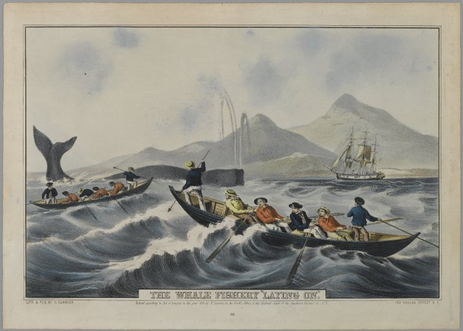

Figure 1-1: American whalers giving chase. For most of the nineteenth century the cleanest and brightest artificial light came from sperm whale oil, and the global hunt to supply it turned whaling into one of the largest industries of its age. By the 1850s the New England fleet was already running short of whales, and kerosene distilled from rock oil was waiting in the wings. (Source: [Nathaniel Currier, The Whale Fishery 'Laying On' circa 1852, Brooklyn Museum (public domain)](https://commons.wikimedia.org/wiki/File:Brooklyn_Museum_-_The_Whale_Fishery_%22Laying_On%22_-_Nathaniel_Currier.jpg))

People have used oil obtained from the ground since at least 4,000 BC. In the Middle East, crude oil that seeped to the surface was used to waterproof boats and as an adhesive in building construction. Crude was refined in minor quantities for lamp oil in China around 1,000 BC, though the technology did not survive into the modern era. By 600 AD, the Byzantines used crude oil to produce a flame-throwing naval weapon called Greek fire. But none of this was an industry. It was opportunistic use of surface seeps.

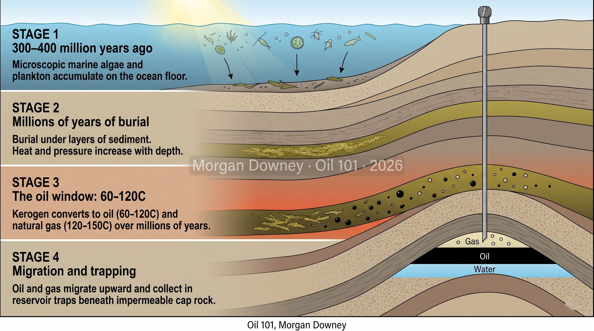

Figure 1-2: How oil formed: microscopic marine algae and plankton (not large animals, despite common depictions) accumulated on ancient ocean floors and were buried under layers of sediment over hundreds of millions of years. Heat and pressure converted the organic material (kerogen) into oil in the 60-120C temperature window, and into natural gas at higher temperatures. The hydrocarbons migrated upward through porous rock until trapped beneath an impermeable cap rock. (Source: Oil 101, Morgan Downey)

In the 1840s, a Pennsylvania salt miner named Samuel Kier noticed that his salt wells were fouled at the surface by an oily liquid. After seeing Seneca Indians use the oil as a liniment, Kier decided to commercially market the waste product as medicinal Seneca Oil or Rock Oil. In 1854, George Bissell and his business partners sent a sample of rock oil, skimmed from a surface pool in northwestern Pennsylvania, to Professor Benjamin Silliman of Yale University. Silliman confirmed that the sample could be distilled into a lamp fuel, later called kerosene. Bissell raised capital for the Pennsylvania Rock Oil Company and hired a railroad conductor named Edwin Drake to drill. Drake had no military background; his colonel's title was invented by the company to impress the locals. On August 27, 1859, at Titusville, Drake struck oil at 69 feet. The well produced 15 barrels a day, and the modern oil industry began.

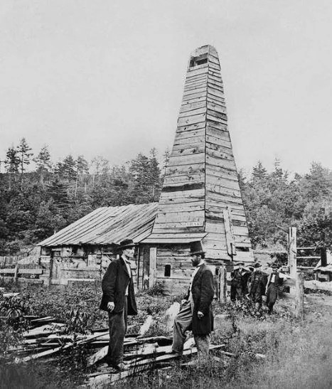

Figure 1-3: Edwin L. Drake (right, in top hat) at the site of the first US commercial oil well, Titusville, Pennsylvania, 1859. Drake's 69‑foot well launched the modern oil industry. (Source: [Wikimedia Commons (public domain)](https://commons.wikimedia.org/wiki/File:First_U.S._oil_rig_with_Edwin_Drake,_crop.jpg))

Within months, every farmer in Pennsylvania was drilling. Overproduction collapsed the price from $18 a barrel in January 1860 to ten cents by the end of 1861. It was the first of many boom-and-bust cycles that would shape the industry for the next 160 years. Out of this chaos emerged John D. Rockefeller and the Standard Oil Company, founded in 1870. By 1890, Standard Oil controlled 90% of US refining through a combination of ruthless price discipline, rebate deals with railroads, and relentless vertical integration. In 1911, the Supreme Court used the Sherman Antitrust Act to break Standard Oil into 34 separate companies. Three of those pieces eventually became ExxonMobil, Chevron, and ConocoPhillips. The 34-way breakup was also, indirectly, the origin of the modern US equities market: Standard Oil shareholders received a fractional share of each of the 34 companies, and the public market for those fragments had to be built from scratch.

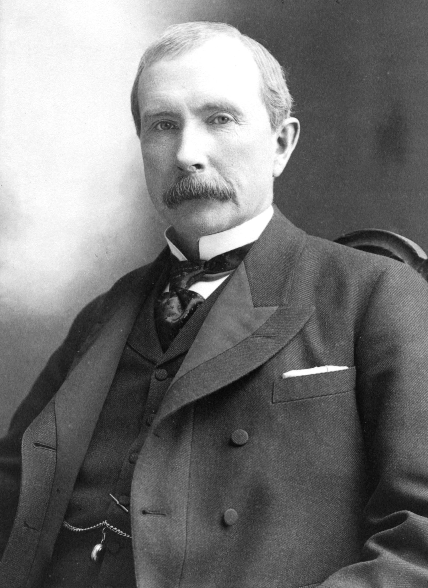

Figure 1-4: John D. Rockefeller, founder of Standard Oil. His 1870 to 1911 program of vertical integration built the template for the modern oil major and created, through its 1911 breakup, the original Seven Sisters. (Source: [Scientific American (1907) via Wikimedia Commons (public domain)](https://commons.wikimedia.org/wiki/File:Portrait_of_J._D._Rockefeller.jpg))

Although whiskey and wine barrels were only briefly used to transport oil, the word barrel stuck. Standard Oil standardized the volume at 42 US gallons: two extra gallons over the 40-gallon whiskey barrel, to allow for evaporation and leakage during shipment. That 42 gallon barrel is still the unit of the modern oil market.

## International Origins: Baku, Persia, and Sumatra

The Pennsylvania story dominates most histories, but international oil has parallel origins. The oldest oil region in the world is around Baku, on the Caspian Sea in what is now Azerbaijan. Oil had seeped to the surface there for centuries, and primitive hand-dug wells supplied local markets as early as the 1840s. In 1872, the Russian empire opened Baku to private investment, and by 1900 the region produced half of the world's oil. The Nobel brothers (yes, those Nobels) and the Rothschilds built competing oil empires there. The Nobel family fortune, which funds the Nobel Prizes, came in large part from Caspian oil.

In 1908, after years of hunting, William Knox D'Arcy's geologists struck oil at Masjed Soleyman in southwestern Persia. The discovery was so significant that the British government took a majority stake in the new Anglo-Persian Oil Company the following year. Anglo-Persian later renamed itself Anglo-Iranian, then British Petroleum, then BP. Persia was the first strategic oil discovery of the twentieth century, and it tied British military and foreign policy to the Middle East in ways that would define the next century.

In the Dutch East Indies, a tobacco planter named Aeilko Zijlker noticed an oily sheen on a leaf at Telaga Tiga in Sumatra in 1880. The discovery well drilled there in 1885 led to the founding of the Royal Dutch Company, which in 1907 merged with the UK-based Shell Transport and Trading to form Royal Dutch Shell. By 1911, when Standard Oil was broken up, three of the major international oil companies (Anglo-Persian, Royal Dutch Shell, and the Standard Oil successor companies) were already in place. Together with Gulf Oil, Texaco, and two other Standard offspring, they would become the Seven Sisters that dominated the industry for the next sixty years.

## World War I and the Navy Switch to Oil

Before 1914, oil was primarily a lamp fuel and a lubricant. That changed during the run-up to the First World War. Winston Churchill, as First Lord of the Admiralty, decided in 1911 to convert the Royal Navy from coal-fired to oil-fired propulsion. Oil burned hotter, took up less space, could be moved between bunkers without shoveling, and gave British battleships a decisive speed advantage over the coal-fired German fleet. The catch was that Britain had plenty of coal but almost no oil. To secure supply, the British government took a 51% stake in the Anglo-Persian Oil Company in 1914, just weeks before war broke out. The decision tied British strategic policy to Middle Eastern oil and made clear, for the first time, that oil was no longer just a commodity. It was a war-winning input.

The war itself proved the point. Allied tanks, trucks, ships, and aircraft ran on gasoline and diesel. At the Paris Peace Conference, the French Senator Henri Bérenger summed it up: "Oil, the blood of the earth, was the blood of victory." The Wright brothers had flown on gasoline in 1903, and by 1918 military aviation was a core part of every major army. The modern oil industry's transition from lamp oil to transport fuel was complete.

Figure 1-5: Ford Model T assembly line, Copenhagen, 1923. Mass production on moving assembly lines like this one turned gasoline from a refinery waste product into the world's most valuable fuel. By 1950, transport fuels accounted for two-thirds of crude consumption. (Source: [Peter Elfelt / Danish Royal Library via Wikimedia Commons (public domain)](https://commons.wikimedia.org/wiki/File:Ford_assembly_line_in_Copenhagen_1923.jpg))

## The Texas Railroad Commission and Achnacarry

Between the two world wars, the oil industry had a structural problem: too much oil. New fields were being found faster than demand could absorb them. The 1901 Spindletop discovery near Beaumont had started the Texas boom. Over the next three decades, giant fields in East Texas, Oklahoma, and California turned the US into the world's largest producer and chronic oversupplier. Prices crashed repeatedly. In 1928, the heads of the most powerful international oil companies met for a grouse shoot at Achnacarry Castle in Scotland and signed the As-Is Agreement: the oilmen agreed not to compete against each other outside the US and to keep each other's global market shares frozen in place. The agreement was the prototype for every subsequent oil producer cartel. It eventually failed because the signatories did not control enough of the market to enforce it.

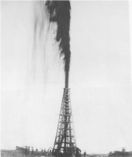

Figure 1-6: The Lucas Gusher at Spindletop, Texas, January 10, 1901. For nine days the well blew oil 150 feet into the air at an estimated 100,000 barrels per day, more than every other well in the United States combined. It launched the Texas oil boom. (Source: Oil 101, Morgan Downey)

In the US, the problem was solved differently. In 1930, a wildcatter named Dad Joiner discovered the East Texas field, the largest US oil discovery of its time. The resulting gusher glut collapsed prices to ten cents a barrel. The Texas Railroad Commission (TRC), originally created to regulate railroads, was given authority to impose production restrictions on Texas oil wells, ostensibly to prevent physical waste. For the next 40 years, the TRC effectively set the world oil price by adjusting allowable Texas production. Its control of spare capacity made it the arbiter of global oil pricing from 1931 through 1971. The OPEC model of managing spare capacity was, in its structural essentials, a direct copy of the TRC model.

## The Seven Sisters and OPEC's Founding

Outside the US, international oil was dominated by the Seven Sisters, the Western oil majors that emerged from Standard Oil, Royal Dutch Shell, and Anglo-Persian. They held long-term concessions with producing nations, typically on a 50/50 profit-sharing basis, and operated as a de facto cartel. The table below shows the original Seven Sisters and their post-merger descendants.

| Seven Sister (original) | Origin | Modern descendant |
| --- | --- | --- |
| Standard Oil of New Jersey (Esso, Exxon) | 1911 Standard breakup | ExxonMobil |
| Standard Oil of New York (Socony, Mobil) | 1911 Standard breakup | ExxonMobil |
| Standard Oil of California (SoCal, Chevron) | 1911 Standard breakup | Chevron |
| Gulf Oil | Pittsburgh, Spindletop era | Chevron (1984 merger) |
| Texaco | Texas, 1902 | Chevron (2001 merger) |
| Royal Dutch Shell | Dutch East Indies + UK, 1907 | Shell plc |
| Anglo-Persian Oil Company | Persia, 1908 | BP |

OPEC, the Organization of the Petroleum Exporting Countries, was founded on September 14, 1960 in Baghdad by five producing nations tired of watching the Seven Sisters set the posted price of their oil without consulting them. The five founders were Iran, Iraq, Kuwait, Saudi Arabia, and Venezuela. The Venezuelan oil minister Juan Pablo Pérez Alfonzo was the intellectual architect of the alliance, having studied the TRC model closely. OPEC's founding charter borrowed the TRC's language of production prorationing almost verbatim.

| OPEC founding member (1960) | Joined |
| --- | --- |
| Iran | September 1960 |
| Iraq | September 1960 |
| Kuwait | September 1960 |
| Saudi Arabia | September 1960 |
| Venezuela | September 1960 |

Figure 1-7: Juan Pablo Pérez Alfonzo of Venezuela, one of the five OPEC founders at Baghdad in September 1960. He studied the Texas Railroad Commission model and borrowed its production-prorationing logic almost verbatim. (Source: [Wikimedia Commons (public domain, Venezuela)](https://commons.wikimedia.org/wiki/File:Juan_Pablo_P%C3%A9rez_Alfonzo_(1964).jpg))

During the 1960s, OPEC had little pricing power. Western majors still controlled production and the TRC still controlled global pricing. That changed in 1970 when US oil production peaked and began to decline. Suddenly the US had no spare capacity to bring online, and the TRC's pricing role passed, almost literally overnight, to OPEC.

## Mossadegh, the Abadan Crisis, and the 1953 Coup

In 1951, Iran's democratically elected Prime Minister Mohammad Mossadegh nationalized the Anglo-Iranian Oil Company (later BP), which had controlled Iranian oil since the 1908 Persia discovery. Britain responded with a worldwide boycott of Iranian oil, blockading the Abadan refinery (then the world's largest). Iranian oil production collapsed from 666,000 barrels per day in 1950 to almost nothing in 1952. In August 1953, a joint CIA-MI6 operation codenamed Ajax overthrew Mossadegh and restored the Shah to power. A new consortium of Western oil companies (Anglo-Iranian, Shell, the four American majors, and the French CFP) took over Iranian production under a 40% profit-sharing split with Iran. The coup secured Western access to Iranian oil for another 25 years, but it also poisoned the US-Iran relationship permanently and set the stage for the 1979 revolution.

## Enrico Mattei and the 25/75 Break

In 1957, Enrico Mattei, the head of the Italian state oil company ENI, broke the Seven Sisters' 50/50 profit-sharing formula by offering Iran a 25/75 split in Iran's favor. Mattei understood that the 50/50 formula was an artifact of cartel discipline, not a law of nature, and that a hungrier outsider could undercut it. The Sisters were furious. Every producing nation immediately demanded 25/75 terms of its own. The 25/75 break was the first crack in the Western oil majors' pricing power and the philosophical foundation for OPEC three years later. Mattei died in a suspicious plane crash near Milan in 1962. The crash was ruled an accident for decades; an Italian investigation in 1997 found that the wreckage showed clear evidence of sabotage.

## 1971: The Tehran Agreement and the Nixon Gold Standard

Two events in 1971, three months apart, reset the entire oil system. In February, OPEC negotiators met with Western oil companies in Tehran and demanded a posted-price increase of 35 cents per barrel, along with the right to unilaterally revise posted prices over the life of the agreement. The Tehran Agreement was the first time producing nations dictated terms to the Seven Sisters, rather than the other way around. In August, President Nixon closed the gold window and effectively ended the Bretton Woods system. The US dollar, in which all international oil was priced, was no longer convertible to gold at a fixed rate. Over the next 18 months, the dollar depreciated sharply against every major currency. OPEC producers, who received dollars for their oil and spent them in Europe and Japan, watched their real purchasing power drop in lockstep. By 1973, OPEC members were explicitly linking their demands for oil price increases to the dollar's decline against gold and against the deutsche mark. The 1973 Arab oil embargo, when it came, was partly a geopolitical response to the Yom Kippur War and partly a monetary response to the end of Bretton Woods.

Oil Statistics (2024)

World Production (Total Liquids)

World Consumption

Largest Net Importers

Proved Reserves

Refining Capacity

Consumption per Capita

| Region | Bbl/person/yr |
| --- | --- |
| US | 22.1 |
| Europe (EU) | 10.2 |
| Global average | 4.7 |
| China | 4.3 |
| India | 1.4 |

Low US population density means public transport is not common.

Figure 1-8: The global oil industry at a glance. Production shows total liquids (crude oil plus NGLs, refinery gain, and biofuels), not crude alone. On this basis the US produces roughly 21 Mbpd and consumes roughly 20 Mbpd, making it a slight net exporter since 2020. China and Europe are the largest net importers, together accounting for over half of global net import flows. Venezuela holds the largest proved reserves on paper, though most of it is extra-heavy crude expensive to extract. Sources: EIA International Energy Statistics, EI Statistical Review, 2024 data.

## The Oil Shocks and Demand Destruction

On October 16, 1973, Arab OPEC members imposed an oil embargo against the US and the Netherlands in response to Western support for Israel in the Yom Kippur War. The embargo cut world supply by five to ten percent almost overnight. The price of crude rose fourfold, from around $3 to around $12 per barrel, between October 1973 and January 1974. It was the first and only time the Arab oil weapon has been used. The second oil shock followed in 1978 to 1981. The Iranian revolution, the overthrow of the Shah, the US embassy hostage crisis, and the Iran-Iraq war pushed crude to over $38 per barrel by 1980, which was over $140 in 2025 dollars. US oil spending climbed to over 8% of GDP.

The oil shocks introduced a concept that economists still debate today: demand destruction. When the share of GDP spent on oil exceeds roughly 4%, economies enter recession and oil demand collapses. The 1973-74 shock pushed the US over 6% of GDP; the 1979-81 shock pushed it over 8%. Both coincided with severe US recessions. The 2008 oil spike pushed the share over 6% again and contributed to the financial crisis. The 4% rule is not precise but it is a useful early-warning indicator: if oil consumption as a share of GDP is climbing through 4%, the market is destabilizing.

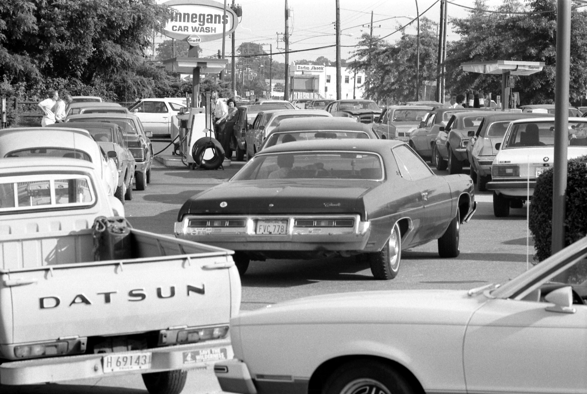

Figure 1-9: Gasoline rationing lines in the United States during the 1979 oil crisis. The second shock pushed US oil spending above 8% of GDP and triggered a deep global recession. (Source: [Warren K. Leffler / US News and World Report via Library of Congress and Wikimedia Commons (public domain)](https://commons.wikimedia.org/wiki/File:Line_at_a_gas_station,_June_15,_1979.jpg))

The nationalization of oil resources accelerated through the 1970s. The International Energy Agency (IEA) was formed in 1974 to coordinate Western consumer country responses. President Gerald Ford established the US Strategic Petroleum Reserve in 1975. Contrary to popular perception, there was no global physical shortage during the 1970s shocks. Price controls in individual consumer countries created artificial localized shortages, which were the gas station lines everyone remembers.

## NYMEX, Formula Pricing, and the 1986 Counter-Shock

Before the 1970s, oil traded almost entirely on long-term contracts at posted prices. Spot trading and hedging as we now know them did not exist. The oil shocks changed that. In 1978, heating oil futures began trading on the New York Mercantile Exchange (NYMEX). Gasoline futures followed in 1981 and crude oil futures in 1983. WTI futures on NYMEX quickly became the global benchmark for light sweet crude. For the first time, a transparent, public, forward-looking oil price existed, and every producer and consumer had to adapt.

The other innovation of the 1980s was formula netback pricing. Instead of quoting a fixed price for a grade of crude, producers priced their oil against a benchmark (Brent, WTI, or Dubai) plus or minus an adjustment for quality and location. Formula pricing is still the dominant way physical crude is traded today and is covered in [Chapter 17 (Oil Prices)](#chapter-oil-prices).

By 1985, Saudi Arabia was the only OPEC member honoring its quota. Production had been cut from 10.5 million barrels per day to 2 million barrels per day to support cartel prices, while other members cheated openly. In August 1985, the Saudis ran out of patience and announced they would move to formula netback pricing and rebuild market share. Production rose to 5 million barrels per day, and within a year oil prices collapsed more than 70%, from $30 to under $10. The 1986 counter-shock effectively bankrupted the Soviet Union (whose economy depended on oil revenue) and nearly bankrupted the US oil industry. It also opened the long low-price era that lasted until 2003.

Figure 1-10: Annual Average WTI (or Equivalent), 1970-2026

Supply shocks

Demand shocks

Structural breaks

1973: Arab Embargo1979: Iran Crisis1986: Saudi Counter-Shock1990: Iraq Invades Kuwait1998: Asian Crisis, $10 Oil2008: Financial Crisis2014: Shale Bust2020: COVID Crash2022: Russia Invasion

Seven decades, four eras. Oil prices in nominal US dollars, averaged by year. Pre-1983 values are Arabian Light posted prices; 1983 forward is WTI. The chart is a reference of shape, not a precise monthly series. Three regimes stand out: the oil shock era (1973 to the early 1980s, when prices were set by OPEC and by war), the long low-price era after the Saudi 1986 counter-shock, and the China supercycle that took prices from $25 to $140 between 2003 and 2008 and marked the moment when OPEC's buffer of spare capacity effectively ran out. Everything after 2014 is the shale revolution reshaping the balance. Click any dot or legend row to highlight the corresponding shock on the chart.

## 1990 to 2008: Low Prices, Asian Crisis, and the Supercycle

Iraq's invasion of Kuwait in August 1990 briefly doubled oil prices. The First Gulf War was short, and prices settled back. For most of the 1990s, oil was cheap. The 1997 Asian financial crisis, which started in Thailand and cascaded through Korea, Indonesia, and Russia, crushed Asian oil demand just as OPEC members were expanding production. By December 1998, WTI traded at $10.72 per barrel, the lowest inflation-adjusted price in half a century. OPEC responded with a coordinated production cut in early 1999, and the next decade told a completely different story.

From 2003 to 2008, Chinese demand growth, sustained by a construction and infrastructure boom, pushed oil prices from $25 to a peak of over $140 per barrel in July 2008. It was the longest and steepest oil price rally in modern history. By 2005, demand had finally caught up with OPEC's 35-year buffer of spare capacity. For the first time since the 1860s, there was effectively no cushion against an unexpected supply outage. The 2008 financial crisis ended the rally abruptly. Prices collapsed from $147 in July to $32 by December, a move that broke several major banks and at least one hedge fund.

Figure 1-11: Global Oil Demand by Region, 1965 to 2025 (Million Barrels per Day)

North America

Europe

China

Other Asia-Pacific

Middle East

Rest of World

Sources: IEA, EIA, Energy Institute Statistical Review of World Energy

The post-2005 demand shift. OECD demand (North America and Europe) peaked around 2005 at roughly 50 million barrels per day and has been flat to declining since. All incremental growth has come from non-OECD countries, led by China, which grew from under 5 Mbpd in 2000 to 17 Mbpd by 2025. The COVID-19 pandemic caused the sharpest single-year demand drop in history, but global consumption had recovered to pre-pandemic levels by 2023 and reached 104 Mbpd by 2025. Illustrative annual data consistent with IEA and EIA reporting.

> In 1930, we found 10 billion new barrels of oil in the world, and we used 1.5 billion. We reached a peak in 1964, when we found 48 billion barrels and used roughly 12 billion. In 1988, we found 23 billion barrels and used 23 billion barrels. In 2007, we found perhaps 6 to 7 billion, and we used 31 billion.

## 2009 to 2026: The Shale Revolution, OPEC+, and Negative Oil

The sections below are new to the 2nd edition, covering events since the original publication.

Since the first edition of Oil 101 in 2009, the industry has been reshaped more than in any period since the 1970s. The US shale revolution, covered in [Chapter 21 (Shale Revolution)](#chapter-shale-revolution), combined horizontal drilling, hydraulic fracturing, and just-in-time operational learning to turn the world's largest oil importer into the world's largest producer. US crude output rose from 5 million barrels per day in 2008 to over 13 million by 2024. The US crude export ban, in place since 1975, was lifted in December 2015, and by 2023 the US exported 4 million barrels per day of crude and another 6 million of refined products.

OPEC was forced to adapt. In 2016, OPEC partnered with Russia and nine other non-member producers to form OPEC+, the broadest supply-management agreement in oil market history. The alliance has managed production cuts and increases through multiple crises. Its biggest test came in April 2020, when the COVID demand collapse met a brief Saudi-Russia price war. On April 20, 2020, the front-month WTI futures contract settled at negative $37.63 per barrel, an event most of the industry had considered mathematically impossible. Cushing storage ran out and longs holding the expiring contract had to pay someone to take physical delivery. The event is explored in [Chapter 23 (Negative Prices)](#chapter-negative-prices).

Figure 1-12: OPEC Crude Oil Production, 1960 to 2025 (Million Barrels per Day)

Sources: OPEC Annual Statistical Bulletin, EIA, Energy Institute Statistical Review

OPEC production across six decades. From its founding in 1960 with 8.7 million barrels per day, OPEC grew to dominate global supply by 1973. The 1973 embargo, 1979 Iranian revolution, and 1980 Iran-Iraq war created wild swings. Saudi Arabia's 1985 decision to recapture market share crashed prices and forced the quota system. The 2003 to 2014 China supercycle lifted all producers. Since 2016, the OPEC+ alliance with Russia and other non-members has managed production through coordinated cuts. COVID-19 drove the sharpest cut in OPEC history, and production remains managed as of 2025. Illustrative data consistent with OPEC and EIA reporting.

The energy transition debate has intensified. Electric vehicle adoption has accelerated, especially in China and Europe. The concept of Energy Return on Investment (EROI) - the ratio of energy extracted to energy invested - has re-emerged as a framework for evaluating the transition. Early Pennsylvania wells in the 1860s returned over 100 units of energy per unit invested. Conventional onshore crude today returns 15 to 25 units. Oil sands return 3 to 5. The declining EROI of oil, combined with the rising EROI of solar and wind (which have crossed above gas for most applications), is one of the structural forces pushing the transition. [Chapter 25 (Energy Transition)](#chapter-energy-transition) takes this up.

Yet global oil demand has continued to grow, passing 100 million barrels per day in 2023 and approaching 104 million by 2026. The question is no longer whether oil demand will peak, but when, and how steep the decline will be. The shape of the WTI forward curve, whether in contango or backwardation, reflects the market's real-time view on that question. It is covered in [Chapter 18 (Futures and Swaps)](#chapter-futures-swaps).

## Timeline: Key Events in Oil History

Table 1-1: Major events in oil market history, 1859 to 2026

| Year | Event | Price impact |
| --- | --- | --- |
| 1859 | Drake Well, Titusville, Pennsylvania: first commercial oil well in the US | $20/bbl initial; collapsed to $0.10 within two years on oversupply |
| 1870 | Rockefeller founds Standard Oil, begins consolidating US refining | Stabilized prices through monopoly control of refining and transport |
| 1901 | Spindletop gusher in Texas: birth of the modern oil industry | Texas crude fell to $0.03/bbl on flood of supply |
| 1908 | Discovery of oil in Persia (Iran): first major Middle East find | Shifted global supply center eastward over the next 50 years |
| 1911 | US Supreme Court breaks up Standard Oil into 34 companies | Created ExxonMobil, Chevron, and other majors that exist today |
| 1928 | Red Line Agreement and Achnacarry “As-Is” Agreement among the Seven Sisters | Cartel pricing: stable, low prices for 40 years |
| 1938 | Discovery of oil in Saudi Arabia (Dammam No. 7) | Would eventually make Saudi Arabia the world’s swing producer |
| 1960 | OPEC founded in Baghdad by five members | No immediate price impact; producers began asserting sovereignty |
| 1971 | Tehran Agreement; Nixon closes the gold window, ending Bretton Woods | Dollar depreciation eroded OPEC purchasing power, fueling price demands |
| 1973 | Arab oil embargo against the US and Netherlands (Yom Kippur War) | Crude quadrupled from $3 to $12 within months |
| 1979 | Iranian Revolution cuts 5.5 Mbpd of supply; panic buying | Crude doubled from $15 to $35; second oil shock |
| 1983 | WTI crude oil futures begin trading on NYMEX | First transparent, forward-looking oil price; foundation of modern markets |
| 1986 | Saudi Arabia abandons swing role; oil prices collapse 70% | WTI fell from $30 to under $10; bankrupted the Soviet oil economy |
| 1990 | Iraq invades Kuwait; Gulf War | Prices briefly doubled, then returned to pre-war levels within months |
| 1998 | Asian financial crisis plus OPEC overproduction | WTI hit $10.72, lowest inflation-adjusted price in 50 years |
| 2003 | China supercycle begins; demand growth outpaces spare capacity | WTI rose from $25 to $147 over five years |
| 2008 | WTI peaks at $147 in July; global financial crisis collapses demand | Fell from $147 to $32 in five months |
| 2014 | OPEC decides not to cut production; price war against US shale | WTI fell from $100 to $26 over 18 months |
| 2015 | US crude export ban lifted after 40 years | US exports grew from zero to 4+ Mbpd by 2024 |
| 2016 | OPEC+ formed: OPEC partners with Russia and 9 other non-members | Managed production cuts stabilized prices above $50 |
| 2020 | COVID-19 collapses demand; WTI settles at negative $37.63 on April 20 | First negative oil price in history; Cushing storage full |
| 2022 | Russia invades Ukraine; EU sanctions Russian crude and diesel | Brent spiked to $130; diesel cracks hit record $55/bbl |
| 2026 | Iran blocks the Strait of Hormuz; largest supply disruption since 1979 | Brent surpassed $126; Dubai crude hit $166; IEA released 400M bbl from strategic reserves |

Oil history runs in cycles: scarcity and abundance, boom and bust, innovation and disruption. Knowing the cycles is how you read where markets go next. The chapters that follow give you the tools to do that.

The above was updated in 2026. For the full original 2009 chapter, [download the 1st edition 2009 PDF](/api/download/pdf).

Morgan Downey’s Commodity News

### Read what a commodity trader reads

A free morning brief on the oil, gas, and commodity markets, written by Morgan Downey, author of Oil 101. One email, every morning.

[Subscribe free →](https://boxwoodapp.com/news/subscribe)

<!-- rl-section id="chapter-crude-oil-assay" class="chapter" kicker="Chapter 2" title="A Crude Oil Assay" -->

## A Crude Oil Assay

Chapter 2

# A Crude Oil Assay

Crude oil classification explained: API gravity, sulfur content, TAN, and the spectrum from light sweet to heavy sour grades.

<svg fill="none" height="18" stroke="currentColor" stroke-linecap="round" stroke-linejoin="round" stroke-width="2" viewbox="0 0 24 24" width="18"><path d="M3 18v-6a9 9 0 0 1 18 0v6"></path><path d="M21 19a2 2 0 0 1-2 2h-1a2 2 0 0 1-2-2v-3a2 2 0 0 1 2-2h3zM3 19a2 2 0 0 0 2 2h1a2 2 0 0 0 2-2v-3a2 2 0 0 0-2-2H3z"></path></svg>Listen· 18:41

## What Is a Crude Oil Assay?

Crude oil is literally crude. To be useful, it must be processed in a refinery to separate out finished products: gasoline, diesel, jet fuel, heating oil, and residual fuel. Several hundred distinct grades of crude oil are produced worldwide, each with its own chemical fingerprint. Crude is not always black. It can be straw-colored, greenish, amber, or dark brown, and its viscosity can range from water-like to nearly solid.

The characteristics of an individual grade are documented in an analysis called an **assay**, prepared on behalf of the producer for sales purposes. An assay outlines the properties a refiner cares about most: expected yields of each finished product, density, sulfur content, acidity, viscosity, metals, salt, and water. Crude delivered outside its tight assay specifications is called “off spec” and can trigger expensive delays, forced re-routing to a refinery that can accept it, or steep discounts. A tanker carrying crude with no ready buyer is a “distressed cargo” and typically trades at a meaningful discount to the benchmark.

Figure 2-1: A glass hydrometer of the kind used to measure crude oil density in the field. Weighted at the bottom with lead shot, it floats higher in denser liquids; the reading is taken at the liquid surface along the calibrated stem. (Source: [Wikimedia Commons, public domain](https://commons.wikimedia.org/wiki/File:Hydrometer.jpg))

## Fields, Streams, and Blends

Before discussing density and sulfur, it helps to understand where a barrel of crude actually comes from. A crude oil reservoir does not resemble an underground lake. Instead, oil is trapped between grains of sand or within tiny pores inside an otherwise solid rock matrix, like a rigid finely perforated sponge. An **oilfield** is an area containing a single reservoir or a group of reservoirs tied to the same geological structure, typically drained by a group of wells.

Production from a group of wells on one field is gathered and sent through a pipeline as a **stream**: raw wellhead crude with relatively stable properties that change only slowly over the life of the field. Streams from different pipelines are then combined to create a **blend**, the commercially traded marker. Blending serves two purposes: it pools enough volume to justify long-distance pipeline and tanker economics, and it smooths out extreme characteristics, such as very high sulfur or acidity, from any one stream. Brent Blend, for example, is named after the original Brent stream in the UK North Sea but today aggregates crude from several fields. Kirkuk Crude is named after the nearby Iraqi city. WTI is an aggregation of dozens of light-sweet streams gathered at Cushing, Oklahoma.

Table 2-1: Marker crudes: blends versus fields

| Marker | Type | Typical API | Typical sulfur |
| --- | --- | --- | --- |
| **WTI** | Blend of many US light-sweet streams, hubbed at Cushing | 40° | 0.24% |
| **Brent** | Blend of several North Sea streams (BFOET) | 38° | 0.37% |
| **Dubai** | Blend, Middle East sour benchmark | 31° | 2.0% |
| **Maya** | Mexican heavy-sour blend | 22° | 3.4% |
| **Urals** | Russian export blend (Volga-Urals plus Western Siberia) | 31° | 1.5% |

Most oilfields are modest: most produce under 100,000 barrels per day, and a long tail of marginal “stripper” wells yield ten barrels per day or less. Production is highly concentrated in a small number of very large fields. The IEA’s 2008 World Energy Outlook identified roughly **317 super-giant and giant fields** supplying around 60% of global output, and subsequent IEA work still puts modern concentration in the same order of magnitude. The most famous is the Ghawar super-giant in Saudi Arabia, discovered in 1948, which at its peak produced close to 6 million bpd and remains the world’s largest producing field today by a hefty margin.

Table 2-2: Oilfield size hierarchy (recoverable reserves)

| Category | Recoverable reserves | Examples |
| --- | --- | --- |
| **Super-giant** | above 5 bil bbl | Ghawar (Saudi Arabia), Burgan (Kuwait), Safaniya (Saudi Arabia) |
| **Giant** | 500 mil to 5 bil bbl | Prudhoe Bay (Alaska), Cantarell (Mexico), Daqing (China) |
| **Large** | 100 mil to 500 mil bbl | many North Sea, West African, Gulf of Mexico fields |
| **Medium** | 10 mil to 100 mil bbl | typical mature onshore development |
| **Small** | below 10 mil bbl | marginal and stripper wells, tens of thousands worldwide |

## Density: The Most Important Property

Density is the single most important physical characteristic in an assay because it signals which hydrocarbon molecules are in the crude and therefore which products it will yield when refined. Heavy crudes are denser because they contain larger, longer hydrocarbon molecules with more carbon atoms. Lighter crude is generally more valuable: it readily yields a higher proportion of high-value products like gasoline, diesel, and jet fuel, and less residual fuel and bitumen.

Density also varies with temperature and pressure. A tanker loaded in a cold climate and discharged in a warm one weighs the same but occupies slightly more volume on arrival, which is why assayed densities are always quoted at a reference temperature.

### Three measurements of density

The oil industry uses three interconvertible measurements of density, all typically quoted at 60 degrees F (roughly 15 degrees C) and 1 atmosphere:

- **Metric density** in kilograms per cubic meter (kg/m3). Water is 1000 kg/m3. This is the SI measurement and is used in most engineering and scientific work.
- **Specific gravity**(SG), also called relative density. The dimensionless ratio of the liquid’s density to the density of water at 60 degrees F. Water equals exactly 1.000. Anything lighter than water floats; anything heavier sinks.
- **API gravity**, an inverted index created by the American Petroleum Institute in 1921. The formula is deg API = (141.5 / SG) minus 131.5. Bigger number equals lighter crude.

All three measure the same physical property. API gravity became the industry standard because its inverted scale is convenient: a higher number corresponds to a lighter, more valuable crude, which matches traders’ and refiners’ intuition. [Chapter 18 (Futures and Swaps)](#chapter-futures-swaps) covers how API gravity enters quality differentials in futures contracts.

**Worked example: WTI.** WTI is quoted at 39.6 degrees API. Rearranging the formula: SG = 141.5 / (39.6 + 131.5) = 141.5 / 171.1 = 0.827. Multiply by 1000 and WTI has a density of roughly 827 kg/m3, which is why a barrel of WTI (42 US gallons, or 159 liters) weighs about 131 kilograms rather than the 159 kilograms a barrel of water would weigh.

Table 2-3: API gravity, specific gravity, and metric density (60 deg F, 1 atm)

| API gravity (deg) | Specific gravity | Density (kg/m3) |
| --- | --- | --- |
| 10 | 1.000 | 1000 |
| 15 | 0.966 | 966 |
| 20 | 0.934 | 934 |
| 25 | 0.904 | 904 |
| 30 | 0.876 | 876 |
| 35 | 0.850 | 850 |
| 40 | 0.825 | 825 |
| 45 | 0.802 | 802 |
| 50 | 0.780 | 780 |
| 60 | 0.739 | 739 |

### Hydrometers and the Archimedes principle

Specific gravity and API gravity are read in the field with a simple instrument called a **hydrometer**, a weighted glass tube calibrated in density units. In a practical application of the Archimedes principle, the hydrometer sinks until the weight of fluid it displaces equals its own weight: it rides high in a dense liquid and low in a thin one. A thermometer is often built into the stem (a thermohydrometer) so readings can be corrected back to the 60 degrees F reference temperature. The concept predates modern crude markets. Antoine Baume introduced his eponymous scale in 1768, and the American Petroleum Institute standardized the modern API scale in 1921.

### API density classification

Table 2-4: API density classification of crude oils

| Class | API gravity | Example | Refining implication |
| --- | --- | --- | --- |
| **Light** | >31° | WTI, Brent, Bonny Light | high gasoline, diesel, jet yield; any refinery can run it |
| **Medium** | 22-31° | Dubai, Arab Medium | balanced product slate; most global refineries configured for this |
| **Heavy** | 10-22° | Maya, Arab Heavy, Western Canadian Select | needs coker or hydrocracker to avoid large residual fuel yields |
| **Extra-heavy** | <10° | Venezuelan Orinoco bitumen | denser than water; requires diluent to move in a pipeline |

Figure 2-2: Global Crude Production by API Gravity Band

Illustrative distribution. Percentages are approximate shares of global crude and condensate production. Source: industry estimates, EI Statistical Review.

Crudes in the 30 to 39 degree API range are most commonly produced and in highest demand, because most refineries are configured to run them. WTI, traded on NYMEX, sits at 39.6 degrees API. Brent Blend is slightly heavier at around 38. Some crudes carry “light” in the marketing name even though they are technically medium: Saudi Arabia’s Arab Light, most of which comes from Ghawar, is about 34 degrees API.

> Condensates above 50 degrees API are sometimes called the “champagne of crude oils” because they are so easily refined into high-value products like gasoline. They are often processed in specialized condensate splitters rather than in full refineries (see [Chapter 7 (Refining)](#chapter-refining)).

## Sweet versus Sour: Sulfur Content

Sulfur is the second pillar of crude quality, and it lowers value in three ways. It displaces hydrocarbon molecules and reduces energy content per barrel. It corrodes metal piping, tanks, and refinery process units. And it becomes a regulated pollutant (sulfur dioxide, acid rain precursor) when burned, forcing refineries to install expensive hydrotreaters to strip it out before fuels can be sold.

Crude is classified by sulfur content by weight. The term “sour” references the distinctive rotten-egg smell of sulfur-laden crude, caused by hydrogen sulfide and mercaptans. At extremes, crudes tend to be either light-sweet or heavy-sour, because sulfur preferentially binds to larger, more complex hydrocarbon molecules. For the same reason, light products such as gasoline, diesel, and jet have lower intrinsic sulfur than heavy residual fuel and bitumen.

Table 2-5: Sulfur classification of crude oils

| Class | Sulfur (% by weight) | Example |
| --- | --- | --- |
| **Sweet** | below 0.5% | WTI (0.24%), Brent (0.37%), Bonny Light |
| **Medium-sour** | 0.5% to 2.0% | Urals (1.5%), Oman Blend |
| **Sour** | above 2.0% | Dubai (2.0%), Arab Heavy (3.1%), Maya (3.4%) |

## The Crude Quality Matrix

Plotting API gravity against sulfur gives the canonical two-dimensional map of crude quality. The most valuable corner is bottom-right: light and sweet, easy to refine into clean high-value products, deliverable into both WTI and Brent futures contracts. The least valuable corner is top-left: heavy and sour, requiring complex refineries with cokers and deep hydrotreating, and trading at persistent discounts to the light-sweet markers. [Chapter 17 (Oil Prices)](#chapter-oil-prices) picks up how these quality differentials get priced.

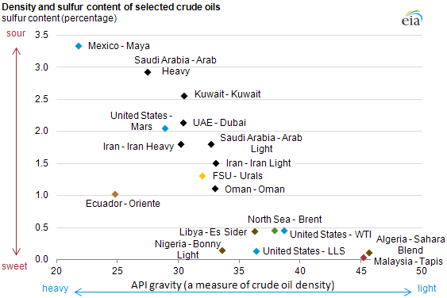

Figure 2-3: The crude oil quality matrix: API gravity on the horizontal axis (heavy left, light right), sulfur on the vertical (sweet bottom, sour top). The four quadrants (light-sweet, light-sour, heavy-sweet, heavy-sour) each have their own economics and buyer base. WTI and Brent anchor the light-sweet corner; Maya and heavy Canadian grades sit in the heavy-sour quadrant. (Source: [EIA Today in Energy](https://www.eia.gov/todayinenergy/detail.php?id=7110), July 16, 2012)

The four quadrants each have recognizable residents:

- **Light-sweet:** WTI, Brent, Bonny Light, Saharan Blend. Premium pricing; any refinery can run them.
- **Light-sour:** Oman Blend, Arab Extra Light. High middle-distillate yield but needs hydrotreating.
- **Heavy-sweet:**rare; examples include Chad’s Doba and Angolan Dalia. Often carries high acidity to compensate, which offsets the low-sulfur advantage.
- **Heavy-sour:** Maya, Arab Heavy, Dubai, Western Canadian Select. The cheapest crude per barrel, but only complex refineries with coking and deep hydrotreating can profitably process it.

The proportion of sour crude in global production has been increasing as a larger share of new supply is heavy oil sands, Latin American heavy, and Middle East sour. US refineries, which are the most complex in the world, are the natural home for that barrel.

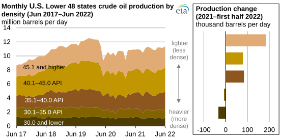

Figure 2-4: The US shale revolution sharply tilted domestic production toward lighter crude grades, reshaping the country's assay mix and forcing Gulf Coast refineries (originally reconfigured for heavy sour imports) to adapt their slate. (Source: [EIA Today in Energy](https://www.eia.gov/todayinenergy/detail.php?id=54199), October 11, 2022)

## Acidity, Metals, and the Rest of the Assay Sheet

Beyond density and sulfur, a full assay sheet lists a long tail of properties that matter to a refiner writing a purchase contract.

**Total Acid Number (TAN)**, sometimes called the Neutralization Number, measures naphthenic acid content in milligrams of potassium hydroxide required to neutralize one gram of crude. Acids accumulate as bacteria in a reservoir biodegrade lighter hydrocarbons, which is why highly acidic crudes tend to also be heavy. Most refineries are set up to run crude with a TAN under 0.5. Anything above roughly 0.7 is flagged as highly acidic and carries a corrosion discount. Chad’s Doba blend, the Angolan Kuito and Hungo streams, and the North Sea Alba crude are well-known high-TAN grades. Doba has been assayed above 2.0.

**Vanadium and nickel** are metals that poison refinery catalysts, even in trace amounts, and concentrate in the heaviest fractions. Typical refinery intake limits are measured in tens to a few hundred parts per million combined. Heavy Venezuelan and Mexican crudes are particularly rich in vanadium.

**Viscosity** defines how easily a crude flows. Heavy crude is highly viscous because large hydrocarbon molecules tangle as they pass each other; it must often be heated or blended with a lighter diluent to move through a pipeline. Viscosity is measured in centistokes (cSt) at both 40 degrees C and 100 degrees C because it changes sharply with temperature. A 36 deg API crude might measure roughly 3.5 cSt at 40 deg C and 1.5 cSt at 100 deg C.

**Pour point** is the lowest temperature at which crude still behaves as a fluid and can be pumped. Below the pour point, waxy crudes gel and stop flowing, a serious hazard for tankers and pipelines in cold climates.

**Reid Vapor Pressure (RVP)**, measured in psi, captures the volatility of the light ends. A higher RVP suggests more valuable light products in the barrel, but gasoline RVP is capped by environmental rules because evaporating fuel is a major smog precursor.

**Carbon residue** (Conradson Carbon Residue, Ramsbottom, or Microcarbon tests) indicates how much solid, coal-like coke the crude will throw off in a refinery coker. Values between 0.5 and 1.0 are typically acceptable. **Asphaltenes**, the heaviest aromatic molecules in the barrel and responsible for crude’s dark color, are correlated with carbon residue and can clog pipes and produce undesirable shot coke at high concentrations.

**Nitrogen** matters because nitrogen oxides are a regulated tailpipe pollutant and nitrogen compounds can also poison refinery catalysts. **Salt** must be removed in a desalter before crude enters the atmospheric column, or it will corrode downstream piping. And **Basic Sediment and Water (BS&W)**is a catch-all for the water, dirt, and junk that arrives with the crude. Less than 1% BS&W by weight is the usual refinery intake spec. Before dewatering at the wellhead, the raw water cut can be well over ten barrels of water per barrel of oil for a mature field.

## Why the Assay Matters for Prices

Every property on an assay sheet eventually shows up as a price differential. WTI and Brent are light-sweet benchmarks; Dubai and Maya are heavy-sour benchmarks, and [Chapter 17 (Oil Prices)](#chapter-oil-prices)covers how those differentials trade. The spread widens when global refining capacity is tight on coking and hydrotreating, and narrows when complex refineries have spare capacity chasing cheap heavy barrels. A refinery’s willingness to pay for any specific cargo is a yield calculation driven by the assay: expected barrels of gasoline, diesel, jet, and residual fuel at prevailing product prices, minus the cost of processing sulfur, metals, acids, and anything else the barrel carries. Assays are the first step to understanding why seemingly similar crudes can trade dollars per barrel apart.

The above was updated in 2026. For the full original 2009 chapter, [download the 1st edition 2009 PDF](/api/download/pdf).

Morgan Downey’s Commodity News

### Read what a commodity trader reads

A free morning brief on the oil, gas, and commodity markets, written by Morgan Downey, author of Oil 101. One email, every morning.

[Subscribe free →](https://boxwoodapp.com/news/subscribe)

<!-- rl-section id="chapter-components" class="chapter" kicker="Chapter 3" title="Components of Oil Liquids" -->

## Components of Oil Liquids

Chapter 3

# Components of Oil Liquids

What counts as oil: crude, condensate, NGLs, biofuels, refinery gains, and how total oil liquids supply is measured globally.

<svg fill="none" height="18" stroke="currentColor" stroke-linecap="round" stroke-linejoin="round" stroke-width="2" viewbox="0 0 24 24" width="18"><path d="M3 18v-6a9 9 0 0 1 18 0v6"></path><path d="M21 19a2 2 0 0 1-2 2h-1a2 2 0 0 1-2-2v-3a2 2 0 0 1 2-2h3zM3 19a2 2 0 0 0 2 2h1a2 2 0 0 0 2-2v-3a2 2 0 0 0-2-2H3z"></path></svg>Listen· 18:36

## What Makes Up "Oil Liquids"?

Total worldwide oil liquids production is roughly 104 million barrels per day as of 2026, up from about 85 million bpd when Oil 101 was first published. This total is not just conventional crude oil. It is the sum of six distinct components: conventional crude, tight (shale) oil, condensates, natural gas liquids, unconventional heavy oil and syncrude, biofuels, and the roughly 2% refinery gain that appears when dense molecules get cracked into lighter ones. Each of these streams has its own reservoir chemistry, its own infrastructure, and its own price.

Global Oil Liquids Supply 1986-2025

2025 breakdown - total 103 mmbpd

|  |  |
| --- | --- |
| Conventional crude + condensate | 71 |
| Natural Gas Liquids (NGLs) | 14 |
| Tight oil (US shale) | 9 |
| Unconventional heavy (oil sands, Venezuela) | 4 |
| Biofuels (ethanol, biodiesel) | 3 |
| Refinery processing gain | 2 |
|  |  |
| --- | --- |
| Total | 103 |

Hover chart to see any year. Click a row to see that component over time.

Figure 3-1 (Updated 2025): Oil liquids are still a family, but the family has grown. Since the original 2009 chart, US tight oil and NGLs have transformed the supply mix, adding roughly 17 mmbpd of new production.

The chart above is the single most important picture in the barrel. Between 2007 and 2025 the growth in total liquids came almost entirely from two places: US tight oil (up roughly 9 million bpd from near zero) and US and Middle East NGLs (up roughly 6 million bpd). Biofuels added another 2 million bpd. Conventional crude is essentially flat. Canadian oil sands and other unconventional heavy barrels are flat. Refinery gain is flat. If you strip out the shale and NGL contribution, world oil liquids would have entered a structural decline around 2005.

## What Is Actually In a Barrel

A US barrel is 42 US gallons, a volume standardized by Standard Oil in the 19th century when actual wooden whiskey barrels were used to move crude. After processing, a typical US refinery turns that 42 gallons of crude into a slightly larger volume of finished products, because cracking heavy molecules into lighter ones expands the total liquid volume by about 2%. The approximate US yield by product is shown below.

Table 3-1: What a 42-gallon US barrel of crude becomes (typical US refinery yield)

| Product | Share of barrel | Gallons per barrel | Primary use |
| --- | --- | --- | --- |
| Gasoline (motor) | 45% | 19.4 | Passenger vehicles, light trucks |
| Distillate (diesel + heating oil) | 28% | 11.8 | Trucks, rail, marine, home heat |
| Jet fuel / kerosene | 10% | 4.1 | Commercial and military aviation |
| LPG (propane, butane) | 4% | 1.7 | Home heat, petchem feed, auto gas |
| Residual fuel oil | 3% | 1.3 | Bunker fuel, industrial boilers |
| Petrochemical feedstocks | 3% | 1.3 | Ethylene, propylene, aromatics |
| Lubricants, waxes, asphalt, coke, other | 5% | 2.1 | Industrial, paving, specialty |
| Refinery gain | +2% | +0.8 | Volume expansion from cracking |

The yield from any individual refinery depends on crude slate, configuration, and local product demand. A simple topping refinery running light sweet crude leans heavier into naphtha and kerosene. A deep-conversion Gulf Coast refinery running heavy sour crude with coking and hydrocracking leans into diesel and gasoline at the expense of residual fuel. European refineries, serving a diesel-long market, configure for distillate maximization. [Chapter 9 (Finished Products)](#chapter-finished-products) covers each; [Chapter 7 (Refining)](#chapter-refining) covers the process units that make them.

## Conventional Crude Oil

Conventional crude is what most people think of when they hear "crude oil." It is a hydrocarbon liquid that flows from the reservoir under its own pressure or with the help of artificial lift, with a density typically between 10 and 50 degrees API. Refineries are usually configured to run a narrower range such as 30 to 35 degrees API, with heavier or lighter barrels sold at a discount to the refiner's sweet spot. Conventional crude production has barely grown since 2005, and the growth in total oil liquids has come from the other components in the chart above.

## Streams, Blends, and Grades

[Chapter 2 (Crude Oil Assay)](#chapter-crude-oil-assay) introduced the idea of a crude oil assay. The distinction between a **stream**, a **blend**, and a **grade** is worth nailing down, because these words get used interchangeably and mean different things in practice. A stream is a physical flow from a particular field, gathering system, or platform. A blend is an assembly of multiple streams mixed at a tank farm or pipeline origin to hit a target specification. A grade is a marketing construct: a named quality spec with an API gravity, a sulfur content, and a trading location.

The journey of a barrel from wellhead to pipeline runs something like this. The wellhead fluid is a three-phase mixture of oil, gas, and water. It enters a gathering system that feeds a gas-oil separation plant, which drops the water out, flashes the associated gas, and stabilizes the liquid by boiling off the lightest volatile ends so that the remaining stock has a vapor pressure safe for pipeline and tankage. That stabilized stream then enters a common pipeline or is trucked to a terminal. At the terminal, multiple streams with slightly different assays get blended into the named grade that actually trades in the market, such as West Texas Intermediate at Cushing, Brent Blend off the UK, or Bonny Light in Nigeria. A trader buying WTI is not buying a single field; she is buying whatever assembly of streams is currently passing the quality spec at Cushing.

## Condensates

Condensates sit in the grey zone between crude oil and natural gas liquids. They are very light hydrocarbons (typically above 45 degrees API) that exist as gas at reservoir temperatures and pressures and condense to liquid as they drop in pressure and temperature on the way to the surface. Condensates are highly valuable because they require minimal refining to produce gasoline blendstock and petrochemical feed. Simple "condensate splitters" can process them without the expensive cracking and coking units that heavier crudes require.

There are two commercial varieties. **Lease condensate** is the liquid that drops out at the wellhead separator and is booked as crude oil in EIA statistics; this is the barrel that flows through crude pipelines. **Plant condensate** (also called pentane plus or natural gasoline, C5+) is the liquid that drops out at a downstream gas processing plant and is booked as an NGL. The two are chemically similar but regulated differently, and the distinction drove a public policy fight in 2014 when the US Commerce Department's Bureau of Industry and Security quietly ruled that minimally processed lease condensate could be exported as a petroleum product rather than as restricted crude oil. That ruling, followed by the full lifting of the US crude export ban in December 2015, turned the Eagle Ford and Permian condensate boom into an export business.

## Natural Gas Liquids In Detail

NGLs are very light hydrocarbon molecules, gases at atmospheric conditions but easily compressed or cooled into liquid form, which are separated from the natural gas stream in gas processing plants. As of 2026, US NGL production exceeds 6 million bpd, driven by prolific associated gas from the Permian, Marcellus, Haynesville, and Bakken. The NGL barrel breaks down into five purity products, each trading separately once fractionated. Molecular structures for these compounds are covered in [Chapter 4 (Chemistry)](#chapter-chemistry).

Table 3-2: The five NGL purity products

| Component | Formula | Primary use | Trading hub |
| --- | --- | --- | --- |
| Ethane | C2H6 | Steam cracker feed for ethylene | Mont Belvieu, Conway |
| Propane | C3H8 | Home heat, cooking, petchem feed, crop drying | Mont Belvieu, Conway, Edmonton |
| Normal butane | n-C4H10 | Gasoline blendstock (winter), petchem feed | Mont Belvieu |
| Iso-butane | i-C4H10 | Alkylation feedstock for premium gasoline | Mont Belvieu |
| Natural gasoline (C5+) | C5+ | Diluent for Canadian heavy crude, petchem feed | Mont Belvieu, Conway |

Mont Belvieu, Texas, 25 miles east of Houston, is the canonical US NGL market. Its salt caverns store hundreds of millions of barrels of purity product, and its fractionation towers process the bulk of the US mixed NGL stream. Conway, Kansas is the Mid-Continent equivalent. Edmonton, Alberta is the Canadian hub. Prices at these locations set the reference for every downstream contract.

Figure 3-1: Mont Belvieu NGL Purity Product Prices (Annual Average)

Illustrative annual averages. Natural gasoline (C5) closely tracks crude oil prices; ethane (C2) is driven by petrochemical cracker demand and trades at a persistent discount. Source: EIA Mont Belvieu spot prices.

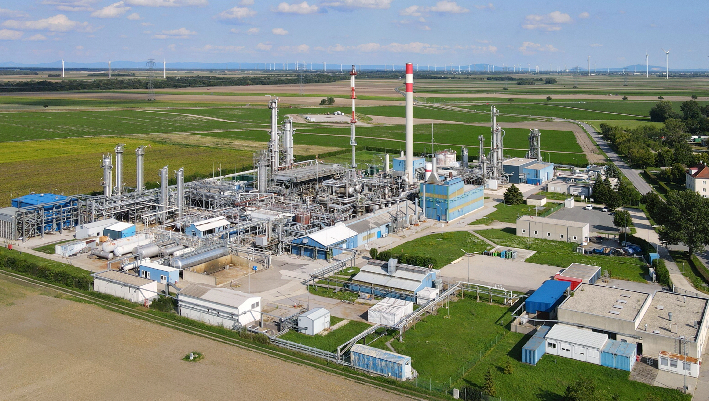

Figure 3-2: A natural gas processing station in Lower Austria. Facilities like this separate raw wellhead gas into pipeline-quality methane and a mixed NGL stream that feeds downstream fractionation. (Source: [C.Stadler/Bwag / Wikimedia Commons (CC BY-SA 4.0)](https://commons.wikimedia.org/wiki/File:Aderklaa_-_Gasstation.JPG))

## Fractionation and Ethane Rejection

At the gas plant, raw mixed NGLs arrive as a single stream often called Y-grade, and they leave as five purity products after a sequence of distillation towers called a **fractionation train**. The deethanizer pulls ethane off the top; the depropanizer pulls propane; the debutanizer pulls butanes; and a final splitter divides normal butane from iso-butane. Natural gasoline is the bottom cut.

Before the NGL stream even gets to the fractionator, the gas processor has to make a daily economic decision on ethane. When the value of ethane as a petchem feedstock (set at Mont Belvieu) exceeds its value as methane-equivalent heat in the sales gas pipeline, the processor **recovers** the ethane and ships it as a liquid. When the Mont Belvieu ethane price dips below that BTU-equivalent floor, the processor **rejects** the ethane, leaving it in the sales gas stream to be burned as methane. US ethane rejection peaked at several hundred thousand barrels per day during the 2015 to 2016 commodity downturn. The call has shifted firmly to recovery since 2018 as new Gulf Coast ethane crackers came online and US ethane exports to Europe, India, and China ramped up. [Chapter 10 (Petrochemicals)](#chapter-petrochemicals) covers the petrochemical demand side.

## Naphtha: The Other Petchem Feed

Naphtha is the light cut from atmospheric distillation that boils between roughly 180 and 380 degrees Fahrenheit. Inside a refinery it has two main homes. Light naphtha (C5 to C6) feeds the isomerization unit or becomes gasoline blendstock directly. Heavy naphtha (C7 to C10) feeds the catalytic reformer, which rearranges straight-chain paraffins into aromatic and branched structures to produce reformate, a high-octane gasoline blendstock rich in benzene, toluene, and xylenes.

Outside the refinery, naphtha is the single largest steam cracker feedstock globally. European and Asian crackers run primarily on naphtha and produce a more balanced olefin-plus-aromatics product slate than the ethane crackers that dominate in the US and the Middle East. That structural difference, naphtha versus ethane, is the reason the US has a structural cost advantage in polyethylene but imports aromatics, while Asia produces its own aromatics but imports polyethylene.

## Unconventional Crude Oil

Unconventional crude requires processing that conventional refineries do not typically perform before the barrel can flow through a standard crude pipeline. The three historical sources are **oil sands** (primarily from Canada and Venezuela), **gas-to-liquid or coal-to-liquid syncrude** (Fischer-Tropsch synthesis, mainly from Qatar and South Africa), and the largely dormant **kerogen shale** resource in the US Green River formation, which remains economically impractical.

Canadian oil sands production has grown to roughly 3.5 million bpd by 2026, producing bitumen at 8 to 12 degrees API that must be either upgraded to synthetic crude oil at a dedicated upgrader or blended with lighter diluents, usually natural gasoline or condensate, to flow through pipelines as "dilbit" or "railbit". The two main extraction methods are surface mining, used on shallow deposits near the Athabasca River, and in-situ steam injection techniques such as Steam Assisted Gravity Drainage (SAGD) used on deeper formations. Canadian dilbit is the reason North American condensate prices are a function of Alberta heavy oil economics as much as of petrochemical demand.

## Refinery Gain

> Refinery gain is the reason liquid output from a refinery occupies more volume than crude input, even though weight is unchanged. Heavy, dense molecules are cracked into a larger number of lighter molecules that occupy more space per unit mass. Globally, refinery gain runs around 2% of crude input on a volume basis. It shows up in every supply-demand balance as a roughly 2 million bpd "free" contribution from the downstream sector.

## 2nd Edition Update: The Shale and NGL Revolution

This section is new to the 2nd edition.

The biggest development since Oil 101 was first published is the rise of tight oil from shale formations, primarily the Permian Basin, Bakken, and Eagle Ford. Using horizontal drilling and hydraulic fracturing, US tight oil production grew from near zero in 2008 to over 9 million bpd by 2026. This is light sweet crude, typically 40 to 45 degrees API, chemically distinct from the kerogen oil shale discussed in the first edition. The same wells co-produce associated gas that carries the NGL stream, so tight oil and NGLs are really one story. [Chapter 21 (Shale Revolution)](#chapter-shale-revolution) covers it in full.

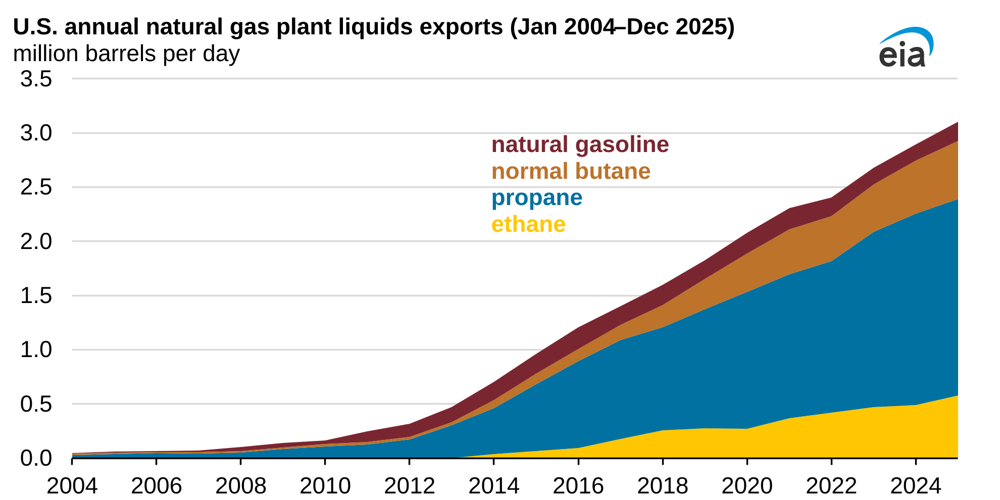

Figure 3-3: US NGL exports reached record levels in 2025, reflecting the full ramp of shale-derived ethane, propane, butane, and natural gasoline. Propane and ethane lead on volume; butanes and natural gasoline follow. (Source: [EIA Today in Energy](https://www.eia.gov/todayinenergy/detail.php?id=67387), March 30, 2026)

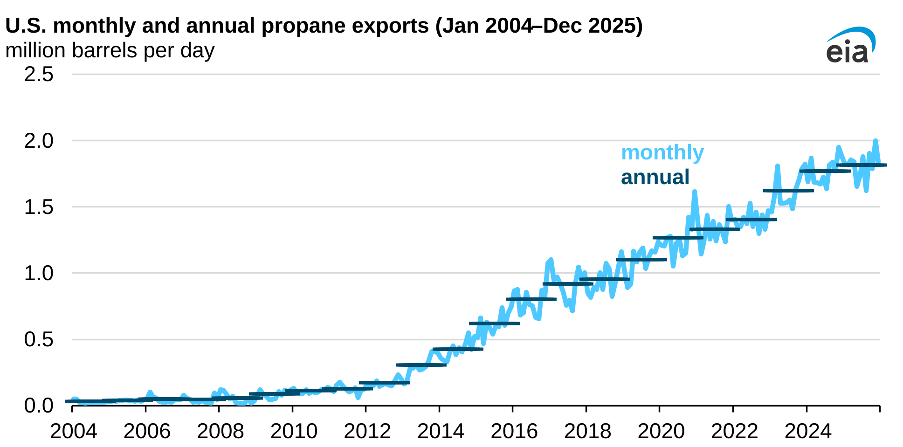

Figure 3-4: US propane exports, the second-largest NGL by volume, have grown as shale gas processing plants recover more liquids from the gas stream. The US is now the world's largest propane exporter, serving Asia, Europe, and Latin America. (Source: [EIA Today in Energy](https://www.eia.gov/todayinenergy/detail.php?id=67387), March 30, 2026)

Global oil supply components changed since the first edition of Oil 101. Conventional crude's share has declined while NGLs, condensates, and tight oil have grown. This impacts refinery configurations, trade flows, and product yields, which [Chapter 7 (Refining)](#chapter-refining) through [Chapter 11 (Transporting Oil)](#chapter-transporting-oil) cover in detail.

The above was updated in 2026. For the full original 2009 chapter, [download the 1st edition 2009 PDF](/api/download/pdf).

Morgan Downey’s Commodity News

### Read what a commodity trader reads

A free morning brief on the oil, gas, and commodity markets, written by Morgan Downey, author of Oil 101. One email, every morning.

[Subscribe free →](https://boxwoodapp.com/news/subscribe)

<!-- rl-section id="chapter-chemistry" class="chapter" kicker="Chapter 4" title="Chemistry of Oil" -->

## Chemistry of Oil

Chapter 4

# Chemistry of Oil

Petroleum chemistry explained: paraffins, naphthenes, aromatics, olefins, and the molecular structures that determine fuel quality.

<svg fill="none" height="18" stroke="currentColor" stroke-linecap="round" stroke-linejoin="round" stroke-width="2" viewbox="0 0 24 24" width="18"><path d="M3 18v-6a9 9 0 0 1 18 0v6"></path><path d="M21 19a2 2 0 0 1-2 2h-1a2 2 0 0 1-2-2v-3a2 2 0 0 1 2-2h3zM3 19a2 2 0 0 0 2 2h1a2 2 0 0 0 2-2v-3a2 2 0 0 0-2-2H3z"></path></svg>Listen· 19:11

## The Building Blocks: Carbon and Hydrogen

Crude oil chemistry is the basis for refinery processes, the reason different crudes and products trade at different values, and how petrochemicals are made. This chapter assumes no chemistry background. A molecule is two or more atoms held together by chemical bonds. Water contains two hydrogen (H) atoms and one oxygen (O) atom, hence the familiar H2O.

Crude oil typically consists of 84 to 87 percent carbon, 11 to 14 percent hydrogen, 0 to 6 percent sulfur, and less than 1 percent nitrogen, oxygen, metals, and salts by weight. Carbon and hydrogen combine to form **hydrocarbons**, the molecules that make oil so valuable. A barrel of crude can contain thousands of distinct hydrocarbons arranged in many different ways. The reason oil matters economically is simple: hydrocarbons release a very large amount of energy when combined with oxygen during combustion.

Figure 4-1: A two-dimensional gas chromatograph (GCxGC) connected to a quadrupole time-of-flight mass detector. Instruments like this separate a crude sample into thousands of individual hydrocarbon peaks, producing the molecular fingerprint that underpins every assay. (Source: [Sarka Na kopci / Wikimedia Commons (CC BY-SA 4.0)](https://commons.wikimedia.org/wiki/File:Gas_chromatograph_for_GCxGC_analyzes_connected_to_a_QTOF_mass_detector_and_GC-IRMS_interface,_in_CAFIA_laboratory,_Czech_Republic.png))

### Valency and bonds

Each carbon atom has a valency of four: it wants to form four bonds with neighbouring atoms. Each hydrogen atom has a valency of one. When a carbon atom cannot find enough hydrogen partners, two carbons will share a double bond (or, rarely, a triple bond) to satisfy that need for four connections. Single bonds are stable. Double and triple bonds are weaker, more reactive, and the defining feature of the unsaturated molecules discussed below.

## Carbon Count, Boiling Point, and Physical State

Refining separates crude into products based on carbon count, because molecules with fewer carbons boil at lower temperatures. At normal atmospheric pressure and room temperature, hydrocarbons with 1 to 4 carbons are typically gases, those with 5 to 24 carbons are liquids, and those with 25 or more carbons are solids. A heavy crude contains a higher fraction of long-carbon molecules; a light crude is skewed toward short ones.

Table 4-1: Crude oil fractions by carbon count

| Fraction | Carbons | State | Boiling range | Primary uses |
| --- | --- | --- | --- | --- |
| Petroleum gases (methane, ethane, propane, butane) | 1 to 4 | Gas | Below 20 C | Heating, power, LPG, petrochemical feedstock |
| Light ends (naphtha, gasoline) | 5 to 11 | Liquid | 70 to 200 C | Gasoline, solvents, petrochemicals |
| Middle distillates (kerosene, gas oil) | 11 to 18 | Liquid | 200 to 300 C | Jet fuel, diesel, heating oil |
| Heavy gas oil, lube base | 18 to 25 | Liquid | 300 to 400 C | Lubricants, feed for cracking |
| Residual fuel, waxes | 20 to 35 | Liquid or solid | 350 to 500 C | Bunker fuel, candles, paraffin wax |
| Bitumen, coke | 35 and up | Solid | 500 C and up | Road paving, roofing, steelmaking fuel |

**IUPAC naming primer.**Modern chemistry names alkanes by a carbon-count prefix plus the suffix “-ane”: meth- (1), eth- (2), prop- (3), but- (4), pent- (5), hex- (6), hept- (7), oct- (8), non- (9), dec- (10). Swap “-ane” for “-ene” to get the corresponding alkene (one double bond), or “-yne” for an alkyne (triple bond). The oil industry still uses older names like paraffin (alkane), olefin (alkene), diolefin (diene), ethylene (ethene), propylene (propene), and butylene (butene). Both systems appear throughout this book.

## The Four Molecular Structures: PONA

Despite thousands of distinct hydrocarbons in crude, each belongs to one of only four structural families. Traders characterise a crude by its **PONA** ratio: Paraffinic, Olefinic, Naphthenic, Aromatic. A refinery that knows the PONA mix of its feedstock has a good idea of what its product slate will look like before a single molecule touches a distillation tower.

### Paraffins (alkanes)

Paraffins follow the general formula CnH2n+2. All bonds are single, so paraffins are **saturated**and chemically stable. They come in two shapes: straight-chain (called “normal”, written with an n- prefix) and branched (called isomers, written with an iso- or i- prefix). A normal and iso molecule can share the same chemical formula yet behave very differently, because the arrangement of atoms changes their physical properties.

The canonical example is octane (C8H18). Normal-octane is a straight chain of 8 carbons and has a research octane number of roughly 20, meaning it knocks badly in a spark-ignition engine. Iso-octane (technically 2,2,4-trimethylpentane) is a branched isomer with the same formula but it resists knock so well that it was chosen as the reference point at octane 100. Branched paraffins dominate high-octane gasoline pools for exactly this reason. Very long-chain paraffins form petroleum waxes at room temperature.

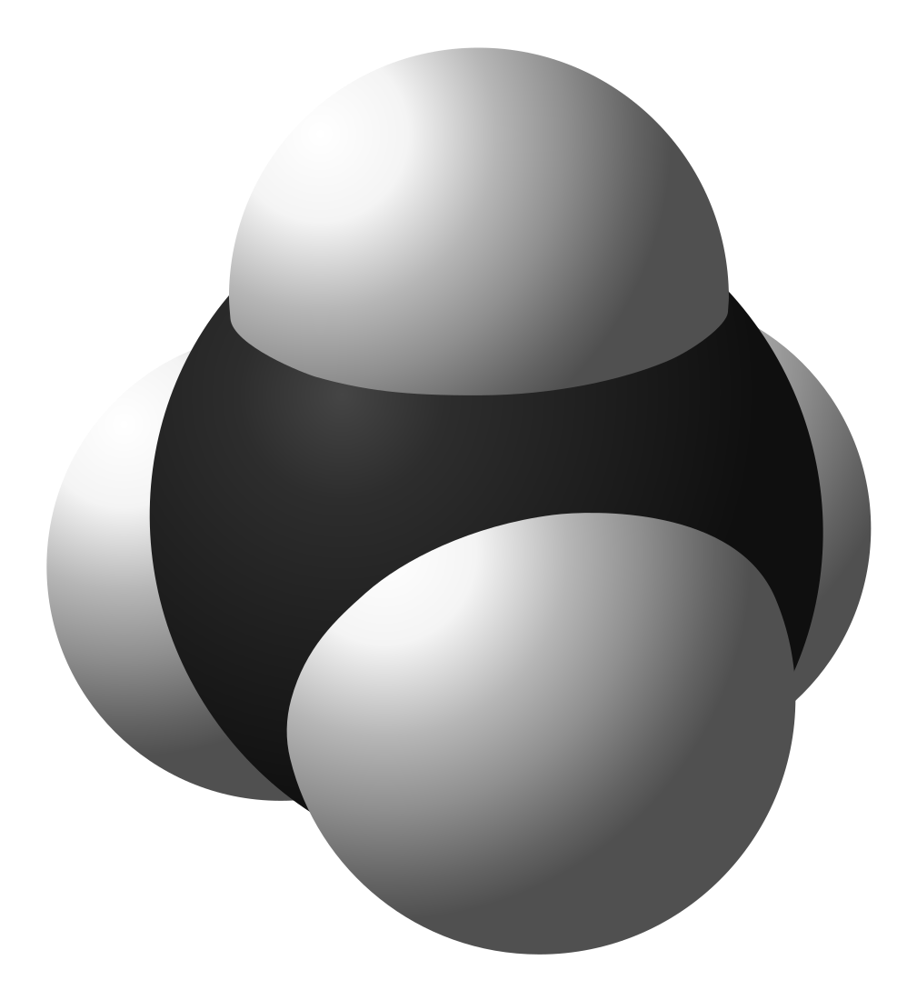

Figure 4-2: Methane (CH4): the simplest hydrocarbon, one carbon bonded to four hydrogens. The primary component of natural gas. (Source: [Wikimedia Commons](https://commons.wikimedia.org/wiki/File:Methane-3D-space-filling.svg))

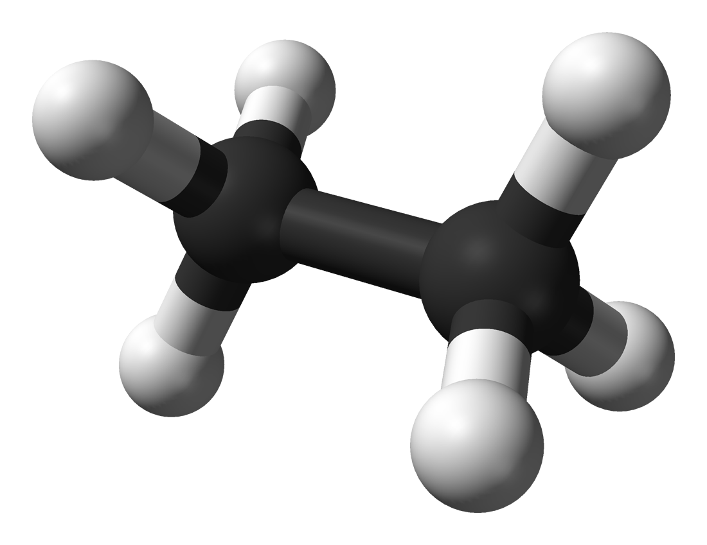

Figure 4-3: Ethane (C2H6): two carbons, six hydrogens, all single bonds. A saturated paraffin and a key petrochemical feedstock for ethylene. (Source: [Wikimedia Commons](https://commons.wikimedia.org/wiki/File:Ethane-A-3D-balls.png))

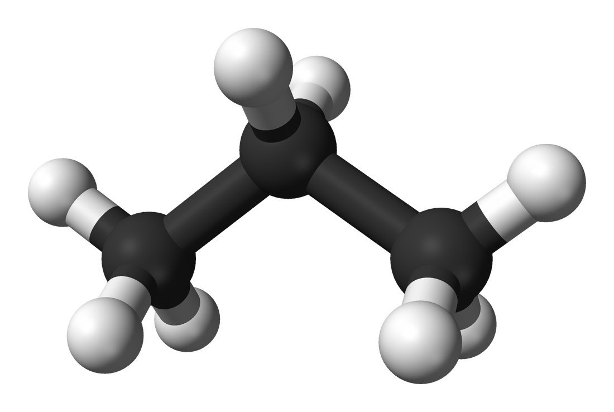

Figure 4-4: Propane (C3H8): three carbons in a straight chain. Compresses easily to a liquid; half of LPG. (Source: [Wikimedia Commons](https://commons.wikimedia.org/wiki/File:Propane-3D-balls-B.png))

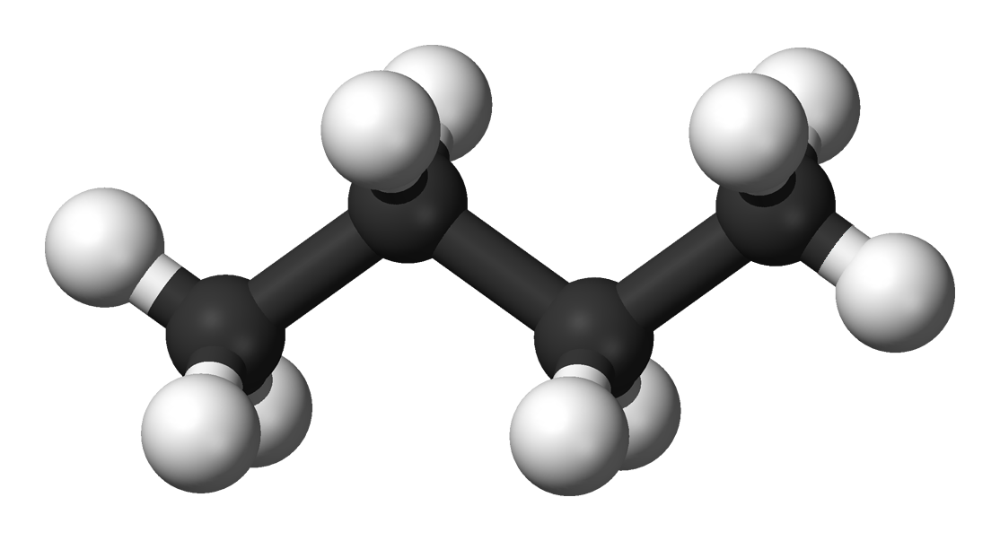

Figure 4-5: n-Butane (C4H10): four carbons in a straight chain. Branching the same four carbons produces iso-butane, an isomer with different boiling point and reactivity. (Source: [Wikimedia Commons](https://commons.wikimedia.org/wiki/File:Butane-3D-balls.png))

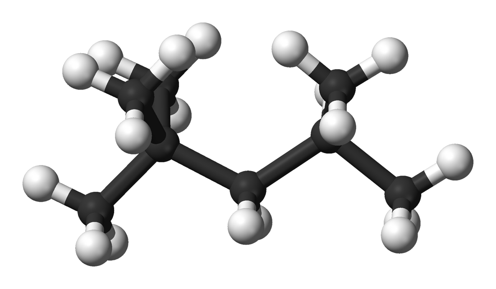

Figure 4-6: Iso-octane (2,2,4-trimethylpentane, C8H18): the branched isomer chosen as the octane number 100 reference. Same formula as n-octane, very different anti-knock behaviour. (Source: [Wikimedia Commons](https://commons.wikimedia.org/wiki/File:Isooctane-3D-balls.png))

### Naphthenes (cycloalkanes)

Naphthenes are saturated rings of carbon. A single-ring naphthene follows the formula CnH2n. The workhorse example is cyclohexane, a six-carbon ring that is abundant in most crudes and an important precursor to nylon. Because naphthenes are saturated, they behave much like paraffins: chemically stable, good blending components, and easy for refinery units to handle. Paraffinic and naphthenic crudes are often lumped together as “paraffinic” by traders, against the more reactive aromatic crudes.

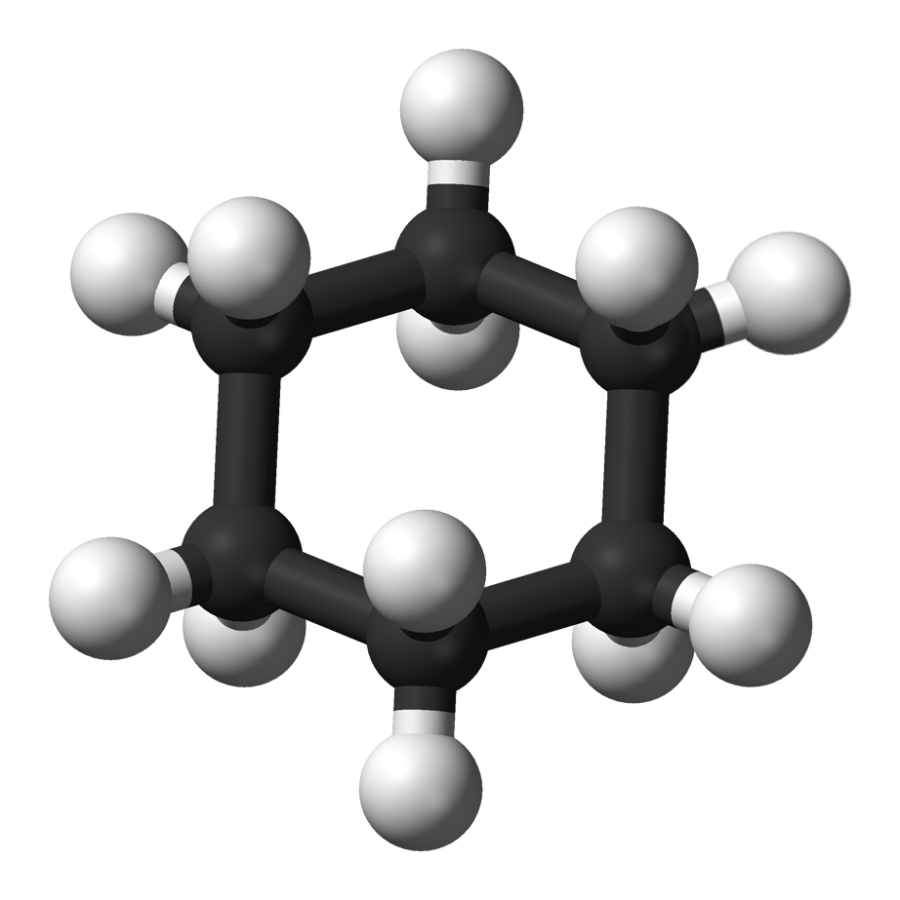

Figure 4-7: Cyclohexane (C6H12): a saturated six-carbon ring. The simplest naphthene and a building block for nylon. (Source: [Wikimedia Commons](https://commons.wikimedia.org/wiki/File:Cyclohexane-3D-balls.png))

### Aromatics

Aromatic hydrocarbons are ring structures built around at least one **benzene ring**: six carbons with three alternating double bonds. Because of those double bonds, aromatics are **unsaturated** and more reactive than paraffins or naphthenes. That reactivity is exactly what makes them valuable as petrochemical feedstocks; it is also why benzene, a known carcinogen, is tightly capped in gasoline. The key aromatics are benzene, toluene, and the three xylene isomers, grouped together as **BTX**.

Molecules with two or more fused benzene rings are called Polycyclic Aromatic Hydrocarbons (PAH). Naphthalene, with two fused rings, is the simplest. At the extreme heavy end sit **asphaltenes**: very large PAH molecules, often with more than 70 carbon atoms, heavy branches, and heteroatoms. Asphaltenes absorb visible light, which is why crude oil is black, and they dominate the residue fraction of heavy sour crudes. They can also clog pipelines in cold weather and produce undesirable shot coke in a coker.

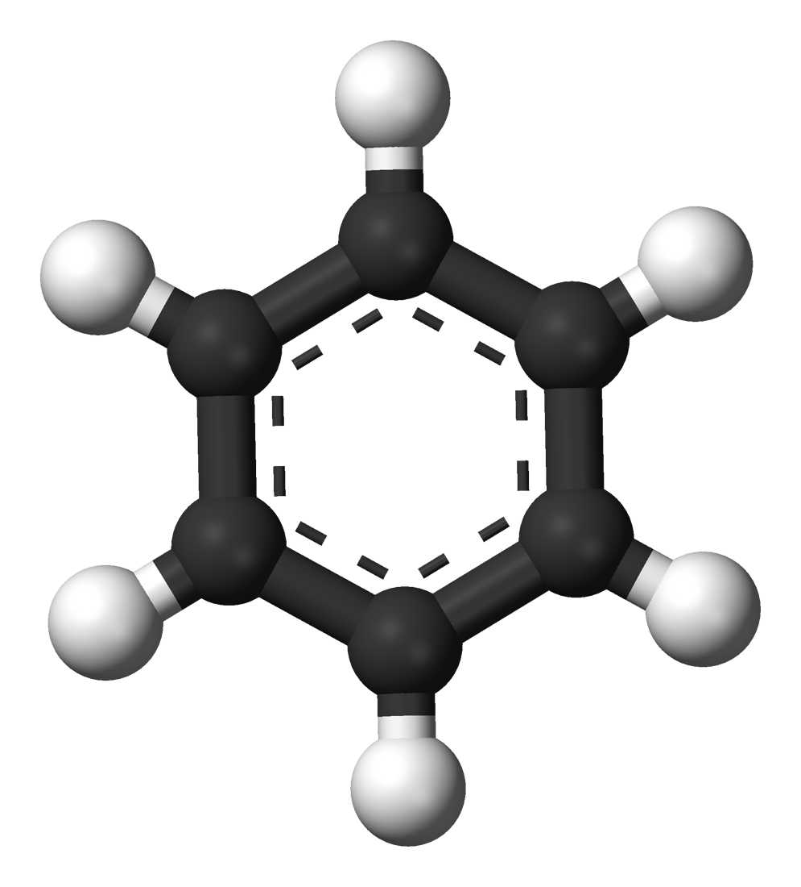

Figure 4-8: Benzene (C6H6): six carbons in a ring with three alternating double bonds. The parent structure of every aromatic hydrocarbon. (Source: [Wikimedia Commons (public domain)](https://commons.wikimedia.org/wiki/File:Benzene-aromatic-3D-balls.png))

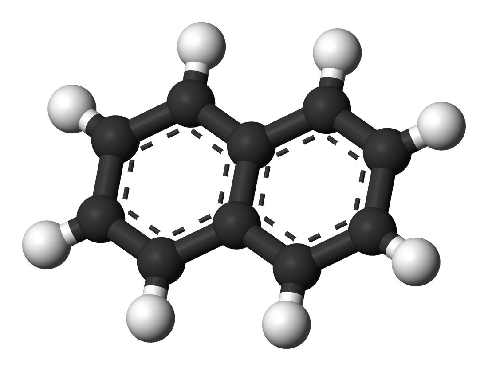

Figure 4-9: Naphthalene (C10H8): two fused benzene rings. The simplest polycyclic aromatic hydrocarbon. Asphaltenes, the heaviest fraction of crude, are far larger cousins of this structure. (Source: [Wikimedia Commons](https://commons.wikimedia.org/wiki/File:Naphthalene-3D-balls.png))

### Olefins (alkenes)

Olefins are aliphatic hydrocarbons with at least one carbon-carbon double bond (mono-olefins), two double bonds (diolefins or dienes), or a triple bond (alkynes). They are rarely present in crude oil straight out of the reservoir because they are too reactive to survive geological time. Almost every olefin in the oil system was manufactured at a refinery, typically by thermal or catalytic cracking of paraffins. Ethylene and propylene, the two most important olefins, are the foundation of the global petrochemical and plastics industry.

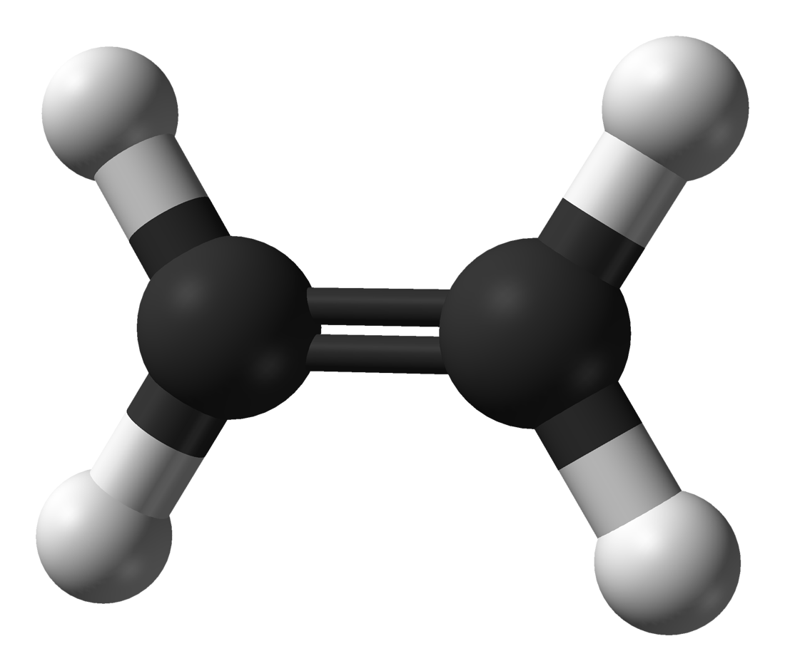

Figure 4-10: Ethylene (ethene, C2H4): two carbons joined by a double bond. The world's most-produced organic chemical by weight and the starting point for polyethylene. (Source: [Wikimedia Commons](https://commons.wikimedia.org/wiki/File:Ethylene-CRC-MW-3D-balls.png))

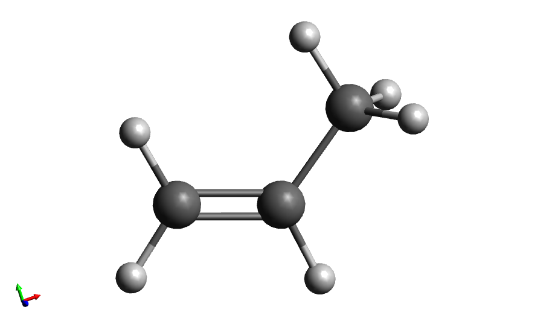

Figure 4-11: Propylene (propene, C3H6): three carbons with one double bond. Feedstock for polypropylene and a long list of other polymers. (Source: [Wikimedia Commons](https://commons.wikimedia.org/wiki/File:Propylene-3D-balls.png))

## Typical PONA by Crude Grade

PONA mix shifts systematically with crude quality. A light sweet grade like WTI or Bonny Light is paraffin-rich, which is why it yields so much gasoline-range material with relatively little cracking. A medium sour grade like Arab Light sits in the middle of the spectrum. A heavy sour grade like Maya or Arab Heavy is aromatic-rich and resin-laden, with a long tail of asphaltenes and very little natural naphtha. The table below shows indicative PONA-plus-asphaltene ranges by crude class.

Table 4-2: Indicative PONA composition by crude grade (percent by weight of whole crude)

| Structure | Light sweet | Medium | Heavy sour |
| --- | --- | --- | --- |
| Paraffins | 45 to 60 | 30 to 45 | 15 to 25 |
| Naphthenes | 25 to 35 | 25 to 35 | 20 to 30 |
| Aromatics | 10 to 20 | 20 to 30 | 30 to 45 |
| Resins and asphaltenes | Below 2 | 3 to 8 | 10 to 20 |
| Olefins (in reservoir) | Trace | Trace | Trace |

Ranges vary by field and by how an assay laboratory draws the boundary between heavy aromatics and resins, so treat these as orders of magnitude rather than hard numbers. The shape of the story, however, is robust: paraffin fraction falls and aromatic plus asphaltene fraction rises as you move from light sweet to heavy sour.

## Saturated vs Unsaturated

A molecule is **saturated** when every carbon is bonded to four other atoms through single bonds, and **unsaturated** when one or more double or triple bonds are present. Paraffins and naphthenes are saturated and therefore stable; aromatics and olefins are unsaturated and therefore reactive. Fuels prize stability (you do not want gasoline polymerising in the tank), while petrochemical feedstocks prize reactivity (that is how you build polymers in the first place). The entire economic logic of a refinery, splitting molecules into a stable fuel pool and a reactive chemical pool, follows from this single distinction.

## Heteroatoms: Sulfur, Nitrogen, Oxygen, Metals

Not every atom in crude is carbon or hydrogen. The other elements, collectively called heteroatoms, are usually impurities but they drive a surprising amount of refinery economics.

**Sulfur** appears as hydrogen sulfide (H2S), as mercaptans (thiols), and bound inside thiophene rings. H2S is acutely toxic and corrodes steel; mercaptans carry the rotten-egg odour that gives sour crude its name and are the reason odorant is added to household natural gas. Thiophenes are the hardest to remove because the sulfur is locked inside an aromatic ring. **Nitrogen** shows up in pyridines and pyrroles and poisons the catalysts used in cracking and reforming, which is why high-nitrogen crudes carry a discount. **Oxygen** appears mainly as naphthenic acids (measured by Total Acid Number) and phenols; high-TAN crudes can corrode carbon-steel piping above 220 C. **Metals**, chiefly vanadium and nickel, sit at the centre of porphyrin rings and end up in the residue. Even trace amounts poison FCC catalysts, so heavy sour crudes with high metals are restricted to refineries with cokers that can reject metals into petroleum coke.

Table 4-3: Typical heteroatom ranges in whole crude

| Element | Common form | Typical range | Why it matters |
| --- | --- | --- | --- |
| Sulfur | H2S, mercaptans, thiophenes | 0.05 to 5 percent by weight | SOx emissions, corrosion, catalyst poisoning |
| Nitrogen | Pyridines, pyrroles | 0.05 to 0.8 percent by weight | NOx precursor, poisons cracking catalysts |
| Oxygen | Naphthenic acids, phenols | 0.05 to 1.5 percent by weight | Corrosion above 220 C (high-TAN crudes) |
| Vanadium | Vanadyl porphyrins | 1 to 1,200 ppm | Poisons FCC catalyst, ends up in coke |
| Nickel | Nickel porphyrins | 1 to 150 ppm | Same as vanadium, less severe |

## Combustion Chemistry

The reason hydrocarbons matter is that their oxidation reaction is strongly exothermic. For methane, the simplest case:

> CH4 + 2 O2 → CO2 + 2 H2O + heat

For iso-octane, the reference fuel for gasoline, the balanced reaction is:

> C8H18 + 12.5 O2 → 8 CO2 + 9 H2O + heat

From that equation you can derive the stoichiometric air-fuel ratio: the mass of air that exactly consumes a unit mass of fuel with nothing left over. For iso-octane that ratio is roughly 14.7 to 1 by weight, the famous number engine control units target in closed-loop operation. Real combustion is messier. If the reaction runs cool, or oxygen is short, some carbon exits as carbon monoxide (CO), unburnt hydrocarbons, or soot. Air is mostly nitrogen, so at the peak flame temperatures inside an engine cylinder some of that nitrogen oxidises to **NOx**. Any sulfur in the fuel oxidises to **SOx**. NOx and SOx are the two pollutants that drive most downstream environmental regulation. [Chapter 15 (Environmental)](#chapter-environmental) picks up their story.

## Octane and Cetane: Measuring Fuel Quality

Spark-ignition engines want a fuel that resists auto-ignition (knock). The octane scale was built by defining n-heptane as 0 and iso-octane as 100, then rating any other fuel against a matching blend of the two. Some molecules beat iso-octane outright and score above 100. Compression-ignition (diesel) engines want the opposite: a fuel that auto-ignites quickly under compression, which is measured by the cetane number. Here n-cetane (n-hexadecane) is defined as 100 and alpha-methylnaphthalene as 0.

Table 4-4: Indicative octane and cetane numbers for reference molecules

| Molecule | Research octane | Cetane number |
| --- | --- | --- |
| n-Heptane | 0 (reference) | 56 |
| Iso-octane (2,2,4-trimethylpentane) | 100 (reference) | 15 |
| Toluene | 111 | Low (not a diesel fuel) |
| Benzene | 100 | Low |
| Methanol | 107 | Very low |
| Ethanol | 108 | Very low |
| n-Cetane (n-hexadecane) | Very low | 100 (reference) |
| alpha-Methylnaphthalene | High | 0 (reference) |
| Typical finished gasoline | 87 to 95 | Not applicable |
| Typical finished diesel | Not applicable | 40 to 55 |

Figure 4-12: Research Octane Number (RON) of Selected Fuels

The octane scale is defined by two reference fuels: n-heptane (RON 0) and iso-octane (RON 100). US pump ratings use the Anti-Knock Index (AKI), which averages RON and MON and is typically 4 to 6 points below RON. Source: ASTM D2699.

Notice the pattern: aromatics (toluene, benzene) and branched paraffins (iso-octane) score well on octane but poorly on cetane. Straight-chain paraffins (n-heptane, n-cetane) do the opposite. A molecule that is good for a gasoline engine is almost by definition bad for a diesel engine, which is why refineries cannot simply pour one finished stream into both pools.

## Cracking and Combining

Basic distillation leaves a refinery at the mercy of whatever carbon-count distribution nature handed it. The real power of modern refining lies in using heat, pressure, and catalysts to rearrange molecules. **Thermal cracking** heats long paraffins until carbon-carbon bonds snap, producing shorter paraffins plus olefins. In shorthand:

> C16H34 → C8H18 + C8H16

A sixteen-carbon wax molecule becomes an octane paraffin plus an octene olefin. **Catalytic cracking** (the FCC unit) does something similar at lower temperatures using a zeolite catalyst that favours branched, higher-octane products. **Alkylation** runs the process in reverse: isobutane plus a small olefin combine across an acid catalyst to yield a branched octane-range paraffin (alkylate) that is prized in gasoline blending.

> A refinery can lift gasoline yield from roughly 20 percent of a barrel under basic distillation to 55 percent or more by cracking and combining hydrocarbons. This flexibility is what makes a complex refinery so much more valuable than a simple one.

## Why Chemistry Drives Pricing

Every concept in this chapter comes back to one point. Crude grades trade at different prices because their molecular mixes yield different product slates. A light sweet crude is paraffin-rich and low in heteroatoms, so a simple refinery can turn it into high-value gasoline and distillate with minimal treatment. A heavy sour crude is aromatic- and asphaltene-rich with meaningful sulfur, nitrogen, and metals, so it needs a coker, a hydrocracker, and extensive hydrotreating before the same products can be made. Those extra units cost capital and hydrogen, and that cost is exactly what shows up in the light-heavy and sweet-sour price differentials discussed in [Chapter 17 (Oil Prices)](#chapter-oil-prices). PONA, heteroatoms, and bond chemistry are the foundation for every price spread in the oil complex.

[Chapter 7 (Refining)](#chapter-refining) picks up the process units (FCC, hydrocracker, coker, reformer, alkylation) that turn PONA theory into gasoline and diesel. [Chapter 10 (Petrochemicals)](#chapter-petrochemicals) returns to olefins, aromatics, and BTX as petrochemical feedstocks. [Chapter 15 (Environmental)](#chapter-environmental) follows NOx, SOx, and CO2 from combustion through to regulation.

The above was updated in 2026. For the full original 2009 chapter, [download the 1st edition 2009 PDF](/api/download/pdf).

Morgan Downey’s Commodity News

### Read what a commodity trader reads

A free morning brief on the oil, gas, and commodity markets, written by Morgan Downey, author of Oil 101. One email, every morning.

[Subscribe free →](https://boxwoodapp.com/news/subscribe)

<!-- rl-section id="chapter-industry-overview" class="chapter" kicker="Chapter 5" title="Industry Overview" -->

## Industry Overview

Chapter 5

# Industry Overview

Oil industry structure: upstream, midstream, and downstream sectors. IOCs, NOCs, independents, and oilfield service companies.

<svg fill="none" height="18" stroke="currentColor" stroke-linecap="round" stroke-linejoin="round" stroke-width="2" viewbox="0 0 24 24" width="18"><path d="M3 18v-6a9 9 0 0 1 18 0v6"></path><path d="M21 19a2 2 0 0 1-2 2h-1a2 2 0 0 1-2-2v-3a2 2 0 0 1 2-2h3zM3 19a2 2 0 0 0 2 2h1a2 2 0 0 0 2-2v-3a2 2 0 0 0-2-2H3z"></path></svg>Listen· 17:43

## An Industry in Three Segments

The oil industry, still colloquially called the oil patch, divides cleanly into three segments: upstream, midstream, and downstream. The first edition of Oil 101 put it simply: most companies operate in just one segment, and the few that operate in all three are called vertically integrated. That framing still holds in 2026, even though the cast of companies in each segment has turned over since then.

Table 5-1: The three segments of the oil industry

| Segment | Core activities | Representative assets | Economics |
| --- | --- | --- | --- |
| **Upstream** | Finding and extracting crude oil and natural gas | Leases, seismic data, drilling rigs, wellheads, platforms, gathering lines | Highest risk, highest reward; long cycles, commodity price exposure |
| **Midstream** | Transportation, gathering, processing, and bulk storage | Pipelines, tankers, railcars, truck fleets, gas processing plants, terminals | Toll-road economics; fee-based contracts and relatively stable cash flows |
| **Downstream** | Refining, petrochemicals, distribution, retail marketing | Refineries, product pipelines, terminals, retail stations, lubricant plants | Margin-driven; profits depend on the crack spread |

Follow a barrel through the physical chain and the three segments become obvious. Crude originates in a reservoir thousands of feet underground, flows up a wellhead into a small gathering line, gets metered and separated from water and associated gas at a field facility, moves through a trunk pipeline or onto a tanker, arrives at a refinery, is cracked and treated into finished products, then travels out through product pipelines and terminals to the retail station where a driver finally pumps it into a car. Upstream owns the first two stops, midstream owns the middle four, and downstream owns the last three. The handoffs between segments are where prices are discovered, quality is assayed, and custody (and risk) changes hands.

## National Oil Companies Versus International Oil Companies

The majority of global crude oil production is controlled by government-owned National Oil Companies (NOCs). This was true when the first edition of Oil 101 was published in 2009, and it remains true today. All OPEC production and roughly a third of non-OPEC production sits under NOC control. Most NOCs exist because, at some point in the 20th century, the state assumed ownership of oil reserves that private industry had originally risked capital to find. Most NOCs still farm out drilling and specialist technical work to private service companies, but the equity barrels belong to the state.

The remainder of global production is split between publicly listed International Oil Companies (IOCs) and a long tail of privately held independents. The former “Seven Sisters” of the 1950s consolidated through four decades of mergers into what the market now calls the Majors or supermajors: ExxonMobil, Shell, Chevron, BP, and TotalEnergies. Add Eni, ConocoPhillips, and Equinor and you have the eight firms that dominate the publicly listed side of the upstream business. Together the supermajors control roughly 12 percent of global crude production in 2026, though they still own close to a fifth of global refining capacity.

Table 5-2: Selected International Oil Companies (approximate 2024 production)

| Company | HQ | 2024 production (Mboe/d) | Primary basins |
| --- | --- | --- | --- |
| ExxonMobil | Spring, Texas | 4.6 | Permian, Guyana, Gulf of Mexico, Qatar LNG |
| Shell | London, UK | 2.8 | Gulf of Mexico, Nigeria, Permian, Oman, LNG portfolio |
| Chevron | Houston, Texas | 3.3 | Permian, DJ Basin, Kazakhstan (Tengiz), Australia LNG |
| BP | London, UK | 2.4 | Gulf of Mexico, North Sea, Azerbaijan, Oman |
| TotalEnergies | Courbevoie, France | 2.4 | North Sea, West Africa, Middle East, Argentina, LNG |
| Eni | Rome, Italy | 1.7 | North Africa, Mozambique, Congo, Kazakhstan |
| ConocoPhillips | Houston, Texas | 2.0 | Permian, Eagle Ford, Bakken, Alaska, Norway |
| Equinor | Stavanger, Norway | 2.1 | Norwegian Continental Shelf, Brazil pre-salt, US shale |
| EOG Resources | Houston, Texas | 1.1 | Eagle Ford, Delaware Basin, Powder River, Utica |

Production figures are approximate and drawn from company annual reports and investor presentations. They blend oil, gas, and natural gas liquids on an oil-equivalent basis and can swing year to year with divestitures and acquisitions.

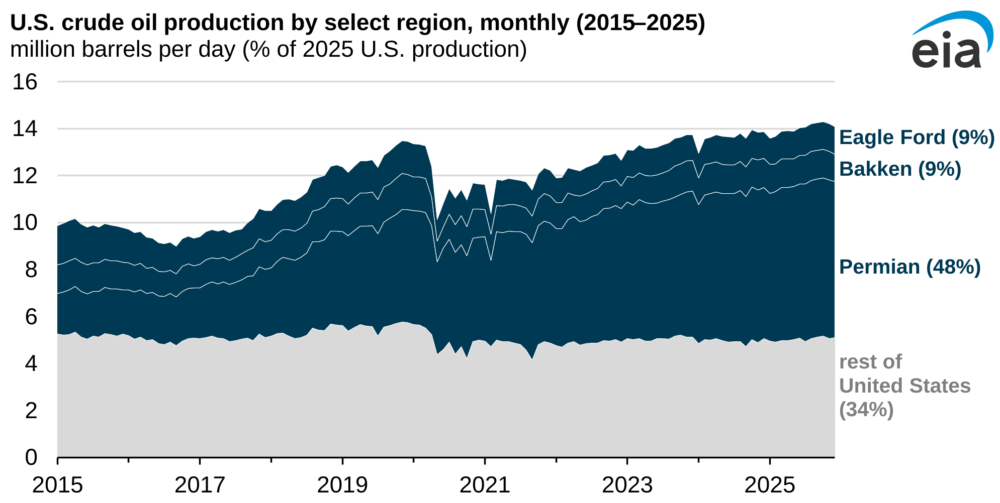

Figure 5-1: Monthly US crude oil production by region through end of 2025. US output reached a new record of 13.6 million barrels per day in 2025, with the Permian alone accounting for roughly 44 percent of total US production by December 2025. (Source: [EIA Today in Energy (March 31, 2026)](https://www.eia.gov/todayinenergy/detail.php?id=67404), March 31, 2026)

Front-Month Settlement Prices

WTI Crude Oil

--

$/barrel

Henry Hub Natural Gas

--

$/MMBtu

## The NOC League Table

National Oil Companies are the heavyweights of the upstream business. Saudi Aramco alone produces more oil than any publicly listed Major, and its 2019 IPO, which remains the largest in history, only partially changed its character: the Saudi state still owns more than 95 percent of the company. Below Aramco sits a long list of NOCs that collectively control roughly half of global oil and gas production and a much larger share of proved reserves.

Table 5-3: Selected National Oil Companies (approximate 2024 production)

| Company | Country | 2024 production (Mboe/d) | Ownership status |
| --- | --- | --- | --- |
| Saudi Aramco | Saudi Arabia | 12.7 | Listed on Tadawul, roughly 95 percent state-owned |
| NIOC | Iran | 3.4 | Wholly state-owned |
| CNPC / PetroChina | China | 4.3 | Parent wholly state-owned; PetroChina listed in Hong Kong and Shanghai |
| Rosneft | Russia | 4.0 | Majority state-owned via Rosneftegaz |
| ADNOC | United Arab Emirates | 4.0 | Wholly state-owned; select subsidiaries partially listed |
| Petrobras | Brazil | 2.8 | Listed, federal government holds majority voting shares |
| KPC | Kuwait | 2.7 | Wholly state-owned |
| INOC / SOMO | Iraq | 4.2 | Wholly state-owned |
| QatarEnergy | Qatar | 4.8 | Wholly state-owned (oil, condensate, and North Field LNG) |
| Pemex | Mexico | 1.8 | Wholly state-owned |
| Sonatrach | Algeria | 1.5 | Wholly state-owned |
| PDVSA | Venezuela | 0.9 | Wholly state-owned; production well below pre-2010 levels |

NOC production numbers are harder to verify than those of listed companies. Many NOCs do not publish audited reserves or segment-level output and the figures above are drawn from OPEC monthly reports, IEA estimates, and company disclosures where available.

## US Independents: The Shale Cohort

The group that has done the most to reshape the industry since the first edition of this book is the US independents. These are publicly listed E&P companies with no meaningful refining or international presence, and most of their production comes from unconventional shale plays in Texas, New Mexico, North Dakota, Pennsylvania, and Appalachia. The current cohort includes Diamondback Energy (which absorbed Endeavor Energy Resources in 2024 to become the largest pure-play Permian independent after ExxonMobil’s purchase of Pioneer Natural Resources), EOG Resources, Devon Energy, Ovintiv, Coterra Energy, Marathon Oil (acquired by ConocoPhillips in 2024), APA Corporation, EQT (the largest US natural gas producer), and Chesapeake (now merged with Southwestern into Expand Energy). Consolidation has been the dominant theme: the independents pioneered the shale boom, and the Majors are now buying them up to lock in decades of inventory.

## Oilfield Services: The Contractors Who Actually Drill

Most upstream operators, NOCs and IOCs alike, do not own their own rigs, pumps, or wireline trucks. They lease equipment and crews from oilfield service companies on a contract basis. The industry is famously cyclical: long stretches of low dayrates punctuated by brief booms when rig capacity tightens. The Big Three of global services (SLB, Halliburton, and Baker Hughes) tower above a large field of specialists.

Table 5-4: Major oilfield service companies

| Company | Core services | Notes |
| --- | --- | --- |
| SLB (formerly Schlumberger) | Seismic, drilling, formation evaluation, completions, digital subsurface software | Largest global services firm, rebranded from Schlumberger in 2022 |
| Halliburton | Pressure pumping (hydraulic fracturing), cementing, drilling fluids, completions | Dominant position in North American onshore frac market |
| Baker Hughes | Drill bits, artificial lift, turbomachinery, LNG compression trains | More diversified into industrial and LNG equipment than its peers |
| Weatherford | Managed pressure drilling, tubular running, well construction, intervention | Emerged from 2019 bankruptcy as a leaner mid-tier services firm |
| NOV (National Oilwell Varco) | Drill rig equipment manufacturing, downhole tools, offshore structures | Equipment supplier; sells to rig contractors |
| ChampionX | Production chemicals, artificial lift, drilling technologies | Pending merger into SLB announced in 2024 |
| Liberty Energy | Hydraulic fracturing services, frac sand logistics | North American pressure pumper; founder became US Energy Secretary in 2025 |

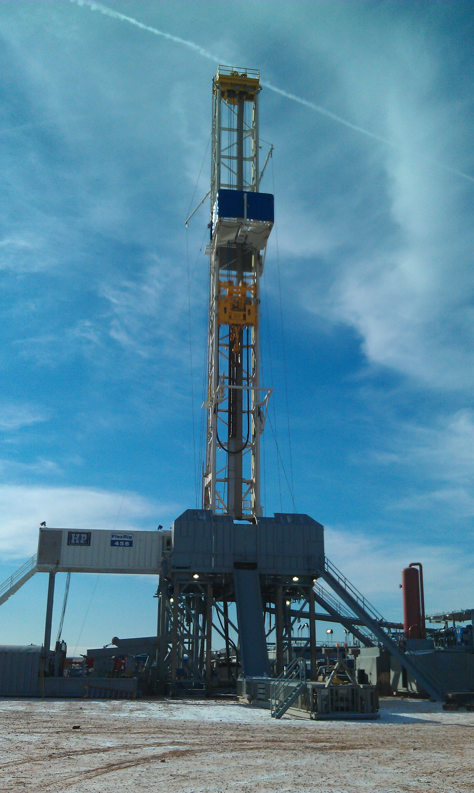

Figure 5-2: A Helmerich and Payne Flex Rig drilling in the Bakken formation of North Dakota. Contract drilling rigs like this are leased from oilfield service companies by operators who typically own no rigs of their own. (Source: [Joshua Doubek / Wikimedia Commons (CC BY-SA 3.0)](https://commons.wikimedia.org/wiki/File:Helmerich_%26_Payne_Flex_Rig_drilling_the_Bakken.jpg))

## Pure-Play Refiners

The downstream side of the US industry is now dominated by a handful of independent refiners with no upstream exposure. Marathon Petroleum runs the largest US refining system after its 2018 acquisition of Andeavor. Valero Energy is the largest independent refiner in the world by throughput and has an extensive Gulf Coast and West Coast footprint. Phillips 66 spun out of ConocoPhillips in 2012 and operates an integrated refining, midstream, and chemicals business. PBF Energy is a smaller East Coast and West Coast refiner, and HF Sinclair was formed in 2022 by the merger of HollyFrontier and Sinclair Oil. These companies live and die by the crack spread, the margin between the price of crude input and the value of the finished product slate.

## Physical Trading Houses

A parallel industry of physical commodity trading houses sits between producers, refiners, and end users, moving barrels across geographies and qualities to capture spread and arbitrage. The five dominant independents are Vitol (Geneva and Rotterdam, the largest independent oil trader by volume), Glencore (Baar, Switzerland, with a large mining arm alongside its oil book), Trafigura (Singapore and Geneva), Gunvor (Geneva), and Mercuria (Geneva). Between them they trade more crude and products than any supermajor lifts. The trading houses own infrastructure too: storage terminals, refineries, shipping, and in several cases upstream equity barrels.

## Engineering, Procurement, and Construction

The physical plants that refine crude, liquefy gas, and move product are built by a separate species of contractor called EPC firms (engineering, procurement, and construction). Bechtel is the giant of US LNG construction and has built most of the export trains on the Gulf Coast. Fluor, McDermott, TechnipFMC, Saipem, and Petrofac round out the list of global EPC players that bid on multi-billion dollar refinery, petrochemical, and LNG projects. EPC firms do not own the plants they build; they hand them over to operators at the end of construction and move on to the next contract.

**Scale of the industry.** There are an estimated 15,000 oil and gas companies worldwide, from single-rig wildcatters to Aramco. The top 20 producers, mostly NOCs, account for roughly 60 percent of global output. The long tail of small independents still drills the majority of new wildcat wells.

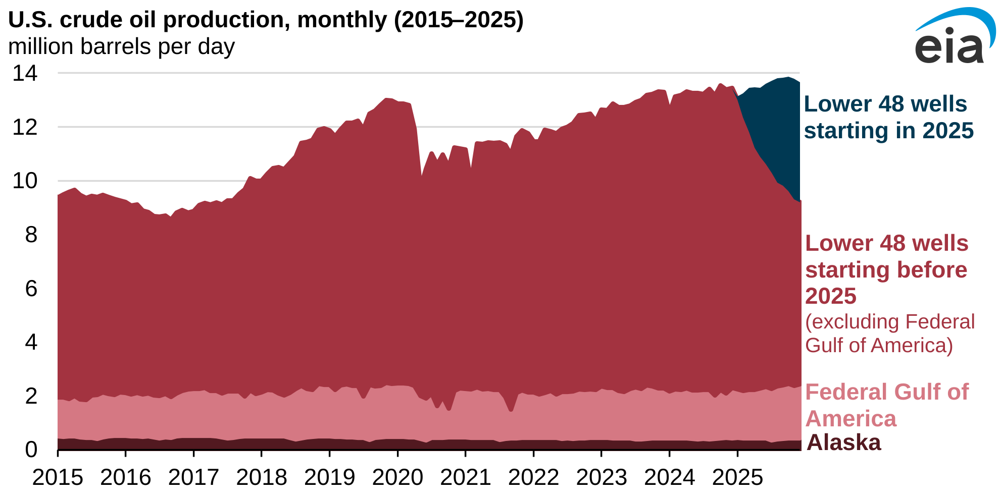

Figure 5-3: US crude oil production shares by region. Permian dominance has reshaped the US producer base: a relatively small set of large independents and Majors now account for the bulk of US supply, alongside OPEC+ as the other pillar of the global market. (Source: [EIA Today in Energy (March 31, 2026)](https://www.eia.gov/todayinenergy/detail.php?id=67404), March 31, 2026)

Figure 5-4: Top 20 Oil Companies by Production (Mboe/d, 2024)

Sources: company annual reports, S&P Global, Energy Institute Statistical Review 2024. Illustrative rounded figures.

## Vertical Integration and the Disaggregation Trend

The classical Major was a fully vertically integrated business that explored for oil, produced it, shipped it on its own tankers, refined it in its own refineries, and sold it through its own branded retail stations. That model is still intact at ExxonMobil, Shell, and Chevron, but the trend since the 1990s has been disaggregation. ConocoPhillips spun out Phillips 66 in 2012 and is now a pure-play E&P. Marathon Oil and Marathon Petroleum have been separate companies since 2011. Hess sold its retail network in 2014. The logic is that capital markets pay different multiples for upstream, midstream, and downstream cash flows, and shareholders can put together their own vertical integration by buying shares in specialist firms. The NOCs, by contrast, have moved in the opposite direction, with Saudi Aramco, ADNOC, and QatarEnergy all pushing downstream into refining and petrochemicals to capture more of the value chain.

## OPEC and OPEC+

OPEC was formed in Baghdad in 1960 by five founding members: Saudi Arabia, Kuwait, Iran, Iraq, and Venezuela. Its stated purpose was to coordinate production to stabilize prices. In late 2016, OPEC partnered with Russia and nine other non-member producers to form OPEC+, the broadest supply management agreement in the history of the industry. As of 2026, OPEC+ manages production quotas covering roughly 40 percent of global output, and Saudi Arabia remains the de facto leader, wielding the implied threat of flooding the market to punish cheating. [Chapter 22 (OPEC+)](#chapter-opec-plus) covers the OPEC+ era, including the 2020 Saudi-Russia price war and the supply discipline that has defined the group since.

> OPEC reserves statements have been unreliable since the 1980s, when members artificially inflated estimates to secure larger production quotas. Despite decades of production, few OPEC countries have materially revised their reserve figures downward.

## The Downstream Footprint

There are roughly 650 refineries worldwide with combined capacity near 102 million barrels per day. The US has about 130 refineries with 18.5 million barrels per day of capacity. A new complex refinery processing 500,000 barrels per day costs over 10 billion dollars and takes 5 to 7 years to build. Since 2010, almost all net new refinery capacity has been built in the Middle East, India, and China rather than in the US or Europe, where older plants have been closing or converting to biofuels. Refineries that remain have steadily become more complex through what the industry calls complexity creep, adding cracking and hydrogen addition equipment so the same plant can squeeze more light products out of progressively heavier crude.

## Key Market Institutions

The **EIA** (Energy Information Administration) publishes the most closely watched weekly US petroleum inventory report each Wednesday at 10:30 AM Eastern Time. Submission by surveyed firms is compulsory, which is why the EIA numbers are treated as the gold standard of oil statistics. The **IEA** (International Energy Agency) coordinates OECD strategic reserves (a minimum of 90 days of net imports) and publishes the monthly Oil Market Report that drives most demand forecasting. The **CFTC** publishes the weekly Commitments of Traders report showing futures positioning by category of trader. Price reporting agencies **Platts**(now part of S&P Global Commodity Insights) and **Argus Media** assess daily spot prices that are then used in formula pricing worldwide; the assessed prices they publish underpin trillions of dollars of physical contracts every year.

US shale rewrote the industry's structure. The US became a net petroleum exporter in 2019 for the first time since the 1940s, reshaping geopolitics and cutting OPEC's pricing power. How that happened is the subject of [Chapter 21 (Shale Revolution)](#chapter-shale-revolution).

The above was updated in 2026. For the full original 2009 chapter, [download the 1st edition 2009 PDF](/api/download/pdf).

Morgan Downey’s Commodity News

### Read what a commodity trader reads

A free morning brief on the oil, gas, and commodity markets, written by Morgan Downey, author of Oil 101. One email, every morning.

[Subscribe free →](https://boxwoodapp.com/news/subscribe)

<!-- rl-section id="chapter-exploration-production" class="chapter" kicker="Chapter 6" title="Exploration and Production" -->

## Exploration and Production

Chapter 6

# Exploration and Production

Oil exploration and production: seismic surveys, drilling, well completion, decline curves, and enhanced oil recovery techniques.

<svg fill="none" height="18" stroke="currentColor" stroke-linecap="round" stroke-linejoin="round" stroke-width="2" viewbox="0 0 24 24" width="18"><path d="M3 18v-6a9 9 0 0 1 18 0v6"></path><path d="M21 19a2 2 0 0 1-2 2h-1a2 2 0 0 1-2-2v-3a2 2 0 0 1 2-2h3zM3 19a2 2 0 0 0 2 2h1a2 2 0 0 0 2-2v-3a2 2 0 0 0-2-2H3z"></path></svg>Listen· 27:53

## The Upstream Sector

Exploration and production (E&P), also known as the upstream sector, is the highest-risk and most lucrative part of the oil industry. The costs involved in the earliest stage are called finding and development (F&D) costs. Everything begins with securing the legal right to explore.

## Obtaining Rights to Explore and Drill

Before an oil company can begin to explore, it must obtain permission from two owners: the surface property owner, and the owner of the mineral rights to the petroleum beneath the surface. In most countries, any valuable minerals below the surface are owned by the government, even if the land above is privately held. The US and Canada are rare exceptions where private individuals can own mineral rights on private land.

In the US, a person called a **landman** negotiates the purchase of exploration and production rights. Investing to find oil is called an **oil play** and a geological feature of interest is known as a **lead**. Once surface and mineral rights are legally secured, the oil play and lead become a **prospect**.

Oil beneath the surface is governed by the **rule of capture**, a legal principle based on English common law. If you extract oil from land you own, it is yours, even if the oil originally migrated from beneath a neighbor's land. However, you cannot use slant drilling to physically put a wellbore under a neighbor's property (subsurface trespass). Iraq cited alleged slant drilling by Kuwait as one pretext for its 1990 invasion.

The US and Canada are among the only countries where private individuals can own mineral rights. In most of the world, the government owns everything underground, regardless of who owns the surface land. This is why a Texas rancher can become a millionaire from oil under their property, while a Nigerian farmer cannot.

## Types of E&P Agreements

There are five main types of agreement between an exploring company and the mineral rights owner:

Concessions (Leases)

The oldest type. A lessor explores and produces on behalf of the mineral rights owner, paying a bonus, rent, and royalty. Common in the US for federal lands. No time limit on production.

Production Sharing Agreements (PSAs)

The E&P company bears costs and recoups them from a fixed share of production within a time window (typically 5-30 years). Used where foreign ownership is restricted, such as in Iran and Saudi Arabia.

Service Contracts

The E&P company explores for a flat fee, paid only if production occurs. Ownership of oil remains with the mineral rights owner. High risk for the contractor.

Joint Ventures (JVs)

Multiple parties share costs from the outset. Common for ultra-deepwater exploration where risks are too high for a single company. One party serves as the field operator.

Production Contracts

Used to develop improved recovery techniques (waterflooding, gas reinjection) on existing fields. The contractor receives a share of any production rate increases.

## How Oil Forms: Source Rock, Reservoir Rock, and Cap Rock

Geologists searching for oil look for three essential features: a **source rock** containing kerogen (the organic precursor to oil), a porous **reservoir rock** that can hold oil and allow it to flow, and an impermeable **cap rock** (or trap) that prevents oil from migrating to the surface.

**Kerogen** is a solid, dark, waxy material formed from dead marine organisms (plankton, algae) deposited in oxygen-poor environments on ancient ocean floors. When buried to sufficient depth, heat and pressure crack kerogen's heavy molecules into lighter hydrocarbons. The **oil window** is the range of depths (roughly 7,500-15,000 feet, or 2.3-4.6 km) where temperatures are right to form liquid oil. Below this, in the **gas window**, everything is cracked into methane.

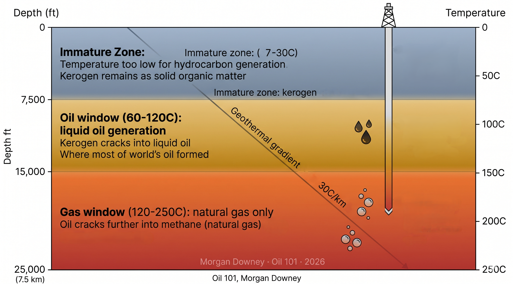

Figure 6-1: The geothermal gradient. Kerogen remains immature above 7,500 feet. In the oil window (60-120C), heat and pressure crack kerogen into liquid oil. Below 15,000 feet, in the gas window, everything is cracked further into methane. (Source: Oil 101, Morgan Downey)

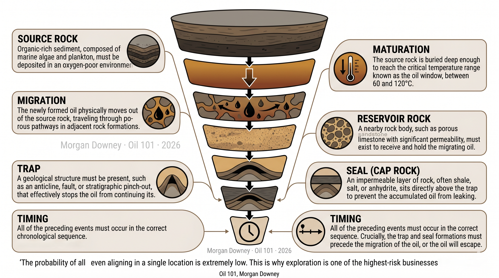

Figure 6-2: Seven low-probability geological events must all align to produce a commercial oil discovery. Failure at any stage means no oil. This is why exploration is one of the highest-risk businesses in the world. (Source: Oil 101, Morgan Downey)

## Reservoir Mechanics: Pressure Is Everything

Oil does not sit in underground lakes. It is trapped in tiny pores within rock, like water in a rigid sponge. Oil moves to the bottom of a well because reservoir pressure exceeds the low pressure at the wellbore. Every barrel extracted reduces reservoir pressure. There is an**optimal rate of production** that maximizes total recovery: producing too fast depletes pressure prematurely, permanently stranding oil in the ground.

The **recovery factor** (percentage of original oil in place that can be extracted) averages only about 30% worldwide. It is exceptional to achieve above 60%. Natural drive mechanisms include:

Dissolved gas drive

Gas dissolved in oil expands as pressure drops, pushing oil toward the well.

Gas cap drive

Free gas above the oil expands to push oil downward and toward wells.

Water drive

An aquifer beneath the oil pushes it upward. Generally the most effective natural drive.

Gravity drainage

Oil flows downward through the reservoir under gravity to wells at the base.

Each mechanism is "rate sensitive": producing too aggressively can permanently reduce total recoverable oil. The rule of capture historically caused producers to race to extract as fast as possible from shared reservoirs, destroying value. In the early days at Spindletop, oil fields were covered in thousands of wells every few feet. Today, standard well spacing is typically 40 acres per well, with infill drilling permitted as economics warrant.

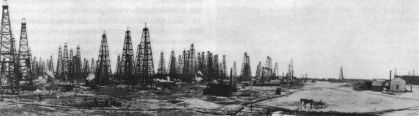

Figure 6-1: The forest of oil wells at Spindletop in the early 1900s. Under the rule of capture, producers raced to drain the reservoir as fast as possible, wrecking total recovery in the process. (Source: USGS)

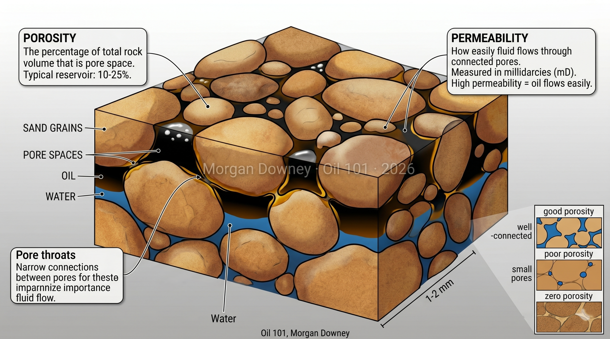

Figure 6-4: Oil is trapped within tiny pores in the reservoir rock, like water in a rigid sponge. Porosity is the percentage of pore space (typical reservoir: 10-25%). Permeability is how easily fluid flows through connected pores, measured in millidarcies. Both must be sufficient for a commercial well. (Source: Oil 101, Morgan Downey)

Only about 30% of the oil in a typical reservoir is ever recovered. The other 70% remains trapped in the rock forever. Even with the most advanced technology, getting above 60% is rare. This means for every barrel we produce, roughly two barrels are left behind underground.

## Exploration: Seismic Surveys

Modern exploration relies on **seismic surveys**: sending sound waves into the earth and analyzing their reflections to map underground rock formations. A seismic source (vibrator trucks onshore, air guns offshore) generates waves that travel through rock layers. When waves hit a boundary between different rock types, some energy reflects back to the surface where it is recorded by receivers called geophones (onshore) or hydrophones (offshore).

**2D seismic** produces cross-section images along a single line. **3D seismic** uses a grid of source and receiver lines to create a three-dimensional picture of the subsurface. **4D seismic** (time-lapse) repeats 3D surveys over time to track how fluids move through a producing reservoir. Despite these advances, the success rate for **wildcat wells** (drilled in unexplored areas) remains only 10-20%.

## Drilling

Once a prospect is identified, a **rotary drilling rig** bores into the earth. The drill string consists of a rotating drill bit at the bottom, connected to the surface by drill pipe. **Drilling mud** (a carefully engineered fluid) is pumped down the drill pipe and returns up the annulus (the space between the pipe and the borehole wall), carrying rock cuttings to the surface and maintaining pressure to prevent blowouts.

Wells are lined with steel **casing** (cemented in place) to prevent collapse and isolate different pressure zones. The bottom of the well is **completed** by perforating the casing to allow oil to flow in. A **Christmas tree** (a set of valves and fittings) sits on top of the wellhead to control flow.

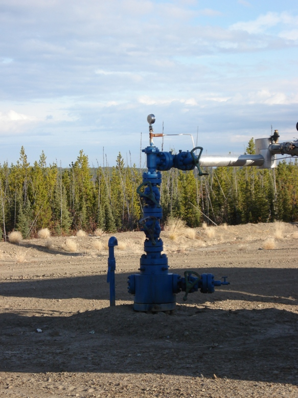

Figure 6-5: A wellhead Christmas tree in northern British Columbia. The stack of valves and gauges controls pressure and flow from the completed well below. (Source: [Dexcel / Wikimedia Commons (public domain)](https://commons.wikimedia.org/wiki/File:Wellhead-blue.jpg))

Edwin Drake's first well in 1859 used a stove pipe as casing to stop the hole from collapsing. This is the same principle used today in multi-million-dollar deepwater wells, at a completely different scale. Modern casing strings can weigh over 1,000 tons.

### Drilling Mud Chemistry

Drilling mud is the unsung hero of every well. It serves five simultaneous jobs: lifting rock cuttings from the bit face to the surface; maintaining hydrostatic pressure in the wellbore to counterbalance formation pressure and prevent kicks; cooling and lubricating the drill bit; forming a thin impermeable filter cake on the borehole wall to stabilize soft formations; and suspending cuttings in place when circulation stops, so the hole does not pack off. There are three main mud families. **Water-based muds** (WBM) are the cheapest and most common, built on fresh or salt water with bentonite clay and barite weighting material. **Oil-based muds** (OBM) use diesel or mineral oil as the continuous phase and are preferred in shales that react with water, in high-temperature wells, and in highly deviated holes. **Synthetic-based muds** (SBM) substitute engineered esters or olefins for diesel to meet offshore environmental rules. Mud weight is quoted in pounds per gallon, with 9 ppg roughly neutral and 14 to 18 ppg typical for high-pressure deepwater sections.

### Well Logging

A well is only as useful as the data it produces. Three logging techniques compete for each foot of new hole. The cheapest is the **mud log**: a geologist watches cuttings return to the shale shaker and records lithology, gas shows, and drilling rate depth by depth. **Wireline logs** are run after drilling stops. A logging tool is lowered on an electrical cable and measures gamma ray (shale content), resistivity (hydrocarbon vs water), density and neutron porosity (pore volume), and sonic velocity (rock mechanics). These measurements are cross-plotted to identify pay zones and estimate hydrocarbon saturation. **Logging while drilling** (LWD) embeds the same sensors into the drill collar just above the bit, so the geosteering team sees formation properties in near real time and can adjust the wellbore to stay inside a thin pay zone. LWD is the dominant logging method for horizontal shale wells, where pulling a wireline tool around the curve is impractical.

### Drill Bits and Directional Tools

Two drill-bit families dominate the field. **Roller cone bits** use three rotating cones with hardened teeth (milled tooth for soft formations or tungsten carbide inserts for hard rock) and cut rock by crushing and scraping. **Polycrystalline diamond compact** (PDC) bits have no moving parts: they shear rock with fixed synthetic diamond cutters. PDC bits last longer and drill faster in most shales and carbonates, and they now account for the majority of footage in US land drilling. Directional control comes from a **mud motor** (a positive-displacement motor powered by the mud stream, with a bent housing that deflects the bit) or a **rotary steerable system** (RSS) that steers while the full drill string rotates, giving a smoother hole and faster build rates. Survey tools in the bottom-hole assembly measure inclination and azimuth, so the driller always knows where the bit is pointing to within a degree or two.

### Blowout Preventers and Well Control

If formation pressure suddenly exceeds mud-column pressure, hydrocarbons rush into the wellbore (a kick) and can reach the surface uncontrolled (a blowout). The last line of defense is the **blowout preventer** stack. A BOP stack combines two families of valves. **Annular preventers** squeeze a donut-shaped rubber element around whatever is in the wellbore, sealing around drill pipe, casing, or an open hole. **Ram preventers** drive two opposing steel blocks together: pipe rams seal around a specific pipe diameter, blind rams close on an open hole, and shear rams are built to physically cut the drill pipe and seal the well in a worst-case emergency. On a subsea well, the BOP stack sits on the seafloor and is connected to the rig through a marine riser and a lower marine riser package. The 2010 Macondo blowout at the Deepwater Horizon rig became the reference case for BOP failure: the shear rams did not fully cut the drill pipe, the wellhead blew, the rig burned and sank, and 4.9 million barrels of crude were released into the Gulf of Mexico over 87 days. [Chapter 15 (Environmental)](#chapter-environmental) covers the response.

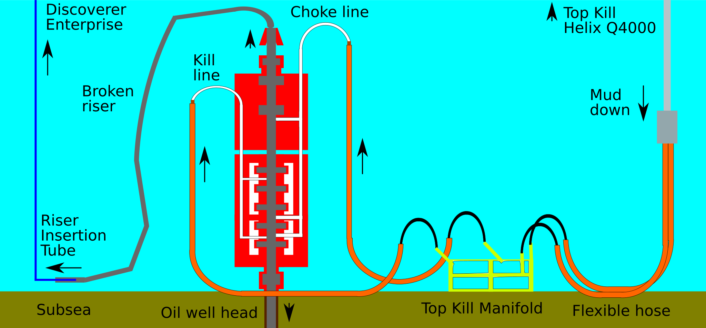

Figure 6-6: A subsea BOP stack on the Macondo wellhead showing kill and choke lines, the riser insertion tube, and the top kill manifold. Annular and ram preventers are stacked above the wellhead on the seafloor. In the 2010 blowout, the shear rams failed to fully cut the drill pipe, allowing hydrocarbons to escape to the surface. (Source: [Wikimedia Commons (public domain)](https://commons.wikimedia.org/wiki/File:Subsea_blowout_preventer_stack_riser_mud.svg))

Drilling can be **vertical**, **directional** (angled), or **horizontal** (turning 90 degrees to run laterally through a formation). Horizontal drilling, combined with hydraulic fracturing, was the breakthrough that unlocked the shale revolution. A modern Permian well typically drills 10,000 feet of vertical hole, builds curvature over a few hundred feet, and then runs 2 to 3 miles horizontally through the pay zone, all in under 10 days.

## Production Phases

**Primary recovery** is the first phase of production. Most new wells initially flow under natural reservoir pressure, requiring no pump at all. As pressure declines over months or years, **artificial lift** becomes necessary. The most common method is the sucker-rod pump, the iconic "nodding donkey" pumpjack visible across the US oil patch. Sucker-rod pumps are used on the majority of US onshore producing wells, especially older stripper wells producing under 15 barrels per day. Other artificial lift methods include electric submersible pumps (ESPs, favored in high-rate offshore and shale wells), gas lift (injecting gas to lighten the fluid column), progressive cavity pumps, and jet pumps. By well count, over 90 percent of the roughly 500,000 producing wells in the US use some form of artificial lift because most are mature, low-rate stripper wells. By production volume, the picture is different: newer high-rate wells, particularly in the Permian and offshore Gulf of Mexico, often flow under natural reservoir pressure for their first several years. Globally, the majority of Middle Eastern production flows naturally without any pump. The distinction matters: most wells use pumps (because most wells are old and low-rate), but a large share of barrels come from wells that do not need them (because new high-rate wells dominate volume).

The surface beam of a pumpjack rocks up and down, driving a long string of rods down the well to a positive-displacement plunger pump at the producing interval. On each upstroke the pump lifts a few gallons of fluid into the tubing; on the downstroke it resets. A single pumpjack may cycle 8 to 15 strokes per minute, 24 hours a day, for decades.

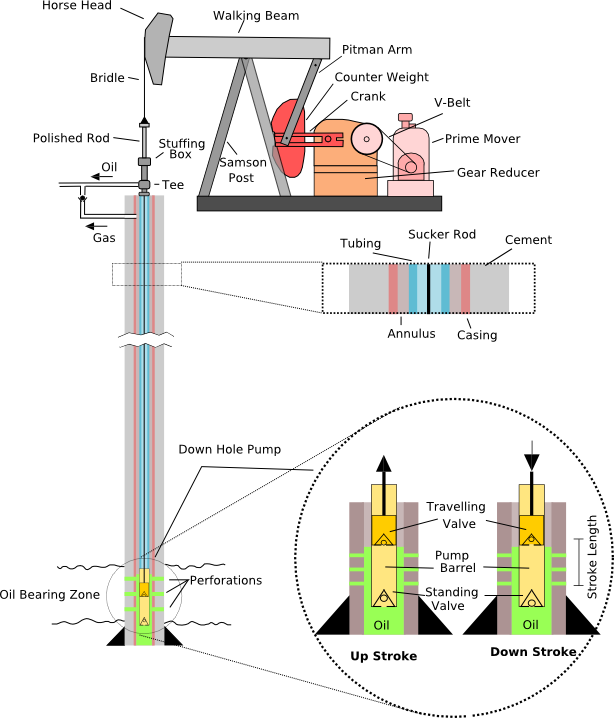

Figure 6-7: The nodding donkey pumpjack. The walking beam at the surface drives a rod string down to a positive-displacement plunger pump at the producing interval. By well count, pumpjacks represent the majority of US producing oil wells, though by production volume, many of the highest-rate wells flow under natural reservoir pressure without any pump. (Source: [Wikimedia Commons (CC BY 3.0)](https://commons.wikimedia.org/wiki/File:Pump_Jack_labelled.png))

The US has over 500,000 producing oil wells. Saudi Arabia achieves similar total output with fewer than 3,000. The difference is geology: Saudi wells tap massive conventional reservoirs with natural pressure, while most US wells are small, aging stripper wells requiring mechanical pumps.

### Secondary Recovery: Waterflooding

**Secondary recovery** involves injecting water or gas to maintain reservoir pressure and physically sweep oil toward producing wells. Waterflooding is by far the most common method: seawater, produced water, or treated river water is injected at high pressure through dedicated injection wells, raising pressure and pushing oil through the pore network toward producers. Waterflooding has been used from the earliest production stages at Saudi Arabia's Ghawar, where the resulting pressure support has kept the giant field producing for over 70 years. Injection patterns are chosen to maximize sweep efficiency across a regular well grid. The two classic patterns are the **five-spot** (one producer in the center of a square of four injectors, with every well in the grid serving one of the two roles) and the **nine-spot** (one producer surrounded by eight injectors in a 3-by-3 grid). Direct line drive, inverted patterns, and irregular patterns are used in fields where faults or permeability contrasts make the classical grids inefficient.

### Tertiary Recovery: Enhanced Oil Recovery

**Tertiary recovery**, better known as Enhanced Oil Recovery (EOR), uses advanced techniques after primary and secondary methods have exhausted the easy oil. EOR methods are grouped into three families by the physics they exploit: thermal (change viscosity with heat), gas (change miscibility with solvents), and chemical (change sweep with surfactants or polymers).

Table 6-1: Enhanced Oil Recovery Methods

| Family | Technique | Where it is used |
| --- | --- | --- |
| Thermal | Steam flood, cyclic steam stimulation, steam-assisted gravity drainage (SAGD), fire flood | Alberta (SAGD), Kern River CA, Duri Sumatra, Orinoco Venezuela |
| Gas | CO2 miscible flood, nitrogen flood, flue gas, rich hydrocarbon gas | Permian Basin (largest application); CO2 from natural domes and industrial sources |
| Chemical | Polymer flood, surfactant flood, alkaline flood, ASP (alkaline-surfactant-polymer) | Daqing China (largest polymer flood), selected North Sea and US mature fields |

CO2 injection for enhanced oil recovery is one of the few industrial processes that actually consumes carbon dioxide. Some operators source CO2 from natural underground deposits, while others capture it from power plants or industrial facilities, creating a rare overlap between oil production and carbon reduction.

## Decline Curves and Field Life

Every oil well follows a **decline curve**: production peaks early then gradually falls as reservoir pressure depletes. Conventional wells typically decline 5 to 15 percent per year. Shale wells are drastically steeper: 60 to 80 percent decline in the first year, 30 to 40 percent in the second year, then a long low-rate tail. This difference dominates the economics. A conventional well in the Middle East may produce for 30 years with modest intervention. A shale well delivers most of its lifetime oil in the first 24 months, requiring continuous new drilling just to hold field-level production flat, a phenomenon the industry calls the **shale treadmill**.

Field operators use **decline curve analysis (DCA)** to forecast future production and estimate ultimate recovery. The three standard Arps models are exponential (constant percentage decline, fits most mature conventional wells), hyperbolic (a slowing decline rate, fits wells with strong transient flow), and harmonic (the slowest decline, a special case of hyperbolic with b equal to 1). The widget below lets you see how changing the hyperbolic b-factor rotates the curve and reshapes estimated ultimate recovery from the same initial rate. [Chapter 14 (Reserves)](#chapter-reserves) goes deeper into how decline curves feed proved reserve bookings and SEC PV-10 valuations.

Arps Decline Curves

Hyperbolic b-factor: 0.50

Arps decline curves. All three curves start at 1,000 barrels per day and share a 35 percent initial annual decline. Exponential (b = 0) falls fastest and estimates the least ultimate recovery. Harmonic (b = 1) has the longest tail. Hyperbolic sits in between: drag the slider to see how the b-factor changes the shape.

Reference: J.J. Arps, “Analysis of Decline Curves” (1945), SPE.

The chart below compares a typical shale horizontal well against a conventional vertical well, both starting at 1,000 barrels per day. The shale well loses two thirds of its rate in year one; the conventional well barely moves. This is why shale economics are driven by initial rate, completion cost, and drilling pace rather than long-term recovery per well. See [Chapter 21 (The Shale Revolution)](#chapter-shale-revolution) for the full treatment of how horizontal drilling and hydraulic fracturing changed the industry.

Shale vs Conventional Decline Curves (Illustrative)

Shale horizontalConventional vertical

The shale treadmill in one chart. Both wells start at 1,000 barrels per day in month one. The shale well follows a hyperbolic Arps decline, losing roughly two thirds of its rate in the first twelve months and settling into a long low-rate tail. The conventional well loses only 6 to 8 percent per year and is still producing several hundred barrels per day a decade later. Over 120 months the conventional well actually out-produces the shale well on a cumulative basis in this teaching example, which is why shale economics live or die on initial productivity, completion cost, and drilling pace rather than ultimate recovery per well.

A conventional oil well may produce for 20 to 30 years with a gradual decline. A shale well delivers most of its oil in the first two to three years. The US shale industry must drill thousands of new wells every year just to hold production flat.

## Offshore Production

When onshore opportunities are limited, companies move offshore, where costs are 4-5 times higher but fields tend to be much larger. Offshore platforms fall into a tidy typology defined primarily by water depth. Fixed structures dominate shallow water; floating systems dominate deepwater and ultra-deepwater. The choice of platform type has first-order consequences for capex, schedule, and even the commercial structure of the development.

Table 6-2: Offshore Platform Typology

| Type | Water depth | How it works |
| --- | --- | --- |
| Jack-up | Up to 400 ft | Mobile hull towed into position; hydraulic legs lower to seafloor and jack hull above wave height |
| Fixed jacket | Up to 1,000 ft | Steel lattice jacket pile-driven into seafloor with deck on top; workhorse of 1960s-80s shelf |
| Compliant tower | 1,000 to 3,000 ft | Flexible steel tower that sways with waves rather than resisting them; mid-depth solution |
| Tension leg platform (TLP) | 1,500 to 5,000 ft | Buoyant hull held down by vertical tendons anchored to seafloor; eliminates most vertical motion |
| Spar | Up to 10,000 ft | Deep vertical cylinder with ballast at base; stable because most of the structure sits below the wave zone |
| Semi-submersible | 1,500 to 10,000 ft | Pontoons below the wave zone support columns holding the deck above; used for drilling and production |
| FPSO | Any deepwater | Ship-shaped hull with processing on deck and crude storage below; offloads to shuttle tankers. Dominant solution for remote deepwater fields. |

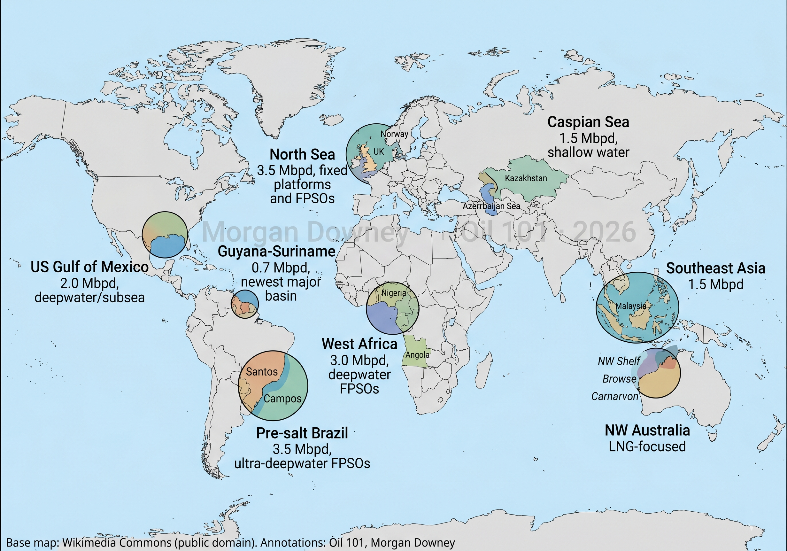

Figure 6-8: Major global offshore oil and gas production basins. Offshore production accounts for roughly 30% of global crude output. The deepest water developments (pre-salt Brazil, Gulf of Mexico, West Africa) operate in 2,000 to 3,000 meters of water using floating production systems. (Source: Base map: Wikimedia Commons (public domain). Annotations: Oil 101, Morgan Downey)

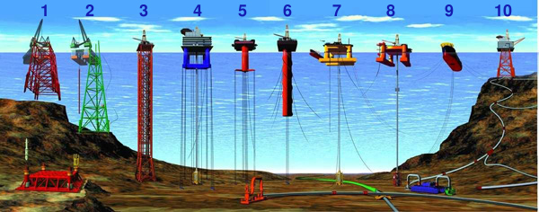

Figure 6-9: Offshore platform types shown at relative scale and water depth. From left: (1-2) conventional fixed platforms for shallow water, (3) compliant tower, (4-5) tension leg platforms, (6) spar, (7-8) semi-submersibles, (9) FPSO, and (10) subsea completion tied back to a host facility. Jack-up rigs and gravity-based structures are not pictured. (Source: [NOAA Office of Ocean Exploration and Research (public domain)](https://commons.wikimedia.org/wiki/File:Types_of_offshore_oil_and_gas_structures.jpg))

Figure 6-10: Maximum Water Depth by Platform Type (feet)

Sources: industry references, Oil & Gas Journal. FPSO depth limited by riser and mooring technology, not the vessel itself.

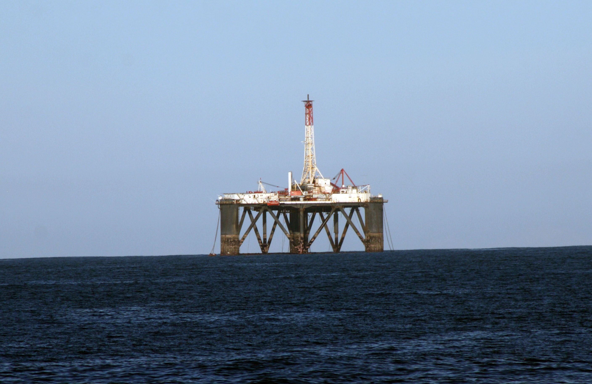

Figure 6-11: The PetroSA FPSO Orca at Mossel Bay, South Africa. An FPSO carries processing equipment on deck and stores crude in its hull, offloading periodically to shuttle tankers. (Source: [Bob Adams / Wikimedia Commons (CC BY-SA 2.0)](https://commons.wikimedia.org/wiki/File:PetroSA_Floating_Production_Storage_and_Offloading_Facility_%22Orca%22_IMO_8755015_(17989920713).jpg))

Brazil's **pre-salt fields** (discovered 2006-2007) lie beneath 7,000 feet of water, 10,000 feet of rock, and a 6,000-foot layer of salt, yet are developed with arrays of FPSOs tied back to dozens of subsea wells and produce over 3 million bpd in aggregate. The **US Gulf of Mexico** produces roughly 1.8 million bpd from a mix of fixed jackets on the shelf and deepwater TLPs, spars, and semi-submersibles. The 2010 Deepwater Horizon disaster (the Macondo blowout, discussed in the well control section above) led to stricter safety regulations and a temporary drilling moratorium, but Gulf deepwater production has since recovered and grown.

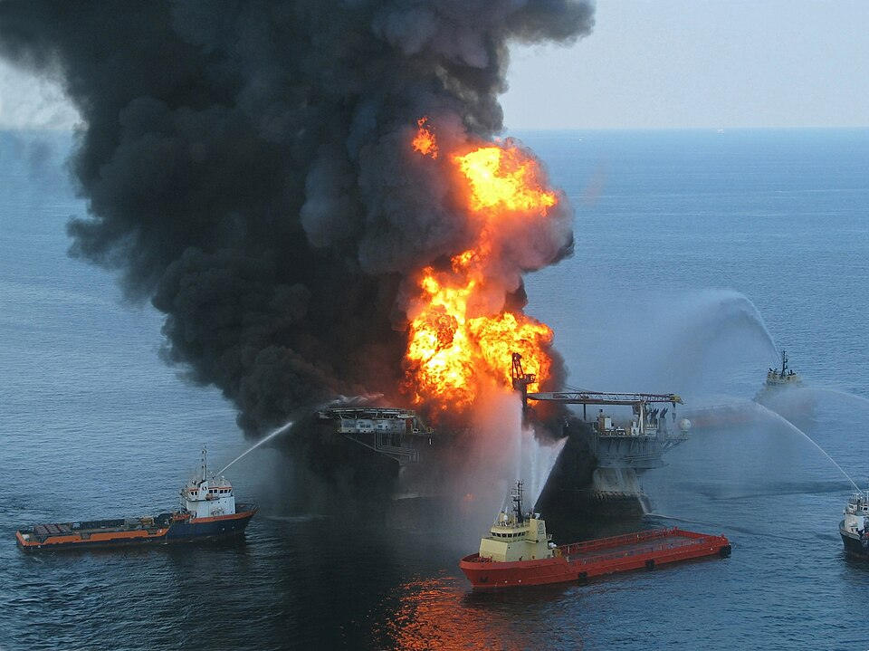

Figure 6-12: The Deepwater Horizon semi-submersible drilling rig burning on April 20, 2010 after the Macondo blowout. The rig sank two days later. Eleven workers were killed and 4.9 million barrels of crude were released into the Gulf of Mexico over 87 days before the well was capped. (Source: [US Coast Guard (public domain, via Wikimedia Commons)](https://commons.wikimedia.org/wiki/File:Deepwater_Horizon_offshore_drilling_unit_on_fire_2010.jpg))

## The Shale Revolution

**Horizontal drilling** combined with **hydraulic fracturing** ("fracking") took US oil production from 5 million bpd in 2008 to roughly 13.5 million bpd by 2025, making the US the world's largest oil producer. The mechanics belong in their own chapter. The five-step fracking explainer below introduces the core idea; [Chapter 21 (Shale Revolution)](#chapter-shale-revolution) covers basin geology, rig productivity, type curves, the 2015 crude export ban lift, and the 2023 to 2025 consolidation wave (ExxonMobil to Pioneer, Chevron to Hess, Diamondback to Endeavor).

How Hydraulic Fracturing Works

1

Vertical drilling

Drill vertically 5,000-10,000 feet to reach the target shale formation. Steel casing cemented in place.

2

Horizontal turn

The wellbore curves 90 degrees and extends horizontally through the shale for 1-3 miles (5,000-15,000 feet).

3

Perforation

Small explosive charges (perforating guns) punch holes through the casing into the surrounding rock at 30-60 intervals.

4

Hydraulic fracturing

Water, sand (proppant), and chemicals pumped at 5,000-10,000 psi to fracture the shale. Sand holds fractures open.

5

Flowback and production

Pressure released, fracking fluid flows back. Oil and gas flow from fractured rock into the wellbore and up to the surface.

A single horizontal shale well uses 5-15 million gallons of water and 5-10 million pounds of sand during the fracturing process. The water volume is roughly equivalent to filling 20 Olympic swimming pools. Most of the water is recovered as “flowback” and recycled. [Chapter 21 (Shale Revolution)](#chapter-shale-revolution) covers the full Permian, Bakken, Eagle Ford, and Marcellus picture, including type-curve economics, breakeven prices, and the consolidation wave of 2023 to 2025.

The E&P sector continues to evolve. Digital oilfield technologies (sensors, machine learning, automated drilling) are improving efficiency. Carbon capture and storage (CCS) is being deployed at some production sites to reduce emissions. Meanwhile, the question of whether the best shale acreage is running out, and when US production will peak for a second time, remains one of the most consequential debates in global energy.

The above was updated in 2026. For the full original 2009 chapter, [download the 1st edition 2009 PDF](/api/download/pdf).

Morgan Downey’s Commodity News

### Read what a commodity trader reads

A free morning brief on the oil, gas, and commodity markets, written by Morgan Downey, author of Oil 101. One email, every morning.

[Subscribe free →](https://boxwoodapp.com/news/subscribe)

<!-- rl-section id="chapter-refining" class="chapter" kicker="Chapter 7" title="Refining" -->

## Refining

Chapter 7

# Refining

Oil refining explained: distillation, cracking, reforming, blending, and how crude oil becomes gasoline, diesel, and jet fuel.

<svg fill="none" height="18" stroke="currentColor" stroke-linecap="round" stroke-linejoin="round" stroke-width="2" viewbox="0 0 24 24" width="18"><path d="M3 18v-6a9 9 0 0 1 18 0v6"></path><path d="M21 19a2 2 0 0 1-2 2h-1a2 2 0 0 1-2-2v-3a2 2 0 0 1 2-2h3zM3 19a2 2 0 0 0 2 2h1a2 2 0 0 0 2-2v-3a2 2 0 0 0-2-2H3z"></path></svg>Listen· 25:02

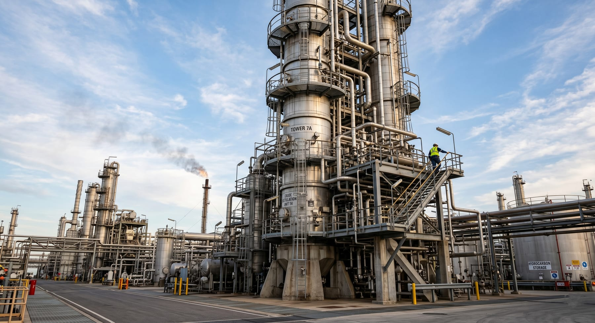

Figure 7-1: A crude oil distillation tower in operation. Towers like this run continuously for years, splitting hundreds of thousands of barrels of crude per day into the cuts that move the world. (Source: Oil 101, Morgan Downey)

## Feedstock, Slate, and Refinery Gain

A refinery turns crude oil into finished products: gasoline, jet fuel, diesel, heating oil, residual fuel oil, petrochemicals, lubricants, waxes, asphalt, and coke. The crude that goes in is called feedstock. The portfolio of products that comes out is called the product slate. The mix of crude grades a refinery is configured to run is called its crude slate. Refiners speak of the avails of a particular grade: the availability of that grade relative to what they want to buy. Avails can be tight or plentiful.

A barrel of crude contains 42 US gallons going in. After processing, a typical US refinery produces roughly 45 gallons of finished products. The extra volume comes from refinery gain, also called processing gain. When heavy molecules are cracked into lighter ones, the weight stays the same but the volume increases, because lighter hydrocarbons are less dense. US refineries show larger gain than the global average because they are more complex. They have more cokers, more cracking capacity, and more hydrogen addition. Gain is not magic: it is a volumetric consequence of chemistry.

The difference between what a refinery pays for its crude and what it earns for its products is the refinery margin, also called the crack spread or simply the crack. [Chapter 18 (Futures and Swaps)](#chapter-futures-swaps) covers the 3:2:1 crack spread mechanics.

Figure 7-2: Product Yield by Crude Grade Through a Complex Refinery (% of Output)

Sources: EIA, Valero investor presentations, industry estimates

Crude grade determines what comes out of the refinery. Light sweet WTI (40 API) yields nearly half gasoline, while heavy sour Maya (22 API) produces 24% residual fuel oil that a simple refinery cannot further upgrade. A coker can convert that residual into lighter products, which is why Gulf Coast refineries with coking capacity pay a smaller discount for heavy crude. The “other” category includes LPG, petrochemical feedstocks, coke, asphalt, and lubricants. Yields are illustrative for a complex US Gulf Coast configuration.

## The Four Stages of Refining

Refining breaks down into four stages. Every refinery in the world goes through some or all of them, depending on configuration:

Table 7-1: The four stages of refining

| Stage | What it does | Main process units |
| --- | --- | --- |
| **Separation** | Split crude into cuts by boiling point | Desalter, ADU, VDU |
| **Conversion** | Break heavy molecules into lighter, more valuable ones; combine light gases into gasoline-range molecules; rearrange atoms to raise octane | FCC, hydrocracker, coker, visbreaker, alkylation, reformer, isomerization |
| **Treatment** | Remove sulfur, nitrogen, metals, and odorants | Hydrotreater, hydrodesulfurizer, amine unit, Merox sweetener, Claus sulfur plant |
| **Blending** | Combine blendstocks into finished fuels that meet specification | Inline blenders, tank farms, additive injection |

## Separation: The Crude Distillation Unit

Desalting is the first thing crude sees at a refinery. Salt is corrosive to carbon-steel piping and valves, so it is washed out before anything else happens. Water is then removed in settling tanks. The clean, dry crude is charge-pumped into a furnace that warms it to about 400 degrees Celsius, and the hot feed is fed into the atmospheric distillation unit (ADU), also called the crude distillation unit (CDU) or simply the tower.

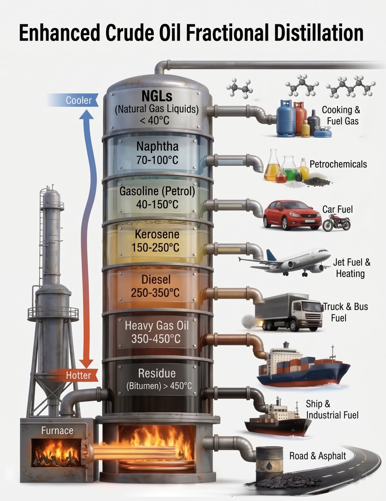

Figure 7-3: Crude oil fractional distillation. Heated crude enters the tower near the base; vapor rises and condenses at heights matched to each fraction's boiling point. Lightest cuts leave the top: NGLs feed cooking and fuel gas, naphtha feeds petrochemicals and plastics, and gasoline fuels cars. Middle cuts go to jet fuel, heating, and trucks. Heavy gas oil powers ships and industry; the bottom residue becomes asphalt and bitumen for roads. (Source: Oil 101, Morgan Downey)

Inside the ADU are horizontal trays fitted with mushroom-shaped bubble caps. As hot vapor rises, it is forced to bubble through pools of liquid sitting on each tray, and as it does it cools and condenses. Different boiling-point fractions condense at different heights: gases and naphtha at the top, kerosene and jet in the middle, diesel and gasoil lower, residual fuel oil at the bottom. The heaviest, tar-like molecules never rise at all; they fall out at the bottom of the barrel. Separating light tops from heavy bottoms in the ADU is called topping the crude.

The second stage of separation is the vacuum distillation unit (VDU), which takes the heaviest residuals from the bottom of the ADU and distills them again under reduced pressure. Lowering the pressure lowers the boiling points, so heavy molecules can be vaporized and separated without being thermally cracked. Thermal cracking in the ADU or VDU is unwanted because it is uncontrollable: refiners prefer to crack later, in dedicated units, where they can control yields. The main VDU products are vacuum gasoil (VGO), which feeds the FCC, and vacuum resid, which feeds the coker.

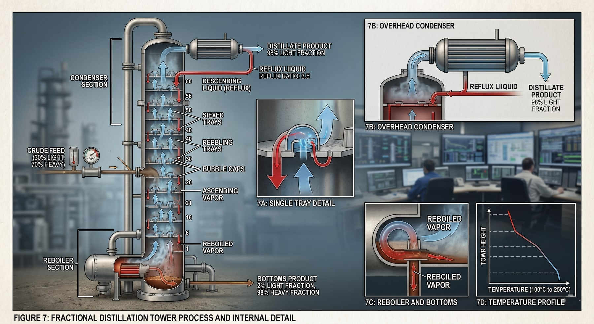

Figure 7-4: Inside the tower. Hot crude vapor rises through dozens of trays fitted with bubble caps. Vapor bubbles up through pools of liquid sitting on each tray, condenses partway, and the heavier component falls back down as reflux while the lighter component continues to rise. Insets: 7A, single bubble-cap tray detail; 7B, overhead condenser delivering distillate product and reflux; 7C, reboiler returning vaporized bottoms to the column; 7D, temperature profile from base to top. (Source: Oil 101, Morgan Downey)

## Conversion: Where Margin Is Made

Simple distillation is at the mercy of the crude. If a barrel of Arab Light contains 20% gasoline-range molecules, a pure topping refinery can only produce 20% gasoline from it. But gasoline and middle distillates (jet, kerosene, diesel, heating oil) are the highest margin products. The whole economic point of a modern refinery is to convert as many of the non-gasoline, non-distillate molecules as possible into gasoline and distillate. That conversion is where the margin is made. There are three families of conversion: cracking (break large into small), combining (join small into large), and modifying (rearrange atoms).

### Fluid Catalytic Cracking (FCC)

The fluid catalytic cracker is the single most important unit in most US refineries. It takes vacuum gasoil from the VDU and cracks it into gasoline-range molecules, light olefins (propylene and butylene, which feed the alkylation unit and the petrochemical industry), light cycle oil (a diesel blendstock), and heavy slurry oil (which goes to the coker or becomes carbon black). The cracking happens in a tall riser where the oil meets hot powdered catalyst. Within seconds, the catalyst surface is coated with coke and becomes ineffective. The deactivated catalyst is circulated to a regenerator where the coke is burned off with air, and the clean catalyst, now reheated, is sent back to the riser. The regenerator is also the FCC's primary heat source: the controlled coke burn is what keeps the riser at cracking temperature.

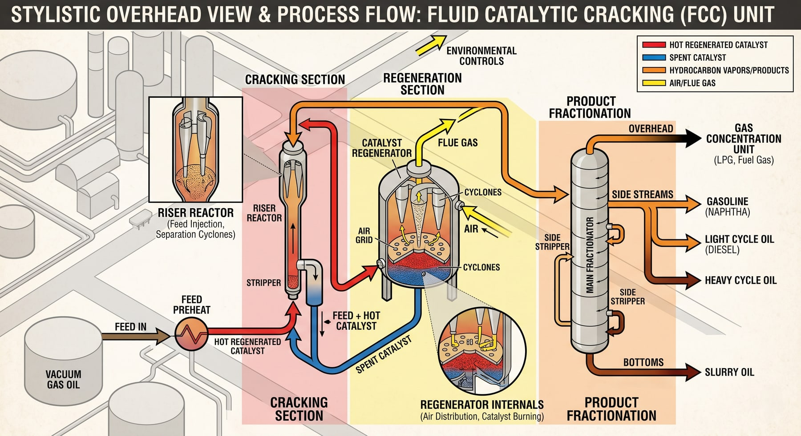

Figure 7-5: The fluid catalytic cracker (FCC). Vacuum gasoil meets hot regenerated catalyst at the base of the riser and cracks into lighter molecules within seconds. Spent catalyst flows to the regenerator where coke is burned off with air, releasing the heat that drives the cracking reaction back in the riser. The main fractionator splits the cracked product into gasoline, light cycle oil, heavy cycle oil, slurry oil, and overhead gas going to LPG and fuel gas recovery. (Source: Oil 101, Morgan Downey)

### Hydrocracking

The hydrocracker does similar chemistry to the FCC but uses different conditions: lower temperature, higher pressure, a different catalyst, and hydrogen. Adding hydrogen means the hydrocracker can convert almost its entire feedstock to desired products rather than generating a heavy slurry tail. The primary feedstock is heavy vacuum gasoil (HVGO). The primary output is middle distillate, particularly jet fuel: oil traders associate hydrocrackers with jet production because the process produces exactly the narrow range of hydrocarbon molecules that jet specification requires. Hydrocrackers are more expensive than FCCs to build and operate, mainly because making enough hydrogen is costly, but they have expanded fastest in regions where diesel and jet demand exceeds gasoline.

### Coking

A coker takes vacuum tower bottoms (the heaviest, most carbon-rich residue in the refinery) and cracks them with heat alone. The goal is to recover as much light product as possible from material that would otherwise be sold as low-value residual fuel oil or asphalt. The process generates naphtha, gasoil, and a large amount of a solid coal-like substance called petroleum coke. Coke is a byproduct, not the goal: its main uses are as a fuel in cement kilns and power plants (fuel-grade coke) and as a feedstock for aluminum smelters (anode-grade coke). Delayed coking is the most common of three variants (delayed, fluid, and flexi coking). In a delayed coker, batches of heavy residue are fed into tall, barrel-shaped drums where they sit for roughly 22 hours while cracking happens. When a drum is full, the coke is physically cut out with high-pressure water drills. A coker typically has multiple drums so that one is always being filled while others are being cut out.

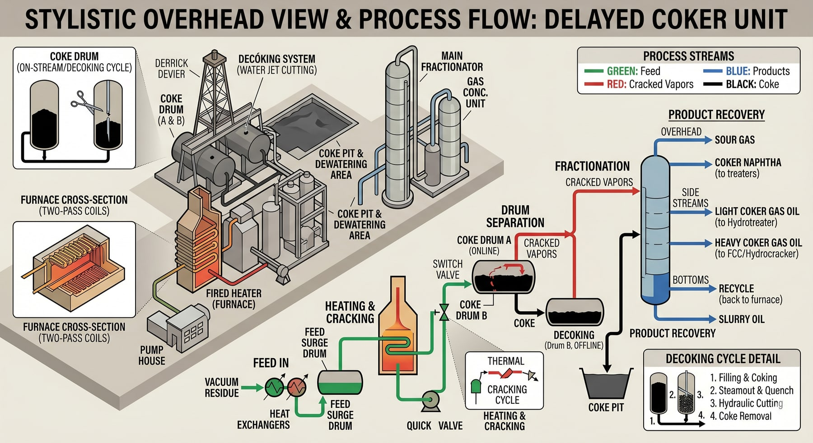

Figure 7-6: A delayed coker. Vacuum resid is heated and fed into one of a pair of coke drums where it cracks over roughly 22 hours while the other drum is being decoked. Cracked vapors rise to the main fractionator and split into sour gas, coker naphtha, light coker gasoil, and heavy coker gasoil. Solid petroleum coke is drilled out with high-pressure water on a four-stage cycle (fill, steamout and quench, hydraulic cutting, removal) and ships to cement kilns, power plants, and aluminum smelters. (Source: Oil 101, Morgan Downey)

Cokers are the reason US refineries have such high refinery gain and such high Nelson complexity: they let refiners buy cheap heavy crudes, crack the bottom of the barrel into gasoline and distillate, and sell the coke as a separate product. The spread between light sweet and heavy sour crudes, the light-heavy differential, is effectively the per-barrel value of a coker.

### Visbreaking and Steam Cracking

Visbreaking is a mild thermal cracking process used to lower the viscosity of residual fuel oil. Less viscous resid needs less expensive cutter stock (light diluent) before it can be sold as bunker fuel or used in power generation. Visbreakers are common in Europe and relatively rare in the US, which prefers to upgrade resid all the way to transport fuel in a coker.

Steam cracking is the gateway from oil refining to petrochemicals. Very high temperature steam breaks apart light feedstocks (ethane, propane, naphtha, light gasoil) to produce ethylene, propylene, butadiene, and aromatics. These are the building blocks of nearly every modern plastic. US and Middle East steam crackers run mostly on ethane and propane piped in from gas processing plants. Asian steam crackers run mostly on naphtha shipped in by tanker, because NGLs are not readily available by pipeline. A steam cracker inside a refinery is the defining feature of a full-conversion refinery.

## Combining: Alkylation and Polymerization

The cracking units produce a lot of light olefin gases, especially propylene and butylene. These are too volatile and too reactive to go straight into the gasoline pool, but they can be combined into larger, more stable molecules. The alkylation unit, or alky plant, uses concentrated sulfuric acid or hydrofluoric acid as a catalyst to combine isobutane with propylene or butylene, producing alkylate. Alkylate is a near-ideal gasoline blendstock: it has a high octane rating, a low vapor pressure, and almost no sulfur, olefins, or benzene. The acids are highly toxic and corrosive, and safety controls around alkylation units are among the most strict in any refinery. A related unit, the C4 isomerization plant, converts normal butane into isobutane to feed the alky plant.

Polymerization, an older technology largely replaced by alkylation, links olefin gases into polymerate. A modern variant called dimerization combines two isobutylene molecules into isooctane, an octane booster that replaced MTBE in US gasoline after MTBE was phased out in the early 2000s.

## Modifying: Catalytic Reforming, Isomerization, Ethers

Modifying rearranges atoms in hydrocarbon molecules without breaking them apart or combining them. The three main modifying units are catalytic reforming, isomerization, and ethers manufacture.

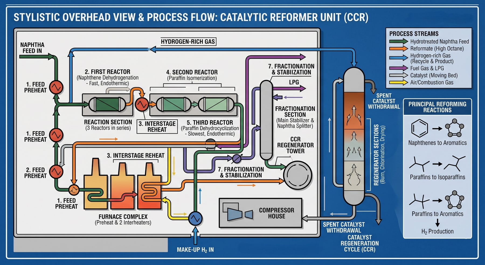

Figure 7-7: A continuous catalytic reformer (CCR). Hydrotreated naphtha is preheated and routed through three reactors in series, with fired interstage reheaters between them because the principal reactions (naphthenes to aromatics, paraffins to isoparaffins, paraffins to aromatics) are strongly endothermic. The product stream is split in the fractionation section into reformate, hydrogen-rich gas, and LPG. Hydrogen is recycled back through the reactors and exported to the rest of the refinery as the primary hydrogen source. Spent catalyst is continuously withdrawn to the regenerator tower for coke burn-off and chlorination, then returned to service. (Source: Oil 101, Morgan Downey)

Catalytic reforming takes heavy straight-run naphtha and rearranges it into high-octane reformate using a platinum or platinum-rhenium catalyst. Reformate is the single most important gasoline blendstock in most refineries. Reformate is also the primary source of the aromatics benzene, toluene, and xylenes (together BTX), which are either blended into gasoline or sent to a petrochemical plant. Hydrogen is a valuable byproduct. In a typical refinery, the naphtha cat reformer is the primary source of the hydrogen that feeds every hydrotreater and hydrodesulfurizer in the plant. Reformer feed must be almost entirely sulfur-free (below one part per million) because sulfur poisons the platinum catalyst.

Isomerization takes normal paraffins (n-butane, n-pentane, n-hexane), which have very low octane ratings, and rearranges their atoms into branched isoparaffins (isobutane, isopentane, isohexane), which have much higher octane. The product is called isomerate. It is a moderate but important contributor to the gasoline pool, typically five to seven percent. Normal butane converted to isobutane also feeds the alkylation unit.

Ethers manufacture is a small but historically important category. In the 1980s and 1990s, methyl tertiary butyl ether (MTBE) was the primary oxygenate in US gasoline, required to raise octane and meet air-quality regulations after lead was phased out. MTBE was later banned in most US states over groundwater contamination concerns and replaced by ethanol (blended at the terminal rather than the refinery). Other ethers, TAME and ETBE, persist in a few regional markets.

**The gasoline pool by blendstock.** Globally, six ingredients make up roughly 96% of motor gasoline: FCC gasoline (about 33%), reformate (about 33%), straight-run naphtha (about 10%), alkylate (about 10%), isomerate (about 5%), and normal butane (about 5%). Hydrocrackate, butylene, ethers, and ethanol make up the balance. The exact recipe varies by refinery, season, and country specification, but the big six do most of the work.

## Treatment: Hydroprocessing, Amine, Merox, Claus

Finished fuels have to meet strict specifications on sulfur, nitrogen, and metals, both because these elements damage engines and catalytic converters and because regulators require it. Hydroprocessing is the primary treating technology. It reacts sulfur and nitrogen compounds in oil with hydrogen over a catalyst at high pressure and temperature, converting them to hydrogen sulfide and ammonia, which can then be stripped out of the product stream. A hydrotreater (HDT) is usually used on lighter streams like kerosene; a hydrodesulfurizer (HDS) handles heavier middle distillates. When the goal is specifically to remove sulfur from jet and diesel to meet ultra-low-sulfur specifications, the unit is a sulfur recovery unit (SRU).

Amine treating uses amine solvents (monoethanolamine, diethanolamine) to strip hydrogen sulfide out of process gas streams. Merox sweetening oxidizes mercaptans, a class of foul smelling sulfur compounds, into relatively odorless disulfides. The rotten-egg smell everyone associates with natural gas is added artificially in trace amounts precisely because mercaptans are easy for humans to detect; untreated gasoline and jet would smell the same way. The hydrogen sulfide collected from hydroprocessing and amine treating feeds a Claus sulfur plant, which converts it into elemental sulfur for sale to chemical and fertilizer customers. Large refineries are among the biggest elemental sulfur producers in the world.

## Bitumen, Lubricants, Waxes, and Grease

Not every refinery product goes into an engine. Bitumen, the heavy tar-like residue that cannot be cracked economically, is sold as asphalt for roads and roofing. There are three bitumen production routes: straight-run (from the bottom of the VDU), solvent deasphalting (using propane or butane as a solvent to pull asphaltenes out of residuals), and bitumen blowing (blowing hot air through residuals to harden them). Solvent de-waxing removes waxes from vacuum distillates; the de-waxed oil becomes base stock for motor oils and industrial lubricants, and the waxes become paraffin wax for candles, packaging, and food contact. Lubricant manufacturing blends base stocks with additive packages to hit specific viscosity grades. Grease compounding blends lubricating oils with metallic soaps. All of these non-fuel product lines are a small share of a refinery's volume but a meaningful share of its margin.

Figure 7-8: An asphalt paving machine laying hot-mix bitumen on a road surface. Bitumen from the bottom of the vacuum distillation unit is the binder that holds road aggregate together. (Source: [Thomas Nugent / Wikimedia Commons (CC BY-SA 2.0)](https://commons.wikimedia.org/wiki/File:Asphalt_paving_machine_-_geograph.org.uk_-_7349239.jpg))

## Blending: Where Finished Product Is Born

Finished products are blended from many different streams. Gasoline is the hardest blend because octane rating and vapor pressure are not simple linear averages of the component values, and individual blendstocks can interact. Refiners use online blending computers to adjust recipes in real time and stay within specification. Ethanol, required in most US gasoline, is typically not blended at the refinery but at the distribution terminal (the truck rack) because ethanol pulls water into gasoline during pipeline transport. Additive packages (oxidation inhibitors, detergents, deposit reducers, corrosion inhibitors, dyes for marked off-road diesel) are injected during blending. Several oil companies maintain proprietary additive formulas that are marketed as performance enhancers.

## Refinery Types and the Nelson Complexity Index

Refineries are classified by what process units they contain. A basic topping refinery has only distillation and produces straight-run products that usually need further treatment somewhere else. A hydroskimming refinery adds a reformer (and therefore hydrogen for desulfurization) so it can raise octane and produce low-sulfur distillate. A cracking refinery adds an FCC or hydrocracker and an alkylation unit, which together lift gasoline and distillate yield sharply. A coking refinery adds a coker, letting it run heavy crudes economically. A full-conversion or complex refinery adds a steam cracker and effectively couples a petrochemical plant to the fuel refinery.

Table 7-2: Approximate product yield by refinery type (% by volume)

| Product | Hydroskimming | Cracking | Coking |
| --- | --- | --- | --- |
| Gasoline | 25 | 45 | 50 |
| Kerosene / jet fuel | 10 | 10 | 10 |
| Diesel / heating oil | 20 | 25 | 30 |
| Residual fuel oil | 35 | 10 | - |
| Propane | - | 3 | 4 |
| Coke | - | - | 3 |
| Other products | 5 | 5 | 5 |
| Refinery fuel | 8 | 12 | 13 |
| Processing gain | (3) | (10) | (15) |

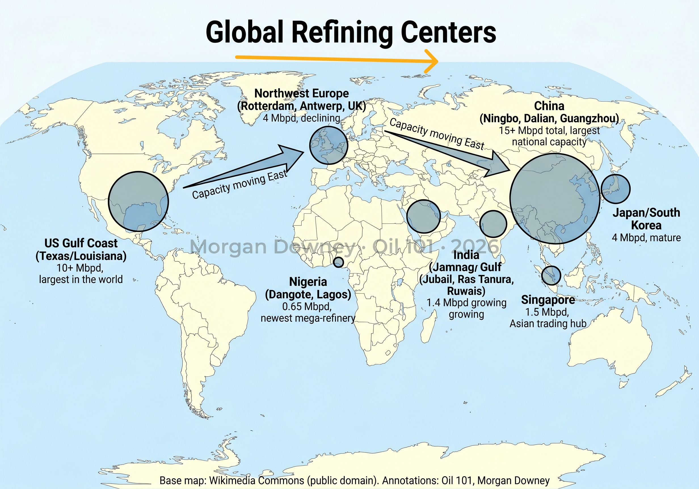

Figure 7-9: Global refining capacity is shifting from the Atlantic basin to Asia and the Middle East. China now has the world's largest national refining capacity. India's Jamnagar complex (1.4 Mbpd) is the single largest refinery. The Dangote refinery in Nigeria (0.65 Mbpd), commissioned in 2024, is the largest in Africa. (Source: Base map: Wikimedia Commons (public domain). Annotations: Oil 101, Morgan Downey)

The Nelson Complexity Index, devised by Wilbur Nelson in the 1960s, collapses all of these distinctions into a single number. A basic topping refinery scores 1.0. A hydroskimmer scores around 2. A cracking refinery scores around 9. A full-conversion complex with a coker scores around 15. Each piece of added kit earns complexity points based on its capital cost relative to simple distillation.

Nelson Complexity by Region (Illustrative Average)

Complexity is capital. The Nelson index, devised by Wilbur Nelson in the 1960s, measures how much secondary processing a refinery has bolted onto its atmospheric distillation unit. A basic topping refinery is 1.0; a hydroskimmer is around 2; a cracking refinery is around 9; a full-conversion complex with coker and petchem integration sits near 15. US Gulf Coast refineries run the highest averages in the world, driven by heavy Canadian and Latin American crudes that demand cokers. African refineries run the lowest, which is why the 650,000 barrels per day Dangote complex in Nigeria is such a structural disruption to Atlantic basin product flows. Regional averages are illustrative: individual refineries in every region span the full range.

## US Refining Geography and the PADDs

US refineries are concentrated in five Petroleum Administration for Defense Districts (PADDs), a wartime classification from 1942 that has become the backbone of EIA reporting. The Gulf Coast (PADD 3) dominates, both in capacity and in complexity: it holds more than half the national total and runs many of the highest-complexity refineries in the world.

Table 7-3: US PADD refining districts

| PADD | Region | Share of US capacity | Character |
| --- | --- | --- | --- |
| **PADD 1** | East Coast | 5% | Shrunk heavily post-2010. Dominated by a handful of surviving refineries. |
| **PADD 2** | Midwest | 23% | Heavy Canadian crude diet. Cracking and coking refineries. |
| **PADD 3** | Gulf Coast | 54% | Largest, most complex refining region; heavy sour specialists plus petchem integration |
| **PADD 4** | Rocky Mountains | 4% | Small, regionally focused cracking refineries. |
| **PADD 5** | West Coast + Alaska + Hawaii | 14% | Isolated by geography. Runs California-specific fuel specs (CARB). |

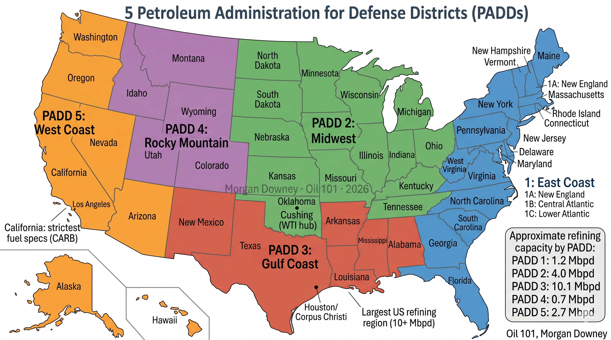

Figure 7-10: The five Petroleum Administration for Defense Districts (PADDs). PADD 3 (Gulf Coast) holds over half of US refining capacity. Cushing, Oklahoma (PADD 2) is the WTI pricing hub. California (PADD 5) runs the strictest fuel specifications in the country. (Source: Oil 101, Morgan Downey)

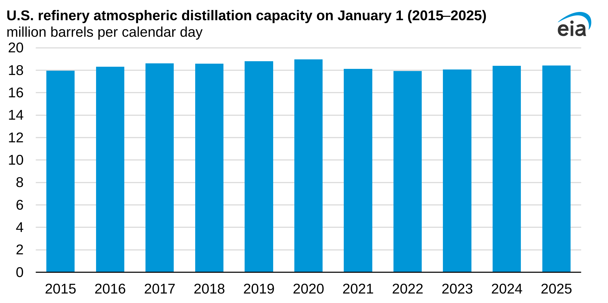

Figure 7-11: US refining capacity has consolidated but remains near 18 million barrels per day. Less complex European refineries have closed while Middle Eastern and Asian mega-refineries have opened. (Source: [EIA Today in Energy](https://www.eia.gov/todayinenergy/detail.php?id=65624), June 30, 2025)

Figure 7-12: US Gulf Coast 3:2:1 Crack Spread (US$/bbl), 2015 to 2025

Sources: EIA, Bloomberg, Refinitiv

Refining profitability is volatile. The 3:2:1 crack spread is the benchmark measure of a US refinery’s gross margin. It averaged roughly $15 per barrel from 2015 to 2021, collapsed below $5 during the COVID demand destruction, then spiked above $55 in mid-2022 when EU sanctions on Russian diesel tightened the Atlantic distillate market. The 2025 Hormuz crisis pushed cracks above $40 again as Gulf refineries reduced throughput. Illustrative monthly data.

## Turnaround Season

Refineries have very high fixed costs and owners would rather run them flat out forever, but mechanical equipment wears out, catalysts lose activity, and new units have to be installed. Maintenance is scheduled into windows called turnarounds, which are timed for the shoulder months between winter heating and summer driving demand. The main US spring turnaround peaks in February; a smaller fall turnaround peaks in October. European turnarounds lag the US by about two months, and Asian turnarounds lag Europe by another month, because the same specialist contractor crews travel from region to region in rotation.

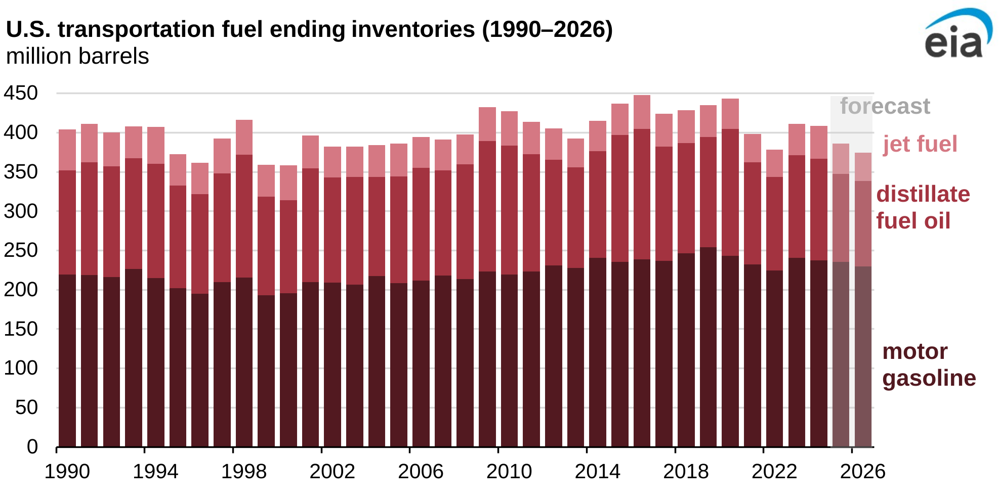

Figure 7-13: US transportation fuel inventories (gasoline, distillate, and jet) are projected to fall to their lowest levels since 2000 in 2026 as announced refinery closures collide with rising domestic consumption. (Source: [EIA Today in Energy](https://www.eia.gov/todayinenergy/detail.php?id=64644), March 3, 2025)

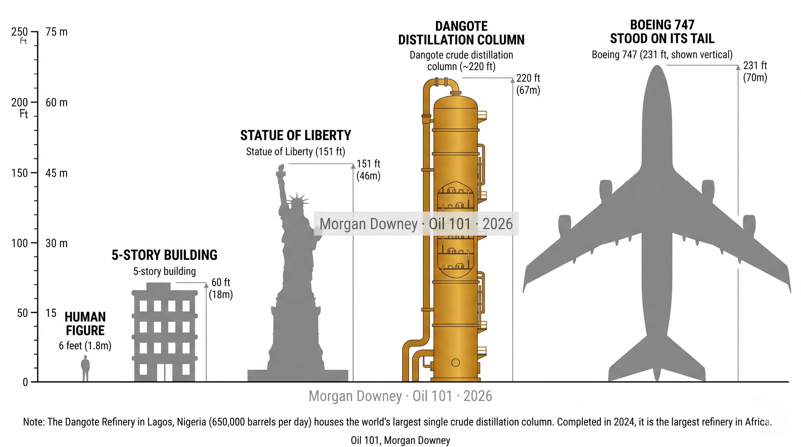

Figure 7-14: The world's largest crude distillation column at Dangote Refinery, Lagos, Nigeria (650,000 barrels per day). At roughly 220 feet tall, it stands taller than the Statue of Liberty and nearly as tall as a Boeing 747 stood on its tail. Completed in 2024, Dangote is the largest refinery in Africa. (Source: Oil 101, Morgan Downey)

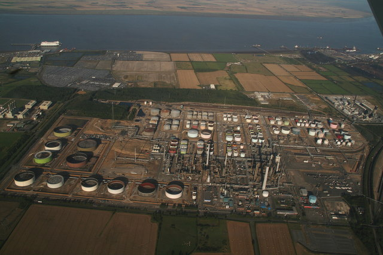

Figure 7-15: Aerial view of the Humber refinery complex at North Killingholme, UK. European refineries like this one face closure pressure from tighter margins and decarbonization mandates. (Source: [Chris / geograph.org.uk via Wikimedia Commons (CC BY-SA 2.0)](https://commons.wikimedia.org/wiki/File:North_Killingholme_oil_refinery,_aerial_-_geograph.org.uk_-_3129138.jpg))

As of 2026, the global refining landscape keeps shifting. New mega-refineries in the Middle East, India, and Nigeria are coming online while older, less complex facilities in Europe and the US face closure pressure from tighter margins and decarbonization mandates. The crack spread mechanics that govern refinery profitability are covered in [Chapter 18 (Futures and Swaps)](#chapter-futures-swaps).

The above was updated in 2026. For the full original 2009 chapter, [download the 1st edition 2009 PDF](/api/download/pdf).

Morgan Downey’s Commodity News

### Read what a commodity trader reads

A free morning brief on the oil, gas, and commodity markets, written by Morgan Downey, author of Oil 101. One email, every morning.

[Subscribe free →](https://boxwoodapp.com/news/subscribe)

<!-- rl-section id="chapter-standards" class="chapter" kicker="Chapter 8" title="Standards" -->

## Standards

Chapter 8

# Standards

Petroleum product standards: API, ASTM, octane, cetane, flash point, pour point, and the specifications that define fuel quality.

<svg fill="none" height="18" stroke="currentColor" stroke-linecap="round" stroke-linejoin="round" stroke-width="2" viewbox="0 0 24 24" width="18"><path d="M3 18v-6a9 9 0 0 1 18 0v6"></path><path d="M21 19a2 2 0 0 1-2 2h-1a2 2 0 0 1-2-2v-3a2 2 0 0 1 2-2h3zM3 19a2 2 0 0 0 2 2h1a2 2 0 0 0 2-2v-3a2 2 0 0 0-2-2H3z"></path></svg>Listen· 12:23

## Why Standards Matter

Without standardization of finished petroleum products, the modern world could not function. Standardized gasoline allows automobile engineers in Germany, Japan, and the US to independently design engines optimized for fuels available at any service station worldwide. Aircraft on long-haul flights can refuel with the same grade of jet fuel at airports on opposite sides of the planet. Ocean-going tankers can load bunker fuel in Singapore, Fujairah, or Rotterdam knowing the product will meet the same international sulfur spec.

Standards also underpin supply reliability: shortages in one region can be met with supplies from another. They push competition between refineries and distributors down to consumer prices. They let regulators set common environmental controls for each product. And they give traders, refiners, and importers a legal language for describing exactly what molecule is changing hands in a contract. This chapter is a reference. Each table below stands on its own.

## Standards-Setting Organizations

A handful of organizations set the specifications and test methods that govern the global oil market. Most oil contracts reference ASTM test methods by number for crude and product specs. European contracts reference EN specifications. Marine fuel contracts reference ISO 8217. Emissions rules come from national and regional regulators: the US EPA, California's CARB, the European Commission, and the IMO for international shipping.

Table 8-1: Bodies that write the rules

| Body | Full name | Primary scope |
| --- | --- | --- |
| API | American Petroleum Institute | Upstream standards, API gravity scale, industry data |
| ASTM | ASTM International (formerly American Society for Testing and Materials) | Most global crude and product test methods (D-series) |
| ISO | International Organization for Standardization | Marine fuels (ISO 8217), global cross-industry specs |
| CEN / EN | European Committee for Standardization | EN 228 gasoline, EN 590 diesel, EN 14214 biodiesel |
| EPA | US Environmental Protection Agency | US federal fuel sulfur, RFS ethanol mandate, emissions |
| CARB | California Air Resources Board | California gasoline and diesel specs, LCFS |
| IMO | International Maritime Organization | Marine fuel sulfur cap, MARPOL Annex VI, GHG rules |

## Crude Oil Tests

A crude assay is a battery of standardized laboratory tests that describes the barrel in enough detail for a refiner to know whether it fits the plant. [Chapter 2 (Crude Oil Assay)](#chapter-crude-oil-assay) introduced the overall concept; the table below is the reference card for the individual tests. Every major contract references these method numbers.

Table 8-2: Core crude oil assay tests

| Property | ASTM method | Typical range | Refining implication |
| --- | --- | --- | --- |
| API gravity | D287 / D1298 / D4052 | 10 to 50 degrees API | Yield: light crudes make more gasoline, heavy make more resid |
| Sulfur content | D4294 (XRF) / D5453 | 0.05% to 4% by weight | Hydrotreating demand, catalyst poisoning, bunker compliance |
| TBP distillation | D2892 | Curve from IBP to 565 deg C | Maps the yield of every cut: naphtha, kero, diesel, VGO, resid |
| Pour point | D97 | -60 to +35 degrees F | Pipeline transportability in cold weather; waxy crude risk |
| Total acid number (TAN) | D664 | 0.05 to 4 mg KOH/g | Naphthenic acid corrosion in hot piping, CRU selection |
| Kinematic viscosity | D445 | Varies widely | Pumping, blending, pipeline hydraulics |
| Salt content | D3230 | <10 to >200 PTB | Desalter performance; corrosion in overhead systems |
| Vanadium, nickel | D5863 / ICP | 1 to 500 ppm | FCC catalyst deactivation, resid coke quality |

## Octane: RON, MON, and AKI

Octane rating measures gasoline's resistance to knocking, the premature auto-ignition that occurs when fuel in a cylinder detonates ahead of the spark. Higher octane lets engine designers run higher compression and more aggressive spark timing, both of which raise thermal efficiency. The scale is defined by a two-point reference: iso-octane (2,2,4-trimethylpentane) is arbitrarily set to 100 and normal heptane to zero. A fuel with the same knock resistance as a mixture of 87% iso-octane and 13% n-heptane rates 87 octane.

Two different test engines give two different numbers from the same fuel. Research Octane Number (RON, ASTM D2699) runs a low-severity test, simulating city driving at lower load. Motor Octane Number (MON, ASTM D2700) runs a hotter, higher-load test closer to highway conditions. MON is always lower than RON; the gap between them is called sensitivity. Europe posts RON on the pump. The US posts Anti-Knock Index, which is the average of the two.

AKI, the US pump number

AKI = (RON + MON) / 2. Regular unleaded in the US is 87 AKI. Midgrade is 89. Premium is 91 to 93. In Europe, the same fuels post as roughly 95 and 98 RON, which looks higher but is not. Iso-octane rates 100 on both scales by definition; n-heptane rates 0.

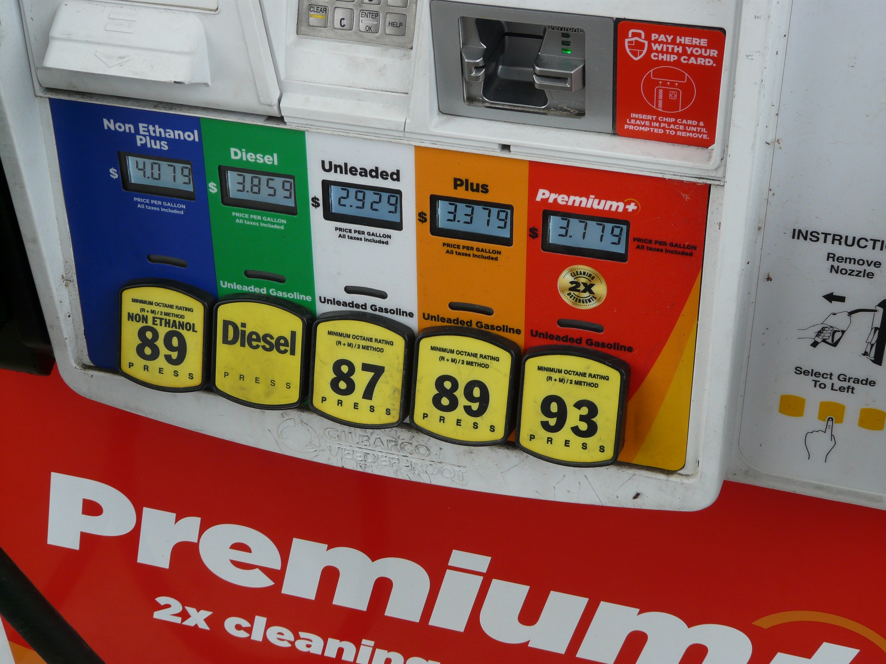

Figure 8-1: Fuel grade buttons at a US gas station. Regular (87 AKI), midgrade (89), and premium (91 to 93) correspond to the RON/MON averages defined in ASTM D2699 and D2700. (Source: [The Bushranger / Wikimedia Commons (CC BY-SA 4.0)](https://commons.wikimedia.org/wiki/File:Gas_pump_at_Circle_K,_Crawfordville,_Florida.jpg))

## Gasoline Specifications

Modern gasoline is a carefully blended cocktail with its specification pinned down by federal and state rules. The biggest single change in the last decade was EPA Tier 3, which cut the annual average gasoline sulfur from 30 ppm to 10 ppm effective January 2017. That alignment with European and Japanese gasoline sulfur allowed car makers to certify a single catalyst formulation worldwide.

Table 8-3: US gasoline specifications (Tier 3 / federal)

| Property | Test method | Limit |
| --- | --- | --- |
| AKI (regular / mid / premium) | D2699, D2700 | 87 / 89 / 91-93 |
| Sulfur (annual average) | D5453 | 10 ppm |
| Benzene (annual average) | D5580 | 0.62 vol% |
| Reid Vapor Pressure (summer) | D5191 | 7.8 psi (9.0 psi non-ozone areas) |
| Reid Vapor Pressure (California summer) | D5191 | 6.5 to 7.0 psi |
| Ethanol (E10 standard) | D4815 | 10 vol% typical, 15 vol% allowed |
| Lead | D3237 | Banned since 1996 (road use) |

Reformulated Gasoline (RFG) is a tighter federal spec required in ozone non-attainment areas, originally introduced by the Clean Air Act of 1990. California CARB Phase 3 gasoline (CaRFG3) is tighter still, with lower benzene, lower RVP, and lower olefin content. [Chapter 9 (Finished Products)](#chapter-finished-products) covers gasoline blendstocks.

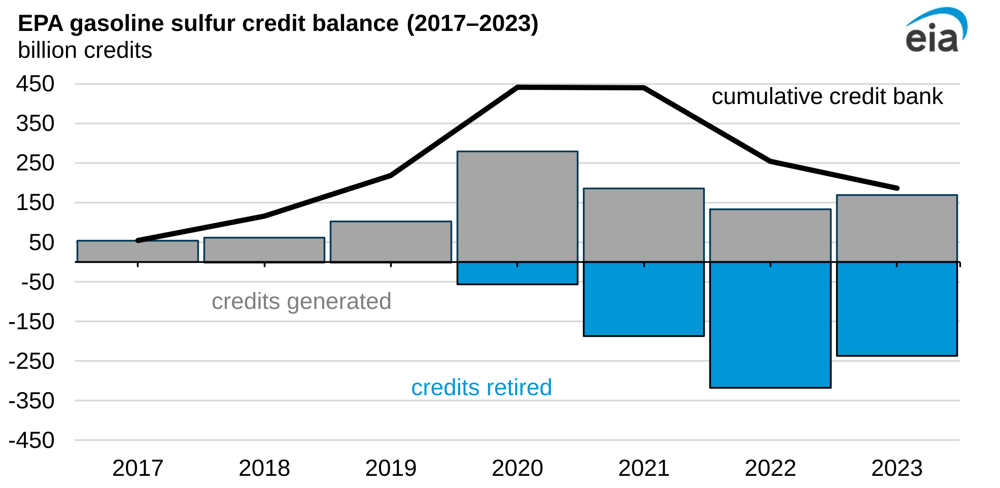

Figure 8-2: The EPA Tier 3 gasoline sulfur standard cut sulfur from 30 ppm to 10 ppm effective 2017. Refiners used Averaging, Banking, and Trading (ABT) credits to smooth the transition. (Source: [EIA Today in Energy](https://www.eia.gov/todayinenergy/detail.php?id=64064), December 18, 2024)

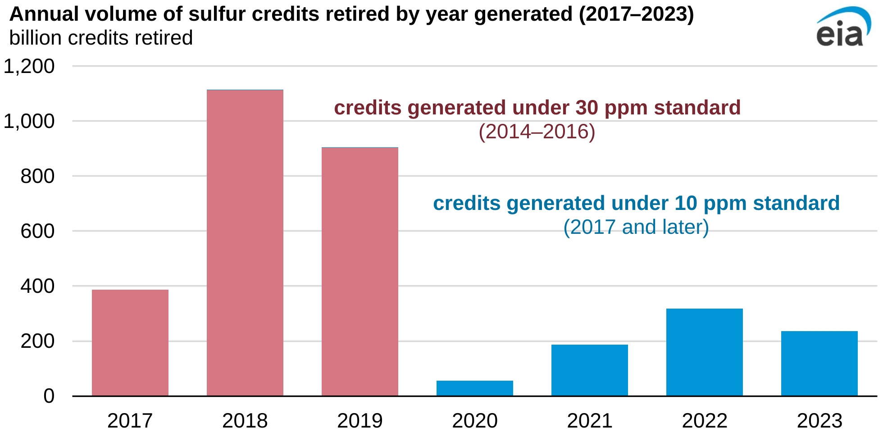

Figure 8-3: Sulfur credits retired each year. The ABT mechanism gave refineries flexibility in meeting tightening fuel standards without forcing simultaneous shutdowns of older desulfurization units. (Source: [EIA Today in Energy](https://www.eia.gov/todayinenergy/detail.php?id=64064), December 18, 2024)

Figure 8-4: US Gasoline Sulfur Limits, 1990 to 2026 (ppm)

Source: EPA gasoline sulfur regulations (Tier 1 1995, Tier 2 2004, Tier 3 2017). 97% reduction over three decades.

## Diesel Specifications

Diesel combustion is the mirror image of gasoline combustion. Gasoline needs to resist auto-ignition; diesel needs to auto-ignite promptly under compression. **Cetane number** is the diesel equivalent of octane, defined by a two-point reference of cetane (n-hexadecane, 100) and heptamethylnonane (15). Higher cetane means shorter ignition delay and smoother combustion. On-road ULSD sold in the US is typically in the 42 to 48 cetane range; European EN 590 diesel runs slightly higher at a 51 minimum.

Table 8-4: US on-road ULSD specifications

| Property | Test method | Limit |
| --- | --- | --- |
| Cetane number (minimum) | D613 | 40 |
| Sulfur | D5453 | 15 ppm |
| Flash point (minimum) | D93 | 52 deg C |
| Cloud point | D2500 | Regional by climate |
| Lubricity (HFRR wear scar) | D6079 | 520 micron max |
| Aromatics (California) | D5186 | 10 vol% |

The ULSD transition has been the defining diesel regulatory story of the last generation. EPA sulfur limits moved from 500 ppm LSD in 1993 to 15 ppm ULSD in 2006 for on-road fuel, 2010 for non-road, 2014 for locomotive and marine. The cut was required to enable modern emissions control devices: diesel particulate filters (DPF) and selective catalytic reduction (SCR) catalysts are both poisoned by sulfur, so ULSD was a precondition for modern diesel passenger cars and for Tier 4 off-road engines.

## Jet Fuel Specifications

Jet fuel is the most safety-critical and most internationally standardized petroleum product. ASTM D1655 defines Jet A and Jet A-1 for commercial aviation; Defence Standard 91-91 is the equivalent UK specification. [Chapter 9 (Finished Products)](#chapter-finished-products) covers the individual grades; the table here is the spec reference.

Table 8-5: Jet A and Jet A-1 specifications (ASTM D1655)

| Property | Jet A | Jet A-1 |
| --- | --- | --- |
| Freeze point (max) | -40 deg C | -47 deg C |
| Flash point (min) | 38 deg C | 38 deg C |
| Sulfur (max) | 3000 ppm | 3000 ppm |
| Aromatics (max) | 25 vol% | 25 vol% |
| Smoke point (min) | 25 mm | 25 mm |
| Primary market | US domestic | International |

## Residual and Bunker Fuel

The single most important regulatory event in the heavy end of the barrel in the last twenty years was the IMO 2020 sulfur cap. Effective January 1, 2020, the global marine fuel sulfur limit dropped from 3.5% to 0.5%, a seven-fold cut, for ships without scrubbers. Emission Control Areas (ECAs) around North America, the Baltic, and parts of Asia already required 0.1% sulfur fuel. The rule immediately split the bunker pool into three grades: HSFO (3.5% sulfur, for scrubber-equipped ships), VLSFO (0.5% sulfur, the new global standard), and MGO (0.1% sulfur, for ECAs). [Chapter 9 (Finished Products)](#chapter-finished-products) and [Chapter 11 (Transporting Oil)](#chapter-transporting-oil) cover the market consequences.

Table 8-6: Marine fuel grades after IMO 2020

| Grade | Sulfur limit | Where used |
| --- | --- | --- |
| HSFO | 3.5% | Scrubber-equipped ships only |
| VLSFO | 0.5% | Global baseline for non-scrubbed ships |
| ULSFO | 0.1% | Sometimes used where ECA and open-sea switch is operationally painful |
| MGO | 0.1% | Emission Control Areas (North America, Baltic, North Sea, parts of Asia) |

Environmental rules keep tightening. Euro 7, China's National 6b, India's BS-VI, and the IMO's ongoing work on shipping greenhouse gases are all pushing refiners and vessel operators to invest in hydroprocessing, scrubbers, and alternative fuels. [Chapter 9 (Finished Products)](#chapter-finished-products) covers the resulting product slate.

The above was updated in 2026. For the full original 2009 chapter, [download the 1st edition 2009 PDF](/api/download/pdf).

Morgan Downey’s Commodity News

### Read what a commodity trader reads

A free morning brief on the oil, gas, and commodity markets, written by Morgan Downey, author of Oil 101. One email, every morning.

[Subscribe free →](https://boxwoodapp.com/news/subscribe)

<!-- rl-section id="chapter-finished-products" class="chapter" kicker="Chapter 9" title="Finished Products" -->

## Finished Products

Chapter 9

# Finished Products

Petroleum products explained: gasoline, diesel, jet fuel, fuel oil, LPG, lubricants, asphalt, waxes, and their market dynamics.

<svg fill="none" height="18" stroke="currentColor" stroke-linecap="round" stroke-linejoin="round" stroke-width="2" viewbox="0 0 24 24" width="18"><path d="M3 18v-6a9 9 0 0 1 18 0v6"></path><path d="M21 19a2 2 0 0 1-2 2h-1a2 2 0 0 1-2-2v-3a2 2 0 0 1 2-2h3zM3 19a2 2 0 0 0 2 2h1a2 2 0 0 0 2-2v-3a2 2 0 0 0-2-2H3z"></path></svg>Listen· 35:26

## The 19 Products of Crude Oil

A refinery does not sell "gasoline" or "diesel" the way a bakery sells bread. It sells a family of tightly specified commercial products, each defined by the boiling range it comes from, a handful of chemical tests, and the customer it serves. This chapter walks through those products in the order they come off the barrel, from the lightest gases at the top of the crude distillation tower to the solid petroleum coke at the bottom. [Chapter 7 (Refining)](#chapter-refining) covers the refinery units that make them and [Chapter 8 (Standards)](#chapter-standards) covers the specs that define them; this chapter is about the products themselves.

Table 9-1: The 19 products, lightest to heaviest

| # | Product | Typical boiling range | Primary use |
| --- | --- | --- | --- |
| 1 | Methane | Below -161°C (gas at room temperature) | Pipeline gas, petchem feed, refinery fuel |
| 2 | Ethane | Below -89°C (gas at room temperature) | Ethylene steam cracker feed |
| 3 | Propane | Below -42°C (gas at room temperature, liquefied under pressure as LPG) | LPG home heat, cooking, petchem, crop drying |
| 4 | Butanes | -1 to 0°C (gas at room temperature, easily liquefied) | LPG, winter gasoline blend, alkylation feed |
| 5 | Pentanes / natural gasoline | 30 to 70°C (light liquid) | Diluent, gasoline blend, petchem feed |
| 6 | Naphtha | 30 to 200°C | Reformer feed, petchem feed, gasoline blend |
| 7 | Gasoline | 30 to 210°C | Passenger vehicles, small engines |
| 8 | Jet fuel / kerosene | 150 to 275°C | Aviation, home heat in Japan |
| 9 | Diesel | 200 to 350°C | Trucks, rail, marine, power |
| 10 | Heating oil | 200 to 380°C | Residential heating, US Northeast and Europe |
| 11 | Atmospheric gas oil | 300 to 400°C | Marine in Emission Control Areas |
| 12 | Lubricant base oils | 350 to 500°C | Motor oil, industrial lubricants, process oils |
| 13 | Waxes | 350 to 500°C | Candles, food wrap, cosmetics, crayons |
| 14 | Vacuum gas oil | 400 to 550°C | FCC and hydrocracker feed |
| 15 | Fuel oil / residual | 450°C+ | Industrial boilers, power, ocean shipping |
| 16 | Bitumen / asphalt | 500°C+ (residuum) | Road paving, roofing shingles |
| 17 | Petroleum coke | Solid residue | Power fuel, aluminum anodes, steel electrodes |
| 18 | Carbon black | Manufactured from partial combustion | Tires, pigment, batteries |
| 19 | Sulfur | Byproduct of hydroprocessing | Sulfuric acid, fertilizer, rubber |

Figure 9-1: Petroleum Product Boiling Ranges (degrees C)

Gases

Light distillates

Middle distillates

Heavy ends

Source: Oil 101 (Morgan Downey), industry standard boiling ranges. Lighter products rise to the top of the distillation column; heavier products collect at the bottom.

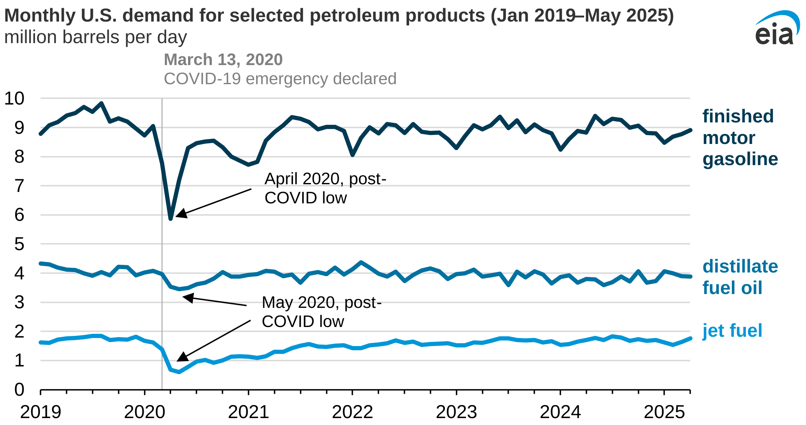

Figure 9-2: US demand for gasoline, distillate, and jet fuel, the three largest finished-product markets. Gasoline peaked before COVID; jet fuel demand has largely recovered. (Source: [EIA Today in Energy](https://www.eia.gov/todayinenergy/detail.php?id=66005), August 27, 2025)

Table 9-2: US refined product demand (2024, approximate)

| Product | Demand (Mbpd) | Share of total |
| --- | --- | --- |
| Gasoline | 8.9 | 44% |
| Distillate (diesel, heating oil, off-road) | 3.8 | 19% |
| LPG and NGL | 2.8 | 14% |
| Jet fuel | 1.7 | 8% |
| Other (residual, petchem feed, asphalt, etc.) | 3.0 | 15% |
| Total | 20.2 | 100% |

Figure 9-3 US Refined Product Demand by Product (2024)

Figure 9-3: US refined product demand. Gasoline dominates at 44% of total product supplied, followed by distillate (diesel, heating oil, and off-road fuel) at 19%. LPG and NGL demand has grown sharply since 2010 as US shale gas production ramped and propane exports surged. Total US product demand is roughly 20 Mbpd. Source: EIA Petroleum Supply Monthly, 2024.

## Gasoline: A Cocktail, Not a Single Product

Motor gasoline is the most valuable high-volume product from a US refinery, accounting for about 45% of US refinery output by volume. What a refinery actually sells under the name "gasoline" is an assembly of six to eight separate **blendstocks**, each with its own octane, vapor pressure, sulfur, and aromatics profile. The blender's job is to hit the finished spec at the lowest total cost, adjusting the recipe daily as component prices shift. Ethanol is usually added at the distribution terminal rather than at the refinery so that the same base blend can serve both E10 markets and ethanol-free specialty markets.

Table 9-3: The principal US gasoline blendstocks

| Blendstock | Typical RON | Pool share | What it contributes |
| --- | --- | --- | --- |
| FCC gasoline | 91-93 | 35% | Volume workhorse; contains olefins and aromatics |
| Reformate | 98-102 | 30% | High-octane aromatic stream from catalytic reformer |
| Alkylate | 93-96 | 12% | Premium blendstock: clean, low sulfur, low RVP, iso-paraffinic |
| Isomerate | 82-88 | 5% | Light naphtha isomerized, clean, moderate octane |
| Hydrocracker gasoline | 80-87 | 5% | Moderate octane, very clean, low aromatics |
| Normal butane (winter only) | 93 | 3% | Cheap octane and RVP; restricted in summer |
| Natural gasoline (C5+) | 70-75 | 2% | Light NGL diluent from gas plants |
| Ethanol (terminal blend) | 109 (blend) | 10% (E10) | Oxygenate, octane booster, RFS compliance |

Ethanol deserves a special note. A 10% ethanol splash typically lifts finished gasoline octane by about two points and also bumps vapor pressure by about one psi, which is why the EPA grants a summer RVP waiver for E10 but not for E0. E15 is legal for 2001 and newer vehicles and gradually expanding. E85 flex fuel, a nominally 51% to 83% ethanol blend, remains a rounding error outside the Upper Midwest. Ethanol-free "rec fuel" is still sold at marinas and small-engine outlets where even trace ethanol is a problem.

### The Summer-Winter RVP Switch

Reid Vapor Pressure (RVP) is the measure of how readily gasoline evaporates. Evaporated gasoline reacts with sunlight to form ground-level ozone (smog), so the EPA limits summer gasoline RVP more tightly than winter. The federal summer limit is 9.0 psi from May 1 (upstream of retail) and June 1 (at the pump) through September 15. In ozone non-attainment areas the cap drops to 7.8 psi; CARB specs are tighter still at 7.0 to 6.5 psi and start earlier. The EPA grants a 1.0 psi waiver for E10, meaning E10 gasoline may reach 10.0 psi in areas with a 9.0 psi limit, but no waiver applies in the strictest RVP zones.

In winter the RVP limit reverts to 11.5 psi or higher (some states allow up to 15.0 psi). Butane, with an RVP around 52 psi but a federal octane of 93, is the seasonal swing component. In winter, refiners splash cheap butane into the blend for both octane and volume. When summer limits kick in, butane has to come out, replaced by costlier low-RVP blendstocks such as alkylate and reformate. This is why the normal butane row in the blendstock table above shows "winter only."

The April-to-June transition creates what traders call the "orphan barrel" problem: late-winter gasoline sitting in terminals that does not meet summer RVP specs and cannot legally enter the summer distribution system after the switchover date. It either has to be blended down with very low-RVP stock or sold at a discount before the deadline. This creates a predictable seasonal premium for summer-grade gasoline starting as early as February, well before summer driving demand arrives. [Chapter 13 (Seasonality)](#chapter-seasonality) covers the demand-side pattern.

### Gasoline Grades and the Ethanol Mandate

Gasoline grades are defined by Anti-Knock Index: regular is 87 AKI, midgrade is 89 AKI, premium is 91 to 93 AKI. [Chapter 8 (Standards)](#chapter-standards) covers the RON, MON, and AKI definitions. Premium exists to satisfy the higher-compression, turbocharged, direct-injection engines that dominate modern passenger car design. In the US, most of the country posts 93 as the top grade; California caps premium at 91. Reformulated Gasoline (RFG) is a federal spec required in ozone non-attainment areas, with lower RVP, lower benzene, and lower aromatics than Conventional Gasoline (CG). CARB Phase 3 gasoline is the strictest US spec, imposing tight limits on sulfur, aromatics, benzene, olefins, and T50 and T90 distillation points. Outside Tier 3 and CARB, US states still run a patchwork of "boutique fuels" that complicates pipeline scheduling during the summer switchover.

The federal Renewable Fuel Standard (RFS), enacted in 2005 and expanded in 2007, mandates blending renewable fuels into the US gasoline and diesel pool. Compliance is tracked through Renewable Identification Numbers (RINs), a credit attached to each gallon of qualifying renewable fuel. Refiners who blend enough ethanol generate RINs; those who do not must buy them on the open market from those who do. RIN prices fluctuate with ethanol economics and EPA volume mandates, adding a layer of financial complexity on top of the physical blending.

E10 is now ubiquitous at US retail pumps and represents effectively all regular gasoline sold. E15 (15% ethanol) was approved for 2001 and newer vehicles and, since a 2022 EPA emergency waiver made permanent by subsequent rulemaking, is allowed year-round. Adoption has been slow: infrastructure (underground tanks, dispensers, vapor recovery) and consumer wariness limit stations offering it. E85 flex fuel exists but represents a rounding error outside the Upper Midwest.

The "blend wall" is the structural limit. US gasoline demand is roughly 9 Mbpd; 10% ethanol means about 900,000 bpd of ethanol demand. Pushing above 10% on a national scale would require widespread station upgrades, expanded vehicle warranties, and pipeline modifications that are not yet in place. The blend wall has been the binding constraint on RFS compliance since roughly 2013.

## Jet Fuel and the Arrival of SAF

Jet fuel is chemically a narrow-cut kerosene, usually hydrotreated to remove sulfur and mercaptans and dosed with a small package of anti-static, anti-icing, and corrosion-inhibitor additives. Because a failure in flight is catastrophic, jet fuel is the most safety-driven and most internationally harmonized liquid fuel in the world. The grades below cover almost all global consumption. ASTM D1655 is the governing commercial spec.

Table 9-4: Jet fuel grades

| Grade | Freeze point | Flash point | Primary use |
| --- | --- | --- | --- |
| Jet A | -40 deg C | 38 deg C | US commercial aviation |
| Jet A-1 | -47 deg C | 38 deg C | International commercial aviation |
| Jet B | -50 deg C | -20 deg C | Wide-cut naphtha-kerosene, Canadian Arctic |
| JP-5 | -46 deg C | 60 deg C | US Navy carrier aircraft (high flash for ship safety) |
| JP-8 | -47 deg C | 38 deg C | US military land and air, kerosene with additives |
| Avgas 100LL | -58 deg C | -38 deg C | Piston general aviation; the last leaded fuel in common use |

**Sustainable Aviation Fuel (SAF)** is a post-first-edition development that has moved from curiosity to policy mandate in the last five years. The term covers any drop-in kerosene blendstock made from a non-petroleum feedstock. The commercialized routes are HEFA (hydroprocessed esters and fatty acids, made from used cooking oil, tallow, and vegetable oil), ATJ (alcohol-to-jet, made by dehydrating ethanol or iso-butanol and oligomerizing the resulting olefins), Fischer-Tropsch from biomass or waste gas, and a handful of smaller routes. The governing specification is ASTM D7566, which certifies specific SAF production pathways and allows blending up to 50% by volume with conventional Jet A or A-1. Once blended and tested, the resulting fuel is re-certified under ASTM D1655 and is indistinguishable to the aircraft. HEFA dominates current production, accounting for 85% or more of global SAF output, because it uses existing hydroprocessing technology and proven feedstocks (used cooking oil, tallow, soy and canola oil). ATJ, Fischer-Tropsch, and co-processing in existing refinery hydrotreaters are at earlier stages.

The regulatory push has multiple fronts. CORSIA (Carbon Offsetting and Reduction Scheme for International Aviation), administered by ICAO, began its mandatory phase in 2024 and allows airlines to use SAF as an eligible emissions reduction. ReFuelEU Aviation sets blending mandates for EU airports: 2% SAF by 2025, 6% by 2030, rising to 70% by 2050, with a sub-mandate for synthetic e-fuels starting in 2030. The UK introduced its own SAF mandate in 2025.

Economics remain the binding constraint. SAF costs 2 to 5 times conventional jet fuel depending on pathway and feedstock. Airlines buy it primarily for ESG compliance and to satisfy corporate travel customers, not because it is cheap. As of 2026, global SAF production is under 1% of total jet fuel consumption. Scaling to the mandated volumes will require massive capital investment in new production capacity and a much larger supply of sustainable feedstocks.

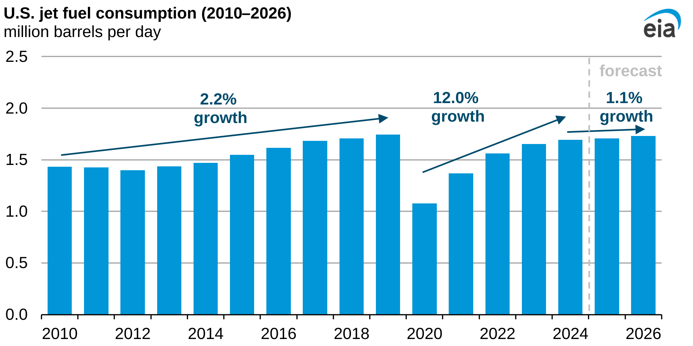

Figure 9-4: US jet fuel consumption. The post-pandemic recovery brought demand back near pre-COVID levels; long-term aircraft efficiency gains continue to slow growth. (Source: [EIA Today in Energy](https://www.eia.gov/todayinenergy/detail.php?id=66004), August 26, 2025)

## Diesel: On-Road, Off-Road, Marine, and Home Heat

Diesel is chemically a middle distillate that boils between roughly 180 and 360 degrees Celsius. It is sold into several distinct commercial markets that differ only in dye, tax treatment, and sulfur limit.

Table 9-5: Diesel and distillate grades

| Grade | Sulfur | Taxed? | Primary market |
| --- | --- | --- | --- |
| On-road ULSD | 15 ppm | Yes (federal + state) | Trucks, passenger diesels, buses |
| Off-road (red-dyed) ULSD | 15 ppm | Untaxed | Farming, construction, mining |
| Heating oil (No. 2 oil) | 15 ppm (ULSHO in Northeast) | Untaxed | Residential heating, US Northeast, Europe |
| Marine gasoil (MGO) | 0.1% in ECAs | Bonded | Marine in Emission Control Areas |
| Biodiesel (FAME) | 15 ppm | Varies | Blend component (B5, B20, B100) |
| Renewable diesel (HVO) | <10 ppm | Varies | Drop-in replacement, California LCFS market |

Biodiesel and renewable diesel are related but not the same. Biodiesel (fatty acid methyl esters, FAME) is made by transesterifying vegetable oils or animal fats with methanol and is typically blended as B5 or B20, a 5% or 20% biodiesel content. Renewable diesel (also called HVO, hydrotreated vegetable oil) is hydroprocessed from the same feedstocks but produces a paraffinic hydrocarbon chemically indistinguishable from petroleum diesel. Unlike biodiesel, renewable diesel needs no engine modifications, has no blend wall, performs identically in cold weather, and meets ASTM D975 as a drop-in fuel at 100%.

California's Low Carbon Fuel Standard (LCFS) has been the dominant force pulling renewable diesel supply into the US market. LCFS assigns a carbon intensity (CI) score to every transportation fuel; fuels with lower CI than the benchmark generate credits, which have traded at $50 to $100+ per tonne of CO2 reduction. These credits, stacked with federal RFS RINs and the blender's tax credit, made renewable diesel production in California more profitable than petroleum refining for several years. Marathon converted its Martinez, California refinery to renewable diesel. Phillips 66 converted its Rodeo refinery. Valero and Darling Ingredients operate Diamond Green Diesel in Norco, Louisiana. US renewable diesel capacity reached roughly 5 billion gallons per year by 2025, from near zero in 2018.

Table 9-6: Largest US renewable diesel facilities (2025)

| Operator | Location | Capacity (bpd) | Primary feedstock | Year started |
| --- | --- | --- | --- | --- |
| Diamond Green Diesel (Valero/Darling) | Norco, Louisiana | 80,000 | Animal fats, UCO | 2013 (expanded 2022) |
| Marathon (Martinez) | Martinez, California | 48,000 | Soy oil, canola, UCO | 2022 |
| Phillips 66 (Rodeo) | Rodeo, California | 44,000 | Soy oil, tallow, UCO | 2024 |
| CVR Partners (Wynnewood) | Wynnewood, Oklahoma | 6,000 | Soy oil | 2022 |
| Calumet (Montana Renewables) | Great Falls, Montana | 15,000 | Soy oil, canola | 2023 |

One consequence of the renewable diesel boom is feedstock competition. Renewable diesel, biodiesel, and SAF all compete for the same fats and oils. Used cooking oil (UCO) has become a globally traded commodity, collected from restaurants in Asia, shipped to Europe or the US Gulf, and hydroprocessed into fuel. Soy oil and canola oil link renewable diesel economics directly to agricultural commodity markets. When LCFS credit prices decline, as they did in 2024-2025, some of these conversions struggle on economics alone.

## Residual Fuel and the Bunker Market After IMO 2020

Residual fuel oil is what is left at the bottom of the atmospheric and vacuum distillation towers: the heaviest, most viscous, highest-sulfur fraction of the barrel. Historically it was burned in ship engines, power plants, and industrial boilers with minimal treatment. The IMO 2020 rule, which cut the global marine fuel sulfur limit from 3.5% to 0.5% on January 1, 2020, split the bunker market into the grades in the table below.

Table 9-7: Bunker fuel after IMO 2020

| Grade | Sulfur limit | Who burns it |
| --- | --- | --- |
| HSFO | 3.5% | Scrubber-equipped ships only |
| VLSFO | 0.5% | Dominant global grade for non-scrubbed ships |
| ULSFO | 0.1% | Operational convenience in ECAs |
| MGO | 0.1% | Emission Control Areas |
| LNG bunker | N/A | Dual-fuel newbuilds; growing slowly |
| Methanol bunker | Low | Maersk and a handful of others; future-looking |

IMO 2020 reshaped the barrel. The light-heavy crude spread blew out as the world suddenly needed more 0.5% sulfur middle distillates and fewer high-sulfur heavy barrels. Coking capacity, which breaks heavy resid into lighter products, became more valuable almost overnight; simple topping refineries lost. [Chapter 11 (Transporting Oil)](#chapter-transporting-oil) covers the marine logistics; [Chapter 7 (Refining)](#chapter-refining) covers the refinery response.

### Scrubber Economics

Shipowners faced a choice at IMO 2020: switch to compliant VLSFO at 0.5% sulfur, or install an exhaust gas cleaning system (scrubber) and continue burning cheap HSFO at 3.5% sulfur. A scrubber costs $2 to $5 million per vessel to install, depending on ship size and whether the system is open-loop (washwater discharged overboard), closed-loop (washwater treated and stored), or hybrid. The payback depends entirely on the HSFO-VLSFO spread: at $100+ per metric tonne, a scrubber on a VLCC burning 60-80 tonnes per day pays for itself in roughly one to two years. When the spread narrows to $30-50/mt, payback stretches to three to four years and the investment looks marginal.

By 2025, roughly 4,500 ships had scrubbers installed, concentrated among VLCCs, capesize bulk carriers, and large container ships where fuel consumption is high enough to justify the capital. The rest of the global fleet, roughly 60,000 merchant vessels, burns VLSFO. Open-loop scrubbers, which dump acidic washwater overboard, have drawn environmental criticism. Several ports, including Singapore, Fujairah, and certain Chinese and European ports, restrict or ban open-loop scrubber discharge in their waters.

Figure 9-5 Singapore VLSFO minus HSFO Spread ($/mt), 2019 to 2025

Figure 9-5: The scrubber trade. The spread between VLSFO (0.5% sulfur) and HSFO (3.5% sulfur) in Singapore determines whether exhaust gas scrubbers pay for themselves. At a $100+/mt spread, a $3-5M scrubber pays back in 1-2 years. The spread blew out at IMO 2020 implementation, collapsed during COVID, and spiked again after Russia invaded Ukraine. Source: S&P Global Commodity Insights, approximate monthly averages.

## LPG

Liquefied Petroleum Gas is a commercial name for propane and butane, individually or in a climate-adjusted mix. At atmospheric pressure they are gases; at modest pressure or under mild refrigeration they are liquids that pack roughly 270 times more energy per unit volume than gas. Uses run across the board: cooking and home heating in rural US, India, and much of Latin America; autogas for taxis and buses in South Korea, Turkey, and parts of Europe; crop drying on farms; forklift fuel; and petrochemical feedstock for PDH and naphtha cracker supplement. The propane-to-butane ratio is adjusted seasonally and by latitude because butane will not vaporize reliably in cold weather.

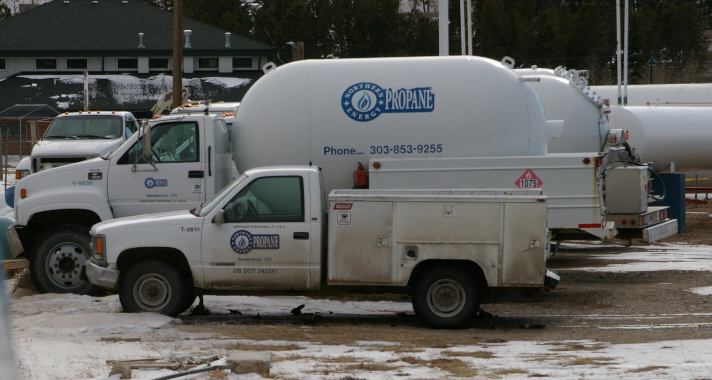

Figure 9-6: A residential propane delivery truck. In the rural US, roughly 5 million households rely on delivered propane for heating and cooking where natural gas pipelines do not reach. (Source: [Hustvedt / Wikimedia Commons (CC BY-SA 3.0)](https://commons.wikimedia.org/wiki/File:Propane_delivery_truck.jpg))

### The US Propane Export Boom

US propane exports grew from near zero in 2010 to over 1.5 Mbpd by 2025, making the US the world's largest propane exporter by a wide margin. The shale gas revolution, particularly from the Marcellus, Permian, and Eagle Ford basins, created a structural surplus of NGLs that far exceeded domestic demand. Enterprise Products' Morgan's Point terminal on the Houston Ship Channel and Targa Resources' Galena Park facility are the two largest US LPG export terminals, together capable of loading VLGCs (very large gas carriers) carrying 44,000 tonnes of LPG per voyage.

Destinations are primarily in Asia: Japan, South Korea, China, and India use imported propane for residential cooking gas, petrochemical feedstock, and industrial heat. The propane-naphtha spread determines whether Asian petchem crackers use propane or naphtha as feedstock. When US shale gas production is high and propane is cheap relative to naphtha, propane dehydrogenation (PDH) plants in China run at full rates, producing propylene for the polypropylene market. China brought over 15 PDH units online between 2014 and 2025, each consuming 15,000 to 20,000 bpd of propane. This structural demand has made the US Gulf Coast-to-Asia propane trade one of the largest single-commodity shipping routes in the world. [Chapter 3 (Components)](#chapter-components) covers NGL fractionation and [Chapter 10 (Petrochemicals)](#chapter-petrochemicals) covers the downstream chemistry.

## Lubricant Base Oils and the Group I to V Classification

Lubricant base oils are a small but high-margin product made from vacuum gas oil (VGO) via a sequence of severe hydroprocessing steps. The API 1509 classification divides them into five groups.

Table 9-8: API Group I to V base oils

| Group | How it is made | Typical use |
| --- | --- | --- |
| Group I | Solvent refined, <90% saturates, >0.03% sulfur | Legacy industrial oils; being phased out |
| Group II | Hydrocracked, 90-99% saturates, very low sulfur | Mainstream automotive motor oils |
| Group III | Severely hydrocracked and hydroisomerized; very high viscosity index (VHVI) | Synthetic-labeled motor oils in North America (e.g., most "full synthetic" SAE 0W-20) |
| Group IV | Polyalphaolefins (PAO), chemically synthesized from ethylene-derived alpha-olefins | True synthetic lubricants, aerospace, racing, premium automotive |
| Group V | Everything else: esters, naphthenics, polyol esters, polyalkylene glycols | Specialty additives and niche formulations |

In North America, a decision by the National Advertising Division in the 1999 Mobil-versus-Castrol dispute allowed Group III hydrocracked base oil to be marketed as "full synthetic," even though chemically it is still a refined petroleum stream. Most "full synthetic" motor oils sold at US retail today are Group III blends, not PAO (Group IV). [Chapter 7 (Refining)](#chapter-refining) covers the hydrocracker and hydroisomerization units that make Group II and III feed.

### The Additive Stack

Modern engine oil is roughly 75 to 80% base oil and 20 to 25% additive package by volume. The additive package is where much of the value and intellectual property sits. Key additives include ZDDP (zinc dialkyldithiophosphate), the most important anti-wear compound and the reason engine oils contain zinc and phosphorus; viscosity index improvers, which are polymers that thicken the oil at high temperature to maintain a protective film; detergents that keep internal engine surfaces clean; dispersants that hold soot particles in suspension rather than letting them agglomerate; pour point depressants that keep the oil flowing in cold weather; and antifoam agents. The additive market is concentrated among a handful of companies including Lubrizol, Infineum (Shell/ExxonMobil JV), Afton Chemical, and Chevron Oronite.

Viscosity grading follows the SAE (Society of Automotive Engineers) system. A label like SAE 5W-30 means the oil behaves like SAE 5 weight at cold start (W for Winter) and SAE 30 weight at operating temperature. Multi-grade oils dominate modern passenger vehicles because they cover both cold-start flow and high-temperature film strength. The trend has been toward ever-thinner oils (0W-20, 0W-16) to reduce friction and improve fuel economy, which in turn demands higher-quality base oils (Group II and III) and more sophisticated additive packages.

OEM lubricant specifications have proliferated. BMW LL-01, VW 502.00/505.00, Mercedes-Benz 229.5, and GM Dexos 1 (gasoline) and Dexos 2 (diesel) are proprietary specs that go beyond SAE viscosity grades to dictate additive chemistry, volatility, and performance test results. These specs effectively lock vehicle owners into specific oil formulations and create segmented markets within the broader lubricant industry.

> Mineral oil (white mineral oil) is a colorless, odorless, tasteless base oil used in products from baby oil to bakery pan oils. Petroleum jelly (Vaseline) is a semi-solid mix of paraffin wax, mineral oil, and microcrystalline wax, one of the oldest petroleum products still in daily use since the 1870s.

## Waxes

Paraffin wax is the solid, high-melting-point hydrocarbon that precipitates out of the lube oil dewaxing process. Food-grade paraffin coats cheese and candy wrappers; non-food paraffin goes into candles, crayons, cosmetics, and packaging. Microcrystalline wax is a tougher, smaller-crystal wax from heavier residues and is used in chewing gum, laminations, and rubber compounding. Global wax demand is on the order of 5 million tonnes per year. The market is small relative to fuels but has limited substitutes in most end uses.

## Petroleum Coke

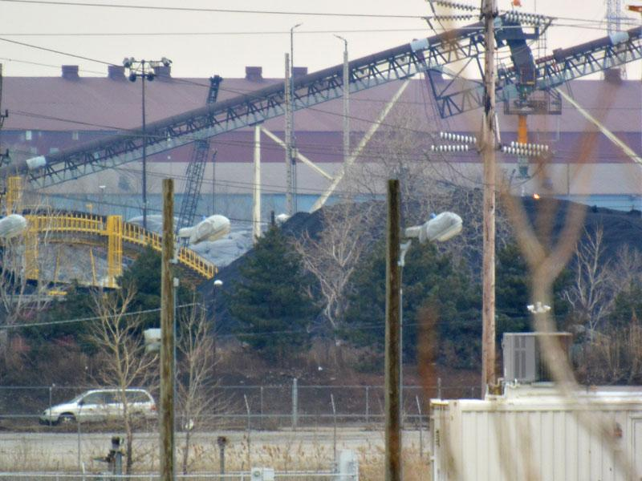

Figure 9-7: A fuel-grade petroleum coke stockpile on Chicago's South Side in 2014, with a passing car for scale. Petcoke is the solid carbon residue from delayed coking and one of the cheapest fuels by BTU. (Source: [U.S. EPA / Wikimedia Commons (public domain)](https://commons.wikimedia.org/wiki/File:Pet-coke-pile-with-car-20140329-fa.jpg))

Petroleum coke is the solid carbon residue from a delayed coker. It comes in two economically distinct grades. **Fuel-grade coke** is high in sulfur and metals and is burned as a cheap coal substitute, mostly in cement kilns and power plants in Asia. It is controversial as an air quality matter but remains a large-volume export from the US Gulf Coast. **Anode-grade coke** is made from low-sulfur feedstock and then calcined at 1,200 to 1,400 degrees Celsius in rotary kilns to produce calcined petroleum coke (CPC). CPC is the critical input for the carbon anodes consumed during aluminum smelting. The global aluminum industry uses roughly 25 million tonnes of CPC per year. Quality requirements are strict: sulfur below 3%, low metals (vanadium, nickel, iron), and specific density and porosity specs that determine how evenly the anode erodes during electrolysis. Rain Carbon, Oxbow, and BP are the major independent calciners.

Graphite needle coke, a higher-purity form, is used for the electrodes in electric arc furnace (EAF) steel mills. Needle coke is the most expensive form of petroleum coke and usually comes from aromatic-rich feedstock. The supply chain became a strategic concern as China expanded both its aluminum smelting and EAF steelmaking capacity.

Fuel-grade coke is the high-sulfur, high-metals version burned as a cheap coal substitute in cement kilns and power plants, mostly in India and China. It is a large-volume US Gulf Coast export. Environmental pressure is mounting, particularly in India where petcoke burning contributes to urban air pollution, but cost advantages keep it in the fuel mix.

## Bitumen and Asphalt

Bitumen is the heaviest fraction of the vacuum residuum, a black semi-solid that becomes a Newtonian fluid when heated. The dominant commercial use is road paving: bitumen binds crushed stone into hot mix asphalt, which paves roughly 94% of paved roads in the United States. The Superpave Performance Grading (PG) system specifies asphalt binders by their high and low service temperature, for example PG 64-22 for a binder that performs at 64 degrees Celsius hot-day pavement and -22 degrees Celsius cold-night pavement. Roofing shingles are the second-largest use, typically a blown or oxidized asphalt tougher than paving grades. The North American asphalt market went through a supply squeeze after 2010 as Canadian bitumen shifted from domestic upgrading to pipeline export and Mexican and Venezuelan heavy crude receipts declined.

Asphalt supply is tightly linked to heavy crude availability. The vacuum residuum from heavy sour crudes (Maya, Arab Heavy, Western Canadian Select) is the primary asphalt feedstock. When Venezuelan production collapsed after 2015 and Canadian pipeline constraints limited heavy crude flows to US Gulf Coast refineries, the asphalt pool tightened and prices rose. Refiners with access to heavy crude and vacuum distillation capacity have a natural advantage in the asphalt market.

Demand is seasonal. Road construction peaks in late spring through early fall, and asphalt prices follow their own seasonal cycle with highs in Q2 and Q3. State and federal highway budgets drive long-term volume; the US Infrastructure Investment and Jobs Act (2021) authorized significant new road spending that supported asphalt demand into the mid-2020s.

## Kerosene and Niche Products

Outside the jet fuel market, straight kerosene remains meaningful as a home heating fuel in Japan and Korea, as a lamp and cooking fuel in parts of Africa and South Asia, and as a cleaning solvent and thinner. It is essentially absent from the US retail market but globally still runs into the hundreds of thousands of barrels per day.

## Carbon Black and Sulfur

**Carbon black** is a fine powdered elemental carbon produced by the partial combustion of heavy oil fractions or natural gas. More than 90% of global carbon black goes into tires as a reinforcing agent, with the rest going into plastics pigment, printing inks, and, increasingly, lithium-ion battery electrodes. World production is on the order of 15 million tonnes per year.

**Sulfur** is the unavoidable byproduct of hydrotreating sour crude. The standard recovery method is the Claus process: hydrogen sulfide (H2S) gas produced during hydrodesulfurization is partially oxidized with air and then reacted over a catalyst bed to yield elemental sulfur, a bright yellow solid. Every refinery and sour gas plant with a hydrotreater has a Claus unit (or its modern equivalent, a tail gas treatment unit) somewhere in the process train.

As IMO 2020 and ULSD rules have forced deeper desulfurization, refinery sulfur output has risen relentlessly. Global elemental sulfur production now runs above 80 million tonnes per year, roughly two thirds from oil and gas sector recovery. The dominant downstream use is sulfuric acid, which is the world's most-produced commodity chemical by volume and is used to make phosphate fertilizer (the single largest end use), for metal extraction (copper, nickel, zinc), and for industrial acid processes. Rubber vulcanization and fungicide production round out the market.

The "sulfur problem" is geographic: too much sulfur in the wrong place. Canadian oil sands upgraders near Fort McMurray produce massive sulfur blocks that sit in open-air storage because the cost of transporting the sulfur to a buyer exceeds its market value. These yellow sulfur pyramids are visible from satellite imagery. Middle East sour gas processing (particularly in Abu Dhabi and Kazakhstan) faces a similar surplus. The global sulfur market balances precariously: fertilizer demand in Africa, India, and Brazil absorbs the surplus, but transportation costs make it a logistically challenging trade.

## Global Refined Product Trade Flows

Finished products move on different trade routes than crude oil. Refineries are concentrated in consuming regions (US Gulf Coast, Northwest Europe, East Asia) and in crude-exporting regions with upgrading capacity (Saudi Arabia, India, South Korea). The largest product trade flows reflect both geographic refinery advantages and shifting geopolitics.

Table 9-9: Major refined product trade routes (2024, approximate)

| Route | Primary product | Volume |
| --- | --- | --- |
| US Gulf Coast to Latin America | Gasoline, diesel | 1.5 to 2.0 Mbpd |
| US Gulf Coast to Europe | Diesel, jet fuel | 0.5 to 1.0 Mbpd |
| Middle East to Asia | Naphtha, fuel oil, LPG | 2.0 to 3.0 Mbpd |
| India to Africa and Europe | Diesel, gasoline | 1.0 to 1.5 Mbpd |
| Russia to Turkey, India, and China | Diesel, fuel oil (rerouted post-sanctions) | 1.0 to 1.5 Mbpd |

The post-2022 rerouting of Russian product exports is the most significant structural shift in product trade since IMO 2020. EU sanctions on Russian petroleum products (February 2023) redirected Russian diesel and fuel oil from its traditional European buyers to Turkey, India, and China, while Middle Eastern and Indian refiners backfilled European diesel demand. Trade routes lengthened, tonne-miles increased, and product tanker rates rose.

Transportation fuels (gasoline, diesel, jet fuel, and residual fuel oil) account for about 64% of global crude oil consumption. The remaining 36% goes to petrochemicals, heating, industrial fuel, road construction, lubricants, and other uses covered in this chapter and [Chapter 10 (Petrochemicals)](#chapter-petrochemicals).

The above was updated in 2026. For the full original 2009 chapter, [download the 1st edition 2009 PDF](/api/download/pdf).

Morgan Downey’s Commodity News

### Read what a commodity trader reads

A free morning brief on the oil, gas, and commodity markets, written by Morgan Downey, author of Oil 101. One email, every morning.

[Subscribe free →](https://boxwoodapp.com/news/subscribe)

<!-- rl-section id="chapter-petrochemicals" class="chapter" kicker="Chapter 10" title="Petrochemicals" -->

## Petrochemicals

Chapter 10

# Petrochemicals

Petrochemicals from oil and gas: ethylene, propylene, plastics, fertilizers, and the chemical building blocks of modern industry.

<svg fill="none" height="18" stroke="currentColor" stroke-linecap="round" stroke-linejoin="round" stroke-width="2" viewbox="0 0 24 24" width="18"><path d="M3 18v-6a9 9 0 0 1 18 0v6"></path><path d="M21 19a2 2 0 0 1-2 2h-1a2 2 0 0 1-2-2v-3a2 2 0 0 1 2-2h3zM3 19a2 2 0 0 0 2 2h1a2 2 0 0 0 2-2v-3a2 2 0 0 0-2-2H3z"></path></svg>Listen· 17:49

## Chemicals from Oil and Gas

Petrochemicals are chemicals manufactured from hydrocarbon feedstocks, as distinct from oleochemicals (made from animal and vegetable fats) and traditional inorganic chemistry. As of 2026 petrochemicals account for roughly 8% of total global crude oil and natural gas use, up from 6% when the first edition was published. Global petrochemical industry revenue is on the order of 600 billion US dollars. Unlike most petroleum products, petrochemicals are not burned as fuel. They are used to make plastics, synthetic fibers, solvents, fertilizers, detergents, rubbers, coatings, and hundreds of other building blocks of modern consumer and industrial life.

Petrochemical End Uses (2024)

Figure 10-1: Where petrochemicals end up. Packaging dominates, but petrochemical derivatives are in nearly every manufactured product.

This chapter covers the industrial chemistry that sits on top of oil and gas, not the chemistry of oil itself. For the molecular structure of paraffins, olefins, naphthenes, and aromatics inside crude, see [Chapter 4 (Chemistry)](#chapter-chemistry). For the refinery units that produce the intermediate streams cracked here, see [Chapter 7 (Refining)](#chapter-refining). For NGL fractionation and the ethane-rejection economics that govern US cracker feedstock pricing, see [Chapter 3 (Components)](#chapter-components).

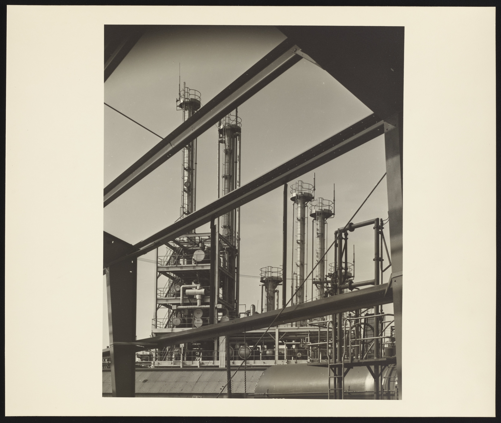

Figure 10-2: An early ethylene plant at Dow Chemical in Midland, Michigan, circa 1953. Steam crackers like this became the foundation of the modern petrochemical industry. (Source: [Dow Chemical Company / Science History Institute (public domain)](https://commons.wikimedia.org/wiki/File:Dow_Chemical_Company_Ethylene_plant_-_DPLA_-_3ead45e887fcc272decde8d881e4e233.jpg))

## Two Feedstock Routes

Virtually all of the world's petrochemical output comes out of a **steam cracker**, a furnace that heats hydrocarbon feed with steam to around 800 to 850 degrees Celsius for a fraction of a second and then quenches it hard. The severe thermal shock cracks the feed into a mixture of small, reactive, mostly unsaturated molecules called olefins. Every downstream petrochemical value chain starts at a steam cracker output stream.

Steam crackers come in two distinct flavors depending on feed. The choice is mostly geographic and reflects what is cheap locally.

Table 10-1: Ethane cracker vs naphtha cracker: typical product slate

| Output | Ethane cracker | Naphtha cracker |
| --- | --- | --- |
| Ethylene | 80% | 30% |
| Propylene | 2% | 15% |
| Butadiene and C4s | 3% | 10% |
| Pyrolysis gasoline (BTX-rich) | 3% | 20% |
| Fuel gas (methane, hydrogen) | 12% | 25% |
| Dominant regions | US Gulf Coast, Middle East, Alberta | Western Europe, Japan, Korea, China, India |

The US and Middle East run **gas-based** crackers on ethane because associated gas from oil wells is cheap and NGL fractionation delivers purity ethane at a few cents per pound. The downside is that ethane cracks mostly to ethylene and produces almost no co-products, so the US is structurally long polyethylene and structurally short aromatics and butadiene. Europe, Japan, Korea, and much of China and India run **liquids-based** crackers on naphtha, the same naphtha cut that a US refinery sends to the reformer. Naphtha crackers produce a richer slate with meaningful propylene, butadiene, and BTX. Crude-to-chemical super-complexes in China and the Middle East feed even heavier cuts, all the way down to atmospheric residue in some designs.

Figure 10-3: Steam Cracker Feedstock Shares (2024)

Global

Americas

Europe

Middle East

Asia-Pacific

Sources: IEA Future of Petrochemicals, Argus Steam Cracker Outlook 2025, S&P Global

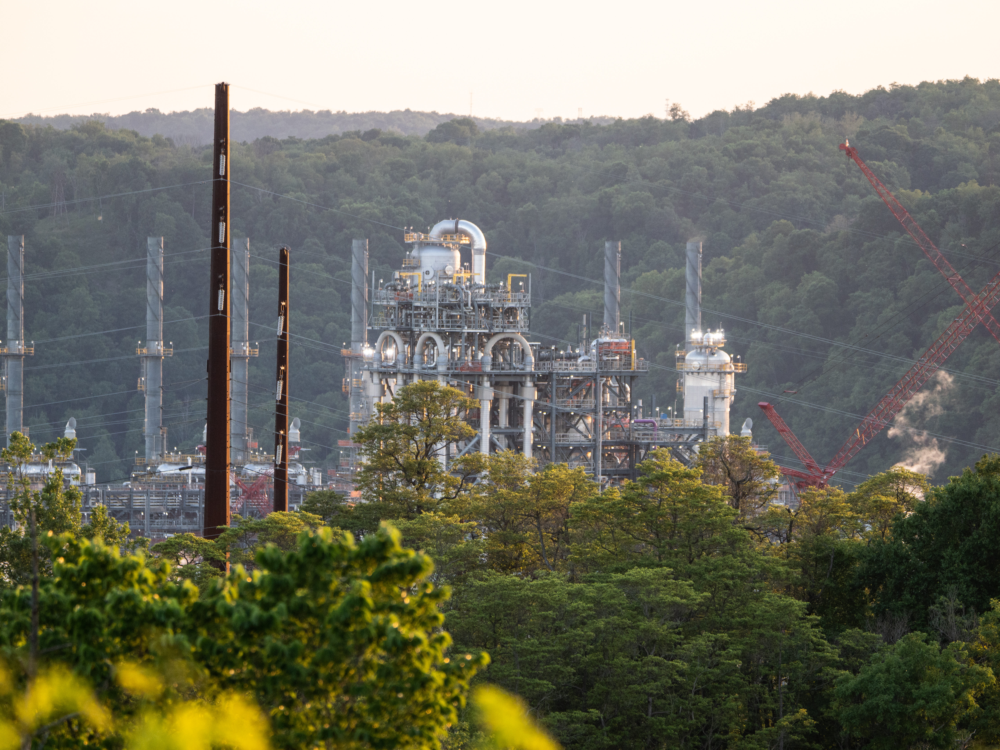

Figure 10-4: Shell's ethylene cracker in Beaver, Pennsylvania, which began operations in 2022. The plant converts Appalachian shale ethane into 1.6 million tonnes per year of polyethylene, illustrating the structural feedstock advantage of US gas-based crackers. (Source: [Mark Dixon / Wikimedia Commons (CC BY 2.0)](https://commons.wikimedia.org/wiki/File:Shell_petrochemical_facility_in_Beaver,_Pennsylvania_(9194).jpg))

The feedstock split varies dramatically by region. The Americas and Middle East are dominated by ethane because both have abundant cheap natural gas. Europe and Asia-Pacific remain naphtha-dependent because they lack large-scale ethane supply. China's coal-to-olefins (CTO) and methanol-to-olefins (MTO) capacity adds a third feedstock route that is unique to that country. The regional feedstock mix drives everything downstream: product slate, margin structure, trade flows, and competitive position.

## The Six Basic Building Blocks

Out of steam crackers and catalytic reformers come six molecules that serve as the foundation of almost all downstream petrochemistry. The first three (ethylene, propylene, butadiene) are olefins. The last three (benzene, toluene, xylenes) are aromatics, collectively called BTX.

Table 10-2: The six petrochemical building blocks

| Block | Formula | Primary source | Flagship downstream product |
| --- | --- | --- | --- |
| Ethylene | C2H4 | Steam cracker (ethane or naphtha) | Polyethylene (PE) |
| Propylene | C3H6 | Steam cracker, FCC off-gas, on-purpose PDH | Polypropylene (PP) |
| Butadiene | C4H6 | Steam cracker C4 stream | Synthetic rubber (SBR, polybutadiene) |
| Benzene | C6H6 | Pygas, reformate, toluene disproportionation | Styrene, phenol, cyclohexane (nylon) |
| Toluene | C7H8 | Reformate, pygas | TDI (polyurethane), solvent, gasoline blendstock |
| Xylenes (mixed) | C8H10 | Reformate, pygas | Para-xylene to PTA to PET polyester and bottles |

## The Ethylene Value Chain

Ethylene is the most produced organic chemical on the planet, with global nameplate capacity above 220 million metric tonnes per year as of 2026. Because ethylene is a hazardous, hard-to-ship gas, the downstream conversion plants almost always sit next door to the cracker, connected by short pipeline. The dominant destinations:

- **Polyethylene (PE)** in three main density families: LDPE (low, flexible films and wire insulation), LLDPE (linear low, stretch film, agricultural film), and HDPE (high, rigid bottles, pipe, crates). Together, PE is roughly 60% of ethylene consumption.
- **Ethylene oxide (EO)**, which runs on to mono-ethylene glycol (MEG). MEG goes into PET polyester (bottles, textile fiber) and into automotive antifreeze.
- **Vinyl chloride monomer (VCM)**, which polymerizes to PVC for pipe, window frames, flooring, and wire insulation.
- **Ethylbenzene**, which dehydrogenates to styrene and then polymerizes to polystyrene or copolymers like ABS.
- **Alpha-olefins** (butene, hexene, octene), used both as comonomers in LLDPE production and as feedstock for lubricant base oils and detergents.

## The Propylene Value Chain

Propylene historically came out of steam crackers and FCC off-gas as a co-product, but demand has grown faster than those by-product streams can keep up with. The gap has been filled by **on-purpose** propylene: propane dehydrogenation (PDH) units, which the US Gulf Coast and China have built in large numbers since 2015, and methanol-to-olefins (MTO) units in coal-heavy parts of China. Downstream, roughly 65% of global propylene goes to polypropylene (PP), a tough, light, cheap, recyclable plastic found in car bumpers, yogurt cups, medical devices, and nonwoven fabrics (surgical masks, diapers). The rest goes to acrylonitrile (for ABS and acrylic fibers), propylene oxide (polyurethane), cumene (phenol and acetone), and acrylic acid (superabsorbent polymers).

## The Aromatics Value Chain

BTX comes mostly from two sources: catalytic reformate out of a refinery and pyrolysis gasoline out of a naphtha cracker. The aromatics complex at a refinery or petrochemical site typically includes an extractive distillation unit to pull the aromatics out of reformate, a benzene-toluene-xylene separation train, a toluene disproportionation unit to balance the ratio of benzene to xylenes, and a para-xylene crystallization or adsorption unit.

Benzene feeds styrene (polystyrene, ABS), cumene (phenol, acetone, bisphenol-A, polycarbonate, epoxy resins), cyclohexane (caprolactam, nylon-6), and nitrobenzene (aniline, MDI, polyurethane). Toluene is used as a solvent, converted to benzene, and blended into gasoline for octane. **Para-xylene** is the most valuable of the three by volume: it is oxidized to purified terephthalic acid (PTA), which then polymerizes with mono-ethylene glycol to form polyethylene terephthalate (PET), the material in most beverage bottles and polyester clothing.

## Methanol, Ammonia, and Urea

Two enormous commodity chemicals start from natural gas rather than from the steam cracker route.

**Methanol** (CH3OH) is made by reforming natural gas to syngas (a mix of carbon monoxide and hydrogen) and then catalytically combining the two. Global methanol production exceeds 100 million tonnes per year. Uses include formaldehyde, acetic acid, MTBE (as a gasoline oxygenate in many markets outside the US), dimethyl ether (DME), biodiesel, and methanol-to-olefins (MTO) plants in China. Methanol is also being piloted as a marine bunker fuel for dual-fuel ships.

**Ammonia** (NH3) is made by combining nitrogen from the air with hydrogen from steam methane reforming in the Haber-Bosch process, which was first commercialized in 1913 and remains one of the most important industrial processes ever developed. Ammonia is combined with carbon dioxide to make urea, the dominant nitrogen fertilizer. It is a sober fact that roughly half of the nitrogen atoms in the typical human body came through a Haber-Bosch reactor at some point. Ammonia is also being explored as a zero-carbon marine fuel.

## The US Shale Advantage

The biggest change in global petrochemicals since the first edition has been the collapse of US ethane prices after the shale gas boom. Starting around 2010, cheap associated gas from the Permian, Marcellus, and Eagle Ford flooded the Mont Belvieu NGL hub with ethane, driving ethane prices to levels that made US ethane crackers the lowest-cost producers of ethylene in the world. The resulting Gulf Coast build-out is outsized: ExxonMobil Baytown, Dow Freeport, CP Chem Sweeny, Formosa Point Comfort, Sasol Lake Charles, and Shell Monaca in Pennsylvania, the first new cracker outside the Gulf in a generation. The US is now a net exporter of polyethylene for the first time since the 1980s, and a major exporter of purity ethane to crackers in Europe, India, and China via specialized very-large ethane carrier (VLEC) ships. [Chapter 24 (US LNG)](#chapter-us-lng) picks up the LNG side of the same story.

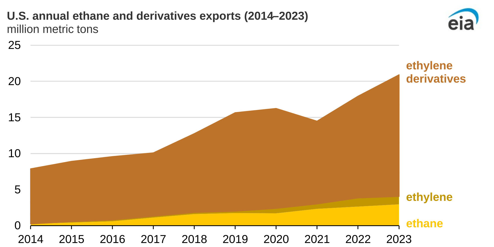

Figure 10-5: Cheap shale ethane drove a US petrochemical export boom. Ethylene and its downstream derivatives (polyethylene, PVC, polystyrene) now ship worldwide from Gulf Coast crackers and derivative plants. (Source: [EIA Today in Energy](https://www.eia.gov/todayinenergy/detail.php?id=63604), November 4, 2024)

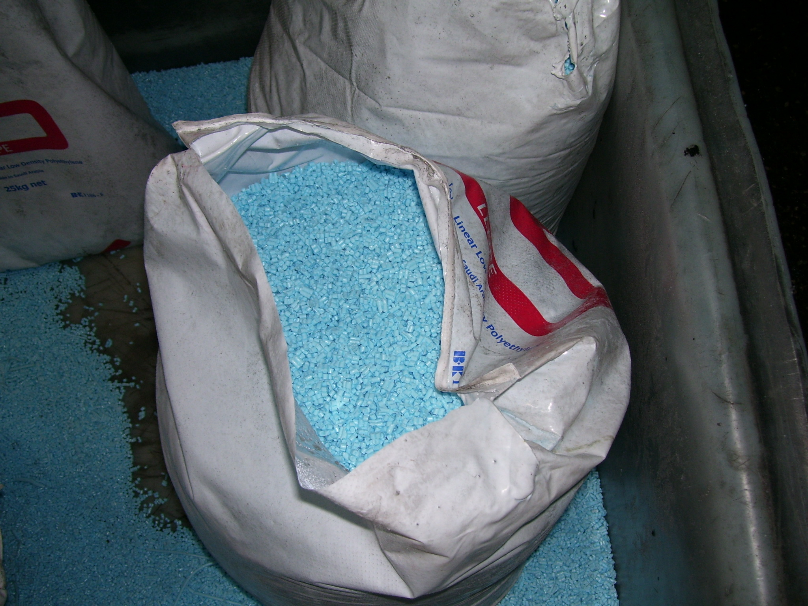

Figure 10-6: Raw plastic resin pellets, known in the trade as nurdles. These are the intermediate product between a steam cracker and the finished goods in a store: every plastic bottle, film, pipe, and container starts as pellets like these. (Source: [SuSanA Secretariat / Wikimedia Commons (CC BY 2.0)](https://commons.wikimedia.org/wiki/File:Plastic_pellets.jpg))

## Plastics in Context and the China Overbuild

Global plastics production runs at roughly 400 million tonnes per year as of 2026. PE and PP together account for more than half of that. The seven resin identification codes (PET 1, HDPE 2, PVC 3, LDPE 4, PP 5, PS 6, and "other" 7) are familiar from recycling bins; only PET and HDPE recycle at meaningful rates. Chemical recycling and pyrolysis-to-feedstock have been piloted heavily in the last five years with limited commercial success.

Figure 10-7: Global Plastics Recycling Rate (2000 to 2024)

The recycling gap. Global plastics production has tripled since 2000 but the recycling rate has moved from 6% to 10%. Most plastic is not recycled: it is buried, burned, or leaked.

Sources: OECD Global Plastics Outlook, Our World in Data

The market story of 2022 to 2025 has been Chinese overcapacity. Between 2020 and 2025 China added more than 30 million tonnes per year of ethylene capacity, mostly in massive coastal refining-chemical complexes at Zhoushan, Gulei, and elsewhere. The new capacity exceeded domestic demand growth and collapsed margins across the entire global merchant chemical market. Marginal European naphtha crackers have begun closing in response; US ethane crackers remain profitable thanks to a feedstock cost advantage that Chinese naphtha crackers cannot match.

Figure 10-8: Global Ethylene Production Capacity by Region (2024)

Sources: IHS Markit, ICIS, industry estimates (2024). Total global capacity approximately 210 Mtpa.

## 2nd Edition Update: The Petrochemical Demand Driver

This section is new to the 2nd edition.

Petrochemicals are the fastest growing source of oil demand. The IEA projects petrochemicals will account for more than a third of oil demand growth through 2030 and nearly half by 2050. As transportation fuel demand potentially peaks under EV adoption, petrochemical feedstock demand partially offsets the decline. This is the "non-burnable" demand for oil and gas that shows up in most long-term balances, and it has become the swing variable in oil demand forecasts.

> Monomers like ethylene and propylene are combined in repeating patterns to form polymers like polyethylene and polypropylene. The vast majority of consumer plastics are made from just those two polymers plus PET, PVC, and polystyrene. Five molecules account for most of the plastic in the world.

Petrochemicals are non-combustion demand for oil and gas, and they grow even in aggressive energy transition scenarios. The link between crude, NGL feedstocks, and plastic production matters more every year for long-term hydrocarbon demand forecasts.

The above was updated in 2026. For the full original 2009 chapter, [download the 1st edition 2009 PDF](/api/download/pdf).

Morgan Downey’s Commodity News

### Read what a commodity trader reads

A free morning brief on the oil, gas, and commodity markets, written by Morgan Downey, author of Oil 101. One email, every morning.

[Subscribe free →](https://boxwoodapp.com/news/subscribe)

<!-- rl-section id="chapter-transporting-oil" class="chapter" kicker="Chapter 11" title="Transporting Oil" -->

## Transporting Oil

Chapter 11

# Transporting Oil

Oil transportation and logistics: pipelines, tankers, VLCC shipping, rail, trucks, and how crude and products move globally.

<svg fill="none" height="18" stroke="currentColor" stroke-linecap="round" stroke-linejoin="round" stroke-width="2" viewbox="0 0 24 24" width="18"><path d="M3 18v-6a9 9 0 0 1 18 0v6"></path><path d="M21 19a2 2 0 0 1-2 2h-1a2 2 0 0 1-2-2v-3a2 2 0 0 1 2-2h3zM3 19a2 2 0 0 0 2 2h1a2 2 0 0 0 2-2v-3a2 2 0 0 0-2-2H3z"></path></svg>Listen· 16:17

## Five Methods of Moving Oil

Oil reaches consumers through five transportation methods: tanker ship, pipeline, tank truck, railcar, and (rarely) aircraft. Each serves a different segment of the supply chain. Tanker ships move crude and products across oceans. Pipelines carry oil over land between production sites, refineries, and distribution hubs. Tank trucks handle the final mile to gas stations, homes, and farms. Railcars carry crude, products, and chemicals where pipelines are absent. Aircraft tankering is limited to airlines ferrying jet fuel between their own hubs when regional prices make it economic.

Transportation matters because producing basins and consuming markets are rarely in the same place. Saudi crude has to reach refineries in Japan and Rotterdam. Canadian bitumen has to reach the US Gulf Coast. Gasoline made on the US Gulf Coast has to reach drivers in New York and Atlanta. Every mile of that journey passes through a regulated, standardized, capacity-constrained network, and the spread between producing and consuming regions reflects the cost and scarcity of that network.

## Tanker Ships

Just over half of global crude production travels by sea at some stage. The tanker fleet is segmented by deadweight tonnage (DWT) into size classes that determine which terminals, canals, and trades the vessel can serve. The table below is the reference ladder.

Table 11-1: Oil tanker size classes

| Class | DWT range | Typical trade | Typical cargo |
| --- | --- | --- | --- |
| Handysize | <10,000 DWT | Coastal, regional | Products |
| Handymax | 25-40,000 DWT | Short-sea, regional | Products |
| MR (Medium Range) | 40-55,000 DWT | USGC to Latin America, intra-Europe | Clean products (gasoline, diesel, jet) |
| LR1 (Long Range 1) / Panamax | 55-80,000 DWT | Transatlantic, India to East Africa | Clean products or crude |
| LR2 / Aframax | 80-120,000 DWT | North Sea, US Gulf, Caribbean, Mediterranean | Crude |
| Suezmax | 120-200,000 DWT | West Africa to Europe, Black Sea | Crude |
| VLCC (Very Large Crude Carrier) | 200-320,000 DWT | Middle East to Asia, Middle East to Europe | Crude |
| ULCC (Ultra Large Crude Carrier) | >320,000 DWT | Largely retired | Crude |

"Aframax" sounds like a brand but is short for Average Freight Rate Assessment Maximum, from the AFRA scale the London Tanker Brokers' Panel used decades ago to classify freight contracts. The name stuck. A VLCC carries roughly 2 million barrels of crude; a single VLCC cargo moving from Ras Tanura to Ningbo can swing a weekly Chinese inventory print. Suezmaxes fit through the Suez Canal fully loaded. VLCCs fit only partially loaded and must reload the balance on the other side, or reroute around the Cape of Good Hope.

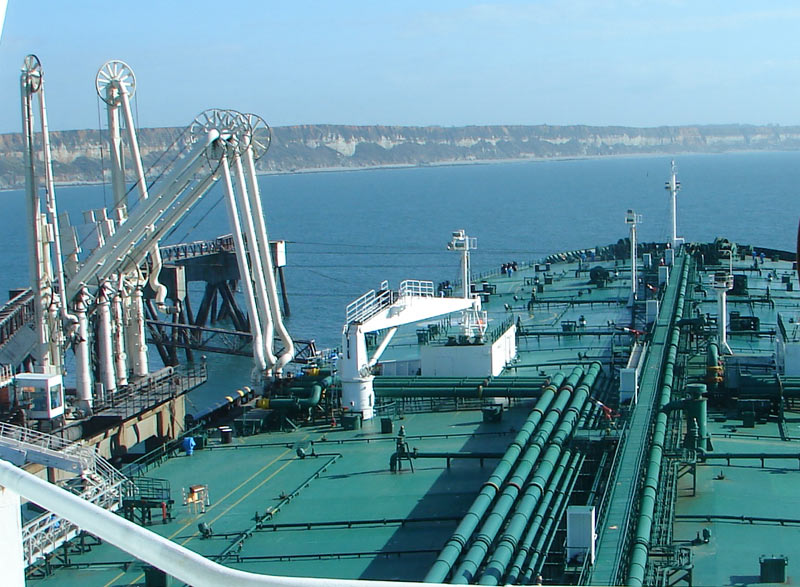

Figure 11-1: The VLCC Algarve unloading crude oil at the Antifer terminal, France. A single VLCC cargo of roughly 2 million barrels can swing weekly regional inventory numbers. (Source: [Herve Cozanet / Wikimedia Commons (CC BY-SA 3.0)](https://commons.wikimedia.org/wiki/File:Tanker_unloading_crude_oil.jpg))

Clean product tankers carry refined products such as gasoline, diesel, and jet fuel in coated or stainless steel tanks that will not contaminate the cargo. Dirty tankers carry crude oil and residual fuel. The distinction matters commercially: switching a vessel between clean and dirty service requires an expensive tank clean and is rarely done. A typical tanker has segregated cargo tanks, segregated ballast tanks to maintain trim when empty, slop tanks to hold tank washings, a pump room forward of the engine room, and an accommodation block aft. OPA 90, passed after the 1989 Exxon Valdez grounding in Prince William Sound, required all tankers calling on US waters to be double-hulled. The IMO followed with a global MARPOL schedule that phased out single-hulled tankers by 2015.

> A rough conversion: multiply DWT by 7.5 to estimate barrel capacity. A "boatload" in trading slang is 500,000 barrels, the cargo of a typical MR or LR1. A "bargeload" is 50,000 barrels. A VLCC cargo is often quoted as "a million barrels plus" with the exact figure set by the loadline at the terminal.

Figure 11-2: Global Tanker Fleet by Vessel Class (% of Total DWT, 2024)

Sources: Clarksons Research, UNCTAD Review of Maritime Transport (2024). Shares by deadweight tonnage.

## Chartering and Worldscale

Tanker freight is priced using the **Worldscale** system, annually revised nominal rates published in dollars per metric tonne for a list of standard voyages. Worldscale 100 is set so a standard reference vessel earns a specified daily return on that route. Market charter rates are quoted as a percentage of that nominal: WS 100 equals the nominal, WS 150 is 50% above, WS 80 is 20% below. Brokers quote a single number instead of rebuilding the bunker and port cost stack for every voyage. The Baltic Exchange publishes daily route assessments that serve as the reference for freight derivatives (FFA).

Table 11-2: Worked example: VLCC Ras Tanura to Ningbo at WS 60

| Input | Value |
| --- | --- |
| Voyage | Ras Tanura (Saudi Arabia) to Ningbo (China) |
| Worldscale flat rate (illustrative) | $18.50 / tonne |
| Market rate | WS 60 |
| Effective freight | $18.50 x 0.60 = $11.10 / tonne |
| Cargo | 300,000 DWT (about 270,000 tonnes of crude) |
| Total freight | $3.0M per voyage |

## Pipelines

All oil passes through a pipeline at some stage. Black oil pipelines carry crude to refineries. Clean product pipelines move refined fuels from refineries to distribution terminals. The Colonial Pipeline, 5,500 miles from Houston to Linden, New Jersey, moves roughly 40% of US East Coast liquid fuels. Products travel at 3 to 5 mph, with a full journey taking 18 to 20 days.

A few pipeline mechanics are worth understanding. **Batching** is the practice of pumping different products back to back through the same pipe: a batch of jet fuel, then a batch of diesel, then a batch of gasoline. A small **interface** zone at each boundary mixes slightly; the interface cut is either rerun through a refinery or downgraded to a less sensitive product. **Pigs** are pipeline inspection gauges that travel with the fluid to clean wall deposits, separate batches, or, in the case of "smart pigs", take ultrasonic readings of wall thickness to detect corrosion before it becomes a leak. **Drag reducing agent (DRA)** is a tiny dose of high molecular weight polymer that suppresses turbulent eddies at the pipe wall and can lift throughput 10% to 40% without new pumps. **Pump stations** sit every 50 to 100 miles to restore pressure lost to friction.

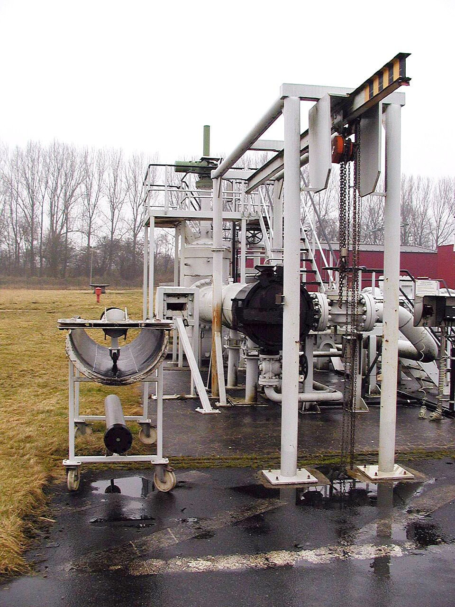

Figure 11-3: A pig launcher on a 28-inch crude oil pipeline. The barrel-shaped chamber is opened to insert a pig, which is then pushed by flowing crude to clean the line or take ultrasonic wall-thickness readings. (Source: [Wilfra / Wikimedia Commons (public domain)](https://commons.wikimedia.org/wiki/File:NWO-Molchschleuse.jpg))

Table 11-3: Major North American crude and product pipelines

| Pipeline | Operator | Route | Capacity |
| --- | --- | --- | --- |
| Colonial | Colonial Pipeline Co. | Houston to Linden NJ (products) | 2.5 Mbpd |
| Plantation | Kinder Morgan | Louisiana to Washington DC (products) | 720 kbpd |
| Enbridge Mainline | Enbridge | Alberta to US Midwest (crude) | 3.0 Mbpd |
| Keystone | TC Energy | Alberta to US Gulf (crude) | 620 kbpd |
| Trans Mountain (TMX) | Trans Mountain Corp | Alberta to Vancouver BC (crude) | 890 kbpd (2024 expansion) |
| TAPS | Alyeska | Prudhoe Bay to Valdez AK (crude) | 500 kbpd |

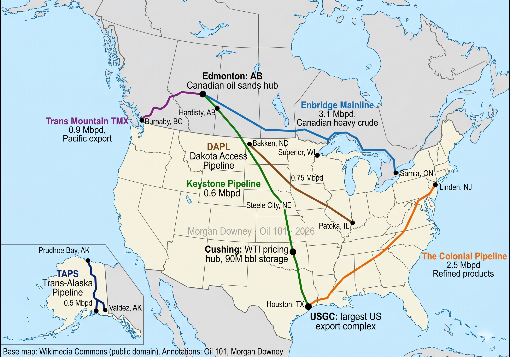

Figure 11-4: Major North American crude oil and refined product pipelines with approximate capacities. Cushing, Oklahoma is the pricing and storage hub for WTI futures. The US Gulf Coast is the largest refining and export complex in the world. (Source: Base map: Wikimedia Commons (public domain). Annotations: Oil 101, Morgan Downey)

## Crude by Rail and the Bakken Boom

Between 2011 and 2015 the US ran a short, intense boom in crude by rail (CBR) as Bakken shale production outgrew pipeline capacity. At the peak, over a million barrels per day of North Dakota light sweet crude moved in unit trains to refineries on the East Coast, West Coast, and Gulf. The boom ended on July 6, 2013, when an unattended runaway train of 72 tank cars carrying Bakken crude derailed and exploded in the center of Lac-Megantic, Quebec, killing 47 people and leveling downtown. The accident forced the phase-out of the old DOT-111 tank car design and the adoption of the thicker-walled, pressure-tested DOT-117 standard. CBR volumes fell as new pipelines came online, but rail remains meaningful for Canadian heavy oil moving to the Gulf, especially when TMX and Enbridge Mainline are apportioned.

## Trucking: The Last Mile

Tank trucks deliver the last mile of almost every refined product. Gasoline tankers fan out from terminals to service stations several times a day. Aviation fuel trucks or hydrant-cart systems fuel aircraft on airport aprons. Heating oil trucks fill residential tanks in the US Northeast. Asphalt trucks haul hot bitumen to paving sites. Cost per barrel-mile is high relative to pipeline or marine, so trucking is reserved for short final distances where no larger-volume alternative exists.

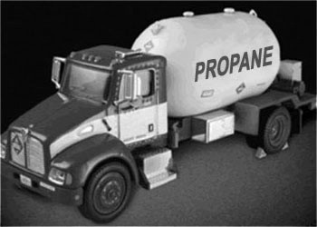

Figure 11-11: A propane delivery tank truck. Trucks handle the final mile of the oil supply chain, delivering refined products from terminals to gas stations, homes, and farms. (Source: Oil 101, Morgan Downey)

## IMO 2020 and the Transformation of Bunker Fuel

On January 1, 2020, the IMO's global marine fuel sulfur cap fell from 3.5% to 0.5%, the largest regulatory shift in the history of the bunker market. Ships without scrubbers could no longer burn high-sulfur fuel oil in open water. The bunker pool split three ways: most ships switched to VLSFO (0.5% sulfur); roughly 5,000 scrubber-equipped vessels kept burning HSFO at a steep discount that paid back the scrubber investment; and a growing minority used MGO, LNG, or methanol. The HSFO/VLSFO spread widened from nearly zero in 2019 to routinely more than $150 per tonne after the rule took effect. [Chapter 9 (Finished Products)](#chapter-finished-products) covers the product side in detail.

Singapore remains the world's largest bunker port, consistently delivering roughly 50 million tonnes of marine fuel per year, with Fujairah in the UAE and Rotterdam in the Netherlands holding second and third place.

Inland waterways are a minor petroleum transport mode in the US, carrying roughly 3 to 5 percent of total petroleum volumes. The Mississippi River system and the Gulf Intracoastal Waterway move refined products and some crude via barge, typically in 10,000 to 30,000 barrel loads. A standard barge tow is about 50,000 barrels. Pipelines handle 70 to 75 percent of US petroleum movement, coastal and ocean tankers 15 to 20 percent, and rail and truck share the remainder.

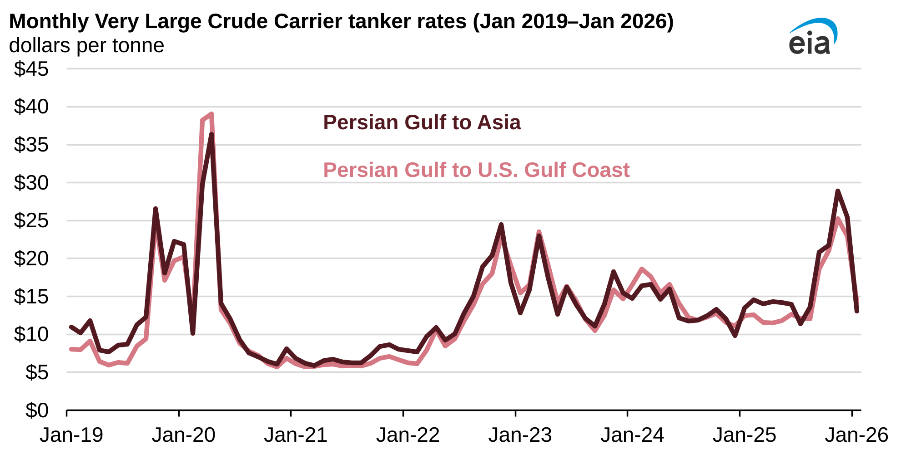

Figure 11-6: VLCC rates reflect global seaborne oil demand and tanker supply. Spikes indicate tight ship availability, sanctioned-fleet distortions, or disrupted trade routes. (Source: [EIA Today in Energy](https://www.eia.gov/todayinenergy/detail.php?id=67064), January 27, 2026)

## Shipping Chokepoints

A handful of narrow passages carry most of the world's seaborne oil. Disruption at any of them moves the oil price.

Table 11-4: World oil shipping chokepoints

| Chokepoint | Transit (Mbpd) | Notes |
| --- | --- | --- |
| Strait of Hormuz | 17 | Persian Gulf exit. Single most important oil chokepoint. |
| Strait of Malacca | 16 | Middle East to China, Japan, Korea. Narrow between Indonesia and Malaysia. |
| Bab el-Mandeb / Red Sea | 6 (pre-2024) | Suez Canal approach from south. Disrupted by Houthi strikes starting late 2023. |
| Turkish (Bosporus) Straits | 3 | Russian Black Sea crude and products exit. |
| Panama Canal | 1 | USGC to Pacific. Transit reduced during the 2023 to 2024 drought. |
| Danish Straits | 3 | Baltic exit; Russian crude and products. |

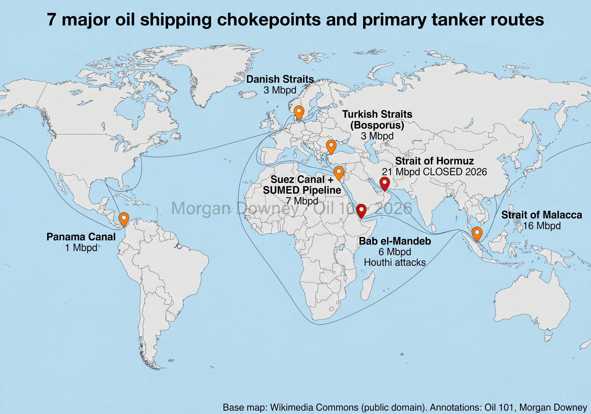

Figure 11-7: The seven oil transit chokepoints and major tanker routes. Combined, these passages carry over 55 Mbpd of crude and products. In 2026, two of the seven (Hormuz and Bab el-Mandeb) are simultaneously compromised. (Source: Base map: Wikimedia Commons (public domain). Annotations: Oil 101, Morgan Downey)

## LNG Carriers in Brief

LNG moves on purpose-built refrigerated tanker ships that keep methane liquid at minus 162 degrees Celsius in insulated spherical (Moss-type) or membrane-wall (Gaztransport and Technigaz) tanks. Standard modern capacity runs 145,000 to 174,000 cubic meters; the Qatari Q-Flex (210,000) and Q-Max (266,000) classes are the largest built. [Chapter 24 (US LNG)](#chapter-us-lng) covers US LNG exports, the ships, and the terminal build-out in detail.

## Trading Hubs

Pipelines, tanker terminals, and storage tanks cluster at a handful of hubs where physical oil meets the financial market. The most important hub in the world is Cushing, Oklahoma, the delivery point for WTI crude futures. By 2026 the Permian Basin is the world's most prolific producing region, with new pipeline systems connecting it to US Gulf Coast export terminals at Houston, Corpus Christi, and Freeport.

Table 11-5: Major global crude oil pricing and trading hubs

| Hub | Location | Role |
| --- | --- | --- |
| Cushing | Oklahoma, US | NYMEX WTI delivery point; the most important US pricing hub |
| US Gulf Coast (USGC) | Texas / Louisiana, US | Largest US refining concentration; export terminals at Houston, Corpus Christi, Freeport, Beaumont |
| LOOP | Louisiana, US | Louisiana Offshore Oil Port; only US port able to fully load VLCCs |
| North Sea (Brent) | Sullom Voe, UK | ICE Brent delivery point; prices two-thirds of globally traded crude |
| ARA | Amsterdam / Rotterdam / Antwerp | Leading European products and storage hub; central to NW Europe physical trade |
| Ras Tanura | Saudi Arabia | World's largest crude export terminal (Saudi Aramco) |
| Fujairah | UAE | Strategic Middle East storage and bunkering hub outside the Strait of Hormuz. |
| Singapore | Singapore | Asia's pricing and physical hub; home to Platts MOC and major products trade |

## Incoterms and Delivery Pricing

International oil trade uses standardized delivery terms (Incoterms) published by the International Chamber of Commerce. FOB (Free on Board): buyer assumes risk once oil passes the ship's rail at loading. CIF (Cost, Insurance, Freight): seller pays transport and insurance to the discharge port. DDP (Delivered Duty Paid): includes all costs to the buyer's location. These terms set who bears transportation risk and cost at each stage.

The above was updated in 2026. For the full original 2009 chapter, [download the 1st edition 2009 PDF](/api/download/pdf).

Morgan Downey’s Commodity News

### Read what a commodity trader reads

A free morning brief on the oil, gas, and commodity markets, written by Morgan Downey, author of Oil 101. One email, every morning.

[Subscribe free →](https://boxwoodapp.com/news/subscribe)

<!-- rl-section id="chapter-storage" class="chapter" kicker="Chapter 12" title="Storage" -->

## Storage

Chapter 12

# Storage

Oil storage explained: tank farms, salt caverns, floating storage, the Cushing hub, and strategic petroleum reserves worldwide.

<svg fill="none" height="18" stroke="currentColor" stroke-linecap="round" stroke-linejoin="round" stroke-width="2" viewbox="0 0 24 24" width="18"><path d="M3 18v-6a9 9 0 0 1 18 0v6"></path><path d="M21 19a2 2 0 0 1-2 2h-1a2 2 0 0 1-2-2v-3a2 2 0 0 1 2-2h3zM3 19a2 2 0 0 0 2 2h1a2 2 0 0 0 2-2v-3a2 2 0 0 0-2-2H3z"></path></svg>Listen· 19:33

## Why Store Oil?

Oil moves continuously from wellhead to burner tip, but production, shipping, refining, and consumption never match minute by minute. Storage is the shock absorber. Every barrel of crude or product sits in a tank, cavern, pipeline, or ship at some point between reservoir and consumer, and the scale is large: the world holds several billion barrels of petroleum in commercial and strategic stocks at any moment.

There are three motivations for holding oil, and mixing them up is a common source of confusion in market commentary:

- **Operational.** Refineries, terminals, and pipelines need tankage to buffer day to day mismatches between inbound and outbound flows. A refinery receiving crude on a weekly VLCC schedule but running the plant 24 hours a day must hold at least a week of throughput on site. This inventory is not speculative; it is the grease that keeps the machinery moving.
- **Strategic.** Governments hold reserves against supply disruption. The US Strategic Petroleum Reserve, the EU national stocks, and Japan's JOGMEC holdings exist because a 1970s style embargo or a modern Strait of Hormuz closure could strand consumers for weeks. Member countries of the International Energy Agency commit to holding 90 days of net imports as a condition of membership.
- **Commercial and speculative.** Traders store oil when the forward curve is in steep enough contango that buying spot and selling forward locks in a profit after paying storage, insurance, financing, and shrinkage. This is the cash and carry trade, and it is how the futures market disciplines physical inventories.

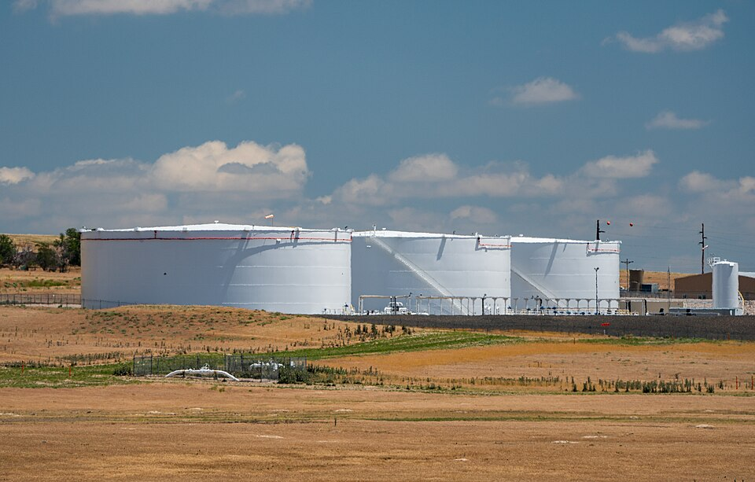

Figure 12-1: Suncor Energy crude oil storage tank farm near Guernsey, Wyoming. Commercial tank farms cluster along pipeline corridors to provide working inventory for refiners, traders, and midstream operators. (Source: [Tony Webster / Wikimedia Commons (CC BY 2.0)](https://commons.wikimedia.org/wiki/File:Suncor_Energy_-_Crude_Oil_Storage_Tank_Farm_-_Wyoming_(52210918732).jpg))

## Categories of Storage

Oil inventory lives in several physically distinct settings, each with its own cost structure, turnover rate, and regulatory treatment. The table below walks through the main categories in roughly increasing order of how long a barrel tends to sit in each.

Table 12-1: Categories of Oil Storage

| Type | Typical Scale | Primary Use |
| --- | --- | --- |
| Refinery operating tankage | 5 to 20 days of crude runs plus product day tanks | Buffer between crude deliveries, runs, and product lifting |
| Terminal and midstream tankage | Tens to hundreds of thousands of barrels per tank | Third-party storage for traders, blenders, marketers |
| Pipeline fill (line pack) | Several hundred MMbbl in the US system | Oil in motion that must remain in the line at all times |
| Tank farm hubs | Cushing, Midland, Houston, ARA (Rotterdam), Singapore, Fujairah | Price discovery and delivery points for benchmark futures |
| Salt caverns | 1 to 10+ MMbbl per cavern | Cheap bulk storage of crude, NGLs, and natural gas |
| Floating storage | 2 MMbbl per VLCC | Contango plays, logistics timing, sanctioned trade |
| Strategic reserves | Hundreds of MMbbl (SPR: 714 MMbbl design) | National security, IEA 90-day obligation |

Line pack is worth pausing on. A long-haul crude pipeline like Keystone or Enbridge Mainline holds millions of barrels simply because it is full of oil from origin to terminus at all times. That volume never appears in a tank farm report, but it is real inventory, and it cannot be withdrawn without shutting the line down.

Figure 12-2: Tank farms along the waterfront at Bayonne, New Jersey. Urban waterfront terminals like these serve the dense US East Coast product market, historically the country's largest consumer of heating oil and jet fuel. (Source: [Jim.henderson / Wikimedia Commons (CC BY-SA 4.0)](https://commons.wikimedia.org/wiki/File:Bayonne_tank_farm_from_BB_jeh.jpg))

## Tank Types

Walk any tank farm and you see a handful of recurring shapes. Each exists because the physical properties of the stored product, vapor pressure above all, demand a specific containment design. A fixed roof tank holding gasoline would lose a meaningful fraction of its contents to evaporation every week; a spheroid holding crude would be a grotesque waste of steel.

Table 12-2: Above-Ground Tank Typology

| Type | Typical Product | Typical Size | Reason for Design |
| --- | --- | --- | --- |
| Fixed (cone) roof | Heavy fuel oil, asphalt, water | Up to 500,000 bbl | Cheapest design; vapor space above liquid accepts breathing losses |
| External floating roof | Crude oil, gasoline, naphtha | Up to 1,500,000 bbl | Roof floats directly on product, sealed to wall, kills evaporation |
| Internal floating roof | Gasoline, jet, light distillates | Up to 500,000 bbl | Fixed dome over internal deck; rain and snow excluded, vapor still captured |
| Dome roof | LPG, light naphtha | Up to 100,000 bbl | Gas-tight geodesic or welded dome for low-pressure volatile liquids |
| Horizontal bullet | Propane, butane | 10,000 to 60,000 gallons | Small pressure vessel for local distribution and retail sites |
| Horton sphere | LPG, NGLs, ethylene, light ends | 10,000 to 80,000 bbl | Sphere minimizes surface area per volume under pressure |
| Cryogenic full-containment | LNG, ethylene, propylene | Up to 1 MMbbl LNG equivalent | Inner nickel-steel tank, outer concrete shell, vacuum insulation |

Every tank, regardless of type, has a **dead stock** or heel: a physical residual at the bottom that cannot be pumped without sucking air. Dead stock is part of the capital asset rather than working inventory, and it is excluded from the "working capacity" figures the industry quotes. When a tank farm is reported as 95 percent full, the denominator is working capacity, not shell capacity.

## Cushing, Oklahoma: The Pipeline Crossroads

Cushing began as a pipeline junction in the 1910s, when the Glenn Pool field to its south made central Oklahoma one of the largest oil regions on earth. A century later the wells are mostly gone but the pipelines remain, and Cushing sits at the intersection of crude flowing in from the Bakken, Permian, Western Canada, and the Gulf Coast. When NYMEX launched its WTI light sweet crude contract in 1983, it designated Cushing as the physical delivery point. That choice turned an Oklahoma tank town into the most closely watched piece of real estate in global oil.

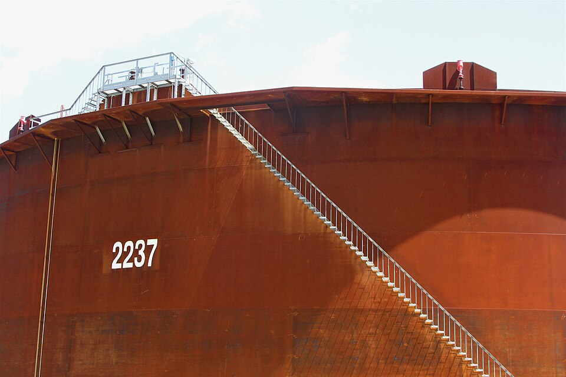

Figure 12-3: Enbridge tank farm at Cushing, Oklahoma. Cushing is the NYMEX WTI delivery point and holds about 95 million barrels of working crude storage at peak, split among Enbridge, Enterprise, Magellan (Oneok), Plains, Blueknight, and SemGroup. (Source: [Roy Luck / Wikimedia Commons (CC BY 2.0)](https://commons.wikimedia.org/wiki/File:Enbridge_tank_farm,_Cushing_OK.jpg))

Working capacity at Cushing has grown with every contango cycle. The hub held under 50 million barrels in 2004, crossed 80 million during the 2008-2009 contango build, and tops out near 95 million barrels today, spread across roughly a dozen terminal operators. The largest names are Enbridge, Enterprise, Magellan (now part of Oneok), Plains, Blueknight, and SemGroup. Physical delivery against the expiring futures contract is handled by pipeline and in-tank transfers between these operators.

Cushing is landlocked and cannot export to tidewater directly. When inflows from the Permian and Canada exceed outflows to Gulf Coast refiners, inventories build and WTI weakens against Brent and against its own forward months. The extreme case was April 2020, when Cushing approached operational full and traders holding expiring WTI contracts had nowhere to take delivery. The May 2020 contract settled at minus $37.63 per barrel, the first negative print in the history of the benchmark. [Chapter 23 (Negative Prices)](#chapter-negative-prices) walks through that event in detail.

Figure 12-4: Cushing, Oklahoma Crude Inventory (2015 to 2025)

Source: EIA Weekly Petroleum Status Report (illustrative monthly snapshots). Shaded band shows 5-year range.

## Salt Caverns

Salt is almost uniquely suited to storing hydrocarbons. It is impermeable to oil and gas, does not react with them, and under pressure creeps plastically, so small fractures heal themselves rather than propagating. Salt only dissolves in water, and hydrocarbons are immiscible with water, so a salt cavern filled with crude will hold that crude indefinitely with essentially no loss.

Caverns are created by **solution mining**. A well is drilled into a salt dome or bedded salt formation, fresh water is injected, the dissolved brine is produced back to surface, and over months to years the cavity grows into the desired shape. A single cavern can hold 5 to 10 million barrels and cost roughly one tenth what the same capacity in steel above-ground tankage would cost. Injection and withdrawal are done by displacement: to pull oil out, operators pump brine in at the bottom; to store more, they pump oil in and brine out.

The largest cavern complex in the world is **Mont Belvieu, Texas**, on the upper Gulf Coast, which stores the NGL barrel of the United States: ethane, propane, normal butane, isobutane, and natural gasoline, in hundreds of caverns holding several hundred million barrels in aggregate. Conway, Kansas plays a similar but smaller role for the mid-continent. Petal, Mississippi stores natural gas and NGLs for the southeastern pipeline grid. And the US Strategic Petroleum Reserve uses four salt dome sites along the Texas and Louisiana coast: Bryan Mound and Big Hill in Texas, West Hackberry and Bayou Choctaw in Louisiana.

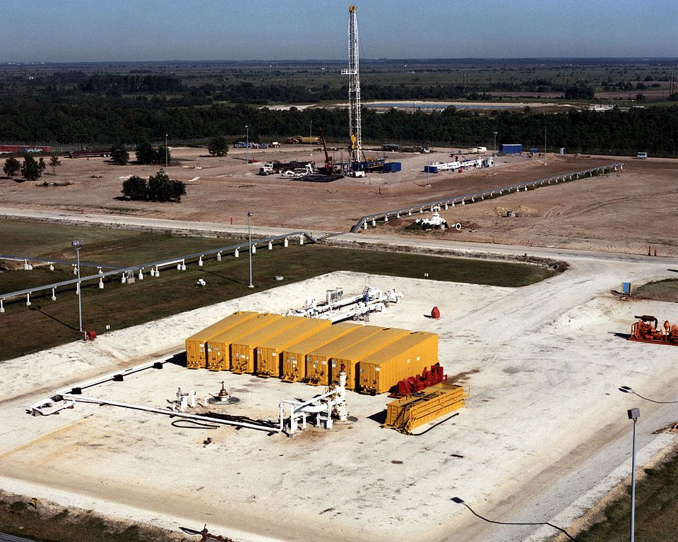

Figure 12-5: Well pads at the Big Hill Strategic Petroleum Reserve site in Texas. The SPR stores crude in leached salt caverns along the Gulf Coast, the cheapest form of bulk hydrocarbon storage and the backbone of US emergency preparedness. (Source: [U.S. Department of Energy / Wikimedia Commons (public domain)](https://commons.wikimedia.org/wiki/File:United_States_Strategic_Petroleum_Reserve_102.jpg))

## The US Strategic Petroleum Reserve

Congress created the SPR in 1975, two years after the Arab oil embargo had shown American drivers what a supply shock looked like. The reserve's design capacity is 714 million barrels spread across the four Gulf Coast salt dome complexes, making it the largest government-owned emergency stockpile on earth. Sustained drawdown capacity is about 4.4 million barrels per day, enough to replace meaningful import losses, and oil can begin reaching the market within about 13 days of a presidential drawdown order.

SPR levels rebuilt slowly after the 2022-2023 Biden administration drawdowns, reaching roughly 405 million barrels by early February 2026. Then the Hormuz crisis hit. The US drew 220 million barrels of crude from the reserve over March, April, and the first week of May, taking inventories to roughly 185 million barrels by mid-May, the lowest level since the early 1980s. The 2026 Hormuz drawdown is now the largest SPR release in history, surpassing the 180 million barrels released over six months in 2022-2023 in response to the oil price shock following Russia’s invasion of Ukraine. Earlier drawdowns were smaller and shorter: 17 million barrels during Desert Storm in 1991, 11 million barrels after Hurricane Katrina in 2005, and 30 million barrels during the Libyan civil war in 2011. Refilling the reserve to design capacity from current levels would take five years or longer at typical refill paces and is politically and fiscally constrained, leaving the US with materially less SPR firepower available for the next disruption.

Table 12-3: US SPR Key Statistics (May 2026)

|  |  |
| --- | --- |
| Design capacity | 714 MMbbl |
| Current fill (May 2026) | ~185 MMbbl |
| Sustained drawdown rate | 4.4 Mbpd |
| Time to market | 13 days from order |
| Storage sites | Bryan Mound, Big Hill, West Hackberry, Bayou Choctaw |
| Largest release ever | 220 MMbbl, 2026 (Hormuz crisis) |

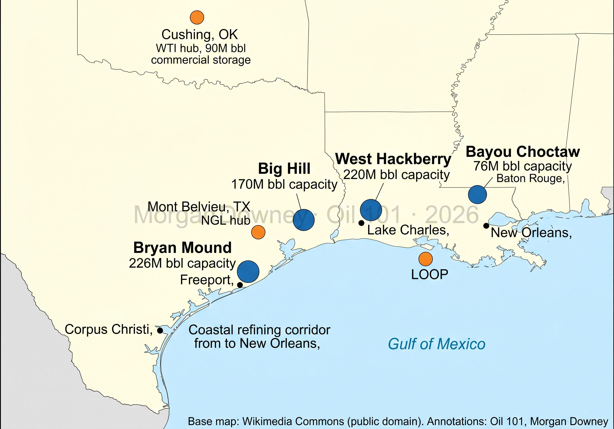

Figure 12-6: The four US Strategic Petroleum Reserve sites along the Gulf Coast, all stored in underground salt caverns. Combined capacity: 692 million barrels. Cushing, Oklahoma (the WTI pricing hub) and Mont Belvieu, Texas (the NGL hub) are the two largest commercial storage complexes. (Source: Base map: Wikimedia Commons (public domain). Annotations: Oil 101, Morgan Downey)

US Strategic Petroleum Reserve, 1977 to 2025

Estimated Global Strategic Reserves (2025, million barrels)

Figure 12-7: US SPR fill and drain. The SPR reached a peak fill of 727 million barrels in 2010. The Biden administration released 180 million barrels in 2022, the largest drawdown in history, dropping inventories to 372 million barrels. Refilling began in 2023 at modest purchase rates. Globally, strategic reserves total an estimated 1.5 billion barrels, with China overtaking the US as the largest holder. Source: EIA Weekly Petroleum Status Report; international estimates from IEA and industry sources.

Table 12-4: SPR Presidential Actions

| President | Action | Volume (mil bbl) | Year | Context |
| --- | --- | --- | --- | --- |
| Ford | Created SPR | 0 (first fill) | 1975 | Post-embargo Energy Policy and Conservation Act |
| Carter/Reagan | Initial fill | 0 to 500 | 1977 to 1985 | Filled primarily with Mexican and North Sea crude |
| Bush (41) | Desert Storm release | -17 | 1991 | First emergency drawdown, IEA-coordinated |
| Clinton | Test sale | -28 | 1996 to 1997 | Budget deficit reduction (controversial non-emergency use) |
| Bush (43) | Katrina/Rita release | -21 | 2005 | Hurricane damage to Gulf Coast refining |
| Bush (43) | Refill to peak | to 727 | 2005 to 2009 | Post-Katrina refill brought SPR to all-time high |
| Obama | Libya release | -30 | 2011 | IEA-coordinated, Libyan civil war supply disruption |
| Obama | Budget sales | -58 | 2015 to 2016 | Bipartisan Budget Act mandated sales for deficit reduction |
| Trump | Budget sales | -35 | 2017 to 2020 | Continued congressionally mandated sales |
| Biden | Emergency drawdown | -180 | 2022 | Largest SPR release, post-Russia invasion price spike |
| Biden | Partial refill | +35 | 2023 to 2024 | Bought back at $70 to $80/bbl after selling at $90 to $100/bbl |

The SPR has been used as a political tool by every president since its creation. The Biden 2022 drawdown was historically unprecedented in scale: 180 million barrels released over six months, more than ten times the Desert Storm release and six times the Libya release. The subsequent partial refill at lower prices partially vindicated the decision financially, but the SPR remains far below its 2009 peak of 727 million barrels.

The SPR can release crude through three mechanisms. A **drawdown and sale** is an outright auction, used in genuine emergencies. An **exchange** lends oil to a refiner who agrees to return a slightly larger volume later, useful for short-term logistical bottlenecks like a closed ship channel. A **test sale** is a small pre-planned release to verify that the equipment and contracting machinery still work. The IEA co-ordinates releases among member countries when a shock is judged to be global rather than national.

## International Strategic Reserves

The US is not alone in holding strategic oil stocks. IEA member countries are required to hold at least 90 days of net oil imports in emergency reserves, and several non-IEA countries have built strategic stockpiles of their own. Global strategic and compulsory reserves are estimated at 1.5 to 1.8 billion barrels.

Table 12-5: International Strategic Petroleum Reserves (2025 Estimates)

| Country | Estimated Volume | Notes |
| --- | --- | --- |
| China | 500-600 MMbbl | Estimated from satellite imagery and import-throughput analysis |
| US (SPR) | 413 MMbbl | 714M design capacity; 413M after partial refill from 2022 lows |
| Japan (NRZS) | 140 MMbbl | Government plus private compulsory stocks |
| South Korea | 95 MMbbl | KNOC government and industry obligation |
| India (ISPRL) | 40 MMbbl | Three sites: Visakhapatnam, Mangalore, Padur |
| EU/IEA members | varies by country | 90-day IEA obligation; mix of government and compulsory industry stocks |

Figure 12-8: Global Strategic Petroleum Reserves by Country/Region, 1977 to 2026

Sources: EIA Weekly Petroleum Status Report (US SPR series WCSSTUS1), DOE SPR Quick Facts, JOGMEC, KNOC, IEA Emergency Response Reviews

Global strategic reserves reached roughly 1.7 billion barrels by 2025. The dashed line marks Feb 28, 2026, when the Hormuz crisis began. On March 11 the IEA member states announced a 400-million-barrel coordinated commitment, the largest ever attempted, but delivered weekly draws ran far slower than the announcement implied. The US SPR fell from 415 million barrels on Feb 27 to 374 million on May 15 per EIA WPSR, and to roughly 350 million by the June 17 reopening that ended the crisis, a cumulative draw near 65 million, with the largest weekly draws in SPR history hitting in May. The reopening halted the draw; refilling the drawn barrels, at post-crisis prices near $70, is the next task. Non-US IEA member draws are not published weekly and are held at 2025 levels here pending IEA Monthly Oil Market Report confirmation. China, which is not an IEA member, does not participate in coordinated releases and came through the crisis nearly untouched on the largest stockpile of all; the war has since set off a global race to build reserves.

China built its strategic petroleum reserve from zero in 2004 to an estimated 500 to 600 million barrels by 2023, making it the largest national strategic stockpile in the world by volume. The build-out happened across three phases: Phase I (Zhenhai, Dalian, Huangdao, Dushanzi), Phase II (Lanzhou, Tianjin, Zhoushan), and Phase III using commercial tank capacity under government contract. China’s SPR purchases were a significant driver of marginal oil demand during the 2015 to 2023 period, a fact often underappreciated in price analysis. China does not publish precise SPR levels. Estimates come from satellite imagery of tank utilization and import-minus-refinery-throughput calculations.

The 2024 to 2025 build was larger and more important. Beijing added an estimated 200 to 300 million barrels of strategic and commercial-state inventory across that two-year window, taking the combined stockpile toward 800 million barrels by early 2026. The pace absorbed roughly 700 thousand to 1 million barrels per day on average over those two years, equivalent to a meaningful share of total global oil demand growth in the period. Headline IEA and OPEC demand-growth figures during 2024 and 2025 effectively reflect Chinese strategic buying as much as combustion; a substantial fraction of the “demand” was steel and concrete, not engines. The strategic motivation was visible in advance: Beijing was positioning for exactly the kind of Middle East supply disruption that materialized in February 2026, and the buying gave China the largest commercial-plus-strategic onshore crude buffer in history at the moment the Strait of Hormuz closed.

## Iran’s Floating Shadow Storage

Strategic reserves on land are easy to count. Crude held at sea on opaquely-flagged tankers is not. Since the Western sanctions tightening of 2022, Iran has used a network of older tankers, often with falsified or absent AIS signals, to circumvent restrictions on its exports. The same fleet is used to hold cargoes off the books for weeks or months at a time when buyers cannot be lined up or when prices favor delay.

Pre-2022, this kind of shadow inventory was a minor part of the seaborne oil market. By 2025 it had become a structural feature: Kpler and Vortexa estimate Iran was carrying 100 to 180 million barrels of crude at sea on shadow-fleet tankers in the months before the strait closure, with an additional reservoir of partially-sanctioned Russian and Venezuelan tonnage maintaining tens of millions more barrels in similar opaque configurations. The aggregate dark-fleet inventory globally is estimated at roughly 250 to 400 million barrels.

The 2026 strait closure activated this hidden reserve. Tankers anchored off Malaysia and Singapore began discharging cargoes to Chinese, Indian, and Pakistani buyers; onshore Iranian tank farms drained into the fleet faster than the fleet could discharge; and the official OECD inventory numbers, which only count tracked commercial storage, understated the system’s actual buffer through the spring of 2026. Roughly 15 days of strait-outage supply was sourced from this layer in the first three months of the crisis. The shadow fleet is a real feature of modern oil markets, not a minor sanction-evasion footnote.

## The Contango Storage Play

When the forward curve is in contango, later-dated futures trade above prompt prices. If the spread between a front-month contract and, say, the contract 12 months out exceeds the all-in cost of holding a barrel for a year, a trader can lock in a riskless profit: buy spot crude, put it in a tank, sell a one-year forward, and deliver into the short a year later. The "cost of carry" that has to be covered includes tank rent, insurance, financing interest, and a small allowance for shrinkage from evaporation and sampling.

In normal markets contango is shallow and only the cheapest storage (salt caverns, lowest-rate terminal tanks) gets filled. In stressed markets contango deepens until even expensive floating storage on VLCCs becomes economic. That happened in April and May 2020: one-year WTI contango briefly exceeded $15 per barrel, and more than 150 million barrels of crude were chartered onto tankers as floating storage. [Chapter 11 (Transporting Oil)](#chapter-transporting-oil) treats the shipping side; [Chapter 18 (Futures and Swaps)](#chapter-futures-swaps) develops the mechanics of contango and the forward curve in more detail.

**The contango trigger.** A storage play only works if the forward spread exceeds the full carry cost. Cheap salt cavern capacity might carry for 20 cents a barrel per month, commercial tank farms for 40 to 60 cents, and floating storage on a VLCC for a dollar or more depending on day rates. The market fills the cheapest tanks first and works up the cost stack.

## Inventory Reports and the Five-Year Range

Weekly inventory reports are the single most-watched storage numbers in global oil. The EIA's Weekly Petroleum Status Report, published every Wednesday at 10:30 AM Eastern (Thursday after a Monday holiday), breaks out crude, gasoline, distillate, jet, and residual fuel stocks by PADD region, along with a separate line for Cushing. The market convention is to chart each product against its **five-year range**, a shaded band showing the minimum and maximum week-by-week values over the prior five years. Stocks inside the band are "normal"; stocks pushing above or below it are the headline.

The day before the EIA release, the American Petroleum Institute publishes its own private survey on Tuesday afternoon. The API number is released to subscribers and leaks within seconds; prices typically move on the API number and then move again on the official EIA print. On Thursdays the EIA publishes the Weekly Natural Gas Storage Report, the corresponding gas-market release, which is read against its own five-year range. The IEA publishes monthly OECD commercial stock data that plays the same role for the global picture.

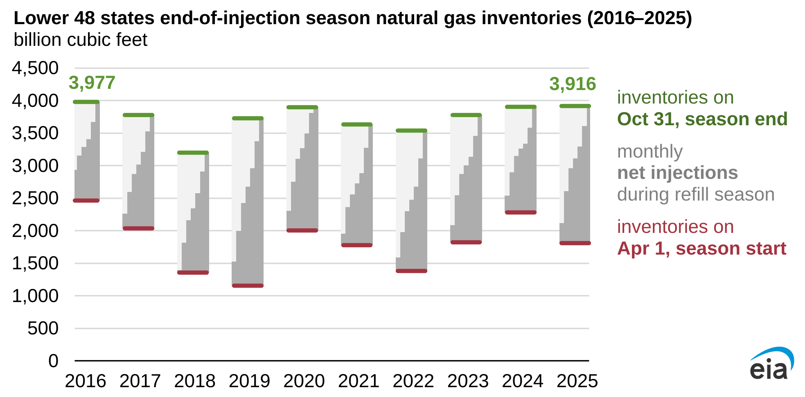

Figure 12-9: US Lower 48 natural gas inventories entered winter 2025-26 at the highest end-of-injection-season level since 2016, roughly 92 percent full. The shaded five-year range is the standard way to frame whether current stocks are tight or loose. (Source: [EIA Today in Energy (November 14, 2025)](https://www.eia.gov/todayinenergy/detail.php?id=66644), November 14, 2025)

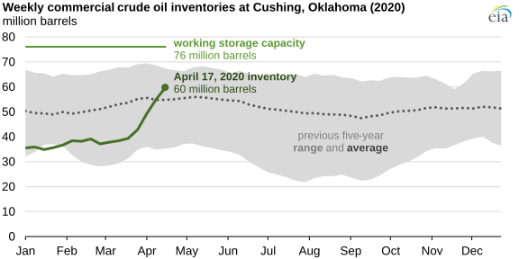

Figure 12-10: Cushing, Oklahoma crude storage in the weeks leading up to April 20, 2020. Storage reached 76 percent of working capacity and traders holding expiring WTI contracts had nowhere to take delivery. The May 2020 contract settled at minus 37.63 dollars per barrel. (Source: [EIA Today in Energy (April 27, 2020)](https://www.eia.gov/todayinenergy/detail.php?id=43495), April 27, 2020)

> A single supertanker carrying 2 million barrels that has not yet been counted by the EIA survey can swing the weekly number enough to move global prices by a dollar. This is why predicting the Wednesday print is a weekly sport, and why the five-year range matters more than any single data point.

## AI and the 30 Percent Inventory Reduction

The largest change in oil storage over the past decade is not visible in any tank or terminal. It is a structural reduction in the working inventory the global oil system needs to run, driven by machine-learning demand forecasting and real-time supply-chain telemetry. The toolkit is unglamorous: boosted-tree demand forecasters (XGBoost-class models are the workhorse), AIS-derived shipment nowcasting, refinery-turnaround coordination shared across counterparties, retail offtake telemetry from thousands of points of sale, predictive maintenance flagging unplanned outages before they happen. None of it produces headlines.

The cumulative effect is large. Industry estimates of the structural reduction in days of cover across the supermajors and the larger national distribution networks are on the order of 30 percent. Applied to the roughly 3 billion barrels of OECD commercial crude and product inventory, the reduction represents close to 1 billion barrels of structural buffer that did not exist a decade ago. BP disclosed working capital reductions of roughly 22 percent attributed to AI-enabled inventory management (Energies Media, “AI in Supply Chain Management: Real Results from Top Energy Companies in 2025,” April 2025), and similar disclosures from Shell, Equinor, and the major trading houses suggest the figure is industry-wide rather than idiosyncratic.

The Hormuz crisis tested the buffer. Between February 28 and early May 2026, OECD commercial inventories fell roughly 190 million barrels with no visible scrambling in the physical market. The same drawdown in 2010 would have produced on-screen panic and likely triggered a $200-plus Brent print. It did not in 2026 because the system now operates with materially less stockpile per barrel of throughput than it did even five years ago. Tracking tanker AIS data was the cutting-edge analytical tool of 2010; everyone has it now. The next analytical edge is in the silent AI-efficiency layer that does not show up in the inventory tally.

The buffer is not infinite. SPR refill is slow and politically expensive. The shadow fleet is finite and being drawn down. Inventory efficiency only buys time, not new supply. But for the duration of a normal supply disruption, the combination of strategic reserves, the shadow fleet, and the AI-enabled inventory layer adds up to roughly 130 days of buffer at the 12 million barrel per day shut-in rates of early 2026. That cushion is the central reason oil prices have not traded at $200 or higher despite a fundamental supply disruption worse than 1973 or 1979.

## Where Storage Sits in the Value Chain

Storage is the quiet utility that makes the rest of oil work. Without operational tankage, refineries would shut every time a tanker ran late. Without strategic reserves, a Strait of Hormuz closure would become a months-long economic crisis rather than a weeks-long one. Without commercial storage, the futures curve would have no physical arbitrage mechanism and contango would mean nothing. And without the silent AI inventory layer, the marginal barrel of stockpile would still cost the system what it cost ten years ago. The next chapter turns to seasonality, the largest predictable source of storage draws and builds, and then [Chapter 14 (Reserves)](#chapter-reserves) covers the reserves that sit underground waiting to become inventory in the first place.

The above was updated in 2026. For the full original 2009 chapter, [download the 1st edition 2009 PDF](/api/download/pdf).

Morgan Downey’s Commodity News

### Read what a commodity trader reads

A free morning brief on the oil, gas, and commodity markets, written by Morgan Downey, author of Oil 101. One email, every morning.

[Subscribe free →](https://boxwoodapp.com/news/subscribe)

<!-- rl-section id="chapter-seasonality" class="chapter" kicker="Chapter 13" title="Seasonality" -->

## Seasonality

Chapter 13

# Seasonality

Oil market seasonality: driving season, heating oil demand, refinery turnarounds, and how seasonal patterns shape crude prices.

<svg fill="none" height="18" stroke="currentColor" stroke-linecap="round" stroke-linejoin="round" stroke-width="2" viewbox="0 0 24 24" width="18"><path d="M3 18v-6a9 9 0 0 1 18 0v6"></path><path d="M21 19a2 2 0 0 1-2 2h-1a2 2 0 0 1-2-2v-3a2 2 0 0 1 2-2h3zM3 19a2 2 0 0 0 2 2h1a2 2 0 0 0 2-2v-3a2 2 0 0 0-2-2H3z"></path></svg>Listen· 18:30

## Four Overlapping Calendars

Oil is one of the most seasonal commodities in the world, yet crude itself trades with surprisingly flat seasonality. That paradox is the heart of this chapter. The products that come out of a barrel, gasoline, diesel, jet, heating oil, bunker, propane, have sharply different demand shapes across the year, and the calendars of refining, weather, and shipping push against each other. Add them up at the crude level and most of the seasonality cancels.

Four overlapping cycles govern the oil year. The **driving season** runs from April through September and peaks in July and August. The **heating season** runs from October through March and peaks from December through February. The **refinery turnaround calendar** puts most scheduled maintenance in the shoulder months of February through April in the spring and September through October in the fall. The **Atlantic hurricane season** runs from June 1 to November 30 and concentrates its serious storms from mid-August to mid-October, squarely on top of peak driving demand and the fall turnaround window. Traders who cover the physical market keep all four calendars in their heads at once.

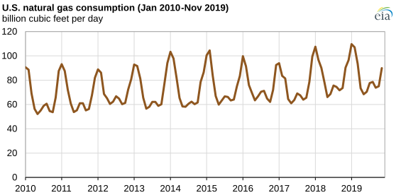

Figure 13-1: US natural gas consumption has two annual peaks. The winter peak is driven by residential and commercial space heating; the smaller summer peak comes from power generation meeting air conditioning load. Oil product demand has a similar two-humped shape, with heating oil in winter and gasoline in summer. (Source: [EIA Today in Energy](https://www.eia.gov/todayinenergy/detail.php?id=42815), February 13, 2020)

## Gasoline: Memorial Day to Labor Day

US gasoline demand varies roughly 8 to 10 percent from trough to peak across a normal year. The trough is January and February when driving is minimal, the peak is July and August when vacation travel stacks on the normal commute. The traditional framing in the trade is "Memorial Day to Labor Day": the late-May holiday kicks off the heavy driving weeks, early-September ends them. The post-Labor Day drop is classic back-to-school weakness, visible in every year of EIA weekly product supplied data.

Table 13-1: Typical US Gasoline Demand by Month (index, annual average = 1.00)

| Month | Demand Index | Notes |
| --- | --- | --- |
| January | 0.93 | Annual trough, weather and holiday hangover |
| February | 0.94 | Still weak, short month |
| March | 0.98 | Spring break starts to lift demand |
| April | 1.00 | Transition month, terminals switching to summer grade |
| May | 1.03 | Memorial Day weekend kicks off the season |
| June | 1.05 | Driving season ramp |
| July | 1.07 | Peak vacation travel |
| August | 1.08 | Annual peak |
| September | 1.02 | Labor Day cliff, back to school |
| October | 0.99 | Shoulder, fall driving |
| November | 0.97 | Thanksgiving travel blip |
| December | 0.96 | Holiday travel partially offsets weather |

Figure 13-2: US Gasoline Demand by Month (Mbpd)

Source: EIA Monthly Energy Review (illustrative). The summer driving season peak (June to August) is consistent across years, but COVID-19 in 2020 broke the pattern with a sharp April collapse.

The peak-to-trough ratio of about 1.16 understates how these swings hit the refining system. An 8 percent move on a US gasoline pool of 9 million barrels per day is 700,000 bpd of incremental supply the system has to deliver between February and August. That swing is why refineries run max gasoline mode in summer and switch toward distillate in winter, trading roughly 2 percent of yield between the two barrels depending on cat cracker feed slate and severity.

## Summer Grade and Winter Grade: The RVP Calendar

US gasoline is not a single product across the year. Environmental rules force a switch between a higher-volatility winter blend and a lower-volatility summer blend measured by **Reid Vapor Pressure** (RVP). What goes into each blend, butane, reformate, alkylate, ethanol, is covered in [Chapter 9 (Finished Products)](#chapter-finished-products). Here the point is the calendar: the dates are hard deadlines that every refiner, terminal operator, and marketer has to plan around.

Table 13-2: US Federal Gasoline RVP Transition Dates

| Date | Event | Maximum RVP |
| --- | --- | --- |
| May 1 | Summer spec required at refineries and terminals | 7.8 psi federal, 7.0 or 6.5 psi CARB |
| June 1 | Summer spec required at retail stations | 7.8 psi federal |
| Sep 15 | Winter spec allowed again (retail) | 9 to 15 psi |

The tightest specs apply in California under CARB rules and in specific ozone non-attainment areas, where summer RVP can be as low as 6.5 psi and the switch starts earlier. The April to June transition creates what traders call the **orphan barrel** problem: winter-grade gasoline sitting in a terminal on May 1 cannot legally move into the summer retail distribution system, and the owner has to either re-blend it down, export it, or sell it at a deep discount. The equivalent problem runs in reverse in September when summer product is worth less than winter product at wholesale because winter butane blending can replace it more cheaply.

Winter gasoline uses more butane, which is cheap, plentiful, and has a very high blending RVP. Summer gasoline pushes butane out and pulls in more alkylate and reformate, which are more expensive. The wholesale gasoline crack spread widens through May and June as summer-grade supply tightens, and compresses in September when butane returns. See [Chapter 9 (Finished Products)](#chapter-finished-products) for the blendstock economics behind the switch.

## Heating Oil, Propane, and the HDD Framework

Winter demand for space heating is measured in **Heating Degree Days** (HDD), the number of degrees the daily average temperature falls below a 65 F baseline, accumulated across the month or the season. A day averaging 40 F contributes 25 HDD; a day at 70 F contributes zero. The summer mirror is **Cooling Degree Days** (CDD) on the same 65 F baseline, which drives power generation and therefore natural gas burn rather than oil burn in most of the US. Utilities, gas marketers, and weather derivative desks quote exposures in HDD and CDD, and the weekly EIA natural gas storage report is effectively a commentary on the last week's HDD relative to the 10-year normal.

US heating oil demand builds from October, peaks in January and February, and falls off sharply in April. The Northeast corridor from New York through Maine is the core market, and it is the reason the historical oil product futures contract at the New York delivery point was originally written on heating oil before being relaunched as ultra-low-sulfur diesel. Western Europe is the world's largest heating oil consumer, with France and Germany still running large installed bases of oil-fired boilers despite decades of gas and heat pump substitution. Japan and Korea use kerosene rather than heating oil as the residential winter fuel, which creates a direct seasonal tug-of-war with jet fuel since both come from the same middle-distillate cut.

Propane has an even more concentrated winter peak in the US because it heats rural homes that are not on a natural gas grid, and because it dries the fall corn crop in the Midwest. A wet harvest in October can spike Mont Belvieu and Conway propane prices before the heating season has even started, and a cold January in the Northeast can push retail propane above $4 a gallon when the pipeline and rail system cannot refill local storage fast enough.

## Natural Gas Storage: Inject and Withdraw

Natural gas storage runs on a clean six-month rhythm. The **injection season** runs from April through October, when mild weather and low heating demand let producers push gas into salt caverns and depleted reservoirs. The **withdrawal season** runs from November through March, when cold weather pulls that gas back out to meet heating load. EIA publishes a weekly storage report every Thursday at 10:30 am Eastern that is one of the most watched data points in the energy complex, and the chart every analyst has open is the current year's inventory trajectory overlaid on the 5-year range and the 5-year average.

US natural gas storage seasonality now feeds directly into global oil and LNG markets. European winter demand can be met by pulling on US LNG exports, so a cold January in Germany shows up as a draw on Gulf Coast gas and a firming of the Henry Hub winter strip. The linkage was invisible before 2016; after 2022 it is one of the most watched cross-market relationships in the energy business. See [Chapter 24 (US LNG)](#chapter-us-lng) for the export infrastructure and [Chapter 12 (Storage)](#chapter-storage) for salt cavern and depleted reservoir mechanics.

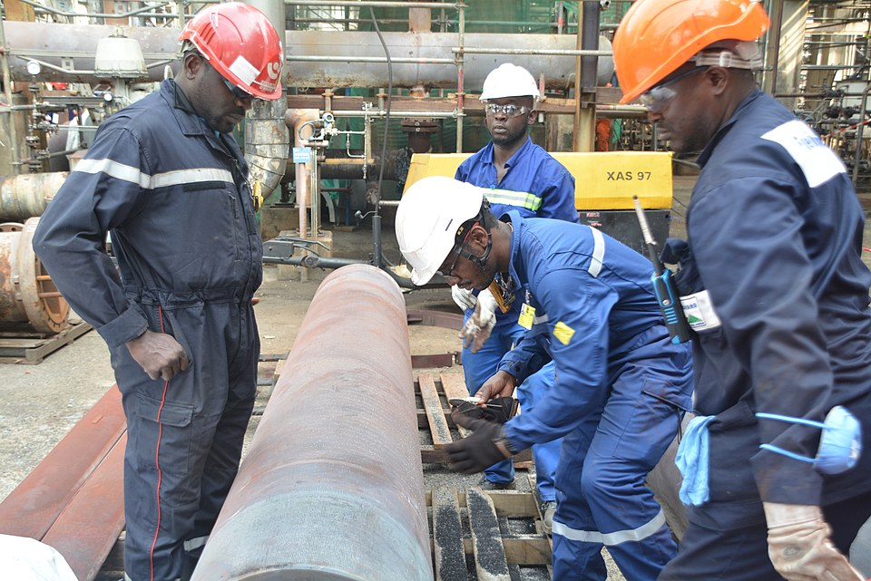

Figure 13-3: Maintenance crew working inside a refinery unit during a scheduled turnaround. Every process unit must be taken offline periodically for inspection, cleaning, and catalyst replacement. (Source: [Okane nyatoh daniel / Wikimedia Commons (CC BY-SA 4.0)](https://commons.wikimedia.org/wiki/File:Maintenance_work_in_the_refinery_during_shutdown.jpg))

## The Refinery Turnaround Calendar

Refineries run hardest during the two demand peaks, summer gasoline and winter heating oil. The only window to take units offline for scheduled maintenance is the shoulder season between them. That is why US refinery utilization dips in February through April and again in September through October, and why crude runs follow a seasonal pattern that is as much a supply story as a demand one.

Table 13-3: Typical US Refinery Utilization by Month

| Month | Utilization | Driver |
| --- | --- | --- |
| January | 87% | Full heating oil mode |
| February | 86% | Spring turnarounds begin |
| March | 86% | Turnaround peak |
| April | 89% | Gasoline build, summer grade switch |
| May | 92% | Pre-Memorial Day push |
| June | 94% | Driving season |
| July | 95% | Annual utilization peak |
| August | 94% | Peak, hurricane risk rising |
| September | 90% | Fall turnarounds, storm outages |
| October | 89% | Turnaround tail |
| November | 90% | Heating oil build |
| December | 91% | Winter mode |

US crude throughput peaks in July and August at roughly 17 Mbpd and drops by about a million barrels per day during the fall turnaround window. That predictable swing in crude demand is part of why WTI physical differentials firm into summer and soften in September and October, even in years without any unusual production news.

## Atlantic Hurricanes

The Gulf of Mexico hosts roughly 15 percent of US crude production and 45 percent of US refining capacity, concentrated along the corridor from Corpus Christi through Houston, Port Arthur, Lake Charles, Baton Rouge, and into the lower Mississippi. Atlantic hurricane season runs from June 1 to November 30, and the climatological peak falls between mid-August and mid-October. The heaviest storm risk coincides with the summer driving season and the fall refinery turnaround window, the worst possible calendar overlap for the gasoline market.

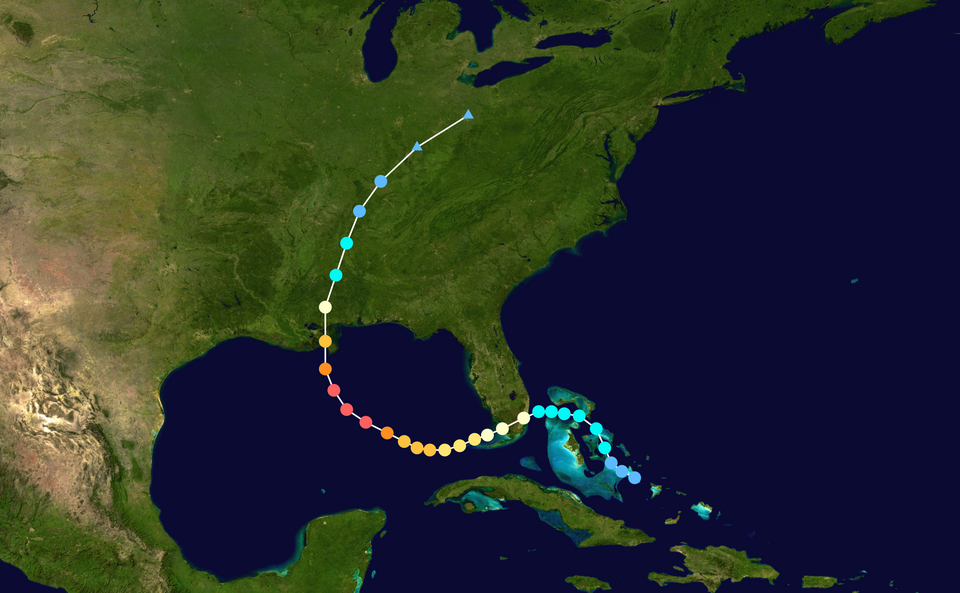

Figure 13-4: Track of Hurricane Katrina, August 23 to 31, 2005. Katrina and Rita together shut in roughly a quarter of US refining capacity for weeks, triggered an emergency SPR release, and sent retail gasoline above $3 a gallon in most of the country. The storm track is the defining map of US oil market hurricane risk. (Source: [Supportstorm, public domain, via Wikimedia Commons](https://commons.wikimedia.org/wiki/File:Katrina_2005_track.png))

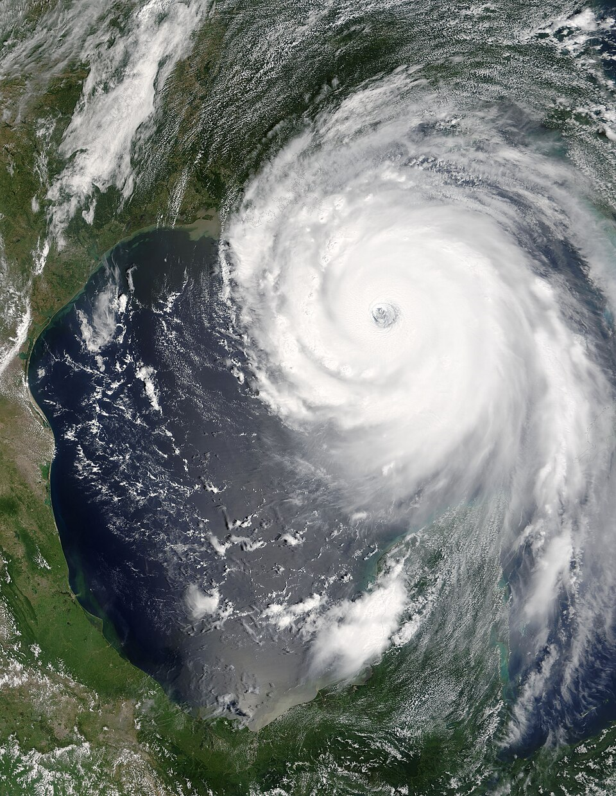

Figure 13-5: Hurricane Katrina over the Gulf of Mexico on August 28, 2005, one day before landfall. At Category 5 with sustained winds of 175 mph, Katrina was heading directly for the densest concentration of US refining and offshore production infrastructure. (Source: [Jeff Schmaltz, NASA/GSFC (public domain)](https://commons.wikimedia.org/wiki/File:Hurricane_Katrina_August_28_2005_NASA.jpg))

Table 13-4: Major Hurricane Impacts on US Oil Infrastructure

| Storm | Year | Impact |
| --- | --- | --- |
| Katrina + Rita | 2005 | 25% of US refining offline for weeks; Louisiana offshore shut in; SPR release; retail gas spike to $3+ |
| Ike | 2008 | Houston Ship Channel and Galveston refineries hit; 20% of US refining curtailed |
| Harvey | 2017 | Flooded Houston/Port Arthur refineries; 23% of US capacity offline; Colonial Pipeline delays |
| Laura + Delta | 2020 | Lake Charles refining and petrochemical complex damaged; Citgo and Phillips 66 units offline for months |
| Ida | 2021 | Louisiana offshore production shut in for more than a week; LOOP disrupted; Norco and Convent refineries offline |
| Beryl, Francine, Helene | 2024 | Short-duration Gulf shut-ins, limited refining damage; storm count above average but landfall impacts on oil infrastructure were modest |

Storm risk is priced into gasoline futures every summer through the **September gasoline crack**, which trades at a premium over the August and October contracts to reflect the chance of a Gulf shut-in. When a named storm enters the Gulf and the models agree it is heading for the Texas or Louisiana coast, RBOB futures and Gulf Coast physical differentials can move 10 to 20 cents a gallon in a session. If the storm misses, they give it back. If the storm hits a major refining center, the move extends for weeks.

## North Sea Storms and Baltic Ice

Europe has its own winter supply calendar. North Sea platforms and single-point mooring terminals at Sullom Voe in Shetland, Flotta in Orkney, and Teesside on the English coast are routinely disrupted by December through February storms that push significant wave height above the loading limits of shuttle tankers. That is one reason Dated Brent cargo differentials firm in late autumn and why the Brent forward curve often shows a small backwardation bulge in winter months.

The Baltic Sea historically iced over from December through April in an average winter, and Russian crude and product exports through Primorsk and Ust-Luga had to be loaded into ice-class tankers at higher freight rates. After the 2022 sanctions pushed most Russian flow into non-European markets via ship-to-ship transfers and Arctic Kola transshipment, Baltic ice seasonality still exists but matters less to global price formation than before the war.

## Rivers and Canals: Low Water Bottlenecks

The Rhine is the spine of inland European product distribution. Barges loaded with gasoline, diesel, and jet at Rotterdam and Antwerp move up the river to refineries, terminals, and airports in Germany, France, and Switzerland. In dry summers the river runs too low at the Kaub chokepoint for barges to load to full depth, and freight rates spike because the same cargo requires more bottoms to move. The 2018 and 2022 droughts were the two worst modern episodes, with barge loadings at Kaub falling to roughly 30 percent of normal draft at the peak of the 2022 low water.

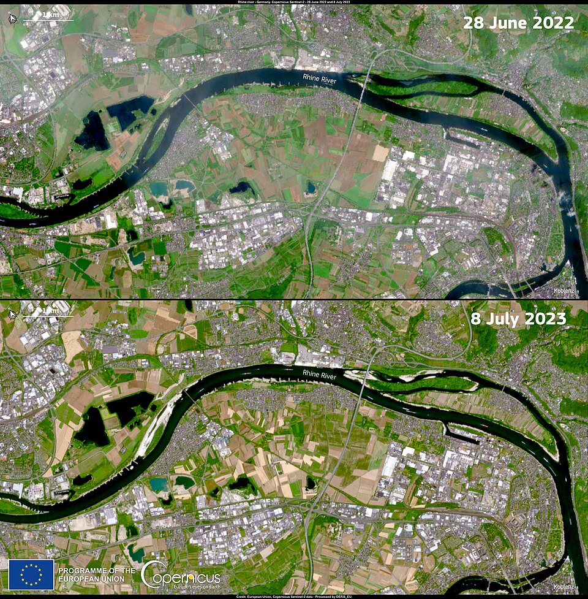

Figure 13-6: The Rhine at low water during the 2022 European drought, imaged by Sentinel-2. At Kaub and other chokepoints the river briefly fell below navigable depth for fully laden barges, forcing product cargoes into lighter loads and pushing up barge freight for Rotterdam to Basel delivery. Rhine low water is now a recurring summer risk in European product markets. (Source: [Contains modified Copernicus Sentinel data 2023, via Wikimedia Commons](https://commons.wikimedia.org/wiki/File:Low_water_levels_impacting_traffic_on_the_Rhine_river.jpg))

The Panama Canal faced its own drought-driven bottleneck in 2023 and 2024 when low water in Gatun Lake forced the Panama Canal Authority to cut daily transits and draft limits. US Gulf LPG and product cargoes bound for Asia had to queue, divert around Cape Horn, or pay auction premiums for scarce transit slots. See [Chapter 24 (US LNG)](#chapter-us-lng) for the downstream effect on Henry Hub spreads and Asian JKM pricing.

## Why Crude Oil Itself Is Less Seasonal Than Its Products

**The key insight.** Heating oil peaks in winter. Gasoline peaks in summer. Natural gas has both a winter heating peak and a summer power generation peak. Refinery turnarounds pull crude runs down in the shoulder months between them. When you add all of that up at the crude barrel level, the peaks and troughs of the products largely cancel each other out. That is why crude oil itself shows far less seasonal variation in either demand or price than the individual products refined from it. The seasonal trades in oil are almost always in the product cracks, the RVP switch, the gas storage spread, and the hurricane risk premium, not in flat-price crude.

Experienced oil traders treat seasonality as a base layer, not a forecast. The calendar tells you what the market should do in a normal year; the news flow tells you how the current year is deviating from that baseline. A cold January 15 percent above normal HDD, a hurricane dropping 30 inches of rain on Houston, a Rhine falling below Kaub navigable depth, these are the moments when seasonality stops being background and becomes the trade.

The above was updated in 2026. For the full original 2009 chapter, [download the 1st edition 2009 PDF](/api/download/pdf).

Morgan Downey’s Commodity News

### Read what a commodity trader reads

A free morning brief on the oil, gas, and commodity markets, written by Morgan Downey, author of Oil 101. One email, every morning.

[Subscribe free →](https://boxwoodapp.com/news/subscribe)

<!-- rl-section id="chapter-reserves" class="chapter" kicker="Chapter 14" title="Reserves" -->

## Reserves

Chapter 14

# Reserves

Oil reserves classification: proved, probable, possible, reserve replacement ratios, Hubbert peak oil theory, and resource estimates.

<svg fill="none" height="18" stroke="currentColor" stroke-linecap="round" stroke-linejoin="round" stroke-width="2" viewbox="0 0 24 24" width="18"><path d="M3 18v-6a9 9 0 0 1 18 0v6"></path><path d="M21 19a2 2 0 0 1-2 2h-1a2 2 0 0 1-2-2v-3a2 2 0 0 1 2-2h3zM3 19a2 2 0 0 0 2 2h1a2 2 0 0 0 2-2v-3a2 2 0 0 0-2-2H3z"></path></svg>Listen· 25:36

An oil company executive was interviewing three potential employees, a geologist, a geophysicist, and a petroleum engineer (the kind that estimates reserves). One question asked was: "What is two times two?" The geologist answered that it was probably more than three and less than five, but the issue could use some more research. The geophysicist punched it into his computer and announced that it was 3.999999. The petroleum engineer jumped up and locked the door, closed the window blinds, unplugged the phone, and asked quietly, "What do you want it to be?"

Adapted from Deffeyes, K.S. (2005)

## What Are Oil Reserves?

There are no universally accepted definitions of oil reserves. Industry groups, regulators, and governments each maintain their own frameworks. The total crude oil in a region, both discovered and undiscovered, is called Original Oil In Place (OOIP). Resources are the portion estimated to be technically feasible to recover. Reserves are the subset of resources estimated to be both technically and economically producible at prevailing prices and with current technology. A fourth concept, **Estimated Ultimate Recovery** (EUR), is the cumulative volume a well or field is expected to produce over its entire life, from first flow to abandonment. EUR is the number that matters most to an engineer planning a drilling program, while reserves are the number that matters most to a banker sizing a loan.

Reserves sit at the intersection of geology, technology, price, and contract law. A 2005 barrel uneconomic at $30 crude became a reserve at $80 crude, then quietly dropped off the books again when the price fell below $40 in 2015. No physical barrels moved. The SEC's 12-month trailing average price test, Canada's NI 51-101, the Society of Petroleum Engineers' PRMS, and Russia's own state reserve classification all produce different numbers for the same underground pool. Treat any single reserve figure as an opinion with a methodology attached, not a fact.

## The Three Ps

Reserves are classified by probability. **Proven** (P1 or P90) reserves have at least a 90% probability of being produced under current economic and technical conditions. **Probable** (P2 or P50) reserves have a best-estimate probability of about 50%. **Possible** (P3 or P10) reserves have roughly a 10% probability of being recovered. The labels P90, P50, and P10 come from the cumulative probability distribution used by petroleum engineers: P90 means there is a 90% chance the true recoverable volume is at least as large as the stated number. Adding proven plus probable gives 2P reserves; adding proven plus probable plus possible gives 3P. Industry operators and private lenders often work from 2P; only 1P (proven) can be counted as assets under US GAAP for SEC filings.

The SEC updated its oil and gas reporting rules in late 2008, effective for 2009 annual reports. The new rules permit 3-D seismic and other reliable technology to establish reserves without a drill bit in the ground, recognize oil sands and bitumen as oil reserves rather than mining assets, and replace the old single-day year-end price with a 12-month trailing average of first-of-month prices. That last change was a direct response to the whipsaw of 2008, when a $147 July WTI print and a $33 December print would have produced wildly different book reserves under the old rule.

## PDP, PDNP, PUD: The Development Status Categories

Within proven reserves, US SEC reporting requires a further breakdown by development status. **PDP** (Proved Developed Producing) reserves are barrels expected to be recovered from wells already drilled, completed, and currently flowing. **PDNP** (Proved Developed Non-Producing) covers wells that are drilled and completed but temporarily shut in, behind-pipe zones awaiting recompletion, or wells waiting on a pipeline tie-in. **PUD** (Proved Undeveloped) reserves are barrels assigned to locations that have not yet been drilled but are scheduled for development within five years of being booked.

Table 14-1: Proved Reserve Development Categories

| Category | Status | Capital Required |
| --- | --- | --- |
| PDP | Drilled, completed, and currently producing | None (operating costs only) |
| PDNP | Drilled and completed but not flowing (shut-in, behind-pipe, awaiting tie-in) | Minor (workover or hookup) |
| PUD | Undrilled locations scheduled for development within 5 years | Full drilling and completion cost |

## Reserve Recategorization ("Re-Catting")

Because the three categories carry very different capital requirements and risk profiles, reserve auditors and lenders watch closely for movement between them. Shifting a barrel from PUD to PDP through successful drilling is the normal value creation cycle for an E&P company. The reverse, however, is a warning sign. **Recategorization**, known in the industry as **"re-catting"**, is the reclassification of barrels from a higher-confidence category to a lower one, or out of proved reserves entirely.

Re-catting typically happens for three reasons. First, the SEC five-year rule: any PUD location that will not be drilled within five years of its initial booking must be removed from proved reserves, even if the geology has not changed. Second, a sustained drop in commodity prices can make previously economic barrels uneconomic at the SEC 12-month average price test, forcing negative price revisions. Third, drilling results from offset wells can show that the original geological assumptions were too optimistic, triggering performance revisions.

Negative revisions are scrutinized by reserve-based lenders (RBLs) because the borrowing base of an E&P credit facility is sized off PDP reserves at lender price decks. A material PUD-to-unproved write-down can also trigger SEC ceiling test impairments under successful-efforts accounting. For analysts, the year-over-year change in reserves should always be decomposed into four buckets: extensions and discoveries, improved recovery, purchases or sales, and revisions. The revisions line is where re-catting shows up.

## Reserve Estimation Methods

Reservoir engineers have four main quantitative tools for estimating how much oil a field will produce, plus a fifth rule-of-thumb analogy method used before any real data is in hand. The appropriate tool depends on how much of the field's life has already elapsed, what data is available, and how mature the surrounding basin is. Different methods are often run in parallel and cross-checked.

The **volumetric method** is the earliest-life approach. Before any material flow from the reservoir, engineers combine seismic, well log, and core data to estimate pay zone area, net pay thickness, porosity, hydrocarbon saturation, and a formation volume factor, then back out a volume. It is the only option for a discovery that has been drilled and logged but not produced, and it feeds the OOIP number that every recovery factor is later applied to.

**Material balance** kicks in once the reservoir has produced enough fluid for its pressure to fall measurably. The technique treats the reservoir as a closed tank: the drop in pressure for each barrel produced tells the engineer how much oil, gas, and water were originally in place, assuming reasonable values for rock and fluid compressibility and aquifer support. Material balance is powerful because it relies on actual production data rather than log estimates, but it requires a coherent pressure history and is difficult in tight rock where pressure communication is poor.

**Decline curve analysis** is the workhorse of mature fields. Once a well is past its peak, its rate typically falls along a predictable curve, exponential, hyperbolic, or harmonic, described by an initial rate, an initial decline rate, and a hyperbolic exponent. Fitting that curve to the first one to three years of production and extrapolating forward gives an EUR for each well, which is then summed up to field level. Decline curves are heavily used in shale, where the very steep first-year decline and flat tail make forecasting sensitive to the chosen exponent and economic cutoff.

Arps Decline Curves

Hyperbolic b-factor: 0.50

Arps decline curves. All three curves start at 1,000 barrels per day and share a 35 percent initial annual decline. Exponential (b = 0) falls fastest and estimates the least ultimate recovery. Harmonic (b = 1) has the longest tail. Hyperbolic sits in between: drag the slider to see how the b-factor changes the shape.

Reference: J.J. Arps, “Analysis of Decline Curves” (1945), SPE.

**Reservoir simulation** is the most data-hungry method. A 3-D grid of the reservoir is built from seismic and well data, populated with rock and fluid properties, and then flowed numerically through time, with each grid cell exchanging fluids with its neighbors according to Darcy's law and local pressure gradients. A well-tuned simulation can answer questions no other method can: what happens if we infill drill here, if we inject CO2 there, if we convert this producer to a water injector. It is also slow, expensive, and only as good as the history match that calibrates it to actual production.

**Worked example: the volumetric method.** The standard field formula for original oil in place, in US oilfield units, is:

OOIP (bbl) = (7758 × A × h × φ × (1 - Sw)) / Bo

where *A* is drainage area in acres, *h*is net pay thickness in feet, φ is porosity as a fraction, *Sw* is connate water saturation as a fraction, and *Bo* is the oil formation volume factor (reservoir barrels per stock-tank barrel). The 7758 is the number of barrels in one acre-foot. For a modest example, take *A* = 1,000 acres, *h*= 50 ft, φ = 0.20, *Sw* = 0.25, and *Bo* = 1.2. Then:

OOIP = (7758 × 1000 × 50 × 0.20 × 0.75) / 1.2 ≈ 48.5 million bbl

That is oil in place, not reserves. Apply a recovery factor, roughly 30% for a primary-and-waterflood conventional field or 7% to 10% for unstimulated shale, and you arrive at recoverable reserves. The arithmetic is simple. The argument is always about the inputs.

Table 14-2: Reserve Estimation Methods

| Method | Description | Phase |
| --- | --- | --- |
| Nominal | Rule-of-thumb analogy to known fields | Pre-production |
| Volumetric | Geological data on porosity, saturation, pay thickness | Pre-production |
| Material Balance | Reservoir pressure measurements over time | Early production |
| Decline Curve | Extrapolation of production decline rates | Declining production |
| Reservoir Simulation | Complex computer models using multiple data sources | Any stage |

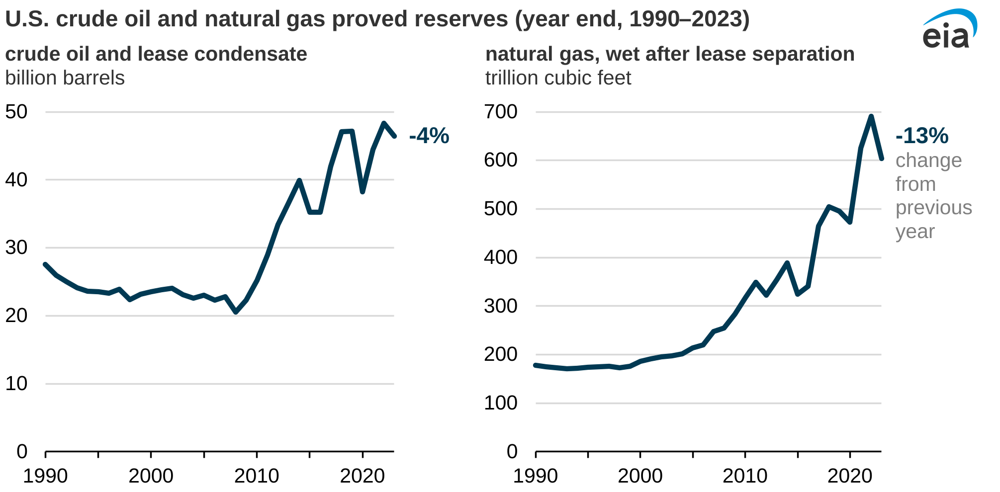

Figure 14-1: US proved reserves of crude oil and natural gas. The shale revolution reversed decades of declining reserves, with gas reserves more than doubling since 2005. (Source: [EIA Today in Energy](https://www.eia.gov/todayinenergy/detail.php?id=65725), July 16, 2025)

## Peak Oil and Hubbert's Curve

In 1956, Shell geophysicist M. King Hubbert presented a paper to the American Petroleum Institute that would become one of the most famous forecasts in petroleum history. Hubbert observed that US Lower-48 oil discoveries had peaked in the 1930s and argued that production would peak roughly 35 years later, around 1970, at about 9 million barrels per day. The resource base, he said, would follow a symmetric bell-shaped logistic curve, rising as the easy barrels were found and falling as the industry worked through progressively harder rock. He was right about the peak. US Lower-48 crude output topped out at 9.6 Mbpd in November 1970 and began a long decline that continued until 2008.

Hubbert was right about the physics and wrong about the economics. His model assumed a fixed resource base, but the resource base is a function of price and technology. Horizontal drilling and hydraulic fracturing turned source rocks, which Hubbert had classified as non-reservoir, into the most productive oil plays in the world. US crude production crossed back through its 1970 peak in 2018 and reached roughly 13.5 Mbpd by 2025. The Hubbert curve remains a useful mental model for a single conventional field where geology imposes a bell shape, but not for a country whose industry can redefine "reservoir" every twenty years.

Hubbert 1956 Prediction vs Actual US Lower-48 Crude Oil Production

Right for the wrong reasons. Hubbert nailed the 1970 peak of conventional US Lower-48 production, and through 2008 the actual curve tracked his projection closely. The shale revolution after 2008 then broke the model, as horizontal drilling and hydraulic fracturing unlocked source-rock barrels that were not part of the original resource base.

Source: EIA Petroleum Supply Annual (actual US L48 crude); Hubbert, M. King, Nuclear Energy and the Fossil Fuels, 1956 (projection, reconstructed as symmetric bell).

## OPEC's 1982-1988 Reserve Revisions

Any discussion of global reserves has to grapple with what happened inside OPEC between 1982 and 1988. The cartel's quota system linked each member's allowed output to its stated reserves. Larger reserves meant a larger quota, meant larger revenue. Over those six years, six OPEC members added more than 300 billion barrels to their stated proved reserves without corresponding discoveries. Some revisions doubled or tripled reported figures in a single year. No major new fields were announced. No new drilling campaigns justified the revisions. The numbers simply moved.

Table 14-3: OPEC Reserve Additions, 1982-1988 (no major new discoveries)

| Country | Increase | Context |
| --- | --- | --- |
| Kuwait | +41% | Revision booked 1985 |
| Venezuela | +77% | Extra-heavy Orinoco belt reclassified |
| Iran | +91% | Post-war catch-up to Iraq |
| Iraq | +103% | Doubled in 1987 mid Iran-Iraq war |
| Saudi Arabia | +51% | 1988 revision, no field-level detail |
| UAE | +198% | Largest proportional increase |

These same countries have since produced hundreds of billions of barrels without materially writing their reserves down, which is arithmetically difficult to reconcile with any orthodox reserve-accounting framework. Saudi Aramco's 2019 bond prospectus, the first independent audit of Saudi reserves in decades, broadly confirmed the Saudi figure, but the other revisions remain unaudited. The practical takeaway is that the trillion-barrel-plus figure for OPEC proved reserves carries a large political component that does not exist in SEC-filed private-sector numbers.

## Reserves to Production Ratio by Country

The **Reserves to Production ratio** (R/P) is the simplest possible durability metric: stated proved reserves divided by current annual production, expressed in years. It is not a forecast of how long oil will last, and it is not the expected life of a field. It is a snapshot ratio that answers the question "at today's flow rate, how many years does the current booked pile last?" The ratio moves constantly as production changes and as reserves are revised, and it carries forward all the political baggage of the stated reserves in the numerator.

Table 14-4: R/P Ratio by Country (approximate, year-end 2024)

| Country | Proved reserves (bn bbl) | Production (Mbpd) | R/P (years) |
| --- | --- | --- | --- |
| Venezuela | 303 | 0.7 | >300 |
| Saudi Arabia | 267 | 11.1 | 65 |
| Iran | 209 | 3.8 | 140 |
| Canada | 167 | 5.7 | 80 |
| Iraq | 145 | 4.2 | 90 |
| UAE | 113 | 3.8 | 80 |
| Kuwait | 102 | 2.9 | 95 |
| Russia | 80 | 10.7 | 20 |
| United States | 74 | 13.4 | 15 |
| Libya | 48 | 1.2 | 110 |
| China | 26 | 4.1 | 17 |
| Global total | 1,700 | 96 | 50 |

Venezuela's 303 billion barrels, most of it Orinoco extra-heavy oil requiring upgrading and dilution, carries a very different recovery cost and quality than Saudi Arabian Light crude. The R/P ratios for OPEC members are all inflated by the 1980s revisions. The US and Russia sit at the other extreme: highly active production bases with relatively short booked life, because private operators book reserves conservatively and because SEC five-year PUD rules cap how far into the future a shale operator can reach. A short US R/P is not a supply warning, it is a feature of the accounting regime.

Figure 14-2 Top 15 Countries by Proved Oil Reserves (Billion Barrels)

Source: BP/Energy Institute Statistical Review 2024, OPEC Annual Statistical Bulletin. OPEC members hold roughly 70% of global proved reserves.

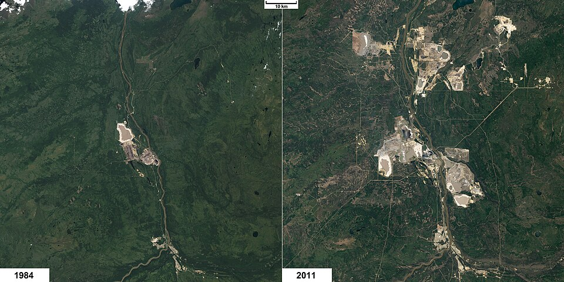

Figure 14-3: NASA satellite imagery of the Athabasca oil sands north of Fort McMurray, Alberta: 1984 (left) versus 2011 (right). Canada's proved reserves jumped from 5 billion barrels to over 170 billion once the SEC recognized bitumen as oil. (Source: [NASA Earth Observatory, edited by Gretarsson / Wikimedia Commons (public domain)](https://commons.wikimedia.org/wiki/File:NASA_EO_Athabasca_tar_sands_environmental_impact_1984_vs_2011.jpg))

## Reserve Replacement Ratio

For a publicly traded E&P company, the critical annual question is whether new reserves were added faster than old reserves were produced. The **Reserve Replacement Ratio** (RRR) measures this directly:

RRR = (reserves added through extensions, discoveries, revisions, and acquisitions) / production

An RRR above 100% means the company is growing its reserve base; sustained readings below 100% mean it is liquidating. The table below shows recent reported RRRs for a handful of majors. The post-pandemic trend has been worrying: with capex cut sharply in 2020 and only a partial rebound since, the IOC peer group average has dipped below 100%, meaning the majors as a group are not replacing what they pump. ExxonMobil and ConocoPhillips, the two most US-shale-weighted names, are the clear positive outliers.

Table 14-5: Reserve Replacement Ratios, Recent Annual (approximate)

| Company | Recent RRR | Note |
| --- | --- | --- |
| ConocoPhillips | 140% | Permian + Alaska extensions |
| ExxonMobil | 120% | Guyana + Permian |
| TotalEnergies | 100% | LNG and deepwater |
| Chevron | 98% | Permian growth offset by divestitures |
| Shell | 78% | Active portfolio high-grading |
| BP | 67% | Post-strategy-reset, deliberate shrink |

## SEC PV-10 and Reserve-Based Lending

Proved reserves are not just a production forecast, they are the collateral that backs a large fraction of independent E&P debt. **PV-10** (present value at a 10% discount rate) is the discounted pre-tax cash flow from a company's proved reserves, calculated under the same SEC 12-month trailing average price rule that governs reserve volumes. Every 10-K filed by a US oil and gas producer includes a PV-10 figure, and every reserve-based lending (RBL) facility uses an internal version of it to size the borrowing base.

RBL lenders do not simply accept the company's PV-10. They re-run the cash flow under their own, usually more conservative, price deck, typically called the "bank price deck," apply their own advance rates to PDP, PDNP, and PUD categories (PDP gets the highest advance rate, PUD the lowest), and recalculate the borrowing base twice a year in spring and fall redeterminations. A sharp price drop between redeterminations, or a reserve recategorization that moves barrels out of PDP, can trigger a borrowing base cut that forces asset sales or equity issuance. This is why re-catting is a credit event, not merely an accounting footnote.

## EUR and Drilling Inventory

In the shale era, the key operational number is not booked reserves but Estimated Ultimate Recovery per well and the count of remaining Tier 1 locations in the company's inventory. Analysts talk about "decades of Tier 1 inventory" as a marketing claim and regulators largely let it stand, because the SEC five-year PUD rule prevents most of that inventory from ever being booked as reserves. The result is a two-tier disclosure regime: booked reserves for the SEC, inventory counts for the earnings call. Both matter, and they do not always tell the same story. [Chapter 21 (Shale Revolution)](#chapter-shale-revolution) returns to this tension and its finite Tier 1 runway.

## Giant Fields Still Dominate Global Reserves

Despite the shale revolution, conventional giant fields (recoverable reserves of 500 million barrels of oil equivalent or more) still hold the majority of global proven reserves. A 2014 study by Guoping Bai and Yan Xu at the China University of Petroleum, published in the Oil and Gas Journal, documented that since 2000 the industry discovered 52 giant oil fields and 68 giant gas fields with combined 2P reserves of 248.6 billion barrels of oil equivalent. These fields cluster in seven regions.

Table 14-6: Giant Fields Discovered Since 2000 by Region

| Region | Giant fields |
| --- | --- |
| Middle East | 28 |
| Offshore Brazil | 19 |
| Offshore East Africa | 13 |
| Central Asia | 9 |
| NW Australia | 8 |
| Offshore West Africa | 6 |
| Gulf of Mexico | 5 |

Table 14-7: Top Basins by Share of Giant Field 2P Reserves (2000-2012)

| Basin | Share of total |
| --- | --- |
| Amu-Darya | 27.0% |
| Santos | 13.2% |
| Arabian | 9.8% |
| North Caspian | 7.6% |
| Zagros | 6.9% |
| Tanzania | 6.8% |

Marine carbonate reservoirs host 54.5 percent of the total giant field reserves discovered since 2000, followed by turbidites (17.6 percent), clastics (15.9 percent), and lacustrine carbonates (12.0 percent). The IEA projected that unconventional oil (bitumen, heavy oil, and tight oil) would contribute only 13 percent of global oil supply by 2035, and unconventional gas (tight gas, shale gas, coalbed methane) 26 percent of global gas supply. The shale revolution changed North American production, but most of the world's oil still comes from a small number of very large conventional fields discovered decades ago. See [Chapter 21 (The Shale Revolution)](#chapter-shale-revolution) for the contrasting tight oil perspective.

Based on Bai and Xu (2014), Oil and Gas Journal, with IEA projections. The data covers discoveries from 2000 through 2012. The structural conclusion, that giant conventional fields dominate global reserves growth, remains valid in 2026 even as tight oil has reshaped the North American production landscape.

The above was updated in 2026. For the full original 2009 chapter, [download the 1st edition 2009 PDF](/api/download/pdf).

Morgan Downey’s Commodity News

### Read what a commodity trader reads

A free morning brief on the oil, gas, and commodity markets, written by Morgan Downey, author of Oil 101. One email, every morning.

[Subscribe free →](https://boxwoodapp.com/news/subscribe)

<!-- rl-section id="chapter-environmental" class="chapter" kicker="Chapter 15" title="Environmental Regulations" -->

## Environmental Regulations

Chapter 15

# Environmental Regulations

Oil industry environmental rules: emissions standards, sulfur limits, carbon pricing, fuel regulations, and climate policy impacts.

<svg fill="none" height="18" stroke="currentColor" stroke-linecap="round" stroke-linejoin="round" stroke-width="2" viewbox="0 0 24 24" width="18"><path d="M3 18v-6a9 9 0 0 1 18 0v6"></path><path d="M21 19a2 2 0 0 1-2 2h-1a2 2 0 0 1-2-2v-3a2 2 0 0 1 2-2h3zM3 19a2 2 0 0 0 2 2h1a2 2 0 0 0 2-2v-3a2 2 0 0 0-2-2H3z"></path></svg>Listen· 26:36

## Three Categories of Environmental Regulation

Environmental regulations affecting oil fall into three broad categories, each with its own statutory history, its own enforcement agency, and its own engineering consequences for refiners, pipeline operators, and automakers. The first category is fuel content: the sulfur, benzene, lead, vapor pressure, and oxygenate rules that dictate what a gallon of gasoline or diesel is actually allowed to contain. The second is operational safety: pipeline integrity management, double-hull tanker requirements, tank farm containment, and HAZMAT rail rules that govern how oil is moved and stored. The third is greenhouse gas regulation: fleet fuel economy and tailpipe CO2 standards, cap-and-trade systems, clean-energy tax credits, and carbon border adjustments.

The US has led the world on the first two categories through the Clean Air Act, the Clean Water Act, the Oil Pollution Act of 1990, and PHMSA. On greenhouse gas policy, Europe and California move first and set stricter targets; federal US policy oscillates between administrations. [Chapter 8 (Standards)](#chapter-standards) contains the numerical fuel specifications these rules enforce, and [Chapter 11 (Transporting Oil)](#chapter-transporting-oil) covers the operational side of OPA 90 and IMO 2020 in more detail.

## The US Clean Air Act

The modern US framework begins with the Clean Air Act of 1963, a short statute authorizing federal research into air pollution. The 1970 amendments were the transformative ones: they created the Environmental Protection Agency, established the National Ambient Air Quality Standards (NAAQS) for criteria pollutants, required states to submit implementation plans (SIPs) to bring nonattainment areas into compliance, and gave EPA authority over mobile source emissions from cars and trucks. The 1970 law is the reason catalytic converters exist on every gasoline vehicle sold in the US, and it is the reason leaded gasoline was phased out.

The 1977 amendments added Prevention of Significant Deterioration (PSD) rules for areas already cleaner than NAAQS. The 1990 amendments, signed by President George H. W. Bush, were the most consequential rewrite since 1970. They are still the operational core of US air regulation and are organized into six titles:

- **Title I**: NAAQS attainment and nonattainment designations.
- **Title II**: mobile source emissions, reformulated gasoline (RFG), oxygenates, and Tier 1 tailpipe standards.
- **Title III**: 189 listed Hazardous Air Pollutants (HAPs) with Maximum Achievable Control Technology (MACT) requirements.
- **Title IV**: the acid rain program, the first large-scale cap-and-trade system in US history, targeting SO2 from coal-fired power plants.
- **Title V**: operating permit program for major stationary sources, including refineries.
- **Title VI**: stratospheric ozone protection, phasing out CFCs and halons.

Figure 15-1: Los Angeles in heavy smog, photographed by Gene Daniels in September 1973 for the EPA DOCUMERICA program. Ground-level ozone visible as a brown haze over the basin was the visible face of the air quality crisis that drove the 1970 and 1990 Clean Air Act amendments, and that still gives California its unique 209 waiver authority to set vehicle standards stricter than the federal EPA. (Source: [US EPA DOCUMERICA via Wikimedia Commons (public domain)](https://commons.wikimedia.org/wiki/File:LOS_ANGELES_IN_HEAVY_SMOG_-_NARA_-_552394.jpg))

## NAAQS: The Six Criteria Pollutants

NAAQS cover six pollutants EPA is required to regulate because they are emitted from numerous sources and pose broad public health risks. Four of the six are direct or indirect products of burning oil. Counties that fail to meet NAAQS become "nonattainment areas" and face stricter permitting, reformulated fuel requirements, and vehicle inspection programs.

Table 15-1: NAAQS: The Six Criteria Pollutants

| Pollutant | Primary sources | Health effects | Current primary standard |
| --- | --- | --- | --- |
| Ozone (O3) | Not directly emitted; formed when NOx and VOCs react in sunlight | Lung irritation, asthma attacks, reduced lung function | 0.070 ppm (8-hour) |
| PM2.5 | Diesel exhaust, wood burning, power plants, secondary formation from SO2 and NOx | Cardiovascular disease, lung cancer, premature death | 9.0 µg/m³ (annual) |
| PM10 | Road dust, construction, crushing operations, diesel soot | Respiratory irritation, aggravated asthma | 150 µg/m³ (24-hour) |
| NO2 | Combustion in vehicles and power plants; acid rain precursor | Airway inflammation, contributes to ozone and PM | 100 ppb (1-hour) |
| SO2 | High-sulfur coal and residual oil combustion; acid rain precursor | Bronchoconstriction, aggravated asthma | 75 ppb (1-hour) |
| CO | Incomplete gasoline combustion, primarily on-road vehicles | Reduces oxygen delivery to organs; acute toxicity at high levels | 9 ppm (8-hour) |
| Lead (Pb) | Historically leaded gasoline (tetraethyl lead); now smelters and piston aviation fuel | Neurological damage, especially in children | 0.15 µg/m³ (rolling 3-month) |

**The quiet success story.** Between 1970 and the mid-2020s, US emissions of the six criteria pollutants collapsed even as the economy grew. Per EPA Air Trends, aggregate emissions of the common pollutants dropped roughly 78% from 1970 levels while real GDP tripled, vehicle miles traveled roughly doubled, and population grew by more than half. Ambient lead concentrations are down more than 99% since the leaded gasoline phase-out. SO2 is down more than 90% since 1990, driven by Title IV acid rain trading and coal retirements. NOx and CO are each down roughly 70%. Particulate matter, ozone, and the climate problem remain real issues, but the bulk clean air fight of the twentieth century was won.

Figure 15-2 US Criteria Pollutant Emissions, 1970 to 2025 (Indexed, 1970 = 100)

Source: EPA Air Quality Trends. Emissions fell 70 to 99% while US GDP tripled over the same period.

Figure 15-3: Low-hanging smog photographed over a Los Angeles freeway in May 1972 by Gene Daniels. Within two decades of this photograph, leaded gasoline had been banned, catalytic converters were standard on every US passenger vehicle, and NOx and CO emissions per vehicle mile had fallen by well over 90%. (Source: [US EPA DOCUMERICA via Wikimedia Commons (public domain)](https://commons.wikimedia.org/wiki/File:LOW-HANGING_SMOG_-_NARA_-_542682.jpg))

## California, CARB, and the Section 209 Waiver

California is the only US state legally permitted to set vehicle emission standards stricter than the federal EPA. The Clean Air Act explicitly grandfathered California because it had adopted its own vehicle emission rules in 1966, before the 1970 federal framework existed. Section 209 of the Act allows California to apply to EPA for a waiver of federal preemption; once granted, other states are then allowed to opt into California's standards rather than EPA's. As of the mid-2020s, more than a dozen states, collectively covering roughly a third of the US vehicle market, follow the California rules.

The California Air Resources Board (CARB) administers the program. Its Low Emission Vehicle (LEV) framework, introduced in 1990 and revised through LEV I, LEV II, and LEV III, created the emission categories that became shorthand for vehicle cleanliness. The Zero Emission Vehicle (ZEV) mandate, first adopted in 1990 and repeatedly restructured, pushed automakers into battery, fuel cell, and plug-in hybrid development well ahead of federal requirements. The current Advanced Clean Cars II rule, adopted in 2022, requires 100% of new light-duty vehicles sold in California to be zero-emission or plug-in hybrid by model year 2035. The Section 209 waiver for this rule was revoked by the first Trump administration in 2019, restored by the Biden administration in 2022, and has been challenged again in 2025.

Table 15-2: California Vehicle Emission Classes

| Class | Name | Definition |
| --- | --- | --- |
| LEV | Low Emission Vehicle | The baseline category under the LEV program; all new California vehicles must meet at least LEV standards |
| ULEV | Ultra Low Emission Vehicle | 50% lower NMOG and NOx than LEV |
| SULEV | Super Ultra Low Emission Vehicle | 90% cleaner than avg new gasoline vehicle for tailpipe HC and NOx |
| PZEV | Partial Zero Emission Vehicle | SULEV tailpipe plus zero evaporative emissions; 15-year / 150,000-mile warranty on emission components |
| ZEV | Zero Emission Vehicle | No tailpipe emissions: BEV, fuel cell, or (partial credit) plug-in hybrid |

## Gasoline: From Leaded to Tier 3

Gasoline specification changes over the past fifty years have been driven almost entirely by what downstream catalyst hardware required. The 1970 Clean Air Act required catalytic converters on new vehicles starting with the 1975 model year, and the noble metal catalysts (platinum, palladium, rhodium) on which they depend are irreversibly poisoned by lead. Lead was phased out of US gasoline between 1973 and 1995, not because lead had suddenly been recognized as a neurotoxin, but because catalysts would not survive it. The public health benefit, roughly a 99% drop in ambient lead and a corresponding drop in childhood blood lead levels, was a byproduct of the catalyst rollout.

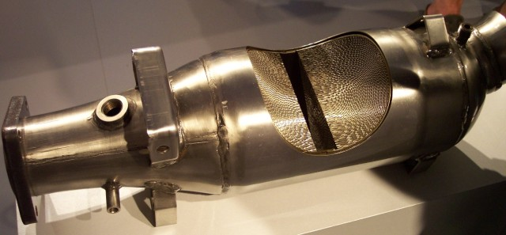

Figure 15-4: Cutaway of a metallic automotive catalytic converter. The honeycomb substrate is wash-coated with platinum, palladium, and rhodium, which oxidize CO and hydrocarbons and reduce NOx in the exhaust stream. (Source: [Stahlkocher / Wikimedia Commons (CC BY-SA 2.0)](https://commons.wikimedia.org/wiki/File:Aufgeschnittener_Metall_Katalysator_f%C3%BCr_ein_Auto.jpg))

The 1990 Clean Air Act amendments required reformulated gasoline (RFG) in the worst ozone nonattainment areas starting in 1995. RFG mandated lower summer RVP, reduced benzene and aromatics, and a minimum oxygen content, typically met by blending in MTBE. MTBE was phased out in the early 2000s after it was found in groundwater at levels that rendered drinking water undrinkable, and ethanol became the default oxygenate. The Renewable Fuel Standard (RFS), enacted in 2005 and expanded in 2007, set annual volume targets (RVOs) for ethanol and advanced biofuels, which in practice locked roughly 10% ethanol into the US gasoline pool. [Chapter 9 (Finished Products)](#chapter-finished-products) has the RFG and RFS specification detail.

Sulfur in gasoline was capped at 30 ppm average by Tier 2 in 2004 and tightened to 10 ppm by Tier 3 in 2017, bringing US gasoline in line with European specs and enabling the current generation of high-efficiency gasoline direct injection engines with close-coupled three-way catalysts. California's CARB gasoline program has run a cycle ahead of federal rules, with CARB 3 gasoline capping sulfur, aromatics, olefins, and T90 distillation temperature. [Chapter 8 (Standards)](#chapter-standards) contains the current gasoline spec numbers.

## Diesel: ULSD and the Catalyst Link

The diesel sulfur story runs parallel and for the same reason. On-road diesel was capped at 500 ppm sulfur in 1993 (low sulfur diesel, or LSD). Ultra-low sulfur diesel (ULSD) at 15 ppm became mandatory for on-road use in 2006, for locomotive and marine fuel in 2012, and for non-road equipment in 2014. The tightening was required because modern diesel after-treatment hardware, diesel particulate filters (DPF) to capture soot and selective catalytic reduction (SCR) to destroy NOx, cannot survive high-sulfur fuel. Sulfur oxides formed from fuel sulfur blind the SCR catalyst and clog the DPF regeneration cycle. ULSD was not primarily a sulfur-emissions rule; it was a hardware-enablement rule that also happened to cut sulfate particulate emissions.

The after-treatment stack on a modern diesel vehicle typically includes a diesel oxidation catalyst (DOC), a diesel particulate filter, and an SCR system that injects urea solution (diesel exhaust fluid, DEF, sold under the AdBlue brand in Europe) upstream of a vanadium or copper-zeolite catalyst. The urea decomposes to ammonia, which reacts with NOx over the catalyst to form nitrogen and water. Exhaust gas recirculation (EGR) and, on some vehicles, NOx adsorber traps (LNT) handle the rest. On the gasoline side, the three-way catalyst oxidizes CO and hydrocarbons while reducing NOx, with an upstream oxygen sensor keeping the air-fuel ratio locked in a narrow window around stoichiometric so all three reactions can run at once. [Chapter 16 (Engine Technologies)](#chapter-engine-technologies) covers the combustion side of the same hardware.

## Operational Safety: Spills, Pipelines, and Tanks

The Oil Pollution Act of 1990 (OPA 90) was enacted after the March 1989 Exxon Valdez grounding in Prince William Sound, Alaska, which released roughly 260,000 barrels of Alaska North Slope crude. OPA 90 imposed strict liability on spillers, created the Oil Spill Liability Trust Fund, required tanker owners to file vessel response plans, and mandated that all tankers operating in US waters transition to double-hull construction. Single-hull tankers were phased out on a schedule running through 2015. The international equivalent is MARPOL Annex I, administered by the IMO, which adopted parallel double-hull requirements for the global tanker fleet. [Chapter 11 (Transporting Oil)](#chapter-transporting-oil) covers the operational and economic consequences in detail.

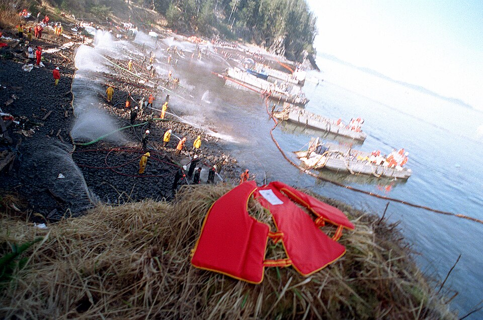

Figure 15-5: US Navy landing craft and civilian crews deploying hoses during the Exxon Valdez cleanup on Smith Island, Prince William Sound, on May 11, 1989. The spill released roughly 260,000 barrels of Alaska North Slope crude and directly produced the Oil Pollution Act of 1990, which imposed strict liability on spillers and phased out single-hull tankers in US waters by 2015. (Source: [US Navy via National Archives, Wikimedia Commons (public domain)](https://commons.wikimedia.org/wiki/File:Exxon_Valdez_Cleanup.jpg))

Pipelines are regulated in the US by the Pipeline and Hazardous Materials Safety Administration (PHMSA), a part of the Department of Transportation. PHMSA's integrity management program requires operators to identify High Consequence Areas (HCAs), locations where a release would pose elevated risk to population, drinking water, or sensitive ecosystems, and to run regular inline inspection ("smart pig") runs, cathodic protection surveys, and hydrostatic tests on pipelines traversing them. Rail transport of crude and hazardous liquids is governed by the HAZMAT rules following the 2013 Lac-Megantic disaster in Quebec, which required phase-in of the stronger DOT-117 tank car design.

Above-ground storage tanks are governed by SPCC (Spill Prevention, Control, and Countermeasure) plans under the Clean Water Act. Every tank farm of meaningful size must have secondary containment, typically an earthen berm or concrete dike with an impermeable liner sized to hold the volume of the largest tank plus a rainfall allowance. When spills do occur, response crews deploy mechanical skimmers, booms, in-situ burning where conditions allow, and chemical dispersants. Dispersants remain controversial: the heavy use of Corexit 9500 and 9527 during the 2010 Deepwater Horizon response drew criticism over worker exposure and long-term ecological effects. Shoreline Cleanup Assessment Technique (SCAT) teams document oiling conditions and guide the transition from active cleanup to natural attenuation.

## Greenhouse Gas Regulation

Of the six greenhouse gases tracked under the UN Framework Convention on Climate Change, carbon dioxide from burning fossil fuels is the largest single contributor to atmospheric warming on any realistic time horizon. Petroleum accounts for close to half of US energy-related CO2 emissions, principally from transportation fuels, with natural gas and coal making up most of the rest.

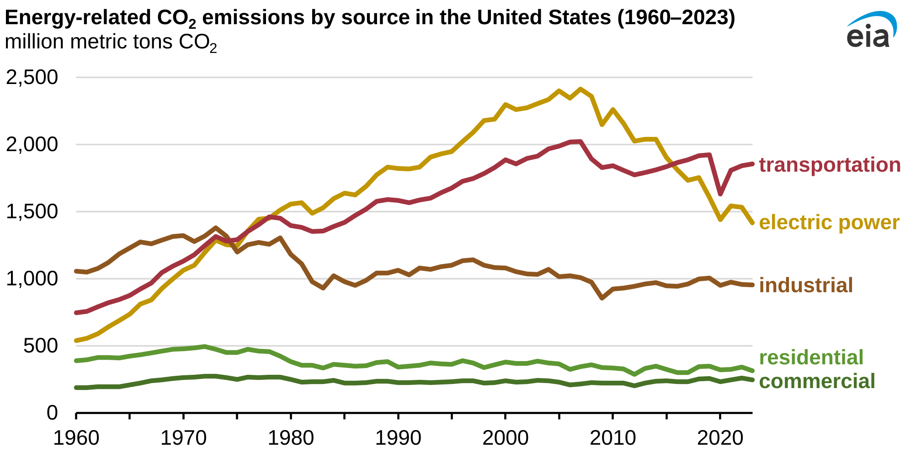

Figure 15-6: US energy-related CO2 emissions by source. Petroleum accounts for roughly 47% of the total, principally from transportation fuels, with natural gas and coal making up most of the rest. Total US energy-related CO2 emissions fell 20% between 2005 and 2023 even as population grew 14%, driven mostly by coal-to-gas switching in power generation. (Source: [EIA Today in Energy](https://www.eia.gov/todayinenergy/detail.php?id=66104), September 15, 2025)

The international regulatory history starts with the Kyoto Protocol of 1997, which set binding emission reduction targets for developed-country signatories of roughly 5.2% below 1990 levels by 2012. The US signed but did not ratify Kyoto, citing the absence of binding targets on China and India. The EU Emissions Trading System (EU ETS), launched in 2005, became and remains the world's largest carbon cap-and-trade market, covering power generation, heavy industry, intra-EU aviation, and from 2024 maritime shipping. The 2015 Paris Agreement replaced Kyoto's binding targets with Nationally Determined Contributions (NDCs), pledges each country sets itself and revisits every five years.

US federal climate policy became real with the Inflation Reduction Act of August 2022, which deployed roughly $370 billion in clean-energy tax credits over ten years. The IRA credits most relevant to oil markets are section 30D (new clean vehicle credit, up to $7,500 per EV), section 45X (advanced manufacturing production credit for batteries, critical minerals, and solar), section 45V (clean hydrogen production credit, up to $3 per kilogram), sections 48E and 45Y (technology-neutral clean electricity credits), and section 45Q (carbon capture and sequestration credit). The One Big Beautiful Bill Act (OBBBA), signed July 4, 2025, rolled back several IRA provisions including the 30D EV credit and tightened the 45V hydrogen rules. [Chapter 25 (Energy Transition)](#chapter-energy-transition) covers the post-OBBBA landscape in detail; the point here is that tax credits, not tailpipe rules, are now the dominant federal climate lever in the US.

The European Union Carbon Border Adjustment Mechanism (CBAM), with its definitive period beginning January 1, 2026, imposes a carbon price on imports of cement, steel, aluminum, fertilizers, hydrogen, and electricity into the EU, calculated to match the ETS price net of any carbon cost already paid at origin. CBAM is the first serious attempt at a border carbon tariff and is widely expected to expand in scope. For oil specifically, refined products are not in the initial CBAM scope, but upstream hydrogen and ammonia used in refining are, which means EU refiners importing blue or grey hydrogen from non-EU sources will pay a carbon penalty at the border.

## Methane: The Other Oil and Gas Greenhouse Gas

Methane is the second largest anthropogenic greenhouse gas and has roughly 80 times the warming potential of CO2 over a 20-year horizon. A meaningful fraction of global methane emissions comes from oil and gas upstream operations: well venting, pneumatic controllers, incomplete flaring, compressor station leaks, and tank flashing. EPA's final methane rule, issued in late 2023 and phasing in through 2024-2026, requires routine leak detection and repair (LDAR) at well sites, phases out most routine flaring of associated gas, and tightens standards on storage tanks and pneumatic devices. The IRA added a parallel methane emissions charge under section 136 of the Clean Air Act, a fee per ton of reported methane emissions above a threshold for large oil and gas facilities. OBBBA delayed and weakened the fee but did not repeal it outright. Outside the US, the EU Methane Regulation adopted in 2024 imposes monitoring, reporting, verification, and LDAR requirements on both domestic production and, eventually, imported oil and gas.

## Vehicle Fuel Economy and Tailpipe GHG Rules

On the demand side, US vehicle fuel economy is regulated through two parallel federal programs that often contain conflicting numbers. Corporate Average Fuel Economy (CAFE) standards are administered by NHTSA under the Energy Policy and Conservation Act of 1975 and are expressed in miles per gallon. EPA greenhouse gas tailpipe standards, authorized by the 2007 Massachusetts v. EPA Supreme Court decision and first issued in 2010, are expressed in grams of CO2 per mile. The two programs are harmonized in theory but in practice the EPA GHG rule often contains the stricter effective number, because it is harder to comply with using flex-fuel credits and is not subject to the same NHTSA restrictions on averaging across classes. California's Advanced Clean Cars II program runs on top of both.

Table 15-3: US Vehicle Fuel Economy Standards

| Year | Standard | Milestone |
| --- | --- | --- |
| 1975 | 18 mpg | CAFE enacted under Energy Policy and Conservation Act; response to 1973 embargo |
| 1987 | 27.5 mpg | Peak US passenger car fleet efficiency under the original CAFE program |
| 2007 | 35 mpg | EISA raised combined car/truck CAFE target to 35 mpg by 2020 |
| 2024 | 50.4 mpg | NHTSA finalized standards requiring 50.4 mpg fleet average by MY 2031 |
| 2025 | In flux | NHTSA began rulemaking in 2025 to roll back 2024 standards; program remains law but under revision |

CAFE remains on the books and is still the primary federal fuel economy mechanism, but the actual mpg target a manufacturer must hit is now a moving political variable rather than a settled engineering goal. In parallel, EPA tailpipe greenhouse gas standards, California's Advanced Clean Cars II program, and the federal EV tax credits introduced by the IRA (partially repealed in 2025) have become at least as important as CAFE in shaping what automakers actually build.

The above was updated in 2026. For the full original 2009 chapter, [download the 1st edition 2009 PDF](/api/download/pdf).

Morgan Downey’s Commodity News

### Read what a commodity trader reads

A free morning brief on the oil, gas, and commodity markets, written by Morgan Downey, author of Oil 101. One email, every morning.

[Subscribe free →](https://boxwoodapp.com/news/subscribe)

<!-- rl-section id="chapter-engine-technologies" class="chapter" kicker="Chapter 16" title="New Engine Technologies" -->

## New Engine Technologies

Chapter 16

# New Engine Technologies

Engine technology and oil demand: internal combustion, hybrids, electric vehicles, hydrogen fuel cells, and efficiency standards.

<svg fill="none" height="18" stroke="currentColor" stroke-linecap="round" stroke-linejoin="round" stroke-width="2" viewbox="0 0 24 24" width="18"><path d="M3 18v-6a9 9 0 0 1 18 0v6"></path><path d="M21 19a2 2 0 0 1-2 2h-1a2 2 0 0 1-2-2v-3a2 2 0 0 1 2-2h3zM3 19a2 2 0 0 0 2 2h1a2 2 0 0 0 2-2v-3a2 2 0 0 0-2-2H3z"></path></svg>Listen· 19:27

## Why Engine Technology Matters for Oil

Roughly two-thirds of global oil consumption goes to moving people and freight. Any structural shift in how engines burn fuel, or whether they burn it at all, shows up in the crude balance with a lag of years rather than months because the world's light-duty fleet turns over slowly. The average passenger car on US roads is about 12.6 years old, and a vehicle sold today will be on the road for 15 to 20 years. That is why incremental improvements in internal combustion engine efficiency have mattered as much for oil demand over the past two decades as the high-profile growth of electric vehicles: CAFE and its European and Chinese equivalents have quietly squeezed roughly a quarter of the fuel out of each new light-duty mile since 2005.

## The Four-Stroke Cycle

Every reciprocating internal combustion engine on the road today is a four-stroke engine running either the Otto cycle (spark ignition, gasoline) or the Diesel cycle (compression ignition). The four strokes are intake, compression, combustion, and exhaust. On the intake stroke the piston moves down and the cylinder draws in a charge of air, or air premixed with fuel. On the compression stroke the piston rises and squeezes that charge. In an Otto engine a spark plug then ignites the compressed mixture; in a Diesel engine the compression itself raises the air temperature high enough to ignite fuel sprayed in near top dead center. Combustion drives the piston down on the power stroke. The piston then rises on the exhaust stroke to push burnt gases out of the cylinder, and the cycle repeats.

Most of what follows is about squeezing more useful work out of each cycle.

## Compression Ratio and Octane

The compression ratio is the ratio of cylinder volume at bottom dead center to cylinder volume at top dead center. Higher compression extracts more work per unit of fuel because the expansion ratio after combustion is also higher, but it raises the temperature and pressure of the unburnt charge and makes the mixture vulnerable to knock, the spontaneous detonation of end-gas ahead of the flame front. Octane is the fuel's resistance to knock. The link is direct: a naturally aspirated passenger-car engine at 10:1 needs roughly 91 AKI gasoline; 12:1 needs about 93; high-boost turbocharged direct-injection engines push effective compression close to 14:1 and demand 93 AKI in the US or 98 RON premium in Europe. [Chapter 8 (Standards)](#chapter-standards) covers the octane numbers in detail, and [Chapter 9 (Finished Products)](#chapter-finished-products) covers how refiners blend to the required specification.

## Efficiency Breakthroughs Since 2009

When the first edition of Oil 101 appeared, the typical US passenger-car engine was a naturally aspirated port-injected 2.5-liter four-cylinder paired with a four- or five-speed automatic. Thermal efficiency, the fraction of fuel energy reaching the wheels, was roughly 25% on the best production engines. Fifteen years later the same vehicle class runs a 1.5-liter turbocharged direct-injection four-cylinder paired with an eight- or ten-speed automatic, and thermal efficiency on the best production engines is 40% or better. Several overlapping technologies got the industry there:

Table 16-1: Efficiency Technologies in Modern Gasoline Engines

| Technology | What it does | Typical gain |
| --- | --- | --- |
| Direct injection (GDI) | Fuel sprayed directly into the cylinder; enables higher compression and better cold start | 3 to 5% |
| Variable valve timing | Cam phasers adjust valve timing to match engine speed and load (VVT, VTEC, VVT-i) | 2 to 5% |
| Turbocharging with downsizing | Smaller turbocharged engine matches larger NA engine on power; runs at better BSFC at cruise | 5 to 10% |
| Cylinder deactivation | Shuts off half the cylinders at low load, cutting pumping losses | 3 to 6% |
| Atkinson cycle | Delayed intake valve closing gives a higher expansion ratio than compression ratio; used in most hybrid engines | 6 to 10% |
| Miller cycle | Similar to Atkinson but paired with a supercharger or turbo (Mazda SkyActiv, Audi, Toyota hybrids) | 5 to 8% |
| Compression ignition gasoline | HCCI / Mazda SPCCI run gasoline in a partial diesel mode at light load | up to 10%, limited production |
| 8, 9 and 10-speed transmissions | More ratios keep the engine at its best-efficiency point across more road speeds | 4 to 7% |

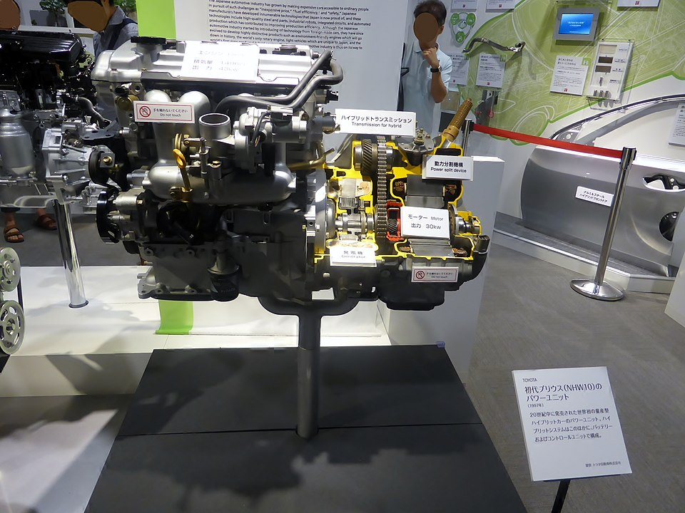

Figure 16-1: The power unit of a first-generation Toyota Prius. The Prius uses a planetary-gear power split between an Atkinson-cycle gasoline engine and two motor-generators. More than any single technology, the Prius proved that hybrids could be sold at mass-market volumes and quietly set the template that most of the industry now follows. (Source: [Tokumeigakarinoaoshima / Wikimedia Commons (CC0 public domain)](https://commons.wikimedia.org/wiki/File:The_power-unit_of_Toyota_Prius_(NHW10).JPG))

## The 30 / 30 / 30 / 10 Heat Balance

A conventional gasoline engine's fuel energy ends up in roughly four places: about 30% into useful work at the crankshaft, 30% out the exhaust as hot gas, 30% into the cooling system as waste heat, and 10% into friction and accessory loads. Even the best production gasoline engines sold today, after all the technologies above are layered on, only move the useful-work slice to 35 to 40%. Large marine and heavy-duty diesel engines running at their best operating point continuously under high load do better: a modern slow-speed two-stroke marine diesel can reach 50%. The remaining energy still has to go somewhere. This is why waste-heat recovery, stop-start, regenerative braking, and hybridization have so much room to work: they claw back pieces of the three non-useful slices rather than trying to raise the combustion ceiling itself.

## Hybrid Electric Vehicles

Hybrid electric vehicles (HEVs) combine an internal combustion engine with one or more electric motor-generators and a battery. Regenerative braking captures kinetic energy during deceleration and stores it in the battery, which then supplements the engine during acceleration and low-speed driving. The engine usually shuts off at stops (idle start-stop) and at low cruising speeds. HEVs get better fuel economy in the city than on the highway, the opposite of conventional cars, because stop-and-go is where regenerative braking and engine-off operation create the most value. On a long highway cruise the HEV is mostly carrying its battery pack around for nothing.

There is no single hybrid architecture. The four that account for essentially all production volume are laid out below.

Table 16-2: Hybrid Architectures

| Architecture | How it works | Example |
| --- | --- | --- |
| Mild hybrid (48V) | 48V belt-driven starter-generator provides torque assist and captures some regen; engine still drives the wheels. | Most European luxury brands post-2018 |
| Series hybrid (EREV) | Engine only drives a generator; electric motor alone turns the wheels; battery buffers the gap. | Chevy Volt (first generation), BMW i3 REx, Li Auto |
| Parallel hybrid | Both engine and electric motor can drive the wheels through a shared transmission. | Honda Insight (first generation), many European PHEVs |
| Power-split (series-parallel) | Planetary gearset blends mechanical and electrical paths continuously; the most common mass-market architecture. | Toyota Prius, Ford Escape Hybrid, Lexus RX Hybrid |
| Plug-in hybrid (PHEV) | Larger battery (8 to 25 kWh) charged from the grid, giving 20 to 50 miles of pure electric range before the engine starts. | Toyota Prius Prime, Ford Escape PHEV, most BMW iPerformance |

## Battery Electric Vehicles

A battery electric vehicle (BEV) has no engine at all. The only energy store is a large lithium-ion battery, and the only prime mover is one or more electric motors. Global BEV sales went from a rounding error at the time of the first edition of Oil 101 to roughly 14 million units in 2024, with another 3 to 4 million plug-in hybrids on top. China is by far the largest market, with BEV plus PHEV making up over 50% of new-car sales in late 2025. Europe runs in the mid-teens to low twenties depending on the quarter and local incentive regime. The US lags the three major markets, with BEV plus PHEV share peaking around 10% in 2024 and softening in 2025 after the September 2025 federal tax-credit expiration. Globally, BEV stock is about 6 to 7% of the fleet at the end of 2025, up from under 2% in 2020.

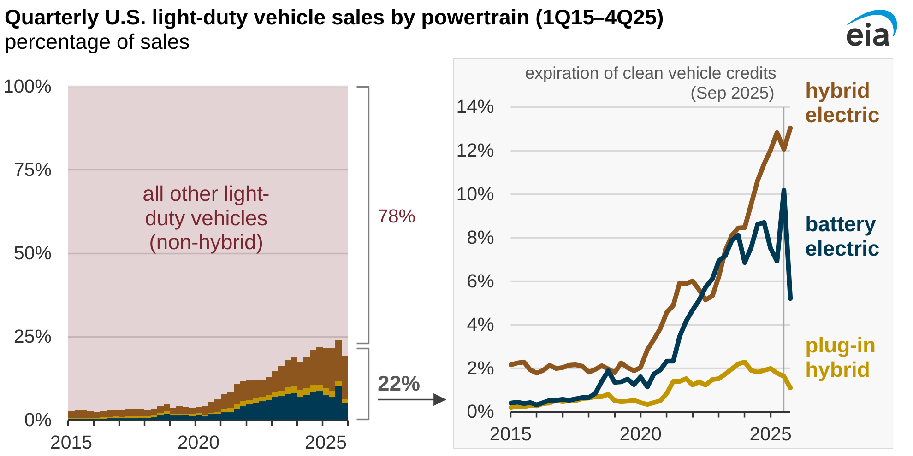

Figure 16-2: Quarterly US light-duty vehicle sales by powertrain through Q4 2025. Roughly 22% of 2025 US sales were electrified, but pure BEV and PHEV sales declined after the September 2025 federal tax-credit expiration while conventional hybrids continued to gain share. (Source: [EIA Today in Energy (February 9, 2026)](https://www.eia.gov/todayinenergy/detail.php?id=67144), February 9, 2026)

Figure 16-3: A Nissan Leaf battery pack on display. The flat, floor-mounted pack holds 24 to 62 kWh depending on model year, powering an electric motor that replaces the internal combustion engine entirely. (Source: [Mariordo / Wikimedia Commons (CC BY-SA 3.0)](https://commons.wikimedia.org/wiki/File:Nissan_Leaf_battery_pack_DC_03_2011_1629.jpg))

### Lithium-ion Chemistries

Not all lithium-ion batteries are the same chemistry. Three dominate the automotive market and a fourth is knocking on the door.

Table 16-3: Automotive Lithium-ion Battery Chemistries

| Chemistry | Strengths | Weaknesses |
| --- | --- | --- |
| NMC (Nickel Manganese Cobalt) | High energy density; long range per kWh; mature supply chain | Cobalt supply, thermal runaway risk, higher cost |
| NCA (Nickel Cobalt Aluminum) | Very high energy density; Tesla's long-range packs | Similar cobalt and safety trade-offs as NMC |
| LFP (Lithium Iron Phosphate) | Cheap, safe, long cycle life; no cobalt/nickel; good for standard-range models | Lower energy density; heavier pack for the same range |
| Solid-state (R&D) | Potentially higher energy density, faster charging, improved safety | Not yet in mass production at automotive scale |

The single most important battery number is pack cost per kilowatt-hour. BloombergNEF surveyed volume-weighted average lithium-ion pack prices at roughly $1,100/kWh in 2010, about $140/kWh in 2023, and around $115/kWh at the end of 2024. The industry rule of thumb is that $100/kWh is the approximate threshold at which a BEV reaches sticker-price parity with an equivalent internal combustion vehicle without subsidies. LFP packs in China have already crossed that line. The NMC/NCA packs used for long-range premium BEVs sit slightly above it.

Figure 16-4 Lithium-Ion Battery Pack Cost, 2010 to 2025 ($/kWh)

Source: BloombergNEF. The battery cost curve is the single most important driver of EV adoption.

### Charging

Charging falls into three levels. Level 1 uses a standard household 120-volt outlet in North America and delivers roughly 1.4 kW, good for about 4 miles of range per hour. Level 2 uses a 240-volt circuit typical of an electric dryer, delivers 6 to 19 kW, and can refill a typical BEV battery overnight. DC fast charging bypasses the onboard charger entirely and feeds DC directly to the pack at rates from 50 kW up to roughly 350 kW on the latest equipment; the highest-power chargers can add 200 miles of range in 15 to 20 minutes on a compatible vehicle. Megawatt-scale charging standards (MCS) for heavy trucks are being deployed starting in 2024-2025 for fleet depots and long-haul corridors.

The US charging connector landscape reshuffled in 2023 when Ford, GM, and most of the remaining OEMs announced they would adopt Tesla's North American Charging Standard (NACS) in place of the CCS Combo connector. SAE subsequently standardized NACS as J3400. By 2026 essentially all new US-market BEVs ship with, or adapt to, NACS. Europe remains on CCS2, and China on GB/T.

## Hydrogen Fuel Cell Vehicles

Figure 16-5: Cutaway of a Toyota Mirai showing the fuel cell stack (center) and 700-bar compressed hydrogen tanks. Despite three decades of development, fuel cell passenger vehicles have not achieved meaningful sales volume anywhere in the world. (Source: [Mariordo / Wikimedia Commons (CC BY-SA 4.0)](https://commons.wikimedia.org/wiki/File:Toyota_Mirai_fuel_cell_stack_and_hydrogen_tank_SAO_2016_9026.jpg))

A hydrogen fuel cell combines hydrogen with atmospheric oxygen to produce electricity, water, and heat. There is no combustion and no tailpipe pollutant other than water vapor. Toyota Mirai, Hyundai Nexo, and a handful of heavy-duty truck demonstrators are the only vehicles actually sold. Fuel cell cars have not achieved meaningful volume anywhere in the world, for three reasons that have not changed since the first edition of Oil 101.

First, hydrogen storage. Hydrogen has an excellent energy-to-weight ratio but a miserable energy-to-volume ratio, as the energy density chart below shows. Even at 700 bar compressed, a tank of hydrogen carries roughly one seventh the energy of a tank of gasoline of the same volume. Cryogenic liquid storage is worse in different ways: it requires energy-intensive liquefaction, insulated tanks, and tolerates boil-off losses when the vehicle is parked.

Second, hydrogen production. Roughly 95% of the world's hydrogen today comes from steam methane reforming (SMR) of natural gas, which releases nine to ten kilograms of CO2 per kilogram of hydrogen. That is "grey" hydrogen. "Blue" hydrogen captures some of the CO2 from SMR and sequesters it. "Green" hydrogen splits water with renewable electricity in an electrolyzer and releases no CO2 at the production step, but costs two to four times more than grey hydrogen at 2025 prices. The US IRA section 45V clean-hydrogen production tax credit, worth up to $3/kg for qualifying green projects, was intended to close that gap; OBBBA in July 2025 truncated the credit window, and several announced projects have since been deferred. [Chapter 25 (Energy Transition)](#chapter-energy-transition) covers the macro picture.

Third, distribution. Outside of California and a handful of demonstration corridors in Germany, Japan, and Korea, retail hydrogen refueling stations essentially do not exist. A single hydrogen station costs several million dollars to build and serves perhaps 100 vehicles a day at full utilization. The chicken-and-egg problem, which petroleum retailers themselves faced in the 1900s and 1910s, has not yet been solved for hydrogen.

Where hydrogen probably does make sense, and where most serious analysts now focus, is not passenger vehicles but industrial uses where molecular hydrogen is the actual input: ammonia production, refinery hydrotreating (see [Chapter 7 (Refining)](#chapter-refining)), steel direct reduction, and possibly long-haul heavy trucking and deep-sea shipping where batteries are too heavy and fueling points concentrate at a small number of large depots.

Energy Density Comparison

Diesel38 MJ/liter

Gasoline34 MJ/liter

Ethanol (E100) 21 MJ/liter

CNG (at 250 bar)9 MJ/liter

Hydrogen (700 bar)5 MJ/liter

Li-ion Battery2.5 MJ/liter

Volumetric energy density (approximate). This is why liquid hydrocarbons remain dominant for on-road transportation.

## Heavy Duty and Off-Road

Passenger electrification gets the headlines, but the harder frontier is Class 8 trucks, mining haul trucks, agricultural equipment, yard tractors, and port equipment. Battery weight is a much bigger penalty here, because revenue payload comes directly out of the same gross-vehicle-weight budget as the battery pack. A typical 500-mile-range Class 8 battery-electric tractor gives up 2 to 4 tons of payload to its pack compared with a diesel equivalent. For short-haul drayage and urban delivery that trade-off already works; the Tesla Semi, Volvo VNR Electric, Freightliner eCascadia, and several Chinese heavy-duty BEVs are in production. For long-haul dry van, it is still marginal, and megawatt-scale public charging infrastructure is only beginning to appear.

Figure 16-6: The Tesla Semi battery-electric Class 8 truck. Heavy-duty electrification is the harder frontier for oil demand displacement: the battery pack takes payload out of the trailer, and megawatt-scale charging infrastructure for long-haul routes is only beginning to be built. (Source: [Korbitr / Wikimedia Commons (public domain)](https://commons.wikimedia.org/wiki/File:Tesla_Semi_1.jpg))

Alongside electrification, a cluster of liquid alternative fuels is being deployed to reduce the lifecycle carbon intensity of fleets that are not yet ready to electrify.

Table 16-4: Alternative Liquid and Gaseous Fuels for Heavy Duty

| Fuel | Use case | Status |
| --- | --- | --- |
| Renewable diesel (HVO) | Drop-in replacement for petroleum diesel, made by hydrotreating vegetable oil or tallow | Commercial; California LCFS driver |
| Biodiesel (FAME) | Methyl-ester biofuel; blended up to B20 in the US, B7 in Europe | Commercial, volume-constrained by feedstock |
| CNG / LNG trucks | Compressed or liquefied natural gas in modified diesel engines | Commercial, slow growth; used by refuse fleets and some China long-haul |
| Methanol marine fuel | Dual-fuel marine diesel engines running on methanol | Commercial; Maersk, COSCO and CMA CGM have large orderbooks |
| Ammonia marine fuel | Zero-carbon hydrogen carrier burnt in modified engines | Pilot; first oceangoing ammonia dual-fuel vessels 2026 |
| Sustainable aviation fuel | Drop-in jet fuel from HEFA, alcohol-to-jet, or power-to-liquid routes (see [Chapter 9 (Finished Products)](#chapter-finished-products)) | Commercial at low blend, supply-constrained |

## The Peak ICE Question

Global sales of internal combustion passenger vehicles peaked around 2017 at roughly 86 million units and have been ceding share ever since, first to hybrids and then to pure BEVs. The peak showed up in oil demand later than in unit sales, delayed by three factors: growing fleet size in emerging markets, rising SUV share within the ICE category (heavier vehicles burn more fuel), and steady replacement of older inefficient engines with newer efficient ones. Even in aggressive electrification scenarios, the existing ICE fleet of roughly 1.3 billion passenger vehicles will dominate global gasoline and diesel demand until at least 2040, because fleet turnover is slow and because commercial vehicles turn over more slowly than passenger cars. [Chapter 25 (Energy Transition)](#chapter-energy-transition) picks up the energy-transition thread at the fleet and policy level; [Chapter 8 (Standards)](#chapter-standards), [Chapter 9 (Finished Products)](#chapter-finished-products), and [Chapter 15 (Environmental)](#chapter-environmental) cover the specification and policy machinery that drives what rolls off the assembly line.

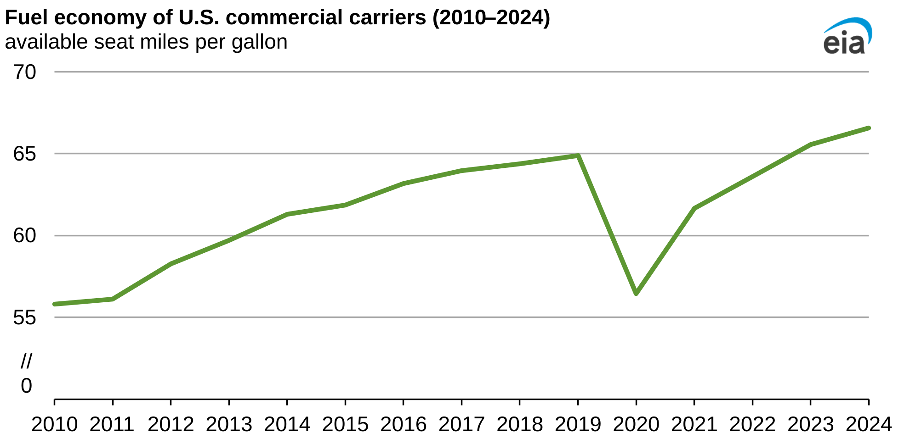

Figure 16-7: Commercial aircraft fuel economy improved from roughly 56 to 67 seat-miles per gallon between 2010 and 2024. Engine and aerodynamic efficiency gains matter as much as electrification for oil demand, because aviation is far harder to electrify than ground transportation. (Source: [EIA Today in Energy (August 26, 2025)](https://www.eia.gov/todayinenergy/detail.php?id=66004), August 26, 2025)

The above was updated in 2026. For the full original 2009 chapter, [download the 1st edition 2009 PDF](/api/download/pdf).

Morgan Downey’s Commodity News

### Read what a commodity trader reads

A free morning brief on the oil, gas, and commodity markets, written by Morgan Downey, author of Oil 101. One email, every morning.

[Subscribe free →](https://boxwoodapp.com/news/subscribe)

<!-- rl-section id="chapter-oil-prices" class="chapter" kicker="Chapter 17" title="Oil Prices" -->

## Oil Prices

Chapter 17

# Oil Prices

How oil prices work: WTI, Brent, Dubai benchmarks, price reporting agencies, netback pricing, and what drives crude oil prices.

<svg fill="none" height="18" stroke="currentColor" stroke-linecap="round" stroke-linejoin="round" stroke-width="2" viewbox="0 0 24 24" width="18"><path d="M3 18v-6a9 9 0 0 1 18 0v6"></path><path d="M21 19a2 2 0 0 1-2 2h-1a2 2 0 0 1-2-2v-3a2 2 0 0 1 2-2h3zM3 19a2 2 0 0 0 2 2h1a2 2 0 0 0 2-2v-3a2 2 0 0 0-2-2H3z"></path></svg>Listen· 17:21

## Physical Oil Trading

Wholesale oil trades through two types of contracts: term supply contracts (pre-arranged deliveries at scheduled dates, the majority of physical trade) and spot supply contracts (immediate delivery to the highest bidder). Spot prices reflect real-time supply and demand conditions and anchor virtually all oil pricing worldwide.

## Benchmark Pricing

Until the 1980s, oil prices were set by fiat: major oil companies or OPEC producers declared a fixed price that held for weeks or months. Since the mid-1980s, nearly all oil pricing uses benchmarks, with term supply contracts referencing daily spot prices from futures exchanges or trade journals.

The two primary futures benchmarks are NYMEX WTI (West Texas Intermediate, traded in New York) and ICE Brent (traded in London). WTI prices roughly one-third of the world's oil; Brent prices the other two-thirds. Trade journals like Platts (now S&P Global Commodity Insights) publish daily assessments of over 100 benchmark grades based on OTC (over-the-counter) market activity.

Even OPEC producers use benchmark formula pricing. Each producer sets an Official Selling Price (OSP) as a premium or discount to a benchmark, revised monthly. For example, Nigerian Bonny Light might be priced at Platts Dated Brent plus or minus a differential that reflects quality differences and relative demand.

Table 17-1: Global Crude Oil Benchmarks (2026)

| Benchmark | Region | Venue | Role |
| --- | --- | --- | --- |
| WTI | Cushing, Oklahoma | NYMEX (CME) | US light sweet benchmark; physical delivery at Cushing |
| WTI Houston / MEH | US Gulf Coast | NYMEX, Argus AGS | Waterborne US export benchmark, priced FOB Houston |
| Brent (BFOETM) | North Sea + US Gulf | ICE Futures Europe | Global benchmark; BFOETM basket includes Brent, Forties, Oseberg, Ekofisk, Troll, WTI Midland (2023) |
| Dated Brent | North Sea | Platts assessment | Physical cargo benchmark used to price most non-US international crude |
| Murban | Abu Dhabi (UAE) | ICE Futures Abu Dhabi (IFAD) | Launched March 2021; physically delivered Middle East light sour benchmark |
| Dubai / Oman | Middle East | Platts MOC, DME (Oman) | Core Asia-bound Middle East sour benchmark |
| ESPO | Kozmino, Russia | Platts assessment | Pacific Russian medium sour; rose after 2022 sanctions diverted Urals |
| ASCI | US Gulf Coast | Argus assessment | Argus Sour Crude Index; used by Saudi Aramco for US-bound sour cargoes |

Table 17-2: Refined Product Futures Benchmarks

| Contract | Venue | Specification |
| --- | --- | --- |
| RBOB Gasoline | NYMEX (CME) | US gasoline blendstock, NY Harbor delivery |
| NY Harbor ULSD | NYMEX (CME) | Ultra-low sulfur diesel; replaced the legacy heating oil contract in 2013 |
| ICE Low Sulphur Gasoil | ICE Futures Europe | European diesel/heating oil benchmark, ARA delivery |
| Singapore Gasoil 10ppm | Platts MOC, ICE | Asian middle distillate benchmark |
| Marine Fuel 0.5% (VLSFO) | Platts, CME | Bunker fuel benchmark introduced for IMO 2020 sulfur cap |

**What changed since the first edition.** The two biggest benchmark shifts are the addition of **WTI Midland to the Dated Brent basket in June 2023**, which links US shale directly to the global Brent price, and the launch of the **ICE Murban futures contract in March 2021**, giving the Middle East a physically delivered light sour benchmark for the first time. NY Harbor ULSD replaced the legacy Heating Oil contract in 2013, and IMO 2020 created a new VLSFO bunker benchmark. Russian Urals largely vanished from Western pricing after the 2022 G7 price cap, with ESPO and Sokol stepping into its place for Asia-bound flows.

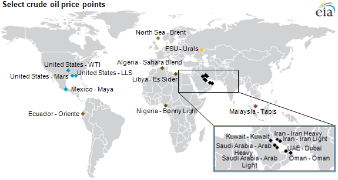

Figure 17-1: The world's benchmark crudes and their physical pricing points: WTI at Cushing, Brent in the North Sea, Dubai in the Middle East, Bonny Light in West Africa. (Source: [EIA Today in Energy](https://www.eia.gov/todayinenergy/detail.php?id=7110), July 16, 2012)

Front-month WTI has traded between roughly $20 and $145 per barrel since 2007. The 2008 spike, the 2014 to 2016 shale versus OPEC price war, the April 20, 2020 negative print during the pandemic demand collapse, the 2022 Russia-Ukraine spike above $120, and the range-bound $65 to $90 environment of 2024 to 2026 all make the same point: oil is costly to store, supply takes years to adjust, and short-run demand is inelastic, so prices are structurally volatile.

## The Delivery-Chain Price Ladder

When physical oil prices are quoted, they are always quoted against a specific point in the delivery chain. Crude accounts for most of the eventual retail price, but each step in the refining and transportation chain adds its own margin. The names of the price points form a ladder. Not every grade follows every rung, and the order can vary, but the sequence below is the canonical framework.

From Wellhead to Retail: US vs EU

$ USD / Gallons

| Step | US price | EU price | Note |
| --- | --- | --- | --- |
| Wellhead | $65/bbl | $70/bbl | WTI at Cushing / Brent North Sea |
| Cargo FOB | $70/bbl | $73/bbl | Loaded on vessel at export terminal |
| Refinery gate | $73/bbl | $76/bbl | Delivered crude into refinery |
| Rack (wholesale) | $2.05/gal | $2.15/gal | Terminal truck rack, pre-tax |
| Dealer tank wagon | $2.30/gal | $2.40/gal | Delivered to retail station |
| Retail (pre-tax) | $2.55/gal | $2.70/gal | Retailer margin added |
| Retail (all-in) | $3.45/gal | $6.50/gal | Including all taxes |
|  |  |  |  |
| --- | --- | --- | --- |
| Tax per gallon | $0.90/gal | $3.80/gal | EU taxes are roughly 4x US taxes per gallon |

Illustrative 2024-2025 averages. US = WTI-based, EU = Brent-based. Click toggle to switch units.

Figure 17-2: Same barrel, different pump price. Crude oil costs are similar worldwide. The gap between US and EU retail prices is almost entirely government taxation. EU fuel excise duties plus VAT add roughly $3.80 per gallon compared to roughly $0.90 in the US. The crude oil that politicians argue about accounts for less than half the price a European driver actually pays.

## Unit Conversions

Oil at retail is sold in US gallons or liters, but wholesale oil trades in barrels, gallons, and metric tonnes depending on the region and the product. The conversion from metric tonnes to barrels depends on density: lighter products pack more barrels per metric tonne than heavier products. The table below gives the canonical factors and the conventional trading units by region. A few fixed relationships are always true: 42 US gallons equal one barrel, one US gallon is roughly 3.785 liters, and one barrel is roughly 159 liters or 0.159 cubic metres.

Table 17-3: Oil Market Units and Conversions

| Product | Region | Traded unit | Bbl per metric tonne |
| --- | --- | --- | --- |
| Crude oil (WTI) | Worldwide | bbl | 7.50 |
| Crude oil (Maya, heavy) | Worldwide | bbl | 6.50 |
| Gasoil / diesel / heating oil | Asia | bbl | 7.45 |
| Gasoil / diesel / heating oil | Europe | metric tonne | 7.45 |
| Gasoil / diesel / heating oil | US | US gallon | (gal only) |
| Jet fuel / kerosene | Asia | bbl | 7.88 |
| Jet fuel / kerosene | Europe | metric tonne | 7.88 |
| Gasoline | Asia | bbl | 8.33 |
| Gasoline | Europe | metric tonne | 8.33 |
| Naphtha | Europe | metric tonne | 8.90 |
| Residual fuel oil | Asia / Europe | metric tonne | 6.40 |

The barrels-per-tonne factor matters when a trader negotiates a swap: a Brent-based crude swap in Europe typically settles in dollars per barrel even though the physical cargo is measured in metric tonnes. A slightly wrong conversion factor (say, 7.58 when the right number is 7.45) compounds across millions of tonnes and can reconcile to millions of dollars over a year.

## Formula Pricing: A Worked Example

Nearly all crude oil sold into the international market today is priced using a formula that references one or more published benchmarks. The formula accounts for quality differences (light vs heavy, sweet vs sour, waxy vs clean), for location differences (delivered price at the refinery gate vs loaded FOB at the export terminal), and for a residual premium or discount (the Official Selling Price, or OSP) that the producer revises monthly. The Saudi Aramco OSP announcement on the tenth of every month is one of the most watched events in the physical market.

The clearest published example is Mexico's PEMEX, which prices its three flagship crude grades against combinations of four benchmarks using publicly disclosed formulas. The formulas below are the canonical 1990s-2000s versions; the exact weights and the constant term change over time, but the structure has been stable for thirty years. WTS is West Texas Sour, LLS is Light Louisiana Sweet, Dated Brent is the Platts North Sea assessment, and US Gulf No. 6 3% is a heavy high-sulphur residual fuel oil assessment.

Table 17-4: Mexican PEMEX Crude Formulas (illustrative)

| Grade | API | Formula |
| --- | --- | --- |
| **Olmeca** (light) | 39° | 0.333 × (WTS + LLS + Dated Brent) + constant |
| **Isthmus** (medium) | 33° | 0.4 × (WTS + LLS) + 0.2 × Dated Brent + constant |
| **Maya** (heavy sour) | 22° | 0.4 × (WTS + US Gulf No.6 3%) + 0.10 × (LLS + Dated Brent) + constant |

Read the Maya formula carefully: a heavy sour crude is priced not against a single crude benchmark, but against a blend of a sour crude (WTS), a residual fuel oil (US Gulf No.6 3%), and two light sweet crude benchmarks (LLS and Dated Brent). The weights reflect what a complex refinery would actually pay for the constituent yield: heavy sour crude is really a blend of light transport fuel potential and bottom-of-the-barrel residual potential, and Maya is priced as exactly that blend. The constant term is PEMEX's monthly OSP adjustment. It moves with demand for Maya in Asia and the US Gulf and with the refining margin offered by US coking refineries, which are the natural buyer.

Most non-OPEC producers price their crude with similar formulas. OPEC producers use them too: Saudi Aramco's Arab Light OSP to Asia is priced as a differential to the average of Oman and Dubai, while Arab Light OSP to the US Gulf is priced as a differential to ASCI. The same physical cargo is therefore priced against completely different benchmarks depending on which destination buyer is on the other side.

## Freight Netback Pricing

A variation of formula pricing is freight netback pricing, used when there is no liquid benchmark at the actual pricing location. The seller takes a published benchmark price at a different location, subtracts the cost of shipping oil from that location to the pricing location (or adds it, if flowing the other way), and uses the result as the netback price. The freight leg references a published benchmark such as the Baltic Exchange tanker rate or a Platts freight assessment. Freight netback pricing is common for obscure loading ports, for landlocked pipeline points, and for spot cargoes that have to be diverted mid-voyage. It is also the basis for arbitrage decisions: a cargo will only move from point A to point B if the freight cost is less than the price difference between A and B.

## Pricing Windows and the Platts MOC

The price a Platts assessment publishes at the end of a trading day is not the last observed trade: it is the value of the market at the close, estimated from a narrow window of tightly observed spot activity. The window is called the Market on Close (MOC). For most physical crude and product assessments, the MOC window is the final 30 minutes of the trading day. During the window, bids and offers and trades are reported in real time through the Platts eWindow system. Traders can bid or offer any assessable cargo, and Platts editors use the sequence of bids, offers, and trades during the window to arrive at a single published assessment for the day. The window is deliberately narrow to ensure that the assessment reflects liquidity at the close rather than stale trades from the morning.

Because published Platts assessments feed directly into billions of dollars of physical supply contracts and OTC swaps, the MOC window is where some of the most intense short-term price formation happens in the oil market. A trader who wants to nudge an assessment upward can post a bid during the window; the bid has to be backed by real willingness to transact, but it shapes the editors' read of the market. Regulatory scrutiny of the MOC process has tightened since the mid-2010s after LIBOR and other assessment benchmarks came under investigation, and Platts publishes its methodology in detail. The MOC model is now imitated by Argus, OPIS, and every major commodity price reporting agency. When a wholesale oil supply contract says "Platts MOP" (Mean of Platts high and low) or "Platts MOC," it means the assessment produced by this window.

## Oil and the US Dollar

Oil trades globally in US dollars for practical reasons: the dollar is the most liquid and freely convertible currency with the lowest transaction costs. A single currency makes international price comparison straightforward and enables efficient arbitrage. If the dollar weakens against consumption currencies, oil prices rise in dollar terms, and vice versa. Producers convert dollar revenues into any currency they want immediately.

Because the dollar itself is a moving target, headline oil prices can mislead about whether oil is genuinely more or less expensive in real terms. A useful sanity check is to price oil in **gold**, the longest-running unit of monetary value. The chart below plots WTI in dollars against the same WTI price expressed as the number of barrels you could buy with one troy ounce of gold. The two lines often move in opposite directions: from 2020 onward, dollar oil rose sharply while oil priced in gold actually got cheaper, because gold rose even faster than oil.

WTI Crude Oil Priced in Gold

WTI in dollars vs WTI in gold. The dark line is the familiar dollar oil price. The gold line is barrels of WTI you could buy with one ounce of gold. In gold terms, oil today is roughly twice as cheap as the long-run average of 15 barrels per ounce, and barely half as expensive as the 1973 to 1981 era when one ounce of gold bought only 8 to 10 barrels.

Source: EIA (WTI front-month), LBMA (gold PM fix). 2025 = January to October average.

The long-run average since the end of Bretton Woods is roughly fifteen barrels of WTI per ounce of gold. Periods well above that line, such as 2015 to 2017 and 2020 through 2025, mark eras when oil is cheap in hard-money terms. Periods well below, such as the 1970s oil shocks and the 2007 to 2008 super-cycle, mark eras when oil is genuinely expensive in real terms. Looked at this way, the high dollar prices of the early 2020s are a story about the dollar, not about oil.

## Retail Price Differences

The primary driver of retail price differences between countries is government taxation, not crude oil costs. Dense European nations with mass transit alternatives can levy high fuel taxes. Low-density countries like the US, Canada, and Australia find it politically harder to tax automobile fuels. In 2026, European gasoline taxes can exceed $3 per gallon while US federal and state taxes combined average roughly $0.50 per gallon.

The above was updated in 2026. For the full original 2009 chapter, [download the 1st edition 2009 PDF](/api/download/pdf).

Morgan Downey’s Commodity News

### Read what a commodity trader reads

A free morning brief on the oil, gas, and commodity markets, written by Morgan Downey, author of Oil 101. One email, every morning.

[Subscribe free →](https://boxwoodapp.com/news/subscribe)

<!-- rl-section id="chapter-futures-swaps" class="chapter" kicker="Chapter 18" title="Forward Oil Markets: Futures and Swaps" -->

## Forward Oil Markets: Futures and Swaps

Chapter 18

# Forward Oil Markets: Futures and Swaps

Oil futures and swaps explained: NYMEX WTI, ICE Brent, the forward curve, contango, backwardation, and OTC swap markets.

<svg fill="none" height="18" stroke="currentColor" stroke-linecap="round" stroke-linejoin="round" stroke-width="2" viewbox="0 0 24 24" width="18"><path d="M3 18v-6a9 9 0 0 1 18 0v6"></path><path d="M21 19a2 2 0 0 1-2 2h-1a2 2 0 0 1-2-2v-3a2 2 0 0 1 2-2h3zM3 19a2 2 0 0 0 2 2h1a2 2 0 0 0 2-2v-3a2 2 0 0 0-2-2H3z"></path></svg>Listen· 24:30

## Paper Barrels and Wet Barrels

The spot or cash price is the price of oil for immediate delivery. A forward price is the price for delivery at a specified date in the future. Oil for future delivery is most commonly traded using exchange-traded futures contracts and over-the-counter (OTC) swap contracts. If you choose, you never have to take or make delivery of physical oil. Because you do not touch the physical market, these are called paper barrels, as opposed to wet barrels. Paper barrels are also called derivative instruments because their value is derived from physical oil prices without necessarily resulting in ownership of physical oil.

In certain circumstances, such as holding a futures contract past its expiry date, you can take or make delivery of physical oil. This link anchors paper contracts to real prices. Fewer than 1% of paper contracts convert into physical oil, but that thin thread of convergence is what keeps paper from drifting into pure abstraction. When the tether snaps, as it did at Cushing in April 2020, prices can do extraordinary things.

## The Forward Curve and Its Two Shapes

Plotting forward prices across delivery dates creates a forward curve, also called a forward strip or term structure. Each benchmark grade of oil has its own forward curve. The parts of the curve closest to expiry are the front end; the parts farthest out are the back end. The price difference between one month and the next is an intermonth spread or switch. The difference between the front and the back is a time spread.

The Two Forward-Curve Shapes

Contango

Forward prices above spot

Backwardation

Forward prices below spot

Two shapes, two stories. A contango curve slopes up: the market is paying you to store oil. A backwardation curve slopes down: the market is paying you to release oil from storage now. Oil forward curves flip between the two as physical supply, demand, and storage capacity change. Keynes called backwardation the normal state in his 1930 Treatise on Money, arguing that producers hedge more than consumers. In oil, backwardation has historically been the more common shape because traders can easily arbitrage a contango curve into existence (build storage, sell forward), while backwardation cannot be arbitraged away.

Forward curves are either in contango (upward sloping, farther-out months above spot) or in backwardation (downward sloping, spot above farther-out months). Contango signals too much oil today relative to today's demand, and implies money to be made by buying spot, storing, and selling forward. Backwardation signals a relative shortage today and discourages storage by offering a better price now than in the future. Oil forward curves flip between the two shapes as physical conditions change.

### Cost of Carry and Full Carry

Contango intermonth spreads are bounded by the cost of storing and financing oil. Add the monthly tank rental, the financing charge on the barrels you have bought, and the insurance, and you get the cost of carry. When the intermonth spread in contango equals the monthly cost of carry, the market is said to be at full carry. Any wider and a storage trader can lock in a riskless profit by buying spot, selling forward, and renting tanks. The arbitrage flattens the curve back toward full carry.

Backwardation has no such constraint: there is no mechanism to arbitrage a backwardated curve back to flat. You cannot borrow a barrel from the future and deliver it today. That asymmetry is why Keynes, in his 1930 *Treatise on Money*, called backwardation the normal state of commodity markets and coined the phrase "normal backwardation." He argued that producers hedge more than consumers and therefore must pay a premium to transfer price risk to speculators. In oil, the deeper reason backwardation dominates is structural: contango can always be traded away by building new storage, but backwardation cannot.

**Yield on oil.** A contango curve means oil has a negative yield for an owner, because you pay storage costs to hold it. A backwardation curve means oil has a positive yield, because you can sell spot, buy back forward, and pocket the difference. This yield is the reason long-only commodity index investors care about the shape of the curve: roll yield compounds, and a persistently contangoed market has historically eroded their returns.

## April 20, 2020: The Day Oil Went Negative

**Minus $37.63.** The May 2020 NYMEX WTI contract settled at negative $37.63 per barrel, the first negative settlement in the history of the contract. Cushing storage was effectively full during the COVID demand collapse, so longs holding contracts into expiry faced physical delivery they could not take. They were forced to pay counterparties to accept the barrels. It was a textbook lesson in what paper barrels and wet barrels actually mean: when storage capacity runs out, the price of a barrel you cannot move can fall below zero. The back end of the curve barely flinched.

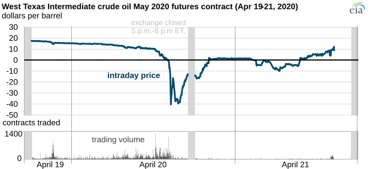

Figure 18-1: The May 2020 NYMEX WTI contract collapsed from $18 to minus $37 over the final trading session before expiry. Cushing was effectively full and longs holding the contract could not take delivery. (Source: [EIA Today in Energy](https://www.eia.gov/todayinenergy/detail.php?id=43495), April 27, 2020)

## Marginal Finding and Development Cost at the Back of the Curve

The very back end of the oil forward curve is, in principle, the market's estimate of the finding and development cost of marginal crude barrels. If you raised capital today, explored, developed the field, and brought production to market, what price would justify the investment? Anything you can lock in beyond the five-year tenor of the curve is a rough vote on that number. In the 1990s the long-term back-of-curve price sat around $20 per barrel when conventional onshore fields were the marginal source. Since 2003 it has pushed up as marginal barrels moved toward deep offshore, oil sands, and tight oil. Back-of-curve prices are not forecasts: historically they have been poor predictors of actual spot prices over the same horizon. But they are still the best real-money signal available for long-term marginal production cost.

## Spreads: How Oil Traders Actually Trade

Oil traders distinguish between flat-price (outright directional) positions and spread positions. A flat-price position is exposed to absolute up-or-down price movement. A spread position is exposed to the price difference between two things: two grades of oil, the same grade of oil in two locations, the same grade of oil in two delivery periods, or a product against its crude feedstock. The market risk of a spread is called basis risk.

Spreads are usually quoted as positive numbers, the higher price minus the lower. If you buy a positive spread, your position gains when the spread widens. If you sell a positive spread, your position gains when the spread narrows. Four common spread families dominate oil trading:

- **Crack spreads** (refinery margin): refined product prices minus crude oil prices, the margin a refinery earns for turning crude into fuels.
- **Arbitrage spreads (arbs)**: the same or closely related oil priced in two regions. Arbs are primarily a function of transport rates between the two. The most famous is the WTI-Brent Atlantic arb.
- **Relative value spreads (diffs)**: two different but closely related products in the same region, such as naphtha versus gasoline in Rotterdam, or high-sulphur versus low-sulphur diesel in the US Gulf. A regrade is a relative value spread between different grades of the same product.
- **Time spreads (calendar spreads)**: the same grade of oil across two delivery periods. Used to trade seasonality, storage economics, and the general shape of the curve.

Figure 18-2 Brent Minus WTI Spread, Annual Average 2005 to 2025 ($/bbl)

Source: EIA, ICE, CME. The spread reflects logistics infrastructure, not oil quality differences.

## The 3:2:1 and 2:1:1 Crack Spreads

The US refining industry lives and dies on the crack spread. The standard benchmark is the 3:2:1: three barrels of crude in, two barrels of gasoline out, one barrel of distillate (heating oil or diesel) out. The ratio roughly reflects the yield profile of a typical US Gulf Coast refinery running a medium crude. A refinery that sells the 3:2:1 spread forward has locked in both sides of its margin in a single trade: it has effectively bought crude and sold products at a fixed gross margin. The 2:1:1 spread (two crude, one gasoline, one distillate) is preferred for refineries whose yields lean heavier toward distillate, typically those running heavier crudes with more hydrocracker and coker capacity.

The 3:2:1 Crack Spread

MechanicsHistorical

Crude in, fuels out, margin between. The 3:2:1 crack spread is the canonical US refining margin indicator: buy 3 barrels of crude, sell 2 barrels of gasoline and 1 barrel of distillate. A refiner who sells the 3:2:1 spread forward has hedged both sides of the refining process in a single trade. Historical view uses illustrative monthly averages. The 2022 spike reflects the post-invasion distillate squeeze when global diesel inventories hit multi-decade lows. The alternative 2:1:1 (2 crude, 1 gasoline, 1 distillate) is preferred for refiners whose yields lean heavier toward distillate. Illustrative data: no exchange IP.

Neither crack spread exactly represents any real refinery. Actual refineries have more complex slates (LPG, jet, petchem feedstocks, coke, asphalt), pay different crude diffs by grade and location, and carry energy and utility costs the simple spread ignores. But the 3:2:1 is the most widely quoted refining margin number, and it is what refinery hedgers trade when they want to lock in a margin without negotiating every barrel of every product independently.

## The Spreads Family Tree

Benchmark grades of oil around the world are linked into a family tree by traded spreads. Light sweet crudes trade against each other, heavy crudes against lighter ones, regional benchmarks against global references. A trader arbitraging Midland WTI against Cushing is walking along one branch; a trader arbitraging Dated Brent against BFOET is walking along another. The diagram below shows the main families.

Main Spread Families Between Benchmark Grades

<svg class="w-full h-auto" style="font-family:var(--font-inter)" viewbox="0 0 720 360" xmlns="http://www.w3.org/2000/svg"><defs><marker id="arrow18" markerheight="6" markerwidth="6" orient="auto-start-reverse" refx="9" refy="5" viewbox="0 0 10 10"><path d="M 0 0 L 10 5 L 0 10 z" fill="hsl(var(--muted-foreground))"></path></marker></defs><rect fill="hsl(20, 60%, 35%)" height="40" rx="6" width="120" x="300" y="160"></rect><text fill="white" font-size="14" font-weight="700" text-anchor="middle" x="360" y="185">Crude Oil</text><rect fill="hsl(43, 96%, 45%)" height="34" rx="6" width="160" x="520" y="40"></rect><text fill="#1a1a1a" font-size="12" font-weight="600" text-anchor="middle" x="600" y="62">Gasoline</text><rect fill="hsl(43, 80%, 60%)" height="34" rx="6" width="160" x="520" y="90"></rect><text fill="#1a1a1a" font-size="12" font-weight="600" text-anchor="middle" x="600" y="112">Naphtha</text><rect fill="hsl(200, 70%, 55%)" height="34" rx="6" width="160" x="520" y="140"></rect><text fill="white" font-size="12" font-weight="600" text-anchor="middle" x="600" y="162">Jet Fuel / Kerosene</text><rect fill="hsl(200, 60%, 40%)" height="34" rx="6" width="160" x="520" y="190"></rect><text fill="white" font-size="12" font-weight="600" text-anchor="middle" x="600" y="212">Diesel / Heating Oil</text><rect fill="hsl(0, 0%, 30%)" height="34" rx="6" width="160" x="520" y="240"></rect><text fill="white" font-size="12" font-weight="600" text-anchor="middle" x="600" y="262">Residual Fuel Oil</text><rect fill="hsl(210, 50%, 55%)" height="34" rx="6" width="160" x="40" y="90"></rect><text fill="white" font-size="12" font-weight="600" text-anchor="middle" x="120" y="112">Natural Gas</text><rect fill="hsl(170, 50%, 45%)" height="34" rx="6" width="160" x="40" y="140"></rect><text fill="white" font-size="12" font-weight="600" text-anchor="middle" x="120" y="162">Ethane</text><rect fill="hsl(150, 50%, 45%)" height="34" rx="6" width="160" x="40" y="190"></rect><text fill="white" font-size="12" font-weight="600" text-anchor="middle" x="120" y="212">Propane</text><line marker-end="url(#arrow18)" stroke="hsl(var(--muted-foreground))" stroke-width="1.5" x1="420" x2="520" y1="180" y2="57"></line><line marker-end="url(#arrow18)" stroke="hsl(var(--muted-foreground))" stroke-width="1.5" x1="420" x2="520" y1="180" y2="107"></line><line marker-end="url(#arrow18)" stroke="hsl(var(--muted-foreground))" stroke-width="1.5" x1="420" x2="520" y1="180" y2="157"></line><line marker-end="url(#arrow18)" stroke="hsl(var(--muted-foreground))" stroke-width="1.5" x1="420" x2="520" y1="180" y2="207"></line><line marker-end="url(#arrow18)" stroke="hsl(var(--muted-foreground))" stroke-width="1.5" x1="420" x2="520" y1="180" y2="257"></line><line marker-end="url(#arrow18)" stroke="hsl(var(--muted-foreground))" stroke-width="1.5" x1="200" x2="300" y1="107" y2="180"></line><line marker-end="url(#arrow18)" stroke="hsl(var(--muted-foreground))" stroke-width="1.5" x1="200" x2="300" y1="157" y2="180"></line><line marker-end="url(#arrow18)" stroke="hsl(var(--muted-foreground))" stroke-width="1.5" x1="200" x2="300" y1="207" y2="180"></line><text fill="hsl(var(--muted-foreground))" font-size="10" font-style="italic" text-anchor="middle" x="470" y="115">crack spreads</text><text fill="hsl(var(--muted-foreground))" font-size="10" font-style="italic" text-anchor="middle" x="250" y="115">feedstock spreads</text><text fill="hsl(var(--muted-foreground))" font-size="11" text-anchor="middle" x="360" y="320">Each arrow is a tradable spread. Each box has its own forward curve.</text></svg>

The spreads family tree. Crude oil sits in the center of the traded spread complex. To the right are the refined products, each priced against crude through a crack spread. To the left are the natural gas chain feedstocks, priced into petrochemicals and into crude through feedstock arbitrages. Every arrow on this diagram is a liquid, quotable spread. Most of an oil trader's day is spent looking at one of these arrows and asking whether it is wider or narrower than it should be.

## Exchange-Traded Futures

A futures contract gives you the right to buy or sell a standardized quantity of oil for delivery at a specified date in the future. Buying futures is called going long: the trade makes money if prices rise. Selling futures is called going short: the trade makes money if prices fall. Adding an offsetting trade in the opposite direction is called unwinding or closing out. A position that has been completely offset is said to be squared out.

### Margin and the Clearinghouse

To trade futures you open an account with a broker and post an initial cash margin deposit. The broker passes that deposit to a central clearinghouse, which manages the credit of the entire exchange. The clearinghouse becomes the counterparty to every trade: buyers face the clearinghouse, sellers face the clearinghouse, and no individual trader has direct credit exposure to any other. This mutualization of credit is the single biggest structural difference between futures and OTC.

If the market moves against you, the clearinghouse issues a variation margin call, requiring you to post additional cash to cover the loss. Variation margin is collected daily, at the end of each trading session, based on the exchange's settlement price. The process is called mark-to-market: every position is revalued to the day's close and unrealized losses are converted into realized cash movements. If you fail to post variation margin, the clearinghouse closes your position and uses your initial margin to cover any residual loss.

Table 18-1: Mark-to-market lifecycle

| Stage | What happens |
| --- | --- |
| **Open position** | Trader posts initial margin with broker, 5-10% of notional contract value. |
| **End-of-day settlement** | Exchange publishes settlement price. Clearinghouse marks every position to that price. |
| **Mark-to-market** | Winners receive variation margin in cash. Losers must post variation margin in cash. |
| **Margin call** | If losing trader fails to post on time, clearinghouse closes the position at market. |
| **Residual loss** | Covered first by the trader's initial margin, then by broker capital, then by the exchange default fund. |

Initial margin of 5 to 10% of contract value means a trader can control $70,000 of oil exposure for about $5,000 in margin, roughly 14-to-1 leverage. Small price moves then create large profits or losses relative to margin posted. This leverage is why futures are viewed with fear by the general public. Traders who cannot absorb a margin call through a short adverse move are called weak hands and are regularly stopped out of positions that later move back in their favor. A trader who posts the full notional value as collateral, with the broker or in a bank account ready for margin calls, is called a strong hand and is fully collateralized. Weak hands provide the liquidity; strong hands collect it.

### Worked Example: Five-Day Mark-to-Market

The table below walks through a five-day mark-to-market cycle for a trader who buys 10 WTI contracts (10,000 barrels) at $80.00 per barrel on Day 1 and holds the position through settlement each day. Each $1 move per barrel creates a $10,000 gain or loss across the 10 contracts.

Table 18-2: Five-day mark-to-market worked example

| Day | Settlement ($/bbl) | Daily change | Variation margin | Cumulative P&L |
| --- | --- | --- | --- | --- |
| **Day 1** | $80.00 | Entry price | Posts $50,000 initial margin | $0 |
| **Day 2** | $82.00 | +$2.00 | Receives $20,000 | +$20,000 |
| **Day 3** | $78.00 | -$4.00 | Pays $40,000 | -$20,000 |
| **Day 4** | $79.50 | +$1.50 | Receives $15,000 | -$5,000 |
| **Day 5** | $81.00 | +$1.50 | Receives $15,000 | +$10,000 |

On Day 3, the trader faced a $40,000 margin call on a $50,000 initial deposit. A weak hand unable to post would have been closed out at $78 and locked in a $20,000 loss. A strong hand who posted the call went on to recover to +$10,000 by Day 5. This is the daily cash discipline that separates futures from a buy-and-hold investment: you must be able to survive the path, not just the destination.

### The Five Liquid Oil Futures Contracts

Globally, only five oil futures contracts carry meaningful liquidity. Three are listed in New York and two in London. Every other exchange contract is either niche, regional, or effectively a wrapper around one of these five.

Table 18-3: The five liquid oil futures contracts

| Contract | Ticker root | Size | Settlement |
| --- | --- | --- | --- |
| WTI Crude Oil (NY) | `CL` | 1,000 bbl | Physical, Cushing OK |
| Brent Crude Oil (London) | `B` | 1,000 bbl | Cash vs Dated Brent |
| RBOB Gasoline (NY) | `RB` | 42,000 gal (1,000 bbl) | Physical, NY Harbor |
| NY Harbor ULSD (NY) | `HO` | 42,000 gal (1,000 bbl) | Physical, NY Harbor |
| Gasoil (London) | `G` | 100 metric tonnes | Physical, ARA |

One metric tonne of gasoil is roughly 7.45 barrels. One 42,000-gallon gasoline or distillate contract is exactly 1,000 barrels, matching the WTI and Brent size so that crack spreads can be constructed one-for-one with a single contract on each leg. That design choice is not an accident: it is what makes the 1:1:1, 3:2:1, and 2:1:1 crack spreads executable as single-click trades on an exchange screen.

Figure 18-3: WTI Crude Oil Daily Volume and Open Interest, 2015 to 2025 (Million Contracts)

Daily volume (left axis)

Open interest (right axis)

Sources: CME Group

Market participation has declined since 2018. Open interest peaked above 2.4 million contracts in 2018 and has trended lower since. Each crisis, including the 2020 negative price event, the 2022 Russia invasion, and the 2026 Hormuz blockade, drove further declines as margin increases forced speculative longs out of the market. Volume spikes during crises (traders scramble to exit or enter) while open interest drops (positions are closed rather than rolled). The divergence between volume and open interest is a classic sign of a market in stress. Illustrative monthly data consistent with CME Group reports.

### Futures Ticker Format

Futures Ticker Format

CL+Z+6=CLZ6

Root (WTI) + Month Code (December) + Year (2026)

Month codes: F(Jan) G(Feb) H(Mar) J(Apr) K(May) M(Jun) N(Jul) Q(Aug) U(Sep) V(Oct) X(Nov) Z(Dec)

The month codes look arbitrary because they are relics of the open outcry era. On a noisy trading floor where hundreds of traders were shouting bids and offers and flashing hand signals across a crowded pit, the letters had to be legible at a distance and impossible to confuse with numbers or with each other. That ruled out A, B, C, D, E, I, L, O, P, R, S, T, W, and Y. What remained was the odd-looking sequence F, G, H, J, K, M, N, Q, U, V, X, Z. The pits are almost all gone now, but the codes they invented still stamp every oil futures ticker on every screen in the world.

The front-month contract (the one closest to expiry) is also called the first nearby or prompt contract. The next one out is the second nearby. Contracts one, two, and three December months forward are sometimes called red, blue, and green December, a Eurodollar-desk shorthand that bled into oil in the 1990s.

## Over-the-Counter (OTC) Swap Contracts

An OTC contract is similar to a futures contract: you buy and sell oil exposure for dates in the future. The differences are that OTC contracts are customizable, traded bilaterally rather than on an exchange, and almost always cash settled. The OTC market caters to large organizations rather than individuals. The International Swaps and Derivatives Association (ISDA) produces the standardized legal templates the market runs on. A typical trade confirmation is three or four pages of ISDA-style language.

The word swap captures the economics: the transaction allows oil price movement risk to be swapped from one trader to another. An airline buying a jet fuel swap is paying fixed and receiving floating, or going long a swap. An oil producer selling a crude swap is receiving fixed and paying floating, or going short a swap. Most OTC swaps settle against the monthly average of daily benchmark prices, a structure called Asian settlement or average-rate settlement. A swap that settles against a single day is a bullet swap.

### A Worked Airline Swap: The Book's Signature Example

On January 10, Trader A at an airline phones Trader B at a bank. Trader A is worried about a military buildup on the border of two major oil producers and thinks jet fuel prices could rally hard in March. Trader A wants to buy 20,000 metric tonnes of Platts NWE jet fuel for the month of March. Trader B offers a fixed price of $1,510 per metric tonne. They trade at that level.

During March, the swap prices out each business day against the Platts North-West Europe jet fuel settlement. At the end of the month, the final floating leg is the simple average of those twenty business-day prints. Suppose the average comes in at $1,550.25 per metric tonne. Here are the two cash flows:

Table 18-4: Airline jet fuel swap settlement

| Leg | Airline (Trader A) | Bank (Trader B) |
| --- | --- | --- |
| Fixed leg ($1,510 × 20,000 mt) | **Pays $30,200,000** | Receives $30,200,000 |
| Floating leg (March avg $1,550.25 × 20,000 mt) | Receives $31,005,000 | **Pays $31,005,000** |
| **Net on April 6** | **Receives $805,000** | **Pays $805,000** |

Payments are netted, so no one wires $30 million. The back offices calculate the difference and the losing side wires a single net number, in this case $805,000, on the fifth business day after month end. The airline has achieved exactly what it wanted: an effective purchase of March jet fuel at $1,510 per metric tonne, regardless of where the actual market went. If the average had printed below $1,510, the airline would have paid the bank the difference and walked away with a fixed price that was, in hindsight, worse than the floating market. That regret-in-hindsight outcome is the cost of hedging, and it is the part that airline CFOs have to defend to their boards every year.

### Where Futures and Swaps Differ

Table 18-5: Futures vs. OTC swaps

|  | Futures | OTC swaps |
| --- | --- | --- |
| **Where traded** | Exchange, five liquid contracts | Bilateral, 100+ benchmarks referenced |
| **Standardization** | Fixed size, fixed expiry | Customizable size and tenor |
| **Settlement** | Physical delivery on single day | Cash settled, usually against monthly average |
| **Credit** | Exchange clearinghouse mutualizes counterparty risk | Bilateral credit, governed by ISDA master agreement |
| **Margin** | Initial + daily variation margin to clearinghouse | Bilateral margining or credit lines between counterparties |
| **Discounting** | No discounting of notional cash flows | Discounted for time value of money |

## EFP, EFS, and Block Trades

Three mechanisms bridge the exchange and OTC worlds. An Exchange for Physical (EFP) is a privately negotiated swap of a futures position against a matching physical position: two counterparties agree on a price, one side ends up with wet barrels, the other with the futures exposure, and the trade is reported to the exchange without touching the order book. An Exchange for Swaps (EFS) does the same thing between futures and an OTC swap. A block trade is a large order negotiated off-screen and then reported to the exchange, subject to minimum size thresholds. All three exist so wholesale participants can move institutional-size risk without the slippage a screen order would impose.

## The Live Curve Today

Loading live curve data...

The curve above is live WTI. Look at whether the first two months are in contango or backwardation, and by how much. That front-end shape is the most sensitive real-time indicator of physical tightness at Cushing, and it is the first number every crude trader checks in the morning.

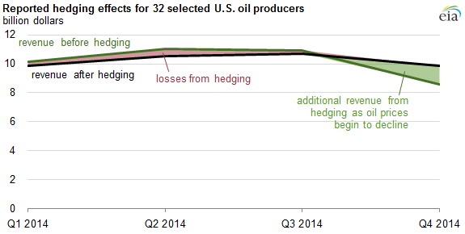

Figure 18-4: How producer hedging programs cushioned revenues in the Q4 2014 crude oil price crash: a $1.3 billion hedge gain offset a $2.4 billion revenue decline. This is what the producer side of a receive-fixed, pay-floating swap looks like when it works as designed. (Source: [EIA Today in Energy](https://www.eia.gov/todayinenergy/detail.php?id=20632), April 2, 2015)

The above was updated in 2026. For the full original 2009 chapter, [download the 1st edition 2009 PDF](/api/download/pdf).

Morgan Downey’s Commodity News

### Read what a commodity trader reads

A free morning brief on the oil, gas, and commodity markets, written by Morgan Downey, author of Oil 101. One email, every morning.

[Subscribe free →](https://boxwoodapp.com/news/subscribe)

<!-- rl-section id="chapter-options" class="chapter" kicker="Chapter 19" title="Forward Oil Markets: Options" -->

## Forward Oil Markets: Options

Chapter 19

# Forward Oil Markets: Options

Oil options explained: calls, puts, collars, three-way structures, Black-76 pricing, Greeks, and volatility skew in energy markets.

<svg fill="none" height="18" stroke="currentColor" stroke-linecap="round" stroke-linejoin="round" stroke-width="2" viewbox="0 0 24 24" width="18"><path d="M3 18v-6a9 9 0 0 1 18 0v6"></path><path d="M21 19a2 2 0 0 1-2 2h-1a2 2 0 0 1-2-2v-3a2 2 0 0 1 2-2h3zM3 19a2 2 0 0 0 2 2h1a2 2 0 0 0 2-2v-3a2 2 0 0 0-2-2H3z"></path></svg>Listen· 22:13

## Options as Insurance

An option is the right, not the obligation, to buy or sell oil at a set price (the strike) in the future. The buyer pays an upfront premium to the seller. If the market never moves past the strike, the buyer walks away having lost only the premium. This asymmetric payoff is why options are compared to insurance policies: you pay a fixed premium today, and in exchange you are protected against a specific kind of price move in the future.

A **call option** profits when prices rise above the strike. Airlines, shipping companies, and other oil consumers typically buy calls to cap their exposure to rising fuel costs. A **put option** profits when prices fall below the strike. Oil producers typically buy puts to protect revenue against falling prices. The maximum loss for an option buyer is the premium paid. The seller (also called the writer) keeps the premium but faces potentially unlimited losses and is usually required to post margin that changes as the option's value changes.

Option Payoff at Expiry

CallPut/Long (buy)Short (sell)

Strike $70Premium $5

Long $70 call, $5 premium. Dashed line is intrinsic value at expiry. Solid line is net profit after paying (long) or receiving (short) the premium. Breakeven is where the solid line crosses zero.

## Intrinsic Value, Time Value, and Moneyness

The price of any option has two components. **Intrinsic value** is how much the option would be worth if it expired right now: positive for options that are already favorable, zero for options that are not. **Time value** is everything else: the premium market participants will pay for the possibility that the option becomes more valuable before expiry. Time value is highest at the money and decays to zero as expiry approaches, a process called theta decay.

Traders describe every option's relationship to the current market in one of three ways, collectively called **moneyness**. An option whose strike is set exactly at the current market price is at the money (ATM). An option whose strike is already favorable to the holder is in the money (ITM) and has positive intrinsic value. An option whose strike is unfavorable is out of the money (OTM) and has zero intrinsic value, so its entire premium is time value.

Table 19-1: Moneyness with WTI Trading at $70/bbl

| Option | Strike | Intrinsic | Moneyness |
| --- | --- | --- | --- |
| Call | $60 | $10.00 | Deep ITM |
| Call | $70 | $0.00 | ATM |
| Call | $80 | $0.00 | OTM |
| Put | $80 | $10.00 | Deep ITM |
| Put | $70 | $0.00 | ATM |
| Put | $60 | $0.00 | OTM |

Intuitively, deeper-in-the-money options command higher premiums because more of their value is intrinsic rather than speculative. Out-of-the-money options are cheaper but require a larger move in the underlying before they pay out anything.

## Option Styles

Oil options expire in one of four styles. **American** options can be exercised at any time before expiry and are the standard on futures exchanges. **Asian** (average price) options settle against the arithmetic mean of daily prices over a period and are the most common OTC type: they match the ratable consumption and production patterns of hedgers, and they are cheaper because averaging reduces the effective volatility. Lengthening the averaging window from a month to a quarter makes an Asian option cheaper still. **European** (also called bullet) options exercise only at expiry against a single price. They are rarely used in oil markets. **Bermudan** options exercise only during defined time windows and are also rare.

Exchange-traded oil options typically **assign** into a futures position at expiry if the holder exercises: the option does not pay cash directly, it hands the holder a long or short futures contract that then has to be closed. OTC options are almost always cash-settled and support more exotic structures, including compound options (options on options) and swaptions (options that exercise into an OTC swap).

## Pricing: Black-76 and Implied Volatility

Options are priced using mathematical models, most commonly a version of Black-Scholes adapted for commodities called **Black-76**. The six inputs are underlying price, strike, time to expiration, volatility, risk-free interest rate, and whether the option is a call or a put. The model assumes log-normal price changes and the ability to continuously rehedge, both imperfect approximations. Despite the simplifications, Black-76 remains the dominant model in oil options because it gives a closed-form answer in microseconds. Monte Carlo simulation offers more realism at orders of magnitude more computation and is reserved for exotic payoffs.

Of the six inputs, five are directly observable. Only volatility has to be estimated. Given an observed market option price and the other five inputs, a trader can solve the Black-76 equation backwards to find the volatility number that reproduces that price: the **implied volatility**. Implied vol is what option traders actually trade. It is actively quoted, marked to market, and recorded on its own forward curve.

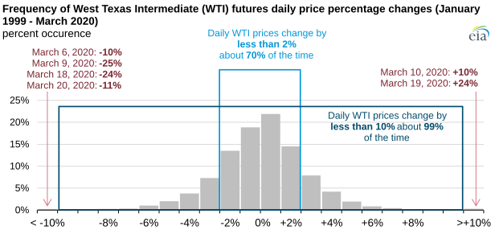

Figure 19-1: Distribution of WTI daily returns. The fat tails (rare extreme moves) motivate the log-normal assumption underlying Black-Scholes and Black-76 option pricing, and explain why real-world implied volatility surfaces skew upward at extreme strikes. (Source: [EIA Today in Energy](https://www.eia.gov/todayinenergy/detail.php?id=43275), March 27, 2020)

The CBOE OVX index measures 30-day implied volatility of WTI crude options, as the VIX does for the S&P 500. Crude vol normally runs in the 25 to 40 percent range, well above equity vol, but spikes during supply or demand shocks: above 100 percent during the 2008 financial crisis, above 300 percent on April 20, 2020 when WTI settled negative, above 70 percent in March 2022 after Russia invaded Ukraine, and back into the 30s during the calmer 2024 to 2026 period. Hedgers pay more for protection precisely when they need it most, which is why the cost of buying insurance goes up exactly when the insured event becomes more likely.

Figure 19-2: CBOE OVX (Oil VIX) Implied Volatility, 2007 to 2025

Source: CBOE OVX Index. Quarterly averages, illustrative. Peak intraday OVX exceeded 300 in April 2020.

## The Greeks

A trader running a book of hundreds or thousands of options needs a compact way to summarize risk across all of them. The **Greeks** are the answer: each one is a partial derivative of an option's value with respect to one of the Black-76 inputs, and together they tell the trader how the book will respond if any input moves. The five Greeks that matter for oil are Delta, Gamma, Vega, Theta, and Rho. Throughout the examples below, assume 1 million barrels notional on a 90-day WTI ATM option struck at $70 with 35 percent implied volatility.

**Delta** is the option's exposure to the underlying oil price. Delta is quoted in barrels (or gallons or tonnes) and tells the trader how much the position makes or loses for a one-dollar move in WTI. An at-the-money option has a delta of roughly 50 percent of its notional. In our example, long the $70 call against 1 million bbl notional gives a delta of roughly +500,000 barrels: the position makes $500,000 if WTI rises one dollar and loses $500,000 if it falls one dollar. In-the-money options have deltas above 50 percent, out-of-the-money options below it. A trader hedging an option book usually offsets delta by buying or selling futures in the matching barrel amount.

**Gamma** is the rate of change of delta. If oil moves a dollar, gamma tells you how much the delta of the position itself changes. Gamma is largest for at-the-money options and shrinks for deep ITM or OTM strikes, which is why ATM options are the most sensitive to realized volatility. Gamma is why a delta-hedge is never permanent: as the market moves, the delta drifts and the hedge must be re-struck. Gamma matters most in oil because oil can gap (move in large jumps with no intervening trades) after pipeline outages, OPEC surprises, or geopolitical shocks, and each gap forces the hedge to be rebalanced at a worse price than the model assumed.

**Vega** is the sensitivity of the option to implied volatility. Vega is quoted in dollars per 1 percent move in vol. On our $70 ATM call against 1 million barrels, a 1 percentage point rise in implied vol might be worth roughly $120,000 to a long position. Vega is a big deal in oil because implied vol itself moves a lot: a 5 point move in OVX in a single week is routine, and 20 point moves happen during shocks. Traders who want to take a pure view on volatility regardless of direction buy or sell straddles, which have roughly zero delta but large vega.

**Theta** is the decay in an option's value due to the passage of time. Every day that nothing happens, a long option loses a little bit of premium. Theta is shown as a dollar amount per calendar day. The trader who is long options pays theta and is long gamma: time decay is the cost of holding convexity. The trader who is short options earns theta and is short gamma: each morning the short collects a bit of decay in exchange for taking on the risk that the market moves enough to overwhelm it. Theta is always highest for at-the-money options near expiry, which is why the last two weeks of an option's life are the most dangerous for short positions.

**Rho** is the change in an option's value for a change in the risk-free interest rate, typically quoted per 50 basis points. In oil markets rho is the smallest of the Greeks by a wide margin: interest rates move slowly and oil options are mostly short-dated, so the interest-rate sensitivity rarely dominates a trader's thinking. Rho becomes relevant only for long-dated structures such as multi-year airline hedges or upstream financing deals where the interest-rate component of carry starts to matter.

Option Greeks Across Strikes

CallPut

Underlying $70, implied vol 35%, 90 days to expiry, 1 MM bbl notional

How the Greeks change as strike moves across the underlying. Delta is the S-curve running through zero at the ATM strike. Gamma, vega, and theta all peak exactly at the ATM strike, which is why ATM options are the most sensitive to any change in the underlying, to any change in implied volatility, and to the passage of time. Once normalized, the three share essentially the same bell shape; the real differences show up in absolute magnitudes, which depend on notional size, time to expiry, and volatility.

Illustrative Black-76 values, each Greek normalized to its own peak in the plotted range. Dashed styles distinguish vega and theta where they overlap gamma.

A **gamma map** (also called a strike map) lays out a portfolio's Greeks across strikes, tenors, and price scenarios so the trader can see where risk concentrates. Books that look flat on a summary view can hide large exposures at specific strike-and-expiry combinations, and the gamma map is how those hidden exposures get found. Besides the five first-order Greeks above, traders watch second-order Greeks like volga (the volatility of volatility) and vanna (the change in delta for a change in volatility), but these are refinements on the same theme.

## Volatility Skew, Smile, and Surface

If Black-76 were literally true, every strike at a given expiry would trade at the same implied volatility. It does not work that way in real markets. Plotting implied vol against strike at a fixed tenor almost always produces a curve, not a flat line. In oil, that curve is usually a **put skew**: deep out-of-the-money puts trade at higher implied vols than ATM options because dealers charge more for crash protection. A milder call skew sometimes appears when upside shock risk is in the news. The shape is called a smile when the curve rises symmetrically on both sides of ATM, and a smirk when one side is much steeper than the other.

Plotting implied vol against time to expiry for ATM options produces the **volatility term structure**. In a calm market, long-dated options trade at slightly higher vol than short-dated ones, reflecting uncertainty that accumulates with time. In a shock, the term structure can invert: front-month vol spikes above back-month vol because the market expects the crisis to be resolved one way or another within weeks.

Combining the skew at every tenor into a single picture produces the **volatility surface**: implied vol as a function of both strike and tenor, usually rendered as a three-dimensional heat map. The surface is how every professional options desk represents its inventory. Every morning, traders mark the surface to the closing prices of actively-traded strikes and interpolate the rest.

Implied Volatility Skew and Term Structure

Skew: vol vs strike, fixed 90-day tenor

Term structure: ATM vol vs months forward

Left: implied vol plotted against strike at a fixed 90-day tenor. Oil options typically show a put skew: vol is higher at low strikes because dealers charge more for deep out-of-the-money crash protection. Right: ATM vol plotted against tenor. Longer-dated options usually trade at slightly higher implied vol than short-dated, reflecting uncertainty that accumulates over time. Illustrative shapes; the actual skew and term structure change every day as supply and demand for tail protection shifts.

Illustrative data. No exchange-proprietary surfaces reproduced.

## Daily Breakeven and Gamma Trading

A useful sanity check on any long-option position is the **daily breakeven**: how much does the underlying have to move each day, on average, for gamma gains on a delta-hedged position to cover the theta cost? The formula falls out of Black-76 and is clean enough to do in your head.

**Daily breakeven** = σ × P / √256

At $80 oil and 35 percent implied vol, daily breakeven is 0.35 × 80 / 16 ≈ **$1.75 per barrel per day**. A long-gamma position pays for itself if realized daily moves average at least $1.75. The divisor 16 is the square root of 256, the conventional number of trading days per year. Use √52 ≈ 7.2 for a weekly breakeven instead: at the same inputs, that works out to roughly $3.89 per barrel per week.

**Gamma trading** is the practice of being long gamma (usually long ATM options) while aggressively re-hedging delta on every meaningful move. The trader is betting that realized volatility will exceed implied volatility: if the market actually moves more than the daily breakeven implies, the gamma rebalances earn more than theta decays, and the position ends the day in the money even if the strike never gets touched. Long gamma positions do well in choppy markets and badly in quiet ones. Short gamma (short ATM options, usually in size) is the opposite bet and is how a lot of premium is earned during quiet periods, with occasional catastrophic losses when an unexpected shock arrives.

## Common Option Structures

Single options are rarely traded alone in the oil hedging world. Most real positions are structures: small portfolios of two, three, or four options designed to produce a particular payoff profile at a particular cost.

The single most common structure is the **zero-cost collar**, also called a fence, tunnel, min-max, risk reversal, or cylinder. A producer buys a put for downside protection and simultaneously sells a call that caps the upside; the strikes are chosen so that the sold call premium exactly offsets the bought put premium, producing no upfront cash. The collar locks the producer into a band: if oil finishes below the put strike, the put pays out; if oil finishes above the call strike, the producer gives up the excess upside; if oil finishes between the strikes, the structure does nothing at all. Consumers do the mirror image: long a call, short a put.

A **three-way collar** adds a third leg below the bought put: the producer also sells a deeper out-of-the-money put. The extra premium lets the producer pick a tighter collar for the same zero cost, but at a hidden cost: below the sold put strike, the producer is fully exposed to further downside again. In years when budget discipline is more important than tail protection, three-ways are common. In years when a cliff-edge crash is the concern, producers prefer plain collars.

A **call spread** (long a near-the-money call, short a higher-strike call) reduces premium in exchange for a capped payoff. Consumers use it when they want partial protection against rising prices without paying for unlimited upside. A **put spread** does the same for producers in the downside direction. A **straddle** (long both a call and a put at the same strike) is a pure volatility trade: it pays off if oil makes a big move in either direction and loses the combined premium if oil settles near the strike.

Common Option Structures

Zero-cost collar (producer)Three-way collar (producer)Put spread (producer)Call spread (consumer)Long straddle

Zero-cost collar (producer). Long $65 put + short $80 call. Producer is protected below $65 and gives up upside above $80. Zero upfront premium.

The right structure depends on the hedger's goals: how much downside is unacceptable, how much upside the hedger will give up, what the budget is, and what view (if any) the hedger has on volatility. None of these structures is inherently better than the others. They are a vocabulary for shaping cash-flow distributions, and the same underlying intuition from [Chapter 20 (Risk Management)](#chapter-risk-management) decides which one to use.

The above was updated in 2026. For the full original 2009 chapter, [download the 1st edition 2009 PDF](/api/download/pdf).

Morgan Downey’s Commodity News

### Read what a commodity trader reads

A free morning brief on the oil, gas, and commodity markets, written by Morgan Downey, author of Oil 101. One email, every morning.

[Subscribe free →](https://boxwoodapp.com/news/subscribe)

<!-- rl-section id="chapter-risk-management" class="chapter" kicker="Chapter 20" title="Managing Oil Price Risk" -->

## Managing Oil Price Risk

Chapter 20

# Managing Oil Price Risk

Oil hedging strategies for producers and consumers: swaps, collars, three-ways, put spreads, and corporate treasury workflows.

<svg fill="none" height="18" stroke="currentColor" stroke-linecap="round" stroke-linejoin="round" stroke-width="2" viewbox="0 0 24 24" width="18"><path d="M3 18v-6a9 9 0 0 1 18 0v6"></path><path d="M21 19a2 2 0 0 1-2 2h-1a2 2 0 0 1-2-2v-3a2 2 0 0 1 2-2h3zM3 19a2 2 0 0 0 2 2h1a2 2 0 0 0 2-2v-3a2 2 0 0 0-2-2H3z"></path></svg>Listen· 26:25

## Why Commodities Are Volatile

Commodities are the most volatile asset class compared to equities, currencies, and bonds. Oil has historically averaged roughly 35-40% annualized volatility, compared to about 19% for the S&P 500, 10% for EUR/USD, and 7% for US Treasuries. The reason: commodities are expensive to store, so large ready-to-consume inventories rarely exist. Supply shortages take months or years to fix, while equity and currency shortages can be resolved quickly by issuing more shares or printing money.

## The Case for Hedging

Hedging uses derivatives (futures, swaps, and options) to reduce the short-term impact of volatile price movements on a business. Over the long term, hedging transactions will roughly break even after bid/offer spreads. The value comes not from making money on hedges, but from the strategic benefits of predictable cash flows.

Reduced cash flow volatility lowers bankruptcy risk, improves borrowing terms, enables accurate budgeting and earnings forecasts, and lets management focus on core competencies rather than oil market speculation. An airline's executives are transportation logistics experts, not oil traders. Hedging lets them concentrate on what they do best.

> Not hedging is itself a decision: management is choosing to expose the organization to full oil price volatility. This should be an active, communicated choice, not a passive default.

## Corporate Hedging Objectives by Firm Type

Before any discussion of instruments or accounting, the first question for a hedger is: what are we actually trying to achieve? Different firms in the oil value chain have very different answers, and the answer drives the choice of instrument, tenor, and hedge ratio.

Table 20-1: Typical Hedging Objectives by Firm Type

| Firm type | Objective | Typical instrument mix |
| --- | --- | --- |
| E&P producer | Lock in cash flow for debt service and capex; protect RBL borrowing base; stabilize PDP value | Swaps, collars, three-way collars (24 to 36 month tenor) |
| Integrated major | Little or no price hedging; vertical integration is the natural hedge (upstream gains offset downstream losses) | Minimal; occasional project-specific hedges |
| Refiner | Hedge the crack spread, not crude outright; protect input-output margin | 3:2:1 / 2:1:1 crack spread swaps and options |
| Airline | Jet fuel cost stability; explicit hedge ratio (e.g. 50% of next 12 months' budget) | Jet/gasoil swaps, call options, collar structures |
| Power generator | Pass-through where regulation allows; otherwise direct hedging of gas or fuel oil | Natural gas and distillate swaps; tolling agreements |
| Physical trader | Hedge inventory and transit risk; every physical position has a paper offset | Futures, EFPs, time spreads |
| Industrial consumer | Operating cost stability for plastics, petchem, asphalt, lubricants buyers | Fixed-price supply contracts; swaps against benchmarks |

## Hedging Instruments

Producers typically sell swaps (locking in a fixed price) or buy puts (establishing a floor). Consumers typically buy swaps or calls. The most common structure for both is the zero-cost collar: a producer buys a put and sells a call, establishing a price range with no upfront premium. Three-way collars add a sold put below the bought put for a wider zero-cost range, at the cost of limited downside protection. [Chapter 18 (Futures and Swaps)](#chapter-futures-swaps) and [Chapter 19 (Options)](#chapter-options) cover the instrument mechanics in detail; this chapter is about how they are used, combined, and governed inside a corporate treasury.

Common Hedging Strategies

Swap (Fixed Price)

Locks in a specific price. No upfront cost, but no upside or downside flexibility. Used by producers and consumers alike.

Zero-Cost Collar

Buy a put (floor) and sell a call (cap). No upfront premium. Establishes a price range. The most popular hedging structure.

Three-Way Collar

Buy a put, sell a call, and sell a lower put. Widens the zero-cost range but limits downside protection below the sold put.

Put Spread / Call Spread

Buy one strike, sell another. Reduces premium but limits payoff. Used when budget constraints prevent full protection.

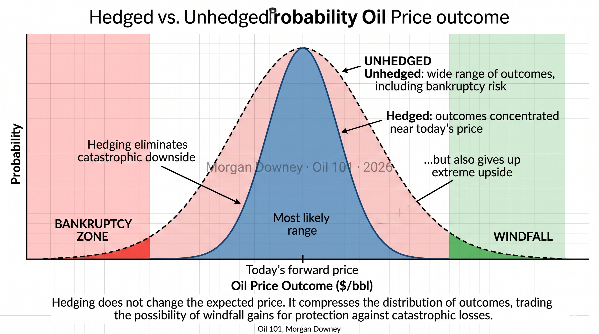

Figure 20-1: Hedging does not change the expected price. It compresses the distribution of outcomes, trading the possibility of windfall gains for protection against catastrophic losses. The wide (unhedged) curve spans bankruptcy territory on both tails. The narrow (hedged) curve concentrates outcomes near today's forward price. (Source: Oil 101, Morgan Downey)

Figure 20-2: Hedging Structure Payoff Comparison

Illustrative. Assumes a producer hedging at the prevailing forward price. Positive P&L means the hedge offsets a loss on physical sales.

## Basis Risk

Basis risk is the risk that the hedge instrument does not perfectly track the physical exposure it is meant to offset. In an idealized textbook the two move together penny for penny; in practice they can diverge for months at a time, sometimes violently. Three everyday examples capture the flavor:

- A Permian producer that hedges with NYMEX WTI (physically deliverable at Cushing) carries Midland-Cushing basis risk. When Permian pipeline capacity tightened in 2018 and 2019, Midland crude traded $10 to $18 below Cushing WTI for extended stretches. A producer fully hedged at Cushing still suffered the Midland discount on every physical barrel sold.
- A Northeast US heating oil distributor that hedges with NYMEX ULSD at New York Harbor carries rack-versus-NYMEX basis. The distributor sells at the local rack plus a margin, but pays to deliver the NYMEX futures price to customers. Rack differentials can move sharply on local inventory, weather, or refinery outages.
- A North Sea producer selling physical Forties crude and hedging with ICE Brent carries grade differential risk. The BFOETM basket has evolved over time, and the individual grades inside it trade at differentials that are not themselves hedged by the Brent futures contract.

Basis risk is almost never zero. A disciplined hedging program identifies which basis is being taken, measures it historically, and either accepts it as the unhedged residual or layers a second instrument (a basis swap or a locational spread contract) on top to reduce it further.

## Roll Risk: The Metallgesellschaft Lesson

A hedger who wants to lock in a long-dated price with short-dated instruments has to roll the hedge forward as each contract approaches expiry. If the curve is backwardated (front higher than back), rolling a long position earns money: the hedger sells the expiring contract high and buys the next one lower. If the curve is in contango (front lower than back), rolling a long position costs money: the hedger sells the expiring contract low and buys the next one higher. The opposite signs apply to short positions.

The canonical teaching example of roll risk going badly wrong is Metallgesellschaft Refining & Marketing (MGRM) in 1993. MGRM offered its customers long-dated fixed-price sales of heating oil and gasoline, up to ten years forward, and hedged those sales by buying rolling front-month NYMEX futures. For most of the program the curve was backwardated, so each monthly roll produced a small gain and MGRM looked like a clever risk manager. When the curve flipped to contango in late 1993 and oil prices fell, MGRM began losing money on both the physical side (because the fixed prices it had locked in looked attractive compared with the new lower spot) and on each roll. Margin calls on the futures leg reached roughly $1.3 billion. The parent company, under German accounting rules that did not recognize the economic hedge value in the physical leg, forced MGRM to liquidate the futures position at the worst possible moment, locking in the mark-to-market loss without collecting the offsetting physical gains that were still to come. The lesson every treasury and risk committee has taken from MGRM since is that hedging a long-dated exposure with a stack of short-dated instruments is a roll-risk trade first and a price trade second, and the accounting, margin, and liquidity framework around that trade has to match the economic structure, not the legal one.

## Value at Risk and Expected Shortfall

Value at Risk, or VaR, is the single most widely used quantitative risk measure in commodity trading. A one-day 95% VaR of $10 million means there is a 95% statistical probability that tomorrow's mark-to-market loss on the book will be less than $10 million. It says nothing about how bad the loss is in the 5% tail that exceeds that threshold. VaR can be calculated three ways: a historical simulation of the book under the last several hundred trading days of actual price moves; a parametric approach assuming a covariance matrix and a normal distribution; and a Monte Carlo approach that draws from a modeled distribution. All three give different answers, and the difference tells you something about the tail behavior of the book.

Expected shortfall (ES), sometimes called conditional VaR, is the average loss conditional on being in that 5% tail. ES is more informative than VaR alone because it rewards distributions that are actually thin-tailed rather than just fat-bodied up to the confidence threshold. Post-Basel III most regulated institutions use ES alongside VaR, and serious commodity risk managers do the same even when regulation does not require it.

VaR has well-documented limitations. It is pro-cyclical: a quiet market produces a low VaR, which supports more position-taking, which amplifies the eventual drawdown. It assumes the covariance matrix is stable when in fact commodity correlations break under stress. And it has no answer for genuine black-swan events such as the April 20, 2020 negative WTI print. Stress testing, next, is the complement that tries to patch those holes.

## Stress Testing

A stress test runs the entire book through a hypothetical scenario and reports the resulting P&L, margin call, and collateral requirement. Good stress scenarios are specific, grounded in plausible events, and cover correlation breakdowns that normal VaR would miss. A short list commonly run inside oil trading organizations:

- A multi-million-barrel Iranian or Venezuelan supply shut-in
- A 90 million barrel emergency SPR release
- A Saudi-Russia price-war replay of March-April 2020
- A full OPEC+ breakdown with voluntary cuts unwound
- A global recession demand-destruction scenario of minus 4 million bpd
- A Strait of Hormuz disruption with shipping insurance pulled
- A regional hurricane season that shuts in 25% of US refining for six weeks

Each scenario is translated into price shocks across crude, product, and calendar spread curves, vol surface shifts, and basis moves, then re-priced through the book. The output is not a probability-weighted expected loss; it is a statement of "if this happens, here is what the treasury has to fund."

## Counterparty Risk and the ISDA Framework

Exchange-traded futures and cleared swaps settle daily through a central clearing house, so counterparty risk on those positions is effectively the risk of the clearing house itself, which is small. Bilateral OTC swaps, however, are a direct credit exposure between the two firms on the trade, and that is where the ISDA framework lives.

The ISDA Master Agreement is the standard legal contract that governs OTC derivatives between two counterparties. It defines events of default, netting rights, dispute resolution, and the consequences of early termination. A Credit Support Annex (CSA) sits under the Master Agreement and specifies the collateral terms: what counts as eligible collateral, what the threshold amount is before collateral starts flowing, and how often the mark-to-market is exchanged. Netting is economically critical: with netting, a firm's credit exposure to a counterparty across hundreds of trades is the net of all mark-to-market values rather than the gross of positive ones. Novation is the process of transferring an existing trade from one counterparty to a new one, usually with the consent of all three parties.

Post-Dodd-Frank, the US Commodity Futures Trading Commission requires many previously bilateral swaps to clear through central counterparties such as CME ClearPort and ICE Clear US. Central clearing replaces bilateral credit risk with clearing-house margin, which reduces default risk but also means the treasury has to post initial and variation margin in cash. A sharp move against an open position can produce an instant cash-call that the firm has to fund even if the underlying physical hedge is still performing as intended. This is why large hedging programs now run with committed credit facilities and pre-arranged margin lines that can be drawn inside the same business day.

## Hedge Accounting

The least glamorous and most consequential part of corporate hedging is the accounting. US GAAP ASC 815 and IFRS 9 both permit hedge accounting, which allows the mark-to-market of a qualifying derivative to flow through Other Comprehensive Income (OCI) and hit earnings only when the underlying hedged transaction occurs. Without hedge accounting, the derivative's mark flows through P&L immediately, producing earnings volatility even when the economic hedge is working perfectly.

There are two main types. A cash flow hedge protects a forecasted future transaction such as a forecast oil sale; gains and losses on the hedge sit in OCI until the sale occurs, then reclassify to revenue. A fair value hedge protects an existing asset or liability such as fixed-price inventory; the hedge and the hedged item both run through P&L and offset. To qualify, a firm must designate the hedge at inception, document the hedging relationship, and demonstrate that the hedge is highly effective (historically a strict 80 to 125% correlation threshold; under IFRS 9 now more principles-based).

Dedesignation is the moment a hedge no longer qualifies, for example because the forecasted transaction is no longer probable or because effectiveness fails the test. On dedesignation, the OCI balance immediately reclassifies to P&L, and subsequent mark-to-market hits earnings directly. Most of the corporate hedge "blowups" reported in the financial press are really dedesignation events: the economic hedge may still be working, but accounting treatment has changed and the press covers the accounting number.

## Historical Corporate Hedging Blowups and One Famous Gain

Every generation of risk managers is taught by a handful of disasters. The table below is the canonical teaching set. The last entry is the opposite of a blowup: the single largest profitable corporate oil hedge ever publicly disclosed. It belongs in the same table because it shows the same tool, used correctly, at scale.

Table 20-2: Corporate Oil and Gas Hedging Case Studies

| Entity | Year | Outcome | Root cause |
| --- | --- | --- | --- |
| Metallgesellschaft R&M | 1993 | $1.3bn loss | Roll risk on stacked front-month hedge of long-dated physical sales |
| China Aviation Oil (Singapore) | 2004 | $550M loss | Unauthorized short options writing in a rising price environment |
| Amaranth Advisors | 2006 | $6bn loss | Concentrated nat-gas calendar-spread positions; liquidity vacuum on exit |
| SemGroup | 2008 | $2.4bn loss | Short calls against physical inventory into 2008 WTI spike; margin cascade |
| Pemex (hedging program) | 2020 | +$2.5bn gain | Pemex put program paid out on COVID oil-price collapse exactly as designed |

The Pemex case is worth dwelling on. Mexico has run a public annual sovereign oil hedge program (often called the Hacienda hedge) since 1990, buying out-of-the-money put options on Maya and related grades for up to 300 million barrels a year of forward production. The program has had quiet years and loud years; 2020 was the loudest. When crude collapsed in the pandemic demand shock, the Pemex puts came into the money and paid out roughly $2.5 billion. The hedge did exactly what corporate hedges are supposed to do: it turned an existential price shock into a cash-flow event that the treasury could handle. That is the point of the whole chapter.

## Portfolio Theory and the Efficient Frontier

The second rationale for hedging comes from portfolio theory. A company is a portfolio of volatile costs and revenues. By hedging commodity exposure, management can optimize the organization's overall return for a given level of risk. Economist Harry Markowitz called this placing a company on its "efficient frontier." The goal is not to make money from hedging, but to maximize return on capital while maintaining acceptable risk.

## Peer Benchmarking: What Other Producers Are Doing

US E&P producers publicly disclose their open hedge books in every 10-K and 10-Q filing. Analysts and investors use those disclosures to benchmark peer behavior: what percentage of next year's expected production is hedged, at what average fixed price or collar range, and with what structure. In a rising-price environment these disclosures also identify which producers will have the strongest and weakest cash flow for the coming year, independent of where spot goes. A producer with 80% of next year hedged at $55 in a $90 spot market is in a very different position from one with 20% hedged at $70. The specific hedge book is easy to read and the structural signal is loud. The point of surfacing this here is simply to note that peer benchmarking is a standard input into treasury committee decisions about this year's program, and the raw data is in the filings for anyone who wants to look.

## Why Some Companies Do Not Hedge

Some managers avoid hedging because they view it as speculation. This is backwards: not hedging is the speculative choice, because it subjects the company to full market volatility. Others avoid hedging because there will be periods when hedges result in cash outflows, which poorly informed investors and media characterize as "bad bets." This short-term stigma discourages hedging despite its long-term benefits.

A more considered case against hedging is made by the US supermajors. ExxonMobil and Chevron have long argued that their shareholders can diversify oil price exposure themselves more cheaply than the company can hedge it, that hedging transactions consume real money in bid-offer spreads and credit charges, and that upstream project economics are long-cycle enough that short-dated hedges do not materially change NPV. Integrated majors also have a natural vertical hedge: upstream gains during price spikes are partly offset by downstream refining and marketing margin compression, and vice versa. The argument is coherent within that business model, and the supermajors' near-zero hedge ratios reflect it. The argument does not generalize to leveraged E&P independents, whose reserve-based loan covenants and capex plans require the cash-flow stability that only a hedge program can provide.

## Operational Reality

The real-world friction of running a hedge program rarely shows up in the risk textbook. Trades are executed through a mix of voice brokers, ECN platforms, and direct counterparty lines. Every trade has to be confirmed by a middle office against the counterparty's confirmation, reconciled daily, marked to market through an independent price source, and booked into both the risk system and the accounting system. The treasury manages cash for margin calls, which can spike intraday. Month-end closes require reconciliation of realized and unrealized P&L, effectiveness testing under ASC 815, and disclosure drafting for the next filing. The audit committee reviews the program annually. The board approves the hedging policy and the maximum allowable exposures and tenors. None of this is glamorous and all of it is mandatory: a hedge program that has good instruments but bad governance is more dangerous than no hedge at all, because it produces a false sense of protection.

Oil price risk management is not about predicting the future. It is about ensuring that unpredictable price movements do not undermine an organization's ability to operate, invest, and grow. The tools covered in this chapter and the preceding chapters on futures, swaps, and options provide the foundation for doing exactly that.

The above was updated in 2026. For the full original 2009 chapter, [download the 1st edition 2009 PDF](/api/download/pdf).

Morgan Downey’s Commodity News

### Read what a commodity trader reads

A free morning brief on the oil, gas, and commodity markets, written by Morgan Downey, author of Oil 101. One email, every morning.

[Subscribe free →](https://boxwoodapp.com/news/subscribe)

<!-- rl-section id="chapter-shale-revolution" class="chapter" kicker="Chapter 21" title="The Shale Revolution" -->

## The Shale Revolution

Chapter 21

# The Shale Revolution

The US shale revolution: horizontal drilling, hydraulic fracturing, Permian Basin growth, and how tight oil reshaped global markets.

<svg fill="none" height="18" stroke="currentColor" stroke-linecap="round" stroke-linejoin="round" stroke-width="2" viewbox="0 0 24 24" width="18"><path d="M3 18v-6a9 9 0 0 1 18 0v6"></path><path d="M21 19a2 2 0 0 1-2 2h-1a2 2 0 0 1-2-2v-3a2 2 0 0 1 2-2h3zM3 19a2 2 0 0 0 2 2h1a2 2 0 0 0 2-2v-3a2 2 0 0 0-2-2H3z"></path></svg>Listen· 22:50

## The Technology Behind Shale

The US shale revolution is the biggest development in the global oil industry since the discovery of Saudi Arabia's Ghawar field in 1948. It was not a single breakthrough. It was the combination of two mature technologies: horizontal drilling and hydraulic fracturing. Neither was new. Horizontal drilling had been used in limited forms since the 1930s, and fracturing since the late 1940s. What changed was their application together, at scale, in tight rock formations previously considered uneconomic.

**Fracing vs fracking:** All words are made up. In the oil industry, hydraulic fracturing is spelled “fracing.” Outside the industry, it’s spelled “fracking.” One follows internal shorthand. The other follows basic phonetics. Both are fine. Only one looks like an actual word. You choose, or easiest is to call this new area: tight oil, as the rock needs to be fractured for oil to be loosened.

In conventional oil production, crude migrates upward through porous rock over millions of years until it is trapped beneath an impermeable caprock. A vertical well simply punctures this reservoir and lets pressure push the oil to the surface. In tight oil formations, crude is locked within the source rock itself, typically an organic-rich shale with permeability measured in nanodarcies rather than millidarcies. The rock holds the oil in place and does not give it up willingly. Horizontal drilling allows the wellbore to turn sideways and run for one to three miles through a thin target formation, maximizing contact with the productive rock. Hydraulic fracturing then pumps water, sand, and a short list of chemical additives at extreme pressure to crack the rock open and prop those fractures with sand grains, creating artificial pathways for oil and gas to flow.

Horizontal Well and Frac Stages (Schematic, Not to Scale)

<svg aria-label="Cross section of a horizontal shale well with vertical section, kickoff radius, lateral, and frac stages" class="w-full h-auto min-h-[280px]" role="img" viewbox="0 0 820 480"><rect fill="hsl(var(--card))" height="70" width="820" x="0" y="0"></rect><line stroke="hsl(145, 55%, 40%)" stroke-width="2" x1="0" x2="820" y1="70" y2="70"></line><text fill="hsl(var(--muted-foreground))" font-family="var(--font-inter)" font-size="14" x="10" y="62">Surface</text><g transform="translate(100,10)"><polygon fill="none" points="0,60 30,60 22,0 8,0" stroke="hsl(var(--foreground))" stroke-width="2"></polygon><line stroke="hsl(var(--foreground))" stroke-width="1.5" x1="8" x2="22" y1="15" y2="15"></line><line stroke="hsl(var(--foreground))" stroke-width="1.5" x1="6" x2="24" y1="30" y2="30"></line><line stroke="hsl(var(--foreground))" stroke-width="1.5" x1="4" x2="26" y1="45" y2="45"></line><text fill="hsl(var(--muted-foreground))" font-family="var(--font-inter)" font-size="14" text-anchor="middle" x="15" y="75">Rig</text></g><rect fill="hsl(0, 0%, 82%)" height="70" opacity="0.4" width="820" x="0" y="70"></rect><rect fill="hsl(0, 0%, 72%)" height="90" opacity="0.4" width="820" x="0" y="140"></rect><rect fill="hsl(0, 0%, 62%)" height="100" opacity="0.4" width="820" x="0" y="230"></rect><rect fill="hsl(43, 80%, 50%)" height="55" opacity="0.3" width="820" x="0" y="330"></rect><rect fill="hsl(0, 0%, 58%)" height="95" opacity="0.35" width="820" x="0" y="385"></rect><rect fill="hsl(var(--card))" height="22" opacity="0.9" rx="2" width="170" x="640" y="93"></rect><text fill="hsl(var(--muted-foreground))" font-family="var(--font-inter)" font-size="14" text-anchor="middle" x="725" y="109">Shallow sediments</text><rect fill="hsl(var(--card))" height="22" opacity="0.9" rx="2" width="200" x="610" y="178"></rect><text fill="hsl(var(--muted-foreground))" font-family="var(--font-inter)" font-size="14" text-anchor="middle" x="710" y="194">Intermediate formations</text><rect fill="hsl(var(--card))" height="22" opacity="0.9" rx="2" width="130" x="680" y="270"></rect><text fill="hsl(var(--muted-foreground))" font-family="var(--font-inter)" font-size="14" text-anchor="middle" x="745" y="286">Caprock</text><rect fill="hsl(var(--card))" height="22" opacity="0.9" rx="2" width="140" x="670" y="346"></rect><text fill="hsl(20, 60%, 35%)" font-family="var(--font-inter)" font-size="15" font-weight="bold" text-anchor="middle" x="740" y="362">Target shale</text><line stroke="hsl(210, 70%, 50%)" stroke-width="8" x1="115" x2="115" y1="70" y2="130"></line><line stroke="hsl(210, 70%, 50%)" stroke-width="1" x1="126" x2="140" y1="95" y2="95"></line><rect fill="hsl(var(--card))" height="20" opacity="0.9" rx="2" width="120" x="142" y="85"></rect><text fill="hsl(210, 70%, 50%)" font-family="var(--font-inter)" font-size="13" x="146" y="99">Surface casing</text><line stroke="hsl(210, 70%, 50%)" stroke-width="6" x1="115" x2="115" y1="130" y2="270"></line><line stroke="hsl(210, 70%, 50%)" stroke-width="1" x1="122" x2="140" y1="185" y2="185"></line><rect fill="hsl(var(--card))" height="20" opacity="0.9" rx="2" width="155" x="142" y="175"></rect><text fill="hsl(210, 70%, 50%)" font-family="var(--font-inter)" font-size="13" x="146" y="189">Intermediate casing</text><line stroke="hsl(210, 70%, 50%)" stroke-width="4" x1="115" x2="115" y1="270" y2="330"></line><line stroke="hsl(210, 70%, 50%)" stroke-width="1" x1="120" x2="140" y1="300" y2="300"></line><rect fill="hsl(var(--card))" height="20" opacity="0.9" rx="2" width="145" x="142" y="290"></rect><text fill="hsl(210, 70%, 50%)" font-family="var(--font-inter)" font-size="13" x="146" y="304">Production casing</text><path d="M 115 330 Q 115 358 145 358" fill="none" stroke="hsl(var(--foreground))" stroke-width="4"></path><rect fill="hsl(var(--card))" height="20" opacity="0.9" rx="2" width="275" x="147" y="318"></rect><text fill="hsl(var(--foreground))" font-family="var(--font-inter)" font-size="13" font-weight="bold" x="150" y="332">Kickoff point (roughly 8,000 ft TVD)</text><line stroke="hsl(var(--foreground))" stroke-width="4" x1="140" x2="780" y1="358" y2="358"></line><rect fill="hsl(var(--card))" height="20" opacity="0.9" rx="2" width="175" x="350" y="365"></rect><text fill="hsl(var(--foreground))" font-family="var(--font-inter)" font-size="13" font-weight="bold" text-anchor="middle" x="437" y="379">Lateral (roughly 10,000 ft)</text><g><line stroke="hsl(0, 70%, 50%)" stroke-width="2.5" x1="165" x2="165" y1="348" y2="368"></line><line opacity="0.7" stroke="hsl(0, 70%, 50%)" stroke-width="1.2" x1="165" x2="158" y1="368" y2="390"></line><line opacity="0.7" stroke="hsl(0, 70%, 50%)" stroke-width="1.2" x1="165" x2="172" y1="368" y2="390"></line><line opacity="0.7" stroke="hsl(0, 70%, 50%)" stroke-width="1.2" x1="165" x2="165" y1="368" y2="395"></line><line opacity="0.7" stroke="hsl(0, 70%, 50%)" stroke-width="1.2" x1="165" x2="158" y1="348" y2="326"></line><line opacity="0.7" stroke="hsl(0, 70%, 50%)" stroke-width="1.2" x1="165" x2="172" y1="348" y2="326"></line></g><g><line stroke="hsl(0, 70%, 50%)" stroke-width="2.5" x1="213" x2="213" y1="348" y2="368"></line><line opacity="0.7" stroke="hsl(0, 70%, 50%)" stroke-width="1.2" x1="213" x2="206" y1="368" y2="390"></line><line opacity="0.7" stroke="hsl(0, 70%, 50%)" stroke-width="1.2" x1="213" x2="220" y1="368" y2="390"></line><line opacity="0.7" stroke="hsl(0, 70%, 50%)" stroke-width="1.2" x1="213" x2="213" y1="368" y2="395"></line><line opacity="0.7" stroke="hsl(0, 70%, 50%)" stroke-width="1.2" x1="213" x2="206" y1="348" y2="326"></line><line opacity="0.7" stroke="hsl(0, 70%, 50%)" stroke-width="1.2" x1="213" x2="220" y1="348" y2="326"></line></g><g><line stroke="hsl(0, 70%, 50%)" stroke-width="2.5" x1="261" x2="261" y1="348" y2="368"></line><line opacity="0.7" stroke="hsl(0, 70%, 50%)" stroke-width="1.2" x1="261" x2="254" y1="368" y2="390"></line><line opacity="0.7" stroke="hsl(0, 70%, 50%)" stroke-width="1.2" x1="261" x2="268" y1="368" y2="390"></line><line opacity="0.7" stroke="hsl(0, 70%, 50%)" stroke-width="1.2" x1="261" x2="261" y1="368" y2="395"></line><line opacity="0.7" stroke="hsl(0, 70%, 50%)" stroke-width="1.2" x1="261" x2="254" y1="348" y2="326"></line><line opacity="0.7" stroke="hsl(0, 70%, 50%)" stroke-width="1.2" x1="261" x2="268" y1="348" y2="326"></line></g><g><line stroke="hsl(0, 70%, 50%)" stroke-width="2.5" x1="309" x2="309" y1="348" y2="368"></line><line opacity="0.7" stroke="hsl(0, 70%, 50%)" stroke-width="1.2" x1="309" x2="302" y1="368" y2="390"></line><line opacity="0.7" stroke="hsl(0, 70%, 50%)" stroke-width="1.2" x1="309" x2="316" y1="368" y2="390"></line><line opacity="0.7" stroke="hsl(0, 70%, 50%)" stroke-width="1.2" x1="309" x2="309" y1="368" y2="395"></line><line opacity="0.7" stroke="hsl(0, 70%, 50%)" stroke-width="1.2" x1="309" x2="302" y1="348" y2="326"></line><line opacity="0.7" stroke="hsl(0, 70%, 50%)" stroke-width="1.2" x1="309" x2="316" y1="348" y2="326"></line></g><g><line stroke="hsl(0, 70%, 50%)" stroke-width="2.5" x1="357" x2="357" y1="348" y2="368"></line><line opacity="0.7" stroke="hsl(0, 70%, 50%)" stroke-width="1.2" x1="357" x2="350" y1="368" y2="390"></line><line opacity="0.7" stroke="hsl(0, 70%, 50%)" stroke-width="1.2" x1="357" x2="364" y1="368" y2="390"></line><line opacity="0.7" stroke="hsl(0, 70%, 50%)" stroke-width="1.2" x1="357" x2="357" y1="368" y2="395"></line><line opacity="0.7" stroke="hsl(0, 70%, 50%)" stroke-width="1.2" x1="357" x2="350" y1="348" y2="326"></line><line opacity="0.7" stroke="hsl(0, 70%, 50%)" stroke-width="1.2" x1="357" x2="364" y1="348" y2="326"></line></g><g><line stroke="hsl(0, 70%, 50%)" stroke-width="2.5" x1="405" x2="405" y1="348" y2="368"></line><line opacity="0.7" stroke="hsl(0, 70%, 50%)" stroke-width="1.2" x1="405" x2="398" y1="368" y2="390"></line><line opacity="0.7" stroke="hsl(0, 70%, 50%)" stroke-width="1.2" x1="405" x2="412" y1="368" y2="390"></line><line opacity="0.7" stroke="hsl(0, 70%, 50%)" stroke-width="1.2" x1="405" x2="405" y1="368" y2="395"></line><line opacity="0.7" stroke="hsl(0, 70%, 50%)" stroke-width="1.2" x1="405" x2="398" y1="348" y2="326"></line><line opacity="0.7" stroke="hsl(0, 70%, 50%)" stroke-width="1.2" x1="405" x2="412" y1="348" y2="326"></line></g><g><line stroke="hsl(0, 70%, 50%)" stroke-width="2.5" x1="453" x2="453" y1="348" y2="368"></line><line opacity="0.7" stroke="hsl(0, 70%, 50%)" stroke-width="1.2" x1="453" x2="446" y1="368" y2="390"></line><line opacity="0.7" stroke="hsl(0, 70%, 50%)" stroke-width="1.2" x1="453" x2="460" y1="368" y2="390"></line><line opacity="0.7" stroke="hsl(0, 70%, 50%)" stroke-width="1.2" x1="453" x2="453" y1="368" y2="395"></line><line opacity="0.7" stroke="hsl(0, 70%, 50%)" stroke-width="1.2" x1="453" x2="446" y1="348" y2="326"></line><line opacity="0.7" stroke="hsl(0, 70%, 50%)" stroke-width="1.2" x1="453" x2="460" y1="348" y2="326"></line></g><g><line stroke="hsl(0, 70%, 50%)" stroke-width="2.5" x1="501" x2="501" y1="348" y2="368"></line><line opacity="0.7" stroke="hsl(0, 70%, 50%)" stroke-width="1.2" x1="501" x2="494" y1="368" y2="390"></line><line opacity="0.7" stroke="hsl(0, 70%, 50%)" stroke-width="1.2" x1="501" x2="508" y1="368" y2="390"></line><line opacity="0.7" stroke="hsl(0, 70%, 50%)" stroke-width="1.2" x1="501" x2="501" y1="368" y2="395"></line><line opacity="0.7" stroke="hsl(0, 70%, 50%)" stroke-width="1.2" x1="501" x2="494" y1="348" y2="326"></line><line opacity="0.7" stroke="hsl(0, 70%, 50%)" stroke-width="1.2" x1="501" x2="508" y1="348" y2="326"></line></g><g><line stroke="hsl(0, 70%, 50%)" stroke-width="2.5" x1="549" x2="549" y1="348" y2="368"></line><line opacity="0.7" stroke="hsl(0, 70%, 50%)" stroke-width="1.2" x1="549" x2="542" y1="368" y2="390"></line><line opacity="0.7" stroke="hsl(0, 70%, 50%)" stroke-width="1.2" x1="549" x2="556" y1="368" y2="390"></line><line opacity="0.7" stroke="hsl(0, 70%, 50%)" stroke-width="1.2" x1="549" x2="549" y1="368" y2="395"></line><line opacity="0.7" stroke="hsl(0, 70%, 50%)" stroke-width="1.2" x1="549" x2="542" y1="348" y2="326"></line><line opacity="0.7" stroke="hsl(0, 70%, 50%)" stroke-width="1.2" x1="549" x2="556" y1="348" y2="326"></line></g><g><line stroke="hsl(0, 70%, 50%)" stroke-width="2.5" x1="597" x2="597" y1="348" y2="368"></line><line opacity="0.7" stroke="hsl(0, 70%, 50%)" stroke-width="1.2" x1="597" x2="590" y1="368" y2="390"></line><line opacity="0.7" stroke="hsl(0, 70%, 50%)" stroke-width="1.2" x1="597" x2="604" y1="368" y2="390"></line><line opacity="0.7" stroke="hsl(0, 70%, 50%)" stroke-width="1.2" x1="597" x2="597" y1="368" y2="395"></line><line opacity="0.7" stroke="hsl(0, 70%, 50%)" stroke-width="1.2" x1="597" x2="590" y1="348" y2="326"></line><line opacity="0.7" stroke="hsl(0, 70%, 50%)" stroke-width="1.2" x1="597" x2="604" y1="348" y2="326"></line></g><g><line stroke="hsl(0, 70%, 50%)" stroke-width="2.5" x1="645" x2="645" y1="348" y2="368"></line><line opacity="0.7" stroke="hsl(0, 70%, 50%)" stroke-width="1.2" x1="645" x2="638" y1="368" y2="390"></line><line opacity="0.7" stroke="hsl(0, 70%, 50%)" stroke-width="1.2" x1="645" x2="652" y1="368" y2="390"></line><line opacity="0.7" stroke="hsl(0, 70%, 50%)" stroke-width="1.2" x1="645" x2="645" y1="368" y2="395"></line><line opacity="0.7" stroke="hsl(0, 70%, 50%)" stroke-width="1.2" x1="645" x2="638" y1="348" y2="326"></line><line opacity="0.7" stroke="hsl(0, 70%, 50%)" stroke-width="1.2" x1="645" x2="652" y1="348" y2="326"></line></g><g><line stroke="hsl(0, 70%, 50%)" stroke-width="2.5" x1="693" x2="693" y1="348" y2="368"></line><line opacity="0.7" stroke="hsl(0, 70%, 50%)" stroke-width="1.2" x1="693" x2="686" y1="368" y2="390"></line><line opacity="0.7" stroke="hsl(0, 70%, 50%)" stroke-width="1.2" x1="693" x2="700" y1="368" y2="390"></line><line opacity="0.7" stroke="hsl(0, 70%, 50%)" stroke-width="1.2" x1="693" x2="693" y1="368" y2="395"></line><line opacity="0.7" stroke="hsl(0, 70%, 50%)" stroke-width="1.2" x1="693" x2="686" y1="348" y2="326"></line><line opacity="0.7" stroke="hsl(0, 70%, 50%)" stroke-width="1.2" x1="693" x2="700" y1="348" y2="326"></line></g><g><line stroke="hsl(0, 70%, 50%)" stroke-width="2.5" x1="741" x2="741" y1="348" y2="368"></line><line opacity="0.7" stroke="hsl(0, 70%, 50%)" stroke-width="1.2" x1="741" x2="734" y1="368" y2="390"></line><line opacity="0.7" stroke="hsl(0, 70%, 50%)" stroke-width="1.2" x1="741" x2="748" y1="368" y2="390"></line><line opacity="0.7" stroke="hsl(0, 70%, 50%)" stroke-width="1.2" x1="741" x2="741" y1="368" y2="395"></line><line opacity="0.7" stroke="hsl(0, 70%, 50%)" stroke-width="1.2" x1="741" x2="734" y1="348" y2="326"></line><line opacity="0.7" stroke="hsl(0, 70%, 50%)" stroke-width="1.2" x1="741" x2="748" y1="348" y2="326"></line></g><rect fill="hsl(var(--card))" height="22" opacity="0.9" rx="2" width="260" x="300" y="440"></rect><text fill="hsl(0, 70%, 50%)" font-family="var(--font-inter)" font-size="14" font-weight="bold" text-anchor="middle" x="430" y="456">Frac stages (40 to 60 per well)</text><line opacity="0.5" stroke="hsl(0, 70%, 50%)" stroke-dasharray="3 2" stroke-width="1" x1="430" x2="430" y1="395" y2="440"></line><line stroke="hsl(var(--muted-foreground))" stroke-dasharray="2 3" stroke-width="1" x1="35" x2="35" y1="70" y2="358"></line><text fill="hsl(var(--muted-foreground))" font-family="var(--font-inter)" font-size="13" text-anchor="end" x="30" y="75">0 ft</text><text fill="hsl(var(--muted-foreground))" font-family="var(--font-inter)" font-size="13" text-anchor="end" x="30" y="218">4,000 ft</text><text fill="hsl(var(--muted-foreground))" font-family="var(--font-inter)" font-size="13" text-anchor="end" x="30" y="361">8,000 ft</text></svg>

Anatomy of a modern shale well. A surface rig drills a vertical hole protected by three nested strings of steel casing: surface casing through the fresh water zone, intermediate casing through shallow formations, and production casing through the caprock. At roughly 8,000 feet true vertical depth the bit turns on a build radius of a few hundred feet and runs laterally through the target shale for two miles or more. The lateral is then perforated and stimulated in 40 to 60 discrete frac stages, each one pumping water and proppant at pressures above 9,000 psi to crack the rock and prop those fractures open. Dimensions are representative of a core Permian or Bakken well and are not drawn to scale.

## Inside a Frac Job

A modern horizontal frac job is an industrial set piece. A single Permian or Bakken well may consume 10 to 15 million gallons of water, enough to fill 15 to 22 Olympic swimming pools. That water is mixed with 10 to 20 million pounds of proppant, almost all of it engineered sand, and a small fraction of a percent of friction reducer, scale inhibitor, and biocide. The mixture is pumped downhole by a line of diesel or electric pressure pumps with a combined hydraulic horsepower rating of 50,000 to 80,000, working together to push the slurry through perforations at treating pressures around 9,000 psi. The lateral is stimulated in 40 to 60 discrete stages, each isolated by plugs and each pumping for an hour or two. Crews run around the clock and typically finish a well in one to two weeks.

| Frac job parameter | Typical range (Permian horizontal) |
| --- | --- |
| Lateral length | 8,000 to 15,000 ft |
| True vertical depth | 7,000 to 10,000 ft |
| Frac stages per well | 40 to 60 |
| Water per well | 10 to 15 mil gal |
| Proppant per well | 10 to 20 mil lbs sand |
| Treating pressure | 7,000 to 10,000 psi |
| Pumping horsepower | 50,000 to 80,000 HHP |
| Completion duration | 7 to 14 days |
| Drilling days per well | 8 to 15 days (2024 vintage) |

## George Mitchell and the Barnett Shale

The modern shale era began with George Mitchell, a Houston-based independent operator who spent nearly two decades and over $250 million trying to make the Barnett Shale in north Texas commercially viable. Mitchell Energy tried dozens of fracturing recipes through the 1990s before achieving economic production rates using slickwater fracturing around 2002. Devon Energy acquired Mitchell Energy in 2002 for $3.1 billion and combined Mitchell's fracturing techniques with horizontal drilling. The result was transformative: Barnett production surged from negligible volumes to over 6 Bcf per day of natural gas by 2012.

Techniques spread rapidly. Operators moved to the Haynesville Shale in Louisiana, the Marcellus and Utica shales in Appalachia, and the Eagle Ford and Permian Basin in Texas. US dry gas production rose from 21 Tcf in 2006 to over 37 Tcf by 2024. Henry Hub, which had averaged $8.86 per MMBtu in 2008, fell below $3 on an annual average basis as new supply overwhelmed domestic demand. By 2024 Henry Hub averaged just $2.19 per MMBtu, even as the US became the world's largest LNG exporter.

Henry Hub Spot Price, Annual Average 2000 to 2025

The shale gas price reset. Henry Hub averaged $8.86 per MMBtu in 2008, the highest annual average on record, as conventional US gas supply struggled to keep up with demand. The Barnett, Haynesville, Marcellus, and Utica shales then added roughly 15 trillion cubic feet per year of new supply. Annual averages fell to $2.53 in 2023 and $2.19 in 2024, even with record LNG exports pulling on the domestic balance. Source: EIA Henry Hub spot price history; 2025 value is a provisional full-year average.

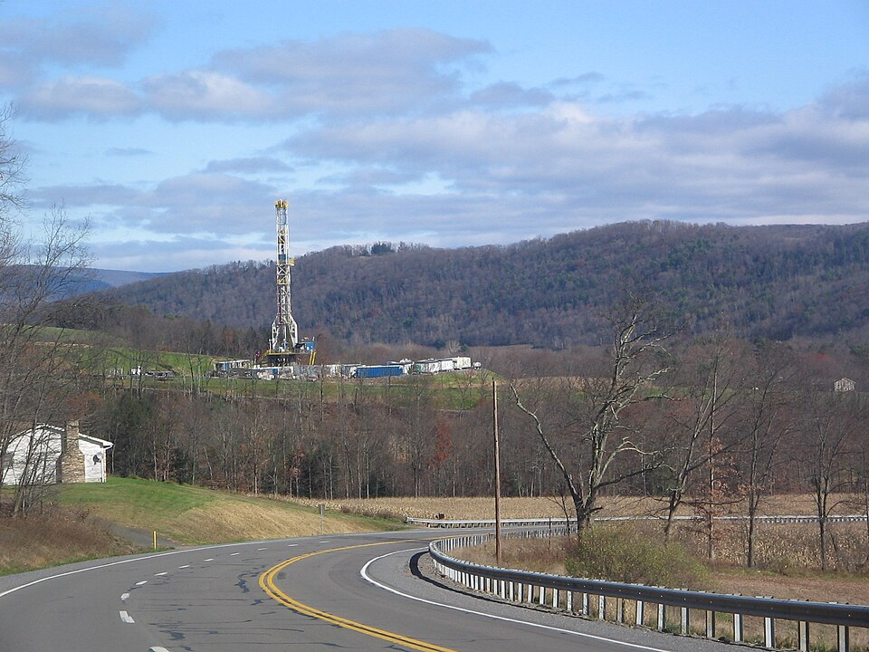

Figure 21-1: A horizontal drilling rig on a Marcellus Shale pad in Pennsylvania. The Marcellus and neighboring Utica shales turned Appalachia from a mature gas province into the largest gas basin in the United States. (Source: [Wikimedia Commons, photo by Ruhrfisch, CC BY-SA 4.0](https://commons.wikimedia.org/wiki/File:Marcellus_Shale_Gas_Drilling_Tower_1.jpg))

## Tight Oil and the Permian Basin

The application of shale techniques to oil came slightly later, beginning around 2010 in the Bakken formation of North Dakota and the Eagle Ford in south Texas. But it was the Permian Basin of west Texas and southeast New Mexico that became the epicenter of the tight oil revolution. The Permian is a geological anomaly: a thick stack of multiple productive formations, including the Wolfcamp, Bone Spring, Spraberry, Avalon, Dean, Barnett, and Woodford, layered on top of each other like a wedding cake. A single surface location can access half a dozen pay zones, which is why operators drill cube developments with multiple laterals stacked vertically off one pad.

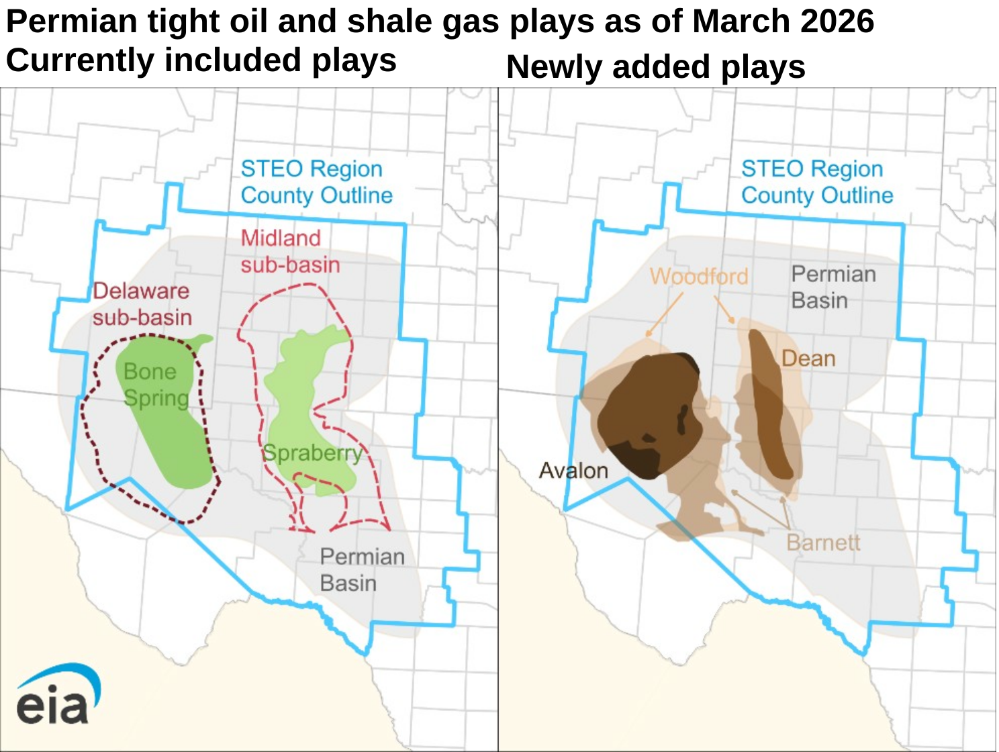

Figure 21-2: The Permian Basin's stacked plays: Wolfcamp, Bone Spring, Spraberry, Avalon, Barnett, Dean, and Woodford formations layered like a geological wedding cake. (Source: [EIA Today in Energy](https://www.eia.gov/todayinenergy/detail.php?id=67364), March 17, 2026)

US crude oil production rose from a low of 5.0 million barrels per day in 2008 to 13.2 million barrels per day in 2024 and a record 13.6 million barrels per day in 2025 per the EIA Short-Term Energy Outlook, surpassing both Saudi Arabia and Russia to become the world's largest producer. The Permian alone produces over 6 million barrels per day of crude, accounting for nearly half of total US output, according to the EIA Drilling Productivity Report. Combined with roughly 1.3 million barrels per day from the Bakken and 1.1 million barrels per day from the Eagle Ford, tight oil from three basins supplies more crude than any OPEC country except Saudi Arabia.

US Crude Oil Production, 1860 to 2025

Figure 21-3: 165 years of US crude oil production. Output climbed for a century before peaking at 9.6 million barrels per day in 1970, exactly as M. King Hubbert had predicted in 1956. A long decline followed, bottoming at 5.0 million barrels per day in 2008. Horizontal drilling and hydraulic fracturing then reversed the slide: production more than doubled to 13.6 million barrels per day by 2025, surpassing the Hubbert peak and making the US the world's largest crude producer. Source: EIA US field production of crude oil, annual.

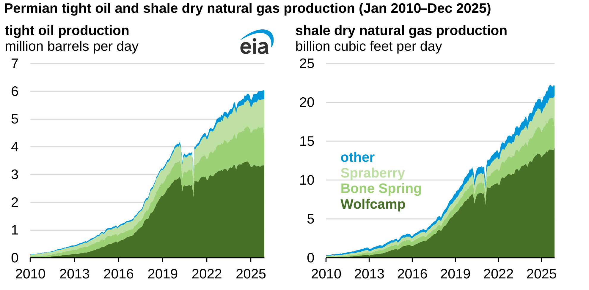

Figure 21-4: Permian Basin oil and gas production through 2026. The Permian alone now produces over 6 million barrels per day of crude oil, nearly half of total US output. (Source: [EIA Today in Energy](https://www.eia.gov/todayinenergy/detail.php?id=67364), March 17, 2026)

## The Basins

Each shale basin has its own geology, its own dominant product, and its own economics. Breakeven prices below are rough analyst estimates for core acreage at the wellhead; real numbers move with service costs, completion design, and differentials to benchmark hubs. Ranges synthesize Dallas Fed Energy Survey responses and Rystad analyst consensus as of Q1 2025.

| Basin | Formation age | State(s) | Primary product | Recent output | Core breakeven |
| --- | --- | --- | --- | --- | --- |
| Permian | Wolfcamp, Permian age | TX, NM | Oil and associated gas | 6.2 Mbpd | $35 to $45 per bbl |
| Bakken | Late Devonian to Early Mississippian | ND, MT | Light sweet oil | 1.3 Mbpd | $45 to $55 per bbl |
| Eagle Ford | Late Cretaceous | TX | Oil, condensate, gas | 1.1 Mbpd | $45 to $55 per bbl |
| Haynesville | Late Jurassic | LA, TX | Dry gas | 14-16 Bcf/d | $2.75 to $3.50 per MMBtu |
| Marcellus | Middle Devonian | PA, WV, OH | Dry gas and wet gas | 28-30 Bcf/d | $2.00 to $2.75 per MMBtu |
| Utica | Late Ordovician | OH, PA, WV | Dry gas and condensate | 7-8 Bcf/d | $2.25 to $3.00 per MMBtu |

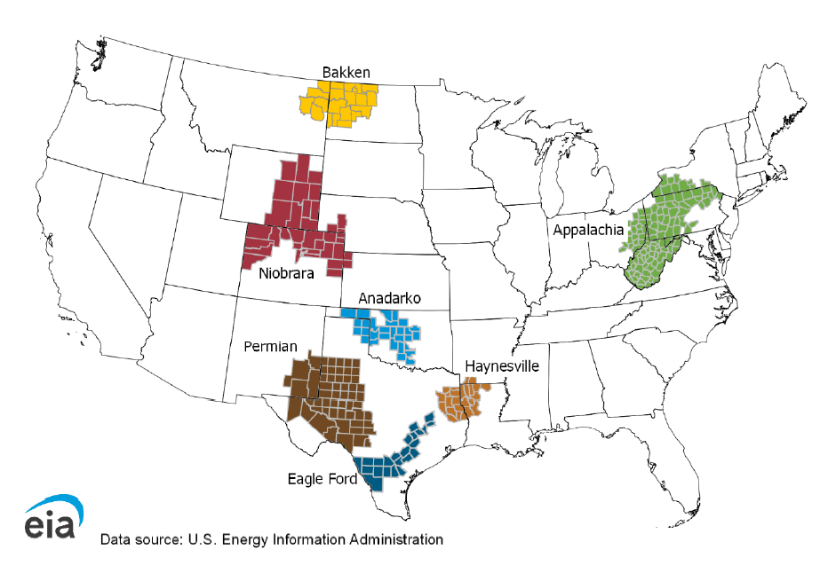

Figure 21-5: The seven regions tracked by the EIA Drilling Productivity Report. Oil-primary plays (Permian, Bakken, Eagle Ford, Niobrara) cluster in the southern Great Plains and northern Rockies. Gas-primary plays (Haynesville, Appalachia) anchor the Gulf Coast and the northeastern states. The Anadarko basin in Oklahoma straddles oil and gas. (Source: [EIA Drilling Productivity Report](https://www.eia.gov/petroleum/drilling/))

Figure 21-6: Permian, Bakken, and Eagle Ford Crude Production, 2010 to 2025 (Mbpd)

Permian Basin

Bakken (ND/MT)

Eagle Ford (TX)

Sources: EIA Drilling Productivity Report, EIA Tight Oil Production Estimates

The Permian dominates. The Bakken (North Dakota) and Eagle Ford (South Texas) led the early shale boom but both peaked and plateaued. The Permian Basin in West Texas and New Mexico, with its stacked pay zones and massive acreage, has grown continuously from under 1 Mbpd in 2010 to over 6 Mbpd in 2025, accounting for nearly half of total US crude production. Eagle Ford production has declined as operators prioritize the Permian’s better economics and longer lateral inventory. Illustrative annual data consistent with EIA reporting.

## The 2014 Price Collapse

OPEC initially underestimated shale. When US production began displacing OPEC barrels from the Atlantic Basin market, Saudi Arabia faced a choice: cut production to support prices, losing market share to shale, or maintain production and let prices fall, hoping to drive shale producers out of business. In November 2014, OPEC chose the latter. WTI crude fell from over $100 per barrel in mid-2014 to below $30 by early 2016.

The price war inflicted real damage. Over 100 US exploration and production companies filed for bankruptcy between 2015 and 2017. But the industry adapted. Drilling efficiency jumped: the time to drill a horizontal Permian well fell from around 30 days in 2013 to under 10 days by the early 2020s, and feet drilled per rig per year roughly tripled from 2014 levels as rigs got more powerful, bit design improved, and crews optimized pad drilling. Breakeven costs in core acreage dropped from $70 to $80 per barrel to $35 to $45. When prices recovered, shale production came roaring back, faster than OPEC anticipated.

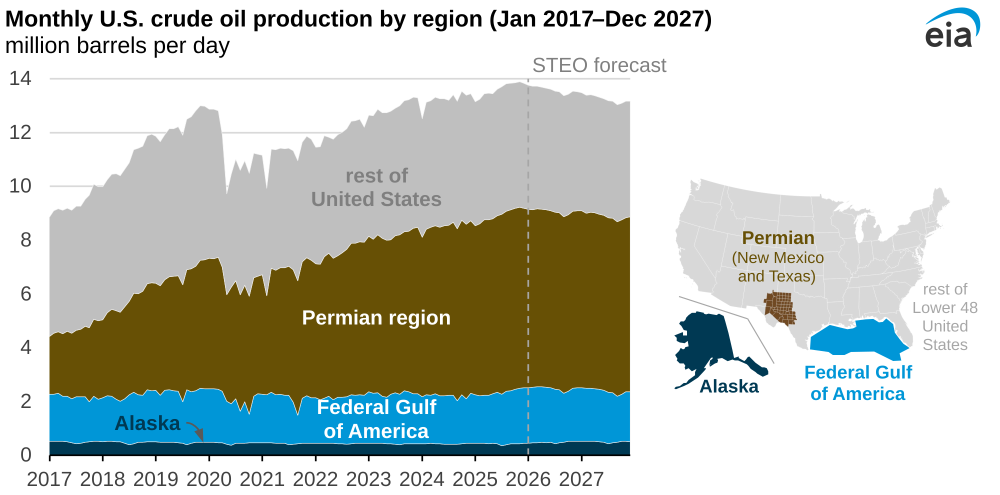

Figure 21-7: The EIA Short-Term Energy Outlook expects US crude production to hold near the 2025 record of 13.6 million barrels per day into 2026 and 2027, tempered by capital discipline and slower rig additions after the post-2014 price war. (Source: [EIA Today in Energy](https://www.eia.gov/todayinenergy/detail.php?id=67045), January 22, 2026)

## The Shale Treadmill

Shale wells have a distinctive production profile. Initial rates are high, often exceeding 1,000 barrels per day in the first month, but output declines steeply, typically by 60 to 70 percent in the first year and another 30 to 40 percent in the second. Producers must continuously drill new wells simply to hold production flat, a phenomenon the industry calls the shale treadmill. A mature conventional field in the Middle East might decline at 2 to 5 percent per year. A shale-dominated US production base would decline at roughly 40 percent per year without new drilling.

Shale vs Conventional Decline Curves (Illustrative)

Shale horizontalConventional vertical

The shale treadmill in one chart. Both wells start at 1,000 barrels per day in month one. The shale well follows a hyperbolic Arps decline, losing roughly two thirds of its rate in the first twelve months and settling into a long low-rate tail. The conventional well loses only 6 to 8 percent per year and is still producing several hundred barrels per day a decade later. Over 120 months the conventional well actually out-produces the shale well on a cumulative basis in this teaching example, which is why shale economics live or die on initial productivity, completion cost, and drilling pace rather than ultimate recovery per well.

## Laterals, Parent-Child Wells, and Drilling Efficiency

The single biggest efficiency gain in the shale era is lateral length. Average US horizontal laterals have grown from roughly 5,000 feet in 2010 to over 10,000 feet (roughly two miles) by 2024. Permian laterals now routinely exceed 12,000 feet. Longer laterals contact more reservoir rock per well without repeating the expensive vertical section, so the cost per barrel of recovery drops with every additional foot of lateral.

Average Horizontal Lateral Length by Basin, 2005 to 2025

Figure 21-8: Longer laterals, lower cost per barrel. Average horizontal lateral lengths have more than doubled since 2010 across all major US basins. Permian laterals now routinely exceed 12,000 feet (over two miles). Marcellus gas wells push even longer. Each additional foot of lateral contacts more reservoir rock without drilling a new vertical section, which is why lateral extension has been the single biggest driver of per-well cost reduction in the shale era. Source: EIA Drilling Productivity Report methodology and Enverus public data.

Rig efficiency reinforces the effect. The US now produces more oil with fewer rigs than in 2014 because each rig drills longer laterals faster. Days to drill a Permian horizontal well have fallen from over 30 in 2013 to under 10 by 2024. The rig count needed to hold production flat has dropped accordingly. This is the treadmill paradox: companies must keep drilling because of steep decline curves, but each new well is cheaper and more productive than the last.

North American Rig Share by Trajectory, 1991 to 2025

Figure 21-9: The shift from vertical to horizontal drilling. In 1991 fewer than one in ten active rigs drilled horizontal wells. By 2010 horizontal rigs overtook vertical rigs for the first time. By 2025 over 90 percent of North American rigs drill horizontally. This trajectory shift is the technological signature of the shale revolution: horizontal wells contact far more reservoir rock per wellbore than vertical holes, and they are the only way to economically produce tight formations. Source: Baker Hughes North America Rotary Rig Count.

When a producer drills the first well in a section, that is the parent. Subsequent wells drilled nearby in the same formation are children. Child wells often underperform parents because the parent's fractures have already drained nearby rock. Spacing optimization, how close to drill children, is one of the most contested technical questions in the Permian. Too close and new fractures communicate with old ones (frac hits), damaging both wells. Too far and reserves are stranded between the wellbores.

Modern shale is a manufacturing process, not exploration. Rigs move along a planned schedule across pre-permitted pad locations. Completions crews (frac fleets) follow the rigs on a separate schedule. A typical Permian operator runs two to three rigs and one to two frac crews continuously. The separation of drilling and completions into independent workflows is what makes shale scale like a factory.

A typical frac crew is 30 to 50 people operating 20 or more pump trucks, a hydration unit, a blender, and a wireline unit. Crew availability and cost are real constraints on activity levels, especially after the 2020 COVID layoffs thinned the experienced labor pool. In tight oil production, crews pump large amounts of water along with proppant and a small fraction of chemical additives into a well at high pressure to fracture the rock where the oil is contained. The process has been compared to manufacturing, with constant fracking machinery and crews moving along over a formation.

Lateral Wells from Surface Pads (Illustrative)

<svg aria-label="Top-down view of horizontal lateral wells radiating from four surface pads" class="w-full h-auto" role="img" style="max-height:420px" viewbox="-20 -20 260 260"><rect fill="none" height="200" stroke="hsl(var(--border))" stroke-width="1" width="200" x="0" y="0"></rect><line stroke="hsl(var(--border))" stroke-dasharray="4 3" stroke-width="0.5" x1="100" x2="100" y1="0" y2="200"></line><line stroke="hsl(var(--border))" stroke-dasharray="4 3" stroke-width="0.5" x1="0" x2="200" y1="100" y2="100"></line><text fill="hsl(var(--muted-foreground))" font-family="var(--font-inter)" font-size="9" text-anchor="middle" x="100" y="215">1 mile</text><text fill="hsl(var(--muted-foreground))" font-family="var(--font-inter)" font-size="9" text-anchor="end" transform="rotate(-90 -7 100)" x="-7" y="100">1 mile</text><line opacity="0.9" stroke="hsl(210, 60%, 50%)" stroke-linecap="round" stroke-width="1.8" x1="70" x2="258.6732382749518" y1="65" y2="48.49323054021626"></line><line opacity="0.9" stroke="hsl(210, 60%, 50%)" stroke-linecap="round" stroke-width="1.8" x1="70" x2="266.22016780594987" y1="65" y2="82.1670402381751"></line><line opacity="0.5" stroke="hsl(210, 60%, 50%)" stroke-linecap="round" stroke-width="1.8" x1="70" x2="263.1818181818182" y1="65" y2="64.99999999999999"></line><line opacity="0.9" stroke="hsl(145, 55%, 40%)" stroke-linecap="round" stroke-width="1.8" x1="70" x2="368.42659182188123" y1="65" y2="12.379340100930172"></line><line opacity="0.5" stroke="hsl(145, 55%, 40%)" stroke-linecap="round" stroke-width="1.8" x1="70" x2="387.07825381074883" y1="65" y2="120.90945114276165"></line><line opacity="0.5" stroke="hsl(0, 65%, 50%)" stroke-linecap="round" stroke-width="1.8" x1="70" x2="448.5571314466272" y1="65" y2="51.78049367329504"></line><line opacity="0.9" stroke="hsl(145, 55%, 40%)" stroke-linecap="round" stroke-width="1.8" x1="160" x2="-141.87718123992295" y1="55" y2="81.41083113565402"></line><line opacity="0.9" stroke="hsl(145, 55%, 40%)" stroke-linecap="round" stroke-width="1.8" x1="160" x2="-149.424110770921" y1="55" y2="27.928898085954746"></line><line opacity="0.9" stroke="hsl(0, 65%, 50%)" stroke-linecap="round" stroke-width="1.8" x1="160" x2="-231.68490176621913" y1="55" y2="124.06461611752911"></line><line opacity="0.5" stroke="hsl(0, 65%, 50%)" stroke-linecap="round" stroke-width="1.8" x1="160" x2="-256.6666666666667" y1="55" y2="55.00000000000008"></line><line opacity="0.5" stroke="hsl(0, 65%, 50%)" stroke-linecap="round" stroke-width="1.8" x1="160" x2="-287.6398877328219" y1="55" y2="-23.93098984860454"></line><line opacity="0.9" stroke="hsl(210, 60%, 50%)" stroke-linecap="round" stroke-width="1.8" x1="55" x2="244.3939393939394" y1="155" y2="155"></line><line opacity="0.9" stroke="hsl(210, 60%, 50%)" stroke-linecap="round" stroke-width="1.8" x1="55" x2="260.16828187754334" y1="155" y2="118.8232963193895"></line><line opacity="0.9" stroke="hsl(145, 55%, 40%)" stroke-linecap="round" stroke-width="1.8" x1="55" x2="394.6118288949133" y1="155" y2="184.71218502761076"></line><line opacity="0.5" stroke="hsl(145, 55%, 40%)" stroke-linecap="round" stroke-width="1.8" x1="55" x2="413.47915272240846" y1="155" y2="123.6371380264109"></line><line opacity="0.9" stroke="hsl(0, 65%, 50%)" stroke-linecap="round" stroke-width="1.8" x1="55" x2="509.26855773595264" y1="155" y2="170.8634075920458"></line><line opacity="0.5" stroke="hsl(0, 65%, 50%)" stroke-linecap="round" stroke-width="1.8" x1="55" x2="528.1964143082839" y1="155" y2="138.4756170916188"></line><line opacity="0.9" stroke="hsl(0, 65%, 50%)" stroke-linecap="round" stroke-width="1.8" x1="165" x2="-213.7878787878788" y1="160" y2="160.00000000000006"></line><line opacity="0.9" stroke="hsl(0, 65%, 50%)" stroke-linecap="round" stroke-width="1.8" x1="165" x2="-245.33656375508667" y1="160" y2="232.35340736122097"></line><line opacity="0.5" stroke="hsl(0, 65%, 50%)" stroke-linecap="round" stroke-width="1.8" x1="165" x2="-263.98822574395433" y1="160" y2="84.35780139508732"></line><line opacity="0.5" stroke="hsl(0, 65%, 50%)" stroke-linecap="round" stroke-width="1.8" x1="165" x2="-289.2685577359526" y1="160" y2="175.8634075920462"></line><line opacity="0.9" stroke="hsl(0, 65%, 50%)" stroke-linecap="round" stroke-width="1.8" x1="165" x2="-325.5504195148747" y1="160" y2="117.08239940456241"></line><line opacity="0.9" stroke="hsl(145, 55%, 40%)" stroke-linecap="round" stroke-width="1.8" x1="165" x2="-174.6118288949133" y1="160" y2="189.71218502761076"></line><line opacity="0.5" stroke="hsl(145, 55%, 40%)" stroke-linecap="round" stroke-width="1.8" x1="165" x2="-149.93388659989955" y1="160" y2="226.94126408905146"></line><g><circle cx="70" cy="65" fill="hsl(var(--foreground))" r="4"></circle><text fill="hsl(var(--foreground))" font-family="var(--font-inter)" font-size="9" font-weight="bold" text-anchor="middle" x="70" y="58">Pad <!-- -->A</text></g><g><circle cx="160" cy="55" fill="hsl(var(--foreground))" r="4"></circle><text fill="hsl(var(--foreground))" font-family="var(--font-inter)" font-size="9" font-weight="bold" text-anchor="middle" x="160" y="48">Pad <!-- -->B</text></g><g><circle cx="55" cy="155" fill="hsl(var(--foreground))" r="4"></circle><text fill="hsl(var(--foreground))" font-family="var(--font-inter)" font-size="9" font-weight="bold" text-anchor="middle" x="55" y="148">Pad <!-- -->C</text></g><g><circle cx="165" cy="160" fill="hsl(var(--foreground))" r="4"></circle><text fill="hsl(var(--foreground))" font-family="var(--font-inter)" font-size="9" font-weight="bold" text-anchor="middle" x="165" y="153">Pad <!-- -->D</text></g></svg>

2015 vintage (shorter)2020 vintage2023 vintage (longer)Full opacity = parent · Reduced = child

Figure 21-10: The factory floor, from above. Each line is a horizontal lateral drilled from a surface pad. Newer wells are longer, reflecting the efficiency gains of the 2020s. Parent wells (drilled first) are shown at full opacity; child wells (drilled later in the same section) are lighter. Illustrative layout based on typical Permian Basin spacing patterns.

Figure 21-11: Permian Drilling Efficiency, 2010 to 2025

Days spud to total depth (left, falling)

Thousand feet drilled per rig per year (right, rising)

Sources: EIA Drilling Productivity Report, Enverus, operator investor presentations

Shale drilling has become a manufacturing process. In 2010, drilling a Permian horizontal well took over 30 days. By 2025, the same well (with a longer lateral) takes under 9 days. Feet drilled per rig per year have risen fivefold. The efficiency gains come from walking rigs that move between pad locations without disassembly, simultaneous operations (simul-frac), longer laterals that produce more oil per wellbore, and continuous improvement in bit design and drilling fluids. The result: the US can sustain higher production with fewer rigs. Illustrative annual data consistent with EIA and operator reporting.

## Tight Oil Breakevens and the Global Marginal Cost of Supply

Since 2009, tight oil production from Texas and North Dakota has reversed a long-term decline in US oil production. US crude output bottomed at roughly 5 million barrels per day in 2008 and reached 13.6 million barrels per day by 2025. This added roughly 8.6 million barrels per day of supply to the global market, and tight oil resources added an estimated 10 to 15 percent to global technically recoverable oil resources.

The cost of producing tight oil has become the global marginal cost of supply: the price of the highest-cost barrel the world needs to meet demand. Full-cycle breakevens (including land acquisition, drilling, completion, infrastructure, and overhead) vary by basin:

| Basin | Full-cycle breakeven | Half-cycle breakeven |
| --- | --- | --- |
| Permian (Midland) | $61 per bbl | $35 to $45 per bbl |
| Permian (Delaware) | $62 per bbl | $35 to $45 per bbl |
| Bakken | $65 per bbl | $45 to $55 per bbl |
| Eagle Ford | $62 per bbl | $45 to $55 per bbl |
| Haynesville (gas) | $2.50 to $3.50 per MMBtu | $1.50 to $2.50 per MMBtu |

Full-cycle costs include everything needed to bring a new well to production from scratch: land, permitting, drilling, completions, facilities, and corporate overhead. The Dallas Fed Energy Survey, the primary source for breakeven tracking, reports a US average of $65 per barrel for new wells. Half-cycle costs cover only drilling and completing a well on an existing lease, and run $10 to $15 per barrel lower.

Before the shale revolution, the marginal barrel came from conventional mega-projects (deepwater, oil sands, Arctic) with five- to ten-year lead times. Prices could overshoot for years because supply could not respond. Tight oil is short-cycle: six to twelve months from investment decision to first oil. This compressed the price cycle. When prices fall below tight oil breakevens, US drilling slows, supply falls, and prices recover. When prices rise, rigs return within quarters. This self-correcting mechanism is why oil prices have been roughly range-bound between $50 and $90 since 2016.

The Dallas Fed Energy Survey, conducted quarterly, asks US oil executives what WTI price they need to profitably drill a new well. The survey is the standard reference for breakeven price tracking and is published by the Federal Reserve Bank of Dallas.

US Tight Oil by Basin (2024)

US Shale Nat Gas Basins (2024)

Tight Oil by Basin (Mbpd)

Shale Nat Gas by Basin (Bcf/d)

Figure 21-12: The Permian dominates tight oil; Appalachia dominates shale gas. The Permian Basin alone accounts for 63 percent of US tight oil production. In natural gas, the Marcellus and Utica shales of Appalachia produce 36 percent, but the Permian is the second-largest source at 26 percent through associated gas produced alongside tight oil. Source: EIA Drilling Productivity Report, 2024 data.

## Lifting the Crude Export Ban

For forty years, US law forbade the export of domestic crude oil. The ban was written in 1975 in response to the 1973 Arab oil embargo and stayed on the books long after the strategic logic had inverted. By 2014 the shale boom had trapped a glut of light sweet crude on the Gulf Coast, where many refineries were configured to run heavier imported grades. Domestic light crude traded at steep discounts to world prices, and producers lobbied hard for relief. In December 2015, Congress lifted the ban as part of an omnibus spending bill. US crude exports were effectively zero before the ban was lifted. By 2024 they had reached roughly 4.1 million barrels per day, flowing to refiners in Europe, Asia, and Latin America, and making the United States one of the largest seaborne crude suppliers in the world.

Figure 21-13: US Crude Oil Exports, 2014 to 2025 (Million Barrels per Day)

Sources: EIA Petroleum Supply Monthly, US Census Bureau

From zero to 4 million barrels per day in under a decade. Before Congress lifted the 40-year export ban in December 2015, US crude exports were essentially zero. The Permian Basin produced far more light sweet crude than Gulf Coast refineries (many configured for heavier imports) could absorb, driving steep domestic discounts. Once exports opened, Permian barrels flowed to Europe, Asia, and Latin America. By 2024, the US was one of the world’s largest seaborne crude suppliers. Illustrative annual data consistent with EIA reporting.

## Consolidation and the Chevron-Hess Deal

By the mid-2020s, shale had matured. Explosive growth gave way to capital discipline, as public companies prioritized free cash flow and shareholder returns over production growth. Mergers and acquisitions accelerated: ExxonMobil acquired Pioneer Natural Resources in 2024 for roughly $60 billion, Diamondback absorbed Endeavor Energy Resources, Occidental bought CrownRock, and ConocoPhillips acquired Marathon Oil. The consolidation wave signaled that the best acreage was finite, and the industry was entering a later phase of development.

The capstone deal was Chevron's $53 billion all-stock acquisition of Hess Corporation, valued at roughly $60 billion including assumed debt and announced in late 2023. The deal was held up for more than a year by an arbitration dispute with ExxonMobil and CNOOC, Hess's partners in the Stabroek block offshore Guyana, one of the largest deepwater oil discoveries of the century. Exxon and CNOOC argued that they held a right of first refusal over the Hess stake; Chevron and Hess argued the right did not apply to a corporate change of control. The arbitration panel heard the case in May 2025 and ruled in Chevron's favor, and Chevron reported the transaction closed on July 18, 2025. With the close, Chevron inherited Hess's 30 percent working interest in the Stabroek block alongside its North Dakota Bakken position. Guyana is a conventional deepwater asset rather than a shale play, but the deal underscored how quickly the US independents that built the shale revolution were being absorbed by the majors.

Today, producers actively hedge their future production with swaps, collars, and three-way structures to lock in prices and protect cash flows against the inherent volatility of commodity markets. The hedge book is now a standard disclosure for every publicly traded US independent, and it is one reason the shale base is more resilient to price shocks than it was during the 2014 to 2016 collapse.

Shale turned conventional wisdom on its head. The US was supposed to be a depleting oil province. Instead, it became the world's swing producer, able to ramp output up or down within months rather than years. Geopolitical consequences are still unfolding, and [Chapter 22 (OPEC+)](#chapter-opec-plus), [Chapter 23 (Negative Prices)](#chapter-negative-prices), and [Chapter 24 (US LNG)](#chapter-us-lng) trace them through the birth of OPEC+, the April 2020 negative price day, and the rise of US LNG.

Morgan Downey’s Commodity News

### Read what a commodity trader reads

A free morning brief on the oil, gas, and commodity markets, written by Morgan Downey, author of Oil 101. One email, every morning.

[Subscribe free →](https://boxwoodapp.com/news/subscribe)

<!-- rl-section id="chapter-opec-plus" class="chapter" kicker="Chapter 22" title="OPEC+" -->

## OPEC+

Chapter 22

# OPEC+

OPEC+ explained: the Saudi-Russia alliance, production cuts, price wars, spare capacity management, and quota politics since 2016.

<svg fill="none" height="18" stroke="currentColor" stroke-linecap="round" stroke-linejoin="round" stroke-width="2" viewbox="0 0 24 24" width="18"><path d="M3 18v-6a9 9 0 0 1 18 0v6"></path><path d="M21 19a2 2 0 0 1-2 2h-1a2 2 0 0 1-2-2v-3a2 2 0 0 1 2-2h3zM3 19a2 2 0 0 0 2 2h1a2 2 0 0 0 2-2v-3a2 2 0 0 0-2-2H3z"></path></svg>Listen· 21:45

## From OPEC to OPEC+

For over fifty years, OPEC operated as the sole cartel managing global oil supply. Founded in Baghdad in September 1960 by Saudi Arabia, Iran, Iraq, Kuwait, and Venezuela, it grew through the 1960s and 1970s into a thirteen-member organization controlling roughly 35 to 40 percent of world crude production. By the mid-2010s, that share was no longer enough. The 2014 to 2016 price war against US shale had failed to break its competitor. Non-OPEC supply, led by Russia, was at record levels. Brent and WTI languished below 50 dollars per barrel, and member states burned through foreign exchange reserves to fund budgets built on 80-dollar oil.

The answer came on December 10, 2016, at the 171st OPEC Ministerial Meeting in Vienna. OPEC's fourteen members at the time signed a formal accord with eleven non-OPEC producers called the Declaration of Cooperation, or DoC. Under the DoC, participating countries agreed to reduce crude output by roughly 1.8 million barrels per day effective January 1, 2017. The twenty-five nation group controlled around 55 percent of global production, and the informal label "OPEC+" entered the market lexicon immediately. The DoC was not a treaty and had no enforcement mechanism beyond reputational pressure and the monthly oversight of a new Joint Ministerial Monitoring Committee, but it rewired supply management for the rest of the decade.

Russia's participation was the pivot. Moscow had attended OPEC meetings as an observer since the 1980s but had never agreed to coordinate production. Fiscal arithmetic drove the partnership: roughly one third of Russian federal budget revenues came from oil and gas taxation, and sustained sub-50-dollar prices threatened macroeconomic stability. Saudi Crown Prince Mohammed bin Salman and Russian President Vladimir Putin became the political backbone of OPEC+, with Saudi Energy Minister Prince Abdulaziz bin Salman and Russian Deputy Prime Minister Alexander Novak as operational counterparts.

Figure 22-1: OPEC headquarters at Helferstorferstraße 17 in central Vienna, completed in 2009. OPEC's secretariat has been in Vienna since 1965, and the Declaration of Cooperation with ten non-OPEC producers was signed in this building on December 10, 2016. (Source: [C.Stadler/Bwag / Wikimedia Commons (CC BY-SA 4.0)](https://commons.wikimedia.org/wiki/File:Wien_-_OPEC-Zentrale_(a).JPG))

## Who Is in the Room

Angola announced its exit from OPEC on December 21, 2023, and left effective January 1, 2024, bringing OPEC back to twelve members. Ecuador, Qatar, and Indonesia had previously departed in 2020, 2019, and 2016 respectively. The remaining twelve OPEC members, their year of joining, and their capitals are set out below, along with rough 2024 to 2025 crude output figures. Production levels are approximate averages drawn from OPEC's Monthly Oil Market Report secondary sources and EIA estimates; monthly figures move around these annual averages.

| Country | Joined | Capital | 2025 crude output (Mbpd) |
| --- | --- | --- | --- |
| Saudi Arabia | 1960 (founder) | Riyadh | 9.0 |
| Iraq | 1960 (founder) | Baghdad | 4.2 |
| Iran | 1960 (founder) | Tehran | 3.3 |
| UAE | 1967 | Abu Dhabi | 3.3 |
| Kuwait | 1960 (founder) | Kuwait City | 2.5 |
| Venezuela | 1960 (founder) | Caracas | 0.9 |
| Nigeria | 1971 | Abuja | 1.4 |
| Algeria | 1969 | Algiers | 0.9 |
| Libya | 1962 | Tripoli | 1.2 |
| Gabon | 1975 / 2016 | Libreville | 0.2 |
| Equatorial Guinea | 2017 | Malabo | 0.05 |
| Republic of Congo | 2018 | Brazzaville | 0.25 |

The non-OPEC half of OPEC+ originally numbered ten or eleven producers under the December 2016 DoC. The practical list has shifted since then, but the active roster of non-OPEC cooperating countries is shown below. Russia and Kazakhstan are by far the largest, and together they represent the bulk of non-OPEC production under the agreement.

| Country | 2025 crude output (Mbpd) | Quota status |
| --- | --- | --- |
| Russia | 9.0 | Full quota, uneven compliance |
| Kazakhstan | 1.8 | Full quota, chronic overproduction |
| Azerbaijan | 0.5 | Quota participant |
| Oman | 0.75 | Quota participant |
| Bahrain | 0.15 | Quota participant |
| Brunei | 0.08 | Quota participant |
| Malaysia | 0.35 | Quota participant |
| Sudan | 0.05 | Quota participant |
| South Sudan | 0.15 | Quota participant |
| Mexico | 1.6 | Left active cooperation after 2020 agreement |

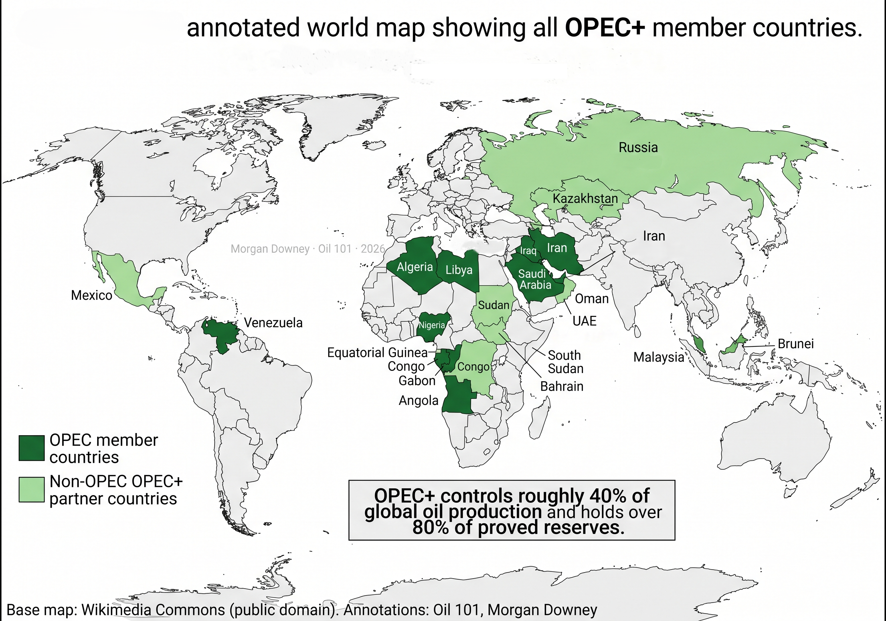

Figure 22-2: OPEC+ member countries. The 13 OPEC members (dark green) and 10 non-OPEC partners (light green) together control roughly 40% of global oil production. Saudi Arabia and Russia are the two largest producers. (Source: Base map: Wikimedia Commons (public domain). Annotations: Oil 101, Morgan Downey)

## Spare Capacity as the Swing Variable

Everything OPEC+ does ultimately runs through one number: effective spare capacity. This is the volume of crude a producer can bring online within 30 days and sustain for at least 90 days without touching strategic reserves. It is the buffer the world has against geopolitical shocks. Historically it is concentrated in Saudi Arabia, which typically holds between 1.5 and 3 million barrels per day of usable spare capacity against a sustainable ceiling near 12 million barrels per day. The UAE, Kuwait, and Iraq hold smaller shares; most other members run essentially flat out.

OPEC Effective Spare Crude Capacity, 2000 to 2025

The swing variable. OPEC effective spare capacity is the buffer between what the cartel can produce and what it chooses to produce. Spare capacity collapsed below 1 million barrels per day during the 2005 to 2008 super-cycle, the period that ended with WTI near 147 dollars in July 2008. It rebuilt during the post-crisis years, compressed again after 2014, and then spiked above 5 million barrels per day in 2020 as COVID destroyed demand and OPEC+ cut 9.7 million barrels per day in April. From 2023 onward, stacked voluntary Saudi cuts have kept headline spare capacity elevated at roughly 4 to 5 million barrels per day, most of it held by Saudi Arabia. Source: EIA Short-Term Energy Outlook historical series on OPEC surplus crude oil production capacity, annual averages, rounded to one decimal.

Three episodes define the modern spare-capacity story. In the 2005 to 2008 super-cycle, OPEC spare capacity collapsed below 1 million barrels per day as Chinese demand surged and no one invested. There was no real buffer left, and WTI ran to roughly 147 dollars in July 2008. In March and April 2020, the COVID demand collapse did the opposite: it destroyed around 20 million barrels per day of consumption almost overnight, forced OPEC+ into the largest cut in history, and pushed effective spare capacity above 5 million barrels per day. Since mid-2023, Saudi Arabia has stacked voluntary unilateral cuts on top of the group quota, holding production at roughly 9 million barrels per day against capacity closer to 12 million. That keeps headline spare capacity at 4 to 5 million barrels per day on paper, but much of it is being used as a price-management tool rather than a disruption buffer.

## Quotas, Baselines, and Compliance

OPEC+ quotas are defined as reductions from a baseline. The baseline matters more than the cut itself, because a high baseline gives a country room to sell more barrels even under a nominally tight agreement. Baselines are renegotiated periodically and are a constant source of friction. The UAE, which had spent heavily to raise capacity toward 5 million barrels per day, pushed hard for a higher baseline and won an increase to 3.519 million barrels per day in the June 2023 agreement. Iraq and Kazakhstan are the two persistent overproducers; both countries rely on foreign operators under production-sharing contracts and have limited ability to shut in producing wells without contractual disputes.

Monitoring is done by the Joint Ministerial Monitoring Committee, which meets monthly and reviews data from the OPEC Secretariat, the IEA, and the EIA. The three bodies often publish meaningfully different numbers, particularly on demand, which gives members room to argue for either tighter or looser policy depending on their own budget needs. When a country is found to have overproduced, OPEC+ assigns compensation cuts in subsequent months. Compliance has always been imperfect, but under the post-2020 framework it has improved enough to make the headline agreements credible to the market.

## Key Moments of OPEC+

| Date | Event |
| --- | --- |
| Dec 10, 2016 | Declaration of Cooperation signed in Vienna; 1.8 Mbpd cut |
| Mar 6, 2020 | Russia rejects deeper cuts; Saudi-Russia partnership breaks |
| Mar 8, 2020 | Saudi Arabia slashes official selling prices, launches price war |
| Apr 12, 2020 | OPEC+ agrees to 9.7 Mbpd cut, largest in history, effective May 1 |
| Apr 20, 2020 | May WTI settles at minus 37.63 dollars per barrel |
| Jul 2021 | Gradual unwind begins at 400 kbpd per month |
| Oct 5, 2022 | OPEC+ announces nominal 2 Mbpd cut |
| Apr 2023 | Voluntary cuts begin, stacked on top of group quota |
| Jun 2023 | UAE baseline raised to 3.519 Mbpd for 2024 |
| Jul 2023 | Saudi Arabia adds unilateral 1 Mbpd voluntary cut |
| Dec 21, 2023 | Angola announces exit from OPEC, effective January 1, 2024 |
| 2025 | Gradual unwind of voluntary cuts begins; pace repeatedly adjusted |

## The 2020 Price War

OPEC+'s wildest episode ran five weeks. On March 6, 2020, as COVID-19 spread globally and oil demand collapsed, Russia refused Saudi Arabia's proposal for an additional 1.5 million barrels per day of cuts. Two days later, on March 8, Saudi Arabia retaliated by slashing its official selling prices by the largest amount in twenty years and announcing plans to raise output toward 12.3 million barrels per day. Russia matched the move. Layered on top of a pandemic that would destroy roughly 20 million barrels per day of demand at its worst point, the price war sent WTI from the mid-40s in late February to minus 37.63 dollars on April 20, 2020, when the expiring May contract had no physical buyer willing to take delivery.

Under intense pressure from the Trump administration, which watched its own shale sector head toward mass bankruptcy, OPEC+ reconvened and on April 12, 2020 agreed to the largest production cut in history: 9.7 million barrels per day, effective May 1. The deal nominally ran through April 2022 with step-downs, and was buttressed informally by market-driven declines in the US, Canada, and Brazil that OPEC counted toward the overall reduction. The unwind was deliberately slow. Starting in mid-2021, OPEC+ added back roughly 400,000 barrels per day per month, a pace that lagged the demand recovery and helped push Brent back toward 120 dollars when Russia invaded Ukraine in February 2022.

## Saudi Arabia, Aramco, and Ghawar

OPEC+ is ultimately a Saudi-led institution, and the Saudi contribution flows from one field more than any other. Ghawar, in the Eastern Province, is the largest conventional oil field ever discovered. For decades its maximum sustained output was widely assumed to be above 5 million barrels per day. The Saudi Aramco bond prospectus published in April 2019 put the actual maximum at 3.8 million barrels per day, lower than market consensus and a reminder that even the world's greatest field is not infinite. Aramco confirmed 48.25 billion barrels of liquid reserves as of December 2018 in the same document.

Saudi Aramco listed 1.5 percent of its shares on the Tadawul exchange in December 2019 at a valuation of roughly 1.7 trillion dollars, making it briefly the largest IPO in history and the most valuable listed company in the world. The listing formalized what had long been true in practice: Aramco's production and investment decisions are set by the Saudi state, and OPEC+ policy is downstream of Saudi fiscal policy. Vision 2030, the Kingdom's diversification program, requires high oil revenues to fund Neom, the Red Sea project, and the rest of the giga-projects. IMF Article IV estimates of Saudi Arabia's fiscal breakeven climbed from the mid-70s in the late 2010s to roughly 90 dollars per barrel for 2024 and 2025, excluding transfers from the Public Investment Fund. That number explains more about OPEC+ production policy than any public statement.

## Russia After the Invasion

Russia's role in OPEC+ was complicated, then redefined, by the February 2022 invasion of Ukraine. On December 5, 2022, the European Union's ban on seaborne imports of Russian crude took effect, and on the same day the G7 and allies imposed a 60 dollar per barrel price cap on Russian crude carried by G7-linked shipping, insurance, and finance. The cap was designed to keep Russian barrels flowing to the global market, specifically to avoid the supply shock that a full embargo would have produced, while squeezing Russian export revenues. A similar cap on Russian refined products followed on February 5, 2023.

Russian exports were redirected, not reduced. Urals crude traded at wide discounts to Brent through 2023, then narrowed as shipping routes adapted. ESPO blend, loaded at Kozmino on the Pacific, went almost entirely to China. Most western-bound Urals exports were replaced by sales to India, where refiners bought deeply discounted cargoes, processed them, and re-exported refined products into Europe. A shadow fleet of older tankers operating outside G7 insurance built up rapidly, carrying a growing share of Russian barrels at prices above the cap. Through all of this, Russia remained an active OPEC+ member. Compliance on the agreed cuts was uneven, but the political commitment to the Saudi partnership held.

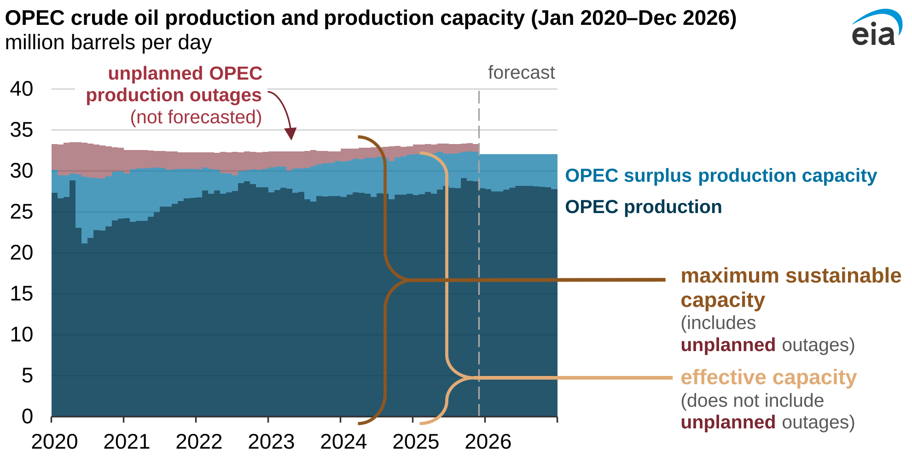

Figure 22-3: OPEC production versus estimated sustainable capacity. The vertical gap between the two series is spare capacity, which OPEC+ can deploy to manage market balance. Most of it sits in Saudi Arabia. (Source: [EIA Today in Energy](https://www.eia.gov/todayinenergy/detail.php?id=66904), December 19, 2025)

Figure 22-4: OPEC Share of Global Crude Production, 1970 to 2025

Sources: OPEC Annual Statistical Bulletin, Energy Institute Statistical Review. Illustrative annual averages.

## The Strategic Calculus

OPEC+'s problem in the mid-2020s is the old problem in a new coat: price support versus market share. Every dollar of price support incentivizes more US shale drilling, more deepwater investment in Guyana and Brazil, more Canadian oil sands expansion, and faster EV adoption. Cutting too aggressively risks structural loss of demand. Cutting too little risks fiscal crises in member states built on 80-dollar-plus oil. Saudi Arabia in particular is caught between the Vision 2030 breakeven and the knowledge that the last time it tried to defend market share against shale, in 2014 to 2016, it burned through hundreds of billions of dollars of foreign reserves and eventually reversed course.

The hedging behavior of US producers sharpens the dilemma. When US shale operators lock in forward prices through swaps, collars, and three-way structures, they insulate their cash flows from OPEC-driven declines. A 2015-style price war would work more slowly against a hedged, debt-light, consolidated shale industry than it did against the over-levered pre-2015 version. That reality pushes OPEC+ toward price management rather than market-share warfare, and it explains why the alliance has chosen repeated voluntary cuts over a repeat of the 2014 shale battle.

> "OPEC+ is not just about oil. It is the most consequential geopolitical partnership between the Middle East and Russia since the Cold War."

OPEC+ is a broader supply-management framework than OPEC alone. Its durability depends on whether the Saudi-Russian partnership can withstand divergent national interests, demand uncertainty, and the relentless growth of non-OPEC supply from shale, Guyana, and Brazil.

Morgan Downey’s Commodity News

### Read what a commodity trader reads

A free morning brief on the oil, gas, and commodity markets, written by Morgan Downey, author of Oil 101. One email, every morning.

[Subscribe free →](https://boxwoodapp.com/news/subscribe)

<!-- rl-section id="chapter-negative-prices" class="chapter" kicker="Chapter 23" title="When Oil Went Negative" -->

## When Oil Went Negative

Chapter 23

# When Oil Went Negative

When oil went negative: April 20, 2020, WTI at minus $37.63, Cushing storage limits, and what it revealed about physical futures.

<svg fill="none" height="18" stroke="currentColor" stroke-linecap="round" stroke-linejoin="round" stroke-width="2" viewbox="0 0 24 24" width="18"><path d="M3 18v-6a9 9 0 0 1 18 0v6"></path><path d="M21 19a2 2 0 0 1-2 2h-1a2 2 0 0 1-2-2v-3a2 2 0 0 1 2-2h3zM3 19a2 2 0 0 0 2 2h1a2 2 0 0 0 2-2v-3a2 2 0 0 0-2-2H3z"></path></svg>Listen· 19:29

## The Unthinkable Happens

On Monday, April 20, 2020, the May 2020 WTI crude oil futures contract settled at negative $37.63 per barrel. Sellers paid buyers thirty-seven dollars for each barrel they would take away. It was the first time in the 37-year history of crude futures that the benchmark North American contract printed a negative number, and the intraday low touched roughly negative $40.32 before the settlement window closed. Oil, the most traded physical commodity on Earth, had briefly become a liability rather than an asset.

The event was not a glitch. Every trade that afternoon cleared. Every long who held past the close owed real money and every short who held through expiry collected it. The negative print was the honest output of a market where the physical delivery mechanism ran head first into a wall of full storage tanks, and a handful of financial holders who could not, and in some cases legally could not, take delivery of crude at Cushing, Oklahoma. To understand how finance was forced to pay physics, four pieces have to fit together: the WTI delivery mechanism, the Cushing storage picture, the COVID demand shock, and a small rulebook change at the clearing house made two weeks earlier.

WTI Front Month Daily Settlement, April 13 to 22, 2020

<svg viewBox="0 0 800 360" width="100%" height="100%" xmlns="http://www.w3.org/2000/svg" class="wti-negative-svg">
  
  <line class="grid-line" x1="60" y1="285.0" x2="760" y2="285.0" /><text class="axis-text" x="48" y="289.0" text-anchor="end">$-40</text><line class="grid-line" x1="60" y1="215.0" x2="760" y2="215.0" /><text class="axis-text" x="48" y="219.0" text-anchor="end">$-20</text><line class="grid-line" x1="60" y1="145.0" x2="760" y2="145.0" /><text class="axis-text" x="48" y="149.0" text-anchor="end">$0</text><line class="grid-line" x1="60" y1="75.0" x2="760" y2="75.0" /><text class="axis-text" x="48" y="79.0" text-anchor="end">$20</text>
  <line class="zero-line" x1="60" y1="145.0" x2="760" y2="145.0" />
  <path class="price-line" d="M 60.0,66.565 L 160.0,74.61500000000001 L 260.0,75.455 L 360.0,75.455 L 460.0,81.055 L 560.0,276.705 L 660.0,109.965 L 760.0,96.77" />
  <circle cx="60.0" cy="66.565" r="4" fill="#6366f1" /><text class="axis-text" x="60.0" y="340" text-anchor="middle">Apr 13</text><circle cx="160.0" cy="74.61500000000001" r="4" fill="#6366f1" /><text class="axis-text" x="160.0" y="340" text-anchor="middle">Apr 14</text><circle cx="260.0" cy="75.455" r="4" fill="#6366f1" /><text class="axis-text" x="260.0" y="340" text-anchor="middle">Apr 15</text><circle cx="360.0" cy="75.455" r="4" fill="#6366f1" /><text class="axis-text" x="360.0" y="340" text-anchor="middle">Apr 16</text><circle cx="460.0" cy="81.055" r="4" fill="#6366f1" /><text class="axis-text" x="460.0" y="340" text-anchor="middle">Apr 17</text><circle cx="560.0" cy="276.705" r="4" fill="#ef4444" /><text class="callout-text" x="560.0" y="296.705" text-anchor="middle" fill="#ef4444" font-weight="bold">-$37.63</text><text class="axis-text" x="560.0" y="340" text-anchor="middle">Apr 20</text><circle cx="660.0" cy="109.965" r="4" fill="#6366f1" /><text class="axis-text" x="660.0" y="340" text-anchor="middle">Apr 21</text><circle cx="760.0" cy="96.77" r="4" fill="#6366f1" /><text class="axis-text" x="760.0" y="340" text-anchor="middle">Apr 22</text>
</svg>

The week oil went negative. The May 2020 WTI contract drifted through the teens in the days leading up to expiry, then broke below zero on Monday April 20 and settled at negative $37.63 per barrel, its intraday low near negative $40.32. The June contract, by contrast, closed the same day above $20, producing the widest calendar spread in the 37-year history of WTI futures. By Tuesday the replacement front month was trading in double digits again, but the lesson about physical delivery mechanics had been delivered. Settlement values from EIA and Reuters market reports for the April 13 to 22, 2020 window.

## The WTI Delivery Mechanism

The WTI crude oil futures contract, traded under the symbol CL, specifies physical delivery of 1,000 barrels of West Texas Intermediate crude oil into Cushing, Oklahoma during the delivery month. The last trading day for a given contract month is the third business day before the 25th of the month preceding delivery. For the May 2020 contract, that was Tuesday April 21, 2020. Monday April 20 was therefore the penultimate trading day, the final full session before the contract rolled off the board.

Nearly all WTI volume is financial. Hedge funds, commodity index products, and retail ETFs have no trucks, no tanks, and no pipeline nominations at Cushing. In a normal month, roughly 99 percent of open interest is closed out or rolled forward well before first notice day. Traders sell the expiring contract and buy the next month, capturing or paying the calendar spread. A long who carries a position into final settlement is legally obligated to take delivery: nominate a receiving facility, arrange a ratable thirty day pipeline schedule through Cushing, and wire the full notional to the seller. No facility, no schedule, no plan, and the only remaining option is to sell at whatever price the screen shows.

## Cushing: The Pipeline Crossroads With a Ceiling

Cushing is a town of roughly 7,500 people in northern Oklahoma that sits at the intersection of more than 5,000 miles of crude oil pipeline. Inbound lines bring barrels from the Permian in West Texas, the Bakken in North Dakota, and Canadian heavy through the Keystone system. Outbound lines such as Seaway and Marketlink move crude south to the Gulf Coast refining complex. Between the pipes sits tank farm after tank farm of floating-roof storage. EIA tracks Cushing working storage capacity at roughly 76 million barrels, against a total shell capacity near 91 million barrels, where shell is the bare geometric volume and working capacity subtracts the minimum heels and rotation allowances that keep tanks operable. In practice, the operational ceiling is lower still, because tanks cannot all be filled at once without losing the ability to rotate barrels through the hub.

Through the first quarter of 2020, inventories at Cushing climbed from roughly 35 million barrels in January toward 60 million barrels by mid-April. The remaining working capacity was already under lease. A trader looking in mid-April 2020 for a spare tank to take May delivery would have been told there was none, at any price.

Figure 23-1: Cushing Storage Utilization, January to June 2020

Source: EIA Weekly Petroleum Status Report. Cushing working capacity approximately 76 million barrels. Illustrative weekly data.

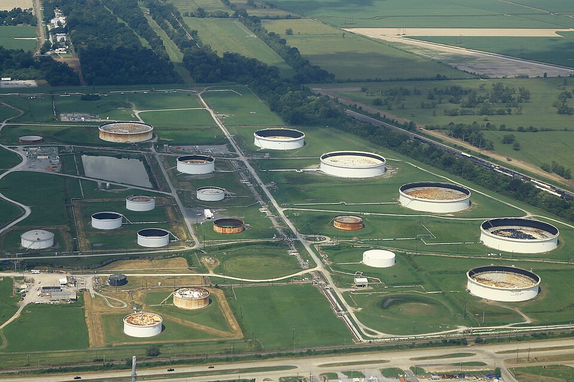

Figure 23-2: Petroleum storage tanks in Louisiana. By mid-April 2020, commercial crude storage across the United States was approaching operational capacity limits, leaving traders with expiring futures contracts and nowhere to put the oil. (Source: [formulanone / Wikimedia Commons (CC BY-SA 2.0)](https://commons.wikimedia.org/wiki/File:Exxon-Mobil_Storage_Tanks_(50886468813).jpg))

## The Pandemic Demand Shock

COVID-19 hit global oil demand with a speed and severity the industry had never seen. By April 2020, worldwide consumption had fallen by roughly 20 million barrels per day from pre-pandemic levels near 100 million bpd, with peak weeks estimated near 25 to 30 million bpd down. Governments locked down economies. Airlines grounded fleets. Road traffic evaporated. In the US, gasoline demand fell by about half in a matter of weeks. At the same time, the Saudi-Russia price war begun in March had flooded the market with supply. On March 6, 2020 OPEC+ failed to agree on new cuts, Saudi Arabia slashed its April official selling prices on March 8 and announced plans to lift output toward 12.3 million bpd, and Russia signaled it would match barrel for barrel. On April 12, 2020 the group reversed course with an emergency 9.7 million bpd cut, but the storage tide was already rising faster than the cut could drain it.

Figure 23-3: Daily front-month WTI crude oil futures settlement prices around the April 20, 2020 negative print. The May 2020 contract settled at negative $37.63 per barrel on its penultimate trading day, with intraday lows near negative $40.32. (Source: [EIA Today in Energy (April 27, 2020)](https://www.eia.gov/todayinenergy/detail.php?id=43495), April 27, 2020)

## USO and the Crowded Front Month

Sitting at the center of the financial plumbing was the United States Oil Fund, ticker USO, an exchange-traded product sponsored by United States Commodity Funds LLC. USO is designed to track daily percentage changes in the price of WTI crude. It does this by holding WTI futures, rolling them forward each month according to a pre-published schedule. For most of its history USO was almost entirely invested in the front month contract, because that is where WTI volume and transparency are highest.

As retail investors tried to buy the dip in March and early April 2020, USO took in huge inflows. Assets under management climbed from roughly $1.5 billion at the start of the year toward $4 billion, and the fund became the largest single holder of the May 2020 WTI contract. The roll schedule was public and the position was disclosed through the weekly CFTC Commitments of Traders data, so every professional in the market knew where USO was and when it would have to sell. That is the definition of a front-running target. In mid-April, under regulatory pressure from both the SEC and the exchange, USO changed its methodology and began spreading exposure across second, third, and longer dated WTI. The fund filed a prospectus amendment and later settled with the CFTC and SEC in 2020 and 2021 over disclosure and investment policy issues, with investor class action litigation continuing into 2022.

## A Small Rule Change at the Clearing House

On April 8, 2020 the exchange clearing house published an advisory notice warning members that its clearing and risk systems would be updated to accommodate negative prices in crude oil and related products, with test environments available starting the week of April 15. In plain English: until that change, the clearing infrastructure could not process a trade at a price below zero. Software systems at brokers, risk engines, option pricing models, and retail trading platforms all carried the same embedded assumption, that oil prices are non-negative, sometimes hard-coded in ways that took weeks to find and fix. Many of those downstream systems were not updated in time. On April 20, some retail platforms could not display the negative tape, some could not accept a sell order at a negative price, and some margined clients at zero when the true mark was far below.

## TAS and the Afternoon of April 20

The WTI settlement price each day is a volume-weighted average of trades during a two minute window at the close. A mechanism called Trade at Settlement, or TAS, lets market participants agree during the day to transact at whatever the eventual settlement turns out to be, plus or minus a small offset in ticks. TAS is widely used by index funds, producers, and any trader who wants settlement exposure without standing in the closing auction.

On April 20, 2020, longs who had waited too long to roll discovered that the exit door was narrow. Prices opened in the mid teens and drifted lower through the morning. In the early afternoon, selling pressure overwhelmed the bids. As the contract cut through $10, then $5, then zero, algorithmic systems designed to cut losses on adverse moves amplified the decline. TAS orders placed earlier in the day were now locked to a settlement that was dropping by the minute. Retail products and managed funds that had to be out by the close had to sell into a bidless market. The final two minute window priced the accumulated imbalance: settlement landed at negative $37.63 per barrel, with the intraday low near negative $40.32. The June 2020 contract closed the same day above $20, producing a May-June spread wider than the entire historical range for WTI calendar spreads and effectively pricing one month of Cushing storage at an infinite value, since no incremental storage existed.

> You did not even need to be in the oil business to lose money that week. Retail investors in exchange-traded products learned a painful lesson about the difference between financial exposure and physical commodity markets.

## Aftermath, Lawsuits, and Reforms

The June 2020 contract did not print a negative number, but it came close. Cushing inventories peaked in early May at roughly 65 million barrels and then began to draw down as the OPEC+ 9.7 million bpd cut took effect and refiners ramped runs back up through the summer. By June 2020, WTI was trading above $35. By March 2021 it had crossed $60. The negative print was a single day event, but the legal and regulatory tail was long. Multiple class action suits were filed in 2020 and 2021 against USO and its sponsor alleging disclosure and investment policy failures. The SEC and CFTC opened investigations, and in 2020 USCF settled with the SEC over disclosure issues and separately resolved matters with the CFTC, agreeing to civil penalties and policy changes. USO permanently restructured to hold a weighted basket of WTI futures across multiple months rather than concentrate in the front, removing the most obvious roll-date target. The exchange, for its part, raised margin requirements on front month WTI and communicated explicitly in advance of subsequent expiries when negative prices remained a technical possibility.

## Negative Prices Elsewhere: Power Markets

Negative prices are not unique to oil. In European day-ahead power markets, negative prints are now a routine feature of sunny, windy afternoons. According to Fraunhofer ISE Energy-Charts and ENTSO-E transparency data, Germany saw roughly 470 hours of negative day-ahead power prices in 2024, a record, driven by high solar and wind output coinciding with low demand. The Netherlands, Nordic countries, and Belgium all saw similar patterns. The mechanism is structurally the same as oil in April 2020: supply that must run, in the power case because of must-take renewables and inflexible baseload, meets a demand ceiling, and the clearing price falls through zero because the marginal producer pays to keep generating rather than curtail. The reader who understands the WTI storage picture already understands why power can trade negative on a sunny Sunday in April.

## What Negative Prices Taught the Market

Negative oil prices were a once-in-a-generation event born from the collision of a pandemic, a price war, and the rigid mechanics of physical delivery. In commodity markets, the laws of physics trump the laws of finance. Storage is finite. Pipelines run on schedules. Tanks have heels. A barrel of oil that nobody can receive is not worth zero, it is worth less than zero, because the owner still has to put it somewhere. For producers and consumers managing real price risk, the lesson is that cash-settled hedges (fixed price swaps, Brent-referenced crack spreads, collars without physical delivery obligations) behave differently from a naive long in front-month WTI when storage runs out.

A single afternoon in April 2020 rewrote the textbook for physical commodity markets. The world learned that the price of oil can be negative, that the clearing house can rewrite its own rules on two weeks notice, and that a passive ETF can become the most important participant in the most important contract in the world.

Morgan Downey’s Commodity News

### Read what a commodity trader reads

A free morning brief on the oil, gas, and commodity markets, written by Morgan Downey, author of Oil 101. One email, every morning.

[Subscribe free →](https://boxwoodapp.com/news/subscribe)

<!-- rl-section id="chapter-us-lng" class="chapter" kicker="Chapter 24" title="US LNG Exports" -->

## US LNG Exports

Chapter 24

# US LNG Exports

US LNG exports: how America went from net gas importer to the world's largest LNG exporter in a decade, reshaping global energy.

<svg fill="none" height="18" stroke="currentColor" stroke-linecap="round" stroke-linejoin="round" stroke-width="2" viewbox="0 0 24 24" width="18"><path d="M3 18v-6a9 9 0 0 1 18 0v6"></path><path d="M21 19a2 2 0 0 1-2 2h-1a2 2 0 0 1-2-2v-3a2 2 0 0 1 2-2h3zM3 19a2 2 0 0 0 2 2h1a2 2 0 0 0 2-2v-3a2 2 0 0 0-2-2H3z"></path></svg>Listen· 21:35

## From Net Importer to Largest Exporter

As recently as 2005, the United States was building liquefied natural gas import terminals as fast as FERC could approve them. The consensus view: US gas production had peaked, Henry Hub prices would climb structurally, and the country would grow steadily more dependent on imported LNG from Qatar, Trinidad, Algeria and Nigeria. In a single twelve-month stretch in 2005 and 2006, FERC approved or re-approved a queue of regasification projects along the Gulf Coast and Atlantic seaboard: Sabine Pass in Cameron Parish, Louisiana; Cove Point on Chesapeake Bay in Maryland; Freeport on Quintana Island, Texas; Cameron in Hackberry, Louisiana; and Lake Charles in Calcasieu Parish, Louisiana. Billions were spent on vaporizers, storage tanks, and import jetties designed to move gas one way only.

Global LNG Trade (2024)

LNG Supply by Country

LNG Imports by Region

Global LNG Trade Volume, 2000 to 2024

Figure 24-1: Global LNG trade has more than quadrupled since 2000, rising from 100 MTPA to over 400 MTPA by 2024. The United States, which shipped its first commercial LNG cargo from Sabine Pass in February 2016, became the world's largest LNG exporter by 2024, overtaking both Qatar and Australia.

Source: GIIGNL Annual Report, IEA Gas Market Report, BP Statistical Review.

Within five years, every one of those assumptions was wrong. Shale gas, starting in the Barnett and accelerating through the Marcellus in Appalachia, the Haynesville in north Louisiana, and Permian associated gas in west Texas, produced a structural surplus. Henry Hub, which had traded above 8 dollars per MMBtu as recently as 2008, fell below 2 dollars. The new regasification terminals ran empty. The price signal was unambiguous: the US had more natural gas than it could consume domestically, and the surplus needed an outlet.

Cheniere Energy, led by the entrepreneur Charif Souki, was the first to pivot. Cheniere applied to the Department of Energy in 2010 for a license to export from Sabine Pass as LNG, received FERC construction approval in April 2012, and broke ground on its liquefaction trains while its import jetty still sat idle. On February 24, 2016, the tanker Asia Vision loaded the first commercial LNG cargo ever shipped from the contiguous United States at Sabine Pass and set a course for Petrobras in Brazil. It was the moment the US became an LNG exporter. Within eight years the country would be the largest LNG exporter in the world, ahead of both Qatar and Australia.

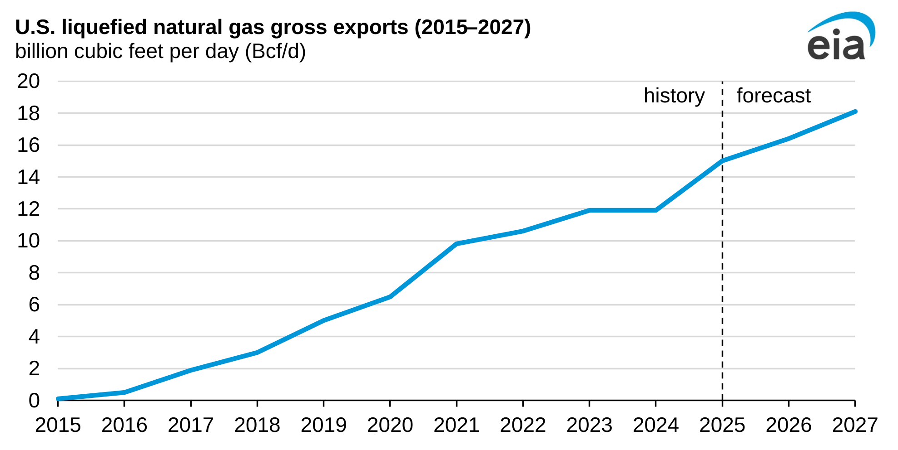

Figure 24-2: Ten years after the first Sabine Pass cargo on February 24, 2016, US LNG exports have grown to roughly 14 Bcf per day, making the United States the single largest LNG exporter in the world. (Source: [EIA Today in Energy (February 24, 2026)](https://www.eia.gov/todayinenergy/detail.php?id=67224), February 24, 2026)

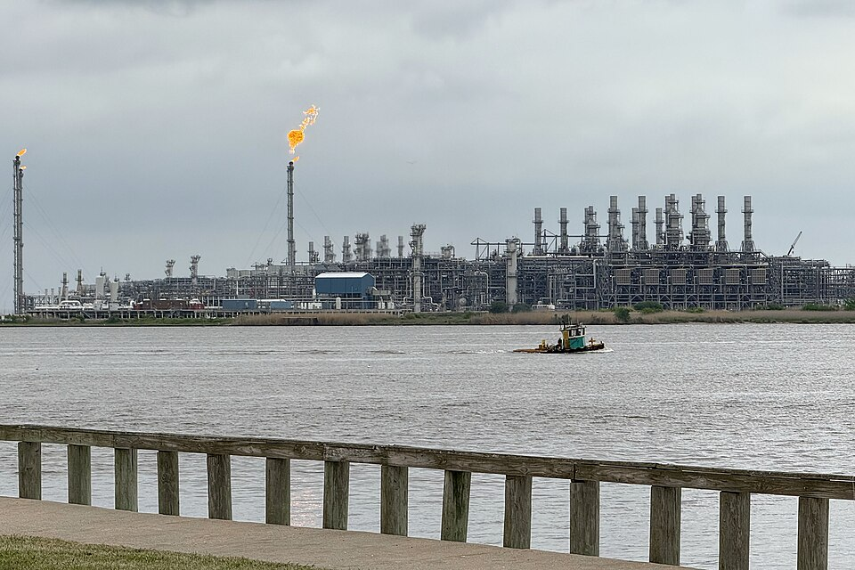

Figure 24-3: Cheniere's Sabine Pass LNG terminal in Cameron Parish, Louisiana. Originally built as an import facility, it shipped the first US LNG export cargo on February 24, 2016 and remains the single largest US liquefaction complex. (Source: [Quintin Soloviev / Wikimedia Commons (CC BY 4.0)](https://commons.wikimedia.org/wiki/File:Cheniere_Sabine_Pass_LNG_Terminal.jpg))

## The Operating US LNG Fleet

By the middle of 2025 the United States had eight operating large-scale liquefaction terminals strung along the Gulf Coast plus Cove Point on Chesapeake Bay and Elba Island near Savannah. Nameplate capacity on a peak basis was roughly 14 Bcf per day, with average feed-gas deliveries running a little below that on routine maintenance and outage cycles. Several of the original 2005-era import terminals that were rebuilt as liquefaction plants are now the backbone of the US export fleet.

| Facility | Location | Operator | Nameplate (MTPA) | Nameplate (Bcf/d) | First Cargo |
| --- | --- | --- | --- | --- | --- |
| Sabine Pass (T1 to T6) | Cameron Parish, Louisiana | Cheniere | 30.0 | 4.0 | Feb 2016 |
| Cove Point | Lusby, Maryland | Berkshire Hathaway Energy | 5.25 | 0.82 | Apr 2018 |
| Corpus Christi (T1 to T3) | San Patricio County, Texas | Cheniere | 15.0 | 2.1 | Dec 2018 |
| Cameron | Hackberry, Louisiana | Sempra | 12.0 | 1.7 | May 2019 |
| Freeport | Quintana Island, Texas | Freeport LNG | 15.0 | 2.1 | Sep 2019 |
| Elba Island | Chatham County, Georgia | Kinder Morgan | 2.5 | 0.35 | Dec 2019 |
| Calcasieu Pass | Cameron Parish, Louisiana | Venture Global | 10.0 | 1.4 | Mar 2022 |
| Plaquemines (Phase 1 and 2) | Plaquemines Parish, Louisiana | Venture Global | 20.0 | 2.7 | Dec 2024 |
| Corpus Christi Stage III | San Patricio County, Texas | Cheniere | 10.0 (phased) | 1.4 | Dec 2024 |

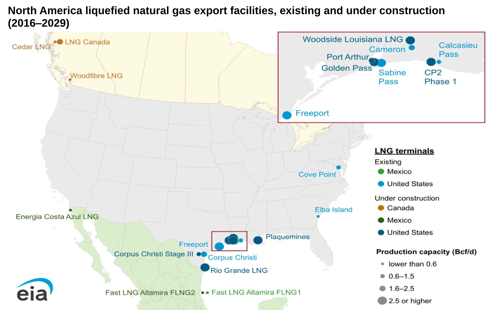

Figure 24-4: The operating US LNG export fleet and second wave under construction. Most facilities cluster along the Texas and Louisiana Gulf Coast, placing them close to Permian and Haynesville shale gas, their feedstock. (Source: [EIA Today in Energy](https://www.eia.gov/todayinenergy/detail.php?id=66384), October 16, 2025)

## The Second Wave Under Construction

Behind the operating fleet is a large queue of projects that were under construction or had taken final investment decision by early 2025. If all proceed on their announced schedules, US LNG export capacity could exceed 25 Bcf per day by 2030, equivalent to roughly one-quarter of total US natural gas production. The projects in this second wave are dominated by four sponsors: Venture Global, Cheniere, Sempra and NextDecade.

| Project | Location | Sponsor | Capacity (MTPA) | Status | Target First Cargo |
| --- | --- | --- | --- | --- | --- |
| Rio Grande LNG (Phase 1) | Brownsville, Texas | NextDecade | 17.6 | Under construction | 2027 |
| Port Arthur LNG (Phase 1) | Port Arthur, Texas | Sempra | 13.5 | Under construction | 2027 |
| Golden Pass | Sabine Pass, Texas | ExxonMobil and QatarEnergy | 18.1 | Commissioning | 2025 or 2026 |
| CP2 LNG | Cameron Parish, Louisiana | Venture Global | 20.0 (phase 1) | FID 2025 | 2028 |
| Magnolia LNG | Lake Charles, Louisiana | Glenfarne | 8.8 | Approved, pre-FID | 2029 |
| Commonwealth LNG | Cameron Parish, Louisiana | Commonwealth | 9.5 | Approved, pre-FID | 2029 |
| Delfin LNG (floating) | Offshore Louisiana | Delfin Midstream | 13.2 | Approved, pre-FID | 2028 |

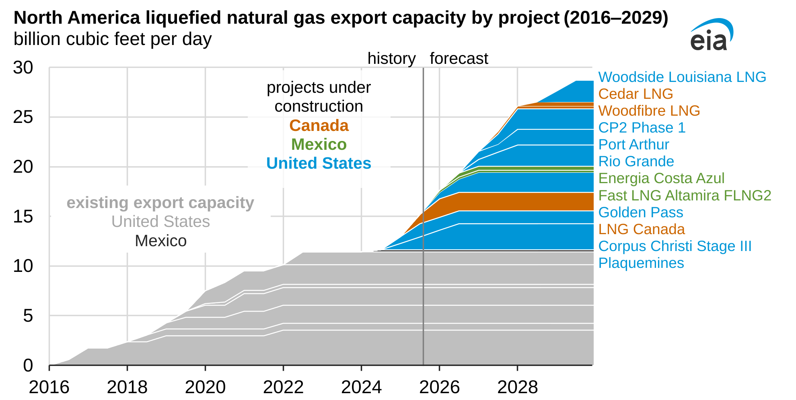

Figure 24-5: Existing and planned US LNG export capacity by project. The second wave more than doubles US liquefaction capacity by the end of the decade if all projects proceed on schedule. (Source: [EIA Today in Energy](https://www.eia.gov/todayinenergy/detail.php?id=66384), October 16, 2025)

## The Biden Pause and the Trump Reversal

On January 26, 2024, the Department of Energy announced a pause on pending decisions on LNG export applications to non-free-trade-agreement countries, which cover almost every large importing market outside Korea and a handful of others. The stated reason was to allow DOE to update its underlying economic, environmental and national-security analysis of LNG exports, which had not been materially revised since 2018. Projects without an existing non-FTA export authorization, including CP2, Commonwealth, Magnolia and several others, were left in regulatory limbo. Cheniere, Sempra and Venture Global could still ship cargoes under existing authorizations, and new offtake contracts for unapproved projects effectively froze.

In July 2024, a federal district court in Louisiana issued a preliminary injunction against the pause in a challenge brought by sixteen state attorneys general, finding plaintiffs likely to succeed on claims that DOE had acted arbitrarily under the Administrative Procedure Act. The pause remained in effect as a matter of DOE policy while the case was appealed. On January 20, 2025, his first day back in office, President Trump signed an executive order directing DOE to lift the pause and resume processing of pending non-FTA applications. DOE began issuing approvals in the first quarter of 2025, and Venture Global took final investment decision on CP2 shortly afterward.

## Where the Cargoes Go

US LNG is sold on flexible terms that allow cargoes to be redirected to whichever market offers the highest netback, and the destination mix has flipped in five years. In 2019, the year the second and third waves of US liquefaction trains came online, the largest buyers were in Asia. Korea, Japan and China together took close to half of every US cargo. By 2024, after the loss of Russian pipeline gas to Europe, the picture had inverted: Europe took more than half of US LNG, with the Netherlands, France and the United Kingdom as the top three importing countries.

US LNG Export Destinations: 2019 vs 2024

Europe replaced Asia as the top US LNG customer. In 2019, nearly half of US LNG cargoes landed in Asia, led by Korea, Japan and China. In 2024, after Europe lost most of its Russian pipeline gas, roughly 55 percent of US LNG exports flowed across the Atlantic, with the Netherlands, France and the United Kingdom as the top three destinations. Asian share fell to roughly a third. This is the single largest reordering of global LNG trade flows since the market began. Shares are shown as a percentage of total US LNG exports on a volume basis. Source: EIA Natural Gas Monthly.

## Henry Hub, TTF and JKM

Global natural gas is priced against three regional benchmarks. Henry Hub, at the Erath, Louisiana pipeline nexus, is the US physical and futures benchmark. TTF, the Title Transfer Facility in the Netherlands, is the European benchmark used for both physical trades and the ICE futures contract. JKM, the Japan Korea Marker published by S&P Global Platts, is the Asian spot LNG benchmark. In a fully globalized market, TTF and JKM should settle close to Henry Hub plus liquefaction fees and freight. In practice they settle wherever physical shortage puts them, and the arbitrage is what pulls US LNG cargoes back and forth across oceans.

| Benchmark | Location | Role | 2024 Average (USD per MMBtu) |
| --- | --- | --- | --- |
| Henry Hub | Erath, Louisiana | US pipeline and futures benchmark | 2.19 |
| TTF | Netherlands virtual hub | European pipeline and futures benchmark | 10.80 |
| JKM | Japan and Korea delivered | Asian spot LNG benchmark | 11.80 |

Figure 24-6: Global Gas Benchmarks ($/MMBtu), 2018 to 2025

Sources: World Bank Commodity Prices, ICE, CME (illustrative annual averages)

The spread between Henry Hub and the two international markers is what makes a US LNG cargo profitable once variable shipping and boil-off are taken into account. A cargo loaded at Sabine Pass in mid-2024 bought feed gas at roughly 2.20, paid a liquefaction tolling fee of 2.50 to 3.50 per MMBtu depending on the contract, added shipping of roughly 0.70 to Rotterdam or 1.20 to Tokyo, and could resell at TTF or JKM levels well above 10. The arbitrage does not always close. When TTF fell back to a 6 dollar handle in the summer of 2024 the economics for cargo diversion compressed sharply, and some uncommitted tolling capacity was left unused. When international prices spike, as they did in the summer of 2022 when TTF briefly traded above 70 dollars per MMBtu equivalent, the pull on US feed gas is intense enough to move Henry Hub itself.

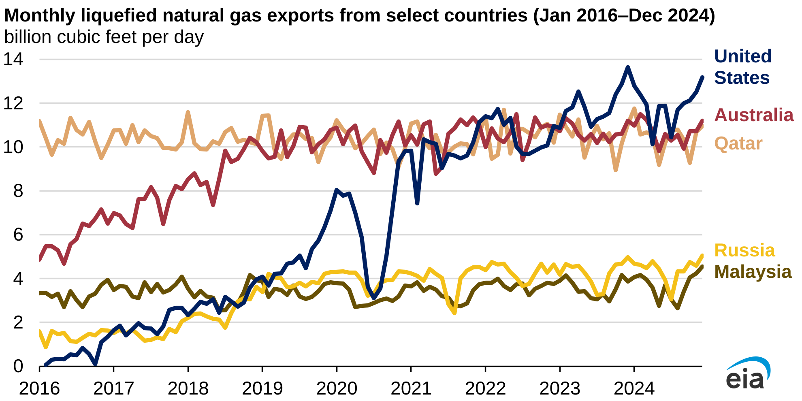

Figure 24-7: Monthly LNG exports from the United States, Australia and Qatar. The US became the single largest LNG exporter on an annual basis in 2023 and consolidated the lead in 2024, averaging roughly 11.9 Bcf per day. (Source: [EIA Today in Energy](https://www.eia.gov/todayinenergy/detail.php?id=64844), March 27, 2025)

## LNG Pricing Contracts

US LNG is sold in two basic contract shapes. The first is a Sale and Purchase Agreement where the seller takes price risk on both legs: the buyer pays a delivered price linked to Henry Hub or, for some Asian buyers, to a Brent-based formula often containing an S-curve that dampens price changes at the extremes. The second is a tolling agreement, which is the Cheniere model. Here the buyer supplies its own feed gas at Henry Hub and pays Cheniere a liquefaction fee of roughly 2.25 to 3.50 per MMBtu regardless of whether the buyer lifts the cargo. The tolling structure shifts commodity risk to the buyer and leaves the liquefaction operator with a utility-like revenue profile, which is what allowed Cheniere to finance Sabine Pass in the capital markets.

Destination flexibility and diversion clauses are almost universal in US contracts. This is the single biggest commercial difference between US LNG and the older Qatari and Australian long-term contracts, which frequently restricted where cargoes could land. When TTF is above JKM, a US cargo bound for Asia can be diverted to Rotterdam with a shared profit split between the offtaker and the liquefier. Destination flexibility is what made US LNG the swing supplier to Europe in 2022, and it is why European buyers have been willing to sign twenty-year offtake contracts with second-wave projects.

## LNG Carriers

LNG is moved in purpose-built, double-hulled carriers with insulated cargo tanks that hold liquefied gas at roughly minus 162 degrees Celsius. Four basic size classes are in service today.

| Class | Capacity (m3) | Bcf-equivalent per voyage | Notable routes | Prime operators |
| --- | --- | --- | --- | --- |
| Conventional | 138,000 to 145,000 | 3.0 to 3.1 | Legacy Pacific and Mediterranean routes | MOL, NYK, K-Line |
| TFDE / DFDE membrane | 170,000 to 180,000 | 3.6 to 3.8 | US Gulf Coast to Rotterdam, Zeebrugge, Tokyo | GasLog, Maran Gas, Teekay, Mitsui OSK |
| Q-Flex | 210,000 to 217,000 | 4.5 | Ras Laffan to Asia and northwest Europe | Nakilat (Qatar), Shell-chartered |
| Q-Max | 263,000 to 266,000 | 5.5 to 5.6 | Ras Laffan to South Hook and Zeebrugge | Nakilat (Qatar) |

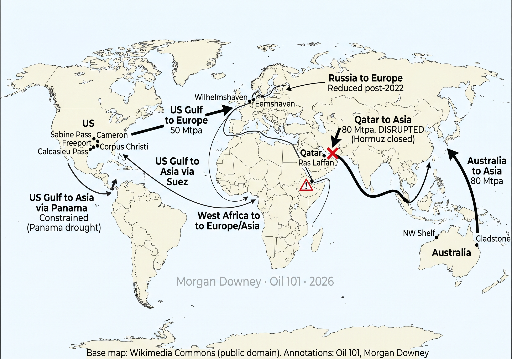

Figure 24-8: Global LNG trade routes and major export terminals. The 2026 Hormuz closure disrupted Qatar's 80 Mtpa of exports, the largest single-source LNG supply in the world. US LNG became the marginal balancing supply for Europe, but the Panama Canal drought constrained the Asia-bound route. (Source: Base map: Wikimedia Commons (public domain). Annotations: Oil 101, Morgan Downey)

The modern workhorse is the 174,000 cubic metre membrane carrier with tri-fuel diesel-electric or, increasingly, two-stroke dual-fuel propulsion. This is the vessel that loads at Sabine Pass or Calcasieu Pass and delivers into Europe or Asia. The much larger Q-Max and Q-Flex classes were built specifically for the Qatari fleet and for the few terminals, chiefly South Hook in Wales and the Adriatic LNG terminal offshore Italy, that can physically accommodate them.

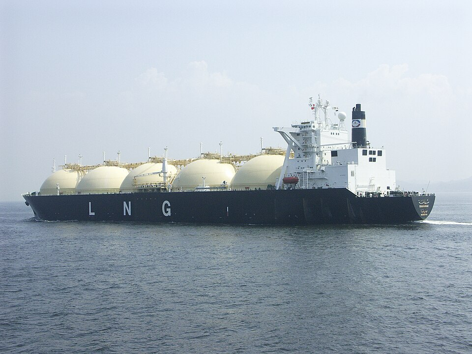

Figure 24-9: The LNG carrier Shahamah underway off Japan. A single Q-Max voyage carries roughly 5.5 Bcf of regasified natural gas, enough to supply a mid-sized European country for about a day. (Source: [Aozora Shiraho / Wikimedia Commons (CC BY 2.1 JP)](https://commons.wikimedia.org/wiki/File:Shahamah_LNG_carrier.jpg))

## Shipping Bottlenecks: Panama and the Red Sea

US LNG cargoes bound for Asia have two natural routes. The shorter one runs through the Panama Canal, whose neo-Panamax locks opened in 2016 and can accommodate LNG carriers up to roughly 180,000 cubic metres, which is the modern membrane workhorse. The longer route runs through the Suez Canal and across the Indian Ocean, and historically through the Red Sea and Bab-el-Mandeb. A third option, around the Cape of Good Hope, adds roughly fifteen days of steaming time each way relative to Suez.

Both of the short routes were disrupted in 2023 and 2024. A severe drought in Gatun Lake in 2023 forced the Panama Canal Authority to cut daily transit slots and to auction the remaining slots at extraordinary prices, driving most LNG carriers onto longer routes. Separately, Houthi missile and drone attacks on shipping in the southern Red Sea starting in December 2023 forced most LNG carriers to abandon the Suez route entirely and reroute around southern Africa, lengthening voyage times by roughly two weeks. The combination of Panama drought and Red Sea disruption tightened global LNG shipping capacity and widened the basis between Europe and Asia, because Asian buyers were effectively farther from US Gulf Coast loading docks than they had been for the previous decade.

## FSRUs and Europe's 2022 Scramble

On the import side, the most visible piece of new infrastructure since Russia's 2022 invasion of Ukraine has been the floating storage and regasification unit. An FSRU is an LNG carrier with regasification equipment mounted on deck: it takes delivery of a cargo, warms the liquid back to vapour, and pipes it into the local grid through a jetty or buoy. FSRUs can be commissioned in twelve to eighteen months, against five to seven years for an onshore terminal, which is why they were the tool of choice in Europe's scramble to replace Russian pipeline gas.

Germany, which had no LNG import capacity at all before 2022, commissioned five FSRUs within roughly ten months of the invasion. Wilhelmshaven 1 hosted the Höegh Esperanza and sent first gas into the German grid on December 22, 2022. Brunsbüttel followed with the Höegh Gannet in January 2023. Lubmin, near the old Nord Stream landfall, took a smaller Excelerate unit. A second Wilhelmshaven berth and a second Brunsbüttel berth came later in 2023. Beyond Germany, the Netherlands brought the Eemshaven FSRU online in September 2022, Italy commissioned an FSRU at Piombino in 2023 after reversing a long political fight, and Finland brought the Exemplar into the port of Inkoo on the Gulf of Finland to serve the Finnish and Baltic grids after the end of Russian pipeline flows.

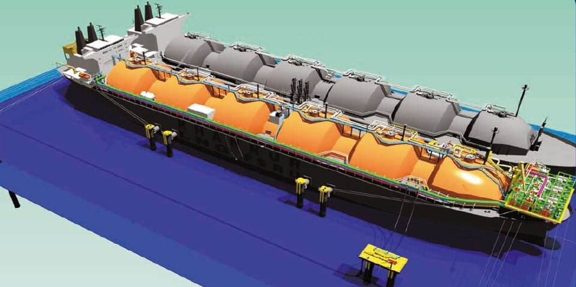

Figure 24-10: A Floating Storage and Regasification Unit. FSRUs can be commissioned in roughly 12 to 18 months, against five to seven years for an onshore terminal, which is why Germany, the Netherlands, Italy and Finland all used them to replace Russian pipeline gas in 2022 and 2023. (Source: [Vslv / Wikimedia Commons (CC BY-SA 4.0)](https://commons.wikimedia.org/wiki/File:FSRU.jpg))

## Henry Hub Globalization

The cumulative effect of the US LNG buildout, the Ukraine war and the flexibility of American contracts is that Henry Hub is no longer a purely domestic benchmark. When European TTF or Asian JKM rise materially above Henry Hub plus tolling and shipping, US liquefaction plants run full, feed-gas pipelines pull harder on Haynesville and Permian supply, and Henry Hub prices themselves drift up. When international prices fall, some uncommitted cargoes are cancelled, although tolling fees are still paid under take-or-pay terms, and the pull on US domestic gas eases. In both directions the US pipeline grid is now coupled to global gas via a 14 Bcf per day export valve that did not exist a decade ago.

For US gas producers, the old hedging rules no longer suffice. Henry Hub is increasingly influenced by European winters, Asian summers, typhoon season in the East China Sea, and geopolitical events thousands of miles from Louisiana and Texas. Producers now hedge with forward curves, basis swaps to regional hubs like Waha and Dominion South, and, for the more sophisticated, cross-commodity structures against TTF or JKM through the futures and over-the-counter markets described in [Chapter 18 (Futures and Swaps)](#chapter-futures-swaps).

US LNG has connected the American gas market to the world. What was once a stranded, landlocked commodity is now a globally traded energy source with geopolitical weight rivalling crude oil. Implications for US producers, European utilities, Asian buyers and US policymakers are still playing out, and the second wave of liquefaction capacity will reset those relationships again before the decade is out.

Morgan Downey’s Commodity News

### Read what a commodity trader reads

A free morning brief on the oil, gas, and commodity markets, written by Morgan Downey, author of Oil 101. One email, every morning.

[Subscribe free →](https://boxwoodapp.com/news/subscribe)

<!-- rl-section id="chapter-energy-transition" class="chapter" kicker="Chapter 25" title="The Energy Transition" -->

## The Energy Transition

Chapter 25

# The Energy Transition

The energy transition and oil: EVs, renewables, carbon markets, LCOE crossover, peak oil demand forecasts, and what comes next.

<svg fill="none" height="18" stroke="currentColor" stroke-linecap="round" stroke-linejoin="round" stroke-width="2" viewbox="0 0 24 24" width="18"><path d="M3 18v-6a9 9 0 0 1 18 0v6"></path><path d="M21 19a2 2 0 0 1-2 2h-1a2 2 0 0 1-2-2v-3a2 2 0 0 1 2-2h3zM3 19a2 2 0 0 0 2 2h1a2 2 0 0 0 2-2v-3a2 2 0 0 0-2-2H3z"></path></svg>Listen· 22:26

## The Peak Demand Debate

For most of the oil industry's 165-year history, the central anxiety was supply: would the world run out of oil? The concept of peak oil, popularized by M. King Hubbert in 1956, argued that global production would inevitably reach a maximum and then decline as geological depletion outpaced new discoveries. By the 2020s, the shale revolution had effectively killed the supply-side peak oil thesis. The new question is the opposite one: when will the world stop wanting more oil?

Two credible institutions answer that question in completely different ways, and the gap between them is the single most consequential forecast disagreement in energy today. The International Energy Agency's World Energy Outlook 2025, published in Paris on November 12, 2025, shows global oil demand plateauing in the late 2020s and drifting lower through 2050 under its Stated Policies Scenario. OPEC's World Oil Outlook 2025, published from Vienna, projects continued growth to roughly 120 million barrels per day by 2050. The spread between these two reference cases at 2050 is wider than the entire current production of Saudi Arabia. One of them is very wrong.

Global Oil Demand: IEA STEPS vs OPEC WOO, 2020 to 2050

The single most consequential forecast disagreement in energy today. The IEA's World Energy Outlook 2025 Stated Policies Scenario shows global oil demand plateauing in the late 2020s near 104 million barrels per day and drifting lower through 2050. OPEC's 2025 World Oil Outlook projects continued growth to roughly 120 million barrels per day in 2050. The gap at 2050 is wider than the entire production of Saudi Arabia. Both institutions publish full scenario datasets; the values here are smoothed illustrative lines drawn from the two reference cases, not a forecast. Intermediate WEO scenarios (Announced Pledges and Net Zero) fall below the STEPS line shown here.

## OECD and Non-OECD Divergence

Under the surface, the world is already two markets. Oil demand in OECD countries, which means most of Europe, North America, Japan, South Korea, and Australia, peaked in 2005 near 50 million barrels per day and has been flat to declining ever since. The growth that pushed total world demand from 85 million barrels per day in 2005 to roughly 103 million in 2024 has come entirely from non-OECD countries, led by China, India, and Southeast Asia. Non-OECD demand is now comfortably above 55 million barrels per day and still climbing. The peak-demand question is really three questions: when does China peak, what path does India follow, and does Africa ever reach the car-ownership density that would meaningfully lift global demand? The IEA and OPEC disagree on all three.

## Electric Vehicles

Electric vehicle adoption accelerated faster than most forecasters expected. Global plug-in car sales, counting battery electric and plug-in hybrids, rose from roughly 2 million units in 2018 to about 17 million in 2024. The IEA's Global EV Outlook 2025 reports that more than one in four cars sold worldwide in 2025 will be electric. China alone bought around 11 million of the 2024 total, more than two-thirds of global sales. Europe plateaued near 3 million units after the 2023 pullback in German and French subsidies, and the United States held at roughly 1.6 million, with Tesla still the largest seller but Chinese platforms (blocked from the US market by import rules and 100 percent tariffs) dominating elsewhere.

Global EV Sales (BEV + PHEV) vs Total Auto Sales, 2018 to 2025

EVs are growing fast but remain a fraction of total vehicle sales. Global plug-in vehicle sales (BEV plus PHEV) reached roughly 17.5 million in 2024, about 20 percent of the 88 million total automobiles sold worldwide. Battery electric vehicles account for roughly two-thirds of the EV total, with plug-in hybrids making up the balance. The dashed line shows total global automobile sales for context: the overall market has been flat at 80 to 90 million units per year since 2018. Sources: IEA Global EV Outlook 2025, OICA, WardsAuto.

EV Sales by Region (2024)

| Region | 2024 EV Sales | Share |
| --- | --- | --- |
| China | roughly 11.0 million | 63% |
| Europe | roughly 3.2 million | 18% |
| United States | roughly 1.6 million | 9% |
| Rest of world | roughly 1.7 million | 10% |
| Global total | roughly 17.5 million | 100% |

Figure 25-1: China dominates the global EV market. China alone accounted for roughly 63 percent of global plug-in vehicle sales in 2024, driven by heavy government subsidies, a competitive domestic supply chain, and aggressive pricing by BYD, Li Auto, and other Chinese manufacturers. Europe is a distant second at 18 percent, with the United States at 9 percent despite growing Tesla and legacy OEM offerings. Source: IEA Global EV Outlook 2025.

China's BYD, founded in 1995 as a battery manufacturer, has become the world's largest plug-in vehicle producer by total units, helped by a vertically integrated battery supply chain that runs from lithium refining through cell manufacturing. European producers, led by Volkswagen, Stellantis, BMW, and Mercedes, have rolled back 2030 internal-combustion phase-out targets under pressure from Chinese imports and softer consumer demand. The European Union began imposing countervailing tariffs on Chinese EVs in late 2024. The United States responded with a 100 percent tariff on Chinese EVs and, separately, with restrictions on battery components from Chinese sources. The result is three regional markets increasingly walled off from one another, each on its own policy trajectory.

The oil demand impact is real but bounded. The IEA estimates that global EV adoption was displacing roughly 1.8 million barrels per day of gasoline and diesel demand by 2024, with the figure potentially reaching 5 to 6 million barrels per day by 2030 under current-policy trajectories. Set that against an oil demand base over 100 million barrels per day and the continued growth of plastics, petrochemicals, aviation, and heavy trucking, none of which electrify easily.

## The Cost Collapse in Solar and Wind

Power generation economics changed as the levelized cost of utility-scale solar and onshore wind fell. Lazard's annual LCOE study, now in its seventeenth edition, puts unsubsidized utility-scale solar at roughly 60 dollars per megawatt-hour at the midpoint in 2024, down from 359 dollars in 2010. Onshore wind followed a parallel path, from 135 dollars to 50 dollars per megawatt-hour over the same window. Both now sit comfortably below combined-cycle natural gas in most US markets on a new-build basis before any subsidies are counted.

Unsubsidized LCOE, 2010 to 2024 (USD per MWh)

The cost crossover, then a partial rebound. Utility-scale solar fell from roughly $360 per MWh in 2010 to near $44 at its 2020 trough, dropping below combined-cycle natural gas for the first time in the mid-2010s. The post-2021 rebound in solar and wind reflects higher capital costs, steel and lithium inflation, and higher financing rates rather than a reversal of the long-term technology curve. Gas-fired LCOE moved with Henry Hub and 2022 European gas spikes. Values are midpoints of the Lazard annual LCOE unsubsidized ranges (v1 through v17) and exclude tax credits and the Inflation Reduction Act. The low end of the 2024 solar range is still below $30 per MWh in the best sites.

The 2022 and 2023 data points include a rebound. Capital costs rose with the post-pandemic interest rate cycle, module and balance-of-system costs rose with steel and aluminum inflation, and lithium prices tripled briefly before collapsing again in 2024. The long-run trajectory has resumed, but the low-2020s trough turned out to be the bottom of a U, not a permanent floor. For solar in particular, the best utility-scale sites in Texas, the Middle East, and the Australian outback still clear below 30 dollars per megawatt-hour, and IRENA reports that nearly all new solar capacity commissioned in 2024 came in below the cheapest fossil-fuel alternative.

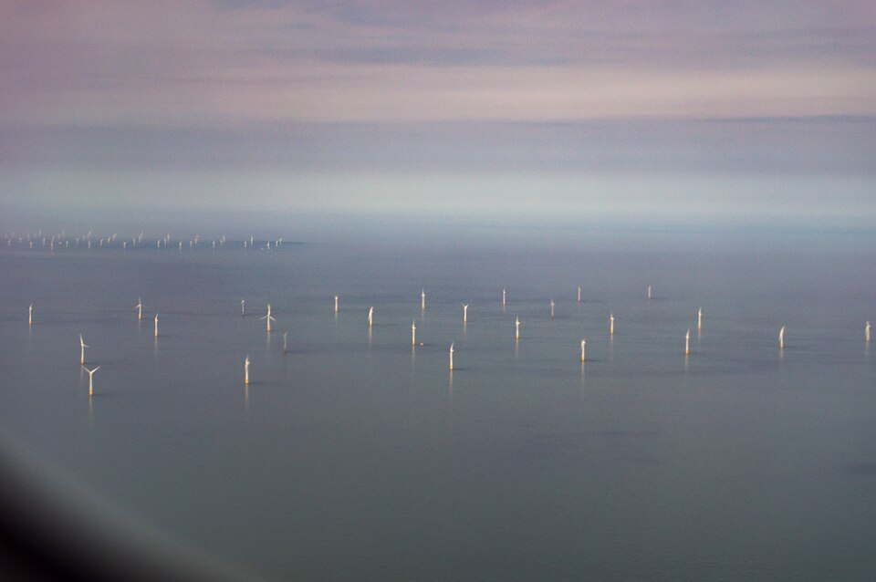

Figure 25-2: The Egmond aan Zee offshore wind farm in the Dutch North Sea, with the Princess Amalia Wind Farm visible behind it. Offshore wind is one of the fastest-growing sources of non-oil power generation in Europe and increasingly in the US Northeast. (Source: [Supercarwaar / Wikimedia Commons (CC BY-SA 4.0)](https://commons.wikimedia.org/wiki/File:Egmond_aan_Zee_offshore_wind_farm.jpg))

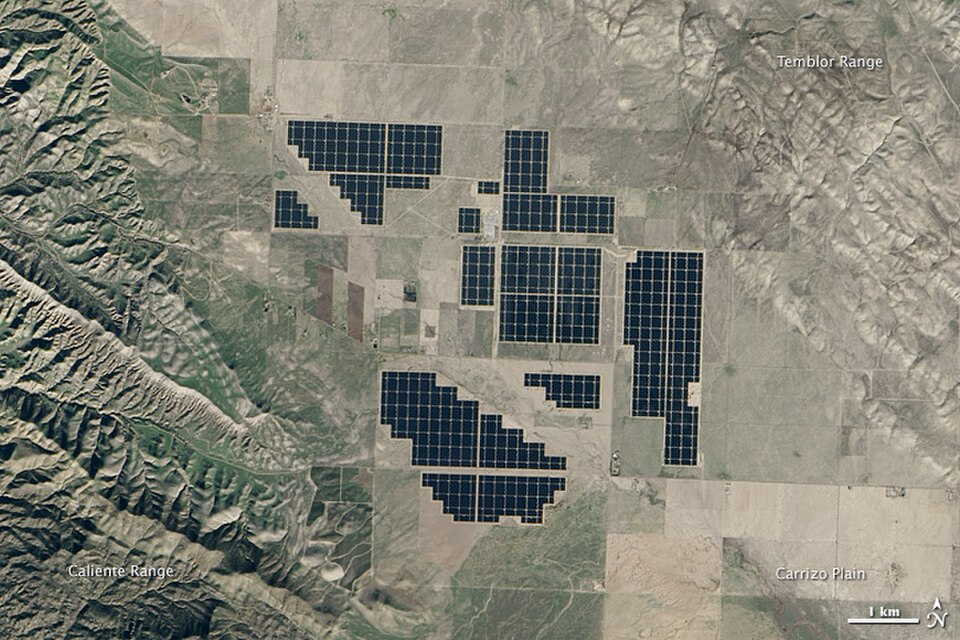

Figure 25-3: The 550 MW Topaz Solar Farm in California's Carrizo Plain, one of the largest photovoltaic installations in the world at the time of completion. Utility-scale solar now clears below 30 dollars per megawatt-hour at the best sites. (Source: [Jesse Allen, NASA Earth Observatory (public domain)](https://commons.wikimedia.org/wiki/File:Topaz_Solar_Farm,_California_Valley.jpg))

## Renewable Additions and the Gas Paradox

Global renewable capacity additions set a record in 2024. According to IRENA and the IEA, the world added roughly 560 gigawatts of solar, 115 gigawatts of wind, and smaller volumes of storage, hydro, and geothermal. Solar accounts for close to three-quarters of all new capacity, and China alone installed more solar in 2024 than the rest of the world combined. Grid-scale battery additions have started to scale in parallel, with 2024 global additions near 175 gigawatt-hours.

The gas paradox.

The intermittency of solar and wind means natural gas remains essential as a dispatchable backup fuel. Gas turbines can ramp up and down in minutes, covering the gaps when the wind does not blow and the sun does not shine. In many markets the growth of renewables has actually increased the dispatchable need for natural gas, not reduced it. US gas demand from power generation set an all-time high in 2024 even as solar and wind capacity grew to records. Every new gigawatt of intermittent renewables makes a complementary gigawatt of flexible gas (or battery storage) more valuable, not less.

Figure 25-4: Global Renewable Capacity Additions (GW), 2015 to 2025

Sources: IRENA, IEA Renewables 2024 (illustrative)

## Carbon Markets and the EU ETS

Carbon pricing has expanded unevenly. The EU Emissions Trading System, the world's largest cap-and-trade market, saw allowance prices climb from under 10 euros per tonne in 2017 to a record near 100 euros per tonne in February 2023 before moderating into a 65 to 80 euro range through 2024 and 2025 as free allocation continued to phase out and carbon border adjustment mechanism (CBAM) reporting became mandatory for imported steel, aluminum, cement, fertilizers, and electricity. CBAM imposes carbon levies on imports from countries without equivalent domestic pricing starting in January 2026, in what is the single largest extraterritorial extension of climate policy to date.

Voluntary carbon markets had a harder run. A series of 2023 investigations into forestry-based offsets found that many credits overstated their climate benefit, and corporate buyers retreated. The voluntary market contracted sharply in 2024, and integrity standards bodies such as the Integrity Council for the Voluntary Carbon Market (ICVCM) and the Science Based Targets initiative (SBTi) are still working through rules for which credit types remain acceptable against corporate net-zero claims.

## The IRA and the 2025 Rollback

The 2022 US Inflation Reduction Act was, at the time, the largest climate investment in any country's history, projected at 370 billion dollars of credits and direct-pay incentives for clean energy, batteries, manufacturing, EVs, hydrogen, and carbon capture. Actual uptake far outran the Congressional Budget Office estimate, reaching well above one trillion dollars of headline value by 2025 depending on which forecaster you trust. Under the One Big Beautiful Bill Act, signed July 4, 2025, large parts of the IRA were rolled back. The 30D new clean vehicle credit, the 25E used clean vehicle credit, and the 45W commercial clean vehicle credit were terminated for vehicles acquired after September 30, 2025. The 25C and 25D residential energy credits expire for property placed in service after December 31, 2025. The 48E and 45Y technology-neutral power credits survived for wind and solar projects only where construction begins by June 2026 or the project enters service by December 2027, under a safe harbor framework tightened by new foreign entity of concern restrictions. The 45X advanced manufacturing credit, the 45Q carbon sequestration credit, and biofuel credits remained largely intact, and nuclear power received a new 10 percent bonus credit. The 45V clean hydrogen production credit was not reduced in per-kilogram value but had its termination date pulled forward from 2033 to the end of 2027, effectively ending the window for new projects to qualify. Investment plans across the EV and hydrogen sectors were reset in 2025 in response.

## Carbon Capture and Hydrogen

Carbon capture, use and storage has moved from lab to early commercial deployment. The Climeworks Orca plant in Iceland began operating in 2021 and was joined by a larger Mammoth facility in 2024, both using direct air capture with basalt mineralization. In the US, Occidental and partners broke ground on the Stratos direct-air-capture facility in West Texas in 2023 and brought initial phases online in 2025. The Petra Nova post-combustion CCS plant near Houston restarted in 2023 after a pandemic shutdown. The Northern Lights CO2 transport and storage project offshore Norway took its first cargo in 2025. These are real projects, but their combined capacity is still small compared to the gigatonnes of capture that net-zero pathways call for.

Hydrogen has been more disappointing. Green hydrogen, produced by electrolysis from renewable power, remains expensive because electrolyzers are capital-intensive and because running them at the low capacity factors implied by intermittent input raises unit cost. The 45V tax credit in the original IRA, paying up to 3 dollars per kilogram for the cleanest hydrogen, was expected to close the gap; the 2025 reconciliation bill kept the rate but pulled the termination date forward from 2033 to the end of 2027, sharply shortening the window to start qualifying projects. The result is that hydrogen retains credibility for sectors where the alternatives are worse (ammonia fertilizer, direct reduced iron for green steel, some long-haul heavy trucking) and loses traction in sectors where cheaper alternatives exist (passenger cars, residential heating, most utility power).

## The Investment Paradox

The transition has created an investment paradox. If oil demand will decline, new long-cycle projects risk becoming stranded assets that cannot pay back their capital over a shortened productive life. But if the industry underinvests on peak-demand expectations and demand turns out to be more resilient than forecast, the world gets a supply shortage and a price spike, which then funds a new wave of investment and extends the production tail. That scenario unfolded in 2021 and 2022, when the post-pandemic demand recovery collided with several years of underinvestment and sent Brent briefly above 120 dollars. The lesson: the demand curve can roll over faster than the supply curve can adjust, and running the oil system tight as a policy tool is expensive and unpopular.

For producers, the pragmatic response has been capital discipline: return cash to shareholders through buybacks and dividends, hedge forward production through swaps, collars, and three-way structures, and let the long-cycle supply side of the market tighten through attrition rather than through policy choice. It is not a climate strategy, but it is a survivable commercial one.

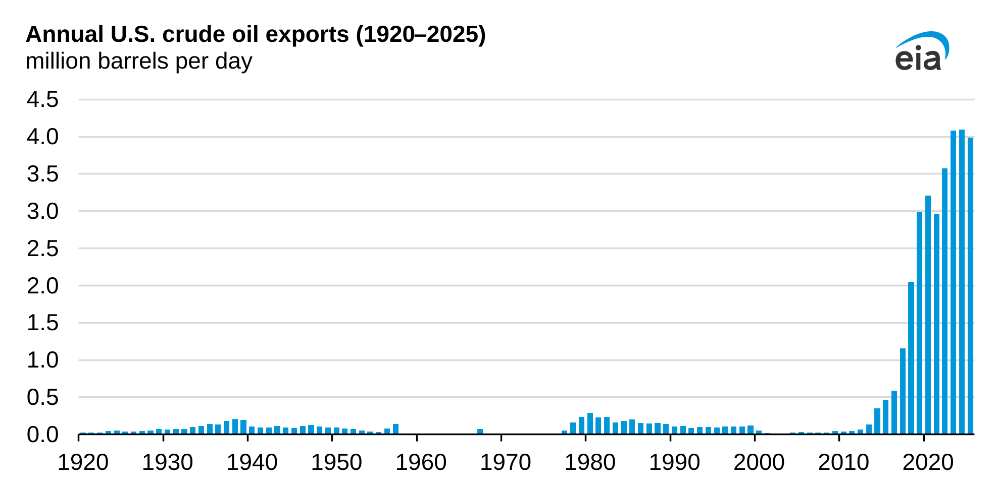

Figure 25-5: Annual US crude oil exports by destination through 2025. Even in a transition narrative, the US is exporting around 4 million barrels per day of crude and a further 14 Bcf per day of LNG. Transition economics and hydrocarbon volumes are both increasing at the same time. (Source: [EIA Today in Energy](https://www.eia.gov/todayinenergy/detail.php?id=67324), March 10, 2026)

## Peak Demand or Peak Fossil Fuel?

The loose shorthand of "peak oil demand" hides a finer distinction. Global coal demand is clearly plateauing, led by a slow rollover in China and earlier declines in Europe and the United States. Natural gas demand is still growing, pulled by LNG exports and by the paradox described above. Oil demand is the hardest call, because so much of it is in sectors that either electrify slowly (road fuel, especially heavy duty) or not at all (petrochemicals, aviation, maritime bunker fuel). A reasonable working assumption at the start of 2026 is that oil demand plateaus in the late 2020s in an OECD-led rollover, that a slow decline follows in the 2030s, and that the industry remains materially larger than most public narratives suggest for decades after that. The exact slope depends on Chinese and Indian transport choices and on whether the 2025 IRA rollback actually slows US EV uptake in practice.

The energy transition is not a single event. It is a multi-decade process, unfolding at different speeds in different sectors and different countries. Oil and gas will remain major energy sources for the working careers of most people reading this book, even under aggressive transition scenarios. The challenge for the industry, and for anyone pricing, trading, or hedging energy risk, is that the direction is clear but the timing is not, and the two largest forecasting bodies in the world cannot agree on 2050 by 40 million barrels per day.

Morgan Downey’s Commodity News

### Read what a commodity trader reads

A free morning brief on the oil, gas, and commodity markets, written by Morgan Downey, author of Oil 101. One email, every morning.

[Subscribe free →](https://boxwoodapp.com/news/subscribe)

<!-- rl-section id="chapter-iran-strait" class="chapter" kicker="Chapter 26" title="Iran Blocks the Strait" -->

## Iran Blocks the Strait

Chapter 26

# Iran Blocks the Strait

The 2026 Strait of Hormuz crisis: Iran blockade, 12 Mbpd shut in, oil at $166, SPR countdown, and 15 market consequences.

<svg fill="none" height="18" stroke="currentColor" stroke-linecap="round" stroke-linejoin="round" stroke-width="2" viewbox="0 0 24 24" width="18"><path d="M3 18v-6a9 9 0 0 1 18 0v6"></path><path d="M21 19a2 2 0 0 1-2 2h-1a2 2 0 0 1-2-2v-3a2 2 0 0 1 2-2h3zM3 19a2 2 0 0 0 2 2h1a2 2 0 0 0 2-2v-3a2 2 0 0 0-2-2H3z"></path></svg>Listen· 28:12

Updated Sun, Jul 12, 2026. The 2026 Strait of Hormuz crisis ran from February 28 to June 17, 2026, when the US-Iran peace deal was signed and the war ended. That crisis is over, and this chapter treats it as the bounded historical episode it now is. The tensions since, a brief re-closure, scattered attacks, and Trump declaring the ceasefire ended on July 7 after the IRGC fired on ships, are post-deal boundary testing: both sides probing the edges of the settlement, not a reopening of the closure. Underneath the headlines the deal is holding. Oil and gas tankers are back to the pre-war 30-to-40 a day, total traffic is still climbing back, and the market has flipped from pricing a shortage to fearing a glut, with Brent near $70. The live disputes are now commercial and diplomatic: Iran’s push to control transit routes and charge tolls, which Washington and the Gulf reject, and the 60-day nuclear-talks window running toward mid-August.

**Strait of Hormuz reopening:**

REOPENING

*Live estimate, recomputed as the situation changes.* The US-Iran deal, signed June 17, 2026, reopens the strait: the US lifts its blockade and oil sanctions and Iran lifts its shipping restrictions, and tankers are already resuming. The drawdown stops here. [Net oil-importer reserves (ex-US) started at 1,325M bbl](#figure-26-4) and fell to roughly 200M by the reopening, about 18 days short of the modeled July 7 run-dry. The reserves held, barely. [oil101.morgandowney.com](#chapter-iran-strait)

## The Chokepoint

The Strait of Hormuz is the most concentrated energy risk on earth. At its narrowest it is 21 miles wide, and all commercial traffic funnels through a shipping lane just six miles across: two miles inbound, two miles of buffer, two miles outbound. Through that corridor moves roughly 20 million barrels a day of crude oil, refined products, and LNG, about a fifth of global petroleum liquids consumption. No other passage on earth carries more energy value, and there is no quick way around it: the alternatives are pipelines that move less than half the volume, and they take years to build.

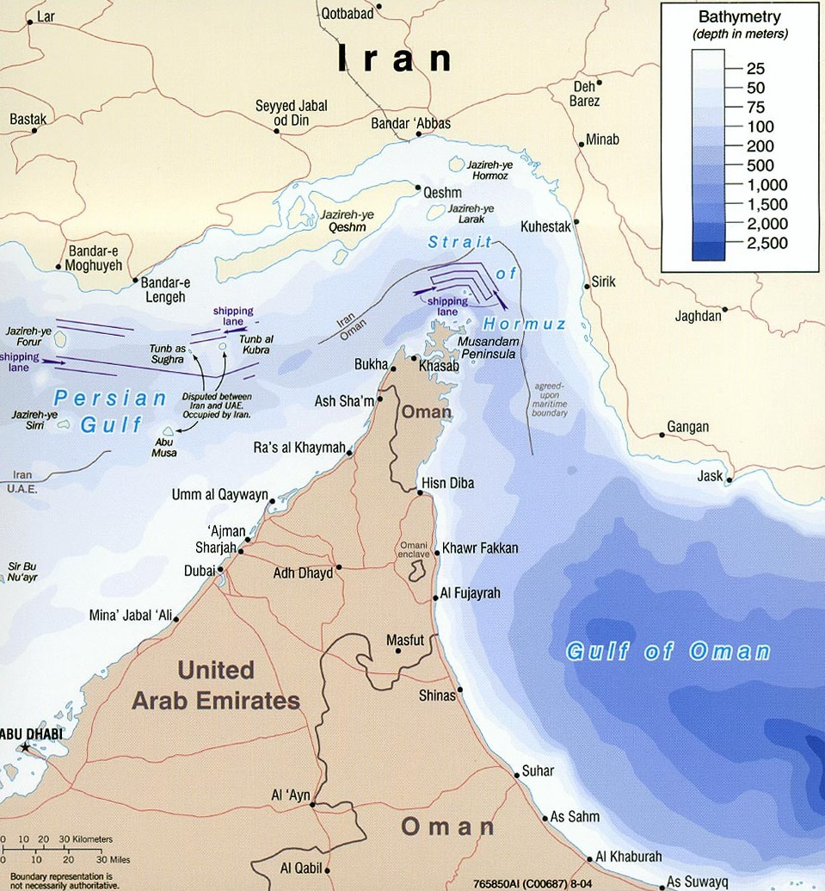

Figure 26-1: The Strait of Hormuz. The Traffic Separation Scheme funnels all commercial shipping through a six-mile-wide corridor. Iran's coast and islands sit directly above the lanes; Oman's Musandam Peninsula sits below. (Source: [US Government / Wikimedia Commons (public domain)](https://commons.wikimedia.org/wiki/File:Strait_of_hormuz_full.jpg))

For four decades, oil traders, military planners, and energy analysts rehearsed a Hormuz closure as the ultimate tail risk and priced its probability at close to zero. On February 28, 2026, the rehearsal ended. Nearly four months later the crisis did too: an interim deal struck on June 14 and signed on June 17 reopened the strait, lifted the US naval blockade and oil sanctions, and ended Iran’s shipping restrictions, with a 60-day window to negotiate Iran’s nuclear program. Crude collapsed on the news, falling roughly 15% in the week to around $74 WTI from a crisis peak above $120 as tankers began returning to the Gulf. The recovery then ran faster than anyone modeled: within two weeks, and despite a brief re-closure and fresh attacks, transits were back inside the pre-war band of 30 to 40 tankers a day, and the market had flipped from pricing a shortage to fearing a glut, with banks cutting Brent forecasts toward $75. The crisis proper was a bounded event, February 28 to June 17, 2026; the skirmishing that has continued since, including Trump declaring the ceasefire ended in early July after Iranian forces fired on ships, is post-deal boundary testing rather than a return to closure, and this chapter treats the closure as the finished episode it now is. This chapter uses the closure as a case study in how a chokepoint shock propagates through the oil market, the structural lessons it leaves behind, and a compressed record of how the crisis unfolded and how it ended. The live status block above tracks where it stands today.

## Anatomy of a Closure

A strait closure does not hit the market all at once. It propagates in a sequence: insurance and shipping freeze first, prices reprice on the threat before a single barrel is physically short, production shuts in because there is nowhere to put the oil, alternatives prove necessary but insufficient, and the inventory cushion determines how long the system holds before demand has to be rationed. The 2026 crisis ran the full sequence.

**Insurance and shipping freeze first.** Within 48 hours of the first IRGC radio warnings, at least three tankers were struck and incoming traffic dropped to near zero. War-risk insurance, not military force, is what actually closes a strait. As attacks mounted, protection and indemnity clubs withdrew war-risk coverage, premiums on hull value blew out from a fraction of a percent to multiples of it, and vessels still moving switched off their AIS transponders or broadcast false positions to avoid being targeted. A tanker cannot sail without coverage, and no underwriter will write a policy on a route where ships are being sunk. By mid-March at least 28 attacks had been confirmed or claimed: one tug sunk, 16 merchant ships damaged, twelve seafarers dead or missing. The waterway was technically still open. It was commercially dead.

## The Price Shock

Brent crude opened February 28 near $80 per barrel. By March 8 it had reached $126. As the physical market tightened, Dubai crude, the benchmark for Middle Eastern sour grades, reached $166 on March 19, exceeding the July 2008 all-time high of $147 for WTI. It was the most expensive barrel of crude ever traded in nominal terms. The Hormuz closure compressed a larger move than the 2022 Russia-Ukraine shock into a fraction of the time.

European natural gas followed. Prices roughly doubled in a week after Qatar, the world's second-largest LNG exporter, stopped production on March 2 and declared force majeure on March 4. European buyers who had congratulated themselves on replacing Russian pipeline gas with Qatari LNG discovered their new supply chain ran through the same six miles of water. The shock rippled into adjacent commodities: urea fertilizer up 50% by late March (the Gulf supplies roughly 30% of globally traded fertilizer), helium rationing, sulfur supply to US industry near-totally disrupted. Once talks were signaled the price stopped tracking barrels and started tracking diplomacy, snapping up and down on each headline about whether and on whose terms the strait would reopen.

Figure 26-2: Brent Crude, European Gasoil, and Jet Fuel (US$/bbl) Jan-Jul 2026

Brent crude

European gasoil/diesel ($/bbl equiv)

European jet fuel ($/bbl equiv)

Crude and products across the crisis. All three commodities converted to US dollars per barrel for direct comparison. Gasoil and jet fuel trade at a crack spread premium to crude. That premium blew out during the crisis because Gulf refineries cut runs faster than crude supply fell, tightening the product market even more than the crude market. Brent peaked at $126 on March 8 and Dubai crude hit a record $166 on March 19; gasoil and jet briefly exceeded $170 and $185 per barrel equivalent. Prices then swung on diplomacy for three months (a second $126 Brent spike on April 30, repeated failed frameworks) before the interim deal collapsed the risk premium: Brent fell from the high $80s to about $78 on the June 17 signing, then to roughly $70 by early July as traffic normalized and the market turned to fear a glut. The crack premiums compressed back toward normal as Gulf refineries restarted. Illustrative daily closes based on reported market moves. Gasoil converted at 7.45 bbl/mt, jet at 7.88 bbl/mt.

## Forced Shut-Ins

Gulf producers did not cut output voluntarily. They cut because they had nowhere to put the oil. With tanker loading suspended and onshore storage filling, the shutdowns were forced. Iraq dropped from 4.3 to 1.3 Mbpd by March 8 and began shutting Rumaila, its largest field, on March 17 after storage was exhausted. Saudi Arabia cut 20%, from roughly 10 to 8 Mbpd, shutting offshore fields including Safaniya, the world's largest. Kuwait and Qatar declared force majeure. By March 30 regional exports had fallen 60%, from roughly 25 to 10 Mbpd, the largest involuntary production shut-in in the history of the oil industry. The 2020 COVID cuts removed a similar volume, but those were voluntary and coordinated through OPEC+. These were the consequence of a physical blockade.

Table 26-1: Hormuz Transit by Exporter (2024, Pre-Crisis)

| Country | Crude + Condensate (Mbpd) | Notes |
| --- | --- | --- |
| Saudi Arabia | 5.5 | Eastbound cargoes; westbound via Red Sea bypasses Hormuz |
| Iraq | 3.3 | Basra oil terminal; Kirkuk-Ceyhan exports bypass Hormuz |
| UAE | 2.5 | Partly bypassed via Habshan-Fujairah pipeline (1.5 Mbpd cap.) |
| Kuwait | 1.7 | All exports transit Hormuz; no bypass pipeline |
| Iran | 1.5 | Kharg Island; Iran exempted own and allied cargoes |
| Qatar | 0.5 + LNG | Small condensate volumes; massive LNG exports (80 Mtpa) |

## The Bypass Pipelines and Their Ceiling

Three pipelines can move Persian Gulf crude to ports that do not require Hormuz transit, and all three were activated within two weeks of the closure. The Saudi East-West Pipeline (Petroline) runs from Abqaiq to the Red Sea port of Yanbu, roughly 5 Mbpd of capacity, and Saudi Arabia had kept it partially loaded for exactly this contingency. The UAE Habshan-Fujairah pipeline moves Abu Dhabi crude to the Arabian Sea coast at Fujairah, bypassing Hormuz entirely, roughly 1.5 Mbpd. The Iraq Kirkuk-Ceyhan line moves northern Iraqi crude overland through Turkey to the Mediterranean, roughly 0.5 Mbpd.

Combined bypass capacity is roughly 7 to 9 Mbpd against the 20 Mbpd that normally transits Hormuz. The pipelines covered less than half the lost volume; the remaining gap, roughly 11 Mbpd of stranded production, was the largest involuntary supply shortfall the oil market has ever seen. There is a further trap. The Yanbu route sends crude into the Red Sea, which as of early 2026 was still under Houthi attack (see [Chapter 11 (Transporting Oil)](#chapter-transporting-oil)). Bypassing Hormuz only exposed cargoes to the Bab el-Mandeb. The world's two most important oil chokepoints were compromised at once.

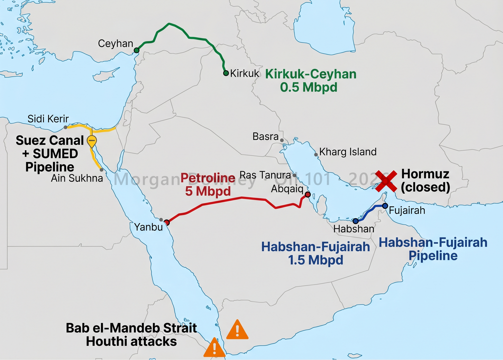

Figure 26-3: The three crude oil pipelines that can bypass the Strait of Hormuz, with their approximate capacities. Combined bypass: roughly 7 Mbpd against 20 Mbpd of normal Hormuz transit. Tankers loading at Yanbu on the Red Sea must still transit the Bab el-Mandeb, subject to Houthi attacks. (Source: Base map: Wikimedia Commons (public domain). Pipeline routes and annotations: Oil 101, Morgan Downey)

## A Two-Tier Market

Iran did not close the strait to everyone. It closed it selectively, and in doing so created a two-tier global oil market with no modern precedent. By late March, Iran was permitting transit for vessels from a handful of friendly states (China, Russia, India, Iraq, Pakistan, later others) while declaring the strait closed to all traffic to and from the United States, Israel, and allied ports. The blockade was not universal; it was directional. Iran was using Hormuz as a sorting mechanism: partners could transit, adversaries could not.

That bifurcated the price of crude itself. Asian-delivered Gulf barrels, moving under Iranian permission, traded at one level; Atlantic-basin crude, cut off from Gulf supply, traded at a scarcity premium. Iran then added a financial layer, running a channel north of Larak Island and charging tolls that exceeded $1 million per vessel, reportedly assessed in Chinese yuan, with at least one ship paying $2 million. It was a piracy tax wrapped in sovereignty language. The strait had stopped being infrastructure and become leverage: any nation that wanted Gulf oil had to deal directly with Tehran.

## Who Is Most Exposed

The countries most dependent on Hormuz are, by definition, the ones that import the most Gulf oil, and the list is dominated by Asia. China, Japan, South Korea, and India together account for roughly 60% of Hormuz-transiting crude. Europe's crude exposure is lower because it leans on the North Sea, Russia, West Africa, and the Americas, but its Qatari LNG imports are nearly 100% Hormuz-dependent. The United States, a net petroleum exporter since the shale boom, is the least directly exposed major economy (see [Chapter 1 (A Brief History of Oil)](#chapter-history)).

Table 26-2: Major Importer Hormuz Exposure

| Country | Hormuz Share of Oil Imports | Strategic Reserve Days | Bypass Options |
| --- | --- | --- | --- |
| Japan | 80% | 140+ | None; island nation, no pipeline alternatives |
| South Korea | 70% | 90+ | None; peninsula, no pipeline alternatives |
| India | 60% | 40 | Limited; ISPRL reserves at Visakhapatnam, Mangalore, Padur |
| China | 40% | 80-90 | ESPO pipeline; diversified to Brazil, West Africa |
| Europe (EU) | 15-20% | 90+ | North Sea, Norway, West Africa, Americas; but Qatar LNG at risk |
| United States | 5% | 80 | Domestically self-sufficient; SPR for global coordination |

Figure 26-4: Hormuz Exposure vs. Strategic Reserve Cover by Importer

SPR days of cover = total strategic reserves divided by total net imports from all sources, not just Hormuz. Sources: EIA, IEA, JOGMEC, KNOC, ISPRL, industry estimates (China).

## Why Oil Hasn’t Broken $200

By the numbers this was a worse fundamental shock than 1973 or 1979. Cumulative supply shut-in since February 28 crossed 1.1 billion barrels, against roughly 4 to 5 Mbpd removed in each of the 1970s crises. Brent topped $147 in 2008 on a smaller imbalance. Yet front-month WTI held in a $90 to $130 range throughout, well below the $200-plus scenarios banks and officials modeled in the first weeks, and once the deal was signed on June 17 it fell back to the mid-$70s, near where it began, down about 15% on the week. Three buffers explain why the price never broke $200, and only one is conventional.

**Strategic releases.** On March 11 the IEA's members committed to release up to 400 million barrels, the largest coordinated SPR commitment ever, more than double the 2022 Ukraine release. But 400 million barrels is only about four days of global consumption, and the figure is an announced ceiling, not a delivery schedule. The US SPR drew 41 million barrels in the first eleven weeks (415 million on February 27 to 374 million by May 15), with the two largest weekly draws on record hitting in early May. The announcement worked mainly as a signal that governments would intervene at scale; refilling drawn barrels at $100-plus would cost tens of billions (see [Chapter 12 (Storage)](#chapter-storage)). The episode left a clear verdict that the metal was worth it: days after the deal, Saudi Aramco’s chairman said the company was weighing far larger oil-storage facilities around the world, pointing to China’s and the United States’ strategic stockpiles as the reason the disruption was not far worse. Strategic storage, long derided as idle capital, was the buffer that bought the time for diplomacy to work.

**Dark-fleet inventory.** Iran's shadow fleet, the network of older tankers running with falsified or absent AIS signals, had been holding 100 to 180 million barrels at sea before the closure (Kpler and Vortexa estimates). As the strait shut and the US blockade tightened, Iran's onshore tank farms drained into the fleet, and those dark cargoes have been worked down through the spring, releasing supply the official OECD numbers never tracked, roughly 15 days of strait outage worth.

**Inventory efficiency.** The largest buffer is the least visible. Over the last decade, machine-learning demand forecasting and real-time supply-chain telemetry have cut the working inventory the oil system needs to run, on the order of 30% across the supermajors and large distribution systems. Applied to roughly 3 billion barrels of OECD commercial inventory, that is close to 1 billion barrels of structural buffer that did not exist in 2010. The toolkit is unglamorous, boosted-tree demand forecasters, AIS-derived shipment nowcasting, refinery-turnaround coordination, retail-offtake telemetry, and it produces no headlines. Tracking tanker AIS was the cutting-edge edge of 2010, and it is gone now that everyone has it; the next edge is in the silent AI-efficiency layer that never shows up in the inventory tally.

The combined effect was roughly a 130-day cushion. OECD commercial inventories fell more than 300 million barrels between February 28 and mid-June with no on-screen panic, the kind of drawdown that would have produced visible scrambling in 2010. None of these buffers is permanent: SPR refill is slow and politically expensive, the dark fleet is finite and was being drawn down, and efficiency only buys time, not new supply. The June 14 deal arrived with the cushion nearly spent, net oil-importer reserves down to roughly 200 million barrels, about three weeks short of the modeled run-dry. Had talks failed once more and the strait stayed shut into July, the math turned sharply harder and the $200 scenarios would have become live. The system absorbed a four-month closure of the world’s most important chokepoint without breaking, but it came closer than the calm price action ever suggested.

Figure 26-5: Global Oil Stocks Before, During, and After the 2026 Hormuz Crisis

Sources: IEA Oil Market Report, DOE SPR Quick Facts, EIA, JOGMEC, KNOC, IEA Emergency Response Reviews. Days of coverage computed against roughly 104 Mbpd global consumption.

Total reported oil stocks, commercial plus strategic, fell from roughly 7.1 billion barrels (about 68 days of global consumption) on February 28 to a trough near 5.6 billion barrels (about 54 days) by the June 17 reopening, a draw of roughly 1.5 billion barrels over fifteen weeks. The reopening halted the drawdown, and the drawn barrels now have to be refilled, a restocking demand that is the main bull case against the post-crisis glut. The 130-day crisis cushion discussed above is larger than the reported figure because it also counts dark-fleet cargoes and the structural inventory-efficiency buffer, neither of which appears in official stock tallies.

Figure 26-6: Global Strategic Petroleum Reserves by Country/Region, 1977 to 2026

Sources: EIA Weekly Petroleum Status Report (US SPR series WCSSTUS1), DOE SPR Quick Facts, JOGMEC, KNOC, IEA Emergency Response Reviews

Global strategic reserves reached roughly 1.7 billion barrels by 2025. The dashed line marks Feb 28, 2026, when the Hormuz crisis began. On March 11 the IEA member states announced a 400-million-barrel coordinated commitment, the largest ever attempted, but delivered weekly draws ran far slower than the announcement implied. The US SPR fell from 415 million barrels on Feb 27 to 374 million on May 15 per EIA WPSR, and to roughly 350 million by the June 17 reopening that ended the crisis, a cumulative draw near 65 million, with the largest weekly draws in SPR history hitting in May. The reopening halted the draw; refilling the drawn barrels, at post-crisis prices near $70, is the next task. Non-US IEA member draws are not published weekly and are held at 2025 levels here pending IEA Monthly Oil Market Report confirmation. China, which is not an IEA member, does not participate in coordinated releases and came through the crisis nearly untouched on the largest stockpile of all; the war has since set off a global race to build reserves.

## The SPR Defends Crude, Not the Pump

The strategic releases did real work, but they revealed a limit that the headlines missed. A strategic petroleum reserve holds *crude*, not refined products. When the IEA members and the US drew down their tanks, they added crude to a market that was already being told crude was scarce, and it worked: front-month crude was capped, and once the deal landed it was crushed, falling from a $114 April peak to about $72 by late June. But no reserve on earth stores gasoline, diesel, and jet fuel at that scale. The scarcity did not vanish when crude fell. It moved one step down the barrel, from the crude price to the refining margin, where there is no strategic reserve to release and no government tool to cap it.

The measure of that transfer is the **3:2:1 crack spread**, the refiner’s gross margin on turning three barrels of crude into two of gasoline and one of distillate. A normal 3:2:1 margin runs $10 to $20 a barrel. Through the spring it reached the mid-$50s, matching the territory of Hurricane Katrina and the 2008 dislocation. Then came the tell: as the releases and the June settlement pulled crude down, the margin did not follow it down. It climbed to roughly $61 a barrel by late June, its high for the year, moving in the opposite direction from the crude price. A consumer feels the pump, and the pump is a product price; the SPR is a crude tool. In 2026 the gap between the two, the refining margin, is where the crisis went to live once crude was contained.

Figure 26-7: US 3:2:1 Refining Margin vs WTI Crude (US$/bbl), 2026

US 3:2:1 refining margin

WTI crude

The crisis migrates to the margin. The 3:2:1 crack is the refiner’s gross margin: three barrels of crude in, two of gasoline and one of distillate out. A normal margin is $10 to $20 a barrel. It reached the mid-$50s in the spring, then, as the strategic releases and the June deal crushed WTI from a $114 April peak to about $72, the margin climbed to roughly $61 by late June, its high for the year. Crude and the refining margin moved in opposite directions because a strategic reserve holds crude, not products: releasing crude defends the crude price but does nothing for a scarce refined barrel. Computed from daily FRED series (US Gulf Coast conventional gasoline and ULSD diesel against WTI), sampled weekly through June 29.

Two refining systems were degraded at once, which is why the product side stayed tight long after crude cracked. Gulf refineries had cut runs or shut entirely when the strait closed, removing product supply at the source. At the same time, and for reasons unrelated to Hormuz, Ukraine’s long-range drone campaign against Russian refineries reached a record pace in the first half of 2026, with roughly 190 strikes, several times the prior year’s count and a monthly peak in May, knocking out large slices of Russian crude-processing and diesel output (see [Chapter 7 (Refining)](#chapter-refining)). Distillate, the tightest product globally and the one most exposed to both shocks, led the move: the diesel crack ran well above the gasoline crack for most of the crisis. The lesson for a policymaker is uncomfortable. Strategic reserves defend the crude price, and by extension the balance of payments and the macro shock, but they do very little for the price a driver or an airline actually pays, because that price is set one refining step further on, in a market no reserve can reach.

## Anatomy of a Reopening

A strait reopens in the reverse order it closed, and far more slowly. Closure is a step change: the shooting starts, insurance vanishes overnight, and traffic falls to near zero within 48 hours. Reopening is a curve. It runs through a sequence of gates that clear one at a time, and a signed deal only opens the first of them. The chapter’s own timeline shows why: when Iran’s foreign ministry declared the strait “completely open” on April 17, the reopening lasted under 24 hours before its own navy fired on a tanker. A declaration is not a reopening. The gates are.

**The shooting has to credibly stop, and stay stopped.** Owners do not risk a $100 million hull and 2 million barrels of cargo on a ceasefire that has broken twice before. They wait for evidence the truce holds. **The channel has to be cleared.**Mines and unexploded ordnance do not disappear when a deal is signed; demining a waterway the width of Hormuz is a job measured in weeks, and a single drifting mine reverses confidence instantly. **War-risk insurance has to re-rate down.** This is the binding constraint on the way out, exactly as it was on the way in. Underwriters cut premiums slowly and only after a run of safe transits builds a track record; no policy, no sailing. **And owners have to trust it enough to switch their AIS back on**and route laden tankers through the strait rather than keep running dark or paying for the bypass pipelines. Each gate that clears lets a larger share of normal traffic return, so the recovery arrives as a rising percentage, not a reopening day: a thin trickle of cautious transits first, the bulk of volume over the following weeks as premiums fall, and full restoration of the roughly 20 Mbpd that normally passes lagging on the slowest gate, usually demining and the last holdout insurers, by a month or more. The 2026 reopening ran the pattern but compressed it: a thin, fragile rebound in the first days after the June 17 signing (71 transits over June 19 to 21, and a brief re-closure and fresh attacks in late June that briefly reversed confidence), then a fast completion once the truce held. The recovery did not return uniformly, and the composition matters. Oil and gas tankers came back first and fastest, because they carry the highest-value cargo and because Iran’s whole point of leverage was oil: by July 2, 35 tankers were clearing the strait in a day, back inside the pre-war band of 30 to 40. Total traffic of all ship types lagged well behind, roughly 258 transits in the week against 138 the week before but still far under the pre-war run rate of well over 100 vessels a day, because container ships and dry-bulk carriers can reroute around the Cape and were in no hurry to return to a strait that had been mined weeks earlier. The direction of the rebound was almost entirely eastbound and crude-heavy, laden VLCCs and Suezmaxes bound for Asia, where China and India alone take roughly 44% of Hormuz crude; the leading indicator that it would hold was the surge of empty tankers sailing back in ballast to reload (inbound ballast crossings up over 250%), a sign owners were betting on a sustained reopening rather than a one-off dash. That the gates cleared in weeks rather than the modeled month-plus is precisely what flipped the market from shortage to glut. The same logic governs the Red Sea, a separate chokepoint on its own clock, where repeated Houthi ceasefires have broken before insurers fully returned, leaving that route stuck half open long after the headlines moved on.

## The 2026 Crisis: A Timeline

The crisis ran from February 28 to June 17, 2026, and moved through six phases: a near-total shutdown, a long armed stalemate, a fragile partial reopening, a standoff over a framework, the interim deal, struck June 14 and signed June 17, that ended the war, and a post-deal phase of boundary testing in which both sides probe the edges of the settlement while traffic normalizes and the market flips from shortage to glut. Contested figures are attributed to the claiming party; the live block at the top of this chapter carries the current status.

Table 26-3: Strait of Hormuz Crisis, February 28 to June 17, 2026

| Date | Event |
| --- | --- |
| Feb 28 | US and Israel launch Operation Epic Fury; Supreme Leader Khamenei killed. The IRGC Navy forbids passage on VHF Channel 16; Iran fires missiles and drones at US bases in the Gulf. Within 24 hours, three tankers are struck and incoming traffic collapses. |
| Mar 1-14 | 28-plus attacks on shipping; the tug *Mussafah 2* sunk, 16 ships damaged. P&I clubs withdraw war-risk coverage (effective Mar 5); traffic falls to near zero. Houthis resume Red Sea attacks, closing the alternative route. |
| Mar 2-4 | Qatar halts LNG production (Mar 2) and declares force majeure (Mar 4); European gas roughly doubles in a week. |
| Mar 7-26 | Iran opens selective transit to friendly states (China's *Iron Maiden* on Mar 7; five nations by Mar 26), creating a two-tier market, and begins charging tolls above $1M per vessel north of Larak Island. |
| Mar 8-19 | Brent reaches $126 (Mar 8); Dubai hits $166 (Mar 19), the most expensive barrel of crude ever traded in nominal terms. |
| Mar 10-13 | Bypass pipelines activated (Petroline, Habshan-Fujairah); Saudi Arabia cuts 20%, Iraq declares force majeure; US intelligence confirms Iranian mine-laying. |
| Mar 11 | IEA members pledge a coordinated release of up to 400 million barrels, the largest ever. |
| Apr 8 | A temporary ceasefire is announced with provisions to reopen the strait. It is never implemented; ADNOC's CEO calls the strait “effectively closed.” |
| Apr 11-13 | US destroyers begin mine clearance (Apr 11); talks fail and Trump declares a naval blockade (Apr 12), then extends it to Iranian ports (Apr 13). Iran calls it “piracy.” |
| Apr 17-18 | On an Israel-Lebanon ceasefire, Iran's foreign ministry declares the strait “completely open”; WTI falls more than 9%. The reopening lasts under 24 hours: Iran's military fires on a tanker near Oman (Apr 18), contradicting its own diplomats. The US launches Operation Economic Fury to board Iran-linked vessels worldwide. |
| Apr 28-30 | The UAE quits OPEC+ (Apr 28); the two-week ceasefire expires unrenewed (Apr 29); Brent spikes to a four-year high of $126 intraday (Apr 30) on reports of US strike options. The IEA's Birol calls it the worst energy shock ever. |
| May 3-8 | US-led Project Freedom escorts neutral vessels, then pauses (May 3-6); counter-strikes follow (May 7-8). |
| May 10-15 | Iran sends a framework response (May 10); Trump rejects it (May 11), WTI near $100. A thin trickle of dark transits moves under fire; the cargo ship *Haji Ali* is sunk (May 13); roughly 600 tankers sit stranded in the Gulf. |
| May 20 | Three crude VLCCs transit eastbound on a fee basis south of Larak Island, the first material commercial transits since Project Freedom collapsed. |
| May 23-24 | Trump says a framework is “largely negotiated” (May 23): Iran reopens the strait and waives fees; the US lifts the blockade and unfreezes roughly $100B, 30 days to finalize. A day later he tells negotiators “not to rush.” |
| May 25-31 | The US sinks two IRGC mine-laying speedboats and strikes launchers after Iran fires SAMs (May 25); Trump rejects Iran's latest proposal (May 29); US warplanes hit Qeshm Island and Gorik after Iran downs an MQ-1 drone (May 31). 28 vessels transit on May 31, each paying a fee. |
| Jun 1-3 | Iran suspends all message exchanges with the US (Jun 1). The heaviest fighting since the pause follows, with Iranian strikes on US regional bases and Kuwait's main airport; Trump sets a red line, saying he will end the ceasefire only if Iran kills American troops (Jun 3). |
| Jun 8-13 | Back-channel talks resume through Omani and Qatari mediators. An Israeli strike on a Hezbollah convoy in Lebanon (Jun 11) nearly collapses the negotiation; Trump tells Israel to halt further Lebanon attacks. Polymarket odds that the US blockade is lifted by June 30 climb toward certainty. |
| Jun 14-15 | The US and Iran announce an interim peace deal (Jun 14), with signing expected within days. Terms: the strait reopens after mine clearance, with the US naval blockade and Iran's shipping restrictions lifted at once; a 60-day window opens to negotiate Iran's nuclear program; Iran gains access to billions in previously blocked funds and sanctions relief, with Trump stating the deal bars Iran from obtaining a nuclear weapon. Crude falls hard: WTI trades near $80.61, down $4.27 since Friday, from a crisis peak above $120. |
| Jun 17 | Trump signs the deal, a memorandum of understanding ending the war: Iran reopens the strait and the US lifts sanctions on Iranian oil sales. Tankers begin resuming and exporters such as Iraq prepare to lift shipments; with the risk premium drained, Brent falls to about $77.71 and WTI to $74.08, both down roughly 15% on the week (US crude stocks still fell 8.3M barrels). Saudi Aramco's chairman, Yasir Al-Rumayyan, says the company is weighing larger oil-storage facilities worldwide, citing China's and the US's strategic stockpiles as proof of the value of reserves during the disruption. |
| Jun 19-21 | Transits rebound but the recovery is fragile. MarineTraffic records 71 confirmed crossings over the three days, with a weekend peak of 35 on June 20, as more commercial ships transit with their AIS transponders on, a sign of returning confidence. Traffic stays below pre-crisis levels: demining is incomplete and many vessels still run dark or follow Iranian-hugging routes, and diplomatic uncertainty lingers. |
| Jun 20 | Iran briefly re-declares the strait closed, citing alleged Israeli violations of the Lebanon ceasefire; the rebound stalls for days before the truce holds. |
| Jun 25-27 | Fresh attacks despite the deal: the container ship *Ever Lovely* is damaged off Oman (Jun 25) and the IMO pauses evacuating some 11,000 stranded seafarers; the tanker *Kiku* is struck by what CENTCOM calls an Iranian drone (Jun 27), and the US answers with airstrikes on Iranian sites including Qeshm Island. The Joint Maritime Information Center opens a widened transit corridor near Oman, challenging Iran’s claimed control of the routes. |
| Jun 30-Jul 2 | Oil and gas tankers return to normal faster than any model expected: 35 clear the strait on July 2, back inside the pre-war band of 30 to 40 a day, the first return to normal for tankers since February. Total traffic of all ship types still lags, about 258 transits in the week (against 138 the week before) versus a pre-war run rate well above 100 vessels a day, as container and dry-bulk ships that can reroute around the Cape are slow to return. The rebound is eastbound and crude-heavy, laden VLCCs and Suezmaxes bound for Asia (China and India take roughly 44% of Hormuz crude), with empty tankers surging back in ballast to reload, the signal that the reopening will hold. The market flips from shortage to glut: Morgan Stanley cuts its Brent forecast to $75 (its second cut in two weeks) and Goldman follows, citing the fast Hormuz recovery, OPEC+ output hikes, and weak Chinese demand; WTI slips to the high $60s. |
| Jul 1-2 | US and Iranian diplomats meet mediators in Qatar and report “positive progress.” But Iran’s joint military command warns that tankers must use its approved routes or face a “forceful response,” insisting Tehran will direct traffic and eventually charge passage fees, a claim Washington and the Gulf states reject. The 60-day nuclear-negotiation window runs toward late August, with sanctions relief set to lapse on August 21 absent a deal. |
| Jul 7-8 | Post-deal boundary testing, not a reopening. Trump declares the ceasefire ended after the IRGC fires on commercial ships, and Iran keeps pressing its claim to direct traffic and levy tolls. Both are read as probing the edges of the June 17 settlement rather than reversing it: the strait stays open, tanker traffic keeps normalizing through the noise, and crude holds near $70 on glut fears. |

## The Standing Lessons

The 2026 crisis is over, but its durable lessons outlast the settlement that closed it, and they are already clear.

1. **The Hormuz premium is permanent.** The demonstrated willingness and capability to close the strait changes the risk calculus for every barrel of Gulf crude. A tail risk the market priced near zero is now a proven event. War-risk premiums on Hormuz transit will stay elevated for years, the forward curve for Gulf grades will carry a structural premium over Atlantic-basin crude, and every long-term Gulf supply contract will be rewritten with force-majeure language that reflects what happened. That the spot price collapsed within weeks of the reopening, flipping the market from shortage to glut, does not undo this: the durable premium sits in the insurance rate and the risk layer of the forward curve, not in the front-month barrel, which is once again governed by the OPEC+ output cycle and Chinese demand.
2. **Mine warfare is cheap and decisive.** A naval mine costs $10,000 to $25,000; a VLCC costs $100 million or more. Iran planted roughly a dozen mines by mid-March and by early April had lost track of some of them, meaning it could not guarantee safe passage even if it wanted to. Mines cannot be intercepted like missiles; they sit and wait, and clearing a six-mile lane takes weeks under fire. A mid-tier power closed the world's most important chokepoint against the world's most powerful navy. That lesson will not be lost on any state that controls a narrow waterway: Turkey, Egypt, Malaysia, Indonesia.
3. **Bypass pipelines are necessary but insufficient, and more are now inevitable.** The existing lines moved 7 to 9 Mbpd, less than half of normal Hormuz transit, and they worked only because Saudi Arabia kept the Petroline partially loaded as a strategic option. Closing the full 13 Mbpd gap would cost an estimated $40 to $65 billion in crude pipelines over 3 to 5 years. The hard problem is LNG, which cannot be pipelined: making Qatar's Hormuz-dependent 80 Mtpa export complex independent would mean a new liquefaction plant on the Red Sea or Omani coast, $100 to $145 billion over 7 to 10 years.
4. **Strategic reserves bought time, but the buffer is thin and finite.** The 400-million-barrel IEA commitment is about four days of global consumption, and actual draws have run well below the headline pace. The US SPR, already down from its 727-million-barrel 2010 peak, is approaching its 2022-23 post-Ukraine trough. Reserves are designed for short disruptions, not a multi-month blockade of the world's most important chokepoint.
5. **The real buffer is invisible.** The reason the price held below $200 is mostly the AI-driven inventory efficiency described above, close to a billion barrels of structural slack that did not exist a decade ago. It is the most important and least discussed change in how the oil system absorbs shocks, and it does not show up in any inventory report.
6. **$100-plus oil unlocks supply, but slowly.**The most responsive source is US tight oil, profitable in every basin above $100, but the full supply response to a sustained signal takes 12 to 24 months. The market priced a quick resolution throughout, holding front-month WTI below $130 even at the worst of the closure, and the June 14 deal vindicated that bet: crude fell back toward $80 within hours. Had the talks failed once more, the forward curve would have repriced upward and unlocked a wave of US drilling adding 1 to 2 Mbpd within 18 months, the pattern after every price spike since 2010. The settlement’s sanctions relief now points the other way, with the prospect of 1 to 2 Mbpd of returning Iranian supply over several years structurally depressing long-dated prices.
7. **The consumer hit is immediate and regressive, and it caught airlines under-hedged.** Pump prices move within days: US retail gasoline crossed $4.50 by mid-March and $5.00 in some states by April, with diesel rising faster as Gulf refinery shutdowns tightened products. After years of stable jet fuel, most US carriers had wound down their hedge books, and they absorbed the spike in full. The contrast between Ryanair (heavily hedged, outside the conflict zone, profitable on its fuel book) and Emirates (unhedged, hub inside the crisis) is the clearest illustration of what hedging is for (see [Chapter 20 (Risk Management)](#chapter-risk-management)).

   Figure 26-8: US Airline Fuel Hedging: % of Next-12-Month Consumption Hedged

   Sources: SEC 10-K filings (LUV, DAL, UAL, AAL, JBLU, ALK), Southwest 50th anniversary disclosure, DWU Consulting, Skift. These seven carriers account for roughly 90% of US jet fuel consumption.

   By 2025, all seven major US carriers had exited financial fuel hedging. Southwest, which saved $3.5 billion from hedges between 1998 and 2008, discontinued its programme in December 2024. Delta replaced financial hedges with its Trainer refinery in 2012. United and American exited after large hedge losses in 2008 and 2009. JetBlue, once a moderate hedger at roughly 28% in 2010, wound down to zero by 2024. Alaska Airlines, which hedged 50% of its fuel in early 2022, suspended its programme in 2023. Spirit and Frontier, both ultra-low-cost carriers operating on razor-thin margins, never hedged meaningfully. When jet fuel spiked above $170 per barrel equivalent in March 2026, no US carrier held meaningful hedge protection.
8. **Oil is China's central strategic weakness.** China imports roughly 11 Mbpd of crude, 40% through Hormuz, and its 500-to-600-million-barrel reserve covers 80 to 90 days, designed for a short disruption, not a sustained closure. With Venezuelan supply having collapsed in January and Iran now at the center of the crisis, China's industrial base, military logistics, and diesel-powered food system all depend on oil that must cross either Hormuz or Malacca. Import dependence is the structural constraint on Chinese power projection, and Beijing knows it.
9. **Shut-in capacity may not all come back.** Oil wells are not faucets. Fields on decades-long waterflood, Ghawar, Safaniya, Burgan, Rumaila, risk permanent damage from prolonged shut-in as the flood front destabilizes. Days restart easily; weeks may need a workover; months may need re-drilling. This crisis ran roughly three and a half months, well past the threshold where damage stops being hypothetical: permanent regional losses of 0.5 to 1.0 Mbpd from reservoir damage alone are now a live risk, and the post-reopening ramp will reveal over the coming months how much of the shut-in capacity actually returns. The reopening is the start of that test, not the end of it.
10. **The lasting legacy may be a global race to build reserves.** The clearest structural outcome is a worldwide rethink of strategic storage. Days after the deal, Saudi Aramco signaled it would weigh far larger storage abroad, and the same logic now runs through the import-dependent world: China, which had quietly built the largest stockpile on earth at more than a billion barrels and cut its crude buying by over a third during the war, came through almost untouched, while India, with roughly nine days of dedicated cover, did not. India has ordered an expansion, and Pakistan, Australia, and Singapore are reported to be building or enlarging reserves. The Reuters columnist Ron Bousso estimates the drawn barrels plus the new buildout add up to on the order of a billion barrels of fresh demand, enough to support prices for years even though the IEA still expects a large supply surplus as Gulf output returns. The deeper shift is one of philosophy: a decade spent running oil supply chains "just in time" gives way to holding oil "just in case," with all the cost, and the standing bid, that implies.

The Strait of Hormuz crisis of 2026 proved what oil traders had modeled for decades but never expected to see: the world's most important oil chokepoint can be closed, the closure can persist for months, and no navy on earth can reopen it quickly against a determined adversary with mines, missiles, and drone boats. It took a negotiated settlement, not a military one, to reopen the strait, after sixteen weeks that brought net oil-importer reserves within three weeks of exhaustion. The premium that closure revealed does not disappear with the deal; it is now a permanent feature of every Gulf barrel.

Morgan Downey’s Commodity News

### Read what a commodity trader reads

A free morning brief on the oil, gas, and commodity markets, written by Morgan Downey, author of Oil 101. One email, every morning.

[Subscribe free →](https://boxwoodapp.com/news/subscribe)

<!-- rl-section id="chapter-forward-markets-mechanics" class="chapter" kicker="Appendix 27" title="More on the Two Most Important Forward Markets" -->

## More on the Two Most Important Forward Markets

Appendix 1

# More on the Two Most Important Forward Markets

WTI and Brent futures contract mechanics: NYMEX CL, ICE Brent, BFOETM composition, dated Brent, Platts MOC, CFDs, EFP, and EFS.

<svg fill="none" height="18" stroke="currentColor" stroke-linecap="round" stroke-linejoin="round" stroke-width="2" viewbox="0 0 24 24" width="18"><path d="M3 18v-6a9 9 0 0 1 18 0v6"></path><path d="M21 19a2 2 0 0 1-2 2h-1a2 2 0 0 1-2-2v-3a2 2 0 0 1 2-2h3zM3 19a2 2 0 0 0 2 2h1a2 2 0 0 0 2-2v-3a2 2 0 0 0-2-2H3z"></path></svg>Listen· 25:53

[Chapter 17 (Oil Prices)](#chapter-oil-prices) and [Chapter 18 (Futures and Swaps)](#chapter-futures-swaps) cover the economics and the narrative of how forward oil markets work: benchmarks, the forward curve, contango and backwardation, and the flow of hedging capital between producers and consumers. This appendix is the plumbing. It collects the tick-level and contract-spec details a working analyst, trader, or hedger needs when executing in WTI or Brent. Contract size, price quotation, expiry calendar, delivery mechanism, BFOETM basket composition, dated Brent and the Platts Market on Close, contracts for differences, and the exchange-for-physical and exchange-for-swap mechanisms that bridge futures to cash and OTC markets. Reference material to look up, not narrative to read cover to cover.

WTI, priced on NYMEX as the CL contract, remains the single most liquid futures contract in the world and the basis for roughly one third of global oil pricing. ICE Brent, the B contract, is the basis for most of the rest of the world. The two markets clear at different venues, settle on different calendars, and deliver in different places, but they are linked so tightly by arbitrage that the WTI-Brent spread is itself one of the most heavily traded instruments in oil.

## NYMEX WTI Crude Oil Futures (CL)

The CL contract trades on CME Globex, the electronic platform operated by the Chicago Mercantile Exchange on behalf of NYMEX. The open outcry crude oil pit on the NYMEX floor in lower Manhattan closed for crude futures in the late 2000s. Any description of the CL contract that mentions floor brokers or pit trading is describing a market that no longer exists. The modern CL contract is a fully electronic, almost-24-hour market with a single daily settlement window.

Figure A1-1: The NYMEX trading floor in lower Manhattan, June 2005, in the final years of open outcry crude oil futures trading. By the late 2000s, virtually all CL volume had migrated to CME Globex. (Source: [Office of Congressman Steve Rothman / Wikimedia Commons (public domain)](https://commons.wikimedia.org/wiki/File:Steve_Rothman_visits_the_New_York_Mercantile_Exchange.jpg))

Each CL contract represents 1,000 US barrels, which is 42,000 US gallons, of light sweet crude oil for delivery at Cushing, Oklahoma. Prices are quoted in US dollars and cents per barrel. The minimum price fluctuation, or tick, is one cent per barrel, which equals ten dollars of profit or loss per contract (1,000 barrels times 0.01 dollars). The ticker is CL. Contracts are listed monthly for the current year and roughly the next ten years forward, though liquidity concentrates in the first year and is very thin beyond two years out.

CME Globex runs continuously from Sunday evening to Friday evening New York time, with a 60-minute maintenance break each weekday afternoon. The daily settlement price for CL is calculated from the volume-weighted average of trades during a two-minute window ending at 2:30 PM New York time, the same time that the old floor pit used to close. The settlement window is purely electronic now, but the 2:30 PM New York clock still sets the close.

The last trading day for a CL contract is the third business day prior to the 25th calendar day of the month preceding the delivery month. For example, the January 2027 WTI contract stops trading on the third business day before December 25, 2026, adjusted if December 25 is a holiday or weekend. After expiry, any trader still holding a long contract must take physical delivery of 1,000 barrels of crude at Cushing, Oklahoma, ratably over the delivery month via pipeline. Any trader still holding a short must make that delivery. In practice, virtually all speculative traders roll their positions forward before expiry. The small fraction of open interest that actually goes to delivery is dominated by commercial firms with real physical exposure at Cushing.

Physical delivery at Cushing is in parcels of 50,000 to 100,000 barrels. Six domestic light sweet grades are deliverable at par: WTI itself (the namesake stream), Low Sweet Mix, New Mexican Sweet, North Texas Sweet, Oklahoma Sweet, and South Texas Sweet. Several foreign grades, including Nigerian Bonny Light and Qua Iboe, UK Brent and Forties, Norwegian Oseberg, and Colombian Cusiana, are also deliverable at small fixed premiums or discounts. API gravity between 37° and 42° and sulfur content below 0.42 percent by weight are required for par delivery. The CME rulebook (Chapter 200 at the time of writing) lists the full deliverable grade schedule and any quality adjustments.

Two mechanical details matter for how large traders execute. The first is Trade at Settlement, or TAS. TAS allows a trader to buy or sell the CL contract at a price that will be equal to the as-yet-unknown daily settlement, plus or minus a small agreed offset. TAS trading runs throughout the day, and the resulting position is priced at the end-of-day settlement window. It is used heavily by index funds and commodity ETFs that need to roll large size without moving the screen price at the close. The second is the April 2020 negative-price rule change. Before April 2020, the CL contract's risk systems assumed prices could not go below zero. After the April 20, 2020 expiry chaos (covered in [Chapter 23 (Negative Prices)](#chapter-negative-prices)) drove the May 2020 contract to a settlement of negative 37.63 dollars per barrel, CME updated its systems on April 8, 2020 to permit negative prices in both quoted prices and option strikes.

## ICE Brent Crude Oil Futures

The Brent futures contract trades on ICE Futures Europe, the London-based arm of the Intercontinental Exchange. Brent has been electronic-only since April 2005, when ICE closed the old open outcry pit in London. Unlike CL, there is no American open outcry lineage to the Brent contract at all. It has been a screen market for more than two decades.

Each Brent futures contract represents 1,000 barrels of crude oil for delivery based on the BFOETM basket, described in the next section. Prices are quoted in US dollars and cents per barrel. The tick is one cent per barrel, or ten dollars per contract, matching CL. The primary ticker is B on ICE itself, sometimes shown as BRN on data vendors and CO on Bloomberg. Contracts are listed monthly out to roughly ten years forward.

Brent trades continuously from roughly 1:00 AM London time to 11:00 PM London time Monday through Friday, which in New York hours is 8:00 PM the previous evening to 6:00 PM current day. A daily settlement marker is calculated as a volume-weighted average of trades during a window ending at 7:30 PM London time (19:30 GMT or BST depending on the season), which is deliberately aligned to roughly coincide with the NYMEX CL settlement close in New York. This near-simultaneous settlement is what makes WTI-Brent spread trading workable at end-of-day settlement.

Separate from the end-of-day marker is BWAVE, the Brent Weighted Average, which ICE publishes daily as a volume-weighted average of every Brent futures trade over the full day. Saudi Aramco and some other major producers use BWAVE as an input to the formula pricing of their Official Selling Prices (OSPs). A full-day assessment rather than a window assessment, which producers argue is harder to push around at the close than a three-minute window average.

The last trading day for a Brent contract is the last business day of the second month preceding the delivery month. For example, the June 2027 Brent contract stops trading on the last business day of April 2027, subject to the ICE holiday calendar. This is roughly four to six weeks earlier in the calendar than the equivalent CL expiry, which is why Brent's prompt month typically rolls ahead of WTI.

At expiry a Brent trader chooses between cash and physical settlement. Cash is the default if no physical election is made. A cash-settled Brent contract is valued against the ICE Brent Index, a daily average of the 21-day BFOETM forward cargoes published after the expiry. A trader who elects physical settlement rolls the expired futures position into a 21-day BFOETM contract for delivery in the month following expiry, moving out of the exchange-cleared world and into the forward cash market.

## BFOETM: the basket, the 2018 and 2023 reforms

“Brent” has not been a single North Sea oil field for a long time. Production from the original Brent field, which gave the benchmark its name in the 1980s, declined to almost nothing by the 2010s and ceased entirely in 2021. To keep the benchmark liquid, ICE and Platts have added other streams to the deliverable basket in a series of reforms. The name of the basket has changed with each addition: Brent alone, then BFOE (adding Forties, Oseberg, Ekofisk), then BFOET (Troll added in 2018), then BFOETM when WTI Midland was added in June 2023. Midland is the biggest reform to Brent pricing in two decades because it wired US shale output directly into the global benchmark. Dated Brent now literally includes American crude, loaded at Enterprise Products terminals on the US Gulf Coast and shipped across the Atlantic.

The six streams in the current basket, with their operators and loading terminals, are summarized below. Operators change hands periodically as North Sea assets are divested between the majors and independents, so this is a snapshot.

| Stream | Loading terminal | Added to basket |
| --- | --- | --- |
| Brent | Sullom Voe, Shetland | Original (1988) |
| Forties | Hound Point, Firth of Forth | 1990s |
| Oseberg | Sture, Norway | 1990s |
| Ekofisk | Teesside, UK | 1990s |
| Troll | Mongstad, Norway | 2018 |
| WTI Midland | US Gulf Coast terminals | June 2023 |

A 21-day BFOETM contract is a forward contract on one of the basket streams for delivery in a specific calendar month. The seller gives the buyer 21 days' notice of the specific 3-day loading window. Until that window is assigned, the contract is generic and fungible across the basket. Once the window is assigned, the contract is a physical cargo with a named loading date. Quality adjustments are embedded in the contract. For Forties, a sulfur de-escalator added after the high-sulfur Buzzard field came online in 2007 reduces the price when the blended stream sulfur exceeds 0.6 percent by weight. Midland has its own quality adjustment to account for the gravity and freight differential. Monthly loading programs are announced by operators around the 20th of the month prior to the loading month, and the announcement of those programs is itself a price-sensitive event.

Figure A1-2: Evolution of the Dated Brent Basket (BFOETM)

Source: Platts / S&P Global Commodity Insights, ICE

## Dated Brent and the Platts Market on Close

Once a 21-day BFOETM contract has been assigned a specific 3-day loading window, the oil is said to be “dated” and the contract becomes a dated contract. Dated Brent is the daily spot price assessment published by S&P Global Commodity Insights (the business formerly known as Platts) based on trades and bids and offers for cargoes loading 10 to 32 days forward from the day of assessment. It is the spot reference used to price most internationally traded non-US crude. A typical West African or Mediterranean crude is sold into a refinery as “dated Brent plus or minus a differential,” with the differential set monthly by the producer or negotiated on individual cargoes.

Dated Brent is assessed through the Platts Market on Close (MOC) process, a structured trading window that runs roughly 4:00 to 4:30 PM London time. Traders must publish bids and offers to Platts during the window, and completed trades are used to anchor the assessment. The MOC process has been central to how physical North Sea crude is priced for over 20 years. It is also controversial. The European Commission investigated the process in 2013 and no enforcement action followed, but the episode left producers and regulators aware that a price assessment based on a short window of physical trades is inherently thinner than a futures market.

Three related but distinct prices coexist in the Brent complex: the ICE Brent futures settlement (a global electronic window at 7:30 PM London), the 21-day BFOETM forward contract (an OTC paper market in monthly cargoes), and dated Brent (a physical spot assessment for imminent loading cargoes). They are linked by arbitrage but they do not trade in lockstep. The relationship between them, and the ways producers and refiners hedge across the three, are what the next sections cover.

## Contracts for Differences (CFDs)

A Dated Brent Contract for Differences, or CFD, is an OTC instrument that pays the difference between the average dated Brent assessment over a short forward window (usually a week or a 10-day “decade” or a half-month) and the prompt 21-day BFOETM contract price for a month further out. It is used by producers, refiners, and traders to lock in the spread between an imminent physical cargo and a forward paper contract without taking any outright price risk.

A worked example. It is mid-April. A refiner has agreed to buy a Forties cargo loading in the first week of May, priced against dated Brent over the loading window. The refiner wants to hedge that purchase against a forward position it already holds in June BFOETM. The risk is that dated Brent in early May prints above June BFOETM, creating a loss on the dated cargo that is not offset by the forward hedge. By buying a CFD on dated Brent versus June BFOETM for the first week of May, the refiner locks in a known dated-to-BFOETM spread and immunizes the purchase against that particular basis move. CFDs are priced in small fractions of a dollar per barrel and trade actively in the last two or three weeks before the relevant loading window. Liquidity tails off sharply outside the two-week forward horizon.

## Exchange for Physical (EFP)

An Exchange for Physical, or EFP, is a bilaterally negotiated transaction in which two counterparties swap an offsetting futures position for an offsetting physical position. It is reported to the exchange and cleared like any other futures trade but is not executed on the order book. EFPs are the standard mechanism for moving in and out of physical positions while adjusting or inheriting a futures hedge.

A worked example. A Gulf Coast refiner holds a long position of 500 June WTI contracts as a hedge against its expected June crude purchases. It now needs to buy a specific 500,000-barrel cargo of LLS (Louisiana Light Sweet) from a producer for June loading. The producer is holding physical LLS and has an opposite need: it wants to lock in a forward price but does not want to execute 500 WTI short contracts in the order book, where the size would be visible. The two parties negotiate an EFP. The refiner transfers its 500 long WTI contracts to the producer at an agreed price, and in exchange receives title to the 500,000-barrel LLS cargo at an agreed differential to that WTI price. The producer is now long LLS short WTI (a hedged forward sale of the cargo). The refiner is now long the physical cargo with no residual WTI position. No market impact, both sides get the position they wanted, and the exchange clears the futures legs.

EFPs are also the standard way that Brent futures physical delivery actually works. When a trader elects physical settlement on a Brent futures contract, the exchange delivers the position as an EFP into a 21-day BFOETM forward contract. The EFP is, in that sense, baked into the Brent expiry mechanism.

## Exchange for Swap (EFS)

An Exchange for Swap, or EFS, is the same idea as an EFP but the offsetting leg is an OTC swap rather than a physical cargo. It is used to bridge liquidity from a deep futures market into a thinner OTC swap market, or vice versa.

A worked example. A Middle Eastern producer wants to hedge a million barrels of Dubai crude exposure. The OTC Dubai swap market is liquid but thinner than Brent futures. The producer's bank counterparty quotes a tight bid-offer on Brent futures but a wider one on Dubai swaps. The producer sells 1,000 Brent futures contracts in the liquid screen market, then immediately executes an EFS with the bank: transferring the Brent short futures to the bank in exchange for a short Dubai swap at an agreed Brent-Dubai differential. The producer ends up with the Dubai hedge it wanted. The bank ends up with a Brent short to manage in its own book, where the bank already runs a Brent-Dubai basis position anyway. EFS is how liquidity in the benchmark contract reaches markets in crudes (Dubai, Urals historically, various Asian grades) and products (gasoil, fuel oil) that are not themselves liquid enough for a producer to execute directly at scale.

## Contract spec reference

Table A1-1: NYMEX WTI and ICE Brent Contract Specifications

| Spec | NYMEX WTI (CL) | ICE Brent (B) |
| --- | --- | --- |
| Contract size | 1,000 bbl | 1,000 bbl |
| Price quotation | USD per barrel, 2 decimals | USD per barrel, 2 decimals |
| Minimum tick | $0.01/bbl = $10/contract | $0.01/bbl = $10/contract |
| Ticker | CL | B (BRN, CO on vendors) |
| Venue | CME Globex (electronic only) | ICE Futures Europe (electronic only since 2005) |
| Trading hours | Sun 6:00 PM ET to Fri 5:00 PM ET, 60-min daily break | Mon-Fri 01:00-23:00 London (20:00-18:00 ET) |
| Daily settlement window | 2-min VWAP ending 2:30 PM ET | 3-min VWAP ending 7:30 PM London |
| Supplementary assessment | Trade at Settlement (TAS) | BWAVE full-day weighted average |
| Listed months | Current year + 10 years forward | Monthly out to 10 years forward |
| Last trading day | 3rd biz day before 25th of month preceding delivery | Last business day of 2nd month preceding delivery |
| Settlement at expiry | Physical delivery default, no cash option | Cash default (ICE Brent Index) or physical into 21-day BFOETM |
| Delivery location | Cushing, Oklahoma | BFOETM basket, loading terminals in UK, Norway, US Gulf Coast |
| Par deliverable grades | 6 domestic light sweet + 6 foreign at fixed differentials | 6 BFOETM streams (Brent, Forties, Oseberg, Ekofisk, Troll, Midland) |
| Quality specs at par | 37°-42° API, sulfur <0.42% wt | Stream-specific, with sulfur de-escalator on Forties |
| Negative prices permitted | Yes (since April 8, 2020) | Yes |

**Contract specs change.** CME and ICE update their rulebooks periodically: deliverable grades get added or dropped, sulfur de-escalators are recalibrated, position limits are adjusted, settlement windows get tweaked. The authoritative source for any spec is the current exchange rulebook (CME Rulebook Chapter 200 for CL, ICE Futures Europe Regulations for Brent). Any number in this appendix sourced to a specific fetch date is a snapshot. When the spec matters for a trade, confirm against the current rulebook before executing.

<!-- rl-section id="chapter-conversion-factors" class="chapter" kicker="Appendix 28" title="Conversion Factors" -->

## Conversion Factors

Appendix 2

# Conversion Factors

Oil and gas conversion factors: barrels, tonnes, BTU, API gravity, energy density, and standard unit tables for petroleum products.

Oil markets run on three different measuring sticks at once. Physical cargoes are weighed in metric tonnes. Futures contracts are priced in dollars per barrel. Refinery margins and retail prices are quoted in cents per gallon. Natural gas and LNG are priced in dollars per million British thermal units. A single trade might specify a cargo in tonnes, a price in dollars per barrel, a margin in cents per gallon, and a heat-rate assumption in Btu per cubic foot, all on the same ticket. Getting the conversions right is not optional. It is the baseline skill of anyone moving, pricing, or hedging hydrocarbons.

There are two reasons the arithmetic is less mechanical than it looks. First, volume and mass are not interchangeable for oil. Because density varies by crude grade, the barrel-to-tonne factor is not a single constant. Light sweet WTI runs roughly 7.52 barrels per metric tonne. Heavy Mexican Maya is closer to 6.6 barrels per metric tonne. The same 1 million-barrel cargo can weigh 133,000 tonnes or 151,000 tonnes depending on what is loaded. Second, energy content also varies. A barrel of gasoline holds roughly 5.1 million Btu. A barrel of residual fuel oil holds roughly 6.3 million Btu. The concept of a “barrel of oil equivalent” papers over these differences with a convention (6 MCF of natural gas per BOE) that is neither a thermal parity nor a price parity.

This appendix collects the physical constants, the rounded industry-standard conversion factors, the distinction between high and low heating values, and a few worked examples readers actually run into. [Chapter 2 (Crude Oil Assay)](#chapter-crude-oil-assay) covers the underlying concept of API gravity. [Chapter 14 (Reserves)](#chapter-reserves) covers barrels of oil equivalent for reserve reporting. Use this appendix as a reference card when the arithmetic matters.

## Density, API gravity, and why the barrel-to-tonne factor moves

Density is mass per unit volume. For petroleum liquids it is conventionally measured relative to water at a standard temperature, most often 60°F in the US and 15°C in the rest of the world. The ratio is called specific gravity. A fluid lighter than water has a specific gravity below 1. Water itself has a specific gravity of 1 and a density of 1,000 kg/m3.

API gravity is a rescaling of specific gravity chosen by the American Petroleum Institute so that a more commercially useful crude gets a higher number. The formula is API° = (141.5 / specific gravity) − 131.5. Water comes out at 10° API. Light sweet WTI runs roughly 40° API. Heavy Mexican Maya runs roughly 21° API. The higher the API number, the lighter the crude, the more barrels per tonne, and typically the higher the value of the yield barrel at the refinery. Table A2-1 below shows the physical density and energy values for a representative set of fuels from methane at the light end to residual fuel oil at the heavy end. These are physical constants, not market prices, and they do not change with the year.

Table A2-1: Approximate Density and Energy Values

| Fuel | kg/m3 | lb/US gal | bbl/mt | SG | API° | MJ/kg | Btu/lb | Btu/gal | MJ/L | Btu/cu ft gas |
| --- | --- | --- | --- | --- | --- | --- | --- | --- | --- | --- |
| Gases (at STP) | | | | | | | | | | |
| Methane | 424 | 3.54 | 14.83 | 0.424 | 202.2 | 49.7 | 21,433 | - | - | 910 |
| Natural gas (US avg) | 465 | 3.88 | 13.52 | 0.465 | 172.8 | 49.6 | 21,375 | - | - | 1,030 |
| Ethane | 356 | 2.97 | 17.67 | 0.356 | 266.0 | 47.1 | 20,295 | - | - | 1,630 |
| Propane | 508 | 4.24 | 12.38 | 0.508 | 147.0 | 45.9 | 19,770 | - | - | 2,365 |
| Isobutane | 562 | 4.69 | 11.18 | 0.562 | 120.3 | 46.3 | 19,975 | - | - | 2,975 |
| Normal butane | 584 | 4.87 | 10.78 | 0.584 | 110.8 | 47.0 | 20,257 | - | - | 3,250 |
| Liquids | | | | | | | | | | |
| Ethanol (E100) | 794 | 6.63 | 7.92 | 0.794 | 46.7 | 29.7 | 12,800 | 76,100 | 21.21 | - |
| E85 (85% ethanol) | 780 | 6.51 | 8.06 | 0.780 | 49.9 | 29.2 | 12,590 | 82,000 | 22.85 | - |
| E10 (10% ethanol) | 720 | 6.01 | 8.73 | 0.720 | 65.0 | 42.5 | 18,297 | 110,000 | 30.66 | - |
| Aviation gasoline | 715 | 5.97 | 8.79 | 0.715 | 66.4 | 43.7 | 18,844 | 112,500 | 31.35 | - |
| Motor gasoline (winter) | 715 | 5.97 | 8.79 | 0.715 | 66.4 | 43.7 | 18,843 | 112,500 | 31.35 | - |
| Motor gasoline (summer) | 735 | 6.14 | 8.55 | 0.735 | 61.0 | 43.6 | 18,787 | 115,300 | 32.13 | - |
| Jet B (naphtha / wide-cut) | 762 | 6.36 | 8.25 | 0.762 | 54.2 | 43.5 | 18,711 | 119,000 | 33.17 | - |
| Diesel No. 1-D | 796 | 6.65 | 7.89 | 0.796 | 46.2 | 43.4 | 18,650 | 124,000 | 34.56 | - |
| Jet A / A-1 (kerosene) | 810 | 6.76 | 7.76 | 0.810 | 43.2 | 43.3 | 18,609 | 125,800 | 35.06 | - |
| Diesel No. 2-D | 850 | 7.10 | 7.40 | 0.850 | 35.0 | 42.6 | 18,316 | 130,000 | 36.23 | - |
| Distillate / heating oil | 870 | 7.26 | 7.23 | 0.870 | 31.1 | 42.1 | 18,102 | 131,500 | 36.65 | - |
| Biodiesel (B100) | 886 | 7.40 | 7.10 | 0.886 | 28.2 | 40.0 | 17,250 | 133,000 | 37.07 | - |
| Residual fuel oil (No. 6) | 990 | 8.27 | 6.35 | 0.990 | 11.4 | 39.4 | 16,936 | 140,000 | 39.02 | - |

Energy values in this table are low (net) heating values. See the discussion of high versus low heating values below. Source: Oil 101, Morgan Downey, first edition Table A2-1.

## Standard oil-industry conversion factors

Table A2-1 gives the precise physics. In day-to-day trading you rarely need that many significant figures. Traders, schedulers, and analysts run a smaller set of rounded factors in their heads. Table A2-2 collects the ones that actually get used. These are the numbers that belong on a business card.

Table A2-2: Standard Oil Industry Unit Conversions

| From | To | Factor | Notes |
| --- | --- | --- | --- |
| Volume | | | |
| 1 barrel (bbl) | US gallons | 42 | Exact by definition |
| 1 bbl | liters | 158.987 | Exact to 3 decimals |
| 1 bbl | cubic meters | 0.15899 | - |
| 1 cubic meter | bbl | 6.29 | - |
| 1 kiloliter | bbl | 6.29 | Same as m3 for oil at standard temp |
| Mass | | | |
| 1 metric tonne (mt) | kilograms | 1,000 | - |
| 1 short ton (US) | mt | 0.907 | 2,000 lb |
| 1 long ton (UK) | mt | 1.016 | 2,240 lb |
| Crude volume-to-mass (grade-dependent) | | | |
| 1 mt world-average crude | bbl | 7.33 | BP Statistical Review convention |
| 1 bbl world-average crude | mt | 0.136 | Inverse of 7.33 |
| 1 bbl WTI (light sweet) | mt | 0.133 | 40° API |
| 1 bbl Brent | mt | 0.136 | 38° API |
| 1 bbl Arabian Light | mt | 0.137 | 33° API |
| 1 bbl Maya heavy | mt | 0.151 | 21° API |
| Energy | | | |
| 1 MMBtu | GJ | 1.055 | - |
| 1 MMBtu | kWh | 293.07 | - |
| 1 therm | Btu | 100,000 | 0.1 MMBtu |
| 1 MJ | Btu | 947.8 | 0.0009478 MMBtu |
| 1 kWh | Btu | 3,412 | - |
| Natural gas | | | |
| 1 MCF (1,000 cu ft) | MMBtu | 1.036 | US pipeline quality average |
| 1 Bcf | MMBtu | 1,036,000 | 1 million MMBtu |
| 1 Bcf | BOE at 6:1 | 172,000 | Rounded SEC convention |
| 6 MCF | 1 BOE | - | SEC reserve convention; thermal parity is closer to 5.65:1 |
| LNG | | | |
| 1 mt LNG | MMBtu | 52 | Varies with cargo composition |
| 1 mt LNG | MCF (regasified) | 48.7 | - |

**Regional conventions differ.**European statistical bureaus typically report crude at 7.33 bbl per tonne. US sources often use 7.50 bbl per tonne because the average domestic crude slate is lighter. Both are “right” for their respective slates. When running numbers on a specific cargo, use the assay density, not a generic factor.

## High heating value versus low heating value

When a hydrocarbon burns, one of the combustion products is water vapor. How that water vapor is counted is the difference between the two ways of quoting energy content.

The high heating value, also called gross calorific value or HHV, includes the latent heat of vaporization of the water produced in combustion. You get the high heating value if you condense the water vapor back to liquid and capture that heat. The low heating value, also called net calorific value or LHV, excludes that latent heat. You get the low heating value if the water vapor escapes out of the exhaust as vapor and you never recover the heat it is carrying.

Almost every engine that burns a liquid fuel, and almost every older gas-fired industrial burner, exhausts the water as vapor. So low heating value is what gets quoted for transport fuels and for most industrial combustion applications. The energy values shown in Table A2-1 are low heating values.

High heating value matters for modern condensing natural gas power plants and condensing domestic boilers, which are designed to cool the exhaust below the dew point of water and recover the latent heat. A condensing combined-cycle gas turbine running on pipeline-quality natural gas can get efficiency a few percentage points higher on an HHV basis than a non-condensing unit of similar design. Europe tends to quote boiler efficiency on a net (LHV) basis, which can make a European 90 percent efficient boiler equivalent in real terms to a US 81 percent efficient boiler. Always check which basis a quoted efficiency is on.

## Barrel of oil equivalent accounting

Reserve reports and production statistics often aggregate liquids and gas into a single number called barrels of oil equivalent, or BOE. The US SEC rules use a fixed conversion of 6,000 cubic feet of natural gas to 1 BOE. This is a regulatory convention, not physics. The thermal parity of gas to oil (matching Btu to Btu, at roughly 5.8 million Btu per barrel of crude and 1.036 million Btu per MCF of gas) comes out closer to 5.65 MCF per BOE. And the price parity moves all over the map. When oil trades at 80 dollars per barrel and Henry Hub gas trades at 3 dollars per MMBtu, the economic ratio is about 4.6 MMBtu of gas per barrel, or roughly 25 MCF per BOE. Aggregating at 6:1 overstates the cash value of gas-weighted reserves when gas is cheap relative to oil, which is why you will occasionally see operators report “oil and liquids production” separately from the headline BOE number. [Chapter 14 (Reserves)](#chapter-reserves) covers how this affects reserve replacement ratios. For this appendix the takeaway is: BOE is a unit of account, not a unit of energy, and not a unit of cash.

## Worked examples

A VLCC loads 2 million barrels of Arabian Light crude for a trip to Asia. How many metric tonnes? Arabian Light runs roughly 0.137 metric tonnes per barrel. 2,000,000 times 0.137 equals 274,000 metric tonnes. That is a standard VLCC parcel. A voyage charter quoted in Worldscale against a 274,000-tonne reference cargo is priced against exactly this kind of math.

A refiner buys a 50,000 metric-tonne cargo of vacuum gasoil at Rotterdam and wants to hedge it against ICE gasoil futures, which are denominated in tonnes, or against Brent futures, which are denominated in barrels. Typical VGO runs about 1.14 barrels per tonne, so 50,000 tonnes equals roughly 57,000 barrels of Brent futures equivalent. For a one-for-one hedge at 1,000 barrels per contract the refiner needs 57 Brent futures. The basis risk of using Brent against VGO is a separate question from the tonne-to-barrel conversion.

A refiner reports a 3-2-1 crack spread of 24 dollars per barrel on its earnings call. What is that in cents per gallon on the product side? Dividing 24 by 42 gives 57.1 cents per gallon, because each barrel of crude yields 42 gallons of product in the crack-spread convention. The same math runs the other way: a retail gasoline margin of 30 cents per gallon is worth 30 times 42, or 12.60 dollars per barrel of gross margin at the pump.

A gas producer is hedging 100,000 MMBtu per day of Henry Hub exposure against NYMEX Henry Hub futures. Each futures contract is 10,000 MMBtu. The producer needs ten contracts per day of production. On an annual basis, 100,000 MMBtu per day times 365 days is 36.5 million MMBtu, which is 3,650 contract-months of exposure. If the producer also wants to express that volume as a BOE-equivalent at the 6:1 convention, 100,000 MMBtu per day divided by 5.8 MMBtu per barrel of oil equivalent is roughly 17,240 BOE per day. At the SEC 6:1 convention on a volumetric basis, the same production would round to 16,080 BOE per day. Both conventions are in use, which is why reserve footnotes usually specify the basis.

## A caution on precision

The factors in Table A2-2 are rounded to the level you can run in your head or on the back of a fuel ticket. For contract settlement on a specific cargo, the only correct density is the one on the cargo assay certificate. For tax, customs, and SEC reserve filings, the applicable regulator specifies the exact conversion factor to use. Do not mix the two. A trader who uses the head-math numbers from Table A2-2 to settle a multi-million-dollar cargo is leaving money on the table or overpaying. A reserve auditor who pulls grade-specific density out of an assay instead of using the filing-mandated factor is creating a restatement risk. Use the right tool for the job.
