# Quantitative Momentum

*Gray, Wesley R.,Vogel, Jack R. · single-page EPUB conversion*

<!-- rl-section id="section-1" class="epub-section" kicker="Section 1" title="Section 1" -->

## Section 1

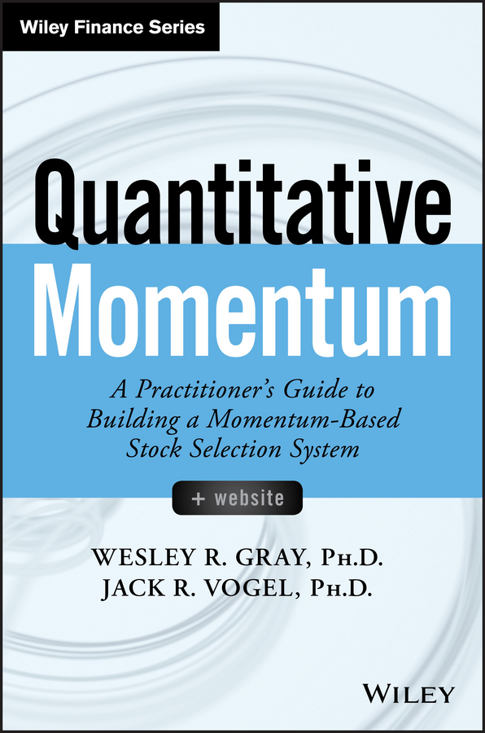

<!-- rl-section id="section" class="epub-section" -->

<!-- rl-section id="section-2" class="epub-section" kicker="Section 2" title="Section 2" -->

## Section 2

Founded in 1807, John Wiley & Sons is the oldest independent publishing company in the United States. With offices in North America, Europe, Australia and Asia, Wiley is globally committed to developing and marketing print and electronic products and services for our customers' professional and personal knowledge and understanding.

The Wiley Finance series contains books written specifically for finance and investment professionals, as well as sophisticated individual investors and their financial advisers. Book topics range from portfolio management to e-commerce, risk management, financial engineering, valuation and financial instrument analysis, as well as much more.

For a list of available titles, visit our website at [www.WileyFinance.com](http://www.WileyFinance.com).

<!-- rl-section id="section" class="epub-section" -->

Founded in 1807, John Wiley & Sons is the oldest independent publishing company in the United States. With offices in North America, Europe, Australia and Asia, Wiley is globally committed to developing and marketing print and electronic products and services for our customers' professional and personal knowledge and understanding.

The Wiley Finance series contains books written specifically for finance and investment professionals, as well as sophisticated individual investors and their financial advisers. Book topics range from portfolio management to e-commerce, risk management, financial engineering, valuation and financial instrument analysis, as well as much more.

For a list of available titles, visit our website at [www.WileyFinance.com](http://www.WileyFinance.com).

<!-- rl-section id="section-3" class="epub-section" kicker="Section 3" title="Table of Contents" -->

# Table of Contents

1. [Title Page](#section-4)
2. [Copyright](#section-5)
3. [Dedication](#section-6)
4. [Preface](#section-7)
5. [Acknowledgments](#section-8)
6. [About the Authors](#section-9)
7. [Part One: Understanding Momentum](#section-10)
   1. [Chapter 1: Less Religion; More Reason](#section-11)
      1. [Technical Analysis: The Market's Oldest Religion](#section-11)
      2. [A New Religion Emerges: Fundamental Analysis](#section-11)
      3. [The Age of Evidence-Based Investing](#section-11)
      4. [Don't Worry: This Book Is About Stock-Selection Momentum](#section-11)
      5. [Summary](#section-11)
      6. [Notes](#section-11)
   2. [Chapter 2: Why Can Active Investment Strategies Work?](#section-12)
      1. [Into the Lion's Den](#section-12)
      2. [Good Investing Is Like Good Poker: Pick the Right Table](#section-12)
      3. [Growth Investing Stinks, So Why Do It?](#section-12)
      4. [Summary](#section-12)
      5. [Notes](#section-12)
   3. [Chapter 3: Momentum Investing Is Not Growth Investing](#section-13)
      1. [The Efficient Market Mafia Kills Relative Strength](#section-13)
      2. [“Momentum” Rises from the Ashes](#section-13)
      3. [Behavioral Finance Theorists Explain Momentum](#section-13)
      4. [Wait a Minute: Momentum Investing Is Just Growth Investing, Which Doesn't Work!](#section-13)
      5. [Digging Deeper into Growth versus Momentum](#section-13)
      6. [But Why Does Momentum Work?](#section-13)
      7. [Summary](#section-13)
      8. [Notes](#section-13)
   4. [Chapter 4: Why All Value Investors Need Momentum](#section-14)
      1. [Momentum Is a Myth](#section-14)
      2. [Asness Separates Fact from Fiction](#section-14)
      3. [Expanding Your Horizons with Momentum](#section-14)
      4. [Marrying Value and Momentum](#section-14)
      5. [Summary](#section-14)
      6. [Notes](#section-14)
8. [Part Two: Building a Momentum-Based Stock Selection Model](#section-15)
   1. [Chapter 5: The Basics of Building a Momentum Strategy](#section-16)
      1. [How to Calculate Generic Momentum](#section-16)
      2. [Three Types of Momentum](#section-16)
      3. [Why Momentum Portfolio Construction Matters](#section-16)
      4. [Summary](#section-16)
      5. [Notes](#section-16)
   2. [Chapter 6: Maximizing Momentum: The Path Matters](#section-17)
      1. [The Performance of Lottery Stocks](#section-17)
      2. [The Path to Momentum Profits](#section-17)
      3. [The Results](#section-17)
      4. [Summary](#section-17)
      5. [Notes](#section-17)
   3. [Chapter 7: Momentum Investors Need to Know Their Seasons](#section-18)
      1. [Window Dressing](#section-18)
      2. [Tax-Motivated Trading](#section-18)
      3. [Great Theories: But Why Do We Care?](#section-18)
      4. [Momentum Seasonality: The Results](#section-18)
      5. [Summary](#section-18)
      6. [Notes](#section-18)
   4. [Chapter 8: Quantitative Momentum Beats the Market](#section-19)
      1. [Transaction Costs](#section-19)
      2. [The Parameters of the Universe](#section-19)
      3. [Quantitative Momentum Analysis](#section-19)
      4. [A Peek Inside the Black Box](#section-19)
      5. [Beating the Market with Quantitative Momentum](#section-19)
      6. [Notes](#section-19)
   5. [Chapter 9: Making Momentum Work in Practice](#section-20)
      1. [A Two-Legged Stool: Value + Momentum](#section-20)
      2. [A Three-Legged Stool: Combo + Trend](#section-20)
      3. [Career Risk Considerations](#section-20)
      4. [What if I Can't Handle Poor Relative Performance?](#section-20)
      5. [Notes](#section-20)
   6. [Appendix A. Investigating Alternative Momentum Concepts](#section-21)
      1. [How is Momentum Related to Fundamentals?](#section-21)
      2. [Is the 52-Week High a Better Momentum Signal?](#section-21)
      3. [Can Absolute Strength Improve Relative Strength Momentum?](#section-21)
      4. [Can the Volatility of Momentum be Constrained?](#section-21)
      5. [Notes](#section-21)
   7. [Appendix B: Performance Statistics Definitions](#section-22)
   8. [About the Companion Website](#section-23)
9. [Index](#section-24)
10. [End User License Agreement](#section-25)

## Pages

1. [ii](#section-2)
2. [iv](#section-5)
3. [v](#section-6)
4. [ix](#section-7)
5. [x](#section-7)
6. [xi](#section-8)
7. [xiii](#section-9)
8. [1](#section-10)
9. [3](#section-11)
10. [4](#section-11)
11. [5](#section-11)
12. [6](#section-11)
13. [7](#section-11)
14. [8](#section-11)
15. [9](#section-11)
16. [10](#section-11)
17. [11](#section-11)
18. [12](#section-11)
19. [13](#section-11)
20. [14](#section-12)
21. [15](#section-12)
22. [16](#section-12)
23. [17](#section-12)
24. [18](#section-12)
25. [19](#section-12)
26. [20](#section-12)
27. [21](#section-12)
28. [22](#section-12)
29. [23](#section-12)
30. [24](#section-12)
31. [25](#section-12)
32. [26](#section-12)
33. [27](#section-12)
34. [28](#section-12)
35. [29](#section-12)
36. [30](#section-12)
37. [31](#section-12)
38. [32](#section-12)
39. [33](#section-12)
40. [34](#section-12)
41. [35](#section-12)
42. [36](#section-12)
43. [37](#section-12)
44. [38](#section-12)
45. [39](#section-12)
46. [40](#section-12)
47. [41](#section-12)
48. [42](#section-12)
49. [43](#section-13)
50. [44](#section-13)
51. [45](#section-13)
52. [46](#section-13)
53. [47](#section-13)
54. [48](#section-13)
55. [49](#section-13)
56. [50](#section-13)
57. [51](#section-13)
58. [52](#section-13)
59. [53](#section-13)
60. [54](#section-13)
61. [55](#section-13)
62. [56](#section-13)
63. [57](#section-13)
64. [58](#section-13)
65. [59](#section-13)
66. [60](#section-13)
67. [61](#section-13)
68. [62](#section-14)
69. [63](#section-14)
70. [64](#section-14)
71. [65](#section-14)
72. [66](#section-14)
73. [67](#section-14)
74. [68](#section-14)
75. [69](#section-14)
76. [70](#section-14)
77. [71](#section-14)
78. [72](#section-14)
79. [73](#section-14)
80. [74](#section-14)
81. [75](#section-14)
82. [76](#section-14)
83. [77](#section-15)
84. [79](#section-16)
85. [80](#section-16)
86. [81](#section-16)
87. [82](#section-16)
88. [83](#section-16)
89. [84](#section-16)
90. [85](#section-16)
91. [86](#section-16)
92. [87](#section-16)
93. [88](#section-16)
94. [89](#section-16)
95. [90](#section-16)
96. [91](#section-16)
97. [92](#section-16)
98. [93](#section-17)
99. [94](#section-17)
100. [95](#section-17)
101. [96](#section-17)
102. [97](#section-17)
103. [98](#section-17)
104. [99](#section-17)
105. [100](#section-17)
106. [101](#section-17)
107. [102](#section-17)
108. [103](#section-17)
109. [104](#section-17)
110. [105](#section-17)
111. [106](#section-17)
112. [107](#section-18)
113. [108](#section-18)
114. [109](#section-18)
115. [110](#section-18)
116. [111](#section-18)
117. [112](#section-18)
118. [113](#section-18)
119. [114](#section-18)
120. [115](#section-18)
121. [116](#section-18)
122. [117](#section-18)
123. [118](#section-18)
124. [119](#section-18)
125. [120](#section-19)
126. [121](#section-19)
127. [122](#section-19)
128. [123](#section-19)
129. [124](#section-19)
130. [125](#section-19)
131. [126](#section-19)
132. [127](#section-19)
133. [128](#section-19)
134. [129](#section-19)
135. [130](#section-19)
136. [131](#section-19)
137. [132](#section-19)
138. [133](#section-19)
139. [134](#section-19)
140. [135](#section-19)
141. [136](#section-19)
142. [137](#section-19)
143. [138](#section-19)
144. [139](#section-19)
145. [140](#section-19)
146. [141](#section-19)
147. [142](#section-19)
148. [144](#section-20)
149. [145](#section-20)
150. [146](#section-20)
151. [147](#section-20)
152. [148](#section-20)
153. [149](#section-20)
154. [150](#section-20)
155. [151](#section-20)
156. [152](#section-20)
157. [153](#section-20)
158. [154](#section-20)
159. [177](#section-24)
160. [178](#section-24)
161. [179](#section-24)
162. [180](#section-24)
163. [181](#section-24)
164. [182](#section-24)
165. [183](#section-24)
166. [184](#section-24)
167. [185](#section-24)
168. [186](#section-24)
169. [187](#section-24)

## Guide

1. [Table of Contents](#toc)
2. [Begin Reading](#section-7)

## List of Illustrations

1. Chapter 2: Why Can Active Investment Strategies Work?
   1. [Figure 2.1 The Two Pillars of Behavioral Finance](#section-12)
   2. [Figure 2.2 Identifying Opportunity in the Market](#section-12)
   3. [Figure 2.3 CGM Focus Fund from 1999 to 2009](#section-12)
   4. [Figure 2.4 The Long-Term Performance Equation](#section-12)
   5. [Figure 2.5 Investors Extrapolate Past Growth Rates into the Future](#section-12)
   6. [Figure 2.6 Realized Growth Rates Systematically Mean-Revert](#section-12)
   7. [Figure 2.7 Value Investing Can Underperform](#section-12)
   8. [Figure 2.8 Value and Growth Chart](#section-12)
   9. [Figure 2.9 New Style Box Paradigm](#section-12)
2. Chapter 3: Momentum Investing Is Not Growth Investing
   1. [Figure 3.1 CAGR: Growth Monkeys versus Momentum Monkeys](#section-13)
   2. [Figure 3.2 Volatility: Growth Monkeys versus Momentum Monkeys](#section-13)
   3. [Figure 3.3 Drawdown: Growth Monkeys versus Momentum Monkeys](#section-13)
3. Chapter 4: Why All Value Investors Need Momentum
   1. [Figure 4.1 Modern Portfolio Theory Chart](#section-14)
   2. [Figure 4.2 Modern Portfolio Theory with Momentum](#section-14)
   3. [Figure 4.3 US Rolling Five-Year Spreads](#section-14)
   4. [Figure 4.4 UK Rolling Five-Year Spreads](#section-14)
   5. [Figure 4.5 Europe Rolling Five-Year Spreads](#section-14)
   6. [Figure 4.6 Japan Rolling Five-Year Spreads](#section-14)
   7. [Figure 4.7 Global Rolling Five-Year Spreads](#section-14)
4. Chapter 5: The Basics of Building a Momentum Strategy
   1. [Figure 5.1 Short-Term Momentum Portfolio Returns](#section-16)
   2. [Figure 5.2 Long-Term Momentum Portfolio Returns](#section-16)
   3. [Figure 5.3 Intermediate-Term Momentum Portfolio Returns](#section-16)
5. Chapter 6: Maximizing Momentum: The Path Matters
   1. [Figure 6.1 Alliance and International Rectifier Past Performance](#section-17)
   2. [Figure 6.2 Alliance and International Rectifier Future Performance](#section-17)
   3. [Figure 6.3 Frog-in-the-Pan Portfolio Alphas](#section-17)
   4. [Figure 6.4 Quality of Momentum Portfolio Returns](#section-17)
6. Chapter 7: Momentum Investors Need to Know Their Seasons
   1. [Figure 7.1 Momentum Seasonality from 1984 to 2004](#section-18)
   2. [Figure 7.2 Momentum Spread from 1974 to 2014](#section-18)
7. Chapter 8: Quantitative Momentum Beats the Market
   1. [Figure 8.1 Quantitative Momentum Process](#section-19)
   2. [Figure 8.2 Cumulative Value for Quantitative Momentum (1927–2014)](#section-19)
   3. [Figure 8.3a Five-Year Rolling CAGR for Quantitative Momentum](#section-19)
   4. [Figure 8.3b Ten-Year Rolling CAGR for Quantitative Momentum](#section-19)
   5. [Figure 8.4 Summary Drawdown Analysis](#section-19)
   6. [Figure 8.5a Five-Year Rolling Max Drawdown for Quantitative Momentum](#section-19)
   7. [Figure 8.5b Ten-Year Rolling Max Drawdown for Quantitative Momentum](#section-19)
   8. [Figure 8.6 Market Cycle Performance for Quantitative Momentum](#section-19)
   9. [Figure 8.7 Short-Term Stress Event Tests for Quantitative Momentum](#section-19)
   10. [Figure 8.8a Five-Year Rolling Alpha for Quantitative Momentum](#section-19)
   11. [Figure 8.8b Ten-Year Rolling Alpha for Quantitative Momentum](#section-19)
8. Chapter 9: Making Momentum Work in Practice
   1. [Figure 9.1 Rolling Five-Year Spreads](#section-20)
   2. [Figure 9.2 Histogram of Five-Year Spreads](#section-20)
   3. [Figure 9.3 Histogram of 5-Year Spreads](#section-20)
   4. [Figure 9.4 Histogram of Five-Year Spreads](#section-20)
9. Appendix A. Investigating Alternative Momentum Concepts
   1. [Figure A1.1 Fundamental Momentum Returns](#section-21)
   2. [Figure A1.2 Decile Returns to 52-Week High Screen](#section-21)
   3. [Figure A1.3 Absolute Momentum Breakpoints](#section-21)
   4. [Figure A1.4 Absolute Momentum Number of Firms](#section-21)

## List of Tables

1. Chapter 2: Why Can Active Investment Strategies Work?
   1. [Table 2.1 Value versus Growth (1927 to 2014)](#section-12)
   2. [Table 2.2 Value Investing Can Underperform (1994–1999)](#section-12)
   3. [Table 2.3 Annual Returns](#section-12)
   4. [Table 2.4 Summary Statistics (2000–2014)](#section-12)
   5. [Table 2.5 Summary Statistics (1994–2014)](#section-12)
   6. [Table 2.6 Combining Value and Growth Lowers Volatility (1994–1999)](#section-12)
   7. [Table 2.7 Annual Returns for Combo Portfolio](#section-12)
   8. [Table 2.8 Combining Value and Growth Lowers Volatility (1994–2014)](#section-12)
2. Chapter 3: Momentum Investing Is Not Growth Investing
   1. [Table 3.1 Momentum Performance (1927–2014)](#section-13)
   2. [Table 3.2 Momentum Investing Can Underperform (2008–2009)](#section-13)
   3. [Table 3.3 Momentum Investing Can Underperform (2008–2014)](#section-13)
3. Chapter 4: Why All Value Investors Need Momentum
   1. [Table 4.1 Japanese Equity Market Performance (1982–2014)](#section-14)
   2. [Table 4.2 Asset Class Historical Results](#section-14)
   3. [Table 4.3 Momentum Performance (1982–2014)](#section-14)
   4. [Table 4.4 Value Performance (1982–2014)](#section-14)
   5. [Table 4.5 Correlation of Value and Momentum](#section-14)
   6. [Table 4.6 Value and Momentum Combination Portfolios](#section-14)
4. Chapter 5: The Basics of Building a Momentum Strategy
   1. [Table 5.1 Simple 12-Month Momentum Example for Apple](#section-16)
   2. [Table 5.2 Short-Term Momentum Portfolio Returns (1927–2014)](#section-16)
   3. [Table 5.3 Long-Term Momentum Portfolio Returns (1931–2014)](#section-16)
   4. [Table 5.4 Intermediate-Term Momentum Portfolio Returns (1927–2014)](#section-16)
   5. [Table 5.5 Momentum Portfolio Returns: Varying Holding Period and Number of Firms in the Portfolio (1927–2014)](#section-16)
5. Chapter 6: Maximizing Momentum: The Path Matters
   1. [Table 6.1 Lottery Stock Results](#section-17)
   2. [Table 6.2 Average Monthly Returns Sorting Stocks on Beta and the “Lottery” Ranking](#section-17)
   3. [Table 6.3 Frog-in-the-pan Results to Long/Short Momentum Portfolios](#section-17)
   4. [Table 6.4 Quality of Momentum Portfolio Annual Results](#section-17)
6. Chapter 7: Momentum Investors Need to Know Their Seasons
   1. [Table 7.1 Average Returns by Month](#section-18)
   2. [Table 7.2 Seasonality of Momentum Portfolio Annual Results](#section-18)
7. Chapter 8: Quantitative Momentum Beats the Market
   1. [Table 8.1 Universe Selection Parameters](#section-19)
   2. [Table 8.2 VW Quantitative Momentum Performance (1927–2014)](#section-19)
   3. [Table 8.3 CAGR Across Different Decades](#section-19)
   4. [Table 8.4 Top 10 Drawdown Analysis](#section-19)
   5. [Table 8.5 Market Cycle Definitions](#section-19)
   6. [Table 8.6 Asset Pricing Coefficient Estimates for Quantitative Momentum](#section-19)
   7. [Table 8.7 December 31, 2014, Quantitative Momentum Portfolio Holdings](#section-19)
8. Chapter 9: Making Momentum Work in Practice
   1. [Table 9.1 Combining Quantitative Value and Quantitative Momentum](#section-20)
   2. [Table 9.2 Combining Quantitative Value and Quantitative Momentum](#section-20)
   3. [Table 9.3 Core-Satellite Returns](#section-20)
9. Appendix A. Investigating Alternative Momentum Concepts
   1. [Table A1.1 Top Decile Portfolio Summary Statistics](#section-21)
   2. [Table A1.2 Bottom Decile Portfolio Summary Statistics](#section-21)
   3. [Table A1.3 Long/Short Momentum Portfolio Annual Returns](#section-21)
   4. [Table A1.4 Long/Short Momentum Portfolio Factor Loadings](#section-21)
   5. [Table A1.5 Value and Momentum Portfolio Annual Returns](#section-21)
   6. [Table A1.6 Absolute Momentum Long/Short Returns](#section-21)
   7. [Table A1.7 Absolute Momentum Long-Only Portfolio Returns](#section-21)
   8. [Table A1.8 Equal-Weighted Stop-Loss Momentum Monthly Returns](#section-21)
   9. [Table A1.9 Momentum Stop-Loss Performance](#section-21)
   10. [Table A1.10 Time-Series Momentum Performance](#section-21)
10. Appendix B: Performance Statistics Definitions
    1. [Table A2.1 Performance Statistics Definitions](#section-22)

<!-- rl-section id="section-4" class="epub-section" kicker="Section 4" title="Quantitative Momentum" -->

# Quantitative Momentum

## *A Practitioner’s Guide to Building a Momentum-Based Stock Selection System*

**WESLEY R. GRAY  
JACK R. VOGEL**

<!-- rl-section id="a-practitioner-s-guide-to-building-a-momentum-based-stock-selection-system" class="titlePage" title="A Practitioner’s Guide to Building a Momentum-Based Stock Selection System" -->

# Quantitative Momentum

**WESLEY R. GRAY  
JACK R. VOGEL**

<!-- rl-section id="section" class="epub-section" -->

**WESLEY R. GRAY  
JACK R. VOGEL**

<!-- rl-section id="section-5" class="epub-section" kicker="Section 5" title="Section 5" -->

## Section 5

Copyright © 2016 by Wesley R. Gray and Jack R. Vogel. All rights reserved.

Published by John Wiley & Sons, Inc., Hoboken, New Jersey.

Published simultaneously in Canada.

No part of this publication may be reproduced, stored in a retrieval system, or transmitted in any form or by any means, electronic, mechanical, photocopying, recording, scanning, or otherwise, except as permitted under Section 107 or 108 of the 1976 United States Copyright Act, without either the prior written permission of the Publisher, or authorization through payment of the appropriate per-copy fee to the Copyright Clearance Center, Inc., 222 Rosewood Drive, Danvers, MA 01923, (978) 750-8400, fax (978) 646-8600, or on the Web at [www.copyright.com](http://www.copyright.com). Requests to the Publisher for permission should be addressed to the Permissions Department, John Wiley & Sons, Inc., 111 River Street, Hoboken, NJ 07030, (201) 748-6011, fax (201) 748-6008, or online at <http://www.wiley.com/go/permissions>.

Limit of Liability/Disclaimer of Warranty: While the publisher and author have used their best efforts in preparing this book, they make no representations or warranties with respect to the accuracy or completeness of the contents of this book and specifically disclaim any implied warranties of merchantability or fitness for a particular purpose. No warranty may be created or extended by sales representatives or written sales materials. The advice and strategies contained herein may not be suitable for your situation. You should consult with a professional where appropriate. Neither the publisher nor author shall be liable for any loss of profit or any other commercial damages, including but not limited to special, incidental, consequential, or other damages.

For general information on our other products and services or for technical support, please contact our Customer Care Department within the United States at (800) 762-2974, outside the United States at (317) 572-3993 or fax (317) 572-4002.

Wiley publishes in a variety of print and electronic formats and by print-on-demand. Some material included with standard print versions of this book may not be included in e-books or in print-on-demand. If this book refers to media such as a CD or DVD that is not included in the version you purchased, you may download this material at <http://booksupport.wiley.com>. For more information about Wiley products, visit [www.wiley.com](http://www.wiley.com).

***Library of Congress Cataloging-in-Publication Data:***

Names: Gray, Wesley R., author. | Vogel, Jack R., 1983- author.

Title: Quantitative momentum : a practitioner’s guide to building a momentum-based stock selection system / Wesley R. Gray, Jack R. Vogel.

Description: Hoboken, New Jersey : John Wiley & Sons, Inc., [2016] | Series: Wiley finance series | Includes index.

Identifiers: LCCN 2016023789 (print) | LCCN 2016035370 (ebook) | ISBN 9781119237198 (cloth) | ISBN 9781119237266 (pdf) | ISBN 9781119237259 (epub)

Subjects: LCSH: Stocks. | Investments. | Technical analysis (Investment analysis)

Classification: LCC HG4661 .G676 2016 (print) | LCC HG4661 (ebook) | DDC 332.63/2042—dc23

LC record available at <https://lccn.loc.gov/2016023789>

Cover image: Wiley

Cover design: © Frank Rohde/Shutterstock

<!-- rl-section id="section" class="copyright" -->

Copyright © 2016 by Wesley R. Gray and Jack R. Vogel. All rights reserved.

Published by John Wiley & Sons, Inc., Hoboken, New Jersey.

Published simultaneously in Canada.

No part of this publication may be reproduced, stored in a retrieval system, or transmitted in any form or by any means, electronic, mechanical, photocopying, recording, scanning, or otherwise, except as permitted under Section 107 or 108 of the 1976 United States Copyright Act, without either the prior written permission of the Publisher, or authorization through payment of the appropriate per-copy fee to the Copyright Clearance Center, Inc., 222 Rosewood Drive, Danvers, MA 01923, (978) 750-8400, fax (978) 646-8600, or on the Web at [www.copyright.com](http://www.copyright.com). Requests to the Publisher for permission should be addressed to the Permissions Department, John Wiley & Sons, Inc., 111 River Street, Hoboken, NJ 07030, (201) 748-6011, fax (201) 748-6008, or online at <http://www.wiley.com/go/permissions>.

Limit of Liability/Disclaimer of Warranty: While the publisher and author have used their best efforts in preparing this book, they make no representations or warranties with respect to the accuracy or completeness of the contents of this book and specifically disclaim any implied warranties of merchantability or fitness for a particular purpose. No warranty may be created or extended by sales representatives or written sales materials. The advice and strategies contained herein may not be suitable for your situation. You should consult with a professional where appropriate. Neither the publisher nor author shall be liable for any loss of profit or any other commercial damages, including but not limited to special, incidental, consequential, or other damages.

For general information on our other products and services or for technical support, please contact our Customer Care Department within the United States at (800) 762-2974, outside the United States at (317) 572-3993 or fax (317) 572-4002.

Wiley publishes in a variety of print and electronic formats and by print-on-demand. Some material included with standard print versions of this book may not be included in e-books or in print-on-demand. If this book refers to media such as a CD or DVD that is not included in the version you purchased, you may download this material at <http://booksupport.wiley.com>. For more information about Wiley products, visit [www.wiley.com](http://www.wiley.com).

***Library of Congress Cataloging-in-Publication Data:***

Names: Gray, Wesley R., author. | Vogel, Jack R., 1983- author.

Title: Quantitative momentum : a practitioner’s guide to building a momentum-based stock selection system / Wesley R. Gray, Jack R. Vogel.

Description: Hoboken, New Jersey : John Wiley & Sons, Inc., [2016] | Series: Wiley finance series | Includes index.

Identifiers: LCCN 2016023789 (print) | LCCN 2016035370 (ebook) | ISBN 9781119237198 (cloth) | ISBN 9781119237266 (pdf) | ISBN 9781119237259 (epub)

Subjects: LCSH: Stocks. | Investments. | Technical analysis (Investment analysis)

Classification: LCC HG4661 .G676 2016 (print) | LCC HG4661 (ebook) | DDC 332.63/2042—dc23

LC record available at <https://lccn.loc.gov/2016023789>

Cover image: Wiley

Cover design: © Frank Rohde/Shutterstock

<!-- rl-section id="section-6" class="epub-section" kicker="Section 6" title="Section 6" -->

## Section 6

Buy cheap; buy strong; hold 'em long.

—Wes and Jack

<!-- rl-section id="section" class="dedication" -->

Buy cheap; buy strong; hold 'em long.

—Wes and Jack

<!-- rl-section id="section-7" class="epub-section" kicker="Section 7" title="Preface" -->

# Preface

The efficient market hypothesis suggests that past prices cannot predict future success. But there is a problem: past prices *do* predict future expected performance and this problem is generically labeled “momentum.” Momentum is the epitome of a simple strategy even your grandmother would understand—buy winners. And momentum is an open secret. The track record associated with buying past winners now extends over 200 years and has become the ultimate black eye for the efficient market hypothesis (EMH). So why isn't everyone a momentum investor? We believe there are two reasons: hard-wired behavioral biases cause many investors to be anti-momentum traders, and for the professional, who wants to exploit momentum, marketplace constraints make this a challenging enterprise.

As long as human beings suffer from systematic expectation errors, prices have the potential to deviate from fundamentals. In the context of value investing, this expectation error seems to be an *overreaction* to negative news, on average; for momentum, the expectation error is surprisingly tied to an *underreaction* to positive news (some argue it is an overreaction, which cannot be ruled out, but the collective evidence is more supportive of the undereaction hypothesis). So investors that believe that behavioral bias drives the long-term excess returns associated with value investing already believe in the key mechanism that drives the long-term sustainability of momentum. In short, value and momentum represent the two sides of the same behavioral bias coin.

But why aren't momentum strategies exploited by more investors and arbitraged away? As we will discuss, the speed at which mispricing opportunities are eliminated depends on the cost of exploitation. Putting aside an array of transaction and information acquisition costs, which are nonzero, the biggest cost to exploiting long-lasting mispricing opportunities are career risk concerns on behalf of delegated asset managers. The career risk aspect develops because investors often delegate to a professional to manage their capital on their behalf. Unfortunately, the investors that delegate their capital to the professional fund managers often assess the performance of their hired manager based on their short-term relative performance to a benchmark. But this creates a warped incentive for the professional fund manager. On the one hand, fund managers want to exploit mispricing opportunities because of the high expected long-term performance, but on the other hand, they can do so only to the extent to which exploiting the mispricing opportunities doesn't cause their expected performance to deviate too far—and/or for too long—from a standard benchmark. In summary, strategies like momentum presumably work because they sometimes *fail spectacularly* relative to passive benchmarks, creating a “career risk” premium. And if we follow this line of reasoning, we only need to assume the following to believe that a momentum strategy, or really any anomaly strategy, can be sustainable in the future:

- Investors will continue to suffer behavioral bias.
- Investors who delegate will be short-sighted performance chasers.

We think we can rely on these two assumptions for the foreseeable future. And because of our faith in these assumptions, we believe there will always be opportunities for process-driven, long-term focused, disciplined investors.

Assuming we are prepared to be a momentum investor and we've internalized the reality that the journey has to be painful in order to be sustainable, we need to address a simple question: ***How do we build an effective momentum strategy?*** In this book we outline the multiyear research journey we undertook to build our stock selection momentum strategy. The conclusion of our adventure is the quantitative momentum strategy, which can be summarized as a strategy that seeks to *buy stocks with the highest quality momentum*. And to be clear up front, we do not claim to have the “best” momentum strategy, or a momentum strategy that is “guaranteed” to work, but we do think our process is reasonable, evidence-based, and ties back to behavioral finance in a coherent and logical way. We also provide radical transparency into how and why we've developed the process. We want readers to question our assumptions, reverse engineer the results, and tell us if they think our process can be improved. You can always reach us at AlphaArchitect.com and we'll be happy to address your questions.

We hope you enjoy the story of quantitative momentum.

<!-- rl-section id="section" class="preface" -->

# Preface

The efficient market hypothesis suggests that past prices cannot predict future success. But there is a problem: past prices *do* predict future expected performance and this problem is generically labeled “momentum.” Momentum is the epitome of a simple strategy even your grandmother would understand—buy winners. And momentum is an open secret. The track record associated with buying past winners now extends over 200 years and has become the ultimate black eye for the efficient market hypothesis (EMH). So why isn't everyone a momentum investor? We believe there are two reasons: hard-wired behavioral biases cause many investors to be anti-momentum traders, and for the professional, who wants to exploit momentum, marketplace constraints make this a challenging enterprise.

As long as human beings suffer from systematic expectation errors, prices have the potential to deviate from fundamentals. In the context of value investing, this expectation error seems to be an *overreaction* to negative news, on average; for momentum, the expectation error is surprisingly tied to an *underreaction* to positive news (some argue it is an overreaction, which cannot be ruled out, but the collective evidence is more supportive of the undereaction hypothesis). So investors that believe that behavioral bias drives the long-term excess returns associated with value investing already believe in the key mechanism that drives the long-term sustainability of momentum. In short, value and momentum represent the two sides of the same behavioral bias coin.

But why aren't momentum strategies exploited by more investors and arbitraged away? As we will discuss, the speed at which mispricing opportunities are eliminated depends on the cost of exploitation. Putting aside an array of transaction and information acquisition costs, which are nonzero, the biggest cost to exploiting long-lasting mispricing opportunities are career risk concerns on behalf of delegated asset managers. The career risk aspect develops because investors often delegate to a professional to manage their capital on their behalf. Unfortunately, the investors that delegate their capital to the professional fund managers often assess the performance of their hired manager based on their short-term relative performance to a benchmark. But this creates a warped incentive for the professional fund manager. On the one hand, fund managers want to exploit mispricing opportunities because of the high expected long-term performance, but on the other hand, they can do so only to the extent to which exploiting the mispricing opportunities doesn't cause their expected performance to deviate too far—and/or for too long—from a standard benchmark. In summary, strategies like momentum presumably work because they sometimes *fail spectacularly* relative to passive benchmarks, creating a “career risk” premium. And if we follow this line of reasoning, we only need to assume the following to believe that a momentum strategy, or really any anomaly strategy, can be sustainable in the future:

- Investors will continue to suffer behavioral bias.
- Investors who delegate will be short-sighted performance chasers.

We think we can rely on these two assumptions for the foreseeable future. And because of our faith in these assumptions, we believe there will always be opportunities for process-driven, long-term focused, disciplined investors.

Assuming we are prepared to be a momentum investor and we've internalized the reality that the journey has to be painful in order to be sustainable, we need to address a simple question: ***How do we build an effective momentum strategy?*** In this book we outline the multiyear research journey we undertook to build our stock selection momentum strategy. The conclusion of our adventure is the quantitative momentum strategy, which can be summarized as a strategy that seeks to *buy stocks with the highest quality momentum*. And to be clear up front, we do not claim to have the “best” momentum strategy, or a momentum strategy that is “guaranteed” to work, but we do think our process is reasonable, evidence-based, and ties back to behavioral finance in a coherent and logical way. We also provide radical transparency into how and why we've developed the process. We want readers to question our assumptions, reverse engineer the results, and tell us if they think our process can be improved. You can always reach us at AlphaArchitect.com and we'll be happy to address your questions.

We hope you enjoy the story of quantitative momentum.

<!-- rl-section id="section-8" class="epub-section" kicker="Section 8" title="Acknowledgments" -->

# Acknowledgments

We have had enormous support from many colleagues, friends, and family in making this book a reality. We thank our wives, Katie Gray and Meg Vogel, for their continual support and for managing our chaotic kids so we could write our manuscript. We'd also like to thank the entire team at Alpha Architect, for dealing with the two of us while we drafted the initial manuscript. David Foulke provided invaluable comments and read the manuscript so many times his head is still spinning. Walter Haynes also played a pivotal role in making the manuscript a lot better. Yang Xu was immensely helpful on the research front, grinding numbers into the late hours of the night. Finally, to the rest of the Alpha Architect team—Tian Yao, Yang Xu, Tao Wang, Pat Cleary, Carl Kanner, and Xin Song—we are forever indebted! We'd also like to thank outside readers for their early comments and incredible insights. Andrew Miller, Larry Dunn, Matt Martelli, Pat O'Shaughnessy, Gary Antonacci, and a handful of anonymous readers made the book so much better than it would have been had we been working alone. Finally, we think our editor Julie Kerr for her invaluable feedback.

<!-- rl-section id="section" class="epub-section" -->

# Acknowledgments

We have had enormous support from many colleagues, friends, and family in making this book a reality. We thank our wives, Katie Gray and Meg Vogel, for their continual support and for managing our chaotic kids so we could write our manuscript. We'd also like to thank the entire team at Alpha Architect, for dealing with the two of us while we drafted the initial manuscript. David Foulke provided invaluable comments and read the manuscript so many times his head is still spinning. Walter Haynes also played a pivotal role in making the manuscript a lot better. Yang Xu was immensely helpful on the research front, grinding numbers into the late hours of the night. Finally, to the rest of the Alpha Architect team—Tian Yao, Yang Xu, Tao Wang, Pat Cleary, Carl Kanner, and Xin Song—we are forever indebted! We'd also like to thank outside readers for their early comments and incredible insights. Andrew Miller, Larry Dunn, Matt Martelli, Pat O'Shaughnessy, Gary Antonacci, and a handful of anonymous readers made the book so much better than it would have been had we been working alone. Finally, we think our editor Julie Kerr for her invaluable feedback.

<!-- rl-section id="section-9" class="epub-section" kicker="Section 9" title="About the Authors" -->

# About the Authors

#### Wesley R. Gray, PhD

After serving as a Captain in the United States Marine Corps, Dr. Gray received a PhD, and was a finance professor at Drexel University. Dr. Gray's interest in entrepreneurship and behavioral finance led him to found Alpha Architect, an asset management firm that delivers affordable active exposures for tax-sensitive investors. Dr. Gray has published four books and multiple academic articles. Wes is a regular contributor to the Wall Street Journal, Forbes, and the CFA Institute. Dr. Gray earned an MBA and a PhD in finance from the University of Chicago and graduated magna cum laude with a BS from The Wharton School of the University of Pennsylvania.

### John (Jack) R. Vogel, PhD

Dr. Vogel conducts research in empirical asset pricing and behavioral finance, and has published two books and multiple academic articles. His academic background includes experience as an instructor and research assistant at Drexel University in both the Finance and Mathematics departments, as well as a Finance instructor at Villanova University. Dr. Vogel is currently a Managing Member of Alpha Architect, an SEC-Registered Investment Advisor, where he serves as the Chief Financial Officer and Co-Chief Investment Officer. He has a PhD in Finance and a MS in Mathematics from Drexel University, and graduated summa cum laude with a BS in Mathematics and Education from the University of Scranton.

<!-- rl-section id="section" class="epub-section" -->

# About the Authors

#### Wesley R. Gray, PhD

After serving as a Captain in the United States Marine Corps, Dr. Gray received a PhD, and was a finance professor at Drexel University. Dr. Gray's interest in entrepreneurship and behavioral finance led him to found Alpha Architect, an asset management firm that delivers affordable active exposures for tax-sensitive investors. Dr. Gray has published four books and multiple academic articles. Wes is a regular contributor to the Wall Street Journal, Forbes, and the CFA Institute. Dr. Gray earned an MBA and a PhD in finance from the University of Chicago and graduated magna cum laude with a BS from The Wharton School of the University of Pennsylvania.

### John (Jack) R. Vogel, PhD

Dr. Vogel conducts research in empirical asset pricing and behavioral finance, and has published two books and multiple academic articles. His academic background includes experience as an instructor and research assistant at Drexel University in both the Finance and Mathematics departments, as well as a Finance instructor at Villanova University. Dr. Vogel is currently a Managing Member of Alpha Architect, an SEC-Registered Investment Advisor, where he serves as the Chief Financial Officer and Co-Chief Investment Officer. He has a PhD in Finance and a MS in Mathematics from Drexel University, and graduated summa cum laude with a BS in Mathematics and Education from the University of Scranton.

<!-- rl-section id="section" class="epub-section" -->

#### Wesley R. Gray, PhD

After serving as a Captain in the United States Marine Corps, Dr. Gray received a PhD, and was a finance professor at Drexel University. Dr. Gray's interest in entrepreneurship and behavioral finance led him to found Alpha Architect, an asset management firm that delivers affordable active exposures for tax-sensitive investors. Dr. Gray has published four books and multiple academic articles. Wes is a regular contributor to the Wall Street Journal, Forbes, and the CFA Institute. Dr. Gray earned an MBA and a PhD in finance from the University of Chicago and graduated magna cum laude with a BS from The Wharton School of the University of Pennsylvania.

<!-- rl-section id="section-10" class="epub-section" kicker="Section 10" title="Part One" -->

# Part One

# Understanding Momentum

This book is organized into two parts. [Part One](#section-10) sets out the rationale for using momentum as a systematic stock selection tool. In [Chapter 1](#section-11), “Less Religion; More Reason,” we provide a discussion of the two dominant investment religions: fundamental and technical. We propose that evidence-based investors consider both approaches. Next, in [Chapter 2](#section-12), “Why Can Active Investment Strategies Work?” we outline our sustainable active investing framework, which helps us identify why a strategy will work over the long haul (i.e., the “edge”). In [Chapter 3](#section-13), “Momentum Investing is Not Growth Investing,” we propose that momentum investing, like value investing, is arguably a sustainable anomaly. Finally, we end [Part One](#section-10) with [Chapter 4](#section-14), “Why All Value Investors Need Momentum,” a discussion of the evidence related to momentum investing, which suggests that most investors should at least consider momentum investing when constructing their diversified investment portfolio.

<!-- rl-section id="section" class="epub-section" -->

# Part One

# Understanding Momentum

This book is organized into two parts. [Part One](#section-10) sets out the rationale for using momentum as a systematic stock selection tool. In [Chapter 1](#section-11), “Less Religion; More Reason,” we provide a discussion of the two dominant investment religions: fundamental and technical. We propose that evidence-based investors consider both approaches. Next, in [Chapter 2](#section-12), “Why Can Active Investment Strategies Work?” we outline our sustainable active investing framework, which helps us identify why a strategy will work over the long haul (i.e., the “edge”). In [Chapter 3](#section-13), “Momentum Investing is Not Growth Investing,” we propose that momentum investing, like value investing, is arguably a sustainable anomaly. Finally, we end [Part One](#section-10) with [Chapter 4](#section-14), “Why All Value Investors Need Momentum,” a discussion of the evidence related to momentum investing, which suggests that most investors should at least consider momentum investing when constructing their diversified investment portfolio.

<!-- rl-section id="section-11" class="epub-section" kicker="Section 11" title="CHAPTER 1 Less Religion; More Reason" -->

# CHAPTER 1 Less Religion; More Reason

> *Child: “Dad, are you sure Santa brought the presents?”*

> *Father: “Yes, Santa carried them on his sleigh.”*

> *Child: “I guess that makes sense. He did eat the cookies and milk we left by the fireplace.”*

—Typical adult/child chat on Christmas Day

## TECHNICAL ANALYSIS: THE MARKET'S OLDEST RELIGION

During the 1600s, the Dutch had a large merchant fleet and the port city of Amsterdam was a dominant commercial hub for trade from around the world. Based on the growing influence of the Dutch Republic, in 1602 the Dutch East India Company was founded, and its evolution into the first publicly traded global corporation drove a number of financial innovations to the Amsterdam Stock Exchange, including the subsequent listing of additional companies and even short selling.

In 1688, Joseph de la Vega, a successful Dutch merchant, wrote *Confusion De Confusiones*, one of the earliest known books to describe a stock exchange and stock trading. Some researchers today argue that he should be considered the father of behavioral finance. De la Vega vividly described excessive trading, overreaction, underreaction, and the disposition effect well before they were documented by modern finance journals.[1](#c01-note-0001)

In his book, de la Vega describes the day-to-day business of the Exchange and alludes to how prices are set:

---

*When a bull enters such a coffee-house during the Exchange hours, he is asked the price of the shares by the people present. He adds one to two per cent to the price of the day and he produces a notebook in which he pretends to put down orders. The desire to buy shares increases; and this enhances also the apprehension that there may be a further rise (for on this point we are all alike: when the prices rise, we think that they fly up high and, when they have risen high, that they will run away from us).*[2](#c01-note-0002)

---

De la Vega seems to be describing how rising prices themselves can beget continued price increases. Put another way, in the words of Wes's graduate school roommate who managed a market making desk at a large Wall Street bank, “High prices attract buyers, low prices attract sellers.”[3](#c01-note-0003)

De la Vega continues:

---

*The fall of prices need not have a limit, and there are also unlimited possibilities for the rise…Therefore the excessively high values need not alarm you…there will always be buyers who will free you from anxiety…the bulls are optimistic with joy over the state of business affairs, which is steadily favorable to them; and their attitude is so full of [unthinking] confidence that even less favorable news does not impress them and causes no anxiety…[It seems] incompatible with philosophy that bears should sell after the reason for their sales has ceased to exist, since the philosophers teach that when the cause ceases, the effect ceases also. But if the bears obstinately go on selling, there is an effect even after the cause had disappeared.*[4](#c01-note-0004)

---

Here de la Vega explicitly discusses how bulls can continue buying, and bears can continue selling, even when there is no direct reason or cause for them to do so, other than the price action itself. So here we see how, even in seventeenth-century Europe, price changes—independent of fundamentals—can affect future market prices.

While early technical analysis was evolving in stock trading in Europe, an even more fascinating financial experiment was taking place in Japan. During the 1600s, the peasant class, who made up the majority of the Japanese population, was forced into farming, thus supplying a tax base that could support the ruling military class, who, in turn, provided protection for agricultural land. Rice was the largest crop at that time, accounting for as much as 90 percent of government revenues, and became a staple of the Japanese economy.

The important role of rice in Japan led to the establishment of a formal exchange in 1697, and eventually to the emergence of what many believe to be the first futures market, the Dojima Rice Market. That market grew to include a network of warehouses, with established credit and clearing mechanisms.[5](#c01-note-0005)

The rapidly evolving rice market in Japan was the fertile financial environment in which a young rice merchant, Munehisa Homma (1724–1803), found himself during the mid-1700s. Homma began trading rice futures and used a private communications network to trade advantageously. Homma also used the history of prices to make predictions about the direction of future prices. But his key insight involved the psychology of the markets.

In 1755, Homma wrote, *The Fountain of Gold—The Three Monkey Record of Money*, which described the role of emotions and how these could affect rice prices. Homma observed, “The psychological aspect of the market was critical to [one's] trading success,” and “studying the emotions of the market…could help in predicting prices.” Thus, Homma, like de la Vega, was perhaps one of the earliest documented practitioners of behavioral finance. His book was among the earliest writings covering markets and investor psychology.[6](#c01-note-0006)

Homma invested on the long and the short side, and was thus an antecedent to today's hedge funds. He was so successful and became so wealthy that he inspired the adage: “I will never become a Homma, but I would settle to be a local lord.” He eventually became an adviser to the government, and to Japan's first sovereign wealth fund.[7](#c01-note-0007)

On the other side of the globe, financial markets were also evolving. The late nineteenth and early twentieth centuries marked a time of increasing stock market participation in the United States. Among the most famous equity investors of that era was a man named Jesse Livermore. He began trading at the age of 14, and over his lifetime, he gained and lost several fortunes.

An American author named Edwin Lefevre wrote the biography *Reminiscences of a Stock Operator*. The biography is an account of Livermore's life and experiences in the early years of 1900s. The book describes Livermore's success using technical trading rules. Lefevre also described Livermore's overarching philosophy on the market:

---

You watch the market…with one object: to determine the direction—that is the price tendency…Nobody should be puzzled as to whether a market is a bull or a bear market after it fairly starts. The trend is evident to a man who has an open mind and reasonably clear sight…[8](#c01-note-0008)

---

We gain more insight into Livermore's investment philosophy when we examine comments regarding his buy and sell decisions. We would recognize these decisions today as modern “momentum” strategies: “It is surprising how many experienced traders there are who look incredulous when I tell them that when I buy stocks for a rise I like to pay top prices and when I sell I must sell low or not at all.”

Clearly, the ideas that investors are not completely rational, and prices are related to future prices are not new ideas. Collectively, the investors discussed above—Joseph de la Vega, Munehisa Homma, and Jesse Livermore—highlight how great investors across history have recognized the role of psychology in the markets, and that historical prices can help predict future prices—in other words, technical analysis works. But fast forward to the early twentieth century, when some investors began to question whether technical analysis represented a sensible approach to investing. Many thought analysis of a company's fundamentals might be a more reasonable technique. Investors began to investigate fundamental analysis, involving a careful review of a company's financial statements, in hopes that such analysis might provide a better rationale for making investment decisions. In particular, a new investing philosophy began to gain notoriety: value investing, which involves buying stocks trading at a low price versus various fundamentals, such as earnings or cash flow.

## A NEW RELIGION EMERGES: FUNDAMENTAL ANALYSIS

Benjamin Graham is commonly known as the father of the value investing movement. Graham believed that if investors bought stocks at prices consistently below their intrinsic value, as determined by fundamental analysis, those investors could earn superior risk-adjusted returns. Graham outlined his value-investing framework in two of the most famous investing books of all time, *Security Analysis* and *The Intelligent Investor*.

Graham realized that there were many adherents to the technical analysis approach, but he was clear in expressing what he thought of the discipline: bogus witchcraft. A quote from *The Intelligent Investor* summarizes his views:

---

*The one principle that applies to nearly all these so-called “technical approaches” is that one should buy because a stock or the market has gone up and one should sell because it has declined. This is the exact opposite of sound business sense everywhere else, and it is most unlikely that it can lead to lasting success on Wall Street.*[9](#c01-note-0009)

---

Graham's early criticism of technical analysis has been reinforced over time by other adamant adherents of the fundamental analysis religion. Graham's most famous protégé, Warren Buffett, took the boxing gloves from Graham and continued to beat on the technical analysis crowd. A statement attributed to him demonstrates his views: “I realized technical analysis didn't work when I turned the charts upside down and didn't get a different answer.” A more recent quote by Burt Malkiel, who penned the popular book *A Random Walk Down Wall Street*, brings the disdain for technical methods front and center: “The central proposition of charting is absolutely false…”[10](#c01-note-0010)

One can almost hear the laughter from the fundamental analysts. They believe they are better informed and ultimately more rational than technical investors. Another statement attributed to Buffett is, “If past history was all there was to the game, the richest people would be librarians.” It's pretty obvious that, in Buffett's view, only obscure and harebrained librarians turning their charts around and around would ever consider technical analysis to be a legitimate discipline. And perhaps the religious adherents of the fundamental approach thought that the use of humor and ridicule would make their arguments more compelling.

More recently, Seth Klarman, the billionaire founder of the Baupost Group hedge fund, has also denigrated technical analysis. In his cult-classic value investing book *Margin of Safety: Risk-Averse Value Investing Strategies for the Thoughtful Investor*, Klarman is clear about his views:[11](#c01-note-0011)

---

*Speculators…buy and sell securities based on the whether they believe those securities will next rise or fall in price. Their judgment regarding future price movements is based, not on fundamentals, but on a prediction of the behavior of others…They buy securities because they “act” well and sell when they don't…Many speculators attempt to predict the market direction by using technical analysis—past stock price fluctuations—as a guide. Technical analysis is based on the presumption that past share prices meanderings, rather than underlying business value, hold the key to future stock prices. In reality, no one knows what the market will do; trying to predict it is a waste of time, and investing based on that prediction is a speculative undertaking…speculators…are likely to lose money over time.*

---

It is illuminating that Klarman views underlying fundamentals as the only justifiable signal for insight into future stock prices. Price action is “meandering” and meaningless, and efforts to predict the behavior of others are in vain. But Klarman doesn't stop here. He goes on to reject *any* systematic means of predicting future stock prices:

---

*Some investment formulas involve technical analysis, in which past stock-price movements are considered predictive of future prices. Other formulas incorporate investment fundamentals such as price-to-earnings (P/E) ratios, price-to-book-value ratios, sales or profits growth rates, dividend yields, and the prevailing level of interest rates. Despite the enormous effort that has been put into devising such formulas, none has been proven to work.*

---

It is perhaps surprising that Graham, Malkiel, Buffett, and Klarman would be so dismissive of technical analysis, given what seems to be a rich vein of successful historical practitioners and a stack of academic research that is arguably higher than the research that supports the merits of a fundamental, or value investing, approach. Nevertheless, these fundamental investors' views are reflective of those of many in the value investing community and of fundamental practitioners in general. The value investing religion is alive and well.

## THE AGE OF EVIDENCE-BASED INVESTING

> *“Avoid extremely intense ideology because it ruins your mind.”*

—Charlie Munger, Vice Chairman, Berkshire Hathaway[12](#c01-note-0012)

Why did Ben Graham, a data-driven financial economist at heart, have a knee-jerk distrust for technical methods? Perhaps some of this doubt relates to how technical analysis differs from fundamental analysis. For value investors, fundamentals lead, and prices follow, albeit noisily. However, for technical investors, prices lead, and perhaps even drive fundamentals, but fundamentals are not the core driver of stock movements. Moreover, the *technician* label captures a larger group of the investing public, with a much larger distribution of skills, ranging from the peon to the preeminent. This wider distribution means the average technician tends to be more subjective, less professional, and generally less sophisticated than the average fundamental investor. Thus, one criticism of technical analysis might be that investors are seeking out patterns where no patterns really exist—a reasonable concern, given what we know about human behavior.

Contrast the technical analyst with the fundamental analyst. The fundamental analyst is looking at concrete data—financial statements—that are based on established conventions. For example, positive net income ratios, ample free cash flow, and low levels of debt can be considered fairly objective measures of good financial health. Additionally, the fundamental analyst must do a lot of hard work to conduct her security analysis: after all, she is trying to identify the present value of all future cash flows from a business and discount them to the present time.

The fundamental analyst is thus arguably engaged in a more thoughtful and intellectually rigorous pursuit. In this sense, she is perhaps more credible. Buying based on fundamentals seems more reasonable than examining recent price charts with a Ouija board. The technical analyst is assumed to have a simpler job because one can reasonably argue that a history of prices is a limited and simplistic signal, whereas for the fundamental analyst, there is a much wider and deeper array of financial information to digest and consider.

But in the end, does effort and sophistication really matter? Taking a step back, the mission for long-term active investors is to beat the market. Active investors should focus on the scientific method to address a basic question: What works? Warren Buffett obviously showed that value investing, irrespective of technical considerations, can work. But Stanley Druckenmiller, George Soros, and Paul Tudor Jones also showed that technical analysis can work just as well. An ever-growing body of academic research formalizes the evidence that fundamental strategies (e.g., value and quality) and technical strategies (e.g., momentum and trend-following) both seem to work.[13](#c01-note-0013) Many dogmatic investors, however, looking to confirm what they already believe, selectively adopt the research evidence that fits their investing religion. In contrast, an evidence-based investor will conclude that fundamental and technical analysis strategies can work because they are two sides of the same coin. They are cousins—because they share the common objective of exploiting the poor decisions of market participants influenced by biased decision making. As Andrew Lo, an influential and forward-looking financial economist at MIT, correctly observes about the debate between fundamental and technical traders, “In the end we all have the same goal, which is to forecast uncertain market prices. We should be able to learn from each other.”

### We Agree: Less Religion, More Reason

The debate outlined above is merely the tip of the analysis iceberg and is meant to demonstrate the contentious debates that surround different investment philosophies. And as people become devoted to a particular philosophy, their beliefs often become more firmly established. Thus, while ascertaining the winner in these debates is impossible, one thing is certain: Once an investment strategy has gained a convert, it is nearly impossible to “flip” that convert to another investment religion. But why do these debates necessarily need to be so contentious? Why should value and momentum approaches be mutually exclusive? Indeed, a key aspect of the scientific method is to preserve the freedom to doubt, for without doubt we would cease to explore new ideas. We argue in [Chapter 2](#section-12) that there is an overarching framework for understanding why certain strategies work. We call our framework the *sustainable active investing framework*. This framework does not seek to identify the best investment strategy, but aims to identify the necessary conditions for any investment strategy to succeed in the future.

## DON'T WORRY: THIS BOOK IS ABOUT STOCK-SELECTION MOMENTUM

In this introductory chapter, we've already discussed technical analysis, fundamental analysis, and psychology. A lot of topics in short order and no mention of how to build a momentum strategy—and we will continue to explore these important topics in the next few chapters. But we want to be clear: this book *is* about stock-selection momentum. But in order to really understand how to build *any* active investing strategy, we need context to understand how and why this strategy will presumably work in the future. This discussion will be covered in [Chapters 2](#section-12) through [4](#section-14). If you are an advanced practitioner, we recommend you skip ahead to [Chapter 5](#section-16) for the cookbook details on how to create what we consider to be an effective active momentum strategy; however, if you want to understand and be successful with the momentum strategy proposed, you will want to read the chapters in the order we present them. Also, we must emphasize that the strategy we outline is *not for everyone*, primarily because it requires discipline to follow, but more explicitly because the math doesn't add up. From an equilibrium perspective, not everyone can follow our strategy because for every stock we buy, there is a seller on the other side of the trade.

With that disclaimer out of the way, let's outline what we mean by stock-selection momentum. There is sometimes confusion associated with so-called *momentum* strategies—we want to clear the muddy waters. We break momentum into two categories to differentiate between the different approaches to measure momentum:

1. **1. Time-series momentum**: Sometimes referred to as *absolute momentum*, time-series momentum is calculated based on a stock's *own past return*, considered independently from the returns of other stocks.[14](#c01-note-0014)
2. **2. Cross-sectional momentum**: Originally referred to as *relative strength*, before academics developed a more jargon-like term, cross-sectional momentum is a measure of a stock's performance, *relative* to other stocks.[15](#c01-note-0015)

A simple example will illustrate the difference. Consider a hypothetical scenario where we have two stocks in our universe: Apple and Google. Twelve months ago, Apple was $25 per share and Google was also $25 per share. Today, Apple is $100 per share and Google is $50 per share.

Next, we examine a simple time-series momentum rule and a simple cross-sectional momentum rule.

The time-series rule will buy a stock that has positive performance over the past 12 months, and will sell a stock if the stock has negative performance. Here is how our time-series momentum-trading rule would treat this scenario:

- **Time-series momentum**: *Long* Apple and *long* Google because both stocks have strong absolute momentum.

Our cross-sectional rule will buy a stock if the stock's past performance over the past 12 months is *relatively stronger* than the past performance of other stocks in the universe (and will sell a stock if it has poor relative performance to other stocks). Here is how our cross-sectional momentum-trading rule would treat this scenario:

- **Cross-sectional momentum**: *Long* Apple and *short* Google because Apple is relatively stronger performing than Google.

Note that even though both stocks have increased in price (we are long both from a time-series momentum perspective), Apple's price has gone up *much more* than Google's price; thus, Apple has stronger momentum in the cross-section (suggesting long Apple and short Google from a cross-sectional momentum perspective).

One could use elements of both types of momentum to develop a momentum strategy. For example, we could consider both momentum elements and invest based on both the time series rule *and* the cross-sectional rules. Using our example above, we would go long Apple, because the time-series rule says buy and the cross-sectional rule also says buy, but we might take no position in Google because one of the rules (i.e., cross-sectional momentum) says to sell.[16](#c01-note-0016)

As outlined above, the various forms of momentum can be used to develop a stock selection methodology. We want to highlight that time-series and cross-sectional momentum are often used in a market-timing or asset-class selection context. Let us be clear: This book is not focused on market-timing or asset class selection—we are trying to understand how different elements of momentum might be useful in the context of *individual stock selection*. This book is a stock picking book, not an asset allocation book.

## SUMMARY

In this chapter, we outline the long-running debate between technical and fundamental investors. Many readers are certainly familiar with both faiths, and there are certainly zealots to be found in each camp. In many circumstances the debate between technical and fundamental investing tactics isn't a debate—it is a yelling match. We want to stop the yelling and start the research. To circumvent the yelling match, in the next chapter we will describe the sustainable active investing framework. This framework will help us better understand why certain strategies work and why others do not, independent of the dogma. Through this lens we can form testable hypotheses and have a constructive discussion. Our framework is decidedly not perfect, but we do our best to contextualize the debate. Because, let's be honest, the mission of active investing is not to argue about which investment philosophy is better—who cares—we just want to beat the market over the long term! Also, to reiterate, if you are an advanced practitioner looking to learn about the details of our proposed stock-selection momentum strategy, feel free to skip to [Chapter 5](#section-16).

## NOTES

[1](#c01-note-anc-0001) Teresa Corzo, Margarita Prat, and Esther Vaquero, “Behavioral Finance In Joseph de la Vega's Confusion de Confusiones,” *The Journal of Behavioral Finance* 15 (2014): 341–350.
[2](#c01-note-anc-0002) Joseph de la Vega, *Confusion de Confusiones*. An English translation of *Confusion de Confusiones*, 1688, is available via babel.hathitrust.org/cgi/pt?id=uc1.32106019504239, accessed 2/15/2015.
[3](#c01-note-anc-0003) Attributed to Jared Hullick.
[4](#c01-note-anc-0004) De la Vega.
[5](#c01-note-anc-0005) [www.ndl.go.jp/scenery/kansai/e/column/markets\_in\_osaka.html](http://www.ndl.go.jp/scenery/kansai/e/column/markets_in_osaka.html), accessed February 15, 2015.
[6](#c01-note-anc-0006) Jasmina Hasanhodzic, “Technical Analysis: Neural network based pattern recognition of technical trading indicators, statistical evaluation of their predictive value and a historical overview of the field,” MIT Master's Thesis (1979). Accessible at hdl.handle.net/1721.1/28725.
[7](#c01-note-anc-0007) Steve Nison, *Japanese Candlestick Charting Techniques* (New York: Prentice Hall Press, 2001).
[8](#c01-note-anc-0008) Edwin Lefevre and Roger Lowenstein, *Reminiscences of a Stock Operator* (Hoboken, NJ: John Wiley & Sons, 2006).
[9](#c01-note-anc-0009) Benjamin Graham, *The Intelligent Investor* (New York: Harper, 1949).
[10](#c01-note-anc-0010) Burt Malkiel, *A Random Walk Down Wall Street* (New York: W. W. Norton & Company, 1996).
[11](#c01-note-anc-0011) Seth Klarman, *Margin of Safety* (New York: Harper Collins, 1991).
[12](#c01-note-anc-0012) Charlie Munger USC Law Commencement Speech, May 2007. [www.youtube.com/watch?v=NkLHxMWAZgQ](http://www.youtube.com/watch?v=NkLHxMWAZgQ), accessed February 28, 2016.
[13](#c01-note-anc-0013) See Wesley Gray and Tobias Carlisle, *Quantitative Value: A Practitioner's Guide to Automating Intelligent Investment and Eliminating Behavioral Errors* (Hoboken, NJ: John Wiley & Sons, 2012), and Chris Geczy and Mikhail Samonov, “Two Centuries of Price Return Momentum,” *Financial Analysts Journal* (2016).
[14](#c01-note-anc-0014) See Gary Antonacci, *Dual Momentum Investing: An Innovative Strategy for Higher Returns with Lower Risk* (New York: McGraw-Hill, 2014), and Tobias Moskowitz, Yao Ooi, and Lasse Pedersen, “Time Series Momentum,” *Journal of Financial Economics* 104 (2012): 228–250.
[15](#c01-note-anc-0015) See Andreas Clenow, “Stocks on the Move: Beating the Market with Hedge Fund Momentum Strategies,” self-published, 2015, for a practitioner perspective, and see Narasimhan Jegadeesh and Sheridan Titman, “Returns to Buying Winners and Selling Losers: Implications for Stock Market Efficiency,” *The Journal of Finance* 48 (1993): 65–91, for an academic discussion.
[16](#c01-note-anc-0016) See Antonacci's *Dual Momentum* book for a discussion of dual momentum in an asset allocation context, which is different than our context of individual stock selection. It conveys the idea of using both types of momentum in an investment system.

<!-- rl-section id="technical-analysis-the-market-s-oldest-religion" class="epub-section" title="TECHNICAL ANALYSIS: THE MARKET'S OLDEST RELIGION" -->

# CHAPTER 1 Less Religion; More Reason

> *Child: “Dad, are you sure Santa brought the presents?”*

> *Father: “Yes, Santa carried them on his sleigh.”*

> *Child: “I guess that makes sense. He did eat the cookies and milk we left by the fireplace.”*

—Typical adult/child chat on Christmas Day

During the 1600s, the Dutch had a large merchant fleet and the port city of Amsterdam was a dominant commercial hub for trade from around the world. Based on the growing influence of the Dutch Republic, in 1602 the Dutch East India Company was founded, and its evolution into the first publicly traded global corporation drove a number of financial innovations to the Amsterdam Stock Exchange, including the subsequent listing of additional companies and even short selling.

In 1688, Joseph de la Vega, a successful Dutch merchant, wrote *Confusion De Confusiones*, one of the earliest known books to describe a stock exchange and stock trading. Some researchers today argue that he should be considered the father of behavioral finance. De la Vega vividly described excessive trading, overreaction, underreaction, and the disposition effect well before they were documented by modern finance journals.[1](#c01-note-0001)

In his book, de la Vega describes the day-to-day business of the Exchange and alludes to how prices are set:

---

*When a bull enters such a coffee-house during the Exchange hours, he is asked the price of the shares by the people present. He adds one to two per cent to the price of the day and he produces a notebook in which he pretends to put down orders. The desire to buy shares increases; and this enhances also the apprehension that there may be a further rise (for on this point we are all alike: when the prices rise, we think that they fly up high and, when they have risen high, that they will run away from us).*[2](#c01-note-0002)

---

De la Vega seems to be describing how rising prices themselves can beget continued price increases. Put another way, in the words of Wes's graduate school roommate who managed a market making desk at a large Wall Street bank, “High prices attract buyers, low prices attract sellers.”[3](#c01-note-0003)

De la Vega continues:

---

*The fall of prices need not have a limit, and there are also unlimited possibilities for the rise…Therefore the excessively high values need not alarm you…there will always be buyers who will free you from anxiety…the bulls are optimistic with joy over the state of business affairs, which is steadily favorable to them; and their attitude is so full of [unthinking] confidence that even less favorable news does not impress them and causes no anxiety…[It seems] incompatible with philosophy that bears should sell after the reason for their sales has ceased to exist, since the philosophers teach that when the cause ceases, the effect ceases also. But if the bears obstinately go on selling, there is an effect even after the cause had disappeared.*[4](#c01-note-0004)

---

Here de la Vega explicitly discusses how bulls can continue buying, and bears can continue selling, even when there is no direct reason or cause for them to do so, other than the price action itself. So here we see how, even in seventeenth-century Europe, price changes—independent of fundamentals—can affect future market prices.

While early technical analysis was evolving in stock trading in Europe, an even more fascinating financial experiment was taking place in Japan. During the 1600s, the peasant class, who made up the majority of the Japanese population, was forced into farming, thus supplying a tax base that could support the ruling military class, who, in turn, provided protection for agricultural land. Rice was the largest crop at that time, accounting for as much as 90 percent of government revenues, and became a staple of the Japanese economy.

The important role of rice in Japan led to the establishment of a formal exchange in 1697, and eventually to the emergence of what many believe to be the first futures market, the Dojima Rice Market. That market grew to include a network of warehouses, with established credit and clearing mechanisms.[5](#c01-note-0005)

The rapidly evolving rice market in Japan was the fertile financial environment in which a young rice merchant, Munehisa Homma (1724–1803), found himself during the mid-1700s. Homma began trading rice futures and used a private communications network to trade advantageously. Homma also used the history of prices to make predictions about the direction of future prices. But his key insight involved the psychology of the markets.

In 1755, Homma wrote, *The Fountain of Gold—The Three Monkey Record of Money*, which described the role of emotions and how these could affect rice prices. Homma observed, “The psychological aspect of the market was critical to [one's] trading success,” and “studying the emotions of the market…could help in predicting prices.” Thus, Homma, like de la Vega, was perhaps one of the earliest documented practitioners of behavioral finance. His book was among the earliest writings covering markets and investor psychology.[6](#c01-note-0006)

Homma invested on the long and the short side, and was thus an antecedent to today's hedge funds. He was so successful and became so wealthy that he inspired the adage: “I will never become a Homma, but I would settle to be a local lord.” He eventually became an adviser to the government, and to Japan's first sovereign wealth fund.[7](#c01-note-0007)

On the other side of the globe, financial markets were also evolving. The late nineteenth and early twentieth centuries marked a time of increasing stock market participation in the United States. Among the most famous equity investors of that era was a man named Jesse Livermore. He began trading at the age of 14, and over his lifetime, he gained and lost several fortunes.

An American author named Edwin Lefevre wrote the biography *Reminiscences of a Stock Operator*. The biography is an account of Livermore's life and experiences in the early years of 1900s. The book describes Livermore's success using technical trading rules. Lefevre also described Livermore's overarching philosophy on the market:

---

You watch the market…with one object: to determine the direction—that is the price tendency…Nobody should be puzzled as to whether a market is a bull or a bear market after it fairly starts. The trend is evident to a man who has an open mind and reasonably clear sight…[8](#c01-note-0008)

---

We gain more insight into Livermore's investment philosophy when we examine comments regarding his buy and sell decisions. We would recognize these decisions today as modern “momentum” strategies: “It is surprising how many experienced traders there are who look incredulous when I tell them that when I buy stocks for a rise I like to pay top prices and when I sell I must sell low or not at all.”

Clearly, the ideas that investors are not completely rational, and prices are related to future prices are not new ideas. Collectively, the investors discussed above—Joseph de la Vega, Munehisa Homma, and Jesse Livermore—highlight how great investors across history have recognized the role of psychology in the markets, and that historical prices can help predict future prices—in other words, technical analysis works. But fast forward to the early twentieth century, when some investors began to question whether technical analysis represented a sensible approach to investing. Many thought analysis of a company's fundamentals might be a more reasonable technique. Investors began to investigate fundamental analysis, involving a careful review of a company's financial statements, in hopes that such analysis might provide a better rationale for making investment decisions. In particular, a new investing philosophy began to gain notoriety: value investing, which involves buying stocks trading at a low price versus various fundamentals, such as earnings or cash flow.

## A NEW RELIGION EMERGES: FUNDAMENTAL ANALYSIS

Benjamin Graham is commonly known as the father of the value investing movement. Graham believed that if investors bought stocks at prices consistently below their intrinsic value, as determined by fundamental analysis, those investors could earn superior risk-adjusted returns. Graham outlined his value-investing framework in two of the most famous investing books of all time, *Security Analysis* and *The Intelligent Investor*.

Graham realized that there were many adherents to the technical analysis approach, but he was clear in expressing what he thought of the discipline: bogus witchcraft. A quote from *The Intelligent Investor* summarizes his views:

---

*The one principle that applies to nearly all these so-called “technical approaches” is that one should buy because a stock or the market has gone up and one should sell because it has declined. This is the exact opposite of sound business sense everywhere else, and it is most unlikely that it can lead to lasting success on Wall Street.*[9](#c01-note-0009)

---

Graham's early criticism of technical analysis has been reinforced over time by other adamant adherents of the fundamental analysis religion. Graham's most famous protégé, Warren Buffett, took the boxing gloves from Graham and continued to beat on the technical analysis crowd. A statement attributed to him demonstrates his views: “I realized technical analysis didn't work when I turned the charts upside down and didn't get a different answer.” A more recent quote by Burt Malkiel, who penned the popular book *A Random Walk Down Wall Street*, brings the disdain for technical methods front and center: “The central proposition of charting is absolutely false…”[10](#c01-note-0010)

One can almost hear the laughter from the fundamental analysts. They believe they are better informed and ultimately more rational than technical investors. Another statement attributed to Buffett is, “If past history was all there was to the game, the richest people would be librarians.” It's pretty obvious that, in Buffett's view, only obscure and harebrained librarians turning their charts around and around would ever consider technical analysis to be a legitimate discipline. And perhaps the religious adherents of the fundamental approach thought that the use of humor and ridicule would make their arguments more compelling.

More recently, Seth Klarman, the billionaire founder of the Baupost Group hedge fund, has also denigrated technical analysis. In his cult-classic value investing book *Margin of Safety: Risk-Averse Value Investing Strategies for the Thoughtful Investor*, Klarman is clear about his views:[11](#c01-note-0011)

---

*Speculators…buy and sell securities based on the whether they believe those securities will next rise or fall in price. Their judgment regarding future price movements is based, not on fundamentals, but on a prediction of the behavior of others…They buy securities because they “act” well and sell when they don't…Many speculators attempt to predict the market direction by using technical analysis—past stock price fluctuations—as a guide. Technical analysis is based on the presumption that past share prices meanderings, rather than underlying business value, hold the key to future stock prices. In reality, no one knows what the market will do; trying to predict it is a waste of time, and investing based on that prediction is a speculative undertaking…speculators…are likely to lose money over time.*

---

It is illuminating that Klarman views underlying fundamentals as the only justifiable signal for insight into future stock prices. Price action is “meandering” and meaningless, and efforts to predict the behavior of others are in vain. But Klarman doesn't stop here. He goes on to reject *any* systematic means of predicting future stock prices:

---

*Some investment formulas involve technical analysis, in which past stock-price movements are considered predictive of future prices. Other formulas incorporate investment fundamentals such as price-to-earnings (P/E) ratios, price-to-book-value ratios, sales or profits growth rates, dividend yields, and the prevailing level of interest rates. Despite the enormous effort that has been put into devising such formulas, none has been proven to work.*

---

It is perhaps surprising that Graham, Malkiel, Buffett, and Klarman would be so dismissive of technical analysis, given what seems to be a rich vein of successful historical practitioners and a stack of academic research that is arguably higher than the research that supports the merits of a fundamental, or value investing, approach. Nevertheless, these fundamental investors' views are reflective of those of many in the value investing community and of fundamental practitioners in general. The value investing religion is alive and well.

## THE AGE OF EVIDENCE-BASED INVESTING

> *“Avoid extremely intense ideology because it ruins your mind.”*

—Charlie Munger, Vice Chairman, Berkshire Hathaway[12](#c01-note-0012)

Why did Ben Graham, a data-driven financial economist at heart, have a knee-jerk distrust for technical methods? Perhaps some of this doubt relates to how technical analysis differs from fundamental analysis. For value investors, fundamentals lead, and prices follow, albeit noisily. However, for technical investors, prices lead, and perhaps even drive fundamentals, but fundamentals are not the core driver of stock movements. Moreover, the *technician* label captures a larger group of the investing public, with a much larger distribution of skills, ranging from the peon to the preeminent. This wider distribution means the average technician tends to be more subjective, less professional, and generally less sophisticated than the average fundamental investor. Thus, one criticism of technical analysis might be that investors are seeking out patterns where no patterns really exist—a reasonable concern, given what we know about human behavior.

Contrast the technical analyst with the fundamental analyst. The fundamental analyst is looking at concrete data—financial statements—that are based on established conventions. For example, positive net income ratios, ample free cash flow, and low levels of debt can be considered fairly objective measures of good financial health. Additionally, the fundamental analyst must do a lot of hard work to conduct her security analysis: after all, she is trying to identify the present value of all future cash flows from a business and discount them to the present time.

The fundamental analyst is thus arguably engaged in a more thoughtful and intellectually rigorous pursuit. In this sense, she is perhaps more credible. Buying based on fundamentals seems more reasonable than examining recent price charts with a Ouija board. The technical analyst is assumed to have a simpler job because one can reasonably argue that a history of prices is a limited and simplistic signal, whereas for the fundamental analyst, there is a much wider and deeper array of financial information to digest and consider.

But in the end, does effort and sophistication really matter? Taking a step back, the mission for long-term active investors is to beat the market. Active investors should focus on the scientific method to address a basic question: What works? Warren Buffett obviously showed that value investing, irrespective of technical considerations, can work. But Stanley Druckenmiller, George Soros, and Paul Tudor Jones also showed that technical analysis can work just as well. An ever-growing body of academic research formalizes the evidence that fundamental strategies (e.g., value and quality) and technical strategies (e.g., momentum and trend-following) both seem to work.[13](#c01-note-0013) Many dogmatic investors, however, looking to confirm what they already believe, selectively adopt the research evidence that fits their investing religion. In contrast, an evidence-based investor will conclude that fundamental and technical analysis strategies can work because they are two sides of the same coin. They are cousins—because they share the common objective of exploiting the poor decisions of market participants influenced by biased decision making. As Andrew Lo, an influential and forward-looking financial economist at MIT, correctly observes about the debate between fundamental and technical traders, “In the end we all have the same goal, which is to forecast uncertain market prices. We should be able to learn from each other.”

### We Agree: Less Religion, More Reason

The debate outlined above is merely the tip of the analysis iceberg and is meant to demonstrate the contentious debates that surround different investment philosophies. And as people become devoted to a particular philosophy, their beliefs often become more firmly established. Thus, while ascertaining the winner in these debates is impossible, one thing is certain: Once an investment strategy has gained a convert, it is nearly impossible to “flip” that convert to another investment religion. But why do these debates necessarily need to be so contentious? Why should value and momentum approaches be mutually exclusive? Indeed, a key aspect of the scientific method is to preserve the freedom to doubt, for without doubt we would cease to explore new ideas. We argue in [Chapter 2](#section-12) that there is an overarching framework for understanding why certain strategies work. We call our framework the *sustainable active investing framework*. This framework does not seek to identify the best investment strategy, but aims to identify the necessary conditions for any investment strategy to succeed in the future.

## DON'T WORRY: THIS BOOK IS ABOUT STOCK-SELECTION MOMENTUM

In this introductory chapter, we've already discussed technical analysis, fundamental analysis, and psychology. A lot of topics in short order and no mention of how to build a momentum strategy—and we will continue to explore these important topics in the next few chapters. But we want to be clear: this book *is* about stock-selection momentum. But in order to really understand how to build *any* active investing strategy, we need context to understand how and why this strategy will presumably work in the future. This discussion will be covered in [Chapters 2](#section-12) through [4](#section-14). If you are an advanced practitioner, we recommend you skip ahead to [Chapter 5](#section-16) for the cookbook details on how to create what we consider to be an effective active momentum strategy; however, if you want to understand and be successful with the momentum strategy proposed, you will want to read the chapters in the order we present them. Also, we must emphasize that the strategy we outline is *not for everyone*, primarily because it requires discipline to follow, but more explicitly because the math doesn't add up. From an equilibrium perspective, not everyone can follow our strategy because for every stock we buy, there is a seller on the other side of the trade.

With that disclaimer out of the way, let's outline what we mean by stock-selection momentum. There is sometimes confusion associated with so-called *momentum* strategies—we want to clear the muddy waters. We break momentum into two categories to differentiate between the different approaches to measure momentum:

1. **1. Time-series momentum**: Sometimes referred to as *absolute momentum*, time-series momentum is calculated based on a stock's *own past return*, considered independently from the returns of other stocks.[14](#c01-note-0014)
2. **2. Cross-sectional momentum**: Originally referred to as *relative strength*, before academics developed a more jargon-like term, cross-sectional momentum is a measure of a stock's performance, *relative* to other stocks.[15](#c01-note-0015)

A simple example will illustrate the difference. Consider a hypothetical scenario where we have two stocks in our universe: Apple and Google. Twelve months ago, Apple was $25 per share and Google was also $25 per share. Today, Apple is $100 per share and Google is $50 per share.

Next, we examine a simple time-series momentum rule and a simple cross-sectional momentum rule.

The time-series rule will buy a stock that has positive performance over the past 12 months, and will sell a stock if the stock has negative performance. Here is how our time-series momentum-trading rule would treat this scenario:

- **Time-series momentum**: *Long* Apple and *long* Google because both stocks have strong absolute momentum.

Our cross-sectional rule will buy a stock if the stock's past performance over the past 12 months is *relatively stronger* than the past performance of other stocks in the universe (and will sell a stock if it has poor relative performance to other stocks). Here is how our cross-sectional momentum-trading rule would treat this scenario:

- **Cross-sectional momentum**: *Long* Apple and *short* Google because Apple is relatively stronger performing than Google.

Note that even though both stocks have increased in price (we are long both from a time-series momentum perspective), Apple's price has gone up *much more* than Google's price; thus, Apple has stronger momentum in the cross-section (suggesting long Apple and short Google from a cross-sectional momentum perspective).

One could use elements of both types of momentum to develop a momentum strategy. For example, we could consider both momentum elements and invest based on both the time series rule *and* the cross-sectional rules. Using our example above, we would go long Apple, because the time-series rule says buy and the cross-sectional rule also says buy, but we might take no position in Google because one of the rules (i.e., cross-sectional momentum) says to sell.[16](#c01-note-0016)

As outlined above, the various forms of momentum can be used to develop a stock selection methodology. We want to highlight that time-series and cross-sectional momentum are often used in a market-timing or asset-class selection context. Let us be clear: This book is not focused on market-timing or asset class selection—we are trying to understand how different elements of momentum might be useful in the context of *individual stock selection*. This book is a stock picking book, not an asset allocation book.

## SUMMARY

In this chapter, we outline the long-running debate between technical and fundamental investors. Many readers are certainly familiar with both faiths, and there are certainly zealots to be found in each camp. In many circumstances the debate between technical and fundamental investing tactics isn't a debate—it is a yelling match. We want to stop the yelling and start the research. To circumvent the yelling match, in the next chapter we will describe the sustainable active investing framework. This framework will help us better understand why certain strategies work and why others do not, independent of the dogma. Through this lens we can form testable hypotheses and have a constructive discussion. Our framework is decidedly not perfect, but we do our best to contextualize the debate. Because, let's be honest, the mission of active investing is not to argue about which investment philosophy is better—who cares—we just want to beat the market over the long term! Also, to reiterate, if you are an advanced practitioner looking to learn about the details of our proposed stock-selection momentum strategy, feel free to skip to [Chapter 5](#section-16).

## NOTES

[1](#c01-note-anc-0001) Teresa Corzo, Margarita Prat, and Esther Vaquero, “Behavioral Finance In Joseph de la Vega's Confusion de Confusiones,” *The Journal of Behavioral Finance* 15 (2014): 341–350.
[2](#c01-note-anc-0002) Joseph de la Vega, *Confusion de Confusiones*. An English translation of *Confusion de Confusiones*, 1688, is available via babel.hathitrust.org/cgi/pt?id=uc1.32106019504239, accessed 2/15/2015.
[3](#c01-note-anc-0003) Attributed to Jared Hullick.
[4](#c01-note-anc-0004) De la Vega.
[5](#c01-note-anc-0005) [www.ndl.go.jp/scenery/kansai/e/column/markets\_in\_osaka.html](http://www.ndl.go.jp/scenery/kansai/e/column/markets_in_osaka.html), accessed February 15, 2015.
[6](#c01-note-anc-0006) Jasmina Hasanhodzic, “Technical Analysis: Neural network based pattern recognition of technical trading indicators, statistical evaluation of their predictive value and a historical overview of the field,” MIT Master's Thesis (1979). Accessible at hdl.handle.net/1721.1/28725.
[7](#c01-note-anc-0007) Steve Nison, *Japanese Candlestick Charting Techniques* (New York: Prentice Hall Press, 2001).
[8](#c01-note-anc-0008) Edwin Lefevre and Roger Lowenstein, *Reminiscences of a Stock Operator* (Hoboken, NJ: John Wiley & Sons, 2006).
[9](#c01-note-anc-0009) Benjamin Graham, *The Intelligent Investor* (New York: Harper, 1949).
[10](#c01-note-anc-0010) Burt Malkiel, *A Random Walk Down Wall Street* (New York: W. W. Norton & Company, 1996).
[11](#c01-note-anc-0011) Seth Klarman, *Margin of Safety* (New York: Harper Collins, 1991).
[12](#c01-note-anc-0012) Charlie Munger USC Law Commencement Speech, May 2007. [www.youtube.com/watch?v=NkLHxMWAZgQ](http://www.youtube.com/watch?v=NkLHxMWAZgQ), accessed February 28, 2016.
[13](#c01-note-anc-0013) See Wesley Gray and Tobias Carlisle, *Quantitative Value: A Practitioner's Guide to Automating Intelligent Investment and Eliminating Behavioral Errors* (Hoboken, NJ: John Wiley & Sons, 2012), and Chris Geczy and Mikhail Samonov, “Two Centuries of Price Return Momentum,” *Financial Analysts Journal* (2016).
[14](#c01-note-anc-0014) See Gary Antonacci, *Dual Momentum Investing: An Innovative Strategy for Higher Returns with Lower Risk* (New York: McGraw-Hill, 2014), and Tobias Moskowitz, Yao Ooi, and Lasse Pedersen, “Time Series Momentum,” *Journal of Financial Economics* 104 (2012): 228–250.
[15](#c01-note-anc-0015) See Andreas Clenow, “Stocks on the Move: Beating the Market with Hedge Fund Momentum Strategies,” self-published, 2015, for a practitioner perspective, and see Narasimhan Jegadeesh and Sheridan Titman, “Returns to Buying Winners and Selling Losers: Implications for Stock Market Efficiency,” *The Journal of Finance* 48 (1993): 65–91, for an academic discussion.
[16](#c01-note-anc-0016) See Antonacci's *Dual Momentum* book for a discussion of dual momentum in an asset allocation context, which is different than our context of individual stock selection. It conveys the idea of using both types of momentum in an investment system.

<!-- rl-section id="technical-analysis-the-market-s-oldest-religion" class="epub-section" title="TECHNICAL ANALYSIS: THE MARKET'S OLDEST RELIGION" -->

## TECHNICAL ANALYSIS: THE MARKET'S OLDEST RELIGION

During the 1600s, the Dutch had a large merchant fleet and the port city of Amsterdam was a dominant commercial hub for trade from around the world. Based on the growing influence of the Dutch Republic, in 1602 the Dutch East India Company was founded, and its evolution into the first publicly traded global corporation drove a number of financial innovations to the Amsterdam Stock Exchange, including the subsequent listing of additional companies and even short selling.

In 1688, Joseph de la Vega, a successful Dutch merchant, wrote *Confusion De Confusiones*, one of the earliest known books to describe a stock exchange and stock trading. Some researchers today argue that he should be considered the father of behavioral finance. De la Vega vividly described excessive trading, overreaction, underreaction, and the disposition effect well before they were documented by modern finance journals.[1](#c01-note-0001)

In his book, de la Vega describes the day-to-day business of the Exchange and alludes to how prices are set:

---

*When a bull enters such a coffee-house during the Exchange hours, he is asked the price of the shares by the people present. He adds one to two per cent to the price of the day and he produces a notebook in which he pretends to put down orders. The desire to buy shares increases; and this enhances also the apprehension that there may be a further rise (for on this point we are all alike: when the prices rise, we think that they fly up high and, when they have risen high, that they will run away from us).*[2](#c01-note-0002)

---

De la Vega seems to be describing how rising prices themselves can beget continued price increases. Put another way, in the words of Wes's graduate school roommate who managed a market making desk at a large Wall Street bank, “High prices attract buyers, low prices attract sellers.”[3](#c01-note-0003)

De la Vega continues:

---

*The fall of prices need not have a limit, and there are also unlimited possibilities for the rise…Therefore the excessively high values need not alarm you…there will always be buyers who will free you from anxiety…the bulls are optimistic with joy over the state of business affairs, which is steadily favorable to them; and their attitude is so full of [unthinking] confidence that even less favorable news does not impress them and causes no anxiety…[It seems] incompatible with philosophy that bears should sell after the reason for their sales has ceased to exist, since the philosophers teach that when the cause ceases, the effect ceases also. But if the bears obstinately go on selling, there is an effect even after the cause had disappeared.*[4](#c01-note-0004)

---

Here de la Vega explicitly discusses how bulls can continue buying, and bears can continue selling, even when there is no direct reason or cause for them to do so, other than the price action itself. So here we see how, even in seventeenth-century Europe, price changes—independent of fundamentals—can affect future market prices.

While early technical analysis was evolving in stock trading in Europe, an even more fascinating financial experiment was taking place in Japan. During the 1600s, the peasant class, who made up the majority of the Japanese population, was forced into farming, thus supplying a tax base that could support the ruling military class, who, in turn, provided protection for agricultural land. Rice was the largest crop at that time, accounting for as much as 90 percent of government revenues, and became a staple of the Japanese economy.

The important role of rice in Japan led to the establishment of a formal exchange in 1697, and eventually to the emergence of what many believe to be the first futures market, the Dojima Rice Market. That market grew to include a network of warehouses, with established credit and clearing mechanisms.[5](#c01-note-0005)

The rapidly evolving rice market in Japan was the fertile financial environment in which a young rice merchant, Munehisa Homma (1724–1803), found himself during the mid-1700s. Homma began trading rice futures and used a private communications network to trade advantageously. Homma also used the history of prices to make predictions about the direction of future prices. But his key insight involved the psychology of the markets.

In 1755, Homma wrote, *The Fountain of Gold—The Three Monkey Record of Money*, which described the role of emotions and how these could affect rice prices. Homma observed, “The psychological aspect of the market was critical to [one's] trading success,” and “studying the emotions of the market…could help in predicting prices.” Thus, Homma, like de la Vega, was perhaps one of the earliest documented practitioners of behavioral finance. His book was among the earliest writings covering markets and investor psychology.[6](#c01-note-0006)

Homma invested on the long and the short side, and was thus an antecedent to today's hedge funds. He was so successful and became so wealthy that he inspired the adage: “I will never become a Homma, but I would settle to be a local lord.” He eventually became an adviser to the government, and to Japan's first sovereign wealth fund.[7](#c01-note-0007)

On the other side of the globe, financial markets were also evolving. The late nineteenth and early twentieth centuries marked a time of increasing stock market participation in the United States. Among the most famous equity investors of that era was a man named Jesse Livermore. He began trading at the age of 14, and over his lifetime, he gained and lost several fortunes.

An American author named Edwin Lefevre wrote the biography *Reminiscences of a Stock Operator*. The biography is an account of Livermore's life and experiences in the early years of 1900s. The book describes Livermore's success using technical trading rules. Lefevre also described Livermore's overarching philosophy on the market:

---

You watch the market…with one object: to determine the direction—that is the price tendency…Nobody should be puzzled as to whether a market is a bull or a bear market after it fairly starts. The trend is evident to a man who has an open mind and reasonably clear sight…[8](#c01-note-0008)

---

We gain more insight into Livermore's investment philosophy when we examine comments regarding his buy and sell decisions. We would recognize these decisions today as modern “momentum” strategies: “It is surprising how many experienced traders there are who look incredulous when I tell them that when I buy stocks for a rise I like to pay top prices and when I sell I must sell low or not at all.”

Clearly, the ideas that investors are not completely rational, and prices are related to future prices are not new ideas. Collectively, the investors discussed above—Joseph de la Vega, Munehisa Homma, and Jesse Livermore—highlight how great investors across history have recognized the role of psychology in the markets, and that historical prices can help predict future prices—in other words, technical analysis works. But fast forward to the early twentieth century, when some investors began to question whether technical analysis represented a sensible approach to investing. Many thought analysis of a company's fundamentals might be a more reasonable technique. Investors began to investigate fundamental analysis, involving a careful review of a company's financial statements, in hopes that such analysis might provide a better rationale for making investment decisions. In particular, a new investing philosophy began to gain notoriety: value investing, which involves buying stocks trading at a low price versus various fundamentals, such as earnings or cash flow.

<!-- rl-section id="section" class="feature1" -->

*When a bull enters such a coffee-house during the Exchange hours, he is asked the price of the shares by the people present. He adds one to two per cent to the price of the day and he produces a notebook in which he pretends to put down orders. The desire to buy shares increases; and this enhances also the apprehension that there may be a further rise (for on this point we are all alike: when the prices rise, we think that they fly up high and, when they have risen high, that they will run away from us).*[2](#c01-note-0002)

---

<!-- rl-section id="section" class="feature1" -->

*The fall of prices need not have a limit, and there are also unlimited possibilities for the rise…Therefore the excessively high values need not alarm you…there will always be buyers who will free you from anxiety…the bulls are optimistic with joy over the state of business affairs, which is steadily favorable to them; and their attitude is so full of [unthinking] confidence that even less favorable news does not impress them and causes no anxiety…[It seems] incompatible with philosophy that bears should sell after the reason for their sales has ceased to exist, since the philosophers teach that when the cause ceases, the effect ceases also. But if the bears obstinately go on selling, there is an effect even after the cause had disappeared.*[4](#c01-note-0004)

---

<!-- rl-section id="section" class="feature1" -->

You watch the market…with one object: to determine the direction—that is the price tendency…Nobody should be puzzled as to whether a market is a bull or a bear market after it fairly starts. The trend is evident to a man who has an open mind and reasonably clear sight…[8](#c01-note-0008)

---

<!-- rl-section id="a-new-religion-emerges-fundamental-analysis" class="epub-section" title="A NEW RELIGION EMERGES: FUNDAMENTAL ANALYSIS" -->

## A NEW RELIGION EMERGES: FUNDAMENTAL ANALYSIS

Benjamin Graham is commonly known as the father of the value investing movement. Graham believed that if investors bought stocks at prices consistently below their intrinsic value, as determined by fundamental analysis, those investors could earn superior risk-adjusted returns. Graham outlined his value-investing framework in two of the most famous investing books of all time, *Security Analysis* and *The Intelligent Investor*.

Graham realized that there were many adherents to the technical analysis approach, but he was clear in expressing what he thought of the discipline: bogus witchcraft. A quote from *The Intelligent Investor* summarizes his views:

---

*The one principle that applies to nearly all these so-called “technical approaches” is that one should buy because a stock or the market has gone up and one should sell because it has declined. This is the exact opposite of sound business sense everywhere else, and it is most unlikely that it can lead to lasting success on Wall Street.*[9](#c01-note-0009)

---

Graham's early criticism of technical analysis has been reinforced over time by other adamant adherents of the fundamental analysis religion. Graham's most famous protégé, Warren Buffett, took the boxing gloves from Graham and continued to beat on the technical analysis crowd. A statement attributed to him demonstrates his views: “I realized technical analysis didn't work when I turned the charts upside down and didn't get a different answer.” A more recent quote by Burt Malkiel, who penned the popular book *A Random Walk Down Wall Street*, brings the disdain for technical methods front and center: “The central proposition of charting is absolutely false…”[10](#c01-note-0010)

One can almost hear the laughter from the fundamental analysts. They believe they are better informed and ultimately more rational than technical investors. Another statement attributed to Buffett is, “If past history was all there was to the game, the richest people would be librarians.” It's pretty obvious that, in Buffett's view, only obscure and harebrained librarians turning their charts around and around would ever consider technical analysis to be a legitimate discipline. And perhaps the religious adherents of the fundamental approach thought that the use of humor and ridicule would make their arguments more compelling.

More recently, Seth Klarman, the billionaire founder of the Baupost Group hedge fund, has also denigrated technical analysis. In his cult-classic value investing book *Margin of Safety: Risk-Averse Value Investing Strategies for the Thoughtful Investor*, Klarman is clear about his views:[11](#c01-note-0011)

---

*Speculators…buy and sell securities based on the whether they believe those securities will next rise or fall in price. Their judgment regarding future price movements is based, not on fundamentals, but on a prediction of the behavior of others…They buy securities because they “act” well and sell when they don't…Many speculators attempt to predict the market direction by using technical analysis—past stock price fluctuations—as a guide. Technical analysis is based on the presumption that past share prices meanderings, rather than underlying business value, hold the key to future stock prices. In reality, no one knows what the market will do; trying to predict it is a waste of time, and investing based on that prediction is a speculative undertaking…speculators…are likely to lose money over time.*

---

It is illuminating that Klarman views underlying fundamentals as the only justifiable signal for insight into future stock prices. Price action is “meandering” and meaningless, and efforts to predict the behavior of others are in vain. But Klarman doesn't stop here. He goes on to reject *any* systematic means of predicting future stock prices:

---

*Some investment formulas involve technical analysis, in which past stock-price movements are considered predictive of future prices. Other formulas incorporate investment fundamentals such as price-to-earnings (P/E) ratios, price-to-book-value ratios, sales or profits growth rates, dividend yields, and the prevailing level of interest rates. Despite the enormous effort that has been put into devising such formulas, none has been proven to work.*

---

It is perhaps surprising that Graham, Malkiel, Buffett, and Klarman would be so dismissive of technical analysis, given what seems to be a rich vein of successful historical practitioners and a stack of academic research that is arguably higher than the research that supports the merits of a fundamental, or value investing, approach. Nevertheless, these fundamental investors' views are reflective of those of many in the value investing community and of fundamental practitioners in general. The value investing religion is alive and well.

<!-- rl-section id="section" class="feature1" -->

*The one principle that applies to nearly all these so-called “technical approaches” is that one should buy because a stock or the market has gone up and one should sell because it has declined. This is the exact opposite of sound business sense everywhere else, and it is most unlikely that it can lead to lasting success on Wall Street.*[9](#c01-note-0009)

---

<!-- rl-section id="section" class="feature1" -->

*Speculators…buy and sell securities based on the whether they believe those securities will next rise or fall in price. Their judgment regarding future price movements is based, not on fundamentals, but on a prediction of the behavior of others…They buy securities because they “act” well and sell when they don't…Many speculators attempt to predict the market direction by using technical analysis—past stock price fluctuations—as a guide. Technical analysis is based on the presumption that past share prices meanderings, rather than underlying business value, hold the key to future stock prices. In reality, no one knows what the market will do; trying to predict it is a waste of time, and investing based on that prediction is a speculative undertaking…speculators…are likely to lose money over time.*

---

<!-- rl-section id="section" class="feature1" -->

*Some investment formulas involve technical analysis, in which past stock-price movements are considered predictive of future prices. Other formulas incorporate investment fundamentals such as price-to-earnings (P/E) ratios, price-to-book-value ratios, sales or profits growth rates, dividend yields, and the prevailing level of interest rates. Despite the enormous effort that has been put into devising such formulas, none has been proven to work.*

---

<!-- rl-section id="the-age-of-evidence-based-investing" class="epub-section" title="THE AGE OF EVIDENCE-BASED INVESTING" -->

## THE AGE OF EVIDENCE-BASED INVESTING

> *“Avoid extremely intense ideology because it ruins your mind.”*

—Charlie Munger, Vice Chairman, Berkshire Hathaway[12](#c01-note-0012)

Why did Ben Graham, a data-driven financial economist at heart, have a knee-jerk distrust for technical methods? Perhaps some of this doubt relates to how technical analysis differs from fundamental analysis. For value investors, fundamentals lead, and prices follow, albeit noisily. However, for technical investors, prices lead, and perhaps even drive fundamentals, but fundamentals are not the core driver of stock movements. Moreover, the *technician* label captures a larger group of the investing public, with a much larger distribution of skills, ranging from the peon to the preeminent. This wider distribution means the average technician tends to be more subjective, less professional, and generally less sophisticated than the average fundamental investor. Thus, one criticism of technical analysis might be that investors are seeking out patterns where no patterns really exist—a reasonable concern, given what we know about human behavior.

Contrast the technical analyst with the fundamental analyst. The fundamental analyst is looking at concrete data—financial statements—that are based on established conventions. For example, positive net income ratios, ample free cash flow, and low levels of debt can be considered fairly objective measures of good financial health. Additionally, the fundamental analyst must do a lot of hard work to conduct her security analysis: after all, she is trying to identify the present value of all future cash flows from a business and discount them to the present time.

The fundamental analyst is thus arguably engaged in a more thoughtful and intellectually rigorous pursuit. In this sense, she is perhaps more credible. Buying based on fundamentals seems more reasonable than examining recent price charts with a Ouija board. The technical analyst is assumed to have a simpler job because one can reasonably argue that a history of prices is a limited and simplistic signal, whereas for the fundamental analyst, there is a much wider and deeper array of financial information to digest and consider.

But in the end, does effort and sophistication really matter? Taking a step back, the mission for long-term active investors is to beat the market. Active investors should focus on the scientific method to address a basic question: What works? Warren Buffett obviously showed that value investing, irrespective of technical considerations, can work. But Stanley Druckenmiller, George Soros, and Paul Tudor Jones also showed that technical analysis can work just as well. An ever-growing body of academic research formalizes the evidence that fundamental strategies (e.g., value and quality) and technical strategies (e.g., momentum and trend-following) both seem to work.[13](#c01-note-0013) Many dogmatic investors, however, looking to confirm what they already believe, selectively adopt the research evidence that fits their investing religion. In contrast, an evidence-based investor will conclude that fundamental and technical analysis strategies can work because they are two sides of the same coin. They are cousins—because they share the common objective of exploiting the poor decisions of market participants influenced by biased decision making. As Andrew Lo, an influential and forward-looking financial economist at MIT, correctly observes about the debate between fundamental and technical traders, “In the end we all have the same goal, which is to forecast uncertain market prices. We should be able to learn from each other.”

### We Agree: Less Religion, More Reason

The debate outlined above is merely the tip of the analysis iceberg and is meant to demonstrate the contentious debates that surround different investment philosophies. And as people become devoted to a particular philosophy, their beliefs often become more firmly established. Thus, while ascertaining the winner in these debates is impossible, one thing is certain: Once an investment strategy has gained a convert, it is nearly impossible to “flip” that convert to another investment religion. But why do these debates necessarily need to be so contentious? Why should value and momentum approaches be mutually exclusive? Indeed, a key aspect of the scientific method is to preserve the freedom to doubt, for without doubt we would cease to explore new ideas. We argue in [Chapter 2](#section-12) that there is an overarching framework for understanding why certain strategies work. We call our framework the *sustainable active investing framework*. This framework does not seek to identify the best investment strategy, but aims to identify the necessary conditions for any investment strategy to succeed in the future.

<!-- rl-section id="section" class="epub-section" -->

### We Agree: Less Religion, More Reason

The debate outlined above is merely the tip of the analysis iceberg and is meant to demonstrate the contentious debates that surround different investment philosophies. And as people become devoted to a particular philosophy, their beliefs often become more firmly established. Thus, while ascertaining the winner in these debates is impossible, one thing is certain: Once an investment strategy has gained a convert, it is nearly impossible to “flip” that convert to another investment religion. But why do these debates necessarily need to be so contentious? Why should value and momentum approaches be mutually exclusive? Indeed, a key aspect of the scientific method is to preserve the freedom to doubt, for without doubt we would cease to explore new ideas. We argue in [Chapter 2](#section-12) that there is an overarching framework for understanding why certain strategies work. We call our framework the *sustainable active investing framework*. This framework does not seek to identify the best investment strategy, but aims to identify the necessary conditions for any investment strategy to succeed in the future.

<!-- rl-section id="don-t-worry-this-book-is-about-stock-selection-momentum" class="epub-section" title="DON'T WORRY: THIS BOOK IS ABOUT STOCK-SELECTION MOMENTUM" -->

## DON'T WORRY: THIS BOOK IS ABOUT STOCK-SELECTION MOMENTUM

In this introductory chapter, we've already discussed technical analysis, fundamental analysis, and psychology. A lot of topics in short order and no mention of how to build a momentum strategy—and we will continue to explore these important topics in the next few chapters. But we want to be clear: this book *is* about stock-selection momentum. But in order to really understand how to build *any* active investing strategy, we need context to understand how and why this strategy will presumably work in the future. This discussion will be covered in [Chapters 2](#section-12) through [4](#section-14). If you are an advanced practitioner, we recommend you skip ahead to [Chapter 5](#section-16) for the cookbook details on how to create what we consider to be an effective active momentum strategy; however, if you want to understand and be successful with the momentum strategy proposed, you will want to read the chapters in the order we present them. Also, we must emphasize that the strategy we outline is *not for everyone*, primarily because it requires discipline to follow, but more explicitly because the math doesn't add up. From an equilibrium perspective, not everyone can follow our strategy because for every stock we buy, there is a seller on the other side of the trade.

With that disclaimer out of the way, let's outline what we mean by stock-selection momentum. There is sometimes confusion associated with so-called *momentum* strategies—we want to clear the muddy waters. We break momentum into two categories to differentiate between the different approaches to measure momentum:

1. **1. Time-series momentum**: Sometimes referred to as *absolute momentum*, time-series momentum is calculated based on a stock's *own past return*, considered independently from the returns of other stocks.[14](#c01-note-0014)
2. **2. Cross-sectional momentum**: Originally referred to as *relative strength*, before academics developed a more jargon-like term, cross-sectional momentum is a measure of a stock's performance, *relative* to other stocks.[15](#c01-note-0015)

A simple example will illustrate the difference. Consider a hypothetical scenario where we have two stocks in our universe: Apple and Google. Twelve months ago, Apple was $25 per share and Google was also $25 per share. Today, Apple is $100 per share and Google is $50 per share.

Next, we examine a simple time-series momentum rule and a simple cross-sectional momentum rule.

The time-series rule will buy a stock that has positive performance over the past 12 months, and will sell a stock if the stock has negative performance. Here is how our time-series momentum-trading rule would treat this scenario:

- **Time-series momentum**: *Long* Apple and *long* Google because both stocks have strong absolute momentum.

Our cross-sectional rule will buy a stock if the stock's past performance over the past 12 months is *relatively stronger* than the past performance of other stocks in the universe (and will sell a stock if it has poor relative performance to other stocks). Here is how our cross-sectional momentum-trading rule would treat this scenario:

- **Cross-sectional momentum**: *Long* Apple and *short* Google because Apple is relatively stronger performing than Google.

Note that even though both stocks have increased in price (we are long both from a time-series momentum perspective), Apple's price has gone up *much more* than Google's price; thus, Apple has stronger momentum in the cross-section (suggesting long Apple and short Google from a cross-sectional momentum perspective).

One could use elements of both types of momentum to develop a momentum strategy. For example, we could consider both momentum elements and invest based on both the time series rule *and* the cross-sectional rules. Using our example above, we would go long Apple, because the time-series rule says buy and the cross-sectional rule also says buy, but we might take no position in Google because one of the rules (i.e., cross-sectional momentum) says to sell.[16](#c01-note-0016)

As outlined above, the various forms of momentum can be used to develop a stock selection methodology. We want to highlight that time-series and cross-sectional momentum are often used in a market-timing or asset-class selection context. Let us be clear: This book is not focused on market-timing or asset class selection—we are trying to understand how different elements of momentum might be useful in the context of *individual stock selection*. This book is a stock picking book, not an asset allocation book.

<!-- rl-section id="summary" class="epub-section" title="SUMMARY" -->

## SUMMARY

In this chapter, we outline the long-running debate between technical and fundamental investors. Many readers are certainly familiar with both faiths, and there are certainly zealots to be found in each camp. In many circumstances the debate between technical and fundamental investing tactics isn't a debate—it is a yelling match. We want to stop the yelling and start the research. To circumvent the yelling match, in the next chapter we will describe the sustainable active investing framework. This framework will help us better understand why certain strategies work and why others do not, independent of the dogma. Through this lens we can form testable hypotheses and have a constructive discussion. Our framework is decidedly not perfect, but we do our best to contextualize the debate. Because, let's be honest, the mission of active investing is not to argue about which investment philosophy is better—who cares—we just want to beat the market over the long term! Also, to reiterate, if you are an advanced practitioner looking to learn about the details of our proposed stock-selection momentum strategy, feel free to skip to [Chapter 5](#section-16).

<!-- rl-section id="notes" class="notesSet" title="NOTES" -->

## NOTES

[1](#c01-note-anc-0001) Teresa Corzo, Margarita Prat, and Esther Vaquero, “Behavioral Finance In Joseph de la Vega's Confusion de Confusiones,” *The Journal of Behavioral Finance* 15 (2014): 341–350.
[2](#c01-note-anc-0002) Joseph de la Vega, *Confusion de Confusiones*. An English translation of *Confusion de Confusiones*, 1688, is available via babel.hathitrust.org/cgi/pt?id=uc1.32106019504239, accessed 2/15/2015.
[3](#c01-note-anc-0003) Attributed to Jared Hullick.
[4](#c01-note-anc-0004) De la Vega.
[5](#c01-note-anc-0005) [www.ndl.go.jp/scenery/kansai/e/column/markets\_in\_osaka.html](http://www.ndl.go.jp/scenery/kansai/e/column/markets_in_osaka.html), accessed February 15, 2015.
[6](#c01-note-anc-0006) Jasmina Hasanhodzic, “Technical Analysis: Neural network based pattern recognition of technical trading indicators, statistical evaluation of their predictive value and a historical overview of the field,” MIT Master's Thesis (1979). Accessible at hdl.handle.net/1721.1/28725.
[7](#c01-note-anc-0007) Steve Nison, *Japanese Candlestick Charting Techniques* (New York: Prentice Hall Press, 2001).
[8](#c01-note-anc-0008) Edwin Lefevre and Roger Lowenstein, *Reminiscences of a Stock Operator* (Hoboken, NJ: John Wiley & Sons, 2006).
[9](#c01-note-anc-0009) Benjamin Graham, *The Intelligent Investor* (New York: Harper, 1949).
[10](#c01-note-anc-0010) Burt Malkiel, *A Random Walk Down Wall Street* (New York: W. W. Norton & Company, 1996).
[11](#c01-note-anc-0011) Seth Klarman, *Margin of Safety* (New York: Harper Collins, 1991).
[12](#c01-note-anc-0012) Charlie Munger USC Law Commencement Speech, May 2007. [www.youtube.com/watch?v=NkLHxMWAZgQ](http://www.youtube.com/watch?v=NkLHxMWAZgQ), accessed February 28, 2016.
[13](#c01-note-anc-0013) See Wesley Gray and Tobias Carlisle, *Quantitative Value: A Practitioner's Guide to Automating Intelligent Investment and Eliminating Behavioral Errors* (Hoboken, NJ: John Wiley & Sons, 2012), and Chris Geczy and Mikhail Samonov, “Two Centuries of Price Return Momentum,” *Financial Analysts Journal* (2016).
[14](#c01-note-anc-0014) See Gary Antonacci, *Dual Momentum Investing: An Innovative Strategy for Higher Returns with Lower Risk* (New York: McGraw-Hill, 2014), and Tobias Moskowitz, Yao Ooi, and Lasse Pedersen, “Time Series Momentum,” *Journal of Financial Economics* 104 (2012): 228–250.
[15](#c01-note-anc-0015) See Andreas Clenow, “Stocks on the Move: Beating the Market with Hedge Fund Momentum Strategies,” self-published, 2015, for a practitioner perspective, and see Narasimhan Jegadeesh and Sheridan Titman, “Returns to Buying Winners and Selling Losers: Implications for Stock Market Efficiency,” *The Journal of Finance* 48 (1993): 65–91, for an academic discussion.
[16](#c01-note-anc-0016) See Antonacci's *Dual Momentum* book for a discussion of dual momentum in an asset allocation context, which is different than our context of individual stock selection. It conveys the idea of using both types of momentum in an investment system.

<!-- rl-section id="section" class="notesList" -->

[1](#c01-note-anc-0001) Teresa Corzo, Margarita Prat, and Esther Vaquero, “Behavioral Finance In Joseph de la Vega's Confusion de Confusiones,” *The Journal of Behavioral Finance* 15 (2014): 341–350.
[2](#c01-note-anc-0002) Joseph de la Vega, *Confusion de Confusiones*. An English translation of *Confusion de Confusiones*, 1688, is available via babel.hathitrust.org/cgi/pt?id=uc1.32106019504239, accessed 2/15/2015.
[3](#c01-note-anc-0003) Attributed to Jared Hullick.
[4](#c01-note-anc-0004) De la Vega.
[5](#c01-note-anc-0005) [www.ndl.go.jp/scenery/kansai/e/column/markets\_in\_osaka.html](http://www.ndl.go.jp/scenery/kansai/e/column/markets_in_osaka.html), accessed February 15, 2015.
[6](#c01-note-anc-0006) Jasmina Hasanhodzic, “Technical Analysis: Neural network based pattern recognition of technical trading indicators, statistical evaluation of their predictive value and a historical overview of the field,” MIT Master's Thesis (1979). Accessible at hdl.handle.net/1721.1/28725.
[7](#c01-note-anc-0007) Steve Nison, *Japanese Candlestick Charting Techniques* (New York: Prentice Hall Press, 2001).
[8](#c01-note-anc-0008) Edwin Lefevre and Roger Lowenstein, *Reminiscences of a Stock Operator* (Hoboken, NJ: John Wiley & Sons, 2006).
[9](#c01-note-anc-0009) Benjamin Graham, *The Intelligent Investor* (New York: Harper, 1949).
[10](#c01-note-anc-0010) Burt Malkiel, *A Random Walk Down Wall Street* (New York: W. W. Norton & Company, 1996).
[11](#c01-note-anc-0011) Seth Klarman, *Margin of Safety* (New York: Harper Collins, 1991).
[12](#c01-note-anc-0012) Charlie Munger USC Law Commencement Speech, May 2007. [www.youtube.com/watch?v=NkLHxMWAZgQ](http://www.youtube.com/watch?v=NkLHxMWAZgQ), accessed February 28, 2016.
[13](#c01-note-anc-0013) See Wesley Gray and Tobias Carlisle, *Quantitative Value: A Practitioner's Guide to Automating Intelligent Investment and Eliminating Behavioral Errors* (Hoboken, NJ: John Wiley & Sons, 2012), and Chris Geczy and Mikhail Samonov, “Two Centuries of Price Return Momentum,” *Financial Analysts Journal* (2016).
[14](#c01-note-anc-0014) See Gary Antonacci, *Dual Momentum Investing: An Innovative Strategy for Higher Returns with Lower Risk* (New York: McGraw-Hill, 2014), and Tobias Moskowitz, Yao Ooi, and Lasse Pedersen, “Time Series Momentum,” *Journal of Financial Economics* 104 (2012): 228–250.
[15](#c01-note-anc-0015) See Andreas Clenow, “Stocks on the Move: Beating the Market with Hedge Fund Momentum Strategies,” self-published, 2015, for a practitioner perspective, and see Narasimhan Jegadeesh and Sheridan Titman, “Returns to Buying Winners and Selling Losers: Implications for Stock Market Efficiency,” *The Journal of Finance* 48 (1993): 65–91, for an academic discussion.
[16](#c01-note-anc-0016) See Antonacci's *Dual Momentum* book for a discussion of dual momentum in an asset allocation context, which is different than our context of individual stock selection. It conveys the idea of using both types of momentum in an investment system.

<!-- rl-section id="section-12" class="epub-section" kicker="Section 12" title="CHAPTER 2 Why Can Active Investment Strategies Work?" -->

# CHAPTER 2 Why Can Active Investment Strategies Work?

> *“The worst thing I can be is the same as everybody else.”*

—Attributed to Arnold Schwarzenegger

The debate over active investing versus passive investing is akin to other classic conflicts, such as Philadelphia Eagles versus Dallas Cowboys or Coke versus Pepsi. In short, once our preference for one style over the other is established, it often becomes a proven fact or incontrovertible reality in our minds. Psychology research describes the notion of “confirmation bias,” in which people prefer evidence that supports their earlier conclusions, and ignore disconfirming evidence.

The following discussion is not meant to convert a passive investor into an active investor; however, we do explain why we believe *some* active investing approaches, given certain characteristics, might logically beat other investment strategies over a reasonably long time horizon. In other words, what drove the success of Munehisa Homma, Jesse Livermore, and Ben Graham, when all three active investors had dramatically different investment philosophies? Perhaps it is all just luck, but we believe there might have been something more.

A key theme that seems to underlie all of their approaches is the exploitation of irrational investor behaviors. But if understanding behavior were the Holy Grail, why aren't psychologists running the capital markets? Or perhaps Homma, Livermore, and Graham were just smarter than everyone else? Being smarter does not seem to be the correct answer either, since investors with the highest IQs do not control the market. Perhaps the most famous case is that of Sir Isaac Newton—the genius who developed modern physics. The great physicist and mathematician famously went broke trading the stock of the South Sea Company in the early eighteenth century.

Thus far there does not seem to be a “silver bullet” explanation to describe how active investors beat the market. Being smart, understanding behavioral bias, or amassing an army of PhDs to crunch data is only half the battle. Even with those tools, an active investor is still only one shark in a tank filled with other sharks. All sharks are smart and all sharks know how to analyze a company and how to read and understand financial charts. Maintaining an edge in these shark-infested waters is no small feat, and one that only a handful of investors have consistently accomplished. So what's the answer? We still aren't sure, and we are always learning. Our best working theory is that there are two components that drive sustainable success for active investors:

- A keen understanding of human psychology, and
- A thorough grasp of “smart money” incentives.

## INTO THE LION'S DEN

Wes entered the University of Chicago Finance PhD program in 2002. It was the beginning of a painful, but highly enlightening journey into the world of advanced finance. For context, the University of Chicago finance department maintains a rich legacy associated with having established, and successfully defended, the Efficient Market Hypothesis (EMH). PhD students in the department spend their first two years in grueling, graduate-level finance courses infused with highly technical mathematics and statistics. The final two to four years are dedicated to dissertation research. The best way to describe the scene is as follows: sweatshop factory meets international mathematics competition. In short, the program is tough.

After surviving his first two years of intellectual waterboarding, Wes needed a break. He took a unique “sabbatical,” and decided to join the United States Marine Corps for four years. To make a long story short: He wanted to serve, and he wasn't getting any younger. Wes returned to the PhD program in 2008 to finish his dissertation. His time in the Marines taught him a lot of things, but one lesson stood out from the rest: “**Make Bold Moves**.”[1](#c02-note-0001) And of course, what is the boldest move one can do at the University of Chicago?

*Focus on research that questions the efficient market hypothesis*.

### Inefficient Market Mavericks: Value Investors

Wes wanted to determine if fundamental investors, or “value” investors, could beat the market. He had been religiously following a value investing strategy with his own account for over 10 years. He was a tried-and-true believer in the Ben Graham fundamentals-focused value investing religion (he still considered technical trading ideas to be heresy). The story that active value investing could beat the market was compelling, but much of the rhetoric in academic circles, and the research published in top-tier academic journals, suggested otherwise.

The *value* debate was reinvigorated by a highly cited Eugene Fama and Ken French paper titled “The Cross-Section of Expected Stock Returns.”[2](#c02-note-0002) The paper sparked a debate over whether or not the so-called *value premium*, or the large spread in historical returns between cheap stocks and expensive stocks, was due to extra risk or to mispricing. Were the excess returns of value stocks a reward for added economic risk factors borne by shareholders, or were these stocks simply mispriced? For Eugene Fama and Ken French, the answer was clear: The value premium must be attributed to higher risk if the market was efficient. The risk-based argument for the value premium seemed far-fetched to Wes, who was a Ben Graham aficionado. Graham and his disciple Warren Buffett were famous for beating the market over long periods of time by buying cheap stocks. Their claim was that “Mr. Market,” who represented the broad market, was characterized as a manic-depressive person with deep psychological problems: Mr. Market would sometimes offer stocks for prices below their fundamental value (e.g., the trough of the 2008 financial crisis) or above their fundamental value (e.g., during the Internet bubble of the late 1990s). And if a value investor purchased cheap, eventually Mr. Market would agree. But could it be the case that the stocks these value investors bought had high returns, not because they outsmarted Mr. Market, but because they were buying more risk and got lucky? Wes began digging.

Wes started collecting data on nearly 4,000 investment picks submitted by top fund experts, asset managers, and value enthusiasts to Joel Greenblatt's website, ValueInvestorsClub.com. This club wasn't just any club. This club was highly selective, with members screened for quality, and was regarded as one of the best sites on the web for market ideas. Members tended to be heavy hitters in the value investing arena.

After a year of toil and anguish, Wes compiled all the members' stock recommendations into a database so he could conduct a thorough analysis. The results were extremely compelling—there was strong evidence that these “varsity value investors” exhibited significant stock-picking skills.

Excited to share his new findings, Wes eagerly drafted a paper, which included the following sentence at the end of the abstract:

---

*Analyzing buy-and-hold abnormal returns and calendar-time portfolio regressions, I conclude that value investors have stock- picking skills.*

---

Pleased with his work, Wes sent his draft dissertation to his adviser, Dr. Eugene Fama, who by then was widely recognized as the “father of modern finance,” and was closely identified with the efficient market hypothesis (“EMH”). Dr. Fama would go on to win the 2013 Nobel Prize in Economics. Dr. Fama was a strong—perhaps the strongest—supporter of EMH. Because Dr. Fama reviewed the results of Wes's research personally, Wes's draft was sure to be rigorously scrutinized. The response Wes received was less than ideal:

---

*“Your conclusion has to be false…”*

---

Wes sped down to Dr. Fama's office to get some clarification. The last thing Wes wanted was a year's worth of blood, sweat, and tears to get tossed out the window. Wes's evidence seemed solid. Was Dr. Fama simply being dogmatic? Wes had to know exactly why Dr. Fama disagreed. Sweating profusely, with the prospect of the PhD degree slowly slipping away, he asked one of the world's most famous financial economists for clarification. Fama responded that the data and analysis were sound, but that Wes simply couldn't say that value investors had stock-picking skills. Always a stickler for detail, Dr. Fama insisted that Wes qualify the abstract by adding two clarifying words to the concluding statement from the paper: “*The sample*.” So instead of saying that “value investors have stock picking skills” the final sentence needed to say that “*the sample* of value investors have stock-picking skills.”[3](#c02-note-0003)

Wes sat back, *relieved*, and relearned what he had been taught by his mother as a young child: words matter. The eminent Fama was, not surprisingly, correct: Wes's findings did not suggest that *all* value investors have skill, merely that the sample he was investigating had skill—a subtle, yet important distinction. Crisis averted.

Wes graduated the following year, with his research affirming, at least for him, if not for Dr. Fama, that markets were not perfectly efficient and value investors had an edge. Soon thereafter, Wes took a job as a finance professor at Drexel University and met Jack Vogel, who was a finance PhD student at the time. Jack would go on to publish his dissertation, which suggested the extra returns associated with value stocks were likely driven by mispricing and not additional risk.

But nagging questions abounded: What gives a certain investor “edge”? What characteristics drive alpha? Why can one active investor (the winner) systematically take money from other investors (the losers)?

### Enter Behavioral Finance

> *“[Behavioral finance] has two building blocks: limits to arbitrage…and psychology.”*

—Nick Barberis and Richard Thaler[4](#c02-note-0004)

As Wes plowed through thousands of stock-picking proposals, one key takeaway became clear. These analysts were *good*. Collectively, they had skill. They were smart. They all made compelling cases that statistically outperformed in the aggregate. But Jack's dissertation research also found that harnessing the power of a computer to buy generically cheap stocks with strong fundamentals performed about equally well as the fundamental stock pickers that Wes had investigated in his dissertation. Value investing, whether driven by a human or a computer, beat the market. But why?

As mentioned, many in the market are smart and capable—intellect alone cannot be the driver of superior returns. What enabled value investors to buy low and sell high, and *why was the efficient market hypothesis not stopping them*?

John Maynard Keynes was a groundbreaking early-twentieth-century economist. He also spent many years as a professional investor, and may have had the answer. Keynes was a shrewd observer of financial markets and a successful investor in his time. But even Keynes struggled as an investor. At one point, Keynes was nearly wiped out while speculating on leveraged currencies (despite otherwise being a highly successful investor). His downfall led him to share one of the greatest investing mantras of all time:[5](#c02-note-0005)

---

*“Markets can remain irrational longer than you can remain solvent.”*

---

Keynes's quip highlights two key elements of real world markets that the efficient market hypothesis (EMH) doesn't consider: Investors can be irrational and the attempt to exploit market mispricing, or *arbitrage*, is risky. We can break Keynes's quote into academic parlance: First, the phrase “… longer than you can remain solvent” speaks to the fact that arbitrage is risky and is referred to by academics as “limits to arbitrage.” Second, the “Markets can remain irrational…” component speaks to investor psychology, which is an area of research that has been well developed by professional psychologists. These two elements—limits to arbitrage and investor psychology—are the building blocks for so-called behavioral finance (depicted in [Figure 2.1](#c02-fig-0001)).

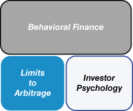

[**Figure 2.1**](#c02-fig-anc-0001) The Two Pillars of Behavioral Finance

#### Limits to Arbitrage

The efficient market hypothesis predicts that prices reflect fundamental value. Why? Smart investors are greedy and any mispricing in the market is an opportunity to make a quick profit. As the logic goes, price dislocations are ephemeral because they are immediately rectified by the proverbial “smart money.” In the real world, true arbitrage opportunities—where profits are earned with zero risk after all possible costs—rarely, if ever, exist. Most “arbitrage” is really *risk arbitrage* that involves some form of cost that doesn't exist in a theoretical pricing model. Let's look at a simple example of exploiting mispricing opportunities in the orange market. Our basic assumptions are listed below:

- Oranges in Florida sell for $1 each.
- Oranges in California sell for $2 each.
- The fundamental value of an orange is $1.

The EMH suggests arbitrageurs will buy oranges in Florida and immediately sell oranges in California until California orange prices are driven to their fundamental value, which is $1. In a vacuum, the situation above is an arbitrage. However, there are obvious costs to conduct this arbitrage. For example, what if it costs $1 to ship oranges from Florida to California? Prices are decidedly not correct—the fundamental value of an orange is $1—but there is no free lunch, since the shipping costs are a limit to arbitrage. Savvy arbitrageurs will be prevented from exploiting the opportunity (in this case, due to “frictional” shipping costs).

#### Investor Psychology

News flash: Human beings are not rational 100 percent of the time. To anyone who has driven without wearing a seat belt, or hit the snooze button on an alarm clock, this should be pretty clear. The literature from top psychologists is overwhelming for the remaining naysayers. Daniel Kahneman, the Nobel-prize winning psychologist and author of the *New York Times* bestseller *Thinking, Fast and Slow*, tells a story of two modes of thinking: System 1 and System 2.[6](#c02-note-0006) System 1 is the “think fast, survive in the jungle” portion of the human brain. When we start to run away from a poisonous snake, even if later on, it turns out to be a stick, we are relying on our trusty System 1. System 2 is the analytic and calculating portion of the brain that is slower, but always rational. When we are comparing the costs and benefits of refinancing a mortgage, we are likely using System 2.

System 1 keeps us alive in the jungle; System 2 helps us make rational decisions for long-term benefit. Both serve their purpose; however, sometimes one system can muscle onto the turf of the other. When System 1 starts making System 2 decisions, we can get in a lot of trouble. For example, do any of these sound familiar?

- “That diamond bracelet was so beautiful; I just had to buy it.”
- “Dessert comes free with dinner; of course I had to have some.”
- “Home prices never seem to go down; we've got to buy!”

Unfortunately, the efficiency of System 1 comes with drawbacks—what keeps us alive in the jungle isn't necessarily what saves us from ourselves in financial markets.

Now, let's combine our irrational investors (System 1 types) with the limits of arbitrage, or market frictions, that we discussed above. We're in a situation where smart investors can't take advantage of the System 1 types for some reason. Combining bad investor behaviors with the frictions that smart people run into, could create compelling investment opportunities for uniquely situated investors.

For example, consider the concept of “noise traders:” think day traders that ignore fundamentals and trade on “gut”—classic System 1 types. These irrational noise traders can dislocate prices from fundamentals, but because these traders are irrational, arbitrageurs have a hard time pinning down the timing and duration of these irrational trades. Thus, going back to the idea that markets can remain irrational longer than you can remain solvent, an element of risk arises when an arbitrageur tries to exploit a noise trader. Sure, noise traders are irrational now, but perhaps they will be even more irrational tomorrow? Brad DeLong, Andrei Shleifer, Larry Summers, and Robert Waldmann described this phenomenon in “Noise Trader Risk in Financial Markets,” in the *Journal of Political Economy* in 1990.[7](#c02-note-0007) Here is an abridged abstract from the paper:

---

*The unpredictability of noise traders' beliefs creates a risk in the price of the asset that deters rational arbitragers from aggressively betting against them. As a result, prices can diverge significantly from fundamental values even in the absence of fundamental risk…*

---

Let's translate this into English: Day traders mess up prices, and although these people are idiots, you don't know the extent of their idiocy, and you can't really time the strategy of an idiot anyway, so most smart people don't even try to take advantage of them. Consequently, prices move around a lot more than they should because no one is stopping the idiots. It's too risky! Moreover, since prices move around a lot more, the returns can be higher, so some lucky idiots may think they are actually good at timing markets, which incentivizes more idiots to do more idiotic things. This combination of bad behavior and market frictions describes what behavioral finance is all about: **Behavioral bias + Market frictions = Mispriced assets**.

And while this working definition of behavioral finance may seem simple, the debate surrounding behavioral finance is far from settled. In one corner, the efficient market clergy claims that behavioral finance is heresy, reserved for those economists who have lost their way and diverted from the “truth.” In their view, prices always reflect fundamental value. Some in the efficient market camp point to the evidence that active managers can't beat the market in the aggregate and incorrectly conclude that prices are always efficient as a result. In the other corner, practitioners that leverage “behavioral bias” suggest that they have an edge because they exploit investors with behavioral bias. Yet, practitioners who make these claims often have terrible performance.[8](#c02-note-0008)

*So where is the disconnect?*

The disconnect lies in the fact that both sides of the argument fail to assess mispricing opportunities *and* the limits to arbitrage, simultaneously. The efficient market believers correctly identify that practitioners often lose to the market, but fail to consider the limits to arbitrage, which suggest that prices can deviate from fundamentals, but still not be profitable for active managers. Practitioners acknowledge mispricing opportunities, but they ignore the limits of arbitrage, which make mispricing opportunities too costly to profitably exploit. In other words, behavioral finance is a possible answer to everyone's problems. Behavioral finance can explain why we observe *inefficient market prices* and why we observe that most *active managers can't beat the market*.[9](#c02-note-0009)

## GOOD INVESTING IS LIKE GOOD POKER: PICK THE RIGHT TABLE

Behavioral finance hints at a framework for being a successful active investor:

1. Identify market situations where behavioral bias is driving prices from fundamentals (e.g., identify market opportunity).
2. Identify the actions/incentives of the smartest market participants and understand their arbitrage costs.
3. Find situations where mispricing is high and arbitrage costs are high for the majority of arbitrage capital, but the costs are low for an active investor with low arbitrage costs.

One can think of the situation outlined above as analogous to a poker player seeking to find a winnable poker game. And in the context of poker, picking the right table is critical for success:

1. Know the fish at the table (opportunity is high).
2. Know the sharks at the table (opportunity is low).
3. Find a table with a lot of fish and few sharks.

Following the poker analogy, in [Figure 2.2](#c02-fig-0002), the graphic outlines the questions we must ask as an active investor in the marketplace:

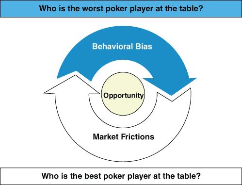

[**Figure 2.2**](#c02-fig-anc-0002) Identifying Opportunity in the Market

1. Who is the worst player at the table?
2. Who is the best player at the table?

To be successful over the long haul, an active investor needs to be good at identifying market opportunities created by poor investors, but also skilled at identifying situations where savvy market participants are unable or unwilling to act because their arbitrage costs are too high.

### Understanding the Worst Players

All human beings suffer from behavioral bias, and these biases are magnified in stressful situations. After all, we're only human.

We laundry list a plethora of biases that can affect investment decisions on the financial battlefield:

- Overconfidence (“I've been right before…”)
- Optimism (“Markets always go up.”)
- Self-attribution bias (“I called that stock price increase…”)
- Endowment effect (“I have worked with this manager for 25 years; he has to be good.”)
- Anchoring (“The market was up 50 percent last year; I think it will return between 45 and 55 percent this year.”)
- Availability (“You see the terrible results last quarter? This stock is a total dog!”)
- Framing (“Do you prefer a bond that has a 99 percent chance of paying its promised yield or one with a 1 percent chance of default?”—hint, it's the same bond.)

The psychology research is clear: humans are flawed decision makers, especially under duress. But even if we identify poor investor behavior, that identification does not necessarily imply that an exploitable market opportunity exists. As discussed previously, other smarter investors will surely be privy to the mispricing situation before we are aware of the opportunity. They will attempt immediately to exploit the opportunity, eliminating our ability to profitably take advantage of mispricing caused by biased market participants. We want to avoid competition, but to avoid competition we need to understand the competition.

### Understanding the Best Poker Players

In the context of financial markets, the best pokers players are often those investors managing the largest amounts of money. These market participants are exemplified by the hedge funds with all-star managers or institutional titans running massive fund complexes. The resources available to these investors are remarkable and vast. One can rarely overpower this sort of opponent. Thankfully, overwhelming strength isn't the only way to slay Goliath. One can outmaneuver these titans because many top players are hamstrung by perverse economic incentives.

Before we dive into the incentives of these savvy players, let's quickly review the concept of arbitrage. The textbook definition of *arbitrage* involves a costless investment that generates riskless profits, by taking advantage of mispricings across different instruments representing the same security (think back to our orange example). In reality, arbitrage entails costs as well as the assumption of risk, and for these reasons there are limits to the effectiveness of arbitrage. There is ample evidence for such limits to arbitrage. Examples include the following:

1. **Fundamental Risk**. Arbitragers may identify a mispricing of a security that does not have a perfect substitute that enables riskless arbitrage. If a piece of bad news affects the substitute security involved in hedging, the arbitrager may be subject to unanticipated losses. An example would be Ford and GM—similar stocks, but they are not the same company.
2. **Noise Trader Risk**. Once a position is taken, noise traders may drive prices farther from fundamental value, and the arbitrageur may be forced to invest additional capital, which may not be available, forcing an early liquidation of the position.
3. **Implementation Costs**. Short selling is often used in the arbitrage process, although it can be expensive because of the “short rebate,” which represents the costs to borrow the stock to be sold short. In some cases, such borrowing costs may exceed potential profits. For example, if short rebate fees are 10 percent and the expected arbitrage profits are 9 percent, there is no way to profit from the mispricing.

The three market frictions mentioned are important. There are potentially many others, but the biggest risk for most smart players is the balance they must strike between long-term expected performance and career risk. An explanation is in order. The biggest short-circuit to the arbitrage process are the limits imposed on smart fund managers that face short-term focused performance assessments. Consider the pressures produced by *tracking error*, or the tendency of returns to deviate from a standard benchmark. Say a professional investor has a job investing the pensions of 100,000 firemen. They have a choice of investment strategies. They can invest in the following options:

- **Strategy A**: A strategy that they know (by some magical means) will beat the market by 1 percent per year over 25 years. But, they also know that this strategy will never underperform the index by more than 1 percent in a given year; or
- **Strategy B**: An arbitrage strategy that the investor knows (again, by some magical means) will outperform the market, on average, by 5 percent per year over the next 25 years. The catch is that the investor also knows that they will have a 5-year period where they underperform by 5 percent per year.

Which strategy does the investment professional choose? If they are being hired on behalf of 100,000 firemen, the choice is often obvious, despite being sub-optimal for their investors: choose Strategy A and avoid getting fired!

*Why choose A?* This strategy is a bad long-term strategy relative to B. The incentives of an investment manager are complex. Fund managers are not the owners of the capital, but work on behalf of someone who does. Financial mercenaries, if you will. These managers sometimes make decisions that increase the odds of them keeping their job, but will not necessarily maximize risk-adjusted returns for their investors. For these managers, relative performance is everything and tracking error is dangerous. In the example above, the tracking error on Strategy B is just too painful to digest. Those firemen are going to start screaming bloody murder during the five years of underperformance, and the manager will not be around long enough to see the rebound when it occurs after year 5. But if the manager follows Strategy A, he can avoid career risk and the fireman's pension will not endure the stress of a prolonged downturn.

Over long time frames, a mispricing opportunity may be a mile wide—you could drive a proverbial truck through it. But this agency problem—the fact that the owners of the capital can, in the short-term, begin to doubt the abilities of the arbitrageur and pull their capital—precludes smart managers from taking advantage of the long-term mispricing opportunities that are highly volatile.

The threat of short-term tracking-error is very real. Consider the commonly cited example of Ken Heebner's CGM Focus Fund.[10](#c02-note-0010) A *Wall Street Journal* (WSJ) article offers some facts relating to Ken's fund performance:

---

*“Ken Heebner's $3.7 billion CGM Focus Fund, rose more than 18% annually and outpaced its closest rival by more than three percentage points.”*

---

Next, the WSJ lays out additional facts relating to the performance of investors in Ken's fund:

---

*“Too bad investors weren't around to enjoy much of those gains. The typical CGM Focus shareholder lost 11% annually in the 10 years ending Nov. 30…”*

---

Ken's fund compounded at 18 percent a year, and yet, the investors in the fund lost 11 percent a year, a reflection of the typical investor's inability to time effectively in and out of Ken's fund (see [Figure 2.3](#c02-fig-0003)).[11](#c02-note-0011) When Ken's fund was underperforming (and the opportunity was high), they pulled capital; when his fund was outperforming (and opportunity was low), they invested more capital. On net, Ken looks like a genius, but few investors actually benefited from Ken's ability—a lose-lose proposition.

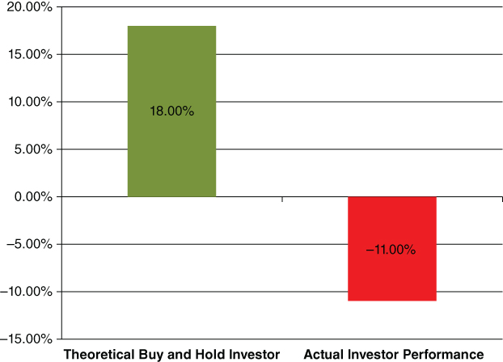

[**Figure 2.3**](#c02-fig-anc-0003) CGM Focus Fund from 1999 to 2009

Ken's Heebner's experience highlights this conflict of interest problem for asset managers. The dynamics of this problem are explored in an illuminating 1997 *Journal of Finance* paper by Andrei Shleifer and Robert Vishny, appropriately called “The Limits of Arbitrage.”[12](#c02-note-0012) The takeaway from Ken Heebner's experience and Shleifer and Vishny's insights is as follows: Smart managers **avoid long-term market opportunities** if their investors are **focused on short-term performance**.

And can you blame the managers? If their careers depend on their relative performance over a month, a year, or even every five years, then asset managers will clearly care more about short-term relative performance than about long-term expected risk-adjusted returns. Whether they are proactively protecting their jobs or the clients are actively driving the conversation around near-sighted metrics, the end result is the same. Fund investors lose, and prices are not always efficient.

### Keys to Long-Term Active Management Success

> *“There are a lot of smart people…so it's not easy to win.”*

—Charlie Munger, Vice Chairman Berkshire Hathaway[13](#c02-note-0013)

We've outlined a few elements of the marketplace. First, some investors are probably making poor investment decisions, and second, some managers are unable to exploit genuine market opportunities due to incentives. We encapsulate these elements in a simple equation for sustainable long-term performance in [Figure 2.4](#c02-fig-0004).

[**Figure 2.4**](#c02-fig-anc-0004) The Long-Term Performance Equation

The long-term performance equation has two core elements:

- Sustainable alpha
- Sustainable investors

Sustainable alpha refers to an active stock selection process that systematically exploits mispricings caused by behavioral bias in the marketplace (i.e., finds the worst poker players). In order for this “edge” to be sustainable, it cannot be arbitraged away in the long run. Typically, sustainable edges are driven by strategies that require a long-horizon and indifference to short-term relative performance in order to be successful. That requirement brings us to our second element of the long-term performance equation: sustainable investors. Sustainable investors cannot fall victim to the siren song of short-term underperformance. If they do fall prey to short-termism, these *un*sustainable investors will greatly enhance the arbitrage costs for their delegated asset manager, and will thus prevent the investors from profitably exploiting mispricing opportunities.

Based on the equation, if one can identify a process with an established edge (i.e., sustainable alpha) that requires long-term discipline to exploit (i.e., requires sustainable investors), it is likely that this process will serve as a promising long-term strategy that will beat the market over time.

#### Moving from Theory to Practice

Much of this discussion outlines an intellectual framework for successful active investing. There is no discussion of whether value investing is better than growth investing, or if high-frequency trading is better than investing in pork belly futures. However, the building blocks to identify sustainable performance are simple to follow:

- Identify a sustainable alpha process that can exploit bad players.
- Understand the limitations of good players.
- Exploit the opportunity by pairing a good process with sustainable capital.

To put a little bit of meat on the bone, we provide an example of how this construct works in the “value versus growth” debate, which is a familiar discussion for most readers. To keep things simple and in line with academic research practices, we consider *value investing* to be approximated roughly by the practice of purchasing portfolios of firms with low prices to some fundamental price metric (e.g., a high book-to-market or B/M ratio). *Growth investing* is the opposite approach—purchase firms with high prices relative to fundamentals, with the expectation that fundamentals will grow rapidly. Using Ken French's data,[14](#c02-note-0014) we examine the returns from January 1, 1927, to December 31, 2014, for a value portfolio (high B/M decile, value-weighted returns), a growth portfolio (low B/M decile, value-weighted returns), and the S&P 500 total return index. By *value-weight*, we mean that each stock is given its weight in the portfolio, depending on the size of the firm. Results are shown in [Table 2.1](#c02-tbl-0001). All returns are total returns and include the reinvestment of distributions (e.g., dividends). Results are gross of fees.

[**Table 2.1**](#c02-tbl-anc-0001) Value versus Growth (1927 to 2014)

|  |  |  |  |
| --- | --- | --- | --- |
|  | **Value** | **Growth** | **SP500** |
| **CAGR** | 12.41% | 8.70% | 9.95% |
| **Standard Deviation** | 31.92% | 19.95% | 19.09% |
| **Downside Deviation** | 21.34% | 14.41% | 14.22% |
| **Sharpe Ratio** | 0.41 | 0.35 | 0.41 |
| **Sortino Ratio (MAR** c02-math-0001 **5%)** | 0.54 | 0.37 | 0.45 |
| **Worst Drawdown** | –91.67% | –85.01% | –84.59% |
| **Worst Month Return** | –43.98% | –30.65% | –28.73% |
| **Best Month Return** | 98.65% | 42.16% | 41.65% |
| **Profitable Months** | 60.51% | 59.09% | 61.74% |

The historical evidence is clear: value stocks from 1927 to 2014 have outperformed growth stocks—by a wide margin. The portfolio of value stocks earns a compound annual growth rate of 12.41 percent per year, whereas, the growth stock portfolio earns 8.70 percent per year—approximately a 4 percent annual spread in performance. This historical spread in returns, which has been repeatedly and consistently observed over time, has been labeled the *value anomaly* by academic researchers. Of course, academics argue over the reasons why the spread is large (e.g., value investing might earn higher returns because it is simply more risky or because of mispricing, as discussed earlier). This debate is best captured by a 2008 interview with Eugene Fama where he describes a personal conversation with Andrei Shleifer over a glass of wine.[15](#c02-note-0015) Fama highlights that Andrei believes the value premium is due to mispricing, whereas Fama attributes the value premium to higher risk. Bottom line: Great minds can disagree on the explanation, but nobody can dispute the empirical fact that value stocks have outperformed growth stocks by a wide margin over time.

#### We Have the Facts. Next Step: Identify Bad Players

The data highlight that value investing has higher expected returns than growth investing. But to better understand whether value will beat growth in the future we need to look through the sustainable active investing prism and identify if the spread is due to risk (the efficient market explanation) or mispricing (the behavioral finance explanation). For a valid mispricing argument, we need to identify if there are market participants making systematically poor decisions with respect to the purchase of value and growth stocks.

Lakonishok, Shleifer, and Vishny (LSV) explore this question in their paper “Contrarian Investment, Extrapolation, and Risk.”[16](#c02-note-0016) LSV hypothesize that investors suffer from representative bias, a situation where investors naively extrapolate past growth rates too far into the future. [Figure 2.5](#c02-fig-0005) highlights the concept from the LSV paper using updated data from Dechow and Sloan's 1997 paper, “Returns to Contrarian Investment Strategies: Tests of Naive Expectations Hypothesis.”[17](#c02-note-0017) The horizontal axis represents cheapness and sorts securities into buckets, from left to right, based on whether stocks are expensive (low book-to-market ratios) or cheap (high book-to-market ratios). The vertical axis represents *past* five-year earnings growth rates for the respective valuation buckets. Stocks in Bucket 10 are the cheapest, and they exhibited (on average) a *negative* 1 percent earnings growth over the preceding five years.

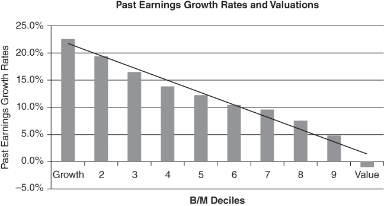

[**Figure 2.5**](#c02-fig-anc-0005) Investors Extrapolate Past Growth Rates into the Future

The relationship is almost perfectly linear. Cheap stocks have terrible past earnings growth, whereas expensive stocks have had wonderful earnings growth over the past five years. No real surprise there, but it is interesting to see how well the data fits this relationship.

[Figure 2.5](#c02-fig-0005) underscores the general market expectation that past earnings growth rates will continue into the future. Growth firms are expensive because market participants believe past growth rates will continue. Otherwise, why would they pay so much for these stocks? Meanwhile, value stocks are cheap for what seems like a good a reason—the market believes their poor past growth rates will continue as well.

But does this really happen? Do cheap stocks have poor realized future earnings growth and do expensive stocks have strong realized future earnings growth? This is an empirical question that can be tested with an experiment. Do growth firms continue to grow faster, on average, *or* is there a systematic flaw in market expectations?

In [Figure 2.6](#c02-fig-0006), we look at what happens to earnings growth over the *next five years*. Specifically, did the value stocks continue to exhibit terrible earnings growth as predicted? Did growth stocks maintain their terrific earnings growth?

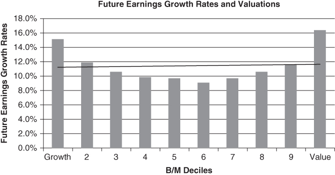

[**Figure 2.6**](#c02-fig-anc-0006) Realized Growth Rates Systematically Mean-Revert

No, they did not. The chart is evidence of systematically poor poker playing. The realized earnings growth (dark bars) systematically reverts to the average growth rate across the universe. Value stocks outperform earnings growth expectations and growth stocks underperform their expectations, *systematically*. Take a moment to study this profound observation. This unexpected deviation from expectations leads to price movements that are favorable for cheap “value” stocks, and unfavorable for expensive “growth” stocks. This deviation explains, at least in part, why expensive stock investors underperform, cheap stock investors outperform, and passive investors receive something in between.

To summarize: Markets, on average, throw value stocks under the bus and clamor for growth stocks. From a poker playing perspective, buying growth stocks and selling value stocks is an example of a systematically poor strategy. Assuming that a great hand from the last round equals a winning hand in the next round is a losing approach. But what are the best poker players doing about this value anomaly situation, and can these poker players easily exploit the poor poker players?

#### Next Step: Identify the Actions of the Best Players

It is unlikely that we will ever be the smartest investors in the world. For example, George Soros, Julian Robertson, Leon Cooperman, and Paul Tudor Jones will always be smarter than we are. But if we aren't going to be the best player at the investing table, how can we win against these high-powered investors? We can win by finding those market opportunities where the smartest investors are reluctant to participate. But why would a smart investor *not* want to participate in a straightforward way to beat the market, such as through value investing?

As mentioned previously, smart investors often get endowed with large amounts of capital from a large group of diverse investors (again, think George Soros, Julian Robertson, Paul Tudor Jones, but also large institutions such as BlackRock, Fidelity, and so forth). This makes sense on many levels—investors want to give their money to smart people. The challenge is that the really smart investors are often managing money on behalf of investors that suffer from behavioral biases (System 1 thinkers). Shleifer and Vishny highlight, and the Ken Heebner example confirms, that many smart market participants are hamstrung by the short-term performance measures imposed on them by their investors. “How did you perform against the benchmark this quarter? What do your results look like year to date? What macroeconomic trends are you exploiting this month?” All of these questions are commonplace in the market. The threat of being fired and replaced with a passive portfolio of Vanguard funds is an implied threat. When job security and client expectations trump long-term value creation, funny things happen.

A remarkable paper by Markus Brunnermeier and Stefan Nagel, “Hedge Funds and the Technology Bubble,” highlights the warped incentives faced by the smartest investors who deal with other people's money.[18](#c02-note-0018) Contrary to all textbook teachings related to efficient price formation, the smart money sometimes can be incentivized to *enhance mispricing*, not trade against it! Brunnermeier and Nagel find that many hedge fund managers didn't try to capitalize on the mispricing between value and growth stocks in the Internet Bubble of the late 1990s—they actually bought growth stocks and sold value stocks. This action enabled them to more closely track the index—for a time. Meanwhile, the poor hedge funds that stuck to their value investing guns, for example, Julian Robertson of Tiger Funds, ended up with no assets under management and a busted business model.

But Julian Robertson wasn't the only famous value investor to lose his proverbial shirt during the 1994 to 1999 time period. Around this time, Barron's famously stated the following regarding Warren Buffett's relative performance:[19](#c02-note-0019)

---

*“Warren Buffett may be losing his magic touch.”*

---

Barron's observation was, in many respects, fully warranted. Value investors as a group were destroyed by the market in the late 1990s. Generic value investing (shown in [Figure 2.7](#c02-fig-0007)) underperformed the broader market by a large margin for six long years!

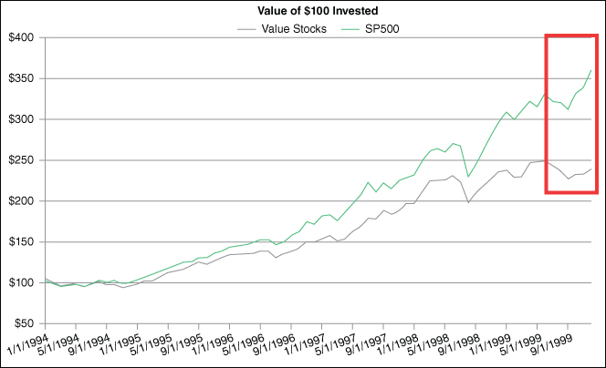

[**Figure 2.7**](#c02-fig-anc-0007) Value Investing Can Underperform

Obviously, being a value investor requires a patience and faith that few investors possess. In theory, value investing is easy—buy and hold cheap stocks for the long haul—but in practice, true value investing *is almost impossible.*

Using Ken French's data, we examined just how painful it was to be a value investor in the late 1990s. We examine the returns from January 1, 1994, to December 31, 1999, for a value portfolio (high book-to-market decile, value-weighted portfolio returns), a growth portfolio (low book-to-market decile, value-weighted portfolio returns), the S&P 500 total return index (SP500), and the Russell 2000 total return index (R2K), a small-cap index. Results are shown in [Table 2.2](#c02-tbl-0002). All returns are total returns and include the reinvestment of distributions (e.g., dividends). Results are gross of fees.

[**Table 2.2**](#c02-tbl-anc-0002) Value Investing Can Underperform (1994–1999)

|  |  |  |  |  |
| --- | --- | --- | --- | --- |
|  | **Value** | **Growth** | **SP500** | **R2K** |
| **CAGR** | 18.35% | 27.71% | 23.84% | 13.39% |
| **Standard Deviation** | 11.79% | 16.53% | 13.63% | 16.96% |
| **Downside Deviation** | 7.59% | 11.25% | 10.50% | 14.27% |
| **Sharpe Ratio** | 1.09 | 1.28 | 1.30 | 0.55 |
| **Sortino Ratio (MAR** c02-math-0002 **5%)** | 1.66 | 1.87 | 1.67 | 0.64 |
| **Worst Drawdown** | –11.58% | –16.33% | –15.18% | –29.78% |
| **Worst Month Return** | –8.62% | –14.92% | –14.31% | –19.42% |
| **Best Month Return** | 8.05% | 10.69% | 8.04% | 11.32% |
| **Profitable Months** | 68.06% | 70.83% | 73.61% | 66.67% |

The returns to the value portfolio were not bad on an absolute basis, but on a relative basis, value was horrific. Looking at the annual returns (shown in [Table 2.3](#c02-tbl-0003)), value investing lost almost every year to a simple passive market allocation!

[**Table 2.3**](#c02-tbl-anc-0003) Annual Returns

|  |  |  |  |  |
| --- | --- | --- | --- | --- |
|  | **Value** | **Growth** | **SP500** | **R2K** |
| **1994** | –2.83% | 2.53% | 1.35% | –1.82% |
| **1995** | 36.47% | 35.47% | 37.64% | 28.45% |
| **1996** | 14.22% | 23.20% | 23.23% | 16.49% |
| **1997** | 32.52% | 31.15% | 33.60% | 22.36% |
| **1998** | 29.75% | 44.23% | 29.32% | –2.55% |
| **1999** | 5.45% | 33.90% | 21.35% | 21.26% |

A plain-vanilla index fund (SP500) outperforms value five out of six years in a row, sometimes by double-digit figures! To simulate what these value managers went through, ask yourself this question:

---

*If your asset managers underperformed a benchmark for five out of six years, at times by double digits, would you fire them?*

---

For 99.9 percent of investors, that answer would be a resounding, “Yes!” (and giving someone a six-year trial period is probably out of the question to begin with). Most—if not all—professional asset managers would be fired, given this underperformance. Asset managers know this evidence intuitively, and internalize the results by avoiding purist value investing endeavors that could make them look like fools in the short run.

After viewing the six-year value investing pain train, we can identify two key takeaways:

1. For a long-term investor, a six-year stretch of pain is a truly great thing. Why? Because this will limit competition from the best pokers players, for whom career risks trump performance considerations, and the weak hands will be shaken out of the competition.
2. Sustainable active investing requires special investors. It requires that investors be disciplined, have a long-term horizon, and be indifferent to short-term relative performance. These unique investors are what we had previously labeled *sustainable investors* in [Figure 2.4](#c02-fig-0004).

Now, suspend reality for a moment and let's imagine that an active value manager had clients that didn't run for the exits in 1999. What would their hypothetical returns look like over the long run? As one can see in [Table 2.4](#c02-tbl-0004), value quickly recovers and handily outperforms over the entire time period thereafter. [Table 2.4](#c02-tbl-0004) shows the returns to the same portfolios from January 1, 2000, to December 31, 2014, the 15 years following the six-year period of underperformance.

[**Table 2.4**](#c02-tbl-anc-0004) Summary Statistics (2000–2014)

|  |  |  |  |  |
| --- | --- | --- | --- | --- |
|  | **Value** | **Growth** | **SP500** | **R2K** |
| **CAGR** | 9.12% | 2.75% | 4.45% | 7.38% |
| **Standard Deviation** | 24.05% | 16.90% | 15.22% | 20.42% |
| **Downside Deviation** | 17.73% | 12.50% | 11.42% | 13.77% |
| **Sharpe Ratio** | 0.41 | 0.14 | 0.24 | 0.36 |
| **Sortino Ratio (MAR** c02-math-0003 **5%)** | 0.37 | –0.07 | 0.05 | 0.31 |
| **Worst Drawdown** | –64.47% | –58.21% | –50.21% | –52.89% |
| **Worst Month Return** | –28.07% | –16.13% | –16.70% | –20.80% |
| **Best Month Return** | 36.64% | 11.21% | 10.93% | 16.51% |
| **Profitable Months** | 58.89% | 56.67% | 60.56% | 58.89% |

Sticking with the value strategy, although painful, was richly rewarded with almost a 5 percent edge—per year—over the market benchmark (S&P 500) from 2000 to 2014.

Over the entire cycle, patient and disciplined investors were rewarded. [Table 2.5](#c02-tbl-0005) shows the results over the entire time period, measured from January 1, 1994, to December 31, 2014.

[**Table 2.5**](#c02-tbl-anc-0005) Summary Statistics (1994–2014)

|  |  |  |  |  |
| --- | --- | --- | --- | --- |
|  | **Value** | **Growth** | **SP500** | **R2K** |
| **CAGR** | 11.68% | 9.33% | 9.65% | 9.06% |
| **Standard Deviation** | 21.27% | 17.00% | 14.92% | 19.48% |
| **Downside Deviation** | 16.23% | 12.25% | 11.19% | 13.97% |
| **Sharpe Ratio** | 0.50 | 0.45 | 0.51 | 0.41 |
| **Sortino Ratio (MAR** c02-math-0004 **5%)** | 0.51 | 0.44 | 0.48 | 0.40 |
| **Worst Drawdown** | –64.47% | –58.21% | –50.21% | –52.89% |
| **Worst Month Return** | –28.07% | –16.13% | –16.70% | –20.80% |
| **Best Month Return** | 36.64% | 11.21% | 10.93% | 16.51% |
| **Profitable Months** | 61.51% | 60.71% | 64.29% | 61.11% |

What's the bottom line? For a long-term investor, value investing was the optimal decision relative to growth investing, but for many of the smartest asset managers in the world, including the great Julian Robertson, value investing was simply not feasible as a business model. These professionals were often forced via the threat of investor redemptions to “diworsify” their portfolios with overpriced growth stocks during the Internet Bubble. They needed to keep up with the market and did so by doing what everyone else was doing. This decision helped them keep their jobs, but prevented their investors from maximizing their chances for success, even if some truly did have a long-horizon, and discipline.

### Putting It All Together

We've used value and growth investing as a laboratory to highlight how the sustainable active investing framework can identify long-term winning strategies. Value investing fits nicely in this paradigm, but has serious warts, notably stretches of horrendous underperformance. The lesson from value investing is that successful active investing is simple, but not easy. If active investing were easy, everyone would do it, and if everyone were doing it, it probably would not generate outsized risk-adjusted returns over the long haul.

In summary, our long-term performance equation from [Figure 2.4](#c02-fig-0004) highlights two required elements for sustainable performance:

1. The sustainable process exploits systematic investor expectation errors.
2. The sustainable investor has a long horizon and a willingness to be different.

These two pieces of the puzzle map back to the classic lessons of poker:

1. Identify the worst poker player at the table.
2. Identify the best poker players at the table.

And these classic lessons map into the two pillars of behavioral finance:

1. Understand behavioral bias and how investors form expectations.
2. Understand market frictions and how they affect market participants.

So the next time you hear a market participant suggest that one strategy is better than another strategy, simply ask two basic questions: (1) Why are the securities selected by this process mispriced? and (2) Why aren't other smart investors already exploiting the mispricing opportunity? Without solid answers to both questions, it is unlikely that the investment process is sustainable.

## GROWTH INVESTING STINKS, SO WHY DO IT?

We talked in the last section about how value stocks outperform growth stocks, and showed that buying and holding growth stocks is a bad relative bet. And yet, most fund complexes divide the investable universe into value and growth stocks. To highlight the prevalence of the value/growth mindset in the marketplace, [Figure 2.8](#c02-fig-0008) is an example of the classic three-by-three diagram, which splits the stock universe into nine buckets. The two axes are size (vertical axis from large to small) and value (horizontal axis from value to growth).

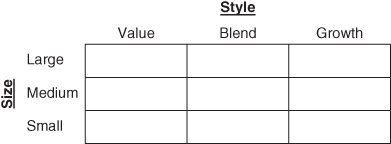

[**Figure 2.8**](#c02-fig-anc-0008) Value and Growth Chart

[Figure 2.8](#c02-fig-0008), or some derivation of it, is used by almost every major investment firm in the United States. But if growth is a suboptimal investment approach, why bother with a framework that suggests we consider growth stocks as part of a portfolio? One answer to this question is likely related to the fact that growth stocks provide some diversification benefits for a portfolio, even though they provide poor relative returns. We explicitly investigate the diversification benefits of growth in [Table 2.6](#c02-tbl-0006), in the context of the late 1990s (a period we examined in [Table 2.2](#c02-tbl-0002)), which was a time when value underperformed versus growth. We examine the performance of a monthly rebalanced portfolio that invests half of the portfolio in the value portfolio and half in the growth portfolio over the 1994 to 1999 time period.

[**Table 2.6**](#c02-tbl-anc-0006) Combining Value and Growth Lowers Volatility (1994–1999)

|  |  |  |  |  |
| --- | --- | --- | --- | --- |
|  | **Value** | **Growth** | **50% Value, 50% Growth** | **SP500** |
| **CAGR** | 18.35% | 27.71% | 23.19% | 23.84% |
| **Standard Deviation** | 11.79% | 16.53% | 12.86% | 13.63% |
| **Downside Deviation** | 7.59% | 11.25% | 9.49% | 10.50% |
| **Sharpe Ratio** | 1.09 | 1.28 | 1.32 | 1.30 |
| **Sortino Ratio (MAR** c02-math-0005 **5%)** | 1.66 | 1.87 | 1.78 | 1.67 |
| **Worst Drawdown** | –11.58% | –16.33% | –13.93% | –15.18% |
| **Worst Month Return** | –8.62% | –14.92% | –11.77% | –14.31% |
| **Best Month Return** | 8.05% | 10.69% | 7.97% | 8.04% |
| **Profitable Months** | 68.06% | 70.83% | 70.83% | 73.61% |

At a high level, being a combo investor (value and growth) was a much smarter career move over this period in the 1990s than being a pure value investor. The combo investor did not achieve the performance of the pure growth portfolio, but the results were closer to the broader market and the probability of getting fired was muted. The annual return figures in [Table 2.7](#c02-tbl-0007) bring this point home.

[**Table 2.7**](#c02-tbl-anc-0007) Annual Returns for Combo Portfolio

|  |  |  |  |  |
| --- | --- | --- | --- | --- |
|  | **Value** | **Growth** | **50% Value, 50% Growth** | **SP500** |
| **1994** | –2.83% | 2.53% | –0.09% | 1.35% |
| **1995** | 36.47% | 35.47% | 36.07% | 37.64% |
| **1996** | 14.22% | 23.20% | 18.77% | 23.23% |
| **1997** | 32.52% | 31.15% | 32.08% | 33.60% |
| **1998** | 29.75% | 44.23% | 37.15% | 29.32% |
| **1999** | 5.45% | 33.90% | 19.37% | 21.35% |

Unlike the pure value portfolio, which was a guaranteed ticket to the unemployment line in 1999, the combo portfolio, while underwhelming relative to the market, would have been at least a salvageable situation in a client meeting. Of course, we already know how this story ends. The benefits of combining the growth strategy with the value strategy over this unique time period offered a great benefit: diversification. The combo reduced the pain versus a pure value approach.

Likewise, as seen in [Table 2.8](#c02-tbl-0008), the combo portfolio served an investment manager well over the longer 1994 to 2014 period (examined previously in [Table 2.5](#c02-tbl-0005)), delivering higher risk-adjusted returns than the S&P 500 benchmark. For the period 1994 to 2014, the combo portfolio reduced the pain versus a pure growth approach.

[**Table 2.8**](#c02-tbl-anc-0008) Combining Value and Growth Lowers Volatility (1994–2014)

|  |  |  |  |  |
| --- | --- | --- | --- | --- |
|  | **Value** | **Growth** | **50% Value, 50% Growth** | **SP500** |
| **CAGR** | 11.68% | 9.33% | 10.86% | 9.65% |
| **Standard Deviation** | 21.27% | 17.00% | 17.42% | 14.92% |
| **Downside Deviation** | 16.23% | 12.25% | 12.87% | 11.19% |
| **Sharpe Ratio** | 0.50 | 0.45 | 0.53 | 0.51 |
| **Sortino Ratio (MAR** c02-math-0006 **5%)** | 0.51 | 0.44 | 0.53 | 0.48 |
| **Worst Drawdown** | –64.47% | –58.21% | –56.63% | –50.21% |
| **Worst Month Return** | –28.07% | –16.13% | –22.10% | –16.70% |
| **Best Month Return** | 36.64% | 11.21% | 23.28% | 10.93% |
| **Profitable Months** | 61.51% | 60.71% | 62.30% | 64.29% |

The other benefit for these active managers is that they maintained their careers through the tech bubble. Of course, the downside of this approach was lower absolute returns due to the inclusion of the growth component, which diluted the performance of an active value strategy throughout the cycle.

### But Can We Identify a Better Diversifier?

As outlined above, investors and professional fund managers appreciate the benefits of including growth in a portfolio—especially during the period under discussion—because value and growth had relatively low correlations and thus created a portfolio with less benchmark drift and manageable volatility. However, the inclusion of growth, while providing portfolio diversification benefits, has costs in the form of lower expected portfolio returns. Growth investing is not a sustainable active strategy. In fact, it is just the opposite—a sustainably poor strategy. But what is an investor to do? Ideally, one could capture the diversification benefits of a growth portfolio, but accomplish the diversification benefits with an active stock selection methodology that had characteristics that were more in line with the sustainable active framework.

Fortunately, there is a potential solution to this problem: momentum investing. In the early 1990s, academics such as Narasimhan Jegadeesh and Sheridan Titman, in their 1993 paper “Returns to Buying Winners and Selling Losers: Implications for Market Efficiency,” began to refocus on the old concept of *momentum*, which refers to a general class of strategies in which past returns can predict future returns.[20](#c02-note-0020) That is, if a stock has performed relatively well over the past year, it will continue to perform relatively well in the future. Researchers have done follow-on studies that find the momentum effect persists even when controlling for company size and value factors. And the effect appears to hold over a 200-year time sample,[21](#c02-note-0021) and across multiple asset classes, such as commodities, currencies, and even bonds.[22](#c02-note-0022) Moreover, researchers find that momentum is relatively uncorrelated with value, thus providing diversification benefits. In short, it appears the evidence for momentum is pervasive and provides similar diversification benefits to growth investing.

And while momentum investment strategies are well established in the academic literature, these strategies are not commonly used in actively managed funds, especially when compared with the large number of “growth” funds found in the market. In fact, the immediate gut reaction of most people to “momentum,” is that momentum investing *IS* growth investing. Unfortunately, this reaction reflects a misconception in the market. Momentum and growth, while sometimes related, are certainly not the same. Moreover, we believe that momentum, unlike growth, fits nicely in the sustainable active framework, thus making it a much better diversifier alongside value, which is another sustainable strategy. The goal of the next chapter is to explain why momentum investing, which is purely focused on prices, is a better alternative to growth investing, which considers both fundamentals and prices. Our mission is to convince the reader that the evidence supports a move to a new style-box paradigm ([Figure 2.9](#c02-fig-0009)) that replaces “growth” with “momentum.”

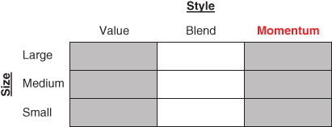

[**Figure 2.9**](#c02-fig-anc-0009) New Style Box Paradigm

## SUMMARY

In order to assess the sustainability of an active strategy, we outlined the sustainable active investing framework to better understand why certain strategies work and why others do not. We then reviewed the classic value versus growth debate, but viewed this argument through the lens of the sustainable active framework. We discussed that value investing works, not because Ben Graham said it would work, but because (1) it systematically captures a mispricing in the market associated with poor expectations, and (2) taking advantage of the mispricing is difficult.

Next, we addressed the question of why investors would ever rationally invest in growth, given the long-term evidence of growth's historical underperformance. We highlighted a unique time period in the markets—the Internet Bubble—where growth investing outperformed value and prevented many professional investment managers from losing their jobs. Next, there was a brief discussion of the benefits (diversification) and the costs (poor long-term performance) associated with growth investing. Finally, we ended the chapter by proposing that investors replace growth portfolios with momentum portfolios. The hope is that momentum can provide similar diversification benefits to a value-focused portfolio as a growth portfolio does, and that momentum does so without hurting the long-term expected performance of the portfolio. In the next chapter, we describe momentum investing, highlight how it is different from growth investing, and then describe why momentum may be a better complement to value than growth.

## NOTES

[1](#c02-note-anc-0001) Wesley Gray, *Embedded: A Marine Corps Advisor Inside the Iraqi Army*, Naval Institute Press, Annapolis, 2008.
[2](#c02-note-anc-0002) Eugene F. Fama and Kenneth R. French, “The Cross Section of Expected Stock Returns,” *The Journal of Finance* 47 (1992): 427–465.
[3](#c02-note-anc-0003) Steven S. Crawford, Wesley R. Gray, and Andrew E. Kern, “Why Do Fund Managers Identify and Share Profitable Ideas,” *Journal of Financial and Quantitative Analysis*, Forthcoming.
[4](#c02-note-anc-0004) Nick Barberis and Richard Thaler, “A Survey of Behavioral Finance,” in: G. M. Constantinides & M. Harris & R. M. Stulz (ed.), *Handbook of the Economics of Finance*, 1st ed., volume 1, (North Holland: Elsevier, 2003), Chapter 18, pp. 1053–1128.
[5](#c02-note-anc-0005) Although widely attributed to Keynes, there is little evidence he actually made this statement. See Jason Zweig, “Keynes: He Didn't Say Half of What He Said. Or Did He?” *Wall Street Journal* (February 11, 2011), blogs.wsj.com/marketbeat/2011/02/11/keynes-he-didnt-say-half-of-what-he-said-or-did-he/, accessed 2/28/2016.
[6](#c02-note-anc-0006) Daniel Kahneman, *Thinking, Fast and Slow* (New York: Farrar, Straus and Giroux, 2011).
[7](#c02-note-anc-0007) J. Bradford DeLong, Andrei Shleifer, Lawrence Summers, and Robert Waldmann, “Noise Trader Risk in Financial Markets,” *Journal of Political Economy* 98 (1990): 703–738.
[8](#c02-note-anc-0008) Larry Swedroe, “Behavioral Finance Falls Short,” April 24, 2015, [ETF.com](http://ETF.com). [www.etf.com/sections/index-investor-corner/swedroe-behavioral-finance-falls-short?nopaging=1](http://www.etf.com/sections/index-investor-corner/swedroe-behavioral-finance-falls-short?nopaging=1), accessed 2/28/2016.
[9](#c02-note-anc-0009) Barberis and Thaler. Of course, Bill Sharpe's argument regarding the arithmetic of active management also plays a role in explaining why active managers, as a whole, can't beat the market.
[10](#c02-note-anc-0010) E. Laise, “Best Stock Fund of the Decade: CGM Focus,” *Wall Street Journal* (December 31, 2009), [www.wsj.com/articles/SB10001424052748704876804574628561609012716](http://www.wsj.com/articles/SB10001424052748704876804574628561609012716), accessed 12/29/2015.
[11](#c02-note-anc-0011) Some of the spread in returns between dollar-weight returns and buy-and-hold returns could be attributable to the return sequence experienced by the CGM Focus Fund. See Michael Kitces's October 3, 2012, piece on “Does the DALBAR Study Grossly Overstate the Behavior Gap” for more information. <https://www.kitces.com/blog/does-the-dalbar-study-grossly-overstate-the-behavior-gap-guest-post/>, accessed 2/28/2016.
[12](#c02-note-anc-0012) Andrei Shleifer and Robert W. Vishny, “The Limits of Arbitrage,” *The Journal of Finance* 52 (1997): 35–55.
[13](#c02-note-anc-0013) Charlie Munger, May 4, 2005, Wesco Financial Annual Meeting. Based on notes from Whitney Tilson. [www.tilsonfunds.com/wscmtg05notes.pdf](http://www.tilsonfunds.com/wscmtg05notes.pdf), accessed 2/28/2016.
[14](#c02-note-anc-0014) mba.tuck.dartmouth.edu/pages/faculty/ken.french/data\_library.html, accessed 12/30/2015.
[15](#c02-note-anc-0015) Eugene Fama Interview, 2008, American Finance Association. [www.afajof.org/details/video/2870921/Eugene-Fama-Interview.html](http://www.afajof.org/details/video/2870921/Eugene-Fama-Interview.html), accessed 12/29/2015
[16](#c02-note-anc-0016) Josef Lakonishok, Andrei Shleifer, and Robert W. Vishny, “Contrarian Investment, Extraploation, and Risk,” *The Journal of Finance* 49(5) (1994): 1541–1578.
[17](#c02-note-anc-0017) Patricia M. Dechow and Rishard G. Sloan, “Returns to Contrarian Investment Strategies: Tests of the Naïve Expectations Hypothesis,” *Journal of Financial Economics* 43 (1997): 3–27. As an aside, Dechow and Sloan 1997 argue that the value anomaly is not driven by naive extrapolation by irrational investors as LSV 1994 suggested, but rather, the outperformance of value stocks is driven by market participants' flawed faith in analysts' forecasts, which are systematically overoptimistic. We also note that the data associated with the valuation metric used in [Figure 2.5](#c02-fig-0005) is book-to-market. Other valuation metrics, such as price-to-earnings, don't paint a similarly compelling picture, but deeper analysis into alternative valuation metrics still suggests that the value anomaly is partially driven by mispricing caused by investor expectation errors and cannot be fully explained by additional risk.
[18](#c02-note-anc-0018) Markus Brunnermeier and Stefan Nagel, “Hedge Funds and the Technology Bubble,” *The Journal of Finance* 59 (1993): 2013–2040.
[19](#c02-note-anc-0019) Andrew Bary, 1999, “What's Wrong, Warren?” *Barron's* (1999), [www.barrons.com/articles/SB945992010127068546](http://www.barrons.com/articles/SB945992010127068546), accessed 12/29/2015.
[20](#c02-note-anc-0020) Narasimhan Jegadeesh and Sheridan Titman, “Returns to Buying Winners and Selling Losers: Implications for Stock Market Efficiency,” *The Journal of Finance* 48 (1993), 65–91.
[21](#c02-note-anc-0021) Chris Geczy and Mikhail Samonov, “Two Centuries of Price Return Momentum,” *Financial Analysts Journal* (2016).
[22](#c02-note-anc-0022) Clifford S. Asness, Tobias J. Moskowitz, and Lasse H. Pedersen, “Value and Momentum Everywhere,” *The Journal of Finance* 68(3) (2013): 929–985.

<!-- rl-section id="into-the-lion-s-den" class="epub-section" title="INTO THE LION'S DEN" -->

# CHAPTER 2 Why Can Active Investment Strategies Work?

> *“The worst thing I can be is the same as everybody else.”*

—Attributed to Arnold Schwarzenegger

The debate over active investing versus passive investing is akin to other classic conflicts, such as Philadelphia Eagles versus Dallas Cowboys or Coke versus Pepsi. In short, once our preference for one style over the other is established, it often becomes a proven fact or incontrovertible reality in our minds. Psychology research describes the notion of “confirmation bias,” in which people prefer evidence that supports their earlier conclusions, and ignore disconfirming evidence.

The following discussion is not meant to convert a passive investor into an active investor; however, we do explain why we believe *some* active investing approaches, given certain characteristics, might logically beat other investment strategies over a reasonably long time horizon. In other words, what drove the success of Munehisa Homma, Jesse Livermore, and Ben Graham, when all three active investors had dramatically different investment philosophies? Perhaps it is all just luck, but we believe there might have been something more.

A key theme that seems to underlie all of their approaches is the exploitation of irrational investor behaviors. But if understanding behavior were the Holy Grail, why aren't psychologists running the capital markets? Or perhaps Homma, Livermore, and Graham were just smarter than everyone else? Being smarter does not seem to be the correct answer either, since investors with the highest IQs do not control the market. Perhaps the most famous case is that of Sir Isaac Newton—the genius who developed modern physics. The great physicist and mathematician famously went broke trading the stock of the South Sea Company in the early eighteenth century.

Thus far there does not seem to be a “silver bullet” explanation to describe how active investors beat the market. Being smart, understanding behavioral bias, or amassing an army of PhDs to crunch data is only half the battle. Even with those tools, an active investor is still only one shark in a tank filled with other sharks. All sharks are smart and all sharks know how to analyze a company and how to read and understand financial charts. Maintaining an edge in these shark-infested waters is no small feat, and one that only a handful of investors have consistently accomplished. So what's the answer? We still aren't sure, and we are always learning. Our best working theory is that there are two components that drive sustainable success for active investors:

- A keen understanding of human psychology, and
- A thorough grasp of “smart money” incentives.

Wes entered the University of Chicago Finance PhD program in 2002. It was the beginning of a painful, but highly enlightening journey into the world of advanced finance. For context, the University of Chicago finance department maintains a rich legacy associated with having established, and successfully defended, the Efficient Market Hypothesis (EMH). PhD students in the department spend their first two years in grueling, graduate-level finance courses infused with highly technical mathematics and statistics. The final two to four years are dedicated to dissertation research. The best way to describe the scene is as follows: sweatshop factory meets international mathematics competition. In short, the program is tough.

After surviving his first two years of intellectual waterboarding, Wes needed a break. He took a unique “sabbatical,” and decided to join the United States Marine Corps for four years. To make a long story short: He wanted to serve, and he wasn't getting any younger. Wes returned to the PhD program in 2008 to finish his dissertation. His time in the Marines taught him a lot of things, but one lesson stood out from the rest: “**Make Bold Moves**.”[1](#c02-note-0001) And of course, what is the boldest move one can do at the University of Chicago?

*Focus on research that questions the efficient market hypothesis*.

### Inefficient Market Mavericks: Value Investors

Wes wanted to determine if fundamental investors, or “value” investors, could beat the market. He had been religiously following a value investing strategy with his own account for over 10 years. He was a tried-and-true believer in the Ben Graham fundamentals-focused value investing religion (he still considered technical trading ideas to be heresy). The story that active value investing could beat the market was compelling, but much of the rhetoric in academic circles, and the research published in top-tier academic journals, suggested otherwise.

The *value* debate was reinvigorated by a highly cited Eugene Fama and Ken French paper titled “The Cross-Section of Expected Stock Returns.”[2](#c02-note-0002) The paper sparked a debate over whether or not the so-called *value premium*, or the large spread in historical returns between cheap stocks and expensive stocks, was due to extra risk or to mispricing. Were the excess returns of value stocks a reward for added economic risk factors borne by shareholders, or were these stocks simply mispriced? For Eugene Fama and Ken French, the answer was clear: The value premium must be attributed to higher risk if the market was efficient. The risk-based argument for the value premium seemed far-fetched to Wes, who was a Ben Graham aficionado. Graham and his disciple Warren Buffett were famous for beating the market over long periods of time by buying cheap stocks. Their claim was that “Mr. Market,” who represented the broad market, was characterized as a manic-depressive person with deep psychological problems: Mr. Market would sometimes offer stocks for prices below their fundamental value (e.g., the trough of the 2008 financial crisis) or above their fundamental value (e.g., during the Internet bubble of the late 1990s). And if a value investor purchased cheap, eventually Mr. Market would agree. But could it be the case that the stocks these value investors bought had high returns, not because they outsmarted Mr. Market, but because they were buying more risk and got lucky? Wes began digging.

Wes started collecting data on nearly 4,000 investment picks submitted by top fund experts, asset managers, and value enthusiasts to Joel Greenblatt's website, ValueInvestorsClub.com. This club wasn't just any club. This club was highly selective, with members screened for quality, and was regarded as one of the best sites on the web for market ideas. Members tended to be heavy hitters in the value investing arena.

After a year of toil and anguish, Wes compiled all the members' stock recommendations into a database so he could conduct a thorough analysis. The results were extremely compelling—there was strong evidence that these “varsity value investors” exhibited significant stock-picking skills.

Excited to share his new findings, Wes eagerly drafted a paper, which included the following sentence at the end of the abstract:

---

*Analyzing buy-and-hold abnormal returns and calendar-time portfolio regressions, I conclude that value investors have stock- picking skills.*

---

Pleased with his work, Wes sent his draft dissertation to his adviser, Dr. Eugene Fama, who by then was widely recognized as the “father of modern finance,” and was closely identified with the efficient market hypothesis (“EMH”). Dr. Fama would go on to win the 2013 Nobel Prize in Economics. Dr. Fama was a strong—perhaps the strongest—supporter of EMH. Because Dr. Fama reviewed the results of Wes's research personally, Wes's draft was sure to be rigorously scrutinized. The response Wes received was less than ideal:

---

*“Your conclusion has to be false…”*

---

Wes sped down to Dr. Fama's office to get some clarification. The last thing Wes wanted was a year's worth of blood, sweat, and tears to get tossed out the window. Wes's evidence seemed solid. Was Dr. Fama simply being dogmatic? Wes had to know exactly why Dr. Fama disagreed. Sweating profusely, with the prospect of the PhD degree slowly slipping away, he asked one of the world's most famous financial economists for clarification. Fama responded that the data and analysis were sound, but that Wes simply couldn't say that value investors had stock-picking skills. Always a stickler for detail, Dr. Fama insisted that Wes qualify the abstract by adding two clarifying words to the concluding statement from the paper: “*The sample*.” So instead of saying that “value investors have stock picking skills” the final sentence needed to say that “*the sample* of value investors have stock-picking skills.”[3](#c02-note-0003)

Wes sat back, *relieved*, and relearned what he had been taught by his mother as a young child: words matter. The eminent Fama was, not surprisingly, correct: Wes's findings did not suggest that *all* value investors have skill, merely that the sample he was investigating had skill—a subtle, yet important distinction. Crisis averted.

Wes graduated the following year, with his research affirming, at least for him, if not for Dr. Fama, that markets were not perfectly efficient and value investors had an edge. Soon thereafter, Wes took a job as a finance professor at Drexel University and met Jack Vogel, who was a finance PhD student at the time. Jack would go on to publish his dissertation, which suggested the extra returns associated with value stocks were likely driven by mispricing and not additional risk.

But nagging questions abounded: What gives a certain investor “edge”? What characteristics drive alpha? Why can one active investor (the winner) systematically take money from other investors (the losers)?

### Enter Behavioral Finance

> *“[Behavioral finance] has two building blocks: limits to arbitrage…and psychology.”*

—Nick Barberis and Richard Thaler[4](#c02-note-0004)

As Wes plowed through thousands of stock-picking proposals, one key takeaway became clear. These analysts were *good*. Collectively, they had skill. They were smart. They all made compelling cases that statistically outperformed in the aggregate. But Jack's dissertation research also found that harnessing the power of a computer to buy generically cheap stocks with strong fundamentals performed about equally well as the fundamental stock pickers that Wes had investigated in his dissertation. Value investing, whether driven by a human or a computer, beat the market. But why?

As mentioned, many in the market are smart and capable—intellect alone cannot be the driver of superior returns. What enabled value investors to buy low and sell high, and *why was the efficient market hypothesis not stopping them*?

John Maynard Keynes was a groundbreaking early-twentieth-century economist. He also spent many years as a professional investor, and may have had the answer. Keynes was a shrewd observer of financial markets and a successful investor in his time. But even Keynes struggled as an investor. At one point, Keynes was nearly wiped out while speculating on leveraged currencies (despite otherwise being a highly successful investor). His downfall led him to share one of the greatest investing mantras of all time:[5](#c02-note-0005)

---

*“Markets can remain irrational longer than you can remain solvent.”*

---

Keynes's quip highlights two key elements of real world markets that the efficient market hypothesis (EMH) doesn't consider: Investors can be irrational and the attempt to exploit market mispricing, or *arbitrage*, is risky. We can break Keynes's quote into academic parlance: First, the phrase “… longer than you can remain solvent” speaks to the fact that arbitrage is risky and is referred to by academics as “limits to arbitrage.” Second, the “Markets can remain irrational…” component speaks to investor psychology, which is an area of research that has been well developed by professional psychologists. These two elements—limits to arbitrage and investor psychology—are the building blocks for so-called behavioral finance (depicted in [Figure 2.1](#c02-fig-0001)).

[**Figure 2.1**](#c02-fig-anc-0001) The Two Pillars of Behavioral Finance

#### Limits to Arbitrage

The efficient market hypothesis predicts that prices reflect fundamental value. Why? Smart investors are greedy and any mispricing in the market is an opportunity to make a quick profit. As the logic goes, price dislocations are ephemeral because they are immediately rectified by the proverbial “smart money.” In the real world, true arbitrage opportunities—where profits are earned with zero risk after all possible costs—rarely, if ever, exist. Most “arbitrage” is really *risk arbitrage* that involves some form of cost that doesn't exist in a theoretical pricing model. Let's look at a simple example of exploiting mispricing opportunities in the orange market. Our basic assumptions are listed below:

- Oranges in Florida sell for $1 each.
- Oranges in California sell for $2 each.
- The fundamental value of an orange is $1.

The EMH suggests arbitrageurs will buy oranges in Florida and immediately sell oranges in California until California orange prices are driven to their fundamental value, which is $1. In a vacuum, the situation above is an arbitrage. However, there are obvious costs to conduct this arbitrage. For example, what if it costs $1 to ship oranges from Florida to California? Prices are decidedly not correct—the fundamental value of an orange is $1—but there is no free lunch, since the shipping costs are a limit to arbitrage. Savvy arbitrageurs will be prevented from exploiting the opportunity (in this case, due to “frictional” shipping costs).

#### Investor Psychology

News flash: Human beings are not rational 100 percent of the time. To anyone who has driven without wearing a seat belt, or hit the snooze button on an alarm clock, this should be pretty clear. The literature from top psychologists is overwhelming for the remaining naysayers. Daniel Kahneman, the Nobel-prize winning psychologist and author of the *New York Times* bestseller *Thinking, Fast and Slow*, tells a story of two modes of thinking: System 1 and System 2.[6](#c02-note-0006) System 1 is the “think fast, survive in the jungle” portion of the human brain. When we start to run away from a poisonous snake, even if later on, it turns out to be a stick, we are relying on our trusty System 1. System 2 is the analytic and calculating portion of the brain that is slower, but always rational. When we are comparing the costs and benefits of refinancing a mortgage, we are likely using System 2.

System 1 keeps us alive in the jungle; System 2 helps us make rational decisions for long-term benefit. Both serve their purpose; however, sometimes one system can muscle onto the turf of the other. When System 1 starts making System 2 decisions, we can get in a lot of trouble. For example, do any of these sound familiar?

- “That diamond bracelet was so beautiful; I just had to buy it.”
- “Dessert comes free with dinner; of course I had to have some.”
- “Home prices never seem to go down; we've got to buy!”

Unfortunately, the efficiency of System 1 comes with drawbacks—what keeps us alive in the jungle isn't necessarily what saves us from ourselves in financial markets.

Now, let's combine our irrational investors (System 1 types) with the limits of arbitrage, or market frictions, that we discussed above. We're in a situation where smart investors can't take advantage of the System 1 types for some reason. Combining bad investor behaviors with the frictions that smart people run into, could create compelling investment opportunities for uniquely situated investors.

For example, consider the concept of “noise traders:” think day traders that ignore fundamentals and trade on “gut”—classic System 1 types. These irrational noise traders can dislocate prices from fundamentals, but because these traders are irrational, arbitrageurs have a hard time pinning down the timing and duration of these irrational trades. Thus, going back to the idea that markets can remain irrational longer than you can remain solvent, an element of risk arises when an arbitrageur tries to exploit a noise trader. Sure, noise traders are irrational now, but perhaps they will be even more irrational tomorrow? Brad DeLong, Andrei Shleifer, Larry Summers, and Robert Waldmann described this phenomenon in “Noise Trader Risk in Financial Markets,” in the *Journal of Political Economy* in 1990.[7](#c02-note-0007) Here is an abridged abstract from the paper:

---

*The unpredictability of noise traders' beliefs creates a risk in the price of the asset that deters rational arbitragers from aggressively betting against them. As a result, prices can diverge significantly from fundamental values even in the absence of fundamental risk…*

---

Let's translate this into English: Day traders mess up prices, and although these people are idiots, you don't know the extent of their idiocy, and you can't really time the strategy of an idiot anyway, so most smart people don't even try to take advantage of them. Consequently, prices move around a lot more than they should because no one is stopping the idiots. It's too risky! Moreover, since prices move around a lot more, the returns can be higher, so some lucky idiots may think they are actually good at timing markets, which incentivizes more idiots to do more idiotic things. This combination of bad behavior and market frictions describes what behavioral finance is all about: **Behavioral bias + Market frictions = Mispriced assets**.

And while this working definition of behavioral finance may seem simple, the debate surrounding behavioral finance is far from settled. In one corner, the efficient market clergy claims that behavioral finance is heresy, reserved for those economists who have lost their way and diverted from the “truth.” In their view, prices always reflect fundamental value. Some in the efficient market camp point to the evidence that active managers can't beat the market in the aggregate and incorrectly conclude that prices are always efficient as a result. In the other corner, practitioners that leverage “behavioral bias” suggest that they have an edge because they exploit investors with behavioral bias. Yet, practitioners who make these claims often have terrible performance.[8](#c02-note-0008)

*So where is the disconnect?*

The disconnect lies in the fact that both sides of the argument fail to assess mispricing opportunities *and* the limits to arbitrage, simultaneously. The efficient market believers correctly identify that practitioners often lose to the market, but fail to consider the limits to arbitrage, which suggest that prices can deviate from fundamentals, but still not be profitable for active managers. Practitioners acknowledge mispricing opportunities, but they ignore the limits of arbitrage, which make mispricing opportunities too costly to profitably exploit. In other words, behavioral finance is a possible answer to everyone's problems. Behavioral finance can explain why we observe *inefficient market prices* and why we observe that most *active managers can't beat the market*.[9](#c02-note-0009)

## GOOD INVESTING IS LIKE GOOD POKER: PICK THE RIGHT TABLE

Behavioral finance hints at a framework for being a successful active investor:

1. Identify market situations where behavioral bias is driving prices from fundamentals (e.g., identify market opportunity).
2. Identify the actions/incentives of the smartest market participants and understand their arbitrage costs.
3. Find situations where mispricing is high and arbitrage costs are high for the majority of arbitrage capital, but the costs are low for an active investor with low arbitrage costs.

One can think of the situation outlined above as analogous to a poker player seeking to find a winnable poker game. And in the context of poker, picking the right table is critical for success:

1. Know the fish at the table (opportunity is high).
2. Know the sharks at the table (opportunity is low).
3. Find a table with a lot of fish and few sharks.

Following the poker analogy, in [Figure 2.2](#c02-fig-0002), the graphic outlines the questions we must ask as an active investor in the marketplace:

[**Figure 2.2**](#c02-fig-anc-0002) Identifying Opportunity in the Market

1. Who is the worst player at the table?
2. Who is the best player at the table?

To be successful over the long haul, an active investor needs to be good at identifying market opportunities created by poor investors, but also skilled at identifying situations where savvy market participants are unable or unwilling to act because their arbitrage costs are too high.

### Understanding the Worst Players

All human beings suffer from behavioral bias, and these biases are magnified in stressful situations. After all, we're only human.

We laundry list a plethora of biases that can affect investment decisions on the financial battlefield:

- Overconfidence (“I've been right before…”)
- Optimism (“Markets always go up.”)
- Self-attribution bias (“I called that stock price increase…”)
- Endowment effect (“I have worked with this manager for 25 years; he has to be good.”)
- Anchoring (“The market was up 50 percent last year; I think it will return between 45 and 55 percent this year.”)
- Availability (“You see the terrible results last quarter? This stock is a total dog!”)
- Framing (“Do you prefer a bond that has a 99 percent chance of paying its promised yield or one with a 1 percent chance of default?”—hint, it's the same bond.)

The psychology research is clear: humans are flawed decision makers, especially under duress. But even if we identify poor investor behavior, that identification does not necessarily imply that an exploitable market opportunity exists. As discussed previously, other smarter investors will surely be privy to the mispricing situation before we are aware of the opportunity. They will attempt immediately to exploit the opportunity, eliminating our ability to profitably take advantage of mispricing caused by biased market participants. We want to avoid competition, but to avoid competition we need to understand the competition.

### Understanding the Best Poker Players

In the context of financial markets, the best pokers players are often those investors managing the largest amounts of money. These market participants are exemplified by the hedge funds with all-star managers or institutional titans running massive fund complexes. The resources available to these investors are remarkable and vast. One can rarely overpower this sort of opponent. Thankfully, overwhelming strength isn't the only way to slay Goliath. One can outmaneuver these titans because many top players are hamstrung by perverse economic incentives.

Before we dive into the incentives of these savvy players, let's quickly review the concept of arbitrage. The textbook definition of *arbitrage* involves a costless investment that generates riskless profits, by taking advantage of mispricings across different instruments representing the same security (think back to our orange example). In reality, arbitrage entails costs as well as the assumption of risk, and for these reasons there are limits to the effectiveness of arbitrage. There is ample evidence for such limits to arbitrage. Examples include the following:

1. **Fundamental Risk**. Arbitragers may identify a mispricing of a security that does not have a perfect substitute that enables riskless arbitrage. If a piece of bad news affects the substitute security involved in hedging, the arbitrager may be subject to unanticipated losses. An example would be Ford and GM—similar stocks, but they are not the same company.
2. **Noise Trader Risk**. Once a position is taken, noise traders may drive prices farther from fundamental value, and the arbitrageur may be forced to invest additional capital, which may not be available, forcing an early liquidation of the position.
3. **Implementation Costs**. Short selling is often used in the arbitrage process, although it can be expensive because of the “short rebate,” which represents the costs to borrow the stock to be sold short. In some cases, such borrowing costs may exceed potential profits. For example, if short rebate fees are 10 percent and the expected arbitrage profits are 9 percent, there is no way to profit from the mispricing.

The three market frictions mentioned are important. There are potentially many others, but the biggest risk for most smart players is the balance they must strike between long-term expected performance and career risk. An explanation is in order. The biggest short-circuit to the arbitrage process are the limits imposed on smart fund managers that face short-term focused performance assessments. Consider the pressures produced by *tracking error*, or the tendency of returns to deviate from a standard benchmark. Say a professional investor has a job investing the pensions of 100,000 firemen. They have a choice of investment strategies. They can invest in the following options:

- **Strategy A**: A strategy that they know (by some magical means) will beat the market by 1 percent per year over 25 years. But, they also know that this strategy will never underperform the index by more than 1 percent in a given year; or
- **Strategy B**: An arbitrage strategy that the investor knows (again, by some magical means) will outperform the market, on average, by 5 percent per year over the next 25 years. The catch is that the investor also knows that they will have a 5-year period where they underperform by 5 percent per year.

Which strategy does the investment professional choose? If they are being hired on behalf of 100,000 firemen, the choice is often obvious, despite being sub-optimal for their investors: choose Strategy A and avoid getting fired!

*Why choose A?* This strategy is a bad long-term strategy relative to B. The incentives of an investment manager are complex. Fund managers are not the owners of the capital, but work on behalf of someone who does. Financial mercenaries, if you will. These managers sometimes make decisions that increase the odds of them keeping their job, but will not necessarily maximize risk-adjusted returns for their investors. For these managers, relative performance is everything and tracking error is dangerous. In the example above, the tracking error on Strategy B is just too painful to digest. Those firemen are going to start screaming bloody murder during the five years of underperformance, and the manager will not be around long enough to see the rebound when it occurs after year 5. But if the manager follows Strategy A, he can avoid career risk and the fireman's pension will not endure the stress of a prolonged downturn.

Over long time frames, a mispricing opportunity may be a mile wide—you could drive a proverbial truck through it. But this agency problem—the fact that the owners of the capital can, in the short-term, begin to doubt the abilities of the arbitrageur and pull their capital—precludes smart managers from taking advantage of the long-term mispricing opportunities that are highly volatile.

The threat of short-term tracking-error is very real. Consider the commonly cited example of Ken Heebner's CGM Focus Fund.[10](#c02-note-0010) A *Wall Street Journal* (WSJ) article offers some facts relating to Ken's fund performance:

---

*“Ken Heebner's $3.7 billion CGM Focus Fund, rose more than 18% annually and outpaced its closest rival by more than three percentage points.”*

---

Next, the WSJ lays out additional facts relating to the performance of investors in Ken's fund:

---

*“Too bad investors weren't around to enjoy much of those gains. The typical CGM Focus shareholder lost 11% annually in the 10 years ending Nov. 30…”*

---

Ken's fund compounded at 18 percent a year, and yet, the investors in the fund lost 11 percent a year, a reflection of the typical investor's inability to time effectively in and out of Ken's fund (see [Figure 2.3](#c02-fig-0003)).[11](#c02-note-0011) When Ken's fund was underperforming (and the opportunity was high), they pulled capital; when his fund was outperforming (and opportunity was low), they invested more capital. On net, Ken looks like a genius, but few investors actually benefited from Ken's ability—a lose-lose proposition.

[**Figure 2.3**](#c02-fig-anc-0003) CGM Focus Fund from 1999 to 2009

Ken's Heebner's experience highlights this conflict of interest problem for asset managers. The dynamics of this problem are explored in an illuminating 1997 *Journal of Finance* paper by Andrei Shleifer and Robert Vishny, appropriately called “The Limits of Arbitrage.”[12](#c02-note-0012) The takeaway from Ken Heebner's experience and Shleifer and Vishny's insights is as follows: Smart managers **avoid long-term market opportunities** if their investors are **focused on short-term performance**.

And can you blame the managers? If their careers depend on their relative performance over a month, a year, or even every five years, then asset managers will clearly care more about short-term relative performance than about long-term expected risk-adjusted returns. Whether they are proactively protecting their jobs or the clients are actively driving the conversation around near-sighted metrics, the end result is the same. Fund investors lose, and prices are not always efficient.

### Keys to Long-Term Active Management Success

> *“There are a lot of smart people…so it's not easy to win.”*

—Charlie Munger, Vice Chairman Berkshire Hathaway[13](#c02-note-0013)

We've outlined a few elements of the marketplace. First, some investors are probably making poor investment decisions, and second, some managers are unable to exploit genuine market opportunities due to incentives. We encapsulate these elements in a simple equation for sustainable long-term performance in [Figure 2.4](#c02-fig-0004).

[**Figure 2.4**](#c02-fig-anc-0004) The Long-Term Performance Equation

The long-term performance equation has two core elements:

- Sustainable alpha
- Sustainable investors

Sustainable alpha refers to an active stock selection process that systematically exploits mispricings caused by behavioral bias in the marketplace (i.e., finds the worst poker players). In order for this “edge” to be sustainable, it cannot be arbitraged away in the long run. Typically, sustainable edges are driven by strategies that require a long-horizon and indifference to short-term relative performance in order to be successful. That requirement brings us to our second element of the long-term performance equation: sustainable investors. Sustainable investors cannot fall victim to the siren song of short-term underperformance. If they do fall prey to short-termism, these *un*sustainable investors will greatly enhance the arbitrage costs for their delegated asset manager, and will thus prevent the investors from profitably exploiting mispricing opportunities.

Based on the equation, if one can identify a process with an established edge (i.e., sustainable alpha) that requires long-term discipline to exploit (i.e., requires sustainable investors), it is likely that this process will serve as a promising long-term strategy that will beat the market over time.

#### Moving from Theory to Practice

Much of this discussion outlines an intellectual framework for successful active investing. There is no discussion of whether value investing is better than growth investing, or if high-frequency trading is better than investing in pork belly futures. However, the building blocks to identify sustainable performance are simple to follow:

- Identify a sustainable alpha process that can exploit bad players.
- Understand the limitations of good players.
- Exploit the opportunity by pairing a good process with sustainable capital.

To put a little bit of meat on the bone, we provide an example of how this construct works in the “value versus growth” debate, which is a familiar discussion for most readers. To keep things simple and in line with academic research practices, we consider *value investing* to be approximated roughly by the practice of purchasing portfolios of firms with low prices to some fundamental price metric (e.g., a high book-to-market or B/M ratio). *Growth investing* is the opposite approach—purchase firms with high prices relative to fundamentals, with the expectation that fundamentals will grow rapidly. Using Ken French's data,[14](#c02-note-0014) we examine the returns from January 1, 1927, to December 31, 2014, for a value portfolio (high B/M decile, value-weighted returns), a growth portfolio (low B/M decile, value-weighted returns), and the S&P 500 total return index. By *value-weight*, we mean that each stock is given its weight in the portfolio, depending on the size of the firm. Results are shown in [Table 2.1](#c02-tbl-0001). All returns are total returns and include the reinvestment of distributions (e.g., dividends). Results are gross of fees.

[**Table 2.1**](#c02-tbl-anc-0001) Value versus Growth (1927 to 2014)

|  |  |  |  |
| --- | --- | --- | --- |
|  | **Value** | **Growth** | **SP500** |
| **CAGR** | 12.41% | 8.70% | 9.95% |
| **Standard Deviation** | 31.92% | 19.95% | 19.09% |
| **Downside Deviation** | 21.34% | 14.41% | 14.22% |
| **Sharpe Ratio** | 0.41 | 0.35 | 0.41 |
| **Sortino Ratio (MAR** c02-math-0001 **5%)** | 0.54 | 0.37 | 0.45 |
| **Worst Drawdown** | –91.67% | –85.01% | –84.59% |
| **Worst Month Return** | –43.98% | –30.65% | –28.73% |
| **Best Month Return** | 98.65% | 42.16% | 41.65% |
| **Profitable Months** | 60.51% | 59.09% | 61.74% |

The historical evidence is clear: value stocks from 1927 to 2014 have outperformed growth stocks—by a wide margin. The portfolio of value stocks earns a compound annual growth rate of 12.41 percent per year, whereas, the growth stock portfolio earns 8.70 percent per year—approximately a 4 percent annual spread in performance. This historical spread in returns, which has been repeatedly and consistently observed over time, has been labeled the *value anomaly* by academic researchers. Of course, academics argue over the reasons why the spread is large (e.g., value investing might earn higher returns because it is simply more risky or because of mispricing, as discussed earlier). This debate is best captured by a 2008 interview with Eugene Fama where he describes a personal conversation with Andrei Shleifer over a glass of wine.[15](#c02-note-0015) Fama highlights that Andrei believes the value premium is due to mispricing, whereas Fama attributes the value premium to higher risk. Bottom line: Great minds can disagree on the explanation, but nobody can dispute the empirical fact that value stocks have outperformed growth stocks by a wide margin over time.

#### We Have the Facts. Next Step: Identify Bad Players

The data highlight that value investing has higher expected returns than growth investing. But to better understand whether value will beat growth in the future we need to look through the sustainable active investing prism and identify if the spread is due to risk (the efficient market explanation) or mispricing (the behavioral finance explanation). For a valid mispricing argument, we need to identify if there are market participants making systematically poor decisions with respect to the purchase of value and growth stocks.

Lakonishok, Shleifer, and Vishny (LSV) explore this question in their paper “Contrarian Investment, Extrapolation, and Risk.”[16](#c02-note-0016) LSV hypothesize that investors suffer from representative bias, a situation where investors naively extrapolate past growth rates too far into the future. [Figure 2.5](#c02-fig-0005) highlights the concept from the LSV paper using updated data from Dechow and Sloan's 1997 paper, “Returns to Contrarian Investment Strategies: Tests of Naive Expectations Hypothesis.”[17](#c02-note-0017) The horizontal axis represents cheapness and sorts securities into buckets, from left to right, based on whether stocks are expensive (low book-to-market ratios) or cheap (high book-to-market ratios). The vertical axis represents *past* five-year earnings growth rates for the respective valuation buckets. Stocks in Bucket 10 are the cheapest, and they exhibited (on average) a *negative* 1 percent earnings growth over the preceding five years.

[**Figure 2.5**](#c02-fig-anc-0005) Investors Extrapolate Past Growth Rates into the Future

The relationship is almost perfectly linear. Cheap stocks have terrible past earnings growth, whereas expensive stocks have had wonderful earnings growth over the past five years. No real surprise there, but it is interesting to see how well the data fits this relationship.

[Figure 2.5](#c02-fig-0005) underscores the general market expectation that past earnings growth rates will continue into the future. Growth firms are expensive because market participants believe past growth rates will continue. Otherwise, why would they pay so much for these stocks? Meanwhile, value stocks are cheap for what seems like a good a reason—the market believes their poor past growth rates will continue as well.

But does this really happen? Do cheap stocks have poor realized future earnings growth and do expensive stocks have strong realized future earnings growth? This is an empirical question that can be tested with an experiment. Do growth firms continue to grow faster, on average, *or* is there a systematic flaw in market expectations?

In [Figure 2.6](#c02-fig-0006), we look at what happens to earnings growth over the *next five years*. Specifically, did the value stocks continue to exhibit terrible earnings growth as predicted? Did growth stocks maintain their terrific earnings growth?

[**Figure 2.6**](#c02-fig-anc-0006) Realized Growth Rates Systematically Mean-Revert

No, they did not. The chart is evidence of systematically poor poker playing. The realized earnings growth (dark bars) systematically reverts to the average growth rate across the universe. Value stocks outperform earnings growth expectations and growth stocks underperform their expectations, *systematically*. Take a moment to study this profound observation. This unexpected deviation from expectations leads to price movements that are favorable for cheap “value” stocks, and unfavorable for expensive “growth” stocks. This deviation explains, at least in part, why expensive stock investors underperform, cheap stock investors outperform, and passive investors receive something in between.

To summarize: Markets, on average, throw value stocks under the bus and clamor for growth stocks. From a poker playing perspective, buying growth stocks and selling value stocks is an example of a systematically poor strategy. Assuming that a great hand from the last round equals a winning hand in the next round is a losing approach. But what are the best poker players doing about this value anomaly situation, and can these poker players easily exploit the poor poker players?

#### Next Step: Identify the Actions of the Best Players

It is unlikely that we will ever be the smartest investors in the world. For example, George Soros, Julian Robertson, Leon Cooperman, and Paul Tudor Jones will always be smarter than we are. But if we aren't going to be the best player at the investing table, how can we win against these high-powered investors? We can win by finding those market opportunities where the smartest investors are reluctant to participate. But why would a smart investor *not* want to participate in a straightforward way to beat the market, such as through value investing?

As mentioned previously, smart investors often get endowed with large amounts of capital from a large group of diverse investors (again, think George Soros, Julian Robertson, Paul Tudor Jones, but also large institutions such as BlackRock, Fidelity, and so forth). This makes sense on many levels—investors want to give their money to smart people. The challenge is that the really smart investors are often managing money on behalf of investors that suffer from behavioral biases (System 1 thinkers). Shleifer and Vishny highlight, and the Ken Heebner example confirms, that many smart market participants are hamstrung by the short-term performance measures imposed on them by their investors. “How did you perform against the benchmark this quarter? What do your results look like year to date? What macroeconomic trends are you exploiting this month?” All of these questions are commonplace in the market. The threat of being fired and replaced with a passive portfolio of Vanguard funds is an implied threat. When job security and client expectations trump long-term value creation, funny things happen.

A remarkable paper by Markus Brunnermeier and Stefan Nagel, “Hedge Funds and the Technology Bubble,” highlights the warped incentives faced by the smartest investors who deal with other people's money.[18](#c02-note-0018) Contrary to all textbook teachings related to efficient price formation, the smart money sometimes can be incentivized to *enhance mispricing*, not trade against it! Brunnermeier and Nagel find that many hedge fund managers didn't try to capitalize on the mispricing between value and growth stocks in the Internet Bubble of the late 1990s—they actually bought growth stocks and sold value stocks. This action enabled them to more closely track the index—for a time. Meanwhile, the poor hedge funds that stuck to their value investing guns, for example, Julian Robertson of Tiger Funds, ended up with no assets under management and a busted business model.

But Julian Robertson wasn't the only famous value investor to lose his proverbial shirt during the 1994 to 1999 time period. Around this time, Barron's famously stated the following regarding Warren Buffett's relative performance:[19](#c02-note-0019)

---

*“Warren Buffett may be losing his magic touch.”*

---

Barron's observation was, in many respects, fully warranted. Value investors as a group were destroyed by the market in the late 1990s. Generic value investing (shown in [Figure 2.7](#c02-fig-0007)) underperformed the broader market by a large margin for six long years!

[**Figure 2.7**](#c02-fig-anc-0007) Value Investing Can Underperform

Obviously, being a value investor requires a patience and faith that few investors possess. In theory, value investing is easy—buy and hold cheap stocks for the long haul—but in practice, true value investing *is almost impossible.*

Using Ken French's data, we examined just how painful it was to be a value investor in the late 1990s. We examine the returns from January 1, 1994, to December 31, 1999, for a value portfolio (high book-to-market decile, value-weighted portfolio returns), a growth portfolio (low book-to-market decile, value-weighted portfolio returns), the S&P 500 total return index (SP500), and the Russell 2000 total return index (R2K), a small-cap index. Results are shown in [Table 2.2](#c02-tbl-0002). All returns are total returns and include the reinvestment of distributions (e.g., dividends). Results are gross of fees.

[**Table 2.2**](#c02-tbl-anc-0002) Value Investing Can Underperform (1994–1999)

|  |  |  |  |  |
| --- | --- | --- | --- | --- |
|  | **Value** | **Growth** | **SP500** | **R2K** |
| **CAGR** | 18.35% | 27.71% | 23.84% | 13.39% |
| **Standard Deviation** | 11.79% | 16.53% | 13.63% | 16.96% |
| **Downside Deviation** | 7.59% | 11.25% | 10.50% | 14.27% |
| **Sharpe Ratio** | 1.09 | 1.28 | 1.30 | 0.55 |
| **Sortino Ratio (MAR** c02-math-0002 **5%)** | 1.66 | 1.87 | 1.67 | 0.64 |
| **Worst Drawdown** | –11.58% | –16.33% | –15.18% | –29.78% |
| **Worst Month Return** | –8.62% | –14.92% | –14.31% | –19.42% |
| **Best Month Return** | 8.05% | 10.69% | 8.04% | 11.32% |
| **Profitable Months** | 68.06% | 70.83% | 73.61% | 66.67% |

The returns to the value portfolio were not bad on an absolute basis, but on a relative basis, value was horrific. Looking at the annual returns (shown in [Table 2.3](#c02-tbl-0003)), value investing lost almost every year to a simple passive market allocation!

[**Table 2.3**](#c02-tbl-anc-0003) Annual Returns

|  |  |  |  |  |
| --- | --- | --- | --- | --- |
|  | **Value** | **Growth** | **SP500** | **R2K** |
| **1994** | –2.83% | 2.53% | 1.35% | –1.82% |
| **1995** | 36.47% | 35.47% | 37.64% | 28.45% |
| **1996** | 14.22% | 23.20% | 23.23% | 16.49% |
| **1997** | 32.52% | 31.15% | 33.60% | 22.36% |
| **1998** | 29.75% | 44.23% | 29.32% | –2.55% |
| **1999** | 5.45% | 33.90% | 21.35% | 21.26% |

A plain-vanilla index fund (SP500) outperforms value five out of six years in a row, sometimes by double-digit figures! To simulate what these value managers went through, ask yourself this question:

---

*If your asset managers underperformed a benchmark for five out of six years, at times by double digits, would you fire them?*

---

For 99.9 percent of investors, that answer would be a resounding, “Yes!” (and giving someone a six-year trial period is probably out of the question to begin with). Most—if not all—professional asset managers would be fired, given this underperformance. Asset managers know this evidence intuitively, and internalize the results by avoiding purist value investing endeavors that could make them look like fools in the short run.

After viewing the six-year value investing pain train, we can identify two key takeaways:

1. For a long-term investor, a six-year stretch of pain is a truly great thing. Why? Because this will limit competition from the best pokers players, for whom career risks trump performance considerations, and the weak hands will be shaken out of the competition.
2. Sustainable active investing requires special investors. It requires that investors be disciplined, have a long-term horizon, and be indifferent to short-term relative performance. These unique investors are what we had previously labeled *sustainable investors* in [Figure 2.4](#c02-fig-0004).

Now, suspend reality for a moment and let's imagine that an active value manager had clients that didn't run for the exits in 1999. What would their hypothetical returns look like over the long run? As one can see in [Table 2.4](#c02-tbl-0004), value quickly recovers and handily outperforms over the entire time period thereafter. [Table 2.4](#c02-tbl-0004) shows the returns to the same portfolios from January 1, 2000, to December 31, 2014, the 15 years following the six-year period of underperformance.

[**Table 2.4**](#c02-tbl-anc-0004) Summary Statistics (2000–2014)

|  |  |  |  |  |
| --- | --- | --- | --- | --- |
|  | **Value** | **Growth** | **SP500** | **R2K** |
| **CAGR** | 9.12% | 2.75% | 4.45% | 7.38% |
| **Standard Deviation** | 24.05% | 16.90% | 15.22% | 20.42% |
| **Downside Deviation** | 17.73% | 12.50% | 11.42% | 13.77% |
| **Sharpe Ratio** | 0.41 | 0.14 | 0.24 | 0.36 |
| **Sortino Ratio (MAR** c02-math-0003 **5%)** | 0.37 | –0.07 | 0.05 | 0.31 |
| **Worst Drawdown** | –64.47% | –58.21% | –50.21% | –52.89% |
| **Worst Month Return** | –28.07% | –16.13% | –16.70% | –20.80% |
| **Best Month Return** | 36.64% | 11.21% | 10.93% | 16.51% |
| **Profitable Months** | 58.89% | 56.67% | 60.56% | 58.89% |

Sticking with the value strategy, although painful, was richly rewarded with almost a 5 percent edge—per year—over the market benchmark (S&P 500) from 2000 to 2014.

Over the entire cycle, patient and disciplined investors were rewarded. [Table 2.5](#c02-tbl-0005) shows the results over the entire time period, measured from January 1, 1994, to December 31, 2014.

[**Table 2.5**](#c02-tbl-anc-0005) Summary Statistics (1994–2014)

|  |  |  |  |  |
| --- | --- | --- | --- | --- |
|  | **Value** | **Growth** | **SP500** | **R2K** |
| **CAGR** | 11.68% | 9.33% | 9.65% | 9.06% |
| **Standard Deviation** | 21.27% | 17.00% | 14.92% | 19.48% |
| **Downside Deviation** | 16.23% | 12.25% | 11.19% | 13.97% |
| **Sharpe Ratio** | 0.50 | 0.45 | 0.51 | 0.41 |
| **Sortino Ratio (MAR** c02-math-0004 **5%)** | 0.51 | 0.44 | 0.48 | 0.40 |
| **Worst Drawdown** | –64.47% | –58.21% | –50.21% | –52.89% |
| **Worst Month Return** | –28.07% | –16.13% | –16.70% | –20.80% |
| **Best Month Return** | 36.64% | 11.21% | 10.93% | 16.51% |
| **Profitable Months** | 61.51% | 60.71% | 64.29% | 61.11% |

What's the bottom line? For a long-term investor, value investing was the optimal decision relative to growth investing, but for many of the smartest asset managers in the world, including the great Julian Robertson, value investing was simply not feasible as a business model. These professionals were often forced via the threat of investor redemptions to “diworsify” their portfolios with overpriced growth stocks during the Internet Bubble. They needed to keep up with the market and did so by doing what everyone else was doing. This decision helped them keep their jobs, but prevented their investors from maximizing their chances for success, even if some truly did have a long-horizon, and discipline.

### Putting It All Together

We've used value and growth investing as a laboratory to highlight how the sustainable active investing framework can identify long-term winning strategies. Value investing fits nicely in this paradigm, but has serious warts, notably stretches of horrendous underperformance. The lesson from value investing is that successful active investing is simple, but not easy. If active investing were easy, everyone would do it, and if everyone were doing it, it probably would not generate outsized risk-adjusted returns over the long haul.

In summary, our long-term performance equation from [Figure 2.4](#c02-fig-0004) highlights two required elements for sustainable performance:

1. The sustainable process exploits systematic investor expectation errors.
2. The sustainable investor has a long horizon and a willingness to be different.

These two pieces of the puzzle map back to the classic lessons of poker:

1. Identify the worst poker player at the table.
2. Identify the best poker players at the table.

And these classic lessons map into the two pillars of behavioral finance:

1. Understand behavioral bias and how investors form expectations.
2. Understand market frictions and how they affect market participants.

So the next time you hear a market participant suggest that one strategy is better than another strategy, simply ask two basic questions: (1) Why are the securities selected by this process mispriced? and (2) Why aren't other smart investors already exploiting the mispricing opportunity? Without solid answers to both questions, it is unlikely that the investment process is sustainable.

## GROWTH INVESTING STINKS, SO WHY DO IT?

We talked in the last section about how value stocks outperform growth stocks, and showed that buying and holding growth stocks is a bad relative bet. And yet, most fund complexes divide the investable universe into value and growth stocks. To highlight the prevalence of the value/growth mindset in the marketplace, [Figure 2.8](#c02-fig-0008) is an example of the classic three-by-three diagram, which splits the stock universe into nine buckets. The two axes are size (vertical axis from large to small) and value (horizontal axis from value to growth).

[**Figure 2.8**](#c02-fig-anc-0008) Value and Growth Chart

[Figure 2.8](#c02-fig-0008), or some derivation of it, is used by almost every major investment firm in the United States. But if growth is a suboptimal investment approach, why bother with a framework that suggests we consider growth stocks as part of a portfolio? One answer to this question is likely related to the fact that growth stocks provide some diversification benefits for a portfolio, even though they provide poor relative returns. We explicitly investigate the diversification benefits of growth in [Table 2.6](#c02-tbl-0006), in the context of the late 1990s (a period we examined in [Table 2.2](#c02-tbl-0002)), which was a time when value underperformed versus growth. We examine the performance of a monthly rebalanced portfolio that invests half of the portfolio in the value portfolio and half in the growth portfolio over the 1994 to 1999 time period.

[**Table 2.6**](#c02-tbl-anc-0006) Combining Value and Growth Lowers Volatility (1994–1999)

|  |  |  |  |  |
| --- | --- | --- | --- | --- |
|  | **Value** | **Growth** | **50% Value, 50% Growth** | **SP500** |
| **CAGR** | 18.35% | 27.71% | 23.19% | 23.84% |
| **Standard Deviation** | 11.79% | 16.53% | 12.86% | 13.63% |
| **Downside Deviation** | 7.59% | 11.25% | 9.49% | 10.50% |
| **Sharpe Ratio** | 1.09 | 1.28 | 1.32 | 1.30 |
| **Sortino Ratio (MAR** c02-math-0005 **5%)** | 1.66 | 1.87 | 1.78 | 1.67 |
| **Worst Drawdown** | –11.58% | –16.33% | –13.93% | –15.18% |
| **Worst Month Return** | –8.62% | –14.92% | –11.77% | –14.31% |
| **Best Month Return** | 8.05% | 10.69% | 7.97% | 8.04% |
| **Profitable Months** | 68.06% | 70.83% | 70.83% | 73.61% |

At a high level, being a combo investor (value and growth) was a much smarter career move over this period in the 1990s than being a pure value investor. The combo investor did not achieve the performance of the pure growth portfolio, but the results were closer to the broader market and the probability of getting fired was muted. The annual return figures in [Table 2.7](#c02-tbl-0007) bring this point home.

[**Table 2.7**](#c02-tbl-anc-0007) Annual Returns for Combo Portfolio

|  |  |  |  |  |
| --- | --- | --- | --- | --- |
|  | **Value** | **Growth** | **50% Value, 50% Growth** | **SP500** |
| **1994** | –2.83% | 2.53% | –0.09% | 1.35% |
| **1995** | 36.47% | 35.47% | 36.07% | 37.64% |
| **1996** | 14.22% | 23.20% | 18.77% | 23.23% |
| **1997** | 32.52% | 31.15% | 32.08% | 33.60% |
| **1998** | 29.75% | 44.23% | 37.15% | 29.32% |
| **1999** | 5.45% | 33.90% | 19.37% | 21.35% |

Unlike the pure value portfolio, which was a guaranteed ticket to the unemployment line in 1999, the combo portfolio, while underwhelming relative to the market, would have been at least a salvageable situation in a client meeting. Of course, we already know how this story ends. The benefits of combining the growth strategy with the value strategy over this unique time period offered a great benefit: diversification. The combo reduced the pain versus a pure value approach.

Likewise, as seen in [Table 2.8](#c02-tbl-0008), the combo portfolio served an investment manager well over the longer 1994 to 2014 period (examined previously in [Table 2.5](#c02-tbl-0005)), delivering higher risk-adjusted returns than the S&P 500 benchmark. For the period 1994 to 2014, the combo portfolio reduced the pain versus a pure growth approach.

[**Table 2.8**](#c02-tbl-anc-0008) Combining Value and Growth Lowers Volatility (1994–2014)

|  |  |  |  |  |
| --- | --- | --- | --- | --- |
|  | **Value** | **Growth** | **50% Value, 50% Growth** | **SP500** |
| **CAGR** | 11.68% | 9.33% | 10.86% | 9.65% |
| **Standard Deviation** | 21.27% | 17.00% | 17.42% | 14.92% |
| **Downside Deviation** | 16.23% | 12.25% | 12.87% | 11.19% |
| **Sharpe Ratio** | 0.50 | 0.45 | 0.53 | 0.51 |
| **Sortino Ratio (MAR** c02-math-0006 **5%)** | 0.51 | 0.44 | 0.53 | 0.48 |
| **Worst Drawdown** | –64.47% | –58.21% | –56.63% | –50.21% |
| **Worst Month Return** | –28.07% | –16.13% | –22.10% | –16.70% |
| **Best Month Return** | 36.64% | 11.21% | 23.28% | 10.93% |
| **Profitable Months** | 61.51% | 60.71% | 62.30% | 64.29% |

The other benefit for these active managers is that they maintained their careers through the tech bubble. Of course, the downside of this approach was lower absolute returns due to the inclusion of the growth component, which diluted the performance of an active value strategy throughout the cycle.

### But Can We Identify a Better Diversifier?

As outlined above, investors and professional fund managers appreciate the benefits of including growth in a portfolio—especially during the period under discussion—because value and growth had relatively low correlations and thus created a portfolio with less benchmark drift and manageable volatility. However, the inclusion of growth, while providing portfolio diversification benefits, has costs in the form of lower expected portfolio returns. Growth investing is not a sustainable active strategy. In fact, it is just the opposite—a sustainably poor strategy. But what is an investor to do? Ideally, one could capture the diversification benefits of a growth portfolio, but accomplish the diversification benefits with an active stock selection methodology that had characteristics that were more in line with the sustainable active framework.

Fortunately, there is a potential solution to this problem: momentum investing. In the early 1990s, academics such as Narasimhan Jegadeesh and Sheridan Titman, in their 1993 paper “Returns to Buying Winners and Selling Losers: Implications for Market Efficiency,” began to refocus on the old concept of *momentum*, which refers to a general class of strategies in which past returns can predict future returns.[20](#c02-note-0020) That is, if a stock has performed relatively well over the past year, it will continue to perform relatively well in the future. Researchers have done follow-on studies that find the momentum effect persists even when controlling for company size and value factors. And the effect appears to hold over a 200-year time sample,[21](#c02-note-0021) and across multiple asset classes, such as commodities, currencies, and even bonds.[22](#c02-note-0022) Moreover, researchers find that momentum is relatively uncorrelated with value, thus providing diversification benefits. In short, it appears the evidence for momentum is pervasive and provides similar diversification benefits to growth investing.

And while momentum investment strategies are well established in the academic literature, these strategies are not commonly used in actively managed funds, especially when compared with the large number of “growth” funds found in the market. In fact, the immediate gut reaction of most people to “momentum,” is that momentum investing *IS* growth investing. Unfortunately, this reaction reflects a misconception in the market. Momentum and growth, while sometimes related, are certainly not the same. Moreover, we believe that momentum, unlike growth, fits nicely in the sustainable active framework, thus making it a much better diversifier alongside value, which is another sustainable strategy. The goal of the next chapter is to explain why momentum investing, which is purely focused on prices, is a better alternative to growth investing, which considers both fundamentals and prices. Our mission is to convince the reader that the evidence supports a move to a new style-box paradigm ([Figure 2.9](#c02-fig-0009)) that replaces “growth” with “momentum.”

[**Figure 2.9**](#c02-fig-anc-0009) New Style Box Paradigm

## SUMMARY

In order to assess the sustainability of an active strategy, we outlined the sustainable active investing framework to better understand why certain strategies work and why others do not. We then reviewed the classic value versus growth debate, but viewed this argument through the lens of the sustainable active framework. We discussed that value investing works, not because Ben Graham said it would work, but because (1) it systematically captures a mispricing in the market associated with poor expectations, and (2) taking advantage of the mispricing is difficult.

Next, we addressed the question of why investors would ever rationally invest in growth, given the long-term evidence of growth's historical underperformance. We highlighted a unique time period in the markets—the Internet Bubble—where growth investing outperformed value and prevented many professional investment managers from losing their jobs. Next, there was a brief discussion of the benefits (diversification) and the costs (poor long-term performance) associated with growth investing. Finally, we ended the chapter by proposing that investors replace growth portfolios with momentum portfolios. The hope is that momentum can provide similar diversification benefits to a value-focused portfolio as a growth portfolio does, and that momentum does so without hurting the long-term expected performance of the portfolio. In the next chapter, we describe momentum investing, highlight how it is different from growth investing, and then describe why momentum may be a better complement to value than growth.

## NOTES

[1](#c02-note-anc-0001) Wesley Gray, *Embedded: A Marine Corps Advisor Inside the Iraqi Army*, Naval Institute Press, Annapolis, 2008.
[2](#c02-note-anc-0002) Eugene F. Fama and Kenneth R. French, “The Cross Section of Expected Stock Returns,” *The Journal of Finance* 47 (1992): 427–465.
[3](#c02-note-anc-0003) Steven S. Crawford, Wesley R. Gray, and Andrew E. Kern, “Why Do Fund Managers Identify and Share Profitable Ideas,” *Journal of Financial and Quantitative Analysis*, Forthcoming.
[4](#c02-note-anc-0004) Nick Barberis and Richard Thaler, “A Survey of Behavioral Finance,” in: G. M. Constantinides & M. Harris & R. M. Stulz (ed.), *Handbook of the Economics of Finance*, 1st ed., volume 1, (North Holland: Elsevier, 2003), Chapter 18, pp. 1053–1128.
[5](#c02-note-anc-0005) Although widely attributed to Keynes, there is little evidence he actually made this statement. See Jason Zweig, “Keynes: He Didn't Say Half of What He Said. Or Did He?” *Wall Street Journal* (February 11, 2011), blogs.wsj.com/marketbeat/2011/02/11/keynes-he-didnt-say-half-of-what-he-said-or-did-he/, accessed 2/28/2016.
[6](#c02-note-anc-0006) Daniel Kahneman, *Thinking, Fast and Slow* (New York: Farrar, Straus and Giroux, 2011).
[7](#c02-note-anc-0007) J. Bradford DeLong, Andrei Shleifer, Lawrence Summers, and Robert Waldmann, “Noise Trader Risk in Financial Markets,” *Journal of Political Economy* 98 (1990): 703–738.
[8](#c02-note-anc-0008) Larry Swedroe, “Behavioral Finance Falls Short,” April 24, 2015, [ETF.com](http://ETF.com). [www.etf.com/sections/index-investor-corner/swedroe-behavioral-finance-falls-short?nopaging=1](http://www.etf.com/sections/index-investor-corner/swedroe-behavioral-finance-falls-short?nopaging=1), accessed 2/28/2016.
[9](#c02-note-anc-0009) Barberis and Thaler. Of course, Bill Sharpe's argument regarding the arithmetic of active management also plays a role in explaining why active managers, as a whole, can't beat the market.
[10](#c02-note-anc-0010) E. Laise, “Best Stock Fund of the Decade: CGM Focus,” *Wall Street Journal* (December 31, 2009), [www.wsj.com/articles/SB10001424052748704876804574628561609012716](http://www.wsj.com/articles/SB10001424052748704876804574628561609012716), accessed 12/29/2015.
[11](#c02-note-anc-0011) Some of the spread in returns between dollar-weight returns and buy-and-hold returns could be attributable to the return sequence experienced by the CGM Focus Fund. See Michael Kitces's October 3, 2012, piece on “Does the DALBAR Study Grossly Overstate the Behavior Gap” for more information. <https://www.kitces.com/blog/does-the-dalbar-study-grossly-overstate-the-behavior-gap-guest-post/>, accessed 2/28/2016.
[12](#c02-note-anc-0012) Andrei Shleifer and Robert W. Vishny, “The Limits of Arbitrage,” *The Journal of Finance* 52 (1997): 35–55.
[13](#c02-note-anc-0013) Charlie Munger, May 4, 2005, Wesco Financial Annual Meeting. Based on notes from Whitney Tilson. [www.tilsonfunds.com/wscmtg05notes.pdf](http://www.tilsonfunds.com/wscmtg05notes.pdf), accessed 2/28/2016.
[14](#c02-note-anc-0014) mba.tuck.dartmouth.edu/pages/faculty/ken.french/data\_library.html, accessed 12/30/2015.
[15](#c02-note-anc-0015) Eugene Fama Interview, 2008, American Finance Association. [www.afajof.org/details/video/2870921/Eugene-Fama-Interview.html](http://www.afajof.org/details/video/2870921/Eugene-Fama-Interview.html), accessed 12/29/2015
[16](#c02-note-anc-0016) Josef Lakonishok, Andrei Shleifer, and Robert W. Vishny, “Contrarian Investment, Extraploation, and Risk,” *The Journal of Finance* 49(5) (1994): 1541–1578.
[17](#c02-note-anc-0017) Patricia M. Dechow and Rishard G. Sloan, “Returns to Contrarian Investment Strategies: Tests of the Naïve Expectations Hypothesis,” *Journal of Financial Economics* 43 (1997): 3–27. As an aside, Dechow and Sloan 1997 argue that the value anomaly is not driven by naive extrapolation by irrational investors as LSV 1994 suggested, but rather, the outperformance of value stocks is driven by market participants' flawed faith in analysts' forecasts, which are systematically overoptimistic. We also note that the data associated with the valuation metric used in [Figure 2.5](#c02-fig-0005) is book-to-market. Other valuation metrics, such as price-to-earnings, don't paint a similarly compelling picture, but deeper analysis into alternative valuation metrics still suggests that the value anomaly is partially driven by mispricing caused by investor expectation errors and cannot be fully explained by additional risk.
[18](#c02-note-anc-0018) Markus Brunnermeier and Stefan Nagel, “Hedge Funds and the Technology Bubble,” *The Journal of Finance* 59 (1993): 2013–2040.
[19](#c02-note-anc-0019) Andrew Bary, 1999, “What's Wrong, Warren?” *Barron's* (1999), [www.barrons.com/articles/SB945992010127068546](http://www.barrons.com/articles/SB945992010127068546), accessed 12/29/2015.
[20](#c02-note-anc-0020) Narasimhan Jegadeesh and Sheridan Titman, “Returns to Buying Winners and Selling Losers: Implications for Stock Market Efficiency,” *The Journal of Finance* 48 (1993), 65–91.
[21](#c02-note-anc-0021) Chris Geczy and Mikhail Samonov, “Two Centuries of Price Return Momentum,” *Financial Analysts Journal* (2016).
[22](#c02-note-anc-0022) Clifford S. Asness, Tobias J. Moskowitz, and Lasse H. Pedersen, “Value and Momentum Everywhere,” *The Journal of Finance* 68(3) (2013): 929–985.

<!-- rl-section id="into-the-lion-s-den" class="epub-section" title="INTO THE LION'S DEN" -->

## INTO THE LION'S DEN

Wes entered the University of Chicago Finance PhD program in 2002. It was the beginning of a painful, but highly enlightening journey into the world of advanced finance. For context, the University of Chicago finance department maintains a rich legacy associated with having established, and successfully defended, the Efficient Market Hypothesis (EMH). PhD students in the department spend their first two years in grueling, graduate-level finance courses infused with highly technical mathematics and statistics. The final two to four years are dedicated to dissertation research. The best way to describe the scene is as follows: sweatshop factory meets international mathematics competition. In short, the program is tough.

After surviving his first two years of intellectual waterboarding, Wes needed a break. He took a unique “sabbatical,” and decided to join the United States Marine Corps for four years. To make a long story short: He wanted to serve, and he wasn't getting any younger. Wes returned to the PhD program in 2008 to finish his dissertation. His time in the Marines taught him a lot of things, but one lesson stood out from the rest: “**Make Bold Moves**.”[1](#c02-note-0001) And of course, what is the boldest move one can do at the University of Chicago?

*Focus on research that questions the efficient market hypothesis*.

### Inefficient Market Mavericks: Value Investors

Wes wanted to determine if fundamental investors, or “value” investors, could beat the market. He had been religiously following a value investing strategy with his own account for over 10 years. He was a tried-and-true believer in the Ben Graham fundamentals-focused value investing religion (he still considered technical trading ideas to be heresy). The story that active value investing could beat the market was compelling, but much of the rhetoric in academic circles, and the research published in top-tier academic journals, suggested otherwise.

The *value* debate was reinvigorated by a highly cited Eugene Fama and Ken French paper titled “The Cross-Section of Expected Stock Returns.”[2](#c02-note-0002) The paper sparked a debate over whether or not the so-called *value premium*, or the large spread in historical returns between cheap stocks and expensive stocks, was due to extra risk or to mispricing. Were the excess returns of value stocks a reward for added economic risk factors borne by shareholders, or were these stocks simply mispriced? For Eugene Fama and Ken French, the answer was clear: The value premium must be attributed to higher risk if the market was efficient. The risk-based argument for the value premium seemed far-fetched to Wes, who was a Ben Graham aficionado. Graham and his disciple Warren Buffett were famous for beating the market over long periods of time by buying cheap stocks. Their claim was that “Mr. Market,” who represented the broad market, was characterized as a manic-depressive person with deep psychological problems: Mr. Market would sometimes offer stocks for prices below their fundamental value (e.g., the trough of the 2008 financial crisis) or above their fundamental value (e.g., during the Internet bubble of the late 1990s). And if a value investor purchased cheap, eventually Mr. Market would agree. But could it be the case that the stocks these value investors bought had high returns, not because they outsmarted Mr. Market, but because they were buying more risk and got lucky? Wes began digging.

Wes started collecting data on nearly 4,000 investment picks submitted by top fund experts, asset managers, and value enthusiasts to Joel Greenblatt's website, ValueInvestorsClub.com. This club wasn't just any club. This club was highly selective, with members screened for quality, and was regarded as one of the best sites on the web for market ideas. Members tended to be heavy hitters in the value investing arena.

After a year of toil and anguish, Wes compiled all the members' stock recommendations into a database so he could conduct a thorough analysis. The results were extremely compelling—there was strong evidence that these “varsity value investors” exhibited significant stock-picking skills.

Excited to share his new findings, Wes eagerly drafted a paper, which included the following sentence at the end of the abstract:

---

*Analyzing buy-and-hold abnormal returns and calendar-time portfolio regressions, I conclude that value investors have stock- picking skills.*

---

Pleased with his work, Wes sent his draft dissertation to his adviser, Dr. Eugene Fama, who by then was widely recognized as the “father of modern finance,” and was closely identified with the efficient market hypothesis (“EMH”). Dr. Fama would go on to win the 2013 Nobel Prize in Economics. Dr. Fama was a strong—perhaps the strongest—supporter of EMH. Because Dr. Fama reviewed the results of Wes's research personally, Wes's draft was sure to be rigorously scrutinized. The response Wes received was less than ideal:

---

*“Your conclusion has to be false…”*

---

Wes sped down to Dr. Fama's office to get some clarification. The last thing Wes wanted was a year's worth of blood, sweat, and tears to get tossed out the window. Wes's evidence seemed solid. Was Dr. Fama simply being dogmatic? Wes had to know exactly why Dr. Fama disagreed. Sweating profusely, with the prospect of the PhD degree slowly slipping away, he asked one of the world's most famous financial economists for clarification. Fama responded that the data and analysis were sound, but that Wes simply couldn't say that value investors had stock-picking skills. Always a stickler for detail, Dr. Fama insisted that Wes qualify the abstract by adding two clarifying words to the concluding statement from the paper: “*The sample*.” So instead of saying that “value investors have stock picking skills” the final sentence needed to say that “*the sample* of value investors have stock-picking skills.”[3](#c02-note-0003)

Wes sat back, *relieved*, and relearned what he had been taught by his mother as a young child: words matter. The eminent Fama was, not surprisingly, correct: Wes's findings did not suggest that *all* value investors have skill, merely that the sample he was investigating had skill—a subtle, yet important distinction. Crisis averted.

Wes graduated the following year, with his research affirming, at least for him, if not for Dr. Fama, that markets were not perfectly efficient and value investors had an edge. Soon thereafter, Wes took a job as a finance professor at Drexel University and met Jack Vogel, who was a finance PhD student at the time. Jack would go on to publish his dissertation, which suggested the extra returns associated with value stocks were likely driven by mispricing and not additional risk.

But nagging questions abounded: What gives a certain investor “edge”? What characteristics drive alpha? Why can one active investor (the winner) systematically take money from other investors (the losers)?

### Enter Behavioral Finance

> *“[Behavioral finance] has two building blocks: limits to arbitrage…and psychology.”*

—Nick Barberis and Richard Thaler[4](#c02-note-0004)

As Wes plowed through thousands of stock-picking proposals, one key takeaway became clear. These analysts were *good*. Collectively, they had skill. They were smart. They all made compelling cases that statistically outperformed in the aggregate. But Jack's dissertation research also found that harnessing the power of a computer to buy generically cheap stocks with strong fundamentals performed about equally well as the fundamental stock pickers that Wes had investigated in his dissertation. Value investing, whether driven by a human or a computer, beat the market. But why?

As mentioned, many in the market are smart and capable—intellect alone cannot be the driver of superior returns. What enabled value investors to buy low and sell high, and *why was the efficient market hypothesis not stopping them*?

John Maynard Keynes was a groundbreaking early-twentieth-century economist. He also spent many years as a professional investor, and may have had the answer. Keynes was a shrewd observer of financial markets and a successful investor in his time. But even Keynes struggled as an investor. At one point, Keynes was nearly wiped out while speculating on leveraged currencies (despite otherwise being a highly successful investor). His downfall led him to share one of the greatest investing mantras of all time:[5](#c02-note-0005)

---

*“Markets can remain irrational longer than you can remain solvent.”*

---

Keynes's quip highlights two key elements of real world markets that the efficient market hypothesis (EMH) doesn't consider: Investors can be irrational and the attempt to exploit market mispricing, or *arbitrage*, is risky. We can break Keynes's quote into academic parlance: First, the phrase “… longer than you can remain solvent” speaks to the fact that arbitrage is risky and is referred to by academics as “limits to arbitrage.” Second, the “Markets can remain irrational…” component speaks to investor psychology, which is an area of research that has been well developed by professional psychologists. These two elements—limits to arbitrage and investor psychology—are the building blocks for so-called behavioral finance (depicted in [Figure 2.1](#c02-fig-0001)).

[**Figure 2.1**](#c02-fig-anc-0001) The Two Pillars of Behavioral Finance

#### Limits to Arbitrage

The efficient market hypothesis predicts that prices reflect fundamental value. Why? Smart investors are greedy and any mispricing in the market is an opportunity to make a quick profit. As the logic goes, price dislocations are ephemeral because they are immediately rectified by the proverbial “smart money.” In the real world, true arbitrage opportunities—where profits are earned with zero risk after all possible costs—rarely, if ever, exist. Most “arbitrage” is really *risk arbitrage* that involves some form of cost that doesn't exist in a theoretical pricing model. Let's look at a simple example of exploiting mispricing opportunities in the orange market. Our basic assumptions are listed below:

- Oranges in Florida sell for $1 each.
- Oranges in California sell for $2 each.
- The fundamental value of an orange is $1.

The EMH suggests arbitrageurs will buy oranges in Florida and immediately sell oranges in California until California orange prices are driven to their fundamental value, which is $1. In a vacuum, the situation above is an arbitrage. However, there are obvious costs to conduct this arbitrage. For example, what if it costs $1 to ship oranges from Florida to California? Prices are decidedly not correct—the fundamental value of an orange is $1—but there is no free lunch, since the shipping costs are a limit to arbitrage. Savvy arbitrageurs will be prevented from exploiting the opportunity (in this case, due to “frictional” shipping costs).

#### Investor Psychology

News flash: Human beings are not rational 100 percent of the time. To anyone who has driven without wearing a seat belt, or hit the snooze button on an alarm clock, this should be pretty clear. The literature from top psychologists is overwhelming for the remaining naysayers. Daniel Kahneman, the Nobel-prize winning psychologist and author of the *New York Times* bestseller *Thinking, Fast and Slow*, tells a story of two modes of thinking: System 1 and System 2.[6](#c02-note-0006) System 1 is the “think fast, survive in the jungle” portion of the human brain. When we start to run away from a poisonous snake, even if later on, it turns out to be a stick, we are relying on our trusty System 1. System 2 is the analytic and calculating portion of the brain that is slower, but always rational. When we are comparing the costs and benefits of refinancing a mortgage, we are likely using System 2.

System 1 keeps us alive in the jungle; System 2 helps us make rational decisions for long-term benefit. Both serve their purpose; however, sometimes one system can muscle onto the turf of the other. When System 1 starts making System 2 decisions, we can get in a lot of trouble. For example, do any of these sound familiar?

- “That diamond bracelet was so beautiful; I just had to buy it.”
- “Dessert comes free with dinner; of course I had to have some.”
- “Home prices never seem to go down; we've got to buy!”

Unfortunately, the efficiency of System 1 comes with drawbacks—what keeps us alive in the jungle isn't necessarily what saves us from ourselves in financial markets.

Now, let's combine our irrational investors (System 1 types) with the limits of arbitrage, or market frictions, that we discussed above. We're in a situation where smart investors can't take advantage of the System 1 types for some reason. Combining bad investor behaviors with the frictions that smart people run into, could create compelling investment opportunities for uniquely situated investors.

For example, consider the concept of “noise traders:” think day traders that ignore fundamentals and trade on “gut”—classic System 1 types. These irrational noise traders can dislocate prices from fundamentals, but because these traders are irrational, arbitrageurs have a hard time pinning down the timing and duration of these irrational trades. Thus, going back to the idea that markets can remain irrational longer than you can remain solvent, an element of risk arises when an arbitrageur tries to exploit a noise trader. Sure, noise traders are irrational now, but perhaps they will be even more irrational tomorrow? Brad DeLong, Andrei Shleifer, Larry Summers, and Robert Waldmann described this phenomenon in “Noise Trader Risk in Financial Markets,” in the *Journal of Political Economy* in 1990.[7](#c02-note-0007) Here is an abridged abstract from the paper:

---

*The unpredictability of noise traders' beliefs creates a risk in the price of the asset that deters rational arbitragers from aggressively betting against them. As a result, prices can diverge significantly from fundamental values even in the absence of fundamental risk…*

---

Let's translate this into English: Day traders mess up prices, and although these people are idiots, you don't know the extent of their idiocy, and you can't really time the strategy of an idiot anyway, so most smart people don't even try to take advantage of them. Consequently, prices move around a lot more than they should because no one is stopping the idiots. It's too risky! Moreover, since prices move around a lot more, the returns can be higher, so some lucky idiots may think they are actually good at timing markets, which incentivizes more idiots to do more idiotic things. This combination of bad behavior and market frictions describes what behavioral finance is all about: **Behavioral bias + Market frictions = Mispriced assets**.

And while this working definition of behavioral finance may seem simple, the debate surrounding behavioral finance is far from settled. In one corner, the efficient market clergy claims that behavioral finance is heresy, reserved for those economists who have lost their way and diverted from the “truth.” In their view, prices always reflect fundamental value. Some in the efficient market camp point to the evidence that active managers can't beat the market in the aggregate and incorrectly conclude that prices are always efficient as a result. In the other corner, practitioners that leverage “behavioral bias” suggest that they have an edge because they exploit investors with behavioral bias. Yet, practitioners who make these claims often have terrible performance.[8](#c02-note-0008)

*So where is the disconnect?*

The disconnect lies in the fact that both sides of the argument fail to assess mispricing opportunities *and* the limits to arbitrage, simultaneously. The efficient market believers correctly identify that practitioners often lose to the market, but fail to consider the limits to arbitrage, which suggest that prices can deviate from fundamentals, but still not be profitable for active managers. Practitioners acknowledge mispricing opportunities, but they ignore the limits of arbitrage, which make mispricing opportunities too costly to profitably exploit. In other words, behavioral finance is a possible answer to everyone's problems. Behavioral finance can explain why we observe *inefficient market prices* and why we observe that most *active managers can't beat the market*.[9](#c02-note-0009)

<!-- rl-section id="section" class="epub-section" -->

### Inefficient Market Mavericks: Value Investors

Wes wanted to determine if fundamental investors, or “value” investors, could beat the market. He had been religiously following a value investing strategy with his own account for over 10 years. He was a tried-and-true believer in the Ben Graham fundamentals-focused value investing religion (he still considered technical trading ideas to be heresy). The story that active value investing could beat the market was compelling, but much of the rhetoric in academic circles, and the research published in top-tier academic journals, suggested otherwise.

The *value* debate was reinvigorated by a highly cited Eugene Fama and Ken French paper titled “The Cross-Section of Expected Stock Returns.”[2](#c02-note-0002) The paper sparked a debate over whether or not the so-called *value premium*, or the large spread in historical returns between cheap stocks and expensive stocks, was due to extra risk or to mispricing. Were the excess returns of value stocks a reward for added economic risk factors borne by shareholders, or were these stocks simply mispriced? For Eugene Fama and Ken French, the answer was clear: The value premium must be attributed to higher risk if the market was efficient. The risk-based argument for the value premium seemed far-fetched to Wes, who was a Ben Graham aficionado. Graham and his disciple Warren Buffett were famous for beating the market over long periods of time by buying cheap stocks. Their claim was that “Mr. Market,” who represented the broad market, was characterized as a manic-depressive person with deep psychological problems: Mr. Market would sometimes offer stocks for prices below their fundamental value (e.g., the trough of the 2008 financial crisis) or above their fundamental value (e.g., during the Internet bubble of the late 1990s). And if a value investor purchased cheap, eventually Mr. Market would agree. But could it be the case that the stocks these value investors bought had high returns, not because they outsmarted Mr. Market, but because they were buying more risk and got lucky? Wes began digging.

Wes started collecting data on nearly 4,000 investment picks submitted by top fund experts, asset managers, and value enthusiasts to Joel Greenblatt's website, ValueInvestorsClub.com. This club wasn't just any club. This club was highly selective, with members screened for quality, and was regarded as one of the best sites on the web for market ideas. Members tended to be heavy hitters in the value investing arena.

After a year of toil and anguish, Wes compiled all the members' stock recommendations into a database so he could conduct a thorough analysis. The results were extremely compelling—there was strong evidence that these “varsity value investors” exhibited significant stock-picking skills.

Excited to share his new findings, Wes eagerly drafted a paper, which included the following sentence at the end of the abstract:

---

*Analyzing buy-and-hold abnormal returns and calendar-time portfolio regressions, I conclude that value investors have stock- picking skills.*

---

Pleased with his work, Wes sent his draft dissertation to his adviser, Dr. Eugene Fama, who by then was widely recognized as the “father of modern finance,” and was closely identified with the efficient market hypothesis (“EMH”). Dr. Fama would go on to win the 2013 Nobel Prize in Economics. Dr. Fama was a strong—perhaps the strongest—supporter of EMH. Because Dr. Fama reviewed the results of Wes's research personally, Wes's draft was sure to be rigorously scrutinized. The response Wes received was less than ideal:

---

*“Your conclusion has to be false…”*

---

Wes sped down to Dr. Fama's office to get some clarification. The last thing Wes wanted was a year's worth of blood, sweat, and tears to get tossed out the window. Wes's evidence seemed solid. Was Dr. Fama simply being dogmatic? Wes had to know exactly why Dr. Fama disagreed. Sweating profusely, with the prospect of the PhD degree slowly slipping away, he asked one of the world's most famous financial economists for clarification. Fama responded that the data and analysis were sound, but that Wes simply couldn't say that value investors had stock-picking skills. Always a stickler for detail, Dr. Fama insisted that Wes qualify the abstract by adding two clarifying words to the concluding statement from the paper: “*The sample*.” So instead of saying that “value investors have stock picking skills” the final sentence needed to say that “*the sample* of value investors have stock-picking skills.”[3](#c02-note-0003)

Wes sat back, *relieved*, and relearned what he had been taught by his mother as a young child: words matter. The eminent Fama was, not surprisingly, correct: Wes's findings did not suggest that *all* value investors have skill, merely that the sample he was investigating had skill—a subtle, yet important distinction. Crisis averted.

Wes graduated the following year, with his research affirming, at least for him, if not for Dr. Fama, that markets were not perfectly efficient and value investors had an edge. Soon thereafter, Wes took a job as a finance professor at Drexel University and met Jack Vogel, who was a finance PhD student at the time. Jack would go on to publish his dissertation, which suggested the extra returns associated with value stocks were likely driven by mispricing and not additional risk.

But nagging questions abounded: What gives a certain investor “edge”? What characteristics drive alpha? Why can one active investor (the winner) systematically take money from other investors (the losers)?

<!-- rl-section id="section" class="feature1" -->

*Analyzing buy-and-hold abnormal returns and calendar-time portfolio regressions, I conclude that value investors have stock- picking skills.*

---

<!-- rl-section id="section" class="feature1" -->

*“Your conclusion has to be false…”*

---

<!-- rl-section id="section" class="epub-section" -->

### Enter Behavioral Finance

> *“[Behavioral finance] has two building blocks: limits to arbitrage…and psychology.”*

—Nick Barberis and Richard Thaler[4](#c02-note-0004)

As Wes plowed through thousands of stock-picking proposals, one key takeaway became clear. These analysts were *good*. Collectively, they had skill. They were smart. They all made compelling cases that statistically outperformed in the aggregate. But Jack's dissertation research also found that harnessing the power of a computer to buy generically cheap stocks with strong fundamentals performed about equally well as the fundamental stock pickers that Wes had investigated in his dissertation. Value investing, whether driven by a human or a computer, beat the market. But why?

As mentioned, many in the market are smart and capable—intellect alone cannot be the driver of superior returns. What enabled value investors to buy low and sell high, and *why was the efficient market hypothesis not stopping them*?

John Maynard Keynes was a groundbreaking early-twentieth-century economist. He also spent many years as a professional investor, and may have had the answer. Keynes was a shrewd observer of financial markets and a successful investor in his time. But even Keynes struggled as an investor. At one point, Keynes was nearly wiped out while speculating on leveraged currencies (despite otherwise being a highly successful investor). His downfall led him to share one of the greatest investing mantras of all time:[5](#c02-note-0005)

---

*“Markets can remain irrational longer than you can remain solvent.”*

---

Keynes's quip highlights two key elements of real world markets that the efficient market hypothesis (EMH) doesn't consider: Investors can be irrational and the attempt to exploit market mispricing, or *arbitrage*, is risky. We can break Keynes's quote into academic parlance: First, the phrase “… longer than you can remain solvent” speaks to the fact that arbitrage is risky and is referred to by academics as “limits to arbitrage.” Second, the “Markets can remain irrational…” component speaks to investor psychology, which is an area of research that has been well developed by professional psychologists. These two elements—limits to arbitrage and investor psychology—are the building blocks for so-called behavioral finance (depicted in [Figure 2.1](#c02-fig-0001)).

[**Figure 2.1**](#c02-fig-anc-0001) The Two Pillars of Behavioral Finance

#### Limits to Arbitrage

The efficient market hypothesis predicts that prices reflect fundamental value. Why? Smart investors are greedy and any mispricing in the market is an opportunity to make a quick profit. As the logic goes, price dislocations are ephemeral because they are immediately rectified by the proverbial “smart money.” In the real world, true arbitrage opportunities—where profits are earned with zero risk after all possible costs—rarely, if ever, exist. Most “arbitrage” is really *risk arbitrage* that involves some form of cost that doesn't exist in a theoretical pricing model. Let's look at a simple example of exploiting mispricing opportunities in the orange market. Our basic assumptions are listed below:

- Oranges in Florida sell for $1 each.
- Oranges in California sell for $2 each.
- The fundamental value of an orange is $1.

The EMH suggests arbitrageurs will buy oranges in Florida and immediately sell oranges in California until California orange prices are driven to their fundamental value, which is $1. In a vacuum, the situation above is an arbitrage. However, there are obvious costs to conduct this arbitrage. For example, what if it costs $1 to ship oranges from Florida to California? Prices are decidedly not correct—the fundamental value of an orange is $1—but there is no free lunch, since the shipping costs are a limit to arbitrage. Savvy arbitrageurs will be prevented from exploiting the opportunity (in this case, due to “frictional” shipping costs).

#### Investor Psychology

News flash: Human beings are not rational 100 percent of the time. To anyone who has driven without wearing a seat belt, or hit the snooze button on an alarm clock, this should be pretty clear. The literature from top psychologists is overwhelming for the remaining naysayers. Daniel Kahneman, the Nobel-prize winning psychologist and author of the *New York Times* bestseller *Thinking, Fast and Slow*, tells a story of two modes of thinking: System 1 and System 2.[6](#c02-note-0006) System 1 is the “think fast, survive in the jungle” portion of the human brain. When we start to run away from a poisonous snake, even if later on, it turns out to be a stick, we are relying on our trusty System 1. System 2 is the analytic and calculating portion of the brain that is slower, but always rational. When we are comparing the costs and benefits of refinancing a mortgage, we are likely using System 2.

System 1 keeps us alive in the jungle; System 2 helps us make rational decisions for long-term benefit. Both serve their purpose; however, sometimes one system can muscle onto the turf of the other. When System 1 starts making System 2 decisions, we can get in a lot of trouble. For example, do any of these sound familiar?

- “That diamond bracelet was so beautiful; I just had to buy it.”
- “Dessert comes free with dinner; of course I had to have some.”
- “Home prices never seem to go down; we've got to buy!”

Unfortunately, the efficiency of System 1 comes with drawbacks—what keeps us alive in the jungle isn't necessarily what saves us from ourselves in financial markets.

Now, let's combine our irrational investors (System 1 types) with the limits of arbitrage, or market frictions, that we discussed above. We're in a situation where smart investors can't take advantage of the System 1 types for some reason. Combining bad investor behaviors with the frictions that smart people run into, could create compelling investment opportunities for uniquely situated investors.

For example, consider the concept of “noise traders:” think day traders that ignore fundamentals and trade on “gut”—classic System 1 types. These irrational noise traders can dislocate prices from fundamentals, but because these traders are irrational, arbitrageurs have a hard time pinning down the timing and duration of these irrational trades. Thus, going back to the idea that markets can remain irrational longer than you can remain solvent, an element of risk arises when an arbitrageur tries to exploit a noise trader. Sure, noise traders are irrational now, but perhaps they will be even more irrational tomorrow? Brad DeLong, Andrei Shleifer, Larry Summers, and Robert Waldmann described this phenomenon in “Noise Trader Risk in Financial Markets,” in the *Journal of Political Economy* in 1990.[7](#c02-note-0007) Here is an abridged abstract from the paper:

---

*The unpredictability of noise traders' beliefs creates a risk in the price of the asset that deters rational arbitragers from aggressively betting against them. As a result, prices can diverge significantly from fundamental values even in the absence of fundamental risk…*

---

Let's translate this into English: Day traders mess up prices, and although these people are idiots, you don't know the extent of their idiocy, and you can't really time the strategy of an idiot anyway, so most smart people don't even try to take advantage of them. Consequently, prices move around a lot more than they should because no one is stopping the idiots. It's too risky! Moreover, since prices move around a lot more, the returns can be higher, so some lucky idiots may think they are actually good at timing markets, which incentivizes more idiots to do more idiotic things. This combination of bad behavior and market frictions describes what behavioral finance is all about: **Behavioral bias + Market frictions = Mispriced assets**.

And while this working definition of behavioral finance may seem simple, the debate surrounding behavioral finance is far from settled. In one corner, the efficient market clergy claims that behavioral finance is heresy, reserved for those economists who have lost their way and diverted from the “truth.” In their view, prices always reflect fundamental value. Some in the efficient market camp point to the evidence that active managers can't beat the market in the aggregate and incorrectly conclude that prices are always efficient as a result. In the other corner, practitioners that leverage “behavioral bias” suggest that they have an edge because they exploit investors with behavioral bias. Yet, practitioners who make these claims often have terrible performance.[8](#c02-note-0008)

*So where is the disconnect?*

The disconnect lies in the fact that both sides of the argument fail to assess mispricing opportunities *and* the limits to arbitrage, simultaneously. The efficient market believers correctly identify that practitioners often lose to the market, but fail to consider the limits to arbitrage, which suggest that prices can deviate from fundamentals, but still not be profitable for active managers. Practitioners acknowledge mispricing opportunities, but they ignore the limits of arbitrage, which make mispricing opportunities too costly to profitably exploit. In other words, behavioral finance is a possible answer to everyone's problems. Behavioral finance can explain why we observe *inefficient market prices* and why we observe that most *active managers can't beat the market*.[9](#c02-note-0009)

<!-- rl-section id="section" class="feature1" -->

*“Markets can remain irrational longer than you can remain solvent.”*

---

<!-- rl-section id="section" class="epub-section" -->

#### Limits to Arbitrage

The efficient market hypothesis predicts that prices reflect fundamental value. Why? Smart investors are greedy and any mispricing in the market is an opportunity to make a quick profit. As the logic goes, price dislocations are ephemeral because they are immediately rectified by the proverbial “smart money.” In the real world, true arbitrage opportunities—where profits are earned with zero risk after all possible costs—rarely, if ever, exist. Most “arbitrage” is really *risk arbitrage* that involves some form of cost that doesn't exist in a theoretical pricing model. Let's look at a simple example of exploiting mispricing opportunities in the orange market. Our basic assumptions are listed below:

- Oranges in Florida sell for $1 each.
- Oranges in California sell for $2 each.
- The fundamental value of an orange is $1.

The EMH suggests arbitrageurs will buy oranges in Florida and immediately sell oranges in California until California orange prices are driven to their fundamental value, which is $1. In a vacuum, the situation above is an arbitrage. However, there are obvious costs to conduct this arbitrage. For example, what if it costs $1 to ship oranges from Florida to California? Prices are decidedly not correct—the fundamental value of an orange is $1—but there is no free lunch, since the shipping costs are a limit to arbitrage. Savvy arbitrageurs will be prevented from exploiting the opportunity (in this case, due to “frictional” shipping costs).

<!-- rl-section id="section" class="epub-section" -->

#### Investor Psychology

News flash: Human beings are not rational 100 percent of the time. To anyone who has driven without wearing a seat belt, or hit the snooze button on an alarm clock, this should be pretty clear. The literature from top psychologists is overwhelming for the remaining naysayers. Daniel Kahneman, the Nobel-prize winning psychologist and author of the *New York Times* bestseller *Thinking, Fast and Slow*, tells a story of two modes of thinking: System 1 and System 2.[6](#c02-note-0006) System 1 is the “think fast, survive in the jungle” portion of the human brain. When we start to run away from a poisonous snake, even if later on, it turns out to be a stick, we are relying on our trusty System 1. System 2 is the analytic and calculating portion of the brain that is slower, but always rational. When we are comparing the costs and benefits of refinancing a mortgage, we are likely using System 2.

System 1 keeps us alive in the jungle; System 2 helps us make rational decisions for long-term benefit. Both serve their purpose; however, sometimes one system can muscle onto the turf of the other. When System 1 starts making System 2 decisions, we can get in a lot of trouble. For example, do any of these sound familiar?

- “That diamond bracelet was so beautiful; I just had to buy it.”
- “Dessert comes free with dinner; of course I had to have some.”
- “Home prices never seem to go down; we've got to buy!”

Unfortunately, the efficiency of System 1 comes with drawbacks—what keeps us alive in the jungle isn't necessarily what saves us from ourselves in financial markets.

Now, let's combine our irrational investors (System 1 types) with the limits of arbitrage, or market frictions, that we discussed above. We're in a situation where smart investors can't take advantage of the System 1 types for some reason. Combining bad investor behaviors with the frictions that smart people run into, could create compelling investment opportunities for uniquely situated investors.

For example, consider the concept of “noise traders:” think day traders that ignore fundamentals and trade on “gut”—classic System 1 types. These irrational noise traders can dislocate prices from fundamentals, but because these traders are irrational, arbitrageurs have a hard time pinning down the timing and duration of these irrational trades. Thus, going back to the idea that markets can remain irrational longer than you can remain solvent, an element of risk arises when an arbitrageur tries to exploit a noise trader. Sure, noise traders are irrational now, but perhaps they will be even more irrational tomorrow? Brad DeLong, Andrei Shleifer, Larry Summers, and Robert Waldmann described this phenomenon in “Noise Trader Risk in Financial Markets,” in the *Journal of Political Economy* in 1990.[7](#c02-note-0007) Here is an abridged abstract from the paper:

---

*The unpredictability of noise traders' beliefs creates a risk in the price of the asset that deters rational arbitragers from aggressively betting against them. As a result, prices can diverge significantly from fundamental values even in the absence of fundamental risk…*

---

Let's translate this into English: Day traders mess up prices, and although these people are idiots, you don't know the extent of their idiocy, and you can't really time the strategy of an idiot anyway, so most smart people don't even try to take advantage of them. Consequently, prices move around a lot more than they should because no one is stopping the idiots. It's too risky! Moreover, since prices move around a lot more, the returns can be higher, so some lucky idiots may think they are actually good at timing markets, which incentivizes more idiots to do more idiotic things. This combination of bad behavior and market frictions describes what behavioral finance is all about: **Behavioral bias + Market frictions = Mispriced assets**.

And while this working definition of behavioral finance may seem simple, the debate surrounding behavioral finance is far from settled. In one corner, the efficient market clergy claims that behavioral finance is heresy, reserved for those economists who have lost their way and diverted from the “truth.” In their view, prices always reflect fundamental value. Some in the efficient market camp point to the evidence that active managers can't beat the market in the aggregate and incorrectly conclude that prices are always efficient as a result. In the other corner, practitioners that leverage “behavioral bias” suggest that they have an edge because they exploit investors with behavioral bias. Yet, practitioners who make these claims often have terrible performance.[8](#c02-note-0008)

*So where is the disconnect?*

The disconnect lies in the fact that both sides of the argument fail to assess mispricing opportunities *and* the limits to arbitrage, simultaneously. The efficient market believers correctly identify that practitioners often lose to the market, but fail to consider the limits to arbitrage, which suggest that prices can deviate from fundamentals, but still not be profitable for active managers. Practitioners acknowledge mispricing opportunities, but they ignore the limits of arbitrage, which make mispricing opportunities too costly to profitably exploit. In other words, behavioral finance is a possible answer to everyone's problems. Behavioral finance can explain why we observe *inefficient market prices* and why we observe that most *active managers can't beat the market*.[9](#c02-note-0009)

<!-- rl-section id="section" class="feature1" -->

*The unpredictability of noise traders' beliefs creates a risk in the price of the asset that deters rational arbitragers from aggressively betting against them. As a result, prices can diverge significantly from fundamental values even in the absence of fundamental risk…*

---

<!-- rl-section id="good-investing-is-like-good-poker-pick-the-right-table" class="epub-section" title="GOOD INVESTING IS LIKE GOOD POKER: PICK THE RIGHT TABLE" -->

## GOOD INVESTING IS LIKE GOOD POKER: PICK THE RIGHT TABLE

Behavioral finance hints at a framework for being a successful active investor:

1. Identify market situations where behavioral bias is driving prices from fundamentals (e.g., identify market opportunity).
2. Identify the actions/incentives of the smartest market participants and understand their arbitrage costs.
3. Find situations where mispricing is high and arbitrage costs are high for the majority of arbitrage capital, but the costs are low for an active investor with low arbitrage costs.

One can think of the situation outlined above as analogous to a poker player seeking to find a winnable poker game. And in the context of poker, picking the right table is critical for success:

1. Know the fish at the table (opportunity is high).
2. Know the sharks at the table (opportunity is low).
3. Find a table with a lot of fish and few sharks.

Following the poker analogy, in [Figure 2.2](#c02-fig-0002), the graphic outlines the questions we must ask as an active investor in the marketplace:

[**Figure 2.2**](#c02-fig-anc-0002) Identifying Opportunity in the Market

1. Who is the worst player at the table?
2. Who is the best player at the table?

To be successful over the long haul, an active investor needs to be good at identifying market opportunities created by poor investors, but also skilled at identifying situations where savvy market participants are unable or unwilling to act because their arbitrage costs are too high.

### Understanding the Worst Players

All human beings suffer from behavioral bias, and these biases are magnified in stressful situations. After all, we're only human.

We laundry list a plethora of biases that can affect investment decisions on the financial battlefield:

- Overconfidence (“I've been right before…”)
- Optimism (“Markets always go up.”)
- Self-attribution bias (“I called that stock price increase…”)
- Endowment effect (“I have worked with this manager for 25 years; he has to be good.”)
- Anchoring (“The market was up 50 percent last year; I think it will return between 45 and 55 percent this year.”)
- Availability (“You see the terrible results last quarter? This stock is a total dog!”)
- Framing (“Do you prefer a bond that has a 99 percent chance of paying its promised yield or one with a 1 percent chance of default?”—hint, it's the same bond.)

The psychology research is clear: humans are flawed decision makers, especially under duress. But even if we identify poor investor behavior, that identification does not necessarily imply that an exploitable market opportunity exists. As discussed previously, other smarter investors will surely be privy to the mispricing situation before we are aware of the opportunity. They will attempt immediately to exploit the opportunity, eliminating our ability to profitably take advantage of mispricing caused by biased market participants. We want to avoid competition, but to avoid competition we need to understand the competition.

### Understanding the Best Poker Players

In the context of financial markets, the best pokers players are often those investors managing the largest amounts of money. These market participants are exemplified by the hedge funds with all-star managers or institutional titans running massive fund complexes. The resources available to these investors are remarkable and vast. One can rarely overpower this sort of opponent. Thankfully, overwhelming strength isn't the only way to slay Goliath. One can outmaneuver these titans because many top players are hamstrung by perverse economic incentives.

Before we dive into the incentives of these savvy players, let's quickly review the concept of arbitrage. The textbook definition of *arbitrage* involves a costless investment that generates riskless profits, by taking advantage of mispricings across different instruments representing the same security (think back to our orange example). In reality, arbitrage entails costs as well as the assumption of risk, and for these reasons there are limits to the effectiveness of arbitrage. There is ample evidence for such limits to arbitrage. Examples include the following:

1. **Fundamental Risk**. Arbitragers may identify a mispricing of a security that does not have a perfect substitute that enables riskless arbitrage. If a piece of bad news affects the substitute security involved in hedging, the arbitrager may be subject to unanticipated losses. An example would be Ford and GM—similar stocks, but they are not the same company.
2. **Noise Trader Risk**. Once a position is taken, noise traders may drive prices farther from fundamental value, and the arbitrageur may be forced to invest additional capital, which may not be available, forcing an early liquidation of the position.
3. **Implementation Costs**. Short selling is often used in the arbitrage process, although it can be expensive because of the “short rebate,” which represents the costs to borrow the stock to be sold short. In some cases, such borrowing costs may exceed potential profits. For example, if short rebate fees are 10 percent and the expected arbitrage profits are 9 percent, there is no way to profit from the mispricing.

The three market frictions mentioned are important. There are potentially many others, but the biggest risk for most smart players is the balance they must strike between long-term expected performance and career risk. An explanation is in order. The biggest short-circuit to the arbitrage process are the limits imposed on smart fund managers that face short-term focused performance assessments. Consider the pressures produced by *tracking error*, or the tendency of returns to deviate from a standard benchmark. Say a professional investor has a job investing the pensions of 100,000 firemen. They have a choice of investment strategies. They can invest in the following options:

- **Strategy A**: A strategy that they know (by some magical means) will beat the market by 1 percent per year over 25 years. But, they also know that this strategy will never underperform the index by more than 1 percent in a given year; or
- **Strategy B**: An arbitrage strategy that the investor knows (again, by some magical means) will outperform the market, on average, by 5 percent per year over the next 25 years. The catch is that the investor also knows that they will have a 5-year period where they underperform by 5 percent per year.

Which strategy does the investment professional choose? If they are being hired on behalf of 100,000 firemen, the choice is often obvious, despite being sub-optimal for their investors: choose Strategy A and avoid getting fired!

*Why choose A?* This strategy is a bad long-term strategy relative to B. The incentives of an investment manager are complex. Fund managers are not the owners of the capital, but work on behalf of someone who does. Financial mercenaries, if you will. These managers sometimes make decisions that increase the odds of them keeping their job, but will not necessarily maximize risk-adjusted returns for their investors. For these managers, relative performance is everything and tracking error is dangerous. In the example above, the tracking error on Strategy B is just too painful to digest. Those firemen are going to start screaming bloody murder during the five years of underperformance, and the manager will not be around long enough to see the rebound when it occurs after year 5. But if the manager follows Strategy A, he can avoid career risk and the fireman's pension will not endure the stress of a prolonged downturn.

Over long time frames, a mispricing opportunity may be a mile wide—you could drive a proverbial truck through it. But this agency problem—the fact that the owners of the capital can, in the short-term, begin to doubt the abilities of the arbitrageur and pull their capital—precludes smart managers from taking advantage of the long-term mispricing opportunities that are highly volatile.

The threat of short-term tracking-error is very real. Consider the commonly cited example of Ken Heebner's CGM Focus Fund.[10](#c02-note-0010) A *Wall Street Journal* (WSJ) article offers some facts relating to Ken's fund performance:

---

*“Ken Heebner's $3.7 billion CGM Focus Fund, rose more than 18% annually and outpaced its closest rival by more than three percentage points.”*

---

Next, the WSJ lays out additional facts relating to the performance of investors in Ken's fund:

---

*“Too bad investors weren't around to enjoy much of those gains. The typical CGM Focus shareholder lost 11% annually in the 10 years ending Nov. 30…”*

---

Ken's fund compounded at 18 percent a year, and yet, the investors in the fund lost 11 percent a year, a reflection of the typical investor's inability to time effectively in and out of Ken's fund (see [Figure 2.3](#c02-fig-0003)).[11](#c02-note-0011) When Ken's fund was underperforming (and the opportunity was high), they pulled capital; when his fund was outperforming (and opportunity was low), they invested more capital. On net, Ken looks like a genius, but few investors actually benefited from Ken's ability—a lose-lose proposition.

[**Figure 2.3**](#c02-fig-anc-0003) CGM Focus Fund from 1999 to 2009

Ken's Heebner's experience highlights this conflict of interest problem for asset managers. The dynamics of this problem are explored in an illuminating 1997 *Journal of Finance* paper by Andrei Shleifer and Robert Vishny, appropriately called “The Limits of Arbitrage.”[12](#c02-note-0012) The takeaway from Ken Heebner's experience and Shleifer and Vishny's insights is as follows: Smart managers **avoid long-term market opportunities** if their investors are **focused on short-term performance**.

And can you blame the managers? If their careers depend on their relative performance over a month, a year, or even every five years, then asset managers will clearly care more about short-term relative performance than about long-term expected risk-adjusted returns. Whether they are proactively protecting their jobs or the clients are actively driving the conversation around near-sighted metrics, the end result is the same. Fund investors lose, and prices are not always efficient.

### Keys to Long-Term Active Management Success

> *“There are a lot of smart people…so it's not easy to win.”*

—Charlie Munger, Vice Chairman Berkshire Hathaway[13](#c02-note-0013)

We've outlined a few elements of the marketplace. First, some investors are probably making poor investment decisions, and second, some managers are unable to exploit genuine market opportunities due to incentives. We encapsulate these elements in a simple equation for sustainable long-term performance in [Figure 2.4](#c02-fig-0004).

[**Figure 2.4**](#c02-fig-anc-0004) The Long-Term Performance Equation

The long-term performance equation has two core elements:

- Sustainable alpha
- Sustainable investors

Sustainable alpha refers to an active stock selection process that systematically exploits mispricings caused by behavioral bias in the marketplace (i.e., finds the worst poker players). In order for this “edge” to be sustainable, it cannot be arbitraged away in the long run. Typically, sustainable edges are driven by strategies that require a long-horizon and indifference to short-term relative performance in order to be successful. That requirement brings us to our second element of the long-term performance equation: sustainable investors. Sustainable investors cannot fall victim to the siren song of short-term underperformance. If they do fall prey to short-termism, these *un*sustainable investors will greatly enhance the arbitrage costs for their delegated asset manager, and will thus prevent the investors from profitably exploiting mispricing opportunities.

Based on the equation, if one can identify a process with an established edge (i.e., sustainable alpha) that requires long-term discipline to exploit (i.e., requires sustainable investors), it is likely that this process will serve as a promising long-term strategy that will beat the market over time.

#### Moving from Theory to Practice

Much of this discussion outlines an intellectual framework for successful active investing. There is no discussion of whether value investing is better than growth investing, or if high-frequency trading is better than investing in pork belly futures. However, the building blocks to identify sustainable performance are simple to follow:

- Identify a sustainable alpha process that can exploit bad players.
- Understand the limitations of good players.
- Exploit the opportunity by pairing a good process with sustainable capital.

To put a little bit of meat on the bone, we provide an example of how this construct works in the “value versus growth” debate, which is a familiar discussion for most readers. To keep things simple and in line with academic research practices, we consider *value investing* to be approximated roughly by the practice of purchasing portfolios of firms with low prices to some fundamental price metric (e.g., a high book-to-market or B/M ratio). *Growth investing* is the opposite approach—purchase firms with high prices relative to fundamentals, with the expectation that fundamentals will grow rapidly. Using Ken French's data,[14](#c02-note-0014) we examine the returns from January 1, 1927, to December 31, 2014, for a value portfolio (high B/M decile, value-weighted returns), a growth portfolio (low B/M decile, value-weighted returns), and the S&P 500 total return index. By *value-weight*, we mean that each stock is given its weight in the portfolio, depending on the size of the firm. Results are shown in [Table 2.1](#c02-tbl-0001). All returns are total returns and include the reinvestment of distributions (e.g., dividends). Results are gross of fees.

[**Table 2.1**](#c02-tbl-anc-0001) Value versus Growth (1927 to 2014)

|  |  |  |  |
| --- | --- | --- | --- |
|  | **Value** | **Growth** | **SP500** |
| **CAGR** | 12.41% | 8.70% | 9.95% |
| **Standard Deviation** | 31.92% | 19.95% | 19.09% |
| **Downside Deviation** | 21.34% | 14.41% | 14.22% |
| **Sharpe Ratio** | 0.41 | 0.35 | 0.41 |
| **Sortino Ratio (MAR** c02-math-0001 **5%)** | 0.54 | 0.37 | 0.45 |
| **Worst Drawdown** | –91.67% | –85.01% | –84.59% |
| **Worst Month Return** | –43.98% | –30.65% | –28.73% |
| **Best Month Return** | 98.65% | 42.16% | 41.65% |
| **Profitable Months** | 60.51% | 59.09% | 61.74% |

The historical evidence is clear: value stocks from 1927 to 2014 have outperformed growth stocks—by a wide margin. The portfolio of value stocks earns a compound annual growth rate of 12.41 percent per year, whereas, the growth stock portfolio earns 8.70 percent per year—approximately a 4 percent annual spread in performance. This historical spread in returns, which has been repeatedly and consistently observed over time, has been labeled the *value anomaly* by academic researchers. Of course, academics argue over the reasons why the spread is large (e.g., value investing might earn higher returns because it is simply more risky or because of mispricing, as discussed earlier). This debate is best captured by a 2008 interview with Eugene Fama where he describes a personal conversation with Andrei Shleifer over a glass of wine.[15](#c02-note-0015) Fama highlights that Andrei believes the value premium is due to mispricing, whereas Fama attributes the value premium to higher risk. Bottom line: Great minds can disagree on the explanation, but nobody can dispute the empirical fact that value stocks have outperformed growth stocks by a wide margin over time.

#### We Have the Facts. Next Step: Identify Bad Players

The data highlight that value investing has higher expected returns than growth investing. But to better understand whether value will beat growth in the future we need to look through the sustainable active investing prism and identify if the spread is due to risk (the efficient market explanation) or mispricing (the behavioral finance explanation). For a valid mispricing argument, we need to identify if there are market participants making systematically poor decisions with respect to the purchase of value and growth stocks.

Lakonishok, Shleifer, and Vishny (LSV) explore this question in their paper “Contrarian Investment, Extrapolation, and Risk.”[16](#c02-note-0016) LSV hypothesize that investors suffer from representative bias, a situation where investors naively extrapolate past growth rates too far into the future. [Figure 2.5](#c02-fig-0005) highlights the concept from the LSV paper using updated data from Dechow and Sloan's 1997 paper, “Returns to Contrarian Investment Strategies: Tests of Naive Expectations Hypothesis.”[17](#c02-note-0017) The horizontal axis represents cheapness and sorts securities into buckets, from left to right, based on whether stocks are expensive (low book-to-market ratios) or cheap (high book-to-market ratios). The vertical axis represents *past* five-year earnings growth rates for the respective valuation buckets. Stocks in Bucket 10 are the cheapest, and they exhibited (on average) a *negative* 1 percent earnings growth over the preceding five years.

[**Figure 2.5**](#c02-fig-anc-0005) Investors Extrapolate Past Growth Rates into the Future

The relationship is almost perfectly linear. Cheap stocks have terrible past earnings growth, whereas expensive stocks have had wonderful earnings growth over the past five years. No real surprise there, but it is interesting to see how well the data fits this relationship.

[Figure 2.5](#c02-fig-0005) underscores the general market expectation that past earnings growth rates will continue into the future. Growth firms are expensive because market participants believe past growth rates will continue. Otherwise, why would they pay so much for these stocks? Meanwhile, value stocks are cheap for what seems like a good a reason—the market believes their poor past growth rates will continue as well.

But does this really happen? Do cheap stocks have poor realized future earnings growth and do expensive stocks have strong realized future earnings growth? This is an empirical question that can be tested with an experiment. Do growth firms continue to grow faster, on average, *or* is there a systematic flaw in market expectations?

In [Figure 2.6](#c02-fig-0006), we look at what happens to earnings growth over the *next five years*. Specifically, did the value stocks continue to exhibit terrible earnings growth as predicted? Did growth stocks maintain their terrific earnings growth?

[**Figure 2.6**](#c02-fig-anc-0006) Realized Growth Rates Systematically Mean-Revert

No, they did not. The chart is evidence of systematically poor poker playing. The realized earnings growth (dark bars) systematically reverts to the average growth rate across the universe. Value stocks outperform earnings growth expectations and growth stocks underperform their expectations, *systematically*. Take a moment to study this profound observation. This unexpected deviation from expectations leads to price movements that are favorable for cheap “value” stocks, and unfavorable for expensive “growth” stocks. This deviation explains, at least in part, why expensive stock investors underperform, cheap stock investors outperform, and passive investors receive something in between.

To summarize: Markets, on average, throw value stocks under the bus and clamor for growth stocks. From a poker playing perspective, buying growth stocks and selling value stocks is an example of a systematically poor strategy. Assuming that a great hand from the last round equals a winning hand in the next round is a losing approach. But what are the best poker players doing about this value anomaly situation, and can these poker players easily exploit the poor poker players?

#### Next Step: Identify the Actions of the Best Players

It is unlikely that we will ever be the smartest investors in the world. For example, George Soros, Julian Robertson, Leon Cooperman, and Paul Tudor Jones will always be smarter than we are. But if we aren't going to be the best player at the investing table, how can we win against these high-powered investors? We can win by finding those market opportunities where the smartest investors are reluctant to participate. But why would a smart investor *not* want to participate in a straightforward way to beat the market, such as through value investing?

As mentioned previously, smart investors often get endowed with large amounts of capital from a large group of diverse investors (again, think George Soros, Julian Robertson, Paul Tudor Jones, but also large institutions such as BlackRock, Fidelity, and so forth). This makes sense on many levels—investors want to give their money to smart people. The challenge is that the really smart investors are often managing money on behalf of investors that suffer from behavioral biases (System 1 thinkers). Shleifer and Vishny highlight, and the Ken Heebner example confirms, that many smart market participants are hamstrung by the short-term performance measures imposed on them by their investors. “How did you perform against the benchmark this quarter? What do your results look like year to date? What macroeconomic trends are you exploiting this month?” All of these questions are commonplace in the market. The threat of being fired and replaced with a passive portfolio of Vanguard funds is an implied threat. When job security and client expectations trump long-term value creation, funny things happen.

A remarkable paper by Markus Brunnermeier and Stefan Nagel, “Hedge Funds and the Technology Bubble,” highlights the warped incentives faced by the smartest investors who deal with other people's money.[18](#c02-note-0018) Contrary to all textbook teachings related to efficient price formation, the smart money sometimes can be incentivized to *enhance mispricing*, not trade against it! Brunnermeier and Nagel find that many hedge fund managers didn't try to capitalize on the mispricing between value and growth stocks in the Internet Bubble of the late 1990s—they actually bought growth stocks and sold value stocks. This action enabled them to more closely track the index—for a time. Meanwhile, the poor hedge funds that stuck to their value investing guns, for example, Julian Robertson of Tiger Funds, ended up with no assets under management and a busted business model.

But Julian Robertson wasn't the only famous value investor to lose his proverbial shirt during the 1994 to 1999 time period. Around this time, Barron's famously stated the following regarding Warren Buffett's relative performance:[19](#c02-note-0019)

---

*“Warren Buffett may be losing his magic touch.”*

---

Barron's observation was, in many respects, fully warranted. Value investors as a group were destroyed by the market in the late 1990s. Generic value investing (shown in [Figure 2.7](#c02-fig-0007)) underperformed the broader market by a large margin for six long years!

[**Figure 2.7**](#c02-fig-anc-0007) Value Investing Can Underperform

Obviously, being a value investor requires a patience and faith that few investors possess. In theory, value investing is easy—buy and hold cheap stocks for the long haul—but in practice, true value investing *is almost impossible.*

Using Ken French's data, we examined just how painful it was to be a value investor in the late 1990s. We examine the returns from January 1, 1994, to December 31, 1999, for a value portfolio (high book-to-market decile, value-weighted portfolio returns), a growth portfolio (low book-to-market decile, value-weighted portfolio returns), the S&P 500 total return index (SP500), and the Russell 2000 total return index (R2K), a small-cap index. Results are shown in [Table 2.2](#c02-tbl-0002). All returns are total returns and include the reinvestment of distributions (e.g., dividends). Results are gross of fees.

[**Table 2.2**](#c02-tbl-anc-0002) Value Investing Can Underperform (1994–1999)

|  |  |  |  |  |
| --- | --- | --- | --- | --- |
|  | **Value** | **Growth** | **SP500** | **R2K** |
| **CAGR** | 18.35% | 27.71% | 23.84% | 13.39% |
| **Standard Deviation** | 11.79% | 16.53% | 13.63% | 16.96% |
| **Downside Deviation** | 7.59% | 11.25% | 10.50% | 14.27% |
| **Sharpe Ratio** | 1.09 | 1.28 | 1.30 | 0.55 |
| **Sortino Ratio (MAR** c02-math-0002 **5%)** | 1.66 | 1.87 | 1.67 | 0.64 |
| **Worst Drawdown** | –11.58% | –16.33% | –15.18% | –29.78% |
| **Worst Month Return** | –8.62% | –14.92% | –14.31% | –19.42% |
| **Best Month Return** | 8.05% | 10.69% | 8.04% | 11.32% |
| **Profitable Months** | 68.06% | 70.83% | 73.61% | 66.67% |

The returns to the value portfolio were not bad on an absolute basis, but on a relative basis, value was horrific. Looking at the annual returns (shown in [Table 2.3](#c02-tbl-0003)), value investing lost almost every year to a simple passive market allocation!

[**Table 2.3**](#c02-tbl-anc-0003) Annual Returns

|  |  |  |  |  |
| --- | --- | --- | --- | --- |
|  | **Value** | **Growth** | **SP500** | **R2K** |
| **1994** | –2.83% | 2.53% | 1.35% | –1.82% |
| **1995** | 36.47% | 35.47% | 37.64% | 28.45% |
| **1996** | 14.22% | 23.20% | 23.23% | 16.49% |
| **1997** | 32.52% | 31.15% | 33.60% | 22.36% |
| **1998** | 29.75% | 44.23% | 29.32% | –2.55% |
| **1999** | 5.45% | 33.90% | 21.35% | 21.26% |

A plain-vanilla index fund (SP500) outperforms value five out of six years in a row, sometimes by double-digit figures! To simulate what these value managers went through, ask yourself this question:

---

*If your asset managers underperformed a benchmark for five out of six years, at times by double digits, would you fire them?*

---

For 99.9 percent of investors, that answer would be a resounding, “Yes!” (and giving someone a six-year trial period is probably out of the question to begin with). Most—if not all—professional asset managers would be fired, given this underperformance. Asset managers know this evidence intuitively, and internalize the results by avoiding purist value investing endeavors that could make them look like fools in the short run.

After viewing the six-year value investing pain train, we can identify two key takeaways:

1. For a long-term investor, a six-year stretch of pain is a truly great thing. Why? Because this will limit competition from the best pokers players, for whom career risks trump performance considerations, and the weak hands will be shaken out of the competition.
2. Sustainable active investing requires special investors. It requires that investors be disciplined, have a long-term horizon, and be indifferent to short-term relative performance. These unique investors are what we had previously labeled *sustainable investors* in [Figure 2.4](#c02-fig-0004).

Now, suspend reality for a moment and let's imagine that an active value manager had clients that didn't run for the exits in 1999. What would their hypothetical returns look like over the long run? As one can see in [Table 2.4](#c02-tbl-0004), value quickly recovers and handily outperforms over the entire time period thereafter. [Table 2.4](#c02-tbl-0004) shows the returns to the same portfolios from January 1, 2000, to December 31, 2014, the 15 years following the six-year period of underperformance.

[**Table 2.4**](#c02-tbl-anc-0004) Summary Statistics (2000–2014)

|  |  |  |  |  |
| --- | --- | --- | --- | --- |
|  | **Value** | **Growth** | **SP500** | **R2K** |
| **CAGR** | 9.12% | 2.75% | 4.45% | 7.38% |
| **Standard Deviation** | 24.05% | 16.90% | 15.22% | 20.42% |
| **Downside Deviation** | 17.73% | 12.50% | 11.42% | 13.77% |
| **Sharpe Ratio** | 0.41 | 0.14 | 0.24 | 0.36 |
| **Sortino Ratio (MAR** c02-math-0003 **5%)** | 0.37 | –0.07 | 0.05 | 0.31 |
| **Worst Drawdown** | –64.47% | –58.21% | –50.21% | –52.89% |
| **Worst Month Return** | –28.07% | –16.13% | –16.70% | –20.80% |
| **Best Month Return** | 36.64% | 11.21% | 10.93% | 16.51% |
| **Profitable Months** | 58.89% | 56.67% | 60.56% | 58.89% |

Sticking with the value strategy, although painful, was richly rewarded with almost a 5 percent edge—per year—over the market benchmark (S&P 500) from 2000 to 2014.

Over the entire cycle, patient and disciplined investors were rewarded. [Table 2.5](#c02-tbl-0005) shows the results over the entire time period, measured from January 1, 1994, to December 31, 2014.

[**Table 2.5**](#c02-tbl-anc-0005) Summary Statistics (1994–2014)

|  |  |  |  |  |
| --- | --- | --- | --- | --- |
|  | **Value** | **Growth** | **SP500** | **R2K** |
| **CAGR** | 11.68% | 9.33% | 9.65% | 9.06% |
| **Standard Deviation** | 21.27% | 17.00% | 14.92% | 19.48% |
| **Downside Deviation** | 16.23% | 12.25% | 11.19% | 13.97% |
| **Sharpe Ratio** | 0.50 | 0.45 | 0.51 | 0.41 |
| **Sortino Ratio (MAR** c02-math-0004 **5%)** | 0.51 | 0.44 | 0.48 | 0.40 |
| **Worst Drawdown** | –64.47% | –58.21% | –50.21% | –52.89% |
| **Worst Month Return** | –28.07% | –16.13% | –16.70% | –20.80% |
| **Best Month Return** | 36.64% | 11.21% | 10.93% | 16.51% |
| **Profitable Months** | 61.51% | 60.71% | 64.29% | 61.11% |

What's the bottom line? For a long-term investor, value investing was the optimal decision relative to growth investing, but for many of the smartest asset managers in the world, including the great Julian Robertson, value investing was simply not feasible as a business model. These professionals were often forced via the threat of investor redemptions to “diworsify” their portfolios with overpriced growth stocks during the Internet Bubble. They needed to keep up with the market and did so by doing what everyone else was doing. This decision helped them keep their jobs, but prevented their investors from maximizing their chances for success, even if some truly did have a long-horizon, and discipline.

### Putting It All Together

We've used value and growth investing as a laboratory to highlight how the sustainable active investing framework can identify long-term winning strategies. Value investing fits nicely in this paradigm, but has serious warts, notably stretches of horrendous underperformance. The lesson from value investing is that successful active investing is simple, but not easy. If active investing were easy, everyone would do it, and if everyone were doing it, it probably would not generate outsized risk-adjusted returns over the long haul.

In summary, our long-term performance equation from [Figure 2.4](#c02-fig-0004) highlights two required elements for sustainable performance:

1. The sustainable process exploits systematic investor expectation errors.
2. The sustainable investor has a long horizon and a willingness to be different.

These two pieces of the puzzle map back to the classic lessons of poker:

1. Identify the worst poker player at the table.
2. Identify the best poker players at the table.

And these classic lessons map into the two pillars of behavioral finance:

1. Understand behavioral bias and how investors form expectations.
2. Understand market frictions and how they affect market participants.

So the next time you hear a market participant suggest that one strategy is better than another strategy, simply ask two basic questions: (1) Why are the securities selected by this process mispriced? and (2) Why aren't other smart investors already exploiting the mispricing opportunity? Without solid answers to both questions, it is unlikely that the investment process is sustainable.

<!-- rl-section id="section" class="epub-section" -->

### Understanding the Worst Players

All human beings suffer from behavioral bias, and these biases are magnified in stressful situations. After all, we're only human.

We laundry list a plethora of biases that can affect investment decisions on the financial battlefield:

- Overconfidence (“I've been right before…”)
- Optimism (“Markets always go up.”)
- Self-attribution bias (“I called that stock price increase…”)
- Endowment effect (“I have worked with this manager for 25 years; he has to be good.”)
- Anchoring (“The market was up 50 percent last year; I think it will return between 45 and 55 percent this year.”)
- Availability (“You see the terrible results last quarter? This stock is a total dog!”)
- Framing (“Do you prefer a bond that has a 99 percent chance of paying its promised yield or one with a 1 percent chance of default?”—hint, it's the same bond.)

The psychology research is clear: humans are flawed decision makers, especially under duress. But even if we identify poor investor behavior, that identification does not necessarily imply that an exploitable market opportunity exists. As discussed previously, other smarter investors will surely be privy to the mispricing situation before we are aware of the opportunity. They will attempt immediately to exploit the opportunity, eliminating our ability to profitably take advantage of mispricing caused by biased market participants. We want to avoid competition, but to avoid competition we need to understand the competition.

<!-- rl-section id="section" class="epub-section" -->

### Understanding the Best Poker Players

In the context of financial markets, the best pokers players are often those investors managing the largest amounts of money. These market participants are exemplified by the hedge funds with all-star managers or institutional titans running massive fund complexes. The resources available to these investors are remarkable and vast. One can rarely overpower this sort of opponent. Thankfully, overwhelming strength isn't the only way to slay Goliath. One can outmaneuver these titans because many top players are hamstrung by perverse economic incentives.

Before we dive into the incentives of these savvy players, let's quickly review the concept of arbitrage. The textbook definition of *arbitrage* involves a costless investment that generates riskless profits, by taking advantage of mispricings across different instruments representing the same security (think back to our orange example). In reality, arbitrage entails costs as well as the assumption of risk, and for these reasons there are limits to the effectiveness of arbitrage. There is ample evidence for such limits to arbitrage. Examples include the following:

1. **Fundamental Risk**. Arbitragers may identify a mispricing of a security that does not have a perfect substitute that enables riskless arbitrage. If a piece of bad news affects the substitute security involved in hedging, the arbitrager may be subject to unanticipated losses. An example would be Ford and GM—similar stocks, but they are not the same company.
2. **Noise Trader Risk**. Once a position is taken, noise traders may drive prices farther from fundamental value, and the arbitrageur may be forced to invest additional capital, which may not be available, forcing an early liquidation of the position.
3. **Implementation Costs**. Short selling is often used in the arbitrage process, although it can be expensive because of the “short rebate,” which represents the costs to borrow the stock to be sold short. In some cases, such borrowing costs may exceed potential profits. For example, if short rebate fees are 10 percent and the expected arbitrage profits are 9 percent, there is no way to profit from the mispricing.

The three market frictions mentioned are important. There are potentially many others, but the biggest risk for most smart players is the balance they must strike between long-term expected performance and career risk. An explanation is in order. The biggest short-circuit to the arbitrage process are the limits imposed on smart fund managers that face short-term focused performance assessments. Consider the pressures produced by *tracking error*, or the tendency of returns to deviate from a standard benchmark. Say a professional investor has a job investing the pensions of 100,000 firemen. They have a choice of investment strategies. They can invest in the following options:

- **Strategy A**: A strategy that they know (by some magical means) will beat the market by 1 percent per year over 25 years. But, they also know that this strategy will never underperform the index by more than 1 percent in a given year; or
- **Strategy B**: An arbitrage strategy that the investor knows (again, by some magical means) will outperform the market, on average, by 5 percent per year over the next 25 years. The catch is that the investor also knows that they will have a 5-year period where they underperform by 5 percent per year.

Which strategy does the investment professional choose? If they are being hired on behalf of 100,000 firemen, the choice is often obvious, despite being sub-optimal for their investors: choose Strategy A and avoid getting fired!

*Why choose A?* This strategy is a bad long-term strategy relative to B. The incentives of an investment manager are complex. Fund managers are not the owners of the capital, but work on behalf of someone who does. Financial mercenaries, if you will. These managers sometimes make decisions that increase the odds of them keeping their job, but will not necessarily maximize risk-adjusted returns for their investors. For these managers, relative performance is everything and tracking error is dangerous. In the example above, the tracking error on Strategy B is just too painful to digest. Those firemen are going to start screaming bloody murder during the five years of underperformance, and the manager will not be around long enough to see the rebound when it occurs after year 5. But if the manager follows Strategy A, he can avoid career risk and the fireman's pension will not endure the stress of a prolonged downturn.

Over long time frames, a mispricing opportunity may be a mile wide—you could drive a proverbial truck through it. But this agency problem—the fact that the owners of the capital can, in the short-term, begin to doubt the abilities of the arbitrageur and pull their capital—precludes smart managers from taking advantage of the long-term mispricing opportunities that are highly volatile.

The threat of short-term tracking-error is very real. Consider the commonly cited example of Ken Heebner's CGM Focus Fund.[10](#c02-note-0010) A *Wall Street Journal* (WSJ) article offers some facts relating to Ken's fund performance:

---

*“Ken Heebner's $3.7 billion CGM Focus Fund, rose more than 18% annually and outpaced its closest rival by more than three percentage points.”*

---

Next, the WSJ lays out additional facts relating to the performance of investors in Ken's fund:

---

*“Too bad investors weren't around to enjoy much of those gains. The typical CGM Focus shareholder lost 11% annually in the 10 years ending Nov. 30…”*

---

Ken's fund compounded at 18 percent a year, and yet, the investors in the fund lost 11 percent a year, a reflection of the typical investor's inability to time effectively in and out of Ken's fund (see [Figure 2.3](#c02-fig-0003)).[11](#c02-note-0011) When Ken's fund was underperforming (and the opportunity was high), they pulled capital; when his fund was outperforming (and opportunity was low), they invested more capital. On net, Ken looks like a genius, but few investors actually benefited from Ken's ability—a lose-lose proposition.

[**Figure 2.3**](#c02-fig-anc-0003) CGM Focus Fund from 1999 to 2009

Ken's Heebner's experience highlights this conflict of interest problem for asset managers. The dynamics of this problem are explored in an illuminating 1997 *Journal of Finance* paper by Andrei Shleifer and Robert Vishny, appropriately called “The Limits of Arbitrage.”[12](#c02-note-0012) The takeaway from Ken Heebner's experience and Shleifer and Vishny's insights is as follows: Smart managers **avoid long-term market opportunities** if their investors are **focused on short-term performance**.

And can you blame the managers? If their careers depend on their relative performance over a month, a year, or even every five years, then asset managers will clearly care more about short-term relative performance than about long-term expected risk-adjusted returns. Whether they are proactively protecting their jobs or the clients are actively driving the conversation around near-sighted metrics, the end result is the same. Fund investors lose, and prices are not always efficient.

<!-- rl-section id="section" class="feature1" -->

*“Ken Heebner's $3.7 billion CGM Focus Fund, rose more than 18% annually and outpaced its closest rival by more than three percentage points.”*

---

<!-- rl-section id="section" class="feature1" -->

*“Too bad investors weren't around to enjoy much of those gains. The typical CGM Focus shareholder lost 11% annually in the 10 years ending Nov. 30…”*

---

<!-- rl-section id="section" class="epub-section" -->

### Keys to Long-Term Active Management Success

> *“There are a lot of smart people…so it's not easy to win.”*

—Charlie Munger, Vice Chairman Berkshire Hathaway[13](#c02-note-0013)

We've outlined a few elements of the marketplace. First, some investors are probably making poor investment decisions, and second, some managers are unable to exploit genuine market opportunities due to incentives. We encapsulate these elements in a simple equation for sustainable long-term performance in [Figure 2.4](#c02-fig-0004).

[**Figure 2.4**](#c02-fig-anc-0004) The Long-Term Performance Equation

The long-term performance equation has two core elements:

- Sustainable alpha
- Sustainable investors

Sustainable alpha refers to an active stock selection process that systematically exploits mispricings caused by behavioral bias in the marketplace (i.e., finds the worst poker players). In order for this “edge” to be sustainable, it cannot be arbitraged away in the long run. Typically, sustainable edges are driven by strategies that require a long-horizon and indifference to short-term relative performance in order to be successful. That requirement brings us to our second element of the long-term performance equation: sustainable investors. Sustainable investors cannot fall victim to the siren song of short-term underperformance. If they do fall prey to short-termism, these *un*sustainable investors will greatly enhance the arbitrage costs for their delegated asset manager, and will thus prevent the investors from profitably exploiting mispricing opportunities.

Based on the equation, if one can identify a process with an established edge (i.e., sustainable alpha) that requires long-term discipline to exploit (i.e., requires sustainable investors), it is likely that this process will serve as a promising long-term strategy that will beat the market over time.

#### Moving from Theory to Practice

Much of this discussion outlines an intellectual framework for successful active investing. There is no discussion of whether value investing is better than growth investing, or if high-frequency trading is better than investing in pork belly futures. However, the building blocks to identify sustainable performance are simple to follow:

- Identify a sustainable alpha process that can exploit bad players.
- Understand the limitations of good players.
- Exploit the opportunity by pairing a good process with sustainable capital.

To put a little bit of meat on the bone, we provide an example of how this construct works in the “value versus growth” debate, which is a familiar discussion for most readers. To keep things simple and in line with academic research practices, we consider *value investing* to be approximated roughly by the practice of purchasing portfolios of firms with low prices to some fundamental price metric (e.g., a high book-to-market or B/M ratio). *Growth investing* is the opposite approach—purchase firms with high prices relative to fundamentals, with the expectation that fundamentals will grow rapidly. Using Ken French's data,[14](#c02-note-0014) we examine the returns from January 1, 1927, to December 31, 2014, for a value portfolio (high B/M decile, value-weighted returns), a growth portfolio (low B/M decile, value-weighted returns), and the S&P 500 total return index. By *value-weight*, we mean that each stock is given its weight in the portfolio, depending on the size of the firm. Results are shown in [Table 2.1](#c02-tbl-0001). All returns are total returns and include the reinvestment of distributions (e.g., dividends). Results are gross of fees.

[**Table 2.1**](#c02-tbl-anc-0001) Value versus Growth (1927 to 2014)

|  |  |  |  |
| --- | --- | --- | --- |
|  | **Value** | **Growth** | **SP500** |
| **CAGR** | 12.41% | 8.70% | 9.95% |
| **Standard Deviation** | 31.92% | 19.95% | 19.09% |
| **Downside Deviation** | 21.34% | 14.41% | 14.22% |
| **Sharpe Ratio** | 0.41 | 0.35 | 0.41 |
| **Sortino Ratio (MAR** c02-math-0001 **5%)** | 0.54 | 0.37 | 0.45 |
| **Worst Drawdown** | –91.67% | –85.01% | –84.59% |
| **Worst Month Return** | –43.98% | –30.65% | –28.73% |
| **Best Month Return** | 98.65% | 42.16% | 41.65% |
| **Profitable Months** | 60.51% | 59.09% | 61.74% |

The historical evidence is clear: value stocks from 1927 to 2014 have outperformed growth stocks—by a wide margin. The portfolio of value stocks earns a compound annual growth rate of 12.41 percent per year, whereas, the growth stock portfolio earns 8.70 percent per year—approximately a 4 percent annual spread in performance. This historical spread in returns, which has been repeatedly and consistently observed over time, has been labeled the *value anomaly* by academic researchers. Of course, academics argue over the reasons why the spread is large (e.g., value investing might earn higher returns because it is simply more risky or because of mispricing, as discussed earlier). This debate is best captured by a 2008 interview with Eugene Fama where he describes a personal conversation with Andrei Shleifer over a glass of wine.[15](#c02-note-0015) Fama highlights that Andrei believes the value premium is due to mispricing, whereas Fama attributes the value premium to higher risk. Bottom line: Great minds can disagree on the explanation, but nobody can dispute the empirical fact that value stocks have outperformed growth stocks by a wide margin over time.

#### We Have the Facts. Next Step: Identify Bad Players

The data highlight that value investing has higher expected returns than growth investing. But to better understand whether value will beat growth in the future we need to look through the sustainable active investing prism and identify if the spread is due to risk (the efficient market explanation) or mispricing (the behavioral finance explanation). For a valid mispricing argument, we need to identify if there are market participants making systematically poor decisions with respect to the purchase of value and growth stocks.

Lakonishok, Shleifer, and Vishny (LSV) explore this question in their paper “Contrarian Investment, Extrapolation, and Risk.”[16](#c02-note-0016) LSV hypothesize that investors suffer from representative bias, a situation where investors naively extrapolate past growth rates too far into the future. [Figure 2.5](#c02-fig-0005) highlights the concept from the LSV paper using updated data from Dechow and Sloan's 1997 paper, “Returns to Contrarian Investment Strategies: Tests of Naive Expectations Hypothesis.”[17](#c02-note-0017) The horizontal axis represents cheapness and sorts securities into buckets, from left to right, based on whether stocks are expensive (low book-to-market ratios) or cheap (high book-to-market ratios). The vertical axis represents *past* five-year earnings growth rates for the respective valuation buckets. Stocks in Bucket 10 are the cheapest, and they exhibited (on average) a *negative* 1 percent earnings growth over the preceding five years.

[**Figure 2.5**](#c02-fig-anc-0005) Investors Extrapolate Past Growth Rates into the Future

The relationship is almost perfectly linear. Cheap stocks have terrible past earnings growth, whereas expensive stocks have had wonderful earnings growth over the past five years. No real surprise there, but it is interesting to see how well the data fits this relationship.

[Figure 2.5](#c02-fig-0005) underscores the general market expectation that past earnings growth rates will continue into the future. Growth firms are expensive because market participants believe past growth rates will continue. Otherwise, why would they pay so much for these stocks? Meanwhile, value stocks are cheap for what seems like a good a reason—the market believes their poor past growth rates will continue as well.

But does this really happen? Do cheap stocks have poor realized future earnings growth and do expensive stocks have strong realized future earnings growth? This is an empirical question that can be tested with an experiment. Do growth firms continue to grow faster, on average, *or* is there a systematic flaw in market expectations?

In [Figure 2.6](#c02-fig-0006), we look at what happens to earnings growth over the *next five years*. Specifically, did the value stocks continue to exhibit terrible earnings growth as predicted? Did growth stocks maintain their terrific earnings growth?

[**Figure 2.6**](#c02-fig-anc-0006) Realized Growth Rates Systematically Mean-Revert

No, they did not. The chart is evidence of systematically poor poker playing. The realized earnings growth (dark bars) systematically reverts to the average growth rate across the universe. Value stocks outperform earnings growth expectations and growth stocks underperform their expectations, *systematically*. Take a moment to study this profound observation. This unexpected deviation from expectations leads to price movements that are favorable for cheap “value” stocks, and unfavorable for expensive “growth” stocks. This deviation explains, at least in part, why expensive stock investors underperform, cheap stock investors outperform, and passive investors receive something in between.

To summarize: Markets, on average, throw value stocks under the bus and clamor for growth stocks. From a poker playing perspective, buying growth stocks and selling value stocks is an example of a systematically poor strategy. Assuming that a great hand from the last round equals a winning hand in the next round is a losing approach. But what are the best poker players doing about this value anomaly situation, and can these poker players easily exploit the poor poker players?

#### Next Step: Identify the Actions of the Best Players

It is unlikely that we will ever be the smartest investors in the world. For example, George Soros, Julian Robertson, Leon Cooperman, and Paul Tudor Jones will always be smarter than we are. But if we aren't going to be the best player at the investing table, how can we win against these high-powered investors? We can win by finding those market opportunities where the smartest investors are reluctant to participate. But why would a smart investor *not* want to participate in a straightforward way to beat the market, such as through value investing?

As mentioned previously, smart investors often get endowed with large amounts of capital from a large group of diverse investors (again, think George Soros, Julian Robertson, Paul Tudor Jones, but also large institutions such as BlackRock, Fidelity, and so forth). This makes sense on many levels—investors want to give their money to smart people. The challenge is that the really smart investors are often managing money on behalf of investors that suffer from behavioral biases (System 1 thinkers). Shleifer and Vishny highlight, and the Ken Heebner example confirms, that many smart market participants are hamstrung by the short-term performance measures imposed on them by their investors. “How did you perform against the benchmark this quarter? What do your results look like year to date? What macroeconomic trends are you exploiting this month?” All of these questions are commonplace in the market. The threat of being fired and replaced with a passive portfolio of Vanguard funds is an implied threat. When job security and client expectations trump long-term value creation, funny things happen.

A remarkable paper by Markus Brunnermeier and Stefan Nagel, “Hedge Funds and the Technology Bubble,” highlights the warped incentives faced by the smartest investors who deal with other people's money.[18](#c02-note-0018) Contrary to all textbook teachings related to efficient price formation, the smart money sometimes can be incentivized to *enhance mispricing*, not trade against it! Brunnermeier and Nagel find that many hedge fund managers didn't try to capitalize on the mispricing between value and growth stocks in the Internet Bubble of the late 1990s—they actually bought growth stocks and sold value stocks. This action enabled them to more closely track the index—for a time. Meanwhile, the poor hedge funds that stuck to their value investing guns, for example, Julian Robertson of Tiger Funds, ended up with no assets under management and a busted business model.

But Julian Robertson wasn't the only famous value investor to lose his proverbial shirt during the 1994 to 1999 time period. Around this time, Barron's famously stated the following regarding Warren Buffett's relative performance:[19](#c02-note-0019)

---

*“Warren Buffett may be losing his magic touch.”*

---

Barron's observation was, in many respects, fully warranted. Value investors as a group were destroyed by the market in the late 1990s. Generic value investing (shown in [Figure 2.7](#c02-fig-0007)) underperformed the broader market by a large margin for six long years!

[**Figure 2.7**](#c02-fig-anc-0007) Value Investing Can Underperform

Obviously, being a value investor requires a patience and faith that few investors possess. In theory, value investing is easy—buy and hold cheap stocks for the long haul—but in practice, true value investing *is almost impossible.*

Using Ken French's data, we examined just how painful it was to be a value investor in the late 1990s. We examine the returns from January 1, 1994, to December 31, 1999, for a value portfolio (high book-to-market decile, value-weighted portfolio returns), a growth portfolio (low book-to-market decile, value-weighted portfolio returns), the S&P 500 total return index (SP500), and the Russell 2000 total return index (R2K), a small-cap index. Results are shown in [Table 2.2](#c02-tbl-0002). All returns are total returns and include the reinvestment of distributions (e.g., dividends). Results are gross of fees.

[**Table 2.2**](#c02-tbl-anc-0002) Value Investing Can Underperform (1994–1999)

|  |  |  |  |  |
| --- | --- | --- | --- | --- |
|  | **Value** | **Growth** | **SP500** | **R2K** |
| **CAGR** | 18.35% | 27.71% | 23.84% | 13.39% |
| **Standard Deviation** | 11.79% | 16.53% | 13.63% | 16.96% |
| **Downside Deviation** | 7.59% | 11.25% | 10.50% | 14.27% |
| **Sharpe Ratio** | 1.09 | 1.28 | 1.30 | 0.55 |
| **Sortino Ratio (MAR** c02-math-0002 **5%)** | 1.66 | 1.87 | 1.67 | 0.64 |
| **Worst Drawdown** | –11.58% | –16.33% | –15.18% | –29.78% |
| **Worst Month Return** | –8.62% | –14.92% | –14.31% | –19.42% |
| **Best Month Return** | 8.05% | 10.69% | 8.04% | 11.32% |
| **Profitable Months** | 68.06% | 70.83% | 73.61% | 66.67% |

The returns to the value portfolio were not bad on an absolute basis, but on a relative basis, value was horrific. Looking at the annual returns (shown in [Table 2.3](#c02-tbl-0003)), value investing lost almost every year to a simple passive market allocation!

[**Table 2.3**](#c02-tbl-anc-0003) Annual Returns

|  |  |  |  |  |
| --- | --- | --- | --- | --- |
|  | **Value** | **Growth** | **SP500** | **R2K** |
| **1994** | –2.83% | 2.53% | 1.35% | –1.82% |
| **1995** | 36.47% | 35.47% | 37.64% | 28.45% |
| **1996** | 14.22% | 23.20% | 23.23% | 16.49% |
| **1997** | 32.52% | 31.15% | 33.60% | 22.36% |
| **1998** | 29.75% | 44.23% | 29.32% | –2.55% |
| **1999** | 5.45% | 33.90% | 21.35% | 21.26% |

A plain-vanilla index fund (SP500) outperforms value five out of six years in a row, sometimes by double-digit figures! To simulate what these value managers went through, ask yourself this question:

---

*If your asset managers underperformed a benchmark for five out of six years, at times by double digits, would you fire them?*

---

For 99.9 percent of investors, that answer would be a resounding, “Yes!” (and giving someone a six-year trial period is probably out of the question to begin with). Most—if not all—professional asset managers would be fired, given this underperformance. Asset managers know this evidence intuitively, and internalize the results by avoiding purist value investing endeavors that could make them look like fools in the short run.

After viewing the six-year value investing pain train, we can identify two key takeaways:

1. For a long-term investor, a six-year stretch of pain is a truly great thing. Why? Because this will limit competition from the best pokers players, for whom career risks trump performance considerations, and the weak hands will be shaken out of the competition.
2. Sustainable active investing requires special investors. It requires that investors be disciplined, have a long-term horizon, and be indifferent to short-term relative performance. These unique investors are what we had previously labeled *sustainable investors* in [Figure 2.4](#c02-fig-0004).

Now, suspend reality for a moment and let's imagine that an active value manager had clients that didn't run for the exits in 1999. What would their hypothetical returns look like over the long run? As one can see in [Table 2.4](#c02-tbl-0004), value quickly recovers and handily outperforms over the entire time period thereafter. [Table 2.4](#c02-tbl-0004) shows the returns to the same portfolios from January 1, 2000, to December 31, 2014, the 15 years following the six-year period of underperformance.

[**Table 2.4**](#c02-tbl-anc-0004) Summary Statistics (2000–2014)

|  |  |  |  |  |
| --- | --- | --- | --- | --- |
|  | **Value** | **Growth** | **SP500** | **R2K** |
| **CAGR** | 9.12% | 2.75% | 4.45% | 7.38% |
| **Standard Deviation** | 24.05% | 16.90% | 15.22% | 20.42% |
| **Downside Deviation** | 17.73% | 12.50% | 11.42% | 13.77% |
| **Sharpe Ratio** | 0.41 | 0.14 | 0.24 | 0.36 |
| **Sortino Ratio (MAR** c02-math-0003 **5%)** | 0.37 | –0.07 | 0.05 | 0.31 |
| **Worst Drawdown** | –64.47% | –58.21% | –50.21% | –52.89% |
| **Worst Month Return** | –28.07% | –16.13% | –16.70% | –20.80% |
| **Best Month Return** | 36.64% | 11.21% | 10.93% | 16.51% |
| **Profitable Months** | 58.89% | 56.67% | 60.56% | 58.89% |

Sticking with the value strategy, although painful, was richly rewarded with almost a 5 percent edge—per year—over the market benchmark (S&P 500) from 2000 to 2014.

Over the entire cycle, patient and disciplined investors were rewarded. [Table 2.5](#c02-tbl-0005) shows the results over the entire time period, measured from January 1, 1994, to December 31, 2014.

[**Table 2.5**](#c02-tbl-anc-0005) Summary Statistics (1994–2014)

|  |  |  |  |  |
| --- | --- | --- | --- | --- |
|  | **Value** | **Growth** | **SP500** | **R2K** |
| **CAGR** | 11.68% | 9.33% | 9.65% | 9.06% |
| **Standard Deviation** | 21.27% | 17.00% | 14.92% | 19.48% |
| **Downside Deviation** | 16.23% | 12.25% | 11.19% | 13.97% |
| **Sharpe Ratio** | 0.50 | 0.45 | 0.51 | 0.41 |
| **Sortino Ratio (MAR** c02-math-0004 **5%)** | 0.51 | 0.44 | 0.48 | 0.40 |
| **Worst Drawdown** | –64.47% | –58.21% | –50.21% | –52.89% |
| **Worst Month Return** | –28.07% | –16.13% | –16.70% | –20.80% |
| **Best Month Return** | 36.64% | 11.21% | 10.93% | 16.51% |
| **Profitable Months** | 61.51% | 60.71% | 64.29% | 61.11% |

What's the bottom line? For a long-term investor, value investing was the optimal decision relative to growth investing, but for many of the smartest asset managers in the world, including the great Julian Robertson, value investing was simply not feasible as a business model. These professionals were often forced via the threat of investor redemptions to “diworsify” their portfolios with overpriced growth stocks during the Internet Bubble. They needed to keep up with the market and did so by doing what everyone else was doing. This decision helped them keep their jobs, but prevented their investors from maximizing their chances for success, even if some truly did have a long-horizon, and discipline.

<!-- rl-section id="section" class="epub-section" -->

#### Moving from Theory to Practice

Much of this discussion outlines an intellectual framework for successful active investing. There is no discussion of whether value investing is better than growth investing, or if high-frequency trading is better than investing in pork belly futures. However, the building blocks to identify sustainable performance are simple to follow:

- Identify a sustainable alpha process that can exploit bad players.
- Understand the limitations of good players.
- Exploit the opportunity by pairing a good process with sustainable capital.

To put a little bit of meat on the bone, we provide an example of how this construct works in the “value versus growth” debate, which is a familiar discussion for most readers. To keep things simple and in line with academic research practices, we consider *value investing* to be approximated roughly by the practice of purchasing portfolios of firms with low prices to some fundamental price metric (e.g., a high book-to-market or B/M ratio). *Growth investing* is the opposite approach—purchase firms with high prices relative to fundamentals, with the expectation that fundamentals will grow rapidly. Using Ken French's data,[14](#c02-note-0014) we examine the returns from January 1, 1927, to December 31, 2014, for a value portfolio (high B/M decile, value-weighted returns), a growth portfolio (low B/M decile, value-weighted returns), and the S&P 500 total return index. By *value-weight*, we mean that each stock is given its weight in the portfolio, depending on the size of the firm. Results are shown in [Table 2.1](#c02-tbl-0001). All returns are total returns and include the reinvestment of distributions (e.g., dividends). Results are gross of fees.

[**Table 2.1**](#c02-tbl-anc-0001) Value versus Growth (1927 to 2014)

|  |  |  |  |
| --- | --- | --- | --- |
|  | **Value** | **Growth** | **SP500** |
| **CAGR** | 12.41% | 8.70% | 9.95% |
| **Standard Deviation** | 31.92% | 19.95% | 19.09% |
| **Downside Deviation** | 21.34% | 14.41% | 14.22% |
| **Sharpe Ratio** | 0.41 | 0.35 | 0.41 |
| **Sortino Ratio (MAR** c02-math-0001 **5%)** | 0.54 | 0.37 | 0.45 |
| **Worst Drawdown** | –91.67% | –85.01% | –84.59% |
| **Worst Month Return** | –43.98% | –30.65% | –28.73% |
| **Best Month Return** | 98.65% | 42.16% | 41.65% |
| **Profitable Months** | 60.51% | 59.09% | 61.74% |

The historical evidence is clear: value stocks from 1927 to 2014 have outperformed growth stocks—by a wide margin. The portfolio of value stocks earns a compound annual growth rate of 12.41 percent per year, whereas, the growth stock portfolio earns 8.70 percent per year—approximately a 4 percent annual spread in performance. This historical spread in returns, which has been repeatedly and consistently observed over time, has been labeled the *value anomaly* by academic researchers. Of course, academics argue over the reasons why the spread is large (e.g., value investing might earn higher returns because it is simply more risky or because of mispricing, as discussed earlier). This debate is best captured by a 2008 interview with Eugene Fama where he describes a personal conversation with Andrei Shleifer over a glass of wine.[15](#c02-note-0015) Fama highlights that Andrei believes the value premium is due to mispricing, whereas Fama attributes the value premium to higher risk. Bottom line: Great minds can disagree on the explanation, but nobody can dispute the empirical fact that value stocks have outperformed growth stocks by a wide margin over time.

<!-- rl-section id="section" class="epub-section" -->

#### We Have the Facts. Next Step: Identify Bad Players

The data highlight that value investing has higher expected returns than growth investing. But to better understand whether value will beat growth in the future we need to look through the sustainable active investing prism and identify if the spread is due to risk (the efficient market explanation) or mispricing (the behavioral finance explanation). For a valid mispricing argument, we need to identify if there are market participants making systematically poor decisions with respect to the purchase of value and growth stocks.

Lakonishok, Shleifer, and Vishny (LSV) explore this question in their paper “Contrarian Investment, Extrapolation, and Risk.”[16](#c02-note-0016) LSV hypothesize that investors suffer from representative bias, a situation where investors naively extrapolate past growth rates too far into the future. [Figure 2.5](#c02-fig-0005) highlights the concept from the LSV paper using updated data from Dechow and Sloan's 1997 paper, “Returns to Contrarian Investment Strategies: Tests of Naive Expectations Hypothesis.”[17](#c02-note-0017) The horizontal axis represents cheapness and sorts securities into buckets, from left to right, based on whether stocks are expensive (low book-to-market ratios) or cheap (high book-to-market ratios). The vertical axis represents *past* five-year earnings growth rates for the respective valuation buckets. Stocks in Bucket 10 are the cheapest, and they exhibited (on average) a *negative* 1 percent earnings growth over the preceding five years.

[**Figure 2.5**](#c02-fig-anc-0005) Investors Extrapolate Past Growth Rates into the Future

The relationship is almost perfectly linear. Cheap stocks have terrible past earnings growth, whereas expensive stocks have had wonderful earnings growth over the past five years. No real surprise there, but it is interesting to see how well the data fits this relationship.

[Figure 2.5](#c02-fig-0005) underscores the general market expectation that past earnings growth rates will continue into the future. Growth firms are expensive because market participants believe past growth rates will continue. Otherwise, why would they pay so much for these stocks? Meanwhile, value stocks are cheap for what seems like a good a reason—the market believes their poor past growth rates will continue as well.

But does this really happen? Do cheap stocks have poor realized future earnings growth and do expensive stocks have strong realized future earnings growth? This is an empirical question that can be tested with an experiment. Do growth firms continue to grow faster, on average, *or* is there a systematic flaw in market expectations?

In [Figure 2.6](#c02-fig-0006), we look at what happens to earnings growth over the *next five years*. Specifically, did the value stocks continue to exhibit terrible earnings growth as predicted? Did growth stocks maintain their terrific earnings growth?

[**Figure 2.6**](#c02-fig-anc-0006) Realized Growth Rates Systematically Mean-Revert

No, they did not. The chart is evidence of systematically poor poker playing. The realized earnings growth (dark bars) systematically reverts to the average growth rate across the universe. Value stocks outperform earnings growth expectations and growth stocks underperform their expectations, *systematically*. Take a moment to study this profound observation. This unexpected deviation from expectations leads to price movements that are favorable for cheap “value” stocks, and unfavorable for expensive “growth” stocks. This deviation explains, at least in part, why expensive stock investors underperform, cheap stock investors outperform, and passive investors receive something in between.

To summarize: Markets, on average, throw value stocks under the bus and clamor for growth stocks. From a poker playing perspective, buying growth stocks and selling value stocks is an example of a systematically poor strategy. Assuming that a great hand from the last round equals a winning hand in the next round is a losing approach. But what are the best poker players doing about this value anomaly situation, and can these poker players easily exploit the poor poker players?

<!-- rl-section id="section" class="epub-section" -->

#### Next Step: Identify the Actions of the Best Players

It is unlikely that we will ever be the smartest investors in the world. For example, George Soros, Julian Robertson, Leon Cooperman, and Paul Tudor Jones will always be smarter than we are. But if we aren't going to be the best player at the investing table, how can we win against these high-powered investors? We can win by finding those market opportunities where the smartest investors are reluctant to participate. But why would a smart investor *not* want to participate in a straightforward way to beat the market, such as through value investing?

As mentioned previously, smart investors often get endowed with large amounts of capital from a large group of diverse investors (again, think George Soros, Julian Robertson, Paul Tudor Jones, but also large institutions such as BlackRock, Fidelity, and so forth). This makes sense on many levels—investors want to give their money to smart people. The challenge is that the really smart investors are often managing money on behalf of investors that suffer from behavioral biases (System 1 thinkers). Shleifer and Vishny highlight, and the Ken Heebner example confirms, that many smart market participants are hamstrung by the short-term performance measures imposed on them by their investors. “How did you perform against the benchmark this quarter? What do your results look like year to date? What macroeconomic trends are you exploiting this month?” All of these questions are commonplace in the market. The threat of being fired and replaced with a passive portfolio of Vanguard funds is an implied threat. When job security and client expectations trump long-term value creation, funny things happen.

A remarkable paper by Markus Brunnermeier and Stefan Nagel, “Hedge Funds and the Technology Bubble,” highlights the warped incentives faced by the smartest investors who deal with other people's money.[18](#c02-note-0018) Contrary to all textbook teachings related to efficient price formation, the smart money sometimes can be incentivized to *enhance mispricing*, not trade against it! Brunnermeier and Nagel find that many hedge fund managers didn't try to capitalize on the mispricing between value and growth stocks in the Internet Bubble of the late 1990s—they actually bought growth stocks and sold value stocks. This action enabled them to more closely track the index—for a time. Meanwhile, the poor hedge funds that stuck to their value investing guns, for example, Julian Robertson of Tiger Funds, ended up with no assets under management and a busted business model.

But Julian Robertson wasn't the only famous value investor to lose his proverbial shirt during the 1994 to 1999 time period. Around this time, Barron's famously stated the following regarding Warren Buffett's relative performance:[19](#c02-note-0019)

---

*“Warren Buffett may be losing his magic touch.”*

---

Barron's observation was, in many respects, fully warranted. Value investors as a group were destroyed by the market in the late 1990s. Generic value investing (shown in [Figure 2.7](#c02-fig-0007)) underperformed the broader market by a large margin for six long years!

[**Figure 2.7**](#c02-fig-anc-0007) Value Investing Can Underperform

Obviously, being a value investor requires a patience and faith that few investors possess. In theory, value investing is easy—buy and hold cheap stocks for the long haul—but in practice, true value investing *is almost impossible.*

Using Ken French's data, we examined just how painful it was to be a value investor in the late 1990s. We examine the returns from January 1, 1994, to December 31, 1999, for a value portfolio (high book-to-market decile, value-weighted portfolio returns), a growth portfolio (low book-to-market decile, value-weighted portfolio returns), the S&P 500 total return index (SP500), and the Russell 2000 total return index (R2K), a small-cap index. Results are shown in [Table 2.2](#c02-tbl-0002). All returns are total returns and include the reinvestment of distributions (e.g., dividends). Results are gross of fees.

[**Table 2.2**](#c02-tbl-anc-0002) Value Investing Can Underperform (1994–1999)

|  |  |  |  |  |
| --- | --- | --- | --- | --- |
|  | **Value** | **Growth** | **SP500** | **R2K** |
| **CAGR** | 18.35% | 27.71% | 23.84% | 13.39% |
| **Standard Deviation** | 11.79% | 16.53% | 13.63% | 16.96% |
| **Downside Deviation** | 7.59% | 11.25% | 10.50% | 14.27% |
| **Sharpe Ratio** | 1.09 | 1.28 | 1.30 | 0.55 |
| **Sortino Ratio (MAR** c02-math-0002 **5%)** | 1.66 | 1.87 | 1.67 | 0.64 |
| **Worst Drawdown** | –11.58% | –16.33% | –15.18% | –29.78% |
| **Worst Month Return** | –8.62% | –14.92% | –14.31% | –19.42% |
| **Best Month Return** | 8.05% | 10.69% | 8.04% | 11.32% |
| **Profitable Months** | 68.06% | 70.83% | 73.61% | 66.67% |

The returns to the value portfolio were not bad on an absolute basis, but on a relative basis, value was horrific. Looking at the annual returns (shown in [Table 2.3](#c02-tbl-0003)), value investing lost almost every year to a simple passive market allocation!

[**Table 2.3**](#c02-tbl-anc-0003) Annual Returns

|  |  |  |  |  |
| --- | --- | --- | --- | --- |
|  | **Value** | **Growth** | **SP500** | **R2K** |
| **1994** | –2.83% | 2.53% | 1.35% | –1.82% |
| **1995** | 36.47% | 35.47% | 37.64% | 28.45% |
| **1996** | 14.22% | 23.20% | 23.23% | 16.49% |
| **1997** | 32.52% | 31.15% | 33.60% | 22.36% |
| **1998** | 29.75% | 44.23% | 29.32% | –2.55% |
| **1999** | 5.45% | 33.90% | 21.35% | 21.26% |

A plain-vanilla index fund (SP500) outperforms value five out of six years in a row, sometimes by double-digit figures! To simulate what these value managers went through, ask yourself this question:

---

*If your asset managers underperformed a benchmark for five out of six years, at times by double digits, would you fire them?*

---

For 99.9 percent of investors, that answer would be a resounding, “Yes!” (and giving someone a six-year trial period is probably out of the question to begin with). Most—if not all—professional asset managers would be fired, given this underperformance. Asset managers know this evidence intuitively, and internalize the results by avoiding purist value investing endeavors that could make them look like fools in the short run.

After viewing the six-year value investing pain train, we can identify two key takeaways:

1. For a long-term investor, a six-year stretch of pain is a truly great thing. Why? Because this will limit competition from the best pokers players, for whom career risks trump performance considerations, and the weak hands will be shaken out of the competition.
2. Sustainable active investing requires special investors. It requires that investors be disciplined, have a long-term horizon, and be indifferent to short-term relative performance. These unique investors are what we had previously labeled *sustainable investors* in [Figure 2.4](#c02-fig-0004).

Now, suspend reality for a moment and let's imagine that an active value manager had clients that didn't run for the exits in 1999. What would their hypothetical returns look like over the long run? As one can see in [Table 2.4](#c02-tbl-0004), value quickly recovers and handily outperforms over the entire time period thereafter. [Table 2.4](#c02-tbl-0004) shows the returns to the same portfolios from January 1, 2000, to December 31, 2014, the 15 years following the six-year period of underperformance.

[**Table 2.4**](#c02-tbl-anc-0004) Summary Statistics (2000–2014)

|  |  |  |  |  |
| --- | --- | --- | --- | --- |
|  | **Value** | **Growth** | **SP500** | **R2K** |
| **CAGR** | 9.12% | 2.75% | 4.45% | 7.38% |
| **Standard Deviation** | 24.05% | 16.90% | 15.22% | 20.42% |
| **Downside Deviation** | 17.73% | 12.50% | 11.42% | 13.77% |
| **Sharpe Ratio** | 0.41 | 0.14 | 0.24 | 0.36 |
| **Sortino Ratio (MAR** c02-math-0003 **5%)** | 0.37 | –0.07 | 0.05 | 0.31 |
| **Worst Drawdown** | –64.47% | –58.21% | –50.21% | –52.89% |
| **Worst Month Return** | –28.07% | –16.13% | –16.70% | –20.80% |
| **Best Month Return** | 36.64% | 11.21% | 10.93% | 16.51% |
| **Profitable Months** | 58.89% | 56.67% | 60.56% | 58.89% |

Sticking with the value strategy, although painful, was richly rewarded with almost a 5 percent edge—per year—over the market benchmark (S&P 500) from 2000 to 2014.

Over the entire cycle, patient and disciplined investors were rewarded. [Table 2.5](#c02-tbl-0005) shows the results over the entire time period, measured from January 1, 1994, to December 31, 2014.

[**Table 2.5**](#c02-tbl-anc-0005) Summary Statistics (1994–2014)

|  |  |  |  |  |
| --- | --- | --- | --- | --- |
|  | **Value** | **Growth** | **SP500** | **R2K** |
| **CAGR** | 11.68% | 9.33% | 9.65% | 9.06% |
| **Standard Deviation** | 21.27% | 17.00% | 14.92% | 19.48% |
| **Downside Deviation** | 16.23% | 12.25% | 11.19% | 13.97% |
| **Sharpe Ratio** | 0.50 | 0.45 | 0.51 | 0.41 |
| **Sortino Ratio (MAR** c02-math-0004 **5%)** | 0.51 | 0.44 | 0.48 | 0.40 |
| **Worst Drawdown** | –64.47% | –58.21% | –50.21% | –52.89% |
| **Worst Month Return** | –28.07% | –16.13% | –16.70% | –20.80% |
| **Best Month Return** | 36.64% | 11.21% | 10.93% | 16.51% |
| **Profitable Months** | 61.51% | 60.71% | 64.29% | 61.11% |

What's the bottom line? For a long-term investor, value investing was the optimal decision relative to growth investing, but for many of the smartest asset managers in the world, including the great Julian Robertson, value investing was simply not feasible as a business model. These professionals were often forced via the threat of investor redemptions to “diworsify” their portfolios with overpriced growth stocks during the Internet Bubble. They needed to keep up with the market and did so by doing what everyone else was doing. This decision helped them keep their jobs, but prevented their investors from maximizing their chances for success, even if some truly did have a long-horizon, and discipline.

<!-- rl-section id="section" class="feature1" -->

*“Warren Buffett may be losing his magic touch.”*

---

<!-- rl-section id="section" class="feature1" -->

*If your asset managers underperformed a benchmark for five out of six years, at times by double digits, would you fire them?*

---

<!-- rl-section id="section" class="epub-section" -->

### Putting It All Together

We've used value and growth investing as a laboratory to highlight how the sustainable active investing framework can identify long-term winning strategies. Value investing fits nicely in this paradigm, but has serious warts, notably stretches of horrendous underperformance. The lesson from value investing is that successful active investing is simple, but not easy. If active investing were easy, everyone would do it, and if everyone were doing it, it probably would not generate outsized risk-adjusted returns over the long haul.

In summary, our long-term performance equation from [Figure 2.4](#c02-fig-0004) highlights two required elements for sustainable performance:

1. The sustainable process exploits systematic investor expectation errors.
2. The sustainable investor has a long horizon and a willingness to be different.

These two pieces of the puzzle map back to the classic lessons of poker:

1. Identify the worst poker player at the table.
2. Identify the best poker players at the table.

And these classic lessons map into the two pillars of behavioral finance:

1. Understand behavioral bias and how investors form expectations.
2. Understand market frictions and how they affect market participants.

So the next time you hear a market participant suggest that one strategy is better than another strategy, simply ask two basic questions: (1) Why are the securities selected by this process mispriced? and (2) Why aren't other smart investors already exploiting the mispricing opportunity? Without solid answers to both questions, it is unlikely that the investment process is sustainable.

<!-- rl-section id="growth-investing-stinks-so-why-do-it" class="epub-section" title="GROWTH INVESTING STINKS, SO WHY DO IT?" -->

## GROWTH INVESTING STINKS, SO WHY DO IT?

We talked in the last section about how value stocks outperform growth stocks, and showed that buying and holding growth stocks is a bad relative bet. And yet, most fund complexes divide the investable universe into value and growth stocks. To highlight the prevalence of the value/growth mindset in the marketplace, [Figure 2.8](#c02-fig-0008) is an example of the classic three-by-three diagram, which splits the stock universe into nine buckets. The two axes are size (vertical axis from large to small) and value (horizontal axis from value to growth).

[**Figure 2.8**](#c02-fig-anc-0008) Value and Growth Chart

[Figure 2.8](#c02-fig-0008), or some derivation of it, is used by almost every major investment firm in the United States. But if growth is a suboptimal investment approach, why bother with a framework that suggests we consider growth stocks as part of a portfolio? One answer to this question is likely related to the fact that growth stocks provide some diversification benefits for a portfolio, even though they provide poor relative returns. We explicitly investigate the diversification benefits of growth in [Table 2.6](#c02-tbl-0006), in the context of the late 1990s (a period we examined in [Table 2.2](#c02-tbl-0002)), which was a time when value underperformed versus growth. We examine the performance of a monthly rebalanced portfolio that invests half of the portfolio in the value portfolio and half in the growth portfolio over the 1994 to 1999 time period.

[**Table 2.6**](#c02-tbl-anc-0006) Combining Value and Growth Lowers Volatility (1994–1999)

|  |  |  |  |  |
| --- | --- | --- | --- | --- |
|  | **Value** | **Growth** | **50% Value, 50% Growth** | **SP500** |
| **CAGR** | 18.35% | 27.71% | 23.19% | 23.84% |
| **Standard Deviation** | 11.79% | 16.53% | 12.86% | 13.63% |
| **Downside Deviation** | 7.59% | 11.25% | 9.49% | 10.50% |
| **Sharpe Ratio** | 1.09 | 1.28 | 1.32 | 1.30 |
| **Sortino Ratio (MAR** c02-math-0005 **5%)** | 1.66 | 1.87 | 1.78 | 1.67 |
| **Worst Drawdown** | –11.58% | –16.33% | –13.93% | –15.18% |
| **Worst Month Return** | –8.62% | –14.92% | –11.77% | –14.31% |
| **Best Month Return** | 8.05% | 10.69% | 7.97% | 8.04% |
| **Profitable Months** | 68.06% | 70.83% | 70.83% | 73.61% |

At a high level, being a combo investor (value and growth) was a much smarter career move over this period in the 1990s than being a pure value investor. The combo investor did not achieve the performance of the pure growth portfolio, but the results were closer to the broader market and the probability of getting fired was muted. The annual return figures in [Table 2.7](#c02-tbl-0007) bring this point home.

[**Table 2.7**](#c02-tbl-anc-0007) Annual Returns for Combo Portfolio

|  |  |  |  |  |
| --- | --- | --- | --- | --- |
|  | **Value** | **Growth** | **50% Value, 50% Growth** | **SP500** |
| **1994** | –2.83% | 2.53% | –0.09% | 1.35% |
| **1995** | 36.47% | 35.47% | 36.07% | 37.64% |
| **1996** | 14.22% | 23.20% | 18.77% | 23.23% |
| **1997** | 32.52% | 31.15% | 32.08% | 33.60% |
| **1998** | 29.75% | 44.23% | 37.15% | 29.32% |
| **1999** | 5.45% | 33.90% | 19.37% | 21.35% |

Unlike the pure value portfolio, which was a guaranteed ticket to the unemployment line in 1999, the combo portfolio, while underwhelming relative to the market, would have been at least a salvageable situation in a client meeting. Of course, we already know how this story ends. The benefits of combining the growth strategy with the value strategy over this unique time period offered a great benefit: diversification. The combo reduced the pain versus a pure value approach.

Likewise, as seen in [Table 2.8](#c02-tbl-0008), the combo portfolio served an investment manager well over the longer 1994 to 2014 period (examined previously in [Table 2.5](#c02-tbl-0005)), delivering higher risk-adjusted returns than the S&P 500 benchmark. For the period 1994 to 2014, the combo portfolio reduced the pain versus a pure growth approach.

[**Table 2.8**](#c02-tbl-anc-0008) Combining Value and Growth Lowers Volatility (1994–2014)

|  |  |  |  |  |
| --- | --- | --- | --- | --- |
|  | **Value** | **Growth** | **50% Value, 50% Growth** | **SP500** |
| **CAGR** | 11.68% | 9.33% | 10.86% | 9.65% |
| **Standard Deviation** | 21.27% | 17.00% | 17.42% | 14.92% |
| **Downside Deviation** | 16.23% | 12.25% | 12.87% | 11.19% |
| **Sharpe Ratio** | 0.50 | 0.45 | 0.53 | 0.51 |
| **Sortino Ratio (MAR** c02-math-0006 **5%)** | 0.51 | 0.44 | 0.53 | 0.48 |
| **Worst Drawdown** | –64.47% | –58.21% | –56.63% | –50.21% |
| **Worst Month Return** | –28.07% | –16.13% | –22.10% | –16.70% |
| **Best Month Return** | 36.64% | 11.21% | 23.28% | 10.93% |
| **Profitable Months** | 61.51% | 60.71% | 62.30% | 64.29% |

The other benefit for these active managers is that they maintained their careers through the tech bubble. Of course, the downside of this approach was lower absolute returns due to the inclusion of the growth component, which diluted the performance of an active value strategy throughout the cycle.

### But Can We Identify a Better Diversifier?

As outlined above, investors and professional fund managers appreciate the benefits of including growth in a portfolio—especially during the period under discussion—because value and growth had relatively low correlations and thus created a portfolio with less benchmark drift and manageable volatility. However, the inclusion of growth, while providing portfolio diversification benefits, has costs in the form of lower expected portfolio returns. Growth investing is not a sustainable active strategy. In fact, it is just the opposite—a sustainably poor strategy. But what is an investor to do? Ideally, one could capture the diversification benefits of a growth portfolio, but accomplish the diversification benefits with an active stock selection methodology that had characteristics that were more in line with the sustainable active framework.

Fortunately, there is a potential solution to this problem: momentum investing. In the early 1990s, academics such as Narasimhan Jegadeesh and Sheridan Titman, in their 1993 paper “Returns to Buying Winners and Selling Losers: Implications for Market Efficiency,” began to refocus on the old concept of *momentum*, which refers to a general class of strategies in which past returns can predict future returns.[20](#c02-note-0020) That is, if a stock has performed relatively well over the past year, it will continue to perform relatively well in the future. Researchers have done follow-on studies that find the momentum effect persists even when controlling for company size and value factors. And the effect appears to hold over a 200-year time sample,[21](#c02-note-0021) and across multiple asset classes, such as commodities, currencies, and even bonds.[22](#c02-note-0022) Moreover, researchers find that momentum is relatively uncorrelated with value, thus providing diversification benefits. In short, it appears the evidence for momentum is pervasive and provides similar diversification benefits to growth investing.

And while momentum investment strategies are well established in the academic literature, these strategies are not commonly used in actively managed funds, especially when compared with the large number of “growth” funds found in the market. In fact, the immediate gut reaction of most people to “momentum,” is that momentum investing *IS* growth investing. Unfortunately, this reaction reflects a misconception in the market. Momentum and growth, while sometimes related, are certainly not the same. Moreover, we believe that momentum, unlike growth, fits nicely in the sustainable active framework, thus making it a much better diversifier alongside value, which is another sustainable strategy. The goal of the next chapter is to explain why momentum investing, which is purely focused on prices, is a better alternative to growth investing, which considers both fundamentals and prices. Our mission is to convince the reader that the evidence supports a move to a new style-box paradigm ([Figure 2.9](#c02-fig-0009)) that replaces “growth” with “momentum.”

[**Figure 2.9**](#c02-fig-anc-0009) New Style Box Paradigm

<!-- rl-section id="section" class="epub-section" -->

### But Can We Identify a Better Diversifier?

As outlined above, investors and professional fund managers appreciate the benefits of including growth in a portfolio—especially during the period under discussion—because value and growth had relatively low correlations and thus created a portfolio with less benchmark drift and manageable volatility. However, the inclusion of growth, while providing portfolio diversification benefits, has costs in the form of lower expected portfolio returns. Growth investing is not a sustainable active strategy. In fact, it is just the opposite—a sustainably poor strategy. But what is an investor to do? Ideally, one could capture the diversification benefits of a growth portfolio, but accomplish the diversification benefits with an active stock selection methodology that had characteristics that were more in line with the sustainable active framework.

Fortunately, there is a potential solution to this problem: momentum investing. In the early 1990s, academics such as Narasimhan Jegadeesh and Sheridan Titman, in their 1993 paper “Returns to Buying Winners and Selling Losers: Implications for Market Efficiency,” began to refocus on the old concept of *momentum*, which refers to a general class of strategies in which past returns can predict future returns.[20](#c02-note-0020) That is, if a stock has performed relatively well over the past year, it will continue to perform relatively well in the future. Researchers have done follow-on studies that find the momentum effect persists even when controlling for company size and value factors. And the effect appears to hold over a 200-year time sample,[21](#c02-note-0021) and across multiple asset classes, such as commodities, currencies, and even bonds.[22](#c02-note-0022) Moreover, researchers find that momentum is relatively uncorrelated with value, thus providing diversification benefits. In short, it appears the evidence for momentum is pervasive and provides similar diversification benefits to growth investing.

And while momentum investment strategies are well established in the academic literature, these strategies are not commonly used in actively managed funds, especially when compared with the large number of “growth” funds found in the market. In fact, the immediate gut reaction of most people to “momentum,” is that momentum investing *IS* growth investing. Unfortunately, this reaction reflects a misconception in the market. Momentum and growth, while sometimes related, are certainly not the same. Moreover, we believe that momentum, unlike growth, fits nicely in the sustainable active framework, thus making it a much better diversifier alongside value, which is another sustainable strategy. The goal of the next chapter is to explain why momentum investing, which is purely focused on prices, is a better alternative to growth investing, which considers both fundamentals and prices. Our mission is to convince the reader that the evidence supports a move to a new style-box paradigm ([Figure 2.9](#c02-fig-0009)) that replaces “growth” with “momentum.”

[**Figure 2.9**](#c02-fig-anc-0009) New Style Box Paradigm

<!-- rl-section id="summary" class="epub-section" title="SUMMARY" -->

## SUMMARY

In order to assess the sustainability of an active strategy, we outlined the sustainable active investing framework to better understand why certain strategies work and why others do not. We then reviewed the classic value versus growth debate, but viewed this argument through the lens of the sustainable active framework. We discussed that value investing works, not because Ben Graham said it would work, but because (1) it systematically captures a mispricing in the market associated with poor expectations, and (2) taking advantage of the mispricing is difficult.

Next, we addressed the question of why investors would ever rationally invest in growth, given the long-term evidence of growth's historical underperformance. We highlighted a unique time period in the markets—the Internet Bubble—where growth investing outperformed value and prevented many professional investment managers from losing their jobs. Next, there was a brief discussion of the benefits (diversification) and the costs (poor long-term performance) associated with growth investing. Finally, we ended the chapter by proposing that investors replace growth portfolios with momentum portfolios. The hope is that momentum can provide similar diversification benefits to a value-focused portfolio as a growth portfolio does, and that momentum does so without hurting the long-term expected performance of the portfolio. In the next chapter, we describe momentum investing, highlight how it is different from growth investing, and then describe why momentum may be a better complement to value than growth.

<!-- rl-section id="notes" class="notesSet" title="NOTES" -->

## NOTES

[1](#c02-note-anc-0001) Wesley Gray, *Embedded: A Marine Corps Advisor Inside the Iraqi Army*, Naval Institute Press, Annapolis, 2008.
[2](#c02-note-anc-0002) Eugene F. Fama and Kenneth R. French, “The Cross Section of Expected Stock Returns,” *The Journal of Finance* 47 (1992): 427–465.
[3](#c02-note-anc-0003) Steven S. Crawford, Wesley R. Gray, and Andrew E. Kern, “Why Do Fund Managers Identify and Share Profitable Ideas,” *Journal of Financial and Quantitative Analysis*, Forthcoming.
[4](#c02-note-anc-0004) Nick Barberis and Richard Thaler, “A Survey of Behavioral Finance,” in: G. M. Constantinides & M. Harris & R. M. Stulz (ed.), *Handbook of the Economics of Finance*, 1st ed., volume 1, (North Holland: Elsevier, 2003), Chapter 18, pp. 1053–1128.
[5](#c02-note-anc-0005) Although widely attributed to Keynes, there is little evidence he actually made this statement. See Jason Zweig, “Keynes: He Didn't Say Half of What He Said. Or Did He?” *Wall Street Journal* (February 11, 2011), blogs.wsj.com/marketbeat/2011/02/11/keynes-he-didnt-say-half-of-what-he-said-or-did-he/, accessed 2/28/2016.
[6](#c02-note-anc-0006) Daniel Kahneman, *Thinking, Fast and Slow* (New York: Farrar, Straus and Giroux, 2011).
[7](#c02-note-anc-0007) J. Bradford DeLong, Andrei Shleifer, Lawrence Summers, and Robert Waldmann, “Noise Trader Risk in Financial Markets,” *Journal of Political Economy* 98 (1990): 703–738.
[8](#c02-note-anc-0008) Larry Swedroe, “Behavioral Finance Falls Short,” April 24, 2015, [ETF.com](http://ETF.com). [www.etf.com/sections/index-investor-corner/swedroe-behavioral-finance-falls-short?nopaging=1](http://www.etf.com/sections/index-investor-corner/swedroe-behavioral-finance-falls-short?nopaging=1), accessed 2/28/2016.
[9](#c02-note-anc-0009) Barberis and Thaler. Of course, Bill Sharpe's argument regarding the arithmetic of active management also plays a role in explaining why active managers, as a whole, can't beat the market.
[10](#c02-note-anc-0010) E. Laise, “Best Stock Fund of the Decade: CGM Focus,” *Wall Street Journal* (December 31, 2009), [www.wsj.com/articles/SB10001424052748704876804574628561609012716](http://www.wsj.com/articles/SB10001424052748704876804574628561609012716), accessed 12/29/2015.
[11](#c02-note-anc-0011) Some of the spread in returns between dollar-weight returns and buy-and-hold returns could be attributable to the return sequence experienced by the CGM Focus Fund. See Michael Kitces's October 3, 2012, piece on “Does the DALBAR Study Grossly Overstate the Behavior Gap” for more information. <https://www.kitces.com/blog/does-the-dalbar-study-grossly-overstate-the-behavior-gap-guest-post/>, accessed 2/28/2016.
[12](#c02-note-anc-0012) Andrei Shleifer and Robert W. Vishny, “The Limits of Arbitrage,” *The Journal of Finance* 52 (1997): 35–55.
[13](#c02-note-anc-0013) Charlie Munger, May 4, 2005, Wesco Financial Annual Meeting. Based on notes from Whitney Tilson. [www.tilsonfunds.com/wscmtg05notes.pdf](http://www.tilsonfunds.com/wscmtg05notes.pdf), accessed 2/28/2016.
[14](#c02-note-anc-0014) mba.tuck.dartmouth.edu/pages/faculty/ken.french/data\_library.html, accessed 12/30/2015.
[15](#c02-note-anc-0015) Eugene Fama Interview, 2008, American Finance Association. [www.afajof.org/details/video/2870921/Eugene-Fama-Interview.html](http://www.afajof.org/details/video/2870921/Eugene-Fama-Interview.html), accessed 12/29/2015
[16](#c02-note-anc-0016) Josef Lakonishok, Andrei Shleifer, and Robert W. Vishny, “Contrarian Investment, Extraploation, and Risk,” *The Journal of Finance* 49(5) (1994): 1541–1578.
[17](#c02-note-anc-0017) Patricia M. Dechow and Rishard G. Sloan, “Returns to Contrarian Investment Strategies: Tests of the Naïve Expectations Hypothesis,” *Journal of Financial Economics* 43 (1997): 3–27. As an aside, Dechow and Sloan 1997 argue that the value anomaly is not driven by naive extrapolation by irrational investors as LSV 1994 suggested, but rather, the outperformance of value stocks is driven by market participants' flawed faith in analysts' forecasts, which are systematically overoptimistic. We also note that the data associated with the valuation metric used in [Figure 2.5](#c02-fig-0005) is book-to-market. Other valuation metrics, such as price-to-earnings, don't paint a similarly compelling picture, but deeper analysis into alternative valuation metrics still suggests that the value anomaly is partially driven by mispricing caused by investor expectation errors and cannot be fully explained by additional risk.
[18](#c02-note-anc-0018) Markus Brunnermeier and Stefan Nagel, “Hedge Funds and the Technology Bubble,” *The Journal of Finance* 59 (1993): 2013–2040.
[19](#c02-note-anc-0019) Andrew Bary, 1999, “What's Wrong, Warren?” *Barron's* (1999), [www.barrons.com/articles/SB945992010127068546](http://www.barrons.com/articles/SB945992010127068546), accessed 12/29/2015.
[20](#c02-note-anc-0020) Narasimhan Jegadeesh and Sheridan Titman, “Returns to Buying Winners and Selling Losers: Implications for Stock Market Efficiency,” *The Journal of Finance* 48 (1993), 65–91.
[21](#c02-note-anc-0021) Chris Geczy and Mikhail Samonov, “Two Centuries of Price Return Momentum,” *Financial Analysts Journal* (2016).
[22](#c02-note-anc-0022) Clifford S. Asness, Tobias J. Moskowitz, and Lasse H. Pedersen, “Value and Momentum Everywhere,” *The Journal of Finance* 68(3) (2013): 929–985.

<!-- rl-section id="section" class="notesList" -->

[1](#c02-note-anc-0001) Wesley Gray, *Embedded: A Marine Corps Advisor Inside the Iraqi Army*, Naval Institute Press, Annapolis, 2008.
[2](#c02-note-anc-0002) Eugene F. Fama and Kenneth R. French, “The Cross Section of Expected Stock Returns,” *The Journal of Finance* 47 (1992): 427–465.
[3](#c02-note-anc-0003) Steven S. Crawford, Wesley R. Gray, and Andrew E. Kern, “Why Do Fund Managers Identify and Share Profitable Ideas,” *Journal of Financial and Quantitative Analysis*, Forthcoming.
[4](#c02-note-anc-0004) Nick Barberis and Richard Thaler, “A Survey of Behavioral Finance,” in: G. M. Constantinides & M. Harris & R. M. Stulz (ed.), *Handbook of the Economics of Finance*, 1st ed., volume 1, (North Holland: Elsevier, 2003), Chapter 18, pp. 1053–1128.
[5](#c02-note-anc-0005) Although widely attributed to Keynes, there is little evidence he actually made this statement. See Jason Zweig, “Keynes: He Didn't Say Half of What He Said. Or Did He?” *Wall Street Journal* (February 11, 2011), blogs.wsj.com/marketbeat/2011/02/11/keynes-he-didnt-say-half-of-what-he-said-or-did-he/, accessed 2/28/2016.
[6](#c02-note-anc-0006) Daniel Kahneman, *Thinking, Fast and Slow* (New York: Farrar, Straus and Giroux, 2011).
[7](#c02-note-anc-0007) J. Bradford DeLong, Andrei Shleifer, Lawrence Summers, and Robert Waldmann, “Noise Trader Risk in Financial Markets,” *Journal of Political Economy* 98 (1990): 703–738.
[8](#c02-note-anc-0008) Larry Swedroe, “Behavioral Finance Falls Short,” April 24, 2015, [ETF.com](http://ETF.com). [www.etf.com/sections/index-investor-corner/swedroe-behavioral-finance-falls-short?nopaging=1](http://www.etf.com/sections/index-investor-corner/swedroe-behavioral-finance-falls-short?nopaging=1), accessed 2/28/2016.
[9](#c02-note-anc-0009) Barberis and Thaler. Of course, Bill Sharpe's argument regarding the arithmetic of active management also plays a role in explaining why active managers, as a whole, can't beat the market.
[10](#c02-note-anc-0010) E. Laise, “Best Stock Fund of the Decade: CGM Focus,” *Wall Street Journal* (December 31, 2009), [www.wsj.com/articles/SB10001424052748704876804574628561609012716](http://www.wsj.com/articles/SB10001424052748704876804574628561609012716), accessed 12/29/2015.
[11](#c02-note-anc-0011) Some of the spread in returns between dollar-weight returns and buy-and-hold returns could be attributable to the return sequence experienced by the CGM Focus Fund. See Michael Kitces's October 3, 2012, piece on “Does the DALBAR Study Grossly Overstate the Behavior Gap” for more information. <https://www.kitces.com/blog/does-the-dalbar-study-grossly-overstate-the-behavior-gap-guest-post/>, accessed 2/28/2016.
[12](#c02-note-anc-0012) Andrei Shleifer and Robert W. Vishny, “The Limits of Arbitrage,” *The Journal of Finance* 52 (1997): 35–55.
[13](#c02-note-anc-0013) Charlie Munger, May 4, 2005, Wesco Financial Annual Meeting. Based on notes from Whitney Tilson. [www.tilsonfunds.com/wscmtg05notes.pdf](http://www.tilsonfunds.com/wscmtg05notes.pdf), accessed 2/28/2016.
[14](#c02-note-anc-0014) mba.tuck.dartmouth.edu/pages/faculty/ken.french/data\_library.html, accessed 12/30/2015.
[15](#c02-note-anc-0015) Eugene Fama Interview, 2008, American Finance Association. [www.afajof.org/details/video/2870921/Eugene-Fama-Interview.html](http://www.afajof.org/details/video/2870921/Eugene-Fama-Interview.html), accessed 12/29/2015
[16](#c02-note-anc-0016) Josef Lakonishok, Andrei Shleifer, and Robert W. Vishny, “Contrarian Investment, Extraploation, and Risk,” *The Journal of Finance* 49(5) (1994): 1541–1578.
[17](#c02-note-anc-0017) Patricia M. Dechow and Rishard G. Sloan, “Returns to Contrarian Investment Strategies: Tests of the Naïve Expectations Hypothesis,” *Journal of Financial Economics* 43 (1997): 3–27. As an aside, Dechow and Sloan 1997 argue that the value anomaly is not driven by naive extrapolation by irrational investors as LSV 1994 suggested, but rather, the outperformance of value stocks is driven by market participants' flawed faith in analysts' forecasts, which are systematically overoptimistic. We also note that the data associated with the valuation metric used in [Figure 2.5](#c02-fig-0005) is book-to-market. Other valuation metrics, such as price-to-earnings, don't paint a similarly compelling picture, but deeper analysis into alternative valuation metrics still suggests that the value anomaly is partially driven by mispricing caused by investor expectation errors and cannot be fully explained by additional risk.
[18](#c02-note-anc-0018) Markus Brunnermeier and Stefan Nagel, “Hedge Funds and the Technology Bubble,” *The Journal of Finance* 59 (1993): 2013–2040.
[19](#c02-note-anc-0019) Andrew Bary, 1999, “What's Wrong, Warren?” *Barron's* (1999), [www.barrons.com/articles/SB945992010127068546](http://www.barrons.com/articles/SB945992010127068546), accessed 12/29/2015.
[20](#c02-note-anc-0020) Narasimhan Jegadeesh and Sheridan Titman, “Returns to Buying Winners and Selling Losers: Implications for Stock Market Efficiency,” *The Journal of Finance* 48 (1993), 65–91.
[21](#c02-note-anc-0021) Chris Geczy and Mikhail Samonov, “Two Centuries of Price Return Momentum,” *Financial Analysts Journal* (2016).
[22](#c02-note-anc-0022) Clifford S. Asness, Tobias J. Moskowitz, and Lasse H. Pedersen, “Value and Momentum Everywhere,” *The Journal of Finance* 68(3) (2013): 929–985.

<!-- rl-section id="section-13" class="epub-section" kicker="Section 13" title="CHAPTER 3 Momentum Investing Is Not Growth Investing" -->

# CHAPTER 3 Momentum Investing Is Not Growth Investing

> *“The dumbest reason in the world to buy a stock is because it's going up.”*

—Attributed to Warren Buffett[1](#c03-note-0001)

We use the term *momentum* to mean a continuation of past relative returns—past winners tend to be future winners, while past losers tend to be future losers. Practitioners often refer to this class of strategies as relative strength strategies, which have been around for a long time. In fact, Robert Levy published a paper in 1967 called “Relative Strength as a Criterion for Investment Selection.” Mr. Levy outlines his conclusion: “The profits attainable by purchasing the historically strongest stocks are superior to the profits from random selection.”[2](#c03-note-0002) Oddly enough, research on relative strength strategies went dormant following Levy's contribution. What happened? The efficient market hypothesis happened.

## THE EFFICIENT MARKET MAFIA KILLS RELATIVE STRENGTH

As we alluded to in [Chapter 2](#section-12), the efficient market hypothesis (EMH) was developed at the University of Chicago in the 1960s and 1970s. The EMH hypothesis subsequently flourished across academia. Under the semi-strong form interpretation of the EMH, asset prices reflect all publicly available information so that there is no way for investors to consistently outperform a randomly selected basket of securities after controlling for risk. Or as EMH proponent Burton Malkiel so eloquently put it in his 1973 classic, *A Random Walk Down Wall Street*: “A blindfolded monkey throwing darts at a newspaper's financial pages could select a portfolio that would do just as well as one carefully selected by experts.”[3](#c03-note-0003) Thus, from an EMH perspective, for all intents and purposes, Levy's evidence on the performance of relative strength strategies was an impossibility.

It seems that practitioners like Levy (who worked in the private sector at the time his paper was published), were overtaken by the cult of academics focused on pursuing the efficient market hypothesis. Practitioners were essentially banned from publishing in top-tier academic finance journals and academics pursuing research interests that went counter to the EMH idea were driven from the emerging EMH temple.[4](#c03-note-0004) The subsequent 25 years of published academic research entered a dark age, and discussions of relative strength strategies were effectively banned, since space was primarily reserved for EMH cheerleaders.

Yet, all was not well in the ivory tower. Anomalies that were inconsistent with EMH began to emerge in the literature in the 1970s. For example, as previously mentioned, Ben Graham, among others, had shown that buying a basket of cheap stocks tended to outperform the market, and academics began to formally examine the value effect. Evidence related to value and other so-called anomalies began to accumulate, hinting that there might be kinks in the EMH armor, but EMH proponents remained confident. However, around the same time that many EMH supporters were basking in glory, Daniel Kahneman, working with Amos Tversky, started exploring how human biases affected financial decision making. Kahneman and Tversky established some of the earliest connections between investors' internal behavioral biases and many of the observed anomalies that were being identified in the academic finance literature.

## “MOMENTUM” RISES FROM THE ASHES

Finally, in the early 1990s, Narasimhan Jegadeesh and Sheridan Titman revitalized the findings from Levy's 1967 paper in their pioneering 1993 article “Returns to Buying Winners and Selling Losers: Implications for Market Efficiency.” This paper essentially replicated the spirit of the analysis conducted by Levy in 1967, but with the benefit of more data, computational power, and willingness on behalf of the establishment to publish research that questioned EMH. By now, the cracks in the EMH armor were getting bigger.

Interestingly enough, Jegadeesh and Titman never mention the word *momentum* in their original paper, even though their paper is considered by many to be the seminal work on modern-era stock selection momentum strategies. We posit that the term *momentum* was adopted after Mark Carhart published his University of Chicago dissertation in *The Journal of Finance*. In this paper, Carhart creates a *momentum factor*, which essentially reflected the relative strength of the stock selection strategies outlined in Jegadeesh and Titman's paper.[5](#c03-note-0005) Soon after Carhart's paper, *momentum* became the new academic term for the age-old relative strength strategy. With the floodgates open, researchers published a flurry of papers on momentum strategies. The evidence was so overwhelming that the anomaly was crowned the “premier anomaly” by none other than Eugene Fama—an original architect of the EMH theory.[6](#c03-note-0006)

Remarkably, while modern-day academics refocused on the concepts of stock selection momentum, many practitioners continued to be stuck in a time warp. The reasons for this regressive behavior are likely related to the practitioner training pipeline. The academics, who train all the MBAs that go on to manage portfolios, were still being taught portfolio mathematics so they could solve asset allocation decisions. Stock picking training was a waste of time because it was a sucker's game under a strict interpretation of the EMH. And of course, for the MBA “rebels,” there was always the value anomaly to pursue, which had been popularized by the intense success of Warren Buffett, the folksy investment hero from Omaha, Nebraska. Unlike value, however, there were no vibrant champions for momentum investing—no Ben Graham, no Warren Buffett. To make matters worse, the heroes associated with the value investing school of thought were, ironically, *agreeing* with the EMH academics when it came to momentum. Their value investing approach was perfectly reasonable, but momentum investing was deemed a black art, a kind of voodoo magic, only practiced by fools and heretics. Of course, all of this flew in the face of the actual evidence, which suggests that momentum investing is an even better anomaly than value investing.[7](#c03-note-0007)

EMH enjoyed great success for many years, with reams of academic papers showcasing how efficient markets had become. In many respects, EMH had won the argument—prices are generally efficient. But this price efficiency is why the evidence on momentum investing was so disheartening to the EMH school of thought. The value anomaly was one thing—perhaps investors could beat the market if they used their intellect, did their in-depth homework, and understood the financial statements better than the next investor. But the momentum anomaly was saying something completely different: Price momentum had nothing to do with fundamentals, so even a halfwit could pursue a successful strategy focused solely on relative price performance, since this simple metric seemed to predict future prices. This finding conflicted with even the weakest form of EMH. Houston we have a problem.

## BEHAVIORAL FINANCE THEORISTS EXPLAIN MOMENTUM

To the credit of academic researchers, the financial economics field moved forward and the behavioral finance paradigm arose, phoenix-like, from the ashes of EMH. This new paradigm held tightly to the EMH as a baseline hypothesis, but relaxed assumptions regarding investor rationality and frictionless markets, in order to understand and explain how and why prices might deviate from their efficient levels. This framework laid the foundation for the sustainable active investing concepts outlined in [Chapter 2](#section-12).

Hard-core value investors have a different kind of angst regarding momentum, a kind of anxiety that is grounded in clouded reasoning and a religious zeal, as is evidenced by quotations from value investing books and personas. For example, Warren Buffett is reported to have said, “The dumbest reason in the world to buy a stock is because it's going up.” As a rule of thumb, Buffett's advice isn't a bad rule, and Warren Buffett is clearly an extraordinary investor whose insights are worthy of investigation. But rules of thumb don't always capture the nuance of a situation. Higher prices may not always be an unreliable signal. For example, what if the intrinsic value of a stock is higher than the new, higher price—is that not still a value investment? Or perhaps there is a genuine positive feedback loop associated with higher prices that in turn increases the intrinsic value of the firm? High price movements may lower the cost of capital for a firm, allow them to attract better human capital, or even generate free advertising, thus increasing fundamental value, albeit in a reflexive way. In short, growth stocks, defined as stocks with high prices to fundamentals, are generally a bad thing, but higher prices, per se, aren't always a bad thing. In fact, they are generally a positive development, all else equal.

Consider the following hypothetical scenario:

- Facebook has gone up 100 percent the past year and has a price to earnings ratio of 15.
- Google has gone down 50 percent and has a price to earnings ratio of 15.

Which is the better buy? For a classic value investor, these stocks are arguably the same from a valuation perspective since they both have the same price to earnings ratio of 15. However, based on psychology, some investors will “feel” like Google is a better opportunity, since value stocks are often those that have declined in price. What value investor wants to buy a stock that is up 100 percent? True value investors are genetically programmed to be suspicious of strong upward price moves—we know because we are value investors by nature! Strong upward price movements are typically a bad signal when it comes to a traditional value or distressed investing opportunity. Upward moves suggest things are not as cheap as they were before, and are more expensive now, at least comparatively. But this feeling of disgust that is associated with buying a high-flying stock is not specific to value investors; this distrust is also felt more generally by all investors—nobody wants to be the sucker that bought after the price moved higher. In fact, people can feel a contrary urge. If you own a stock that has gone up in value, you may seek to realize the gain by selling it—after all, it feels good to realize a gain. This effect is often termed the *disposition effect*. There is strong empirical evidence to support the theory that the disposition effect is related to the momentum anomaly.[8](#c03-note-0008)

Consider a stock that is at a 52-week high—many investors interpret this to mean the stock is overvalued and unlikely to go higher, even if it may still be cheap on a fundamental basis. The mainstream interpretation is patently false: 52-week-high stocks greatly outperform 52-week-low stocks.[9](#c03-note-0009) But if many market participants have these kinds of biases, a reasonable hypothesis is that there will be price pressure—unrelated to fundamentals—that may prevent a security from reaching its true fundamental value because market participants perceive that, for some gut-based reason, “the stock has already gone up too much.” This situation would be a case where momentum investing is essentially a cousin, not an enemy, of value investing. How so? Value investing's edge is often characterized as *pessimism* in the presence of *poor* short-term fundamentals, which causes stocks to become too cheap relative to future expectations. Perhaps momentum investing's edge could be characterized as *pessimism* in the presence of *strong* short-term fundamentals, which causes stocks to remain too cheap to future expectations.

## WAIT A MINUTE: MOMENTUM INVESTING IS JUST GROWTH INVESTING, WHICH DOESN'T WORK!

Hold on, if we are arguing that stocks can be cheap due to pessimism related to *strong* short-term fundamentals, isn't that … growth investing?

*No*.

But before clarifying, let's review the psychology behind value versus growth. In our prior discussion of value and growth, the evidence showed that value beats growth. The reason for this spread is partly attributable to mispricing from behavioral bias in the market. For example, the original Lakonishok, Shleifer, and Vishny study mentioned in [Chapter 2](#section-12) showed that price to fundamental ratios serve as a proxy for expectation errors exhibited in the market. Recall that investors thought high past earnings growth rates would continue for growth stocks, and low past earnings growth rates would continue for value stocks. The evidence showed this expected result did not in fact occur. Follow-on studies debate this core result from Lakonishok, Vishny, and Shleifer's original findings,[10](#c03-note-0010) but these papers fail to address more recent work, including Daniel and Titman's 1997 paper on value characteristics and stock returns, Piotroski and So's 2012 paper on the interaction between value investing returns and fundamentals, and Jack's 117-page dissertation, which is a deep-dive into the concepts outlined in Piotroski and So's work. These more recent papers confirm that the value anomaly, while volatile and costly to exploit, is likely driven, in part, by mispricing.[11](#c03-note-0011)

Thus, on average, investors seem to over-extrapolate good news from growth firms (firms with high price to fundamentals), driving them above intrinsic value, and do the opposite with value firms (firms with low price to fundamentals), driving them below intrinsic value. So in the value-investing framework, growth investors seem to be too *optimistic*, given strong fundamentals. But are we now saying that momentum investors are too *pessimistic*, given strong prices? These positions seem to be in conflict, but we will explain.

Let us be clear: Momentum investing is *not* growth investing. Growth investing, in accordance with the studies mentioned, is characterized by securities that have high prices relative to past fundamentals (e.g., price-to-earnings ratio). We acknowledge that there are many alternative ways to define growth investing in practice (e.g., growth at a reasonable price), but we will stick with the academic convention for the purposes of our argument. In contrast to growth, we characterize momentum investing as securities that have strong relative performance to all other securities, *independent* of fundamentals. For example, a momentum strategy might consider the cumulative returns of prices over the last 12 months relative to other stocks, but earnings, or any other fundamental metric, would play *no part* in the analysis. With momentum, prices aren't everything; they are the only thing.

We will argue that strong momentum signals, similar to low price to fundamental ratios (i.e., value measures), are a proxy for investor expectation errors, and help an informed investor systematically identify situations where behavioral bias is preventing securities, on average, from reaching perceived fundamental value. Think back to the poor poker players in the sustainable active investing framework in [Chapter 2](#section-12). As a first step in identifying sustainable active strategies, we need some market participants to be less than rational in order to create a mispricing opportunity. We will come back to “poor poker players” and the mechanics of how and why momentum works later. However, this point regarding the difference between the signal that characterizes momentum (i.e., price-only) versus growth (i.e., price relative to some fundamental) is extremely important to understand to ensure that readers are not confused and think that growth investing is the same thing as momentum investing.

The best way to make the point clear is with data. We examine the overlap between a portfolio of mid-to-large market capitalization firms selected on a generic momentum signal (top decile of firms with relative strongest 12-month performance, skipping the previous month) and a portfolio of firms selected based on a generic price to fundamental signal (top decile of firms with the highest price-to-book ratio—or alternatively, the book-to-market ratio, otherwise known as growth firms) for the period between 1963 and 2013. Surprisingly, there is only a 21 percent overlap between the names in the high momentum portfolios and the names in the growth portfolio. Thus, many momentum stocks are not growth stocks, and many growth stocks are not momentum stocks. In fact, a high momentum stock can be a value stock, a growth stock, or anything in between.

## DIGGING DEEPER INTO GROWTH VERSUS MOMENTUM

In the following analysis we dig a little deeper into the characteristics of growth firms and high momentum firms. Our data sample includes all firms on the New York Stock Exchange (NYSE), American Stock Exchange (AMEX), and NASDAQ with the required data on CRSP and Compustat, which are the academic gold standard for financial data analysis. We only examine firms with ordinary common equity on CRSP and eliminate all REITS, ADRS, closed-end funds, utilities, and financial firms. We incorporate CRSP delisting return data using the technique of Beaver, McNichols, and Price.[12](#c03-note-0012) To be included in the sample, all firms must have a non-zero market value of equity as of June 30 of year *t*. We use book to market (B/M) as our annual indicator of “valuation” based on academic convention. Book is computed on June 30 each year using the methodology from Fama and French[13](#c03-note-0013) and the market capitalization on June 30. All firms with negative book values are eliminated from the sample. We consider “growth” firms to be those with the most expensive B/M ratios (i.e., lower is more expensive). We calculate generic momentum by ranking all stocks monthly on their cumulative 12-month returns, skipping the most recent month, similar to Fama and French.

The tests are focused on all mid- and large-cap stocks, defined as stocks with a market capitalization above the NYSE 40th percentile for market capitalization. This approach seeks to determine if the empirical results are applicable to the broader universe of stocks and are robust to size and liquidity effects over time. Our choice to focus on more liquid firms means that our conclusions may not be applicable to small illiquid firms.

We follow a simulation approach that works as follows:

- Each month we randomly draw 30 “growth stocks” and 30 “momentum” stocks from our top decile of growth stocks and high momentum stocks.
- Repeat every month from 1963 to 2013 to create a monthly rebalance portfolio of “growth” stocks and a monthly rebalanced portfolio of “momentum” stocks.
- Calculate performance statistics on the growth strategy and the momentum strategy from 1963 to 2013.
- Repeat the above steps 1,000 times.

The experiment above is equivalent to having a monkey, focused on growth stocks, throw 30 darts at the growth stock dartboard every month for 50 years, and another monkey, focused on momentum stocks, which will throw 30 darts at the momentum stock dartboard every month for 50 years. We'll then have both the growth and the momentum monkey do this exercise 1,000 times, so at the end we will have a sample of 1,000 separate portfolio manager monkeys from each camp.

Now some monkeys will perform well, and others will perform poorly, simply based on luck. But recall that momentum monkeys always make their picks the top momentum stock decile, and growth monkeys always make their picks from the top growth stock decile.

First, [Figure 3.1](#c03-fig-0001) shows the distribution of compound annual growth rates for the growth monkeys and the momentum monkeys.

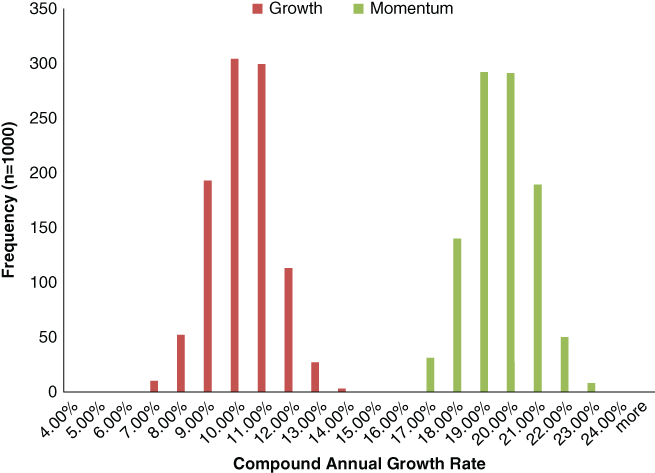

[**Figure 3.1**](#c03-fig-anc-0001) CAGR: Growth Monkeys versus Momentum Monkeys

Relative to their monkey peers, some of the luckiest growth monkeys did well, averaging approximately 14 percent over the period, and some very unlucky momentum monkeys did poorly, averaging approximately 17 percent over the period. However, incredibly, over the 50-year period there isn't a single dart-throwing growth monkey who outperformed *any* dart-throwing momentum monkey. This result is stunning. Typically, when one runs a thousand simulations, one identifies some overlap in the “tails,” or extreme ends of the distribution. Clearly, from a compound return perspective, momentum is different from growth.

Next, let's look at a comparison of the volatility of the growth monkey portfolios and the volatility of the momentum monkey portfolios. Perhaps the return outperformance of momentum versus growth is compensation for extra risk associated with a generic momentum strategy.

[Figure 3.2](#c03-fig-0002) highlights little difference in annualized volatility for the portfolios created using either a growth monkey or a momentum monkey to pick stocks. The distribution is narrow.

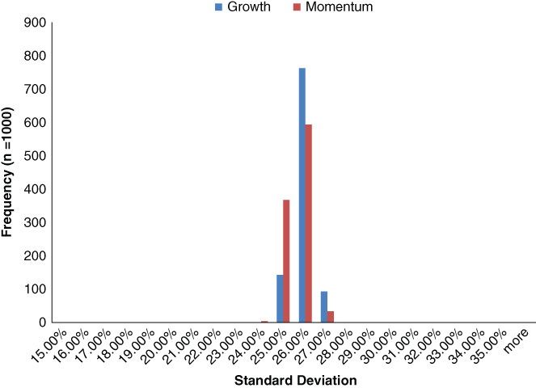

[**Figure 3.2**](#c03-fig-anc-0002) Volatility: Growth Monkeys versus Momentum Monkeys

But perhaps volatility doesn't capture the true risk of the momentum strategy relative to the growth portfolios? We examine the worst drawdowns, or the worst peak-to-trough performance during the 50-year time period, as an extreme tail event. [Figure 3.3](#c03-fig-0003) tabulates the extreme loss scenarios across the thousand simulations for both the growth and momentum strategies.

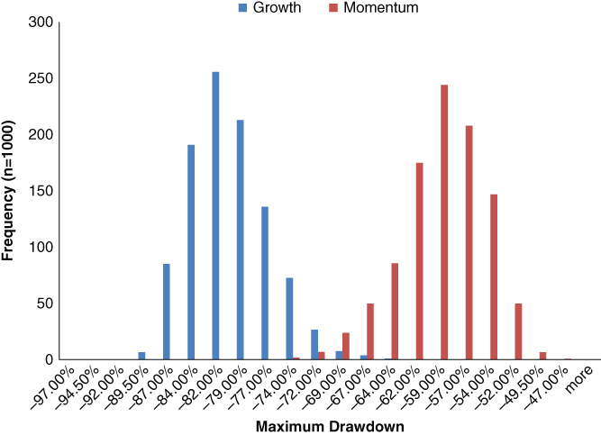

[**Figure 3.3**](#c03-fig-anc-0003) Drawdown: Growth Monkeys versus Momentum Monkeys

Note that higher drawdowns are reflected on the left side of [Figure 3.3](#c03-fig-0003), while lower drawdowns are reflected on the right. Because the light gray bars are clustered on the left, the tail risk for growth, on average, is actually *higher* than for momentum, which is clustered on the right. There is some overlap—some simulation runs where momentum has larger drawdowns than growth—but these instances are few and far between. The overwhelming number of observations shows higher drawdowns for the growth monkeys than for the momentum monkeys.

To summarize, growth investing, as measured by high price to fundamentals, is not the same as momentum investing, as measured by strong past relative performance. This conclusion is clearly seen in the historical characteristics associated with each of these strategies, which shows that growth and momentum are different animals.

## BUT WHY DOES MOMENTUM WORK?

> *“We discovered the world wasn't flat before we understood and agreed why.”*

—Cliff Asness et al.[14](#c03-note-0014)

Cliff Asness's quote highlights that sometimes you can understand that something is true before you fully understand why it is true, and agree with others why it is true. So it goes with momentum investing, where the data are clear that it works, but we lack clarity on exactly “why.” We attempt to address this conundrum, but knowingly embrace the humility that our thoughts can only hope to be directionally correct, at best. Value investing, in contrast to momentum investing, is intuitive. The value approach is intuitive because it is assumed that market prices drift around a so-called intrinsic value, which is informed by fundamentals. Classic value investors claim to earn their paycheck by timing the difference between fundamentals and market prices. But what if the market decides to never update their expectation about the intrinsic value of a firm (also known as a *value trap*)? Assuming free cash flow distributions are distributed in the distant future, a value investor won't win in this situation. The value investor, like all investors, needs market expectations to change in their favor for the strategy to work. Value investing doesn't work simply because the investor buys cheap. Value investing works because cheap price-to-fundamental ratios, the proxy for a systematic market expectation error, mean revert in favor of the value investor, on average. The core argument behind momentum investing works along the exact same lines. Momentum investing works because the relative strength indicator is a proxy for a systematic expectation error in the market that predictably reverts in the momentum investor's favor, on average.

To understand why momentum works, we leverage our sustainable active framework to determine if a strategy will be successful over the long term. The building blocks to identify sustainable performance were as follows: (1) identify bad poker players, (2) understand the limitations of the best poker players to exploit the bad poker players, and (3) exploit the opportunity that presents itself. We showed that value, which has a strong historical track record, has characteristics that suggest the past track record could plausibly continue in the future.

Our analysis of the value anomaly through the lens of the sustainable active investing framework raises a natural question: Is momentum, like value, a sustainable investment approach? With our sustainable active framework in hand, we can tackle this difficult question. But first, we should establish beyond any doubt that momentum—which isn't the same as growth investing—has worked, historically. To keep things simple and in line with previous analysis, we consider “momentum investing” to be roughly approximated by the practice of purchasing portfolios of firms with strong relative performance over the past year. Using the momentum portfolio data from Ken French's website,[15](#c03-note-0015) we examine the returns from January 1, 1927, to December 31, 2014, for a high momentum portfolio (high momentum decile, value-weight returns), a value portfolio (high B/M decile, value-weight returns), a growth portfolio (low B/M decile, value-weight returns), and the S&P 500 total return index (SP500). Results are shown in [Table 3.1](#c03-tbl-0001). All returns are total returns and include the reinvestment of distributions (e.g., dividends). Results are gross of fees.

[**Table 3.1**](#c03-tbl-anc-0001) Momentum Performance (1927–2014)

|  |  |  |  |  |
| --- | --- | --- | --- | --- |
|  | **Momentum** | **Value** | **Growth** | **SP500** |
| **CAGR** | 16.85% | 12.41% | 8.70% | 9.95% |
| **Standard Deviation** | 22.61% | 31.92% | 19.95% | 19.09% |
| **Downside Deviation** | 16.71% | 21.34% | 14.41% | 14.22% |
| **Sharpe Ratio** | 0.66 | 0.41 | 0.35 | 0.41 |
| **Sortino Ratio (MAR** c03-math-0001 **5%)** | 0.79 | 0.54 | 0.37 | 0.45 |
| **Worst Drawdown** | –76.95% | –91.67% | –85.01% | –84.59% |
| **Worst Month Return** | –28.52% | –43.98% | –30.65% | –28.73% |
| **Best Month Return** | 28.88% | 98.65% | 42.16% | 41.65% |
| **Profitable Months** | 63.16% | 60.51% | 59.09% | 61.74% |

Momentum stocks have outperformed value stocks, growth stocks, and the broader market by a large margin. The portfolio of momentum stocks earns a compound annual growth rate of 16.85 percent per year, whereas, the growth stock portfolio earns 8.70 percent per year—an 8 percent annual spread in performance. This historical spread in returns is why momentum has been deemed the premier anomaly by academic researchers. There are obviously important considerations we avoid at this stage of our discussion, such as transaction costs, but one fact is clear—*momentum is the performance king*. Next question, is this performance sustainable?

### Are Bad Players Creating the Momentum Anomaly?

With value, the core behavioral bias described was representative bias, which drove a price overreaction to poor fundamentals that mean-revert over time. This description is, of course, an oversimplification of the psychological factors at work, but the collective academic evidence generally seems to support the core thesis that the excess returns earned by value stocks are not solely driven by additional risk—mispricing plays some role in describing the excess returns. With momentum, the collective evidence points in the same direction as value—risk certainly plays some role in explaining the excess returns, but mispricing plays a role as well. The behavioral premise for momentum is that investors seem to *underreact* to positive news reflected in the strong relative performance. On the face of it, the behavior driving value and momentum appear to contradict one another: Value is driven by an overreaction problem, while momentum is driven by an underreaction problem. What gives?

A valid critique of behavioral finance researchers is that they want to have their cake and eat it, too. In one instance we can lean on underreaction bias and in the next instance we can lean on the overreaction bias. The behavioral formula is too easy: (1) Grab a psychology textbook, and (2) identify behavioral biases that fit the data. Eugene Fama issued a challenge to so-called behavioral finance researchers in his 1998 paper “Market Efficiency, Long-Term Returns, and Behavioral Finance:”[16](#c03-note-0016)

---

*Following the standard scientific rule, market efficiency can only be replaced by a better model…The alternative has a daunting task. It must specify what it is about investor psychology that causes simultaneous underreaction to some types of events and overreaction to others…*

---

Three sets of authors in three different papers[17](#c03-note-0017)–[19](#c03-note-0019) immediately took on the challenge. Daniel et al. and Barberis et al. focus on models driven by documented psychological biases to derive predictions that hypothesize excess returns for both value and momentum strategies. Hong and Stein also tackle the problem, but from a slightly different angle. Whereas Daniel et al. and Barberis et al. focus on investor psychology issues for individual market participants, Hong and Stein focus on the interaction of different market participants, which are assumed to either be fundamental or technical investors, but few investors are both fundamental and technical. We recommend that interested readers explore all of these papers since all three theories probably play some role in explaining momentum, but we pay particular attention to the Barberis et al. paper because it is arguably the approach with the most empirical support.[20](#c03-note-0020)

Barberis et al. conclude that value and momentum are driven by biases that mirror one another. Value, as discussed previously, is driven by an overreaction problem, in which humans are too quick to draw conclusions from a small amount of recent data. In contrast, momentum is driven by an underreaction issue, which is the opposite of overreaction. With underreaction, humans are slow to update their views based on new evidence, which could be due to a systematic behavior bias and/or due to the fact human beings simply have limited cognitive power (i.e., “limited attention” as it is called in academic literature). But what drives overreaction in one circumstance and underreaction in another?

The challenge with any behavioral theory is in understanding what triggers overreaction and what triggers underreaction; in other words, why do market participants engage in behavioral “regime-shifting,” and can we understand how and why they do this? Barberis et al. rely on Griffin and Tversky's work,[21](#c03-note-0021) which leads them to assume that good earnings news, presented *outside* of, or in isolation from, a long sequence of good earnings news, leads to an underreaction (i.e., conservatism) and that good earnings news, presented *inside of*, or as part of, a long sequences of good earnings news, lead to an overreaction (i.e., representativeness). Experimental evidence strongly supports the Barberis et al. theories. In 2002, Robert Bloomfield and Jeffrey Hales conducted controlled trading experiments with Cornell MBA students and found that business students engage in behavioral regime-shifting, depending on how they perceive new information.[22](#c03-note-0022)

Let's put this issue in concrete, practical terms. Take a company with a long string of positive earnings announcements. What happens when investors see another strong positive earnings announcement? Investors will predict the trend will continue, since this conclusion is representative of the ongoing earnings trend observed. But investors overreact. They become overly optimistic and bullish, and because they expect this strong earnings growth to continue to occur in the future, they bid up the stock to excessively high levels that become disconnected from fundamentals. At this point, if there is a negative earnings event, investors are stunned since this event is inconsistent with their optimism, and they sell, causing prices to decline. This behavior is growth investing.

Now take a company with a more uneven recent earnings history. What happens in this scenario when investors see a positive earnings surprise? They are skeptical, conservative, and slow to update their beliefs. They are hesitant to be bullish. After all, what if this is just a proverbial blip on the radar, and future earnings will not be similarly strong? In this case, investors can be said to underreact to strong earnings and underweight the information content of the recent earnings. They are overly pessimistic and will not bid the stock price higher, even though the news may still suggest it is undervalued. Only over time do prices increase to fully reflect the new fundamental information. This behavior is momentum investing.

The conclusion by Barberis et al. is that both value and momentum effects are plausible under a wide variety of parameter values (i.e., either underreaction or overreaction clearly seems to prevail depending on recent trends of historical earnings over several periods).

Frankly, there is no definitive conclusion on the behavioral biases that drive both value and momentum, and maybe there never will be. There does, however, seem to be a general consensus that both of these anomalies are driven, in part, by mispricing due to behavioral bias. Value and momentum signals are simply a proxy for behavioral biases that drive systematic investor expectation errors. The empirical evidence strongly supports this hypothesis and is codified in the title of a 2013 paper by Asness, Moskowitz, and Pedersen, “Value and Momentum Everywhere.”[23](#c03-note-0023)

In a way, maybe we shouldn't be too concerned with the specific mechanism that causes the poor players to contribute to an anomaly like value or momentum. Maybe it doesn't matter that we all understand and agree on why momentum or value work. As investors we just care that it works. And since momentum seems to work well, and we have covered how poor players contribute to its cause, now we must address a basic question: Why hasn't the smart money already arbitraged the anomaly away?

### What Do the Best Players Think about Momentum?

Similar to value investing, momentum investing requires a level of discipline that few investors possess. Momentum does not work all the time and can *fail spectacularly*. This harsh reality prevents many large pools of capital from dipping their toe too far into the momentum pool. Momentum is simply too dangerous.

To make the point that momentum can sometimes be hazardous to your wealth, we examine the pain of momentum investing during the 2008 financial crisis and the follow-on period. We examine the returns from January 1, 2008, to December 31, 2009, for a momentum portfolio (high momentum decile, value-weight returns), a growth portfolio (low B/M decile, value-weight returns), a value portfolio (high B/M decile, value-weight returns), and the S&P 500 total return index (SP500). Results are shown in [Table 3.2](#c03-tbl-0002). All returns are total returns and include the reinvestment of distributions (e.g., dividends). Results are gross of fees.

[**Table 3.2**](#c03-tbl-anc-0002) Momentum Investing Can Underperform (2008–2009)

|  |  |  |  |  |
| --- | --- | --- | --- | --- |
|  | **Momentum** | **Growth** | **Value** | **SP500** |
| **CAGR** | –17.65% | –8.52% | –6.69% | –10.36% |
| **Standard Deviation** | 26.03% | 23.45% | 45.60% | 23.24% |
| **Downside Deviation** | 20.67% | 17.38% | 23.06% | 17.37% |
| **Sharpe Ratio** | –0.64 | –0.30 | 0.05 | -0.39 |
| **Sortino Ratio (MAR** c03-math-0002 **5%)** | –1.01 | –0.64 | –0.09 | -0.76 |
| **Worst Drawdown** | –51.25% | –46.72% | –61.04% | –47.75% |
| **Worst Month Return** | –15.19% | –16.13% | –28.07% | –16.70% |
| **Best Month Return** | 11.09% | 9.92% | 36.64% | 9.42% |
| **Profitable Months** | 50.00% | 54.17% | 62.50% | 54.17% |

On a relative basis, momentum underperformed by a substantial amount. When we look at risk-adjusted statistics the performance is even worse. Clearly, following an active momentum strategy involves strong elements of investment advisor career risk, akin to active value strategies. But it gets worse …

In [Table 3.3](#c03-tbl-0003) we examine returns over the financial crisis period and we include the follow-on period: January 1, 2008, to December 31, 2014. Results are gross of fees. Simple passive index funds outperform momentum over a seven-year period

[**Table 3.3**](#c03-tbl-anc-0003) Momentum Investing Can Underperform (2008–2014)

|  |  |  |  |  |
| --- | --- | --- | --- | --- |
|  | **Momentum** | **Growth** | **Value** | **SP500** |
| **CAGR** | 6.55% | 8.69% | 8.45% | 7.44% |
| **Standard Deviation** | 22.24% | 17.13% | 29.73% | 16.75% |
| **Downside Deviation** | 17.03% | 12.92% | 20.78% | 13.30% |
| **Sharpe Ratio** | 0.39 | 0.56 | 0.41 | 0.50 |
| **Sortino Ratio (MAR** c03-math-0003 **5%)** | 0.23 | 0.37 | 0.36 | 0.27 |
| **Worst Drawdown** | –51.25% | –46.72% | –61.04% | –47.75% |
| **Worst Month Return** | –15.91% | –16.13% | –28.07% | –16.70% |
| **Best Month Return** | 14.93% | 11.21% | 36.64% | 10.93% |
| **Profitable Months** | 61.90% | 61.90% | 59.52% | 63.10% |

Ask yourself the same question we posed with the results from a hypothetical value investor from 1994 to 1999:

---

*If your asset manager underperformed a benchmark for seven years, at times by double digits, would you fire them?*

---

The answer is a resounding “Yes!” for most investors, which translates into a resounding, “No way, Jose!” for professional asset managers concerned about their careers. But the market frictions associated with exploiting a momentum strategy extend beyond career risk. Unlike value, which is a strategy that works when traded relatively infrequently (e.g., annual rebalanced portfolios have excess risk-adjusted returns), momentum is a strategy that requires a higher degree of trading frequency to be effective (e.g., quarterly rebalanced portfolios have excess risk-adjusted returns, but annually rebalanced portfolios do not). This trading frequency increases transaction costs, which can be prohibitive and limit the profitability of the strategy, net of trading costs. While a plausible limit of arbitrage, Frazzini et al. address this question directly using data from over a trillion dollars in live transactions from AQR Capital Management and find that transaction costs for efficient institutional investors cannot “explain away” their unwillingness to pursue momentum strategies.[25](#c03-note-0025)

### Momentum Is Similar to Value, Not Growth

Momentum investing turns out to be more similar to value than to growth from a performance perspective and from the viewpoint of our sustainable active investing framework. On the performance front, both value and momentum have strong historical risk-adjusted returns and have been extensively tested by academic researchers across different markets, asset classes, and time periods. To explain this anomalous performance, the academic consensus suggests that value and momentum premiums are driven by some combination of hidden systematic risk-factors (a justified reason for higher expected returns) and elements of mispricing (an unwarranted reason for higher expected returns). On the mispricing front, value and momentum metrics serve as signals to identify stocks suffering from market expectations that eventually move in favor of the value or momentum investor. This mispricing aspect is paired with the harsh reality that there is a limited ability for large pools of smart money to arbitrage away value or momentum. Many of these capital pools are conflicted by the high volatility and extreme career risk associated with pursuing active value and momentum strategies. Presumably, value and momentum premiums will continue to have staying power, under the assumptions that (1) value and momentum are fundamentally riskier strategies, (2) investors continue to suffer from behavioral bias, and (3) large-scale arbitrage is costly and difficult.[26](#c03-note-0026)

## SUMMARY

In this chapter, we explored the history of momentum research from its early days as a respectable approach, through the dark ages following the golden age of the EMH, and the more recent resurgence in academic interest. We then explore the common misperception that growth investing, as defined as buying stocks with high prices to fundamentals, is the same as momentum investing, which is buying stocks with strong relative returns. Nothing could be further from the truth. Buying expensive stocks is not the same as buying stocks with strong relative performance: one strategy performs, the other does not. Next, we investigated momentum through the lens of sustainable active investing. Momentum strategy excess expected returns are plausibly driven by investor behavioral errors, combined with limits of arbitrage, and thus reasonably support an argument for long-term sustainable performance. Assuming we have convinced you that momentum, like value, is arguably a sustainable anomaly, we now explore why these two particular anomalies are *really* interesting when used together. In the next chapter, we will explore why all portfolios should consider combining value and momentum systems.

## NOTES

[1](#c03-note-anc-0001) Robert Bloch, *The Warren Buffett Bible* (New York: Skyhorse Publishing, 2015).
[2](#c03-note-anc-0002) Robert Levy, “Relative Strength as a Criterion for Investment Selection,” *The Journal of Finance* 22 (1967): 595–610.
[3](#c03-note-anc-0003) Burton G. Malkiel, *A Random Walk Down Wall Street* (New York: Norton, 1973).
[4](#c03-note-anc-0004) Jensen and Bennington take Levy's work to task in “Random Walks and Technical Theories: Some Additional Evidence,” *The Journal of Finance* 25 (1970): 469–482.
[5](#c03-note-anc-0005) Mark Carhart, “On Persistence in Mutual Fund Performance,” *The Journal of Finance* 52 (1997): 57–82.
[6](#c03-note-anc-0006) Eugene F. Fama and Kenneth R. French, “Dissecting Anomalies,” *Journal of Financial Economics* 63 (2008): 1653–1678.
[7](#c03-note-anc-0007) Ibid.
[8](#c03-note-anc-0008) Justin Birru, “Confusion of Confusions: A Test of the Disposition Effect and Momentum,” *The Review of Financial Studies* 28 (2015): 1849–1873.
[9](#c03-note-anc-0009) Thomas George and Chuan-Yang Hwang, “The 52-Week High and Momentum Investing,” *The Journal of Finance* 59 (2004): 2145–2176.
[10](#c03-note-anc-0010) See James Davis, “The Cross-Section of Realized Stock Returns: The Pre-COMPUSTAT Evidence,” *The Journal of Finance* 49 (1994), 1579–1593, and Eugene F. Fama and Kenneth R. French, “Size and Book-to-Market Factors in Earnings and Returns,” *The Journal of Finance* 50 (1995): 131–155.
[11](#c03-note-anc-0011) See Kent Daniel and Sheridan Titman, “Evidence on the Characteristics of Cross Sectional Variation in Stock Returns,” *The Journal of Finance* 52 (1997), 1–33, Joseph Piotroski and Eric So, “Identifying Expectation Errors in Value/Glamour Strategies: A Fundamental Analysis Approach,” *The Review of Financial Studies* 25 (2012), 2841–2875, and Jack Vogel, “Essays on Empirical Asset Pricing,” dissertation Drexel University, 2014.
[12](#c03-note-anc-0012) Beaver, William, Maureen McNichols, and Richard Price, “Delisting Returns and Their Effect on Accounting-based Market Anomalies,” *Journal of Accounting and Economics* 43 (2007): 341–368.
[13](#c03-note-anc-0013) Fama and French.
[14](#c03-note-anc-0014) Cliff Asness, Andrea Frazzini, Ron Israel, and Toby Moskowitz, “Fact, Fiction, and Momentum Investing,” *The Journal of Portfolio Management* 40 (2014): 75–92.
[15](#c03-note-anc-0015) mba.tuck.dartmouth.edu/pages/faculty/ken.french/data\_library.html, accessed 12/30/2015.
[16](#c03-note-anc-0016) Eugene F. Fama, “Market Efficiency, Long-Term Returns, and Behavioral Finance,” *Journal of Financial Economics* 49 (1998): 283–306.
[17](#c03-note-anc-0017) Nicholas Barberis, Andrei Shleifer, and Robert Vishny, “A Model of Investor Sentiment,” *Journal of Financial Economics* 49 (1998): 307–343.
[18](#c03-note-anc-0018) Harrison Hong and Jeremy Stein, “A Unified Theory of Underreaction, Momentum Trading, and Overreaction in Asset Markets,” *The Journal of Finance* 54 (1999): 2143–2184.
[19](#c03-note-anc-0019) Kent Daniel, David Hirshleifer, and Avanidhar Subrahmanyam, “A Theory of Overconfidence, Self-Attribution, and Security Market Under- and Over-Reactions,” *The Journal of Finance* 53 (1998): 1839–1885.
[20](#c03-note-anc-0020) Although, there is research that goes against the Barberis et al. theory. For example, Alexander Hillert, Heiko Jacobs, and Sebastian Muller, “Media Makes Momentum,” *The Review of Financial Studies* 27 (2014): 3467–3501. The reality is that all of these theories probably play some role in explaining the insurmountable evidence related to momentum, and momentum is clearly created by some sort of behavioral bias, even if it doesn't take the form of the version outlined in Barberis et al.
[21](#c03-note-anc-0021) Dale Griffin and Amos Tversky, “The Weighing of Evidence and the Determinants of Confidence,” *Cognitive Psychology* 24 (1992): 411–435.
[22](#c03-note-anc-0022) Robert Bloomfield and Jeffrey Hales, “Predicting the Next Step of a Random Walk: Experimental Evidence of Regime-Shifting Beliefs,” *Journal of Financial Economics* 65 (2002): 397–414.
[23](#c03-note-anc-0023) Cliff Asness, Toby Moskowitz, and Lasse Pedersen, “Value and Momentum Everywhere,” *The Journal of Finance* 68 (2013): 929–985.
[24](#c03-note-anc-0024) To make matters even more interesting, over the 2008 to 2014 period, growth investing, ironically, was the best performer.
[25](#c03-note-anc-0025) Andrea Frazzini, Ronen Israel, and Toby Moskowitz, “Trading Costs of Asset Pricing Anomalies,” AQR working paper, 2014.
[26](#c03-note-anc-0026) Assuming that some element of both the value and momentum premiums is due to risk, we could see swings in these premiums in the future if risk preferences change.

<!-- rl-section id="the-efficient-market-mafia-kills-relative-strength" class="epub-section" title="THE EFFICIENT MARKET MAFIA KILLS RELATIVE STRENGTH" -->

# CHAPTER 3 Momentum Investing Is Not Growth Investing

> *“The dumbest reason in the world to buy a stock is because it's going up.”*

—Attributed to Warren Buffett[1](#c03-note-0001)

We use the term *momentum* to mean a continuation of past relative returns—past winners tend to be future winners, while past losers tend to be future losers. Practitioners often refer to this class of strategies as relative strength strategies, which have been around for a long time. In fact, Robert Levy published a paper in 1967 called “Relative Strength as a Criterion for Investment Selection.” Mr. Levy outlines his conclusion: “The profits attainable by purchasing the historically strongest stocks are superior to the profits from random selection.”[2](#c03-note-0002) Oddly enough, research on relative strength strategies went dormant following Levy's contribution. What happened? The efficient market hypothesis happened.

As we alluded to in [Chapter 2](#section-12), the efficient market hypothesis (EMH) was developed at the University of Chicago in the 1960s and 1970s. The EMH hypothesis subsequently flourished across academia. Under the semi-strong form interpretation of the EMH, asset prices reflect all publicly available information so that there is no way for investors to consistently outperform a randomly selected basket of securities after controlling for risk. Or as EMH proponent Burton Malkiel so eloquently put it in his 1973 classic, *A Random Walk Down Wall Street*: “A blindfolded monkey throwing darts at a newspaper's financial pages could select a portfolio that would do just as well as one carefully selected by experts.”[3](#c03-note-0003) Thus, from an EMH perspective, for all intents and purposes, Levy's evidence on the performance of relative strength strategies was an impossibility.

It seems that practitioners like Levy (who worked in the private sector at the time his paper was published), were overtaken by the cult of academics focused on pursuing the efficient market hypothesis. Practitioners were essentially banned from publishing in top-tier academic finance journals and academics pursuing research interests that went counter to the EMH idea were driven from the emerging EMH temple.[4](#c03-note-0004) The subsequent 25 years of published academic research entered a dark age, and discussions of relative strength strategies were effectively banned, since space was primarily reserved for EMH cheerleaders.

Yet, all was not well in the ivory tower. Anomalies that were inconsistent with EMH began to emerge in the literature in the 1970s. For example, as previously mentioned, Ben Graham, among others, had shown that buying a basket of cheap stocks tended to outperform the market, and academics began to formally examine the value effect. Evidence related to value and other so-called anomalies began to accumulate, hinting that there might be kinks in the EMH armor, but EMH proponents remained confident. However, around the same time that many EMH supporters were basking in glory, Daniel Kahneman, working with Amos Tversky, started exploring how human biases affected financial decision making. Kahneman and Tversky established some of the earliest connections between investors' internal behavioral biases and many of the observed anomalies that were being identified in the academic finance literature.

## “MOMENTUM” RISES FROM THE ASHES

Finally, in the early 1990s, Narasimhan Jegadeesh and Sheridan Titman revitalized the findings from Levy's 1967 paper in their pioneering 1993 article “Returns to Buying Winners and Selling Losers: Implications for Market Efficiency.” This paper essentially replicated the spirit of the analysis conducted by Levy in 1967, but with the benefit of more data, computational power, and willingness on behalf of the establishment to publish research that questioned EMH. By now, the cracks in the EMH armor were getting bigger.

Interestingly enough, Jegadeesh and Titman never mention the word *momentum* in their original paper, even though their paper is considered by many to be the seminal work on modern-era stock selection momentum strategies. We posit that the term *momentum* was adopted after Mark Carhart published his University of Chicago dissertation in *The Journal of Finance*. In this paper, Carhart creates a *momentum factor*, which essentially reflected the relative strength of the stock selection strategies outlined in Jegadeesh and Titman's paper.[5](#c03-note-0005) Soon after Carhart's paper, *momentum* became the new academic term for the age-old relative strength strategy. With the floodgates open, researchers published a flurry of papers on momentum strategies. The evidence was so overwhelming that the anomaly was crowned the “premier anomaly” by none other than Eugene Fama—an original architect of the EMH theory.[6](#c03-note-0006)

Remarkably, while modern-day academics refocused on the concepts of stock selection momentum, many practitioners continued to be stuck in a time warp. The reasons for this regressive behavior are likely related to the practitioner training pipeline. The academics, who train all the MBAs that go on to manage portfolios, were still being taught portfolio mathematics so they could solve asset allocation decisions. Stock picking training was a waste of time because it was a sucker's game under a strict interpretation of the EMH. And of course, for the MBA “rebels,” there was always the value anomaly to pursue, which had been popularized by the intense success of Warren Buffett, the folksy investment hero from Omaha, Nebraska. Unlike value, however, there were no vibrant champions for momentum investing—no Ben Graham, no Warren Buffett. To make matters worse, the heroes associated with the value investing school of thought were, ironically, *agreeing* with the EMH academics when it came to momentum. Their value investing approach was perfectly reasonable, but momentum investing was deemed a black art, a kind of voodoo magic, only practiced by fools and heretics. Of course, all of this flew in the face of the actual evidence, which suggests that momentum investing is an even better anomaly than value investing.[7](#c03-note-0007)

EMH enjoyed great success for many years, with reams of academic papers showcasing how efficient markets had become. In many respects, EMH had won the argument—prices are generally efficient. But this price efficiency is why the evidence on momentum investing was so disheartening to the EMH school of thought. The value anomaly was one thing—perhaps investors could beat the market if they used their intellect, did their in-depth homework, and understood the financial statements better than the next investor. But the momentum anomaly was saying something completely different: Price momentum had nothing to do with fundamentals, so even a halfwit could pursue a successful strategy focused solely on relative price performance, since this simple metric seemed to predict future prices. This finding conflicted with even the weakest form of EMH. Houston we have a problem.

## BEHAVIORAL FINANCE THEORISTS EXPLAIN MOMENTUM

To the credit of academic researchers, the financial economics field moved forward and the behavioral finance paradigm arose, phoenix-like, from the ashes of EMH. This new paradigm held tightly to the EMH as a baseline hypothesis, but relaxed assumptions regarding investor rationality and frictionless markets, in order to understand and explain how and why prices might deviate from their efficient levels. This framework laid the foundation for the sustainable active investing concepts outlined in [Chapter 2](#section-12).

Hard-core value investors have a different kind of angst regarding momentum, a kind of anxiety that is grounded in clouded reasoning and a religious zeal, as is evidenced by quotations from value investing books and personas. For example, Warren Buffett is reported to have said, “The dumbest reason in the world to buy a stock is because it's going up.” As a rule of thumb, Buffett's advice isn't a bad rule, and Warren Buffett is clearly an extraordinary investor whose insights are worthy of investigation. But rules of thumb don't always capture the nuance of a situation. Higher prices may not always be an unreliable signal. For example, what if the intrinsic value of a stock is higher than the new, higher price—is that not still a value investment? Or perhaps there is a genuine positive feedback loop associated with higher prices that in turn increases the intrinsic value of the firm? High price movements may lower the cost of capital for a firm, allow them to attract better human capital, or even generate free advertising, thus increasing fundamental value, albeit in a reflexive way. In short, growth stocks, defined as stocks with high prices to fundamentals, are generally a bad thing, but higher prices, per se, aren't always a bad thing. In fact, they are generally a positive development, all else equal.

Consider the following hypothetical scenario:

- Facebook has gone up 100 percent the past year and has a price to earnings ratio of 15.
- Google has gone down 50 percent and has a price to earnings ratio of 15.

Which is the better buy? For a classic value investor, these stocks are arguably the same from a valuation perspective since they both have the same price to earnings ratio of 15. However, based on psychology, some investors will “feel” like Google is a better opportunity, since value stocks are often those that have declined in price. What value investor wants to buy a stock that is up 100 percent? True value investors are genetically programmed to be suspicious of strong upward price moves—we know because we are value investors by nature! Strong upward price movements are typically a bad signal when it comes to a traditional value or distressed investing opportunity. Upward moves suggest things are not as cheap as they were before, and are more expensive now, at least comparatively. But this feeling of disgust that is associated with buying a high-flying stock is not specific to value investors; this distrust is also felt more generally by all investors—nobody wants to be the sucker that bought after the price moved higher. In fact, people can feel a contrary urge. If you own a stock that has gone up in value, you may seek to realize the gain by selling it—after all, it feels good to realize a gain. This effect is often termed the *disposition effect*. There is strong empirical evidence to support the theory that the disposition effect is related to the momentum anomaly.[8](#c03-note-0008)

Consider a stock that is at a 52-week high—many investors interpret this to mean the stock is overvalued and unlikely to go higher, even if it may still be cheap on a fundamental basis. The mainstream interpretation is patently false: 52-week-high stocks greatly outperform 52-week-low stocks.[9](#c03-note-0009) But if many market participants have these kinds of biases, a reasonable hypothesis is that there will be price pressure—unrelated to fundamentals—that may prevent a security from reaching its true fundamental value because market participants perceive that, for some gut-based reason, “the stock has already gone up too much.” This situation would be a case where momentum investing is essentially a cousin, not an enemy, of value investing. How so? Value investing's edge is often characterized as *pessimism* in the presence of *poor* short-term fundamentals, which causes stocks to become too cheap relative to future expectations. Perhaps momentum investing's edge could be characterized as *pessimism* in the presence of *strong* short-term fundamentals, which causes stocks to remain too cheap to future expectations.

## WAIT A MINUTE: MOMENTUM INVESTING IS JUST GROWTH INVESTING, WHICH DOESN'T WORK!

Hold on, if we are arguing that stocks can be cheap due to pessimism related to *strong* short-term fundamentals, isn't that … growth investing?

*No*.

But before clarifying, let's review the psychology behind value versus growth. In our prior discussion of value and growth, the evidence showed that value beats growth. The reason for this spread is partly attributable to mispricing from behavioral bias in the market. For example, the original Lakonishok, Shleifer, and Vishny study mentioned in [Chapter 2](#section-12) showed that price to fundamental ratios serve as a proxy for expectation errors exhibited in the market. Recall that investors thought high past earnings growth rates would continue for growth stocks, and low past earnings growth rates would continue for value stocks. The evidence showed this expected result did not in fact occur. Follow-on studies debate this core result from Lakonishok, Vishny, and Shleifer's original findings,[10](#c03-note-0010) but these papers fail to address more recent work, including Daniel and Titman's 1997 paper on value characteristics and stock returns, Piotroski and So's 2012 paper on the interaction between value investing returns and fundamentals, and Jack's 117-page dissertation, which is a deep-dive into the concepts outlined in Piotroski and So's work. These more recent papers confirm that the value anomaly, while volatile and costly to exploit, is likely driven, in part, by mispricing.[11](#c03-note-0011)

Thus, on average, investors seem to over-extrapolate good news from growth firms (firms with high price to fundamentals), driving them above intrinsic value, and do the opposite with value firms (firms with low price to fundamentals), driving them below intrinsic value. So in the value-investing framework, growth investors seem to be too *optimistic*, given strong fundamentals. But are we now saying that momentum investors are too *pessimistic*, given strong prices? These positions seem to be in conflict, but we will explain.

Let us be clear: Momentum investing is *not* growth investing. Growth investing, in accordance with the studies mentioned, is characterized by securities that have high prices relative to past fundamentals (e.g., price-to-earnings ratio). We acknowledge that there are many alternative ways to define growth investing in practice (e.g., growth at a reasonable price), but we will stick with the academic convention for the purposes of our argument. In contrast to growth, we characterize momentum investing as securities that have strong relative performance to all other securities, *independent* of fundamentals. For example, a momentum strategy might consider the cumulative returns of prices over the last 12 months relative to other stocks, but earnings, or any other fundamental metric, would play *no part* in the analysis. With momentum, prices aren't everything; they are the only thing.

We will argue that strong momentum signals, similar to low price to fundamental ratios (i.e., value measures), are a proxy for investor expectation errors, and help an informed investor systematically identify situations where behavioral bias is preventing securities, on average, from reaching perceived fundamental value. Think back to the poor poker players in the sustainable active investing framework in [Chapter 2](#section-12). As a first step in identifying sustainable active strategies, we need some market participants to be less than rational in order to create a mispricing opportunity. We will come back to “poor poker players” and the mechanics of how and why momentum works later. However, this point regarding the difference between the signal that characterizes momentum (i.e., price-only) versus growth (i.e., price relative to some fundamental) is extremely important to understand to ensure that readers are not confused and think that growth investing is the same thing as momentum investing.

The best way to make the point clear is with data. We examine the overlap between a portfolio of mid-to-large market capitalization firms selected on a generic momentum signal (top decile of firms with relative strongest 12-month performance, skipping the previous month) and a portfolio of firms selected based on a generic price to fundamental signal (top decile of firms with the highest price-to-book ratio—or alternatively, the book-to-market ratio, otherwise known as growth firms) for the period between 1963 and 2013. Surprisingly, there is only a 21 percent overlap between the names in the high momentum portfolios and the names in the growth portfolio. Thus, many momentum stocks are not growth stocks, and many growth stocks are not momentum stocks. In fact, a high momentum stock can be a value stock, a growth stock, or anything in between.

## DIGGING DEEPER INTO GROWTH VERSUS MOMENTUM

In the following analysis we dig a little deeper into the characteristics of growth firms and high momentum firms. Our data sample includes all firms on the New York Stock Exchange (NYSE), American Stock Exchange (AMEX), and NASDAQ with the required data on CRSP and Compustat, which are the academic gold standard for financial data analysis. We only examine firms with ordinary common equity on CRSP and eliminate all REITS, ADRS, closed-end funds, utilities, and financial firms. We incorporate CRSP delisting return data using the technique of Beaver, McNichols, and Price.[12](#c03-note-0012) To be included in the sample, all firms must have a non-zero market value of equity as of June 30 of year *t*. We use book to market (B/M) as our annual indicator of “valuation” based on academic convention. Book is computed on June 30 each year using the methodology from Fama and French[13](#c03-note-0013) and the market capitalization on June 30. All firms with negative book values are eliminated from the sample. We consider “growth” firms to be those with the most expensive B/M ratios (i.e., lower is more expensive). We calculate generic momentum by ranking all stocks monthly on their cumulative 12-month returns, skipping the most recent month, similar to Fama and French.

The tests are focused on all mid- and large-cap stocks, defined as stocks with a market capitalization above the NYSE 40th percentile for market capitalization. This approach seeks to determine if the empirical results are applicable to the broader universe of stocks and are robust to size and liquidity effects over time. Our choice to focus on more liquid firms means that our conclusions may not be applicable to small illiquid firms.

We follow a simulation approach that works as follows:

- Each month we randomly draw 30 “growth stocks” and 30 “momentum” stocks from our top decile of growth stocks and high momentum stocks.
- Repeat every month from 1963 to 2013 to create a monthly rebalance portfolio of “growth” stocks and a monthly rebalanced portfolio of “momentum” stocks.
- Calculate performance statistics on the growth strategy and the momentum strategy from 1963 to 2013.
- Repeat the above steps 1,000 times.

The experiment above is equivalent to having a monkey, focused on growth stocks, throw 30 darts at the growth stock dartboard every month for 50 years, and another monkey, focused on momentum stocks, which will throw 30 darts at the momentum stock dartboard every month for 50 years. We'll then have both the growth and the momentum monkey do this exercise 1,000 times, so at the end we will have a sample of 1,000 separate portfolio manager monkeys from each camp.

Now some monkeys will perform well, and others will perform poorly, simply based on luck. But recall that momentum monkeys always make their picks the top momentum stock decile, and growth monkeys always make their picks from the top growth stock decile.

First, [Figure 3.1](#c03-fig-0001) shows the distribution of compound annual growth rates for the growth monkeys and the momentum monkeys.

[**Figure 3.1**](#c03-fig-anc-0001) CAGR: Growth Monkeys versus Momentum Monkeys

Relative to their monkey peers, some of the luckiest growth monkeys did well, averaging approximately 14 percent over the period, and some very unlucky momentum monkeys did poorly, averaging approximately 17 percent over the period. However, incredibly, over the 50-year period there isn't a single dart-throwing growth monkey who outperformed *any* dart-throwing momentum monkey. This result is stunning. Typically, when one runs a thousand simulations, one identifies some overlap in the “tails,” or extreme ends of the distribution. Clearly, from a compound return perspective, momentum is different from growth.

Next, let's look at a comparison of the volatility of the growth monkey portfolios and the volatility of the momentum monkey portfolios. Perhaps the return outperformance of momentum versus growth is compensation for extra risk associated with a generic momentum strategy.

[Figure 3.2](#c03-fig-0002) highlights little difference in annualized volatility for the portfolios created using either a growth monkey or a momentum monkey to pick stocks. The distribution is narrow.

[**Figure 3.2**](#c03-fig-anc-0002) Volatility: Growth Monkeys versus Momentum Monkeys

But perhaps volatility doesn't capture the true risk of the momentum strategy relative to the growth portfolios? We examine the worst drawdowns, or the worst peak-to-trough performance during the 50-year time period, as an extreme tail event. [Figure 3.3](#c03-fig-0003) tabulates the extreme loss scenarios across the thousand simulations for both the growth and momentum strategies.

[**Figure 3.3**](#c03-fig-anc-0003) Drawdown: Growth Monkeys versus Momentum Monkeys

Note that higher drawdowns are reflected on the left side of [Figure 3.3](#c03-fig-0003), while lower drawdowns are reflected on the right. Because the light gray bars are clustered on the left, the tail risk for growth, on average, is actually *higher* than for momentum, which is clustered on the right. There is some overlap—some simulation runs where momentum has larger drawdowns than growth—but these instances are few and far between. The overwhelming number of observations shows higher drawdowns for the growth monkeys than for the momentum monkeys.

To summarize, growth investing, as measured by high price to fundamentals, is not the same as momentum investing, as measured by strong past relative performance. This conclusion is clearly seen in the historical characteristics associated with each of these strategies, which shows that growth and momentum are different animals.

## BUT WHY DOES MOMENTUM WORK?

> *“We discovered the world wasn't flat before we understood and agreed why.”*

—Cliff Asness et al.[14](#c03-note-0014)

Cliff Asness's quote highlights that sometimes you can understand that something is true before you fully understand why it is true, and agree with others why it is true. So it goes with momentum investing, where the data are clear that it works, but we lack clarity on exactly “why.” We attempt to address this conundrum, but knowingly embrace the humility that our thoughts can only hope to be directionally correct, at best. Value investing, in contrast to momentum investing, is intuitive. The value approach is intuitive because it is assumed that market prices drift around a so-called intrinsic value, which is informed by fundamentals. Classic value investors claim to earn their paycheck by timing the difference between fundamentals and market prices. But what if the market decides to never update their expectation about the intrinsic value of a firm (also known as a *value trap*)? Assuming free cash flow distributions are distributed in the distant future, a value investor won't win in this situation. The value investor, like all investors, needs market expectations to change in their favor for the strategy to work. Value investing doesn't work simply because the investor buys cheap. Value investing works because cheap price-to-fundamental ratios, the proxy for a systematic market expectation error, mean revert in favor of the value investor, on average. The core argument behind momentum investing works along the exact same lines. Momentum investing works because the relative strength indicator is a proxy for a systematic expectation error in the market that predictably reverts in the momentum investor's favor, on average.

To understand why momentum works, we leverage our sustainable active framework to determine if a strategy will be successful over the long term. The building blocks to identify sustainable performance were as follows: (1) identify bad poker players, (2) understand the limitations of the best poker players to exploit the bad poker players, and (3) exploit the opportunity that presents itself. We showed that value, which has a strong historical track record, has characteristics that suggest the past track record could plausibly continue in the future.

Our analysis of the value anomaly through the lens of the sustainable active investing framework raises a natural question: Is momentum, like value, a sustainable investment approach? With our sustainable active framework in hand, we can tackle this difficult question. But first, we should establish beyond any doubt that momentum—which isn't the same as growth investing—has worked, historically. To keep things simple and in line with previous analysis, we consider “momentum investing” to be roughly approximated by the practice of purchasing portfolios of firms with strong relative performance over the past year. Using the momentum portfolio data from Ken French's website,[15](#c03-note-0015) we examine the returns from January 1, 1927, to December 31, 2014, for a high momentum portfolio (high momentum decile, value-weight returns), a value portfolio (high B/M decile, value-weight returns), a growth portfolio (low B/M decile, value-weight returns), and the S&P 500 total return index (SP500). Results are shown in [Table 3.1](#c03-tbl-0001). All returns are total returns and include the reinvestment of distributions (e.g., dividends). Results are gross of fees.

[**Table 3.1**](#c03-tbl-anc-0001) Momentum Performance (1927–2014)

|  |  |  |  |  |
| --- | --- | --- | --- | --- |
|  | **Momentum** | **Value** | **Growth** | **SP500** |
| **CAGR** | 16.85% | 12.41% | 8.70% | 9.95% |
| **Standard Deviation** | 22.61% | 31.92% | 19.95% | 19.09% |
| **Downside Deviation** | 16.71% | 21.34% | 14.41% | 14.22% |
| **Sharpe Ratio** | 0.66 | 0.41 | 0.35 | 0.41 |
| **Sortino Ratio (MAR** c03-math-0001 **5%)** | 0.79 | 0.54 | 0.37 | 0.45 |
| **Worst Drawdown** | –76.95% | –91.67% | –85.01% | –84.59% |
| **Worst Month Return** | –28.52% | –43.98% | –30.65% | –28.73% |
| **Best Month Return** | 28.88% | 98.65% | 42.16% | 41.65% |
| **Profitable Months** | 63.16% | 60.51% | 59.09% | 61.74% |

Momentum stocks have outperformed value stocks, growth stocks, and the broader market by a large margin. The portfolio of momentum stocks earns a compound annual growth rate of 16.85 percent per year, whereas, the growth stock portfolio earns 8.70 percent per year—an 8 percent annual spread in performance. This historical spread in returns is why momentum has been deemed the premier anomaly by academic researchers. There are obviously important considerations we avoid at this stage of our discussion, such as transaction costs, but one fact is clear—*momentum is the performance king*. Next question, is this performance sustainable?

### Are Bad Players Creating the Momentum Anomaly?

With value, the core behavioral bias described was representative bias, which drove a price overreaction to poor fundamentals that mean-revert over time. This description is, of course, an oversimplification of the psychological factors at work, but the collective academic evidence generally seems to support the core thesis that the excess returns earned by value stocks are not solely driven by additional risk—mispricing plays some role in describing the excess returns. With momentum, the collective evidence points in the same direction as value—risk certainly plays some role in explaining the excess returns, but mispricing plays a role as well. The behavioral premise for momentum is that investors seem to *underreact* to positive news reflected in the strong relative performance. On the face of it, the behavior driving value and momentum appear to contradict one another: Value is driven by an overreaction problem, while momentum is driven by an underreaction problem. What gives?

A valid critique of behavioral finance researchers is that they want to have their cake and eat it, too. In one instance we can lean on underreaction bias and in the next instance we can lean on the overreaction bias. The behavioral formula is too easy: (1) Grab a psychology textbook, and (2) identify behavioral biases that fit the data. Eugene Fama issued a challenge to so-called behavioral finance researchers in his 1998 paper “Market Efficiency, Long-Term Returns, and Behavioral Finance:”[16](#c03-note-0016)

---

*Following the standard scientific rule, market efficiency can only be replaced by a better model…The alternative has a daunting task. It must specify what it is about investor psychology that causes simultaneous underreaction to some types of events and overreaction to others…*

---

Three sets of authors in three different papers[17](#c03-note-0017)–[19](#c03-note-0019) immediately took on the challenge. Daniel et al. and Barberis et al. focus on models driven by documented psychological biases to derive predictions that hypothesize excess returns for both value and momentum strategies. Hong and Stein also tackle the problem, but from a slightly different angle. Whereas Daniel et al. and Barberis et al. focus on investor psychology issues for individual market participants, Hong and Stein focus on the interaction of different market participants, which are assumed to either be fundamental or technical investors, but few investors are both fundamental and technical. We recommend that interested readers explore all of these papers since all three theories probably play some role in explaining momentum, but we pay particular attention to the Barberis et al. paper because it is arguably the approach with the most empirical support.[20](#c03-note-0020)

Barberis et al. conclude that value and momentum are driven by biases that mirror one another. Value, as discussed previously, is driven by an overreaction problem, in which humans are too quick to draw conclusions from a small amount of recent data. In contrast, momentum is driven by an underreaction issue, which is the opposite of overreaction. With underreaction, humans are slow to update their views based on new evidence, which could be due to a systematic behavior bias and/or due to the fact human beings simply have limited cognitive power (i.e., “limited attention” as it is called in academic literature). But what drives overreaction in one circumstance and underreaction in another?

The challenge with any behavioral theory is in understanding what triggers overreaction and what triggers underreaction; in other words, why do market participants engage in behavioral “regime-shifting,” and can we understand how and why they do this? Barberis et al. rely on Griffin and Tversky's work,[21](#c03-note-0021) which leads them to assume that good earnings news, presented *outside* of, or in isolation from, a long sequence of good earnings news, leads to an underreaction (i.e., conservatism) and that good earnings news, presented *inside of*, or as part of, a long sequences of good earnings news, lead to an overreaction (i.e., representativeness). Experimental evidence strongly supports the Barberis et al. theories. In 2002, Robert Bloomfield and Jeffrey Hales conducted controlled trading experiments with Cornell MBA students and found that business students engage in behavioral regime-shifting, depending on how they perceive new information.[22](#c03-note-0022)

Let's put this issue in concrete, practical terms. Take a company with a long string of positive earnings announcements. What happens when investors see another strong positive earnings announcement? Investors will predict the trend will continue, since this conclusion is representative of the ongoing earnings trend observed. But investors overreact. They become overly optimistic and bullish, and because they expect this strong earnings growth to continue to occur in the future, they bid up the stock to excessively high levels that become disconnected from fundamentals. At this point, if there is a negative earnings event, investors are stunned since this event is inconsistent with their optimism, and they sell, causing prices to decline. This behavior is growth investing.

Now take a company with a more uneven recent earnings history. What happens in this scenario when investors see a positive earnings surprise? They are skeptical, conservative, and slow to update their beliefs. They are hesitant to be bullish. After all, what if this is just a proverbial blip on the radar, and future earnings will not be similarly strong? In this case, investors can be said to underreact to strong earnings and underweight the information content of the recent earnings. They are overly pessimistic and will not bid the stock price higher, even though the news may still suggest it is undervalued. Only over time do prices increase to fully reflect the new fundamental information. This behavior is momentum investing.

The conclusion by Barberis et al. is that both value and momentum effects are plausible under a wide variety of parameter values (i.e., either underreaction or overreaction clearly seems to prevail depending on recent trends of historical earnings over several periods).

Frankly, there is no definitive conclusion on the behavioral biases that drive both value and momentum, and maybe there never will be. There does, however, seem to be a general consensus that both of these anomalies are driven, in part, by mispricing due to behavioral bias. Value and momentum signals are simply a proxy for behavioral biases that drive systematic investor expectation errors. The empirical evidence strongly supports this hypothesis and is codified in the title of a 2013 paper by Asness, Moskowitz, and Pedersen, “Value and Momentum Everywhere.”[23](#c03-note-0023)

In a way, maybe we shouldn't be too concerned with the specific mechanism that causes the poor players to contribute to an anomaly like value or momentum. Maybe it doesn't matter that we all understand and agree on why momentum or value work. As investors we just care that it works. And since momentum seems to work well, and we have covered how poor players contribute to its cause, now we must address a basic question: Why hasn't the smart money already arbitraged the anomaly away?

### What Do the Best Players Think about Momentum?

Similar to value investing, momentum investing requires a level of discipline that few investors possess. Momentum does not work all the time and can *fail spectacularly*. This harsh reality prevents many large pools of capital from dipping their toe too far into the momentum pool. Momentum is simply too dangerous.

To make the point that momentum can sometimes be hazardous to your wealth, we examine the pain of momentum investing during the 2008 financial crisis and the follow-on period. We examine the returns from January 1, 2008, to December 31, 2009, for a momentum portfolio (high momentum decile, value-weight returns), a growth portfolio (low B/M decile, value-weight returns), a value portfolio (high B/M decile, value-weight returns), and the S&P 500 total return index (SP500). Results are shown in [Table 3.2](#c03-tbl-0002). All returns are total returns and include the reinvestment of distributions (e.g., dividends). Results are gross of fees.

[**Table 3.2**](#c03-tbl-anc-0002) Momentum Investing Can Underperform (2008–2009)

|  |  |  |  |  |
| --- | --- | --- | --- | --- |
|  | **Momentum** | **Growth** | **Value** | **SP500** |
| **CAGR** | –17.65% | –8.52% | –6.69% | –10.36% |
| **Standard Deviation** | 26.03% | 23.45% | 45.60% | 23.24% |
| **Downside Deviation** | 20.67% | 17.38% | 23.06% | 17.37% |
| **Sharpe Ratio** | –0.64 | –0.30 | 0.05 | -0.39 |
| **Sortino Ratio (MAR** c03-math-0002 **5%)** | –1.01 | –0.64 | –0.09 | -0.76 |
| **Worst Drawdown** | –51.25% | –46.72% | –61.04% | –47.75% |
| **Worst Month Return** | –15.19% | –16.13% | –28.07% | –16.70% |
| **Best Month Return** | 11.09% | 9.92% | 36.64% | 9.42% |
| **Profitable Months** | 50.00% | 54.17% | 62.50% | 54.17% |

On a relative basis, momentum underperformed by a substantial amount. When we look at risk-adjusted statistics the performance is even worse. Clearly, following an active momentum strategy involves strong elements of investment advisor career risk, akin to active value strategies. But it gets worse …

In [Table 3.3](#c03-tbl-0003) we examine returns over the financial crisis period and we include the follow-on period: January 1, 2008, to December 31, 2014. Results are gross of fees. Simple passive index funds outperform momentum over a seven-year period

[**Table 3.3**](#c03-tbl-anc-0003) Momentum Investing Can Underperform (2008–2014)

|  |  |  |  |  |
| --- | --- | --- | --- | --- |
|  | **Momentum** | **Growth** | **Value** | **SP500** |
| **CAGR** | 6.55% | 8.69% | 8.45% | 7.44% |
| **Standard Deviation** | 22.24% | 17.13% | 29.73% | 16.75% |
| **Downside Deviation** | 17.03% | 12.92% | 20.78% | 13.30% |
| **Sharpe Ratio** | 0.39 | 0.56 | 0.41 | 0.50 |
| **Sortino Ratio (MAR** c03-math-0003 **5%)** | 0.23 | 0.37 | 0.36 | 0.27 |
| **Worst Drawdown** | –51.25% | –46.72% | –61.04% | –47.75% |
| **Worst Month Return** | –15.91% | –16.13% | –28.07% | –16.70% |
| **Best Month Return** | 14.93% | 11.21% | 36.64% | 10.93% |
| **Profitable Months** | 61.90% | 61.90% | 59.52% | 63.10% |

Ask yourself the same question we posed with the results from a hypothetical value investor from 1994 to 1999:

---

*If your asset manager underperformed a benchmark for seven years, at times by double digits, would you fire them?*

---

The answer is a resounding “Yes!” for most investors, which translates into a resounding, “No way, Jose!” for professional asset managers concerned about their careers. But the market frictions associated with exploiting a momentum strategy extend beyond career risk. Unlike value, which is a strategy that works when traded relatively infrequently (e.g., annual rebalanced portfolios have excess risk-adjusted returns), momentum is a strategy that requires a higher degree of trading frequency to be effective (e.g., quarterly rebalanced portfolios have excess risk-adjusted returns, but annually rebalanced portfolios do not). This trading frequency increases transaction costs, which can be prohibitive and limit the profitability of the strategy, net of trading costs. While a plausible limit of arbitrage, Frazzini et al. address this question directly using data from over a trillion dollars in live transactions from AQR Capital Management and find that transaction costs for efficient institutional investors cannot “explain away” their unwillingness to pursue momentum strategies.[25](#c03-note-0025)

### Momentum Is Similar to Value, Not Growth

Momentum investing turns out to be more similar to value than to growth from a performance perspective and from the viewpoint of our sustainable active investing framework. On the performance front, both value and momentum have strong historical risk-adjusted returns and have been extensively tested by academic researchers across different markets, asset classes, and time periods. To explain this anomalous performance, the academic consensus suggests that value and momentum premiums are driven by some combination of hidden systematic risk-factors (a justified reason for higher expected returns) and elements of mispricing (an unwarranted reason for higher expected returns). On the mispricing front, value and momentum metrics serve as signals to identify stocks suffering from market expectations that eventually move in favor of the value or momentum investor. This mispricing aspect is paired with the harsh reality that there is a limited ability for large pools of smart money to arbitrage away value or momentum. Many of these capital pools are conflicted by the high volatility and extreme career risk associated with pursuing active value and momentum strategies. Presumably, value and momentum premiums will continue to have staying power, under the assumptions that (1) value and momentum are fundamentally riskier strategies, (2) investors continue to suffer from behavioral bias, and (3) large-scale arbitrage is costly and difficult.[26](#c03-note-0026)

## SUMMARY

In this chapter, we explored the history of momentum research from its early days as a respectable approach, through the dark ages following the golden age of the EMH, and the more recent resurgence in academic interest. We then explore the common misperception that growth investing, as defined as buying stocks with high prices to fundamentals, is the same as momentum investing, which is buying stocks with strong relative returns. Nothing could be further from the truth. Buying expensive stocks is not the same as buying stocks with strong relative performance: one strategy performs, the other does not. Next, we investigated momentum through the lens of sustainable active investing. Momentum strategy excess expected returns are plausibly driven by investor behavioral errors, combined with limits of arbitrage, and thus reasonably support an argument for long-term sustainable performance. Assuming we have convinced you that momentum, like value, is arguably a sustainable anomaly, we now explore why these two particular anomalies are *really* interesting when used together. In the next chapter, we will explore why all portfolios should consider combining value and momentum systems.

## NOTES

[1](#c03-note-anc-0001) Robert Bloch, *The Warren Buffett Bible* (New York: Skyhorse Publishing, 2015).
[2](#c03-note-anc-0002) Robert Levy, “Relative Strength as a Criterion for Investment Selection,” *The Journal of Finance* 22 (1967): 595–610.
[3](#c03-note-anc-0003) Burton G. Malkiel, *A Random Walk Down Wall Street* (New York: Norton, 1973).
[4](#c03-note-anc-0004) Jensen and Bennington take Levy's work to task in “Random Walks and Technical Theories: Some Additional Evidence,” *The Journal of Finance* 25 (1970): 469–482.
[5](#c03-note-anc-0005) Mark Carhart, “On Persistence in Mutual Fund Performance,” *The Journal of Finance* 52 (1997): 57–82.
[6](#c03-note-anc-0006) Eugene F. Fama and Kenneth R. French, “Dissecting Anomalies,” *Journal of Financial Economics* 63 (2008): 1653–1678.
[7](#c03-note-anc-0007) Ibid.
[8](#c03-note-anc-0008) Justin Birru, “Confusion of Confusions: A Test of the Disposition Effect and Momentum,” *The Review of Financial Studies* 28 (2015): 1849–1873.
[9](#c03-note-anc-0009) Thomas George and Chuan-Yang Hwang, “The 52-Week High and Momentum Investing,” *The Journal of Finance* 59 (2004): 2145–2176.
[10](#c03-note-anc-0010) See James Davis, “The Cross-Section of Realized Stock Returns: The Pre-COMPUSTAT Evidence,” *The Journal of Finance* 49 (1994), 1579–1593, and Eugene F. Fama and Kenneth R. French, “Size and Book-to-Market Factors in Earnings and Returns,” *The Journal of Finance* 50 (1995): 131–155.
[11](#c03-note-anc-0011) See Kent Daniel and Sheridan Titman, “Evidence on the Characteristics of Cross Sectional Variation in Stock Returns,” *The Journal of Finance* 52 (1997), 1–33, Joseph Piotroski and Eric So, “Identifying Expectation Errors in Value/Glamour Strategies: A Fundamental Analysis Approach,” *The Review of Financial Studies* 25 (2012), 2841–2875, and Jack Vogel, “Essays on Empirical Asset Pricing,” dissertation Drexel University, 2014.
[12](#c03-note-anc-0012) Beaver, William, Maureen McNichols, and Richard Price, “Delisting Returns and Their Effect on Accounting-based Market Anomalies,” *Journal of Accounting and Economics* 43 (2007): 341–368.
[13](#c03-note-anc-0013) Fama and French.
[14](#c03-note-anc-0014) Cliff Asness, Andrea Frazzini, Ron Israel, and Toby Moskowitz, “Fact, Fiction, and Momentum Investing,” *The Journal of Portfolio Management* 40 (2014): 75–92.
[15](#c03-note-anc-0015) mba.tuck.dartmouth.edu/pages/faculty/ken.french/data\_library.html, accessed 12/30/2015.
[16](#c03-note-anc-0016) Eugene F. Fama, “Market Efficiency, Long-Term Returns, and Behavioral Finance,” *Journal of Financial Economics* 49 (1998): 283–306.
[17](#c03-note-anc-0017) Nicholas Barberis, Andrei Shleifer, and Robert Vishny, “A Model of Investor Sentiment,” *Journal of Financial Economics* 49 (1998): 307–343.
[18](#c03-note-anc-0018) Harrison Hong and Jeremy Stein, “A Unified Theory of Underreaction, Momentum Trading, and Overreaction in Asset Markets,” *The Journal of Finance* 54 (1999): 2143–2184.
[19](#c03-note-anc-0019) Kent Daniel, David Hirshleifer, and Avanidhar Subrahmanyam, “A Theory of Overconfidence, Self-Attribution, and Security Market Under- and Over-Reactions,” *The Journal of Finance* 53 (1998): 1839–1885.
[20](#c03-note-anc-0020) Although, there is research that goes against the Barberis et al. theory. For example, Alexander Hillert, Heiko Jacobs, and Sebastian Muller, “Media Makes Momentum,” *The Review of Financial Studies* 27 (2014): 3467–3501. The reality is that all of these theories probably play some role in explaining the insurmountable evidence related to momentum, and momentum is clearly created by some sort of behavioral bias, even if it doesn't take the form of the version outlined in Barberis et al.
[21](#c03-note-anc-0021) Dale Griffin and Amos Tversky, “The Weighing of Evidence and the Determinants of Confidence,” *Cognitive Psychology* 24 (1992): 411–435.
[22](#c03-note-anc-0022) Robert Bloomfield and Jeffrey Hales, “Predicting the Next Step of a Random Walk: Experimental Evidence of Regime-Shifting Beliefs,” *Journal of Financial Economics* 65 (2002): 397–414.
[23](#c03-note-anc-0023) Cliff Asness, Toby Moskowitz, and Lasse Pedersen, “Value and Momentum Everywhere,” *The Journal of Finance* 68 (2013): 929–985.
[24](#c03-note-anc-0024) To make matters even more interesting, over the 2008 to 2014 period, growth investing, ironically, was the best performer.
[25](#c03-note-anc-0025) Andrea Frazzini, Ronen Israel, and Toby Moskowitz, “Trading Costs of Asset Pricing Anomalies,” AQR working paper, 2014.
[26](#c03-note-anc-0026) Assuming that some element of both the value and momentum premiums is due to risk, we could see swings in these premiums in the future if risk preferences change.

<!-- rl-section id="the-efficient-market-mafia-kills-relative-strength" class="epub-section" title="THE EFFICIENT MARKET MAFIA KILLS RELATIVE STRENGTH" -->

## THE EFFICIENT MARKET MAFIA KILLS RELATIVE STRENGTH

As we alluded to in [Chapter 2](#section-12), the efficient market hypothesis (EMH) was developed at the University of Chicago in the 1960s and 1970s. The EMH hypothesis subsequently flourished across academia. Under the semi-strong form interpretation of the EMH, asset prices reflect all publicly available information so that there is no way for investors to consistently outperform a randomly selected basket of securities after controlling for risk. Or as EMH proponent Burton Malkiel so eloquently put it in his 1973 classic, *A Random Walk Down Wall Street*: “A blindfolded monkey throwing darts at a newspaper's financial pages could select a portfolio that would do just as well as one carefully selected by experts.”[3](#c03-note-0003) Thus, from an EMH perspective, for all intents and purposes, Levy's evidence on the performance of relative strength strategies was an impossibility.

It seems that practitioners like Levy (who worked in the private sector at the time his paper was published), were overtaken by the cult of academics focused on pursuing the efficient market hypothesis. Practitioners were essentially banned from publishing in top-tier academic finance journals and academics pursuing research interests that went counter to the EMH idea were driven from the emerging EMH temple.[4](#c03-note-0004) The subsequent 25 years of published academic research entered a dark age, and discussions of relative strength strategies were effectively banned, since space was primarily reserved for EMH cheerleaders.

Yet, all was not well in the ivory tower. Anomalies that were inconsistent with EMH began to emerge in the literature in the 1970s. For example, as previously mentioned, Ben Graham, among others, had shown that buying a basket of cheap stocks tended to outperform the market, and academics began to formally examine the value effect. Evidence related to value and other so-called anomalies began to accumulate, hinting that there might be kinks in the EMH armor, but EMH proponents remained confident. However, around the same time that many EMH supporters were basking in glory, Daniel Kahneman, working with Amos Tversky, started exploring how human biases affected financial decision making. Kahneman and Tversky established some of the earliest connections between investors' internal behavioral biases and many of the observed anomalies that were being identified in the academic finance literature.

<!-- rl-section id="momentum-rises-from-the-ashes" class="epub-section" title="“MOMENTUM” RISES FROM THE ASHES" -->

## “MOMENTUM” RISES FROM THE ASHES

Finally, in the early 1990s, Narasimhan Jegadeesh and Sheridan Titman revitalized the findings from Levy's 1967 paper in their pioneering 1993 article “Returns to Buying Winners and Selling Losers: Implications for Market Efficiency.” This paper essentially replicated the spirit of the analysis conducted by Levy in 1967, but with the benefit of more data, computational power, and willingness on behalf of the establishment to publish research that questioned EMH. By now, the cracks in the EMH armor were getting bigger.

Interestingly enough, Jegadeesh and Titman never mention the word *momentum* in their original paper, even though their paper is considered by many to be the seminal work on modern-era stock selection momentum strategies. We posit that the term *momentum* was adopted after Mark Carhart published his University of Chicago dissertation in *The Journal of Finance*. In this paper, Carhart creates a *momentum factor*, which essentially reflected the relative strength of the stock selection strategies outlined in Jegadeesh and Titman's paper.[5](#c03-note-0005) Soon after Carhart's paper, *momentum* became the new academic term for the age-old relative strength strategy. With the floodgates open, researchers published a flurry of papers on momentum strategies. The evidence was so overwhelming that the anomaly was crowned the “premier anomaly” by none other than Eugene Fama—an original architect of the EMH theory.[6](#c03-note-0006)

Remarkably, while modern-day academics refocused on the concepts of stock selection momentum, many practitioners continued to be stuck in a time warp. The reasons for this regressive behavior are likely related to the practitioner training pipeline. The academics, who train all the MBAs that go on to manage portfolios, were still being taught portfolio mathematics so they could solve asset allocation decisions. Stock picking training was a waste of time because it was a sucker's game under a strict interpretation of the EMH. And of course, for the MBA “rebels,” there was always the value anomaly to pursue, which had been popularized by the intense success of Warren Buffett, the folksy investment hero from Omaha, Nebraska. Unlike value, however, there were no vibrant champions for momentum investing—no Ben Graham, no Warren Buffett. To make matters worse, the heroes associated with the value investing school of thought were, ironically, *agreeing* with the EMH academics when it came to momentum. Their value investing approach was perfectly reasonable, but momentum investing was deemed a black art, a kind of voodoo magic, only practiced by fools and heretics. Of course, all of this flew in the face of the actual evidence, which suggests that momentum investing is an even better anomaly than value investing.[7](#c03-note-0007)

EMH enjoyed great success for many years, with reams of academic papers showcasing how efficient markets had become. In many respects, EMH had won the argument—prices are generally efficient. But this price efficiency is why the evidence on momentum investing was so disheartening to the EMH school of thought. The value anomaly was one thing—perhaps investors could beat the market if they used their intellect, did their in-depth homework, and understood the financial statements better than the next investor. But the momentum anomaly was saying something completely different: Price momentum had nothing to do with fundamentals, so even a halfwit could pursue a successful strategy focused solely on relative price performance, since this simple metric seemed to predict future prices. This finding conflicted with even the weakest form of EMH. Houston we have a problem.

<!-- rl-section id="behavioral-finance-theorists-explain-momentum" class="epub-section" title="BEHAVIORAL FINANCE THEORISTS EXPLAIN MOMENTUM" -->

## BEHAVIORAL FINANCE THEORISTS EXPLAIN MOMENTUM

To the credit of academic researchers, the financial economics field moved forward and the behavioral finance paradigm arose, phoenix-like, from the ashes of EMH. This new paradigm held tightly to the EMH as a baseline hypothesis, but relaxed assumptions regarding investor rationality and frictionless markets, in order to understand and explain how and why prices might deviate from their efficient levels. This framework laid the foundation for the sustainable active investing concepts outlined in [Chapter 2](#section-12).

Hard-core value investors have a different kind of angst regarding momentum, a kind of anxiety that is grounded in clouded reasoning and a religious zeal, as is evidenced by quotations from value investing books and personas. For example, Warren Buffett is reported to have said, “The dumbest reason in the world to buy a stock is because it's going up.” As a rule of thumb, Buffett's advice isn't a bad rule, and Warren Buffett is clearly an extraordinary investor whose insights are worthy of investigation. But rules of thumb don't always capture the nuance of a situation. Higher prices may not always be an unreliable signal. For example, what if the intrinsic value of a stock is higher than the new, higher price—is that not still a value investment? Or perhaps there is a genuine positive feedback loop associated with higher prices that in turn increases the intrinsic value of the firm? High price movements may lower the cost of capital for a firm, allow them to attract better human capital, or even generate free advertising, thus increasing fundamental value, albeit in a reflexive way. In short, growth stocks, defined as stocks with high prices to fundamentals, are generally a bad thing, but higher prices, per se, aren't always a bad thing. In fact, they are generally a positive development, all else equal.

Consider the following hypothetical scenario:

- Facebook has gone up 100 percent the past year and has a price to earnings ratio of 15.
- Google has gone down 50 percent and has a price to earnings ratio of 15.

Which is the better buy? For a classic value investor, these stocks are arguably the same from a valuation perspective since they both have the same price to earnings ratio of 15. However, based on psychology, some investors will “feel” like Google is a better opportunity, since value stocks are often those that have declined in price. What value investor wants to buy a stock that is up 100 percent? True value investors are genetically programmed to be suspicious of strong upward price moves—we know because we are value investors by nature! Strong upward price movements are typically a bad signal when it comes to a traditional value or distressed investing opportunity. Upward moves suggest things are not as cheap as they were before, and are more expensive now, at least comparatively. But this feeling of disgust that is associated with buying a high-flying stock is not specific to value investors; this distrust is also felt more generally by all investors—nobody wants to be the sucker that bought after the price moved higher. In fact, people can feel a contrary urge. If you own a stock that has gone up in value, you may seek to realize the gain by selling it—after all, it feels good to realize a gain. This effect is often termed the *disposition effect*. There is strong empirical evidence to support the theory that the disposition effect is related to the momentum anomaly.[8](#c03-note-0008)

Consider a stock that is at a 52-week high—many investors interpret this to mean the stock is overvalued and unlikely to go higher, even if it may still be cheap on a fundamental basis. The mainstream interpretation is patently false: 52-week-high stocks greatly outperform 52-week-low stocks.[9](#c03-note-0009) But if many market participants have these kinds of biases, a reasonable hypothesis is that there will be price pressure—unrelated to fundamentals—that may prevent a security from reaching its true fundamental value because market participants perceive that, for some gut-based reason, “the stock has already gone up too much.” This situation would be a case where momentum investing is essentially a cousin, not an enemy, of value investing. How so? Value investing's edge is often characterized as *pessimism* in the presence of *poor* short-term fundamentals, which causes stocks to become too cheap relative to future expectations. Perhaps momentum investing's edge could be characterized as *pessimism* in the presence of *strong* short-term fundamentals, which causes stocks to remain too cheap to future expectations.

<!-- rl-section id="wait-a-minute-momentum-investing-is-just-growth-investing-which-doesn-t-work" class="epub-section" title="WAIT A MINUTE: MOMENTUM INVESTING IS JUST GROWTH INVESTING, WHICH DOESN'T WORK!" -->

## WAIT A MINUTE: MOMENTUM INVESTING IS JUST GROWTH INVESTING, WHICH DOESN'T WORK!

Hold on, if we are arguing that stocks can be cheap due to pessimism related to *strong* short-term fundamentals, isn't that … growth investing?

*No*.

But before clarifying, let's review the psychology behind value versus growth. In our prior discussion of value and growth, the evidence showed that value beats growth. The reason for this spread is partly attributable to mispricing from behavioral bias in the market. For example, the original Lakonishok, Shleifer, and Vishny study mentioned in [Chapter 2](#section-12) showed that price to fundamental ratios serve as a proxy for expectation errors exhibited in the market. Recall that investors thought high past earnings growth rates would continue for growth stocks, and low past earnings growth rates would continue for value stocks. The evidence showed this expected result did not in fact occur. Follow-on studies debate this core result from Lakonishok, Vishny, and Shleifer's original findings,[10](#c03-note-0010) but these papers fail to address more recent work, including Daniel and Titman's 1997 paper on value characteristics and stock returns, Piotroski and So's 2012 paper on the interaction between value investing returns and fundamentals, and Jack's 117-page dissertation, which is a deep-dive into the concepts outlined in Piotroski and So's work. These more recent papers confirm that the value anomaly, while volatile and costly to exploit, is likely driven, in part, by mispricing.[11](#c03-note-0011)

Thus, on average, investors seem to over-extrapolate good news from growth firms (firms with high price to fundamentals), driving them above intrinsic value, and do the opposite with value firms (firms with low price to fundamentals), driving them below intrinsic value. So in the value-investing framework, growth investors seem to be too *optimistic*, given strong fundamentals. But are we now saying that momentum investors are too *pessimistic*, given strong prices? These positions seem to be in conflict, but we will explain.

Let us be clear: Momentum investing is *not* growth investing. Growth investing, in accordance with the studies mentioned, is characterized by securities that have high prices relative to past fundamentals (e.g., price-to-earnings ratio). We acknowledge that there are many alternative ways to define growth investing in practice (e.g., growth at a reasonable price), but we will stick with the academic convention for the purposes of our argument. In contrast to growth, we characterize momentum investing as securities that have strong relative performance to all other securities, *independent* of fundamentals. For example, a momentum strategy might consider the cumulative returns of prices over the last 12 months relative to other stocks, but earnings, or any other fundamental metric, would play *no part* in the analysis. With momentum, prices aren't everything; they are the only thing.

We will argue that strong momentum signals, similar to low price to fundamental ratios (i.e., value measures), are a proxy for investor expectation errors, and help an informed investor systematically identify situations where behavioral bias is preventing securities, on average, from reaching perceived fundamental value. Think back to the poor poker players in the sustainable active investing framework in [Chapter 2](#section-12). As a first step in identifying sustainable active strategies, we need some market participants to be less than rational in order to create a mispricing opportunity. We will come back to “poor poker players” and the mechanics of how and why momentum works later. However, this point regarding the difference between the signal that characterizes momentum (i.e., price-only) versus growth (i.e., price relative to some fundamental) is extremely important to understand to ensure that readers are not confused and think that growth investing is the same thing as momentum investing.

The best way to make the point clear is with data. We examine the overlap between a portfolio of mid-to-large market capitalization firms selected on a generic momentum signal (top decile of firms with relative strongest 12-month performance, skipping the previous month) and a portfolio of firms selected based on a generic price to fundamental signal (top decile of firms with the highest price-to-book ratio—or alternatively, the book-to-market ratio, otherwise known as growth firms) for the period between 1963 and 2013. Surprisingly, there is only a 21 percent overlap between the names in the high momentum portfolios and the names in the growth portfolio. Thus, many momentum stocks are not growth stocks, and many growth stocks are not momentum stocks. In fact, a high momentum stock can be a value stock, a growth stock, or anything in between.

<!-- rl-section id="digging-deeper-into-growth-versus-momentum" class="epub-section" title="DIGGING DEEPER INTO GROWTH VERSUS MOMENTUM" -->

## DIGGING DEEPER INTO GROWTH VERSUS MOMENTUM

In the following analysis we dig a little deeper into the characteristics of growth firms and high momentum firms. Our data sample includes all firms on the New York Stock Exchange (NYSE), American Stock Exchange (AMEX), and NASDAQ with the required data on CRSP and Compustat, which are the academic gold standard for financial data analysis. We only examine firms with ordinary common equity on CRSP and eliminate all REITS, ADRS, closed-end funds, utilities, and financial firms. We incorporate CRSP delisting return data using the technique of Beaver, McNichols, and Price.[12](#c03-note-0012) To be included in the sample, all firms must have a non-zero market value of equity as of June 30 of year *t*. We use book to market (B/M) as our annual indicator of “valuation” based on academic convention. Book is computed on June 30 each year using the methodology from Fama and French[13](#c03-note-0013) and the market capitalization on June 30. All firms with negative book values are eliminated from the sample. We consider “growth” firms to be those with the most expensive B/M ratios (i.e., lower is more expensive). We calculate generic momentum by ranking all stocks monthly on their cumulative 12-month returns, skipping the most recent month, similar to Fama and French.

The tests are focused on all mid- and large-cap stocks, defined as stocks with a market capitalization above the NYSE 40th percentile for market capitalization. This approach seeks to determine if the empirical results are applicable to the broader universe of stocks and are robust to size and liquidity effects over time. Our choice to focus on more liquid firms means that our conclusions may not be applicable to small illiquid firms.

We follow a simulation approach that works as follows:

- Each month we randomly draw 30 “growth stocks” and 30 “momentum” stocks from our top decile of growth stocks and high momentum stocks.
- Repeat every month from 1963 to 2013 to create a monthly rebalance portfolio of “growth” stocks and a monthly rebalanced portfolio of “momentum” stocks.
- Calculate performance statistics on the growth strategy and the momentum strategy from 1963 to 2013.
- Repeat the above steps 1,000 times.

The experiment above is equivalent to having a monkey, focused on growth stocks, throw 30 darts at the growth stock dartboard every month for 50 years, and another monkey, focused on momentum stocks, which will throw 30 darts at the momentum stock dartboard every month for 50 years. We'll then have both the growth and the momentum monkey do this exercise 1,000 times, so at the end we will have a sample of 1,000 separate portfolio manager monkeys from each camp.

Now some monkeys will perform well, and others will perform poorly, simply based on luck. But recall that momentum monkeys always make their picks the top momentum stock decile, and growth monkeys always make their picks from the top growth stock decile.

First, [Figure 3.1](#c03-fig-0001) shows the distribution of compound annual growth rates for the growth monkeys and the momentum monkeys.

[**Figure 3.1**](#c03-fig-anc-0001) CAGR: Growth Monkeys versus Momentum Monkeys

Relative to their monkey peers, some of the luckiest growth monkeys did well, averaging approximately 14 percent over the period, and some very unlucky momentum monkeys did poorly, averaging approximately 17 percent over the period. However, incredibly, over the 50-year period there isn't a single dart-throwing growth monkey who outperformed *any* dart-throwing momentum monkey. This result is stunning. Typically, when one runs a thousand simulations, one identifies some overlap in the “tails,” or extreme ends of the distribution. Clearly, from a compound return perspective, momentum is different from growth.

Next, let's look at a comparison of the volatility of the growth monkey portfolios and the volatility of the momentum monkey portfolios. Perhaps the return outperformance of momentum versus growth is compensation for extra risk associated with a generic momentum strategy.

[Figure 3.2](#c03-fig-0002) highlights little difference in annualized volatility for the portfolios created using either a growth monkey or a momentum monkey to pick stocks. The distribution is narrow.

[**Figure 3.2**](#c03-fig-anc-0002) Volatility: Growth Monkeys versus Momentum Monkeys

But perhaps volatility doesn't capture the true risk of the momentum strategy relative to the growth portfolios? We examine the worst drawdowns, or the worst peak-to-trough performance during the 50-year time period, as an extreme tail event. [Figure 3.3](#c03-fig-0003) tabulates the extreme loss scenarios across the thousand simulations for both the growth and momentum strategies.

[**Figure 3.3**](#c03-fig-anc-0003) Drawdown: Growth Monkeys versus Momentum Monkeys

Note that higher drawdowns are reflected on the left side of [Figure 3.3](#c03-fig-0003), while lower drawdowns are reflected on the right. Because the light gray bars are clustered on the left, the tail risk for growth, on average, is actually *higher* than for momentum, which is clustered on the right. There is some overlap—some simulation runs where momentum has larger drawdowns than growth—but these instances are few and far between. The overwhelming number of observations shows higher drawdowns for the growth monkeys than for the momentum monkeys.

To summarize, growth investing, as measured by high price to fundamentals, is not the same as momentum investing, as measured by strong past relative performance. This conclusion is clearly seen in the historical characteristics associated with each of these strategies, which shows that growth and momentum are different animals.

<!-- rl-section id="but-why-does-momentum-work" class="epub-section" title="BUT WHY DOES MOMENTUM WORK?" -->

## BUT WHY DOES MOMENTUM WORK?

> *“We discovered the world wasn't flat before we understood and agreed why.”*

—Cliff Asness et al.[14](#c03-note-0014)

Cliff Asness's quote highlights that sometimes you can understand that something is true before you fully understand why it is true, and agree with others why it is true. So it goes with momentum investing, where the data are clear that it works, but we lack clarity on exactly “why.” We attempt to address this conundrum, but knowingly embrace the humility that our thoughts can only hope to be directionally correct, at best. Value investing, in contrast to momentum investing, is intuitive. The value approach is intuitive because it is assumed that market prices drift around a so-called intrinsic value, which is informed by fundamentals. Classic value investors claim to earn their paycheck by timing the difference between fundamentals and market prices. But what if the market decides to never update their expectation about the intrinsic value of a firm (also known as a *value trap*)? Assuming free cash flow distributions are distributed in the distant future, a value investor won't win in this situation. The value investor, like all investors, needs market expectations to change in their favor for the strategy to work. Value investing doesn't work simply because the investor buys cheap. Value investing works because cheap price-to-fundamental ratios, the proxy for a systematic market expectation error, mean revert in favor of the value investor, on average. The core argument behind momentum investing works along the exact same lines. Momentum investing works because the relative strength indicator is a proxy for a systematic expectation error in the market that predictably reverts in the momentum investor's favor, on average.

To understand why momentum works, we leverage our sustainable active framework to determine if a strategy will be successful over the long term. The building blocks to identify sustainable performance were as follows: (1) identify bad poker players, (2) understand the limitations of the best poker players to exploit the bad poker players, and (3) exploit the opportunity that presents itself. We showed that value, which has a strong historical track record, has characteristics that suggest the past track record could plausibly continue in the future.

Our analysis of the value anomaly through the lens of the sustainable active investing framework raises a natural question: Is momentum, like value, a sustainable investment approach? With our sustainable active framework in hand, we can tackle this difficult question. But first, we should establish beyond any doubt that momentum—which isn't the same as growth investing—has worked, historically. To keep things simple and in line with previous analysis, we consider “momentum investing” to be roughly approximated by the practice of purchasing portfolios of firms with strong relative performance over the past year. Using the momentum portfolio data from Ken French's website,[15](#c03-note-0015) we examine the returns from January 1, 1927, to December 31, 2014, for a high momentum portfolio (high momentum decile, value-weight returns), a value portfolio (high B/M decile, value-weight returns), a growth portfolio (low B/M decile, value-weight returns), and the S&P 500 total return index (SP500). Results are shown in [Table 3.1](#c03-tbl-0001). All returns are total returns and include the reinvestment of distributions (e.g., dividends). Results are gross of fees.

[**Table 3.1**](#c03-tbl-anc-0001) Momentum Performance (1927–2014)

|  |  |  |  |  |
| --- | --- | --- | --- | --- |
|  | **Momentum** | **Value** | **Growth** | **SP500** |
| **CAGR** | 16.85% | 12.41% | 8.70% | 9.95% |
| **Standard Deviation** | 22.61% | 31.92% | 19.95% | 19.09% |
| **Downside Deviation** | 16.71% | 21.34% | 14.41% | 14.22% |
| **Sharpe Ratio** | 0.66 | 0.41 | 0.35 | 0.41 |
| **Sortino Ratio (MAR** c03-math-0001 **5%)** | 0.79 | 0.54 | 0.37 | 0.45 |
| **Worst Drawdown** | –76.95% | –91.67% | –85.01% | –84.59% |
| **Worst Month Return** | –28.52% | –43.98% | –30.65% | –28.73% |
| **Best Month Return** | 28.88% | 98.65% | 42.16% | 41.65% |
| **Profitable Months** | 63.16% | 60.51% | 59.09% | 61.74% |

Momentum stocks have outperformed value stocks, growth stocks, and the broader market by a large margin. The portfolio of momentum stocks earns a compound annual growth rate of 16.85 percent per year, whereas, the growth stock portfolio earns 8.70 percent per year—an 8 percent annual spread in performance. This historical spread in returns is why momentum has been deemed the premier anomaly by academic researchers. There are obviously important considerations we avoid at this stage of our discussion, such as transaction costs, but one fact is clear—*momentum is the performance king*. Next question, is this performance sustainable?

### Are Bad Players Creating the Momentum Anomaly?

With value, the core behavioral bias described was representative bias, which drove a price overreaction to poor fundamentals that mean-revert over time. This description is, of course, an oversimplification of the psychological factors at work, but the collective academic evidence generally seems to support the core thesis that the excess returns earned by value stocks are not solely driven by additional risk—mispricing plays some role in describing the excess returns. With momentum, the collective evidence points in the same direction as value—risk certainly plays some role in explaining the excess returns, but mispricing plays a role as well. The behavioral premise for momentum is that investors seem to *underreact* to positive news reflected in the strong relative performance. On the face of it, the behavior driving value and momentum appear to contradict one another: Value is driven by an overreaction problem, while momentum is driven by an underreaction problem. What gives?

A valid critique of behavioral finance researchers is that they want to have their cake and eat it, too. In one instance we can lean on underreaction bias and in the next instance we can lean on the overreaction bias. The behavioral formula is too easy: (1) Grab a psychology textbook, and (2) identify behavioral biases that fit the data. Eugene Fama issued a challenge to so-called behavioral finance researchers in his 1998 paper “Market Efficiency, Long-Term Returns, and Behavioral Finance:”[16](#c03-note-0016)

---

*Following the standard scientific rule, market efficiency can only be replaced by a better model…The alternative has a daunting task. It must specify what it is about investor psychology that causes simultaneous underreaction to some types of events and overreaction to others…*

---

Three sets of authors in three different papers[17](#c03-note-0017)–[19](#c03-note-0019) immediately took on the challenge. Daniel et al. and Barberis et al. focus on models driven by documented psychological biases to derive predictions that hypothesize excess returns for both value and momentum strategies. Hong and Stein also tackle the problem, but from a slightly different angle. Whereas Daniel et al. and Barberis et al. focus on investor psychology issues for individual market participants, Hong and Stein focus on the interaction of different market participants, which are assumed to either be fundamental or technical investors, but few investors are both fundamental and technical. We recommend that interested readers explore all of these papers since all three theories probably play some role in explaining momentum, but we pay particular attention to the Barberis et al. paper because it is arguably the approach with the most empirical support.[20](#c03-note-0020)

Barberis et al. conclude that value and momentum are driven by biases that mirror one another. Value, as discussed previously, is driven by an overreaction problem, in which humans are too quick to draw conclusions from a small amount of recent data. In contrast, momentum is driven by an underreaction issue, which is the opposite of overreaction. With underreaction, humans are slow to update their views based on new evidence, which could be due to a systematic behavior bias and/or due to the fact human beings simply have limited cognitive power (i.e., “limited attention” as it is called in academic literature). But what drives overreaction in one circumstance and underreaction in another?

The challenge with any behavioral theory is in understanding what triggers overreaction and what triggers underreaction; in other words, why do market participants engage in behavioral “regime-shifting,” and can we understand how and why they do this? Barberis et al. rely on Griffin and Tversky's work,[21](#c03-note-0021) which leads them to assume that good earnings news, presented *outside* of, or in isolation from, a long sequence of good earnings news, leads to an underreaction (i.e., conservatism) and that good earnings news, presented *inside of*, or as part of, a long sequences of good earnings news, lead to an overreaction (i.e., representativeness). Experimental evidence strongly supports the Barberis et al. theories. In 2002, Robert Bloomfield and Jeffrey Hales conducted controlled trading experiments with Cornell MBA students and found that business students engage in behavioral regime-shifting, depending on how they perceive new information.[22](#c03-note-0022)

Let's put this issue in concrete, practical terms. Take a company with a long string of positive earnings announcements. What happens when investors see another strong positive earnings announcement? Investors will predict the trend will continue, since this conclusion is representative of the ongoing earnings trend observed. But investors overreact. They become overly optimistic and bullish, and because they expect this strong earnings growth to continue to occur in the future, they bid up the stock to excessively high levels that become disconnected from fundamentals. At this point, if there is a negative earnings event, investors are stunned since this event is inconsistent with their optimism, and they sell, causing prices to decline. This behavior is growth investing.

Now take a company with a more uneven recent earnings history. What happens in this scenario when investors see a positive earnings surprise? They are skeptical, conservative, and slow to update their beliefs. They are hesitant to be bullish. After all, what if this is just a proverbial blip on the radar, and future earnings will not be similarly strong? In this case, investors can be said to underreact to strong earnings and underweight the information content of the recent earnings. They are overly pessimistic and will not bid the stock price higher, even though the news may still suggest it is undervalued. Only over time do prices increase to fully reflect the new fundamental information. This behavior is momentum investing.

The conclusion by Barberis et al. is that both value and momentum effects are plausible under a wide variety of parameter values (i.e., either underreaction or overreaction clearly seems to prevail depending on recent trends of historical earnings over several periods).

Frankly, there is no definitive conclusion on the behavioral biases that drive both value and momentum, and maybe there never will be. There does, however, seem to be a general consensus that both of these anomalies are driven, in part, by mispricing due to behavioral bias. Value and momentum signals are simply a proxy for behavioral biases that drive systematic investor expectation errors. The empirical evidence strongly supports this hypothesis and is codified in the title of a 2013 paper by Asness, Moskowitz, and Pedersen, “Value and Momentum Everywhere.”[23](#c03-note-0023)

In a way, maybe we shouldn't be too concerned with the specific mechanism that causes the poor players to contribute to an anomaly like value or momentum. Maybe it doesn't matter that we all understand and agree on why momentum or value work. As investors we just care that it works. And since momentum seems to work well, and we have covered how poor players contribute to its cause, now we must address a basic question: Why hasn't the smart money already arbitraged the anomaly away?

### What Do the Best Players Think about Momentum?

Similar to value investing, momentum investing requires a level of discipline that few investors possess. Momentum does not work all the time and can *fail spectacularly*. This harsh reality prevents many large pools of capital from dipping their toe too far into the momentum pool. Momentum is simply too dangerous.

To make the point that momentum can sometimes be hazardous to your wealth, we examine the pain of momentum investing during the 2008 financial crisis and the follow-on period. We examine the returns from January 1, 2008, to December 31, 2009, for a momentum portfolio (high momentum decile, value-weight returns), a growth portfolio (low B/M decile, value-weight returns), a value portfolio (high B/M decile, value-weight returns), and the S&P 500 total return index (SP500). Results are shown in [Table 3.2](#c03-tbl-0002). All returns are total returns and include the reinvestment of distributions (e.g., dividends). Results are gross of fees.

[**Table 3.2**](#c03-tbl-anc-0002) Momentum Investing Can Underperform (2008–2009)

|  |  |  |  |  |
| --- | --- | --- | --- | --- |
|  | **Momentum** | **Growth** | **Value** | **SP500** |
| **CAGR** | –17.65% | –8.52% | –6.69% | –10.36% |
| **Standard Deviation** | 26.03% | 23.45% | 45.60% | 23.24% |
| **Downside Deviation** | 20.67% | 17.38% | 23.06% | 17.37% |
| **Sharpe Ratio** | –0.64 | –0.30 | 0.05 | -0.39 |
| **Sortino Ratio (MAR** c03-math-0002 **5%)** | –1.01 | –0.64 | –0.09 | -0.76 |
| **Worst Drawdown** | –51.25% | –46.72% | –61.04% | –47.75% |
| **Worst Month Return** | –15.19% | –16.13% | –28.07% | –16.70% |
| **Best Month Return** | 11.09% | 9.92% | 36.64% | 9.42% |
| **Profitable Months** | 50.00% | 54.17% | 62.50% | 54.17% |

On a relative basis, momentum underperformed by a substantial amount. When we look at risk-adjusted statistics the performance is even worse. Clearly, following an active momentum strategy involves strong elements of investment advisor career risk, akin to active value strategies. But it gets worse …

In [Table 3.3](#c03-tbl-0003) we examine returns over the financial crisis period and we include the follow-on period: January 1, 2008, to December 31, 2014. Results are gross of fees. Simple passive index funds outperform momentum over a seven-year period

[**Table 3.3**](#c03-tbl-anc-0003) Momentum Investing Can Underperform (2008–2014)

|  |  |  |  |  |
| --- | --- | --- | --- | --- |
|  | **Momentum** | **Growth** | **Value** | **SP500** |
| **CAGR** | 6.55% | 8.69% | 8.45% | 7.44% |
| **Standard Deviation** | 22.24% | 17.13% | 29.73% | 16.75% |
| **Downside Deviation** | 17.03% | 12.92% | 20.78% | 13.30% |
| **Sharpe Ratio** | 0.39 | 0.56 | 0.41 | 0.50 |
| **Sortino Ratio (MAR** c03-math-0003 **5%)** | 0.23 | 0.37 | 0.36 | 0.27 |
| **Worst Drawdown** | –51.25% | –46.72% | –61.04% | –47.75% |
| **Worst Month Return** | –15.91% | –16.13% | –28.07% | –16.70% |
| **Best Month Return** | 14.93% | 11.21% | 36.64% | 10.93% |
| **Profitable Months** | 61.90% | 61.90% | 59.52% | 63.10% |

Ask yourself the same question we posed with the results from a hypothetical value investor from 1994 to 1999:

---

*If your asset manager underperformed a benchmark for seven years, at times by double digits, would you fire them?*

---

The answer is a resounding “Yes!” for most investors, which translates into a resounding, “No way, Jose!” for professional asset managers concerned about their careers. But the market frictions associated with exploiting a momentum strategy extend beyond career risk. Unlike value, which is a strategy that works when traded relatively infrequently (e.g., annual rebalanced portfolios have excess risk-adjusted returns), momentum is a strategy that requires a higher degree of trading frequency to be effective (e.g., quarterly rebalanced portfolios have excess risk-adjusted returns, but annually rebalanced portfolios do not). This trading frequency increases transaction costs, which can be prohibitive and limit the profitability of the strategy, net of trading costs. While a plausible limit of arbitrage, Frazzini et al. address this question directly using data from over a trillion dollars in live transactions from AQR Capital Management and find that transaction costs for efficient institutional investors cannot “explain away” their unwillingness to pursue momentum strategies.[25](#c03-note-0025)

### Momentum Is Similar to Value, Not Growth

Momentum investing turns out to be more similar to value than to growth from a performance perspective and from the viewpoint of our sustainable active investing framework. On the performance front, both value and momentum have strong historical risk-adjusted returns and have been extensively tested by academic researchers across different markets, asset classes, and time periods. To explain this anomalous performance, the academic consensus suggests that value and momentum premiums are driven by some combination of hidden systematic risk-factors (a justified reason for higher expected returns) and elements of mispricing (an unwarranted reason for higher expected returns). On the mispricing front, value and momentum metrics serve as signals to identify stocks suffering from market expectations that eventually move in favor of the value or momentum investor. This mispricing aspect is paired with the harsh reality that there is a limited ability for large pools of smart money to arbitrage away value or momentum. Many of these capital pools are conflicted by the high volatility and extreme career risk associated with pursuing active value and momentum strategies. Presumably, value and momentum premiums will continue to have staying power, under the assumptions that (1) value and momentum are fundamentally riskier strategies, (2) investors continue to suffer from behavioral bias, and (3) large-scale arbitrage is costly and difficult.[26](#c03-note-0026)

<!-- rl-section id="section" class="epub-section" -->

### Are Bad Players Creating the Momentum Anomaly?

With value, the core behavioral bias described was representative bias, which drove a price overreaction to poor fundamentals that mean-revert over time. This description is, of course, an oversimplification of the psychological factors at work, but the collective academic evidence generally seems to support the core thesis that the excess returns earned by value stocks are not solely driven by additional risk—mispricing plays some role in describing the excess returns. With momentum, the collective evidence points in the same direction as value—risk certainly plays some role in explaining the excess returns, but mispricing plays a role as well. The behavioral premise for momentum is that investors seem to *underreact* to positive news reflected in the strong relative performance. On the face of it, the behavior driving value and momentum appear to contradict one another: Value is driven by an overreaction problem, while momentum is driven by an underreaction problem. What gives?

A valid critique of behavioral finance researchers is that they want to have their cake and eat it, too. In one instance we can lean on underreaction bias and in the next instance we can lean on the overreaction bias. The behavioral formula is too easy: (1) Grab a psychology textbook, and (2) identify behavioral biases that fit the data. Eugene Fama issued a challenge to so-called behavioral finance researchers in his 1998 paper “Market Efficiency, Long-Term Returns, and Behavioral Finance:”[16](#c03-note-0016)

---

*Following the standard scientific rule, market efficiency can only be replaced by a better model…The alternative has a daunting task. It must specify what it is about investor psychology that causes simultaneous underreaction to some types of events and overreaction to others…*

---

Three sets of authors in three different papers[17](#c03-note-0017)–[19](#c03-note-0019) immediately took on the challenge. Daniel et al. and Barberis et al. focus on models driven by documented psychological biases to derive predictions that hypothesize excess returns for both value and momentum strategies. Hong and Stein also tackle the problem, but from a slightly different angle. Whereas Daniel et al. and Barberis et al. focus on investor psychology issues for individual market participants, Hong and Stein focus on the interaction of different market participants, which are assumed to either be fundamental or technical investors, but few investors are both fundamental and technical. We recommend that interested readers explore all of these papers since all three theories probably play some role in explaining momentum, but we pay particular attention to the Barberis et al. paper because it is arguably the approach with the most empirical support.[20](#c03-note-0020)

Barberis et al. conclude that value and momentum are driven by biases that mirror one another. Value, as discussed previously, is driven by an overreaction problem, in which humans are too quick to draw conclusions from a small amount of recent data. In contrast, momentum is driven by an underreaction issue, which is the opposite of overreaction. With underreaction, humans are slow to update their views based on new evidence, which could be due to a systematic behavior bias and/or due to the fact human beings simply have limited cognitive power (i.e., “limited attention” as it is called in academic literature). But what drives overreaction in one circumstance and underreaction in another?

The challenge with any behavioral theory is in understanding what triggers overreaction and what triggers underreaction; in other words, why do market participants engage in behavioral “regime-shifting,” and can we understand how and why they do this? Barberis et al. rely on Griffin and Tversky's work,[21](#c03-note-0021) which leads them to assume that good earnings news, presented *outside* of, or in isolation from, a long sequence of good earnings news, leads to an underreaction (i.e., conservatism) and that good earnings news, presented *inside of*, or as part of, a long sequences of good earnings news, lead to an overreaction (i.e., representativeness). Experimental evidence strongly supports the Barberis et al. theories. In 2002, Robert Bloomfield and Jeffrey Hales conducted controlled trading experiments with Cornell MBA students and found that business students engage in behavioral regime-shifting, depending on how they perceive new information.[22](#c03-note-0022)

Let's put this issue in concrete, practical terms. Take a company with a long string of positive earnings announcements. What happens when investors see another strong positive earnings announcement? Investors will predict the trend will continue, since this conclusion is representative of the ongoing earnings trend observed. But investors overreact. They become overly optimistic and bullish, and because they expect this strong earnings growth to continue to occur in the future, they bid up the stock to excessively high levels that become disconnected from fundamentals. At this point, if there is a negative earnings event, investors are stunned since this event is inconsistent with their optimism, and they sell, causing prices to decline. This behavior is growth investing.

Now take a company with a more uneven recent earnings history. What happens in this scenario when investors see a positive earnings surprise? They are skeptical, conservative, and slow to update their beliefs. They are hesitant to be bullish. After all, what if this is just a proverbial blip on the radar, and future earnings will not be similarly strong? In this case, investors can be said to underreact to strong earnings and underweight the information content of the recent earnings. They are overly pessimistic and will not bid the stock price higher, even though the news may still suggest it is undervalued. Only over time do prices increase to fully reflect the new fundamental information. This behavior is momentum investing.

The conclusion by Barberis et al. is that both value and momentum effects are plausible under a wide variety of parameter values (i.e., either underreaction or overreaction clearly seems to prevail depending on recent trends of historical earnings over several periods).

Frankly, there is no definitive conclusion on the behavioral biases that drive both value and momentum, and maybe there never will be. There does, however, seem to be a general consensus that both of these anomalies are driven, in part, by mispricing due to behavioral bias. Value and momentum signals are simply a proxy for behavioral biases that drive systematic investor expectation errors. The empirical evidence strongly supports this hypothesis and is codified in the title of a 2013 paper by Asness, Moskowitz, and Pedersen, “Value and Momentum Everywhere.”[23](#c03-note-0023)

In a way, maybe we shouldn't be too concerned with the specific mechanism that causes the poor players to contribute to an anomaly like value or momentum. Maybe it doesn't matter that we all understand and agree on why momentum or value work. As investors we just care that it works. And since momentum seems to work well, and we have covered how poor players contribute to its cause, now we must address a basic question: Why hasn't the smart money already arbitraged the anomaly away?

<!-- rl-section id="section" class="feature1" -->

*Following the standard scientific rule, market efficiency can only be replaced by a better model…The alternative has a daunting task. It must specify what it is about investor psychology that causes simultaneous underreaction to some types of events and overreaction to others…*

---

<!-- rl-section id="section" class="epub-section" -->

### What Do the Best Players Think about Momentum?

Similar to value investing, momentum investing requires a level of discipline that few investors possess. Momentum does not work all the time and can *fail spectacularly*. This harsh reality prevents many large pools of capital from dipping their toe too far into the momentum pool. Momentum is simply too dangerous.

To make the point that momentum can sometimes be hazardous to your wealth, we examine the pain of momentum investing during the 2008 financial crisis and the follow-on period. We examine the returns from January 1, 2008, to December 31, 2009, for a momentum portfolio (high momentum decile, value-weight returns), a growth portfolio (low B/M decile, value-weight returns), a value portfolio (high B/M decile, value-weight returns), and the S&P 500 total return index (SP500). Results are shown in [Table 3.2](#c03-tbl-0002). All returns are total returns and include the reinvestment of distributions (e.g., dividends). Results are gross of fees.

[**Table 3.2**](#c03-tbl-anc-0002) Momentum Investing Can Underperform (2008–2009)

|  |  |  |  |  |
| --- | --- | --- | --- | --- |
|  | **Momentum** | **Growth** | **Value** | **SP500** |
| **CAGR** | –17.65% | –8.52% | –6.69% | –10.36% |
| **Standard Deviation** | 26.03% | 23.45% | 45.60% | 23.24% |
| **Downside Deviation** | 20.67% | 17.38% | 23.06% | 17.37% |
| **Sharpe Ratio** | –0.64 | –0.30 | 0.05 | -0.39 |
| **Sortino Ratio (MAR** c03-math-0002 **5%)** | –1.01 | –0.64 | –0.09 | -0.76 |
| **Worst Drawdown** | –51.25% | –46.72% | –61.04% | –47.75% |
| **Worst Month Return** | –15.19% | –16.13% | –28.07% | –16.70% |
| **Best Month Return** | 11.09% | 9.92% | 36.64% | 9.42% |
| **Profitable Months** | 50.00% | 54.17% | 62.50% | 54.17% |

On a relative basis, momentum underperformed by a substantial amount. When we look at risk-adjusted statistics the performance is even worse. Clearly, following an active momentum strategy involves strong elements of investment advisor career risk, akin to active value strategies. But it gets worse …

In [Table 3.3](#c03-tbl-0003) we examine returns over the financial crisis period and we include the follow-on period: January 1, 2008, to December 31, 2014. Results are gross of fees. Simple passive index funds outperform momentum over a seven-year period

[**Table 3.3**](#c03-tbl-anc-0003) Momentum Investing Can Underperform (2008–2014)

|  |  |  |  |  |
| --- | --- | --- | --- | --- |
|  | **Momentum** | **Growth** | **Value** | **SP500** |
| **CAGR** | 6.55% | 8.69% | 8.45% | 7.44% |
| **Standard Deviation** | 22.24% | 17.13% | 29.73% | 16.75% |
| **Downside Deviation** | 17.03% | 12.92% | 20.78% | 13.30% |
| **Sharpe Ratio** | 0.39 | 0.56 | 0.41 | 0.50 |
| **Sortino Ratio (MAR** c03-math-0003 **5%)** | 0.23 | 0.37 | 0.36 | 0.27 |
| **Worst Drawdown** | –51.25% | –46.72% | –61.04% | –47.75% |
| **Worst Month Return** | –15.91% | –16.13% | –28.07% | –16.70% |
| **Best Month Return** | 14.93% | 11.21% | 36.64% | 10.93% |
| **Profitable Months** | 61.90% | 61.90% | 59.52% | 63.10% |

Ask yourself the same question we posed with the results from a hypothetical value investor from 1994 to 1999:

---

*If your asset manager underperformed a benchmark for seven years, at times by double digits, would you fire them?*

---

The answer is a resounding “Yes!” for most investors, which translates into a resounding, “No way, Jose!” for professional asset managers concerned about their careers. But the market frictions associated with exploiting a momentum strategy extend beyond career risk. Unlike value, which is a strategy that works when traded relatively infrequently (e.g., annual rebalanced portfolios have excess risk-adjusted returns), momentum is a strategy that requires a higher degree of trading frequency to be effective (e.g., quarterly rebalanced portfolios have excess risk-adjusted returns, but annually rebalanced portfolios do not). This trading frequency increases transaction costs, which can be prohibitive and limit the profitability of the strategy, net of trading costs. While a plausible limit of arbitrage, Frazzini et al. address this question directly using data from over a trillion dollars in live transactions from AQR Capital Management and find that transaction costs for efficient institutional investors cannot “explain away” their unwillingness to pursue momentum strategies.[25](#c03-note-0025)

<!-- rl-section id="section" class="feature1" -->

*If your asset manager underperformed a benchmark for seven years, at times by double digits, would you fire them?*

---

<!-- rl-section id="section" class="epub-section" -->

### Momentum Is Similar to Value, Not Growth

Momentum investing turns out to be more similar to value than to growth from a performance perspective and from the viewpoint of our sustainable active investing framework. On the performance front, both value and momentum have strong historical risk-adjusted returns and have been extensively tested by academic researchers across different markets, asset classes, and time periods. To explain this anomalous performance, the academic consensus suggests that value and momentum premiums are driven by some combination of hidden systematic risk-factors (a justified reason for higher expected returns) and elements of mispricing (an unwarranted reason for higher expected returns). On the mispricing front, value and momentum metrics serve as signals to identify stocks suffering from market expectations that eventually move in favor of the value or momentum investor. This mispricing aspect is paired with the harsh reality that there is a limited ability for large pools of smart money to arbitrage away value or momentum. Many of these capital pools are conflicted by the high volatility and extreme career risk associated with pursuing active value and momentum strategies. Presumably, value and momentum premiums will continue to have staying power, under the assumptions that (1) value and momentum are fundamentally riskier strategies, (2) investors continue to suffer from behavioral bias, and (3) large-scale arbitrage is costly and difficult.[26](#c03-note-0026)

<!-- rl-section id="summary" class="epub-section" title="SUMMARY" -->

## SUMMARY

In this chapter, we explored the history of momentum research from its early days as a respectable approach, through the dark ages following the golden age of the EMH, and the more recent resurgence in academic interest. We then explore the common misperception that growth investing, as defined as buying stocks with high prices to fundamentals, is the same as momentum investing, which is buying stocks with strong relative returns. Nothing could be further from the truth. Buying expensive stocks is not the same as buying stocks with strong relative performance: one strategy performs, the other does not. Next, we investigated momentum through the lens of sustainable active investing. Momentum strategy excess expected returns are plausibly driven by investor behavioral errors, combined with limits of arbitrage, and thus reasonably support an argument for long-term sustainable performance. Assuming we have convinced you that momentum, like value, is arguably a sustainable anomaly, we now explore why these two particular anomalies are *really* interesting when used together. In the next chapter, we will explore why all portfolios should consider combining value and momentum systems.

<!-- rl-section id="notes" class="notesSet" title="NOTES" -->

## NOTES

[1](#c03-note-anc-0001) Robert Bloch, *The Warren Buffett Bible* (New York: Skyhorse Publishing, 2015).
[2](#c03-note-anc-0002) Robert Levy, “Relative Strength as a Criterion for Investment Selection,” *The Journal of Finance* 22 (1967): 595–610.
[3](#c03-note-anc-0003) Burton G. Malkiel, *A Random Walk Down Wall Street* (New York: Norton, 1973).
[4](#c03-note-anc-0004) Jensen and Bennington take Levy's work to task in “Random Walks and Technical Theories: Some Additional Evidence,” *The Journal of Finance* 25 (1970): 469–482.
[5](#c03-note-anc-0005) Mark Carhart, “On Persistence in Mutual Fund Performance,” *The Journal of Finance* 52 (1997): 57–82.
[6](#c03-note-anc-0006) Eugene F. Fama and Kenneth R. French, “Dissecting Anomalies,” *Journal of Financial Economics* 63 (2008): 1653–1678.
[7](#c03-note-anc-0007) Ibid.
[8](#c03-note-anc-0008) Justin Birru, “Confusion of Confusions: A Test of the Disposition Effect and Momentum,” *The Review of Financial Studies* 28 (2015): 1849–1873.
[9](#c03-note-anc-0009) Thomas George and Chuan-Yang Hwang, “The 52-Week High and Momentum Investing,” *The Journal of Finance* 59 (2004): 2145–2176.
[10](#c03-note-anc-0010) See James Davis, “The Cross-Section of Realized Stock Returns: The Pre-COMPUSTAT Evidence,” *The Journal of Finance* 49 (1994), 1579–1593, and Eugene F. Fama and Kenneth R. French, “Size and Book-to-Market Factors in Earnings and Returns,” *The Journal of Finance* 50 (1995): 131–155.
[11](#c03-note-anc-0011) See Kent Daniel and Sheridan Titman, “Evidence on the Characteristics of Cross Sectional Variation in Stock Returns,” *The Journal of Finance* 52 (1997), 1–33, Joseph Piotroski and Eric So, “Identifying Expectation Errors in Value/Glamour Strategies: A Fundamental Analysis Approach,” *The Review of Financial Studies* 25 (2012), 2841–2875, and Jack Vogel, “Essays on Empirical Asset Pricing,” dissertation Drexel University, 2014.
[12](#c03-note-anc-0012) Beaver, William, Maureen McNichols, and Richard Price, “Delisting Returns and Their Effect on Accounting-based Market Anomalies,” *Journal of Accounting and Economics* 43 (2007): 341–368.
[13](#c03-note-anc-0013) Fama and French.
[14](#c03-note-anc-0014) Cliff Asness, Andrea Frazzini, Ron Israel, and Toby Moskowitz, “Fact, Fiction, and Momentum Investing,” *The Journal of Portfolio Management* 40 (2014): 75–92.
[15](#c03-note-anc-0015) mba.tuck.dartmouth.edu/pages/faculty/ken.french/data\_library.html, accessed 12/30/2015.
[16](#c03-note-anc-0016) Eugene F. Fama, “Market Efficiency, Long-Term Returns, and Behavioral Finance,” *Journal of Financial Economics* 49 (1998): 283–306.
[17](#c03-note-anc-0017) Nicholas Barberis, Andrei Shleifer, and Robert Vishny, “A Model of Investor Sentiment,” *Journal of Financial Economics* 49 (1998): 307–343.
[18](#c03-note-anc-0018) Harrison Hong and Jeremy Stein, “A Unified Theory of Underreaction, Momentum Trading, and Overreaction in Asset Markets,” *The Journal of Finance* 54 (1999): 2143–2184.
[19](#c03-note-anc-0019) Kent Daniel, David Hirshleifer, and Avanidhar Subrahmanyam, “A Theory of Overconfidence, Self-Attribution, and Security Market Under- and Over-Reactions,” *The Journal of Finance* 53 (1998): 1839–1885.
[20](#c03-note-anc-0020) Although, there is research that goes against the Barberis et al. theory. For example, Alexander Hillert, Heiko Jacobs, and Sebastian Muller, “Media Makes Momentum,” *The Review of Financial Studies* 27 (2014): 3467–3501. The reality is that all of these theories probably play some role in explaining the insurmountable evidence related to momentum, and momentum is clearly created by some sort of behavioral bias, even if it doesn't take the form of the version outlined in Barberis et al.
[21](#c03-note-anc-0021) Dale Griffin and Amos Tversky, “The Weighing of Evidence and the Determinants of Confidence,” *Cognitive Psychology* 24 (1992): 411–435.
[22](#c03-note-anc-0022) Robert Bloomfield and Jeffrey Hales, “Predicting the Next Step of a Random Walk: Experimental Evidence of Regime-Shifting Beliefs,” *Journal of Financial Economics* 65 (2002): 397–414.
[23](#c03-note-anc-0023) Cliff Asness, Toby Moskowitz, and Lasse Pedersen, “Value and Momentum Everywhere,” *The Journal of Finance* 68 (2013): 929–985.
[24](#c03-note-anc-0024) To make matters even more interesting, over the 2008 to 2014 period, growth investing, ironically, was the best performer.
[25](#c03-note-anc-0025) Andrea Frazzini, Ronen Israel, and Toby Moskowitz, “Trading Costs of Asset Pricing Anomalies,” AQR working paper, 2014.
[26](#c03-note-anc-0026) Assuming that some element of both the value and momentum premiums is due to risk, we could see swings in these premiums in the future if risk preferences change.

<!-- rl-section id="section" class="notesList" -->

[1](#c03-note-anc-0001) Robert Bloch, *The Warren Buffett Bible* (New York: Skyhorse Publishing, 2015).
[2](#c03-note-anc-0002) Robert Levy, “Relative Strength as a Criterion for Investment Selection,” *The Journal of Finance* 22 (1967): 595–610.
[3](#c03-note-anc-0003) Burton G. Malkiel, *A Random Walk Down Wall Street* (New York: Norton, 1973).
[4](#c03-note-anc-0004) Jensen and Bennington take Levy's work to task in “Random Walks and Technical Theories: Some Additional Evidence,” *The Journal of Finance* 25 (1970): 469–482.
[5](#c03-note-anc-0005) Mark Carhart, “On Persistence in Mutual Fund Performance,” *The Journal of Finance* 52 (1997): 57–82.
[6](#c03-note-anc-0006) Eugene F. Fama and Kenneth R. French, “Dissecting Anomalies,” *Journal of Financial Economics* 63 (2008): 1653–1678.
[7](#c03-note-anc-0007) Ibid.
[8](#c03-note-anc-0008) Justin Birru, “Confusion of Confusions: A Test of the Disposition Effect and Momentum,” *The Review of Financial Studies* 28 (2015): 1849–1873.
[9](#c03-note-anc-0009) Thomas George and Chuan-Yang Hwang, “The 52-Week High and Momentum Investing,” *The Journal of Finance* 59 (2004): 2145–2176.
[10](#c03-note-anc-0010) See James Davis, “The Cross-Section of Realized Stock Returns: The Pre-COMPUSTAT Evidence,” *The Journal of Finance* 49 (1994), 1579–1593, and Eugene F. Fama and Kenneth R. French, “Size and Book-to-Market Factors in Earnings and Returns,” *The Journal of Finance* 50 (1995): 131–155.
[11](#c03-note-anc-0011) See Kent Daniel and Sheridan Titman, “Evidence on the Characteristics of Cross Sectional Variation in Stock Returns,” *The Journal of Finance* 52 (1997), 1–33, Joseph Piotroski and Eric So, “Identifying Expectation Errors in Value/Glamour Strategies: A Fundamental Analysis Approach,” *The Review of Financial Studies* 25 (2012), 2841–2875, and Jack Vogel, “Essays on Empirical Asset Pricing,” dissertation Drexel University, 2014.
[12](#c03-note-anc-0012) Beaver, William, Maureen McNichols, and Richard Price, “Delisting Returns and Their Effect on Accounting-based Market Anomalies,” *Journal of Accounting and Economics* 43 (2007): 341–368.
[13](#c03-note-anc-0013) Fama and French.
[14](#c03-note-anc-0014) Cliff Asness, Andrea Frazzini, Ron Israel, and Toby Moskowitz, “Fact, Fiction, and Momentum Investing,” *The Journal of Portfolio Management* 40 (2014): 75–92.
[15](#c03-note-anc-0015) mba.tuck.dartmouth.edu/pages/faculty/ken.french/data\_library.html, accessed 12/30/2015.
[16](#c03-note-anc-0016) Eugene F. Fama, “Market Efficiency, Long-Term Returns, and Behavioral Finance,” *Journal of Financial Economics* 49 (1998): 283–306.
[17](#c03-note-anc-0017) Nicholas Barberis, Andrei Shleifer, and Robert Vishny, “A Model of Investor Sentiment,” *Journal of Financial Economics* 49 (1998): 307–343.
[18](#c03-note-anc-0018) Harrison Hong and Jeremy Stein, “A Unified Theory of Underreaction, Momentum Trading, and Overreaction in Asset Markets,” *The Journal of Finance* 54 (1999): 2143–2184.
[19](#c03-note-anc-0019) Kent Daniel, David Hirshleifer, and Avanidhar Subrahmanyam, “A Theory of Overconfidence, Self-Attribution, and Security Market Under- and Over-Reactions,” *The Journal of Finance* 53 (1998): 1839–1885.
[20](#c03-note-anc-0020) Although, there is research that goes against the Barberis et al. theory. For example, Alexander Hillert, Heiko Jacobs, and Sebastian Muller, “Media Makes Momentum,” *The Review of Financial Studies* 27 (2014): 3467–3501. The reality is that all of these theories probably play some role in explaining the insurmountable evidence related to momentum, and momentum is clearly created by some sort of behavioral bias, even if it doesn't take the form of the version outlined in Barberis et al.
[21](#c03-note-anc-0021) Dale Griffin and Amos Tversky, “The Weighing of Evidence and the Determinants of Confidence,” *Cognitive Psychology* 24 (1992): 411–435.
[22](#c03-note-anc-0022) Robert Bloomfield and Jeffrey Hales, “Predicting the Next Step of a Random Walk: Experimental Evidence of Regime-Shifting Beliefs,” *Journal of Financial Economics* 65 (2002): 397–414.
[23](#c03-note-anc-0023) Cliff Asness, Toby Moskowitz, and Lasse Pedersen, “Value and Momentum Everywhere,” *The Journal of Finance* 68 (2013): 929–985.
[24](#c03-note-anc-0024) To make matters even more interesting, over the 2008 to 2014 period, growth investing, ironically, was the best performer.
[25](#c03-note-anc-0025) Andrea Frazzini, Ronen Israel, and Toby Moskowitz, “Trading Costs of Asset Pricing Anomalies,” AQR working paper, 2014.
[26](#c03-note-anc-0026) Assuming that some element of both the value and momentum premiums is due to risk, we could see swings in these premiums in the future if risk preferences change.

<!-- rl-section id="section-14" class="epub-section" kicker="Section 14" title="CHAPTER 4 Why All Value Investors Need Momentum" -->

# CHAPTER 4 Why All Value Investors Need Momentum

> *“[Momentum] happens around the world, except Japan.”*

—Eugene Fama, 2008 American Finance Association Interview[1](#c04-note-0001)

> *“We find that momentum in Japan is actually a success.”*

—Cliff Asness, 2011 *Journal of Portfolio Management*[2](#c04-note-0002)

Despite its simplicity, as a stand-alone investment strategy generic momentum works well, but some might say it does not work everywhere. One example of a “failure” of momentum is in Japanese equities…more on this in a moment. But the broad consensus from academic researchers, who are arguably biased in favor of findings that support the efficient market hypothesis (EMH), is that the evidence supports the notion that momentum-based stock picking strategies have beaten the market, even after controlling for risk. In short, there is something special about momentum. Even Eugene Fama, famous for his incredible empirical work on efficient markets, suggested that momentum is the biggest embarrassment to the efficient market theory, or in his own words, momentum is the “premier anomaly.”[3](#c04-note-0003)

## MOMENTUM IS A MYTH

Nonetheless, the myth that momentum is “not real” continues to be widely disseminated. For example, in a classic 2008 interview at the American Finance Association, Richard Roll, a premier financial economist in his own right, interviewed Eugene Fama, the king of financial economists. Roll and Fama had a spirited discussion on the so-called value premium, which ended in a stalemate over whether the extra return associated with cheap stocks was compensation for extra risk or mispricing. Professor Roll then asked the “gotcha” question, about the momentum premium. Fama responded, begrudgingly, that momentum effects are pervasive in world stock markets, but he was quick to point out that Japanese stocks seemed to be immune to momentum effects. Roll responded in kind, and quipped that perhaps the Japanese investors were “more rational.” Fama, tongue in cheek, chuckled, and stated that he hoped that the poor results of momentum-based stock selection in Japan were the rule when it came to momentum results, and he hoped that the exceptions to the rule were simply a result of data dredging.[4](#c04-note-0004)

## ASNESS SEPARATES FACT FROM FICTION

But not everyone was happy with the high-level chatter among Roll and Fama. Cliff Asness, the founder of AQR, a University of Chicago finance PhD, and a former Fama student, was not interested in toeing the EMH party line. Perhaps Asness watched the interview between Fama and Roll, because a few years later in 2011, he published a paper in *The Journal of Portfolio Management* defiantly titled, “Momentum in Japan: The Exception that Proves the Rule.”

Asness's paper highlights a simple but sophisticated point related to momentum. On the one hand, if one looks at a generic Japanese momentum strategy in isolation, momentum appears ineffective. Asness, however, aptly points out that strategies need to be assessed in the context of a portfolio, so one can ascertain not only their stand-alone investment value, but also understand their potential diversification benefits for a portfolio. For example, if one assessed a strategy of continuously purchasing three-month put options on the stock market, the conclusion would be that the strategy has negative returns and a ton of volatility. These results, however, do not imply that put options are inefficiently priced, but this conclusion only becomes clear when we assess how put options act in the context of a portfolio. Viewed through a portfolio lens, put options provide incredible diversification benefits (i.e., insurance), and it becomes obvious why investors will gladly accept negative expected returns for a put buying strategy.

In contrast to puts, momentum-based stock selection strategies won't provide extreme insurance-like diversification benefits, but momentum strategies can pack a punch as it relates to overall diversification. For example, long-only momentum strategies are not perfectly correlated to the broad equity market, and they have low correlations with classic value strategies. These features make momentum strategies highly desirable in a portfolio context when they are pooled with value strategies.

Moving along this line of reasoning, Asness shows that Japanese investors, concerned about maximizing their portfolio's expected risk-adjusted return, would always invest a substantial amount of their portfolio in a momentum strategy. This demonstrates a great insight, and the paper makes the point clear. But the entire premise of the Asness paper is that we need to try hard to highlight how valuable momentum can be in Japan. A deeper investigation of the Asness results shows that his analysis focuses on Japanese long/short portfolios, which are not the typical sort of portfolio that many long-term investors would deploy. These long/short portfolios suffer because the short side of the momentum portfolio eats at the performance of the long-only momentum portfolio. Asness doesn't focus on long-only results, but we replicate and extend his analysis using more traditional long-only portfolios in [Table 4.1](#c04-tbl-0001). We show the results for the long-only Japanese momentum portfolio using AQR's data for this analysis.[5](#c04-note-0005) The Japanese index is represented by the MSCI Japan Total Return Index. The returns are from January 1, 1982, through December 31, 2014. All returns are total returns and include the reinvestment of distributions (e.g., dividends). Results are gross of fees.

[**Table 4.1**](#c04-tbl-anc-0001) Japanese Equity Market Performance (1982–2014)

|  |  |  |
| --- | --- | --- |
|  | Japan Momentum | Japan Index |
| **CAGR** | 5.82% | 3.81% |
| **Standard Deviation** | 23.10% | 19.37% |
| **Downside Deviation** | 13.57% | 12.84% |
| **Sharpe Ratio** | 0.18 | 0.08 |
| **Sortino Ratio (MAR** c04-math-0001 **5%)** | 0.24 | 0.05 |
| **Worst Drawdown** | –65.95% | –68.83% |
| **Worst Month Return** | –21.88% | –21.06% |
| **Best Month Return** | 22.99% | 19.97% |
| **Profitable Months** | 55.05% | 53.54% |

A long-only momentum portfolio clearly works, outperforming the index by a wide margin. This result is not entirely surprising, since momentum works in just about every context where researchers can get access to a reasonably long dataset. We understand why Asness focused on the long/short momentum portfolio for his research purposes, but this focus confuses investment audiences and muddies the issues. The reality is that generic long-only momentum does work in Japan. And yes, Asness brings up a great point that even in his context, investors should love long/short momentum exposures, especially when pooled with long/short value exposures.

We explore Asness's idea of combining value and momentum exposures in more depth throughout the rest of this chapter (with an emphasis on long-only results, not long/short). After being barraged with the facts, we think reasoned investors will agree: Investors benefit from momentum, and value investors, the investors least likely to accept momentum, stand to *really* benefit from momentum. And as the title of Asness's journal article highlights, a deeper analysis of momentum in Japan doesn't put a damper on momentum, it merely highlights its effectiveness.

## EXPANDING YOUR HORIZONS WITH MOMENTUM

Modern portfolio theory, which outlines how an investor can mathematically compile a portfolio that will maximize expected returns for a given level of risk, and the most famous spinoff from the theory, the Capital Asset Pricing Model (i.e., CAPM), is best described by Fischer Black in the following way: “The [theory] is right. It just doesn't work.”[6](#c04-note-0006) The feel-good construct, which we teach to our finance students each year, is a great learning tool. Simply input a vector of expected returns and a covariance matrix associated with a set of assets or securities into your computer, and voilà, you have the so-called optimal portfolio weights that maximize one's expected return for a given level of risk. Like all things viewed with the benefit of hindsight, the lessons from modern portfolio theory seem simple. However, the underlying analysis behind the theory earned Harry Markowitz a Nobel Prize for his original paper on optimal portfolio selection.

Even though some academics and practitioners—including us—often rant about why one should be skeptical of complex portfolio optimization theories, the core ideas that underlie modern portfolio theory are critical for building successful investment programs. And that includes knowing when to adopt—and when to discard—certain ideas. The punch line, or core proposition, from modern portfolio theory is the so-called mean-variance (MV) frontier, often called the efficient frontier. The MV frontier takes the ingredients available—expected returns and the covariance matrixes across assets—and maps out all the best expected combinations of risk and reward an investor can achieve by shifting the weights among the assets under investigation. Think of the MV frontier as the best recipes available for an investor to maximize return and minimize risk, given the set of ingredients available.

As an illustration of modern portfolio theory put into practice, [Figure 4.1](#c04-fig-0001) includes the historical returns and standard deviations associated with four portfolios from 1927 to 2014 using Ken French data for the value and momentum portfolios.[7](#c04-note-0007) These portfolios are described below:

[**Figure 4.1**](#c04-fig-anc-0001) Modern Portfolio Theory Chart

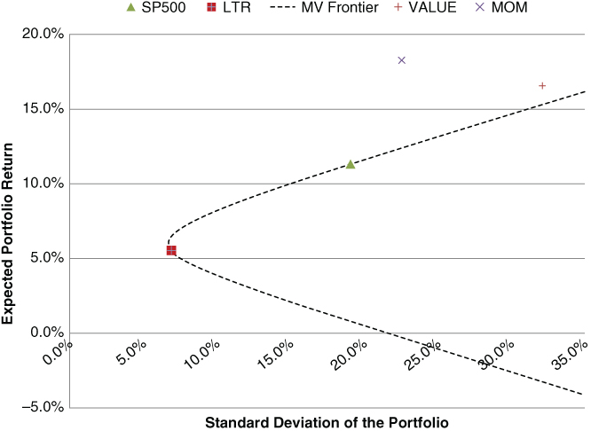

- **SP500** = SP500 Total Return Index
- **VALUE** = Top decile value-weight portfolio formed on book-to-market
- **MOM** = Top decile value-weight portfolio formed on 2-12 momentum
- **LTR** = Merrill Lynch 7–10 year Government Bond Index, spliced with data from Ibbotson's *Stocks, Bonds, Bills, and Inflation Yearbook*.

We map out the efficient frontier using historical values for expected returns and the covariance matrix. The results are gross of management fee and transaction costs and all returns are total returns and include the reinvestment of distributions (e.g., dividends). We impose short selling constraints such that no asset weights can be negative. For MV frontier purposes, in [Figure 4.1](#c04-fig-0001) we only allow the optimizer to invest in the S&P 500 Index and Treasury bonds.

Over the 1927 to 2014 period, domestic equities (SP500) have relatively high expected returns and standard deviations, whereas domestic value equities (VALUE) and momentum equities (MOM) have high expected returns, but extremely high volatility. Long-term bonds (LTR) have the lowest standard deviation, but have relatively lower expected returns.

Modern portfolio “works” in the sense that an investor can combine generic stocks and bonds in a smart way and exploit the benefits of diversification. We can visualize this finding via the mean variance (MV) frontier (i.e., the dotted line), which highlights a “curve” in the line in the section between the long-bond-only portfolio and the S&P 500-only. This curve represents the benefit of diversification, which allows a portfolio to achieve a lower standard deviation for a given expected return.

In an ideal world, we could find portfolios that would expand the MV frontier and create opportunities with higher expected returns for a given level of risk. Perhaps counter-intuitively, adding highly volatile assets such as value and momentum, can expand the MV frontier, if the volatility associated with the portfolio being added is unrelated to the other assets already included in the portfolio.

We explore this concept further by allowing the mean variance optimizer to allocate across not only the S&P 500 and bonds, but also our two additional equity portfolios: value and momentum. [Table 4.2](#c04-tbl-0002) outlines the stand-alone characteristics of the passive and the generic value and momentum equity strategies from 1927 to 2014.

[**Table 4.2**](#c04-tbl-anc-0002) Asset Class Historical Results

|  |  |  |  |  |
| --- | --- | --- | --- | --- |
|  | **SP 500** | **Value** | **Mom** | **LTR** |
| **CAGR** | 9.95% | 12.41% | 16.85% | 5.45% |
| **Standard Deviation** | 19.09% | 31.92% | 22.61% | 6.92% |
| **Downside Deviation** | 14.22% | 21.34% | 16.71% | 4.43% |
| **Sharpe Ratio** | 0.41 | 0.41 | 0.66 | 0.31 |
| **Sortino Ratio (MAR** c04-math-0002 **5%)** | 0.45 | 0.54 | 0.79 | 0.12 |
| **Worst Drawdown** | –84.59% | –91.67% | –76.95% | –20.97% |
| **Worst Month Return** | –28.73% | –43.98% | –28.52% | –8.41% |
| **Best Month Return** | 41.65% | 98.65% | 28.88% | 15.23% |
| **Profitable Months** | 61.74% | 60.51% | 63.16% | 63.35% |

Do the returns associated with value and momentum provide enough benefit to offset their extreme volatility? To answer this question, [Figure 4.2](#c04-fig-0002) shows how the MV frontier changes after adding momentum and adding value.

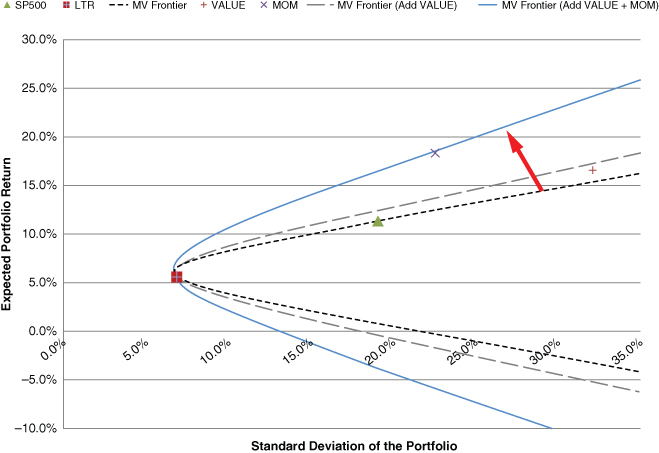

[**Figure 4.2**](#c04-fig-anc-0002) Modern Portfolio Theory with Momentum

The results are surprising. When we allow the optimizer to allocate to value portfolios, we can expand the MV frontier. For a given level of risk, as measured by standard deviation on the *x*-axis, a portfolio that includes value offers a higher return. But if we also allocate to momentum, the frontier is *greatly* expanded. Note, again, that for a given standard deviation, the expected return is dramatically higher for portfolios that include both value and momentum. Notably, in this case the optimizer recommends a *zero* percent allocation to the passive index, highlighting that a portfolio with access to bonds and long-only value and momentum equity exposures captures all the benefits of a portfolio—and then some—that only has access to a passive equity index portfolio (e.g., S&P 500). Momentum and value greatly expand the investment opportunity set at every level of risk (as measured by standard deviation). This evidence suggests that investors, regardless of their risk tolerance, can increase their expected risk and reward trade-offs by replacing generic equity allocations with active momentum and value allocations.

## MARRYING VALUE AND MOMENTUM

> *“… value and momentum are negatively correlated with each other, both within and across asset classes.”*

—Asness, Moskowitz, and Pedersen[8](#c04-note-0008)

Cliff Asness, Toby Moskowitz, and Lasse Pedersen published a remarkable paper in 2013 appropriately titled “Value and Momentum Everywhere.” The research highlights an interesting, but not entirely surprising, phenomenon— namely, that value and momentum premiums are literally everywhere:

- US stocks
- UK stocks
- European stocks
- Japanese stocks
- Currencies
- Fixed income
- Commodities

We update the analysis from the original research paper using their data and compile the results in [Tables 4.3](#c04-tbl-0003) and [4.4](#c04-tbl-0004).[9](#c04-note-0009) We examine long only portfolio results for the four biggest equity markets—United States, United Kingdom, Europe, and Japan—from 1982 through 2014. Data are available for earlier periods on some markets, but for an apples-to-apples comparison, we conduct the analysis over the period when data are available for all markets.

[**Table 4.3**](#c04-tbl-anc-0003) Momentum Performance (1982–2014)

|  |  |  |  |  |
| --- | --- | --- | --- | --- |
|  | **US Momentum** | **UK Momentum** | **Europe Momentum** | **Japan Momentum** |
| **CAGR** | 13.75% | 13.69% | 14.88% | 5.82% |
| **Standard Deviation** | 17.14% | 19.84% | 19.13% | 23.10% |
| **Downside Deviation** | 13.02% | 14.11% | 13.93% | 13.57% |
| **Sharpe Ratio** | 0.60 | 0.54 | 0.61 | 0.18 |
| **Sortino Ratio (MAR** c04-math-0003 **5%)** | 0.73 | 0.70 | 0.77 | 0.24 |
| **Worst Drawdown** | –48.31% | –60.71% | –54.92% | –65.95% |
| **Worst Month Return** | –23.89% | –27.16% | –18.95% | –21.88% |
| **Best Month Return** | 17.65% | 16.44% | 18.56% | 22.99% |
| **Profitable Months** | 65.66% | 60.35% | 64.90% | 55.05% |

[**Table 4.4**](#c04-tbl-anc-0004) Value Performance (1982–2014)

|  |  |  |  |  |
| --- | --- | --- | --- | --- |
|  | **US Value** | **UK Value** | **Europe Value** | **Japan Value** |
| **CAGR** | 12.79% | 12.59% | 15.09% | 11.11% |
| **Standard Deviation** | 15.55% | 20.02% | 19.27% | 21.67% |
| **Downside Deviation** | 11.88% | 12.87% | 14.06% | 11.91% |
| **Sharpe Ratio** | 0.59 | 0.49 | 0.62 | 0.40 |
| **Sortino Ratio (MAR** c04-math-0004 **5%)** | 0.70 | 0.69 | 0.78 | 0.66 |
| **Worst Drawdown** | –49.80% | –54.65% | –55.30% | –41.35% |
| **Worst Month Return** | –18.45% | –21.02% | –21.78% | –15.34% |
| **Best Month Return** | 15.40% | 19.22% | 18.04% | 28.88% |
| **Profitable Months** | 66.16% | 58.08% | 64.65% | 55.05% |

First, the momentum results are tabulated in [Table 4.3](#c04-tbl-0003).

Next, the value results are tabulated in [Table 4.4](#c04-tbl-0004).

For some context, over the same time period the US stock index (S&P 500 Total Return Index) earned a CAGR of 11.96 percent, the UK stock index earned a CAGR of 9.60 percent, and the Japanese stock index returned a CAGR of 3.81 percent.[10](#c04-note-0010)

When people observe something they cannot explain, they say, “It must be something in the water;” clearly, these results also suggest there is something in the water, when it comes to value and momentum. Value shows up in every equity market and momentum has strong performance in all markets. We think this finding is partially explained by increased risk, but it is also a manifestation of the sustainable active investing framework highlighted at the beginning of this book. Some of the excess returns associated with value and momentum are attributed to marketplace participants who are afflicted by behavioral bias, which creates mispricing opportunities. Those mispricing opportunities continue to exist in the data because the investment opportunities created by these strategies are hard to exploit via riskless arbitrage trading activity.

But the evidence that value and momentum work across a wide variety of assets and time periods is not entirely novel. What makes the Asness et al. paper unique, and what we alluded to via our quick modern portfolio theory lesson in the prior section, is that they explore the remarkable performance of using value and momentum together, as a system.

In [Table 4.5](#c04-tbl-0005) we look at why value and momentum work well as a system. The correlation matrix across global value and momentum equity portfolios is low for long-only portfolios.

[**Table 4.5**](#c04-tbl-anc-0005) Correlation of Value and Momentum

|  |  |  |  |  |
| --- | --- | --- | --- | --- |
|  | **US Momentum** | **UK Momentum** | **Europe Momentum** | **Japan Momentum** |
| **US Value** | **71%** | 56% | 57% | 26% |
| **UK Value** | 53% | **79%** | 63% | 33% |
| **Europe Value** | 55% | 65% | **84%** | 41% |
| **Japan Value** | 29% | 40% | 41% | **75%** |

To highlight how the value and momentum system works, we look at combination portfolios that invest 50 percent in value and 50 percent in momentum, and rebalance the allocation monthly. The summary statistics for the value and momentum portfolios for the period 1982 to 2014 are tabulated in [Table 4.6](#c04-tbl-0006).

[**Table 4.6**](#c04-tbl-anc-0006) Value and Momentum Combination Portfolios

|  |  |  |  |  |  |
| --- | --- | --- | --- | --- | --- |
|  | **US** | **UK** | **Europe** | **Japan** | **Global V/M** |
| **CAGR** | 13.49% | 13.37% | 15.15% | 8.76% | 13.29% |
| **Standard Deviation** | 15.14% | 18.86% | 18.43% | 20.95% | 15.08% |
| **Downside Deviation** | 11.60% | 12.93% | 13.72% | 11.88% | 11.20% |
| **Sharpe Ratio** | 0.64 | 0.54 | 0.64 | 0.31 | 0.63 |
| **Sortino Ratio (MAR** c04-math-0005 **5%)** | 0.77 | 0.73 | 0.79 | 0.47 | 0.78 |
| **Worst Drawdown** | –48.95% | –57.66% | –55.04% | –47.36% | –49.72% |
| **Worst Month Return** | –20.88% | –24.09% | –20.13% | –18.44% | –17.75% |
| **Best Month Return** | 13.32% | 16.74% | 15.62% | 25.24% | 11.83% |
| **Profitable Months** | 64.90% | 61.87% | 64.14% | 54.29% | 63.64% |

Risk-adjusted statistics are marginally improved across the board and the global value and momentum (designated as Global V/M) delivers. But summary statistics don't capture the extent to which one could “stick with the program.” For example, value investing looks great over the long haul, and there are some investors with the intestinal fortitude to hang on to a deep value strategy through a five-year stretch of underperformance, but this fortitude is unrealistic for most investors. And the same goes for momentum portfolios, which can sustain stomach-churning underperformance over extended time periods. Thankfully, we can combine value and momentum to reduce the torture associated with each of the strategies as a stand-alone investment approach.

To assess the ability of combination value and momentum portfolios to smooth the pain on the path to long-term expected performance, we examine the spread between 5-year compound annual growth rates for a specific strategy relative to its passive benchmark. We examine the combination portfolio, the momentum-only portfolio, and the value-only portfolio. The results are in [Figures 4.3](#c04-fig-0003) through [4.7](#c04-fig-0007).

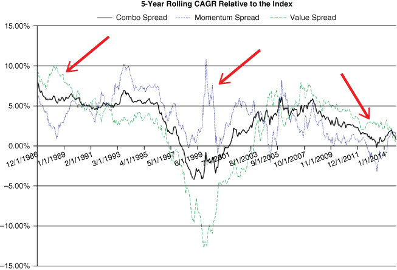

[**Figure 4.3**](#c04-fig-anc-0003) US Rolling Five-Year Spreads

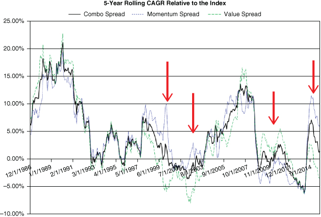

[**Figure 4.4**](#c04-fig-anc-0004) UK Rolling Five-Year Spreads

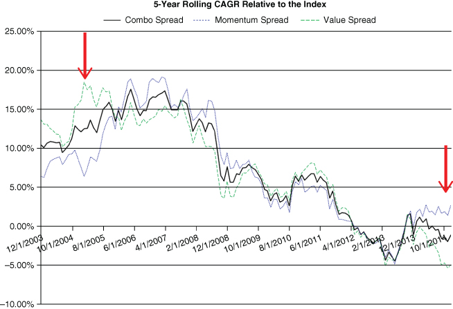

[**Figure 4.5**](#c04-fig-anc-0005) Europe Rolling Five-Year Spreads

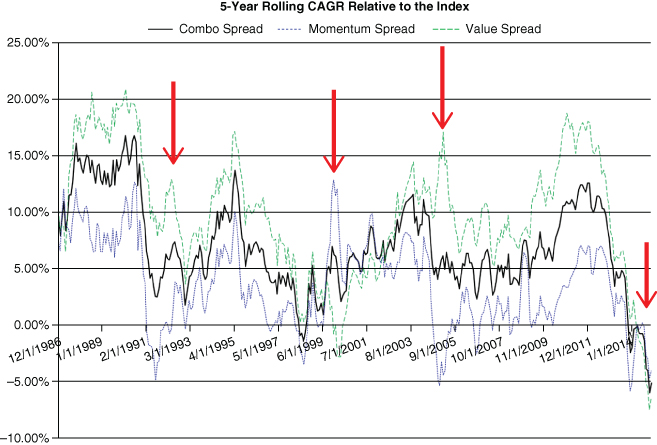

[**Figure 4.6**](#c04-fig-anc-0006) Japan Rolling Five-Year Spreads

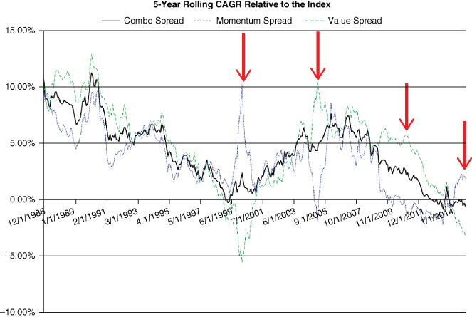

[**Figure 4.7**](#c04-fig-anc-0007) Global Rolling Five-Year Spreads

First, let's look at the United States (see [Figure 4.3](#c04-fig-0003)). These results are over the 1982 to 2014 time period and use the value and momentum portfolios identified in the Asness et al. paper. Value and momentum each have multiple stretches where they underperform the benchmark over five-year cycles. The combination portfolio suffers periods when it underperforms over a five-year cycle, but grinds a long-term edge most of the time.

Next we look at the United Kingdom over the same period as the US analysis ([Figure 4.4](#c04-fig-0004)). Value and momentum can underperform the benchmark over five-year cycles. However, the combination portfolio minimizes the pain along the way.

We look at Europe in [Figure 4.5](#c04-fig-0005), which runs from 1999 to 2014, due to data limitations on the passive index. Similar to prior analysis, value and momentum combinations give the investor a smoother success rate over five-year cycles—especially in the most recent period analyzed.

We end with Japan ([Figure 4.6](#c04-fig-0006)), which runs from 1982 to 2014, where value investing is king and momentum investing plays second fiddle. Even in Japan, the combination portfolio exploits the natural yin and yang relationship between value and momentum to create a robust long-term active allocation.

Finally, we assess a global value and momentum portfolio and compare this portfolio to a global value portfolio, a global momentum portfolio, and a global index portfolio ([Figure 4.7](#c04-fig-0007)). The analysis runs from 1982 to 2014 and really highlights why value and momentum—working as a system—can give active investors a reasonable way to consistently beat passive benchmarks over longer horizons.[11](#c04-note-0011)

The evidence suggests that a blended strategy, which combines both value and momentum into a single portfolio, may prevent a value-only investor or a momentum-only investor from suffering through extended, long-term stretches of poor performance. Of course, not all pain can be erased, and investors must always be aware that they will be required to endure sustained stretches of volatility and underperformance, even with a globally diversified value and momentum equity portfolio.

## SUMMARY

In this chapter, we describe the benefits of marrying the value religion and the momentum religion. Each has its merits, but combining the two systems into a unified portfolio really highlights the benefits of value and momentum. We showed that value and momentum tend to have a low correlation across the globe and that creating a global value and momentum portfolio seems to provide a potential solution for long-term active investors to beat passive market-capitalization weighted indices over long periods of time. All of the analysis to date has been done with generic value and generic momentum exposures that are well established and understood in the academic literature. In the next section of the book, we'll carefully investigate how one might logically and empirically improve on the generic momentum strategy.

## NOTES

[1](#c04-note-anc-0001) Eugene Fama Interview, American Finance Association, 2008. [www.afajof.org/details/video/2870921/Eugene-Fama-Interview.html](http://www.afajof.org/details/video/2870921/Eugene-Fama-Interview.html), accessed 2/15/2016.
[2](#c04-note-anc-0002) Cliff Asness, “Momentum in Japan: The Exception that Proves the Rule,” *The Journal of Portfolio Management* 37 (2011): 67–75.
[3](#c04-note-anc-0003) Eugene F. Fama and Kenneth R. French, “Dissecting Anomalies,” *Journal of Financial Economics* 63 (2008): 1653–1678.
[4](#c04-note-anc-0004) Simple improvements to a generic momentum strategy actually highlight that momentum works in Japan. For example, see Denis Chaves, 2012, “Eureka! A Momentum Strategy that also Works in Japan,” SSRN Working paper. papers.ssrn.com/sol3/papers.cfm?abstract\_id=1982100, accessed, 2/15/2016.
[5](#c04-note-anc-0005) “Value and Momentum Everywhere: Portfolios, Monthly,” AQR (January 31, 2016), [www.aqr.com/library/data-sets/value-and-momentum-everywhere-portfolios-monthly](http://www.aqr.com/library/data-sets/value-and-momentum-everywhere-portfolios-monthly), accessed 2/15/2016.
[6](#c04-note-anc-0006) Fama interview.
[7](#c04-note-anc-0007) Kenneth French, “Current Research Returns,” mba.tuck.dartmouth.edu/pages/faculty/ken.french/data\_library.html, accessed 2/15/2016. MOM is the top decile value-weight portfolio formed on 2-12 momentum; VALUE is the top decile value-weight portfolio formed on book-to-market.
[8](#c04-note-anc-0008) Cliff Asness, Toby Moskowitz, and Lasse Pedersen, “Value and Momentum Everywhere,” *The Journal of Finance* 68 (2013): 929–985.
[9](#c04-note-anc-0009) “Value and Momentum Everywhere: Portfolios, Monthly.”
[10](#c04-note-anc-0010) For the passive benchmark we examine MSCI Total Return Index data for the respective market unless stated otherwise. Our European Index data begins in 1999, so we do not list its return from 1982 to 2014. Over the 1999–2014 time period, the European Value portfolio returned a CAGR of 9.17 percent, the European Momentum portfolio returned a CAGR of 8.93 percent, and the European Index returned a CAGR of 4.13 percent.
[11](#c04-note-anc-0011) The global value portfolio is an equal-weight portfolio of the US, UK, European, and Japanese value portfolios. The global momentum portfolio's construction is similar. The global value and momentum portfolio is an equal-weight portfolio of the global value and the global momentum portfolio.

<!-- rl-section id="momentum-is-a-myth" class="epub-section" title="MOMENTUM IS A MYTH" -->

# CHAPTER 4 Why All Value Investors Need Momentum

> *“[Momentum] happens around the world, except Japan.”*

—Eugene Fama, 2008 American Finance Association Interview[1](#c04-note-0001)

> *“We find that momentum in Japan is actually a success.”*

—Cliff Asness, 2011 *Journal of Portfolio Management*[2](#c04-note-0002)

Despite its simplicity, as a stand-alone investment strategy generic momentum works well, but some might say it does not work everywhere. One example of a “failure” of momentum is in Japanese equities…more on this in a moment. But the broad consensus from academic researchers, who are arguably biased in favor of findings that support the efficient market hypothesis (EMH), is that the evidence supports the notion that momentum-based stock picking strategies have beaten the market, even after controlling for risk. In short, there is something special about momentum. Even Eugene Fama, famous for his incredible empirical work on efficient markets, suggested that momentum is the biggest embarrassment to the efficient market theory, or in his own words, momentum is the “premier anomaly.”[3](#c04-note-0003)

Nonetheless, the myth that momentum is “not real” continues to be widely disseminated. For example, in a classic 2008 interview at the American Finance Association, Richard Roll, a premier financial economist in his own right, interviewed Eugene Fama, the king of financial economists. Roll and Fama had a spirited discussion on the so-called value premium, which ended in a stalemate over whether the extra return associated with cheap stocks was compensation for extra risk or mispricing. Professor Roll then asked the “gotcha” question, about the momentum premium. Fama responded, begrudgingly, that momentum effects are pervasive in world stock markets, but he was quick to point out that Japanese stocks seemed to be immune to momentum effects. Roll responded in kind, and quipped that perhaps the Japanese investors were “more rational.” Fama, tongue in cheek, chuckled, and stated that he hoped that the poor results of momentum-based stock selection in Japan were the rule when it came to momentum results, and he hoped that the exceptions to the rule were simply a result of data dredging.[4](#c04-note-0004)

## ASNESS SEPARATES FACT FROM FICTION

But not everyone was happy with the high-level chatter among Roll and Fama. Cliff Asness, the founder of AQR, a University of Chicago finance PhD, and a former Fama student, was not interested in toeing the EMH party line. Perhaps Asness watched the interview between Fama and Roll, because a few years later in 2011, he published a paper in *The Journal of Portfolio Management* defiantly titled, “Momentum in Japan: The Exception that Proves the Rule.”

Asness's paper highlights a simple but sophisticated point related to momentum. On the one hand, if one looks at a generic Japanese momentum strategy in isolation, momentum appears ineffective. Asness, however, aptly points out that strategies need to be assessed in the context of a portfolio, so one can ascertain not only their stand-alone investment value, but also understand their potential diversification benefits for a portfolio. For example, if one assessed a strategy of continuously purchasing three-month put options on the stock market, the conclusion would be that the strategy has negative returns and a ton of volatility. These results, however, do not imply that put options are inefficiently priced, but this conclusion only becomes clear when we assess how put options act in the context of a portfolio. Viewed through a portfolio lens, put options provide incredible diversification benefits (i.e., insurance), and it becomes obvious why investors will gladly accept negative expected returns for a put buying strategy.

In contrast to puts, momentum-based stock selection strategies won't provide extreme insurance-like diversification benefits, but momentum strategies can pack a punch as it relates to overall diversification. For example, long-only momentum strategies are not perfectly correlated to the broad equity market, and they have low correlations with classic value strategies. These features make momentum strategies highly desirable in a portfolio context when they are pooled with value strategies.

Moving along this line of reasoning, Asness shows that Japanese investors, concerned about maximizing their portfolio's expected risk-adjusted return, would always invest a substantial amount of their portfolio in a momentum strategy. This demonstrates a great insight, and the paper makes the point clear. But the entire premise of the Asness paper is that we need to try hard to highlight how valuable momentum can be in Japan. A deeper investigation of the Asness results shows that his analysis focuses on Japanese long/short portfolios, which are not the typical sort of portfolio that many long-term investors would deploy. These long/short portfolios suffer because the short side of the momentum portfolio eats at the performance of the long-only momentum portfolio. Asness doesn't focus on long-only results, but we replicate and extend his analysis using more traditional long-only portfolios in [Table 4.1](#c04-tbl-0001). We show the results for the long-only Japanese momentum portfolio using AQR's data for this analysis.[5](#c04-note-0005) The Japanese index is represented by the MSCI Japan Total Return Index. The returns are from January 1, 1982, through December 31, 2014. All returns are total returns and include the reinvestment of distributions (e.g., dividends). Results are gross of fees.

[**Table 4.1**](#c04-tbl-anc-0001) Japanese Equity Market Performance (1982–2014)

|  |  |  |
| --- | --- | --- |
|  | Japan Momentum | Japan Index |
| **CAGR** | 5.82% | 3.81% |
| **Standard Deviation** | 23.10% | 19.37% |
| **Downside Deviation** | 13.57% | 12.84% |
| **Sharpe Ratio** | 0.18 | 0.08 |
| **Sortino Ratio (MAR** c04-math-0001 **5%)** | 0.24 | 0.05 |
| **Worst Drawdown** | –65.95% | –68.83% |
| **Worst Month Return** | –21.88% | –21.06% |
| **Best Month Return** | 22.99% | 19.97% |
| **Profitable Months** | 55.05% | 53.54% |

A long-only momentum portfolio clearly works, outperforming the index by a wide margin. This result is not entirely surprising, since momentum works in just about every context where researchers can get access to a reasonably long dataset. We understand why Asness focused on the long/short momentum portfolio for his research purposes, but this focus confuses investment audiences and muddies the issues. The reality is that generic long-only momentum does work in Japan. And yes, Asness brings up a great point that even in his context, investors should love long/short momentum exposures, especially when pooled with long/short value exposures.

We explore Asness's idea of combining value and momentum exposures in more depth throughout the rest of this chapter (with an emphasis on long-only results, not long/short). After being barraged with the facts, we think reasoned investors will agree: Investors benefit from momentum, and value investors, the investors least likely to accept momentum, stand to *really* benefit from momentum. And as the title of Asness's journal article highlights, a deeper analysis of momentum in Japan doesn't put a damper on momentum, it merely highlights its effectiveness.

## EXPANDING YOUR HORIZONS WITH MOMENTUM

Modern portfolio theory, which outlines how an investor can mathematically compile a portfolio that will maximize expected returns for a given level of risk, and the most famous spinoff from the theory, the Capital Asset Pricing Model (i.e., CAPM), is best described by Fischer Black in the following way: “The [theory] is right. It just doesn't work.”[6](#c04-note-0006) The feel-good construct, which we teach to our finance students each year, is a great learning tool. Simply input a vector of expected returns and a covariance matrix associated with a set of assets or securities into your computer, and voilà, you have the so-called optimal portfolio weights that maximize one's expected return for a given level of risk. Like all things viewed with the benefit of hindsight, the lessons from modern portfolio theory seem simple. However, the underlying analysis behind the theory earned Harry Markowitz a Nobel Prize for his original paper on optimal portfolio selection.

Even though some academics and practitioners—including us—often rant about why one should be skeptical of complex portfolio optimization theories, the core ideas that underlie modern portfolio theory are critical for building successful investment programs. And that includes knowing when to adopt—and when to discard—certain ideas. The punch line, or core proposition, from modern portfolio theory is the so-called mean-variance (MV) frontier, often called the efficient frontier. The MV frontier takes the ingredients available—expected returns and the covariance matrixes across assets—and maps out all the best expected combinations of risk and reward an investor can achieve by shifting the weights among the assets under investigation. Think of the MV frontier as the best recipes available for an investor to maximize return and minimize risk, given the set of ingredients available.

As an illustration of modern portfolio theory put into practice, [Figure 4.1](#c04-fig-0001) includes the historical returns and standard deviations associated with four portfolios from 1927 to 2014 using Ken French data for the value and momentum portfolios.[7](#c04-note-0007) These portfolios are described below:

[**Figure 4.1**](#c04-fig-anc-0001) Modern Portfolio Theory Chart

- **SP500** = SP500 Total Return Index
- **VALUE** = Top decile value-weight portfolio formed on book-to-market
- **MOM** = Top decile value-weight portfolio formed on 2-12 momentum
- **LTR** = Merrill Lynch 7–10 year Government Bond Index, spliced with data from Ibbotson's *Stocks, Bonds, Bills, and Inflation Yearbook*.

We map out the efficient frontier using historical values for expected returns and the covariance matrix. The results are gross of management fee and transaction costs and all returns are total returns and include the reinvestment of distributions (e.g., dividends). We impose short selling constraints such that no asset weights can be negative. For MV frontier purposes, in [Figure 4.1](#c04-fig-0001) we only allow the optimizer to invest in the S&P 500 Index and Treasury bonds.

Over the 1927 to 2014 period, domestic equities (SP500) have relatively high expected returns and standard deviations, whereas domestic value equities (VALUE) and momentum equities (MOM) have high expected returns, but extremely high volatility. Long-term bonds (LTR) have the lowest standard deviation, but have relatively lower expected returns.

Modern portfolio “works” in the sense that an investor can combine generic stocks and bonds in a smart way and exploit the benefits of diversification. We can visualize this finding via the mean variance (MV) frontier (i.e., the dotted line), which highlights a “curve” in the line in the section between the long-bond-only portfolio and the S&P 500-only. This curve represents the benefit of diversification, which allows a portfolio to achieve a lower standard deviation for a given expected return.

In an ideal world, we could find portfolios that would expand the MV frontier and create opportunities with higher expected returns for a given level of risk. Perhaps counter-intuitively, adding highly volatile assets such as value and momentum, can expand the MV frontier, if the volatility associated with the portfolio being added is unrelated to the other assets already included in the portfolio.

We explore this concept further by allowing the mean variance optimizer to allocate across not only the S&P 500 and bonds, but also our two additional equity portfolios: value and momentum. [Table 4.2](#c04-tbl-0002) outlines the stand-alone characteristics of the passive and the generic value and momentum equity strategies from 1927 to 2014.

[**Table 4.2**](#c04-tbl-anc-0002) Asset Class Historical Results

|  |  |  |  |  |
| --- | --- | --- | --- | --- |
|  | **SP 500** | **Value** | **Mom** | **LTR** |
| **CAGR** | 9.95% | 12.41% | 16.85% | 5.45% |
| **Standard Deviation** | 19.09% | 31.92% | 22.61% | 6.92% |
| **Downside Deviation** | 14.22% | 21.34% | 16.71% | 4.43% |
| **Sharpe Ratio** | 0.41 | 0.41 | 0.66 | 0.31 |
| **Sortino Ratio (MAR** c04-math-0002 **5%)** | 0.45 | 0.54 | 0.79 | 0.12 |
| **Worst Drawdown** | –84.59% | –91.67% | –76.95% | –20.97% |
| **Worst Month Return** | –28.73% | –43.98% | –28.52% | –8.41% |
| **Best Month Return** | 41.65% | 98.65% | 28.88% | 15.23% |
| **Profitable Months** | 61.74% | 60.51% | 63.16% | 63.35% |

Do the returns associated with value and momentum provide enough benefit to offset their extreme volatility? To answer this question, [Figure 4.2](#c04-fig-0002) shows how the MV frontier changes after adding momentum and adding value.

[**Figure 4.2**](#c04-fig-anc-0002) Modern Portfolio Theory with Momentum

The results are surprising. When we allow the optimizer to allocate to value portfolios, we can expand the MV frontier. For a given level of risk, as measured by standard deviation on the *x*-axis, a portfolio that includes value offers a higher return. But if we also allocate to momentum, the frontier is *greatly* expanded. Note, again, that for a given standard deviation, the expected return is dramatically higher for portfolios that include both value and momentum. Notably, in this case the optimizer recommends a *zero* percent allocation to the passive index, highlighting that a portfolio with access to bonds and long-only value and momentum equity exposures captures all the benefits of a portfolio—and then some—that only has access to a passive equity index portfolio (e.g., S&P 500). Momentum and value greatly expand the investment opportunity set at every level of risk (as measured by standard deviation). This evidence suggests that investors, regardless of their risk tolerance, can increase their expected risk and reward trade-offs by replacing generic equity allocations with active momentum and value allocations.

## MARRYING VALUE AND MOMENTUM

> *“… value and momentum are negatively correlated with each other, both within and across asset classes.”*

—Asness, Moskowitz, and Pedersen[8](#c04-note-0008)

Cliff Asness, Toby Moskowitz, and Lasse Pedersen published a remarkable paper in 2013 appropriately titled “Value and Momentum Everywhere.” The research highlights an interesting, but not entirely surprising, phenomenon— namely, that value and momentum premiums are literally everywhere:

- US stocks
- UK stocks
- European stocks
- Japanese stocks
- Currencies
- Fixed income
- Commodities

We update the analysis from the original research paper using their data and compile the results in [Tables 4.3](#c04-tbl-0003) and [4.4](#c04-tbl-0004).[9](#c04-note-0009) We examine long only portfolio results for the four biggest equity markets—United States, United Kingdom, Europe, and Japan—from 1982 through 2014. Data are available for earlier periods on some markets, but for an apples-to-apples comparison, we conduct the analysis over the period when data are available for all markets.

[**Table 4.3**](#c04-tbl-anc-0003) Momentum Performance (1982–2014)

|  |  |  |  |  |
| --- | --- | --- | --- | --- |
|  | **US Momentum** | **UK Momentum** | **Europe Momentum** | **Japan Momentum** |
| **CAGR** | 13.75% | 13.69% | 14.88% | 5.82% |
| **Standard Deviation** | 17.14% | 19.84% | 19.13% | 23.10% |
| **Downside Deviation** | 13.02% | 14.11% | 13.93% | 13.57% |
| **Sharpe Ratio** | 0.60 | 0.54 | 0.61 | 0.18 |
| **Sortino Ratio (MAR** c04-math-0003 **5%)** | 0.73 | 0.70 | 0.77 | 0.24 |
| **Worst Drawdown** | –48.31% | –60.71% | –54.92% | –65.95% |
| **Worst Month Return** | –23.89% | –27.16% | –18.95% | –21.88% |
| **Best Month Return** | 17.65% | 16.44% | 18.56% | 22.99% |
| **Profitable Months** | 65.66% | 60.35% | 64.90% | 55.05% |

[**Table 4.4**](#c04-tbl-anc-0004) Value Performance (1982–2014)

|  |  |  |  |  |
| --- | --- | --- | --- | --- |
|  | **US Value** | **UK Value** | **Europe Value** | **Japan Value** |
| **CAGR** | 12.79% | 12.59% | 15.09% | 11.11% |
| **Standard Deviation** | 15.55% | 20.02% | 19.27% | 21.67% |
| **Downside Deviation** | 11.88% | 12.87% | 14.06% | 11.91% |
| **Sharpe Ratio** | 0.59 | 0.49 | 0.62 | 0.40 |
| **Sortino Ratio (MAR** c04-math-0004 **5%)** | 0.70 | 0.69 | 0.78 | 0.66 |
| **Worst Drawdown** | –49.80% | –54.65% | –55.30% | –41.35% |
| **Worst Month Return** | –18.45% | –21.02% | –21.78% | –15.34% |
| **Best Month Return** | 15.40% | 19.22% | 18.04% | 28.88% |
| **Profitable Months** | 66.16% | 58.08% | 64.65% | 55.05% |

First, the momentum results are tabulated in [Table 4.3](#c04-tbl-0003).

Next, the value results are tabulated in [Table 4.4](#c04-tbl-0004).

For some context, over the same time period the US stock index (S&P 500 Total Return Index) earned a CAGR of 11.96 percent, the UK stock index earned a CAGR of 9.60 percent, and the Japanese stock index returned a CAGR of 3.81 percent.[10](#c04-note-0010)

When people observe something they cannot explain, they say, “It must be something in the water;” clearly, these results also suggest there is something in the water, when it comes to value and momentum. Value shows up in every equity market and momentum has strong performance in all markets. We think this finding is partially explained by increased risk, but it is also a manifestation of the sustainable active investing framework highlighted at the beginning of this book. Some of the excess returns associated with value and momentum are attributed to marketplace participants who are afflicted by behavioral bias, which creates mispricing opportunities. Those mispricing opportunities continue to exist in the data because the investment opportunities created by these strategies are hard to exploit via riskless arbitrage trading activity.

But the evidence that value and momentum work across a wide variety of assets and time periods is not entirely novel. What makes the Asness et al. paper unique, and what we alluded to via our quick modern portfolio theory lesson in the prior section, is that they explore the remarkable performance of using value and momentum together, as a system.

In [Table 4.5](#c04-tbl-0005) we look at why value and momentum work well as a system. The correlation matrix across global value and momentum equity portfolios is low for long-only portfolios.

[**Table 4.5**](#c04-tbl-anc-0005) Correlation of Value and Momentum

|  |  |  |  |  |
| --- | --- | --- | --- | --- |
|  | **US Momentum** | **UK Momentum** | **Europe Momentum** | **Japan Momentum** |
| **US Value** | **71%** | 56% | 57% | 26% |
| **UK Value** | 53% | **79%** | 63% | 33% |
| **Europe Value** | 55% | 65% | **84%** | 41% |
| **Japan Value** | 29% | 40% | 41% | **75%** |

To highlight how the value and momentum system works, we look at combination portfolios that invest 50 percent in value and 50 percent in momentum, and rebalance the allocation monthly. The summary statistics for the value and momentum portfolios for the period 1982 to 2014 are tabulated in [Table 4.6](#c04-tbl-0006).

[**Table 4.6**](#c04-tbl-anc-0006) Value and Momentum Combination Portfolios

|  |  |  |  |  |  |
| --- | --- | --- | --- | --- | --- |
|  | **US** | **UK** | **Europe** | **Japan** | **Global V/M** |
| **CAGR** | 13.49% | 13.37% | 15.15% | 8.76% | 13.29% |
| **Standard Deviation** | 15.14% | 18.86% | 18.43% | 20.95% | 15.08% |
| **Downside Deviation** | 11.60% | 12.93% | 13.72% | 11.88% | 11.20% |
| **Sharpe Ratio** | 0.64 | 0.54 | 0.64 | 0.31 | 0.63 |
| **Sortino Ratio (MAR** c04-math-0005 **5%)** | 0.77 | 0.73 | 0.79 | 0.47 | 0.78 |
| **Worst Drawdown** | –48.95% | –57.66% | –55.04% | –47.36% | –49.72% |
| **Worst Month Return** | –20.88% | –24.09% | –20.13% | –18.44% | –17.75% |
| **Best Month Return** | 13.32% | 16.74% | 15.62% | 25.24% | 11.83% |
| **Profitable Months** | 64.90% | 61.87% | 64.14% | 54.29% | 63.64% |

Risk-adjusted statistics are marginally improved across the board and the global value and momentum (designated as Global V/M) delivers. But summary statistics don't capture the extent to which one could “stick with the program.” For example, value investing looks great over the long haul, and there are some investors with the intestinal fortitude to hang on to a deep value strategy through a five-year stretch of underperformance, but this fortitude is unrealistic for most investors. And the same goes for momentum portfolios, which can sustain stomach-churning underperformance over extended time periods. Thankfully, we can combine value and momentum to reduce the torture associated with each of the strategies as a stand-alone investment approach.

To assess the ability of combination value and momentum portfolios to smooth the pain on the path to long-term expected performance, we examine the spread between 5-year compound annual growth rates for a specific strategy relative to its passive benchmark. We examine the combination portfolio, the momentum-only portfolio, and the value-only portfolio. The results are in [Figures 4.3](#c04-fig-0003) through [4.7](#c04-fig-0007).

[**Figure 4.3**](#c04-fig-anc-0003) US Rolling Five-Year Spreads

[**Figure 4.4**](#c04-fig-anc-0004) UK Rolling Five-Year Spreads

[**Figure 4.5**](#c04-fig-anc-0005) Europe Rolling Five-Year Spreads

[**Figure 4.6**](#c04-fig-anc-0006) Japan Rolling Five-Year Spreads

[**Figure 4.7**](#c04-fig-anc-0007) Global Rolling Five-Year Spreads

First, let's look at the United States (see [Figure 4.3](#c04-fig-0003)). These results are over the 1982 to 2014 time period and use the value and momentum portfolios identified in the Asness et al. paper. Value and momentum each have multiple stretches where they underperform the benchmark over five-year cycles. The combination portfolio suffers periods when it underperforms over a five-year cycle, but grinds a long-term edge most of the time.

Next we look at the United Kingdom over the same period as the US analysis ([Figure 4.4](#c04-fig-0004)). Value and momentum can underperform the benchmark over five-year cycles. However, the combination portfolio minimizes the pain along the way.

We look at Europe in [Figure 4.5](#c04-fig-0005), which runs from 1999 to 2014, due to data limitations on the passive index. Similar to prior analysis, value and momentum combinations give the investor a smoother success rate over five-year cycles—especially in the most recent period analyzed.

We end with Japan ([Figure 4.6](#c04-fig-0006)), which runs from 1982 to 2014, where value investing is king and momentum investing plays second fiddle. Even in Japan, the combination portfolio exploits the natural yin and yang relationship between value and momentum to create a robust long-term active allocation.

Finally, we assess a global value and momentum portfolio and compare this portfolio to a global value portfolio, a global momentum portfolio, and a global index portfolio ([Figure 4.7](#c04-fig-0007)). The analysis runs from 1982 to 2014 and really highlights why value and momentum—working as a system—can give active investors a reasonable way to consistently beat passive benchmarks over longer horizons.[11](#c04-note-0011)

The evidence suggests that a blended strategy, which combines both value and momentum into a single portfolio, may prevent a value-only investor or a momentum-only investor from suffering through extended, long-term stretches of poor performance. Of course, not all pain can be erased, and investors must always be aware that they will be required to endure sustained stretches of volatility and underperformance, even with a globally diversified value and momentum equity portfolio.

## SUMMARY

In this chapter, we describe the benefits of marrying the value religion and the momentum religion. Each has its merits, but combining the two systems into a unified portfolio really highlights the benefits of value and momentum. We showed that value and momentum tend to have a low correlation across the globe and that creating a global value and momentum portfolio seems to provide a potential solution for long-term active investors to beat passive market-capitalization weighted indices over long periods of time. All of the analysis to date has been done with generic value and generic momentum exposures that are well established and understood in the academic literature. In the next section of the book, we'll carefully investigate how one might logically and empirically improve on the generic momentum strategy.

## NOTES

[1](#c04-note-anc-0001) Eugene Fama Interview, American Finance Association, 2008. [www.afajof.org/details/video/2870921/Eugene-Fama-Interview.html](http://www.afajof.org/details/video/2870921/Eugene-Fama-Interview.html), accessed 2/15/2016.
[2](#c04-note-anc-0002) Cliff Asness, “Momentum in Japan: The Exception that Proves the Rule,” *The Journal of Portfolio Management* 37 (2011): 67–75.
[3](#c04-note-anc-0003) Eugene F. Fama and Kenneth R. French, “Dissecting Anomalies,” *Journal of Financial Economics* 63 (2008): 1653–1678.
[4](#c04-note-anc-0004) Simple improvements to a generic momentum strategy actually highlight that momentum works in Japan. For example, see Denis Chaves, 2012, “Eureka! A Momentum Strategy that also Works in Japan,” SSRN Working paper. papers.ssrn.com/sol3/papers.cfm?abstract\_id=1982100, accessed, 2/15/2016.
[5](#c04-note-anc-0005) “Value and Momentum Everywhere: Portfolios, Monthly,” AQR (January 31, 2016), [www.aqr.com/library/data-sets/value-and-momentum-everywhere-portfolios-monthly](http://www.aqr.com/library/data-sets/value-and-momentum-everywhere-portfolios-monthly), accessed 2/15/2016.
[6](#c04-note-anc-0006) Fama interview.
[7](#c04-note-anc-0007) Kenneth French, “Current Research Returns,” mba.tuck.dartmouth.edu/pages/faculty/ken.french/data\_library.html, accessed 2/15/2016. MOM is the top decile value-weight portfolio formed on 2-12 momentum; VALUE is the top decile value-weight portfolio formed on book-to-market.
[8](#c04-note-anc-0008) Cliff Asness, Toby Moskowitz, and Lasse Pedersen, “Value and Momentum Everywhere,” *The Journal of Finance* 68 (2013): 929–985.
[9](#c04-note-anc-0009) “Value and Momentum Everywhere: Portfolios, Monthly.”
[10](#c04-note-anc-0010) For the passive benchmark we examine MSCI Total Return Index data for the respective market unless stated otherwise. Our European Index data begins in 1999, so we do not list its return from 1982 to 2014. Over the 1999–2014 time period, the European Value portfolio returned a CAGR of 9.17 percent, the European Momentum portfolio returned a CAGR of 8.93 percent, and the European Index returned a CAGR of 4.13 percent.
[11](#c04-note-anc-0011) The global value portfolio is an equal-weight portfolio of the US, UK, European, and Japanese value portfolios. The global momentum portfolio's construction is similar. The global value and momentum portfolio is an equal-weight portfolio of the global value and the global momentum portfolio.

<!-- rl-section id="momentum-is-a-myth" class="epub-section" title="MOMENTUM IS A MYTH" -->

## MOMENTUM IS A MYTH

Nonetheless, the myth that momentum is “not real” continues to be widely disseminated. For example, in a classic 2008 interview at the American Finance Association, Richard Roll, a premier financial economist in his own right, interviewed Eugene Fama, the king of financial economists. Roll and Fama had a spirited discussion on the so-called value premium, which ended in a stalemate over whether the extra return associated with cheap stocks was compensation for extra risk or mispricing. Professor Roll then asked the “gotcha” question, about the momentum premium. Fama responded, begrudgingly, that momentum effects are pervasive in world stock markets, but he was quick to point out that Japanese stocks seemed to be immune to momentum effects. Roll responded in kind, and quipped that perhaps the Japanese investors were “more rational.” Fama, tongue in cheek, chuckled, and stated that he hoped that the poor results of momentum-based stock selection in Japan were the rule when it came to momentum results, and he hoped that the exceptions to the rule were simply a result of data dredging.[4](#c04-note-0004)

<!-- rl-section id="asness-separates-fact-from-fiction" class="epub-section" title="ASNESS SEPARATES FACT FROM FICTION" -->

## ASNESS SEPARATES FACT FROM FICTION

But not everyone was happy with the high-level chatter among Roll and Fama. Cliff Asness, the founder of AQR, a University of Chicago finance PhD, and a former Fama student, was not interested in toeing the EMH party line. Perhaps Asness watched the interview between Fama and Roll, because a few years later in 2011, he published a paper in *The Journal of Portfolio Management* defiantly titled, “Momentum in Japan: The Exception that Proves the Rule.”

Asness's paper highlights a simple but sophisticated point related to momentum. On the one hand, if one looks at a generic Japanese momentum strategy in isolation, momentum appears ineffective. Asness, however, aptly points out that strategies need to be assessed in the context of a portfolio, so one can ascertain not only their stand-alone investment value, but also understand their potential diversification benefits for a portfolio. For example, if one assessed a strategy of continuously purchasing three-month put options on the stock market, the conclusion would be that the strategy has negative returns and a ton of volatility. These results, however, do not imply that put options are inefficiently priced, but this conclusion only becomes clear when we assess how put options act in the context of a portfolio. Viewed through a portfolio lens, put options provide incredible diversification benefits (i.e., insurance), and it becomes obvious why investors will gladly accept negative expected returns for a put buying strategy.

In contrast to puts, momentum-based stock selection strategies won't provide extreme insurance-like diversification benefits, but momentum strategies can pack a punch as it relates to overall diversification. For example, long-only momentum strategies are not perfectly correlated to the broad equity market, and they have low correlations with classic value strategies. These features make momentum strategies highly desirable in a portfolio context when they are pooled with value strategies.

Moving along this line of reasoning, Asness shows that Japanese investors, concerned about maximizing their portfolio's expected risk-adjusted return, would always invest a substantial amount of their portfolio in a momentum strategy. This demonstrates a great insight, and the paper makes the point clear. But the entire premise of the Asness paper is that we need to try hard to highlight how valuable momentum can be in Japan. A deeper investigation of the Asness results shows that his analysis focuses on Japanese long/short portfolios, which are not the typical sort of portfolio that many long-term investors would deploy. These long/short portfolios suffer because the short side of the momentum portfolio eats at the performance of the long-only momentum portfolio. Asness doesn't focus on long-only results, but we replicate and extend his analysis using more traditional long-only portfolios in [Table 4.1](#c04-tbl-0001). We show the results for the long-only Japanese momentum portfolio using AQR's data for this analysis.[5](#c04-note-0005) The Japanese index is represented by the MSCI Japan Total Return Index. The returns are from January 1, 1982, through December 31, 2014. All returns are total returns and include the reinvestment of distributions (e.g., dividends). Results are gross of fees.

[**Table 4.1**](#c04-tbl-anc-0001) Japanese Equity Market Performance (1982–2014)

|  |  |  |
| --- | --- | --- |
|  | Japan Momentum | Japan Index |
| **CAGR** | 5.82% | 3.81% |
| **Standard Deviation** | 23.10% | 19.37% |
| **Downside Deviation** | 13.57% | 12.84% |
| **Sharpe Ratio** | 0.18 | 0.08 |
| **Sortino Ratio (MAR** c04-math-0001 **5%)** | 0.24 | 0.05 |
| **Worst Drawdown** | –65.95% | –68.83% |
| **Worst Month Return** | –21.88% | –21.06% |
| **Best Month Return** | 22.99% | 19.97% |
| **Profitable Months** | 55.05% | 53.54% |

A long-only momentum portfolio clearly works, outperforming the index by a wide margin. This result is not entirely surprising, since momentum works in just about every context where researchers can get access to a reasonably long dataset. We understand why Asness focused on the long/short momentum portfolio for his research purposes, but this focus confuses investment audiences and muddies the issues. The reality is that generic long-only momentum does work in Japan. And yes, Asness brings up a great point that even in his context, investors should love long/short momentum exposures, especially when pooled with long/short value exposures.

We explore Asness's idea of combining value and momentum exposures in more depth throughout the rest of this chapter (with an emphasis on long-only results, not long/short). After being barraged with the facts, we think reasoned investors will agree: Investors benefit from momentum, and value investors, the investors least likely to accept momentum, stand to *really* benefit from momentum. And as the title of Asness's journal article highlights, a deeper analysis of momentum in Japan doesn't put a damper on momentum, it merely highlights its effectiveness.

<!-- rl-section id="expanding-your-horizons-with-momentum" class="epub-section" title="EXPANDING YOUR HORIZONS WITH MOMENTUM" -->

## EXPANDING YOUR HORIZONS WITH MOMENTUM

Modern portfolio theory, which outlines how an investor can mathematically compile a portfolio that will maximize expected returns for a given level of risk, and the most famous spinoff from the theory, the Capital Asset Pricing Model (i.e., CAPM), is best described by Fischer Black in the following way: “The [theory] is right. It just doesn't work.”[6](#c04-note-0006) The feel-good construct, which we teach to our finance students each year, is a great learning tool. Simply input a vector of expected returns and a covariance matrix associated with a set of assets or securities into your computer, and voilà, you have the so-called optimal portfolio weights that maximize one's expected return for a given level of risk. Like all things viewed with the benefit of hindsight, the lessons from modern portfolio theory seem simple. However, the underlying analysis behind the theory earned Harry Markowitz a Nobel Prize for his original paper on optimal portfolio selection.

Even though some academics and practitioners—including us—often rant about why one should be skeptical of complex portfolio optimization theories, the core ideas that underlie modern portfolio theory are critical for building successful investment programs. And that includes knowing when to adopt—and when to discard—certain ideas. The punch line, or core proposition, from modern portfolio theory is the so-called mean-variance (MV) frontier, often called the efficient frontier. The MV frontier takes the ingredients available—expected returns and the covariance matrixes across assets—and maps out all the best expected combinations of risk and reward an investor can achieve by shifting the weights among the assets under investigation. Think of the MV frontier as the best recipes available for an investor to maximize return and minimize risk, given the set of ingredients available.

As an illustration of modern portfolio theory put into practice, [Figure 4.1](#c04-fig-0001) includes the historical returns and standard deviations associated with four portfolios from 1927 to 2014 using Ken French data for the value and momentum portfolios.[7](#c04-note-0007) These portfolios are described below:

[**Figure 4.1**](#c04-fig-anc-0001) Modern Portfolio Theory Chart

- **SP500** = SP500 Total Return Index
- **VALUE** = Top decile value-weight portfolio formed on book-to-market
- **MOM** = Top decile value-weight portfolio formed on 2-12 momentum
- **LTR** = Merrill Lynch 7–10 year Government Bond Index, spliced with data from Ibbotson's *Stocks, Bonds, Bills, and Inflation Yearbook*.

We map out the efficient frontier using historical values for expected returns and the covariance matrix. The results are gross of management fee and transaction costs and all returns are total returns and include the reinvestment of distributions (e.g., dividends). We impose short selling constraints such that no asset weights can be negative. For MV frontier purposes, in [Figure 4.1](#c04-fig-0001) we only allow the optimizer to invest in the S&P 500 Index and Treasury bonds.

Over the 1927 to 2014 period, domestic equities (SP500) have relatively high expected returns and standard deviations, whereas domestic value equities (VALUE) and momentum equities (MOM) have high expected returns, but extremely high volatility. Long-term bonds (LTR) have the lowest standard deviation, but have relatively lower expected returns.

Modern portfolio “works” in the sense that an investor can combine generic stocks and bonds in a smart way and exploit the benefits of diversification. We can visualize this finding via the mean variance (MV) frontier (i.e., the dotted line), which highlights a “curve” in the line in the section between the long-bond-only portfolio and the S&P 500-only. This curve represents the benefit of diversification, which allows a portfolio to achieve a lower standard deviation for a given expected return.

In an ideal world, we could find portfolios that would expand the MV frontier and create opportunities with higher expected returns for a given level of risk. Perhaps counter-intuitively, adding highly volatile assets such as value and momentum, can expand the MV frontier, if the volatility associated with the portfolio being added is unrelated to the other assets already included in the portfolio.

We explore this concept further by allowing the mean variance optimizer to allocate across not only the S&P 500 and bonds, but also our two additional equity portfolios: value and momentum. [Table 4.2](#c04-tbl-0002) outlines the stand-alone characteristics of the passive and the generic value and momentum equity strategies from 1927 to 2014.

[**Table 4.2**](#c04-tbl-anc-0002) Asset Class Historical Results

|  |  |  |  |  |
| --- | --- | --- | --- | --- |
|  | **SP 500** | **Value** | **Mom** | **LTR** |
| **CAGR** | 9.95% | 12.41% | 16.85% | 5.45% |
| **Standard Deviation** | 19.09% | 31.92% | 22.61% | 6.92% |
| **Downside Deviation** | 14.22% | 21.34% | 16.71% | 4.43% |
| **Sharpe Ratio** | 0.41 | 0.41 | 0.66 | 0.31 |
| **Sortino Ratio (MAR** c04-math-0002 **5%)** | 0.45 | 0.54 | 0.79 | 0.12 |
| **Worst Drawdown** | –84.59% | –91.67% | –76.95% | –20.97% |
| **Worst Month Return** | –28.73% | –43.98% | –28.52% | –8.41% |
| **Best Month Return** | 41.65% | 98.65% | 28.88% | 15.23% |
| **Profitable Months** | 61.74% | 60.51% | 63.16% | 63.35% |

Do the returns associated with value and momentum provide enough benefit to offset their extreme volatility? To answer this question, [Figure 4.2](#c04-fig-0002) shows how the MV frontier changes after adding momentum and adding value.

[**Figure 4.2**](#c04-fig-anc-0002) Modern Portfolio Theory with Momentum

The results are surprising. When we allow the optimizer to allocate to value portfolios, we can expand the MV frontier. For a given level of risk, as measured by standard deviation on the *x*-axis, a portfolio that includes value offers a higher return. But if we also allocate to momentum, the frontier is *greatly* expanded. Note, again, that for a given standard deviation, the expected return is dramatically higher for portfolios that include both value and momentum. Notably, in this case the optimizer recommends a *zero* percent allocation to the passive index, highlighting that a portfolio with access to bonds and long-only value and momentum equity exposures captures all the benefits of a portfolio—and then some—that only has access to a passive equity index portfolio (e.g., S&P 500). Momentum and value greatly expand the investment opportunity set at every level of risk (as measured by standard deviation). This evidence suggests that investors, regardless of their risk tolerance, can increase their expected risk and reward trade-offs by replacing generic equity allocations with active momentum and value allocations.

<!-- rl-section id="marrying-value-and-momentum" class="epub-section" title="MARRYING VALUE AND MOMENTUM" -->

## MARRYING VALUE AND MOMENTUM

> *“… value and momentum are negatively correlated with each other, both within and across asset classes.”*

—Asness, Moskowitz, and Pedersen[8](#c04-note-0008)

Cliff Asness, Toby Moskowitz, and Lasse Pedersen published a remarkable paper in 2013 appropriately titled “Value and Momentum Everywhere.” The research highlights an interesting, but not entirely surprising, phenomenon— namely, that value and momentum premiums are literally everywhere:

- US stocks
- UK stocks
- European stocks
- Japanese stocks
- Currencies
- Fixed income
- Commodities

We update the analysis from the original research paper using their data and compile the results in [Tables 4.3](#c04-tbl-0003) and [4.4](#c04-tbl-0004).[9](#c04-note-0009) We examine long only portfolio results for the four biggest equity markets—United States, United Kingdom, Europe, and Japan—from 1982 through 2014. Data are available for earlier periods on some markets, but for an apples-to-apples comparison, we conduct the analysis over the period when data are available for all markets.

[**Table 4.3**](#c04-tbl-anc-0003) Momentum Performance (1982–2014)

|  |  |  |  |  |
| --- | --- | --- | --- | --- |
|  | **US Momentum** | **UK Momentum** | **Europe Momentum** | **Japan Momentum** |
| **CAGR** | 13.75% | 13.69% | 14.88% | 5.82% |
| **Standard Deviation** | 17.14% | 19.84% | 19.13% | 23.10% |
| **Downside Deviation** | 13.02% | 14.11% | 13.93% | 13.57% |
| **Sharpe Ratio** | 0.60 | 0.54 | 0.61 | 0.18 |
| **Sortino Ratio (MAR** c04-math-0003 **5%)** | 0.73 | 0.70 | 0.77 | 0.24 |
| **Worst Drawdown** | –48.31% | –60.71% | –54.92% | –65.95% |
| **Worst Month Return** | –23.89% | –27.16% | –18.95% | –21.88% |
| **Best Month Return** | 17.65% | 16.44% | 18.56% | 22.99% |
| **Profitable Months** | 65.66% | 60.35% | 64.90% | 55.05% |

[**Table 4.4**](#c04-tbl-anc-0004) Value Performance (1982–2014)

|  |  |  |  |  |
| --- | --- | --- | --- | --- |
|  | **US Value** | **UK Value** | **Europe Value** | **Japan Value** |
| **CAGR** | 12.79% | 12.59% | 15.09% | 11.11% |
| **Standard Deviation** | 15.55% | 20.02% | 19.27% | 21.67% |
| **Downside Deviation** | 11.88% | 12.87% | 14.06% | 11.91% |
| **Sharpe Ratio** | 0.59 | 0.49 | 0.62 | 0.40 |
| **Sortino Ratio (MAR** c04-math-0004 **5%)** | 0.70 | 0.69 | 0.78 | 0.66 |
| **Worst Drawdown** | –49.80% | –54.65% | –55.30% | –41.35% |
| **Worst Month Return** | –18.45% | –21.02% | –21.78% | –15.34% |
| **Best Month Return** | 15.40% | 19.22% | 18.04% | 28.88% |
| **Profitable Months** | 66.16% | 58.08% | 64.65% | 55.05% |

First, the momentum results are tabulated in [Table 4.3](#c04-tbl-0003).

Next, the value results are tabulated in [Table 4.4](#c04-tbl-0004).

For some context, over the same time period the US stock index (S&P 500 Total Return Index) earned a CAGR of 11.96 percent, the UK stock index earned a CAGR of 9.60 percent, and the Japanese stock index returned a CAGR of 3.81 percent.[10](#c04-note-0010)

When people observe something they cannot explain, they say, “It must be something in the water;” clearly, these results also suggest there is something in the water, when it comes to value and momentum. Value shows up in every equity market and momentum has strong performance in all markets. We think this finding is partially explained by increased risk, but it is also a manifestation of the sustainable active investing framework highlighted at the beginning of this book. Some of the excess returns associated with value and momentum are attributed to marketplace participants who are afflicted by behavioral bias, which creates mispricing opportunities. Those mispricing opportunities continue to exist in the data because the investment opportunities created by these strategies are hard to exploit via riskless arbitrage trading activity.

But the evidence that value and momentum work across a wide variety of assets and time periods is not entirely novel. What makes the Asness et al. paper unique, and what we alluded to via our quick modern portfolio theory lesson in the prior section, is that they explore the remarkable performance of using value and momentum together, as a system.

In [Table 4.5](#c04-tbl-0005) we look at why value and momentum work well as a system. The correlation matrix across global value and momentum equity portfolios is low for long-only portfolios.

[**Table 4.5**](#c04-tbl-anc-0005) Correlation of Value and Momentum

|  |  |  |  |  |
| --- | --- | --- | --- | --- |
|  | **US Momentum** | **UK Momentum** | **Europe Momentum** | **Japan Momentum** |
| **US Value** | **71%** | 56% | 57% | 26% |
| **UK Value** | 53% | **79%** | 63% | 33% |
| **Europe Value** | 55% | 65% | **84%** | 41% |
| **Japan Value** | 29% | 40% | 41% | **75%** |

To highlight how the value and momentum system works, we look at combination portfolios that invest 50 percent in value and 50 percent in momentum, and rebalance the allocation monthly. The summary statistics for the value and momentum portfolios for the period 1982 to 2014 are tabulated in [Table 4.6](#c04-tbl-0006).

[**Table 4.6**](#c04-tbl-anc-0006) Value and Momentum Combination Portfolios

|  |  |  |  |  |  |
| --- | --- | --- | --- | --- | --- |
|  | **US** | **UK** | **Europe** | **Japan** | **Global V/M** |
| **CAGR** | 13.49% | 13.37% | 15.15% | 8.76% | 13.29% |
| **Standard Deviation** | 15.14% | 18.86% | 18.43% | 20.95% | 15.08% |
| **Downside Deviation** | 11.60% | 12.93% | 13.72% | 11.88% | 11.20% |
| **Sharpe Ratio** | 0.64 | 0.54 | 0.64 | 0.31 | 0.63 |
| **Sortino Ratio (MAR** c04-math-0005 **5%)** | 0.77 | 0.73 | 0.79 | 0.47 | 0.78 |
| **Worst Drawdown** | –48.95% | –57.66% | –55.04% | –47.36% | –49.72% |
| **Worst Month Return** | –20.88% | –24.09% | –20.13% | –18.44% | –17.75% |
| **Best Month Return** | 13.32% | 16.74% | 15.62% | 25.24% | 11.83% |
| **Profitable Months** | 64.90% | 61.87% | 64.14% | 54.29% | 63.64% |

Risk-adjusted statistics are marginally improved across the board and the global value and momentum (designated as Global V/M) delivers. But summary statistics don't capture the extent to which one could “stick with the program.” For example, value investing looks great over the long haul, and there are some investors with the intestinal fortitude to hang on to a deep value strategy through a five-year stretch of underperformance, but this fortitude is unrealistic for most investors. And the same goes for momentum portfolios, which can sustain stomach-churning underperformance over extended time periods. Thankfully, we can combine value and momentum to reduce the torture associated with each of the strategies as a stand-alone investment approach.

To assess the ability of combination value and momentum portfolios to smooth the pain on the path to long-term expected performance, we examine the spread between 5-year compound annual growth rates for a specific strategy relative to its passive benchmark. We examine the combination portfolio, the momentum-only portfolio, and the value-only portfolio. The results are in [Figures 4.3](#c04-fig-0003) through [4.7](#c04-fig-0007).

[**Figure 4.3**](#c04-fig-anc-0003) US Rolling Five-Year Spreads

[**Figure 4.4**](#c04-fig-anc-0004) UK Rolling Five-Year Spreads

[**Figure 4.5**](#c04-fig-anc-0005) Europe Rolling Five-Year Spreads

[**Figure 4.6**](#c04-fig-anc-0006) Japan Rolling Five-Year Spreads

[**Figure 4.7**](#c04-fig-anc-0007) Global Rolling Five-Year Spreads

First, let's look at the United States (see [Figure 4.3](#c04-fig-0003)). These results are over the 1982 to 2014 time period and use the value and momentum portfolios identified in the Asness et al. paper. Value and momentum each have multiple stretches where they underperform the benchmark over five-year cycles. The combination portfolio suffers periods when it underperforms over a five-year cycle, but grinds a long-term edge most of the time.

Next we look at the United Kingdom over the same period as the US analysis ([Figure 4.4](#c04-fig-0004)). Value and momentum can underperform the benchmark over five-year cycles. However, the combination portfolio minimizes the pain along the way.

We look at Europe in [Figure 4.5](#c04-fig-0005), which runs from 1999 to 2014, due to data limitations on the passive index. Similar to prior analysis, value and momentum combinations give the investor a smoother success rate over five-year cycles—especially in the most recent period analyzed.

We end with Japan ([Figure 4.6](#c04-fig-0006)), which runs from 1982 to 2014, where value investing is king and momentum investing plays second fiddle. Even in Japan, the combination portfolio exploits the natural yin and yang relationship between value and momentum to create a robust long-term active allocation.

Finally, we assess a global value and momentum portfolio and compare this portfolio to a global value portfolio, a global momentum portfolio, and a global index portfolio ([Figure 4.7](#c04-fig-0007)). The analysis runs from 1982 to 2014 and really highlights why value and momentum—working as a system—can give active investors a reasonable way to consistently beat passive benchmarks over longer horizons.[11](#c04-note-0011)

The evidence suggests that a blended strategy, which combines both value and momentum into a single portfolio, may prevent a value-only investor or a momentum-only investor from suffering through extended, long-term stretches of poor performance. Of course, not all pain can be erased, and investors must always be aware that they will be required to endure sustained stretches of volatility and underperformance, even with a globally diversified value and momentum equity portfolio.

<!-- rl-section id="summary" class="epub-section" title="SUMMARY" -->

## SUMMARY

In this chapter, we describe the benefits of marrying the value religion and the momentum religion. Each has its merits, but combining the two systems into a unified portfolio really highlights the benefits of value and momentum. We showed that value and momentum tend to have a low correlation across the globe and that creating a global value and momentum portfolio seems to provide a potential solution for long-term active investors to beat passive market-capitalization weighted indices over long periods of time. All of the analysis to date has been done with generic value and generic momentum exposures that are well established and understood in the academic literature. In the next section of the book, we'll carefully investigate how one might logically and empirically improve on the generic momentum strategy.

<!-- rl-section id="notes" class="notesSet" title="NOTES" -->

## NOTES

[1](#c04-note-anc-0001) Eugene Fama Interview, American Finance Association, 2008. [www.afajof.org/details/video/2870921/Eugene-Fama-Interview.html](http://www.afajof.org/details/video/2870921/Eugene-Fama-Interview.html), accessed 2/15/2016.
[2](#c04-note-anc-0002) Cliff Asness, “Momentum in Japan: The Exception that Proves the Rule,” *The Journal of Portfolio Management* 37 (2011): 67–75.
[3](#c04-note-anc-0003) Eugene F. Fama and Kenneth R. French, “Dissecting Anomalies,” *Journal of Financial Economics* 63 (2008): 1653–1678.
[4](#c04-note-anc-0004) Simple improvements to a generic momentum strategy actually highlight that momentum works in Japan. For example, see Denis Chaves, 2012, “Eureka! A Momentum Strategy that also Works in Japan,” SSRN Working paper. papers.ssrn.com/sol3/papers.cfm?abstract\_id=1982100, accessed, 2/15/2016.
[5](#c04-note-anc-0005) “Value and Momentum Everywhere: Portfolios, Monthly,” AQR (January 31, 2016), [www.aqr.com/library/data-sets/value-and-momentum-everywhere-portfolios-monthly](http://www.aqr.com/library/data-sets/value-and-momentum-everywhere-portfolios-monthly), accessed 2/15/2016.
[6](#c04-note-anc-0006) Fama interview.
[7](#c04-note-anc-0007) Kenneth French, “Current Research Returns,” mba.tuck.dartmouth.edu/pages/faculty/ken.french/data\_library.html, accessed 2/15/2016. MOM is the top decile value-weight portfolio formed on 2-12 momentum; VALUE is the top decile value-weight portfolio formed on book-to-market.
[8](#c04-note-anc-0008) Cliff Asness, Toby Moskowitz, and Lasse Pedersen, “Value and Momentum Everywhere,” *The Journal of Finance* 68 (2013): 929–985.
[9](#c04-note-anc-0009) “Value and Momentum Everywhere: Portfolios, Monthly.”
[10](#c04-note-anc-0010) For the passive benchmark we examine MSCI Total Return Index data for the respective market unless stated otherwise. Our European Index data begins in 1999, so we do not list its return from 1982 to 2014. Over the 1999–2014 time period, the European Value portfolio returned a CAGR of 9.17 percent, the European Momentum portfolio returned a CAGR of 8.93 percent, and the European Index returned a CAGR of 4.13 percent.
[11](#c04-note-anc-0011) The global value portfolio is an equal-weight portfolio of the US, UK, European, and Japanese value portfolios. The global momentum portfolio's construction is similar. The global value and momentum portfolio is an equal-weight portfolio of the global value and the global momentum portfolio.

<!-- rl-section id="section" class="notesList" -->

[1](#c04-note-anc-0001) Eugene Fama Interview, American Finance Association, 2008. [www.afajof.org/details/video/2870921/Eugene-Fama-Interview.html](http://www.afajof.org/details/video/2870921/Eugene-Fama-Interview.html), accessed 2/15/2016.
[2](#c04-note-anc-0002) Cliff Asness, “Momentum in Japan: The Exception that Proves the Rule,” *The Journal of Portfolio Management* 37 (2011): 67–75.
[3](#c04-note-anc-0003) Eugene F. Fama and Kenneth R. French, “Dissecting Anomalies,” *Journal of Financial Economics* 63 (2008): 1653–1678.
[4](#c04-note-anc-0004) Simple improvements to a generic momentum strategy actually highlight that momentum works in Japan. For example, see Denis Chaves, 2012, “Eureka! A Momentum Strategy that also Works in Japan,” SSRN Working paper. papers.ssrn.com/sol3/papers.cfm?abstract\_id=1982100, accessed, 2/15/2016.
[5](#c04-note-anc-0005) “Value and Momentum Everywhere: Portfolios, Monthly,” AQR (January 31, 2016), [www.aqr.com/library/data-sets/value-and-momentum-everywhere-portfolios-monthly](http://www.aqr.com/library/data-sets/value-and-momentum-everywhere-portfolios-monthly), accessed 2/15/2016.
[6](#c04-note-anc-0006) Fama interview.
[7](#c04-note-anc-0007) Kenneth French, “Current Research Returns,” mba.tuck.dartmouth.edu/pages/faculty/ken.french/data\_library.html, accessed 2/15/2016. MOM is the top decile value-weight portfolio formed on 2-12 momentum; VALUE is the top decile value-weight portfolio formed on book-to-market.
[8](#c04-note-anc-0008) Cliff Asness, Toby Moskowitz, and Lasse Pedersen, “Value and Momentum Everywhere,” *The Journal of Finance* 68 (2013): 929–985.
[9](#c04-note-anc-0009) “Value and Momentum Everywhere: Portfolios, Monthly.”
[10](#c04-note-anc-0010) For the passive benchmark we examine MSCI Total Return Index data for the respective market unless stated otherwise. Our European Index data begins in 1999, so we do not list its return from 1982 to 2014. Over the 1999–2014 time period, the European Value portfolio returned a CAGR of 9.17 percent, the European Momentum portfolio returned a CAGR of 8.93 percent, and the European Index returned a CAGR of 4.13 percent.
[11](#c04-note-anc-0011) The global value portfolio is an equal-weight portfolio of the US, UK, European, and Japanese value portfolios. The global momentum portfolio's construction is similar. The global value and momentum portfolio is an equal-weight portfolio of the global value and the global momentum portfolio.

<!-- rl-section id="section-15" class="epub-section" kicker="Section 15" title="Part Two" -->

# Part Two

# Building a Momentum-Based Stock Selection Model

[Part One](#section-10) explained why momentum is potentially a sustainable stock selection method. The results discussed use a generic momentum strategy that focuses on forming a portfolio of stocks that are the relatively strongest based on their past 12 months of returns (skipping the last, or most recent month). And while generic momentum works, as the label implies, this form of momentum is rudimentary. In [Part Two](#section-15), we dig further into the research on stock selection momentum and describe how to build quantitative momentum, which is an effective and efficient way to capture the momentum premium. [Chapter 5](#section-16), “The Basics of Building a Momentum Strategy,” outlines the basics of generic momentum investing. [Chapter 6](#section-17), “Maximizing Momentum: The Path Matters,” explains how one can differentiate the generic momentum strategy by analyzing path dependency. [Chapter 7](#section-18), “Momentum Investors Need to Know Their Seasons,” discusses the seasonality component of momentum investing. In [Chapter 8](#section-19), “Quantitative Momentum Beats the Market,” we synthesize the previous findings, detail the Quantitative Momentum strategy, and conduct a detailed analysis of the historical results. Finally, in [Chapter 9](#section-20), “Making Momentum Work in Practice,” we examine how one can make momentum investing work in practice.

<!-- rl-section id="section" class="epub-section" -->

# Part Two

# Building a Momentum-Based Stock Selection Model

[Part One](#section-10) explained why momentum is potentially a sustainable stock selection method. The results discussed use a generic momentum strategy that focuses on forming a portfolio of stocks that are the relatively strongest based on their past 12 months of returns (skipping the last, or most recent month). And while generic momentum works, as the label implies, this form of momentum is rudimentary. In [Part Two](#section-15), we dig further into the research on stock selection momentum and describe how to build quantitative momentum, which is an effective and efficient way to capture the momentum premium. [Chapter 5](#section-16), “The Basics of Building a Momentum Strategy,” outlines the basics of generic momentum investing. [Chapter 6](#section-17), “Maximizing Momentum: The Path Matters,” explains how one can differentiate the generic momentum strategy by analyzing path dependency. [Chapter 7](#section-18), “Momentum Investors Need to Know Their Seasons,” discusses the seasonality component of momentum investing. In [Chapter 8](#section-19), “Quantitative Momentum Beats the Market,” we synthesize the previous findings, detail the Quantitative Momentum strategy, and conduct a detailed analysis of the historical results. Finally, in [Chapter 9](#section-20), “Making Momentum Work in Practice,” we examine how one can make momentum investing work in practice.

<!-- rl-section id="section-16" class="epub-section" kicker="Section 16" title="CHAPTER 5 The Basics of Building a Momentum Strategy" -->

# CHAPTER 5 The Basics of Building a Momentum Strategy

> *“I contend that financial markets are always wrong…”*

—George Soros, *The Alchemy of Finance*[1](#c05-note-0001)

[Part One](#section-10) of this book leaves us with a central message: Momentum should be considered by all investors. And the great paradox is that faithful value investors—those who are probably the least likely to actually implement a momentum approach—stand to gain the most by complementing their value portfolio with a momentum strategy. Perhaps this is for the best, and is a reason why value and momentum in combination—operating as a system—will continue to provide expected long-term portfolio benefits: Each investment religion is too strict, and thus slow to embrace nonconforming ideas. But assuming we have moved past the religious debate between value and momentum, or at least raised the curiosity level of dyed-in-the-wool value investors, it is now time to get our hands dirty and build a momentum approach that can be used in practice. We tackle this subject by breaking this chapter into the following components:

- How to calculate generic momentum
- Describe how look-back windows affect momentum
- Describe how portfolio construction affects momentum

The remainder of this chapter is dedicated to outlining each of these steps in greater detail.

## HOW TO CALCULATE GENERIC MOMENTUM

How do we measure the “momentum” of a stock? The simple method is to calculate the total return (including dividends) of a stock over some particular look-back period (e.g., the past 12 months).

A quick example will demonstrate the concept, using the total return of Apple's stock in 2014. Here we calculate the cumulative return to Apple over the past 12 months (the “look-back” period). To calculate the cumulative return over the past 12 months, we take the net return streams from each month and turn them into gross returns by adding 1. Thus, if Apple's net returns for January are –10.77 percent, Apple's gross returns for January are 0.8923 (–0.1077 + 1).

Then, we multiply all the gross return series (i.e., months) and subtract 1 to find the cumulative 12-month net return. For example, based on the data from Apple in 2014, the cumulative returns in December (momentum score; see [Table 5.1](#c05-tbl-0001)) are calculated as follows:

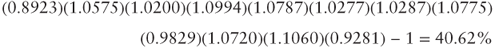

[**Table 5.1**](#c05-tbl-anc-0001) Simple 12-Month Momentum Example for Apple

|  |  |  |  |
| --- | --- | --- | --- |
|  | Stock Returns | 1+Return | Momentum |
| 1/31/2014 | –10.77% | 0.8923 |  |
| 2/28/2014 | 5.75% | 1.0575 |  |
| 3/31/2014 | 2.00% | 1.0200 |  |
| 4/30/2014 | 9.94% | 1.0994 |  |
| 5/30/2014 | 7.87% | 1.0787 |  |
| 6/30/2014 | 2.77% | 1.0277 |  |
| 7/31/2014 | 2.87% | 1.0287 |  |
| 8/29/2014 | 7.75% | 1.0775 |  |
| 9/30/2014 | –1.71% | 0.9829 |  |
| 10/31/2014 | 7.20% | 1.0720 |  |
| 11/28/2014 | 10.60% | 1.1060 |  |
| 12/31/2014 | –7.19% | 0.9281 | 40.62% |

Clearly, Apple had a good year in 2014! For reference, the broad market was up 13.46 percent in 2014. A similar exercise could be done over a different look-back period, such as the past month, where the total return would be –7.19 percent (i.e., the return over the past month). Other calculations could be done over any look-back period we wanted to examine, such as the past 3 months, 36 months, or even the past 5 years (60 months). This calculation can be completed for any stock with a price return stream.

Now that we understand how to calculate generic momentum over a particular time period, we can review some key results associated with different look-back windows.

## THREE TYPES OF MOMENTUM

In this section, we examine how returns are influenced by the look-back period we use to calculate momentum. Academic researchers have already thoroughly reviewed this topic and we summarize the main findings associated with three key look-back windows:

1. Short-term momentum (e.g., 1-month look-back)
2. Long-term momentum (e.g., 5 years, or 60-month look-back)
3. Intermediate-term momentum (e.g., 12-month look-back)

We deliberately end the section with intermediate-term momentum, as this is the momentum we plan to focus on for the rest of the book.

### Short-Term Momentum

We define short-term momentum as any momentum score that is measured over a time period of (at most) one month. Two academic papers written in 1990 specifically examine the topic of short-term momentum.

In the first paper, Bruce Lehman investigates how stock returns using a one-week look-back affect the next week's returns over his sample period from 1962 to 1986. His paper, titled “Fads, Martingales, and Market Efficiency,”[2](#c05-note-0002) finds that portfolios of securities that had positive returns (winners) in the prior week typically had negative returns in the next week (–0.35% to –0.55% per week on average). Those stocks with negative returns (losers) in the prior week typically had positive returns in the next week (0.86% to 1.24% per week on average). This *short-term reversal* in returns is difficult to reconcile with the efficient market hypothesis.

A second paper, written by Narasimhan Jegadeesh, examines the returns of stocks from month to month sample period between 1934 and 1987. His paper, titled “Evidence of Predictable Behavior of Security Returns,”[3](#c05-note-0003) finds a similar reversal in returns: Last month's winners are next month's losers, and vice versa. And the effect is large and significant. The prior month's winners have an average future return (next month) return of –1.38 percent, while the prior month's losers have an average future return (next month) of 1.11 percent. This 2.49 percent spread in the two portfolios is difficult to reconcile with the efficient market hypothesis.

Using data provided by Dartmouth Professor Ken French,[4](#c05-note-0004) we examine monthly returns from January 1, 1927, to December 31, 2014, for the Short-Term Loser portfolio (low short-term return decile, value-weight returns), the Short-Term Winner portfolio (high short-term return decile, value-weight returns), the SP500 total return index, and the risk-free rate of return (90-day T-bills). The short-term past performance is measured over the previous month. Results are shown in [Table 5.2](#c05-tbl-0002). All returns are total returns and include the reinvestment of distributions (e.g., dividends). Results are gross of fees.

[**Table 5.2**](#c05-tbl-anc-0002) Short-Term Momentum Portfolio Returns (1927–2014)

|  |  |  |  |  |
| --- | --- | --- | --- | --- |
|  | **Short-Term Loser** | **Short-Term Winner** | **SP500** | Risk Free |
| **CAGR** | 13.46% | 3.21% | 9.95% | 3.46% |
| **Standard Deviation** | 29.60% | 24.18% | 19.09% | 0.88% |
| **Downside Deviation** | 20.36% | 16.83% | 14.22% | 0.48% |
| **Sharpe Ratio** | 0.46 | 0.11 | 0.41 | 0.00 |
| **Sortino Ratio (MAR** c05-math-0002 **5%)** | 0.59 | 0.06 | 0.45 | –3.34 |
| **Worst Drawdown** | –81.48% | –94.31% | –84.59% | –0.09% |
| **Worst Month Return** | –32.66% | –31.27% | –28.73% | –0.06% |
| **Best Month Return** | 55.85% | 63.65% | 41.65% | 1.35% |
| **Profitable Months** | 60.13% | 56.06% | 61.74% | 98.01% |

The data validates the theory: Short-term reversals are alive and well across a long swath of history! Looking at the results in [Table 5.2](#c05-tbl-0002), we notice the *reversal* in returns from month to month—the returns to the monthly rebalanced portfolio of stocks with the *worst* returns from last month (“Short-Term Loser”) generate a CAGR of 13.46 percent from 1927 to 2014, while the returns to the monthly rebalanced portfolio of stocks with the *best* returns from last month (“Short-Term Winner”) earn a measly 3.21 percent. The returns to past-months' winners are even less than the returns to the risk-free rate of return. [Figure 5.1](#c05-fig-0001) graphically depicts the outperformance of the short-term loser portfolio relative to the short-term winner portfolio.

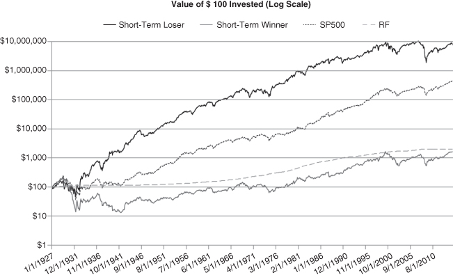

[**Figure 5.1**](#c05-fig-anc-0001) Short-Term Momentum Portfolio Returns

But the evidence doesn't end there: In addition to these two earlier papers, more recent research investigates more complex and nuanced versions of the same idea.[5](#c05-note-0005) The key takeaway is the same: Short-term winners are losers in the near-term future, and short-term losers are winners in the near-term future. Overall, when measuring momentum over a short time horizon, one can expect to see a reversal in short-term future returns.

### Long-Term Momentum

An alternative way to measure momentum is to use a look-back period over a much longer time period and assess performance. Werner DeBondt and Richard Thaler investigate this concept in their paper titled “Does the Stock Market Overreact?”[6](#c05-note-0006) The paper examines the future returns to past long-term winners and long-term losers, where the winners and losers are measured using look-back windows that range from three to five years. Their first tests run from 1933 to 1980, and they track the performance of the past winners and losers portfolios formed on a 36-month look-back. The results show that “losers” outperform “winners” by 24.6 percent over the next three years. This spread in performance is remarkable.

A similar analysis is done when measuring winners and losers over the past five years. When examining the future returns, past losers outperform past winners by 31.9 percent over the next five years. Clearly, past losers (when using a long-term momentum measure) outperform past winners.

Leveraging the same database that we used to examine short-term reversals, we examined the returns from January 1, 1931, to December 31, 2014, for the Long-Term Loser portfolio (low long-term return decile, value-weight returns), the Long-Term Winner portfolio (high long-term return decile, value-weight returns), the SP500 total return index, and the risk-free rate of return (90 day T-bills). The long-term past performance is measured over the previous five years (60 months), and the start date changes from 1927 to 1931 due to the necessary data requirement of five years of individual stock returns. Results are shown in [Table 5.3](#c05-tbl-0003). All returns are total returns and include the reinvestment of distributions (e.g., dividends). Results are gross of fees.

[**Table 5.3**](#c05-tbl-anc-0003) Long-Term Momentum Portfolio Returns (1931–2014)

|  |  |  |  |  |
| --- | --- | --- | --- | --- |
|  | **Long-Term Loser** | **Long-Term Winner** | **SP500** | **Risk Free** |
| **CAGR** | 14.30% | 8.59% | 10.13% | 3.46% |
| **Standard Deviation** | 30.37% | 21.95% | 18.92% | 0.90% |
| **Downside Deviation** | 17.98% | 16.23% | 13.91% | 0.47% |
| **Sharpe Ratio** | 0.47 | 0.33 | 0.43 | 0.00 |
| **Sortino Ratio (MAR** c05-math-0003 **5%)** | 0.70 | 0.35 | 0.46 | 3.35 |
| **Worst Drawdown** | –71.24% | –72.80% | –74.48% | –0.09% |
| **Worst Month Return** | –40.77% | –34.10% | –28.73% | –0.06% |
| **Best Month Return** | 91.98% | 30.74% | 41.65% | 1.35% |
| **Profitable Months** | 58.04% | 58.83% | 61.71% | 97.92% |

Looking at the results in [Table 5.3](#c05-tbl-0003), we notice the *reversal* in long-term returns—the returns to the monthly rebalanced portfolio of stocks with the *worst* returns over the last five years earns a CAGR of 14.30 percent from 1931 to 2014, while the returns to the monthly rebalanced portfolio of stocks with the *best* returns over the past five years earns a CAGR of 8.59 percent. [Figure 5.2](#c05-fig-0002) graphically depicts the outperformance of the long-term loser portfolio relative to the long-term winner portfolio.

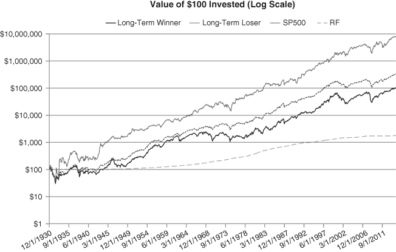

[**Figure 5.2**](#c05-fig-anc-0002) Long-Term Momentum Portfolio Returns

The literature and our updated results highlight that long-term momentum, similar to short-term momentum, leads to return reversals in the future. Why long-term reversal occurs is puzzling, and academic researchers argue whether the cause is due to behavioral bias, additional risk, or market frictions (e.g., capital gain taxes).[7](#c05-note-0007) Next, we examine intermediate-term momentum, which is the form of momentum that trends in the future and isn't reversed.

### Intermediate-Term Momentum

In order to examine intermediate-term momentum, we form portfolios based on a 6- to 12-month look-back. The results are different from both short-term (e.g., a 1-month look-back) and long-term (e.g., 60-month look-back) momentum, which exhibit return reversals. With intermediate-term momentum, winners keep winning and losers keep losing. The most well-known paper on this subject is the 1993 Narasimhan Jegadeesh and Sheridan Titman paper “Returns to Buying Winners and Selling Losers: Implications for Stock Market Efficiency.”[8](#c05-note-0008) In other words, if a stock has done relatively well in the past, it will continue to do well in the future.

The authors demonstrate that a *momentum strategy* (buying past “winners” and selling past “losers”) performs well for an intermediate-term horizon (3 to 12 months). They test this effect by constructing *J*-month/*K*-month strategies: select stocks based on past *J* months' total returns and hold the position for *K* months (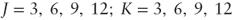).

Their main finding is that there is a *continuation* in returns when using intermediate-term momentum. The best strategy (in their paper) is selecting stocks based on past 12 months' performance and holding the position for 3 months. The average monthly spread in returns between the past winners and past losers over the next 3 months is 1.31 percent, or almost 16 percent per year. However, they find that the excess returns associated with intermediate-term momentum portfolios are not long-lasting. For example, the momentum premium dissipates for portfolios that hold the same stocks for longer than 12 months after the initial formation date. These results suggest that momentum portfolios calculated based on intermediate-term look-backs and held as a long-term buy-and-hold portfolio suffer a long-term reversal, which is similar to the results we discussed earlier. Jegadeesh and Titman argue that the intermediate-term momentum effect may occur if the market underreacts to information about the short-term prospects (such as earning announcement) of firms, but eventually overreacts to information about the long-term prospects.

With the data that we used to examine both short-term and long-term reversals, we examine the returns from January 1, 1927, to December 31, 2014, for the Intermediate-Term Winner portfolio (high intermediate-term return decile, value-weight returns), the Intermediate-Term Loser portfolio (low intermediate-term return decile, value-weight returns), the SP500 total return index, and the risk-free rate of return (90-day T-bills). The intermediate-term past performance is measured over the previous year, ignoring last month's return. So if we are forming a portfolio to trade on the close of December 31, 2015, we would compute the total return from the close of December 31, 2014, until the close of November 30, 2015, thus ignoring December 2015 returns (due to short-term momentum reversal). Results are shown in [Table 5.4](#c05-tbl-0004). All returns are total returns and include the reinvestment of distributions (e.g., dividends). Results are gross of fees.

[**Table 5.4**](#c05-tbl-anc-0004) Intermediate-Term Momentum Portfolio Returns (1927–2014)

|  |  |  |  |  |
| --- | --- | --- | --- | --- |
|  | **Intermediate-Term Winner** | **Intermediate-Term Loser** | **SP500** | **Risk Free** |
| **CAGR** | 16.86% | –1.48% | 9.95% | 3.46% |
| **Standard Deviation** | 22.61% | 33.92% | 19.09% | 0.88% |
| **Downside Deviation** | 16.71% | 21.97% | 14.22% | 0.48% |
| **Sharpe Ratio** | 0.66 | 0.02 | 0.41 | 0.00 |
| **Sortino Ratio (MAR** c05-math-0005 **5%)** | 0.79 | –0.05 | 0.45 | –3.34 |
| **Worst Drawdown** | –76.95% | –96.95% | –84.59% | –0.09% |
| **Worst Month Return** | –28.52% | –42.26% | –28.73% | –0.06% |
| **Best Month Return** | 28.88% | 93.98% | 41.65% | 1.35% |
| **Profitable Months** | 63.16% | 51.42% | 61.74% | 98.01% |

The tabulated results in [Table 5.4](#c05-tbl-0004) suggest strong evidence for a *continuation* in intermediate-term returns—the returns to the monthly-rebalanced portfolio of stocks with the *best* returns over the last year (ignoring last month) returns a CAGR of 16.86 percent from 1927 to 2014. In contrast, the returns to the monthly rebalanced portfolio of stocks with the *worst* returns over the last year (ignoring last month) returns a CAGR of –1.48 percent. The returns to past years' losers (ignoring last month) are not only less than the returns to the risk-free rate of return, they are negative! [Figure 5.3](#c05-fig-0003) graphically depicts the outperformance of the intermediate-term loser portfolio relative to the intermediate-term winner portfolio.

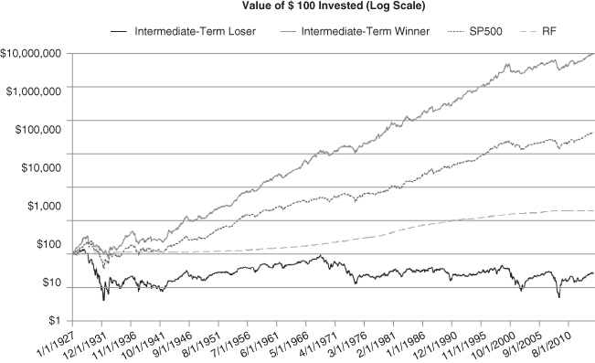

[**Figure 5.3**](#c05-fig-anc-0003) Intermediate-Term Momentum Portfolio Returns

Our results highlight that portfolios formed on intermediate-term momentum exhibit a *continuation* of returns. Firms that have done well in the intermediate past will continue to do well in the future, while firms that have done poorly will continue to perform poorly. However, as we discussed earlier, this “continuation” effect does not work if we just buy-and-hold intermediate-term momentum stocks. We must form the portfolio so that the rebalance frequency can capture the abnormal returns associated with the approach. In the next section, we examine how portfolio construction, such as rebalance frequency and portfolio size, affects intermediate-term momentum strategies.

## WHY MOMENTUM PORTFOLIO CONSTRUCTION MATTERS

The results in the original Jegadeesh and Titman paper highlight the importance of portfolio construction in the context of the momentum anomaly. The authors identify that the holding period, or the rebalance frequency, dramatically affects a momentum portfolio's performance. As a general rule, and putting transaction costs aside, the more frequent a portfolio is rebalanced, the better the performance. In this section, we drill down on exactly how portfolio construction affects intermediate-term momentum. Intermediate-term momentum is the focus of our analysis throughout the remainder of this book because this form of momentum is what researchers consider to be the most anomalous and intriguing.

Let's set up the experiment to assess how portfolio construction affects performance. We examine the 500 largest firms each month from 1927 to 2014. We calculate the monthly momentum variable as the cumulative returns over the past 12 months, ignoring the past month. This specific intermediate-term momentum calculation method is the same approach used by Ken French, the source of the data we used earlier. The last month is ignored in our intermediate term momentum calculation to account for the short-term reversal effect previously documented. If we included the most recent month in the momentum metric we would increase the noise of the metric and decrease the benefits of the signal.

Looking back to our Apple momentum example (referring back to [Table 5.1](#c05-tbl-0001)), we construct our momentum variable (excluding the most recent month) as the following:

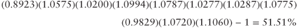

The key difference between this calculation and the one provided in [Table 5.1](#c05-tbl-0001) is that we ignore the last month's return (in this example, the December returns). It should be pointed out that including the last month's return, which is more reasonable from both an empirical and theoretical perspective, does not significantly alter the results—one could include the most recent month in all momentum calculations and generate similar results. Regardless, for the rest of the book, we focus on momentum calculations that ignore the most recent month's return when calculating intermediate-term momentum.

In the following tests, we allow the portfolio construction to vary across two dimensions. First, we examine the returns by varying the number of firms in the portfolio. We allow the portfolio size to vary from 50 to 300 stocks. Second, we examine the returns by varying the holding periods after portfolio formation. We allow the holding periods to vary from 1 month to 12 months.

We select the top *N* number of firms ranked on momentum, every month. Here, the number of stocks *N* can be 50, 100, 150, 200, 250, or 300. These firms are held in the portfolio for *T* months. The holding period (number of months) *T* varies from 1 to 12.

Portfolios with holding periods over 1 month are formed by creating overlapping portfolios. Overlapping portfolios can be explained with an example that uses a three-month holding period. On December 31, 2014, we use one-third of our capital to buy high momentum stocks. These stocks stay in the portfolio until March 31, 2015. On January 31, 2015, we use another one-third of our capital to buy high momentum stocks. These stocks stay in the portfolio until April 30, 2015. On February 28, 2015, we use another one-third of our capital to buy high-momentum stocks. These stocks stay in the portfolio until May 31, 2015. This process repeats every month. So the return to the portfolio from February 28, 2015, to March 31, 2015, is the returns to the stocks in the portfolio originally formed on December 31, 2014, January 31, 2015, and February 28, 2015. Overlapping portfolios are formed to minimize seasonal effects. Unless otherwise stated, we use overlapping portfolios throughout the analysis in the remainder of the book for holding periods of longer than one month. And similar to the robustness of the results when we decide to include or exclude the most recent month when calculating momentum measures, the use of the fancier overlapping portfolio methodology versus a more generic standard “buy and rebalance portfolio” does not significantly drive results in one direction of the other.

Our analysis runs from January 1, 1927, to December 31, 2014. All results are gross of fees. All returns are total returns and include the reinvestment of distributions (e.g., dividends). [Table 5.5](#c05-tbl-0005) provides the CAGR to the value-weighted portfolios. By *value weighting*, we mean that each stock is given its “weight” in the portfolio, depending on the size of the firm. Value weighting gives more weight to larger stocks and less weight to smaller stocks. It is worth mentioning, however, that we focus our results on the largest 500 US stocks, to minimize the effects that micro-cap stocks would have on the portfolios.

[**Table 5.5**](#c05-tbl-anc-0005) Momentum Portfolio Returns: Varying Holding Period and Number of Firms in the Portfolio (1927–2014)

|  |  |  |  |  |  |  |  |
| --- | --- | --- | --- | --- | --- | --- | --- |
|  | **50- Stock Portfolio** | **100- Stock Portfolio** | **150- Stock Portfolio** | **200- Stock Portfolio** | **250- Stock Portfolio** | **300- Stock Portfolio** | **Universe (500 Firms)** |
| **1-month hold** | 17.02% | 14.40% | 13.55% | 12.69% | 12.07% | 11.50% | 9.77% |
| **2-month hold** | 16.05% | 14.17% | 13.23% | 12.59% | 11.98% | 11.43% | 9.77% |
| **3-month hold** | 15.15% | 13.81% | 12.93% | 12.25% | 11.74% | 11.23% | 9.77% |
| **4-month hold** | 14.54% | 13.53% | 12.78% | 12.11% | 11.63% | 11.21% | 9.77% |
| **5-month hold** | 14.37% | 13.31% | 12.62% | 12.04% | 11.57% | 11.17% | 9.77% |
| **6-month hold** | 13.93% | 13.05% | 12.37% | 11.88% | 11.46% | 11.10% | 9.77% |
| **7-month hold** | 13.68% | 12.80% | 12.11% | 11.66% | 11.33% | 10.99% | 9.77% |
| **8-month hold** | 13.38% | 12.58% | 11.89% | 11.48% | 11.19% | 10.90% | 9.77% |
| **9-month hold** | 12.94% | 12.24% | 11.60% | 11.23% | 11.01% | 10.77% | 9.77% |
| **10-month hold** | 12.62% | 11.93% | 11.37% | 11.03% | 10.85% | 10.66% | 9.77% |
| **11-month hold** | 12.21% | 11.61% | 11.12% | 10.81% | 10.68% | 10.52% | 9.77% |
| **12-month hold** | 11.78% | 11.27% | 10.83% | 10.58% | 10.48% | 10.36% | 9.77% |

A clear trend emerges—holding fewer stocks and rebalancing more frequently leads to higher compound annual growth rates (CAGRs). The ideal portfolio is highly concentrated (e.g., 50 stocks) and rebalanced monthly (e.g., holding period equals one month). Of course, one must consider trading costs, which have the potential to greatly affect returns. To address the question of trading costs, we can examine a concentrated momentum portfolio (e.g., 50 stocks) that is rebalanced every quarter instead of every month—so we could form a portfolio that trades 4 times a year, instead of 12 times a year (overlapping portfolios are not necessary in real-world trading). This concentrated, but lower frequency rebalanced portfolio has a CAGR of 15.15 percent over the 1927 to 2014 time frame. The portfolio gives up a substantial amount of return, but comes with a lot less trading. Depending on transaction costs (discussed later), one could assess the trade-off between the benefit of higher expected returns associated with the monthly rebalanced against the lower transaction costs of the quarterly rebalanced portfolio.

In the absence of granular detail on trading costs, when it comes to monthly versus quarterly rebalancing, the winner is unclear. However, if we compare any of these portfolios to the gross performance of a semiannually rebalanced diversified 200-stock portfolio, the horse race among portfolio constructs becomes more obvious. The CAGR for this low-frequency, “diworsified” portfolio is only 11.88 percent. The spread between this portfolio construct and the other, more concentrated and more frequently balanced portfolios is over 3 percent a year. If a momentum strategy annually rebalances and holds heavily diluted portfolios (e.g., 300 stocks), the relative performance is even worse.

If we assume the “all-in” rebalance costs are 0.50 percent per rebalance for these momentum strategies, the CAGR on the 50-stock, quarterly rebalanced portfolio would fall from 15.15 percent to 13.15 percent (four trades times 0.50 percent). Similarly, the 200-stock, semiannually rebalanced portfolio's CAGR would fall from 11.88 percent to 10.88 percent (two trades times 0.50 percent). There is still a 2.27 percent edge to the higher concentrated, more frequently rebalanced portfolio.

The implementation of transaction costs in the previous analysis is simple in nature and meant to highlight the point that rebalance frequency and portfolio concentration benefits need to be considered in the context of projected trading costs. For further discussion on this subject, there is a paper by Lesmond, Schill, and Zhou in 2004, which claims that momentum profits are illusory based on ad-hoc assumptions regarding trading costs.[9](#c05-note-0009) Korajczyk and Sadka also examine the issue, but consider market impact costs. These authors estimate that momentum strategies have limited capacity, estimated at roughly $5 billion.[11](#c05-note-0010) However, in response to this paper and others, Andrea Frazzini, Ron Israel, and Toby Moskowitz published research that leverages over a trillion dollars of live trading data from the large institutional money manager AQR.[10](#c05-note-0011) Frazzini et al. find that momentum profits are robust to transaction costs and that the estimated transaction costs used in prior research were possibly 10 times higher than real-world transaction costs. Following the Frazzini et al. transaction cost analysis is a paper in 2015 by Fisher, Shah, and Titman that uses estimated bid/ask spreads from 2000–2013 to assess the trading costs associated with momentum strategies.[12](#c05-note-0012) Their conclusions are that their “estimates of trading costs … are generally much larger than those reported in Frazzini, Israel, and Moskowitz, and somewhat smaller than those described in Lesmond, Schill, and Zhou and Korajczyk and Sadka.” In short, the debate over transaction costs is heated, but the consensus from the research seems to be that momentum exists net of transaction costs, but the scalability is limited.

Clearly, there is a relationship between the number of firms, the holding period, and returns. The results are almost identical when equal-weighting the portfolios (higher CAGRs, similar pattern). And, of course, transaction costs are always an important element to consider when implementing any active strategy. Regardless, there are two important takeaways:

- **Rebalance frequency**: Holding the number of firms constant, the shorter the holding period, i.e., the more frequently the portfolio is rebalanced, the higher the CAGR.
- **Avoid diworsification**: Keeping the holding period constant, the fewer firms in the portfolio, the higher the CAGR.

For a large, multibillion dollar asset manager, the results above are not inspiring, since the manager's scale alone prohibits them from pursuing the more effective momentum strategies, which require higher turnover. However, for this same reason, the requirement that momentum be rebalanced frequently and held in concentrated portfolios is great news when viewed through the sustainable active framework. These characteristics make arbitrage costly for large pools of capital, thus ensuring a long expected life for the higher frequency rebalanced versions of the momentum anomaly.

## SUMMARY

This chapter details how to calculate a generic momentum metric. First, we describe the three types of momentum strategies most commonly examined: short-term look-back momentum, intermediate-term look-back momentum, and long-term look-back momentum. Both short-term and long-term momentum portfolios generate return reversals. However, portfolios formed using intermediate-term look-back momentum calculations generate a continuation of returns. This form of momentum is the most compelling and robust as an investment approach. Finally, we highlight that portfolio construction plays are large role in determining the effectiveness of an intermediate-term momentum portfolio. We identify that momentum portfolios should be reasonably concentrated and require frequent rebalancing to maximize their effectiveness. In the chapters that follow, we describe ways in which the generic intermediate-term momentum measure can be improved.

## NOTES

[1](#c05-note-anc-0001) George Soros, *The Alchemy of Finance* (Hoboken, NJ: John Wiley & Sons, 2003), p. 5.
[2](#c05-note-anc-0002) Bruce N. Lehmann, “Fads, Martingales, and Market Efficiency,” *The Quarterly Journal of Economics* 105 (1990): 1–28.
[3](#c05-note-anc-0003) Narasimhan Jegadeesh, “Evidence of Predictable Behavior of Security Returns,” *The Journal of Finance* 45 (1990): 881–898.
[4](#c05-note-anc-0004) mba.tuck.dartmouth.edu/pages/faculty/ken.french/data\_library.html, accessed 2/22/2016.
[5](#c05-note-anc-0005) Zhi Da, Qianqui Liu, and Erst Schaumburg, “A Closer Look at the Short-Term Return Reversal,” *Management Science* 60 (2014): 658–674.
[6](#c05-note-anc-0006) Werner F. M. DeBondt and Richard Thaler, “Does the Stock Market Overreact?,” *The Journal of Finance* 40 (1985): 193–805.
[7](#c05-note-anc-0007) Thomas George and Chuan-Yang Hwang, “Long-Term Return Reversals: Overreaction or Taxes?” *The Journal of Finance* 62 (2007): 2865–2896.
[8](#c05-note-anc-0008) Narasimhan Jegadeesh and Sheridan Titman, “Return to Buying Winners and Selling Losers: Implications for Stock Market Efficiency,” *The Journal of Finance* 48 (1993): 65–91.
[9](#c05-note-anc-0009) David A. Lesmond, Michael J. Schill, and Chunsheng Zhou, “The Illusory Nature of Momentum Profits,” *Journal of Financial Economics* 71 (2004): 349–380.
[11](#c05-note-anc-0010) Robert Korajczyk and Ronnie Sadka, “Are Momentum Profits Robust to Trading Costs?” *The Journal of Finance* 59 (2004): 1039–1082.
[10](#c05-note-anc-0011) Andrea Frazzini, Ronen Israel, and Tobias J. Moskowitz, “Trading Costs of Asset Pricing Anomalies,”working paper, 2015.
[12](#c05-note-anc-0012) Gregg Fisher, Ronnie Shah, and Sheridan Titman, “Combining Value and Momentum,” *Journal of Investment Management*, forthcoming.

<!-- rl-section id="how-to-calculate-generic-momentum" class="epub-section" title="HOW TO CALCULATE GENERIC MOMENTUM" -->

# CHAPTER 5 The Basics of Building a Momentum Strategy

> *“I contend that financial markets are always wrong…”*

—George Soros, *The Alchemy of Finance*[1](#c05-note-0001)

[Part One](#section-10) of this book leaves us with a central message: Momentum should be considered by all investors. And the great paradox is that faithful value investors—those who are probably the least likely to actually implement a momentum approach—stand to gain the most by complementing their value portfolio with a momentum strategy. Perhaps this is for the best, and is a reason why value and momentum in combination—operating as a system—will continue to provide expected long-term portfolio benefits: Each investment religion is too strict, and thus slow to embrace nonconforming ideas. But assuming we have moved past the religious debate between value and momentum, or at least raised the curiosity level of dyed-in-the-wool value investors, it is now time to get our hands dirty and build a momentum approach that can be used in practice. We tackle this subject by breaking this chapter into the following components:

- How to calculate generic momentum
- Describe how look-back windows affect momentum
- Describe how portfolio construction affects momentum

The remainder of this chapter is dedicated to outlining each of these steps in greater detail.

How do we measure the “momentum” of a stock? The simple method is to calculate the total return (including dividends) of a stock over some particular look-back period (e.g., the past 12 months).

A quick example will demonstrate the concept, using the total return of Apple's stock in 2014. Here we calculate the cumulative return to Apple over the past 12 months (the “look-back” period). To calculate the cumulative return over the past 12 months, we take the net return streams from each month and turn them into gross returns by adding 1. Thus, if Apple's net returns for January are –10.77 percent, Apple's gross returns for January are 0.8923 (–0.1077 + 1).

Then, we multiply all the gross return series (i.e., months) and subtract 1 to find the cumulative 12-month net return. For example, based on the data from Apple in 2014, the cumulative returns in December (momentum score; see [Table 5.1](#c05-tbl-0001)) are calculated as follows:

[**Table 5.1**](#c05-tbl-anc-0001) Simple 12-Month Momentum Example for Apple

|  |  |  |  |
| --- | --- | --- | --- |
|  | Stock Returns | 1+Return | Momentum |
| 1/31/2014 | –10.77% | 0.8923 |  |
| 2/28/2014 | 5.75% | 1.0575 |  |
| 3/31/2014 | 2.00% | 1.0200 |  |
| 4/30/2014 | 9.94% | 1.0994 |  |
| 5/30/2014 | 7.87% | 1.0787 |  |
| 6/30/2014 | 2.77% | 1.0277 |  |
| 7/31/2014 | 2.87% | 1.0287 |  |
| 8/29/2014 | 7.75% | 1.0775 |  |
| 9/30/2014 | –1.71% | 0.9829 |  |
| 10/31/2014 | 7.20% | 1.0720 |  |
| 11/28/2014 | 10.60% | 1.1060 |  |
| 12/31/2014 | –7.19% | 0.9281 | 40.62% |

Clearly, Apple had a good year in 2014! For reference, the broad market was up 13.46 percent in 2014. A similar exercise could be done over a different look-back period, such as the past month, where the total return would be –7.19 percent (i.e., the return over the past month). Other calculations could be done over any look-back period we wanted to examine, such as the past 3 months, 36 months, or even the past 5 years (60 months). This calculation can be completed for any stock with a price return stream.

Now that we understand how to calculate generic momentum over a particular time period, we can review some key results associated with different look-back windows.

## THREE TYPES OF MOMENTUM

In this section, we examine how returns are influenced by the look-back period we use to calculate momentum. Academic researchers have already thoroughly reviewed this topic and we summarize the main findings associated with three key look-back windows:

1. Short-term momentum (e.g., 1-month look-back)
2. Long-term momentum (e.g., 5 years, or 60-month look-back)
3. Intermediate-term momentum (e.g., 12-month look-back)

We deliberately end the section with intermediate-term momentum, as this is the momentum we plan to focus on for the rest of the book.

### Short-Term Momentum

We define short-term momentum as any momentum score that is measured over a time period of (at most) one month. Two academic papers written in 1990 specifically examine the topic of short-term momentum.

In the first paper, Bruce Lehman investigates how stock returns using a one-week look-back affect the next week's returns over his sample period from 1962 to 1986. His paper, titled “Fads, Martingales, and Market Efficiency,”[2](#c05-note-0002) finds that portfolios of securities that had positive returns (winners) in the prior week typically had negative returns in the next week (–0.35% to –0.55% per week on average). Those stocks with negative returns (losers) in the prior week typically had positive returns in the next week (0.86% to 1.24% per week on average). This *short-term reversal* in returns is difficult to reconcile with the efficient market hypothesis.

A second paper, written by Narasimhan Jegadeesh, examines the returns of stocks from month to month sample period between 1934 and 1987. His paper, titled “Evidence of Predictable Behavior of Security Returns,”[3](#c05-note-0003) finds a similar reversal in returns: Last month's winners are next month's losers, and vice versa. And the effect is large and significant. The prior month's winners have an average future return (next month) return of –1.38 percent, while the prior month's losers have an average future return (next month) of 1.11 percent. This 2.49 percent spread in the two portfolios is difficult to reconcile with the efficient market hypothesis.

Using data provided by Dartmouth Professor Ken French,[4](#c05-note-0004) we examine monthly returns from January 1, 1927, to December 31, 2014, for the Short-Term Loser portfolio (low short-term return decile, value-weight returns), the Short-Term Winner portfolio (high short-term return decile, value-weight returns), the SP500 total return index, and the risk-free rate of return (90-day T-bills). The short-term past performance is measured over the previous month. Results are shown in [Table 5.2](#c05-tbl-0002). All returns are total returns and include the reinvestment of distributions (e.g., dividends). Results are gross of fees.

[**Table 5.2**](#c05-tbl-anc-0002) Short-Term Momentum Portfolio Returns (1927–2014)

|  |  |  |  |  |
| --- | --- | --- | --- | --- |
|  | **Short-Term Loser** | **Short-Term Winner** | **SP500** | Risk Free |
| **CAGR** | 13.46% | 3.21% | 9.95% | 3.46% |
| **Standard Deviation** | 29.60% | 24.18% | 19.09% | 0.88% |
| **Downside Deviation** | 20.36% | 16.83% | 14.22% | 0.48% |
| **Sharpe Ratio** | 0.46 | 0.11 | 0.41 | 0.00 |
| **Sortino Ratio (MAR** c05-math-0002 **5%)** | 0.59 | 0.06 | 0.45 | –3.34 |
| **Worst Drawdown** | –81.48% | –94.31% | –84.59% | –0.09% |
| **Worst Month Return** | –32.66% | –31.27% | –28.73% | –0.06% |
| **Best Month Return** | 55.85% | 63.65% | 41.65% | 1.35% |
| **Profitable Months** | 60.13% | 56.06% | 61.74% | 98.01% |

The data validates the theory: Short-term reversals are alive and well across a long swath of history! Looking at the results in [Table 5.2](#c05-tbl-0002), we notice the *reversal* in returns from month to month—the returns to the monthly rebalanced portfolio of stocks with the *worst* returns from last month (“Short-Term Loser”) generate a CAGR of 13.46 percent from 1927 to 2014, while the returns to the monthly rebalanced portfolio of stocks with the *best* returns from last month (“Short-Term Winner”) earn a measly 3.21 percent. The returns to past-months' winners are even less than the returns to the risk-free rate of return. [Figure 5.1](#c05-fig-0001) graphically depicts the outperformance of the short-term loser portfolio relative to the short-term winner portfolio.

[**Figure 5.1**](#c05-fig-anc-0001) Short-Term Momentum Portfolio Returns

But the evidence doesn't end there: In addition to these two earlier papers, more recent research investigates more complex and nuanced versions of the same idea.[5](#c05-note-0005) The key takeaway is the same: Short-term winners are losers in the near-term future, and short-term losers are winners in the near-term future. Overall, when measuring momentum over a short time horizon, one can expect to see a reversal in short-term future returns.

### Long-Term Momentum

An alternative way to measure momentum is to use a look-back period over a much longer time period and assess performance. Werner DeBondt and Richard Thaler investigate this concept in their paper titled “Does the Stock Market Overreact?”[6](#c05-note-0006) The paper examines the future returns to past long-term winners and long-term losers, where the winners and losers are measured using look-back windows that range from three to five years. Their first tests run from 1933 to 1980, and they track the performance of the past winners and losers portfolios formed on a 36-month look-back. The results show that “losers” outperform “winners” by 24.6 percent over the next three years. This spread in performance is remarkable.

A similar analysis is done when measuring winners and losers over the past five years. When examining the future returns, past losers outperform past winners by 31.9 percent over the next five years. Clearly, past losers (when using a long-term momentum measure) outperform past winners.

Leveraging the same database that we used to examine short-term reversals, we examined the returns from January 1, 1931, to December 31, 2014, for the Long-Term Loser portfolio (low long-term return decile, value-weight returns), the Long-Term Winner portfolio (high long-term return decile, value-weight returns), the SP500 total return index, and the risk-free rate of return (90 day T-bills). The long-term past performance is measured over the previous five years (60 months), and the start date changes from 1927 to 1931 due to the necessary data requirement of five years of individual stock returns. Results are shown in [Table 5.3](#c05-tbl-0003). All returns are total returns and include the reinvestment of distributions (e.g., dividends). Results are gross of fees.

[**Table 5.3**](#c05-tbl-anc-0003) Long-Term Momentum Portfolio Returns (1931–2014)

|  |  |  |  |  |
| --- | --- | --- | --- | --- |
|  | **Long-Term Loser** | **Long-Term Winner** | **SP500** | **Risk Free** |
| **CAGR** | 14.30% | 8.59% | 10.13% | 3.46% |
| **Standard Deviation** | 30.37% | 21.95% | 18.92% | 0.90% |
| **Downside Deviation** | 17.98% | 16.23% | 13.91% | 0.47% |
| **Sharpe Ratio** | 0.47 | 0.33 | 0.43 | 0.00 |
| **Sortino Ratio (MAR** c05-math-0003 **5%)** | 0.70 | 0.35 | 0.46 | 3.35 |
| **Worst Drawdown** | –71.24% | –72.80% | –74.48% | –0.09% |
| **Worst Month Return** | –40.77% | –34.10% | –28.73% | –0.06% |
| **Best Month Return** | 91.98% | 30.74% | 41.65% | 1.35% |
| **Profitable Months** | 58.04% | 58.83% | 61.71% | 97.92% |

Looking at the results in [Table 5.3](#c05-tbl-0003), we notice the *reversal* in long-term returns—the returns to the monthly rebalanced portfolio of stocks with the *worst* returns over the last five years earns a CAGR of 14.30 percent from 1931 to 2014, while the returns to the monthly rebalanced portfolio of stocks with the *best* returns over the past five years earns a CAGR of 8.59 percent. [Figure 5.2](#c05-fig-0002) graphically depicts the outperformance of the long-term loser portfolio relative to the long-term winner portfolio.

[**Figure 5.2**](#c05-fig-anc-0002) Long-Term Momentum Portfolio Returns

The literature and our updated results highlight that long-term momentum, similar to short-term momentum, leads to return reversals in the future. Why long-term reversal occurs is puzzling, and academic researchers argue whether the cause is due to behavioral bias, additional risk, or market frictions (e.g., capital gain taxes).[7](#c05-note-0007) Next, we examine intermediate-term momentum, which is the form of momentum that trends in the future and isn't reversed.

### Intermediate-Term Momentum

In order to examine intermediate-term momentum, we form portfolios based on a 6- to 12-month look-back. The results are different from both short-term (e.g., a 1-month look-back) and long-term (e.g., 60-month look-back) momentum, which exhibit return reversals. With intermediate-term momentum, winners keep winning and losers keep losing. The most well-known paper on this subject is the 1993 Narasimhan Jegadeesh and Sheridan Titman paper “Returns to Buying Winners and Selling Losers: Implications for Stock Market Efficiency.”[8](#c05-note-0008) In other words, if a stock has done relatively well in the past, it will continue to do well in the future.

The authors demonstrate that a *momentum strategy* (buying past “winners” and selling past “losers”) performs well for an intermediate-term horizon (3 to 12 months). They test this effect by constructing *J*-month/*K*-month strategies: select stocks based on past *J* months' total returns and hold the position for *K* months ().

Their main finding is that there is a *continuation* in returns when using intermediate-term momentum. The best strategy (in their paper) is selecting stocks based on past 12 months' performance and holding the position for 3 months. The average monthly spread in returns between the past winners and past losers over the next 3 months is 1.31 percent, or almost 16 percent per year. However, they find that the excess returns associated with intermediate-term momentum portfolios are not long-lasting. For example, the momentum premium dissipates for portfolios that hold the same stocks for longer than 12 months after the initial formation date. These results suggest that momentum portfolios calculated based on intermediate-term look-backs and held as a long-term buy-and-hold portfolio suffer a long-term reversal, which is similar to the results we discussed earlier. Jegadeesh and Titman argue that the intermediate-term momentum effect may occur if the market underreacts to information about the short-term prospects (such as earning announcement) of firms, but eventually overreacts to information about the long-term prospects.

With the data that we used to examine both short-term and long-term reversals, we examine the returns from January 1, 1927, to December 31, 2014, for the Intermediate-Term Winner portfolio (high intermediate-term return decile, value-weight returns), the Intermediate-Term Loser portfolio (low intermediate-term return decile, value-weight returns), the SP500 total return index, and the risk-free rate of return (90-day T-bills). The intermediate-term past performance is measured over the previous year, ignoring last month's return. So if we are forming a portfolio to trade on the close of December 31, 2015, we would compute the total return from the close of December 31, 2014, until the close of November 30, 2015, thus ignoring December 2015 returns (due to short-term momentum reversal). Results are shown in [Table 5.4](#c05-tbl-0004). All returns are total returns and include the reinvestment of distributions (e.g., dividends). Results are gross of fees.

[**Table 5.4**](#c05-tbl-anc-0004) Intermediate-Term Momentum Portfolio Returns (1927–2014)

|  |  |  |  |  |
| --- | --- | --- | --- | --- |
|  | **Intermediate-Term Winner** | **Intermediate-Term Loser** | **SP500** | **Risk Free** |
| **CAGR** | 16.86% | –1.48% | 9.95% | 3.46% |
| **Standard Deviation** | 22.61% | 33.92% | 19.09% | 0.88% |
| **Downside Deviation** | 16.71% | 21.97% | 14.22% | 0.48% |
| **Sharpe Ratio** | 0.66 | 0.02 | 0.41 | 0.00 |
| **Sortino Ratio (MAR** c05-math-0005 **5%)** | 0.79 | –0.05 | 0.45 | –3.34 |
| **Worst Drawdown** | –76.95% | –96.95% | –84.59% | –0.09% |
| **Worst Month Return** | –28.52% | –42.26% | –28.73% | –0.06% |
| **Best Month Return** | 28.88% | 93.98% | 41.65% | 1.35% |
| **Profitable Months** | 63.16% | 51.42% | 61.74% | 98.01% |

The tabulated results in [Table 5.4](#c05-tbl-0004) suggest strong evidence for a *continuation* in intermediate-term returns—the returns to the monthly-rebalanced portfolio of stocks with the *best* returns over the last year (ignoring last month) returns a CAGR of 16.86 percent from 1927 to 2014. In contrast, the returns to the monthly rebalanced portfolio of stocks with the *worst* returns over the last year (ignoring last month) returns a CAGR of –1.48 percent. The returns to past years' losers (ignoring last month) are not only less than the returns to the risk-free rate of return, they are negative! [Figure 5.3](#c05-fig-0003) graphically depicts the outperformance of the intermediate-term loser portfolio relative to the intermediate-term winner portfolio.

[**Figure 5.3**](#c05-fig-anc-0003) Intermediate-Term Momentum Portfolio Returns

Our results highlight that portfolios formed on intermediate-term momentum exhibit a *continuation* of returns. Firms that have done well in the intermediate past will continue to do well in the future, while firms that have done poorly will continue to perform poorly. However, as we discussed earlier, this “continuation” effect does not work if we just buy-and-hold intermediate-term momentum stocks. We must form the portfolio so that the rebalance frequency can capture the abnormal returns associated with the approach. In the next section, we examine how portfolio construction, such as rebalance frequency and portfolio size, affects intermediate-term momentum strategies.

## WHY MOMENTUM PORTFOLIO CONSTRUCTION MATTERS

The results in the original Jegadeesh and Titman paper highlight the importance of portfolio construction in the context of the momentum anomaly. The authors identify that the holding period, or the rebalance frequency, dramatically affects a momentum portfolio's performance. As a general rule, and putting transaction costs aside, the more frequent a portfolio is rebalanced, the better the performance. In this section, we drill down on exactly how portfolio construction affects intermediate-term momentum. Intermediate-term momentum is the focus of our analysis throughout the remainder of this book because this form of momentum is what researchers consider to be the most anomalous and intriguing.

Let's set up the experiment to assess how portfolio construction affects performance. We examine the 500 largest firms each month from 1927 to 2014. We calculate the monthly momentum variable as the cumulative returns over the past 12 months, ignoring the past month. This specific intermediate-term momentum calculation method is the same approach used by Ken French, the source of the data we used earlier. The last month is ignored in our intermediate term momentum calculation to account for the short-term reversal effect previously documented. If we included the most recent month in the momentum metric we would increase the noise of the metric and decrease the benefits of the signal.

Looking back to our Apple momentum example (referring back to [Table 5.1](#c05-tbl-0001)), we construct our momentum variable (excluding the most recent month) as the following:

The key difference between this calculation and the one provided in [Table 5.1](#c05-tbl-0001) is that we ignore the last month's return (in this example, the December returns). It should be pointed out that including the last month's return, which is more reasonable from both an empirical and theoretical perspective, does not significantly alter the results—one could include the most recent month in all momentum calculations and generate similar results. Regardless, for the rest of the book, we focus on momentum calculations that ignore the most recent month's return when calculating intermediate-term momentum.

In the following tests, we allow the portfolio construction to vary across two dimensions. First, we examine the returns by varying the number of firms in the portfolio. We allow the portfolio size to vary from 50 to 300 stocks. Second, we examine the returns by varying the holding periods after portfolio formation. We allow the holding periods to vary from 1 month to 12 months.

We select the top *N* number of firms ranked on momentum, every month. Here, the number of stocks *N* can be 50, 100, 150, 200, 250, or 300. These firms are held in the portfolio for *T* months. The holding period (number of months) *T* varies from 1 to 12.

Portfolios with holding periods over 1 month are formed by creating overlapping portfolios. Overlapping portfolios can be explained with an example that uses a three-month holding period. On December 31, 2014, we use one-third of our capital to buy high momentum stocks. These stocks stay in the portfolio until March 31, 2015. On January 31, 2015, we use another one-third of our capital to buy high momentum stocks. These stocks stay in the portfolio until April 30, 2015. On February 28, 2015, we use another one-third of our capital to buy high-momentum stocks. These stocks stay in the portfolio until May 31, 2015. This process repeats every month. So the return to the portfolio from February 28, 2015, to March 31, 2015, is the returns to the stocks in the portfolio originally formed on December 31, 2014, January 31, 2015, and February 28, 2015. Overlapping portfolios are formed to minimize seasonal effects. Unless otherwise stated, we use overlapping portfolios throughout the analysis in the remainder of the book for holding periods of longer than one month. And similar to the robustness of the results when we decide to include or exclude the most recent month when calculating momentum measures, the use of the fancier overlapping portfolio methodology versus a more generic standard “buy and rebalance portfolio” does not significantly drive results in one direction of the other.

Our analysis runs from January 1, 1927, to December 31, 2014. All results are gross of fees. All returns are total returns and include the reinvestment of distributions (e.g., dividends). [Table 5.5](#c05-tbl-0005) provides the CAGR to the value-weighted portfolios. By *value weighting*, we mean that each stock is given its “weight” in the portfolio, depending on the size of the firm. Value weighting gives more weight to larger stocks and less weight to smaller stocks. It is worth mentioning, however, that we focus our results on the largest 500 US stocks, to minimize the effects that micro-cap stocks would have on the portfolios.

[**Table 5.5**](#c05-tbl-anc-0005) Momentum Portfolio Returns: Varying Holding Period and Number of Firms in the Portfolio (1927–2014)

|  |  |  |  |  |  |  |  |
| --- | --- | --- | --- | --- | --- | --- | --- |
|  | **50- Stock Portfolio** | **100- Stock Portfolio** | **150- Stock Portfolio** | **200- Stock Portfolio** | **250- Stock Portfolio** | **300- Stock Portfolio** | **Universe (500 Firms)** |
| **1-month hold** | 17.02% | 14.40% | 13.55% | 12.69% | 12.07% | 11.50% | 9.77% |
| **2-month hold** | 16.05% | 14.17% | 13.23% | 12.59% | 11.98% | 11.43% | 9.77% |
| **3-month hold** | 15.15% | 13.81% | 12.93% | 12.25% | 11.74% | 11.23% | 9.77% |
| **4-month hold** | 14.54% | 13.53% | 12.78% | 12.11% | 11.63% | 11.21% | 9.77% |
| **5-month hold** | 14.37% | 13.31% | 12.62% | 12.04% | 11.57% | 11.17% | 9.77% |
| **6-month hold** | 13.93% | 13.05% | 12.37% | 11.88% | 11.46% | 11.10% | 9.77% |
| **7-month hold** | 13.68% | 12.80% | 12.11% | 11.66% | 11.33% | 10.99% | 9.77% |
| **8-month hold** | 13.38% | 12.58% | 11.89% | 11.48% | 11.19% | 10.90% | 9.77% |
| **9-month hold** | 12.94% | 12.24% | 11.60% | 11.23% | 11.01% | 10.77% | 9.77% |
| **10-month hold** | 12.62% | 11.93% | 11.37% | 11.03% | 10.85% | 10.66% | 9.77% |
| **11-month hold** | 12.21% | 11.61% | 11.12% | 10.81% | 10.68% | 10.52% | 9.77% |
| **12-month hold** | 11.78% | 11.27% | 10.83% | 10.58% | 10.48% | 10.36% | 9.77% |

A clear trend emerges—holding fewer stocks and rebalancing more frequently leads to higher compound annual growth rates (CAGRs). The ideal portfolio is highly concentrated (e.g., 50 stocks) and rebalanced monthly (e.g., holding period equals one month). Of course, one must consider trading costs, which have the potential to greatly affect returns. To address the question of trading costs, we can examine a concentrated momentum portfolio (e.g., 50 stocks) that is rebalanced every quarter instead of every month—so we could form a portfolio that trades 4 times a year, instead of 12 times a year (overlapping portfolios are not necessary in real-world trading). This concentrated, but lower frequency rebalanced portfolio has a CAGR of 15.15 percent over the 1927 to 2014 time frame. The portfolio gives up a substantial amount of return, but comes with a lot less trading. Depending on transaction costs (discussed later), one could assess the trade-off between the benefit of higher expected returns associated with the monthly rebalanced against the lower transaction costs of the quarterly rebalanced portfolio.

In the absence of granular detail on trading costs, when it comes to monthly versus quarterly rebalancing, the winner is unclear. However, if we compare any of these portfolios to the gross performance of a semiannually rebalanced diversified 200-stock portfolio, the horse race among portfolio constructs becomes more obvious. The CAGR for this low-frequency, “diworsified” portfolio is only 11.88 percent. The spread between this portfolio construct and the other, more concentrated and more frequently balanced portfolios is over 3 percent a year. If a momentum strategy annually rebalances and holds heavily diluted portfolios (e.g., 300 stocks), the relative performance is even worse.

If we assume the “all-in” rebalance costs are 0.50 percent per rebalance for these momentum strategies, the CAGR on the 50-stock, quarterly rebalanced portfolio would fall from 15.15 percent to 13.15 percent (four trades times 0.50 percent). Similarly, the 200-stock, semiannually rebalanced portfolio's CAGR would fall from 11.88 percent to 10.88 percent (two trades times 0.50 percent). There is still a 2.27 percent edge to the higher concentrated, more frequently rebalanced portfolio.

The implementation of transaction costs in the previous analysis is simple in nature and meant to highlight the point that rebalance frequency and portfolio concentration benefits need to be considered in the context of projected trading costs. For further discussion on this subject, there is a paper by Lesmond, Schill, and Zhou in 2004, which claims that momentum profits are illusory based on ad-hoc assumptions regarding trading costs.[9](#c05-note-0009) Korajczyk and Sadka also examine the issue, but consider market impact costs. These authors estimate that momentum strategies have limited capacity, estimated at roughly $5 billion.[11](#c05-note-0010) However, in response to this paper and others, Andrea Frazzini, Ron Israel, and Toby Moskowitz published research that leverages over a trillion dollars of live trading data from the large institutional money manager AQR.[10](#c05-note-0011) Frazzini et al. find that momentum profits are robust to transaction costs and that the estimated transaction costs used in prior research were possibly 10 times higher than real-world transaction costs. Following the Frazzini et al. transaction cost analysis is a paper in 2015 by Fisher, Shah, and Titman that uses estimated bid/ask spreads from 2000–2013 to assess the trading costs associated with momentum strategies.[12](#c05-note-0012) Their conclusions are that their “estimates of trading costs … are generally much larger than those reported in Frazzini, Israel, and Moskowitz, and somewhat smaller than those described in Lesmond, Schill, and Zhou and Korajczyk and Sadka.” In short, the debate over transaction costs is heated, but the consensus from the research seems to be that momentum exists net of transaction costs, but the scalability is limited.

Clearly, there is a relationship between the number of firms, the holding period, and returns. The results are almost identical when equal-weighting the portfolios (higher CAGRs, similar pattern). And, of course, transaction costs are always an important element to consider when implementing any active strategy. Regardless, there are two important takeaways:

- **Rebalance frequency**: Holding the number of firms constant, the shorter the holding period, i.e., the more frequently the portfolio is rebalanced, the higher the CAGR.
- **Avoid diworsification**: Keeping the holding period constant, the fewer firms in the portfolio, the higher the CAGR.

For a large, multibillion dollar asset manager, the results above are not inspiring, since the manager's scale alone prohibits them from pursuing the more effective momentum strategies, which require higher turnover. However, for this same reason, the requirement that momentum be rebalanced frequently and held in concentrated portfolios is great news when viewed through the sustainable active framework. These characteristics make arbitrage costly for large pools of capital, thus ensuring a long expected life for the higher frequency rebalanced versions of the momentum anomaly.

## SUMMARY

This chapter details how to calculate a generic momentum metric. First, we describe the three types of momentum strategies most commonly examined: short-term look-back momentum, intermediate-term look-back momentum, and long-term look-back momentum. Both short-term and long-term momentum portfolios generate return reversals. However, portfolios formed using intermediate-term look-back momentum calculations generate a continuation of returns. This form of momentum is the most compelling and robust as an investment approach. Finally, we highlight that portfolio construction plays are large role in determining the effectiveness of an intermediate-term momentum portfolio. We identify that momentum portfolios should be reasonably concentrated and require frequent rebalancing to maximize their effectiveness. In the chapters that follow, we describe ways in which the generic intermediate-term momentum measure can be improved.

## NOTES

[1](#c05-note-anc-0001) George Soros, *The Alchemy of Finance* (Hoboken, NJ: John Wiley & Sons, 2003), p. 5.
[2](#c05-note-anc-0002) Bruce N. Lehmann, “Fads, Martingales, and Market Efficiency,” *The Quarterly Journal of Economics* 105 (1990): 1–28.
[3](#c05-note-anc-0003) Narasimhan Jegadeesh, “Evidence of Predictable Behavior of Security Returns,” *The Journal of Finance* 45 (1990): 881–898.
[4](#c05-note-anc-0004) mba.tuck.dartmouth.edu/pages/faculty/ken.french/data\_library.html, accessed 2/22/2016.
[5](#c05-note-anc-0005) Zhi Da, Qianqui Liu, and Erst Schaumburg, “A Closer Look at the Short-Term Return Reversal,” *Management Science* 60 (2014): 658–674.
[6](#c05-note-anc-0006) Werner F. M. DeBondt and Richard Thaler, “Does the Stock Market Overreact?,” *The Journal of Finance* 40 (1985): 193–805.
[7](#c05-note-anc-0007) Thomas George and Chuan-Yang Hwang, “Long-Term Return Reversals: Overreaction or Taxes?” *The Journal of Finance* 62 (2007): 2865–2896.
[8](#c05-note-anc-0008) Narasimhan Jegadeesh and Sheridan Titman, “Return to Buying Winners and Selling Losers: Implications for Stock Market Efficiency,” *The Journal of Finance* 48 (1993): 65–91.
[9](#c05-note-anc-0009) David A. Lesmond, Michael J. Schill, and Chunsheng Zhou, “The Illusory Nature of Momentum Profits,” *Journal of Financial Economics* 71 (2004): 349–380.
[11](#c05-note-anc-0010) Robert Korajczyk and Ronnie Sadka, “Are Momentum Profits Robust to Trading Costs?” *The Journal of Finance* 59 (2004): 1039–1082.
[10](#c05-note-anc-0011) Andrea Frazzini, Ronen Israel, and Tobias J. Moskowitz, “Trading Costs of Asset Pricing Anomalies,”working paper, 2015.
[12](#c05-note-anc-0012) Gregg Fisher, Ronnie Shah, and Sheridan Titman, “Combining Value and Momentum,” *Journal of Investment Management*, forthcoming.

<!-- rl-section id="how-to-calculate-generic-momentum" class="epub-section" title="HOW TO CALCULATE GENERIC MOMENTUM" -->

## HOW TO CALCULATE GENERIC MOMENTUM

How do we measure the “momentum” of a stock? The simple method is to calculate the total return (including dividends) of a stock over some particular look-back period (e.g., the past 12 months).

A quick example will demonstrate the concept, using the total return of Apple's stock in 2014. Here we calculate the cumulative return to Apple over the past 12 months (the “look-back” period). To calculate the cumulative return over the past 12 months, we take the net return streams from each month and turn them into gross returns by adding 1. Thus, if Apple's net returns for January are –10.77 percent, Apple's gross returns for January are 0.8923 (–0.1077 + 1).

Then, we multiply all the gross return series (i.e., months) and subtract 1 to find the cumulative 12-month net return. For example, based on the data from Apple in 2014, the cumulative returns in December (momentum score; see [Table 5.1](#c05-tbl-0001)) are calculated as follows:

[**Table 5.1**](#c05-tbl-anc-0001) Simple 12-Month Momentum Example for Apple

|  |  |  |  |
| --- | --- | --- | --- |
|  | Stock Returns | 1+Return | Momentum |
| 1/31/2014 | –10.77% | 0.8923 |  |
| 2/28/2014 | 5.75% | 1.0575 |  |
| 3/31/2014 | 2.00% | 1.0200 |  |
| 4/30/2014 | 9.94% | 1.0994 |  |
| 5/30/2014 | 7.87% | 1.0787 |  |
| 6/30/2014 | 2.77% | 1.0277 |  |
| 7/31/2014 | 2.87% | 1.0287 |  |
| 8/29/2014 | 7.75% | 1.0775 |  |
| 9/30/2014 | –1.71% | 0.9829 |  |
| 10/31/2014 | 7.20% | 1.0720 |  |
| 11/28/2014 | 10.60% | 1.1060 |  |
| 12/31/2014 | –7.19% | 0.9281 | 40.62% |

Clearly, Apple had a good year in 2014! For reference, the broad market was up 13.46 percent in 2014. A similar exercise could be done over a different look-back period, such as the past month, where the total return would be –7.19 percent (i.e., the return over the past month). Other calculations could be done over any look-back period we wanted to examine, such as the past 3 months, 36 months, or even the past 5 years (60 months). This calculation can be completed for any stock with a price return stream.

Now that we understand how to calculate generic momentum over a particular time period, we can review some key results associated with different look-back windows.

<!-- rl-section id="three-types-of-momentum" class="epub-section" title="THREE TYPES OF MOMENTUM" -->

## THREE TYPES OF MOMENTUM

In this section, we examine how returns are influenced by the look-back period we use to calculate momentum. Academic researchers have already thoroughly reviewed this topic and we summarize the main findings associated with three key look-back windows:

1. Short-term momentum (e.g., 1-month look-back)
2. Long-term momentum (e.g., 5 years, or 60-month look-back)
3. Intermediate-term momentum (e.g., 12-month look-back)

We deliberately end the section with intermediate-term momentum, as this is the momentum we plan to focus on for the rest of the book.

### Short-Term Momentum

We define short-term momentum as any momentum score that is measured over a time period of (at most) one month. Two academic papers written in 1990 specifically examine the topic of short-term momentum.

In the first paper, Bruce Lehman investigates how stock returns using a one-week look-back affect the next week's returns over his sample period from 1962 to 1986. His paper, titled “Fads, Martingales, and Market Efficiency,”[2](#c05-note-0002) finds that portfolios of securities that had positive returns (winners) in the prior week typically had negative returns in the next week (–0.35% to –0.55% per week on average). Those stocks with negative returns (losers) in the prior week typically had positive returns in the next week (0.86% to 1.24% per week on average). This *short-term reversal* in returns is difficult to reconcile with the efficient market hypothesis.

A second paper, written by Narasimhan Jegadeesh, examines the returns of stocks from month to month sample period between 1934 and 1987. His paper, titled “Evidence of Predictable Behavior of Security Returns,”[3](#c05-note-0003) finds a similar reversal in returns: Last month's winners are next month's losers, and vice versa. And the effect is large and significant. The prior month's winners have an average future return (next month) return of –1.38 percent, while the prior month's losers have an average future return (next month) of 1.11 percent. This 2.49 percent spread in the two portfolios is difficult to reconcile with the efficient market hypothesis.

Using data provided by Dartmouth Professor Ken French,[4](#c05-note-0004) we examine monthly returns from January 1, 1927, to December 31, 2014, for the Short-Term Loser portfolio (low short-term return decile, value-weight returns), the Short-Term Winner portfolio (high short-term return decile, value-weight returns), the SP500 total return index, and the risk-free rate of return (90-day T-bills). The short-term past performance is measured over the previous month. Results are shown in [Table 5.2](#c05-tbl-0002). All returns are total returns and include the reinvestment of distributions (e.g., dividends). Results are gross of fees.

[**Table 5.2**](#c05-tbl-anc-0002) Short-Term Momentum Portfolio Returns (1927–2014)

|  |  |  |  |  |
| --- | --- | --- | --- | --- |
|  | **Short-Term Loser** | **Short-Term Winner** | **SP500** | Risk Free |
| **CAGR** | 13.46% | 3.21% | 9.95% | 3.46% |
| **Standard Deviation** | 29.60% | 24.18% | 19.09% | 0.88% |
| **Downside Deviation** | 20.36% | 16.83% | 14.22% | 0.48% |
| **Sharpe Ratio** | 0.46 | 0.11 | 0.41 | 0.00 |
| **Sortino Ratio (MAR** c05-math-0002 **5%)** | 0.59 | 0.06 | 0.45 | –3.34 |
| **Worst Drawdown** | –81.48% | –94.31% | –84.59% | –0.09% |
| **Worst Month Return** | –32.66% | –31.27% | –28.73% | –0.06% |
| **Best Month Return** | 55.85% | 63.65% | 41.65% | 1.35% |
| **Profitable Months** | 60.13% | 56.06% | 61.74% | 98.01% |

The data validates the theory: Short-term reversals are alive and well across a long swath of history! Looking at the results in [Table 5.2](#c05-tbl-0002), we notice the *reversal* in returns from month to month—the returns to the monthly rebalanced portfolio of stocks with the *worst* returns from last month (“Short-Term Loser”) generate a CAGR of 13.46 percent from 1927 to 2014, while the returns to the monthly rebalanced portfolio of stocks with the *best* returns from last month (“Short-Term Winner”) earn a measly 3.21 percent. The returns to past-months' winners are even less than the returns to the risk-free rate of return. [Figure 5.1](#c05-fig-0001) graphically depicts the outperformance of the short-term loser portfolio relative to the short-term winner portfolio.

[**Figure 5.1**](#c05-fig-anc-0001) Short-Term Momentum Portfolio Returns

But the evidence doesn't end there: In addition to these two earlier papers, more recent research investigates more complex and nuanced versions of the same idea.[5](#c05-note-0005) The key takeaway is the same: Short-term winners are losers in the near-term future, and short-term losers are winners in the near-term future. Overall, when measuring momentum over a short time horizon, one can expect to see a reversal in short-term future returns.

### Long-Term Momentum

An alternative way to measure momentum is to use a look-back period over a much longer time period and assess performance. Werner DeBondt and Richard Thaler investigate this concept in their paper titled “Does the Stock Market Overreact?”[6](#c05-note-0006) The paper examines the future returns to past long-term winners and long-term losers, where the winners and losers are measured using look-back windows that range from three to five years. Their first tests run from 1933 to 1980, and they track the performance of the past winners and losers portfolios formed on a 36-month look-back. The results show that “losers” outperform “winners” by 24.6 percent over the next three years. This spread in performance is remarkable.

A similar analysis is done when measuring winners and losers over the past five years. When examining the future returns, past losers outperform past winners by 31.9 percent over the next five years. Clearly, past losers (when using a long-term momentum measure) outperform past winners.

Leveraging the same database that we used to examine short-term reversals, we examined the returns from January 1, 1931, to December 31, 2014, for the Long-Term Loser portfolio (low long-term return decile, value-weight returns), the Long-Term Winner portfolio (high long-term return decile, value-weight returns), the SP500 total return index, and the risk-free rate of return (90 day T-bills). The long-term past performance is measured over the previous five years (60 months), and the start date changes from 1927 to 1931 due to the necessary data requirement of five years of individual stock returns. Results are shown in [Table 5.3](#c05-tbl-0003). All returns are total returns and include the reinvestment of distributions (e.g., dividends). Results are gross of fees.

[**Table 5.3**](#c05-tbl-anc-0003) Long-Term Momentum Portfolio Returns (1931–2014)

|  |  |  |  |  |
| --- | --- | --- | --- | --- |
|  | **Long-Term Loser** | **Long-Term Winner** | **SP500** | **Risk Free** |
| **CAGR** | 14.30% | 8.59% | 10.13% | 3.46% |
| **Standard Deviation** | 30.37% | 21.95% | 18.92% | 0.90% |
| **Downside Deviation** | 17.98% | 16.23% | 13.91% | 0.47% |
| **Sharpe Ratio** | 0.47 | 0.33 | 0.43 | 0.00 |
| **Sortino Ratio (MAR** c05-math-0003 **5%)** | 0.70 | 0.35 | 0.46 | 3.35 |
| **Worst Drawdown** | –71.24% | –72.80% | –74.48% | –0.09% |
| **Worst Month Return** | –40.77% | –34.10% | –28.73% | –0.06% |
| **Best Month Return** | 91.98% | 30.74% | 41.65% | 1.35% |
| **Profitable Months** | 58.04% | 58.83% | 61.71% | 97.92% |

Looking at the results in [Table 5.3](#c05-tbl-0003), we notice the *reversal* in long-term returns—the returns to the monthly rebalanced portfolio of stocks with the *worst* returns over the last five years earns a CAGR of 14.30 percent from 1931 to 2014, while the returns to the monthly rebalanced portfolio of stocks with the *best* returns over the past five years earns a CAGR of 8.59 percent. [Figure 5.2](#c05-fig-0002) graphically depicts the outperformance of the long-term loser portfolio relative to the long-term winner portfolio.

[**Figure 5.2**](#c05-fig-anc-0002) Long-Term Momentum Portfolio Returns

The literature and our updated results highlight that long-term momentum, similar to short-term momentum, leads to return reversals in the future. Why long-term reversal occurs is puzzling, and academic researchers argue whether the cause is due to behavioral bias, additional risk, or market frictions (e.g., capital gain taxes).[7](#c05-note-0007) Next, we examine intermediate-term momentum, which is the form of momentum that trends in the future and isn't reversed.

### Intermediate-Term Momentum

In order to examine intermediate-term momentum, we form portfolios based on a 6- to 12-month look-back. The results are different from both short-term (e.g., a 1-month look-back) and long-term (e.g., 60-month look-back) momentum, which exhibit return reversals. With intermediate-term momentum, winners keep winning and losers keep losing. The most well-known paper on this subject is the 1993 Narasimhan Jegadeesh and Sheridan Titman paper “Returns to Buying Winners and Selling Losers: Implications for Stock Market Efficiency.”[8](#c05-note-0008) In other words, if a stock has done relatively well in the past, it will continue to do well in the future.

The authors demonstrate that a *momentum strategy* (buying past “winners” and selling past “losers”) performs well for an intermediate-term horizon (3 to 12 months). They test this effect by constructing *J*-month/*K*-month strategies: select stocks based on past *J* months' total returns and hold the position for *K* months ().

Their main finding is that there is a *continuation* in returns when using intermediate-term momentum. The best strategy (in their paper) is selecting stocks based on past 12 months' performance and holding the position for 3 months. The average monthly spread in returns between the past winners and past losers over the next 3 months is 1.31 percent, or almost 16 percent per year. However, they find that the excess returns associated with intermediate-term momentum portfolios are not long-lasting. For example, the momentum premium dissipates for portfolios that hold the same stocks for longer than 12 months after the initial formation date. These results suggest that momentum portfolios calculated based on intermediate-term look-backs and held as a long-term buy-and-hold portfolio suffer a long-term reversal, which is similar to the results we discussed earlier. Jegadeesh and Titman argue that the intermediate-term momentum effect may occur if the market underreacts to information about the short-term prospects (such as earning announcement) of firms, but eventually overreacts to information about the long-term prospects.

With the data that we used to examine both short-term and long-term reversals, we examine the returns from January 1, 1927, to December 31, 2014, for the Intermediate-Term Winner portfolio (high intermediate-term return decile, value-weight returns), the Intermediate-Term Loser portfolio (low intermediate-term return decile, value-weight returns), the SP500 total return index, and the risk-free rate of return (90-day T-bills). The intermediate-term past performance is measured over the previous year, ignoring last month's return. So if we are forming a portfolio to trade on the close of December 31, 2015, we would compute the total return from the close of December 31, 2014, until the close of November 30, 2015, thus ignoring December 2015 returns (due to short-term momentum reversal). Results are shown in [Table 5.4](#c05-tbl-0004). All returns are total returns and include the reinvestment of distributions (e.g., dividends). Results are gross of fees.

[**Table 5.4**](#c05-tbl-anc-0004) Intermediate-Term Momentum Portfolio Returns (1927–2014)

|  |  |  |  |  |
| --- | --- | --- | --- | --- |
|  | **Intermediate-Term Winner** | **Intermediate-Term Loser** | **SP500** | **Risk Free** |
| **CAGR** | 16.86% | –1.48% | 9.95% | 3.46% |
| **Standard Deviation** | 22.61% | 33.92% | 19.09% | 0.88% |
| **Downside Deviation** | 16.71% | 21.97% | 14.22% | 0.48% |
| **Sharpe Ratio** | 0.66 | 0.02 | 0.41 | 0.00 |
| **Sortino Ratio (MAR** c05-math-0005 **5%)** | 0.79 | –0.05 | 0.45 | –3.34 |
| **Worst Drawdown** | –76.95% | –96.95% | –84.59% | –0.09% |
| **Worst Month Return** | –28.52% | –42.26% | –28.73% | –0.06% |
| **Best Month Return** | 28.88% | 93.98% | 41.65% | 1.35% |
| **Profitable Months** | 63.16% | 51.42% | 61.74% | 98.01% |

The tabulated results in [Table 5.4](#c05-tbl-0004) suggest strong evidence for a *continuation* in intermediate-term returns—the returns to the monthly-rebalanced portfolio of stocks with the *best* returns over the last year (ignoring last month) returns a CAGR of 16.86 percent from 1927 to 2014. In contrast, the returns to the monthly rebalanced portfolio of stocks with the *worst* returns over the last year (ignoring last month) returns a CAGR of –1.48 percent. The returns to past years' losers (ignoring last month) are not only less than the returns to the risk-free rate of return, they are negative! [Figure 5.3](#c05-fig-0003) graphically depicts the outperformance of the intermediate-term loser portfolio relative to the intermediate-term winner portfolio.

[**Figure 5.3**](#c05-fig-anc-0003) Intermediate-Term Momentum Portfolio Returns

Our results highlight that portfolios formed on intermediate-term momentum exhibit a *continuation* of returns. Firms that have done well in the intermediate past will continue to do well in the future, while firms that have done poorly will continue to perform poorly. However, as we discussed earlier, this “continuation” effect does not work if we just buy-and-hold intermediate-term momentum stocks. We must form the portfolio so that the rebalance frequency can capture the abnormal returns associated with the approach. In the next section, we examine how portfolio construction, such as rebalance frequency and portfolio size, affects intermediate-term momentum strategies.

<!-- rl-section id="section" class="epub-section" -->

### Short-Term Momentum

We define short-term momentum as any momentum score that is measured over a time period of (at most) one month. Two academic papers written in 1990 specifically examine the topic of short-term momentum.

In the first paper, Bruce Lehman investigates how stock returns using a one-week look-back affect the next week's returns over his sample period from 1962 to 1986. His paper, titled “Fads, Martingales, and Market Efficiency,”[2](#c05-note-0002) finds that portfolios of securities that had positive returns (winners) in the prior week typically had negative returns in the next week (–0.35% to –0.55% per week on average). Those stocks with negative returns (losers) in the prior week typically had positive returns in the next week (0.86% to 1.24% per week on average). This *short-term reversal* in returns is difficult to reconcile with the efficient market hypothesis.

A second paper, written by Narasimhan Jegadeesh, examines the returns of stocks from month to month sample period between 1934 and 1987. His paper, titled “Evidence of Predictable Behavior of Security Returns,”[3](#c05-note-0003) finds a similar reversal in returns: Last month's winners are next month's losers, and vice versa. And the effect is large and significant. The prior month's winners have an average future return (next month) return of –1.38 percent, while the prior month's losers have an average future return (next month) of 1.11 percent. This 2.49 percent spread in the two portfolios is difficult to reconcile with the efficient market hypothesis.

Using data provided by Dartmouth Professor Ken French,[4](#c05-note-0004) we examine monthly returns from January 1, 1927, to December 31, 2014, for the Short-Term Loser portfolio (low short-term return decile, value-weight returns), the Short-Term Winner portfolio (high short-term return decile, value-weight returns), the SP500 total return index, and the risk-free rate of return (90-day T-bills). The short-term past performance is measured over the previous month. Results are shown in [Table 5.2](#c05-tbl-0002). All returns are total returns and include the reinvestment of distributions (e.g., dividends). Results are gross of fees.

[**Table 5.2**](#c05-tbl-anc-0002) Short-Term Momentum Portfolio Returns (1927–2014)

|  |  |  |  |  |
| --- | --- | --- | --- | --- |
|  | **Short-Term Loser** | **Short-Term Winner** | **SP500** | Risk Free |
| **CAGR** | 13.46% | 3.21% | 9.95% | 3.46% |
| **Standard Deviation** | 29.60% | 24.18% | 19.09% | 0.88% |
| **Downside Deviation** | 20.36% | 16.83% | 14.22% | 0.48% |
| **Sharpe Ratio** | 0.46 | 0.11 | 0.41 | 0.00 |
| **Sortino Ratio (MAR** c05-math-0002 **5%)** | 0.59 | 0.06 | 0.45 | –3.34 |
| **Worst Drawdown** | –81.48% | –94.31% | –84.59% | –0.09% |
| **Worst Month Return** | –32.66% | –31.27% | –28.73% | –0.06% |
| **Best Month Return** | 55.85% | 63.65% | 41.65% | 1.35% |
| **Profitable Months** | 60.13% | 56.06% | 61.74% | 98.01% |

The data validates the theory: Short-term reversals are alive and well across a long swath of history! Looking at the results in [Table 5.2](#c05-tbl-0002), we notice the *reversal* in returns from month to month—the returns to the monthly rebalanced portfolio of stocks with the *worst* returns from last month (“Short-Term Loser”) generate a CAGR of 13.46 percent from 1927 to 2014, while the returns to the monthly rebalanced portfolio of stocks with the *best* returns from last month (“Short-Term Winner”) earn a measly 3.21 percent. The returns to past-months' winners are even less than the returns to the risk-free rate of return. [Figure 5.1](#c05-fig-0001) graphically depicts the outperformance of the short-term loser portfolio relative to the short-term winner portfolio.

[**Figure 5.1**](#c05-fig-anc-0001) Short-Term Momentum Portfolio Returns

But the evidence doesn't end there: In addition to these two earlier papers, more recent research investigates more complex and nuanced versions of the same idea.[5](#c05-note-0005) The key takeaway is the same: Short-term winners are losers in the near-term future, and short-term losers are winners in the near-term future. Overall, when measuring momentum over a short time horizon, one can expect to see a reversal in short-term future returns.

<!-- rl-section id="section" class="epub-section" -->

### Long-Term Momentum

An alternative way to measure momentum is to use a look-back period over a much longer time period and assess performance. Werner DeBondt and Richard Thaler investigate this concept in their paper titled “Does the Stock Market Overreact?”[6](#c05-note-0006) The paper examines the future returns to past long-term winners and long-term losers, where the winners and losers are measured using look-back windows that range from three to five years. Their first tests run from 1933 to 1980, and they track the performance of the past winners and losers portfolios formed on a 36-month look-back. The results show that “losers” outperform “winners” by 24.6 percent over the next three years. This spread in performance is remarkable.

A similar analysis is done when measuring winners and losers over the past five years. When examining the future returns, past losers outperform past winners by 31.9 percent over the next five years. Clearly, past losers (when using a long-term momentum measure) outperform past winners.

Leveraging the same database that we used to examine short-term reversals, we examined the returns from January 1, 1931, to December 31, 2014, for the Long-Term Loser portfolio (low long-term return decile, value-weight returns), the Long-Term Winner portfolio (high long-term return decile, value-weight returns), the SP500 total return index, and the risk-free rate of return (90 day T-bills). The long-term past performance is measured over the previous five years (60 months), and the start date changes from 1927 to 1931 due to the necessary data requirement of five years of individual stock returns. Results are shown in [Table 5.3](#c05-tbl-0003). All returns are total returns and include the reinvestment of distributions (e.g., dividends). Results are gross of fees.

[**Table 5.3**](#c05-tbl-anc-0003) Long-Term Momentum Portfolio Returns (1931–2014)

|  |  |  |  |  |
| --- | --- | --- | --- | --- |
|  | **Long-Term Loser** | **Long-Term Winner** | **SP500** | **Risk Free** |
| **CAGR** | 14.30% | 8.59% | 10.13% | 3.46% |
| **Standard Deviation** | 30.37% | 21.95% | 18.92% | 0.90% |
| **Downside Deviation** | 17.98% | 16.23% | 13.91% | 0.47% |
| **Sharpe Ratio** | 0.47 | 0.33 | 0.43 | 0.00 |
| **Sortino Ratio (MAR** c05-math-0003 **5%)** | 0.70 | 0.35 | 0.46 | 3.35 |
| **Worst Drawdown** | –71.24% | –72.80% | –74.48% | –0.09% |
| **Worst Month Return** | –40.77% | –34.10% | –28.73% | –0.06% |
| **Best Month Return** | 91.98% | 30.74% | 41.65% | 1.35% |
| **Profitable Months** | 58.04% | 58.83% | 61.71% | 97.92% |

Looking at the results in [Table 5.3](#c05-tbl-0003), we notice the *reversal* in long-term returns—the returns to the monthly rebalanced portfolio of stocks with the *worst* returns over the last five years earns a CAGR of 14.30 percent from 1931 to 2014, while the returns to the monthly rebalanced portfolio of stocks with the *best* returns over the past five years earns a CAGR of 8.59 percent. [Figure 5.2](#c05-fig-0002) graphically depicts the outperformance of the long-term loser portfolio relative to the long-term winner portfolio.

[**Figure 5.2**](#c05-fig-anc-0002) Long-Term Momentum Portfolio Returns

The literature and our updated results highlight that long-term momentum, similar to short-term momentum, leads to return reversals in the future. Why long-term reversal occurs is puzzling, and academic researchers argue whether the cause is due to behavioral bias, additional risk, or market frictions (e.g., capital gain taxes).[7](#c05-note-0007) Next, we examine intermediate-term momentum, which is the form of momentum that trends in the future and isn't reversed.

<!-- rl-section id="section" class="epub-section" -->

### Intermediate-Term Momentum

In order to examine intermediate-term momentum, we form portfolios based on a 6- to 12-month look-back. The results are different from both short-term (e.g., a 1-month look-back) and long-term (e.g., 60-month look-back) momentum, which exhibit return reversals. With intermediate-term momentum, winners keep winning and losers keep losing. The most well-known paper on this subject is the 1993 Narasimhan Jegadeesh and Sheridan Titman paper “Returns to Buying Winners and Selling Losers: Implications for Stock Market Efficiency.”[8](#c05-note-0008) In other words, if a stock has done relatively well in the past, it will continue to do well in the future.

The authors demonstrate that a *momentum strategy* (buying past “winners” and selling past “losers”) performs well for an intermediate-term horizon (3 to 12 months). They test this effect by constructing *J*-month/*K*-month strategies: select stocks based on past *J* months' total returns and hold the position for *K* months ().

Their main finding is that there is a *continuation* in returns when using intermediate-term momentum. The best strategy (in their paper) is selecting stocks based on past 12 months' performance and holding the position for 3 months. The average monthly spread in returns between the past winners and past losers over the next 3 months is 1.31 percent, or almost 16 percent per year. However, they find that the excess returns associated with intermediate-term momentum portfolios are not long-lasting. For example, the momentum premium dissipates for portfolios that hold the same stocks for longer than 12 months after the initial formation date. These results suggest that momentum portfolios calculated based on intermediate-term look-backs and held as a long-term buy-and-hold portfolio suffer a long-term reversal, which is similar to the results we discussed earlier. Jegadeesh and Titman argue that the intermediate-term momentum effect may occur if the market underreacts to information about the short-term prospects (such as earning announcement) of firms, but eventually overreacts to information about the long-term prospects.

With the data that we used to examine both short-term and long-term reversals, we examine the returns from January 1, 1927, to December 31, 2014, for the Intermediate-Term Winner portfolio (high intermediate-term return decile, value-weight returns), the Intermediate-Term Loser portfolio (low intermediate-term return decile, value-weight returns), the SP500 total return index, and the risk-free rate of return (90-day T-bills). The intermediate-term past performance is measured over the previous year, ignoring last month's return. So if we are forming a portfolio to trade on the close of December 31, 2015, we would compute the total return from the close of December 31, 2014, until the close of November 30, 2015, thus ignoring December 2015 returns (due to short-term momentum reversal). Results are shown in [Table 5.4](#c05-tbl-0004). All returns are total returns and include the reinvestment of distributions (e.g., dividends). Results are gross of fees.

[**Table 5.4**](#c05-tbl-anc-0004) Intermediate-Term Momentum Portfolio Returns (1927–2014)

|  |  |  |  |  |
| --- | --- | --- | --- | --- |
|  | **Intermediate-Term Winner** | **Intermediate-Term Loser** | **SP500** | **Risk Free** |
| **CAGR** | 16.86% | –1.48% | 9.95% | 3.46% |
| **Standard Deviation** | 22.61% | 33.92% | 19.09% | 0.88% |
| **Downside Deviation** | 16.71% | 21.97% | 14.22% | 0.48% |
| **Sharpe Ratio** | 0.66 | 0.02 | 0.41 | 0.00 |
| **Sortino Ratio (MAR** c05-math-0005 **5%)** | 0.79 | –0.05 | 0.45 | –3.34 |
| **Worst Drawdown** | –76.95% | –96.95% | –84.59% | –0.09% |
| **Worst Month Return** | –28.52% | –42.26% | –28.73% | –0.06% |
| **Best Month Return** | 28.88% | 93.98% | 41.65% | 1.35% |
| **Profitable Months** | 63.16% | 51.42% | 61.74% | 98.01% |

The tabulated results in [Table 5.4](#c05-tbl-0004) suggest strong evidence for a *continuation* in intermediate-term returns—the returns to the monthly-rebalanced portfolio of stocks with the *best* returns over the last year (ignoring last month) returns a CAGR of 16.86 percent from 1927 to 2014. In contrast, the returns to the monthly rebalanced portfolio of stocks with the *worst* returns over the last year (ignoring last month) returns a CAGR of –1.48 percent. The returns to past years' losers (ignoring last month) are not only less than the returns to the risk-free rate of return, they are negative! [Figure 5.3](#c05-fig-0003) graphically depicts the outperformance of the intermediate-term loser portfolio relative to the intermediate-term winner portfolio.

[**Figure 5.3**](#c05-fig-anc-0003) Intermediate-Term Momentum Portfolio Returns

Our results highlight that portfolios formed on intermediate-term momentum exhibit a *continuation* of returns. Firms that have done well in the intermediate past will continue to do well in the future, while firms that have done poorly will continue to perform poorly. However, as we discussed earlier, this “continuation” effect does not work if we just buy-and-hold intermediate-term momentum stocks. We must form the portfolio so that the rebalance frequency can capture the abnormal returns associated with the approach. In the next section, we examine how portfolio construction, such as rebalance frequency and portfolio size, affects intermediate-term momentum strategies.

<!-- rl-section id="why-momentum-portfolio-construction-matters" class="epub-section" title="WHY MOMENTUM PORTFOLIO CONSTRUCTION MATTERS" -->

## WHY MOMENTUM PORTFOLIO CONSTRUCTION MATTERS

The results in the original Jegadeesh and Titman paper highlight the importance of portfolio construction in the context of the momentum anomaly. The authors identify that the holding period, or the rebalance frequency, dramatically affects a momentum portfolio's performance. As a general rule, and putting transaction costs aside, the more frequent a portfolio is rebalanced, the better the performance. In this section, we drill down on exactly how portfolio construction affects intermediate-term momentum. Intermediate-term momentum is the focus of our analysis throughout the remainder of this book because this form of momentum is what researchers consider to be the most anomalous and intriguing.

Let's set up the experiment to assess how portfolio construction affects performance. We examine the 500 largest firms each month from 1927 to 2014. We calculate the monthly momentum variable as the cumulative returns over the past 12 months, ignoring the past month. This specific intermediate-term momentum calculation method is the same approach used by Ken French, the source of the data we used earlier. The last month is ignored in our intermediate term momentum calculation to account for the short-term reversal effect previously documented. If we included the most recent month in the momentum metric we would increase the noise of the metric and decrease the benefits of the signal.

Looking back to our Apple momentum example (referring back to [Table 5.1](#c05-tbl-0001)), we construct our momentum variable (excluding the most recent month) as the following:

The key difference between this calculation and the one provided in [Table 5.1](#c05-tbl-0001) is that we ignore the last month's return (in this example, the December returns). It should be pointed out that including the last month's return, which is more reasonable from both an empirical and theoretical perspective, does not significantly alter the results—one could include the most recent month in all momentum calculations and generate similar results. Regardless, for the rest of the book, we focus on momentum calculations that ignore the most recent month's return when calculating intermediate-term momentum.

In the following tests, we allow the portfolio construction to vary across two dimensions. First, we examine the returns by varying the number of firms in the portfolio. We allow the portfolio size to vary from 50 to 300 stocks. Second, we examine the returns by varying the holding periods after portfolio formation. We allow the holding periods to vary from 1 month to 12 months.

We select the top *N* number of firms ranked on momentum, every month. Here, the number of stocks *N* can be 50, 100, 150, 200, 250, or 300. These firms are held in the portfolio for *T* months. The holding period (number of months) *T* varies from 1 to 12.

Portfolios with holding periods over 1 month are formed by creating overlapping portfolios. Overlapping portfolios can be explained with an example that uses a three-month holding period. On December 31, 2014, we use one-third of our capital to buy high momentum stocks. These stocks stay in the portfolio until March 31, 2015. On January 31, 2015, we use another one-third of our capital to buy high momentum stocks. These stocks stay in the portfolio until April 30, 2015. On February 28, 2015, we use another one-third of our capital to buy high-momentum stocks. These stocks stay in the portfolio until May 31, 2015. This process repeats every month. So the return to the portfolio from February 28, 2015, to March 31, 2015, is the returns to the stocks in the portfolio originally formed on December 31, 2014, January 31, 2015, and February 28, 2015. Overlapping portfolios are formed to minimize seasonal effects. Unless otherwise stated, we use overlapping portfolios throughout the analysis in the remainder of the book for holding periods of longer than one month. And similar to the robustness of the results when we decide to include or exclude the most recent month when calculating momentum measures, the use of the fancier overlapping portfolio methodology versus a more generic standard “buy and rebalance portfolio” does not significantly drive results in one direction of the other.

Our analysis runs from January 1, 1927, to December 31, 2014. All results are gross of fees. All returns are total returns and include the reinvestment of distributions (e.g., dividends). [Table 5.5](#c05-tbl-0005) provides the CAGR to the value-weighted portfolios. By *value weighting*, we mean that each stock is given its “weight” in the portfolio, depending on the size of the firm. Value weighting gives more weight to larger stocks and less weight to smaller stocks. It is worth mentioning, however, that we focus our results on the largest 500 US stocks, to minimize the effects that micro-cap stocks would have on the portfolios.

[**Table 5.5**](#c05-tbl-anc-0005) Momentum Portfolio Returns: Varying Holding Period and Number of Firms in the Portfolio (1927–2014)

|  |  |  |  |  |  |  |  |
| --- | --- | --- | --- | --- | --- | --- | --- |
|  | **50- Stock Portfolio** | **100- Stock Portfolio** | **150- Stock Portfolio** | **200- Stock Portfolio** | **250- Stock Portfolio** | **300- Stock Portfolio** | **Universe (500 Firms)** |
| **1-month hold** | 17.02% | 14.40% | 13.55% | 12.69% | 12.07% | 11.50% | 9.77% |
| **2-month hold** | 16.05% | 14.17% | 13.23% | 12.59% | 11.98% | 11.43% | 9.77% |
| **3-month hold** | 15.15% | 13.81% | 12.93% | 12.25% | 11.74% | 11.23% | 9.77% |
| **4-month hold** | 14.54% | 13.53% | 12.78% | 12.11% | 11.63% | 11.21% | 9.77% |
| **5-month hold** | 14.37% | 13.31% | 12.62% | 12.04% | 11.57% | 11.17% | 9.77% |
| **6-month hold** | 13.93% | 13.05% | 12.37% | 11.88% | 11.46% | 11.10% | 9.77% |
| **7-month hold** | 13.68% | 12.80% | 12.11% | 11.66% | 11.33% | 10.99% | 9.77% |
| **8-month hold** | 13.38% | 12.58% | 11.89% | 11.48% | 11.19% | 10.90% | 9.77% |
| **9-month hold** | 12.94% | 12.24% | 11.60% | 11.23% | 11.01% | 10.77% | 9.77% |
| **10-month hold** | 12.62% | 11.93% | 11.37% | 11.03% | 10.85% | 10.66% | 9.77% |
| **11-month hold** | 12.21% | 11.61% | 11.12% | 10.81% | 10.68% | 10.52% | 9.77% |
| **12-month hold** | 11.78% | 11.27% | 10.83% | 10.58% | 10.48% | 10.36% | 9.77% |

A clear trend emerges—holding fewer stocks and rebalancing more frequently leads to higher compound annual growth rates (CAGRs). The ideal portfolio is highly concentrated (e.g., 50 stocks) and rebalanced monthly (e.g., holding period equals one month). Of course, one must consider trading costs, which have the potential to greatly affect returns. To address the question of trading costs, we can examine a concentrated momentum portfolio (e.g., 50 stocks) that is rebalanced every quarter instead of every month—so we could form a portfolio that trades 4 times a year, instead of 12 times a year (overlapping portfolios are not necessary in real-world trading). This concentrated, but lower frequency rebalanced portfolio has a CAGR of 15.15 percent over the 1927 to 2014 time frame. The portfolio gives up a substantial amount of return, but comes with a lot less trading. Depending on transaction costs (discussed later), one could assess the trade-off between the benefit of higher expected returns associated with the monthly rebalanced against the lower transaction costs of the quarterly rebalanced portfolio.

In the absence of granular detail on trading costs, when it comes to monthly versus quarterly rebalancing, the winner is unclear. However, if we compare any of these portfolios to the gross performance of a semiannually rebalanced diversified 200-stock portfolio, the horse race among portfolio constructs becomes more obvious. The CAGR for this low-frequency, “diworsified” portfolio is only 11.88 percent. The spread between this portfolio construct and the other, more concentrated and more frequently balanced portfolios is over 3 percent a year. If a momentum strategy annually rebalances and holds heavily diluted portfolios (e.g., 300 stocks), the relative performance is even worse.

If we assume the “all-in” rebalance costs are 0.50 percent per rebalance for these momentum strategies, the CAGR on the 50-stock, quarterly rebalanced portfolio would fall from 15.15 percent to 13.15 percent (four trades times 0.50 percent). Similarly, the 200-stock, semiannually rebalanced portfolio's CAGR would fall from 11.88 percent to 10.88 percent (two trades times 0.50 percent). There is still a 2.27 percent edge to the higher concentrated, more frequently rebalanced portfolio.

The implementation of transaction costs in the previous analysis is simple in nature and meant to highlight the point that rebalance frequency and portfolio concentration benefits need to be considered in the context of projected trading costs. For further discussion on this subject, there is a paper by Lesmond, Schill, and Zhou in 2004, which claims that momentum profits are illusory based on ad-hoc assumptions regarding trading costs.[9](#c05-note-0009) Korajczyk and Sadka also examine the issue, but consider market impact costs. These authors estimate that momentum strategies have limited capacity, estimated at roughly $5 billion.[11](#c05-note-0010) However, in response to this paper and others, Andrea Frazzini, Ron Israel, and Toby Moskowitz published research that leverages over a trillion dollars of live trading data from the large institutional money manager AQR.[10](#c05-note-0011) Frazzini et al. find that momentum profits are robust to transaction costs and that the estimated transaction costs used in prior research were possibly 10 times higher than real-world transaction costs. Following the Frazzini et al. transaction cost analysis is a paper in 2015 by Fisher, Shah, and Titman that uses estimated bid/ask spreads from 2000–2013 to assess the trading costs associated with momentum strategies.[12](#c05-note-0012) Their conclusions are that their “estimates of trading costs … are generally much larger than those reported in Frazzini, Israel, and Moskowitz, and somewhat smaller than those described in Lesmond, Schill, and Zhou and Korajczyk and Sadka.” In short, the debate over transaction costs is heated, but the consensus from the research seems to be that momentum exists net of transaction costs, but the scalability is limited.

Clearly, there is a relationship between the number of firms, the holding period, and returns. The results are almost identical when equal-weighting the portfolios (higher CAGRs, similar pattern). And, of course, transaction costs are always an important element to consider when implementing any active strategy. Regardless, there are two important takeaways:

- **Rebalance frequency**: Holding the number of firms constant, the shorter the holding period, i.e., the more frequently the portfolio is rebalanced, the higher the CAGR.
- **Avoid diworsification**: Keeping the holding period constant, the fewer firms in the portfolio, the higher the CAGR.

For a large, multibillion dollar asset manager, the results above are not inspiring, since the manager's scale alone prohibits them from pursuing the more effective momentum strategies, which require higher turnover. However, for this same reason, the requirement that momentum be rebalanced frequently and held in concentrated portfolios is great news when viewed through the sustainable active framework. These characteristics make arbitrage costly for large pools of capital, thus ensuring a long expected life for the higher frequency rebalanced versions of the momentum anomaly.

<!-- rl-section id="summary" class="epub-section" title="SUMMARY" -->

## SUMMARY

This chapter details how to calculate a generic momentum metric. First, we describe the three types of momentum strategies most commonly examined: short-term look-back momentum, intermediate-term look-back momentum, and long-term look-back momentum. Both short-term and long-term momentum portfolios generate return reversals. However, portfolios formed using intermediate-term look-back momentum calculations generate a continuation of returns. This form of momentum is the most compelling and robust as an investment approach. Finally, we highlight that portfolio construction plays are large role in determining the effectiveness of an intermediate-term momentum portfolio. We identify that momentum portfolios should be reasonably concentrated and require frequent rebalancing to maximize their effectiveness. In the chapters that follow, we describe ways in which the generic intermediate-term momentum measure can be improved.

<!-- rl-section id="notes" class="notesSet" title="NOTES" -->

## NOTES

[1](#c05-note-anc-0001) George Soros, *The Alchemy of Finance* (Hoboken, NJ: John Wiley & Sons, 2003), p. 5.
[2](#c05-note-anc-0002) Bruce N. Lehmann, “Fads, Martingales, and Market Efficiency,” *The Quarterly Journal of Economics* 105 (1990): 1–28.
[3](#c05-note-anc-0003) Narasimhan Jegadeesh, “Evidence of Predictable Behavior of Security Returns,” *The Journal of Finance* 45 (1990): 881–898.
[4](#c05-note-anc-0004) mba.tuck.dartmouth.edu/pages/faculty/ken.french/data\_library.html, accessed 2/22/2016.
[5](#c05-note-anc-0005) Zhi Da, Qianqui Liu, and Erst Schaumburg, “A Closer Look at the Short-Term Return Reversal,” *Management Science* 60 (2014): 658–674.
[6](#c05-note-anc-0006) Werner F. M. DeBondt and Richard Thaler, “Does the Stock Market Overreact?,” *The Journal of Finance* 40 (1985): 193–805.
[7](#c05-note-anc-0007) Thomas George and Chuan-Yang Hwang, “Long-Term Return Reversals: Overreaction or Taxes?” *The Journal of Finance* 62 (2007): 2865–2896.
[8](#c05-note-anc-0008) Narasimhan Jegadeesh and Sheridan Titman, “Return to Buying Winners and Selling Losers: Implications for Stock Market Efficiency,” *The Journal of Finance* 48 (1993): 65–91.
[9](#c05-note-anc-0009) David A. Lesmond, Michael J. Schill, and Chunsheng Zhou, “The Illusory Nature of Momentum Profits,” *Journal of Financial Economics* 71 (2004): 349–380.
[11](#c05-note-anc-0010) Robert Korajczyk and Ronnie Sadka, “Are Momentum Profits Robust to Trading Costs?” *The Journal of Finance* 59 (2004): 1039–1082.
[10](#c05-note-anc-0011) Andrea Frazzini, Ronen Israel, and Tobias J. Moskowitz, “Trading Costs of Asset Pricing Anomalies,”working paper, 2015.
[12](#c05-note-anc-0012) Gregg Fisher, Ronnie Shah, and Sheridan Titman, “Combining Value and Momentum,” *Journal of Investment Management*, forthcoming.

<!-- rl-section id="section" class="notesList" -->

[1](#c05-note-anc-0001) George Soros, *The Alchemy of Finance* (Hoboken, NJ: John Wiley & Sons, 2003), p. 5.
[2](#c05-note-anc-0002) Bruce N. Lehmann, “Fads, Martingales, and Market Efficiency,” *The Quarterly Journal of Economics* 105 (1990): 1–28.
[3](#c05-note-anc-0003) Narasimhan Jegadeesh, “Evidence of Predictable Behavior of Security Returns,” *The Journal of Finance* 45 (1990): 881–898.
[4](#c05-note-anc-0004) mba.tuck.dartmouth.edu/pages/faculty/ken.french/data\_library.html, accessed 2/22/2016.
[5](#c05-note-anc-0005) Zhi Da, Qianqui Liu, and Erst Schaumburg, “A Closer Look at the Short-Term Return Reversal,” *Management Science* 60 (2014): 658–674.
[6](#c05-note-anc-0006) Werner F. M. DeBondt and Richard Thaler, “Does the Stock Market Overreact?,” *The Journal of Finance* 40 (1985): 193–805.
[7](#c05-note-anc-0007) Thomas George and Chuan-Yang Hwang, “Long-Term Return Reversals: Overreaction or Taxes?” *The Journal of Finance* 62 (2007): 2865–2896.
[8](#c05-note-anc-0008) Narasimhan Jegadeesh and Sheridan Titman, “Return to Buying Winners and Selling Losers: Implications for Stock Market Efficiency,” *The Journal of Finance* 48 (1993): 65–91.
[9](#c05-note-anc-0009) David A. Lesmond, Michael J. Schill, and Chunsheng Zhou, “The Illusory Nature of Momentum Profits,” *Journal of Financial Economics* 71 (2004): 349–380.
[11](#c05-note-anc-0010) Robert Korajczyk and Ronnie Sadka, “Are Momentum Profits Robust to Trading Costs?” *The Journal of Finance* 59 (2004): 1039–1082.
[10](#c05-note-anc-0011) Andrea Frazzini, Ronen Israel, and Tobias J. Moskowitz, “Trading Costs of Asset Pricing Anomalies,”working paper, 2015.
[12](#c05-note-anc-0012) Gregg Fisher, Ronnie Shah, and Sheridan Titman, “Combining Value and Momentum,” *Journal of Investment Management*, forthcoming.

<!-- rl-section id="section-17" class="epub-section" kicker="Section 17" title="CHAPTER 6 Maximizing Momentum: The Path Matters" -->

# CHAPTER 6 Maximizing Momentum: The Path Matters

> *“…as the formation period return accumulates gradually over many days, the flow of information is continuous.”[1](#c06-note-0001)*

—Z. Da et al., *The Review of Financial Studies*

[Chapter 5](#section-16) highlighted that stocks with strong intermediate-term momentum signals, generically calculated as the past 12-month cumulative returns (skipping the most recent month), exhibit a strong continuation in returns. The evidence is pervasive across multiple time periods and asset classes. Given this empirical fact, a natural question arises: Can we do better than the generic intermediate-term momentum indicator? Figuring out a way to accomplish this goal can be difficult, especially when the risk of optimization and data mining is high. However, academic researchers have been studying this question for a while and have developed solutions that improve on the generic momentum algorithm, while simultaneously showing how the improvement relates to the theoretical behavioral foundations for momentum's existence. In other words, momentum improvements are evidence-based enhancements developed through the lens of the sustainable active framework, and not data mining run amok.

For over a year, we examined every respectable research piece on momentum stock selection strategies we could find and came to the general conclusion that one of the core ways to improve on a generic momentum strategy is to focus on the time-series characteristics of a momentum stock. In other words, we need to look at the path through which a momentum stock actually became classified as a momentum stock (see [Appendix A](#section-21) for information on some of the top competing ideas we examined and our analysis).

An example can highlight the importance of the path dependency of a momentum stock. Consider the so-called “Internet bubble,” which grew during the late 1990s and eventually burst in 2000. There were many firms with absurdly high generic momentum signals, as investors could not resist buying Internet stocks at sky-high valuations. We chose to examine two high-momentum stocks as of March 31, 2000 (this was near the end of the bubble).

The first firm we selected was Alliance Pharmaceutical Corp, a biotech company. This biotech company was hoping to provide the market with a new product, Oxygent, to help supply oxygen to tissues during surgery. The second firm we examined was International Rectifier Corp, a company founded in 1947 that produced power management semiconductors. As of March 31, 2000, both stocks were classified as high-momentum stocks.

[Figure 6.1](#c06-fig-0001) plots the total cumulative returns over the past 12 months, as of March 31, 2000. Two points to note: First, there is a vertical line on February 29, 2000. To calculate intermediate-term momentum we measure up until February 29, 2000, because generic momentum calculations exclude the most recent month. As of February 29, 2000, Alliance Pharmaceutical was up 554 percent over the past year, while International Rectifier Corp was up 498 percent. Both stocks reflect a value investor's worst nightmare, but a momentum investor's dream.

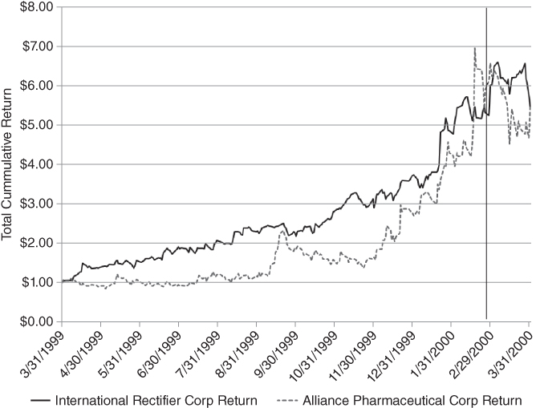

[**Figure 6.1**](#c06-fig-anc-0001) Alliance and International Rectifier Past Performance

The second point is that the two stock charts follow a different path. Eyeballing the charts, we see that International Rectifier Corp follows a smoother path to high momentum, whereas Alliance Pharmaceutical Corp has a more jumpy path. Tossing aside our ad-hoc eyeballing of the charts, we can objectively quantify this observation. Assuming two stocks achieve roughly the same momentum, one way to measure “jumpy versus smooth” is to compute the percentage of days that have a positive return relative to the percentage of days that have a negative return. We would expect firms with a “smoother” momentum to have a higher percentage of positive return days and a lower percentage of negative return days. We see this expectation in the current situation: Measured over a year, Alliance Pharmaceutical had a positive return 49 percent of the trading days and a negative return on 43 percent of the trading days, whereas International Rectifier Corp had a positive return on 55 percent of the trading days and a negative return on 40 percent of the trading days (total days don't add up to 100 percent because there is a percentage of days with no movement).

In the situation outlined above, we can see both visually and quantitatively that International Rectifier had a smoother return stream. But does the “smoother” high-momentum stock outperform the “jumpier” high-momentum stock? We see the results of this cherry-picked example in [Figure 6.2](#c06-fig-0002).

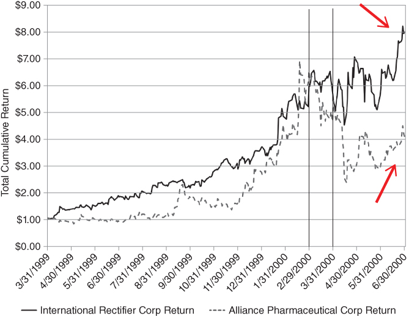

[**Figure 6.2**](#c06-fig-anc-0002) Alliance and International Rectifier Future Performance

[Figure 6.2](#c06-fig-0002) documents the future three-month returns for both firms. International Rectifier Corp gains 46.9 percent and outperforms Alliance Pharmaceutical, which loses 24.7 percent over the next 3 months. Of course, we have cherry-picked this example to highlight that “smooth” high-momentum stocks tend to perform better relative to “choppy” high-momentum stocks. However, by the end of this chapter, we hope to convince the reader that momentum path dependency matters. This time-series aspect of momentum captures important information about market participant behavior that can be systematically exploited to improve upon a generic momentum strategy. To understand why, we examine the performance of “lottery-like” stocks, which have return characteristics that are similar to “jumpy” high-momentum stocks and placate the peculiar demand for “lottery” payoffs by many market participants.

## THE PERFORMANCE OF LOTTERY STOCKS

Everyone loves a gamble, especially a long shot. And it's not just retirees who enjoy smoking cigarettes and pounding rum and cokes in front of the slot machine—no, sir. Heck, we've personally lost money gambling in Vegas and Atlantic City—and we're supposed to know better!

*So what gives?*

Nick Barberis, in his theory paper “A Model of Casino Gambling,” specifically addresses why people go to casinos and how they behave once they get there.[2](#c06-note-0002) Setting aside the known expected utility benefits of gambling (i.e., “it's fun”), the key assumption behind Barberis's theory is that there is something additional at play: Human beings suffer from an inability to properly weigh their chances of success for low-probability events. In other words, humans predictably overestimate their chances of winning the lottery.

But when we step outside of the casino and take a small leap over to the stock market, human behavior does not change. “Maxing Out: Stocks as Lotteries and the Cross-Section of Expected Returns” by Turan G. Bali, Nusret Cakici, and Robert F. Whitelaw examines how lottery-like stocks perform.[3](#c06-note-0003) Their central hypothesis is that investors irrationally overpay for lottery-like gambles, assume their odds are higher than they are in reality, and, thus, stocks with lottery-like characteristics will underperform on a risk-adjusted basis.

To test this hypothesis, Bali et al. first classify a subsample of stocks as “lottery” stocks if these stocks had extreme market movements in the recent past. Next, they examine the future performance of these lottery-like stocks. The underlying assumption is that investors identify stocks with extreme returns in the recent past as “lottery stocks” and bid these assets past fundamental value. The specific measure the authors look at to identify a lottery stock is to rank stocks based on the maximum daily return over the previous month (“MAX”).

An example can shed light on how the authors classify a stock as having lottery-like characteristics. Pretend it is January 31, 2017, and our universe consists of two stocks, Fast Money Inc. and Boring Money Inc. (Tickers: FAST and SLOW, respectively). We form a long/short portfolio on February 1 that exploits the fact that investors overpay for lotteries. We identify that FAST has a maximum daily return of 50 percent in the past month and SLOW has a maximum daily return of 1 percent. Therefore, our portfolio on February 1 will be short FAST (a lottery stock) and long SLOW (a non-lottery stock).

[Table 6.1](#c06-tbl-0001) summarizes the results from their paper highlighting the average monthly returns of 10 portfolios ranked on their MAX ranking, which is the maximum daily return over the past month. The top decile (“10”) represents “lottery” stocks and the bottom decile (“1”) reflects the “boring” stocks.

[**Table 6.1**](#c06-tbl-anc-0001) Lottery Stock Results

|  |  |  |  |
| --- | --- | --- | --- |
|  | **Avg. Monthly Return (VW Portfolio)** | **4-Factor Alpha (VW Portfolio)** | **Average MAX** |
| **Boring (1)** | 1.01% | 0.05 | 1.30 |
| **2** | 1.00% | 0.00 | 2.47 |
| **3** | 1.00% | 0.04 | 3.26 |
| **4** | 1.11% | 0.16 | 4.06 |
| **5** | 1.02% | 0.09 | 4.93 |
| **6** | 1.16% | 0.15 | 5.97 |
| **7** | 1.00% | 0.03 | 7.27 |
| **8** | 0.86% | –0.21 | 9.07 |
| **9** | 0.52% | –0.49 | 12.09 |
| **Lottery (10)** | –0.02% | –1.13 | 23.60 |
| **Long/Short (1–10)** | 1.03% | 1.18 |  |

Not too shabby! A portfolio that buys boring stocks and shorts lottery stocks generates a raw return of 1.03 percent a month, or roughly 12 percent a year. Moreover, the four-factor alpha (which controls for market exposure, as well as known return drivers such as size, value, and momentum) is 1.18 percent a month, or 14.4 percent a year. We have not included the costs of implementation in these results, because that is beside the point. We are not trying to suggest this strategy as a practical approach to forming a portfolio, but merely to emphasize that market participants seem to misprice stocks with lottery-like characteristics.

Lottery bias may also help explain the so-called *beta anomaly*. Academic research has documented that low beta stocks tend to outperform high beta stocks.[4](#c06-note-0004) This finding is remarkable and is considered anomalous because a central prediction of theoretical asset pricing models is that stocks exposed to more market risk (i.e., high beta) should have higher expected returns than stocks with lower market risk (i.e., low beta). A working paper by Bali et al.[5](#c06-note-0005) examines the relationship between beta and lottery demand. Specifically, they try and understand how investor preferences for lotteries may explain the beta anomaly. We summarize some data from the Bali et al. paper and present the results in [Table 6.2](#c06-tbl-0002).

[**Table 6.2**](#c06-tbl-anc-0002) Average Monthly Returns Sorting Stocks on Beta and the “Lottery” Ranking

|  |  |  |
| --- | --- | --- |
|  | **Low Beta Decile** | **High Beta Decile** |
| **Boring (1)** | 0.35% | 1.04% |
| **2** | 0.75% | 0.86% |
| **3** | 0.73% | 0.82% |
| **4** | 0.85% | 0.77% |
| **5** | 0.95% | 0.69% |
| **6** | 0.97% | 0.46% |
| **7** | 1.03% | 0.15% |
| **8** | 0.91% | 0.06% |
| **9** | 0.46% | –0.31% |
| **Lottery (10)** | –0.01% | –1.07% |
| **Long/Short (1–10)** | –0.36% | –2.11 |
| **Long/Short Alpha (4-factor)** | –0.83% | –2.14% |

[Table 6.2](#c06-tbl-0002) tabulates results associated with portfolios that sort stocks into 10 deciles based on beta, and then within each decile, sorts the portfolios based on their “lottery” ranking. We show the results to the top and bottom beta deciles for expositional purposes. On average, high beta stocks underperform relative to low beta stocks, which reflects the so-called “low beta anomaly.” But this average result is inconsistent across lottery ranking. Low beta boring stocks earn less than high beta boring stocks, which is in line with finance theory that suggests high beta stocks are riskier than low beta stocks and should therefore earn higher expected returns. The real anomalous results associated with the low beta effect are driven by stocks with lottery characteristics. The lottery characteristic is especially powerful among high beta stocks. For example, within the high beta decile, there is a monotonically decreasing relationship on the average returns as the “lottery” ranking increases. The authors explore this issue further and conduct testing to determine if lottery demand can explain why high beta stocks perform so poorly relative to low beta stocks. What they find is not too surprising, given what we know about the human mind: The lottery characteristic associated with high beta stocks is a key driver of these stocks' poor performance. (Lottery bias also goes a long way towards explaining the low beta anomaly, but this is a discussion for another day.)

But back to momentum strategies and why the research on lottery-like stocks is important. Based on the evidence discussed in the original “Maxing Out” paper, it appears investors are better off avoiding stocks with lottery characteristics. We should incorporate this knowledge into our algorithm when deciding which high-momentum stocks we want to purchase.[6](#c06-note-0006) And almost by design, high-momentum stocks with smoother momentum paths will be less prone to lottery bias mispricing than stocks with jumpier paths.

We should also consider the research, which relates lottery stocks to high beta stocks. As previously discussed, avoiding lottery-type stocks is a good idea, but what about the concept of avoiding high-beta stocks as well? To address that question we first need a quick refresher on beta. Beta is simply a measure of volatility, or systematic risk. And by design, high-momentum stocks with smoother price paths will generally have lower betas, while high-momentum stocks with choppier price paths will generally have higher betas. So to some degree, by focusing on momentum stocks with smoother price paths, we are avoiding an element of lottery bias, which afflicts many high flying generic momentum stocks.

What's the bottom line? Lottery bias plays a role in market mispricing. Stocks that are perceived as lotteries tend to do poorly because investors bid them past fundamental value. One can measure lottery bias by a variety of proxy metrics. We've discussed the MAX calculation and beta, and both of these measures are helpful in identifying stocks we should avoid. One could surely come up with many other permutations and find similar results. But when we step back and think about the big picture, really what we are trying to do is identify the nature of a stock's price path to glean information about market participant behaviors. We will see in the following section that the path to momentum profits is … the path.

## THE PATH TO MOMENTUM PROFITS

Consider the story of putting a frog in water. If the frog is placed in a pot of boiling water, not surprisingly, the frog will immediately jump out. However, if the frog is placed in a pot of room temperature water, and this water is gradually heated to the boiling point, the frog will sit in the water until it is fully cooked. As least for our hypothetical frog, the path of water temperature changes clearly matters for the eventual outcome.

Interestingly enough, research has found that the frog's reaction to gradual water temperature changes is analogous to how investors react to gradual stock price changes. For example, if a stock has an immediate 100 percent gain (i.e., dropping the frog in a pot of boiling water), the strong price reaction immediately attracts investor attention, and the new stock price will typically reflect approximately fair value. However, if a stock gradually grinds along and achieves a 100 percent return (i.e., the water slowly heats up over time), investors will pay less attention to the gradual stock price movement and the security will likely be priced at less than fundamental value. In psychology terms, both the frog and human investors suffer from “limited attention,” which simply reflects the idea that our cognitive resources are limited and our brains will focus on processing the information that is most relevant at a given point in time. Determining what is “most relevant” turns out to be a challenging question. Psychology research, however, has found that dramatic changes in an environment, as opposed to small changes, attract more cognitive resources, all else being equal.[7](#c06-note-0007)

In 2014, Zhi Da, Umit Gurun, and Mitch Warachka[8](#c06-note-0008) investigated the limited attention of investors to gradual-information diffusion. The authors hypothesize that there might be a relationship with the momentum anomaly. They describe their frog-in-the-pan hypothesis:

---

*A series of frequent gradual changes attracts less attention than infrequent dramatic changes. Investors therefore underreact to continuous information.*

---

Their conclusions after conducting a battery of empirical analysis are fascinating: Momentum strategies that focus on the path-dependency of momentum generate a much stronger momentum effect. In other words, the evidence strongly supports the frog-in-the-pan hypothesis, and broadly supports the theoretical behavioral arguments outlined in the Barberis et al. 1998 paper, which suggests that the momentum anomaly is driven by an underreaction to positive news.[9](#c06-note-0009)

Da, Gurun, and Warachka construct a proxy for information discreteness (ID) that measures the relative frequency of small signals. A large ID means more discrete information, and a small ID denotes continuous information. For past winners with a high past return, a high percentage of positive returns (% positive > % negative) implies there are a large number of small positive returns. The exact measure is described by the equation:

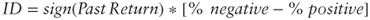

To test their hypothesis Da et al. sequentially double-sort portfolios first on a 12-month formation-period returns, or what we refer to as “generic momentum” in previous chapters and further described in Jegadeesh and Titman.[10](#c06-note-0010) Next, they sort the stocks within these momentum portfolios on their information discreteness variable over the 1927 to 2007 sample period. We tabulate the most relevant results from the paper in [Table 6.3](#c06-tbl-0003), which examine the six-month holding period returns to portfolios that are long high momentum stocks and short low momentum stocks, while varying the information discreteness measure.

[**Table 6.3**](#c06-tbl-anc-0003) Frog-in-the-pan Results to Long/Short Momentum Portfolios

|  |  |  |
| --- | --- | --- |
|  | **Return** | **3-Factor Alpha** |
| **Discrete** | –2.07% | –2.01% |
| **2** | 0.64% | 3.53% |
| **3** | 3.12% | 5.05% |
| **4** | 4.36% | 6.71% |
| **Continuous** | 5.94% | 8.77% |
| **Continuous–Discrete** | 8.01% | 10.78% |

The results are astonishing. Over a six-month holding period, long-short momentum portfolios decrease monotonically from 5.94 percent for stocks with continuous information to negative 2.07 percent for stocks with discrete information. The three-factor alpha to long/short portfolios decreases from 8.77 percent for long/short portfolios with continuous information to negative 2.01 percent for long/short portfolios with discrete information—a spread of 10.78 percent (over 20 percent on an annualized basis) with a highly significant t-stat.

We know from prior analysis in [Chapter 5](#section-16) that higher frequency rebalancing translates into better performance for momentum strategies. The authors examine this question in their paper. [Figure 6.3](#c06-fig-0003) shows the monthly alpha estimates to the long/short momentum portfolios (for both continuous and discrete information) from 1 to 10 months after portfolio formation. The results are consistent with the frog-in-the-pan hypothesis—continuous momentum seems to account for the bulk of the momentum effect. A few key points:

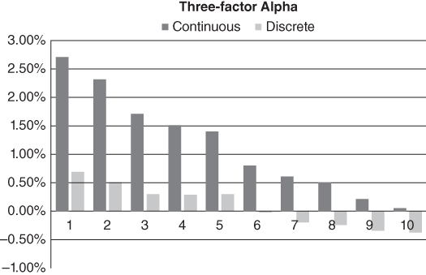

[**Figure 6.3**](#c06-fig-anc-0003) Frog-in-the-Pan Portfolio Alphas

1. **1. Higher profits**: Long/short momentum portfolios with continuous information have higher three-factor alphas than long/short momentum portfolios with discrete information.
2. **2. Longer persistence**: Long/short momentum profits following continuous information persist longer (the holding period can be extended with limited decay), while long/short momentum profits following discrete information are less persistent and more transitory.

Remarkably, by simply quantifying the nature of the path by which the high momentum status is achieved, the momentum anomaly can be vastly improved and focused on exploiting limited attention. Although this conclusion is not mentioned in the frog-in-the-pan paper, we also believe that the performance bonus of path-focused momentum algorithms is because of an indirect exploitation of the behavioral bias associated with lottery preferences by market participants (discussed in the previous section).

And while the authors do a meticulous job of documenting why limited attention may be a key insight in understanding the momentum anomaly, they are not the only authors to empirically investigate this concept. For example, a paper in 2000 by Hong, Lim, and Stein[11](#c06-note-0011) documents that momentum profits are larger for stocks with low analyst coverage and for small stocks. The authors argue that low analyst coverage and small-cap stock characteristics serve as a proxy for stocks that attract less attention, and therefore, are predicted to have higher momentum profits. The disposition effect, or the tendency to hold onto losing stocks too long and sell winning stocks too quickly, may also play a role in underreaction. This theory is described in 1985 by Shefrin and Statman[12](#c06-note-0012) and has been verified and explored in numerous empirical papers.[13](#c06-note-0013), [14](#c06-note-0014)

In addition, in our own tests we have found that splitting high momentum portfolios on other measures of attention, such as trading volume[15](#c06-note-0015) (more trading volume should cause more attention), yield similar results. Next we examine the results when incorporating the information discreteness measure for our universe of stocks.

## THE RESULTS

In [Chapter 5](#section-16) we highlighted that generic momentum premiums decay over time, thus requiring a higher frequency rebalance (e.g., monthly rebalanced portfolios beat annually rebalanced portfolios). However, more rebalancing increases frictional costs. As a compromise, in this section we examine the results associated with quarterly rebalanced portfolios. We focus our analysis on overlapping quarterly rebalanced portfolios as described in [Chapter 5](#section-16). We only examine mid-cap and large-cap firms.[16](#c06-note-0016) Portfolios are formed by value-weighting the firms and the returns run from January 1, 1927, through December 31, 2014.[17](#c06-note-0017)

In [Table 6.4](#c06-tbl-0004), we sort stocks based on their cumulative 12-month past returns (ignoring the most recent month), and buy a value-weighted basket of stocks from the top decile (“Generic Momentum” in column 3). We then split the portfolio of high generic momentum stocks into high-quality momentum (in column 1) and low-quality momentum (column 2). The momentum “quality” measure is the information discreteness measure, or frog-in-the-pan measure, described earlier in the Da, Gurun, and Waracha paper. Firms with higher-quality momentum are those with continuous information, while firms with lower-quality momentum are those with discrete information—to be perfectly clear, the portfolio of stocks in columns 3 is split in half by our information discreteness measure to create the portfolios in columns 1 and 2. The returns in [Table 6.4](#c06-tbl-0004) are gross of fees.

[**Table 6.4**](#c06-tbl-anc-0004) Quality of Momentum Portfolio Annual Results

|  |  |  |  |  |
| --- | --- | --- | --- | --- |
|  | **High-Quality Momentum** | **Low-Quality Momentum** | **Generic Momentum** | **SP500** |
| **CAGR** | 17.14% | 13.02% | 15.56% | 9.95% |
| **Standard Deviation** | 23.45% | 25.16% | 23.61% | 19.09% |
| **Downside Deviation** | 16.98% | 18.71% | 17.42% | 14.22% |
| **Sharpe Ratio** | 0.65 | 0.48 | 0.59 | 0.41 |
| **Sortino Ratio (MAR** c06-math-0002 **5%)** | 0.81 | 0.56 | 0.71 | 0.45 |
| **Worst Drawdown** | –74.60% | –77.44% | –73.90% | –84.59% |
| **Worst Month Return** | –29.23% | –34.71% | –30.00% | –28.73% |
| **Best Month Return** | 30.63% | 37.15% | 33.88% | 41.65% |
| **Profitable Months** | 62.50% | 61.08% | 61.84% | 61.74% |

Using our own laboratory conditions, we replicate the nature of the findings from the Da, Gurun, and Waracha paper: Among high momentum stocks, those with higher quality, or “smooth,” momentum (measured via continuous information), show *very* strong relative performance. By contrast, low quality, or “jumpy,” momentum stocks still outperform the broad market, but show weaker performance. These results suggest that the generic momentum effect is driven by high-quality momentum and diluted by low-quality momentum. The spread between high-quality and low-quality momentum is large: over a multidecade time period (1927–2014) the spread between the high (column 1) and low (column 2) quality momentum portfolios is over 4 percent a year! This spread can be seen visually in [Figure 6.4](#c06-fig-0004). The high-quality momentum portfolio also has better risk-adjusted returns (Sharpe and Sortino ratios) as well as lower drawdowns. While all the momentum strategies outperform the S&P 500 (before fees), our key takeaway is that an effective momentum strategy must consider the path by which stocks get their momentum.

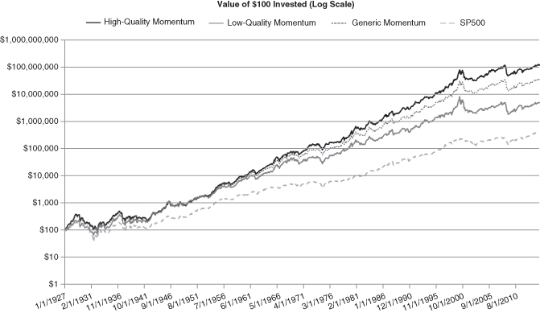

[**Figure 6.4**](#c06-fig-anc-0004) Quality of Momentum Portfolio Returns

## SUMMARY

The chapter began with a simple example of the performance of two stocks that were high “generic” momentum stocks during the Internet bubble. In our anecdote, we noticed that the firm with a “smoother” path toward high momentum status performed better in the future than the high momentum stock with “jumpy” momentum. Next, we explored two reasons why this anecdote may reflect a more systematic effect in the market. First, we examined how investors irrationally prefer lottery-like stocks, which have “jumpy” historical price paths. The evidence suggests that we should avoid these stocks because they tend to be overpriced. Second, we examined the “frog-in-the-pan” limited attention hypothesis presented by the authors, Da et al., which suggests that investors underreact to continuous information. To confirm their hypothesis, the authors provide evidence that high momentum stocks with smoother price paths to high momentum outperformed high momentum stocks with more volatile paths to high momentum. Our independent analysis of the Da et al. research corroborates their findings. The conclusion from the analysis is that the path by which momentum is achieved determines the effectiveness of the strategy—smoother paths are preferable to more volatile paths. This finding, that identifying “quality” momentum can help separate good high momentum stocks from bad high momentum stocks, can be explained via behavioral psychology:

- Avoid mispricing associated with lottery-like stocks.
- Exploit limited attention, which leads to systematic underreaction.

## NOTES

[1](#c06-note-anc-0001) Zhi Da, Umit G. Gurun, and Mitch Warachka, “Frog in the Pan: Continuous Information and Momentum,” *The Review of Financial Studies* 27 (2014): 2171–2218.
[2](#c06-note-anc-0002) Nicholas Barberis, “A Model of Casino Gambling,” *Management Science* 58 (2012): 35–51.
[3](#c06-note-anc-0003) Turan G. Bali, Nustret Cakici, and Robert F. Whitelaw, “Maxing Out: Stocks as Lotteries and the Cross-section of Expected Returns,” *Journal of Financial Economics* 99 (2011): 427–446.
[4](#c06-note-anc-0004) Andrea Frazzini and Lasse Heje Pedersen, “Betting Against Beta,” *Journal of Financial Economics* 111 (2014): 1–25.
[5](#c06-note-anc-0005) Turan G. Bali, Stephen Brown, Scott Murry, and Yi Tang, “Betting Against Beta or Demand for Lottery?” Working paper, 2016.
[6](#c06-note-anc-0006) Heiko Jacobs, Tobias Regele, and Martin Weber, “Expected Skewness and Momentum” Working paper, 2015.
[7](#c06-note-anc-0007) Francesca Gina and Max H. Bazerman, “When Misconduct Goes Unnoticed: The Acceptability of Gradual Erosion in Others' Ethical Behavior,” *Journal of Experimental Social Psychology* 45 (2009): 708–719.
[8](#c06-note-anc-0008) Da, Gurun, Warachka.
[9](#c06-note-anc-0009) Nicholas Barberis, Andrei Shleifer, and Robert Vishny, “A Model of Investor Sentiment,” *Journal of Financial Economics* 49 (1998): 307–343.
[10](#c06-note-anc-0010) Narasimhan Jegadeesh and Sheridan Titman, “Return to Buying Winners and Selling Losers: Implications for Stock Market Efficiency,” *The Journal of Finance* 48 (1993): 65–91.
[11](#c06-note-anc-0011) Harrison Hong, Terence Lim, and Jeremy C. Stein, “Bad News Travels Slowly: Size, Analyst Coverage, and the Profitability of Momentum Strategies,” *The Journal of Finance* 55 (2000): 265–295.
[12](#c06-note-anc-0012) Hersh Shefrin and Meir Statman, “The Disposition to Sell Winners Too Early and Ride Losers Too Long: Theory and Evidence,” *The Journal of Finance* 40 (1985): 777–790.
[13](#c06-note-anc-0013) Justin Birru, “Confusion of Confusions: A Test of the Disposition Effect and Momentum,” *The Review of Financial Studies* 28 (2015): 1849–1873.
[14](#c06-note-anc-0014) Andrea Frazzini, “The Disposition Effect and Underreaction to News,” *The Journal of Finance* 61 (2006): 2017–2046.
[15](#c06-note-anc-0015) Charles M.C. Lee and Bhaskaran Swaminathan, “Price Momentum and Trading Volume,” *The Journal of Finance* 55 (2000): 2017–2069.
[16](#c06-note-anc-0016) To determine mid/large cap classifications we use the 40th percentile for market capitalization based on the sample of NYSE listed firms.
[17](#c06-note-anc-0017) Portfolios formed by equal-weighting yield even stronger conclusions.

<!-- rl-section id="the-performance-of-lottery-stocks" class="epub-section" title="THE PERFORMANCE OF LOTTERY STOCKS" -->

# CHAPTER 6 Maximizing Momentum: The Path Matters

> *“…as the formation period return accumulates gradually over many days, the flow of information is continuous.”[1](#c06-note-0001)*

—Z. Da et al., *The Review of Financial Studies*

[Chapter 5](#section-16) highlighted that stocks with strong intermediate-term momentum signals, generically calculated as the past 12-month cumulative returns (skipping the most recent month), exhibit a strong continuation in returns. The evidence is pervasive across multiple time periods and asset classes. Given this empirical fact, a natural question arises: Can we do better than the generic intermediate-term momentum indicator? Figuring out a way to accomplish this goal can be difficult, especially when the risk of optimization and data mining is high. However, academic researchers have been studying this question for a while and have developed solutions that improve on the generic momentum algorithm, while simultaneously showing how the improvement relates to the theoretical behavioral foundations for momentum's existence. In other words, momentum improvements are evidence-based enhancements developed through the lens of the sustainable active framework, and not data mining run amok.

For over a year, we examined every respectable research piece on momentum stock selection strategies we could find and came to the general conclusion that one of the core ways to improve on a generic momentum strategy is to focus on the time-series characteristics of a momentum stock. In other words, we need to look at the path through which a momentum stock actually became classified as a momentum stock (see [Appendix A](#section-21) for information on some of the top competing ideas we examined and our analysis).

An example can highlight the importance of the path dependency of a momentum stock. Consider the so-called “Internet bubble,” which grew during the late 1990s and eventually burst in 2000. There were many firms with absurdly high generic momentum signals, as investors could not resist buying Internet stocks at sky-high valuations. We chose to examine two high-momentum stocks as of March 31, 2000 (this was near the end of the bubble).

The first firm we selected was Alliance Pharmaceutical Corp, a biotech company. This biotech company was hoping to provide the market with a new product, Oxygent, to help supply oxygen to tissues during surgery. The second firm we examined was International Rectifier Corp, a company founded in 1947 that produced power management semiconductors. As of March 31, 2000, both stocks were classified as high-momentum stocks.

[Figure 6.1](#c06-fig-0001) plots the total cumulative returns over the past 12 months, as of March 31, 2000. Two points to note: First, there is a vertical line on February 29, 2000. To calculate intermediate-term momentum we measure up until February 29, 2000, because generic momentum calculations exclude the most recent month. As of February 29, 2000, Alliance Pharmaceutical was up 554 percent over the past year, while International Rectifier Corp was up 498 percent. Both stocks reflect a value investor's worst nightmare, but a momentum investor's dream.

[**Figure 6.1**](#c06-fig-anc-0001) Alliance and International Rectifier Past Performance

The second point is that the two stock charts follow a different path. Eyeballing the charts, we see that International Rectifier Corp follows a smoother path to high momentum, whereas Alliance Pharmaceutical Corp has a more jumpy path. Tossing aside our ad-hoc eyeballing of the charts, we can objectively quantify this observation. Assuming two stocks achieve roughly the same momentum, one way to measure “jumpy versus smooth” is to compute the percentage of days that have a positive return relative to the percentage of days that have a negative return. We would expect firms with a “smoother” momentum to have a higher percentage of positive return days and a lower percentage of negative return days. We see this expectation in the current situation: Measured over a year, Alliance Pharmaceutical had a positive return 49 percent of the trading days and a negative return on 43 percent of the trading days, whereas International Rectifier Corp had a positive return on 55 percent of the trading days and a negative return on 40 percent of the trading days (total days don't add up to 100 percent because there is a percentage of days with no movement).

In the situation outlined above, we can see both visually and quantitatively that International Rectifier had a smoother return stream. But does the “smoother” high-momentum stock outperform the “jumpier” high-momentum stock? We see the results of this cherry-picked example in [Figure 6.2](#c06-fig-0002).

[**Figure 6.2**](#c06-fig-anc-0002) Alliance and International Rectifier Future Performance

[Figure 6.2](#c06-fig-0002) documents the future three-month returns for both firms. International Rectifier Corp gains 46.9 percent and outperforms Alliance Pharmaceutical, which loses 24.7 percent over the next 3 months. Of course, we have cherry-picked this example to highlight that “smooth” high-momentum stocks tend to perform better relative to “choppy” high-momentum stocks. However, by the end of this chapter, we hope to convince the reader that momentum path dependency matters. This time-series aspect of momentum captures important information about market participant behavior that can be systematically exploited to improve upon a generic momentum strategy. To understand why, we examine the performance of “lottery-like” stocks, which have return characteristics that are similar to “jumpy” high-momentum stocks and placate the peculiar demand for “lottery” payoffs by many market participants.

Everyone loves a gamble, especially a long shot. And it's not just retirees who enjoy smoking cigarettes and pounding rum and cokes in front of the slot machine—no, sir. Heck, we've personally lost money gambling in Vegas and Atlantic City—and we're supposed to know better!

*So what gives?*

Nick Barberis, in his theory paper “A Model of Casino Gambling,” specifically addresses why people go to casinos and how they behave once they get there.[2](#c06-note-0002) Setting aside the known expected utility benefits of gambling (i.e., “it's fun”), the key assumption behind Barberis's theory is that there is something additional at play: Human beings suffer from an inability to properly weigh their chances of success for low-probability events. In other words, humans predictably overestimate their chances of winning the lottery.

But when we step outside of the casino and take a small leap over to the stock market, human behavior does not change. “Maxing Out: Stocks as Lotteries and the Cross-Section of Expected Returns” by Turan G. Bali, Nusret Cakici, and Robert F. Whitelaw examines how lottery-like stocks perform.[3](#c06-note-0003) Their central hypothesis is that investors irrationally overpay for lottery-like gambles, assume their odds are higher than they are in reality, and, thus, stocks with lottery-like characteristics will underperform on a risk-adjusted basis.

To test this hypothesis, Bali et al. first classify a subsample of stocks as “lottery” stocks if these stocks had extreme market movements in the recent past. Next, they examine the future performance of these lottery-like stocks. The underlying assumption is that investors identify stocks with extreme returns in the recent past as “lottery stocks” and bid these assets past fundamental value. The specific measure the authors look at to identify a lottery stock is to rank stocks based on the maximum daily return over the previous month (“MAX”).

An example can shed light on how the authors classify a stock as having lottery-like characteristics. Pretend it is January 31, 2017, and our universe consists of two stocks, Fast Money Inc. and Boring Money Inc. (Tickers: FAST and SLOW, respectively). We form a long/short portfolio on February 1 that exploits the fact that investors overpay for lotteries. We identify that FAST has a maximum daily return of 50 percent in the past month and SLOW has a maximum daily return of 1 percent. Therefore, our portfolio on February 1 will be short FAST (a lottery stock) and long SLOW (a non-lottery stock).

[Table 6.1](#c06-tbl-0001) summarizes the results from their paper highlighting the average monthly returns of 10 portfolios ranked on their MAX ranking, which is the maximum daily return over the past month. The top decile (“10”) represents “lottery” stocks and the bottom decile (“1”) reflects the “boring” stocks.

[**Table 6.1**](#c06-tbl-anc-0001) Lottery Stock Results

|  |  |  |  |
| --- | --- | --- | --- |
|  | **Avg. Monthly Return (VW Portfolio)** | **4-Factor Alpha (VW Portfolio)** | **Average MAX** |
| **Boring (1)** | 1.01% | 0.05 | 1.30 |
| **2** | 1.00% | 0.00 | 2.47 |
| **3** | 1.00% | 0.04 | 3.26 |
| **4** | 1.11% | 0.16 | 4.06 |
| **5** | 1.02% | 0.09 | 4.93 |
| **6** | 1.16% | 0.15 | 5.97 |
| **7** | 1.00% | 0.03 | 7.27 |
| **8** | 0.86% | –0.21 | 9.07 |
| **9** | 0.52% | –0.49 | 12.09 |
| **Lottery (10)** | –0.02% | –1.13 | 23.60 |
| **Long/Short (1–10)** | 1.03% | 1.18 |  |

Not too shabby! A portfolio that buys boring stocks and shorts lottery stocks generates a raw return of 1.03 percent a month, or roughly 12 percent a year. Moreover, the four-factor alpha (which controls for market exposure, as well as known return drivers such as size, value, and momentum) is 1.18 percent a month, or 14.4 percent a year. We have not included the costs of implementation in these results, because that is beside the point. We are not trying to suggest this strategy as a practical approach to forming a portfolio, but merely to emphasize that market participants seem to misprice stocks with lottery-like characteristics.

Lottery bias may also help explain the so-called *beta anomaly*. Academic research has documented that low beta stocks tend to outperform high beta stocks.[4](#c06-note-0004) This finding is remarkable and is considered anomalous because a central prediction of theoretical asset pricing models is that stocks exposed to more market risk (i.e., high beta) should have higher expected returns than stocks with lower market risk (i.e., low beta). A working paper by Bali et al.[5](#c06-note-0005) examines the relationship between beta and lottery demand. Specifically, they try and understand how investor preferences for lotteries may explain the beta anomaly. We summarize some data from the Bali et al. paper and present the results in [Table 6.2](#c06-tbl-0002).

[**Table 6.2**](#c06-tbl-anc-0002) Average Monthly Returns Sorting Stocks on Beta and the “Lottery” Ranking

|  |  |  |
| --- | --- | --- |
|  | **Low Beta Decile** | **High Beta Decile** |
| **Boring (1)** | 0.35% | 1.04% |
| **2** | 0.75% | 0.86% |
| **3** | 0.73% | 0.82% |
| **4** | 0.85% | 0.77% |
| **5** | 0.95% | 0.69% |
| **6** | 0.97% | 0.46% |
| **7** | 1.03% | 0.15% |
| **8** | 0.91% | 0.06% |
| **9** | 0.46% | –0.31% |
| **Lottery (10)** | –0.01% | –1.07% |
| **Long/Short (1–10)** | –0.36% | –2.11 |
| **Long/Short Alpha (4-factor)** | –0.83% | –2.14% |

[Table 6.2](#c06-tbl-0002) tabulates results associated with portfolios that sort stocks into 10 deciles based on beta, and then within each decile, sorts the portfolios based on their “lottery” ranking. We show the results to the top and bottom beta deciles for expositional purposes. On average, high beta stocks underperform relative to low beta stocks, which reflects the so-called “low beta anomaly.” But this average result is inconsistent across lottery ranking. Low beta boring stocks earn less than high beta boring stocks, which is in line with finance theory that suggests high beta stocks are riskier than low beta stocks and should therefore earn higher expected returns. The real anomalous results associated with the low beta effect are driven by stocks with lottery characteristics. The lottery characteristic is especially powerful among high beta stocks. For example, within the high beta decile, there is a monotonically decreasing relationship on the average returns as the “lottery” ranking increases. The authors explore this issue further and conduct testing to determine if lottery demand can explain why high beta stocks perform so poorly relative to low beta stocks. What they find is not too surprising, given what we know about the human mind: The lottery characteristic associated with high beta stocks is a key driver of these stocks' poor performance. (Lottery bias also goes a long way towards explaining the low beta anomaly, but this is a discussion for another day.)

But back to momentum strategies and why the research on lottery-like stocks is important. Based on the evidence discussed in the original “Maxing Out” paper, it appears investors are better off avoiding stocks with lottery characteristics. We should incorporate this knowledge into our algorithm when deciding which high-momentum stocks we want to purchase.[6](#c06-note-0006) And almost by design, high-momentum stocks with smoother momentum paths will be less prone to lottery bias mispricing than stocks with jumpier paths.

We should also consider the research, which relates lottery stocks to high beta stocks. As previously discussed, avoiding lottery-type stocks is a good idea, but what about the concept of avoiding high-beta stocks as well? To address that question we first need a quick refresher on beta. Beta is simply a measure of volatility, or systematic risk. And by design, high-momentum stocks with smoother price paths will generally have lower betas, while high-momentum stocks with choppier price paths will generally have higher betas. So to some degree, by focusing on momentum stocks with smoother price paths, we are avoiding an element of lottery bias, which afflicts many high flying generic momentum stocks.

What's the bottom line? Lottery bias plays a role in market mispricing. Stocks that are perceived as lotteries tend to do poorly because investors bid them past fundamental value. One can measure lottery bias by a variety of proxy metrics. We've discussed the MAX calculation and beta, and both of these measures are helpful in identifying stocks we should avoid. One could surely come up with many other permutations and find similar results. But when we step back and think about the big picture, really what we are trying to do is identify the nature of a stock's price path to glean information about market participant behaviors. We will see in the following section that the path to momentum profits is … the path.

## THE PATH TO MOMENTUM PROFITS

Consider the story of putting a frog in water. If the frog is placed in a pot of boiling water, not surprisingly, the frog will immediately jump out. However, if the frog is placed in a pot of room temperature water, and this water is gradually heated to the boiling point, the frog will sit in the water until it is fully cooked. As least for our hypothetical frog, the path of water temperature changes clearly matters for the eventual outcome.

Interestingly enough, research has found that the frog's reaction to gradual water temperature changes is analogous to how investors react to gradual stock price changes. For example, if a stock has an immediate 100 percent gain (i.e., dropping the frog in a pot of boiling water), the strong price reaction immediately attracts investor attention, and the new stock price will typically reflect approximately fair value. However, if a stock gradually grinds along and achieves a 100 percent return (i.e., the water slowly heats up over time), investors will pay less attention to the gradual stock price movement and the security will likely be priced at less than fundamental value. In psychology terms, both the frog and human investors suffer from “limited attention,” which simply reflects the idea that our cognitive resources are limited and our brains will focus on processing the information that is most relevant at a given point in time. Determining what is “most relevant” turns out to be a challenging question. Psychology research, however, has found that dramatic changes in an environment, as opposed to small changes, attract more cognitive resources, all else being equal.[7](#c06-note-0007)

In 2014, Zhi Da, Umit Gurun, and Mitch Warachka[8](#c06-note-0008) investigated the limited attention of investors to gradual-information diffusion. The authors hypothesize that there might be a relationship with the momentum anomaly. They describe their frog-in-the-pan hypothesis:

---

*A series of frequent gradual changes attracts less attention than infrequent dramatic changes. Investors therefore underreact to continuous information.*

---

Their conclusions after conducting a battery of empirical analysis are fascinating: Momentum strategies that focus on the path-dependency of momentum generate a much stronger momentum effect. In other words, the evidence strongly supports the frog-in-the-pan hypothesis, and broadly supports the theoretical behavioral arguments outlined in the Barberis et al. 1998 paper, which suggests that the momentum anomaly is driven by an underreaction to positive news.[9](#c06-note-0009)

Da, Gurun, and Warachka construct a proxy for information discreteness (ID) that measures the relative frequency of small signals. A large ID means more discrete information, and a small ID denotes continuous information. For past winners with a high past return, a high percentage of positive returns (% positive > % negative) implies there are a large number of small positive returns. The exact measure is described by the equation:

To test their hypothesis Da et al. sequentially double-sort portfolios first on a 12-month formation-period returns, or what we refer to as “generic momentum” in previous chapters and further described in Jegadeesh and Titman.[10](#c06-note-0010) Next, they sort the stocks within these momentum portfolios on their information discreteness variable over the 1927 to 2007 sample period. We tabulate the most relevant results from the paper in [Table 6.3](#c06-tbl-0003), which examine the six-month holding period returns to portfolios that are long high momentum stocks and short low momentum stocks, while varying the information discreteness measure.

[**Table 6.3**](#c06-tbl-anc-0003) Frog-in-the-pan Results to Long/Short Momentum Portfolios

|  |  |  |
| --- | --- | --- |
|  | **Return** | **3-Factor Alpha** |
| **Discrete** | –2.07% | –2.01% |
| **2** | 0.64% | 3.53% |
| **3** | 3.12% | 5.05% |
| **4** | 4.36% | 6.71% |
| **Continuous** | 5.94% | 8.77% |
| **Continuous–Discrete** | 8.01% | 10.78% |

The results are astonishing. Over a six-month holding period, long-short momentum portfolios decrease monotonically from 5.94 percent for stocks with continuous information to negative 2.07 percent for stocks with discrete information. The three-factor alpha to long/short portfolios decreases from 8.77 percent for long/short portfolios with continuous information to negative 2.01 percent for long/short portfolios with discrete information—a spread of 10.78 percent (over 20 percent on an annualized basis) with a highly significant t-stat.

We know from prior analysis in [Chapter 5](#section-16) that higher frequency rebalancing translates into better performance for momentum strategies. The authors examine this question in their paper. [Figure 6.3](#c06-fig-0003) shows the monthly alpha estimates to the long/short momentum portfolios (for both continuous and discrete information) from 1 to 10 months after portfolio formation. The results are consistent with the frog-in-the-pan hypothesis—continuous momentum seems to account for the bulk of the momentum effect. A few key points:

[**Figure 6.3**](#c06-fig-anc-0003) Frog-in-the-Pan Portfolio Alphas

1. **1. Higher profits**: Long/short momentum portfolios with continuous information have higher three-factor alphas than long/short momentum portfolios with discrete information.
2. **2. Longer persistence**: Long/short momentum profits following continuous information persist longer (the holding period can be extended with limited decay), while long/short momentum profits following discrete information are less persistent and more transitory.

Remarkably, by simply quantifying the nature of the path by which the high momentum status is achieved, the momentum anomaly can be vastly improved and focused on exploiting limited attention. Although this conclusion is not mentioned in the frog-in-the-pan paper, we also believe that the performance bonus of path-focused momentum algorithms is because of an indirect exploitation of the behavioral bias associated with lottery preferences by market participants (discussed in the previous section).

And while the authors do a meticulous job of documenting why limited attention may be a key insight in understanding the momentum anomaly, they are not the only authors to empirically investigate this concept. For example, a paper in 2000 by Hong, Lim, and Stein[11](#c06-note-0011) documents that momentum profits are larger for stocks with low analyst coverage and for small stocks. The authors argue that low analyst coverage and small-cap stock characteristics serve as a proxy for stocks that attract less attention, and therefore, are predicted to have higher momentum profits. The disposition effect, or the tendency to hold onto losing stocks too long and sell winning stocks too quickly, may also play a role in underreaction. This theory is described in 1985 by Shefrin and Statman[12](#c06-note-0012) and has been verified and explored in numerous empirical papers.[13](#c06-note-0013), [14](#c06-note-0014)

In addition, in our own tests we have found that splitting high momentum portfolios on other measures of attention, such as trading volume[15](#c06-note-0015) (more trading volume should cause more attention), yield similar results. Next we examine the results when incorporating the information discreteness measure for our universe of stocks.

## THE RESULTS

In [Chapter 5](#section-16) we highlighted that generic momentum premiums decay over time, thus requiring a higher frequency rebalance (e.g., monthly rebalanced portfolios beat annually rebalanced portfolios). However, more rebalancing increases frictional costs. As a compromise, in this section we examine the results associated with quarterly rebalanced portfolios. We focus our analysis on overlapping quarterly rebalanced portfolios as described in [Chapter 5](#section-16). We only examine mid-cap and large-cap firms.[16](#c06-note-0016) Portfolios are formed by value-weighting the firms and the returns run from January 1, 1927, through December 31, 2014.[17](#c06-note-0017)

In [Table 6.4](#c06-tbl-0004), we sort stocks based on their cumulative 12-month past returns (ignoring the most recent month), and buy a value-weighted basket of stocks from the top decile (“Generic Momentum” in column 3). We then split the portfolio of high generic momentum stocks into high-quality momentum (in column 1) and low-quality momentum (column 2). The momentum “quality” measure is the information discreteness measure, or frog-in-the-pan measure, described earlier in the Da, Gurun, and Waracha paper. Firms with higher-quality momentum are those with continuous information, while firms with lower-quality momentum are those with discrete information—to be perfectly clear, the portfolio of stocks in columns 3 is split in half by our information discreteness measure to create the portfolios in columns 1 and 2. The returns in [Table 6.4](#c06-tbl-0004) are gross of fees.

[**Table 6.4**](#c06-tbl-anc-0004) Quality of Momentum Portfolio Annual Results

|  |  |  |  |  |
| --- | --- | --- | --- | --- |
|  | **High-Quality Momentum** | **Low-Quality Momentum** | **Generic Momentum** | **SP500** |
| **CAGR** | 17.14% | 13.02% | 15.56% | 9.95% |
| **Standard Deviation** | 23.45% | 25.16% | 23.61% | 19.09% |
| **Downside Deviation** | 16.98% | 18.71% | 17.42% | 14.22% |
| **Sharpe Ratio** | 0.65 | 0.48 | 0.59 | 0.41 |
| **Sortino Ratio (MAR** c06-math-0002 **5%)** | 0.81 | 0.56 | 0.71 | 0.45 |
| **Worst Drawdown** | –74.60% | –77.44% | –73.90% | –84.59% |
| **Worst Month Return** | –29.23% | –34.71% | –30.00% | –28.73% |
| **Best Month Return** | 30.63% | 37.15% | 33.88% | 41.65% |
| **Profitable Months** | 62.50% | 61.08% | 61.84% | 61.74% |

Using our own laboratory conditions, we replicate the nature of the findings from the Da, Gurun, and Waracha paper: Among high momentum stocks, those with higher quality, or “smooth,” momentum (measured via continuous information), show *very* strong relative performance. By contrast, low quality, or “jumpy,” momentum stocks still outperform the broad market, but show weaker performance. These results suggest that the generic momentum effect is driven by high-quality momentum and diluted by low-quality momentum. The spread between high-quality and low-quality momentum is large: over a multidecade time period (1927–2014) the spread between the high (column 1) and low (column 2) quality momentum portfolios is over 4 percent a year! This spread can be seen visually in [Figure 6.4](#c06-fig-0004). The high-quality momentum portfolio also has better risk-adjusted returns (Sharpe and Sortino ratios) as well as lower drawdowns. While all the momentum strategies outperform the S&P 500 (before fees), our key takeaway is that an effective momentum strategy must consider the path by which stocks get their momentum.

[**Figure 6.4**](#c06-fig-anc-0004) Quality of Momentum Portfolio Returns

## SUMMARY

The chapter began with a simple example of the performance of two stocks that were high “generic” momentum stocks during the Internet bubble. In our anecdote, we noticed that the firm with a “smoother” path toward high momentum status performed better in the future than the high momentum stock with “jumpy” momentum. Next, we explored two reasons why this anecdote may reflect a more systematic effect in the market. First, we examined how investors irrationally prefer lottery-like stocks, which have “jumpy” historical price paths. The evidence suggests that we should avoid these stocks because they tend to be overpriced. Second, we examined the “frog-in-the-pan” limited attention hypothesis presented by the authors, Da et al., which suggests that investors underreact to continuous information. To confirm their hypothesis, the authors provide evidence that high momentum stocks with smoother price paths to high momentum outperformed high momentum stocks with more volatile paths to high momentum. Our independent analysis of the Da et al. research corroborates their findings. The conclusion from the analysis is that the path by which momentum is achieved determines the effectiveness of the strategy—smoother paths are preferable to more volatile paths. This finding, that identifying “quality” momentum can help separate good high momentum stocks from bad high momentum stocks, can be explained via behavioral psychology:

- Avoid mispricing associated with lottery-like stocks.
- Exploit limited attention, which leads to systematic underreaction.

## NOTES

[1](#c06-note-anc-0001) Zhi Da, Umit G. Gurun, and Mitch Warachka, “Frog in the Pan: Continuous Information and Momentum,” *The Review of Financial Studies* 27 (2014): 2171–2218.
[2](#c06-note-anc-0002) Nicholas Barberis, “A Model of Casino Gambling,” *Management Science* 58 (2012): 35–51.
[3](#c06-note-anc-0003) Turan G. Bali, Nustret Cakici, and Robert F. Whitelaw, “Maxing Out: Stocks as Lotteries and the Cross-section of Expected Returns,” *Journal of Financial Economics* 99 (2011): 427–446.
[4](#c06-note-anc-0004) Andrea Frazzini and Lasse Heje Pedersen, “Betting Against Beta,” *Journal of Financial Economics* 111 (2014): 1–25.
[5](#c06-note-anc-0005) Turan G. Bali, Stephen Brown, Scott Murry, and Yi Tang, “Betting Against Beta or Demand for Lottery?” Working paper, 2016.
[6](#c06-note-anc-0006) Heiko Jacobs, Tobias Regele, and Martin Weber, “Expected Skewness and Momentum” Working paper, 2015.
[7](#c06-note-anc-0007) Francesca Gina and Max H. Bazerman, “When Misconduct Goes Unnoticed: The Acceptability of Gradual Erosion in Others' Ethical Behavior,” *Journal of Experimental Social Psychology* 45 (2009): 708–719.
[8](#c06-note-anc-0008) Da, Gurun, Warachka.
[9](#c06-note-anc-0009) Nicholas Barberis, Andrei Shleifer, and Robert Vishny, “A Model of Investor Sentiment,” *Journal of Financial Economics* 49 (1998): 307–343.
[10](#c06-note-anc-0010) Narasimhan Jegadeesh and Sheridan Titman, “Return to Buying Winners and Selling Losers: Implications for Stock Market Efficiency,” *The Journal of Finance* 48 (1993): 65–91.
[11](#c06-note-anc-0011) Harrison Hong, Terence Lim, and Jeremy C. Stein, “Bad News Travels Slowly: Size, Analyst Coverage, and the Profitability of Momentum Strategies,” *The Journal of Finance* 55 (2000): 265–295.
[12](#c06-note-anc-0012) Hersh Shefrin and Meir Statman, “The Disposition to Sell Winners Too Early and Ride Losers Too Long: Theory and Evidence,” *The Journal of Finance* 40 (1985): 777–790.
[13](#c06-note-anc-0013) Justin Birru, “Confusion of Confusions: A Test of the Disposition Effect and Momentum,” *The Review of Financial Studies* 28 (2015): 1849–1873.
[14](#c06-note-anc-0014) Andrea Frazzini, “The Disposition Effect and Underreaction to News,” *The Journal of Finance* 61 (2006): 2017–2046.
[15](#c06-note-anc-0015) Charles M.C. Lee and Bhaskaran Swaminathan, “Price Momentum and Trading Volume,” *The Journal of Finance* 55 (2000): 2017–2069.
[16](#c06-note-anc-0016) To determine mid/large cap classifications we use the 40th percentile for market capitalization based on the sample of NYSE listed firms.
[17](#c06-note-anc-0017) Portfolios formed by equal-weighting yield even stronger conclusions.

<!-- rl-section id="the-performance-of-lottery-stocks" class="epub-section" title="THE PERFORMANCE OF LOTTERY STOCKS" -->

## THE PERFORMANCE OF LOTTERY STOCKS

Everyone loves a gamble, especially a long shot. And it's not just retirees who enjoy smoking cigarettes and pounding rum and cokes in front of the slot machine—no, sir. Heck, we've personally lost money gambling in Vegas and Atlantic City—and we're supposed to know better!

*So what gives?*

Nick Barberis, in his theory paper “A Model of Casino Gambling,” specifically addresses why people go to casinos and how they behave once they get there.[2](#c06-note-0002) Setting aside the known expected utility benefits of gambling (i.e., “it's fun”), the key assumption behind Barberis's theory is that there is something additional at play: Human beings suffer from an inability to properly weigh their chances of success for low-probability events. In other words, humans predictably overestimate their chances of winning the lottery.

But when we step outside of the casino and take a small leap over to the stock market, human behavior does not change. “Maxing Out: Stocks as Lotteries and the Cross-Section of Expected Returns” by Turan G. Bali, Nusret Cakici, and Robert F. Whitelaw examines how lottery-like stocks perform.[3](#c06-note-0003) Their central hypothesis is that investors irrationally overpay for lottery-like gambles, assume their odds are higher than they are in reality, and, thus, stocks with lottery-like characteristics will underperform on a risk-adjusted basis.

To test this hypothesis, Bali et al. first classify a subsample of stocks as “lottery” stocks if these stocks had extreme market movements in the recent past. Next, they examine the future performance of these lottery-like stocks. The underlying assumption is that investors identify stocks with extreme returns in the recent past as “lottery stocks” and bid these assets past fundamental value. The specific measure the authors look at to identify a lottery stock is to rank stocks based on the maximum daily return over the previous month (“MAX”).

An example can shed light on how the authors classify a stock as having lottery-like characteristics. Pretend it is January 31, 2017, and our universe consists of two stocks, Fast Money Inc. and Boring Money Inc. (Tickers: FAST and SLOW, respectively). We form a long/short portfolio on February 1 that exploits the fact that investors overpay for lotteries. We identify that FAST has a maximum daily return of 50 percent in the past month and SLOW has a maximum daily return of 1 percent. Therefore, our portfolio on February 1 will be short FAST (a lottery stock) and long SLOW (a non-lottery stock).

[Table 6.1](#c06-tbl-0001) summarizes the results from their paper highlighting the average monthly returns of 10 portfolios ranked on their MAX ranking, which is the maximum daily return over the past month. The top decile (“10”) represents “lottery” stocks and the bottom decile (“1”) reflects the “boring” stocks.

[**Table 6.1**](#c06-tbl-anc-0001) Lottery Stock Results

|  |  |  |  |
| --- | --- | --- | --- |
|  | **Avg. Monthly Return (VW Portfolio)** | **4-Factor Alpha (VW Portfolio)** | **Average MAX** |
| **Boring (1)** | 1.01% | 0.05 | 1.30 |
| **2** | 1.00% | 0.00 | 2.47 |
| **3** | 1.00% | 0.04 | 3.26 |
| **4** | 1.11% | 0.16 | 4.06 |
| **5** | 1.02% | 0.09 | 4.93 |
| **6** | 1.16% | 0.15 | 5.97 |
| **7** | 1.00% | 0.03 | 7.27 |
| **8** | 0.86% | –0.21 | 9.07 |
| **9** | 0.52% | –0.49 | 12.09 |
| **Lottery (10)** | –0.02% | –1.13 | 23.60 |
| **Long/Short (1–10)** | 1.03% | 1.18 |  |

Not too shabby! A portfolio that buys boring stocks and shorts lottery stocks generates a raw return of 1.03 percent a month, or roughly 12 percent a year. Moreover, the four-factor alpha (which controls for market exposure, as well as known return drivers such as size, value, and momentum) is 1.18 percent a month, or 14.4 percent a year. We have not included the costs of implementation in these results, because that is beside the point. We are not trying to suggest this strategy as a practical approach to forming a portfolio, but merely to emphasize that market participants seem to misprice stocks with lottery-like characteristics.

Lottery bias may also help explain the so-called *beta anomaly*. Academic research has documented that low beta stocks tend to outperform high beta stocks.[4](#c06-note-0004) This finding is remarkable and is considered anomalous because a central prediction of theoretical asset pricing models is that stocks exposed to more market risk (i.e., high beta) should have higher expected returns than stocks with lower market risk (i.e., low beta). A working paper by Bali et al.[5](#c06-note-0005) examines the relationship between beta and lottery demand. Specifically, they try and understand how investor preferences for lotteries may explain the beta anomaly. We summarize some data from the Bali et al. paper and present the results in [Table 6.2](#c06-tbl-0002).

[**Table 6.2**](#c06-tbl-anc-0002) Average Monthly Returns Sorting Stocks on Beta and the “Lottery” Ranking

|  |  |  |
| --- | --- | --- |
|  | **Low Beta Decile** | **High Beta Decile** |
| **Boring (1)** | 0.35% | 1.04% |
| **2** | 0.75% | 0.86% |
| **3** | 0.73% | 0.82% |
| **4** | 0.85% | 0.77% |
| **5** | 0.95% | 0.69% |
| **6** | 0.97% | 0.46% |
| **7** | 1.03% | 0.15% |
| **8** | 0.91% | 0.06% |
| **9** | 0.46% | –0.31% |
| **Lottery (10)** | –0.01% | –1.07% |
| **Long/Short (1–10)** | –0.36% | –2.11 |
| **Long/Short Alpha (4-factor)** | –0.83% | –2.14% |

[Table 6.2](#c06-tbl-0002) tabulates results associated with portfolios that sort stocks into 10 deciles based on beta, and then within each decile, sorts the portfolios based on their “lottery” ranking. We show the results to the top and bottom beta deciles for expositional purposes. On average, high beta stocks underperform relative to low beta stocks, which reflects the so-called “low beta anomaly.” But this average result is inconsistent across lottery ranking. Low beta boring stocks earn less than high beta boring stocks, which is in line with finance theory that suggests high beta stocks are riskier than low beta stocks and should therefore earn higher expected returns. The real anomalous results associated with the low beta effect are driven by stocks with lottery characteristics. The lottery characteristic is especially powerful among high beta stocks. For example, within the high beta decile, there is a monotonically decreasing relationship on the average returns as the “lottery” ranking increases. The authors explore this issue further and conduct testing to determine if lottery demand can explain why high beta stocks perform so poorly relative to low beta stocks. What they find is not too surprising, given what we know about the human mind: The lottery characteristic associated with high beta stocks is a key driver of these stocks' poor performance. (Lottery bias also goes a long way towards explaining the low beta anomaly, but this is a discussion for another day.)

But back to momentum strategies and why the research on lottery-like stocks is important. Based on the evidence discussed in the original “Maxing Out” paper, it appears investors are better off avoiding stocks with lottery characteristics. We should incorporate this knowledge into our algorithm when deciding which high-momentum stocks we want to purchase.[6](#c06-note-0006) And almost by design, high-momentum stocks with smoother momentum paths will be less prone to lottery bias mispricing than stocks with jumpier paths.

We should also consider the research, which relates lottery stocks to high beta stocks. As previously discussed, avoiding lottery-type stocks is a good idea, but what about the concept of avoiding high-beta stocks as well? To address that question we first need a quick refresher on beta. Beta is simply a measure of volatility, or systematic risk. And by design, high-momentum stocks with smoother price paths will generally have lower betas, while high-momentum stocks with choppier price paths will generally have higher betas. So to some degree, by focusing on momentum stocks with smoother price paths, we are avoiding an element of lottery bias, which afflicts many high flying generic momentum stocks.

What's the bottom line? Lottery bias plays a role in market mispricing. Stocks that are perceived as lotteries tend to do poorly because investors bid them past fundamental value. One can measure lottery bias by a variety of proxy metrics. We've discussed the MAX calculation and beta, and both of these measures are helpful in identifying stocks we should avoid. One could surely come up with many other permutations and find similar results. But when we step back and think about the big picture, really what we are trying to do is identify the nature of a stock's price path to glean information about market participant behaviors. We will see in the following section that the path to momentum profits is … the path.

<!-- rl-section id="the-path-to-momentum-profits" class="epub-section" title="THE PATH TO MOMENTUM PROFITS" -->

## THE PATH TO MOMENTUM PROFITS

Consider the story of putting a frog in water. If the frog is placed in a pot of boiling water, not surprisingly, the frog will immediately jump out. However, if the frog is placed in a pot of room temperature water, and this water is gradually heated to the boiling point, the frog will sit in the water until it is fully cooked. As least for our hypothetical frog, the path of water temperature changes clearly matters for the eventual outcome.

Interestingly enough, research has found that the frog's reaction to gradual water temperature changes is analogous to how investors react to gradual stock price changes. For example, if a stock has an immediate 100 percent gain (i.e., dropping the frog in a pot of boiling water), the strong price reaction immediately attracts investor attention, and the new stock price will typically reflect approximately fair value. However, if a stock gradually grinds along and achieves a 100 percent return (i.e., the water slowly heats up over time), investors will pay less attention to the gradual stock price movement and the security will likely be priced at less than fundamental value. In psychology terms, both the frog and human investors suffer from “limited attention,” which simply reflects the idea that our cognitive resources are limited and our brains will focus on processing the information that is most relevant at a given point in time. Determining what is “most relevant” turns out to be a challenging question. Psychology research, however, has found that dramatic changes in an environment, as opposed to small changes, attract more cognitive resources, all else being equal.[7](#c06-note-0007)

In 2014, Zhi Da, Umit Gurun, and Mitch Warachka[8](#c06-note-0008) investigated the limited attention of investors to gradual-information diffusion. The authors hypothesize that there might be a relationship with the momentum anomaly. They describe their frog-in-the-pan hypothesis:

---

*A series of frequent gradual changes attracts less attention than infrequent dramatic changes. Investors therefore underreact to continuous information.*

---

Their conclusions after conducting a battery of empirical analysis are fascinating: Momentum strategies that focus on the path-dependency of momentum generate a much stronger momentum effect. In other words, the evidence strongly supports the frog-in-the-pan hypothesis, and broadly supports the theoretical behavioral arguments outlined in the Barberis et al. 1998 paper, which suggests that the momentum anomaly is driven by an underreaction to positive news.[9](#c06-note-0009)

Da, Gurun, and Warachka construct a proxy for information discreteness (ID) that measures the relative frequency of small signals. A large ID means more discrete information, and a small ID denotes continuous information. For past winners with a high past return, a high percentage of positive returns (% positive > % negative) implies there are a large number of small positive returns. The exact measure is described by the equation:

To test their hypothesis Da et al. sequentially double-sort portfolios first on a 12-month formation-period returns, or what we refer to as “generic momentum” in previous chapters and further described in Jegadeesh and Titman.[10](#c06-note-0010) Next, they sort the stocks within these momentum portfolios on their information discreteness variable over the 1927 to 2007 sample period. We tabulate the most relevant results from the paper in [Table 6.3](#c06-tbl-0003), which examine the six-month holding period returns to portfolios that are long high momentum stocks and short low momentum stocks, while varying the information discreteness measure.

[**Table 6.3**](#c06-tbl-anc-0003) Frog-in-the-pan Results to Long/Short Momentum Portfolios

|  |  |  |
| --- | --- | --- |
|  | **Return** | **3-Factor Alpha** |
| **Discrete** | –2.07% | –2.01% |
| **2** | 0.64% | 3.53% |
| **3** | 3.12% | 5.05% |
| **4** | 4.36% | 6.71% |
| **Continuous** | 5.94% | 8.77% |
| **Continuous–Discrete** | 8.01% | 10.78% |

The results are astonishing. Over a six-month holding period, long-short momentum portfolios decrease monotonically from 5.94 percent for stocks with continuous information to negative 2.07 percent for stocks with discrete information. The three-factor alpha to long/short portfolios decreases from 8.77 percent for long/short portfolios with continuous information to negative 2.01 percent for long/short portfolios with discrete information—a spread of 10.78 percent (over 20 percent on an annualized basis) with a highly significant t-stat.

We know from prior analysis in [Chapter 5](#section-16) that higher frequency rebalancing translates into better performance for momentum strategies. The authors examine this question in their paper. [Figure 6.3](#c06-fig-0003) shows the monthly alpha estimates to the long/short momentum portfolios (for both continuous and discrete information) from 1 to 10 months after portfolio formation. The results are consistent with the frog-in-the-pan hypothesis—continuous momentum seems to account for the bulk of the momentum effect. A few key points:

[**Figure 6.3**](#c06-fig-anc-0003) Frog-in-the-Pan Portfolio Alphas

1. **1. Higher profits**: Long/short momentum portfolios with continuous information have higher three-factor alphas than long/short momentum portfolios with discrete information.
2. **2. Longer persistence**: Long/short momentum profits following continuous information persist longer (the holding period can be extended with limited decay), while long/short momentum profits following discrete information are less persistent and more transitory.

Remarkably, by simply quantifying the nature of the path by which the high momentum status is achieved, the momentum anomaly can be vastly improved and focused on exploiting limited attention. Although this conclusion is not mentioned in the frog-in-the-pan paper, we also believe that the performance bonus of path-focused momentum algorithms is because of an indirect exploitation of the behavioral bias associated with lottery preferences by market participants (discussed in the previous section).

And while the authors do a meticulous job of documenting why limited attention may be a key insight in understanding the momentum anomaly, they are not the only authors to empirically investigate this concept. For example, a paper in 2000 by Hong, Lim, and Stein[11](#c06-note-0011) documents that momentum profits are larger for stocks with low analyst coverage and for small stocks. The authors argue that low analyst coverage and small-cap stock characteristics serve as a proxy for stocks that attract less attention, and therefore, are predicted to have higher momentum profits. The disposition effect, or the tendency to hold onto losing stocks too long and sell winning stocks too quickly, may also play a role in underreaction. This theory is described in 1985 by Shefrin and Statman[12](#c06-note-0012) and has been verified and explored in numerous empirical papers.[13](#c06-note-0013), [14](#c06-note-0014)

In addition, in our own tests we have found that splitting high momentum portfolios on other measures of attention, such as trading volume[15](#c06-note-0015) (more trading volume should cause more attention), yield similar results. Next we examine the results when incorporating the information discreteness measure for our universe of stocks.

<!-- rl-section id="section" class="feature1" -->

*A series of frequent gradual changes attracts less attention than infrequent dramatic changes. Investors therefore underreact to continuous information.*

---

<!-- rl-section id="the-results" class="epub-section" title="THE RESULTS" -->

## THE RESULTS

In [Chapter 5](#section-16) we highlighted that generic momentum premiums decay over time, thus requiring a higher frequency rebalance (e.g., monthly rebalanced portfolios beat annually rebalanced portfolios). However, more rebalancing increases frictional costs. As a compromise, in this section we examine the results associated with quarterly rebalanced portfolios. We focus our analysis on overlapping quarterly rebalanced portfolios as described in [Chapter 5](#section-16). We only examine mid-cap and large-cap firms.[16](#c06-note-0016) Portfolios are formed by value-weighting the firms and the returns run from January 1, 1927, through December 31, 2014.[17](#c06-note-0017)

In [Table 6.4](#c06-tbl-0004), we sort stocks based on their cumulative 12-month past returns (ignoring the most recent month), and buy a value-weighted basket of stocks from the top decile (“Generic Momentum” in column 3). We then split the portfolio of high generic momentum stocks into high-quality momentum (in column 1) and low-quality momentum (column 2). The momentum “quality” measure is the information discreteness measure, or frog-in-the-pan measure, described earlier in the Da, Gurun, and Waracha paper. Firms with higher-quality momentum are those with continuous information, while firms with lower-quality momentum are those with discrete information—to be perfectly clear, the portfolio of stocks in columns 3 is split in half by our information discreteness measure to create the portfolios in columns 1 and 2. The returns in [Table 6.4](#c06-tbl-0004) are gross of fees.

[**Table 6.4**](#c06-tbl-anc-0004) Quality of Momentum Portfolio Annual Results

|  |  |  |  |  |
| --- | --- | --- | --- | --- |
|  | **High-Quality Momentum** | **Low-Quality Momentum** | **Generic Momentum** | **SP500** |
| **CAGR** | 17.14% | 13.02% | 15.56% | 9.95% |
| **Standard Deviation** | 23.45% | 25.16% | 23.61% | 19.09% |
| **Downside Deviation** | 16.98% | 18.71% | 17.42% | 14.22% |
| **Sharpe Ratio** | 0.65 | 0.48 | 0.59 | 0.41 |
| **Sortino Ratio (MAR** c06-math-0002 **5%)** | 0.81 | 0.56 | 0.71 | 0.45 |
| **Worst Drawdown** | –74.60% | –77.44% | –73.90% | –84.59% |
| **Worst Month Return** | –29.23% | –34.71% | –30.00% | –28.73% |
| **Best Month Return** | 30.63% | 37.15% | 33.88% | 41.65% |
| **Profitable Months** | 62.50% | 61.08% | 61.84% | 61.74% |

Using our own laboratory conditions, we replicate the nature of the findings from the Da, Gurun, and Waracha paper: Among high momentum stocks, those with higher quality, or “smooth,” momentum (measured via continuous information), show *very* strong relative performance. By contrast, low quality, or “jumpy,” momentum stocks still outperform the broad market, but show weaker performance. These results suggest that the generic momentum effect is driven by high-quality momentum and diluted by low-quality momentum. The spread between high-quality and low-quality momentum is large: over a multidecade time period (1927–2014) the spread between the high (column 1) and low (column 2) quality momentum portfolios is over 4 percent a year! This spread can be seen visually in [Figure 6.4](#c06-fig-0004). The high-quality momentum portfolio also has better risk-adjusted returns (Sharpe and Sortino ratios) as well as lower drawdowns. While all the momentum strategies outperform the S&P 500 (before fees), our key takeaway is that an effective momentum strategy must consider the path by which stocks get their momentum.

[**Figure 6.4**](#c06-fig-anc-0004) Quality of Momentum Portfolio Returns

<!-- rl-section id="summary" class="epub-section" title="SUMMARY" -->

## SUMMARY

The chapter began with a simple example of the performance of two stocks that were high “generic” momentum stocks during the Internet bubble. In our anecdote, we noticed that the firm with a “smoother” path toward high momentum status performed better in the future than the high momentum stock with “jumpy” momentum. Next, we explored two reasons why this anecdote may reflect a more systematic effect in the market. First, we examined how investors irrationally prefer lottery-like stocks, which have “jumpy” historical price paths. The evidence suggests that we should avoid these stocks because they tend to be overpriced. Second, we examined the “frog-in-the-pan” limited attention hypothesis presented by the authors, Da et al., which suggests that investors underreact to continuous information. To confirm their hypothesis, the authors provide evidence that high momentum stocks with smoother price paths to high momentum outperformed high momentum stocks with more volatile paths to high momentum. Our independent analysis of the Da et al. research corroborates their findings. The conclusion from the analysis is that the path by which momentum is achieved determines the effectiveness of the strategy—smoother paths are preferable to more volatile paths. This finding, that identifying “quality” momentum can help separate good high momentum stocks from bad high momentum stocks, can be explained via behavioral psychology:

- Avoid mispricing associated with lottery-like stocks.
- Exploit limited attention, which leads to systematic underreaction.

<!-- rl-section id="notes" class="notesSet" title="NOTES" -->

## NOTES

[1](#c06-note-anc-0001) Zhi Da, Umit G. Gurun, and Mitch Warachka, “Frog in the Pan: Continuous Information and Momentum,” *The Review of Financial Studies* 27 (2014): 2171–2218.
[2](#c06-note-anc-0002) Nicholas Barberis, “A Model of Casino Gambling,” *Management Science* 58 (2012): 35–51.
[3](#c06-note-anc-0003) Turan G. Bali, Nustret Cakici, and Robert F. Whitelaw, “Maxing Out: Stocks as Lotteries and the Cross-section of Expected Returns,” *Journal of Financial Economics* 99 (2011): 427–446.
[4](#c06-note-anc-0004) Andrea Frazzini and Lasse Heje Pedersen, “Betting Against Beta,” *Journal of Financial Economics* 111 (2014): 1–25.
[5](#c06-note-anc-0005) Turan G. Bali, Stephen Brown, Scott Murry, and Yi Tang, “Betting Against Beta or Demand for Lottery?” Working paper, 2016.
[6](#c06-note-anc-0006) Heiko Jacobs, Tobias Regele, and Martin Weber, “Expected Skewness and Momentum” Working paper, 2015.
[7](#c06-note-anc-0007) Francesca Gina and Max H. Bazerman, “When Misconduct Goes Unnoticed: The Acceptability of Gradual Erosion in Others' Ethical Behavior,” *Journal of Experimental Social Psychology* 45 (2009): 708–719.
[8](#c06-note-anc-0008) Da, Gurun, Warachka.
[9](#c06-note-anc-0009) Nicholas Barberis, Andrei Shleifer, and Robert Vishny, “A Model of Investor Sentiment,” *Journal of Financial Economics* 49 (1998): 307–343.
[10](#c06-note-anc-0010) Narasimhan Jegadeesh and Sheridan Titman, “Return to Buying Winners and Selling Losers: Implications for Stock Market Efficiency,” *The Journal of Finance* 48 (1993): 65–91.
[11](#c06-note-anc-0011) Harrison Hong, Terence Lim, and Jeremy C. Stein, “Bad News Travels Slowly: Size, Analyst Coverage, and the Profitability of Momentum Strategies,” *The Journal of Finance* 55 (2000): 265–295.
[12](#c06-note-anc-0012) Hersh Shefrin and Meir Statman, “The Disposition to Sell Winners Too Early and Ride Losers Too Long: Theory and Evidence,” *The Journal of Finance* 40 (1985): 777–790.
[13](#c06-note-anc-0013) Justin Birru, “Confusion of Confusions: A Test of the Disposition Effect and Momentum,” *The Review of Financial Studies* 28 (2015): 1849–1873.
[14](#c06-note-anc-0014) Andrea Frazzini, “The Disposition Effect and Underreaction to News,” *The Journal of Finance* 61 (2006): 2017–2046.
[15](#c06-note-anc-0015) Charles M.C. Lee and Bhaskaran Swaminathan, “Price Momentum and Trading Volume,” *The Journal of Finance* 55 (2000): 2017–2069.
[16](#c06-note-anc-0016) To determine mid/large cap classifications we use the 40th percentile for market capitalization based on the sample of NYSE listed firms.
[17](#c06-note-anc-0017) Portfolios formed by equal-weighting yield even stronger conclusions.

<!-- rl-section id="section" class="notesList" -->

[1](#c06-note-anc-0001) Zhi Da, Umit G. Gurun, and Mitch Warachka, “Frog in the Pan: Continuous Information and Momentum,” *The Review of Financial Studies* 27 (2014): 2171–2218.
[2](#c06-note-anc-0002) Nicholas Barberis, “A Model of Casino Gambling,” *Management Science* 58 (2012): 35–51.
[3](#c06-note-anc-0003) Turan G. Bali, Nustret Cakici, and Robert F. Whitelaw, “Maxing Out: Stocks as Lotteries and the Cross-section of Expected Returns,” *Journal of Financial Economics* 99 (2011): 427–446.
[4](#c06-note-anc-0004) Andrea Frazzini and Lasse Heje Pedersen, “Betting Against Beta,” *Journal of Financial Economics* 111 (2014): 1–25.
[5](#c06-note-anc-0005) Turan G. Bali, Stephen Brown, Scott Murry, and Yi Tang, “Betting Against Beta or Demand for Lottery?” Working paper, 2016.
[6](#c06-note-anc-0006) Heiko Jacobs, Tobias Regele, and Martin Weber, “Expected Skewness and Momentum” Working paper, 2015.
[7](#c06-note-anc-0007) Francesca Gina and Max H. Bazerman, “When Misconduct Goes Unnoticed: The Acceptability of Gradual Erosion in Others' Ethical Behavior,” *Journal of Experimental Social Psychology* 45 (2009): 708–719.
[8](#c06-note-anc-0008) Da, Gurun, Warachka.
[9](#c06-note-anc-0009) Nicholas Barberis, Andrei Shleifer, and Robert Vishny, “A Model of Investor Sentiment,” *Journal of Financial Economics* 49 (1998): 307–343.
[10](#c06-note-anc-0010) Narasimhan Jegadeesh and Sheridan Titman, “Return to Buying Winners and Selling Losers: Implications for Stock Market Efficiency,” *The Journal of Finance* 48 (1993): 65–91.
[11](#c06-note-anc-0011) Harrison Hong, Terence Lim, and Jeremy C. Stein, “Bad News Travels Slowly: Size, Analyst Coverage, and the Profitability of Momentum Strategies,” *The Journal of Finance* 55 (2000): 265–295.
[12](#c06-note-anc-0012) Hersh Shefrin and Meir Statman, “The Disposition to Sell Winners Too Early and Ride Losers Too Long: Theory and Evidence,” *The Journal of Finance* 40 (1985): 777–790.
[13](#c06-note-anc-0013) Justin Birru, “Confusion of Confusions: A Test of the Disposition Effect and Momentum,” *The Review of Financial Studies* 28 (2015): 1849–1873.
[14](#c06-note-anc-0014) Andrea Frazzini, “The Disposition Effect and Underreaction to News,” *The Journal of Finance* 61 (2006): 2017–2046.
[15](#c06-note-anc-0015) Charles M.C. Lee and Bhaskaran Swaminathan, “Price Momentum and Trading Volume,” *The Journal of Finance* 55 (2000): 2017–2069.
[16](#c06-note-anc-0016) To determine mid/large cap classifications we use the 40th percentile for market capitalization based on the sample of NYSE listed firms.
[17](#c06-note-anc-0017) Portfolios formed by equal-weighting yield even stronger conclusions.

<!-- rl-section id="section-18" class="epub-section" kicker="Section 18" title="CHAPTER 7 Momentum Investors Need to Know Their Seasons" -->

# CHAPTER 7 Momentum Investors Need to Know Their Seasons

> *“… planetary aspects and sunspot activity have significant power predicting anomalies' returns.”*

—Robert Novy-Marx, *Journal of Financial Economics*[1](#c07-note-0001)

Seasonality, broadly defined in the context of stock market research, refers to the idea of building timing signals based on the calendar. Turn on any financial news outlet and there typically is a discussion about seasonality. One of the more popular concepts is, “Sell in May and Go Away,” which suggests that investors go to cash before June and get back in to the market in November. However, a 2014 Novy-Marx paper titled “Predicting Anomaly Performance with Politics, the Weather, Global Warming, Sunspots, and the Stars,”[2](#c07-note-0002) highlights an important point: One needs to be skeptical of seasonality-type claims. Moreover, Cherry Zhang and Ben Jacobsen review over 300 years of UK stock market data and conclude that documented seasonality effects should be digested with a healthy dose of skepticism.[3](#c07-note-0003) That said, a recent paper by Matti Keloharju, Juhani Linnainmaa, and Peter Nyberg using the latest data and research techniques shows that stock market return seasonalities exist in almost every asset class, are remarkably persistent over time, and are extremely large.[4](#c07-note-0004) At a high level, seasonality makes sense: Institutional and behavioral incentives plausibly can drive supply and demand shocks that create robust seasonality effects. We consider the effects of window dressing and tax incentives in this chapter.

But why are we even talking about seasonality and how is this related to momentum investing? Let us explain. Five years ago, we started working on what we considered a “unique” idea that related seasonality to momentum investing. Our hypothesis was that *window dressing* and *tax-loss selling* could be exploited to maximize the benefits of a traditional seasonality-agnostic momentum strategy. We conducted a battery of empirical tests and summarized all our data. The results were stunning. What was even more exciting was that fact that our idea had never been published in what is considered a top-tier academic finance journal, a descriptor that is typically reserved for *The Journal of Finance*, *Journal of Financial Economics*, and the *Review of Financial Studies*. Of course, as a last-minute check, we reviewed what academic researchers consider to be the “nonserious research” journals, also referred to as the practitioner journals (e.g., *Financial Analyst Journal* or *The Journal of Portfolio Management*). Turns out, it was good we reviewed these journals. Richard Sias had already published our results in a *Financial Analyst Journal* issue in 2007.[5](#c07-note-0005) Our initial reaction was disappointment, because as academic researchers we had hoped we could publish a new idea, but at the same time we were happy because our independent analysis of seasonality in the context of momentum was confirmed—and already discovered—by an independent party. So to make a long story short, Sias got to the front of the line before we could get there. We like his idea, obviously, but to really understand the results from Sias's paper, we need to dig into some marketplace incentives. We first analyze the motivations behind window dressing and tax-loss selling and then explore why they are important for momentum investing in the sections that follow.

## WINDOW DRESSING

In the retail business, *window dressing* refers to the practice of arranging merchandise in a store window to make it appear as attractive as possible. Window dressing works because it brings customers into the store, even if the merchandise is not as good as it looks in the window. In the financial services industry, fund managers leverage the same concept.

The concept of window dressing goes back—literally—to the beginning of formal economic research. Window dressing in economics, for readers unfamiliar with the term, is a behavior exhibited by finance professionals to mislead and cater to the whims of less sophisticated clients. The *American Economic Review*, which is considered one of the oldest and most respected scholarly journals in economics, was established in 1911. And in its initial publication, Edwin Kemmerer,[6](#c07-note-0006) an established economics professor and advisor to foreign governments, mentions the term *window dressing* to describe the New York money market near the end of the year.

Here is how window dressing works in practice: Fund managers know they must report their holdings on quarterly statements, which will get mailed to their clients. But the last thing poor-performing managers want their clients to see is their loser stocks that underperformed the market. In other words, they don't want investors seeing loser stocks in their “window,” which people will be viewing. To manage around this scenario, just before the statement reporting date the manager will sell their loser stocks and buy all the recent winning stocks so they look good on the statement, which is analogous to a “window” for a bricks and mortar retailer. Voila! The window now looks much more enticing.

Obviously, window dressing is not going to be a cure for bad performance and this tactic is not going to trick sophisticated clients, but the fund manager's hope is that window dressing activity will at least make them *appear* to have been doing something smart, and reduce client questions when they receive their statements. For example, consider the two scenarios between a client and a fund manager in 2002, following the bursting of the Internet Bubble:

- **Scenario 1**: “Geez, you underperformed by 10 percent. And wow, you owned Pets.com, which is down a lot? … Why do you own that horrible stock? You really must be an idiot!”
- **Scenario 2**: “Geez, you underperformed by 10 percent. But it looks like you own Berkshire Hathaway—that is a stable value stock that has done well. You probably had an unlucky stretch, but you seem like a good manager.”

Clearly, the manager would much rather face the reaction in scenario 2 as opposed to the one in scenario 1.

Of course, this scenario sounds like a great story, but what is the evidence that sneaky mutual fund managers *actually* engage in window dressing? Some authors think window dressing represents an anecdotal story, but not reality. For example, Gang Hu, David McLean, Jeff Pontiff, and Qinghai Wang find little evidence of window dressing by institutional investors.[7](#c07-note-0007) Others disagree. Consider Marcin Kacperczyk, Clemens Sialm, and Lu Zheng's paper “Unobserved Actions of Mutual Fund Managers.”[8](#c07-note-0008) They create a tool for addressing the window dressing hypothesis by creating a *return gap* measure. The return gap measure examines the difference between the realized returns to the mutual fund and the returns to the buy-and-hold portfolio that is most recently disclosed on the quarterly statement. The goal of the return gap measure is to identify, as is aptly put in the title, the unobserved actions of the mutual fund manager. The data suggests that some unobserved actions may create value (e.g., manager stock-picking skill), while other unobserved actions may destroy value (e.g., window dressing tactics). And the creation and destruction of value appears to be persistent across time for each fund. Unfortunately, the return gap is a relatively crude measure, and because there are too many variables to control for in the environment, a better experiment is needed to pinpoint window dressing.

David Solomon, Eugene Soltes, and Denis Sosyura[9](#c07-note-0009) identify a better laboratory to examine window dressing effects. Specifically, they examine how the media spotlight affects fund flows and window dressing. Their main finding is the following: “Investors reward funds that hold stocks with high past returns, but only if these stocks recently received media coverage.” So funds holding stocks with high-visibility winners attract more capital flows than similar funds holding less visible winners. Any mutual fund manager armed with this information has economic incentives to window dress—the data shows it leads to more assets under management!

Window-dressing is a perplexing practice, and one would hope that it is not that widespread. However, a 2004 study by Jia He, Lilian Ng, and Qinghai Wang examines window-dressing behavior across a variety of institutions.[10](#c07-note-0010) Their findings support the window-dressing hypothesis—institutions that act as external money managers (e.g., banks, life insurance companies, mutual funds, and investment advisers) are more likely to window dress their portfolios compared to institutions that act as internal money managers (e.g., pension funds, colleges, universities, and endowments). Not to beat a dead horse, but a more recent 2014 paper by Vikas Agarwal, Gerald Gay, and Leng Ling[11](#c07-note-0011) finds the following: “Window dressing is associated with managers who are less skilled and who perform poorly … we find that window dressing is value-destroying and is associated, on average, with lower future performance.”

The collective evidence and incentives of fund managers suggest that window dressing is likely part of the mutual fund landscape. Studies show that this window dressing may lead to increased assets under management, which explains why mutual fund managers partake in the activity. We'll explore why this window-dressing may matter for momentum investing, but first we turn our attention to the research on tax-motivated trading.

## TAX-MOTIVATED TRADING

Sidney B. Wachtel published a paper in 1942 discussing how tax considerations can lead to seasonality in stock returns from December to January.[12](#c07-note-0012) Michael S. Rozeff and William R. Kinney, Jr., published a more comprehensive empirical investigation of Wachtel's initial ideas in 1976.[13](#c07-note-0013) Rozeff and Kinney examined stock returns from 1904 to 1974. Their main finding is one that stands to this day—the “January” effect, or “turn of the year” effect in stock markets. The turn of the year effect is the empirical observation that stock prices increase during the month of January, and this increase is statistically higher than the other months of the year. The core hypothesis for the effect is related to tax incentives at year-end. End-of-year tax-loss selling pressure is intuitive—one might expect to see a negative supply shock from taxable individuals looking to book losses at the end of the year, which is reversed in the new year. Although the “tax hypothesis” is intuitively appealing, research following Wachtel and Rozeff and Kinney argues that the effect is complex and has all but disappeared since the early 1990s.[14](#c07-note-0014)

Early skeptics of tax-induced seasonality include Richard Roll,[15](#c07-note-0015) Don Keim,[16](#c07-note-0016) and Marc Reinganum,[17](#c07-note-0017) all of whom published papers in 1983. Their work collectively found that the larger January returns are mainly found in smaller firms and, therefore, may not be as pervasive as previously thought. More recent studies, however, both published in 2004, leverage smarter empirical techniques to tease out a robust relationship between taxes and the turn of the year effect. These works include a paper by Honghui Chen and Vijay Singal[18](#c07-note-0018) and another by Mark Grinblatt and Tobias J. Moskowitz.[19](#c07-note-0019)

But which investors drive tax-loss selling? Jay Ritter dug a bit further into this question and examined the buying and selling of individual investors near the turn of the year.[20](#c07-note-0020) By measuring the ratio of buys and sells of individual investors, he found that individual investors sell more near the end of the year, and buy more in the beginning of the year—so a seasonal pattern exists for individual investors, who tend to hold smaller stocks. James Poterba and Scott Weisbenner[21](#c07-note-0021) also found that tax-loss selling is driven by individual investors, not institutions. This finding makes sense, as many institutional investors do not pay taxes, and therefore make buying and selling decisions without worrying about tax consequences (wouldn't that be nice!). Similarly, in 1997, Richard Sias and Laura Starks[22](#c07-note-0022) examined turn-of-the-year returns of stocks. They found that returns of stocks with a higher level of individual interest underperform in late December and outperform in early January relative to stocks with higher levels of institutional interest. So it appears tax-loss selling (by individuals as opposed to institutions) is behind the seasonality of returns for certain stocks.

But not all research finds that tax-loss selling causes the turn-of-the-year effect. For example, in 1983, Philip Brown, Donald Keim, Allan Kleidon, and Terry Marsh[23](#c07-note-0023) examined the returns in the Australian equity markets. At the time, Australia had similar tax laws to the United States, but a June–July tax year. They found that Australian equity returns had a predicted effect on July returns, but they also found the same January effect documented in US markets. The authors' findings muddy the waters on the causal relationship between tax-loss selling and the turn of the year effect and suggest that there may be something else going on that explains the turn of the year effect. On net, the research suggests that there is likely some connection between tax incentives and seasonal stock returns at year-end, but researchers still don't fully understand the exact relationship.

## GREAT THEORIES: BUT WHY DO WE CARE?

The window dressing and tax-related seasonality effects previously outlined are interesting academic exercises. We now try to understand how these incentives may drive seasonal effects that can improve momentum strategies. As discussed previously, institutional investors have window dressing incentives to buy winners before the quarter ends and sell losers. This behavior leads us to our first hypothesis:

- **Hypothesis #1**: Momentum profits are highest in quarter-ending months, as window-dressing may cause institutional demand flows into high momentum stocks and out of low momentum stocks.

Another hypothesis related to seasonality and momentum is that taxable investors will want to sell losers and let winners ride at year-end to minimize tax burdens. This leads us to our second hypothesis:

- **Hypothesis #2**: Tax incentives lead to strong momentum profits in December as winners are unlikely to experience selling pressure and losers are likely to suffer from selling pressure. However, these tax-related flows will be reversed at the beginning of the year.

If we combine both the window-dressing and tax-minimization hypotheses, we should see strong momentum profits in the months prior to a quarter end (March, June, September, and December) and an especially profitable month prior to year-end (i.e., December). We should also see poor momentum profits in January, when the tax incentives from the months prior retreat and the demand for losing and winning stocks reverts to normal levels (e.g., losing stocks get a positive demand shock and winning stocks get a negative demand shock).

Richard Sias tests all of the concepts outlined above. He finds strong evidence to support the notion that momentum is a highly seasonal anomaly.[24](#c07-note-0024) To assess momentum profits, Sias forms long/short portfolios that are long the top decile of stocks with the strongest past six-month holding period and short the decile of stocks with the weakest past six-month holding periods. [Figure 7.1](#c07-fig-0001) showcases his long/short portfolio results.

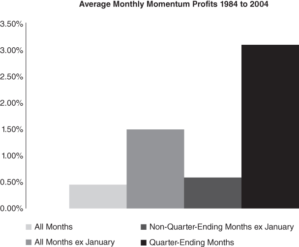

[**Figure 7.1**](#c07-fig-anc-0001) Momentum Seasonality from 1984 to 2004

Across all months, the average monthly profit from 1984 to 2004 is 0.45 percent per month, or roughly 5.4 percent a year. If one excludes January (“ex January,” in [Figure 7.1](#c07-fig-0001)), the portfolio earns 1.50 percent a month, or approximately 18 percent a year. January clearly matters, but so do quarter ending months. Momentum profits for quarter ending months average 3.10 percent a month, whereas non-quarter-ending months (excluding January) are 0.59 percent a month—a five-fold difference! And the pattern was stronger for stocks with high levels of institutional trading (where window-dressing incentives are highest) and was particularly strong in December (where tax incentives are strongest). The evidence is illuminating: Anyone devising a momentum strategy should incorporate aspects of seasonality into their algorithm. The results to long/short momentum portfolios in [Figure 7.1](#c07-fig-0001) are in line with the window dressing and tax minimization hypotheses—near the end of a quarter, managers window dress their portfolios, so winning stocks do well (because they are being bought) while losing stocks do poorly (because they are being sold), and December has the strongest momentum returns across all months with an average monthly profit of 5.52 percent (reflecting both window dressing and tax pressures).

The evidence suggests that seasonality plays an important role in momentum-based stock selection strategies. We will leave the final comments on the subject to Sias, who says it best: “Investors attempting to exploit return momentum should focus their efforts on quarter-ending months …” In the next section we take Sias's advice and examine how to leverage seasonality to build a better stock selection momentum system.

## MOMENTUM SEASONALITY: THE RESULTS

We start this section with a replication and extension of the results originally found in the Sias 2007 paper. We examine all mid- and large-capitalization stocks from January 1927 to December 2014. We examine the value-weight returns to quarterly rebalanced momentum portfolios using similar techniques from [Chapters 5](#section-16) and [6](#section-17). The average monthly returns to the high momentum and low momentum (decile) portfolios are tabulated in [Table 7.1](#c07-tbl-0001).

[**Table 7.1**](#c07-tbl-anc-0001) Average Returns by Month

|  |  |  |  |
| --- | --- | --- | --- |
|  | **Low Momentum** | **High Momentum** | **Spread (High – Low)** |
| January | 2.91% | 1.19% | –1.72% |
| February | –0.24% | 1.65% | 1.89% |
| March | 0.13% | 1.86% | 1.73% |
| April | 1.33% | 1.85% | 0.53% |
| May | 0.09% | 0.82% | 0.73% |
| June | 0.01% | 1.56% | 1.55% |
| July | 1.77% | 1.21% | –0.56% |
| August | 1.96% | 1.34% | –0.62% |
| September | –1.63% | –0.20% | 1.44% |
| October | –0.54% | 0.75% | 1.28% |
| November | 0.67% | 2.39% | 1.71% |
| December | 0.19% | 2.95% | 2.76% |

The takeaways from our analysis are similar to the original Sias paper. Examining the “Spread” column, January is a large “negative” month for momentum as low momentum outperforms high momentum. Quarter-ending months generally have the highest returns when comparing the low and high momentum portfolios. March has a positive momentum profit, but the outperformance compared to other months in the same quarter, are muted relative to June, September, and December. But as Sias points out in his original paper, the March result supports the window dressing hypothesis because institutions have a low incentive to window dress until later in the calendar year.

We can more easily visualize the spread between the high momentum average monthly returns and the low momentum average monthly returns in [Figure 7.2](#c07-fig-0002). The results are quantitatively and directly similar to those found by Sias.

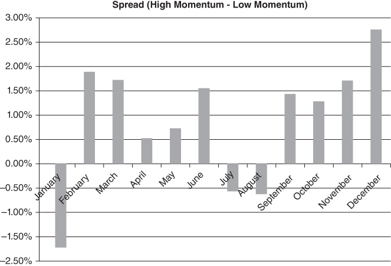

[**Figure 7.2**](#c07-fig-anc-0002) Momentum Spread from 1974 to 2014

Our replication and extended analysis of the Sias results give us confidence in the robustness of the original results (we conduct our tests on international data and come to similar conclusions). Now we need to identify how we can take this knowledge and leverage it for a momentum strategy. On one hand, we know that January is a large “negative” month for momentum and should be avoided, but do we really want to sell all our high momentum stocks at the end of December, buy all the low momentum stocks before January, and then rebalance back into high momentum before February? In theory, this activity would make sense, but in practice this activity would likely be difficult due to market liquidity and frictional costs.

Our own analysis of frictional costs and market liquidity suggest that exploiting the December to January momentum effects are unrealistic for a reasonably sized portfolio, so we'll punt on this idea, but we can still exploit momentum seasonality. We can build our system to take advantage of quarter-ending window dressing as well as tax-induced incentives at year-end. But how do we exploit this knowledge? Because momentum profits are largest in quarter-ending months, and this is likely driven by managers who are window dressing their portfolio, we hypothesize that rebalancing before these quarter-ending months will yield the highest returns.

We test our hypothesis that smart rebalancing that exploits seasonality effects can improve a momentum strategy. Recall from [Chapters 5](#section-16) and [6](#section-17) that we examine the results to momentum portfolios using overlapping portfolios with a three-month holding period. To remind the reader, overlapping portfolios work as follows: We are standing at the end of the month on December 31, 2014. We calculate a generic momentum metric and use one-third of our capital to buy high-momentum stocks. These stocks stay in the portfolio until March 31, 2015. On January 31, 2015, a month later, we use another one-third of our capital to buy high-momentum stocks based on momentum rankings on January 31, 2015. These stocks stay in the portfolio until April 30, 2015. On February 28, 2015, a month later, we use another one-third of our capital to buy high momentum stocks. These stocks stay in the portfolio until May 31, 2015. This process repeats every month and creates the overlapping portfolio effect. And the returns to the overlapping portfolios reflect a blend of the underlying portfolios being managed with the overlapping portfolio, which minimizes seasonal effects.

Of course, in a test for seasonality and momentum, creating overlapping portfolios—which are formed to *minimize* seasonal effects—is not the correct approach. If we are deliberately trying to take advantage of seasonal effects, we can examine quarterly nonoverlapping portfolios formed before quarter-ending months. This portfolio formation is more intuitive to many outside of academic research and has the ability to exploit quarterly momentum effects. Specifically, we assume we trade the nonoverlapping seasonal momentum portfolio at the end of February, May, August, and November to exploit the known momentum profits associated with March, June, September, and December. We hold this nonoverlapping portfolio for three months, which means there are four rebalances per year. We compare the performance of this portfolio against other nonoverlapping portfolios that do not rebalance before quarter end months. Our hypothesis is that the nonoverlapping quarterly rebalanced portfolio that exploits momentum seasonality benefits will perform better than the other portfolio constructs that are seasonality agnostic.

Like prior tests, we only examine mid- and large-capitalization stocks and portfolios are formed by value-weighting the firms. The analysis is from March 1, 1927, through December 31, 2014.[25](#c07-note-0025) We follow the process from [Chapter 5](#section-16), which is to (1) sort stocks based on their cumulative 12-month past returns (ignoring the most recent month) and (2) examine the top decile based on their past returns.

In [Table 7.2](#c07-tbl-0002), we examine the results to the strategy outlined above, by varying the rebalance period, using these four portfolios:

[**Table 7.2**](#c07-tbl-anc-0002) Seasonality of Momentum Portfolio Annual Results

|  |  |  |  |  |
| --- | --- | --- | --- | --- |
|  | **Smart Rebalance** | **Average Rebalance** | **Dumb Rebalance** | **Agnostic Rebalance** |
| **CAGR** | 15.97% | 15.65% | 15.06% | 15.49% |
| **Standard Deviation** | 23.99% | 23.96% | 23.90% | 23.62% |
| **Downside Deviation** | 17.93% | 17.56% | 17.70% | 17.43% |
| **Sharpe Ratio** | 0.60 | 0.59 | 0.57 | 0.59 |
| **Sortino Ratio (MAR** c07-math-0001 **5%)** | 0.72 | 0.71 | 0.68 | 0.71 |
| **Worst Drawdown** | –74.19% | –73.35% | –77.43% | –73.90% |
| **Worst Month Return** | –30.09% | –31.01% | –30.45% | –30.00% |
| **Best Month Return** | 32.35% | 39.53% | 31.15% | 33.88% |
| **Profitable Months** | 62.71% | 62.14% | 62.14% | 61.86% |

- **Smart Rebalance**: The smartest seasonality rebalanced portfolio. This portfolio is rebalanced on the close of trading in February, May, August, and November.
- **Average Rebalance**: This portfolio is rebalanced on the close of trading in January, April, July, and October.
- **Dumb Rebalance**: The least seasonality smart portfolio. This portfolio is rebalanced on the close of trading in December, March, June, and September.
- **Agnostic Rebalance**: The seasonality agnostic portfolio. This portfolio is an overlapping portfolio rebalanced every month and held for three months.

All the portfolio returns shown below are value-weighted. [Table 7.2](#c07-tbl-0002) shows the results.

The results in [Table 7.2](#c07-tbl-0002) confirm our hypothesis that momentum seasonality can be exploited via smarter rebalancing, at the margin. If we look at equal-weight portfolio results (not shown) the effects are magnified. The smart rebalance portfolio exploits both window dressing and tax incentive effects that drive momentum profits and thus performs the best among all the portfolio constructs. The worst-performing portfolio is the portfolio that systematically rebalances at the worst time from a momentum seasonality perspective. Finally, the agnostic rebalanced portfolio and the average rebalance portfolio have results that are in the middle between the smart and dumb rebalanced portfolios. The lesson learned is simple: Focus on seasonality when building momentum systems.

## SUMMARY

In this chapter, we explore two institutional behaviors that potentially drive seasonality effects in the stock market: window dressing and tax minimization. Next, we highlight research that maps these two incentives to the profitability of momentum. Finally, we conduct our own analysis of seasonality and momentum profits. We end with an analysis of different rebalancing techniques and how they affect the profitability of generic momentum strategies. Our key takeaway is that an investor can exploit the seasonality of momentum profits by developing a rebalance program that is designed to maximize performance.

## NOTES

[1](#c07-note-anc-0001) Robert Novy-Marx, “Predicting Anomaly Performance Politics, the Weather, Global Warming, Sunspots, and the Stars,” *Journal of Financial Economics* 112 (2014): 137–146.
[2](#c07-note-anc-0002) Ibid.
[3](#c07-note-anc-0003) Cherry Zhang and Ben Jacobsen, “Are Monthly Seasonals Real? A Three Century Perspective,” *Review of Finance* 17 (2013): 1743–1785.
[4](#c07-note-anc-0004) Matti Keloharju, Juhani Linnainmaa, and Peter Nyberg, 2016, “Return Seasonalities,” *The Journal of Finance*, 71 (2016): 1557–1590.
[5](#c07-note-anc-0005) Richard Sias, “Causes and Seasonality of Momentum Profits,” *Financial Analysts Journal* 63 (2007): 48–54.
[6](#c07-note-anc-0006) Edwin W. Kemmerer, “Seasonal Variations in the New York Money Market,” *American Economic Review* 1 (1911): 33–49.
[7](#c07-note-anc-0007) Gang Hu, David McLean, Jeff Pontiff, and Qinghai Wang, “The Year-End Trading Activities of Institutional Investors: Evidence from Daily Trades,” *The Review of Financial Studies* 27 (2014): 1593–1614.
[8](#c07-note-anc-0008) Marcin Kacperczyk, Clemens Sialm and Lu Zheng, “Unobserved Actions of Mutual Funds,” *The Review of Financial Studies* 21 (2008): 2379–2416.
[9](#c07-note-anc-0009) David H. Solomon, Eugene Soltes, and Denis Sosyura, “Winners in the Spotlight: Media Coverage of Fund Holdings as a Driver of Flows,” *Journal of Financial Economics* 113 (2014): 53–72.
[10](#c07-note-anc-0010) Jia He, Lilian Ng, and Qinghai Wang, “Quarterly Trading Patterns of Financial Institutions,” *The Journal of Business* 77 (2004): 493–509.
[11](#c07-note-anc-0011) Vikas Agarwal, Gerald Gay, and Leng Ling, “Window Dressing in Mutual Funds,” *The Review of Financial Studies* 27 (2014): 3133–3170.
[12](#c07-note-anc-0012) Sidney B. Wachtel, “Certain Observations on Seasonal Movements in Stock Prices,” *The Journal of Business of the University of Chicago* 15 (1942): 184–193.
[13](#c07-note-anc-0013) Michael S. Rozeff and William R. Kinney, Jr., “Capital Market Seasonality: The Case of Stock Returns,” *Journal of Financial Economics* 3 (1976): 379–402.
[14](#c07-note-anc-0014) Andrew Szakmary and Dean Kiefer, “The Disappearing January/Turn of the Year Effect: Evidence form Stock Index Futures and Cash Markets,” *Journal of Futures Markets* 24 (2004): 755–784.
[15](#c07-note-anc-0015) Richard Roll, “Vas Ist Das?,” *The Journal of Portfolio Management* 9 (1983): 18–28.
[16](#c07-note-anc-0016) Donald B. Keim, “Size-related Anomalies and Stock Return Seasonality,” *Journal of Financial Economics* 12 (1983): 13–32.
[17](#c07-note-anc-0017) Marc Reinganum, “The Anomalous Stock Market Behavior of Small Firms in January,” *Journal of Financial Economics* 12 (1983): 89–104.
[18](#c07-note-anc-0018) Honghui Chen and Vijay Singal, “All Things Considered, Taxes Drive the January Effect,” *The Journal of Financial Research* 27 (2004): 351–372.
[19](#c07-note-anc-0019) Mark Grinblatt and Tobias J. Moskowitz, “Predicting Stock Price Movements from Past Returns: The Role of Consistency and Tax-Loss Selling,” *Journal of Financial Economics* 71 (2004): 541–579.
[20](#c07-note-anc-0020) Jay R. Ritter, “The Buying and Selling Behavior of Individual Investors at the Turn of the Year,” *The Journal of Finance* 43 (1988): 701–717.
[21](#c07-note-anc-0021) James Poterba and Scott Weisbenner, “Capital Gains Tax Rules, Tax-Loss Trading, and Turn-of-the-Year Returns,” *The Journal of Finance* 56 (2001): 353–368.
[22](#c07-note-anc-0022) Richard Sias and Laura Starks, “Institutions and Individuals at the Turn-of-the-Year,” *The Journal of Finance* 52 (1997): 1543–1562.
[23](#c07-note-anc-0023) Philip Brown, Donald Keim, Allan Kleidon and Terry Marsh, 1983, “Stock Return Seasonalities and the Tax-Loss Selling Hypothesis,” *Journal of Financial Economics* 12 (2001): 105–127.
[24](#c07-note-anc-0024) Richard Sias, 48–54.
[25](#c07-note-anc-0025) In order to facilitate the “Smart Rebalance” portfolio, we lose January and February of 1927, so the start date changes from January 1, 1927, to March 1, 1927.

<!-- rl-section id="window-dressing" class="epub-section" title="WINDOW DRESSING" -->

# CHAPTER 7 Momentum Investors Need to Know Their Seasons

> *“… planetary aspects and sunspot activity have significant power predicting anomalies' returns.”*

—Robert Novy-Marx, *Journal of Financial Economics*[1](#c07-note-0001)

Seasonality, broadly defined in the context of stock market research, refers to the idea of building timing signals based on the calendar. Turn on any financial news outlet and there typically is a discussion about seasonality. One of the more popular concepts is, “Sell in May and Go Away,” which suggests that investors go to cash before June and get back in to the market in November. However, a 2014 Novy-Marx paper titled “Predicting Anomaly Performance with Politics, the Weather, Global Warming, Sunspots, and the Stars,”[2](#c07-note-0002) highlights an important point: One needs to be skeptical of seasonality-type claims. Moreover, Cherry Zhang and Ben Jacobsen review over 300 years of UK stock market data and conclude that documented seasonality effects should be digested with a healthy dose of skepticism.[3](#c07-note-0003) That said, a recent paper by Matti Keloharju, Juhani Linnainmaa, and Peter Nyberg using the latest data and research techniques shows that stock market return seasonalities exist in almost every asset class, are remarkably persistent over time, and are extremely large.[4](#c07-note-0004) At a high level, seasonality makes sense: Institutional and behavioral incentives plausibly can drive supply and demand shocks that create robust seasonality effects. We consider the effects of window dressing and tax incentives in this chapter.

But why are we even talking about seasonality and how is this related to momentum investing? Let us explain. Five years ago, we started working on what we considered a “unique” idea that related seasonality to momentum investing. Our hypothesis was that *window dressing* and *tax-loss selling* could be exploited to maximize the benefits of a traditional seasonality-agnostic momentum strategy. We conducted a battery of empirical tests and summarized all our data. The results were stunning. What was even more exciting was that fact that our idea had never been published in what is considered a top-tier academic finance journal, a descriptor that is typically reserved for *The Journal of Finance*, *Journal of Financial Economics*, and the *Review of Financial Studies*. Of course, as a last-minute check, we reviewed what academic researchers consider to be the “nonserious research” journals, also referred to as the practitioner journals (e.g., *Financial Analyst Journal* or *The Journal of Portfolio Management*). Turns out, it was good we reviewed these journals. Richard Sias had already published our results in a *Financial Analyst Journal* issue in 2007.[5](#c07-note-0005) Our initial reaction was disappointment, because as academic researchers we had hoped we could publish a new idea, but at the same time we were happy because our independent analysis of seasonality in the context of momentum was confirmed—and already discovered—by an independent party. So to make a long story short, Sias got to the front of the line before we could get there. We like his idea, obviously, but to really understand the results from Sias's paper, we need to dig into some marketplace incentives. We first analyze the motivations behind window dressing and tax-loss selling and then explore why they are important for momentum investing in the sections that follow.

In the retail business, *window dressing* refers to the practice of arranging merchandise in a store window to make it appear as attractive as possible. Window dressing works because it brings customers into the store, even if the merchandise is not as good as it looks in the window. In the financial services industry, fund managers leverage the same concept.

The concept of window dressing goes back—literally—to the beginning of formal economic research. Window dressing in economics, for readers unfamiliar with the term, is a behavior exhibited by finance professionals to mislead and cater to the whims of less sophisticated clients. The *American Economic Review*, which is considered one of the oldest and most respected scholarly journals in economics, was established in 1911. And in its initial publication, Edwin Kemmerer,[6](#c07-note-0006) an established economics professor and advisor to foreign governments, mentions the term *window dressing* to describe the New York money market near the end of the year.

Here is how window dressing works in practice: Fund managers know they must report their holdings on quarterly statements, which will get mailed to their clients. But the last thing poor-performing managers want their clients to see is their loser stocks that underperformed the market. In other words, they don't want investors seeing loser stocks in their “window,” which people will be viewing. To manage around this scenario, just before the statement reporting date the manager will sell their loser stocks and buy all the recent winning stocks so they look good on the statement, which is analogous to a “window” for a bricks and mortar retailer. Voila! The window now looks much more enticing.

Obviously, window dressing is not going to be a cure for bad performance and this tactic is not going to trick sophisticated clients, but the fund manager's hope is that window dressing activity will at least make them *appear* to have been doing something smart, and reduce client questions when they receive their statements. For example, consider the two scenarios between a client and a fund manager in 2002, following the bursting of the Internet Bubble:

- **Scenario 1**: “Geez, you underperformed by 10 percent. And wow, you owned Pets.com, which is down a lot? … Why do you own that horrible stock? You really must be an idiot!”
- **Scenario 2**: “Geez, you underperformed by 10 percent. But it looks like you own Berkshire Hathaway—that is a stable value stock that has done well. You probably had an unlucky stretch, but you seem like a good manager.”

Clearly, the manager would much rather face the reaction in scenario 2 as opposed to the one in scenario 1.

Of course, this scenario sounds like a great story, but what is the evidence that sneaky mutual fund managers *actually* engage in window dressing? Some authors think window dressing represents an anecdotal story, but not reality. For example, Gang Hu, David McLean, Jeff Pontiff, and Qinghai Wang find little evidence of window dressing by institutional investors.[7](#c07-note-0007) Others disagree. Consider Marcin Kacperczyk, Clemens Sialm, and Lu Zheng's paper “Unobserved Actions of Mutual Fund Managers.”[8](#c07-note-0008) They create a tool for addressing the window dressing hypothesis by creating a *return gap* measure. The return gap measure examines the difference between the realized returns to the mutual fund and the returns to the buy-and-hold portfolio that is most recently disclosed on the quarterly statement. The goal of the return gap measure is to identify, as is aptly put in the title, the unobserved actions of the mutual fund manager. The data suggests that some unobserved actions may create value (e.g., manager stock-picking skill), while other unobserved actions may destroy value (e.g., window dressing tactics). And the creation and destruction of value appears to be persistent across time for each fund. Unfortunately, the return gap is a relatively crude measure, and because there are too many variables to control for in the environment, a better experiment is needed to pinpoint window dressing.

David Solomon, Eugene Soltes, and Denis Sosyura[9](#c07-note-0009) identify a better laboratory to examine window dressing effects. Specifically, they examine how the media spotlight affects fund flows and window dressing. Their main finding is the following: “Investors reward funds that hold stocks with high past returns, but only if these stocks recently received media coverage.” So funds holding stocks with high-visibility winners attract more capital flows than similar funds holding less visible winners. Any mutual fund manager armed with this information has economic incentives to window dress—the data shows it leads to more assets under management!

Window-dressing is a perplexing practice, and one would hope that it is not that widespread. However, a 2004 study by Jia He, Lilian Ng, and Qinghai Wang examines window-dressing behavior across a variety of institutions.[10](#c07-note-0010) Their findings support the window-dressing hypothesis—institutions that act as external money managers (e.g., banks, life insurance companies, mutual funds, and investment advisers) are more likely to window dress their portfolios compared to institutions that act as internal money managers (e.g., pension funds, colleges, universities, and endowments). Not to beat a dead horse, but a more recent 2014 paper by Vikas Agarwal, Gerald Gay, and Leng Ling[11](#c07-note-0011) finds the following: “Window dressing is associated with managers who are less skilled and who perform poorly … we find that window dressing is value-destroying and is associated, on average, with lower future performance.”

The collective evidence and incentives of fund managers suggest that window dressing is likely part of the mutual fund landscape. Studies show that this window dressing may lead to increased assets under management, which explains why mutual fund managers partake in the activity. We'll explore why this window-dressing may matter for momentum investing, but first we turn our attention to the research on tax-motivated trading.

## TAX-MOTIVATED TRADING

Sidney B. Wachtel published a paper in 1942 discussing how tax considerations can lead to seasonality in stock returns from December to January.[12](#c07-note-0012) Michael S. Rozeff and William R. Kinney, Jr., published a more comprehensive empirical investigation of Wachtel's initial ideas in 1976.[13](#c07-note-0013) Rozeff and Kinney examined stock returns from 1904 to 1974. Their main finding is one that stands to this day—the “January” effect, or “turn of the year” effect in stock markets. The turn of the year effect is the empirical observation that stock prices increase during the month of January, and this increase is statistically higher than the other months of the year. The core hypothesis for the effect is related to tax incentives at year-end. End-of-year tax-loss selling pressure is intuitive—one might expect to see a negative supply shock from taxable individuals looking to book losses at the end of the year, which is reversed in the new year. Although the “tax hypothesis” is intuitively appealing, research following Wachtel and Rozeff and Kinney argues that the effect is complex and has all but disappeared since the early 1990s.[14](#c07-note-0014)

Early skeptics of tax-induced seasonality include Richard Roll,[15](#c07-note-0015) Don Keim,[16](#c07-note-0016) and Marc Reinganum,[17](#c07-note-0017) all of whom published papers in 1983. Their work collectively found that the larger January returns are mainly found in smaller firms and, therefore, may not be as pervasive as previously thought. More recent studies, however, both published in 2004, leverage smarter empirical techniques to tease out a robust relationship between taxes and the turn of the year effect. These works include a paper by Honghui Chen and Vijay Singal[18](#c07-note-0018) and another by Mark Grinblatt and Tobias J. Moskowitz.[19](#c07-note-0019)

But which investors drive tax-loss selling? Jay Ritter dug a bit further into this question and examined the buying and selling of individual investors near the turn of the year.[20](#c07-note-0020) By measuring the ratio of buys and sells of individual investors, he found that individual investors sell more near the end of the year, and buy more in the beginning of the year—so a seasonal pattern exists for individual investors, who tend to hold smaller stocks. James Poterba and Scott Weisbenner[21](#c07-note-0021) also found that tax-loss selling is driven by individual investors, not institutions. This finding makes sense, as many institutional investors do not pay taxes, and therefore make buying and selling decisions without worrying about tax consequences (wouldn't that be nice!). Similarly, in 1997, Richard Sias and Laura Starks[22](#c07-note-0022) examined turn-of-the-year returns of stocks. They found that returns of stocks with a higher level of individual interest underperform in late December and outperform in early January relative to stocks with higher levels of institutional interest. So it appears tax-loss selling (by individuals as opposed to institutions) is behind the seasonality of returns for certain stocks.

But not all research finds that tax-loss selling causes the turn-of-the-year effect. For example, in 1983, Philip Brown, Donald Keim, Allan Kleidon, and Terry Marsh[23](#c07-note-0023) examined the returns in the Australian equity markets. At the time, Australia had similar tax laws to the United States, but a June–July tax year. They found that Australian equity returns had a predicted effect on July returns, but they also found the same January effect documented in US markets. The authors' findings muddy the waters on the causal relationship between tax-loss selling and the turn of the year effect and suggest that there may be something else going on that explains the turn of the year effect. On net, the research suggests that there is likely some connection between tax incentives and seasonal stock returns at year-end, but researchers still don't fully understand the exact relationship.

## GREAT THEORIES: BUT WHY DO WE CARE?

The window dressing and tax-related seasonality effects previously outlined are interesting academic exercises. We now try to understand how these incentives may drive seasonal effects that can improve momentum strategies. As discussed previously, institutional investors have window dressing incentives to buy winners before the quarter ends and sell losers. This behavior leads us to our first hypothesis:

- **Hypothesis #1**: Momentum profits are highest in quarter-ending months, as window-dressing may cause institutional demand flows into high momentum stocks and out of low momentum stocks.

Another hypothesis related to seasonality and momentum is that taxable investors will want to sell losers and let winners ride at year-end to minimize tax burdens. This leads us to our second hypothesis:

- **Hypothesis #2**: Tax incentives lead to strong momentum profits in December as winners are unlikely to experience selling pressure and losers are likely to suffer from selling pressure. However, these tax-related flows will be reversed at the beginning of the year.

If we combine both the window-dressing and tax-minimization hypotheses, we should see strong momentum profits in the months prior to a quarter end (March, June, September, and December) and an especially profitable month prior to year-end (i.e., December). We should also see poor momentum profits in January, when the tax incentives from the months prior retreat and the demand for losing and winning stocks reverts to normal levels (e.g., losing stocks get a positive demand shock and winning stocks get a negative demand shock).

Richard Sias tests all of the concepts outlined above. He finds strong evidence to support the notion that momentum is a highly seasonal anomaly.[24](#c07-note-0024) To assess momentum profits, Sias forms long/short portfolios that are long the top decile of stocks with the strongest past six-month holding period and short the decile of stocks with the weakest past six-month holding periods. [Figure 7.1](#c07-fig-0001) showcases his long/short portfolio results.

[**Figure 7.1**](#c07-fig-anc-0001) Momentum Seasonality from 1984 to 2004

Across all months, the average monthly profit from 1984 to 2004 is 0.45 percent per month, or roughly 5.4 percent a year. If one excludes January (“ex January,” in [Figure 7.1](#c07-fig-0001)), the portfolio earns 1.50 percent a month, or approximately 18 percent a year. January clearly matters, but so do quarter ending months. Momentum profits for quarter ending months average 3.10 percent a month, whereas non-quarter-ending months (excluding January) are 0.59 percent a month—a five-fold difference! And the pattern was stronger for stocks with high levels of institutional trading (where window-dressing incentives are highest) and was particularly strong in December (where tax incentives are strongest). The evidence is illuminating: Anyone devising a momentum strategy should incorporate aspects of seasonality into their algorithm. The results to long/short momentum portfolios in [Figure 7.1](#c07-fig-0001) are in line with the window dressing and tax minimization hypotheses—near the end of a quarter, managers window dress their portfolios, so winning stocks do well (because they are being bought) while losing stocks do poorly (because they are being sold), and December has the strongest momentum returns across all months with an average monthly profit of 5.52 percent (reflecting both window dressing and tax pressures).

The evidence suggests that seasonality plays an important role in momentum-based stock selection strategies. We will leave the final comments on the subject to Sias, who says it best: “Investors attempting to exploit return momentum should focus their efforts on quarter-ending months …” In the next section we take Sias's advice and examine how to leverage seasonality to build a better stock selection momentum system.

## MOMENTUM SEASONALITY: THE RESULTS

We start this section with a replication and extension of the results originally found in the Sias 2007 paper. We examine all mid- and large-capitalization stocks from January 1927 to December 2014. We examine the value-weight returns to quarterly rebalanced momentum portfolios using similar techniques from [Chapters 5](#section-16) and [6](#section-17). The average monthly returns to the high momentum and low momentum (decile) portfolios are tabulated in [Table 7.1](#c07-tbl-0001).

[**Table 7.1**](#c07-tbl-anc-0001) Average Returns by Month

|  |  |  |  |
| --- | --- | --- | --- |
|  | **Low Momentum** | **High Momentum** | **Spread (High – Low)** |
| January | 2.91% | 1.19% | –1.72% |
| February | –0.24% | 1.65% | 1.89% |
| March | 0.13% | 1.86% | 1.73% |
| April | 1.33% | 1.85% | 0.53% |
| May | 0.09% | 0.82% | 0.73% |
| June | 0.01% | 1.56% | 1.55% |
| July | 1.77% | 1.21% | –0.56% |
| August | 1.96% | 1.34% | –0.62% |
| September | –1.63% | –0.20% | 1.44% |
| October | –0.54% | 0.75% | 1.28% |
| November | 0.67% | 2.39% | 1.71% |
| December | 0.19% | 2.95% | 2.76% |

The takeaways from our analysis are similar to the original Sias paper. Examining the “Spread” column, January is a large “negative” month for momentum as low momentum outperforms high momentum. Quarter-ending months generally have the highest returns when comparing the low and high momentum portfolios. March has a positive momentum profit, but the outperformance compared to other months in the same quarter, are muted relative to June, September, and December. But as Sias points out in his original paper, the March result supports the window dressing hypothesis because institutions have a low incentive to window dress until later in the calendar year.

We can more easily visualize the spread between the high momentum average monthly returns and the low momentum average monthly returns in [Figure 7.2](#c07-fig-0002). The results are quantitatively and directly similar to those found by Sias.

[**Figure 7.2**](#c07-fig-anc-0002) Momentum Spread from 1974 to 2014

Our replication and extended analysis of the Sias results give us confidence in the robustness of the original results (we conduct our tests on international data and come to similar conclusions). Now we need to identify how we can take this knowledge and leverage it for a momentum strategy. On one hand, we know that January is a large “negative” month for momentum and should be avoided, but do we really want to sell all our high momentum stocks at the end of December, buy all the low momentum stocks before January, and then rebalance back into high momentum before February? In theory, this activity would make sense, but in practice this activity would likely be difficult due to market liquidity and frictional costs.

Our own analysis of frictional costs and market liquidity suggest that exploiting the December to January momentum effects are unrealistic for a reasonably sized portfolio, so we'll punt on this idea, but we can still exploit momentum seasonality. We can build our system to take advantage of quarter-ending window dressing as well as tax-induced incentives at year-end. But how do we exploit this knowledge? Because momentum profits are largest in quarter-ending months, and this is likely driven by managers who are window dressing their portfolio, we hypothesize that rebalancing before these quarter-ending months will yield the highest returns.

We test our hypothesis that smart rebalancing that exploits seasonality effects can improve a momentum strategy. Recall from [Chapters 5](#section-16) and [6](#section-17) that we examine the results to momentum portfolios using overlapping portfolios with a three-month holding period. To remind the reader, overlapping portfolios work as follows: We are standing at the end of the month on December 31, 2014. We calculate a generic momentum metric and use one-third of our capital to buy high-momentum stocks. These stocks stay in the portfolio until March 31, 2015. On January 31, 2015, a month later, we use another one-third of our capital to buy high-momentum stocks based on momentum rankings on January 31, 2015. These stocks stay in the portfolio until April 30, 2015. On February 28, 2015, a month later, we use another one-third of our capital to buy high momentum stocks. These stocks stay in the portfolio until May 31, 2015. This process repeats every month and creates the overlapping portfolio effect. And the returns to the overlapping portfolios reflect a blend of the underlying portfolios being managed with the overlapping portfolio, which minimizes seasonal effects.

Of course, in a test for seasonality and momentum, creating overlapping portfolios—which are formed to *minimize* seasonal effects—is not the correct approach. If we are deliberately trying to take advantage of seasonal effects, we can examine quarterly nonoverlapping portfolios formed before quarter-ending months. This portfolio formation is more intuitive to many outside of academic research and has the ability to exploit quarterly momentum effects. Specifically, we assume we trade the nonoverlapping seasonal momentum portfolio at the end of February, May, August, and November to exploit the known momentum profits associated with March, June, September, and December. We hold this nonoverlapping portfolio for three months, which means there are four rebalances per year. We compare the performance of this portfolio against other nonoverlapping portfolios that do not rebalance before quarter end months. Our hypothesis is that the nonoverlapping quarterly rebalanced portfolio that exploits momentum seasonality benefits will perform better than the other portfolio constructs that are seasonality agnostic.

Like prior tests, we only examine mid- and large-capitalization stocks and portfolios are formed by value-weighting the firms. The analysis is from March 1, 1927, through December 31, 2014.[25](#c07-note-0025) We follow the process from [Chapter 5](#section-16), which is to (1) sort stocks based on their cumulative 12-month past returns (ignoring the most recent month) and (2) examine the top decile based on their past returns.

In [Table 7.2](#c07-tbl-0002), we examine the results to the strategy outlined above, by varying the rebalance period, using these four portfolios:

[**Table 7.2**](#c07-tbl-anc-0002) Seasonality of Momentum Portfolio Annual Results

|  |  |  |  |  |
| --- | --- | --- | --- | --- |
|  | **Smart Rebalance** | **Average Rebalance** | **Dumb Rebalance** | **Agnostic Rebalance** |
| **CAGR** | 15.97% | 15.65% | 15.06% | 15.49% |
| **Standard Deviation** | 23.99% | 23.96% | 23.90% | 23.62% |
| **Downside Deviation** | 17.93% | 17.56% | 17.70% | 17.43% |
| **Sharpe Ratio** | 0.60 | 0.59 | 0.57 | 0.59 |
| **Sortino Ratio (MAR** c07-math-0001 **5%)** | 0.72 | 0.71 | 0.68 | 0.71 |
| **Worst Drawdown** | –74.19% | –73.35% | –77.43% | –73.90% |
| **Worst Month Return** | –30.09% | –31.01% | –30.45% | –30.00% |
| **Best Month Return** | 32.35% | 39.53% | 31.15% | 33.88% |
| **Profitable Months** | 62.71% | 62.14% | 62.14% | 61.86% |

- **Smart Rebalance**: The smartest seasonality rebalanced portfolio. This portfolio is rebalanced on the close of trading in February, May, August, and November.
- **Average Rebalance**: This portfolio is rebalanced on the close of trading in January, April, July, and October.
- **Dumb Rebalance**: The least seasonality smart portfolio. This portfolio is rebalanced on the close of trading in December, March, June, and September.
- **Agnostic Rebalance**: The seasonality agnostic portfolio. This portfolio is an overlapping portfolio rebalanced every month and held for three months.

All the portfolio returns shown below are value-weighted. [Table 7.2](#c07-tbl-0002) shows the results.

The results in [Table 7.2](#c07-tbl-0002) confirm our hypothesis that momentum seasonality can be exploited via smarter rebalancing, at the margin. If we look at equal-weight portfolio results (not shown) the effects are magnified. The smart rebalance portfolio exploits both window dressing and tax incentive effects that drive momentum profits and thus performs the best among all the portfolio constructs. The worst-performing portfolio is the portfolio that systematically rebalances at the worst time from a momentum seasonality perspective. Finally, the agnostic rebalanced portfolio and the average rebalance portfolio have results that are in the middle between the smart and dumb rebalanced portfolios. The lesson learned is simple: Focus on seasonality when building momentum systems.

## SUMMARY

In this chapter, we explore two institutional behaviors that potentially drive seasonality effects in the stock market: window dressing and tax minimization. Next, we highlight research that maps these two incentives to the profitability of momentum. Finally, we conduct our own analysis of seasonality and momentum profits. We end with an analysis of different rebalancing techniques and how they affect the profitability of generic momentum strategies. Our key takeaway is that an investor can exploit the seasonality of momentum profits by developing a rebalance program that is designed to maximize performance.

## NOTES

[1](#c07-note-anc-0001) Robert Novy-Marx, “Predicting Anomaly Performance Politics, the Weather, Global Warming, Sunspots, and the Stars,” *Journal of Financial Economics* 112 (2014): 137–146.
[2](#c07-note-anc-0002) Ibid.
[3](#c07-note-anc-0003) Cherry Zhang and Ben Jacobsen, “Are Monthly Seasonals Real? A Three Century Perspective,” *Review of Finance* 17 (2013): 1743–1785.
[4](#c07-note-anc-0004) Matti Keloharju, Juhani Linnainmaa, and Peter Nyberg, 2016, “Return Seasonalities,” *The Journal of Finance*, 71 (2016): 1557–1590.
[5](#c07-note-anc-0005) Richard Sias, “Causes and Seasonality of Momentum Profits,” *Financial Analysts Journal* 63 (2007): 48–54.
[6](#c07-note-anc-0006) Edwin W. Kemmerer, “Seasonal Variations in the New York Money Market,” *American Economic Review* 1 (1911): 33–49.
[7](#c07-note-anc-0007) Gang Hu, David McLean, Jeff Pontiff, and Qinghai Wang, “The Year-End Trading Activities of Institutional Investors: Evidence from Daily Trades,” *The Review of Financial Studies* 27 (2014): 1593–1614.
[8](#c07-note-anc-0008) Marcin Kacperczyk, Clemens Sialm and Lu Zheng, “Unobserved Actions of Mutual Funds,” *The Review of Financial Studies* 21 (2008): 2379–2416.
[9](#c07-note-anc-0009) David H. Solomon, Eugene Soltes, and Denis Sosyura, “Winners in the Spotlight: Media Coverage of Fund Holdings as a Driver of Flows,” *Journal of Financial Economics* 113 (2014): 53–72.
[10](#c07-note-anc-0010) Jia He, Lilian Ng, and Qinghai Wang, “Quarterly Trading Patterns of Financial Institutions,” *The Journal of Business* 77 (2004): 493–509.
[11](#c07-note-anc-0011) Vikas Agarwal, Gerald Gay, and Leng Ling, “Window Dressing in Mutual Funds,” *The Review of Financial Studies* 27 (2014): 3133–3170.
[12](#c07-note-anc-0012) Sidney B. Wachtel, “Certain Observations on Seasonal Movements in Stock Prices,” *The Journal of Business of the University of Chicago* 15 (1942): 184–193.
[13](#c07-note-anc-0013) Michael S. Rozeff and William R. Kinney, Jr., “Capital Market Seasonality: The Case of Stock Returns,” *Journal of Financial Economics* 3 (1976): 379–402.
[14](#c07-note-anc-0014) Andrew Szakmary and Dean Kiefer, “The Disappearing January/Turn of the Year Effect: Evidence form Stock Index Futures and Cash Markets,” *Journal of Futures Markets* 24 (2004): 755–784.
[15](#c07-note-anc-0015) Richard Roll, “Vas Ist Das?,” *The Journal of Portfolio Management* 9 (1983): 18–28.
[16](#c07-note-anc-0016) Donald B. Keim, “Size-related Anomalies and Stock Return Seasonality,” *Journal of Financial Economics* 12 (1983): 13–32.
[17](#c07-note-anc-0017) Marc Reinganum, “The Anomalous Stock Market Behavior of Small Firms in January,” *Journal of Financial Economics* 12 (1983): 89–104.
[18](#c07-note-anc-0018) Honghui Chen and Vijay Singal, “All Things Considered, Taxes Drive the January Effect,” *The Journal of Financial Research* 27 (2004): 351–372.
[19](#c07-note-anc-0019) Mark Grinblatt and Tobias J. Moskowitz, “Predicting Stock Price Movements from Past Returns: The Role of Consistency and Tax-Loss Selling,” *Journal of Financial Economics* 71 (2004): 541–579.
[20](#c07-note-anc-0020) Jay R. Ritter, “The Buying and Selling Behavior of Individual Investors at the Turn of the Year,” *The Journal of Finance* 43 (1988): 701–717.
[21](#c07-note-anc-0021) James Poterba and Scott Weisbenner, “Capital Gains Tax Rules, Tax-Loss Trading, and Turn-of-the-Year Returns,” *The Journal of Finance* 56 (2001): 353–368.
[22](#c07-note-anc-0022) Richard Sias and Laura Starks, “Institutions and Individuals at the Turn-of-the-Year,” *The Journal of Finance* 52 (1997): 1543–1562.
[23](#c07-note-anc-0023) Philip Brown, Donald Keim, Allan Kleidon and Terry Marsh, 1983, “Stock Return Seasonalities and the Tax-Loss Selling Hypothesis,” *Journal of Financial Economics* 12 (2001): 105–127.
[24](#c07-note-anc-0024) Richard Sias, 48–54.
[25](#c07-note-anc-0025) In order to facilitate the “Smart Rebalance” portfolio, we lose January and February of 1927, so the start date changes from January 1, 1927, to March 1, 1927.

<!-- rl-section id="window-dressing" class="epub-section" title="WINDOW DRESSING" -->

## WINDOW DRESSING

In the retail business, *window dressing* refers to the practice of arranging merchandise in a store window to make it appear as attractive as possible. Window dressing works because it brings customers into the store, even if the merchandise is not as good as it looks in the window. In the financial services industry, fund managers leverage the same concept.

The concept of window dressing goes back—literally—to the beginning of formal economic research. Window dressing in economics, for readers unfamiliar with the term, is a behavior exhibited by finance professionals to mislead and cater to the whims of less sophisticated clients. The *American Economic Review*, which is considered one of the oldest and most respected scholarly journals in economics, was established in 1911. And in its initial publication, Edwin Kemmerer,[6](#c07-note-0006) an established economics professor and advisor to foreign governments, mentions the term *window dressing* to describe the New York money market near the end of the year.

Here is how window dressing works in practice: Fund managers know they must report their holdings on quarterly statements, which will get mailed to their clients. But the last thing poor-performing managers want their clients to see is their loser stocks that underperformed the market. In other words, they don't want investors seeing loser stocks in their “window,” which people will be viewing. To manage around this scenario, just before the statement reporting date the manager will sell their loser stocks and buy all the recent winning stocks so they look good on the statement, which is analogous to a “window” for a bricks and mortar retailer. Voila! The window now looks much more enticing.

Obviously, window dressing is not going to be a cure for bad performance and this tactic is not going to trick sophisticated clients, but the fund manager's hope is that window dressing activity will at least make them *appear* to have been doing something smart, and reduce client questions when they receive their statements. For example, consider the two scenarios between a client and a fund manager in 2002, following the bursting of the Internet Bubble:

- **Scenario 1**: “Geez, you underperformed by 10 percent. And wow, you owned Pets.com, which is down a lot? … Why do you own that horrible stock? You really must be an idiot!”
- **Scenario 2**: “Geez, you underperformed by 10 percent. But it looks like you own Berkshire Hathaway—that is a stable value stock that has done well. You probably had an unlucky stretch, but you seem like a good manager.”

Clearly, the manager would much rather face the reaction in scenario 2 as opposed to the one in scenario 1.

Of course, this scenario sounds like a great story, but what is the evidence that sneaky mutual fund managers *actually* engage in window dressing? Some authors think window dressing represents an anecdotal story, but not reality. For example, Gang Hu, David McLean, Jeff Pontiff, and Qinghai Wang find little evidence of window dressing by institutional investors.[7](#c07-note-0007) Others disagree. Consider Marcin Kacperczyk, Clemens Sialm, and Lu Zheng's paper “Unobserved Actions of Mutual Fund Managers.”[8](#c07-note-0008) They create a tool for addressing the window dressing hypothesis by creating a *return gap* measure. The return gap measure examines the difference between the realized returns to the mutual fund and the returns to the buy-and-hold portfolio that is most recently disclosed on the quarterly statement. The goal of the return gap measure is to identify, as is aptly put in the title, the unobserved actions of the mutual fund manager. The data suggests that some unobserved actions may create value (e.g., manager stock-picking skill), while other unobserved actions may destroy value (e.g., window dressing tactics). And the creation and destruction of value appears to be persistent across time for each fund. Unfortunately, the return gap is a relatively crude measure, and because there are too many variables to control for in the environment, a better experiment is needed to pinpoint window dressing.

David Solomon, Eugene Soltes, and Denis Sosyura[9](#c07-note-0009) identify a better laboratory to examine window dressing effects. Specifically, they examine how the media spotlight affects fund flows and window dressing. Their main finding is the following: “Investors reward funds that hold stocks with high past returns, but only if these stocks recently received media coverage.” So funds holding stocks with high-visibility winners attract more capital flows than similar funds holding less visible winners. Any mutual fund manager armed with this information has economic incentives to window dress—the data shows it leads to more assets under management!

Window-dressing is a perplexing practice, and one would hope that it is not that widespread. However, a 2004 study by Jia He, Lilian Ng, and Qinghai Wang examines window-dressing behavior across a variety of institutions.[10](#c07-note-0010) Their findings support the window-dressing hypothesis—institutions that act as external money managers (e.g., banks, life insurance companies, mutual funds, and investment advisers) are more likely to window dress their portfolios compared to institutions that act as internal money managers (e.g., pension funds, colleges, universities, and endowments). Not to beat a dead horse, but a more recent 2014 paper by Vikas Agarwal, Gerald Gay, and Leng Ling[11](#c07-note-0011) finds the following: “Window dressing is associated with managers who are less skilled and who perform poorly … we find that window dressing is value-destroying and is associated, on average, with lower future performance.”

The collective evidence and incentives of fund managers suggest that window dressing is likely part of the mutual fund landscape. Studies show that this window dressing may lead to increased assets under management, which explains why mutual fund managers partake in the activity. We'll explore why this window-dressing may matter for momentum investing, but first we turn our attention to the research on tax-motivated trading.

<!-- rl-section id="tax-motivated-trading" class="epub-section" title="TAX-MOTIVATED TRADING" -->

## TAX-MOTIVATED TRADING

Sidney B. Wachtel published a paper in 1942 discussing how tax considerations can lead to seasonality in stock returns from December to January.[12](#c07-note-0012) Michael S. Rozeff and William R. Kinney, Jr., published a more comprehensive empirical investigation of Wachtel's initial ideas in 1976.[13](#c07-note-0013) Rozeff and Kinney examined stock returns from 1904 to 1974. Their main finding is one that stands to this day—the “January” effect, or “turn of the year” effect in stock markets. The turn of the year effect is the empirical observation that stock prices increase during the month of January, and this increase is statistically higher than the other months of the year. The core hypothesis for the effect is related to tax incentives at year-end. End-of-year tax-loss selling pressure is intuitive—one might expect to see a negative supply shock from taxable individuals looking to book losses at the end of the year, which is reversed in the new year. Although the “tax hypothesis” is intuitively appealing, research following Wachtel and Rozeff and Kinney argues that the effect is complex and has all but disappeared since the early 1990s.[14](#c07-note-0014)

Early skeptics of tax-induced seasonality include Richard Roll,[15](#c07-note-0015) Don Keim,[16](#c07-note-0016) and Marc Reinganum,[17](#c07-note-0017) all of whom published papers in 1983. Their work collectively found that the larger January returns are mainly found in smaller firms and, therefore, may not be as pervasive as previously thought. More recent studies, however, both published in 2004, leverage smarter empirical techniques to tease out a robust relationship between taxes and the turn of the year effect. These works include a paper by Honghui Chen and Vijay Singal[18](#c07-note-0018) and another by Mark Grinblatt and Tobias J. Moskowitz.[19](#c07-note-0019)

But which investors drive tax-loss selling? Jay Ritter dug a bit further into this question and examined the buying and selling of individual investors near the turn of the year.[20](#c07-note-0020) By measuring the ratio of buys and sells of individual investors, he found that individual investors sell more near the end of the year, and buy more in the beginning of the year—so a seasonal pattern exists for individual investors, who tend to hold smaller stocks. James Poterba and Scott Weisbenner[21](#c07-note-0021) also found that tax-loss selling is driven by individual investors, not institutions. This finding makes sense, as many institutional investors do not pay taxes, and therefore make buying and selling decisions without worrying about tax consequences (wouldn't that be nice!). Similarly, in 1997, Richard Sias and Laura Starks[22](#c07-note-0022) examined turn-of-the-year returns of stocks. They found that returns of stocks with a higher level of individual interest underperform in late December and outperform in early January relative to stocks with higher levels of institutional interest. So it appears tax-loss selling (by individuals as opposed to institutions) is behind the seasonality of returns for certain stocks.

But not all research finds that tax-loss selling causes the turn-of-the-year effect. For example, in 1983, Philip Brown, Donald Keim, Allan Kleidon, and Terry Marsh[23](#c07-note-0023) examined the returns in the Australian equity markets. At the time, Australia had similar tax laws to the United States, but a June–July tax year. They found that Australian equity returns had a predicted effect on July returns, but they also found the same January effect documented in US markets. The authors' findings muddy the waters on the causal relationship between tax-loss selling and the turn of the year effect and suggest that there may be something else going on that explains the turn of the year effect. On net, the research suggests that there is likely some connection between tax incentives and seasonal stock returns at year-end, but researchers still don't fully understand the exact relationship.

<!-- rl-section id="great-theories-but-why-do-we-care" class="epub-section" title="GREAT THEORIES: BUT WHY DO WE CARE?" -->

## GREAT THEORIES: BUT WHY DO WE CARE?

The window dressing and tax-related seasonality effects previously outlined are interesting academic exercises. We now try to understand how these incentives may drive seasonal effects that can improve momentum strategies. As discussed previously, institutional investors have window dressing incentives to buy winners before the quarter ends and sell losers. This behavior leads us to our first hypothesis:

- **Hypothesis #1**: Momentum profits are highest in quarter-ending months, as window-dressing may cause institutional demand flows into high momentum stocks and out of low momentum stocks.

Another hypothesis related to seasonality and momentum is that taxable investors will want to sell losers and let winners ride at year-end to minimize tax burdens. This leads us to our second hypothesis:

- **Hypothesis #2**: Tax incentives lead to strong momentum profits in December as winners are unlikely to experience selling pressure and losers are likely to suffer from selling pressure. However, these tax-related flows will be reversed at the beginning of the year.

If we combine both the window-dressing and tax-minimization hypotheses, we should see strong momentum profits in the months prior to a quarter end (March, June, September, and December) and an especially profitable month prior to year-end (i.e., December). We should also see poor momentum profits in January, when the tax incentives from the months prior retreat and the demand for losing and winning stocks reverts to normal levels (e.g., losing stocks get a positive demand shock and winning stocks get a negative demand shock).

Richard Sias tests all of the concepts outlined above. He finds strong evidence to support the notion that momentum is a highly seasonal anomaly.[24](#c07-note-0024) To assess momentum profits, Sias forms long/short portfolios that are long the top decile of stocks with the strongest past six-month holding period and short the decile of stocks with the weakest past six-month holding periods. [Figure 7.1](#c07-fig-0001) showcases his long/short portfolio results.

[**Figure 7.1**](#c07-fig-anc-0001) Momentum Seasonality from 1984 to 2004

Across all months, the average monthly profit from 1984 to 2004 is 0.45 percent per month, or roughly 5.4 percent a year. If one excludes January (“ex January,” in [Figure 7.1](#c07-fig-0001)), the portfolio earns 1.50 percent a month, or approximately 18 percent a year. January clearly matters, but so do quarter ending months. Momentum profits for quarter ending months average 3.10 percent a month, whereas non-quarter-ending months (excluding January) are 0.59 percent a month—a five-fold difference! And the pattern was stronger for stocks with high levels of institutional trading (where window-dressing incentives are highest) and was particularly strong in December (where tax incentives are strongest). The evidence is illuminating: Anyone devising a momentum strategy should incorporate aspects of seasonality into their algorithm. The results to long/short momentum portfolios in [Figure 7.1](#c07-fig-0001) are in line with the window dressing and tax minimization hypotheses—near the end of a quarter, managers window dress their portfolios, so winning stocks do well (because they are being bought) while losing stocks do poorly (because they are being sold), and December has the strongest momentum returns across all months with an average monthly profit of 5.52 percent (reflecting both window dressing and tax pressures).

The evidence suggests that seasonality plays an important role in momentum-based stock selection strategies. We will leave the final comments on the subject to Sias, who says it best: “Investors attempting to exploit return momentum should focus their efforts on quarter-ending months …” In the next section we take Sias's advice and examine how to leverage seasonality to build a better stock selection momentum system.

<!-- rl-section id="momentum-seasonality-the-results" class="epub-section" title="MOMENTUM SEASONALITY: THE RESULTS" -->

## MOMENTUM SEASONALITY: THE RESULTS

We start this section with a replication and extension of the results originally found in the Sias 2007 paper. We examine all mid- and large-capitalization stocks from January 1927 to December 2014. We examine the value-weight returns to quarterly rebalanced momentum portfolios using similar techniques from [Chapters 5](#section-16) and [6](#section-17). The average monthly returns to the high momentum and low momentum (decile) portfolios are tabulated in [Table 7.1](#c07-tbl-0001).

[**Table 7.1**](#c07-tbl-anc-0001) Average Returns by Month

|  |  |  |  |
| --- | --- | --- | --- |
|  | **Low Momentum** | **High Momentum** | **Spread (High – Low)** |
| January | 2.91% | 1.19% | –1.72% |
| February | –0.24% | 1.65% | 1.89% |
| March | 0.13% | 1.86% | 1.73% |
| April | 1.33% | 1.85% | 0.53% |
| May | 0.09% | 0.82% | 0.73% |
| June | 0.01% | 1.56% | 1.55% |
| July | 1.77% | 1.21% | –0.56% |
| August | 1.96% | 1.34% | –0.62% |
| September | –1.63% | –0.20% | 1.44% |
| October | –0.54% | 0.75% | 1.28% |
| November | 0.67% | 2.39% | 1.71% |
| December | 0.19% | 2.95% | 2.76% |

The takeaways from our analysis are similar to the original Sias paper. Examining the “Spread” column, January is a large “negative” month for momentum as low momentum outperforms high momentum. Quarter-ending months generally have the highest returns when comparing the low and high momentum portfolios. March has a positive momentum profit, but the outperformance compared to other months in the same quarter, are muted relative to June, September, and December. But as Sias points out in his original paper, the March result supports the window dressing hypothesis because institutions have a low incentive to window dress until later in the calendar year.

We can more easily visualize the spread between the high momentum average monthly returns and the low momentum average monthly returns in [Figure 7.2](#c07-fig-0002). The results are quantitatively and directly similar to those found by Sias.

[**Figure 7.2**](#c07-fig-anc-0002) Momentum Spread from 1974 to 2014

Our replication and extended analysis of the Sias results give us confidence in the robustness of the original results (we conduct our tests on international data and come to similar conclusions). Now we need to identify how we can take this knowledge and leverage it for a momentum strategy. On one hand, we know that January is a large “negative” month for momentum and should be avoided, but do we really want to sell all our high momentum stocks at the end of December, buy all the low momentum stocks before January, and then rebalance back into high momentum before February? In theory, this activity would make sense, but in practice this activity would likely be difficult due to market liquidity and frictional costs.

Our own analysis of frictional costs and market liquidity suggest that exploiting the December to January momentum effects are unrealistic for a reasonably sized portfolio, so we'll punt on this idea, but we can still exploit momentum seasonality. We can build our system to take advantage of quarter-ending window dressing as well as tax-induced incentives at year-end. But how do we exploit this knowledge? Because momentum profits are largest in quarter-ending months, and this is likely driven by managers who are window dressing their portfolio, we hypothesize that rebalancing before these quarter-ending months will yield the highest returns.

We test our hypothesis that smart rebalancing that exploits seasonality effects can improve a momentum strategy. Recall from [Chapters 5](#section-16) and [6](#section-17) that we examine the results to momentum portfolios using overlapping portfolios with a three-month holding period. To remind the reader, overlapping portfolios work as follows: We are standing at the end of the month on December 31, 2014. We calculate a generic momentum metric and use one-third of our capital to buy high-momentum stocks. These stocks stay in the portfolio until March 31, 2015. On January 31, 2015, a month later, we use another one-third of our capital to buy high-momentum stocks based on momentum rankings on January 31, 2015. These stocks stay in the portfolio until April 30, 2015. On February 28, 2015, a month later, we use another one-third of our capital to buy high momentum stocks. These stocks stay in the portfolio until May 31, 2015. This process repeats every month and creates the overlapping portfolio effect. And the returns to the overlapping portfolios reflect a blend of the underlying portfolios being managed with the overlapping portfolio, which minimizes seasonal effects.

Of course, in a test for seasonality and momentum, creating overlapping portfolios—which are formed to *minimize* seasonal effects—is not the correct approach. If we are deliberately trying to take advantage of seasonal effects, we can examine quarterly nonoverlapping portfolios formed before quarter-ending months. This portfolio formation is more intuitive to many outside of academic research and has the ability to exploit quarterly momentum effects. Specifically, we assume we trade the nonoverlapping seasonal momentum portfolio at the end of February, May, August, and November to exploit the known momentum profits associated with March, June, September, and December. We hold this nonoverlapping portfolio for three months, which means there are four rebalances per year. We compare the performance of this portfolio against other nonoverlapping portfolios that do not rebalance before quarter end months. Our hypothesis is that the nonoverlapping quarterly rebalanced portfolio that exploits momentum seasonality benefits will perform better than the other portfolio constructs that are seasonality agnostic.

Like prior tests, we only examine mid- and large-capitalization stocks and portfolios are formed by value-weighting the firms. The analysis is from March 1, 1927, through December 31, 2014.[25](#c07-note-0025) We follow the process from [Chapter 5](#section-16), which is to (1) sort stocks based on their cumulative 12-month past returns (ignoring the most recent month) and (2) examine the top decile based on their past returns.

In [Table 7.2](#c07-tbl-0002), we examine the results to the strategy outlined above, by varying the rebalance period, using these four portfolios:

[**Table 7.2**](#c07-tbl-anc-0002) Seasonality of Momentum Portfolio Annual Results

|  |  |  |  |  |
| --- | --- | --- | --- | --- |
|  | **Smart Rebalance** | **Average Rebalance** | **Dumb Rebalance** | **Agnostic Rebalance** |
| **CAGR** | 15.97% | 15.65% | 15.06% | 15.49% |
| **Standard Deviation** | 23.99% | 23.96% | 23.90% | 23.62% |
| **Downside Deviation** | 17.93% | 17.56% | 17.70% | 17.43% |
| **Sharpe Ratio** | 0.60 | 0.59 | 0.57 | 0.59 |
| **Sortino Ratio (MAR** c07-math-0001 **5%)** | 0.72 | 0.71 | 0.68 | 0.71 |
| **Worst Drawdown** | –74.19% | –73.35% | –77.43% | –73.90% |
| **Worst Month Return** | –30.09% | –31.01% | –30.45% | –30.00% |
| **Best Month Return** | 32.35% | 39.53% | 31.15% | 33.88% |
| **Profitable Months** | 62.71% | 62.14% | 62.14% | 61.86% |

- **Smart Rebalance**: The smartest seasonality rebalanced portfolio. This portfolio is rebalanced on the close of trading in February, May, August, and November.
- **Average Rebalance**: This portfolio is rebalanced on the close of trading in January, April, July, and October.
- **Dumb Rebalance**: The least seasonality smart portfolio. This portfolio is rebalanced on the close of trading in December, March, June, and September.
- **Agnostic Rebalance**: The seasonality agnostic portfolio. This portfolio is an overlapping portfolio rebalanced every month and held for three months.

All the portfolio returns shown below are value-weighted. [Table 7.2](#c07-tbl-0002) shows the results.

The results in [Table 7.2](#c07-tbl-0002) confirm our hypothesis that momentum seasonality can be exploited via smarter rebalancing, at the margin. If we look at equal-weight portfolio results (not shown) the effects are magnified. The smart rebalance portfolio exploits both window dressing and tax incentive effects that drive momentum profits and thus performs the best among all the portfolio constructs. The worst-performing portfolio is the portfolio that systematically rebalances at the worst time from a momentum seasonality perspective. Finally, the agnostic rebalanced portfolio and the average rebalance portfolio have results that are in the middle between the smart and dumb rebalanced portfolios. The lesson learned is simple: Focus on seasonality when building momentum systems.

<!-- rl-section id="summary" class="epub-section" title="SUMMARY" -->

## SUMMARY

In this chapter, we explore two institutional behaviors that potentially drive seasonality effects in the stock market: window dressing and tax minimization. Next, we highlight research that maps these two incentives to the profitability of momentum. Finally, we conduct our own analysis of seasonality and momentum profits. We end with an analysis of different rebalancing techniques and how they affect the profitability of generic momentum strategies. Our key takeaway is that an investor can exploit the seasonality of momentum profits by developing a rebalance program that is designed to maximize performance.

<!-- rl-section id="notes" class="notesSet" title="NOTES" -->

## NOTES

[1](#c07-note-anc-0001) Robert Novy-Marx, “Predicting Anomaly Performance Politics, the Weather, Global Warming, Sunspots, and the Stars,” *Journal of Financial Economics* 112 (2014): 137–146.
[2](#c07-note-anc-0002) Ibid.
[3](#c07-note-anc-0003) Cherry Zhang and Ben Jacobsen, “Are Monthly Seasonals Real? A Three Century Perspective,” *Review of Finance* 17 (2013): 1743–1785.
[4](#c07-note-anc-0004) Matti Keloharju, Juhani Linnainmaa, and Peter Nyberg, 2016, “Return Seasonalities,” *The Journal of Finance*, 71 (2016): 1557–1590.
[5](#c07-note-anc-0005) Richard Sias, “Causes and Seasonality of Momentum Profits,” *Financial Analysts Journal* 63 (2007): 48–54.
[6](#c07-note-anc-0006) Edwin W. Kemmerer, “Seasonal Variations in the New York Money Market,” *American Economic Review* 1 (1911): 33–49.
[7](#c07-note-anc-0007) Gang Hu, David McLean, Jeff Pontiff, and Qinghai Wang, “The Year-End Trading Activities of Institutional Investors: Evidence from Daily Trades,” *The Review of Financial Studies* 27 (2014): 1593–1614.
[8](#c07-note-anc-0008) Marcin Kacperczyk, Clemens Sialm and Lu Zheng, “Unobserved Actions of Mutual Funds,” *The Review of Financial Studies* 21 (2008): 2379–2416.
[9](#c07-note-anc-0009) David H. Solomon, Eugene Soltes, and Denis Sosyura, “Winners in the Spotlight: Media Coverage of Fund Holdings as a Driver of Flows,” *Journal of Financial Economics* 113 (2014): 53–72.
[10](#c07-note-anc-0010) Jia He, Lilian Ng, and Qinghai Wang, “Quarterly Trading Patterns of Financial Institutions,” *The Journal of Business* 77 (2004): 493–509.
[11](#c07-note-anc-0011) Vikas Agarwal, Gerald Gay, and Leng Ling, “Window Dressing in Mutual Funds,” *The Review of Financial Studies* 27 (2014): 3133–3170.
[12](#c07-note-anc-0012) Sidney B. Wachtel, “Certain Observations on Seasonal Movements in Stock Prices,” *The Journal of Business of the University of Chicago* 15 (1942): 184–193.
[13](#c07-note-anc-0013) Michael S. Rozeff and William R. Kinney, Jr., “Capital Market Seasonality: The Case of Stock Returns,” *Journal of Financial Economics* 3 (1976): 379–402.
[14](#c07-note-anc-0014) Andrew Szakmary and Dean Kiefer, “The Disappearing January/Turn of the Year Effect: Evidence form Stock Index Futures and Cash Markets,” *Journal of Futures Markets* 24 (2004): 755–784.
[15](#c07-note-anc-0015) Richard Roll, “Vas Ist Das?,” *The Journal of Portfolio Management* 9 (1983): 18–28.
[16](#c07-note-anc-0016) Donald B. Keim, “Size-related Anomalies and Stock Return Seasonality,” *Journal of Financial Economics* 12 (1983): 13–32.
[17](#c07-note-anc-0017) Marc Reinganum, “The Anomalous Stock Market Behavior of Small Firms in January,” *Journal of Financial Economics* 12 (1983): 89–104.
[18](#c07-note-anc-0018) Honghui Chen and Vijay Singal, “All Things Considered, Taxes Drive the January Effect,” *The Journal of Financial Research* 27 (2004): 351–372.
[19](#c07-note-anc-0019) Mark Grinblatt and Tobias J. Moskowitz, “Predicting Stock Price Movements from Past Returns: The Role of Consistency and Tax-Loss Selling,” *Journal of Financial Economics* 71 (2004): 541–579.
[20](#c07-note-anc-0020) Jay R. Ritter, “The Buying and Selling Behavior of Individual Investors at the Turn of the Year,” *The Journal of Finance* 43 (1988): 701–717.
[21](#c07-note-anc-0021) James Poterba and Scott Weisbenner, “Capital Gains Tax Rules, Tax-Loss Trading, and Turn-of-the-Year Returns,” *The Journal of Finance* 56 (2001): 353–368.
[22](#c07-note-anc-0022) Richard Sias and Laura Starks, “Institutions and Individuals at the Turn-of-the-Year,” *The Journal of Finance* 52 (1997): 1543–1562.
[23](#c07-note-anc-0023) Philip Brown, Donald Keim, Allan Kleidon and Terry Marsh, 1983, “Stock Return Seasonalities and the Tax-Loss Selling Hypothesis,” *Journal of Financial Economics* 12 (2001): 105–127.
[24](#c07-note-anc-0024) Richard Sias, 48–54.
[25](#c07-note-anc-0025) In order to facilitate the “Smart Rebalance” portfolio, we lose January and February of 1927, so the start date changes from January 1, 1927, to March 1, 1927.

<!-- rl-section id="section" class="notesList" -->

[1](#c07-note-anc-0001) Robert Novy-Marx, “Predicting Anomaly Performance Politics, the Weather, Global Warming, Sunspots, and the Stars,” *Journal of Financial Economics* 112 (2014): 137–146.
[2](#c07-note-anc-0002) Ibid.
[3](#c07-note-anc-0003) Cherry Zhang and Ben Jacobsen, “Are Monthly Seasonals Real? A Three Century Perspective,” *Review of Finance* 17 (2013): 1743–1785.
[4](#c07-note-anc-0004) Matti Keloharju, Juhani Linnainmaa, and Peter Nyberg, 2016, “Return Seasonalities,” *The Journal of Finance*, 71 (2016): 1557–1590.
[5](#c07-note-anc-0005) Richard Sias, “Causes and Seasonality of Momentum Profits,” *Financial Analysts Journal* 63 (2007): 48–54.
[6](#c07-note-anc-0006) Edwin W. Kemmerer, “Seasonal Variations in the New York Money Market,” *American Economic Review* 1 (1911): 33–49.
[7](#c07-note-anc-0007) Gang Hu, David McLean, Jeff Pontiff, and Qinghai Wang, “The Year-End Trading Activities of Institutional Investors: Evidence from Daily Trades,” *The Review of Financial Studies* 27 (2014): 1593–1614.
[8](#c07-note-anc-0008) Marcin Kacperczyk, Clemens Sialm and Lu Zheng, “Unobserved Actions of Mutual Funds,” *The Review of Financial Studies* 21 (2008): 2379–2416.
[9](#c07-note-anc-0009) David H. Solomon, Eugene Soltes, and Denis Sosyura, “Winners in the Spotlight: Media Coverage of Fund Holdings as a Driver of Flows,” *Journal of Financial Economics* 113 (2014): 53–72.
[10](#c07-note-anc-0010) Jia He, Lilian Ng, and Qinghai Wang, “Quarterly Trading Patterns of Financial Institutions,” *The Journal of Business* 77 (2004): 493–509.
[11](#c07-note-anc-0011) Vikas Agarwal, Gerald Gay, and Leng Ling, “Window Dressing in Mutual Funds,” *The Review of Financial Studies* 27 (2014): 3133–3170.
[12](#c07-note-anc-0012) Sidney B. Wachtel, “Certain Observations on Seasonal Movements in Stock Prices,” *The Journal of Business of the University of Chicago* 15 (1942): 184–193.
[13](#c07-note-anc-0013) Michael S. Rozeff and William R. Kinney, Jr., “Capital Market Seasonality: The Case of Stock Returns,” *Journal of Financial Economics* 3 (1976): 379–402.
[14](#c07-note-anc-0014) Andrew Szakmary and Dean Kiefer, “The Disappearing January/Turn of the Year Effect: Evidence form Stock Index Futures and Cash Markets,” *Journal of Futures Markets* 24 (2004): 755–784.
[15](#c07-note-anc-0015) Richard Roll, “Vas Ist Das?,” *The Journal of Portfolio Management* 9 (1983): 18–28.
[16](#c07-note-anc-0016) Donald B. Keim, “Size-related Anomalies and Stock Return Seasonality,” *Journal of Financial Economics* 12 (1983): 13–32.
[17](#c07-note-anc-0017) Marc Reinganum, “The Anomalous Stock Market Behavior of Small Firms in January,” *Journal of Financial Economics* 12 (1983): 89–104.
[18](#c07-note-anc-0018) Honghui Chen and Vijay Singal, “All Things Considered, Taxes Drive the January Effect,” *The Journal of Financial Research* 27 (2004): 351–372.
[19](#c07-note-anc-0019) Mark Grinblatt and Tobias J. Moskowitz, “Predicting Stock Price Movements from Past Returns: The Role of Consistency and Tax-Loss Selling,” *Journal of Financial Economics* 71 (2004): 541–579.
[20](#c07-note-anc-0020) Jay R. Ritter, “The Buying and Selling Behavior of Individual Investors at the Turn of the Year,” *The Journal of Finance* 43 (1988): 701–717.
[21](#c07-note-anc-0021) James Poterba and Scott Weisbenner, “Capital Gains Tax Rules, Tax-Loss Trading, and Turn-of-the-Year Returns,” *The Journal of Finance* 56 (2001): 353–368.
[22](#c07-note-anc-0022) Richard Sias and Laura Starks, “Institutions and Individuals at the Turn-of-the-Year,” *The Journal of Finance* 52 (1997): 1543–1562.
[23](#c07-note-anc-0023) Philip Brown, Donald Keim, Allan Kleidon and Terry Marsh, 1983, “Stock Return Seasonalities and the Tax-Loss Selling Hypothesis,” *Journal of Financial Economics* 12 (2001): 105–127.
[24](#c07-note-anc-0024) Richard Sias, 48–54.
[25](#c07-note-anc-0025) In order to facilitate the “Smart Rebalance” portfolio, we lose January and February of 1927, so the start date changes from January 1, 1927, to March 1, 1927.

<!-- rl-section id="section-19" class="epub-section" kicker="Section 19" title="CHAPTER 8 Quantitative Momentum Beats the Market" -->

# CHAPTER 8 Quantitative Momentum Beats the Market

> *“… we slavishly follow the model. You do whatever it says no matter how smart or dumb you think it is.”*

– Jim Simons, Renaissance Technologies[1](#c08-note-0001)

The components and knowledge required to understand the quantitative momentum system are outlined in [Chapters 5](#section-16) through [7](#section-18). In [Chapter 5](#section-16), we outline the generic relative strength momentum indicator commonly used in academic research. Generic momentum is a starting point in the quantitative momentum system. We calculate the generic momentum measure as the total return (including dividends) of a stock over some particular look-back period (e.g., the past 12 months) and skip the most recent month. We calculate this measure for all stocks in our investment universe.

The next aspect of the quantitative momentum system relates to how we differentiate among generic momentum stocks. If you recall, in [Chapter 6](#section-17) we speak to the evidence on two aspects of investor behavior: (1) a preference for lottery-like assets and (2) limited attention. We first show the evidence that holding stocks with large short-term “spikes” in performance generally underperform. This underperformance is the result of mispricing caused by biased investors who overpay for lottery-like stock characteristics. Next, we examine the so-called frog-in-the-pan momentum algorithm (FIP), which attempts to quantify the path of a high momentum stock. The calculation for the measure is described as follows:

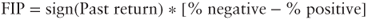

The FIP measure looks at the past 252 trading days for all high-momentum stocks and tabulates the percentage of trading days with negative returns and the percentage of trading days that are positive. These two calculation components are subtracted from one another and multiplied by the sign of the generic momentum signal (i.e., 12-month total return, skipping the first month). For example, say stock ABC has a generic momentum calculation of 50 percent. If 35 percent of the past 252 trading days are negative, 1 percent of trading days are flat, and 64 percent are positive, then ABC's . The more negative the FIP, the better. The FIP algorithm separates high momentum stocks into those that have more continuous price paths (i.e., smooth, with a slow diffusion of gradual information elements) versus those high momentum stocks that have more discrete price paths (i.e., jumpy, with immediate information elements). The FIP algorithm serves as a 2-for-1 benefit, as it systematically minimizes exposure to lottery-like stock characteristics and focuses on those high momentum stocks that are most likely to be suffering from the core reason why momentum stocks outperform: investors are systematically underreacting to positive news.

Finally, in [Chapter 7](#section-18), we investigate seasonality and how it relates to momentum strategies. The core finding from this chapter is that window dressing and tax minimization incentives likely play a role in the time series dynamics of the profitability of momentum strategies. We discuss the difficulty of exploiting this seasonality evidence due to real-world concerns related to frictional costs and trading complexity. However, we highlight that this information can be indirectly leveraged by incorporating seasonality knowledge into the rebalance program of a momentum strategy. Our research highlights that timing momentum strategy rebalances, such that the strategy trades ahead of window dressers and tax motivated investors, delivers a positive contribution to expected performance.

In the end, we boiled down our momentum process into five sequential steps (depicted in [Figure 8.1](#c08-fig-0001)):

[**Figure 8.1**](#c08-fig-anc-0001) Quantitative Momentum Process

1. **1. Identify Investable Universe**: Our universe generally consists of mid- to large-capitalization U.S. exchange-traded stocks.
2. **2. Generic Momentum Screen**: We rank stocks within our universe based on their past 12-month returns, ignoring the last month.
3. **3. Momentum Quality Screen**: We screen high-momentum stocks on the “quality” of their momentum, which we measure via the FIP algorithm.
4. **4. Momentum Seasonality Screen**: We take advantage of seasonal aspects applicable to momentum investing, which determines the timing of our rebalance. We rebalance quarterly before quarter ending months.
5. **5. Invest with Conviction**: We seek to invest in a concentrated portfolio of stocks with the highest quality momentum. This form of investing requires disciplined commitment, as well as a willingness to deviate from standard benchmarks.

A hypothetical portfolio construction scenario would work in the following way. Consider a universe of 1,000 stocks identified in step 1. In step 2, we calculate generic momentum scores for each of the 1,000 securities and identify the top 10 percent, or 100 highest generic momentum stocks. For step 3, we calculate the FIP score for the 100 high-momentum names identified in step 2 and rank these 100 stocks on FIP, where lower is better. We identify the top half, or 50 high-momentum stocks with the smoothest momentum. In step 4, we determine the model portfolio and conduct our rebalance at the end of February, May, August, and November to exploit seasonality effects. Finally, in step 5, we implement the roughly 50-stock portfolio strategy with an equal-weight construction (to minimize stock specific risk) and prepare for high relative performance volatility and the blessing (and curse) of long periods of relative outperformance (and underperformance).

## TRANSACTION COSTS

Transaction costs are commonly discussed as a core reason why momentum is a failed investment practice left to the hypothetical day trading technical analysis heretics who lack brains. We covered some of the academic research on the subject of momentum profits net of transaction costs in [Chapter 5](#section-16). And while the academic research consensus is that transaction costs matter for momentum strategies, as they do for any active investment strategy, the myth of momentum strategies as being too expensive to exploit is probably too strong. This “myth” is often preached by those who are (1) unfamiliar with the research on the subject and (2) have never had experience trading momentum strategies in practice. Cliff Asness et al. attack this issue head on in their appropriately titled paper “Facts, Fiction, and Momentum Investing.” Asness states succinctly that “you don't have to do much math to realize that momentum can easily survive trading costs.”[2](#c08-note-0002) We encourage interested readers to explore and compare the analysis of momentum transaction costs presented in Frazzini, Israel, and Moskowitz,[3](#c08-note-0003) who analyze realized transaction costs data from AQR capital over a sustained period of time, and Lesmond, Schill, and Zhou, who estimate trading costs from daily and intra-day analysis via an academic exercise that does not consider that professional investors have much lower trading costs and implement strategies to minimize rebalance costs.[4](#c08-note-0004) Of course, extrapolating Asness's research too far would also be foolish. Common sense suggests that one cannot jam billions upon billions of dollars into momentum strategies without recourse. If more disciplined capital is deployed into momentum strategies over time, without a corresponding decrease in transaction costs, the net benefit to a momentum strategy may become muted.

When testing the quantitative momentum algorithm, we must decide at the outset of the investment simulation how we incorporate transaction costs into our backtests. For simplicity, we incorporate a 1 percent management fee, under the assumption that most investors would need to hire a professional to implement a robust momentum strategy, and a 0.20 percent rebalancing cost. Our 0.20 rebalance cost is assessed four times per year for a quarterly rebalanced strategy, and this translates into a 0.80 percent annual trading cost. The total management fee and trading costs sum up to 1.80 percent per year, which is what we use for all the analysis we present in this chapter, unless stated otherwise.

Now, before the reader suffers a knee-jerk reaction that the fees should be much higher or much lower, consider the fact that we already know this estimate is unlikely to be the true estimate and will vary wildly. In practice, different investors will have different cost structures, tax situations, and trading and execution skills. Cost assumptions for one group of investors can be a degree of magnitude larger (or smaller) for another set of investors. We are merely establishing a baseline cost estimate to take into account the fact that costs will have *some* effect on the final outcome. In our own live trading of the quantitative momentum strategy, we have experienced much lower trading costs than those assumed, but historically the trading costs would have been much higher than those assumed. We hope that our estimate is a “goldilocks” estimate—not too cold; not too hot; and perhaps just right. We don't claim to have the perfect answers and we encourage all investors to gauge the expected costs of running these systems and adjust the results accordingly.

## THE PARAMETERS OF THE UNIVERSE

To ensure other researchers have enough information to replicate and independently verify our results, we outline the details of the stock universe we explore and the assumptions we make to conduct our analysis in [Table 8.1](#c08-tbl-0001). Our universe is liquid and investable, requiring a minimum market capitalization at each rebalance period that is greater than the NYSE 40 percent market capitalization breakpoint at the time of the rebalance. Our analysis runs from March 1, 1927, through December 31, 2014,[5](#c08-note-0005) and our data come from the academic research gold standard for return data: CRSP (The Center for Research in Security Prices).

[**Table 8.1**](#c08-tbl-anc-0001) Universe Selection Parameters

|  |  |
| --- | --- |
| **Item** | **Item Description** |
| Market Capitalization | NYSE 40% Breakpoint |
| Exchanges | NYSE/AMEX/NASDAQ |
| Included Security Types | Ordinary Common Shares |
| Excluded Industries | None |
| Return Data | Prices adjusted for dividends, splits, and corporate actions |
| Delisting Algorithm | “Delisting Returns and their Effect on Accounting-Based Market Anomalies,” by William Beaver, Maureen McNichols, and Richard Price[6](#c08-note-0006) |
| Portfolio Weights | Market-capitalization weighted (VW, or value-weight) |

## QUANTITATIVE MOMENTUM ANALYSIS

We do a deep dive into the historical performance of the quantitative momentum system. Our analysis is organized as follows:

- Summary statistics
- Reward analysis
- Risk analysis
- Robustness analysis

### Summary Statistics

[Table 8.2](#c08-tbl-0002) sets out the standard statistical analyses of the quantitative momentum strategy's performance and risk profile, comparing it to the generic momentum strategy (no seasonality, no FIP), and the Standard & Poor's 500 Total Return Index (S&P 500 TR Index). The returns shown in [Table 8.2](#c08-tbl-0002) are net of 1.80 percent in fees for all three of the momentum strategies, and the S&P 500 Index is gross of fees. We give the passive index an unrealistic cost advantage (i.e., free) to ensure we are conservative in our assessment of the results. All results are value-weight (sometimes referred to as market-cap weight) to maintain consistency. An alternative weighting scheme is to equal-weight the portfolio holdings. This alternative equal-weighting scheme is beneficial in two ways:

[**Table 8.2**](#c08-tbl-anc-0002) VW Quantitative Momentum Performance (1927–2014)

|  |  |  |  |
| --- | --- | --- | --- |
|  | **Quantitative Momentum (Net)** | **Generic Momentum (Net)** | **S&P 500 Index** |
| **CAGR** | 15.80% | 13.45% | 9.92% |
| **Standard Deviation** | 23.89% | 23.62% | 19.11% |
| **Downside Deviation** | 17.56% | 17.44% | 14.22% |
| **Sharpe Ratio** | 0.60 | 0.51 | 0.41 |
| **Sortino Ratio (MAR** c08-math-0003 **5%)** | 0.72 | 0.60 | 0.44 |
| **Worst Drawdown** | –76.97% | –75.81% | –84.59% |
| **Worst Month Return** | –31.91% | –30.15% | –28.73% |
| **Best Month Return** | 31.70% | 33.73% | 41.65% |
| **Profitable Months** | 63.00% | 61.39% | 61.76% |

1. *Diversification*—You allocate the same percentage of capital to each stock, so no one stock has a large weight in the portfolio.
2. *Small-cap Effect*—On average, the returns to smaller stocks has been larger in the past, and for our portfolio, this means higher expected returns.

[Table 8.2](#c08-tbl-0002) shows that the quantitative momentum strategy generated a compound annual growth rate (CAGR) of 15.80 percent, significantly outperforming the generic momentum performance of 13.45 percent. The Quantitative Momentum strategy also outperformed the S&P 500, which returned 9.92 percent.

The quantitative momentum portfolio achieved this return with a much higher volatility than the benchmark portfolio, which is to be expected because the portfolio is more concentrated than the passive benchmark (i.e., averages 43.9 stocks over the time period) and the strategy is designed to be difficult to follow. Quantitative momentum had a standard deviation of 23.89 percent against the passive S&P 500 benchmark volatility measure of 19.11 percent. Despite the enhanced volatility, the risk-adjusted parameters are still favorable for the quantitative momentum strategy. The strategy has a Sharpe ratio of 0.60, considerably better than the S&P 500 Sharpe ratio of 0.41. The strategy also has a higher downside volatility, with downside deviation at 17.56 percent to the benchmark's 14.22 percent. However, the higher returns compensate for the higher downside volatility, leading to an exceptional Sortino ratio of 0.72 for the quantitative momentum strategy, against 0.44 for the benchmark.

If we look at the worst drawdowns, which represent the worst possible peak-to-trough returns associated with the various strategies, the quantitative momentum strategy showcases that the strategy can be extraordinarily painful! The worst drawdown suffered by the quantitative momentum portfolio is –76.97 percent, which is the Great Depression drawdown (the benchmark drawdown was an even worse –84.59 percent).

We must emphatically emphasize that investors need to be prepared for the enhanced volatility and drawdown risks associated with momentum strategies—that is a primary reason why this system is expected to work in the future—but this enhanced risk is more than offset by additional expected returns, which is what makes momentum anomalous.

### Rewards Analysis

Consider [Figure 8.2](#c08-fig-0002), which shows the cumulative performance of the quantitative momentum portfolio compared to the other strategies.

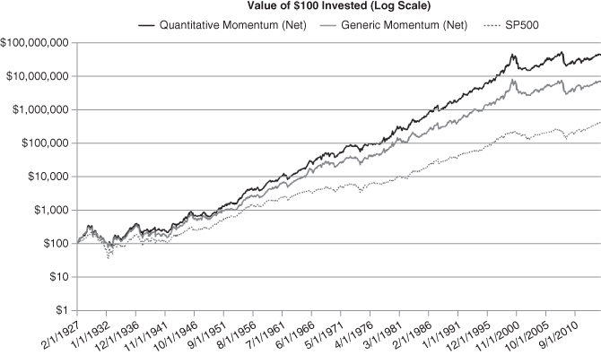

[**Figure 8.2**](#c08-fig-anc-0002) Cumulative Value for Quantitative Momentum (1927–2014)

[Figure 8.2](#c08-fig-0002) illustrates the effects of compounding an edge over a long period of time. The quantitative momentum portfolio's small advantage leads to a jaw-dropping spread relative to the passive benchmark.

[Table 8.3](#c08-tbl-0003) shows the compound annual growth rates (CAGR) of the quantitative momentum portfolio and the competition over different decades. The intent of this test is to examine the robustness of performance across time.

[**Table 8.3**](#c08-tbl-anc-0003) CAGR Across Different Decades

|  |  |  |  |
| --- | --- | --- | --- |
|  | **Quantitative Momentum (Net)** | **Generic Momentum (Net)** | **S&P 500 Index** |
| **1930–1939** | 3.08% | 1.64% | –1.34% |
| **1940–1949** | 11.01% | 11.85% | 9.15% |
| **1950–1959** | 24.98% | 21.31% | 19.42% |
| **1960–1969** | 20.50% | 18.26% | 7.84% |
| **1970–1979** | 13.93% | 13.21% | 5.83% |
| **1980–1989** | 24.48% | 17.38% | 17.61% |
| **1990–1999** | 36.48% | 30.21% | 18.37% |
| **2000–2009** | –3.58% | –4.88% | –0.68% |

Over eight full decades, the quantitative momentum portfolio outperformed in seven of the eight. A concern some may have is that the quantitative momentum portfolio lost in the most recent decade. Perhaps momentum is dead because the smart arbitrageurs eliminated the momentum premium? We can never eliminate this possibility; however, a decade of underperformance is not unexpected. Geczy and Samonov find that long periods of poor relative performance occur on multiple occasions in out-of-sample testing over the 1801 to 1926 time period.[7](#c08-note-0007) Moreover, as we explained earlier in the book, sticking to the algorithm is difficult because of the high volatility and career risk. Second, if one examines the net of fee results of the equal-weighted quantitative momentum portfolio (not shown), this portfolio actually outperformed on a CAGR basis over the 2000–2009 decade. Nonetheless, no sustainable system can work all the time. And while [Figure 8.2](#c08-fig-0002) makes quantitative momentum seem like a “no-brainer,” a deeper dive into shorter windows highlights the fact that there are periods of *extreme* relative underperformance over the 1927 to 2014 period. Momentum investing is simple, but not easy.

Here we look at a variety of measures to assess the performance across rolling periods. [Figures 8.3a](#c08-fig-0003) and [8.3b](#c08-fig-0004) show the rolling 5- and 10-year CAGRs for the strategy. These figures show the relevant holding period return at different points in time. A robust strategy will show consistent outperformance regardless of timing; a “lucky” strategy may have extreme outperformance in one time period but flounder in others.

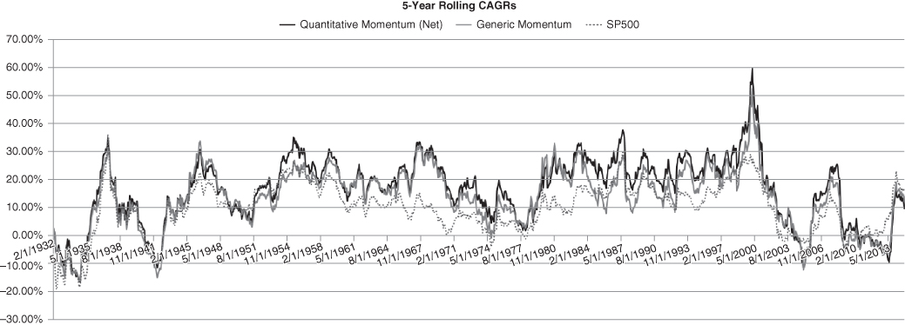

[**Figure 8.3a**](#c08-fig-anc-0003) Five-Year Rolling CAGR for Quantitative Momentum

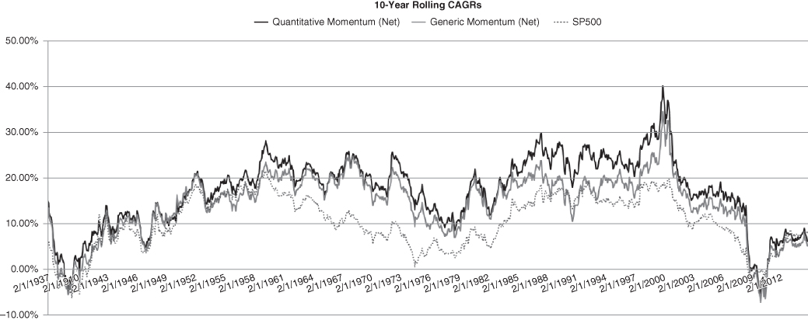

[**Figure 8.3b**](#c08-fig-anc-0004) Ten-Year Rolling CAGR for Quantitative Momentum

[Figures 8.3a](#c08-fig-0003) and [8.3b](#c08-fig-0004) illustrate how consistently the strategy beats the Generic momentum portfolio and the S&P 500 on rolling 5- and 10-year bases. Only rarely, and for brief periods, was it better to have been invested in the others. Two periods of long-term underperformance include the Great Depression period and the most recent period following the 2008 financial crisis. This underperformance is to be expected, and appreciated, because these periods “shake out” weak hands. Over the long haul, a sustainable process wins out.

### Risk Analysis

As the previous analysis emphasizes, the power of momentum is an ability to generate outsize returns that dwarf returns associated with passive benchmarks. Unfortunately, outsized expected returns deliver enhanced risks. The risk and reward trade-off for momentum is still favorable, but not acknowledging the increased risk would be intellectually dishonest and set up a prospective momentum investor with the improper expectations. We examine the risks associated with quantitative momentum in the analysis that follows.

Our risk analysis focuses on maximum drawdowns. The maximum drawdown is defined as the maximum peak to trough loss associated with a time series. Maximum drawdown captures the worst possible performance scenario experienced by a buy and hold investor dedicated to a specific strategy. The intuition behind maximum drawdown is simple: How much can I lose?

[Figure 8.4](#c08-fig-0005) shows the summary drawdown performance of quantitative momentum across commonly assessed horizons of one month, one year, and three years.

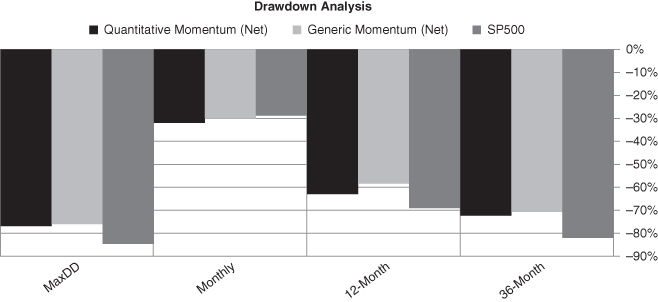

[**Figure 8.4**](#c08-fig-anc-0005) Summary Drawdown Analysis

The quantitative momentum strategy protects capital better than the competition based on the results in [Figure 8.4](#c08-fig-0005). The strategy's single-worst drawdown was worse than the generic momentum strategy, but beat the S&P 500. However, quantitative momentum did lose over rolling 1- and 12-month periods to the competition. The worst-case scenario for the strategy over a 3-year period was again slightly better than the S&P 500. To be clear—our portfolio is a long-only strategy, so it is expected to have similar drawdowns when compared to the market.

[Figures 8.5a](#c08-fig-0006) and [8.5b](#c08-fig-0007) show the rolling 5- and 10-year maximum drawdowns for the strategy. These figures help researchers identify the frequency and intensity of a strategy's maximum drawdowns over a designated time horizon (e.g., 5 years or 10 years). But why are rolling drawdowns a useful analytical tool? Consider two strategies with similar worst drawdowns. If one strategy experiences big drawdowns several times through history, while the other experiences big drawdowns only once, this analysis helps us identify this higher frequency of large drawdowns.

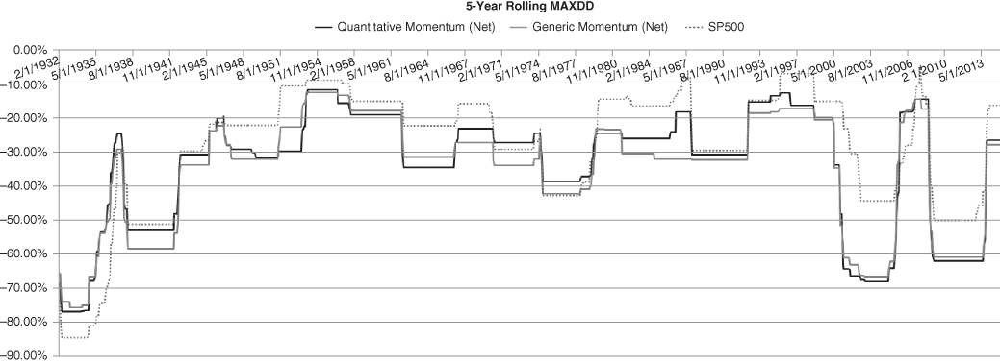

[**Figure 8.5a**](#c08-fig-anc-0006) Five-Year Rolling Max Drawdown for Quantitative Momentum

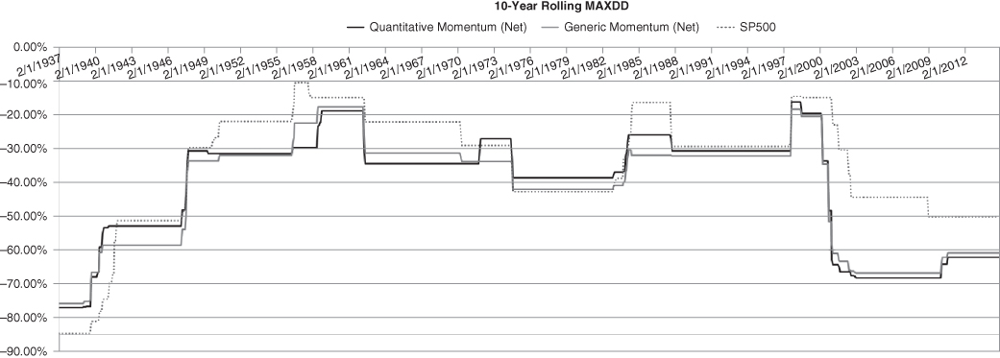

[**Figure 8.5b**](#c08-fig-anc-0007) Ten-Year Rolling Max Drawdown for Quantitative Momentum

The rolling drawdown analysis shows that the strategy suffers drawdowns that can be larger than the competition. For example, in the aftermath of the Internet bubble, quantitative momentum took it on the chin, especially compared to the broad index. Similarly, in the 2008 financial crisis, the quantitative momentum portfolio was hit a bit harder than the broad index.

Finally, we end our analysis with an assessment of the relative performance of quantitative momentum during the strategy's worst 10 drawdowns. We compare the quantitative momentum drawdowns to the performance of the passive index over the same time period. This analysis gives us insight into the tail-risk correlations between the quantitative momentum strategy and the passive market. [Table 8.4](#c08-tbl-0004) highlights two points: First, quantitative momentum is a long-only equity strategy with huge drawdowns. Second, the drawdowns are correlated with general market drawdowns. Overall, the quantitative momentum portfolio will have large drawdowns and periods of underperformance, and one should expect this at the outset.

[**Table 8.4**](#c08-tbl-anc-0004) Top 10 Drawdown Analysis

|  |  |  |  |  |
| --- | --- | --- | --- | --- |
| **Rank** | **Date Start** | **Date End** | **Quantitative Momentum** | **S&P 500 TR Index** |
| 1 | 1/31/1929 | 5/31/1932 | –76.97% | –80.67% |
| 2 | 2/29/2000 | 2/28/2003 | –68.14% | –35.14% |
| 3 | 6/30/2008 | 2/28/2009 | –62.12% | –40.82% |
| 4 | 3/31/1937 | 3/31/1938 | –52.99% | –51.11% |
| 5 | 12/31/1972 | 9/30/1974 | –38.68% | –42.73% |
| 6 | 11/30/1961 | 6/30/1962 | –34.57% | –21.97% |
| 7 | 5/31/1946 | 6/30/1949 | –31.69% | –13.77% |
| 8 | 9/30/1987 | 11/30/1987 | –30.88% | –28.00% |
| 9 | 4/30/1940 | 4/30/1942 | –30.81% | –26.52% |
| 10 | 11/30/1968 | 6/30/1970 | –27.23% | –29.23% |

### Robustness Analysis

In this section, we examine a variety of tests that look at a strategy from different angles so that we can gain insight into the big picture and ascertain that the summary statistics reflect a broad reality that is not driven by extreme outliers.

We first analyze market cycle performance of the quantitative momentum strategy compared to the other strategies over a variety of bull and bear markets since 1927. [Table 8.5](#c08-tbl-0005) shows the dates used to calculate market cycle returns.

[**Table 8.5**](#c08-tbl-anc-0005) Market Cycle Definitions

|  |  |  |
| --- | --- | --- |
|  | **Month Begin** | **Month End** |
| **Bear** | September-29 | July-32 |
| **Bull** | June-62 | February-66 |
| **Bear** | November-68 | May-70 |
| **Bull** | May-70 | December-72 |
| **Bear** | January-73 | September-74 |
| **Bull** | June-82 | December-84 |
| **Bear** | July-87 | December-87 |
| **Bull** | December-87 | June-90 |
| **Bear** | March-00 | September-01 |
| **Bull** | October-01 | July-07 |
| **Bear** | August-08 | February-09 |
| **Bull** | March-09 | December-14 |

[Figure 8.6](#c08-fig-0008) demonstrates that, on average, the strategy performed similar to the S&P 500 in bear markets and outperformed the S&P 500 in bull markets. Again, relative losses to the S&P 500 appear in the most recent bear and bull markets. There are surely commentators that claim “momentum is dead.” Great, we hope this commentary continues. While the strategy may occasionally struggle for short—or even long—periods of time, momentum systems provide a high chance of expected outperformance through a full market cycle.

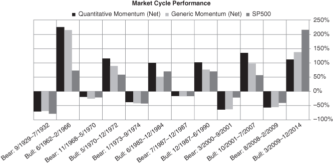

[**Figure 8.6**](#c08-fig-anc-0008) Market Cycle Performance for Quantitative Momentum

[Figure 8.7](#c08-fig-0009) shows the relative performances during recent short-term stress events of the quantitative momentum strategy and the other strategies. This analysis examines how a strategy tends to perform through extraordinary short-term market events. The model shows strong performance compared to the other S&P 500 during the NASDAQ run-up, but underperformance in the NASDAQ crash in 1998 and the 2008 financial crisis.

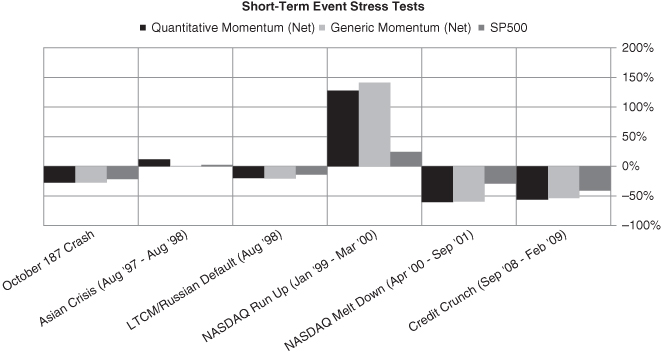

[**Figure 8.7**](#c08-fig-anc-0009) Short-Term Stress Event Tests for Quantitative Momentum

[Figures 8.8a](#c08-fig-0010) and [8.8b](#c08-fig-0011) show the rolling 5- and 10-year alpha for the strategy. Alpha analysis is typically found in quantitative research articles published in academic journals. The procedures researchers use to estimate alpha can be complicated, but the idea is simple: How much average excess return does a strategy create after controlling for a variety of risk factors?

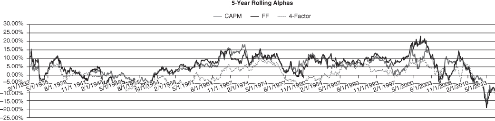

[**Figure 8.8a**](#c08-fig-anc-0010) Five-Year Rolling Alpha for Quantitative Momentum

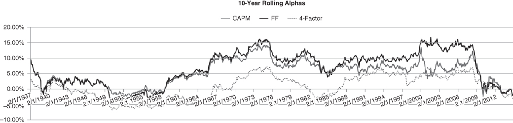

[**Figure 8.8b**](#c08-fig-anc-0011) Ten-Year Rolling Alpha for Quantitative Momentum

To assess robustness, we estimate alpha using several different asset-pricing models. We control for general market risk using the capital asset pricing model;[8](#c08-note-0008) we adjust for market, size, and value exposures with the Fama and French three-factor model,[9](#c08-note-0009) and we account for momentum using the four-factor model.[10](#c08-note-0010),[11](#c08-note-0011) All of these factors can be found at Ken French's website.[12](#c08-note-0012)

[Figures 8.8a](#c08-fig-0010) and [8.8b](#c08-fig-0011) confirm that the quantitative momentum strategy generates relatively consistent alpha estimates on a rolling 5- and 10-year basis, regardless of the asset pricing model we choose. Not surprisingly, the four-factor alpha is the smallest, as this model controls for exposure to generic momentum. On a rolling 5-year basis there are only a few instances where the strategy's performance does not add value after controlling for risk. The 10-year rolling chart tells the story vividly: Over the long-term, quantitative momentum has generally added value for investor portfolios.

In this section, we calculate the formal beta estimates and alpha estimates associated with our kitchen sink of asset pricing models. [Table 8.6](#c08-tbl-0006) shows the full sample coefficient estimates for the four asset-pricing models. MKT-RF represents the excess return on the market-weight returns of all New York Stock Exchange (NYSE)/American Stock Exchange (AMEX)/NASDAQ stocks. SMB is a long/short factor portfolio that captures exposures to small capitalization stocks. HML is a long/short factor portfolio that controls for exposure to high book value-to-market capitalization stocks. MOM is a long/short factor portfolio that controls for exposure to stocks that have had great performance over the recent year.

[**Table 8.6**](#c08-tbl-anc-0006) Asset Pricing Coefficient Estimates for Quantitative Momentum

|  |  |  |  |  |  |
| --- | --- | --- | --- | --- | --- |
|  | **Annual Alpha** | **MKT-RF** | **SMB** | **HML** | **MOM** |
| **CAPM** | **6.30%** | **1.02** | — | — | — |
| **Three-Factor** | **7.44%** | **1.05** | **0.17** | –**0.41** | — |
| **Four-Factor** | 0.85% | **1.17** | **0.21** | –**0.16** | **0.55** |

The results are tabulated in [Table 8.6](#c08-tbl-0006) and coefficient estimates that are significant at the 5 percent confidence level (two-tailed tests) are bolded.

[Table 8.6](#c08-tbl-0006) suggests that quantitative momentum generates between approximately 6 or 7 percent per year in “alpha,” or performance not explained by exposures to known expected return factors such as the market, size, and value. When including the generic momentum factor, the quantitative momentum portfolio does not provide any significant alpha, but does load positively on the momentum factor (MOM). The alpha analysis suggests that the quantitative momentum strategies stronger performance is related to higher beta exposure than the broader market (MKT-RF beta slightly above 1), the system tends to be exposed to smaller stocks (0.17 and 0.21 on the SMB factor), *and very importantly, is not value* (HML is –0.41 and –0.16). If we compare the alpha statistics against the generic momentum strategy, the relationship between HML is less negative (i.e., diversification benefits are not as high). Overall, from a factor analysis perspective, quantitative momentum is no better or worse than generic momentum, the strategy is simply different: The strategy delivers a higher beta version of the generic momentum strategy that also has a stronger diversification benefit when coupled with value strategies. While factor analysis is important, we believe this assessment should be coupled with the results presented in [Table 8.2](#c08-tbl-0002), which reflect more customary—and intuitive—analytics.

## A PEEK INSIDE THE BLACK BOX

Quantitative methods are often considered *black box*, and thus, shunned by many in the investment community. *Quants* generally have earned the negative assessment. Traditional “quants” make things too complex and too opaque, when communication can be simple and radically transparent. The logic portrayed is that by keeping strategies “proprietary,” the quants can keep their intellectual property from being exploited and their investors will be better off. In the context of unsustainable, always changing, trading strategies, this result is certainly true. However, when discussing sustainable, highly active long-term investment strategies, opacity and a general lack of understanding lead to investor failure. At the pinnacle point of pain, when the most disciplined and hardened active investors earn their keep, the active investor with a clear mind, thorough understanding, and a strong conviction for their process will win. Those who do not fully understand why a process works are more likely to provide the active alpha to the clairvoyant investor who can hold on to an active portfolio like grim death.

[Table 8.7](#c08-tbl-0007) lists the top 10 stocks selected by the model on November 30, 2014. This date would be the last rebalance of the portfolio in our tests, which takes advantage of the seasonality by rebalancing at the end of November 2014—since we hold the portfolio for three months, this ends up being the portfolio as of December 31, 2014, as well. [Table 8.7](#c08-tbl-0007) also highlights the important summary statistics, such as the firm's momentum score (total return over the past twelve months ignoring the recent month), and the percentage of positive days minus the percentage of negative return days (remember, this is used to create the frog-in-the-pan variable).

[**Table 8.7**](#c08-tbl-anc-0007) December 31, 2014, Quantitative Momentum Portfolio Holdings

|  |  |  |  |
| --- | --- | --- | --- |
| **Stock Name** | **Ticker** | **Momentum** | **(% Positive) – (% Negative)** |
| International Rectifier Corp. | IRF | 66.1% | 24.3% |
| Marriott International Inc. | MAR | 62.6% | 22.3% |
| N X P Semiconductors N V | NXPI | 61.6% | 21.5% |
| Sandisk Corp | SNDK | 39.8% | 21.1% |
| Dr. Pepper Snapple Group Inc. | DPS | 47.7% | 20.3% |
| Southwest Airlines Co. | LUV | 87.0% | 19.1% |
| Dynegy Inc. | DYN | 42.5% | 18.3% |
| Pilgrims Pride Corp New | PPC | 73.4% | 18.3% |
| Windstream Holdings Inc. | WIN | 44.7% | 17.9% |
| Mallinckrodt Plc. | MNK | 77.4% | 17.9% |

Many of the names listed are well established, but they aren't necessarily the most exciting high-momentum names in the universe. A lot of these firms are somewhat boring, but their price signals are highlighting that there is a sustained amount of positive news driving their momentum. This group of firms is in contrast to some of the higher profile momentum names that do not make the cut: these include Tesla Motors, Monster Beverage, Amgen, Green Mountain Coffee, and Solarwinds. All of these firms have high momentum, but their path to momentum is more discrete and has come via large short-term spikes in performance.

## BEATING THE MARKET WITH QUANTITATIVE MOMENTUM

Momentum is clearly robust and has been studied and documented for many years. The epitome of this sort of research was completed by Chris Geczy and Mikhail Samonov, who confirm momentum's historical track record via an individual stock dataset that is *over 200 years in length*, stating “that the momentum effect is not a product of data-mining.”[13](#c08-note-0013) In this chapter, we present the results of our quantitative momentum system, which is a reflection of the research and concepts outlined in this book. Our solution does not claim to be the “best” or the most “optimized,” but we do think our process is reasonable and ties back to behavioral finance in a coherent and logical way.[14](#c08-note-0014) But will the process work in the future? Nobody knows, but recall in the first four chapters of the book that we outlined a framework for determining whether a historically strong strategy is sustainable into the future. How can we be sure momentum is sustainable? We support this proposition using the same arguments we use to understand why value investing works. Namely, sustainable active investment strategies require the following ingredients:

- A mispricing component
- A costly arbitrage component

As far as mispricing is concerned, as long as human beings suffer from systematic expectation errors, prices will sometimes deviate from fundamentals. In the context of value, this expectation error seems to be an overreaction to negative news, on average; for momentum, the expectation error is likely tied to an underreaction to positive news and predictable seasonal effects. Value and momentum are really two sides of the same behavioral bias coin.

But why aren't momentum strategies (or value strategies) exploited by all smart investors and arbitraged away? As we discussed, the speed at which these mispricing opportunities are eliminated depends on the cost of exploitation. Putting aside an array of transaction and information acquisition costs (which are nonzero, but we will assume don't matter for the purpose of this argument), the biggest cost to exploiting long-lasting mispricing opportunities are agency costs, or career risk concerns. The career risk aspect is created because investors delegate a professional to manage their capital on their behalf. Unfortunately, the investors that delegate their capital to the professional fund managers often assess the performance of their hired manager based on their short-term relative performance to a benchmark. But this creates a warped incentive for the professional fund manager. On the one hand, the fund manager wants to exploit mispricing opportunities because of the high expected long-term performance, but on the other hand, they can do so only to the extent to which exploiting the mispricing opportunities does not cause their expected performance to deviate too far—and/or for too long—from a standard benchmark. In summary, strategies like value and momentum presumably will continue to work because they sometimes *fail spectacularly* relative to passive benchmarks. And if we follow along this line of reasoning, we only need to assume the following to believe that momentum strategies, like value strategies, are sustainable:

- Investors will continue to suffer behavioral bias.
- Investors who delegate will be short-sighted performance chasers.

We think these are two assumptions we can rely on for the foreseeable future. And because of our faith in these assumptions, we believe there will always be opportunities for process-driven, long-term focused, disciplined investors. If we can internalize the lessons from the sustainable active framework, our belief in this framework will grant us the discipline to stick with strategies that many investors find extremely uncomfortable. The ability to stay disciplined to a process is arguably the most important aspect of being a successful investor. How one actually invests is almost a secondary issue. But as is highlighted in a quote attributed to Warren Buffett, “Investing is simple, but not easy.”

## NOTES

[1](#c08-note-anc-0001) James Simmons, “Mathematics, Common Sense, and Good Luck: My Life and Career,” MIT Seminar, January 24, 2011.
[2](#c08-note-anc-0002) Cliff Asness, Andrea Frazzini, Ron Israel, and Toby Moskowitz, “Fact, Fiction, and Momentum Investing,” *The Journal of Portfolio Management* 40 (2014): 75–92.
[3](#c08-note-anc-0003) Andrea Frazzini, Ronen Israel, and Toby Moskowitz, “Trading Costs of Asset Pricing Anomalies,”AQR working paper, 2014.
[4](#c08-note-anc-0004) David A. Lesmond, Michael J. Schill, and Chunsheng Zhou, “The Illusory Nature of Momentum Profits,” *Journal of Financial Economics* 71 (2004): 349–380.
[5](#c08-note-anc-0005) Similar to the end of [Chapter 7](#section-18), our analysis start date changes slightly from January 1, 1927, to March 1, 1927, to facilitate the seasonal rebalance.
[6](#c08-note-anc-0006) William Beaver, Maureen McNichols, and Richard Price, “Delisting Returns and Their Effect on Accounting-based Market Anomalies,” *Journal of Accounting and Economics* 43 (2007): 341–368.
[7](#c08-note-anc-0007) Chris Geczy and Mikhail Samonov, “Two Centuries of Price Return Momentum,” *Financial Analysts Journal* (2016).
[8](#c08-note-anc-0008) William F. Sharpe, “Capital Asset Prices: A Theory of Market Equilibrium under Conditions of Risk,” *Journal of Finance* 19(3) (1964): 425–442.
[9](#c08-note-anc-0009) Eugene Fama and Kenneth French, “Common Risk Factors in the Returns on Stocks and bonds,” *Journal of Financial Economics* 33 (1993): 3–56.
[10](#c08-note-anc-0010) Mark Carhart, “On Persistence in Mutual Fund Performance,” *Journal of Finance* 52 (1997): 57–82.
[11](#c08-note-anc-0011) We also conduct analysis using the Fama and French five-factor model, which includes profitability and investment factors. Since these factors are only available after 1963, we do not show these results in our calculations. In out-of-sample tests (1963–2014), we include the 5-factor model and find qualitatively similar results.
[12](#c08-note-anc-0012) mba.tuck.dartmouth.edu/pages/faculty/ken.french/data\_library.html, accessed 3/1/2016.
[13](#c08-note-anc-0013) Chris Geczy and Mikhail Samonov.
[14](#c08-note-anc-0014) We have conducted many additional tests and analysis not mentioned in this chapter. Please contact the authors at [www.alphaarchitect.com/contact](http://www.alphaarchitect.com/contact) for additional results (e.g., annual returns).

<!-- rl-section id="transaction-costs" class="epub-section" title="TRANSACTION COSTS" -->

# CHAPTER 8 Quantitative Momentum Beats the Market

> *“… we slavishly follow the model. You do whatever it says no matter how smart or dumb you think it is.”*

– Jim Simons, Renaissance Technologies[1](#c08-note-0001)

The components and knowledge required to understand the quantitative momentum system are outlined in [Chapters 5](#section-16) through [7](#section-18). In [Chapter 5](#section-16), we outline the generic relative strength momentum indicator commonly used in academic research. Generic momentum is a starting point in the quantitative momentum system. We calculate the generic momentum measure as the total return (including dividends) of a stock over some particular look-back period (e.g., the past 12 months) and skip the most recent month. We calculate this measure for all stocks in our investment universe.

The next aspect of the quantitative momentum system relates to how we differentiate among generic momentum stocks. If you recall, in [Chapter 6](#section-17) we speak to the evidence on two aspects of investor behavior: (1) a preference for lottery-like assets and (2) limited attention. We first show the evidence that holding stocks with large short-term “spikes” in performance generally underperform. This underperformance is the result of mispricing caused by biased investors who overpay for lottery-like stock characteristics. Next, we examine the so-called frog-in-the-pan momentum algorithm (FIP), which attempts to quantify the path of a high momentum stock. The calculation for the measure is described as follows:

The FIP measure looks at the past 252 trading days for all high-momentum stocks and tabulates the percentage of trading days with negative returns and the percentage of trading days that are positive. These two calculation components are subtracted from one another and multiplied by the sign of the generic momentum signal (i.e., 12-month total return, skipping the first month). For example, say stock ABC has a generic momentum calculation of 50 percent. If 35 percent of the past 252 trading days are negative, 1 percent of trading days are flat, and 64 percent are positive, then ABC's . The more negative the FIP, the better. The FIP algorithm separates high momentum stocks into those that have more continuous price paths (i.e., smooth, with a slow diffusion of gradual information elements) versus those high momentum stocks that have more discrete price paths (i.e., jumpy, with immediate information elements). The FIP algorithm serves as a 2-for-1 benefit, as it systematically minimizes exposure to lottery-like stock characteristics and focuses on those high momentum stocks that are most likely to be suffering from the core reason why momentum stocks outperform: investors are systematically underreacting to positive news.

Finally, in [Chapter 7](#section-18), we investigate seasonality and how it relates to momentum strategies. The core finding from this chapter is that window dressing and tax minimization incentives likely play a role in the time series dynamics of the profitability of momentum strategies. We discuss the difficulty of exploiting this seasonality evidence due to real-world concerns related to frictional costs and trading complexity. However, we highlight that this information can be indirectly leveraged by incorporating seasonality knowledge into the rebalance program of a momentum strategy. Our research highlights that timing momentum strategy rebalances, such that the strategy trades ahead of window dressers and tax motivated investors, delivers a positive contribution to expected performance.

In the end, we boiled down our momentum process into five sequential steps (depicted in [Figure 8.1](#c08-fig-0001)):

[**Figure 8.1**](#c08-fig-anc-0001) Quantitative Momentum Process

1. **1. Identify Investable Universe**: Our universe generally consists of mid- to large-capitalization U.S. exchange-traded stocks.
2. **2. Generic Momentum Screen**: We rank stocks within our universe based on their past 12-month returns, ignoring the last month.
3. **3. Momentum Quality Screen**: We screen high-momentum stocks on the “quality” of their momentum, which we measure via the FIP algorithm.
4. **4. Momentum Seasonality Screen**: We take advantage of seasonal aspects applicable to momentum investing, which determines the timing of our rebalance. We rebalance quarterly before quarter ending months.
5. **5. Invest with Conviction**: We seek to invest in a concentrated portfolio of stocks with the highest quality momentum. This form of investing requires disciplined commitment, as well as a willingness to deviate from standard benchmarks.

A hypothetical portfolio construction scenario would work in the following way. Consider a universe of 1,000 stocks identified in step 1. In step 2, we calculate generic momentum scores for each of the 1,000 securities and identify the top 10 percent, or 100 highest generic momentum stocks. For step 3, we calculate the FIP score for the 100 high-momentum names identified in step 2 and rank these 100 stocks on FIP, where lower is better. We identify the top half, or 50 high-momentum stocks with the smoothest momentum. In step 4, we determine the model portfolio and conduct our rebalance at the end of February, May, August, and November to exploit seasonality effects. Finally, in step 5, we implement the roughly 50-stock portfolio strategy with an equal-weight construction (to minimize stock specific risk) and prepare for high relative performance volatility and the blessing (and curse) of long periods of relative outperformance (and underperformance).

Transaction costs are commonly discussed as a core reason why momentum is a failed investment practice left to the hypothetical day trading technical analysis heretics who lack brains. We covered some of the academic research on the subject of momentum profits net of transaction costs in [Chapter 5](#section-16). And while the academic research consensus is that transaction costs matter for momentum strategies, as they do for any active investment strategy, the myth of momentum strategies as being too expensive to exploit is probably too strong. This “myth” is often preached by those who are (1) unfamiliar with the research on the subject and (2) have never had experience trading momentum strategies in practice. Cliff Asness et al. attack this issue head on in their appropriately titled paper “Facts, Fiction, and Momentum Investing.” Asness states succinctly that “you don't have to do much math to realize that momentum can easily survive trading costs.”[2](#c08-note-0002) We encourage interested readers to explore and compare the analysis of momentum transaction costs presented in Frazzini, Israel, and Moskowitz,[3](#c08-note-0003) who analyze realized transaction costs data from AQR capital over a sustained period of time, and Lesmond, Schill, and Zhou, who estimate trading costs from daily and intra-day analysis via an academic exercise that does not consider that professional investors have much lower trading costs and implement strategies to minimize rebalance costs.[4](#c08-note-0004) Of course, extrapolating Asness's research too far would also be foolish. Common sense suggests that one cannot jam billions upon billions of dollars into momentum strategies without recourse. If more disciplined capital is deployed into momentum strategies over time, without a corresponding decrease in transaction costs, the net benefit to a momentum strategy may become muted.

When testing the quantitative momentum algorithm, we must decide at the outset of the investment simulation how we incorporate transaction costs into our backtests. For simplicity, we incorporate a 1 percent management fee, under the assumption that most investors would need to hire a professional to implement a robust momentum strategy, and a 0.20 percent rebalancing cost. Our 0.20 rebalance cost is assessed four times per year for a quarterly rebalanced strategy, and this translates into a 0.80 percent annual trading cost. The total management fee and trading costs sum up to 1.80 percent per year, which is what we use for all the analysis we present in this chapter, unless stated otherwise.

Now, before the reader suffers a knee-jerk reaction that the fees should be much higher or much lower, consider the fact that we already know this estimate is unlikely to be the true estimate and will vary wildly. In practice, different investors will have different cost structures, tax situations, and trading and execution skills. Cost assumptions for one group of investors can be a degree of magnitude larger (or smaller) for another set of investors. We are merely establishing a baseline cost estimate to take into account the fact that costs will have *some* effect on the final outcome. In our own live trading of the quantitative momentum strategy, we have experienced much lower trading costs than those assumed, but historically the trading costs would have been much higher than those assumed. We hope that our estimate is a “goldilocks” estimate—not too cold; not too hot; and perhaps just right. We don't claim to have the perfect answers and we encourage all investors to gauge the expected costs of running these systems and adjust the results accordingly.

## THE PARAMETERS OF THE UNIVERSE

To ensure other researchers have enough information to replicate and independently verify our results, we outline the details of the stock universe we explore and the assumptions we make to conduct our analysis in [Table 8.1](#c08-tbl-0001). Our universe is liquid and investable, requiring a minimum market capitalization at each rebalance period that is greater than the NYSE 40 percent market capitalization breakpoint at the time of the rebalance. Our analysis runs from March 1, 1927, through December 31, 2014,[5](#c08-note-0005) and our data come from the academic research gold standard for return data: CRSP (The Center for Research in Security Prices).

[**Table 8.1**](#c08-tbl-anc-0001) Universe Selection Parameters

|  |  |
| --- | --- |
| **Item** | **Item Description** |
| Market Capitalization | NYSE 40% Breakpoint |
| Exchanges | NYSE/AMEX/NASDAQ |
| Included Security Types | Ordinary Common Shares |
| Excluded Industries | None |
| Return Data | Prices adjusted for dividends, splits, and corporate actions |
| Delisting Algorithm | “Delisting Returns and their Effect on Accounting-Based Market Anomalies,” by William Beaver, Maureen McNichols, and Richard Price[6](#c08-note-0006) |
| Portfolio Weights | Market-capitalization weighted (VW, or value-weight) |

## QUANTITATIVE MOMENTUM ANALYSIS

We do a deep dive into the historical performance of the quantitative momentum system. Our analysis is organized as follows:

- Summary statistics
- Reward analysis
- Risk analysis
- Robustness analysis

### Summary Statistics

[Table 8.2](#c08-tbl-0002) sets out the standard statistical analyses of the quantitative momentum strategy's performance and risk profile, comparing it to the generic momentum strategy (no seasonality, no FIP), and the Standard & Poor's 500 Total Return Index (S&P 500 TR Index). The returns shown in [Table 8.2](#c08-tbl-0002) are net of 1.80 percent in fees for all three of the momentum strategies, and the S&P 500 Index is gross of fees. We give the passive index an unrealistic cost advantage (i.e., free) to ensure we are conservative in our assessment of the results. All results are value-weight (sometimes referred to as market-cap weight) to maintain consistency. An alternative weighting scheme is to equal-weight the portfolio holdings. This alternative equal-weighting scheme is beneficial in two ways:

[**Table 8.2**](#c08-tbl-anc-0002) VW Quantitative Momentum Performance (1927–2014)

|  |  |  |  |
| --- | --- | --- | --- |
|  | **Quantitative Momentum (Net)** | **Generic Momentum (Net)** | **S&P 500 Index** |
| **CAGR** | 15.80% | 13.45% | 9.92% |
| **Standard Deviation** | 23.89% | 23.62% | 19.11% |
| **Downside Deviation** | 17.56% | 17.44% | 14.22% |
| **Sharpe Ratio** | 0.60 | 0.51 | 0.41 |
| **Sortino Ratio (MAR** c08-math-0003 **5%)** | 0.72 | 0.60 | 0.44 |
| **Worst Drawdown** | –76.97% | –75.81% | –84.59% |
| **Worst Month Return** | –31.91% | –30.15% | –28.73% |
| **Best Month Return** | 31.70% | 33.73% | 41.65% |
| **Profitable Months** | 63.00% | 61.39% | 61.76% |

1. *Diversification*—You allocate the same percentage of capital to each stock, so no one stock has a large weight in the portfolio.
2. *Small-cap Effect*—On average, the returns to smaller stocks has been larger in the past, and for our portfolio, this means higher expected returns.

[Table 8.2](#c08-tbl-0002) shows that the quantitative momentum strategy generated a compound annual growth rate (CAGR) of 15.80 percent, significantly outperforming the generic momentum performance of 13.45 percent. The Quantitative Momentum strategy also outperformed the S&P 500, which returned 9.92 percent.

The quantitative momentum portfolio achieved this return with a much higher volatility than the benchmark portfolio, which is to be expected because the portfolio is more concentrated than the passive benchmark (i.e., averages 43.9 stocks over the time period) and the strategy is designed to be difficult to follow. Quantitative momentum had a standard deviation of 23.89 percent against the passive S&P 500 benchmark volatility measure of 19.11 percent. Despite the enhanced volatility, the risk-adjusted parameters are still favorable for the quantitative momentum strategy. The strategy has a Sharpe ratio of 0.60, considerably better than the S&P 500 Sharpe ratio of 0.41. The strategy also has a higher downside volatility, with downside deviation at 17.56 percent to the benchmark's 14.22 percent. However, the higher returns compensate for the higher downside volatility, leading to an exceptional Sortino ratio of 0.72 for the quantitative momentum strategy, against 0.44 for the benchmark.

If we look at the worst drawdowns, which represent the worst possible peak-to-trough returns associated with the various strategies, the quantitative momentum strategy showcases that the strategy can be extraordinarily painful! The worst drawdown suffered by the quantitative momentum portfolio is –76.97 percent, which is the Great Depression drawdown (the benchmark drawdown was an even worse –84.59 percent).

We must emphatically emphasize that investors need to be prepared for the enhanced volatility and drawdown risks associated with momentum strategies—that is a primary reason why this system is expected to work in the future—but this enhanced risk is more than offset by additional expected returns, which is what makes momentum anomalous.

### Rewards Analysis

Consider [Figure 8.2](#c08-fig-0002), which shows the cumulative performance of the quantitative momentum portfolio compared to the other strategies.

[**Figure 8.2**](#c08-fig-anc-0002) Cumulative Value for Quantitative Momentum (1927–2014)

[Figure 8.2](#c08-fig-0002) illustrates the effects of compounding an edge over a long period of time. The quantitative momentum portfolio's small advantage leads to a jaw-dropping spread relative to the passive benchmark.

[Table 8.3](#c08-tbl-0003) shows the compound annual growth rates (CAGR) of the quantitative momentum portfolio and the competition over different decades. The intent of this test is to examine the robustness of performance across time.

[**Table 8.3**](#c08-tbl-anc-0003) CAGR Across Different Decades

|  |  |  |  |
| --- | --- | --- | --- |
|  | **Quantitative Momentum (Net)** | **Generic Momentum (Net)** | **S&P 500 Index** |
| **1930–1939** | 3.08% | 1.64% | –1.34% |
| **1940–1949** | 11.01% | 11.85% | 9.15% |
| **1950–1959** | 24.98% | 21.31% | 19.42% |
| **1960–1969** | 20.50% | 18.26% | 7.84% |
| **1970–1979** | 13.93% | 13.21% | 5.83% |
| **1980–1989** | 24.48% | 17.38% | 17.61% |
| **1990–1999** | 36.48% | 30.21% | 18.37% |
| **2000–2009** | –3.58% | –4.88% | –0.68% |

Over eight full decades, the quantitative momentum portfolio outperformed in seven of the eight. A concern some may have is that the quantitative momentum portfolio lost in the most recent decade. Perhaps momentum is dead because the smart arbitrageurs eliminated the momentum premium? We can never eliminate this possibility; however, a decade of underperformance is not unexpected. Geczy and Samonov find that long periods of poor relative performance occur on multiple occasions in out-of-sample testing over the 1801 to 1926 time period.[7](#c08-note-0007) Moreover, as we explained earlier in the book, sticking to the algorithm is difficult because of the high volatility and career risk. Second, if one examines the net of fee results of the equal-weighted quantitative momentum portfolio (not shown), this portfolio actually outperformed on a CAGR basis over the 2000–2009 decade. Nonetheless, no sustainable system can work all the time. And while [Figure 8.2](#c08-fig-0002) makes quantitative momentum seem like a “no-brainer,” a deeper dive into shorter windows highlights the fact that there are periods of *extreme* relative underperformance over the 1927 to 2014 period. Momentum investing is simple, but not easy.

Here we look at a variety of measures to assess the performance across rolling periods. [Figures 8.3a](#c08-fig-0003) and [8.3b](#c08-fig-0004) show the rolling 5- and 10-year CAGRs for the strategy. These figures show the relevant holding period return at different points in time. A robust strategy will show consistent outperformance regardless of timing; a “lucky” strategy may have extreme outperformance in one time period but flounder in others.

[**Figure 8.3a**](#c08-fig-anc-0003) Five-Year Rolling CAGR for Quantitative Momentum

[**Figure 8.3b**](#c08-fig-anc-0004) Ten-Year Rolling CAGR for Quantitative Momentum

[Figures 8.3a](#c08-fig-0003) and [8.3b](#c08-fig-0004) illustrate how consistently the strategy beats the Generic momentum portfolio and the S&P 500 on rolling 5- and 10-year bases. Only rarely, and for brief periods, was it better to have been invested in the others. Two periods of long-term underperformance include the Great Depression period and the most recent period following the 2008 financial crisis. This underperformance is to be expected, and appreciated, because these periods “shake out” weak hands. Over the long haul, a sustainable process wins out.

### Risk Analysis

As the previous analysis emphasizes, the power of momentum is an ability to generate outsize returns that dwarf returns associated with passive benchmarks. Unfortunately, outsized expected returns deliver enhanced risks. The risk and reward trade-off for momentum is still favorable, but not acknowledging the increased risk would be intellectually dishonest and set up a prospective momentum investor with the improper expectations. We examine the risks associated with quantitative momentum in the analysis that follows.

Our risk analysis focuses on maximum drawdowns. The maximum drawdown is defined as the maximum peak to trough loss associated with a time series. Maximum drawdown captures the worst possible performance scenario experienced by a buy and hold investor dedicated to a specific strategy. The intuition behind maximum drawdown is simple: How much can I lose?

[Figure 8.4](#c08-fig-0005) shows the summary drawdown performance of quantitative momentum across commonly assessed horizons of one month, one year, and three years.

[**Figure 8.4**](#c08-fig-anc-0005) Summary Drawdown Analysis

The quantitative momentum strategy protects capital better than the competition based on the results in [Figure 8.4](#c08-fig-0005). The strategy's single-worst drawdown was worse than the generic momentum strategy, but beat the S&P 500. However, quantitative momentum did lose over rolling 1- and 12-month periods to the competition. The worst-case scenario for the strategy over a 3-year period was again slightly better than the S&P 500. To be clear—our portfolio is a long-only strategy, so it is expected to have similar drawdowns when compared to the market.

[Figures 8.5a](#c08-fig-0006) and [8.5b](#c08-fig-0007) show the rolling 5- and 10-year maximum drawdowns for the strategy. These figures help researchers identify the frequency and intensity of a strategy's maximum drawdowns over a designated time horizon (e.g., 5 years or 10 years). But why are rolling drawdowns a useful analytical tool? Consider two strategies with similar worst drawdowns. If one strategy experiences big drawdowns several times through history, while the other experiences big drawdowns only once, this analysis helps us identify this higher frequency of large drawdowns.

[**Figure 8.5a**](#c08-fig-anc-0006) Five-Year Rolling Max Drawdown for Quantitative Momentum

[**Figure 8.5b**](#c08-fig-anc-0007) Ten-Year Rolling Max Drawdown for Quantitative Momentum

The rolling drawdown analysis shows that the strategy suffers drawdowns that can be larger than the competition. For example, in the aftermath of the Internet bubble, quantitative momentum took it on the chin, especially compared to the broad index. Similarly, in the 2008 financial crisis, the quantitative momentum portfolio was hit a bit harder than the broad index.

Finally, we end our analysis with an assessment of the relative performance of quantitative momentum during the strategy's worst 10 drawdowns. We compare the quantitative momentum drawdowns to the performance of the passive index over the same time period. This analysis gives us insight into the tail-risk correlations between the quantitative momentum strategy and the passive market. [Table 8.4](#c08-tbl-0004) highlights two points: First, quantitative momentum is a long-only equity strategy with huge drawdowns. Second, the drawdowns are correlated with general market drawdowns. Overall, the quantitative momentum portfolio will have large drawdowns and periods of underperformance, and one should expect this at the outset.

[**Table 8.4**](#c08-tbl-anc-0004) Top 10 Drawdown Analysis

|  |  |  |  |  |
| --- | --- | --- | --- | --- |
| **Rank** | **Date Start** | **Date End** | **Quantitative Momentum** | **S&P 500 TR Index** |
| 1 | 1/31/1929 | 5/31/1932 | –76.97% | –80.67% |
| 2 | 2/29/2000 | 2/28/2003 | –68.14% | –35.14% |
| 3 | 6/30/2008 | 2/28/2009 | –62.12% | –40.82% |
| 4 | 3/31/1937 | 3/31/1938 | –52.99% | –51.11% |
| 5 | 12/31/1972 | 9/30/1974 | –38.68% | –42.73% |
| 6 | 11/30/1961 | 6/30/1962 | –34.57% | –21.97% |
| 7 | 5/31/1946 | 6/30/1949 | –31.69% | –13.77% |
| 8 | 9/30/1987 | 11/30/1987 | –30.88% | –28.00% |
| 9 | 4/30/1940 | 4/30/1942 | –30.81% | –26.52% |
| 10 | 11/30/1968 | 6/30/1970 | –27.23% | –29.23% |

### Robustness Analysis

In this section, we examine a variety of tests that look at a strategy from different angles so that we can gain insight into the big picture and ascertain that the summary statistics reflect a broad reality that is not driven by extreme outliers.

We first analyze market cycle performance of the quantitative momentum strategy compared to the other strategies over a variety of bull and bear markets since 1927. [Table 8.5](#c08-tbl-0005) shows the dates used to calculate market cycle returns.

[**Table 8.5**](#c08-tbl-anc-0005) Market Cycle Definitions

|  |  |  |
| --- | --- | --- |
|  | **Month Begin** | **Month End** |
| **Bear** | September-29 | July-32 |
| **Bull** | June-62 | February-66 |
| **Bear** | November-68 | May-70 |
| **Bull** | May-70 | December-72 |
| **Bear** | January-73 | September-74 |
| **Bull** | June-82 | December-84 |
| **Bear** | July-87 | December-87 |
| **Bull** | December-87 | June-90 |
| **Bear** | March-00 | September-01 |
| **Bull** | October-01 | July-07 |
| **Bear** | August-08 | February-09 |
| **Bull** | March-09 | December-14 |

[Figure 8.6](#c08-fig-0008) demonstrates that, on average, the strategy performed similar to the S&P 500 in bear markets and outperformed the S&P 500 in bull markets. Again, relative losses to the S&P 500 appear in the most recent bear and bull markets. There are surely commentators that claim “momentum is dead.” Great, we hope this commentary continues. While the strategy may occasionally struggle for short—or even long—periods of time, momentum systems provide a high chance of expected outperformance through a full market cycle.

[**Figure 8.6**](#c08-fig-anc-0008) Market Cycle Performance for Quantitative Momentum

[Figure 8.7](#c08-fig-0009) shows the relative performances during recent short-term stress events of the quantitative momentum strategy and the other strategies. This analysis examines how a strategy tends to perform through extraordinary short-term market events. The model shows strong performance compared to the other S&P 500 during the NASDAQ run-up, but underperformance in the NASDAQ crash in 1998 and the 2008 financial crisis.

[**Figure 8.7**](#c08-fig-anc-0009) Short-Term Stress Event Tests for Quantitative Momentum

[Figures 8.8a](#c08-fig-0010) and [8.8b](#c08-fig-0011) show the rolling 5- and 10-year alpha for the strategy. Alpha analysis is typically found in quantitative research articles published in academic journals. The procedures researchers use to estimate alpha can be complicated, but the idea is simple: How much average excess return does a strategy create after controlling for a variety of risk factors?

[**Figure 8.8a**](#c08-fig-anc-0010) Five-Year Rolling Alpha for Quantitative Momentum

[**Figure 8.8b**](#c08-fig-anc-0011) Ten-Year Rolling Alpha for Quantitative Momentum

To assess robustness, we estimate alpha using several different asset-pricing models. We control for general market risk using the capital asset pricing model;[8](#c08-note-0008) we adjust for market, size, and value exposures with the Fama and French three-factor model,[9](#c08-note-0009) and we account for momentum using the four-factor model.[10](#c08-note-0010),[11](#c08-note-0011) All of these factors can be found at Ken French's website.[12](#c08-note-0012)

[Figures 8.8a](#c08-fig-0010) and [8.8b](#c08-fig-0011) confirm that the quantitative momentum strategy generates relatively consistent alpha estimates on a rolling 5- and 10-year basis, regardless of the asset pricing model we choose. Not surprisingly, the four-factor alpha is the smallest, as this model controls for exposure to generic momentum. On a rolling 5-year basis there are only a few instances where the strategy's performance does not add value after controlling for risk. The 10-year rolling chart tells the story vividly: Over the long-term, quantitative momentum has generally added value for investor portfolios.

In this section, we calculate the formal beta estimates and alpha estimates associated with our kitchen sink of asset pricing models. [Table 8.6](#c08-tbl-0006) shows the full sample coefficient estimates for the four asset-pricing models. MKT-RF represents the excess return on the market-weight returns of all New York Stock Exchange (NYSE)/American Stock Exchange (AMEX)/NASDAQ stocks. SMB is a long/short factor portfolio that captures exposures to small capitalization stocks. HML is a long/short factor portfolio that controls for exposure to high book value-to-market capitalization stocks. MOM is a long/short factor portfolio that controls for exposure to stocks that have had great performance over the recent year.

[**Table 8.6**](#c08-tbl-anc-0006) Asset Pricing Coefficient Estimates for Quantitative Momentum

|  |  |  |  |  |  |
| --- | --- | --- | --- | --- | --- |
|  | **Annual Alpha** | **MKT-RF** | **SMB** | **HML** | **MOM** |
| **CAPM** | **6.30%** | **1.02** | — | — | — |
| **Three-Factor** | **7.44%** | **1.05** | **0.17** | –**0.41** | — |
| **Four-Factor** | 0.85% | **1.17** | **0.21** | –**0.16** | **0.55** |

The results are tabulated in [Table 8.6](#c08-tbl-0006) and coefficient estimates that are significant at the 5 percent confidence level (two-tailed tests) are bolded.

[Table 8.6](#c08-tbl-0006) suggests that quantitative momentum generates between approximately 6 or 7 percent per year in “alpha,” or performance not explained by exposures to known expected return factors such as the market, size, and value. When including the generic momentum factor, the quantitative momentum portfolio does not provide any significant alpha, but does load positively on the momentum factor (MOM). The alpha analysis suggests that the quantitative momentum strategies stronger performance is related to higher beta exposure than the broader market (MKT-RF beta slightly above 1), the system tends to be exposed to smaller stocks (0.17 and 0.21 on the SMB factor), *and very importantly, is not value* (HML is –0.41 and –0.16). If we compare the alpha statistics against the generic momentum strategy, the relationship between HML is less negative (i.e., diversification benefits are not as high). Overall, from a factor analysis perspective, quantitative momentum is no better or worse than generic momentum, the strategy is simply different: The strategy delivers a higher beta version of the generic momentum strategy that also has a stronger diversification benefit when coupled with value strategies. While factor analysis is important, we believe this assessment should be coupled with the results presented in [Table 8.2](#c08-tbl-0002), which reflect more customary—and intuitive—analytics.

## A PEEK INSIDE THE BLACK BOX

Quantitative methods are often considered *black box*, and thus, shunned by many in the investment community. *Quants* generally have earned the negative assessment. Traditional “quants” make things too complex and too opaque, when communication can be simple and radically transparent. The logic portrayed is that by keeping strategies “proprietary,” the quants can keep their intellectual property from being exploited and their investors will be better off. In the context of unsustainable, always changing, trading strategies, this result is certainly true. However, when discussing sustainable, highly active long-term investment strategies, opacity and a general lack of understanding lead to investor failure. At the pinnacle point of pain, when the most disciplined and hardened active investors earn their keep, the active investor with a clear mind, thorough understanding, and a strong conviction for their process will win. Those who do not fully understand why a process works are more likely to provide the active alpha to the clairvoyant investor who can hold on to an active portfolio like grim death.

[Table 8.7](#c08-tbl-0007) lists the top 10 stocks selected by the model on November 30, 2014. This date would be the last rebalance of the portfolio in our tests, which takes advantage of the seasonality by rebalancing at the end of November 2014—since we hold the portfolio for three months, this ends up being the portfolio as of December 31, 2014, as well. [Table 8.7](#c08-tbl-0007) also highlights the important summary statistics, such as the firm's momentum score (total return over the past twelve months ignoring the recent month), and the percentage of positive days minus the percentage of negative return days (remember, this is used to create the frog-in-the-pan variable).

[**Table 8.7**](#c08-tbl-anc-0007) December 31, 2014, Quantitative Momentum Portfolio Holdings

|  |  |  |  |
| --- | --- | --- | --- |
| **Stock Name** | **Ticker** | **Momentum** | **(% Positive) – (% Negative)** |
| International Rectifier Corp. | IRF | 66.1% | 24.3% |
| Marriott International Inc. | MAR | 62.6% | 22.3% |
| N X P Semiconductors N V | NXPI | 61.6% | 21.5% |
| Sandisk Corp | SNDK | 39.8% | 21.1% |
| Dr. Pepper Snapple Group Inc. | DPS | 47.7% | 20.3% |
| Southwest Airlines Co. | LUV | 87.0% | 19.1% |
| Dynegy Inc. | DYN | 42.5% | 18.3% |
| Pilgrims Pride Corp New | PPC | 73.4% | 18.3% |
| Windstream Holdings Inc. | WIN | 44.7% | 17.9% |
| Mallinckrodt Plc. | MNK | 77.4% | 17.9% |

Many of the names listed are well established, but they aren't necessarily the most exciting high-momentum names in the universe. A lot of these firms are somewhat boring, but their price signals are highlighting that there is a sustained amount of positive news driving their momentum. This group of firms is in contrast to some of the higher profile momentum names that do not make the cut: these include Tesla Motors, Monster Beverage, Amgen, Green Mountain Coffee, and Solarwinds. All of these firms have high momentum, but their path to momentum is more discrete and has come via large short-term spikes in performance.

## BEATING THE MARKET WITH QUANTITATIVE MOMENTUM

Momentum is clearly robust and has been studied and documented for many years. The epitome of this sort of research was completed by Chris Geczy and Mikhail Samonov, who confirm momentum's historical track record via an individual stock dataset that is *over 200 years in length*, stating “that the momentum effect is not a product of data-mining.”[13](#c08-note-0013) In this chapter, we present the results of our quantitative momentum system, which is a reflection of the research and concepts outlined in this book. Our solution does not claim to be the “best” or the most “optimized,” but we do think our process is reasonable and ties back to behavioral finance in a coherent and logical way.[14](#c08-note-0014) But will the process work in the future? Nobody knows, but recall in the first four chapters of the book that we outlined a framework for determining whether a historically strong strategy is sustainable into the future. How can we be sure momentum is sustainable? We support this proposition using the same arguments we use to understand why value investing works. Namely, sustainable active investment strategies require the following ingredients:

- A mispricing component
- A costly arbitrage component

As far as mispricing is concerned, as long as human beings suffer from systematic expectation errors, prices will sometimes deviate from fundamentals. In the context of value, this expectation error seems to be an overreaction to negative news, on average; for momentum, the expectation error is likely tied to an underreaction to positive news and predictable seasonal effects. Value and momentum are really two sides of the same behavioral bias coin.

But why aren't momentum strategies (or value strategies) exploited by all smart investors and arbitraged away? As we discussed, the speed at which these mispricing opportunities are eliminated depends on the cost of exploitation. Putting aside an array of transaction and information acquisition costs (which are nonzero, but we will assume don't matter for the purpose of this argument), the biggest cost to exploiting long-lasting mispricing opportunities are agency costs, or career risk concerns. The career risk aspect is created because investors delegate a professional to manage their capital on their behalf. Unfortunately, the investors that delegate their capital to the professional fund managers often assess the performance of their hired manager based on their short-term relative performance to a benchmark. But this creates a warped incentive for the professional fund manager. On the one hand, the fund manager wants to exploit mispricing opportunities because of the high expected long-term performance, but on the other hand, they can do so only to the extent to which exploiting the mispricing opportunities does not cause their expected performance to deviate too far—and/or for too long—from a standard benchmark. In summary, strategies like value and momentum presumably will continue to work because they sometimes *fail spectacularly* relative to passive benchmarks. And if we follow along this line of reasoning, we only need to assume the following to believe that momentum strategies, like value strategies, are sustainable:

- Investors will continue to suffer behavioral bias.
- Investors who delegate will be short-sighted performance chasers.

We think these are two assumptions we can rely on for the foreseeable future. And because of our faith in these assumptions, we believe there will always be opportunities for process-driven, long-term focused, disciplined investors. If we can internalize the lessons from the sustainable active framework, our belief in this framework will grant us the discipline to stick with strategies that many investors find extremely uncomfortable. The ability to stay disciplined to a process is arguably the most important aspect of being a successful investor. How one actually invests is almost a secondary issue. But as is highlighted in a quote attributed to Warren Buffett, “Investing is simple, but not easy.”

## NOTES

[1](#c08-note-anc-0001) James Simmons, “Mathematics, Common Sense, and Good Luck: My Life and Career,” MIT Seminar, January 24, 2011.
[2](#c08-note-anc-0002) Cliff Asness, Andrea Frazzini, Ron Israel, and Toby Moskowitz, “Fact, Fiction, and Momentum Investing,” *The Journal of Portfolio Management* 40 (2014): 75–92.
[3](#c08-note-anc-0003) Andrea Frazzini, Ronen Israel, and Toby Moskowitz, “Trading Costs of Asset Pricing Anomalies,”AQR working paper, 2014.
[4](#c08-note-anc-0004) David A. Lesmond, Michael J. Schill, and Chunsheng Zhou, “The Illusory Nature of Momentum Profits,” *Journal of Financial Economics* 71 (2004): 349–380.
[5](#c08-note-anc-0005) Similar to the end of [Chapter 7](#section-18), our analysis start date changes slightly from January 1, 1927, to March 1, 1927, to facilitate the seasonal rebalance.
[6](#c08-note-anc-0006) William Beaver, Maureen McNichols, and Richard Price, “Delisting Returns and Their Effect on Accounting-based Market Anomalies,” *Journal of Accounting and Economics* 43 (2007): 341–368.
[7](#c08-note-anc-0007) Chris Geczy and Mikhail Samonov, “Two Centuries of Price Return Momentum,” *Financial Analysts Journal* (2016).
[8](#c08-note-anc-0008) William F. Sharpe, “Capital Asset Prices: A Theory of Market Equilibrium under Conditions of Risk,” *Journal of Finance* 19(3) (1964): 425–442.
[9](#c08-note-anc-0009) Eugene Fama and Kenneth French, “Common Risk Factors in the Returns on Stocks and bonds,” *Journal of Financial Economics* 33 (1993): 3–56.
[10](#c08-note-anc-0010) Mark Carhart, “On Persistence in Mutual Fund Performance,” *Journal of Finance* 52 (1997): 57–82.
[11](#c08-note-anc-0011) We also conduct analysis using the Fama and French five-factor model, which includes profitability and investment factors. Since these factors are only available after 1963, we do not show these results in our calculations. In out-of-sample tests (1963–2014), we include the 5-factor model and find qualitatively similar results.
[12](#c08-note-anc-0012) mba.tuck.dartmouth.edu/pages/faculty/ken.french/data\_library.html, accessed 3/1/2016.
[13](#c08-note-anc-0013) Chris Geczy and Mikhail Samonov.
[14](#c08-note-anc-0014) We have conducted many additional tests and analysis not mentioned in this chapter. Please contact the authors at [www.alphaarchitect.com/contact](http://www.alphaarchitect.com/contact) for additional results (e.g., annual returns).

<!-- rl-section id="transaction-costs" class="epub-section" title="TRANSACTION COSTS" -->

## TRANSACTION COSTS

Transaction costs are commonly discussed as a core reason why momentum is a failed investment practice left to the hypothetical day trading technical analysis heretics who lack brains. We covered some of the academic research on the subject of momentum profits net of transaction costs in [Chapter 5](#section-16). And while the academic research consensus is that transaction costs matter for momentum strategies, as they do for any active investment strategy, the myth of momentum strategies as being too expensive to exploit is probably too strong. This “myth” is often preached by those who are (1) unfamiliar with the research on the subject and (2) have never had experience trading momentum strategies in practice. Cliff Asness et al. attack this issue head on in their appropriately titled paper “Facts, Fiction, and Momentum Investing.” Asness states succinctly that “you don't have to do much math to realize that momentum can easily survive trading costs.”[2](#c08-note-0002) We encourage interested readers to explore and compare the analysis of momentum transaction costs presented in Frazzini, Israel, and Moskowitz,[3](#c08-note-0003) who analyze realized transaction costs data from AQR capital over a sustained period of time, and Lesmond, Schill, and Zhou, who estimate trading costs from daily and intra-day analysis via an academic exercise that does not consider that professional investors have much lower trading costs and implement strategies to minimize rebalance costs.[4](#c08-note-0004) Of course, extrapolating Asness's research too far would also be foolish. Common sense suggests that one cannot jam billions upon billions of dollars into momentum strategies without recourse. If more disciplined capital is deployed into momentum strategies over time, without a corresponding decrease in transaction costs, the net benefit to a momentum strategy may become muted.

When testing the quantitative momentum algorithm, we must decide at the outset of the investment simulation how we incorporate transaction costs into our backtests. For simplicity, we incorporate a 1 percent management fee, under the assumption that most investors would need to hire a professional to implement a robust momentum strategy, and a 0.20 percent rebalancing cost. Our 0.20 rebalance cost is assessed four times per year for a quarterly rebalanced strategy, and this translates into a 0.80 percent annual trading cost. The total management fee and trading costs sum up to 1.80 percent per year, which is what we use for all the analysis we present in this chapter, unless stated otherwise.

Now, before the reader suffers a knee-jerk reaction that the fees should be much higher or much lower, consider the fact that we already know this estimate is unlikely to be the true estimate and will vary wildly. In practice, different investors will have different cost structures, tax situations, and trading and execution skills. Cost assumptions for one group of investors can be a degree of magnitude larger (or smaller) for another set of investors. We are merely establishing a baseline cost estimate to take into account the fact that costs will have *some* effect on the final outcome. In our own live trading of the quantitative momentum strategy, we have experienced much lower trading costs than those assumed, but historically the trading costs would have been much higher than those assumed. We hope that our estimate is a “goldilocks” estimate—not too cold; not too hot; and perhaps just right. We don't claim to have the perfect answers and we encourage all investors to gauge the expected costs of running these systems and adjust the results accordingly.

<!-- rl-section id="the-parameters-of-the-universe" class="epub-section" title="THE PARAMETERS OF THE UNIVERSE" -->

## THE PARAMETERS OF THE UNIVERSE

To ensure other researchers have enough information to replicate and independently verify our results, we outline the details of the stock universe we explore and the assumptions we make to conduct our analysis in [Table 8.1](#c08-tbl-0001). Our universe is liquid and investable, requiring a minimum market capitalization at each rebalance period that is greater than the NYSE 40 percent market capitalization breakpoint at the time of the rebalance. Our analysis runs from March 1, 1927, through December 31, 2014,[5](#c08-note-0005) and our data come from the academic research gold standard for return data: CRSP (The Center for Research in Security Prices).

[**Table 8.1**](#c08-tbl-anc-0001) Universe Selection Parameters

|  |  |
| --- | --- |
| **Item** | **Item Description** |
| Market Capitalization | NYSE 40% Breakpoint |
| Exchanges | NYSE/AMEX/NASDAQ |
| Included Security Types | Ordinary Common Shares |
| Excluded Industries | None |
| Return Data | Prices adjusted for dividends, splits, and corporate actions |
| Delisting Algorithm | “Delisting Returns and their Effect on Accounting-Based Market Anomalies,” by William Beaver, Maureen McNichols, and Richard Price[6](#c08-note-0006) |
| Portfolio Weights | Market-capitalization weighted (VW, or value-weight) |

<!-- rl-section id="quantitative-momentum-analysis" class="epub-section" title="QUANTITATIVE MOMENTUM ANALYSIS" -->

## QUANTITATIVE MOMENTUM ANALYSIS

We do a deep dive into the historical performance of the quantitative momentum system. Our analysis is organized as follows:

- Summary statistics
- Reward analysis
- Risk analysis
- Robustness analysis

### Summary Statistics

[Table 8.2](#c08-tbl-0002) sets out the standard statistical analyses of the quantitative momentum strategy's performance and risk profile, comparing it to the generic momentum strategy (no seasonality, no FIP), and the Standard & Poor's 500 Total Return Index (S&P 500 TR Index). The returns shown in [Table 8.2](#c08-tbl-0002) are net of 1.80 percent in fees for all three of the momentum strategies, and the S&P 500 Index is gross of fees. We give the passive index an unrealistic cost advantage (i.e., free) to ensure we are conservative in our assessment of the results. All results are value-weight (sometimes referred to as market-cap weight) to maintain consistency. An alternative weighting scheme is to equal-weight the portfolio holdings. This alternative equal-weighting scheme is beneficial in two ways:

[**Table 8.2**](#c08-tbl-anc-0002) VW Quantitative Momentum Performance (1927–2014)

|  |  |  |  |
| --- | --- | --- | --- |
|  | **Quantitative Momentum (Net)** | **Generic Momentum (Net)** | **S&P 500 Index** |
| **CAGR** | 15.80% | 13.45% | 9.92% |
| **Standard Deviation** | 23.89% | 23.62% | 19.11% |
| **Downside Deviation** | 17.56% | 17.44% | 14.22% |
| **Sharpe Ratio** | 0.60 | 0.51 | 0.41 |
| **Sortino Ratio (MAR** c08-math-0003 **5%)** | 0.72 | 0.60 | 0.44 |
| **Worst Drawdown** | –76.97% | –75.81% | –84.59% |
| **Worst Month Return** | –31.91% | –30.15% | –28.73% |
| **Best Month Return** | 31.70% | 33.73% | 41.65% |
| **Profitable Months** | 63.00% | 61.39% | 61.76% |

1. *Diversification*—You allocate the same percentage of capital to each stock, so no one stock has a large weight in the portfolio.
2. *Small-cap Effect*—On average, the returns to smaller stocks has been larger in the past, and for our portfolio, this means higher expected returns.

[Table 8.2](#c08-tbl-0002) shows that the quantitative momentum strategy generated a compound annual growth rate (CAGR) of 15.80 percent, significantly outperforming the generic momentum performance of 13.45 percent. The Quantitative Momentum strategy also outperformed the S&P 500, which returned 9.92 percent.

The quantitative momentum portfolio achieved this return with a much higher volatility than the benchmark portfolio, which is to be expected because the portfolio is more concentrated than the passive benchmark (i.e., averages 43.9 stocks over the time period) and the strategy is designed to be difficult to follow. Quantitative momentum had a standard deviation of 23.89 percent against the passive S&P 500 benchmark volatility measure of 19.11 percent. Despite the enhanced volatility, the risk-adjusted parameters are still favorable for the quantitative momentum strategy. The strategy has a Sharpe ratio of 0.60, considerably better than the S&P 500 Sharpe ratio of 0.41. The strategy also has a higher downside volatility, with downside deviation at 17.56 percent to the benchmark's 14.22 percent. However, the higher returns compensate for the higher downside volatility, leading to an exceptional Sortino ratio of 0.72 for the quantitative momentum strategy, against 0.44 for the benchmark.

If we look at the worst drawdowns, which represent the worst possible peak-to-trough returns associated with the various strategies, the quantitative momentum strategy showcases that the strategy can be extraordinarily painful! The worst drawdown suffered by the quantitative momentum portfolio is –76.97 percent, which is the Great Depression drawdown (the benchmark drawdown was an even worse –84.59 percent).

We must emphatically emphasize that investors need to be prepared for the enhanced volatility and drawdown risks associated with momentum strategies—that is a primary reason why this system is expected to work in the future—but this enhanced risk is more than offset by additional expected returns, which is what makes momentum anomalous.

### Rewards Analysis

Consider [Figure 8.2](#c08-fig-0002), which shows the cumulative performance of the quantitative momentum portfolio compared to the other strategies.

[**Figure 8.2**](#c08-fig-anc-0002) Cumulative Value for Quantitative Momentum (1927–2014)

[Figure 8.2](#c08-fig-0002) illustrates the effects of compounding an edge over a long period of time. The quantitative momentum portfolio's small advantage leads to a jaw-dropping spread relative to the passive benchmark.

[Table 8.3](#c08-tbl-0003) shows the compound annual growth rates (CAGR) of the quantitative momentum portfolio and the competition over different decades. The intent of this test is to examine the robustness of performance across time.

[**Table 8.3**](#c08-tbl-anc-0003) CAGR Across Different Decades

|  |  |  |  |
| --- | --- | --- | --- |
|  | **Quantitative Momentum (Net)** | **Generic Momentum (Net)** | **S&P 500 Index** |
| **1930–1939** | 3.08% | 1.64% | –1.34% |
| **1940–1949** | 11.01% | 11.85% | 9.15% |
| **1950–1959** | 24.98% | 21.31% | 19.42% |
| **1960–1969** | 20.50% | 18.26% | 7.84% |
| **1970–1979** | 13.93% | 13.21% | 5.83% |
| **1980–1989** | 24.48% | 17.38% | 17.61% |
| **1990–1999** | 36.48% | 30.21% | 18.37% |
| **2000–2009** | –3.58% | –4.88% | –0.68% |

Over eight full decades, the quantitative momentum portfolio outperformed in seven of the eight. A concern some may have is that the quantitative momentum portfolio lost in the most recent decade. Perhaps momentum is dead because the smart arbitrageurs eliminated the momentum premium? We can never eliminate this possibility; however, a decade of underperformance is not unexpected. Geczy and Samonov find that long periods of poor relative performance occur on multiple occasions in out-of-sample testing over the 1801 to 1926 time period.[7](#c08-note-0007) Moreover, as we explained earlier in the book, sticking to the algorithm is difficult because of the high volatility and career risk. Second, if one examines the net of fee results of the equal-weighted quantitative momentum portfolio (not shown), this portfolio actually outperformed on a CAGR basis over the 2000–2009 decade. Nonetheless, no sustainable system can work all the time. And while [Figure 8.2](#c08-fig-0002) makes quantitative momentum seem like a “no-brainer,” a deeper dive into shorter windows highlights the fact that there are periods of *extreme* relative underperformance over the 1927 to 2014 period. Momentum investing is simple, but not easy.

Here we look at a variety of measures to assess the performance across rolling periods. [Figures 8.3a](#c08-fig-0003) and [8.3b](#c08-fig-0004) show the rolling 5- and 10-year CAGRs for the strategy. These figures show the relevant holding period return at different points in time. A robust strategy will show consistent outperformance regardless of timing; a “lucky” strategy may have extreme outperformance in one time period but flounder in others.

[**Figure 8.3a**](#c08-fig-anc-0003) Five-Year Rolling CAGR for Quantitative Momentum

[**Figure 8.3b**](#c08-fig-anc-0004) Ten-Year Rolling CAGR for Quantitative Momentum

[Figures 8.3a](#c08-fig-0003) and [8.3b](#c08-fig-0004) illustrate how consistently the strategy beats the Generic momentum portfolio and the S&P 500 on rolling 5- and 10-year bases. Only rarely, and for brief periods, was it better to have been invested in the others. Two periods of long-term underperformance include the Great Depression period and the most recent period following the 2008 financial crisis. This underperformance is to be expected, and appreciated, because these periods “shake out” weak hands. Over the long haul, a sustainable process wins out.

### Risk Analysis

As the previous analysis emphasizes, the power of momentum is an ability to generate outsize returns that dwarf returns associated with passive benchmarks. Unfortunately, outsized expected returns deliver enhanced risks. The risk and reward trade-off for momentum is still favorable, but not acknowledging the increased risk would be intellectually dishonest and set up a prospective momentum investor with the improper expectations. We examine the risks associated with quantitative momentum in the analysis that follows.

Our risk analysis focuses on maximum drawdowns. The maximum drawdown is defined as the maximum peak to trough loss associated with a time series. Maximum drawdown captures the worst possible performance scenario experienced by a buy and hold investor dedicated to a specific strategy. The intuition behind maximum drawdown is simple: How much can I lose?

[Figure 8.4](#c08-fig-0005) shows the summary drawdown performance of quantitative momentum across commonly assessed horizons of one month, one year, and three years.

[**Figure 8.4**](#c08-fig-anc-0005) Summary Drawdown Analysis

The quantitative momentum strategy protects capital better than the competition based on the results in [Figure 8.4](#c08-fig-0005). The strategy's single-worst drawdown was worse than the generic momentum strategy, but beat the S&P 500. However, quantitative momentum did lose over rolling 1- and 12-month periods to the competition. The worst-case scenario for the strategy over a 3-year period was again slightly better than the S&P 500. To be clear—our portfolio is a long-only strategy, so it is expected to have similar drawdowns when compared to the market.

[Figures 8.5a](#c08-fig-0006) and [8.5b](#c08-fig-0007) show the rolling 5- and 10-year maximum drawdowns for the strategy. These figures help researchers identify the frequency and intensity of a strategy's maximum drawdowns over a designated time horizon (e.g., 5 years or 10 years). But why are rolling drawdowns a useful analytical tool? Consider two strategies with similar worst drawdowns. If one strategy experiences big drawdowns several times through history, while the other experiences big drawdowns only once, this analysis helps us identify this higher frequency of large drawdowns.

[**Figure 8.5a**](#c08-fig-anc-0006) Five-Year Rolling Max Drawdown for Quantitative Momentum

[**Figure 8.5b**](#c08-fig-anc-0007) Ten-Year Rolling Max Drawdown for Quantitative Momentum

The rolling drawdown analysis shows that the strategy suffers drawdowns that can be larger than the competition. For example, in the aftermath of the Internet bubble, quantitative momentum took it on the chin, especially compared to the broad index. Similarly, in the 2008 financial crisis, the quantitative momentum portfolio was hit a bit harder than the broad index.

Finally, we end our analysis with an assessment of the relative performance of quantitative momentum during the strategy's worst 10 drawdowns. We compare the quantitative momentum drawdowns to the performance of the passive index over the same time period. This analysis gives us insight into the tail-risk correlations between the quantitative momentum strategy and the passive market. [Table 8.4](#c08-tbl-0004) highlights two points: First, quantitative momentum is a long-only equity strategy with huge drawdowns. Second, the drawdowns are correlated with general market drawdowns. Overall, the quantitative momentum portfolio will have large drawdowns and periods of underperformance, and one should expect this at the outset.

[**Table 8.4**](#c08-tbl-anc-0004) Top 10 Drawdown Analysis

|  |  |  |  |  |
| --- | --- | --- | --- | --- |
| **Rank** | **Date Start** | **Date End** | **Quantitative Momentum** | **S&P 500 TR Index** |
| 1 | 1/31/1929 | 5/31/1932 | –76.97% | –80.67% |
| 2 | 2/29/2000 | 2/28/2003 | –68.14% | –35.14% |
| 3 | 6/30/2008 | 2/28/2009 | –62.12% | –40.82% |
| 4 | 3/31/1937 | 3/31/1938 | –52.99% | –51.11% |
| 5 | 12/31/1972 | 9/30/1974 | –38.68% | –42.73% |
| 6 | 11/30/1961 | 6/30/1962 | –34.57% | –21.97% |
| 7 | 5/31/1946 | 6/30/1949 | –31.69% | –13.77% |
| 8 | 9/30/1987 | 11/30/1987 | –30.88% | –28.00% |
| 9 | 4/30/1940 | 4/30/1942 | –30.81% | –26.52% |
| 10 | 11/30/1968 | 6/30/1970 | –27.23% | –29.23% |

### Robustness Analysis

In this section, we examine a variety of tests that look at a strategy from different angles so that we can gain insight into the big picture and ascertain that the summary statistics reflect a broad reality that is not driven by extreme outliers.

We first analyze market cycle performance of the quantitative momentum strategy compared to the other strategies over a variety of bull and bear markets since 1927. [Table 8.5](#c08-tbl-0005) shows the dates used to calculate market cycle returns.

[**Table 8.5**](#c08-tbl-anc-0005) Market Cycle Definitions

|  |  |  |
| --- | --- | --- |
|  | **Month Begin** | **Month End** |
| **Bear** | September-29 | July-32 |
| **Bull** | June-62 | February-66 |
| **Bear** | November-68 | May-70 |
| **Bull** | May-70 | December-72 |
| **Bear** | January-73 | September-74 |
| **Bull** | June-82 | December-84 |
| **Bear** | July-87 | December-87 |
| **Bull** | December-87 | June-90 |
| **Bear** | March-00 | September-01 |
| **Bull** | October-01 | July-07 |
| **Bear** | August-08 | February-09 |
| **Bull** | March-09 | December-14 |

[Figure 8.6](#c08-fig-0008) demonstrates that, on average, the strategy performed similar to the S&P 500 in bear markets and outperformed the S&P 500 in bull markets. Again, relative losses to the S&P 500 appear in the most recent bear and bull markets. There are surely commentators that claim “momentum is dead.” Great, we hope this commentary continues. While the strategy may occasionally struggle for short—or even long—periods of time, momentum systems provide a high chance of expected outperformance through a full market cycle.

[**Figure 8.6**](#c08-fig-anc-0008) Market Cycle Performance for Quantitative Momentum

[Figure 8.7](#c08-fig-0009) shows the relative performances during recent short-term stress events of the quantitative momentum strategy and the other strategies. This analysis examines how a strategy tends to perform through extraordinary short-term market events. The model shows strong performance compared to the other S&P 500 during the NASDAQ run-up, but underperformance in the NASDAQ crash in 1998 and the 2008 financial crisis.

[**Figure 8.7**](#c08-fig-anc-0009) Short-Term Stress Event Tests for Quantitative Momentum

[Figures 8.8a](#c08-fig-0010) and [8.8b](#c08-fig-0011) show the rolling 5- and 10-year alpha for the strategy. Alpha analysis is typically found in quantitative research articles published in academic journals. The procedures researchers use to estimate alpha can be complicated, but the idea is simple: How much average excess return does a strategy create after controlling for a variety of risk factors?

[**Figure 8.8a**](#c08-fig-anc-0010) Five-Year Rolling Alpha for Quantitative Momentum

[**Figure 8.8b**](#c08-fig-anc-0011) Ten-Year Rolling Alpha for Quantitative Momentum

To assess robustness, we estimate alpha using several different asset-pricing models. We control for general market risk using the capital asset pricing model;[8](#c08-note-0008) we adjust for market, size, and value exposures with the Fama and French three-factor model,[9](#c08-note-0009) and we account for momentum using the four-factor model.[10](#c08-note-0010),[11](#c08-note-0011) All of these factors can be found at Ken French's website.[12](#c08-note-0012)

[Figures 8.8a](#c08-fig-0010) and [8.8b](#c08-fig-0011) confirm that the quantitative momentum strategy generates relatively consistent alpha estimates on a rolling 5- and 10-year basis, regardless of the asset pricing model we choose. Not surprisingly, the four-factor alpha is the smallest, as this model controls for exposure to generic momentum. On a rolling 5-year basis there are only a few instances where the strategy's performance does not add value after controlling for risk. The 10-year rolling chart tells the story vividly: Over the long-term, quantitative momentum has generally added value for investor portfolios.

In this section, we calculate the formal beta estimates and alpha estimates associated with our kitchen sink of asset pricing models. [Table 8.6](#c08-tbl-0006) shows the full sample coefficient estimates for the four asset-pricing models. MKT-RF represents the excess return on the market-weight returns of all New York Stock Exchange (NYSE)/American Stock Exchange (AMEX)/NASDAQ stocks. SMB is a long/short factor portfolio that captures exposures to small capitalization stocks. HML is a long/short factor portfolio that controls for exposure to high book value-to-market capitalization stocks. MOM is a long/short factor portfolio that controls for exposure to stocks that have had great performance over the recent year.

[**Table 8.6**](#c08-tbl-anc-0006) Asset Pricing Coefficient Estimates for Quantitative Momentum

|  |  |  |  |  |  |
| --- | --- | --- | --- | --- | --- |
|  | **Annual Alpha** | **MKT-RF** | **SMB** | **HML** | **MOM** |
| **CAPM** | **6.30%** | **1.02** | — | — | — |
| **Three-Factor** | **7.44%** | **1.05** | **0.17** | –**0.41** | — |
| **Four-Factor** | 0.85% | **1.17** | **0.21** | –**0.16** | **0.55** |

The results are tabulated in [Table 8.6](#c08-tbl-0006) and coefficient estimates that are significant at the 5 percent confidence level (two-tailed tests) are bolded.

[Table 8.6](#c08-tbl-0006) suggests that quantitative momentum generates between approximately 6 or 7 percent per year in “alpha,” or performance not explained by exposures to known expected return factors such as the market, size, and value. When including the generic momentum factor, the quantitative momentum portfolio does not provide any significant alpha, but does load positively on the momentum factor (MOM). The alpha analysis suggests that the quantitative momentum strategies stronger performance is related to higher beta exposure than the broader market (MKT-RF beta slightly above 1), the system tends to be exposed to smaller stocks (0.17 and 0.21 on the SMB factor), *and very importantly, is not value* (HML is –0.41 and –0.16). If we compare the alpha statistics against the generic momentum strategy, the relationship between HML is less negative (i.e., diversification benefits are not as high). Overall, from a factor analysis perspective, quantitative momentum is no better or worse than generic momentum, the strategy is simply different: The strategy delivers a higher beta version of the generic momentum strategy that also has a stronger diversification benefit when coupled with value strategies. While factor analysis is important, we believe this assessment should be coupled with the results presented in [Table 8.2](#c08-tbl-0002), which reflect more customary—and intuitive—analytics.

<!-- rl-section id="section" class="epub-section" -->

### Summary Statistics

[Table 8.2](#c08-tbl-0002) sets out the standard statistical analyses of the quantitative momentum strategy's performance and risk profile, comparing it to the generic momentum strategy (no seasonality, no FIP), and the Standard & Poor's 500 Total Return Index (S&P 500 TR Index). The returns shown in [Table 8.2](#c08-tbl-0002) are net of 1.80 percent in fees for all three of the momentum strategies, and the S&P 500 Index is gross of fees. We give the passive index an unrealistic cost advantage (i.e., free) to ensure we are conservative in our assessment of the results. All results are value-weight (sometimes referred to as market-cap weight) to maintain consistency. An alternative weighting scheme is to equal-weight the portfolio holdings. This alternative equal-weighting scheme is beneficial in two ways:

[**Table 8.2**](#c08-tbl-anc-0002) VW Quantitative Momentum Performance (1927–2014)

|  |  |  |  |
| --- | --- | --- | --- |
|  | **Quantitative Momentum (Net)** | **Generic Momentum (Net)** | **S&P 500 Index** |
| **CAGR** | 15.80% | 13.45% | 9.92% |
| **Standard Deviation** | 23.89% | 23.62% | 19.11% |
| **Downside Deviation** | 17.56% | 17.44% | 14.22% |
| **Sharpe Ratio** | 0.60 | 0.51 | 0.41 |
| **Sortino Ratio (MAR** c08-math-0003 **5%)** | 0.72 | 0.60 | 0.44 |
| **Worst Drawdown** | –76.97% | –75.81% | –84.59% |
| **Worst Month Return** | –31.91% | –30.15% | –28.73% |
| **Best Month Return** | 31.70% | 33.73% | 41.65% |
| **Profitable Months** | 63.00% | 61.39% | 61.76% |

1. *Diversification*—You allocate the same percentage of capital to each stock, so no one stock has a large weight in the portfolio.
2. *Small-cap Effect*—On average, the returns to smaller stocks has been larger in the past, and for our portfolio, this means higher expected returns.

[Table 8.2](#c08-tbl-0002) shows that the quantitative momentum strategy generated a compound annual growth rate (CAGR) of 15.80 percent, significantly outperforming the generic momentum performance of 13.45 percent. The Quantitative Momentum strategy also outperformed the S&P 500, which returned 9.92 percent.

The quantitative momentum portfolio achieved this return with a much higher volatility than the benchmark portfolio, which is to be expected because the portfolio is more concentrated than the passive benchmark (i.e., averages 43.9 stocks over the time period) and the strategy is designed to be difficult to follow. Quantitative momentum had a standard deviation of 23.89 percent against the passive S&P 500 benchmark volatility measure of 19.11 percent. Despite the enhanced volatility, the risk-adjusted parameters are still favorable for the quantitative momentum strategy. The strategy has a Sharpe ratio of 0.60, considerably better than the S&P 500 Sharpe ratio of 0.41. The strategy also has a higher downside volatility, with downside deviation at 17.56 percent to the benchmark's 14.22 percent. However, the higher returns compensate for the higher downside volatility, leading to an exceptional Sortino ratio of 0.72 for the quantitative momentum strategy, against 0.44 for the benchmark.

If we look at the worst drawdowns, which represent the worst possible peak-to-trough returns associated with the various strategies, the quantitative momentum strategy showcases that the strategy can be extraordinarily painful! The worst drawdown suffered by the quantitative momentum portfolio is –76.97 percent, which is the Great Depression drawdown (the benchmark drawdown was an even worse –84.59 percent).

We must emphatically emphasize that investors need to be prepared for the enhanced volatility and drawdown risks associated with momentum strategies—that is a primary reason why this system is expected to work in the future—but this enhanced risk is more than offset by additional expected returns, which is what makes momentum anomalous.

<!-- rl-section id="section" class="epub-section" -->

### Rewards Analysis

Consider [Figure 8.2](#c08-fig-0002), which shows the cumulative performance of the quantitative momentum portfolio compared to the other strategies.

[**Figure 8.2**](#c08-fig-anc-0002) Cumulative Value for Quantitative Momentum (1927–2014)

[Figure 8.2](#c08-fig-0002) illustrates the effects of compounding an edge over a long period of time. The quantitative momentum portfolio's small advantage leads to a jaw-dropping spread relative to the passive benchmark.

[Table 8.3](#c08-tbl-0003) shows the compound annual growth rates (CAGR) of the quantitative momentum portfolio and the competition over different decades. The intent of this test is to examine the robustness of performance across time.

[**Table 8.3**](#c08-tbl-anc-0003) CAGR Across Different Decades

|  |  |  |  |
| --- | --- | --- | --- |
|  | **Quantitative Momentum (Net)** | **Generic Momentum (Net)** | **S&P 500 Index** |
| **1930–1939** | 3.08% | 1.64% | –1.34% |
| **1940–1949** | 11.01% | 11.85% | 9.15% |
| **1950–1959** | 24.98% | 21.31% | 19.42% |
| **1960–1969** | 20.50% | 18.26% | 7.84% |
| **1970–1979** | 13.93% | 13.21% | 5.83% |
| **1980–1989** | 24.48% | 17.38% | 17.61% |
| **1990–1999** | 36.48% | 30.21% | 18.37% |
| **2000–2009** | –3.58% | –4.88% | –0.68% |

Over eight full decades, the quantitative momentum portfolio outperformed in seven of the eight. A concern some may have is that the quantitative momentum portfolio lost in the most recent decade. Perhaps momentum is dead because the smart arbitrageurs eliminated the momentum premium? We can never eliminate this possibility; however, a decade of underperformance is not unexpected. Geczy and Samonov find that long periods of poor relative performance occur on multiple occasions in out-of-sample testing over the 1801 to 1926 time period.[7](#c08-note-0007) Moreover, as we explained earlier in the book, sticking to the algorithm is difficult because of the high volatility and career risk. Second, if one examines the net of fee results of the equal-weighted quantitative momentum portfolio (not shown), this portfolio actually outperformed on a CAGR basis over the 2000–2009 decade. Nonetheless, no sustainable system can work all the time. And while [Figure 8.2](#c08-fig-0002) makes quantitative momentum seem like a “no-brainer,” a deeper dive into shorter windows highlights the fact that there are periods of *extreme* relative underperformance over the 1927 to 2014 period. Momentum investing is simple, but not easy.

Here we look at a variety of measures to assess the performance across rolling periods. [Figures 8.3a](#c08-fig-0003) and [8.3b](#c08-fig-0004) show the rolling 5- and 10-year CAGRs for the strategy. These figures show the relevant holding period return at different points in time. A robust strategy will show consistent outperformance regardless of timing; a “lucky” strategy may have extreme outperformance in one time period but flounder in others.

[**Figure 8.3a**](#c08-fig-anc-0003) Five-Year Rolling CAGR for Quantitative Momentum

[**Figure 8.3b**](#c08-fig-anc-0004) Ten-Year Rolling CAGR for Quantitative Momentum

[Figures 8.3a](#c08-fig-0003) and [8.3b](#c08-fig-0004) illustrate how consistently the strategy beats the Generic momentum portfolio and the S&P 500 on rolling 5- and 10-year bases. Only rarely, and for brief periods, was it better to have been invested in the others. Two periods of long-term underperformance include the Great Depression period and the most recent period following the 2008 financial crisis. This underperformance is to be expected, and appreciated, because these periods “shake out” weak hands. Over the long haul, a sustainable process wins out.

<!-- rl-section id="section" class="epub-section" -->

### Risk Analysis

As the previous analysis emphasizes, the power of momentum is an ability to generate outsize returns that dwarf returns associated with passive benchmarks. Unfortunately, outsized expected returns deliver enhanced risks. The risk and reward trade-off for momentum is still favorable, but not acknowledging the increased risk would be intellectually dishonest and set up a prospective momentum investor with the improper expectations. We examine the risks associated with quantitative momentum in the analysis that follows.

Our risk analysis focuses on maximum drawdowns. The maximum drawdown is defined as the maximum peak to trough loss associated with a time series. Maximum drawdown captures the worst possible performance scenario experienced by a buy and hold investor dedicated to a specific strategy. The intuition behind maximum drawdown is simple: How much can I lose?

[Figure 8.4](#c08-fig-0005) shows the summary drawdown performance of quantitative momentum across commonly assessed horizons of one month, one year, and three years.

[**Figure 8.4**](#c08-fig-anc-0005) Summary Drawdown Analysis

The quantitative momentum strategy protects capital better than the competition based on the results in [Figure 8.4](#c08-fig-0005). The strategy's single-worst drawdown was worse than the generic momentum strategy, but beat the S&P 500. However, quantitative momentum did lose over rolling 1- and 12-month periods to the competition. The worst-case scenario for the strategy over a 3-year period was again slightly better than the S&P 500. To be clear—our portfolio is a long-only strategy, so it is expected to have similar drawdowns when compared to the market.

[Figures 8.5a](#c08-fig-0006) and [8.5b](#c08-fig-0007) show the rolling 5- and 10-year maximum drawdowns for the strategy. These figures help researchers identify the frequency and intensity of a strategy's maximum drawdowns over a designated time horizon (e.g., 5 years or 10 years). But why are rolling drawdowns a useful analytical tool? Consider two strategies with similar worst drawdowns. If one strategy experiences big drawdowns several times through history, while the other experiences big drawdowns only once, this analysis helps us identify this higher frequency of large drawdowns.

[**Figure 8.5a**](#c08-fig-anc-0006) Five-Year Rolling Max Drawdown for Quantitative Momentum

[**Figure 8.5b**](#c08-fig-anc-0007) Ten-Year Rolling Max Drawdown for Quantitative Momentum

The rolling drawdown analysis shows that the strategy suffers drawdowns that can be larger than the competition. For example, in the aftermath of the Internet bubble, quantitative momentum took it on the chin, especially compared to the broad index. Similarly, in the 2008 financial crisis, the quantitative momentum portfolio was hit a bit harder than the broad index.

Finally, we end our analysis with an assessment of the relative performance of quantitative momentum during the strategy's worst 10 drawdowns. We compare the quantitative momentum drawdowns to the performance of the passive index over the same time period. This analysis gives us insight into the tail-risk correlations between the quantitative momentum strategy and the passive market. [Table 8.4](#c08-tbl-0004) highlights two points: First, quantitative momentum is a long-only equity strategy with huge drawdowns. Second, the drawdowns are correlated with general market drawdowns. Overall, the quantitative momentum portfolio will have large drawdowns and periods of underperformance, and one should expect this at the outset.

[**Table 8.4**](#c08-tbl-anc-0004) Top 10 Drawdown Analysis

|  |  |  |  |  |
| --- | --- | --- | --- | --- |
| **Rank** | **Date Start** | **Date End** | **Quantitative Momentum** | **S&P 500 TR Index** |
| 1 | 1/31/1929 | 5/31/1932 | –76.97% | –80.67% |
| 2 | 2/29/2000 | 2/28/2003 | –68.14% | –35.14% |
| 3 | 6/30/2008 | 2/28/2009 | –62.12% | –40.82% |
| 4 | 3/31/1937 | 3/31/1938 | –52.99% | –51.11% |
| 5 | 12/31/1972 | 9/30/1974 | –38.68% | –42.73% |
| 6 | 11/30/1961 | 6/30/1962 | –34.57% | –21.97% |
| 7 | 5/31/1946 | 6/30/1949 | –31.69% | –13.77% |
| 8 | 9/30/1987 | 11/30/1987 | –30.88% | –28.00% |
| 9 | 4/30/1940 | 4/30/1942 | –30.81% | –26.52% |
| 10 | 11/30/1968 | 6/30/1970 | –27.23% | –29.23% |

<!-- rl-section id="section" class="epub-section" -->

### Robustness Analysis

In this section, we examine a variety of tests that look at a strategy from different angles so that we can gain insight into the big picture and ascertain that the summary statistics reflect a broad reality that is not driven by extreme outliers.

We first analyze market cycle performance of the quantitative momentum strategy compared to the other strategies over a variety of bull and bear markets since 1927. [Table 8.5](#c08-tbl-0005) shows the dates used to calculate market cycle returns.

[**Table 8.5**](#c08-tbl-anc-0005) Market Cycle Definitions

|  |  |  |
| --- | --- | --- |
|  | **Month Begin** | **Month End** |
| **Bear** | September-29 | July-32 |
| **Bull** | June-62 | February-66 |
| **Bear** | November-68 | May-70 |
| **Bull** | May-70 | December-72 |
| **Bear** | January-73 | September-74 |
| **Bull** | June-82 | December-84 |
| **Bear** | July-87 | December-87 |
| **Bull** | December-87 | June-90 |
| **Bear** | March-00 | September-01 |
| **Bull** | October-01 | July-07 |
| **Bear** | August-08 | February-09 |
| **Bull** | March-09 | December-14 |

[Figure 8.6](#c08-fig-0008) demonstrates that, on average, the strategy performed similar to the S&P 500 in bear markets and outperformed the S&P 500 in bull markets. Again, relative losses to the S&P 500 appear in the most recent bear and bull markets. There are surely commentators that claim “momentum is dead.” Great, we hope this commentary continues. While the strategy may occasionally struggle for short—or even long—periods of time, momentum systems provide a high chance of expected outperformance through a full market cycle.

[**Figure 8.6**](#c08-fig-anc-0008) Market Cycle Performance for Quantitative Momentum

[Figure 8.7](#c08-fig-0009) shows the relative performances during recent short-term stress events of the quantitative momentum strategy and the other strategies. This analysis examines how a strategy tends to perform through extraordinary short-term market events. The model shows strong performance compared to the other S&P 500 during the NASDAQ run-up, but underperformance in the NASDAQ crash in 1998 and the 2008 financial crisis.

[**Figure 8.7**](#c08-fig-anc-0009) Short-Term Stress Event Tests for Quantitative Momentum

[Figures 8.8a](#c08-fig-0010) and [8.8b](#c08-fig-0011) show the rolling 5- and 10-year alpha for the strategy. Alpha analysis is typically found in quantitative research articles published in academic journals. The procedures researchers use to estimate alpha can be complicated, but the idea is simple: How much average excess return does a strategy create after controlling for a variety of risk factors?

[**Figure 8.8a**](#c08-fig-anc-0010) Five-Year Rolling Alpha for Quantitative Momentum

[**Figure 8.8b**](#c08-fig-anc-0011) Ten-Year Rolling Alpha for Quantitative Momentum

To assess robustness, we estimate alpha using several different asset-pricing models. We control for general market risk using the capital asset pricing model;[8](#c08-note-0008) we adjust for market, size, and value exposures with the Fama and French three-factor model,[9](#c08-note-0009) and we account for momentum using the four-factor model.[10](#c08-note-0010),[11](#c08-note-0011) All of these factors can be found at Ken French's website.[12](#c08-note-0012)

[Figures 8.8a](#c08-fig-0010) and [8.8b](#c08-fig-0011) confirm that the quantitative momentum strategy generates relatively consistent alpha estimates on a rolling 5- and 10-year basis, regardless of the asset pricing model we choose. Not surprisingly, the four-factor alpha is the smallest, as this model controls for exposure to generic momentum. On a rolling 5-year basis there are only a few instances where the strategy's performance does not add value after controlling for risk. The 10-year rolling chart tells the story vividly: Over the long-term, quantitative momentum has generally added value for investor portfolios.

In this section, we calculate the formal beta estimates and alpha estimates associated with our kitchen sink of asset pricing models. [Table 8.6](#c08-tbl-0006) shows the full sample coefficient estimates for the four asset-pricing models. MKT-RF represents the excess return on the market-weight returns of all New York Stock Exchange (NYSE)/American Stock Exchange (AMEX)/NASDAQ stocks. SMB is a long/short factor portfolio that captures exposures to small capitalization stocks. HML is a long/short factor portfolio that controls for exposure to high book value-to-market capitalization stocks. MOM is a long/short factor portfolio that controls for exposure to stocks that have had great performance over the recent year.

[**Table 8.6**](#c08-tbl-anc-0006) Asset Pricing Coefficient Estimates for Quantitative Momentum

|  |  |  |  |  |  |
| --- | --- | --- | --- | --- | --- |
|  | **Annual Alpha** | **MKT-RF** | **SMB** | **HML** | **MOM** |
| **CAPM** | **6.30%** | **1.02** | — | — | — |
| **Three-Factor** | **7.44%** | **1.05** | **0.17** | –**0.41** | — |
| **Four-Factor** | 0.85% | **1.17** | **0.21** | –**0.16** | **0.55** |

The results are tabulated in [Table 8.6](#c08-tbl-0006) and coefficient estimates that are significant at the 5 percent confidence level (two-tailed tests) are bolded.

[Table 8.6](#c08-tbl-0006) suggests that quantitative momentum generates between approximately 6 or 7 percent per year in “alpha,” or performance not explained by exposures to known expected return factors such as the market, size, and value. When including the generic momentum factor, the quantitative momentum portfolio does not provide any significant alpha, but does load positively on the momentum factor (MOM). The alpha analysis suggests that the quantitative momentum strategies stronger performance is related to higher beta exposure than the broader market (MKT-RF beta slightly above 1), the system tends to be exposed to smaller stocks (0.17 and 0.21 on the SMB factor), *and very importantly, is not value* (HML is –0.41 and –0.16). If we compare the alpha statistics against the generic momentum strategy, the relationship between HML is less negative (i.e., diversification benefits are not as high). Overall, from a factor analysis perspective, quantitative momentum is no better or worse than generic momentum, the strategy is simply different: The strategy delivers a higher beta version of the generic momentum strategy that also has a stronger diversification benefit when coupled with value strategies. While factor analysis is important, we believe this assessment should be coupled with the results presented in [Table 8.2](#c08-tbl-0002), which reflect more customary—and intuitive—analytics.

<!-- rl-section id="a-peek-inside-the-black-box" class="epub-section" title="A PEEK INSIDE THE BLACK BOX" -->

## A PEEK INSIDE THE BLACK BOX

Quantitative methods are often considered *black box*, and thus, shunned by many in the investment community. *Quants* generally have earned the negative assessment. Traditional “quants” make things too complex and too opaque, when communication can be simple and radically transparent. The logic portrayed is that by keeping strategies “proprietary,” the quants can keep their intellectual property from being exploited and their investors will be better off. In the context of unsustainable, always changing, trading strategies, this result is certainly true. However, when discussing sustainable, highly active long-term investment strategies, opacity and a general lack of understanding lead to investor failure. At the pinnacle point of pain, when the most disciplined and hardened active investors earn their keep, the active investor with a clear mind, thorough understanding, and a strong conviction for their process will win. Those who do not fully understand why a process works are more likely to provide the active alpha to the clairvoyant investor who can hold on to an active portfolio like grim death.

[Table 8.7](#c08-tbl-0007) lists the top 10 stocks selected by the model on November 30, 2014. This date would be the last rebalance of the portfolio in our tests, which takes advantage of the seasonality by rebalancing at the end of November 2014—since we hold the portfolio for three months, this ends up being the portfolio as of December 31, 2014, as well. [Table 8.7](#c08-tbl-0007) also highlights the important summary statistics, such as the firm's momentum score (total return over the past twelve months ignoring the recent month), and the percentage of positive days minus the percentage of negative return days (remember, this is used to create the frog-in-the-pan variable).

[**Table 8.7**](#c08-tbl-anc-0007) December 31, 2014, Quantitative Momentum Portfolio Holdings

|  |  |  |  |
| --- | --- | --- | --- |
| **Stock Name** | **Ticker** | **Momentum** | **(% Positive) – (% Negative)** |
| International Rectifier Corp. | IRF | 66.1% | 24.3% |
| Marriott International Inc. | MAR | 62.6% | 22.3% |
| N X P Semiconductors N V | NXPI | 61.6% | 21.5% |
| Sandisk Corp | SNDK | 39.8% | 21.1% |
| Dr. Pepper Snapple Group Inc. | DPS | 47.7% | 20.3% |
| Southwest Airlines Co. | LUV | 87.0% | 19.1% |
| Dynegy Inc. | DYN | 42.5% | 18.3% |
| Pilgrims Pride Corp New | PPC | 73.4% | 18.3% |
| Windstream Holdings Inc. | WIN | 44.7% | 17.9% |
| Mallinckrodt Plc. | MNK | 77.4% | 17.9% |

Many of the names listed are well established, but they aren't necessarily the most exciting high-momentum names in the universe. A lot of these firms are somewhat boring, but their price signals are highlighting that there is a sustained amount of positive news driving their momentum. This group of firms is in contrast to some of the higher profile momentum names that do not make the cut: these include Tesla Motors, Monster Beverage, Amgen, Green Mountain Coffee, and Solarwinds. All of these firms have high momentum, but their path to momentum is more discrete and has come via large short-term spikes in performance.

<!-- rl-section id="beating-the-market-with-quantitative-momentum" class="epub-section" title="BEATING THE MARKET WITH QUANTITATIVE MOMENTUM" -->

## BEATING THE MARKET WITH QUANTITATIVE MOMENTUM

Momentum is clearly robust and has been studied and documented for many years. The epitome of this sort of research was completed by Chris Geczy and Mikhail Samonov, who confirm momentum's historical track record via an individual stock dataset that is *over 200 years in length*, stating “that the momentum effect is not a product of data-mining.”[13](#c08-note-0013) In this chapter, we present the results of our quantitative momentum system, which is a reflection of the research and concepts outlined in this book. Our solution does not claim to be the “best” or the most “optimized,” but we do think our process is reasonable and ties back to behavioral finance in a coherent and logical way.[14](#c08-note-0014) But will the process work in the future? Nobody knows, but recall in the first four chapters of the book that we outlined a framework for determining whether a historically strong strategy is sustainable into the future. How can we be sure momentum is sustainable? We support this proposition using the same arguments we use to understand why value investing works. Namely, sustainable active investment strategies require the following ingredients:

- A mispricing component
- A costly arbitrage component

As far as mispricing is concerned, as long as human beings suffer from systematic expectation errors, prices will sometimes deviate from fundamentals. In the context of value, this expectation error seems to be an overreaction to negative news, on average; for momentum, the expectation error is likely tied to an underreaction to positive news and predictable seasonal effects. Value and momentum are really two sides of the same behavioral bias coin.

But why aren't momentum strategies (or value strategies) exploited by all smart investors and arbitraged away? As we discussed, the speed at which these mispricing opportunities are eliminated depends on the cost of exploitation. Putting aside an array of transaction and information acquisition costs (which are nonzero, but we will assume don't matter for the purpose of this argument), the biggest cost to exploiting long-lasting mispricing opportunities are agency costs, or career risk concerns. The career risk aspect is created because investors delegate a professional to manage their capital on their behalf. Unfortunately, the investors that delegate their capital to the professional fund managers often assess the performance of their hired manager based on their short-term relative performance to a benchmark. But this creates a warped incentive for the professional fund manager. On the one hand, the fund manager wants to exploit mispricing opportunities because of the high expected long-term performance, but on the other hand, they can do so only to the extent to which exploiting the mispricing opportunities does not cause their expected performance to deviate too far—and/or for too long—from a standard benchmark. In summary, strategies like value and momentum presumably will continue to work because they sometimes *fail spectacularly* relative to passive benchmarks. And if we follow along this line of reasoning, we only need to assume the following to believe that momentum strategies, like value strategies, are sustainable:

- Investors will continue to suffer behavioral bias.
- Investors who delegate will be short-sighted performance chasers.

We think these are two assumptions we can rely on for the foreseeable future. And because of our faith in these assumptions, we believe there will always be opportunities for process-driven, long-term focused, disciplined investors. If we can internalize the lessons from the sustainable active framework, our belief in this framework will grant us the discipline to stick with strategies that many investors find extremely uncomfortable. The ability to stay disciplined to a process is arguably the most important aspect of being a successful investor. How one actually invests is almost a secondary issue. But as is highlighted in a quote attributed to Warren Buffett, “Investing is simple, but not easy.”

<!-- rl-section id="notes" class="notesSet" title="NOTES" -->

## NOTES

[1](#c08-note-anc-0001) James Simmons, “Mathematics, Common Sense, and Good Luck: My Life and Career,” MIT Seminar, January 24, 2011.
[2](#c08-note-anc-0002) Cliff Asness, Andrea Frazzini, Ron Israel, and Toby Moskowitz, “Fact, Fiction, and Momentum Investing,” *The Journal of Portfolio Management* 40 (2014): 75–92.
[3](#c08-note-anc-0003) Andrea Frazzini, Ronen Israel, and Toby Moskowitz, “Trading Costs of Asset Pricing Anomalies,”AQR working paper, 2014.
[4](#c08-note-anc-0004) David A. Lesmond, Michael J. Schill, and Chunsheng Zhou, “The Illusory Nature of Momentum Profits,” *Journal of Financial Economics* 71 (2004): 349–380.
[5](#c08-note-anc-0005) Similar to the end of [Chapter 7](#section-18), our analysis start date changes slightly from January 1, 1927, to March 1, 1927, to facilitate the seasonal rebalance.
[6](#c08-note-anc-0006) William Beaver, Maureen McNichols, and Richard Price, “Delisting Returns and Their Effect on Accounting-based Market Anomalies,” *Journal of Accounting and Economics* 43 (2007): 341–368.
[7](#c08-note-anc-0007) Chris Geczy and Mikhail Samonov, “Two Centuries of Price Return Momentum,” *Financial Analysts Journal* (2016).
[8](#c08-note-anc-0008) William F. Sharpe, “Capital Asset Prices: A Theory of Market Equilibrium under Conditions of Risk,” *Journal of Finance* 19(3) (1964): 425–442.
[9](#c08-note-anc-0009) Eugene Fama and Kenneth French, “Common Risk Factors in the Returns on Stocks and bonds,” *Journal of Financial Economics* 33 (1993): 3–56.
[10](#c08-note-anc-0010) Mark Carhart, “On Persistence in Mutual Fund Performance,” *Journal of Finance* 52 (1997): 57–82.
[11](#c08-note-anc-0011) We also conduct analysis using the Fama and French five-factor model, which includes profitability and investment factors. Since these factors are only available after 1963, we do not show these results in our calculations. In out-of-sample tests (1963–2014), we include the 5-factor model and find qualitatively similar results.
[12](#c08-note-anc-0012) mba.tuck.dartmouth.edu/pages/faculty/ken.french/data\_library.html, accessed 3/1/2016.
[13](#c08-note-anc-0013) Chris Geczy and Mikhail Samonov.
[14](#c08-note-anc-0014) We have conducted many additional tests and analysis not mentioned in this chapter. Please contact the authors at [www.alphaarchitect.com/contact](http://www.alphaarchitect.com/contact) for additional results (e.g., annual returns).

<!-- rl-section id="section" class="notesList" -->

[1](#c08-note-anc-0001) James Simmons, “Mathematics, Common Sense, and Good Luck: My Life and Career,” MIT Seminar, January 24, 2011.
[2](#c08-note-anc-0002) Cliff Asness, Andrea Frazzini, Ron Israel, and Toby Moskowitz, “Fact, Fiction, and Momentum Investing,” *The Journal of Portfolio Management* 40 (2014): 75–92.
[3](#c08-note-anc-0003) Andrea Frazzini, Ronen Israel, and Toby Moskowitz, “Trading Costs of Asset Pricing Anomalies,”AQR working paper, 2014.
[4](#c08-note-anc-0004) David A. Lesmond, Michael J. Schill, and Chunsheng Zhou, “The Illusory Nature of Momentum Profits,” *Journal of Financial Economics* 71 (2004): 349–380.
[5](#c08-note-anc-0005) Similar to the end of [Chapter 7](#section-18), our analysis start date changes slightly from January 1, 1927, to March 1, 1927, to facilitate the seasonal rebalance.
[6](#c08-note-anc-0006) William Beaver, Maureen McNichols, and Richard Price, “Delisting Returns and Their Effect on Accounting-based Market Anomalies,” *Journal of Accounting and Economics* 43 (2007): 341–368.
[7](#c08-note-anc-0007) Chris Geczy and Mikhail Samonov, “Two Centuries of Price Return Momentum,” *Financial Analysts Journal* (2016).
[8](#c08-note-anc-0008) William F. Sharpe, “Capital Asset Prices: A Theory of Market Equilibrium under Conditions of Risk,” *Journal of Finance* 19(3) (1964): 425–442.
[9](#c08-note-anc-0009) Eugene Fama and Kenneth French, “Common Risk Factors in the Returns on Stocks and bonds,” *Journal of Financial Economics* 33 (1993): 3–56.
[10](#c08-note-anc-0010) Mark Carhart, “On Persistence in Mutual Fund Performance,” *Journal of Finance* 52 (1997): 57–82.
[11](#c08-note-anc-0011) We also conduct analysis using the Fama and French five-factor model, which includes profitability and investment factors. Since these factors are only available after 1963, we do not show these results in our calculations. In out-of-sample tests (1963–2014), we include the 5-factor model and find qualitatively similar results.
[12](#c08-note-anc-0012) mba.tuck.dartmouth.edu/pages/faculty/ken.french/data\_library.html, accessed 3/1/2016.
[13](#c08-note-anc-0013) Chris Geczy and Mikhail Samonov.
[14](#c08-note-anc-0014) We have conducted many additional tests and analysis not mentioned in this chapter. Please contact the authors at [www.alphaarchitect.com/contact](http://www.alphaarchitect.com/contact) for additional results (e.g., annual returns).

<!-- rl-section id="section-20" class="epub-section" kicker="Section 20" title="CHAPTER 9 Making Momentum Work in Practice" -->

# CHAPTER 9 Making Momentum Work in Practice

> *“Everyone has a plan until they get punched in the mouth.”*

—Attributed to “Iron” Mike Tyson

In the real world, going all-in on quantitative momentum is sure to try the patience of even the most dedicated investor. Nobody has the discipline to stick with the program—including us. We don't even invest our own capital this way. But we aren't recommending that investors replace their entire equity portfolio with a high-conviction momentum strategy. Momentum is merely a component of a diversified equity portfolio. And as alluded to in [Chapter 4](#section-14), momentum portfolios are best used in combination with high-conviction value portfolios. The value and momentum combination portfolio shortens stretches of multiyear relative underperformance associated with both stand-alone strategies and allows an investor to stick with an equity investment program. Dedicating oneself to pure value investing or to pure momentum investing is akin to sitting on a one-legged stool. So why not sit on a stool with multiple legs? Identify a great value investment approach; identify a promising momentum investment approach; and combine the two efforts to serve as your all-weather equity portfolio.

## A TWO-LEGGED STOOL: VALUE + MOMENTUM

To make the value and momentum combination portfolio more tangible, we examine the approach we use for our own investment capital. We combine the quantitative momentum algorithm outlined in this book with an equally rigorously tested value strategy outlined in Wes's book on the subject of building systematic value strategies: *Quantitative Value*.[1](#c09-note-0001) Put simply, the quantitative value algorithm seeks to buy cheap, high-quality value stocks. Each strategy typically holds around 40 momentum stocks and 40 value stocks, leaving the investor with a high-conviction—but diversified—portfolio of approximately 80 stocks. One could expand to international markets to increase the portfolio size and enhance diversification, but we shelve that discussion to keep the analysis short and to the point.

To assess performance of our quantitative value and momentum portfolio, we examine a mid- to large-cap US traded universe and we focus our analysis on the long-only portfolios. The portfolios are quarterly rebalanced and **equal-weighted**—here we deviate from the value-weight portfolios shown in [Chapter 8](#section-19). We examine the returns from January 1, 1974, to December 31, 2014, which is the time period when the historical data available for the quantitative momentum and quantitative value algorithm overlap. The combination portfolio weights are annually rebalanced on January 1 each year and equally allocated across value and momentum (a more sophisticated investor could volatility-weight the exposures). All returns are net of 2 percent in total annual fees, which is a rough estimate of management fees, commissions, and market impact costs associated with rebalancing within and across the strategies.[2](#c09-note-0002)

The results of the combination portfolio are presented in [Table 9.1](#c09-tbl-0001).

[**Table 9.1**](#c09-tbl-anc-0001) Combining Quantitative Value and Quantitative Momentum

|  |  |  |  |  |
| --- | --- | --- | --- | --- |
|  | **Combination Portfolio (Net)** | **Quantitative Momentum (Net)** | **Quantitative Value (Net)** | **S&P 500 TR Index** |
| **CAGR** | 18.10% | 17.38% | 16.98% | 11.16% |
| **Standard Deviation** | 21.38% | 25.59% | 18.58% | 15.45% |
| **Downside Deviation** | 14.96% | 18.09% | 12.71% | 11.05% |
| **Sharpe Ratio** | 0.66 | 0.57 | 0.68 | 0.45 |
| **Sortino Ratio (MAR** c09-math-0001 **5%)** | 0.94 | 0.80 | 0.98 | 0.62 |
| **Worst Drawdown** | –60.16% | –67.72% | –51.91% | –50.21% |
| **Worst Month Return** | –26.56% | –30.33% | –25.62% | –21.58% |
| **Best Month Return** | 28.69% | 34.67% | 25.36% | 16.81% |
| **Profitable Months** | 61.18% | 61.79% | 62.60% | 61.59% |

The combination portfolio has higher returns than either the stand-alone value or momentum portfolios. On a risk-adjusted basis, the combination portfolio is essentially equivalent to the quantitative value strategy. However, the summary statistics do not capture the *survivability* of a strategy. To assess survivability, which we loosely define as the degree to which an investor could hold onto a portfolio without “giving up,” we review the rolling five-year CAGRs relative to the passive S&P 500 total return index. This analysis gives us a sense for how holding value and momentum can minimize the frequency of long periods of underperformance associated with stand-alone value or momentum.

[Figure 9.1](#c09-fig-0001) highlights the benefit of combining value and momentum to minimize the length and depth of five-year relative underperformance periods. For example, quantitative value endures a deep and extended period of poor relative performance in the late 1990s during the Internet bubble. On the flip side, post–financial crisis, quantitative momentum has had a long bout of severe underperformance. To be clear, quantitative momentum, on a standalone basis, had a period of underperforming by about 15 percent on a CAGR basis over five years (occurs in June 2013, so the 2008–2009 financial crisis is in this five-year previous period). Imagine having that conversation with your clients!

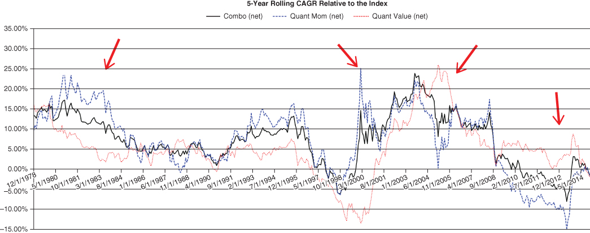

[**Figure 9.1**](#c09-fig-anc-0001) Rolling Five-Year Spreads

However, by combining the two strategies (represented by the solid black line in [Figure 9.1](#c09-fig-0001)), an investor is able to shorten the length and depth of long-term underperformance to a level that is more digestible to the average investor. Another way to look at this problem is via a histogram analysis. [Figure 9.2](#c09-fig-0002) shows the histogram of five-year relative performance measured by CAGR for the pure momentum strategy and the combination portfolio. There is a relatively frequent probability of losing to the index over a five-year window when invested in a pure momentum strategy; however, the combination portfolio substantially limits the chance for a long-winded underperformance streak.

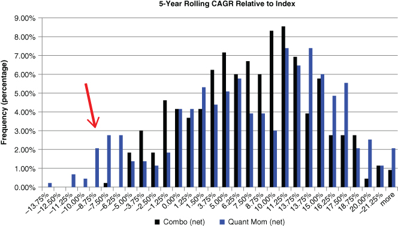

[**Figure 9.2**](#c09-fig-anc-0002) Histogram of Five-Year Spreads

For the long-horizon investor, replacing a passive equity portfolio with a high-conviction value and momentum system seems like a reasonable approach that can deliver strong expected returns relative to a passive index. We leave the reader with an easy to remember rule of thumb:

---

*Buy 'em cheap; buy 'em strong; and hold 'em long.*

---

### An Important Note on Portfolio Construction

The road to success with active value and momentum will obviously be hair-raising, primarily because the possibility of poor long-term relative performance prevents large pools of capital from exploiting the opportunity. With that truth in hand, we must emphasize that the expected benefits outlined are associated with *high-conviction* value and momentum portfolios, because these high-conviction portfolios drive the relative performance risk. And if there is no extreme relative performance pain, there is no extreme expected performance gain. So-called “smart beta” funds, which hold large diversified portfolios that tilt towards a characteristic like value or momentum, are unlikely to deliver on their promise to achieve outperformance after fees. These funds are nothing more than closet indexing structures that don't deliver enough active exposure benefits to outweigh their expected costs.

But why avoid closet-indexing? Recall that the academic research and internal analysis we've conducted throughout this book are associated with portfolios that are concentrated on stocks with a desirable characteristic (e.g., high momentum). The portfolios we analyze are typically designed to hold less than 50 stocks to minimize “diworsification,” which occurs when a portfolio is constructed to behave more like a passive index and less like a concentrated characteristic-centric portfolio. We highlighted the negative effects of diworsification in [Chapter 5](#section-16) when we examined how portfolio construction parameters, such as the number of holdings and rebalance frequency, affect expected performance. The results from that analysis were clear for those who wanted to capture the expected returns associated with active momentum strategies: buy concentrated frequently rebalanced portfolios.

So why don't we see more truly active funds in the market? Unfortunately, the interests of fund sponsors are not aligned with fund investors. Above a certain fund size, additional fund assets erode performance as portfolios move towards closet-indexing formations, but also grow manager fees. This creates a conflict of interest between investors, who want to maximize performance, and managers, who just want more assets, *even when this hurts their performance*. Closet-indexers are easy to spot—their portfolios typically have over 100 holdings, have market-cap weighted construction, and have low frequency rebalancing. These portfolios constructs accommodate scale and facilitate asset collection efforts on behalf of the fund sponsor, but they are unlikely to deliver the higher expected returns documented throughout this book. The implicatons for active investors are clear: If one is going to deviate from a passive index, and pay extra management fees, embrace active risk and pay up for concentration, not closet-indexing.

## A THREE-LEGGED STOOL: COMBO + TREND

But wait a minute: Even a two-legged stool isn't completely stable! The quantitative value and momentum portfolio still suffer large drawdowns that go hand-in-hand with buy-and-hold equity investments. For many investors, with a long-horizon and a preference for simplicity, holding the combination value and momentum portfolio is a great equity solution. But for those investors concerned about massive drawdowns, a buy-and-hold value and momentum approach may not be appropriate. And to be clear, the large drawdowns identified in the value and momentum approach outlined above are not unique to this particular portfolio—the drawdown issue is associated with *all* long-only stock portfolios.

To address the drawdown issue we discuss a basic way in which an investor can create a more stable stool via a third leg—trend following. The simplest trend-following rule is the long-term simple moving average rule. To give the reader a taste for how this can work, consider the following rule:

- Moving average (12) = Average 12 month prices
- If S&P 500 TR Index – 12-month moving average (S&P 500 TR Index) > 0, go long the combination portfolio. Otherwise, go long safety (T-bills).

The results of applying a simple trend-following risk management overlay to the quantitative value and momentum portfolio are tabulated in [Table 9.2](#c09-tbl-0002).

[**Table 9.2**](#c09-tbl-anc-0002) Combining Quantitative Value and Quantitative Momentum

|  |  |  |  |
| --- | --- | --- | --- |
|  | **Combination w/Trend (Net)** | **Combination(Net)** | **S&P 500 TR Index** |
| **CAGR** | 16.57% | 18.10% | 11.16% |
| **Standard Deviation** | 17.97% | 21.38% | 15.45% |
| **Downside Deviation** | 13.31% | 14.96% | 11.05% |
| **Sharpe Ratio** | 0.67 | 0.66 | 0.45 |
| **Sortino Ratio (MAR** c09-math-0002 **5%)** | 0.90 | 0.94 | 0.62 |
| **Worst Drawdown** | –26.18% | –60.16% | –50.21% |
| **Worst Month Return** | –25.45% | –26.56% | –21.58% |
| **Best Month Return** | 28.69% | 28.69% | 16.81% |
| **Profitable Months** | 70.93% | 61.18% | 61.59% |

The trend-following overlay doesn't enhance the risk-adjusted metrics of the combination portfolio, but this analysis misses the dramatic shift in the tail-risk profile of the combination system. The trend overlay limits the exposure of the equity portfolio to large drawdowns. For example, the maximum drawdown goes from 60.16 percent to 26.18 percent. Of course, there are no free lunches—the trend-following investor gives up 1.5 percent per year in compounded annual returns and the chance of enduring a bout of poor relative underperformance is enhanced with a trend-following approach. [Figure 9.3](#c09-fig-0003) shows the histogram of five-year spreads between the combination portfolio with trend following and the buy-and-hold combination portfolio.

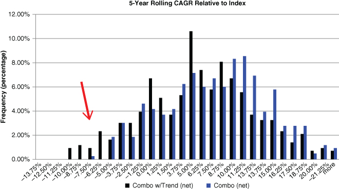

[**Figure 9.3**](#c09-fig-anc-0003) Histogram of 5-Year Spreads

[Figure 9.3](#c09-fig-0003) highlights the “relative performance risk” of trend following. On one hand, trend following protects against large tail-risk events, but the system also enhances the tracking error relative to the index, which increases the chances that an investor will not be able to stick to the investment program over the long haul.

While not the focus of this book, we encourage investors concerned about large equity drawdowns to read more about trend following. We can also augment our rule of thumb to accommodate trend following:

---

*Buy 'em cheap; buy 'em strong; and hold 'em long…*

*but only when the trend is your friend.*

---

## CAREER RISK CONSIDERATIONS

Trend following, which serves to minimize the expected impact of massive drawdowns, makes the potential for relative pain more likely. Downside-protected strategies can underperform over five-year periods on a compound return basis with higher frequency and with more depth than buy-and-hold approaches. So while there are huge potential benefits of trend following, there are associated career risk considerations. In the end, how much an investor dedicates to more active exposures really depends on the willingness of an investor to eat periods of relative underperformance. For some, relative performance is irrelevant; for others facing career risk concerns, relative performance rules the day. The irony of this discussion is that the efficient market hypothesis is right—there are no free lunches—but the explanation is wrong (i.e., stock prices always reflect fundamentals). We've already highlighted that strategies like value and momentum are a reflection of a world with mispricing. However, there is still no free lunch. Markets are extremely competitive, and many investment risks, to include things like “relative performance risk,” are priced risks in the real world. Financial economic models might consider the relative risk premium “alpha,” but to many market participants, relative performance risk is a real, quantifiable risk that marginal price setters will pay someone to take off their hands.

Risk, it seems, is in the eyes of the beholder.

## WHAT IF I CAN'T HANDLE POOR RELATIVE PERFORMANCE?

[Figure 9.1](#c09-fig-0001) highlights that even a concentrated value and momentum portfolio can sustain five-year periods of underperformance (e.g., Internet bubble period and the post-2008 financial crisis era). For many investors, this is simply too much pain to endure, and any excess expected returns associated with a willingness to bear that sort of “relative pain” are fairly earned by those who have the stomach to deal with it. And a trend-following overlay only makes the chance of enduring a long-stretch of relative pain even worse! The ultimate solution is to eliminate barriers and accept relative performance pain, but as we've discussed throughout this book, career risk concerns and psychology problems prevent many investors from fully exploiting sustainable active strategies. After all, this is the reason certain active strategies work in the first place—they're tough to follow!

We recognize that the high-conviction solution can never be deployed by a large swath of the investing public. Nonetheless, not all is lost, as investors have varying tolerances for relative performance pain. A majority of investors can't hold high conviction value and momentum, but some investors can add a small piece of high conviction value and momentum and bolt it on their passive allocation to the market. For example, consider a financial adviser who has a fairly sophisticated client base, but these clients have limited assessment horizons and cling to benchmarks. Large deviations from a benchmark—even with smarter clients—can create angry clients very quickly: “Hey Mr. Adviser, why are we losing by 10 percentage points relative to the S&P 500 index this quarter? You're fired!” But maybe a smaller deviation (e.g., 2 percentage points off the S&P 500) is less of an issue? Perhaps the adviser can survive the client performance meeting and explain why the risk of underperformance is the cost of admission to longer-term expected outperformance. For investors in this situation, a core-satellite approach may be warranted.

The *core-satellite approach* works as follows: The approach dedicates a large chunk of capital to a passive benchmark strategy (the “core”) and only adds a small component of an active strategy around the edges (the “satellite”). By construction, a core-satellite approach will never deviate too far from a benchmark. For example, in [Figure 9.4](#c09-fig-0004) we create a portfolio that is 80 percent allocated to the S&P 500 and 20 percent allocated to the quantitative value and momentum portfolio described in the prior section.

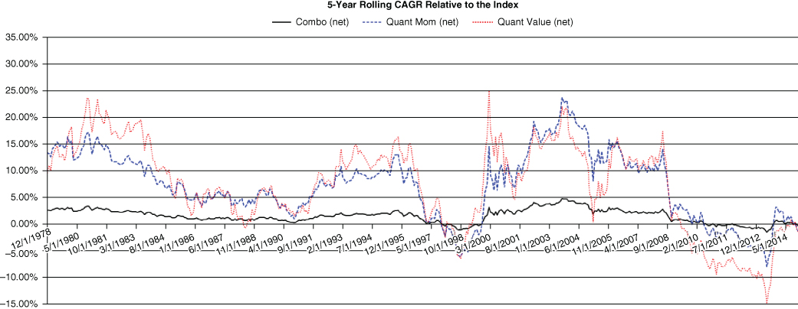

[**Figure 9.4**](#c09-fig-anc-0004) Histogram of Five-Year Spreads

The figure shows that the core-satellite approach cannot eliminate relative pain. The core-satellite investor would still need to endure pain during the Internet bubble period and the post-2008 financial crisis period, but the pain is more tolerable. Of course, the downside of the core-satellite approach is a much lower long-term expected compounding rate than an undiluted combination approach (see the “Combination (Net)” column relative to the “Core-Satellite (Net)” column in [Table 9.3](#c09-tbl-0003), which outlines the summary statistics from 1974 to 2014).

[**Table 9.3**](#c09-tbl-anc-0003) Core-Satellite Returns

|  |  |  |  |  |
| --- | --- | --- | --- | --- |
|  | **Core-Satellite (Net)** | **Combination (Net)** | **Quantitative Momentum (Net)** | S&P 500 TR Index |
| **CAGR** | 12.66% | 18.10% | 17.38% | 11.16% |
| **Standard Deviation** | 16.04% | 21.38% | 25.59% | 15.45% |
| **Downside Deviation** | 11.48% | 14.96% | 18.09% | 11.05% |
| **Sharpe Ratio** | 0.52 | 0.66 | 0.57 | 0.45 |
| **Sortino Ratio (MAR** c09-math-0003 **5%)** | 0.72 | 0.94 | 0.80 | 0.62 |
| **Worst Drawdown** | –51.86% | –60.16% | –67.72% | –50.21% |
| **Worst Month Return** | –22.35% | –26.56% | –30.33% | –21.58% |
| **Best Month Return** | 16.52% | 28.69% | 34.67% | 16.81% |
| **Profitable Months** | 61.79% | 61.18% | 61.79% | 61.59% |

## NOTES

[1](#c09-note-anc-0001) Wesley Gray and Tobias Carlisle, *Quantitative Value: A Practitioner's Guide to Automating Intelligent Investment and Eliminating Behavioral Errors*, (Hoboken, NJ: John Wiley & Sons, 2012).
[2](#c09-note-anc-0002) We increase the total fee from 1.80 percent in [Chapter 8](#section-19) to 2.00 percent in [Chapter 9](#section-20) to account for higher transaction costs associated with running an equal-weight portfolio, as well as annually rebalancing between the quantitative momentum and quantitative value portfolios.

<!-- rl-section id="a-two-legged-stool-value-momentum" class="epub-section" title="A TWO-LEGGED STOOL: VALUE + MOMENTUM" -->

# CHAPTER 9 Making Momentum Work in Practice

> *“Everyone has a plan until they get punched in the mouth.”*

—Attributed to “Iron” Mike Tyson

In the real world, going all-in on quantitative momentum is sure to try the patience of even the most dedicated investor. Nobody has the discipline to stick with the program—including us. We don't even invest our own capital this way. But we aren't recommending that investors replace their entire equity portfolio with a high-conviction momentum strategy. Momentum is merely a component of a diversified equity portfolio. And as alluded to in [Chapter 4](#section-14), momentum portfolios are best used in combination with high-conviction value portfolios. The value and momentum combination portfolio shortens stretches of multiyear relative underperformance associated with both stand-alone strategies and allows an investor to stick with an equity investment program. Dedicating oneself to pure value investing or to pure momentum investing is akin to sitting on a one-legged stool. So why not sit on a stool with multiple legs? Identify a great value investment approach; identify a promising momentum investment approach; and combine the two efforts to serve as your all-weather equity portfolio.

To make the value and momentum combination portfolio more tangible, we examine the approach we use for our own investment capital. We combine the quantitative momentum algorithm outlined in this book with an equally rigorously tested value strategy outlined in Wes's book on the subject of building systematic value strategies: *Quantitative Value*.[1](#c09-note-0001) Put simply, the quantitative value algorithm seeks to buy cheap, high-quality value stocks. Each strategy typically holds around 40 momentum stocks and 40 value stocks, leaving the investor with a high-conviction—but diversified—portfolio of approximately 80 stocks. One could expand to international markets to increase the portfolio size and enhance diversification, but we shelve that discussion to keep the analysis short and to the point.

To assess performance of our quantitative value and momentum portfolio, we examine a mid- to large-cap US traded universe and we focus our analysis on the long-only portfolios. The portfolios are quarterly rebalanced and **equal-weighted**—here we deviate from the value-weight portfolios shown in [Chapter 8](#section-19). We examine the returns from January 1, 1974, to December 31, 2014, which is the time period when the historical data available for the quantitative momentum and quantitative value algorithm overlap. The combination portfolio weights are annually rebalanced on January 1 each year and equally allocated across value and momentum (a more sophisticated investor could volatility-weight the exposures). All returns are net of 2 percent in total annual fees, which is a rough estimate of management fees, commissions, and market impact costs associated with rebalancing within and across the strategies.[2](#c09-note-0002)

The results of the combination portfolio are presented in [Table 9.1](#c09-tbl-0001).

[**Table 9.1**](#c09-tbl-anc-0001) Combining Quantitative Value and Quantitative Momentum

|  |  |  |  |  |
| --- | --- | --- | --- | --- |
|  | **Combination Portfolio (Net)** | **Quantitative Momentum (Net)** | **Quantitative Value (Net)** | **S&P 500 TR Index** |
| **CAGR** | 18.10% | 17.38% | 16.98% | 11.16% |
| **Standard Deviation** | 21.38% | 25.59% | 18.58% | 15.45% |
| **Downside Deviation** | 14.96% | 18.09% | 12.71% | 11.05% |
| **Sharpe Ratio** | 0.66 | 0.57 | 0.68 | 0.45 |
| **Sortino Ratio (MAR** c09-math-0001 **5%)** | 0.94 | 0.80 | 0.98 | 0.62 |
| **Worst Drawdown** | –60.16% | –67.72% | –51.91% | –50.21% |
| **Worst Month Return** | –26.56% | –30.33% | –25.62% | –21.58% |
| **Best Month Return** | 28.69% | 34.67% | 25.36% | 16.81% |
| **Profitable Months** | 61.18% | 61.79% | 62.60% | 61.59% |

The combination portfolio has higher returns than either the stand-alone value or momentum portfolios. On a risk-adjusted basis, the combination portfolio is essentially equivalent to the quantitative value strategy. However, the summary statistics do not capture the *survivability* of a strategy. To assess survivability, which we loosely define as the degree to which an investor could hold onto a portfolio without “giving up,” we review the rolling five-year CAGRs relative to the passive S&P 500 total return index. This analysis gives us a sense for how holding value and momentum can minimize the frequency of long periods of underperformance associated with stand-alone value or momentum.

[Figure 9.1](#c09-fig-0001) highlights the benefit of combining value and momentum to minimize the length and depth of five-year relative underperformance periods. For example, quantitative value endures a deep and extended period of poor relative performance in the late 1990s during the Internet bubble. On the flip side, post–financial crisis, quantitative momentum has had a long bout of severe underperformance. To be clear, quantitative momentum, on a standalone basis, had a period of underperforming by about 15 percent on a CAGR basis over five years (occurs in June 2013, so the 2008–2009 financial crisis is in this five-year previous period). Imagine having that conversation with your clients!

[**Figure 9.1**](#c09-fig-anc-0001) Rolling Five-Year Spreads

However, by combining the two strategies (represented by the solid black line in [Figure 9.1](#c09-fig-0001)), an investor is able to shorten the length and depth of long-term underperformance to a level that is more digestible to the average investor. Another way to look at this problem is via a histogram analysis. [Figure 9.2](#c09-fig-0002) shows the histogram of five-year relative performance measured by CAGR for the pure momentum strategy and the combination portfolio. There is a relatively frequent probability of losing to the index over a five-year window when invested in a pure momentum strategy; however, the combination portfolio substantially limits the chance for a long-winded underperformance streak.

[**Figure 9.2**](#c09-fig-anc-0002) Histogram of Five-Year Spreads

For the long-horizon investor, replacing a passive equity portfolio with a high-conviction value and momentum system seems like a reasonable approach that can deliver strong expected returns relative to a passive index. We leave the reader with an easy to remember rule of thumb:

---

*Buy 'em cheap; buy 'em strong; and hold 'em long.*

---

### An Important Note on Portfolio Construction

The road to success with active value and momentum will obviously be hair-raising, primarily because the possibility of poor long-term relative performance prevents large pools of capital from exploiting the opportunity. With that truth in hand, we must emphasize that the expected benefits outlined are associated with *high-conviction* value and momentum portfolios, because these high-conviction portfolios drive the relative performance risk. And if there is no extreme relative performance pain, there is no extreme expected performance gain. So-called “smart beta” funds, which hold large diversified portfolios that tilt towards a characteristic like value or momentum, are unlikely to deliver on their promise to achieve outperformance after fees. These funds are nothing more than closet indexing structures that don't deliver enough active exposure benefits to outweigh their expected costs.

But why avoid closet-indexing? Recall that the academic research and internal analysis we've conducted throughout this book are associated with portfolios that are concentrated on stocks with a desirable characteristic (e.g., high momentum). The portfolios we analyze are typically designed to hold less than 50 stocks to minimize “diworsification,” which occurs when a portfolio is constructed to behave more like a passive index and less like a concentrated characteristic-centric portfolio. We highlighted the negative effects of diworsification in [Chapter 5](#section-16) when we examined how portfolio construction parameters, such as the number of holdings and rebalance frequency, affect expected performance. The results from that analysis were clear for those who wanted to capture the expected returns associated with active momentum strategies: buy concentrated frequently rebalanced portfolios.

So why don't we see more truly active funds in the market? Unfortunately, the interests of fund sponsors are not aligned with fund investors. Above a certain fund size, additional fund assets erode performance as portfolios move towards closet-indexing formations, but also grow manager fees. This creates a conflict of interest between investors, who want to maximize performance, and managers, who just want more assets, *even when this hurts their performance*. Closet-indexers are easy to spot—their portfolios typically have over 100 holdings, have market-cap weighted construction, and have low frequency rebalancing. These portfolios constructs accommodate scale and facilitate asset collection efforts on behalf of the fund sponsor, but they are unlikely to deliver the higher expected returns documented throughout this book. The implicatons for active investors are clear: If one is going to deviate from a passive index, and pay extra management fees, embrace active risk and pay up for concentration, not closet-indexing.

## A THREE-LEGGED STOOL: COMBO + TREND

But wait a minute: Even a two-legged stool isn't completely stable! The quantitative value and momentum portfolio still suffer large drawdowns that go hand-in-hand with buy-and-hold equity investments. For many investors, with a long-horizon and a preference for simplicity, holding the combination value and momentum portfolio is a great equity solution. But for those investors concerned about massive drawdowns, a buy-and-hold value and momentum approach may not be appropriate. And to be clear, the large drawdowns identified in the value and momentum approach outlined above are not unique to this particular portfolio—the drawdown issue is associated with *all* long-only stock portfolios.

To address the drawdown issue we discuss a basic way in which an investor can create a more stable stool via a third leg—trend following. The simplest trend-following rule is the long-term simple moving average rule. To give the reader a taste for how this can work, consider the following rule:

- Moving average (12) = Average 12 month prices
- If S&P 500 TR Index – 12-month moving average (S&P 500 TR Index) > 0, go long the combination portfolio. Otherwise, go long safety (T-bills).

The results of applying a simple trend-following risk management overlay to the quantitative value and momentum portfolio are tabulated in [Table 9.2](#c09-tbl-0002).

[**Table 9.2**](#c09-tbl-anc-0002) Combining Quantitative Value and Quantitative Momentum

|  |  |  |  |
| --- | --- | --- | --- |
|  | **Combination w/Trend (Net)** | **Combination(Net)** | **S&P 500 TR Index** |
| **CAGR** | 16.57% | 18.10% | 11.16% |
| **Standard Deviation** | 17.97% | 21.38% | 15.45% |
| **Downside Deviation** | 13.31% | 14.96% | 11.05% |
| **Sharpe Ratio** | 0.67 | 0.66 | 0.45 |
| **Sortino Ratio (MAR** c09-math-0002 **5%)** | 0.90 | 0.94 | 0.62 |
| **Worst Drawdown** | –26.18% | –60.16% | –50.21% |
| **Worst Month Return** | –25.45% | –26.56% | –21.58% |
| **Best Month Return** | 28.69% | 28.69% | 16.81% |
| **Profitable Months** | 70.93% | 61.18% | 61.59% |

The trend-following overlay doesn't enhance the risk-adjusted metrics of the combination portfolio, but this analysis misses the dramatic shift in the tail-risk profile of the combination system. The trend overlay limits the exposure of the equity portfolio to large drawdowns. For example, the maximum drawdown goes from 60.16 percent to 26.18 percent. Of course, there are no free lunches—the trend-following investor gives up 1.5 percent per year in compounded annual returns and the chance of enduring a bout of poor relative underperformance is enhanced with a trend-following approach. [Figure 9.3](#c09-fig-0003) shows the histogram of five-year spreads between the combination portfolio with trend following and the buy-and-hold combination portfolio.

[**Figure 9.3**](#c09-fig-anc-0003) Histogram of 5-Year Spreads

[Figure 9.3](#c09-fig-0003) highlights the “relative performance risk” of trend following. On one hand, trend following protects against large tail-risk events, but the system also enhances the tracking error relative to the index, which increases the chances that an investor will not be able to stick to the investment program over the long haul.

While not the focus of this book, we encourage investors concerned about large equity drawdowns to read more about trend following. We can also augment our rule of thumb to accommodate trend following:

---

*Buy 'em cheap; buy 'em strong; and hold 'em long…*

*but only when the trend is your friend.*

---

## CAREER RISK CONSIDERATIONS

Trend following, which serves to minimize the expected impact of massive drawdowns, makes the potential for relative pain more likely. Downside-protected strategies can underperform over five-year periods on a compound return basis with higher frequency and with more depth than buy-and-hold approaches. So while there are huge potential benefits of trend following, there are associated career risk considerations. In the end, how much an investor dedicates to more active exposures really depends on the willingness of an investor to eat periods of relative underperformance. For some, relative performance is irrelevant; for others facing career risk concerns, relative performance rules the day. The irony of this discussion is that the efficient market hypothesis is right—there are no free lunches—but the explanation is wrong (i.e., stock prices always reflect fundamentals). We've already highlighted that strategies like value and momentum are a reflection of a world with mispricing. However, there is still no free lunch. Markets are extremely competitive, and many investment risks, to include things like “relative performance risk,” are priced risks in the real world. Financial economic models might consider the relative risk premium “alpha,” but to many market participants, relative performance risk is a real, quantifiable risk that marginal price setters will pay someone to take off their hands.

Risk, it seems, is in the eyes of the beholder.

## WHAT IF I CAN'T HANDLE POOR RELATIVE PERFORMANCE?

[Figure 9.1](#c09-fig-0001) highlights that even a concentrated value and momentum portfolio can sustain five-year periods of underperformance (e.g., Internet bubble period and the post-2008 financial crisis era). For many investors, this is simply too much pain to endure, and any excess expected returns associated with a willingness to bear that sort of “relative pain” are fairly earned by those who have the stomach to deal with it. And a trend-following overlay only makes the chance of enduring a long-stretch of relative pain even worse! The ultimate solution is to eliminate barriers and accept relative performance pain, but as we've discussed throughout this book, career risk concerns and psychology problems prevent many investors from fully exploiting sustainable active strategies. After all, this is the reason certain active strategies work in the first place—they're tough to follow!

We recognize that the high-conviction solution can never be deployed by a large swath of the investing public. Nonetheless, not all is lost, as investors have varying tolerances for relative performance pain. A majority of investors can't hold high conviction value and momentum, but some investors can add a small piece of high conviction value and momentum and bolt it on their passive allocation to the market. For example, consider a financial adviser who has a fairly sophisticated client base, but these clients have limited assessment horizons and cling to benchmarks. Large deviations from a benchmark—even with smarter clients—can create angry clients very quickly: “Hey Mr. Adviser, why are we losing by 10 percentage points relative to the S&P 500 index this quarter? You're fired!” But maybe a smaller deviation (e.g., 2 percentage points off the S&P 500) is less of an issue? Perhaps the adviser can survive the client performance meeting and explain why the risk of underperformance is the cost of admission to longer-term expected outperformance. For investors in this situation, a core-satellite approach may be warranted.

The *core-satellite approach* works as follows: The approach dedicates a large chunk of capital to a passive benchmark strategy (the “core”) and only adds a small component of an active strategy around the edges (the “satellite”). By construction, a core-satellite approach will never deviate too far from a benchmark. For example, in [Figure 9.4](#c09-fig-0004) we create a portfolio that is 80 percent allocated to the S&P 500 and 20 percent allocated to the quantitative value and momentum portfolio described in the prior section.

[**Figure 9.4**](#c09-fig-anc-0004) Histogram of Five-Year Spreads

The figure shows that the core-satellite approach cannot eliminate relative pain. The core-satellite investor would still need to endure pain during the Internet bubble period and the post-2008 financial crisis period, but the pain is more tolerable. Of course, the downside of the core-satellite approach is a much lower long-term expected compounding rate than an undiluted combination approach (see the “Combination (Net)” column relative to the “Core-Satellite (Net)” column in [Table 9.3](#c09-tbl-0003), which outlines the summary statistics from 1974 to 2014).

[**Table 9.3**](#c09-tbl-anc-0003) Core-Satellite Returns

|  |  |  |  |  |
| --- | --- | --- | --- | --- |
|  | **Core-Satellite (Net)** | **Combination (Net)** | **Quantitative Momentum (Net)** | S&P 500 TR Index |
| **CAGR** | 12.66% | 18.10% | 17.38% | 11.16% |
| **Standard Deviation** | 16.04% | 21.38% | 25.59% | 15.45% |
| **Downside Deviation** | 11.48% | 14.96% | 18.09% | 11.05% |
| **Sharpe Ratio** | 0.52 | 0.66 | 0.57 | 0.45 |
| **Sortino Ratio (MAR** c09-math-0003 **5%)** | 0.72 | 0.94 | 0.80 | 0.62 |
| **Worst Drawdown** | –51.86% | –60.16% | –67.72% | –50.21% |
| **Worst Month Return** | –22.35% | –26.56% | –30.33% | –21.58% |
| **Best Month Return** | 16.52% | 28.69% | 34.67% | 16.81% |
| **Profitable Months** | 61.79% | 61.18% | 61.79% | 61.59% |

## NOTES

[1](#c09-note-anc-0001) Wesley Gray and Tobias Carlisle, *Quantitative Value: A Practitioner's Guide to Automating Intelligent Investment and Eliminating Behavioral Errors*, (Hoboken, NJ: John Wiley & Sons, 2012).
[2](#c09-note-anc-0002) We increase the total fee from 1.80 percent in [Chapter 8](#section-19) to 2.00 percent in [Chapter 9](#section-20) to account for higher transaction costs associated with running an equal-weight portfolio, as well as annually rebalancing between the quantitative momentum and quantitative value portfolios.

<!-- rl-section id="a-two-legged-stool-value-momentum" class="epub-section" title="A TWO-LEGGED STOOL: VALUE + MOMENTUM" -->

## A TWO-LEGGED STOOL: VALUE + MOMENTUM

To make the value and momentum combination portfolio more tangible, we examine the approach we use for our own investment capital. We combine the quantitative momentum algorithm outlined in this book with an equally rigorously tested value strategy outlined in Wes's book on the subject of building systematic value strategies: *Quantitative Value*.[1](#c09-note-0001) Put simply, the quantitative value algorithm seeks to buy cheap, high-quality value stocks. Each strategy typically holds around 40 momentum stocks and 40 value stocks, leaving the investor with a high-conviction—but diversified—portfolio of approximately 80 stocks. One could expand to international markets to increase the portfolio size and enhance diversification, but we shelve that discussion to keep the analysis short and to the point.

To assess performance of our quantitative value and momentum portfolio, we examine a mid- to large-cap US traded universe and we focus our analysis on the long-only portfolios. The portfolios are quarterly rebalanced and **equal-weighted**—here we deviate from the value-weight portfolios shown in [Chapter 8](#section-19). We examine the returns from January 1, 1974, to December 31, 2014, which is the time period when the historical data available for the quantitative momentum and quantitative value algorithm overlap. The combination portfolio weights are annually rebalanced on January 1 each year and equally allocated across value and momentum (a more sophisticated investor could volatility-weight the exposures). All returns are net of 2 percent in total annual fees, which is a rough estimate of management fees, commissions, and market impact costs associated with rebalancing within and across the strategies.[2](#c09-note-0002)

The results of the combination portfolio are presented in [Table 9.1](#c09-tbl-0001).

[**Table 9.1**](#c09-tbl-anc-0001) Combining Quantitative Value and Quantitative Momentum

|  |  |  |  |  |
| --- | --- | --- | --- | --- |
|  | **Combination Portfolio (Net)** | **Quantitative Momentum (Net)** | **Quantitative Value (Net)** | **S&P 500 TR Index** |
| **CAGR** | 18.10% | 17.38% | 16.98% | 11.16% |
| **Standard Deviation** | 21.38% | 25.59% | 18.58% | 15.45% |
| **Downside Deviation** | 14.96% | 18.09% | 12.71% | 11.05% |
| **Sharpe Ratio** | 0.66 | 0.57 | 0.68 | 0.45 |
| **Sortino Ratio (MAR** c09-math-0001 **5%)** | 0.94 | 0.80 | 0.98 | 0.62 |
| **Worst Drawdown** | –60.16% | –67.72% | –51.91% | –50.21% |
| **Worst Month Return** | –26.56% | –30.33% | –25.62% | –21.58% |
| **Best Month Return** | 28.69% | 34.67% | 25.36% | 16.81% |
| **Profitable Months** | 61.18% | 61.79% | 62.60% | 61.59% |

The combination portfolio has higher returns than either the stand-alone value or momentum portfolios. On a risk-adjusted basis, the combination portfolio is essentially equivalent to the quantitative value strategy. However, the summary statistics do not capture the *survivability* of a strategy. To assess survivability, which we loosely define as the degree to which an investor could hold onto a portfolio without “giving up,” we review the rolling five-year CAGRs relative to the passive S&P 500 total return index. This analysis gives us a sense for how holding value and momentum can minimize the frequency of long periods of underperformance associated with stand-alone value or momentum.

[Figure 9.1](#c09-fig-0001) highlights the benefit of combining value and momentum to minimize the length and depth of five-year relative underperformance periods. For example, quantitative value endures a deep and extended period of poor relative performance in the late 1990s during the Internet bubble. On the flip side, post–financial crisis, quantitative momentum has had a long bout of severe underperformance. To be clear, quantitative momentum, on a standalone basis, had a period of underperforming by about 15 percent on a CAGR basis over five years (occurs in June 2013, so the 2008–2009 financial crisis is in this five-year previous period). Imagine having that conversation with your clients!

[**Figure 9.1**](#c09-fig-anc-0001) Rolling Five-Year Spreads

However, by combining the two strategies (represented by the solid black line in [Figure 9.1](#c09-fig-0001)), an investor is able to shorten the length and depth of long-term underperformance to a level that is more digestible to the average investor. Another way to look at this problem is via a histogram analysis. [Figure 9.2](#c09-fig-0002) shows the histogram of five-year relative performance measured by CAGR for the pure momentum strategy and the combination portfolio. There is a relatively frequent probability of losing to the index over a five-year window when invested in a pure momentum strategy; however, the combination portfolio substantially limits the chance for a long-winded underperformance streak.

[**Figure 9.2**](#c09-fig-anc-0002) Histogram of Five-Year Spreads

For the long-horizon investor, replacing a passive equity portfolio with a high-conviction value and momentum system seems like a reasonable approach that can deliver strong expected returns relative to a passive index. We leave the reader with an easy to remember rule of thumb:

---

*Buy 'em cheap; buy 'em strong; and hold 'em long.*

---

### An Important Note on Portfolio Construction

The road to success with active value and momentum will obviously be hair-raising, primarily because the possibility of poor long-term relative performance prevents large pools of capital from exploiting the opportunity. With that truth in hand, we must emphasize that the expected benefits outlined are associated with *high-conviction* value and momentum portfolios, because these high-conviction portfolios drive the relative performance risk. And if there is no extreme relative performance pain, there is no extreme expected performance gain. So-called “smart beta” funds, which hold large diversified portfolios that tilt towards a characteristic like value or momentum, are unlikely to deliver on their promise to achieve outperformance after fees. These funds are nothing more than closet indexing structures that don't deliver enough active exposure benefits to outweigh their expected costs.

But why avoid closet-indexing? Recall that the academic research and internal analysis we've conducted throughout this book are associated with portfolios that are concentrated on stocks with a desirable characteristic (e.g., high momentum). The portfolios we analyze are typically designed to hold less than 50 stocks to minimize “diworsification,” which occurs when a portfolio is constructed to behave more like a passive index and less like a concentrated characteristic-centric portfolio. We highlighted the negative effects of diworsification in [Chapter 5](#section-16) when we examined how portfolio construction parameters, such as the number of holdings and rebalance frequency, affect expected performance. The results from that analysis were clear for those who wanted to capture the expected returns associated with active momentum strategies: buy concentrated frequently rebalanced portfolios.

So why don't we see more truly active funds in the market? Unfortunately, the interests of fund sponsors are not aligned with fund investors. Above a certain fund size, additional fund assets erode performance as portfolios move towards closet-indexing formations, but also grow manager fees. This creates a conflict of interest between investors, who want to maximize performance, and managers, who just want more assets, *even when this hurts their performance*. Closet-indexers are easy to spot—their portfolios typically have over 100 holdings, have market-cap weighted construction, and have low frequency rebalancing. These portfolios constructs accommodate scale and facilitate asset collection efforts on behalf of the fund sponsor, but they are unlikely to deliver the higher expected returns documented throughout this book. The implicatons for active investors are clear: If one is going to deviate from a passive index, and pay extra management fees, embrace active risk and pay up for concentration, not closet-indexing.

<!-- rl-section id="section" class="feature1" -->

*Buy 'em cheap; buy 'em strong; and hold 'em long.*

---

<!-- rl-section id="section" class="epub-section" -->

### An Important Note on Portfolio Construction

The road to success with active value and momentum will obviously be hair-raising, primarily because the possibility of poor long-term relative performance prevents large pools of capital from exploiting the opportunity. With that truth in hand, we must emphasize that the expected benefits outlined are associated with *high-conviction* value and momentum portfolios, because these high-conviction portfolios drive the relative performance risk. And if there is no extreme relative performance pain, there is no extreme expected performance gain. So-called “smart beta” funds, which hold large diversified portfolios that tilt towards a characteristic like value or momentum, are unlikely to deliver on their promise to achieve outperformance after fees. These funds are nothing more than closet indexing structures that don't deliver enough active exposure benefits to outweigh their expected costs.

But why avoid closet-indexing? Recall that the academic research and internal analysis we've conducted throughout this book are associated with portfolios that are concentrated on stocks with a desirable characteristic (e.g., high momentum). The portfolios we analyze are typically designed to hold less than 50 stocks to minimize “diworsification,” which occurs when a portfolio is constructed to behave more like a passive index and less like a concentrated characteristic-centric portfolio. We highlighted the negative effects of diworsification in [Chapter 5](#section-16) when we examined how portfolio construction parameters, such as the number of holdings and rebalance frequency, affect expected performance. The results from that analysis were clear for those who wanted to capture the expected returns associated with active momentum strategies: buy concentrated frequently rebalanced portfolios.

So why don't we see more truly active funds in the market? Unfortunately, the interests of fund sponsors are not aligned with fund investors. Above a certain fund size, additional fund assets erode performance as portfolios move towards closet-indexing formations, but also grow manager fees. This creates a conflict of interest between investors, who want to maximize performance, and managers, who just want more assets, *even when this hurts their performance*. Closet-indexers are easy to spot—their portfolios typically have over 100 holdings, have market-cap weighted construction, and have low frequency rebalancing. These portfolios constructs accommodate scale and facilitate asset collection efforts on behalf of the fund sponsor, but they are unlikely to deliver the higher expected returns documented throughout this book. The implicatons for active investors are clear: If one is going to deviate from a passive index, and pay extra management fees, embrace active risk and pay up for concentration, not closet-indexing.

<!-- rl-section id="a-three-legged-stool-combo-trend" class="epub-section" title="A THREE-LEGGED STOOL: COMBO + TREND" -->

## A THREE-LEGGED STOOL: COMBO + TREND

But wait a minute: Even a two-legged stool isn't completely stable! The quantitative value and momentum portfolio still suffer large drawdowns that go hand-in-hand with buy-and-hold equity investments. For many investors, with a long-horizon and a preference for simplicity, holding the combination value and momentum portfolio is a great equity solution. But for those investors concerned about massive drawdowns, a buy-and-hold value and momentum approach may not be appropriate. And to be clear, the large drawdowns identified in the value and momentum approach outlined above are not unique to this particular portfolio—the drawdown issue is associated with *all* long-only stock portfolios.

To address the drawdown issue we discuss a basic way in which an investor can create a more stable stool via a third leg—trend following. The simplest trend-following rule is the long-term simple moving average rule. To give the reader a taste for how this can work, consider the following rule:

- Moving average (12) = Average 12 month prices
- If S&P 500 TR Index – 12-month moving average (S&P 500 TR Index) > 0, go long the combination portfolio. Otherwise, go long safety (T-bills).

The results of applying a simple trend-following risk management overlay to the quantitative value and momentum portfolio are tabulated in [Table 9.2](#c09-tbl-0002).

[**Table 9.2**](#c09-tbl-anc-0002) Combining Quantitative Value and Quantitative Momentum

|  |  |  |  |
| --- | --- | --- | --- |
|  | **Combination w/Trend (Net)** | **Combination(Net)** | **S&P 500 TR Index** |
| **CAGR** | 16.57% | 18.10% | 11.16% |
| **Standard Deviation** | 17.97% | 21.38% | 15.45% |
| **Downside Deviation** | 13.31% | 14.96% | 11.05% |
| **Sharpe Ratio** | 0.67 | 0.66 | 0.45 |
| **Sortino Ratio (MAR** c09-math-0002 **5%)** | 0.90 | 0.94 | 0.62 |
| **Worst Drawdown** | –26.18% | –60.16% | –50.21% |
| **Worst Month Return** | –25.45% | –26.56% | –21.58% |
| **Best Month Return** | 28.69% | 28.69% | 16.81% |
| **Profitable Months** | 70.93% | 61.18% | 61.59% |

The trend-following overlay doesn't enhance the risk-adjusted metrics of the combination portfolio, but this analysis misses the dramatic shift in the tail-risk profile of the combination system. The trend overlay limits the exposure of the equity portfolio to large drawdowns. For example, the maximum drawdown goes from 60.16 percent to 26.18 percent. Of course, there are no free lunches—the trend-following investor gives up 1.5 percent per year in compounded annual returns and the chance of enduring a bout of poor relative underperformance is enhanced with a trend-following approach. [Figure 9.3](#c09-fig-0003) shows the histogram of five-year spreads between the combination portfolio with trend following and the buy-and-hold combination portfolio.

[**Figure 9.3**](#c09-fig-anc-0003) Histogram of 5-Year Spreads

[Figure 9.3](#c09-fig-0003) highlights the “relative performance risk” of trend following. On one hand, trend following protects against large tail-risk events, but the system also enhances the tracking error relative to the index, which increases the chances that an investor will not be able to stick to the investment program over the long haul.

While not the focus of this book, we encourage investors concerned about large equity drawdowns to read more about trend following. We can also augment our rule of thumb to accommodate trend following:

---

*Buy 'em cheap; buy 'em strong; and hold 'em long…*

*but only when the trend is your friend.*

---

<!-- rl-section id="section" class="feature1" -->

*Buy 'em cheap; buy 'em strong; and hold 'em long…*

*but only when the trend is your friend.*

---

<!-- rl-section id="career-risk-considerations" class="epub-section" title="CAREER RISK CONSIDERATIONS" -->

## CAREER RISK CONSIDERATIONS

Trend following, which serves to minimize the expected impact of massive drawdowns, makes the potential for relative pain more likely. Downside-protected strategies can underperform over five-year periods on a compound return basis with higher frequency and with more depth than buy-and-hold approaches. So while there are huge potential benefits of trend following, there are associated career risk considerations. In the end, how much an investor dedicates to more active exposures really depends on the willingness of an investor to eat periods of relative underperformance. For some, relative performance is irrelevant; for others facing career risk concerns, relative performance rules the day. The irony of this discussion is that the efficient market hypothesis is right—there are no free lunches—but the explanation is wrong (i.e., stock prices always reflect fundamentals). We've already highlighted that strategies like value and momentum are a reflection of a world with mispricing. However, there is still no free lunch. Markets are extremely competitive, and many investment risks, to include things like “relative performance risk,” are priced risks in the real world. Financial economic models might consider the relative risk premium “alpha,” but to many market participants, relative performance risk is a real, quantifiable risk that marginal price setters will pay someone to take off their hands.

Risk, it seems, is in the eyes of the beholder.

<!-- rl-section id="what-if-i-can-t-handle-poor-relative-performance" class="epub-section" title="WHAT IF I CAN'T HANDLE POOR RELATIVE PERFORMANCE?" -->

## WHAT IF I CAN'T HANDLE POOR RELATIVE PERFORMANCE?

[Figure 9.1](#c09-fig-0001) highlights that even a concentrated value and momentum portfolio can sustain five-year periods of underperformance (e.g., Internet bubble period and the post-2008 financial crisis era). For many investors, this is simply too much pain to endure, and any excess expected returns associated with a willingness to bear that sort of “relative pain” are fairly earned by those who have the stomach to deal with it. And a trend-following overlay only makes the chance of enduring a long-stretch of relative pain even worse! The ultimate solution is to eliminate barriers and accept relative performance pain, but as we've discussed throughout this book, career risk concerns and psychology problems prevent many investors from fully exploiting sustainable active strategies. After all, this is the reason certain active strategies work in the first place—they're tough to follow!

We recognize that the high-conviction solution can never be deployed by a large swath of the investing public. Nonetheless, not all is lost, as investors have varying tolerances for relative performance pain. A majority of investors can't hold high conviction value and momentum, but some investors can add a small piece of high conviction value and momentum and bolt it on their passive allocation to the market. For example, consider a financial adviser who has a fairly sophisticated client base, but these clients have limited assessment horizons and cling to benchmarks. Large deviations from a benchmark—even with smarter clients—can create angry clients very quickly: “Hey Mr. Adviser, why are we losing by 10 percentage points relative to the S&P 500 index this quarter? You're fired!” But maybe a smaller deviation (e.g., 2 percentage points off the S&P 500) is less of an issue? Perhaps the adviser can survive the client performance meeting and explain why the risk of underperformance is the cost of admission to longer-term expected outperformance. For investors in this situation, a core-satellite approach may be warranted.

The *core-satellite approach* works as follows: The approach dedicates a large chunk of capital to a passive benchmark strategy (the “core”) and only adds a small component of an active strategy around the edges (the “satellite”). By construction, a core-satellite approach will never deviate too far from a benchmark. For example, in [Figure 9.4](#c09-fig-0004) we create a portfolio that is 80 percent allocated to the S&P 500 and 20 percent allocated to the quantitative value and momentum portfolio described in the prior section.

[**Figure 9.4**](#c09-fig-anc-0004) Histogram of Five-Year Spreads

The figure shows that the core-satellite approach cannot eliminate relative pain. The core-satellite investor would still need to endure pain during the Internet bubble period and the post-2008 financial crisis period, but the pain is more tolerable. Of course, the downside of the core-satellite approach is a much lower long-term expected compounding rate than an undiluted combination approach (see the “Combination (Net)” column relative to the “Core-Satellite (Net)” column in [Table 9.3](#c09-tbl-0003), which outlines the summary statistics from 1974 to 2014).

[**Table 9.3**](#c09-tbl-anc-0003) Core-Satellite Returns

|  |  |  |  |  |
| --- | --- | --- | --- | --- |
|  | **Core-Satellite (Net)** | **Combination (Net)** | **Quantitative Momentum (Net)** | S&P 500 TR Index |
| **CAGR** | 12.66% | 18.10% | 17.38% | 11.16% |
| **Standard Deviation** | 16.04% | 21.38% | 25.59% | 15.45% |
| **Downside Deviation** | 11.48% | 14.96% | 18.09% | 11.05% |
| **Sharpe Ratio** | 0.52 | 0.66 | 0.57 | 0.45 |
| **Sortino Ratio (MAR** c09-math-0003 **5%)** | 0.72 | 0.94 | 0.80 | 0.62 |
| **Worst Drawdown** | –51.86% | –60.16% | –67.72% | –50.21% |
| **Worst Month Return** | –22.35% | –26.56% | –30.33% | –21.58% |
| **Best Month Return** | 16.52% | 28.69% | 34.67% | 16.81% |
| **Profitable Months** | 61.79% | 61.18% | 61.79% | 61.59% |

<!-- rl-section id="notes" class="notesSet" title="NOTES" -->

## NOTES

[1](#c09-note-anc-0001) Wesley Gray and Tobias Carlisle, *Quantitative Value: A Practitioner's Guide to Automating Intelligent Investment and Eliminating Behavioral Errors*, (Hoboken, NJ: John Wiley & Sons, 2012).
[2](#c09-note-anc-0002) We increase the total fee from 1.80 percent in [Chapter 8](#section-19) to 2.00 percent in [Chapter 9](#section-20) to account for higher transaction costs associated with running an equal-weight portfolio, as well as annually rebalancing between the quantitative momentum and quantitative value portfolios.

<!-- rl-section id="section" class="notesList" -->

[1](#c09-note-anc-0001) Wesley Gray and Tobias Carlisle, *Quantitative Value: A Practitioner's Guide to Automating Intelligent Investment and Eliminating Behavioral Errors*, (Hoboken, NJ: John Wiley & Sons, 2012).
[2](#c09-note-anc-0002) We increase the total fee from 1.80 percent in [Chapter 8](#section-19) to 2.00 percent in [Chapter 9](#section-20) to account for higher transaction costs associated with running an equal-weight portfolio, as well as annually rebalancing between the quantitative momentum and quantitative value portfolios.

<!-- rl-section id="section-21" class="epub-section" kicker="Section 21" title="Appendix A" -->

# Appendix A

# Investigating Alternative Momentum Concepts

We've spent multiple years trying to understand how to capture a sustainable long-term momentum premium. Although this book is essentially a summary of our efforts, it is not meant to be a literature review of momentum. If we went down that route, the book would be over a thousand pages long and the reader would still be left with the question we try to answer in this book: What is the “best” momentum strategy? Indeed, anyone who takes the time to review the entire literature on momentum might reasonably arrive at different conclusions. Nonetheless, because we read every research paper we could find on momentum, we thought we should share the most interesting ideas, and why we chose to not include them in our quantitative momentum process. We hope this will assist our readers to better understand why we think our approach makes the most sense as compared with the variations we discuss below. All of the results presented use the same universe of stocks used through the book and the focus is on long-only strategies.

The ideas presented and analyzed are as follows:

- How is momentum related to fundamentals?
- Is the 52-week high a better momentum signal?
- Can absolute strength improve relative strength momentum?
- Can the volatility of momentum be constrained?
- Do we even need stock selection momentum?

While there are many other interesting and promising ideas associated with momentum, these appear to be the core areas that we identified that were the most reasonable and compelling. We also hope to explain why, at the margin, we think our approach is superior to these alternatives.

## HOW IS MOMENTUM RELATED TO FUNDAMENTALS?

In 1998, Nicholas Barberis, Andrei Shleifer, and Robert Vishny[1](#bappxA-note-0001) published a theoretical model on investor sentiment, which described the possibility that behavioral biases drive underreaction and overreaction, which lead to value and momentum effects. Value is essentially an overreaction to bad news; momentum is an underreaction to good news. In a 1996 empirical paper, Louis Chan, Narisimhan Jegadeesh, and Josef Lakonishok[2](#bappxA-note-0002) find that the momentum anomaly is arguably driven, in part, by a sluggish response to past news. In their own words, “Security analysts' earnings forecasts … respond sluggishly to past news, especially in the case of stocks with the worst past performance. The results suggest a market that responds only gradually to new information.” Sometimes such new information is reflected in fundamentals.

Robert Novy-Marx takes the relationship between fundamentals and momentum a bit further. In a working paper titled, “Fundamentally, Momentum Is Fundamental Momentum,”[3](#bappxA-note-0003) Novy-Marx tries to understand why momentum strategies have historically outperformed. He finds that price momentum is a manifestation of the earnings momentum anomaly. In other words, the momentum anomaly works because investors systematically underreact to earnings surprises. Novy-Marx then shows that after controlling for earnings momentum, price-based momentum is no longer “anomalous.”

We investigate the results presented by Novy-Marx and discuss them below. Let's first review the concept of price and earnings momentum, and how portfolios based on these two strategies are formed:

- **Price momentum**: Stocks with the strongest past price performance tend to outperform those with the weakest past price performance. Portfolios are formed based on the past 12 months' performance, while ignoring the most recent month to avoid short-term reversals. This strategy is what we recommend as the baseline “momentum” screen in our book and is the typical way academic researchers describe momentum.
- **Earnings momentum**: Stocks with strong past earnings surprises outperform those with weak past earnings surprises. Earnings momentum portfolios are formed based on past earnings surprises. Earnings surprise is measured via two ways in the Novy-Marx paper:
  1. **1. Standardized unexpected earnings (SUE)**: SUE is defined as the most recent year-over-year change in earnings per share, scaled by the standard deviation of the earnings changes over the last eight announcements.
  2. **2. Cumulative three-day abnormal returns (CAR3)**: CAR3 is defined as the cumulative return in excess of the market over the three days starting the day before the most recent earnings announcement and ending at the end of the day following the announcement.

Using the portfolio construction outlined, Novy-Marx examines cross-sectional (Fama-MacBeth) regressions of a firms' returns on both past performance and earnings surprises. The results suggest that price momentum can be largely explained by earnings momentum.

Next, Novy-Marx looks at three long/short factor portfolios:

- **UMD** = long high-price momentum and short low-price momentum stocks
- **SUE** = long high SUE and short low SUE stocks
- **CAR3** = long high CAR3 and short low CAR3 stocks

To compare across the strategies, the long/short portfolios are all set to have the same volatility (we scale them to match UMD) using our universe of mid/large cap stocks. Mechanically, this means that leverage is deployed to enhance the volatility of strategies with lower natural leverage (e.g., SUE and CAR3) to match the natural volatility of the long/short price momentum portfolio.[4](#bappxA-note-0004) [Figure A1.1](#bappxA-fig-0001) shows the performance of these three portfolios from January 1, 1975, to December 31, 2014 (all portfolios are long/short portfolios). We can see that both of the earnings momentum strategies dramatically outperform the price momentum strategy.

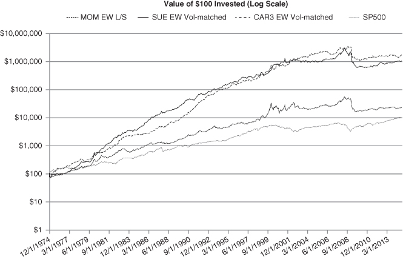

[**Figure A1.1**](#bappxA-fig-anc-0001) Fundamental Momentum Returns

Table 2 in the Novy-Marx paper shows the results of time-series regressions: Panel A shows that UMD loads heavily on both SUE and CAR3. A few key findings: First, after controlling for earnings momentum and various risk factors (e.g., market exposure, size exposure, and value exposure), price momentum no longer produces alpha. Panels B and C of Table 2 show that the alphas associated with SUE and CAR3 are highly significant. Novy-Marx concludes that earnings momentum “subsumes” price momentum, since it seems to explain the entire effect.

But the paper's assault on price momentum goes further. There are two additional findings in the paper:

1. Excluding the price momentum factor from earnings momentum factors improves the earnings momentum performance, while excluding earnings momentum from price momentum worsens the price momentum performance. This is in the context of a long/short strategy run at a scaled volatility of 10 percent.
2. Controlling for price momentum when constructing earnings momentum strategies can help reduce volatility and eliminate crashes to a large extent. (The price momentum strategy is known for being sensitive to market cycles[5](#bappxA-note-0005) and is more volatile in poor market environments.[6](#bappxA-note-0006))

In summary, Novy-Marx's findings highlight what has been known for a while in academic research, namely, that the anomalous returns associated with a price momentum strategy seem to be associated with an underreaction to earnings news. However, Novy-Marx points out that price momentum is not the right proxy to capture this underreaction effect, instead we should be focused on earnings momentum metrics and the underreaction to unexpected earnings surprises. According to Novy-Marx's analysis, price momentum doesn't matter—earnings momentum does. However, this evidence directly contradicts the analysis from Chan, Jegadeesh, and Lakonishok, who show that both earnings momentum and price momentum play a role in identifying anomalous returns.

Because the results of price momentum and earnings momentum are mixed, we did our own investigation of this research under our own research conditions. We focus on the universe of stocks we've used throughout this book: mid- and large-cap US traded common stocks. We create the portfolios described in Novy-Marx and examine the top and bottom decile portfolios created from our universe based on price momentum, SUE, and CAR3. Monthly rebalanced portfolios are formed by equal-weighting the firms and the returns run from January 1, 1975, through December 31, 2014. Returns are shown gross of any fees.

[Table A1.1](#bappxA-tbl-0001) shows the top decile (long portfolio) for the measures, while [Table A1.2](#bappxA-tbl-0002) shows the bottom decile (short portfolio) for the measures.

[**Table A1.1**](#bappxA-tbl-anc-0001) Top Decile Portfolio Summary Statistics

|  |  |  |  |  |
| --- | --- | --- | --- | --- |
|  | **Price Momentum** | **SUE** | **CAR3** | **SP500** |
| **CAGR** | 19.81% | 19.64% | 16.79% | 12.31% |
| **Standard Deviation** | 25.73% | 18.85% | 22.28% | 15.10% |
| **Downside Deviation** | 18.21% | 14.28% | 15.40% | 10.95% |
| **Sharpe Ratio** | 0.65 | 0.80 | 0.60 | 0.53 |
| **Sortino Ratio (MAR** bappxA-math-0001 **5%)** | 0.91 | 1.04 | 0.85 | 0.71 |
| **Worst Drawdown** | –58.59% | –56.08% | –59.05% | –50.21% |

[**Table A1.2**](#bappxA-tbl-anc-0002) Bottom Decile Portfolio Summary Statistics

|  |  |  |  |  |
| --- | --- | --- | --- | --- |
|  | **Price Momentum** | **SUE** | **CAR3** | **SP500** |
| **CAGR** | 6.07% | 11.31% | 8.12% | 12.31% |
| **Standard Deviation** | 26.48% | 19.39% | 23.06% | 15.10% |
| **Downside Deviation** | 18.00% | 13.85% | 16.44% | 10.95% |
| **Sharpe Ratio** | 0.17 | 0.40 | 0.25 | 0.53 |
| **Sortino Ratio (MAR** bappxA-math-0002 **5%)** | 0.24 | 0.55 | 0.34 | 0.71 |
| **Worst Drawdown** | –80.96% | –62.18% | –69.51% | –50.21% |

The price momentum and the SUE portfolio have the best top decile performance (long leg in a long/short strategy), while price momentum has the worst bottom performance (short leg in a long/short strategy). At first glance, one might assume that the best long/short portfolio would be associated with the price momentum strategy, since the spread between the long and the short portfolio is greatest. That assumption is wrong. We examine the performance of monthly rebalanced long/short portfolios that go long the top decile portfolio and short the bottom decile portfolio. The results are tabulated in [Table A1.3](#bappxA-tbl-0003).

[**Table A1.3**](#bappxA-tbl-anc-0003) Long/Short Momentum Portfolio Annual Returns

|  |  |  |  |  |
| --- | --- | --- | --- | --- |
|  | **Price Momentum (L/S)** | **SUE (L/S)** | **CAR3 (L/S)** | **SP500** |
| **CAGR** | 14.59% | 12.38% | 12.83% | 12.31% |
| **Standard Deviation** | 25.28% | 8.30% | 8.04% | 15.10% |
| **Downside Deviation** | 21.94% | 6.29% | 6.13% | 10.95% |
| **Sharpe Ratio** | 0.48 | 0.87 | 0.95 | 0.53 |
| **Sortino Ratio (MAR** bappxA-math-0003 **5%)** | 0.55 | 1.13 | 1.22 | 0.71 |
| **Worst Drawdown** | –71.36% | –37.93% | –29.26% | –50.21% |

The results in [Table A1.3](#bappxA-tbl-0003) show that the price momentum long/short portfolio has the highest compound annual growth rate (CAGR); however, this strategy has the highest risk. On balance, the performance is relatively weak on a risk-adjusted basis. In contrast, the SUE and CAR long/short portfolios' Sharpe and Sortino ratios are almost double that for the price momentum long/short portfolio. To make matters worse, the drawdown for the price momentum long/short portfolio (71.36%) is close to double that of the SUE (37.93%) and CAR3 (29.26%) long/short portfolios. To summarize, the long/short SUE and CAR3 portfolios look better than the price momentum portfolio and this is the core evidence that Novy-Marx rests on to highlight that price momentum is inferior to—and subsumed by—earnings momentum.

Thus far, we have identified that long-only price momentum is a promising strategy, but long/short SUE and CAR3 are much better long/short concepts. However, as we learned in [Chapter 4](#section-14), the stand-alone performance of a strategy, while relevant, does not always tell us the complete story. For example, in [Chapter 4](#section-14), we look at the performance of long/short price momentum in Japan, which is a market where momentum is arguably a poor performer on stand-alone basis. But this compartmentalized focus on momentum ignores the fact that combining long/short momentum with a long/short value approach actually allows an investor to create the most robust portfolio market neutral portfolio. Why? Because long/short value and momentum share an incredible attribute: they are strongly *negatively correlated*. This means that the two strategies tend to work well at different times. And this diversification benefit associated with momentum cannot be captured by a Sharpe ratio. Sounds great, but how can we quantify this benefit? We take a simple factor analysis approach to ascertain how the three various long/short momentum strategies load on common risk factors related to market risk, size risk, and value risk.[7](#bappxA-note-0007) The results are shown in [Table A1.4](#bappxA-tbl-0004).

[**Table A1.4**](#bappxA-tbl-anc-0004) Long/Short Momentum Portfolio Factor Loadings

|  |  |  |  |
| --- | --- | --- | --- |
|  | **Price Momentum (L/S)** | **SUE (L/S)** | **CAR3 (L/S)** |
| **Alpha (annual)** | **0.16** | **0.08** | **0.09** |
| **p-value** | *0.0001* | *0.0000* | *0.0000* |
| **RM-RF** | –**0.28** | –0.03 | –**0.10** |
| **p-value** | *0.0128* | 0.4421 | *0.0024* |
| **SMB** | **0.45** | –0.06 | 0.08 |
| **p-value** | *0.0377* | 0.2141 | 0.1644 |
| **HML** | –**0.67** | –0.10 | –**0.13** |
| **p-value** | *0.0013* | 0.1195 | *0.0160* |

The factor analysis shows that all three strategies have alpha—which has already been identified by previous research. However, we focus on the value factor (HML), which identifies the statistical relationship between a given strategy and a generic long/short value portfolio. The price momentum strategy has a highly significant loading of –0.67, making it a prime candidate for pairing with a value strategy. However, the earnings momentum strategies, SUE and CAR3, have value loadings that are closer to zero. The data suggest that these strategies may not be as useful, from a portfolio perspective, for pooling with a value-centric portfolio.

To get a better feel for the practical implications of the analysis above, we conduct an empirical test. Over the January 1, 1975, to December 31, 2014, sample period, we form four portfolios that allocate 50 percent to value and 50 percent to momentum every month. The value portfolio is represented by a portfolio that is long the top decile of firms ranked on EBIT/TEV (Earnings before Interest and Taxes/Total Enterprise Value) and rebalanced annually. The value portfolio is combined with the price momentum strategy, the SUE strategy, the CAR3 strategy, and the frog-in-the pan momentum portfolio (the four momentum-related strategies are all monthly rebalanced). In [Chapters 5](#section-16) through [8](#section-19), we recommend a quarterly rebalanced portfolio, but here we use the monthly rebalanced portfolio to facilitate a fair comparison. [Chapters 5](#section-16) to [8](#section-19) also show returns from 1974–2014, here we show returns from 1975–2014 due to data constraints on the SUE portfolios. All return streams are shown gross of any fees or transaction costs. Results are in [Table A1.5](#bappxA-tbl-0005).

[**Table A1.5**](#bappxA-tbl-anc-0005) Value and Momentum Portfolio Annual Returns

|  |  |  |  |  |
| --- | --- | --- | --- | --- |
|  | **50% Frog Momentum/ 50% Value** | **50% Price Momentum/ 50% Value** | **50% SUE/ 50% Value** | **50% CAR/ 50% Value** |
| **CAGR** | 20.54% | 19.72% | 19.25% | 17.92% |
| **Standard Deviation** | 19.55% | 19.84% | 17.62% | 19.05% |
| **Downside Deviation** | 14.36% | 14.50% | 13.48% | 13.64% |
| **Sharpe Ratio** | 0.81 | 0.77 | 0.82 | 0.71 |
| **Sortino Ratio (MAR** bappxA-math-0004 **5%)** | 1.10 | 1.04 | 1.06 | 0.98 |
| **Worst Drawdown** | –52.55% | –50.29% | –50.06% | –49.11% |

The combination portfolio of the frog-in-the-pan momentum portfolio and the value portfolio produce the highest CAGR and Sortino ratios. The SUE portfolio is also strong, with marginally weaker results. In short, while the results Novy-Marx presents on SUE are intriguing, and certainly worth consideration, when viewed through the practitioner lens, we believe this is a much ado about nothing situation. The results aren't powerful enough to suggest that price momentum is dead.[8](#bappxA-note-0008)

## IS THE 52-WEEK HIGH A BETTER MOMENTUM SIGNAL?

The 52-week high metric is widely reported and readily available to investors. But do investors respond rationally to this piece of information? Investors may react irrationally to 52-week high signals because of anchoring and framing biases. For example, irrational investors may take the 52-week high metric as a signal to sell without considering the fact that the current price may undervalue the security on a fundamental basis.

A paper written in 2012 by Malcom Baker, Xin Pan, and Jeffrey Wurgler[9](#bappxA-note-0009) examines the effect of reference points in mergers and acquisitions. The findings are quite astonishing—here is a summary taken from the abstract:

---

*Prior stock price peaks of targets affect several aspects of merger and acquisition activity. Offer prices are biased toward recent peak prices although they are economically unremarkable. An offer's probability of acceptance jumps discontinuously when it exceeds a peak price.*

---

So the peak price (52-week high) actually influences the unconditional probability of merger completion—that certainly wasn't part of the efficient market hypothesis textbooks we were reading in graduate school! Clearly, the 52-week high affects merger and acquisition activity, but what about using the metric for stock selection? Intuitively, the 52-week high will be related to relative strength momentum measures that we've discussed throughout the book. But is it a better measure than traditional momentum calculations? In 2004, Thomas J. George and Chuan-Yang Hwang[10](#bappxA-note-0010) set out to write a paper to address this question.

George and Hwang's paper titled “The 52 Week High and Momentum Investing,” finds that the 52-week-high strategy is better than traditional momentum strategies. The conclusion of the paper is bold: “Returns associated with winners and losers identified by the 52-week high strategy are about twice as large as those associated with the other [momentum] strategies.”

The authors explain their result by suggesting that when good news has pushed a stock's price near a 52-week high, investors are reluctant to bid the price of the stock higher, even if the information warrants it. Essentially, the weird feeling of buying a stock when the chart is at a peak prevents stocks from reaching fundamentals. Fundamental information eventually is incorporated into the stock price and the price moves up, resulting in a “momentum-like” effect. Similarly, when bad news pushes a stock's price far from its 52-week high, traders are initially unwilling to sell the stock at prices that are perceived to be “too low.” However, fundamental news is eventually reflected in the stock price, prices drop, and anomalous returns are earned by shorting stocks near their 52-week lows.

What are we to make of these results? We spent the bulk of this book explaining that a momentum strategy should be built using only the past returns, while this paper claims that the profits can be doubled if one uses a 52-week-high indicator. To better understand the strategy we replicate the results from this paper and run them through our laboratory tests.

We first examine the results from the original paper. The paper compares three momentum strategies using a sample of all US traded stocks from 1963 to 2001:

1. **1. Price momentum**: The price momentum portfolio takes long (short) positions in the 30 percent top (bottom) performing stocks based on their past six months' returns and is rebalanced every six months.[11](#bappxA-note-0011)
2. **2. Industry momentum**: In 1999, Toby Moskowitz and Mark Grinblatt[12](#bappxA-note-0012) develop an industry momentum screen. The universe of stocks is split into 20 industries, and a value-weight return is computed for each industry. The industry momentum portfolio takes long (short) position in stocks in the 30 percent top (bottom) performing industries.
3. **3. 52-week-high momentum**: The 52-week-high portfolio takes long (short) positions in stocks whose current price is close to (far from) the 52-week high. The distance from the 52-week high is measured by the price of the stock one month ago divided by the 52-week high in the previous year. So if we are standing on December 31, 2015, we divide the price on November 30, 2015, by the 52-week high November 30, 2014–2015.

For the three strategies listed above, the stocks within the long and short portfolios are equally weighted, held for six months, and reconstituted every month (to create overlapping portfolios). In Table 2 of the original paper, the authors find that the profits to the three long/short momentum strategies listed above are the highest (when excluding January) using the 52-week high screen. The paper also investigates which strategy is most effective, after controlling for various factors and market microstructure considerations. Regression results from Table 5 in the original paper show that 52-week high winner/loser dummy is a good predictor of future return—better than the past stock returns or industry factors.

The collective results suggest the 52-week high is a better trading signal than price momentum. But what do the results look like using our universe of stocks? It should be pointed out that the George and Hwang paper uses all stocks, and thus includes small-cap stocks, which can greatly skew results. In contrast, we stick to a mid- and large-cap universe that is relatively liquid and where the data are more robust. We form portfolios using the 52-week-high screening variable, and place stocks into deciles based on the ranking. Portfolios are reconstituted monthly, and are held for either one month, three months, or six months. For the portfolios with three- and six-month holding periods, overlapping portfolios are used. Portfolios are formed by equal-weighting the firms, and the returns run from January 1, 1974, through December 31, 2014. Returns are shown gross of any fees. For each decile, we plot the CAGR in [Figure A1.2](#bappxA-fig-0002).

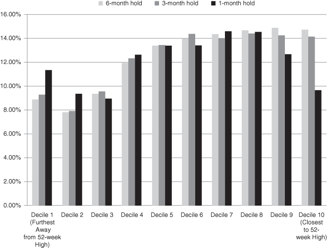

[**Figure A1.2**](#bappxA-fig-anc-0002) Decile Returns to 52-Week High Screen

The results in [Figure A1.2](#bappxA-fig-0002) document a few important findings. First, we notice that for the three- and six-month holding periods, there is a near monotonic increase in the CAGR as one moves from decile 1 (furthest away from 52-week high) up to decile 10 (closest to the 52-week high). This should be expected as the paper goes long the top three deciles and shorts the bottom three deciles to form the 52-week-high L/S portfolio discussed in the paper. The paper also focuses their discussion around the portfolios that are held for six months, which, not surprisingly, have the best performance. However, for the monthly rebalanced version of the 52-week-high strategy, the results break down dramatically. In other words, they fail a simple robustness test. When results are fragile to reasonable changes in portfolio construction, we get queasy that data mining may explain the analysis.

To make matters worse for the 52-week-high strategy, a basic long strategy that buys the portfolio of stocks based on nearness to the 52-week high isn't that compelling. For example, the top decile 52-week-high portfolio, held for 3 months, earns a 14.15 percent CAGR. Not bad, relative to the market before transaction costs, but this CAGR is much lower than the simple price momentum top decile portfolio (discussed in [Chapter 5](#section-16)) held for three months, which earned a 17.10 percent CAGR over the same period.

Overall, we are impressed with the story behind the 52-week-high concept, but we feel there is no robust evidence that the strategy is more effective than relative strength price momentum strategies. Nevertheless, the 52-week-high evidence does point in the general direction of the price momentum anomaly and serves as another data point, which highlights that momentum strategies likely exploit mispricing caused by marketwide underreaction to news.

## CAN ABSOLUTE STRENGTH IMPROVE RELATIVE STRENGTH MOMENTUM?

“Absolute Strength: Exploring Momentum in Stock Returns,” by Huseyin Gulen and Relitsa Petkova,[13](#bappxA-note-0013) has an interesting twist on standard relative strength momentum strategies. As we've discussed throughout this book, the academic research community captures the generic momentum strategy by ranking firms on their past 12-month momentum (ignoring last month's return). Portfolios are then formed on these rankings. Most research papers long the winners and short the losers. However, the classification of a “winner” stock and a “loser” stock changes over time. During the Internet bubble, to be classified as a “winner” a firm needed to have a past momentum score of around 250 percent (near the peak). During the 2008 financial crisis, a “winner” stock would be any stock with a return above negative 5 percent. Clearly, relative strength winners can have wide-ranging returns (the same wide-ranging result is seen on relative strength losers).

The authors explore the idea that perhaps a momentum strategy can be improved by focusing on the “absolute” strength score. The idea is to look back each month at the historical cutoffs for winners and losers, while using all available returns to create the cutoffs. An example will illustrate the methodology more clearly. Imagine it is January 31, 1965, and we examine all the momentum scores (past 12-month momentum, skipping the most recent month) for all stocks measured in January, using every year available prior to 1965. This would be all the momentum scores on January 31, 1927, January 31, 1928 … , and January 31, 1965. From this sample set, identify the 10th and 90th percentile values and use these as the “absolute” momentum cutoffs. The cutoff analysis is completed each month, so the percentile values are dynamic over time.

The absolute momentum cutoffs ensure that the definition of a winning and a losing stock are more consistent over time. Using results from the paper, the “winning” stock cutoff is near 60 percent, while the “losing” stock cutoff is around negative 35 percent. Portfolios are formed using stocks that meet the cutoff points. And while this approach has intuitive appeal, the portfolio strategy will create stock portfolios with differing numbers of stock holdings. In some cases, the number of stock holdings can be extreme. For example, a figure from the original paper shows that during the 2008 financial crisis, the number of winners drops close to zero, while the number of losers goes above 1,500. A relative strength momentum rule on the other hand, will always buy the top 10 percent and sell the bottom 10 percent of the universe. So if there are 5,000 firms in the universe, the relative strength portfolio would buy 500 stocks and sell 500 stocks, keeping the portfolio size in balance.

Construction issues aside, how does this absolute momentum portfolio perform? The author's strategy that buys absolute strength winners and sells absolute strength losers delivers a risk-adjusted return of 2.42 percent per month from 1965 to 2014 and 1.55 percent per month from 2000 to 2014. The baseline results to the long/short portfolios are impressive.

We're a bit skeptical of the results based on the universe used by the authors. Their universe includes microcaps stocks, which make up around 60 percent of the names in the CRSP universe, but only about 3 percent of the market cap according to Fama and French 2008.[14](#bappxA-note-0014) Imagine trying to long or short hundreds of microcap stocks!

To assess the validity of the absolute momentum results we decided to perform the same analysis on a universe of mid- and large-cap US stocks. We reconstruct the absolute momentum signal every month according the cookbook outlined in the original paper. [Figure A1.3](#bappxA-fig-0003) plots the breakpoints over time. The return breakpoints are similar to those in the paper: the “winning” stock cutoff is around 60 percent, while the “losing” stock cutoff is around –35 percent. We only include stocks in the winner portfolio if they are above the winner cutoff and only include stocks in the loser portfolio if they are below the loser cutoff. As mentioned previously, this approach introduces an odd portfolio construction element. [Figure A1.4](#bappxA-fig-0004) highlights the number of firms in the high and low absolute momentum portfolios across time and compares these portfolio sizes to the standard price momentum approach that buys the top 10 percent relative strength stocks and shorts the bottom 10 percent relative strength stocks.

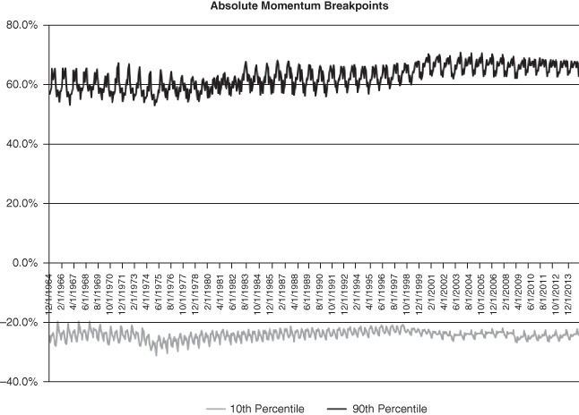

[**Figure A1.3**](#bappxA-fig-anc-0003) Absolute Momentum Breakpoints

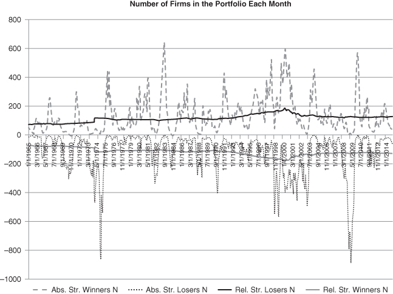

[**Figure A1.4**](#bappxA-fig-anc-0004) Absolute Momentum Number of Firms

Similar to the original paper, there are extreme variations in portfolio sizes. During the financial crisis the absolute momentum portfolio is long one firm in January 2009, while the absolute momentum portfolio is short over 800 stocks.

We next assess the performance of the absolute momentum long/short strategy. We examine long/short returns to the equal-weighted monthly rebalanced portfolios from January 1965 to December 2014. All returns shown are total returns but are gross of any fees and transaction costs. The results are shown in [Table A1.6](#bappxA-tbl-0006).

[**Table A1.6**](#bappxA-tbl-anc-0006) Absolute Momentum Long/Short Returns

|  |  |  |  |
| --- | --- | --- | --- |
|  | **Absolute Strength (L/S)** | **Relative Strength (L/S)** | **SP500** |
| **CAGR** | 25.28% | 17.97% | 10.01% |
| **Standard Deviation** | 23.26% | 24.02% | 15.04% |
| **Downside Deviation** | 17.57% | 20.58% | 10.64% |
| **Sharpe Ratio** | 0.88 | 0.61 | 0.38 |
| **Sortino Ratio (MAR** bappxA-math-0005 **5%)** | 1.17 | 0.71 | 0.54 |
| **Worst Drawdown** | –68.27% | –70.86% | –50.21% |

The results are similar to the paper: the absolute momentum long/short portfolio outperforms the relative strength portfolio on a variety of metrics. To dig a bit deeper into the absolute momentum concept, we look at the performance of the long and short portfolios, separately.

[Table A1.7](#bappxA-tbl-0007) shows the results to the four portfolios (Absolute Strength Winners and Losers; Relative Strength Winners and Losers). Portfolios are equal-weighted and rebalanced monthly from January 1965 to December 2014. All returns shown are total returns but are gross of any fees and transaction costs.

[**Table A1.7**](#bappxA-tbl-anc-0007) Absolute Momentum Long-Only Portfolio Returns

|  |  |  |  |  |
| --- | --- | --- | --- | --- |
|  | **Absolute Momentum Winner Portfolio** | **Relative Momentum Winner Portfolio** | **Absolute Momentum Loser Portfolio** | **Relative Momentum Loser Portfolio** |
| **CAGR** | 18.91% | 18.74% | –3.42% | 2.40% |
| **Standard Deviation** | 24.85% | 25.11% | 26.17% | 26.20% |
| **Downside Deviation** | 17.06% | 17.41% | 17.09% | 17.39% |
| **Sharpe Ratio** | 0.63 | 0.62 | –0.19 | 0.03 |
| **Sortino Ratio (MAR** bappxA-math-0006 **5%)** | 0.91 | 0.89 | –0.29 | 0.04 |
| **Worst Drawdown** | –65.09% | –58.40% | –94.10% | –82.01% |

Examining the results, the long-only “winner” portfolios are similar and there is little marginal benefit of an absolute momentum strategy relative to a classic price momentum strategy. The absolute momentum loser portfolio, however, is much worse than the relative momentum loser portfolio. These results suggest that the short leg drives the performance difference between the long/short absolute momentum strategy and the long/short relative momentum strategy.

Another potential issue is that the absolute momentum rule can create portfolios with varying sizes from month to month. Alternatively, the relative strength signal creates a highly consistent *N* in the portfolio from month to month. Indirectly, the absolute momentum rule opens an investor up to a lot of risk that may not be captured in a backtest. For example, in January 2009, the absolute momentum portfolio is long a single stock and the absolute momentum portfolio is short over 800 stocks. We don't know many investors who would consider it prudent to hold a single stock portfolio. Obviously, this didn't have a huge effect historically, but out of sample this could create serious consequences.

## CAN THE VOLATILITY OF MOMENTUM BE CONSTRAINED?

A negative aspect to momentum investing is the fact that a high-momentum portfolio tends to have large drawdowns and gut-wrenching volatility. On the one hand, this is a terrible characteristic, but on the other hand, this is why momentum is sustainable—it is not easy to “arbitrage.” But perhaps there is a better way to manage the volatility of momentum strategies. Yufeng Han, Guofu Zhou, and Yingzi Zhu make a good attempt in their paper, “Taming Momentum Crashes: A Simple Stop-Loss Strategy.” The authors apply a simple stop-loss rule to the classic long/short momentum portfolio.[15](#bappxA-note-0015) The results are impressive. Using a 10 percent stop-loss rule, the authors drop the maximum monthly loss from negative 49.79 percent to negative 11.36 percent and the Sharpe ratios are more than doubled.

The specifics of the trading strategy can be summarized in three rules:

1. Rebalance the long and short book monthly by sorting stocks on their past returns (the paper uses the last seven months' returns, excluding the most recent month).
2. Monitor the long portfolio daily: If a long position declines by *X* percent (e.g., 10), sell the position and invest it in the risk-free rate until the end of the month.
3. Monitor the short portfolio daily: If a short position rises by *X* percent (e.g., 10), cover the position and invest any proceeds in the risk-free rate until the end of the month.

[Table A1.8](#bappxA-tbl-0008) shows the original figures from the paper.

[**Table A1.8**](#bappxA-tbl-anc-0008) Equal-Weighted Stop-Loss Momentum Monthly Returns

|  |  |  |
| --- | --- | --- |
| **Variable** | **Avg Ret (%)** | **Minimum (%)** |
|  | Panel A: Original Momentum | |
| **Market** | 0.65 | –29.10 |
| **Losers** | 0.24 | –39.50 |
| **Winners** | 1.24 | –33.06 |
| **WML** | 0.99 | –49.79 |
|  | Panel B: Stop Loss at 10% | |
| **Losers** | –0.42 | –39.27 |
| **Winners** | 1.27 | –12.87 |
| **WML** | 1.69 | –11.36 |
|  | Panel C: Stop Loss at 5% | |
| **Losers** | –0.83 | –36.34 |
| **Winners** | 1.53 | –8.48 |
| **WML** | 2.35 | –8.94 |

Not only does the portfolio have smaller monthly drawdowns, but the average returns increase with the use of the stop-loss rules! If we examine the winners minus losers (WML) long/short portfolio the average monthly returns are highest using the 5 percent rule. Any strategy that can ***lower*** drawdowns and ***increase*** returns is pretty compelling and worth a second look.

Of course, nothing in financial markets is ever easy, although sometimes it looks that way. A downside of the stop-loss approach is that the strategy requires *daily* analysis of every stock position, which may be quite difficult—not to mention costly—for many investors to implement. Also, from the perspective of a long-only investor, which is the focus of our book, the benefits to a stop-loss strategy are muted. For example, a momentum strategy with a 10 percent stop-loss rule has a 1.27 percent average monthly return, which is similar to a long-only buy and hold momentum strategy, which earns a 1.24 percent average monthly return. That said, there is a risk management benefit to a stop-loss approach, which we will examine in more detail.

Similar to our prior analysis, we examine the stop-loss strategy under our own research conditions. We examine a mid- to large-cap US traded universe and we focus our analysis on the long-only portfolios. All returns are gross, and no management fee or transaction costs are applied. We examine the returns from January 1, 1927, to December 31, 2013, to cover the same sample period analyzed in the paper. We examine the following four portfolios:

1. **1. High momentum**: Top 10 percent of firms ranked on their past momentum (total return over the past 12 months ignoring last month). Portfolio is monthly rebalanced and equal weighted.
2. **2. High momentum with 10 percent stop-loss rule**: Top 10 percent of firms ranked on their past momentum (total return over the past 12 months ignoring last month). Portfolio is monthly rebalanced and equal weighted. If during the month any individual stock position is down 10 percent, sell the security and remain in cash until the end of the month, at which time the portfolio is rebalanced into the top 10 percent of momentum firms.
3. **3. High momentum with 5 percent stop-loss rule**: Top 10 percent of firms ranked on their past momentum (total return over the past 12 months ignoring last month). Portfolio is monthly rebalanced and equal weighted. If during the month any individual stock position is down 5 percent, sell the security and remain in cash until the end of the month, at which time the portfolio is rebalanced into the top 10 percent of momentum firms.
4. **4. SP500**: Total return of the S&P 500 Index.

The results of the analysis are presented in [Table A1.9](#bappxA-tbl-0009).

[**Table A1.9**](#bappxA-tbl-anc-0009) Momentum Stop-Loss Performance

|  |  |  |  |  |
| --- | --- | --- | --- | --- |
|  | **High Momentum** | **High Momentum 10% Stop-Loss** | **High Momentum 5% Stop-Loss** | **SP500** |
| **CAGR** | 19.34% | 15.47% | 15.29% | 9.91% |
| **Standard Deviation** | 24.78% | 22.19% | 18.31% | 19.18% |
| **Downside Deviation** | 18.26% | 12.73% | 8.36% | 14.26% |
| **Sharpe Ratio** | 0.70 | 0.61 | 0.68 | 0.41 |
| **Sortino Ratio (MAR** bappxA-math-0007 **5%)** | 0.87 | 0.93 | 1.31 | 0.44 |
| **Worst Drawdown** | –71.73% | –64.02% | –48.11% | –84.59% |

The long-only generic momentum portfolio generates a much higher CAGR than the risk-managed portfolios; however, the risk profile is arguably better for the stop-loss systems. However, the risk profile is highly dependent on the stop-loss rule examined, which hints toward a robustness issue. Relative to the 10 percent stop-loss rule, generic momentum is a better strategy, but relative to a 5 percent stop-loss rule, generic momentum is worse on a risk-adjusted basis.

On net, the stop-loss rule is interesting; however, risk management via stop-loss is not the only option. One can apply a simple long-term trend-following rule[16](#bappxA-note-0016) and/or a time-series momentum rule[17](#bappxA-note-0017) on a long-only momentum strategy and avoid the complexity and operational commitment required for a daily-assessed momentum portfolio. For example, consider a simple time-series momentum trading rule that is long the momentum portfolio if the past 12 month return on the S&P 500 is above the risk-free rate, otherwise, the portfolio is investing in risk-free bonds.

Here are the four portfolios we test:

1. **1. High momentum w/TSMOM**: Top 10 percent of firms ranked on their past momentum (total return over the past 12 months ignoring last month). Portfolio is monthly rebalanced and equal weighted. A 12-month time-series momentum-trading rule is applied each month.
2. **2. High momentum**: Top 10 percent of firms ranked on their past momentum (total return over the past 12 months, ignoring last month). Portfolio is monthly rebalanced and equal weighted.
3. **3. High momentum with 10 percent stop-loss rule**: Top 10 percent of firms ranked on their past momentum (total return over the past 12 months ignoring last month). Portfolio is monthly rebalanced and equal weighted. If during the month any individual stock position is down 10 percent, sell the security and remain in cash until the end of the month, at which time the portfolio is rebalanced into the top 10 percent of momentum firms.
4. **4. High momentum with 5 percent stop-loss rule**: Top 10 percent of firms ranked on their past momentum (total return over the past 12 months ignoring last month). Portfolio is monthly rebalanced and equal weighted. If during the month any individual stock position is down 5 percent, sell the security and remain in cash until the end of the month, at which time the portfolio is rebalanced into the top 5 percent of momentum firms.

The returns run from January 1, 1928, to December 31, 2013 (we don't include 1927 because we need to use 12 months of data to get the TSMOM rule). Results are gross of fees. All returns are total returns and include the reinvestment of distributions (e.g., dividends).

The results from [Table A1.10](#bappxA-tbl-0010) highlight that a simple monthly reviewed risk management rule applied at the portfolio level can achieve the same level of risk control, but with a lot less complication, than daily-assessed stop-loss rules.

[**Table A1.10**](#bappxA-tbl-anc-0010) Time-Series Momentum Performance

|  |  |  |  |  |
| --- | --- | --- | --- | --- |
|  | **High Momentum TSMOM** | **High Momentum** | **High Momentum10% Stop-Loss** | **High Momentum 10% Stop-Loss** |
| **CAGR** | 16.57% | 18.93% | 15.06% | 14.88% |
| **Standard Deviation** | 20.97% | 24.84% | 22.23% | 18.32% |
| **Downside Deviation** | 16.80% | 18.31% | 12.75% | 8.36% |
| **Sharpe Ratio** | 0.68 | 0.69 | 0.59 | 0.66 |
| **Sortino Ratio (MAR** bappxA-math-0008 **5%)** | 0.75 | 0.85 | 0.91 | 1.26 |
| **Worst Drawdown** | –50.99% | –71.73% | –64.02% | –48.11% |

If investors are interested in managing the volatility of their portfolio, werecommend that investors first focus on achieving the best possible long-only momentum portfolio and combine it with the best possible long-only value portfolio. Once that is achieved, and the investor is capturing the highest expected equity premium on a risk-adjusted basis, the investor can deploy risk-management rules at the portfolio level. Although a detailed discussion of this approach is beyond the scope of this book, we recommend that investors focus on simple trend-following and time-series momentum type rules to facilitate portfolio-level risk management.

## NOTES

[1](#bappxA-note-anc-0001) Nicholas Barberis, Andrei Shleifer, and Robert Vishny, “A Model of Investor Sentiment,” *Journal of Financial Economics* 49 (1998): 307–343.
[2](#bappxA-note-anc-0002) Louis Chan, Narisimhan Jegadeesh, and Josef Lakonishok, “Momentum Strategies,” *The Journal of Finance* 51 (1996): 1681–1713.
[3](#bappxA-note-anc-0003) Robert Novy-Marx, “Fundamentally, Momentum Is Fundamental Momentum,” *NBER Working Paper No. 20984*.
[4](#bappxA-note-anc-0004) For our universe of mid/large cap stocks, to match the volatility of the fundamental momentum portfolios (SUE and CAR3) with the price momentum (UMD) portfolios, the fundamental momentum portfolios (SUE and CAR3) are required to be three times long and three times short.
[5](#bappxA-note-anc-0005) Tarun Chordia and Lakshmanan Shivakumar, “Earnings and Price Momentum,” *AFA 2003 Washington, DC Meetings*.
[6](#bappxA-note-anc-0006) Kent Daniel and Tobias Moskowitz. “Momentum Crashes,” *Columbia Business School Research Paper No. 14–36*.
[7](#bappxA-note-anc-0007) Eugene F. Fama and Kenneth R. French, “Common Risk Factors in the Returns on Stocks and Bonds,” *Journal of Financial Economics* 33 (1993): 3–56.
[8](#bappxA-note-anc-0008) Readers interested in more complex long/short portfolios should explore earnings momentum strategies in more detail.
[9](#bappxA-note-anc-0009) Malcolm Baker, Xin Pan, and Jeffrey Wurgler, “The Effect of Reference Point Prices on Mergers and Acquisitions,” *Journal of Financial Economics* 106 (2012): 49–71.
[10](#bappxA-note-anc-0010) Thomas J. George and Chuan-Yang Hwang, “The 52-Week High and Momentum Investing,” *The Journal of Finance* 59 (2004): 1957–2444.
[11](#bappxA-note-anc-0011) Narasimhan Jegadeesh and Sheridan Titman, “Returns to Buying Winners and Selling Losers: Implications for Stock Market Efficiency,” *The Journal of Finance* 48 (1993): 65–91.
[12](#bappxA-note-anc-0012) Tobias J. Moskowitz and Mark Grinblatt, “Do Industries Explain Momentum?” *The Journal of Finance* 54 (1999): 1249–1290.
[13](#bappxA-note-anc-0013) Huseyin Gulen and Ralitsa Petkova, “Absolute Strength: Exploring Momentum in Stock Returns,” working paper, accessed 1/31/2016.
[14](#bappxA-note-anc-0014) Eugene F. Fama and Kenneth R. French, “Dissecting Anomalies,” *The Journal of Finance* 63 (2008): 1653–1678.
[15](#bappxA-note-anc-0015) Yufeng Han, Guofu Zhou, and Yingzi Zhu, “Taming Momentum Crashes: A Simple Stop-Loss Strategy,” working paper, accessed 1/31/2016.
[16](#bappxA-note-anc-0016) See Meb Faber, “A Quantitative Approach to Tactical Asset Allocation,” *The Journal of Wealth Management* 9 (2007): 69–79.
[17](#bappxA-note-anc-0017) Gary Antonacci, *Dual Momentum Investing: An Innovative Strategy for Higher Returns with Lower Risk* (New York: McGraw-Hill, 2014).

<!-- rl-section id="how-is-momentum-related-to-fundamentals" class="epub-section" title="HOW IS MOMENTUM RELATED TO FUNDAMENTALS?" -->

## HOW IS MOMENTUM RELATED TO FUNDAMENTALS?

In 1998, Nicholas Barberis, Andrei Shleifer, and Robert Vishny[1](#bappxA-note-0001) published a theoretical model on investor sentiment, which described the possibility that behavioral biases drive underreaction and overreaction, which lead to value and momentum effects. Value is essentially an overreaction to bad news; momentum is an underreaction to good news. In a 1996 empirical paper, Louis Chan, Narisimhan Jegadeesh, and Josef Lakonishok[2](#bappxA-note-0002) find that the momentum anomaly is arguably driven, in part, by a sluggish response to past news. In their own words, “Security analysts' earnings forecasts … respond sluggishly to past news, especially in the case of stocks with the worst past performance. The results suggest a market that responds only gradually to new information.” Sometimes such new information is reflected in fundamentals.

Robert Novy-Marx takes the relationship between fundamentals and momentum a bit further. In a working paper titled, “Fundamentally, Momentum Is Fundamental Momentum,”[3](#bappxA-note-0003) Novy-Marx tries to understand why momentum strategies have historically outperformed. He finds that price momentum is a manifestation of the earnings momentum anomaly. In other words, the momentum anomaly works because investors systematically underreact to earnings surprises. Novy-Marx then shows that after controlling for earnings momentum, price-based momentum is no longer “anomalous.”

We investigate the results presented by Novy-Marx and discuss them below. Let's first review the concept of price and earnings momentum, and how portfolios based on these two strategies are formed:

- **Price momentum**: Stocks with the strongest past price performance tend to outperform those with the weakest past price performance. Portfolios are formed based on the past 12 months' performance, while ignoring the most recent month to avoid short-term reversals. This strategy is what we recommend as the baseline “momentum” screen in our book and is the typical way academic researchers describe momentum.
- **Earnings momentum**: Stocks with strong past earnings surprises outperform those with weak past earnings surprises. Earnings momentum portfolios are formed based on past earnings surprises. Earnings surprise is measured via two ways in the Novy-Marx paper:
  1. **1. Standardized unexpected earnings (SUE)**: SUE is defined as the most recent year-over-year change in earnings per share, scaled by the standard deviation of the earnings changes over the last eight announcements.
  2. **2. Cumulative three-day abnormal returns (CAR3)**: CAR3 is defined as the cumulative return in excess of the market over the three days starting the day before the most recent earnings announcement and ending at the end of the day following the announcement.

Using the portfolio construction outlined, Novy-Marx examines cross-sectional (Fama-MacBeth) regressions of a firms' returns on both past performance and earnings surprises. The results suggest that price momentum can be largely explained by earnings momentum.

Next, Novy-Marx looks at three long/short factor portfolios:

- **UMD** = long high-price momentum and short low-price momentum stocks
- **SUE** = long high SUE and short low SUE stocks
- **CAR3** = long high CAR3 and short low CAR3 stocks

To compare across the strategies, the long/short portfolios are all set to have the same volatility (we scale them to match UMD) using our universe of mid/large cap stocks. Mechanically, this means that leverage is deployed to enhance the volatility of strategies with lower natural leverage (e.g., SUE and CAR3) to match the natural volatility of the long/short price momentum portfolio.[4](#bappxA-note-0004) [Figure A1.1](#bappxA-fig-0001) shows the performance of these three portfolios from January 1, 1975, to December 31, 2014 (all portfolios are long/short portfolios). We can see that both of the earnings momentum strategies dramatically outperform the price momentum strategy.

[**Figure A1.1**](#bappxA-fig-anc-0001) Fundamental Momentum Returns

Table 2 in the Novy-Marx paper shows the results of time-series regressions: Panel A shows that UMD loads heavily on both SUE and CAR3. A few key findings: First, after controlling for earnings momentum and various risk factors (e.g., market exposure, size exposure, and value exposure), price momentum no longer produces alpha. Panels B and C of Table 2 show that the alphas associated with SUE and CAR3 are highly significant. Novy-Marx concludes that earnings momentum “subsumes” price momentum, since it seems to explain the entire effect.

But the paper's assault on price momentum goes further. There are two additional findings in the paper:

1. Excluding the price momentum factor from earnings momentum factors improves the earnings momentum performance, while excluding earnings momentum from price momentum worsens the price momentum performance. This is in the context of a long/short strategy run at a scaled volatility of 10 percent.
2. Controlling for price momentum when constructing earnings momentum strategies can help reduce volatility and eliminate crashes to a large extent. (The price momentum strategy is known for being sensitive to market cycles[5](#bappxA-note-0005) and is more volatile in poor market environments.[6](#bappxA-note-0006))

In summary, Novy-Marx's findings highlight what has been known for a while in academic research, namely, that the anomalous returns associated with a price momentum strategy seem to be associated with an underreaction to earnings news. However, Novy-Marx points out that price momentum is not the right proxy to capture this underreaction effect, instead we should be focused on earnings momentum metrics and the underreaction to unexpected earnings surprises. According to Novy-Marx's analysis, price momentum doesn't matter—earnings momentum does. However, this evidence directly contradicts the analysis from Chan, Jegadeesh, and Lakonishok, who show that both earnings momentum and price momentum play a role in identifying anomalous returns.

Because the results of price momentum and earnings momentum are mixed, we did our own investigation of this research under our own research conditions. We focus on the universe of stocks we've used throughout this book: mid- and large-cap US traded common stocks. We create the portfolios described in Novy-Marx and examine the top and bottom decile portfolios created from our universe based on price momentum, SUE, and CAR3. Monthly rebalanced portfolios are formed by equal-weighting the firms and the returns run from January 1, 1975, through December 31, 2014. Returns are shown gross of any fees.

[Table A1.1](#bappxA-tbl-0001) shows the top decile (long portfolio) for the measures, while [Table A1.2](#bappxA-tbl-0002) shows the bottom decile (short portfolio) for the measures.

[**Table A1.1**](#bappxA-tbl-anc-0001) Top Decile Portfolio Summary Statistics

|  |  |  |  |  |
| --- | --- | --- | --- | --- |
|  | **Price Momentum** | **SUE** | **CAR3** | **SP500** |
| **CAGR** | 19.81% | 19.64% | 16.79% | 12.31% |
| **Standard Deviation** | 25.73% | 18.85% | 22.28% | 15.10% |
| **Downside Deviation** | 18.21% | 14.28% | 15.40% | 10.95% |
| **Sharpe Ratio** | 0.65 | 0.80 | 0.60 | 0.53 |
| **Sortino Ratio (MAR** bappxA-math-0001 **5%)** | 0.91 | 1.04 | 0.85 | 0.71 |
| **Worst Drawdown** | –58.59% | –56.08% | –59.05% | –50.21% |

[**Table A1.2**](#bappxA-tbl-anc-0002) Bottom Decile Portfolio Summary Statistics

|  |  |  |  |  |
| --- | --- | --- | --- | --- |
|  | **Price Momentum** | **SUE** | **CAR3** | **SP500** |
| **CAGR** | 6.07% | 11.31% | 8.12% | 12.31% |
| **Standard Deviation** | 26.48% | 19.39% | 23.06% | 15.10% |
| **Downside Deviation** | 18.00% | 13.85% | 16.44% | 10.95% |
| **Sharpe Ratio** | 0.17 | 0.40 | 0.25 | 0.53 |
| **Sortino Ratio (MAR** bappxA-math-0002 **5%)** | 0.24 | 0.55 | 0.34 | 0.71 |
| **Worst Drawdown** | –80.96% | –62.18% | –69.51% | –50.21% |

The price momentum and the SUE portfolio have the best top decile performance (long leg in a long/short strategy), while price momentum has the worst bottom performance (short leg in a long/short strategy). At first glance, one might assume that the best long/short portfolio would be associated with the price momentum strategy, since the spread between the long and the short portfolio is greatest. That assumption is wrong. We examine the performance of monthly rebalanced long/short portfolios that go long the top decile portfolio and short the bottom decile portfolio. The results are tabulated in [Table A1.3](#bappxA-tbl-0003).

[**Table A1.3**](#bappxA-tbl-anc-0003) Long/Short Momentum Portfolio Annual Returns

|  |  |  |  |  |
| --- | --- | --- | --- | --- |
|  | **Price Momentum (L/S)** | **SUE (L/S)** | **CAR3 (L/S)** | **SP500** |
| **CAGR** | 14.59% | 12.38% | 12.83% | 12.31% |
| **Standard Deviation** | 25.28% | 8.30% | 8.04% | 15.10% |
| **Downside Deviation** | 21.94% | 6.29% | 6.13% | 10.95% |
| **Sharpe Ratio** | 0.48 | 0.87 | 0.95 | 0.53 |
| **Sortino Ratio (MAR** bappxA-math-0003 **5%)** | 0.55 | 1.13 | 1.22 | 0.71 |
| **Worst Drawdown** | –71.36% | –37.93% | –29.26% | –50.21% |

The results in [Table A1.3](#bappxA-tbl-0003) show that the price momentum long/short portfolio has the highest compound annual growth rate (CAGR); however, this strategy has the highest risk. On balance, the performance is relatively weak on a risk-adjusted basis. In contrast, the SUE and CAR long/short portfolios' Sharpe and Sortino ratios are almost double that for the price momentum long/short portfolio. To make matters worse, the drawdown for the price momentum long/short portfolio (71.36%) is close to double that of the SUE (37.93%) and CAR3 (29.26%) long/short portfolios. To summarize, the long/short SUE and CAR3 portfolios look better than the price momentum portfolio and this is the core evidence that Novy-Marx rests on to highlight that price momentum is inferior to—and subsumed by—earnings momentum.

Thus far, we have identified that long-only price momentum is a promising strategy, but long/short SUE and CAR3 are much better long/short concepts. However, as we learned in [Chapter 4](#section-14), the stand-alone performance of a strategy, while relevant, does not always tell us the complete story. For example, in [Chapter 4](#section-14), we look at the performance of long/short price momentum in Japan, which is a market where momentum is arguably a poor performer on stand-alone basis. But this compartmentalized focus on momentum ignores the fact that combining long/short momentum with a long/short value approach actually allows an investor to create the most robust portfolio market neutral portfolio. Why? Because long/short value and momentum share an incredible attribute: they are strongly *negatively correlated*. This means that the two strategies tend to work well at different times. And this diversification benefit associated with momentum cannot be captured by a Sharpe ratio. Sounds great, but how can we quantify this benefit? We take a simple factor analysis approach to ascertain how the three various long/short momentum strategies load on common risk factors related to market risk, size risk, and value risk.[7](#bappxA-note-0007) The results are shown in [Table A1.4](#bappxA-tbl-0004).

[**Table A1.4**](#bappxA-tbl-anc-0004) Long/Short Momentum Portfolio Factor Loadings

|  |  |  |  |
| --- | --- | --- | --- |
|  | **Price Momentum (L/S)** | **SUE (L/S)** | **CAR3 (L/S)** |
| **Alpha (annual)** | **0.16** | **0.08** | **0.09** |
| **p-value** | *0.0001* | *0.0000* | *0.0000* |
| **RM-RF** | –**0.28** | –0.03 | –**0.10** |
| **p-value** | *0.0128* | 0.4421 | *0.0024* |
| **SMB** | **0.45** | –0.06 | 0.08 |
| **p-value** | *0.0377* | 0.2141 | 0.1644 |
| **HML** | –**0.67** | –0.10 | –**0.13** |
| **p-value** | *0.0013* | 0.1195 | *0.0160* |

The factor analysis shows that all three strategies have alpha—which has already been identified by previous research. However, we focus on the value factor (HML), which identifies the statistical relationship between a given strategy and a generic long/short value portfolio. The price momentum strategy has a highly significant loading of –0.67, making it a prime candidate for pairing with a value strategy. However, the earnings momentum strategies, SUE and CAR3, have value loadings that are closer to zero. The data suggest that these strategies may not be as useful, from a portfolio perspective, for pooling with a value-centric portfolio.

To get a better feel for the practical implications of the analysis above, we conduct an empirical test. Over the January 1, 1975, to December 31, 2014, sample period, we form four portfolios that allocate 50 percent to value and 50 percent to momentum every month. The value portfolio is represented by a portfolio that is long the top decile of firms ranked on EBIT/TEV (Earnings before Interest and Taxes/Total Enterprise Value) and rebalanced annually. The value portfolio is combined with the price momentum strategy, the SUE strategy, the CAR3 strategy, and the frog-in-the pan momentum portfolio (the four momentum-related strategies are all monthly rebalanced). In [Chapters 5](#section-16) through [8](#section-19), we recommend a quarterly rebalanced portfolio, but here we use the monthly rebalanced portfolio to facilitate a fair comparison. [Chapters 5](#section-16) to [8](#section-19) also show returns from 1974–2014, here we show returns from 1975–2014 due to data constraints on the SUE portfolios. All return streams are shown gross of any fees or transaction costs. Results are in [Table A1.5](#bappxA-tbl-0005).

[**Table A1.5**](#bappxA-tbl-anc-0005) Value and Momentum Portfolio Annual Returns

|  |  |  |  |  |
| --- | --- | --- | --- | --- |
|  | **50% Frog Momentum/ 50% Value** | **50% Price Momentum/ 50% Value** | **50% SUE/ 50% Value** | **50% CAR/ 50% Value** |
| **CAGR** | 20.54% | 19.72% | 19.25% | 17.92% |
| **Standard Deviation** | 19.55% | 19.84% | 17.62% | 19.05% |
| **Downside Deviation** | 14.36% | 14.50% | 13.48% | 13.64% |
| **Sharpe Ratio** | 0.81 | 0.77 | 0.82 | 0.71 |
| **Sortino Ratio (MAR** bappxA-math-0004 **5%)** | 1.10 | 1.04 | 1.06 | 0.98 |
| **Worst Drawdown** | –52.55% | –50.29% | –50.06% | –49.11% |

The combination portfolio of the frog-in-the-pan momentum portfolio and the value portfolio produce the highest CAGR and Sortino ratios. The SUE portfolio is also strong, with marginally weaker results. In short, while the results Novy-Marx presents on SUE are intriguing, and certainly worth consideration, when viewed through the practitioner lens, we believe this is a much ado about nothing situation. The results aren't powerful enough to suggest that price momentum is dead.[8](#bappxA-note-0008)

<!-- rl-section id="is-the-52-week-high-a-better-momentum-signal" class="epub-section" title="IS THE 52-WEEK HIGH A BETTER MOMENTUM SIGNAL?" -->

## IS THE 52-WEEK HIGH A BETTER MOMENTUM SIGNAL?

The 52-week high metric is widely reported and readily available to investors. But do investors respond rationally to this piece of information? Investors may react irrationally to 52-week high signals because of anchoring and framing biases. For example, irrational investors may take the 52-week high metric as a signal to sell without considering the fact that the current price may undervalue the security on a fundamental basis.

A paper written in 2012 by Malcom Baker, Xin Pan, and Jeffrey Wurgler[9](#bappxA-note-0009) examines the effect of reference points in mergers and acquisitions. The findings are quite astonishing—here is a summary taken from the abstract:

---

*Prior stock price peaks of targets affect several aspects of merger and acquisition activity. Offer prices are biased toward recent peak prices although they are economically unremarkable. An offer's probability of acceptance jumps discontinuously when it exceeds a peak price.*

---

So the peak price (52-week high) actually influences the unconditional probability of merger completion—that certainly wasn't part of the efficient market hypothesis textbooks we were reading in graduate school! Clearly, the 52-week high affects merger and acquisition activity, but what about using the metric for stock selection? Intuitively, the 52-week high will be related to relative strength momentum measures that we've discussed throughout the book. But is it a better measure than traditional momentum calculations? In 2004, Thomas J. George and Chuan-Yang Hwang[10](#bappxA-note-0010) set out to write a paper to address this question.

George and Hwang's paper titled “The 52 Week High and Momentum Investing,” finds that the 52-week-high strategy is better than traditional momentum strategies. The conclusion of the paper is bold: “Returns associated with winners and losers identified by the 52-week high strategy are about twice as large as those associated with the other [momentum] strategies.”

The authors explain their result by suggesting that when good news has pushed a stock's price near a 52-week high, investors are reluctant to bid the price of the stock higher, even if the information warrants it. Essentially, the weird feeling of buying a stock when the chart is at a peak prevents stocks from reaching fundamentals. Fundamental information eventually is incorporated into the stock price and the price moves up, resulting in a “momentum-like” effect. Similarly, when bad news pushes a stock's price far from its 52-week high, traders are initially unwilling to sell the stock at prices that are perceived to be “too low.” However, fundamental news is eventually reflected in the stock price, prices drop, and anomalous returns are earned by shorting stocks near their 52-week lows.

What are we to make of these results? We spent the bulk of this book explaining that a momentum strategy should be built using only the past returns, while this paper claims that the profits can be doubled if one uses a 52-week-high indicator. To better understand the strategy we replicate the results from this paper and run them through our laboratory tests.

We first examine the results from the original paper. The paper compares three momentum strategies using a sample of all US traded stocks from 1963 to 2001:

1. **1. Price momentum**: The price momentum portfolio takes long (short) positions in the 30 percent top (bottom) performing stocks based on their past six months' returns and is rebalanced every six months.[11](#bappxA-note-0011)
2. **2. Industry momentum**: In 1999, Toby Moskowitz and Mark Grinblatt[12](#bappxA-note-0012) develop an industry momentum screen. The universe of stocks is split into 20 industries, and a value-weight return is computed for each industry. The industry momentum portfolio takes long (short) position in stocks in the 30 percent top (bottom) performing industries.
3. **3. 52-week-high momentum**: The 52-week-high portfolio takes long (short) positions in stocks whose current price is close to (far from) the 52-week high. The distance from the 52-week high is measured by the price of the stock one month ago divided by the 52-week high in the previous year. So if we are standing on December 31, 2015, we divide the price on November 30, 2015, by the 52-week high November 30, 2014–2015.

For the three strategies listed above, the stocks within the long and short portfolios are equally weighted, held for six months, and reconstituted every month (to create overlapping portfolios). In Table 2 of the original paper, the authors find that the profits to the three long/short momentum strategies listed above are the highest (when excluding January) using the 52-week high screen. The paper also investigates which strategy is most effective, after controlling for various factors and market microstructure considerations. Regression results from Table 5 in the original paper show that 52-week high winner/loser dummy is a good predictor of future return—better than the past stock returns or industry factors.

The collective results suggest the 52-week high is a better trading signal than price momentum. But what do the results look like using our universe of stocks? It should be pointed out that the George and Hwang paper uses all stocks, and thus includes small-cap stocks, which can greatly skew results. In contrast, we stick to a mid- and large-cap universe that is relatively liquid and where the data are more robust. We form portfolios using the 52-week-high screening variable, and place stocks into deciles based on the ranking. Portfolios are reconstituted monthly, and are held for either one month, three months, or six months. For the portfolios with three- and six-month holding periods, overlapping portfolios are used. Portfolios are formed by equal-weighting the firms, and the returns run from January 1, 1974, through December 31, 2014. Returns are shown gross of any fees. For each decile, we plot the CAGR in [Figure A1.2](#bappxA-fig-0002).

[**Figure A1.2**](#bappxA-fig-anc-0002) Decile Returns to 52-Week High Screen

The results in [Figure A1.2](#bappxA-fig-0002) document a few important findings. First, we notice that for the three- and six-month holding periods, there is a near monotonic increase in the CAGR as one moves from decile 1 (furthest away from 52-week high) up to decile 10 (closest to the 52-week high). This should be expected as the paper goes long the top three deciles and shorts the bottom three deciles to form the 52-week-high L/S portfolio discussed in the paper. The paper also focuses their discussion around the portfolios that are held for six months, which, not surprisingly, have the best performance. However, for the monthly rebalanced version of the 52-week-high strategy, the results break down dramatically. In other words, they fail a simple robustness test. When results are fragile to reasonable changes in portfolio construction, we get queasy that data mining may explain the analysis.

To make matters worse for the 52-week-high strategy, a basic long strategy that buys the portfolio of stocks based on nearness to the 52-week high isn't that compelling. For example, the top decile 52-week-high portfolio, held for 3 months, earns a 14.15 percent CAGR. Not bad, relative to the market before transaction costs, but this CAGR is much lower than the simple price momentum top decile portfolio (discussed in [Chapter 5](#section-16)) held for three months, which earned a 17.10 percent CAGR over the same period.

Overall, we are impressed with the story behind the 52-week-high concept, but we feel there is no robust evidence that the strategy is more effective than relative strength price momentum strategies. Nevertheless, the 52-week-high evidence does point in the general direction of the price momentum anomaly and serves as another data point, which highlights that momentum strategies likely exploit mispricing caused by marketwide underreaction to news.

<!-- rl-section id="section" class="feature1" -->

*Prior stock price peaks of targets affect several aspects of merger and acquisition activity. Offer prices are biased toward recent peak prices although they are economically unremarkable. An offer's probability of acceptance jumps discontinuously when it exceeds a peak price.*

---

<!-- rl-section id="can-absolute-strength-improve-relative-strength-momentum" class="epub-section" title="CAN ABSOLUTE STRENGTH IMPROVE RELATIVE STRENGTH MOMENTUM?" -->

## CAN ABSOLUTE STRENGTH IMPROVE RELATIVE STRENGTH MOMENTUM?

“Absolute Strength: Exploring Momentum in Stock Returns,” by Huseyin Gulen and Relitsa Petkova,[13](#bappxA-note-0013) has an interesting twist on standard relative strength momentum strategies. As we've discussed throughout this book, the academic research community captures the generic momentum strategy by ranking firms on their past 12-month momentum (ignoring last month's return). Portfolios are then formed on these rankings. Most research papers long the winners and short the losers. However, the classification of a “winner” stock and a “loser” stock changes over time. During the Internet bubble, to be classified as a “winner” a firm needed to have a past momentum score of around 250 percent (near the peak). During the 2008 financial crisis, a “winner” stock would be any stock with a return above negative 5 percent. Clearly, relative strength winners can have wide-ranging returns (the same wide-ranging result is seen on relative strength losers).

The authors explore the idea that perhaps a momentum strategy can be improved by focusing on the “absolute” strength score. The idea is to look back each month at the historical cutoffs for winners and losers, while using all available returns to create the cutoffs. An example will illustrate the methodology more clearly. Imagine it is January 31, 1965, and we examine all the momentum scores (past 12-month momentum, skipping the most recent month) for all stocks measured in January, using every year available prior to 1965. This would be all the momentum scores on January 31, 1927, January 31, 1928 … , and January 31, 1965. From this sample set, identify the 10th and 90th percentile values and use these as the “absolute” momentum cutoffs. The cutoff analysis is completed each month, so the percentile values are dynamic over time.

The absolute momentum cutoffs ensure that the definition of a winning and a losing stock are more consistent over time. Using results from the paper, the “winning” stock cutoff is near 60 percent, while the “losing” stock cutoff is around negative 35 percent. Portfolios are formed using stocks that meet the cutoff points. And while this approach has intuitive appeal, the portfolio strategy will create stock portfolios with differing numbers of stock holdings. In some cases, the number of stock holdings can be extreme. For example, a figure from the original paper shows that during the 2008 financial crisis, the number of winners drops close to zero, while the number of losers goes above 1,500. A relative strength momentum rule on the other hand, will always buy the top 10 percent and sell the bottom 10 percent of the universe. So if there are 5,000 firms in the universe, the relative strength portfolio would buy 500 stocks and sell 500 stocks, keeping the portfolio size in balance.

Construction issues aside, how does this absolute momentum portfolio perform? The author's strategy that buys absolute strength winners and sells absolute strength losers delivers a risk-adjusted return of 2.42 percent per month from 1965 to 2014 and 1.55 percent per month from 2000 to 2014. The baseline results to the long/short portfolios are impressive.

We're a bit skeptical of the results based on the universe used by the authors. Their universe includes microcaps stocks, which make up around 60 percent of the names in the CRSP universe, but only about 3 percent of the market cap according to Fama and French 2008.[14](#bappxA-note-0014) Imagine trying to long or short hundreds of microcap stocks!

To assess the validity of the absolute momentum results we decided to perform the same analysis on a universe of mid- and large-cap US stocks. We reconstruct the absolute momentum signal every month according the cookbook outlined in the original paper. [Figure A1.3](#bappxA-fig-0003) plots the breakpoints over time. The return breakpoints are similar to those in the paper: the “winning” stock cutoff is around 60 percent, while the “losing” stock cutoff is around –35 percent. We only include stocks in the winner portfolio if they are above the winner cutoff and only include stocks in the loser portfolio if they are below the loser cutoff. As mentioned previously, this approach introduces an odd portfolio construction element. [Figure A1.4](#bappxA-fig-0004) highlights the number of firms in the high and low absolute momentum portfolios across time and compares these portfolio sizes to the standard price momentum approach that buys the top 10 percent relative strength stocks and shorts the bottom 10 percent relative strength stocks.

[**Figure A1.3**](#bappxA-fig-anc-0003) Absolute Momentum Breakpoints

[**Figure A1.4**](#bappxA-fig-anc-0004) Absolute Momentum Number of Firms

Similar to the original paper, there are extreme variations in portfolio sizes. During the financial crisis the absolute momentum portfolio is long one firm in January 2009, while the absolute momentum portfolio is short over 800 stocks.

We next assess the performance of the absolute momentum long/short strategy. We examine long/short returns to the equal-weighted monthly rebalanced portfolios from January 1965 to December 2014. All returns shown are total returns but are gross of any fees and transaction costs. The results are shown in [Table A1.6](#bappxA-tbl-0006).

[**Table A1.6**](#bappxA-tbl-anc-0006) Absolute Momentum Long/Short Returns

|  |  |  |  |
| --- | --- | --- | --- |
|  | **Absolute Strength (L/S)** | **Relative Strength (L/S)** | **SP500** |
| **CAGR** | 25.28% | 17.97% | 10.01% |
| **Standard Deviation** | 23.26% | 24.02% | 15.04% |
| **Downside Deviation** | 17.57% | 20.58% | 10.64% |
| **Sharpe Ratio** | 0.88 | 0.61 | 0.38 |
| **Sortino Ratio (MAR** bappxA-math-0005 **5%)** | 1.17 | 0.71 | 0.54 |
| **Worst Drawdown** | –68.27% | –70.86% | –50.21% |

The results are similar to the paper: the absolute momentum long/short portfolio outperforms the relative strength portfolio on a variety of metrics. To dig a bit deeper into the absolute momentum concept, we look at the performance of the long and short portfolios, separately.

[Table A1.7](#bappxA-tbl-0007) shows the results to the four portfolios (Absolute Strength Winners and Losers; Relative Strength Winners and Losers). Portfolios are equal-weighted and rebalanced monthly from January 1965 to December 2014. All returns shown are total returns but are gross of any fees and transaction costs.

[**Table A1.7**](#bappxA-tbl-anc-0007) Absolute Momentum Long-Only Portfolio Returns

|  |  |  |  |  |
| --- | --- | --- | --- | --- |
|  | **Absolute Momentum Winner Portfolio** | **Relative Momentum Winner Portfolio** | **Absolute Momentum Loser Portfolio** | **Relative Momentum Loser Portfolio** |
| **CAGR** | 18.91% | 18.74% | –3.42% | 2.40% |
| **Standard Deviation** | 24.85% | 25.11% | 26.17% | 26.20% |
| **Downside Deviation** | 17.06% | 17.41% | 17.09% | 17.39% |
| **Sharpe Ratio** | 0.63 | 0.62 | –0.19 | 0.03 |
| **Sortino Ratio (MAR** bappxA-math-0006 **5%)** | 0.91 | 0.89 | –0.29 | 0.04 |
| **Worst Drawdown** | –65.09% | –58.40% | –94.10% | –82.01% |

Examining the results, the long-only “winner” portfolios are similar and there is little marginal benefit of an absolute momentum strategy relative to a classic price momentum strategy. The absolute momentum loser portfolio, however, is much worse than the relative momentum loser portfolio. These results suggest that the short leg drives the performance difference between the long/short absolute momentum strategy and the long/short relative momentum strategy.

Another potential issue is that the absolute momentum rule can create portfolios with varying sizes from month to month. Alternatively, the relative strength signal creates a highly consistent *N* in the portfolio from month to month. Indirectly, the absolute momentum rule opens an investor up to a lot of risk that may not be captured in a backtest. For example, in January 2009, the absolute momentum portfolio is long a single stock and the absolute momentum portfolio is short over 800 stocks. We don't know many investors who would consider it prudent to hold a single stock portfolio. Obviously, this didn't have a huge effect historically, but out of sample this could create serious consequences.

<!-- rl-section id="can-the-volatility-of-momentum-be-constrained" class="epub-section" title="CAN THE VOLATILITY OF MOMENTUM BE CONSTRAINED?" -->

## CAN THE VOLATILITY OF MOMENTUM BE CONSTRAINED?

A negative aspect to momentum investing is the fact that a high-momentum portfolio tends to have large drawdowns and gut-wrenching volatility. On the one hand, this is a terrible characteristic, but on the other hand, this is why momentum is sustainable—it is not easy to “arbitrage.” But perhaps there is a better way to manage the volatility of momentum strategies. Yufeng Han, Guofu Zhou, and Yingzi Zhu make a good attempt in their paper, “Taming Momentum Crashes: A Simple Stop-Loss Strategy.” The authors apply a simple stop-loss rule to the classic long/short momentum portfolio.[15](#bappxA-note-0015) The results are impressive. Using a 10 percent stop-loss rule, the authors drop the maximum monthly loss from negative 49.79 percent to negative 11.36 percent and the Sharpe ratios are more than doubled.

The specifics of the trading strategy can be summarized in three rules:

1. Rebalance the long and short book monthly by sorting stocks on their past returns (the paper uses the last seven months' returns, excluding the most recent month).
2. Monitor the long portfolio daily: If a long position declines by *X* percent (e.g., 10), sell the position and invest it in the risk-free rate until the end of the month.
3. Monitor the short portfolio daily: If a short position rises by *X* percent (e.g., 10), cover the position and invest any proceeds in the risk-free rate until the end of the month.

[Table A1.8](#bappxA-tbl-0008) shows the original figures from the paper.

[**Table A1.8**](#bappxA-tbl-anc-0008) Equal-Weighted Stop-Loss Momentum Monthly Returns

|  |  |  |
| --- | --- | --- |
| **Variable** | **Avg Ret (%)** | **Minimum (%)** |
|  | Panel A: Original Momentum | |
| **Market** | 0.65 | –29.10 |
| **Losers** | 0.24 | –39.50 |
| **Winners** | 1.24 | –33.06 |
| **WML** | 0.99 | –49.79 |
|  | Panel B: Stop Loss at 10% | |
| **Losers** | –0.42 | –39.27 |
| **Winners** | 1.27 | –12.87 |
| **WML** | 1.69 | –11.36 |
|  | Panel C: Stop Loss at 5% | |
| **Losers** | –0.83 | –36.34 |
| **Winners** | 1.53 | –8.48 |
| **WML** | 2.35 | –8.94 |

Not only does the portfolio have smaller monthly drawdowns, but the average returns increase with the use of the stop-loss rules! If we examine the winners minus losers (WML) long/short portfolio the average monthly returns are highest using the 5 percent rule. Any strategy that can ***lower*** drawdowns and ***increase*** returns is pretty compelling and worth a second look.

Of course, nothing in financial markets is ever easy, although sometimes it looks that way. A downside of the stop-loss approach is that the strategy requires *daily* analysis of every stock position, which may be quite difficult—not to mention costly—for many investors to implement. Also, from the perspective of a long-only investor, which is the focus of our book, the benefits to a stop-loss strategy are muted. For example, a momentum strategy with a 10 percent stop-loss rule has a 1.27 percent average monthly return, which is similar to a long-only buy and hold momentum strategy, which earns a 1.24 percent average monthly return. That said, there is a risk management benefit to a stop-loss approach, which we will examine in more detail.

Similar to our prior analysis, we examine the stop-loss strategy under our own research conditions. We examine a mid- to large-cap US traded universe and we focus our analysis on the long-only portfolios. All returns are gross, and no management fee or transaction costs are applied. We examine the returns from January 1, 1927, to December 31, 2013, to cover the same sample period analyzed in the paper. We examine the following four portfolios:

1. **1. High momentum**: Top 10 percent of firms ranked on their past momentum (total return over the past 12 months ignoring last month). Portfolio is monthly rebalanced and equal weighted.
2. **2. High momentum with 10 percent stop-loss rule**: Top 10 percent of firms ranked on their past momentum (total return over the past 12 months ignoring last month). Portfolio is monthly rebalanced and equal weighted. If during the month any individual stock position is down 10 percent, sell the security and remain in cash until the end of the month, at which time the portfolio is rebalanced into the top 10 percent of momentum firms.
3. **3. High momentum with 5 percent stop-loss rule**: Top 10 percent of firms ranked on their past momentum (total return over the past 12 months ignoring last month). Portfolio is monthly rebalanced and equal weighted. If during the month any individual stock position is down 5 percent, sell the security and remain in cash until the end of the month, at which time the portfolio is rebalanced into the top 10 percent of momentum firms.
4. **4. SP500**: Total return of the S&P 500 Index.

The results of the analysis are presented in [Table A1.9](#bappxA-tbl-0009).

[**Table A1.9**](#bappxA-tbl-anc-0009) Momentum Stop-Loss Performance

|  |  |  |  |  |
| --- | --- | --- | --- | --- |
|  | **High Momentum** | **High Momentum 10% Stop-Loss** | **High Momentum 5% Stop-Loss** | **SP500** |
| **CAGR** | 19.34% | 15.47% | 15.29% | 9.91% |
| **Standard Deviation** | 24.78% | 22.19% | 18.31% | 19.18% |
| **Downside Deviation** | 18.26% | 12.73% | 8.36% | 14.26% |
| **Sharpe Ratio** | 0.70 | 0.61 | 0.68 | 0.41 |
| **Sortino Ratio (MAR** bappxA-math-0007 **5%)** | 0.87 | 0.93 | 1.31 | 0.44 |
| **Worst Drawdown** | –71.73% | –64.02% | –48.11% | –84.59% |

The long-only generic momentum portfolio generates a much higher CAGR than the risk-managed portfolios; however, the risk profile is arguably better for the stop-loss systems. However, the risk profile is highly dependent on the stop-loss rule examined, which hints toward a robustness issue. Relative to the 10 percent stop-loss rule, generic momentum is a better strategy, but relative to a 5 percent stop-loss rule, generic momentum is worse on a risk-adjusted basis.

On net, the stop-loss rule is interesting; however, risk management via stop-loss is not the only option. One can apply a simple long-term trend-following rule[16](#bappxA-note-0016) and/or a time-series momentum rule[17](#bappxA-note-0017) on a long-only momentum strategy and avoid the complexity and operational commitment required for a daily-assessed momentum portfolio. For example, consider a simple time-series momentum trading rule that is long the momentum portfolio if the past 12 month return on the S&P 500 is above the risk-free rate, otherwise, the portfolio is investing in risk-free bonds.

Here are the four portfolios we test:

1. **1. High momentum w/TSMOM**: Top 10 percent of firms ranked on their past momentum (total return over the past 12 months ignoring last month). Portfolio is monthly rebalanced and equal weighted. A 12-month time-series momentum-trading rule is applied each month.
2. **2. High momentum**: Top 10 percent of firms ranked on their past momentum (total return over the past 12 months, ignoring last month). Portfolio is monthly rebalanced and equal weighted.
3. **3. High momentum with 10 percent stop-loss rule**: Top 10 percent of firms ranked on their past momentum (total return over the past 12 months ignoring last month). Portfolio is monthly rebalanced and equal weighted. If during the month any individual stock position is down 10 percent, sell the security and remain in cash until the end of the month, at which time the portfolio is rebalanced into the top 10 percent of momentum firms.
4. **4. High momentum with 5 percent stop-loss rule**: Top 10 percent of firms ranked on their past momentum (total return over the past 12 months ignoring last month). Portfolio is monthly rebalanced and equal weighted. If during the month any individual stock position is down 5 percent, sell the security and remain in cash until the end of the month, at which time the portfolio is rebalanced into the top 5 percent of momentum firms.

The returns run from January 1, 1928, to December 31, 2013 (we don't include 1927 because we need to use 12 months of data to get the TSMOM rule). Results are gross of fees. All returns are total returns and include the reinvestment of distributions (e.g., dividends).

The results from [Table A1.10](#bappxA-tbl-0010) highlight that a simple monthly reviewed risk management rule applied at the portfolio level can achieve the same level of risk control, but with a lot less complication, than daily-assessed stop-loss rules.

[**Table A1.10**](#bappxA-tbl-anc-0010) Time-Series Momentum Performance

|  |  |  |  |  |
| --- | --- | --- | --- | --- |
|  | **High Momentum TSMOM** | **High Momentum** | **High Momentum10% Stop-Loss** | **High Momentum 10% Stop-Loss** |
| **CAGR** | 16.57% | 18.93% | 15.06% | 14.88% |
| **Standard Deviation** | 20.97% | 24.84% | 22.23% | 18.32% |
| **Downside Deviation** | 16.80% | 18.31% | 12.75% | 8.36% |
| **Sharpe Ratio** | 0.68 | 0.69 | 0.59 | 0.66 |
| **Sortino Ratio (MAR** bappxA-math-0008 **5%)** | 0.75 | 0.85 | 0.91 | 1.26 |
| **Worst Drawdown** | –50.99% | –71.73% | –64.02% | –48.11% |

If investors are interested in managing the volatility of their portfolio, werecommend that investors first focus on achieving the best possible long-only momentum portfolio and combine it with the best possible long-only value portfolio. Once that is achieved, and the investor is capturing the highest expected equity premium on a risk-adjusted basis, the investor can deploy risk-management rules at the portfolio level. Although a detailed discussion of this approach is beyond the scope of this book, we recommend that investors focus on simple trend-following and time-series momentum type rules to facilitate portfolio-level risk management.

<!-- rl-section id="notes" class="notesSet" title="NOTES" -->

## NOTES

[1](#bappxA-note-anc-0001) Nicholas Barberis, Andrei Shleifer, and Robert Vishny, “A Model of Investor Sentiment,” *Journal of Financial Economics* 49 (1998): 307–343.
[2](#bappxA-note-anc-0002) Louis Chan, Narisimhan Jegadeesh, and Josef Lakonishok, “Momentum Strategies,” *The Journal of Finance* 51 (1996): 1681–1713.
[3](#bappxA-note-anc-0003) Robert Novy-Marx, “Fundamentally, Momentum Is Fundamental Momentum,” *NBER Working Paper No. 20984*.
[4](#bappxA-note-anc-0004) For our universe of mid/large cap stocks, to match the volatility of the fundamental momentum portfolios (SUE and CAR3) with the price momentum (UMD) portfolios, the fundamental momentum portfolios (SUE and CAR3) are required to be three times long and three times short.
[5](#bappxA-note-anc-0005) Tarun Chordia and Lakshmanan Shivakumar, “Earnings and Price Momentum,” *AFA 2003 Washington, DC Meetings*.
[6](#bappxA-note-anc-0006) Kent Daniel and Tobias Moskowitz. “Momentum Crashes,” *Columbia Business School Research Paper No. 14–36*.
[7](#bappxA-note-anc-0007) Eugene F. Fama and Kenneth R. French, “Common Risk Factors in the Returns on Stocks and Bonds,” *Journal of Financial Economics* 33 (1993): 3–56.
[8](#bappxA-note-anc-0008) Readers interested in more complex long/short portfolios should explore earnings momentum strategies in more detail.
[9](#bappxA-note-anc-0009) Malcolm Baker, Xin Pan, and Jeffrey Wurgler, “The Effect of Reference Point Prices on Mergers and Acquisitions,” *Journal of Financial Economics* 106 (2012): 49–71.
[10](#bappxA-note-anc-0010) Thomas J. George and Chuan-Yang Hwang, “The 52-Week High and Momentum Investing,” *The Journal of Finance* 59 (2004): 1957–2444.
[11](#bappxA-note-anc-0011) Narasimhan Jegadeesh and Sheridan Titman, “Returns to Buying Winners and Selling Losers: Implications for Stock Market Efficiency,” *The Journal of Finance* 48 (1993): 65–91.
[12](#bappxA-note-anc-0012) Tobias J. Moskowitz and Mark Grinblatt, “Do Industries Explain Momentum?” *The Journal of Finance* 54 (1999): 1249–1290.
[13](#bappxA-note-anc-0013) Huseyin Gulen and Ralitsa Petkova, “Absolute Strength: Exploring Momentum in Stock Returns,” working paper, accessed 1/31/2016.
[14](#bappxA-note-anc-0014) Eugene F. Fama and Kenneth R. French, “Dissecting Anomalies,” *The Journal of Finance* 63 (2008): 1653–1678.
[15](#bappxA-note-anc-0015) Yufeng Han, Guofu Zhou, and Yingzi Zhu, “Taming Momentum Crashes: A Simple Stop-Loss Strategy,” working paper, accessed 1/31/2016.
[16](#bappxA-note-anc-0016) See Meb Faber, “A Quantitative Approach to Tactical Asset Allocation,” *The Journal of Wealth Management* 9 (2007): 69–79.
[17](#bappxA-note-anc-0017) Gary Antonacci, *Dual Momentum Investing: An Innovative Strategy for Higher Returns with Lower Risk* (New York: McGraw-Hill, 2014).

<!-- rl-section id="section" class="notesList" -->

[1](#bappxA-note-anc-0001) Nicholas Barberis, Andrei Shleifer, and Robert Vishny, “A Model of Investor Sentiment,” *Journal of Financial Economics* 49 (1998): 307–343.
[2](#bappxA-note-anc-0002) Louis Chan, Narisimhan Jegadeesh, and Josef Lakonishok, “Momentum Strategies,” *The Journal of Finance* 51 (1996): 1681–1713.
[3](#bappxA-note-anc-0003) Robert Novy-Marx, “Fundamentally, Momentum Is Fundamental Momentum,” *NBER Working Paper No. 20984*.
[4](#bappxA-note-anc-0004) For our universe of mid/large cap stocks, to match the volatility of the fundamental momentum portfolios (SUE and CAR3) with the price momentum (UMD) portfolios, the fundamental momentum portfolios (SUE and CAR3) are required to be three times long and three times short.
[5](#bappxA-note-anc-0005) Tarun Chordia and Lakshmanan Shivakumar, “Earnings and Price Momentum,” *AFA 2003 Washington, DC Meetings*.
[6](#bappxA-note-anc-0006) Kent Daniel and Tobias Moskowitz. “Momentum Crashes,” *Columbia Business School Research Paper No. 14–36*.
[7](#bappxA-note-anc-0007) Eugene F. Fama and Kenneth R. French, “Common Risk Factors in the Returns on Stocks and Bonds,” *Journal of Financial Economics* 33 (1993): 3–56.
[8](#bappxA-note-anc-0008) Readers interested in more complex long/short portfolios should explore earnings momentum strategies in more detail.
[9](#bappxA-note-anc-0009) Malcolm Baker, Xin Pan, and Jeffrey Wurgler, “The Effect of Reference Point Prices on Mergers and Acquisitions,” *Journal of Financial Economics* 106 (2012): 49–71.
[10](#bappxA-note-anc-0010) Thomas J. George and Chuan-Yang Hwang, “The 52-Week High and Momentum Investing,” *The Journal of Finance* 59 (2004): 1957–2444.
[11](#bappxA-note-anc-0011) Narasimhan Jegadeesh and Sheridan Titman, “Returns to Buying Winners and Selling Losers: Implications for Stock Market Efficiency,” *The Journal of Finance* 48 (1993): 65–91.
[12](#bappxA-note-anc-0012) Tobias J. Moskowitz and Mark Grinblatt, “Do Industries Explain Momentum?” *The Journal of Finance* 54 (1999): 1249–1290.
[13](#bappxA-note-anc-0013) Huseyin Gulen and Ralitsa Petkova, “Absolute Strength: Exploring Momentum in Stock Returns,” working paper, accessed 1/31/2016.
[14](#bappxA-note-anc-0014) Eugene F. Fama and Kenneth R. French, “Dissecting Anomalies,” *The Journal of Finance* 63 (2008): 1653–1678.
[15](#bappxA-note-anc-0015) Yufeng Han, Guofu Zhou, and Yingzi Zhu, “Taming Momentum Crashes: A Simple Stop-Loss Strategy,” working paper, accessed 1/31/2016.
[16](#bappxA-note-anc-0016) See Meb Faber, “A Quantitative Approach to Tactical Asset Allocation,” *The Journal of Wealth Management* 9 (2007): 69–79.
[17](#bappxA-note-anc-0017) Gary Antonacci, *Dual Momentum Investing: An Innovative Strategy for Higher Returns with Lower Risk* (New York: McGraw-Hill, 2014).

<!-- rl-section id="section-22" class="epub-section" kicker="Section 22" title="Appendix B" -->

# Appendix B

# Performance Statistics Definitions

[Table A2.1](#bappxB-tbl-0001) provides a definition of the performance statistics used throughout the text.

[**Table A2.1**](#bappxB-tbl-anc-0001) Performance Statistics Definitions

|  |  |
| --- | --- |
| **Statistics** | **Description** |
| **CAGR** | Compound annual growth rate |
| **Standard Deviation** | Sample standard deviation (annualized by square root of 12) |
| **Downside Deviation** | Sample standard deviation of all negative observations (annualized by square root of 12) |
| **Sharpe Ratio** | Monthly return minus risk-free rate divided by standard deviation (annualized by square root of 12) |
| **Sortino Ratio (MAR** bappxB-math-0001 **5%)** | Monthly return minus minimum acceptable return (MAR/12) divided by downside deviation (annualized by square root of 12) |
| **Worst Drawdown** | Worst peak-to-trough performance |
| **Worst Month Return** | Worst monthly performance |
| **Best Month Return** | Best monthly performance |
| **Profitable Months** | Proportion of monthly performances that have a positive return |

<!-- rl-section id="section-23" class="epub-section" kicker="Section 23" title="About the Companion Website" -->

# About the Companion Website

This book includes a companion website, which can be found at [www.alphaarchitect.com](http://www.alphaarchitect.com). This website includes the following:

- A screening tool to find momentum stocks described in the book
- Additional research on momentum investing
- A continually updated blog on developments in quantitative investing
- And much, much, more

<!-- rl-section id="section-24" class="epub-section" kicker="Section 24" title="Index" -->

# Index

2. Absolute momentum
   1. breakpoints
   2. calculation of
   3. cutoff points
   4. financial crisis and
   5. firms, number of
   6. long-only portfolio returns
   7. long/short returns
   8. portfolio performance
   9. rule
   10. validity of
3. Absolute strength
4. Agarwal, Vikas
5. Alliance Pharmaceutical Corp.
6. Alpha
   1. relative risk premium
   2. sustainable
7. Alpha analysis, quantitative momentum and
8. Alternative momentum concepts
   1. 52-week high
   2. absolute strength improving relative strength
   3. fundamentals and
   4. volatility of momentum
9. American Finance Association
10. American Stock Exchange (AMEX)
11. Apple
12. AQR Capital Management
13. Arbitrage
    1. defined
    2. investment strategy example
    3. limits to
    4. quantitative momentum and
14. Asness, Cliff
15. Asset class historical results
16. Asset-class selection, trading rules and
17. Australian equity markets
19. Baker, Malcom
20. Bali, Turan G.
21. Barberis, Nicholas
22. *Barron's*
23. Baupost Group hedge fund
24. Beaver, William
25. Behavioral bias
    1. identification of
    2. indirect exploitation of
    3. mispricing due to
    4. pillars of
    5. value, momentum and
26. Behavioral errors
27. Behavioral finance
    1. essence of
    2. investor psychology
    3. market mispricing and
    4. momentum and
    5. pillars of
    6. poker comparison (*see* Poker comparison)
28. Behavioral psychology
29. Behavioral theories, challenging
30. Benchmark, passive
31. Benchmark drift
32. Benchmark portfolio
33. Beta
    1. defined
    2. “lottery-like” stocks and
34. Beta anomaly
35. Bias, EMH and
36. Black, Fischer
37. Black box
38. Blended strategy
39. Bloomfield, Robert
40. B/M (book to market) ratios
41. Brown, Philip
42. Brunnermeier, Markus
43. Buffett, Warren
45. CAGR (Compound AnnualGrowth Rate)
    1. 52-week high screen and
    2. across different decades
    3. equal-weighting scheme and
    4. growth *vs*. momentummonkeys
    5. intermediate-term returns and
    6. quantitative momentum and
    7. rebalancing and
    8. rolling five-year
    9. value-weighted portfolios and
46. Cakici, Nusret
47. Capital Asset Pricing Model (CAPM)
48. Career risk
    1. market frictions and
    2. momentum and
    3. quantitative momentum and
49. Carhart, Mark
50. CGM Focus Fund
51. CGR
52. Chan, Louis
53. Chen, Honghui
54. Closet indexing structures
55. Combo portfolio
    1. annual returns for
    2. plus trend
    3. rolling 5-year spreads
    4. volatility and
56. Compound Annual Growth Rate. *See* CAGR (Compound Annual Growth Rate)
57. Compustat
58. *Confusion De Confusions*
59. “Continuation” effect
60. Continuous information
61. Cooperman, Leon
62. Core-satellite approach
63. Costs
    1. “all in”
    2. assumptions/estimates
    3. frictional
    4. implementation
    5. mispricing opportunities and
    6. transaction (*see* Transaction costs)
64. Cross-sectional momentum
    1. about
    2. example using
65. CRSP (Center for Researchin Security Prices)
66. Cumulative three-day abnormal returns (CAR3)
67. Cutoff analysis
69. Da, Zhi
70. Daniel, Kent
71. Data mining
72. DeBondt, Werner
73. de la Vega, Joseph
74. De Long, Brad
75. Discrete information
76. Disposition effect
77. Distributions, reinvestment of
78. Diversification
    1. equal-weighting scheme and
    2. stock selection strategies and
79. Diversifier, identification of
80. Dividends
81. “Diworsification”
    1. avoidance of
    2. Internet bubble and
    3. minimization of
82. Dojima Rice Market
83. Downside-protected strategies
84. Drawdown(s)
    1. Great Depression
    2. growth *vs*. momentummonkeys
    3. maximum
    4. rolling analysis of
    5. top 10 analysis
85. Drawdown analysis, summary
86. Druckenmiller, Stanley
87. Dutch East India Company
89. Earnings momentum
90. EBIT/TEV (Earnings before Interest and Taxes/Total Enterprise Value)
91. Efficient Market Hypothesis(EMH)
    1. arbitrage and
    2. bias and
    3. career risk and
    4. establishment of
    5. momentum and
    6. real world markets and
    7. relative strength and
    8. strongest supporter of
92. Equal-weighting portfolios
93. Equation
    1. information discreteness
    2. long-term performance
94. Equity markets, biggest
95. Europe, rolling 5-year spreads
96. Evidence-based enhancements
97. Evidence-based investing, age of
98. Expectation error
100. Facebook
101. Fama, Eugene
102. Fama-MacBeth
103. 52-week high
104. *Financial Analyst Journal*
105. Financial crisis of
     1. absolute momentum and
     2. absolute momentum portfolio and
     3. momentum and
     4. post-2008 and
     5. quantitative momentum and
     6. trough of
     7. “winner stocks” and
106. Fisher, Gregg
107. *Fountain of Gold—The Three Monkey Record of Money, The*
108. Four-factor alpha
109. Four-factor model
110. Frazzini, Andrea
111. French, Ken
112. Frictional costs
113. Frog-in-the-pan (FIP)
     1. algorithm
     2. hypothesis
     3. portfolio alphas
     4. results to long/short momentum portfolios
114. Fundamental analysis, emergence of
115. Fundamental investors
116. Fundamental momentumreturns
117. Fundamental risk
118. Fundamentals, momentum and
120. Gay, Gerald
121. Gecay, Chris
122. Generic momentum
     1. 12-month momentum and
     2. calculation of
     3. defined
     4. quantitative momentum and
123. Generic momentum effect, drivers of
124. George, Thomas J.
125. Global rolling 5-year spreads
126. Google
127. Graham, Benjamin
128. Great Depression drawdown
129. Greenblat, Joel
130. Griffin, Dale
131. Grinblatt, Mark
132. Growth
     1. value and, (*see also* Combo portfolio)
     2. value of
133. “Growth” funds, momentum compared to
134. Growth investing
     1. characterized
     2. *vs*. momentum investing
     3. momentum investing compared to
     4. monkeys throwing darts and
     5. rationale for
     6. sustainable performance and
135. Gulen, Huseyin
136. Gurun, Umit
138. Hales, Jeffrey
139. Han, Yufeng
140. He, Jia
141. Heebner, Ken
142. High beta stocks
143. High-conviction value
144. High momentum portfolios, stop-loss rule and
145. High-momentum stocks
146. Holding period
147. Homma, Munehisa
148. Hong, Harrison
149. Hu, Gang
150. Hwang, Chuan-Yang
152. Implementation costs
153. Index fund, plain-vanilla
154. Indexing, closet
155. Industry momentum
156. Information
     1. continuous
     2. discrete
157. Information discreteness (ID)
158. *Intelligent Investor*, *The*
159. Intermediate-term momentum,–
160. International Rectifier Corp.
161. Internet Bubble
     1. “diworsification” and
     2. growth investing and
     3. mispricing and
     4. overpriced growth stocks and
     5. path dependency and
     6. quantitative value and
     7. underperformance and
     8. window dressing and
     9. “winner stocks” and
162. Intrinsic value
163. Investment formulas
164. Investment strategies, long-term
165. Investors, sustainable
166. IQ/intelligence
167. Israel, Ronen
169. Jacobsen, Ben
170. “January” effect
171. Japan
     1. combination portfolio and
     2. long/short price momentumin
     3. momentum strategy and
172. Japanese economy, Dojima Rice Market
173. Japanese equity market performance
174. Jegadeesh, Narasimhan
175. Jones, Paul Tudor
176. *Journal of Finance*
177. *Journal of Financial Economics*
178. *Journal of Political Economy*
179. *Journal of Portfolio Management, The*
181. Kacperczyk, Marcin
182. Kahneman, Daniel
183. Keim, Donald
184. Keloharju, Matti
185. Kemmerer, Edwin
186. Keynes, John Maynard
187. Kinney, William R., Jr.
188. Klarman, Seth
189. Kleidon, Allan
190. Korajczyk, Robert
192. Lakonishok, Josef
193. Lefevre, Edwin
194. Lehman, Bruce
195. Lesmond, David A.
196. Levy, Robert
197. Lim, Terence
198. “Limited attention”
199. Ling, Leng
200. Linnainmaa, Juhani
201. Livermore, Jesse
202. Lo, Andrew
203. Long/short momentum portfolio factor loadings
204. Long-term active management success
     1. bad players, identification of
     2. best players, actions of
     3. keys to
     4. theory to practice
205. Long-term investor, six-year investing pain train
206. Long-term market opportunities, short-term performance
207. Long-term momentum
208. Long-term performance equation
209. “Look-back” period
210. Look-backs, intermediate-term
211. Look-back windows
212. Lottery bias
213. “Lottery-like” stocks
     1. path dependency and
     2. performance of
     3. results, MAX ranking and
214. Low beat stocks
216. Malkiel, Burt,–8, 43–
217. *Margin of Safety*
218. Market cycle
     1. definitions
     2. performance, quantitative momentum and
219. Market exposure
220. Market frictions
221. Market liquidity
222. Market mispricing
     1. behavioral finance and
     2. costs and
     3. Efficient Market Hypothesis
     4. enhancing
     5. long time frames and
     6. opportunities
     7. quantitative momentum and
223. Market-timing, trading rules
224. Markowitz, Harry
225. Marsh, Terry
226. MBA “rebels”
227. McLean, David
228. McNichols, Maureen
229. Mean-variance (MV) frontier
230. Mispricing. *See* Market mispricing
231. Modern portfolio theory
     1. chart
     2. with momentum
232. Momentum
     1. absolute (*see* Absolute momentum)
     2. adoption of term
     3. behavioral finance theorists on
     4. best players and
     5. concepts, alternative (*see* Alternative momentum concepts)
     6. cross-sectional
     7. defined
     8. expanding horizons with
     9. generic (*see* Generic momentum)
     10. growth compared to
     11. industry
     12. intermediate-term
     13. investing (*see* Momentum investing)
     14. long-term
     15. as “myth”
     16. as performance king
     17. performance of
     18. as “premier anomaly”
     19. revitalization of
     20. short-term
     21. time series
     22. trading frequency and
     23. types of
     24. underperformance and
     25. underreaction issue and
     26. value and, as system
     27. value and, correlation of
     28. value compared to
     29. value married to
     30. value plus
     31. why it works
233. Momentum anomaly
234. Momentum effect, persistenceof
235. Momentum factor (MOM)
236. Momentum investing
     1. characterized
     2. *vs*. growth investing
     3. growth investing comparedto
     4. monkeys throwing darts and
     5. pessimism and
     6. why it works
237. “Momentum-like effect”
238. Momentum performance
239. Momentum portfolio construction. *See* Portfolio construction
240. Momentum portfolio returns
     1. intermediate-term
     2. long-term
     3. short-term
241. Momentum portfolio(s)
     1. annual results, quality of
     2. returns, quality of
242. Momentum premium
243. Momentum profits
244. Momentum seasonality
     1. from
     2. benefits
     3. results
245. Momentum spread
246. Momentum stocks
     1. outperformance and
     2. path dependency and
     3. time-series characteristics of
247. Momentum stop-loss performance
248. Momentum strategies
     1. building, basics
     2. categories
     3. commonly examined
     4. excess expected returns
     5. intermediate-term horizon
     6. path dependency and
     7. seasonality and
249. Monkeys throwing darts
250. Moskowitz, Toby
251. MSCI Japan Total Return Index
253. Nagel, Stefan
254. NASDAQ
255. NASDAQ crash
256. Newton, Sir Isaac
257. New York Stock Exchange (NYSE)
258. Ng, Lilian
259. Noise trader risk
260. Noise traders
261. Non-overlapping seasonal momentum portfolio
262. Novy-Marx, Robert
263. Nyberg, Peter
265. Opportunity in market, identifying
266. Optimal portfolio weights
267. Overlapping portfolio effect
268. Overlapping portfolios
269. Overreaction triggers for
271. Pan, Xin
272. Paradigm, style box
273. Passive benchmark
274. Path
     1. momentum profits and
275. Path dependency
     1. Internet Bubble and
     2. momentum stocks and
276. Path-focused momentum algorithms
277. Pederson, Lasse
278. Performance
     1. poor relative, quantitative momentum and
     2. sustainable (*see* Sustainable performance)
     3. value investing and
279. Performance statistics
280. Petkova, Relitsa
281. Plain-vanilla index fund
282. Poker comparison
     1. arbitrage and
     2. best players and
     3. opportunity, identifying
     4. sustainable performance and
     5. worst players and
283. Pontiff, Jeff
284. Portfolio construction
     1. quantitative momentum and
     2. trend emergence
     3. value weighting and
285. Positive news, underreactionto
286. Poterba, James
287. Price, Richard
288. Price momentum
289. Price momentum factor
290. Profitability, momentum and
291. Profits
     1. momentum
     2. momentum, path to
292. Psychology, investor
293. Put options
295. “Quality” momentum
296. Quantitative momentum
     1. alpha analysis
     2. analysis
     3. asset pricing coefficient estimates for
     4. beating the market with
     5. black box and
     6. career risk and
     7. cumulative value for
     8. FIP algorithm and
     9. generic momentum and
     10. parameters of universe and
     11. poor relative performance and
     12. portfolio construction
     13. portfolio holdings
     14. process, steps in
     15. quantitative value and
     16. rewards analysis
     17. risk analysis
     18. robustness analysis
     19. rolling drawdown analysis
     20. short-term stress event testsfor
     21. summary statistics
     22. transaction costs and
297. Quantitative value
298. *Quantitative Value*
299. Quantitative value algorithm
300. “Quants”
302. R2K
303. *Random Walk Down Wall Street, A*
304. Rebalancing
     1. “all in” costs
     2. frequency of
     3. frictional costs and
     4. portfolios and
     5. smart
     6. window dressing and
305. Reinganum, Marc
306. Reinvestment of distributions
307. “Relative pain”
308. “Relative performance risk”
309. Relative strength
     1. absolute strength improving
     2. defined
     3. momentum rule
310. Relative strength strategy
311. *Reminiscences of a StockOperator*
312. Return gap measure
313. Returns, core-satellite
314. Reversal in returns
315. *Review of Financial Studies*
316. Risk
     1. career (*see* Career risk)
     2. fundamental
     3. noise trader
     4. “relative performance risk”
317. Risk arbitrage
318. Risk-factors. hidden systemic
319. Ritter, Jay
320. Robertson, Julian
321. Roll, Richard
322. Rolling 5-year spreads
     1. Europe
     2. global
     3. Japan
     4. United Kingdom (UK)
     5. United States (US)
323. Rolling drawdown analysis
324. Rozeff, Michael S.
325. Russell 200 total return index.*See* R2K
327. S&P
     1. poor relative performance
     2. quantitative momentum and
328. S&P 500 Index
329. S&P 500 Sharpe ratio
330. S&P 500 total return index (S&P 500 TR Index)
331. Sadka, Ronnie
332. Samonov, Mikhail
333. Schill, Michael J.
334. Scientific method, key aspect of
335. Seasonal effects, minimizationof
336. Seasonality
     1. building momentum systems
     2. great theories and
     3. momentum (*see* Momentum seasonality)
     4. momentum portfolio annual results and
     5. tax-motivated trading
     6. window dressing
337. *Security Analysis*
338. Shah, Ronnie
339. Sharpe ratio
340. Shefrin, Hersh
341. Shipping costs, “frictional”
342. Shleifer, Andrei
343. “Short rebate”
344. Short selling, implementation costs and
345. Short-term momentum
346. Short-term performance, long-term market opportunities and
347. Short-term reversal
348. Sialm, Clemens
349. Sias, Richard
350. Singal, Vijay
351. Small-cap effect
352. “Smart beta” funds
353. “Smart money”
354. Smart rebalancing
355. So, Eric
356. Soloman, David
357. Soltes, Eugene
358. Soros, George
359. Sortino ratio
360. Sosyura, Denis
361. South Sea Company
362. SP
363. Speculators
364. Standardized unexpected earnings (SUE)
365. Starks, Laura
366. Statistics, performance
367. Statman, Meir
368. Stein, Jeremy
369. Stein, Jeremy C.
370. Stock picking training
371. Stop-loss rule
372. Stop-loss strategy
     1. equal-weighted stop-loss momentum monthly returns
     2. momentum performance
     3. portfolios for
     4. time-series momentum performance
373. Style box paradigm
374. Summers, Larry
375. Survivability
376. Sustainable active investing framework
     1. growth investing and
     2. momentum and
     3. overarching framework and
     4. six-year investing pain train
     5. value and
     6. value investing and
377. Sustainable alpha
378. Sustainable investors
379. Sustainable performance
     1. building blocks
     2. growth investing and
     3. long-term equation and
     4. poker comparison and
381. Tail-risk correlations
382. “Tax hypothesis”
383. Tax-induced seasonality
384. Tax-loss selling
385. Tax-motivated trading
     1. smart rebalance portfolio
     2. theories and
386. Technical analysis, history of
387. Thaler, Richard
388. *Thinking, Fast and Slow*
389. Three-factor model
390. Time-series momentum
     1. about
     2. example using
391. Titman, Sheridan
392. Tracking error
     1. long time frames and
     2. short-term
     3. trend following and
393. Trading frequency, momentum
394. Transaction costs
     1. quantitative momentum
     2. rebalancing and
     3. trading frequency and
395. Trend, combo plus
396. Trend-following
     1. “relative performance risk”of
     2. rule
397. Trend overlay
398. Tudor Jones, Paul
399. “Turn of the year” effect
400. Turnover
401. Tversky, Amos
403. Underperformance
     1. momentum and
     2. stretches of
     3. value investing and
404. Underreaction
     1. positive news and
     2. triggers for
405. United Kingdom (UK), rolling 5-year spreads
406. United States (US), rolling 5-year spreads
407. Universe selection parameters
409. Value
     1. equity markets and
     2. growth and, (*see also* Combo portfolio)
     3. high-conviction
     4. intrinsic
     5. momentum and, as system
     6. momentum and, correlationof
     7. momentum compared to
     8. momentum married to
     9. overreaction problem and
     10. performance of
     11. plus momentum
     12. quantitative
410. Value and momentum portfolio annual returns
411. Value anomaly
412. Value debate
413. Value effect, study of
414. Value factor (HML)
415. Value investing
     1. as intuitive
     2. pessimism and
     3. six-year investing pain train
     4. sustainable performance and
     5. underperformance and
     6. upward price moves and
416. “Value” investors
417. Value premium
418. Value trap
419. Value weighting
420. Vishny, Robert
421. Vogel, Jack
422. Volatility
     1. growth *vs*. momentum monkeys
     2. momentum and
     3. stretches of
     4. value, growth and
     5. value and growth combo
423. VW quantitative momentum performance
425. Wachtel, Sidney B.
426. Waldmann, Robert
427. *Wall Street Journal* (WSJ)
428. Wang, Qinghai
429. Warachka, Mitch
430. Website
     1. companion
     2. ValueInvestorsClub.com
431. Weisbbennar, Scott
432. Whitelaw, Robert F.
433. Window dressing
     1. about
     2. smart rebalance portfolio
     3. theories and
434. Winners minus losers (WMI)
435. Wurgler, Jeffrey
437. Zhang, Cherry
438. Zheng, Lu
439. Zhou, Chunsheng
440. Zhou, Guofu
441. Zhu, Yingzi

<!-- rl-section id="section" class="epub-section" -->

# Index

2. Absolute momentum
   1. breakpoints
   2. calculation of
   3. cutoff points
   4. financial crisis and
   5. firms, number of
   6. long-only portfolio returns
   7. long/short returns
   8. portfolio performance
   9. rule
   10. validity of
3. Absolute strength
4. Agarwal, Vikas
5. Alliance Pharmaceutical Corp.
6. Alpha
   1. relative risk premium
   2. sustainable
7. Alpha analysis, quantitative momentum and
8. Alternative momentum concepts
   1. 52-week high
   2. absolute strength improving relative strength
   3. fundamentals and
   4. volatility of momentum
9. American Finance Association
10. American Stock Exchange (AMEX)
11. Apple
12. AQR Capital Management
13. Arbitrage
    1. defined
    2. investment strategy example
    3. limits to
    4. quantitative momentum and
14. Asness, Cliff
15. Asset class historical results
16. Asset-class selection, trading rules and
17. Australian equity markets
19. Baker, Malcom
20. Bali, Turan G.
21. Barberis, Nicholas
22. *Barron's*
23. Baupost Group hedge fund
24. Beaver, William
25. Behavioral bias
    1. identification of
    2. indirect exploitation of
    3. mispricing due to
    4. pillars of
    5. value, momentum and
26. Behavioral errors
27. Behavioral finance
    1. essence of
    2. investor psychology
    3. market mispricing and
    4. momentum and
    5. pillars of
    6. poker comparison (*see* Poker comparison)
28. Behavioral psychology
29. Behavioral theories, challenging
30. Benchmark, passive
31. Benchmark drift
32. Benchmark portfolio
33. Beta
    1. defined
    2. “lottery-like” stocks and
34. Beta anomaly
35. Bias, EMH and
36. Black, Fischer
37. Black box
38. Blended strategy
39. Bloomfield, Robert
40. B/M (book to market) ratios
41. Brown, Philip
42. Brunnermeier, Markus
43. Buffett, Warren
45. CAGR (Compound AnnualGrowth Rate)
    1. 52-week high screen and
    2. across different decades
    3. equal-weighting scheme and
    4. growth *vs*. momentummonkeys
    5. intermediate-term returns and
    6. quantitative momentum and
    7. rebalancing and
    8. rolling five-year
    9. value-weighted portfolios and
46. Cakici, Nusret
47. Capital Asset Pricing Model (CAPM)
48. Career risk
    1. market frictions and
    2. momentum and
    3. quantitative momentum and
49. Carhart, Mark
50. CGM Focus Fund
51. CGR
52. Chan, Louis
53. Chen, Honghui
54. Closet indexing structures
55. Combo portfolio
    1. annual returns for
    2. plus trend
    3. rolling 5-year spreads
    4. volatility and
56. Compound Annual Growth Rate. *See* CAGR (Compound Annual Growth Rate)
57. Compustat
58. *Confusion De Confusions*
59. “Continuation” effect
60. Continuous information
61. Cooperman, Leon
62. Core-satellite approach
63. Costs
    1. “all in”
    2. assumptions/estimates
    3. frictional
    4. implementation
    5. mispricing opportunities and
    6. transaction (*see* Transaction costs)
64. Cross-sectional momentum
    1. about
    2. example using
65. CRSP (Center for Researchin Security Prices)
66. Cumulative three-day abnormal returns (CAR3)
67. Cutoff analysis
69. Da, Zhi
70. Daniel, Kent
71. Data mining
72. DeBondt, Werner
73. de la Vega, Joseph
74. De Long, Brad
75. Discrete information
76. Disposition effect
77. Distributions, reinvestment of
78. Diversification
    1. equal-weighting scheme and
    2. stock selection strategies and
79. Diversifier, identification of
80. Dividends
81. “Diworsification”
    1. avoidance of
    2. Internet bubble and
    3. minimization of
82. Dojima Rice Market
83. Downside-protected strategies
84. Drawdown(s)
    1. Great Depression
    2. growth *vs*. momentummonkeys
    3. maximum
    4. rolling analysis of
    5. top 10 analysis
85. Drawdown analysis, summary
86. Druckenmiller, Stanley
87. Dutch East India Company
89. Earnings momentum
90. EBIT/TEV (Earnings before Interest and Taxes/Total Enterprise Value)
91. Efficient Market Hypothesis(EMH)
    1. arbitrage and
    2. bias and
    3. career risk and
    4. establishment of
    5. momentum and
    6. real world markets and
    7. relative strength and
    8. strongest supporter of
92. Equal-weighting portfolios
93. Equation
    1. information discreteness
    2. long-term performance
94. Equity markets, biggest
95. Europe, rolling 5-year spreads
96. Evidence-based enhancements
97. Evidence-based investing, age of
98. Expectation error
100. Facebook
101. Fama, Eugene
102. Fama-MacBeth
103. 52-week high
104. *Financial Analyst Journal*
105. Financial crisis of
     1. absolute momentum and
     2. absolute momentum portfolio and
     3. momentum and
     4. post-2008 and
     5. quantitative momentum and
     6. trough of
     7. “winner stocks” and
106. Fisher, Gregg
107. *Fountain of Gold—The Three Monkey Record of Money, The*
108. Four-factor alpha
109. Four-factor model
110. Frazzini, Andrea
111. French, Ken
112. Frictional costs
113. Frog-in-the-pan (FIP)
     1. algorithm
     2. hypothesis
     3. portfolio alphas
     4. results to long/short momentum portfolios
114. Fundamental analysis, emergence of
115. Fundamental investors
116. Fundamental momentumreturns
117. Fundamental risk
118. Fundamentals, momentum and
120. Gay, Gerald
121. Gecay, Chris
122. Generic momentum
     1. 12-month momentum and
     2. calculation of
     3. defined
     4. quantitative momentum and
123. Generic momentum effect, drivers of
124. George, Thomas J.
125. Global rolling 5-year spreads
126. Google
127. Graham, Benjamin
128. Great Depression drawdown
129. Greenblat, Joel
130. Griffin, Dale
131. Grinblatt, Mark
132. Growth
     1. value and, (*see also* Combo portfolio)
     2. value of
133. “Growth” funds, momentum compared to
134. Growth investing
     1. characterized
     2. *vs*. momentum investing
     3. momentum investing compared to
     4. monkeys throwing darts and
     5. rationale for
     6. sustainable performance and
135. Gulen, Huseyin
136. Gurun, Umit
138. Hales, Jeffrey
139. Han, Yufeng
140. He, Jia
141. Heebner, Ken
142. High beta stocks
143. High-conviction value
144. High momentum portfolios, stop-loss rule and
145. High-momentum stocks
146. Holding period
147. Homma, Munehisa
148. Hong, Harrison
149. Hu, Gang
150. Hwang, Chuan-Yang
152. Implementation costs
153. Index fund, plain-vanilla
154. Indexing, closet
155. Industry momentum
156. Information
     1. continuous
     2. discrete
157. Information discreteness (ID)
158. *Intelligent Investor*, *The*
159. Intermediate-term momentum,–
160. International Rectifier Corp.
161. Internet Bubble
     1. “diworsification” and
     2. growth investing and
     3. mispricing and
     4. overpriced growth stocks and
     5. path dependency and
     6. quantitative value and
     7. underperformance and
     8. window dressing and
     9. “winner stocks” and
162. Intrinsic value
163. Investment formulas
164. Investment strategies, long-term
165. Investors, sustainable
166. IQ/intelligence
167. Israel, Ronen
169. Jacobsen, Ben
170. “January” effect
171. Japan
     1. combination portfolio and
     2. long/short price momentumin
     3. momentum strategy and
172. Japanese economy, Dojima Rice Market
173. Japanese equity market performance
174. Jegadeesh, Narasimhan
175. Jones, Paul Tudor
176. *Journal of Finance*
177. *Journal of Financial Economics*
178. *Journal of Political Economy*
179. *Journal of Portfolio Management, The*
181. Kacperczyk, Marcin
182. Kahneman, Daniel
183. Keim, Donald
184. Keloharju, Matti
185. Kemmerer, Edwin
186. Keynes, John Maynard
187. Kinney, William R., Jr.
188. Klarman, Seth
189. Kleidon, Allan
190. Korajczyk, Robert
192. Lakonishok, Josef
193. Lefevre, Edwin
194. Lehman, Bruce
195. Lesmond, David A.
196. Levy, Robert
197. Lim, Terence
198. “Limited attention”
199. Ling, Leng
200. Linnainmaa, Juhani
201. Livermore, Jesse
202. Lo, Andrew
203. Long/short momentum portfolio factor loadings
204. Long-term active management success
     1. bad players, identification of
     2. best players, actions of
     3. keys to
     4. theory to practice
205. Long-term investor, six-year investing pain train
206. Long-term market opportunities, short-term performance
207. Long-term momentum
208. Long-term performance equation
209. “Look-back” period
210. Look-backs, intermediate-term
211. Look-back windows
212. Lottery bias
213. “Lottery-like” stocks
     1. path dependency and
     2. performance of
     3. results, MAX ranking and
214. Low beat stocks
216. Malkiel, Burt,–8, 43–
217. *Margin of Safety*
218. Market cycle
     1. definitions
     2. performance, quantitative momentum and
219. Market exposure
220. Market frictions
221. Market liquidity
222. Market mispricing
     1. behavioral finance and
     2. costs and
     3. Efficient Market Hypothesis
     4. enhancing
     5. long time frames and
     6. opportunities
     7. quantitative momentum and
223. Market-timing, trading rules
224. Markowitz, Harry
225. Marsh, Terry
226. MBA “rebels”
227. McLean, David
228. McNichols, Maureen
229. Mean-variance (MV) frontier
230. Mispricing. *See* Market mispricing
231. Modern portfolio theory
     1. chart
     2. with momentum
232. Momentum
     1. absolute (*see* Absolute momentum)
     2. adoption of term
     3. behavioral finance theorists on
     4. best players and
     5. concepts, alternative (*see* Alternative momentum concepts)
     6. cross-sectional
     7. defined
     8. expanding horizons with
     9. generic (*see* Generic momentum)
     10. growth compared to
     11. industry
     12. intermediate-term
     13. investing (*see* Momentum investing)
     14. long-term
     15. as “myth”
     16. as performance king
     17. performance of
     18. as “premier anomaly”
     19. revitalization of
     20. short-term
     21. time series
     22. trading frequency and
     23. types of
     24. underperformance and
     25. underreaction issue and
     26. value and, as system
     27. value and, correlation of
     28. value compared to
     29. value married to
     30. value plus
     31. why it works
233. Momentum anomaly
234. Momentum effect, persistenceof
235. Momentum factor (MOM)
236. Momentum investing
     1. characterized
     2. *vs*. growth investing
     3. growth investing comparedto
     4. monkeys throwing darts and
     5. pessimism and
     6. why it works
237. “Momentum-like effect”
238. Momentum performance
239. Momentum portfolio construction. *See* Portfolio construction
240. Momentum portfolio returns
     1. intermediate-term
     2. long-term
     3. short-term
241. Momentum portfolio(s)
     1. annual results, quality of
     2. returns, quality of
242. Momentum premium
243. Momentum profits
244. Momentum seasonality
     1. from
     2. benefits
     3. results
245. Momentum spread
246. Momentum stocks
     1. outperformance and
     2. path dependency and
     3. time-series characteristics of
247. Momentum stop-loss performance
248. Momentum strategies
     1. building, basics
     2. categories
     3. commonly examined
     4. excess expected returns
     5. intermediate-term horizon
     6. path dependency and
     7. seasonality and
249. Monkeys throwing darts
250. Moskowitz, Toby
251. MSCI Japan Total Return Index
253. Nagel, Stefan
254. NASDAQ
255. NASDAQ crash
256. Newton, Sir Isaac
257. New York Stock Exchange (NYSE)
258. Ng, Lilian
259. Noise trader risk
260. Noise traders
261. Non-overlapping seasonal momentum portfolio
262. Novy-Marx, Robert
263. Nyberg, Peter
265. Opportunity in market, identifying
266. Optimal portfolio weights
267. Overlapping portfolio effect
268. Overlapping portfolios
269. Overreaction triggers for
271. Pan, Xin
272. Paradigm, style box
273. Passive benchmark
274. Path
     1. momentum profits and
275. Path dependency
     1. Internet Bubble and
     2. momentum stocks and
276. Path-focused momentum algorithms
277. Pederson, Lasse
278. Performance
     1. poor relative, quantitative momentum and
     2. sustainable (*see* Sustainable performance)
     3. value investing and
279. Performance statistics
280. Petkova, Relitsa
281. Plain-vanilla index fund
282. Poker comparison
     1. arbitrage and
     2. best players and
     3. opportunity, identifying
     4. sustainable performance and
     5. worst players and
283. Pontiff, Jeff
284. Portfolio construction
     1. quantitative momentum and
     2. trend emergence
     3. value weighting and
285. Positive news, underreactionto
286. Poterba, James
287. Price, Richard
288. Price momentum
289. Price momentum factor
290. Profitability, momentum and
291. Profits
     1. momentum
     2. momentum, path to
292. Psychology, investor
293. Put options
295. “Quality” momentum
296. Quantitative momentum
     1. alpha analysis
     2. analysis
     3. asset pricing coefficient estimates for
     4. beating the market with
     5. black box and
     6. career risk and
     7. cumulative value for
     8. FIP algorithm and
     9. generic momentum and
     10. parameters of universe and
     11. poor relative performance and
     12. portfolio construction
     13. portfolio holdings
     14. process, steps in
     15. quantitative value and
     16. rewards analysis
     17. risk analysis
     18. robustness analysis
     19. rolling drawdown analysis
     20. short-term stress event testsfor
     21. summary statistics
     22. transaction costs and
297. Quantitative value
298. *Quantitative Value*
299. Quantitative value algorithm
300. “Quants”
302. R2K
303. *Random Walk Down Wall Street, A*
304. Rebalancing
     1. “all in” costs
     2. frequency of
     3. frictional costs and
     4. portfolios and
     5. smart
     6. window dressing and
305. Reinganum, Marc
306. Reinvestment of distributions
307. “Relative pain”
308. “Relative performance risk”
309. Relative strength
     1. absolute strength improving
     2. defined
     3. momentum rule
310. Relative strength strategy
311. *Reminiscences of a StockOperator*
312. Return gap measure
313. Returns, core-satellite
314. Reversal in returns
315. *Review of Financial Studies*
316. Risk
     1. career (*see* Career risk)
     2. fundamental
     3. noise trader
     4. “relative performance risk”
317. Risk arbitrage
318. Risk-factors. hidden systemic
319. Ritter, Jay
320. Robertson, Julian
321. Roll, Richard
322. Rolling 5-year spreads
     1. Europe
     2. global
     3. Japan
     4. United Kingdom (UK)
     5. United States (US)
323. Rolling drawdown analysis
324. Rozeff, Michael S.
325. Russell 200 total return index.*See* R2K
327. S&P
     1. poor relative performance
     2. quantitative momentum and
328. S&P 500 Index
329. S&P 500 Sharpe ratio
330. S&P 500 total return index (S&P 500 TR Index)
331. Sadka, Ronnie
332. Samonov, Mikhail
333. Schill, Michael J.
334. Scientific method, key aspect of
335. Seasonal effects, minimizationof
336. Seasonality
     1. building momentum systems
     2. great theories and
     3. momentum (*see* Momentum seasonality)
     4. momentum portfolio annual results and
     5. tax-motivated trading
     6. window dressing
337. *Security Analysis*
338. Shah, Ronnie
339. Sharpe ratio
340. Shefrin, Hersh
341. Shipping costs, “frictional”
342. Shleifer, Andrei
343. “Short rebate”
344. Short selling, implementation costs and
345. Short-term momentum
346. Short-term performance, long-term market opportunities and
347. Short-term reversal
348. Sialm, Clemens
349. Sias, Richard
350. Singal, Vijay
351. Small-cap effect
352. “Smart beta” funds
353. “Smart money”
354. Smart rebalancing
355. So, Eric
356. Soloman, David
357. Soltes, Eugene
358. Soros, George
359. Sortino ratio
360. Sosyura, Denis
361. South Sea Company
362. SP
363. Speculators
364. Standardized unexpected earnings (SUE)
365. Starks, Laura
366. Statistics, performance
367. Statman, Meir
368. Stein, Jeremy
369. Stein, Jeremy C.
370. Stock picking training
371. Stop-loss rule
372. Stop-loss strategy
     1. equal-weighted stop-loss momentum monthly returns
     2. momentum performance
     3. portfolios for
     4. time-series momentum performance
373. Style box paradigm
374. Summers, Larry
375. Survivability
376. Sustainable active investing framework
     1. growth investing and
     2. momentum and
     3. overarching framework and
     4. six-year investing pain train
     5. value and
     6. value investing and
377. Sustainable alpha
378. Sustainable investors
379. Sustainable performance
     1. building blocks
     2. growth investing and
     3. long-term equation and
     4. poker comparison and
381. Tail-risk correlations
382. “Tax hypothesis”
383. Tax-induced seasonality
384. Tax-loss selling
385. Tax-motivated trading
     1. smart rebalance portfolio
     2. theories and
386. Technical analysis, history of
387. Thaler, Richard
388. *Thinking, Fast and Slow*
389. Three-factor model
390. Time-series momentum
     1. about
     2. example using
391. Titman, Sheridan
392. Tracking error
     1. long time frames and
     2. short-term
     3. trend following and
393. Trading frequency, momentum
394. Transaction costs
     1. quantitative momentum
     2. rebalancing and
     3. trading frequency and
395. Trend, combo plus
396. Trend-following
     1. “relative performance risk”of
     2. rule
397. Trend overlay
398. Tudor Jones, Paul
399. “Turn of the year” effect
400. Turnover
401. Tversky, Amos
403. Underperformance
     1. momentum and
     2. stretches of
     3. value investing and
404. Underreaction
     1. positive news and
     2. triggers for
405. United Kingdom (UK), rolling 5-year spreads
406. United States (US), rolling 5-year spreads
407. Universe selection parameters
409. Value
     1. equity markets and
     2. growth and, (*see also* Combo portfolio)
     3. high-conviction
     4. intrinsic
     5. momentum and, as system
     6. momentum and, correlationof
     7. momentum compared to
     8. momentum married to
     9. overreaction problem and
     10. performance of
     11. plus momentum
     12. quantitative
410. Value and momentum portfolio annual returns
411. Value anomaly
412. Value debate
413. Value effect, study of
414. Value factor (HML)
415. Value investing
     1. as intuitive
     2. pessimism and
     3. six-year investing pain train
     4. sustainable performance and
     5. underperformance and
     6. upward price moves and
416. “Value” investors
417. Value premium
418. Value trap
419. Value weighting
420. Vishny, Robert
421. Vogel, Jack
422. Volatility
     1. growth *vs*. momentum monkeys
     2. momentum and
     3. stretches of
     4. value, growth and
     5. value and growth combo
423. VW quantitative momentum performance
425. Wachtel, Sidney B.
426. Waldmann, Robert
427. *Wall Street Journal* (WSJ)
428. Wang, Qinghai
429. Warachka, Mitch
430. Website
     1. companion
     2. ValueInvestorsClub.com
431. Weisbbennar, Scott
432. Whitelaw, Robert F.
433. Window dressing
     1. about
     2. smart rebalance portfolio
     3. theories and
434. Winners minus losers (WMI)
435. Wurgler, Jeffrey
437. Zhang, Cherry
438. Zheng, Lu
439. Zhou, Chunsheng
440. Zhou, Guofu
441. Zhu, Yingzi

<!-- rl-section id="section-25" class="epub-section" kicker="Section 25" title="WILEY END USER LICENSE AGREEMENT" -->

# WILEY END USER LICENSE AGREEMENT

Go to [www.wiley.com/go/eula](http://www.wiley.com/go/eula) to access Wiley's ebook EULA.

<!-- rl-section id="section" class="EULAhead" -->

# WILEY END USER LICENSE AGREEMENT

Go to [www.wiley.com/go/eula](http://www.wiley.com/go/eula) to access Wiley's ebook EULA.

<!-- rl-section id="section" class="EULA" -->

Go to [www.wiley.com/go/eula](http://www.wiley.com/go/eula) to access Wiley's ebook EULA.
