# The Next Perfect Trade

*Alex Gurevich · single-page EPUB conversion*

<!-- rl-section id="section-1" class="epub-section" kicker="Section 1" title="Section 1" -->

## Section 1

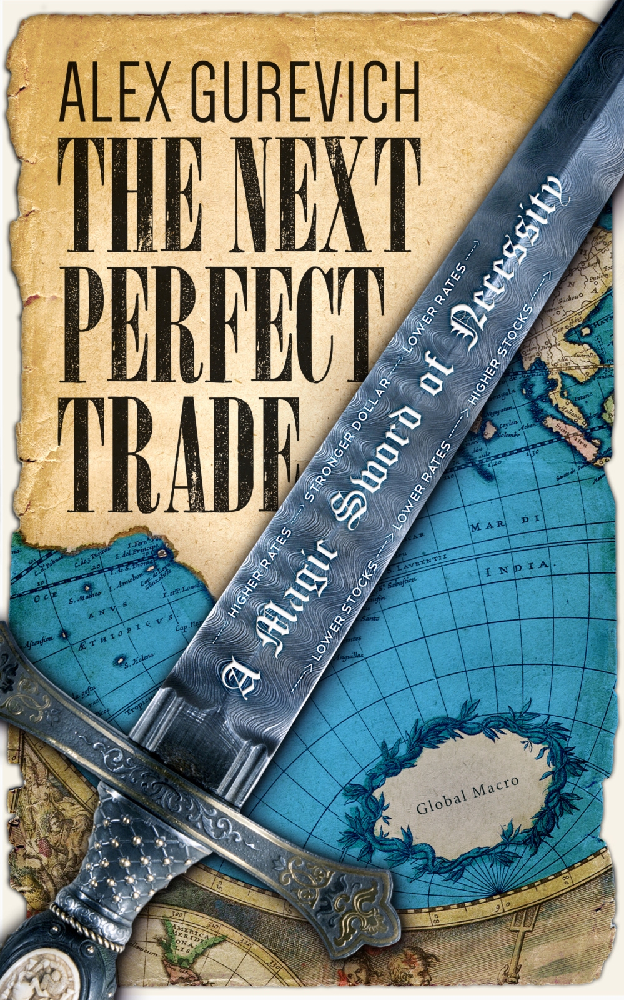

<!-- rl-section id="section-2" class="epub-section" kicker="Section 2" title="Section 2" -->

## Section 2

The Next Perfect Trade

 

A Magic Sword of Necessity

Copyright 2015 Alex Gurevich,

All rights reserved.

 

 

Published in eBook format by eBookIt.com

<http://www.eBookIt.com>

 

 

ISBN-13: 978-1-4566-2555-9

 

 

No part of this book may be reproduced in any form or by any electronic or mechanical means including information storage and retrieval systems, without permission in writing from the author. The only exception is by a reviewer, who may quote short excerpts in a review.

 

 

This book is dedicated to Excalibur, Glamdring, Stormbringer, Callandor, Daystar Clarion, Terminus Est, Thorn, Yedinorog, Wirikidor, Occam’s Razor and other magic blades that have captured my imagination.

 

 

 

ACKNOWLEDGMENTS

It is impossible to mention by name everyone who contributed to the content of this book or helped me to obtain the requisite knowledge, experience and skills. All of you - you know who you are and so do I.

I thank my business partner, Chris Lutton, for his tremendous effort and enthusiasm during the process of rolling this book out; Christen Chen for her assistance with building out background data and charts; my writing teacher, Minal Hajratwala, for helping me to express myself; and the friendly staff of Philz Coffee, Sausalito, where most of this book was written, for the great ambience.

Stephen Duneier provided last moment rigorous critique; Jim Leitner engaged me in a very elucidating discussion on the use of options; and the team at eBookIt.com helped to push the project on deadline.

Jeff Bosland, Even Berntsen, David Puth, John Anderson, Mark Zarb, Sheldon He, Greg Parr and Qin Zhu are among my bosses, mentors and colleagues who generously shared their market experience.

My other guides were my math professors and teachers, who trained me in the intellectual rigor which has become the foundation of this book. Those include my thesis advisor Prof. Carlos Kenig, Prof. Robert Fefferman, Maria Yurievna Filina and Nikolai Moiseevich Kuksa.

I owe much to my oldest friends: Eugene Fink for starting to write himself and giving me no option but to do likewise, and for being my first fan; Mary Anne Mohanraj for her advice and for inspiring me with her own journey through the world of words; and David Rubin for the final proofread and for correcting this book as well as everything else I do or say.

Finally, I am grateful to my wife, Christa, who is upholding our agreement to encourage each other’s creativity, and my daughter, Anabelle, whose very presence is a continuous inspiration for me to push forward.

Disclaimer

This book represents the opinions of the author, Alex Gurevich, and should not be construed a recommendation that any particular security, portfolio of securities, transaction, or investment strategy is suitable for any specific person. To the extent any of the information contained in this book may be deemed to be investment advice, such information is impersonal and not tailored to the investment needs of any specific person. Under no circumstances should any material in this book be used or considered as an offer to sell or a solicitation of an offer to buy any security, future or other financial product or instrument. This book does not represent, and has no connection with, any current business activities of the author whatsoever.

An investment in any strategy involves a high degree of risk, including total loss of capital. The author’s past performance of the strategies described herein is not necessarily indicative of future results. It is incumbent that readers conduct independent research and do not rely on the investment philosophy and viewpoints of the author expressed in this book in making investment decisions. Different types of investments involve varying degrees of risk, and there can be no assurance that any specific investment will be profitable. Readers should consider what investments are suitable for them in light of their financial condition and risk tolerance.

References to the author’s past performance are for discussion only and illustrate the impact of economic, market and other factors on the author’s decision-making process. Past performance does not guarantee future results. This book cannot and does not guarantee or predict any outcome with respect to any future investment. The author makes no implications, warranties, promises, suggestions or guarantees whatsoever, in whole or in part, that by adopting the book’s principles and ideas, readers will experience investment results similar to the author or earn any money whatsoever.

Historical data is provided solely to illustrate how the author uses what has happened in the past to construct a framework for how to view the present situation and make informed decisions. Certain hypothetical scenarios described herein are for illustrative purposes and are not intended as a recommendation to purchase or sell any security. Any projections, forecasts and estimates contained in this book are necessarily speculative in nature and are based upon certain assumptions. In addition, matters they describe are subject to known (and unknown) risks, uncertainties and other unpredictable factors.

The information in this book has been obtained from outside sources believed to be reliable, however, the author makes no representation as to the accuracy or completeness of information obtained from outside sources. The charts in this book have been provided for informational purposes only to provide readers with some clarity and context to the written text. The charts are sourced from Bloomberg, except where explicitly stated that a chart was taken from the author’s blog. The underlying sources for such charts are documented in the author’s blog and may be accessed by readers. The author cannot guarantee the precision of the charts or calculations.

<!-- rl-section id="section-3" class="epub-section" kicker="Section 3" title="INTRODUCTION" -->

# INTRODUCTION

The Next Perfect Trade is a result of many years of “financial soul-searching” by a sophisticated modern investor. The underlying quest has been to articulate my own set of principles to prosper from financial markets.

If you think of investing as a battle, you need to prepare for it thoroughly. Get in proper shape. Learn your moves, acquire your armor, your shield, your helmet and your battle horse. A magic formula (or magic weapon in this context) will be wasted if you get killed by the market’s first arrow. But with proper training and equipment, this weapon may give you a devastating advantage.

This book prepares you to use one specific kind of magic:

the sword of necessity.

It is a consistent intellectual approach to finding trades which work in the broadest range of economic scenarios. Every chapter in this book represents a step towards building this approach. Taking each of those steps has its own merit. Both aspiring and experienced investors may find value in this book long before the advanced concepts, such as “necessity” and “dominance,” are introduced.

Before speaking of specific weapons, I need to describe the battles in which I fight.

I am an investment manager that specializes in long-horizon, discretionary global macro trading. It’s quite a mouthful. This long string of adjectives is needed to identify my “sub-genre” in the vast universe of trading and investing. Here’s what they mean:

•Long-horizon means that I primarily look for trades and investments that might (and often do) take years to pay off.

•Discretionary means that I, a human being, make all of the decisions. It is the opposite of automated, algorithmic trading. I sometimes do use quantitative models, which can be a useful tool. But I am not the one who develops and interprets them.

•Global means that I consider opportunities around the world. There is nothing I must trade, and nothing I may not trade. I have my preferences; for example, U.S. interest rates are my bread and butter, and I seldom trade corporate or emerging markets bonds. I trade major currencies; I like getting involved in Turkey and South America, but seldom in Eastern Europe. I monitor energy and precious metals, but know little about agricultural commodities. I invest in financial and tech stocks, which are more interesting and understandable to me than others. There are too many financial products in this world to track them all, so I choose based on my experience, investment history, and, frankly, some intangible aesthetic preferences. Still, my world of trades is large and far-reaching. I will discuss in detail the advantages of having such a wide reach.

•Macro means that I bet on directional moves of assets. It is the opposite of arbitrage, which is when you take advantage of price discrepancies among very similar, or even economically identical, assets. Typically, macro is associated with sourcing your market views from macroeconomic principles.

•Trading is a term that, in my experience, is loaded for laypeople with countless assumptions and preconceptions. For me, trading just means making money by taking positions using financial instruments. I use it almost synonymously with investing. But many people draw a distinction, using “investing” to mean buying assets, and “trading” to mean making bets, both short and long, on financial instruments. (Not all financial instruments are assets; for example, derivatives are not assets.) By that definition, I am certainly a trader. But I also think I am an investor. Most of my money is invested in a single asset: myself. The performance of this asset is defined by how well I make use of the capital.

#

Now that I have spelled out what I do, a question remains: Why does what I do make money? And if what I do makes huge piles of money, then why isn’t everyone doing it?

I’ve been called a genius, a rock star, a star trader, and on occasion less flattering names, depending on how well the most recent trade went.

Once a colleague at J.P. Morgan said, “I wish we could throw out 95% of the trades we do every year and keep just the good ones!”

Most people are used to judging trades post-factum: “I wish I’d bought Apple stock at $20 like I wanted to” or “What a genius, she got out of stocks right before the crisis” or “Euro vs. dollar in 2003 was a no-brainer.”

Looking back at my almost twenty years’ worth of trade ideas, whether executed or not, I wonder; was there a way to tell ex-ante, which were the good ones?

This whole discussion would be irrelevant if I didn’t hold the conviction that profitable trades exist to begin with. One could say: “Isn’t that obvious?” After all, some money managers — Warren Buffett, Steve Cohen, Stan Druckenmiller and Jim Simons, to name a few — have been generating outsized returns decade after decade. Clearly they have been doing something profitable.

Well, not so fast. Trading is often compared to poker; both involve making a move that gives you the best odds of success. But the outcome of any individual trade or poker hand is usually beyond a single player’s control. All you can hope for is being right more often than wrong.

Is it possible that the most profitable players/investors are just the luckiest ones? Even over decades of excellent returns that seem statistically significant?

I have a friend who is a professional poker player. He has been doing it for more than twenty years, making a steady living, year after year. Once he ran a statistical simulation: 1,000 players with a winning rate and the random fluctuation typically expected of a solid poker player, each playing 1 million random hands (yes, one million!). It turns out that, given the statistical odds, a few of them ended up losing money over the long run, despite their continuously superior play. He was baffled and discouraged. His profession seemed invalidated by the fact that whole careers in poker could be built and destroyed purely by a statistical swing.

So how would we know that there is actually such a thing as superior poker play? This particular question has been reasonably answered. Randy Heeb, a friend from the University of Chicago, has weighed into the discussion. Both an excellent economist and an excellent poker player, he concluded — based on a study of 415 million Texas Hold’em poker hands played online[1](#section-10) — that skill trumps luck. His argument on behalf of proponents of online gambling was accepted by the courts, which used it to determine that poker was not a game of pure luck and could not be restricted by laws against internet gambling.

Poker provides an excellent statistical field to measure performance, but trading is different; and in some ways, it is more like duplicate bridge[2](#section-10). As in duplicate bridge, everyone is dealt the same hand: the world we live in. But even duplicate players cannot get away from the luck factor. A slight variation of the bidding or playing system could be proven to be a boon or a disaster for a given card distribution. Likewise, traders can get lucky or unlucky based on a multitude of factors, many of which are, surprisingly, purely administrative: the products your boss allows you to trade or the terms of your credit lines. I know this from experience, as I’ve had my share of being in the right place at the right time, and in the wrong place at the wrong time.

So, as the poker simulation shows, a good player can end up being a loser or, conversely, a bad player a winner over the course of million hands. How many trades does a trader make in her career? It varies widely. A long-horizon trader like myself makes fewer than a hundred crucial trades in an entire career. A day trader might execute thousands, maybe tens of thousands of trades.

An algorithmic high-frequency trader technically engages in millions of transactions, but I wouldn’t count it that way. Each trading program is essentially one long trade; you are investing in the algorithm, not in the individual trades it is performing. And an algorithm makes money like a trending security — until it doesn’t, either because someone has come up with a better program or because the market paradigm has changed.

So trading involves a smaller statistical sample than poker, but that isn’t the only distinction. Investment management is also prone to “survivorship bias.” Poker tournaments are consistently attended by both battle-scarred sharks and eager schools of young fish[3](#section-10). Plenty of losing players enter tournaments again and again, making it possible to analyze the difference in performance expectation between the previously successful players and the returning fish.

In the world of finance, though, it is only possible to trace the performance of those who report their results to investors. Those who don’t perform are soon left with no investors. So the lucky survivors as a category cannot be compared with those who had a bumpy start and later became unaccounted for.

Regardless, it is seems obvious that in the vast universe of traders any individual's past track record might greatly differ from what should be expected in the future based on their market acumen. Some star traders are born out of pure luck that allow them to score a few home runs early in their career.

However, this reality does not, in and of itself, disprove the assumption that true trading geniuses do exist.

Investors searching for money managers understand this issue. Thus they seek out not only a strong track record, but also an extensive explanation of a trader’s principles and strategies. Sometimes they receive the explanation and sometimes they don’t. Black boxes remain black boxes, especially in the world of algorithmic trading.

#

Personally, I have never been a black box. I have always expressed my ideas and opinions vocally (some might say too vocally) to my colleagues. Yet, speaking off the cuff and publishing a book for all time are very different. It has taken me time to articulate what my strategies are comprehensively.

I have delivered multiple presentations at J.P. Morgan and promoted myself through grueling interviews and investor meetings. Typically, I would explain my investments philosophy by starting with something I believed was applicable to any trading strategy whatsoever: “Dislocation equals value.” Something has to be trading at the wrong price in order for someone to take advantage of the opportunity.

So each trading style is essentially an answer to three questions:

•How do you find dislocations?

•How do you profit from those dislocations?

•How do you manage your capital and control your losses when you are wrong?

#

I will narrow down my investment style by the process of elimination.

•Some traders dive into economic and statistical analysis to find dislocations. They crunch the numbers and endeavor to beat publically available economic research. I am not that.

•Some traders, especially in stock markets, are very good at collecting unique intel and developing an in-depth understanding of underlying businesses. The notorious use of “flying helicopters over corporate storehouses to validate business activity” falls into this category. I am not that.

•Some traders build and exploit superior mathematical models to value complex assets. I am not that.

•Some traders use superior technology to engage in super-fast algorithmic trading. I am not that.

•Some traders study technical charts or market flows and use their experience to understand market positioning and momentum. I am not that.

•Some traders possess great discipline and developed market intuition. Whatever position there are in, they are quick to sense the shifting dynamics and escape without incurring major losses. I am not that.

The common thread of those observations is that I am not somebody, who (through meticulous research, acute observation skills or superior technology), obtains information not easily available to other market players.

There is another way to put it:

the thrust of my investment strategy is not limited to analyzing forces that drive markets.

The Next Perfect Trade focuses on one of my personal advantages:

Understanding the forces that drive successful trades.

The book is structured around ridding your portfolio of inferior trades and isolating the superior ones. The book is divided into three parts which build off each other and progress from least to most complex:

•Part I provides a framework for developing a positive risk / reward by using the market tides and avoiding the common mistake of stacking the odds against yourself.

•Part II teaches how to minimize the trades and portfolios, which have potential to lose money, even when the underlying view is correct.

•Part III provides the system for identifying dominant trades and achieving a portfolio which is profitable, even when the underlying view is wrong.

#

I invite you on a journey through the labyrinth of intellectual and psychological fallacies that plague the investment process. In the spring of 2002, after five years on Wall Street, I had reached the heart of that labyrinth to discover

the magic of concurrent necessity.

I found what I think of as the greatest opportunity in the history of markets — a perfect trade. This revelation shaped my entire career. Ever since 2002, I have been seeking out strategies based on the same pure concept.

I will share the path of this thinking in accessible terms, incorporating charts and real-world examples with which readers at any level can engage.

I will also demonstrate how a failure to recognize the principles outlined in this book led seasoned traders to miss a similarly perfect trade opportunity that coalesced in 2014 — and, worse, to enter what has proven to be the worst trade ever.

I challenge you, reader, to use the book’s principles and ideas to better prepare yourself for battle.

Whether you aggressively consume the book’s content and adopt its principles, or simply pick out specific areas that help refine your own philosophy, if you improve your performance based on my ideas, I will be very proud. I look forward to reading about your investment success!

<!-- rl-section id="section-4" class="epub-section" kicker="Section 4" title="Part I Swim with the tide" -->

# Part I Swim with the tide

The direction of the tide is the answer to questions like, “All else being equal, where are the things going?” or “Where are the things going in the long run?”

Avoid trades that are expected to lose money if held for the long term, no matter how compelling the shorter horizon arguments for those trades are. This tidal pull can manifest itself as just a tiny edge, almost imperceptible amidst the wild swings of fortune, but applied again and again it can boost your profits or grind them into nothing. You can potentially outswim it, but isn’t it much easier to go with it?

Think of the rake casinos collect from their customers. Sure, with luck or extraordinary skill and effort, the casinos can be beaten, but the bar for winning in the long term is high. All else being equal, would you rather be a gambler or the house?

Whether you source your views and strategies from sophisticated economic or statistical analysis or from reading tea leaves, it behooves you to enter the market with a certain degree of humility. Regardless of one’s past record, there is no way, ex-ante, to calculate your future performance edge (if any).

Avoiding the situations, when the odds are stacked against you, will dramatically lower the bar on how efficient your strategy has to be to remain profitable.

In this section, I will discuss tidal forces which may affect your portfolio performance.

#

## Chapter 1. Trend

Trend is a specimen of price action. There is an infinite debate on whether price action (i.e. how the instrument traded before getting to current price point) has predictive value. The answer is “yes” for most professional traders.

Trend is Markets 101. Trend is Markets 000. “Trend is your friend.” “Stay with the trend.” “Don’t stand in the path of a freight train.” “Don’t try to catch a falling knife.”

If everyone knows that, is there anything new I can bring to the subject?

In 2014 trends were abundant, but it was an abysmal year for macro funds and for hedge funds in general. The average return for the industry was around 4.1%, and global macro funds returned 3.1%[4](#section-10). Not the kind of performance anyone is targeting.

The dollar (DXY[5](#section-10)) was trending up.

 

 

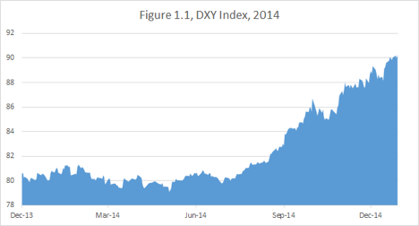

Long-dated US bonds were trending up too. The roll-adjusted levels of treasury long bond futures[6](#section-10) are below.

 

 

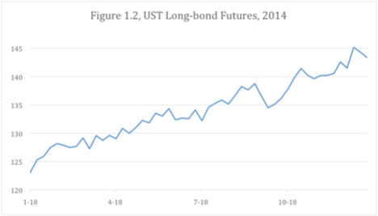

Oil[7](#section-10) was trending down the latter part of the year as the Brent chart below shows.

 

 

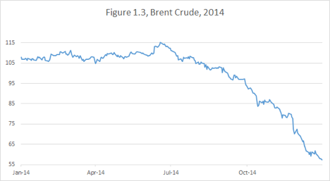

 

 

To do poorly in 2014, the majority of “macro” managers had to be disregarding the trends. Meanwhile, my own portfolio had a record year by any measure.

My approach doesn’t heavily rely on following trends, but I have developed an intellectual rigor of recognizing situations in which trends should be respected. The process of writing this book has forced me to be particularly disciplined about adhering to my own strategy.

#

First, catchy phrases, like “Don’t trade against the trend,” are not automatically universal truths. I prefer “Don’t trade against the trend in a market that tends to be trending.” When I say “a market,” I mean a category of financial instruments. Often it refers to one of the four major markets[8](#section-10):

•Equities (stock markets), including equity derivatives, such as stock options. Many individual investors use “market” and “stock market” as synonyms. For macro traders, like myself, equities are a rather small part of the world of finance. In this book I will use stock examples whenever possible, because they are likely to have the broadest appeal.

•FX (currencies), including cash foreign exchange and currency derivatives. It is arguably the largest of all markets and the most beloved by macro traders.

•Debt (sovereign, corporate and municipal), including tradable bonds, bond-like instruments such as mortgages and CDOs[9](#section-10) and interest rate derivatives. My theory for a long time has been that interest rates are at the heart of everything. I find this market to be the most exciting and the most profitable to trade.

•Commodities (oil, natural gas, precious metals, agricultural products), including derivatives. This market requires a lot of technical, specialized knowledge. I advise readers to use particular caution when applying the broad principles outlined in this book to commodities.

 

Unlike other financial markets, the currency market is not linked to any actual ownership. The “exchange rate” is merely that — the ratio at which various pieces of paper printed by various governments can be converted into each other.

This might be the reason why I have consistently found it easiest to observe and follow currency trends. Furthermore, I have developed an intuitive conviction that the “majors” (dollar, euro and yen), trend against each other in a stronger and more predictable fashion than against the emerging market (EM) currencies.

I need to clarify what I mean by trending stronger/better/more consistently. It is not about the magnitude of moves. A trending market is a market in which observing a trend historically yields a positive expectation from betting on the trend to persist.

Look at the charts of USDJPY, EURJPY, and EURUSD. Multi-year trends are easily observable. Within the multi-year trends, smaller sub-trends may exist.

 

 

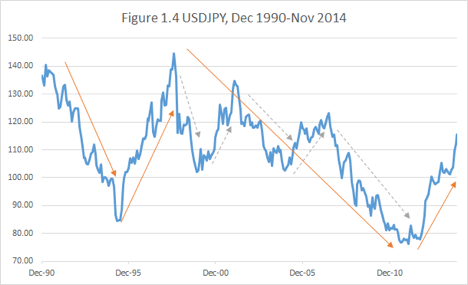

 

 

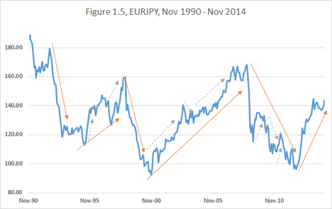

 

 

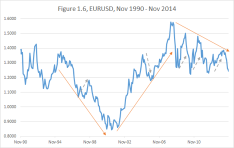

 

Sometimes it is hard to avoid the temptation of fading[10](#section-10) the trend when it appears to have gone too far too fast. How many times were we tempted to sell the euro between 2003 and 2007? How many times would we have been painfully stopped out?

So what is the intellectual framework to navigate currency trends?

I like to think of a pendulum. As the ball rises, the gravity is beginning to slow it down, but the accumulated momentum propels it a long way beyond the equilibrium point.

 

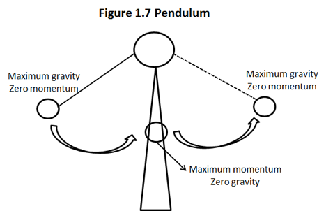

 

 

Swings in currency market valuations are affected by “economic gravity.” For example, when a domestic currency gets too strong relative to its trading partners, the country tends to suffer from falling exports, deflation, unemployment and economic slowdown[11](#section-10). Sooner or later the government starts taking measures to weaken the currency[12](#section-10).

Economic forces combined with government actions eventually stop the rise. Thereafter, momentum starts building in the opposite direction. It is important to understand that when the currency reaches its “fair value,” at the equilibrium point, it will not stop there.

In fact, at the bottom of the pendulum, it will have the most momentum and move with most certainty and velocity.

When a massive and rapid market shift rectifies an existing price dislocation, it is tempting to declare the current price to be “fair” and exit the trade. But the momentum created by the past economic gravity and the past policy actions is likely to carry the price beyond the fair point. To give up on a trade at the economically “fair value” point (the bottom of the pendulum) is to give up precisely when the moment is at its greatest.

For example, looking at the charts above, it was incorrect to exit either the Euro appreciation trend in 2004 at 1.2500 or the Yen depreciation trend in 2013 at 100.00, which could both be considered fair value levels at that time.

 

#

Pendulum forces affect other markets as well. Higher stocks lead to higher rates, which lead to lower stocks. Higher domestic stocks lead to higher currency, which lead to lower exports, which lead to lower profits, which lead to lower stocks. Such effects are slow, but profound.

I find that while short-term and cyclical[13](#section-10) trends are observable in equity and interest rate markets, trading those trends is considerably harder.

However, stocks and bonds have a different property; they form secular trends[14](#section-10), which on a proper scale make cyclical moves look like minor fluctuations.

Since 1940, the US stock market has grown so rapidly and consistently that it can only be charted on a logarithmic scale as shown in Figure 1.8.

 

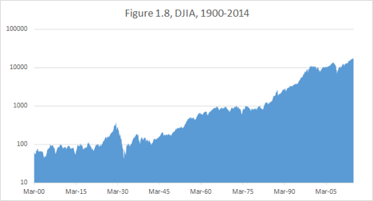

 

 

In the face of such tremendous upward momentum, how significant are the cyclical over-extensions?

Yes, NASDAQ was overextended in 1999-2000. But did those, who sold Nasdaq too early in the end of 1999, survive to see the eventual collapse?

 

 

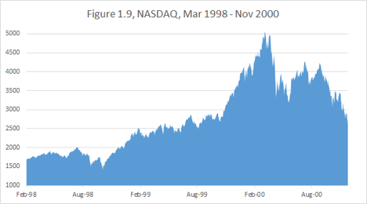

#

 

Recently, I have published “One Chart To Rule Them All”, the roll-adjusted chart of U.S. Bond Futures in Figure 1.10, which became popular on Twitter.

 

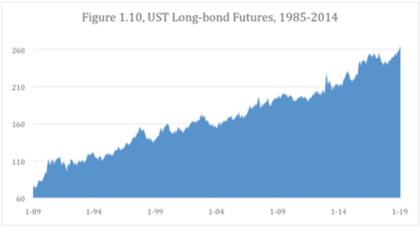

 

We will be going back to this chart a lot in this book. It approximates the economic impact of continuous ownership of long-dated bonds.

The small zigzags of this unbelievable trend might appear significant in the moment, but woe came to those who tried to fade the bond rally of the recent decades.

In fact, as the quest of this book is a perfect trade, it is fitting to identify the worst trade ever. It was not being long tulips, beanie babies or pets.com; it was not even the subprime mortgages. The intellectual principles introduced in this book will single out

being short U.S. Bonds in 2014 as the worst trade ever.

Yes, many (if not the majority of) players were on the wrong side this particular trend. The Perfect Trade will demonstrate step-by-step that this error was not a mistaken economic view, but an irrefutable failure of logic.

#

 

Chapter Summary: I do not proffer a universal directive to follow trends in all situations. But to fight the pendulum forces of cyclical currency trends and the relentless momentum of secular interest rate and equity trends is an undeniable case of stacking the odds against oneself.

## Chapter 2. Carry

Carry is the net yield on your position. You can think of it as the net income being earned by your portfolio, which is separate from any profits or losses incurred from the market fluctuations.

This income may come from various sources, including the dividend yield on your stocks, coupon yield on your bonds or interest yield on your cash. To calculate net income you need to take into the account your expenses, which in the world of leveraged[15](#section-10) portfolios include the cost of funding your positions. For example, if I own a bond that yields 5%, and it costs 3% to borrow money to own it, this bond carries at 2%.

You may notice that the discussion in this chapter is quickly becoming technical. I entreat a reader, not familiar with the mechanics of currency and debt markets, not to be discouraged. You will be able to get the gist of the logic of carry without knowing all the exact trade specifications.

Carry is not only integral to the world of modern investments, but is also applicable to personal finance. For example, if you take out a bigger mortgage to retain money for your stock portfolio, your mortgage interest becomes a funding cost for you portfolio.

If you do not intend to become a derivatives trader, follow the general thread of thought and worry less at this point about the specific details.

If you happen to be an experienced trader already, you don’t need my footnotes or my explanations of the market mechanics. Focus on surveying the included charts and ponder the magnitude of the effects they demonstrate while considering how they relate to your own portfolio strategy.

#

There is a common notion of “carry trades” in currency markets. Investors, known as “carry hogs” love buying high yield[16](#section-10) currencies, such as the Turkish Lira (TRY), for example. And against that they short a low yielding currency, like the Japanese yen (JPY) or the US dollar (USD).

Such carry trades tend to be risky and often viewed as reckless. High interest rates in a given country are generally associated with lower economic stability and a higher potential for currency devaluation.

Let’s look at the TRYJPY[17](#section-10) chart below in Figure 2.1.

 

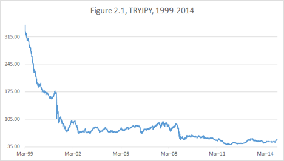

 

The Turkey devaluation trend is apparent. In fact, it appears to make sense to be short TRYJPY all the time. However, the simple price chart of TRYJPY conveys a very skewed perception of the economics of the actual transaction.

To see the true impact of the position, one needs to look at the total return[18](#section-10), which includes the impact of the carry. Short-term, there is very little difference. But with a long horizon, what matters is not only how much the exchange rates have changed, but also how much carry one has earned (or paid), while waiting for it to change. Here is an approximate total return chart for TRYJPY[19](#section-10).

 

 

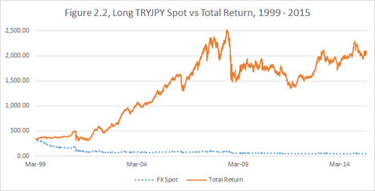

 

The lucrative carry earned by the high-yielding Turkish Lira changes the outcome entirely. The carry hogs have done well, despite the apparent depreciation.

Obviously, it is possible to make money by being both short and long if your timing is right, but my preference is not to fight the tremendous carry. Rather, I would wait for a blow-up (a rapid depreciation on the high-yielding currency, like in 2001 or 2008 in this case), and try to get long lira on the cheap and collect both carry and currency appreciation for a couple of years.

#

The most interesting example of a carry trade, in my opinion, is US Treasuries (bonds, notes and bills). The global financial market has an axiom: US Government securities pose no risk of default whatsoever. My guess is that Nassim N. Taleb, the author of The Black Swan[20](#section-10), would want to rip this certainty apart. After all, how can the fact that there was no default in the past, guarantee no default in the future? I have never died so far, but does it indicate that I can’t die in the future?

The United Kingdom has never defaulted either. And British history is much longer. Thomas Piketty, famed economist and author of Capital in the 21st Century, drew my attention to a very interesting fact: the British Government debt yielded close to 5% throughout the 19th century in the environment of negligible inflation.

What a bonanza it must have been, compared to a heavily taxed 2% yield[21](#section-10) on the US 10yrs notes in an environment of 1.6% inflation!

However, the “One Chart To Rule Them All” from Chapter 1 has demonstrated that owning US Treasuries has been an incredibly lucrative deal for a trader over the last three decades. It is my contention that it is likely to remain so, despite the current low yields. This opinion has to do with my long-term economic views. Such views, which are premised on globalization, technological adoption and global labor redundancy, can be and are contested. The point of this book is to seek methodology of evaluating trades, which does not rely on being correct about the economics.

Let’s go back a couple of years. When the “QE[22](#section-10) tapering doctrine” came into play in 2013, economists and strategists stumbled over themselves prognosticating rising rates and recommending underweight bond positions.

Meanwhile, as long-term bonds rallied in 2014 (Fig 1.2), I laughed my way to the bank. Instances like this, when the whole discretionary investor world is so predictably and pathetically wrong, remind me that my times of profitability are far from being behind me.

To be fair, there were other instances in the past, when I thought the whole world was wrong and it was actually me, who was… you know…

So rather than mock competitors who, in fact, might have shown better performance than myself on other occasions, it is more productive to continue retro-analyzing why being short US fixed income was such a bad trade.

We have already pointed out the fallacy of fighting against a major secular trend. Another fallacy is the old way of looking at the world of investments through the lens of asset allocation. Individuals, pension funds, university endowments and many other institutions operate as asset allocators.

An asset allocator thinks this way: I have a certain amount of money (say $100mm); I want to invest it, so as to maximize returns, while taking only a reasonable amount of risk. Given the current level of economic growth, inflation and interest rates, I will distribute this $100mm into stocks, bonds, real estate, cash and alternative assets.

Let’s for simplicity restrict our thinking to stocks and government bonds. In the allocator paradigm, every $1mm you put into bonds is $1mm you cannot put into stocks. So you find yourself with a choice between notes that yield 2%, which after taxes fail to beat inflation or a stock market that has an historical growth rate of close to 7% and offers you tax-sheltered unrealized gains. Using this modality of thinking in combination with historically based asset allocation models, it was not difficult to come up with a negative outlook on the long-dated government debt.

But I don’t live in the 19th or 20th century. And I am not a pension fund manager. I live in the world of leverage and derivatives. And leverage is all about the ability to borrow.

The assumption of infallibility of the US Treasury debt might be flawed. But in certain ways it might as well be true. Asking “What happens to my portfolio if U.S. Government defaults?” is akin to asking “What happens to my portfolio in the event of global nuclear war?” In other words, if the whole financial system is wiped, my portfolio will be worthless, regardless of how it was structured.

The point is not that the debt is absolutely safe, but that it is the safest way to deposit money as far as the market is concerned. And the safest and most liquid[23](#section-10) security makes for the best collateral.

The allocators ask themselves, “What return will I get by putting my money into a 10 year note and holding it to maturity?” In this context 2% looks very uninspiring. So why am I so happy to own the security at such miserly yield?

The Pseudonymous Blogger Jesse Livermore has recently published a brilliant piece[24](#section-10) addressing this conundrum. He writes: “The “intrinsic value” of a security is the maximum price that an investor would be willing to pay to own the security if she could not ever sell it.” I add for clarity: “nor could she lend this security or use it as collateral.” Indeed, if the security cannot be transferred to another person under any circumstances, it is useless to them as collateral.

Under those circumstances, I would laugh at anyone who suggests I lock up money for ten years for anything less than 10% yield, no matter how “risk-free” it is. The opportunity cost is just too high.

This is the point Jesse Livermore is making. Since we don’t know why and when we will need the money, we are willing to accept much lower yield on an instrument that can at any time be converted back into cash.

As a leveraged trader, I’ll take it further. My question is, “If I will be borrowing money to own a 10yr note for the next 10yr, will I make or lose money?”

There is a repo[25](#section-10) market for government securities. One can buy $1bln dollars worth of 10-year notes and, to pay for this transaction, borrow this $1bln at a very low rate overnight, giving as collateral the very $1bln of 10-year notes just bought.

To be sure, you are required to put up some capital to insure this transaction — that is, you will be able to borrow slightly less than $1bln. However, since the market assumes no default risk, you only need the capital to cover the possible overnight movement of interest rates. The shorter the maturity of the treasury bond, the lower is the price volatility you can expect[26](#section-10) — a statement which is not true when imminent default is a possibility.

So let’s see what would have happened if you bought every 10yr note issued by the US Government over the last 30yr and held it till its maturity borrowing money every night against.

One approximation of overnight borrowing rate is the Federal Funds effective rate[27](#section-10). It is published on a daily basis, going back decades.

For each quarter starting in 1990, we will compare the yield of then-current[28](#section-10) 10yr note with the average Fed Funds effective rate over the subsequent 10 years[29](#section-10). This will estimate the carry each of those notes would have earned if held to maturity. Obviously, we can make this complete comparison only for the notes that were issued over ten years ago and have already expired. For the notes that have 2-3 years left, we don’t have full information yet, but the bulk of the average weighting is already there, especially since the Fed Funds rate is likely to be low for a while.

 

 

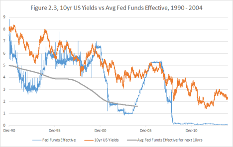

 

It is easy to extend the averaging line in our minds. Over 1990-2004, by buying and funding 10 year notes we would be making an average of about 2.3% per annum, and looks like the result will hold for the subsequent years. Not convincing enough? Well, remember we can leverage this trade 10 times the capital — if we borrow money to buy the Treasuries. Now the return may be as high as 23% per annum. And it is comprised of carry.

#

What about the players who cannot enjoy the benefits of the repo market? Fortunately, the futures market is completely accessible via a myriad of online brokers that cater to smaller individual investors.

Using futures, it is hard to emulate buying a treasury and holding it to maturity, letting its remaining duration gradually slide down to zero. Instead, we have to keep rolling the futures to switch into the current contract every quarter and re-extend the maturity with every roll.

Futures’ rolls are a different way to illustrate the value of carry. Let’s compare the simple price chart of the leading contract with the total return of owning 10yr note futures[30](#section-10) .

 

 

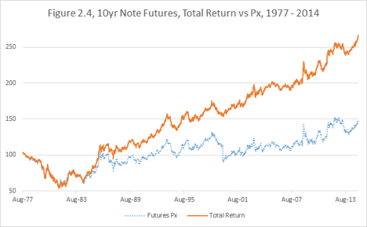

 

 

In fact, the easily available ”blue” chart of the price is almost meaningless. Since each contract is only active for a few months, we have to make an adjustment for every quarterly roll[31](#section-10).

The owner of the expiring futures contract is usually getting the next contract at a considerably cheaper price (about 0.5% difference between the current March 2015 and the subsequent June 2015).

The carry is the main contributor to this roll differential. Indeed, the difference between the March and June delivery contacts is that the former allows you to get the delivery of the Treasury note earlier and enjoy the carry for an extra three months. Thus the markets compensate you by making the June contract cheaper. Rolling the contract into a cheaper, further forward contract is essentially a way to collect your carry in advance without having to put cash for actual physical securities.

There is another component to the roll that is called the “slide.” It is powerful during the times zero short-term interest rates and steeply upward sloping yield curve[32](#section-10) . This is how the curve looked on September 26, 2014.

 

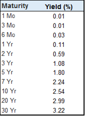

 

Every time we roll, we not only monetize the carry for a quarter, but also switch to a security that is on average 3 months longer in duration[33](#section-10). The “slide” in this case is the velocity of the change of yield as the securities become shorter in duration.

The sector pertinent to this particular contract is between 7 year and 10 year maturity.

With a passing of 3 years, a 10yr will gradually become a 7yr with a “slide” in yield of 30 basis points[34](#section-10). Dividing those three years into 12 quarters gives us an estimate of 2.5bps per quarter of yield slide. Those who are not familiar with interest rate markets can take my word — it is not negligible.

Slide is sufficiently akin to carry to not deserve a separate chapter. It is essentially the profit or loss incurred as the maturity of the transactions in your portfolio slides with time. Just like with the regular carry, due to the “no arbitrage” principle[35](#section-10), a functional futures market has to compensate you for the slide with every roll.

Since currently the carry and slide are “positive,” i.e., earning money, the Treasury notes issued in the futures are projected by the market to be cheaper or, in other words, higher yielding. Another way to say this is that the market is anticipating a rise in interest rates.

This anticipation, by itself, is not unreasonable. Let’s look at the recent levels of the US two year swap[36](#section-10).

 

 

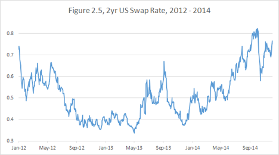

 

 

In mid 2013 and then in the beginning of 2014, there were clear upward trends, corresponding to the Fed’s stated intention to raise interest rates in 2015. Given the economic recovery, many traders were inclined to bet on the rising rates.

And according to Figure 2.5 they were correct, right? Actually, it is not so easy when you take into the account carry and slide.

Laypeople, and unfortunately even professionals, tend to ignore the subtle distinction between “interest rates rising” and “interest rates rising relative to the market-anticipated forwards.” The former is a no-brainer, when the rates are at zero to begin with, but it is not a trade by itself. A two-year swap reflects the state of interest rates on a given day, but a month later after earning/losing some carry, it becomes a 23-month swap, which is a whole new instrument.

Let’s look at a tradable instrument, EDU6[37](#section-10), the September 2016 Eurodollar Futures Contract[38](#section-10).

 

 

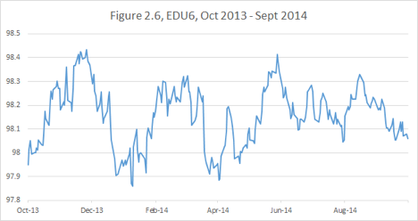

 

 

Now you can see that while there were many points when shorting EDU6 was profitable overall, it was a “neither here nor there” trade. The market projection of the interest rates in 2016 was not changing significantly over the period on the chart.

Hence, the observed rise of the two year swap rate was just reflecting the fact that the period of higher projected rates was inching closer over time. Another way to think of it is the EDU6 was sliding (or carrying) up in price as it was moving closer in time to the current zero-rate environment.

Thus, when you bet against the carry and slide, similar to our example of shorting EDU6, the bar for success is raised higher. As the two year swap rates were rising dramatically, you were barely making money on your trade.

Furthermore, while betting on the rise of US rates, you would be exposed to surprise economic or geopolitical events.

#

Here is an example from my own career. After the economy had completed its post - 9/11 turnaround in 2003-2004 and the fears around recession and deflation subsided, I started to worry about inflation.

And I thought that the rates were heading higher, much higher. I had concluded the Fed Funds Target Rate[39](#section-10), which was declining since the early 80s, had bottomed out at near-zero level of 1.25% and had no choice but to start a new upward secular trend.

This could seem reasonable when looking at the Fed Funds line on Fig. 2.7.

 

 

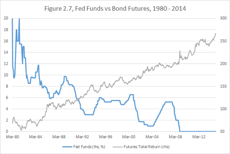

 

 

But the target rate is just an economic variable measured on different dates — it is not a single trading instrument. If I had realized back then to look at the bond futures chart, which includes carry (“One Chart to Rule Them All”), I would have recognized that the secular uptrend in bonds is nowhere close to abating and saved myself some trouble.

In addition, as we know now the Financial Crisis arrived soon after, causing a tremendous rally in Treasury Securities, the safest available investments.

#

Now we have shown it was historically unprofitable to bet against the carry earned by Treasury securities and how it tends to be thankless to bet on rising interest rates.

Will the uptrend persist? Will the carry continue to deliver? Those questions are linked. We have shown that over the past 30 years the market was continuously overestimating the level of future interest rates.

The worst trade ever — the bet on rising rates in 2014 — was fighting against the inexorable tide of carry: the 10 year notes were yielding 3% and were expected to be funded at 0 for a considerable time.

What about in the beginning of 2015 with 10yr yields at 2% and the first tightening[40](#section-10) expected imminently? It was a tougher call, but the odds still didn’t favor fighting the carry.

If and only if everything went well, Fed could have started hiking during the Summer of 2015. Investors would have enjoyed 2% carry until then. How long would it take the rates to get to 2%? Positive carry until then. Would the rates get beyond 2% before the new recession arrived? Maybe they would get there, but for how long? Most of the developed world was heading deeply into negative interest rates territory. Would the US stand out with higher rates and a stronger currency?

You don’t have to agree with my rate speculations. But I am reiterating that fighting the carry is foolhardy and historically unprofitable.

#

Chapter Summary: Over a given day, the carry is negligible compared to the price movements. But just like the rake collected by casinos, it accumulates. And over a lifetime of trading it may suck you dry or make you rich. Positive carry is an important characteristic of a superior trade. Conversely, to be right on a trade that carries and slides against you, you have to really, really be right. Don’t be so sure. At least not often.

## Chapter 3: Valuation pull

#

Sometimes financial instruments are just not trading at the right price. There is always a story. Momentum, technical flows, investor sentiment, political uncertainty. But stories notwithstanding, there is an economic gravity — a fundamental pull towards reasonable valuations.

We have discussed the pendulum effects in the currency market; whereby the negative feedback[41](#section-10) mechanism is often manifested via government policy.

Stocks have different dynamics. For example, if a stock is consistently trading at a very low P/E ratio[42](#section-10), sooner or later via dividends or buybacks it will realize its value. Buybacks are particularly interesting in this regard, because they greatly favor a company with undervalued shares.

Suppose XYZ company clears 5% cash per annum on its equity (after taxes). If XYZ pays 5% in dividends, the investors who hold it for income are happy, but the stock itself may or may not go up. If, however, the company spends this 5% to buy stock, and the price never goes up in 20yrs, all the outstanding stock will be bought, leaving the CEO as a sole owner!

Let’s look at IBM shares, which on December 31, 2014 were trading at a very low P/E ratio of 9.6. The company is disliked by investors, because it is perceived to be falling behind in the new technology environment.

Let’s say all the concerns are valid. But the company has survived for over a century since its founding in June 1911, adjusting to changing business paradigms and staying almost invariably profitable.

So what is the bar on taking a negative view on such a stock? At a P/E multiple of less than 10 in a zero interest rate environment, they will prove to be a good investment even if their profits fell by 50%, as long as they survive for the investable future.

Notice I am not saying that IBM collapsing is impossible or even particularly unlikely. But I think almost anyone who would look at various scenarios and assign reasonable probabilities would arrive at the cheapness of its valuation. And given their on-going buyback program, they seem to agree with my thinking.

#

I am not an expert on calculating valuations. I leave the number-crunching to trained economists, strategists and analysts.

But if I can’t personally analyze all the parameters going into a particular valuation, it doesn’t mean I cannot do a trade. To avoid “analysis paralysis,” I apply the “all else being equal” principle.

Let’s look at the stock of Twitter, Inc. By the time this book is published, people might have a better idea of how profitable the company might be, but at the end of 2014, it was still anybody’s guess what the proper valuation of this social media franchise should be.

 

 

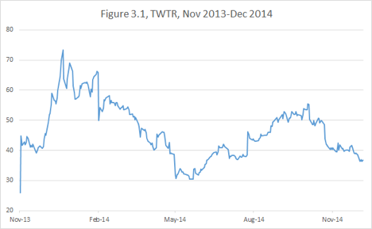

 

 

I had no idea whether it was too cheap when it IPO-ed on November 6, 2013 at $26. Others certainly did and it rallied on that day to close at $44.90. I had no idea whether it was too expensive when it peaked at $73.31 on December 27, 2013. But when the company reported disappointing user growth in its first earnings report on February 5, 2014, the stock tanked 17% and traded to a low of $50 and then proceeded to drift down to $40 in the three months that followed.

Starting May 6, when employees’ shares became available for sale, the already somewhat beleaguered stock took another tumble, bottoming at $30.66.

During the stock’s entire journey I had no way of asserting a strong view on whether Twitter was cheap or expensive. At any point along the way, you put a gun to my head and said “buy or sell?” I would have said, “Buy.” My constructive response on the stock wouldn’t be something that was idiosyncratic to Twitter, but rather a general approach that would apply to a host of companies for various reasons. In the case of Twitter, both the historical pattern of performance of dominant internet brands, of which Twitter is one, and the overall direction of global growth, preclude me from being short such a stock.

But until May 2014, I had no strong desire to own it either.

When I saw the stock trade down 28% over 7 days, I invoked the good old efficient markets theory (EMT)[43](#section-10). Let’s assume that the price of $38.75 on May 5th was fair based on all information, all the pros and cons to all the millions of market’s participants.

Then how could the price of $30.66 next week be fair as well? All else being equal, would you rather not buy the stock at a 25% discount? And in this case, I did know everything was equal — the only thing that had changed was that some people were forced to sell their stock. And some others likely took advantage of that and ran the stock down ahead of them.

The proponents of efficient markets forever dispute with those who favor behavioral finance over the rationality of markets. In my opinion, both sides make a limiting assumption as they argue their theories. The assumption is that market participants transact (or do not transact) as they choose to, rationally or irrationally.

My personal observation is that some larger markets are driven by people who transact as they have to. For example, if you are an American going on a European vacation, you might want to convert $500 into euros. This does not say anything about your opinion on the currency, yet in a small way you are driving the exchange rate. Likewise, if you are the CEO of an American company acquiring a competitor in Europe, you might want to exchange $10 billion into Euros. You, too, are driving the market without having a view on the currency — and this time, the impact is not so small.

Another such case is when you are trader at the bank and your boss says, “Reduce position in XYZ. Our balance sheet has too much exposure.” You have to obey this instruction, regardless of your opinion on XYZ valuation.

The EMT tends to break down in a fashion similar to how the Newtonian Mechanics does. The theory describes the financial system well when the market moves on a “normal” scale and at a “normal” velocity. But if the events suddenly accelerate to a “relativistic” speed or the volume of “forced” transactions distorts the financial continuum, a very different dynamic arises.

I don’t know what was going on with Twitter employees on the week of May 6. One could possibly argue that the stock went down because of the more aggressive than expected selling by the insiders, which could be a negative sign according to some, but I thought that characterization was highly unlikely to be the case.

Were the employees selling according to a pre-set program, exercising puts, diversifying their wealth? The answers to these questions were superfluous given that all else appeared equal and their selling had overwhelmed the market balance.

Consequently, I moved into Twitter on a scale uncharacteristic of my typical measured approach to new investments. I knew that whatever other future factors would affect the stock, I had a 25% valuation pull on my side. The key here was the combination of the magnitude and the clear arbitrary nature of the move.

The next major news was the earnings release on July 29. The subsequent price action is not relevant to this discussion. What matters is that, buoyed by the valuation pull, the stock drifted back up to $40 before that date. The “discount” disappeared and a 25-30% return was made in the absence of any new material information.

This “all else being equal” principle can be applied very broadly. Each time the price of any position changes for a noneconomic reason, the value of this position incrementally changes. Thus the aspect of value in the Twitter stock, which had been created in May 2014, disappeared by July 2014. Such changes in the value proposition are not to be confused with those stemming from new information.

#

Valuation pull tends to be the strongest when applied to fixed income (debt) instruments. I find a principle difference between trading interest rates and other financial markets is the idea of

terminal value.

Stocks do not easily submit to this concept because they never actually expire[44](#section-10). While, as we have discussed, undervaluations tend to self-correct over the long term, the same cannot be said of overvaluations. The XYZ stock can be trading too high relative to today’s earnings and continue to do so ten years from now. How can one with any certainty tell whether such dislocation will correct over your investment horizon?

The only form of arbitrage against overvaluation, which I know of, applies to entire markets. The internet bubble of 1999-2000, for example, was arguably popped by a wave of startup IPOs. The principle was that if all shares are too expensive, the market will produce an unlimited supply of new shares by starting new companies.

The same logic does not apply to an individual overvalued company. On occasion the management will take advantage of the share price by making stock acquisitions[45](#section-10), but other than that, the process of corrections tends to be fairly random.

To some extent, the same is true of currencies. It is extremely difficult to establish what a “fair” exchange rate is. However, if a particular currency is so egregiously overvalued that it is hurting exports, the central bank is likely to step in to weaken it.

Commodities arguably have a terminal value: when each contract settles, all the longs and shorts close their positions with physical delivery. But with storable commodities like precious metals and oil, speculators just roll their position down the calendar, and nothing is truly resolved at any given expiration.

Interest rates are much more satisfying in this regard. When a bond or an interest rate swap expires and all the interest and principal payment are made, one knows exactly how well they have done or, in other words, the terminal value. In addition, one knows in advance exactly when the trade has to be over[46](#section-10).

In my later career, I acquired a taste for currencies because of the massive and consistent trends I could recognize and exploit. If I am betting on an FX (foreign exchange) move, I will start establishing the position as soon as I judge the location to be extreme, but I will wait (sometimes for years) till a favorable trend is established and then pile onto it, pyramiding[47](#section-10) my gains. This is how I traded the yen trend of 2012-2014 and the euro trend of 2014.

But interest rates don’t have easy to follow cyclical trends, like currencies. There is an underlying secular trend, but the severity of corrections precludes pyramiding into it.

Rather in the middle of the chaotic and often quite extreme move, I try establish a central terminal value[48](#section-10) and take advantage of a dislocation.

Therein lies a fundamental difference between how I trade currencies and interest rates.

With interest rates, I prefer to increase the position as it moves against me and reduce it as some gains are realized. I want to have the maximum position on, when the dislocation against the terminal value is the highest.

How can one estimate the terminal value?

To be clear, I don’t consider myself an expert on the credit component of debt. Thus I generally focus on the LIBOR yield curve[49](#section-10) and Treasury bonds. Those instruments depend primarily on the projected Federal Reserve policy and on the supply/demand driven risk premiums.

There are different approaches to predicting interest rates. The closer your outlook the more you have to be attuned to the mindset of the Fed chairman and the historical patterns of the yield curve dynamics.

The longer your outlook, the more you have to rely on your philosophical vision of inflation mechanics, economic growth and potential for unpredictable crises.

One mistake commonly made is believing that the interest rate market itself has any predictive power. I have already shown that over the last 30 years it was continuously profitable to be long US Bonds. This profitability arises from the market consistently failing to project correctly interest rates.

Here are the charts of quarterly settlements of three month LIBOR (3ML) vs. the market anticipation going back 1, 2 and 5 years. In other words, we will chart the difference between where the market had thought where the LIBOR would be in, say 5 years from a given day, and where it would actually end up as those five years had passed.

 

 

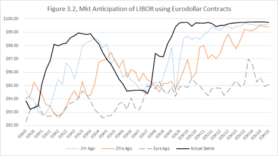

 

 

It is not surprising that the longer is the horizon of prediction the greater is the discrepancy between the projection and the settlement price. But we can also observe two very specific patterns from Fig. 3.2, stemming from the secular bull market in bonds over the last few decades:

•Market tends to anticipate rates to be higher than their terminal value.

•The bias towards over-predicting the rates is steadily increasing with the time horizon of prediction.

I might even take this a step further. Years ago, I came up with a thesis of “negative predictive power” of interest rates. It stands to reason that when long-dated interest rates rise, “all else being equal,” they slow down the economy and inflation. Which then leads to lower realized interest rates in the future. And vice versa.

This idea goes hand-in-hand with the negative predictive power of the central bank opinion. One of the classic market mistakes is to overprice for future inflation exactly when the Fed moves its inflation forecast higher. In fact, the central bank’s concern gives no new information about the economy; it only reveals an opinion about the economy, which is based on already available public facts.

Given the Fed’s credibility, this opinion must affect valuation in the entirely opposite way. If the Fed expects higher inflation, they will take measures to suppress it; and therefore, the market should price in lower, not higher, inflation than previously predicted.

In the beginning of 2014, the US 10 year notes traded close to a 3% yield. I considered the most likely path for the Fed Funds rate to be a slow and gradual rise to 3.5%-4% where it would briefly consolidate before a new easing cycle would bring rates lower again. Utilizing the carry analysis, I had concluded that the fair yield was no higher than 2%-2.25%. The bond market was cheap[50](#section-10), and I was comfortable initiating a long, because the valuation pull was very strong.

Interestingly, my central scenario assessment proved to be incorrect with respect to the path and magnitude of the move. Despite generally strong economic[51](#section-10) performance, the precipitous fall in global inflation forced bonds to rally much more than I had anticipated. (Notice that due to the carry and slide, a 2% yield in the beginning of 2015 economically corresponds to an even lower, 1.75% yield on a 10 year UST in the beginning of 2014.)

While I miscalculated the external forces on the market, I was fortunate that the impact was in a favorable direction to my position. An important point is that if the events went against me, I was likely to no worse than break even given the starting valuation was so favorable.

Simple considerations like these have allowed me to consistently capitalize on interest rates bets.

#

Chapter summary: Current news and price action may distract you from recognizing the slow, but consistent, pull of valuation. Value-oriented strategies are easier to apply to financial products with clear expiration horizons and mechanisms for rectifying dislocations. Even when the terminal value is difficult to establish, the “all else being equal” principle may help to identify positive expectation trades.

<!-- rl-section id="section-5" class="epub-section" kicker="Section 5" title="Chapter 4. Historical pattern" -->

## Chapter 4. Historical pattern

Markets are young: Every time you think you think you have figured something out, the paradigm changes and you are in uncharted territory. And markets are old: The more things change, the more they stay the same.

When trading ranges hold and patterns of asset interaction persist over many decades, there are usually strong underlying reasons. But it is often easier to identify the pattern than to establish without doubt the economic causality behind it.

In addition, in the midst of the daily market noise, it is hard to evaluate whether enduring economic relationship will prevail over the idiosyncratic flow of current news.

Hence, during times of uncertainty, I find it profitable to assume that historical patterns are likely to repeat, until proven otherwise.

#

For example, the history of the stock market teaches us that whenever the market crashes (however you define a “crash”), it is worth buying and holding, knowing that it will eventually rally back.

During the equities rout of 2008-2009, I relied on this historical observation. For several months, my portfolio sustained losses, but I steadfastly moved more and more cash into equities. When we reached the bottom, I was fully invested.

Clearly this story has a happy ending, but could it have gone otherwise? Might the entire stock market have gone the way of Citigroup — permanently diluted and almost wiped out, beyond any hope of recovery in my lifetime?

Maybe. But the risk appeared to be worth it. Also, the strategy I was following was more specific than “when the market crashes, buy and hold till it recovers.” Indeed, if that had been all I was doing, I would have only captured recoveries, which are often slow and bumpy. I would have missed the big rallies that do not immediately follow a crash, but come later in the cycle. Those are the big money-makers.

So we need an additional indicator to help us decide when to move money in or out of the stock market. Isn’t that the billion dollar question? I actually have found an answer, which works for me and appears to confirm to the historical pattern over the last few decades:

Look at corporate borrowing rates.

When they shift significantly up, reduce your equity exposure. Conversely, when rates fall, load up and stay loaded.

Obviously, I am not the first one to point out the relationship between interest rates and stock market performance. Yet most players find it difficult to implement this simple principle. I can see several reasons for the difficulty.

First, the relationship works very slowly and is not visible in the daily price action.

Second, we have a tendency to become overly focused on the economic and political data of the moment.

Finally, and most critically, traders fail to properly identify the pattern by failing to ask the correct question.

I will elaborate on the last point. Looking at correlations has become commonplace in financial analysis, but it can be misleading.

Consider the question: “All else being equal, if corporate interest rates are lower two years from now, is the stock market likely to be higher or lower?” If you ask me this question, I am forced to answer “lower,” because interest rates are more likely to fall in the environment of economic slowdown and poor equity performance. This would appear to contradict my thesis that lower interest rates lead to a higher stock market.

But look closer at what I said above. I did not say, “Lower interest rates are associated with a higher stock market.” I said, “Lower interest rates indicate a subsequent rally in the stock market.” Think it through, and you will discover the correct question to test this assumption is,

If interest rates are lower today than they were two years ago, is the stock market likely to be higher two years in the future than it is today?

Notice that this precisely formulated question, if answered “yes,” suggests a trading strategy.

 

 

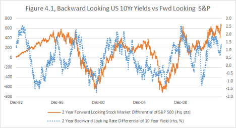

 

 

For over a decade now, I have used the pattern in this chart to decide on my stock market allocation. The blue line shows what interest rates have done over the last two years — it is something that can be observed here and now. The orange line indicates the future performance of stock market — something we can only check two years later.

The correlation, while imperfect, is visible and obvious over the last 20 years. When we see an upward spike in the blue line, we should be inclined to buy and hold the stock market.

This chart is particularly valuable, because it is not calibrated to fit the past. I have not chosen a favorable historical period, tried different bond maturities or different time horizons to look back or forward. I have used the 10-year note yield as a proxy for corporate interest rates, even though better proxies, like the 10-year swap rate, exist. This was the first such chart I built, and I am on purpose keeping this one so I can’t fall prey to a biased data selection.

I invite readers who want to use this idea to play with different maturities and time horizons and design their own investment strategy around this paradigm.

#

Some professional traders live and breathe the yield curve, while others perceive the term structure of interest rates as an esoteric object for trading. Regardless of your experience, you should bear in mind:

At one trillion dollars of notional[52](#section-10) per day in turnover, the size of the interest rate market is truly staggering, and so is the amount of money to be made there.

Furthermore, understanding the debt market is critical to understanding every other market. In fact, trading any asset class without a grasp of interest rates and you are risking being engaged in an inferior strategy.

Even if you don’t delve deeply into all the economic and technical details of this particular market, you may follow in general my examples of pattern recognition and converting experience into strategy.

Let’s take a closer look at the shape dynamics of the US yield curve as it relates to Federal Reserve policy during particular periods. Short-term interest rates, which are anchored to expectations about what the Fed is going to do, and long-term rates, which reflect inflation expectations, don’t always move in unison. Sometimes they don’t even move in the same direction.

This phenomenon goes hand in hand with our earlier discussion of the negative predictive power of interest rates. An accommodative policy[53](#section-10) by the Central Bank leads to lower short-term rates, but to a higher long-term inflation expectations; the converse is also true.

This decoupling is often counterintuitive. After all, shouldn’t lower rates lead to lower projected rates, and higher rates to higher projected rates? For example, if the Fed is currently cutting rates and is expected to continue cutting rates in the foreseeable future, this would naturally imply that longer-dated rates should be even lower than the short rates.

I started to learn how differently the market actually trades from my initial intuition during the big and confusing curve transitions of 2001-2005.

The aggressiveness of the easing cycle in 2001 represented unfamiliar waters for younger traders like myself. Long before 9/11, it was clear that the country was heading into a recession and the rates were likely to fall dramatically. Traders piled into bullish[54](#section-10) interest rates trades, and the bond market continued to punish them with violent pullbacks at the long end of the curve.

Figure 4.2, below, demonstrates how, over a six-year period, the path of the yield on the 10-year note diverged from the 3-month lending rate, which was directly affected by Fed policy.

 

 

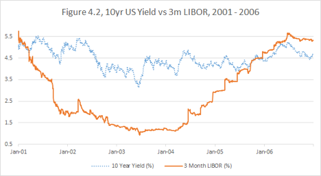

 

 

For example, all the economic data pointed to the necessity of an intermeeting easing[55](#section-10) in April 2001. But the fixed income market was selling off in the first half of the month, and even as late as the morning of April 18. That day, though, the Fed cut the overnight rate by 50bps and reversed the price action. After that, the trend of falling rates was re-established.

When the Twin Towers fell on September 11, the Fed had no choice but to accelerate easing. My big boss at the time could be heard saying something like, “Interest rates have no path but to go down.”

That was correct, right? Right. Until it was wrong.

Despite the falling short-term rates, the longer part of the yield curve didn’t get the message. People like myself and Enron Corporation, who got too cozy with falling rates across the whole yield curve, experienced serious pain in November 2001.

In the spring of 2002, another round of irrational fixed income sell-off created one of the greatest dislocations in the history of markets and gave rise to my first perfect trade.

Then, in the spring of 2003, deflation fears led to the anticipation of “Helicopter Ben”[56](#section-10) taking extraordinary steps to push down long-dated interest rates. A flattening[57](#section-10) rally occurred, which can be seen as the lowest dip in 10 year yield on Figure 4.2. Once again, rates couldn’t possibly go up — until they did.

I was by then too careful to be caught in the steepening bloodbath of the summer of 2003. Other traders were not so lucky.

Only later, in 2004, did the timeline for the Fed reversing to a tightening cycle start to shape up. It seemed as though one day we didn’t even know if we had overcome deflation, and the next day inflation became a real threat. I had also switched into the “inflation camp” and started to bet on rising rates.

But the long-dated interest rates fought the ghost of tightening with the same vengeance with which they had fought the ghost of easing. And I couldn’t get the Fed funds futures market to agree to more than one tightening at a time. The flattening was rapid and brutal. The curve seemed too flat too soon.

I kept betting on the more profound tightening and higher long-dated interest rates. I end up partially right: in 2006, the fed funds target rose all the way to 5.25%, and the yield curve had no choice but to shift higher. Despite the long-term profitability, it was a torturous trade that caused me trouble in 2004.

I had a decent economic view, but I suffered from not fully recognizing the historical pattern.

Whenever the Fed is actively changing the rates policy, the market is very reluctant to project moves into the future. The forward rate expectations will decouple from current policy.

So I told myself,

“Never again will I underestimate the scope of possible shifts in the shape of the yield curve.”

#

But my vow pertained only to the curve aspect of the trade. As recently as 2010, I had not yet fully absorbed the information in the first three chapters of this book to understand the dangers betting against the U.S. Treasury market.

So in 2010-2011, my expectation of economic recovery led me to believe that the rates would go up soon. I started to bet on the curve flattening according to the pattern I had learned.

Unfortunately, my economic view proved to be incorrect. Due to an extremely lackluster recovery, instead of tightening, the Fed resorted to further accommodation — the QE[58](#section-10). I stopped out of this trade and eventually repositioned. This was another crucial point in my education on rates.

When the Fed announced, in 2013, the tapering of QE and its consequent plan to raise rates, the crowd started to squawk about “too low long-term rates” and “underweight US fixed income.”

I knew exactly what to do. Not only had I estimated the favorable carry and valuation, but I also had recognized the pattern.

Usually I share my market opinions very freely. But at the end of 2013, I was reluctant to do so. I felt as if I was sitting on a gold mine and didn’t want to give up its location — I was so confident that my logic was correct and the rest of the world was astray.

We have discussed that the carry on the 10 year note was then close to 3%. The yield on the long bond (30 year bond) was close to 4%. So the carry was almost 4%. And there was a slide. The easiest trading proxy for me was bond futures, which corresponded to 15 year sector in duration, which is a portion of the curve with a good slide.

I realized there were two likely trajectories for bond futures:

A.The economy and job market would disappoint or some other problem would arise. Then the tightening would be pushed years back, and the front end would rally dramatically. The bond futures would flop about for a bit, all the while earning a tremendous carry and slide, and eventually they would have no choice but to rally.

B.The economy would perform well, and the job market would improve. Then short-term interest rates would rise as projected or faster. And then, following the historical pattern, the long-dated rates would defy intuitive expectations and fall instead of rise.

So the bond futures could go up, or the bond futures could go up. I don’t think I was ever so confident in a single asset directional trade. As we know by now, the market followed Plan B. Figure 4.3 shows how the 30 year rates were drifting down in 2014, despite mostly unchanged 5 year rates.

 

 

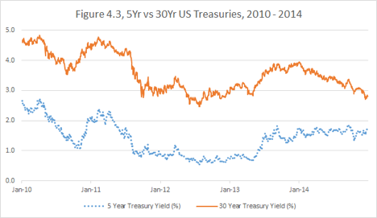

 

 

And I have been raking it in — not only on the bond futures, but also by indirectly capitalizing on rising short-term interest rates.

Why was I right in this particular case and the majority of other macro thinkers so dead wrong? It’s possible I was just lucky, but I believe it’s because I have recognized and avoided a fallacy. Many focused on a different pattern — the historical relationship between growth and interest rates. They used models to estimate the historical “normal” level of rates, given the current economic health and employment trajectory.

Those models failed because they didn’t take into the account the starting level of short-term interest rates (zero in this case). That is, to “normalize” interest rates, the Fed would have to hike 300-400 bps[59](#section-10) — which would set the grounds for a new recession and a new easing cycle.

The combination of my experience over the 15 years of turbulent fixed income markets and the clarity brought by contemplating the ideas in this book delivered to me a superior recognition of this pattern.

#

Now let us switch to the currency markets. Figure 4.4, below, shows AUDNZD, the Aussie-Kiwi cross — the ratio between the Australian dollar and the New Zealand dollar — over the last 30 years.

 

 

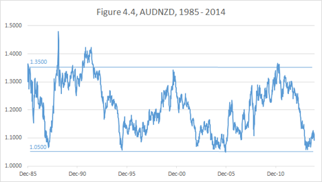

 

 

The economic and political situations, both globally and in these particular countries, have evolved in many unpredictable directions. Yet it is easy to see that on those occasions when the cross was close to 1.05, it was a good buy — that is, one could go long Aussie vs. short Kiwi — and whenever it was at 1.35 or above, it was a good sell. Were those price swings directly correlated to specific macroeconomic conditions? Probably.

One could overlay the AUDNZD chart with other data, such as the Aussie vs. US dollar, the pace of global growth, the performance of global stock markets, and so on. The most obvious factors to look at would be the prices of key exports: gold for Australia and food for New Zealand.

In short, I have some ideas about the forces, which drive this cross, but those guesses are not as useful as just observing the clear historical pattern.

Buy at 1.05, sell at 1.35. Easy, isn’t it?

So did I do the trade every time there was a swing? Unfortunately not.

I became aware of this pattern range about the same time I became interested in the Australian dollar as a tradable instrument, early in 2003. I had just completed a switch from being a market-maker in the interest rate derivatives to being a proprietary trader in the Global Currencies and Commodities Group. I had brought with me an extensive and complex portfolio — and a hefty amount of arrogance.

I had also developed tremendous patience. My experience was in highly illiquid and somewhat esoteric derivatives. Some of the long-dated basis swaps[60](#section-10) traded in the interbank market only a few times a year.

Yes, you read that right: not ten thousand times a second, like stocks. Not several times a day, like illiquid bonds. Just a few times a year to move billions in notional — so you’d better not be caught on the wrong side of the trade.

When you transact with a customer in such a market, you prepare to warehouse risk for months or years. There are almost no exits and few contingency plans.

Under such trading conditions, you study historical patterns very, very carefully. What happens to the prime securitization flows when the interest rates go up? What is the value change of monthly averaged (like nonfinancial commercial paper) or quarterly averaged (like T-Bill[61](#section-10)) swaps when the Fed is cutting or raising rates?

You bet on the actual terminal value of your transactions and on your understanding of your clients’ needs. You position for customer flows that will occur months in the future. You prepare to carry out your swaps to maturity if you have to.

So when I observed the Aussie-Kiwi range, I bought into the trade with the full intention to sit on it as long as it took.

It took long enough.

The real payoff came in 2006 — three years later. Was this a good use of capital? I can’t answer this question for certain, but I think it was. My main regret was that I didn’t have enough size on when the move actually happened.

Since then, a couple more swings have occurred. I didn’t take advantage of AUDNZD moves in 2007-2012. Why? Honestly, I was going through a lot of bumps in my career and did not always have the capacity to be on top of the markets. For example, in 2007, I was too preoccupied with US short-term interest rates to focus on AUDNZD.

In June 2013, it came to my attention that AUDNZD had drifted all the way down from 1.35 to 1.19. Lesson: Pay attention, Alex! It was mid-range now. Was it too late to get into the trade?

The trend was clearly in favor of it going further down. I had observed another historical pattern: a trend in AUDNZD, once started, tends to go all the way to the extreme end of the range.

I was generally negative on the Aussie, based on economic factors, and more importantly because Australia was likely to suffer more in the event of a major slowdown in China.

Furthermore, being short AUDNZD was slightly favorable from the carry perspective. Because rates in New Zealand tend to be higher than in Australia, the total return chart of the cross from 1989 when Bloomberg’s buy and hold carry function contains data looks very different from the price chart above.

 

 

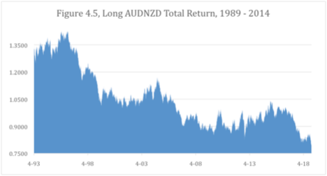

 

 

As you can see on the economic basis, AUDNZD is actually in a secular downtrend and cyclical trends corresponding to NZD outperformance are cleaner and steeper.

So I had the secular trend, the cyclical trend, the historical pattern and a macroeconomic conviction. I had missed more than 50% of potential profits. Tough as it was, I still had to do the trade.

I unwound the trade on 6/24/2014 at around 1.08, making over 10% profit. Why this particular date? I had done a one-year forward trade. An expiration is not a particularly good reason to terminate a trade — it could easily be unwound early or rolled into a future date. But this was the path of least resistance.

I tend to put less stock in market timing than others. By rushing a trade or by delaying it, I am as likely to lose money as to save it.

Was it correct to unwind and take profits at that point? Yes and no. The cross went lower, rebounded and went lower again. As I write this now on December 26th, 2014, it is back down to 1.05.

The important question is: should I load up in the upward direction? The historical pattern certainly indicates that AUDNZD has completed its downtrend, based out and is beginning an uptrend. However, because of my continued skepticism of China[62](#section-10), I remain negative on the Aussie.

I find that when my economic view contradicts my strategic principles, it is better to stay out. There are better places to commit capital.

But if I have to place a trade, I will trade with the pattern rather than with my economic intuition.

Note: a few months after I wrote this, AUDNZD fell to the level where I had to take advantage of it by being short NZD, regardless of my economic concerns.

#

Interestingly, the majors (the relationships between the dollar, euro and yen) do not exhibit such straightforward ranges. Rather, they have strong cyclical trends.

 

 

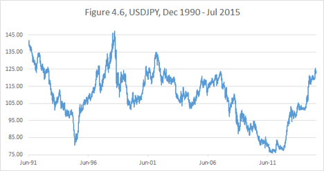

 

 

Here, you can see how difficult it is to define a range. If I were to make the attempt, I would look at the chart of the real exchange rate, adjusted for the divergence of inflation in the two countries.

However, I have noticed a different historical pattern: Cyclical trends in USDJPY persist for at least two or three years. In this case, the time horizon is more important to me than the magnitude of the movement.

How did I use this information?

Let’s go back to my short yen trade of 2010-2014 and focus on a particular moment: the spring of 2013. The DPJ government had collapsed at the end of 2012 (this is what it took!), Abenomics[63](#section-10) had arrived, and the yen had started to tank. By May 2013, it had completed an over 25% decline against the dollar from its highest point.

As the yen leveled off and pulled back some, the question was — should I call it a trade, take profits and move to greener pastures? I suspected the trade could go further, but I had a lot of profits at risk.

The decisive factor for me was to look at the historical pattern. The trends in USDJPY had never turned around in such short time, so I felt relatively safe to persist.

It worked. In October of 2014, the Bank of Japan surprised the markets with a dramatic new expansion of the monetary base[64](#section-10), and the yen decline reaccelerated.

My ability to run portfolio efficiently over those two years was enhanced by observing the historical pattern.

#

Chapter Summary: Markets often follow a clear and defensible logic. But philosophical arguments by themselves do not easily lead to executable trades, unless one observes and respects the historical patterns. The ability to recognize patterns is so crucial that some use it as the very definition of intelligence. The ability of our human brains to identify patterns governing financial instruments is one of the key reasons we are not yet fully replaced by algorithmic trading.

## Chapter 5. Growth and Progress

Global growth and technological progress have been an overarching paradigm, especially over the last century-and-a-half. The expansion both in the world’s population and the per capita GDP as well as the introduction of new technologies are fundamentally supportive of increasing corporate profits. The assumption that this growth pattern will go on indefinitely deserves to be questioned and examined, but such an inquiry goes beyond the scope of this book. But applying the “all else being equal” principle in the absence of certain foreknowledge, it is more likely that the pattern observed for such a long period of time will go on further than otherwise.

There are other economic, political and geopolitical factors driving financial markets. But growth and progress stand out by being observable, measurable, consistent and puissant.

Consequently, the bar is high for betting against equities or any other assets aligned growth and progress.

But, you could ask, what about the amazing opportunities to short the market like during the internet boom of 2000? Or the beginning of subprime mortgage crisis in 2007?

My answer is, if you are able to call the top precisely, catch the bubble bursting and ride the cyclical downturn every time, you don’t need to read this book.

#

This is what I have written in my blog on February 3, 2015.

 

There has been a lot of talk about the bubbles lately. Stocks are a bubble or bonds are a bubble. Dollar is a bubble or all other currencies are a bubble. Bitcoins are a bubble or fiat currencies are a bubble. Start-ups are a bubble or established companies are a bubble. The list goes on.

All I know: the only thing worse than going bust buying into a bubble is going bust selling into a bubble.

For the purposes of this post, I am going to assume that you, the reader, have a way to identify a bubble.

By identifying a bubble, in some specific security or in a market, I mean knowing with complete certainty that at some point in the future this security will trade at 50% of its current price.

Knowing some like this with certainty is a tall order. But I will give you this. There are instances of obvious bubbles/dislocations, and though the financial world is probabilistic, at some point you have to go with your own reasoning.

What I will not give you is the knowledge of the timing of the said bubble bursting and the timing of this 50% price decline occurring.

Now let’s look back at the tech bubble of 1999-2000.

 

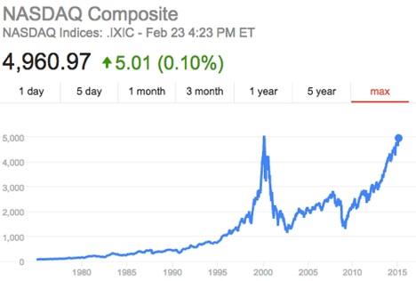

 

 

The NASDAQ peaked at over 5,000 in March 2000 only to fall later to close to 1,000. One could argue that the bubble had been already identifiable when NASDAQ reached, say, 3,000 in 1999. Certainly, it subsequently corrected by more than 50%.

So who is a worse trader — the one who bought it at 3,000 or the one who sold it short at 3,000?

I don’t know the fate of a bull: it depends on the stop-loss strategy. But I do know the fate of the bear, and it is grim.

This is the problem of all short-selling strategies. You think a company is overvalued at $100 and set a target price of $50. But what if it goes to $150 before it goes down? Are you actually going to hold the position?

The answer might be “yes” for some people. Such people usually don’t survive in the world of leverage finance — your capital, your credit lines will eventually get exhausted, and your investors will flee.

Of course, you can limit your downside by expressing your bearish bets via options. But this is a treacherous path as well. Downside options tend to be relatively expensive and decay rapidly[65](#section-10). The view might be correct, but your timing might be off, and the options will drain your capital before paying off.

All of us want to be John Paulson, who made something like $20bln betting against subprime mortgages. My hat is off to him and his team for their excellent research and unwavering commitment.

But even the people who correctly anticipated the mortgage crisis didn’t have an easy time of pinpointing the collapse or finding the correct strategy to take advantage of the bubble. For every John Paulson, there are a lot bear skeletons littering financial thoroughfares.

Am I telling you that there is no way to take advantage of recognizing a bubble?

No. There is one sure way.

SIT IT OUT.

If you know that stocks will collapse below current levels, stay flat! By the virtue of being in cash, you guarantee yourself a great buying opportunity (like in 2002 or 2009) with no risk of being squeezed.

You think stocks are in a new bubble?

Patience, bears!

It is the bulls who need to charge.

#

In the post above, I have mostly focused on the NASDAQ bubble of 2000. Now I will elaborate, looking at a longer horizon with respect to S&P 500.

The famous Greenspan speech about the irrational exuberance in the market occurred on December 5, 1996.

 

 

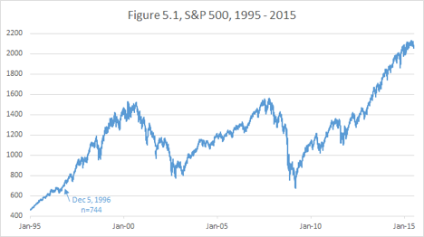

 

 

Any time between that date and the Great Recession bottom in March 2009 one could have bet against the stock market and happened to be “in the black” at some point in the future.

Can one then claim that shorting S&P 500, say in 1997, was a correct trade? Unlikely. It is clear that as a trader who held a short from 1997 would have been stopped out. Even if someone miraculously had stayed short till March 2009 and took profit at the market bottom, the trade would have tied up so much capital that the annualized return would have been abysmal.

You may have a reason to dislike the current stock market, such as a recent dramatic rise in interest rates or overextended valuations. But being flat or underweight equities constitutes being sufficiently prepared for taking advantage of any bubble bursting.

I had a very difficult year in 2007, but as I took my lumps, I was wise and lucky to step back and keep all my personal liquid holdings in cash.

As the stock market spiraled down in 2008, I slowly ended my hiatus and rotated back into equities, adding all the way to the lows. I was taking pain at first on the way down, but in the end what mattered was that I was fully invested in March 2009 and held the position through the subsequent years of the rally.

Thus, though my business and market strategy at the beginning of the crisis was failure, holding a large cash position on the sidelines proved to be a springboard to recovery.

#

To be clear, when I recommend “sitting out” an overextended market, I am not arguing against going short any individual overvalued securities. Individual stocks are not my forte, but I don’t doubt that some business experts can make outsized returns through negative bets.

When I say “be flat or underweight, but not short”, a legitimate question arises: in the world of relative performance and leverage, is there any fundamental difference between the concepts of short or underweight?

For example, a pension fund or a mutual fund is not allowed to actually short stocks. But if it is underweight the market relative to its benchmark and the index keeps going up, the fund will sooner or later be forced to eat the damage of the tracking error and buy into the position again. There is little difference between that and being actually short.

However, a discretionary global macro trader like myself has no ties to any particular index. I have no obligation to be long the stock market at any point. Being either long or short ties up capital. If I am flat stocks, my capital is not leaking and may be usefully engaged elsewhere. Sure I would be sad to entirely miss a major bull market, but I will not be ”stopped into” the stock market unless having a “stop-buy” is part of my strategy.

#

There is an important corollary to my thesis that being flat stock market is a great place to benefit from a crash. It means that being flat is philosophically equivalent to being short and rooting for it to go down.

But what if I have no view on the stock market — like today on November 15, 2014? Since there is no view, it makes sense to position myself to the point of being indifferent to the market performance. That happens to be having a considerable, but not excessive, long position.

I want to be able to gain from the continuing bull market. But if a major correction or a bear market were to occur, I have space to buy more and profit even more in the long run.

Therein lies one of the psychological advantages I seem to enjoy over many other market players. I am often so comfortable with my economic conviction that I am quite capable of having a sizable trade on and still root for it to go against me so that I could add even more. In the long run, more money can be made when the market resists the long-term tidal forces and gives good entry points to build positions.

#

We have so far focused our discussion of the impact of global growth on equity markets.

Other markets are also tied to growth. It makes sense that prices of commodities, which are in limited supply, also trend up over decades. But operating in the commodities space, you have to be aware of the scientific and structural and political inputs for any given asset.

The energy demand, for example, is clearly correlated to economic activity. But the oil prices collapsed not only during the Great Recession, but also in 2014, when the developed world equity market was doing well.

 

 

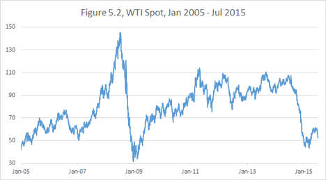

 

 

It stands to reason that while commodities prices may be boosted by global demand growth, they can also be suppressed by technological progress (hydraulic fracturing in the case of oil).

Gold on the other hand cannot be easily associated with growth to begin with. The existing above-ground supply is much greater than any industrial demand, so the precious metal price is driven mostly by monetary factors and sentiment.

#

The currency market is also affected by the growth outlook. The tendency during a crisis is to flee into the major currencies like the US dollar, euro and especially yen. But sometimes those are short-term panic reactions, which do not constitute a steady correlation with global growth.

The general theme is Emerging Market currencies benefit from good economic performance in the Developed World. But this Mexican peso vs. dollar (Figure 5.3) chart demonstrates the complexity of this relationship where higher numbers correspond to a weaker peso.

 

 

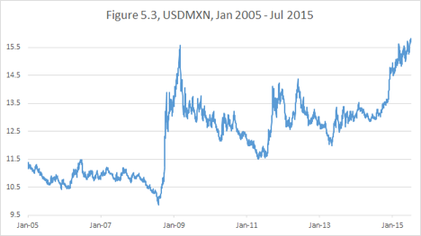

 

The peso weakened during the Great Recession and then rebounded afterwards. However, growth usually implies higher interest rates. The anticipation of rising rates in the US may have contributed to the peso underperformance in 2010-2015. Of course some internal Mexican factors and the fall in oil prices in 2014 with Mexico a large producer contributed to the devaluation as well.

Let’s remember our lesson about not forgetting the carry. When we look at the total return chart of USDMXN, we can see that, like in the earlier case with Turkish Lira, the Peso performance was not as bad as spot prices would reflect.

 

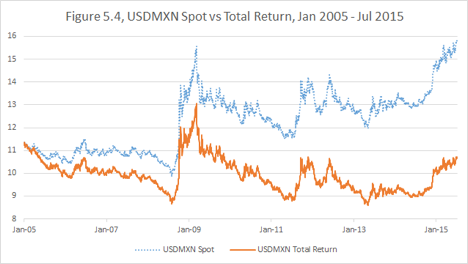

 

This reinforces the idea that betting against Emerging Market countries is not profitable in the long run.

#

Chapter summary: The central tendency of global economic growth and progress is to create a positive tidal force for certain asset classes. This force is especially evident with regards to the stock market, where a massive positive secular trend dominates. Any bearish strategies have to be formulated with the default forces of growth taken into account.

## Chapter 6. Tax advantage

This is going to be a very short chapter. I don’t intend to give any tax advice. This book is about portfolio performance, not about individual (or corporate) wealth building. Quite often, for example, out of the two portfolios or strategies, the better performing one attracts fewer investors and actually brings less personal wealth to the manager.

I definitely try to err on the side of higher profits, rather than on the side of better marketing material. Same goes for taxes. If you worry too much about taxes and don’t do your best trades at the best times, you might end up with no revenues to be taxed to begin with.

But the discussion below is such an excellent example of the thought process relevant to this part of the book that I can’t help bringing it up.

With regard to my equity holdings, I nowadays try to sell losers, typically for tax purposes, rather than to stop out.

I used to sell winners, when I judged that the value was realized. But gradually I came to understand that there may be an unwarranted intellectual arrogance involved in selling a considerably appreciated stock to buy another.

Consider a hypothetical position of $100 in XYZ stock that will trigger a tax liability of $20 if liquidated. Your choice is to stay in XYZ and enjoy the whole $100 of capital working for you or to sell, pay taxes and reinvest the remaining $80.

The new investment, the $80 of ABC stock, will have to outperform by more than 25% to beat the future capital gains and dividends generated by $100 of XYZ.

The converse is also true. If the sale of $100 of XYZ produces a capital loss and a $20 tax refund, you now have $120 to buy a new ABC stock. Essentially, you are getting a 20% premium on your sale of XYZ.

This tax example is conceptually very similar to our earlier discussion of buying Twitter stock with a 25% “all else being equal” discount.

You might be a great stock picker. But are you actually so confident that you could beat the market even if you consistently have to pay 20-25% premium on each of your purchases?

I don’t think there is trader who would make such a statement. Yet our trading decisions often reflect such implicit arrogance.

#

Chapter summary: When we are dealing with a choice of two transactions, we should give preference to the one with a significant noneconomic discount, such as tax advantage or temporary market dislocation.

## Conclusion of Part I.

The world of macro trading is wide, and our minds are prolific. One can form a multitude of idiosyncratic economic and strategic views.

It is important to maintain intellectual honesty and realize that all our views are probabilistic rather than certain. And in the world of probabilities, it pays to have the odds skewed in your favor.

The “all else being equal” principle is at the core of the ideas we have discussed so far. Separate what you know as a fact from what constitutes your opinions or views.

Trends, carry, historical patterns can be established as hard facts. All else being equal, stick with the facts. When contemplating a strategy to express your market view consider if your trade satisfies the following requirements:

•Is aligned with the trend

•Has positive carry

•Has favorable valuation

•Is aligned with historical pattern

•Is aligned with global growth and progress

I advocate diligently weeding out from your portfolio most trades for which the tidal forces do not work in your favor. You will be then left with only superior trades which augment your profits when you are right and mitigate losses when you are wrong.

It is my first step in building a superior portfolio.

<!-- rl-section id="section-6" class="epub-section" kicker="Section 6" title="Part II Don’t fail to make money when you have a correct view" -->

# Part II Don’t fail to make money when you have a correct view

The capacity to come up with profitable market views is a valuable skill and a formidable accomplishment. The point of this book is not to teach you how to arrive at an economic outlook, but to share tools in order to capitalize on those views that you do have.

It is paramount not to squander the value you’ve created through your own process through an ill-conceived trade construction or risk management approach.

There are several common traps that may deprive you of well-earned success. I am fortunate to have a natural psychological immunity to some of them, but others keep threatening to snare me, despite all my awareness and experience.

The process of writing this book brought me a great benefit. It helped me to clarify my thinking and keep myself accountable to the rigorous discipline of executing only trades consistent with my worldview and capital allocation strategy.

## Chapter 7. Stopping out of success

One of the classic instructions shared with beginning traders is “always trade with stops.”

This stop-loss practice can be invaluable to some trading strategies and completely detrimental to others. Traders too often find themselves stopped out of their correct and profitable positions because of a mismatch between the reasoning behind a trade and the strategy of execution.

The world of trading is dominated by the mentality that cutting your losses quickly and letting your profits run is the key to success. Of course, doing the opposite is rarely a good idea. But just managing your losses on an individual trade is not a sufficient or even a necessary condition for profitability.

I suspect that the idea of tight stops came from the days of the market’s youth when information was slow to be disseminated, and it took time for prices to adjust to new inputs. In that world of such gradual adjustment to the news, it made sense to get out as soon as you realized you were wrong-footed.

But modern information flows are nearly instantaneous; adjustments happen faster, and the market overshoots more frequently, especially when a multitude of players act on the same price triggers. The result is that “tight-stoppers” frequently get whipsawed by the price action.

I am not writing the book to tell you how to form your views on the market and what strategy to use. Rather, the book is about how to stay faithful to your own views and how to get the best performance out of your strategy.

So if you have a successful trading style that involves a lot of short-horizon technical trades with tight stops — great. Whatever makes money is great.

The purpose of this chapter is to caution against your stops being used improperly and undermining your own strategy.

#

It is impossible to establish whether a trade was successful or not, unless the strategy associated with the trade was clearly stated at the moment of inception.

Imagine that you were “lucky” enough to participate in the Facebook IPO on May 18, 2012. You bought the stock at $38 and watched it collapse within hours. On September 4, 2012, it reached a low of $17.55. Terrible trade, right?

However, given the price action of 2013-2014, buying the IPO looks like a great trade once again.

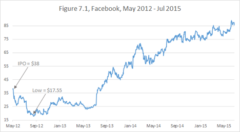

# So which one is it?

One answer could be: It depends on what you actually did with the stock. If you sold in the hole, it was a bad trade. If you are still holding it, then it is a good trade.

I find this logic fuzzy and unconvincing. What if the stock tanks next month? Then the good trade will become a bad one again? Furthermore, intuitively it is clear that the vast majority of trades will at least at some distant point in the future be “in the black.” Does it make all trades with an indefinite holding period good?

Successful trading requires clear thinking. To define whether a trade is successful, one must specify at least one of the two things at inception:

•Profit target and loss tolerance

•Time horizon

That is, one must say something like, “I am buying security X anticipating it to appreciate by $10 before it loses $10,” or “I am buying security X anticipating that it will be higher than it is now in two years’ time.” Both of those statements will be proven true or false with time. And the truth of the statement defines the success of the trade idea.

Notice, I don’t say that you have to stop out from security X when it loses $10 in the former case or close out the position in exactly two years.

For example, one may continue to hold X, despite the losses, for another 10 years and eventually collect a $100 gain. This is a matter of strategy adjustment. Such adjustments don’t change the fact whether the original trade was successful or not. Each adjustment is, in effect, an addition of a new separate trade.

Notice, I draw a strong distinction between a trade being “successful” and a trade being “good.” Even a successful, unadjusted trade idea is not always superior.

•A successful trade produces a desirable return on capital, regardless of whether luck was a major reason for profit.

•A “good” or “superior” trade is a strategically superior way of expressing one’s market view, given the information available at the time of trade initiation.

#

Another distinction, important for beginners to remember, is between “strategy” and “wishful thinking.”

A trading strategy requires a response to every possible price action, while wishful thinking involves an assumption about price action without contingency planning.

Wishful thinking often leads to an attempt to “leg”[66](#section-10) a spread or a calendar roll[67](#section-10). You might be reluctant to pay the market bid-offer for the spread to buy X and sell Y. Then you may think, “The market is moving sideways[68](#section-10) today. I will put a bid on X and wait for a downtick to get it, and then wait for an uptick to sell Y.”

This is wishful thinking.

It will become a strategy once you state:

•How long you are willing to wait for the downtick to buy X

•What you are planning to do if the spread moves while you are waiting

•What you will do if you buy X and market keeps going down so you are not able to sell Y

Is there any proof that formulating and following clear strategies will improve your returns? I don’t have statistical evidence, but I have two arguments, which I hope will be convincing:

1.An observation from many years of playing poker is that it’s much easier to play well when you are psychologically comfortable. It is much more profitable to keep playing while you are winning and take a break when things are not going your way. But putting yourself into a position of hoping for a sequence of events is inviting the market to torment you. Replace your hopes with strategies.

2.When you formulate your market strategy, you rely on your “edge” to give you an increased probability of success. A lack of clarity will overlay your strategy with random “white noise” and thus diminish your edge.

#

Let’s discuss “cancelling the noise.”

The widespread assumption that instilling a tight stop-loss discipline leads to better long-term performance is a fallacy.

I’ve witnessed many experienced traders who uncover macroeconomic setups that could provide a high likelihood of a 20-30% currency move — but then squander the opportunity by putting a tight technical stop on their position.

In the early summer of 2014, I had conversation about the euro with a fellow macro trader. At that time, the EURUSD exchange rate was approximately 1.35. I told him that I had recently established a short Euro position and was targeting a level between 1.00 and 1.10 depending on the overall dollar strength.

 

 

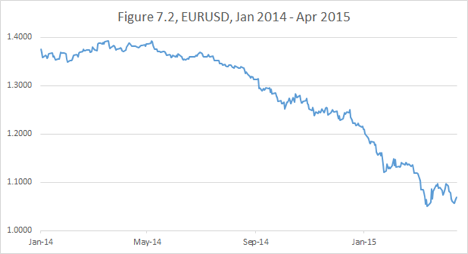

 

 

He asked me, “And if it goes against you, at what level will you decide that you are wrong? At 1.40?”

My answer was, “Absolutely not!” I had no interest in stopping out of that position. In my opinion, the pendulum forces of European deflation had already come into play. The longer the euro stayed too strong, the harder it would eventually fall.

As it happened the euro trade had been moving strongly in my favor for almost a year before I had to endure a strong correction. It doesn’t always happen this way. For example, in the case of my short yen trade, which I initiated in 2010, I went through considerable pain before starting to realize profits.

Of course, the former is preferable to the latter. But neither trades were to be missed. And thus I didn’t have any stops at all on my positions.

“Then how do you control your losses and preserve capital?” you may ask.

The answer is that, according to our pendulum analogy, the initial position should be relatively small compared to the potential full size. Then you should not be stopped out by any adverse moves whatsoever.

Many choose not to enter the trade at all until the trend is established. They would jump in when the move appears to have started and stop out if the trend does not follow through. The argument for this strategy is that it only risks small losses and doesn’t tie up capital prematurely.

# I see a fundamental problem with this approach since there is

no limit to the amount of times you can be “whipsawed.”

By the time trade eventually moves, you might have already died by a thousand cuts.

Here’s how it works. Suppose your fundamental view is calling for a 25% currency move. And suppose you would consider the trend established after the initial move of 2.5%. Now if the market retraces this 2.5% you will stop out and wait again.

Now if this routine repeats itself 5 times, you will have squandered half of your potential gains. Notice you can’t get rid of the risk of either missing the move or losing too much on the stops by changing your entry or stop loss levels.

Now if you just held the core position[69](#section-10), your capital would have been tied up, but intact.

Notice that I operate on the assumption that you know for certain that the move you are looking for will happen at some point in your lifetime. Needless to say, one can’t be truly certain of anything pertaining to financial markets (or pertaining to any future events for that matter).

You might be a skeptic; but to function in the real world, you need to rely on some things. You rely on the bridge not to collapse when you walk over it, on the stranger giving you directions not to mislead you intentionally, on the gas station not to fill your tank with jet fuel.

Similarly, there are times when your long-horizon views, when properly and clearly expressed, have a very high chance of being correct.

We have looked at recent yen and euro trends in the previous chapters. It didn’t take a genius in late 2010 (when USDJPY was at 83) to recognize the “economic gravity” and to say that in the next 5 years it will reach 100. I felt I had at least 80% chance of being correct when I was making that statement.

 

 

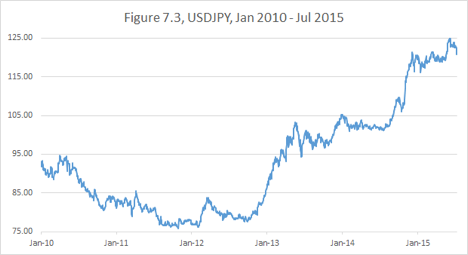

 

 

If I had an 80 stop on the trade, I would have saved money in the short run. But what strategy would guarantee that I wouldn’t miss the move? For example, I could have piled in again on the appearance of the new trend in the spring of 2012, but I would have been whipsawed and stopped out again.

Thus, to establish a moderate position and hold without stops was the best strategy.

No trend-following technical strategies, no momentum indicators and no resistance level analysis yield an 80% chance of success.

It is very important to understand: I am not saying that short-term indicators and strategies are valueless. Indeed if you have an infinitely repeatable (with unlimited frequency) strategy that gives you a tiny edge (like what high frequency traders do), it can aggregate to deliver amazing returns.

But opportunities to capture a massive move of a developed market currency are very rare. You will only have a few of those in your career.

So if you have a profitable short-term technical strategy, by all means, trade it on its own value. But overlaying a rare and valuable long-horizon macro call with tight stops and technical entry points will only “muddy up” your risk profile and create a potential for missing your move.

#

Allow me to put on my “math professor hat” briefly and explain what I mean by “muddying up” in a more quantitative manner.

Suppose you have a weighted coin that comes up “heads” ⅔ of the time. If you engage in a market proposition equivalent to making an even bet on the “heads,” you have a 66.7% chance of success.

Now add two more coins with the same property, and flip them at the same time. The new proposition is: you win every time there is more heads than tails. Now your chance of success is 20/27 = 74.1% (if you question my numbers, ask your favorite statistician friend).

This effect of improving odds is the equivalent of market diversification. As you repeat a proposition with an edge, the risk profile of the average performance will keep improving with more repetitions. This is how casinos make money.

Now suppose you have obtained a really “fixed” coin: the one that come up heads 9 of 10 times. Now your single coin proposition has 90% chance of success.

What if you “diversify” this new coin by adding two coins of the former kind (2 out 3 times heads)? Now your chance of getting two or more heads (a majority) is 76/90 = 84.4%.

Pretty good, but worse than you were with a single superior coin!

So this is my point: if you have a 90% coin, don’t mess with it.

#

Back to the markets. So far I have discussed the “no stops” approach in the context of being short an overvalued Developed Markets currency. The more such a currency appreciates, the more we want to be short. Technically, if we run a dollar based portfolio and are short a foreign currency, our downside is unlimited. But in reality we have to assume that the euro, for example, will not appreciate 10 times vs. the dollar, unless the United States suffers some sort of collapse. Depending on your business, you may choose to not worry about the USA collapsing, because you will be bankrupt in this scenario anyway.

When we are trying to be short an Emerging Market currency, the downside in certain situations might be less defined. Adjusting for carry we have seen some truly massive rallies. Look for example at Brazil’s Real during 2002-2007.

 

 

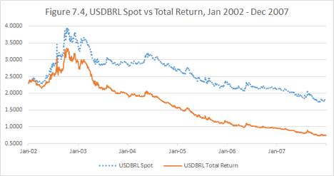

 

 

I have suggested already that one should be wary of being short high-yielding currencies. But if you have to put such a position on, stop-losses might not be out of order. When you deal with negative carry, it is important to be clear about your strategy: specify what your time horizon is and how much pain you are prepared to take.

#

Being long an Emerging Market currency is a very different situation. Your downside is limited to the amount of dollars you have invested to buy the foreign currency. And your carry is typically positive.

But you might lack the advantage of economic gravity. When a currency gets too expensive, the Central Bank can almost always print more money and cheapen it. However, when the currency is in a down spiral, the government may lose control. Especially if the country is burdened by dollar-denominated debt, which is getting harder and harder to repay, as the dollar gets more and more expensive relative to the domestic currency. An example of this occurred with Singapore and Malaysia during the Asia currency crisis as depicted in Figure 7.5.

 

 

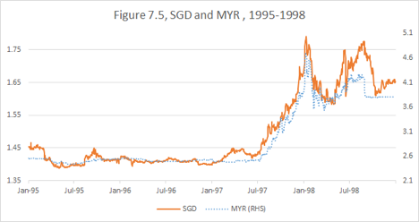

 

 

In this case, strategic clarity is once again paramount. If you are looking to earn some carry for a few months and pick up a modest appreciation, limiting your downside might be worthwhile. However, beware: in the event of “jump devaluation,” you may not be able to execute your stops. Paradoxically, I argue that the very ability to execute the stops (i.e., the presence of buyers) may indicate that stopping out is not wise. In other words, you will successfully execute your stops when and only when you shouldn’t do it.

On the other hand, if you plan to be in the trade for several years, it is more akin to being long a risky stock that might crash or appreciate considerably. Your risk-reward profile may not require a stop.

#

This returns us to the equities asset class. As we have discussed, economic gravity is not as apparent there as it is in the foreign exchange and debt markets. Holding on to your positions becomes a matter of technical indicators (trend, resistance, support and so on) and your fundamental conviction.

Certainly, you shouldn’t stop out of a stock because of one mediocre earnings report, especially if you have a fundamental belief in the company and are seeking multiple returns on your investment.

Still, the conventional wisdom is to get rid of your losers and keep your winners. This advice might have value because stocks tend to trend and continue in the direction of their recent moves. Also as I have pointed out, selling losers may improve your tax profile.

#

Now what about the interest rates market? As we have discussed, more than any other asset, fixed income is subject to the “terminal value” approach. If you decided that 10 year notes were cheap at 2% yield and bought them there, why should you stop out when the yield rises to 2.2%? Now you have even more carry to earn, as you hold them, and even more to gain on eventual appreciation.

However, looking back at my career, I find that I had to stop out of interest rates trades relatively often, more so than when trading any other asset class.

There are two main reasons I ended up stopping out:

•Portfolio drawdown

•Changing economic environment

Indeed, interest rates positions are so sensitive to the economic data and geopolitical risks that often you have no choice but to be flexible and reassess your views promptly and aggressively.

A fairly common advice is, “Stop out not when you lose a certain amount of money, but when you know that you are wrong.” When your market view is based on price action, the price action alone can prove that you are wrong.

With the exception of trends, I rarely deal with price action. I tend to rely more heavily on valuation, historical levels and macroeconomic stories. In the fixed income market especially, I try to position in a way that doesn’t make me a hostage to market volatility. But I try to keep my mind open to paradigm changes.

#

Up to this point, I might have given the reader the impression that I resent stops of any kind. It is not entirely correct. In fact, there is a kind of stop I employ fairly often: a stop “into the trade.”

When I recognize a significant economic value, but choose for whatever reason to stay on the sidelines (I sometimes prefer to wait out an adverse trend for example), I set a rigorous stop into the trade. I refuse to allow myself to miss the trade when it starts moving in the expected direction.

Even though such a strategy might feel painful in the moment, I rarely end up regretting it in the long run.

#

Chapter Summary: Different asset classes have different risk-reward profiles and thus require different risk management approaches. Stop-loss discipline is only valuable if it is properly aligned with your overall trading strategy. Applying technical stops to long-term fundamental views may dilute your performance record. Careful trade selection and sizing allows me to put positions on without stops to ensure profitability in every event of my underlying view being correct.

## Chapter 8. Fear of the visible forest

Sometimes it is hard to “see the forest for the trees.” Sometimes it actually isn’t. Too often traders can see the forest, but are afraid to enter.

We have brought up already that often it is easier to predict market direction over five years than over five days.

Indeed, in the years 2010-2012, most traders agreed with my conviction that an eventual massive weakening of the yen was unavoidable. But the timing of the move was uncertain, and many missed the trade because of fears of adverse market flows and positioning.

Moving to more recent events, this is what I wrote in my blog on January 15, 2015, hours after the Swiss National Bank’s (SNB) surprise decision to let their currency float against the Euro:

 

The dust has not yet settled from the shocking SNB decision to release the 120 floor on EURCHF. Something I had considered possible, but unlikely.

In a rare move for a developed country, the Swiss Franc appreciated 15%-20% (depending on when you chose to look at the screen) against most currencies.

Now what? Let’s forget about money we made or lost in today’s commotion. What is the BIG CURRENCY TRADE for the next few years?

USDJPY (short Yen) 2010-2014 was the most profitable trade in my career. But it feels mostly done, the way I was thinking about it at conception. Now a new wave of traders, who believe in a massively stronger dollar, needs to pick up the baton.

Short EUR has been another great trade for me. But where it stands today at 1.16, it is long way down from 1.40.

Is Swiss the new BIG SHORT?

I know little of Swiss politics, but clearly no one thinks that this drastic currency appreciation will be good for Swiss markets. But does it in itself mean that the currency has to correct?

I believe it does, but I don’t know when and how.

In 2010 when USDJPY was in the low 80s, I had concluded that the levels were unsustainable. I didn’t know what the mechanism of yen depreciation would be. But I initiated the trade, believing that the economic forces would sort the market out. I could not have foreseen the dramatic political shift of 2012 and the Abenomics.

However, what I need to remind aspiring Swiss bears — it took two years of waiting and 5-6% of downside pain for the USDJPY trade to play out.

Are you ready for the pain and waiting?

As many people are pointing out, QE is not as easy to implement in Switzerland as it was in Japan. There is not enough sovereign debt to buy. And as the world is becoming dicier, the flows into CHF might increase.

So how will the Franc be able to depreciate?

I don’t know how, but I believe it will. My inclination is to think that eventually they will find a way to print their own currency and weaken it. And maybe they will even overshoot.

Just don’t ask me about the time horizon and the downside.

I am initiating long USDCHF (short Swiss), but I am doing it with considerable caution and preparedness for pain.

I’ll sleep on it before deciding how far to commit.

#

On the next day after posting this blog entry, I spoke about the idea to short Swiss Franc to a fellow trader and former colleague. I was shocked to hear him say something like, “I like the trade, but it is currently too volatile for me hold long-term, so I can only do short-term plays.”

I didn’t criticize his thinking out loud: he was a profitable trader and entitled to have his own trading style.

But I was convinced that his logic was EXACTLY BACKWARDS. Indeed, if the currency had just demonstrated that it could swing 25% literally within minutes, what protection would holding the position “short-term” accord? In addition, what conventional technical analysis facilitating short-term trading could possibly be of help after such an extraordinary move?

 

 

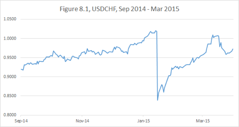

On the other hand, putting on a modest position long-term, I was free from having to guess the immediate resolution of the commotion and able to wait until the dust would actually settle. I profited on USDCHF over the following two months — much faster than I had expected. In retrospect, I could have put a much larger position on. But I only had confidence in the long-term success and had no way of knowing that further emergency positions unwinds wouldn’t push it further against me on a short horizon.

Nothing makes me more interested in a trade than hearing others say, “Surely this position will make money eventually, but at this point it is too volatile and illiquid to enter.”

They are definitely smart enough to see the big picture, but the fear of not having short-term control prevents them from capitalizing on their knowledge.

Smaller size, longer term, bigger move.

This is the way to enter the forest.

You might ask, “So how do I determine the appropriate size for the position?”

My answer is, “If you are a beginner, you will have to learn it by trial-and-error, but if you are an experienced trader, in your heart you already know the appropriate size.”

This is where I bring in the emotional aspect of investing. Ask yourself, “What is it I fear, and what is it I hope for?”

If your primary concern is that you might “miss the move,” not make enough on the dislocation you have recognized, then your position is probably too small.

If you are afraid that the market will whipsaw you and force you to stop out, if you are hoping for the price to move in your favor immediately, you are probably in over your head.

Thus, I introduce the concept of psychologically neutral positioning.

Your “core” position — the size of the trade you should gravitate towards over the long horizon should be psychologically neutral. When you are exactly at your core position on a given day, you don’t worry about the price action:

•If the market doesn’t do much, no problem. Your capital is not completely tied up, and you can afford to wait.

•If the market moves in your favor, great. You make money quickly and can sooner move on to the next trade.

•If the market goes against you, even better. You might get a great entry point to increase your position and make even more money.

The core position should be considerably smaller than your “maximum” position. I define the maximum position as the most you can hold without fear of being stopped out by a violent correction. There is no precise formula what the maximum position should be either — you will have to use your judgement.

If you have the maximum on, there is no space to add, so you will certainly be hoping for the market to go in your favor.

It is possible, of course, to hold the maximum position from the beginning to the end. But if nothing else, you will lose a lot of sleep (especially if the position starts moving against you early on). It is very hard not to torture yourself with the “should have waited.”

And if you end up having miscalculated and getting under more pressure than you had anticipated, you might end up making a mistake.

I believe the maximum position should be reserved for situations that are truly unique and should almost never be deployed. My rule of thumb is to maintain a core position of about 70% of the maximum when I have a high level of long-term conviction.

When the trade pulls back against me, in what I think is a short-term irrational move, I increase my position slightly beyond core. When the trade moves very fast in my favor and I think the market is overextended and likely to correct, giving me a better re-entry point, I reduce.

Some people prefer to get out of the trade altogether when they think it has moved too far too fast; they may even trade short-term in the direction opposite to their long-term view.

I never do so, and I never reduce below 50% of core or 30-40% of maximum. If I were at zero, I would feel pressure from too much risk of missing my big move. After all, no considerations like “overextended” have the same high probability of being profitable as my core view does, as we have discussed in the previous chapter.

My goal is to capture the entire move on the core position. If I am lucky, I can actually make more by adding on dips and reducing on overextensions. If I reduced my position too early on a perceived overextension, I might make slightly less.

Interestingly, the latter scenario rarely proves to be a great problem: the market almost always gives a re-entry opportunity. If I happen to be very significantly underinvested, I set a level to stop back into the trade.

#

# For a concrete example let’s move to the bond futures trade. Here is the recent chart.

 

 

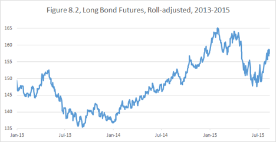

 

 

US bonds experienced a major sell-off early in 2013 in what became known as the “temper tantrum[70](#section-10)”. During the summer of 2013, I envisioned a portfolio concept that had been gestating in my head for a couple of years.

My strategy now demanded to get long bond futures. As you can see on the chart, the initial bounce in 2013 failed, and we had started 2014 very close to the recent lows.

This is when the historical pattern became clear to me. I realized that even if the economy performed well and the Fed would proceed to complete the taper and raise short-term rates, the long-dated rates were likely to fall. The long bond futures trade was able to stand on its own, not just as a part of a broader strategy. My perception of the size of a core position had changed, and I increased my commitment.

Yes, “maximum” position is not a permanently fixed number. Many factors, such as my conviction in the trend or overall portfolio risk, can affect it. When I trade currencies, I am often willing to increase (pyramid) my positions as the trend extends. Currency trends are usually long and consistent. Interest rate trading tends to be choppier, so I am more likely to take profits when the price converges to what I see as a “fair value.”

The global economic conditions evolved in 2014 in a way I hadn’t fully anticipated. Aggressive easing by many central banks eventually led to negative interest rates in Japan and Euroland by early 2015; the strengthening dollar and falling commodity prices alleviated any inflation concerns.

My price target for the US Treasury bond had adjusted up, and I stayed with the trade. The velocity of the trend kept surprising me though. I often found myself with a position smaller than core. I used any correction to add, but I was wary of a “big correction,” so I was a little overcautious. I might have made more money if I had stuck with the full position I had on January 2014, rather than trading around it.

Overall, my 2014 strategy succeeded. I captured most of the move and was able to extract a little extra money from the market, by buying dips and selling overextensions. Most importantly, I was able to maintain psychologically neutral positioning throughout the year and not worry about whether rates were going up or down on a given day.

That freed me up to think clearly and aggressively trade my currency portfolio, which ended up yielding even greater gains.

The price action in 2015 has proved more challenging. A significant correction occurred in the second quarter of the year, and the overall volatility continues to be high as I write this.

The combination of a bond rout with a dollar correction put pressure on my portfolio, underscoring the need for holding some capital in reserve. Due to my moderate size positioning, I had weathered that pullback and increased risk.

#

Chapter summary: A clear vision over a long investment horizon is an excellent source of portfolio performance. When you recognize economic value, don’t be thwarted by short-term volatility and lack of liquidity. Finding the best entry point may add value, but it is more important not to miss the big market move. Size your position in a way that will support your ability to stay in the trade if your view is correct.

## Chapter 9. Adding unnecessary complexity

My first job on Wall Street was as a junior swap trader at Bankers Trust. Some of the conversations I overheard during my first months are etched in my memory as primary trading lessons.

At one point, another junior trader proposed a trade which consisted of three interest rate swaps, which all canceled each other risk-wise and left us with a profit of about half-a-basis-point (0.005%). A senior trader responded to his idea: “Have you taken into the account the idiot factor?” The idiot factor turned out to be the possibility that you screwed something up in your reasoning, your calculations or your execution.

Every time you enter a trade, you expose yourself to the idiot factor, which has nothing to do with the actual economic viability of your strategy. Thus simpler trades are inherently more desirable.

#

The example above pertains to the phenomena known as “multi-leggedness.” Each independent component of a trading strategy, which could be a trade on it own, is called a “leg.”

There are plenty of long-short equity hedge funds out there. They specialize in forecasting which companies will outperform/underperform others, as opposed to trying to figure out the direction of the entire stock market. So they might buy shares of XYZ, the company they like, and against that sell ABC, a company in the same industry they don’t like. This is a two-legged trade.

Let’s compare this strategy with simply buying XYZ. There are two ways to look at it:

1.Owning XYZ has two separate risks associated with it: overall market performance risk and idiosyncratic XYZ performance risk. When we also sell ABC, we eliminate the market risk and are left with only one variable: relative performance of XYZ vs. ABC.

2.Owning XYZ has only risk associated with it: the share price of XYZ, which can be expressed as one number. The XYZ vs. ABC trade inherently has two separate risks attached to each of the companies.

None of those approaches are inherently wrong. There is, however, a mathematical truth in the second approach. If you just buy XYZ, you can’t lose more money than you have invested (which happens if the stock goes to 0). If you also sell ABC, you are exposed to an unlimited loss, if contrary to your expectations; ABC delivers a stellar performance or gets acquired at a huge premium.

That in itself is not a complete argument against such “relative value” trading. You might be exposed to different types of losses, but also standing to gain more if both legs of the trade go in the desired direction.

This brings us back to strategic clarity. I have no quarrel with viewing the difference between XYZ and ABC as its own financial instrument and trading that.

But I think people sometimes go astray when they say, “I want to own XYZ, but I have to sell something to hedge it for risk management.” This is what I call the illusion of risk management.

#

Fixed income markets are great for this discussion: interest rate derivatives traders routinely enter complicated transactions to collect fractions of a basis point of profit. And as I already have said, there is nothing intrinsically wrong with it — as long as you know what asset class you are actually trading.

The 1998 financial crisis, precipitated by the Russian bond default, taught debt traders some harsh lessons. Until 1998 there existed a common mentality:

“I want to own some risky high-yielding bonds (corporate, emerging markets or municipal), but I am afraid that interest rates will go up. So I will sell low-yielding Treasury bonds to hedge my position and collect the difference in coupons while being protected from rates volatility.”

What actually happened in 1998 was that as risky bonds went down, Treasury bonds went up on the “flight-to-quality” bid and hedgers got a double-whammy.

It is particularly interesting to look at the swap spread trade, as it was one of the key culprits of the notorious LTCM[71](#section-10) blow-up.

10-year swap spread is perhaps the most important benchmark for interest rate derivatives trading. It reflects the difference between the 10-year swap yield[72](#section-10) and the 10-year Treasury yield. This spread can be viewed as reflecting the difference between US Government credit and bank credit, and thus serve as a proxy for overall valuation of credit risk.

Let’s look at the history of the 10yr spread. It started to trade actively in the 90s and was a fairly established product by the time I entered the swap market in 1997. Bloomberg has coherent data on the 10-year spread available from 1993.

 

 

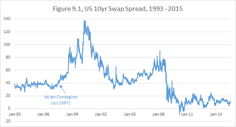

 

 

As you can see, until the “Asian Contagion,[73](#section-10)” which started in July of 1997, the spread was oscillating comfortably around 40. It made a lot of sense that it would be in that neighborhood. We have discussed that the funding cost of a 10-year note can be approximated by the Fed Funds Effective Rate, and the Fed Effective is closely linked with LIBOR[74](#section-10).

The technical aspects of the swap market are beyond the scope of this book. So if you are not familiar with it, just take my word for it. It made sense back then.

Throughout 1998, the spread continued to creep up. By early August of 1998, it seemed an aberration.

Apparently[75](#section-10), LTCM put on a massive position, betting on the contraction[76](#section-10) of this spread and the return to what was then considered to be the historical norm.

On the memorable day of August 24, 1998, my boss was on vacation. When he called the desk to check how we were doing, he wouldn’t for a long time believe that we weren’t joking about the spreads: “84 at 85[77](#section-10)? No seriously, you mean 64 at 65?”

This is how the price action[78](#section-10) of the 10 year spread looked in August 1998.

 

 

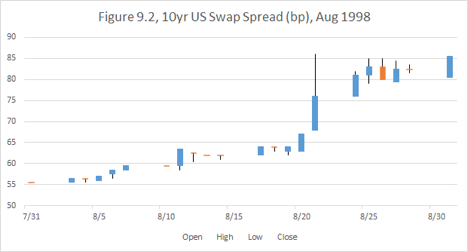

 

 

This was a classic Nassim Taleb’s “Black Swan” moment; various interest rate instruments had always traded in unison, and any historically based risk measures were showing only a limited downside to being short spreads.

Then suddenly, not only Treasuries and swaps decoupled, but many other instruments (such as, Eurodollar futures, Emerging Market bonds and municipal bonds) were moving in the direction opposite of the Government Bonds.

 

 

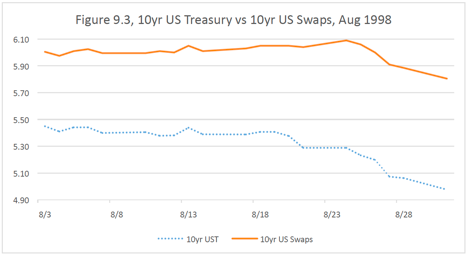

 

 

Investors who were long risky debt and had “hedged” by selling Treasuries got absolutely destroyed on both sides.

This was not a short-lived aberration. As you can see in Figure 9.1, from 1997 the spread started to move in a very different fashion and had traded all the way up to the 140s and then all the way down into the negative zone within 10yrs. The world had truly changed.

To reiterate, I am not saying that it is incorrect to take a position on the 10-year spread. It is a liquid and important instrument and the fact that it is more volatile than was previously thought only shows more money can be made by trading it.

However, the idea that Treasuries can be used to hedge other instruments has been thoroughly debunked. If you own some risky bonds, selling Treasuries against them is not reducing your risk, but rather is changing your profile to an entirely different trade.

#

Another type of trap investors have to contend with is the seductive lure of optionality. Almost every beginning trader loves to buy options. What is there not to like? Limited downside, unlimited upside.

Expressing your directional views via buying options is a lot like trading with stops and pyramiding when the trades are going in your favor. When you keep stopping out and putting your position on again, you may get whipsawed any number of times. If you are buying an option, you are essentially paying for a certain amount of “whipsawing” upfront.

However, there are two inherent issues with options:

•You are not guaranteed to make money even when the market moves in the desired direction.

•Your option might expire before the move you are hoping for happens.

As a first example, let’s return to my recent USDJPY trade. In the second half of 2010, after I had formulated my dollar bullish (yen bearish) thesis, I contemplated buying USDJPY calls. Specifically, I was looking at two-year calls with a 90 strike.

 

 

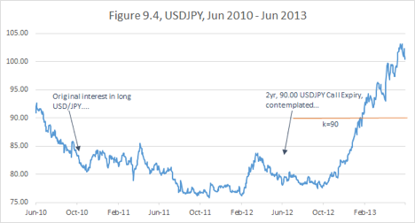

 

 

I ended up not doing the trade because I didn’t like the implied volatility I would have to pay for it. But what would have happened if I did?

Was I correct the USDJPY would start moving by the end of 2012? Yes. Was I correct that it would eventually go much higher than 90? Yes. Would I make money on the trade? No. The options would have expired worthless just before the massive move of early 2013.

Here is another example. I started building a short EURUSD position in the Spring of 2014. On June 18th of 2014, the euro was trading around 1.36 and I had a chance to buy a cheap option — a short-dated, vanilla EURUSD Put expiring on July 25th struck at 1.34. I was very confident of the imminent massive move, and my position was no larger than what I then considered “core.” So I couldn’t resist the temptation to augment this portfolio with this option.

But as soon as I had entered the trade, I started having misgivings. My timing could very well be off. So, I asked myself what it was that I was most afraid of, and what it was that I was hoping for?

The latter was simple: I was hoping for EURUSD to drop like a rock, quadrupling my delta[79](#section-10). The former was not as obvious: I realized I was not at all worried about Euro rallying massively against me — it would give me a chance to add to the position at a better level.

What worried me was EURUSD creeping down slowly and the option expiring just at the strike. It would be a double-whammy: the whole premium on the option would have been lost, and I would have lost the chance of making anything on the move down to 1.34 where my strike was.

So to maintain a psychologically neutral position, I actually had to sell more Euro on the first bounce! The most reasonable thing to do might have been to sell my option, recognizing that it was not the right trade, but the bid-offer (execution cost) to get in and out would’ve been too painful. So I had to do a “reverse hedge” moving my Euro position to larger than core, not accounting for the option.

Predictably, what I have feared the most happened — after a short reversal EURUSD moved down, but not fast enough for the option to be worth anything at expiration. I had mitigated the problem by recognizing it early, but the lesson remained.

 

 

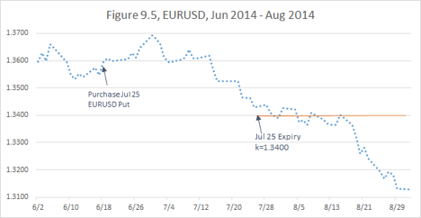

 

 

Buying options has the same problem as using tight stops or technical signals — it goes back to my earlier example of skewed coins. Even if your option strategy has positive expectation in itself, it might dilute the superior risk profile of your fundamental view.

One advantage of options (which you are generally paying extra for) is “gap”[80](#section-10) protection. That is you don’t have to worry about your stop not being able to be executed at the expected level. But just as you can be stopped out of a position unlimited numbers of times, you can continue losing your premium on options.

A trader buying options might not risk an instant portfolio meltdown but is exposed to the risk of “death by a thousand cuts.” I have witnessed such an agonizing demise more than one time — it no less painful and no less frequent than a sudden blow-up.

At this point, it is important to stress that this is my individual preference rather than a universal trading principle. Recently, I have discussed this subject extensively with Jim Leitner of Falcon Management, a celebrated macro trader. He prefers to use options to express his strong, long-horizon views. Jim is confident that, out of the numerous options trades he will execute in his career, he will be right a large percentage of times. He doesn’t mind losing on some of those trades as long as he makes a big score when he hits the jackpot.

This is where it comes to style. Jim wants to have a lot of leverage and sleep well at night. I, however, lose more sleep because of option decay than when a trade refuses to move in my favor for a couple years. I feel that “perfect trades” are such rare gems that I must capitalize on them with full patience and strategic commitment — if I miss one, I may miss another, and there goes my year.

Yet what Jim has said is great food for thought. There are occasions when it is worthwhile considering option strategies. But that would be his book to write.

#

Some investors, who resent the pain inherent in paying for optionality or stopping out, resort to exotic derivative structures in order to avoid paying high premium.

There all sorts of structures frequently used by investors: knock-ins, knock-outs, reverse knock-outs, buffers, costless collars, one-by-twos and so on.

As a gross generalization, I will say that traders, who buy option combinations or exotic options to express their directional views, tend to pay for the appearance of saving on premium by being long optionality when the market performs the way they expect and short optionality when the market does something unexpected. It is exactly opposite of what you should be trying to achieve because owning optionality is designed specifically to protect you.

Analyzing such instruments is beyond the scope of this book, but I will give a couple of examples.

Suppose you like XYZ stock, which is currently trading at $100. You are thinking, “There is a lot of upside on XYZ, and there is no way it will go below $90 over the next year. That would be below liquidation value.” Then a bank salesperson offers you a costless collar: you can buy 1 year 115 call and sell 1 year 90 put[81](#section-10) at 0 net premium.

This might at first sound great — you have big upside if XYZ goes to 150-200 as you expect, and you don’t pay anything upfront. The problems start when stock goes below $90. You don’t expect this. Hence, when it does happen, it signifies that something bad is going on. This in turn means that XYZ might go to 80, 70, 60 or even be wiped out altogether. Not a good time to be short puts.

Another popular strategy is reverse knock-outs, which can dramatically reduce your upfront premium. Let’s say you want to go short the euro, which is currently trading at 1.1100. You would like to buy a 3-month 1.0500 put, but you find it too expensive at 13.6% implied vol which equates to 0.78% of EUR, or 86.5 USD pips. Your breakeven would be at 1.04135 in 3 months’ time. So, instead, you buy a 1.0500 put with a reverse knock-out barrier at 1.0000. That is, if the euro trades at 1.0000 or lower at any point in the next three months, your put disappears and you lose your original premium. This structure costs only 0.10% of EUR, or 11 USD pips, much cheaper than a simple (vanilla) put. Your reasoning is that while the euro is very likely to go below 1.0500 before the expiration, it is unlikely to fall all the way to parity, so why pay upfront for outcomes that you believe are very unlikely.

Such a structure might make sense if you are basing your levels on technical analysis. But expressing a fundamental view this way is a fallacy. If you are correct about the forces pulling the currency down, then the odds of it going further than you expect are disproportionately high. So when you are most correct, you will actually lose money. For this reason, I have never bought such an option in my entire career.

#

Chapter summary: I don’t advocate unequivocally against using complex and leveraged financial instruments. Rather, I caution against the traders’ tendency to increase complexity out of fear of taking simple directional risk. Such complexity almost invariably increases transaction costs and the amount of risk variables. An illusion of risk management benefits might be dispelled when the market shifts out of the “normal” paradigm.

## Chapter 10. Portfolio Paralysis

Up to this point in the book, the examples I have provided from my own trading career were mostly stories of success.

In this chapter, I will touch upon the core of the few major setbacks I have suffered. Portfolio paralysis is something I have struggled with over my entire career.

I am making an effort to develop measures to avoid this problem, but my growth in this area is not yet fully tested by practice.

By portfolio paralysis I mean a situation when excellent opportunities present themselves, but the trader is not able to take advantage of them because all of her capital is tied up in existing positions. It happens when the market is going against you, and you are on the verge of a portfolio stop.

So far we have only discussed position stops. A position stop is often a part of trading strategy. If you are stopped out of a position, it does not actually say anything about your overall performance. In fact, a high-frequency trader could be stopped out of hundreds of trades and still have a profitable day.

A portfolio stop is never good news, as it signifies a forced partial or full liquidation of all positions.

Who determines levels for a portfolio stop? Usually it is your boss, if you have one. In a broader sense, the reduction might come from your firm’s risk management guidelines, from your agreement with investors, from margin requirements set by your brokers or even from your own self-imposed risk discipline.

There is a very common version of a portfolio stop that comes not from the actual lack of capital but from the magnitude of the drawdown. The drawdown is the amount of money the trader has lost since the last high water mark — the point of highest portfolio value. Thus, for example, a trader could have made $100mm in January, then lose $80mm in February and be stopped out, even though the portfolio is up $20mm on the year, because of a portfolio stop-loss set at $75mm from the high water mark.

Whatever the reason, portfolio stops are always very painful and always, in my experience, perfectly mistimed. That is, you always get stopped out at the very bottom from your portfolio perspective. You end up being flat at the point when your positions would have proved to be most profitable if initiated.

There is a reason why it tends to go this way. Involuntary portfolio stops tend to hit multiple money managers simultaneously when an unlikely market dislocation occurs. When everyone is done stopping out, the market starts to normalize.

Portfolio paralysis is the edge of this cliff — the anticipation leading up to a portfolio stop. The market is in chaos, and great opportunities pop out on the screen one after another, beckoning like the chiming of an ice-cream truck. All you can do is hold on by the skin of your teeth and hope the market will give you a reprieve tomorrow. And “hope” is an ugly word in the world of investments. It is something that is always getting dashed.

Usually portfolio paralysis is only a painful delay of the inevitable portfolio stop.

#

My trading style and my personality require me to be particularly vigilant against this problem. Indeed, my general inclination is to stick to my long-term strategy regardless of short-term price action, and I usually don’t have individual stops in place. No matter how carefully I size positions, if each of my trades starts going against me simultaneously, I may come under pressure.

Admittedly, for each case of portfolio paralysis I have experienced, I must blame my arrogance as much as an unfortunate confluence of market events.

Greenspan’s surprise intermeeting cut in January 2001 (indeed, the economic slowdown started way before 9/11) was a hammer strike that broke the crust and opened the fountain of money beneath my feet. My views were correct; my positions were correct, and I was at the right place at the right time. The sleepy and somewhat esoteric basis swaps franchise at the heritage Chase Bank, which I had just recently acquired the reins to, was a perfect place to take advantage of the unprecedented volatility in the super short-term interest rates.

On January 3, 2001, I made more money than in my entire preceding career. In the following days, I transitioned from being a semi-senior trader, just promoted to a not-so-lofty VP title[82](#section-10), to the status of a prima donna. And started learning to act the part.

To my unending surprise, some investors (in fact the majority of them!) are only comfortable with positions up to a certain size. Once, I interviewed a trader who was in the markets for 16 years, never had a losing quarter, and never had pushed for the increase of his risk limits/positions. His market expertise and reasoning were quite solid; his experience and relative track record undeniable. In all fairness, he should have been the one interviewing me. Yet when I asked him about his career long risk aversion, he talked about his “comfort level,” desire for job security and family obligations. His answers sounded like words in an unfamiliar language to me.

I guess my brain hadn’t bothered to develop the neurons that were supposed to fire fear of a financial risk. I wasn’t unique in being unfazed by an extra zero on a position size. At one stage, I approached my boss and mentor and said, “I have such and such trade idea, and this is how I am planning to execute it.” He agreed with my logic and asked, “How much are we going to make on this trade?” I answered, “I expect to make $10 million.” He said, “Let’s do twice the size and make $20 million.” This type of lesson I was eager to learn.

To be clear, I am conservative when it comes to ensuring my personal (and my family’s) solvency, lifestyle and well-being. For perspective, I came to the United States as a refugee from the former Soviet Union. I spent a few months in Italy selling trinkets in street markets for a living while waiting for my American visa. In the USA, I was a college student with no middle class family to grumble about paying my college tuition. Yet I have never spent beyond my means, and I have never gotten into debt. Not even when I barely had money to buy food. And even when I suddenly started to make the “Wall Street money,” I didn’t feel much of a temptation to go on a spending spree.

The lack of risk aversion I am speaking of was completely different. When I had capital, I had a fundamental desire to engage it. And when the capital grew, I wanted to engage the new money. I traded one million of capital exactly the same way as I traded one billion. Yes, it was tested. There was no circuit breaker.

And therein lay the danger. When things went my way, I tended to grow overconfident and expected them to continue going my way. I had never seen a market I didn’t like, that is a market without opportunities.

The very core of my investment personality — the advantage of unshakable courage and conviction — may lead me on the path to portfolio paralysis.

When confronted with an untenable drawdown, I had previously tried to selectively reduce. I disposed of positions I felt were less important and kept (or even increased) the positions that contained the most value. However, that approach typically backfired. The problem is that the positions that I most believed in, and had in the largest size, were typically the ones giving me trouble. And as they went against me, I perceived them to have more and more value. (If you like a stock at $30, you would love it at $20, right?) And, of course, as I gave up on the less paramount positions that proceeded to perform well, the core positions continued their downward momentum.

Eventually, under the pressure from my bosses or investors, I had to unwind everything. And, as we said before, the stop always occurs at the worst possible moment.

In fact, looking back at my whole career, I virtually never recall a situation when a risk management procedure brought any material benefit. That is, my portfolio would have always performed dramatically better without any stop-losses and would never have ended in an uncontrollable blow-up.

This observation leads me to doubt the whole culture of risk management, including the culture of financial regulations. Any outside restrictions imposed on traders tend to safeguard from catastrophic events that have happened in the past. And good traders typically know not to repeat the mistakes of the past. The exact same crisis doesn’t happen again.

What risk management does in practice is to pull the capital back when having the capital engaged is most valuable. And on the other hand, as we have learned from the last financial crisis, when something historically unprecedented happens, no historic precedent-based regulation or risk management is of any avail.

#

Let’s move to some concrete examples from my career. I have already mentioned a few instances when I was blindsided by the dynamics of the interest rate curve.

The first one was the interest trade in the end of 2001.

But a more interesting example was in 2004, when volatility in my interest rate positions, both in the USA and Europe, coincided with difficulties in the currency markets. I don’t remember exactly each of my positions during that time, but my short EURJPY position stands out.

 

 

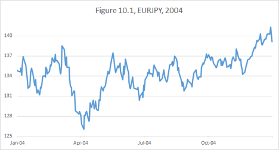

 

 

I was scoring big gains in March, but I had no interest in taking profits and ended up giving almost everything back.

For the purpose of this discussion, what matters most is the trajectory of my portfolio performance in 2004[83](#section-10).

 

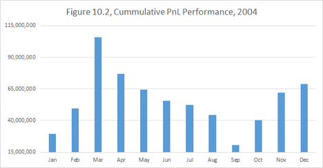

My early profits were mostly wiped out by the end of September. There was a day when my year-to-date P/L stood very close to zero, down a hundred million dollars from the peak. At this point, I had to unwind most of my positions and get very close to being flat.

You can see that I had managed to claw my way back up later in the year to finish the year up $68mm, which made 2004 my worst full year as a senior trader even if it had a respectable ending.

What is interesting is that whatever views I had in the last quarter of the year, they had obviously played out. But how much better could I have done, if instead of being paralyzed in September 2004, I was able to build risk? There are two complementary takeaways from this:

•Even if you are painfully stopped out and forced to restart with much smaller risk, there is always a chance to re-build your portfolio for success.

•Huge profits can be achieved by having unencumbered capital and clarity of mind during the times of challenge.

#

The worst setback in my trading career occurred in the Summer of 2007. Having recently quit J.P. Morgan earlier that year, I started “Cloudview Capital Management,” a macro hedge fund. Readers might predict given the timing: “Yes, of course, you blew up. The financial crisis started.”

While true, the story is more complex than just being blindsided by the crisis. In fact, as I started freshly building my positions in June 2007, the first rumbles of the coming financial earthquake could be easily felt. Knowing nothing about subprime mortgages, I was not a huge “bear,” but I thought it was prudent to be cautious.

I was initiating some trades that were intended to perform well in a credit market collapse. My core trade, which I will discuss later in more detail, was destined to deliver explosive, unprecedented performance in the subsequent two years; it was arguably the best trade anyone could have had on going into the crisis.

But it didn’t perform the way I expected right away; and when the crisis broke out, my troubles were compounded by my other positions. Here is how I think now about the mistakes I made that summer:

•I got involved in unnecessary optionality.

•I added too much complexity to my portfolio.

•I failed to focus all capital on “superior” trades.

•I was impatient with the execution of ideas and failed to size and diversify my positions properly.

In the end, it was the “idiot factor” that got me. Some purely technical (and very temporary) twists in the market, which happened in August and September of 2007, created a temporary marked-to-market drawdown I couldn’t withstand.

And Ben Bernanke’s Fed didn’t come to the rescue fast enough. Here is an excerpt from my blog post on April 5, 2015:

 

My recent critique of @benbernanke on Twitter caused a surge of disagreement and debate. The general feeling was that we were lucky to have him as a chairman during the crisis. My opinion is that things couldn’t have gone much worse.

Admittedly, I am biased. I got hurt badly in August 2007 by betting on the Fed responding to the freeze-up in financial markets much more vigorously. I couldn’t imagine (and still can’t) that Bernanke’s response to the unfolding catastrophe would be so slow and lackluster.

 

 

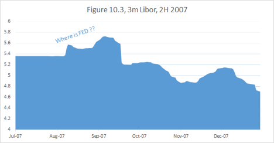

 

 

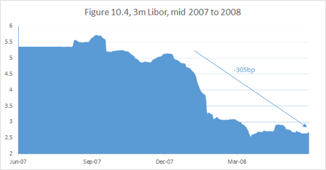

 

 

Do you see LIBOR going up in August and September? Do you see that the Fed barely managed to get it down by the end of the year?

I see this as egregious a failure as Greenspan’s infamous 50bps hike in May 2000 in the middle of the unfolding collapse of the internet bubble.

Am I now asking the Fed for a bailout? No, the Central Bank has no obligation to bail out my portfolio. They shouldn’t be too concerned if their actions blow up a few traders and disproportionately help a few others.

But when a systemic crisis unfolds, it is beneficial for the Fed to move with the decisiveness of Alexander the Great and not to worry about timely signaling and methodical approach.

This is the difficulty with academics running the Fed: they are afraid to be wrong and to act prematurely, so they collect the preponderance of evidence before acting. Traders have no such compunctions.

You see the financial system freeze? Cut right away, don’t talk, just cut! You find out your actions were excessive: tighten back. Nobody was ever able to explain to me what would have been wrong with the Fed being dynamic and flexible.

 

My hedge fund failed in its infancy, though some of my ideas had the potential for tremendous profit. There were many problems, but the mechanism of the failure was portfolio paralysis.

At a time of chaos and amazing opportunities, I was tied in knots trying to find a way to keep my precious trades on.

It is, of course, easy to trade in hindsight. But I am very confident that the trader I am today could have made an absolute fortune with some free and dynamic capital in September 2007.

Instead, I had to close Cloudview and step back from the market. Gradually, I started trading again with my own money. I still experience grief over not being involved fully in the historic events of the financial crisis.

But, in fact, being mostly on the sidelines in 2008 did have its advantages. When the stocks raced to the bottom, I put my money to work. Over the following several years, I have managed to rebuild and multiply my fortune. The lessons I learned helped me achieve a performance record that I wouldn’t have thought possible.

#

So now that I have been trading well for a few years, how do I plan to prevent the next instance of portfolio paralysis? Given that I am not a fan of position stops and am not inclined to impose outside risk management on my own portfolio, what other options might I have?

Reducing portfolio complexity, the subject of the previous chapter, will go a long way. Not only do simpler trades have to contend with fewer variables, but also if the positions HAVE to be reduced, it is possible to get out and back in without prohibitive transaction costs.

But what I think is most important is not overcommitting capital during the periods of calm markets. The general tendency of investors is to increase risk when the “times” are good and reduce risk during periods of commotion and high volatility.

Long stretches of benign economic performance and low volatility lead to complacency and exert pressure on traders to increase their leverage in order to outperform the rising stock market.

Rationally, of course, the opposite should hold true. When the economy expands faster, revenues are elevated, and investors would be wise to be more conservative and discount the fact that expansions don’t last forever. Conversely, during recessions corporate earnings are temporarily depressed, and it makes sense to assign higher expectations to companies that are likely to survive through the cycle. This failure of investors to see through a business cycle exaggerates stock market volatility.

A macro trader, like myself, doesn’t compete with any particular stock market. Rather, I need to recognize when the market presents fewer extraordinary opportunities and pull back capital. This way in the event of a sudden meltdown, following a long period of tranquility, I am more likely to avoid portfolio paralysis and take advantage of any dislocations.

Yet, as I have mentioned before, I have never seen a market I don’t like. Opportunities always beckon. I find it useful to grade the market by the quality of opportunity to instill capital discipline. And to give today’s market a “grade,” you need to compare it with other moments in history. How would you characterize today:

A.A time of unique, unprecedented opportunity, when a perfect trade, the object of this book, may be initiated. Given my strategy, I have observed only two such moments in time: Spring 2002 and Winter 2013-2014.

B.A massive dislocation, resulting in a strong and obvious trend. For example, the dollar depreciation of 2003, or the stock market recovery starting in 2009.

C.Times of chaos and crisis, which present great opportunities: 1998 Russian debt crisis, 9/11, 2008 financial crisis.

D.Regular markets.

Force yourself to grade rigorously, and the answer is almost always “D.” My main strategy to avoid portfolio paralysis is to hold back capital when I recognize a D-market. It doesn’t mean that I don’t trade, but I reduce positions waiting for one of the better markets to arrive.

A few years ago I coined a term for the process of cyclical transition between market regimes: valuation wave. Navigating valuation waves and creating a rigorous method of assessing the quality of opportunities in a given market could be the subject of a whole separate book.

#

Chapter summary: Portfolio paralysis may be a large detriment to long-term portfolio performance. It is important to be vigilant about preserving your capital. Even though capital discipline may reduce your profitability in normal markets, you will be rewarded for it greatly during extraordinary times.

## Conclusion of Part II.

The section you have just read dealt with issues of risk management and capital preservation. You have probably noticed that the approaches in the last few chapters were adapted specifically for my trading style and psychological makeup.

This book is designed to present a comprehensive view of my strategic approach, rather than to be a universal set of recipes.

But I believe that each of you should conduct your own careful analysis of the issues above. Whatever is the source of your edge over other market participants, you must work hard to protect your capital and maintain a style compatible with your mental comfort.

Such portfolio discipline will help to avoid squandering your advantage.

A superior strategy is built upon trades that don’t fail when the view driving them is proven correct.

<!-- rl-section id="section-7" class="epub-section" kicker="Section 7" title="Part III Choose dominant trades." -->

# Part III Choose dominant trades.

Readers, you have made it to the part where the core differentiating features of my strategy will be revealed.

The material of Parts I and II is useful for any trader, regardless of experience. But what we have discussed so far was only unique in the sense that it gave a comprehensive picture of my approach. Most of the questions I have raised in the first ten chapters were pondered, debated, discussed and written about by many prominent macro traders.

Remember that, like many others, we are on the quest for a “perfect trade.” I have outlined my methodology of how to select the initial candidates. In Part I, we have discussed which categories of trades might be thwarted or aided by the natural economic and market forces. Part II was dedicated to protecting your valuable market insights from being diluted by inefficient strategies.

Up until this point, we have mostly discussed and evaluated “single asset” strategies. Now we will introduce a methodology to compare trades across different asset classes. I introduce

an advanced characteristic of a superior trade - strict dominance.

The word strict makes one think of mathematical logic and not of market thinking. Indeed, any premise about the market is at best probabilistic. Yet some economic causalities and outcomes can be deemed most plausible by economists and investors.

To be fair even the assumptions, which are considered reasonable by most, on occasion get challenged. There will always be a contrarian who will question any belief. A central bank lowering interest rates stimulates growth? I’ll guarantee you that someone out there will argue the opposite.

Yet, we have to start somewhere. You don’t have to accept my assumptions. Choose your own. Just be very intellectually clear what assumptions you are using.

Mathematicians do the same: they choose a non-self-contradictory set of axioms and use irrefutable logic to build a theory based on it. Choose different axioms and you will get a different theory. Each theory will work perfectly within the world defined by its axioms. The theory which has axioms best approximating the reality will be most useful for practical applications.

Confuse your axioms and your whole logic will become worthless.

This is what I do. I read research and decide which paradigms I am willing to accept. And based on those paradigms, I strive to build a superior portfolio.

A superior portfolio consists of trades that are not dominated by any other trades. Now how do you compare trades in a strict sense? Isn’t the profit expectation on any trade just a matter of view?

Suppose you want to bet on a basketball game between teams A and B. I will give you two choices:

1.You can bet on Team A winning at 1-to-1 odds

2.You can bet on Team A beating team B or losing by less than 10 points[84](#section-10) at 1-to-1 odds

Obviously, you would rather take the second bet. You may consider A to be a much better team, and when someone presents you with bet (1), you’ll think that you are lucky to get such a great deal. But as long as bet (2) is available, it is outright idiotic to waste your money on bet (1). No matter how good your team is, it is always worthwhile to get some free insurance.

So this is how I compare trades:

Trade X dominates Trade Y, if under reasonable assumptions, X is likely to succeed in a strictly broader range of future scenarios than Y.

Thus the second basketball proposition is strictly better, because it pays in a greater range of outcomes.

But in the market, there are no predetermined payouts. The risk/reward profile of a given trade is often a matter of argument. My definition of dominance allows me to think qualitatively and apply the “all else being equal principle.” When choosing a strategy to express a given economic view or to capitalize on a particular dislocation, I look for a portfolio that performs in the broadest range of economic scenarios.

And once or twice I have found a perfect portfolio: one destined to perform in every imaginable scenario.

Most traders get stuck on bet (1). They find a trade they deem to have positive expectation and can’t swallow the idea that, even in light of their view, the trade might, in fact, be terrible.

I think the narrow focus of market players is one of the reasons for this common fallacy. For example, if all you do is trade USDJPY, you are forced at all times to have an opinion on USDJPY; otherwise you have nothing to do.

If you are good, you are right more often than wrong. Your short or long trade confined to the one-dimensional reality of a particular asset class might appear to have a good reasoning behind it and might actually prove to be profitable.

But when looked at from the multidimensional space of all interconnected asset classes, the same strategy may be far behind the efficient frontier[85](#section-10) of trades, trapped in the bowels of investment mediocrity.

It is as if, as a basketball gambler, you were not allowed to make any “spread” bets. You made your research; you found your best team, but you are leaving money on the table by making wrong bets.

Broad reach across asset classes is not my only advantage in the search for a perfect trade. I have discovered that many macro traders are more comfortable in the labyrinth of economic research and statistics than in the world of abstract logic.

I earn my claim to the title of “market philosopher” by being able to parse the matrix of accepted economic causalities and convert it into a system of concurrent necessities.

My best performance is realized when irrefutable logic leads me from consensus economic views to contrarian market positions.

## Chapter 11. Bet not on the sufficient, but on the necessary

One of the things they teach in the beginning class on logic is the meaning of implication. “Every salmon is a fish, but not every fish is a salmon.” In other words, being a salmon implies being a fish, but being a fish does not imply being a salmon. Conversely, not being a fish implies not being a salmon, but not being a salmon does not imply not being a fish. And yet another way to express this: being a salmon is sufficient for being a fish, but being a fish is necessary for being a salmon.

All of the above are equivalent variations of the same logical statement:

salmon >>>>implies>>>> fish

Given a random animal you would rather bet on it being a fish than on it specifically being a salmon. As with the basketball example, we would rather bet on a broader class of events.

winning >>>>implies>>>> not losing by more than 10 points

This seems fairly straight forward; but on the abstract level, the conclusion is not so intuitive. If

A >>>>implies>>>> B,

then A is the sufficient, and B is the necessary, and B is the dominant trade.

#

Let’s consider two macro trades of 2014. Both were related to expressing the idea that the US economy was doing well, and the job growth was picking up.

A.Short the front end of the US interest rate curve. Many people (including the consensus of the Fed Reserve governors[86](#section-10)), believed that the path of tightening the market had priced in was too benign.

B.Short Euro vs. Dollar. With divergent economics and central bank policies, some economists were calling for Euro to go down to parity within three years.

 

You might guess which I thought was a better trade given that I previously recommended avoiding shorting the US interest rates markets. We also know what happened. (Both trades win if the corresponding line goes down.)

 

 

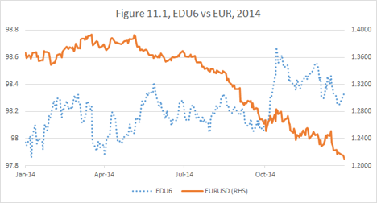

 

 

But let’s set aside retroactive thinking and go over scenarios.

Despite its lack of success, Position A might have had a positive expectation — a fact I don’t dare or care to dispute.

 

On the other hand, it was reasonable to assume that if the Fed had tightened at a faster pace than anticipated by the market, the dollar was likely to outperform[87](#section-10) the euro. Thus,

A >>>>implied>>>> B.

On occasion, the logical implication works both ways, making the two statements equivalent. Let’s check if

B >>>>implies>>>> A.

Did lower euro imply higher US interest rates? I didn’t think so. And Fig 11.1 confirms my assumption: the dollar dramatically outperformed the euro without the benefit of higher-than-projected US interest rates.

It is important to understand that the assumptions above are not permanent, but rather a function of an economic environment. In particular, this logic was predicated on the fact that European interest rates were not at all likely to go up, given the dramatically-below-target inflation.

I am confident that in 2014 most experts would have agreed with this line of reasoning. Then they would have to admit that B (long dollar) was a strictly dominant trade. Which in turn meant that

everyone short the US interest rates market in 2014 was in a strictly dominated inferior trade.

This logic can be taken further. We have discussed how 10-year notes yielding 3% and funding at 0% at the beginning of 2014 were offering an extremely lucrative carry. It was reasonable to assume that it was difficult to make money being short, unless the Fed started to raise rates.

So if you were to consider three trades:

A.Short short-end interest rates

B.Long US dollar

C.Short 10-year notes

You get:

C >>>>implies>>>> A >>>>implies>>>> B

Thus Trade C was the most inferior one and Trade B, the most superior.

It is worth reiterating here that I am not calling everyone who got involved in Trade C in 2014 incompetent. On that one particular year, my strategy and understanding gave me an enormous advantage; but on a different year, others might have shined.

#

I have been fortunate to intuitively follow these logical implication lines from early on in my career, but my first attempts to explain this approach lacked clarity.

Only in the process of writing this book was I able to identify the source of consternation. Our common sense associates implication with causality. (I have no such problem, because as a former mathematician, I am not burdened with common sense.)

Saying A causes B, is very different than saying A implies B. To arrive at a logical implication we have to be more precise.

“A is sufficient to cause B” signifies “A implies B.” But “A is necessary to cause B,” leads to the opposite direction of implication.

Let’s analyze our A-B-C example in this light.

As we have said before from an economic perspective, it was easy to assume that higher short-term interest rates in the USA would be sufficient to cause a stronger dollar in 2014. My deduction also was that this economic causality, while sufficient, was not necessary.

Given that Japan was in the middle of ramping up their QE program and Europe was only about to start one, it turned out that all the Fed had to do to allow the dollar to rally was to stop actively debasing it.

So in this case, the logic went in the intuitive direction:

Higher short-term rates <<<<economic cause of>>>> stronger dollar

and

Higher short-term rates >>>>imply>>>> stronger dollar

In the relationship between A and C, the causality also starts with A:

Higher short-term rates <<<<cause>>>> higher 10-year yields.

But this causality is necessary, rather than sufficient. As I have explained earlier, I deemed aggressive tightening to be necessary to cause higher yields in the long end. However, the analysis of historical yield curve patterns shows that rate hikes are not sufficient to cause long-dated Treasuries to sell off.

Hence,

A <<<<causes>>>> C

but

C >>>>implies>>>> A

#

I have given you an example when my conclusions about the direction of implications were tested and unequivocally proven correct. Now let’s discuss a related example, when it was harder to judge whether my line of thinking was valid.

Two related market moves occurred in 2012-2014: Nikkei[88](#section-10) and USDJPY.

 

 

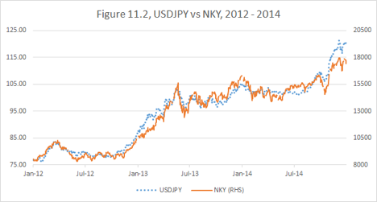

 

 

The direction of economic causality is pretty clear. Japan is an export-driven economy; a weaker yen helps the exporter. Thus,

higher USDJPY <<<<causes>>>> higher Nikkei

As a side note, some financial pundits seem to be confused even by this obvious causality. As you can see from Fig 11.2, the two trades had been very highly correlated. Such high degree of concurrency is often taken for causality going in either direction. On many recent occasions I saw a headline, such as “Overnight yen strengthened on the back of lower Japanese equities.” What? Since when does a weaker domestic stock market become positive for the currency? On the contrary, if the Nikkei were to continue falling, we should expect an incrementally more aggressive easing by the BOJ[89](#section-10) and consequently a weaker currency.

The market, of course, can trade in a pattern, where one asset class leads another correlated class, regardless of actual economic causality.

Generally my strategy is designed to capitalize on large market moves, not on intraday volatility. But short-term “wrong direction” moves often create an added value opportunity to enter a trade or add to an existing one.

Returning to our proper direction of causality between the yen and Nikkei, the question I had to ask myself was whether that causality was sufficient or necessary or both.

Observing that much of the Japanese economy was oppressed by its overvalued currency, I concluded that the causality was necessary. I thought that the Japanese stock market had no chance to recover from its multi-decade slump without a significant yen devaluation.

On the other hand, I was imagining scenarios when the stock market would fail to rally even with a weaker yen. I had judged this causality not to be sufficient.

Thus I’ve concluded that being short yen was a strictly dominant trade. Notice that it was also a long dollar trade, which by 2012 I was seeing as a dominant way to express my views about the US economic recovery.

Obviously it worked very well. But in retrospect, I am not completely sure that short yen was superior to long Nikkei. The Japanese stock market has proved to be more robust than I expected and rallied in response to even a possibility of a weaker yen with such alacrity, which now I am suspecting the causality was quite sufficient. Maybe even a modest rally had been possible without a yen devaluation, making a yen trade incrementally less necessary.

In the end, all I can say is that I had recognized the market dislocation, made the best economic assumption I could at the moment and followed my logic to the corresponding superior trade.

#

Chapter summary: When very plausible assumptions lead to an understanding of the necessity or sufficiency of economic causalities, it is possible to establish chains of implication. Investors who bet on logically necessary, rather than on logically sufficient, market moves will achieve portfolio success in a broader range of scenarios.

## Chapter 12. The Secret of the Chicken and the Egg

If you felt that the last chapter was confusing — brace yourself. It is about to get more confusing. Navigating the concepts of this section of the book may be difficult without considerable market experience. If you feel unconvinced by the abstract logic, try to focus on the examples and think of what I am presenting as opening up a possibility of a certain approach, rather than a recipe. The good news is, when you get through this chapter, you are mostly over the hump. It will get easier and more concrete.

I also have a confession to make. We took intellectual shortcuts in the last chapter. To simplify the ideas of necessity and sufficiency, I have not yet introduced the dimension of time into the discussion of market causality.

Traders often say, “Timing is everything.” I will replace this commonplace expression with a more sophisticated statement:

Concurrency is everything.

When we say, “A causes B,” we are not actually divulging much useful information, unless we also give some idea as to “when.” Moreover, proposing that, “If A happens, sometime afterwards B will happen,” is not much of a trading strategy.

Let’s consider the following statement:

“Every prolonged bull market in stocks is followed by a crash.”

This is a reasonable assumption with a reasonable causality built into it. Indeed, long bull markets tend to cause investors to become overly complacent and overextended — a recipe for a crisis. So it appears that the crash is a necessity. But it is not a

concurrent necessity.

We have already discussed the dangers of betting against the stock market prematurely. Being correct about equities going down 30% will do you no good, if they rally 200% before that.

Conversely, bullish arguments could be mistimed as well. Several years ago, a friend recommended that I buy shares of Electronic Arts (EA). It was trading slightly over $50 at the time. Since I bought the stock, it collapsed all the way down to $10.95 and in the recent years rallied above $70, putting me in the black.

 

 

 

 

The reasons he liked the stock have at last played out. But, it was not a good trade. Even setting aside the argument that losers should be periodically cleaned out for tax purposes, the return on the trade relative to the drawdown turned out to be abysmal.

Recall the difference between “allocators” and “leveraged traders.” As an allocator, you can afford to buy a stock and “close your eyes” for a few years, but any leveraged trader knows that letting your positions go 80% against you is a path to disaster. Indeed, if you manage to hold on to such a losing position due to your overall portfolio performance, it will have tied up your capital and cost you much in terms of opportunities. How much nicer would it have been to buy EA at $11 on July 28, 2012?

What I am speaking of here may appear to contradict my long-term approach. Am I now demanding an immediate success from all trade ideas? Far from it.

Not only do I not require immediacy, but I rarely specify any time horizon for a trading strategy.

Rather, I demand concurrency.

Every trade idea is a relative value proposition. If I go long ABC stock vs. short XYZ stock, I am not just saying that at some point in the future ABC will go up and at some point XYZ will go down. All financial instruments go up and down at some point.

Taking the relative position means that I think that ABC will outperform XYZ in a concurrent sense. (It may feel that I am stating the obvious, but bear with me. We will develop the concept further.)

Even taking a single instrument position implies a relative value judgement. Buying the ABC stock is tantamount to saying that ABC offers a better risk/reward than the rest of the stock market. Selling EURUSD is betting that the euro will underperform the dollar.

When we try to establish a strict dominance relationship between two trades that express a similar economic view via two separate asset classes, we need to establish the timelines of our implications.

Mathematical statement

A >>>>implies>>>> B

has no time in it. As we have seen, “If A happens, then B has to happen sometimes afterwards,” is not good enough to establish dominance of B.

Rather we want to be able to say,

“By the time A happens, B will have already happened.”

This grammatically awkward statement captures the concurrent necessity.

This might be especially counterintuitive if we are considering A as a sufficient cause of B, because it places B ahead of A in the timeline.

Let’s clarify this notion through an example. As we have discussed in the previous chapter, in the years 2013-2014 I adhered to the assumption:

Higher short-term rates <<<<economic cause of>>>> stronger dollar

and

Higher short-term rates >>>>imply>>>> stronger dollar

While mathematical logic regards statement A as simply “true” or “false,” the market reality of a trade “higher short-term interest rates” is a process. And my judgement was that in the process of rising short-term rates the dollar would have to strengthen concurrently. Or even better, the dollar could have strengthened in anticipation of higher rates. Or it could have strengthened for another reason, like aggressive debasement of other currencies by their own central banks. As we now know, the latter two scenarios have played out much more than the former one.

I will emphasize again: concurrency of an implication is a matter of view and a function of current pricing. Once a view is accepted, the concurrent necessity allows one to establish a relationship of dominance.

When considering a Trade A, I must ask myself, “What else has to have happened by the time A succeeds?” And if there is a Trade B which answers this question, “I will consider A an inferior trade.”

Thus in 2014, a stronger dollar was in my view a concurrent necessity with respect to higher rates and thus a dominant trade to express a positive economic view. But by the beginning of 2015, the dollar had already rallied, and one could argue that further strengthening was less dominant.

#

Economic causality chains don’t stop with one implication. Rather asset classes form interrelated feedback loops.

Let’s consider the US stock market and the US fixed income market. Two of the vast, most liquid and most discussed asset categories in the world. The amount of research, the amount of participants is overwhelming. If the Efficient Market Theory actual worked, there would be no profitable trading (at least no alpha[90](#section-10)) in these markets. And yet, year after year these markets remain my bread and butter.

Certainly, knowing how the causalities work in these markets is not my unique advantage. Most market participants have in their mind some approximation of the following diagram:

 

 

 

A simple summary of this causality loop is

higher stocks >>>> higher rates >>>> lower stocks >>>> lower rates >>>> higher stocks.

When you consider such a loop, a question begs to be asked:

Where is the chicken, and where is the egg?

Contemplating this question as traders, rather than economists, we must realize what we really care about is not the real economic meaning of the movements of stock or bonds, but how (and how fast!) will the prices of the other asset class respond to those movements.

And therein lays the secret of the chicken and the egg: the chicken can lay a new egg each day, but the egg takes three weeks to hatch. Translating into markets:

•The chicken is the asset class whose movements cause immediate response in other asset classes.

•The egg is the asset class that works slowly through the real economic forces and sometimes takes years to complete the feedback loop.

As a consequence whenever there are chickens, there are always eggs, but the eggs might be there even after the chickens, who have laid them, are gone.

In our logic language it means that chickens are concurrently sufficient for eggs, but eggs are not concurrently sufficient for chickens.

It would be natural to draw a conclusion that eggs are the concurrent necessity and, thus, dominant trades. But here we encounter yet another level of complexity. Earlier in this chapter and in the previous chapter, we’ve focused on the causality and dominance relationship between trades that express the same fundamental view.

For example, in my 2014 example, short-term interest rates could be viewed as a chicken and dollar strength as an egg. Either of the two trades (betting on rising rates or rising dollar) could be expressing a positive view on the U.S. growth. And we have established that the egg in this case is dominant.

But when, as we could see in Fig 12.1, you travel down the causality lines, you usually discover the negative feedback mechanism. Think of it as chicks hatching from the eggs being a rebellious generation, rejecting what their parents have stood for. If (and if is very important here) “higher stocks” are the chickens and “higher rates” are the eggs, then “lower stocks” are the chicks.

When chickens and chicks go in the opposite direction, we cannot directly compare them in terms of dominance. They are just different generations — different points on the business cycle.

Notice, in the first two parts of the book we established various measures of superiority, which are not dependent on dominance. We have shown that “higher stocks” and “lower rates” tend to be superior positions, while “lower stocks” and “higher rates” are inferior.

Wait, am I saying that “higher rates” are inferior; but at the same time dominant with respect to “higher stocks”?

It is crucial to understand that the determination of which of the asset classes is the chicken is not invariant and depends on the current market regime.

We may reach a point in economic expansion when inflation concerns are so paramount that higher stock prices on a given day automatically trigger a bond market sell-off. In this case, the Fed might continue to raise rates to squash inflation, even when the stock market becomes shaky. The last time I have observed such a regime was in the year 2000.

As you can see the early market jitters didn’t prevent the Fed from moving forward with its (in retrospect) deeply erroneous tightening program.

 

 

 

 

So, in fact, in 2000 my logic would have dictated that betting on higher stocks was an inferior trade, but the trade that dominated it, betting on higher rates, was inferior based on the secular trend.

Betting on a strong economy was no longer a good idea!

Here is an important corollary of my chicken and egg logic:

When, due to inflation fears, rising rates become a concurrent necessity with respect to strong stock market performance, the growth outlook becomes dim.

This statement can be generalized:

If the dominant way to express a particular economic view appears to be an inferior trade, the underlying view should be reexamined.

Then how would you bet against the economy?

In general, betting against global growth is a tricky proposition. If there is a time to go short stocks, it is when the central bank is trying to aggressively stomp out inflation, but even then it is risky due to unlimited downside. If you think the stock market is vulnerable, you might consider buying equity puts, the additional complexity risk notwithstanding.

But an even better trade, based on a historical pattern, is to buy the long end of the interest rate curve. Indeed, even if the Fed continues to raise short-term rates, the longer term bonds will show resilience in anticipation of the inevitable economic slowdown, as in Fig 12.1.

#

It is important to mark the crucial shift in thinking that has occurred at this juncture. Up until this point, we have mostly used economic considerations to build our system of assumptions and views and proceeded to use our logic to evaluate trades expressing those views. It might appear that my strategic approach has no regard for price action.

But now we have shown that the process can be used in reverse. Observing the price action often gives me an empirical way to discover the concurrent necessity. The combination of this necessity with the principles outlined in the first part of this book often is in itself sufficient to form a view.

This why I spend so much time staring at the screens every day. Rather than trying to predict a short-term price move based on technical parameters, I look for shifts in the market regime.

Let’s go back to the example from the last chapter: choosing between long USDJPY and the Nikkei in 2012. As I have mentioned, my original assumption was that the currency trade (USDJPY) was the dominant of the two of them. But as I observed how immediately and gleefully Japanese equities rallied in response to any prospect of weakening yen, I was forced to conclude that the stock trade was, in fact, a concurrent necessity as well. Hence I became more positive on the success of Abenomics and Japan's growth.

It is important to note that price action alone could be misleading in terms of establishing causality relationships. For example, just by observing the Japanese market, one could have erroneously concluded that lower Nikkei causes stronger yen. Which is, of course, nonsense in the big picture, as a weakening economy, while possibly concurrent with stronger yen, would incrementally lead to more QE and weaker yen in the long run. So to be clear,

observation alerts us to potential concurrency, but causality is derived from economic principles.

#

Let’s now move to the chicken-and-egg relations between bonds and stocks in the USA.

So far I have described the inflation fear regime in 2000. What about the crisis transition regime?

We have seen it in 1998, 2000-2001 and 2007-2008. Things went wrong during those times. Stocks were extremely volatile and appeared to be on the verge of freefall. Every new downturn was causing Treasuries to rally in a flight-to-quality. The stocks were still the chicken, because the interest rates were driven by anticipation of how much the Fed would react to the developing crisis.

In that regime, when you wanted to be a pessimist and bet on the recession, the fall in short-term interest rates was acting as a concurrent necessity and thus was the dominant trade to express the view. Indeed, as the Fed acted aggressively in 1998 and dissolved the crisis, the rates continued down even after the stock market had resumed its rally.

 

 

 

 

So when is the fixed income market the chicken? There are several other regimes to consider: the bottom despair regime (like late 2008 or late 2002), the recovery skepticism regime (2003 or 2009-2014) and the rates concern regime (as opposed to the inflation fears regime). The latter started to take place early in 2015, but I have seen this market modality in the past as well.

The “rates concern” comes into play when the economic recovery is well-established, but the rates are still historically low. Corporate profitability is almost assured due to the abundance of cheap credit. The only threat on the horizon is the Fed starting to normalize the interest rates.

The way to identify such a regime is by observing a perverse stock market reaction to the economic data releases. Stocks start to rally off mediocre employment numbers, for example, as weaker data implies less risk of an imminent rate hike.

The distinguishing feature of this regime is that stocks react to a fall in projected interest rates immediately, as opposed to through a gradual economic process of improving profitability. In this case, “lower short-term rates” becomes a “chicken” trade with respect to the “egg” of the higher stock market. This relationship of concurrent necessity doesn’t lead to a dominance, as lower rates and higher equities reflect opposing economic views.

So how do we navigate these shifting and confusing relationships to actually make money? Earlier, we have argued that a shift in interest rates is a leading indicator for the stock market.

 

 

 

 

This pattern which demonstrates the regimes of interest rates being the egg are most common (some counterexamples notwithstanding), and trades can be based on this determination. In the disinflationary world of the last few decades, we can usually assume:

•When the rates are high, it is likely this egg will eventually hatch into slower economic growth and a lower stock market, eventually looping back into lower rates. “Long bonds” is a superior trade, according to the parameters of the first two parts of the book, and a concurrent necessity with respect to “short stocks”.

•When the rates are low, the egg will hatch into better profitability and higher share price. “Long stocks” is a superior trade and a concurrent necessity with respect to “short bonds.”

#

Chapter summary: Understanding the time dimension of causality is crucial for capitalizing on market assumptions. The most immediate form of sufficient causality leads to concurrent necessity. A chicken-and-egg relationship between asset classes helps to understand the concurrent necessity and choose dominant trades. Often the price action itself can be used to identify “chickens” and “eggs” in a current market regime. Thus the logic of necessity may use both economic assumptions and market observations as a starting point on a quest for superior strategy.

## Chapter 13. The “Even If” Trades

When it comes to investing “even if” is my favorite phrase in the English language. I use it to refer to trades I expect to succeed, even if the view that is driving them proves to be incorrect. There are two main (often related) sources for “even if trades.”

•Extreme price dislocation

•A chicken-and-egg mechanism, which has the trade’s success built-in into its failure

 

Price dislocation is easy to understand. Say the ABC stock is trading is so cheaply that you can say to yourself: “Maybe ABC is poorly run; maybe the management sucks; maybe they are losing the market share. But at this price they are still cheap.”

I usually apply the even if approach to companies with a stable brand and a good financial position, especially when they are trading at a low P/E because of a growing consensus that they will not be able to keep up with times. I ask myself, “If the earnings shrink by 50% and then grow with inflation for perpetuity, is it a decent investment given the current discount curve[91](#section-10)?” The answer is surprisingly often “yes.” Indeed, if a company’s P/E is 10, it’s earning (pre-tax) 10% return on its shares, and if the management screws up and lets the earnings fall by 50%, the 5% return is still better than what you get on bonds in the current environment.

My successful trades based on this principle included:

EBAY in 2008

Apple in 2013

Intel in 2013

Arguably, one failure was Citigroup in 2008.

 

 

 

 

 

 

 

 

 

 

Citibank hadn’t really passed the “Even if” test — the company was clearly not in a good financial position.

My most recent example of such a trade is IBM, which has yet to play out. There were a number of headwinds for the company and the earnings picture has not been great. Yet, given my entry points, I am managing to roughly break even, despite the mediocre outcome.

 

 

 

#

“Even if” can be applied to other markets as well. After 2001 rate cuts, the Fed Funds Target Rate paused at 1.75%. Early in 2002, a perception had formed that the economy was recovering and EDM3[92](#section-10) traded down to a low daily close of 94.88 (5.12% implied yield) on March 25th. Now even if the Fed was to start a tightening cycle in 2002, it would have been very hard to imagine the rate getting so high this fast. Clearly, this was an instance of an extreme price dislocation and an excellent buying opportunity.

 

 

 

 

Of course, what actually happened was that the Fed eased once more, instead of hiking, and the contract staged a tremendous rally.

 

 

 

#

In the summer of 2003, I became interested in palladium. Below $200 per ounce the precious metal looked historically cheap, but the annual surplus kept weighing on the price. I decided that most likely technological advances would increase the demand for palladium, but failing that it was not likely to become much cheaper.

 

 

 

 

As you can see, it took a couple of years for the metal to make a meaningful move and was likely driven by the advance in the whole precious metal complex. But most importantly, even during the period when my view was not playing out, the P/L on my position remained flat.

#

Now let’s move to the second selection category of even if trade. I will call A an “even if trade” if its opposite (its negation), let’s denote it A, is a self-defeating chicken.

I have shown how it has been consistently profitable to bet on lower than projected rates in the recent decades. Part of the dynamics is that in the middle of a hiking cycle, if the Fed is projected to keep tightening, buying, say, 10-year notes becomes an “even if” trade. There are two possibilities:

1.The Fed stops earlier than projected and the rates fall.

2.The Fed continues to hike, eventually bringing about a recession and consequently an easing cycle.

Thus, since rising rates is a self-defeating chicken, which lays the eggs of economic slowdown, its opposite is a superior trade.

Let’s clarify: I am not saying that if today the short-term rates are high, then an economic slowdown and a bear market in equities are a current necessity. Higher interest rates are often accompanied by a strong stock market, as both are correlated with economic strength.

Rather I am saying: if the interest rates are high today, then an economic slowdown is a concurrent necessity with regards to the rates staying high for another two years (or five years or whatever period I build in into my economic assumptions). That is:

•If the rates fall, the economy may or may not slow down.

•If the rates stay high, the economy will slow down for certain.

In 2005, Alan Greenspan, then Chairman of the Federal Reserve, spoke of the “rates conundrum[93](#section-10).” He was frustrated by the pattern we touched upon many times in this book: as the Central Bank was raising interest rates, the longer term rates were moving in the opposite direction.

The market was, in fact, smarter than the Federal Reserve Governors. Interest futures were trading as if they had an inkling of the concurrent necessity. I say “an inkling” because the market was not smart enough. As we have shown in Chapter 3 (Fig. 3.2), the futures had still over-projected interest rates.

Thus, what Greenspan called a conundrum was, in fact, a pale shadow of truth.

The truth I am speaking about is not absolute or universal. Rather, it is a market regime we have experienced over the last few decades: the regime of persistent disinflation likely caused by automatization and globalization.

In a disinflationary environment, high nominal interest rates imply high real interest rates[94](#section-10). Persistently high real interest rates are a drag on the economy; and when inflation is not a threat, there is no reason for the Fed to jeopardize the job market by keeping rates high.

The flip side of this paradigm is the “Greenspan Put,” the notion that came to life after the 1998 financial crisis. The idea was that being long stocks was an “even if trade”:

•If stocks went up — great.

•If stocks went down, Mr. Greenspan would cut rates, and then stocks would go up.

This logic worked during the financial crisis of 1998 when the Fed cut rates and promptly sent the stock market to new record highs.

 

 

 

 

Arguably, it worked too in response to the post 9/11 recession even though the process was slower.

 

 

 

 

Of course, to say that those who counted on the Greenspan Put in 2008 succeeded would be a stretch. That time, leveraged speculators waiting for the Fed to bail them out were generally wiped out. In retrospect, why should we have counted on the “Greenspan Put,” when Bernanke was at the helm?

 

 

#

Notice that this disinflationary logic, whether perfect or not, encourages us to be long assets. Long stocks and long bonds may be viewed as even if trades under the right circumstances. The right circumstances be defined by the view that the given asset is not overly expensive, i.e. not in a bubble. Betting on a reasonably priced asset becomes an even if trade, because in the event of catastrophic depreciation an easy monetary policy is likely to follow.

Prior to the 80s, such logic was not on the table, as the Fed had to fight credible inflation threats and didn’t always have a chance to babysit the stock market.

In fact, it took decades for investors to adjust away from the inflation-fighting paradigm. Owning Treasury bonds and funding them overnight remained so lucrative over the recent decades, precisely because investors had fallaciously clung to the notion of “risk premium.”

Longer-dated government securities have been generally trading at higher yields than their shorter-dated counterparts, because of the perception that risks are skewed towards higher rates in the future. This extra yield is referred to “risk premium.” In fact, I see no reason for this risk premium to be positive.

First, there is no reason to exact a premium for credit. Assuming the US Government is the safest custodian of capital, the premium should arguably go the other way for the privilege of long-term storage.

More people accept now that deflation is as much a risk as inflation in developed markets. But there is a common perception of asymmetry of risk, because interest rates are bounded from below, but not from above.

This is what I wrote on this subject on January 19, 2015:

 

 

Specter of negative rates is haunting global bond math

Extreme, even absurd-sounding scenarios. Don’t feel foolish for including them in your reasoning. Sometimes one has to ponder the extremes to reach the utmost clarity.

The last week’s Swiss Franc move reminded us that no one is safe in the markets. I could gloat and say “Look at me: I was wrong way around, but I actually did well because of my good risk management and portfolio construction!”

But instead I am saying, “Whew…”

In the world of leveraged finance one may not honestly say, “My portfolio cannot blow-up.” Rather I would hear, “My portfolio will not blow-up, unless the U.S Government declares a full default… China goes to war with Japan… aliens invade…”

In the spirit of considering all scenarios, let’s talk about the bond markets.

One of the arguments I heard recently from people who wanted to be short U.S. government bonds is, “With the 10-yr note yield sub 2%, how much more can they rally? The risk is skewed to the rate upside.”

I take issue with this approach. Let’s consider the true extremes.

1. All rates going to infinity. An event approximated by full default or hyperinflation. All future cash flows become irrelevant. All bond prices, regardless of maturity, go to 0.

The downside for a par bond is 100 to 0, regardless of coupon.

2. All rates go to 0. An event approximated by establishing a gold standard and no term premium. All future cash flows have the same value as present cash. Every bond is worth its face value plus all future coupon payments.

The upside of a par 2-yr note with 0.5% coupon is 100 to 101. Not much compared to the downside of 0.

However, the upside of a 30yr par bond with 2.5% coupon is 100 to 100 + 2.5\*30 = 175. Not so skewed, is it?

Another way to think of it: if you have a zero-coupon bond trading at 50, the risk symmetric with respect to these two scenarios (0 with infinity rates, 100 with 0 rates).

This counterintuitive distribution of risk has to do with “bond convexity.” The convexity is caused by the fact that, as rates fall, the future gains and losses become more meaningful when discounted to the present. Thus those who bet on falling rates see the size of their position increase, as the market moves in their favor. The converse is true with betting on rising rates. These convexity effects increase dramatically as the maturity of the bond lengthens.

3. Rates go negative. Not possible, huh? Tell this to Euroland, Switzerland and Japan. So far the negative rates dominate only the portion of the yield curves within the 10yr mark, and the convexity effects are subdued. But who can now deny the theoretical possibility of negative rates all across the curve?

Can future sovereign obligations become multifold more valuable, just by virtue of being the future?

The U.S. Treasury curve seems in no such immediate danger. At least not in more danger than EURCHF floor was from being released.

However, the United States has a fundamental structural difference from European markets — the fixed prepayable mortgage market.

Imagine the prepayment and refinancing wave that would happen if the 30-yr mortgage rates started to head towards 0. Below 0?

The mortgage originators will find themselves immensely short the fixed-income market and will be forced to keep buying, exacerbating the move.

Now the dealers are not stupid (mostly), they are hedging (somewhat) not only their directional risk, but also the convexity. But are they really prepared for negative rates? The thing with derivatives: for every party there has to be a counterparty. So, no matter how you push the risk around, it remains in the system.

And when people are caught unprepared, things get funky. U.S. economy might not warrant negative rates, but can the runaway convexity move take us up there? Could we theoretically see bond futures rallying, say, to 1000?

Those are not likely scenarios. And I am not saying that you cannot trade bonds on the short side. We are in the business of taking risk.

But don’t say that bond upside is limited. And if you blow-up by being short, do it with your eyes open.

 

#

This is how the market failed to see being long bonds in 2014 as an “even if” trade. The decades-old fear of higher rates camouflaged the concurrent necessity of the fall in the long-dated rates with regard to the anticipated rise of short-term rates.

 

 

#

It is important to remember that “even if” trades tend to be most profitable in the markets with self-regulating mechanisms applying when the asset valuations are at extremes.

For example, while holding bonds has been consistently profitable, there were times over the recent decades when overextended rallies made them vulnerable to violent correction. As more and more people are shifting away from the risk premium paradigm, it is quite likely that the “even if” nature of the interest rates trade will eventually vanish. Personally, I don’t think we are close to this point, but I have to be watchful.

“Even if” situations arise often in commodity markets. If oil, for example, becomes too cheap, oil prospecting stops being profitable, and future supplies dwindle, pushing the price back up. Conversely, it has been said that the only cure for high oil prices is “higher oil prices.” High oil prices encourage more prospecting and extraction, as well as energy efficiency.

But it took serious expertise to pick out points at which oil would become an “even if” trade on either the short or the long side in this century.

 

 

#

Chapter Summary: “Even if” trades are trades that can be considered superior, because of a broad range of success scenarios due to favorable valuations and concurrent negative feedback mechanisms. An “even if” trade is expected to succeed even if the view driving this trade proves incorrect. However, the underlying “chicken-and-egg” logic of concurrent necessity can be reliably applied only if the underlying economics are favorably aligned.

## Chapter 14. The price of free lunch

TANSTAAFL: There ain’t no such thing as a free lunch[95](#section-10).

It doesn’t mean that we shouldn’t keep looking. To be clear, by “free lunch” I don’t just mean a situation in which the odds are manifestly skewed in my favor — this should be a characteristic of any trade we do. Rather a free lunch is a trade with clear big upside and no or minimal downside. I will break down such opportunities into three general categories:

1.Temporary price dislocation caused by failure of the market to properly absorb the news or a failure of one asset class to move properly in response to the movement of another.

2.Esoteric market opportunity arising when too few market participants recognize a particular price dislocation.

3.Structural dislocation created by overwhelming fundamental flows; an “economic” option which doesn’t go away because of the marked-to-market[96](#section-10) pressure.

I will not speak much about Category 1; it is the province of arbitrageurs[97](#section-10) and high-frequency traders. Note that on occasion, when the market misinterprets a data release, I use this mispricing to adjust my positions. But I don’t consider it a free lunch — I still risk capital, and my judgement in the moment could prove to be wrong. On other hand, as markets mature, pure arbitrage opportunities are becoming few and far between and often are dependent on the technological edge of superfast trading.

When technologically advanced traders algorithmically find an opportunity, I consider their lunch to be not free, but paid for with their technology investment and research.

#

Category 2 free lunches used to be available on occasion, but they are getting more and scarcer. The price for lunching in esoteric markets is usually complexity (the idiot factor) and illiquidity.

Interestingly, I stumbled on one of the great free lunches of all times during my very first few months on Wall Street.

In the Fall of 1997, I was learning the ropes at the Bankers Trust swap desk. Among other things, senior traders were explaining to me various technical aspects of the setting of the 3M LIBOR (Three Month London Interbank Offer Rate), used as a benchmark for interest rate derivative transactions. I was introduced to the notion of the “turn.” Apparently, banks, and possibly other financial institutions, sought the appearance of a solid balance sheet at the end of the year. Thus, they had a preference to have more cash or Treasury securities at hand on December 31st than on any other day.

Consequently, the borrowing rate from October 1st to January 1st, all else being equal, had a tendency to set about 3 bps (0.03%) higher than from September 30th to December 30th. This effect was referred to as “turn pressure” (turn of the year) and the corresponding adjustment a “turn adjustment.”

Another way to look at it was that 3M Libor was determined by the compounded expectation of the overnight lending rate for the corresponding 90 days, which was in turn targeted by the Federal Reserve (Fed Funds Effective Rate). It is worthy of note while the Libor rate was linked to the Fed Funds expectations, it was not representing the exact compounded number — it typically set higher representing a credit premium for three month term lending. The difference between the Libor and Fed Funds average was a fluctuating and tradable instrument known as the “Fed Fund basis swap.”

But basis swap aside, if the market feared that you might need to pay extra 1% for 2-4 day borrowing over the January 1st (one holiday with, possibly, a weekend attached), it would translate into about 0.03% of turn pressure spread over three months.

This may seem minute, but stay with me. It will get exciting. In fixed income derivatives markets, where trillions trade, a basis point matters a lot.

While banks traded FRAs (forward rate agreements) starting on any date amidst themselves, the common transparent and liquid instrument to predict a Libor setting is Eurodollar futures.

For any of the future several years we had the September Contract for September-December lending; the December Contract for December-March lending; and the March contract for March-June lending. To evaluate the amount of turn pressure for a given year, we had to compare the price of the December Contract with its neighbors, September and March. It wouldn’t be sufficient to compare it with just one of them - the difference between September and December rates would be dominated primarily by the market bias toward anticipating tightening or easing during that period of time.

So to exclude the bias, we used a “butterfly”[98](#section-10). For example, the 1999 turn butterfly would be calculated as,

EDU9 - 2\*EDZ9 + EDH0[99](#section-10)

Buying the butterfly was going long EDU9 and EDH0 vs. short EDZ9, which is betting that the number calculated above would go higher or that the Libor rate in December 1999 would set relatively higher (Dec-99 contract correspondingly lower).

Notice, the slightly higher rate (lower price) for EDZ9 would count twice in the butterfly, so it would be expected to trade around 6 bps. I had looked at various turn butterflies and, yes, for all future years they were trading at 6-7 bps. Back in 1997, the markets were not anticipating the violent changes in interest rates, which were to come in this millennium. The “curvature” of the yield curve was very low, and thus the butterfly prices were very stable and provided a good proxy for the turn adjustment.

Incidentally, right around that time, the Y2K paranoia started to rise. I had a sudden epiphany. If the banks were worried about the system disruption over December 31, 1999, they would be particularly reluctant to give up cash over that period of time. If this were to happen, EDZ9 would get much cheaper and the butterfly price would be much higher. And here was the kicker: if I was entirely wrong and the Y2K was to have absolutely no effect on lending — I stood to lose exactly nothing — the “millennium butterfly’ would stay exactly where it was like all the other such butterflies.

I went to my boss with this idea and was allowed to put a tiny amount of this position on. The only reason this trade had been available at no cost was simple: the idea was entirely overlooked. They say that “great minds think alike.” It took only a few weeks after I had initiated the trade for some bigger players to get involved and move the market. I took profits around 18 bps (up from 7), but as the Y2K paranoia continued to mount, the millennium butterfly ended up trading close to 90 bps.

 

 

 

 

I had the advantage of “fresh eyes” and luck, but I lacked the experience and the seniority to put a position in large size and run with it. I am telling myself that in the later years I would have made at least 1,000 times the profit on such an opportunity. Is it really possible to guess how I would have comported myself in various past situations had I had more experience?

The problem is: without encountering the market situations of the past, I wouldn’t have been the trader I am now. So any “I would have done” logic is flawed: it requires me to use the experience I have obtained from an event in the past to trade the same event again.

Yet, I still can’t shake the conviction that my first trade, my millennium butterfly, was the greatest free lunch ever. Was there really no material risk to that trade? One could argue that, in order to forestall any Y2K liquidity panic, the Fed might flood the market with so much liquidity over the millennium turn that rates could have gone down instead of up.

This was a risk, but the logic of concurrent necessity worked in my favor. The Fed would not have increased the liquidity, unless the liquidity concern was there to begin with. Thus, turn pressure increasing was dominant with respect to turn pressure being relieved. Back then, I could consider such ideas only on an intuitive level, but the amazing power of concurrent necessity did work out.

The turn pressure had increased to the maximum by the first 3-month Libor setting going over the millennium (October 1, 1999) and then gradually dissipated. The Fed funds rate over the millennium turn, in fact, set way below the target.

 

 

 

 

The next excellent free lunch arrived shortly after I came to Chase to run the basis swap book in the Fall of 2000. By the end of the year, the economy was slowing down rapidly in the wake of the NASDAQ crash. The possibility of the Fed cutting rates in the winter was still viewed as low, but not entirely negligible by the market.

They didn’t cut in December 2000, and the next meeting was not until the end of January 2001. Unlike in the past example, I am not going test readers with technical details. Rather, I will summarize that, due to customer flows, I had trades available that gave me a free option on the intermeeting cut. Perfectly free. In fact, barring tightening, the trades I was doing were likely to make money even without any cuts. Once again, looking back at this opportunity, I wish I would have put much more on. This time I was mostly restricted by reluctance to push formal risk limits, while being relatively new on the job. Still, as I have mentioned earlier, when the surprise intermeeting cut did happen, I made enough to launch my career to an entirely new level.

I don’t think of that particular free lunch as being objectively the greatest, because it was free and easily available only to a bank market maker dealing in very particular products. Any customers or other bank traders would have had to pay something for this option.

In fact, basis swaps was such an excellent market to look for free options that when I made a hiatus to trade actual bond options in late 1999 - early 2000, I was continuously outraged that I had to pay premium for my optionality and couldn’t wait to return to the basis market.

#

Now let’s talk about the most expensive free lunch of my career.

As I moved to purely proprietary trading in 2002, I continued to successfully use instruments I had traded as a market maker, including basis swaps and agency[100](#section-10) bond asset swaps[101](#section-10). My most favorite position to accumulate was the “1s/3s” basis swap.

So far I have talked about the most standard 3-month Libor, but many debt transactions (such as mortgages) pay interest on a monthly basis and are benchmarked to 1-month Libor. Banks and other financial players traded 1s/3s to even out their risk on LIbor settings. In such a swap, one counterparty (payer) paid 1-month Libor (1ML) compounded quarterly, while the other side (receiver) paid 3-month Libor (3ML). Such a swap could have a duration ranging from just three months to thirty years.

Counterintuitively, 1ML compounded was not economically equivalent to 3ML. There were two reasons for a discrepancy:

•Each given quarter 3ML was set at the beginning, for the whole three months, but only the first 1ML setting was known; the other two settings could end up being higher or lower than the market anticipation.

•There was typically a small credit premium built into being able to borrow for three months against just one month.

While the first component could work in either player’s favor, the existence of the credit premium was consistent. Thus the payer of 1ML typically had to pay a small spread (S): 1ML compounded quarterly + S vs. 3ML.

This spread was driven by the current technical situation at the short end of the curve and varied by the maturity of the swap. Typically S had been between 1bp (0.01%) and 3bps for maturities between 1 and 10 years.

As a market maker, I knew that majority of clients in the US market needed to “receive the spread,” i.e., receive 1ML and pay 3ML. The money center banks, like the one I was working for, had to warehouse the opposite side of the risk. And banks didn’t store the risk for free, so the spread had always been skewed on the low side relative to historical value. The distortion grew larger (spread smaller) with longer maturities.

For example, the one-year spread might have traded at 3, the two-year at 2.5 and the ten-year at 1 on a given day. By being long the spread in longer maturity I was slowly (very slowly — less than 0.01% per year) accumulating carry and slide. But there was an additional benefit. I have mentioned that once the 3ML reset every quarter, there was an exposure left to the following two months of 1ML settings. Theoretically, the risk was two-sided, but in reality it was not.

A payer of 1ML would lose money, if rates were to suddenly go up. But the Fed had not done a surprise hike in a long time. If they had been planning to tighten, they would telegraph their intention well in advance, and it would be built into both 1ML and 3ML expectations. So the risk in this direction was very tame.

On the other hand, in the event of crisis, like in 1998 or 2001, the rates were prone to fall suddenly and precipitously due to the Fed actions, benefiting the payer of the future settings of 1ML.

Thus I had viewed the 1s/3s basis swap as the best of free lunches: a positively carrying trade that gave me crisis protection. Willing to take the opposite side of clients’ trades, I had loaded it on as a market maker, and I had continued to run a massive position as proprietary trader.

Over the years at J.P. Morgan Chase, it had worked very well for me; so naturally, when I launched my own hedge fund in the Summer of 2007, one of my first priorities was to accumulate the 1s/3s. The fears associated with the subprime market were already on the rise, and I was eager to have some crisis protection. More traditional forms of “insurance” all cost money I was not willing to spend.

My position was based on the assumption that 1ML falling was a concurrent necessity with respect to any crisis. Indeed the past had offered no counterexamples. This is what had happened to Libor in 1998 and 2001.

 

 

 

 

August 2007 was different, very different. At the first onslaught of financial crisis, credit became so scarce that, despite any anticipation of easing, interbank lending rates started to go up, instead of down.

As I have mentioned before in my critique of Bernanke’s Fed, it took them too long get rates under control. My well-established portfolio at J.P. Morgan would not have been too damaged by this unprecedented effect, because the dates of my Libor resets had been well diversified and would have evened out the fluctuations. But most of the positions in my new fund had been freshly established in July, so I had received a lot of 3ML in July and subsequent 1ML settings jumped up, causing unbearable pain. As the credit crisis unfolded, the new rolls were pricing in more credit premium, but temporarily I was receiving no marked-to-market benefit due to the technical situation.

Eventually, 1s/3s, of course, widened as I expected. Remember, historically it traded between 1 and 3; I “bought” the two-year maturity basis swap around 1, and if held to maturity it would be worth around 70. But before it was worth 70, it had briefly been marked at -5 (negative). And that was enough to blow me out of the water. Here is the chart that shows the path of the realized value of the roll different from the previous instances of crisis. Notice that in 1998 and 2001 the roll spiked up right away as the event unfolded, while in 2007 it first went the other way.

 

 

 

 

Was it a bad trade? Did I have too much on? Or was I just unlucky? I still think it was an excellent trade. And given what I had known and the assumptions I had made, I had the correct amount. It was a superior trade, and it was dominant with respect to other positions in my portfolio. If I had stuck to 1s/3s and didn’t divert capital to inferior ideas, I might have survived to harvest tremendous, unprecedented gains.

Another way I could have cushioned myself against the turbulence was to buy some of the “cheap” lunch. As the markets descended into chaos in August 2007, one or two occasions arose when I could have purchased an extremely cheap option protecting me against the nightmare scenario. I was aware of those opportunities at the moment, but two factors might have prevented me from taking advantage of them:

•The option dealt with scenarios that I didn’t consider at all possible. Nowadays, I realize that such options are the best to purchase.

•Having just started a new fund, I felt pressure to deliver performance. When my portfolio came under pressure, it was hard to spend money on what I thought were unnecessary options.

The 1s/3s trade could have been protected and preserved. Why am I so insistent on the superiority of a trade that gave me so much trouble?

Certainly, given exact knowledge of what was going to happen, John Paulson’s bet on the default of certain subprime portfolios was genius. But many others, who shared similar views and similar positions, were much less successful. It was difficult to guess correctly the exact timing and “texture” of the crisis.

I maintain that 1s/3s basis swap was a dominant trade with respect to the direct subprime bet, because it didn’t have a downside, if the crisis had not unfolded. As it happened, an unpredictable idiot factor resulted in a broken concurrency (initial move in the wrong direction). But with proper application of principles, outlined in Part II, this trade could have still triumphed.

Lesson learned.

#

Chapter summary: A “free lunch” is an increasingly rare opportunity in the modern, highly scrutinized markets. There still arise an occasional opportunity with a very limited downside. Often you have to settle for a “cheap lunch,” especially when the trade has to do with protecting you from the “nightmare scenario.” The price of the “lunch” is often paid not just in premium, but in liquidity and complexity, and thus a greater exposure to the idiot factor.

<!-- rl-section id="section-8" class="epub-section" kicker="Section 8" title="Chapter 15. What is a perfect trade?" -->

## Chapter 15. What is a perfect trade?

Now that we have reached the last chapter of the book, let’s emphasize again that we have not focused primarily on forces driving markets. Rather, on our quest for a perfect trade, we study forces that drive the success of trading strategies.

Most of the earlier chapters have discussed the various characteristics of a perfect trade. Let’s recap some of them:

1.Is aligned with a secular trend

2.Carries positively

3.Is supported by terminal value expectation

4.Is aligned with historical pattern

5.Is aligned with global growth

6.Is executed with a clear long-term strategy

7.Has small downside

8.Has high chances of succeeding even when underlying view is wrong

9.Is not dominated by other trades

It is hard to expect a single position to satisfy all of those parameters. But if a trade failed strongly in more than one respect, according to this list, it becomes seriously suspect.

Mind-bogglingly, the popular trade of being short long-dated bonds in 2014 failed EVERY SINGLE requirement. Hence I dub it “the worst macro trade ever.”

So what is a perfect trade? It is not just the opposite of the worst trade. A bad trade is a poorly structured way to express a given view, which in itself may be sound. The opposite of an inferior trade might not even be a positive expectation trade!

Conditions 1-9 all have to do with being profitable in a broad range of economic outcomes. But I add another requirement: a perfect trade must be easily executable in large size and not vulnerable to the idiot factor. Thus, it cannot deal with illiquid or esoteric instruments. Hence, my definition:

A perfect trade is a simple, liquid and scalable strategy that is expected to be successful in every foreseeable economic scenario.

Neither the millennium butterfly, nor the 1s/3s basis swap would pass the liquidity and simplicity bar. A perfect trade requires a very particular alignment between major asset classes.

My first “perfect trade epiphany” happened in 2002. When we discussed historical patterns, I gave an example of a major pullback in the fixed income market in early 2002.

 

 

 

 

The reason for this violent move, the second such move in a few post-9/11 months, was a slew of better than expected economic data that caused a washout of overextended interest rate positions.

Given the amount of tightening priced in the front end of the yield curve on March 25, 2002, being long eurodollar futures, such as EDM3, had become an “even if” trade. Indeed, as I had mentioned before, even had I bought into the idea of a “V-shaped[102](#section-10)” economic recovery, it was hard to imagine the rates going up as fast as they were projected to. Furthermore, “as fast as projected” didn’t mean losing money on the trade, it just meant breaking even. Only a scenario of rates rising significantly faster than projected would inflict a long-term loss.

Hard to imagine, but not impossible. Fast forwarding two years in my mind, I tried to visualize what would have to have happened to warrant such a scenario. This was when I realized the equities level was absolutely incompatible with a dramatic hiking cycle.

 

 

 

 

It had become clear to me that without a significant recovery in the stock market, any tightening would be impossible. Back then I didn’t have this language, but a stock rally was a concurrent necessity with respect to rising rates.

Intuitively, I had discerned the dislocation in the market dynamics. The interest rates forward were price-based on the premise of economic recovery and strong stock market, but the stock market itself was not priced this way. The stock forward derived through the “no arbitrage principle” from dividend and interest rate levels was not very different from the spot, i.e., far down from the recent highs.

Nowadays, I would refine this discussion with observing that strong dollar and low precious metal prices signified little inflation pressure and reinforced the long bonds thesis. But even back then I could see:

rates were not rising as projected, unless stocks did much better than projected.

So what if I went long EDM4 and hedged it by being long stock futures? Some of my readers might observe that I was trying to create a leveraged version of a balanced portfolio. In fact, the idea of such a positioning for a dynamic macro portfolio had been fairly novel back then. At one point (in early 2003, a year after the strategy had been conceived), I was asked at a high-level J.P. Morgan meeting: “What do you prefer to be long — stocks or bonds?” I answered: “Both.” Which prompted a response, “Isn’t this bipolar?”

It is true that a balanced portfolio of stocks and bonds has performed really well over the last few decades of a disinflationary environment; it has even withstood hiking cycles, as was observed in a recent Fortune article[103](#section-10) by Joshua Brown @reformedbroker.

But the Spring of 2002 was a particular juncture that allowed considerable leverage with virtually no long-term downside. Not only were stocks going up, a concurrent necessity with respect to rates going up, but also rates going down was a concurrent necessity with respect to stocks going down! Indeed, any scenario involving stocks being lower in 2004 then the Spring of 2002 would imply not only the Fed not hiking much, but also very likely easing!

So here I had two trades:

•Long EDM3

•Long S&P 500

Both of them were superior trades when tested by parameters 1-9 from above. And both of them were dominant (concurrent necessity) with the respect to each other’s opposites.

I combined the two trades, weighing them 25 Eurodollar contracts vs. 1 S&P contract, to roughly match the implied volatility[104](#section-10), and created an index according to this formula. This is how this index performed in the subsequent two years:

 

 

 

 

Note in the figure above we fixed a particular Eurodollar contract and ran it till expiration. To evaluate a similar continuous trade, we need to roll the contracts. Since June-2003 was the 5th contract (ED5) when the trade was initiated in the Spring of 2002, the new index is the roll-adjusted ED5 and the roll-adjusted S&P futures contract:

 

 

 

 

As you see the index keeps going on and on, still unwinding the tremendous coiled value it had in 2002. Over all those years many other trades and themes surfaced in my portfolio, but this particular trade combination remained an important component of my philosophy. So important, that in fact my performance has been highly correlated to Fig. 15.4.

This was my first perfect trade. It was a combination of two superior trades that were dominant with respect to each other’s opposites. Another way to say it:

“A perfect trade is a combination of two superior trades, of which neither may fail without the other one succeeding.”

It would have been reasonable to expect that only one of them would perform, while the other meandered, but the amazing power of concurrent necessity delivered on both sides beyond the wildest dream.

On any given day, or month, or even year a trade may be profitable based on the success of its underlying view. But dominant trades make money over a wider range of scenarios. Over a very long horizon, concurrent necessity is the vampire that sucks profits out of inferior trades and relentlessly transfers them to dominant strategies.

#

I have been continuously looking to replicate and expand the success of my 2002 strategy. I constantly look to lock in an undefeatable “grid” of superior trades linked to each other by the relation of dominating each other’s respective failures. Such constructions have not always been successful: my logic had not been precise until the last few years and even if it were, the assumptions about economic causality and concurrent necessity are just that — assumptions. Also, on occasion, like in 2007, the attempt to construct a perfect portfolio led to complexity and less liquid trades.

It took me twelve years to find another truly perfect strategic opportunity. Only in 2014 was I able to repeat and surpass my volatility-adjusted[105](#section-10) performance of 2002.

You may have already guessed some of my 2014 logic: the opposite of the worst trade ever (short bonds) is not necessarily a perfect trade in itself, but it’s a good start.

So we had the long bonds trade of 2014 that was an “even if” trade supported by historical pattern. The other side of the strategy was the long dollar trade, easiest expressed via short Euro. While the yen had depreciated considerably by 2014, the euro was at the cyclical highs. Given the deflation crisis in the eurozone and the “whatever it takes[106](#section-10)” rhetoric from the central bank, weaker euro was a no-brainer.

 

 

 

 

So short Euro was a great “even if’ trade based on the pattern that if a central bank wants to weaken their own currency, they usually have tools to succeed. Also from the perspective of a positive view on the US growth, the broader long dollar was dominant with respect to betting on rising rates.

On the other hand, going long bonds was clearly a dominant bet on weaker growth, with respect to betting on a weaker dollar. Indeed, if weaker domestic economic data were to start undermining the dollar, lower rates would have been a concurrent necessity. Meanwhile the opposite is not at all true: weaker dollar was not at all a necessity with respect to lower rates and weaker growth in the USA.

Let’s review the 2014 portfolio:

Trade A: Long bond futures:

•Aligned with a multi-decade secular trend

•Positive carry

•Aligned with terminal value

•An “even if” trade according to the historical pattern

Trade B: Short EURUSD

•Positive carry

•Aligned with valuation

•Aligned with positive growth outlook

•An “even if” trade based on the historical pattern of central bank policies

Trade A is dominant with respect to B (the opposite of B) and B is dominant with respect to A. Both trades were simple, liquid and infinitely scalable.

We had a perfect trade!

And, as it had happened in 2002, the power of concurrent necessity drove the profitability beyond the boldest expectations. US job growth made a strong showing in 2014, and the stock market continued upwards. The dollar rallied broadly (with Euro being one of the worst performing currencies). At the same the bonds staged an enormous rally.

 

 

 

 

I would like now to loop back to something I said earlier:

Concurrency is everything.

Any trade, good or bad, can be made profitable with fortuitous timing. Yet, I don’t rely on my ability to time market or economic events consistently. For example, my first attempts to time the Fed raising interest rates in 2010-2011 failed miserably. And it was back then, when I was still only in the USDJPY trade, I realized that instead of trying to guess the timing, I had to understand the concurrency.

It didn’t matter to me when the Fed actually hiked, because by then the strengthening of the dollar would have been a necessity. And for a long as the Fed didn’t hike, I could make money by earning carry on being long interest rate products. To reiterate, the beauty of it was that I could keep earning the carry indefinitely and still earn the full benefit whenever the rates outlook shifted.

By 2014, this general philosophical understanding morphed into the second perfect trade of my career. In the very first chapter of this book, I have referred to the fact that 2014 was a difficult year even for some macro traders with exceptional experience and credentials. During that year, as in 2002, I have reached dramatic outperformance not through having a superior economic view, but by utilizing very reasonable assumptions to construct a superior portfolio.

Diverse individual investment styles accord advantages in varying market environments, so it only makes sense that different traders find different years to be most profitable. But I am convinced that any experienced macro trader presented with the system of arguments outlined in this book would at the very least have avoided being caught short bonds in 2014. And if that is so, what I am sharing offers value in augmenting long-term portfolio success.

It is important to understand that the logic of concurrency and dominance on the intuitive level is not unfamiliar to most elite traders. Many speak of the most efficient (dominant?,superior?) way to express a given view. But without spelling out the logic of concurrent necessity, it is possible to overlook the trap of an inferior trade. Writing this book is helping me, above all else, to maintain this intellectual rigor.

It is 2015. The market levels have shifted, and a lot of value has been realized; the long dollar/long bonds strategy still looks promising, but no longer satisfies the “perfect trade criteria.” I am contemplating strategies, based on more than two positions, all interlocked in the relationships of superiority and dominance. But as I have learned over years, as you add more components, it is harder to retain simplicity and guard against the “idiot factor.”

There are many superior trades and strategies and many ways to make money. But whatever I do, I want to leave some chips on the table for the moment I discover

the next perfect trade.

\*\*\*

<!-- rl-section id="section-9" class="epub-section" kicker="Section 9" title="Final Words" -->

# Final Words

As I was writing The Next Perfect Trade, I discovered my best audience — my own self. I have already reaped a huge intellectual and financial profit from articulating the principles of superior trade selection.

I have addressed many key “stumbling blocks” on the path to portfolio success; and I aspire to continuously enhance my future profitability by identifying and weeding out the fallacies of my own investment process.

I love the markets, and I would like to say that I will go on trading till the day I die, but I am neither that optimistic nor that pessimistic. I hope that when I quit it will not be because my brain lost its agility, but rather because human discernment in the markets will be entirely supplanted by artificial intelligence.

Until then, we, discretionary traders, can’t afford to squander the time left. Let’s use it well. The realization that the wisdom of this book may not be eternal is making it easier for me to share.

I have to confess there were many moments when I was reluctant. I would look at a chart or an example and say to myself, “No, this is too good to share!” But then I reminded myself: my goal is not to beat people, but to beat markets.

And financial markets are vast; there is plenty of money for all of us. If my book changes the whole investment world to the point that opportunities I look for will become scarcer… well then… Fortunately or unfortunately, there is little chance of me making this sort of impact. Rather, I hope my readers will pick up a number of useful ideas and viewpoints.

There may be a few who will be truly inspired to join me on the quest for superior performance via creativity and intellectual rigor. And a few, who are already on this quest, may make good use of my approach.

If you will make millions upon millions wielding my sword of concurrent necessity, please let me know. And maybe teach me something in return.

Disclaimer

This book represents the opinions of the author, Alex Gurevich, and should not be construed a recommendation that any particular security, portfolio of securities, transaction, or investment strategy is suitable for any specific person. To the extent any of the information contained in this book may be deemed to be investment advice, such information is impersonal and not tailored to the investment needs of any specific person. Under no circumstances should any material in this book be used or considered as an offer to sell or a solicitation of an offer to buy any security, future or other financial product or instrument. This book does not represent, and has no connection with, any current business activities of the author whatsoever.

An investment in any strategy involves a high degree of risk, including total loss of capital. The author’s past performance of the strategies described herein is not necessarily indicative of future results. It is incumbent that readers conduct independent research and do not rely on the investment philosophy and viewpoints of the author expressed in this book in making investment decisions. Different types of investments involve varying degrees of risk, and there can be no assurance that any specific investment will be profitable. Readers should consider what investments are suitable for them in light of their financial condition and risk tolerance.

References to the author’s past performance are for discussion only and illustrate the impact of economic, market and other factors on the author’s decision-making process. Past performance does not guarantee future results. This book cannot and does not guarantee or predict any outcome with respect to any future investment. The author makes no implications, warranties, promises, suggestions or guarantees whatsoever, in whole or in part, that by adopting the book’s principles and ideas, readers will experience investment results similar to the author or earn any money whatsoever.

Historical data is provided solely to illustrate how the author uses what has happened in the past to construct a framework for how to view the present situation and make informed decisions. Certain hypothetical scenarios described herein are for illustrative purposes and are not intended as a recommendation to purchase or sell any security. Any projections, forecasts and estimates contained in this book are necessarily speculative in nature and are based upon certain assumptions. In addition, matters they describe are subject to known (and unknown) risks, uncertainties and other unpredictable factors.

The information in this book has been obtained from outside sources believed to be reliable, however, the author makes no representation as to the accuracy or completeness of information obtained from outside sources. The charts in this book have been provided for informational purposes only to provide readers with some clarity and context to the written text. The charts are sourced from Bloomberg, except where explicitly stated that a chart was taken from the author’s blog. The underlying sources for such charts are documented in the author’s blog and may be accessed by readers. The author cannot guarantee the precision of the charts or calculations.

<!-- rl-section id="section-10" class="epub-section" kicker="Section 10" title="Section 10" -->

## Section 10

[1](#section-3) Randall Heeb’s data cited in United States of America vs Lawrence Dicristina, August 21, 2012.

  

[2](#section-3) In duplicate bridge tournaments, two-player teams are judged on the basis how they perform relative to other teams holding exactly the same cards.

  

[3](#section-3) "Fish" as a common slang term for a poor player, a source of profit for professionals.

  

[4](#section-4) Hedge fund performance measured by the Credit Suisse Hedge Fund index and global macro funds are measured by the Credit Suisse Global Macro index.

  

[5](#section-4) The DXY index is a weighted average of exchange rates between the US dollar and six major world currencies: the euro, Japanese yen, Canadian dollar, British pound, Swedish krona and Swiss franc. This index started in 1973 with a base of 100 and is relative to this base.

  

[6](#section-4) Roll adjusted treasury long bond futures are futures contracts for delivery treasury bonds with maturity of at least 15 years, adjusted for each quarterly “roll” to reflect the correct economic value of owning bonds. We will discuss the futures rolls in more detail in the next chapter.

  

[7](#section-4) Brent crude oil refers to oil from four different fields in the North Sea. Roughly two-thirds of all crude contracts around the world reference Brent, making it the most widely used oil market.

  

[8](#section-4) The real estate market or art market is not included in this list as this book focuses only on trading purely financial instruments. For example, this includes mortgages, but not houses, and oil futures, but not oil tankers.

  

[9](#section-4) A CDO is a structured financial product that pools together cash flow-generating assets (mortgages, bonds and loans) and repackages this asset pool into discrete tranches based on certain risk characteristics. Investors can then choose tranches according to their specific risk profile.

  

[10](#section-4) To “fade” means to bet against the recent price action.

  

[11](#section-4) When a country’s currency appreciates, its exports slow down as they become more expensive on a relative basis, which in turn decreases GDP, of which exports is a component. Manufacturers are likely to cut costs and reduce hiring.

  

[12](#section-4) One of the ways to weaken a currency is for the Central Bank to lower interest rates and discourage investors from holding interest-bearing accounts denominated in this currency.

  

[13](#section-4) Cyclical trends are usually associated with business expansion/recession cycles.

  

[14](#section-4) Secular trends in finance describe a long-term time frame, usually at least 10 years. Examples of secular trends include an aging population, which will tend to have different spending and savings habits than a younger population; the expansion of a particular technology, such as the Internet; and heavy reliance on certain commodities, like oil. (Investopedia)

  

[15](#section-4) Financial leverage refers to investors' ability to make various bets (such derivatives transactions, short positions on securities, positions with notional exposure exceeding the total value of the portfolio), via posting securities or cash in your portfolio as margin or collateral against your ability to make good on the transactions.

  

[16](#section-4) The yield on a currency is the interest rate banks charge each for an overnight loan in that currency. When you establish a speculative position, you borrow one currency (the one you are going short) to buy another currency (the one you are going long). For as long as this position is open, you pay interest on the currency you borrowed and receive interest on the currency you bought.

  

[17](#section-4) TRY is the symbol for Turkish lira

  

[18](#section-4) Total return chart is the chart of the full economic effect of holding the position.

  

[19](#section-4) This total return chart uses raw data from Bloomberg. Given the uncertain liquidity of borrowing and lending TRY, the numbers may diverge somewhat from actual experience of market participants. The goal here is to communicate the general idea rather than the precise return.

  

[20](#section-4)The Black Swan: The Impact of the Highly Improbable is a book by the essayist, scholar and statistician [Nassim Nicholas Taleb](https://en.wikipedia.org/wiki/Nassim_Nicholas_Taleb). The book focuses on the extreme impact of certain kinds of rare and unpredictable events ([outliers](https://en.wikipedia.org/wiki/Outliers)) and humans' tendency to find simplistic explanations for these events retrospectively. This theory has since become known as the [black swan theory](https://en.wikipedia.org/wiki/Black_swan_theory). Wikipedia

  

[21](#section-4) Depending on the tax bracket of a bondholder, a 2% yield on a U.S. Treasury may be equivalent to, say, 1.5% post-tax yield, which is lower than current inflation. In this case the person who the Treasury Notes and pays taxes, actually sees the real purchasing power of his or her investment diminish with time.

  

[22](#section-4) : In May of 2013, the Federal Reserve announced that they saw sufficient recovery in the economic activity to slow down (taper) their bond purchase program. This program, referred to "Quantitative Easing" or QE, was designed to stimulate the economy by lowering long-dated interest rates and injecting extra money into the financial system.

  

[23](#section-4) Financial instruments are regarded liquid if they can bought and sold in large size at any time without incurring significant transaction costs.

  

[24](#section-4) The full post can be found at<http://www.philosophicaleconomics.com/2014/12/what-is-intrinsic-value-and-who-decides-it/>

  

[25](#section-4) The term "repo" or "repurchase" comes from the fact that legally the overnight lending is framed as selling the security on one day and simultaneously entering the agreement to repurchase it on some later date.

  

[26](#section-4) Maturity and volatility are correlated because a longer maturity subjects the holder to greater interest rate risk.

  

[27](#section-4) Fed funds effective rate: actual daily average rate of overnight interbank loans.

  

[28](#section-4) The "then-current" or "hot-run" or "on-the-run"10yr note is most recently issued 10yr note at a given point of time. It is used as a benchmark.

  

[29](#section-4) There are several imperfections in the comparison, but they tend to cancel each other out and end up being small compared to the observed difference. 1) One has to make adjustments for the compounding frequency and accounting basis 2) One cannot borrow quite 100% of the value of the 10yr note -- this phenomenon is called a "collateral haircut". 3) Fed funds is a very conservative estimate of the rate of borrowing against a 10yr note (if the borrower is a bank or another financially nimble institution). A repo rate for a generic treasury is called GC -- general collateral rate. It is typically slightly lower than the fed funds rate. On top of it, a freshly minted 10yr is often "special," i.e., in such a high demand that, when you use it as a collateral, you borrow money at a rate much lower than GC. 4) There might be a slight maturity mismatch, as the then-current 10yr might have been outstanding for a few weeks and have slightly less than 10 years left till maturity.

  

[30](#section-4) A derivative that tracks the performance of Treasury Notes in seven to ten year maturity sector. Going long means a person is obligated to buy at a specified price while going short means a person is obligated to sell at a specified price.

  

[31](#section-4) Because futures contracts have an expiration date, they must be “rolled” forward each quarter shortly before the maturity, if the position is desired to be maintained.

  

[32](#section-4) The yield curve represents the market anticipation of interest rates levels for decades into the future. It can be constructed based on the prices of financial instruments, such as interest rate swaps, Eurodollar futures and Treasury bonds. When long-term rates are significantly higher than short-term rates, the yield curve is “steep.” When long-term rates are close to (or lower than) short-term rates, the yield curve is said to be “flat.”

  

[33](#section-4) Due to the exact mechanics of the contract, the cheapest-to-deliver issue may sometimes not change or jump by a longer duration gap as we roll down the calendar.

  

[34](#section-4) A basis point (bp) is 0.01%, a common unit in interest rate markets.

  

[35](#section-4) Any economic difference between owning a contract and a physical security would be “arbitraged” away. Traders would sell the expensive instrument and buy the cheaper one, until the prices converged to properly reflect the carry and slide differentials.

  

[36](#section-4) In a typical interest rate swap, one party pays a fixed interest rate in exchange for receiving a quarterly floating LIBOR (London Interbank Offer Rate) for a set period of time (e.g., 2 years, 5 years). The swap rate is quoted off the fixed rate.

  

[37](#section-4) Eurodollar futures are cash settled contracts priced off the 3 month LIBOR at expiration. The implied yield is equal to 100 minus the price. For example, if the contract is priced at 99, the implied yield is 1%.

  

[38](#section-4) The higher price on this chart implies a lower yield, so betting the higher yield entails being short the contract.

  

[39](#section-4) Fed Funds Target Rate is the overnight interbank lending targeted by the Federal Reserve. The central bank injects or withdraws cash from the system to bring the actual lending rate close to their target, as a means of controlling inflation and the pace of economic growth.

  

[40](#section-4) Tightening or "hiking" refers to Federal Reserve raising interest rates to combat inflation.

  

[41](#section-4) Negative feedback occurs when a system shift in one direction produces the increasing force pushing the system in the opposite direction.

  

[42](#section-4) The Price-to-earnings ratio, or P/E is the ratio of stock price to the annual earnings per share. The lower is the P/E the cheaper is the stock valuation.

  

[43](#section-4) The efficient markets theory (EMT) of financial economics states that the price of an asset reflects all relevant information that is available about the intrinsic value of the asset.

  

[44](#section-4) It is possible to estimate the terminal value (TV) of a company either via a "perpetuity growth model" or an "exit approach." But either approach is problematic.

  

[45](#section-4) Stock acquisitions are when an acquirer pays for the stock of a target company by exchanging it for its own stock.

  

[46](#section-4) The expiration gives the upper time limit for any instrument, understanding that any security position or derivative transaction can be "unwound" at any moment.

  

[47](#section-4) "Pyramiding" refers to increasing the size of your position, as it continues to move in your favor. During strong protracted moves, the strategy of pyramiding offers virtually unlimited gains.

  

[48](#section-4) A central value, or a central scenario, refers to the most likely economic outcome.

  

[49](#section-4) LIBOR yield curve also referred to as a “swap curve” in the market anticipation of the LIBOR rate at all future points based on various derivative instruments.

  

[50](#section-4) A higher yield on a bond corresponds to a lower price.

  

[51](#section-4) Typically interest rates are expected to go up during times of strong economic performance.

  

[52](#section-5) Notional of a derivative transaction represents the amount on which the referenced interest payments are calculated. The exchange of notional itself is usually not involved, thus the actual risk amounts may vary drastically depending on the nature of transactions.

  

[53](#section-5) Monetary policy is accommodative when a central bank provides easy access to money via overnight lending rates. Such policy is designed to stimulate lending and growth.

  

[54](#section-5) Debt traders refer to themselves as “bullish” when they bet on falling interest rates and rising bond prices.

  

[55](#section-5) Typically the Federal Reserve makes policy decisions during scheduled meetings that occur several times a year. When an economic emergency is perceived, the Fed may take a surprise “intermeeting” action.

  

[56](#section-5) Former Federal Reserve Chairman Ben Bernanke earned this nickname in 2002 when referring to a statement made by Milton Friedman, a Nobel Prize-winning economist, about using a helicopter to drop money to fight deflation.

  

[57](#section-5) Flattening refers to short-term rates moving higher with respect to long-term rates (but not necessarily in the absolute terms). Steepening is the opposite of flattening.

  

[58](#section-5) Quantitative Easing (QE) refers to the Central Bank adding liquidity to the economy and pushing interest rates down by temporarily issuing money to buy the bonds of its own government.

  

[59](#section-5) Interest rate moves are typically measured in basis points (bps). A basis point is 0.01 of 1%.

  

[60](#section-5) "Basis" refers to a price difference between two highly correlated financial instruments or assets, such as crude oil and gasoline, natural gas and electricity or bonds and bond futures. Basis swaps are traded to capture the difference between different floating rates, such as the overnight Fed funds rate, Libor, Prime or commercial paper rates.

  

[61](#section-5) T-Bills refer to Treasury Bills or Treasury Securities with duration of one year or less. Standard T-Bill basis swaps use 3 month T-Bills.

  

[62](#section-5) Footnote: See my blog post from June 13, 2015. <http://alexgurevich.tumblr.com/post/121445061347/china-you-have-to-know-the-rules-to-play-the>

  

[63](#section-5) Abenomics refers to the economic policies advocated by Shinzō Abe since the December 2012 general election, which elected Abe to his second term as prime minister of Japan. One of the consequences of Abenomics is the dramatic weakening of the yen.

  

[64](#section-5) The law of supply and demand implies that when a central bank expands the amount of money in circulation, the value of the currency declines.

  

[65](#section-5) The implied volatility on out-of-the-money puts tends to be lifted by the demand for protection, while the out-of-the-money call volatility is often suppressed by covered call writers.

  

[66](#section-6) To “leg” a combination trade means executing different parts (legs) of the trade at different times.

  

[67](#section-6) : A calendar roll captures the difference in price between futures with the same underlying instrument, but different delivery dates. We have already discussed such rolls with regards to bond futures.

  

[68](#section-6) "Sideways" refers to slow and range-bound price action without clear market direction.

  

[69](#section-6) By "core position" I mean the size of the trade you hold based solely on your long-term view. Short-term considerations may cause you to increase or decrease your position relative to core.

  

[70](#section-6) On the date May 22, 2013 Bernanke suddenly announced that due to favorable economic developments, the Fed was prepared to "taper" the QE, i.e., slow down and eventually halt the program of purchasing Treasury and mortgage securities.

  

[71](#section-6) Long Term Capital Management (LTCM) was a hedge fund founded in 1993 by John Meriwether. The fund's initial strategy was engaging in fixed income arbitrage by taking advantage discrepancies between bond prices but eventually expanded to other asset classes. The Russian debt crisis in 1998 lead to a huge rise in swap spreads (a measure of risk premium) and caused massive losses within LTCM's portfolio.

  

[72](#section-6) 10-year swap yield represents the "bootstrapped" projection of 3 month LIBOR yields going out for 10 years. Unlike Treasury Note yield, which corresponds to lending for the whole term, the swap yield represents a sequence of lending for 3 months at a time.

  

[73](#section-6) The Asian Contagion, also known as the Asian financial crisis, was a period of economic meltdown for many countries in Southeast Asia starting in July of 1997. The first impetus was the devaluation of the Thai Bhat. At the time, Thailand suffered from high foreign debt and once foreign investors stopped providing support, the currency immediately collapsed. Indonesia, South Korea and others quickly followed suit. The tide eventually turned when the International Monetary Fund (IMF) stepped in with a $40bn loan.

  

[74](#section-6) In fact, the relationship between Fed Funds and LIBOR is captured in a basis swap among those I traded at Bankers Trust, and later at JPMorgan Chase.

  

[75](#section-6) I don't have exact information about LTCM positions. I source this from various market rumors and the book When Genius Failed by Roger Lowenstein.

  

[76](#section-6) Saying to be "short" the spread could be extremely confusing and mean exactly the opposite, depending on which bank's lingo you are using.

  

[77](#section-6) The phrase "X at Y" reflects X being the best bid and Y being the best offer.

  

[78](#section-6) Each candlestick on the chart shows one trading day with the thin vertical line spanning between the lowest and highest trading price, the thick bar between open and closing price, and the color distinguishing between up-days (blue) and down-days.

  

[79](#section-6) Delta on a financial instrument is the position of the portfolio with regards to this instrument. Mathematically, it is the derivative of your portfolio value by the instrument's price. If you own an option, your delta typically increases as the market moves in your favor, magnifying your gains.

  

[80](#section-6) A "gap" refers to an instance when an instrument jumps from trading at one price to another without trading continuously at any intermediate points. A recent example of a major gap was the jump in CHF in January 2015.

  

[81](#section-6) In this case, a 115 call is a right to buy the stock in one year at $115 per share, while a 90 put is a right to sell at $90.

  

[82](#section-6) "Vice-president" doesn't generally mean as much on Wall Street as in the rest of the business world, especially tech. It is a title typically reached by any associate after a few years of experience.

  

[83](#section-6) This chart is provided for informational purposes only. Performance numbers discussed in this book have been released and verified by J.P. Morgan. Past performance does not guarantee future results.

  

[84](#section-7) Such a bet is known as a "spread" bet and is pretty common in sports gambling.

  

[85](#section-7) Efficient frontier is a notion from the field of multiparameter optimization. This notion can be applied to problem solutions that have more than a single criterion to compare their relative advantage. A solution is considered to be on the efficient frontier if there is no other solution superior to it with respect to every criterion. A common problem in investment management is to choose a portfolio when there are two conflicting objectives — the desire to have the [expected value](https://en.wikipedia.org/wiki/Expected_value) of portfolio returns be as high as possible, and the desire to have [risk](https://en.wikipedia.org/wiki/Financial_risk) be as low as possible. In this case the efficient frontier is the set of portfolios offering the highest expected return for a defined level of risk or the lowest risk for a given level of expected return. Portfolios that do not lie on the efficient frontier are suboptimal, because they do not provide enough return for the level of risk.

  

[86](#section-7) Investors obsess over the Federal Reserve’s “dot-plots.” These charts show the rough trajectory that senior Fed officials think its benchmark interest rate should follow over the next few years. Before every second meeting of the rate-setting Federal Open Market Committee (FOMC), members say how high they think the rate should be at the end of the current year and the two subsequent ones. Each estimate is then plotted as an anonymous dot on a chart, to provide a sense of the range of views within the FOMC. Source: The Economist

  

[87](#section-7) A commonly accepted assumption is that higher domestic interest rates support the currency strength by increasing the return on cash holdings and decreasing the supply of cash.

  

[88](#section-7) The Nikkei 225 (日経平均株価 Nikkei heikin kabuka, 日経225), more commonly called the Nikkei, the Nikkei index, or abbreviated NKY, is a [stock market index](https://en.wikipedia.org/wiki/Stock_market_index) for the [Tokyo Stock Exchange](https://en.wikipedia.org/wiki/Tokyo_Stock_Exchange) (TSE). It has been calculated daily by the [Nihon Keizai Shimbun](https://en.wikipedia.org/wiki/Nihon_Keizai_Shimbun) (Nikkei) newspaper since 1950. It is a [price-weighted index](https://en.wikipedia.org/wiki/Price-weighted_index) (the unit is [yen](https://en.wikipedia.org/wiki/Japanese_yen)), and the components are reviewed once a year. Currently, the Nikkei is the most widely quoted average of Japanese equities, similar to the [Dow Jones Industrial Average](https://en.wikipedia.org/wiki/Dow_Jones_Industrial_Average). - Wikipedia

  

[89](#section-7) BOJ. The Bank of Japan (日本銀行 Nippon Ginkō) also known as Nippon Ginko, is the [central bank](http://en.wikipedia.org/wiki/Central_bank) of [Japan](http://en.wikipedia.org/wiki/Japan)[.](http://en.wikipedia.org/wiki/Japan) The Bank is often called Nichigin (日銀) for short. It has its headquarters in [Chuo](http://en.wikipedia.org/wiki/Chuo,_Tokyo), [Tokyo](http://en.wikipedia.org/wiki/Tokyo).

  

[90](#section-7) Alpha is a measure of performance on a risk-adjusted basis. Alpha takes the volatility (price risk) of a fund and compares its risk-adjusted performance to a benchmark index. The excess return of the fund relative to the return of the benchmark index is a fund's alpha. More colloquially, alpha is the abnormal rate of return on a security or portfolio in excess of what would be predicted by an equilibrium model like the capital asset pricing model (CAPM). -Investopedia

  

[91](#section-7) The yield curve can be used to assign a present value to future cash flows. The higher the interest rates are, the more future earnings are discounted.

  

[92](#section-7) June 2003 Eurodollar contract

  

[93](#section-7) Testimony of Chairman Alan Greenspan, Federal Reserve Board's semiannual Monetary Policy Report to the Congress, Before the Committee on Banking, Housing, and Urban Affairs, U.S. Senate

February 16, 2005

  

[94](#section-7) The real interest rate is the rate of interest an investor expects to receive after allowing for inflation. It can be described more formally by the Fisher equation, which states that the real interest rate is approximately the nominal interest rate minus the inflation rate.

  

[95](#section-7) In 1966, author [Robert A. Heinlein](https://en.wikipedia.org/wiki/Robert_A._Heinlein) published his seminal work [The Moon is a Harsh Mistress](https://en.wikipedia.org/wiki/The_Moon_is_a_Harsh_Mistress), in which TANSTAAFL was a central, [libertarian](https://en.wikipedia.org/wiki/Libertarian) theme, mentioned by name and explained. This brought its use and the idea into mainstream popularity. Wikipedia

  

[96](#section-7) Most players, who have capacity to engage in complex transactions, have to mark their profit and losses to market on a regular basis. No matter how clear is the economic value of a given transaction it might create a "paper" loss due to adverse flows. The fear of those "paper" losses restricts the ability to take advantage of this opportunity.

  

[97](#section-7) A type of investor who attempts to profit from price inefficiencies in the market by making simultaneous trades that offset each other and capturing risk-free profits.

  

[98](#section-7) A butterfly can mean slightly different trading strategies depending on the asset class. But in swaps, it is meant to benefit from differing movements between three instruments where the shortest and longest maturity legs are traded in equivalent directions and the risk of the intermediate maturity leg is equal and opposite to the sum of the other two legs.

  

[99](#section-7) Eurodollar contract nomenclature is meant to be straightforward but may take a little while to get used

to. The first two letters tell you the underlying asset (in this case ED represents Eurodollars), the third

letter is the month, followed by a number which represents the year. For futures contracts, “U” always

stands for September, “Z” for December, “M” for June and “H” for March. The numbers 9 and 0 represent

years 1999 and 2000.

  

[100](#section-7) The bulk of all agency bond debt—GSEs and Federal Government agencies—is issued by the Federal Home Loan Banks, Freddie Mac, Fannie Mae and the Federal Farm Credit banks. GSEs are not backed by the full faith and credit of the U.S. government, unlike U.S. Treasury bonds.

  

[101](#section-7) An asset swap enables an investor to buy a fixed-rate bond and then hedge out the interest rate risk by swapping the fixed payments to floating. In doing so, the investor retains the credit risk to the fixed-rate bond and earns a corresponding return.

  

[102](#section-8) A type of economic recession and recovery that resembles a "V" shape in charting. Specifically, a V-shaped recovery represents the shape of the chart of certain economic measures, such as employment, GDP and industrial output. A V-shaped recovery involves a sharp decline in these metrics followed by a sharp rise back to its previous peak. Other commonly used shapes used to characterize economic patterns would include “L,” “W,” “U,” “J,” -Investopedia.

  

[103](#section-8) <http://fortune.com/2015/05/26/investing-rising-interest-rates/>

  

[104](#section-8) When sizing relative value trades among dissimilar assets, traders commonly use equal vega amounts given each asset’s implied volatility versus simply using equal dollar notionals. This creates a portfolio where the expected contribution from a 1% move in the underlying contracts, have a similar USD PnL impact.

  

[105](#section-8) Volatility-adjusted returns are commonly used to describe a portfolio’s performance, or alpha. “Alpha is a measure of performance on a risk-adjusted basis. Alpha takes the volatility of a fund and compares its risk-adjusted performance to a benchmark index. The excess return of the fund relative to the return of the benchmark index is a fund's alpha.” - Investopedia

  

[106](#section-8) On July 26, 2012, Mario Draghi, President of the European Central Bank, gave a speech at the Global Investment Conference in London. In it, he delivered to the market a robust catchall saying, “Within our mandate, the ECB is ready to do whatever it takes to preserve the euro. And believe me, it will be enough. The entire speech is located here: <https://www.ecb.europa.eu/press/key/date/2012/html/sp120726.en.html>”
