# The Price of Time

*Edward Chancellor · single-page EPUB conversion*

<!-- rl-section id="section-1" class="epub-section" kicker="Section 1" title="Section 1" -->

## Section 1

<svg height="100%" preserveaspectratio="none" version="1.1" viewbox="0 0 777 1215" width="100%" xmlns="http://www.w3.org/2000/svg" xmlns:xlink="http://www.w3.org/1999/xlink">
<image height="1215" width="777" xlink:href="assets/00002-ffe440df.jpeg"/>
</svg>

<!-- rl-section id="section-2" class="epub-section" kicker="Section 2" title="Section 2" -->

## Section 2

<!-- rl-section id="brand_page" class="calibre2" -->

<!-- rl-section id="section-3" class="epub-section" kicker="Section 3" title="Edward Chancellor" -->

## Edward Chancellor

---

### THE PRICE OF TIME

#### The Real Story of Interest

Atlantic Monthly Press

*New York*

<!-- rl-section id="sec-titlepage001" class="titlepage" title="Edward Chancellor" -->

## Edward Chancellor

---

### THE PRICE OF TIME

#### The Real Story of Interest

Atlantic Monthly Press

*New York*

<!-- rl-section id="section-4" class="epub-section" kicker="Section 4" title="Contents" -->

## Contents

1. [Cover](kindle:embed:0002?mime=image/jpg)
2. [Title Page](#section-3)
3. [About the Author](#section-5)
4. [Dedication](#section-6)
5. [Epigraph](#section-7)
6. [*List of Illustrations*](#section-8)
7. [*List of Figures*](#section-9)
8. [Introduction: The Anarchist and the Capitalist](#section-11)
9. [PART ONE:   
   Of Historical Interest](#section-12)
   1. [1: Babylonian Birth](#section-13)
   2. [2: Selling Time](#section-14)
   3. [3: The Lowering of Interest](#section-15)
   4. [4: The Chimera](#section-16)
   5. [5: John Bull Cannot Stand Two Per Cent](#section-17)
   6. [6: Un Petit Coup de Whisky](#section-18)
10. [PART TWO:   
    How Low Rates Begot Lower Rates](#section-19)
    1. [7: Goodhart’s Law](#section-20)
    2. [8: Secular Stagnation](#section-21)
    3. [9: The Raven of Basel](#section-22)
    4. [10: Unnatural Selection](#section-23)
    5. [11: The Promoter’s Profit](#section-24)
    6. [12: A Big Fat Ugly Bubble](#section-25)
    7. [13: Your Mother Needs to Die](#section-26)
    8. [14: Let Them Eat Credit](#section-27)
    9. [15: The Price of Anxiety](#section-28)
    10. [16: Rusting Money](#section-29)
11. [PART THREE:   
    The Game of Marbles](#section-30)
    1. [17: The Mother and Father of All Evil](#section-31)
    2. [18: Financial Repression with Chinese Characteristics](#section-32)
12. [Conclusion: The New Road to Serfdom](#section-33)
13. [Postscript: The World Turned Upside Down](#section-34)
14. [Images](#section-35)
15. [*Acknowledgements*](#section-49)
16. [*Select Bibliography*](#section-50)
17. [*Notes*](#section-51)
18. [*Index*](#section-54)
19. [Copyright](#section-57)

1. [iii](#section-3)
2. [v](#section-6)
3. [vii](#section-7)
4. [xi](#section-8)
5. [xiii](#section-9)
6. [xvii](#section-11)
7. [xviii](#section-11)
8. [xix](#section-11)
9. [xx](#section-11)
10. [xxi](#section-11)
11. [xxii](#section-11)
12. [xxiii](#section-11)
13. [xxiv](#section-11)
14. [xxv](#section-11)
15. [xxvi](#section-11)
16. [1](#section-12)
17. [3](#section-13)
18. [4](#section-13)
19. [5](#section-13)
20. [6](#section-13)
21. [7](#section-13)
22. [8](#section-13)
23. [9](#section-13)
24. [10](#section-13)
25. [11](#section-13)
26. [12](#section-13)
27. [13](#section-13)
28. [14](#section-13)
29. [15](#section-13)
30. [16](#section-13)
31. [17](#section-14)
32. [18](#section-14)
33. [19](#section-14)
34. [20](#section-14)
35. [21](#section-14)
36. [22](#section-14)
37. [23](#section-14)
38. [24](#section-14)
39. [25](#section-14)
40. [26](#section-14)
41. [27](#section-14)
42. [28](#section-14)
43. [29](#section-14)
44. [30](#section-14)
45. [31](#section-14)
46. [32](#section-14)
47. [33](#section-15)
48. [34](#section-15)
49. [35](#section-15)
50. [36](#section-15)
51. [37](#section-15)
52. [38](#section-15)
53. [39](#section-15)
54. [40](#section-15)
55. [41](#section-15)
56. [42](#section-15)
57. [43](#section-15)
58. [44](#section-15)
59. [45](#section-16)
60. [46](#section-16)
61. [47](#section-16)
62. [48](#section-16)
63. [49](#section-16)
64. [50](#section-16)
65. [51](#section-16)
66. [52](#section-16)
67. [53](#section-16)
68. [54](#section-16)
69. [55](#section-16)
70. [56](#section-16)
71. [57](#section-16)
72. [58](#section-16)
73. [59](#section-16)
74. [60](#section-16)
75. [61](#section-16)
76. [62](#section-17)
77. [63](#section-17)
78. [64](#section-17)
79. [65](#section-17)
80. [66](#section-17)
81. [67](#section-17)
82. [68](#section-17)
83. [69](#section-17)
84. [70](#section-17)
85. [71](#section-17)
86. [72](#section-17)
87. [73](#section-17)
88. [74](#section-17)
89. [75](#section-17)
90. [76](#section-17)
91. [77](#section-17)
92. [78](#section-17)
93. [79](#section-17)
94. [80](#section-17)
95. [81](#section-17)
96. [82](#section-18)
97. [83](#section-18)
98. [84](#section-18)
99. [85](#section-18)
100. [86](#section-18)
101. [87](#section-18)
102. [88](#section-18)
103. [89](#section-18)
104. [90](#section-18)
105. [91](#section-18)
106. [92](#section-18)
107. [93](#section-18)
108. [94](#section-18)
109. [95](#section-18)
110. [96](#section-18)
111. [97](#section-18)
112. [98](#section-18)
113. [99](#section-18)
114. [100](#section-18)
115. [101](#section-18)
116. [103](#section-19)
117. [105](#section-20)
118. [106](#section-20)
119. [107](#section-20)
120. [108](#section-20)
121. [109](#section-20)
122. [110](#section-20)
123. [111](#section-20)
124. [112](#section-20)
125. [113](#section-20)
126. [114](#section-20)
127. [115](#section-20)
128. [116](#section-20)
129. [117](#section-20)
130. [118](#section-20)
131. [119](#section-20)
132. [120](#section-20)
133. [121](#section-20)
134. [122](#section-20)
135. [123](#section-20)
136. [124](#section-21)
137. [125](#section-21)
138. [126](#section-21)
139. [127](#section-21)
140. [128](#section-21)
141. [129](#section-21)
142. [130](#section-22)
143. [131](#section-22)
144. [132](#section-22)
145. [133](#section-22)
146. [134](#section-22)
147. [135](#section-22)
148. [136](#section-22)
149. [137](#section-22)
150. [138](#section-22)
151. [139](#section-22)
152. [140](#section-23)
153. [141](#section-23)
154. [142](#section-23)
155. [143](#section-23)
156. [144](#section-23)
157. [145](#section-23)
158. [146](#section-23)
159. [147](#section-23)
160. [148](#section-23)
161. [149](#section-23)
162. [150](#section-23)
163. [151](#section-23)
164. [152](#section-23)
165. [153](#section-23)
166. [154](#section-23)
167. [155](#section-23)
168. [156](#section-24)
169. [157](#section-24)
170. [158](#section-24)
171. [159](#section-24)
172. [160](#section-24)
173. [161](#section-24)
174. [162](#section-24)
175. [163](#section-24)
176. [164](#section-24)
177. [165](#section-24)
178. [166](#section-24)
179. [167](#section-24)
180. [168](#section-24)
181. [169](#section-24)
182. [170](#section-24)
183. [171](#section-24)
184. [172](#section-25)
185. [173](#section-25)
186. [174](#section-25)
187. [175](#section-25)
188. [176](#section-25)
189. [177](#section-25)
190. [178](#section-25)
191. [179](#section-25)
192. [180](#section-25)
193. [181](#section-25)
194. [182](#section-25)
195. [183](#section-25)
196. [184](#section-25)
197. [185](#section-25)
198. [186](#section-25)
199. [187](#section-25)
200. [188](#section-26)
201. [189](#section-26)
202. [190](#section-26)
203. [191](#section-26)
204. [192](#section-26)
205. [193](#section-26)
206. [194](#section-26)
207. [195](#section-26)
208. [196](#section-26)
209. [197](#section-26)
210. [198](#section-26)
211. [199](#section-26)
212. [200](#section-27)
213. [201](#section-27)
214. [202](#section-27)
215. [203](#section-27)
216. [204](#section-27)
217. [205](#section-27)
218. [206](#section-27)
219. [207](#section-27)
220. [208](#section-27)
221. [209](#section-27)
222. [210](#section-27)
223. [211](#section-27)
224. [212](#section-27)
225. [213](#section-27)
226. [214](#section-27)
227. [215](#section-27)
228. [217](#section-27)
229. [216](#section-27)
230. [218](#section-28)
231. [219](#section-28)
232. [220](#section-28)
233. [221](#section-28)
234. [222](#section-28)
235. [223](#section-28)
236. [224](#section-28)
237. [225](#section-28)
238. [226](#section-28)
239. [227](#section-28)
240. [228](#section-28)
241. [229](#section-28)
242. [230](#section-28)
243. [231](#section-28)
244. [232](#section-28)
245. [233](#section-28)
246. [234](#section-28)
247. [235](#section-29)
248. [236](#section-29)
249. [237](#section-29)
250. [238](#section-29)
251. [239](#section-29)
252. [240](#section-29)
253. [241](#section-29)
254. [242](#section-29)
255. [243](#section-29)
256. [244](#section-29)
257. [245](#section-29)
258. [246](#section-29)
259. [247](#section-29)
260. [249](#section-30)
261. [251](#section-31)
262. [252](#section-31)
263. [253](#section-31)
264. [254](#section-31)
265. [255](#section-31)
266. [256](#section-31)
267. [257](#section-31)
268. [258](#section-31)
269. [259](#section-31)
270. [260](#section-31)
271. [261](#section-31)
272. [262](#section-31)
273. [263](#section-31)
274. [264](#section-32)
275. [265](#section-32)
276. [266](#section-32)
277. [267](#section-32)
278. [268](#section-32)
279. [269](#section-32)
280. [270](#section-32)
281. [271](#section-32)
282. [272](#section-32)
283. [273](#section-32)
284. [274](#section-32)
285. [275](#section-32)
286. [276](#section-32)
287. [277](#section-32)
288. [278](#section-32)
289. [279](#section-32)
290. [280](#section-32)
291. [281](#section-32)
292. [282](#section-32)
293. [283](#section-32)
294. [284](#section-32)
295. [285](#section-32)
296. [286](#section-32)
297. [287](#section-32)
298. [288](#section-32)
299. [289](#section-32)
300. [290](#section-33)
301. [291](#section-33)
302. [292](#section-33)
303. [293](#section-33)
304. [294](#section-33)
305. [295](#section-33)
306. [296](#section-33)
307. [297](#section-33)
308. [298](#section-33)
309. [299](#section-33)
310. [300](#section-33)
311. [301](#section-33)
312. [302](#section-33)
313. [303](#section-33)
314. [304](#section-34)
315. [305](#section-34)
316. [306](#section-34)
317. [307](#section-34)
318. [308](#section-34)
319. [309](#section-34)
320. [310](#section-34)
321. [311](#section-34)
322. [312](#section-34)
323. [313](#section-49)
324. [314](#section-49)
325. [315](#section-50)
326. [316](#section-50)
327. [317](#section-50)
328. [318](#section-50)
329. [319](#section-50)
330. [320](#section-50)
331. [321](#section-50)
332. [322](#section-50)
333. [323](#section-50)
334. [324](#section-50)
335. [325](#section-50)
336. [326](#section-50)
337. [327](#section-50)
338. [328](#section-50)
339. [329](#section-50)
340. [330](#section-50)
341. [331](#section-50)
342. [332](#section-50)
343. [333](#section-50)
344. [335](#section-51)
345. [336](#section-51)
346. [337](#section-51)
347. [338](#section-51)
348. [339](#section-51)
349. [341](#section-51)
350. [342](#section-51)
351. [344](#section-51)
352. [346](#section-51)
353. [347](#section-51)
354. [348](#section-51)
355. [349](#section-51)
356. [350](#section-52)
357. [351](#section-52)
358. [352](#section-52)
359. [353](#section-52)
360. [354](#section-52)
361. [355](#section-52)
362. [356](#section-52)
363. [357](#section-52)
364. [358](#section-52)
365. [359](#section-52)
366. [360](#section-52)
367. [361](#section-52)
368. [362](#section-52)
369. [363](#section-52)
370. [364](#section-52)
371. [365](#section-52)
372. [366](#section-52)
373. [367](#section-53)
374. [368](#section-53)
375. [369](#section-53)
376. [370](#section-53)
377. [371](#section-53)
378. [372](#section-53)
379. [373](#section-53)
380. [374](#section-53)
381. [375](#section-53)
382. [376](#section-53)
383. [377](#section-53)
384. [378](#section-53)
385. [379](#section-54)
386. [381](#section-54)
387. [382](#section-54)
388. [383](#section-54)
389. [385](#section-54)
390. [387](#section-54)
391. [388](#section-54)
392. [389](#section-54)
393. [390](#section-54)
394. [391](#section-54)
395. [392](#section-55)
396. [393](#section-55)
397. [394](#section-55)
398. [395](#section-55)
399. [396](#section-55)
400. [397](#section-55)
401. [398](#section-55)

1. [Cover](kindle:embed:0002?mime=image/jpg)
2. [Frontmatter](#section-2)
3. [Contents](#section-4)
4. [Begin Reading](#section-7)

<!-- rl-section id="section-5" class="epub-section" kicker="Section 5" title="About the Author" -->

## About the Author

Edward Chancellor is the author of *Devil Take the Hindmost: A History of Financial Speculation* which has been translated into many languages and was a *New York Times* Book of the Year. After reading history at Cambridge and Oxford, he worked for Lazard Brothers and until 2014 he was a senior member of the asset allocation team at GMO. He is currently a columnist for *Reuters Breakingviews* and has contributed to the *Wall Street Journal*, the *Financial Times, MoneyWeek* and the *New York Review of Books*. In 2008, he received the George Polk Award for financial reporting for his article “Ponzi Nation” in *Institutional Investor*.

<!-- rl-section id="about-the-author" class="titlepage" title="About the Author" -->

## About the Author

Edward Chancellor is the author of *Devil Take the Hindmost: A History of Financial Speculation* which has been translated into many languages and was a *New York Times* Book of the Year. After reading history at Cambridge and Oxford, he worked for Lazard Brothers and until 2014 he was a senior member of the asset allocation team at GMO. He is currently a columnist for *Reuters Breakingviews* and has contributed to the *Wall Street Journal*, the *Financial Times, MoneyWeek* and the *New York Review of Books*. In 2008, he received the George Polk Award for financial reporting for his article “Ponzi Nation” in *Institutional Investor*.

<!-- rl-section id="section-6" class="epub-section" kicker="Section 6" title="Section 6" -->

## Section 6

*For Henry Maxey*

*A reward for waiting.*

<!-- rl-section id="sec-dedication001" class="dedication" -->

*For Henry Maxey*

*A reward for waiting.*

<!-- rl-section id="section-7" class="epub-section" kicker="Section 7" title="Section 7" -->

## Section 7

> *Nothing is more amusing than the multitude of laws and canons made in every age on the subject of the interest of money, always by wiseacres who were hardly acquainted with Trade and always without effect.*
>
> Richard Cantillon, 1730
>
> *The question of interest has long been the object of contemptuous neglect.*
>
> Eugen von Böhm-Bawerk, 1884
>
> *Don’t give me a low rate. Give me a true rate, and then I shall know how to keep my house in order.*
>
> Hjalmar Schacht, Reichsbank president, 1927
>
> *Our earth is degenerate in these latter days: bribery and corruption are common; children no longer obey their parents; every man wants to write a book, and the end of the world is evidently approaching.*
>
> Assyrian tablet, *c*. 2,800 BC

<!-- rl-section id="sec-epigraph" class="calibre2" -->

> *Nothing is more amusing than the multitude of laws and canons made in every age on the subject of the interest of money, always by wiseacres who were hardly acquainted with Trade and always without effect.*
>
> Richard Cantillon, 1730
>
> *The question of interest has long been the object of contemptuous neglect.*
>
> Eugen von Böhm-Bawerk, 1884
>
> *Don’t give me a low rate. Give me a true rate, and then I shall know how to keep my house in order.*
>
> Hjalmar Schacht, Reichsbank president, 1927
>
> *Our earth is degenerate in these latter days: bribery and corruption are common; children no longer obey their parents; every man wants to write a book, and the end of the world is evidently approaching.*
>
> Assyrian tablet, *c*. 2,800 BC

<!-- rl-section id="section-8" class="epub-section" kicker="Section 8" title="List of Illustrations" -->

## List of Illustrations

[1.](#section-35) Code of Hammurabi, 1750 BC. (Photograph: Science History Images / Alamy)

[2.](#section-36) Cuneiform tablet: quittance for a loan in silver, *c*. 20th–19th century BC. (Metropolitan Museum of Art, gift of Mr and Mrs J. J. Klejman, 1966. Photograph: Metropolitan Museum of Art)

[3.](#section-37) Death of a monk and a usurer (litho), French school. (Photograph: The Stapleton Collection / Bridgeman)

[4.](#section-38) *The Money Lender and his Wife*, 1514 (oil on panel) by Quentin Massys (c. 1466–1530). (Photograph: Bridgeman)

[5.](#section-39) *Some Considerations of the Consequences of the Lowering of Interest and the Raising of the Value of Money*, by John Locke, 1691. (Photograph: copyright © Christie’s Images / Bridgeman)

[6.](#section-40) Portrait of John Law by Leonard Schenk, 1720. (Photograph: Rijksmuseum)

[7.](#section-41) A banknote of John Law’s Banque Royale, Paris, 1 January 1720. (Photograph: copyright © Christie’s Images / Bridgeman)

[8.](#section-42) Satirical illustration of speculators in the rue Quincampoix during the Mississippi Bubble, *Het Groote Tafereel der Dwaasheid*, 1720. (Photograph: Rijksmuseum)

[9.](#section-43) Cartoon depicting John Bull balanced atop a steam engine, nineteenth century. (Photograph: World History Archive / Alamy)

[10.](#section-44) Pierre Joseph Proudhon (1809–1865), French socialist and political theorist. (Photograph: Bridgeman)

[11.](#section-45) Portrait of Frédéric Bastiat, French economist (1801–50) by an unknown artist, nineteenth century. (Photograph Stefano Bianchetti / Bridgeman)

[12.](#section-46) *The Overstone Cycle of Trade* (from a print). (Photograph: Senate House Library, University of London)

[13.](#section-47) Portrait of central bankers Hjalmar Schacht, Benjamin Strong and Montagu Norman, *c*. July 1927. (Photograph: Federal Reserve Bank of New York)

[14.](#section-48) Christie’s auction of *Salvator Mundi*, a painting attributed to Leonardo da Vinci, 15 November 2017. (Photograph: Eduardo Munoz Alvarez / Getty)

<!-- rl-section id="sec-list_of_illustrations" class="titlepage" title="List of Illustrations" -->

## List of Illustrations

[1.](#section-35) Code of Hammurabi, 1750 BC. (Photograph: Science History Images / Alamy)

[2.](#section-36) Cuneiform tablet: quittance for a loan in silver, *c*. 20th–19th century BC. (Metropolitan Museum of Art, gift of Mr and Mrs J. J. Klejman, 1966. Photograph: Metropolitan Museum of Art)

[3.](#section-37) Death of a monk and a usurer (litho), French school. (Photograph: The Stapleton Collection / Bridgeman)

[4.](#section-38) *The Money Lender and his Wife*, 1514 (oil on panel) by Quentin Massys (c. 1466–1530). (Photograph: Bridgeman)

[5.](#section-39) *Some Considerations of the Consequences of the Lowering of Interest and the Raising of the Value of Money*, by John Locke, 1691. (Photograph: copyright © Christie’s Images / Bridgeman)

[6.](#section-40) Portrait of John Law by Leonard Schenk, 1720. (Photograph: Rijksmuseum)

[7.](#section-41) A banknote of John Law’s Banque Royale, Paris, 1 January 1720. (Photograph: copyright © Christie’s Images / Bridgeman)

[8.](#section-42) Satirical illustration of speculators in the rue Quincampoix during the Mississippi Bubble, *Het Groote Tafereel der Dwaasheid*, 1720. (Photograph: Rijksmuseum)

[9.](#section-43) Cartoon depicting John Bull balanced atop a steam engine, nineteenth century. (Photograph: World History Archive / Alamy)

[10.](#section-44) Pierre Joseph Proudhon (1809–1865), French socialist and political theorist. (Photograph: Bridgeman)

[11.](#section-45) Portrait of Frédéric Bastiat, French economist (1801–50) by an unknown artist, nineteenth century. (Photograph Stefano Bianchetti / Bridgeman)

[12.](#section-46) *The Overstone Cycle of Trade* (from a print). (Photograph: Senate House Library, University of London)

[13.](#section-47) Portrait of central bankers Hjalmar Schacht, Benjamin Strong and Montagu Norman, *c*. July 1927. (Photograph: Federal Reserve Bank of New York)

[14.](#section-48) Christie’s auction of *Salvator Mundi*, a painting attributed to Leonardo da Vinci, 15 November 2017. (Photograph: Eduardo Munoz Alvarez / Getty)

<!-- rl-section id="section-9" class="epub-section" kicker="Section 9" title="List of Figures" -->

## List of Figures

[1.](#section-10) Five millennia of interest rates. (Source: Sidney Homer and Richard Sylla, *A History of Interest Rates*, 3rd edn (Hoboken, NJ, 1996), from Bank of America Global Investment Strategy, Bank of England, Global Financial Data)

[2.](#section-13) Minimum interest rates in the ancient world. (Source: Homer and Sylla, *A History of Interest Rates*)

[3.](#section-14) Commercial interest rates in medieval Italy, 1200–1570. (Source: Homer and Sylla, *A History of Interest Rates*)

[4.](#section-15) European interest rates, 1200–1800. (Source: Homer and Sylla, from William J. Bernstein, *The Four Pillars of Investing: Lessons for Building a Winning Portfolio* (New York, 2002))

[5.](#section-18) Discount rate of the New York Federal Reserve, 1920–1930. (Source: Federal Reserve Economic Data)

[6.](#section-20) Bank of Japan discount rate and Japanese nominal GDP growth, 1985–1995. (Source: Bank of Japan, Global Financial Data)

[7.](#section-20) US monetary policy in the early 2000s. (Source: Federal Reserve Economic Data)

[8.](#section-22) Long-term US interest rates, 1945–2021. (Source: Federal Reserve Economic Data)

[9.](#section-25) The Great American Wealth Bubble, 1954–2020. (Source: Federal Reserve Economic Data)

[10.](#section-27) Interest rates and inequality, 1945–2020. (Source: Global Financial Data and World Inequality)

[11.](#section-29) The global stock of bonds trading at negative yields. (Source: Bloomberg)

[12.](#section-32) Financial repression in China. (Source: Global Financial Data)

<!-- rl-section id="sec-list_of_figures" class="titlepage" title="List of Figures" -->

## List of Figures

[1.](#section-10) Five millennia of interest rates. (Source: Sidney Homer and Richard Sylla, *A History of Interest Rates*, 3rd edn (Hoboken, NJ, 1996), from Bank of America Global Investment Strategy, Bank of England, Global Financial Data)

[2.](#section-13) Minimum interest rates in the ancient world. (Source: Homer and Sylla, *A History of Interest Rates*)

[3.](#section-14) Commercial interest rates in medieval Italy, 1200–1570. (Source: Homer and Sylla, *A History of Interest Rates*)

[4.](#section-15) European interest rates, 1200–1800. (Source: Homer and Sylla, from William J. Bernstein, *The Four Pillars of Investing: Lessons for Building a Winning Portfolio* (New York, 2002))

[5.](#section-18) Discount rate of the New York Federal Reserve, 1920–1930. (Source: Federal Reserve Economic Data)

[6.](#section-20) Bank of Japan discount rate and Japanese nominal GDP growth, 1985–1995. (Source: Bank of Japan, Global Financial Data)

[7.](#section-20) US monetary policy in the early 2000s. (Source: Federal Reserve Economic Data)

[8.](#section-22) Long-term US interest rates, 1945–2021. (Source: Federal Reserve Economic Data)

[9.](#section-25) The Great American Wealth Bubble, 1954–2020. (Source: Federal Reserve Economic Data)

[10.](#section-27) Interest rates and inequality, 1945–2020. (Source: Global Financial Data and World Inequality)

[11.](#section-29) The global stock of bonds trading at negative yields. (Source: Bloomberg)

[12.](#section-32) Financial repression in China. (Source: Global Financial Data)

<!-- rl-section id="section-10" class="epub-section" kicker="Section 10" title="Section 10" -->

## Section 10

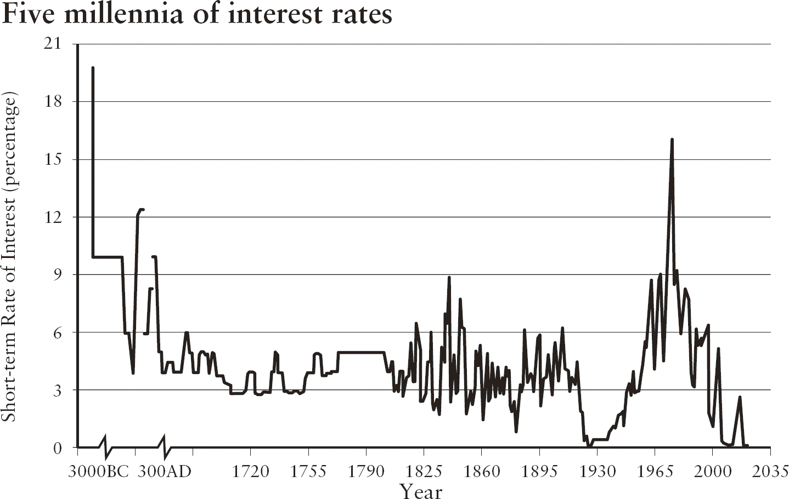

[1.](#section-9)

<!-- rl-section id="sec-list_of_figures" class="titlepage" -->

[1.](#section-9)

<!-- rl-section id="section-11" class="epub-section" kicker="Section 11" title="Introduction" -->

## Introduction

### *The Anarchist and the Capitalist*

In 1849, a debate took place in the pages of *La Voix du peuple*, a socialist publication, between two members of the French National Assembly. On one side stood Pierre-Joseph Proudhon, the self-proclaimed anarchist, best-known today for his motto ‘property is theft’, and a regular contributor to *La Voix*. On the other side was Frédéric Bastiat, a free-trade advocate and pamphleteer. Bastiat was renowned for his satirical economic parables. He made the case against unproductive state interventions, for instance with his ‘Petition of the Candlemakers’, in which candlemakers request a law requiring people to close their blinds and shutters against the sun, in order that more candles could be sold.

The subject under discussion was the legitimacy of interest. Proudhon took an old-fashioned view. Interest, the anarchist proclaimed, is ‘usury and plunder’. Usury was an unequal exchange levied by those who, because they didn’t deprive themselves of the capital they lent, had no right to demand a greater sum in return. Interest constitutes a ‘reward for idleness, [and was] the basic cause for inequality, but also of poverty’.[1](#section-51) In short, Proudhon continued, adapting his most famous statement, ‘I call interest THEFT.’[2](#section-51)

That was not the end of the critique. Proudhon complained that interest compounds debt over time, so that a loan over time would grow to become larger than an orb of gold the size of the Earth.[3](#section-51) Charging for loans slows the circulation of money, he suggested, causing ‘the stagnation of business, with unemployment in industry, distress in agriculture, and the increasing imminence of universal bankruptcy’.[4](#section-51) Interest fuels class antagonism and restricts consumption by raising the price of products. In a capitalist society, said Proudhon, workers can’t afford to acquire the objects they produce with their own hands. ‘Interest is like a double-edged sword,’ concluded Proudhon, ‘it kills, whichever side it hits you with.’[5](#section-51)

There was nothing original in Proudhon’s invective. His complaints had an ancient pedigree. He cited the Hebrew word for interest, *neschek*, which derives etymologically from the bite of a serpent.[6](#section-51) Proudhon’s rhetoric was high-flown and repetitive, and his economic analysis was not profound. In his *History of Economic Analysis*, Joseph Schumpeter lamented Proudhon’s complete inability to analyse. Even so, Proudhon had some original proposals. He wanted to nationalize the Banque de France, expand the money supply and reduce interest rates close to zero. His People’s Bank would charge half a per cent to cover its costs. Gold would be replaced by paper money. In addition, Proudhon demanded a tax on capital (tantamount to negative interest). The reduction in interest, he envisaged, ‘would instantly produce incalculable results all over the Republic and across Europe’. There would be no more debt, insolvencies and bankruptcies would decline, consumption would increase and labour would be guaranteed employment. Once interest was no longer taken by the parasitic class of lenders, worker incomes would rise.[7](#section-51)

Bastiat was having none of this. Interest wasn’t theft, he maintained, but a fair reward for a mutual exchange of services. The lender provides the use of capital for a period of time, and time has value. Bastiat cites the famous lines from Benjamin Franklin’s *Advice to a Young Tradesman* (1748): ‘Time is precious. Time is money – Time is the stuff of which life is made.’[8](#section-51) It follows that interest is ‘natural, just and legitimate, but also useful and profitable, even to those who pay it’.[9](#section-51) Far from depressing output, capital made labour more productive. Far from stoking class antagonism, Bastiat believed that capital benefited everyone, ‘particularly the long-suffering classes’.[10](#section-51)

Bastiat foresaw disaster if Proudhon’s plans were put into practice. If lending were not rewarded, there would be no lending. To restrict payments on capital would be to abolish capital.[11](#section-51) Savings would disappear. Proudhon’s national bank would lend, but if the bank demanded security for its loans working people, lacking security, would be no better off. The abolition of interest would only benefit the wealthy. ‘In your system,’ Bastiat wrote to Proudhon,

> the rich will indeed borrow gratis, while the poor will not be able to borrow at any price.
>
> When a rich man presents himself at the bank, he will be told: You are solvent, here is the capital, we lend it to you for nothing.
>
> But let a worker dare to show his face. He will be asked: ‘Where are your guarantees, your lands, your houses, your goods?’
>
> ‘I have only my arms and my probity.’ [The worker replies.]
>
> ‘That does not reassure us, we must act with prudence and severity, we cannot lend to you gratis.’[12](#section-51)

The ‘propaganda of free credit is a calamity for the working classes,’ Bastiat concluded. There would be fewer businesses, while the number of workers would remain the same. Wages would decrease. Capital would flee the country. If the bank lent freely, there would be a deluge of paper money. Order would be lost, and the country would exist perpetually on the edge of an abyss. ‘Free credit is a scientific absurdity, involving antagonism to established interests, class hatred, and barbarity.’ With these words Bastiat ended the correspondence.

At least Proudhon and Bastiat agreed on one thing. Proudhon believed the 1848 Revolution’s aims could be realized through monetary reform. With interest at three-quarters of a per cent, he said, three-quarters of the revolution would be achieved.[13](#section-51) ‘Free credit is socialism’s final word, its final slogan, and its final effort,’ Bastiat rejoined. ‘An inexhaustible paper money factory: that is your solution.’ To abolish interest on capital would result in the ‘annihilation of credit’ and the death of capital.

As with many debates about interest, before and since, the Proudhon–Bastiat contretemps was a dialogue of the deaf.[14](#section-51) Neither side heard what the other had to say. The tone of the correspondence became progressively more acerbic. In his last letter, Proudhon pronounced that Bastiat’s intelligence was asleep, signing off with the comment, ‘Monsieur Bastiat, you are a dead man.’[15](#section-51) This was not far from the truth. Bastiat suffered from tuberculosis and died a year later in Rome. He was forty-nine years old.

### WHAT IS SEEN AND WHAT IS NOT SEEN

In the year of Bastiat’s death, a final pamphlet appeared. In ‘What is Seen and What is Not Seen’ Bastiat tells the parable of a merchant, Jacques Bonhomme, whose shop window is broken by his careless son. Neighbours thought that it wasn’t all bad news. At least repairing the window provided employment for the glazier, who could spend the money on food and other sundries. But Jacques Bonhomme now had less money to spend, says Bastiat. Here, Bastiat is urging readers to consider the broad consequences of any economic action, not just its effect on a particular beneficiary:

> In the sphere of economics, a habit, an institution, or a law engenders not just one effect but a series of effects. Of these effects only the first is immediate; it is revealed simultaneously with its cause; *it is seen*. The others merely occur successively; *they are not seen*; we are lucky if we *foresee* them.
>
> The entire difference between a bad and a good Economist is apparent here. A bad one relies on the *visible* effect, while the good one takes account of both the effect one can *see* and of those one must *foresee*.[16](#section-51)

The bad economist, says Bastiat, pursues a small current benefit that is followed by a large disadvantage in the future, while the good economist pursues a large benefit in the future at the risk of suffering a small disadvantage in the near term. The American journalist Henry Hazlitt elaborated on Bastiat’s Parable of the Broken Window in his bestselling book *Economics in One Lesson* (1946). Like Bastiat, Hazlitt lamented the

> persistent tendency of men to see only the immediate effects of any given policy, or its effects on only a special group, and to neglect to inquire what the long-run effects of that policy will be not only on the special group but on all groups. It is the fallacy of overlooking secondary consequences.[17](#section-51)

Hazlitt criticized the ‘new’ economics of his day which, he believed, considered only the short-term effects of policies on special groups and ignored the long-term effects on the whole community.[18](#section-51) He attacked what he called the ‘fetish’ of full employment. Schumpeter’s idea of ‘creative destruction’ must be allowed to operate unhindered, Hazlitt wrote, as it was as important for the health of an economy that dying industries be allowed to die as it was for growing industries to be allowed to grow.[19](#section-51) Hazlitt compared the price system in a competitive economy to the automatic regulator on a steam engine. Any attempt to prevent prices from falling would only keep inefficient producers in business.[20](#section-51)

The supply and demand for capital are equalized by interest rates, Hazlitt maintained. Yet a ‘psychopathic fear of “excessive” interest rates’ induced governments to pursue cheap money policies. Easy money, wrote Hazlitt,

> creates economic distortions … it tends to encourage highly speculative ventures that cannot continue except under the artificial conditions that have given birth to them. On the supply side, the artificial reduction of interest rates discourages normal thrift, saving, and investment. It reduces the accumulation of capital. It slows down that increase in productivity, that ‘economic growth’ that ‘progressives’ profess to be so eager to promote.[21](#section-51)

Hazlitt concluded by citing a well-known 1883 essay by William Graham Sumner. In this essay, Sumner described how A and B hatch a plan to help X, but ignore the impact on C. C is the ‘Forgotten Man’, a person ‘who is never thought of. The victim of the reformer, social speculator and philanthropist.’[22](#section-51)

### PROUDHON’S DREAM IS REALIZED

After the Lehman Brothers bankruptcy in September 2008, neoliberal economists implemented the anarchist Proudhon’s revolutionary scheme. Central bankers pushed interest rates to their lowest level in five millennia. In Europe and Japan, rates turned negative – an unprecedented development. The results were not as Proudhon anticipated, however. Rather, Bastiat’s grim forebodings about free credit appear closer to the truth.

Central bankers congratulated themselves for restoring calm on Wall Street. The bogey of deflation was dismissed. Unemployment came down sharply. These were the ‘seen’ effects of zero interest rates. The secondary consequences of zero interest rates went largely unseen. Yet they were there for anybody who cared to look.

In 2012, the Canadian economist William White published a short paper entitled ‘Ultra Easy Monetary Policy and the Law of Unintended Consequences’.[23](#section-51) White suggested that the sharp decline in interest rates had encouraged households to spend more and save less. The downside of bringing forward consumption from the future, White suggested, was that people must in fact save more for any predetermined goal; and, given the prevailing low interest rates, it would take much longer to accumulate a satisfactory nest egg.

The authorities believed that low rates would boost corporate investment. But White suggested firms were actually investing less. Furthermore, ultra-easy money was responsible for the misallocation of capital. Creative destruction was thwarted. ‘It is possible,’ White concluded, ‘that easy money conditions actually impede, rather than encourage, the reallocation of capital from less to more productive resources.’

By lowering the cost of borrowing, ultra-easy money provided an incentive for investors to take undue risks. At the same time, insurance companies and pension providers were struggling to cope with the low interest-rate regime. Given the low cost of borrowing, governments were unconstrained to run up their national debts. In the last analysis, easy money served only to postpone the day of reckoning. ‘Aggressive monetary easing in economic downturns is not a “free lunch”,’ concluded White, ‘at best, it buys time to rebalance economies. In reality, this opportunity is wasted.’ On Wall Street, they talked about ‘kicking the can’.

White also suggested that monetary policymakers might face trouble exiting from their ultra-low rates. A few years after White’s 2012 paper, the Fed embarked on a tentative tightening cycle but soon abandoned its attempt to take interest rates back to normal levels. Instead, the Fed returned to printing money and cutting rates, and after Covid-19 struck the policy rate went back down to zero. White anticipated that central banks would also be forced to play a greater role in the provision of credit. This too has come to pass. During the pandemic year of 2020, central banks moved closer to directly financing government spending, as White predicted (see Postscript: The World Turned Upside Down).

Bastiat’s claim that free credit would be a disaster for working people was not far off. After the subprime mortgage crisis, banks increased the lending rates charged to less creditworthy individuals and small businesses. Private equity barons and other well-connected figures on Wall Street, on the other hand, were able to borrow for peanuts. During the post-crisis decade, incomes barely grew and low-paying jobs proliferated. The less well-off were forced to borrow at high rates and received negative real returns on their deposits, while wealthy speculators and corporations borrowed cheaply and made out handsomely.

This book is about the role of interest in a modern economy. It was inspired by a Bastiat-like conviction that ultra-low interest rates were contributing to many of our current woes, whether the collapse of productivity growth, unaffordable housing, rising inequality, the loss of market competition or financial fragility. Ultra-low rates also seemed to play some role in the resurgence of populism as Sumner’s Forgotten Man started to lose patience.

[Part Two](#section-19) of this book (How Low Rates Begot Lower Rates) examines the unintended consequences of ultra-low interest rates ([chapters 7](#section-20) to [16](#section-29)). [Part One](#section-12) (Of Historical Interest) sets the scene. We trace the origins of interest to the Ancient Near East ([Chapter 1](#section-13)) and follow its story through the Middle Ages to the birth of capitalism in Europe ([Chapter 2](#section-14)). We describe how interest and capitalism are inseparable. This principle may have been accepted by the date Adam Smith’s *The Wealth of Nations* was published in 1776, but there has always existed a ‘psychopathic’ fear of excessive interest rates.

In seventeenth-century England, the most prominent exponent of lower rates was the wealthy City merchant Sir Josiah Child, who stood to benefit most from a reduction in the cost of borrowing. Child’s arguments were refuted by the great liberal philosopher John Locke ([Chapter 3](#section-15)). Early in the following century, the Scotsman John Law introduced paper money into France and reduced interest rates to 2 per cent. This great monetary experiment ended in disaster ([Chapter 4](#section-16)). Still, Law anticipates the policies of modern central bankers with their ultra-low rates and quantitative easing (asset purchases).

By the nineteenth century, it was clear to some financial observers that speculative manias tended to coincide with periods of low interest rates. As Walter Bagehot, the Victorian era’s most famous financial journalist, liked to say, ‘John Bull can stand many things but he can’t stand two per cent.’ It was Bagehot who elaborated the rule that during financial panics the central bank must lend freely ([Chapter 5](#section-17)), although his stipulation that relief lending should only be provided against high-quality collateral at penal rates is ignored by modern lenders of last resort.

Modern central bankers fret about the twin evils of inflation and deflation. Their goal is to achieve a stable price level. Yet over the past hundred years, several great credit booms – including the credit boom of the 1920s ([Chapter 6](#section-18)), Japan’s bubble economy of the 1980s and the global credit bubble preceding the 2008 Lehman crisis ([Chapter 7](#section-20)) – have occurred at times when inflation was quiescent. On each of these occasions, the lack of inflation encouraged central banks to maintain interest rates below the economy’s growth rate. Each of these credit booms ended in disaster.

In [Part Three](#section-30) (The Game of Marbles) we examine the impact of ultra-low interest rates on emerging markets. The initial effect of reducing rates to zero on the world’s reserve currency, the US dollar, was to drive capital flows into emerging markets. Commodity prices took off. Rising food prices helped to spur the 2011 popular uprising in the Middle East known as the Arab Spring. After the Federal Reserve started to tighten policy a couple of years later, commodity prices collapsed and emerging markets entered the doldrums. Two of the largest of these economies, Brazil and Turkey, suffered severe downturns. In China, low interest rates fuelled an extraordinary credit boom, accompanied by the greatest investment binge in history and an epic real-estate bubble.

### THE COMPLEXITY OF INTEREST

The reader deserves a word of warning. Interest is an extremely complex subject. Over the centuries many theories have been advanced to explain its existence. The nineteenth-century Austrian economist (and three times his country’s finance minister) Eugen von Böhm-Bawerk lists some two dozen different schools of thought in his magisterial work, *Capital and Interest*, ranging from the ‘fructification theory’ to what he called ‘colourless theories’ not worthy of serious consideration.[fn1](#section-58)

For Böhm-Bawerk interest determined the allocation of capital, affecting what he called the length of ‘time in production’. Other writers have emphasized the importance of interest for saving (‘the wages of abstinence’), its role in finance (‘the cost of leverage’) and the valuation of investments (‘the capitalization rate’). The most encompassing view of interest is contained in the notion of interest as the ‘time value of money’ or, simply, as the price of time. Most theories of interest contain a kernel of truth, if not the whole truth. Irving Fisher, the Yale economist and author of *The Theory of Interest*, wisely observed that ‘theories [of interest] which have been presented as antagonistic and mutually annihilatory are in reality harmonious and complementary.’[24](#section-51)

Then there’s the question of whether interest is a ‘real’ phenomenon, linked to tangible capital in the form of buildings and land, or a ‘monetary’ phenomenon. This question presents another problem. Are interest rates determined by ‘real’ economic factors or can they be manipulated? On these questions it’s possible to adopt a catholic position. Real factors are important. But under a system in which money is no longer tied to any actual commodity but is created by central banks (issuing ‘fiat money’) and commercial banks through their lending activities it seems clear that monetary policy has a huge influence on market rates. In recent years, bond yields only turned negative in places where central banks took short-term interest rates below zero.

Whether interest rates are related to economic growth is likewise open to question. The historical record suggests a weak statistical relationship between the pace of economic development and the cost of borrowing. The relationship between demographics and interest is also contested. Conventional wisdom today holds that a decline in population growth explains why interest rates have fallen. Japan’s experience in recent decades is cited in support of this argument. But some economists maintain that Japan is a special case and that interest rates can be expected to climb as the world’s population ages.[25](#section-51)

Mainstream economists, who believe that the level of interest is determined by the supply and demand for savings, refer to what they call the ‘natural rate’ of interest. This idea was championed by John Locke in the seventeenth century. In the 1930s, however, John Maynard Keynes and his followers rejected the concept of a natural rate that balanced the economy at full employment. Since the natural rate cannot be observed directly, this argument is difficult to settle. Yet if the rate of interest is linked to profitability, as most economists have believed since the time of Adam Smith, then interest rates and the pace of economic growth (i.e. the rate of return for the whole economy) must also be connected.[26](#section-51) Thus, the trend level of economic growth can be taken as a reasonable proxy for the natural rate.

Does it even make sense to talk about the rate of interest in the singular when, in reality, there exists a near-infinite variety of different rates? There are short-term rates and long-term rates, policy rates and market rates, risk-free rates and rates on private debt. Large companies issue a vast number of different securities, each of which sports a different yield. Individual countries have their own interest rates, related largely to their inflation and default history. Differences between rates are mostly related to risk, and the relationship between them varies over time. Yet if it’s acceptable to talk about the ‘price level’, composed of the prices of countless goods and services, then the rate of interest is also an acceptable shorthand for discussing the entire spectrum of interest rates.

The most important question addressed in this book is whether a capitalist economy can function properly without market-determined interest. Those, like Proudhon, who argue that interest is fundamentally unjust don’t believe in its necessity. To modern monetary policymakers, interest is viewed primarily as a lever to control the level of consumer prices. From this perspective, there’s no problem in taking interest rates below zero to ward off the evil of deflation. But influencing the level of inflation is just one of several functions of interest, and possibly the least important.

The argument of this book is that interest is required to direct the allocation of capital, and that without interest it becomes impossible to value investments. As a ‘reward for abstinence’ interest incentivizes saving. Interest is also the cost of leverage and the price of risk. When it comes to regulating financial markets, the existence of interest discourages bankers and investors from taking excessive risks. On the foreign exchanges, interest rates equilibrate the flow of capital between nations. Interest also influences the distribution of income and wealth. As Bastiat understood, a very low rate of interest may benefit the rich, who have access to credit, more than the poor.

In his debate with Proudhon, Bastiat pointed out that time had value. The leading writers on the subject, Böhm-Bawerk and Fisher, believed that interest was intrinsic to human nature: humans are naturally impatient creatures and the rate of interest expresses their time preference.[fn2](#section-58) Fisher’s contemporary, the Swedish economist Gustav Cassel, author of a fine introduction to the subject, likewise insisted on the ‘absolute and unconditional necessity of interest’.[27](#section-51) Before the reader’s patience wears thin, it is time to start our story.

<!-- rl-section id="sec-introduction_001" class="titlepage" title="Introduction" -->

### *The Anarchist and the Capitalist*

In 1849, a debate took place in the pages of *La Voix du peuple*, a socialist publication, between two members of the French National Assembly. On one side stood Pierre-Joseph Proudhon, the self-proclaimed anarchist, best-known today for his motto ‘property is theft’, and a regular contributor to *La Voix*. On the other side was Frédéric Bastiat, a free-trade advocate and pamphleteer. Bastiat was renowned for his satirical economic parables. He made the case against unproductive state interventions, for instance with his ‘Petition of the Candlemakers’, in which candlemakers request a law requiring people to close their blinds and shutters against the sun, in order that more candles could be sold.

The subject under discussion was the legitimacy of interest. Proudhon took an old-fashioned view. Interest, the anarchist proclaimed, is ‘usury and plunder’. Usury was an unequal exchange levied by those who, because they didn’t deprive themselves of the capital they lent, had no right to demand a greater sum in return. Interest constitutes a ‘reward for idleness, [and was] the basic cause for inequality, but also of poverty’.[1](#section-51) In short, Proudhon continued, adapting his most famous statement, ‘I call interest THEFT.’[2](#section-51)

That was not the end of the critique. Proudhon complained that interest compounds debt over time, so that a loan over time would grow to become larger than an orb of gold the size of the Earth.[3](#section-51) Charging for loans slows the circulation of money, he suggested, causing ‘the stagnation of business, with unemployment in industry, distress in agriculture, and the increasing imminence of universal bankruptcy’.[4](#section-51) Interest fuels class antagonism and restricts consumption by raising the price of products. In a capitalist society, said Proudhon, workers can’t afford to acquire the objects they produce with their own hands. ‘Interest is like a double-edged sword,’ concluded Proudhon, ‘it kills, whichever side it hits you with.’[5](#section-51)

There was nothing original in Proudhon’s invective. His complaints had an ancient pedigree. He cited the Hebrew word for interest, *neschek*, which derives etymologically from the bite of a serpent.[6](#section-51) Proudhon’s rhetoric was high-flown and repetitive, and his economic analysis was not profound. In his *History of Economic Analysis*, Joseph Schumpeter lamented Proudhon’s complete inability to analyse. Even so, Proudhon had some original proposals. He wanted to nationalize the Banque de France, expand the money supply and reduce interest rates close to zero. His People’s Bank would charge half a per cent to cover its costs. Gold would be replaced by paper money. In addition, Proudhon demanded a tax on capital (tantamount to negative interest). The reduction in interest, he envisaged, ‘would instantly produce incalculable results all over the Republic and across Europe’. There would be no more debt, insolvencies and bankruptcies would decline, consumption would increase and labour would be guaranteed employment. Once interest was no longer taken by the parasitic class of lenders, worker incomes would rise.[7](#section-51)

Bastiat was having none of this. Interest wasn’t theft, he maintained, but a fair reward for a mutual exchange of services. The lender provides the use of capital for a period of time, and time has value. Bastiat cites the famous lines from Benjamin Franklin’s *Advice to a Young Tradesman* (1748): ‘Time is precious. Time is money – Time is the stuff of which life is made.’[8](#section-51) It follows that interest is ‘natural, just and legitimate, but also useful and profitable, even to those who pay it’.[9](#section-51) Far from depressing output, capital made labour more productive. Far from stoking class antagonism, Bastiat believed that capital benefited everyone, ‘particularly the long-suffering classes’.[10](#section-51)

Bastiat foresaw disaster if Proudhon’s plans were put into practice. If lending were not rewarded, there would be no lending. To restrict payments on capital would be to abolish capital.[11](#section-51) Savings would disappear. Proudhon’s national bank would lend, but if the bank demanded security for its loans working people, lacking security, would be no better off. The abolition of interest would only benefit the wealthy. ‘In your system,’ Bastiat wrote to Proudhon,

> the rich will indeed borrow gratis, while the poor will not be able to borrow at any price.
>
> When a rich man presents himself at the bank, he will be told: You are solvent, here is the capital, we lend it to you for nothing.
>
> But let a worker dare to show his face. He will be asked: ‘Where are your guarantees, your lands, your houses, your goods?’
>
> ‘I have only my arms and my probity.’ [The worker replies.]
>
> ‘That does not reassure us, we must act with prudence and severity, we cannot lend to you gratis.’[12](#section-51)

The ‘propaganda of free credit is a calamity for the working classes,’ Bastiat concluded. There would be fewer businesses, while the number of workers would remain the same. Wages would decrease. Capital would flee the country. If the bank lent freely, there would be a deluge of paper money. Order would be lost, and the country would exist perpetually on the edge of an abyss. ‘Free credit is a scientific absurdity, involving antagonism to established interests, class hatred, and barbarity.’ With these words Bastiat ended the correspondence.

At least Proudhon and Bastiat agreed on one thing. Proudhon believed the 1848 Revolution’s aims could be realized through monetary reform. With interest at three-quarters of a per cent, he said, three-quarters of the revolution would be achieved.[13](#section-51) ‘Free credit is socialism’s final word, its final slogan, and its final effort,’ Bastiat rejoined. ‘An inexhaustible paper money factory: that is your solution.’ To abolish interest on capital would result in the ‘annihilation of credit’ and the death of capital.

As with many debates about interest, before and since, the Proudhon–Bastiat contretemps was a dialogue of the deaf.[14](#section-51) Neither side heard what the other had to say. The tone of the correspondence became progressively more acerbic. In his last letter, Proudhon pronounced that Bastiat’s intelligence was asleep, signing off with the comment, ‘Monsieur Bastiat, you are a dead man.’[15](#section-51) This was not far from the truth. Bastiat suffered from tuberculosis and died a year later in Rome. He was forty-nine years old.

### WHAT IS SEEN AND WHAT IS NOT SEEN

In the year of Bastiat’s death, a final pamphlet appeared. In ‘What is Seen and What is Not Seen’ Bastiat tells the parable of a merchant, Jacques Bonhomme, whose shop window is broken by his careless son. Neighbours thought that it wasn’t all bad news. At least repairing the window provided employment for the glazier, who could spend the money on food and other sundries. But Jacques Bonhomme now had less money to spend, says Bastiat. Here, Bastiat is urging readers to consider the broad consequences of any economic action, not just its effect on a particular beneficiary:

> In the sphere of economics, a habit, an institution, or a law engenders not just one effect but a series of effects. Of these effects only the first is immediate; it is revealed simultaneously with its cause; *it is seen*. The others merely occur successively; *they are not seen*; we are lucky if we *foresee* them.
>
> The entire difference between a bad and a good Economist is apparent here. A bad one relies on the *visible* effect, while the good one takes account of both the effect one can *see* and of those one must *foresee*.[16](#section-51)

The bad economist, says Bastiat, pursues a small current benefit that is followed by a large disadvantage in the future, while the good economist pursues a large benefit in the future at the risk of suffering a small disadvantage in the near term. The American journalist Henry Hazlitt elaborated on Bastiat’s Parable of the Broken Window in his bestselling book *Economics in One Lesson* (1946). Like Bastiat, Hazlitt lamented the

> persistent tendency of men to see only the immediate effects of any given policy, or its effects on only a special group, and to neglect to inquire what the long-run effects of that policy will be not only on the special group but on all groups. It is the fallacy of overlooking secondary consequences.[17](#section-51)

Hazlitt criticized the ‘new’ economics of his day which, he believed, considered only the short-term effects of policies on special groups and ignored the long-term effects on the whole community.[18](#section-51) He attacked what he called the ‘fetish’ of full employment. Schumpeter’s idea of ‘creative destruction’ must be allowed to operate unhindered, Hazlitt wrote, as it was as important for the health of an economy that dying industries be allowed to die as it was for growing industries to be allowed to grow.[19](#section-51) Hazlitt compared the price system in a competitive economy to the automatic regulator on a steam engine. Any attempt to prevent prices from falling would only keep inefficient producers in business.[20](#section-51)

The supply and demand for capital are equalized by interest rates, Hazlitt maintained. Yet a ‘psychopathic fear of “excessive” interest rates’ induced governments to pursue cheap money policies. Easy money, wrote Hazlitt,

> creates economic distortions … it tends to encourage highly speculative ventures that cannot continue except under the artificial conditions that have given birth to them. On the supply side, the artificial reduction of interest rates discourages normal thrift, saving, and investment. It reduces the accumulation of capital. It slows down that increase in productivity, that ‘economic growth’ that ‘progressives’ profess to be so eager to promote.[21](#section-51)

Hazlitt concluded by citing a well-known 1883 essay by William Graham Sumner. In this essay, Sumner described how A and B hatch a plan to help X, but ignore the impact on C. C is the ‘Forgotten Man’, a person ‘who is never thought of. The victim of the reformer, social speculator and philanthropist.’[22](#section-51)

### PROUDHON’S DREAM IS REALIZED

After the Lehman Brothers bankruptcy in September 2008, neoliberal economists implemented the anarchist Proudhon’s revolutionary scheme. Central bankers pushed interest rates to their lowest level in five millennia. In Europe and Japan, rates turned negative – an unprecedented development. The results were not as Proudhon anticipated, however. Rather, Bastiat’s grim forebodings about free credit appear closer to the truth.

Central bankers congratulated themselves for restoring calm on Wall Street. The bogey of deflation was dismissed. Unemployment came down sharply. These were the ‘seen’ effects of zero interest rates. The secondary consequences of zero interest rates went largely unseen. Yet they were there for anybody who cared to look.

In 2012, the Canadian economist William White published a short paper entitled ‘Ultra Easy Monetary Policy and the Law of Unintended Consequences’.[23](#section-51) White suggested that the sharp decline in interest rates had encouraged households to spend more and save less. The downside of bringing forward consumption from the future, White suggested, was that people must in fact save more for any predetermined goal; and, given the prevailing low interest rates, it would take much longer to accumulate a satisfactory nest egg.

The authorities believed that low rates would boost corporate investment. But White suggested firms were actually investing less. Furthermore, ultra-easy money was responsible for the misallocation of capital. Creative destruction was thwarted. ‘It is possible,’ White concluded, ‘that easy money conditions actually impede, rather than encourage, the reallocation of capital from less to more productive resources.’

By lowering the cost of borrowing, ultra-easy money provided an incentive for investors to take undue risks. At the same time, insurance companies and pension providers were struggling to cope with the low interest-rate regime. Given the low cost of borrowing, governments were unconstrained to run up their national debts. In the last analysis, easy money served only to postpone the day of reckoning. ‘Aggressive monetary easing in economic downturns is not a “free lunch”,’ concluded White, ‘at best, it buys time to rebalance economies. In reality, this opportunity is wasted.’ On Wall Street, they talked about ‘kicking the can’.

White also suggested that monetary policymakers might face trouble exiting from their ultra-low rates. A few years after White’s 2012 paper, the Fed embarked on a tentative tightening cycle but soon abandoned its attempt to take interest rates back to normal levels. Instead, the Fed returned to printing money and cutting rates, and after Covid-19 struck the policy rate went back down to zero. White anticipated that central banks would also be forced to play a greater role in the provision of credit. This too has come to pass. During the pandemic year of 2020, central banks moved closer to directly financing government spending, as White predicted (see Postscript: The World Turned Upside Down).

Bastiat’s claim that free credit would be a disaster for working people was not far off. After the subprime mortgage crisis, banks increased the lending rates charged to less creditworthy individuals and small businesses. Private equity barons and other well-connected figures on Wall Street, on the other hand, were able to borrow for peanuts. During the post-crisis decade, incomes barely grew and low-paying jobs proliferated. The less well-off were forced to borrow at high rates and received negative real returns on their deposits, while wealthy speculators and corporations borrowed cheaply and made out handsomely.

This book is about the role of interest in a modern economy. It was inspired by a Bastiat-like conviction that ultra-low interest rates were contributing to many of our current woes, whether the collapse of productivity growth, unaffordable housing, rising inequality, the loss of market competition or financial fragility. Ultra-low rates also seemed to play some role in the resurgence of populism as Sumner’s Forgotten Man started to lose patience.

[Part Two](#section-19) of this book (How Low Rates Begot Lower Rates) examines the unintended consequences of ultra-low interest rates ([chapters 7](#section-20) to [16](#section-29)). [Part One](#section-12) (Of Historical Interest) sets the scene. We trace the origins of interest to the Ancient Near East ([Chapter 1](#section-13)) and follow its story through the Middle Ages to the birth of capitalism in Europe ([Chapter 2](#section-14)). We describe how interest and capitalism are inseparable. This principle may have been accepted by the date Adam Smith’s *The Wealth of Nations* was published in 1776, but there has always existed a ‘psychopathic’ fear of excessive interest rates.

In seventeenth-century England, the most prominent exponent of lower rates was the wealthy City merchant Sir Josiah Child, who stood to benefit most from a reduction in the cost of borrowing. Child’s arguments were refuted by the great liberal philosopher John Locke ([Chapter 3](#section-15)). Early in the following century, the Scotsman John Law introduced paper money into France and reduced interest rates to 2 per cent. This great monetary experiment ended in disaster ([Chapter 4](#section-16)). Still, Law anticipates the policies of modern central bankers with their ultra-low rates and quantitative easing (asset purchases).

By the nineteenth century, it was clear to some financial observers that speculative manias tended to coincide with periods of low interest rates. As Walter Bagehot, the Victorian era’s most famous financial journalist, liked to say, ‘John Bull can stand many things but he can’t stand two per cent.’ It was Bagehot who elaborated the rule that during financial panics the central bank must lend freely ([Chapter 5](#section-17)), although his stipulation that relief lending should only be provided against high-quality collateral at penal rates is ignored by modern lenders of last resort.

Modern central bankers fret about the twin evils of inflation and deflation. Their goal is to achieve a stable price level. Yet over the past hundred years, several great credit booms – including the credit boom of the 1920s ([Chapter 6](#section-18)), Japan’s bubble economy of the 1980s and the global credit bubble preceding the 2008 Lehman crisis ([Chapter 7](#section-20)) – have occurred at times when inflation was quiescent. On each of these occasions, the lack of inflation encouraged central banks to maintain interest rates below the economy’s growth rate. Each of these credit booms ended in disaster.

In [Part Three](#section-30) (The Game of Marbles) we examine the impact of ultra-low interest rates on emerging markets. The initial effect of reducing rates to zero on the world’s reserve currency, the US dollar, was to drive capital flows into emerging markets. Commodity prices took off. Rising food prices helped to spur the 2011 popular uprising in the Middle East known as the Arab Spring. After the Federal Reserve started to tighten policy a couple of years later, commodity prices collapsed and emerging markets entered the doldrums. Two of the largest of these economies, Brazil and Turkey, suffered severe downturns. In China, low interest rates fuelled an extraordinary credit boom, accompanied by the greatest investment binge in history and an epic real-estate bubble.

### THE COMPLEXITY OF INTEREST

The reader deserves a word of warning. Interest is an extremely complex subject. Over the centuries many theories have been advanced to explain its existence. The nineteenth-century Austrian economist (and three times his country’s finance minister) Eugen von Böhm-Bawerk lists some two dozen different schools of thought in his magisterial work, *Capital and Interest*, ranging from the ‘fructification theory’ to what he called ‘colourless theories’ not worthy of serious consideration.[fn1](#section-58)

For Böhm-Bawerk interest determined the allocation of capital, affecting what he called the length of ‘time in production’. Other writers have emphasized the importance of interest for saving (‘the wages of abstinence’), its role in finance (‘the cost of leverage’) and the valuation of investments (‘the capitalization rate’). The most encompassing view of interest is contained in the notion of interest as the ‘time value of money’ or, simply, as the price of time. Most theories of interest contain a kernel of truth, if not the whole truth. Irving Fisher, the Yale economist and author of *The Theory of Interest*, wisely observed that ‘theories [of interest] which have been presented as antagonistic and mutually annihilatory are in reality harmonious and complementary.’[24](#section-51)

Then there’s the question of whether interest is a ‘real’ phenomenon, linked to tangible capital in the form of buildings and land, or a ‘monetary’ phenomenon. This question presents another problem. Are interest rates determined by ‘real’ economic factors or can they be manipulated? On these questions it’s possible to adopt a catholic position. Real factors are important. But under a system in which money is no longer tied to any actual commodity but is created by central banks (issuing ‘fiat money’) and commercial banks through their lending activities it seems clear that monetary policy has a huge influence on market rates. In recent years, bond yields only turned negative in places where central banks took short-term interest rates below zero.

Whether interest rates are related to economic growth is likewise open to question. The historical record suggests a weak statistical relationship between the pace of economic development and the cost of borrowing. The relationship between demographics and interest is also contested. Conventional wisdom today holds that a decline in population growth explains why interest rates have fallen. Japan’s experience in recent decades is cited in support of this argument. But some economists maintain that Japan is a special case and that interest rates can be expected to climb as the world’s population ages.[25](#section-51)

Mainstream economists, who believe that the level of interest is determined by the supply and demand for savings, refer to what they call the ‘natural rate’ of interest. This idea was championed by John Locke in the seventeenth century. In the 1930s, however, John Maynard Keynes and his followers rejected the concept of a natural rate that balanced the economy at full employment. Since the natural rate cannot be observed directly, this argument is difficult to settle. Yet if the rate of interest is linked to profitability, as most economists have believed since the time of Adam Smith, then interest rates and the pace of economic growth (i.e. the rate of return for the whole economy) must also be connected.[26](#section-51) Thus, the trend level of economic growth can be taken as a reasonable proxy for the natural rate.

Does it even make sense to talk about the rate of interest in the singular when, in reality, there exists a near-infinite variety of different rates? There are short-term rates and long-term rates, policy rates and market rates, risk-free rates and rates on private debt. Large companies issue a vast number of different securities, each of which sports a different yield. Individual countries have their own interest rates, related largely to their inflation and default history. Differences between rates are mostly related to risk, and the relationship between them varies over time. Yet if it’s acceptable to talk about the ‘price level’, composed of the prices of countless goods and services, then the rate of interest is also an acceptable shorthand for discussing the entire spectrum of interest rates.

The most important question addressed in this book is whether a capitalist economy can function properly without market-determined interest. Those, like Proudhon, who argue that interest is fundamentally unjust don’t believe in its necessity. To modern monetary policymakers, interest is viewed primarily as a lever to control the level of consumer prices. From this perspective, there’s no problem in taking interest rates below zero to ward off the evil of deflation. But influencing the level of inflation is just one of several functions of interest, and possibly the least important.

The argument of this book is that interest is required to direct the allocation of capital, and that without interest it becomes impossible to value investments. As a ‘reward for abstinence’ interest incentivizes saving. Interest is also the cost of leverage and the price of risk. When it comes to regulating financial markets, the existence of interest discourages bankers and investors from taking excessive risks. On the foreign exchanges, interest rates equilibrate the flow of capital between nations. Interest also influences the distribution of income and wealth. As Bastiat understood, a very low rate of interest may benefit the rich, who have access to credit, more than the poor.

In his debate with Proudhon, Bastiat pointed out that time had value. The leading writers on the subject, Böhm-Bawerk and Fisher, believed that interest was intrinsic to human nature: humans are naturally impatient creatures and the rate of interest expresses their time preference.[fn2](#section-58) Fisher’s contemporary, the Swedish economist Gustav Cassel, author of a fine introduction to the subject, likewise insisted on the ‘absolute and unconditional necessity of interest’.[27](#section-51) Before the reader’s patience wears thin, it is time to start our story.

<!-- rl-section id="section-12" class="epub-section" kicker="Section 12" title="Part One" -->

## Part One

---

### OF HISTORICAL INTEREST

<!-- rl-section id="sec-part001" class="titlepage" title="Part One" -->

## Part One

---

### OF HISTORICAL INTEREST

<!-- rl-section id="section-13" class="epub-section" kicker="Section 13" title="1" -->

## 1

## Babylonian Birth

> *If wealth is placed where it bears interest it comes back to you redoubled.*
>
> Egyptian scribe, named Any, early first millennium BC
>
> *There was probably no other person in the whole country who had meditated so much on the question of interest. Margayya’s mind was full of it. Night and day he sat and brooded over it. The more he thought of it the more it seemed to him the greatest wonder of creation. It combined in it the mystery of birth and multiplication. Otherwise how could you account for the fact that a hundred rupees in a savings bank became one hundred and twenty in the course of time? It was something like the ripening of corn. Every rupee, Margayya felt, contained in it the seed of another rupee and the seed in it another seed and so on and on to infinity. It was something like a firmament, endless stars and within each star an endless firmament and within each one further endless … It bordered on mystic perception. It gave him the feeling of being part of an infinite existence.*
>
> R. K. Narayan, *The Financial Expert*, 1952

In the beginning was the loan and the loan carried interest. Well, this may have been the case. We don’t know for sure, but it’s now widely believed that the earliest transactions were for credit rather than barter. We do know that the Mesopotamians charged interest on loans before they discovered how to put wheels on carts. Interest is much older than coined money, which only originated in the eighth century BC. Some suggest that interest may have originated with the payment of blood money, known as *Wergild*, as compensation for murder and other injuries, with ‘interest’ as a penalty payment over and above the value of the injury.[1](#section-51) On the other hand, the French anthropologist Marcel Mauss in *The Gift* (first published in 1925) maintains that interest began with the practice of reciprocating gifts among tribal people.[fn1](#section-58)

Prehistoric peoples probably charged interest on loans of corn and livestock. The association between interest and the fruit of a loan is embedded in ancient languages. Across the ancient world the etymologies of interest derive from the offspring of livestock. The Sumerian word for interest, *mas*, signifies a kid goat (or lamb).[2](#section-51) The ancient Egyptian equivalent *ms* means to give birth.[3](#section-51) In ancient Greek interest is *tokos*, a calf. Among the several Hebrew words for interest are *marbit* and *tarbit*, meaning to increase and multiply. The Latin for interest, *foenus*, connotes fertility, and for money, *pecunia*, is derived from *pecus*, a flock. Our word capital comes from *caput*, a head of cattle. These derivations, claim Sydney Homer and Richard Sylla, imply that interest originated with

> loans of seeds and of animals. These were loans for productive purposes. The seeds yielded an increase. At harvest time the seed could conveniently be returned with interest. Some part or all of the animal’s progeny could be returned with the animal. We shall never know but we can surmise that the concept of interest in its modern sense arose from just such productive loans.[4](#section-51)

The charging of interest for the loan of farm animals continued into modern times. In newly settled parts of the United States in the early nineteenth century, cows and sheep were commonly sold on trust, ‘the terms being that double the number thus transferred, is to be returned in four or five years.’[5](#section-51) A connection between nature’s productivity and interest was suggested by nineteenth-century German economist Karl Arnd, who claimed that the interest rate was regulated by ‘the proportion, in which the timber in European forests is augmented through their annual growth … at the rate of 3 or 4 to 100. As a result interest in these countries cannot fall below that rate.’[fn2](#section-58) In similar vein, Irving Fisher writes that

> Nature is, to a great extent, reproductive. Growing crops and animals often make it possible to endow the future more richly than the present. Man can obtain from the forest or the farm more by waiting than by premature cutting of trees or by exhausting the soil. In other words, Nature’s productivity has a strong tendency to keep up the rate of interest.[6](#section-51)

Over the ages the linguistic connection between a loan and its natural fecundity became more abstract. The word usury derives from the Latin *usuarius*, meaning ‘one who has the use but not ownership of a thing’.[7](#section-51) In the seventeenth century, a loan was still commonly referred to as the ‘use’ of money.

### BABYLONIAN MASH

Our understanding of early finance arises above the level of speculation thanks to the Mesopotamians, who recorded their loans on clay tablets. As with contemporary loan documents, these tablets record the names of creditor and debtor, the loan amount, the date of the loan and when repayment is due, and, in most cases, the amount of interest to be charged. Various types of collateral were demanded as surety for the loan and might take the form of houses, land and slaves. In one case, the lender takes as collateral the wife of the borrower to live in his house – an early example of debt bondage.

Credit transactions were commonplace in the Ancient Near East during the third and second millennia BC. Interest was generally paid in the same commodity as the loan, commonly silver or barley. It might also be paid in kind, with another commodity (dates, firewood, etc.) or labour services.[8](#section-51) Each tablet was marked with a seal and witnessed. Many loans were defaulted on, and disputes between debtors and creditors often ended up in court. In fact, since debt tablets were destroyed when loans were repaid, the archaeological record is of unpaid debts – of which there seem to have been a great number.

A loan document dated from the twenty-fourth century BC shows that a variety of characters each owed debts of 720 litres of barley, including Lugid ‘the man of the levy’; Igizi, the blacksmith; U’u, the doorman from KA.KA.; Eki, the priest; Kikuli, the shepherd; and a number of others.[9](#section-51) Given that the monthly ration of barley distributed to men by the temples was 60 litres (women received 30 litres), these loans amounted to a year’s supply of food, a not inconsiderable amount. One of the debtors, Gugish, ‘the overseer of servants’, owed the massive sum of 9,360 litres of barley, equivalent to thirteen years of rations. The provider of these loans is listed as Amarezem of Urnu, who was either an employee of the palace, providing the credit on behalf of that institution, or a private individual.[10](#section-51) Interest is not mentioned in this instance, but it was probably charged at the rate of 33.33 per cent, the standard rate for barley loans in most tablets.

We don’t know why these people needed to borrow. If there had been a harvest failure, the barley would have been needed to avoid starvation; historians concur that barley loans generally served consumption purposes. Alternatively, the barley could have been used for seed crop. In fact, Mesopotamian credit served a huge variety of purposes. Many commodities – including barley, reeds, wooden beams and bulbs – and livestock were sold on credit.[11](#section-51) There were loans for the purchase of real estate and slaves, and for business ventures as well as consumption.

The region lacked many raw materials and had to import cedar wood, marble, copper and gypsum, for which it paid with exports of textiles, sesame oil, corn and dates.[12](#section-51) Several domestic crafts, such as potting, reedwork, weaving and jewellery making, depended on the international trade.[13](#section-51) Foreign trade was often financed with credit. From the late third millennium, there is a record of silver lent to a trading partnership. More interest was charged for mercantile loans, but the loan principal did not have to be repaid in the event of business failure; this type of credit resembles the bottomry loans (i.e. loans on the ship’s keel or ‘bottom’) that were common in Ancient Greece and in the Middle Ages.

The calculation of interest requires standardized measurements of time and value. The Sumerian calendar contained thirty days in the month and twelve months in the year.[fn3](#section-58) Time, distance and weight, and also money and interest were measured in fractions of sixty – a number that lent itself to simple calculation being the lowest number divisible by the first six integers.[14](#section-51) Working out how much interest was due could still be a complex business. Pupils were taught how to calculate the rate of interest on a loan in which both principal and interest were combined.[15](#section-51) One test required the student in Old-Babylonian times to answer the following question: ‘Give 1 *gur* at interest; in how many years are capital and interest equal?’[fn4](#section-58) ‘Awkward calculation,’ we are told, ‘is one of the characteristics of Babylonian mathematics.’[16](#section-51)

The lender could contract to receive an interest payment in the form of labour services, performed either by the borrower, another family member or a slave – a practice known as anticretic interest. When interest was paid by taking possession of the collateral, such as land, it was equivalent to rent or a modern capital lease. In fact, the Babylonians used the same word, *mas*, for interest and for rent. This ancient connection between interest and rent is still reflected in the modern German for interest, *Zins*, which derives from census or rent. The French expression for a public loan, *rentes*, originated with the French monarch borrowing against the rents of the Hôtel de Ville in Paris. From this derives the *rentier*, a person who lives off interest.

Some Babylonian debts were transferable and heritable. ‘In Assyria in the fourteenth century [BC], deed-tablets were bought and sold in the market,’ writes historian Morris Silver.[17](#section-51) Loans were made for varying lengths of time. Often repayment was due after harvest. Some were call loans, payable on demand. An example from the city of Sippar in the early second millennium states that the loan was to be repaid ‘as soon as he [the creditor] will ask for this’.[18](#section-51) There is an example, also from the early second millennium, of a merchant calling in a promissory note from another merchant in order to repay a debt.[19](#section-51)

By the second millennium we observe what appears to be a credit network. The name of Balmunamhe, a merchant of Larsa, is recorded in several documents, along with fellow merchants Puqum, Nur-Kubi, Warad-Sibi and Gimillum – the last mentioned being a witness to a house purchase made by Balmunamhe in the eleventh year of the reign of Warad-Sin (1770–1758 BC).[20](#section-51) Many of these merchant-bankers lived in the same city district of Larsa. Balmunamhe was a significant figure who lent out money and barley at interest and dealt in slaves, whom he both rented out and received as collateral on loans. He also hired out ships. This great merchant traded property and, at length, acquired a large landed estate whose village was named after him. In these activities, Balmunamhe was a typical Old-Babylonian *tankarum*, or merchant, although he operated on a larger scale than most.

There were many female creditors and borrowers.[21](#section-51) A woman of Ur is recorded as lending barley and silver to three partners for them to hire boats and crew for a sea voyage.[22](#section-51) In thirteenth century Assur, a businesswoman paid for an order of bricks with letters of credit, promising to supply wool in exchange.[23](#section-51) Another loan provided barley for ‘female mill workers’.[24](#section-51) In Sippar, the priestesses of the sun god Samas conducted extensive credit operations: they lent out silver and slaves, financed merchants’ journeys and witnessed loan contracts.[25](#section-51) These priestesses, known as *nadita*, appear to have driven male merchants from the lending business, and in the process they acquired great fortunes along with fine houses, gardens and fields, which they leased out.[26](#section-51)

It has been said that ‘finance was born in the shades of sanctity’.[27](#section-51) Temples were the main providers of loans in the Ancient Near East initially. Palaces also supplied credit. These institutional creditors used the interest on loans to redistribute resources, handing out food rations to widows and orphans and others. Over time, the job of collecting taxes and making loans came to be handled by middlemen. Some of these merchants became very wealthy. In the Neo-Babylonian period of the first millennium BC, the Egibi family provided an array of merchant-banking services: accepting deposits, providing loans, settling client debts and speculating in commodities. The Egibis, who acquired large estates and were rewarded with senior official positions, were the Rothschilds of the Ancient Near East.[28](#section-51)

### THE EIGHTH WONDER OF THE WORLD

The Mesopotamians invented what Einstein supposedly called the eighth wonder of the world, namely compound interest.[fn5](#section-58) A clay cone covered with cuneiform inscriptions records a border dispute between Lagash and Umma, two neighbouring city states in Southern Mesopotamia. This document was issued in the name of Enmetena, a ruler of Lagash before 2400 BC. It states that, some four decades earlier, Umma had occupied some agricultural land belonging to Lagash, agreeing at the time to make annual payments to Lagash of 300 *gurus* (litres) of barley for the land. But Umma had failed to meet its obligations. Enmetena took back the disputed territory and demanded a back payment for the unpaid grain. This debt, claimed Enmetena, accrued compound interest at the rate of 33.33 per cent a year and now totalled 4.5 trillion litres of barley *–* an impossibly large sum.[fn6](#section-58) Failure to pay resulted in war between the two cities.[29](#section-51)

The Enmetena document points to an early and enduring problem with interest, namely that when a debt compounds with interest it is liable to become unpayable. The Sumerians had a phrase for compound interest, *mash mash*, which implies livestock replicating itself, so the debt multiplies ad infinitum.[30](#section-51) The problem of debt compounding at a geometrical rate has never lost its fascination. As the English philosopher Richard Price calculated in the late eighteenth century: ‘A penny … put out to 5 per cent. compound interest at our Saviour’s birth, would, by this time, (that is, in 1773 years) have increased to more money than would be contained in 150 millions of globes, each equal to the earth in magnitude, and all solid gold.’ Karl Marx cited Price’s calculations approvingly (as did Proudhon in his debate with Bastiat).[31](#section-51)

Debt crises, exacerbated no doubt by the horrors of compound interest, were a regular feature of Mesopotamian history. It is perhaps no coincidence that Enmetena of Lagash was also the first ruler in the ancient world to proclaim a debt cancellation. After Lagash’s first debt relief another followed roughly fifty years later. The fiftieth year was also that appointed in the Book of Leviticus for proclaiming debt jubilees or clean slates in Ancient Israel. Afterwards, Babylonian debt write-offs were customarily announced at the start of a new reign.[fn7](#section-58) Debt jubilees subsequently occurred in Ancient Greece and later still in Rome. In 594 BC, the Athenian Solon, known as the ‘Lawgiver’, announced the ‘shaking off of the burdens’. Solon ordered the smashing of mortgage stones (*horoi*) which marked out an indebted property, thereby releasing citizens from debt bondage. He also reduced the rate of interest.[32](#section-51) Aristotle claims that prior to these reforms ‘the poor together with their children were enslaved to the rich.’[33](#section-51)

It is a curious fact that the earliest known set of laws, Hammurabi’s Code, which dates back to around 1750 BC, is largely concerned with the regulation of interest. The Babylonian king codified existing credit practices with the customary interest rates set in stone – quite literally, since the Code survives for posterity engraved in cuneiform script on a basalt stele. The maximum rate of interest for silver loans was set at 20 per cent and for barley at 33.33 per cent. There were penalties for lenders who charged more than the maximum rate of interest, failed to subtract repayments from principal, used fraudulent weights or demanded compound interest. The conditions for keeping persons as collateral for loans were specified. After crop damage caused by flooding or drought, the Code instructs that interest must be forgiven.[34](#section-51)

Drawing up financial regulations is one thing but getting people to follow the spirit of the law is another matter. What we call ‘regulatory arbitrage’ – namely, the attempt by financial practitioners to evade regulation – turns out to be as old as the law itself. The highest chargeable rates may have been capped by Hammurabi, but he didn’t specify over what time period. Lenders could apply the maximum legal rate for a term as short as a month, which made an extremely high annual percentage rate. Like the charges exacted by modern credit-card issuers, one Babylonian loan demanded a late payment penalty at an annualized 260 per cent.[35](#section-51) An Ishchali loan was recorded in an account book with conditions unspecified, which ‘served nicely to hide the charging of interest and the true rate of interest from the king’s market police’.[36](#section-51) Attempts to bypass financial rules elicited still more regulation. For instance, an edict in the seventeenth century BC legislated against attempts to disguise interest-bearing loans as advances for the purchase of merchandise.[37](#section-51)

### THE LEVEL OF INTEREST RATES

How the level of interest rates is determined remains one of the most perplexing problems in the field of economics. Some believe that the interest rate is derived from the returns on real assets – the surplus yielded by farmland, the profitability of an industrial concern and, more generally, by productivity growth across the entire economy. Others attribute it to the rate of population growth and to changes in national income (the annual change in GDP being derived from changes in population and productivity). Some maintain that the rate of interest reflects society’s collective impatience or time preference, while still others claim that interest is influenced primarily by monetary factors.

None of these various interest-rate theories is strongly supported by ancient experience. As we have seen, Babylonian loan rates came in two standard forms (20 per cent for silver and 33.33 per cent for barley), and these rates remained unchanged for centuries – at least from the early Ur III period to the death of Hammurabi (*c*. 2100–1750 BC). The great stability of Babylonian interest rates suggests they cannot have been determined by economic factors alone.[38](#section-51) Interest rates in Ancient Greece also remained stable for hundreds of years. From the fifth to the second centuries BC, the rate of interest demanded on loans made by the Temple of Apollo on Delos was at 10 per cent.[39](#section-51)

Over the centuries, interest rates in the ancient world declined substantially, but their long-term downward trend appears to have been more influenced by changes to the standard of measurement rather than economic factors. Under the Babylonian sexagesimal system, interest on silver loans was charged at the rate of one-sixtieth per month. The Greeks, who introduced a decimal system, charged standard interest at 10 per cent per annum. Under the Roman duodecimal system, interest was usually at one-twelfth of principal, or 8.33 per cent a year.[40](#section-51) Keynes, who studied Babylonian monetary history while researching his *Treatise on Money*, believed that interest rates were determined by custom rather than market forces. As his disciple Joan Robinson put it, interest has a ‘Cheshire cat grin [which] … remains after the circumstances which gave rise to it in the past have completely vanished’.[41](#section-51) Marx held a similar view, writing that ‘customs, juristic tradition, etc., have as much to do with determining the average rate of interest as competition itself.’[42](#section-51)

Based on the evidence of lending from the third to the first millennia BC, Marx’s conclusion seems sensible. Even in the modern world, custom has continued to play a role in setting the level of interest rates. As Homer and Sylla observe:

> up to recently in the United States many types of interest rates fluctuated very sluggishly. A 6 per cent tradition lasted for at least two centuries. Usury limits generally lasted unchanged until the 1960s. The rates on bank loans charged by banks far removed from money market centers and from ‘Big Business’ were relatively stable for long periods.[43](#section-51)

Recent research from the Bank for International Settlements suggests that interest rates over the past hundred years or so have been more influenced by the nature of the various monetary regimes (Gold Standard, Gold Exchange Standard, Bretton Woods and Dollar Standard) than by economic factors such as individual savings and investment decisions.[44](#section-51)

Yet it’s also clear that ancient interest rates were not solely determined by custom and law. Morris Silver maintains that the ancient loan market responded to changes in the supply and demand for credit.[fn8](#section-58) As we have seen, there were many private lenders in Mesopotamia – presumably they needed to be enticed into lending with the offer of a reasonably attractive reward. Loans made in the name of a temple deity were often at a lower rate to those provided by private individuals. This may be an early example of subsidized public lending, or perhaps the temples attracted a better class of debtor – after all, no one wants to default to a god. Higher rates on barley loans possibly reflected the fact that such loans were made at times when corn was scarce and that the loans were to be repaid after the harvest when barley was cheap and abundant.[45](#section-51)

Despite the long-term stability of what one might call the ‘benchmark’ rate of interest in the ancient world there is also evidence that market rates varied across time and place. In the Neo-Babylonian period, rates as low as 5 per cent and as high as 240 per cent have been recorded.[46](#section-51) Higher interest rates contained a risk premium, with loans to trading partnerships, known as *harranu* loans, yielding as much as 40 per cent (but if the ship was lost at sea the principal did not have to be repaid).[47](#section-51) Interest rates in the Assyrian commercial stations of Cappadocia were higher than in Mesopotamia. Great merchants paid lower rates than less creditworthy borrowers,[48](#section-51) while the interest premium on barley loans may have provided insurance against the risk of a royal decree of debt cancellation.[49](#section-51)

It is clear that interest rates were not correlated with economic growth, either in the ancient world or afterwards. In the first millennium of the current era, global economic growth has been estimated at a mere 0.01 per cent per annum. Yet, during this thousand-year period, real interest rates in Europe ranged between 6 and 12 per cent.[50](#section-51) Nor do we observe any connection between the interest rate and demographic change. In fact, population growth and interest rates have often moved in opposite directions.[51](#section-51)

The view that the rate of interest is determined by ‘real’ economic, as opposed to monetary, factors was advanced by the Scottish philosopher David Hume in his influential essay ‘Of Interest’ (1752).[52](#section-51) Yet Hume’s claim that interest rates are unaffected by changes in the money supply is not supported by the ancient history. After Alexander the Great seized and distributed large stocks of Persian gold and silver, prices are said to have risen and interest rates declined.[53](#section-51) Suetonius, in *The Twelve Caesars*, describes how, when the Emperor Augustus brought the treasure belonging to the kings of Egypt back to Rome, money became plentiful and interest rates fell from 6 to 4 per cent.[54](#section-51) After Augustus’ death, the Emperor Tiberius hoarded money, with the result that interest rates rose above the legal limit and a banking crisis erupted in AD 33. Tiberius then decided to lend out the imperial treasure free of interest to patrician families, which brought about an immediate decline in interest rates and an end to the crisis.[55](#section-51) His actions constituted the world’s first experience of quantitative easing.[fn9](#section-58)

In short, the ancient history of interest provides no strong support for any particular view as to how the rate of interest is formed. Law and custom obviously played an important role. Yet occasional changes in the quantity of money in circulation also appear to have influenced interest rates. Market forces were at play, to some extent at least. We see them in the variety of rates on offer and in the risk premiums charged on certain loans.[56](#section-51) As major lenders, temples and palaces had an influence on the supply of credit and its price (interest), just as the modern central bank does today. The great difference is that in ancient times loans consisted of some commodity, such as silver, whereas nowadays a central bank is able to conjure fiat money out of thin air. In the twenty-first century it is much easier for the authorities to manipulate the rate of interest than in ancient times.

Böhm-Bawerk declared that the cultural level of a nation is mirrored by its rate of interest. In the ancient world, interest rates charted the course of great civilizations. In Babylon, Greece and Rome interest rates followed a U-shaped curve over the centuries; declining as each civilization became established and prospered, and rising sharply during periods of decline and fall.[57](#section-51) Very low interest rates appear to have been the calm before the storm. In the early Neo-Babylonian period (700–630 BC) rates on silver loans fell to a low of 8.33 per cent. By early fifth century BC, after Babylonia fell to the Persians, they spiked above 40 per cent.[58](#section-51) In similar fashion, interest rates in eighteenth-century Holland reached a nadir shortly before the Dutch Republic was overrun by Revolutionary France. Given the extraordinarily low interest rates of the early twenty-first century, this is not a comforting thought.

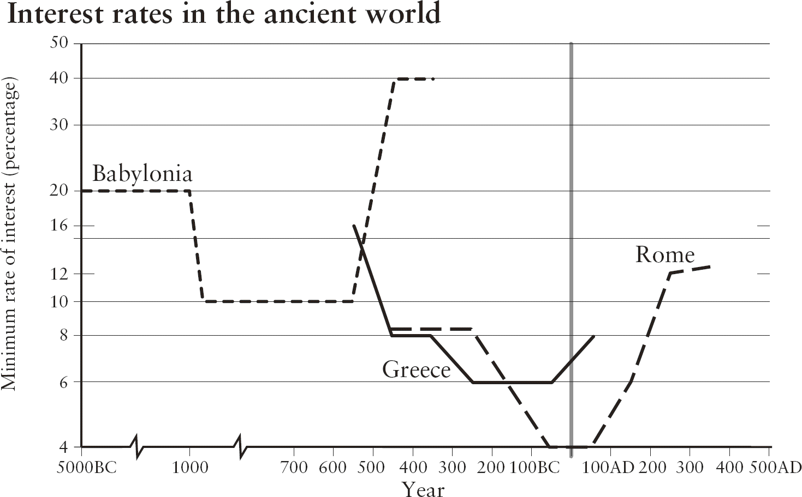

[2.](#section-9) The trend in interest rates in Babylon, Greece and Rome followed a u-shaped pattern: declining as each civilization became established and prospered, but rising sharply during periods of decline and fall.

### THE NECESSITY OF INTEREST

Adam Smith famously claimed that humans have a ‘propensity to truck, barter, and exchange’. It would seem that they have just as strong a propensity to borrow and lend, and in doing so to charge interest. Anthropologists no longer accept that money originated to replace barter, as classical economists, including Smith, had maintained. There is no evidence for this barter-to-money myth. On the contrary, it seems likely that credit antedated money and that the earliest forms of credit bore interest.[59](#section-51)

What’s remarkable is how interest in ancient times had so much in common with its modern manifestation. There are the plethora of different types of interest-bearing loans, from grain loans to alewives to silver loans to merchants. There was a variety of different interest rates reflecting varying risks – the high cost of *harranu* loans for overseas traders containing an insurance premium against the risk of shipwreck. Likewise, there were those fiendishly difficult interest calculations of the type now performed by computers. The appearance of credit networks dominated by powerful financiers is strikingly modern. The same can be said of the periodic debt crises and endless attempts to evade financial regulations. A Wall Street banker sent back to Larsa in the seventeenth century BC would find much that was familiar.

Interest arose from some combination of need and greed. Interest existed at such an early stage of civilization because capital was in short supply. The palaces and temples had important outlays and needed to receive their dues and taxes on time. So they charged interest for late payment, just as the tax authorities do today. By demanding interest on loans, these public institutions were in effect rationing their resources. Barley loans were made to the hungry and to farmers who required seed corn. Lenders, private and public, were able to charge interest because wealth was unevenly distributed, and they possessed a command over resources which others – say, an ambitious alewife – wanted to borrow and were prepared to pay for the privilege.

‘The emergence of interest to incentivize lending is the most significant of all innovations in the history of finance,’ writes the financial historian William Goetzmann.[60](#section-51) This point is well made. Finance allows people to transact across time. The farmer borrows barley to sow his fields but must wait until harvest before repaying the debt. Industrial processes – even the light crafts-based industries of the Ancient Near East – require time in production from raw materials to the sale of finished goods. A text from third-millennium Mesopotamia shows that the preparation of cloth took over a year.[61](#section-51) Foreign trade consumes a lot of time. When capital is tied up in industry or trade, the interest charge bears some connection to the time used in production.

In any society with private property, whether in Mesopotamia or later civilizations, the payment of interest is required to induce people to lend their resources. Without interest, they would inevitably have hoarded their capital. In ancient Babylon, a person with spare funds had a choice between buying and cultivating some land or lending the money to a third party who could use the loan to acquire a farm. It seems obvious that the rate of interest and the productivity of capital, in this case the farm surplus, should bear some relation to each other.

Interest is required to place a value on long-lasting assets, such as housing. Ancient Sumer and its successor civilizations constructed the first large cities. From the third millennium onwards, there was a market for private buildings. Since houses could be bought on credit and rented out, it was natural that mortgages should yield something. It is notable that when the Emperor Augustus flooded Rome with treasure, interest rates fell and house prices rose. Little has changed since then. Two millennia later, property markets remain sensitive to changes in the money supply and interest rates.

As the Englishman Nicholas Barbon wrote in the late seventeenth century: ‘Interest is the Rent of Stock [i.e. capital], and is the same as the Rent of Land: The first, is the Rent of the Wrought or Artificial Stock; the Latter, of the Unwrought, or Natural Stock.’[62](#section-51) The Scottish notation for interest in Barbon’s day was ‘@rents’.[63](#section-51) In the following century, the French economist and statesman Anne-Robert Jacques Turgot elaborated on Barbon’s insight: ‘Every capital in the form of money … is the equivalent of a piece of land producing a revenue equal to a particular fraction of this sum.’[64](#section-51) For Turgot, the world of finance was a mirror held up to the world, with real and financial assets exchangeable for each other. Since land, buildings and factories produce income, so money must yield interest. This important insight is too often overlooked by modern economists.

To twenty-first-century policymakers, the interest rate is simply a lever used to control inflation and tweak economic output. Yet an acquaintance with the Babylonian origins of interest should give pause for thought. Interest has always been with us because resources have always been scarce and must be rationed somehow, because wealth is unequally distributed between creditors and borrowers, and because, as Böhm-Bawerk says, ‘interest is the soul of credit.’ Interest exists because loans are productive, and even when not productive still have value. It exists because those in possession of capital need to be induced to lend, and because lending is a risky business. It exists because production takes place over time and human beings are naturally impatient.

Earlier generations of economists, who considered the problem of interest more deeply than their twenty-first-century counterparts, had no doubt as to its importance. For Böhm-Bawerk, interest was ‘an organic necessity’.[65](#section-51) Irving Fisher called interest ‘too omnipresent a phenomenon to be eradicated’.[66](#section-51) In similar vein, Joseph Schumpeter stated that interest ‘permeates, as it were, the whole economic system’.[67](#section-51) The author of *Das Kapital*, an avowed enemy of interest, agreed with this arch-apologist for capitalism. In a phrase evocative of the ancient world in which a charge for lending was first recorded, Marx writes that ‘usury lives in the pores of production, as it were, just as the gods of Epicurus lived in the space between worlds.’[68](#section-51)

<!-- rl-section id="sec-chapter001" class="titlepage" title="1" -->

## Babylonian Birth

> *If wealth is placed where it bears interest it comes back to you redoubled.*
>
> Egyptian scribe, named Any, early first millennium BC
>
> *There was probably no other person in the whole country who had meditated so much on the question of interest. Margayya’s mind was full of it. Night and day he sat and brooded over it. The more he thought of it the more it seemed to him the greatest wonder of creation. It combined in it the mystery of birth and multiplication. Otherwise how could you account for the fact that a hundred rupees in a savings bank became one hundred and twenty in the course of time? It was something like the ripening of corn. Every rupee, Margayya felt, contained in it the seed of another rupee and the seed in it another seed and so on and on to infinity. It was something like a firmament, endless stars and within each star an endless firmament and within each one further endless … It bordered on mystic perception. It gave him the feeling of being part of an infinite existence.*
>
> R. K. Narayan, *The Financial Expert*, 1952

In the beginning was the loan and the loan carried interest. Well, this may have been the case. We don’t know for sure, but it’s now widely believed that the earliest transactions were for credit rather than barter. We do know that the Mesopotamians charged interest on loans before they discovered how to put wheels on carts. Interest is much older than coined money, which only originated in the eighth century BC. Some suggest that interest may have originated with the payment of blood money, known as *Wergild*, as compensation for murder and other injuries, with ‘interest’ as a penalty payment over and above the value of the injury.[1](#section-51) On the other hand, the French anthropologist Marcel Mauss in *The Gift* (first published in 1925) maintains that interest began with the practice of reciprocating gifts among tribal people.[fn1](#section-58)

Prehistoric peoples probably charged interest on loans of corn and livestock. The association between interest and the fruit of a loan is embedded in ancient languages. Across the ancient world the etymologies of interest derive from the offspring of livestock. The Sumerian word for interest, *mas*, signifies a kid goat (or lamb).[2](#section-51) The ancient Egyptian equivalent *ms* means to give birth.[3](#section-51) In ancient Greek interest is *tokos*, a calf. Among the several Hebrew words for interest are *marbit* and *tarbit*, meaning to increase and multiply. The Latin for interest, *foenus*, connotes fertility, and for money, *pecunia*, is derived from *pecus*, a flock. Our word capital comes from *caput*, a head of cattle. These derivations, claim Sydney Homer and Richard Sylla, imply that interest originated with

> loans of seeds and of animals. These were loans for productive purposes. The seeds yielded an increase. At harvest time the seed could conveniently be returned with interest. Some part or all of the animal’s progeny could be returned with the animal. We shall never know but we can surmise that the concept of interest in its modern sense arose from just such productive loans.[4](#section-51)

The charging of interest for the loan of farm animals continued into modern times. In newly settled parts of the United States in the early nineteenth century, cows and sheep were commonly sold on trust, ‘the terms being that double the number thus transferred, is to be returned in four or five years.’[5](#section-51) A connection between nature’s productivity and interest was suggested by nineteenth-century German economist Karl Arnd, who claimed that the interest rate was regulated by ‘the proportion, in which the timber in European forests is augmented through their annual growth … at the rate of 3 or 4 to 100. As a result interest in these countries cannot fall below that rate.’[fn2](#section-58) In similar vein, Irving Fisher writes that

> Nature is, to a great extent, reproductive. Growing crops and animals often make it possible to endow the future more richly than the present. Man can obtain from the forest or the farm more by waiting than by premature cutting of trees or by exhausting the soil. In other words, Nature’s productivity has a strong tendency to keep up the rate of interest.[6](#section-51)

Over the ages the linguistic connection between a loan and its natural fecundity became more abstract. The word usury derives from the Latin *usuarius*, meaning ‘one who has the use but not ownership of a thing’.[7](#section-51) In the seventeenth century, a loan was still commonly referred to as the ‘use’ of money.

### BABYLONIAN MASH

Our understanding of early finance arises above the level of speculation thanks to the Mesopotamians, who recorded their loans on clay tablets. As with contemporary loan documents, these tablets record the names of creditor and debtor, the loan amount, the date of the loan and when repayment is due, and, in most cases, the amount of interest to be charged. Various types of collateral were demanded as surety for the loan and might take the form of houses, land and slaves. In one case, the lender takes as collateral the wife of the borrower to live in his house – an early example of debt bondage.

Credit transactions were commonplace in the Ancient Near East during the third and second millennia BC. Interest was generally paid in the same commodity as the loan, commonly silver or barley. It might also be paid in kind, with another commodity (dates, firewood, etc.) or labour services.[8](#section-51) Each tablet was marked with a seal and witnessed. Many loans were defaulted on, and disputes between debtors and creditors often ended up in court. In fact, since debt tablets were destroyed when loans were repaid, the archaeological record is of unpaid debts – of which there seem to have been a great number.

A loan document dated from the twenty-fourth century BC shows that a variety of characters each owed debts of 720 litres of barley, including Lugid ‘the man of the levy’; Igizi, the blacksmith; U’u, the doorman from KA.KA.; Eki, the priest; Kikuli, the shepherd; and a number of others.[9](#section-51) Given that the monthly ration of barley distributed to men by the temples was 60 litres (women received 30 litres), these loans amounted to a year’s supply of food, a not inconsiderable amount. One of the debtors, Gugish, ‘the overseer of servants’, owed the massive sum of 9,360 litres of barley, equivalent to thirteen years of rations. The provider of these loans is listed as Amarezem of Urnu, who was either an employee of the palace, providing the credit on behalf of that institution, or a private individual.[10](#section-51) Interest is not mentioned in this instance, but it was probably charged at the rate of 33.33 per cent, the standard rate for barley loans in most tablets.

We don’t know why these people needed to borrow. If there had been a harvest failure, the barley would have been needed to avoid starvation; historians concur that barley loans generally served consumption purposes. Alternatively, the barley could have been used for seed crop. In fact, Mesopotamian credit served a huge variety of purposes. Many commodities – including barley, reeds, wooden beams and bulbs – and livestock were sold on credit.[11](#section-51) There were loans for the purchase of real estate and slaves, and for business ventures as well as consumption.

The region lacked many raw materials and had to import cedar wood, marble, copper and gypsum, for which it paid with exports of textiles, sesame oil, corn and dates.[12](#section-51) Several domestic crafts, such as potting, reedwork, weaving and jewellery making, depended on the international trade.[13](#section-51) Foreign trade was often financed with credit. From the late third millennium, there is a record of silver lent to a trading partnership. More interest was charged for mercantile loans, but the loan principal did not have to be repaid in the event of business failure; this type of credit resembles the bottomry loans (i.e. loans on the ship’s keel or ‘bottom’) that were common in Ancient Greece and in the Middle Ages.

The calculation of interest requires standardized measurements of time and value. The Sumerian calendar contained thirty days in the month and twelve months in the year.[fn3](#section-58) Time, distance and weight, and also money and interest were measured in fractions of sixty – a number that lent itself to simple calculation being the lowest number divisible by the first six integers.[14](#section-51) Working out how much interest was due could still be a complex business. Pupils were taught how to calculate the rate of interest on a loan in which both principal and interest were combined.[15](#section-51) One test required the student in Old-Babylonian times to answer the following question: ‘Give 1 *gur* at interest; in how many years are capital and interest equal?’[fn4](#section-58) ‘Awkward calculation,’ we are told, ‘is one of the characteristics of Babylonian mathematics.’[16](#section-51)

The lender could contract to receive an interest payment in the form of labour services, performed either by the borrower, another family member or a slave – a practice known as anticretic interest. When interest was paid by taking possession of the collateral, such as land, it was equivalent to rent or a modern capital lease. In fact, the Babylonians used the same word, *mas*, for interest and for rent. This ancient connection between interest and rent is still reflected in the modern German for interest, *Zins*, which derives from census or rent. The French expression for a public loan, *rentes*, originated with the French monarch borrowing against the rents of the Hôtel de Ville in Paris. From this derives the *rentier*, a person who lives off interest.

Some Babylonian debts were transferable and heritable. ‘In Assyria in the fourteenth century [BC], deed-tablets were bought and sold in the market,’ writes historian Morris Silver.[17](#section-51) Loans were made for varying lengths of time. Often repayment was due after harvest. Some were call loans, payable on demand. An example from the city of Sippar in the early second millennium states that the loan was to be repaid ‘as soon as he [the creditor] will ask for this’.[18](#section-51) There is an example, also from the early second millennium, of a merchant calling in a promissory note from another merchant in order to repay a debt.[19](#section-51)

By the second millennium we observe what appears to be a credit network. The name of Balmunamhe, a merchant of Larsa, is recorded in several documents, along with fellow merchants Puqum, Nur-Kubi, Warad-Sibi and Gimillum – the last mentioned being a witness to a house purchase made by Balmunamhe in the eleventh year of the reign of Warad-Sin (1770–1758 BC).[20](#section-51) Many of these merchant-bankers lived in the same city district of Larsa. Balmunamhe was a significant figure who lent out money and barley at interest and dealt in slaves, whom he both rented out and received as collateral on loans. He also hired out ships. This great merchant traded property and, at length, acquired a large landed estate whose village was named after him. In these activities, Balmunamhe was a typical Old-Babylonian *tankarum*, or merchant, although he operated on a larger scale than most.

There were many female creditors and borrowers.[21](#section-51) A woman of Ur is recorded as lending barley and silver to three partners for them to hire boats and crew for a sea voyage.[22](#section-51) In thirteenth century Assur, a businesswoman paid for an order of bricks with letters of credit, promising to supply wool in exchange.[23](#section-51) Another loan provided barley for ‘female mill workers’.[24](#section-51) In Sippar, the priestesses of the sun god Samas conducted extensive credit operations: they lent out silver and slaves, financed merchants’ journeys and witnessed loan contracts.[25](#section-51) These priestesses, known as *nadita*, appear to have driven male merchants from the lending business, and in the process they acquired great fortunes along with fine houses, gardens and fields, which they leased out.[26](#section-51)

It has been said that ‘finance was born in the shades of sanctity’.[27](#section-51) Temples were the main providers of loans in the Ancient Near East initially. Palaces also supplied credit. These institutional creditors used the interest on loans to redistribute resources, handing out food rations to widows and orphans and others. Over time, the job of collecting taxes and making loans came to be handled by middlemen. Some of these merchants became very wealthy. In the Neo-Babylonian period of the first millennium BC, the Egibi family provided an array of merchant-banking services: accepting deposits, providing loans, settling client debts and speculating in commodities. The Egibis, who acquired large estates and were rewarded with senior official positions, were the Rothschilds of the Ancient Near East.[28](#section-51)

### THE EIGHTH WONDER OF THE WORLD

The Mesopotamians invented what Einstein supposedly called the eighth wonder of the world, namely compound interest.[fn5](#section-58) A clay cone covered with cuneiform inscriptions records a border dispute between Lagash and Umma, two neighbouring city states in Southern Mesopotamia. This document was issued in the name of Enmetena, a ruler of Lagash before 2400 BC. It states that, some four decades earlier, Umma had occupied some agricultural land belonging to Lagash, agreeing at the time to make annual payments to Lagash of 300 *gurus* (litres) of barley for the land. But Umma had failed to meet its obligations. Enmetena took back the disputed territory and demanded a back payment for the unpaid grain. This debt, claimed Enmetena, accrued compound interest at the rate of 33.33 per cent a year and now totalled 4.5 trillion litres of barley *–* an impossibly large sum.[fn6](#section-58) Failure to pay resulted in war between the two cities.[29](#section-51)

The Enmetena document points to an early and enduring problem with interest, namely that when a debt compounds with interest it is liable to become unpayable. The Sumerians had a phrase for compound interest, *mash mash*, which implies livestock replicating itself, so the debt multiplies ad infinitum.[30](#section-51) The problem of debt compounding at a geometrical rate has never lost its fascination. As the English philosopher Richard Price calculated in the late eighteenth century: ‘A penny … put out to 5 per cent. compound interest at our Saviour’s birth, would, by this time, (that is, in 1773 years) have increased to more money than would be contained in 150 millions of globes, each equal to the earth in magnitude, and all solid gold.’ Karl Marx cited Price’s calculations approvingly (as did Proudhon in his debate with Bastiat).[31](#section-51)

Debt crises, exacerbated no doubt by the horrors of compound interest, were a regular feature of Mesopotamian history. It is perhaps no coincidence that Enmetena of Lagash was also the first ruler in the ancient world to proclaim a debt cancellation. After Lagash’s first debt relief another followed roughly fifty years later. The fiftieth year was also that appointed in the Book of Leviticus for proclaiming debt jubilees or clean slates in Ancient Israel. Afterwards, Babylonian debt write-offs were customarily announced at the start of a new reign.[fn7](#section-58) Debt jubilees subsequently occurred in Ancient Greece and later still in Rome. In 594 BC, the Athenian Solon, known as the ‘Lawgiver’, announced the ‘shaking off of the burdens’. Solon ordered the smashing of mortgage stones (*horoi*) which marked out an indebted property, thereby releasing citizens from debt bondage. He also reduced the rate of interest.[32](#section-51) Aristotle claims that prior to these reforms ‘the poor together with their children were enslaved to the rich.’[33](#section-51)

It is a curious fact that the earliest known set of laws, Hammurabi’s Code, which dates back to around 1750 BC, is largely concerned with the regulation of interest. The Babylonian king codified existing credit practices with the customary interest rates set in stone – quite literally, since the Code survives for posterity engraved in cuneiform script on a basalt stele. The maximum rate of interest for silver loans was set at 20 per cent and for barley at 33.33 per cent. There were penalties for lenders who charged more than the maximum rate of interest, failed to subtract repayments from principal, used fraudulent weights or demanded compound interest. The conditions for keeping persons as collateral for loans were specified. After crop damage caused by flooding or drought, the Code instructs that interest must be forgiven.[34](#section-51)

Drawing up financial regulations is one thing but getting people to follow the spirit of the law is another matter. What we call ‘regulatory arbitrage’ – namely, the attempt by financial practitioners to evade regulation – turns out to be as old as the law itself. The highest chargeable rates may have been capped by Hammurabi, but he didn’t specify over what time period. Lenders could apply the maximum legal rate for a term as short as a month, which made an extremely high annual percentage rate. Like the charges exacted by modern credit-card issuers, one Babylonian loan demanded a late payment penalty at an annualized 260 per cent.[35](#section-51) An Ishchali loan was recorded in an account book with conditions unspecified, which ‘served nicely to hide the charging of interest and the true rate of interest from the king’s market police’.[36](#section-51) Attempts to bypass financial rules elicited still more regulation. For instance, an edict in the seventeenth century BC legislated against attempts to disguise interest-bearing loans as advances for the purchase of merchandise.[37](#section-51)

### THE LEVEL OF INTEREST RATES

How the level of interest rates is determined remains one of the most perplexing problems in the field of economics. Some believe that the interest rate is derived from the returns on real assets – the surplus yielded by farmland, the profitability of an industrial concern and, more generally, by productivity growth across the entire economy. Others attribute it to the rate of population growth and to changes in national income (the annual change in GDP being derived from changes in population and productivity). Some maintain that the rate of interest reflects society’s collective impatience or time preference, while still others claim that interest is influenced primarily by monetary factors.

None of these various interest-rate theories is strongly supported by ancient experience. As we have seen, Babylonian loan rates came in two standard forms (20 per cent for silver and 33.33 per cent for barley), and these rates remained unchanged for centuries – at least from the early Ur III period to the death of Hammurabi (*c*. 2100–1750 BC). The great stability of Babylonian interest rates suggests they cannot have been determined by economic factors alone.[38](#section-51) Interest rates in Ancient Greece also remained stable for hundreds of years. From the fifth to the second centuries BC, the rate of interest demanded on loans made by the Temple of Apollo on Delos was at 10 per cent.[39](#section-51)

Over the centuries, interest rates in the ancient world declined substantially, but their long-term downward trend appears to have been more influenced by changes to the standard of measurement rather than economic factors. Under the Babylonian sexagesimal system, interest on silver loans was charged at the rate of one-sixtieth per month. The Greeks, who introduced a decimal system, charged standard interest at 10 per cent per annum. Under the Roman duodecimal system, interest was usually at one-twelfth of principal, or 8.33 per cent a year.[40](#section-51) Keynes, who studied Babylonian monetary history while researching his *Treatise on Money*, believed that interest rates were determined by custom rather than market forces. As his disciple Joan Robinson put it, interest has a ‘Cheshire cat grin [which] … remains after the circumstances which gave rise to it in the past have completely vanished’.[41](#section-51) Marx held a similar view, writing that ‘customs, juristic tradition, etc., have as much to do with determining the average rate of interest as competition itself.’[42](#section-51)

Based on the evidence of lending from the third to the first millennia BC, Marx’s conclusion seems sensible. Even in the modern world, custom has continued to play a role in setting the level of interest rates. As Homer and Sylla observe:

> up to recently in the United States many types of interest rates fluctuated very sluggishly. A 6 per cent tradition lasted for at least two centuries. Usury limits generally lasted unchanged until the 1960s. The rates on bank loans charged by banks far removed from money market centers and from ‘Big Business’ were relatively stable for long periods.[43](#section-51)

Recent research from the Bank for International Settlements suggests that interest rates over the past hundred years or so have been more influenced by the nature of the various monetary regimes (Gold Standard, Gold Exchange Standard, Bretton Woods and Dollar Standard) than by economic factors such as individual savings and investment decisions.[44](#section-51)

Yet it’s also clear that ancient interest rates were not solely determined by custom and law. Morris Silver maintains that the ancient loan market responded to changes in the supply and demand for credit.[fn8](#section-58) As we have seen, there were many private lenders in Mesopotamia – presumably they needed to be enticed into lending with the offer of a reasonably attractive reward. Loans made in the name of a temple deity were often at a lower rate to those provided by private individuals. This may be an early example of subsidized public lending, or perhaps the temples attracted a better class of debtor – after all, no one wants to default to a god. Higher rates on barley loans possibly reflected the fact that such loans were made at times when corn was scarce and that the loans were to be repaid after the harvest when barley was cheap and abundant.[45](#section-51)

Despite the long-term stability of what one might call the ‘benchmark’ rate of interest in the ancient world there is also evidence that market rates varied across time and place. In the Neo-Babylonian period, rates as low as 5 per cent and as high as 240 per cent have been recorded.[46](#section-51) Higher interest rates contained a risk premium, with loans to trading partnerships, known as *harranu* loans, yielding as much as 40 per cent (but if the ship was lost at sea the principal did not have to be repaid).[47](#section-51) Interest rates in the Assyrian commercial stations of Cappadocia were higher than in Mesopotamia. Great merchants paid lower rates than less creditworthy borrowers,[48](#section-51) while the interest premium on barley loans may have provided insurance against the risk of a royal decree of debt cancellation.[49](#section-51)

It is clear that interest rates were not correlated with economic growth, either in the ancient world or afterwards. In the first millennium of the current era, global economic growth has been estimated at a mere 0.01 per cent per annum. Yet, during this thousand-year period, real interest rates in Europe ranged between 6 and 12 per cent.[50](#section-51) Nor do we observe any connection between the interest rate and demographic change. In fact, population growth and interest rates have often moved in opposite directions.[51](#section-51)

The view that the rate of interest is determined by ‘real’ economic, as opposed to monetary, factors was advanced by the Scottish philosopher David Hume in his influential essay ‘Of Interest’ (1752).[52](#section-51) Yet Hume’s claim that interest rates are unaffected by changes in the money supply is not supported by the ancient history. After Alexander the Great seized and distributed large stocks of Persian gold and silver, prices are said to have risen and interest rates declined.[53](#section-51) Suetonius, in *The Twelve Caesars*, describes how, when the Emperor Augustus brought the treasure belonging to the kings of Egypt back to Rome, money became plentiful and interest rates fell from 6 to 4 per cent.[54](#section-51) After Augustus’ death, the Emperor Tiberius hoarded money, with the result that interest rates rose above the legal limit and a banking crisis erupted in AD 33. Tiberius then decided to lend out the imperial treasure free of interest to patrician families, which brought about an immediate decline in interest rates and an end to the crisis.[55](#section-51) His actions constituted the world’s first experience of quantitative easing.[fn9](#section-58)

In short, the ancient history of interest provides no strong support for any particular view as to how the rate of interest is formed. Law and custom obviously played an important role. Yet occasional changes in the quantity of money in circulation also appear to have influenced interest rates. Market forces were at play, to some extent at least. We see them in the variety of rates on offer and in the risk premiums charged on certain loans.[56](#section-51) As major lenders, temples and palaces had an influence on the supply of credit and its price (interest), just as the modern central bank does today. The great difference is that in ancient times loans consisted of some commodity, such as silver, whereas nowadays a central bank is able to conjure fiat money out of thin air. In the twenty-first century it is much easier for the authorities to manipulate the rate of interest than in ancient times.

Böhm-Bawerk declared that the cultural level of a nation is mirrored by its rate of interest. In the ancient world, interest rates charted the course of great civilizations. In Babylon, Greece and Rome interest rates followed a U-shaped curve over the centuries; declining as each civilization became established and prospered, and rising sharply during periods of decline and fall.[57](#section-51) Very low interest rates appear to have been the calm before the storm. In the early Neo-Babylonian period (700–630 BC) rates on silver loans fell to a low of 8.33 per cent. By early fifth century BC, after Babylonia fell to the Persians, they spiked above 40 per cent.[58](#section-51) In similar fashion, interest rates in eighteenth-century Holland reached a nadir shortly before the Dutch Republic was overrun by Revolutionary France. Given the extraordinarily low interest rates of the early twenty-first century, this is not a comforting thought.

[2.](#section-9) The trend in interest rates in Babylon, Greece and Rome followed a u-shaped pattern: declining as each civilization became established and prospered, but rising sharply during periods of decline and fall.

### THE NECESSITY OF INTEREST

Adam Smith famously claimed that humans have a ‘propensity to truck, barter, and exchange’. It would seem that they have just as strong a propensity to borrow and lend, and in doing so to charge interest. Anthropologists no longer accept that money originated to replace barter, as classical economists, including Smith, had maintained. There is no evidence for this barter-to-money myth. On the contrary, it seems likely that credit antedated money and that the earliest forms of credit bore interest.[59](#section-51)

What’s remarkable is how interest in ancient times had so much in common with its modern manifestation. There are the plethora of different types of interest-bearing loans, from grain loans to alewives to silver loans to merchants. There was a variety of different interest rates reflecting varying risks – the high cost of *harranu* loans for overseas traders containing an insurance premium against the risk of shipwreck. Likewise, there were those fiendishly difficult interest calculations of the type now performed by computers. The appearance of credit networks dominated by powerful financiers is strikingly modern. The same can be said of the periodic debt crises and endless attempts to evade financial regulations. A Wall Street banker sent back to Larsa in the seventeenth century BC would find much that was familiar.

Interest arose from some combination of need and greed. Interest existed at such an early stage of civilization because capital was in short supply. The palaces and temples had important outlays and needed to receive their dues and taxes on time. So they charged interest for late payment, just as the tax authorities do today. By demanding interest on loans, these public institutions were in effect rationing their resources. Barley loans were made to the hungry and to farmers who required seed corn. Lenders, private and public, were able to charge interest because wealth was unevenly distributed, and they possessed a command over resources which others – say, an ambitious alewife – wanted to borrow and were prepared to pay for the privilege.

‘The emergence of interest to incentivize lending is the most significant of all innovations in the history of finance,’ writes the financial historian William Goetzmann.[60](#section-51) This point is well made. Finance allows people to transact across time. The farmer borrows barley to sow his fields but must wait until harvest before repaying the debt. Industrial processes – even the light crafts-based industries of the Ancient Near East – require time in production from raw materials to the sale of finished goods. A text from third-millennium Mesopotamia shows that the preparation of cloth took over a year.[61](#section-51) Foreign trade consumes a lot of time. When capital is tied up in industry or trade, the interest charge bears some connection to the time used in production.

In any society with private property, whether in Mesopotamia or later civilizations, the payment of interest is required to induce people to lend their resources. Without interest, they would inevitably have hoarded their capital. In ancient Babylon, a person with spare funds had a choice between buying and cultivating some land or lending the money to a third party who could use the loan to acquire a farm. It seems obvious that the rate of interest and the productivity of capital, in this case the farm surplus, should bear some relation to each other.

Interest is required to place a value on long-lasting assets, such as housing. Ancient Sumer and its successor civilizations constructed the first large cities. From the third millennium onwards, there was a market for private buildings. Since houses could be bought on credit and rented out, it was natural that mortgages should yield something. It is notable that when the Emperor Augustus flooded Rome with treasure, interest rates fell and house prices rose. Little has changed since then. Two millennia later, property markets remain sensitive to changes in the money supply and interest rates.

As the Englishman Nicholas Barbon wrote in the late seventeenth century: ‘Interest is the Rent of Stock [i.e. capital], and is the same as the Rent of Land: The first, is the Rent of the Wrought or Artificial Stock; the Latter, of the Unwrought, or Natural Stock.’[62](#section-51) The Scottish notation for interest in Barbon’s day was ‘@rents’.[63](#section-51) In the following century, the French economist and statesman Anne-Robert Jacques Turgot elaborated on Barbon’s insight: ‘Every capital in the form of money … is the equivalent of a piece of land producing a revenue equal to a particular fraction of this sum.’[64](#section-51) For Turgot, the world of finance was a mirror held up to the world, with real and financial assets exchangeable for each other. Since land, buildings and factories produce income, so money must yield interest. This important insight is too often overlooked by modern economists.

To twenty-first-century policymakers, the interest rate is simply a lever used to control inflation and tweak economic output. Yet an acquaintance with the Babylonian origins of interest should give pause for thought. Interest has always been with us because resources have always been scarce and must be rationed somehow, because wealth is unequally distributed between creditors and borrowers, and because, as Böhm-Bawerk says, ‘interest is the soul of credit.’ Interest exists because loans are productive, and even when not productive still have value. It exists because those in possession of capital need to be induced to lend, and because lending is a risky business. It exists because production takes place over time and human beings are naturally impatient.

Earlier generations of economists, who considered the problem of interest more deeply than their twenty-first-century counterparts, had no doubt as to its importance. For Böhm-Bawerk, interest was ‘an organic necessity’.[65](#section-51) Irving Fisher called interest ‘too omnipresent a phenomenon to be eradicated’.[66](#section-51) In similar vein, Joseph Schumpeter stated that interest ‘permeates, as it were, the whole economic system’.[67](#section-51) The author of *Das Kapital*, an avowed enemy of interest, agreed with this arch-apologist for capitalism. In a phrase evocative of the ancient world in which a charge for lending was first recorded, Marx writes that ‘usury lives in the pores of production, as it were, just as the gods of Epicurus lived in the space between worlds.’[68](#section-51)

<!-- rl-section id="section-14" class="epub-section" kicker="Section 14" title="2" -->

## 2

## Selling Time

> *When money is lent on a contract to receive … [there is] an increase by way of compensation for the use; which is generally called interest by those who think it lawful, and usury by those who do not.*
>
> Sir William Blackstone, *Commentaries on the Laws of England*, 1765

Moneylenders have always received a bad press. Over the centuries all – well, nearly all – the greatest minds have been aligned against them. Aristotle, Plato, St Augustine, Thomas Aquinas, Dante, Luther and Shakespeare have each had a go at the wretched usurer. Criticism has come from the left and from the right. Marx detested interest, but then so did Hitler. A few years ago, the Archbishop of Canterbury launched an attack on a UK payday lending firm, which he believed took advantage of the needy and desperate. ‘The War on Wonga’ (the name of the financial firm) is a campaign without end. Many economists, in particular the experts on inequality, side with the angels. The taking of interest is depicted as robbing the weak and the needy. What’s more, by demanding back more than has been given, the usurer stands accused of injustice.

There are, of course, the familiar Old Testament restrictions on usury: ‘Thou shalt not lend to thy brother money to usury, nor corn, nor any other thing’ (Deuteronomy 23:19) and ‘If thou lend money to any of my people that is poor, that dwelleth with thee, thou shalt not be hard upon them as an extortioner, nor oppress them with usuries’ (Exodus 22:25), among others. The Israelites’ attitude is reflected in the Hebrew word for usury: *neschek*, to bite.[1](#section-51) Although interest on loans among fellow Jews was banned, this injunction wasn’t scrupulously followed.[2](#section-51) In the Bible, Nehemiah, a governor of Persian Judea in the fifth century BC, orders the restitution of mortgaged property that has been seized, declaring that usury has brought ‘into bondage our sons and our daughters’. Babylonians, Greeks and Romans faced a similar situation. An eminent historian of Ancient Greece claims that interest-bearing debts were primarily intended to turn debtors into slave labour.[fn1](#section-58) The Athenian lawgiver Solon outlawed debt-bondage, and the Romans abolished it in the fourth century BC.

The intellectual assault on usury began in fourth-century Athens. In *The Politics*, Aristotle declared that usury was immoral because ‘money was intended to be used in exchange, but not to increase at interest.’ The philosopher was not impressed by the etymological hint that interest was a fruit of a productive loan: ‘this term usury [*tokos*], which means the birth of money from money, is applied to the breeding of money because the offspring resembles the parent. Wherefore of all modes of making money this is the most unnatural.’[3](#section-51) Moneylenders are depicted in other Greek texts as suffering from *aponoia*, moral insanity or recklessness.[4](#section-51) Usury was seen as socially disruptive, an act of ‘otherhood’ rather than brotherhood.[fn2](#section-58) Plato depicts usury as setting rich lenders against poor borrowers. A passage in Demosthenes says that lenders who charge interest are hateful since they ‘make a trade of the business, with no thought of helping or of anything else other than gain’.[5](#section-51)

Professional moneylenders in ancient Athens were generally of low social standing, often foreigners or former slaves. Athenian bankers were not much more popular than their modern counterparts. A fragment from a lost comedy by Antiphanes describes bankers as a ‘pestilential tribe’ worse than malignant nurses, pedagogues, midwives, begging priests and fishmongers.[6](#section-51) Over the centuries, the standing of usurers didn’t improve. In the Middle Ages, many trades were looked down upon for breaking religious taboos, among them innkeepers, pastry cooks, shoemakers and dishwashers.[7](#section-51) Of all these unclean trades, usury was deemed the lowest, to be carried out by Jews and other outcasts from Latin Christendom.

### THE SCHOLASTIC ATTACK ON USURY

The Church Fathers were vehement critics of usury. St Ambrose compared usury to a sea storm, bringing universal shipwreck. St Augustine said it was better to steal from the rich than to slay the poor by usury.[8](#section-51) The anti-usury foment became yet more strident in the Middle Ages. The Second Lateran Council, convened by Pope Innocent II in 1139, condemned the ‘insatiable rapacity of usurers’. These increasingly shrill denunciations reflected the fact that, as European trade picked up in the twelfth century, lending at interest was becoming more common. The council lamented that ‘nearly everywhere the crime of usury has become so firmly rooted that many, omitting other business, practise usury as if it were permitted.’ In the following century, Pope Innocent IV expressed a fear that ‘the countryside would be deserted, because peasants had become usurers, or had been deprived of their cattle and tools by landowners, themselves attracted by the profits of usury.’[9](#section-51)

Medieval scholars uncritically adopted Aristotle’s arguments against usury. ‘In itself and by itself, money does not bear fruit but the fruit comes from elsewhere,’ claims the Seraphic Doctor St Bonaventure in the thirteenth century.[fn3](#section-58) ‘Money does not reproduce itself,’ adds the Angelic Doctor Thomas Aquinas, in his *Summa Theologica*.[10](#section-51) The usurer, said Aquinas, violates the law of the just price by taking back more than he originally handed over. If the lender ‘exacts more for the use of a thing [money] which has no use except the consumption of the substance … it is an unjust exaction.’[11](#section-51) Even depositing money with a usurer, Aquinas thought, was ‘entirely unlawful, just as it would be unlawful to put a sword in the keeping of a madman, a maiden in the keeping of a libertine, or food in the keeping of a glutton.’[12](#section-51)

Yet the Aristotelian critique of usury contains a serious flaw. Both the Greek philosopher and his medieval follower Aquinas claimed that money existed solely for exchange. According to their view, the lender surrenders all ownership of his money at the moment a loan is made. But as economics textbooks invariably point out, money is also a *store of value*. While the lender surrenders the exchange value of money, he retains its stored value, held in the form of a debt. That’s why creditors from Babylonian times onwards have always taken collateral for the period of a loan. Aristotle overlooks the fact that lending takes place across time – that it is an *intertemporal* transaction, a curious omission given his writings on the nature of time. Interest is a charge for the use of money over a certain period of time.

Some medieval scholars addressed the question of time in lending, but with a twist. Thomas of Cobham was an early fourteenth-century theologian who was set to become archbishop of Canterbury until Edward II overturned his appointment. This doctor of canon law held conventional views on usury, which he describes as the sin of ‘*avaritia*, that is cupidity’. Like Aristotle, Cobham claims that ‘money that lies fallow does not naturally produce any fruit, but the vine bears fruit naturally.’ Cobham rectifies the Greek philosopher’s oversight, however. The usurer, he says, is selling time. This doesn’t lessen the crime, in his view, since time belongs properly to God, and ‘he cannot, therefore, make a profit from selling someone else’s property.’[13](#section-51) This makes the usurer a ‘thief of time’.

The idea that time is valuable was not new to the Middle Ages. The earliest allusion to time having value has been attributed to a fragment of the Greek orator Antiphon (480–411 BC) which states that ‘the most costly outlay is time.’ Five centuries later, Seneca the Younger reminds his friend Lucillius that time is precious because man is mortal and his days are numbered: ‘embrace every hour,’ he advises, ‘the stronger hold you have on today, the less will be your dependence on tomorrow.’ Unlike Thomas of Cobham, Seneca doesn’t believe that time is God’s property: ‘All sensual man, because untouch’d, unseen, He looks on time as nothing; nothing else is truly man’s,’ he writes.

On the question of interest, Seneca was painfully inconsistent. At one moment, he suggests that it is fair to pay even more interest on a loan than has been agreed beforehand.[14](#section-51) At another moment, he compares usury to murder. In his letter on avarice, Seneca writes:

> I see there letters of credit, promissory notes, and bonds, empty phantoms of property, ghosts of sick Avarice, with which she deceives our minds, which delight in unreal fancies; for what are these things, and what are interest, and account books, and usury, except the names of unnatural developments of human covetousness? … what are your documents, *your sale of time*, your blood-sucking twelve per cent. interest? these are evils which we owe to our own will, which flow merely from our perverted habit, having nothing about them which can be seen or handled, mere dreams of empty avarice.[15](#section-51)

The Stoic philosopher may have written these words filled with remorse for his own unbounded avarice. After all, the same Seneca who extolled virtue above riches amassed a great fortune from his service to the Emperor Nero. He owned several estates and many villas and entertained guests by the thousand. In fact, ‘Super-Rich Seneca’, as contemporaries called him, was a most covetous usurer. ‘In Rome he spread his nets to catch the wills of childless men; Italy and the provinces were sucked dry by his insatiable usury,’ writes the Roman historian Tacitus. Legend has it that Boudica’s rebellion of AD 60 was provoked after Seneca and his associates called in a large loan to British natives.[16](#section-51)

Seneca’s notion that time is man’s most precious possession resurfaces in the Italian Renaissance in the writings of the architect and humanist Leon Battista Alberti (1404–72). In his *Libri della Famiglia*, composed in the 1430s, one of Alberti’s characters instructs on the proper management of time: ‘for I would sooner lose sleep than lose time, that is, than let the right moment for doing something slip by.’[17](#section-51) Fernand Braudel writes that Alberti signals a shift from the earlier Scholastic view, when ‘time had been considered as belonging to God alone; to sell it (in the shape of interest) was to sell *non suum*, what did not belong to one. But now time was once more becoming a dimension of human life, one of man’s possessions which he would do well not to waste.’[18](#section-51)

Alberti’s time is a secular phenomenon – what Braudel called ‘merchant’s time’.[19](#section-51) Prior to the fourteenth century, the main purpose of timekeeping in Western Europe had been to maintain the punctuality of monastic life. (The canonical ‘hours’ – matins, prime, tierce, sext, nones, and so forth – were set aside for prayer.) The secularization of time that occurred during the Renaissance coincided with advances in the technology of timekeeping. By the date of Alberti’s birth all large Italian cities boasted public clocks. Work time could now be measured in hours, and later minutes, providing a boost to productivity.[20](#section-51)

It is no coincidence that Alberti came from a family of rich Florentine merchants. A commercial worldview is expressed throughout the *Libri*: money is extolled as the ‘root of all things’; he recommends thrift (*masserizia*), prudence and diligence; and describes the merchant’s account books as ‘like sacred and religious objects’. Such views were conventional among the mercantile class. As an earlier Italian merchant-writer, Paolo da Certaldo, advised in his *Book of Good Customs* (*c*. 1360), ‘If you have money, do not wait, do not keep it lying idle at home, for it is better to work in vain than to be idle for nothing.’[21](#section-51) Alberti’s patron, the rich Florentine merchant Giovanni Rucellai, recommended to his sons that they ‘practise economy with time, because it is the most valuable thing we have’.[22](#section-51)

The commercial importance of time is exemplified by the activities of the best known of Italian merchants of this era, Francesco Datini (1335–1410). Datini, whose life is recorded in Iris Origo’s biography *The Merchant of Prato*, is a precursor to the modern capitalist: his nature was anxious, ambitions limitless and exertions without end. Although Datini’s ledgers opened with the words, ‘In the name of God and of Profits’, the accounts were kept with the newfangled system of double-entry bookkeeping – a Venetian invention that was spreading across northern Italy.[fn4](#section-58) Datini was in the vanguard of a banking revolution that turned the cities of Florence, Venice and Genoa into great financial centres. He belonged to the rising class of international traders who opened up Mediterranean and European trade, settling their bills through foreign agents and at the great fairs of Lyons, Champagne and Geneva.

For such businesspeople, credit was indispensable and time, whose cost was measured in interest, was precious. Datini’s life exemplifies Benjamin Franklin’s famous observation ‘that time is money … that credit is money’.[23](#section-51) Even his long-suffering wife, Margherita, urged him to be more careful with how he spent his time: ‘when you waste an hour, it seems to me a thousand … for I deem nothing so precious to you, both for body and soul, as time, and I think you value it too little.’[24](#section-51)

Among his multifarious operations, Datini imported wool from the English Cotswolds (which he called ‘Chondisgualdo’) and from the Balearic Islands. Origo traces an order for the purchase of Minorcan wool initiated in Florence in November 1394. The raw wool was first transported by sea, and then by river and road to a warehouse in Prato, where it

> was beaten, picked, greased, washed, combed, carded, placed on the distaff and spun … then it was measured off the warp and woven, then burled, shorn (while still damp), stretched out to dry, teasled and shorn again, handed over to the dyers (in this case to be dyed blue), napped and shorn again, and at last pressed and folded – each of these processes requiring a different set of specialized workers.

In all, it took more than three and a half years from the first order to the sale of the finished cloth in Valencia. Yet all this time and effort rendered a profit of less than 9 per cent.[25](#section-51) No wonder Italian merchants viewed time as an element of cost.

Datini’s business was conducted on credit, with deferred payment and the extensive use of informal bills of exchange – some 5,000 of which survive in his correspondence. He was also a usurer, who started his own bank in Florence, which issued bills of exchange and made loans to companies and private clients, but not to princes and popes, whose credit was deemed doubtful. Deposit banking had started in Genoa in the twelfth century and gradually took root in other northern Italian cities and in Barcelona (where the penalty for a banker’s failure was beheading – a punishment actually carried out on one occasion).[26](#section-51) At around the same time, the trade in international bills of exchange took off.

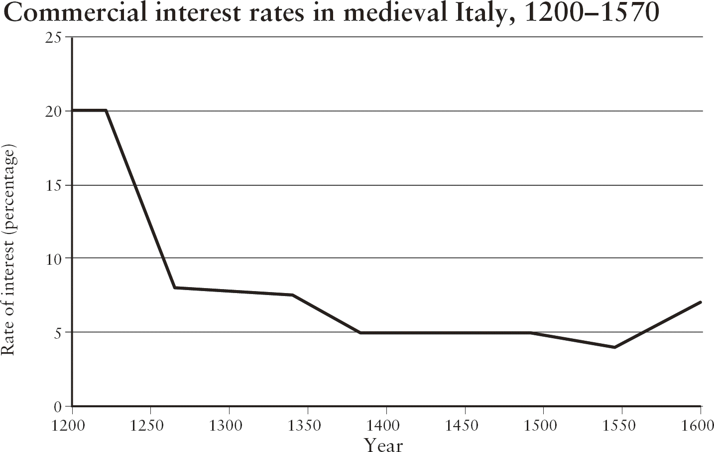

[3.](#section-9) Despite laws against usury, capitalism took off in medieval Italy as trade and credit expanded and interest rates fell.

These new financial practices added to the effective money supply and contributed to the decline in medieval interest rates. Loans in northern Italy were to be had for around 20 per cent in 1200. By Datini’s day, the rates on commercial loans in Genoa had fallen to 7 per cent. Established Italian merchants gained a competitive advantage from their access to cheap credit.[27](#section-51) As a result, Datini and his fellow Tuscan traders were able to oust Flemish merchants from the cloth markets in England and France, and even to undercut them on their home turf. By the fifteenth century, Venetian merchants paid as little as 5 per cent for their loans.[28](#section-51)

### EVADING INTEREST REGULATIONS

The Merchant of Prato’s credit operations were conducted at a time when Church law still officially forbade lending at interest. That didn’t stop medieval bankers and merchants from finding countless ways to evade clerical injunctions. As in ancient Mesopotamia, the original amount of the loan might be overstated. Loans made in clipped coin had to be repaid in unclipped coin, a practice known as ‘coveitise’ (from which derives ‘covetousness’). Loans were also stipulated for impossibly short periods with interest concealed in the heavy penalties exacted for late payment or disguised as fictional sales (‘false chevisance’).[29](#section-51) Northern Italian bankers concealed interest behind euphemisms: interest was hidden by such innocuous terms as *yield*, *gain*, *reward*, *rent*, *profit*, *fee* and *foregone benefit*.[30](#section-51) *Discrezione* signified a discretionary ‘gift’ paid by a banker on a time deposit – even Church cardinals placed their money on *discrezione* with bankers.[31](#section-51) The *rentes* of the Hôtel de Ville were in name only.[32](#section-51)

The most common method of concealing interest was the overseas bill of exchange, in which interest was incorporated in a foreign exchange transaction. Bills of exchange became the mainstay of international finance from the twelfth century onwards. In principle, these bills carried credit and currency risk. But a practice developed in which bills were not attached to any genuine transaction. Known as ‘dry exchange’ (*cambi secchi*), because no sea was crossed, this business was said to have ‘no more juice or sap than a painted tree, either in charity or in equity, but being a griping usury under the title of exchange’.[33](#section-51)

Datini himself concealed interest-bearing loans with the connivance of his foreign agents. Clerics might fume at such subterfuges but there was no stopping them. Eventually the Roman Church tired of trying to enforce its ban on usury. As an early head of the Jesuits, Father Diego Laínez, declared: ‘The merchants have so many tricks for inventing ingenious practices that we can hardly see what is going on at the bottom of it all.’[34](#section-51)

The ban on usury proved futile because as trade expanded, both at home and abroad, the demand for credit became overwhelming. By the early sixteenth century, England was transformed into what one historian has called an ‘economy of obligation’.[35](#section-51) Lending at interest extended the length and breadth of the land, throughout town and country. The farmer, tradesman, craftsman and cottager all resorted to the ‘money master’. The lender might be a grandee, perhaps a nobleman or City merchant, or come from humble stock, whether a grazier, ploughman, maltster, corn-monger or even a ‘rich priest’.[36](#section-51) One of these lowly lenders, Thomas Wilcoxe of Hereford, is described as a ‘horrible usurer, taking a penny and sometimes twopence for a shilling for the week [who] … when the priest is ready to go to the Communion, he departs from the church for the recovering of his weekly usury.’[37](#section-51) All this took place in the years before legislation in 1571 made the taking of interest legal.

### INTEREST GOVERNS THE WORLD

Once the idea took hold that time not only had value but was an individual’s possession, clerical injunctions against usury lost much of their force. If a merchant gained from a loan, why shouldn’t the lender share in those profits? In fact, the idea that the lender should be protected against lost profits is embedded in the very concept of interest. The word derives from the Latin *interesse*, a legal term under Roman law (‘*id quod interest*’) for compensation paid by a defaulting debtor. The Code of Justinian, issued in sixth-century Byzantium, allowed lenders to claim a penalty for late repayment. From a legal perspective, interest was viewed as the opportunity cost suffered by a creditor who, being deprived of his capital, could not make profitable use of his money elsewhere.

In the Middle Ages, this concept was known as *lucrum cessans*, literally foregone profit. The Lombard canonist Henry of Susa, writing in 1271, states that ‘if some merchant, who is accustomed to pursue trade, and the commerce of the fairs, and there profit much, has … lent [me] money with which he would have done business, I remain obliged from this to his *interesse*.’[38](#section-51) By the time of the early Renaissance, the Franciscan scholar Bernardino of Siena was overturning earlier Church teachings with his claim that ‘money has not simply the character of money, but it has beyond this a productive character, which we commonly call capital.’ Bernardino compared borrowing capital to having the use of a plough, which ought to be paid for.[39](#section-51)

The Scholastic denunciation of usury was suited to a self-sufficient agrarian society, in which loans were primarily for consumption purposes. This ideal world was shattered by the extension of trade and industry throughout the Middle Ages. By the early modern period, a distinction was made between consumer and commercial lending. Interest on consumption loans was still condemned as usury, but charging for the loan of productive capital was increasingly acceptable. The sixteenth-century French jurist Charles Dumoulin allowed for ‘just interest’ to be levied on certain loans: ‘everyday commercial practice shows that the utility of the use of a considerable sum of money is not slight, & in law it is often called the product.’ People in business, wrote Dumoulin, ‘often need to use other people’s money … & none is found who will lend for nothing’. Even the stern Aquinas had earlier acknowledged that interest was allowed in law as a practical matter because ‘to do otherwise would hinder the utilities of a great many people.’[40](#section-51)

Despite its strictures against usury, the medieval Church acknowledged that an interest payment could be demanded for loans which involved some risk, known by the Latin terms *periculum sortis* and *damnum emergens*.[41](#section-51) Because business partnerships (*commenda*, *societas*) and bottomry loans (loans for sea voyages) carried an element of risk, charging interest in such cases was also accepted. In 1390, the Lord Mayor of London defined usury as the receiving of gain on a loan ‘without risk’.[42](#section-51) The sale of rent charges was not considered usurious since land, unlike money, was deemed productive. Annuities were allowed since the principal was never returned. After the Reformation, Catholics conceded that interest as an estimate of foregone profit should be allowed from the inception of the loan rather than solely in cases involving late repayment.[43](#section-51) Calvin in Geneva declared that a borrower was not defrauded when he paid interest out of profits.[44](#section-51) (Luther, however, who was not much of a reformer in social or economic matters, condemned the usurer as a ‘thief, robber, [and] murderer’.[45](#section-51))

The idea that time has value resurfaces in a polemic penned by the Englishman Thomas Wilson, an Elizabethan diplomat and judge. In his *Discourse Upon Usury* (1572) Wilson likens the usurer to ‘hel unsaciable, the sea raging, a cur dog, a blind moul, a venomus spider, and a bottomles sacke, whereby you may well be assured that the dyvell dwelleth tabernacled in such a monstre’.[46](#section-51) Usury, says Wilson, is as great an event as murder, adultery and theft; usurers devour whole kingdoms and deserve nothing better than death. Wilson’s ideas were hopelessly old-fashioned by this date – indeed, between the writing and publication of his *Discourse*, usury in England was legalized (by Queen Elizabeth’s Statute of 1571).

Nevertheless, Wilson awakens the reader’s interest when he broaches the issue of lending across time:

> Mary, to bee a tyme seller, to gayne for dayes, monethes and years, and to make the sune shyninge, which God sendeth so freely unto us, to be the frute of your occupiying, and to make mony of mony for the very acte of lending – these dealings I do saye, are most abominable in the sight of God and man.

The difference between Wilson and Bishop Cobham is that the Elizabethan writer is aware that his contemporaries consider time to be valuable: ‘They saye tyme is precious. Hee may well saye, tyme was precious to him that payed so deerely for it; or rather the usurer may saye that tyme was verye precious to hym that tooke so muche unto him.’

Wilson then goes on to provide a new definition of interest: ‘Usurye is also saide to be the price of tyme, or of the delaying or forbearing of moneye.’ Interest has been described in many ways over the years – it’s often referred to as the ‘price of money’. But Wilson knew better. Interest, he said, is the *price of time*. There is no better definition.

In both Catholic and Protestant circles, interest came to represent the lender’s stake in the success and profit of the borrower, while usury was associated with the extortion of the needy.[47](#section-51) Queen Elizabeth’s law of 1571 legalized lending at interest, with the maximum rate capped at 10 per cent, but distinguished between interest and usury. In the words of a contemporary memorandum, ‘usury contayneth in itself inequalitie and unnaturall dealing and trewe interest observeth equitie and naturall dealinge.’[48](#section-51) We still make the same distinction today.

Centuries of concessions to the indomitable practice of usury prepared the grounds for the view of classical economists that interest was a fair share of profits. In ‘Of Interest’, David Hume wrote that: ‘No man will accept of low profits where he can have high interest; and no man will accept of low interest where he can have high profits.’ Hume’s friend and fellow Scot Adam Smith considered interest to be a mere ‘derivative revenue’, which he estimated at roughly half the level of profits: ‘The interest of money, keeping pace always with the profits of stock,’ wrote Smith, without giving any evidence to the veracity of this statement.[fn5](#section-58)

As the modern era came into being, the avarice of the usurer was supplanted by interest in the broader and more abstract sense of a share or stake. This new concept of interest was ethically wide-ranging: it ‘came to cover virtually the entire range of human actions, from the narrowly self-centered to the sacrificially altruistic, and from the prudently calculated to the passionately compulsive’.[49](#section-51) The seventeenth-century English statesman and philosopher Lord Shaftesbury summed up the new thinking with his comment that ‘Interest governs the World.’[50](#section-51)

In his *Fable of the Bees* (1714), Bernard Mandeville exposed the paradox at the heart of the modern world, namely that private vices brought public benefits. Adam Smith incorporated Mandeville’s wicked insights into his political economy. In *The Wealth of Nations*, Smith describes the individual as one who ‘By pursuing his own interest he frequently promotes that of the society more effectually than when he really intends to promote it.’[51](#section-51) A similar thought is expressed in another famous line, in which Smith writes that ‘It is not from the benevolence of the butcher, the brewer, or the baker that we expect our dinner, but from their regard to their own interest.’

The spirit of capitalism was transmitted across networks of credit that connected lenders and borrowers through bonds of mutual self-interest.[52](#section-51) Daniel Defoe described credit as a ‘stock’, synonymous with capital, while the French in Defoe’s day referred to capital as ‘interest’, in the sense of taking a stake.[fn6](#section-58) From a technical viewpoint, capital consists of a stream of future income discounted to its present value. Without interest, there can be no capital. Without capital, no capitalism. Turgot, a contemporary of Adam Smith’s, understood this very well: ‘the capitalist lender of money,’ he wrote, ‘ought to be considered as a dealer in a commodity which is absolutely necessary for the production of wealth, and which cannot be at too low a price.’[53](#section-51) (Turgot exaggerated. As we shall see, interest at ‘too low a price’ is the source of many evils.)

Thomas Wilson’s claim that ‘tyme is precious’ was famously appropriated by Franklin in his *Advice to a Young Tradesman* as a spur to capitalist endeavours. At last, the blood-sucking usurer had prevailed against his legions of critics. According to the French historian Jacques Le Goff, ‘One economic system replaces another, only after it has passed through a long and varied obstacle course. History is people, and the instigators of capitalism were usurers: merchants of the future, sellers of time.’[54](#section-51)

### A BIRD IN THE HAND

While the borrower’s potential profit might justify charging for a commercial loan, this doesn’t explain the existence of interest on consumption loans. Such loans are by their nature unproductive. Turgot had an answer. A bird in the hand is worth two in the bush, he said. This is the earliest known reference to what economists call ‘time preference’, namely our propensity to place a higher value on immediate pleasures. For Turgot, a sum of money delivered immediately and the promise of the same amount of money at some future date could not possibly have the same value. Time preference explains why Aristotle was wrong. Interest is the difference in monetary values across time, the rate at which present consumption is exchanged for future consumption. Interest represents the time value of money.

Modern behavioural research supports Turgot’s intuition. In the late 1960s, Walter Mischel, a psychologist at Stanford University, made a famous study of deferred gratification. Under controlled conditions, children were offered a choice between consuming a single treat immediately or waiting a quarter of an hour to receive double the reward. Originally titled ‘The Preschool Self-Imposed Delay of Immediate Gratification for the Sake of Delayed but More Valued Rewards Paradigm’, Mischel’s study is popularly known, after the particular reward on offer, as ‘The Marshmallow Test’.[55](#section-51) Of the six hundred children who took the original test, a third of the children deferred gratification long enough to receive their extra marshmallow.

The Marshmallow Test shows that humans, or at least pre-schoolers, are impatient. They exhibit positive ‘time preference’. The bonus marshmallow can be seen as a kind of interest. Various arguments have been advanced as to why people prefer present over future satisfactions. Child development psychologists, including Mischel, ascribe impatience to stress early in life, which activates the brain’s limbic system.[56](#section-51) Economists have more prosaic explanations. Given that life is nasty, brutish and often short, some reward for delaying immediate pleasures makes sense. It may also be the case that humans are congenitally short-sighted and underestimate their future wants. And, even if none of the above held true, when an economy is steadily expanding most people can expect to become richer over time; since their future income exceeds their current income, people will value it less.

Time preference is infinitely varied. It may reflect a nation’s moral and intellectual qualities, reflected in its thrift and industry, as Böhm-Bawerk believed. Exigency plays a role: a hungry person puts a higher value on a meal today than one in six months’ time. Age also influences time preference. Youth is naturally impatient, and often cash-strapped. Younger people may borrow and spend, paying back their loans later in life – what economists call ‘income-smoothing’. The interest rate they pay reflects their time preference. Older people are likely to have a lower time preference and be less inclined to borrow at interest, partly because their incomes are no longer growing. Countries with ageing populations tend to have falling interest rates. At least, that has been the experience of Japan, whose domestic interest rates fell first to zero, and later turned negative, after its working population started to contract in the mid-1990s.

Exponents of time preference see it as a universally valid and all-embracing phenomenon. Irving Fisher maintained that impatience (i.e. positive time preference) is a ‘fundamental attribute of human nature’. The Austrian Ludwig von Mises, a pupil of Böhm-Bawerk’s, believed ‘time preference [and therefore interest] is a category inherent in every human action.’[57](#section-51) Fisher, who had little else in common with Mises, agreed on this point: interest, he wrote, ‘must be inherent in all buying and selling, and in all transactions and human activities which involve the present and the future’.[58](#section-51) Mises held that it would be impossible to abolish interest. His American disciple Murray Rothbard asserted that ‘future satisfactions are always at a discount compared to present satisfactions.’[59](#section-51) If this statement is true, then the interest rate must also *always* be positive and a negative rate of interest is unnatural.

Thomas Wilson’s original insight that ‘time is precious’ is incorporated into various definitions of interest. Turgot himself defined interest as ‘the price given for the use of a certain quantity of value during a certain time’.[60](#section-51) Jeremy Bentham, in his *Defence of Usury* (1787), wrote that ‘putting money out at interest is exchanging present money for future [money].’[61](#section-51) Böhm-Bawerk, who like Turgot was also his country’s finance minister, wrote that ‘The natural difference in value between present and future goods … is the fountain-head from which all interest takes its origin.’[62](#section-51) Fisher saw interest as ‘the basic problem of time valuation … of translating the future into the present’.[63](#section-51) The Yale economist declared that ‘Interest is, as it were, human impatience crystallized into a market rate.’[64](#section-51) Fisher’s contemporary, the American economist Frank Fetter, claimed that interest would be ‘unthinkable if there were no differences relative to time in the estimates men placed on some goods available at different points of time’.[65](#section-51)

Time preference explains interest on consumption loans, and why supposedly ‘usurious’ rates are not necessarily unfair. A payday loan of $20 to repay $25 at the end of the week makes for a very high annualized rate, but the borrower may put an even higher premium on a glass of beer and a square meal enjoyed that night. Time preference also determines how long investors are prepared to wait for a return on their capital. It was John Rae, a little-known early nineteenth-century Scottish economist, who first mooted a connection between investment and time preference (for which he was later credited by Böhm-Bawerk and Fisher). The formation of capital, said Rae, ‘implies the sacrifice of some smaller present good, for the production of some greater future good’.[66](#section-51)

### THE TIME VALUE OF MONEY

Interest – the *time value of money –* lies at the heart of valuation. At the turn of the eighteenth century, the brilliant Scotsman John Law (whom we encounter in [Chapter 4](#section-16)) wrote that ‘anticipation is always at a discount. £100 to be paid now is of more value than £1,000 to be paid £10 a year for 100 years.’[67](#section-51) By discounting the future cash flow generated by a stock, bond, building or any other income-producing asset, interest allows us to arrive at its present value.

Capital value and interest are inversely related: a high discount or ‘capitalization’ rate produces a low capital value and vice versa. An anonymous pamphlet, published in 1621, claimed that ‘land and money are ever in balance one against the other; and when money is dear, land is cheap, and where land is cheap money is dear.’[68](#section-51) Without interest, it would not be possible to put a price on an acre of land, Sir William Petty observed half a century later. Rents in future years must be worth less than this year’s rent, Petty said, otherwise ‘an acre of land would be equal in value to a thousand acres of the same land; which is absurd, an infinity of units being equal to an infinity of thousands.’[fn7](#section-58) In the following century, Adam Smith described how the price of land depended on the market rate of interest. In *The Wealth of Nations* (published in 1776) Smith noted that land prices had risen in recent decades as interest rates declined.

An act of investment – say the construction of a new manufacturing plant with factory buildings, machinery and all the necessary infrastructure – requires that investors forgo current consumption. Any eventual profits will take time to emerge. In theory, investment should only be made if the rate of return is at least equal to the investors’ time preference. Rae claimed that a society’s decision to make capital investments was determined ‘by the length of the period, to which the inclination of its members yield up a present good, for the purpose of producing the double of it at the expiration of that period’.[69](#section-51) Put simply: how long will people wait, forgoing the consumption of a single marshmallow, in order to enjoy two marshmallows in future?

Later generations of economists built upon Rae’s insights. The Victorian W. S. Jevons claimed that businesses would borrow to invest – which he described as adding time to the period of production – up to the point at which the marginal return on investment was equal to the rate of interest.[70](#section-51) Böhm-Bawerk had a similar idea, maintaining that a decline in the rate of interest would lead to the adoption of more ‘roundabout’ (time-consuming) methods of production. Modern monetary economists incorporate time preference into their models. But these models blithely assume that the prevailing rate of interest automatically reflects society’s time preference.

But what if that is not the case? This problem exercised the minds of Böhm-Bawerk’s distinguished pupils, among them Friedrich Hayek, Mises and Schumpeter. For Hayek, it was axiomatic, but all too often overlooked, that ‘all economic activity is carried out through time.’[71](#section-51) When interest rates decline, he said, businesses are inclined to invest in projects with more distant pay-offs – in Hayek’s terminology, the ‘structure of production’ lengthens. If interest rates are kept below their natural level, misguided investments occur: too much time is used in production, or, put another way, the investment returns don’t justify the initial outlay. ‘Malinvestment’, to use a term popularized by Austrian economists, comes in many shapes and sizes. It might involve some expensive white-elephant project, such as constructing a tunnel under the sea, or a pie-in-the-sky technology scheme with no serious prospect of ever turning a profit.

Consumer behaviour is also affected when interest rates are pushed below society’s time preference. Cheap credit encourages households to take on too much debt; they borrow and spend, bringing consumption forward, but when the future arrives the cupboard is bare. Hayek thought that periods of widespread malinvestment must end in economic crisis. As events leading up to the financial crisis of 2008 showed, the build-up of excess amounts of consumer debt can be equally disastrous. The unintended consequences of ultra-low interest rates in the twenty-first century are discussed in detail later in this book. Yet even by the late seventeenth century, one of Europe’s most distinguished minds was considering the problems created by forcing down interest rates below their natural level, as we shall see in the next chapter.

<!-- rl-section id="sec-chapter002" class="titlepage" title="2" -->

## Selling Time

> *When money is lent on a contract to receive … [there is] an increase by way of compensation for the use; which is generally called interest by those who think it lawful, and usury by those who do not.*
>
> Sir William Blackstone, *Commentaries on the Laws of England*, 1765

Moneylenders have always received a bad press. Over the centuries all – well, nearly all – the greatest minds have been aligned against them. Aristotle, Plato, St Augustine, Thomas Aquinas, Dante, Luther and Shakespeare have each had a go at the wretched usurer. Criticism has come from the left and from the right. Marx detested interest, but then so did Hitler. A few years ago, the Archbishop of Canterbury launched an attack on a UK payday lending firm, which he believed took advantage of the needy and desperate. ‘The War on Wonga’ (the name of the financial firm) is a campaign without end. Many economists, in particular the experts on inequality, side with the angels. The taking of interest is depicted as robbing the weak and the needy. What’s more, by demanding back more than has been given, the usurer stands accused of injustice.

There are, of course, the familiar Old Testament restrictions on usury: ‘Thou shalt not lend to thy brother money to usury, nor corn, nor any other thing’ (Deuteronomy 23:19) and ‘If thou lend money to any of my people that is poor, that dwelleth with thee, thou shalt not be hard upon them as an extortioner, nor oppress them with usuries’ (Exodus 22:25), among others. The Israelites’ attitude is reflected in the Hebrew word for usury: *neschek*, to bite.[1](#section-51) Although interest on loans among fellow Jews was banned, this injunction wasn’t scrupulously followed.[2](#section-51) In the Bible, Nehemiah, a governor of Persian Judea in the fifth century BC, orders the restitution of mortgaged property that has been seized, declaring that usury has brought ‘into bondage our sons and our daughters’. Babylonians, Greeks and Romans faced a similar situation. An eminent historian of Ancient Greece claims that interest-bearing debts were primarily intended to turn debtors into slave labour.[fn1](#section-58) The Athenian lawgiver Solon outlawed debt-bondage, and the Romans abolished it in the fourth century BC.

The intellectual assault on usury began in fourth-century Athens. In *The Politics*, Aristotle declared that usury was immoral because ‘money was intended to be used in exchange, but not to increase at interest.’ The philosopher was not impressed by the etymological hint that interest was a fruit of a productive loan: ‘this term usury [*tokos*], which means the birth of money from money, is applied to the breeding of money because the offspring resembles the parent. Wherefore of all modes of making money this is the most unnatural.’[3](#section-51) Moneylenders are depicted in other Greek texts as suffering from *aponoia*, moral insanity or recklessness.[4](#section-51) Usury was seen as socially disruptive, an act of ‘otherhood’ rather than brotherhood.[fn2](#section-58) Plato depicts usury as setting rich lenders against poor borrowers. A passage in Demosthenes says that lenders who charge interest are hateful since they ‘make a trade of the business, with no thought of helping or of anything else other than gain’.[5](#section-51)

Professional moneylenders in ancient Athens were generally of low social standing, often foreigners or former slaves. Athenian bankers were not much more popular than their modern counterparts. A fragment from a lost comedy by Antiphanes describes bankers as a ‘pestilential tribe’ worse than malignant nurses, pedagogues, midwives, begging priests and fishmongers.[6](#section-51) Over the centuries, the standing of usurers didn’t improve. In the Middle Ages, many trades were looked down upon for breaking religious taboos, among them innkeepers, pastry cooks, shoemakers and dishwashers.[7](#section-51) Of all these unclean trades, usury was deemed the lowest, to be carried out by Jews and other outcasts from Latin Christendom.

### THE SCHOLASTIC ATTACK ON USURY

The Church Fathers were vehement critics of usury. St Ambrose compared usury to a sea storm, bringing universal shipwreck. St Augustine said it was better to steal from the rich than to slay the poor by usury.[8](#section-51) The anti-usury foment became yet more strident in the Middle Ages. The Second Lateran Council, convened by Pope Innocent II in 1139, condemned the ‘insatiable rapacity of usurers’. These increasingly shrill denunciations reflected the fact that, as European trade picked up in the twelfth century, lending at interest was becoming more common. The council lamented that ‘nearly everywhere the crime of usury has become so firmly rooted that many, omitting other business, practise usury as if it were permitted.’ In the following century, Pope Innocent IV expressed a fear that ‘the countryside would be deserted, because peasants had become usurers, or had been deprived of their cattle and tools by landowners, themselves attracted by the profits of usury.’[9](#section-51)

Medieval scholars uncritically adopted Aristotle’s arguments against usury. ‘In itself and by itself, money does not bear fruit but the fruit comes from elsewhere,’ claims the Seraphic Doctor St Bonaventure in the thirteenth century.[fn3](#section-58) ‘Money does not reproduce itself,’ adds the Angelic Doctor Thomas Aquinas, in his *Summa Theologica*.[10](#section-51) The usurer, said Aquinas, violates the law of the just price by taking back more than he originally handed over. If the lender ‘exacts more for the use of a thing [money] which has no use except the consumption of the substance … it is an unjust exaction.’[11](#section-51) Even depositing money with a usurer, Aquinas thought, was ‘entirely unlawful, just as it would be unlawful to put a sword in the keeping of a madman, a maiden in the keeping of a libertine, or food in the keeping of a glutton.’[12](#section-51)

Yet the Aristotelian critique of usury contains a serious flaw. Both the Greek philosopher and his medieval follower Aquinas claimed that money existed solely for exchange. According to their view, the lender surrenders all ownership of his money at the moment a loan is made. But as economics textbooks invariably point out, money is also a *store of value*. While the lender surrenders the exchange value of money, he retains its stored value, held in the form of a debt. That’s why creditors from Babylonian times onwards have always taken collateral for the period of a loan. Aristotle overlooks the fact that lending takes place across time – that it is an *intertemporal* transaction, a curious omission given his writings on the nature of time. Interest is a charge for the use of money over a certain period of time.

Some medieval scholars addressed the question of time in lending, but with a twist. Thomas of Cobham was an early fourteenth-century theologian who was set to become archbishop of Canterbury until Edward II overturned his appointment. This doctor of canon law held conventional views on usury, which he describes as the sin of ‘*avaritia*, that is cupidity’. Like Aristotle, Cobham claims that ‘money that lies fallow does not naturally produce any fruit, but the vine bears fruit naturally.’ Cobham rectifies the Greek philosopher’s oversight, however. The usurer, he says, is selling time. This doesn’t lessen the crime, in his view, since time belongs properly to God, and ‘he cannot, therefore, make a profit from selling someone else’s property.’[13](#section-51) This makes the usurer a ‘thief of time’.

The idea that time is valuable was not new to the Middle Ages. The earliest allusion to time having value has been attributed to a fragment of the Greek orator Antiphon (480–411 BC) which states that ‘the most costly outlay is time.’ Five centuries later, Seneca the Younger reminds his friend Lucillius that time is precious because man is mortal and his days are numbered: ‘embrace every hour,’ he advises, ‘the stronger hold you have on today, the less will be your dependence on tomorrow.’ Unlike Thomas of Cobham, Seneca doesn’t believe that time is God’s property: ‘All sensual man, because untouch’d, unseen, He looks on time as nothing; nothing else is truly man’s,’ he writes.

On the question of interest, Seneca was painfully inconsistent. At one moment, he suggests that it is fair to pay even more interest on a loan than has been agreed beforehand.[14](#section-51) At another moment, he compares usury to murder. In his letter on avarice, Seneca writes:

> I see there letters of credit, promissory notes, and bonds, empty phantoms of property, ghosts of sick Avarice, with which she deceives our minds, which delight in unreal fancies; for what are these things, and what are interest, and account books, and usury, except the names of unnatural developments of human covetousness? … what are your documents, *your sale of time*, your blood-sucking twelve per cent. interest? these are evils which we owe to our own will, which flow merely from our perverted habit, having nothing about them which can be seen or handled, mere dreams of empty avarice.[15](#section-51)

The Stoic philosopher may have written these words filled with remorse for his own unbounded avarice. After all, the same Seneca who extolled virtue above riches amassed a great fortune from his service to the Emperor Nero. He owned several estates and many villas and entertained guests by the thousand. In fact, ‘Super-Rich Seneca’, as contemporaries called him, was a most covetous usurer. ‘In Rome he spread his nets to catch the wills of childless men; Italy and the provinces were sucked dry by his insatiable usury,’ writes the Roman historian Tacitus. Legend has it that Boudica’s rebellion of AD 60 was provoked after Seneca and his associates called in a large loan to British natives.[16](#section-51)

Seneca’s notion that time is man’s most precious possession resurfaces in the Italian Renaissance in the writings of the architect and humanist Leon Battista Alberti (1404–72). In his *Libri della Famiglia*, composed in the 1430s, one of Alberti’s characters instructs on the proper management of time: ‘for I would sooner lose sleep than lose time, that is, than let the right moment for doing something slip by.’[17](#section-51) Fernand Braudel writes that Alberti signals a shift from the earlier Scholastic view, when ‘time had been considered as belonging to God alone; to sell it (in the shape of interest) was to sell *non suum*, what did not belong to one. But now time was once more becoming a dimension of human life, one of man’s possessions which he would do well not to waste.’[18](#section-51)

Alberti’s time is a secular phenomenon – what Braudel called ‘merchant’s time’.[19](#section-51) Prior to the fourteenth century, the main purpose of timekeeping in Western Europe had been to maintain the punctuality of monastic life. (The canonical ‘hours’ – matins, prime, tierce, sext, nones, and so forth – were set aside for prayer.) The secularization of time that occurred during the Renaissance coincided with advances in the technology of timekeeping. By the date of Alberti’s birth all large Italian cities boasted public clocks. Work time could now be measured in hours, and later minutes, providing a boost to productivity.[20](#section-51)

It is no coincidence that Alberti came from a family of rich Florentine merchants. A commercial worldview is expressed throughout the *Libri*: money is extolled as the ‘root of all things’; he recommends thrift (*masserizia*), prudence and diligence; and describes the merchant’s account books as ‘like sacred and religious objects’. Such views were conventional among the mercantile class. As an earlier Italian merchant-writer, Paolo da Certaldo, advised in his *Book of Good Customs* (*c*. 1360), ‘If you have money, do not wait, do not keep it lying idle at home, for it is better to work in vain than to be idle for nothing.’[21](#section-51) Alberti’s patron, the rich Florentine merchant Giovanni Rucellai, recommended to his sons that they ‘practise economy with time, because it is the most valuable thing we have’.[22](#section-51)

The commercial importance of time is exemplified by the activities of the best known of Italian merchants of this era, Francesco Datini (1335–1410). Datini, whose life is recorded in Iris Origo’s biography *The Merchant of Prato*, is a precursor to the modern capitalist: his nature was anxious, ambitions limitless and exertions without end. Although Datini’s ledgers opened with the words, ‘In the name of God and of Profits’, the accounts were kept with the newfangled system of double-entry bookkeeping – a Venetian invention that was spreading across northern Italy.[fn4](#section-58) Datini was in the vanguard of a banking revolution that turned the cities of Florence, Venice and Genoa into great financial centres. He belonged to the rising class of international traders who opened up Mediterranean and European trade, settling their bills through foreign agents and at the great fairs of Lyons, Champagne and Geneva.

For such businesspeople, credit was indispensable and time, whose cost was measured in interest, was precious. Datini’s life exemplifies Benjamin Franklin’s famous observation ‘that time is money … that credit is money’.[23](#section-51) Even his long-suffering wife, Margherita, urged him to be more careful with how he spent his time: ‘when you waste an hour, it seems to me a thousand … for I deem nothing so precious to you, both for body and soul, as time, and I think you value it too little.’[24](#section-51)

Among his multifarious operations, Datini imported wool from the English Cotswolds (which he called ‘Chondisgualdo’) and from the Balearic Islands. Origo traces an order for the purchase of Minorcan wool initiated in Florence in November 1394. The raw wool was first transported by sea, and then by river and road to a warehouse in Prato, where it

> was beaten, picked, greased, washed, combed, carded, placed on the distaff and spun … then it was measured off the warp and woven, then burled, shorn (while still damp), stretched out to dry, teasled and shorn again, handed over to the dyers (in this case to be dyed blue), napped and shorn again, and at last pressed and folded – each of these processes requiring a different set of specialized workers.

In all, it took more than three and a half years from the first order to the sale of the finished cloth in Valencia. Yet all this time and effort rendered a profit of less than 9 per cent.[25](#section-51) No wonder Italian merchants viewed time as an element of cost.

Datini’s business was conducted on credit, with deferred payment and the extensive use of informal bills of exchange – some 5,000 of which survive in his correspondence. He was also a usurer, who started his own bank in Florence, which issued bills of exchange and made loans to companies and private clients, but not to princes and popes, whose credit was deemed doubtful. Deposit banking had started in Genoa in the twelfth century and gradually took root in other northern Italian cities and in Barcelona (where the penalty for a banker’s failure was beheading – a punishment actually carried out on one occasion).[26](#section-51) At around the same time, the trade in international bills of exchange took off.

[3.](#section-9) Despite laws against usury, capitalism took off in medieval Italy as trade and credit expanded and interest rates fell.

These new financial practices added to the effective money supply and contributed to the decline in medieval interest rates. Loans in northern Italy were to be had for around 20 per cent in 1200. By Datini’s day, the rates on commercial loans in Genoa had fallen to 7 per cent. Established Italian merchants gained a competitive advantage from their access to cheap credit.[27](#section-51) As a result, Datini and his fellow Tuscan traders were able to oust Flemish merchants from the cloth markets in England and France, and even to undercut them on their home turf. By the fifteenth century, Venetian merchants paid as little as 5 per cent for their loans.[28](#section-51)

### EVADING INTEREST REGULATIONS

The Merchant of Prato’s credit operations were conducted at a time when Church law still officially forbade lending at interest. That didn’t stop medieval bankers and merchants from finding countless ways to evade clerical injunctions. As in ancient Mesopotamia, the original amount of the loan might be overstated. Loans made in clipped coin had to be repaid in unclipped coin, a practice known as ‘coveitise’ (from which derives ‘covetousness’). Loans were also stipulated for impossibly short periods with interest concealed in the heavy penalties exacted for late payment or disguised as fictional sales (‘false chevisance’).[29](#section-51) Northern Italian bankers concealed interest behind euphemisms: interest was hidden by such innocuous terms as *yield*, *gain*, *reward*, *rent*, *profit*, *fee* and *foregone benefit*.[30](#section-51) *Discrezione* signified a discretionary ‘gift’ paid by a banker on a time deposit – even Church cardinals placed their money on *discrezione* with bankers.[31](#section-51) The *rentes* of the Hôtel de Ville were in name only.[32](#section-51)

The most common method of concealing interest was the overseas bill of exchange, in which interest was incorporated in a foreign exchange transaction. Bills of exchange became the mainstay of international finance from the twelfth century onwards. In principle, these bills carried credit and currency risk. But a practice developed in which bills were not attached to any genuine transaction. Known as ‘dry exchange’ (*cambi secchi*), because no sea was crossed, this business was said to have ‘no more juice or sap than a painted tree, either in charity or in equity, but being a griping usury under the title of exchange’.[33](#section-51)

Datini himself concealed interest-bearing loans with the connivance of his foreign agents. Clerics might fume at such subterfuges but there was no stopping them. Eventually the Roman Church tired of trying to enforce its ban on usury. As an early head of the Jesuits, Father Diego Laínez, declared: ‘The merchants have so many tricks for inventing ingenious practices that we can hardly see what is going on at the bottom of it all.’[34](#section-51)

The ban on usury proved futile because as trade expanded, both at home and abroad, the demand for credit became overwhelming. By the early sixteenth century, England was transformed into what one historian has called an ‘economy of obligation’.[35](#section-51) Lending at interest extended the length and breadth of the land, throughout town and country. The farmer, tradesman, craftsman and cottager all resorted to the ‘money master’. The lender might be a grandee, perhaps a nobleman or City merchant, or come from humble stock, whether a grazier, ploughman, maltster, corn-monger or even a ‘rich priest’.[36](#section-51) One of these lowly lenders, Thomas Wilcoxe of Hereford, is described as a ‘horrible usurer, taking a penny and sometimes twopence for a shilling for the week [who] … when the priest is ready to go to the Communion, he departs from the church for the recovering of his weekly usury.’[37](#section-51) All this took place in the years before legislation in 1571 made the taking of interest legal.

### INTEREST GOVERNS THE WORLD

Once the idea took hold that time not only had value but was an individual’s possession, clerical injunctions against usury lost much of their force. If a merchant gained from a loan, why shouldn’t the lender share in those profits? In fact, the idea that the lender should be protected against lost profits is embedded in the very concept of interest. The word derives from the Latin *interesse*, a legal term under Roman law (‘*id quod interest*’) for compensation paid by a defaulting debtor. The Code of Justinian, issued in sixth-century Byzantium, allowed lenders to claim a penalty for late repayment. From a legal perspective, interest was viewed as the opportunity cost suffered by a creditor who, being deprived of his capital, could not make profitable use of his money elsewhere.

In the Middle Ages, this concept was known as *lucrum cessans*, literally foregone profit. The Lombard canonist Henry of Susa, writing in 1271, states that ‘if some merchant, who is accustomed to pursue trade, and the commerce of the fairs, and there profit much, has … lent [me] money with which he would have done business, I remain obliged from this to his *interesse*.’[38](#section-51) By the time of the early Renaissance, the Franciscan scholar Bernardino of Siena was overturning earlier Church teachings with his claim that ‘money has not simply the character of money, but it has beyond this a productive character, which we commonly call capital.’ Bernardino compared borrowing capital to having the use of a plough, which ought to be paid for.[39](#section-51)

The Scholastic denunciation of usury was suited to a self-sufficient agrarian society, in which loans were primarily for consumption purposes. This ideal world was shattered by the extension of trade and industry throughout the Middle Ages. By the early modern period, a distinction was made between consumer and commercial lending. Interest on consumption loans was still condemned as usury, but charging for the loan of productive capital was increasingly acceptable. The sixteenth-century French jurist Charles Dumoulin allowed for ‘just interest’ to be levied on certain loans: ‘everyday commercial practice shows that the utility of the use of a considerable sum of money is not slight, & in law it is often called the product.’ People in business, wrote Dumoulin, ‘often need to use other people’s money … & none is found who will lend for nothing’. Even the stern Aquinas had earlier acknowledged that interest was allowed in law as a practical matter because ‘to do otherwise would hinder the utilities of a great many people.’[40](#section-51)

Despite its strictures against usury, the medieval Church acknowledged that an interest payment could be demanded for loans which involved some risk, known by the Latin terms *periculum sortis* and *damnum emergens*.[41](#section-51) Because business partnerships (*commenda*, *societas*) and bottomry loans (loans for sea voyages) carried an element of risk, charging interest in such cases was also accepted. In 1390, the Lord Mayor of London defined usury as the receiving of gain on a loan ‘without risk’.[42](#section-51) The sale of rent charges was not considered usurious since land, unlike money, was deemed productive. Annuities were allowed since the principal was never returned. After the Reformation, Catholics conceded that interest as an estimate of foregone profit should be allowed from the inception of the loan rather than solely in cases involving late repayment.[43](#section-51) Calvin in Geneva declared that a borrower was not defrauded when he paid interest out of profits.[44](#section-51) (Luther, however, who was not much of a reformer in social or economic matters, condemned the usurer as a ‘thief, robber, [and] murderer’.[45](#section-51))

The idea that time has value resurfaces in a polemic penned by the Englishman Thomas Wilson, an Elizabethan diplomat and judge. In his *Discourse Upon Usury* (1572) Wilson likens the usurer to ‘hel unsaciable, the sea raging, a cur dog, a blind moul, a venomus spider, and a bottomles sacke, whereby you may well be assured that the dyvell dwelleth tabernacled in such a monstre’.[46](#section-51) Usury, says Wilson, is as great an event as murder, adultery and theft; usurers devour whole kingdoms and deserve nothing better than death. Wilson’s ideas were hopelessly old-fashioned by this date – indeed, between the writing and publication of his *Discourse*, usury in England was legalized (by Queen Elizabeth’s Statute of 1571).

Nevertheless, Wilson awakens the reader’s interest when he broaches the issue of lending across time:

> Mary, to bee a tyme seller, to gayne for dayes, monethes and years, and to make the sune shyninge, which God sendeth so freely unto us, to be the frute of your occupiying, and to make mony of mony for the very acte of lending – these dealings I do saye, are most abominable in the sight of God and man.

The difference between Wilson and Bishop Cobham is that the Elizabethan writer is aware that his contemporaries consider time to be valuable: ‘They saye tyme is precious. Hee may well saye, tyme was precious to him that payed so deerely for it; or rather the usurer may saye that tyme was verye precious to hym that tooke so muche unto him.’

Wilson then goes on to provide a new definition of interest: ‘Usurye is also saide to be the price of tyme, or of the delaying or forbearing of moneye.’ Interest has been described in many ways over the years – it’s often referred to as the ‘price of money’. But Wilson knew better. Interest, he said, is the *price of time*. There is no better definition.

In both Catholic and Protestant circles, interest came to represent the lender’s stake in the success and profit of the borrower, while usury was associated with the extortion of the needy.[47](#section-51) Queen Elizabeth’s law of 1571 legalized lending at interest, with the maximum rate capped at 10 per cent, but distinguished between interest and usury. In the words of a contemporary memorandum, ‘usury contayneth in itself inequalitie and unnaturall dealing and trewe interest observeth equitie and naturall dealinge.’[48](#section-51) We still make the same distinction today.

Centuries of concessions to the indomitable practice of usury prepared the grounds for the view of classical economists that interest was a fair share of profits. In ‘Of Interest’, David Hume wrote that: ‘No man will accept of low profits where he can have high interest; and no man will accept of low interest where he can have high profits.’ Hume’s friend and fellow Scot Adam Smith considered interest to be a mere ‘derivative revenue’, which he estimated at roughly half the level of profits: ‘The interest of money, keeping pace always with the profits of stock,’ wrote Smith, without giving any evidence to the veracity of this statement.[fn5](#section-58)

As the modern era came into being, the avarice of the usurer was supplanted by interest in the broader and more abstract sense of a share or stake. This new concept of interest was ethically wide-ranging: it ‘came to cover virtually the entire range of human actions, from the narrowly self-centered to the sacrificially altruistic, and from the prudently calculated to the passionately compulsive’.[49](#section-51) The seventeenth-century English statesman and philosopher Lord Shaftesbury summed up the new thinking with his comment that ‘Interest governs the World.’[50](#section-51)

In his *Fable of the Bees* (1714), Bernard Mandeville exposed the paradox at the heart of the modern world, namely that private vices brought public benefits. Adam Smith incorporated Mandeville’s wicked insights into his political economy. In *The Wealth of Nations*, Smith describes the individual as one who ‘By pursuing his own interest he frequently promotes that of the society more effectually than when he really intends to promote it.’[51](#section-51) A similar thought is expressed in another famous line, in which Smith writes that ‘It is not from the benevolence of the butcher, the brewer, or the baker that we expect our dinner, but from their regard to their own interest.’

The spirit of capitalism was transmitted across networks of credit that connected lenders and borrowers through bonds of mutual self-interest.[52](#section-51) Daniel Defoe described credit as a ‘stock’, synonymous with capital, while the French in Defoe’s day referred to capital as ‘interest’, in the sense of taking a stake.[fn6](#section-58) From a technical viewpoint, capital consists of a stream of future income discounted to its present value. Without interest, there can be no capital. Without capital, no capitalism. Turgot, a contemporary of Adam Smith’s, understood this very well: ‘the capitalist lender of money,’ he wrote, ‘ought to be considered as a dealer in a commodity which is absolutely necessary for the production of wealth, and which cannot be at too low a price.’[53](#section-51) (Turgot exaggerated. As we shall see, interest at ‘too low a price’ is the source of many evils.)

Thomas Wilson’s claim that ‘tyme is precious’ was famously appropriated by Franklin in his *Advice to a Young Tradesman* as a spur to capitalist endeavours. At last, the blood-sucking usurer had prevailed against his legions of critics. According to the French historian Jacques Le Goff, ‘One economic system replaces another, only after it has passed through a long and varied obstacle course. History is people, and the instigators of capitalism were usurers: merchants of the future, sellers of time.’[54](#section-51)

### A BIRD IN THE HAND

While the borrower’s potential profit might justify charging for a commercial loan, this doesn’t explain the existence of interest on consumption loans. Such loans are by their nature unproductive. Turgot had an answer. A bird in the hand is worth two in the bush, he said. This is the earliest known reference to what economists call ‘time preference’, namely our propensity to place a higher value on immediate pleasures. For Turgot, a sum of money delivered immediately and the promise of the same amount of money at some future date could not possibly have the same value. Time preference explains why Aristotle was wrong. Interest is the difference in monetary values across time, the rate at which present consumption is exchanged for future consumption. Interest represents the time value of money.

Modern behavioural research supports Turgot’s intuition. In the late 1960s, Walter Mischel, a psychologist at Stanford University, made a famous study of deferred gratification. Under controlled conditions, children were offered a choice between consuming a single treat immediately or waiting a quarter of an hour to receive double the reward. Originally titled ‘The Preschool Self-Imposed Delay of Immediate Gratification for the Sake of Delayed but More Valued Rewards Paradigm’, Mischel’s study is popularly known, after the particular reward on offer, as ‘The Marshmallow Test’.[55](#section-51) Of the six hundred children who took the original test, a third of the children deferred gratification long enough to receive their extra marshmallow.

The Marshmallow Test shows that humans, or at least pre-schoolers, are impatient. They exhibit positive ‘time preference’. The bonus marshmallow can be seen as a kind of interest. Various arguments have been advanced as to why people prefer present over future satisfactions. Child development psychologists, including Mischel, ascribe impatience to stress early in life, which activates the brain’s limbic system.[56](#section-51) Economists have more prosaic explanations. Given that life is nasty, brutish and often short, some reward for delaying immediate pleasures makes sense. It may also be the case that humans are congenitally short-sighted and underestimate their future wants. And, even if none of the above held true, when an economy is steadily expanding most people can expect to become richer over time; since their future income exceeds their current income, people will value it less.

Time preference is infinitely varied. It may reflect a nation’s moral and intellectual qualities, reflected in its thrift and industry, as Böhm-Bawerk believed. Exigency plays a role: a hungry person puts a higher value on a meal today than one in six months’ time. Age also influences time preference. Youth is naturally impatient, and often cash-strapped. Younger people may borrow and spend, paying back their loans later in life – what economists call ‘income-smoothing’. The interest rate they pay reflects their time preference. Older people are likely to have a lower time preference and be less inclined to borrow at interest, partly because their incomes are no longer growing. Countries with ageing populations tend to have falling interest rates. At least, that has been the experience of Japan, whose domestic interest rates fell first to zero, and later turned negative, after its working population started to contract in the mid-1990s.

Exponents of time preference see it as a universally valid and all-embracing phenomenon. Irving Fisher maintained that impatience (i.e. positive time preference) is a ‘fundamental attribute of human nature’. The Austrian Ludwig von Mises, a pupil of Böhm-Bawerk’s, believed ‘time preference [and therefore interest] is a category inherent in every human action.’[57](#section-51) Fisher, who had little else in common with Mises, agreed on this point: interest, he wrote, ‘must be inherent in all buying and selling, and in all transactions and human activities which involve the present and the future’.[58](#section-51) Mises held that it would be impossible to abolish interest. His American disciple Murray Rothbard asserted that ‘future satisfactions are always at a discount compared to present satisfactions.’[59](#section-51) If this statement is true, then the interest rate must also *always* be positive and a negative rate of interest is unnatural.

Thomas Wilson’s original insight that ‘time is precious’ is incorporated into various definitions of interest. Turgot himself defined interest as ‘the price given for the use of a certain quantity of value during a certain time’.[60](#section-51) Jeremy Bentham, in his *Defence of Usury* (1787), wrote that ‘putting money out at interest is exchanging present money for future [money].’[61](#section-51) Böhm-Bawerk, who like Turgot was also his country’s finance minister, wrote that ‘The natural difference in value between present and future goods … is the fountain-head from which all interest takes its origin.’[62](#section-51) Fisher saw interest as ‘the basic problem of time valuation … of translating the future into the present’.[63](#section-51) The Yale economist declared that ‘Interest is, as it were, human impatience crystallized into a market rate.’[64](#section-51) Fisher’s contemporary, the American economist Frank Fetter, claimed that interest would be ‘unthinkable if there were no differences relative to time in the estimates men placed on some goods available at different points of time’.[65](#section-51)

Time preference explains interest on consumption loans, and why supposedly ‘usurious’ rates are not necessarily unfair. A payday loan of $20 to repay $25 at the end of the week makes for a very high annualized rate, but the borrower may put an even higher premium on a glass of beer and a square meal enjoyed that night. Time preference also determines how long investors are prepared to wait for a return on their capital. It was John Rae, a little-known early nineteenth-century Scottish economist, who first mooted a connection between investment and time preference (for which he was later credited by Böhm-Bawerk and Fisher). The formation of capital, said Rae, ‘implies the sacrifice of some smaller present good, for the production of some greater future good’.[66](#section-51)

### THE TIME VALUE OF MONEY

Interest – the *time value of money –* lies at the heart of valuation. At the turn of the eighteenth century, the brilliant Scotsman John Law (whom we encounter in [Chapter 4](#section-16)) wrote that ‘anticipation is always at a discount. £100 to be paid now is of more value than £1,000 to be paid £10 a year for 100 years.’[67](#section-51) By discounting the future cash flow generated by a stock, bond, building or any other income-producing asset, interest allows us to arrive at its present value.

Capital value and interest are inversely related: a high discount or ‘capitalization’ rate produces a low capital value and vice versa. An anonymous pamphlet, published in 1621, claimed that ‘land and money are ever in balance one against the other; and when money is dear, land is cheap, and where land is cheap money is dear.’[68](#section-51) Without interest, it would not be possible to put a price on an acre of land, Sir William Petty observed half a century later. Rents in future years must be worth less than this year’s rent, Petty said, otherwise ‘an acre of land would be equal in value to a thousand acres of the same land; which is absurd, an infinity of units being equal to an infinity of thousands.’[fn7](#section-58) In the following century, Adam Smith described how the price of land depended on the market rate of interest. In *The Wealth of Nations* (published in 1776) Smith noted that land prices had risen in recent decades as interest rates declined.

An act of investment – say the construction of a new manufacturing plant with factory buildings, machinery and all the necessary infrastructure – requires that investors forgo current consumption. Any eventual profits will take time to emerge. In theory, investment should only be made if the rate of return is at least equal to the investors’ time preference. Rae claimed that a society’s decision to make capital investments was determined ‘by the length of the period, to which the inclination of its members yield up a present good, for the purpose of producing the double of it at the expiration of that period’.[69](#section-51) Put simply: how long will people wait, forgoing the consumption of a single marshmallow, in order to enjoy two marshmallows in future?

Later generations of economists built upon Rae’s insights. The Victorian W. S. Jevons claimed that businesses would borrow to invest – which he described as adding time to the period of production – up to the point at which the marginal return on investment was equal to the rate of interest.[70](#section-51) Böhm-Bawerk had a similar idea, maintaining that a decline in the rate of interest would lead to the adoption of more ‘roundabout’ (time-consuming) methods of production. Modern monetary economists incorporate time preference into their models. But these models blithely assume that the prevailing rate of interest automatically reflects society’s time preference.

But what if that is not the case? This problem exercised the minds of Böhm-Bawerk’s distinguished pupils, among them Friedrich Hayek, Mises and Schumpeter. For Hayek, it was axiomatic, but all too often overlooked, that ‘all economic activity is carried out through time.’[71](#section-51) When interest rates decline, he said, businesses are inclined to invest in projects with more distant pay-offs – in Hayek’s terminology, the ‘structure of production’ lengthens. If interest rates are kept below their natural level, misguided investments occur: too much time is used in production, or, put another way, the investment returns don’t justify the initial outlay. ‘Malinvestment’, to use a term popularized by Austrian economists, comes in many shapes and sizes. It might involve some expensive white-elephant project, such as constructing a tunnel under the sea, or a pie-in-the-sky technology scheme with no serious prospect of ever turning a profit.

Consumer behaviour is also affected when interest rates are pushed below society’s time preference. Cheap credit encourages households to take on too much debt; they borrow and spend, bringing consumption forward, but when the future arrives the cupboard is bare. Hayek thought that periods of widespread malinvestment must end in economic crisis. As events leading up to the financial crisis of 2008 showed, the build-up of excess amounts of consumer debt can be equally disastrous. The unintended consequences of ultra-low interest rates in the twenty-first century are discussed in detail later in this book. Yet even by the late seventeenth century, one of Europe’s most distinguished minds was considering the problems created by forcing down interest rates below their natural level, as we shall see in the next chapter.

<!-- rl-section id="section-15" class="epub-section" kicker="Section 15" title="3" -->

## 3

## The Lowering of Interest

> *Whether a higher or lower interest be nationally disadvantageous or beneficial is an ancient theme which hath been learnedly and judiciously bandied in all ages and in most parts of the civilized world.*
>
> Sir Josiah Child, 1681

In the 1660s, England was struck by two major calamities and a lesser one. In December 1664, an outbreak of bubonic plague occurred at the London docks and in the parish of St Giles-in-the-Fields, Camden. Within a year and a half, the Great Plague of London had killed upwards of 100,000 people, roughly a quarter of the city’s population. No sooner had the epidemic begun to subside than, on 2 September 1666, a fire broke out in a baker’s house in Pudding Lane. The Great Fire of London gutted the medieval city, destroying most of its dwellings. The following June, the Dutch fleet carried out a daring raid on the English navy’s home port of Medway, burning many ships at their moorings and carrying off great prizes. To make matters worse, the extravagances of Charles II were ruining the country’s finances, culminating in the 1672 ‘Stop of the Exchequer’, the last recorded default on England’s sovereign debt.

These misfortunes were said to have produced an ‘infinite interruption to the whole trade of the nation’.[1](#section-51) The House of Lords appointed a committee to ‘consider of the causes and grounds of the fall of rents and decay of trade within this Kingdom’. An upcoming merchant (and future governor of the East India Company), Josiah Child, had a surefire proposal to cure England’s woes. Child proposed a reduction in the cost of borrowing; an ‘abatement of interest’, he suggested, ‘would tend to the increase of trade and advance the value of the lands of England’. The businessman outlined his ideas in a book, *Brief Observations Concerning Trade and the Interest of Money* (1668), which became one of the most popular works on economics to appear in the seventeenth century.

This is not to say that Child was at all original; he drew almost verbatim upon several earlier authors who had called for lower interest. After Elizabeth I’s 1571 Statute of Usury made interest legal, the never-ending controversy about interest shifted from the iniquities of usury per se to the perceived mischief caused by excessively high rates of interest. One of the earliest and most distinguished critics of high interest was the philosopher and statesman Sir Francis Bacon. In 1612, Bacon published an essay, ‘On Usury’, in which he conceded that some charge for borrowing money was inevitable, ‘for since there must be borrowing and lending, and men are so hard of heart, as they will not lend freely, usury must be permitted.’ Nevertheless, he identified several ‘discommodities of usury’:

> *First*, that it makes fewer merchants … *second*, that it makes poor merchants … *third* … is the decay of customs [tax receipts] … *fourth*, that it bringeth the treasure of a realm, or state, into a few hands … and ever a state flourisheth, when wealth is more equally spread … The *fifth*, that it beats down the price of land … The *sixth*, that it doth dull and damp all industries, improvements, and new inventions … The last, that it is the canker and ruin of many men’s estates; which, in process of time, breeds a public poverty.

Having been personally in debt since his youth, and once arrested for nonpayment, Bacon knew from experience how interest ‘ate up old estates with mortgage payments’. He recommended that interest should be reduced to the point that it provided a ‘sufficient inducement to make those advances which are so necessary for the steadiness and the life of commerce’.[2](#section-51)

The refrain that high interest serves to depress trade, reduce the amount raised by taxes, promote inequality, reward idleness and, above all, reduce the price of land was repeated with little variation by several other writers over the course of the seventeenth century. In Bacon’s wake came Sir Thomas Culpeper, MP, who published his ‘Tract Against Usury’ (1621) in a successful attempt to persuade Parliament to lower the maximum rate of interest to 8 per cent. Once again, the argument was advanced that interest was a tax on industry and a transfer to the indolent, or, as expressed more grandiloquently by Josiah Child, interest ‘suffer[s] Idleness to Suck the Breasts of Industry’.[3](#section-51)

Sir Thomas Culpeper the Younger, who took up his father’s advocacy of low interest, claimed that an abatement of interest would ‘revive our dying Manufacture’. As members of the landed class, the Culpepers’ prime concern was with the relationship between the price of land and interest costs. Culpeper Senior lamented that the ‘high rate of Usury makes Land sell so cheape’.[4](#section-51) The lowering of interest, he thought, would encourage agricultural improvements. It would also ease the debt burden of the landowners, ‘and so the Nobility and Gentry would soon be out of Debt’.[5](#section-51) The younger Culpeper envisioned the wondrous effects that would arise from a reduction in interest:

> To the King, increase of his Customs. To the Kingdom, increase of Land, by Enriching of this. To the Nobility and Gentry, deliverance from Bondage and Debt. To Merchants, continuance and flowrishing in their Trade. To young Beginners in Trade and Commerce, the Fruits of their own Labours. To labourers, quick imployment.[6](#section-51)

### CHILD’S PLAY

If Bacon and the Culpepers advocated lower interest on behalf of an indebted aristocracy, commercial interests found their voice in the writings of Sir Josiah Child. In 1624, partly in response to Culpeper Senior’s lobbying, the maximum rate of interest had been reduced from 10 to 8 per cent, and in 1651 to 6 per cent. In his supplication to the Lords in 1668, Child advocated a further abatement to 4 per cent. His reasoning would not look out of place at a contemporary gathering of the Bank of England’s Monetary Policy Committee:

> For the abatement of Interest will certainly and necessarily increase Industry and good Husbandry; it will as certainly multiply Traders and Stock in Trade, and in consequence the gain of the present Merchant who employs his own Stock [i.e. capital], and lends to others, will be the less.[7](#section-51)

The real wealth of the kingdom, said Child, would be augmented by a reduction of the rate of interest and the country’s ‘stock’ (capital) might be expected to double within twenty years. Child found other potential benefits arising from an abatement of interest: idleness and luxury would be discouraged, while the improvement of trade would encourage births and immigration.[8](#section-51)

The decline in European interest rates in the late Middle Ages facilitated the accumulation of capital, which in turn produced a further lowering of rates. The expansion of banking speeded up the circulation of money, providing further downward pressure on interest rates. By 1600, the yield on Genoese loans had fallen below 3 per cent. The Dutch Republic enjoyed a similar windfall. The Dutch were a frugal and industrious people; their Republic supported no extravagant Court, and their public debt was ‘funded’ on the credit of its towns and provinces. By the end of the seventeenth century, the cost of borrowing in Amsterdam reached 1¾ per cent – the lowest level ever seen in Northern Europe.

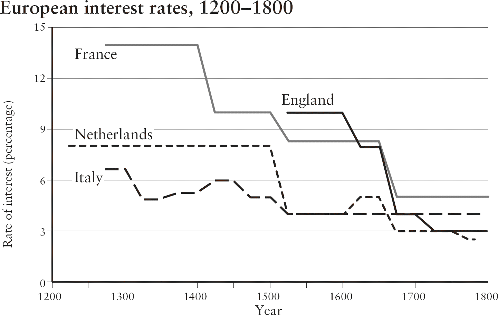

[4.](#section-9) Thanks to high savings and a well-developed financial system, the Dutch Republic by the late seventeenth century enjoyed the lowest interest rates in Europe.

Like many English ‘moneyed men’ of his day, Child looked enviously at Holland, whose merchants were able to borrow at 3 per cent in Amsterdam to lend onwards in London at 6 per cent.[9](#section-51) He believed Holland’s easy money was ‘the *Causa Causans* of all the other Causes of the Riches of that People’.[10](#section-51) A legal reduction in interest, Child argued, would help England compete with the Lowlanders. He envisaged a virtuous circle of ever-lower rates, whereby ‘the abatement of Interest causeth an encrease of Wealth, and the encrease of Wealth may cause a further abatement of Interest.’[fn1](#section-58) Like countless commentators over the ages, Child drew attention to the iniquities of compound interest, which serves to ‘make the Lenders monstrous rich’. An abatement would bring a ‘diffusive principle’, spreading riches more widely.[11](#section-51)

Yet Child was a most unlikely champion of the poor. Few men in England had grown more ‘monstrous rich’ than this, in the words of diarist John Evelyn, ‘most sordidly avaricious’ merchant.[12](#section-51) In truth, Child’s advocacy for lower interest was intensely self-interested. Like a modern buyout baron’s, his control of the East India Company, where he was shortly to become governor, was maintained through the extensive use of debt: the greater the gap between the company’s profits and the cost of borrowing, the greater his personal gains.[fn2](#section-58) Child was also an advocate of the company’s trading monopoly who distributed bribes to Members of Parliament to protect the ‘Honourable Company’, as the East India Company was then known, from competition. Contemporaries were well aware that he was talking his own book. As a cynical pamphleteer observed, demands for lowering interest were really designed for the ‘ingrossing all trade, into the hands of a few rich Merchants, who have Money enough of their own to Trade with, to the excluding all young men, that wants it’.[13](#section-51)

Child’s arguments may have been unoriginal, analytically doubtful and self-interested but, at least, they served the purpose of drawing out economically minded writers to defend the business of charging interest. Several pamphleteers pointed out that interest on capital was comparable to rent on land.[14](#section-51) There was a sense that higher interest rates improved the quality of lending. The author of ‘Usury at Six per cent Examined’ (1669) claimed that a reasonable lending charge ensured that money got into the best hands: ‘’Tis much better for the publick,’ wrote the anonymous pamphleteer, ‘that experienced Traders hire money, and employ it, than sit still, whilst commerce is manag’d by the unskillful.’[15](#section-51) Thomas Manley added that lowering the rate of interest would involve robbing Peter (the creditor) to pay Paul (the borrower).

It was generally agreed that a forced reduction in interest would only encourage money-hoarding. Sir Dudley North, anticipating Keynes’s later interest theory, wrote that ‘High Interest will bring Money out from Hoards, Plate, & c., into Trade, when low Interest will keep it back … the lowering of Interest may, and probably will, keep some Money from coming abroad into Trade; whereas on the contrary high Interest certainly brings it out.’[16](#section-51) The author of ‘Brief Observations of J.C.’ thought that raising interest rates, not lowering them, would stimulate trade by encouraging lending: ‘As credit is the sinew of conversation … So is the usurer the *causa emanativa* of this credit.’[17](#section-51)

### LOCKE’S CONSIDERATIONS

The controversy surrounding the maximum legal rate of interest flared up again in the early 1690s. Once again, the conditions of trade were dire: England was suffering a string of poor harvests, landowners were heavily indebted, the wool industry was depressed, and bankers had still not recovered from Charles II’s 1672 bankruptcy. The commencement of war with Louis XIV’s France brought further uncertainty for trade, as did a monetary crisis caused by the widespread circulation of clipped coins. Interest rates were rising. At this moment, Child brought out an updated edition of his *Discourse on Trade*, extending his by now familiar arguments. In 1691, a Bill was presented in the Commons proposing that the maximum legal rate of interest be lowered to 4 per cent.

More than two decades earlier John Locke had written an unpublished tract on the topic of interest. The liberal philosopher, who had just returned from a period of exile in Holland, now expanded his argument in a lengthy pamphlet, entitled *Some Considerations of the Consequences of the Lowering of Interest and the Raising of the Value of Money* (1691).

Contra Child, Locke saw many disadvantages arising from a forced reduction in borrowing costs. For a start, there would be winners and losers:

> It will be a loss to Widows, Orphans, and all those who have their Estates in Money … which will be a very hard case upon a great number of People; and it is warily to be consider’d by the Wisdom of the Nation, whether they will thus at one blow, fine and impoverish a great and innocent part of the People.[18](#section-51)

Nor were the winners a deserving bunch. Any reduction of interest, Locke thought, ‘will mightily increase the advantages of bankers and scriveners, and other such expert brokers … skilled in the arts of putting out money, according to the true and natural value’.[19](#section-51)

Besides, Locke believed that bankers wouldn’t pass on the benefits of lower interest but pocket the gains themselves. Indebted businessmen, like Child (whom he didn’t mention by name), would also profit. ‘It will be a gain to the borrowing merchant,’ wrote Locke. ‘For if he borrow at four per cent. and his returns be twelve per cent. he will have eight per cent. and the lender four.’[20](#section-51)

Locke feared that a reduction of interest would increase the demand for loans, for ‘every man would be forward to borrow, and desire that he might have other men’s money to employ to his advantage.’ Again this wasn’t desirable since it would ‘multiply the number of borrowers among us, of which it is certain we have too many already’.[21](#section-51) He didn’t see why feckless borrowers should be bailed out by cutting interest rates. Nor did he think that trade would benefit. On the contrary, a lower rate would ‘discourage lending at such a disproportion of profit, to risque’. Money would circulate more slowly and be hoarded, ‘for the Bankers … at that low Rate would be content to have more Money lye dead by them, than now when it is higher.’ And if money were withdrawn from circulation and hoarded, then its value would increase relative to other commodities (i.e., deflation would ensue).[fn3](#section-58)

It was widely believed by contemporaries that a reduction of interest would raise the value of land. Locke was unpersuaded. He thought other factors played upon land prices, and, even if land prices were to rise, there would be no advantage to the nation as a whole, since the lowering of interest merely ‘a little alters the distribution of the Money’: sellers of land would receive more money but buyers would have to pay more.[22](#section-51) Locke was concerned that cheaper borrowing would push money into the hands of City bankers, raising London house prices relative to the rest of the country.[23](#section-51)

Child put the cart before the horse when he claimed that low interest rates were the cause of Dutch wealth. The lowness of interest in Holland, said Locke, was not ‘an effect of Law … but as the Consequence of great Plenty of ready Money’, just as the Scots were not poor because they paid high interest, but rather paid high interest because they were poor.[24](#section-51) The Dutch enjoyed greater prosperity and cheaper borrowing, said Locke, not because low interest brought forth riches but because ‘the industry and frugality of that people, makes them content to work cheaper, and sell at less profit than their neighbours, and so get the trade from them.’

Locke also pointed out that England’s trade had thrived during the reign of Queen Elizabeth, when interest was at 10 per cent:

> I will not say high *Interest* was the Cause of it; for I rather think that our thriving Trade was the Cause of high *Interest*, every one craving Money to employ in a profitable Commerce. But this I think I may reasonably infer from it, That lowering of *Interest* is not a sure way to improve either our Trade or Wealth.[25](#section-51)

In short, Child’s claim that England’s prosperity would return simply by lowering interest rates was absurd: ‘If ill Husbandry has wasted our Riches,’ Locke wrote, we cannot hope, simply by reducing the rate of interest, to ‘raise them to their former value’.[26](#section-51)

As a matter of practical politics, Locke won this debate. Child and his allies failed to secure a reduction in the legal rate of interest either in the 1660s or the early 1690s. In 1713, however, the law was amended, and the maximum legal rate was fixed at 5 per cent. Only in 1854 was England’s usury law finally removed from the statute book. The Chancellor of the Exchequer, William Gladstone, at the time declared to the House of Commons that the ‘superstition which formerly prevailed [on the subject of usury] was partly Judaical and partly Mohammedan’. The pious Gladstone curiously omitted any mention of Christian superstition on this matter.

### THE NATURAL RATE OF INTEREST

Anti-usury polemicists often describe the charging of interest as inherently unnatural. Nature bore fruit, but money was barren, said Aristotle, thus the ‘birth of money from money’ was abhorrent. Such views were no longer feasible in the modern world. The great Dutch jurist Hugo Grotius declared that the prohibition of interest was not derived from Natural Law (although he acknowledged that it was imposed by Scripture).[27](#section-51) Most seventeenth-century English writers accepted that interest was a natural phenomenon. Their argument was about the appropriate level of interest: if rates were too high, then industry and trade must suffer, as Bacon and his followers rightly observed; but pushed too low, then the numerous ill consequences considered by Locke would follow.

Child’s critics thought that any attempt by the state to control interest was inherently futile. As one writer suggested, trying to reduce the cost of borrowing by law would be to ‘force nature’. Sir William Petty dismissed the ‘vanity and fruitlessness of making Civil Positive Laws [on usury] against the Laws of Nature’.[28](#section-51) A consensus emerged among English practitioners of ‘political arithmetick’ that interest – defined by one writer as ‘a Reward for forbearing the use of your own Money for a Term of Time agreed upon’ – was much like any other price, whose level should be determined by buyers and sellers in the market, rather than government fiat.[29](#section-51) As Sir Dudley North said, it was ‘best for the Nation to leave the Borrowers and the Lender to make their own Bargains, according to the Circumstances they lie under’.[30](#section-51)

The notion that interest must be free to find its own level underpins Locke’s argument. Any attempt to regulate interest, he believed, would only ‘increase the arts of lending’ as borrowers and lenders would seek to evade the law. For Locke, money was composed of precious metals, with a certain intrinsic value and of limited supply. This being the case, he thought the level of interest was fixed by the supply and demand for money, just like any other commodity. But what was the appropriate level of interest? This question has plagued economists ever since. Locke acknowledged it was a thorny issue:

> what the stated Rate of Interest should be in the constant change of Affairs, and flux of Money, is hard to determine. Possibly it may be allowed as a reasonable Proposal, that it should be within such Bounds, as should not on the one side quite Eat up the Merchant’s and the Tradesman’s profit, and discourage their Industry; nor on the other hand so low, as should hinder Men from Risquing their Money in other Men’s Hands, and so rather chuse to keep it out of Trade, than venture it upon so small profit.[31](#section-51)

At the time of writing this, Locke assumed that in England the natural rate of interest – or what he called ‘the natural value of Money’ – was above 4 per cent and probably closer to 6 per cent. Child’s writings, on the other hand, implied that the natural rate must be below 4 per cent.

A couple of generations later, another Englishman expressed a more precise opinion on this difficult question: ‘the natural rate of interest is governed by the Profits of Trade,’ wrote John Massie.[32](#section-51) Competition between traders, said Massie, caused profits to fall, which, in turn, resulted in a decline in the natural rate. At around the same date, Locke’s notion that money possessed an intrinsic value was contested by that other great philosopher-economist David Hume. In ‘Of Interest’, Hume declared that ‘Money having chiefly a fictitious value, the greater or less plenty of it is of no consequence.’ He went on to suggest that if the amount of money in the country doubled, prices would rise but there would be ‘no alteration on commerce, manufactures, navigation, or interest’. In other words, the natural rate of interest would prevail regardless of any change in the money supply.

Once it was agreed that the natural rate of interest was a reflection of ‘real’ (as opposed to monetary) factors, a new problem arose: namely, what happens if the money rate of interest diverges from its natural rate?

This question was taken up at the turn of the nineteenth century by Henry Thornton, an eminent City banker and evangelical friend of the abolitionist William Wilberforce. When Thornton published his *Enquiry into the Nature and Effects of the Paper Credit* in 1802, England was at war with France and the Bank of England had suspended convertibility of its notes into gold. An economic boom was under way, but the usury laws prevented the Bank from charging more than 5 per cent – an ‘unnatural and extraordinarily low’ level, in Thornton’s view. Borrowers were able to obtain loans cheaply: ‘That which they obtain too cheap they demand in too great quantity,’ lamented the prudent banker. In so many words, Thornton was suggesting that providing paper credit at below the natural rate of interest created the conditions for an unstable financial boom. The severe crisis that broke out in the City of London in the summer of 1810 appeared to vindicate Thornton’s view.[33](#section-51)

A century after Thornton, the Swedish economist Knut Wicksell discussed the potential for market rates of interest to diverge from the natural rate (i.e. the return on real capital) in his influential book *Prices and Interest*. Wicksell concluded that any discrepancy between market rates and the natural rate would be revealed by changes in the general price level: if interest rates were set too low there would be inflation, and if too high then deflation. For better or worse, this remains conventional wisdom among monetary policymakers in the twenty-first century. (Central bankers’ Wicksellian obsession with price stability in the 1920s and the early years of this century is discussed later in this book.)

In truth, the natural rate of interest is unobservable, a pure abstraction – in Wicksell’s description it is the rate at which capital would be lent in a world of barter, lacking any type of money.[34](#section-51) In Locke’s day, at least, money was backed by rare metals. In the modern world, however, money is created whenever a bank makes a loan and the link between acts of saving and lending has become more tenuous. In the early 1930s, Keynes and his Cambridge colleague Piero Sraffa went so far as to deny that a natural rate of interest could exist for an entire economy. Nevertheless, the concept of a natural rate – also referred to as the ‘neutral rate’, the ‘equilibrium rate’ and ‘r-star’ – remains indispensable for economists.

Even though it cannot be known with certainty, it is useful to hold in mind how the world would look if the natural rate held sway; a rate that was set, as Locke imagined, by individuals freely lending and borrowing money in the market, like any other commodity; a rate that accurately reflects society’s time preference; which ensures that we neither borrow too much nor save too little; which ensures capital is used efficiently, and puts an accurate value on land and other assets; a rate which provides savers with a fair return and is not so low as to subsidize bankers and their financial friends, nor so high as to bite borrowers.

Like Locke, we may be fuzzy about where the natural rate of interest lies exactly, but we can tell its absence. When the cost of borrowing is set at too high a level, then businesses won’t borrow to invest, creditors gain unduly at the expense of debtors, capital values are depressed, workers remain idle and the economy stagnates. When bond yields far exceed the growth in national income, then existing debt becomes burdensome and bankruptcy beckons. (Economists refer to this state of affairs as a ‘debt trap’.) High interest is associated with deflation and what Bacon called ‘public poverty’. As we shall see, Britain suffered many of these ills after its ill-fated return to the Gold Standard in the 1920s caused interest rates to rise to unbearable levels.

An excessively low rate of interest may be signalled by a rise in inflation. But it’s not just a question of changes in the level of consumer prices. When asset price bubbles proliferate, credit booms, finance crowds out honest endeavour, savings collapse and capital is misallocated on a grand scale, the chances are that market rates of interest are not aligned with the natural rate.

Locke was the first writer to consider at length the potential damage produced by taking interest rates below their natural level. It’s worth summarizing his position in modern language. In his *Considerations* Locke suggested the following undesirable outcomes might occur:

- financiers would benefit at the expense of ‘widows and orphans’
- wealth would be redistributed from savers to borrowers
- creditors would be inadequately compensated for risk
- bankers would hoard money rather than lend it out
- as the velocity of money circulation declined, prices would fall (deflation)
- too much borrowing would take place
- money would flow abroad in search of higher returns
- asset price inflation would make the rich richer
- the reduction of interest rates wouldn’t revive a moribund economy

In short, Locke argued that a forced reduction in interest rates imparts no benefit to a society lacking in ‘industry and frugality’.[35](#section-51) Such views on interest hold little sway in the modern world. In the wake of the global financial crisis of 2008, central bankers slashed interest rates, hoping to revive economies by easing the burden of debt and boosting asset values. Their aims were remarkably similar to those espoused by the seventeenth-century advocates of easy money. Some policymakers even shared Josiah Child’s extraordinary belief that raising asset values by lowering the rate of interest was akin to creating real wealth.

After a decade and more of unconventional monetary policies, it appears that Locke was prescient. As we describe in later chapters, the central bankers’ policy of ultra-low interest rates hurt savers (‘widows and orphans’) while benefiting financiers and senior executives, who reaped windfall gains after the cost of borrowing fell below corporate profitability. Paper wealth has multiplied while genuine wealth has stagnated. Locke’s suggestion that the lowering of interest would induce banks to hoard, thereby slowing the circulation of money and promoting deflation (‘raising the value of money’) also came to pass. Nor did the collapse of interest rates bring about a reduction in debt levels, as the younger Culpeper promised, but induced excess borrowing, as Locke had foreseen. Finally, the dramatic collapse of interest rates failed to deliver a robust economy: ‘if ill husbandry has wasted our riches, [we cannot] hope by such kind of laws [i.e., lowering interest rates] to raise them to their former value.’ Once again, Locke was spot on.

In the light of recent experience, Child’s claims that a drop in interest rates would reduce inequality, discourage luxury and boost the population appear cruelly misguided.[fn4](#section-58) Still, the seventeenth-century exponents of easy money were not wrong in every respect. Bacon, the Culpepers and Child wanted higher land prices. After 2008, and indeed beforehand, ultra-low interest rates inflated house price bubbles around the world. Furthermore, Child’s claim that a decline in the rate of interest would bring about a further decline, ‘as love begets love’, has been vindicated. But whereas the City merchant described a virtuous cycle of ever-declining rates and rising prosperity, we see a vicious cycle in which the falling rates induce stagnation.

In later chapters, we examine how ultra-low interest rates contributed to a decline in productivity growth, asset price bubbles, rising debt levels, inadequate saving and inadequate returns on savings, widening inequality, financial fragility and ever-present deflationary pressures. Each one of these developments exerted further downward pressure on interest rates; taken together, their gravitational effect on the natural rate of interest appears overwhelming. It turns out that Child was right when he claimed that low rates would beget lower rates. Furthermore, in the light of recent experience it seems that interest really is both cause and effect, the *causa causans* of Child’s imagination.

<!-- rl-section id="sec-chapter003" class="titlepage" title="3" -->

## The Lowering of Interest

> *Whether a higher or lower interest be nationally disadvantageous or beneficial is an ancient theme which hath been learnedly and judiciously bandied in all ages and in most parts of the civilized world.*
>
> Sir Josiah Child, 1681

In the 1660s, England was struck by two major calamities and a lesser one. In December 1664, an outbreak of bubonic plague occurred at the London docks and in the parish of St Giles-in-the-Fields, Camden. Within a year and a half, the Great Plague of London had killed upwards of 100,000 people, roughly a quarter of the city’s population. No sooner had the epidemic begun to subside than, on 2 September 1666, a fire broke out in a baker’s house in Pudding Lane. The Great Fire of London gutted the medieval city, destroying most of its dwellings. The following June, the Dutch fleet carried out a daring raid on the English navy’s home port of Medway, burning many ships at their moorings and carrying off great prizes. To make matters worse, the extravagances of Charles II were ruining the country’s finances, culminating in the 1672 ‘Stop of the Exchequer’, the last recorded default on England’s sovereign debt.

These misfortunes were said to have produced an ‘infinite interruption to the whole trade of the nation’.[1](#section-51) The House of Lords appointed a committee to ‘consider of the causes and grounds of the fall of rents and decay of trade within this Kingdom’. An upcoming merchant (and future governor of the East India Company), Josiah Child, had a surefire proposal to cure England’s woes. Child proposed a reduction in the cost of borrowing; an ‘abatement of interest’, he suggested, ‘would tend to the increase of trade and advance the value of the lands of England’. The businessman outlined his ideas in a book, *Brief Observations Concerning Trade and the Interest of Money* (1668), which became one of the most popular works on economics to appear in the seventeenth century.

This is not to say that Child was at all original; he drew almost verbatim upon several earlier authors who had called for lower interest. After Elizabeth I’s 1571 Statute of Usury made interest legal, the never-ending controversy about interest shifted from the iniquities of usury per se to the perceived mischief caused by excessively high rates of interest. One of the earliest and most distinguished critics of high interest was the philosopher and statesman Sir Francis Bacon. In 1612, Bacon published an essay, ‘On Usury’, in which he conceded that some charge for borrowing money was inevitable, ‘for since there must be borrowing and lending, and men are so hard of heart, as they will not lend freely, usury must be permitted.’ Nevertheless, he identified several ‘discommodities of usury’:

> *First*, that it makes fewer merchants … *second*, that it makes poor merchants … *third* … is the decay of customs [tax receipts] … *fourth*, that it bringeth the treasure of a realm, or state, into a few hands … and ever a state flourisheth, when wealth is more equally spread … The *fifth*, that it beats down the price of land … The *sixth*, that it doth dull and damp all industries, improvements, and new inventions … The last, that it is the canker and ruin of many men’s estates; which, in process of time, breeds a public poverty.

Having been personally in debt since his youth, and once arrested for nonpayment, Bacon knew from experience how interest ‘ate up old estates with mortgage payments’. He recommended that interest should be reduced to the point that it provided a ‘sufficient inducement to make those advances which are so necessary for the steadiness and the life of commerce’.[2](#section-51)

The refrain that high interest serves to depress trade, reduce the amount raised by taxes, promote inequality, reward idleness and, above all, reduce the price of land was repeated with little variation by several other writers over the course of the seventeenth century. In Bacon’s wake came Sir Thomas Culpeper, MP, who published his ‘Tract Against Usury’ (1621) in a successful attempt to persuade Parliament to lower the maximum rate of interest to 8 per cent. Once again, the argument was advanced that interest was a tax on industry and a transfer to the indolent, or, as expressed more grandiloquently by Josiah Child, interest ‘suffer[s] Idleness to Suck the Breasts of Industry’.[3](#section-51)

Sir Thomas Culpeper the Younger, who took up his father’s advocacy of low interest, claimed that an abatement of interest would ‘revive our dying Manufacture’. As members of the landed class, the Culpepers’ prime concern was with the relationship between the price of land and interest costs. Culpeper Senior lamented that the ‘high rate of Usury makes Land sell so cheape’.[4](#section-51) The lowering of interest, he thought, would encourage agricultural improvements. It would also ease the debt burden of the landowners, ‘and so the Nobility and Gentry would soon be out of Debt’.[5](#section-51) The younger Culpeper envisioned the wondrous effects that would arise from a reduction in interest:

> To the King, increase of his Customs. To the Kingdom, increase of Land, by Enriching of this. To the Nobility and Gentry, deliverance from Bondage and Debt. To Merchants, continuance and flowrishing in their Trade. To young Beginners in Trade and Commerce, the Fruits of their own Labours. To labourers, quick imployment.[6](#section-51)

### CHILD’S PLAY

If Bacon and the Culpepers advocated lower interest on behalf of an indebted aristocracy, commercial interests found their voice in the writings of Sir Josiah Child. In 1624, partly in response to Culpeper Senior’s lobbying, the maximum rate of interest had been reduced from 10 to 8 per cent, and in 1651 to 6 per cent. In his supplication to the Lords in 1668, Child advocated a further abatement to 4 per cent. His reasoning would not look out of place at a contemporary gathering of the Bank of England’s Monetary Policy Committee:

> For the abatement of Interest will certainly and necessarily increase Industry and good Husbandry; it will as certainly multiply Traders and Stock in Trade, and in consequence the gain of the present Merchant who employs his own Stock [i.e. capital], and lends to others, will be the less.[7](#section-51)

The real wealth of the kingdom, said Child, would be augmented by a reduction of the rate of interest and the country’s ‘stock’ (capital) might be expected to double within twenty years. Child found other potential benefits arising from an abatement of interest: idleness and luxury would be discouraged, while the improvement of trade would encourage births and immigration.[8](#section-51)

The decline in European interest rates in the late Middle Ages facilitated the accumulation of capital, which in turn produced a further lowering of rates. The expansion of banking speeded up the circulation of money, providing further downward pressure on interest rates. By 1600, the yield on Genoese loans had fallen below 3 per cent. The Dutch Republic enjoyed a similar windfall. The Dutch were a frugal and industrious people; their Republic supported no extravagant Court, and their public debt was ‘funded’ on the credit of its towns and provinces. By the end of the seventeenth century, the cost of borrowing in Amsterdam reached 1¾ per cent – the lowest level ever seen in Northern Europe.

[4.](#section-9) Thanks to high savings and a well-developed financial system, the Dutch Republic by the late seventeenth century enjoyed the lowest interest rates in Europe.

Like many English ‘moneyed men’ of his day, Child looked enviously at Holland, whose merchants were able to borrow at 3 per cent in Amsterdam to lend onwards in London at 6 per cent.[9](#section-51) He believed Holland’s easy money was ‘the *Causa Causans* of all the other Causes of the Riches of that People’.[10](#section-51) A legal reduction in interest, Child argued, would help England compete with the Lowlanders. He envisaged a virtuous circle of ever-lower rates, whereby ‘the abatement of Interest causeth an encrease of Wealth, and the encrease of Wealth may cause a further abatement of Interest.’[fn1](#section-58) Like countless commentators over the ages, Child drew attention to the iniquities of compound interest, which serves to ‘make the Lenders monstrous rich’. An abatement would bring a ‘diffusive principle’, spreading riches more widely.[11](#section-51)

Yet Child was a most unlikely champion of the poor. Few men in England had grown more ‘monstrous rich’ than this, in the words of diarist John Evelyn, ‘most sordidly avaricious’ merchant.[12](#section-51) In truth, Child’s advocacy for lower interest was intensely self-interested. Like a modern buyout baron’s, his control of the East India Company, where he was shortly to become governor, was maintained through the extensive use of debt: the greater the gap between the company’s profits and the cost of borrowing, the greater his personal gains.[fn2](#section-58) Child was also an advocate of the company’s trading monopoly who distributed bribes to Members of Parliament to protect the ‘Honourable Company’, as the East India Company was then known, from competition. Contemporaries were well aware that he was talking his own book. As a cynical pamphleteer observed, demands for lowering interest were really designed for the ‘ingrossing all trade, into the hands of a few rich Merchants, who have Money enough of their own to Trade with, to the excluding all young men, that wants it’.[13](#section-51)

Child’s arguments may have been unoriginal, analytically doubtful and self-interested but, at least, they served the purpose of drawing out economically minded writers to defend the business of charging interest. Several pamphleteers pointed out that interest on capital was comparable to rent on land.[14](#section-51) There was a sense that higher interest rates improved the quality of lending. The author of ‘Usury at Six per cent Examined’ (1669) claimed that a reasonable lending charge ensured that money got into the best hands: ‘’Tis much better for the publick,’ wrote the anonymous pamphleteer, ‘that experienced Traders hire money, and employ it, than sit still, whilst commerce is manag’d by the unskillful.’[15](#section-51) Thomas Manley added that lowering the rate of interest would involve robbing Peter (the creditor) to pay Paul (the borrower).

It was generally agreed that a forced reduction in interest would only encourage money-hoarding. Sir Dudley North, anticipating Keynes’s later interest theory, wrote that ‘High Interest will bring Money out from Hoards, Plate, & c., into Trade, when low Interest will keep it back … the lowering of Interest may, and probably will, keep some Money from coming abroad into Trade; whereas on the contrary high Interest certainly brings it out.’[16](#section-51) The author of ‘Brief Observations of J.C.’ thought that raising interest rates, not lowering them, would stimulate trade by encouraging lending: ‘As credit is the sinew of conversation … So is the usurer the *causa emanativa* of this credit.’[17](#section-51)

### LOCKE’S CONSIDERATIONS

The controversy surrounding the maximum legal rate of interest flared up again in the early 1690s. Once again, the conditions of trade were dire: England was suffering a string of poor harvests, landowners were heavily indebted, the wool industry was depressed, and bankers had still not recovered from Charles II’s 1672 bankruptcy. The commencement of war with Louis XIV’s France brought further uncertainty for trade, as did a monetary crisis caused by the widespread circulation of clipped coins. Interest rates were rising. At this moment, Child brought out an updated edition of his *Discourse on Trade*, extending his by now familiar arguments. In 1691, a Bill was presented in the Commons proposing that the maximum legal rate of interest be lowered to 4 per cent.

More than two decades earlier John Locke had written an unpublished tract on the topic of interest. The liberal philosopher, who had just returned from a period of exile in Holland, now expanded his argument in a lengthy pamphlet, entitled *Some Considerations of the Consequences of the Lowering of Interest and the Raising of the Value of Money* (1691).

Contra Child, Locke saw many disadvantages arising from a forced reduction in borrowing costs. For a start, there would be winners and losers:

> It will be a loss to Widows, Orphans, and all those who have their Estates in Money … which will be a very hard case upon a great number of People; and it is warily to be consider’d by the Wisdom of the Nation, whether they will thus at one blow, fine and impoverish a great and innocent part of the People.[18](#section-51)

Nor were the winners a deserving bunch. Any reduction of interest, Locke thought, ‘will mightily increase the advantages of bankers and scriveners, and other such expert brokers … skilled in the arts of putting out money, according to the true and natural value’.[19](#section-51)

Besides, Locke believed that bankers wouldn’t pass on the benefits of lower interest but pocket the gains themselves. Indebted businessmen, like Child (whom he didn’t mention by name), would also profit. ‘It will be a gain to the borrowing merchant,’ wrote Locke. ‘For if he borrow at four per cent. and his returns be twelve per cent. he will have eight per cent. and the lender four.’[20](#section-51)

Locke feared that a reduction of interest would increase the demand for loans, for ‘every man would be forward to borrow, and desire that he might have other men’s money to employ to his advantage.’ Again this wasn’t desirable since it would ‘multiply the number of borrowers among us, of which it is certain we have too many already’.[21](#section-51) He didn’t see why feckless borrowers should be bailed out by cutting interest rates. Nor did he think that trade would benefit. On the contrary, a lower rate would ‘discourage lending at such a disproportion of profit, to risque’. Money would circulate more slowly and be hoarded, ‘for the Bankers … at that low Rate would be content to have more Money lye dead by them, than now when it is higher.’ And if money were withdrawn from circulation and hoarded, then its value would increase relative to other commodities (i.e., deflation would ensue).[fn3](#section-58)

It was widely believed by contemporaries that a reduction of interest would raise the value of land. Locke was unpersuaded. He thought other factors played upon land prices, and, even if land prices were to rise, there would be no advantage to the nation as a whole, since the lowering of interest merely ‘a little alters the distribution of the Money’: sellers of land would receive more money but buyers would have to pay more.[22](#section-51) Locke was concerned that cheaper borrowing would push money into the hands of City bankers, raising London house prices relative to the rest of the country.[23](#section-51)

Child put the cart before the horse when he claimed that low interest rates were the cause of Dutch wealth. The lowness of interest in Holland, said Locke, was not ‘an effect of Law … but as the Consequence of great Plenty of ready Money’, just as the Scots were not poor because they paid high interest, but rather paid high interest because they were poor.[24](#section-51) The Dutch enjoyed greater prosperity and cheaper borrowing, said Locke, not because low interest brought forth riches but because ‘the industry and frugality of that people, makes them content to work cheaper, and sell at less profit than their neighbours, and so get the trade from them.’

Locke also pointed out that England’s trade had thrived during the reign of Queen Elizabeth, when interest was at 10 per cent:

> I will not say high *Interest* was the Cause of it; for I rather think that our thriving Trade was the Cause of high *Interest*, every one craving Money to employ in a profitable Commerce. But this I think I may reasonably infer from it, That lowering of *Interest* is not a sure way to improve either our Trade or Wealth.[25](#section-51)

In short, Child’s claim that England’s prosperity would return simply by lowering interest rates was absurd: ‘If ill Husbandry has wasted our Riches,’ Locke wrote, we cannot hope, simply by reducing the rate of interest, to ‘raise them to their former value’.[26](#section-51)

As a matter of practical politics, Locke won this debate. Child and his allies failed to secure a reduction in the legal rate of interest either in the 1660s or the early 1690s. In 1713, however, the law was amended, and the maximum legal rate was fixed at 5 per cent. Only in 1854 was England’s usury law finally removed from the statute book. The Chancellor of the Exchequer, William Gladstone, at the time declared to the House of Commons that the ‘superstition which formerly prevailed [on the subject of usury] was partly Judaical and partly Mohammedan’. The pious Gladstone curiously omitted any mention of Christian superstition on this matter.

### THE NATURAL RATE OF INTEREST

Anti-usury polemicists often describe the charging of interest as inherently unnatural. Nature bore fruit, but money was barren, said Aristotle, thus the ‘birth of money from money’ was abhorrent. Such views were no longer feasible in the modern world. The great Dutch jurist Hugo Grotius declared that the prohibition of interest was not derived from Natural Law (although he acknowledged that it was imposed by Scripture).[27](#section-51) Most seventeenth-century English writers accepted that interest was a natural phenomenon. Their argument was about the appropriate level of interest: if rates were too high, then industry and trade must suffer, as Bacon and his followers rightly observed; but pushed too low, then the numerous ill consequences considered by Locke would follow.

Child’s critics thought that any attempt by the state to control interest was inherently futile. As one writer suggested, trying to reduce the cost of borrowing by law would be to ‘force nature’. Sir William Petty dismissed the ‘vanity and fruitlessness of making Civil Positive Laws [on usury] against the Laws of Nature’.[28](#section-51) A consensus emerged among English practitioners of ‘political arithmetick’ that interest – defined by one writer as ‘a Reward for forbearing the use of your own Money for a Term of Time agreed upon’ – was much like any other price, whose level should be determined by buyers and sellers in the market, rather than government fiat.[29](#section-51) As Sir Dudley North said, it was ‘best for the Nation to leave the Borrowers and the Lender to make their own Bargains, according to the Circumstances they lie under’.[30](#section-51)

The notion that interest must be free to find its own level underpins Locke’s argument. Any attempt to regulate interest, he believed, would only ‘increase the arts of lending’ as borrowers and lenders would seek to evade the law. For Locke, money was composed of precious metals, with a certain intrinsic value and of limited supply. This being the case, he thought the level of interest was fixed by the supply and demand for money, just like any other commodity. But what was the appropriate level of interest? This question has plagued economists ever since. Locke acknowledged it was a thorny issue:

> what the stated Rate of Interest should be in the constant change of Affairs, and flux of Money, is hard to determine. Possibly it may be allowed as a reasonable Proposal, that it should be within such Bounds, as should not on the one side quite Eat up the Merchant’s and the Tradesman’s profit, and discourage their Industry; nor on the other hand so low, as should hinder Men from Risquing their Money in other Men’s Hands, and so rather chuse to keep it out of Trade, than venture it upon so small profit.[31](#section-51)

At the time of writing this, Locke assumed that in England the natural rate of interest – or what he called ‘the natural value of Money’ – was above 4 per cent and probably closer to 6 per cent. Child’s writings, on the other hand, implied that the natural rate must be below 4 per cent.

A couple of generations later, another Englishman expressed a more precise opinion on this difficult question: ‘the natural rate of interest is governed by the Profits of Trade,’ wrote John Massie.[32](#section-51) Competition between traders, said Massie, caused profits to fall, which, in turn, resulted in a decline in the natural rate. At around the same date, Locke’s notion that money possessed an intrinsic value was contested by that other great philosopher-economist David Hume. In ‘Of Interest’, Hume declared that ‘Money having chiefly a fictitious value, the greater or less plenty of it is of no consequence.’ He went on to suggest that if the amount of money in the country doubled, prices would rise but there would be ‘no alteration on commerce, manufactures, navigation, or interest’. In other words, the natural rate of interest would prevail regardless of any change in the money supply.

Once it was agreed that the natural rate of interest was a reflection of ‘real’ (as opposed to monetary) factors, a new problem arose: namely, what happens if the money rate of interest diverges from its natural rate?

This question was taken up at the turn of the nineteenth century by Henry Thornton, an eminent City banker and evangelical friend of the abolitionist William Wilberforce. When Thornton published his *Enquiry into the Nature and Effects of the Paper Credit* in 1802, England was at war with France and the Bank of England had suspended convertibility of its notes into gold. An economic boom was under way, but the usury laws prevented the Bank from charging more than 5 per cent – an ‘unnatural and extraordinarily low’ level, in Thornton’s view. Borrowers were able to obtain loans cheaply: ‘That which they obtain too cheap they demand in too great quantity,’ lamented the prudent banker. In so many words, Thornton was suggesting that providing paper credit at below the natural rate of interest created the conditions for an unstable financial boom. The severe crisis that broke out in the City of London in the summer of 1810 appeared to vindicate Thornton’s view.[33](#section-51)

A century after Thornton, the Swedish economist Knut Wicksell discussed the potential for market rates of interest to diverge from the natural rate (i.e. the return on real capital) in his influential book *Prices and Interest*. Wicksell concluded that any discrepancy between market rates and the natural rate would be revealed by changes in the general price level: if interest rates were set too low there would be inflation, and if too high then deflation. For better or worse, this remains conventional wisdom among monetary policymakers in the twenty-first century. (Central bankers’ Wicksellian obsession with price stability in the 1920s and the early years of this century is discussed later in this book.)

In truth, the natural rate of interest is unobservable, a pure abstraction – in Wicksell’s description it is the rate at which capital would be lent in a world of barter, lacking any type of money.[34](#section-51) In Locke’s day, at least, money was backed by rare metals. In the modern world, however, money is created whenever a bank makes a loan and the link between acts of saving and lending has become more tenuous. In the early 1930s, Keynes and his Cambridge colleague Piero Sraffa went so far as to deny that a natural rate of interest could exist for an entire economy. Nevertheless, the concept of a natural rate – also referred to as the ‘neutral rate’, the ‘equilibrium rate’ and ‘r-star’ – remains indispensable for economists.

Even though it cannot be known with certainty, it is useful to hold in mind how the world would look if the natural rate held sway; a rate that was set, as Locke imagined, by individuals freely lending and borrowing money in the market, like any other commodity; a rate that accurately reflects society’s time preference; which ensures that we neither borrow too much nor save too little; which ensures capital is used efficiently, and puts an accurate value on land and other assets; a rate which provides savers with a fair return and is not so low as to subsidize bankers and their financial friends, nor so high as to bite borrowers.

Like Locke, we may be fuzzy about where the natural rate of interest lies exactly, but we can tell its absence. When the cost of borrowing is set at too high a level, then businesses won’t borrow to invest, creditors gain unduly at the expense of debtors, capital values are depressed, workers remain idle and the economy stagnates. When bond yields far exceed the growth in national income, then existing debt becomes burdensome and bankruptcy beckons. (Economists refer to this state of affairs as a ‘debt trap’.) High interest is associated with deflation and what Bacon called ‘public poverty’. As we shall see, Britain suffered many of these ills after its ill-fated return to the Gold Standard in the 1920s caused interest rates to rise to unbearable levels.

An excessively low rate of interest may be signalled by a rise in inflation. But it’s not just a question of changes in the level of consumer prices. When asset price bubbles proliferate, credit booms, finance crowds out honest endeavour, savings collapse and capital is misallocated on a grand scale, the chances are that market rates of interest are not aligned with the natural rate.

Locke was the first writer to consider at length the potential damage produced by taking interest rates below their natural level. It’s worth summarizing his position in modern language. In his *Considerations* Locke suggested the following undesirable outcomes might occur:

- financiers would benefit at the expense of ‘widows and orphans’
- wealth would be redistributed from savers to borrowers
- creditors would be inadequately compensated for risk
- bankers would hoard money rather than lend it out
- as the velocity of money circulation declined, prices would fall (deflation)
- too much borrowing would take place
- money would flow abroad in search of higher returns
- asset price inflation would make the rich richer
- the reduction of interest rates wouldn’t revive a moribund economy

In short, Locke argued that a forced reduction in interest rates imparts no benefit to a society lacking in ‘industry and frugality’.[35](#section-51) Such views on interest hold little sway in the modern world. In the wake of the global financial crisis of 2008, central bankers slashed interest rates, hoping to revive economies by easing the burden of debt and boosting asset values. Their aims were remarkably similar to those espoused by the seventeenth-century advocates of easy money. Some policymakers even shared Josiah Child’s extraordinary belief that raising asset values by lowering the rate of interest was akin to creating real wealth.

After a decade and more of unconventional monetary policies, it appears that Locke was prescient. As we describe in later chapters, the central bankers’ policy of ultra-low interest rates hurt savers (‘widows and orphans’) while benefiting financiers and senior executives, who reaped windfall gains after the cost of borrowing fell below corporate profitability. Paper wealth has multiplied while genuine wealth has stagnated. Locke’s suggestion that the lowering of interest would induce banks to hoard, thereby slowing the circulation of money and promoting deflation (‘raising the value of money’) also came to pass. Nor did the collapse of interest rates bring about a reduction in debt levels, as the younger Culpeper promised, but induced excess borrowing, as Locke had foreseen. Finally, the dramatic collapse of interest rates failed to deliver a robust economy: ‘if ill husbandry has wasted our riches, [we cannot] hope by such kind of laws [i.e., lowering interest rates] to raise them to their former value.’ Once again, Locke was spot on.

In the light of recent experience, Child’s claims that a drop in interest rates would reduce inequality, discourage luxury and boost the population appear cruelly misguided.[fn4](#section-58) Still, the seventeenth-century exponents of easy money were not wrong in every respect. Bacon, the Culpepers and Child wanted higher land prices. After 2008, and indeed beforehand, ultra-low interest rates inflated house price bubbles around the world. Furthermore, Child’s claim that a decline in the rate of interest would bring about a further decline, ‘as love begets love’, has been vindicated. But whereas the City merchant described a virtuous cycle of ever-declining rates and rising prosperity, we see a vicious cycle in which the falling rates induce stagnation.

In later chapters, we examine how ultra-low interest rates contributed to a decline in productivity growth, asset price bubbles, rising debt levels, inadequate saving and inadequate returns on savings, widening inequality, financial fragility and ever-present deflationary pressures. Each one of these developments exerted further downward pressure on interest rates; taken together, their gravitational effect on the natural rate of interest appears overwhelming. It turns out that Child was right when he claimed that low rates would beget lower rates. Furthermore, in the light of recent experience it seems that interest really is both cause and effect, the *causa causans* of Child’s imagination.

<!-- rl-section id="section-16" class="epub-section" kicker="Section 16" title="4" -->

## 4

## The Chimera

> *’Tis not altogether improbable, that when the nation become heartily sick of their debts, and are cruelly oppressed by them, some daring projector may arise with visionary schemes for their discharge. And as public credit will begin, by that time, to be a little frail, the least touch will destroy it, as happened in France; and in this manner it will die of the doctor*.
>
> David Hume, ‘Of Public Credit’, 1752

Just after midday on 9 April 1694, two young gentlemen met in Bloomsbury Square, London, to settle a matter of honour. One of the combatants, Edward ‘Beau’ Wilson, was the younger son of a man with an income of just £200 a year, yet who (according to John Evelyn) ‘lived in the garb and equipage of the richest nobleman’.[1](#section-51) The other duellist, known to his friends as ‘Jessamy John’, had a brilliant head for figures but was reputed to be ‘nicely expert in all manner of debaucheries’. It was Wilson’s fate to perish in this duel. The man responsible for his murder, John Law, was destined for greatness.

Law was the son of the late William Law of Lauriston, a prosperous Edinburgh goldsmith. The Lauriston in his title refers to a castle overlooking the Firth of Forth, which had been acquired by William and inherited by his son. After his father’s death, the feckless youth ran away from home and lost his inheritance at the gaming tables of London. Despite these early losses, Law was a natural mathematician. As the British ambassador in Paris Lord Stair later commented, he had ‘a head fit for calculations of all kinds to an extent beyond anybody’.[2](#section-51) This skill was later to earn him a gambling fortune. Even by this date, Law had cultivated another characteristic that marked out his later career, namely an effortless ability to attract influential supporters.

Arrested immediately after the duel, Law claimed that Wilson had fallen on his sword. The judge was not impressed and condemned him to be hanged. But high-placed acquaintances at Court intervened to beg for a royal pardon, and when that was not forthcoming Law’s friends arranged his escape from gaol, from where he fled to the Continent. Law was twenty-three years old when these events took place. A quarter of a century later, he cut a very different figure. In 1720, the Scotsman was appointed France’s finance minister. He was also the founder and head of the French central bank, and ran a vast corporate enterprise, known as the Mississippi Company, whose activities encompassed a large share of the French economy. Law’s shareholding in the company was worth a vast fortune, and he was ennobled as the Duke of Arkansas.

That a foreigner and fugitive from English justice should rise to such heights in his adopted country seems scarcely believable. Daniel Defoe, the keenest financial observer of the age, disparaged Law’s success. In order to rise in this world, wrote Defoe,

> The case is plain, you must put on a sword, kill a beau or two, get into Newgate [gaol], be condemned to be hanged, break prison if you can, – *remember that by the way*, – get over to some strange country, turn stock-jobber, set up a Mississippi stock, bubble a nation, and you may soon be a great man.[3](#section-51)

Equally remarkable is the fact that this convicted murderer should later earn a place in the pantheon of great economists. ‘He worked out the economics of his projects,’ enthuses Schumpeter, ‘with a brilliance and, yes, profundity, which places him in the front rank of monetary theorists of all times.’[4](#section-51) Law has been called the original monetarist – an eighteenth-century forerunner of Milton Friedman. His monetary policy prescriptions form the basis for modern central banking.

Yet Law’s ‘System’, as he called it, was a spectacular failure. No sooner had the Scotsman achieved his eminence than the bubble burst, his project and monetary ideas utterly discredited. Most accounts of the Mississippi Bubble are concerned with the ‘madness of crowds’, as evidenced by the frenzied speculation that took place in the rue Quincampoix, the Parisian open-air stock market. But this outbreak of speculative fever wasn’t a random event. In this chapter, we trace the source of the Mississippi bubble and its subsequent collapse to Law’s ambitious monetary experiment and, in particular, his policy of expanding France’s money supply and cutting interest rates. While Locke considered the inconveniences that might take the rate of interest below its natural level, Law conducted the world’s first experiment with easy money. His story of boom and bust is a cautionary tale for our times.

### THE SYSTEM

Law’s reputation as a brilliant economist rests on some pamphlets he authored a decade or so after his escape to the Continent. In his *Essay on a Land Bank* (*c*. 1703–4) and *Money and Trade Considered* (1705), the fugitive Scot displayed novel insights about the nature of money. Money, he said, did not derive its value from precious metals, as people like Locke believed. Rather, money was simply a yardstick of value; or, as he put it, ‘Money is not the Value for which Goods are exchanged, but the Value by which they are exchanged.’[5](#section-51) This clever switching of the prepositions – *by* in place of *for* – amounted to a monetary revolution. In essence, he was saying that since money lacked intrinsic value it need not be backed by gold or other precious metals.

A constant theme in Law’s writings is that trade depends on the circulation of credit, and that credit was ‘only lost by a scarcity of Money’.[6](#section-51) Here Law anticipates later monetarists. He argued that prosperity could be achieved by establishing a bank that issued paper money, collateralized with land rather than gold and silver. By severing the link between money and precious metals, Law opened the possibility of a managed currency.

Law’s ideas about money were the product of his age. As the son of a goldsmith-banker, the young Law would have observed how his father’s notes were accepted for the settlement of debt.[7](#section-51) By the late seventeenth century, inland bills of exchange financed much of England’s domestic trade. Defoe scorned any claim that Law might have to originality; the notion that paper credit could serve as money, lessening the need for hard currency, he wrote, ‘are common topics that every stock-jobber is master of’.[8](#section-51) Nor was Law the first to propose a land bank; that honour belongs to a certain William Potter who came up with the idea during Cromwell’s Protectorate. Law was one of several contemporary land bank advocates writing at the close of the seventeenth century.

Another influence on Law’s thinking was the Bank of England, which opened its doors in the spring of 1694 at around the date of his murder conviction. The Bank’s first issue of paper notes was backed not by gold but by a claim on the public credit, which derived from a large loan made by shareholders to the government of William of Orange. Law was later to imitate this example. After leaving Britain, Law lived at times in Amsterdam, home to Europe’s first central bank, the *Wisselbank* (established in 1609), and in Genoa, whose leading bank, the Casa di San Giorgio, had been founded in the fifteenth century to consolidate the city’s debts.[fn1](#section-58)

On several occasions Law attempted to interest governments in his land bank scheme, but he was turned down successively by the English, the Scots, the Duke of Savoy and by Louis XIV of France. As Keynes later lamented, the most problematic aspect of having new economic ideas is persuading others of their virtue. Finally, Law’s luck changed. Louis XIV died in September 1715. As the heir to the throne, Louis XV, was a mere five-year-old, France came under the regency of Philippe II, Duke of Orléans, a louche character more open to new ideas than his uncle, the late king.

The Regent faced a dire situation. The royal finances had been ruined by Louis XIV’s endless wars. The king’s debts were roughly the size of France’s total annual output, and tax revenues were inadequate to cover interest payments. The debt traded at a large discount to its nominal value. France’s economic situation was parlous: ‘Bankruptcies were rife; thousands of workers were unemployed; manufactures were idle; commerce was stagnant; and agriculture in distress,’ writes the economic historian Earl J. Hamiltion.[fn2](#section-58) Money was scarce and prices were falling. At this opportune moment, Law, who had recently settled in Paris, made a proposal to the Regent. The French state, he suggested, faced two pressing problems: it owed too much and paid too much on its debt. He proposed that France establish a national bank, modelled on the Bank of England:

> The bank is not the only nor the biggest of my ideas – I will produce a work which will surprise Europe by the changes that it will generate in France’s favour, changes which will … establish order in its financial situation, to restore, provide for, and increase agriculture, manufactures, and trade, to increase the size of the population and the general revenue of the kingdom, to repay the useless and onerous ‘charges’, to increase the King’s revenues while caring for the people, and to reduce the state’s indebtedness without hurting its creditors.[9](#section-51)

France would become the arbiter of Europe, Law promised. All this would be achieved ‘not by laws, but by an abundance of money’.[10](#section-51) Within a few years, the ambitious projector would prove as good as his word.

Law was an advocate of low interest long before he approached the Regent. He believed that interest was what we would now call a ‘monetary variable’. In his early pamphlets, Law argued that interest was determined by the supply of money and that a national bank could bring about a reduction in interest by increasing the money supply. He believed that the Dutch enjoyed lower borrowing costs because they had a greater quantity of money in circulation (not, as Locke and others supposed, because the Dutch were thrifty and possessed a greater stock of capital). The Scotsman ascribed the gradual decline in European interest rates over the previous couple of centuries to inflows of silver from South America. During his stay in Genoa, he observed how interest rates in the city dipped whenever Spanish bullion ships appeared on the horizon.[11](#section-51)

Like Josiah Child before him, Law anticipated that great economic benefits would follow from a reduction in the cost of borrowing: ‘If lowness of interest were the consequence of a greater quantity of money, the stock applied to trade would be greater, and merchants would trade cheaper, from the easiness of borrowing, and the lower interest of money, without any inconveniences attending it,’ he wrote in *Money and Trade Considered*. A decade later, Law elaborated on this theme to the French Regent:

> An abundance of money which would lower the interest rate to 2 per cent would, in reducing the financing costs of the debts and public offices, etc., relieve the King. It would lighten the burden of the indebted noble landowners. This latter group would be enriched because agricultural goods would be sold at higher prices. It would enrich traders who would then be able to borrow at a lower interest rate and give employment to the people.[12](#section-51)

In modern language, Law was suggesting that a central bank could reduce interest rates by printing money; that this would alleviate the position of heavily indebted borrowers (in this case, French nobles), create jobs and revive the economy. At the same time, the cost of servicing government debt would fall and deflation come to an end. In the aftermath of the 2008 financial crisis, the world’s central bankers acted with similar intentions.

The Regent’s Council initially rejected Law’s proposal of late 1715 to establish a national bank in France but granted him permission for a private bank. The General Bank, as it was called, opened its doors in May 1716. The bank received the patronage of the Regent, who took a large shareholding and issued an edict making its notes legal tender for the payment of taxes. These notes were redeemable in gold but, unlike gold and silver coin, they could not be debased by royal command. The General Bank’s main business lay in managing accounts, discounting bills of exchange and providing foreign exchange services. It sported a conservative balance sheet, earned decent profits and paid generous dividends.

This was only the first step. A year later, Law took over a company that possessed monopoly trading rights and land claims to French Louisiana, an area covering roughly half the current landmass of the United States (excluding Alaska). The Company of the Indies is better known to posterity as the Mississippi Company. Law subsequently merged this business with France’s other trading monopolies (the Senegal, East India and China companies), along with the tobacco monopoly, the contract to farm the royal taxes and the mint. To cap it all, in the late summer of 1719 Law arranged for the Mississippi Company to take over France’s entire national debt, in exchange for an annual payment. Government creditors were given the opportunity to swap their bonds for shares in Law’s company. In the space of three years, the Scotsman had created ‘the most colossal financial power ever known’.[13](#section-51) His System, encompassing commercial, debt management and banking operations, was the most ambitious economic experiment prior to the Russian Revolution.

### THE GOD MAMMON

Shares in the Mississippi Company were issued to the public at 500 livres. Following the example of the General Bank’s earlier flotation, three-quarters of the subscription could be paid for in depreciated government debt. For the first couple of years the stock flat-lined. But then Law opened the monetary spigots. In December 1718, the General Bank was nationalized and renamed the Royal Bank. This was the type of institution that Law had envisioned in his earlier writings. Unlike the General Bank, the Royal Bank’s notes were denominated in the unit of account, the *livre tournois*, rather than gold. This removed any restriction on the amount of money that could be issued.

As soon as the Royal Bank started printing its paper money, Mississippi shares perked up. Over the course of 1719, their price climbed some twentyfold, peaking at close to 10,000 livres. Investors who had bought into the first subscription with depreciated government debt increased their money by more than forty times. The French coined a new word, *millionaire*, to describe these lucky fellows. A speculative fever enveloped the nation and soon the whole of Europe had caught the bug. In his memoirs, the Duke of Saint-Simon described the scenes in the rue Quincampoix:

> there were crowds all day long … such wild excitement was never known before … Day by day, Law’s bank and his joint stock company gained in favour. People trusted both completely, rushing to turn their estates and houses into paper, with the result that everything but paper cost more … Everyone’s head was turned.[14](#section-51)

Law himself was besieged, noted Saint-Simon, ‘by suppliants and flatterers [seeking an allocation of shares]; his door was forced, people entered by the windows from his garden, and fell down the chimney into his study. The talk was all of millions.’[15](#section-51) The world was turned upside down. Servants, sent to execute their masters’ trades in the rue Quincampoix, speculated on their own account. The insolence of these lackeys was insufferable, wrote the Regent’s mother, Elizabeth Charlotte, known at Court as Madame. An edict had to be issued in late 1719 forbidding liveried servants from wearing velvet sleeves, silk shirts, large silver buttons and golden cloth. It became a moot point whether speculating nobles should lose rank for engaging in commercial activities. The degradation of the aristocracy was epitomized by the case of the young Count d’Horn who was involved in a botched robbery of share certificates that ended in the death of a stockbroker, and in turn was sentenced to be broken on the wheel.

Women of various ranks were among the most eager Mississippians. Madame de Tencin, a former nun turned *saloniste*, and later mother to the *philosophe* D’Alembert, opened a *bureau boursier.* The Regent’s mother delighted in relating Mississippi legends. If duchesses were prepared to kiss Law’s hand, she mischievously pondered, what parts of his body might other ladies favour? In a subsequent letter, Madame was less circumspect: ‘If Mr. Law so desired, the French ladies would be happy – pardon my French – to kiss his arse.’[16](#section-51) Foreign speculators flocked to Paris from all over Europe.[17](#section-51) Madame feared there would not be enough food to go around. ‘It is unbelievable how terribly rich France now is; one hears nothing spoken of but millions … The god Mammon is now ruling Paris.’[18](#section-51)

### THE SOURCE OF THE MISSISSIPPI

Law was a brilliant financial manipulator, an activity more or less synonymous with the contemporary term *stock-jobber*. As we have seen, he arranged for the first share subscription to be paid for with the funny money of depreciated government debt. Law boosted demand for shares in the secondary market by requiring that applicants for new issues own shares from the earlier subscriptions. It was best to get in early as each new subscription was issued at a higher price than its predecessor.[fn3](#section-58) Since the shares were issued on a partly paid basis, with only a small down payment, speculators’ profits were highly leveraged to movements in the share price.[fn4](#section-58)

The prospects of the Mississippi Company were hyped by Law’s agents in the press. Louisiana was described as a new El Dorado, abundant with gold and other precious metals. *Le Nouveau Mercure* reported that its fertile land was populated with marsupial rats the size of cats that supposedly tasted like suckling pig.[19](#section-51) Settlers en route for the colony, many of German extraction, were equipped with shiny new tools and paraded through the streets of Paris. (What these colonists encountered on their arrival at the nascent settlement of New Orleans was rather different from what had been described by Law’s propagandists. An early visitor, the Jesuit priest Father Charlevoix, found that New Orleans consisted of ‘one hundred randomly situated huts, a large wooden store, and two or three houses unworthy of any French village’.[20](#section-51) The settlers faced a variety of illnesses, including ‘fevers, scurvy, dysentery, venereal diseases and leg ailments’.[21](#section-51) Around half of them perished or returned to Europe.[22](#section-51))

The main stimulus for the bubble came from the Royal Bank’s printing press. Over the course of 1719, the amount of paper money in circulation increased by an estimated billion livres.[23](#section-51) The bank employed eight printers around the clock to crank out notes in large denominations. The most commonly issued note was worth 10,000 livres.[24](#section-51) The money-printing became so furious that the handwritten signature of the bank’s cashier had to be replaced by a printed impression (as on modern banknotes). Saint-Simon claimed that ‘the printing of shares and banknotes was actually delayed because the manufacturers could not supply paper fast enough!’[25](#section-51) By May 1720, the total circulation of notes exceeded 2 billion – an increase of fifty times on the earlier issuance of the General Bank, and roughly twice the quantity of gold and silver coins in circulation.[26](#section-51)

Law’s earlier claim that an increase in the circulation of money would reduce the rate of interest was vindicated. As banknotes gushed forth, French interest rates collapsed. In August 1719, the Mississippi Company agreed to take over some 1.2 billion (later raised to 1.7 billion) livres of France’s national debt, for which it was to receive a payment of 3 per cent. Government creditors could exchange their bonds for shares, but those who refused this offer would find the interest payment reduced to 2 per cent (from 5 per cent).[27](#section-51) As a later commentator wrote,

> by the stroke of a pen, the holders of the greater part of the government indebtedness found their investments destroyed at a period when the decline in interest and the rise in the value of real and personal property seemed to cut them off from all avenues for investment except those which led up to the system itself.[28](#section-51)

In his earlier writings, Law had expressed the view that East India Company shares were like money since they could be used for the settlement of debt. Under his System, bank money and Mississippi stock became interchangeable. Loans to speculators, supplied against share collateral, were provided by the Royal Bank at 2 per cent. The Mississippi Company also acquired copious amounts of its own stock with loans from the bank. When the share price dipped in early October 1719, the Company offered to buy back shares at a 10 per cent premium to the market price. A few months later, Law opened a *bureau d’achat et de vente* (buying and selling office) so that the Company could intervene continuously in the market for its shares. Its massive share buybacks were financed with zero interest loans. In early 1720, the Royal Bank and the Mississippi Company were merged into a single corporate entity, and by mid-February some 800 million livres of banknotes had been created to purchase Company shares.[29](#section-51)

The decline in interest rates, together with the increase in dividends, appeared to justify the rapid climb in the Mississippi share price. At the market peak in late 1719, the yield on government debt stood at 2 per cent and loans for share purchases (margin loans) cost the same amount, while Mississippi shares traded at close to fifty times earnings and paid a dividend equal to 2 per cent of the market price (admittedly, the dividend was not quite covered by earnings). Law himself was aware that the valuation of the Company’s shares depended on the rate of interest. In early 1720, he even justified the high share price by reference to the low prevailing interest.[30](#section-51) Writing on the Mississippi Bubble some half a century later, the Scottish economist Sir James Steuart shrewdly commented that ‘value, in capital, *really existed* relatively to the rate of interest.’[31](#section-51)

Mississippi stock was not the only asset whose valuation was inflated by the steep decline in the discount rate. Nicholas Dutot, a treasurer to the Company, observed that falling interest rates had ‘carried the value of lands to 80 and 100 years purchase [i.e. a rental yield of around 1 per cent], raised up stately edifices both in town and country, [and] repaired the old houses which were falling to ruin’.[32](#section-51) A friend of the Regent’s mother acquired a large town house with her speculative gains, which she rented out for the ‘fiftieth penny’ (i.e. a rental yield of 2 per cent).[33](#section-51)

### APOGEE AND COLLAPSE

For a brief spell, the System delivered all that Law had promised. As he later recalled:

> The Prince was the head of a rich people, his revenues increased and the burdens on his people reduced. There were no longer uncultivated lands or workers without work. Peasants were fed and clothed and owed nothing to either King or master. Manufactures, navigation and trade increased and … credit was preferred and gained relative to specie.[34](#section-51)

In early September 1719, Ambassador Stair wrote to London: ‘You must henceforth look upon Law as the first minister, whose daily discourse is, that he will raise France to a greater height than ever she was, upon the ruin of England and Holland.’[35](#section-51)

The Mississippi Company dominated France’s economy and overwhelmed its nascent stock market. ‘No company before or since has had a greater share of the world’s investment capital than the *Compagnie des Indes* in the autumn of 1719 … In comparison, Apple Inc is a rag-and-bone shop,’ writes Law’s biographer James Buchan.[36](#section-51) Law’s personal stake in the Company made him, by his own calculation, the richest individual who had ever lived. He soon acquired a great property empire, comprising fifteen estates scattered around France and several properties in the capital. In Paris, he bought the vast Palais Mazarin, for which he paid a million livres, together with five houses in the Place Vendôme and ten houses in the Faubourg Saint-Honoré.[fn5](#section-58) Law and his brother William borrowed nearly 20 million livres from the bank to purchase shares and property.[37](#section-51)

While Law was snapping up real estate, other newly minted millionaires embarked on an orgy of high living. The Widow Chaumont, who was said to have gained a fortune of 60 million livres, kept an open house ‘consuming every day a cow, two veal calves, six sheep, besides fowl and game, with plenty of Champagne and Burgundy’.[38](#section-51) Paris thronged with new carriages, out of which stepped finely dressed persons dripping with jewels.[39](#section-51) Weavers and watchmakers were imported from abroad to meet the surging demand for fine tapestries and fancy time-pieces.[40](#section-51) The Duke of Bourbon spent his Mississippi profits on new stables at his house in Chantilly, with capacity for more than two hundred horses and twenty-three carriages. The editor of the *Mercure de France* welcomed the general prosperity brought about by such extravagance: ‘we should admire the divine wisdom which … permits cupidity to exercise on this occasion the duties of charity.’[41](#section-51) Today, we call it the trickle-down effect.

Yet no sooner had Law’s great edifice been put together than it started to collapse. The reasons for this failure are complex. The Scottish interloper had created powerful enemies, among them the financiers who previously farmed the royal taxes and were eager to make a comeback. Members of the Paris *Parlement* also loathed Law, whose reforms threatened to end their venal existence. Several contemporaries, including Saint-Simon, believed that Law’s efforts were doomed from the start because he was attempting to introduce modern institutions of finance – a national bank, paper credit, a funded national debt and joint-stock companies – that were vulnerable to the whims of the autocratic French monarch.[fn6](#section-58)

To make matters worse, Law availed himself of the monarch’s absolute powers to impose his System upon the French nation. In order to make his banknotes appear more attractive, Law, on several occasions, altered by decree the monetary value of gold and silver. He forced the banknotes upon the people. When leading Mississippians, led by the Prince of Conti, started to *realize* – another neologism thrown up by bubble, meaning to convert ‘*ideal* property into something *real*’ – their profits, exchanging banknotes and shares for ‘other things more solid than paper’, Law responded by banning the possession of precious metals.[fn7](#section-58) His dictatorial bent is revealed in a pamphlet of March 1720 in which he railed against the hoarding of money. Government should not allow capital to ‘become a bolt-hole or port in a storm’.[fn8](#section-58) Law later added that since money was intended to circulate wealth ‘you are not allowed to use it for other purposes’. Law’s tyrannical and sometimes whimsical measures only served to undermine confidence in the new paper currency.[42](#section-51)

In other ways, Law’s character vitiated the success of his project. Vanity and ambition appear to have turned his head.[43](#section-51) Defoe claimed he was ‘bold, enterprizing, rash, and adventurous beyond the Reach of the Plan on which he proposed to act’.[44](#section-51) Madame thought him dreadfully over-worked. Towards the end, he became ‘snappish and ill-tempered, and sometimes spoke very unadvisedly’. He was obviously under a great deal of stress, which might explain his many poor decisions. Despite having a brilliant head for figures, Law paid little attention to the management of what was, in market value and commercial extent, the largest corporation in history. He ‘hated to delegate and then, when he did so, employed desperadoes’, such as the brutish Edouard de Rigby, who had been cashiered from the Royal Navy for buggery and was charged with managing the Louisiana trade.[45](#section-51) The expensive ships ordered by the Company from British shipyards were hastily constructed and sailed badly.

In the last analysis, the System was simply too ambitious. As a Lyonnais official, Laurent Dugas, wrote in the summer of 1719:

> whatever Mr. Law’s genius, it was impossible for a single intellect to be strong enough to conduct a trade that embraces both East and West where every part requires infinite pains and limitless foresight … For the project to succeed, its author would have to be immortal and for ever sure of enjoying the same confidence of his prince.[46](#section-51)

Yet Law was not interested in detailed business operations and the French Regent’s confidence was only ever provisional. After his departure he made the remarkable confession in a letter to the Regent that he had ‘always hated work’. But even had Law acted less impetuously, behaved less dictatorially and paid more attention to operations, his System would still have foundered because its monetary foundations were unstable. Towards the end of 1719, the massive issue of banknotes had produced a ‘wild inflation’, evidenced by the near doubling of an index of commodity prices since the start of the year.[47](#section-51) As confidence in the paper currency began to evaporate, money flowed out of the country. Law faced an intractable dilemma: he could either continue printing money to support the share price, at the risk of galloping inflation and further currency collapse, or he could remove the excess note issue at the risk of bursting the bubble.

Mississippi shares fell sharply in February 1720 after the Company’s office for the purchase and sale of shares was closed. Law then changed tack, reopened the office and promised to fix the share price at 9,000 livres, at which point, wrote the treasurer Dutot, the shares ‘became proper to fulfil the uses of money’.[48](#section-51) This meant that a potentially limitless number of banknotes might be issued to maintain the market price of the shares. On the foreign exchanges, the French currency continued to fall against gold-backed sterling. On 21 May, Law changed his position once again, announcing that the share price would be pegged at 5,000 livres – roughly half its peak level. The banknotes were also scheduled to lose half their value relative to coin, and the number of notes in circulation was to be reduced.

Law had finally embarked on a deflationary course. It was not a popular decision. Riots broke out, the Royal Bank was stormed, and Law’s personal carriage was smashed to pieces by the mob. The Regent quickly annulled the decree and sacked his finance minister. Law was subsequently reinstated, but all confidence in the System was shattered. In early December, Law tendered his resignation. The following month, a little more than a year since his appointment as finance minister, Law slipped out of France, leaving his dreams, fortune and wife and daughter behind. His great monetary experiment had failed.

Several contemporaries reached similar verdicts on the System. Even before the bubble burst, Defoe penned a vitriolic denunciation of the scheme, entitled ‘The Chimera, or the French Way of Paying the National Debt’, in which he accused Law of raising

> an inconceivable Species of meer Air and Shadow, realizing Fancies and Imaginations, Visions and Apparitions, and making the meer speculations of Things, act all the Parts, and perform all the Offices of the Things themselves; and thus in a moment their Debts are all vanish’d, the Substance is answer’d by the Shadow …

Although he found Law personally engaging, Saint-Simon referred in his memoirs to the ‘chimera of Mississippi, its shares, its language, its science … its hocus pocus for taking money from some and giving it to others’.[49](#section-51) Voltaire likewise characterized the bubble period as a *chimère*. In his *Persian Letters*, Montesquieu represented Law in allegorical form, ‘whose father was Aeolus, god of the winds, and whose mother was a Caledonian nymph … As soon as he was fully grown his father taught him the secret of catching the wind in balloons.’

The most penetrating contemporary analysis of events was provided by Richard Cantillon. This Parisian banker of Irish descent had once collaborated with the Scottish projector, even sending his brother Bernard to develop a settlement in Louisiana. Having initially been bullish, Cantillon turned bear. His *Essai Sur La Nature du Commerce*, written in the 1730s, is considered to be one of the great early works on economics.

In the short-term, Cantillon averred, a national bank could drive down interest rates by purchasing government debt with newly printed money. Expectations of further declines in interest rates would induce the public to acquire bonds, further lowering market rates and raising the price of securities. Such banking operations were fraught with risk, however. The economy would prosper only as long as the extra money balances, created by the note issues, remained trapped within the financial system: ‘The excess banknotes, made and issued on these occasions, do not upset the circulation [i.e. produce inflation], because being used for the buying and selling of stock [i.e. financial assets] they do not serve for household expenses and are not changed into silver.’[50](#section-51)

But once the money escaped into the wider economy, consumer prices were bound to rise. Besides, said Cantillon, it was all very well for the bank to buy stocks in a rising market. But to whom would it sell them in a falling one? ‘If the Bank alone raises the price of public stock by buying it, it will by so much depress it when it resells to cancel its excess issue of notes.’ Finally, there was a danger that speculators would eventually lose confidence in the paper money: ‘If some panic or unforeseen crisis drove the holders [of banknotes] to demand silver from the Bank the bomb would burst and it would be seen that these are dangerous operations.’[51](#section-51)

Two centuries later, Earl J. Hamilton advanced Cantillon’s monetary critique. It was clear that interest rates were too low during the bubble years, but the Scotsman was ‘irrevocably committed’ to easy money, said Hamilton.[52](#section-51) Only a couple of years earlier, French commercial loans had cost around 6 per cent. Yet in 1719, the Royal Bank lent at 2 per cent and private loans were available for even less.[53](#section-51) Hamilton identified a discrepancy between the ‘natural rate’ of interest and the Royal Bank’s artificially depressed interest rate.[fn9](#section-58) Had Law reversed course and hiked rates, the price of the Mississippi stock – which, as we have seen, was only justified by the 2 per cent discount rate – would have crashed.

After the bubble burst, Mississippi Company shares lost around 90 per cent of their value, falling back to the level they had traded at in 1718. François Velde, an economist at the Chicago Federal Reserve, estimates that a fair value for Mississippi stock during the bubble year was around 1,875 livres, roughly a fifth of the peak share price.[54](#section-51) This was not the first time, nor the last, that speculators would place too high a price on some exciting new development. As James Buchan writes, their

> delusion lies in *the conception of time*. The great stock-market bull seeks to condense the future into a few days, to discount the long march of history, and capture the present value of all future riches. It is his strident demand for everything right now – to own the future in money right now – that cannot tolerate even the notion of futurity – that dissolves the speculator into the psychopath.[55](#section-51)

It seems no coincidence that the speculator’s mistaken *conception of time* has often appeared at moments when the price of time was abnormally low, as it was in France in 1719. Law himself understood the time value of money and had earlier criticized competing land bank promoters for proposing excessively low interest rates.[fn10](#section-58) The ‘interest of money’, wrote the youthful Law, ‘is not to be lowered by setting up a species of money that is less valuable than silver money’.[56](#section-51) Yet when he put his System into practice, he ignored this earlier warning and with his monetary manipulations inflated one of history’s great speculative bubbles.

The verdict on Law and his System provided by modern economists is surprisingly favourable. Some even deny that a bubble existed in 1719. The rise in the Mississippi Company share price, they say, was justified by Law’s conversion of illiquid government debt into tradable shares. One widely cited authority claims that ‘an efficient market ruled until the system [Law’s] began its collapse in the spring of 1720.’[57](#section-51) Others suggest that speculators in 1720 were anticipating the growth of the Atlantic trade, from which the Mississippi Company stood to benefit. If so, they were hopelessly optimistic. Over the following decades, profits from the Mississippi Company’s trading operations grew at a lacklustre annual rate of half a per cent.[58](#section-51)

Despite the fact that Law’s policies produced a surge of inflation and a great stock market crash, Ivy League academics warmly applaud his monetary notions. Peter Garber, a professor of economics at Brown University, claims that Law’s credit theory ‘is the centerpiece of most money and macroeconomics textbooks produced in the last two generations and the *lingua franca* of economic policymakers concerned with the problem of underemployed economics’. Garber believes that Law’s System had every chance of success.[59](#section-51) William Goetzmann of Yale credits Law’s belief that too little money constrains economic activity as ‘the essential principle underlying the decisions by the U.S. Federal Reserve Bank today’.[60](#section-51)

The collapse of Lehman Brothers in September 2008 produced economic and financial conditions – a toxic mixture of deflation, high unemployment and soaring government debt – somewhat similar to France’s after the death of Louis XIV. Monetary policymakers responded to these conditions by taking a leaf from Law’s copybook, pushing down interest rates and acquiring large chunks of their national debt (although not going quite so far as Law) with newly printed money. There’s another similarity. After 2008, the Federal Reserve embarked on a deliberate policy of boosting asset prices by reducing the discount rate. While Law created Mississippi millionaires, his twenty-first-century imitators minted billionaires by the score.

In the decade after the global financial crisis, central bankers justified their unconventional monetary policies on the grounds that consumer price inflation was quiescent. But, as Cantillon pointed out, when a national bank turns on the printing press and buys up government debt, the newly created money is initially trapped within the financial system, where it inflates financial assets rather than consumer prices, and only slowly seeps out into the wider economy.[fn11](#section-58) As we describe in later chapters, Defoe’s description of Law’s System as ‘an inconceivable species of mere air and shadow’ might equally well apply to the central-bank engineered economic recovery after 2008.

The irrepressible Law never admitted to the flaws inherent in his System. The French ambassador Count de Gergy, who visited Law in Venice shortly before his death in 1729, reported that he had ‘never seen a man more stubborn than him about his cursed System, and in such a way that it is probable that from the start of its operations he really believed his projects to be infallible’.[61](#section-51) Central bankers, who resort to printing money, manipulating interest rates and fuelling asset price bubbles, exude a similar air of infallibility. They fail to heed Cantillon’s warning that it’s all very well to embark on a grand monetary experiment, but there is no painless exit. ‘What central bankers are doing now is exactly what Law recommended,’ Law’s biographer Antoin Murphy wrote in the wake of the global financial crisis. ‘From this perspective, it may be argued that, *notwithstanding* the failure of the Mississippi System, Law’s banking successors have been Ben Bernanke, Janet Yellen and Mario Draghi.’[62](#section-51)

<!-- rl-section id="sec-chapter004" class="titlepage" title="4" -->

## The Chimera

> *’Tis not altogether improbable, that when the nation become heartily sick of their debts, and are cruelly oppressed by them, some daring projector may arise with visionary schemes for their discharge. And as public credit will begin, by that time, to be a little frail, the least touch will destroy it, as happened in France; and in this manner it will die of the doctor*.
>
> David Hume, ‘Of Public Credit’, 1752

Just after midday on 9 April 1694, two young gentlemen met in Bloomsbury Square, London, to settle a matter of honour. One of the combatants, Edward ‘Beau’ Wilson, was the younger son of a man with an income of just £200 a year, yet who (according to John Evelyn) ‘lived in the garb and equipage of the richest nobleman’.[1](#section-51) The other duellist, known to his friends as ‘Jessamy John’, had a brilliant head for figures but was reputed to be ‘nicely expert in all manner of debaucheries’. It was Wilson’s fate to perish in this duel. The man responsible for his murder, John Law, was destined for greatness.

Law was the son of the late William Law of Lauriston, a prosperous Edinburgh goldsmith. The Lauriston in his title refers to a castle overlooking the Firth of Forth, which had been acquired by William and inherited by his son. After his father’s death, the feckless youth ran away from home and lost his inheritance at the gaming tables of London. Despite these early losses, Law was a natural mathematician. As the British ambassador in Paris Lord Stair later commented, he had ‘a head fit for calculations of all kinds to an extent beyond anybody’.[2](#section-51) This skill was later to earn him a gambling fortune. Even by this date, Law had cultivated another characteristic that marked out his later career, namely an effortless ability to attract influential supporters.

Arrested immediately after the duel, Law claimed that Wilson had fallen on his sword. The judge was not impressed and condemned him to be hanged. But high-placed acquaintances at Court intervened to beg for a royal pardon, and when that was not forthcoming Law’s friends arranged his escape from gaol, from where he fled to the Continent. Law was twenty-three years old when these events took place. A quarter of a century later, he cut a very different figure. In 1720, the Scotsman was appointed France’s finance minister. He was also the founder and head of the French central bank, and ran a vast corporate enterprise, known as the Mississippi Company, whose activities encompassed a large share of the French economy. Law’s shareholding in the company was worth a vast fortune, and he was ennobled as the Duke of Arkansas.

That a foreigner and fugitive from English justice should rise to such heights in his adopted country seems scarcely believable. Daniel Defoe, the keenest financial observer of the age, disparaged Law’s success. In order to rise in this world, wrote Defoe,

> The case is plain, you must put on a sword, kill a beau or two, get into Newgate [gaol], be condemned to be hanged, break prison if you can, – *remember that by the way*, – get over to some strange country, turn stock-jobber, set up a Mississippi stock, bubble a nation, and you may soon be a great man.[3](#section-51)

Equally remarkable is the fact that this convicted murderer should later earn a place in the pantheon of great economists. ‘He worked out the economics of his projects,’ enthuses Schumpeter, ‘with a brilliance and, yes, profundity, which places him in the front rank of monetary theorists of all times.’[4](#section-51) Law has been called the original monetarist – an eighteenth-century forerunner of Milton Friedman. His monetary policy prescriptions form the basis for modern central banking.

Yet Law’s ‘System’, as he called it, was a spectacular failure. No sooner had the Scotsman achieved his eminence than the bubble burst, his project and monetary ideas utterly discredited. Most accounts of the Mississippi Bubble are concerned with the ‘madness of crowds’, as evidenced by the frenzied speculation that took place in the rue Quincampoix, the Parisian open-air stock market. But this outbreak of speculative fever wasn’t a random event. In this chapter, we trace the source of the Mississippi bubble and its subsequent collapse to Law’s ambitious monetary experiment and, in particular, his policy of expanding France’s money supply and cutting interest rates. While Locke considered the inconveniences that might take the rate of interest below its natural level, Law conducted the world’s first experiment with easy money. His story of boom and bust is a cautionary tale for our times.

### THE SYSTEM

Law’s reputation as a brilliant economist rests on some pamphlets he authored a decade or so after his escape to the Continent. In his *Essay on a Land Bank* (*c*. 1703–4) and *Money and Trade Considered* (1705), the fugitive Scot displayed novel insights about the nature of money. Money, he said, did not derive its value from precious metals, as people like Locke believed. Rather, money was simply a yardstick of value; or, as he put it, ‘Money is not the Value for which Goods are exchanged, but the Value by which they are exchanged.’[5](#section-51) This clever switching of the prepositions – *by* in place of *for* – amounted to a monetary revolution. In essence, he was saying that since money lacked intrinsic value it need not be backed by gold or other precious metals.

A constant theme in Law’s writings is that trade depends on the circulation of credit, and that credit was ‘only lost by a scarcity of Money’.[6](#section-51) Here Law anticipates later monetarists. He argued that prosperity could be achieved by establishing a bank that issued paper money, collateralized with land rather than gold and silver. By severing the link between money and precious metals, Law opened the possibility of a managed currency.

Law’s ideas about money were the product of his age. As the son of a goldsmith-banker, the young Law would have observed how his father’s notes were accepted for the settlement of debt.[7](#section-51) By the late seventeenth century, inland bills of exchange financed much of England’s domestic trade. Defoe scorned any claim that Law might have to originality; the notion that paper credit could serve as money, lessening the need for hard currency, he wrote, ‘are common topics that every stock-jobber is master of’.[8](#section-51) Nor was Law the first to propose a land bank; that honour belongs to a certain William Potter who came up with the idea during Cromwell’s Protectorate. Law was one of several contemporary land bank advocates writing at the close of the seventeenth century.

Another influence on Law’s thinking was the Bank of England, which opened its doors in the spring of 1694 at around the date of his murder conviction. The Bank’s first issue of paper notes was backed not by gold but by a claim on the public credit, which derived from a large loan made by shareholders to the government of William of Orange. Law was later to imitate this example. After leaving Britain, Law lived at times in Amsterdam, home to Europe’s first central bank, the *Wisselbank* (established in 1609), and in Genoa, whose leading bank, the Casa di San Giorgio, had been founded in the fifteenth century to consolidate the city’s debts.[fn1](#section-58)

On several occasions Law attempted to interest governments in his land bank scheme, but he was turned down successively by the English, the Scots, the Duke of Savoy and by Louis XIV of France. As Keynes later lamented, the most problematic aspect of having new economic ideas is persuading others of their virtue. Finally, Law’s luck changed. Louis XIV died in September 1715. As the heir to the throne, Louis XV, was a mere five-year-old, France came under the regency of Philippe II, Duke of Orléans, a louche character more open to new ideas than his uncle, the late king.

The Regent faced a dire situation. The royal finances had been ruined by Louis XIV’s endless wars. The king’s debts were roughly the size of France’s total annual output, and tax revenues were inadequate to cover interest payments. The debt traded at a large discount to its nominal value. France’s economic situation was parlous: ‘Bankruptcies were rife; thousands of workers were unemployed; manufactures were idle; commerce was stagnant; and agriculture in distress,’ writes the economic historian Earl J. Hamiltion.[fn2](#section-58) Money was scarce and prices were falling. At this opportune moment, Law, who had recently settled in Paris, made a proposal to the Regent. The French state, he suggested, faced two pressing problems: it owed too much and paid too much on its debt. He proposed that France establish a national bank, modelled on the Bank of England:

> The bank is not the only nor the biggest of my ideas – I will produce a work which will surprise Europe by the changes that it will generate in France’s favour, changes which will … establish order in its financial situation, to restore, provide for, and increase agriculture, manufactures, and trade, to increase the size of the population and the general revenue of the kingdom, to repay the useless and onerous ‘charges’, to increase the King’s revenues while caring for the people, and to reduce the state’s indebtedness without hurting its creditors.[9](#section-51)

France would become the arbiter of Europe, Law promised. All this would be achieved ‘not by laws, but by an abundance of money’.[10](#section-51) Within a few years, the ambitious projector would prove as good as his word.

Law was an advocate of low interest long before he approached the Regent. He believed that interest was what we would now call a ‘monetary variable’. In his early pamphlets, Law argued that interest was determined by the supply of money and that a national bank could bring about a reduction in interest by increasing the money supply. He believed that the Dutch enjoyed lower borrowing costs because they had a greater quantity of money in circulation (not, as Locke and others supposed, because the Dutch were thrifty and possessed a greater stock of capital). The Scotsman ascribed the gradual decline in European interest rates over the previous couple of centuries to inflows of silver from South America. During his stay in Genoa, he observed how interest rates in the city dipped whenever Spanish bullion ships appeared on the horizon.[11](#section-51)

Like Josiah Child before him, Law anticipated that great economic benefits would follow from a reduction in the cost of borrowing: ‘If lowness of interest were the consequence of a greater quantity of money, the stock applied to trade would be greater, and merchants would trade cheaper, from the easiness of borrowing, and the lower interest of money, without any inconveniences attending it,’ he wrote in *Money and Trade Considered*. A decade later, Law elaborated on this theme to the French Regent:

> An abundance of money which would lower the interest rate to 2 per cent would, in reducing the financing costs of the debts and public offices, etc., relieve the King. It would lighten the burden of the indebted noble landowners. This latter group would be enriched because agricultural goods would be sold at higher prices. It would enrich traders who would then be able to borrow at a lower interest rate and give employment to the people.[12](#section-51)

In modern language, Law was suggesting that a central bank could reduce interest rates by printing money; that this would alleviate the position of heavily indebted borrowers (in this case, French nobles), create jobs and revive the economy. At the same time, the cost of servicing government debt would fall and deflation come to an end. In the aftermath of the 2008 financial crisis, the world’s central bankers acted with similar intentions.

The Regent’s Council initially rejected Law’s proposal of late 1715 to establish a national bank in France but granted him permission for a private bank. The General Bank, as it was called, opened its doors in May 1716. The bank received the patronage of the Regent, who took a large shareholding and issued an edict making its notes legal tender for the payment of taxes. These notes were redeemable in gold but, unlike gold and silver coin, they could not be debased by royal command. The General Bank’s main business lay in managing accounts, discounting bills of exchange and providing foreign exchange services. It sported a conservative balance sheet, earned decent profits and paid generous dividends.

This was only the first step. A year later, Law took over a company that possessed monopoly trading rights and land claims to French Louisiana, an area covering roughly half the current landmass of the United States (excluding Alaska). The Company of the Indies is better known to posterity as the Mississippi Company. Law subsequently merged this business with France’s other trading monopolies (the Senegal, East India and China companies), along with the tobacco monopoly, the contract to farm the royal taxes and the mint. To cap it all, in the late summer of 1719 Law arranged for the Mississippi Company to take over France’s entire national debt, in exchange for an annual payment. Government creditors were given the opportunity to swap their bonds for shares in Law’s company. In the space of three years, the Scotsman had created ‘the most colossal financial power ever known’.[13](#section-51) His System, encompassing commercial, debt management and banking operations, was the most ambitious economic experiment prior to the Russian Revolution.

### THE GOD MAMMON

Shares in the Mississippi Company were issued to the public at 500 livres. Following the example of the General Bank’s earlier flotation, three-quarters of the subscription could be paid for in depreciated government debt. For the first couple of years the stock flat-lined. But then Law opened the monetary spigots. In December 1718, the General Bank was nationalized and renamed the Royal Bank. This was the type of institution that Law had envisioned in his earlier writings. Unlike the General Bank, the Royal Bank’s notes were denominated in the unit of account, the *livre tournois*, rather than gold. This removed any restriction on the amount of money that could be issued.

As soon as the Royal Bank started printing its paper money, Mississippi shares perked up. Over the course of 1719, their price climbed some twentyfold, peaking at close to 10,000 livres. Investors who had bought into the first subscription with depreciated government debt increased their money by more than forty times. The French coined a new word, *millionaire*, to describe these lucky fellows. A speculative fever enveloped the nation and soon the whole of Europe had caught the bug. In his memoirs, the Duke of Saint-Simon described the scenes in the rue Quincampoix:

> there were crowds all day long … such wild excitement was never known before … Day by day, Law’s bank and his joint stock company gained in favour. People trusted both completely, rushing to turn their estates and houses into paper, with the result that everything but paper cost more … Everyone’s head was turned.[14](#section-51)

Law himself was besieged, noted Saint-Simon, ‘by suppliants and flatterers [seeking an allocation of shares]; his door was forced, people entered by the windows from his garden, and fell down the chimney into his study. The talk was all of millions.’[15](#section-51) The world was turned upside down. Servants, sent to execute their masters’ trades in the rue Quincampoix, speculated on their own account. The insolence of these lackeys was insufferable, wrote the Regent’s mother, Elizabeth Charlotte, known at Court as Madame. An edict had to be issued in late 1719 forbidding liveried servants from wearing velvet sleeves, silk shirts, large silver buttons and golden cloth. It became a moot point whether speculating nobles should lose rank for engaging in commercial activities. The degradation of the aristocracy was epitomized by the case of the young Count d’Horn who was involved in a botched robbery of share certificates that ended in the death of a stockbroker, and in turn was sentenced to be broken on the wheel.

Women of various ranks were among the most eager Mississippians. Madame de Tencin, a former nun turned *saloniste*, and later mother to the *philosophe* D’Alembert, opened a *bureau boursier.* The Regent’s mother delighted in relating Mississippi legends. If duchesses were prepared to kiss Law’s hand, she mischievously pondered, what parts of his body might other ladies favour? In a subsequent letter, Madame was less circumspect: ‘If Mr. Law so desired, the French ladies would be happy – pardon my French – to kiss his arse.’[16](#section-51) Foreign speculators flocked to Paris from all over Europe.[17](#section-51) Madame feared there would not be enough food to go around. ‘It is unbelievable how terribly rich France now is; one hears nothing spoken of but millions … The god Mammon is now ruling Paris.’[18](#section-51)

### THE SOURCE OF THE MISSISSIPPI

Law was a brilliant financial manipulator, an activity more or less synonymous with the contemporary term *stock-jobber*. As we have seen, he arranged for the first share subscription to be paid for with the funny money of depreciated government debt. Law boosted demand for shares in the secondary market by requiring that applicants for new issues own shares from the earlier subscriptions. It was best to get in early as each new subscription was issued at a higher price than its predecessor.[fn3](#section-58) Since the shares were issued on a partly paid basis, with only a small down payment, speculators’ profits were highly leveraged to movements in the share price.[fn4](#section-58)

The prospects of the Mississippi Company were hyped by Law’s agents in the press. Louisiana was described as a new El Dorado, abundant with gold and other precious metals. *Le Nouveau Mercure* reported that its fertile land was populated with marsupial rats the size of cats that supposedly tasted like suckling pig.[19](#section-51) Settlers en route for the colony, many of German extraction, were equipped with shiny new tools and paraded through the streets of Paris. (What these colonists encountered on their arrival at the nascent settlement of New Orleans was rather different from what had been described by Law’s propagandists. An early visitor, the Jesuit priest Father Charlevoix, found that New Orleans consisted of ‘one hundred randomly situated huts, a large wooden store, and two or three houses unworthy of any French village’.[20](#section-51) The settlers faced a variety of illnesses, including ‘fevers, scurvy, dysentery, venereal diseases and leg ailments’.[21](#section-51) Around half of them perished or returned to Europe.[22](#section-51))

The main stimulus for the bubble came from the Royal Bank’s printing press. Over the course of 1719, the amount of paper money in circulation increased by an estimated billion livres.[23](#section-51) The bank employed eight printers around the clock to crank out notes in large denominations. The most commonly issued note was worth 10,000 livres.[24](#section-51) The money-printing became so furious that the handwritten signature of the bank’s cashier had to be replaced by a printed impression (as on modern banknotes). Saint-Simon claimed that ‘the printing of shares and banknotes was actually delayed because the manufacturers could not supply paper fast enough!’[25](#section-51) By May 1720, the total circulation of notes exceeded 2 billion – an increase of fifty times on the earlier issuance of the General Bank, and roughly twice the quantity of gold and silver coins in circulation.[26](#section-51)

Law’s earlier claim that an increase in the circulation of money would reduce the rate of interest was vindicated. As banknotes gushed forth, French interest rates collapsed. In August 1719, the Mississippi Company agreed to take over some 1.2 billion (later raised to 1.7 billion) livres of France’s national debt, for which it was to receive a payment of 3 per cent. Government creditors could exchange their bonds for shares, but those who refused this offer would find the interest payment reduced to 2 per cent (from 5 per cent).[27](#section-51) As a later commentator wrote,

> by the stroke of a pen, the holders of the greater part of the government indebtedness found their investments destroyed at a period when the decline in interest and the rise in the value of real and personal property seemed to cut them off from all avenues for investment except those which led up to the system itself.[28](#section-51)

In his earlier writings, Law had expressed the view that East India Company shares were like money since they could be used for the settlement of debt. Under his System, bank money and Mississippi stock became interchangeable. Loans to speculators, supplied against share collateral, were provided by the Royal Bank at 2 per cent. The Mississippi Company also acquired copious amounts of its own stock with loans from the bank. When the share price dipped in early October 1719, the Company offered to buy back shares at a 10 per cent premium to the market price. A few months later, Law opened a *bureau d’achat et de vente* (buying and selling office) so that the Company could intervene continuously in the market for its shares. Its massive share buybacks were financed with zero interest loans. In early 1720, the Royal Bank and the Mississippi Company were merged into a single corporate entity, and by mid-February some 800 million livres of banknotes had been created to purchase Company shares.[29](#section-51)

The decline in interest rates, together with the increase in dividends, appeared to justify the rapid climb in the Mississippi share price. At the market peak in late 1719, the yield on government debt stood at 2 per cent and loans for share purchases (margin loans) cost the same amount, while Mississippi shares traded at close to fifty times earnings and paid a dividend equal to 2 per cent of the market price (admittedly, the dividend was not quite covered by earnings). Law himself was aware that the valuation of the Company’s shares depended on the rate of interest. In early 1720, he even justified the high share price by reference to the low prevailing interest.[30](#section-51) Writing on the Mississippi Bubble some half a century later, the Scottish economist Sir James Steuart shrewdly commented that ‘value, in capital, *really existed* relatively to the rate of interest.’[31](#section-51)

Mississippi stock was not the only asset whose valuation was inflated by the steep decline in the discount rate. Nicholas Dutot, a treasurer to the Company, observed that falling interest rates had ‘carried the value of lands to 80 and 100 years purchase [i.e. a rental yield of around 1 per cent], raised up stately edifices both in town and country, [and] repaired the old houses which were falling to ruin’.[32](#section-51) A friend of the Regent’s mother acquired a large town house with her speculative gains, which she rented out for the ‘fiftieth penny’ (i.e. a rental yield of 2 per cent).[33](#section-51)

### APOGEE AND COLLAPSE

For a brief spell, the System delivered all that Law had promised. As he later recalled:

> The Prince was the head of a rich people, his revenues increased and the burdens on his people reduced. There were no longer uncultivated lands or workers without work. Peasants were fed and clothed and owed nothing to either King or master. Manufactures, navigation and trade increased and … credit was preferred and gained relative to specie.[34](#section-51)

In early September 1719, Ambassador Stair wrote to London: ‘You must henceforth look upon Law as the first minister, whose daily discourse is, that he will raise France to a greater height than ever she was, upon the ruin of England and Holland.’[35](#section-51)

The Mississippi Company dominated France’s economy and overwhelmed its nascent stock market. ‘No company before or since has had a greater share of the world’s investment capital than the *Compagnie des Indes* in the autumn of 1719 … In comparison, Apple Inc is a rag-and-bone shop,’ writes Law’s biographer James Buchan.[36](#section-51) Law’s personal stake in the Company made him, by his own calculation, the richest individual who had ever lived. He soon acquired a great property empire, comprising fifteen estates scattered around France and several properties in the capital. In Paris, he bought the vast Palais Mazarin, for which he paid a million livres, together with five houses in the Place Vendôme and ten houses in the Faubourg Saint-Honoré.[fn5](#section-58) Law and his brother William borrowed nearly 20 million livres from the bank to purchase shares and property.[37](#section-51)

While Law was snapping up real estate, other newly minted millionaires embarked on an orgy of high living. The Widow Chaumont, who was said to have gained a fortune of 60 million livres, kept an open house ‘consuming every day a cow, two veal calves, six sheep, besides fowl and game, with plenty of Champagne and Burgundy’.[38](#section-51) Paris thronged with new carriages, out of which stepped finely dressed persons dripping with jewels.[39](#section-51) Weavers and watchmakers were imported from abroad to meet the surging demand for fine tapestries and fancy time-pieces.[40](#section-51) The Duke of Bourbon spent his Mississippi profits on new stables at his house in Chantilly, with capacity for more than two hundred horses and twenty-three carriages. The editor of the *Mercure de France* welcomed the general prosperity brought about by such extravagance: ‘we should admire the divine wisdom which … permits cupidity to exercise on this occasion the duties of charity.’[41](#section-51) Today, we call it the trickle-down effect.

Yet no sooner had Law’s great edifice been put together than it started to collapse. The reasons for this failure are complex. The Scottish interloper had created powerful enemies, among them the financiers who previously farmed the royal taxes and were eager to make a comeback. Members of the Paris *Parlement* also loathed Law, whose reforms threatened to end their venal existence. Several contemporaries, including Saint-Simon, believed that Law’s efforts were doomed from the start because he was attempting to introduce modern institutions of finance – a national bank, paper credit, a funded national debt and joint-stock companies – that were vulnerable to the whims of the autocratic French monarch.[fn6](#section-58)

To make matters worse, Law availed himself of the monarch’s absolute powers to impose his System upon the French nation. In order to make his banknotes appear more attractive, Law, on several occasions, altered by decree the monetary value of gold and silver. He forced the banknotes upon the people. When leading Mississippians, led by the Prince of Conti, started to *realize* – another neologism thrown up by bubble, meaning to convert ‘*ideal* property into something *real*’ – their profits, exchanging banknotes and shares for ‘other things more solid than paper’, Law responded by banning the possession of precious metals.[fn7](#section-58) His dictatorial bent is revealed in a pamphlet of March 1720 in which he railed against the hoarding of money. Government should not allow capital to ‘become a bolt-hole or port in a storm’.[fn8](#section-58) Law later added that since money was intended to circulate wealth ‘you are not allowed to use it for other purposes’. Law’s tyrannical and sometimes whimsical measures only served to undermine confidence in the new paper currency.[42](#section-51)

In other ways, Law’s character vitiated the success of his project. Vanity and ambition appear to have turned his head.[43](#section-51) Defoe claimed he was ‘bold, enterprizing, rash, and adventurous beyond the Reach of the Plan on which he proposed to act’.[44](#section-51) Madame thought him dreadfully over-worked. Towards the end, he became ‘snappish and ill-tempered, and sometimes spoke very unadvisedly’. He was obviously under a great deal of stress, which might explain his many poor decisions. Despite having a brilliant head for figures, Law paid little attention to the management of what was, in market value and commercial extent, the largest corporation in history. He ‘hated to delegate and then, when he did so, employed desperadoes’, such as the brutish Edouard de Rigby, who had been cashiered from the Royal Navy for buggery and was charged with managing the Louisiana trade.[45](#section-51) The expensive ships ordered by the Company from British shipyards were hastily constructed and sailed badly.

In the last analysis, the System was simply too ambitious. As a Lyonnais official, Laurent Dugas, wrote in the summer of 1719:

> whatever Mr. Law’s genius, it was impossible for a single intellect to be strong enough to conduct a trade that embraces both East and West where every part requires infinite pains and limitless foresight … For the project to succeed, its author would have to be immortal and for ever sure of enjoying the same confidence of his prince.[46](#section-51)

Yet Law was not interested in detailed business operations and the French Regent’s confidence was only ever provisional. After his departure he made the remarkable confession in a letter to the Regent that he had ‘always hated work’. But even had Law acted less impetuously, behaved less dictatorially and paid more attention to operations, his System would still have foundered because its monetary foundations were unstable. Towards the end of 1719, the massive issue of banknotes had produced a ‘wild inflation’, evidenced by the near doubling of an index of commodity prices since the start of the year.[47](#section-51) As confidence in the paper currency began to evaporate, money flowed out of the country. Law faced an intractable dilemma: he could either continue printing money to support the share price, at the risk of galloping inflation and further currency collapse, or he could remove the excess note issue at the risk of bursting the bubble.

Mississippi shares fell sharply in February 1720 after the Company’s office for the purchase and sale of shares was closed. Law then changed tack, reopened the office and promised to fix the share price at 9,000 livres, at which point, wrote the treasurer Dutot, the shares ‘became proper to fulfil the uses of money’.[48](#section-51) This meant that a potentially limitless number of banknotes might be issued to maintain the market price of the shares. On the foreign exchanges, the French currency continued to fall against gold-backed sterling. On 21 May, Law changed his position once again, announcing that the share price would be pegged at 5,000 livres – roughly half its peak level. The banknotes were also scheduled to lose half their value relative to coin, and the number of notes in circulation was to be reduced.

Law had finally embarked on a deflationary course. It was not a popular decision. Riots broke out, the Royal Bank was stormed, and Law’s personal carriage was smashed to pieces by the mob. The Regent quickly annulled the decree and sacked his finance minister. Law was subsequently reinstated, but all confidence in the System was shattered. In early December, Law tendered his resignation. The following month, a little more than a year since his appointment as finance minister, Law slipped out of France, leaving his dreams, fortune and wife and daughter behind. His great monetary experiment had failed.

Several contemporaries reached similar verdicts on the System. Even before the bubble burst, Defoe penned a vitriolic denunciation of the scheme, entitled ‘The Chimera, or the French Way of Paying the National Debt’, in which he accused Law of raising

> an inconceivable Species of meer Air and Shadow, realizing Fancies and Imaginations, Visions and Apparitions, and making the meer speculations of Things, act all the Parts, and perform all the Offices of the Things themselves; and thus in a moment their Debts are all vanish’d, the Substance is answer’d by the Shadow …

Although he found Law personally engaging, Saint-Simon referred in his memoirs to the ‘chimera of Mississippi, its shares, its language, its science … its hocus pocus for taking money from some and giving it to others’.[49](#section-51) Voltaire likewise characterized the bubble period as a *chimère*. In his *Persian Letters*, Montesquieu represented Law in allegorical form, ‘whose father was Aeolus, god of the winds, and whose mother was a Caledonian nymph … As soon as he was fully grown his father taught him the secret of catching the wind in balloons.’

The most penetrating contemporary analysis of events was provided by Richard Cantillon. This Parisian banker of Irish descent had once collaborated with the Scottish projector, even sending his brother Bernard to develop a settlement in Louisiana. Having initially been bullish, Cantillon turned bear. His *Essai Sur La Nature du Commerce*, written in the 1730s, is considered to be one of the great early works on economics.

In the short-term, Cantillon averred, a national bank could drive down interest rates by purchasing government debt with newly printed money. Expectations of further declines in interest rates would induce the public to acquire bonds, further lowering market rates and raising the price of securities. Such banking operations were fraught with risk, however. The economy would prosper only as long as the extra money balances, created by the note issues, remained trapped within the financial system: ‘The excess banknotes, made and issued on these occasions, do not upset the circulation [i.e. produce inflation], because being used for the buying and selling of stock [i.e. financial assets] they do not serve for household expenses and are not changed into silver.’[50](#section-51)

But once the money escaped into the wider economy, consumer prices were bound to rise. Besides, said Cantillon, it was all very well for the bank to buy stocks in a rising market. But to whom would it sell them in a falling one? ‘If the Bank alone raises the price of public stock by buying it, it will by so much depress it when it resells to cancel its excess issue of notes.’ Finally, there was a danger that speculators would eventually lose confidence in the paper money: ‘If some panic or unforeseen crisis drove the holders [of banknotes] to demand silver from the Bank the bomb would burst and it would be seen that these are dangerous operations.’[51](#section-51)

Two centuries later, Earl J. Hamilton advanced Cantillon’s monetary critique. It was clear that interest rates were too low during the bubble years, but the Scotsman was ‘irrevocably committed’ to easy money, said Hamilton.[52](#section-51) Only a couple of years earlier, French commercial loans had cost around 6 per cent. Yet in 1719, the Royal Bank lent at 2 per cent and private loans were available for even less.[53](#section-51) Hamilton identified a discrepancy between the ‘natural rate’ of interest and the Royal Bank’s artificially depressed interest rate.[fn9](#section-58) Had Law reversed course and hiked rates, the price of the Mississippi stock – which, as we have seen, was only justified by the 2 per cent discount rate – would have crashed.

After the bubble burst, Mississippi Company shares lost around 90 per cent of their value, falling back to the level they had traded at in 1718. François Velde, an economist at the Chicago Federal Reserve, estimates that a fair value for Mississippi stock during the bubble year was around 1,875 livres, roughly a fifth of the peak share price.[54](#section-51) This was not the first time, nor the last, that speculators would place too high a price on some exciting new development. As James Buchan writes, their

> delusion lies in *the conception of time*. The great stock-market bull seeks to condense the future into a few days, to discount the long march of history, and capture the present value of all future riches. It is his strident demand for everything right now – to own the future in money right now – that cannot tolerate even the notion of futurity – that dissolves the speculator into the psychopath.[55](#section-51)

It seems no coincidence that the speculator’s mistaken *conception of time* has often appeared at moments when the price of time was abnormally low, as it was in France in 1719. Law himself understood the time value of money and had earlier criticized competing land bank promoters for proposing excessively low interest rates.[fn10](#section-58) The ‘interest of money’, wrote the youthful Law, ‘is not to be lowered by setting up a species of money that is less valuable than silver money’.[56](#section-51) Yet when he put his System into practice, he ignored this earlier warning and with his monetary manipulations inflated one of history’s great speculative bubbles.

The verdict on Law and his System provided by modern economists is surprisingly favourable. Some even deny that a bubble existed in 1719. The rise in the Mississippi Company share price, they say, was justified by Law’s conversion of illiquid government debt into tradable shares. One widely cited authority claims that ‘an efficient market ruled until the system [Law’s] began its collapse in the spring of 1720.’[57](#section-51) Others suggest that speculators in 1720 were anticipating the growth of the Atlantic trade, from which the Mississippi Company stood to benefit. If so, they were hopelessly optimistic. Over the following decades, profits from the Mississippi Company’s trading operations grew at a lacklustre annual rate of half a per cent.[58](#section-51)

Despite the fact that Law’s policies produced a surge of inflation and a great stock market crash, Ivy League academics warmly applaud his monetary notions. Peter Garber, a professor of economics at Brown University, claims that Law’s credit theory ‘is the centerpiece of most money and macroeconomics textbooks produced in the last two generations and the *lingua franca* of economic policymakers concerned with the problem of underemployed economics’. Garber believes that Law’s System had every chance of success.[59](#section-51) William Goetzmann of Yale credits Law’s belief that too little money constrains economic activity as ‘the essential principle underlying the decisions by the U.S. Federal Reserve Bank today’.[60](#section-51)

The collapse of Lehman Brothers in September 2008 produced economic and financial conditions – a toxic mixture of deflation, high unemployment and soaring government debt – somewhat similar to France’s after the death of Louis XIV. Monetary policymakers responded to these conditions by taking a leaf from Law’s copybook, pushing down interest rates and acquiring large chunks of their national debt (although not going quite so far as Law) with newly printed money. There’s another similarity. After 2008, the Federal Reserve embarked on a deliberate policy of boosting asset prices by reducing the discount rate. While Law created Mississippi millionaires, his twenty-first-century imitators minted billionaires by the score.

In the decade after the global financial crisis, central bankers justified their unconventional monetary policies on the grounds that consumer price inflation was quiescent. But, as Cantillon pointed out, when a national bank turns on the printing press and buys up government debt, the newly created money is initially trapped within the financial system, where it inflates financial assets rather than consumer prices, and only slowly seeps out into the wider economy.[fn11](#section-58) As we describe in later chapters, Defoe’s description of Law’s System as ‘an inconceivable species of mere air and shadow’ might equally well apply to the central-bank engineered economic recovery after 2008.

The irrepressible Law never admitted to the flaws inherent in his System. The French ambassador Count de Gergy, who visited Law in Venice shortly before his death in 1729, reported that he had ‘never seen a man more stubborn than him about his cursed System, and in such a way that it is probable that from the start of its operations he really believed his projects to be infallible’.[61](#section-51) Central bankers, who resort to printing money, manipulating interest rates and fuelling asset price bubbles, exude a similar air of infallibility. They fail to heed Cantillon’s warning that it’s all very well to embark on a grand monetary experiment, but there is no painless exit. ‘What central bankers are doing now is exactly what Law recommended,’ Law’s biographer Antoin Murphy wrote in the wake of the global financial crisis. ‘From this perspective, it may be argued that, *notwithstanding* the failure of the Mississippi System, Law’s banking successors have been Ben Bernanke, Janet Yellen and Mario Draghi.’[62](#section-51)

<!-- rl-section id="section-17" class="epub-section" kicker="Section 17" title="5" -->

## 5

## John Bull Cannot Stand Two Per Cent

> *It is a fact of experience, that when the interest of money is two per cent, capital habitually emigrates, or, what is here the same thing, is wasted on foolish speculations, which never yield any adequate return.*
>
> Walter Bagehot, 1848
>
> *If the old, and tried, and safe investments no longer yield their accustomed returns, we must take what they do yield, or try what is untried. We must either be poorer or less safe; less opulent or less secure.*
>
> Walter Bagehot, 1856

### THE TRADE CYCLE

From the early eighteenth century onwards, English commerce exhibited a pattern of regular fluctuations. At the outset, cyclical downturns tended to be triggered by random events, such as the outbreak of war or crop failures. But, over time, monetary factors became predominant, as something resembling our modern credit cycle evolved. When credit was abundant, interest rates low and profits plentiful, merchants became more daring and bankers accommodated their recklessness.

Periods of low interest rates provided a fillip to capital-intensive industries. In the 1750s, various British government debts (including those issued in the name of the South Sea Company) were converted, or ‘consolidated’, into a single perpetual bond, redeemable at the option of the government. After this time, it was observed that the output of bricks moved inversely with the yield on Consols, as the new bonds were called.[1](#section-51) A great building boom took place in the mid-1760s when mortgage rates fell to the then abnormally low level of 3.5 per cent. The diarist Horace Walpole observed a ‘rage of building every where’ accompanied by an ‘embarrassment of opulence’. The ‘rage, or at least hurry, of building,’ reported one newspaper, ‘is so great at present that bricks are often brought to the bricklayers before they are cold enough to be handled; so that some days ago the floor of a car loaded with bricks took fire in Golden Lane, Old Street.’[2](#section-51)

As in the twenty-first century, this nascent credit cycle was sensitive to banking accidents and the reversal of international capital flows. From the early seventeenth century to the late eighteenth century, the Dutch were the most important foreign lenders in the City of London. The City’s first panic, or ‘sudden damp’ as it was called, broke out in 1621 after Dutch merchants withdrew their capital.[3](#section-51) The 1760s’ building boom ended in June 1772, following the collapse of the Ayr Bank, the Scottish bank managed by a crooked financier, Alexander Fordyce. The Ayr Bank’s failure triggered an international banking panic that brought down one of Amsterdam’s leading firms, Clifford & Sons, thereby exacerbating the credit crunch in the City of London.

The successive phases of the credit cycle were described by Lord Overstone, the greatest banker of the Victorian age, who in 1837 characterized the ‘state of trade’ as

> subject to various conditions which are periodically returning; it revolves apparently in an established cycle. First we find it in a state of quiescence, – next improvement, – growing confidence, – prosperity, – excitement, – overtrading, – convulsion, – pressure, – stagnation, – distress, – ending again in quiescence.[4](#section-51)

Few Victorians understood the trade cycle better than Overstone’s contemporary Walter Bagehot. The renowned editor of *The Economist* had banking in his veins. Legend has it that Bagehot was born above a bank; in fact, his mother gave birth to him in the house next door to Stuckey’s Bank in Langport, a market town in Somerset. Mrs Bagehot was a member of the Stuckey family and her husband worked for the bank. After finishing university, the young Bagehot was employed by Stuckey’s, managing its Bristol branch, and he later succeeded his father as the bank’s vice-chairman. Although from 1860 onwards his work was largely taken up with editing *The Economist*, Bagehot remained connected with the family bank until his death in March 1877.

While Overstone elaborated the phases of the credit cycle, Bagehot looked into its causes. The cycle arose, he said, from ‘the different amounts of loanable capital which are available at different times for the supply of trade’.[5](#section-51) Any number of reasons might cause the amount of loanable capital to vary – a gold discovery, the excessive issue of banknotes or the expansion of trade. But there was also a psychological element. ‘Credit, the disposition of one man to trust another, is singularly varying,’ Bagehot wrote.[6](#section-51) Interest is the barometer of trust, rising and falling over the course of the cycle. Too much trust is a dangerous thing. Bagehot described the lax financial behaviour that typified the peak of the credit cycle:

> The good times, too, of high price almost always engender much fraud. All people are most credulous when they are most happy; and when much money has just been made, when some people are really making it, when most people think they are making it, there is a happy opportunity for ingenious mendacity.[7](#section-51)

As the cycle entered its final stages, the Bank of England would be forced to raise rates. The important thing, said Bagehot, was that it should act promptly. Bad lending had to be nipped in the bud.[fn1](#section-58) ‘The best method – the sole method – to contract the entire credit currency in this or in any other country is to raise the rate of interest.’ If the Bank failed to act in a timely fashion, a crisis became inevitable. During a panic trust evaporates and interest rates soar. After a prolonged period of high rates, however, ‘business is checked, prices fall [deflation], the exchanges are righted, and the balance of trade redressed.’[8](#section-51) Once the panic has passed, capital lies idle and savings accumulate, and the supply of loanable capital exceeding demand for loans brings the rate of interest to a low point.

### THE 1825 CRISIS

Bagehot’s birth on 3 February 1826 took place a few weeks after the City of London was shaken by the most severe banking panic in its history. The crisis followed a bout of speculation in bonds issued by newly independent South American countries, in gold mines and sundry other speculative enterprises. The monetary backdrop to this boom was one of falling interest rates. Prior to 1825, the City had received massive inflows of gold from abroad: ‘This [influx] reduces the rate of interest, raises the prices of public and other securities, and enables the bankers, bill-brokers, and others to accommodate the commercial classes with loans of money for longer periods, and on more favourable terms than usual,’ opined the contemporary banker Thomas Joplin.[9](#section-51)

As long-term interest rates fell, the price of Consols climbed. The Chancellor of the Exchequer, William Robinson, took advantage of falling yields to convert outstanding government debt into new bonds with lower yields.[fn2](#section-58) Robinson’s debt conversions, which took place in 1822, 1824 and 1825, were similar in effect to what Law had done to French *rentiers* little more than a century earlier.[fn3](#section-58) Monetary conditions were further eased by a change in the lending practices of the Bank of England, which shifted from its usual business of discounting short-term bills. From 1823, the Old Lady started to lend against mortgages, government securities and even its own shares.

By early 1825, the yield on Consols touched 3 per cent, down from 5 per cent a few years earlier. As rates on Scottish bank loans fell to 2.5 per cent, clients withdrew deposits to invest in joint-stock companies or to lend directly to builders upon poor security. New banks popped up across the nation. The Prime Minister, Lord Liverpool, lamented that ‘any petty tradesman, any grocer or cheesemonger, however destitute of property, might set up a bank in any place.’[10](#section-51) These country banks flooded Britain with their banknotes. ‘This fictitious surplus,’ intoned the banker Alexander Baring, MP, ‘was the fuel by which the fire was fed.’[11](#section-51)

Deprived of their accustomed income on safe investments, investors stampeded into foreign securities. High yields were available on bonds issued by the new republics of Latin America – including Brazil, Peru, Chile, Mexico, Guatemala, Colombia, Argentina and the ‘Kingdom of Poyais’, a marshy territory on the Darien peninsula claimed by a Scottish adventurer by the name of Gregor MacGregor, the self-styled *Cacique* or Prince of Poyais. Several high-yielding Latin American bonds were issued in Paris to evade England’s archaic usury law – an early case of off-shore ‘regulatory arbitrage’.[fn4](#section-58)

Even the most upright City firms were found to have reached for higher yields. The crisis, which erupted in December 1825, was sparked by the failure of the respectable banking firm of Pole, Thornton & Company.[fn5](#section-58) ‘The decline of this house in credit,’ commented *The Times*, ‘is generally attributed to the anxiety felt by the partners at the time when the rate of interest was low, to make a profitable use of their capital, and hence they were led to employ it on securities capable of being realized only at a distant period, or of an inferior degree of credit.’[12](#section-51) The political economist Robert Torrens delivered his own verdict: ‘The crisis was occasioned by over speculation; over speculation was occasioned by the low rates of profit and of interest; and the low rates of profit and of interest – what was it which occasioned those?’ Torrens did not supply the answer.

The Bank of England was slow to tighten rates when its reserves started to dip in the autumn of 1824, and later came in for much criticism for its tardiness. As a blind terror gripped the City in December 1825, all credit dried up. The Bank itself came close to failure but was rescued by a loan of bullion from France and by the discovery of a large pile of unissued banknotes in its vaults. Eventually, the Old Lady came to the rescue of distressed City firms: ‘We lent by every possible means, and in modes that we never had adopted before … and we were not, upon some occasions, over nice,’ Jeremiah Harman, a member of the Bank’s Court of Directors, later recalled.[13](#section-51)

The Bank’s exertions brought the panic to an end, but English trade remained severely depressed. While young Walter Bagehot was naturally unaware of these dramatic events, the themes that later dominate his writings on finance – the dangers of foreign lending, the responsibility of the Bank of England to act as lender of last resort during panics and, above all, the spur to financial recklessness provided by low interest rates – all came to the fore in the 1825 crisis. Given the severity of the financial shock, this episode left a lasting mark on the consciousness of Britain’s commercial class, especially for a banking family such as Bagehot’s, just as a later generation of Americans were shaped by their experience of the Great Depression.

Walter learned the value of conservatism in banking from his uncle Vincent Stuckey, the president of Stuckey’s Bank. Vincent, who boasted that Stuckey notes were safer than the Bank of England’s, navigated his bank through the 1825 storm without mishap. Vincent was so conservative that he forbade employees from wearing moustaches or beards above the chin. Walter, who as a young man sported a full face of curly black whiskers, appears to have been exempt from this rule. Yet his views on banking conformed more closely to his uncle’s. ‘Banking is a watchful, but not a laborious trade,’ asserted Bagehot. Caution was his watchword. The banker should constantly be looking out for unseen dangers and the bouts of idiocy that so often enveloped the world of finance. Tales of folly filled his *Economist* columns, where Bagehot employed the breezy aphorisms and clever paradoxes that make him one of the most quotable writers.

### IMPOSSIBLE TULIPS AND OTHER MANIAS

As a banker and financial journalist, Bagehot observed that outbreaks of financial recklessness did not occur at random. Rather, they tended to appear at times when money was easy and interest rates low. He expressed this insight in his own inimitable fashion: ‘John Bull can stand many things, but he cannot stand two per cent.’[14](#section-51) When interest rates fell to such a low level, investors reacted to the loss of income by taking greater risks. In modern language, they engage in ‘yield-chasing’. John Bull – that personification of English common sense – made his first appearance in Bagehot’s writings in an article for the *Inquirer* published on 31 July 1852:

> ‘John Bull’, says someone, ‘can stand a great deal, but he cannot stand two per cent …’ Here the moral obligation arises. People won’t take 2 per cent; they won’t bear a loss of income. Instead of that dreadful event, they invest their careful savings in something impossible – a canal to Kamchatka, a railway to Watchet, a plan for animating the Dead Sea, a corporation for shipping skates to the Torrid Zone. A century or two ago, the Dutch burgomasters, of all people in the world, invented the most imaginative occupation. They speculated in *impossible tulips*.[15](#section-51)

Bagehot’s claim that 2 per cent interest represented the tipping point into financial folly was borrowed from John Fullarton, a former East India Company doctor turned banker.[16](#section-51) In his 1844 book *On the Regulation of Currencies* Fullarton observed that at times of low interest, ‘everything in the nature of value puts on an aspect of bloated magnitude’, and every article becomes an object of speculation.[17](#section-51) Long periods of easy money, wrote Fullarton, engender ‘a wild spirit of speculation and adventure’. Fullarton noted that financial euphoria occurred after a period of falling interest rates: ‘From the Bubble year [i.e. the South Sea Bubble of 1720] downwards, I question much if an instance could be shown of any great or concurrent speculative movement on the part of capitalists, which had not been preceded by a marked decline of the current rate of interest.’[18](#section-51)

Bagehot intuitively understood how people were habituated to a certain return on their investments and how, when the accustomed income was not available, investors were inclined to take more risk: ‘The fact is, that the owners of savings not finding, in adequate quantities, their usual kind of investments, rush into anything that promises speciously.’[19](#section-51) In the *Saturday Review* (August 1856), he elaborated on this theme:

> whenever money becomes very cheap, experience teaches us to expect that it will be misspent. John Bull, as it has been wisely observed, can stand a good deal, but he cannot stand two per cent. The particular form of mania differs in various years; but when the common and tried employments of money yield but a low profit, recourse will be had to new and untried ones, some of which will be unprofitable, and a few of which will be absurd. It is only at the outset of such manias that warning is of the least use – when they attain a certain growth, advice is thrown away. Everybody is seen speculating; and what every one does must be judicious. Foolish person No. II. imitates foolish person No. I.[20](#section-51)

Bagehot himself never made that connection between John Law’s Mississippi Bubble and the 2 per cent interest rate that he introduced into France in 1719. Nevertheless, when we consider the speculative episodes he mentions, the link with easy money is soon apparent. For instance, Bagehot was correct to point out that ‘money was plenty’ in the Dutch Republic of the mid-1630s when the burgomasters started speculating in ‘impossible tulips’. Earlier in the decade Holland experienced large capital inflows from foreigners, who found the notes of the Bank of Amsterdam (founded in 1609) most convenient for trade. The bank’s balance sheet increased by nearly two-thirds between 1633 and 1638.

Dutch interest rates fell from around 8 per cent at the beginning of the century to around half that level by the mid-century.[21](#section-51) This was the age when ‘modern “easy money” was discovered’, according to Sidney Homer and Richard Sylla.[22](#section-51) The search for yield turns out to be as old as capitalism itself. Later in the century, Joseph de la Vega in his book *Confusion de Confusiones*, the earliest account of stock market activity, reported that

> every day … the revenue from investments at fixed interest becomes less, inasmuch as it is difficult to find ways of investing money. The rate of interest on ordinary loans amounts … to only 2½ per cent. Therefore, even the wealthiest men are forced to buy stocks, and there are people who do not sell them when the prices have fallen, in order to avoid a loss. But they do not sell at rising prices either, because they do not know a more secure investment for their capital.[23](#section-51)

Bagehot’s claim that speculation is spurred by low interest rates is confirmed by the second episode that he mentions (relisted in chronological order), namely a ‘plan for animating the Dead Sea’. No such plan ever existed, of course. Bagehot is alluding to the bubble companies that appeared during the South Sea Bubble of 1720. In his book *Lombard Street*, he lists both genuine promotions, for example ‘Insurance of Horses and Cattle’ and ‘For improving of Malt Liquors’, and several spoofs, for example ‘For importing a large number of Jack Asses from Spain’, ‘For a Wheel of Perpetual Motion’ and, most famously, ‘For an Undertaking which shall in due time be revealed’.[24](#section-51)

Britain’s South Sea Bubble of 1720 was a shoddy imitation of the Mississippi Scheme. Like John Law, the company’s directors sought to lower the cost of government debt, then largely consisting of expensive annuities, by converting the debt into shares. As with Law’s ill-fated project, the bubble occurred at a time of easy money.[25](#section-51) The yield on the country’s long-term government debt fell from 8 per cent in 1710 to around 4 per cent in the early 1720s. As in France, the decline in interest rates encouraged government creditors to exchange their annuities for South Sea shares, whose price soared nearly tenfold during the first half of 1720. By the end of that year, however, the share price had collapsed and nearly all the bubble companies were swept away.

There never was a ‘canal to Kamchatka’, any more than there was a plan for animating the Dead Sea. A canal construction mania, however, did take place in England in the early 1790s. Canals were capital-intensive projects that took years to complete and even longer to pay back. Such long-dated investments are inevitably sensitive to changes in the discount rate. It is no surprise, therefore, to discover that canal-projecting was most intense when interest rates reached a low point.[26](#section-51) The economist and statistician Thomas Tooke considered the fall in interest rates, which dipped below 3 per cent in the 1790s, as ‘both a cause and an effect of the great extension of the country bank system which about that time took place’.[27](#section-51) The canal mania ended with a banking crisis in 1793 after war broke out with Revolutionary France.

In February 1797, a small French force landed near Fishgard in Pembrokeshire, Wales, and immediately surrendered to British troops. The main consequence of this invasion of British soil was to trigger a financial panic, followed by an Order in Council permitting the Bank of England to suspend gold payments. The country’s first experience of a pure paper currency was accompanied by another bout of easy money. Throughout the Napoleonic wars, the Bank’s lending rate remained at 5 per cent – the maximum level permitted by law. The banker Henry Thornton considered the rate of interest in the early 1800s to be ‘unnaturally low’.[28](#section-51) The real (post-inflation) yield on Consols turned negative for the first time.[29](#section-51)

Between 1800 and 1807, the amount of commercial paper discounted by the Bank of England more than doubled.[30](#section-51) The commercial world erupted in ‘an almost universal excitement’. Hundreds of banks were established and dozens of stock-jobbing speculations came to the market – including ‘seven breweries; five wine companies; four distilleries; several insurance companies … and miscellaneous trading companies’.[31](#section-51) Commodities were caught up in the whirlwind.[32](#section-51) Shares in the Bank of England and the East India Company, together with Consols, experienced a ‘sharp speculative advance’.[33](#section-51) Shut out of the European market by Napoleon’s Continental Blockade, English merchants turned with an eager eye towards the South American trade. According to a contemporary account,

> the exportations consequent on the first opening of the trade to Buenos Ayres, Brazil, and the Caraccas were most extraordinary. Speculation was then carried beyond the boundaries within which even gambling is usually confined, and was pushed to an extent and into channels that could hardly have been deemed practicable. We are informed by Mr. Mawe, an intelligent traveller, resident at Rio Janeiro, at the period in question, that more Manchester goods were sent out in the course of a few weeks, than had been consumed in the twenty years preceding … Elegant services of cut-glass and china were offered to persons whose most splendid drinking-vessels consisted of a horn, or the shell of a cocoa nut … and some speculators actually went so far as to send out *[ice] skates* to Rio Janeiro.[34](#section-51)

The story that ice skates had been shipped south of the Equator entered City legend. When Bagehot alluded to this episode nearly half a century later his readers would have understood the reference. The speculative frenzy subsided in the summer of 1810, after which around a third of the country banks failed.[35](#section-51) Lord Liverpool later reflected on these events in a speech to the House of Lords: ‘The tendency of an inconvertible paper money is to create fictitious wealth, bubbles, which by their bursting, produce inconvenience.’[36](#section-51)

The British railway mania of the 1840s took place while the young Bagehot was reading mathematics at University College London. The whole nation was transfixed by the potential of rail travel and an index of British railway shares more than doubled between 1840 and 1845. Among the speculators was the journalist Charles Mackay, an acquaintance of Charles Dickens and author of *Extraordinary Popular Delusions and the Madness of Crowds* – the first popular account of early speculative manias, published in 1841.[37](#section-51) The book’s warnings about the dangers of speculation were lost not only on the British public but also on Mackay himself.

Promoters planned the construction of around 4,500 miles of rail track, a greater mileage than Britain’s existing network of toll roads.[38](#section-51) By October 1845, around 1,200 railways were being promoted, at a projected cost of £560 million – a sum exceeding the country’s national income.[39](#section-51) Railways were built, or at least proposed, to faraway places that could never repay the cost of investment. As for ‘a railway to Watchet’, a seaport in Somerset not far from Bagehot’s home town of Langport, in 1845 there were, in fact, three different plans on the drawing board.[fn6](#section-58)

The railway mania coincided with yet another period of easy money. Discount rates on bills of exchange had fallen below 3 per cent by mid-1842 and touched 2 per cent in the following year. The Bank of England had started to lend at longer maturities and against a broader range of collateral, and even dabbled in railway debentures, thereby providing ‘a high sanction and an effective stimulus’ to the stock market boom.[40](#section-51) *The Times* reported on 28 April 1842 that

> the ill effects of the Bank of England lowering the rate of discount to 4 per cent are now universally felt and acknowledged. Money is so very abundant that dealers in it have literally no employment for it, apart from the public securities and shares, which in some branches of business would not be a fitting employment of capital.[41](#section-51)

By 1844, Bank rate was at 2 per cent, at which point the banker Fullarton warned that such a low rate typically excites speculative spirits. *The Economist*, founded and edited by James Wilson, also blamed the mania on easy money: ‘there is no doubt that the “secondary” speculation, and the actual railway building, were very largely fostered, if not literally created, by the ease with which accommodation could be obtained at the Bank and in Lombard Street.’[42](#section-51) Bagehot, Wilson’s future son-in-law, agreed, writing several years later:

> some [railways], no doubt, were required, but money was abundant. In consequence, every place was to have a railway; every railway was to pay twenty per cent, ‘as safe as the Bank of England’; scrip in schemes as visionary as the most imaginative tulip were daily bought and sold. There was no toleration for secure gain for quiet pursuits, for ordinary industry; *people could not stand two per cent*.[43](#section-51)

### OVEREND GURNEY

At 3 p.m. on 10 May 1866, a notice appeared on the doors of a building on the corner of Birchin Lane and Lombard Street in the City of London. Passers-by were informed that the discount house of Overend Gurney had closed for business. The following day, Friday 11 May, a ‘reign of terror’ gripped the financial district.[44](#section-51) The effect was likened to ‘the shock of an earthquake’.[45](#section-51) Not since December 1825 had the City witnessed such scenes. The shock was felt in all corners of the land. It was a ‘national calamity’, bemoaned *The Times*.[46](#section-51) In a letter to the Chancellor, William Gladstone, Bagehot observed the ‘complete collapse of credit in Lombard St and a greater amount of anxiety than I have ever seen’.[47](#section-51)

Overend Gurney was no ordinary City business. Founded in 1802, its main business lay in discounting commercial bills – turning IOUs into cash for merchants, industrialists and other City firms. *The Times* had deemed the Corner House, as the firm was familiarly known, to be ‘the greatest instrument of credit in the Kingdom’.[48](#section-51) In recent years, however, Overend had strayed from the path of prudence. A young partner, D. W. Chapman, advised by unscrupulous types, had tied up the firm’s capital in a number of poor investments – the Greek & Oriental Steam Navigation Company, several railways and a loss-making iron works on the outskirts of London: ‘They covered the seas with their ships, ploughed up the land with their iron roads,’ remarked the prosecutor at the subsequent trial of Overend directors.[49](#section-51)

These weren’t just poor investments. Lending against long-dated and illiquid collateral was not a suitable business for Overend, which normally discounted three-month commercial paper financed with daily calls on the money market. *The Times* described how Overend had erred:

> A Discount Company which had forsaken the business of discount brokers for that of ‘financing’, which had locked up its assets in securities promising to repay a high rate of interest, but incapable of conversion into cash on an emergency, had found its resources too limited to meet the calls upon them except at a ruinous sacrifice of its property, and had, therefore, suspended payment.[50](#section-51)

The Corner House was not the only City firm playing the ‘lock-up’ game. At the start of the decade a number of new finance houses appeared. In 1863, hundreds of speculative companies were registered, among them the General Credit and Financial Company of London, founded by Albert Grant, a Dublin-born former wine merchant who, only two years earlier, had driven his previous finance business into bankruptcy. The new discount houses, like Overend, turned to financing railways and other capital-intensive businesses with cash raised in the money market. Grant, on whom Trollope based the crooked financier Augustus Melmotte in his novel *The Way We Live Now*, was a notorious manipulator of new issues. ‘The amount of transparent jobbery … has exceeded that known to have existed in the great bubble period of 1824–25, or the later railway mania of 1845–46,’ observed the Victorian financial journalist David Morier Evans.[51](#section-51)

The finance mania took off at a time when interest rates were at a nadir. In the summer of 1862, the Bank of England’s lending rate was at John Bull’s dreaded 2 per cent. *The Economist*’s editor wasn’t unduly concerned, however. Bagehot believed that low rates reflected a glut of savings. Within a couple of years interest rates had soared off their lows. In 1864, Bank rate hit a record 9 per cent. Bagehot was much heartened, going so far as to hail a new era: ‘the management of the Bank of England has so much improved,’ Bagehot gushed, ‘that we need no longer fear those periodic crises and panics which used to mark every long period of very unfavourable foreign exchange.’[52](#section-51) At the end of 1865, *The Economist* asserted ‘there are no bad debts and no collapse. The high gross profits of bankers will not be impaired by any large losses or bad bills.’[53](#section-51)

Bagehot was gravely mistaken. Another massive expansion of Britain’s railway system was under way – the proposed new lines amounted to half the country’s existing rail network. As with every investment mania, much of the capital was wasted. Railway finance was shaky. Contractors accepted payment in money bills, bonds and shares, which they sold on to the finance companies. It was this flood of domestic ill-investment, and the associated financing, that had forced up interest rates. In *Das Kapital*, Marx made an insightful comment on the failure of Overend Gurney. High interest might indicate prosperity, wrote Marx, but it could also indicate ‘that the country is undermined by the roving cavaliers of credit who can afford to pay a high interest because they pay it out of other people’s pockets … and meanwhile they live in grand style on anticipated profits.’[54](#section-51)

Unlike Bagehot, Marx wrote with the benefit of hindsight. In July 1865, Overend’s partnership was dissolved, and its shares were listed on the London Stock Exchange. The discount house’s bad debts were hived off into a secret account, guaranteed by former partners. The *Bankers’ Magazine* hailed the flotation as the ‘greatest triumph of limited liability’. Bagehot was less enthusiastic, but not openly critical. The issue was oversubscribed and Overend shares traded at a high premium in the aftermarket. The Corner House survived less than a year as a public company. After Black Friday, Bagehot joined in the general condemnation. The firm, he wrote, had done business ‘in a manner so reckless and so foolish, that one would think a child who had lent money in the City of London would have lent it better’.[55](#section-51) The Manchester banker John Mills commented perceptively that ‘as a rule, panics do not destroy capital; they merely reveal the extent to which it has previously been destroyed by its betrayal into hopelessly unproductive works.’[56](#section-51)

### THE BAGEHOT RULE

The collapse of Overend Gurney inspired Bagehot to set down his thoughts on the operations of the London money market. First published in 1873, *Lombard Street* owes its lasting fame to its author’s ideas on how a central bank should behave during a financial crisis. As the holder of the nation’s gold reserve, the Bank of England had a duty to lend during banking panics. ‘A panic, in a word, is a species of neuralgia, and according to the rules of science you must not starve it,’ Bagehot wrote. To that end, he recommended that during a panic the Bank of England should lend copiously against good securities and at a high rate of interest.

Bagehot was not the first to suggest that the central bank had a responsibility to act as lender of last resort. That honour belongs to an English banker from an earlier generation. ‘Credit,’ wrote Sir Francis Baring, the head of the family banking firm, in 1797, ‘ought never to be subject to convulsions.’ Baring was writing after the failure of the Newcastle banks, brought about by the collapse of the canal mania. The Bank of England had taken fright and allowed the panic to fester. This was a mistake, said Baring: ‘there is no resource on their refusal, for they are the *dernier resort*.’[57](#section-51) Baring’s contemporary Henry Thornton agreed that it was the Bank’s duty to provide credit during panics – then known as ‘internal drains’ – which were times when money was hoarded. John Fullarton compared the Bank to a ‘vast national granary’ to which in times of crisis the community was entitled to resort for succour.[58](#section-51)

The ‘Bagehot rule’, as it came to be known, formalized an approach to banking panics that was already well established. As we have seen, during the panic of 1825 the Bank of England lent furiously against a wide range of collateral. Although the Bank Charter Act of 1844 limited the amount of banknotes the Bank could issue in excess of its gold reserve, the law was always suspended at moments of financial distress. A few months after the Overend panic, Henry Lancelot Holland, Governor of the Bank of England, addressed a meeting of his proprietors: ‘This house exerted itself to the utmost – and exerted itself most successfully – to meet the crisis,’ boasted Holland. ‘We did not flinch from our post … throughout the succeeding week we made advances which would hardly be credited.’[59](#section-51)

Bagehot’s argument that the Bank should serve as lender of last resort was not universally accepted by contemporaries. There was a widespread feeling that such a policy would encourage financial recklessness (moral hazard). During the Black Friday panic, *The Times* castigated failing banks for operating on insufficient capital: ‘if Private and Joint-stock Banks keep cash balances amounting to little more than five per cent. of their liabilities, they have no right to expect that they can escape the consequences of their recklessness and improvidence by resorting to the Bank of England,’ the Thunderer thundered.[60](#section-51)

This controversy heated up after the publication of *Lombard Street*. A former Bank governor, Thomson Hankey, decried Bagehot’s advice:

> the most mischievous doctrine ever broached in the monetary or banking world in this country; viz., that it is the proper function of the Bank of England to keep money available at all times to supply the demands of bankers who have rendered their own assets unavailable. Until such a doctrine is repudiated by the banking interest, the difficulty of pursuing any sound principle of banking in London will be always very great.[61](#section-51)

A sympathetic reviewer of Hankey’s *Principles of Banking* in *The Times* warned against suspending the Bank Act: ‘whenever it [suspension] has taken place houses which were insolvent and ought to have fallen beneath the attacks of their distrustful creditors have been enabled to weather the storm only to fall at length into greater ruin.’[62](#section-51) The reviewer didn’t say as much, but had the Bank Charter Act not been suspended during the earlier banking crisis of 1857, Overend Gurney would probably have failed at that date, thus sparing the City from the ‘reign of terror’ nearly a decade later.[63](#section-51)

It is no coincidence that the chief proselytizers for central bank accommodation came from banking families. The family fortunes of both Baring and Bagehot were endangered by uncontrolled panics. To be fair, it should be noted that the Bagehot rule, in its original form, sought to mitigate moral hazard. The scion of Stuckey’s recommended that during panics the Bank of England should only lend for a short period, against high-quality collateral and should charge a high rate of interest for its money.[fn7](#section-58)

The Bagehot rule is much cited by monetary policymakers in the twenty-first century. After the 2008 global financial crisis, US Treasury Secretary Tim Geithner, a former President of the New York Federal Reserve, referred to *Lombard Street* as the ‘bible of central banking’. In his memoirs, *The Courage to Act*, Geithner’s former boss, Ben Bernanke, mentions Bagehot more frequently than any other economist.[64](#section-51) When Bernanke’s Federal Reserve and other central banks stepped up as lenders of last resort during the crisis, Bagehot provided the cover for their trillions of dollars’ worth of central bank loans.

Yet Bagehot’s stringent conditions were not followed. Modern lenders of last resort have only a tenuous connection with their Victorian antecedents. They do not lend at high interest but at the lowest rates. Their emergency loans are not provided for a short period, but for years on end. They do not lend against high-quality collateral but reach to the outer edges of the credit spectrum. Modern central bankers show far less concern for moral hazard than Bagehot – and their actions would give Thomson Hankey an acute case of neuralgia. They often cite deflation as a justification for extreme measures. Yet nowhere does Bagehot consider deflation to be a financial risk. It would be surprising had he done so, since the Victorian era was marked by long periods of mild deflation, punctuated by the occasional severe deflation witnessed during banking panics. Deflation that appears at such moments would have been seen as a symptom of credit sickness, the fever so to speak, rather than the cause of the sickness. In Bagehot’s description of the trade cycle, falling prices are part of the process of a return to normality.

### FOREIGN INVESTMENTS

The City of London recovered, albeit ever so slowly, from the Overend Gurney collapse. In the aftermath of Black Friday, the yield on Consols declined to 3½ per cent and short-term loans were available for less than 2 per cent. George Goschen, a young director of the Bank of England, penned an essay on interest for the *Edinburgh Review*. The financial circumstances described by Goschen’s ‘Two Per Cent.’, which was published in 1868, differed greatly from those prevailing before the recent panic. Savings were growing unchecked. Goschen pointed to massive accumulations of gold in London and Paris. Secular stagnation was the order of the day: ‘trade is conducted from hand to mouth’ and the Court of Chancery was ‘blocked with the liquidation of companies bankrupt or dying of atrophy’. Credit was broken. ‘The cheapness of money has not borne its accustomed fruit,’ Goschen observed. ‘Speculation remains cold and refuses to be comforted. Two per cent. woos in vain!’[65](#section-51)

Foreign loans were available yielding five times as much. Bagehot wasn’t persuaded. In the City of London, nothing elicited more folly than foreign securities. The first Latin American loans were issued before Bagehot had been born. Their defaults appeared as baby Walter lay swaddled in his crib. In later years no one was more apprehensive about foreign investments than the editor of *The Economist*. The problem, in Bagehot’s view, was that in many parts of the world the ‘idea of interest is developed very imperfectly’. The fundamental problem was a lack of trust. In the Orient, he surmised, a man might put his money in gold or diamonds or even bury it, rather than lend at interest.

Bagehot penned an editorial (*The Economist*, 23 November 1867) ‘On the Dangers of Lending to Semi-Civilised Countries’. The borrower under scrutiny was Egypt. It was not a question of that country’s great resources or agricultural fertility. Rather, what is required for the repayment of foreign debts, wrote Bagehot, is ‘a continuous polity; a fixed political morality; and a constant possession of money’. Egypt did not possess these qualities. The editorial concluded starkly: ‘We lend to countries whose condition we do not know, and whose want of civilisation we do not consider, and, therefore, we lose our money.’[66](#section-51)

Bagehot’s words were wasted. Egypt was promising to pay 10 per cent, a sum large enough to blind investors to the fact that its ruler, the Khedive, was a spendthrift whose debts were at least fifteen times greater than his annual revenues. Over the following years, a full-blown mania in foreign bonds appeared. The Latin American republics were back in favour. Japan issued its first foreign loan in 1870, paying 9 per cent. A Parliamentary Committee in July 1875 pronounced on the foreign lending mania: ‘Its revelations concerning market-rigging, concerning loan-issues made solely for the purpose of earning fat commissions, concerning interest kept up solely out of the interest on the loans threw serious distrust upon several firms of cosmopolitan bankers.’[67](#section-51) By this date many foreign loans had already defaulted. Costa Rica, the Dominican Republic and Paraguay stopped paying in 1872. Spain hung on until June 1873. Bolivia, Guatemala, Liberia and Uruguay suspended interest payments. Egypt nearly stopped doing so in 1873 but managed to roll over its maturing debt at extortionate rates. Eventually, the Khedive found a reprieve by selling a stake in the Suez Canal to the Disraeli government for the payment of £4 million.

In February 1876, Bagehot reflected on the foreign lending craze. It was a familiar story. Periods of low domestic interest rates, it seemed, made the specious promise of high yields on foreign debt particularly attractive:

> the human mind likes 15 per cent; it likes things which promise much, which seem to bring large gains very close, which somehow excite sentiment and interest the imagination. The manufacturers of ‘financial schemes’ know this, and live by it. A long and painful experience is necessary to teach men that ‘15 per cent’ is dangerous; that new and showy schemes are to be distrusted; that the popular instinct on them is essentially fallible, and tends to prefer the brilliant policy above the sound – that which promises much and pays nothing, above that which, promising but little, pays that little.[68](#section-51)

### THE BARINGS CRISIS

After this last foreign lending debacle, English long-term interest rates continued falling and didn’t reach their nadir until the end of the century was within sight. This was also a period of sustained mild deflation throughout the industrialized world. Some ascribed the decline in Consol yields to a lack of demand for capital after the completion of the American and European railway networks. Others blamed the absence of significant gold discoveries for the lingering deflation. The expansion of global trade and large-scale immigration into the United States also appear to have exerted further downward pressure on prices, incomes and interest rates.

Whatever the reasons, in early 1888 George Goschen, now Chancellor of the Exchequer, took advantage of the fall in interest rates to convert 3 per cent Consols, with a face value of £600 million, into bonds with a lower yield.[69](#section-51) This was the greatest conversion of public debt in Britain’s history, and its consequences were nigh inevitable. ‘By stinting the hungrier capitalists of interest, [the conversion] had a place in the boom and crisis history of the decade,’ wrote the economic historian Sir John Clapham.[70](#section-51) Animal spirits surfaced in the London stock market, where the flotation of the Irish brewer Guinness produced a great froth and a ‘South African fever’ raged for mining stocks. A mine is ‘a hole in the ground owned by a liar’, proclaimed a new market adage often ascribed to Mark Twain. A new vehicle for gathering up the savings of the middle classes made its first appearance. Investment trusts attracted ‘investors who felt they could no longer obtain an adequate return on government securities’.[71](#section-51)

In October 1889, the Governor of the Bank of England, William Lidderdale, delivered a stern warning to the City:

> The present tendency of finance … is distinctly in the direction of danger, too much capital is being forced into industrial developments, financiers are taking larger & larger risks in securities which require prosperity & easy money to carry without becoming a burden, & an increased number of investments have been driven up in price by the combined effects of a long period of cheap money & depression in trade … we have most of the elements of a Crisis.[72](#section-51)

Not for the first time, the source of the crisis could be traced to Latin America. With its vast natural resources and largely European population, Argentina was viewed by contemporaries as a prospective United States.[fn8](#section-58) Foreign investors overlooked the fact that the republic had defaulted on its first foreign loan in the 1820s and had been an iffy credit ever since.[fn9](#section-58) Buenos Aires ‘took advantage of the low rate of interest and the abundance of money in Europe to contract as many loans as possible, new loans often being made in order to pay the interest on former ones’.[73](#section-51) Some Argentine loans paid as little as 5 per cent – low in absolute terms or relative to their risk but still a couple of points above the measly yield on ‘Goschens’, as the newly issued Consols were named.

If Argentina was to become a rich, industrialized nation, it needed a modern infrastructure. In 1888, Baring Brothers floated the Buenos Aires Water Supply and Drainage Company. The issue flopped, and Barings was left holding the stock. The City of London’s attention gradually turned towards the widespread corruption prevailing in Buenos Aires. Argentine mortgage banks, it transpired, had lent against fraudulently inflated land values. The mortgage banks funded themselves with high-yielding local currency bonds (*cédulas*) sold in the European markets – the *Bankers’ Magazine* called it ‘gaucho banking’. Investment projects had been carried out too hastily.[74](#section-51) The country’s railways were loaded up with debt (three parts debt to one part equity) and traffic fell far short of projections.[fn10](#section-58) The cost of servicing Argentina’s foreign debts ate up nearly two-thirds of its export earnings.[75](#section-51)

A banking panic broke out in Buenos Aires in April 1890. Two months later the Bank of England raised its discount rate from 3 to 4 per cent, after heavy calls on foreign investments had diminished its gold reserve. By October, the manager of the London and River Plate Bank was reporting to his superiors on the ‘anarchy, corruption and financial chaos on both sides of the River Plate’.[fn11](#section-58) In November, Baring Brothers – once dubbed the ‘fifth power in Europe’ – broke. The news caused a stampede on the Buenos Aires stock exchange where furious traders smashed furniture. Despite Barings’ long experience in South America, the City’s view was that it had been too eager for business and blind to what was going on.[76](#section-51)

Bagehot would no doubt have shared that opinion. But the banker, failed politician (Bagehot stood twice for Parliament), journalist and man of letters had long since left the scene. He died of pneumonia in March 1877 at the relatively tender age of fifty-one. Bagehot is best remembered today for popularizing the doctrine of lender of last resort. He remains the central bankers’ favourite economist. Yet our modern monetary mandarins never stop to consider Bagehot’s warnings about the adverse consequences of easy money – how interest rates set at 2 per cent or less fuel speculative manias, drive savers to make risky investments, encourage bad lending and weaken the financial system. One wonders whether any of them has actually opened the pages of *Lombard Street* and encountered its ruminations on John Bull and his wild investment proclivities.

<!-- rl-section id="sec-chapter005" class="titlepage" title="5" -->

## John Bull Cannot Stand Two Per Cent

> *It is a fact of experience, that when the interest of money is two per cent, capital habitually emigrates, or, what is here the same thing, is wasted on foolish speculations, which never yield any adequate return.*
>
> Walter Bagehot, 1848
>
> *If the old, and tried, and safe investments no longer yield their accustomed returns, we must take what they do yield, or try what is untried. We must either be poorer or less safe; less opulent or less secure.*
>
> Walter Bagehot, 1856

### THE TRADE CYCLE

From the early eighteenth century onwards, English commerce exhibited a pattern of regular fluctuations. At the outset, cyclical downturns tended to be triggered by random events, such as the outbreak of war or crop failures. But, over time, monetary factors became predominant, as something resembling our modern credit cycle evolved. When credit was abundant, interest rates low and profits plentiful, merchants became more daring and bankers accommodated their recklessness.

Periods of low interest rates provided a fillip to capital-intensive industries. In the 1750s, various British government debts (including those issued in the name of the South Sea Company) were converted, or ‘consolidated’, into a single perpetual bond, redeemable at the option of the government. After this time, it was observed that the output of bricks moved inversely with the yield on Consols, as the new bonds were called.[1](#section-51) A great building boom took place in the mid-1760s when mortgage rates fell to the then abnormally low level of 3.5 per cent. The diarist Horace Walpole observed a ‘rage of building every where’ accompanied by an ‘embarrassment of opulence’. The ‘rage, or at least hurry, of building,’ reported one newspaper, ‘is so great at present that bricks are often brought to the bricklayers before they are cold enough to be handled; so that some days ago the floor of a car loaded with bricks took fire in Golden Lane, Old Street.’[2](#section-51)

As in the twenty-first century, this nascent credit cycle was sensitive to banking accidents and the reversal of international capital flows. From the early seventeenth century to the late eighteenth century, the Dutch were the most important foreign lenders in the City of London. The City’s first panic, or ‘sudden damp’ as it was called, broke out in 1621 after Dutch merchants withdrew their capital.[3](#section-51) The 1760s’ building boom ended in June 1772, following the collapse of the Ayr Bank, the Scottish bank managed by a crooked financier, Alexander Fordyce. The Ayr Bank’s failure triggered an international banking panic that brought down one of Amsterdam’s leading firms, Clifford & Sons, thereby exacerbating the credit crunch in the City of London.

The successive phases of the credit cycle were described by Lord Overstone, the greatest banker of the Victorian age, who in 1837 characterized the ‘state of trade’ as

> subject to various conditions which are periodically returning; it revolves apparently in an established cycle. First we find it in a state of quiescence, – next improvement, – growing confidence, – prosperity, – excitement, – overtrading, – convulsion, – pressure, – stagnation, – distress, – ending again in quiescence.[4](#section-51)

Few Victorians understood the trade cycle better than Overstone’s contemporary Walter Bagehot. The renowned editor of *The Economist* had banking in his veins. Legend has it that Bagehot was born above a bank; in fact, his mother gave birth to him in the house next door to Stuckey’s Bank in Langport, a market town in Somerset. Mrs Bagehot was a member of the Stuckey family and her husband worked for the bank. After finishing university, the young Bagehot was employed by Stuckey’s, managing its Bristol branch, and he later succeeded his father as the bank’s vice-chairman. Although from 1860 onwards his work was largely taken up with editing *The Economist*, Bagehot remained connected with the family bank until his death in March 1877.

While Overstone elaborated the phases of the credit cycle, Bagehot looked into its causes. The cycle arose, he said, from ‘the different amounts of loanable capital which are available at different times for the supply of trade’.[5](#section-51) Any number of reasons might cause the amount of loanable capital to vary – a gold discovery, the excessive issue of banknotes or the expansion of trade. But there was also a psychological element. ‘Credit, the disposition of one man to trust another, is singularly varying,’ Bagehot wrote.[6](#section-51) Interest is the barometer of trust, rising and falling over the course of the cycle. Too much trust is a dangerous thing. Bagehot described the lax financial behaviour that typified the peak of the credit cycle:

> The good times, too, of high price almost always engender much fraud. All people are most credulous when they are most happy; and when much money has just been made, when some people are really making it, when most people think they are making it, there is a happy opportunity for ingenious mendacity.[7](#section-51)

As the cycle entered its final stages, the Bank of England would be forced to raise rates. The important thing, said Bagehot, was that it should act promptly. Bad lending had to be nipped in the bud.[fn1](#section-58) ‘The best method – the sole method – to contract the entire credit currency in this or in any other country is to raise the rate of interest.’ If the Bank failed to act in a timely fashion, a crisis became inevitable. During a panic trust evaporates and interest rates soar. After a prolonged period of high rates, however, ‘business is checked, prices fall [deflation], the exchanges are righted, and the balance of trade redressed.’[8](#section-51) Once the panic has passed, capital lies idle and savings accumulate, and the supply of loanable capital exceeding demand for loans brings the rate of interest to a low point.

### THE 1825 CRISIS

Bagehot’s birth on 3 February 1826 took place a few weeks after the City of London was shaken by the most severe banking panic in its history. The crisis followed a bout of speculation in bonds issued by newly independent South American countries, in gold mines and sundry other speculative enterprises. The monetary backdrop to this boom was one of falling interest rates. Prior to 1825, the City had received massive inflows of gold from abroad: ‘This [influx] reduces the rate of interest, raises the prices of public and other securities, and enables the bankers, bill-brokers, and others to accommodate the commercial classes with loans of money for longer periods, and on more favourable terms than usual,’ opined the contemporary banker Thomas Joplin.[9](#section-51)

As long-term interest rates fell, the price of Consols climbed. The Chancellor of the Exchequer, William Robinson, took advantage of falling yields to convert outstanding government debt into new bonds with lower yields.[fn2](#section-58) Robinson’s debt conversions, which took place in 1822, 1824 and 1825, were similar in effect to what Law had done to French *rentiers* little more than a century earlier.[fn3](#section-58) Monetary conditions were further eased by a change in the lending practices of the Bank of England, which shifted from its usual business of discounting short-term bills. From 1823, the Old Lady started to lend against mortgages, government securities and even its own shares.

By early 1825, the yield on Consols touched 3 per cent, down from 5 per cent a few years earlier. As rates on Scottish bank loans fell to 2.5 per cent, clients withdrew deposits to invest in joint-stock companies or to lend directly to builders upon poor security. New banks popped up across the nation. The Prime Minister, Lord Liverpool, lamented that ‘any petty tradesman, any grocer or cheesemonger, however destitute of property, might set up a bank in any place.’[10](#section-51) These country banks flooded Britain with their banknotes. ‘This fictitious surplus,’ intoned the banker Alexander Baring, MP, ‘was the fuel by which the fire was fed.’[11](#section-51)

Deprived of their accustomed income on safe investments, investors stampeded into foreign securities. High yields were available on bonds issued by the new republics of Latin America – including Brazil, Peru, Chile, Mexico, Guatemala, Colombia, Argentina and the ‘Kingdom of Poyais’, a marshy territory on the Darien peninsula claimed by a Scottish adventurer by the name of Gregor MacGregor, the self-styled *Cacique* or Prince of Poyais. Several high-yielding Latin American bonds were issued in Paris to evade England’s archaic usury law – an early case of off-shore ‘regulatory arbitrage’.[fn4](#section-58)

Even the most upright City firms were found to have reached for higher yields. The crisis, which erupted in December 1825, was sparked by the failure of the respectable banking firm of Pole, Thornton & Company.[fn5](#section-58) ‘The decline of this house in credit,’ commented *The Times*, ‘is generally attributed to the anxiety felt by the partners at the time when the rate of interest was low, to make a profitable use of their capital, and hence they were led to employ it on securities capable of being realized only at a distant period, or of an inferior degree of credit.’[12](#section-51) The political economist Robert Torrens delivered his own verdict: ‘The crisis was occasioned by over speculation; over speculation was occasioned by the low rates of profit and of interest; and the low rates of profit and of interest – what was it which occasioned those?’ Torrens did not supply the answer.

The Bank of England was slow to tighten rates when its reserves started to dip in the autumn of 1824, and later came in for much criticism for its tardiness. As a blind terror gripped the City in December 1825, all credit dried up. The Bank itself came close to failure but was rescued by a loan of bullion from France and by the discovery of a large pile of unissued banknotes in its vaults. Eventually, the Old Lady came to the rescue of distressed City firms: ‘We lent by every possible means, and in modes that we never had adopted before … and we were not, upon some occasions, over nice,’ Jeremiah Harman, a member of the Bank’s Court of Directors, later recalled.[13](#section-51)

The Bank’s exertions brought the panic to an end, but English trade remained severely depressed. While young Walter Bagehot was naturally unaware of these dramatic events, the themes that later dominate his writings on finance – the dangers of foreign lending, the responsibility of the Bank of England to act as lender of last resort during panics and, above all, the spur to financial recklessness provided by low interest rates – all came to the fore in the 1825 crisis. Given the severity of the financial shock, this episode left a lasting mark on the consciousness of Britain’s commercial class, especially for a banking family such as Bagehot’s, just as a later generation of Americans were shaped by their experience of the Great Depression.

Walter learned the value of conservatism in banking from his uncle Vincent Stuckey, the president of Stuckey’s Bank. Vincent, who boasted that Stuckey notes were safer than the Bank of England’s, navigated his bank through the 1825 storm without mishap. Vincent was so conservative that he forbade employees from wearing moustaches or beards above the chin. Walter, who as a young man sported a full face of curly black whiskers, appears to have been exempt from this rule. Yet his views on banking conformed more closely to his uncle’s. ‘Banking is a watchful, but not a laborious trade,’ asserted Bagehot. Caution was his watchword. The banker should constantly be looking out for unseen dangers and the bouts of idiocy that so often enveloped the world of finance. Tales of folly filled his *Economist* columns, where Bagehot employed the breezy aphorisms and clever paradoxes that make him one of the most quotable writers.

### IMPOSSIBLE TULIPS AND OTHER MANIAS

As a banker and financial journalist, Bagehot observed that outbreaks of financial recklessness did not occur at random. Rather, they tended to appear at times when money was easy and interest rates low. He expressed this insight in his own inimitable fashion: ‘John Bull can stand many things, but he cannot stand two per cent.’[14](#section-51) When interest rates fell to such a low level, investors reacted to the loss of income by taking greater risks. In modern language, they engage in ‘yield-chasing’. John Bull – that personification of English common sense – made his first appearance in Bagehot’s writings in an article for the *Inquirer* published on 31 July 1852:

> ‘John Bull’, says someone, ‘can stand a great deal, but he cannot stand two per cent …’ Here the moral obligation arises. People won’t take 2 per cent; they won’t bear a loss of income. Instead of that dreadful event, they invest their careful savings in something impossible – a canal to Kamchatka, a railway to Watchet, a plan for animating the Dead Sea, a corporation for shipping skates to the Torrid Zone. A century or two ago, the Dutch burgomasters, of all people in the world, invented the most imaginative occupation. They speculated in *impossible tulips*.[15](#section-51)

Bagehot’s claim that 2 per cent interest represented the tipping point into financial folly was borrowed from John Fullarton, a former East India Company doctor turned banker.[16](#section-51) In his 1844 book *On the Regulation of Currencies* Fullarton observed that at times of low interest, ‘everything in the nature of value puts on an aspect of bloated magnitude’, and every article becomes an object of speculation.[17](#section-51) Long periods of easy money, wrote Fullarton, engender ‘a wild spirit of speculation and adventure’. Fullarton noted that financial euphoria occurred after a period of falling interest rates: ‘From the Bubble year [i.e. the South Sea Bubble of 1720] downwards, I question much if an instance could be shown of any great or concurrent speculative movement on the part of capitalists, which had not been preceded by a marked decline of the current rate of interest.’[18](#section-51)

Bagehot intuitively understood how people were habituated to a certain return on their investments and how, when the accustomed income was not available, investors were inclined to take more risk: ‘The fact is, that the owners of savings not finding, in adequate quantities, their usual kind of investments, rush into anything that promises speciously.’[19](#section-51) In the *Saturday Review* (August 1856), he elaborated on this theme:

> whenever money becomes very cheap, experience teaches us to expect that it will be misspent. John Bull, as it has been wisely observed, can stand a good deal, but he cannot stand two per cent. The particular form of mania differs in various years; but when the common and tried employments of money yield but a low profit, recourse will be had to new and untried ones, some of which will be unprofitable, and a few of which will be absurd. It is only at the outset of such manias that warning is of the least use – when they attain a certain growth, advice is thrown away. Everybody is seen speculating; and what every one does must be judicious. Foolish person No. II. imitates foolish person No. I.[20](#section-51)

Bagehot himself never made that connection between John Law’s Mississippi Bubble and the 2 per cent interest rate that he introduced into France in 1719. Nevertheless, when we consider the speculative episodes he mentions, the link with easy money is soon apparent. For instance, Bagehot was correct to point out that ‘money was plenty’ in the Dutch Republic of the mid-1630s when the burgomasters started speculating in ‘impossible tulips’. Earlier in the decade Holland experienced large capital inflows from foreigners, who found the notes of the Bank of Amsterdam (founded in 1609) most convenient for trade. The bank’s balance sheet increased by nearly two-thirds between 1633 and 1638.

Dutch interest rates fell from around 8 per cent at the beginning of the century to around half that level by the mid-century.[21](#section-51) This was the age when ‘modern “easy money” was discovered’, according to Sidney Homer and Richard Sylla.[22](#section-51) The search for yield turns out to be as old as capitalism itself. Later in the century, Joseph de la Vega in his book *Confusion de Confusiones*, the earliest account of stock market activity, reported that

> every day … the revenue from investments at fixed interest becomes less, inasmuch as it is difficult to find ways of investing money. The rate of interest on ordinary loans amounts … to only 2½ per cent. Therefore, even the wealthiest men are forced to buy stocks, and there are people who do not sell them when the prices have fallen, in order to avoid a loss. But they do not sell at rising prices either, because they do not know a more secure investment for their capital.[23](#section-51)

Bagehot’s claim that speculation is spurred by low interest rates is confirmed by the second episode that he mentions (relisted in chronological order), namely a ‘plan for animating the Dead Sea’. No such plan ever existed, of course. Bagehot is alluding to the bubble companies that appeared during the South Sea Bubble of 1720. In his book *Lombard Street*, he lists both genuine promotions, for example ‘Insurance of Horses and Cattle’ and ‘For improving of Malt Liquors’, and several spoofs, for example ‘For importing a large number of Jack Asses from Spain’, ‘For a Wheel of Perpetual Motion’ and, most famously, ‘For an Undertaking which shall in due time be revealed’.[24](#section-51)

Britain’s South Sea Bubble of 1720 was a shoddy imitation of the Mississippi Scheme. Like John Law, the company’s directors sought to lower the cost of government debt, then largely consisting of expensive annuities, by converting the debt into shares. As with Law’s ill-fated project, the bubble occurred at a time of easy money.[25](#section-51) The yield on the country’s long-term government debt fell from 8 per cent in 1710 to around 4 per cent in the early 1720s. As in France, the decline in interest rates encouraged government creditors to exchange their annuities for South Sea shares, whose price soared nearly tenfold during the first half of 1720. By the end of that year, however, the share price had collapsed and nearly all the bubble companies were swept away.

There never was a ‘canal to Kamchatka’, any more than there was a plan for animating the Dead Sea. A canal construction mania, however, did take place in England in the early 1790s. Canals were capital-intensive projects that took years to complete and even longer to pay back. Such long-dated investments are inevitably sensitive to changes in the discount rate. It is no surprise, therefore, to discover that canal-projecting was most intense when interest rates reached a low point.[26](#section-51) The economist and statistician Thomas Tooke considered the fall in interest rates, which dipped below 3 per cent in the 1790s, as ‘both a cause and an effect of the great extension of the country bank system which about that time took place’.[27](#section-51) The canal mania ended with a banking crisis in 1793 after war broke out with Revolutionary France.

In February 1797, a small French force landed near Fishgard in Pembrokeshire, Wales, and immediately surrendered to British troops. The main consequence of this invasion of British soil was to trigger a financial panic, followed by an Order in Council permitting the Bank of England to suspend gold payments. The country’s first experience of a pure paper currency was accompanied by another bout of easy money. Throughout the Napoleonic wars, the Bank’s lending rate remained at 5 per cent – the maximum level permitted by law. The banker Henry Thornton considered the rate of interest in the early 1800s to be ‘unnaturally low’.[28](#section-51) The real (post-inflation) yield on Consols turned negative for the first time.[29](#section-51)

Between 1800 and 1807, the amount of commercial paper discounted by the Bank of England more than doubled.[30](#section-51) The commercial world erupted in ‘an almost universal excitement’. Hundreds of banks were established and dozens of stock-jobbing speculations came to the market – including ‘seven breweries; five wine companies; four distilleries; several insurance companies … and miscellaneous trading companies’.[31](#section-51) Commodities were caught up in the whirlwind.[32](#section-51) Shares in the Bank of England and the East India Company, together with Consols, experienced a ‘sharp speculative advance’.[33](#section-51) Shut out of the European market by Napoleon’s Continental Blockade, English merchants turned with an eager eye towards the South American trade. According to a contemporary account,

> the exportations consequent on the first opening of the trade to Buenos Ayres, Brazil, and the Caraccas were most extraordinary. Speculation was then carried beyond the boundaries within which even gambling is usually confined, and was pushed to an extent and into channels that could hardly have been deemed practicable. We are informed by Mr. Mawe, an intelligent traveller, resident at Rio Janeiro, at the period in question, that more Manchester goods were sent out in the course of a few weeks, than had been consumed in the twenty years preceding … Elegant services of cut-glass and china were offered to persons whose most splendid drinking-vessels consisted of a horn, or the shell of a cocoa nut … and some speculators actually went so far as to send out *[ice] skates* to Rio Janeiro.[34](#section-51)

The story that ice skates had been shipped south of the Equator entered City legend. When Bagehot alluded to this episode nearly half a century later his readers would have understood the reference. The speculative frenzy subsided in the summer of 1810, after which around a third of the country banks failed.[35](#section-51) Lord Liverpool later reflected on these events in a speech to the House of Lords: ‘The tendency of an inconvertible paper money is to create fictitious wealth, bubbles, which by their bursting, produce inconvenience.’[36](#section-51)

The British railway mania of the 1840s took place while the young Bagehot was reading mathematics at University College London. The whole nation was transfixed by the potential of rail travel and an index of British railway shares more than doubled between 1840 and 1845. Among the speculators was the journalist Charles Mackay, an acquaintance of Charles Dickens and author of *Extraordinary Popular Delusions and the Madness of Crowds* – the first popular account of early speculative manias, published in 1841.[37](#section-51) The book’s warnings about the dangers of speculation were lost not only on the British public but also on Mackay himself.

Promoters planned the construction of around 4,500 miles of rail track, a greater mileage than Britain’s existing network of toll roads.[38](#section-51) By October 1845, around 1,200 railways were being promoted, at a projected cost of £560 million – a sum exceeding the country’s national income.[39](#section-51) Railways were built, or at least proposed, to faraway places that could never repay the cost of investment. As for ‘a railway to Watchet’, a seaport in Somerset not far from Bagehot’s home town of Langport, in 1845 there were, in fact, three different plans on the drawing board.[fn6](#section-58)

The railway mania coincided with yet another period of easy money. Discount rates on bills of exchange had fallen below 3 per cent by mid-1842 and touched 2 per cent in the following year. The Bank of England had started to lend at longer maturities and against a broader range of collateral, and even dabbled in railway debentures, thereby providing ‘a high sanction and an effective stimulus’ to the stock market boom.[40](#section-51) *The Times* reported on 28 April 1842 that

> the ill effects of the Bank of England lowering the rate of discount to 4 per cent are now universally felt and acknowledged. Money is so very abundant that dealers in it have literally no employment for it, apart from the public securities and shares, which in some branches of business would not be a fitting employment of capital.[41](#section-51)

By 1844, Bank rate was at 2 per cent, at which point the banker Fullarton warned that such a low rate typically excites speculative spirits. *The Economist*, founded and edited by James Wilson, also blamed the mania on easy money: ‘there is no doubt that the “secondary” speculation, and the actual railway building, were very largely fostered, if not literally created, by the ease with which accommodation could be obtained at the Bank and in Lombard Street.’[42](#section-51) Bagehot, Wilson’s future son-in-law, agreed, writing several years later:

> some [railways], no doubt, were required, but money was abundant. In consequence, every place was to have a railway; every railway was to pay twenty per cent, ‘as safe as the Bank of England’; scrip in schemes as visionary as the most imaginative tulip were daily bought and sold. There was no toleration for secure gain for quiet pursuits, for ordinary industry; *people could not stand two per cent*.[43](#section-51)

### OVEREND GURNEY

At 3 p.m. on 10 May 1866, a notice appeared on the doors of a building on the corner of Birchin Lane and Lombard Street in the City of London. Passers-by were informed that the discount house of Overend Gurney had closed for business. The following day, Friday 11 May, a ‘reign of terror’ gripped the financial district.[44](#section-51) The effect was likened to ‘the shock of an earthquake’.[45](#section-51) Not since December 1825 had the City witnessed such scenes. The shock was felt in all corners of the land. It was a ‘national calamity’, bemoaned *The Times*.[46](#section-51) In a letter to the Chancellor, William Gladstone, Bagehot observed the ‘complete collapse of credit in Lombard St and a greater amount of anxiety than I have ever seen’.[47](#section-51)

Overend Gurney was no ordinary City business. Founded in 1802, its main business lay in discounting commercial bills – turning IOUs into cash for merchants, industrialists and other City firms. *The Times* had deemed the Corner House, as the firm was familiarly known, to be ‘the greatest instrument of credit in the Kingdom’.[48](#section-51) In recent years, however, Overend had strayed from the path of prudence. A young partner, D. W. Chapman, advised by unscrupulous types, had tied up the firm’s capital in a number of poor investments – the Greek & Oriental Steam Navigation Company, several railways and a loss-making iron works on the outskirts of London: ‘They covered the seas with their ships, ploughed up the land with their iron roads,’ remarked the prosecutor at the subsequent trial of Overend directors.[49](#section-51)

These weren’t just poor investments. Lending against long-dated and illiquid collateral was not a suitable business for Overend, which normally discounted three-month commercial paper financed with daily calls on the money market. *The Times* described how Overend had erred:

> A Discount Company which had forsaken the business of discount brokers for that of ‘financing’, which had locked up its assets in securities promising to repay a high rate of interest, but incapable of conversion into cash on an emergency, had found its resources too limited to meet the calls upon them except at a ruinous sacrifice of its property, and had, therefore, suspended payment.[50](#section-51)

The Corner House was not the only City firm playing the ‘lock-up’ game. At the start of the decade a number of new finance houses appeared. In 1863, hundreds of speculative companies were registered, among them the General Credit and Financial Company of London, founded by Albert Grant, a Dublin-born former wine merchant who, only two years earlier, had driven his previous finance business into bankruptcy. The new discount houses, like Overend, turned to financing railways and other capital-intensive businesses with cash raised in the money market. Grant, on whom Trollope based the crooked financier Augustus Melmotte in his novel *The Way We Live Now*, was a notorious manipulator of new issues. ‘The amount of transparent jobbery … has exceeded that known to have existed in the great bubble period of 1824–25, or the later railway mania of 1845–46,’ observed the Victorian financial journalist David Morier Evans.[51](#section-51)

The finance mania took off at a time when interest rates were at a nadir. In the summer of 1862, the Bank of England’s lending rate was at John Bull’s dreaded 2 per cent. *The Economist*’s editor wasn’t unduly concerned, however. Bagehot believed that low rates reflected a glut of savings. Within a couple of years interest rates had soared off their lows. In 1864, Bank rate hit a record 9 per cent. Bagehot was much heartened, going so far as to hail a new era: ‘the management of the Bank of England has so much improved,’ Bagehot gushed, ‘that we need no longer fear those periodic crises and panics which used to mark every long period of very unfavourable foreign exchange.’[52](#section-51) At the end of 1865, *The Economist* asserted ‘there are no bad debts and no collapse. The high gross profits of bankers will not be impaired by any large losses or bad bills.’[53](#section-51)

Bagehot was gravely mistaken. Another massive expansion of Britain’s railway system was under way – the proposed new lines amounted to half the country’s existing rail network. As with every investment mania, much of the capital was wasted. Railway finance was shaky. Contractors accepted payment in money bills, bonds and shares, which they sold on to the finance companies. It was this flood of domestic ill-investment, and the associated financing, that had forced up interest rates. In *Das Kapital*, Marx made an insightful comment on the failure of Overend Gurney. High interest might indicate prosperity, wrote Marx, but it could also indicate ‘that the country is undermined by the roving cavaliers of credit who can afford to pay a high interest because they pay it out of other people’s pockets … and meanwhile they live in grand style on anticipated profits.’[54](#section-51)

Unlike Bagehot, Marx wrote with the benefit of hindsight. In July 1865, Overend’s partnership was dissolved, and its shares were listed on the London Stock Exchange. The discount house’s bad debts were hived off into a secret account, guaranteed by former partners. The *Bankers’ Magazine* hailed the flotation as the ‘greatest triumph of limited liability’. Bagehot was less enthusiastic, but not openly critical. The issue was oversubscribed and Overend shares traded at a high premium in the aftermarket. The Corner House survived less than a year as a public company. After Black Friday, Bagehot joined in the general condemnation. The firm, he wrote, had done business ‘in a manner so reckless and so foolish, that one would think a child who had lent money in the City of London would have lent it better’.[55](#section-51) The Manchester banker John Mills commented perceptively that ‘as a rule, panics do not destroy capital; they merely reveal the extent to which it has previously been destroyed by its betrayal into hopelessly unproductive works.’[56](#section-51)

### THE BAGEHOT RULE

The collapse of Overend Gurney inspired Bagehot to set down his thoughts on the operations of the London money market. First published in 1873, *Lombard Street* owes its lasting fame to its author’s ideas on how a central bank should behave during a financial crisis. As the holder of the nation’s gold reserve, the Bank of England had a duty to lend during banking panics. ‘A panic, in a word, is a species of neuralgia, and according to the rules of science you must not starve it,’ Bagehot wrote. To that end, he recommended that during a panic the Bank of England should lend copiously against good securities and at a high rate of interest.

Bagehot was not the first to suggest that the central bank had a responsibility to act as lender of last resort. That honour belongs to an English banker from an earlier generation. ‘Credit,’ wrote Sir Francis Baring, the head of the family banking firm, in 1797, ‘ought never to be subject to convulsions.’ Baring was writing after the failure of the Newcastle banks, brought about by the collapse of the canal mania. The Bank of England had taken fright and allowed the panic to fester. This was a mistake, said Baring: ‘there is no resource on their refusal, for they are the *dernier resort*.’[57](#section-51) Baring’s contemporary Henry Thornton agreed that it was the Bank’s duty to provide credit during panics – then known as ‘internal drains’ – which were times when money was hoarded. John Fullarton compared the Bank to a ‘vast national granary’ to which in times of crisis the community was entitled to resort for succour.[58](#section-51)

The ‘Bagehot rule’, as it came to be known, formalized an approach to banking panics that was already well established. As we have seen, during the panic of 1825 the Bank of England lent furiously against a wide range of collateral. Although the Bank Charter Act of 1844 limited the amount of banknotes the Bank could issue in excess of its gold reserve, the law was always suspended at moments of financial distress. A few months after the Overend panic, Henry Lancelot Holland, Governor of the Bank of England, addressed a meeting of his proprietors: ‘This house exerted itself to the utmost – and exerted itself most successfully – to meet the crisis,’ boasted Holland. ‘We did not flinch from our post … throughout the succeeding week we made advances which would hardly be credited.’[59](#section-51)

Bagehot’s argument that the Bank should serve as lender of last resort was not universally accepted by contemporaries. There was a widespread feeling that such a policy would encourage financial recklessness (moral hazard). During the Black Friday panic, *The Times* castigated failing banks for operating on insufficient capital: ‘if Private and Joint-stock Banks keep cash balances amounting to little more than five per cent. of their liabilities, they have no right to expect that they can escape the consequences of their recklessness and improvidence by resorting to the Bank of England,’ the Thunderer thundered.[60](#section-51)

This controversy heated up after the publication of *Lombard Street*. A former Bank governor, Thomson Hankey, decried Bagehot’s advice:

> the most mischievous doctrine ever broached in the monetary or banking world in this country; viz., that it is the proper function of the Bank of England to keep money available at all times to supply the demands of bankers who have rendered their own assets unavailable. Until such a doctrine is repudiated by the banking interest, the difficulty of pursuing any sound principle of banking in London will be always very great.[61](#section-51)

A sympathetic reviewer of Hankey’s *Principles of Banking* in *The Times* warned against suspending the Bank Act: ‘whenever it [suspension] has taken place houses which were insolvent and ought to have fallen beneath the attacks of their distrustful creditors have been enabled to weather the storm only to fall at length into greater ruin.’[62](#section-51) The reviewer didn’t say as much, but had the Bank Charter Act not been suspended during the earlier banking crisis of 1857, Overend Gurney would probably have failed at that date, thus sparing the City from the ‘reign of terror’ nearly a decade later.[63](#section-51)

It is no coincidence that the chief proselytizers for central bank accommodation came from banking families. The family fortunes of both Baring and Bagehot were endangered by uncontrolled panics. To be fair, it should be noted that the Bagehot rule, in its original form, sought to mitigate moral hazard. The scion of Stuckey’s recommended that during panics the Bank of England should only lend for a short period, against high-quality collateral and should charge a high rate of interest for its money.[fn7](#section-58)

The Bagehot rule is much cited by monetary policymakers in the twenty-first century. After the 2008 global financial crisis, US Treasury Secretary Tim Geithner, a former President of the New York Federal Reserve, referred to *Lombard Street* as the ‘bible of central banking’. In his memoirs, *The Courage to Act*, Geithner’s former boss, Ben Bernanke, mentions Bagehot more frequently than any other economist.[64](#section-51) When Bernanke’s Federal Reserve and other central banks stepped up as lenders of last resort during the crisis, Bagehot provided the cover for their trillions of dollars’ worth of central bank loans.

Yet Bagehot’s stringent conditions were not followed. Modern lenders of last resort have only a tenuous connection with their Victorian antecedents. They do not lend at high interest but at the lowest rates. Their emergency loans are not provided for a short period, but for years on end. They do not lend against high-quality collateral but reach to the outer edges of the credit spectrum. Modern central bankers show far less concern for moral hazard than Bagehot – and their actions would give Thomson Hankey an acute case of neuralgia. They often cite deflation as a justification for extreme measures. Yet nowhere does Bagehot consider deflation to be a financial risk. It would be surprising had he done so, since the Victorian era was marked by long periods of mild deflation, punctuated by the occasional severe deflation witnessed during banking panics. Deflation that appears at such moments would have been seen as a symptom of credit sickness, the fever so to speak, rather than the cause of the sickness. In Bagehot’s description of the trade cycle, falling prices are part of the process of a return to normality.

### FOREIGN INVESTMENTS

The City of London recovered, albeit ever so slowly, from the Overend Gurney collapse. In the aftermath of Black Friday, the yield on Consols declined to 3½ per cent and short-term loans were available for less than 2 per cent. George Goschen, a young director of the Bank of England, penned an essay on interest for the *Edinburgh Review*. The financial circumstances described by Goschen’s ‘Two Per Cent.’, which was published in 1868, differed greatly from those prevailing before the recent panic. Savings were growing unchecked. Goschen pointed to massive accumulations of gold in London and Paris. Secular stagnation was the order of the day: ‘trade is conducted from hand to mouth’ and the Court of Chancery was ‘blocked with the liquidation of companies bankrupt or dying of atrophy’. Credit was broken. ‘The cheapness of money has not borne its accustomed fruit,’ Goschen observed. ‘Speculation remains cold and refuses to be comforted. Two per cent. woos in vain!’[65](#section-51)

Foreign loans were available yielding five times as much. Bagehot wasn’t persuaded. In the City of London, nothing elicited more folly than foreign securities. The first Latin American loans were issued before Bagehot had been born. Their defaults appeared as baby Walter lay swaddled in his crib. In later years no one was more apprehensive about foreign investments than the editor of *The Economist*. The problem, in Bagehot’s view, was that in many parts of the world the ‘idea of interest is developed very imperfectly’. The fundamental problem was a lack of trust. In the Orient, he surmised, a man might put his money in gold or diamonds or even bury it, rather than lend at interest.

Bagehot penned an editorial (*The Economist*, 23 November 1867) ‘On the Dangers of Lending to Semi-Civilised Countries’. The borrower under scrutiny was Egypt. It was not a question of that country’s great resources or agricultural fertility. Rather, what is required for the repayment of foreign debts, wrote Bagehot, is ‘a continuous polity; a fixed political morality; and a constant possession of money’. Egypt did not possess these qualities. The editorial concluded starkly: ‘We lend to countries whose condition we do not know, and whose want of civilisation we do not consider, and, therefore, we lose our money.’[66](#section-51)

Bagehot’s words were wasted. Egypt was promising to pay 10 per cent, a sum large enough to blind investors to the fact that its ruler, the Khedive, was a spendthrift whose debts were at least fifteen times greater than his annual revenues. Over the following years, a full-blown mania in foreign bonds appeared. The Latin American republics were back in favour. Japan issued its first foreign loan in 1870, paying 9 per cent. A Parliamentary Committee in July 1875 pronounced on the foreign lending mania: ‘Its revelations concerning market-rigging, concerning loan-issues made solely for the purpose of earning fat commissions, concerning interest kept up solely out of the interest on the loans threw serious distrust upon several firms of cosmopolitan bankers.’[67](#section-51) By this date many foreign loans had already defaulted. Costa Rica, the Dominican Republic and Paraguay stopped paying in 1872. Spain hung on until June 1873. Bolivia, Guatemala, Liberia and Uruguay suspended interest payments. Egypt nearly stopped doing so in 1873 but managed to roll over its maturing debt at extortionate rates. Eventually, the Khedive found a reprieve by selling a stake in the Suez Canal to the Disraeli government for the payment of £4 million.

In February 1876, Bagehot reflected on the foreign lending craze. It was a familiar story. Periods of low domestic interest rates, it seemed, made the specious promise of high yields on foreign debt particularly attractive:

> the human mind likes 15 per cent; it likes things which promise much, which seem to bring large gains very close, which somehow excite sentiment and interest the imagination. The manufacturers of ‘financial schemes’ know this, and live by it. A long and painful experience is necessary to teach men that ‘15 per cent’ is dangerous; that new and showy schemes are to be distrusted; that the popular instinct on them is essentially fallible, and tends to prefer the brilliant policy above the sound – that which promises much and pays nothing, above that which, promising but little, pays that little.[68](#section-51)

### THE BARINGS CRISIS

After this last foreign lending debacle, English long-term interest rates continued falling and didn’t reach their nadir until the end of the century was within sight. This was also a period of sustained mild deflation throughout the industrialized world. Some ascribed the decline in Consol yields to a lack of demand for capital after the completion of the American and European railway networks. Others blamed the absence of significant gold discoveries for the lingering deflation. The expansion of global trade and large-scale immigration into the United States also appear to have exerted further downward pressure on prices, incomes and interest rates.

Whatever the reasons, in early 1888 George Goschen, now Chancellor of the Exchequer, took advantage of the fall in interest rates to convert 3 per cent Consols, with a face value of £600 million, into bonds with a lower yield.[69](#section-51) This was the greatest conversion of public debt in Britain’s history, and its consequences were nigh inevitable. ‘By stinting the hungrier capitalists of interest, [the conversion] had a place in the boom and crisis history of the decade,’ wrote the economic historian Sir John Clapham.[70](#section-51) Animal spirits surfaced in the London stock market, where the flotation of the Irish brewer Guinness produced a great froth and a ‘South African fever’ raged for mining stocks. A mine is ‘a hole in the ground owned by a liar’, proclaimed a new market adage often ascribed to Mark Twain. A new vehicle for gathering up the savings of the middle classes made its first appearance. Investment trusts attracted ‘investors who felt they could no longer obtain an adequate return on government securities’.[71](#section-51)

In October 1889, the Governor of the Bank of England, William Lidderdale, delivered a stern warning to the City:

> The present tendency of finance … is distinctly in the direction of danger, too much capital is being forced into industrial developments, financiers are taking larger & larger risks in securities which require prosperity & easy money to carry without becoming a burden, & an increased number of investments have been driven up in price by the combined effects of a long period of cheap money & depression in trade … we have most of the elements of a Crisis.[72](#section-51)

Not for the first time, the source of the crisis could be traced to Latin America. With its vast natural resources and largely European population, Argentina was viewed by contemporaries as a prospective United States.[fn8](#section-58) Foreign investors overlooked the fact that the republic had defaulted on its first foreign loan in the 1820s and had been an iffy credit ever since.[fn9](#section-58) Buenos Aires ‘took advantage of the low rate of interest and the abundance of money in Europe to contract as many loans as possible, new loans often being made in order to pay the interest on former ones’.[73](#section-51) Some Argentine loans paid as little as 5 per cent – low in absolute terms or relative to their risk but still a couple of points above the measly yield on ‘Goschens’, as the newly issued Consols were named.

If Argentina was to become a rich, industrialized nation, it needed a modern infrastructure. In 1888, Baring Brothers floated the Buenos Aires Water Supply and Drainage Company. The issue flopped, and Barings was left holding the stock. The City of London’s attention gradually turned towards the widespread corruption prevailing in Buenos Aires. Argentine mortgage banks, it transpired, had lent against fraudulently inflated land values. The mortgage banks funded themselves with high-yielding local currency bonds (*cédulas*) sold in the European markets – the *Bankers’ Magazine* called it ‘gaucho banking’. Investment projects had been carried out too hastily.[74](#section-51) The country’s railways were loaded up with debt (three parts debt to one part equity) and traffic fell far short of projections.[fn10](#section-58) The cost of servicing Argentina’s foreign debts ate up nearly two-thirds of its export earnings.[75](#section-51)

A banking panic broke out in Buenos Aires in April 1890. Two months later the Bank of England raised its discount rate from 3 to 4 per cent, after heavy calls on foreign investments had diminished its gold reserve. By October, the manager of the London and River Plate Bank was reporting to his superiors on the ‘anarchy, corruption and financial chaos on both sides of the River Plate’.[fn11](#section-58) In November, Baring Brothers – once dubbed the ‘fifth power in Europe’ – broke. The news caused a stampede on the Buenos Aires stock exchange where furious traders smashed furniture. Despite Barings’ long experience in South America, the City’s view was that it had been too eager for business and blind to what was going on.[76](#section-51)

Bagehot would no doubt have shared that opinion. But the banker, failed politician (Bagehot stood twice for Parliament), journalist and man of letters had long since left the scene. He died of pneumonia in March 1877 at the relatively tender age of fifty-one. Bagehot is best remembered today for popularizing the doctrine of lender of last resort. He remains the central bankers’ favourite economist. Yet our modern monetary mandarins never stop to consider Bagehot’s warnings about the adverse consequences of easy money – how interest rates set at 2 per cent or less fuel speculative manias, drive savers to make risky investments, encourage bad lending and weaken the financial system. One wonders whether any of them has actually opened the pages of *Lombard Street* and encountered its ruminations on John Bull and his wild investment proclivities.

<!-- rl-section id="section-18" class="epub-section" kicker="Section 18" title="6" -->

## 6

## Un Petit Coup de Whisky

> *Easy money is the great cause of over-borrowing. When an investor thinks he can make over 100 per cent per annum by borrowing at 6 per cent, he will be tempted to borrow, and to invest or speculate with borrowed money.*
>
> Irving Fisher, 1933
>
> *There is nothing so unstable as a stabilized price level.*
>
> James Grant, 2014

The headline of the *New York Herald* proclaimed, ‘The World’s Most Exclusive Club Meets Here for the First Time’. The ‘club’ consisted of four central bankers, hosted by Benjamin Strong, President of the New York Federal Reserve. Strong’s guests included Bank of England Governor Montagu Norman, Reichsbank President Hjalmar Schacht and Charles Rist, the Deputy Governor of the Bank of France. The quartet met at the summer mansion of a senior Treasury official, situated on the North Shore of Long Island, a favourite retreat for wealthy Wall Street bankers. The date was July 1927. On the agenda was co-operation between the leading central banks.

Reichsbank President Schacht was the man responsible for taming Germany’s hyperinflation of four years before. Now, he was concerned that too much foreign capital was flowing into his country, overheating the economy. Montagu Norman, who crossed the Atlantic with Schacht, had the opposite problem. Having returned to the Gold Standard a couple of years earlier at a level which left sterling overvalued against the US dollar, Britain’s economy was now trapped in an economic depression. The Bank of England’s reserves were dangerously low, and the French seemed intent on taking what remained of its gold. Norman wanted the Federal Reserve to lower US rates to take the pressure off sterling.

Strong was a close friend of the eccentric Norman, a former psychiatric patient of Carl Jung, who attended the conference attired in his trademark velvet cape and wide-brimmed soft hat. The world’s two most powerful central bankers often enjoyed holidays together, booking into resort hotels under assumed names so as not to attract attention. So it was not surprising that the New York Fed President agreed at the Long Island meeting to cut its benchmark rate and provide the Bank of France with bullion on the same terms as the British. As inflation remained quiescent, any slight loosening of monetary policy appeared to pose little danger to the US economy. There was another consideration. Strong told Rist that the rate cut would provide a ‘petit coup de whisky’ to the New York stock market. It turned out to be pure moonshine.

### AN ELASTIC CURRENCY

By the time of the Long Island meeting, the US Federal Reserve was little more than a decade old. The Federal Reserve Act of 1914 stipulated that the new central bank would ‘furnish an elastic currency’. What this meant was that interest rates were no longer to be determined by the requirement of banks to convert their notes into gold. An elastic currency implied the possibility of the fine-tuning of monetary policy. This was not an entirely new departure. In the early years of the century, the US Treasury under Secretary Leslie Shaw had frequently intervened in the money markets in order ‘to check every incipient stringency’, and a contemporary criticized Shaw’s predecessor Secretary Lyman Gage’s monetary interventions: ‘they had sown the wind and their successor was to reap the whirlwind. They had helped to raise the tower of credit to a tottering height, and now the slightest agitation of any sort was sure to bring collapse.’[fn1](#section-58)

The whirlwind came in the form of the Knickerbocker Panic of 1907, when the failure of New York’s Knickerbocker Trust Company brought down dozens of other trust companies.[fn2](#section-58) The panic was quickly snuffed out by Wall Street bankers under the command of J. Pierpont Morgan and the US economy rapidly recovered. But the American people were distrustful of Wall Street’s ‘Money Trust’ and Morgan died in 1913 leaving no one to fill his shoes. In future, it would be the job of the US Federal Reserve to manage America’s money and to step up during panics.

The new central bank’s first test came after the end of the Great War. Between 1914 and 1916, the rediscount rate of the Federal Reserve banks was reduced to half its pre-war level.[1](#section-51) Once the war was over and the country demobilized, inflation took off. The Fed’s response was brutal and brutally effective. In early 1920, the New York Fed’s discount rate was hiked from around 4.5 to 7 per cent. Commodity and consumer prices collapsed, industrial production contracted by a quarter, and over five hundred banks failed in the ensuing economic downturn. Among the many commercial business failures was the Kansas City haberdashery of future US President Harry Truman.[2](#section-51)

The sharp deflation was warmly welcomed by Governor William Harding of the Federal Reserve: ‘We hold,’ said Harding, ‘that the shrinkage which has taken place is somewhat analogous to that which occurs when a balloon is punctured and the air escapes.’[3](#section-51) At least Harding’s bitter monetary medicine worked its cure. The US economy bounced out of the depression in 1922, as profits soared accompanied by the largest improvement in US productivity ever recorded.[4](#section-51) But the welfare toll had been high. During the brief depression unemployment had risen to 12 per cent. In 1921 the country experienced a ‘suicide wave’, according to New York’s Save-A-Life League.[5](#section-51) Republicans blamed what they called the ‘Crime of 1920’ on the administration of President Woodrow Wilson.[6](#section-51) Nearly sixty years would pass before the Federal Reserve attempted again to purge inflation with high interest rates.

### MORE ELASTICITY

In its classical version, the Gold Standard had served nearly enough as an automatic regulator of interest rates. When an economy was overheating – that’s to say, when total spending and investment exceeded income and savings – then, gold left the country; whereupon, the central bank, observing a decline in its bullion reserves, was required to raise interest rates; and when the central bank had ample gold reserves and business was dull, rates were maintained at a low level. Under the Gold Standard, the job of regulating the amount of credit in circulation was so straightforward that, until the late Victorian period, the Governor and Court of Directors of the Bank of England were drawn from the ranks of eminent City merchants rather than commercial bankers or, heaven forbid, teachers of political economy.

The outbreak of war in 1914 led most central banks to suspend gold payments (the United States was an exception). In 1922, finance ministers from several dozen nations met in Genoa to discuss how to reconstruct the international monetary order. They decided against resurrecting the Gold Standard that had prevailed before the war, proposing in its place a modified version.[7](#section-51) The main idea behind the Gold Exchange Standard, as it was called, was to economize on gold: under this new regime government securities held by a central bank were counted as reserves, alongside gold.

The Gold Exchange Standard was intended to be more ‘elastic’ than its predecessor. But elasticity brought its own problems. Credit imbalances between countries could now run for longer without being corrected. Interest rates were no longer automatically determined by international bullion flows. For instance, the United States received large inflows of foreign capital in the early 1920s but the Federal Reserve ‘sterilized’ these inflows by selling bonds.[fn3](#section-58) As the French economist Jacques Rueff later noted, the Gold Exchange Standard ‘reduced the international monetary system to a mere child’s game in which one party had agreed to return the loser’s stake after each game of marbles’.[8](#section-51)

For the first time it became possible for central bankers to conduct an ‘active’ monetary policy in pursuit of certain economic objectives.[fn4](#section-58) But the central bankers’ newfound discretion meant that the setting of interest rates inevitably became politicized, especially in Britain, whose attempt to return sterling to the Gold Standard was accompanied by high interest rates, unemployment and lingering deflation.

By the summer of 1920, the Bank of England’s lending rate had climbed to 7 per cent. When Norman attempted to tighten further, he was opposed by the Chancellor of the Exchequer, Austen Chamberlain. ‘Interest rates,’ Norman told an official at the New York Fed, ‘are now a political as well as a financial question.’[9](#section-51) Years later, the Bank of England Governor remarked to his counterpart at the Bank of France that he could not raise interest rates ‘without provoking a riot’.[10](#section-51) The social tensions produced by Britain’s high interest rates and an uncompetitive exchange rate eventually erupted in the General Strike of 1926. Britain’s ill-fated return to gold turned Keynes into a vehement critic of the Gold Standard and of high interest rates in general. ‘So long as unemployment is a matter of general political importance,’ he wrote in 1923, ‘it is impossible that Bank rate should be regarded, as it used to be, as the secret *peculium* of the Pope and Cardinals of the City.’[11](#section-51) For the rest of his life, the world’s most prominent economist never missed an opportunity to advocate lower interest rates.

### PRICE STABILITY

The new monetary order was designed not merely to economize on gold, but also to prevent consumer prices from falling. ‘It was chiefly to avoid deflation that the gold exchange standard was recommended at Genoa,’ a contemporary economist observed.[12](#section-51) The British, who were keen to return sterling to gold convertibility, wanted to avoid deflation because it involved politically contentious cuts in wages. Americans were keen to avoid a repeat experience of the severe deflation of 1921. Ben Strong at the New York Fed was converted to the new monetary orthodoxy, namely that interest-rate policy should be guided by the goal of price stability.

The notion that central banks should seek to avoid both inflation and deflation had gained ground since the publication some two decades earlier of an influential economics tome by the Swedish economist Knut Wicksell. In *Interest and Prices* (1898), Wicksell described a world without money, in which goods and services were exchanged by barter. In this imagined construct, the ‘natural rate’ of interest was reflected by the return on capital. In the actual world, where money exists, Wicksell identified the natural rate by the absence of either inflation or deflation. For if the money rate of interest was too low, credit would expand rapidly and inflation would appear. On the other hand, if the money rate was kept too high, credit would contract and prices would decline. Wicksell concluded his book with a chapter entitled ‘Practical Proposals for The Stabilisation of the Value of Money’, where he recommended that interest rates should be set so as to maintain a stable price level.[13](#section-51) He envisaged co-operation between central banks to achieve this aim. To maintain the balance of payments between nations, Wicksell proposed an international paper standard to replace the Gold Standard.

The Gold Exchange Standard endorsed in Genoa went halfway towards realizing Wicksell’s vision. Leading central bankers were sold on the idea of collaboration with foreign colleagues. Norman discussed with Strong the idea of forming a ‘community of interest and cooperation between all the central banks’.[14](#section-51) Many of the world’s top economists advocated price stabilization, including Keynes and Ralph Hawtrey at the British Treasury. Irving Fisher founded the Stable Money League in 1921 to campaign for legislation that would have forced the Federal Reserve to stabilize the price level.[fn5](#section-58) Strong didn’t need convincing. ‘It was my belief, and I thought it was shared by all others in the Federal Reserve System,’ he wrote a few years later, ‘that our whole policy in the future, as in the past, would be directed toward the stability of prices so far as it was possible for us to influence prices.’[15](#section-51)

Stable prices were what Strong wanted and stable prices were what America got. Between the end of 1922 and 1929 the index of US consumer prices scarcely budged. In the absence of inflation, America’s central bank was able to adopt a less restrictive policy. From the summer of 1924, the Federal Reserve System engaged in large-scale open-market operations, purchasing approximately $500 million worth of government securities.[16](#section-51) Interest rates fell sharply. By September, the Fed’s discount rate was at 3 per cent, a decline of 1½ percentage points over the previous twelve months. On the campaign trail that year, Calvin Coolidge boasted that, ‘it has been the policy of this Administration to reduce discount rates.’[17](#section-51)

A few months later, in his inaugural Presidential address Silent Cal asserted that America was ‘entering an era of prosperity which is gradually reaching into every part of the nation’.[18](#section-51) Not everyone was so sanguine about this ‘New Era’. Benjamin Anderson, chief economist at Chase National Bank, believed that monetary policy was too loose. America’s central bank, Anderson lamented, had been created to provide assistance during a financial crisis, ‘but from early 1924 down to the spring of 1928, it was used … to finance a stock market boom’.[19](#section-51) During those years, bank credit in the United States more than doubled. Much of the new lending was not employed by industry – commercial loans actually decreased – but went to finance stock loans, real estate mortgages and the purchase of foreign securities.

After the Long Island meeting, the New York Fed reduced its discount rate by 50 basis points (to 3.5 per cent) and the Federal Reserve banks boosted their purchases of government securities. Margin loans soared and stock prices accelerated higher. Over the course of 1927, the Standard & Poor 500 index climbed by 37.5 per cent.[20](#section-51) While Chase’s Anderson bemoaned a growing ‘psychological boom atmosphere’, Strong remained sanguine. It wasn’t the central bank’s responsibility, in his view, to dampen animal spirits. Besides, Strong feared, employing a similar argument to that used by modern central bankers, that raising interest rates to curtail margin loans would produce collateral damage:

> I think the conclusion is inescapable, that any policy directed solely to forcing liquidation in the stock loan account and concurrently in the prices of securities will be found to have a widespread and somewhat similar effect in other directions, mostly to the detriment of the healthy prosperity of this country.[21](#section-51)

The Swedish economist Gustav Cassel endorsed Strong’s view that it was the business of central bankers to maintain price stability and not to concern themselves with the stock market.[22](#section-51)

One of the aims of US monetary policy in the 1920s was to dampen the seasonal fluctuations of interest rates caused by the agricultural cycle, which led to money being tight at certain times of the year. The Fed was so successful in this respect that Treasury Secretary Andrew Mellon went so far as to hail an end to the cycle of boom and bust. ‘We are no longer the victims of the vagaries of business cycles. The Federal Reserve System is the antidote for money contraction and credit shortage,’ Mellon declared a year after the Long Island meeting.[23](#section-51) By taming the business cycle, however, the Fed inadvertently encouraged speculative behaviour. As economist Perry Mehrling writes: ‘Intervention to stabilize seasonal and cyclical fluctuations produced low and stable money rates of interest, which supported the investment boom that fueled the Roaring Twenties but also produced an unsustainable asset price bubble.’[24](#section-51)

The absolute level of interest rates played a key but less obvious role in fostering Wall Street’s boom. If the natural rate of interest is revealed by a stable price level, as Wicksell and his followers maintained, then the Fed’s interest-rate policy before and immediately after the Long Island meeting was appropriate. As we have seen, after 1921 the index of US consumer prices remained flat for the rest of the decade. The cost of borrowing after inflation – what Irving Fisher was the first to refer to as the ‘real’ interest rate – remained relatively high throughout this period.[25](#section-51) Between 1922 and 1929, the Federal Reserve discount rate averaged more than 4 per cent in real terms. Had interest rates been any higher, then the index of consumer prices would almost certainly have declined.

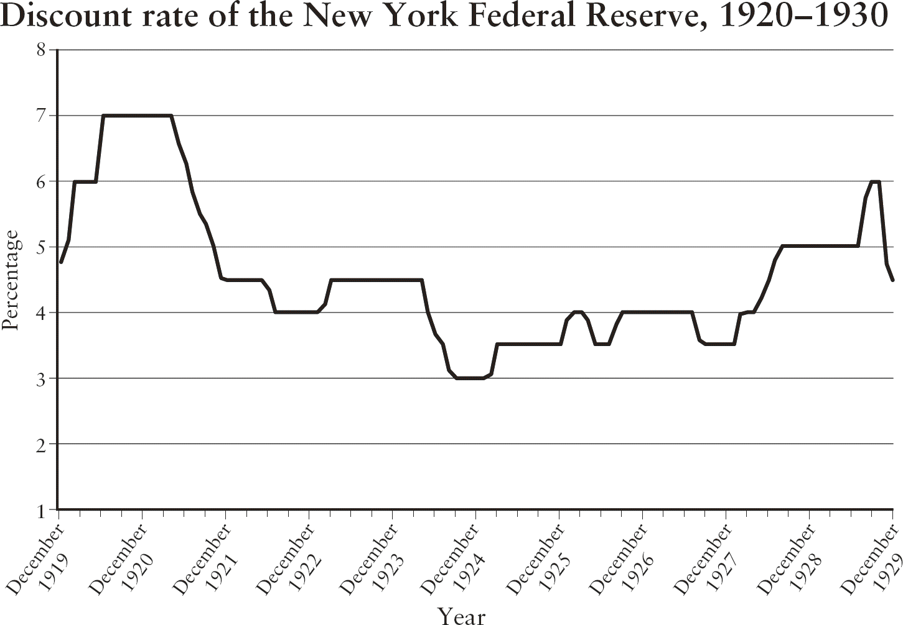

[5.](#section-9) A lack of inflation allowed the Federal Reserve to keep money easy between 1922 and 1928 despite very strong economic growth.

Viewed from a different perspective, however, the Fed’s interest-rate stance was lax. Wicksell claimed that the natural rate of interest derived from the economy-wide return on capital. Although the natural rate is unseen, it can be roughly surmised from an economy’s trend growth rate.[fn6](#section-58) The 1920s were a period of remarkable productivity growth, brought about by electrification and other new technologies and by improved management techniques (known as ‘Fordism’). Between 1923 and 1928, the US economy grew at an annual rate of nearly 8 per cent. Yet the New York Fed’s discount rate averaged less than half this number. If the index of consumer prices gave no sign that interest rates were too low it was because the supply-side improvements, which generated productivity gains, also kept inflation at bay.[fn7](#section-58)

Easy money fostered credit growth, and credit growth fostered speculative excesses. Thousands of new banks – mostly state banks and trust companies – were chartered to provide credit facilities for real estate promotions.[26](#section-51) Property bubbles popped up across the nation, from Florida, where a small-time financial crook by the name of Carlo Ponzi was active, to Chicago, where nearly a hundred thousand new homes were built. More skyscrapers went up in the 1920s than in any other decade of the century.[27](#section-51) New York developers, financing their activities with high-yielding mortgage bonds, competed with each other to construct the tallest buildings the world had ever seen (the 102-storey Empire State Building was planned at the time, but not completed until 1931).

Loans on securities accounted for almost a third of lending by Federal Reserve member banks. By early 1929, total outstanding broker loans had reached almost $7 billion.[28](#section-51) The more money that poured into the stock market, the higher stock prices climbed. Towards the end of the decade, shares on the New York Stock Exchange were changing hands at bubble valuations.[fn8](#section-58) Companies with exciting new technologies, such as Radio Corporation of America and General Motors, whose profits lay in the distant future, attracted the most fervid attention. Benjamin Anderson thought the 1920s market similar to the late 1890s boom: ‘“Cheap money” characterized both “new eras,” and cheap money is the most dangerous intoxicant known to economic life, especially if it be prolonged through many years.’[29](#section-51)

By placing too low a discount on the future earnings of companies, investors ended up paying too much. The discounting error was widely acknowledged at the time. In early 1928, Moody’s Investors Services declared that stock prices had ‘over-discounted anticipated progress’.[30](#section-51) After the crash, Benjamin Graham and David Dodd wrote in their book *Security Analysis* that the late 1920s witnessed ‘a transfer of emphasis [in the valuation of stocks] from current income to future income and hence inevitably to future enhancement of principal value’.[31](#section-51) Or, as the market analyst Max Winkler memorably described: ‘The imagination of our investing public was greatly heightened by the discovery of a new phrase: discounting the future. However, a careful examination of quotations of many issues revealed that not only the future, but even the hereafter, was being discounted.’[32](#section-51)

Relatively low interest rates in the United States spurred massive outflows of American capital to countries which offered higher yields. The Dawes Loan of 1924 had seemingly settled Germany’s reparation problems. Interest rates in Germany, then emerging from its hyperinflation, were mouthwatering compared to those in the United States. Throughout 1925, German call money rates averaged 8½ per cent, three times more than US Treasury bills. ‘The market for high yield foreign bonds in the United States seemed insatiable,’ Anderson observed.[33](#section-51)

Foreign securities issuance in the United States peaked at over $1.5 billion in 1927, around six times its value four years earlier.[34](#section-51) Roughly half of US foreign lending went to Europe and a quarter to Latin America.[35](#section-51) Over the course of the decade, the credit quality of foreign securities issues deteriorated. In 1928, National City Bank sold bonds on behalf of the Brazilian state of Minas Gerais, despite an internal report highlighting the ‘inefficiency and ineptitude … [and] complete ignorance, carelessness and negligence of the former State officials in respect to external long-term borrowings’.[36](#section-51) Nearly two-thirds of the foreign bonds issued in that year subsequently defaulted. Bagehot would not have been surprised.

Tossed on a wave of speculation, the United States came to resemble a bubble economy. Capital investment was spurred by rising stock prices; buoyant housing markets stimulated construction; American dollars that flowed abroad to acquire foreign securities were, in turn, spent by foreigners on US exports (Rueff’s ‘game of marbles’); and, back home, consumer spending was held up by instalment credit and stock market profits. ‘Speculation in real estate and securities was growing rapidly,’ remarked Chase’s Anderson on the eve of the Long Island meeting,

> and a very considerable part of the supposed income of the people which was sustaining our retail and other markets was coming, not from wages and salaries, rents and royalties, interest and dividends, but rather from capital gains on stocks, bonds, and real estate, which men were treating as ordinary income and spending in increasing degree on luxurious consumption.[37](#section-51)

### THE COUP DE WHISKY SOURS

At the Long Island meeting in July 1927, the world’s top central bankers divided into two camps. Strong and Montagu Norman proposed a cheap money policy. The representatives of the Reichsbank and the Bank of France dissented. ‘Don’t give me a low rate, give me a true rate, and then I shall know how to keep my house in order,’ Schacht is reported to have said.[38](#section-51) The meeting broke up without agreement. Rist and Schacht returned to Europe, Norman remained for a while in the States and Strong went ahead with a rate cut without the full agreement of the Federal Reserve Board.

One member of the Federal Reserve Board, Adolph Miller, was bitterly opposed to this measure but was overriden. Dr Miller later considered what he called the 1927 ‘boot-strap lifting’ by the Federal Reserve to be ‘one of the most costly errors committed by it or any other banking system in the last 75 years’.[39](#section-51) The young Austrian economist Friedrich Hayek, who had recently spent a year at New York University studying monetary policy, also criticized the Fed’s ‘experiment’. The ‘inflation of credit is not the answer to European difficulties,’ advised Commerce Secretary Herbert Hoover, adding that ‘this speculation … can only land us on the shores of depression.’[40](#section-51) But President Coolidge, a supporter of easy money and rising stock prices, declined to intervene.

In the late summer months of 1927, the New York Fed stepped up its purchases of government securities as well as lowering its lending rate. The other Federal Reserve banks followed suit – although Chicago held out and had to be coerced to cut its rate.[41](#section-51) ‘The new credit created by the renewal of cheap money by the Federal Reserve … went rapidly into security loans and bank investments in securities,’ reported Anderson.[42](#section-51) Between July and December, Standard & Poor’s Industrials index rose by nearly 20 per cent. Towards the end of the year, Governor Strong’s deteriorating health forced the New York Fed chief into early retirement. America’s top central banker is said to have regretted giving the stock market its little coup de whisky.[43](#section-51)

It was left to Strong’s colleagues to remove the decanter. As the New Year dawned, Wall Street was in an ebullient mood. During a single week in December more shares changed hands than in any previous week in the history of the New York Stock Exchange.[44](#section-51) By the end of 1927, the volume of broker loans stood at a record $4.4 billion, up by a third since January. The soaring market was cheered on by the White House. In January, President Coolidge publicly declared that he did not consider the level of broker loans to be too high. Members of the Federal Reserve Board, freed from Strong’s dominating presence, were of another mind. Changing course, the Fed sold securities to drain liquidity from Wall Street, and the New York Fed’s discount rate was raised from 3.5 per cent in February 1928 to 5 per cent in July.[45](#section-51)

Easy money may kindle animal spirits, but a slight tightening of monetary policy is rarely sufficient to extinguish a speculative inferno, as America’s inexperienced central bankers were to discover. Credit growth continued to outpace US economic growth, broker loans continued soaring and the stock market continued its near vertical ascent (between February 1928 and August 1929, the Standard & Poor’s Composite index climbed by nearly 30 per cent).

Nevertheless, the monetary tightening had one unintended consequence. Higher rates in the United States, in particular the generous interest offered on margin loans, caused the flow of international capital to reverse direction. American investors now pulled their loans from Europe, while Europeans stepped up their lending to Wall Street. ‘Wall Street has become a colossal suction-pump, which is draining the world of capital, and the suction is fast producing a vacuum over here,’ lamented the British press baron Lord Rothermere.[46](#section-51) Both Germany and Britain suffered gold losses and were forced to hike interest rates. The Bank of France became less co-operative than ever. In October, Ben Strong succumbed to tuberculosis. All this was too much for his friend Montagu Norman, who sank into a black depression. The Bank of England’s Deputy Governor, Cecil Lubbock, a victim of his chief’s frequent tantrums, also suffered a nervous breakdown.[47](#section-51)

The reversal of capital flows back out of Europe set off a time bomb that eventually exploded with the October 1929 Wall Street crash, followed eighteen months later by the collapse of Austria’s largest bank, the Creditanstalt.[fn9](#section-58) The more immediate effect was to cut Europeans off from the supply of American credit, which forced them to reduce their purchases of US manufactures. It was only a matter of time before US industrial production started to contract. By 1928, various regional housing bubbles across the United States, from Florida to Illinois, were collapsing.

A handful of senior Wall Street figures had begun to expect the worst. In March 1929, Russell Leffingwell, a former senior Treasury official and now a partner at JP Morgan, told a colleague that ‘Monty and Ben sowed the wind. I expect we shall all have to reap the whirlwind … I think we are going to have a world credit crisis.’[48](#section-51) Paul Warburg, the head of the Wall Street firm Kuhn Loeb, and a founding father of the Federal Reserve, feared that the rapid expansion of the call loan market made the stability of the financial system dependent on the level of stock prices. Warburg believed interest rates should have risen earlier and faster.[49](#section-51) By 1929 it was too late. ‘The present position was exquisitely painful. A higher rate to break the stock market or a lower rate to repulse the attraction of call money – one or the other might furnish relief.’[50](#section-51)

The advocates of price stability remained sanguine, however. The brilliant Irving Fisher has been much mocked by posterity for his ill-timed bullishness on the eve of the Great Crash. Fisher lost a fortune in the ensuing market rout and had to be bailed out by Yale. The forecasting and investment record of the era’s other great economist was not much better. Keynes, who had extensive personal investment interests alongside his position as bursar of King’s College and chairman of a life insurance company, was wrong-footed by the Fed’s tightening. The Cambridge economist believed that, since consumer prices were stable and ‘there was nothing that could be called inflation yet in sight’, tight money was unnecessary. Keynes remained confident that the Federal Reserve would ‘do all in its power to avoid’ a business depression.[51](#section-51)

In April 1928, Keynes met the Swiss banker Felix Somary at the Berlin home of Carl Melchior, a mutual friend.[52](#section-51) Somary’s disposition was so inherently bleak that he called his memoirs *The Raven of Zürich*. In the same month that Keynes expressed the view that the Fed would arrest any incipient depression, Somary was warning his clients of an impending crash. The danger, Somary said, came from the ‘wide gap between yields on the highest-priced shares on the stock exchange and ordinary interest rates. The lower the yields speculators expect from high-flyers on the markets, the greater the danger of a crash – and this development is going on in New York.’[53](#section-51) The Swiss banker left a record of his conversation with Keynes:

> Keynes asked me what I was advising clients.
>
> ‘To insulate themselves as much as possible from the coming crisis, and to avoid the markets,’ I replied.
>
> Keynes took the opposite view. ‘We will not have any more crashes in our time,’ he insisted, and asked me in detail for my opinions about individual companies.
>
> ‘I think the market is very appealing, and prices are low,’ said Keynes. ‘And where is the crash coming from in any case?’
>
> ‘The crash will come from the gap between appearances and reality. I have never seen such stormy weather gathering,’ I said. But speculation in securities passionately interested Keynes, and despite my obvious refusal to answer, he repeatedly asked questions about which shares on continental markets were attractive purchases.[fn10](#section-58)

If Keynes failed to heed this warning it was because he’d enjoyed no previous success in applying interest rates and other macroeconomic inputs to his own investment process and had given up on what he called ‘credit cycle investment’. Between 1927 and the end of 1929, Keynes’s personal fortune declined by more than three-quarters, from £44,000 to £7,815, as a result of heavy losses on commodity speculations, his use of portfolio leverage and his failure as an economist to anticipate Somary’s gathering storm clouds.[54](#section-51)

Somary had studied economics at Vienna, where he’d attended the private seminars of Eugen von Böhm-Bawerk. Among the other seminar attendants were future luminaries of the Austrian school of economics, including Ludwig von Mises, Joseph Schumpeter and Friedrich Hayek. An axiom of the Austrian school was that interest is necessary so that investment and consumption decisions are co-ordinated over time.[55](#section-51) As we have seen, Böhm-Bawerk argued that the rate of interest reflects society’s time preference. He also claimed that the level of interest determines how much capital is tied up in production, and thus the return on capital.[fn11](#section-58) When interest is determined in a free market, he said, time preference and the return on capital should equalize. The danger comes when the authorities interfere with interest rates. When interest rates are pushed too low, credit takes off and bad investments (‘malinvestment’) abound.

The Austrians embraced the concept of a natural rate of interest but disagreed with Wicksell that it could be divined simply by observing changes in consumer prices. For a start, they were sceptical of the very notion of a consumer price index. As one of their number, Oskar Morgenstern, commented, ‘the idea that as complex a phenomenon as the change in a “price level”, itself a heroic theoretical abstraction, could at present be measured to such a degree of accuracy is nevertheless simply absurd.’[56](#section-51) And even if the consumer price index could be measured, the Austrians still didn’t believe that central bankers should aim to stabilize the price level.

In 1927, Hayek was appointed the first director of the Austrian Institute for Business Cycle Research, having previously studied monetary policy in New York. Hayek thought that the policy of price stabilization – as advocated by Irving Fisher and others and implemented by Ben Strong at the Federal Reserve – was misguided, and lamented that Fisher’s Stable Money Association (a successor to the Stable Money League) had turned the ‘concept of price stabilization as the objective of monetary policy into a virtually unassailable dogma’.[57](#section-51)

In a capitalist economy, Hayek said, continuous advances in productivity mean that consumer prices have a natural tendency to decline. During periods of rapid technological development and commodity gluts, such as the 1920s, the price level might be expected to decline quite rapidly. The pursuit of stable prices by central bankers, however, worked against this natural tendency.[58](#section-51) Monetary policy directed at stabilizing prices, said Hayek, ‘administers an excessive stimulus to the expansion of output as costs of production fall, and thus regularly makes a later fall in prices with a simultaneous contraction of output unavoidable.’ The future Nobel laureate wrote these words in 1928. In effect, Hayek was predicting that the Roaring Twenties would end in a deflationary bust.[59](#section-51)

In his book *Monetary Theory and the Trade Cycle*, published in German in the year of the Crash, Hayek criticized the Federal Reserve, which he accused of setting interest below its natural rate.[fn12](#section-58) The Fed’s error did not show up in the overt inflation of consumer prices, as Wicksell suggested. Instead, Hayek alluded to a hidden or ‘relative inflation’, accompanied by destabilizing credit growth and malinvestment.[60](#section-51) Advocates of stable prices, said Hayek, failed to understand the function of capital and interest.[61](#section-51) Criticism of the central bankers’ pursuit of price stability grew more widespread after 1929. Any policy aimed at stabilizing a single index of prices was bound to set up countervailing tendencies elsewhere in the economic system, wrote Chester Phillips, T. F. McManus and R. W. Nelson in *Banking and The Business Cycle* (1937):[62](#section-51) ‘the futility of price level stabilization as a goal of credit policy is evidenced by the fact that the end-result of what was probably the greatest price-stabilization experiment in history proved to be, simply, the greatest and worst depression.’[63](#section-51)

The credit inflation of the 1920s, the distortion of economic activity and the stock market boom and crash, Phillips and his co-authors concluded, ‘all had their origin in the price-stabilization policy, or managed currency experiment, of the Federal Reserve Board’.[64](#section-51) Other distinguished economists reached a similar conclusion. Reflecting on the origins of the depression, Keynes’s Cambridge contemporary Dennis Robertson wrote:

> Looking back, it becomes, I think, more and more arguable that the great American ‘stabilisation’ of 1922–1929 was really a vast attempt to de-stabilise the value of money in terms of human effort … If the business man’s psychology jibs at swallowing the moderate price falls dictated by increasing productivity, he renders himself more and not less liable to suffer the catastrophic price falls due to industrial dislocation and crisis.[65](#section-51)

Even Keynes had second thoughts. In his *Treatise on Money* (1930), he expressed something close to a *mea culpa*:

> Anyone who looked only at the index of prices [during the 1920s] would see no reason to suspect any material degree of inflation; whilst anyone who looked only at the total volume of bank credit and the prices of common stocks would have been convinced of the presence of an inflation actual or impending.

Keynes appeared to be suggesting that credit inflation, and not the inflation of consumer prices, was the true sign that interest rates were out of equilibrium – a position close to Hayek’s from which he soon reneged.[fn13](#section-58)

‘Better no credit control at all,’ proclaimed the German economist Wilhelm Röpke, ‘than one based on this treacherous and dangerous criterion [of price stability]!’[66](#section-51) Central bankers also came around to this view. In 1937, the Federal Reserve’s *Objectives of Monetary Policy* affirmed ‘the inadequacy of price stability as a guide to policy’. The Australian Monetary and Banking Commission concluded in the same year that ‘price fluctuations are little more than symptoms’ and that the monetary authorities should not attempt to regulate credit by reference to a selected price index.[67](#section-51)

Most financial histories of the 1920s and its aftermath fail to mention contemporary criticisms of the Federal Reserve’s price stabilization policy and pass over the *coup de whisky* delivered to the US stock market after the Long Island meeting. According to this orthodox narrative, there was nothing untoward about the US economy in the 1920s and there was no bubble in property or stocks. Everything was progressing just fine until Ben Strong sickened and retired from the New York Fed in late 1927. Thereafter, Strong’s former colleagues, taking fright at the speculative orgy on Wall Street, unduly tightened monetary policy, thereby inducing a sharp economic downturn. ‘The true story [of the Great Depression],’ maintained the future Federal Reserve chairman Ben Bernanke, ‘is that monetary policy tried overzealously to stop the rise in stock prices.’[fn14](#section-58)

The Fed responded to the October Crash by slashing interest rates – the discount rate of the New York Fed went from 6 per cent in October 1929 to 1.5 per cent by the summer of 1931. But the Fed, say its critics, should have done more to prevent a collapse in the money supply. The trouble was that its board members were paralysed with an unjustified fear that any further action would excite another bout of speculation.[68](#section-51) As a result, the Fed allowed a debt deflation to take hold, which further deepened the crisis. These flawed decisions were compounded by the ‘fetters’ of the Gold Standard, which limited the central bankers’ freedom of action: in late 1931, the Fed was forced to raise interest rates after a decline in its gold reserves, and real interest rates (i.e. the cost of borrowing once deflation is taken into account) climbed into double digits. The ‘barbarous relic’, not the price stabilization policy, was ultimately responsible for the Great Depression.

This Great Depression narrative is shaped by two seminal texts: Irving Fisher’s ‘Debt-Deflation Theory of Great Depressions’ (1933) and *A Monetary History of the United States* by Milton Friedman and Anna Schwartz, published thirty years later. Fisher’s initial expectations that the United States would bounce back after the Great Crash turned out to be as misplaced as his earlier views on the stock market. In his debt-deflation paper, Fisher drew on personal experience to describe how debt becomes harder to handle when the price level declines. A vicious cycle opens up as deflation takes hold: borrowers pay down their debts, thereby depressing household spending; the money supply contracts, which causes prices to fall further; and, as a result, borrowers end up owing more in real terms (i.e., after inflation) than at the outset. Debt deflation continues to the point of ‘universal bankruptcy’, said Fisher.

The Yale economist prescribed ‘scientific medication’ to arrest the dollar disease: ‘Great depressions are curable and preventable through reflation and stabilization [of the price level].’ Fisher’s theoretical insights are incorporated into Friedman and Schwartz’s monetary history. Between August 1929 and March 1933, as the US money supply collapsed by more than a third, the country experienced three successive banking crises and around a quarter of workers lost their jobs. These events, wrote Friedman and Schwartz, were ‘a tragic testimonial to the importance of monetary forces … The drastic decline in the quantity of money during those years and the occurrence of a banking panic of unprecedented severity were not the inevitable consequence of other economic changes.’[69](#section-51)

No one took this message more to heart than Ben Bernanke, the head of Princeton’s economics department and a governor of the Federal Reserve from 2002 onwards. Bernanke described himself as a ‘Great Depression buff’. There is ‘overwhelming evidence’, Bernanke writes in the introduction to his *Essays on the Great Depression*, ‘that the main factor depressing aggregate demand was a worldwide contraction in world money supplies’. The future Fed Chairman concludes that the Great Depression was the consequence of ‘hapless policymakers trying to make sense of events for which their experience had not prepared them’.[70](#section-51)

A profound dislike of falling prices was not new to the twentieth century. In 1819, the French economist Jean-Baptiste Say claimed that unexpected deflation should be unlawful, since ‘contracts are broken when debtors are made to pay more than they owe no less than when creditors do not receive all that is due to them.’[71](#section-51) Wicksell warned that business is paralysed, unemployment grows and creditors benefit at the expense of debtors at times of deflation.[72](#section-51) In the 1890s, indebted American farmers, suffering from a collapse of agricultural prices, railed against the deflation induced by the Gold Standard – the ‘cross of gold’ in William Jennings Bryan’s famous phrase.

Yet a fall in the cost of living may actually make working people better off. That was the argument of Cambridge economist Alfred Marshall, who told a Royal Commission in 1888 that ‘the evils resulting from a fall of prices [deflation] are commonly over-rated … I think that it is not clearly established that a rise of prices is … to be preferred to a fall.’ Owing to frictions in wages, Marshall suggested, deflation ‘tends almost imperceptibly to establish a higher standard of living among the working classes, and to diminish the inequalities of wealth’. These benefits, said Keynes’s economics tutor, form an important offset to the fall in prices when trade is depressed.[73](#section-51)

Hayek argued that the new technologies and efficiency improvements of the 1920s brought about a ‘good’ deflation, the type of deflation that Marshall was referring to in his comments to the Royal Commission. When policymakers ease monetary conditions to ward off such a benign decline in the price level, people are incentivized to borrow more. As Irving Fisher observed, debt deflation starts from a position of over-indebtedness – a point which Bernanke in his writings on the subject conspicuously overlooks. Thus, Hayek concluded that attempts to avoid a good deflation only make ‘bad’ deflation more likely. Furthermore, the bad deflation that appears during a financial crisis should be viewed as a symptom, rather than a cause of economic malaise. Debt deflation, Hayek concluded, is ‘a secondary phenomenon, a process induced by the maladjustments of industry left over from the boom’.[74](#section-51)

While Fisher believed that the slide into deflation after a crisis must be arrested, Hayek argued that attempts to resist a fall in prices would hinder the curative process of recession and keep the economy in a state of imbalance. As another celebrated Austrian economist, Joseph Schumpeter, put it, deflation ‘restores the health of the monetary system’.[75](#section-51) Any attempt to avoid deflation, said Wilhelm Röpke, would result in ‘a prolongation and aggravation of the crisis’.[76](#section-51) Röpke criticized the response of the US authorities to the onset of deflation in 1930, when interest rates were cut and President Hoover enjoined business leaders to maintain investment and wages in the face of falling prices. For Hayek, writing in early 1932, post-Crash monetary policy represented the

> first attempt on a large scale to revive the economy immediately after the sudden reversal of the upswing, by a systematic policy of lowering the interest rate accompanied by all other possible measures for preventing the normal process of liquidation, and that as a result the depression has assumed more devastating forms and lasted longer than ever before.[77](#section-51)

Keynes thought the attitude of Hayek and his fellow ‘liquidationists’ was sadistic.[fn15](#section-58) The historical evidence, however, suggests only a tenuous link between deflation and economic weakness. In *The Forgotten Depression*, James Grant points out that during 1921 the price level declined at an annualized rate of 15 per cent while the Fed kept money so tight that real interest rates reached around 20 per cent. Yet, as we have seen, America’s economy soon recovered from the deflation and productivity soared over the following years.[78](#section-51) More recently, Japan’s experience of mild deflation since the early 1990s appears to have had little impact on productivity growth.

These episodes are not outliers. A 2015 paper from the Bank for International Settlements examines data from thirty-nine countries over the course of nearly a century and a half (1870–2013). The BIS finds that several prolonged periods of deflation, including that of the United States in the late nineteenth century, were accompanied by strong economic growth. ‘On balance, the relationship between changes in the consumer price index and output growth is episodic and weak,’ the BIS concludes. The Great Depression of the 1930s is an exception to the rule. Nevertheless, this experience has permanently scarred the economics profession with a horror of deflation.[79](#section-51)

History, it is said, is written by the victors. In the late 1920s, Hayek claimed that monetary policy had taken the wrong course and predicted a deflationary bust. Irving Fisher, on the other hand, saw nothing wrong at the time with either America’s economy or its monetary policy, famously opining in the summer of 1929 that US stocks had reached a ‘permanently high plateau’. If accuracy of prediction is what matters for economic theory, as Milton Friedman later claimed, then Hayek’s interpretation should have become the received wisdom of his profession. Yet the Austrian’s interpretation of the 1920s and its aftermath has been more or less air-brushed from the history books, while Fisher’s monetarist view has become received wisdom.

In his book on the Great Depression, Ben Bernanke suggested that to gain a proper understanding of this period was the ‘Holy Grail of macroeconomics’. According to Bernanke’s reading of events, the Fed’s key error was that it allowed consumer prices to fall after 1929. At Milton Friedman’s ninetieth birthday in November 2002, Governor Bernanke apologized on behalf of his employer for the 1930s catastrophe and vowed it would not happen again. At the time this seemed like a facetious gesture. Yet only six years later the United States was facing the most severe financial crisis in decades. As the newly installed Chairman of the Federal Reserve, Bernanke found himself in the position to make good on this promise. He wasn’t going to make the same mistakes again.

<!-- rl-section id="sec-chapter006" class="titlepage" title="6" -->

## Un Petit Coup de Whisky

> *Easy money is the great cause of over-borrowing. When an investor thinks he can make over 100 per cent per annum by borrowing at 6 per cent, he will be tempted to borrow, and to invest or speculate with borrowed money.*
>
> Irving Fisher, 1933
>
> *There is nothing so unstable as a stabilized price level.*
>
> James Grant, 2014

The headline of the *New York Herald* proclaimed, ‘The World’s Most Exclusive Club Meets Here for the First Time’. The ‘club’ consisted of four central bankers, hosted by Benjamin Strong, President of the New York Federal Reserve. Strong’s guests included Bank of England Governor Montagu Norman, Reichsbank President Hjalmar Schacht and Charles Rist, the Deputy Governor of the Bank of France. The quartet met at the summer mansion of a senior Treasury official, situated on the North Shore of Long Island, a favourite retreat for wealthy Wall Street bankers. The date was July 1927. On the agenda was co-operation between the leading central banks.

Reichsbank President Schacht was the man responsible for taming Germany’s hyperinflation of four years before. Now, he was concerned that too much foreign capital was flowing into his country, overheating the economy. Montagu Norman, who crossed the Atlantic with Schacht, had the opposite problem. Having returned to the Gold Standard a couple of years earlier at a level which left sterling overvalued against the US dollar, Britain’s economy was now trapped in an economic depression. The Bank of England’s reserves were dangerously low, and the French seemed intent on taking what remained of its gold. Norman wanted the Federal Reserve to lower US rates to take the pressure off sterling.

Strong was a close friend of the eccentric Norman, a former psychiatric patient of Carl Jung, who attended the conference attired in his trademark velvet cape and wide-brimmed soft hat. The world’s two most powerful central bankers often enjoyed holidays together, booking into resort hotels under assumed names so as not to attract attention. So it was not surprising that the New York Fed President agreed at the Long Island meeting to cut its benchmark rate and provide the Bank of France with bullion on the same terms as the British. As inflation remained quiescent, any slight loosening of monetary policy appeared to pose little danger to the US economy. There was another consideration. Strong told Rist that the rate cut would provide a ‘petit coup de whisky’ to the New York stock market. It turned out to be pure moonshine.

### AN ELASTIC CURRENCY

By the time of the Long Island meeting, the US Federal Reserve was little more than a decade old. The Federal Reserve Act of 1914 stipulated that the new central bank would ‘furnish an elastic currency’. What this meant was that interest rates were no longer to be determined by the requirement of banks to convert their notes into gold. An elastic currency implied the possibility of the fine-tuning of monetary policy. This was not an entirely new departure. In the early years of the century, the US Treasury under Secretary Leslie Shaw had frequently intervened in the money markets in order ‘to check every incipient stringency’, and a contemporary criticized Shaw’s predecessor Secretary Lyman Gage’s monetary interventions: ‘they had sown the wind and their successor was to reap the whirlwind. They had helped to raise the tower of credit to a tottering height, and now the slightest agitation of any sort was sure to bring collapse.’[fn1](#section-58)

The whirlwind came in the form of the Knickerbocker Panic of 1907, when the failure of New York’s Knickerbocker Trust Company brought down dozens of other trust companies.[fn2](#section-58) The panic was quickly snuffed out by Wall Street bankers under the command of J. Pierpont Morgan and the US economy rapidly recovered. But the American people were distrustful of Wall Street’s ‘Money Trust’ and Morgan died in 1913 leaving no one to fill his shoes. In future, it would be the job of the US Federal Reserve to manage America’s money and to step up during panics.

The new central bank’s first test came after the end of the Great War. Between 1914 and 1916, the rediscount rate of the Federal Reserve banks was reduced to half its pre-war level.[1](#section-51) Once the war was over and the country demobilized, inflation took off. The Fed’s response was brutal and brutally effective. In early 1920, the New York Fed’s discount rate was hiked from around 4.5 to 7 per cent. Commodity and consumer prices collapsed, industrial production contracted by a quarter, and over five hundred banks failed in the ensuing economic downturn. Among the many commercial business failures was the Kansas City haberdashery of future US President Harry Truman.[2](#section-51)

The sharp deflation was warmly welcomed by Governor William Harding of the Federal Reserve: ‘We hold,’ said Harding, ‘that the shrinkage which has taken place is somewhat analogous to that which occurs when a balloon is punctured and the air escapes.’[3](#section-51) At least Harding’s bitter monetary medicine worked its cure. The US economy bounced out of the depression in 1922, as profits soared accompanied by the largest improvement in US productivity ever recorded.[4](#section-51) But the welfare toll had been high. During the brief depression unemployment had risen to 12 per cent. In 1921 the country experienced a ‘suicide wave’, according to New York’s Save-A-Life League.[5](#section-51) Republicans blamed what they called the ‘Crime of 1920’ on the administration of President Woodrow Wilson.[6](#section-51) Nearly sixty years would pass before the Federal Reserve attempted again to purge inflation with high interest rates.

### MORE ELASTICITY

In its classical version, the Gold Standard had served nearly enough as an automatic regulator of interest rates. When an economy was overheating – that’s to say, when total spending and investment exceeded income and savings – then, gold left the country; whereupon, the central bank, observing a decline in its bullion reserves, was required to raise interest rates; and when the central bank had ample gold reserves and business was dull, rates were maintained at a low level. Under the Gold Standard, the job of regulating the amount of credit in circulation was so straightforward that, until the late Victorian period, the Governor and Court of Directors of the Bank of England were drawn from the ranks of eminent City merchants rather than commercial bankers or, heaven forbid, teachers of political economy.

The outbreak of war in 1914 led most central banks to suspend gold payments (the United States was an exception). In 1922, finance ministers from several dozen nations met in Genoa to discuss how to reconstruct the international monetary order. They decided against resurrecting the Gold Standard that had prevailed before the war, proposing in its place a modified version.[7](#section-51) The main idea behind the Gold Exchange Standard, as it was called, was to economize on gold: under this new regime government securities held by a central bank were counted as reserves, alongside gold.

The Gold Exchange Standard was intended to be more ‘elastic’ than its predecessor. But elasticity brought its own problems. Credit imbalances between countries could now run for longer without being corrected. Interest rates were no longer automatically determined by international bullion flows. For instance, the United States received large inflows of foreign capital in the early 1920s but the Federal Reserve ‘sterilized’ these inflows by selling bonds.[fn3](#section-58) As the French economist Jacques Rueff later noted, the Gold Exchange Standard ‘reduced the international monetary system to a mere child’s game in which one party had agreed to return the loser’s stake after each game of marbles’.[8](#section-51)

For the first time it became possible for central bankers to conduct an ‘active’ monetary policy in pursuit of certain economic objectives.[fn4](#section-58) But the central bankers’ newfound discretion meant that the setting of interest rates inevitably became politicized, especially in Britain, whose attempt to return sterling to the Gold Standard was accompanied by high interest rates, unemployment and lingering deflation.

By the summer of 1920, the Bank of England’s lending rate had climbed to 7 per cent. When Norman attempted to tighten further, he was opposed by the Chancellor of the Exchequer, Austen Chamberlain. ‘Interest rates,’ Norman told an official at the New York Fed, ‘are now a political as well as a financial question.’[9](#section-51) Years later, the Bank of England Governor remarked to his counterpart at the Bank of France that he could not raise interest rates ‘without provoking a riot’.[10](#section-51) The social tensions produced by Britain’s high interest rates and an uncompetitive exchange rate eventually erupted in the General Strike of 1926. Britain’s ill-fated return to gold turned Keynes into a vehement critic of the Gold Standard and of high interest rates in general. ‘So long as unemployment is a matter of general political importance,’ he wrote in 1923, ‘it is impossible that Bank rate should be regarded, as it used to be, as the secret *peculium* of the Pope and Cardinals of the City.’[11](#section-51) For the rest of his life, the world’s most prominent economist never missed an opportunity to advocate lower interest rates.

### PRICE STABILITY

The new monetary order was designed not merely to economize on gold, but also to prevent consumer prices from falling. ‘It was chiefly to avoid deflation that the gold exchange standard was recommended at Genoa,’ a contemporary economist observed.[12](#section-51) The British, who were keen to return sterling to gold convertibility, wanted to avoid deflation because it involved politically contentious cuts in wages. Americans were keen to avoid a repeat experience of the severe deflation of 1921. Ben Strong at the New York Fed was converted to the new monetary orthodoxy, namely that interest-rate policy should be guided by the goal of price stability.

The notion that central banks should seek to avoid both inflation and deflation had gained ground since the publication some two decades earlier of an influential economics tome by the Swedish economist Knut Wicksell. In *Interest and Prices* (1898), Wicksell described a world without money, in which goods and services were exchanged by barter. In this imagined construct, the ‘natural rate’ of interest was reflected by the return on capital. In the actual world, where money exists, Wicksell identified the natural rate by the absence of either inflation or deflation. For if the money rate of interest was too low, credit would expand rapidly and inflation would appear. On the other hand, if the money rate was kept too high, credit would contract and prices would decline. Wicksell concluded his book with a chapter entitled ‘Practical Proposals for The Stabilisation of the Value of Money’, where he recommended that interest rates should be set so as to maintain a stable price level.[13](#section-51) He envisaged co-operation between central banks to achieve this aim. To maintain the balance of payments between nations, Wicksell proposed an international paper standard to replace the Gold Standard.

The Gold Exchange Standard endorsed in Genoa went halfway towards realizing Wicksell’s vision. Leading central bankers were sold on the idea of collaboration with foreign colleagues. Norman discussed with Strong the idea of forming a ‘community of interest and cooperation between all the central banks’.[14](#section-51) Many of the world’s top economists advocated price stabilization, including Keynes and Ralph Hawtrey at the British Treasury. Irving Fisher founded the Stable Money League in 1921 to campaign for legislation that would have forced the Federal Reserve to stabilize the price level.[fn5](#section-58) Strong didn’t need convincing. ‘It was my belief, and I thought it was shared by all others in the Federal Reserve System,’ he wrote a few years later, ‘that our whole policy in the future, as in the past, would be directed toward the stability of prices so far as it was possible for us to influence prices.’[15](#section-51)

Stable prices were what Strong wanted and stable prices were what America got. Between the end of 1922 and 1929 the index of US consumer prices scarcely budged. In the absence of inflation, America’s central bank was able to adopt a less restrictive policy. From the summer of 1924, the Federal Reserve System engaged in large-scale open-market operations, purchasing approximately $500 million worth of government securities.[16](#section-51) Interest rates fell sharply. By September, the Fed’s discount rate was at 3 per cent, a decline of 1½ percentage points over the previous twelve months. On the campaign trail that year, Calvin Coolidge boasted that, ‘it has been the policy of this Administration to reduce discount rates.’[17](#section-51)

A few months later, in his inaugural Presidential address Silent Cal asserted that America was ‘entering an era of prosperity which is gradually reaching into every part of the nation’.[18](#section-51) Not everyone was so sanguine about this ‘New Era’. Benjamin Anderson, chief economist at Chase National Bank, believed that monetary policy was too loose. America’s central bank, Anderson lamented, had been created to provide assistance during a financial crisis, ‘but from early 1924 down to the spring of 1928, it was used … to finance a stock market boom’.[19](#section-51) During those years, bank credit in the United States more than doubled. Much of the new lending was not employed by industry – commercial loans actually decreased – but went to finance stock loans, real estate mortgages and the purchase of foreign securities.

After the Long Island meeting, the New York Fed reduced its discount rate by 50 basis points (to 3.5 per cent) and the Federal Reserve banks boosted their purchases of government securities. Margin loans soared and stock prices accelerated higher. Over the course of 1927, the Standard & Poor 500 index climbed by 37.5 per cent.[20](#section-51) While Chase’s Anderson bemoaned a growing ‘psychological boom atmosphere’, Strong remained sanguine. It wasn’t the central bank’s responsibility, in his view, to dampen animal spirits. Besides, Strong feared, employing a similar argument to that used by modern central bankers, that raising interest rates to curtail margin loans would produce collateral damage:

> I think the conclusion is inescapable, that any policy directed solely to forcing liquidation in the stock loan account and concurrently in the prices of securities will be found to have a widespread and somewhat similar effect in other directions, mostly to the detriment of the healthy prosperity of this country.[21](#section-51)

The Swedish economist Gustav Cassel endorsed Strong’s view that it was the business of central bankers to maintain price stability and not to concern themselves with the stock market.[22](#section-51)

One of the aims of US monetary policy in the 1920s was to dampen the seasonal fluctuations of interest rates caused by the agricultural cycle, which led to money being tight at certain times of the year. The Fed was so successful in this respect that Treasury Secretary Andrew Mellon went so far as to hail an end to the cycle of boom and bust. ‘We are no longer the victims of the vagaries of business cycles. The Federal Reserve System is the antidote for money contraction and credit shortage,’ Mellon declared a year after the Long Island meeting.[23](#section-51) By taming the business cycle, however, the Fed inadvertently encouraged speculative behaviour. As economist Perry Mehrling writes: ‘Intervention to stabilize seasonal and cyclical fluctuations produced low and stable money rates of interest, which supported the investment boom that fueled the Roaring Twenties but also produced an unsustainable asset price bubble.’[24](#section-51)

The absolute level of interest rates played a key but less obvious role in fostering Wall Street’s boom. If the natural rate of interest is revealed by a stable price level, as Wicksell and his followers maintained, then the Fed’s interest-rate policy before and immediately after the Long Island meeting was appropriate. As we have seen, after 1921 the index of US consumer prices remained flat for the rest of the decade. The cost of borrowing after inflation – what Irving Fisher was the first to refer to as the ‘real’ interest rate – remained relatively high throughout this period.[25](#section-51) Between 1922 and 1929, the Federal Reserve discount rate averaged more than 4 per cent in real terms. Had interest rates been any higher, then the index of consumer prices would almost certainly have declined.

[5.](#section-9) A lack of inflation allowed the Federal Reserve to keep money easy between 1922 and 1928 despite very strong economic growth.

Viewed from a different perspective, however, the Fed’s interest-rate stance was lax. Wicksell claimed that the natural rate of interest derived from the economy-wide return on capital. Although the natural rate is unseen, it can be roughly surmised from an economy’s trend growth rate.[fn6](#section-58) The 1920s were a period of remarkable productivity growth, brought about by electrification and other new technologies and by improved management techniques (known as ‘Fordism’). Between 1923 and 1928, the US economy grew at an annual rate of nearly 8 per cent. Yet the New York Fed’s discount rate averaged less than half this number. If the index of consumer prices gave no sign that interest rates were too low it was because the supply-side improvements, which generated productivity gains, also kept inflation at bay.[fn7](#section-58)

Easy money fostered credit growth, and credit growth fostered speculative excesses. Thousands of new banks – mostly state banks and trust companies – were chartered to provide credit facilities for real estate promotions.[26](#section-51) Property bubbles popped up across the nation, from Florida, where a small-time financial crook by the name of Carlo Ponzi was active, to Chicago, where nearly a hundred thousand new homes were built. More skyscrapers went up in the 1920s than in any other decade of the century.[27](#section-51) New York developers, financing their activities with high-yielding mortgage bonds, competed with each other to construct the tallest buildings the world had ever seen (the 102-storey Empire State Building was planned at the time, but not completed until 1931).

Loans on securities accounted for almost a third of lending by Federal Reserve member banks. By early 1929, total outstanding broker loans had reached almost $7 billion.[28](#section-51) The more money that poured into the stock market, the higher stock prices climbed. Towards the end of the decade, shares on the New York Stock Exchange were changing hands at bubble valuations.[fn8](#section-58) Companies with exciting new technologies, such as Radio Corporation of America and General Motors, whose profits lay in the distant future, attracted the most fervid attention. Benjamin Anderson thought the 1920s market similar to the late 1890s boom: ‘“Cheap money” characterized both “new eras,” and cheap money is the most dangerous intoxicant known to economic life, especially if it be prolonged through many years.’[29](#section-51)

By placing too low a discount on the future earnings of companies, investors ended up paying too much. The discounting error was widely acknowledged at the time. In early 1928, Moody’s Investors Services declared that stock prices had ‘over-discounted anticipated progress’.[30](#section-51) After the crash, Benjamin Graham and David Dodd wrote in their book *Security Analysis* that the late 1920s witnessed ‘a transfer of emphasis [in the valuation of stocks] from current income to future income and hence inevitably to future enhancement of principal value’.[31](#section-51) Or, as the market analyst Max Winkler memorably described: ‘The imagination of our investing public was greatly heightened by the discovery of a new phrase: discounting the future. However, a careful examination of quotations of many issues revealed that not only the future, but even the hereafter, was being discounted.’[32](#section-51)

Relatively low interest rates in the United States spurred massive outflows of American capital to countries which offered higher yields. The Dawes Loan of 1924 had seemingly settled Germany’s reparation problems. Interest rates in Germany, then emerging from its hyperinflation, were mouthwatering compared to those in the United States. Throughout 1925, German call money rates averaged 8½ per cent, three times more than US Treasury bills. ‘The market for high yield foreign bonds in the United States seemed insatiable,’ Anderson observed.[33](#section-51)

Foreign securities issuance in the United States peaked at over $1.5 billion in 1927, around six times its value four years earlier.[34](#section-51) Roughly half of US foreign lending went to Europe and a quarter to Latin America.[35](#section-51) Over the course of the decade, the credit quality of foreign securities issues deteriorated. In 1928, National City Bank sold bonds on behalf of the Brazilian state of Minas Gerais, despite an internal report highlighting the ‘inefficiency and ineptitude … [and] complete ignorance, carelessness and negligence of the former State officials in respect to external long-term borrowings’.[36](#section-51) Nearly two-thirds of the foreign bonds issued in that year subsequently defaulted. Bagehot would not have been surprised.

Tossed on a wave of speculation, the United States came to resemble a bubble economy. Capital investment was spurred by rising stock prices; buoyant housing markets stimulated construction; American dollars that flowed abroad to acquire foreign securities were, in turn, spent by foreigners on US exports (Rueff’s ‘game of marbles’); and, back home, consumer spending was held up by instalment credit and stock market profits. ‘Speculation in real estate and securities was growing rapidly,’ remarked Chase’s Anderson on the eve of the Long Island meeting,

> and a very considerable part of the supposed income of the people which was sustaining our retail and other markets was coming, not from wages and salaries, rents and royalties, interest and dividends, but rather from capital gains on stocks, bonds, and real estate, which men were treating as ordinary income and spending in increasing degree on luxurious consumption.[37](#section-51)

### THE COUP DE WHISKY SOURS

At the Long Island meeting in July 1927, the world’s top central bankers divided into two camps. Strong and Montagu Norman proposed a cheap money policy. The representatives of the Reichsbank and the Bank of France dissented. ‘Don’t give me a low rate, give me a true rate, and then I shall know how to keep my house in order,’ Schacht is reported to have said.[38](#section-51) The meeting broke up without agreement. Rist and Schacht returned to Europe, Norman remained for a while in the States and Strong went ahead with a rate cut without the full agreement of the Federal Reserve Board.

One member of the Federal Reserve Board, Adolph Miller, was bitterly opposed to this measure but was overriden. Dr Miller later considered what he called the 1927 ‘boot-strap lifting’ by the Federal Reserve to be ‘one of the most costly errors committed by it or any other banking system in the last 75 years’.[39](#section-51) The young Austrian economist Friedrich Hayek, who had recently spent a year at New York University studying monetary policy, also criticized the Fed’s ‘experiment’. The ‘inflation of credit is not the answer to European difficulties,’ advised Commerce Secretary Herbert Hoover, adding that ‘this speculation … can only land us on the shores of depression.’[40](#section-51) But President Coolidge, a supporter of easy money and rising stock prices, declined to intervene.

In the late summer months of 1927, the New York Fed stepped up its purchases of government securities as well as lowering its lending rate. The other Federal Reserve banks followed suit – although Chicago held out and had to be coerced to cut its rate.[41](#section-51) ‘The new credit created by the renewal of cheap money by the Federal Reserve … went rapidly into security loans and bank investments in securities,’ reported Anderson.[42](#section-51) Between July and December, Standard & Poor’s Industrials index rose by nearly 20 per cent. Towards the end of the year, Governor Strong’s deteriorating health forced the New York Fed chief into early retirement. America’s top central banker is said to have regretted giving the stock market its little coup de whisky.[43](#section-51)

It was left to Strong’s colleagues to remove the decanter. As the New Year dawned, Wall Street was in an ebullient mood. During a single week in December more shares changed hands than in any previous week in the history of the New York Stock Exchange.[44](#section-51) By the end of 1927, the volume of broker loans stood at a record $4.4 billion, up by a third since January. The soaring market was cheered on by the White House. In January, President Coolidge publicly declared that he did not consider the level of broker loans to be too high. Members of the Federal Reserve Board, freed from Strong’s dominating presence, were of another mind. Changing course, the Fed sold securities to drain liquidity from Wall Street, and the New York Fed’s discount rate was raised from 3.5 per cent in February 1928 to 5 per cent in July.[45](#section-51)

Easy money may kindle animal spirits, but a slight tightening of monetary policy is rarely sufficient to extinguish a speculative inferno, as America’s inexperienced central bankers were to discover. Credit growth continued to outpace US economic growth, broker loans continued soaring and the stock market continued its near vertical ascent (between February 1928 and August 1929, the Standard & Poor’s Composite index climbed by nearly 30 per cent).

Nevertheless, the monetary tightening had one unintended consequence. Higher rates in the United States, in particular the generous interest offered on margin loans, caused the flow of international capital to reverse direction. American investors now pulled their loans from Europe, while Europeans stepped up their lending to Wall Street. ‘Wall Street has become a colossal suction-pump, which is draining the world of capital, and the suction is fast producing a vacuum over here,’ lamented the British press baron Lord Rothermere.[46](#section-51) Both Germany and Britain suffered gold losses and were forced to hike interest rates. The Bank of France became less co-operative than ever. In October, Ben Strong succumbed to tuberculosis. All this was too much for his friend Montagu Norman, who sank into a black depression. The Bank of England’s Deputy Governor, Cecil Lubbock, a victim of his chief’s frequent tantrums, also suffered a nervous breakdown.[47](#section-51)

The reversal of capital flows back out of Europe set off a time bomb that eventually exploded with the October 1929 Wall Street crash, followed eighteen months later by the collapse of Austria’s largest bank, the Creditanstalt.[fn9](#section-58) The more immediate effect was to cut Europeans off from the supply of American credit, which forced them to reduce their purchases of US manufactures. It was only a matter of time before US industrial production started to contract. By 1928, various regional housing bubbles across the United States, from Florida to Illinois, were collapsing.

A handful of senior Wall Street figures had begun to expect the worst. In March 1929, Russell Leffingwell, a former senior Treasury official and now a partner at JP Morgan, told a colleague that ‘Monty and Ben sowed the wind. I expect we shall all have to reap the whirlwind … I think we are going to have a world credit crisis.’[48](#section-51) Paul Warburg, the head of the Wall Street firm Kuhn Loeb, and a founding father of the Federal Reserve, feared that the rapid expansion of the call loan market made the stability of the financial system dependent on the level of stock prices. Warburg believed interest rates should have risen earlier and faster.[49](#section-51) By 1929 it was too late. ‘The present position was exquisitely painful. A higher rate to break the stock market or a lower rate to repulse the attraction of call money – one or the other might furnish relief.’[50](#section-51)

The advocates of price stability remained sanguine, however. The brilliant Irving Fisher has been much mocked by posterity for his ill-timed bullishness on the eve of the Great Crash. Fisher lost a fortune in the ensuing market rout and had to be bailed out by Yale. The forecasting and investment record of the era’s other great economist was not much better. Keynes, who had extensive personal investment interests alongside his position as bursar of King’s College and chairman of a life insurance company, was wrong-footed by the Fed’s tightening. The Cambridge economist believed that, since consumer prices were stable and ‘there was nothing that could be called inflation yet in sight’, tight money was unnecessary. Keynes remained confident that the Federal Reserve would ‘do all in its power to avoid’ a business depression.[51](#section-51)

In April 1928, Keynes met the Swiss banker Felix Somary at the Berlin home of Carl Melchior, a mutual friend.[52](#section-51) Somary’s disposition was so inherently bleak that he called his memoirs *The Raven of Zürich*. In the same month that Keynes expressed the view that the Fed would arrest any incipient depression, Somary was warning his clients of an impending crash. The danger, Somary said, came from the ‘wide gap between yields on the highest-priced shares on the stock exchange and ordinary interest rates. The lower the yields speculators expect from high-flyers on the markets, the greater the danger of a crash – and this development is going on in New York.’[53](#section-51) The Swiss banker left a record of his conversation with Keynes:

> Keynes asked me what I was advising clients.
>
> ‘To insulate themselves as much as possible from the coming crisis, and to avoid the markets,’ I replied.
>
> Keynes took the opposite view. ‘We will not have any more crashes in our time,’ he insisted, and asked me in detail for my opinions about individual companies.
>
> ‘I think the market is very appealing, and prices are low,’ said Keynes. ‘And where is the crash coming from in any case?’
>
> ‘The crash will come from the gap between appearances and reality. I have never seen such stormy weather gathering,’ I said. But speculation in securities passionately interested Keynes, and despite my obvious refusal to answer, he repeatedly asked questions about which shares on continental markets were attractive purchases.[fn10](#section-58)

If Keynes failed to heed this warning it was because he’d enjoyed no previous success in applying interest rates and other macroeconomic inputs to his own investment process and had given up on what he called ‘credit cycle investment’. Between 1927 and the end of 1929, Keynes’s personal fortune declined by more than three-quarters, from £44,000 to £7,815, as a result of heavy losses on commodity speculations, his use of portfolio leverage and his failure as an economist to anticipate Somary’s gathering storm clouds.[54](#section-51)

Somary had studied economics at Vienna, where he’d attended the private seminars of Eugen von Böhm-Bawerk. Among the other seminar attendants were future luminaries of the Austrian school of economics, including Ludwig von Mises, Joseph Schumpeter and Friedrich Hayek. An axiom of the Austrian school was that interest is necessary so that investment and consumption decisions are co-ordinated over time.[55](#section-51) As we have seen, Böhm-Bawerk argued that the rate of interest reflects society’s time preference. He also claimed that the level of interest determines how much capital is tied up in production, and thus the return on capital.[fn11](#section-58) When interest is determined in a free market, he said, time preference and the return on capital should equalize. The danger comes when the authorities interfere with interest rates. When interest rates are pushed too low, credit takes off and bad investments (‘malinvestment’) abound.

The Austrians embraced the concept of a natural rate of interest but disagreed with Wicksell that it could be divined simply by observing changes in consumer prices. For a start, they were sceptical of the very notion of a consumer price index. As one of their number, Oskar Morgenstern, commented, ‘the idea that as complex a phenomenon as the change in a “price level”, itself a heroic theoretical abstraction, could at present be measured to such a degree of accuracy is nevertheless simply absurd.’[56](#section-51) And even if the consumer price index could be measured, the Austrians still didn’t believe that central bankers should aim to stabilize the price level.

In 1927, Hayek was appointed the first director of the Austrian Institute for Business Cycle Research, having previously studied monetary policy in New York. Hayek thought that the policy of price stabilization – as advocated by Irving Fisher and others and implemented by Ben Strong at the Federal Reserve – was misguided, and lamented that Fisher’s Stable Money Association (a successor to the Stable Money League) had turned the ‘concept of price stabilization as the objective of monetary policy into a virtually unassailable dogma’.[57](#section-51)

In a capitalist economy, Hayek said, continuous advances in productivity mean that consumer prices have a natural tendency to decline. During periods of rapid technological development and commodity gluts, such as the 1920s, the price level might be expected to decline quite rapidly. The pursuit of stable prices by central bankers, however, worked against this natural tendency.[58](#section-51) Monetary policy directed at stabilizing prices, said Hayek, ‘administers an excessive stimulus to the expansion of output as costs of production fall, and thus regularly makes a later fall in prices with a simultaneous contraction of output unavoidable.’ The future Nobel laureate wrote these words in 1928. In effect, Hayek was predicting that the Roaring Twenties would end in a deflationary bust.[59](#section-51)

In his book *Monetary Theory and the Trade Cycle*, published in German in the year of the Crash, Hayek criticized the Federal Reserve, which he accused of setting interest below its natural rate.[fn12](#section-58) The Fed’s error did not show up in the overt inflation of consumer prices, as Wicksell suggested. Instead, Hayek alluded to a hidden or ‘relative inflation’, accompanied by destabilizing credit growth and malinvestment.[60](#section-51) Advocates of stable prices, said Hayek, failed to understand the function of capital and interest.[61](#section-51) Criticism of the central bankers’ pursuit of price stability grew more widespread after 1929. Any policy aimed at stabilizing a single index of prices was bound to set up countervailing tendencies elsewhere in the economic system, wrote Chester Phillips, T. F. McManus and R. W. Nelson in *Banking and The Business Cycle* (1937):[62](#section-51) ‘the futility of price level stabilization as a goal of credit policy is evidenced by the fact that the end-result of what was probably the greatest price-stabilization experiment in history proved to be, simply, the greatest and worst depression.’[63](#section-51)

The credit inflation of the 1920s, the distortion of economic activity and the stock market boom and crash, Phillips and his co-authors concluded, ‘all had their origin in the price-stabilization policy, or managed currency experiment, of the Federal Reserve Board’.[64](#section-51) Other distinguished economists reached a similar conclusion. Reflecting on the origins of the depression, Keynes’s Cambridge contemporary Dennis Robertson wrote:

> Looking back, it becomes, I think, more and more arguable that the great American ‘stabilisation’ of 1922–1929 was really a vast attempt to de-stabilise the value of money in terms of human effort … If the business man’s psychology jibs at swallowing the moderate price falls dictated by increasing productivity, he renders himself more and not less liable to suffer the catastrophic price falls due to industrial dislocation and crisis.[65](#section-51)

Even Keynes had second thoughts. In his *Treatise on Money* (1930), he expressed something close to a *mea culpa*:

> Anyone who looked only at the index of prices [during the 1920s] would see no reason to suspect any material degree of inflation; whilst anyone who looked only at the total volume of bank credit and the prices of common stocks would have been convinced of the presence of an inflation actual or impending.

Keynes appeared to be suggesting that credit inflation, and not the inflation of consumer prices, was the true sign that interest rates were out of equilibrium – a position close to Hayek’s from which he soon reneged.[fn13](#section-58)

‘Better no credit control at all,’ proclaimed the German economist Wilhelm Röpke, ‘than one based on this treacherous and dangerous criterion [of price stability]!’[66](#section-51) Central bankers also came around to this view. In 1937, the Federal Reserve’s *Objectives of Monetary Policy* affirmed ‘the inadequacy of price stability as a guide to policy’. The Australian Monetary and Banking Commission concluded in the same year that ‘price fluctuations are little more than symptoms’ and that the monetary authorities should not attempt to regulate credit by reference to a selected price index.[67](#section-51)

Most financial histories of the 1920s and its aftermath fail to mention contemporary criticisms of the Federal Reserve’s price stabilization policy and pass over the *coup de whisky* delivered to the US stock market after the Long Island meeting. According to this orthodox narrative, there was nothing untoward about the US economy in the 1920s and there was no bubble in property or stocks. Everything was progressing just fine until Ben Strong sickened and retired from the New York Fed in late 1927. Thereafter, Strong’s former colleagues, taking fright at the speculative orgy on Wall Street, unduly tightened monetary policy, thereby inducing a sharp economic downturn. ‘The true story [of the Great Depression],’ maintained the future Federal Reserve chairman Ben Bernanke, ‘is that monetary policy tried overzealously to stop the rise in stock prices.’[fn14](#section-58)

The Fed responded to the October Crash by slashing interest rates – the discount rate of the New York Fed went from 6 per cent in October 1929 to 1.5 per cent by the summer of 1931. But the Fed, say its critics, should have done more to prevent a collapse in the money supply. The trouble was that its board members were paralysed with an unjustified fear that any further action would excite another bout of speculation.[68](#section-51) As a result, the Fed allowed a debt deflation to take hold, which further deepened the crisis. These flawed decisions were compounded by the ‘fetters’ of the Gold Standard, which limited the central bankers’ freedom of action: in late 1931, the Fed was forced to raise interest rates after a decline in its gold reserves, and real interest rates (i.e. the cost of borrowing once deflation is taken into account) climbed into double digits. The ‘barbarous relic’, not the price stabilization policy, was ultimately responsible for the Great Depression.

This Great Depression narrative is shaped by two seminal texts: Irving Fisher’s ‘Debt-Deflation Theory of Great Depressions’ (1933) and *A Monetary History of the United States* by Milton Friedman and Anna Schwartz, published thirty years later. Fisher’s initial expectations that the United States would bounce back after the Great Crash turned out to be as misplaced as his earlier views on the stock market. In his debt-deflation paper, Fisher drew on personal experience to describe how debt becomes harder to handle when the price level declines. A vicious cycle opens up as deflation takes hold: borrowers pay down their debts, thereby depressing household spending; the money supply contracts, which causes prices to fall further; and, as a result, borrowers end up owing more in real terms (i.e., after inflation) than at the outset. Debt deflation continues to the point of ‘universal bankruptcy’, said Fisher.

The Yale economist prescribed ‘scientific medication’ to arrest the dollar disease: ‘Great depressions are curable and preventable through reflation and stabilization [of the price level].’ Fisher’s theoretical insights are incorporated into Friedman and Schwartz’s monetary history. Between August 1929 and March 1933, as the US money supply collapsed by more than a third, the country experienced three successive banking crises and around a quarter of workers lost their jobs. These events, wrote Friedman and Schwartz, were ‘a tragic testimonial to the importance of monetary forces … The drastic decline in the quantity of money during those years and the occurrence of a banking panic of unprecedented severity were not the inevitable consequence of other economic changes.’[69](#section-51)

No one took this message more to heart than Ben Bernanke, the head of Princeton’s economics department and a governor of the Federal Reserve from 2002 onwards. Bernanke described himself as a ‘Great Depression buff’. There is ‘overwhelming evidence’, Bernanke writes in the introduction to his *Essays on the Great Depression*, ‘that the main factor depressing aggregate demand was a worldwide contraction in world money supplies’. The future Fed Chairman concludes that the Great Depression was the consequence of ‘hapless policymakers trying to make sense of events for which their experience had not prepared them’.[70](#section-51)

A profound dislike of falling prices was not new to the twentieth century. In 1819, the French economist Jean-Baptiste Say claimed that unexpected deflation should be unlawful, since ‘contracts are broken when debtors are made to pay more than they owe no less than when creditors do not receive all that is due to them.’[71](#section-51) Wicksell warned that business is paralysed, unemployment grows and creditors benefit at the expense of debtors at times of deflation.[72](#section-51) In the 1890s, indebted American farmers, suffering from a collapse of agricultural prices, railed against the deflation induced by the Gold Standard – the ‘cross of gold’ in William Jennings Bryan’s famous phrase.

Yet a fall in the cost of living may actually make working people better off. That was the argument of Cambridge economist Alfred Marshall, who told a Royal Commission in 1888 that ‘the evils resulting from a fall of prices [deflation] are commonly over-rated … I think that it is not clearly established that a rise of prices is … to be preferred to a fall.’ Owing to frictions in wages, Marshall suggested, deflation ‘tends almost imperceptibly to establish a higher standard of living among the working classes, and to diminish the inequalities of wealth’. These benefits, said Keynes’s economics tutor, form an important offset to the fall in prices when trade is depressed.[73](#section-51)

Hayek argued that the new technologies and efficiency improvements of the 1920s brought about a ‘good’ deflation, the type of deflation that Marshall was referring to in his comments to the Royal Commission. When policymakers ease monetary conditions to ward off such a benign decline in the price level, people are incentivized to borrow more. As Irving Fisher observed, debt deflation starts from a position of over-indebtedness – a point which Bernanke in his writings on the subject conspicuously overlooks. Thus, Hayek concluded that attempts to avoid a good deflation only make ‘bad’ deflation more likely. Furthermore, the bad deflation that appears during a financial crisis should be viewed as a symptom, rather than a cause of economic malaise. Debt deflation, Hayek concluded, is ‘a secondary phenomenon, a process induced by the maladjustments of industry left over from the boom’.[74](#section-51)

While Fisher believed that the slide into deflation after a crisis must be arrested, Hayek argued that attempts to resist a fall in prices would hinder the curative process of recession and keep the economy in a state of imbalance. As another celebrated Austrian economist, Joseph Schumpeter, put it, deflation ‘restores the health of the monetary system’.[75](#section-51) Any attempt to avoid deflation, said Wilhelm Röpke, would result in ‘a prolongation and aggravation of the crisis’.[76](#section-51) Röpke criticized the response of the US authorities to the onset of deflation in 1930, when interest rates were cut and President Hoover enjoined business leaders to maintain investment and wages in the face of falling prices. For Hayek, writing in early 1932, post-Crash monetary policy represented the

> first attempt on a large scale to revive the economy immediately after the sudden reversal of the upswing, by a systematic policy of lowering the interest rate accompanied by all other possible measures for preventing the normal process of liquidation, and that as a result the depression has assumed more devastating forms and lasted longer than ever before.[77](#section-51)

Keynes thought the attitude of Hayek and his fellow ‘liquidationists’ was sadistic.[fn15](#section-58) The historical evidence, however, suggests only a tenuous link between deflation and economic weakness. In *The Forgotten Depression*, James Grant points out that during 1921 the price level declined at an annualized rate of 15 per cent while the Fed kept money so tight that real interest rates reached around 20 per cent. Yet, as we have seen, America’s economy soon recovered from the deflation and productivity soared over the following years.[78](#section-51) More recently, Japan’s experience of mild deflation since the early 1990s appears to have had little impact on productivity growth.

These episodes are not outliers. A 2015 paper from the Bank for International Settlements examines data from thirty-nine countries over the course of nearly a century and a half (1870–2013). The BIS finds that several prolonged periods of deflation, including that of the United States in the late nineteenth century, were accompanied by strong economic growth. ‘On balance, the relationship between changes in the consumer price index and output growth is episodic and weak,’ the BIS concludes. The Great Depression of the 1930s is an exception to the rule. Nevertheless, this experience has permanently scarred the economics profession with a horror of deflation.[79](#section-51)

History, it is said, is written by the victors. In the late 1920s, Hayek claimed that monetary policy had taken the wrong course and predicted a deflationary bust. Irving Fisher, on the other hand, saw nothing wrong at the time with either America’s economy or its monetary policy, famously opining in the summer of 1929 that US stocks had reached a ‘permanently high plateau’. If accuracy of prediction is what matters for economic theory, as Milton Friedman later claimed, then Hayek’s interpretation should have become the received wisdom of his profession. Yet the Austrian’s interpretation of the 1920s and its aftermath has been more or less air-brushed from the history books, while Fisher’s monetarist view has become received wisdom.

In his book on the Great Depression, Ben Bernanke suggested that to gain a proper understanding of this period was the ‘Holy Grail of macroeconomics’. According to Bernanke’s reading of events, the Fed’s key error was that it allowed consumer prices to fall after 1929. At Milton Friedman’s ninetieth birthday in November 2002, Governor Bernanke apologized on behalf of his employer for the 1930s catastrophe and vowed it would not happen again. At the time this seemed like a facetious gesture. Yet only six years later the United States was facing the most severe financial crisis in decades. As the newly installed Chairman of the Federal Reserve, Bernanke found himself in the position to make good on this promise. He wasn’t going to make the same mistakes again.

<!-- rl-section id="section-19" class="epub-section" kicker="Section 19" title="Part Two" -->

## Part Two

---

### HOW LOW RATES BEGOT LOWER RATES

<!-- rl-section id="sec-part002" class="titlepage" title="Part Two" -->

## Part Two

---

### HOW LOW RATES BEGOT LOWER RATES

<!-- rl-section id="section-20" class="epub-section" kicker="Section 20" title="7" -->

## 7

## Goodhart’s Law

> *When a measure becomes a target, it ceases to be a good measure.*
>
> Goodhart’s Law
>
> *We have not targeted those things which we ought to have targeted, and we have targeted those things which we ought not to have targeted, and there is no health in the economy.*
>
> Former Bank of England Governor Mervyn King, 2016

### MONETARY STABILITY IN JAPAN IN THE 1980s

The failure of Hayek’s interpretation of the 1920s’ boom and the aftermath to gain widespread acceptance explains why later generations of economists and policymakers returned so enthusiastically to the pursuit of price stability. Anna Schwartz, co-author of *The Monetary History of the United States*, proclaimed that ‘Monetary stability is a prerequisite of price stability, and price stability is a prerequisite of financial stability.’[1](#section-51) By 1995, when Schwartz wrote these words, it should have been clear from events then unfolding in Japan that something was desperately wrong with this dogma.

Over the course of the twentieth century, Japan had experienced bouts of extreme monetary instability. By the mid-1980s inflation was firmly under control, however. Economic growth was robust – Japan’s GDP expanded by more than 5 per cent a year in the late 1980s.[2](#section-51) The official aim of the Bank of Japan’s monetary policy during this period was ‘controlling inflation and correcting international imbalances’.[3](#section-51) Freed from concerns about inflation, officials at the Bank of Japan responded to appeals for international economic co-operation. Following the Louvre Accord (an international agreement intended to halt the depreciation of the US dollar) in February 1987, the Bank of Japan reduced its discount rate to a post-war low of 2.5 per cent, with the aim of supporting the dollar on the foreign exchanges. The discount rate remained at this level for just over two years. After the global stock market crash in October that year, the BOJ further eased credit conditions, with the aim of boosting domestic demand and global economic growth.[4](#section-51) It was widely believed that Japanese interest rates would remain low for some time to come.

Japan’s great bubble economy now emerged. The nation’s money supply and credit expanded rapidly while interest rates were held well below the economy’s GDP growth rate.[5](#section-51) Business investment soared. Japanese corporations, which issued foreign currency warrant bonds, enjoyed a negative cost of borrowing after swapping the proceeds back into yen. Financial engineering, known as *zaitech*, became commonplace: companies borrowed to speculate in stocks through their brokerage trust or *tokkin* accounts. Easy money fuelled a bubble in equities and property. The real estate value of the imperial palace in Tokyo was famously estimated to have surpassed that of the entire state of California.

Towards the end of the decade, inflation started to tick upwards. In 1989, the new Governor of the Bank of Japan, Yasushi Mieno, decided to prick the stock market bubble. The discount rate was raised on three occasions that year, in May, October and on Christmas Day, four days before the Nikkei index reached its all-time high.[6](#section-51) As property prices continued to rise in early 1990, the BOJ continued to raise the discount rate, which reached 6 per cent in August.[7](#section-51) When it became apparent that Japan’s economy was slowing, the central bank abruptly reversed course: between July 1991 and September 1995, the official discount rate was cut from 6 to 0.5 per cent.

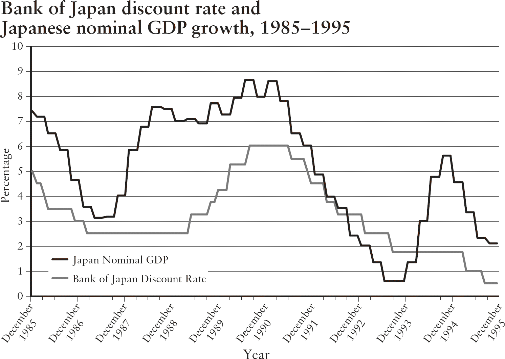

[6.](#section-9) In the second half of the 1980s, the Bank of Japan’s policy rate was kept well below economic growth, thereby creating the conditions for the notorious ‘Bubble Economy’ to form.

The loosening of the monetary tourniquet brought little respite, however. For the rest of the 1990s, Japan’s economy was weighed down by declining property prices, a weakened banking system beset with non-performing loans, declining returns on capital and lingering deflation as over-leveraged companies sought to reduce their debt burdens. In the aftermath of the Bubble Economy, Japan suffered two ‘lost decades’. Officials at the BOJ later acknowledged that monetary policy had stimulated the bubble by creating the impression that interest rates would remain permanently on the low side.[8](#section-51) They also admitted that the absence of inflation at the time had made it difficult for them to respond to the bubble in a timely fashion.[9](#section-51) The most important lesson of the bubble, in their view, was that monetary policy should be conducted in a far-sighted manner:

> Price stability, which monetary policy should aim at, is not stability at any particular point in time but rather sustainable stability that can support economic growth over the medium to long term. Therefore, even when measured inflation is stable, it will become necessary to raise interest rates promptly.[10](#section-51)

The authors added that the Bank of Japan ‘could have extracted useful information from such data as an increase in money supply and credit’ had it chosen to do so. This view was seconded by the Bank for International Settlements. ‘In the case of Japan [in the 1980s], stable prices in fact amplified the economic cycle by distracting attention from the growth of money and credit,’ say the BIS economists, adding that a ‘singular focus, if not fixation, on price inflation arguably blinded the Bank of Japan to what was going on in credit markets and the potential for financial disruption should the bubble collapse’.[11](#section-51)

An alternative explanation put forward by American monetary policymakers holds that the Bubble Economy resulted from a botched liberalization of Japanese financial markets. According to this view, Governor Mieno was wrong to have tightened policy aggressively in 1989 in order to prick the real estate bubble, and the BOJ compounded this error by being slow to ease measures when Japan’s economy turned down in the early 1990s, possibly because it feared reflating the bubble.[12](#section-51) The BOJ is also accused of being insufficiently bold in addressing deflation and of not doing enough to bring down long-term interest rates.[13](#section-51)

The BOJ’s actions in the second half of the 1980s are reminiscent of Federal Reserve policy during the 1920s. Both economies experienced robust growth combined with low inflation. Both central banks directed their attention to price stability and initially ignored strong credit growth and the appearance of speculative bubbles. With domestic inflation under control, both the Fed and the BOJ tweaked domestic monetary policy for purposes of international co-operation. And towards the end of their respective booms, both central banks raised interest rates with the aim of bursting the stock market bubble. Like the Fed in the early 1930s, the BOJ allowed deflation to take hold after the Bubble Economy collapsed.

Had the BOJ not attempted to burst the bubble, or had the central bank loosened policy more quickly after the bubble started to deflate, then the monetarists’ hypothesis, first elaborated by Fisher and disputed by Hayek – that price stability is a necessary prerequisite for economic and financial stability – might have been properly tested. Still, consumer prices in Japan remained stable for nearly a decade: it was only from the mid-1990s that deflation set in. By that date the real estate collapse had severely weakened Japan’s banking system. Nor should it be overlooked that deflation in Japan was mild compared to what the United States experienced in the Depression years, and the Japanese money supply continued growing throughout this period. Because of these differences, monetarists tend to emphasize the severe US deflation of the early 1930s when they assert that stable consumer prices create stable financial conditions.[14](#section-51)

### THE BATTLE AGAINST INFLATION

In the United States price stability was achieved the hard way. By the late 1970s, inflation had run out of control, contributing to weak economic growth (‘stagflation’) and social unrest.[fn1](#section-58) In August 1979, President Carter appointed Paul Volcker, a lanky former Treasury official, commercial banker and lately President of the New York Fed, to run the Federal Reserve. Carter chose the right man for the job. Volcker’s senior undergraduate thesis had been on the dangers posed by excessively low interest rates and his professional role model was William McChesney Martin, the Federal Reserve Chairman who once famously remarked that the Fed’s job was to remove the punchbowl when the party got going.[fn2](#section-58) By 1979, the party had been going on for far too long and it was time to turn out the lights.

Volcker aimed to crush inflation by slowing the growth in the money supply – what he styled ‘practical monetarism’, as opposed to Friedman’s academic variety – and he didn’t care how high interest rates climbed to achieve his goal. ‘The ensuing three years witnessed unprecedented volatility of rates and yields, and their climb in late 1981 to the highest levels in U.S. history,’ write Homer and Sylla.[15](#section-51) Under Volcker, the Fed funds rate went from 10 per cent to just short of 19 per cent in December 1980, and it averaged over 16 per cent through the following year. The commercial bank prime rate peaked at 21.5 per cent. Long-dated Treasury bonds were issued to a yield of 15 per cent – the highest bond coupon ever paid by the American government.[16](#section-51)

There was public uproar as Volcker’s tight money strangled the US economy and drove the level of unemployment into double digits. The Fed Chairman was provided with personal security after an armed intruder broke into the Federal Reserve’s Eccles Building offices threatening to kill members of the Fed’s Open Markets Committee. Angry housebuilders sent sawed-off two-by-four planks to Volcker (one of which carried the sound advice: ‘get interest rates down, cut the money supply’). Angry car-dealers sent coffins stuffed with the keys of unsold vehicles to the same address.[17](#section-51) The Fed stood accused of the ‘cold-blooded murder of millions of small businesses’ and of killing ‘the American dream of homeownership’.[18](#section-51) But its Chairman remained, as he later recalled, ‘lashed to the mast’. Everyone agreed that lower interest rates were desirable but, as Volcker said, ‘the question is whether by reaching too fast for that objective we may not be able to keep them down.’[19](#section-51)

By the end of the 1981–82 recession the battle against inflation was won. The advent of history’s greatest bond bull market was affirmed by Dr Henry Kaufman, the chief economist of Salomon Brothers, on 17 August 1982. Interest rates were heading down, said the man known on Wall Street as ‘Dr Doom’. Five years later, Volcker was replaced at the Fed by Alan Greenspan, a successful business economist with Republican Party connections. Greenspan was neither a career public servant, like Volcker, nor an academic economist (he dropped out of his PhD programme and later received an unconventional doctorate from New York University). He had once been a member of Ayn Rand’s ‘Collective’, the group of fervent admirers who gathered around the author of *Atlas Shrugged*, and even wrote a Randian article that upheld the Gold Standard and blamed the Federal Reserve for the 1929 crash.[20](#section-51)

Despite this radical libertarian background, Greenspan was to prove an interventionist central banker. During his tenure as Fed Chairman, monetary policy was frequently tweaked to give the financial markets what they wanted. For which Greenspan earned lavish praise, becoming in time a totemic figure to Wall Street, a monetary shaman whose indecipherable incantations had the power to keep markets aloft. Senator John McCain once jested that if Greenspan were to die in office, he’d prop him up and put dark glasses on him. Hailed as the ‘greatest central banker ever’ at the close of his near two-decade tenure, Greenspan’s real achievement was to inflate a series of asset price bubbles and protect investors from the worst of the fallout.

Before switching to economics, Greenspan had studied clarinet at New York’s Juilliard School. His riffs on monetary policy were hard to follow. Early in his tenure, he remarked that, ‘if I turn out to be particularly clear, you’ve probably misunderstood what I said.’ H. G. Wells’s description of that other long-serving central banker Montagu Norman – whom the novelist described as one of those ‘strange Mystery Men … dimly visible through a fog of battling evasions and misstatements, manipulating prices and exchanges’ – applies as well to Greenspan.

A couple of months into his new role, in October 1987 Greenspan was confronted with the worst stock market collapse since 1929. He responded by cutting the Fed funds rate and flooding Wall Street with liquidity. The stock market bounced back. Shortly afterwards, the Fed switched its attention from attempting to influence the growth of bank borrowing to directly targeting interest rates.[fn3](#section-58) Henceforth, monetary policy would remain focused on near-term inflation, while other financial imbalances – as reflected by current account deficits, credit growth and underwriting standards, private sector leverage, and asset price bubbles – elicited no response beyond the occasional attempt to pressurize the market into a correction.

After the Savings & Loan crisis at the turn of the decade, when more than a thousand US mortgage banks, ‘thrifts’, failed, the Fed funds rate was cut to below 3 per cent, its lowest level for many years and roughly half the prevailing rate of (nominal) GDP growth. Greenspan wanted to help Wall Street out: cheap short-term borrowing enabled banks and hedge funds to mint profits by ‘riding the yield curve’. A pick-up in US productivity in the mid-1990s suggested that the natural rate of interest was rising. At the same time the prices of imported goods were falling and inflation remained dormant. If the rate of interest tracks the return on capital, then American rates should have climbed in tandem. But this didn’t happen. Instead, short-term interest rates were held below the growth rate of the US economy for most of the period between early 1992 and the end of the decade.

Thus, in the face of a positive supply shock akin to what the United States had experienced in the 1920s, the Greenspan Fed remained accommodating.[21](#section-51) Another New Era beckoned – but, so as not to frighten those with long memories, it was renamed the New Paradigm or the Goldilocks Economy, being ‘not too hot, not too cold’. In December 1996, Greenspan rattled Wall Street by asking in public whether ‘irrational exuberance’ had infected the stock market, but as this question turned out to be rhetorical and elicited no further action, the bull market in equities continued.

Low inflation gave Greenspan the freedom to apply monetary balm at moments of financial distress. In late September 1998, the Fed funds rate was cut by 25 basis points after the near failure of Long Term Capital Management, an over-leveraged hedge fund. The markets responded warmly to the advent of what was called the ‘Greenspan put’ – an unwritten contract with Wall Street that committed the Federal Reserve to intervene to halt market declines. Between October 1997 and its peak two and a half years later, the Nasdaq Index of technology stocks enjoyed a near threefold gain. In valuation terms, this was the greatest bubble in US history. The bubble ended, like many of its antecedents, after a series of hikes took the Fed funds rate to 7 per cent in the summer of 2000.

In 2002, Ben Bernanke joined the Federal Reserve from Princeton, where he had headed the economics department.[22](#section-51) Bernanke provided the intellectual ballast for Greenspan’s practice of ignoring asset price bubbles. Since bubbles were said to be impossible to identify in real time, Bernanke said, monetary policy shouldn’t act pre-emptively against them but should deal with their aftermath. Bernanke was a strong advocate of acting – this time pre-emptively – against deflation, though. In November 2002, he suggested that the Fed could arrest a decline in prices under any circumstances – if necessary, it could drop ‘helicopter money’ (i.e. newly printed dollars) into the hands of the American public. In the spring of 2003, the Fed funds rate was cut to 1 per cent, where it remained for over a year. Over the following five years, the Fed’s key policy rate remained well below the country’s rate of economic growth. The era of easy money had well and truly begun.

At the same time, inflation remained under control. Across the developed world, central bankers were meeting their inflation targets. Economists referred to the low inflation and mild downturns of the early 2000s as the ‘Great Moderation’, a benign state of affairs that they ascribed to improvements in monetary policymaking. Central bankers found it hard to disagree. In the United Kingdom, the Bank of England coined an acronym, NICE (non-inflationary consistent expansion), to describe these splendid circumstances.[23](#section-51) The British Chancellor of the Exchequer, Gordon Brown, hailed an end to boom and bust. In 2004, Greenspan boasted that ‘our strategy of addressing the bubble’s consequences rather than the bubble itself has been successful.’[24](#section-51) Bernanke hailed the ‘strong’ and ‘self-sustaining’ recovery in the United States.[25](#section-51)

In a replay of the Fed’s conduct under Ben Strong’s leadership in the mid-1920s, America’s central bank policymakers paid scant attention to rapid credit growth or the decline in credit quality. No attempt was made to restrain the real estate bubbles that were popping up around the country.[26](#section-51) As Greenspan approached retirement in early 2006, he belatedly acknowledged that some regional housing markets appeared ‘frothy’, and mused that earlier eras of stability had ended unhappily. Governor Bernanke remained a true believer, telling Congress a few months earlier that house price increases in the United States ‘largely reflect strong economic fundamentals’.[27](#section-51)

Fundamentals were beside the point. The records show that the Fed had used its considerable powers to boost the housing market. At a congressional hearing in November 2002, Greenspan noted that the Fed’s low interest rate policy had boosted home sales and construction. ‘Mortgage markets,’ observed the Fed Chairman, ‘have also been a powerful stabilizing force … by facilitating the extraction of some of the equity that homeowners have built up.’[28](#section-51) In fact, in the decade up to 2008 Americans extracted a grand total of $9 trillion in home equity.[29](#section-51) Mortgage equity withdrawal sounds pretty harmless, but in truth it is a fancy name for households getting into debt. More pointedly, at a meeting of the Federal Open Market Committee (FOMC) on 14 March 2004, Governor Donald Kohn admitted that

> policy accommodation – and the expectation that it will persist – is distorting asset prices. Most of this distortion is *deliberate* and a *desirable* effect of the stance of policy. *We have attempted to lower interest rates below long-term equilibrium rates and to boost asset prices in order to stimulate demand.*

None of Kohn’s colleagues who were present at the meeting, including Greenspan and Bernanke, dissented from this opinion.[fn4](#section-58) A couple of months later, the President of the Dallas Federal Reserve, Robert McTeer, was asked whether central bankers were able to prolong the business cycle indefinitely. McTeer replied that:

> the business cycle is being dealt with much better than it used to be. Policy makers are smarter. They’ve got a lot of mistakes that they can learn from … In the early ’30s when that episode started, there were a lot of bank failures that wiped out a lot of money … *Today, every time we have a major emergency, you know, the first thing we do is get on the microphone and open up – you open up a spigot.*[30](#section-51)

### PRICE STABILITY IS NOT ENOUGH

Not everyone was convinced that the Greenspan Federal Reserve’s policy of focusing on consumer prices and ignoring other financial imbalances was quite the trick. Few dissenters, however, occupied exalted positions in monetary policymaking circles or enjoyed tenure at top universities. William White, the chief economist of the Bank for International Settlements – the central bankers’ central bank – was an exception to the prevailing groupthink.

In a paper entitled ‘Is Price Stability Enough?’, the Canadian economist suggested that the achievement of stable prices might not be enough to avoid serious macroeconomic disturbances over the long haul. Like Hayek, White distinguished between good deflation that arises from productivity improvements and bad deflation that follows a credit bust. Past financial crises, White noted, had often appeared without any prior pick-up of inflation – the recent Asian crisis being a case in point. Credit growth, asset price inflation and large-scale capital inflows – in other words, the financial conditions then prevailing in the United States – were more reliable harbingers of a crisis.

White also questioned the policy, championed by Bernanke, of dealing with the aftermath of a bubble rather than forestalling it. An over-indebted economy might enter a liquidity trap, rendering it impervious to monetary stimulus. If capital was misallocated during the boom, then low interest rates after the bust might contribute to economic sclerosis, as Japan had experienced over the previous decade. Reducing interest rates after a bubble’s collapse might discourage saving, thereby reducing the economy’s growth prospects: ‘If low rates are maintained for an extended period,’ White suggested, ‘they may or may not have the desired effect on aggregate demand, but they clearly have negative long-term effects with respect to aggregate supply.’ Finally, he predicted that low rates would drive a search for yield from insurance companies and defined benefit pension plans.

This brilliantly prescient paper, with its hints of Hayek’s critique of monetary policy in the 1920s, fell on deaf ears. Besides, by its publication date in April 2006, it was too late to change course. House prices at the national level had crossed the bubble threshold, and several regional housing markets were saturated with new supply.[31](#section-51) The US housing bubble was already past its peak and house prices were set to commence a multi-year decline. The US financial system was awash with complex mortgage securities that had yet to be tested in a market downturn. A few astute financial commentators observed that defaults on certain freshly minted subprime mortgages were rising at an alarming rate.

Countless books and articles (‘crunch porn’) have been written about the causes of the global financial crisis. Mainstream economists, who had been oblivious to any signs of financial fragility beforehand, were suddenly full of explanations. The provost of an American university lamented that he had ‘an entire department of economists who can provide a brilliant *ex post facto* explanation of what happened – and not a single one of them saw it coming.’[32](#section-51) Queen Elizabeth II, when visiting the London School of Economics in November 2008, made a similar comment. Chief among the non-seers, Bernanke inclined to the view that poor financial regulation was to blame for the credit excesses prior to the Lehman’s bankruptcy (this did necessitate taking some personal responsibility since the Federal Reserve, which Bernanke chaired from early 2006, was the chief US financial regulator). Among policymakers, the regulatory interpretation of the financial crisis won the day.

At the same time, the role played by monetary policy in the run-up to the crisis was downplayed: the Federal Reserve’s decision to take its policy rate to a post-war low and hold it there for eighteenth months; keeping the Fed funds rate below the economy’s growth rate for five consecutive years; the extremely slow pace of tightening, with rates hiked at ‘baby steps’ so as not to scare the financial markets; the intentional stoking of the housing market and encouragement of households to get into debt; and the opening of the monetary spigots – all were conveniently forgotten. Bernanke denied that US monetary policy had been too loose from 2002, on the grounds that the Fed’s forecasts suggested a heightened deflation risk.[fn5](#section-58) Greenspan’s replacement also repudiated the notion that easy money had inflated the housing bubble:

> Economists [actually Federal Reserve economists, in his employ] who have investigated the issue have generally found that, based on historical relationships, *only a small portion of the increase in house prices earlier this decade can be attributed to the stance of U.S. monetary policy*. This conclusion has been reached using both econometric models and purely statistical analyses that make no use of economic theory. [fn6](#section-58)

Bernanke admitted that the decline in long-term US interest rates had improved mortgage affordability, thereby boosting house prices, but ascribed the fall in Treasury yields to a ‘global savings glut’ rather than the Federal Reserve’s actions. There are alternative explanations for the decline in long-term US rates (discussed in a later chapter).[fn7](#section-58) Nevertheless, the savings glut hypothesis absolved monetary policymakers from blame for the subprime debacle and became a key part of mainstream explanations for the global financial crisis.

Yet Bernanke’s analysis ignores the fact that the riskiest subprime loans were priced off short-term rates, including the option of adjustable-rate mortgages with their negative amortization feature (in which interest was rolled up with the principal). It was only after the Fed’s easy money policy was launched that credit growth picked up, financial leverage soared, housing markets bubbled, underwriting standards declined and the repackaging of subprime mortgage debt into collateralized debt obligations took off. Low interest rates fed the demand for credit, while financial innovation increased its supply. The explosive growth of the market for complex mortgage securities was driven in large part by a desperate search for yield at a time when interest rates were at multi-decade lows.

Long after the financial crisis, economists at the Federal Reserve continued to deny that house prices were affected by monetary policy.[33](#section-51) A handful of American central bankers, however, admitted that errors had been made. William Poole, President of the St Louis Federal Reserve, acknowledged that low interest rates had fuelled the housing boom. Poole told a meeting of the Fed’s rate-setting committee in 2007, a year before Lehman’s bankruptcy: ‘We had a boom driven by a period of very low interest rates. The period really got started when we were holding the Fed funds rate at 1 per cent. Then you had a lot of financial innovations and subprime mortgages that added to a sector that hadn’t traditionally been there.’[34](#section-51) Likewise, Poole’s counterpart at the Kansas City Fed, Thomas Hoenig, found ‘strong supporting evidence’ for the argument that negative real interest rates between 2002 and 2004 had contributed to the housing and credit boom.[35](#section-51)

Some leading economists concurred. Anna Schwartz, who had earlier extolled the goal of price stability, now pinned responsibility for the subprime crisis on the Fed: ‘the basic underlying propagator [of the crisis] was too-easy monetary policy and too-low interest rates that induced ordinary people’ to borrow and speculate.[fn8](#section-58) Professor John Taylor of Stanford University, author of the ‘Taylor Rule’, a central banker’s rule of thumb for setting interest rates (based on inflation expectations and estimates of spare capacity in the economy), suggested that ‘monetary excesses were the main cause of the boom and the resulting bust’.[36](#section-51)

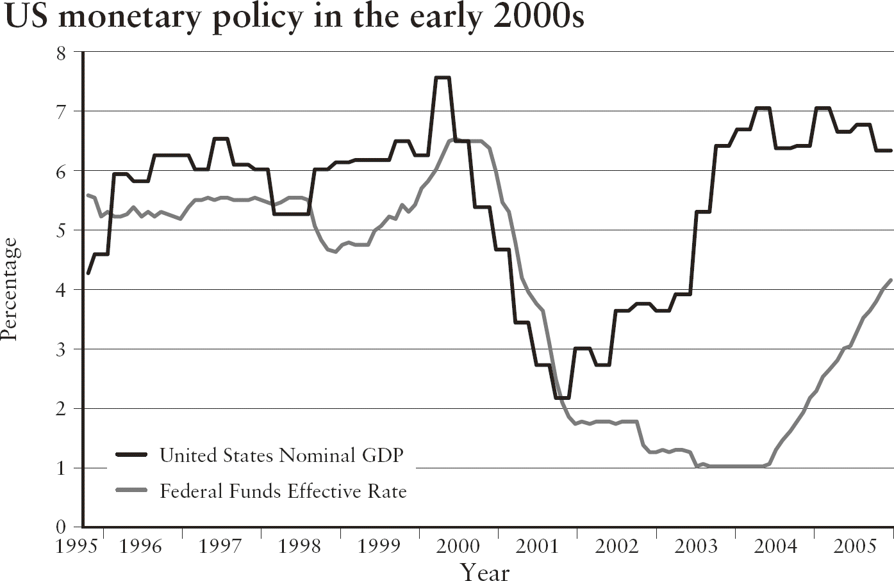

[7.](#section-9) In the aftermath of the dotcom bubble, the Greenspan Fed took interest rates to a postwar low. It was at this time that the US house prices started to take off.

The American political scientist Mancur Olson warned against an appeal to ad hoc explanations for economic events not supported by testable theory. A multiplicity of causal forces, Olson suggested, can make a false theory seem true and a true theory appear false.[37](#section-51) Yet most accounts of the financial crisis draw on such a multiplicity of causal forces – by claiming that the crisis arose due to the proliferation of complex debt securities, unreliable credit ratings, flawed risk models, a pass-the-parcel approach to mortgage debt, poor regulation, animal spirits, excessive global savings, and so forth.

Such accounts overlook the fact that financial practices and regulations differed from one country to another. American banks may have originated dodgy mortgage debt instruments in order to distribute them, but in Spain mortgage bonds (*cédulas*) remained on banks’ balance sheets. The Bank of Spain even demanded that banks increase their capital reserves during the boom. Yet despite these safeguards, Spain suffered a worse financial shock than the United States and the near total collapse of its local savings banks (*cajas*). Since the crisis was global, it seems reasonable to suppose that its origins were also global. Subprime mortgages couldn’t fill the bill as they were an American affair. However, losses on complex mortgage securities, issued in the United States but owned in large quantities by European banks, were sufficient to set off a chain reaction that spread rapidly throughout the global financial system.

Why were the credit systems of so many different countries, from Australia to Iceland, so vulnerable at the time? The unifying factor appears to be the low-interest rate policy of the Federal Reserve at the turn of the century, which, owing to the special position of the dollar as the global reserve currency, created the conditions for a credit boom that engulfed much of the world’s economy. Prior to the crisis, global interest rates were negative in real terms and far below the growth rate of the world’s economy. Even countries with relatively high interest rates enjoyed no respite, since they were inundated with foreign capital flows.[fn9](#section-58) There’s no need to appeal to ad hoc explanations: easy money produced the boom and the boom was followed by the inevitable bust.

The closed community of central bankers and monetary economists remained obdurate to monetary explanations for the crisis. They had invested too much time and effort in their economic models and were reluctant to jettison them. Their canonical model assumes that an economy is only knocked off course by random or ‘exogenous’ shocks, such as the 1973 oil crisis. It has no place for money and credit. Interest rates are given and errors in monetary policy are revealed by instability in consumer prices but not asset prices. Speculative bubbles and irrational exuberance are not countenanced. Instead, the model posits a world filled with rational actors possessed with perfect foresight. But it doesn’t remotely describe what actually happens on Wall Street or any other stock market. No wonder the academic economists in charge of what James Grant called the ‘PhD Standard’ were blindsided by events.

Institutional factors contributed to this state of cognitive dissonance. The Federal Reserve is the world’s largest employer of finance PhDs and has deep connections with economic journals that specialize in monetary matters. It is telling that, in a 2010 survey, a large majority of academic economists believed that low rates caused, or at least greatly contributed to, the housing bubble, but most economists specializing in monetary policy continued to side with the Fed’s view.[38](#section-51) If Bernanke, as head of the Federal Reserve, held that the crisis wasn’t a failure of ‘economic science’ but one of economic management (regulation), it was only to be expected that the Fed’s own research team should follow their chief’s lead.[39](#section-51) They occupied an echo chamber in which existing beliefs were reinforced and uncomfortable questions ignored.

‘Bernanke’s Fed,’ concludes historian Philip Mirowski, ‘has evaded suffering any consequences for its intellectual incompetence’ in the lead up to the crisis. Instead of being hounded from office, Bernanke was credited with saving the world from another Great Depression and anointed *Time* magazine’s ‘Person of the Year’ in 2009. His exercise in denial meant that the Fed learned little from the crisis. Besides the odd tweak, monetary policymakers saw no need to change their flawed models. If low interest rates hadn’t caused the crisis, there would be no problem in taking them even lower in future.

### INFLATION TARGETING

The financial crisis revived the threat of deflation – the kind of debt-deflation identified by Irving Fisher that occurs after credit booms when people, having taken on too much debt, seek to pay it off. After 2008, fear of deflation – what Harvard economist Martin Feldstein called the ‘deflation bogeyman’ – obsessed policymakers. Deflation was the ‘world’s biggest economic problem’, according to *The Economist*.[40](#section-51) The head of the International Monetary Fund, Christine Lagarde, said deflation was an ‘ogre’ that could ‘prove disastrous to recovery’. Bank of Japan Governor Haruhiko Kuroda deemed it a ‘chronic disease’. Deflation was to be kept at bay through the strict enforcement of inflation targeting: price stability was to be achieved at any cost.

The 1990s had witnessed the widespread adoption of official inflation targets by central banks. The Reserve Bank of New Zealand was the first central bank to adopt an explicit target in 1990 – coincidentally, the same year in which Japan’s bubble started to deflate. Canada did the same in 1991. Six years later, a newly independent Bank of England was given an inflation target. In 1998, the European Central Bank opened for business with a treaty-mandated target. Although the Fed under Alan Greenspan eschewed a formal target, it pursued a similar approach.[41](#section-51) Despite the fact that the widespread adoption of inflation targets had provided no protection against the financial crisis, the roll-out continued after 2008. In early 2012, Bernanke achieved his long-held ambition of getting the Federal Reserve to adopt a formal inflation target.[fn10](#section-58) The Bank of Japan soon followed.

Not only did the major central banks in the developed world now have a target, but they all coalesced around the same number: 2 per cent acquired talismanic significance – what Governor Kuroda called a ‘global standard’.[42](#section-51) The number was written into the ECB’s constitution. It was constantly invoked by central bankers, as if repetition would help them to attain their aim. Here is how Janet Yellen, Bernanke’s successor at the Federal Reserve, addressed a meeting of the Federal Open Market Committee in September 2016:

> So let me be clear – 2 percent is our objective. We want to see inflation go back to 2 percent; 2 percent is not a ceiling on inflation. So we’re not trying to push the inflation rate above 2. It’s always our objective to get back to 2, but 2 percent is not a ceiling. And if it were a ceiling, you would have to be conducting a policy that, on average, would hold the inflation rate below 2 percent. That is not our policy. We want to see the inflation rate get back to 2 percent as rapidly as we can.

We have seen how the Fed’s pursuit of price stabilization in the 1920s contributed to that era’s credit boom and speculative excesses. Fixing a specific target to the same policy only exacerbates matters. It has long been recognized that managing institutions by reference to a fixed quantitative indicator has its limitations.[fn11](#section-58) Quantitative targets tend to get chosen because they are easy to quantify. But factors that aren’t easily measured tend to get overlooked. As a result, the use of targets is associated with a variety of adverse outcomes, including short-termism, the diversion of resources into bureaucracy, risk aversion, unjustified rewards, and the undermining of institutional culture.

Metrics serve to stifle innovation and creativity; they imitate science but resemble faith. When an institution is guided by some specific target, critical judgement is suspended. In the 1970s, the American social scientist Donald Campbell pointed out that ‘the more any quantitative social indicator is used for social decision-making, the more subject it will be to corruption pressures and the more apt it will be to distort and corrupt the social processes it is intended to monitor.’ Historian Jerry Muller adds a corollary to Campbell’s Law, namely: ‘anything that can be measured and rewarded will be gamed.’

The most famous target law of all emerged several decades ago in the field of monetary economics. In the early 1980s, central bankers on both sides of the Atlantic sought to control inflation by targeting the growth of the money supply. The money supply is a fuzzy concept and can be measured in a number of different ways (economists refer to M0, M1, M2, M3, etc.). Charles Goodhart of the London School of Economics observed that whenever the Bank of England targeted a particular measure of money supply, that measure’s earlier relationship to inflation broke down. Goodhart’s Law states that *any measure used for control is unreliable*.

The mistake in setting targets lies in assuming that relationships between variables – in this case a certain measure of the money supply and inflation – are stationary. In the real world, human behaviour responds to attempts at control. ‘The essence of Goodhart’s Law,’ write John Kay and Mervyn King in their book *Radical Uncertainty*, is that ‘any business or government policy which assumed stationarity of social and economic relationships was likely to fail because its implementation would alter the behaviour of those affected and therefore destroy that stationarity.’[43](#section-51) As a former Governor of the Bank of England, Lord King’s prime responsibility had been to implement the 2 per cent inflation target. After retirement in 2013, he openly questioned the limitations of this rule: ‘we have not targeted those things which we ought to have targeted and we have targeted those things which we ought not to have targeted, and there is no health in the economy.’[44](#section-51)

Another retired central banker, Paul Volcker, was even more critical of the inflation target. ‘I puzzle at the rationale,’ wrote the former Fed chief. ‘A 2 percent target, or limit, was not in my textbooks years ago. I know of no theoretical justification. It’s difficult to be a target and a limit at the same time.’ No price index could accurately capture the real change in consumer prices, Volcker added. Besides, in a growing economy there is a tendency for prices to move up and down a little, not sideways. As to the idea that monetary policy should be eased at a time when the economy was robust and unemployment low merely because inflation trailed the target, well, Volcker thought, ‘certainly, that would be nonsense.’[45](#section-51)

One problem with the inflation target, according to UCLA economist Axel Leijonhufvud, is that ‘a constant inflation rate gives you absolutely no information about whether your monetary policy is right.’ On the contrary, Leijonhufvud maintained, the target encourages central banks to pursue policies that undermine financial stability.[46](#section-51) As we shall see, the pursuit of a 2 per cent inflation target at a time of lingering deflation in fact forced central bankers to set interest rates at extremely low and even negative levels, thereby encouraging speculative borrowing and other forms of financial risk-taking.[fn12](#section-58)

Nor was it clear that inflation-targeting central banks exerted much control over domestic inflation. As globalization advanced, inflation took on a global aspect. When import prices fell, central bankers were required to inflate the price of non-traded goods and services – such as healthcare, education and construction – in order to prevent the general price level from falling. Few questioned whether this was desirable or not. Furthermore, the time period chosen for the inflation target was inappropriate: in principle, price stability should be measured over several years (as the BOJ admitted after 1990), but most central bankers aimed to achieve their target in real-time. Another criticism, raised by William White, was that their approach to inflation targeting was asymmetric: their horror of deflation inclined them to overshoot rather than undershoot the target. As a result, monetary policy was systematically biased towards rate easing.

After 2008, central bankers’ pursuit of inflation targets became as obsessive as their fear of deflation. ‘The ultimate and the only mandate that we have to comply with is to bring inflation back to a level that is close to but below 2 per cent,’ stated the President of the European Central Bank, Mario Draghi, in October 2014.[47](#section-51) Launching another series of unconventional monetary measures in early 2016, Draghi remarked that ‘there are no limits to our actions, within our mandate.’[48](#section-51) Europe’s top central banker would ‘absolutely reject’ attempts to derail the ECB’s efforts to raise inflation and ‘vowed’ not to give up on its inflation goal.[49](#section-51) At the Bank of Japan, Governor Kuroda displayed a similar fanaticism: his ‘unshakable’ new target would be pursued with ‘unwavering determination’.[50](#section-51) Having embarked on the world’s most ambitious plan to expand the central bank’s balance sheet and set short-term rates below zero, Kuroda repeated Draghi’s comments that there was ‘no limit to monetary easing’ and that the BOJ ‘would do whatever is necessary to achieve’ its target, adding for good measure that ‘it is no exaggeration that [ours] is the most powerful monetary policy framework in the history of modern central banking.’[51](#section-51) Failure to achieve its target would only signify that the BOJ hadn’t been aggressive enough.

The pursuit of inflation targets resembled a massive real-time Milgram experiment, with the world’s citizenry as guinea pigs. Obsessed with their targets, technocrat central bankers were blinded to, or at least encouraged to downplay, any adverse results of their policies. Asked whether the ECB’s actions were causing inequality, Draghi replied that his concern was with the target. Challenged about potential losses on the ECB’s securities portfolio, he gave the same response. Extreme monetary policies might incite speculation, he acknowledged, but the ECB didn’t set rates to ‘price local bubbles’.

Through thick and thin, central bankers would cling to the sacrosanct target. Their credibility depended on it.[52](#section-51) Never mind that the policies called forth by inflation targeting appeared to be killing economic growth. Never mind that zero interest rates discouraged savings and investment, and impaired productivity growth. Never mind that ultra-low rates, by keeping zombie companies on life-support, resulted in the survival of the least fit. Never mind that central bank policies contributed to rising inequality, undermined financial stability, encouraged ‘hot money’ capital flows and fostered numerous asset price bubbles, from luxury apartments to cryptocurrencies. As Draghi expressed it: ‘This is not a question of trade-offs. We cannot shy away from implementing a policy that ensures price stability on account of potential collateral effects.’[53](#section-51) The ECB would pursue its target, let the consequences be damned.

<!-- rl-section id="sec-chapter007" class="titlepage" title="7" -->

## Goodhart’s Law

> *When a measure becomes a target, it ceases to be a good measure.*
>
> Goodhart’s Law
>
> *We have not targeted those things which we ought to have targeted, and we have targeted those things which we ought not to have targeted, and there is no health in the economy.*
>
> Former Bank of England Governor Mervyn King, 2016

### MONETARY STABILITY IN JAPAN IN THE 1980s

The failure of Hayek’s interpretation of the 1920s’ boom and the aftermath to gain widespread acceptance explains why later generations of economists and policymakers returned so enthusiastically to the pursuit of price stability. Anna Schwartz, co-author of *The Monetary History of the United States*, proclaimed that ‘Monetary stability is a prerequisite of price stability, and price stability is a prerequisite of financial stability.’[1](#section-51) By 1995, when Schwartz wrote these words, it should have been clear from events then unfolding in Japan that something was desperately wrong with this dogma.

Over the course of the twentieth century, Japan had experienced bouts of extreme monetary instability. By the mid-1980s inflation was firmly under control, however. Economic growth was robust – Japan’s GDP expanded by more than 5 per cent a year in the late 1980s.[2](#section-51) The official aim of the Bank of Japan’s monetary policy during this period was ‘controlling inflation and correcting international imbalances’.[3](#section-51) Freed from concerns about inflation, officials at the Bank of Japan responded to appeals for international economic co-operation. Following the Louvre Accord (an international agreement intended to halt the depreciation of the US dollar) in February 1987, the Bank of Japan reduced its discount rate to a post-war low of 2.5 per cent, with the aim of supporting the dollar on the foreign exchanges. The discount rate remained at this level for just over two years. After the global stock market crash in October that year, the BOJ further eased credit conditions, with the aim of boosting domestic demand and global economic growth.[4](#section-51) It was widely believed that Japanese interest rates would remain low for some time to come.

Japan’s great bubble economy now emerged. The nation’s money supply and credit expanded rapidly while interest rates were held well below the economy’s GDP growth rate.[5](#section-51) Business investment soared. Japanese corporations, which issued foreign currency warrant bonds, enjoyed a negative cost of borrowing after swapping the proceeds back into yen. Financial engineering, known as *zaitech*, became commonplace: companies borrowed to speculate in stocks through their brokerage trust or *tokkin* accounts. Easy money fuelled a bubble in equities and property. The real estate value of the imperial palace in Tokyo was famously estimated to have surpassed that of the entire state of California.

Towards the end of the decade, inflation started to tick upwards. In 1989, the new Governor of the Bank of Japan, Yasushi Mieno, decided to prick the stock market bubble. The discount rate was raised on three occasions that year, in May, October and on Christmas Day, four days before the Nikkei index reached its all-time high.[6](#section-51) As property prices continued to rise in early 1990, the BOJ continued to raise the discount rate, which reached 6 per cent in August.[7](#section-51) When it became apparent that Japan’s economy was slowing, the central bank abruptly reversed course: between July 1991 and September 1995, the official discount rate was cut from 6 to 0.5 per cent.

[6.](#section-9) In the second half of the 1980s, the Bank of Japan’s policy rate was kept well below economic growth, thereby creating the conditions for the notorious ‘Bubble Economy’ to form.

The loosening of the monetary tourniquet brought little respite, however. For the rest of the 1990s, Japan’s economy was weighed down by declining property prices, a weakened banking system beset with non-performing loans, declining returns on capital and lingering deflation as over-leveraged companies sought to reduce their debt burdens. In the aftermath of the Bubble Economy, Japan suffered two ‘lost decades’. Officials at the BOJ later acknowledged that monetary policy had stimulated the bubble by creating the impression that interest rates would remain permanently on the low side.[8](#section-51) They also admitted that the absence of inflation at the time had made it difficult for them to respond to the bubble in a timely fashion.[9](#section-51) The most important lesson of the bubble, in their view, was that monetary policy should be conducted in a far-sighted manner:

> Price stability, which monetary policy should aim at, is not stability at any particular point in time but rather sustainable stability that can support economic growth over the medium to long term. Therefore, even when measured inflation is stable, it will become necessary to raise interest rates promptly.[10](#section-51)

The authors added that the Bank of Japan ‘could have extracted useful information from such data as an increase in money supply and credit’ had it chosen to do so. This view was seconded by the Bank for International Settlements. ‘In the case of Japan [in the 1980s], stable prices in fact amplified the economic cycle by distracting attention from the growth of money and credit,’ say the BIS economists, adding that a ‘singular focus, if not fixation, on price inflation arguably blinded the Bank of Japan to what was going on in credit markets and the potential for financial disruption should the bubble collapse’.[11](#section-51)

An alternative explanation put forward by American monetary policymakers holds that the Bubble Economy resulted from a botched liberalization of Japanese financial markets. According to this view, Governor Mieno was wrong to have tightened policy aggressively in 1989 in order to prick the real estate bubble, and the BOJ compounded this error by being slow to ease measures when Japan’s economy turned down in the early 1990s, possibly because it feared reflating the bubble.[12](#section-51) The BOJ is also accused of being insufficiently bold in addressing deflation and of not doing enough to bring down long-term interest rates.[13](#section-51)

The BOJ’s actions in the second half of the 1980s are reminiscent of Federal Reserve policy during the 1920s. Both economies experienced robust growth combined with low inflation. Both central banks directed their attention to price stability and initially ignored strong credit growth and the appearance of speculative bubbles. With domestic inflation under control, both the Fed and the BOJ tweaked domestic monetary policy for purposes of international co-operation. And towards the end of their respective booms, both central banks raised interest rates with the aim of bursting the stock market bubble. Like the Fed in the early 1930s, the BOJ allowed deflation to take hold after the Bubble Economy collapsed.

Had the BOJ not attempted to burst the bubble, or had the central bank loosened policy more quickly after the bubble started to deflate, then the monetarists’ hypothesis, first elaborated by Fisher and disputed by Hayek – that price stability is a necessary prerequisite for economic and financial stability – might have been properly tested. Still, consumer prices in Japan remained stable for nearly a decade: it was only from the mid-1990s that deflation set in. By that date the real estate collapse had severely weakened Japan’s banking system. Nor should it be overlooked that deflation in Japan was mild compared to what the United States experienced in the Depression years, and the Japanese money supply continued growing throughout this period. Because of these differences, monetarists tend to emphasize the severe US deflation of the early 1930s when they assert that stable consumer prices create stable financial conditions.[14](#section-51)

### THE BATTLE AGAINST INFLATION

In the United States price stability was achieved the hard way. By the late 1970s, inflation had run out of control, contributing to weak economic growth (‘stagflation’) and social unrest.[fn1](#section-58) In August 1979, President Carter appointed Paul Volcker, a lanky former Treasury official, commercial banker and lately President of the New York Fed, to run the Federal Reserve. Carter chose the right man for the job. Volcker’s senior undergraduate thesis had been on the dangers posed by excessively low interest rates and his professional role model was William McChesney Martin, the Federal Reserve Chairman who once famously remarked that the Fed’s job was to remove the punchbowl when the party got going.[fn2](#section-58) By 1979, the party had been going on for far too long and it was time to turn out the lights.

Volcker aimed to crush inflation by slowing the growth in the money supply – what he styled ‘practical monetarism’, as opposed to Friedman’s academic variety – and he didn’t care how high interest rates climbed to achieve his goal. ‘The ensuing three years witnessed unprecedented volatility of rates and yields, and their climb in late 1981 to the highest levels in U.S. history,’ write Homer and Sylla.[15](#section-51) Under Volcker, the Fed funds rate went from 10 per cent to just short of 19 per cent in December 1980, and it averaged over 16 per cent through the following year. The commercial bank prime rate peaked at 21.5 per cent. Long-dated Treasury bonds were issued to a yield of 15 per cent – the highest bond coupon ever paid by the American government.[16](#section-51)

There was public uproar as Volcker’s tight money strangled the US economy and drove the level of unemployment into double digits. The Fed Chairman was provided with personal security after an armed intruder broke into the Federal Reserve’s Eccles Building offices threatening to kill members of the Fed’s Open Markets Committee. Angry housebuilders sent sawed-off two-by-four planks to Volcker (one of which carried the sound advice: ‘get interest rates down, cut the money supply’). Angry car-dealers sent coffins stuffed with the keys of unsold vehicles to the same address.[17](#section-51) The Fed stood accused of the ‘cold-blooded murder of millions of small businesses’ and of killing ‘the American dream of homeownership’.[18](#section-51) But its Chairman remained, as he later recalled, ‘lashed to the mast’. Everyone agreed that lower interest rates were desirable but, as Volcker said, ‘the question is whether by reaching too fast for that objective we may not be able to keep them down.’[19](#section-51)

By the end of the 1981–82 recession the battle against inflation was won. The advent of history’s greatest bond bull market was affirmed by Dr Henry Kaufman, the chief economist of Salomon Brothers, on 17 August 1982. Interest rates were heading down, said the man known on Wall Street as ‘Dr Doom’. Five years later, Volcker was replaced at the Fed by Alan Greenspan, a successful business economist with Republican Party connections. Greenspan was neither a career public servant, like Volcker, nor an academic economist (he dropped out of his PhD programme and later received an unconventional doctorate from New York University). He had once been a member of Ayn Rand’s ‘Collective’, the group of fervent admirers who gathered around the author of *Atlas Shrugged*, and even wrote a Randian article that upheld the Gold Standard and blamed the Federal Reserve for the 1929 crash.[20](#section-51)

Despite this radical libertarian background, Greenspan was to prove an interventionist central banker. During his tenure as Fed Chairman, monetary policy was frequently tweaked to give the financial markets what they wanted. For which Greenspan earned lavish praise, becoming in time a totemic figure to Wall Street, a monetary shaman whose indecipherable incantations had the power to keep markets aloft. Senator John McCain once jested that if Greenspan were to die in office, he’d prop him up and put dark glasses on him. Hailed as the ‘greatest central banker ever’ at the close of his near two-decade tenure, Greenspan’s real achievement was to inflate a series of asset price bubbles and protect investors from the worst of the fallout.

Before switching to economics, Greenspan had studied clarinet at New York’s Juilliard School. His riffs on monetary policy were hard to follow. Early in his tenure, he remarked that, ‘if I turn out to be particularly clear, you’ve probably misunderstood what I said.’ H. G. Wells’s description of that other long-serving central banker Montagu Norman – whom the novelist described as one of those ‘strange Mystery Men … dimly visible through a fog of battling evasions and misstatements, manipulating prices and exchanges’ – applies as well to Greenspan.

A couple of months into his new role, in October 1987 Greenspan was confronted with the worst stock market collapse since 1929. He responded by cutting the Fed funds rate and flooding Wall Street with liquidity. The stock market bounced back. Shortly afterwards, the Fed switched its attention from attempting to influence the growth of bank borrowing to directly targeting interest rates.[fn3](#section-58) Henceforth, monetary policy would remain focused on near-term inflation, while other financial imbalances – as reflected by current account deficits, credit growth and underwriting standards, private sector leverage, and asset price bubbles – elicited no response beyond the occasional attempt to pressurize the market into a correction.

After the Savings & Loan crisis at the turn of the decade, when more than a thousand US mortgage banks, ‘thrifts’, failed, the Fed funds rate was cut to below 3 per cent, its lowest level for many years and roughly half the prevailing rate of (nominal) GDP growth. Greenspan wanted to help Wall Street out: cheap short-term borrowing enabled banks and hedge funds to mint profits by ‘riding the yield curve’. A pick-up in US productivity in the mid-1990s suggested that the natural rate of interest was rising. At the same time the prices of imported goods were falling and inflation remained dormant. If the rate of interest tracks the return on capital, then American rates should have climbed in tandem. But this didn’t happen. Instead, short-term interest rates were held below the growth rate of the US economy for most of the period between early 1992 and the end of the decade.

Thus, in the face of a positive supply shock akin to what the United States had experienced in the 1920s, the Greenspan Fed remained accommodating.[21](#section-51) Another New Era beckoned – but, so as not to frighten those with long memories, it was renamed the New Paradigm or the Goldilocks Economy, being ‘not too hot, not too cold’. In December 1996, Greenspan rattled Wall Street by asking in public whether ‘irrational exuberance’ had infected the stock market, but as this question turned out to be rhetorical and elicited no further action, the bull market in equities continued.

Low inflation gave Greenspan the freedom to apply monetary balm at moments of financial distress. In late September 1998, the Fed funds rate was cut by 25 basis points after the near failure of Long Term Capital Management, an over-leveraged hedge fund. The markets responded warmly to the advent of what was called the ‘Greenspan put’ – an unwritten contract with Wall Street that committed the Federal Reserve to intervene to halt market declines. Between October 1997 and its peak two and a half years later, the Nasdaq Index of technology stocks enjoyed a near threefold gain. In valuation terms, this was the greatest bubble in US history. The bubble ended, like many of its antecedents, after a series of hikes took the Fed funds rate to 7 per cent in the summer of 2000.

In 2002, Ben Bernanke joined the Federal Reserve from Princeton, where he had headed the economics department.[22](#section-51) Bernanke provided the intellectual ballast for Greenspan’s practice of ignoring asset price bubbles. Since bubbles were said to be impossible to identify in real time, Bernanke said, monetary policy shouldn’t act pre-emptively against them but should deal with their aftermath. Bernanke was a strong advocate of acting – this time pre-emptively – against deflation, though. In November 2002, he suggested that the Fed could arrest a decline in prices under any circumstances – if necessary, it could drop ‘helicopter money’ (i.e. newly printed dollars) into the hands of the American public. In the spring of 2003, the Fed funds rate was cut to 1 per cent, where it remained for over a year. Over the following five years, the Fed’s key policy rate remained well below the country’s rate of economic growth. The era of easy money had well and truly begun.

At the same time, inflation remained under control. Across the developed world, central bankers were meeting their inflation targets. Economists referred to the low inflation and mild downturns of the early 2000s as the ‘Great Moderation’, a benign state of affairs that they ascribed to improvements in monetary policymaking. Central bankers found it hard to disagree. In the United Kingdom, the Bank of England coined an acronym, NICE (non-inflationary consistent expansion), to describe these splendid circumstances.[23](#section-51) The British Chancellor of the Exchequer, Gordon Brown, hailed an end to boom and bust. In 2004, Greenspan boasted that ‘our strategy of addressing the bubble’s consequences rather than the bubble itself has been successful.’[24](#section-51) Bernanke hailed the ‘strong’ and ‘self-sustaining’ recovery in the United States.[25](#section-51)

In a replay of the Fed’s conduct under Ben Strong’s leadership in the mid-1920s, America’s central bank policymakers paid scant attention to rapid credit growth or the decline in credit quality. No attempt was made to restrain the real estate bubbles that were popping up around the country.[26](#section-51) As Greenspan approached retirement in early 2006, he belatedly acknowledged that some regional housing markets appeared ‘frothy’, and mused that earlier eras of stability had ended unhappily. Governor Bernanke remained a true believer, telling Congress a few months earlier that house price increases in the United States ‘largely reflect strong economic fundamentals’.[27](#section-51)

Fundamentals were beside the point. The records show that the Fed had used its considerable powers to boost the housing market. At a congressional hearing in November 2002, Greenspan noted that the Fed’s low interest rate policy had boosted home sales and construction. ‘Mortgage markets,’ observed the Fed Chairman, ‘have also been a powerful stabilizing force … by facilitating the extraction of some of the equity that homeowners have built up.’[28](#section-51) In fact, in the decade up to 2008 Americans extracted a grand total of $9 trillion in home equity.[29](#section-51) Mortgage equity withdrawal sounds pretty harmless, but in truth it is a fancy name for households getting into debt. More pointedly, at a meeting of the Federal Open Market Committee (FOMC) on 14 March 2004, Governor Donald Kohn admitted that

> policy accommodation – and the expectation that it will persist – is distorting asset prices. Most of this distortion is *deliberate* and a *desirable* effect of the stance of policy. *We have attempted to lower interest rates below long-term equilibrium rates and to boost asset prices in order to stimulate demand.*

None of Kohn’s colleagues who were present at the meeting, including Greenspan and Bernanke, dissented from this opinion.[fn4](#section-58) A couple of months later, the President of the Dallas Federal Reserve, Robert McTeer, was asked whether central bankers were able to prolong the business cycle indefinitely. McTeer replied that:

> the business cycle is being dealt with much better than it used to be. Policy makers are smarter. They’ve got a lot of mistakes that they can learn from … In the early ’30s when that episode started, there were a lot of bank failures that wiped out a lot of money … *Today, every time we have a major emergency, you know, the first thing we do is get on the microphone and open up – you open up a spigot.*[30](#section-51)

### PRICE STABILITY IS NOT ENOUGH

Not everyone was convinced that the Greenspan Federal Reserve’s policy of focusing on consumer prices and ignoring other financial imbalances was quite the trick. Few dissenters, however, occupied exalted positions in monetary policymaking circles or enjoyed tenure at top universities. William White, the chief economist of the Bank for International Settlements – the central bankers’ central bank – was an exception to the prevailing groupthink.

In a paper entitled ‘Is Price Stability Enough?’, the Canadian economist suggested that the achievement of stable prices might not be enough to avoid serious macroeconomic disturbances over the long haul. Like Hayek, White distinguished between good deflation that arises from productivity improvements and bad deflation that follows a credit bust. Past financial crises, White noted, had often appeared without any prior pick-up of inflation – the recent Asian crisis being a case in point. Credit growth, asset price inflation and large-scale capital inflows – in other words, the financial conditions then prevailing in the United States – were more reliable harbingers of a crisis.

White also questioned the policy, championed by Bernanke, of dealing with the aftermath of a bubble rather than forestalling it. An over-indebted economy might enter a liquidity trap, rendering it impervious to monetary stimulus. If capital was misallocated during the boom, then low interest rates after the bust might contribute to economic sclerosis, as Japan had experienced over the previous decade. Reducing interest rates after a bubble’s collapse might discourage saving, thereby reducing the economy’s growth prospects: ‘If low rates are maintained for an extended period,’ White suggested, ‘they may or may not have the desired effect on aggregate demand, but they clearly have negative long-term effects with respect to aggregate supply.’ Finally, he predicted that low rates would drive a search for yield from insurance companies and defined benefit pension plans.

This brilliantly prescient paper, with its hints of Hayek’s critique of monetary policy in the 1920s, fell on deaf ears. Besides, by its publication date in April 2006, it was too late to change course. House prices at the national level had crossed the bubble threshold, and several regional housing markets were saturated with new supply.[31](#section-51) The US housing bubble was already past its peak and house prices were set to commence a multi-year decline. The US financial system was awash with complex mortgage securities that had yet to be tested in a market downturn. A few astute financial commentators observed that defaults on certain freshly minted subprime mortgages were rising at an alarming rate.

Countless books and articles (‘crunch porn’) have been written about the causes of the global financial crisis. Mainstream economists, who had been oblivious to any signs of financial fragility beforehand, were suddenly full of explanations. The provost of an American university lamented that he had ‘an entire department of economists who can provide a brilliant *ex post facto* explanation of what happened – and not a single one of them saw it coming.’[32](#section-51) Queen Elizabeth II, when visiting the London School of Economics in November 2008, made a similar comment. Chief among the non-seers, Bernanke inclined to the view that poor financial regulation was to blame for the credit excesses prior to the Lehman’s bankruptcy (this did necessitate taking some personal responsibility since the Federal Reserve, which Bernanke chaired from early 2006, was the chief US financial regulator). Among policymakers, the regulatory interpretation of the financial crisis won the day.

At the same time, the role played by monetary policy in the run-up to the crisis was downplayed: the Federal Reserve’s decision to take its policy rate to a post-war low and hold it there for eighteenth months; keeping the Fed funds rate below the economy’s growth rate for five consecutive years; the extremely slow pace of tightening, with rates hiked at ‘baby steps’ so as not to scare the financial markets; the intentional stoking of the housing market and encouragement of households to get into debt; and the opening of the monetary spigots – all were conveniently forgotten. Bernanke denied that US monetary policy had been too loose from 2002, on the grounds that the Fed’s forecasts suggested a heightened deflation risk.[fn5](#section-58) Greenspan’s replacement also repudiated the notion that easy money had inflated the housing bubble:

> Economists [actually Federal Reserve economists, in his employ] who have investigated the issue have generally found that, based on historical relationships, *only a small portion of the increase in house prices earlier this decade can be attributed to the stance of U.S. monetary policy*. This conclusion has been reached using both econometric models and purely statistical analyses that make no use of economic theory. [fn6](#section-58)

Bernanke admitted that the decline in long-term US interest rates had improved mortgage affordability, thereby boosting house prices, but ascribed the fall in Treasury yields to a ‘global savings glut’ rather than the Federal Reserve’s actions. There are alternative explanations for the decline in long-term US rates (discussed in a later chapter).[fn7](#section-58) Nevertheless, the savings glut hypothesis absolved monetary policymakers from blame for the subprime debacle and became a key part of mainstream explanations for the global financial crisis.

Yet Bernanke’s analysis ignores the fact that the riskiest subprime loans were priced off short-term rates, including the option of adjustable-rate mortgages with their negative amortization feature (in which interest was rolled up with the principal). It was only after the Fed’s easy money policy was launched that credit growth picked up, financial leverage soared, housing markets bubbled, underwriting standards declined and the repackaging of subprime mortgage debt into collateralized debt obligations took off. Low interest rates fed the demand for credit, while financial innovation increased its supply. The explosive growth of the market for complex mortgage securities was driven in large part by a desperate search for yield at a time when interest rates were at multi-decade lows.

Long after the financial crisis, economists at the Federal Reserve continued to deny that house prices were affected by monetary policy.[33](#section-51) A handful of American central bankers, however, admitted that errors had been made. William Poole, President of the St Louis Federal Reserve, acknowledged that low interest rates had fuelled the housing boom. Poole told a meeting of the Fed’s rate-setting committee in 2007, a year before Lehman’s bankruptcy: ‘We had a boom driven by a period of very low interest rates. The period really got started when we were holding the Fed funds rate at 1 per cent. Then you had a lot of financial innovations and subprime mortgages that added to a sector that hadn’t traditionally been there.’[34](#section-51) Likewise, Poole’s counterpart at the Kansas City Fed, Thomas Hoenig, found ‘strong supporting evidence’ for the argument that negative real interest rates between 2002 and 2004 had contributed to the housing and credit boom.[35](#section-51)

Some leading economists concurred. Anna Schwartz, who had earlier extolled the goal of price stability, now pinned responsibility for the subprime crisis on the Fed: ‘the basic underlying propagator [of the crisis] was too-easy monetary policy and too-low interest rates that induced ordinary people’ to borrow and speculate.[fn8](#section-58) Professor John Taylor of Stanford University, author of the ‘Taylor Rule’, a central banker’s rule of thumb for setting interest rates (based on inflation expectations and estimates of spare capacity in the economy), suggested that ‘monetary excesses were the main cause of the boom and the resulting bust’.[36](#section-51)

[7.](#section-9) In the aftermath of the dotcom bubble, the Greenspan Fed took interest rates to a postwar low. It was at this time that the US house prices started to take off.

The American political scientist Mancur Olson warned against an appeal to ad hoc explanations for economic events not supported by testable theory. A multiplicity of causal forces, Olson suggested, can make a false theory seem true and a true theory appear false.[37](#section-51) Yet most accounts of the financial crisis draw on such a multiplicity of causal forces – by claiming that the crisis arose due to the proliferation of complex debt securities, unreliable credit ratings, flawed risk models, a pass-the-parcel approach to mortgage debt, poor regulation, animal spirits, excessive global savings, and so forth.

Such accounts overlook the fact that financial practices and regulations differed from one country to another. American banks may have originated dodgy mortgage debt instruments in order to distribute them, but in Spain mortgage bonds (*cédulas*) remained on banks’ balance sheets. The Bank of Spain even demanded that banks increase their capital reserves during the boom. Yet despite these safeguards, Spain suffered a worse financial shock than the United States and the near total collapse of its local savings banks (*cajas*). Since the crisis was global, it seems reasonable to suppose that its origins were also global. Subprime mortgages couldn’t fill the bill as they were an American affair. However, losses on complex mortgage securities, issued in the United States but owned in large quantities by European banks, were sufficient to set off a chain reaction that spread rapidly throughout the global financial system.

Why were the credit systems of so many different countries, from Australia to Iceland, so vulnerable at the time? The unifying factor appears to be the low-interest rate policy of the Federal Reserve at the turn of the century, which, owing to the special position of the dollar as the global reserve currency, created the conditions for a credit boom that engulfed much of the world’s economy. Prior to the crisis, global interest rates were negative in real terms and far below the growth rate of the world’s economy. Even countries with relatively high interest rates enjoyed no respite, since they were inundated with foreign capital flows.[fn9](#section-58) There’s no need to appeal to ad hoc explanations: easy money produced the boom and the boom was followed by the inevitable bust.

The closed community of central bankers and monetary economists remained obdurate to monetary explanations for the crisis. They had invested too much time and effort in their economic models and were reluctant to jettison them. Their canonical model assumes that an economy is only knocked off course by random or ‘exogenous’ shocks, such as the 1973 oil crisis. It has no place for money and credit. Interest rates are given and errors in monetary policy are revealed by instability in consumer prices but not asset prices. Speculative bubbles and irrational exuberance are not countenanced. Instead, the model posits a world filled with rational actors possessed with perfect foresight. But it doesn’t remotely describe what actually happens on Wall Street or any other stock market. No wonder the academic economists in charge of what James Grant called the ‘PhD Standard’ were blindsided by events.

Institutional factors contributed to this state of cognitive dissonance. The Federal Reserve is the world’s largest employer of finance PhDs and has deep connections with economic journals that specialize in monetary matters. It is telling that, in a 2010 survey, a large majority of academic economists believed that low rates caused, or at least greatly contributed to, the housing bubble, but most economists specializing in monetary policy continued to side with the Fed’s view.[38](#section-51) If Bernanke, as head of the Federal Reserve, held that the crisis wasn’t a failure of ‘economic science’ but one of economic management (regulation), it was only to be expected that the Fed’s own research team should follow their chief’s lead.[39](#section-51) They occupied an echo chamber in which existing beliefs were reinforced and uncomfortable questions ignored.

‘Bernanke’s Fed,’ concludes historian Philip Mirowski, ‘has evaded suffering any consequences for its intellectual incompetence’ in the lead up to the crisis. Instead of being hounded from office, Bernanke was credited with saving the world from another Great Depression and anointed *Time* magazine’s ‘Person of the Year’ in 2009. His exercise in denial meant that the Fed learned little from the crisis. Besides the odd tweak, monetary policymakers saw no need to change their flawed models. If low interest rates hadn’t caused the crisis, there would be no problem in taking them even lower in future.

### INFLATION TARGETING

The financial crisis revived the threat of deflation – the kind of debt-deflation identified by Irving Fisher that occurs after credit booms when people, having taken on too much debt, seek to pay it off. After 2008, fear of deflation – what Harvard economist Martin Feldstein called the ‘deflation bogeyman’ – obsessed policymakers. Deflation was the ‘world’s biggest economic problem’, according to *The Economist*.[40](#section-51) The head of the International Monetary Fund, Christine Lagarde, said deflation was an ‘ogre’ that could ‘prove disastrous to recovery’. Bank of Japan Governor Haruhiko Kuroda deemed it a ‘chronic disease’. Deflation was to be kept at bay through the strict enforcement of inflation targeting: price stability was to be achieved at any cost.

The 1990s had witnessed the widespread adoption of official inflation targets by central banks. The Reserve Bank of New Zealand was the first central bank to adopt an explicit target in 1990 – coincidentally, the same year in which Japan’s bubble started to deflate. Canada did the same in 1991. Six years later, a newly independent Bank of England was given an inflation target. In 1998, the European Central Bank opened for business with a treaty-mandated target. Although the Fed under Alan Greenspan eschewed a formal target, it pursued a similar approach.[41](#section-51) Despite the fact that the widespread adoption of inflation targets had provided no protection against the financial crisis, the roll-out continued after 2008. In early 2012, Bernanke achieved his long-held ambition of getting the Federal Reserve to adopt a formal inflation target.[fn10](#section-58) The Bank of Japan soon followed.

Not only did the major central banks in the developed world now have a target, but they all coalesced around the same number: 2 per cent acquired talismanic significance – what Governor Kuroda called a ‘global standard’.[42](#section-51) The number was written into the ECB’s constitution. It was constantly invoked by central bankers, as if repetition would help them to attain their aim. Here is how Janet Yellen, Bernanke’s successor at the Federal Reserve, addressed a meeting of the Federal Open Market Committee in September 2016:

> So let me be clear – 2 percent is our objective. We want to see inflation go back to 2 percent; 2 percent is not a ceiling on inflation. So we’re not trying to push the inflation rate above 2. It’s always our objective to get back to 2, but 2 percent is not a ceiling. And if it were a ceiling, you would have to be conducting a policy that, on average, would hold the inflation rate below 2 percent. That is not our policy. We want to see the inflation rate get back to 2 percent as rapidly as we can.

We have seen how the Fed’s pursuit of price stabilization in the 1920s contributed to that era’s credit boom and speculative excesses. Fixing a specific target to the same policy only exacerbates matters. It has long been recognized that managing institutions by reference to a fixed quantitative indicator has its limitations.[fn11](#section-58) Quantitative targets tend to get chosen because they are easy to quantify. But factors that aren’t easily measured tend to get overlooked. As a result, the use of targets is associated with a variety of adverse outcomes, including short-termism, the diversion of resources into bureaucracy, risk aversion, unjustified rewards, and the undermining of institutional culture.

Metrics serve to stifle innovation and creativity; they imitate science but resemble faith. When an institution is guided by some specific target, critical judgement is suspended. In the 1970s, the American social scientist Donald Campbell pointed out that ‘the more any quantitative social indicator is used for social decision-making, the more subject it will be to corruption pressures and the more apt it will be to distort and corrupt the social processes it is intended to monitor.’ Historian Jerry Muller adds a corollary to Campbell’s Law, namely: ‘anything that can be measured and rewarded will be gamed.’

The most famous target law of all emerged several decades ago in the field of monetary economics. In the early 1980s, central bankers on both sides of the Atlantic sought to control inflation by targeting the growth of the money supply. The money supply is a fuzzy concept and can be measured in a number of different ways (economists refer to M0, M1, M2, M3, etc.). Charles Goodhart of the London School of Economics observed that whenever the Bank of England targeted a particular measure of money supply, that measure’s earlier relationship to inflation broke down. Goodhart’s Law states that *any measure used for control is unreliable*.

The mistake in setting targets lies in assuming that relationships between variables – in this case a certain measure of the money supply and inflation – are stationary. In the real world, human behaviour responds to attempts at control. ‘The essence of Goodhart’s Law,’ write John Kay and Mervyn King in their book *Radical Uncertainty*, is that ‘any business or government policy which assumed stationarity of social and economic relationships was likely to fail because its implementation would alter the behaviour of those affected and therefore destroy that stationarity.’[43](#section-51) As a former Governor of the Bank of England, Lord King’s prime responsibility had been to implement the 2 per cent inflation target. After retirement in 2013, he openly questioned the limitations of this rule: ‘we have not targeted those things which we ought to have targeted and we have targeted those things which we ought not to have targeted, and there is no health in the economy.’[44](#section-51)

Another retired central banker, Paul Volcker, was even more critical of the inflation target. ‘I puzzle at the rationale,’ wrote the former Fed chief. ‘A 2 percent target, or limit, was not in my textbooks years ago. I know of no theoretical justification. It’s difficult to be a target and a limit at the same time.’ No price index could accurately capture the real change in consumer prices, Volcker added. Besides, in a growing economy there is a tendency for prices to move up and down a little, not sideways. As to the idea that monetary policy should be eased at a time when the economy was robust and unemployment low merely because inflation trailed the target, well, Volcker thought, ‘certainly, that would be nonsense.’[45](#section-51)

One problem with the inflation target, according to UCLA economist Axel Leijonhufvud, is that ‘a constant inflation rate gives you absolutely no information about whether your monetary policy is right.’ On the contrary, Leijonhufvud maintained, the target encourages central banks to pursue policies that undermine financial stability.[46](#section-51) As we shall see, the pursuit of a 2 per cent inflation target at a time of lingering deflation in fact forced central bankers to set interest rates at extremely low and even negative levels, thereby encouraging speculative borrowing and other forms of financial risk-taking.[fn12](#section-58)

Nor was it clear that inflation-targeting central banks exerted much control over domestic inflation. As globalization advanced, inflation took on a global aspect. When import prices fell, central bankers were required to inflate the price of non-traded goods and services – such as healthcare, education and construction – in order to prevent the general price level from falling. Few questioned whether this was desirable or not. Furthermore, the time period chosen for the inflation target was inappropriate: in principle, price stability should be measured over several years (as the BOJ admitted after 1990), but most central bankers aimed to achieve their target in real-time. Another criticism, raised by William White, was that their approach to inflation targeting was asymmetric: their horror of deflation inclined them to overshoot rather than undershoot the target. As a result, monetary policy was systematically biased towards rate easing.

After 2008, central bankers’ pursuit of inflation targets became as obsessive as their fear of deflation. ‘The ultimate and the only mandate that we have to comply with is to bring inflation back to a level that is close to but below 2 per cent,’ stated the President of the European Central Bank, Mario Draghi, in October 2014.[47](#section-51) Launching another series of unconventional monetary measures in early 2016, Draghi remarked that ‘there are no limits to our actions, within our mandate.’[48](#section-51) Europe’s top central banker would ‘absolutely reject’ attempts to derail the ECB’s efforts to raise inflation and ‘vowed’ not to give up on its inflation goal.[49](#section-51) At the Bank of Japan, Governor Kuroda displayed a similar fanaticism: his ‘unshakable’ new target would be pursued with ‘unwavering determination’.[50](#section-51) Having embarked on the world’s most ambitious plan to expand the central bank’s balance sheet and set short-term rates below zero, Kuroda repeated Draghi’s comments that there was ‘no limit to monetary easing’ and that the BOJ ‘would do whatever is necessary to achieve’ its target, adding for good measure that ‘it is no exaggeration that [ours] is the most powerful monetary policy framework in the history of modern central banking.’[51](#section-51) Failure to achieve its target would only signify that the BOJ hadn’t been aggressive enough.

The pursuit of inflation targets resembled a massive real-time Milgram experiment, with the world’s citizenry as guinea pigs. Obsessed with their targets, technocrat central bankers were blinded to, or at least encouraged to downplay, any adverse results of their policies. Asked whether the ECB’s actions were causing inequality, Draghi replied that his concern was with the target. Challenged about potential losses on the ECB’s securities portfolio, he gave the same response. Extreme monetary policies might incite speculation, he acknowledged, but the ECB didn’t set rates to ‘price local bubbles’.

Through thick and thin, central bankers would cling to the sacrosanct target. Their credibility depended on it.[52](#section-51) Never mind that the policies called forth by inflation targeting appeared to be killing economic growth. Never mind that zero interest rates discouraged savings and investment, and impaired productivity growth. Never mind that ultra-low rates, by keeping zombie companies on life-support, resulted in the survival of the least fit. Never mind that central bank policies contributed to rising inequality, undermined financial stability, encouraged ‘hot money’ capital flows and fostered numerous asset price bubbles, from luxury apartments to cryptocurrencies. As Draghi expressed it: ‘This is not a question of trade-offs. We cannot shy away from implementing a policy that ensures price stability on account of potential collateral effects.’[53](#section-51) The ECB would pursue its target, let the consequences be damned.

<!-- rl-section id="section-21" class="epub-section" kicker="Section 21" title="8" -->

## 8

## Secular Stagnation

> *Is the devil of excessive thriftiness a mere bogey, after all?*
>
> Dennis Robertson, 1937

Within a year of Lehman’s bankruptcy in September 2008, the world had recovered more than half of its lost industrial output. While much of the rebound came from emerging markets, even developed economies were performing better than expected. The world economy seemed to be following a rule laid down by Chicago economist Victor Zarnowitz, namely that ‘deep recessions are almost always followed by steep recoveries’.[1](#section-51) Like a rubber ball, the harder an economy is thrown down the faster it can be expected to bounce back. Within a few years, however, it was clear that something had gone seriously wrong. Despite the best efforts of central bankers, who’d slashed interest rates and acquired trillions of dollars’ worth of securities, the Western economies were stuck in a rut.

By 2014, five years after the end of the Great Recession, US productivity growth trailed at half its historic average.[2](#section-51) Under Ben Bernanke, America’s central bank wasn’t standing pat, as it had done in the early 1930s. In fact, the Fed’s balance sheet expanded by more than the total dollar increase in US national income.[3](#section-51) Across the Atlantic, the situation was even worse. In the decade after 2008, Britain’s worker productivity declined, and its economy grew at the slowest rate since the Industrial Revolution. The Eurozone’s economy was marooned at around its pre-crisis level. Economists thrashed around to explain the combination of lacklustre economic growth and ultra-low interest rates. Larry Summers, a Harvard professor and former US Treasury Secretary, came up with an answer: the Western world, Summers said, suffered from ‘secular stagnation’. (Economists use the word ‘secular’ to describe a more or less permanent state of the world, as opposed to a cyclical event.)

Summers’ thought wasn’t original. He borrowed this catchy alliteration from an earlier Harvard economist, Alvin Hansen, who is best known for introducing Keynesian ideas into the United States. In the early 1930s, Hansen had argued that America’s economy had undergone a structural change. In his view, the problem was mostly to do with demographics. Hansen believed that America’s population growth was slowing and that this was bad news for its economy: if fewer people were joining the workforce, he argued, there would be less need for new factories, plant and machinery and homes.[4](#section-51) Hansen also claimed that new industries didn’t require as much investment capital as earlier technologies. He anticipated that, as the demand for investment fell, the supply of savings would exceed the demand for capital.

Across the Atlantic, Hansen’s argument found support from his mentor, Keynes. Keynes also believed that Britain’s population was set to decline. A shrinking population, he said, would make it ‘immensely more difficult than before to maintain prosperity’. In order to raise investment in the face of demographic headwinds, he prescribed his favourite remedy: a forced reduction of interest rates. ‘If capitalist society rejects a more equal distribution of incomes and the forces of banking and finance succeed in maintaining the rate of interest somewhere near the figure which ruled on the average during the nineteenth century,’ he warned, ‘… then a chronic tendency towards the under-employment of resources must in the end sap and destroy that form of society.’[5](#section-51)

Not everyone agreed with Hansen, or Keynes. In his book *The Bogey of Economic Maturity* (1945), business economist George Terborgh railed against the notion of secular stagnation. Since a secular movement is by definition a long-term trend, Terborgh argued, the secular stagnation of the 1930s should have been evident for some years earlier. Yet the Roaring Twenties had been a period of universal optimism about the American economy. The country’s population growth had been slowing for decades, but Terborgh found no correlation between demographic change and productivity growth. Nor was there any evidence that investment (per capita) was affected by demographics, as Hansen claimed. The stagnationists’ fear of excess savings was equally unfounded: a drop in the number of new workers implied less demand for investment, but the supply of total savings would decline in tandem.[fn1](#section-58) ‘Economic maturity is a bogey, the offspring of a body of doctrine both unsubstantiated and insubstantial,’ snorted Terborgh.[6](#section-51)

Three years earlier, Joseph Schumpeter had anticipated much of Terborgh’s critique. In *Capitalism, Socialism and Democracy* (1942), Schumpeter denied contemporary claims that the world was running out of innovations, that new technologies required less capital and that demographic headwinds reduced opportunities for investment.[7](#section-51) America’s economic performance after the war thoroughly vindicated Schumpeter and Terborgh. Hansen and Keynes’s demographic predictions turned out to be wildly pessimistic. While Hansen had predicted stagnation, the US population grew at an annual rate of more than 1 per cent over the following decades. Productivity growth picked up and new technologies, such as nuclear power, air travel and television, sucked up investment dollars. Not long after the war, the US economy returned to its pre-1929 growth trend. As the billionaire investor Warren Buffett pointed out, Americans like himself, who were born in the depths of the Depression and survived into the second decade of the new millennium, witnessed a more than sixfold increase in America’s per capita GDP.[8](#section-51)

Hansen’s secular stagnation claim is one of the worst forecasting errors ever made by an academic economist. Its resounding failure makes it all the more curious that the idea should resurface, little changed, some eight decades later. The new stagnation argument consisted of three main claims, similar to those earlier advanced three-quarters of a century earlier. First, population growth in the United States and Europe was said to be slowing and their workforces getting older. Secondly, it was claimed that new technologies required less investment capital and were less productive than hitherto. And thirdly, the world was witnessing a ‘global savings glut’. An excess of saving at a time of weak economic growth was said to explain the sharp decline in interest rates.[fn2](#section-58)

As in the 1930s, secular stagnation narratives cropped up on both sides of the Atlantic. Researchers at the Bank of England argued that slowing population growth in the United Kingdom had knocked a full percentage point off long-term interest rates.[9](#section-51) This was a bold claim considering that over previous centuries the country’s population growth and interest rates had often moved in opposite directions. At times, periods of strong population growth coincided with falling interest rates.[10](#section-51) (For instance, Britain’s population grew by more than 50 per cent in the second half of the nineteenth century. Yet towards the end of Queen Victoria’s reign, Consol yields fell to their lowest levels on record.) Indeed, in the first decades of the twenty-first century, Britain’s population expanded at a robust pace, due to large-scale immigration, while gilt yields sank to all-time lows.

It might be argued that the fall in long-term rates anticipated a future decline in population growth. But long-term demographic forecasts can be unreliable, as Hansen and Keynes showed. And even if dire predictions of demographic decline turn out to be correct, it wasn’t clear that excess savings and falling interest rates would follow. Standard economic models assume that households save just enough to keep the ratio of capital to labour constant, leaving the interest rate unaffected by population changes.[11](#section-51) Terborgh had said as much. Some economists, including Charles Goodhart, believe that ageing societies require more investment relative to savings, in which case interest rates should rise as the population grows older.[12](#section-51) Statistical tests show that increases in the US dependency ratio (i.e., the number of non-working people relative to the total population) are accompanied by a rise in long-term interest rates.[13](#section-51)

Besides, in theory, so long as capital is free to move between countries, interest rates should be determined by global forces. It’s true that the world’s population growth has slowed since the 1970s, but the sharpest slowdown occurred in the 1980s when real interest rates were elevated. In the early years of the new millennium, the world’s population was rising at an annual rate of around 1 per cent.[14](#section-51) It seems implausible to ascribe ‘secular stagnation’ and the steep decline in interest rates to a gradual, multi-decade slowdown in the increase in the global population.

If demographics couldn’t explain weak economic growth and ultra-low interest rates, stagnationists had some other ideas. Once again, they came close to repeating Hansen’s original argument. A decline in the price of capital goods, Summers suggested, might explain why interest rates had fallen.[15](#section-51) This was a curious argument. In theory, the interest (or discount) rate places a current value on the future profits generated by any capital asset. Nor was it clear how changes in factory equipment prices affected the discount rate. It might just as plausibly be argued that cheaper capital goods should boost workers’ productivity, thereby raising economic growth and interest rates.

Summers also claimed that technology was reducing the demand for capital. Digital businesses, such as Facebook and Google, had established dominant global franchises with relatively little invested capital and small workforces. In his book *The Zero Marginal Cost Society* (2014), the social theorist Jeremy Rifkin heralded the passing of traditional capitalism.[16](#section-51) If the Old Economy was marked by scarcity and declining marginal returns, Rikfin argued that the New Economy was characterized by zero marginal costs, increasing returns to scale and capital-lite ‘sharing’ apps (such as Uber, Lyft, Airbnb, etc.). The demand for capital and interest rates, he said, were set to fall in this ‘economy of abundance’.

There was some evidence to support Rifkin’s claims. The balance sheets of US companies showed they were using fewer fixed assets (factories, plant, equipment, etc.) and reporting more ‘intangibles’ – namely, assets derived from patents, intellectual property and merger premiums. In much of the rest of the world, however, the demand for old-fashioned capital remained as strong as ever. After the turn of the century, the developing world exhibited a voracious appetite for industrial commodities that required massive mining investment. China embarked on what was probably the greatest investment boom in history. Before and after 2008, global energy consumption rose steadily. The world’s total investment (relative to GDP) remained in line with its historical average.[17](#section-51) Rifkin’s ‘economy of abundance’ remained a tantalizing speculation.

Perhaps the problem wasn’t to do with excess savings or weak investment demand but with economic efficiency. Robert Gordon suggested as much in his 2012 paper ‘Is U.S. Economic Growth Over?’. The Northwestern economist lamented that the digital revolution ‘provided new opportunities for consumption on the job and in leisure hours rather than a continuation of the historical tradition of replacing human labor with machines’.[18](#section-51) Gordon’s concerns recall a famous comment made by MIT economist Bob Solow in 1987, that ‘you can see the computer age everywhere but in the productivity statistics.’ The Nobel laureate Solow spoke too soon. Not long afterwards US productivity growth picked up, assisted presumably by advances in information technology.

As Gordon’s book *The Rise and Fall of American Growth* went to press in early 2016 (its publication facilitated by digital technologies), the internet continued to disrupt countless industries while the media fanned fears of an impending ‘second machine age’, in which robots replace human workers. Gordon’s Northwestern colleague Joel Mokyr suggested that a ‘shortfall of imagination [is] largely responsible for much of today’s pessimism’. Mokyr listed a number of revolutionary new technologies then under development, including 3D printing, graphene and genetic engineering, to which might be added autonomous cars and clean energy.[19](#section-51) Finance writer William Bernstein accused secular stagnationists of conflating what they couldn’t conceive with that which was not possible.[20](#section-51) Hansen made the same mistake. The most reliable prediction, Bernstein concluded, is to assume that past economic trends continue.

Hansen argued that a slowdown in economic growth would produce an excess of savings over investment. This idea resurfaced in somewhat modified form after the turn of the century. After the Federal Reserve hiked short-term US rates from mid-2004 onwards, US Treasury yields remained stubbornly low. Governor Bernanke came up with an explanation: excess savings in China and other emerging markets (as evidenced by their large current account surpluses) were responsible for the decline in long-term US interest rates.[21](#section-51)

*Contra* Bernanke, Stanford’s John Taylor maintained that global savings before 2008 were actually lower than in previous decades.[22](#section-51) After the financial crisis, the world’s ‘excess savings’ declined and long-term interest rates collapsed. Thus, it seems reasonable to conclude that global savings ‘do not appear to be a major factor in the persistently low level of interest rates and slow rate of economic growth’.[23](#section-51)

If demographics, investment and savings cannot explain the torpor of Western economies and their low interest rates, some other explanation is called for. Secular stagnation narratives emphasize what economists consider ‘real’ factors (savings, population, investment, etc.) and overlook monetary and financial factors. Yet Hansen came up with his big idea not long after the October 1929 Crash. In the 1934 paper in which he first mentions secular stagnation, Hansen states that in the previous decade the American economy had been ‘artificially stimulated by an overdose of easy credit … [and that] is the basic cause of the depression.’[24](#section-51) Eighty years later, after another overdose of easy money, the US economy experienced another bout of indigestion.

A few years after launching the secular stagnation debate, Larry Summers himself had second thoughts. Gone was his former concern with demographics or the cost of capital goods. Summers, once a favourite to replace Bernanke as Chair of the Fed, now laid the blame fair and square upon central bankers: ‘Will they [central bankers],’ Summers tweeted in the summer of 2019, ‘not consider the possibility that ultra-low nominal yields might actually reduce aggregate demand while breeding financial instability, bank failure, “zombification” and reduced economic dynamism.’ The claim that ultra-low rates might be responsible for secular stagnation, rather than the other way round, was a radical thought. But Summers was not the first to entertain it.

<!-- rl-section id="sec-chapter008" class="titlepage" title="8" -->

## Secular Stagnation

> *Is the devil of excessive thriftiness a mere bogey, after all?*
>
> Dennis Robertson, 1937

Within a year of Lehman’s bankruptcy in September 2008, the world had recovered more than half of its lost industrial output. While much of the rebound came from emerging markets, even developed economies were performing better than expected. The world economy seemed to be following a rule laid down by Chicago economist Victor Zarnowitz, namely that ‘deep recessions are almost always followed by steep recoveries’.[1](#section-51) Like a rubber ball, the harder an economy is thrown down the faster it can be expected to bounce back. Within a few years, however, it was clear that something had gone seriously wrong. Despite the best efforts of central bankers, who’d slashed interest rates and acquired trillions of dollars’ worth of securities, the Western economies were stuck in a rut.

By 2014, five years after the end of the Great Recession, US productivity growth trailed at half its historic average.[2](#section-51) Under Ben Bernanke, America’s central bank wasn’t standing pat, as it had done in the early 1930s. In fact, the Fed’s balance sheet expanded by more than the total dollar increase in US national income.[3](#section-51) Across the Atlantic, the situation was even worse. In the decade after 2008, Britain’s worker productivity declined, and its economy grew at the slowest rate since the Industrial Revolution. The Eurozone’s economy was marooned at around its pre-crisis level. Economists thrashed around to explain the combination of lacklustre economic growth and ultra-low interest rates. Larry Summers, a Harvard professor and former US Treasury Secretary, came up with an answer: the Western world, Summers said, suffered from ‘secular stagnation’. (Economists use the word ‘secular’ to describe a more or less permanent state of the world, as opposed to a cyclical event.)

Summers’ thought wasn’t original. He borrowed this catchy alliteration from an earlier Harvard economist, Alvin Hansen, who is best known for introducing Keynesian ideas into the United States. In the early 1930s, Hansen had argued that America’s economy had undergone a structural change. In his view, the problem was mostly to do with demographics. Hansen believed that America’s population growth was slowing and that this was bad news for its economy: if fewer people were joining the workforce, he argued, there would be less need for new factories, plant and machinery and homes.[4](#section-51) Hansen also claimed that new industries didn’t require as much investment capital as earlier technologies. He anticipated that, as the demand for investment fell, the supply of savings would exceed the demand for capital.

Across the Atlantic, Hansen’s argument found support from his mentor, Keynes. Keynes also believed that Britain’s population was set to decline. A shrinking population, he said, would make it ‘immensely more difficult than before to maintain prosperity’. In order to raise investment in the face of demographic headwinds, he prescribed his favourite remedy: a forced reduction of interest rates. ‘If capitalist society rejects a more equal distribution of incomes and the forces of banking and finance succeed in maintaining the rate of interest somewhere near the figure which ruled on the average during the nineteenth century,’ he warned, ‘… then a chronic tendency towards the under-employment of resources must in the end sap and destroy that form of society.’[5](#section-51)

Not everyone agreed with Hansen, or Keynes. In his book *The Bogey of Economic Maturity* (1945), business economist George Terborgh railed against the notion of secular stagnation. Since a secular movement is by definition a long-term trend, Terborgh argued, the secular stagnation of the 1930s should have been evident for some years earlier. Yet the Roaring Twenties had been a period of universal optimism about the American economy. The country’s population growth had been slowing for decades, but Terborgh found no correlation between demographic change and productivity growth. Nor was there any evidence that investment (per capita) was affected by demographics, as Hansen claimed. The stagnationists’ fear of excess savings was equally unfounded: a drop in the number of new workers implied less demand for investment, but the supply of total savings would decline in tandem.[fn1](#section-58) ‘Economic maturity is a bogey, the offspring of a body of doctrine both unsubstantiated and insubstantial,’ snorted Terborgh.[6](#section-51)

Three years earlier, Joseph Schumpeter had anticipated much of Terborgh’s critique. In *Capitalism, Socialism and Democracy* (1942), Schumpeter denied contemporary claims that the world was running out of innovations, that new technologies required less capital and that demographic headwinds reduced opportunities for investment.[7](#section-51) America’s economic performance after the war thoroughly vindicated Schumpeter and Terborgh. Hansen and Keynes’s demographic predictions turned out to be wildly pessimistic. While Hansen had predicted stagnation, the US population grew at an annual rate of more than 1 per cent over the following decades. Productivity growth picked up and new technologies, such as nuclear power, air travel and television, sucked up investment dollars. Not long after the war, the US economy returned to its pre-1929 growth trend. As the billionaire investor Warren Buffett pointed out, Americans like himself, who were born in the depths of the Depression and survived into the second decade of the new millennium, witnessed a more than sixfold increase in America’s per capita GDP.[8](#section-51)

Hansen’s secular stagnation claim is one of the worst forecasting errors ever made by an academic economist. Its resounding failure makes it all the more curious that the idea should resurface, little changed, some eight decades later. The new stagnation argument consisted of three main claims, similar to those earlier advanced three-quarters of a century earlier. First, population growth in the United States and Europe was said to be slowing and their workforces getting older. Secondly, it was claimed that new technologies required less investment capital and were less productive than hitherto. And thirdly, the world was witnessing a ‘global savings glut’. An excess of saving at a time of weak economic growth was said to explain the sharp decline in interest rates.[fn2](#section-58)

As in the 1930s, secular stagnation narratives cropped up on both sides of the Atlantic. Researchers at the Bank of England argued that slowing population growth in the United Kingdom had knocked a full percentage point off long-term interest rates.[9](#section-51) This was a bold claim considering that over previous centuries the country’s population growth and interest rates had often moved in opposite directions. At times, periods of strong population growth coincided with falling interest rates.[10](#section-51) (For instance, Britain’s population grew by more than 50 per cent in the second half of the nineteenth century. Yet towards the end of Queen Victoria’s reign, Consol yields fell to their lowest levels on record.) Indeed, in the first decades of the twenty-first century, Britain’s population expanded at a robust pace, due to large-scale immigration, while gilt yields sank to all-time lows.

It might be argued that the fall in long-term rates anticipated a future decline in population growth. But long-term demographic forecasts can be unreliable, as Hansen and Keynes showed. And even if dire predictions of demographic decline turn out to be correct, it wasn’t clear that excess savings and falling interest rates would follow. Standard economic models assume that households save just enough to keep the ratio of capital to labour constant, leaving the interest rate unaffected by population changes.[11](#section-51) Terborgh had said as much. Some economists, including Charles Goodhart, believe that ageing societies require more investment relative to savings, in which case interest rates should rise as the population grows older.[12](#section-51) Statistical tests show that increases in the US dependency ratio (i.e., the number of non-working people relative to the total population) are accompanied by a rise in long-term interest rates.[13](#section-51)

Besides, in theory, so long as capital is free to move between countries, interest rates should be determined by global forces. It’s true that the world’s population growth has slowed since the 1970s, but the sharpest slowdown occurred in the 1980s when real interest rates were elevated. In the early years of the new millennium, the world’s population was rising at an annual rate of around 1 per cent.[14](#section-51) It seems implausible to ascribe ‘secular stagnation’ and the steep decline in interest rates to a gradual, multi-decade slowdown in the increase in the global population.

If demographics couldn’t explain weak economic growth and ultra-low interest rates, stagnationists had some other ideas. Once again, they came close to repeating Hansen’s original argument. A decline in the price of capital goods, Summers suggested, might explain why interest rates had fallen.[15](#section-51) This was a curious argument. In theory, the interest (or discount) rate places a current value on the future profits generated by any capital asset. Nor was it clear how changes in factory equipment prices affected the discount rate. It might just as plausibly be argued that cheaper capital goods should boost workers’ productivity, thereby raising economic growth and interest rates.

Summers also claimed that technology was reducing the demand for capital. Digital businesses, such as Facebook and Google, had established dominant global franchises with relatively little invested capital and small workforces. In his book *The Zero Marginal Cost Society* (2014), the social theorist Jeremy Rifkin heralded the passing of traditional capitalism.[16](#section-51) If the Old Economy was marked by scarcity and declining marginal returns, Rikfin argued that the New Economy was characterized by zero marginal costs, increasing returns to scale and capital-lite ‘sharing’ apps (such as Uber, Lyft, Airbnb, etc.). The demand for capital and interest rates, he said, were set to fall in this ‘economy of abundance’.

There was some evidence to support Rifkin’s claims. The balance sheets of US companies showed they were using fewer fixed assets (factories, plant, equipment, etc.) and reporting more ‘intangibles’ – namely, assets derived from patents, intellectual property and merger premiums. In much of the rest of the world, however, the demand for old-fashioned capital remained as strong as ever. After the turn of the century, the developing world exhibited a voracious appetite for industrial commodities that required massive mining investment. China embarked on what was probably the greatest investment boom in history. Before and after 2008, global energy consumption rose steadily. The world’s total investment (relative to GDP) remained in line with its historical average.[17](#section-51) Rifkin’s ‘economy of abundance’ remained a tantalizing speculation.

Perhaps the problem wasn’t to do with excess savings or weak investment demand but with economic efficiency. Robert Gordon suggested as much in his 2012 paper ‘Is U.S. Economic Growth Over?’. The Northwestern economist lamented that the digital revolution ‘provided new opportunities for consumption on the job and in leisure hours rather than a continuation of the historical tradition of replacing human labor with machines’.[18](#section-51) Gordon’s concerns recall a famous comment made by MIT economist Bob Solow in 1987, that ‘you can see the computer age everywhere but in the productivity statistics.’ The Nobel laureate Solow spoke too soon. Not long afterwards US productivity growth picked up, assisted presumably by advances in information technology.

As Gordon’s book *The Rise and Fall of American Growth* went to press in early 2016 (its publication facilitated by digital technologies), the internet continued to disrupt countless industries while the media fanned fears of an impending ‘second machine age’, in which robots replace human workers. Gordon’s Northwestern colleague Joel Mokyr suggested that a ‘shortfall of imagination [is] largely responsible for much of today’s pessimism’. Mokyr listed a number of revolutionary new technologies then under development, including 3D printing, graphene and genetic engineering, to which might be added autonomous cars and clean energy.[19](#section-51) Finance writer William Bernstein accused secular stagnationists of conflating what they couldn’t conceive with that which was not possible.[20](#section-51) Hansen made the same mistake. The most reliable prediction, Bernstein concluded, is to assume that past economic trends continue.

Hansen argued that a slowdown in economic growth would produce an excess of savings over investment. This idea resurfaced in somewhat modified form after the turn of the century. After the Federal Reserve hiked short-term US rates from mid-2004 onwards, US Treasury yields remained stubbornly low. Governor Bernanke came up with an explanation: excess savings in China and other emerging markets (as evidenced by their large current account surpluses) were responsible for the decline in long-term US interest rates.[21](#section-51)

*Contra* Bernanke, Stanford’s John Taylor maintained that global savings before 2008 were actually lower than in previous decades.[22](#section-51) After the financial crisis, the world’s ‘excess savings’ declined and long-term interest rates collapsed. Thus, it seems reasonable to conclude that global savings ‘do not appear to be a major factor in the persistently low level of interest rates and slow rate of economic growth’.[23](#section-51)

If demographics, investment and savings cannot explain the torpor of Western economies and their low interest rates, some other explanation is called for. Secular stagnation narratives emphasize what economists consider ‘real’ factors (savings, population, investment, etc.) and overlook monetary and financial factors. Yet Hansen came up with his big idea not long after the October 1929 Crash. In the 1934 paper in which he first mentions secular stagnation, Hansen states that in the previous decade the American economy had been ‘artificially stimulated by an overdose of easy credit … [and that] is the basic cause of the depression.’[24](#section-51) Eighty years later, after another overdose of easy money, the US economy experienced another bout of indigestion.

A few years after launching the secular stagnation debate, Larry Summers himself had second thoughts. Gone was his former concern with demographics or the cost of capital goods. Summers, once a favourite to replace Bernanke as Chair of the Fed, now laid the blame fair and square upon central bankers: ‘Will they [central bankers],’ Summers tweeted in the summer of 2019, ‘not consider the possibility that ultra-low nominal yields might actually reduce aggregate demand while breeding financial instability, bank failure, “zombification” and reduced economic dynamism.’ The claim that ultra-low rates might be responsible for secular stagnation, rather than the other way round, was a radical thought. But Summers was not the first to entertain it.

<!-- rl-section id="section-22" class="epub-section" kicker="Section 22" title="9" -->

## 9

## The Raven of Basel

> *The highly abnormal is becoming uncomfortably normal.*
>
> Claudio Borio, 2014

As we have seen in [Chapter 3](#section-15), David Hume held that money was a mere representation of things. A loan may be denominated in money, but what is actually lent is a certain quantity of labour or stock, he maintained. Given money’s fictitious value, Hume believed that a change in the amount of money would affect prices but not interest. In his view, interest was determined by frugality (savings) and industry (the return on capital). The Scottish philosopher imagined what would happen if money dropped like manna from Heaven:

> For, suppose that, by miracle, every man in GREAT BRITAIN should have five pounds slipt into his pocket in one night; this would much more than double the whole money that is at present in the kingdom; yet there would not next day, nor for some time, be any more lenders, nor any variation in the interest … this money, however abundant … would only serve to encrease the prices of every thing, *without any farther consequence* … *The overplus of borrowers above that of lenders continuing still the same, there will follow no reduction of interest*. That depends upon another principle; and must proceed from an encrease of industry and frugality, of arts and commerce.[1](#section-51)

Hume was a brilliant and original economic thinker, but his views on money were out of touch.[2](#section-51) He had a poor grasp of the developments in finance in eighteenth-century Britain, a country whose trade was largely financed by bills of exchange. Hume lamented the public’s infatuation with credit, derided what he called ‘our darling projects of paper credit’, dismissed share trading in Exchange Alley, doubted that banks were ‘of very much value’, and thought that Britain’s vast national debt must inevitably bankrupt the country – ‘where a government has mortgaged all its revenues,’ he wrote, ‘it necessarily sinks into a state of languor, inactivity, and impotence.’ The country kept on mortgaging its revenues, still its bankruptcy never arrived.

Hume’s ideas about money and interest, however, have left an indelible mark on modern economics. His description of the effects of slipping five pounds into every pocket anticipates Milton Friedman’s ‘helicopter money’. Hume was the first to assert what was later called the ‘neutrality of money’. Money is a lubricant of commerce, according to this view, which allows people to avoid the inconveniences of barter; but money doesn’t shape economic activity. As Keynes’s Cambridge contemporary Arthur Pigou expressed it, ‘money is a veil behind which the action of real economic forces is concealed.’[3](#section-51) The claim that interest is determined by *real* factors alone is embedded in the canonical model used by central bankers. Interest rates in their model derive from demographics, savings and the profitability of investment, more or less as Hume envisaged.

Despite a professed concern with ‘real’ economic factors, in their modelled world there are no manias, panics or crashes, and no popular delusions and the madness of crowds. Monetary policy errors show up only as disturbances to the price level, ‘without any further consequence’, as Hume put it. The inadequacy of their models meant that nearly every central banker was caught off guard by the subprime crisis. ‘Most economists did not understand the economy’s peculiar path prior to the crisis, and persisted in befuddlement in the aftermath,’ writes Philip Mirowski.[4](#section-51) After the crisis, no intellectual paradigm shift took place. A fixed belief in the veil of money remained firmly in place, a blindfold that obscured the true operations of the economy from those who wore it.

This belief explains why central bankers denied responsibility for the collapse in long-term rates after 2008, even as they pushed short-term rates to zero or below and attempted in various ways to manipulate bond yields.[fn1](#section-58) Nor could they admit that their actions might have any lasting impact on the economy’s growth rate: ‘It’s important to recognize … that what monetary policy affects is not the potential rate of growth, long-run rate of growth, but rather the cyclical part,’ said Fed Chairman Bernanke in 2013.[5](#section-51) The lowest interest rates in history and lacklustre economic growth were routinely ascribed by central bankers to secular stagnation.

Economists at the Bank for International Settlements in Basel were an exception to this rule. As we have seen, the BIS’s chief economist William White was one of a handful of prominent economists who anticipated the financial crisis. After White retired, a couple of months before Lehman’s bankruptcy, his role as the central banks’ chief scourge was assumed by his former colleague Claudio Borio. Back in 2003, the Oxford-educated Borio and White had delivered a paper at the Federal Reserve’s summer shindig at Jackson Hole, Wyoming.[6](#section-51) The BIS economists argued that financial storm clouds were gathering. Borio compared the situation to a Greek tragedy in which a calamity is portended but can’t be stopped. The Fed’s Alan Greenspan was unpersuaded by this presumptuous Cassandra. Five years later, White and Borio were vindicated.

As head of the BIS’s Monetary and Economics Department from 2013, Borio provided a radically different account of secular stagnation to that of Summers. He took the unorthodox view of the BIS in a new direction and provided (by guiding the efforts of his research team) empirical evidence to counter the conventional central bankers’ narrative. Borio cast aside the money veil to reveal a world of asset price bubbles, financial cycles, and credit booms and busts: ‘Think monetary! Modelling the financial cycle correctly … requires recognising fully the fundamental monetary nature of our economies,’ was Borio’s clarion call.[7](#section-51) The financial system, he asserted, doesn’t just allocate resources, it generates purchasing power. It has a life of its own. Finance and macroeconomics are ‘inextricably linked’. We inhabit a looking-glass world. Finance does not mirror reality, but acts upon it.[fn2](#section-58) *Economics without finance*, said Borio, *is like Hamlet without the prince*.

Having turned orthodox economics upside down, Borio rejected conventional accounts of the leading issues of the day. The financial crisis, he maintained, was caused not by a savings glut but by too much credit – a ‘banking glut’. When a bank makes a loan, he said, it conjures up deposits, spending power and even savings. Inflation, in Borio’s view, was not simply a monetary matter but originates in the real world. After China flooded the West with cheap exports, the rate of inflation declined in the United States and elsewhere. Falling consumer prices weren’t in themselves an unmitigated disaster, and episodes of deflation didn’t reliably forecast economic calamity. Instead, Borio found that strong credit growth and real estate bubbles were more reliable red flags.

Borio’s team scoured the historical data for evidence of Hume’s contention that the rate of interest was determined by real factors. But they found little relationship between interest rates and savings, investment or profits. There wasn’t even a stable link between demographics and interest rates.[fn3](#section-58) Instead, the BIS suggested that interest rates were influenced by monetary regimes. Just as Babylonian interest rates had been higher than those in Ancient Greece, so real interest rates were higher on average under the Gold Standard (pre-1914) than under the Bretton Woods system (after 1945), and lowest of all after Bretton Woods (from 1971 onwards).

Borio’s research pointed to the conclusion that market interest rates were greatly influenced by the actions of central bankers, that interest rates were indeed a ‘policy variable’. An obvious point to the layman, but one strenuously denied by the central bankers themselves. It is generally agreed that central banks have a preponderant influence over short-term rates, but long-term rates are said to be determined by savings, productivity and other ‘real’ factors. Yet, as the Chicago economist (and former head of the Reserve Bank of India) Raghuram Rajan pointed out, central banks influence the expectations of bond investors:

> if the short-term interest rate is expected to remain low over the next ten years, the long-term interest rate will be low … By holding down the short-term rate, especially if the market believes it will be held low for a sustained period, the Fed can influence expectations of the future short-term rate and hence the long-term interest rate.[8](#section-51)

This is exactly what Bernanke’s Federal Reserve was attempting to achieve after 2008, by making its decision-making more transparent and publishing ‘forward guidance’ on the future direction of interest rates.

BIS economists also questioned the conventional wisdom concerning the ‘natural rate’ of interest (depicted as r-star or *r\** in academic jargon). In theory, the natural rate is the rate at which the economy hums along at its greatest potential while inflation remains under control. But Borio argued, as Hayek had done in the 1920s, that a stable price level doesn’t necessarily indicate that market rates are at an equilibrium level. The fact that the financial crises of 1929 and 2008 both occurred at times of low and stable inflation suggests that conventional wisdom is mistaken. If a stable price level doesn’t reliably indicate the natural rate, then it’s difficult to see how central bankers could discover it. Instead, Borio developed his own financial cycle, based on credit growth and asset prices, which he believed provided a better indicator of an economy’s potential output and deviations from sustainable growth.

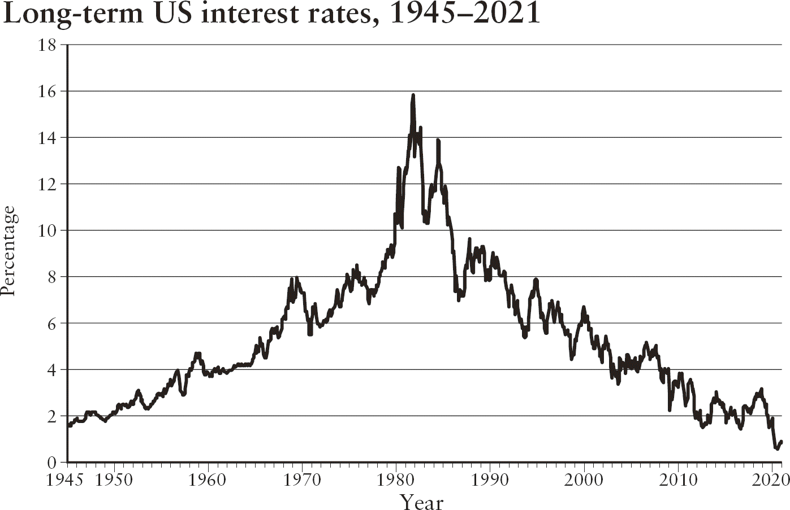

[8.](#section-9) Bond yields climbed for three and a half decades after the Second World War and then declined for the next forty years.

The data supported Rajan and Borio’s view that long-term rates are influenced by central banks. Statistical tests by Agnieszka Gehringer and Thomas Mayer of the Flossbach von Storch Institute in Cologne showed that the Fed funds rate had an unusually strong influence on Treasury yields from the turn of the century onwards, coincident with the inception of Greenspan’s easy money.[9](#section-51) It was only from around this date that US long-term rates dropped decisively below their post-war average.[fn4](#section-58) The German economists concluded that ‘long-term market interest rates are strongly influenced by central banks’ perception of reality rather than by the perceptions of market participants.’ Once the central bank exerts a semi-permanent influence on bond yields, Gehringer and Mayer added ominously, there is a ‘high chance of misalignments of market rates … [which] can cause severe economic distortions’.[10](#section-51)

The idea that errors in monetary policy might produce economic distortions, other than disturbances to the price level, was not countenanced by the central banking establishment. But Borio’s research led inexorably to this conclusion. Financial imbalances – a polite term for credit booms and speculative manias – tend to form during periods of low interest rates and low inflation, he noted.[fn5](#section-58) Before the financial crisis, global interest rates were low both in real terms and relative to the growth rate of the global economy. Credit booms and real estate bubbles often produce nasty economic shocks and are followed by weak recoveries. The post-Lehman economy conformed to earlier precedents, notably Japan’s after 1990. Central bankers responded to economic stagnation after 2008 by pushing rates even lower. Thus, low rates begat low rates.

Debt was the missing link in the secular stagnation narrative, said Borio. The path to ever lower rates traversed a mountain of debt. The BIS defined interest as the ‘price of leverage’. It was only to be expected that as the price of leverage – borrowing – declines the stock of debt should increase. The residue of debt left behind by the crisis produced what Borio called a ‘financial drag’. As overburdened households turned to repairing their balance sheets, they borrowed and spent less. Borio and his colleagues found that the share of society’s income used for servicing debt (the debt–service ratio) tends to remain constant over time. Thus, ever lower interest rates are needed to sustain a rising stock of debt. A vicious cycle begins, with more debt requiring lower rates, and lower rates resulting in yet more debt. Some commentators referred to this decades-long process as the ‘debt supercycle’.

Ultra-low rates, being the hair of the dog, are no cure for a debt hangover. ‘After all,’ Borio asked, ‘if the origin of the problem was too much debt, how can a policy that encourages the private and public sectors to accumulate more debt be part of the solution?’[11](#section-51) Once the economy enters a ‘debt trap’ it becomes harder to raise interest rates without causing huge damage. ‘Too low rates in the past,’ Borio concluded, ‘are one reason for lower rates today.’[12](#section-51) It wasn’t just that the stock of debt was too high. Much of the debt failed to generate decent returns. ‘The issue,’ Borio observed, ‘is not so much the overall amount of credit but its quality.’[13](#section-51) During credit booms, capital is allocated incautiously. When the real estate markets are hot, resources are thrown at property developments, but construction generates little by way of productivity growth, BIS researchers found. This partly explains why property bubbles reduce economic growth.

After the crisis, banks needed to repair their balance sheets. The resolution of Scandinavia’s banking crisis in the early 1990s showed that dealing promptly with bad debts speeded up the economic recovery. But ultra-low interest rates after 2008 enabled banks to delay this painful process, encouraging them to keep bad debts on their books. Japan’s interminable ‘balance sheet recession’ revealed the pitfalls of failing to grasp the nettle. Most Western countries now took the Japanese path. Non-performing loans proliferated on the balance sheets of banks, like cancerous cells. The problem of ‘evergreening’, or renewing, bad debts was acute in Europe. Zombie companies became commonplace. The cumulative effect of bad debts and capital misallocation was to reduce potential output growth. ‘When economic conditions become more hostile, misallocations beget misallocations,’ Borio claimed.[14](#section-51) The decline in potential output growth gave central bankers yet another reason to lower interest rates.

Bad debts weren’t the only challenge facing banks in the post-crisis years. Banks make money by lending out deposits for a profit – borrowing short and lending long, as the saying goes. But ultra-low interest rates eroded the banks’ ‘net interest margin’, damaging their profitability and making them reluctant to initiate new loans.[15](#section-51) And while extreme monetary policies appeared to make banks risk averse, they had the opposite effect on investors. Faced with a loss of deposit income, the BIS found that savers fled conventional banks to invest in financial markets, where they took greater risks in pursuit of higher returns.[16](#section-51) A similar search for yield had occurred prior to the financial crisis, and was in large measure responsible for its severity. Borio observed ‘a disappointing element of déjà vu in all this’.[17](#section-51)

The Federal Reserve’s reflexive tendency to ease monetary conditions whenever markets became turbulent encouraged yet more risk-taking. Borio observed that central bankers were slow to hike rates during booms but rushed to ease them after every bust. Their asymmetrical approach imparted a downward bias to interest rates and an upward bias to debt, he noted. The danger arising from the Fed’s inconsistency was a longstanding concern: ‘lowering rates or providing ample liquidity when problems materialise but not raising rates as imbalances build up, can be rather insidious in the longer run. They promote a form of moral hazard that can sow the seeds of instability and of costly fluctuations in the real economy.’[18](#section-51) Borio and his colleague Philip Lowe made this comment in 2002, as the Fed was slashing rates in the aftermath of the Dotcom bust. Half a decade later, their prophetic words were borne out.

Given its role as the ‘central bankers’ central bank’, the BIS paid close attention to cross-border capital flows. It was conventional for economists to focus on the current account balances between countries, as these reflect differences in national savings. Borio, on the other hand, argued that the link between savings and credit was tenuous. While the current account measures the surplus or deficit in a country’s savings, cross-border lending is recorded by gross capital flows. Gross capital flows, Borio claimed, provide a better indicator of financial fragility at the international level.[19](#section-51)

Since much foreign lending is denominated in dollars, low interest rates in the United States after 2002 spurred a massive increase in international capital flows. Investors borrowed cheaply in dollars and invested the proceeds abroad at higher yields. The embers of Lehman Brothers were still warm when this global carry trade rekindled, its flames fanned by the Fed’s zero interest rates and massive securities purchases. Over the following years, emerging markets went on a borrowing binge, accumulating trillions of dollars’ worth of foreign debts. Their financial systems thus became acutely sensitive to any tightening move by the Federal Reserve. In the summer of 2013, the global financial markets threw a ‘tantrum’ when Fed Chairman Bernanke signalled his intention to reduce the pace of the Fed’s securities purchases. On the international front, as on the domestic one, it was proving easier to reduce interest rates than to normalize them.

Borio fretted about the ‘excess elasticity’ of the international monetary system, which set no limits on cross-border lending but threatened to snap back violently when matters got out of hand. The longer US interest rates remained stuck close to zero, he feared, the greater would be the build-up of global financial imbalances. The Federal Reserve was not solely to blame. Foreign central banks contributed by printing money to acquire foreign exchange reserves and by keeping domestic interest rates low (which they did in order to prevent their currencies from appreciating against the dollar). Borio envisaged a grand denouement, on a par with the collapse of the world’s financial system in the Great Depression. The easy money regime threatened to end in what he called an ‘epoch-defining seismic rupture’, heralding the end of globalization, the return of capital controls and rising inflation.[20](#section-51)

A few months after Lehman’s bankruptcy, Borio was warning about the dangers of keeping extreme monetary policies in place for too long.[21](#section-51) Over the following years, he stood apart from other monetary economists in alerting the world to the unintended consequences of the zero interest rate policy (ZIRP), the negative interest rate policy (NIRP) and other monetary innovations. ‘The highly abnormal is becoming uncomfortably normal,’ Borio bemoaned after the October 2014 bond market ‘flash crash’. As one year followed another, unconventional monetary policies became more unconventional. Abnormality became the new normal.

Monetary policy is path dependent, said Borio. Once the central bankers have taken a wrong turning, the financial system and economy are driven off course: economic growth falters, financial imbalances accumulate, and capital is misallocated. Bubbles form. Too much debt accumulates. After the crisis, central bankers tried out new monetary measures – quantitative easing, paying banks interest on their reserves, zero and negative interest rates, and various other innovations. They stamped on the gas pedal whenever the economy lost momentum, or when the financial engine threatened to stall. The interest rate was floored but still the economic juggernaut continued to slow. All the signs pointed in the direction of ever lower rates. How to get back on track, Borio was asked. ‘If I were you,’ he replied, ‘I would not start from here.’[22](#section-51) It’s an old joke.

He feared that monetary policy was losing efficacy. Central bankers were overburdened and were running out of ammunition. Borio underestimated their inventiveness. Cracks appeared in the road. The financial markets erupted in the summer of 2015 as the Fed flagged an end to zero rates. ‘We are not seeing isolated tremors,’ Borio commented, ‘but the release of pressure that has gradually accumulated over the years along major faultlines.’[23](#section-51) References to ‘seismic rupture’ were repeated over the years. Central bankers had bought time, but time was wasted. The day of reckoning was postponed. The bill accumulated.

Establishment economists considered with disdain the flood of papers churned out by Borio’s BIS team. The BIS ‘is listened to but ignored’, the chief economist at a rival international monetary authority is said to have sniped. Borio can’t be modelled, sneered critics in the academy. Similar comments were once directed at the maverick economist Hyman Minsky, whose brilliant insights into financial instability were belatedly recognized after the subprime crisis. Minsky and Borio have much in common; both are unorthodox and eclectic thinkers, who laid aside formal models to observe how things appear in the world – the *real* world, as opposed to the unreal reality constructed by academic modellers. Both asserted the primacy of finance in modern capitalism. Money matters, said Minsky. Interest rates matter too, added Borio. Printing money and manipulating interest rates changed the world after 2008, and not necessarily for the better. The financial panic was doused, but the world ended up with more debt, more bubbles, more zombies and more financial risk. Viewed from Borio’s perspective, secular stagnation was a monetary disease. For all his genius, Hume was mistaken – not completely mistaken, but he went too far in dismissing finance. Money is not a veil. Monetary policy is not neutral. Interest rates are not determined solely by savings and industry. Tinker with them at your peril.

Over the following chapters we examine in greater detail Borio’s thesis that ‘low rates beget lower rates’. These chapters are arranged around the various functions of interest, namely its influence on the *allocation* of capital, the *financing* of companies, the *capitalization* of wealth, the level of *savings*, the *distribution* of wealth, the measurement of *risk* and the regulation of *international capital flows*.

<!-- rl-section id="sec-chapter009" class="titlepage" title="9" -->

## The Raven of Basel

> *The highly abnormal is becoming uncomfortably normal.*
>
> Claudio Borio, 2014

As we have seen in [Chapter 3](#section-15), David Hume held that money was a mere representation of things. A loan may be denominated in money, but what is actually lent is a certain quantity of labour or stock, he maintained. Given money’s fictitious value, Hume believed that a change in the amount of money would affect prices but not interest. In his view, interest was determined by frugality (savings) and industry (the return on capital). The Scottish philosopher imagined what would happen if money dropped like manna from Heaven:

> For, suppose that, by miracle, every man in GREAT BRITAIN should have five pounds slipt into his pocket in one night; this would much more than double the whole money that is at present in the kingdom; yet there would not next day, nor for some time, be any more lenders, nor any variation in the interest … this money, however abundant … would only serve to encrease the prices of every thing, *without any farther consequence* … *The overplus of borrowers above that of lenders continuing still the same, there will follow no reduction of interest*. That depends upon another principle; and must proceed from an encrease of industry and frugality, of arts and commerce.[1](#section-51)

Hume was a brilliant and original economic thinker, but his views on money were out of touch.[2](#section-51) He had a poor grasp of the developments in finance in eighteenth-century Britain, a country whose trade was largely financed by bills of exchange. Hume lamented the public’s infatuation with credit, derided what he called ‘our darling projects of paper credit’, dismissed share trading in Exchange Alley, doubted that banks were ‘of very much value’, and thought that Britain’s vast national debt must inevitably bankrupt the country – ‘where a government has mortgaged all its revenues,’ he wrote, ‘it necessarily sinks into a state of languor, inactivity, and impotence.’ The country kept on mortgaging its revenues, still its bankruptcy never arrived.

Hume’s ideas about money and interest, however, have left an indelible mark on modern economics. His description of the effects of slipping five pounds into every pocket anticipates Milton Friedman’s ‘helicopter money’. Hume was the first to assert what was later called the ‘neutrality of money’. Money is a lubricant of commerce, according to this view, which allows people to avoid the inconveniences of barter; but money doesn’t shape economic activity. As Keynes’s Cambridge contemporary Arthur Pigou expressed it, ‘money is a veil behind which the action of real economic forces is concealed.’[3](#section-51) The claim that interest is determined by *real* factors alone is embedded in the canonical model used by central bankers. Interest rates in their model derive from demographics, savings and the profitability of investment, more or less as Hume envisaged.

Despite a professed concern with ‘real’ economic factors, in their modelled world there are no manias, panics or crashes, and no popular delusions and the madness of crowds. Monetary policy errors show up only as disturbances to the price level, ‘without any further consequence’, as Hume put it. The inadequacy of their models meant that nearly every central banker was caught off guard by the subprime crisis. ‘Most economists did not understand the economy’s peculiar path prior to the crisis, and persisted in befuddlement in the aftermath,’ writes Philip Mirowski.[4](#section-51) After the crisis, no intellectual paradigm shift took place. A fixed belief in the veil of money remained firmly in place, a blindfold that obscured the true operations of the economy from those who wore it.

This belief explains why central bankers denied responsibility for the collapse in long-term rates after 2008, even as they pushed short-term rates to zero or below and attempted in various ways to manipulate bond yields.[fn1](#section-58) Nor could they admit that their actions might have any lasting impact on the economy’s growth rate: ‘It’s important to recognize … that what monetary policy affects is not the potential rate of growth, long-run rate of growth, but rather the cyclical part,’ said Fed Chairman Bernanke in 2013.[5](#section-51) The lowest interest rates in history and lacklustre economic growth were routinely ascribed by central bankers to secular stagnation.

Economists at the Bank for International Settlements in Basel were an exception to this rule. As we have seen, the BIS’s chief economist William White was one of a handful of prominent economists who anticipated the financial crisis. After White retired, a couple of months before Lehman’s bankruptcy, his role as the central banks’ chief scourge was assumed by his former colleague Claudio Borio. Back in 2003, the Oxford-educated Borio and White had delivered a paper at the Federal Reserve’s summer shindig at Jackson Hole, Wyoming.[6](#section-51) The BIS economists argued that financial storm clouds were gathering. Borio compared the situation to a Greek tragedy in which a calamity is portended but can’t be stopped. The Fed’s Alan Greenspan was unpersuaded by this presumptuous Cassandra. Five years later, White and Borio were vindicated.

As head of the BIS’s Monetary and Economics Department from 2013, Borio provided a radically different account of secular stagnation to that of Summers. He took the unorthodox view of the BIS in a new direction and provided (by guiding the efforts of his research team) empirical evidence to counter the conventional central bankers’ narrative. Borio cast aside the money veil to reveal a world of asset price bubbles, financial cycles, and credit booms and busts: ‘Think monetary! Modelling the financial cycle correctly … requires recognising fully the fundamental monetary nature of our economies,’ was Borio’s clarion call.[7](#section-51) The financial system, he asserted, doesn’t just allocate resources, it generates purchasing power. It has a life of its own. Finance and macroeconomics are ‘inextricably linked’. We inhabit a looking-glass world. Finance does not mirror reality, but acts upon it.[fn2](#section-58) *Economics without finance*, said Borio, *is like Hamlet without the prince*.

Having turned orthodox economics upside down, Borio rejected conventional accounts of the leading issues of the day. The financial crisis, he maintained, was caused not by a savings glut but by too much credit – a ‘banking glut’. When a bank makes a loan, he said, it conjures up deposits, spending power and even savings. Inflation, in Borio’s view, was not simply a monetary matter but originates in the real world. After China flooded the West with cheap exports, the rate of inflation declined in the United States and elsewhere. Falling consumer prices weren’t in themselves an unmitigated disaster, and episodes of deflation didn’t reliably forecast economic calamity. Instead, Borio found that strong credit growth and real estate bubbles were more reliable red flags.

Borio’s team scoured the historical data for evidence of Hume’s contention that the rate of interest was determined by real factors. But they found little relationship between interest rates and savings, investment or profits. There wasn’t even a stable link between demographics and interest rates.[fn3](#section-58) Instead, the BIS suggested that interest rates were influenced by monetary regimes. Just as Babylonian interest rates had been higher than those in Ancient Greece, so real interest rates were higher on average under the Gold Standard (pre-1914) than under the Bretton Woods system (after 1945), and lowest of all after Bretton Woods (from 1971 onwards).

Borio’s research pointed to the conclusion that market interest rates were greatly influenced by the actions of central bankers, that interest rates were indeed a ‘policy variable’. An obvious point to the layman, but one strenuously denied by the central bankers themselves. It is generally agreed that central banks have a preponderant influence over short-term rates, but long-term rates are said to be determined by savings, productivity and other ‘real’ factors. Yet, as the Chicago economist (and former head of the Reserve Bank of India) Raghuram Rajan pointed out, central banks influence the expectations of bond investors:

> if the short-term interest rate is expected to remain low over the next ten years, the long-term interest rate will be low … By holding down the short-term rate, especially if the market believes it will be held low for a sustained period, the Fed can influence expectations of the future short-term rate and hence the long-term interest rate.[8](#section-51)

This is exactly what Bernanke’s Federal Reserve was attempting to achieve after 2008, by making its decision-making more transparent and publishing ‘forward guidance’ on the future direction of interest rates.

BIS economists also questioned the conventional wisdom concerning the ‘natural rate’ of interest (depicted as r-star or *r\** in academic jargon). In theory, the natural rate is the rate at which the economy hums along at its greatest potential while inflation remains under control. But Borio argued, as Hayek had done in the 1920s, that a stable price level doesn’t necessarily indicate that market rates are at an equilibrium level. The fact that the financial crises of 1929 and 2008 both occurred at times of low and stable inflation suggests that conventional wisdom is mistaken. If a stable price level doesn’t reliably indicate the natural rate, then it’s difficult to see how central bankers could discover it. Instead, Borio developed his own financial cycle, based on credit growth and asset prices, which he believed provided a better indicator of an economy’s potential output and deviations from sustainable growth.

[8.](#section-9) Bond yields climbed for three and a half decades after the Second World War and then declined for the next forty years.

The data supported Rajan and Borio’s view that long-term rates are influenced by central banks. Statistical tests by Agnieszka Gehringer and Thomas Mayer of the Flossbach von Storch Institute in Cologne showed that the Fed funds rate had an unusually strong influence on Treasury yields from the turn of the century onwards, coincident with the inception of Greenspan’s easy money.[9](#section-51) It was only from around this date that US long-term rates dropped decisively below their post-war average.[fn4](#section-58) The German economists concluded that ‘long-term market interest rates are strongly influenced by central banks’ perception of reality rather than by the perceptions of market participants.’ Once the central bank exerts a semi-permanent influence on bond yields, Gehringer and Mayer added ominously, there is a ‘high chance of misalignments of market rates … [which] can cause severe economic distortions’.[10](#section-51)

The idea that errors in monetary policy might produce economic distortions, other than disturbances to the price level, was not countenanced by the central banking establishment. But Borio’s research led inexorably to this conclusion. Financial imbalances – a polite term for credit booms and speculative manias – tend to form during periods of low interest rates and low inflation, he noted.[fn5](#section-58) Before the financial crisis, global interest rates were low both in real terms and relative to the growth rate of the global economy. Credit booms and real estate bubbles often produce nasty economic shocks and are followed by weak recoveries. The post-Lehman economy conformed to earlier precedents, notably Japan’s after 1990. Central bankers responded to economic stagnation after 2008 by pushing rates even lower. Thus, low rates begat low rates.

Debt was the missing link in the secular stagnation narrative, said Borio. The path to ever lower rates traversed a mountain of debt. The BIS defined interest as the ‘price of leverage’. It was only to be expected that as the price of leverage – borrowing – declines the stock of debt should increase. The residue of debt left behind by the crisis produced what Borio called a ‘financial drag’. As overburdened households turned to repairing their balance sheets, they borrowed and spent less. Borio and his colleagues found that the share of society’s income used for servicing debt (the debt–service ratio) tends to remain constant over time. Thus, ever lower interest rates are needed to sustain a rising stock of debt. A vicious cycle begins, with more debt requiring lower rates, and lower rates resulting in yet more debt. Some commentators referred to this decades-long process as the ‘debt supercycle’.

Ultra-low rates, being the hair of the dog, are no cure for a debt hangover. ‘After all,’ Borio asked, ‘if the origin of the problem was too much debt, how can a policy that encourages the private and public sectors to accumulate more debt be part of the solution?’[11](#section-51) Once the economy enters a ‘debt trap’ it becomes harder to raise interest rates without causing huge damage. ‘Too low rates in the past,’ Borio concluded, ‘are one reason for lower rates today.’[12](#section-51) It wasn’t just that the stock of debt was too high. Much of the debt failed to generate decent returns. ‘The issue,’ Borio observed, ‘is not so much the overall amount of credit but its quality.’[13](#section-51) During credit booms, capital is allocated incautiously. When the real estate markets are hot, resources are thrown at property developments, but construction generates little by way of productivity growth, BIS researchers found. This partly explains why property bubbles reduce economic growth.

After the crisis, banks needed to repair their balance sheets. The resolution of Scandinavia’s banking crisis in the early 1990s showed that dealing promptly with bad debts speeded up the economic recovery. But ultra-low interest rates after 2008 enabled banks to delay this painful process, encouraging them to keep bad debts on their books. Japan’s interminable ‘balance sheet recession’ revealed the pitfalls of failing to grasp the nettle. Most Western countries now took the Japanese path. Non-performing loans proliferated on the balance sheets of banks, like cancerous cells. The problem of ‘evergreening’, or renewing, bad debts was acute in Europe. Zombie companies became commonplace. The cumulative effect of bad debts and capital misallocation was to reduce potential output growth. ‘When economic conditions become more hostile, misallocations beget misallocations,’ Borio claimed.[14](#section-51) The decline in potential output growth gave central bankers yet another reason to lower interest rates.

Bad debts weren’t the only challenge facing banks in the post-crisis years. Banks make money by lending out deposits for a profit – borrowing short and lending long, as the saying goes. But ultra-low interest rates eroded the banks’ ‘net interest margin’, damaging their profitability and making them reluctant to initiate new loans.[15](#section-51) And while extreme monetary policies appeared to make banks risk averse, they had the opposite effect on investors. Faced with a loss of deposit income, the BIS found that savers fled conventional banks to invest in financial markets, where they took greater risks in pursuit of higher returns.[16](#section-51) A similar search for yield had occurred prior to the financial crisis, and was in large measure responsible for its severity. Borio observed ‘a disappointing element of déjà vu in all this’.[17](#section-51)

The Federal Reserve’s reflexive tendency to ease monetary conditions whenever markets became turbulent encouraged yet more risk-taking. Borio observed that central bankers were slow to hike rates during booms but rushed to ease them after every bust. Their asymmetrical approach imparted a downward bias to interest rates and an upward bias to debt, he noted. The danger arising from the Fed’s inconsistency was a longstanding concern: ‘lowering rates or providing ample liquidity when problems materialise but not raising rates as imbalances build up, can be rather insidious in the longer run. They promote a form of moral hazard that can sow the seeds of instability and of costly fluctuations in the real economy.’[18](#section-51) Borio and his colleague Philip Lowe made this comment in 2002, as the Fed was slashing rates in the aftermath of the Dotcom bust. Half a decade later, their prophetic words were borne out.

Given its role as the ‘central bankers’ central bank’, the BIS paid close attention to cross-border capital flows. It was conventional for economists to focus on the current account balances between countries, as these reflect differences in national savings. Borio, on the other hand, argued that the link between savings and credit was tenuous. While the current account measures the surplus or deficit in a country’s savings, cross-border lending is recorded by gross capital flows. Gross capital flows, Borio claimed, provide a better indicator of financial fragility at the international level.[19](#section-51)

Since much foreign lending is denominated in dollars, low interest rates in the United States after 2002 spurred a massive increase in international capital flows. Investors borrowed cheaply in dollars and invested the proceeds abroad at higher yields. The embers of Lehman Brothers were still warm when this global carry trade rekindled, its flames fanned by the Fed’s zero interest rates and massive securities purchases. Over the following years, emerging markets went on a borrowing binge, accumulating trillions of dollars’ worth of foreign debts. Their financial systems thus became acutely sensitive to any tightening move by the Federal Reserve. In the summer of 2013, the global financial markets threw a ‘tantrum’ when Fed Chairman Bernanke signalled his intention to reduce the pace of the Fed’s securities purchases. On the international front, as on the domestic one, it was proving easier to reduce interest rates than to normalize them.

Borio fretted about the ‘excess elasticity’ of the international monetary system, which set no limits on cross-border lending but threatened to snap back violently when matters got out of hand. The longer US interest rates remained stuck close to zero, he feared, the greater would be the build-up of global financial imbalances. The Federal Reserve was not solely to blame. Foreign central banks contributed by printing money to acquire foreign exchange reserves and by keeping domestic interest rates low (which they did in order to prevent their currencies from appreciating against the dollar). Borio envisaged a grand denouement, on a par with the collapse of the world’s financial system in the Great Depression. The easy money regime threatened to end in what he called an ‘epoch-defining seismic rupture’, heralding the end of globalization, the return of capital controls and rising inflation.[20](#section-51)

A few months after Lehman’s bankruptcy, Borio was warning about the dangers of keeping extreme monetary policies in place for too long.[21](#section-51) Over the following years, he stood apart from other monetary economists in alerting the world to the unintended consequences of the zero interest rate policy (ZIRP), the negative interest rate policy (NIRP) and other monetary innovations. ‘The highly abnormal is becoming uncomfortably normal,’ Borio bemoaned after the October 2014 bond market ‘flash crash’. As one year followed another, unconventional monetary policies became more unconventional. Abnormality became the new normal.

Monetary policy is path dependent, said Borio. Once the central bankers have taken a wrong turning, the financial system and economy are driven off course: economic growth falters, financial imbalances accumulate, and capital is misallocated. Bubbles form. Too much debt accumulates. After the crisis, central bankers tried out new monetary measures – quantitative easing, paying banks interest on their reserves, zero and negative interest rates, and various other innovations. They stamped on the gas pedal whenever the economy lost momentum, or when the financial engine threatened to stall. The interest rate was floored but still the economic juggernaut continued to slow. All the signs pointed in the direction of ever lower rates. How to get back on track, Borio was asked. ‘If I were you,’ he replied, ‘I would not start from here.’[22](#section-51) It’s an old joke.

He feared that monetary policy was losing efficacy. Central bankers were overburdened and were running out of ammunition. Borio underestimated their inventiveness. Cracks appeared in the road. The financial markets erupted in the summer of 2015 as the Fed flagged an end to zero rates. ‘We are not seeing isolated tremors,’ Borio commented, ‘but the release of pressure that has gradually accumulated over the years along major faultlines.’[23](#section-51) References to ‘seismic rupture’ were repeated over the years. Central bankers had bought time, but time was wasted. The day of reckoning was postponed. The bill accumulated.

Establishment economists considered with disdain the flood of papers churned out by Borio’s BIS team. The BIS ‘is listened to but ignored’, the chief economist at a rival international monetary authority is said to have sniped. Borio can’t be modelled, sneered critics in the academy. Similar comments were once directed at the maverick economist Hyman Minsky, whose brilliant insights into financial instability were belatedly recognized after the subprime crisis. Minsky and Borio have much in common; both are unorthodox and eclectic thinkers, who laid aside formal models to observe how things appear in the world – the *real* world, as opposed to the unreal reality constructed by academic modellers. Both asserted the primacy of finance in modern capitalism. Money matters, said Minsky. Interest rates matter too, added Borio. Printing money and manipulating interest rates changed the world after 2008, and not necessarily for the better. The financial panic was doused, but the world ended up with more debt, more bubbles, more zombies and more financial risk. Viewed from Borio’s perspective, secular stagnation was a monetary disease. For all his genius, Hume was mistaken – not completely mistaken, but he went too far in dismissing finance. Money is not a veil. Monetary policy is not neutral. Interest rates are not determined solely by savings and industry. Tinker with them at your peril.

Over the following chapters we examine in greater detail Borio’s thesis that ‘low rates beget lower rates’. These chapters are arranged around the various functions of interest, namely its influence on the *allocation* of capital, the *financing* of companies, the *capitalization* of wealth, the level of *savings*, the *distribution* of wealth, the measurement of *risk* and the regulation of *international capital flows*.

<!-- rl-section id="section-23" class="epub-section" kicker="Section 23" title="10" -->

## 10

## Unnatural Selection

> *Liquidate labor, liquidate stocks, liquidate the farmers, liquidate real estate … It will purge the rottenness out of the system. High costs of living and high living will come down … enterprising people will pick up the wrecks from less competent people.*
>
> Andrew Mellon, 1932

In his book *Capitalism, Socialism and Democracy*, Joseph Schumpeter describes capitalism as a ‘process of industrial mutation … that incessantly revolutionizes the economic structure from within, incessantly destroying the old one, incessantly creating a new one. This process of Creative Destruction is the essential fact about capitalism.’[1](#section-52) That phrase stuck. If Schumpeter is widely remembered today, it’s because he owns the intellectual copyright on creative destruction – the evolutionary process by which new technologies and business methods displace older, less efficient ways of doing things. Schumpeter’s borrowing from Darwin’s theory of natural selection is as important to our understanding of the nature of capitalism as Adam Smith’s ‘invisible hand’.

Most discussion of creative destruction revolves around the adoption of new technologies, the roles played by entrepreneurs as harbingers of change and by competition in selecting the most efficient businesses. Less recognized is the important part played by interest in this dynamic process. Arthur Hadley, a late nineteenth-century American economist and President of Yale University, pointed this out decades before Schumpeter came out with his brilliant insight. Hadley argued that interest ‘helps the natural selection of the most competent employers and the best processes, and the elimination of the less competent employers and worse processes’. Interest helps to eliminate the ‘industrially unfit’. By guiding selection of the most efficient businesses, Hadley added, interest ensures the ‘productive forces of the community are better utilized’.[2](#section-52)

Schumpeter himself saw interest as arising from the profits of creative destruction. ‘The true function of interest,’ he wrote, ‘is, so to speak, the brake, or governor’ on economic activity.[3](#section-52) A ‘necessary brake’, in Schumpeter’s opinion.[4](#section-52) Interest turns time into a cost of production. Time is money. Entrepreneurs who save time in production, who bring goods most quickly to market, emerge as winners in the game of creative destruction. Interest rations capital.[fn1](#section-58) From this perspective, interest is not a deadweight but a spur to efficiency – a hurdle that determines whether an investment is viable or not. The rate of interest, Schumpeter wrote, ‘enters into every economic deliberation’.

Matthew Klecker, a Chicago-based investor, compares the interest rate to the shot clock in professional basketball, whose purpose is to speed up the game. According to NBA rules, players on the offensive team have only 24 seconds of possession in which to score. ‘Zero-percent rates,’ writes James Grant, ‘institutionalize delay in everyday business and investment transactions. They lead to postponement of needed adjustments.’[5](#section-52) Switching metaphors, Grant compares the rate of interest to a metronome whose beat helps musicians to play in time. ‘Properly pitched interest rates contribute to a sound tempo of growth,’ he writes.[6](#section-52) Economic activity slows as the interest rate is lowered. *Adagio … Larghetto … Lento … Largo … Grave … Adagissimo … Larghissimo* – the last tempo being ‘very, very slow’. At zero interest rates, the economy progresses at the solemn pace of a funeral march.

The forces of creative destruction are at their most unremitting during sharp economic downturns. In the panic phase, the cost of borrowing soars.[fn2](#section-58) Sales dry up. Bankers call in their loans and become reluctant to supply new credit. Firms must cut costs fast, laying off less productive workers and finding other efficiency improvements. The weakest players fail. Survivors emerge from the trial leaner and fitter, better adapted to the new business conditions. The broad economy benefits from this dose of salts. Treasury Secretary Andrew Mellon’s advice to President Hoover at the onset of the Great Depression was to ‘liquidate labor, liquidate stocks, liquidate the farmers, liquidate real estate’. Hoover disagreed with the rich banker, whose views proved so unpopular in his hometown of Pittsburgh that it became unsafe for members of Mellon’s family to appear in public.[7](#section-52)

Keynes also rejected the laissez-faire approach to depressions, which he thought was only favoured by ‘austere and puritanical souls’. ‘I do not understand,’ Keynes lectured in 1931, ‘how universal bankruptcy can do any good or bring us nearer to prosperity.’[8](#section-52) The Cambridge economist, who believed that interest existed to discourage people from hoarding money, blamed the slide into depression on excessively high interest rates from the mid-1920s onwards.[fn3](#section-58) In October 1931, the Federal Reserve was forced to hike rates to 3.5 per cent to protect its gold reserve. As deflation took hold, real interest rates in the United States soared into double digits. Keynes’s views have since become orthodox. Mellon’s ‘liquidationist’ ideas have long been ridiculed. The Nobel Prizewinning economist Paul Krugman deems what he calls the ‘hangover theory’ of depression to be as ‘worthy of serious study as the phlogiston theory of fire’.[9](#section-52)

Yet recent studies of the impact of the Great Depression on American industry suggest otherwise. Take car manufacturing, one of the booming industries of the 1920s. Car sales in the United States fell by around two-thirds during the depression. Nevertheless, even at the nadir the most efficient operators continued to invest in new plants. New mass-production techniques were introduced at the time, including conveyor belts and quick-drying lacquers. Packard cut its factory space requirements per unit by half. Inefficient car makers failed in droves, leaving firms that survived the shake-out to prosper. Once the US economy recovered, real wages and salaries paid by the car industry increased. ‘The Depression thus was, at the level of industries, an evolutionary event,’ concludes a study of American car manufacturing in the early 1930s.[10](#section-52)

The Great Depression propelled productivity improvements across many other industries, ranging from airlines to warehousing. In his book *The Great Leap Forward*, Alexander Field of Santa Clara University claims that the 1930s were the most technologically progressive decade in American history. After 1929, railroads accounting for a third of the nation’s trackage went into receivership. ‘Faced with tough times in the form of radically changing demand conditions, crushing debt burdens, and lack of access to more capital,’ Field writes, ‘railroad organizations reduced their main trackage, rolling stock and employees … they introduced upgraded locomotives.’ By the end of the decade, the railroads were capable of handling the same amount of traffic as during the boom years while using less trackage and rolling stock and fewer workers.[11](#section-52)

As a result of productivity improvements across myriad industries America’s economic output eventually returned to its pre-Depression trend. Between 1929 and 1941, the US economy expanded at an annual rate of 2.8 per cent, in line with its long-term average. Americans growing up after the war suffered no permanent welfare loss. For the Greatest Generation, the Depression was just a traumatic memory. This experience was not a one-off. As we have seen, even more remarkable productivity gains were witnessed after the ‘forgotten depression’ of 1921, a short sharp shock to the US economy during which nominal output contracted by 24 per cent while the Fed pushed up its key lending rate to 6 per cent (in real terms, interest rates were more than twice as high). As the economy rebounded the following year, manufacturing productivity jumped by a massive 20 per cent.[12](#section-52) Productivity continued growing robustly throughout the Roaring Twenties. So much for phlogiston theory!

‘Paradoxical as it may seem, the riches of nations can be measured by the violence of the crises which they experience,’ opined the nineteenth-century French economist Clément Juglar.[13](#section-52) Once creative destruction is taken into account, Juglar’s observation doesn’t appear so puzzling. Some economists take a ‘pit-stop’ view of recessions, seeing them as periods when efficiency measures are most likely to be undertaken.[14](#section-52) Business failures, which soar during economic downturns, are seen as essential to the economy’s evolution over time. As the saying attributed to the former astronaut and airline boss Frank Borman goes, ‘capitalism without bankruptcy is like Christianity without hell.’ If that is the case, then monetary policy should not interrupt a recession’s cleansing effect.[fn4](#section-58) Put another way, if financial stability is destabilizing (as Hyman Minsky maintained), too much economic stability induces sclerosis.

### EUROPE’S SOVEREIGN DEBT CRISIS

The Eurozone’s sovereign debt crisis, which erupted in 2010, is often considered in terms of competitiveness. Over the previous decade, countries on the periphery of the EU had seen their labour costs rise much faster than Germany’s. Having taken on too much debt, how were they ever going to pay it back? From our perspective, however, the crisis can be seen as a consequence of misaligned interest rates. The Eurozone’s essential problem, as far as interest rates were concerned, was that one size didn’t fit all.

Prior to the creation of the single currency in 1999, each of the eleven founding members of the Eurozone (Greece joined in 2001) had its own complex of interest rates. Different rates reflected different economic conditions across the Continent, along with the market’s varying perceptions of credit risk. From the mid-1990s onwards, however, interest rates among future Eurozone members converged towards the German benchmark. As rates fell in Ireland, a housing boom gathered pace. In the early years of the century, the European Central Bank conducted monetary policy to meet the needs of a lethargic Germany, setting rates too low for booming Ireland and Greece. At the same time, risk spreads across the Eurozone compressed. Greece took advantage of falling interest rates to run large, if largely concealed, fiscal deficits. Cross-border lending within the euro area financed an epic real estate and infrastructure boom in Spain.

Once the party was over, the PIIGS (Portugal, Italy, Ireland, Greece and Spain) found themselves deep in the mire. The decline in interest rates since the creation of the euro had skewed the economies of Southern Europe towards construction. Borio’s colleagues at the BIS found that building booms had a lasting negative impact on economic growth. As Gita Gopinath, a Harvard scholar and future International Monetary Fund chief economist, noted, the shift towards construction depressed productivity: ‘By lowering interest rates and encouraging an inflow of capital, the adoption of the euro may have been partly responsible for the misallocation of capital and the low productivity observed in the South [of Europe].’[15](#section-52)

When doubts about the survival of the single currency surfaced in 2010, the financial markets started to view countries on Europe’s periphery, from Ireland to Greece, as over-indebted and uncompetitive. Bound by euro-fetters, members of the Eurozone could not regain competitiveness by devaluing their currencies. Instead, interest rates across the region diverged, with highly indebted countries, including Italy and Greece, suddenly forced to pay hefty risk premiums. Meanwhile German bond yields headed into negative territory. Deflation beckoned. Deleveraging was in order. To bring down labour costs, the PIIGS were going to have to embrace deep structural reforms. Unemployment in Spain climbed to Great Depression levels. Schumpeter’s forces of creative destruction were about to be unleashed, big time.

Then along came Mario Draghi (a former economics professor, Goldman Sachs managing director and, lately, Governor of the Bank of Italy), the incoming President of the European Central Bank, with his July 2012 promise to ‘do whatever it takes’ to hold the Eurozone together. Never mind the clause in the ECB’s constitution which forbade bailouts of member countries – that could be fudged. This wasn’t a solvency crisis, said Draghi, it was a liquidity crisis. (In truth, so long as an entity is supported by a central bank, there can be no insolvency.) Never mind that monetary policy was no substitute for the political and economic reforms necessary for the long-term survival of the single currency – that could be ignored for the moment. What mattered was that the markets believed in the ECB’s firepower. Backed by Draghi’s hard commitment, banks in Spain, Portugal and Italy used cheap loans from the ECB to buy their own sovereign debt, pushing down credit spreads and making a lot of money in the process.[16](#section-52) Draghi successfully extinguished Europe’s debt crisis and saved the Single Currency, but soon enough a different problem became evident.

### THE LIVING DEAD

The term ‘zombie’ was first applied in the corporate sense to the floundering US Savings & Loan associations of the late 1980s. These local savings banks (‘thrifts’) had been skewered by the high interest rates of the Volcker Federal Reserve, which pushed their cost of funding far above the returns on their outstanding loans. ‘Zombie’ thrifts survived by offering higher deposit rates and taking more risk on to their loan books. Gresham’s Law states that bad money drives out good money. Under certain conditions, it applies to business conditions too. ‘In a kind of Gresham’s Law scenario, bad zombie thrifts tend to drive out healthy competition,’ wrote economist Edward Kane in 1989.[17](#section-52) This was a keen insight.

After the collapse of Japan’s Bubble Economy, a graveyard full of corporate zombies arose in the East. In the first half of the 1990s Japanese banks decided to roll over (‘evergreen’) their non-performing loans rather than recognize losses. ‘Unnatural selection’ started to determine the allocation of capital.[18](#section-52) Later studies showed that loss-making Japanese firms enjoyed better access to bank credit than profitable ones. Gresham’s Law was at work, once again. The zombification of Japan’s economy was associated with excess capacity across many industries – ranging from fridge makers to car manufacturing – that lingered for years. Corporate profits and returns on capital declined. Productivity growth suffered. Deflation lingered. With the forces of creative destruction stilled, Japan Inc. appeared increasingly sclerotic.

Capital-constrained Japanese banks, aided and abetted by the Ministry of Finance in Tokyo, are usually blamed for the zombie phenomenon. Monetary policy, however, played an important but less obvious role. Between 1991 and 1995, the Bank of Japan lowered its policy rate from 6 to 0.5 per cent, on its way towards zero. Extremely low interest rates spread loan forbearance into the deepest reaches of the economy. IMF economists found that the zero interest rate policy helped banks to disguise their problem loans and relaxed pressure on policymakers to institute structural reforms, thereby contributing to the country’s economic torpor.[19](#section-52) As the pace of economic change slowed, Japan embarked upon a lost decade, seemingly incapable of regaining its former vigour.

### A NEW PLAGUE OF ZOMBIES

Europe post-2012 proved an ideal breeding ground for a new generation of corporate zombies. Much of the bank credit unleashed by Draghi’s ‘outright monetary transactions’ did little to boost employment or capital spending. Aside from buying their governments’ debt, Eurozone banks boosted lending to their most heavily indebted and least profitable corporate clients.[20](#section-52) Zero interest rates kept loss-making companies on life support. By 2016, the Organisation for Economic Co-operation and Development found that 10 per cent of firms were unable to cover their interest payments from profits – the OECD’s definition of a zombie. Europe, it seemed, was turning Japanese.

The zombie phenomenon was not confined to continental Europe. In both the United States and United Kingdom, ultra-low rates forestalled corporate bankruptcies. The default rate on US junk bonds after the Great Recession was just half the average of the two previous downturns. ‘The Fed’s extraordinary intervention,’ credit analyst Martin Fridson suggested, ‘enabled companies [to survive] that should have failed.’[21](#section-52) In Britain, the insolvency rate was also lower in the 2008–9 recession than during the milder economic downturn of the early 1990s. In Britain, around one in ten small businesses were kept alive on the drip of easy money.[22](#section-52) ‘Avoiding insolvency is the new norm,’ protested an unhappy member of the British Association of Recovery Professionals.[23](#section-52)

The lowest insolvency rates were reported by Greece, Spain and Italy – the countries hit hardest by the sovereign debt crisis and where one might have expected to see the greatest concentration of bankruptcies. Italy had the worst zombie infestation. Industrial overcapacity was rife. The country was home to some two dozen cement producers, many of them limping along thanks to ‘financial doping’.[24](#section-52) Italian clothing company Stefanel was a typical zombie. Out-performed by strong competitors, the Veneto-based fashion firm produced a string of losses and went through several debt restructurings. Its share price collapsed. Stefanel clung on thanks to loan forbearance from its banks and the ECB’s negative interest-rate policy. Eventually, in June 2019, its shares were suspended after the company announced it was applying for special administration under bankruptcy law.

As in Japan, Europe’s zombie companies undermined the region’s economic dynamism. As in Japan, zombies gnawed at the vitals of Europe’s banking system. By 2015 it was estimated that European banks had more than €1 trillion of bad debts, a twofold increase since 2009 and roughly equivalent to a tenth of their private sector loans.[25](#section-52) Italian banks were worst affected. Monte dei Paschi di Siena, Europe’s oldest bank – and Stefanel’s main lender – required a state bailout.[26](#section-52) Weighed down with old non-performing loans, European banks became reluctant to advance new loans. (The flattening of banks’ net interest margins by monetary policy exacerbated this problem.) A curious case of adverse selection appeared: more efficient firms in industries dominated by zombies were forced to pay more for their bank loans than those in other sectors.[27](#section-52)

Another feature in common with Japan was how the ECB’s monetary balm removed the impetus for structural reforms in the Eurozone. Prior to Draghi’s arrival at the ECB around half of the OECD’s recommended growth initiatives were adopted across Europe.[28](#section-52) After the sovereign debt crisis was alleviated, politicians sat back. Four years after Draghi’s ‘do whatever it takes’ intervention, just one in five reform measures were still being implemented.[fn5](#section-58) The IMF abhorred the slow pace of structural reform in France, Italy and Spain, warning that ‘without drastic changes, they are likely to follow Japan’s path to long economic stagnation.’[29](#section-52)

At least Japan had sufficient domestic savings to fund its escalating national debt and printed its own currency. Europe’s stricken periphery wasn’t so fortunate. Take Draghi’s homeland. In the fifteen years since the start of the euro project, Italy enjoyed no increase in income per capita and labour costs climbed relative to Germany’s, rendering Italian exports uncompetitive. Italy’s public debt trailed only Japan’s and Greece’s. Italian banks were loaded down with hundreds of billions of euros of bad debts. Many of its largest businesses were certified zombies. Political sclerosis accompanied the economic version. The IMF warned that ‘in the absence of deeper structural reforms, medium-term growth is projected to remain low.’[30](#section-52) Without adequate economic growth, Italy’s sovereign debt problems and the Eurozone’s existential crisis remained unresolved. As in Japan, easy money bought time, but time was wasted.[fn6](#section-58)

### A HERD OF UNICORNS

Zombies aren’t the only malinvestments induced by ultra-low interest rates. Easy money encourages people to invest in projects whose returns lie in the distant future.[31](#section-52) Residential property is a long-duration asset and construction booms facilitated by low interest rates are a common form of ‘malinvestment’. After the US real estate bubble imploded in 2006, housebuilding was depressed for several years. With interest rates lower than ever, investors went in search of other types of long-dated investments. Silicon Valley was only too happy to supply their needs.

In 2013 venture capitalist Aileen Lee came up with the term ‘unicorn’ to describe start-up companies valued at more than a billion dollars. Lee called these firms ‘unicorns’, she said, because ‘it means something extremely rare, and magical.’[32](#section-52) Their valuations may have been magical, but unicorns soon became much less rare. By 2015, nearly 150 of them existed, with a combined market valuation of around half a trillion dollars.[33](#section-52) ‘A little-known fact about unicorns,’ mused James Grant, ‘is that they feed on interest rates. They like low, little rates – the tinier, the better.’[34](#section-52) Low rates induced investors to opt for ‘growth’, taking stakes in companies whose profits lay somewhere in the remote future. Low interest rates inured them to years of losses. Low interest rates justified the unicorns’ fabulous valuations.

Silicon Valley embraced all this easy money with a fervour. ‘It might be the best time for any kind of business in any industry to raise money for all of history, like since the time of the ancient Egyptians,’ an excitable unicorn boss with a keen interest in financial history told *The Economist* in 2015. He wasn’t exaggerating. Easy money was dumb money. Rather than carefully scrutinize the pitches and books of start-ups, venture capitalists invested on a ‘spray and pray’ basis. As venture capitalists raised ever larger funds, they invested in ever more dubious concepts. ‘Basically the Federal Reserve is printing money,’ wrote a tech industry insider, ‘and a lot of that money is making its way to venture funds and from there into the pockets of a bunch of kids who are building start-ups in San Francisco. As long as the Fed keeps printing money and the stock market keeps going up, the party will continue.’[35](#section-52)

Good times engender much fraud, Bagehot said. Some unicorns proved as fantastical as the name suggested. Elizabeth Holmes, the twenty-something founder of Theranos, claimed to have developed technology for conducting a wide range of medical tests from a small drop of blood extracted from the finger. Holmes modelled herself on Apple’s Steve Jobs, right down to the black turtleneck sweaters. Like her hero, she created a ‘reality distortion field’. Impossible things could be achieved if only people acted as if they were possible. Hyperbole was the order of the day. Holmes claimed her ‘mini lab’ to be the ‘most important thing humanity has ever built’. In fact, Theranos’s black-box technology didn’t function as described. Long before this was discovered, the company achieved a $9 billion valuation on Silicon Valley. But this fortune, like Holmes’s invention, was fake. Theranos bled investors of more than $1 billion before going bankrupt – a unicorn-sized loss.[36](#section-52)

Other unicorns engaged in ‘narrative construction’. Uber didn’t see itself for what it was – an online cab-hailing business – but as an integral part of the new ‘gig economy’, whose software platform could be *leveraged* to enter myriad other business lines. Uber planned flying taxis and self-driving cars, which, by removing pesky driver costs, would put it on a path to eventual profitability. Founded in 2010, over the following years Uber raised $20 billion from investors. In the four years prior to its 2019 stock market launch, losses totalled more than $14 billion. Uber was often described as a ‘disruptive’ business. This was correct in a sense, according to transportation economist Hubert Horan: ‘What Uber has disrupted is the idea that competitive consumer and capital markets will maximize overall economic welfare by rewarding companies with superior efficiency. Its multibillion-dollar subsidies completely distorted marketplace price and service signals, leading to a massive misallocation of resources.’[37](#section-52)

WeWork was another reality-distorting unicorn. The company’s grandiose mission was to ‘change the world’s consciousness’ – a somewhat ambitious task for a company whose main business involved leasing and renting out office space via an app. Also founded in 2010, WeWork borrowed and lost stupendous sums over the years. Like Uber’s, those losses escalated with time. In August 2019, *Reuters Breakingviews* commented on WeWork’s business operations:

> Revenue in the first six months of 2019 almost doubled to $1.5 billion from the same period last year. But operating losses grew even faster, from $678 million to $1.4 billion. Easy money and economic growth since its 2010 founding have allowed WeWork to expand this fast while burning through cash. In that sense, WeWork is a poster child of the longest U.S. economic recovery on record, and an era where money is virtually free.[38](#section-52)

Unicorns could be seen as a second class of zombie, wrote a correspondent to the *Financial Times*,

> ‘whose owners and investors can keep them alive by constant waves of propaganda about their cutting edge technology which has yet to produce a profit (Uber, for example) but are supposedly part of ‘disruption’ culture. This advertising keeps the flow of investments going.
>
> These companies are using the talent of engineers and coders, and marketing specialists that could be used in more productive enterprises. The hope that someday they will be profitable does not justify the destruction of useful and profitable business models.[39](#section-52)

The large-scale misallocation of resources into loss-making businesses whose profits exist in Never-Never Land is a sign that the cost of capital is too low. Bring down interest rates low enough and even unicorns can fly and, soaring too high, they inevitably crash. Prior to its planned 2019 initial public offering, WeWork’s valuation was estimated at $47 billion. Wall Street’s suspension of disbelief cracked before the IPO got underway, however, and some $40 billion was wiped off its private market value. A tale not so much of creative destruction, but of capital destruction on a grand scale.

### THE PRODUCTIVITY PUZZLE

Economies on both sides of the Atlantic experienced a collapse in productivity growth in the post-crisis decade. Annual productivity growth in the United States, at 0.5 per cent, was a quarter of its level two decades earlier. The output per hour of British workers hardly budged – the most dismal productivity performance since the Industrial Revolution. The Eurozone’s GDP per capita actually declined in the 10 years after 2008. The collapse in productivity was not foreseen by the central bankers – it wasn’t comprehended by their models. To policymakers, productivity was a ‘conundrum’ and a ‘puzzle’, then it became a ‘drag’ and, later, a ‘challenge’. Heads were scratched. Academic papers written. Civil servants consulted.

Several arguments were put forward to explain the miserable productivity performance: demographic headwinds, excessive business regulation, a lack of innovation, poor corporate incentives, worsening educational standards, and so forth. The trouble with these explanations was that they were either dubious (such as the supposed lack of innovation) or did not apply equally to every afflicted economy. For instance, US business regulations differed from Europe’s. Besides, the time frame did not fit. Secular stagnationists couldn’t explain why the collapse in productivity across the developed world only became marked in the years after Lehman’s failure.

The fever for start-ups didn’t spread far beyond Silicon Valley. In fact, new business formation in the United States fell sharply after 2008. In 2016, business deaths outnumbered births for the first time since the Census Bureau started keeping records in 1978. Furthermore, the new businesses that appeared were concentrated in a small number of counties (including Silicon Valley). Regulatory red tape played a part in discouraging entrepreneurs.[40](#section-52) By trapping excess capacity in place and, in effect, raising barriers to entry, unconventional monetary policies were probably more influential. Even officials at the Bank of England privately admitted that the United Kingdom’s mild recession had not ‘generate[d] sufficient destruction to enable the creation of more productive companies’.[41](#section-52)

Economic vitality is also indicated by turnover in the jobs market. Recessions normally induce a shake-out of less efficient firms, accelerating the relocation of workers between businesses. Job destruction was particularly severe in the United States when interest rates spiked during the recessions of 1980 and 1982. The subsequent economic recovery was marked by strong job creation. Schumpeter would have approved. After 2008, a different picture emerged. Fewer bankruptcies and fewer start-ups meant less job creation and destruction. The decline in employment turnover (known as the ‘churn rate’) roughly tracked the falling interest rate.[fn7](#section-58)

While the media ran horror stories about a ‘Second Machine Age’, in which robots were replacing humans in the workplace, the reality was that fewer jobs were created or destroyed by technology than at any time since the Industrial Revolution.[42](#section-52) More Americans suffered from prolonged spells of unemployment. Even as the US economy recovered, the labour force participation rate declined, hitting a three-decade low in 2014. ‘Stifling [job] reallocation stifles growth as well,’ concluded labour economists Steven Davis and John Haltiwanger. A flaccid labour market was also associated with weak income growth.[43](#section-52) Nearly a decade after Lehman’s demise, American workers were having to put in longer hours simply to maintain their standard of living.[44](#section-52)

One of the most pressing concerns of the post-Lehman decade wasn’t so much a savings glut as an investment famine. Ultra-low rates were supposed to induce companies to borrow and invest. But despite the central banks’ best efforts, investment collapsed throughout the developed world and remained low for years. Economies on both sides of the Atlantic were saddled with excess capacity.[45](#section-52) Naturally, firms that weren’t operating at full throttle had little reason to invest. Weak capital spending went hand in hand with weak corporate sales and household spending. Heightened uncertainty about the future led firms to defer investment, although the extent to which this uncertainty (as measured by the dispersion of economic forecasts) was due to the persistence of crisis-era monetary policies was itself a matter of debate.[46](#section-52) To make matters worse, executive compensation schemes encouraged firms to use cheap debt to buy back their shares rather than invest in the future.[fn8](#section-58)

Investment in the United States declined to the point that the existing capital stock grew rusty with neglect.[47](#section-52) A 2017 study from the New York Fed found that, adjusted for the faster depreciation rates of new technology, the United States had enjoyed little net investment in previous years. Without adequate investment, the economy stumbled. A decline in the growth of a country’s capital stock implies lower future output growth.[48](#section-52) Even the Federal Reserve agreed that falling investment in the United States contributed to the slowdown in productivity growth.[49](#section-52) What the Fed didn’t acknowledge – couldn’t acknowledge – was that monetary policy played any role in this matter.

An increasing body of research suggests that zombies lay behind the productivity debacle. Businesses that couldn’t service their debts invested less. Zombies discouraged other firms from investing too.[50](#section-52) Zombies hindered new business formation since entrepreneurs had little incentive to enter sectors plagued with excess capacity and miserable returns. Zombies slowed the adoption of new technologies and business practices. As Phil Mullan in his book *Creative Destruction* writes:

> When too many resources are stuck in low productivity areas and in zombie businesses – businesses that are too weak to invest in their underlying operations but have enough income from somewhere to survive – then the potential for the wider positive impact of particular innovative business investments will be frustrated.[51](#section-52)

Central bankers saw the decline in productivity as a reason to extend unconventional monetary policies. Retired from the Fed, Ben Bernanke described the interest-rate implications of sinking US productivity as ‘dovish’.[52](#section-52) A Bank of England study estimated that each point decline in productivity resulted in twice as large a fall in the ‘equilibrium’ (or natural) interest rate.[53](#section-52) Claudio Borio at the BIS turned such conventional thinking upside down. Borio referred to an ‘interest rate–productivity nexus’, with the causality running from low interest rates to low investment and falling productivity.

Ultra-low interest rates, he said, explained both the zombie phenomenon and the fact that once zombified, a company remained for longer among the living dead. The BIS found a close relationship between the share of zombie companies and the decline in policy rates. Low rates begot zombies, and zombies begot lower rates.[fn9](#section-58) The rate of interest both reflects *and* determines the return on capital, according to this view. Ultra-low interest rates lowered the hurdle rate for investment. As more capital was trapped in low-return businesses, whether zombies or unicorns, the marginal rate of return on capital declined.

Ultra-low interest rates and other unconventional monetary policies reduced economic volatility. But economic volatility, as Clément Juglar observed long ago, is a source of vitality. ‘Capitalism, then, is by nature,’ wrote Schumpeter, ‘a form or method of economic change and not only never is but never can be stationary.’[54](#section-52) He spoke too soon. The lowest interest rates in history put the brake on Schumpeter’s evolutionary process. Creative destruction was replaced by unnatural selection and capital destruction. As the tempo of business life slowed, the economy returned to a stationary state.

### FIREFIGHTERS AND ARSONISTS

Market economies are complex systems. Their order is spontaneous – that’s to say, they operate without any central guiding hand. The same is true of ecological systems, which also suffer at times from misguided, if well-intentioned, interference by public bodies. The part played by economic downturns in promoting creative destruction has a parallel in nature.

Fires have an important role in regenerating forests. Trees are stressed when woodlands become overgrown, which renders them vulnerable to disease and insect infestation. Below the canopy, an understory builds up, a thicket of dying trees, rotten timber and shrubs. Young trees have difficulty competing for light, nutrients and water. By clearing the understory, forest fires serve an ecological purpose. Weaker trees are destroyed by fire, and those that survive have more space in which to grow. Certain native tree species are specially adapted to fire. The thick bark of the Douglas fir enables it to withstand high temperatures. The giant sequoia and jack pine require fire to propagate their seeds.

Created in 1905, the US Forest Service has been fighting fires for most of its history. It took on the firefighting role after the great conflagration of 1910, known as the Big Burn, which killed many people and consumed 5 million acres of woodland in the Northwestern states. In later years, the Forest Service transformed into the ‘Fire Service’. Before 1934, only manmade fires were put out. After that date all fires were suppressed. The service adopted a ‘10 a.m. policy’ – any fire reported was to be contained before mid-morning on the following day. Research unfavourable to the fire-fighting policy was ignored or suppressed.

By the 1970s, however, the government foresters had come to recognize the costs of suppressing fires. The more fires the Forest Service put out, the more extensive fires became. While small fires in the forest destroy with precision, great conflagrations wreak indiscriminate damage, killing even the healthiest trees.[55](#section-52) As the financial costs of fire-fighting were also running out of control, the policy was put on hold. However, this decision was reversed after a large fire broke out at Yellowstone National Park in 1998. In recent decades, the incidence of large-scale wildfires has increased, and the number of acres consumed by fire has trended upwards. Naturally, the Forest Service’s budget has risen in tandem. Cynics suggested that causation ran from the increase in taxpayers’ funding to the rising incidence of large-scale fires, rather than the other way around.[56](#section-52)

Drawing a parallel between the US Forest Service and Federal Reserve is irresistible. The Fed was created less than a decade after its environmental counterpart. By the 1920s the Fed was attempting to suppress the business cycle. While ‘federal fire suppression acts to subsidize developments of private lands in fire-prone areas’, the Fed’s policy of suppressing economic volatility encouraged the build-up of financial leverage. Both the Forest Service and Federal Reserve focused their attention on immediate problems – fires and panics – while ignoring the longer-term consequences of their actions.

Over time, America’s forests and economy have become less robust, and the costs of natural and financial disasters have risen inexorably. At least ecologists recognize the folly of fire suppression. Economists are less contrite. In his memoirs, Ben Bernanke dismisses off-hand the notion that ‘firefighters cause fires.’[57](#section-52) The former Fed chief justifies his position by referencing Bagehot’s argument that central banks must intervene during financial crises. That may be true. But Bernanke’s unconventional monetary policies remained long after the financial fires had been snuffed out.

If one accepts that the financial inferno of 2008 would not have occurred but for the earlier period of easy money, then one is drawn to James Grant’s conclusion that the Fed’s ‘functional dual mandate has become that of arsonist and fireman’.[58](#section-52) After the financial crisis, the Fed worked tirelessly to douse fires and protect the economy’s understory. Zombie companies proliferated in the forest, stronger firms struggled with weaker competitors for capital and sales. New businesses had trouble propagating, except for unicorns that were seeded in the rich compost of free capital and grew up rapidly, tall and weed-like. The thicket of dead and sickly businesses grew ever more dense, awaiting the next, potentially more devastating, conflagration.[fn10](#section-58)

<!-- rl-section id="sec-chapter010" class="titlepage" title="10" -->

## Unnatural Selection

> *Liquidate labor, liquidate stocks, liquidate the farmers, liquidate real estate … It will purge the rottenness out of the system. High costs of living and high living will come down … enterprising people will pick up the wrecks from less competent people.*
>
> Andrew Mellon, 1932

In his book *Capitalism, Socialism and Democracy*, Joseph Schumpeter describes capitalism as a ‘process of industrial mutation … that incessantly revolutionizes the economic structure from within, incessantly destroying the old one, incessantly creating a new one. This process of Creative Destruction is the essential fact about capitalism.’[1](#section-52) That phrase stuck. If Schumpeter is widely remembered today, it’s because he owns the intellectual copyright on creative destruction – the evolutionary process by which new technologies and business methods displace older, less efficient ways of doing things. Schumpeter’s borrowing from Darwin’s theory of natural selection is as important to our understanding of the nature of capitalism as Adam Smith’s ‘invisible hand’.

Most discussion of creative destruction revolves around the adoption of new technologies, the roles played by entrepreneurs as harbingers of change and by competition in selecting the most efficient businesses. Less recognized is the important part played by interest in this dynamic process. Arthur Hadley, a late nineteenth-century American economist and President of Yale University, pointed this out decades before Schumpeter came out with his brilliant insight. Hadley argued that interest ‘helps the natural selection of the most competent employers and the best processes, and the elimination of the less competent employers and worse processes’. Interest helps to eliminate the ‘industrially unfit’. By guiding selection of the most efficient businesses, Hadley added, interest ensures the ‘productive forces of the community are better utilized’.[2](#section-52)

Schumpeter himself saw interest as arising from the profits of creative destruction. ‘The true function of interest,’ he wrote, ‘is, so to speak, the brake, or governor’ on economic activity.[3](#section-52) A ‘necessary brake’, in Schumpeter’s opinion.[4](#section-52) Interest turns time into a cost of production. Time is money. Entrepreneurs who save time in production, who bring goods most quickly to market, emerge as winners in the game of creative destruction. Interest rations capital.[fn1](#section-58) From this perspective, interest is not a deadweight but a spur to efficiency – a hurdle that determines whether an investment is viable or not. The rate of interest, Schumpeter wrote, ‘enters into every economic deliberation’.

Matthew Klecker, a Chicago-based investor, compares the interest rate to the shot clock in professional basketball, whose purpose is to speed up the game. According to NBA rules, players on the offensive team have only 24 seconds of possession in which to score. ‘Zero-percent rates,’ writes James Grant, ‘institutionalize delay in everyday business and investment transactions. They lead to postponement of needed adjustments.’[5](#section-52) Switching metaphors, Grant compares the rate of interest to a metronome whose beat helps musicians to play in time. ‘Properly pitched interest rates contribute to a sound tempo of growth,’ he writes.[6](#section-52) Economic activity slows as the interest rate is lowered. *Adagio … Larghetto … Lento … Largo … Grave … Adagissimo … Larghissimo* – the last tempo being ‘very, very slow’. At zero interest rates, the economy progresses at the solemn pace of a funeral march.

The forces of creative destruction are at their most unremitting during sharp economic downturns. In the panic phase, the cost of borrowing soars.[fn2](#section-58) Sales dry up. Bankers call in their loans and become reluctant to supply new credit. Firms must cut costs fast, laying off less productive workers and finding other efficiency improvements. The weakest players fail. Survivors emerge from the trial leaner and fitter, better adapted to the new business conditions. The broad economy benefits from this dose of salts. Treasury Secretary Andrew Mellon’s advice to President Hoover at the onset of the Great Depression was to ‘liquidate labor, liquidate stocks, liquidate the farmers, liquidate real estate’. Hoover disagreed with the rich banker, whose views proved so unpopular in his hometown of Pittsburgh that it became unsafe for members of Mellon’s family to appear in public.[7](#section-52)

Keynes also rejected the laissez-faire approach to depressions, which he thought was only favoured by ‘austere and puritanical souls’. ‘I do not understand,’ Keynes lectured in 1931, ‘how universal bankruptcy can do any good or bring us nearer to prosperity.’[8](#section-52) The Cambridge economist, who believed that interest existed to discourage people from hoarding money, blamed the slide into depression on excessively high interest rates from the mid-1920s onwards.[fn3](#section-58) In October 1931, the Federal Reserve was forced to hike rates to 3.5 per cent to protect its gold reserve. As deflation took hold, real interest rates in the United States soared into double digits. Keynes’s views have since become orthodox. Mellon’s ‘liquidationist’ ideas have long been ridiculed. The Nobel Prizewinning economist Paul Krugman deems what he calls the ‘hangover theory’ of depression to be as ‘worthy of serious study as the phlogiston theory of fire’.[9](#section-52)

Yet recent studies of the impact of the Great Depression on American industry suggest otherwise. Take car manufacturing, one of the booming industries of the 1920s. Car sales in the United States fell by around two-thirds during the depression. Nevertheless, even at the nadir the most efficient operators continued to invest in new plants. New mass-production techniques were introduced at the time, including conveyor belts and quick-drying lacquers. Packard cut its factory space requirements per unit by half. Inefficient car makers failed in droves, leaving firms that survived the shake-out to prosper. Once the US economy recovered, real wages and salaries paid by the car industry increased. ‘The Depression thus was, at the level of industries, an evolutionary event,’ concludes a study of American car manufacturing in the early 1930s.[10](#section-52)

The Great Depression propelled productivity improvements across many other industries, ranging from airlines to warehousing. In his book *The Great Leap Forward*, Alexander Field of Santa Clara University claims that the 1930s were the most technologically progressive decade in American history. After 1929, railroads accounting for a third of the nation’s trackage went into receivership. ‘Faced with tough times in the form of radically changing demand conditions, crushing debt burdens, and lack of access to more capital,’ Field writes, ‘railroad organizations reduced their main trackage, rolling stock and employees … they introduced upgraded locomotives.’ By the end of the decade, the railroads were capable of handling the same amount of traffic as during the boom years while using less trackage and rolling stock and fewer workers.[11](#section-52)

As a result of productivity improvements across myriad industries America’s economic output eventually returned to its pre-Depression trend. Between 1929 and 1941, the US economy expanded at an annual rate of 2.8 per cent, in line with its long-term average. Americans growing up after the war suffered no permanent welfare loss. For the Greatest Generation, the Depression was just a traumatic memory. This experience was not a one-off. As we have seen, even more remarkable productivity gains were witnessed after the ‘forgotten depression’ of 1921, a short sharp shock to the US economy during which nominal output contracted by 24 per cent while the Fed pushed up its key lending rate to 6 per cent (in real terms, interest rates were more than twice as high). As the economy rebounded the following year, manufacturing productivity jumped by a massive 20 per cent.[12](#section-52) Productivity continued growing robustly throughout the Roaring Twenties. So much for phlogiston theory!

‘Paradoxical as it may seem, the riches of nations can be measured by the violence of the crises which they experience,’ opined the nineteenth-century French economist Clément Juglar.[13](#section-52) Once creative destruction is taken into account, Juglar’s observation doesn’t appear so puzzling. Some economists take a ‘pit-stop’ view of recessions, seeing them as periods when efficiency measures are most likely to be undertaken.[14](#section-52) Business failures, which soar during economic downturns, are seen as essential to the economy’s evolution over time. As the saying attributed to the former astronaut and airline boss Frank Borman goes, ‘capitalism without bankruptcy is like Christianity without hell.’ If that is the case, then monetary policy should not interrupt a recession’s cleansing effect.[fn4](#section-58) Put another way, if financial stability is destabilizing (as Hyman Minsky maintained), too much economic stability induces sclerosis.

### EUROPE’S SOVEREIGN DEBT CRISIS

The Eurozone’s sovereign debt crisis, which erupted in 2010, is often considered in terms of competitiveness. Over the previous decade, countries on the periphery of the EU had seen their labour costs rise much faster than Germany’s. Having taken on too much debt, how were they ever going to pay it back? From our perspective, however, the crisis can be seen as a consequence of misaligned interest rates. The Eurozone’s essential problem, as far as interest rates were concerned, was that one size didn’t fit all.

Prior to the creation of the single currency in 1999, each of the eleven founding members of the Eurozone (Greece joined in 2001) had its own complex of interest rates. Different rates reflected different economic conditions across the Continent, along with the market’s varying perceptions of credit risk. From the mid-1990s onwards, however, interest rates among future Eurozone members converged towards the German benchmark. As rates fell in Ireland, a housing boom gathered pace. In the early years of the century, the European Central Bank conducted monetary policy to meet the needs of a lethargic Germany, setting rates too low for booming Ireland and Greece. At the same time, risk spreads across the Eurozone compressed. Greece took advantage of falling interest rates to run large, if largely concealed, fiscal deficits. Cross-border lending within the euro area financed an epic real estate and infrastructure boom in Spain.

Once the party was over, the PIIGS (Portugal, Italy, Ireland, Greece and Spain) found themselves deep in the mire. The decline in interest rates since the creation of the euro had skewed the economies of Southern Europe towards construction. Borio’s colleagues at the BIS found that building booms had a lasting negative impact on economic growth. As Gita Gopinath, a Harvard scholar and future International Monetary Fund chief economist, noted, the shift towards construction depressed productivity: ‘By lowering interest rates and encouraging an inflow of capital, the adoption of the euro may have been partly responsible for the misallocation of capital and the low productivity observed in the South [of Europe].’[15](#section-52)

When doubts about the survival of the single currency surfaced in 2010, the financial markets started to view countries on Europe’s periphery, from Ireland to Greece, as over-indebted and uncompetitive. Bound by euro-fetters, members of the Eurozone could not regain competitiveness by devaluing their currencies. Instead, interest rates across the region diverged, with highly indebted countries, including Italy and Greece, suddenly forced to pay hefty risk premiums. Meanwhile German bond yields headed into negative territory. Deflation beckoned. Deleveraging was in order. To bring down labour costs, the PIIGS were going to have to embrace deep structural reforms. Unemployment in Spain climbed to Great Depression levels. Schumpeter’s forces of creative destruction were about to be unleashed, big time.

Then along came Mario Draghi (a former economics professor, Goldman Sachs managing director and, lately, Governor of the Bank of Italy), the incoming President of the European Central Bank, with his July 2012 promise to ‘do whatever it takes’ to hold the Eurozone together. Never mind the clause in the ECB’s constitution which forbade bailouts of member countries – that could be fudged. This wasn’t a solvency crisis, said Draghi, it was a liquidity crisis. (In truth, so long as an entity is supported by a central bank, there can be no insolvency.) Never mind that monetary policy was no substitute for the political and economic reforms necessary for the long-term survival of the single currency – that could be ignored for the moment. What mattered was that the markets believed in the ECB’s firepower. Backed by Draghi’s hard commitment, banks in Spain, Portugal and Italy used cheap loans from the ECB to buy their own sovereign debt, pushing down credit spreads and making a lot of money in the process.[16](#section-52) Draghi successfully extinguished Europe’s debt crisis and saved the Single Currency, but soon enough a different problem became evident.

### THE LIVING DEAD

The term ‘zombie’ was first applied in the corporate sense to the floundering US Savings & Loan associations of the late 1980s. These local savings banks (‘thrifts’) had been skewered by the high interest rates of the Volcker Federal Reserve, which pushed their cost of funding far above the returns on their outstanding loans. ‘Zombie’ thrifts survived by offering higher deposit rates and taking more risk on to their loan books. Gresham’s Law states that bad money drives out good money. Under certain conditions, it applies to business conditions too. ‘In a kind of Gresham’s Law scenario, bad zombie thrifts tend to drive out healthy competition,’ wrote economist Edward Kane in 1989.[17](#section-52) This was a keen insight.

After the collapse of Japan’s Bubble Economy, a graveyard full of corporate zombies arose in the East. In the first half of the 1990s Japanese banks decided to roll over (‘evergreen’) their non-performing loans rather than recognize losses. ‘Unnatural selection’ started to determine the allocation of capital.[18](#section-52) Later studies showed that loss-making Japanese firms enjoyed better access to bank credit than profitable ones. Gresham’s Law was at work, once again. The zombification of Japan’s economy was associated with excess capacity across many industries – ranging from fridge makers to car manufacturing – that lingered for years. Corporate profits and returns on capital declined. Productivity growth suffered. Deflation lingered. With the forces of creative destruction stilled, Japan Inc. appeared increasingly sclerotic.

Capital-constrained Japanese banks, aided and abetted by the Ministry of Finance in Tokyo, are usually blamed for the zombie phenomenon. Monetary policy, however, played an important but less obvious role. Between 1991 and 1995, the Bank of Japan lowered its policy rate from 6 to 0.5 per cent, on its way towards zero. Extremely low interest rates spread loan forbearance into the deepest reaches of the economy. IMF economists found that the zero interest rate policy helped banks to disguise their problem loans and relaxed pressure on policymakers to institute structural reforms, thereby contributing to the country’s economic torpor.[19](#section-52) As the pace of economic change slowed, Japan embarked upon a lost decade, seemingly incapable of regaining its former vigour.

### A NEW PLAGUE OF ZOMBIES

Europe post-2012 proved an ideal breeding ground for a new generation of corporate zombies. Much of the bank credit unleashed by Draghi’s ‘outright monetary transactions’ did little to boost employment or capital spending. Aside from buying their governments’ debt, Eurozone banks boosted lending to their most heavily indebted and least profitable corporate clients.[20](#section-52) Zero interest rates kept loss-making companies on life support. By 2016, the Organisation for Economic Co-operation and Development found that 10 per cent of firms were unable to cover their interest payments from profits – the OECD’s definition of a zombie. Europe, it seemed, was turning Japanese.

The zombie phenomenon was not confined to continental Europe. In both the United States and United Kingdom, ultra-low rates forestalled corporate bankruptcies. The default rate on US junk bonds after the Great Recession was just half the average of the two previous downturns. ‘The Fed’s extraordinary intervention,’ credit analyst Martin Fridson suggested, ‘enabled companies [to survive] that should have failed.’[21](#section-52) In Britain, the insolvency rate was also lower in the 2008–9 recession than during the milder economic downturn of the early 1990s. In Britain, around one in ten small businesses were kept alive on the drip of easy money.[22](#section-52) ‘Avoiding insolvency is the new norm,’ protested an unhappy member of the British Association of Recovery Professionals.[23](#section-52)

The lowest insolvency rates were reported by Greece, Spain and Italy – the countries hit hardest by the sovereign debt crisis and where one might have expected to see the greatest concentration of bankruptcies. Italy had the worst zombie infestation. Industrial overcapacity was rife. The country was home to some two dozen cement producers, many of them limping along thanks to ‘financial doping’.[24](#section-52) Italian clothing company Stefanel was a typical zombie. Out-performed by strong competitors, the Veneto-based fashion firm produced a string of losses and went through several debt restructurings. Its share price collapsed. Stefanel clung on thanks to loan forbearance from its banks and the ECB’s negative interest-rate policy. Eventually, in June 2019, its shares were suspended after the company announced it was applying for special administration under bankruptcy law.

As in Japan, Europe’s zombie companies undermined the region’s economic dynamism. As in Japan, zombies gnawed at the vitals of Europe’s banking system. By 2015 it was estimated that European banks had more than €1 trillion of bad debts, a twofold increase since 2009 and roughly equivalent to a tenth of their private sector loans.[25](#section-52) Italian banks were worst affected. Monte dei Paschi di Siena, Europe’s oldest bank – and Stefanel’s main lender – required a state bailout.[26](#section-52) Weighed down with old non-performing loans, European banks became reluctant to advance new loans. (The flattening of banks’ net interest margins by monetary policy exacerbated this problem.) A curious case of adverse selection appeared: more efficient firms in industries dominated by zombies were forced to pay more for their bank loans than those in other sectors.[27](#section-52)

Another feature in common with Japan was how the ECB’s monetary balm removed the impetus for structural reforms in the Eurozone. Prior to Draghi’s arrival at the ECB around half of the OECD’s recommended growth initiatives were adopted across Europe.[28](#section-52) After the sovereign debt crisis was alleviated, politicians sat back. Four years after Draghi’s ‘do whatever it takes’ intervention, just one in five reform measures were still being implemented.[fn5](#section-58) The IMF abhorred the slow pace of structural reform in France, Italy and Spain, warning that ‘without drastic changes, they are likely to follow Japan’s path to long economic stagnation.’[29](#section-52)

At least Japan had sufficient domestic savings to fund its escalating national debt and printed its own currency. Europe’s stricken periphery wasn’t so fortunate. Take Draghi’s homeland. In the fifteen years since the start of the euro project, Italy enjoyed no increase in income per capita and labour costs climbed relative to Germany’s, rendering Italian exports uncompetitive. Italy’s public debt trailed only Japan’s and Greece’s. Italian banks were loaded down with hundreds of billions of euros of bad debts. Many of its largest businesses were certified zombies. Political sclerosis accompanied the economic version. The IMF warned that ‘in the absence of deeper structural reforms, medium-term growth is projected to remain low.’[30](#section-52) Without adequate economic growth, Italy’s sovereign debt problems and the Eurozone’s existential crisis remained unresolved. As in Japan, easy money bought time, but time was wasted.[fn6](#section-58)

### A HERD OF UNICORNS

Zombies aren’t the only malinvestments induced by ultra-low interest rates. Easy money encourages people to invest in projects whose returns lie in the distant future.[31](#section-52) Residential property is a long-duration asset and construction booms facilitated by low interest rates are a common form of ‘malinvestment’. After the US real estate bubble imploded in 2006, housebuilding was depressed for several years. With interest rates lower than ever, investors went in search of other types of long-dated investments. Silicon Valley was only too happy to supply their needs.

In 2013 venture capitalist Aileen Lee came up with the term ‘unicorn’ to describe start-up companies valued at more than a billion dollars. Lee called these firms ‘unicorns’, she said, because ‘it means something extremely rare, and magical.’[32](#section-52) Their valuations may have been magical, but unicorns soon became much less rare. By 2015, nearly 150 of them existed, with a combined market valuation of around half a trillion dollars.[33](#section-52) ‘A little-known fact about unicorns,’ mused James Grant, ‘is that they feed on interest rates. They like low, little rates – the tinier, the better.’[34](#section-52) Low rates induced investors to opt for ‘growth’, taking stakes in companies whose profits lay somewhere in the remote future. Low interest rates inured them to years of losses. Low interest rates justified the unicorns’ fabulous valuations.

Silicon Valley embraced all this easy money with a fervour. ‘It might be the best time for any kind of business in any industry to raise money for all of history, like since the time of the ancient Egyptians,’ an excitable unicorn boss with a keen interest in financial history told *The Economist* in 2015. He wasn’t exaggerating. Easy money was dumb money. Rather than carefully scrutinize the pitches and books of start-ups, venture capitalists invested on a ‘spray and pray’ basis. As venture capitalists raised ever larger funds, they invested in ever more dubious concepts. ‘Basically the Federal Reserve is printing money,’ wrote a tech industry insider, ‘and a lot of that money is making its way to venture funds and from there into the pockets of a bunch of kids who are building start-ups in San Francisco. As long as the Fed keeps printing money and the stock market keeps going up, the party will continue.’[35](#section-52)

Good times engender much fraud, Bagehot said. Some unicorns proved as fantastical as the name suggested. Elizabeth Holmes, the twenty-something founder of Theranos, claimed to have developed technology for conducting a wide range of medical tests from a small drop of blood extracted from the finger. Holmes modelled herself on Apple’s Steve Jobs, right down to the black turtleneck sweaters. Like her hero, she created a ‘reality distortion field’. Impossible things could be achieved if only people acted as if they were possible. Hyperbole was the order of the day. Holmes claimed her ‘mini lab’ to be the ‘most important thing humanity has ever built’. In fact, Theranos’s black-box technology didn’t function as described. Long before this was discovered, the company achieved a $9 billion valuation on Silicon Valley. But this fortune, like Holmes’s invention, was fake. Theranos bled investors of more than $1 billion before going bankrupt – a unicorn-sized loss.[36](#section-52)

Other unicorns engaged in ‘narrative construction’. Uber didn’t see itself for what it was – an online cab-hailing business – but as an integral part of the new ‘gig economy’, whose software platform could be *leveraged* to enter myriad other business lines. Uber planned flying taxis and self-driving cars, which, by removing pesky driver costs, would put it on a path to eventual profitability. Founded in 2010, over the following years Uber raised $20 billion from investors. In the four years prior to its 2019 stock market launch, losses totalled more than $14 billion. Uber was often described as a ‘disruptive’ business. This was correct in a sense, according to transportation economist Hubert Horan: ‘What Uber has disrupted is the idea that competitive consumer and capital markets will maximize overall economic welfare by rewarding companies with superior efficiency. Its multibillion-dollar subsidies completely distorted marketplace price and service signals, leading to a massive misallocation of resources.’[37](#section-52)

WeWork was another reality-distorting unicorn. The company’s grandiose mission was to ‘change the world’s consciousness’ – a somewhat ambitious task for a company whose main business involved leasing and renting out office space via an app. Also founded in 2010, WeWork borrowed and lost stupendous sums over the years. Like Uber’s, those losses escalated with time. In August 2019, *Reuters Breakingviews* commented on WeWork’s business operations:

> Revenue in the first six months of 2019 almost doubled to $1.5 billion from the same period last year. But operating losses grew even faster, from $678 million to $1.4 billion. Easy money and economic growth since its 2010 founding have allowed WeWork to expand this fast while burning through cash. In that sense, WeWork is a poster child of the longest U.S. economic recovery on record, and an era where money is virtually free.[38](#section-52)

Unicorns could be seen as a second class of zombie, wrote a correspondent to the *Financial Times*,

> ‘whose owners and investors can keep them alive by constant waves of propaganda about their cutting edge technology which has yet to produce a profit (Uber, for example) but are supposedly part of ‘disruption’ culture. This advertising keeps the flow of investments going.
>
> These companies are using the talent of engineers and coders, and marketing specialists that could be used in more productive enterprises. The hope that someday they will be profitable does not justify the destruction of useful and profitable business models.[39](#section-52)

The large-scale misallocation of resources into loss-making businesses whose profits exist in Never-Never Land is a sign that the cost of capital is too low. Bring down interest rates low enough and even unicorns can fly and, soaring too high, they inevitably crash. Prior to its planned 2019 initial public offering, WeWork’s valuation was estimated at $47 billion. Wall Street’s suspension of disbelief cracked before the IPO got underway, however, and some $40 billion was wiped off its private market value. A tale not so much of creative destruction, but of capital destruction on a grand scale.

### THE PRODUCTIVITY PUZZLE

Economies on both sides of the Atlantic experienced a collapse in productivity growth in the post-crisis decade. Annual productivity growth in the United States, at 0.5 per cent, was a quarter of its level two decades earlier. The output per hour of British workers hardly budged – the most dismal productivity performance since the Industrial Revolution. The Eurozone’s GDP per capita actually declined in the 10 years after 2008. The collapse in productivity was not foreseen by the central bankers – it wasn’t comprehended by their models. To policymakers, productivity was a ‘conundrum’ and a ‘puzzle’, then it became a ‘drag’ and, later, a ‘challenge’. Heads were scratched. Academic papers written. Civil servants consulted.

Several arguments were put forward to explain the miserable productivity performance: demographic headwinds, excessive business regulation, a lack of innovation, poor corporate incentives, worsening educational standards, and so forth. The trouble with these explanations was that they were either dubious (such as the supposed lack of innovation) or did not apply equally to every afflicted economy. For instance, US business regulations differed from Europe’s. Besides, the time frame did not fit. Secular stagnationists couldn’t explain why the collapse in productivity across the developed world only became marked in the years after Lehman’s failure.

The fever for start-ups didn’t spread far beyond Silicon Valley. In fact, new business formation in the United States fell sharply after 2008. In 2016, business deaths outnumbered births for the first time since the Census Bureau started keeping records in 1978. Furthermore, the new businesses that appeared were concentrated in a small number of counties (including Silicon Valley). Regulatory red tape played a part in discouraging entrepreneurs.[40](#section-52) By trapping excess capacity in place and, in effect, raising barriers to entry, unconventional monetary policies were probably more influential. Even officials at the Bank of England privately admitted that the United Kingdom’s mild recession had not ‘generate[d] sufficient destruction to enable the creation of more productive companies’.[41](#section-52)

Economic vitality is also indicated by turnover in the jobs market. Recessions normally induce a shake-out of less efficient firms, accelerating the relocation of workers between businesses. Job destruction was particularly severe in the United States when interest rates spiked during the recessions of 1980 and 1982. The subsequent economic recovery was marked by strong job creation. Schumpeter would have approved. After 2008, a different picture emerged. Fewer bankruptcies and fewer start-ups meant less job creation and destruction. The decline in employment turnover (known as the ‘churn rate’) roughly tracked the falling interest rate.[fn7](#section-58)

While the media ran horror stories about a ‘Second Machine Age’, in which robots were replacing humans in the workplace, the reality was that fewer jobs were created or destroyed by technology than at any time since the Industrial Revolution.[42](#section-52) More Americans suffered from prolonged spells of unemployment. Even as the US economy recovered, the labour force participation rate declined, hitting a three-decade low in 2014. ‘Stifling [job] reallocation stifles growth as well,’ concluded labour economists Steven Davis and John Haltiwanger. A flaccid labour market was also associated with weak income growth.[43](#section-52) Nearly a decade after Lehman’s demise, American workers were having to put in longer hours simply to maintain their standard of living.[44](#section-52)

One of the most pressing concerns of the post-Lehman decade wasn’t so much a savings glut as an investment famine. Ultra-low rates were supposed to induce companies to borrow and invest. But despite the central banks’ best efforts, investment collapsed throughout the developed world and remained low for years. Economies on both sides of the Atlantic were saddled with excess capacity.[45](#section-52) Naturally, firms that weren’t operating at full throttle had little reason to invest. Weak capital spending went hand in hand with weak corporate sales and household spending. Heightened uncertainty about the future led firms to defer investment, although the extent to which this uncertainty (as measured by the dispersion of economic forecasts) was due to the persistence of crisis-era monetary policies was itself a matter of debate.[46](#section-52) To make matters worse, executive compensation schemes encouraged firms to use cheap debt to buy back their shares rather than invest in the future.[fn8](#section-58)

Investment in the United States declined to the point that the existing capital stock grew rusty with neglect.[47](#section-52) A 2017 study from the New York Fed found that, adjusted for the faster depreciation rates of new technology, the United States had enjoyed little net investment in previous years. Without adequate investment, the economy stumbled. A decline in the growth of a country’s capital stock implies lower future output growth.[48](#section-52) Even the Federal Reserve agreed that falling investment in the United States contributed to the slowdown in productivity growth.[49](#section-52) What the Fed didn’t acknowledge – couldn’t acknowledge – was that monetary policy played any role in this matter.

An increasing body of research suggests that zombies lay behind the productivity debacle. Businesses that couldn’t service their debts invested less. Zombies discouraged other firms from investing too.[50](#section-52) Zombies hindered new business formation since entrepreneurs had little incentive to enter sectors plagued with excess capacity and miserable returns. Zombies slowed the adoption of new technologies and business practices. As Phil Mullan in his book *Creative Destruction* writes:

> When too many resources are stuck in low productivity areas and in zombie businesses – businesses that are too weak to invest in their underlying operations but have enough income from somewhere to survive – then the potential for the wider positive impact of particular innovative business investments will be frustrated.[51](#section-52)

Central bankers saw the decline in productivity as a reason to extend unconventional monetary policies. Retired from the Fed, Ben Bernanke described the interest-rate implications of sinking US productivity as ‘dovish’.[52](#section-52) A Bank of England study estimated that each point decline in productivity resulted in twice as large a fall in the ‘equilibrium’ (or natural) interest rate.[53](#section-52) Claudio Borio at the BIS turned such conventional thinking upside down. Borio referred to an ‘interest rate–productivity nexus’, with the causality running from low interest rates to low investment and falling productivity.

Ultra-low interest rates, he said, explained both the zombie phenomenon and the fact that once zombified, a company remained for longer among the living dead. The BIS found a close relationship between the share of zombie companies and the decline in policy rates. Low rates begot zombies, and zombies begot lower rates.[fn9](#section-58) The rate of interest both reflects *and* determines the return on capital, according to this view. Ultra-low interest rates lowered the hurdle rate for investment. As more capital was trapped in low-return businesses, whether zombies or unicorns, the marginal rate of return on capital declined.

Ultra-low interest rates and other unconventional monetary policies reduced economic volatility. But economic volatility, as Clément Juglar observed long ago, is a source of vitality. ‘Capitalism, then, is by nature,’ wrote Schumpeter, ‘a form or method of economic change and not only never is but never can be stationary.’[54](#section-52) He spoke too soon. The lowest interest rates in history put the brake on Schumpeter’s evolutionary process. Creative destruction was replaced by unnatural selection and capital destruction. As the tempo of business life slowed, the economy returned to a stationary state.

### FIREFIGHTERS AND ARSONISTS

Market economies are complex systems. Their order is spontaneous – that’s to say, they operate without any central guiding hand. The same is true of ecological systems, which also suffer at times from misguided, if well-intentioned, interference by public bodies. The part played by economic downturns in promoting creative destruction has a parallel in nature.

Fires have an important role in regenerating forests. Trees are stressed when woodlands become overgrown, which renders them vulnerable to disease and insect infestation. Below the canopy, an understory builds up, a thicket of dying trees, rotten timber and shrubs. Young trees have difficulty competing for light, nutrients and water. By clearing the understory, forest fires serve an ecological purpose. Weaker trees are destroyed by fire, and those that survive have more space in which to grow. Certain native tree species are specially adapted to fire. The thick bark of the Douglas fir enables it to withstand high temperatures. The giant sequoia and jack pine require fire to propagate their seeds.

Created in 1905, the US Forest Service has been fighting fires for most of its history. It took on the firefighting role after the great conflagration of 1910, known as the Big Burn, which killed many people and consumed 5 million acres of woodland in the Northwestern states. In later years, the Forest Service transformed into the ‘Fire Service’. Before 1934, only manmade fires were put out. After that date all fires were suppressed. The service adopted a ‘10 a.m. policy’ – any fire reported was to be contained before mid-morning on the following day. Research unfavourable to the fire-fighting policy was ignored or suppressed.

By the 1970s, however, the government foresters had come to recognize the costs of suppressing fires. The more fires the Forest Service put out, the more extensive fires became. While small fires in the forest destroy with precision, great conflagrations wreak indiscriminate damage, killing even the healthiest trees.[55](#section-52) As the financial costs of fire-fighting were also running out of control, the policy was put on hold. However, this decision was reversed after a large fire broke out at Yellowstone National Park in 1998. In recent decades, the incidence of large-scale wildfires has increased, and the number of acres consumed by fire has trended upwards. Naturally, the Forest Service’s budget has risen in tandem. Cynics suggested that causation ran from the increase in taxpayers’ funding to the rising incidence of large-scale fires, rather than the other way around.[56](#section-52)

Drawing a parallel between the US Forest Service and Federal Reserve is irresistible. The Fed was created less than a decade after its environmental counterpart. By the 1920s the Fed was attempting to suppress the business cycle. While ‘federal fire suppression acts to subsidize developments of private lands in fire-prone areas’, the Fed’s policy of suppressing economic volatility encouraged the build-up of financial leverage. Both the Forest Service and Federal Reserve focused their attention on immediate problems – fires and panics – while ignoring the longer-term consequences of their actions.

Over time, America’s forests and economy have become less robust, and the costs of natural and financial disasters have risen inexorably. At least ecologists recognize the folly of fire suppression. Economists are less contrite. In his memoirs, Ben Bernanke dismisses off-hand the notion that ‘firefighters cause fires.’[57](#section-52) The former Fed chief justifies his position by referencing Bagehot’s argument that central banks must intervene during financial crises. That may be true. But Bernanke’s unconventional monetary policies remained long after the financial fires had been snuffed out.

If one accepts that the financial inferno of 2008 would not have occurred but for the earlier period of easy money, then one is drawn to James Grant’s conclusion that the Fed’s ‘functional dual mandate has become that of arsonist and fireman’.[58](#section-52) After the financial crisis, the Fed worked tirelessly to douse fires and protect the economy’s understory. Zombie companies proliferated in the forest, stronger firms struggled with weaker competitors for capital and sales. New businesses had trouble propagating, except for unicorns that were seeded in the rich compost of free capital and grew up rapidly, tall and weed-like. The thicket of dead and sickly businesses grew ever more dense, awaiting the next, potentially more devastating, conflagration.[fn10](#section-58)

<!-- rl-section id="section-24" class="epub-section" kicker="Section 24" title="11" -->

## 11

## The Promoter’s Profit

> *When a nation is running to decay and ruin, the merchant, and monied man, do what you can, will be sure to starve last.*
>
> John Locke, 1691
>
> *Financial capital, once cut loose from its original role as a modest helper of a real economy of production to meet human needs, inevitably becomes speculative capital geared solely to its own self-expansion.*
>
> Paul Sweezy, 1994

In 1892, the General Electric Company was formed from the merger of Thomas Edison’s business with an electric conglomerate, Thomson-Houston, managed by a businessman named Charles Coffin. From the outset, the company was a creature of Wall Street.[1](#section-52) Shortly after its establishment, General Electric under Coffin’s management bid for its main competitor, Westinghouse Electric. As Thomas Lawson, the Boston banker who defended Westinghouse, wrote, General Electric’s ‘high-priest was J. Pierpont Morgan; its home, Wall Street; its owners, the principal votaries of the “System”’.[2](#section-52) The System that Lawson referred to was the means by which the savings of ordinary people were ‘always at the absolute service and mercy of the votaries of frenzied finance’.

Here’s how the System worked. Workers deposited their savings at a bank or invested with an insurance company; those savings were then funnelled via the Morgan network to provide the capital for the amalgamation of American businesses, such as General Electric. Morgan’s immense power came from his control of the public’s savings. ‘The goose that lays golden eggs,’ wrote Justice Louis Brandeis, ‘has been considered a most valuable possession. But even more profitable is the privilege of taking the golden eggs laid by somebody else’s goose. The investment bankers and their associates now enjoy that privilege. They control the people through the people’s own money.’[3](#section-52)

Interest comprises the greatest part of the costs of finance. Naturally, Wall Street is most active when golden eggs can be had cheaply. Following the financial crisis of 1873, interest rates in the United States declined for more than a quarter of a century. In the decade when General Electric was founded, US Treasury bond yields fell below 2 per cent and one-year deposits earned a measly 1 per cent. Financial regulation added an extra fillip to the bond bull market. The National Banking System, created in the 1860s, limited the number of notes that a bank could legally issue to its holdings of Treasury bonds. But Treasuries were in short supply owing to a string of federal surpluses – the US national debt fell by half between 1880 and 1893. Strong demand from National Banks sent the yields on some Treasuries below zero. This was the first and only time that long-term interest rates turned negative prior to the twenty-first century.[4](#section-52)

Easy money enabled Wall Street to consolidate swathes of American industry. It was around this date that Arthur Hadley, the Yale economist who connected interest with natural selection, defined interest as ‘the price paid for the control of industry’.[5](#section-52) The ostensible reason for business amalgamations was to replace destructive competition with more orderly and profitable monopolies, or trusts, as they were known. Among the American industries to come under the control of trusts during this period were coal and iron, electric-car lighting apparatus, cement, plug tobacco, cotton yarn, matches, electric storage batteries, sewer pipes, chemicals, sugar, Cuban tobacco, Bourbon whiskey, paper, silver-plate, steam pumps, petroleum, rubber goods, flour, glue, leather, rubber boots and shoes, and varnish.[6](#section-52)

Trusts gave birth to the so-called ‘robber barons’, business tycoons named after medieval feudal lords who, from their castles on mountain passes, extracted tolls from passing merchants. The latter-day robber barons, said Brandeis, set tolls at the highest level that the traffic could bear. Most prominent among them was John D. Rockefeller, who forced competitors to sell out to his Standard Oil, known as the ‘Anaconda’ for its strangulating grip on the oil industry. Another was Edward H. Harriman, who started his career as a ‘pad-shover’ or quotation boy on Wall Street and became America’s most powerful railway magnate after Morgan arranged the merger of his Union Pacific company with the Great Northern and several other railroads in 1901.

In the same year that Harriman’s Northern Securities Company was created, Morgan amalgamated Carnegie Steel, itself the product of a merger between Andrew Carnegie’s steel mills and Henry Frick’s coke-mining operations, with a number of other steel concerns. The result was the United States Steel Corporation, whose very name flaunted its market dominance. The Corporation, as it was known on Wall Street, was not just the world’s largest steel producer, its capitalization was greater than any other company. When it went public, US Steel was capitalized at $1.4 billion, more than double the book value of its plants and other assets.[7](#section-52) This ‘over-capitalization’ anticipated profits that would accrue to its monopoly, and also signalled that at a time of low interest rates investors placed a higher value on those future profits.

Most of the profits made from forming trusts, however, fell to the denizens of Wall Street.[8](#section-52) The trick was to acquire a company on leverage, ‘water’ the stock (increase its capitalization), merge operations with other concerns and float the amalgamated business at a higher price on the stock market.[9](#section-52) Investors were provided with cheap stock loans to boost demand for the shares at the IPO. In his *Theory of Business Enterprise* (1904), Thorstein Veblen claimed that the managers of public companies had become versed in the arts of stock manipulation:

> the certainty of gain … seems rather more assured in the large-scale manipulation of vendible [i.e., traded] capital than in business management … Indeed, so secure and lucrative is this class of business, that it is chiefly out of gains accruing, directly and indirectly, from such traffic in vendible capital that the great modern fortunes are being accumulated.[10](#section-52)

In an influential book, *Finance Capital*, published in 1910, Rudolf Hilferding came up with the concept of the ‘promoter’s profit’. The Austrian-born Marxist, who twice became Germany’s finance minister in the 1920s, observed that share prices rose and fell in inverse relationship to the rate of interest. (Brandeis likewise observed that ‘easy money tends to make securities rise in the market. Tight money nearly always makes them fall.’) Hilferding made a more original observation: when the returns on industry were above the cost of borrowing, financiers were poised to reap windfall gains.[11](#section-52) The lower the interest rate, the higher the promoter’s profit.

Wall Street in Morgan’s heyday was more interested in financial chicanery than in directing capital towards the country’s economic development. Only a small part of the $375 million of securities issued in the early 1900s by the Harriman-controlled Union Pacific Railroad was spent on fixed assets, with the rest going ‘mainly to supply funds for engaging in illegal combinations or stock speculation’.[12](#section-52) Pierpont Morgan himself had little interest in new technologies, and famously turned down a request for capital from William Crapo Durant, the founder of what later became General Motors. Most of Morgan’s loans were supplied against the collateral of existing businesses rather than directed towards new investment.

The easiest way to manipulate stocks was by applying leverage. That’s where the House of Morgan ruled supreme. In the first decade of the 1900s, the amount of outstanding railway debt more than doubled.[13](#section-52) As debt levels rose, the quality of debt declined. Nevertheless, low interest rates created an insatiable demand for rail securities. At the turn of the century, hundred-year railway bonds were issued to yield 3.5 per cent.[14](#section-52) For Brandeis, the heavily indebted New Haven Railroad exemplified all that was wrong with American finance. As this Morgan-controlled trust consolidated railroads across New England, its debt load increased twentyfold.[15](#section-52) Brandeis claimed that the New Haven’s financial backers paid less attention to railroad operations than to the market value of its securities. Maintenance capital spending was cut, and dividends that hadn’t been earned were paid with borrowed money.

The New Haven finally ran into the buffers in 1910 after Wall Street became weighed down with what Morgan called ‘undigested securities’. The New Haven’s share price crashed, bringing losses to thousands of small investors. By this date, the American public had had enough of ‘Morganization’. The trust movement was seen to be supported by ‘vested interests’ (Veblen’s coinage) that had bought up Washington. In *Other People’s Money*, first published in 1914, Brandeis inveighed against ‘financial recklessness’, the ‘mad pursuit of monopoly’ and the ‘curse of bigness’ – big railroad systems, big industrial trusts, big utilities and big banks. In the year that Brandeis’ best-selling polemic appeared, a number of current and former directors of the New Haven Railroad, including John D. Rockefeller’s brother William, were indicted for conspiracy to monopolize the interstate traffic of New England. By this date, the great Pierpont Morgan was dead.

Trusts were not confined to America. German industry was dominated by cartels for coal, chemicals, sugar, etc.[16](#section-52) In Britain, there was even a cartel of bed manufacturers, known as the ‘Bedstead Alliance’.[17](#section-52) Some cartels operated across national borders. The giant German electrical concern AEG divided the world market with its American counterpart, General Electric. Leading explosives manufacturers joined together to form the International Dynamite Trust.[18](#section-52) Writing on the eve of the Russian Revolution, Vladimir Lenin described monopolies penetrating into every sphere of economic life.[19](#section-52) Capital, said Lenin, no longer raised living standards in the countries in which it originated, but was exported abroad where it served to increase the power of monopolistic corporations. At home, a chronic lack of demand from underpaid and underemployed workers brought about economic stagnation. ‘The rentier state is a state of parasitic, decaying capitalism,’ wrote Lenin.[20](#section-52)

The future Soviet leader laid out these thoughts in his 1917 essay *Imperialism, The Highest Stage of Capitalism.* The highest stage of capitalism was expected to be its last. Lenin’s prediction was not realized. Fast-forward a hundred years, however, and we observe striking similarities between the financial conditions of the early twentieth century and those of the post-Lehman era. Once again, the ‘price paid for the control of industry’ was at an all-time low, creating the conditions for a wave of anti-competitive mergers. Once again, Wall Street’s efforts were directed towards the manipulation of share prices, and the promoter’s profit was extracted at the expense of productive investment. And once again, workers felt the pinch and talk of economic stagnation filled the air.

### ‘THE GOLD-DIGGERS’ SONG’

In early May 2018, the chief executive of Sainsbury’s, a leading British grocery chain, was waiting to be interviewed on television about his company’s pending $10 billion acquisition of a rival supermarket. As the cameras started to roll, CEO Mike Coupe was inadvertently captured singing under his breath the lyrics of a 1933 Ginger Rogers’ number: ‘We’re in the money / Come on my honey / Let’s lend it, spend it, send it rolling along.’ ‘The Gold Diggers’ Song’ was an appropriate anthem for the greatest and, for bankers at least, most lucrative takeover boom in history.

Mergers and acquisition activity bounced strongly back after the global financial crisis. The merger ‘tsunami’, as President Obama’s anti-trust enforcer called it, prompted no response in Washington. The US Justice Department failed to file a single anti-trust case in 2014.[21](#section-52) Over the course of the following year, global mergers topped $5 trillion for the first time, with the United States accounting for roughly half this total. Deal sizes were also getting larger. Nearly seventy ‘mega-deals’ valued at over $10 billion were completed that year. ‘We are prompting issuers to think outside the box – in terms of the art of the possible,’ a JP Morgan banker told Bloomberg in November 2014.[22](#section-52)

More important than Washington’s passivity towards nascent trusts was the collapse in corporate borrowing costs. Mergers were facilitated by a ‘strong appetite from debt investors (particularly for quality credits) and low interest rates [which] enabled acquirers to obtain financing on attractive terms’.[23](#section-52) Large companies could borrow at a lower rate than they earned on their capital, creating an opportunity for bankers to extract a ‘promoter’s profit’. Debt figured prominently in the March 2015 acquisition of food giant Kraft by ketchup-maker H. J. Heinz, itself a leveraged buyout controlled by Brazilian financiers 3G Capital and Warren Buffett’s Berkshire Hathaway. This bloated food giant was not created to slather the world with more ketchup and mayonnaise. Rather, the aim was to boost returns by adding debt and cutting costs. Over the following couple of years net debt increased by more than half and per-share earnings nearly doubled.[24](#section-52)

Kraft Heinz was one of a number of so-called ‘platform companies’, similar to the trusts of the robber baron era, which used debt to finance anti-competitive mergers. Other notable platform companies included the beer giant Anheuser-Busch InBev (also controlled by the Brazilian 3G), cereal-maker Post Holdings, together with a number of healthcare companies. No platform company soared higher than Valeant Pharmaceuticals. The brainchild of Michael Pearson, a former McKinsey consultant, Valeant acquired more than twenty medical and drug businesses, including contact lens-maker Bausch & Lomb. The Canadian-listed company boosted its profits by slashing costs and pushing through large price hikes on its portfolio of patented drugs.[25](#section-52) Acquisitions were funded with debt. By 2015 Valeant’s long-term liabilities approached $30 billion, up three times in as many years, and yet despite this debt load the company’s borrowing costs remained below 6 per cent.[26](#section-52) By October 2015, Valeant’s stock was up more than fifteenfold since the start of the decade, and Michael Pearson’s equity-linked compensation package was said to exceed $1 billion.

The merger wave brought about a rise in corporate monopolies, the like of which had not been seen since the Gilded Age of the late nineteenth century. The number of listed US companies halved in the two decades prior to 2016.[27](#section-52) An academic study found that three-quarters of American industries had become significantly more concentrated.[fn1](#section-58) As in the late nineteenth century, low interest rates once again played the key role in the consolidation of US industry. Economists at the University of Michigan found that price-fixing cartels are more influenced by the level of interest rates than by any other factor. Cartels tend to form at times of low interest rates and break up when rates are high.[28](#section-52)

Firms in industries with the greatest increase in concentration enjoyed higher profits. But, as Adam Smith observed, monopolies don’t serve the public good. Rather, monopolies create barriers to entry which discourage the establishment of new firms and innovation.[29](#section-52) Rising industry concentration was associated with higher pay for senior executives, a decline in workers’ bargaining power, and falling investment and R&D. Economists at the National Bureau of Economic Research found that while ‘low interest rates have traditionally been viewed as positive for economic growth … extremely low interest rates may lead to *slower* growth by increasing market concentration.’[fn2](#section-58)

### PRIVATE EQUITY

As with corporate mergers, leveraged buyouts pick up when the ‘cost of corporate control’ declines. Greenspan’s easy money regime at the turn of the century sparked a buyout bonanza. Private equity firms amassed multibillion-dollar war chests with which they acquired firms at spiralling valuations, piling more leverage on to their buyouts than ever before, and taking quick profits by selling fast (‘flipping’) or cashing out with debt-funded dividend deals. Some buyouts at the time were financed entirely with debt.

This lucrative business lasted as long as the credit markets remained open. After the music stopped in 2008 private equity faced its long-awaited reckoning. Thanks to even easier monetary conditions in the aftermath of the Lehman bankruptcy, however, the reckoning was avoided. Apart from a few high-profile bankruptcies (such as that of the energy company TXU, the largest-ever buyout, in 2007, which went belly-up seven years later with debts of $40 billion) relatively few leveraged buyouts went bust. Most pre-crisis buyouts were able refinance their loans on even more favourable terms.

Ten years after Lehman’s bankruptcy, the buyout industry was doing better than ever. Thanks to cheap debt, low default levels and rising asset prices, private equity had delivered double-digit returns for investors over the previous decade. Starved of opportunities to earn decent returns elsewhere, investors beat at the doors of the top buyout firms. One private equity fund that sought to raise $2 billion ended up with three times as much. Another fund closed with record cash commitments of nearly $25 billion. Megadeals were back in favour, such as Bain Capital’s $18 billion purchase of Toshiba’s microchip business, completed in May 2018. Buyout deals took place at higher earnings multiples and with more leverage. By 2018, private equity worldwide was sitting on an estimated trillion dollars of dry powder to finance future deals.[30](#section-52)

Private equity claimed to have a more long-term approach to managing businesses than was found in the public markets. But the industry’s penchant for enhancing returns with leveraged ‘dividend deals’ and flipping companies for a quick profit belied such claims. The buyout business model normally involved acquiring healthy firms and putting them through the financial wringer: juicy returns derived from applying leverage. Research suggested that most buyouts saw little improvement in operations or business strategy. A 2018 study found that most private equity firms actually cut long-term investment. ‘This [buyout] harvest is all about wealth extraction, not wealth creation,’ concludes one commentator.[31](#section-52) No set of individuals benefited more from the Fed’s easy money than the buyout barons. None was less deserving.

### BUYBACKS

The great management consultant Peter Drucker once wrote that profits were not the rationale of business decisions, but rather the test of their efficacy.[32](#section-52) What Drucker meant was that if a company does its job well, delivering goods or services to customers at competitive prices, then profits should be forthcoming. From the early 1980s onwards, however, the corporation’s purpose was redefined. It was no longer about serving customers or even making profits. Instead, companies were told to pursue ‘shareholder value’, a management philosophy aimed at maximizing the market value of the company’s equity.

In the name of ‘shareholder value’ senior executives were handed free stock options and other equity-linked incentives. Now they had skin in the game, management interests were said to be aligned with those of shareholders. Under President Roosevelt’s New Deal, it was made illegal for companies to acquire their shares in the market, this being regarded as a form of stock manipulation. But this law was repealed in 1982, at around the date when interest rates embarked on their multi-decade decline. Under the mantra of shareholder value, managements were encouraged to replace ‘expensive’ equity with ‘cheap’ debt. As long as the cost of borrowing was low enough, executives could boost their company’s earnings by repurchasing their shares with debt (see [box, p. 165](#section-24)). Since companies with robust earnings growth performed well in the stock market, senior executives earned windfall gains from this simple feat of financial engineering. The promoter’s profit was back.

From the turn of the century, the cost of debt in the United States was held below the cost of equity. This ‘funding gap’ provided the impetus for share buybacks. After the global financial crisis, the funding gap grew even larger. ‘As the cost of equity still remains high relative to the cost of debt,’ commented one Wall Street strategist, ‘it makes sense for companies to de-equitize – use cheap financing to buy back their own shares.’[33](#section-52) The monetary authorities had hoped that companies would use their access to cheap debt to boost investment. But a very low interest rate, combined with a tax structure that favoured debt over equity, noted the OECD, ‘works directly against long-term investment’.[34](#section-52)

Managements of large public companies, laden with equity-linked incentives, preferred the certain and immediate rewards of leveraging current profits to the more doubtful returns from investing in the future. Buybacks and capital spending were inversely related; as share repurchases took off investment declined.[35](#section-52) American firms spent more on buybacks in the post-crisis period than they invested in their operations.[36](#section-52) As a share of cash flow, corporate investment fell to an all-time low in 2014.[37](#section-52) The Office for Financial Research, an independent offshoot of the US Treasury, warned that financial engineering was detracting ‘from opportunities to invest capital to support longer-term organic growth’.[38](#section-52)

This problem was encountered at first hand by Richard Fisher, President of the Dallas Federal Reserve, and one of the few ‘hawks’ on the Fed’s Open Markets Committee. Fisher told colleagues in 2012 that Texas Instruments, one of the largest firms in his district, had issued debt securities at the lowest rates in history but not a single job had been created. Instead, all the money was spent on share buybacks. Another company in the Dallas area, Fisher added, was specifically instructed by its board to cut capital spending in order to ‘buy more stock because of the economics that these low interest rates make possible’.[39](#section-52)

#### Buybacks: How the Game Works

Imagine a company – let’s call it FinEng Corp – with sales of $1 billion and a 5 per cent profit margin. The $50 million of profits are taxed at a 30 per cent rate. The company has 500 million shares outstanding and shareholders’ equity of $500 million. The shares trade at 15 times earnings. The corporate incentive plan provides senior executives with 50 million stock options, which strike at the current market price. At this point, FinEng has no debt.

Given these details, we know that the company’s post-tax profits are $35 million and its return on equity is 7 per cent. The earnings per share are 7 cents ($35 million divided by 500 million.) On a multiple of 15, the shares trade at $1.05. The company’s market capitalization is $525 million.

Management now decides to use leverage to repurchase half its outstanding shares. To keep things simple, let’s assume the buyback occurs at the current market price. FinEng borrows just over $260 million at 5 per cent. Given that interest payments are tax deductible, the effective interest cost is around $9 million. After interest costs, post-tax profits are reduced to less than $26 million.

That doesn’t sound too good.

The impact on earnings per share (EPS) is very positive, however. Post-tax profits of $26 million divided by half as many shares produce 10.3 cents of EPS, an increase of nearly 50 per cent. Given that investors appreciate EPS growth, the stock is re-rated to 17.5 times earnings. As a result, the share price climbs above $1.80, up more than 70 per cent, and the shares are now trading at a substantial premium to book value. The value of executive stock options increases by more than $35 million.

Although the chief executive has not developed any new products, increased investment or done anything else to improve the company’s long-term prospects, she shares in this bonanza. And why not? FinEng’s return on equity has climbed to 10 per cent, up 3 points. Given that the company is still not highly leveraged, the Fed is keeping interest rates low and credit spreads are tight, the board of directors decides to authorize another large buyback, and rewards its high-performing CEO with another grant of stock options.

The numbers in the FinEng case study are hard to follow for anyone unfamiliar with corporate finance, but the important point is that the use of low-cost debt to repurchase shares artificially boosts profitability and stock valuations. Given that executive compensation is generally linked to measures that are enhanced by financial engineering – such as returns on equity, EPS growth and stock performance – senior management has a strong incentive to play the game. Short-term investors, bankers and senior corporate executives benefit from this financial engineering, but no one else is better off.

The impulse for buybacks also came from outside the firm. Companies that underperformed in the stock market became takeover targets for competitors or private equity firms. Hedge funds, with their outsize performance fees, had a strong incentive to promote buybacks. ‘Activist’ investors launched publicity campaigns and proxy battles to push managements into buying back still more shares. Even the most profitable companies, such as Apple, attracted their attentions. When Apple repurchased its shares, the iPhone-maker chose to borrow rather than spend the billions of dollars of cash on its balance sheet.

At the time of Lehman’s bankruptcy, buybacks basically ceased, but they returned with a vengeance once the crisis was past. Ten years later, annual spending on share repurchases by S&P 500 companies was running at $720 billion, up by nearly a half on the pre-crisis level. Over the previous decade, America’s largest public companies spent more than half their total profits on buybacks.[40](#section-52) In fact, share repurchases were mostly funded with cheap debt rather than operating cash flow. Trillions of dollars of buybacks effected a ‘slow-motion leveraged buyout of the entire [stock] market’.[41](#section-52) Thanks to the miracle of financial engineering, the earnings per share of S&P 500 companies grew faster than reported profits and sales.[42](#section-52) Even companies with declining profits were able to report a rise in per-share earnings.[43](#section-52) Some firms, including Exxon and IBM, operated what were in effect Ponzi schemes by distributing more in buybacks and dividends than they earned by way of profit.[44](#section-52)

### THE FINANCIALIZED FIRM

Under the influence of shareholder value, the distinction between financial and non-financial corporations was eroded. Corporate finance took precedence over ordinary business operations as the financial operations within firms accounted for an increasing share of profits.[45](#section-52) As one commentator put it, ‘the productive activities of the modern corporation are therefore incidental to the restructuring of corporate balance sheets and the making of money by buying and selling subsidiaries.’[46](#section-52) Thorstein Veblen would have understood what was going on.

General Motors was once the epitome of US industry. As the car maker’s post-war CEO Charlie Wilson commented, ‘what was good for our country was good for General Motors.’ Half a century later, General Motors was an emblem of this financialization. Prior to the financial crisis, the Detroit car manufacturer ran a mortgage business (GMAC) that specialized in subprime lending and spent tens of billions of dollars repurchasing shares.[47](#section-52) A month after Lehman’s failure, GM filed for bankruptcy – an event induced as much by pension liabilities as falling car sales. Yet only a year after emerging from [Chapter 11](#section-24) administration, GM spent heavily to acquire a subprime car-financier.[fn3](#section-58) And as the car industry faced the challenge of shifting to the manufacture of electric vehicles, GM was once again diverting billions of dollars to buybacks.[48](#section-52)

Another iconic American company, John Deere, found better ways to mint money than by beating ploughshares. The ‘Bank of John Deere’ became one of the largest farm lenders in the United States, providing farmers with loans for seeds, chemicals and fertilizers. The credit business accounted for a third of Deere’s net income.[49](#section-52) In the post-crisis period, Deere repurchased more than $12 billion-worth of shares and nearly doubled its debt load.[50](#section-52) At around the same time, AT&T became the most leveraged non-financial company in the world after its 2016 acquisition of HBO owner, Time-Warner. Ma Bell’s net debt of around $250 billion (including off-balance-sheet liabilities) was equivalent to the combined sovereign debts of Thailand and Portugal.[51](#section-52)

### THE FINANCE CURSE

A reasonable case could be made for maximizing shareholder value in the 1980s, when corporate America was dominated by cumbersome conglomerates. But after more than thirty years of corporate restructurings, shareholder value was little more than cover for financial engineering – the process of manufacturing profits on Wall Street rather than in the real world. As in Pierpont Morgan’s day, most bank loans were provided against existing collateral rather than used for productive investment. In Jan Toporowski’s clever aphorism, ‘in an era of finance, finance mostly finances finance.’

What was good for Goldman Sachs, however, wasn’t necessarily good for America. The ‘Dutch disease’ describes the damage done to an economy when it becomes excessively dependent on commodities. The ‘financial resources curse’ turns out to be equally debilitating.[52](#section-52) Countries, such as the United States and Britain, whose current account deficits were funded with cheap foreign loans experienced a loss of export competitiveness. Their economies shifted away from manufacturing towards services – banking in particular – which generated less productivity growth. Spain was afflicted with the finance curse in the years leading up to the financial crisis – and centuries earlier, when its domestic trade was corrupted by massive imports of South American silver.[53](#section-52)

In 2015, the Bank for International Settlements warned that finance was crowding out the real economy. More bank loans went to sectors with plenty of collateral, such as real estate, which generated little by way of efficiency improvements. Manufacturing and businesses that required lots of R&D were starved of credit. Beyond a certain point, the BIS concluded, ‘the growth of a country’s financial system is a drag on productivity growth. That is, higher growth in the financial sector reduces real growth.’[54](#section-52) The Bank of England agreed with this analysis: ‘Financialization has polluted the entire physical investment process, the labour markets, and the innovation cycle of firms,’ noted the Bank’s chief economist Andrew Haldane. ‘The damage it inflicts on investment in physical and human capital [factories and workers] is hugely important, because that’s what slows down growth.’[55](#section-52) No mention was made of the role played by the Bank of England’s monetary policy in promoting the financialization of Britain’s economy.

Financial engineering contributed to a startling rise in US corporate borrowing. The IMF’s 2017 *Financial Stability Report* recorded that American corporations had taken on nearly $8 trillion of debt and other liabilities since 2010. AT&T was the poster child for this corporate plunge into debt. The IMF noted that corporate interest cover (the ratio of profits to interest payments) had fallen to levels last seen prior to the financial crisis, despite the fact that the prime lending rate – the short-term rate paid by large corporations – had collapsed.[56](#section-52) More than half the corporate cash flow was used for ‘financial risk-taking’ (mergers and acquisitions, buybacks and dividends) leaving less for ‘economic risk-taking’ (investment and R&D).[57](#section-52) Such activity, warned the IMF, ‘is associated with intermittent large destabilizing swings in the financial system’. In plain English, the risks of another financial crisis were rising.

By this date, Valeant’s game was up. A common problem with corporate roll-ups, such as Valeant, is that they must complete ever larger acquisitions to continue growing their earnings. In the second half of 2015, Valeant’s stock price collapsed after its policy of hiking drug prices attracted the attention of lawmakers on Capitol Hill. The decline in its share price and a rising cost of borrowing brought Valeant’s acquisition spree to an end. Questions were raised about its solvency. After the Securities and Exchange Commission started investigating the drug-maker’s accounting practices, CEO Michael Pearson was sent on medical leave. By this date, Valeant’s shares were down 95 per cent from their peak.

Having gorged in the credit markets, the Kraft Heinz Company was also sick. Within two years of the merger, the food giant’s net debt had swollen to $33 billion, up by more than half. Leverage initially helped boost its earnings per share. Investors received large payouts, but less profit was retained to support the ongoing operations. As with Valeant, Kraft Heinz’s presentations to shareholders came under scrutiny. Sales of its processed foods flagged. The company’s Brazilian managers had proved more adept at borrowing and cutting costs than managing brands. In early 2019 the value of Kraft Heinz’s brands was written down by $15 billion and its share price plunged.[58](#section-52)

This write-down was the tip of an iceberg. When a company acquires another business at a premium, an intangible asset known as ‘good will’ is recorded on its balance sheet. In more conservative times, good will was amortized gradually over the years. In the age of financial engineering, however, it remained on the balance sheet until it was deemed bad. After the latest merger mania, companies around the world reported some $7 trillion of good will on their balance sheets. During the next downturn much of this evanescent value will likely have to be written off.[59](#section-52)

Shortly before Kraft Heinz took its multibillion-dollar write-down, two famous American retailers went to the wall. In March 2018, Toys ‘R’ Us closed its doors. Back in 2005, the toy store had been acquired by a private equity consortium. Weighed down with debt, management failed to adapt to online competition. The roll-out of new megastores was deemed unaffordable and existing stores became shabby. Profits waned, leverage climbed, and interest payments became pressing. The planned IPO was shelved. Toys ‘R’ Us was eventually put out of its misery by a group of hedge funds, the owners of its secured debt, who reckoned it was worth more to them dead than alive. Thirty-three thousand workers lost their jobs.[60](#section-52)

Sears filed for bankruptcy six months later. For more than a decade, the venerable department store had been controlled by a hedge fund manager named Eddie Lampert. The former Goldman Sachs trader merged Sears with another retailer, Kmart, sold off its real estate, reduced costs and spent billions on buybacks. After taking over as chief executive, Lampert ran the Illinois-based store chain from his $40 million mansion on Creek Island, Florida. While marketing expenses were slashed, Sears continued paying interest on its loans (Lampert’s own hedge fund was the largest creditor) and rent to its landlord (in which Lampert retained an interest). Unable to cope with online competition, Sears slithered towards bankruptcy.[61](#section-52) While Lampert failed as a retailer, he succeeded in extracting more than a billion dollars from his involvement with Sears and Kmart.[62](#section-52)

### THE LIGHTS GO OUT AT GENERAL ELECTRIC

In the post-war years, General Electric was a sprawling conglomerate, dull but solid. As much as General Motors, the company exemplified corporate America. In fact, the chief executives at both firms were called Charles Wilson: ‘Engine Charlie’ ran General Motors and ‘Electric Charlie’ ran General Electric. In 1981, Jack Welch took over as chief executive at GE. A chemical engineer by training, Welch turned out to excel at financial alchemy. During his two decades at the helm, he returned the firm’s culture to its origins in the 1890s, when corporations operated ‘at the absolute service and mercy of the votaries of frenzied finance’.

General Electric became a model of financialization. Welch streamlined its business, disposing of subsidiaries that lacked dominant market positions and buying up firms that competed with retained operations. Tens of thousands of employees were laid off, earning Welch the sobriquet ‘Neutron Jack’ (since the buildings were left standing after the workers had been terminated). He built up a financial services division, GE Capital, that in time accounted for more than half the conglomerate’s profits.

Divisional heads were instructed to run their businesses to maximize the share price and were handsomely rewarded for doing so. During Welch’s tenure, GE reported more than a hundred consecutive quarters of earnings growth – an impossible feat achieved through the use of ‘cookie-jar’ accounting. While earnings increased eightfold under Welch’s watch, the stock price soared more than forty times.[63](#section-52) On several occasions Welch was named *Fortune* magazine’s CEO of the year, and in 1999 he was crowned ‘manager of the century’ by the magazine. Alongside fulsome praise came material rewards – some $400 million in stock-related pay, and lavish perks on his retirement in 2001.

Most investors believed Welch was worth every penny. Yet financial engineering structurally weakened General Electric. During the subprime crisis the financial services division nearly bankrupted the company, which was bailed out by the Federal Reserve. Welch’s successor, Jeff Immelt, dismantled GE Capital. But he also buckled to the demands from a corporate activist for more buybacks. In the years after 2008, at a time when several of GE’s divisions were being hollowed out, $46 billion was expended on share buybacks. After Immelt left in 2017, it was revealed that GE had paid dividends in excess of free cash flow. Regulators announced that its power-generation business had boosted profits by selling customer credits to the finance subsidiary. Commitments on the sale of a life-insurance business, spun off years earlier, added a further $15 billion to its mountain of pension liabilities. In 2018, GE’s credit rating was downgraded to a notch above junk. By the end of the year, its shares were down more than 90 per cent from their peak under Welch. Losses on recent buybacks ran to nearly $20 billion.[64](#section-52)

The rise and fall of General Electric provides a case study in the perils of financialization. The profits created by financial engineering and the valuations applied to those profits are chimerical, while the costs only become clear in the long run. Running a company with the sole aim of maximizing the share price often leads to bad corporate decisions. In retirement, even Welch acknowledged that shareholder value was probably ‘the dumbest idea in the world’.[65](#section-52)

<!-- rl-section id="sec-chapter011" class="titlepage" title="11" -->

## The Promoter’s Profit

> *When a nation is running to decay and ruin, the merchant, and monied man, do what you can, will be sure to starve last.*
>
> John Locke, 1691
>
> *Financial capital, once cut loose from its original role as a modest helper of a real economy of production to meet human needs, inevitably becomes speculative capital geared solely to its own self-expansion.*
>
> Paul Sweezy, 1994

In 1892, the General Electric Company was formed from the merger of Thomas Edison’s business with an electric conglomerate, Thomson-Houston, managed by a businessman named Charles Coffin. From the outset, the company was a creature of Wall Street.[1](#section-52) Shortly after its establishment, General Electric under Coffin’s management bid for its main competitor, Westinghouse Electric. As Thomas Lawson, the Boston banker who defended Westinghouse, wrote, General Electric’s ‘high-priest was J. Pierpont Morgan; its home, Wall Street; its owners, the principal votaries of the “System”’.[2](#section-52) The System that Lawson referred to was the means by which the savings of ordinary people were ‘always at the absolute service and mercy of the votaries of frenzied finance’.

Here’s how the System worked. Workers deposited their savings at a bank or invested with an insurance company; those savings were then funnelled via the Morgan network to provide the capital for the amalgamation of American businesses, such as General Electric. Morgan’s immense power came from his control of the public’s savings. ‘The goose that lays golden eggs,’ wrote Justice Louis Brandeis, ‘has been considered a most valuable possession. But even more profitable is the privilege of taking the golden eggs laid by somebody else’s goose. The investment bankers and their associates now enjoy that privilege. They control the people through the people’s own money.’[3](#section-52)

Interest comprises the greatest part of the costs of finance. Naturally, Wall Street is most active when golden eggs can be had cheaply. Following the financial crisis of 1873, interest rates in the United States declined for more than a quarter of a century. In the decade when General Electric was founded, US Treasury bond yields fell below 2 per cent and one-year deposits earned a measly 1 per cent. Financial regulation added an extra fillip to the bond bull market. The National Banking System, created in the 1860s, limited the number of notes that a bank could legally issue to its holdings of Treasury bonds. But Treasuries were in short supply owing to a string of federal surpluses – the US national debt fell by half between 1880 and 1893. Strong demand from National Banks sent the yields on some Treasuries below zero. This was the first and only time that long-term interest rates turned negative prior to the twenty-first century.[4](#section-52)

Easy money enabled Wall Street to consolidate swathes of American industry. It was around this date that Arthur Hadley, the Yale economist who connected interest with natural selection, defined interest as ‘the price paid for the control of industry’.[5](#section-52) The ostensible reason for business amalgamations was to replace destructive competition with more orderly and profitable monopolies, or trusts, as they were known. Among the American industries to come under the control of trusts during this period were coal and iron, electric-car lighting apparatus, cement, plug tobacco, cotton yarn, matches, electric storage batteries, sewer pipes, chemicals, sugar, Cuban tobacco, Bourbon whiskey, paper, silver-plate, steam pumps, petroleum, rubber goods, flour, glue, leather, rubber boots and shoes, and varnish.[6](#section-52)

Trusts gave birth to the so-called ‘robber barons’, business tycoons named after medieval feudal lords who, from their castles on mountain passes, extracted tolls from passing merchants. The latter-day robber barons, said Brandeis, set tolls at the highest level that the traffic could bear. Most prominent among them was John D. Rockefeller, who forced competitors to sell out to his Standard Oil, known as the ‘Anaconda’ for its strangulating grip on the oil industry. Another was Edward H. Harriman, who started his career as a ‘pad-shover’ or quotation boy on Wall Street and became America’s most powerful railway magnate after Morgan arranged the merger of his Union Pacific company with the Great Northern and several other railroads in 1901.

In the same year that Harriman’s Northern Securities Company was created, Morgan amalgamated Carnegie Steel, itself the product of a merger between Andrew Carnegie’s steel mills and Henry Frick’s coke-mining operations, with a number of other steel concerns. The result was the United States Steel Corporation, whose very name flaunted its market dominance. The Corporation, as it was known on Wall Street, was not just the world’s largest steel producer, its capitalization was greater than any other company. When it went public, US Steel was capitalized at $1.4 billion, more than double the book value of its plants and other assets.[7](#section-52) This ‘over-capitalization’ anticipated profits that would accrue to its monopoly, and also signalled that at a time of low interest rates investors placed a higher value on those future profits.

Most of the profits made from forming trusts, however, fell to the denizens of Wall Street.[8](#section-52) The trick was to acquire a company on leverage, ‘water’ the stock (increase its capitalization), merge operations with other concerns and float the amalgamated business at a higher price on the stock market.[9](#section-52) Investors were provided with cheap stock loans to boost demand for the shares at the IPO. In his *Theory of Business Enterprise* (1904), Thorstein Veblen claimed that the managers of public companies had become versed in the arts of stock manipulation:

> the certainty of gain … seems rather more assured in the large-scale manipulation of vendible [i.e., traded] capital than in business management … Indeed, so secure and lucrative is this class of business, that it is chiefly out of gains accruing, directly and indirectly, from such traffic in vendible capital that the great modern fortunes are being accumulated.[10](#section-52)

In an influential book, *Finance Capital*, published in 1910, Rudolf Hilferding came up with the concept of the ‘promoter’s profit’. The Austrian-born Marxist, who twice became Germany’s finance minister in the 1920s, observed that share prices rose and fell in inverse relationship to the rate of interest. (Brandeis likewise observed that ‘easy money tends to make securities rise in the market. Tight money nearly always makes them fall.’) Hilferding made a more original observation: when the returns on industry were above the cost of borrowing, financiers were poised to reap windfall gains.[11](#section-52) The lower the interest rate, the higher the promoter’s profit.

Wall Street in Morgan’s heyday was more interested in financial chicanery than in directing capital towards the country’s economic development. Only a small part of the $375 million of securities issued in the early 1900s by the Harriman-controlled Union Pacific Railroad was spent on fixed assets, with the rest going ‘mainly to supply funds for engaging in illegal combinations or stock speculation’.[12](#section-52) Pierpont Morgan himself had little interest in new technologies, and famously turned down a request for capital from William Crapo Durant, the founder of what later became General Motors. Most of Morgan’s loans were supplied against the collateral of existing businesses rather than directed towards new investment.

The easiest way to manipulate stocks was by applying leverage. That’s where the House of Morgan ruled supreme. In the first decade of the 1900s, the amount of outstanding railway debt more than doubled.[13](#section-52) As debt levels rose, the quality of debt declined. Nevertheless, low interest rates created an insatiable demand for rail securities. At the turn of the century, hundred-year railway bonds were issued to yield 3.5 per cent.[14](#section-52) For Brandeis, the heavily indebted New Haven Railroad exemplified all that was wrong with American finance. As this Morgan-controlled trust consolidated railroads across New England, its debt load increased twentyfold.[15](#section-52) Brandeis claimed that the New Haven’s financial backers paid less attention to railroad operations than to the market value of its securities. Maintenance capital spending was cut, and dividends that hadn’t been earned were paid with borrowed money.

The New Haven finally ran into the buffers in 1910 after Wall Street became weighed down with what Morgan called ‘undigested securities’. The New Haven’s share price crashed, bringing losses to thousands of small investors. By this date, the American public had had enough of ‘Morganization’. The trust movement was seen to be supported by ‘vested interests’ (Veblen’s coinage) that had bought up Washington. In *Other People’s Money*, first published in 1914, Brandeis inveighed against ‘financial recklessness’, the ‘mad pursuit of monopoly’ and the ‘curse of bigness’ – big railroad systems, big industrial trusts, big utilities and big banks. In the year that Brandeis’ best-selling polemic appeared, a number of current and former directors of the New Haven Railroad, including John D. Rockefeller’s brother William, were indicted for conspiracy to monopolize the interstate traffic of New England. By this date, the great Pierpont Morgan was dead.

Trusts were not confined to America. German industry was dominated by cartels for coal, chemicals, sugar, etc.[16](#section-52) In Britain, there was even a cartel of bed manufacturers, known as the ‘Bedstead Alliance’.[17](#section-52) Some cartels operated across national borders. The giant German electrical concern AEG divided the world market with its American counterpart, General Electric. Leading explosives manufacturers joined together to form the International Dynamite Trust.[18](#section-52) Writing on the eve of the Russian Revolution, Vladimir Lenin described monopolies penetrating into every sphere of economic life.[19](#section-52) Capital, said Lenin, no longer raised living standards in the countries in which it originated, but was exported abroad where it served to increase the power of monopolistic corporations. At home, a chronic lack of demand from underpaid and underemployed workers brought about economic stagnation. ‘The rentier state is a state of parasitic, decaying capitalism,’ wrote Lenin.[20](#section-52)

The future Soviet leader laid out these thoughts in his 1917 essay *Imperialism, The Highest Stage of Capitalism.* The highest stage of capitalism was expected to be its last. Lenin’s prediction was not realized. Fast-forward a hundred years, however, and we observe striking similarities between the financial conditions of the early twentieth century and those of the post-Lehman era. Once again, the ‘price paid for the control of industry’ was at an all-time low, creating the conditions for a wave of anti-competitive mergers. Once again, Wall Street’s efforts were directed towards the manipulation of share prices, and the promoter’s profit was extracted at the expense of productive investment. And once again, workers felt the pinch and talk of economic stagnation filled the air.

### ‘THE GOLD-DIGGERS’ SONG’

In early May 2018, the chief executive of Sainsbury’s, a leading British grocery chain, was waiting to be interviewed on television about his company’s pending $10 billion acquisition of a rival supermarket. As the cameras started to roll, CEO Mike Coupe was inadvertently captured singing under his breath the lyrics of a 1933 Ginger Rogers’ number: ‘We’re in the money / Come on my honey / Let’s lend it, spend it, send it rolling along.’ ‘The Gold Diggers’ Song’ was an appropriate anthem for the greatest and, for bankers at least, most lucrative takeover boom in history.

Mergers and acquisition activity bounced strongly back after the global financial crisis. The merger ‘tsunami’, as President Obama’s anti-trust enforcer called it, prompted no response in Washington. The US Justice Department failed to file a single anti-trust case in 2014.[21](#section-52) Over the course of the following year, global mergers topped $5 trillion for the first time, with the United States accounting for roughly half this total. Deal sizes were also getting larger. Nearly seventy ‘mega-deals’ valued at over $10 billion were completed that year. ‘We are prompting issuers to think outside the box – in terms of the art of the possible,’ a JP Morgan banker told Bloomberg in November 2014.[22](#section-52)

More important than Washington’s passivity towards nascent trusts was the collapse in corporate borrowing costs. Mergers were facilitated by a ‘strong appetite from debt investors (particularly for quality credits) and low interest rates [which] enabled acquirers to obtain financing on attractive terms’.[23](#section-52) Large companies could borrow at a lower rate than they earned on their capital, creating an opportunity for bankers to extract a ‘promoter’s profit’. Debt figured prominently in the March 2015 acquisition of food giant Kraft by ketchup-maker H. J. Heinz, itself a leveraged buyout controlled by Brazilian financiers 3G Capital and Warren Buffett’s Berkshire Hathaway. This bloated food giant was not created to slather the world with more ketchup and mayonnaise. Rather, the aim was to boost returns by adding debt and cutting costs. Over the following couple of years net debt increased by more than half and per-share earnings nearly doubled.[24](#section-52)

Kraft Heinz was one of a number of so-called ‘platform companies’, similar to the trusts of the robber baron era, which used debt to finance anti-competitive mergers. Other notable platform companies included the beer giant Anheuser-Busch InBev (also controlled by the Brazilian 3G), cereal-maker Post Holdings, together with a number of healthcare companies. No platform company soared higher than Valeant Pharmaceuticals. The brainchild of Michael Pearson, a former McKinsey consultant, Valeant acquired more than twenty medical and drug businesses, including contact lens-maker Bausch & Lomb. The Canadian-listed company boosted its profits by slashing costs and pushing through large price hikes on its portfolio of patented drugs.[25](#section-52) Acquisitions were funded with debt. By 2015 Valeant’s long-term liabilities approached $30 billion, up three times in as many years, and yet despite this debt load the company’s borrowing costs remained below 6 per cent.[26](#section-52) By October 2015, Valeant’s stock was up more than fifteenfold since the start of the decade, and Michael Pearson’s equity-linked compensation package was said to exceed $1 billion.

The merger wave brought about a rise in corporate monopolies, the like of which had not been seen since the Gilded Age of the late nineteenth century. The number of listed US companies halved in the two decades prior to 2016.[27](#section-52) An academic study found that three-quarters of American industries had become significantly more concentrated.[fn1](#section-58) As in the late nineteenth century, low interest rates once again played the key role in the consolidation of US industry. Economists at the University of Michigan found that price-fixing cartels are more influenced by the level of interest rates than by any other factor. Cartels tend to form at times of low interest rates and break up when rates are high.[28](#section-52)

Firms in industries with the greatest increase in concentration enjoyed higher profits. But, as Adam Smith observed, monopolies don’t serve the public good. Rather, monopolies create barriers to entry which discourage the establishment of new firms and innovation.[29](#section-52) Rising industry concentration was associated with higher pay for senior executives, a decline in workers’ bargaining power, and falling investment and R&D. Economists at the National Bureau of Economic Research found that while ‘low interest rates have traditionally been viewed as positive for economic growth … extremely low interest rates may lead to *slower* growth by increasing market concentration.’[fn2](#section-58)

### PRIVATE EQUITY

As with corporate mergers, leveraged buyouts pick up when the ‘cost of corporate control’ declines. Greenspan’s easy money regime at the turn of the century sparked a buyout bonanza. Private equity firms amassed multibillion-dollar war chests with which they acquired firms at spiralling valuations, piling more leverage on to their buyouts than ever before, and taking quick profits by selling fast (‘flipping’) or cashing out with debt-funded dividend deals. Some buyouts at the time were financed entirely with debt.

This lucrative business lasted as long as the credit markets remained open. After the music stopped in 2008 private equity faced its long-awaited reckoning. Thanks to even easier monetary conditions in the aftermath of the Lehman bankruptcy, however, the reckoning was avoided. Apart from a few high-profile bankruptcies (such as that of the energy company TXU, the largest-ever buyout, in 2007, which went belly-up seven years later with debts of $40 billion) relatively few leveraged buyouts went bust. Most pre-crisis buyouts were able refinance their loans on even more favourable terms.

Ten years after Lehman’s bankruptcy, the buyout industry was doing better than ever. Thanks to cheap debt, low default levels and rising asset prices, private equity had delivered double-digit returns for investors over the previous decade. Starved of opportunities to earn decent returns elsewhere, investors beat at the doors of the top buyout firms. One private equity fund that sought to raise $2 billion ended up with three times as much. Another fund closed with record cash commitments of nearly $25 billion. Megadeals were back in favour, such as Bain Capital’s $18 billion purchase of Toshiba’s microchip business, completed in May 2018. Buyout deals took place at higher earnings multiples and with more leverage. By 2018, private equity worldwide was sitting on an estimated trillion dollars of dry powder to finance future deals.[30](#section-52)

Private equity claimed to have a more long-term approach to managing businesses than was found in the public markets. But the industry’s penchant for enhancing returns with leveraged ‘dividend deals’ and flipping companies for a quick profit belied such claims. The buyout business model normally involved acquiring healthy firms and putting them through the financial wringer: juicy returns derived from applying leverage. Research suggested that most buyouts saw little improvement in operations or business strategy. A 2018 study found that most private equity firms actually cut long-term investment. ‘This [buyout] harvest is all about wealth extraction, not wealth creation,’ concludes one commentator.[31](#section-52) No set of individuals benefited more from the Fed’s easy money than the buyout barons. None was less deserving.

### BUYBACKS

The great management consultant Peter Drucker once wrote that profits were not the rationale of business decisions, but rather the test of their efficacy.[32](#section-52) What Drucker meant was that if a company does its job well, delivering goods or services to customers at competitive prices, then profits should be forthcoming. From the early 1980s onwards, however, the corporation’s purpose was redefined. It was no longer about serving customers or even making profits. Instead, companies were told to pursue ‘shareholder value’, a management philosophy aimed at maximizing the market value of the company’s equity.

In the name of ‘shareholder value’ senior executives were handed free stock options and other equity-linked incentives. Now they had skin in the game, management interests were said to be aligned with those of shareholders. Under President Roosevelt’s New Deal, it was made illegal for companies to acquire their shares in the market, this being regarded as a form of stock manipulation. But this law was repealed in 1982, at around the date when interest rates embarked on their multi-decade decline. Under the mantra of shareholder value, managements were encouraged to replace ‘expensive’ equity with ‘cheap’ debt. As long as the cost of borrowing was low enough, executives could boost their company’s earnings by repurchasing their shares with debt (see [box, p. 165](#section-24)). Since companies with robust earnings growth performed well in the stock market, senior executives earned windfall gains from this simple feat of financial engineering. The promoter’s profit was back.

From the turn of the century, the cost of debt in the United States was held below the cost of equity. This ‘funding gap’ provided the impetus for share buybacks. After the global financial crisis, the funding gap grew even larger. ‘As the cost of equity still remains high relative to the cost of debt,’ commented one Wall Street strategist, ‘it makes sense for companies to de-equitize – use cheap financing to buy back their own shares.’[33](#section-52) The monetary authorities had hoped that companies would use their access to cheap debt to boost investment. But a very low interest rate, combined with a tax structure that favoured debt over equity, noted the OECD, ‘works directly against long-term investment’.[34](#section-52)

Managements of large public companies, laden with equity-linked incentives, preferred the certain and immediate rewards of leveraging current profits to the more doubtful returns from investing in the future. Buybacks and capital spending were inversely related; as share repurchases took off investment declined.[35](#section-52) American firms spent more on buybacks in the post-crisis period than they invested in their operations.[36](#section-52) As a share of cash flow, corporate investment fell to an all-time low in 2014.[37](#section-52) The Office for Financial Research, an independent offshoot of the US Treasury, warned that financial engineering was detracting ‘from opportunities to invest capital to support longer-term organic growth’.[38](#section-52)

This problem was encountered at first hand by Richard Fisher, President of the Dallas Federal Reserve, and one of the few ‘hawks’ on the Fed’s Open Markets Committee. Fisher told colleagues in 2012 that Texas Instruments, one of the largest firms in his district, had issued debt securities at the lowest rates in history but not a single job had been created. Instead, all the money was spent on share buybacks. Another company in the Dallas area, Fisher added, was specifically instructed by its board to cut capital spending in order to ‘buy more stock because of the economics that these low interest rates make possible’.[39](#section-52)

#### Buybacks: How the Game Works

Imagine a company – let’s call it FinEng Corp – with sales of $1 billion and a 5 per cent profit margin. The $50 million of profits are taxed at a 30 per cent rate. The company has 500 million shares outstanding and shareholders’ equity of $500 million. The shares trade at 15 times earnings. The corporate incentive plan provides senior executives with 50 million stock options, which strike at the current market price. At this point, FinEng has no debt.

Given these details, we know that the company’s post-tax profits are $35 million and its return on equity is 7 per cent. The earnings per share are 7 cents ($35 million divided by 500 million.) On a multiple of 15, the shares trade at $1.05. The company’s market capitalization is $525 million.

Management now decides to use leverage to repurchase half its outstanding shares. To keep things simple, let’s assume the buyback occurs at the current market price. FinEng borrows just over $260 million at 5 per cent. Given that interest payments are tax deductible, the effective interest cost is around $9 million. After interest costs, post-tax profits are reduced to less than $26 million.

That doesn’t sound too good.

The impact on earnings per share (EPS) is very positive, however. Post-tax profits of $26 million divided by half as many shares produce 10.3 cents of EPS, an increase of nearly 50 per cent. Given that investors appreciate EPS growth, the stock is re-rated to 17.5 times earnings. As a result, the share price climbs above $1.80, up more than 70 per cent, and the shares are now trading at a substantial premium to book value. The value of executive stock options increases by more than $35 million.

Although the chief executive has not developed any new products, increased investment or done anything else to improve the company’s long-term prospects, she shares in this bonanza. And why not? FinEng’s return on equity has climbed to 10 per cent, up 3 points. Given that the company is still not highly leveraged, the Fed is keeping interest rates low and credit spreads are tight, the board of directors decides to authorize another large buyback, and rewards its high-performing CEO with another grant of stock options.

The numbers in the FinEng case study are hard to follow for anyone unfamiliar with corporate finance, but the important point is that the use of low-cost debt to repurchase shares artificially boosts profitability and stock valuations. Given that executive compensation is generally linked to measures that are enhanced by financial engineering – such as returns on equity, EPS growth and stock performance – senior management has a strong incentive to play the game. Short-term investors, bankers and senior corporate executives benefit from this financial engineering, but no one else is better off.

The impulse for buybacks also came from outside the firm. Companies that underperformed in the stock market became takeover targets for competitors or private equity firms. Hedge funds, with their outsize performance fees, had a strong incentive to promote buybacks. ‘Activist’ investors launched publicity campaigns and proxy battles to push managements into buying back still more shares. Even the most profitable companies, such as Apple, attracted their attentions. When Apple repurchased its shares, the iPhone-maker chose to borrow rather than spend the billions of dollars of cash on its balance sheet.

At the time of Lehman’s bankruptcy, buybacks basically ceased, but they returned with a vengeance once the crisis was past. Ten years later, annual spending on share repurchases by S&P 500 companies was running at $720 billion, up by nearly a half on the pre-crisis level. Over the previous decade, America’s largest public companies spent more than half their total profits on buybacks.[40](#section-52) In fact, share repurchases were mostly funded with cheap debt rather than operating cash flow. Trillions of dollars of buybacks effected a ‘slow-motion leveraged buyout of the entire [stock] market’.[41](#section-52) Thanks to the miracle of financial engineering, the earnings per share of S&P 500 companies grew faster than reported profits and sales.[42](#section-52) Even companies with declining profits were able to report a rise in per-share earnings.[43](#section-52) Some firms, including Exxon and IBM, operated what were in effect Ponzi schemes by distributing more in buybacks and dividends than they earned by way of profit.[44](#section-52)

### THE FINANCIALIZED FIRM

Under the influence of shareholder value, the distinction between financial and non-financial corporations was eroded. Corporate finance took precedence over ordinary business operations as the financial operations within firms accounted for an increasing share of profits.[45](#section-52) As one commentator put it, ‘the productive activities of the modern corporation are therefore incidental to the restructuring of corporate balance sheets and the making of money by buying and selling subsidiaries.’[46](#section-52) Thorstein Veblen would have understood what was going on.

General Motors was once the epitome of US industry. As the car maker’s post-war CEO Charlie Wilson commented, ‘what was good for our country was good for General Motors.’ Half a century later, General Motors was an emblem of this financialization. Prior to the financial crisis, the Detroit car manufacturer ran a mortgage business (GMAC) that specialized in subprime lending and spent tens of billions of dollars repurchasing shares.[47](#section-52) A month after Lehman’s failure, GM filed for bankruptcy – an event induced as much by pension liabilities as falling car sales. Yet only a year after emerging from [Chapter 11](#section-24) administration, GM spent heavily to acquire a subprime car-financier.[fn3](#section-58) And as the car industry faced the challenge of shifting to the manufacture of electric vehicles, GM was once again diverting billions of dollars to buybacks.[48](#section-52)

Another iconic American company, John Deere, found better ways to mint money than by beating ploughshares. The ‘Bank of John Deere’ became one of the largest farm lenders in the United States, providing farmers with loans for seeds, chemicals and fertilizers. The credit business accounted for a third of Deere’s net income.[49](#section-52) In the post-crisis period, Deere repurchased more than $12 billion-worth of shares and nearly doubled its debt load.[50](#section-52) At around the same time, AT&T became the most leveraged non-financial company in the world after its 2016 acquisition of HBO owner, Time-Warner. Ma Bell’s net debt of around $250 billion (including off-balance-sheet liabilities) was equivalent to the combined sovereign debts of Thailand and Portugal.[51](#section-52)

### THE FINANCE CURSE

A reasonable case could be made for maximizing shareholder value in the 1980s, when corporate America was dominated by cumbersome conglomerates. But after more than thirty years of corporate restructurings, shareholder value was little more than cover for financial engineering – the process of manufacturing profits on Wall Street rather than in the real world. As in Pierpont Morgan’s day, most bank loans were provided against existing collateral rather than used for productive investment. In Jan Toporowski’s clever aphorism, ‘in an era of finance, finance mostly finances finance.’

What was good for Goldman Sachs, however, wasn’t necessarily good for America. The ‘Dutch disease’ describes the damage done to an economy when it becomes excessively dependent on commodities. The ‘financial resources curse’ turns out to be equally debilitating.[52](#section-52) Countries, such as the United States and Britain, whose current account deficits were funded with cheap foreign loans experienced a loss of export competitiveness. Their economies shifted away from manufacturing towards services – banking in particular – which generated less productivity growth. Spain was afflicted with the finance curse in the years leading up to the financial crisis – and centuries earlier, when its domestic trade was corrupted by massive imports of South American silver.[53](#section-52)

In 2015, the Bank for International Settlements warned that finance was crowding out the real economy. More bank loans went to sectors with plenty of collateral, such as real estate, which generated little by way of efficiency improvements. Manufacturing and businesses that required lots of R&D were starved of credit. Beyond a certain point, the BIS concluded, ‘the growth of a country’s financial system is a drag on productivity growth. That is, higher growth in the financial sector reduces real growth.’[54](#section-52) The Bank of England agreed with this analysis: ‘Financialization has polluted the entire physical investment process, the labour markets, and the innovation cycle of firms,’ noted the Bank’s chief economist Andrew Haldane. ‘The damage it inflicts on investment in physical and human capital [factories and workers] is hugely important, because that’s what slows down growth.’[55](#section-52) No mention was made of the role played by the Bank of England’s monetary policy in promoting the financialization of Britain’s economy.

Financial engineering contributed to a startling rise in US corporate borrowing. The IMF’s 2017 *Financial Stability Report* recorded that American corporations had taken on nearly $8 trillion of debt and other liabilities since 2010. AT&T was the poster child for this corporate plunge into debt. The IMF noted that corporate interest cover (the ratio of profits to interest payments) had fallen to levels last seen prior to the financial crisis, despite the fact that the prime lending rate – the short-term rate paid by large corporations – had collapsed.[56](#section-52) More than half the corporate cash flow was used for ‘financial risk-taking’ (mergers and acquisitions, buybacks and dividends) leaving less for ‘economic risk-taking’ (investment and R&D).[57](#section-52) Such activity, warned the IMF, ‘is associated with intermittent large destabilizing swings in the financial system’. In plain English, the risks of another financial crisis were rising.

By this date, Valeant’s game was up. A common problem with corporate roll-ups, such as Valeant, is that they must complete ever larger acquisitions to continue growing their earnings. In the second half of 2015, Valeant’s stock price collapsed after its policy of hiking drug prices attracted the attention of lawmakers on Capitol Hill. The decline in its share price and a rising cost of borrowing brought Valeant’s acquisition spree to an end. Questions were raised about its solvency. After the Securities and Exchange Commission started investigating the drug-maker’s accounting practices, CEO Michael Pearson was sent on medical leave. By this date, Valeant’s shares were down 95 per cent from their peak.

Having gorged in the credit markets, the Kraft Heinz Company was also sick. Within two years of the merger, the food giant’s net debt had swollen to $33 billion, up by more than half. Leverage initially helped boost its earnings per share. Investors received large payouts, but less profit was retained to support the ongoing operations. As with Valeant, Kraft Heinz’s presentations to shareholders came under scrutiny. Sales of its processed foods flagged. The company’s Brazilian managers had proved more adept at borrowing and cutting costs than managing brands. In early 2019 the value of Kraft Heinz’s brands was written down by $15 billion and its share price plunged.[58](#section-52)

This write-down was the tip of an iceberg. When a company acquires another business at a premium, an intangible asset known as ‘good will’ is recorded on its balance sheet. In more conservative times, good will was amortized gradually over the years. In the age of financial engineering, however, it remained on the balance sheet until it was deemed bad. After the latest merger mania, companies around the world reported some $7 trillion of good will on their balance sheets. During the next downturn much of this evanescent value will likely have to be written off.[59](#section-52)

Shortly before Kraft Heinz took its multibillion-dollar write-down, two famous American retailers went to the wall. In March 2018, Toys ‘R’ Us closed its doors. Back in 2005, the toy store had been acquired by a private equity consortium. Weighed down with debt, management failed to adapt to online competition. The roll-out of new megastores was deemed unaffordable and existing stores became shabby. Profits waned, leverage climbed, and interest payments became pressing. The planned IPO was shelved. Toys ‘R’ Us was eventually put out of its misery by a group of hedge funds, the owners of its secured debt, who reckoned it was worth more to them dead than alive. Thirty-three thousand workers lost their jobs.[60](#section-52)

Sears filed for bankruptcy six months later. For more than a decade, the venerable department store had been controlled by a hedge fund manager named Eddie Lampert. The former Goldman Sachs trader merged Sears with another retailer, Kmart, sold off its real estate, reduced costs and spent billions on buybacks. After taking over as chief executive, Lampert ran the Illinois-based store chain from his $40 million mansion on Creek Island, Florida. While marketing expenses were slashed, Sears continued paying interest on its loans (Lampert’s own hedge fund was the largest creditor) and rent to its landlord (in which Lampert retained an interest). Unable to cope with online competition, Sears slithered towards bankruptcy.[61](#section-52) While Lampert failed as a retailer, he succeeded in extracting more than a billion dollars from his involvement with Sears and Kmart.[62](#section-52)

### THE LIGHTS GO OUT AT GENERAL ELECTRIC

In the post-war years, General Electric was a sprawling conglomerate, dull but solid. As much as General Motors, the company exemplified corporate America. In fact, the chief executives at both firms were called Charles Wilson: ‘Engine Charlie’ ran General Motors and ‘Electric Charlie’ ran General Electric. In 1981, Jack Welch took over as chief executive at GE. A chemical engineer by training, Welch turned out to excel at financial alchemy. During his two decades at the helm, he returned the firm’s culture to its origins in the 1890s, when corporations operated ‘at the absolute service and mercy of the votaries of frenzied finance’.

General Electric became a model of financialization. Welch streamlined its business, disposing of subsidiaries that lacked dominant market positions and buying up firms that competed with retained operations. Tens of thousands of employees were laid off, earning Welch the sobriquet ‘Neutron Jack’ (since the buildings were left standing after the workers had been terminated). He built up a financial services division, GE Capital, that in time accounted for more than half the conglomerate’s profits.

Divisional heads were instructed to run their businesses to maximize the share price and were handsomely rewarded for doing so. During Welch’s tenure, GE reported more than a hundred consecutive quarters of earnings growth – an impossible feat achieved through the use of ‘cookie-jar’ accounting. While earnings increased eightfold under Welch’s watch, the stock price soared more than forty times.[63](#section-52) On several occasions Welch was named *Fortune* magazine’s CEO of the year, and in 1999 he was crowned ‘manager of the century’ by the magazine. Alongside fulsome praise came material rewards – some $400 million in stock-related pay, and lavish perks on his retirement in 2001.

Most investors believed Welch was worth every penny. Yet financial engineering structurally weakened General Electric. During the subprime crisis the financial services division nearly bankrupted the company, which was bailed out by the Federal Reserve. Welch’s successor, Jeff Immelt, dismantled GE Capital. But he also buckled to the demands from a corporate activist for more buybacks. In the years after 2008, at a time when several of GE’s divisions were being hollowed out, $46 billion was expended on share buybacks. After Immelt left in 2017, it was revealed that GE had paid dividends in excess of free cash flow. Regulators announced that its power-generation business had boosted profits by selling customer credits to the finance subsidiary. Commitments on the sale of a life-insurance business, spun off years earlier, added a further $15 billion to its mountain of pension liabilities. In 2018, GE’s credit rating was downgraded to a notch above junk. By the end of the year, its shares were down more than 90 per cent from their peak under Welch. Losses on recent buybacks ran to nearly $20 billion.[64](#section-52)

The rise and fall of General Electric provides a case study in the perils of financialization. The profits created by financial engineering and the valuations applied to those profits are chimerical, while the costs only become clear in the long run. Running a company with the sole aim of maximizing the share price often leads to bad corporate decisions. In retirement, even Welch acknowledged that shareholder value was probably ‘the dumbest idea in the world’.[65](#section-52)

<!-- rl-section id="section-25" class="epub-section" kicker="Section 25" title="12" -->

## 12

## A Big Fat Ugly Bubble

> *What’s lighter than the mind? A thought. Than thought? This bubble world. What, than this bubble? Nought.*
>
> Francis Quarles, 1634

### A CENTRAL BANKING BUBBLE

In late April 2018, the share price of a company listed on the Zurich stock exchange closed at 8,380 Swiss francs. Only two years earlier, the same stock had traded at around 1,000 francs. The 15-franc dividend hadn’t changed since 1921 and was, in fact, fixed in law. Faced with a dividend yield of 0.18 per cent, investors would have to wait nearly six hundred years to earn back their money. That might seem expensive but this was no ordinary business. A thousand tonnes of gold bullion sat on its balance sheet, alongside large positions in currencies, bonds and shares. These investments were financed with loans from customers who even paid the company for the privilege of lending to it. The most recent accounts reported a return on capital above 60 per cent. No wonder investors wanted a piece of the action.

The company in question was the Swiss National Bank. Like the Bank of England, from the time of its establishment through to nationalization in 1946 the Swiss National Bank had public investors and its shares were traded on the local stock exchange. The SNB’s monetary policies were the cause of its immense profits. Interest rates in Switzerland had been negative since early 2015, which meant the SNB levied a small charge on the hundreds of billions of francs deposited by its banking customers. To prevent its currency appreciating against the euro, the SNB had acquired lots of foreign assets, including bonds and shares. As the *Wall Street Journal* noted, printing money to buy securities was a ‘recipe for success’.[1](#section-52)

Three centuries earlier, John Law, by merging France’s national bank with his Mississippi Company, had discovered the same recipe. At the peak of the Mississippi bubble, the Scottish projector claimed that his company’s share price was justified by the low prevailing rate of interest. The same might be said of the Swiss central bank’s shares. On the date when the SNB stock hit its peak in the spring of 2018, the yield on ten-year Swiss government bonds was close to zero. Apply a discount rate of zero to a stream of future dividends fixed in perpetuity – even a dividend so small that it was scarcely enough to buy a cup of coffee in a Zurich café – and you arrive at an infinite valuation. On this basis, SNB shares trading on a six-hundred-year payback were a bargain.

In his *Theory of Interest* (1930), Irving Fisher deliberated on the relationship between house prices and interest rates: ‘the price of a house is the discounted value of its future income. In the process of discounting there lurks a rate of interest. The value of houses will rise or fall as the rate of interest falls or rises.’ Not long after Fisher, another American economist, John Burr Williams, described how the act of discounting was key to valuation. ‘Investment Value,’ Williams wrote in *The Theory of Investment Value* (1938), is ‘defined as the present worth of future dividends, or of future coupons and principal’.[2](#section-52) Since then students of economics and business have been taught how to discount future cash flows and to calculate present values. Capitalization without interest, as Sir William Petty understood, is absurd – almost as absurd as the Swiss National Bank’s share price.

### THE EVERYTHING BUBBLE

In the decade after Lehman’s bankruptcy a great variety of assets soared to extreme valuations. There were bubbles in industrial commodities and rare-earth elements, in US agricultural land and Chinese garlic bulbs, in fine or not-so-fine art (depending on your taste), bubbles in vintage cars and fancy handbags, bubbles in ‘super-city’ apartments, bubbles in sovereign bonds, bubbles in Silicon Valley unicorns and cryptocurrencies, and a giant bubble in American stocks. Never before in history had so many asset price bubbles inflated simultaneously. But then, never before in history had interest rates around the world sunk so low.

The first bubbles of this new era formed in commodities. By late 2010, most industrial raw materials (palladium, iron ore, rubber, lead, copper and nickel) and several agricultural commodities (corn, coffee, soya beans, flaxseed, jute and wool) were trading at two standard deviations or more above their average levels. In October of that year, several rare earths soared into the stratosphere after China imposed an export ban. To a large extent the commodity boom was driven by strong demand for raw materials from China, but bubbles also formed in precious metals (platinum, gold and silver) which emerging countries might have coveted but didn’t need for practical use. Wall Street hailed a ‘commodity super-cycle’ and urged investors to get exposure to this hot alternative asset.

It would not have surprised Adam Smith to discover that real estate markets around the world reacted positively to the stimulus of ultra-low interest rates. From London to Sydney, residential property prices in the leading cities danced to the same monetary jig.[3](#section-52) As an executive at Savills, a property consultant, commented: ‘What happened was that, for the first time, the cost of money in most of the cities was similar – you might say quantitative easing [has] levelled the global playing field.’[4](#section-52) Real estate brokers referred to the favoured destinations of the world’s super-rich as ‘golden concrete’.[5](#section-52)

In the United Kingdom, the country’s ‘housing crisis’ was generally ascribed to a lack of housebuilding. But the Bank of England’s decision to maintain interest rates at their lowest level in its three-hundred-year history had a more significant impact on affordability. While UK house prices were extremely expensive relative to household incomes, relative to mortgage costs they had never been cheaper. The Office for National Statistics found that most of the increase in housing wealth after 2008 came from the rising value of land rather than what it called the ‘assets overlaying the land’.[6](#section-52) Negative interest rates provided an even greater fillip to Europe’s housing markets. In Zurich, the ratio of house prices to rent reached a record level of 37 in 2016. By this date, Swedish real estate was experiencing double-digit inflation. Despite record levels of household debt, mortgage payments in Sweden had fallen to an all-time low.[fn1](#section-58) In neighbouring Denmark homebuyers were actually paid to take out mortgages. Danske Bank, the country’s largest mortgage provider, fretted that negative rates were propelling home prices into orbit. Norway’s Financial Supervisory Authority likewise ascribed runaway house-price inflation to the collapse in interest rates.[7](#section-52)

Across the Atlantic, Canada’s housing market – characterized by elevated prices, record levels of household debt, ‘liar loans’ and cheap mortgages provided by ‘shadow banks’ – looked uncannily similar to the US property market in the subprime years.[8](#section-52) According to one analysis, the Canadian state ‘used its power over interest rates and housing finance to entice new entrants … deeper into mortgage markets, in order to bolster real estate values and save the banks’.[9](#section-52) The epicentre of the country’s housing bubble was Vancouver, a favourite destination for Chinese expatriates. By mid-2016, Vancouver homes were priced on average at C$1.6 million, more than ten times local incomes.[10](#section-52) A website urged viewers to distinguish between ‘crack shacks’ and million-dollar properties, which proved no easy task. ‘Vancouver is dependent on rock bottom interest rates to avoid a major correction,’ a study of the city’s real estate market concluded.[11](#section-52) A similar story emerged in Australia. Sydney, like Vancouver, was also favoured by Chinese property buyers.[12](#section-52) By 2016, the average home in the New South Wales’ capital was valued at more than twelve times local incomes, making Sydney the second most expensive housing market in the world after Hong Kong.[13](#section-52) On a national basis, Australian housing was deemed ‘severely unaffordable’, trapped in a perpetual bubble.[14](#section-52)

### A STOCK MARKET BUBBLE

During the financial crisis, the New York Fed stumped up tens of billions of dollars to bail out the investment bank Bear Stearns and insurance giant AIG. Morgan Stanley, Goldman Sachs and other Wall Street firms were encouraged to convert into bank holding companies so they could borrow directly from the Fed. On its own account, the US central bank acquired vast amounts of Treasury bonds and mortgage securities. By the end of 2008, the Fed’s balance-sheet footings exceeded $2 trillion, more than double the level a few months earlier. Fed staffers referred to ‘large-scale asset purchases’, but the rest of the world knew it as quantitative easing (QE).

On 6 March 2009, the S&P 500 index reached a low of 666 – the number of the Beast. Investors had been put through hell and now it was time to come back. In the same month, the Fed extended its asset purchases and launched a $200 billion fund (the term asset-backed securities loan facility, or TALF) to help private investors acquire distressed securities at bargain prices. The stock market took off. By Thanksgiving, the S&P 500 was up more than two-thirds. A decade later, the benchmark index was up more than fourfold from the trough and American stocks were more expensive on most valuation measures than at the peak of the Dotcom folly.

Other telltale bubble indicators were visible: corporate leverage was extended, stock market bulls outnumbered bears by the highest ratio in decades, and margin debt was at an all-time high.[15](#section-52) In the words of one investment manager, this constituted ‘the broadest equity market bubble in history’.[16](#section-52) It was also the longest period of uninterrupted stock gains ever witnessed. By the tenth anniversary of Lehman’s bankruptcy, the US bull market had been running for 3,453 days.[17](#section-52) No wonder the bears headed for the woods. Yet the ascent of the stock market can’t simply be ascribed to irrational exuberance; shares still looked relatively good value when their yields were compared to the miserable coupons provided by US Treasuries.[fn2](#section-58) As long as long-term interest rates remained low, the great bull market had the wind behind it.

Stock market bubbles often favour technology companies. This has been the case from the 1690s’ mania in London’s Exchange Alley for diving-bell stocks through to the internet bubble three centuries later. Exciting new innovations attract speculators because their profitability can only be imagined. But there’s another reason: since most of their profits lie in the distant future, the valuation of technology companies (also known as ‘growth companies’) is inflated when the discount rate falls. During manias, speculators are said to engage in ‘hyperbolic discounting’.

In the years after 2008, investors who failed to load up on the fabulous FAANGs (Facebook, Apple, Amazon, Netscape and Google), companies with monopoly positions and superior growth prospects, were left in the dust. In their frenzy for earnings growth, investors were prepared to overlook a lack of current earnings. Around three-quarters of IPOs that came to the market in 2018 were loss-making – the same proportion as at the height of the Dotcom bubble. As one tech analyst commented: ‘The rise in unprofitable IPOs reflects the general preference in both public and private markets for growth over profitability.’[18](#section-52)

Silicon Valley’s unicorns attracted higher valuations at each funding round, even as losses outpaced sales. A fortunate few, such as Uber and Lyft, made it to the public markets, where they jostled for attention with another company that had long promised, or rather over-promised, the imminent arrival of self-driving cars. In 2017, the market capitalization of Elon Musk’s Tesla Inc. accelerated past General Motors.[19](#section-52) Three years later, Tesla was valued at more than Toyota, even though the Japanese car maker produced over twenty times as many vehicles.

For this valuation to hold, Musk would have to produce millions more cars every year, and to achieve that Tesla required a great deal of investment. Given that its bonds were rated junk, this was a potential concern. As investor Vitaliy Katsenelson observes:

> And then there is an element of time … Getting to an annual production of even a few million cars will require time – a lot of time. A lot of dirt has to be moved, permits issued, equipment installed, people hired.
>
> In Star Trek there are convenient wormholes, which cut corners through space, getting you to that galaxy a billion light years away in hours. Low interest rates have messed with the temporal properties of the market and created a wormhole in time and in Tesla’s stock … It will take years, maybe even a decade, for Tesla to produce enough cars to justify its valuation. Today’s market valuation assumes it has already happened – that the capital has been raised and spent and that it cost nothing.[20](#section-52)

In the era of ultra-low interest rates, time had no cost. Investors’ appetite for concept stocks at nosebleed valuations extended well beyond autonomous cars (Tesla) to animal-free protein (Beyond Meat), biotech (gene therapy stocks), Chinese internet (Alibaba, Tencent) and cloud computing. Investors were flying high. During an outbreak of ‘marijuana madness’ in September 2018, a Canadian cannabis producer was briefly valued at more than American Airlines.[21](#section-52)

### CRYPTO BUBBLES

As the world’s financial system imploded in the summer of 2008, an anonymous software engineer circulated a paper containing a cure for all monetary ills. Commercial banks had shown they couldn’t be trusted with money. Central banks were oiling their printing presses, ready to debase their currencies. The solution was to use the internet to create ‘a new electronic cash system that’s fully peer-to-peer’. Once the distributed ledger, or blockchain, was in place financial trust would be restored and monetary crises come to an end.[22](#section-52)

Things didn’t turn out quite as Bitcoin’s mystery creator, Satoshi Nakamoto, envisaged. What he had unleashed was not so much a new type of money, but rather the most perfect object of speculation the world had ever seen. In one of the first recorded Bitcoin transactions in 2010, a hungry computer geek in Florida spent 10,000 of the cryptocurrency on a couple of takeaway pizzas. By late 2017, the cost of those pizzas at Bitcoin’s then market price was close to $200 million. To say, as the acting head of New Zealand’s central bank, Grant Spencer, did at the time, that Bitcoin resembled a ‘classic bubble’ was something of an understatement.

Bubbles are revealed by a rapid escalation in market price. Over the course of 1719 the share price of John Law’s Mississippi Company climbed nearly twentyfold. The rise in Bitcoin’s market price was even greater. Mississippi shares exhibited extreme volatility. Bitcoin’s price oscillations were even more extreme. By 2017, the leading cryptocurrency had survived several setbacks, the necessary condition for a ‘super-bubble’ to form. Whereas the Mississippi bubble attracted at most half a million foreigners to Paris, Bitcoin’s followers were numbered in millions. Whereas the Mississippi bubble created printed paper millionaires, Bitcoin conjured up digital billionaires, including the Winklevoss twins of Facebook fame.

Every great bubble has its share of urban myths – fanciful anecdotes which reveal the spirit of the age. Bitcoin did not disappoint. The *Wall Street Journal* reported that an IT worker from Swansea, Wales, whose computer containing 7,500 bitcoins had been thrown out during an office clean-up, was excavating a landfill site in search of the missing hard drive.[23](#section-52) Bitcoins were more easily stolen than lost. When a leading exchange, Mt. Gox, shut down in April 2014, hundreds of millions of dollars’ worth of bitcoins went missing. A few years later, the death of the Canadian owner of a cryptocurrency exchange left clients unable to access their digital assets.[24](#section-52) To use an eighteenth-century expression, Bitcoin owners had been ‘bubbled’.

‘When the ducks quack, feed them,’ is an old Wall Street adage. The appetite of cyber enthusiasts in 2017 was filled by a deluge of ‘initial coin offerings’. Celebrities rushed to endorse the new cryptocurrencies. Paris Hilton tweeted support for Lydian Coin and Floyd ‘Crypto’ Mayweather, as the retired boxer now styled himself, endorsed several issues over social networks (for which he was later fined by the Securities and Exchange Commission). Like the ‘bubble companies’ of 1720 that promised to extract silver from lead or to build an air pump for the brain, several of the new cryptos were spoofs. But that didn’t stop the Useless Ethereum Token, whose logo showed the middle finger and whose website advised ‘don’t buy these tokens’, rising five times faster than Bitcoin in the giddy last months of 2017.[25](#section-52)

Just as internet companies were spun off from their parents during the Dotcom bubble, so ‘forks’ in the blockchain created yet more coins. Bitcoin laid two eggs, Bitcoin Cash and Bitcoin Gold. Towards the end of the year, the leading crypto’s market value surpassed many of the world’s largest companies, including Boeing, Toyota and McDonald’s. In Charlotte, North Carolina, a restaurant chain saw its share price surge after launching a cryptocurrency rewards programme for its clientele.[26](#section-52) A young Dutch family was reported to have sold their home and possessions and moved into a campsite, where they would live off the profits gained from trading cryptocurrencies.[27](#section-52)

True believers maintained that blockchain was going to ‘change the world’.’ But transactions on Bitcoin’s network were agonizingly slow and consumed vast amounts of energy. Amazon wouldn’t accept bitcoin for retail transactions, nor would the US government accept it for the payment of taxes. Its market price was too volatile to serve as a store of value, a key function of money. The cryptocurrency resembled the gold prospectors’ fabled tin of sardines that was good for trading but not for eating.

This mania was born of monetary conditions as much as technological developments. Without computers there could have been no blockchain or digital encryption. Without the internet, the enthusiasm for cryptocurrencies could not have spread like wildfire. Yet as fans of this ‘digital gold’ argued, the debasement of currencies by central banks meant a new type of money was needed. Cryptocurrencies were popular with millennials, not just because they were tech savvy but because low prospective returns on conventional investments forced them to go for broke.

In financial terms, Bitcoin can be seen as a zero-coupon perpetual note, something intrinsically worthless. In the age of ultra-low interest rates a variety of assets that produced no income, whether gold, vintage cars, contemporary art or cryptocurrencies, were proving wildly popular. With little by way of a discount rate and no cash flow, rational valuations were impossible.

### THE VIRTUAL WEALTH BUBBLE

The broad inflation in the prices of bonds, stocks, real estate, cryptos and just about every other financial asset produced an extraordinary surge in wealth. In the years between the stock market trough in early 2009 and the tenth anniversary of Lehman’s bankruptcy, US household wealth nearly doubled. By late 2018, American households were worth more than $100 trillion, a sum equivalent to five times US GDP. By comparison, household wealth in the post-war decades averaged just over three and a half times GDP. Total household wealth was higher than at its twin peaks in recent real estate and internet bubbles.[28](#section-52) Never before had Americans been so rich. Never before had they done so little to amass so much wealth.

It’s all very well to transcribe these large numbers, but what exactly is meant by wealth? The Victorian philosopher and economist John Stuart Mill argued that wealth consists of anything, ‘though useless in itself’, which enables a person ‘to claim from others a part of their stock of things useful or pleasant’. By Mill’s definition, a high-flying but otherwise useless cryptocurrency was wealth, as were other evanescent assets: the portfolio of a ‘high net worth individual’ invested in equity and bond derivatives; a private collection of contemporary art, featuring works by Jeff Koons, Lucien Freud and Francis Bacon, whose value could be monetized and used as collateral for further investments; loss-making or semi-fraudulent unicorns in Silicon Valley; unfunded pension promises; trillions of dollars’ worth of ‘good will’ on corporate balance sheets; and further trillions of bank reserves held at the Federal Reserve, an artefact of the central bank’s money-printing. As long as something had an exchange value it constituted wealth.

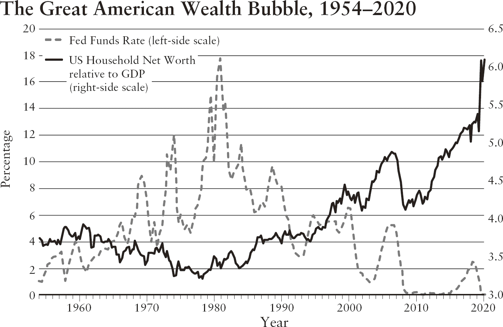

[9.](#section-9) The decline in US interest rates since the early 1980s has boosted the value of US household assets.

Modern economists still hold to this view. Yet Mill’s contemporary John Ruskin took issue. The Victorian art critic pointed out that wealth was derived from the Latin, *valor*, *valere*, meaning to be well or strong. Real wealth, in his view, came from ‘the possession of useful articles which we can use’. It did not exist in exchange but must have some inner quality: ‘where there is either no intrinsic value, or no acceptant capacity, there is no effectual value; that is to say, no wealth. A horse is no wealth to us if we cannot ride.’ By extension, a crypto that cannot be used in exchange is not wealth.[29](#section-52) Ruskin was also concerned with whether wealth was obtained by moral or immoral means:

> That which seems to be wealth may in verity be only the gilded index of far-reaching ruin; a wrecker’s handful of coin gleaned from the beach to which he has beguiled an argosy; a camp-follower’s bundle of rags unwrapped from the breasts of goodly soldiers dead; the purchase-pieces of potter’s fields, wherein shall be buried together the citizen and the stranger.[30](#section-52)

On Ruskin’s gravestone are engraved the words, ‘there is no wealth but life’. In the twentieth century, Ruskin’s conception of wealth was taken up by another self-taught economist, Frederick Soddy. A chemist by training who had received a Nobel prize for work on radioactive isotopes, Soddy held that life is a struggle for energy and that capital was really a form of stored energy: ‘All wealth is the product of work, in the physical sense of the expenditure of available energy,’ he wrote. Soddy thought it absurd to measure wealth by exchange value since speculators could push up the price of commodities ‘without any addition to the national wealth’. Soddy concluded that ‘the “wealth” of millionaires turns out on examination to be virtual … and to consist mostly of claims to wealth.’[31](#section-52) Adam Smith would have agreed. ‘Real wealth,’ wrote Smith, derives from ‘the annual produce of the land and labour of the society’.[32](#section-52) By this light, much millennial wealth wasn’t real at all, but mere claims to wealth whose market value multiplied as the discount rate declined.

Old-fashioned views of wealth as espoused by Smith and Ruskin held no sway in the new millennium. Rather, wealth was seen as something created in financial markets that could be used to drive the economy forward. This viewpoint was expressed by Professor John C. Edmunds of Babson College, Boston, in an article for *Foreign Policy* in the summer of 1996. Edmunds extolled the potential of what he called a ‘New World Wealth Machine’:

> Many societies, and indeed the entire world, have learned how to create wealth directly. The new approach requires that a state find ways to increase the market value of its stock of productive assets … *An economic policy that aims to achieve growth by wealth creation therefore does not attempt to increase the production of goods and services, except as a secondary objective*.[33](#section-52)

The simplest and most effective way to inflate the value of productive (and not so productive) assets was by lowering the rate of interest. This was the path chosen by the Federal Reserve after 2008. The rationale for ultra-low rates was expressed by Chairman Bernanke in a November 2010 op-ed for the *Washington Post*: ‘Lower corporate bond rates will encourage investment. And higher stock prices will boost consumer wealth and help increase confidence, which can also spur spending. Increased spending will lead to higher incomes and profits that, in a virtuous circle, will further support economic expansion.’[34](#section-52) In effect, the Fed was using monetary policy to power the ‘New Wealth Machine’.

America’s central bank was not the first monetary authority to go down this route. In the late 1980s, the Japanese brought down interest rates to boost domestic consumption. An unnamed senior official at the Bank of Japan outlined their thinking:

> We intended first to boost both the stock and property markets [with low interest rates] … This step then was supposed to bring about enormous growth of assets over every economic sector. This wealth-effect would in turn touch off personal consumption and residential investment, followed by an increase of investment in plant and equipment. In the end, loosened monetary policy would boost real economic growth.[35](#section-52)

In the late 1980s, most Japanese policymakers believed that the ‘bubble economy’ and real economy were two separate entities and that the former could be deflated without damaging the latter.[36](#section-52) After the Nikkei turned down in 1990, a senior official told the W*ashington Post*: ‘it’s time for the bubble to burst … the real, productive economy won’t really be hurt. Land and people won’t disappear, but phony wealth will.’[37](#section-52) This was a delusion. Japanese companies that had engaged in *zaitech* (financial engineering), making leveraged bets on stocks and real estate, faced large losses after the property market’s collapse. Too much ‘real’ economic activity depended on the ‘phony wealth’ created by the Bubble Economy.

Bernanke had studied Japan’s economic traumas after 1990, but this lesson appeared to have been lost on him. America’s own bubble economy took off as Japan’s deflated. After the turn of the millennium, millions of blue-collar jobs were killed off by Chinese imports. Container ships leaving the Port of Los Angeles crossed the Pacific laden, not with American exports, but with garbage to be dumped in the Far East. By 2008, just one in ten US workers was employed in industry. The US economy was slowly financialized. Before the financial crisis most newly created jobs were in construction or services, such as banking, that benefited from the real estate and credit boom. The output of the finance, insurance and real estate sectors (FIRE) rose to be 50 per cent larger than manufacturing. The country possessed more estate agents than farmers.[38](#section-52)

The global financial crisis didn’t kill off financialization but rather accelerated it. In the aftermath of Lehman’s bankruptcy, finance contributed an even larger share of US economic growth than before.[39](#section-52) As we have seen, ultra-low interest rates facilitated corporate mergers and borrowing, thereby boosting Wall Street’s income. Inflated asset prices raised the incomes of hedge fund managers and other asset managers.[40](#section-52) Rather than investing in real assets, companies used debt to buy back their shares. The finance sector’s share of the economic pie grew to roughly three times its historic average. As one commentator observed: ‘We’ve substituted finance for industry as the locomotive of economic growth. In GDP terms, it looks terrific. But it is neither enduring nor real.’[41](#section-52)

### A PROFITS BUBBLE

Classical economists made little distinction between profits (the return on capital) and interest (the cost of renting capital). It seemed obvious to them that if something was gained from borrowing, the lender should enjoy a fair share. Adam Smith thought that, as a rule of thumb, interest should equate to half of profits. As we have seen, the Swedish economist Knut Wicksell believed that the ‘natural rate’ of interest was the economy’s average rate of profitability. If Wicksell was correct, then the ultra-low interest rates of the post-crisis period should have been accompanied by ultra-low profits. But this was not the case.

After 2008, even as factories lay idle and unemployment stayed high, profits rebounded in the United States. Between 2010 and 2014, total profits (as share of US GDP) were around 40 per cent above their post-war average. The most important contributor to rising profitability was the steep decline in corporate borrowing costs. ‘The single largest input to higher [profit] margins … is likely to be the existence of much lower real interest rates since 1997,’ concluded the Boston money manager Jeremy Grantham. Had interest rates remained at normal levels, profits would have been average.[fn3](#section-58) Another study suggested that the policy of ‘maintaining overall production (GDP) while lowering both labor and capital costs has inflated a *profits bubble*’.[42](#section-52) Much of those profits derived from the financial sector. After 2010, financial services accounted for more than 20 per cent of total US profits, around twice the post-war average.[fn4](#section-58)

### THE BUBBLE ECONOMY

On 7 April 2016, the current and former heads of the Federal Reserve were gathered at a meeting in New York City. During a panel discussion, the then head, Janet Yellen, was asked whether the United States was a bubble economy. Her response was discursive: she pointed to recent jobs growth and low inflation. In her view, the US economy was on a solid course. The Fed, Yellen said, was looking out for ‘clearly overvalued’ asset prices, strong credit growth and reaching for yield – in other words, the financial conditions prevailing prior to the subprime crisis – but saw no reason for present concern. No, America’s top central banker was adamant, the United States was not a bubble economy. To her side, the oldest surviving Fed Chairman, Paul Volcker, pulled out a handkerchief and loudly blew his nose.[fn5](#section-58)

What is meant by a bubble economy? The phrase came into popular usage in the late 1980s to describe Japan’s bubble-distorted economy. The *baburu keiki* (bubble economy) described the condition by which inflation in real estate and the stock market had entered deep into the sinews of Japan’s economy: corporate profits boosted by financial engineering; business investment fuelled by warrant bonds, which linked the corporate cost of capital to the price of the issuer’s shares; and spending on luxuries (gold flakes sprinkled on breakfast cereals, etc.) and other consumer items stimulated by rising asset prices and credit growth. By the end of the decade, the bubble infected everything – as the Japanese themselves were well aware.

The earliest reference to a bubble economy came several decades earlier, from Virgil Jordan, the post-war president of the American National Industrial Conference Board. In 1948, Jordan warned that:

> Our economy, and much of the world’s, has been floated upward on an iridescent, ever-swelling bubble of money manufactured by government to stimulate, sustain, speed and subsidize individual and collective consumption … The business outlook today depends here and everywhere more upon the future movements and dimensions of the American money bubble than anything else … Money-bubble economies have always burst, ultimately, and this one must, too, though no one can say with certainty when.[43](#section-52)

It is no coincidence that this warning came at a time when US interest rates were being artificially suppressed by the Truman administration. If Jordan’s forebodings turned out to be misplaced, it was because after 1945 Americans had robust savings, few debts, no financial bubbles and little financial engineering.

None of these stabilizing conditions held in 2016. Later that year, Donald Trump accused the Federal Reserve of creating a ‘false economy’ and inflating a ‘big, fat, ugly bubble’.[44](#section-52) Trump added: ‘The only thing that is strong is the artificial stock market.’ It was incongruous for a New York property developer, whose fortune depended on elevated property prices and cheap finance, to express such thoughts; but, in essence, the future US president was correct. The Fed’s extreme policy measures had ended the Great Recession but at the cost of creating a ‘false economy’.

Even Larry Summers, the secular stagnation revivalist, admitted that America’s economy only expanded during periods when bubbles were inflating. Another New York billionaire, the hedge fund manager Paul Singer, asserted that the *reflation* of the US economy after 2008 was based on ‘fake growth, fake money, fake financial stability, fake inflation numbers and fake income growth’. Singer concluded that ‘a good deal of the economic and jobs growth post-crisis is false growth with little chance of it being sustainable and self-reinforcing. It is based on fake money conjured up by the Fed to buy assets at fake prices.’[45](#section-52)

When Yellen dismissed the notion of a bubble economy in the United States, US asset prices were ‘clearly overvalued’ on every valuation measure except relative to the depressed interest rates set by the Federal Reserve. US corporations were piling on debt and performing feats of financial engineering more extensive than anything attempted by Japanese *zaitech* practitioners three decades earlier. Households were richer than ever, but much of their wealth consisted of financial claims unsupported by income-producing capital. Virtual wealth. Profits were increasingly detached from real economic activities. A profits bubble. The financial sector was crowding out the real economy. A bubble economy.

### *THE TRUMAN SHOW*: AN ALLEGORY FOR THE BUBBLE ECONOMY

*The Truman Show* is a film directed by Peter Weir whose lead character is played by Jim Carrey. Truman Burbank is the unwitting star of a reality TV show. From his birth onwards all of Truman’s life has been spent on camera. Everything is artificial. Only Truman is unaware of this reality. The massive film set includes a manicured island town (‘Seahaven’), complete with picket-fenced suburbs, and is encased by a massive geodesic dome. The ‘Omnicam ecosphere’ is one of the few manmade structures visible from space.

At the opening of the film, the Truman Show has been running for thirty years, ‘24 hours a day, 7 days a week to an audience around the globe’. The global audience is transfixed by every development in Truman’s life. Some viewers have even come to believe in this world. One fan tells the camera, ‘It’s all true, it’s all real. Nothing here is fake … It’s merely controlled.’ This ‘counterfeit’ world has a commercial imperative. Everything on the show is for sale to the viewing public: the houses, clothes, food and beer are all product placements. Putting on the show requires the population of a small country, but it is extremely profitable.

Truman’s acceptance of the situation stems from the fact that, as the show’s creator Christof (a God-like figure who sees and controls everything) says, ‘We accept the reality of the world with which we’re presented.’[46](#section-52) Truman’s natural inclination to accept the world he lives in is reinforced by his fear of leaving Seahaven. The outside world is depicted as a scary place. The office of the travel agent is plastered with warnings of foreign diseases, plane crashes and terrorism. Besides, as Truman’s screen wife says, ‘We have mortgage payments, Truman. We have car payments. What, we’re going to just walk away from our financial obligations?’

Things start to go wrong. A piece of lighting equipment falls from the sky and lands at Truman’s feet. His car radio accidentally tunes into the set’s production frequency. These accidents are crisis moments for the show’s producers, who try to explain away strange occurrences. The key point, as Christof says, is that ‘any unpredictable behavior has to be reported.’ Truman becomes suspicious. He wants to leave but his various attempts are thwarted. Eventually Truman sets off in a boat. Christof orders up a storm to stop him, but Truman sails to the edge of the set. Feeling the surface of the massive dome, he breaks down in tears. Christof urges Truman to remain, his disembodied voice comes from the heavens: ‘in my world, you have nothing to fear … You’re afraid. That’s why you can’t leave.’ Truman decides to leave anyway.

*The Truman Show* came out in 1998 and was later named one of the top ten predictive science fiction films for anticipating the arrival of reality TV. (The *Big Brother* show started the following year and, nearly two decades later, a reality TV star became US president.) It can be viewed, too, as an allegory for the bubble economy that also came into existence at around this date. A couple of months after *The Truman Show* opened in cinemas, the ‘Greenspan put’ emerged from the Fed’s response to the crisis at the hedge fund Long-Term Capital Management.

As in *The Truman Show*, we have come to live in a controlled environment, with its fake money, fake interest rates, fake economy, fake jobs and fake politicians. Our bubble world is sustained by a combination of passive acquiescence and powerful vested interests. It’s a 24/7 show with a global audience. Since risk is controlled, we have nothing to fear. Any departure from the bubble threatens a crisis. Extreme measures are adopted: negative interest rates, limitless amounts of quantitative easing and, in response to British’s voters’ wishes to leave the European Union, even a ‘Project Fear’. Too much is at stake to let the bubble burst.

Yet unwelcome reality occasionally intrudes in the form of financial crises (of the Dotcom, subprime and Eurozone variety), ‘flash crashes’ and abnormal economic outcomes – plunging productivity, rising inequality and extreme profitability. The conventional explanations that are provided – secular stagnation, demographic headwinds and technological change – are unconvincing. Like Truman, we feel that things are not right. In an unscripted moment in the show, Truman falls in love with a girl who tries to warn him that everything is fake. She wears a badge with the words, ‘How will it end?’ Nobody knows.

<!-- rl-section id="sec-chapter012" class="titlepage" title="12" -->

## A Big Fat Ugly Bubble

> *What’s lighter than the mind? A thought. Than thought? This bubble world. What, than this bubble? Nought.*
>
> Francis Quarles, 1634

### A CENTRAL BANKING BUBBLE

In late April 2018, the share price of a company listed on the Zurich stock exchange closed at 8,380 Swiss francs. Only two years earlier, the same stock had traded at around 1,000 francs. The 15-franc dividend hadn’t changed since 1921 and was, in fact, fixed in law. Faced with a dividend yield of 0.18 per cent, investors would have to wait nearly six hundred years to earn back their money. That might seem expensive but this was no ordinary business. A thousand tonnes of gold bullion sat on its balance sheet, alongside large positions in currencies, bonds and shares. These investments were financed with loans from customers who even paid the company for the privilege of lending to it. The most recent accounts reported a return on capital above 60 per cent. No wonder investors wanted a piece of the action.

The company in question was the Swiss National Bank. Like the Bank of England, from the time of its establishment through to nationalization in 1946 the Swiss National Bank had public investors and its shares were traded on the local stock exchange. The SNB’s monetary policies were the cause of its immense profits. Interest rates in Switzerland had been negative since early 2015, which meant the SNB levied a small charge on the hundreds of billions of francs deposited by its banking customers. To prevent its currency appreciating against the euro, the SNB had acquired lots of foreign assets, including bonds and shares. As the *Wall Street Journal* noted, printing money to buy securities was a ‘recipe for success’.[1](#section-52)

Three centuries earlier, John Law, by merging France’s national bank with his Mississippi Company, had discovered the same recipe. At the peak of the Mississippi bubble, the Scottish projector claimed that his company’s share price was justified by the low prevailing rate of interest. The same might be said of the Swiss central bank’s shares. On the date when the SNB stock hit its peak in the spring of 2018, the yield on ten-year Swiss government bonds was close to zero. Apply a discount rate of zero to a stream of future dividends fixed in perpetuity – even a dividend so small that it was scarcely enough to buy a cup of coffee in a Zurich café – and you arrive at an infinite valuation. On this basis, SNB shares trading on a six-hundred-year payback were a bargain.

In his *Theory of Interest* (1930), Irving Fisher deliberated on the relationship between house prices and interest rates: ‘the price of a house is the discounted value of its future income. In the process of discounting there lurks a rate of interest. The value of houses will rise or fall as the rate of interest falls or rises.’ Not long after Fisher, another American economist, John Burr Williams, described how the act of discounting was key to valuation. ‘Investment Value,’ Williams wrote in *The Theory of Investment Value* (1938), is ‘defined as the present worth of future dividends, or of future coupons and principal’.[2](#section-52) Since then students of economics and business have been taught how to discount future cash flows and to calculate present values. Capitalization without interest, as Sir William Petty understood, is absurd – almost as absurd as the Swiss National Bank’s share price.

### THE EVERYTHING BUBBLE

In the decade after Lehman’s bankruptcy a great variety of assets soared to extreme valuations. There were bubbles in industrial commodities and rare-earth elements, in US agricultural land and Chinese garlic bulbs, in fine or not-so-fine art (depending on your taste), bubbles in vintage cars and fancy handbags, bubbles in ‘super-city’ apartments, bubbles in sovereign bonds, bubbles in Silicon Valley unicorns and cryptocurrencies, and a giant bubble in American stocks. Never before in history had so many asset price bubbles inflated simultaneously. But then, never before in history had interest rates around the world sunk so low.

The first bubbles of this new era formed in commodities. By late 2010, most industrial raw materials (palladium, iron ore, rubber, lead, copper and nickel) and several agricultural commodities (corn, coffee, soya beans, flaxseed, jute and wool) were trading at two standard deviations or more above their average levels. In October of that year, several rare earths soared into the stratosphere after China imposed an export ban. To a large extent the commodity boom was driven by strong demand for raw materials from China, but bubbles also formed in precious metals (platinum, gold and silver) which emerging countries might have coveted but didn’t need for practical use. Wall Street hailed a ‘commodity super-cycle’ and urged investors to get exposure to this hot alternative asset.

It would not have surprised Adam Smith to discover that real estate markets around the world reacted positively to the stimulus of ultra-low interest rates. From London to Sydney, residential property prices in the leading cities danced to the same monetary jig.[3](#section-52) As an executive at Savills, a property consultant, commented: ‘What happened was that, for the first time, the cost of money in most of the cities was similar – you might say quantitative easing [has] levelled the global playing field.’[4](#section-52) Real estate brokers referred to the favoured destinations of the world’s super-rich as ‘golden concrete’.[5](#section-52)

In the United Kingdom, the country’s ‘housing crisis’ was generally ascribed to a lack of housebuilding. But the Bank of England’s decision to maintain interest rates at their lowest level in its three-hundred-year history had a more significant impact on affordability. While UK house prices were extremely expensive relative to household incomes, relative to mortgage costs they had never been cheaper. The Office for National Statistics found that most of the increase in housing wealth after 2008 came from the rising value of land rather than what it called the ‘assets overlaying the land’.[6](#section-52) Negative interest rates provided an even greater fillip to Europe’s housing markets. In Zurich, the ratio of house prices to rent reached a record level of 37 in 2016. By this date, Swedish real estate was experiencing double-digit inflation. Despite record levels of household debt, mortgage payments in Sweden had fallen to an all-time low.[fn1](#section-58) In neighbouring Denmark homebuyers were actually paid to take out mortgages. Danske Bank, the country’s largest mortgage provider, fretted that negative rates were propelling home prices into orbit. Norway’s Financial Supervisory Authority likewise ascribed runaway house-price inflation to the collapse in interest rates.[7](#section-52)

Across the Atlantic, Canada’s housing market – characterized by elevated prices, record levels of household debt, ‘liar loans’ and cheap mortgages provided by ‘shadow banks’ – looked uncannily similar to the US property market in the subprime years.[8](#section-52) According to one analysis, the Canadian state ‘used its power over interest rates and housing finance to entice new entrants … deeper into mortgage markets, in order to bolster real estate values and save the banks’.[9](#section-52) The epicentre of the country’s housing bubble was Vancouver, a favourite destination for Chinese expatriates. By mid-2016, Vancouver homes were priced on average at C$1.6 million, more than ten times local incomes.[10](#section-52) A website urged viewers to distinguish between ‘crack shacks’ and million-dollar properties, which proved no easy task. ‘Vancouver is dependent on rock bottom interest rates to avoid a major correction,’ a study of the city’s real estate market concluded.[11](#section-52) A similar story emerged in Australia. Sydney, like Vancouver, was also favoured by Chinese property buyers.[12](#section-52) By 2016, the average home in the New South Wales’ capital was valued at more than twelve times local incomes, making Sydney the second most expensive housing market in the world after Hong Kong.[13](#section-52) On a national basis, Australian housing was deemed ‘severely unaffordable’, trapped in a perpetual bubble.[14](#section-52)

### A STOCK MARKET BUBBLE

During the financial crisis, the New York Fed stumped up tens of billions of dollars to bail out the investment bank Bear Stearns and insurance giant AIG. Morgan Stanley, Goldman Sachs and other Wall Street firms were encouraged to convert into bank holding companies so they could borrow directly from the Fed. On its own account, the US central bank acquired vast amounts of Treasury bonds and mortgage securities. By the end of 2008, the Fed’s balance-sheet footings exceeded $2 trillion, more than double the level a few months earlier. Fed staffers referred to ‘large-scale asset purchases’, but the rest of the world knew it as quantitative easing (QE).

On 6 March 2009, the S&P 500 index reached a low of 666 – the number of the Beast. Investors had been put through hell and now it was time to come back. In the same month, the Fed extended its asset purchases and launched a $200 billion fund (the term asset-backed securities loan facility, or TALF) to help private investors acquire distressed securities at bargain prices. The stock market took off. By Thanksgiving, the S&P 500 was up more than two-thirds. A decade later, the benchmark index was up more than fourfold from the trough and American stocks were more expensive on most valuation measures than at the peak of the Dotcom folly.

Other telltale bubble indicators were visible: corporate leverage was extended, stock market bulls outnumbered bears by the highest ratio in decades, and margin debt was at an all-time high.[15](#section-52) In the words of one investment manager, this constituted ‘the broadest equity market bubble in history’.[16](#section-52) It was also the longest period of uninterrupted stock gains ever witnessed. By the tenth anniversary of Lehman’s bankruptcy, the US bull market had been running for 3,453 days.[17](#section-52) No wonder the bears headed for the woods. Yet the ascent of the stock market can’t simply be ascribed to irrational exuberance; shares still looked relatively good value when their yields were compared to the miserable coupons provided by US Treasuries.[fn2](#section-58) As long as long-term interest rates remained low, the great bull market had the wind behind it.

Stock market bubbles often favour technology companies. This has been the case from the 1690s’ mania in London’s Exchange Alley for diving-bell stocks through to the internet bubble three centuries later. Exciting new innovations attract speculators because their profitability can only be imagined. But there’s another reason: since most of their profits lie in the distant future, the valuation of technology companies (also known as ‘growth companies’) is inflated when the discount rate falls. During manias, speculators are said to engage in ‘hyperbolic discounting’.

In the years after 2008, investors who failed to load up on the fabulous FAANGs (Facebook, Apple, Amazon, Netscape and Google), companies with monopoly positions and superior growth prospects, were left in the dust. In their frenzy for earnings growth, investors were prepared to overlook a lack of current earnings. Around three-quarters of IPOs that came to the market in 2018 were loss-making – the same proportion as at the height of the Dotcom bubble. As one tech analyst commented: ‘The rise in unprofitable IPOs reflects the general preference in both public and private markets for growth over profitability.’[18](#section-52)

Silicon Valley’s unicorns attracted higher valuations at each funding round, even as losses outpaced sales. A fortunate few, such as Uber and Lyft, made it to the public markets, where they jostled for attention with another company that had long promised, or rather over-promised, the imminent arrival of self-driving cars. In 2017, the market capitalization of Elon Musk’s Tesla Inc. accelerated past General Motors.[19](#section-52) Three years later, Tesla was valued at more than Toyota, even though the Japanese car maker produced over twenty times as many vehicles.

For this valuation to hold, Musk would have to produce millions more cars every year, and to achieve that Tesla required a great deal of investment. Given that its bonds were rated junk, this was a potential concern. As investor Vitaliy Katsenelson observes:

> And then there is an element of time … Getting to an annual production of even a few million cars will require time – a lot of time. A lot of dirt has to be moved, permits issued, equipment installed, people hired.
>
> In Star Trek there are convenient wormholes, which cut corners through space, getting you to that galaxy a billion light years away in hours. Low interest rates have messed with the temporal properties of the market and created a wormhole in time and in Tesla’s stock … It will take years, maybe even a decade, for Tesla to produce enough cars to justify its valuation. Today’s market valuation assumes it has already happened – that the capital has been raised and spent and that it cost nothing.[20](#section-52)

In the era of ultra-low interest rates, time had no cost. Investors’ appetite for concept stocks at nosebleed valuations extended well beyond autonomous cars (Tesla) to animal-free protein (Beyond Meat), biotech (gene therapy stocks), Chinese internet (Alibaba, Tencent) and cloud computing. Investors were flying high. During an outbreak of ‘marijuana madness’ in September 2018, a Canadian cannabis producer was briefly valued at more than American Airlines.[21](#section-52)

### CRYPTO BUBBLES

As the world’s financial system imploded in the summer of 2008, an anonymous software engineer circulated a paper containing a cure for all monetary ills. Commercial banks had shown they couldn’t be trusted with money. Central banks were oiling their printing presses, ready to debase their currencies. The solution was to use the internet to create ‘a new electronic cash system that’s fully peer-to-peer’. Once the distributed ledger, or blockchain, was in place financial trust would be restored and monetary crises come to an end.[22](#section-52)

Things didn’t turn out quite as Bitcoin’s mystery creator, Satoshi Nakamoto, envisaged. What he had unleashed was not so much a new type of money, but rather the most perfect object of speculation the world had ever seen. In one of the first recorded Bitcoin transactions in 2010, a hungry computer geek in Florida spent 10,000 of the cryptocurrency on a couple of takeaway pizzas. By late 2017, the cost of those pizzas at Bitcoin’s then market price was close to $200 million. To say, as the acting head of New Zealand’s central bank, Grant Spencer, did at the time, that Bitcoin resembled a ‘classic bubble’ was something of an understatement.

Bubbles are revealed by a rapid escalation in market price. Over the course of 1719 the share price of John Law’s Mississippi Company climbed nearly twentyfold. The rise in Bitcoin’s market price was even greater. Mississippi shares exhibited extreme volatility. Bitcoin’s price oscillations were even more extreme. By 2017, the leading cryptocurrency had survived several setbacks, the necessary condition for a ‘super-bubble’ to form. Whereas the Mississippi bubble attracted at most half a million foreigners to Paris, Bitcoin’s followers were numbered in millions. Whereas the Mississippi bubble created printed paper millionaires, Bitcoin conjured up digital billionaires, including the Winklevoss twins of Facebook fame.

Every great bubble has its share of urban myths – fanciful anecdotes which reveal the spirit of the age. Bitcoin did not disappoint. The *Wall Street Journal* reported that an IT worker from Swansea, Wales, whose computer containing 7,500 bitcoins had been thrown out during an office clean-up, was excavating a landfill site in search of the missing hard drive.[23](#section-52) Bitcoins were more easily stolen than lost. When a leading exchange, Mt. Gox, shut down in April 2014, hundreds of millions of dollars’ worth of bitcoins went missing. A few years later, the death of the Canadian owner of a cryptocurrency exchange left clients unable to access their digital assets.[24](#section-52) To use an eighteenth-century expression, Bitcoin owners had been ‘bubbled’.

‘When the ducks quack, feed them,’ is an old Wall Street adage. The appetite of cyber enthusiasts in 2017 was filled by a deluge of ‘initial coin offerings’. Celebrities rushed to endorse the new cryptocurrencies. Paris Hilton tweeted support for Lydian Coin and Floyd ‘Crypto’ Mayweather, as the retired boxer now styled himself, endorsed several issues over social networks (for which he was later fined by the Securities and Exchange Commission). Like the ‘bubble companies’ of 1720 that promised to extract silver from lead or to build an air pump for the brain, several of the new cryptos were spoofs. But that didn’t stop the Useless Ethereum Token, whose logo showed the middle finger and whose website advised ‘don’t buy these tokens’, rising five times faster than Bitcoin in the giddy last months of 2017.[25](#section-52)

Just as internet companies were spun off from their parents during the Dotcom bubble, so ‘forks’ in the blockchain created yet more coins. Bitcoin laid two eggs, Bitcoin Cash and Bitcoin Gold. Towards the end of the year, the leading crypto’s market value surpassed many of the world’s largest companies, including Boeing, Toyota and McDonald’s. In Charlotte, North Carolina, a restaurant chain saw its share price surge after launching a cryptocurrency rewards programme for its clientele.[26](#section-52) A young Dutch family was reported to have sold their home and possessions and moved into a campsite, where they would live off the profits gained from trading cryptocurrencies.[27](#section-52)

True believers maintained that blockchain was going to ‘change the world’.’ But transactions on Bitcoin’s network were agonizingly slow and consumed vast amounts of energy. Amazon wouldn’t accept bitcoin for retail transactions, nor would the US government accept it for the payment of taxes. Its market price was too volatile to serve as a store of value, a key function of money. The cryptocurrency resembled the gold prospectors’ fabled tin of sardines that was good for trading but not for eating.

This mania was born of monetary conditions as much as technological developments. Without computers there could have been no blockchain or digital encryption. Without the internet, the enthusiasm for cryptocurrencies could not have spread like wildfire. Yet as fans of this ‘digital gold’ argued, the debasement of currencies by central banks meant a new type of money was needed. Cryptocurrencies were popular with millennials, not just because they were tech savvy but because low prospective returns on conventional investments forced them to go for broke.

In financial terms, Bitcoin can be seen as a zero-coupon perpetual note, something intrinsically worthless. In the age of ultra-low interest rates a variety of assets that produced no income, whether gold, vintage cars, contemporary art or cryptocurrencies, were proving wildly popular. With little by way of a discount rate and no cash flow, rational valuations were impossible.

### THE VIRTUAL WEALTH BUBBLE

The broad inflation in the prices of bonds, stocks, real estate, cryptos and just about every other financial asset produced an extraordinary surge in wealth. In the years between the stock market trough in early 2009 and the tenth anniversary of Lehman’s bankruptcy, US household wealth nearly doubled. By late 2018, American households were worth more than $100 trillion, a sum equivalent to five times US GDP. By comparison, household wealth in the post-war decades averaged just over three and a half times GDP. Total household wealth was higher than at its twin peaks in recent real estate and internet bubbles.[28](#section-52) Never before had Americans been so rich. Never before had they done so little to amass so much wealth.

It’s all very well to transcribe these large numbers, but what exactly is meant by wealth? The Victorian philosopher and economist John Stuart Mill argued that wealth consists of anything, ‘though useless in itself’, which enables a person ‘to claim from others a part of their stock of things useful or pleasant’. By Mill’s definition, a high-flying but otherwise useless cryptocurrency was wealth, as were other evanescent assets: the portfolio of a ‘high net worth individual’ invested in equity and bond derivatives; a private collection of contemporary art, featuring works by Jeff Koons, Lucien Freud and Francis Bacon, whose value could be monetized and used as collateral for further investments; loss-making or semi-fraudulent unicorns in Silicon Valley; unfunded pension promises; trillions of dollars’ worth of ‘good will’ on corporate balance sheets; and further trillions of bank reserves held at the Federal Reserve, an artefact of the central bank’s money-printing. As long as something had an exchange value it constituted wealth.

[9.](#section-9) The decline in US interest rates since the early 1980s has boosted the value of US household assets.

Modern economists still hold to this view. Yet Mill’s contemporary John Ruskin took issue. The Victorian art critic pointed out that wealth was derived from the Latin, *valor*, *valere*, meaning to be well or strong. Real wealth, in his view, came from ‘the possession of useful articles which we can use’. It did not exist in exchange but must have some inner quality: ‘where there is either no intrinsic value, or no acceptant capacity, there is no effectual value; that is to say, no wealth. A horse is no wealth to us if we cannot ride.’ By extension, a crypto that cannot be used in exchange is not wealth.[29](#section-52) Ruskin was also concerned with whether wealth was obtained by moral or immoral means:

> That which seems to be wealth may in verity be only the gilded index of far-reaching ruin; a wrecker’s handful of coin gleaned from the beach to which he has beguiled an argosy; a camp-follower’s bundle of rags unwrapped from the breasts of goodly soldiers dead; the purchase-pieces of potter’s fields, wherein shall be buried together the citizen and the stranger.[30](#section-52)

On Ruskin’s gravestone are engraved the words, ‘there is no wealth but life’. In the twentieth century, Ruskin’s conception of wealth was taken up by another self-taught economist, Frederick Soddy. A chemist by training who had received a Nobel prize for work on radioactive isotopes, Soddy held that life is a struggle for energy and that capital was really a form of stored energy: ‘All wealth is the product of work, in the physical sense of the expenditure of available energy,’ he wrote. Soddy thought it absurd to measure wealth by exchange value since speculators could push up the price of commodities ‘without any addition to the national wealth’. Soddy concluded that ‘the “wealth” of millionaires turns out on examination to be virtual … and to consist mostly of claims to wealth.’[31](#section-52) Adam Smith would have agreed. ‘Real wealth,’ wrote Smith, derives from ‘the annual produce of the land and labour of the society’.[32](#section-52) By this light, much millennial wealth wasn’t real at all, but mere claims to wealth whose market value multiplied as the discount rate declined.

Old-fashioned views of wealth as espoused by Smith and Ruskin held no sway in the new millennium. Rather, wealth was seen as something created in financial markets that could be used to drive the economy forward. This viewpoint was expressed by Professor John C. Edmunds of Babson College, Boston, in an article for *Foreign Policy* in the summer of 1996. Edmunds extolled the potential of what he called a ‘New World Wealth Machine’:

> Many societies, and indeed the entire world, have learned how to create wealth directly. The new approach requires that a state find ways to increase the market value of its stock of productive assets … *An economic policy that aims to achieve growth by wealth creation therefore does not attempt to increase the production of goods and services, except as a secondary objective*.[33](#section-52)

The simplest and most effective way to inflate the value of productive (and not so productive) assets was by lowering the rate of interest. This was the path chosen by the Federal Reserve after 2008. The rationale for ultra-low rates was expressed by Chairman Bernanke in a November 2010 op-ed for the *Washington Post*: ‘Lower corporate bond rates will encourage investment. And higher stock prices will boost consumer wealth and help increase confidence, which can also spur spending. Increased spending will lead to higher incomes and profits that, in a virtuous circle, will further support economic expansion.’[34](#section-52) In effect, the Fed was using monetary policy to power the ‘New Wealth Machine’.

America’s central bank was not the first monetary authority to go down this route. In the late 1980s, the Japanese brought down interest rates to boost domestic consumption. An unnamed senior official at the Bank of Japan outlined their thinking:

> We intended first to boost both the stock and property markets [with low interest rates] … This step then was supposed to bring about enormous growth of assets over every economic sector. This wealth-effect would in turn touch off personal consumption and residential investment, followed by an increase of investment in plant and equipment. In the end, loosened monetary policy would boost real economic growth.[35](#section-52)

In the late 1980s, most Japanese policymakers believed that the ‘bubble economy’ and real economy were two separate entities and that the former could be deflated without damaging the latter.[36](#section-52) After the Nikkei turned down in 1990, a senior official told the W*ashington Post*: ‘it’s time for the bubble to burst … the real, productive economy won’t really be hurt. Land and people won’t disappear, but phony wealth will.’[37](#section-52) This was a delusion. Japanese companies that had engaged in *zaitech* (financial engineering), making leveraged bets on stocks and real estate, faced large losses after the property market’s collapse. Too much ‘real’ economic activity depended on the ‘phony wealth’ created by the Bubble Economy.

Bernanke had studied Japan’s economic traumas after 1990, but this lesson appeared to have been lost on him. America’s own bubble economy took off as Japan’s deflated. After the turn of the millennium, millions of blue-collar jobs were killed off by Chinese imports. Container ships leaving the Port of Los Angeles crossed the Pacific laden, not with American exports, but with garbage to be dumped in the Far East. By 2008, just one in ten US workers was employed in industry. The US economy was slowly financialized. Before the financial crisis most newly created jobs were in construction or services, such as banking, that benefited from the real estate and credit boom. The output of the finance, insurance and real estate sectors (FIRE) rose to be 50 per cent larger than manufacturing. The country possessed more estate agents than farmers.[38](#section-52)

The global financial crisis didn’t kill off financialization but rather accelerated it. In the aftermath of Lehman’s bankruptcy, finance contributed an even larger share of US economic growth than before.[39](#section-52) As we have seen, ultra-low interest rates facilitated corporate mergers and borrowing, thereby boosting Wall Street’s income. Inflated asset prices raised the incomes of hedge fund managers and other asset managers.[40](#section-52) Rather than investing in real assets, companies used debt to buy back their shares. The finance sector’s share of the economic pie grew to roughly three times its historic average. As one commentator observed: ‘We’ve substituted finance for industry as the locomotive of economic growth. In GDP terms, it looks terrific. But it is neither enduring nor real.’[41](#section-52)

### A PROFITS BUBBLE

Classical economists made little distinction between profits (the return on capital) and interest (the cost of renting capital). It seemed obvious to them that if something was gained from borrowing, the lender should enjoy a fair share. Adam Smith thought that, as a rule of thumb, interest should equate to half of profits. As we have seen, the Swedish economist Knut Wicksell believed that the ‘natural rate’ of interest was the economy’s average rate of profitability. If Wicksell was correct, then the ultra-low interest rates of the post-crisis period should have been accompanied by ultra-low profits. But this was not the case.

After 2008, even as factories lay idle and unemployment stayed high, profits rebounded in the United States. Between 2010 and 2014, total profits (as share of US GDP) were around 40 per cent above their post-war average. The most important contributor to rising profitability was the steep decline in corporate borrowing costs. ‘The single largest input to higher [profit] margins … is likely to be the existence of much lower real interest rates since 1997,’ concluded the Boston money manager Jeremy Grantham. Had interest rates remained at normal levels, profits would have been average.[fn3](#section-58) Another study suggested that the policy of ‘maintaining overall production (GDP) while lowering both labor and capital costs has inflated a *profits bubble*’.[42](#section-52) Much of those profits derived from the financial sector. After 2010, financial services accounted for more than 20 per cent of total US profits, around twice the post-war average.[fn4](#section-58)

### THE BUBBLE ECONOMY

On 7 April 2016, the current and former heads of the Federal Reserve were gathered at a meeting in New York City. During a panel discussion, the then head, Janet Yellen, was asked whether the United States was a bubble economy. Her response was discursive: she pointed to recent jobs growth and low inflation. In her view, the US economy was on a solid course. The Fed, Yellen said, was looking out for ‘clearly overvalued’ asset prices, strong credit growth and reaching for yield – in other words, the financial conditions prevailing prior to the subprime crisis – but saw no reason for present concern. No, America’s top central banker was adamant, the United States was not a bubble economy. To her side, the oldest surviving Fed Chairman, Paul Volcker, pulled out a handkerchief and loudly blew his nose.[fn5](#section-58)

What is meant by a bubble economy? The phrase came into popular usage in the late 1980s to describe Japan’s bubble-distorted economy. The *baburu keiki* (bubble economy) described the condition by which inflation in real estate and the stock market had entered deep into the sinews of Japan’s economy: corporate profits boosted by financial engineering; business investment fuelled by warrant bonds, which linked the corporate cost of capital to the price of the issuer’s shares; and spending on luxuries (gold flakes sprinkled on breakfast cereals, etc.) and other consumer items stimulated by rising asset prices and credit growth. By the end of the decade, the bubble infected everything – as the Japanese themselves were well aware.

The earliest reference to a bubble economy came several decades earlier, from Virgil Jordan, the post-war president of the American National Industrial Conference Board. In 1948, Jordan warned that:

> Our economy, and much of the world’s, has been floated upward on an iridescent, ever-swelling bubble of money manufactured by government to stimulate, sustain, speed and subsidize individual and collective consumption … The business outlook today depends here and everywhere more upon the future movements and dimensions of the American money bubble than anything else … Money-bubble economies have always burst, ultimately, and this one must, too, though no one can say with certainty when.[43](#section-52)

It is no coincidence that this warning came at a time when US interest rates were being artificially suppressed by the Truman administration. If Jordan’s forebodings turned out to be misplaced, it was because after 1945 Americans had robust savings, few debts, no financial bubbles and little financial engineering.

None of these stabilizing conditions held in 2016. Later that year, Donald Trump accused the Federal Reserve of creating a ‘false economy’ and inflating a ‘big, fat, ugly bubble’.[44](#section-52) Trump added: ‘The only thing that is strong is the artificial stock market.’ It was incongruous for a New York property developer, whose fortune depended on elevated property prices and cheap finance, to express such thoughts; but, in essence, the future US president was correct. The Fed’s extreme policy measures had ended the Great Recession but at the cost of creating a ‘false economy’.

Even Larry Summers, the secular stagnation revivalist, admitted that America’s economy only expanded during periods when bubbles were inflating. Another New York billionaire, the hedge fund manager Paul Singer, asserted that the *reflation* of the US economy after 2008 was based on ‘fake growth, fake money, fake financial stability, fake inflation numbers and fake income growth’. Singer concluded that ‘a good deal of the economic and jobs growth post-crisis is false growth with little chance of it being sustainable and self-reinforcing. It is based on fake money conjured up by the Fed to buy assets at fake prices.’[45](#section-52)

When Yellen dismissed the notion of a bubble economy in the United States, US asset prices were ‘clearly overvalued’ on every valuation measure except relative to the depressed interest rates set by the Federal Reserve. US corporations were piling on debt and performing feats of financial engineering more extensive than anything attempted by Japanese *zaitech* practitioners three decades earlier. Households were richer than ever, but much of their wealth consisted of financial claims unsupported by income-producing capital. Virtual wealth. Profits were increasingly detached from real economic activities. A profits bubble. The financial sector was crowding out the real economy. A bubble economy.

### *THE TRUMAN SHOW*: AN ALLEGORY FOR THE BUBBLE ECONOMY

*The Truman Show* is a film directed by Peter Weir whose lead character is played by Jim Carrey. Truman Burbank is the unwitting star of a reality TV show. From his birth onwards all of Truman’s life has been spent on camera. Everything is artificial. Only Truman is unaware of this reality. The massive film set includes a manicured island town (‘Seahaven’), complete with picket-fenced suburbs, and is encased by a massive geodesic dome. The ‘Omnicam ecosphere’ is one of the few manmade structures visible from space.

At the opening of the film, the Truman Show has been running for thirty years, ‘24 hours a day, 7 days a week to an audience around the globe’. The global audience is transfixed by every development in Truman’s life. Some viewers have even come to believe in this world. One fan tells the camera, ‘It’s all true, it’s all real. Nothing here is fake … It’s merely controlled.’ This ‘counterfeit’ world has a commercial imperative. Everything on the show is for sale to the viewing public: the houses, clothes, food and beer are all product placements. Putting on the show requires the population of a small country, but it is extremely profitable.

Truman’s acceptance of the situation stems from the fact that, as the show’s creator Christof (a God-like figure who sees and controls everything) says, ‘We accept the reality of the world with which we’re presented.’[46](#section-52) Truman’s natural inclination to accept the world he lives in is reinforced by his fear of leaving Seahaven. The outside world is depicted as a scary place. The office of the travel agent is plastered with warnings of foreign diseases, plane crashes and terrorism. Besides, as Truman’s screen wife says, ‘We have mortgage payments, Truman. We have car payments. What, we’re going to just walk away from our financial obligations?’

Things start to go wrong. A piece of lighting equipment falls from the sky and lands at Truman’s feet. His car radio accidentally tunes into the set’s production frequency. These accidents are crisis moments for the show’s producers, who try to explain away strange occurrences. The key point, as Christof says, is that ‘any unpredictable behavior has to be reported.’ Truman becomes suspicious. He wants to leave but his various attempts are thwarted. Eventually Truman sets off in a boat. Christof orders up a storm to stop him, but Truman sails to the edge of the set. Feeling the surface of the massive dome, he breaks down in tears. Christof urges Truman to remain, his disembodied voice comes from the heavens: ‘in my world, you have nothing to fear … You’re afraid. That’s why you can’t leave.’ Truman decides to leave anyway.

*The Truman Show* came out in 1998 and was later named one of the top ten predictive science fiction films for anticipating the arrival of reality TV. (The *Big Brother* show started the following year and, nearly two decades later, a reality TV star became US president.) It can be viewed, too, as an allegory for the bubble economy that also came into existence at around this date. A couple of months after *The Truman Show* opened in cinemas, the ‘Greenspan put’ emerged from the Fed’s response to the crisis at the hedge fund Long-Term Capital Management.

As in *The Truman Show*, we have come to live in a controlled environment, with its fake money, fake interest rates, fake economy, fake jobs and fake politicians. Our bubble world is sustained by a combination of passive acquiescence and powerful vested interests. It’s a 24/7 show with a global audience. Since risk is controlled, we have nothing to fear. Any departure from the bubble threatens a crisis. Extreme measures are adopted: negative interest rates, limitless amounts of quantitative easing and, in response to British’s voters’ wishes to leave the European Union, even a ‘Project Fear’. Too much is at stake to let the bubble burst.

Yet unwelcome reality occasionally intrudes in the form of financial crises (of the Dotcom, subprime and Eurozone variety), ‘flash crashes’ and abnormal economic outcomes – plunging productivity, rising inequality and extreme profitability. The conventional explanations that are provided – secular stagnation, demographic headwinds and technological change – are unconvincing. Like Truman, we feel that things are not right. In an unscripted moment in the show, Truman falls in love with a girl who tries to warn him that everything is fake. She wears a badge with the words, ‘How will it end?’ Nobody knows.

<!-- rl-section id="section-26" class="epub-section" kicker="Section 26" title="13" -->

## 13

## Your Mother Needs to Die

> *Wipe out rentier*s *with cheap money.*
>
> Martin Wolf, 2014

We have seen in earlier chapters how interest affects both the valuation and allocation of capital. Interest also influences how much saving takes place. When people save for a rainy day or for retirement, they must consume less today. The exercise of thrift is not an easy task. Immediate pleasures generally rank higher than deferred gratification. As Oxford’s first Professor of Political Economy, Nassau Senior, put it in 1836: ‘To abstain from the enjoyment which is in our power, or to seek distant rather than immediate results, are among the most painful exertions of the human will.’[1](#section-52) Interest is *the wage of abstinence*, said Senior.

When Senior first suggested abstinence as a justification for interest, socialists everywhere scoffed. The German socialist leader Ferdinand Lassalle mocked:

> Interest is the ‘wage of renunciation!’ Felicitous word, priceless word! Your European millionaires are ascetics. Like Indian penitents they stand, like stylites on one foot atop a pillar, and pale of mien they lean over to stretch out an arm to the populace, holding forth a plate to receive the wage of their renunciation

Was the abstinence of Baron Rothschild so painful? Was the labourer who spent every penny of his meagre wages to support a large family so profligate? It was left to John Stuart Mill to point out that while the rich had enormous resources, ordinary people also saved a part of their incomes. Interest, said Mill, reflected the *marginal* pain of their abstinence. Perhaps *abstinence* is the wrong word. Saving takes place over time. ‘To save,’ wrote Frédéric Bastiat, ‘is deliberately to put an interval between the moment when the services are made for the society, and that when the equivalent is received from it.’[3](#section-52) The reward for this *ajournement* is interest.

Various commentators from Bentham onwards have treated interest as the difference in value between present and future consumption. As we have seen, the Marshmallow Test shows that at least a proportion of children, when faced with a choice between an immediate marshmallow or two marshmallows in future, are prepared to wait. The second marshmallow is waiting’s reward. Irving Fisher put it nicely when he wrote that ‘Interest is, as it were, human impatience crystallized into a market rate.’[4](#section-52) Economists talk about time preference rather than impatience to describe how people value present and future goods differently. An individual’s time preference can be seen as a kind of personal rate of interest.

Imagine that the present and future are two countries, separated by a river. Finance is the intertemporal bridge that joins them together, connecting the present with the future. By acts of borrowing and lending, and saving and investing, we shift expenditures across time. Interest is the toll levied on borrowers for bringing forward consumption and the fee paid to savers for moving consumption into the future.[fn1](#section-58) The level of interest regulates the traffic on the bridge and its general direction. When the interest toll is raised spending is pushed into the future, and consumption is brought forward when the toll is lowered. In an ideal world, people should save enough to meet their future needs, but not so much that current spending is depressed. Under such circumstances, the traffic across the bridge is orderly in both directions.

This delicate balance is upset when the market rate of interest falls below society’s ‘crystallized impatience’. When the interest rate is higher than an individual’s time preference, he or she will save more for the future. Conversely, when the market rate is below the public’s time preference people borrow to consume. An abnormally low rate of interest boosts current spending, but the benefits don’t last. You cannot have your cake and eat it, at least not indefinitely. Cake is not the only item on the menu. People have a choice: jam today or more jam tomorrow. The rate of interest influences their decision. Here’s how development economist William Easterly puts it:

> Becoming rich is a choice between today’s consumption and tomorrow’s. If I cut my consumption sharply and save a large proportion of my wage income, then in a few years I will be richer because I will have both wage income and the interest earnings on my savings. If I consume all of my wage earnings, then I will have just my wage earnings forever onward.[5](#section-52)

A nice feature of the interest bonus, at least for the saver, is that it compounds over time. Thus, a small amount of savings grows larger with every passing year. Thanks to interest, money bears fruit. As Benjamin Franklin wrote in his *Advice to a Young Tradesman*, ‘Money is of a prolific generating Nature. Money can beget Money, and its Offspring can beget more, and so on.’ In his book *The Nature and Necessity of Interest* (1903), the Swedish economist Gustav Cassel published a table showing, at different rates of interest, how many years were required for a given amount of savings to double:

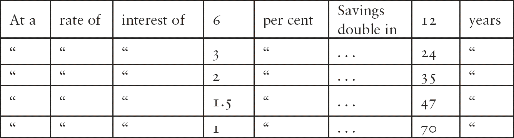

|  |  |  |  |  |  |  |  |
| --- | --- | --- | --- | --- | --- | --- | --- |
| At a | rate of | interest of | 6 | per cent | Savings double in | 12 | years |
| • | • | • | 3 | • | … | 24 | • |
| • | • | • | 2 | • | … | 35 | • |
| • | • | • | 1.5 | • | … | 47 | • |
| • | • | • | 1 | • | … | 70 | • |

When interest is at 6 per cent, savings double every twelve years. At 1 per cent, however, it takes seventy years for savings to double. Cassel believed that if the rate of interest fell below 1 per cent, saving would no longer be viable. Faced with such low returns, retirees could only maintain spending at the required level by consuming their capital.[6](#section-52) ‘If such a practice became general, it would have quite a disastrous effect,’ Cassel concluded, comforting himself that such an outcome was impossible.

In this chapter we show how the policy of ultra-low interest rates, which started with the Dotcom bust and was revived after the subprime crisis, reduced the level of saving in the United States and elsewhere. The collapse in interest rates also lowered the return on retirement investments and raised the value of retirement liabilities. As a result, a pensions crisis appeared in the United States and Europe. Retirees around the world faced the grim prospect of outliving their savings and dying in penury.

### A DEARTH OF SAVINGS

The notion of interest as the wage of abstinence found no favour with the legions of economists at the Federal Reserve. America’s central bank embarked on its easy money policy at the turn of the century without duly considering the impact on the country’s savers. Americans were encouraged to borrow and spend as if there were no tomorrow. Thanks to the buoyant housing market, homeowners got richer without experiencing the pain of abstinence. At the peak of the housing bubble, the US personal savings rate had fallen to just a third of its level a decade earlier.[7](#section-52)

As Americans saved less, they borrowed more from the future. Household debt soared as homeowners extracted trillions of dollars through home equity loans. Personal consumption hit a record high.[8](#section-52) The United States sported the largest current account deficit in its history – a signal that the country was spending far more than it earned.[9](#section-52) While Ben Bernanke at the Fed warned of a global ‘savings glut’, the United States was suffering a dearth of domestic savings. After the housing bubble burst, consumers found themselves saddled with too much debt. The United States appeared to be on the brink of a ‘balance sheet recession’, the name given to economic contractions that occur when overstretched borrowers cut spending to pay off their debts. Whereas Japan’s balance sheet recession of the 1990s saw companies reduce their leverage, now it was the turn of US households to tighten their belts.[10](#section-52)

Research showed that those parts of the country with the steepest decline in household net worth during the housing bust experienced the sharpest decline in consumer spending.[11](#section-52) The authorities pulled every fiscal and monetary lever to boost consumption. Washington ran trillion-dollar deficits and the Federal Reserve lowered interest rates to zero and sprayed money around Wall Street. The balance sheet recession was averted. But, as Nassau Senior might have predicted, the collapse in interest rates reduced incentives to abstain from consumption or save for the future. After 2008, the US net savings rate (which includes capital consumption) turned negative for the first time since the Great Depression. Personal savings picked up somewhat from the extremely low levels seen during the credit boom, but they remained low compared to the post-war average.[12](#section-52)

While borrowers benefited from the decline in interest rates, savers were pinched. After 2008, American depositors lost an estimated $400 billion a year in interest income.[13](#section-52) Before Lehman’s bankruptcy, interest payments accounted for a tenth of total household income. Three years later, the share of interest income was down by a third. Over the course of the post-crisis decade, American depositors fared worse than during the Great Inflation of the 1970s when real interest rates were on average higher. The economist’s term for holding short-term rates below the rate of inflation is ‘financial repression’. As James Grant commented, ‘what’s being repressed today is the standard of living.’[14](#section-52)

While saving rates varied across the developed world, the overall picture is consistent. In the United Kingdom, consumer debt soared in the decade prior to 2008. The financial crisis prompted households to tighten their belts, but not for long. ‘Austerity’ Britain produced a string of massive current account deficits in the 2010s – a sign that the country as a whole was consuming more than it earned.[15](#section-52) Household savings sank to their lowest recorded level in 2017.[16](#section-52) A correspondent writing to the *Financial Times* in July of that year suggested that ‘savings [in the United Kingdom] are at a 50-year low because savers for the past 10 years have been offered nearly zero rates of interest. So it is not surprising that eventually they give up and decide to spend their money.’[17](#section-52)

Canadian household savings also fell to a record low.[18](#section-52) In Australia, savings remained depressed while household debt continued rising.[19](#section-52) Even the world’s former ‘savings superpower’ lost its mojo. When the Bank of Japan first implemented its zero interest rate policy in 1999, Japanese workers were stashing away more than a tenth of their incomes. Over the following years, household savings fell remorselessly, turning negative in 2014.[20](#section-52) As one commentator put it: ‘In a world of ultra-low rates, most households have no hope of wealth accumulation, no matter how much they save. Indeed, they are better off being profligate.’[21](#section-52) Gustav Cassel would have agreed.

Occasional lone voices in the monetary policy establishment spoke out against the ultra-low rates. An economist at the St Louis Fed, Daniel Thornton, suggested that the loss of $400 billion a year suffered by US depositors served as a drag on consumption growth.[22](#section-52) In 2013, Bank of India governor Raghuram Rajan claimed that ‘lower real interest rates are contractionary – [since] savers put more money aside as interest rates fall in order to meet the saving they think they will need when they retire.’[23](#section-52) Cassel had made a similar point more than a century earlier. The Swedish economist suggested that were the rate of interest to fall below 3 per cent, the supply of savings might increase, since it was still just about possible to accumulate sufficient retirement capital over the course of a working life.

Not long after Rajan’s intervention, an ECB board member, Yves Mersch, warned that persistently low interest rates were forcing savers in some European countries to save more to accumulate the same amount of wealth as they would have done at a time of higher rates. Mersch pointed to a rise in the gross savings rate in Germany.[24](#section-52) There’s no question that the loss of savings income was deeply unpopular in that country, where nearly half of household financial assets were held on deposit.[25](#section-52) Negative interest rates were seen as a tax on savings. Germans referred to them as *Strafzinsen* – punishment rates. German Finance Minister Wolfgang Schäuble turned into one of the foremost critics of the ECB. In April 2016 Schäuble complained that negative interest rates were causing ‘extraordinary problems’ for his country’s pensioners and banks.[26](#section-52)

It wasn’t just German banks that suffered from the collapse in interest rates. European life insurers found themselves contracted to pay out more on their policies than their investments in the era of negative rates could safely yield. Just as Japan’s life industry was destroyed by falling interest rates in the 1990s, so Europe’s life companies were faced with insolvency.[27](#section-52) In 2015, the IMF warned that the failure of a single German life assurer ‘could engulf the financial system’.[28](#section-52) For one insurance executive the pressure proved too much. In December 2015, Martin Senn, the chief executive of the Zurich Insurance Group, stepped down after a string of profit warnings. Senn was suffering from depression and six months later committed suicide.[29](#section-52)

### THE WEALTH ILLUSION

If Americans complained less than Germans about the loss of interest income, it was because they were more likely to own their own home and to have direct exposure to the stock market. Germany, on the other hand, was a nation of renters and its citizens kept more of their savings on deposit. Thanks to the Federal Reserve, the S&P 500 soared, the US housing market recovered, and household wealth climbed to an all-time peak. This great inflation of paper wealth inured most Americans to the loss of deposit income.

The trouble is that soaring asset prices don’t make a nation any richer. They only produce the illusion of wealth. Investors enjoy capital gains when asset prices rise, but any immediate gains are offset by lower investment returns going forward. This is clearly the case for bond investors. When long-term interest rates decline, investors experience a windfall gain as bond prices increase. But since the bond’s coupon is fixed, investors who hold the security until it matures are no better off. In fact, bondholders as a class suffer when long-term rates decline since they must reinvest their coupons at lower yields.

Stock market investors are in a similar position. Over the long run, equity returns are inversely correlated with the market’s valuation. As with bonds, elevated stock prices imply lower future returns. In the United States, a balanced portfolio comprising of stocks and bonds has historically returned around 5 per cent after inflation.[30](#section-52) Ten years after the financial crisis, with the valuation of the US stock market at close to a record high and the yield on Treasuries near an all-time low, the expected return on a balanced investment portfolio was around half its historic average.[31](#section-52)

There was no getting away from it, American households would have to save more if they wanted to enjoy the same level of retirement income as earlier generations. This was not the worst of it. Commitments to pay cash to retirees are a liability to an institution that so promises. When interest rates decline, the current value of retirement liabilities increases – just as the market price of a bond increases when interest rates turn down. The steep decline in interest rates after 2008 produced what James Grant called a ‘bull market in liabilities’. Most people ignored this dismal state of affairs. Peter Fisher, a former Federal Reserve and Treasury official, explained how the wealth illusion took hold in the wake of the financial crisis:

> Because our financial assets are traded in markets and because we receive mutual fund and retirement account statements, we promptly saw the change [i.e. increase] in the value of our assets. We are much slower to appreciate the change in the present value of our liabilities, particularly the value of our future consumption expenditures.[32](#section-52)

Central bankers, who used monetary policy to boost asset prices and spur consumption while turning a blind eye to the adverse impact of their actions on savings, investment returns and retirement liabilities, also suffered from the wealth illusion. Not every central banker was blind to what was going on. Mervyn King, former Governor of the Bank of England, acknowledged that low interest rates discourage saving and that, as a result, household consumption would grow more slowly in future. Lord King referred to what he called the ‘paradox of policy’. Namely, that after the financial crisis, interest rates were ‘too high to permit rapid growth of demand in the short run, but too low to be consistent with a proper balance between spending and saving in the long run’.[33](#section-52) The problem, as he saw it, came down to different time horizons. Policy measures that seemed desirable in the short run were the opposite to what was needed in the long run. ‘Our market economy today,’ King concluded, ‘is not providing an effective link between the present and the future.’[34](#section-52)

Lord King was right, but the *market economy* itself was hardly to blame. As we have argued, it is interest that connects the present and the future; with interest rates set by central banks at the lowest level in history that link was effectively broken. Record levels of paper wealth encouraged households to carry on spending. But the illusion of wealth was inherently fragile. Monetary policymakers could only conjure up further capital gains by pushing interest rates ever lower. Any attempt to normalize rates would threaten the wealth bubble, bringing about a massive loss of household wealth. In the short run, ultra-low interest rates boosted consumption by substituting bubble wealth for savings, but in the long run it was a disaster. Savings are needed for the accumulation of capital. Societies that don’t invest enough are doomed to stagnate.

More than a century earlier, Gustav Cassel had anticipated that a rate of interest of 1 per cent or less would create ‘a revolution in … the total supply of waiting [i.e., savings]’.[35](#section-52) He was right. Ultra-low interest rates have produced this unwelcome revolution. Even Keynes, the avowed enemy of the rentier class and a tireless advocate for easy money, thought it unwise to reduce the rate of interest below 3 per cent. It was ‘socially desirable’, said Keynes, that savers should receive a positive return on their capital.[36](#section-52) As the Chairman of a life insurance company and Bursar of his Cambridge college, he spoke from a position of authority.

### PENSION WOES

Not only did falling interest rates discourage savings and reduce the expected return on savings, they also created headaches for prospective retirees and pension providers. On retirement, many people use their nest eggs to purchase an annuity that pays them a guaranteed income for life. The annuity itself is invested in government securities and other high-quality bonds. As bond yields fell after the financial crisis, the income provided by annuities declined in tandem. For instance, an annuity purchased in 2016 by a sixty-five-year-old American man paid a quarter less income than a decade earlier.[37](#section-52)

The pension industry is less prone to the wealth illusion than ordinary folk. That’s because actuaries must consider the present value of a pension fund’s liabilities when assessing whether it has sufficient assets to meet its obligations. To value those pension liabilities, the actuary applies a discount rate to the plan’s expected future cash outlays. The discount rate is taken from the yield on government bonds. After the financial crisis, the decline in long-term interest rates made existing pension commitments far more expensive and, in many cases, unaffordable.

Many pension providers that were committed to paying employees an agreed income on retirement (so-called ‘defined benefit’ plans) found that their liabilities exceeded assets. By 2016, the combined pension deficits of US public sector (state and local government) bodies had reached $3 trillion.[38](#section-52) American corporate pensions were in deficit to the tune of $425 billion. British corporate pensions were similarly underfunded.[39](#section-52) A Bank of England study found that the decline in interest rates was mostly responsible for ballooning pension deficits.[40](#section-52)

Growing pension deficits elicited various responses. For a start, pension providers had to put more cash into the pot. In the United States, cities and towns cut public services and sacked workers to shore up their pensions.[41](#section-52) Private companies in a similar position reduced investment and cut dividends.[42](#section-52) While most pension providers played it safe, buying long-dated bonds to match their liabilities, others rolled the dice – chasing higher returns with riskier investments and taking on more leverage.[fn2](#section-58) Even when pension plans earned decent returns and boosted cash contributions, their deficits continued to swell.[43](#section-52) Balancing the pension books in the era of ultra-low interest rates proved a Sisyphean task.

In desperation, some pension providers sought to reduce their promised benefits. In 2015, the Teamsters Central States pension plan, whose liabilities were estimated at more than twice its assets, petitioned the US Treasury to cut distributions to beneficiaries.[44](#section-52) It was turned down. At around the same date, Kansas City Central States announced massive cuts in its pension payments.[45](#section-52) A couple of years later, Britain’s Universities Superannuation Scheme attempted to reduce its benefits after announcing a multibillion-pound deficit. Furious college lecturers launched a nationwide strike in response.[46](#section-52)

Weighed down with pension liabilities, several municipalities and cities declared bankruptcy, among them Detroit and San Bernardino. Chicago’s credit rating was cut to junk in 2015 after a court ruled against a proposed cut in pension entitlements. The Commonwealth of Puerto Rico’s solvency crisis was due in large measure to its unfunded pension liabilities.[47](#section-52) Several US states found themselves in dire straits. Moody’s warned that pension deficits constituted the ‘largest cloud overhanging’ the multi-trillion dollar municipal bond market.[48](#section-52) Given that for political reasons the claims of pensioners took priority over other creditors, regardless of the strict legal position, municipal bond investors appeared poorly compensated for the pensions’ risk.[49](#section-52)

In the United Kingdom, the 2016 bankruptcy of a major high street retailer, British Home Stores, revealed a massive pensions shortfall. As BHS pensioners faced an uncertain future, the company’s owner, Sir Philip Green, took refuge on his newly delivered £100 million yacht, complete with helipad, hot tubs and swimming pool.[50](#section-52) In early 2018 a large UK construction company, Carillion, collapsed with its pension plan showing a deficit of hundreds of millions of pounds. The pension liabilities of these two bankrupt firms were assumed by the UK’s Pension Protection Fund, whose own liabilities far exceeded its assets. In the United States, the Pension Benefits Guarantee Corporation, the quasi-state body that insured corporate pensions, was itself close to bankruptcy.

Defined benefit pension plans everywhere were closed to new members. These traditional pensions, with their copper-bottomed promise of a given retirement income, were replaced by a less appetizing product. ‘Defined contribution’ pension schemes involved employers paying a certain amount of cash into their workers’ pension pots but gave no guaranteed income on retirement. These ‘DC’ pensions generally received lower employer contributions and delivered inferior investment returns. (Lower returns were due to higher management fees and inferior asset allocation.) Henceforth, workers in company pension schemes faced the prospect of reduced retirement incomes.

Naturally, large amounts of fudge obscured the full extent of the mounting crisis. In the United States, pension providers assumed unrealistically high returns on their plan investments.[51](#section-52) At the same time, the discount rate used to calculate their liabilities was held above the market rate of interest.[52](#section-52) To cap it all, the Internal Revenue Service permitted private pension plan providers to use outdated mortality assumptions, further understating liabilities.[53](#section-52) The widespread use of dubious pensions assumptions produced, in the words of one commentator, an ‘intertemporal accounting error’.[54](#section-52) Had more realistic assumptions been employed, many pension providers would have been found insolvent. In the short run, however, the fudge stuck.

Yet there was no hiding the fact that Americans were saving too little for retirement. A 2014 study by the Center for Retirement Research at Boston College found that median pension savings for Americans on the cusp of retirement amounted to just $111,000. Invested in an annuity, this pension pot would produce an annual retirement income well below $10,000. There was always the state pension to fall back upon. But even public pensions were no longer secure since tax revenues were growing more slowly. Unfunded pension commitments for OECD member countries were estimated (in 2016) to be twice as large as their reported national debts. Several European states acted to raise the legal retirement age.[55](#section-52) These initial reductions in state pensions were but a first step.

‘Over the last few decades, we have been conducting a large-scale social experiment with ultralow savings rates, without a strong safety net beneath the high-wire act,’ wrote economist Tyler Cowen.[56](#section-52) Michael Burry, the hedge fund manager featured in Michael Lewis’s *The Big Short*, put it more bluntly. ‘The zero interest-rate policy,’ said Burry, ‘broke the social contract for generations of hardworking Americans who saved for retirement, only to find their savings are not nearly enough.’[57](#section-52) An increasing number of Americans were forced to work beyond the traditional retirement age.[58](#section-52) For younger workers, the dream of enjoying a comfortable old age would remain a dream – another illusion of wealth.

Pensioners faced the prospect of their nest eggs running out. The World Economic Forum in 2019 observed that retirees on several continents were in danger of outliving their savings. The average American male retiree had enough savings for not quite ten years, leaving him eight years short. The ‘retirement gap’ for American women was close to eleven years. At least, Americans could be thankful not to be retiring in Japan, where the retirement gap was fifteen years for men and twenty years for women.[59](#section-52)

Alongside longevity risk, pension providers faced the prospect that further declines in interest rates would swell their deficits. In fact, their actions exacerbated this risk. Egged on by regulators, pension managers hedged interest-rate exposure by purchasing long-dated bonds. Given that the top three hundred pension funds held some $15 trillion-worth of assets, their massive bond purchases contributed to the decline in long-term interest rates.[60](#section-52) In the United Kingdom, liability hedging by corporate pension funds drove the yield on fifty-year inflation-linked gilts into negative territory.[61](#section-52) Thus, low rates begot a pensions crisis and the pensions crisis begot lower rates.

The pension world was caught between a rock and a hard place. In theory, higher interest rates would reduce pension liabilities. In practice, they would also hit the value of pension assets, making a bad problem even worse.[62](#section-52) Relief came from an unexpected quarter. A few years after the financial crisis, life expectancy in the United States and the United Kingdom ceased improving and briefly went into decline. If only this trend continued, a consultant gleefully pointed out, half of British corporate pension deficits would disappear.[63](#section-52)

Savers in the era of zero interest rates resembled Sumner’s Forgotten Man, suffering at the hands of policymakers who failed to consider the full consequences of their actions. One of the crueller consequences was ever-escalating life insurance contributions. In August 2016, the *New York Times* reported that life companies were hiking premiums for elderly American savers. Policyholders who couldn’t afford the increased payments faced the loss of all their previous contributions. The daughter of an elderly couple from Georgia, who had taken out a universal life policy and couldn’t afford the increased premiums, was told in all earnestness by the family’s financial adviser: ‘Please don’t take this the wrong way and, not to be morbid, but your mother needs to die.’ The couple eventually decided to walk away from their policy, waving goodbye to their life savings.[fn3](#section-58)

<!-- rl-section id="sec-chapter013" class="titlepage" title="13" -->

## Your Mother Needs to Die

> *Wipe out rentier*s *with cheap money.*
>
> Martin Wolf, 2014

We have seen in earlier chapters how interest affects both the valuation and allocation of capital. Interest also influences how much saving takes place. When people save for a rainy day or for retirement, they must consume less today. The exercise of thrift is not an easy task. Immediate pleasures generally rank higher than deferred gratification. As Oxford’s first Professor of Political Economy, Nassau Senior, put it in 1836: ‘To abstain from the enjoyment which is in our power, or to seek distant rather than immediate results, are among the most painful exertions of the human will.’[1](#section-52) Interest is *the wage of abstinence*, said Senior.

When Senior first suggested abstinence as a justification for interest, socialists everywhere scoffed. The German socialist leader Ferdinand Lassalle mocked:

> Interest is the ‘wage of renunciation!’ Felicitous word, priceless word! Your European millionaires are ascetics. Like Indian penitents they stand, like stylites on one foot atop a pillar, and pale of mien they lean over to stretch out an arm to the populace, holding forth a plate to receive the wage of their renunciation

Was the abstinence of Baron Rothschild so painful? Was the labourer who spent every penny of his meagre wages to support a large family so profligate? It was left to John Stuart Mill to point out that while the rich had enormous resources, ordinary people also saved a part of their incomes. Interest, said Mill, reflected the *marginal* pain of their abstinence. Perhaps *abstinence* is the wrong word. Saving takes place over time. ‘To save,’ wrote Frédéric Bastiat, ‘is deliberately to put an interval between the moment when the services are made for the society, and that when the equivalent is received from it.’[3](#section-52) The reward for this *ajournement* is interest.

Various commentators from Bentham onwards have treated interest as the difference in value between present and future consumption. As we have seen, the Marshmallow Test shows that at least a proportion of children, when faced with a choice between an immediate marshmallow or two marshmallows in future, are prepared to wait. The second marshmallow is waiting’s reward. Irving Fisher put it nicely when he wrote that ‘Interest is, as it were, human impatience crystallized into a market rate.’[4](#section-52) Economists talk about time preference rather than impatience to describe how people value present and future goods differently. An individual’s time preference can be seen as a kind of personal rate of interest.

Imagine that the present and future are two countries, separated by a river. Finance is the intertemporal bridge that joins them together, connecting the present with the future. By acts of borrowing and lending, and saving and investing, we shift expenditures across time. Interest is the toll levied on borrowers for bringing forward consumption and the fee paid to savers for moving consumption into the future.[fn1](#section-58) The level of interest regulates the traffic on the bridge and its general direction. When the interest toll is raised spending is pushed into the future, and consumption is brought forward when the toll is lowered. In an ideal world, people should save enough to meet their future needs, but not so much that current spending is depressed. Under such circumstances, the traffic across the bridge is orderly in both directions.

This delicate balance is upset when the market rate of interest falls below society’s ‘crystallized impatience’. When the interest rate is higher than an individual’s time preference, he or she will save more for the future. Conversely, when the market rate is below the public’s time preference people borrow to consume. An abnormally low rate of interest boosts current spending, but the benefits don’t last. You cannot have your cake and eat it, at least not indefinitely. Cake is not the only item on the menu. People have a choice: jam today or more jam tomorrow. The rate of interest influences their decision. Here’s how development economist William Easterly puts it:

> Becoming rich is a choice between today’s consumption and tomorrow’s. If I cut my consumption sharply and save a large proportion of my wage income, then in a few years I will be richer because I will have both wage income and the interest earnings on my savings. If I consume all of my wage earnings, then I will have just my wage earnings forever onward.[5](#section-52)

A nice feature of the interest bonus, at least for the saver, is that it compounds over time. Thus, a small amount of savings grows larger with every passing year. Thanks to interest, money bears fruit. As Benjamin Franklin wrote in his *Advice to a Young Tradesman*, ‘Money is of a prolific generating Nature. Money can beget Money, and its Offspring can beget more, and so on.’ In his book *The Nature and Necessity of Interest* (1903), the Swedish economist Gustav Cassel published a table showing, at different rates of interest, how many years were required for a given amount of savings to double:

|  |  |  |  |  |  |  |  |
| --- | --- | --- | --- | --- | --- | --- | --- |
| At a | rate of | interest of | 6 | per cent | Savings double in | 12 | years |
| • | • | • | 3 | • | … | 24 | • |
| • | • | • | 2 | • | … | 35 | • |
| • | • | • | 1.5 | • | … | 47 | • |
| • | • | • | 1 | • | … | 70 | • |

When interest is at 6 per cent, savings double every twelve years. At 1 per cent, however, it takes seventy years for savings to double. Cassel believed that if the rate of interest fell below 1 per cent, saving would no longer be viable. Faced with such low returns, retirees could only maintain spending at the required level by consuming their capital.[6](#section-52) ‘If such a practice became general, it would have quite a disastrous effect,’ Cassel concluded, comforting himself that such an outcome was impossible.

In this chapter we show how the policy of ultra-low interest rates, which started with the Dotcom bust and was revived after the subprime crisis, reduced the level of saving in the United States and elsewhere. The collapse in interest rates also lowered the return on retirement investments and raised the value of retirement liabilities. As a result, a pensions crisis appeared in the United States and Europe. Retirees around the world faced the grim prospect of outliving their savings and dying in penury.

### A DEARTH OF SAVINGS

The notion of interest as the wage of abstinence found no favour with the legions of economists at the Federal Reserve. America’s central bank embarked on its easy money policy at the turn of the century without duly considering the impact on the country’s savers. Americans were encouraged to borrow and spend as if there were no tomorrow. Thanks to the buoyant housing market, homeowners got richer without experiencing the pain of abstinence. At the peak of the housing bubble, the US personal savings rate had fallen to just a third of its level a decade earlier.[7](#section-52)

As Americans saved less, they borrowed more from the future. Household debt soared as homeowners extracted trillions of dollars through home equity loans. Personal consumption hit a record high.[8](#section-52) The United States sported the largest current account deficit in its history – a signal that the country was spending far more than it earned.[9](#section-52) While Ben Bernanke at the Fed warned of a global ‘savings glut’, the United States was suffering a dearth of domestic savings. After the housing bubble burst, consumers found themselves saddled with too much debt. The United States appeared to be on the brink of a ‘balance sheet recession’, the name given to economic contractions that occur when overstretched borrowers cut spending to pay off their debts. Whereas Japan’s balance sheet recession of the 1990s saw companies reduce their leverage, now it was the turn of US households to tighten their belts.[10](#section-52)

Research showed that those parts of the country with the steepest decline in household net worth during the housing bust experienced the sharpest decline in consumer spending.[11](#section-52) The authorities pulled every fiscal and monetary lever to boost consumption. Washington ran trillion-dollar deficits and the Federal Reserve lowered interest rates to zero and sprayed money around Wall Street. The balance sheet recession was averted. But, as Nassau Senior might have predicted, the collapse in interest rates reduced incentives to abstain from consumption or save for the future. After 2008, the US net savings rate (which includes capital consumption) turned negative for the first time since the Great Depression. Personal savings picked up somewhat from the extremely low levels seen during the credit boom, but they remained low compared to the post-war average.[12](#section-52)

While borrowers benefited from the decline in interest rates, savers were pinched. After 2008, American depositors lost an estimated $400 billion a year in interest income.[13](#section-52) Before Lehman’s bankruptcy, interest payments accounted for a tenth of total household income. Three years later, the share of interest income was down by a third. Over the course of the post-crisis decade, American depositors fared worse than during the Great Inflation of the 1970s when real interest rates were on average higher. The economist’s term for holding short-term rates below the rate of inflation is ‘financial repression’. As James Grant commented, ‘what’s being repressed today is the standard of living.’[14](#section-52)

While saving rates varied across the developed world, the overall picture is consistent. In the United Kingdom, consumer debt soared in the decade prior to 2008. The financial crisis prompted households to tighten their belts, but not for long. ‘Austerity’ Britain produced a string of massive current account deficits in the 2010s – a sign that the country as a whole was consuming more than it earned.[15](#section-52) Household savings sank to their lowest recorded level in 2017.[16](#section-52) A correspondent writing to the *Financial Times* in July of that year suggested that ‘savings [in the United Kingdom] are at a 50-year low because savers for the past 10 years have been offered nearly zero rates of interest. So it is not surprising that eventually they give up and decide to spend their money.’[17](#section-52)

Canadian household savings also fell to a record low.[18](#section-52) In Australia, savings remained depressed while household debt continued rising.[19](#section-52) Even the world’s former ‘savings superpower’ lost its mojo. When the Bank of Japan first implemented its zero interest rate policy in 1999, Japanese workers were stashing away more than a tenth of their incomes. Over the following years, household savings fell remorselessly, turning negative in 2014.[20](#section-52) As one commentator put it: ‘In a world of ultra-low rates, most households have no hope of wealth accumulation, no matter how much they save. Indeed, they are better off being profligate.’[21](#section-52) Gustav Cassel would have agreed.

Occasional lone voices in the monetary policy establishment spoke out against the ultra-low rates. An economist at the St Louis Fed, Daniel Thornton, suggested that the loss of $400 billion a year suffered by US depositors served as a drag on consumption growth.[22](#section-52) In 2013, Bank of India governor Raghuram Rajan claimed that ‘lower real interest rates are contractionary – [since] savers put more money aside as interest rates fall in order to meet the saving they think they will need when they retire.’[23](#section-52) Cassel had made a similar point more than a century earlier. The Swedish economist suggested that were the rate of interest to fall below 3 per cent, the supply of savings might increase, since it was still just about possible to accumulate sufficient retirement capital over the course of a working life.

Not long after Rajan’s intervention, an ECB board member, Yves Mersch, warned that persistently low interest rates were forcing savers in some European countries to save more to accumulate the same amount of wealth as they would have done at a time of higher rates. Mersch pointed to a rise in the gross savings rate in Germany.[24](#section-52) There’s no question that the loss of savings income was deeply unpopular in that country, where nearly half of household financial assets were held on deposit.[25](#section-52) Negative interest rates were seen as a tax on savings. Germans referred to them as *Strafzinsen* – punishment rates. German Finance Minister Wolfgang Schäuble turned into one of the foremost critics of the ECB. In April 2016 Schäuble complained that negative interest rates were causing ‘extraordinary problems’ for his country’s pensioners and banks.[26](#section-52)

It wasn’t just German banks that suffered from the collapse in interest rates. European life insurers found themselves contracted to pay out more on their policies than their investments in the era of negative rates could safely yield. Just as Japan’s life industry was destroyed by falling interest rates in the 1990s, so Europe’s life companies were faced with insolvency.[27](#section-52) In 2015, the IMF warned that the failure of a single German life assurer ‘could engulf the financial system’.[28](#section-52) For one insurance executive the pressure proved too much. In December 2015, Martin Senn, the chief executive of the Zurich Insurance Group, stepped down after a string of profit warnings. Senn was suffering from depression and six months later committed suicide.[29](#section-52)

### THE WEALTH ILLUSION

If Americans complained less than Germans about the loss of interest income, it was because they were more likely to own their own home and to have direct exposure to the stock market. Germany, on the other hand, was a nation of renters and its citizens kept more of their savings on deposit. Thanks to the Federal Reserve, the S&P 500 soared, the US housing market recovered, and household wealth climbed to an all-time peak. This great inflation of paper wealth inured most Americans to the loss of deposit income.

The trouble is that soaring asset prices don’t make a nation any richer. They only produce the illusion of wealth. Investors enjoy capital gains when asset prices rise, but any immediate gains are offset by lower investment returns going forward. This is clearly the case for bond investors. When long-term interest rates decline, investors experience a windfall gain as bond prices increase. But since the bond’s coupon is fixed, investors who hold the security until it matures are no better off. In fact, bondholders as a class suffer when long-term rates decline since they must reinvest their coupons at lower yields.

Stock market investors are in a similar position. Over the long run, equity returns are inversely correlated with the market’s valuation. As with bonds, elevated stock prices imply lower future returns. In the United States, a balanced portfolio comprising of stocks and bonds has historically returned around 5 per cent after inflation.[30](#section-52) Ten years after the financial crisis, with the valuation of the US stock market at close to a record high and the yield on Treasuries near an all-time low, the expected return on a balanced investment portfolio was around half its historic average.[31](#section-52)

There was no getting away from it, American households would have to save more if they wanted to enjoy the same level of retirement income as earlier generations. This was not the worst of it. Commitments to pay cash to retirees are a liability to an institution that so promises. When interest rates decline, the current value of retirement liabilities increases – just as the market price of a bond increases when interest rates turn down. The steep decline in interest rates after 2008 produced what James Grant called a ‘bull market in liabilities’. Most people ignored this dismal state of affairs. Peter Fisher, a former Federal Reserve and Treasury official, explained how the wealth illusion took hold in the wake of the financial crisis:

> Because our financial assets are traded in markets and because we receive mutual fund and retirement account statements, we promptly saw the change [i.e. increase] in the value of our assets. We are much slower to appreciate the change in the present value of our liabilities, particularly the value of our future consumption expenditures.[32](#section-52)

Central bankers, who used monetary policy to boost asset prices and spur consumption while turning a blind eye to the adverse impact of their actions on savings, investment returns and retirement liabilities, also suffered from the wealth illusion. Not every central banker was blind to what was going on. Mervyn King, former Governor of the Bank of England, acknowledged that low interest rates discourage saving and that, as a result, household consumption would grow more slowly in future. Lord King referred to what he called the ‘paradox of policy’. Namely, that after the financial crisis, interest rates were ‘too high to permit rapid growth of demand in the short run, but too low to be consistent with a proper balance between spending and saving in the long run’.[33](#section-52) The problem, as he saw it, came down to different time horizons. Policy measures that seemed desirable in the short run were the opposite to what was needed in the long run. ‘Our market economy today,’ King concluded, ‘is not providing an effective link between the present and the future.’[34](#section-52)

Lord King was right, but the *market economy* itself was hardly to blame. As we have argued, it is interest that connects the present and the future; with interest rates set by central banks at the lowest level in history that link was effectively broken. Record levels of paper wealth encouraged households to carry on spending. But the illusion of wealth was inherently fragile. Monetary policymakers could only conjure up further capital gains by pushing interest rates ever lower. Any attempt to normalize rates would threaten the wealth bubble, bringing about a massive loss of household wealth. In the short run, ultra-low interest rates boosted consumption by substituting bubble wealth for savings, but in the long run it was a disaster. Savings are needed for the accumulation of capital. Societies that don’t invest enough are doomed to stagnate.

More than a century earlier, Gustav Cassel had anticipated that a rate of interest of 1 per cent or less would create ‘a revolution in … the total supply of waiting [i.e., savings]’.[35](#section-52) He was right. Ultra-low interest rates have produced this unwelcome revolution. Even Keynes, the avowed enemy of the rentier class and a tireless advocate for easy money, thought it unwise to reduce the rate of interest below 3 per cent. It was ‘socially desirable’, said Keynes, that savers should receive a positive return on their capital.[36](#section-52) As the Chairman of a life insurance company and Bursar of his Cambridge college, he spoke from a position of authority.

### PENSION WOES

Not only did falling interest rates discourage savings and reduce the expected return on savings, they also created headaches for prospective retirees and pension providers. On retirement, many people use their nest eggs to purchase an annuity that pays them a guaranteed income for life. The annuity itself is invested in government securities and other high-quality bonds. As bond yields fell after the financial crisis, the income provided by annuities declined in tandem. For instance, an annuity purchased in 2016 by a sixty-five-year-old American man paid a quarter less income than a decade earlier.[37](#section-52)

The pension industry is less prone to the wealth illusion than ordinary folk. That’s because actuaries must consider the present value of a pension fund’s liabilities when assessing whether it has sufficient assets to meet its obligations. To value those pension liabilities, the actuary applies a discount rate to the plan’s expected future cash outlays. The discount rate is taken from the yield on government bonds. After the financial crisis, the decline in long-term interest rates made existing pension commitments far more expensive and, in many cases, unaffordable.

Many pension providers that were committed to paying employees an agreed income on retirement (so-called ‘defined benefit’ plans) found that their liabilities exceeded assets. By 2016, the combined pension deficits of US public sector (state and local government) bodies had reached $3 trillion.[38](#section-52) American corporate pensions were in deficit to the tune of $425 billion. British corporate pensions were similarly underfunded.[39](#section-52) A Bank of England study found that the decline in interest rates was mostly responsible for ballooning pension deficits.[40](#section-52)

Growing pension deficits elicited various responses. For a start, pension providers had to put more cash into the pot. In the United States, cities and towns cut public services and sacked workers to shore up their pensions.[41](#section-52) Private companies in a similar position reduced investment and cut dividends.[42](#section-52) While most pension providers played it safe, buying long-dated bonds to match their liabilities, others rolled the dice – chasing higher returns with riskier investments and taking on more leverage.[fn2](#section-58) Even when pension plans earned decent returns and boosted cash contributions, their deficits continued to swell.[43](#section-52) Balancing the pension books in the era of ultra-low interest rates proved a Sisyphean task.

In desperation, some pension providers sought to reduce their promised benefits. In 2015, the Teamsters Central States pension plan, whose liabilities were estimated at more than twice its assets, petitioned the US Treasury to cut distributions to beneficiaries.[44](#section-52) It was turned down. At around the same date, Kansas City Central States announced massive cuts in its pension payments.[45](#section-52) A couple of years later, Britain’s Universities Superannuation Scheme attempted to reduce its benefits after announcing a multibillion-pound deficit. Furious college lecturers launched a nationwide strike in response.[46](#section-52)

Weighed down with pension liabilities, several municipalities and cities declared bankruptcy, among them Detroit and San Bernardino. Chicago’s credit rating was cut to junk in 2015 after a court ruled against a proposed cut in pension entitlements. The Commonwealth of Puerto Rico’s solvency crisis was due in large measure to its unfunded pension liabilities.[47](#section-52) Several US states found themselves in dire straits. Moody’s warned that pension deficits constituted the ‘largest cloud overhanging’ the multi-trillion dollar municipal bond market.[48](#section-52) Given that for political reasons the claims of pensioners took priority over other creditors, regardless of the strict legal position, municipal bond investors appeared poorly compensated for the pensions’ risk.[49](#section-52)

In the United Kingdom, the 2016 bankruptcy of a major high street retailer, British Home Stores, revealed a massive pensions shortfall. As BHS pensioners faced an uncertain future, the company’s owner, Sir Philip Green, took refuge on his newly delivered £100 million yacht, complete with helipad, hot tubs and swimming pool.[50](#section-52) In early 2018 a large UK construction company, Carillion, collapsed with its pension plan showing a deficit of hundreds of millions of pounds. The pension liabilities of these two bankrupt firms were assumed by the UK’s Pension Protection Fund, whose own liabilities far exceeded its assets. In the United States, the Pension Benefits Guarantee Corporation, the quasi-state body that insured corporate pensions, was itself close to bankruptcy.

Defined benefit pension plans everywhere were closed to new members. These traditional pensions, with their copper-bottomed promise of a given retirement income, were replaced by a less appetizing product. ‘Defined contribution’ pension schemes involved employers paying a certain amount of cash into their workers’ pension pots but gave no guaranteed income on retirement. These ‘DC’ pensions generally received lower employer contributions and delivered inferior investment returns. (Lower returns were due to higher management fees and inferior asset allocation.) Henceforth, workers in company pension schemes faced the prospect of reduced retirement incomes.

Naturally, large amounts of fudge obscured the full extent of the mounting crisis. In the United States, pension providers assumed unrealistically high returns on their plan investments.[51](#section-52) At the same time, the discount rate used to calculate their liabilities was held above the market rate of interest.[52](#section-52) To cap it all, the Internal Revenue Service permitted private pension plan providers to use outdated mortality assumptions, further understating liabilities.[53](#section-52) The widespread use of dubious pensions assumptions produced, in the words of one commentator, an ‘intertemporal accounting error’.[54](#section-52) Had more realistic assumptions been employed, many pension providers would have been found insolvent. In the short run, however, the fudge stuck.

Yet there was no hiding the fact that Americans were saving too little for retirement. A 2014 study by the Center for Retirement Research at Boston College found that median pension savings for Americans on the cusp of retirement amounted to just $111,000. Invested in an annuity, this pension pot would produce an annual retirement income well below $10,000. There was always the state pension to fall back upon. But even public pensions were no longer secure since tax revenues were growing more slowly. Unfunded pension commitments for OECD member countries were estimated (in 2016) to be twice as large as their reported national debts. Several European states acted to raise the legal retirement age.[55](#section-52) These initial reductions in state pensions were but a first step.

‘Over the last few decades, we have been conducting a large-scale social experiment with ultralow savings rates, without a strong safety net beneath the high-wire act,’ wrote economist Tyler Cowen.[56](#section-52) Michael Burry, the hedge fund manager featured in Michael Lewis’s *The Big Short*, put it more bluntly. ‘The zero interest-rate policy,’ said Burry, ‘broke the social contract for generations of hardworking Americans who saved for retirement, only to find their savings are not nearly enough.’[57](#section-52) An increasing number of Americans were forced to work beyond the traditional retirement age.[58](#section-52) For younger workers, the dream of enjoying a comfortable old age would remain a dream – another illusion of wealth.

Pensioners faced the prospect of their nest eggs running out. The World Economic Forum in 2019 observed that retirees on several continents were in danger of outliving their savings. The average American male retiree had enough savings for not quite ten years, leaving him eight years short. The ‘retirement gap’ for American women was close to eleven years. At least, Americans could be thankful not to be retiring in Japan, where the retirement gap was fifteen years for men and twenty years for women.[59](#section-52)

Alongside longevity risk, pension providers faced the prospect that further declines in interest rates would swell their deficits. In fact, their actions exacerbated this risk. Egged on by regulators, pension managers hedged interest-rate exposure by purchasing long-dated bonds. Given that the top three hundred pension funds held some $15 trillion-worth of assets, their massive bond purchases contributed to the decline in long-term interest rates.[60](#section-52) In the United Kingdom, liability hedging by corporate pension funds drove the yield on fifty-year inflation-linked gilts into negative territory.[61](#section-52) Thus, low rates begot a pensions crisis and the pensions crisis begot lower rates.

The pension world was caught between a rock and a hard place. In theory, higher interest rates would reduce pension liabilities. In practice, they would also hit the value of pension assets, making a bad problem even worse.[62](#section-52) Relief came from an unexpected quarter. A few years after the financial crisis, life expectancy in the United States and the United Kingdom ceased improving and briefly went into decline. If only this trend continued, a consultant gleefully pointed out, half of British corporate pension deficits would disappear.[63](#section-52)

Savers in the era of zero interest rates resembled Sumner’s Forgotten Man, suffering at the hands of policymakers who failed to consider the full consequences of their actions. One of the crueller consequences was ever-escalating life insurance contributions. In August 2016, the *New York Times* reported that life companies were hiking premiums for elderly American savers. Policyholders who couldn’t afford the increased payments faced the loss of all their previous contributions. The daughter of an elderly couple from Georgia, who had taken out a universal life policy and couldn’t afford the increased premiums, was told in all earnestness by the family’s financial adviser: ‘Please don’t take this the wrong way and, not to be morbid, but your mother needs to die.’ The couple eventually decided to walk away from their policy, waving goodbye to their life savings.[fn3](#section-58)

<!-- rl-section id="section-27" class="epub-section" kicker="Section 27" title="14" -->

## 14

## Let Them Eat Credit

> *For whosoever hath, to him shall be given, and he shall have more abundance: but whosoever hath not, from him shall be taken away even that he hath.*
>
> Matthew 13:12
>
> *Never in the field of monetary policy was so much gained by so few at the expense of so many.*
>
> Michael Hartnett, 2015[1](#section-52)

From the earliest times, the taking of interest has been seen as exploitative. In Lagash, the Mesopotamian city where compound interest was first recorded in the third millennium BC, aristocrats lent at such high rates that borrowers lost their land and sometimes their freedom too.[2](#section-52) Debtors weighed down with interest suffered similar fates throughout the Ancient Near East. It’s no wonder that the Israelites referred to interest as a ‘bite’ (*neschek*) and Greek philosophers condemned it.[fn1](#section-58) Karl Marx was at his most conventional when he described how usury in Ancient Rome consumed the entire surplus, enabling patricians to suck dry and enslave small producers and peasants: ‘Usurer’s capital,’ he wrote in *Das Kapital*, ‘impoverishes the mode of production, paralyses the productive forces instead of developing them, and at the same time perpetuates the miserable conditions.’[3](#section-52) Usury, Marx continued, ‘does not alter the mode of production, but attaches itself firmly to it like a parasite and makes it wretched. It sucks out its blood, enervates it and compels reproduction to proceed under ever more pitiable conditions.’[4](#section-52) In 1894, the first protest march on Washington, DC, by what became known as Coxey’s Army, carried a banner with the slogan, ‘Good will to men, but death to interest-bearing bonds.’

Traditional views on usury have survived into the twenty-first century. As we have seen, the Archbishop of Canterbury in 2013 launched a ‘war on Wonga’, a British payday lender that, in the primate’s opinion, took advantage of needy borrowers. (In fact, Wonga didn’t charge enough interest to cover bad debts and soon went bankrupt.) The following year, Pope Francis decried usury as inhuman cruelty. The Extinction Rebellion climate-change activists holding up the London traffic in the summer of 2019 demanded, among other things, the abolition of interest.

Interest arises out of inequality, and also affects the distribution of income and wealth. Righteous denunciations of usury, however, conceal a more complicated picture. In ancient times usury served to worsen inequality, as Marx suggested. But the extent to which interest aggravates inequality depends on the nature of the economic system and on the identity of borrowers and lenders. In traditional societies, usury is often practised on those in desperate need, such as peasant farmers. But taking interest in a modern capitalist economy isn’t always unfair. The historian R. H. Tawney described the changing attitudes to usury in sixteenth-century England:

> The theory of usury had been designed for an age in which the lender was rich and the borrower poor. Now the borrower was often a merchant who raised a loan in order to speculate on the exchanges or to corner the wool crop, and the lender an economic innocent, who sought a secure investment for his savings.[5](#section-52)

As we saw in [Chapter 2](#section-14), the social acceptance of interest is based on the premise that a lender shouldn’t be forced to part with his capital without some reward, especially when the borrower uses the loan to earn a profit. Marx may have excoriated usury in the ancient world, but he also understood that interest in a capitalist world was different. Interest under capitalism, he said, should be viewed as a division of the economic surplus between lenders (whom he called ‘money capitalists’) and borrowers (‘industrial capitalists’). A decline in interest rates didn’t necessarily benefit workers, Marx wrote, since ‘interest is a relationship between two capitalists, not between capitalist and labourer.’[6](#section-52)

Irving Fisher denied that there existed any clear division between capitalists, workers, landlords and entrepreneurs. As borrowers and lenders, these different classes overlapped and the incomes of each were affected by interest.[7](#section-52) Nor is it the case that lenders are invariably richer than borrowers. In the modern world, many less well-off families have bank deposits and insurance policies while the rich are often heavily in debt.[8](#section-52) As Locke pointed out in the seventeenth century, ‘widows and orphans’ suffer when interest rates decline. Since the less well-off are forced to keep a greater share of their wealth in cash to meet emergencies, they suffer a disproportionate loss of deposit income when interest rates decline.[9](#section-52)

Since Josiah Child’s day, the business world has always advocated for easy money – as Child’s contemporary Daniel Defoe wrote, the ‘interest of money is a canker-worm upon the tradesman’s profit.’ There is another class involved in the fight over interest. Investment bankers and other financiers are often large borrowers. The financial world is divided between mighty borrowers and powerless lenders, great whales feed off the savings plankton. As Justice Brandeis observed, Wall Street uses other people’s money, and the less it pays for this use the greater its profits.

The question of interest has always been about justice, defined by St Augustine as a ‘virtue which renders to everyone his due’.[10](#section-52) Distributive justice requires that borrowers and lenders receive an equivalence of value. Usury is defined as the charging of excessive interest. But no word exists to describe too little interest. Nevertheless, justice is violated when lenders receive little or nothing while borrowers make fat profits from their loans. An equitable rate of interest is one that is neither too high *nor* too low. When the scales are tipped too far in the direction of low interest rates it’s plain unfair.

### *CUI BONO?*

It is no coincidence that the greatest fortunes have been gained during periods of abnormally low interest rates. In late sixteenth-century Europe, the entire wealth of Augsburg, a free city of the Holy Roman Empire, was concentrated in a few hands, mainly in those of the banker Jakob Fugger. The ‘astonishing feature’ of this era was ‘the lowness of the discount rates’.[11](#section-52) Fugger, described in a recent biography as ‘the richest man who ever lived’, earned his fortune by borrowing at rates of interest as low as 2 per cent, and lending the money onwards, mostly to Habsburg emperors, at 10 per cent or more.[12](#section-52) The magic of compound interest over more than three decades made Fugger, in the words of his epitaph, ‘second to none in the acquisition of extraordinary wealth’.

At the height of his fortune in 1720, John Law considered himself to be the richest person in history. As we have seen, the Scotsman’s wealth peaked at a time when interest rates in France had fallen to 2 per cent while shares in his Mississippi Company traded at fifty times earnings (a 2 per cent earnings yield). John D. Rockefeller has an even better claim than Law to be considered the wealthiest man in history. The fortunes of the robber barons, such as Rockefeller, were amassed in the late nineteenth century when falling interest rates boosted the ratio of American wealth to incomes.[13](#section-52) Prior to the Great War, the Standard Oil boss was worth 2.6 million times the average annual working American’s wage.[14](#section-52) When the banker Pierpont Morgan died in 1913, leaving an estate valued at $80 million, Rockefeller commented: ‘and to think he wasn’t even a rich man.’[15](#section-52)

A little more than a century later, Amazon’s founder Jeff Bezos outdid the mighty Rockefeller with a fortune estimated at more than $200 billion – some 3.5 million times the average American’s income at the time.[16](#section-52) On the day the internet tycoon achieved this milestone, the Fed funds rate was firmly stuck at zero. Boosted by the low prevailing discount rate, Amazon shares traded on a price-earnings ratio above 100 times, more than twice the peak valuation of Law’s Mississippi Company.

### FINANCIALIZATION AND INEQUALITY

In their history of inequality in the United States, *Unequal Gains*, Peter Lindert and Jeffrey Williamson suggest that inequality picks up when financial development outpaces economic growth.[17](#section-52) As we have seen, the continuous decline in interest rates towards the end of the nineteenth century drove the ‘Morganization’ of American industry, earning vast fortunes for Wall Street bankers. Over the course of the nineteenth century the richest Americans greatly increased their share of wealth, with gains concentrated at the very top of the pyramid.[18](#section-52)

The connection between financialization and inequality resurfaced in the 1920s. As the US financial sector expanded over the course of the decade, an increasing share of income derived from capital gains, realized from the booming stock market. A mere tenth of Americans grabbed more than half of total income – a level not seen again until the end of the century.[19](#section-52) Wealth inequality also increased, with the top percentile taking the lion’s share of the gains.[20](#section-52) The Hamptons sprouted palatial new residences, while ‘the whole upper tenth of a nation [was] living with the insouciance of *grand ducs* and the casualness of chorus girls’, to quote F. Scott Fitzgerald (*Echoes of the Jazz Age*).

The Great Depression kicked off a multi-decade decline in inequality, what economists refer to as the Great Compression. The turning point came in the early 1980s, as falling interest rates inaugurated a decades-long bull market in stocks and bonds. Wall Street’s fortunes recovered. The leverage buyout industry emerged, minting fortunes for the founders of private equity firms and junk bond issuers, such as Michael Milken of Drexel Burnham Lambert. Interest rates continued declining in the 1990s. Over the course of that decade, ‘inequality went up mainly because of rising stock prices, asset valuations and the incomes drawn from stock option realizations and capital gains, as well as wages and salaries paid in sectors that were financed by new equity.’[21](#section-52)

During the Dotcom bubble changes in income inequality were correlated with movements in the Nasdaq index of technology stocks, with most income gains clustered around Silicon Valley and Wall Street, the epicentres of the bubble.[22](#section-52) The final stage of the bubble occurred after the Fed’s rate cut in the fall of 1998. This period marked the apogee of Chairman Greenspan’s popularity on Wall Street. The collapse of the Nasdaq index inaugurated further rate cuts, accompanied by another surge in inequality. Between 2002 and 2007, total US household wealth soared by the equivalent of 100 per cent of GDP – roughly the same increase as in the 1920s. The rising stock market inflated senior executive pay, bankers’ bonuses and hedge fund fees. By 2008, the income share of the top decile was back at its 1929 peak.[23](#section-52) As in the 1920s, the very richest Americans (the top 0.1 per cent) laid claim to nearly a fifth of total household assets.[fn2](#section-58)

Since the financial sector employs fewer workers relative to its share of national income, its expansion during the credit boom exacerbated income inequality.[24](#section-52) Between 1997 and 2007, the revenues of American fund managers – highly leveraged to the stock market – rose from less than 1 per cent to 2.5 per cent of GDP. By the latter date, top hedge fund managers were earning more than $1 billion a year.[25](#section-52) Inequality trickled down from the top: ‘Although soaring executive compensation and the “financialization” of the economy,’ writes Stanford historian Walter Scheidel, ‘are directly responsible for only some of the recent growth in top incomes, their influence on other sectors such as law and medicine has amplified their disequalizing effect.’[26](#section-52)

During Dotcom and real estate bubbles, the pay gap between graduates and other workers became more pronounced.[27](#section-52) As the financial sector expanded, the ‘skill premium’ earned by college graduates climbed.[28](#section-52) On the eve of the global financial crisis, finance workers enjoyed a 50 per cent income premium, adjusted for educational attainment. In 2007, more than a quarter of Harvard graduates applied for jobs on Wall Street.[29](#section-52) The Ivy Leaguers were smart enough to know where their skills would be most generously rewarded, even if their timing left something to be desired.

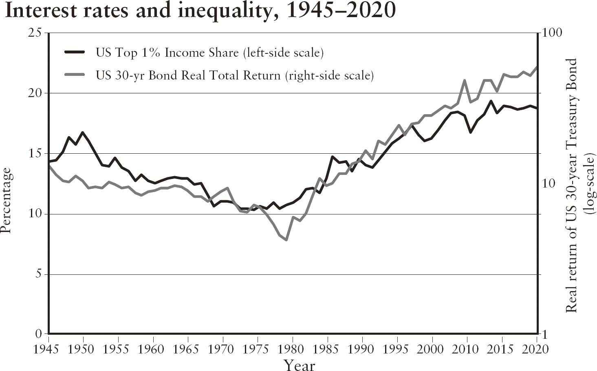

[10.](#section-9) The period of falling bond yields (rising bond returns) since the early 1980s has been accompanied by rising income and wealth inequality.

Some economists believe that inequality played a key role in the build-up to the financial crisis. The policymakers’ attitude to blue-collar and non-finance workers’ stagnant incomes at the turn of the century, said Raghuram Rajan, was ‘let them eat credit’.[30](#section-52) Consumption growth was maintained by lowering interest rates and boosting the supply of credit to low-income households. Credit expansion fuelled a housing bubble, enabling Americans to extract equity from their homes to cover living expenses. ‘There is absolutely no doubt that the increase of inequality in the United States contributed to the nation’s financial instability,’ according to the French economist Thomas Piketty.[31](#section-52)

Inequality features prominently in most accounts of secular stagnation.[32](#section-52) The rising gap between the top 1 per cent and the rest of the population is said to have contributed to the economic slowdown. The fact that the super rich consume proportionately less of any income gains explained the lacklustre growth in consumer spending.[33](#section-52) Economists at the Bank of England suggested that rising inequality forced poorer households to save more and discouraged business investment.[34](#section-52) (In fact, as we have seen, American and British households on average saved less than in the past.) Some commentators maintain that rising inequality was responsible for the decline in interest rates. According to economics blogger Steve Waldman, ‘The behavior of real interest rates is the empirical fingerprint of the effect of inequality on demand … growing inequality required ever greater inducement of ever less solvent households to borrow in order to sustain adequate demand, and central banks delivered.’[35](#section-52)

This may be so. But the relationship between inequality and interest rates runs in both directions. As we have seen, inequality in the United States only took off *after* interest rates started to fall in the 1980s. In the wake of the Dotcom bust, easy money inflated a wealth bubble, and the wealth bubble exacerbated inequality. The rise in inequality, in turn, lowered the economy’s growth prospects, and as the economy stagnated, so did workers’ incomes. In other words, low rates begot inequality and inequality begot lower rates.

### THE 1 PER CENT

The aftermath of the global financial crisis could scarcely have been more different to the post-1929 experience. A second Great Depression was avoided, but so too was another Great Compression. Unconventional monetary policies arrested Wall Street’s collapse. Bondholders were bailed out. Financial insiders with access to the Fed’s emergency lending facilities got to buy up distressed securities at bargain prices with subsidized loans. Despite record losses on Wall Street, billions of dollars in bonuses were distributed. The Fed, writes Philip Mirowski, ‘bestowed upon the banks seemingly permanent options to reward executives and shareholders by capping the downside while permitting an unlimited upside’.[fn3](#section-58)

After 2008, another great wealth bubble inflated, larger than either of its recent predecessors. Since the rich owned proportionately more financial assets, they enjoyed most of the spoils as the markets recovered. Most middle-class wealth, on the other hand, was tied up in the busted housing market.[36](#section-52) By 2013, the top percentile of American households had recovered the bulk of their losses, while the wealth of the bottom 90 per cent languished.[37](#section-52) The share of private wealth held by the very richest Americans (the one in ten thousand) exceeded its 1929 high.[38](#section-52)

Income inequality followed a similar trajectory.[39](#section-52) Top incomes were highly correlated with corporate profits, which climbed to a post-war peak.[40](#section-52) Bankers’ bonuses remained remarkably buoyant.[41](#section-52) The leading twenty-five hedge fund managers (in 2010) together earned four times more than the total incomes of S&P 500 chief executives.[42](#section-52) Not that American CEOs were doing that badly. Their incomes were also leveraged to the stock market, and for each point gain in the S&P 500, chief executive pay rose by two and a half points.[43](#section-52) Back in 1978, the ratio of CEO pay to average income was below thirty. Over the following decades, CEO pay trended upwards. The pay ratio declined during the financial crisis, but by 2013 had rebounded to nearly 1:300.[44](#section-52) Nice work if you can get it. The bosses of private equity firms, whose leveraged buyouts were sustained by easy money, did best of all. In 2015, ten of the fifteen highest-paid US executives were employed by buyout firms. Steven Schwarzman of Blackstone topped the best-paid list with annual earnings close to $800 million.[45](#section-52)

The policymakers’ response to the crisis, said New York University economist Nouriel Roubini, amounted to ‘socialism for the rich, the well-connected and Wall Street’.[46](#section-52) If the central bankers didn’t see things this way, it was because their models contained a blind spot. The models assumed that every ‘representative agent’ earns the same income and holds the same amount of wealth.[47](#section-52) These absurd, simplifying assumptions meant ‘distributional issues are suppressed [in the policymakers’ model], leaving no space to consider the justice of the resulting outcome.’[48](#section-52) What this meant, in effect, is that central bankers paid little attention to the regressive impact of zero interest rates and other monetary novelties on the distribution of income and wealth.

When pressed on the matter, Chairman Bernanke strenuously denied that the Fed’s policies had made the rich richer, or that ultra-low interest rates had boosted asset valuations. The ‘Fed basically has returned asset prices and the like back to trend,’ Bernanke claimed in a 2015 interview with the *Financial Times*.[49](#section-52) Yet this statement was belied by the central bank’s own data, which showed US household wealth was at its highest level on record.[fn4](#section-58) Other data revealed that income and wealth inequalities moved roughly in tandem with changes in US household wealth. By 2013, the wealth share of the top percentile of Americans reached 37 per cent (up from 22 per cent in 1979).[50](#section-52)

### CONSPICUOUS CONSUMPTION

The Fed had hoped that by boosting asset prices with easy money, consumers would go out and spend more. But within a few years of the crisis, the ‘wealth effect’ – people’s propensity to spend their capital gains – had fallen to half its historic average.[51](#section-52) Having borrowed too much during the credit boom, most Americans were forced to curb their spending. The demand for luxury goods remained robust, however. As an editor of the Forbes 400 list of the Richest Americans enthused, ‘the mega rich are mega richer’ – and they were keen to flaunt it.

On the day that Lehman’s failed, Damian Hirst’s ‘Golden Calf’ – a dead calf, pickled in formaldehyde, with hooves and horns tipped in 18-carat gold – was auctioned by Sotheby’s in London for £10 million. The Hirst sale appeared a fitting end to a tawdry period of financial and art market excesses. The depression in the art market proved short-lived, however. Over the following years auction records kept on being broken. In November 2013 a Jeff Koons sculpture, *Balloon Dog (Orange)*, one of five ‘unique’ versions, fetched $58 million at auction – a record sum for a work by a living artist.[fn5](#section-58) At the same evening sale, a triptych portrait of Lucien Freud by his friend Francis Bacon sold for $142 million, at the time a record auction price for any work of art. Total proceeds for this Christie’s sale, hammered one evening in three hours, amounted to $692 million, making it the highest grossing auction in history.

One of the contemporary paintings in this sale was Christopher Wool’s *Apocalypse Now*, which fetched $26.5 million – a price appreciation of 350,000 per cent over the previous quarter of a century. (By contrast, an index of contemporary art was up tenfold over the previous decade.)[52](#section-52) Wool’s picture had been ‘flipped’ several times in the past and had recently served as collateral for a loan from JP Morgan. Composed of ‘alkyd and flashe on aluminum and steel’, Wool’s *Apocalypse Now* consisted of a fragment of a letter written by Scott Glenn’s character Captain Colby in the Francis Ford Coppola movie: ‘Sell the House/Sell the Car/Sell the Kids.’ Instead, its owner decided to sell the painting. A few years later, Leonardo da Vinci’s oily, ‘slug-like’ and much-restored *Salvator Mundi* was sold by Christie’s for an astonishing $450 million. The fact that this painting was auctioned at an evening sale of ‘Post-war and Contemporary Art’ showed where the real action lay. ‘The two greatest stores of wealth internationally today is [sic] contemporary art,’ opined BlackRock chief executive Larry Fink in November 2015, and ‘apartments in Manhattan, apartments in Vancouver, in London.’[53](#section-52) As the head of the world’s largest investment firm, Fink should have known what he was talking about.

The recovery in luxury real estate tracked the art market. In New York and London, the priciest properties soon erased their crisis-era losses and kept on rising.[54](#section-52) Real estate developers in both cities concentrated on the luxury segment. In 2014, a record $12 billion was spent on residential construction in New York City, yet a third fewer apartments were completed than before the crisis. Not since the 1920s had so much been spent to house so few. In London, more than 50,000 properties were under construction in 2016, most set to be priced at over £1 million.[55](#section-52) Unaffordable to ordinary Londoners, many of these homes were marketed ‘off-plan’ to buyers in Singapore and Hong Kong.

A decade after the financial crisis, Manhattan’s skyline was transformed by the appearance of ‘super-tall, super-skinny, [and] super-expensive’ skyscrapers.[56](#section-52) Elite displays of wealth have always signalled rising inequality. New York’s pencil towers were reminiscent of the tower houses in the hill town of San Gimignano, near Siena, built by patrician families in the late Middle Ages.[57](#section-52) In 2019, hedge fund manager Ken Griffin paid $238 million for the penthouse in one of these pencil towers, making it the most expensive property ever sold in the United States.[fn6](#section-58) Proposals for a further hundred pencil towers were in the pipeline. ‘Like leggy plants given too much fertiliser,’ wrote Oliver Wainwright in the *Guardian*, ‘these buildings are a symptom of a city irrigated with too much money.’[58](#section-52)

Less constrained for space, developers in Los Angeles built outwards. Across the Hollywood Hills dozens of ‘ultra high-end spec houses’ built for ‘ultra high net worth individuals’ went up. A $35 million Bel-Air property was launched with a *Great Gatsby*-themed party, where a trapeze artist dangled upside-down pouring champagne into the guests’ glasses while a colleague floated across a pool trapped inside a transparent plastic bubble. The party at another spec house, priced at $39.995 million, was styled after Hieronymus Bosch’s ‘Garden of Earthly Delights’, complete with actors dressed as Adam and Eve. At least no attempt was made to replicate the original painting’s depiction of a usurer defecating gold coins into a bottomless pit.[59](#section-52) The most grandiose spec house, modestly named ‘The One’, came with a price tag of $500 million. Asked to describe the building’s aesthetic, the developer replied, ‘Badass. Yeah. Badass.’[60](#section-52)

The luxury car market was supercharged by easy money. By late 2010, Ferrari had sold out of their most expensive models, its executives boasting that ‘ultra-luxury remains recession-proof’.[61](#section-52) Bugatti won a tight race to build the world’s most expensive supercar with a Batmobile lookalike, called ‘La Voiture Noire’, priced at $19 million.[62](#section-52) But the really serious money was reserved for vintage cars. In August 2018, a rare Ferrari sold at a Sotheby’s auction in Monterey, California, for nearly $50 million. The OTX Classic Car Index – which tracked a basket of blue-chip vintage cars – quadrupled between 2005 and 2018, handily outperforming the world’s stock markets. A German bank recommended that clients add vintage car exposure as ‘an attractive addition to their portfolio in terms of yield and value stability’.[63](#section-52)

The rising fortunes of the billionaire class were not just an American phenomenon. Between 1987 and 2013 the number of dollar billionaires around the world increased tenfold and their share of global wealth nearly quadrupled. By 2015, it was estimated that 62 people laid claim to half the world’s total wealth (down from 388 in 2010).[64](#section-52) Since a large chunk of private wealth was stashed in offshore tax havens, reported figures understated the true extent of wealth inequality.[65](#section-52) Wealth wasn’t so much trickling down, said the aid charity Oxfam, as being ‘sucked upwards’.[66](#section-52)

### THE 99 PER CENT

It is questionable whether inequality caused the financial crisis, but there’s no doubt that the costs of the crisis were unevenly distributed. In the months after Lehman’s demise, the Chicago Dental Society reported that two-thirds of its members had seen an increase in teeth-grinding and jaw-clenching among patients. Among the symptoms of what’s called bruxism are sleeplessness, pains around the jaw and ears, loss of fillings and broken or worn-down teeth. Teeth-grinding and jaw-clenching are caused by high levels of stress. Stress is a natural response to hard times.

By 2010, around one in ten American workers were unemployed.[67](#section-52) Nearly half of American households were on benefits.[68](#section-52) The poverty rate was at a multi-decade high.[69](#section-52) Many US homes were ‘under water’, with outstanding mortgage debt higher than their market value.[70](#section-52) Housing foreclosures were at a record high.[71](#section-52) Middle-class households, whose largest asset was their home, lost on average 44 per cent of their wealth during the property bust. Since share ownership is largely the preserve of the rich, most Americans didn’t partake in the stock market’s recovery.[72](#section-52) Instead, their pension pots shrank in size and the income on their cash savings evaporated.[73](#section-52) By 2013, median household wealth was back at its 1969 level.[74](#section-52) The least fortunate suffered most. The median net worth of African American households fell to $1,700.[75](#section-52) The private safety net had all but disappeared. No wonder so many Americans were gnashing their teeth.

After the onset of the subprime crisis, American incomes declined. The workers’ loss was their employer’s gain. Five years after Lehman’s bankruptcy, US corporate profits reached their highest level since 1929.[76](#section-52) While the incomes of the richest Americans rose with profits (thanks largely to stock-based compensation), the wages of the bottom 90 per cent of workers were inversely correlated with the stock market.[77](#section-52)

By 2018, US unemployment was at a half century low. This wasn’t such good news as it appeared, since low-wage jobs were being created twice as quickly as high-wage jobs.[78](#section-52) Adjusted for inflation, the poorest households (bottom quintile) in 2013 earned no more than they had three decades earlier.[79](#section-52) A Federal Reserve survey noted that stagnant and falling wages were undermining consumer confidence.[80](#section-52) Healthcare and other living costs continued to climb faster than incomes.[81](#section-52) Over three-quarters of Americans were living paycheck to paycheck.[82](#section-52) The financial reserves of the average working family were not sufficient to last a week.[83](#section-52)

The middle class was in decline across the developed world.[84](#section-52) On both sides of the Atlantic, the workers’ share of national income shrank.[85](#section-52) By 2015, almost two-thirds of households in the United States and Western Europe – comprising upwards of half a billion people – had seen their incomes decline in real terms over the previous decade.[86](#section-52) In Britain, wages were growing more slowly than at any time since the Industrial Revolution.[87](#section-52) Social mobility was arrested.[88](#section-52) Most inhabitants of the advanced economies, said the McKinsey Global Institute, faced the prospect of ending up ‘poorer than their parents’.[89](#section-52)

As it turned out, their parents were doing relatively well. A paper from the St Louis Fed hypothesized that monetary policy should favour the interests of the largest voting demographic.[90](#section-52) This seemed to imply that when the largest voting cohort is old and seeking to draw down its past savings, then monetary policy should be positioned to ensure high valuations. That’s pretty much how central banks behaved. The older generation – those no longer saving for retirement – benefited from the decline in interest rates, which raised the value of their investments. In the United Kingdom, retirees were the only age cohort to maintain their spending after the financial crisis.

The parents’ gain was the younger generation’s loss. When interest rates decline, it takes longer to accumulate retirement savings – especially when incomes are growing more slowly, as was the case in the post-crisis decade. According to a 2017 research paper, the combination of ultra-low interest rates and high asset prices

> create[d] a nearly insurmountable hurdle for those without financial means to accumulate the capital necessary to start a business, buy a house, and meet retirement goals. No surprise then that new business formation has plummeted, the rate of home ownership has dropped sharply for young adults, and retirement saving has become a luxury.[91](#section-52)

A student debt ‘bubble’ formed, encouraged by low interest rates and government guarantees. From the early 1980s onwards more young people went to college, enticed by the higher incomes earned by graduates. But as the supply of college-educated workers increased, the premium income commanded by those with degrees decreased. Many couldn’t find work to match their educational level – a case of ‘elite overproduction’.[fn7](#section-58) In 2017, the New York Fed reported that 40 per cent of newly minted graduates were underemployed.[92](#section-52) Ten years after the financial crisis, student debt in the United States exceeded $1.5 trillion.[93](#section-52) Despite a strong jobs market, nearly a quarter of federal student loans were in default.[94](#section-52)

During the real estate bust, young American homeowners suffered a disproportionate loss of wealth.[95](#section-52) The recovery of the housing market brought fresh problems for the younger generation. As homes prices climbed faster than incomes, many found themselves locked out of the property market at a time when developers focused on building luxury properties and more properties were being sold to financial investors.[96](#section-52) In the United States, Europe and Australia, the homeownership rate was stagnant or plummeting.[97](#section-52) By 2018, the average age of US housebuyers had reached forty-six years, the oldest on record.[98](#section-52)

In the United Kingdom, ‘Generation Rent’ arose.[99](#section-52) Despite low mortgage costs, most first-time buyers couldn’t scrape together a deposit. Many were assisted by a new financial institution, known as the ‘Bank of Mum and Dad’. Homeownership was fast becoming a preserve of the professional classes.[100](#section-52) The British government offered a subsidy to first-time buyers in 2013, but this subsidy pushed up house prices even further.[101](#section-52) Politicians promised to build more homes, but the number of new houses needed to make housing affordable again was inconceivably large. Economists at the University of Reading came up with an alternative, summarized in a Bloomberg headline: ‘The Only Solution to Britain’s Housing Crisis May be a Crash’.[102](#section-52)

Britain’s housing affordability crisis had damaging economic consequences. A dynamic economy requires that workers move freely between jobs. But as house prices climbed, there was a steep drop in the number of Britons moving home to start a new job.[103](#section-52) Young homeowners who took out large mortgages to buy a house had less money to spend on other things. Resources were diverted into building luxury apartments, which did nothing to improve housing affordability. As the cost of doing business climbed and inward migration declined, metropolitan areas were turning into ‘closed-access’ cities. In San Francisco low-paid workers were forced to sleep in cars.[104](#section-52) London and New York bore an uncanny resemblance to eighteenth-century Venice, decadent resorts for a cosmopolitan elite.

While the rich got richer, the poor stopped having children. High levels of student debt, weak income growth and elevated house prices discouraged young couples from starting a family. In the United Kingdom, the birth rate and housing market were inversely related: as house prices went up, the number of births fell.[105](#section-52) In parts of Europe worst affected by the sovereign debt crisis, a similar demographic dampening was observed. Spain’s population dipped in 2012 for the first time on record. Life expectancy in the United States declined in 2015.[106](#section-52) Economists Anne Case and Angus Deaton pointed to ‘Deaths of Despair’ among white working-class Americans, tens of thousands of whom were killing themselves with prescription painkillers.[107](#section-52) In the age of secular stagnation, opioids were the opium of the people.[108](#section-52)

### THE PITCHFORKS ARE COMING

Surging inequality induced much handwringing from the Great and the Good. Pope Francis warned of a growing ‘gap separating the majority from the prosperity enjoyed by those happy few’, which the Pontiff attributed to the ‘idolatry of money’.[109](#section-52) President Obama called inequality the ‘defining challenge of our time’. Despite this concern, his first action on leaving office was to take a vacation on the private Caribbean island of the British billionaire tax exile Richard Branson. The Obamas later spent nearly $12 million on a summer residence on Martha’s Vineyard.

Economists grappled with the ‘inequality crisis’, as it was now styled. The usual suspects were brought out to explain the crisis: taxes, technology, globalization, weak unions, educational disparities and the tendency of rich people to marry among themselves (known as ‘assortative mating’). Inequality, like productivity, is a complex phenomenon influenced by many different factors. Still, it’s striking that ultra-low interest rates didn’t even make it to the line-up. Most inequality experts inclined to the traditional view, which holds that interest is fundamentally unjust. One economist attributed rising inequality in the United States to the ‘aggressively high interest-rate policies’ of the early 1980s.[110](#section-52) Another suggested, more plausibly, that the Federal Reserve had contributed to inequality by hiking interest rates whenever labour incomes were rising quickly.[111](#section-52) Central bankers absolved themselves and shifted the responsibility to politicians.[fn8](#section-58)

Nowhere in the academic literature was the impact of ultra-low interest rates given due consideration. It was left to a Rothschild banker to provide the missing link. In a letter to the *Financial Times* in early 2018, Yves-André Istel pointed out that since the early 1980s interest rates had declined from 15 per cent to less than 2 per cent:

> By itself, the mechanical effect of reducing accordingly the discount rate applied to estimated future cash flows explains largely the rise in value of equities (thus stock options and chief executive compensation), and real estate values. Bond prices rose equally, yields declined. Search for returns became desperate, and massive liquidity encouraged easy low-cost borrowing and leverage. All this benefited, obviously, those holding these assets, with a corresponding effect on inequality in the west.[112](#section-52)

It is clear that unconventional monetary policies unleashed by the financial crisis had a profound impact on inequality. A Bank of England study (from 2012) estimated that quantitative easing boosted UK household wealth by more than £600 billion. As the top decile of households owned more than two-thirds of private assets, they benefited disproportionately.[113](#section-52) Another study of UK monetary policy concluded that ‘one of the side effects of QE in particular has been to exacerbate the already widening income and wealth disparity between [the] richest and poorest sections of the society.’[114](#section-52) The same held true in the United States, where inequality in income and wealth became more extreme than at any time since the 1920s.[115](#section-52)

Bernanke’s successor, Janet Yellen, claimed that the Federal Reserve was trying to improve the lives of ordinary folk: ‘our goal,’ she said, ‘is to help Main Street, not Wall Street.’[116](#section-52) By making cars and houses more affordable, ‘We are trying to help families afford things they need so that greater spending can drive job creation and even more spending, thereby strengthening the recovery.’ Yet the Fed’s ongoing battle with deflation raised the cost of living on Main Street. Besides, the benefits of ultra-low rates weren’t handed on to ordinary folk. After their subprime losses, most American banks increased their interest charges to borrowers with poor credit scores, even as the Fed funds rate was slashed to zero.

It is not hard to discern a double standard in the policymakers’ approach. Banks with busted credit got bailed out, while homeowners with busted credit got foreclosed. Wall Street received zero-cost loans from the Fed, while millions of households paid triple-digit annual percentage rates (APRs) on loans from payday lenders, pawnbrokers and title-lenders. A decade after the financial crisis, credit-card charges remained at roughly the same level as at the turn of the century.[117](#section-52) As analyst Jamie Lee writes:

> Need determines yields. Less creditworthy means more needy. The wealthiest homeowners pay the lowest mortgage rates … There are two ways to interpret this relationship. The first is to consider that the neediest borrowers are also the riskiest … The second is to consider that the neediest borrowers can be squeezed the hardest.[118](#section-52)

Just as Bastiat predicted, the poor didn’t benefit from easy money. In the age of zero interest, old-fashioned usury was alive and well.[fn9](#section-58)

Ben Bernanke claimed it was for the ‘greater good’ of the American economy that savers should suffer a loss of deposit income.[119](#section-52) But, as we have seen, low interest rates didn’t help the economy in the long run. Besides, the greatest beneficiaries from the Fed’s policies were the financial elite, who got to enhance their fortunes with cheap leverage at a time when asset values were driven higher by easy money. As one commentator put it, ‘The top 1 per cent of income earning households that are most exposed to the market economy are dramatically outperforming the remaining 99 per cent that are exposed to the real economy.’[120](#section-52)

Income inequality in the advanced economies approached the threshold beyond which social collapse beckoned.[121](#section-52) Even the richest Americans feared the pendulum had swung too far in their favour. ‘Main Street,’ wrote PIMCO’s ‘Bond King’ Bill Gross, ‘has failed to keep up with Wall Street and corporate America in the race to see who can benefit more from lower yields.’[122](#section-52) Ray Dalio, the hedge fund manager whose own fortune in 2018 was estimated at nearly $17 billion, noted that ‘Disparity in wealth, especially when accompanied by disparity in values, leads to increasing conflict and … revolutions of one sort or another.’[123](#section-52) Tech billionaire Nick Hanauer, an early investor in Amazon, penned an alarmist article for *Politico* entitled ‘The Pitchforks are Coming … for Us Plutocrats’. Hanauer warned that the United States was becoming less capitalist and more feudal, ‘and so I have a message for my fellow filthy rich, for all of us who live in our gated bubble worlds: Wake up, people. It won’t last.’[124](#section-52)

#### Piketty’s Error

Thomas Piketty’s *Capital in the Twenty-First Century* became an overnight publishing sensation when it appeared in English translation in the spring of 2014 – more bought than read, but much discussed.[125](#section-52) Piketty rejected conventional explanations for inequality based on education and technology.[126](#section-52) Instead, he proposed a fundamental law: inequality rises whenever the return on capital (comprising profits, interest, dividends and rents) exceeds the growth rate of an economy.

Piketty expressed this insight with the notation *r* > *g*, with *r* representing the return on capital and *g* the rate of economic growth. This formula, simple for even non-economists to grasp, became the slogan of the new class war, printed on T-shirts and paraded on banners at Occupy Wall Street demonstrations.

Piketty’s inequality theory came under intense scrutiny, however. The IMF tested his fundamental law in nineteen advanced economies and found that, for most countries, inequality declined when the gap between returns on capital and growth expanded.[127](#section-52) Nor do the historical data from the United States in the first half of the nineteenth century support Piketty’s hypothesis. During this period the rate of return on capital and interest rates declined and asset valuations rose. ‘The wealthy pulled ahead of the rest of society,’ wrote Peter Lindert and Jeffrey Williamson, ‘especially in the cities of the Northeast, on the strength of their savings, access to credit, and capital gains, not from any rise in the rate of return. And the wealthy pulled ahead for another reason: the development of the domestic financial sector.’[128](#section-52) Nothing much has changed in this respect.

Piketty assumed that wealth compounds with time, whereas in reality the rich divide their fortunes and most savings are spent in retirement.[129](#section-52) Rags to riches and back to rags in three generations remains the rule (what economists call the ‘Buddenbrooks effect’). Besides, if the rich accumulated capital without end, as Piketty envisaged, returns on capital must inevitably decline.[\*](#section-27)

Piketty made a more fundamental error. He employed the terms ‘capital’ and ‘wealth’ interchangeably, making no distinction between *capital*, as represented by productive assets, such as plant and machinery, and *wealth* in the form of financial claims that have no link to production, such as government bonds or precious metals. Most of the ‘comeback of private wealth’, to which Piketty alluded, was in the form of financial claims, or *virtual wealth*, at a time when capital investment in the US economy was weakening.[130](#section-52)

On closer inspection, Piketty’s ‘capital in the twenty-first century’ turns out to be our old acquaintance, the wealth bubble.[†](#section-27) As we have seen, from the mid-1990s onwards the Fed’s monetary policies inflated a succession of wealth bubbles. Since wealth is unevenly distributed and top incomes are correlated with stock prices, these wealth bubbles were responsible for much of the increase in inequality. A central argument of this book is that wealth bubbles occur when the interest rate is held below its natural level. The natural or equilibrium level of interest can’t be directly observed, but it is indicated by the growth rate of the economy and the growth of its capital stock. Thus, inequality is liable to increase when the rate of interest is held *below* the economy’s growth rate.

Our alternative ‘iron law of inequality’ can be annotated as *r < g*, with *r* signifying the rate of interest and *g* the economy’s trend growth. This formula, which is the inverse of Piketty’s, can explain both changes in the distribution of income and wealth during the 1920s and the rise in inequality since the 1980s and, in particular, the Great Immoderation of the post-Lehman decade.

Our alternative ‘iron law of inequality’ can be annotated as *r < g*, with *r* signifying the rate of interest and *g* the economy’s trend growth. This formula, which is the inverse of Piketty’s, can explain both changes in the distribution of income and wealth during the 1920s and the rise in inequality since the 1980s and, in particular, the Great Immoderation of the post-Lehman decade.

[\*](#section-27) This observation is central to the Marxist-Leninist critique of capitalism. Marx writes in *Capital*, vol. III (p. 398) that ‘the rate of profit decreases in proportion to the mounting accumulation of capital and the corresponding increase in the productivity of capital.’ Piketty (*Capital in the Twenty-First Century*, p. 212) makes the same comment in passing.

[†](#section-27) Piketty ignores wealth bubbles, calling them ‘erratic and unpredictable’ (Piketty, *Capital*, p. 172).

<!-- rl-section id="sec-chapter014" class="titlepage" title="14" -->

## Let Them Eat Credit

> *For whosoever hath, to him shall be given, and he shall have more abundance: but whosoever hath not, from him shall be taken away even that he hath.*
>
> Matthew 13:12
>
> *Never in the field of monetary policy was so much gained by so few at the expense of so many.*
>
> Michael Hartnett, 2015[1](#section-52)

From the earliest times, the taking of interest has been seen as exploitative. In Lagash, the Mesopotamian city where compound interest was first recorded in the third millennium BC, aristocrats lent at such high rates that borrowers lost their land and sometimes their freedom too.[2](#section-52) Debtors weighed down with interest suffered similar fates throughout the Ancient Near East. It’s no wonder that the Israelites referred to interest as a ‘bite’ (*neschek*) and Greek philosophers condemned it.[fn1](#section-58) Karl Marx was at his most conventional when he described how usury in Ancient Rome consumed the entire surplus, enabling patricians to suck dry and enslave small producers and peasants: ‘Usurer’s capital,’ he wrote in *Das Kapital*, ‘impoverishes the mode of production, paralyses the productive forces instead of developing them, and at the same time perpetuates the miserable conditions.’[3](#section-52) Usury, Marx continued, ‘does not alter the mode of production, but attaches itself firmly to it like a parasite and makes it wretched. It sucks out its blood, enervates it and compels reproduction to proceed under ever more pitiable conditions.’[4](#section-52) In 1894, the first protest march on Washington, DC, by what became known as Coxey’s Army, carried a banner with the slogan, ‘Good will to men, but death to interest-bearing bonds.’

Traditional views on usury have survived into the twenty-first century. As we have seen, the Archbishop of Canterbury in 2013 launched a ‘war on Wonga’, a British payday lender that, in the primate’s opinion, took advantage of needy borrowers. (In fact, Wonga didn’t charge enough interest to cover bad debts and soon went bankrupt.) The following year, Pope Francis decried usury as inhuman cruelty. The Extinction Rebellion climate-change activists holding up the London traffic in the summer of 2019 demanded, among other things, the abolition of interest.

Interest arises out of inequality, and also affects the distribution of income and wealth. Righteous denunciations of usury, however, conceal a more complicated picture. In ancient times usury served to worsen inequality, as Marx suggested. But the extent to which interest aggravates inequality depends on the nature of the economic system and on the identity of borrowers and lenders. In traditional societies, usury is often practised on those in desperate need, such as peasant farmers. But taking interest in a modern capitalist economy isn’t always unfair. The historian R. H. Tawney described the changing attitudes to usury in sixteenth-century England:

> The theory of usury had been designed for an age in which the lender was rich and the borrower poor. Now the borrower was often a merchant who raised a loan in order to speculate on the exchanges or to corner the wool crop, and the lender an economic innocent, who sought a secure investment for his savings.[5](#section-52)

As we saw in [Chapter 2](#section-14), the social acceptance of interest is based on the premise that a lender shouldn’t be forced to part with his capital without some reward, especially when the borrower uses the loan to earn a profit. Marx may have excoriated usury in the ancient world, but he also understood that interest in a capitalist world was different. Interest under capitalism, he said, should be viewed as a division of the economic surplus between lenders (whom he called ‘money capitalists’) and borrowers (‘industrial capitalists’). A decline in interest rates didn’t necessarily benefit workers, Marx wrote, since ‘interest is a relationship between two capitalists, not between capitalist and labourer.’[6](#section-52)

Irving Fisher denied that there existed any clear division between capitalists, workers, landlords and entrepreneurs. As borrowers and lenders, these different classes overlapped and the incomes of each were affected by interest.[7](#section-52) Nor is it the case that lenders are invariably richer than borrowers. In the modern world, many less well-off families have bank deposits and insurance policies while the rich are often heavily in debt.[8](#section-52) As Locke pointed out in the seventeenth century, ‘widows and orphans’ suffer when interest rates decline. Since the less well-off are forced to keep a greater share of their wealth in cash to meet emergencies, they suffer a disproportionate loss of deposit income when interest rates decline.[9](#section-52)

Since Josiah Child’s day, the business world has always advocated for easy money – as Child’s contemporary Daniel Defoe wrote, the ‘interest of money is a canker-worm upon the tradesman’s profit.’ There is another class involved in the fight over interest. Investment bankers and other financiers are often large borrowers. The financial world is divided between mighty borrowers and powerless lenders, great whales feed off the savings plankton. As Justice Brandeis observed, Wall Street uses other people’s money, and the less it pays for this use the greater its profits.

The question of interest has always been about justice, defined by St Augustine as a ‘virtue which renders to everyone his due’.[10](#section-52) Distributive justice requires that borrowers and lenders receive an equivalence of value. Usury is defined as the charging of excessive interest. But no word exists to describe too little interest. Nevertheless, justice is violated when lenders receive little or nothing while borrowers make fat profits from their loans. An equitable rate of interest is one that is neither too high *nor* too low. When the scales are tipped too far in the direction of low interest rates it’s plain unfair.

### *CUI BONO?*

It is no coincidence that the greatest fortunes have been gained during periods of abnormally low interest rates. In late sixteenth-century Europe, the entire wealth of Augsburg, a free city of the Holy Roman Empire, was concentrated in a few hands, mainly in those of the banker Jakob Fugger. The ‘astonishing feature’ of this era was ‘the lowness of the discount rates’.[11](#section-52) Fugger, described in a recent biography as ‘the richest man who ever lived’, earned his fortune by borrowing at rates of interest as low as 2 per cent, and lending the money onwards, mostly to Habsburg emperors, at 10 per cent or more.[12](#section-52) The magic of compound interest over more than three decades made Fugger, in the words of his epitaph, ‘second to none in the acquisition of extraordinary wealth’.

At the height of his fortune in 1720, John Law considered himself to be the richest person in history. As we have seen, the Scotsman’s wealth peaked at a time when interest rates in France had fallen to 2 per cent while shares in his Mississippi Company traded at fifty times earnings (a 2 per cent earnings yield). John D. Rockefeller has an even better claim than Law to be considered the wealthiest man in history. The fortunes of the robber barons, such as Rockefeller, were amassed in the late nineteenth century when falling interest rates boosted the ratio of American wealth to incomes.[13](#section-52) Prior to the Great War, the Standard Oil boss was worth 2.6 million times the average annual working American’s wage.[14](#section-52) When the banker Pierpont Morgan died in 1913, leaving an estate valued at $80 million, Rockefeller commented: ‘and to think he wasn’t even a rich man.’[15](#section-52)

A little more than a century later, Amazon’s founder Jeff Bezos outdid the mighty Rockefeller with a fortune estimated at more than $200 billion – some 3.5 million times the average American’s income at the time.[16](#section-52) On the day the internet tycoon achieved this milestone, the Fed funds rate was firmly stuck at zero. Boosted by the low prevailing discount rate, Amazon shares traded on a price-earnings ratio above 100 times, more than twice the peak valuation of Law’s Mississippi Company.

### FINANCIALIZATION AND INEQUALITY

In their history of inequality in the United States, *Unequal Gains*, Peter Lindert and Jeffrey Williamson suggest that inequality picks up when financial development outpaces economic growth.[17](#section-52) As we have seen, the continuous decline in interest rates towards the end of the nineteenth century drove the ‘Morganization’ of American industry, earning vast fortunes for Wall Street bankers. Over the course of the nineteenth century the richest Americans greatly increased their share of wealth, with gains concentrated at the very top of the pyramid.[18](#section-52)

The connection between financialization and inequality resurfaced in the 1920s. As the US financial sector expanded over the course of the decade, an increasing share of income derived from capital gains, realized from the booming stock market. A mere tenth of Americans grabbed more than half of total income – a level not seen again until the end of the century.[19](#section-52) Wealth inequality also increased, with the top percentile taking the lion’s share of the gains.[20](#section-52) The Hamptons sprouted palatial new residences, while ‘the whole upper tenth of a nation [was] living with the insouciance of *grand ducs* and the casualness of chorus girls’, to quote F. Scott Fitzgerald (*Echoes of the Jazz Age*).

The Great Depression kicked off a multi-decade decline in inequality, what economists refer to as the Great Compression. The turning point came in the early 1980s, as falling interest rates inaugurated a decades-long bull market in stocks and bonds. Wall Street’s fortunes recovered. The leverage buyout industry emerged, minting fortunes for the founders of private equity firms and junk bond issuers, such as Michael Milken of Drexel Burnham Lambert. Interest rates continued declining in the 1990s. Over the course of that decade, ‘inequality went up mainly because of rising stock prices, asset valuations and the incomes drawn from stock option realizations and capital gains, as well as wages and salaries paid in sectors that were financed by new equity.’[21](#section-52)

During the Dotcom bubble changes in income inequality were correlated with movements in the Nasdaq index of technology stocks, with most income gains clustered around Silicon Valley and Wall Street, the epicentres of the bubble.[22](#section-52) The final stage of the bubble occurred after the Fed’s rate cut in the fall of 1998. This period marked the apogee of Chairman Greenspan’s popularity on Wall Street. The collapse of the Nasdaq index inaugurated further rate cuts, accompanied by another surge in inequality. Between 2002 and 2007, total US household wealth soared by the equivalent of 100 per cent of GDP – roughly the same increase as in the 1920s. The rising stock market inflated senior executive pay, bankers’ bonuses and hedge fund fees. By 2008, the income share of the top decile was back at its 1929 peak.[23](#section-52) As in the 1920s, the very richest Americans (the top 0.1 per cent) laid claim to nearly a fifth of total household assets.[fn2](#section-58)

Since the financial sector employs fewer workers relative to its share of national income, its expansion during the credit boom exacerbated income inequality.[24](#section-52) Between 1997 and 2007, the revenues of American fund managers – highly leveraged to the stock market – rose from less than 1 per cent to 2.5 per cent of GDP. By the latter date, top hedge fund managers were earning more than $1 billion a year.[25](#section-52) Inequality trickled down from the top: ‘Although soaring executive compensation and the “financialization” of the economy,’ writes Stanford historian Walter Scheidel, ‘are directly responsible for only some of the recent growth in top incomes, their influence on other sectors such as law and medicine has amplified their disequalizing effect.’[26](#section-52)

During Dotcom and real estate bubbles, the pay gap between graduates and other workers became more pronounced.[27](#section-52) As the financial sector expanded, the ‘skill premium’ earned by college graduates climbed.[28](#section-52) On the eve of the global financial crisis, finance workers enjoyed a 50 per cent income premium, adjusted for educational attainment. In 2007, more than a quarter of Harvard graduates applied for jobs on Wall Street.[29](#section-52) The Ivy Leaguers were smart enough to know where their skills would be most generously rewarded, even if their timing left something to be desired.

[10.](#section-9) The period of falling bond yields (rising bond returns) since the early 1980s has been accompanied by rising income and wealth inequality.

Some economists believe that inequality played a key role in the build-up to the financial crisis. The policymakers’ attitude to blue-collar and non-finance workers’ stagnant incomes at the turn of the century, said Raghuram Rajan, was ‘let them eat credit’.[30](#section-52) Consumption growth was maintained by lowering interest rates and boosting the supply of credit to low-income households. Credit expansion fuelled a housing bubble, enabling Americans to extract equity from their homes to cover living expenses. ‘There is absolutely no doubt that the increase of inequality in the United States contributed to the nation’s financial instability,’ according to the French economist Thomas Piketty.[31](#section-52)

Inequality features prominently in most accounts of secular stagnation.[32](#section-52) The rising gap between the top 1 per cent and the rest of the population is said to have contributed to the economic slowdown. The fact that the super rich consume proportionately less of any income gains explained the lacklustre growth in consumer spending.[33](#section-52) Economists at the Bank of England suggested that rising inequality forced poorer households to save more and discouraged business investment.[34](#section-52) (In fact, as we have seen, American and British households on average saved less than in the past.) Some commentators maintain that rising inequality was responsible for the decline in interest rates. According to economics blogger Steve Waldman, ‘The behavior of real interest rates is the empirical fingerprint of the effect of inequality on demand … growing inequality required ever greater inducement of ever less solvent households to borrow in order to sustain adequate demand, and central banks delivered.’[35](#section-52)

This may be so. But the relationship between inequality and interest rates runs in both directions. As we have seen, inequality in the United States only took off *after* interest rates started to fall in the 1980s. In the wake of the Dotcom bust, easy money inflated a wealth bubble, and the wealth bubble exacerbated inequality. The rise in inequality, in turn, lowered the economy’s growth prospects, and as the economy stagnated, so did workers’ incomes. In other words, low rates begot inequality and inequality begot lower rates.

### THE 1 PER CENT

The aftermath of the global financial crisis could scarcely have been more different to the post-1929 experience. A second Great Depression was avoided, but so too was another Great Compression. Unconventional monetary policies arrested Wall Street’s collapse. Bondholders were bailed out. Financial insiders with access to the Fed’s emergency lending facilities got to buy up distressed securities at bargain prices with subsidized loans. Despite record losses on Wall Street, billions of dollars in bonuses were distributed. The Fed, writes Philip Mirowski, ‘bestowed upon the banks seemingly permanent options to reward executives and shareholders by capping the downside while permitting an unlimited upside’.[fn3](#section-58)

After 2008, another great wealth bubble inflated, larger than either of its recent predecessors. Since the rich owned proportionately more financial assets, they enjoyed most of the spoils as the markets recovered. Most middle-class wealth, on the other hand, was tied up in the busted housing market.[36](#section-52) By 2013, the top percentile of American households had recovered the bulk of their losses, while the wealth of the bottom 90 per cent languished.[37](#section-52) The share of private wealth held by the very richest Americans (the one in ten thousand) exceeded its 1929 high.[38](#section-52)

Income inequality followed a similar trajectory.[39](#section-52) Top incomes were highly correlated with corporate profits, which climbed to a post-war peak.[40](#section-52) Bankers’ bonuses remained remarkably buoyant.[41](#section-52) The leading twenty-five hedge fund managers (in 2010) together earned four times more than the total incomes of S&P 500 chief executives.[42](#section-52) Not that American CEOs were doing that badly. Their incomes were also leveraged to the stock market, and for each point gain in the S&P 500, chief executive pay rose by two and a half points.[43](#section-52) Back in 1978, the ratio of CEO pay to average income was below thirty. Over the following decades, CEO pay trended upwards. The pay ratio declined during the financial crisis, but by 2013 had rebounded to nearly 1:300.[44](#section-52) Nice work if you can get it. The bosses of private equity firms, whose leveraged buyouts were sustained by easy money, did best of all. In 2015, ten of the fifteen highest-paid US executives were employed by buyout firms. Steven Schwarzman of Blackstone topped the best-paid list with annual earnings close to $800 million.[45](#section-52)

The policymakers’ response to the crisis, said New York University economist Nouriel Roubini, amounted to ‘socialism for the rich, the well-connected and Wall Street’.[46](#section-52) If the central bankers didn’t see things this way, it was because their models contained a blind spot. The models assumed that every ‘representative agent’ earns the same income and holds the same amount of wealth.[47](#section-52) These absurd, simplifying assumptions meant ‘distributional issues are suppressed [in the policymakers’ model], leaving no space to consider the justice of the resulting outcome.’[48](#section-52) What this meant, in effect, is that central bankers paid little attention to the regressive impact of zero interest rates and other monetary novelties on the distribution of income and wealth.

When pressed on the matter, Chairman Bernanke strenuously denied that the Fed’s policies had made the rich richer, or that ultra-low interest rates had boosted asset valuations. The ‘Fed basically has returned asset prices and the like back to trend,’ Bernanke claimed in a 2015 interview with the *Financial Times*.[49](#section-52) Yet this statement was belied by the central bank’s own data, which showed US household wealth was at its highest level on record.[fn4](#section-58) Other data revealed that income and wealth inequalities moved roughly in tandem with changes in US household wealth. By 2013, the wealth share of the top percentile of Americans reached 37 per cent (up from 22 per cent in 1979).[50](#section-52)

### CONSPICUOUS CONSUMPTION

The Fed had hoped that by boosting asset prices with easy money, consumers would go out and spend more. But within a few years of the crisis, the ‘wealth effect’ – people’s propensity to spend their capital gains – had fallen to half its historic average.[51](#section-52) Having borrowed too much during the credit boom, most Americans were forced to curb their spending. The demand for luxury goods remained robust, however. As an editor of the Forbes 400 list of the Richest Americans enthused, ‘the mega rich are mega richer’ – and they were keen to flaunt it.

On the day that Lehman’s failed, Damian Hirst’s ‘Golden Calf’ – a dead calf, pickled in formaldehyde, with hooves and horns tipped in 18-carat gold – was auctioned by Sotheby’s in London for £10 million. The Hirst sale appeared a fitting end to a tawdry period of financial and art market excesses. The depression in the art market proved short-lived, however. Over the following years auction records kept on being broken. In November 2013 a Jeff Koons sculpture, *Balloon Dog (Orange)*, one of five ‘unique’ versions, fetched $58 million at auction – a record sum for a work by a living artist.[fn5](#section-58) At the same evening sale, a triptych portrait of Lucien Freud by his friend Francis Bacon sold for $142 million, at the time a record auction price for any work of art. Total proceeds for this Christie’s sale, hammered one evening in three hours, amounted to $692 million, making it the highest grossing auction in history.

One of the contemporary paintings in this sale was Christopher Wool’s *Apocalypse Now*, which fetched $26.5 million – a price appreciation of 350,000 per cent over the previous quarter of a century. (By contrast, an index of contemporary art was up tenfold over the previous decade.)[52](#section-52) Wool’s picture had been ‘flipped’ several times in the past and had recently served as collateral for a loan from JP Morgan. Composed of ‘alkyd and flashe on aluminum and steel’, Wool’s *Apocalypse Now* consisted of a fragment of a letter written by Scott Glenn’s character Captain Colby in the Francis Ford Coppola movie: ‘Sell the House/Sell the Car/Sell the Kids.’ Instead, its owner decided to sell the painting. A few years later, Leonardo da Vinci’s oily, ‘slug-like’ and much-restored *Salvator Mundi* was sold by Christie’s for an astonishing $450 million. The fact that this painting was auctioned at an evening sale of ‘Post-war and Contemporary Art’ showed where the real action lay. ‘The two greatest stores of wealth internationally today is [sic] contemporary art,’ opined BlackRock chief executive Larry Fink in November 2015, and ‘apartments in Manhattan, apartments in Vancouver, in London.’[53](#section-52) As the head of the world’s largest investment firm, Fink should have known what he was talking about.

The recovery in luxury real estate tracked the art market. In New York and London, the priciest properties soon erased their crisis-era losses and kept on rising.[54](#section-52) Real estate developers in both cities concentrated on the luxury segment. In 2014, a record $12 billion was spent on residential construction in New York City, yet a third fewer apartments were completed than before the crisis. Not since the 1920s had so much been spent to house so few. In London, more than 50,000 properties were under construction in 2016, most set to be priced at over £1 million.[55](#section-52) Unaffordable to ordinary Londoners, many of these homes were marketed ‘off-plan’ to buyers in Singapore and Hong Kong.

A decade after the financial crisis, Manhattan’s skyline was transformed by the appearance of ‘super-tall, super-skinny, [and] super-expensive’ skyscrapers.[56](#section-52) Elite displays of wealth have always signalled rising inequality. New York’s pencil towers were reminiscent of the tower houses in the hill town of San Gimignano, near Siena, built by patrician families in the late Middle Ages.[57](#section-52) In 2019, hedge fund manager Ken Griffin paid $238 million for the penthouse in one of these pencil towers, making it the most expensive property ever sold in the United States.[fn6](#section-58) Proposals for a further hundred pencil towers were in the pipeline. ‘Like leggy plants given too much fertiliser,’ wrote Oliver Wainwright in the *Guardian*, ‘these buildings are a symptom of a city irrigated with too much money.’[58](#section-52)

Less constrained for space, developers in Los Angeles built outwards. Across the Hollywood Hills dozens of ‘ultra high-end spec houses’ built for ‘ultra high net worth individuals’ went up. A $35 million Bel-Air property was launched with a *Great Gatsby*-themed party, where a trapeze artist dangled upside-down pouring champagne into the guests’ glasses while a colleague floated across a pool trapped inside a transparent plastic bubble. The party at another spec house, priced at $39.995 million, was styled after Hieronymus Bosch’s ‘Garden of Earthly Delights’, complete with actors dressed as Adam and Eve. At least no attempt was made to replicate the original painting’s depiction of a usurer defecating gold coins into a bottomless pit.[59](#section-52) The most grandiose spec house, modestly named ‘The One’, came with a price tag of $500 million. Asked to describe the building’s aesthetic, the developer replied, ‘Badass. Yeah. Badass.’[60](#section-52)

The luxury car market was supercharged by easy money. By late 2010, Ferrari had sold out of their most expensive models, its executives boasting that ‘ultra-luxury remains recession-proof’.[61](#section-52) Bugatti won a tight race to build the world’s most expensive supercar with a Batmobile lookalike, called ‘La Voiture Noire’, priced at $19 million.[62](#section-52) But the really serious money was reserved for vintage cars. In August 2018, a rare Ferrari sold at a Sotheby’s auction in Monterey, California, for nearly $50 million. The OTX Classic Car Index – which tracked a basket of blue-chip vintage cars – quadrupled between 2005 and 2018, handily outperforming the world’s stock markets. A German bank recommended that clients add vintage car exposure as ‘an attractive addition to their portfolio in terms of yield and value stability’.[63](#section-52)

The rising fortunes of the billionaire class were not just an American phenomenon. Between 1987 and 2013 the number of dollar billionaires around the world increased tenfold and their share of global wealth nearly quadrupled. By 2015, it was estimated that 62 people laid claim to half the world’s total wealth (down from 388 in 2010).[64](#section-52) Since a large chunk of private wealth was stashed in offshore tax havens, reported figures understated the true extent of wealth inequality.[65](#section-52) Wealth wasn’t so much trickling down, said the aid charity Oxfam, as being ‘sucked upwards’.[66](#section-52)

### THE 99 PER CENT

It is questionable whether inequality caused the financial crisis, but there’s no doubt that the costs of the crisis were unevenly distributed. In the months after Lehman’s demise, the Chicago Dental Society reported that two-thirds of its members had seen an increase in teeth-grinding and jaw-clenching among patients. Among the symptoms of what’s called bruxism are sleeplessness, pains around the jaw and ears, loss of fillings and broken or worn-down teeth. Teeth-grinding and jaw-clenching are caused by high levels of stress. Stress is a natural response to hard times.

By 2010, around one in ten American workers were unemployed.[67](#section-52) Nearly half of American households were on benefits.[68](#section-52) The poverty rate was at a multi-decade high.[69](#section-52) Many US homes were ‘under water’, with outstanding mortgage debt higher than their market value.[70](#section-52) Housing foreclosures were at a record high.[71](#section-52) Middle-class households, whose largest asset was their home, lost on average 44 per cent of their wealth during the property bust. Since share ownership is largely the preserve of the rich, most Americans didn’t partake in the stock market’s recovery.[72](#section-52) Instead, their pension pots shrank in size and the income on their cash savings evaporated.[73](#section-52) By 2013, median household wealth was back at its 1969 level.[74](#section-52) The least fortunate suffered most. The median net worth of African American households fell to $1,700.[75](#section-52) The private safety net had all but disappeared. No wonder so many Americans were gnashing their teeth.

After the onset of the subprime crisis, American incomes declined. The workers’ loss was their employer’s gain. Five years after Lehman’s bankruptcy, US corporate profits reached their highest level since 1929.[76](#section-52) While the incomes of the richest Americans rose with profits (thanks largely to stock-based compensation), the wages of the bottom 90 per cent of workers were inversely correlated with the stock market.[77](#section-52)

By 2018, US unemployment was at a half century low. This wasn’t such good news as it appeared, since low-wage jobs were being created twice as quickly as high-wage jobs.[78](#section-52) Adjusted for inflation, the poorest households (bottom quintile) in 2013 earned no more than they had three decades earlier.[79](#section-52) A Federal Reserve survey noted that stagnant and falling wages were undermining consumer confidence.[80](#section-52) Healthcare and other living costs continued to climb faster than incomes.[81](#section-52) Over three-quarters of Americans were living paycheck to paycheck.[82](#section-52) The financial reserves of the average working family were not sufficient to last a week.[83](#section-52)

The middle class was in decline across the developed world.[84](#section-52) On both sides of the Atlantic, the workers’ share of national income shrank.[85](#section-52) By 2015, almost two-thirds of households in the United States and Western Europe – comprising upwards of half a billion people – had seen their incomes decline in real terms over the previous decade.[86](#section-52) In Britain, wages were growing more slowly than at any time since the Industrial Revolution.[87](#section-52) Social mobility was arrested.[88](#section-52) Most inhabitants of the advanced economies, said the McKinsey Global Institute, faced the prospect of ending up ‘poorer than their parents’.[89](#section-52)

As it turned out, their parents were doing relatively well. A paper from the St Louis Fed hypothesized that monetary policy should favour the interests of the largest voting demographic.[90](#section-52) This seemed to imply that when the largest voting cohort is old and seeking to draw down its past savings, then monetary policy should be positioned to ensure high valuations. That’s pretty much how central banks behaved. The older generation – those no longer saving for retirement – benefited from the decline in interest rates, which raised the value of their investments. In the United Kingdom, retirees were the only age cohort to maintain their spending after the financial crisis.

The parents’ gain was the younger generation’s loss. When interest rates decline, it takes longer to accumulate retirement savings – especially when incomes are growing more slowly, as was the case in the post-crisis decade. According to a 2017 research paper, the combination of ultra-low interest rates and high asset prices

> create[d] a nearly insurmountable hurdle for those without financial means to accumulate the capital necessary to start a business, buy a house, and meet retirement goals. No surprise then that new business formation has plummeted, the rate of home ownership has dropped sharply for young adults, and retirement saving has become a luxury.[91](#section-52)

A student debt ‘bubble’ formed, encouraged by low interest rates and government guarantees. From the early 1980s onwards more young people went to college, enticed by the higher incomes earned by graduates. But as the supply of college-educated workers increased, the premium income commanded by those with degrees decreased. Many couldn’t find work to match their educational level – a case of ‘elite overproduction’.[fn7](#section-58) In 2017, the New York Fed reported that 40 per cent of newly minted graduates were underemployed.[92](#section-52) Ten years after the financial crisis, student debt in the United States exceeded $1.5 trillion.[93](#section-52) Despite a strong jobs market, nearly a quarter of federal student loans were in default.[94](#section-52)

During the real estate bust, young American homeowners suffered a disproportionate loss of wealth.[95](#section-52) The recovery of the housing market brought fresh problems for the younger generation. As homes prices climbed faster than incomes, many found themselves locked out of the property market at a time when developers focused on building luxury properties and more properties were being sold to financial investors.[96](#section-52) In the United States, Europe and Australia, the homeownership rate was stagnant or plummeting.[97](#section-52) By 2018, the average age of US housebuyers had reached forty-six years, the oldest on record.[98](#section-52)

In the United Kingdom, ‘Generation Rent’ arose.[99](#section-52) Despite low mortgage costs, most first-time buyers couldn’t scrape together a deposit. Many were assisted by a new financial institution, known as the ‘Bank of Mum and Dad’. Homeownership was fast becoming a preserve of the professional classes.[100](#section-52) The British government offered a subsidy to first-time buyers in 2013, but this subsidy pushed up house prices even further.[101](#section-52) Politicians promised to build more homes, but the number of new houses needed to make housing affordable again was inconceivably large. Economists at the University of Reading came up with an alternative, summarized in a Bloomberg headline: ‘The Only Solution to Britain’s Housing Crisis May be a Crash’.[102](#section-52)

Britain’s housing affordability crisis had damaging economic consequences. A dynamic economy requires that workers move freely between jobs. But as house prices climbed, there was a steep drop in the number of Britons moving home to start a new job.[103](#section-52) Young homeowners who took out large mortgages to buy a house had less money to spend on other things. Resources were diverted into building luxury apartments, which did nothing to improve housing affordability. As the cost of doing business climbed and inward migration declined, metropolitan areas were turning into ‘closed-access’ cities. In San Francisco low-paid workers were forced to sleep in cars.[104](#section-52) London and New York bore an uncanny resemblance to eighteenth-century Venice, decadent resorts for a cosmopolitan elite.

While the rich got richer, the poor stopped having children. High levels of student debt, weak income growth and elevated house prices discouraged young couples from starting a family. In the United Kingdom, the birth rate and housing market were inversely related: as house prices went up, the number of births fell.[105](#section-52) In parts of Europe worst affected by the sovereign debt crisis, a similar demographic dampening was observed. Spain’s population dipped in 2012 for the first time on record. Life expectancy in the United States declined in 2015.[106](#section-52) Economists Anne Case and Angus Deaton pointed to ‘Deaths of Despair’ among white working-class Americans, tens of thousands of whom were killing themselves with prescription painkillers.[107](#section-52) In the age of secular stagnation, opioids were the opium of the people.[108](#section-52)

### THE PITCHFORKS ARE COMING

Surging inequality induced much handwringing from the Great and the Good. Pope Francis warned of a growing ‘gap separating the majority from the prosperity enjoyed by those happy few’, which the Pontiff attributed to the ‘idolatry of money’.[109](#section-52) President Obama called inequality the ‘defining challenge of our time’. Despite this concern, his first action on leaving office was to take a vacation on the private Caribbean island of the British billionaire tax exile Richard Branson. The Obamas later spent nearly $12 million on a summer residence on Martha’s Vineyard.

Economists grappled with the ‘inequality crisis’, as it was now styled. The usual suspects were brought out to explain the crisis: taxes, technology, globalization, weak unions, educational disparities and the tendency of rich people to marry among themselves (known as ‘assortative mating’). Inequality, like productivity, is a complex phenomenon influenced by many different factors. Still, it’s striking that ultra-low interest rates didn’t even make it to the line-up. Most inequality experts inclined to the traditional view, which holds that interest is fundamentally unjust. One economist attributed rising inequality in the United States to the ‘aggressively high interest-rate policies’ of the early 1980s.[110](#section-52) Another suggested, more plausibly, that the Federal Reserve had contributed to inequality by hiking interest rates whenever labour incomes were rising quickly.[111](#section-52) Central bankers absolved themselves and shifted the responsibility to politicians.[fn8](#section-58)

Nowhere in the academic literature was the impact of ultra-low interest rates given due consideration. It was left to a Rothschild banker to provide the missing link. In a letter to the *Financial Times* in early 2018, Yves-André Istel pointed out that since the early 1980s interest rates had declined from 15 per cent to less than 2 per cent:

> By itself, the mechanical effect of reducing accordingly the discount rate applied to estimated future cash flows explains largely the rise in value of equities (thus stock options and chief executive compensation), and real estate values. Bond prices rose equally, yields declined. Search for returns became desperate, and massive liquidity encouraged easy low-cost borrowing and leverage. All this benefited, obviously, those holding these assets, with a corresponding effect on inequality in the west.[112](#section-52)

It is clear that unconventional monetary policies unleashed by the financial crisis had a profound impact on inequality. A Bank of England study (from 2012) estimated that quantitative easing boosted UK household wealth by more than £600 billion. As the top decile of households owned more than two-thirds of private assets, they benefited disproportionately.[113](#section-52) Another study of UK monetary policy concluded that ‘one of the side effects of QE in particular has been to exacerbate the already widening income and wealth disparity between [the] richest and poorest sections of the society.’[114](#section-52) The same held true in the United States, where inequality in income and wealth became more extreme than at any time since the 1920s.[115](#section-52)

Bernanke’s successor, Janet Yellen, claimed that the Federal Reserve was trying to improve the lives of ordinary folk: ‘our goal,’ she said, ‘is to help Main Street, not Wall Street.’[116](#section-52) By making cars and houses more affordable, ‘We are trying to help families afford things they need so that greater spending can drive job creation and even more spending, thereby strengthening the recovery.’ Yet the Fed’s ongoing battle with deflation raised the cost of living on Main Street. Besides, the benefits of ultra-low rates weren’t handed on to ordinary folk. After their subprime losses, most American banks increased their interest charges to borrowers with poor credit scores, even as the Fed funds rate was slashed to zero.

It is not hard to discern a double standard in the policymakers’ approach. Banks with busted credit got bailed out, while homeowners with busted credit got foreclosed. Wall Street received zero-cost loans from the Fed, while millions of households paid triple-digit annual percentage rates (APRs) on loans from payday lenders, pawnbrokers and title-lenders. A decade after the financial crisis, credit-card charges remained at roughly the same level as at the turn of the century.[117](#section-52) As analyst Jamie Lee writes:

> Need determines yields. Less creditworthy means more needy. The wealthiest homeowners pay the lowest mortgage rates … There are two ways to interpret this relationship. The first is to consider that the neediest borrowers are also the riskiest … The second is to consider that the neediest borrowers can be squeezed the hardest.[118](#section-52)

Just as Bastiat predicted, the poor didn’t benefit from easy money. In the age of zero interest, old-fashioned usury was alive and well.[fn9](#section-58)

Ben Bernanke claimed it was for the ‘greater good’ of the American economy that savers should suffer a loss of deposit income.[119](#section-52) But, as we have seen, low interest rates didn’t help the economy in the long run. Besides, the greatest beneficiaries from the Fed’s policies were the financial elite, who got to enhance their fortunes with cheap leverage at a time when asset values were driven higher by easy money. As one commentator put it, ‘The top 1 per cent of income earning households that are most exposed to the market economy are dramatically outperforming the remaining 99 per cent that are exposed to the real economy.’[120](#section-52)

Income inequality in the advanced economies approached the threshold beyond which social collapse beckoned.[121](#section-52) Even the richest Americans feared the pendulum had swung too far in their favour. ‘Main Street,’ wrote PIMCO’s ‘Bond King’ Bill Gross, ‘has failed to keep up with Wall Street and corporate America in the race to see who can benefit more from lower yields.’[122](#section-52) Ray Dalio, the hedge fund manager whose own fortune in 2018 was estimated at nearly $17 billion, noted that ‘Disparity in wealth, especially when accompanied by disparity in values, leads to increasing conflict and … revolutions of one sort or another.’[123](#section-52) Tech billionaire Nick Hanauer, an early investor in Amazon, penned an alarmist article for *Politico* entitled ‘The Pitchforks are Coming … for Us Plutocrats’. Hanauer warned that the United States was becoming less capitalist and more feudal, ‘and so I have a message for my fellow filthy rich, for all of us who live in our gated bubble worlds: Wake up, people. It won’t last.’[124](#section-52)

#### Piketty’s Error

Thomas Piketty’s *Capital in the Twenty-First Century* became an overnight publishing sensation when it appeared in English translation in the spring of 2014 – more bought than read, but much discussed.[125](#section-52) Piketty rejected conventional explanations for inequality based on education and technology.[126](#section-52) Instead, he proposed a fundamental law: inequality rises whenever the return on capital (comprising profits, interest, dividends and rents) exceeds the growth rate of an economy.

Piketty expressed this insight with the notation *r* > *g*, with *r* representing the return on capital and *g* the rate of economic growth. This formula, simple for even non-economists to grasp, became the slogan of the new class war, printed on T-shirts and paraded on banners at Occupy Wall Street demonstrations.

Piketty’s inequality theory came under intense scrutiny, however. The IMF tested his fundamental law in nineteen advanced economies and found that, for most countries, inequality declined when the gap between returns on capital and growth expanded.[127](#section-52) Nor do the historical data from the United States in the first half of the nineteenth century support Piketty’s hypothesis. During this period the rate of return on capital and interest rates declined and asset valuations rose. ‘The wealthy pulled ahead of the rest of society,’ wrote Peter Lindert and Jeffrey Williamson, ‘especially in the cities of the Northeast, on the strength of their savings, access to credit, and capital gains, not from any rise in the rate of return. And the wealthy pulled ahead for another reason: the development of the domestic financial sector.’[128](#section-52) Nothing much has changed in this respect.

Piketty assumed that wealth compounds with time, whereas in reality the rich divide their fortunes and most savings are spent in retirement.[129](#section-52) Rags to riches and back to rags in three generations remains the rule (what economists call the ‘Buddenbrooks effect’). Besides, if the rich accumulated capital without end, as Piketty envisaged, returns on capital must inevitably decline.[\*](#section-27)

Piketty made a more fundamental error. He employed the terms ‘capital’ and ‘wealth’ interchangeably, making no distinction between *capital*, as represented by productive assets, such as plant and machinery, and *wealth* in the form of financial claims that have no link to production, such as government bonds or precious metals. Most of the ‘comeback of private wealth’, to which Piketty alluded, was in the form of financial claims, or *virtual wealth*, at a time when capital investment in the US economy was weakening.[130](#section-52)

On closer inspection, Piketty’s ‘capital in the twenty-first century’ turns out to be our old acquaintance, the wealth bubble.[†](#section-27) As we have seen, from the mid-1990s onwards the Fed’s monetary policies inflated a succession of wealth bubbles. Since wealth is unevenly distributed and top incomes are correlated with stock prices, these wealth bubbles were responsible for much of the increase in inequality. A central argument of this book is that wealth bubbles occur when the interest rate is held below its natural level. The natural or equilibrium level of interest can’t be directly observed, but it is indicated by the growth rate of the economy and the growth of its capital stock. Thus, inequality is liable to increase when the rate of interest is held *below* the economy’s growth rate.

Our alternative ‘iron law of inequality’ can be annotated as *r < g*, with *r* signifying the rate of interest and *g* the economy’s trend growth. This formula, which is the inverse of Piketty’s, can explain both changes in the distribution of income and wealth during the 1920s and the rise in inequality since the 1980s and, in particular, the Great Immoderation of the post-Lehman decade.

Our alternative ‘iron law of inequality’ can be annotated as *r < g*, with *r* signifying the rate of interest and *g* the economy’s trend growth. This formula, which is the inverse of Piketty’s, can explain both changes in the distribution of income and wealth during the 1920s and the rise in inequality since the 1980s and, in particular, the Great Immoderation of the post-Lehman decade.

[\*](#section-27) This observation is central to the Marxist-Leninist critique of capitalism. Marx writes in *Capital*, vol. III (p. 398) that ‘the rate of profit decreases in proportion to the mounting accumulation of capital and the corresponding increase in the productivity of capital.’ Piketty (*Capital in the Twenty-First Century*, p. 212) makes the same comment in passing.

[†](#section-27) Piketty ignores wealth bubbles, calling them ‘erratic and unpredictable’ (Piketty, *Capital*, p. 172).

<!-- rl-section id="section-28" class="epub-section" kicker="Section 28" title="15" -->

## 15

## The Price of Anxiety

> *I risk therefore I am.*
>
> Marsh insurance-broker advertising slogan, 2007
>
> *Monetary stability is a necessary and sufficient condition of financial stability.*
>
> Brendan Brown, 2015[1](#section-52)

‘[T]hose who have so much to say about the sin of usury have not ordinarily been endowed by Providence with the means for committing it.’[2](#section-52) This was the scornful verdict of the Neapolitan abbé Ferdinando Galiani, one of the great wits of the eighteenth century and a favourite member of the Parisian salons. Nietzsche considered Galiani ‘the most profound, sharp-sighted and perhaps also the most salacious man of his century’. He was also a first-rate economist – ‘one of the ablest minds that ever became active in our field,’ according to Schumpeter – who explained why useful things like water have a lower market value than diamonds, more than a century before other economists developed the theory of marginal utility.[3](#section-52)

In his book *On Money* (1751), Galiani turned his attention to the ancient problem of usury. Although a man of the cloth, he had little time for the contributions of other clerics on this topic. Galiani rejected the traditional view that charging for loans was inherently unjust. On the contrary, he correctly described interest as representing the difference ‘between present money and money that is distant in time’. But Galiani wasn’t referring to his contemporary Turgot’s notion that humans prefer current over future consumption. Instead, Galiani justified the existence of interest on the grounds that each loan carries some risk of loss, which induces anxiety in the lender. ‘Keeping someone in anxiety is pain, hence it must be paid for,’ Galiani concluded. ‘What is called the product of money, when it is legitimate, is simply *the price of anxiety*: and whoever thinks it is something different is mistaken’[4](#section-52).

Galiani saw that probability calculus, which in his day was already applied to commercial insurance, might also be used in the lending business. Interest, he wrote, ‘bears the same ratio to the capital as the probability of loss bears to the probability of repayment’. Since each loan carries a different risk, interest

> is as varied as are the almost infinite degrees of probability of loss, which is very great in some cases (as in maritime usury), sometimes falls to zero (as in the banks and companies of republics), and sometimes even below zero, becoming a negative quantity (as happened in France in the time of Law’s System).[fn1](#section-58)

Viewed from this perspective, interest, said Galiani, can be seen as the ‘price of insurance’.[5](#section-52)

The idea that interest and risk are interconnected had ancient roots. As we have seen, the Babylonians, Greeks and Romans all charged higher premiums for loans on sea voyages. Yet Galiani’s description of interest as an insurance premium is also strikingly modern. Finance in the twenty-first century is underpinned by the role that interest plays in pricing risk. An enormous variety of risks are incorporated into the rate of interest: credit risk (which can be divided into default and recovery risk), legal risk, liquidity risk and inflation risk. Fixed-income bonds are exposed to future changes in interest rates (known as ‘duration risk’). A bank acts much like an insurance company. The spread between what the bank charges for its loans and pays on deposits is akin to an insurance premium.[fn2](#section-58) In fact, bonds can be replicated with insurance contracts, known as credit default swaps (CDS). The yields on CDS vary with the probability of default, as Galiani thought should be the case.

Insurers employ actuaries to calculate loss probabilities. The types of risk they insure – homes, cars, business, lives, and so forth – are normally independent of each other. But badly underwritten insurance policies change people’s behaviour. For instance, if car insurance is priced too cheaply, more bad drivers take to the roads leading to a rise in the number of car accidents. Subsidized home insurance encourages people to build on flood plains or move into hurricane-prone areas. *In extremis*, moral hazard might induce a policyholder to burn down his house so he can claim on the insurance.

Moral hazard also occurs when the interest rate – Galiani’s *price of insurance* – is set too low. Credit booms occur at times of easy money, when financial risks are mispriced and market participants believe that the authorities will protect them from loss. On the eve of the financial crisis, insurance giant Marsh ran an advertising campaign with the slogan, ‘I risk therefore I am.’ The timing was poor but the sentiment correct. Capitalism is an economic system which both rewards and punishes people for taking risks. *Homo capitalisticus* is a risk-taker, and a stable economy requires that risks are correctly priced. When the price of risk is set too low, too much risk is assumed, new risks multiply and the financial system becomes unstable.

Walter Bagehot understood that investors are prone to behave rashly when interest rates fall below a certain level. A desire to maintain the income of their investments induces them to speculate. A recent study finds that when government bond yields fall below average investors take on more risk. ‘Interest rates play an important role in affecting risk-taking behavior,’ conclude researchers Yueran Ma and Wilte Zijlstra. Modern finance theory states that this shouldn’t be the case. But investors ‘have a deeply ingrained notion that saving is the preservation of wealth and wealth should grow at a “decent” rate’. They won’t accept a loss of income. What’s more, their propensity to assume risk moves inversely with the interest rate. Bagehot was mistaken in one small detail. According to Ma and Zijlstra, risk-taking becomes extreme when bond yields fall below 3 per cent – not the 2 per cent level that drove John Bull to fabled acts of impetuosity.[6](#section-52)

### CARRY TRADING

When short-term rates are low, investors have an incentive to take out loans to buy assets that yield more income. The difference between the cost of borrowing and the return on risky loans is known as the ‘carry’. There are numerous types of carry trades, from hedge funds using leverage to buy mortgage-backed securities to landlords taking out mortgages on their rental properties. The returns from carry trades are asymmetric: investors generally enjoy a steady stream of small gains but are exposed to sudden large losses. In market parlance, carry traders are said to pick up nickels in front of steamrollers. (More crudely, they are said to ‘eat like a bird, shit like an elephant’.)

Losses on carry trades can’t be accurately predicted since their returns are skewed or ‘fat-tailed’. But financial black swans don’t appear out of a clear blue sky. Carry trades tend to blow up after periods of easy money, when leverage and other risks have accumulated in the financial system. When liquidity dries up and credit spreads widen, leveraged players are forced to unwind their positions and contagion spreads throughout the system. That’s what happened in the United States in early 2007 when defaults on subprime mortgages started to occur. Over the next couple of years, countless carry trades unwound. Banks, hedge funds and investment banks that had acquired mortgage securities with short-term loans went to the wall. Specialist carry vehicles or ‘shadow banks’ – mortgage real estate investment trusts, structured investment vehicles, bank conduits, and the like – collapsed in droves. Sellers of subprime credit default swaps, including the insurance giant AIG, discovered they had sold insurance too cheaply. In the complex and interconnected modern financial system, calculating the probability of loss had turned out not to be as easy as Galiani believed.

### DÉJÀ VU ALL OVER AGAIN

Amid all the heated commentary about greedy bankers and their ‘toxic’ securities, it is easy to overlook the fact that subprime securities originally attracted investors because they enhanced income at a time when US interest rates had fallen to historically low levels. Uncle Sam can stand many things, but he can’t stand 1 per cent. After the Fed funds rate was cut to zero in 2008, investors were more desperate for yield than ever. A new carry regime emerged, complete with shadow banks, complex securitizations, deteriorating credit standards and even subprime debt. It was ‘déjà vu all over again’.[7](#section-52)

In the era of zero rates, cash was trash. PIMCO’s Bill Gross noted that by late 2012 the rate paid on his brokerage money market fund was just 0.01 per cent, which meant that $10,000 of savings would not yield enough to buy a cup of coffee. It was only natural that the search for yield should resume. Yield-chasing after 2008 took on myriad forms, from online peer-to-peer lending to investments in listed ‘yieldcos’, which, as their name suggests, were designed to attract yield-hungry investors. Other income-enhancing vehicles included business development corporations (lenders to small businesses), master-limited partnerships, preference share funds, high-yield municipal bond funds, commercial mortgage-backed securities and real estate investment trusts.

Having ‘broken the buck’ (i.e., traded below par) after the Lehman bust, money market funds were also forced to take more credit risk to survive in the era of zero rates.[8](#section-52) High-yielding reinsurance funds, known as ‘catastrophe bonds’, proved so popular that they brought down the cost of reinsurance. As one investor told the *Wall Street Journal*, the fixed-income market was ‘acting like one giant insurance company’ – just as Galiani thought it should act. However, veterans of the reinsurance market fretted that insurance risks were being mispriced.[9](#section-52)

The Fed didn’t merely encourage the search for yield by slashing interest rates. One of the explicit purposes of quantitative easing was to encourage Wall Street to take more risk. Investors who sold Treasury bonds and mortgage securities to the central bank were supposed to replenish their portfolios with higher-yielding securities (in Fedspeak, this was the ‘portfolio balance channel’). At the same time, ‘The Fed became possibly the biggest carry trader of all: its balance sheet is a huge carry trade with large holdings of yielding securities, such as Treasury securities and mortgage-backed securities, financed by very low-cost liabilities.’[10](#section-52) Central banking in the age of quantitative easing proved an extremely lucrative business. In 2015, the Fed earned profits of nearly $100 billion on its securities portfolio, which was financed by printing dollars.

### JUNK BONDS AND LEVERAGED LOANS

One consequence of the return of yield-chasing was a dramatic collapse in underwriting standards. After Lehman’s bankruptcy, US junk bond yields soared to more than 20 percentage points above Treasuries. But thanks to the Fed’s prompt actions, the expected tsunami of corporate bankruptcies never arrived. Instead, credit spreads contracted, and the high-yield market reopened. Corporate issuers wasted no time in exploiting investors’ ravenous appetite for income. Henry Kravis, the veteran founder of the leading buyout firm KKR, boasted that his firm’s acquisition of Del Monte Foods in March 2011 was completed with ‘the most attractive financing that we’ve ever done’.[11](#section-52)

Credit quality collapsed as more of the lowest-rated bonds (CCC) came to the market.[12](#section-52) The world’s leading authority on distressed debt, Professor Edward Altman of New York University, attributed the incipient credit bubble to an ‘insatiable appetite for higher yields in this low-interest rate environment’.[13](#section-52) The playbook was eerily familiar, as a 2015 report from Ellington Capital Management observed:

> These same hallmarks of the subprime mortgage bubble – outsized lending to riskier borrowers, record low interest rates, dubious underwriting practices and collateral valuation assumptions, misalignment of incentives between managers and investors, and weakening fundamentals – are all present today in high yield corporate debt markets. The difference today is that the Fed has been trying to revive the economy with zero interest rates for the past seven years.[fn3](#section-58)

Like junk bonds, leveraged loans are issued by companies with poor credit ratings and are often issued to finance buyout deals. Unlike junk bonds, they pay floating rather than fixed rates. As underwriting standards declined, the leveraged loan market became dominated by so-called ‘covenant-lite’ issues, which came without the protections traditionally afforded creditors, such as limits on taking on more debt. Some leveraged loans even came with a payment-in-kind feature, which allowed them to make interest payments with their own paper rather than cash.[14](#section-52) By 2018 there were more than $1 trillion of leveraged loans outstanding, roughly the same amount as was owed in the high-yield bond market.

Buyout firms used leverage loans and junk bonds to finance their deals and to extract cash from their portfolio companies (‘dividend deals’) and to flip their companies to competing private equity outfits (the ‘daisy chain’). Thanks to easy financing conditions, private equity companies were able to raise more money to acquire more companies and pile on more leverage than ever before.[15](#section-52) Buyout profits were sustained by the wide spread between cheap borrowing costs and the returns earned by portfolio companies. Lenders to private equity firms enjoyed more interest income, but, as credit standards and yields plummeted, they were poorly compensated for the risks they assumed.[16](#section-52) Yield-chasing is nothing if not myopic.

Investors displayed an even greater appetite for higher quality bonds. In the decade after 2008, American companies issued record quantities of investment-grade bonds at unprecedented low yields, as their indebtedness climbed to record highs.[17](#section-52) Gresham’s Law operated as debt issued by firms on the lowest rung of the investment-grade ladder (BBB) proliferated, while blue-chip corporate bonds (AAA) became a rarity.[18](#section-52) Most of the money raised by companies wasn’t used for productive investment but went to finance share buybacks in record quantities (see [Chapter 11](#section-24)). Thus, the carry trade in corporate bonds financed a carry trade in share buybacks, the most extensive carry trade of all.

A blind, unquestioning hunger for yield revived the moribund subprime market. Janet Yellen claimed the Fed’s intention was to help ordinary people by making homes and cars more affordable. This time around subprime loans went to car buyers with poor credit scores rather than homebuyers. ‘Auto receivables’ – short-term debt securities originated and packaged by specialist auto lenders – found a ready market even as loan defaults climbed.[19](#section-52) Outstanding car loans in the United States passed the $1 trillion mark for the first time in 2015, of which around a fifth were owed by subprime borrowers. The lending spree pushed car sales to a record high. Just as subprime credit in the previous decade had over-egged America’s housing market, now a glut of vehicles coming to the end of their leases inundated the secondhand car market, driving down prices and saddling car owners with more debt than their vehicles were worth. In industry parlance, they were said to be ‘upside down’.[fn4](#section-58)

### DURATION RISK

When the yield curve slopes upwards, bonds with longer maturities provide more income than short-dated bonds or cash. When interest rates decline, owning bonds with longer maturities – what’s known as taking ‘duration’ – also generates capital gains. During a bond bull market, owning long-dated securities with even the tiniest of yields can deliver mouthwatering profits. In late 2015, for instance, the government of Japan issued a forty-year bond with a coupon of just 1.4 per cent. Soon afterwards, the Bank of Japan announced the inception of negative interest rates and the price of this bond climbed by more than a third.[20](#section-52)

After 2008, yield-starved investors embraced duration as never before. American banks, desperate to earn at least some interest on their assets, extended duration in their securities portfolios.[21](#section-52) Even central bankers reached for yield. A 2016 survey of central bank asset managers revealed that several of them had lengthened the duration of their securities portfolios and bought asset-backed securities for extra income.[22](#section-52)

Duration even paid for owners of bonds with negative yields. Some $12 trillion-worth of bonds belonged to this category by the summer of 2016.[23](#section-52) ‘Yields don’t matter,’ declared a Tokyo insurance executive as the redemption yield on a thirty-year Japanese government bond turned negative.[24](#section-52) This comment was not as crazy as it may appear, since any loss of income experienced by bondholders was more than offset by the prospect of capital gains as interest rates declined. As Japan embraced negative rates, its government bonds were delivering their best returns in decades. The prospect of further rate cuts, as interest rates moved deeper into negative territory, only whetted appetites. Thus, it could be said (with a more or less straight face) that investors should buy negative-yielding bonds for capital gains and equities for income.

Meanwhile, governments capitalized on this duration frenzy to lengthen the maturities on their loan books. ‘We are happy to feed the market with the product they want,’ declared the manager of France’s national debt.[25](#section-52) In 2015, both Ireland and Belgium issued bonds with 100-year maturities.[26](#section-52) A number of private companies, including German chemical firm Bayer and French utility EDF, also issued century bonds.[27](#section-52) Brazil’s scandal-ridden energy giant Petrobras found strong investor demand for bonds that promised to redeem into the twenty-second century. Italy, perennially on the verge of a sovereign debt crisis, launched a fifty-year bond yielding less than 3 per cent that was heavily oversubscribed. At the time, the yield on Italian short-term bonds was printed with a minus sign.

Duration may be profitable during a bond bull market, but it is also a risk factor. When interest rates rise, bondholders who own long-dated securities suffer most. As duration lengthened and the size of the global bond market expanded after 2008, the total loss exposure for fixed-income investors climbed inexorably. With trillions of dollars’ worth of bonds trading at negative yields, bondholders faced huge losses if interest rates were to rise unexpectedly. According to Goldman Sachs, the aggregate duration of corporate bonds around the world doubled between 2006 and 2016. By the latter date, Bloomberg estimated that a mere half a percentage point rate increase would generate $1.6 trillion of losses in the fixed-income markets.[28](#section-52) A dislocation in the bond markets posed a potential threat to the market for financial derivatives, those financial weapons of mass destruction, as Warren Buffett called them, whose nominal exposure was measured in the quadrillions (thousand million million) of dollars, most of which were tied to interest-rate contracts.

In the second decade of the new millennium, the bond market showed several bubble characteristics: abnormal valuations; a ‘this-time-is-different’ mindset among investors; moral hazard induced by continuous central bank interventions; massive bond issuance; and a widespread myopia that blinded investors to the prospect of losses. The bond vigilante, ever alert to the risks of fixed-income investing and demanding protection in the form of adequate interest compensation, was laid to rest. No capitalist was ever more supine than the millennial fixed-income investor. How else could one explain thirty-year Swiss bonds paying less than zero, or Eurozone sovereign debt being styled a ‘negative haven’ just months after the region emerged from its debt crisis?[29](#section-52)

‘The notion that negative-yielding bonds, denominated in a fiat currency, are a “safe” asset is a misconception that belongs in the next edition of *Extraordinary Popular Delusions and the Madness of Crowds*,’ asserted James Grant, editor of *Grant’s Interest Rate Observer* in the summer of 2016.[30](#section-52) ‘The biggest bond bubble in world history,’ pronounced hedge fund manager Paul Singer, a month earlier.[31](#section-52) Alan Greenspan was of the same opinion. ‘By any measure, real long-term interest rates are much too low and therefore unsustainable,’ the retired Fed chief told *Bloomberg* in July 2017. ‘We are experiencing a bubble, not in stock prices but in bond prices.’[32](#section-52) But what did the Maestro know? During his lengthy tenure at the Federal Reserve, Greenspan had failed to identify a single bubble. As long as his successors at the Fed and their central bank colleagues kept turning back the dial on interest rates, and as long as inflation remained at bay, fixed-income bonds were a buy.

### LIQUIDITY RISK

Keynes believed that interest existed because savers had to be bribed to surrender the safety of cash. ‘The rate of interest,’ Keynes wrote in his *General Theory*, ‘is the reward for parting with liquidity for a specified period.’[33](#section-52) As we have seen, the notion that interest stopped people from hoarding money went back at least to the seventeenth century. Liquidity is still valued in modern bond markets where less liquid (‘off the run’) securities generally sport higher yields than benchmark bonds, such as ten-year Treasuries.

When interest rates decline to very low levels, however, investors blithely surrender liquidity for a little extra income. During Greenspan’s ‘easy money’ regime, money poured into asset-backed securities and other illiquid ‘shadow banking’ products. The subprime crisis produced a ‘dash for cash’, as leveraged players rapidly unwound their positions, producing extraordinary losses for the owners of illiquid securities. Having picked up nickels for several years, Wall Street’s carry traders were well and truly steamrollered.

One might have thought that those painful losses would have been seared on to Wall Street’s collective memory. But ultra-low interest rates induced amnesia among investors. After 2008, a new shadow-banking system arose that had much in common with its defunct predecessor. Collateralized loan obligations (CLOs) – a nearly identical security to the ‘toxic’ collateralized debt obligations (CDOs) that fuelled subprime lending and later spectacularly imploded – found a ready market. ‘Ultra-short’ bond exchange-traded funds (ETFs) provided an income-enhancing alternative to money market funds and bank deposits.[34](#section-52) As long as liquidity remained abundant, these investment vehicles could be treated as money substitutes. A decade after the financial crisis, more than $1 trillion was invested in credit ETFs.[35](#section-52) This represented only a small fraction of shadow bank activity.[36](#section-52)

Investors were sailing into very shallow waters. Trading in ETFs and bond funds, which provided daily redemptions to investors, exceeded the turnover of their underlying assets.[37](#section-52) Liquidity risk was exacerbated by new banking regulations, intended to stop Wall Street firms from speculating with their capital. These regulations had the unintended effect of inducing broker-dealers to retreat from their traditional role of making markets for government and corporate bonds. As a result, daily turnover in the bond markets declined.[38](#section-52) BlackRock warned (in 2014) that the secondary market for corporate bonds was broken:

> [T]he extent of the breakage is masked by the current environment of low interest rates and low volatility, coupled with the positive impact of QE on credit markets … A less-friendly market environment will expose the underlying structure as broken, with the potential for even lower liquidity and sharp, discontinuous price deterioration.[39](#section-52)

If too many investors tried to cash out simultaneously from their illiquid investments they would discover the harsh truth of Keynes’s comment that ‘there is no such thing as liquidity of investment for the community as a whole.’ From time to time liquidity risks came to the surface. In late August 2015, after China’s currency devaluation took the markets by surprise, hundreds of ETFs started to trade below their net asset value and trading was halted for many of them. The following December, a New York-based fund management company named Third Avenue suspended redemptions in a fund exposed to illiquid corporate debt.[40](#section-52) In the summer of 2018, the manager of a bond fund operated by Global Asset Management, a reputable Swiss investment firm, was sacked after it was revealed that he had invested clients’ funds in opaque and illiquid assets.[fn5](#section-58) The following year, liquidity problems struck a European asset management company with the singularly inappropriate name H2O. The firm’s investors had been promised daily redemptions, but their money was tied up in hard-to-trade assets valued with ‘unobservable inputs’.[41](#section-52) This case of ‘illiquid love’, said the *Financial Times*, signalled ‘the potential pitfalls of the frenetic search for higher returns in an era of record-low interest rates’.[42](#section-52)

### THE PRICE OF VOLATILITY

If liquidity represents the ability to trade securities without moving their prices, volatility measures the price movement between trades. Liquidity and volatility are inversely related: volatility declines when liquidity is abundant, but as liquidity dries up volatility takes off. Finance theory sees volatility as a measure of risk, while market practitioners describe it as the price of uncertainty. Volatility has also been called the price of market liquidity. The most frequently cited measure of volatility is provided by the VIX index, which calculates the implied volatility of the US stock market from the options prices on the individual companies which constitute the S&P 500 index.

In the aftermath of Lehman’s bankruptcy, this ‘fear gauge’ climbed to a record high (just short of 90, roughly six times its average level). In the post-crisis years, market volatility collapsed, and the VIX remained lower for longer than ever before. Each of the Fed’s three rounds of quantitative easing took place at successively lower levels of stock market volatility.[43](#section-52) This was no coincidence. Quantitative easing, observed Kevin Warsh, a former member of the Fed’s Federal Open Market Committee, ‘works because we take volatility out of financial markets’.[44](#section-52) Dan Galai, the Israeli finance professor who created the VIX, suggested a link between ultra-low interest rates and ultra-low market volatility: ‘With so much liquidity in the market, it suppresses volatility,’ Galai mused as the VIX approached an all-time low in September 2017, ‘and that comes with interest rates [being] so low. Volatility being low for a long time is relatively new, but maybe it’s correlated, with the same causes.’[45](#section-52)

Once volatility declined, traders returned to the profitable strategy of buying into stock market dips, confident that the Fed had their backs. Volatility itself became a hot new asset class. Traders sold VIX futures, ‘shorting vol’, which earned them profits for as long as markets stayed becalmed.[fn6](#section-58) In effect, volatility sellers were insuring other carry traders against loss. This carry trade of carry trades proved the most profitable of all. A Credit Suisse-sponsored fund that sold volatility futures, known by its ticker XIV (VIX inverted), climbed elevenfold in price between its launch in late 2010 and early 2018.

The IMF estimated (in 2017) that some $500 billion were managed in volatility-targeting strategies, and warned that the regime of low volatility was encouraging investors to take on more leverage.[46](#section-52) Hedge funds, including Ray Dalio’s Bridgewater Associates, gathered hundreds of billions of dollars to implement a strategy known as ‘risk parity’, which allocated investments in bonds, equities and other asset classes based on their historic volatility, leveraging the less volatile assets. Life insurers sold large amounts of principal-protected variable annuities, which promised equity-linked returns while protecting policyholders against any stock market rout.[47](#section-52) (The insurers hedged their market exposure by buying stocks as the market rose and selling when it fell.) These complex investment strategies had much in common with portfolio insurance, whose programmed sales triggered the October 1987 stock market crash.[48](#section-52)

On 5 February 2018, a slight pick-up in the VIX index forced volatility sellers to cover their positions. A scramble to buy volatility protection drove the VIX higher, creating a doom loop of losses and liquidations. Over the course of the day, the VIX doubled, its largest increase on record. Credit Suisse’s exchange-traded note lost 97 per cent of its value, triggering a ‘liquidation event’. Investors lost every cent of their too-good-to-be-true profits. US stocks experienced their sharpest decline in years, shaving around a trillion dollars off the market’s capitalization and yet … nothing whatsoever had happened on Main Street where ordinary people earned their living. ‘Volmageddon’ turned out to be a glitch in the Matrix. The wealth which evaporated that day was virtual wealth, lacking any counterpart in the real world.

### BEER GOGGLES

The attitude of central bankers to yield-chasing and the bond market bubble, and to increasing credit, duration, liquidity and volatility risk, was one of plausible deniability. Their theoretical models stated that monetary policy shouldn’t change investors’ perceptions of risk. In practice, this was an untenable position since the Fed was doing everything in its power to get investors to assume more risk. Chairman Bernanke got around the quandary by joking that quantitative easing worked in practice but not in theory.

Central bankers denied that they were responsible for the collapse in long-term interest rates. One secular stagnation narrative that found favour among monetary policymakers was the claim that long-term rates had fallen because the demand for ‘risk-free’ bonds was outstripping their supply. Apparently, the financial world after 2008 was suffering from an abundance of caution. Yet a cursory observation of Wall Street suggested that investors were only too tolerant of risk. As for the supposed shortage of investment-grade debt, the stock of Treasury debt doubled in the post-crisis decade. If Treasuries were in short supply, it was largely because the Federal Reserve (and other central banks) had snapped up so many of them.

In 2014, Larry Summers suggested that in the post-crisis period interest rates that were consistent with full employment were not consistent with financial stability.[fn7](#section-58) Seasoned market observers had no doubt that ultra-low rates were behind the frantic search for yield and that financial risks were mispriced. ‘[N]ever … have investors reached so high in price for so low a return,’ wrote PIMCO’s Bill Gross.[49](#section-52) ‘The Federal Reserve policy of zero per cent interest rates and monetary expansion,’ commented James Grant, ‘has, by design, forced investors further out on the risk–return spectrum than they would otherwise have been had short-term real interest rates been positive.’ Grant compared low interest rates to ‘beer goggles’ which blinded investors to financial risk.[50](#section-52) Christopher Cole of Artemis Capital suggested that monetary policymakers had brought investment returns from the future into the present, while pushing financial risk from the present into the future.[51](#section-52)

To be fair, some central bankers expressed concerns about the impact of monetary policy on investors’ behaviour. In a landmark speech delivered in February 2013, Jeremy Stein, a Harvard economist serving a single term on the Fed’s board of governors, suggested that changes in the monetary environment had altered risk-taking behaviour. Stein observed the proliferation of covenant-lite loans, payment-in-kind bonds and rising leverage in the buyout world. ‘[A] prolonged period of low interest rates, of the sort we are experiencing today,’ said Stein, ‘can create incentives for agents to take on greater duration or credit risks, or to employ additional financial leverage, in an effort to “reach for yield”.’ Low rates, he added, had spurred the development of new financial products to satisfy the demand for investment income.[fn8](#section-58) Regulation was all very well, said Stein, but only monetary policy ‘gets into all the cracks’. Stein later pointed out that the Fed’s policy of hiking interest rates by small increments, or ‘baby steps’, so as not to frighten the markets, backfired. The central bank’s predictability encouraged financial players to take on more leverage. The more the Fed fretted about Wall Street, the more cautious it became, and the lower interest rates fell.[52](#section-52)

In 2016 the Dallas Federal Reserve warned about the re-emergence of unregulated shadow banking, while the President of the Boston Fed suggested that the US commercial real estate market was being ‘driven in part by the scramble for returns in the low-yield world brought about by the Fed and its overseas counterparts, rather than by the fundamentals of supply and demand’.[53](#section-52) As the tenth anniversary of Lehman’s demise approached, the IMF ‘sounded the alarm’ on leveraged loans, deteriorating credit standards and the return of complex debt securitizations.[54](#section-52) Yet none of these warnings was backed by substantive action. The conventional wisdom among central bankers was still that interest-rate policy should be directed at the inflation target, while the job of protecting the financial system should be left to regulators.

The upshot of the global financial crisis was indeed a great deal more regulation. The rules of the 2010 Dodd–Frank Act ran to tens of thousands of pages. As the Bank of England chief economist Andrew Haldane commented: ‘Dodd–Frank makes Glass–Steagall [the landmark Depression-era regulatory Act, totalling just 37 pages] look like throat-clearing,’ while Europe’s planned new regulations were reckoned to be twice as long as Dodd–Frank’s.[55](#section-52) International banking rules, set by the Basel Committee, also increased exponentially, from Basel I (1988) at 30 pages to Basel III (2011) at 616 pages. ‘[C]entral banks are printing rules almost as fast as they’re printing money,’ quipped James Grant.

More regulations meant more regulators. Once upon a time, the City of London had been ruled by a raised eyebrow from the Governor of the Bank of England.[fn9](#section-58) Even in the late 1970s, the Old Lady of Threadneedle Street employed fewer than eighty regulators – one for every 11,000 City workers. After the 2008 crisis, the ratio of UK financial regulators to finance employees fell to 1:300. A similar proliferation of regulatory box-tickers occurred in the United States. Large US banks hired thousands of compliance officers at a cost of tens of billions of dollars to keep up with the growing thicket of financial red tape.[fn10](#section-58)

It was never likely that the post-crisis regulations would achieve their intended aim of protecting the financial system from mishaps. Clever financiers can always find loopholes in the rules. As we saw in [Chapter 1](#section-13), regulatory arbitrage has been around since Babylonian times. No matter how extensive the regulations nor how many regulators are employed, the authorities can never gather enough information to foresee and control every evasive manoeuvre.[fn11](#section-58) This is the central problem with central planning. The regime of ultra-low interest rates made their task even more intractable. As Claudio Borio pointed out, monetary policy and what was now grandly termed ‘macroprudential’ regulation pulled in opposite directions. When the price of leverage declines, the amount of borrowing increases and Wall Street has a stronger incentive than normal to evade regulations in search of an extra buck.[56](#section-52)

Thus, ultra-low interest rates and other monetary novelties after 2008 induced an increase in leverage, a debt-fuelled merger boom and countless carry trades (most of which involved ‘volatility-selling’ in some form or other). The search for yield brought about a collapse in underwriting standards and the return of less-regulated ‘shadow banks’. Regulatory arbitrage abounded. In Switzerland, where new regulations restricted the size of bank mortgages, construction companies stepped in to provide home loans.[57](#section-52) In 2017, the UK’s chief financial regulator identified several cases of what he called ‘pure regulatory arbitrage’ by British banks, but neglected to mention that the Bank of England’s monetary policy provided a strong incentive to evade the rules.[58](#section-52)

Andrew Haldane identified another problem. Perhaps financial regulation didn’t reduce systemic risk, he suggested, but merely influenced where risk appeared. Haldane pointed to the fact that savings had left an increasingly regulated banking system for credit markets. ‘Risk, like energy, tends to be conserved not dissipated, to change its composition but not its quantum,’ said Haldane. ‘So it is possible the financial system may exhibit a new strain of systemic risk … now originating on the balance sheets of mutual funds.’[59](#section-52)

The Bank of England’s top economist was on the right track but understated the problem. The quantum of risk doesn’t remain the same under all conditions. Ultra-low interest rates, as Bagehot understood and modern research confirms, encourage investors to take more risk. Ultra-low rates and central banks’ money-printing may have dampened market volatility, but, as Hyman Minsky pointed out – and the recent experience of the subprime crisis confirmed – financial stability is destabilizing. Moral hazard teaches us that when insurance premiums are set too low, people build houses on flood plains. Activist central banks, which intervened during every bout of market turbulence and set Abbé Galiani’s ‘price of insurance’ at nothing, had a similarly deleterious influence on Wall Street’s behaviour.

There was a solution to the regulatory conundrum: higher interest rates and a less accommodating monetary policy. Unfortunately, Jeremy Stein’s clever comment about monetary policy ‘getting into all the cracks’ fell on deaf ears. Besides, when Stein made this comment in February 2013 matters were already out of hand. A ravenous hunger for yield had already unleashed a million carry trades. There was no turning back. Monetary policymakers were fearful that removing their extraordinary measures would induce financial turmoil. After the Fed slowly started hiking interest rates from late 2015 onwards, Volmageddon showed how the unwinding of an obscure carry trade could wreak havoc. Thus, low rates begot more risk, and ever-present financial fragility required that rates remain low.

<!-- rl-section id="sec-chapter015" class="titlepage" title="15" -->

## The Price of Anxiety

> *I risk therefore I am.*
>
> Marsh insurance-broker advertising slogan, 2007
>
> *Monetary stability is a necessary and sufficient condition of financial stability.*
>
> Brendan Brown, 2015[1](#section-52)

‘[T]hose who have so much to say about the sin of usury have not ordinarily been endowed by Providence with the means for committing it.’[2](#section-52) This was the scornful verdict of the Neapolitan abbé Ferdinando Galiani, one of the great wits of the eighteenth century and a favourite member of the Parisian salons. Nietzsche considered Galiani ‘the most profound, sharp-sighted and perhaps also the most salacious man of his century’. He was also a first-rate economist – ‘one of the ablest minds that ever became active in our field,’ according to Schumpeter – who explained why useful things like water have a lower market value than diamonds, more than a century before other economists developed the theory of marginal utility.[3](#section-52)

In his book *On Money* (1751), Galiani turned his attention to the ancient problem of usury. Although a man of the cloth, he had little time for the contributions of other clerics on this topic. Galiani rejected the traditional view that charging for loans was inherently unjust. On the contrary, he correctly described interest as representing the difference ‘between present money and money that is distant in time’. But Galiani wasn’t referring to his contemporary Turgot’s notion that humans prefer current over future consumption. Instead, Galiani justified the existence of interest on the grounds that each loan carries some risk of loss, which induces anxiety in the lender. ‘Keeping someone in anxiety is pain, hence it must be paid for,’ Galiani concluded. ‘What is called the product of money, when it is legitimate, is simply *the price of anxiety*: and whoever thinks it is something different is mistaken’[4](#section-52).

Galiani saw that probability calculus, which in his day was already applied to commercial insurance, might also be used in the lending business. Interest, he wrote, ‘bears the same ratio to the capital as the probability of loss bears to the probability of repayment’. Since each loan carries a different risk, interest

> is as varied as are the almost infinite degrees of probability of loss, which is very great in some cases (as in maritime usury), sometimes falls to zero (as in the banks and companies of republics), and sometimes even below zero, becoming a negative quantity (as happened in France in the time of Law’s System).[fn1](#section-58)

Viewed from this perspective, interest, said Galiani, can be seen as the ‘price of insurance’.[5](#section-52)

The idea that interest and risk are interconnected had ancient roots. As we have seen, the Babylonians, Greeks and Romans all charged higher premiums for loans on sea voyages. Yet Galiani’s description of interest as an insurance premium is also strikingly modern. Finance in the twenty-first century is underpinned by the role that interest plays in pricing risk. An enormous variety of risks are incorporated into the rate of interest: credit risk (which can be divided into default and recovery risk), legal risk, liquidity risk and inflation risk. Fixed-income bonds are exposed to future changes in interest rates (known as ‘duration risk’). A bank acts much like an insurance company. The spread between what the bank charges for its loans and pays on deposits is akin to an insurance premium.[fn2](#section-58) In fact, bonds can be replicated with insurance contracts, known as credit default swaps (CDS). The yields on CDS vary with the probability of default, as Galiani thought should be the case.

Insurers employ actuaries to calculate loss probabilities. The types of risk they insure – homes, cars, business, lives, and so forth – are normally independent of each other. But badly underwritten insurance policies change people’s behaviour. For instance, if car insurance is priced too cheaply, more bad drivers take to the roads leading to a rise in the number of car accidents. Subsidized home insurance encourages people to build on flood plains or move into hurricane-prone areas. *In extremis*, moral hazard might induce a policyholder to burn down his house so he can claim on the insurance.

Moral hazard also occurs when the interest rate – Galiani’s *price of insurance* – is set too low. Credit booms occur at times of easy money, when financial risks are mispriced and market participants believe that the authorities will protect them from loss. On the eve of the financial crisis, insurance giant Marsh ran an advertising campaign with the slogan, ‘I risk therefore I am.’ The timing was poor but the sentiment correct. Capitalism is an economic system which both rewards and punishes people for taking risks. *Homo capitalisticus* is a risk-taker, and a stable economy requires that risks are correctly priced. When the price of risk is set too low, too much risk is assumed, new risks multiply and the financial system becomes unstable.

Walter Bagehot understood that investors are prone to behave rashly when interest rates fall below a certain level. A desire to maintain the income of their investments induces them to speculate. A recent study finds that when government bond yields fall below average investors take on more risk. ‘Interest rates play an important role in affecting risk-taking behavior,’ conclude researchers Yueran Ma and Wilte Zijlstra. Modern finance theory states that this shouldn’t be the case. But investors ‘have a deeply ingrained notion that saving is the preservation of wealth and wealth should grow at a “decent” rate’. They won’t accept a loss of income. What’s more, their propensity to assume risk moves inversely with the interest rate. Bagehot was mistaken in one small detail. According to Ma and Zijlstra, risk-taking becomes extreme when bond yields fall below 3 per cent – not the 2 per cent level that drove John Bull to fabled acts of impetuosity.[6](#section-52)

### CARRY TRADING

When short-term rates are low, investors have an incentive to take out loans to buy assets that yield more income. The difference between the cost of borrowing and the return on risky loans is known as the ‘carry’. There are numerous types of carry trades, from hedge funds using leverage to buy mortgage-backed securities to landlords taking out mortgages on their rental properties. The returns from carry trades are asymmetric: investors generally enjoy a steady stream of small gains but are exposed to sudden large losses. In market parlance, carry traders are said to pick up nickels in front of steamrollers. (More crudely, they are said to ‘eat like a bird, shit like an elephant’.)

Losses on carry trades can’t be accurately predicted since their returns are skewed or ‘fat-tailed’. But financial black swans don’t appear out of a clear blue sky. Carry trades tend to blow up after periods of easy money, when leverage and other risks have accumulated in the financial system. When liquidity dries up and credit spreads widen, leveraged players are forced to unwind their positions and contagion spreads throughout the system. That’s what happened in the United States in early 2007 when defaults on subprime mortgages started to occur. Over the next couple of years, countless carry trades unwound. Banks, hedge funds and investment banks that had acquired mortgage securities with short-term loans went to the wall. Specialist carry vehicles or ‘shadow banks’ – mortgage real estate investment trusts, structured investment vehicles, bank conduits, and the like – collapsed in droves. Sellers of subprime credit default swaps, including the insurance giant AIG, discovered they had sold insurance too cheaply. In the complex and interconnected modern financial system, calculating the probability of loss had turned out not to be as easy as Galiani believed.

### DÉJÀ VU ALL OVER AGAIN

Amid all the heated commentary about greedy bankers and their ‘toxic’ securities, it is easy to overlook the fact that subprime securities originally attracted investors because they enhanced income at a time when US interest rates had fallen to historically low levels. Uncle Sam can stand many things, but he can’t stand 1 per cent. After the Fed funds rate was cut to zero in 2008, investors were more desperate for yield than ever. A new carry regime emerged, complete with shadow banks, complex securitizations, deteriorating credit standards and even subprime debt. It was ‘déjà vu all over again’.[7](#section-52)

In the era of zero rates, cash was trash. PIMCO’s Bill Gross noted that by late 2012 the rate paid on his brokerage money market fund was just 0.01 per cent, which meant that $10,000 of savings would not yield enough to buy a cup of coffee. It was only natural that the search for yield should resume. Yield-chasing after 2008 took on myriad forms, from online peer-to-peer lending to investments in listed ‘yieldcos’, which, as their name suggests, were designed to attract yield-hungry investors. Other income-enhancing vehicles included business development corporations (lenders to small businesses), master-limited partnerships, preference share funds, high-yield municipal bond funds, commercial mortgage-backed securities and real estate investment trusts.

Having ‘broken the buck’ (i.e., traded below par) after the Lehman bust, money market funds were also forced to take more credit risk to survive in the era of zero rates.[8](#section-52) High-yielding reinsurance funds, known as ‘catastrophe bonds’, proved so popular that they brought down the cost of reinsurance. As one investor told the *Wall Street Journal*, the fixed-income market was ‘acting like one giant insurance company’ – just as Galiani thought it should act. However, veterans of the reinsurance market fretted that insurance risks were being mispriced.[9](#section-52)

The Fed didn’t merely encourage the search for yield by slashing interest rates. One of the explicit purposes of quantitative easing was to encourage Wall Street to take more risk. Investors who sold Treasury bonds and mortgage securities to the central bank were supposed to replenish their portfolios with higher-yielding securities (in Fedspeak, this was the ‘portfolio balance channel’). At the same time, ‘The Fed became possibly the biggest carry trader of all: its balance sheet is a huge carry trade with large holdings of yielding securities, such as Treasury securities and mortgage-backed securities, financed by very low-cost liabilities.’[10](#section-52) Central banking in the age of quantitative easing proved an extremely lucrative business. In 2015, the Fed earned profits of nearly $100 billion on its securities portfolio, which was financed by printing dollars.

### JUNK BONDS AND LEVERAGED LOANS

One consequence of the return of yield-chasing was a dramatic collapse in underwriting standards. After Lehman’s bankruptcy, US junk bond yields soared to more than 20 percentage points above Treasuries. But thanks to the Fed’s prompt actions, the expected tsunami of corporate bankruptcies never arrived. Instead, credit spreads contracted, and the high-yield market reopened. Corporate issuers wasted no time in exploiting investors’ ravenous appetite for income. Henry Kravis, the veteran founder of the leading buyout firm KKR, boasted that his firm’s acquisition of Del Monte Foods in March 2011 was completed with ‘the most attractive financing that we’ve ever done’.[11](#section-52)

Credit quality collapsed as more of the lowest-rated bonds (CCC) came to the market.[12](#section-52) The world’s leading authority on distressed debt, Professor Edward Altman of New York University, attributed the incipient credit bubble to an ‘insatiable appetite for higher yields in this low-interest rate environment’.[13](#section-52) The playbook was eerily familiar, as a 2015 report from Ellington Capital Management observed:

> These same hallmarks of the subprime mortgage bubble – outsized lending to riskier borrowers, record low interest rates, dubious underwriting practices and collateral valuation assumptions, misalignment of incentives between managers and investors, and weakening fundamentals – are all present today in high yield corporate debt markets. The difference today is that the Fed has been trying to revive the economy with zero interest rates for the past seven years.[fn3](#section-58)

Like junk bonds, leveraged loans are issued by companies with poor credit ratings and are often issued to finance buyout deals. Unlike junk bonds, they pay floating rather than fixed rates. As underwriting standards declined, the leveraged loan market became dominated by so-called ‘covenant-lite’ issues, which came without the protections traditionally afforded creditors, such as limits on taking on more debt. Some leveraged loans even came with a payment-in-kind feature, which allowed them to make interest payments with their own paper rather than cash.[14](#section-52) By 2018 there were more than $1 trillion of leveraged loans outstanding, roughly the same amount as was owed in the high-yield bond market.

Buyout firms used leverage loans and junk bonds to finance their deals and to extract cash from their portfolio companies (‘dividend deals’) and to flip their companies to competing private equity outfits (the ‘daisy chain’). Thanks to easy financing conditions, private equity companies were able to raise more money to acquire more companies and pile on more leverage than ever before.[15](#section-52) Buyout profits were sustained by the wide spread between cheap borrowing costs and the returns earned by portfolio companies. Lenders to private equity firms enjoyed more interest income, but, as credit standards and yields plummeted, they were poorly compensated for the risks they assumed.[16](#section-52) Yield-chasing is nothing if not myopic.

Investors displayed an even greater appetite for higher quality bonds. In the decade after 2008, American companies issued record quantities of investment-grade bonds at unprecedented low yields, as their indebtedness climbed to record highs.[17](#section-52) Gresham’s Law operated as debt issued by firms on the lowest rung of the investment-grade ladder (BBB) proliferated, while blue-chip corporate bonds (AAA) became a rarity.[18](#section-52) Most of the money raised by companies wasn’t used for productive investment but went to finance share buybacks in record quantities (see [Chapter 11](#section-24)). Thus, the carry trade in corporate bonds financed a carry trade in share buybacks, the most extensive carry trade of all.

A blind, unquestioning hunger for yield revived the moribund subprime market. Janet Yellen claimed the Fed’s intention was to help ordinary people by making homes and cars more affordable. This time around subprime loans went to car buyers with poor credit scores rather than homebuyers. ‘Auto receivables’ – short-term debt securities originated and packaged by specialist auto lenders – found a ready market even as loan defaults climbed.[19](#section-52) Outstanding car loans in the United States passed the $1 trillion mark for the first time in 2015, of which around a fifth were owed by subprime borrowers. The lending spree pushed car sales to a record high. Just as subprime credit in the previous decade had over-egged America’s housing market, now a glut of vehicles coming to the end of their leases inundated the secondhand car market, driving down prices and saddling car owners with more debt than their vehicles were worth. In industry parlance, they were said to be ‘upside down’.[fn4](#section-58)

### DURATION RISK

When the yield curve slopes upwards, bonds with longer maturities provide more income than short-dated bonds or cash. When interest rates decline, owning bonds with longer maturities – what’s known as taking ‘duration’ – also generates capital gains. During a bond bull market, owning long-dated securities with even the tiniest of yields can deliver mouthwatering profits. In late 2015, for instance, the government of Japan issued a forty-year bond with a coupon of just 1.4 per cent. Soon afterwards, the Bank of Japan announced the inception of negative interest rates and the price of this bond climbed by more than a third.[20](#section-52)

After 2008, yield-starved investors embraced duration as never before. American banks, desperate to earn at least some interest on their assets, extended duration in their securities portfolios.[21](#section-52) Even central bankers reached for yield. A 2016 survey of central bank asset managers revealed that several of them had lengthened the duration of their securities portfolios and bought asset-backed securities for extra income.[22](#section-52)

Duration even paid for owners of bonds with negative yields. Some $12 trillion-worth of bonds belonged to this category by the summer of 2016.[23](#section-52) ‘Yields don’t matter,’ declared a Tokyo insurance executive as the redemption yield on a thirty-year Japanese government bond turned negative.[24](#section-52) This comment was not as crazy as it may appear, since any loss of income experienced by bondholders was more than offset by the prospect of capital gains as interest rates declined. As Japan embraced negative rates, its government bonds were delivering their best returns in decades. The prospect of further rate cuts, as interest rates moved deeper into negative territory, only whetted appetites. Thus, it could be said (with a more or less straight face) that investors should buy negative-yielding bonds for capital gains and equities for income.

Meanwhile, governments capitalized on this duration frenzy to lengthen the maturities on their loan books. ‘We are happy to feed the market with the product they want,’ declared the manager of France’s national debt.[25](#section-52) In 2015, both Ireland and Belgium issued bonds with 100-year maturities.[26](#section-52) A number of private companies, including German chemical firm Bayer and French utility EDF, also issued century bonds.[27](#section-52) Brazil’s scandal-ridden energy giant Petrobras found strong investor demand for bonds that promised to redeem into the twenty-second century. Italy, perennially on the verge of a sovereign debt crisis, launched a fifty-year bond yielding less than 3 per cent that was heavily oversubscribed. At the time, the yield on Italian short-term bonds was printed with a minus sign.

Duration may be profitable during a bond bull market, but it is also a risk factor. When interest rates rise, bondholders who own long-dated securities suffer most. As duration lengthened and the size of the global bond market expanded after 2008, the total loss exposure for fixed-income investors climbed inexorably. With trillions of dollars’ worth of bonds trading at negative yields, bondholders faced huge losses if interest rates were to rise unexpectedly. According to Goldman Sachs, the aggregate duration of corporate bonds around the world doubled between 2006 and 2016. By the latter date, Bloomberg estimated that a mere half a percentage point rate increase would generate $1.6 trillion of losses in the fixed-income markets.[28](#section-52) A dislocation in the bond markets posed a potential threat to the market for financial derivatives, those financial weapons of mass destruction, as Warren Buffett called them, whose nominal exposure was measured in the quadrillions (thousand million million) of dollars, most of which were tied to interest-rate contracts.

In the second decade of the new millennium, the bond market showed several bubble characteristics: abnormal valuations; a ‘this-time-is-different’ mindset among investors; moral hazard induced by continuous central bank interventions; massive bond issuance; and a widespread myopia that blinded investors to the prospect of losses. The bond vigilante, ever alert to the risks of fixed-income investing and demanding protection in the form of adequate interest compensation, was laid to rest. No capitalist was ever more supine than the millennial fixed-income investor. How else could one explain thirty-year Swiss bonds paying less than zero, or Eurozone sovereign debt being styled a ‘negative haven’ just months after the region emerged from its debt crisis?[29](#section-52)

‘The notion that negative-yielding bonds, denominated in a fiat currency, are a “safe” asset is a misconception that belongs in the next edition of *Extraordinary Popular Delusions and the Madness of Crowds*,’ asserted James Grant, editor of *Grant’s Interest Rate Observer* in the summer of 2016.[30](#section-52) ‘The biggest bond bubble in world history,’ pronounced hedge fund manager Paul Singer, a month earlier.[31](#section-52) Alan Greenspan was of the same opinion. ‘By any measure, real long-term interest rates are much too low and therefore unsustainable,’ the retired Fed chief told *Bloomberg* in July 2017. ‘We are experiencing a bubble, not in stock prices but in bond prices.’[32](#section-52) But what did the Maestro know? During his lengthy tenure at the Federal Reserve, Greenspan had failed to identify a single bubble. As long as his successors at the Fed and their central bank colleagues kept turning back the dial on interest rates, and as long as inflation remained at bay, fixed-income bonds were a buy.

### LIQUIDITY RISK

Keynes believed that interest existed because savers had to be bribed to surrender the safety of cash. ‘The rate of interest,’ Keynes wrote in his *General Theory*, ‘is the reward for parting with liquidity for a specified period.’[33](#section-52) As we have seen, the notion that interest stopped people from hoarding money went back at least to the seventeenth century. Liquidity is still valued in modern bond markets where less liquid (‘off the run’) securities generally sport higher yields than benchmark bonds, such as ten-year Treasuries.

When interest rates decline to very low levels, however, investors blithely surrender liquidity for a little extra income. During Greenspan’s ‘easy money’ regime, money poured into asset-backed securities and other illiquid ‘shadow banking’ products. The subprime crisis produced a ‘dash for cash’, as leveraged players rapidly unwound their positions, producing extraordinary losses for the owners of illiquid securities. Having picked up nickels for several years, Wall Street’s carry traders were well and truly steamrollered.

One might have thought that those painful losses would have been seared on to Wall Street’s collective memory. But ultra-low interest rates induced amnesia among investors. After 2008, a new shadow-banking system arose that had much in common with its defunct predecessor. Collateralized loan obligations (CLOs) – a nearly identical security to the ‘toxic’ collateralized debt obligations (CDOs) that fuelled subprime lending and later spectacularly imploded – found a ready market. ‘Ultra-short’ bond exchange-traded funds (ETFs) provided an income-enhancing alternative to money market funds and bank deposits.[34](#section-52) As long as liquidity remained abundant, these investment vehicles could be treated as money substitutes. A decade after the financial crisis, more than $1 trillion was invested in credit ETFs.[35](#section-52) This represented only a small fraction of shadow bank activity.[36](#section-52)

Investors were sailing into very shallow waters. Trading in ETFs and bond funds, which provided daily redemptions to investors, exceeded the turnover of their underlying assets.[37](#section-52) Liquidity risk was exacerbated by new banking regulations, intended to stop Wall Street firms from speculating with their capital. These regulations had the unintended effect of inducing broker-dealers to retreat from their traditional role of making markets for government and corporate bonds. As a result, daily turnover in the bond markets declined.[38](#section-52) BlackRock warned (in 2014) that the secondary market for corporate bonds was broken:

> [T]he extent of the breakage is masked by the current environment of low interest rates and low volatility, coupled with the positive impact of QE on credit markets … A less-friendly market environment will expose the underlying structure as broken, with the potential for even lower liquidity and sharp, discontinuous price deterioration.[39](#section-52)

If too many investors tried to cash out simultaneously from their illiquid investments they would discover the harsh truth of Keynes’s comment that ‘there is no such thing as liquidity of investment for the community as a whole.’ From time to time liquidity risks came to the surface. In late August 2015, after China’s currency devaluation took the markets by surprise, hundreds of ETFs started to trade below their net asset value and trading was halted for many of them. The following December, a New York-based fund management company named Third Avenue suspended redemptions in a fund exposed to illiquid corporate debt.[40](#section-52) In the summer of 2018, the manager of a bond fund operated by Global Asset Management, a reputable Swiss investment firm, was sacked after it was revealed that he had invested clients’ funds in opaque and illiquid assets.[fn5](#section-58) The following year, liquidity problems struck a European asset management company with the singularly inappropriate name H2O. The firm’s investors had been promised daily redemptions, but their money was tied up in hard-to-trade assets valued with ‘unobservable inputs’.[41](#section-52) This case of ‘illiquid love’, said the *Financial Times*, signalled ‘the potential pitfalls of the frenetic search for higher returns in an era of record-low interest rates’.[42](#section-52)

### THE PRICE OF VOLATILITY

If liquidity represents the ability to trade securities without moving their prices, volatility measures the price movement between trades. Liquidity and volatility are inversely related: volatility declines when liquidity is abundant, but as liquidity dries up volatility takes off. Finance theory sees volatility as a measure of risk, while market practitioners describe it as the price of uncertainty. Volatility has also been called the price of market liquidity. The most frequently cited measure of volatility is provided by the VIX index, which calculates the implied volatility of the US stock market from the options prices on the individual companies which constitute the S&P 500 index.

In the aftermath of Lehman’s bankruptcy, this ‘fear gauge’ climbed to a record high (just short of 90, roughly six times its average level). In the post-crisis years, market volatility collapsed, and the VIX remained lower for longer than ever before. Each of the Fed’s three rounds of quantitative easing took place at successively lower levels of stock market volatility.[43](#section-52) This was no coincidence. Quantitative easing, observed Kevin Warsh, a former member of the Fed’s Federal Open Market Committee, ‘works because we take volatility out of financial markets’.[44](#section-52) Dan Galai, the Israeli finance professor who created the VIX, suggested a link between ultra-low interest rates and ultra-low market volatility: ‘With so much liquidity in the market, it suppresses volatility,’ Galai mused as the VIX approached an all-time low in September 2017, ‘and that comes with interest rates [being] so low. Volatility being low for a long time is relatively new, but maybe it’s correlated, with the same causes.’[45](#section-52)

Once volatility declined, traders returned to the profitable strategy of buying into stock market dips, confident that the Fed had their backs. Volatility itself became a hot new asset class. Traders sold VIX futures, ‘shorting vol’, which earned them profits for as long as markets stayed becalmed.[fn6](#section-58) In effect, volatility sellers were insuring other carry traders against loss. This carry trade of carry trades proved the most profitable of all. A Credit Suisse-sponsored fund that sold volatility futures, known by its ticker XIV (VIX inverted), climbed elevenfold in price between its launch in late 2010 and early 2018.

The IMF estimated (in 2017) that some $500 billion were managed in volatility-targeting strategies, and warned that the regime of low volatility was encouraging investors to take on more leverage.[46](#section-52) Hedge funds, including Ray Dalio’s Bridgewater Associates, gathered hundreds of billions of dollars to implement a strategy known as ‘risk parity’, which allocated investments in bonds, equities and other asset classes based on their historic volatility, leveraging the less volatile assets. Life insurers sold large amounts of principal-protected variable annuities, which promised equity-linked returns while protecting policyholders against any stock market rout.[47](#section-52) (The insurers hedged their market exposure by buying stocks as the market rose and selling when it fell.) These complex investment strategies had much in common with portfolio insurance, whose programmed sales triggered the October 1987 stock market crash.[48](#section-52)

On 5 February 2018, a slight pick-up in the VIX index forced volatility sellers to cover their positions. A scramble to buy volatility protection drove the VIX higher, creating a doom loop of losses and liquidations. Over the course of the day, the VIX doubled, its largest increase on record. Credit Suisse’s exchange-traded note lost 97 per cent of its value, triggering a ‘liquidation event’. Investors lost every cent of their too-good-to-be-true profits. US stocks experienced their sharpest decline in years, shaving around a trillion dollars off the market’s capitalization and yet … nothing whatsoever had happened on Main Street where ordinary people earned their living. ‘Volmageddon’ turned out to be a glitch in the Matrix. The wealth which evaporated that day was virtual wealth, lacking any counterpart in the real world.

### BEER GOGGLES

The attitude of central bankers to yield-chasing and the bond market bubble, and to increasing credit, duration, liquidity and volatility risk, was one of plausible deniability. Their theoretical models stated that monetary policy shouldn’t change investors’ perceptions of risk. In practice, this was an untenable position since the Fed was doing everything in its power to get investors to assume more risk. Chairman Bernanke got around the quandary by joking that quantitative easing worked in practice but not in theory.

Central bankers denied that they were responsible for the collapse in long-term interest rates. One secular stagnation narrative that found favour among monetary policymakers was the claim that long-term rates had fallen because the demand for ‘risk-free’ bonds was outstripping their supply. Apparently, the financial world after 2008 was suffering from an abundance of caution. Yet a cursory observation of Wall Street suggested that investors were only too tolerant of risk. As for the supposed shortage of investment-grade debt, the stock of Treasury debt doubled in the post-crisis decade. If Treasuries were in short supply, it was largely because the Federal Reserve (and other central banks) had snapped up so many of them.

In 2014, Larry Summers suggested that in the post-crisis period interest rates that were consistent with full employment were not consistent with financial stability.[fn7](#section-58) Seasoned market observers had no doubt that ultra-low rates were behind the frantic search for yield and that financial risks were mispriced. ‘[N]ever … have investors reached so high in price for so low a return,’ wrote PIMCO’s Bill Gross.[49](#section-52) ‘The Federal Reserve policy of zero per cent interest rates and monetary expansion,’ commented James Grant, ‘has, by design, forced investors further out on the risk–return spectrum than they would otherwise have been had short-term real interest rates been positive.’ Grant compared low interest rates to ‘beer goggles’ which blinded investors to financial risk.[50](#section-52) Christopher Cole of Artemis Capital suggested that monetary policymakers had brought investment returns from the future into the present, while pushing financial risk from the present into the future.[51](#section-52)

To be fair, some central bankers expressed concerns about the impact of monetary policy on investors’ behaviour. In a landmark speech delivered in February 2013, Jeremy Stein, a Harvard economist serving a single term on the Fed’s board of governors, suggested that changes in the monetary environment had altered risk-taking behaviour. Stein observed the proliferation of covenant-lite loans, payment-in-kind bonds and rising leverage in the buyout world. ‘[A] prolonged period of low interest rates, of the sort we are experiencing today,’ said Stein, ‘can create incentives for agents to take on greater duration or credit risks, or to employ additional financial leverage, in an effort to “reach for yield”.’ Low rates, he added, had spurred the development of new financial products to satisfy the demand for investment income.[fn8](#section-58) Regulation was all very well, said Stein, but only monetary policy ‘gets into all the cracks’. Stein later pointed out that the Fed’s policy of hiking interest rates by small increments, or ‘baby steps’, so as not to frighten the markets, backfired. The central bank’s predictability encouraged financial players to take on more leverage. The more the Fed fretted about Wall Street, the more cautious it became, and the lower interest rates fell.[52](#section-52)

In 2016 the Dallas Federal Reserve warned about the re-emergence of unregulated shadow banking, while the President of the Boston Fed suggested that the US commercial real estate market was being ‘driven in part by the scramble for returns in the low-yield world brought about by the Fed and its overseas counterparts, rather than by the fundamentals of supply and demand’.[53](#section-52) As the tenth anniversary of Lehman’s demise approached, the IMF ‘sounded the alarm’ on leveraged loans, deteriorating credit standards and the return of complex debt securitizations.[54](#section-52) Yet none of these warnings was backed by substantive action. The conventional wisdom among central bankers was still that interest-rate policy should be directed at the inflation target, while the job of protecting the financial system should be left to regulators.

The upshot of the global financial crisis was indeed a great deal more regulation. The rules of the 2010 Dodd–Frank Act ran to tens of thousands of pages. As the Bank of England chief economist Andrew Haldane commented: ‘Dodd–Frank makes Glass–Steagall [the landmark Depression-era regulatory Act, totalling just 37 pages] look like throat-clearing,’ while Europe’s planned new regulations were reckoned to be twice as long as Dodd–Frank’s.[55](#section-52) International banking rules, set by the Basel Committee, also increased exponentially, from Basel I (1988) at 30 pages to Basel III (2011) at 616 pages. ‘[C]entral banks are printing rules almost as fast as they’re printing money,’ quipped James Grant.

More regulations meant more regulators. Once upon a time, the City of London had been ruled by a raised eyebrow from the Governor of the Bank of England.[fn9](#section-58) Even in the late 1970s, the Old Lady of Threadneedle Street employed fewer than eighty regulators – one for every 11,000 City workers. After the 2008 crisis, the ratio of UK financial regulators to finance employees fell to 1:300. A similar proliferation of regulatory box-tickers occurred in the United States. Large US banks hired thousands of compliance officers at a cost of tens of billions of dollars to keep up with the growing thicket of financial red tape.[fn10](#section-58)

It was never likely that the post-crisis regulations would achieve their intended aim of protecting the financial system from mishaps. Clever financiers can always find loopholes in the rules. As we saw in [Chapter 1](#section-13), regulatory arbitrage has been around since Babylonian times. No matter how extensive the regulations nor how many regulators are employed, the authorities can never gather enough information to foresee and control every evasive manoeuvre.[fn11](#section-58) This is the central problem with central planning. The regime of ultra-low interest rates made their task even more intractable. As Claudio Borio pointed out, monetary policy and what was now grandly termed ‘macroprudential’ regulation pulled in opposite directions. When the price of leverage declines, the amount of borrowing increases and Wall Street has a stronger incentive than normal to evade regulations in search of an extra buck.[56](#section-52)

Thus, ultra-low interest rates and other monetary novelties after 2008 induced an increase in leverage, a debt-fuelled merger boom and countless carry trades (most of which involved ‘volatility-selling’ in some form or other). The search for yield brought about a collapse in underwriting standards and the return of less-regulated ‘shadow banks’. Regulatory arbitrage abounded. In Switzerland, where new regulations restricted the size of bank mortgages, construction companies stepped in to provide home loans.[57](#section-52) In 2017, the UK’s chief financial regulator identified several cases of what he called ‘pure regulatory arbitrage’ by British banks, but neglected to mention that the Bank of England’s monetary policy provided a strong incentive to evade the rules.[58](#section-52)

Andrew Haldane identified another problem. Perhaps financial regulation didn’t reduce systemic risk, he suggested, but merely influenced where risk appeared. Haldane pointed to the fact that savings had left an increasingly regulated banking system for credit markets. ‘Risk, like energy, tends to be conserved not dissipated, to change its composition but not its quantum,’ said Haldane. ‘So it is possible the financial system may exhibit a new strain of systemic risk … now originating on the balance sheets of mutual funds.’[59](#section-52)

The Bank of England’s top economist was on the right track but understated the problem. The quantum of risk doesn’t remain the same under all conditions. Ultra-low interest rates, as Bagehot understood and modern research confirms, encourage investors to take more risk. Ultra-low rates and central banks’ money-printing may have dampened market volatility, but, as Hyman Minsky pointed out – and the recent experience of the subprime crisis confirmed – financial stability is destabilizing. Moral hazard teaches us that when insurance premiums are set too low, people build houses on flood plains. Activist central banks, which intervened during every bout of market turbulence and set Abbé Galiani’s ‘price of insurance’ at nothing, had a similarly deleterious influence on Wall Street’s behaviour.

There was a solution to the regulatory conundrum: higher interest rates and a less accommodating monetary policy. Unfortunately, Jeremy Stein’s clever comment about monetary policy ‘getting into all the cracks’ fell on deaf ears. Besides, when Stein made this comment in February 2013 matters were already out of hand. A ravenous hunger for yield had already unleashed a million carry trades. There was no turning back. Monetary policymakers were fearful that removing their extraordinary measures would induce financial turmoil. After the Fed slowly started hiking interest rates from late 2015 onwards, Volmageddon showed how the unwinding of an obscure carry trade could wreak havoc. Thus, low rates begot more risk, and ever-present financial fragility required that rates remain low.

<!-- rl-section id="section-29" class="epub-section" kicker="Section 29" title="16" -->

## 16

## Rusting Money

> *The central irony of [a] financial crisis is that while it is caused by too much confidence, too much borrowing and lending and too much spending, it can only be resolved with more confidence, more borrowing and lending, and more spending.*
>
> Larry Summers, 2011[1](#section-53)
>
> *Will they [central bankers] not consider the possibility that ultra-low nominal yields might actually reduce aggregate demand while breeding financial instability, bank failure, ‘zombification’ and reduced economic dynamism?*
>
> Larry Summers, 2019[2](#section-53)

### THE REVERSAL RATE

Economists reveal their physics envy by their choice of metaphors. ‘In physics, escape velocity refers to the speed necessary to escape from a planet’s gravitational pull,’ remarked the Bank of England’s Governor Mark Carney in early 2014. ‘The economic analogue is the momentum necessary for an economy to escape from the many headwinds following a financial crisis.’[3](#section-53) With these words Carney justified keeping the Bank’s policy rate at close to zero. As it turned out, the British economy during Carney’s time as Governor (he retired in 2020) never achieved escape velocity.

Could it be that the monetary policy experiments after the Lehman crisis did more harm than good? That was the view of PIMCO’s ‘Bond King’ Bill Gross, who, displaying his own science credentials, suggested that just as Newtonian physics breaks down at the speed of light, so a market economy ceases to function normally when interest rates approach the zero lower bound.[4](#section-53) Harvard economist Kenneth Rogoff stuck with this theme:

> Just as the normal laws of physics seem to be upended when an object approaches a black hole (or, to be more precise, the normal laws imply weird consequences), the laws of economics seem to be upended when a recession-stricken economy hits (or at least approaches) the zero bound.[5](#section-53)

In his letters to investors, PIMCO’s bond manager described how the financial system needs a positive spread or carry between borrowing and lending rates. At zero rates, money market funds are forced to contract, and banks find it unprofitable to lend. Gross compared carry to the oxygen that feeds the blood. ‘Safe carry’, he maintained, was essential to capitalism. At zero rates, the blood becomes anaemic, oxygen-starved, even leukaemic.[6](#section-53)

Gross pointed to UK bank-branch closures and staff lay-offs, zombie companies and blockages in the financial plumbing induced by the Fed’s massive Treasury bond purchases.[fn1](#section-58) ‘Low yields, low carry, [and] future low expected returns have increasingly negative effects on the real economy … Perhaps zero-bound interest rates and quantitative easing programs are becoming as much of the problem as the solution,’ Gross wrote in the summer of 2013. Five years later, two American economists published a paper modelling the losses suffered by banks when policy rates fall below a certain level. Markus Brunnermeier and Yann Koby named this tipping point the ‘reversal interest rate’. (The tipping point varies from one banking system to another, but occurs when interest rates are above zero.)[7](#section-53)

As Gross pointed out, banks need a positive lending spread (net interest margin) to encourage them to advance loans.[fn2](#section-58) If banks don’t lend, they don’t create money either. Quantitative easing boosted asset prices and shrank credit spreads, but most of this newly created money wasn’t lent to consumers or businesses but was deposited by the banks at the Federal Reserve. The fact that the Fed in 2008 started paying interest on excess reserves (i.e. bank deposits at the central bank) gave banks even less reason to lend. The circulation of money through the economy slowed.[8](#section-53) In short, the Fed’s policy of keeping rates close to zero didn’t create inflation, but rather produced a lingering deflation.

We saw in [Chapter 10](#section-23) how ultra-low interest rates adversely affected the economy’s supply-side. In the next chapter, we discuss how cheap trade credit encouraged firms to construct longer supply chains, which, in turn, reduced the prices of traded goods. The proliferation of corporate zombies further added to deflationary pressures.[fn3](#section-58) Many industries faced chronic excess capacity. Corporate debt soared in the United States after 2008, but much of this lending was directed for financial purposes – whether share buybacks or leveraged buyouts (see [Chapter 11](#section-24)). Low interest rates fuelled a takeover boom, which reduced competitive pressures and fostered monopolies and oligopolies. Since zombies, monopolies and financialized firms tend to invest less, collectively they lower the economy’s innate capacity for growth.

Ultra-low rates also undermined the economy from the demand-side. It is all very well to pull consumer spending from the future into the present, but in the long run households with large debts and inadequate savings must spend less in future. That’s what happened after 2008, when American and British households started to pay off some of the excess debt contracted during the credit boom.[fn4](#section-58) To some extent, the deterioration of household balance sheets was concealed by the soaring stock market and other asset price bubbles. But, as discussed in [Chapter 13](#section-26), by raising the cost of retirement liabilities, discouraging savings and lowering returns on pension investments, the low-interest-rate regime sent future consumption on a downward trajectory.

Besides, the main beneficiaries of the great wealth bubble were the 1 per cent, while the rest of the 99 per cent struggled with weak income growth, unaffordable housing and excessive debts. Rising inequality, as economists never tire of pointing out, is not good for economic growth – especially the ‘bad inequality’ that arises from corporate rent-seeking of the type which thrived after 2008.

Although ultra-low interest rates and massive securities purchases by central banks dampened market volatility, the financial system was weakened by the prolonged period of easy money. A frantic search for yield encouraged investors to take greater risks and underwriters to lower lending standards. The international carry trade picked up, as investors piled into higher-yielding debt issued by emerging markets. Ten years after the crisis, the developing world was once again on the brink.[fn5](#section-58) When one considers the various ‘transmission mechanisms’ by which ultra-low interest rates affected the economy and financial system it’s easy to understand why Western economies never achieved escape velocity.

On the contrary, the unintended consequence of unconventional monetary policies was to reduce the economy’s trend growth rate, thereby lowering the natural rate of interest. Although the Federal Reserve didn’t take responsibility for this outcome, central bankers slowly came to understand that the natural rate was on a downward trend. A few years after the crisis, the Federal Open Market Committee – the body which sets the Fed funds rate – started to publish charts of each member’s prediction for the future course of interest rates. These ‘dot plots’, as they were called, showed that America’s monetary policymakers consistently overestimated the future level of interest rates. The FOMC’s median forecast for the ‘long term’ rate (the expected normal level of interest rates) trended downwards over time.[9](#section-53)

### NO EXIT

In the summer of 2009, Ben Bernanke penned an op-ed for the *Wall Street Journal* promising that the Fed would withdraw its emergency monetary measures in a ‘smooth and timely manner’. It was not to be. As long as Bernanke remained in charge of America’s central bank, the Feds fund rate didn’t budge. While Greenspan’s easy money (a 1 per cent rate) lasted for just twelve months, for seven years after the financial crisis the Fed funds rate remained at or close to zero. Nor did the Fed’s balance sheet ever contract on Bernanke’s watch. In fact, between the date of Bernanke’s *Wall Street Journal* commentary and his departure from the post, the Fed’s balance sheet grew by around $4 trillion.

In the era of the ‘new normal’ any number of excuses could be found to delay the return to normality. When Europe’s sovereign debt crisis erupted in 2010, New York Fed President William Dudley argued that QE must remain in place to placate Wall Street.[10](#section-53) Thus, one round of asset purchases was followed by another. QE1 gave way to QE2 (November 2010). In September 2011, the Fed launched Operation Twist, which involved the central bank selling short-dated bonds to buy Treasuries with longer maturities. After Twist came QE3 (September 2012). Bernanke also instituted press conferences after meetings of the Federal Open Market Committee and started to provide ‘forward guidance’ on expected future rate moves. By pledging to keep rates low in future and acquiring bonds with longer maturities, the Fed aimed to force down long-term interest rates.[11](#section-53)

Keynes famously compared investing in the stock market to children’s parlour games, like snap or musical chairs. Central banking in the twenty-first century more closely resembled a game of peekaboo. The financial markets – heavily medicated, overvalued, overleveraged and increasingly illiquid – determined how far the central bankers dared move. The markets were primed to shout ‘boo’ whenever they didn’t like what they saw. After the taper tantrum of June 2013, the President of the St Louis Fed (and FOMC member) James Bullard suggested that quantitative easing henceforth should be ‘open-ended’.[fn6](#section-58) Bullard was a former Fed ‘hawk’, who used to fret about extreme monetary policies. By this date, doves ruled the Fed roost and hawks had become an endangered species.

Another market squall occurred in the summer of 2015 when the Fed announced its intention to raise rates for the first time since Lehman’s bankruptcy. And after the Fed continued its course of hiking rates, by ever such tiny steps, the US stock market experienced a sudden convulsion in early 2018, followed by a steep decline later in the year. At which point, the Fed announced it would no longer shrink its balance sheet, as it had formerly planned. The Fed funds rate was cut in August 2019. The next month the Fed started buying securities to help out a frozen ‘repo’ market – the place where Wall Street raises cash by posting securities as collateral. The Fed funds rate peaked at 2.5 per cent, less than half its highest level in the previous cycle.

Around the world, policy rates converged towards the level set by the keeper of the world’s reserve currency. Attempts by individual central banks to normalize rates were invariably thwarted. For instance, the Reserve Bank of Australia raised its rate to 4.75 per cent in October 2010 and kept it at this lofty level for just over a year, after which it progressively cut the rate. Norway followed Australia’s lead, timidly hiking before having second thoughts. The European Central Bank under Jean-Claude Trichet raised rates in the midst of the Eurozone crisis, and twice again in 2011, but reversed course towards the end of that year. Low rates had well and truly begot lower rates.

One way to keep monetary accommodation perpetually in place was to move the goalposts. Quantitative easing was originally instituted to restore order to financial markets during a period of panic – a modern extension of Bagehot’s lender of last resort rule (although without the Victorian’s restrictive conditions). But when the Fed launched its third round of QE in September 2012, its aim was to help the jobs market.[fn7](#section-58) The level of unemployment itself proved another moving target. The Fed’s forward guidance originally set an unemployment rate of 6.5 per cent as the threshold for normalizing monetary policy. But when the jobless rate reached this level in 2015, the FOMC concluded that further delay was justified because the ‘natural rate’ of unemployment had fallen.

Fed Chairman Janet Yellen, who replaced Bernanke in early 2014, mused that the risks associated with interest rates at the zero lower bound justified keeping the policy rate at zero for longer than otherwise.[12](#section-53) In effect, Yellen was saying that the existence of ultra-low rates was in itself sufficient grounds for maintaining them.

Monetary interventions became progressively bolder. The Fed had started out in 2008 by acquiring a few hundred billion dollars’ worth of short-dated Treasury Bills, but later turned to buying bonds with lengthier maturities in order to push down long-term rates. The US central bank also assumed credit risk by acquiring mortgage securities. Even as memories of the financial crisis faded, the pace of the Fed’s securities purchases picked up.[13](#section-53) Former Fed Chairman Paul Volcker lamented that the Federal Reserve had ‘extended to the very edge of its lawful and implied power, transcending certain long embedded central banking principles and practices’.[14](#section-53)

But Bernanke did not share Volcker’s qualms. The Fed had its inflation and unemployment mandates to consider. (The Fed’s third mandate, the maintenance of ‘moderate long-term interest rates’, was hardly ever mentioned.) As Mario Draghi later put it, the chief risk lay in doing too little not too much. The ECB head had a point. In theory, a sharp rate hike might have encouraged banks to lend and reduced the burden of pension liabilities, but the negative consequences of such a move were potentially devastating: zombies and other over-indebted firms going belly up; a drop in corporate profits; plunging share and real estate prices; panic on Wall Street as liquidity dried up and volatility spiked; turmoil on the foreign exchanges, accompanied by yet another emerging market debt crisis; the return of the Eurozone’s sovereign debt crisis; and everywhere, a rise in the cost of servicing bloated public debts. All this was too painful to contemplate. So, central bankers chose to progress with caution. The trouble, as Claudio Borio at the BIS saw it, was that they had taken the wrong path.

The Federal Reserve acted as the bellwether for other central banks. The timeline for the adoption of quantitative easing after Lehman’s demise runs from the Federal Reserve (November 2008) to the Bank of England (March 2009), coincident with the massive expansion of the Fed’s own securities purchases, onwards to the Bank of Japan (August 2011), the European Central Bank (January 2015) and the Swedish Riksbank (February 2015). The Bank of England, Bank of Canada and ECB also copied the Fed’s forward guidance. By April 2013, when the Bank of Japan adopted an inflation target, Bernanke’s 2 per cent target was considered the ‘global benchmark’.[15](#section-53) Not only did the leading central banks adopt most of the same policy tools, at times they also acted in concert. As Europe’s sovereign debt crisis raged in late 2011, the Federal Reserve and the central banks of Japan, Europe, the United Kingdom, Switzerland and Canada jointly announced ‘coordinated actions to enhance their capacity to provide liquidity support to the global financial system’. Five years later, the top central banks were said to be co-operating again, this time to halt the rise of the US dollar on the foreign exchanges.[fn8](#section-58)

As the years went by, the Fed started to look conservative compared to its peers. By early 2013, the Fed held assets worth around a fifth of US GDP at a time when the holdings of the Swiss National Bank nearly equalled Switzerland’s GDP.[16](#section-53) While the Fed’s asset purchases were restricted to Treasury bonds and high-quality mortgage securities, the SNB was buying foreign shares. In the two and a half years after 2015, while the Fed’s QE programme was on hold, the European Central Bank and the Bank of Japan between them acquired a further $5 trillion worth of securities. Over the following year, these two central banks bought more sovereign bonds than were issued by their governments.

After the British public voted in a referendum to leave the European Union in June 2016, the Bank of England started to acquire foreign corporate securities. How exactly buying bonds issued by the likes of McDonald’s and Apple, both of which were on the Old Lady’s shopping list, might help the UK economy was never clearly explained.[fn9](#section-58) By early the following year, the world’s top central banks were acquiring more securities than ever before. ‘It’s the way of radical monetary gimmicks that one begets another,’ wrote James Grant. ‘The more they’re tried, the less they succeed. The less they succeed, the more they’re tried. There is no “exit”.’[17](#section-53)

Not every monetary innovation was concocted in Washington, DC. The Bank of England came up with ‘credit easing’. The ECB had its ‘long-term refinancing operations’, ‘securities markets programme’ and ‘outright monetary transactions’. The currency pegs of the Danish and Swiss central banks provided them with an excuse to buy foreign securities with newly printed money. The Bank of Japan, which had been the first to initiate quantitative easing (in March 2001), later came up with ‘quantitative and qualitative easing’, to which it added ‘yield-curve control’.[18](#section-53) While interest rates in the United States and the rest of the Anglophone world never went below the ‘zero lower bound’, central banks in Europe and Japan crossed the Rubicon, venturing into the unknown territory of negative rates.

### THE CURSE OF NEGATIVE RATES

Between the world wars a number of monetary cranks appeared, each offering his own idiosyncratic cure for economic maladies. In the 1920s, a former British Army major, C. H. Douglas, proposed interest-free ‘social credits’ to boost demand in Britain’s moribund economy.[fn10](#section-58) Another Englishman, Frederick Soddy, whose thoughts on virtual wealth we have already encountered, proposed a new paper currency whose issuance would be based on the mathematical model used by the tote board at Sydney’s racecourse. Less attractive was the demagogue Radio Priest, Father Coughlin, who in the 1930s called for the nationalization of the Federal Reserve and for silver money to be issued in unlimited quantities.[19](#section-53)

Among the economic heretics of this era was a German-born businessman named Silvio Gesell. Gesell had been employed as a merchant in Buenos Aires in the early 1890s, where he witnessed Argentina’s great financial crisis. In Gesell’s view, the subsequent economic downturn had been exacerbated by the hoarding of money. He came up with an original solution to this problem. To boost the circulation of money during depressions, Gesell proposed a law requiring that banknotes be stamped every week. The annual cost of the stamps was to be set at 5 per cent of the notes’ face value. Under Gesell’s plan, cash would no longer serve as a store of value in hard times, let alone accrue interest on deposit. ‘Money must rust’ was his motto.

After leaving Buenos Aires, the monetary radical returned to Germany where he set up a vegetarian commune. In 1916, he published a book, *The Natural Economic Order*, calling for rent-free land and interest-free money, which was dedicated to the American radical economist Henry George, Moses and the Roman slave leader Spartacus. The following year, Gesell wrote to Lenin advising the Bolshevik leader that he should take control of the monetary sector rather than attempt to plan the real economy. A few years later, he served as Finance Minister in the short-lived Bavarian Soviet Republic (whose government’s most notable achievement was to declare war on Switzerland for refusing to lend some steam engines). His Free Economy organization attracted thousands of followers in the 1920s.

Shortly after Gesell’s death in 1930, a small-scale experiment with rusting money (*Schwundgeld*) took place in Austria. The failure in May 1931 of the Creditanstalt bank pushed the Austrian economy into a severe depression. The councillors of Wörgl, a small town in the Tyrol, decided to combat local unemployment with a public works programme. Their Gesellian brainwave was to finance their outlays by printing their own currency. To remain valid Wörgl’s notes had to be stamped monthly, with the cost of the stamp set at 1 per cent of face value. According to one contemporary account, the scheme was successful at reducing unemployment – at least until the Austrian National Bank, resentful of the encroachment on its money monopoly, brought Wörgl’s currency adventures to an end.[20](#section-53)

The story does not end there. At Yale, Irving Fisher caught wind of Wörgl’s scheme. Fisher shared Gesell’s view that hoarding money exacerbated depressions. He wrote to the Mayor of New Haven, proposing an ‘emergency self-liquidating stamp-tax relief scrip’ to facilitate employment, and later petitioned President Roosevelt with a similar scheme. (Fisher fixed the annual rate of depreciation for his scrip at 26 per cent.) America’s greatest economist was rebuffed.[21](#section-53) Keynes later saluted Gesell in his *General Theory* as a ‘strange, unduly neglected prophet’. Gesell might have remained a footnote in the history of economic thought had it not been for the Great Recession.

In December 2008, the Federal Reserve cut its lending rate to a record low, targeting a range of 0 to 0.25 per cent. America’s central bank had reached what economists call the ‘zero lower bound’. Central bankers couldn’t stimulate borrowing and spending with further rate cuts. They had run out of bullets. Or so it seemed. Only a few months later, Harvard economist Greg Mankiw suggested a solution to this impasse. In a *New York Times* op-ed, Mankiw recommended that the Federal Reserve impose a negative rate on bank deposits. The hoarding of cash could be discouraged, he said, if a fixed proportion of dollar bills were randomly invalidated each year. In a slightly different, if equally impractical, form Gesell was back.

While economists argued about different ways to implement negative interest rates, central bankers forged ahead. In 1656, Sweden’s Stockholms Banko embarked on Europe’s first experiment with a pure paper money. The bank soon collapsed after issuing too many notes and its founder, Johan Palmstruch, was sentenced to death. The Swedish Riksbank emerged out of the ruins. It was only fitting, therefore, that the world’s oldest central bank should also be the first to put negative interest rates into practice. In July 2009 – less than a year after the Lehman’s bankruptcy– the Riksbank set a rate of minus 0.25 per cent on deposits.

Once the taboo was broken, other central banks followed suit. In July 2012, Denmark introduced a negative interest rate to help maintain the krone’s currency peg with a crisis-stricken euro. Two years later, the European Central Bank, whose nineteen members of the monetary union contained a population of some 340 million persons, brought its own deposit rate below zero. Switzerland followed. Having long rejected calls for negative rates, the Bank of Japan shocked financial markets by announcing in January 2016 that it too would impose a negative rate on deposits. By this date, there had been an estimated 637 rate cuts globally since the failure of Bear Stearns in early 2008, central banks had purchased more than $14 trillion worth of securities, and more than $8 trillion worth of government bonds yielded less than zero.[22](#section-53)

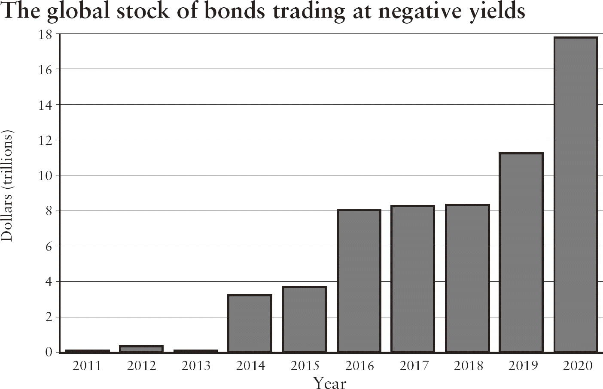

[11.](#section-9) By December 2020 nearly $18 trillion worth of bonds were yielding less than zero.

Negative interest rates were intended, as Harvard’s Kenneth Rogoff put it, to ‘turbocharge the economy out of a deflationary recession’.[23](#section-53) But they failed to live up to this promise. In fact, they exacerbated the problems already produced by ultra-low rates. From the outset, negative rates created a tremendous challenge for conventional banks. When they were introduced into Europe, the head of Portugal’s central bank viewed them as a threat to the financial system.[24](#section-53) European banks felt unable to pass on the cost to depositors. German banks suffered huge losses, which they compensated for by taking more risk.[25](#section-53) The solvency problems at European life insurers and pension funds deteriorated.[26](#section-53) Liquidity in the bond markets dried up. The repo market likewise suffered.[27](#section-53) Real estate bubbles inflated in Switzerland and Sweden.[28](#section-53)

Negative rates failed to turbocharge investment.[29](#section-53) Danish investment actually declined in the years after they were introduced.[30](#section-53) One explanation was that monetary policy was sustaining overcapacity in the global shipping industry, in which the Danes were important players.[31](#section-53) It was also suggested, not implausibly, that negative rates undermined business confidence by creating the impression of a never-ending crisis.[fn11](#section-58) The negative-interest-rate policy even failed in its primary purpose, namely bringing inflation back up to target. Four years after the Danish policy rate turned negative in 2012, inflation hovered at around 1 per cent.

Not only did negative interest rates hinder banks from creating money, but the policy itself was said to induce a deflationary mindset.[32](#section-53) Rather than discouraging hoarding – the original purpose of Gesell’s ‘rusting money’ proposal – negative rates had the opposite effect. One of Germany’s largest banks, Commerzbank, announced that it would consider stashing cash in its vaults to avoid the ECB’s tax on deposits. In Japan, sales of safes took off after negative rates were introduced.[33](#section-53) These responses should have been anticipated. Keynes was vindicated: interest really was necessary to stop people from hoarding capital.

The perverse effects of negative rates were observed by leading investors.[34](#section-53) ‘For economies to function normally,’ noted David Hoag of Capital Group, a large US investment firm, ‘they need positive interest rates and they need capital to be allocated efficiently.’[35](#section-53) BlackRock’s Larry Fink thought that the impact of this radical policy on savers had not been properly considered.[36](#section-53) Hedge fund manager Paul Singer claimed that negative rates removed the signals that direct investors how to allocate capital and manage risk.[37](#section-53) Bill Gross suggested that the trillions of dollars’ worth of bonds at negative yields formed ‘a supernova that will explode one day.’[38](#section-53) Another investor compared the policy to colliding black holes.[39](#section-53) The verdict of Jeffrey Gundlach of DoubleLine Capital was more blunt: negative rates, he said, were ‘the stupidest idea I have ever experienced.’[40](#section-53)

A handful of central bankers emerged from retirement to criticize this monetary innovation. Former BIS chief economist William White warned that negative rates put the global economy at risk.[41](#section-53) Charles Goodhart, a former member of the Bank of England’s Monetary Policy Committee (and originator of Goodhart’s Law), lamented the ‘failure of so many in authority to think through the likely effects of their policies on the wider financial system, especially on banks’.[42](#section-53) William Poole, former head of the St Louis Fed, warned that negative rates were diverting attention from necessary economic reforms.[43](#section-53)

### NOTHING STRANGE

Up to this moment, the notion that interest could be charged at a negative rate had only been proposed by monetary cranks, such as Gesell, or contemplated as a thought experiment by a handful of economists.

The economists’ verdict was not positive. Even Gesell’s hero, the nineteenth-century radical Henry George, thought that capital could not be maintained if interest rates fell below zero.[44](#section-53) George’s contemporary Eugen von Böhm-Bawerk believed that negative interest rates were against human nature. The great Swedish economist Gustav Cassel, author of *The Nature and Necessity of Interest*, dismissed the ‘absolute absurdity of thinking’ that the rate of interest could ever fall to zero or less.[45](#section-53) The invitation to waste capital, Cassel said, would be overwhelming. Although Irving Fisher supported Gesell’s proposal in the Great Depression, he believed that zero or negative interest was ‘practically almost impossible’. Negative interest, said Fisher, could only work if money was turned into a ‘perishable commodity, like fruit’.[46](#section-53)

The Nobel laureate Paul Samuelson likewise believed that the concept of a negative interest rate was absurd. The MIT economist suggested that if negative rates were maintained for long enough it might become profitable to level the Rockies to save on the fuel used by vehicles climbing steep gradients.[47](#section-53) UCLA economist Axel Leijonhufvud thought that if long-term rates turned more negative than short-term rates it could only be a sign of a decaying world.[48](#section-53) The world would be turned on its head. Banks would have to borrow long and lend short, and households would have to pay banks for the custody of their cash. The financial system, said Leijonhufvud, could never survive interest rates moving deeply into negative territory.

By the early twenty-first century, interest had been charged on loans for around five thousand years, possibly longer. Interest had survived biblical injunctions, Aristotelian outrage and the onslaught of medieval canonists and modern socialists. Over the millennia borrowers had always had to pay something for the use of other people’s wealth. Up to this date, bond yields had only dipped below zero on a couple of occasions, and that was due only to regulatory and fiscal quirks.[fn12](#section-58) Now Danish homeowners were receiving rebates on their mortgages and companies were getting paid to issue bonds with negative yields. The yields on some European junk bonds fell below zero.

When Sweden adopted its negative interest rate in the summer of 2009, the Riksbank’s Deputy Governor, Lars Svensson, downplayed the move: ‘There is nothing strange about negative interest rates,’ Svensson told the *Financial Times*.[49](#section-53) Nothing strange perhaps to this ‘world-renowned expert on monetary policy theory’, as the newspaper described Svensson. Yet, if ‘the emergence of interest to incentivize lending is the most significant of all innovations in the history of finance’, as economic historian William Goetzmann maintains, then the advent of negative interest might be considered the second most significant, possibly the stupidest, and certainly the strangest innovation in the history of finance.

<!-- rl-section id="sec-chapter016" class="titlepage" title="16" -->

## Rusting Money

> *The central irony of [a] financial crisis is that while it is caused by too much confidence, too much borrowing and lending and too much spending, it can only be resolved with more confidence, more borrowing and lending, and more spending.*
>
> Larry Summers, 2011[1](#section-53)
>
> *Will they [central bankers] not consider the possibility that ultra-low nominal yields might actually reduce aggregate demand while breeding financial instability, bank failure, ‘zombification’ and reduced economic dynamism?*
>
> Larry Summers, 2019[2](#section-53)

### THE REVERSAL RATE

Economists reveal their physics envy by their choice of metaphors. ‘In physics, escape velocity refers to the speed necessary to escape from a planet’s gravitational pull,’ remarked the Bank of England’s Governor Mark Carney in early 2014. ‘The economic analogue is the momentum necessary for an economy to escape from the many headwinds following a financial crisis.’[3](#section-53) With these words Carney justified keeping the Bank’s policy rate at close to zero. As it turned out, the British economy during Carney’s time as Governor (he retired in 2020) never achieved escape velocity.

Could it be that the monetary policy experiments after the Lehman crisis did more harm than good? That was the view of PIMCO’s ‘Bond King’ Bill Gross, who, displaying his own science credentials, suggested that just as Newtonian physics breaks down at the speed of light, so a market economy ceases to function normally when interest rates approach the zero lower bound.[4](#section-53) Harvard economist Kenneth Rogoff stuck with this theme:

> Just as the normal laws of physics seem to be upended when an object approaches a black hole (or, to be more precise, the normal laws imply weird consequences), the laws of economics seem to be upended when a recession-stricken economy hits (or at least approaches) the zero bound.[5](#section-53)

In his letters to investors, PIMCO’s bond manager described how the financial system needs a positive spread or carry between borrowing and lending rates. At zero rates, money market funds are forced to contract, and banks find it unprofitable to lend. Gross compared carry to the oxygen that feeds the blood. ‘Safe carry’, he maintained, was essential to capitalism. At zero rates, the blood becomes anaemic, oxygen-starved, even leukaemic.[6](#section-53)

Gross pointed to UK bank-branch closures and staff lay-offs, zombie companies and blockages in the financial plumbing induced by the Fed’s massive Treasury bond purchases.[fn1](#section-58) ‘Low yields, low carry, [and] future low expected returns have increasingly negative effects on the real economy … Perhaps zero-bound interest rates and quantitative easing programs are becoming as much of the problem as the solution,’ Gross wrote in the summer of 2013. Five years later, two American economists published a paper modelling the losses suffered by banks when policy rates fall below a certain level. Markus Brunnermeier and Yann Koby named this tipping point the ‘reversal interest rate’. (The tipping point varies from one banking system to another, but occurs when interest rates are above zero.)[7](#section-53)

As Gross pointed out, banks need a positive lending spread (net interest margin) to encourage them to advance loans.[fn2](#section-58) If banks don’t lend, they don’t create money either. Quantitative easing boosted asset prices and shrank credit spreads, but most of this newly created money wasn’t lent to consumers or businesses but was deposited by the banks at the Federal Reserve. The fact that the Fed in 2008 started paying interest on excess reserves (i.e. bank deposits at the central bank) gave banks even less reason to lend. The circulation of money through the economy slowed.[8](#section-53) In short, the Fed’s policy of keeping rates close to zero didn’t create inflation, but rather produced a lingering deflation.

We saw in [Chapter 10](#section-23) how ultra-low interest rates adversely affected the economy’s supply-side. In the next chapter, we discuss how cheap trade credit encouraged firms to construct longer supply chains, which, in turn, reduced the prices of traded goods. The proliferation of corporate zombies further added to deflationary pressures.[fn3](#section-58) Many industries faced chronic excess capacity. Corporate debt soared in the United States after 2008, but much of this lending was directed for financial purposes – whether share buybacks or leveraged buyouts (see [Chapter 11](#section-24)). Low interest rates fuelled a takeover boom, which reduced competitive pressures and fostered monopolies and oligopolies. Since zombies, monopolies and financialized firms tend to invest less, collectively they lower the economy’s innate capacity for growth.

Ultra-low rates also undermined the economy from the demand-side. It is all very well to pull consumer spending from the future into the present, but in the long run households with large debts and inadequate savings must spend less in future. That’s what happened after 2008, when American and British households started to pay off some of the excess debt contracted during the credit boom.[fn4](#section-58) To some extent, the deterioration of household balance sheets was concealed by the soaring stock market and other asset price bubbles. But, as discussed in [Chapter 13](#section-26), by raising the cost of retirement liabilities, discouraging savings and lowering returns on pension investments, the low-interest-rate regime sent future consumption on a downward trajectory.

Besides, the main beneficiaries of the great wealth bubble were the 1 per cent, while the rest of the 99 per cent struggled with weak income growth, unaffordable housing and excessive debts. Rising inequality, as economists never tire of pointing out, is not good for economic growth – especially the ‘bad inequality’ that arises from corporate rent-seeking of the type which thrived after 2008.

Although ultra-low interest rates and massive securities purchases by central banks dampened market volatility, the financial system was weakened by the prolonged period of easy money. A frantic search for yield encouraged investors to take greater risks and underwriters to lower lending standards. The international carry trade picked up, as investors piled into higher-yielding debt issued by emerging markets. Ten years after the crisis, the developing world was once again on the brink.[fn5](#section-58) When one considers the various ‘transmission mechanisms’ by which ultra-low interest rates affected the economy and financial system it’s easy to understand why Western economies never achieved escape velocity.

On the contrary, the unintended consequence of unconventional monetary policies was to reduce the economy’s trend growth rate, thereby lowering the natural rate of interest. Although the Federal Reserve didn’t take responsibility for this outcome, central bankers slowly came to understand that the natural rate was on a downward trend. A few years after the crisis, the Federal Open Market Committee – the body which sets the Fed funds rate – started to publish charts of each member’s prediction for the future course of interest rates. These ‘dot plots’, as they were called, showed that America’s monetary policymakers consistently overestimated the future level of interest rates. The FOMC’s median forecast for the ‘long term’ rate (the expected normal level of interest rates) trended downwards over time.[9](#section-53)

### NO EXIT

In the summer of 2009, Ben Bernanke penned an op-ed for the *Wall Street Journal* promising that the Fed would withdraw its emergency monetary measures in a ‘smooth and timely manner’. It was not to be. As long as Bernanke remained in charge of America’s central bank, the Feds fund rate didn’t budge. While Greenspan’s easy money (a 1 per cent rate) lasted for just twelve months, for seven years after the financial crisis the Fed funds rate remained at or close to zero. Nor did the Fed’s balance sheet ever contract on Bernanke’s watch. In fact, between the date of Bernanke’s *Wall Street Journal* commentary and his departure from the post, the Fed’s balance sheet grew by around $4 trillion.

In the era of the ‘new normal’ any number of excuses could be found to delay the return to normality. When Europe’s sovereign debt crisis erupted in 2010, New York Fed President William Dudley argued that QE must remain in place to placate Wall Street.[10](#section-53) Thus, one round of asset purchases was followed by another. QE1 gave way to QE2 (November 2010). In September 2011, the Fed launched Operation Twist, which involved the central bank selling short-dated bonds to buy Treasuries with longer maturities. After Twist came QE3 (September 2012). Bernanke also instituted press conferences after meetings of the Federal Open Market Committee and started to provide ‘forward guidance’ on expected future rate moves. By pledging to keep rates low in future and acquiring bonds with longer maturities, the Fed aimed to force down long-term interest rates.[11](#section-53)

Keynes famously compared investing in the stock market to children’s parlour games, like snap or musical chairs. Central banking in the twenty-first century more closely resembled a game of peekaboo. The financial markets – heavily medicated, overvalued, overleveraged and increasingly illiquid – determined how far the central bankers dared move. The markets were primed to shout ‘boo’ whenever they didn’t like what they saw. After the taper tantrum of June 2013, the President of the St Louis Fed (and FOMC member) James Bullard suggested that quantitative easing henceforth should be ‘open-ended’.[fn6](#section-58) Bullard was a former Fed ‘hawk’, who used to fret about extreme monetary policies. By this date, doves ruled the Fed roost and hawks had become an endangered species.

Another market squall occurred in the summer of 2015 when the Fed announced its intention to raise rates for the first time since Lehman’s bankruptcy. And after the Fed continued its course of hiking rates, by ever such tiny steps, the US stock market experienced a sudden convulsion in early 2018, followed by a steep decline later in the year. At which point, the Fed announced it would no longer shrink its balance sheet, as it had formerly planned. The Fed funds rate was cut in August 2019. The next month the Fed started buying securities to help out a frozen ‘repo’ market – the place where Wall Street raises cash by posting securities as collateral. The Fed funds rate peaked at 2.5 per cent, less than half its highest level in the previous cycle.

Around the world, policy rates converged towards the level set by the keeper of the world’s reserve currency. Attempts by individual central banks to normalize rates were invariably thwarted. For instance, the Reserve Bank of Australia raised its rate to 4.75 per cent in October 2010 and kept it at this lofty level for just over a year, after which it progressively cut the rate. Norway followed Australia’s lead, timidly hiking before having second thoughts. The European Central Bank under Jean-Claude Trichet raised rates in the midst of the Eurozone crisis, and twice again in 2011, but reversed course towards the end of that year. Low rates had well and truly begot lower rates.

One way to keep monetary accommodation perpetually in place was to move the goalposts. Quantitative easing was originally instituted to restore order to financial markets during a period of panic – a modern extension of Bagehot’s lender of last resort rule (although without the Victorian’s restrictive conditions). But when the Fed launched its third round of QE in September 2012, its aim was to help the jobs market.[fn7](#section-58) The level of unemployment itself proved another moving target. The Fed’s forward guidance originally set an unemployment rate of 6.5 per cent as the threshold for normalizing monetary policy. But when the jobless rate reached this level in 2015, the FOMC concluded that further delay was justified because the ‘natural rate’ of unemployment had fallen.

Fed Chairman Janet Yellen, who replaced Bernanke in early 2014, mused that the risks associated with interest rates at the zero lower bound justified keeping the policy rate at zero for longer than otherwise.[12](#section-53) In effect, Yellen was saying that the existence of ultra-low rates was in itself sufficient grounds for maintaining them.

Monetary interventions became progressively bolder. The Fed had started out in 2008 by acquiring a few hundred billion dollars’ worth of short-dated Treasury Bills, but later turned to buying bonds with lengthier maturities in order to push down long-term rates. The US central bank also assumed credit risk by acquiring mortgage securities. Even as memories of the financial crisis faded, the pace of the Fed’s securities purchases picked up.[13](#section-53) Former Fed Chairman Paul Volcker lamented that the Federal Reserve had ‘extended to the very edge of its lawful and implied power, transcending certain long embedded central banking principles and practices’.[14](#section-53)

But Bernanke did not share Volcker’s qualms. The Fed had its inflation and unemployment mandates to consider. (The Fed’s third mandate, the maintenance of ‘moderate long-term interest rates’, was hardly ever mentioned.) As Mario Draghi later put it, the chief risk lay in doing too little not too much. The ECB head had a point. In theory, a sharp rate hike might have encouraged banks to lend and reduced the burden of pension liabilities, but the negative consequences of such a move were potentially devastating: zombies and other over-indebted firms going belly up; a drop in corporate profits; plunging share and real estate prices; panic on Wall Street as liquidity dried up and volatility spiked; turmoil on the foreign exchanges, accompanied by yet another emerging market debt crisis; the return of the Eurozone’s sovereign debt crisis; and everywhere, a rise in the cost of servicing bloated public debts. All this was too painful to contemplate. So, central bankers chose to progress with caution. The trouble, as Claudio Borio at the BIS saw it, was that they had taken the wrong path.

The Federal Reserve acted as the bellwether for other central banks. The timeline for the adoption of quantitative easing after Lehman’s demise runs from the Federal Reserve (November 2008) to the Bank of England (March 2009), coincident with the massive expansion of the Fed’s own securities purchases, onwards to the Bank of Japan (August 2011), the European Central Bank (January 2015) and the Swedish Riksbank (February 2015). The Bank of England, Bank of Canada and ECB also copied the Fed’s forward guidance. By April 2013, when the Bank of Japan adopted an inflation target, Bernanke’s 2 per cent target was considered the ‘global benchmark’.[15](#section-53) Not only did the leading central banks adopt most of the same policy tools, at times they also acted in concert. As Europe’s sovereign debt crisis raged in late 2011, the Federal Reserve and the central banks of Japan, Europe, the United Kingdom, Switzerland and Canada jointly announced ‘coordinated actions to enhance their capacity to provide liquidity support to the global financial system’. Five years later, the top central banks were said to be co-operating again, this time to halt the rise of the US dollar on the foreign exchanges.[fn8](#section-58)

As the years went by, the Fed started to look conservative compared to its peers. By early 2013, the Fed held assets worth around a fifth of US GDP at a time when the holdings of the Swiss National Bank nearly equalled Switzerland’s GDP.[16](#section-53) While the Fed’s asset purchases were restricted to Treasury bonds and high-quality mortgage securities, the SNB was buying foreign shares. In the two and a half years after 2015, while the Fed’s QE programme was on hold, the European Central Bank and the Bank of Japan between them acquired a further $5 trillion worth of securities. Over the following year, these two central banks bought more sovereign bonds than were issued by their governments.

After the British public voted in a referendum to leave the European Union in June 2016, the Bank of England started to acquire foreign corporate securities. How exactly buying bonds issued by the likes of McDonald’s and Apple, both of which were on the Old Lady’s shopping list, might help the UK economy was never clearly explained.[fn9](#section-58) By early the following year, the world’s top central banks were acquiring more securities than ever before. ‘It’s the way of radical monetary gimmicks that one begets another,’ wrote James Grant. ‘The more they’re tried, the less they succeed. The less they succeed, the more they’re tried. There is no “exit”.’[17](#section-53)

Not every monetary innovation was concocted in Washington, DC. The Bank of England came up with ‘credit easing’. The ECB had its ‘long-term refinancing operations’, ‘securities markets programme’ and ‘outright monetary transactions’. The currency pegs of the Danish and Swiss central banks provided them with an excuse to buy foreign securities with newly printed money. The Bank of Japan, which had been the first to initiate quantitative easing (in March 2001), later came up with ‘quantitative and qualitative easing’, to which it added ‘yield-curve control’.[18](#section-53) While interest rates in the United States and the rest of the Anglophone world never went below the ‘zero lower bound’, central banks in Europe and Japan crossed the Rubicon, venturing into the unknown territory of negative rates.

### THE CURSE OF NEGATIVE RATES

Between the world wars a number of monetary cranks appeared, each offering his own idiosyncratic cure for economic maladies. In the 1920s, a former British Army major, C. H. Douglas, proposed interest-free ‘social credits’ to boost demand in Britain’s moribund economy.[fn10](#section-58) Another Englishman, Frederick Soddy, whose thoughts on virtual wealth we have already encountered, proposed a new paper currency whose issuance would be based on the mathematical model used by the tote board at Sydney’s racecourse. Less attractive was the demagogue Radio Priest, Father Coughlin, who in the 1930s called for the nationalization of the Federal Reserve and for silver money to be issued in unlimited quantities.[19](#section-53)

Among the economic heretics of this era was a German-born businessman named Silvio Gesell. Gesell had been employed as a merchant in Buenos Aires in the early 1890s, where he witnessed Argentina’s great financial crisis. In Gesell’s view, the subsequent economic downturn had been exacerbated by the hoarding of money. He came up with an original solution to this problem. To boost the circulation of money during depressions, Gesell proposed a law requiring that banknotes be stamped every week. The annual cost of the stamps was to be set at 5 per cent of the notes’ face value. Under Gesell’s plan, cash would no longer serve as a store of value in hard times, let alone accrue interest on deposit. ‘Money must rust’ was his motto.

After leaving Buenos Aires, the monetary radical returned to Germany where he set up a vegetarian commune. In 1916, he published a book, *The Natural Economic Order*, calling for rent-free land and interest-free money, which was dedicated to the American radical economist Henry George, Moses and the Roman slave leader Spartacus. The following year, Gesell wrote to Lenin advising the Bolshevik leader that he should take control of the monetary sector rather than attempt to plan the real economy. A few years later, he served as Finance Minister in the short-lived Bavarian Soviet Republic (whose government’s most notable achievement was to declare war on Switzerland for refusing to lend some steam engines). His Free Economy organization attracted thousands of followers in the 1920s.

Shortly after Gesell’s death in 1930, a small-scale experiment with rusting money (*Schwundgeld*) took place in Austria. The failure in May 1931 of the Creditanstalt bank pushed the Austrian economy into a severe depression. The councillors of Wörgl, a small town in the Tyrol, decided to combat local unemployment with a public works programme. Their Gesellian brainwave was to finance their outlays by printing their own currency. To remain valid Wörgl’s notes had to be stamped monthly, with the cost of the stamp set at 1 per cent of face value. According to one contemporary account, the scheme was successful at reducing unemployment – at least until the Austrian National Bank, resentful of the encroachment on its money monopoly, brought Wörgl’s currency adventures to an end.[20](#section-53)

The story does not end there. At Yale, Irving Fisher caught wind of Wörgl’s scheme. Fisher shared Gesell’s view that hoarding money exacerbated depressions. He wrote to the Mayor of New Haven, proposing an ‘emergency self-liquidating stamp-tax relief scrip’ to facilitate employment, and later petitioned President Roosevelt with a similar scheme. (Fisher fixed the annual rate of depreciation for his scrip at 26 per cent.) America’s greatest economist was rebuffed.[21](#section-53) Keynes later saluted Gesell in his *General Theory* as a ‘strange, unduly neglected prophet’. Gesell might have remained a footnote in the history of economic thought had it not been for the Great Recession.

In December 2008, the Federal Reserve cut its lending rate to a record low, targeting a range of 0 to 0.25 per cent. America’s central bank had reached what economists call the ‘zero lower bound’. Central bankers couldn’t stimulate borrowing and spending with further rate cuts. They had run out of bullets. Or so it seemed. Only a few months later, Harvard economist Greg Mankiw suggested a solution to this impasse. In a *New York Times* op-ed, Mankiw recommended that the Federal Reserve impose a negative rate on bank deposits. The hoarding of cash could be discouraged, he said, if a fixed proportion of dollar bills were randomly invalidated each year. In a slightly different, if equally impractical, form Gesell was back.

While economists argued about different ways to implement negative interest rates, central bankers forged ahead. In 1656, Sweden’s Stockholms Banko embarked on Europe’s first experiment with a pure paper money. The bank soon collapsed after issuing too many notes and its founder, Johan Palmstruch, was sentenced to death. The Swedish Riksbank emerged out of the ruins. It was only fitting, therefore, that the world’s oldest central bank should also be the first to put negative interest rates into practice. In July 2009 – less than a year after the Lehman’s bankruptcy– the Riksbank set a rate of minus 0.25 per cent on deposits.

Once the taboo was broken, other central banks followed suit. In July 2012, Denmark introduced a negative interest rate to help maintain the krone’s currency peg with a crisis-stricken euro. Two years later, the European Central Bank, whose nineteen members of the monetary union contained a population of some 340 million persons, brought its own deposit rate below zero. Switzerland followed. Having long rejected calls for negative rates, the Bank of Japan shocked financial markets by announcing in January 2016 that it too would impose a negative rate on deposits. By this date, there had been an estimated 637 rate cuts globally since the failure of Bear Stearns in early 2008, central banks had purchased more than $14 trillion worth of securities, and more than $8 trillion worth of government bonds yielded less than zero.[22](#section-53)

[11.](#section-9) By December 2020 nearly $18 trillion worth of bonds were yielding less than zero.

Negative interest rates were intended, as Harvard’s Kenneth Rogoff put it, to ‘turbocharge the economy out of a deflationary recession’.[23](#section-53) But they failed to live up to this promise. In fact, they exacerbated the problems already produced by ultra-low rates. From the outset, negative rates created a tremendous challenge for conventional banks. When they were introduced into Europe, the head of Portugal’s central bank viewed them as a threat to the financial system.[24](#section-53) European banks felt unable to pass on the cost to depositors. German banks suffered huge losses, which they compensated for by taking more risk.[25](#section-53) The solvency problems at European life insurers and pension funds deteriorated.[26](#section-53) Liquidity in the bond markets dried up. The repo market likewise suffered.[27](#section-53) Real estate bubbles inflated in Switzerland and Sweden.[28](#section-53)

Negative rates failed to turbocharge investment.[29](#section-53) Danish investment actually declined in the years after they were introduced.[30](#section-53) One explanation was that monetary policy was sustaining overcapacity in the global shipping industry, in which the Danes were important players.[31](#section-53) It was also suggested, not implausibly, that negative rates undermined business confidence by creating the impression of a never-ending crisis.[fn11](#section-58) The negative-interest-rate policy even failed in its primary purpose, namely bringing inflation back up to target. Four years after the Danish policy rate turned negative in 2012, inflation hovered at around 1 per cent.

Not only did negative interest rates hinder banks from creating money, but the policy itself was said to induce a deflationary mindset.[32](#section-53) Rather than discouraging hoarding – the original purpose of Gesell’s ‘rusting money’ proposal – negative rates had the opposite effect. One of Germany’s largest banks, Commerzbank, announced that it would consider stashing cash in its vaults to avoid the ECB’s tax on deposits. In Japan, sales of safes took off after negative rates were introduced.[33](#section-53) These responses should have been anticipated. Keynes was vindicated: interest really was necessary to stop people from hoarding capital.

The perverse effects of negative rates were observed by leading investors.[34](#section-53) ‘For economies to function normally,’ noted David Hoag of Capital Group, a large US investment firm, ‘they need positive interest rates and they need capital to be allocated efficiently.’[35](#section-53) BlackRock’s Larry Fink thought that the impact of this radical policy on savers had not been properly considered.[36](#section-53) Hedge fund manager Paul Singer claimed that negative rates removed the signals that direct investors how to allocate capital and manage risk.[37](#section-53) Bill Gross suggested that the trillions of dollars’ worth of bonds at negative yields formed ‘a supernova that will explode one day.’[38](#section-53) Another investor compared the policy to colliding black holes.[39](#section-53) The verdict of Jeffrey Gundlach of DoubleLine Capital was more blunt: negative rates, he said, were ‘the stupidest idea I have ever experienced.’[40](#section-53)

A handful of central bankers emerged from retirement to criticize this monetary innovation. Former BIS chief economist William White warned that negative rates put the global economy at risk.[41](#section-53) Charles Goodhart, a former member of the Bank of England’s Monetary Policy Committee (and originator of Goodhart’s Law), lamented the ‘failure of so many in authority to think through the likely effects of their policies on the wider financial system, especially on banks’.[42](#section-53) William Poole, former head of the St Louis Fed, warned that negative rates were diverting attention from necessary economic reforms.[43](#section-53)

### NOTHING STRANGE

Up to this moment, the notion that interest could be charged at a negative rate had only been proposed by monetary cranks, such as Gesell, or contemplated as a thought experiment by a handful of economists.

The economists’ verdict was not positive. Even Gesell’s hero, the nineteenth-century radical Henry George, thought that capital could not be maintained if interest rates fell below zero.[44](#section-53) George’s contemporary Eugen von Böhm-Bawerk believed that negative interest rates were against human nature. The great Swedish economist Gustav Cassel, author of *The Nature and Necessity of Interest*, dismissed the ‘absolute absurdity of thinking’ that the rate of interest could ever fall to zero or less.[45](#section-53) The invitation to waste capital, Cassel said, would be overwhelming. Although Irving Fisher supported Gesell’s proposal in the Great Depression, he believed that zero or negative interest was ‘practically almost impossible’. Negative interest, said Fisher, could only work if money was turned into a ‘perishable commodity, like fruit’.[46](#section-53)

The Nobel laureate Paul Samuelson likewise believed that the concept of a negative interest rate was absurd. The MIT economist suggested that if negative rates were maintained for long enough it might become profitable to level the Rockies to save on the fuel used by vehicles climbing steep gradients.[47](#section-53) UCLA economist Axel Leijonhufvud thought that if long-term rates turned more negative than short-term rates it could only be a sign of a decaying world.[48](#section-53) The world would be turned on its head. Banks would have to borrow long and lend short, and households would have to pay banks for the custody of their cash. The financial system, said Leijonhufvud, could never survive interest rates moving deeply into negative territory.

By the early twenty-first century, interest had been charged on loans for around five thousand years, possibly longer. Interest had survived biblical injunctions, Aristotelian outrage and the onslaught of medieval canonists and modern socialists. Over the millennia borrowers had always had to pay something for the use of other people’s wealth. Up to this date, bond yields had only dipped below zero on a couple of occasions, and that was due only to regulatory and fiscal quirks.[fn12](#section-58) Now Danish homeowners were receiving rebates on their mortgages and companies were getting paid to issue bonds with negative yields. The yields on some European junk bonds fell below zero.

When Sweden adopted its negative interest rate in the summer of 2009, the Riksbank’s Deputy Governor, Lars Svensson, downplayed the move: ‘There is nothing strange about negative interest rates,’ Svensson told the *Financial Times*.[49](#section-53) Nothing strange perhaps to this ‘world-renowned expert on monetary policy theory’, as the newspaper described Svensson. Yet, if ‘the emergence of interest to incentivize lending is the most significant of all innovations in the history of finance’, as economic historian William Goetzmann maintains, then the advent of negative interest might be considered the second most significant, possibly the stupidest, and certainly the strangest innovation in the history of finance.

<!-- rl-section id="section-30" class="epub-section" kicker="Section 30" title="Part Three" -->

## Part Three

---

### THE GAME OF MARBLES

<!-- rl-section id="sec-part003" class="titlepage" title="Part Three" -->

## Part Three

---

### THE GAME OF MARBLES

<!-- rl-section id="section-31" class="epub-section" kicker="Section 31" title="17" -->

## 17

## The Mother and Father of All Evil

> *The dollar is our currency but your problem.*
>
> US Treasury Secretary John Connally, 1971

### THE DOLLAR STANDARD

Interest rates have always regulated international capital flows. In the era of the Gold Standard, this job was done automatically. If the Bank of England brought rates much below foreign levels, gold would leave its vaults for foreign shores. ‘Loanable capital, like every other commodity, comes where there is most to be made of it,’ wrote Bagehot of Victorian lending practices. In order to attract gold back to the City of London, the Bank of England would have had to raise its lending rate. After the Bretton Woods system collapsed in 1971, the US dollar became the global reserve currency. After this date most international trade was denominated in the US currency, along with a large share of cross-border financial transactions. Dozens of countries pegged their own currencies to the dollar.

If the Gold Standard was characterized by its ‘golden fetters’, the chief vice of the Dollar Standard is its extreme elasticity. Central bank reserves are mostly composed of dollar-denominated securities (US Treasury bonds and agency debt), which, unlike gold, can be issued without limit. As the keeper of the world’s reserve currency, the United States doesn’t need to maintain its own foreign-exchange reserves, nor worry about its balance of payments. There is no limit on how many dollars flow abroad nor how much the United States borrows from foreigners. America can run what Jacques Rueff called ‘deficits without tears’, and over the years it has taken advantage of this exorbitant privilege to become the world’s largest international debtor.

US interest rates aren’t influenced by international capital flows. Absent the prospect of inflation, there is no limit on how low interest rates can sink. (The question of whether the Fed could set negative rates is murky from a legal perspective.) Not everything has changed, however. Differentials in interest rates between countries still influence the amount and direction of cross-border lending. The most important interest-rate spread is that between the cost of borrowing in the United States and elsewhere. Countries that peg their currencies to the dollar are obliged to shadow American monetary policy: they must loosen when the Fed loosens and tighten when the Fed tightens. When the US central bank eases, dollar-peggers often intervene in the foreign exchanges: to prevent their currencies from appreciating, their central banks buy dollars with freshly printed local currency, thereby further loosening domestic monetary conditions.

In short, when the United States adopts easy money it unleashes a ‘global monetary plague’.[1](#section-53) The plague is not contained to countries which peg to the dollar: even those with floating currencies are infected. When US interest rates fall below foreign rates, international carry trades take off. Investors borrow dollars and invest the proceeds abroad at higher yields. Foreigners are also encouraged to take out cheap dollar-denominated loans. (The yen and euro are also commonly used to finance cross-border carry trades.) For instance, when Iceland’s economy overheated in the early 2000s its central bank raised rates. But high Icelandic rates attracted hordes of carry traders who borrowed in foreign currencies (dollars, euros and yen) to acquire krona-denominated securities, known as ‘glacier bonds’, and lent directly to Icelandic banks, thereby easing, rather than tightening, monetary conditions.[2](#section-53)

### THE FIRST PHASE OF GLOBAL LIQUIDITY

The early years of this century witnessed a remarkable growth in central bank reserves. Conventional wisdom maintains that the accumulation of foreign exchange reserves indicated a ‘global savings glut’. Emerging markets were said to be amassing reserves in order to protect themselves against another Asian-style crisis. But the link between the growth of foreign exchange reserves and ‘excess savings’ (i.e., current account surpluses) is tenuous.[3](#section-53) Several countries, including Turkey, expanded their foreign reserves while running current account deficits. Some economists, including John Taylor of Stanford, found no evidence that the global savings rate had actually increased.

An alternative account holds that the world in the early years of the new millennium was suffering a surfeit of finance – a ‘global banking glut’.[4](#section-53) According to this interpretation, the Greenspan Fed’s easy money stimulated a rise in cross-border capital flows, which increased threefold in the first years of the century.[5](#section-53) This explosion of international lending fuelled a global credit bubble.[6](#section-53) Countries which operated a dollar peg responded to the surge in capital inflows by acquiring the incoming dollars. Hence, the extraordinary increase in foreign exchange reserves.

As the world’s reserve currency, the US dollar served as the main funding currency for international carry trades. European banks borrowed in the New York money markets to acquire subprime securities. Europe had its own carry trades. Cross-border bank loans financed Greece’s enormous current account deficit and real estate booms in Spain and Ireland.[7](#section-53) Foreign lending to Central Europe topped $1 trillion in 2007, enabling Romanian credit to grow at an annualized rate of 66 per cent, financing a Latvian current account deficit to the tune of a quarter of GDP, and allowing Poles and Hungarians to take out cheap mortgages, denominated in euros and Swiss francs.[8](#section-53) By the onset of the global financial crisis, Iceland’s foreign debts had grown to nearly nine times its national output.[fn1](#section-58)

### THE SECOND PHASE OF GLOBAL LIQUIDITY

The financial convulsions of 2007–8 may have been triggered by losses on American subprime mortgages, but it’s more accurate to describe the global crisis as a ‘giant carry trade gone wrong’.[fn2](#section-58) After Lehman’s bankruptcy, foreign banks which had borrowed dollars to buy US mortgage securities lost access to the international money markets. The Federal Reserve came to their rescue, providing massive lines of dollar credit to central banks in Europe and Asia. Chairman Bernanke’s prompt actions prevented a collapse of the global monetary system, as had occurred in the early 1930s.[9](#section-53)

But this very success, combined with the move to zero interest rates at the core of the global financial system, revived the international carry trade. Economist Hyun Song Shin of the BIS coined the term the ‘second phase of global liquidity’ to describe the resurgence of international capital flows after 2008. Both phases of global liquidity were characterized by abnormally low interest rates in the United States, low levels of market volatility (as measured by the VIX) and extensive cross-border lending.[10](#section-53) In the first phase, international capital flows financed credit booms and real estate bubbles on the edges of Europe. In the second phase, foreign capital mostly poured into emerging markets. In the first phase, the financial systems on the periphery of Europe became dangerously exposed. In the second phase, financial weakness spread throughout the developing world.

The second phase of global liquidity got off to an explosive start. Over the course of 2009, emerging market bond funds witnessed record inflows.[11](#section-53) The IMF observed in November that the dollar was ‘now serving as the funding currency for carry trades’.[12](#section-53) New York University economist Nouriel Roubini issued a starker warning. The combination of easy money, quantitative easing and a weakening dollar had produced the ‘mother of all carry trades’, said Roubini:

> But one day this bubble will burst, leading to the biggest coordinated asset bust ever … the longer and bigger the carry trades and the larger the asset bubble, the bigger will be the ensuing asset bubble crash. The Fed and other policymakers seem unaware of the monster bubble they are creating. The longer they remain blind, the harder the markets will fall.[13](#section-53)

Of more immediate concern to policymakers in emerging markets was the rapid appreciation of their currencies, induced by a weak dollar and unconstrained capital inflows. Brazil’s Finance Minister Guido Mantega complained that the United States was engaged in a currency war. To discourage hot money flows, Mantega announced a tax on foreign purchases of Brazilian stocks and bonds. Central banks in the developing world played a defensive role in the currency wars, intervening in the currency markets to buy dollars. In the process they added greatly to their foreign exchange reserves. By 2013 global foreign exchange reserves were touching $12 trillion, up from $2 trillion at the turn of the century. (Since trade imbalances were shrinking, there was now less talk of any global savings glut.)

Massive purchases of dollar securities by central banks put downward pressure on US Treasury yields. Foreign exchange interventions by central banks, combined with hot money flows and increased lending by state banks (notably in China, India and Brazil), eased credit conditions across the emerging markets; as did the fact that their domestic interest rates were falling, drawn downwards by the gravitational pull of zero interest rates at the heart of the world’s financial system.[14](#section-53) Inflation started to pick up across the emerging markets. By early 2010, the BRICs – Goldman Sachs’ catchy acronym for Brazil, Russia, India and China – were overheating.[15](#section-53) In October, rubber and cotton futures jumped to record levels. Arabica coffee prices hit a thirteen-year high. Flooding across South East Asia affected the rice harvest, driving up rice futures by more than 50 per cent.[16](#section-53)

### THE ARAB SPRING

On 17 December 2010, a young Tunisian street vendor doused his clothes with petrol and set himself alight outside the Governor’s office in the provincial town of Sidi Bouzid. Mohamed Bouazizi committed suicide in protest against the actions of local police who had confiscated his wares and smashed his cart. The day after his death riots broke out in Sidi Bouzid. Unrest spread rapidly across North Africa and the Middle East. Within a month Tunisian President Zine El Abidine Ben Ali had been forced from office, followed soon after by the departure of Libya’s Colonel Gaddafi and Egypt’s Hosni Mubarak.

Like many popular uprisings in history, the Arab Spring started out as a bread riot.[17](#section-53) Over the course of the year, world cereal prices climbed by 29 per cent.[18](#section-53) Bouazizi earned his pittance selling vegetables, which might explain why corrupt officials were keen to appropriate his wares. North Africa, once the grain basket of the Roman Empire, was now the world’s largest food importer. Half of Egypt’s wheat – the main staple for the country’s 80 million-odd population – came from abroad. A much-photographed protester in Cairo’s Tahrir Square wore a ‘bread helmet’ made from a croissant and two bread sticks held together with cling film. Commentators blamed crop failures among the world’s leading food exporters on climate change.

But some other factor must have contributed to the sharp rise in food prices, since the price of industrial commodities, whose supply was unaffected by the weather, also soared in the months prior to the Arab Spring. Most industrial commodities, and precious metals from copper to silver, were trading at bubble levels.[fn3](#section-58) That additional factor was the Federal Reserve’s monetary policies. Stanford economist Ronald McKinnon argued that the Arab Spring originated with ultra-low interest rates in the United States, which, as we have seen, drove capital flows into the emerging world and caused ‘overheating’ of the non-climate variety. China’s voracious demand for raw materials, in particular, stoked the ‘commodity super-cycle’.[19](#section-53) Easy money also stoked speculation in commodities, touted on Wall Street as a hot ‘alternative asset class’. McKinnon posed a tantalizing counterfactual: ‘If the Arab Spring had been recognized as mainly a food riot, the response of Western governments would have been more measured in taking sides, while focusing more actively on monetary measures to dampen cycles in primary commodity prices.’[20](#section-53)

### THE TAPER TANTRUM

After the financial crisis, borrowers in developing countries took full advantage of the low rates available in the West. Foreign capital poured into the developing world, from Azerbaijan to Zimbabwe. Lending in dollars outside the United States accelerated.[21](#section-53) Western investors also boosted their holdings of local-currency debt issued by emerging markets.[22](#section-53) Countries whose bonds offered the largest carry (i.e. spread over Treasuries) proved popular destinations for yield-starved investors.[23](#section-53) As interest rates within emerging markets were now more closely correlated with US rates, their financial systems became more sensitive to shifts in American monetary policy – in particular, to any appreciation in the dollar.[24](#section-53)

Emerging markets’ economic destiny hinged on decisions taken in the Eccles Building in Washington, the headquarters of the Federal Reserve Board. On 22 May 2013, Ben Bernanke announced to Congress that the Fed intended to gradually taper its ongoing securities purchases. The financial markets threw a fit – or ‘taper tantrum’, as it was dubbed. Cross-border carry trades screeched to a halt. Bond funds, the prime source of foreign lending for many emerging markets, suffered outflows. Sovereign bond auctions failed in South Korea, Russia and Colombia. In China, the ATM machines at one of the large banks ceased issuing cash. Commodity bubbles around the world imploded. The American currency rose abruptly on the foreign exchanges, increasing the burden of all those foreign dollar-denominated debts. Emerging markets had lost the currency wars.

The taper tantrum brought the curtain down on Brazil’s economic miracle. Despite Finance Minister Mantega’s complaints, South America’s largest economy had come roaring back after the financial crisis: Brazilian GDP growth approached 10 per cent (in early 2010) and unemployment fell to an all-time low. Consumer demand expanded so fast that local brewers ran out of beer cans. In September 2010, state oil-producer Petrobras raised $70 billion in the largest share offering in history. Buoyed by capital inflows, the Brazilian real was deemed the ‘world’s most overvalued currency’. The *Wall Street Journal* reported that taxis and Coca-Cola were more expensive in São Paulo than Manhattan.[25](#section-53)

A leading producer of iron ore, soya beans and oil, Brazil was a prime beneficiary of the global commodity boom. No Brazilian benefited more than Eike Batista, a former insurance salesman turned gold miner. Batista put together a large energy and logistics conglomerate, EBX. At one point he boasted that the reserves of his oil company, OGX Petróleo e Gás, were worth $1 trillion. His shipping business, OSX, was busy constructing the largest shipyard in the southern hemisphere. (The X in the names of Batista’s various companies stood for the multiplication of value.) The flamboyant businessman enjoyed the conventional accoutrements of fame and wealth in the twenty-first century: supermodel girlfriends, fast cars, speed boats, private jets and a million adoring followers on Twitter. In 2010, *Forbes* reckoned Batista to be the world’s eighth-richest person.

Batista’s fortunes took a downward turn in 2012, however, when it was revealed that OGX’s oil reserves had been overstated. The collapse in the oil price, coincident with the taper tantrum, provided the death blow to his complex business empire. In October 2013, OGX filed for bankruptcy protection, owing more than $5 billion, including some $3.6 billion in dollar-denominated bonds that were held by some of the world’s top bond funds. Within the space of twelve months, Batista’s personal wealth shrank by $34 billion, earning him the title of the world’s least wealthy person – a ‘minus billionaire’. A New York money manager summed up Batista’s fate: ‘He tried to do too much too fast and he tried to do that with borrowed money.’[26](#section-53)

The trajectory of Brazil’s economy followed that of its most famous businessman. As foreign capital inflows dried up, the currency collapsed. But a cheaper real didn’t prevent the current account deficit from exploding. Soaring inflation forced the Central Bank of Brazil to hike interest rates to over 14 per cent. Cut off from the international capital markets, local companies grappled with their foreign-currency debts and rising interest costs. Ratings agency Fitch reported that most Brazilian firms were in ‘survival mode’.[27](#section-53) The country entered its longest recession since the 1930s, a squeeze so severe that Goldman Sachs feared it might turn into a full-blown depression.

Five years after its record-breaking stock issue, Petrobras shares were languishing, and its bonds had been downgraded to junk. These turned out to be the least of its problems. The Brazilian state oil company now found itself at the centre of a massive corruption scandal, dubbed Operation Car Wash, involving billions of dollars of bribes paid to politicians and government officials. Operation Car Wash led eventually to the imprisonment of former President Lula and the impeachment of his successor, Dilma Rousseff.[28](#section-53) Also entangled in the web of corruption was the hapless Batista, who received a thirty-year prison sentence for bribing officials. (In a subsequent trial, a further eight years were added for insider trading.) The bribery scandal, together with falling oil prices, forced Petrobras to write-down assets to the tune of $17 billion.

Brazil was not the only emerging market to face an epic corruption scandal. In late 2015, it was discovered that billions of dollars had gone missing from Malaysia’s development fund, 1MDB – of which a large chunk reportedly ended up in the bank accounts of the country’s Prime Minister, Najib Razak. Much of the stolen money found its way to the United States, where it was spent on works of art, fancy yachts and luxury properties. Malaysia’s missing funds also financed Martin Scorsese’s film *The Wolf of Wall Street*, which, given the involvement of Goldman Sachs in raising money for 1MDB, was most fitting. Thus, carry-trade dollars that left the United States in search of higher returns abroad returned home, laundered via off-shore financial centres – in Switzerland, the Seychelles, British Virgin Islands, Cayman Islands, Panama and elsewhere. The grand theft at Malaysia’s development fund was replicated in less newsworthy fashion by countless emerging-market kleptocrats, their ill-gotten fortunes recycled into prime properties in London, Miami, New York, Sydney and other welcoming destinations.

### THE INTEREST-RATE LOBBY

After Brazil’s fall from grace in 2013, the BRICs turned stone cold. Wall Street now fretted about the ‘Fragile Five’: India, Indonesia, Turkey and South Africa joined Brazil in the emerging markets’ hall of shame. Turkey was pickled in debt after its banks and companies had gorged on foreign capital. Foreign loans fuelled a building boom – a third bridge across the Bosporus, the world’s largest airport under construction, a sprawl of skyscrapers encircling Istanbul and dozens of new shopping malls. Foreign loans filled the gaping hole in Turkey’s current account. Foreign debts accumulated on the balance sheets of Turkish corporations, including record levels of debt denominated in foreign currencies. The foreign liabilities of Turkish banks alone amounted to more than a third of the country’s GDP.[29](#section-53)

Turkey’s Prime Minister Recep Tyyip Erdoǧan had no problem with all this foreign debt. What irked the Turkish autocrat beyond reason was the country’s high and rising interest rates. In the months after the taper tantrum, the lira tanked. A crash in the Turkish stock market and rising bond yields in June 2013 coincided with demonstrations in Istanbul’s Taksim Square, where protesters clashed with riot police.[30](#section-53) The Central Bank of Turkey responded to this crisis with a number of emergency rate increases – raising rates by more than 4.25 percentage points on a single day the following January. ‘Treason,’ exclaimed Erdoǧan, who envisioned a cabal of international speculators – the ‘interest-rate lobby’, he called them – who profited from high interest rates at Turkey’s expense.

Over the following years, Erdoǧan didn’t let up on this obsession. On the eve of a presidential election in May 2018, Erdoǧan (who became President in 2014) identified his main opponent. Interest rates, he declared, were the ‘mother and father of all evil’. The President promised to continue until ‘victory in the fight against this curse of interest rates’.[31](#section-53) By this date, the lira was on the brink of a currency crisis as Turkish corporations struggled with their massive foreign debts. In September 2018, with the currency spiralling downwards and inflation escalating out of control, the central bank hiked its lending rate to 24 per cent. Erdoǧan blamed ‘online fictional currency plots’ for the lira’s collapse.

Yet, if a global ‘interest-rate lobby’ might be said to exist, it was one that campaigned invariably for lower interest rates, and in Turkey the lobby’s chief representative was none other than the President himself. His anti-usury invective belonged to a venerable Islamic tradition but, in this case, it was misdirected. High interest rates hadn’t landed Turkey in trouble. Rather, it was ultra-low interest rates in the United States and Europe that drove foreign lenders to Turkish shores. Domestic monetary policy had also been loose: in the five years after 2008, Turkish lending rates were low in real terms and trailed far below the economy’s growth rate.[32](#section-53) Easy money financed the country’s construction boom and property bubble. Easy money encouraged Turkish corporations to take on too much debt, borrowing in liras and foreign currencies. Easy money fuelled the rising inflation, which peaked at 25 per cent in 2018.

As the tenth anniversary of Lehman’s bankruptcy approached, Turkey’s real estate market resembled Spain’s on the eve of the global financial crisis. What a leading Istanbul estate agent called a ‘big Ponzi scheme’ was broken. Residential developments ground to a halt, as Turkey’s housing market was weighed down with a couple of million unsold houses. One incomplete development, the Brooklyn Dream project on the Asian side of Istanbul, had been marketed to ‘those who want an active and dreamlike life in the center of the city’. But the developer ran out of cash and local residents, who’d been promised new apartments, were found to be inhabiting tents on the building site where their demolished homes had stood.[33](#section-53) A living nightmare.

Turkey’s financial woes were shared to some degree or other across emerging markets. A decade of ultra-low interest rates in the developed world had saddled developing countries with too much debt: between 2008 and 2018, their non-financial debt climbed from 107 per cent to 192 per cent of GDP.[34](#section-53) An increasing proportion of these liabilities were owed to foreigners.[35](#section-53) Foreign dollar loans exceeded $11 trillion (in 2016), of which nearly $4 trillion was owed by emerging markets – around twice as much as a few years earlier.[36](#section-53) Much of this borrowing was poorly invested and generated little by way of economic growth, or was used for financial engineering as companies in emerging markets borrowed in dollars and lent onwards in their domestic markets at higher yields.

### AN END TO GLOBALIZATION?

A feedback loop exists between globalization and interest rates: more trade between countries tends to reduce inflation pressures and weaken the bargaining power of labour, both of which have an impact on the level of interest rates. The first wave of globalization, which dates from the 1860s to the end of the century, was accompanied by mild deflation and falling long-term interest rates.[fn4](#section-58) During the recent globalization phase, from 1980 onwards, China and other developing countries grabbed an increased share of world trade. Traded goods’ prices declined and millions of manufacturing jobs were ‘off-shored’ to emerging markets. Thus, globalization reduced both inflation and wage growth, which, in turn, allowed Western central banks to reduce interest rates, thereby spurring the greatest bull market in bonds in history.

Yet the decline in interest rates also propelled globalization. Since international trade credit is mostly denominated in dollars, when the cost of borrowing in dollars falls multinational companies are inclined to construct longer supply chains. In the era of easy money, global manufacturing took place across several continents and multiple countries (six on average). For instance, car engines built in Japan were shipped to Canada for further work, fitted into vehicle chassis in Mexico, with the finished cars sold in the United States. Lengthier supply chains tied up vast amounts of working capital and required ample financing.[37](#section-53) Manufacturers in emerging markets benefited most from the lengthening of supply chains.

Economists at the BIS suggested that the rapid expansion of world trade at the turn of the century might have been ‘a bubble, made possible by ample global liquidity’.[38](#section-53) Like all bubbles, the global trade ‘bubble’ was inherently fragile. Over-extended supply chains require accommodative monetary conditions. Political support is equally important, although often overlooked. In the United States, the loss of manufacturing jobs to China eventually provoked a backlash against globalization.[fn5](#section-58) Donald Trump’s 2016 campaign promise to bring manufacturing jobs home helped to take him to the White House.

The collapse of international trade in the 1930s is commonly attributed to the protectionist US tariffs imposed by the Smoot–Hawley Act of 1930. But tariffs were only part of the story. The financial side deserves greater emphasis. During the 1920s, dollars flowed out of the United States attracted by the higher interest rates on offer in Central Europe and South America. Large international capital movements were facilitated by the Gold Exchange Standard. It was the hike in US interest rates in 1928 which halted America’s foreign lending and inaugurated the global economic downturn.

Cut off from the capital markets, the Austrian bank Creditanstalt was the first domino to fall. After Creditanstalt’s collapse in 1930 the free movement of international capital came to an end, to be replaced by exchange controls, ‘blocked currencies’ and ‘standstill agreements’ on defaulted foreign debts. International trade withered. Once tariffs were in place, international trade was organized on a bilateral basis between countries. Economic nationalism attracted some surprising new advocates: ‘let goods be homespun,’ wrote the great liberal Keynes in 1933, ‘and above all, let finance be primarily national.’[39](#section-53)

Can it happen again? A decade after the financial crisis, President Trump was fighting trade wars with China and America’s erstwhile ally the European Union. At the same time, Britain’s decision to leave the European Union threatened the free movement of goods and services across Europe. After 2008, capital controls were introduced on several occasions in Europe (in Iceland, Cyprus and Greece) and a number of emerging markets (Azerbaijan, Egypt, Nigeria and Turkmenistan). Beijing strengthened its own capital controls, making it more difficult for foreign multinationals to repatriate profits, and for its own firms and citizens to take money out of the People’s Republic. After capital flight from emerging markets took off in 2015, the head of Mexico’s central bank suggested it was time for them to ‘become unconventional’.

The ‘Achilles heel’ of the international monetary system, according to the BIS’s Claudio Borio, was its ‘persistent expansionary bias’. This state of affairs wasn’t healthy for Americans, since foreigners’ limitless appetite for dollars pushed the United States ever more into hock to the rest of the world.[fn6](#section-58) Nor was it healthy for foreigners. The ‘persistent expansionary bias’ resulted in the continuous accumulation of global financial imbalances. The prolonged period of ultra-low rates stretched the elasticity of the international monetary system, as countries accumulated large foreign liabilities – in particular, debt denominated in US dollars.

The elasticity of the Dollar Standard isn’t its only problem. As we have seen, American monetary policy has an inordinate influence abroad. The Fed doesn’t formally consider the impact of its actions on foreign countries but sticks to its mandates of controlling inflation and delivering low domestic unemployment. America’s central bank exercises power without responsibility. As President Nixon’s Treasury Secretary, John Connally, famously told foreign finance ministers in 1971, ‘the dollar is our currency, but your problem.’ In similar vein, Fed Chairman Bernanke shrugged off foreign complaints about currency wars in 2011, claiming that ‘countries with sound monetary, budget and trade policies could better withstand any short term disruptions from our easing.’[40](#section-53) Several years later Chairman Jerome Powell denied that the Fed and other Western central banks were responsible for the surge in foreign capital flows into emerging markets.[41](#section-53)

Neither of these claims bears scrutiny. As Borio writes, ‘The interaction of monetary regimes spreads easy monetary conditions from core economies to the rest of the world and hence heightens the risk of build-up of financial imbalances.’[42](#section-53) The Fed’s policy of easy money and quantitative easing produced what were euphemistically called ‘spillover effects’ across emerging markets. Outbreaks of global financial turbulence from the taper tantrum of 2013 onwards coincided with monetary tightening in the United States. The Fed funds rate reached 2 per cent in 2018, an extremely low level by historic standards but sufficient to induce currency crises in Argentina and Turkey.

Just as financial stability seeds instability in domestic markets, so it does on the foreign exchanges. As Borio’s colleague Hyun Song Shin warned, ‘the longer policy dampens instability, the larger the risk of a snapback.’[43](#section-53) The increasing vulnerability of emerging markets to US monetary policy provided yet another reason, if one were needed, for the Federal Reserve to keep interest rates low. Over time, the crises of the Dollar Standard have become both more costly and geographically more widespread. This is a worrying trend. Borio suggested (in 2014) that the international monetary and financial system was in urgent need of reform:

> The risks of failing to implement the necessary policy adjustments should not be underestimated. They include entrenching instability in the global system, returning to the modern equivalent of the divisive competitive devaluations of the interwar years and, ultimately, triggering *an epoch-defining seismic rupture* in policy regimes, back to an era of trade and financial protectionism and, possibly, stagnation combined with inflation.[44](#section-53)

Maverick tech billionaire Peter Thiel added a sobering thought: all great historic bubbles, from the Mississippi Bubble to the current day, had coincided with advances in globalization. The previous quarter of a century had produced a string of bubbles and busts that ‘represent[ed] different facets of a single Great Boom of unprecedented size and duration’. Either globalization would succeed, said Thiel, ‘or it is the final and greatest bubble in history’.[45](#section-53)

<!-- rl-section id="sec-chapter017" class="titlepage" title="17" -->

## The Mother and Father of All Evil

> *The dollar is our currency but your problem.*
>
> US Treasury Secretary John Connally, 1971

### THE DOLLAR STANDARD

Interest rates have always regulated international capital flows. In the era of the Gold Standard, this job was done automatically. If the Bank of England brought rates much below foreign levels, gold would leave its vaults for foreign shores. ‘Loanable capital, like every other commodity, comes where there is most to be made of it,’ wrote Bagehot of Victorian lending practices. In order to attract gold back to the City of London, the Bank of England would have had to raise its lending rate. After the Bretton Woods system collapsed in 1971, the US dollar became the global reserve currency. After this date most international trade was denominated in the US currency, along with a large share of cross-border financial transactions. Dozens of countries pegged their own currencies to the dollar.

If the Gold Standard was characterized by its ‘golden fetters’, the chief vice of the Dollar Standard is its extreme elasticity. Central bank reserves are mostly composed of dollar-denominated securities (US Treasury bonds and agency debt), which, unlike gold, can be issued without limit. As the keeper of the world’s reserve currency, the United States doesn’t need to maintain its own foreign-exchange reserves, nor worry about its balance of payments. There is no limit on how many dollars flow abroad nor how much the United States borrows from foreigners. America can run what Jacques Rueff called ‘deficits without tears’, and over the years it has taken advantage of this exorbitant privilege to become the world’s largest international debtor.

US interest rates aren’t influenced by international capital flows. Absent the prospect of inflation, there is no limit on how low interest rates can sink. (The question of whether the Fed could set negative rates is murky from a legal perspective.) Not everything has changed, however. Differentials in interest rates between countries still influence the amount and direction of cross-border lending. The most important interest-rate spread is that between the cost of borrowing in the United States and elsewhere. Countries that peg their currencies to the dollar are obliged to shadow American monetary policy: they must loosen when the Fed loosens and tighten when the Fed tightens. When the US central bank eases, dollar-peggers often intervene in the foreign exchanges: to prevent their currencies from appreciating, their central banks buy dollars with freshly printed local currency, thereby further loosening domestic monetary conditions.

In short, when the United States adopts easy money it unleashes a ‘global monetary plague’.[1](#section-53) The plague is not contained to countries which peg to the dollar: even those with floating currencies are infected. When US interest rates fall below foreign rates, international carry trades take off. Investors borrow dollars and invest the proceeds abroad at higher yields. Foreigners are also encouraged to take out cheap dollar-denominated loans. (The yen and euro are also commonly used to finance cross-border carry trades.) For instance, when Iceland’s economy overheated in the early 2000s its central bank raised rates. But high Icelandic rates attracted hordes of carry traders who borrowed in foreign currencies (dollars, euros and yen) to acquire krona-denominated securities, known as ‘glacier bonds’, and lent directly to Icelandic banks, thereby easing, rather than tightening, monetary conditions.[2](#section-53)

### THE FIRST PHASE OF GLOBAL LIQUIDITY

The early years of this century witnessed a remarkable growth in central bank reserves. Conventional wisdom maintains that the accumulation of foreign exchange reserves indicated a ‘global savings glut’. Emerging markets were said to be amassing reserves in order to protect themselves against another Asian-style crisis. But the link between the growth of foreign exchange reserves and ‘excess savings’ (i.e., current account surpluses) is tenuous.[3](#section-53) Several countries, including Turkey, expanded their foreign reserves while running current account deficits. Some economists, including John Taylor of Stanford, found no evidence that the global savings rate had actually increased.

An alternative account holds that the world in the early years of the new millennium was suffering a surfeit of finance – a ‘global banking glut’.[4](#section-53) According to this interpretation, the Greenspan Fed’s easy money stimulated a rise in cross-border capital flows, which increased threefold in the first years of the century.[5](#section-53) This explosion of international lending fuelled a global credit bubble.[6](#section-53) Countries which operated a dollar peg responded to the surge in capital inflows by acquiring the incoming dollars. Hence, the extraordinary increase in foreign exchange reserves.

As the world’s reserve currency, the US dollar served as the main funding currency for international carry trades. European banks borrowed in the New York money markets to acquire subprime securities. Europe had its own carry trades. Cross-border bank loans financed Greece’s enormous current account deficit and real estate booms in Spain and Ireland.[7](#section-53) Foreign lending to Central Europe topped $1 trillion in 2007, enabling Romanian credit to grow at an annualized rate of 66 per cent, financing a Latvian current account deficit to the tune of a quarter of GDP, and allowing Poles and Hungarians to take out cheap mortgages, denominated in euros and Swiss francs.[8](#section-53) By the onset of the global financial crisis, Iceland’s foreign debts had grown to nearly nine times its national output.[fn1](#section-58)

### THE SECOND PHASE OF GLOBAL LIQUIDITY

The financial convulsions of 2007–8 may have been triggered by losses on American subprime mortgages, but it’s more accurate to describe the global crisis as a ‘giant carry trade gone wrong’.[fn2](#section-58) After Lehman’s bankruptcy, foreign banks which had borrowed dollars to buy US mortgage securities lost access to the international money markets. The Federal Reserve came to their rescue, providing massive lines of dollar credit to central banks in Europe and Asia. Chairman Bernanke’s prompt actions prevented a collapse of the global monetary system, as had occurred in the early 1930s.[9](#section-53)

But this very success, combined with the move to zero interest rates at the core of the global financial system, revived the international carry trade. Economist Hyun Song Shin of the BIS coined the term the ‘second phase of global liquidity’ to describe the resurgence of international capital flows after 2008. Both phases of global liquidity were characterized by abnormally low interest rates in the United States, low levels of market volatility (as measured by the VIX) and extensive cross-border lending.[10](#section-53) In the first phase, international capital flows financed credit booms and real estate bubbles on the edges of Europe. In the second phase, foreign capital mostly poured into emerging markets. In the first phase, the financial systems on the periphery of Europe became dangerously exposed. In the second phase, financial weakness spread throughout the developing world.

The second phase of global liquidity got off to an explosive start. Over the course of 2009, emerging market bond funds witnessed record inflows.[11](#section-53) The IMF observed in November that the dollar was ‘now serving as the funding currency for carry trades’.[12](#section-53) New York University economist Nouriel Roubini issued a starker warning. The combination of easy money, quantitative easing and a weakening dollar had produced the ‘mother of all carry trades’, said Roubini:

> But one day this bubble will burst, leading to the biggest coordinated asset bust ever … the longer and bigger the carry trades and the larger the asset bubble, the bigger will be the ensuing asset bubble crash. The Fed and other policymakers seem unaware of the monster bubble they are creating. The longer they remain blind, the harder the markets will fall.[13](#section-53)

Of more immediate concern to policymakers in emerging markets was the rapid appreciation of their currencies, induced by a weak dollar and unconstrained capital inflows. Brazil’s Finance Minister Guido Mantega complained that the United States was engaged in a currency war. To discourage hot money flows, Mantega announced a tax on foreign purchases of Brazilian stocks and bonds. Central banks in the developing world played a defensive role in the currency wars, intervening in the currency markets to buy dollars. In the process they added greatly to their foreign exchange reserves. By 2013 global foreign exchange reserves were touching $12 trillion, up from $2 trillion at the turn of the century. (Since trade imbalances were shrinking, there was now less talk of any global savings glut.)

Massive purchases of dollar securities by central banks put downward pressure on US Treasury yields. Foreign exchange interventions by central banks, combined with hot money flows and increased lending by state banks (notably in China, India and Brazil), eased credit conditions across the emerging markets; as did the fact that their domestic interest rates were falling, drawn downwards by the gravitational pull of zero interest rates at the heart of the world’s financial system.[14](#section-53) Inflation started to pick up across the emerging markets. By early 2010, the BRICs – Goldman Sachs’ catchy acronym for Brazil, Russia, India and China – were overheating.[15](#section-53) In October, rubber and cotton futures jumped to record levels. Arabica coffee prices hit a thirteen-year high. Flooding across South East Asia affected the rice harvest, driving up rice futures by more than 50 per cent.[16](#section-53)

### THE ARAB SPRING

On 17 December 2010, a young Tunisian street vendor doused his clothes with petrol and set himself alight outside the Governor’s office in the provincial town of Sidi Bouzid. Mohamed Bouazizi committed suicide in protest against the actions of local police who had confiscated his wares and smashed his cart. The day after his death riots broke out in Sidi Bouzid. Unrest spread rapidly across North Africa and the Middle East. Within a month Tunisian President Zine El Abidine Ben Ali had been forced from office, followed soon after by the departure of Libya’s Colonel Gaddafi and Egypt’s Hosni Mubarak.

Like many popular uprisings in history, the Arab Spring started out as a bread riot.[17](#section-53) Over the course of the year, world cereal prices climbed by 29 per cent.[18](#section-53) Bouazizi earned his pittance selling vegetables, which might explain why corrupt officials were keen to appropriate his wares. North Africa, once the grain basket of the Roman Empire, was now the world’s largest food importer. Half of Egypt’s wheat – the main staple for the country’s 80 million-odd population – came from abroad. A much-photographed protester in Cairo’s Tahrir Square wore a ‘bread helmet’ made from a croissant and two bread sticks held together with cling film. Commentators blamed crop failures among the world’s leading food exporters on climate change.

But some other factor must have contributed to the sharp rise in food prices, since the price of industrial commodities, whose supply was unaffected by the weather, also soared in the months prior to the Arab Spring. Most industrial commodities, and precious metals from copper to silver, were trading at bubble levels.[fn3](#section-58) That additional factor was the Federal Reserve’s monetary policies. Stanford economist Ronald McKinnon argued that the Arab Spring originated with ultra-low interest rates in the United States, which, as we have seen, drove capital flows into the emerging world and caused ‘overheating’ of the non-climate variety. China’s voracious demand for raw materials, in particular, stoked the ‘commodity super-cycle’.[19](#section-53) Easy money also stoked speculation in commodities, touted on Wall Street as a hot ‘alternative asset class’. McKinnon posed a tantalizing counterfactual: ‘If the Arab Spring had been recognized as mainly a food riot, the response of Western governments would have been more measured in taking sides, while focusing more actively on monetary measures to dampen cycles in primary commodity prices.’[20](#section-53)

### THE TAPER TANTRUM

After the financial crisis, borrowers in developing countries took full advantage of the low rates available in the West. Foreign capital poured into the developing world, from Azerbaijan to Zimbabwe. Lending in dollars outside the United States accelerated.[21](#section-53) Western investors also boosted their holdings of local-currency debt issued by emerging markets.[22](#section-53) Countries whose bonds offered the largest carry (i.e. spread over Treasuries) proved popular destinations for yield-starved investors.[23](#section-53) As interest rates within emerging markets were now more closely correlated with US rates, their financial systems became more sensitive to shifts in American monetary policy – in particular, to any appreciation in the dollar.[24](#section-53)

Emerging markets’ economic destiny hinged on decisions taken in the Eccles Building in Washington, the headquarters of the Federal Reserve Board. On 22 May 2013, Ben Bernanke announced to Congress that the Fed intended to gradually taper its ongoing securities purchases. The financial markets threw a fit – or ‘taper tantrum’, as it was dubbed. Cross-border carry trades screeched to a halt. Bond funds, the prime source of foreign lending for many emerging markets, suffered outflows. Sovereign bond auctions failed in South Korea, Russia and Colombia. In China, the ATM machines at one of the large banks ceased issuing cash. Commodity bubbles around the world imploded. The American currency rose abruptly on the foreign exchanges, increasing the burden of all those foreign dollar-denominated debts. Emerging markets had lost the currency wars.

The taper tantrum brought the curtain down on Brazil’s economic miracle. Despite Finance Minister Mantega’s complaints, South America’s largest economy had come roaring back after the financial crisis: Brazilian GDP growth approached 10 per cent (in early 2010) and unemployment fell to an all-time low. Consumer demand expanded so fast that local brewers ran out of beer cans. In September 2010, state oil-producer Petrobras raised $70 billion in the largest share offering in history. Buoyed by capital inflows, the Brazilian real was deemed the ‘world’s most overvalued currency’. The *Wall Street Journal* reported that taxis and Coca-Cola were more expensive in São Paulo than Manhattan.[25](#section-53)

A leading producer of iron ore, soya beans and oil, Brazil was a prime beneficiary of the global commodity boom. No Brazilian benefited more than Eike Batista, a former insurance salesman turned gold miner. Batista put together a large energy and logistics conglomerate, EBX. At one point he boasted that the reserves of his oil company, OGX Petróleo e Gás, were worth $1 trillion. His shipping business, OSX, was busy constructing the largest shipyard in the southern hemisphere. (The X in the names of Batista’s various companies stood for the multiplication of value.) The flamboyant businessman enjoyed the conventional accoutrements of fame and wealth in the twenty-first century: supermodel girlfriends, fast cars, speed boats, private jets and a million adoring followers on Twitter. In 2010, *Forbes* reckoned Batista to be the world’s eighth-richest person.

Batista’s fortunes took a downward turn in 2012, however, when it was revealed that OGX’s oil reserves had been overstated. The collapse in the oil price, coincident with the taper tantrum, provided the death blow to his complex business empire. In October 2013, OGX filed for bankruptcy protection, owing more than $5 billion, including some $3.6 billion in dollar-denominated bonds that were held by some of the world’s top bond funds. Within the space of twelve months, Batista’s personal wealth shrank by $34 billion, earning him the title of the world’s least wealthy person – a ‘minus billionaire’. A New York money manager summed up Batista’s fate: ‘He tried to do too much too fast and he tried to do that with borrowed money.’[26](#section-53)

The trajectory of Brazil’s economy followed that of its most famous businessman. As foreign capital inflows dried up, the currency collapsed. But a cheaper real didn’t prevent the current account deficit from exploding. Soaring inflation forced the Central Bank of Brazil to hike interest rates to over 14 per cent. Cut off from the international capital markets, local companies grappled with their foreign-currency debts and rising interest costs. Ratings agency Fitch reported that most Brazilian firms were in ‘survival mode’.[27](#section-53) The country entered its longest recession since the 1930s, a squeeze so severe that Goldman Sachs feared it might turn into a full-blown depression.

Five years after its record-breaking stock issue, Petrobras shares were languishing, and its bonds had been downgraded to junk. These turned out to be the least of its problems. The Brazilian state oil company now found itself at the centre of a massive corruption scandal, dubbed Operation Car Wash, involving billions of dollars of bribes paid to politicians and government officials. Operation Car Wash led eventually to the imprisonment of former President Lula and the impeachment of his successor, Dilma Rousseff.[28](#section-53) Also entangled in the web of corruption was the hapless Batista, who received a thirty-year prison sentence for bribing officials. (In a subsequent trial, a further eight years were added for insider trading.) The bribery scandal, together with falling oil prices, forced Petrobras to write-down assets to the tune of $17 billion.

Brazil was not the only emerging market to face an epic corruption scandal. In late 2015, it was discovered that billions of dollars had gone missing from Malaysia’s development fund, 1MDB – of which a large chunk reportedly ended up in the bank accounts of the country’s Prime Minister, Najib Razak. Much of the stolen money found its way to the United States, where it was spent on works of art, fancy yachts and luxury properties. Malaysia’s missing funds also financed Martin Scorsese’s film *The Wolf of Wall Street*, which, given the involvement of Goldman Sachs in raising money for 1MDB, was most fitting. Thus, carry-trade dollars that left the United States in search of higher returns abroad returned home, laundered via off-shore financial centres – in Switzerland, the Seychelles, British Virgin Islands, Cayman Islands, Panama and elsewhere. The grand theft at Malaysia’s development fund was replicated in less newsworthy fashion by countless emerging-market kleptocrats, their ill-gotten fortunes recycled into prime properties in London, Miami, New York, Sydney and other welcoming destinations.

### THE INTEREST-RATE LOBBY

After Brazil’s fall from grace in 2013, the BRICs turned stone cold. Wall Street now fretted about the ‘Fragile Five’: India, Indonesia, Turkey and South Africa joined Brazil in the emerging markets’ hall of shame. Turkey was pickled in debt after its banks and companies had gorged on foreign capital. Foreign loans fuelled a building boom – a third bridge across the Bosporus, the world’s largest airport under construction, a sprawl of skyscrapers encircling Istanbul and dozens of new shopping malls. Foreign loans filled the gaping hole in Turkey’s current account. Foreign debts accumulated on the balance sheets of Turkish corporations, including record levels of debt denominated in foreign currencies. The foreign liabilities of Turkish banks alone amounted to more than a third of the country’s GDP.[29](#section-53)

Turkey’s Prime Minister Recep Tyyip Erdoǧan had no problem with all this foreign debt. What irked the Turkish autocrat beyond reason was the country’s high and rising interest rates. In the months after the taper tantrum, the lira tanked. A crash in the Turkish stock market and rising bond yields in June 2013 coincided with demonstrations in Istanbul’s Taksim Square, where protesters clashed with riot police.[30](#section-53) The Central Bank of Turkey responded to this crisis with a number of emergency rate increases – raising rates by more than 4.25 percentage points on a single day the following January. ‘Treason,’ exclaimed Erdoǧan, who envisioned a cabal of international speculators – the ‘interest-rate lobby’, he called them – who profited from high interest rates at Turkey’s expense.

Over the following years, Erdoǧan didn’t let up on this obsession. On the eve of a presidential election in May 2018, Erdoǧan (who became President in 2014) identified his main opponent. Interest rates, he declared, were the ‘mother and father of all evil’. The President promised to continue until ‘victory in the fight against this curse of interest rates’.[31](#section-53) By this date, the lira was on the brink of a currency crisis as Turkish corporations struggled with their massive foreign debts. In September 2018, with the currency spiralling downwards and inflation escalating out of control, the central bank hiked its lending rate to 24 per cent. Erdoǧan blamed ‘online fictional currency plots’ for the lira’s collapse.

Yet, if a global ‘interest-rate lobby’ might be said to exist, it was one that campaigned invariably for lower interest rates, and in Turkey the lobby’s chief representative was none other than the President himself. His anti-usury invective belonged to a venerable Islamic tradition but, in this case, it was misdirected. High interest rates hadn’t landed Turkey in trouble. Rather, it was ultra-low interest rates in the United States and Europe that drove foreign lenders to Turkish shores. Domestic monetary policy had also been loose: in the five years after 2008, Turkish lending rates were low in real terms and trailed far below the economy’s growth rate.[32](#section-53) Easy money financed the country’s construction boom and property bubble. Easy money encouraged Turkish corporations to take on too much debt, borrowing in liras and foreign currencies. Easy money fuelled the rising inflation, which peaked at 25 per cent in 2018.

As the tenth anniversary of Lehman’s bankruptcy approached, Turkey’s real estate market resembled Spain’s on the eve of the global financial crisis. What a leading Istanbul estate agent called a ‘big Ponzi scheme’ was broken. Residential developments ground to a halt, as Turkey’s housing market was weighed down with a couple of million unsold houses. One incomplete development, the Brooklyn Dream project on the Asian side of Istanbul, had been marketed to ‘those who want an active and dreamlike life in the center of the city’. But the developer ran out of cash and local residents, who’d been promised new apartments, were found to be inhabiting tents on the building site where their demolished homes had stood.[33](#section-53) A living nightmare.

Turkey’s financial woes were shared to some degree or other across emerging markets. A decade of ultra-low interest rates in the developed world had saddled developing countries with too much debt: between 2008 and 2018, their non-financial debt climbed from 107 per cent to 192 per cent of GDP.[34](#section-53) An increasing proportion of these liabilities were owed to foreigners.[35](#section-53) Foreign dollar loans exceeded $11 trillion (in 2016), of which nearly $4 trillion was owed by emerging markets – around twice as much as a few years earlier.[36](#section-53) Much of this borrowing was poorly invested and generated little by way of economic growth, or was used for financial engineering as companies in emerging markets borrowed in dollars and lent onwards in their domestic markets at higher yields.

### AN END TO GLOBALIZATION?

A feedback loop exists between globalization and interest rates: more trade between countries tends to reduce inflation pressures and weaken the bargaining power of labour, both of which have an impact on the level of interest rates. The first wave of globalization, which dates from the 1860s to the end of the century, was accompanied by mild deflation and falling long-term interest rates.[fn4](#section-58) During the recent globalization phase, from 1980 onwards, China and other developing countries grabbed an increased share of world trade. Traded goods’ prices declined and millions of manufacturing jobs were ‘off-shored’ to emerging markets. Thus, globalization reduced both inflation and wage growth, which, in turn, allowed Western central banks to reduce interest rates, thereby spurring the greatest bull market in bonds in history.

Yet the decline in interest rates also propelled globalization. Since international trade credit is mostly denominated in dollars, when the cost of borrowing in dollars falls multinational companies are inclined to construct longer supply chains. In the era of easy money, global manufacturing took place across several continents and multiple countries (six on average). For instance, car engines built in Japan were shipped to Canada for further work, fitted into vehicle chassis in Mexico, with the finished cars sold in the United States. Lengthier supply chains tied up vast amounts of working capital and required ample financing.[37](#section-53) Manufacturers in emerging markets benefited most from the lengthening of supply chains.

Economists at the BIS suggested that the rapid expansion of world trade at the turn of the century might have been ‘a bubble, made possible by ample global liquidity’.[38](#section-53) Like all bubbles, the global trade ‘bubble’ was inherently fragile. Over-extended supply chains require accommodative monetary conditions. Political support is equally important, although often overlooked. In the United States, the loss of manufacturing jobs to China eventually provoked a backlash against globalization.[fn5](#section-58) Donald Trump’s 2016 campaign promise to bring manufacturing jobs home helped to take him to the White House.

The collapse of international trade in the 1930s is commonly attributed to the protectionist US tariffs imposed by the Smoot–Hawley Act of 1930. But tariffs were only part of the story. The financial side deserves greater emphasis. During the 1920s, dollars flowed out of the United States attracted by the higher interest rates on offer in Central Europe and South America. Large international capital movements were facilitated by the Gold Exchange Standard. It was the hike in US interest rates in 1928 which halted America’s foreign lending and inaugurated the global economic downturn.

Cut off from the capital markets, the Austrian bank Creditanstalt was the first domino to fall. After Creditanstalt’s collapse in 1930 the free movement of international capital came to an end, to be replaced by exchange controls, ‘blocked currencies’ and ‘standstill agreements’ on defaulted foreign debts. International trade withered. Once tariffs were in place, international trade was organized on a bilateral basis between countries. Economic nationalism attracted some surprising new advocates: ‘let goods be homespun,’ wrote the great liberal Keynes in 1933, ‘and above all, let finance be primarily national.’[39](#section-53)

Can it happen again? A decade after the financial crisis, President Trump was fighting trade wars with China and America’s erstwhile ally the European Union. At the same time, Britain’s decision to leave the European Union threatened the free movement of goods and services across Europe. After 2008, capital controls were introduced on several occasions in Europe (in Iceland, Cyprus and Greece) and a number of emerging markets (Azerbaijan, Egypt, Nigeria and Turkmenistan). Beijing strengthened its own capital controls, making it more difficult for foreign multinationals to repatriate profits, and for its own firms and citizens to take money out of the People’s Republic. After capital flight from emerging markets took off in 2015, the head of Mexico’s central bank suggested it was time for them to ‘become unconventional’.

The ‘Achilles heel’ of the international monetary system, according to the BIS’s Claudio Borio, was its ‘persistent expansionary bias’. This state of affairs wasn’t healthy for Americans, since foreigners’ limitless appetite for dollars pushed the United States ever more into hock to the rest of the world.[fn6](#section-58) Nor was it healthy for foreigners. The ‘persistent expansionary bias’ resulted in the continuous accumulation of global financial imbalances. The prolonged period of ultra-low rates stretched the elasticity of the international monetary system, as countries accumulated large foreign liabilities – in particular, debt denominated in US dollars.

The elasticity of the Dollar Standard isn’t its only problem. As we have seen, American monetary policy has an inordinate influence abroad. The Fed doesn’t formally consider the impact of its actions on foreign countries but sticks to its mandates of controlling inflation and delivering low domestic unemployment. America’s central bank exercises power without responsibility. As President Nixon’s Treasury Secretary, John Connally, famously told foreign finance ministers in 1971, ‘the dollar is our currency, but your problem.’ In similar vein, Fed Chairman Bernanke shrugged off foreign complaints about currency wars in 2011, claiming that ‘countries with sound monetary, budget and trade policies could better withstand any short term disruptions from our easing.’[40](#section-53) Several years later Chairman Jerome Powell denied that the Fed and other Western central banks were responsible for the surge in foreign capital flows into emerging markets.[41](#section-53)

Neither of these claims bears scrutiny. As Borio writes, ‘The interaction of monetary regimes spreads easy monetary conditions from core economies to the rest of the world and hence heightens the risk of build-up of financial imbalances.’[42](#section-53) The Fed’s policy of easy money and quantitative easing produced what were euphemistically called ‘spillover effects’ across emerging markets. Outbreaks of global financial turbulence from the taper tantrum of 2013 onwards coincided with monetary tightening in the United States. The Fed funds rate reached 2 per cent in 2018, an extremely low level by historic standards but sufficient to induce currency crises in Argentina and Turkey.

Just as financial stability seeds instability in domestic markets, so it does on the foreign exchanges. As Borio’s colleague Hyun Song Shin warned, ‘the longer policy dampens instability, the larger the risk of a snapback.’[43](#section-53) The increasing vulnerability of emerging markets to US monetary policy provided yet another reason, if one were needed, for the Federal Reserve to keep interest rates low. Over time, the crises of the Dollar Standard have become both more costly and geographically more widespread. This is a worrying trend. Borio suggested (in 2014) that the international monetary and financial system was in urgent need of reform:

> The risks of failing to implement the necessary policy adjustments should not be underestimated. They include entrenching instability in the global system, returning to the modern equivalent of the divisive competitive devaluations of the interwar years and, ultimately, triggering *an epoch-defining seismic rupture* in policy regimes, back to an era of trade and financial protectionism and, possibly, stagnation combined with inflation.[44](#section-53)

Maverick tech billionaire Peter Thiel added a sobering thought: all great historic bubbles, from the Mississippi Bubble to the current day, had coincided with advances in globalization. The previous quarter of a century had produced a string of bubbles and busts that ‘represent[ed] different facets of a single Great Boom of unprecedented size and duration’. Either globalization would succeed, said Thiel, ‘or it is the final and greatest bubble in history’.[45](#section-53)

<!-- rl-section id="section-32" class="epub-section" kicker="Section 32" title="18" -->

## 18

## Financial Repression with Chinese Characteristics

> *[T]he biggest problem with China’s economy is that the growth is unstable, unbalanced, uncoordinated and unsustainable.*
>
> Premier Wen Jiabao, 2007

Successful economic development requires that credit be allocated efficiently. That job is ill done when the state retains control over the banking system and when interest rates are set at inappropriate levels. In the early 1970s, Stanford economist Ronald McKinnon coined the pejorative term ‘financial repression’ to describe the negative consequences of keeping interest rates below the level of inflation. Under such circumstances, borrowers benefit at the expense of savers. Market forces no longer determine how credit is dispensed. Banks become risk averse, preferring to lend to large corporations and state-related entities. Savers look to protect their wealth from inflation by investing in real estate or taking their money abroad. In short, financial repression stifles economic development and weakens the financial system.[1](#section-53)

Financial repression might be said to have been invented in China. The tradition of controlling interest rates dates back as far as the Han period at the beginning of the Common Era.[2](#section-53) The Tang capped interest charged by private lenders while lending their own money at higher rates through the offices of ‘money-catching clerks’.[3](#section-53) Under the Song, guilds were forced to lend to the government at below market rates. The Mongols lent at very favourable rates to Uighur merchants, who ‘used the funds in money lending and various other business enterprises, including foreign trade’. China’s first state bonds were issued only in the late nineteenth century and even then some officials questioned whether the Emperor should have to pay interest.[fn1](#section-58)

Given the insecurity of commerce and the immaturity of financial development in the Middle Kingdom, ‘land purchase was the only method of investment.’[4](#section-53) Loans secured by property attracted the lowest interest. This attitude is summed up in Chang Ying’s *Remarks on a Regular Livelihood*, written in the early Qing period:

> I have seen much of this world. Pawnbroking, trade, and lending at compound interest are such that one inevitably comes to ruin before long. Even if at first you quickly make rich profits, it is certain to come to nothing in the end. Only land and houses can be for long relied upon.[5](#section-53)

Although paper money was invented in China, the verdict of most historians on the country’s monetary history is damning: ‘from having begun as a brilliant solution to a shortage of copper cash, paper money gradually turned into a bureaucratic monstrosity that hampered the productive forces whose growth it had originally done much to foster.’[6](#section-53) Financial repression served as a tool of political repression.[fn2](#section-58) In his brilliant account of Lord Marcartney’s embassy to the Court of Qianlong, Alain Peyrefitte comments that ‘the exploitation of poverty by usurers was all China knew of capitalism. Even this, however, was not really capitalism, but its opposite: money was made not to be invested but to be spent.’[7](#section-53)

### THE REFORM ERA

In 1974, when Deng Xiaoping led a delegation of officials to a special session of the United Nations in New York, there was scarcely enough foreign currency in the whole of China to finance the trip: the sum total of foreign currency that could be located in Beijing’s banks was just $38,000.[8](#section-53) At the time, the People’s Bank of China was a branch of the Ministry of Finance. Yet by 2010 the People’s Republic had transformed into a financial superpower. Its central bank sat on the world’s largest pile of foreign exchange reserves. The China Development Bank, one of several policy banks, was the world’s largest bank by assets. Two publicly listed Chinese banks were ranked among the top ten most valuable companies.[9](#section-53) Outstanding bank loans exceeded China’s GDP.[10](#section-53)

The period of rapid economic growth commenced with Deng’s economic reforms, launched in the late 1970s. Financial deepening – defined as the accumulation of financial assets faster than non-financial wealth – played an important role in what has been called the China miracle.[11](#section-53) World Bank economists Robert King and Ross Levine find a strong relationship between the expansion of the financial sector and subsequent income growth. Their research suggests that finance leads growth, rather than the other way around. As King and Levine write, ‘When countries have relatively high levels of financial development, economic growth tends to be relatively fast over the next 10 to 30 years.’[12](#section-53)

China’s blistering economic growth in the decades after 1980 appeared to support this finding. By the time of the global financial crisis, however, its economy was beset by a number of severe imbalances – asset price bubbles and credit booms, excess savings and wasteful investments. These imbalances were the product of financial repression, according to McKinnon. In a 2012 paper written shortly before his death, McKinnon suggested that negative real interest rates on Chinese bank deposits had reduced household income. Benchmark rates kept below the market-clearing rate were creating an excessive demand for credit, he added.

State-owned enterprises, which received preferential access to credit, were crowding out private businesses, McKinnon suggested. Low interest rates had boosted investment, but the general quality of lending was poor. Furthermore, savings were moving out of banks into an opaque shadow banking system.[13](#section-53) Financial repression had tilted China’s economy away from consumption towards low-quality investment and fostered asset price bubbles. If *financial deepening* made the China miracle, *financial repression* threatened to undo it.

### HOW FINANCIAL REPRESSION WORKS

Here’s how financial repression was implemented in China. Capital controls trapped savings within the country. Households had little choice but to deposit their savings at one of the large banks. The ‘Big Four’ banks were majority owned and tightly controlled by the state. The central bank set the deposit rate below China’s rate of economic growth, and often below the rate of inflation. Banks lent to state enterprises at below market rates. Since the deposit rate was fixed even lower, the banks were guaranteed fat profits. Government-controlled corporations used the cheap credit they received for investment, often favouring sectors selected by Beijing’s economic planners. Banks and state enterprises were the main beneficiaries of financial repression; household savers were the big losers.

The state control of money and interest and the distribution of cheap credit to favoured parties belong to a venerable Chinese tradition. In Deng’s reform era, however, Beijing copied directly from its Asian neighbours. The Asian economic development model, which relied on driving up exports and large-scale investment, had helped the region’s backward economies catch up with their Western competitors.[14](#section-53) In the 1960s South Korea’s government under General Park Chung-hee used state banks to provide loans at negative real interest rates to exporters and favoured industrial projects.[15](#section-53) China adopted the South Korean template.

Financial repression became firmly established towards the end of the 1990s. At the start of the decade, the People’s Bank applied high interest rates to squeeze inflation out of the system. The currency was devalued in early 1994 and later pegged at a significantly undervalued level to the US dollar. To prevent the yuan from appreciating too rapidly, which would have hurt Chinese exports, the People’s Bank intervened in the foreign exchange markets to sell yuan and buy dollars. The dollar securities acquired in this manner were added to the country’s foreign exchange reserves. Thus, China found itself lending indirectly to American consumers for them to buy its exports. Its massive purchases of American securities put downward pressure on US long-term interest rates.

Joining the Dollar Bloc suited Beijing’s mercantilist inclinations. In December 2001, China became a member of the World Trade Organization. This move coincided with the inception of Alan Greenspan’s easy money policy. The People’s Bank kept interest rates low to maintain the dollar peg. Financial repression emerged as a ‘consequence of the government’s policy of maintaining an undervalued exchange rate’.[16](#section-53) Exports and export-driven investment became the main contributors to China’s economic miracle. In the six years after joining the WTO, exports compounded at a mindboggling annual rate of 30 per cent. In 2007, China overtook the United States to become the world’s top exporter.[17](#section-53) Foreign capital poured into the country, driven by expectations that the yuan would appreciate. China’s low interest rates were partly intended to discourage these hot money flows.[18](#section-53)

Much of the new money created by the central bank’s foreign exchange interventions ended up as deposits in Chinese banks, further easing monetary conditions.[19](#section-53) Another consequence of the dollar peg was that domestic monetary policy was increasingly influenced by the decisions taken by the Federal Reserve. The People’s Bank was commonly believed to target a 2.5 percentage point spread above the Fed funds rate.[20](#section-53) A month after the Fed lowered its rate to 1.5 per cent in January 2002, the People’s Bank cut its own benchmark rate. In real terms, Chinese short-term rates remained negative.[fn3](#section-58)

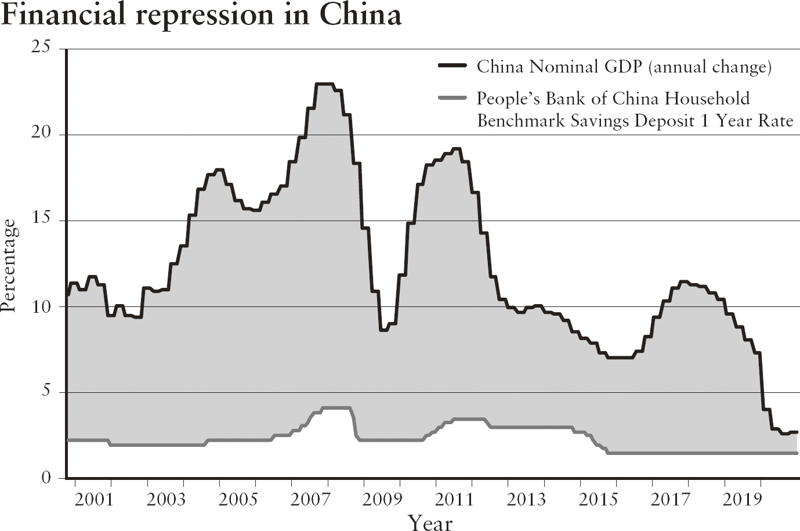

[12.](#section-9) The huge gap between deposit rates and nominal GDP growth is a measure of the extent to which Chinese savers were repressed.

On the eve of the global financial crisis, China’s current account surplus reached 10 per cent of GDP. More than half of the country’s national income was being saved. As savings grabbed a larger slice of the economic pie, household consumption as a share of GDP fell to little more than half the US level. The removal of the ‘iron rice bowl’ (the universal welfare policy of the Mao era) is often held responsible for China’s savings glut and massive trade surpluses. Yet the data show only a slight increase in household savings (as a proportion of GDP) after 1990, and most of those savings came from the wealthy elite.[21](#section-53) During this period workers’ incomes actually lagged behind economic growth, and household savings fell as a proportion of total savings.[22](#section-53)

Financial repression was largely responsible for this state of affairs.[fn4](#section-58) In *The Great Rebalancing* (2013), Peking University professor Michael Pettis calculated the costs to household savers and benefits to borrowers from artificially depressed deposit rates. ‘The total transfer from households to state-owned enterprises, infrastructure investors, and other favored institutions amounts to anywhere from 3 percent to 8 percent of GDP annually,’ Pettis concluded.[23](#section-53) Cheap credit enabled Chinese companies to invest more:[24](#section-53) ‘the problem is not that the household propensity to save is too high,’ wrote Ronald McKinnon, ‘but rather that enterprises save too much – mostly in the form of excess investment in fixed assets.’[25](#section-53) Government savings also climbed thanks to rising receipts on land sales and massive infrastructure investment.[26](#section-53)

Claudio Borio provides an alternative view to the conventional wisdom on Chinese savings. Most people look upon savings as a ‘real’ phenomenon; that’s to say, they assume that savings arise when individuals voluntarily refrain from consuming their income. But this isn’t how things work in the real world, says Borio. In the real world, banks create credit out of thin air. Savings and investment are two sides of the same coin. Thus, when a bank loan is used for the purposes of investment there occurs an automatic increase in reported savings.[27](#section-53) In China, financial repression stimulated credit growth; much of the new credit was invested, which, in turn, pushed up the savings rate.

### UNSTABLE, UNBALANCED, UNCOORDINATED AND UNSUSTAINABLE

In March 2007, Premier Wen Jiabao observed that China’s economy was ‘unstable, unbalanced, uncoordinated, and unsustainable’. Presumably Wen had in mind the depressed level of household consumption and sky-high investment rate, funded by vast domestic savings. The failure of economic co-ordination identified by Premier Wen is what Hayek suggested would happen when interest rates are kept below their natural level. But Premier Wen’s comment, repeated on subsequent occasions, bore his ‘signature combination of noble sentiment and missing action’.[28](#section-53) No significant reforms were embarked upon. Since the authorities wouldn’t countenance a downturn, imbalances were allowed to fester. As a senior Beijing official reportedly said, ‘A little bit more imbalance … is better than a lot of collapse.’[29](#section-53)

Beijing responded to the global financial crisis by launching a massive economic stimulus in November 2008. The stimulus carried a headline figure of 4 trillion yuan (12.5 per cent of GDP), with most of the money supplied by banks. Over the course of 2009, credit expanded by more than 30 per cent of GDP. Financial repression became more deeply entrenched. In the month after Lehman’s bankruptcy the People’s Bank cut interest rates twice.[30](#section-53) By January 2009, China’s interbank rate stood at 1 per cent, down 4 percentage points since the previous summer.[31](#section-53) Over the following five years, the benchmark rate averaged less than 1 per cent in real terms and trailed far below the country’s nominal GDP growth. The yuan continued to be loosely pegged to the US dollar. Foreign capital continued to pour into the country. The People’s Bank continued printing money to buy dollars.[fn5](#section-58)

Although China’s current account surplus declined after the global financial crisis, its foreign exchange reserves doubled between 2008 and 2014, reaching a total of more than $4 trillion. By the latter date, up to a third of these reserves derived from foreign capital inflows.[32](#section-53) Not all of these inflows came from Western investors. Chinese multinationals borrowed in dollars through their foreign subsidiaries and exchanged the dollars for yuan, which they used for investment or lent onwards at higher rates outside the formal banking system.[33](#section-53) Foreign bank claims on China reached $1.7 trillion in 2014.[34](#section-53)

Thanks to the near limitless supply of cheap credit, China’s imbalances grew larger. As Bloomberg’s Tom Orlik writes,

> State-owned industrial giants went deep into debt, paying for new steel mills, coal mines, and cement kilns, adding to already burgeoning overcapacity. Real estate developers painted their balance sheets in red ink, borrowing to build ghost towns of unsold property. Local governments dodged the regulations intended to keep public debt under control, creating opaque investment vehicles to borrow off the books.[35](#section-53)

China’s financial repression came in the form of *unstable* bubbles, *uncoordinated* investment, *unsustainable* debt, and an *unbalanced* shadow banking system, and it also allowed *unscrupulous* vested interests, including members of Premier Wen’s own family, to reap the benefits from the limitless flow of easy money.

### UNSTABLE BUBBLES

‘There’s always a bubble in China,’ a world-weary fund manager told the *Wall Street Journal* in November 2016. There was no disputing this. Over the previous years a bewildering array of mini-bubbles had popped up across the country, ranging from a caterpillar fungus with aphrodisiac properties to garlic bulbs; from vintage claret to China’s home-grown bubbly, Moutai; from works of fine art to fine china; and bubbles in just about every industrial commodity, from copper to iron ore. The Shanghai stock market witnessed a succession of magnificent bubbles. Overshadowing them all was an epic real estate bubble that proved resilient in adversity, shaped the country’s economic development and was the ultimate source of all those other bubbles.

By October 2007 the Shanghai stock market was up more than fourfold in a little over eighteen months. The combined value of listed companies was more than twice China’s GDP. Monetary policy contributed to the stock market boom. At the time, the central bank was printing and selling billions of yuan to maintain the dollar peg. In July 2005, the central bank had allowed the yuan to appreciate but offset this move by lowering interest rates (which remained negative in real terms). Bank credit was allowed to expand dramatically.[36](#section-53) Nearly two decades earlier, the Bank of Japan had followed a similar path, loosening monetary conditions in the wake of the international currency agreement known as the Plaza Accord. Japan expert Peter Tasker drew a parallel between these two episodes:

> As with Japan in the 1980s, China’s monetary policy has become a hostage to its export machine. Interest rates are held far below their natural level in order to restrain the yuan. At the same time, financial liberalization has opened the securities markets to millions of unsophisticated Chinese investors who finally have an alternative to value-losing bank deposits. It is hard to imagine a more bubble-worthy set of circumstances.[37](#section-53)

In the months following the October 2007 peak, the Shanghai stock market declined by more than 70 per cent. Beijing’s stimulus soon came to the rescue of beleaguered speculators, however. By the summer of 2009, the Shanghai Composite had nearly doubled from its trough. The dollar value of shares traded in Shanghai exceeded the combined turnover of the stock exchanges in London, New York and Tokyo. Seven Chinese companies made the list of the world’s ten largest companies by market value.

The stock market frenzy abated towards the end of 2009, but not for long. Between November 2014 and the summer of 2015, the Shanghai Composite doubled once again. Once again, animal spirits were stoked by Beijing, this time to offset weakness in the housing market. The central bank lowered its benchmark rate and expanded its own balance sheet. After restrictions on brokers’ loans were relaxed, margin loans grew to exceed $1 trillion.[38](#section-53) Technology shares sold for more than two hundred times earnings, ‘making the heady days of the dot-com bubble look tame by comparison’.[39](#section-53) The IPO of China National Nuclear Power in early June was oversubscribed by 137 times, locking up $273 billion in subscriptions. The shares increased by 44 per cent on the first day’s trading.

This speculative fever was also short-lived. By July 2015, the Shanghai Composite was down by a third. Trading halts were declared for a majority of stocks. Fearful of a complete market rout, Beijing strove to create an environment of ‘positive energy’. Regulators and censors warned citizens against making negative comments about the economy. The central bank cut interest rates and bank reserve requirements, and lent money to prop up the market. A ‘national team’ of state enterprises borrowed large sums to buy shares.[fn6](#section-58) At the graduation ceremony at Tsinghua University, students were instructed to ‘shout loudly the slogan, “revive the A shares, benefit the people; revive the A shares, benefit the people.”’[40](#section-53)

The ups and downs of the stock market were a sideshow compared to developments in China’s property market. During the global financial crisis, house prices dipped sharply in Beijing and other leading cities. The authorities acted forcefully to turn the tide. Banks were ordered to ease lending standards and provide more second mortgages. Housebuyers were able to borrow at a large discount to the benchmark rate. Over the course of 2009, mortgage lending quintupled and property sales rose by two-thirds.[41](#section-53) The *Wall Street Journal* reported on a rush to buy land in Beijing. House prices in Tier 1 cities – the world’s hottest real estate, according to Savills – climbed by more than two-thirds.

China overtook the United States to become the world’s largest property market by value.[42](#section-53) At which point, the authorities decided to cool the housing market. Interest rates and bank capital requirements were hiked in early 2010 and mortgage standards tightened. Banks were instructed to stop lending for third-home purchases.[43](#section-53) It took a while for these measures to bite, but towards the end of 2011 property prices were falling in nearly all of the seventy cities tracked by the National Bureau of Statistics. House sales crashed in Shanghai and Beijing. Whereupon policy was reversed again. In the summer of 2012, interest rates were cut as part of a ‘global coordinated global easing campaign’ (according to Bloomberg) linked to Europe’s sovereign debt crisis.

Having survived numerous setbacks, China’s property market gained a reputation for invincibility – a key condition, according to hedge fund tycoon George Soros, for a ‘super bubble’ to emerge. After the 2015 stock market crash, monetary policy was further eased. In October, the central bank’s benchmark rate reached an all-time low of 2 per cent. Over the following year, bank lending accelerated, with mortgages taking a greater share of new loans.[44](#section-53) In parts of Shanghai and neighbouring Suzhou, empty development plots sold for more than neighbouring land with completed buildings – a case of ‘flour more expensive than bread’. By late 2016, house prices were valued nationwide at eight times average Chinese incomes, roughly double the peak valuation of US housing a decade earlier.

Property valuations in China weren’t completely irrational. Sir James Steuart’s claim that the value of the Mississippi Company was justified by the low cost of borrowing applied to China’s real estate market. John Law’s Royal Bank set interest rates at 2 per cent in 1719. Nearly three centuries later, the People’s Bank set interest rates at the same level. A study released in 2015 by the National Bureau of Economic Research found that rental yields in Beijing and Shanghai had fallen below 2 per cent – in line with the discount rate.[45](#section-53) However, rental yields of less than 2 per cent implied a payback of nearly seven decades – roughly the same length of time as residential land leases, after which title reverted to the state. China’s property market was hailed as the ‘bubble that never pops’.[46](#section-53) But, as the NBER researchers commented, ‘only modest declines in expected appreciation seem needed to generate large drops in house values.’

By late 2016 total real estate was valued at $43 trillion, equivalent to nearly four times GDP and on a par with the aggregate value of Japanese real estate (relative to GDP) at its bubble peak.[47](#section-53) Like Japan three decades earlier, China had transformed into a ‘land bubble’ economy. The French bank Société Générale had calculated back in 2011 that over the previous decade China had built 16 billion square metres of residential floor space. This was equivalent to building modern Rome from scratch every fourteen days, over and over again. A decade after the stimulus more than half of the world’s hundred tallest buildings were under construction in the People’s Republic, and more than a quarter of economic output was related, directly or indirectly, to real estate development.[48](#section-53)

The ostensible rationale for China’s incredible building spree was urban migration. Yet while hordes of migrants worked on construction sites, they couldn’t afford to acquire the properties they built. Instead, much of the demand for new homes came from investors. In November 2009, Melissa Chan of Al Jazeera TV reported on the new development of Ordos (also known as Kangbashi) in Inner Mongolia.[49](#section-53) Built in five years, the city was intended to house over a million people. However, when Chan visited Ordos she found nothing but ‘empty homes, new and neat, block after block’. The apartments had reportedly been snapped up by rich Mongolian miners as investments. Overnight, Ordos became the world’s most famous ‘ghost city’.

Many new apartments in China were sold as concrete shells, known as ‘blank houses’ (*maopeifang*), that lacked basic amenities such as electric wiring and plumbing. Many remained in this unoccupied state for years on end. Absentee apartment owners saved money by not servicing elevators, which led to the occasional tragic accident.[fn7](#section-58) Vacant residential blocks could be identified at night by their darkened windows. In 2010, it was widely reported that some 65 million properties connected to the power grid were not using any electricity.[50](#section-53) Later estimates suggested that a fifth of the urban housing stock remained unoccupied.[51](#section-53) China was said to have enough empty properties to house the entire population of Canada.[52](#section-53)

China’s real estate bubble threatened the country’s economic miracle, by lowering productivity growth and fuelling corruption.[53](#section-53) As a retired senior Beijing official described the situation: ‘The real estate industry’s excessive prosperity has not only kidnapped local governments but also kidnapped financial institutions – restraining and even harming the development of the real economy, inflating asset bubbles and accumulating debt risk.’[54](#section-53) Real estate was the one thing in China more powerful than its imperial President. In December 2016, Xi Jinping proclaimed that ‘houses are for living in, not for speculation.’ Yet at the time nearly a third of Chinese families owned one or more vacant properties.[55](#section-53) Such was the nation’s devotion to property that the divorce rate spiked after Beijing imposed restrictions on families owning more than a single property.[56](#section-53)

### UNCOORDINATED INVESTMENT

Beijing’s stimulus plan launched thousands of ‘shovel-ready’ projects for new airports, bridges, highways, subways, and so forth. The most ambitious scheme involved the rapid expansion of the high-speed rail network, reportedly the world’s most expensive public works project since the US interstate highways were built in the 1950s.[57](#section-53) The person in charge of this mega-project was Railway Minister Liu Zhijun, whose Maoist exhortation that ‘To achieve a great leap, an entire generation must be sacrificed’ earned him the sobriquet ‘Great Leap Liu’. Spending on the project amounted to 2 per cent of China’s GDP.

By 2010, the Railway Ministry owed more than 1 trillion yuan on railway bonds alone. Alongside the inevitable cost overruns, there were rumours that cheap materials had been used by contractors, a practice known as ‘robbing the beams to put in the pillar’. Safety fears came to a head on 23 July 2011, when a bullet train bound for Fuzhou collided with another train outside Wenzhou, killing forty passengers and injuring many more. By this date, Liu was under investigation for ‘severe violations of discipline’. The Minister had received kickbacks on construction contracts, operated a slush fund to bribe newspaper editors and maintained no fewer than eighteen mistresses. (In July 2013 a court sentenced the former rail chief to death, commuted to life imprisonment.)

The legacy of the high-speed rail expansion was a massive waste of resources, mountains of debt, an economy addicted to construction spending, and public corruption on an epic scale. Writ large, this is the story of China’s recent economic development. When the cost of borrowing is low enough, even the most absurd investments can appear viable. In twenty-first-century China, easy money levelled mountains. Or, more precisely, the local government in the city of Shiyan, Hubei province, ordered that local mountains be flattened to make space for new manufacturing plants. ‘Levelling mountains,’ declared the local land bureau, ‘has become the golden key to resolve the problem of Shiyan’s development impasse.’[58](#section-53)

Spending on infrastructure normally tracks economic development: bridges are built, tunnels dug and railway tracks laid because there is an existing demand for their services. In China, however, investment plans were lifted from the *Field of Dreams*’ script: ‘if you build it, he will come.’ New infrastructure would supposedly drive urbanization and boost productivity. But researchers at Oxford’s business school found that ‘Far from being an engine of economic growth, a typical infrastructure investment has destroyed economic value in China.’[59](#section-53)

Among the other high-profile infrastructure projects at this time were a new airport south of Beijing said to be the size of Bermuda, and the world’s longest bridge, linking Hong Kong to the Mainland. China’s mandarins have a long tradition of authorizing impressive investments. The Grand Canal, the world’s longest waterway, was built in the seventh century with the forced labour of millions. ‘What is to be wondered at in China,’ wrote the Dominican monk Gaspar da Cruz in the sixteenth century, ‘is that there are bridges in uninhabited places throughout the country, and these are not less well built nor less costly than those which are nigh the cities, but rather they are all costly and very well wrought.’[60](#section-53) In the Immobile Empire some things never change.

Investment wasn’t merely directed towards infrastructure projects. As part of the stimulus, Beijing endorsed a ‘strategic emerging industries’ plan, promoting investment in new technologies, including biotech and electric vehicles.[61](#section-53) A number of sectors, ranging from aerospace to telecoms, were earmarked for ‘indigenous innovation’.[62](#section-53) Several ‘engineering mega-projects’ were fast-tracked, including a plan to develop a large-scale civilian jet-liner. Less glamorous industries were also supported with stimulus funds, including machinery, textiles, shipbuilding, car-making, steel, nonferrous metals and logistics. The trouble was that most of these industries already produced more than they could sell.[63](#section-53)

The glut in China’s steel production was notorious. Before the financial crisis, the People’s Republic produced around half of the world’s steel at a time when its steel companies were operating at just two-thirds of capacity.[64](#section-53) The boom in real estate and infrastructure created a much-needed surge in the demand for steel. But all the extra investment in steel plants meant supply continued to outstrip demand. Steel prices collapsed, falling to the point where it was said that ‘steel was cheaper than cabbage’.[fn8](#section-58)

A number of other industries, including cement, flat glass, paper, solar and wind power, were likewise afflicted by the twin scourges of overinvestment and oversupply.[65](#section-53) As with steel, the stimulus pushed cement demand through the roof. A much-cited factoid from the US Geological Survey claimed that in the three years after 2008 China consumed nearly one and a half times as much cement as the United States had used over the course of the twentieth century. On an annual basis, nearly two tonnes of cement were poured for every man, woman and child in the world’s most populous country.[66](#section-53) Nevertheless, China’s cement industry continued to be plagued with excess capacity and continued to add yet more capacity.

State-owned enterprises received the lion’s share of cheap bank credit, together with numerous other subsidies.[fn9](#section-58) But their access to low-cost capital had a negative impact on returns on capital. By 2014 state-owned enterprises were earning just half as much as their private counterparts.[67](#section-53) As their asset base expanded, their profitability declined.[68](#section-53)

As in Europe, China’s economy became infested with corporate zombies, nourished on a diet of cheap credit, state subsidies and loan forbearance. In January 2016 the *People’s Daily* carried an interview with an ‘authoritative person’, believed to be President Xi’s chief economic adviser, Liu He, who called for a reduction in industrial overcapacity.[69](#section-53) Premier Li Keqiang reinforced this message, declaring that ‘For those “zombie enterprises” with absolute overcapacity, we must ruthlessly bring down the knife.’[70](#section-53) A number of supply-side reforms were announced and two loss-making state-owned steelmakers – Baosteel and Wuhan Steel – were merged.[71](#section-53) Yet only a few months after the Premier’s comments, US steelmakers complained that Chinese competitors were being kept alive with state subsidies and dumping their surplus steel in the United States.[72](#section-53) The IMF identified some 3,500 state-owned zombies across eleven Chinese provinces.[73](#section-53)

What the *People’s Daily* called the ‘development disease’ inflicted an immense social and environmental toll.[74](#section-53) Home to a fifth of the world’s population, the People’s Republic consumed around half of the world’s production of steel, cement, copper, aluminium, nickel and coal.[75](#section-53) In 2009, China overtook the United States to become the world’s leading producer of greenhouse gases. Between 2000 and 2014, China’s annual carbon emissions trebled.[76](#section-53) ‘When an economy as large as China’s,’ writes economic analyst Henry Maxey, ‘can engineer an unproductive infrastructure boom through abuse of a pure credit system, we should not be surprised to see global carbon dioxide emissions rising … monetary policy has catalysed activities that have accelerated the problem.’[77](#section-53)

Capital was misallocated in China on a scale not seen since the heyday of the Soviet Union. Soviet central planners had also operated under conditions of financial repression. In his *Political Economy of Socialism*, Hungarian economist János Kornai explained how monetary conditions in Communist Russia and its satellites contributed to their economic failure:

> [M]arket coordination had not become predominant in these economies. If the real interest rate is negative for a long period, it is unable to control the allocation of investments and gives false information to decision makers for all the decisions that compare present and future revenues and expenditures.[78](#section-53)

In 1994, Paul Krugman published a celebrated essay in *Foreign Affairs* entitled ‘The ‘Myth of Asia’s Miracle’. Krugman observed that ‘Rapid Soviet economic growth [in the 1950s] was based entirely on one attribute: the willingness to save, to sacrifice current consumption for the sake of future production.’[79](#section-53) At a time when the World Bank was hailing an ‘East Asian Economic Miracle’, Krugman pointed out that most Asian economies, like Khrushchev’s Russia, needed ever-increasing investment inputs in order to grow. What Krugman didn’t say was that several Asian economies had pegged their currencies to the US dollar and were funding investment with cheap foreign loans. Not long after this article appeared, the Asian crisis broke.

Krugman’s analysis also applies to China, a country which implemented the ‘Asian development model on steroids’, according to Michael Pettis. As a share of GDP, China invested far more than any other Asian country had ever attempted. As investment climbed to unprecedented levels, the efficiency of investment – what economists call the ‘incremental capital to output ratio’ – spiralled downwards.[fn10](#section-58) All those immense sums spent on bridges, high-speed trains and roads were failing to generate the much-touted improvements to productivity. The People’s Republic was trapped on an investment ‘treadmill to hell’.[80](#section-53) But stepping off the treadmill would amount to ‘drinking poison to cure thirst’.

### UNSUSTAINABLE DEBT

The surge of credit unleashed by Beijing’s stimulus in 2009 acted like a gigantic defibrillator placed over the heart of a faltering economy. But credit is an addictive substance whose effect diminishes with excessive use. Even as China’s growth slowed over the following years, its economy required ever larger doses. After the stimulus, the boost to GDP from 100 yuan of new credit fell to 30 yuan, around a third of its prior level.[81](#section-53) The waning contribution of credit to economic growth matched the declining efficiency of investment. This was only to be expected since most investment was financed with debt.[82](#section-53)

A nation’s capacity to bear debt is related to its economic development. Rich countries are generally able to shoulder more debt than poorer ones. What made China’s growing indebtedness egregious was that its economy remained relatively undeveloped, with average incomes still far below Western levels. The rapidity of credit growth (relative to GDP) also exceeded most earlier credit booms, including Japan’s in the 1980s, and was roughly on a par with the Spanish and Irish experiences prior to 2008.[83](#section-53) Then, there was the scale. In ten years to 2015, China accounted for around half the world’s total credit creation.[84](#section-53) This borrowing binge constituted ‘history’s greatest Credit Bubble’.[85](#section-53)

Every part of the economy became bloated with debt. Liabilities of the banking system grew to three times GDP. At the time of Lehman’s bankruptcy, households in the People’s Republic carried much less debt than their American counterparts. But, since the much-touted ‘rebalancing’ of the economy never occurred, consumers turned to credit to enhance their purchasing power. Between 2008 and 2018, Chinese households doubled their level of debt (relative to income) and ended up owing more than American households did at the start of the subprime crisis. Over the same period, Chinese companies borrowed $15 trillion, accounting for roughly half the total increase in global corporate debt. Real estate companies borrowed to finance their developments – the largest developer, Evergrande, ran up total liabilities equivalent to 3 per cent of GDP. Local governments set up opaque financing vehicles to pay for infrastructure projects with borrowed money. Debt owed by local governments grew to $8.2 trillion (by the end of 2020), equivalent to more than half of GDP.[86](#section-53)

Although they borrowed more cheaply than private firms, state-owned enterprises nevertheless had trouble covering their interest costs.[fn11](#section-58) After 2012 the total cost of debt-servicing exceeded China’s economic growth.[87](#section-53) An economy that can’t grow faster than its interest costs is said to have entered a ‘debt trap’. China avoided the immediate consequences of the debt trap by concealing bad debts. What’s been called ‘Red Capitalism’ resembled a shell game in which non-performing loans were passed from one state-connected player to another.

The shell game commenced at the turn of this century when state banks were weighed down with non-performing loans. The bad loans weren’t written off, however, but sold at face value to state-owned asset management companies (AMCs), which paid for them by issuing ten-year bonds that were, in turn, acquired by the state-owned banks. In effect, the banks had swapped uncollectible short-term debt for uncollectible long-dated debt. When the day finally arrived for the AMCs to redeem their bonds, the loans were quietly rolled over. Concealing or ‘evergreening’ bad debts required low interest rates. China’s rate cuts in 2001 and 2002 were partly intended to help banks handle their debt problems. Over the following years, bank loan rates were kept well below the country’s nominal GDP growth, while deposit rates remained stuck beneath 3 per cent. Thus, Chinese depositors indirectly bailed out the banking system.[88](#section-53)

After 2008, cracks in the credit system were papered over with new loans – a tenet of Red Capitalism being that ‘as long as the banks continue to lend, there will be no repayment problems.’[89](#section-53) But it became progressively harder to conceal problem loans. In 2015, an industrial engineering company (Baoding Tianwei Group) became the first state-owned enterprise to default on its domestic bonds.[90](#section-53) The trickle of defaults continued. One could only guess at the scale of China’s bad debts. Bank analyst Charlene Chu suggested that by 2017 up to a quarter of bank loans were non-performing. This estimate was five times the official figure.[91](#section-53)

As Chu commented: ‘if losses don’t manifest on financial institution balance sheets, they will do so via slowing growth and deflation.’[92](#section-53) Debt deflation, as Irving Fisher pointed out, occurs after too much debt has accumulated. At the same time, excess industrial capacity was putting downward pressure on producer prices and leading China to export deflation abroad – for instance, by dumping its surplus steel in European and US markets. Corporate zombies added to deflation pressures. Despite the soaring money supply after 2008, consumer prices hardly budged. By November 2015, the index of producer prices had fallen for a record forty-four consecutive months.[93](#section-53)

If China’s investment had been productive, then it would have generated the cash flow needed to pay off its debt. But, for the economy as a whole, this wasn’t the case.[94](#section-53) So debt continued growing. Top officials in Beijing were aware that the situation was unsustainable. In the summer of 2016, President Xi’s anonymous adviser warned in his interview with the *People’s Daily* that leverage must be contained. ‘A tree cannot grow to the sky,’ declared the ‘authoritative person’; ‘high leverage must bring with it high risks.’[95](#section-53) Former Finance Minister Lou Jiwei put his finger on Beijing’s dilemma: ‘The first problem is to stop the accumulation of leverage,’ Lou said. ‘But we also can’t allow the economy to lose speed.’[96](#section-53) Since these twin ambitions are incompatible, Beijing chose the path of least resistance. A decade after the stimulus launch, China’s ‘Great Wall of Debt’ had reached 250 per cent of GDP, up 100 percentage points since 2008.[97](#section-53) There was still more to come.

### UNBALANCED SHADOW BANKING

In 1984, the first private money house in Communist China opened in Wenzhou, a coastal city in the south-eastern province of Zhejiang. Founded by a former hospital administrator named Fang, the Ascendant Money House of Cangnan County provided credit to local businesses. At the time state-run banks monopolized lending, but opened for only a few hours each day and lent only to those with political connections. The banks took months to approve a loan. By contrast, Fang’s business was open 24/7. Business was so brisk that the moneylender charged interest on an hourly basis: ‘Time is interest’ was his motto.[98](#section-53)

A double-track system of interest rates emerged in China after 1979. Cheap loans were originated by state banks for state-owned enterprises, and more costly credit was provided by back-alley banks to private enterprises. A few years after the establishment of Fang’s Money House, dozens of competitors were operating in Wenzhou. Among them were credit associations, credit co-operatives and pawnshops – the latter an ancient Chinese institution dating back to the period of the Six Dynasties early in the first millennium of the Common Era. Wenzhou’s informal lending market was roiled by occasional pyramid schemes and constantly harassed by state banks. Naturally, the People’s Bank of China disapproved. The Ascendant Money House, along with several other money houses and credit co-operatives, was ‘rectified’ – that’s to say, closed down – in the late 1980s.

Public officials complained that Wenzhou’s loan sharks exploited borrowers. In fact, their high interest charges served to ration capital, ensuring that money went to businesses that made the best use of it. To avoid accusations of profiteering, rural co-operatives charged what they called a ‘capital use fee’ – as good a definition of interest as any other – and entered loans into their books as ‘capital managed by another person’. Despite their seamy aspects, back-alley banks financed tens of thousands of local businesses in Wenzhou, many involved in the mass production of watches, spectacles, cigarette lighters and shoes for export. The same story was repeated across the People’s Republic, where countless entrepreneurs established businesses with the help of informal lenders.

In Fang’s day the main business of Wenzhou’s unofficial credit system was supplying entrepreneurs with working capital. After 2008, however, profits from local manufacturing were squeezed by rising commodity costs and slowing exports. So, lenders turned to financing speculation. Wenzhou merchants were said to be the moving force behind a number of bubbles, from garlic bulbs to holiday homes on Hainan Island. By giving up traditional manufacturing for speculation, they ‘cast off the real for the empty’.

Real estate was the prime object of speculation, financed with loans from back-alley lenders.[99](#section-53) In the post-stimulus period, Wenzhou property prices doubled. Prime locations became nearly as costly as those of Shanghai and Beijing.[100](#section-53) Apartments in the grandly named ‘Versailles Residential de Luxe La Grande Maison’ were marketed at $11,000 a square metre – more expensive than Mayfair or Manhattan.[101](#section-53) Wenzhou gave off every appearance of prosperity. Its streets were lined with car dealerships for luxury marques – an online video of a Wenzhou wedding motorcade, featuring a procession of Rolls-Royces, Bentleys, Ferraris and Lamborghinis, went viral.[102](#section-53)

Towards the middle of 2011, however, the city’s informal banking system suddenly imploded. The proximate cause of the credit crunch was recent interest-rate hikes by the People’s Bank.[fn12](#section-58) The panic started after a local industrial park defaulted on its loans.[103](#section-53) A few months earlier, the owner of the country’s largest spectacle manufacturer had disappeared, leaving behind large debts to private lenders. Pawnshops, credit companies and loan sharks called in their loans and raised their lending rates. More businessmen upped sticks. Wenzhou merchants rushed to dump properties acquired with underground loans. As property prices sagged, more creditors called in their loans. A property sales manager recalled a ‘stampede, like animals running for their lives from a wild bushfire’.[104](#section-53) The city’s network of credit guarantee businesses fell like dominoes. Outside closed factory gates, police fought demonstrations by unpaid workers.

Wenzhou’s credit crunch attracted widespread attention at home and abroad. Premier Wen visited the city, accompanied by the Finance Minister and the head of the central bank. His mission was to ‘stop the horse at the edge of the cliff’. Banks were ordered to lend and credit conditions were relaxed – local farmers were even allowed to post pigs as collateral for loans.[105](#section-53) Monetary conditions were eased nationwide. The credit crunch was successfully confined to Zhejiang province.

By this date, back-alley banking of the Wenzhou variety had already been overtaken by a new type of lending, one that also took place outside the formal banking system. As Ronald McKinnon pointed out, financial repression creates an incentive for savers to remove their savings from banks and seek higher returns elsewhere. That’s what happened in the United States at the turn of the century after the Greenspan Fed lowered the Fed funds rate to 1 per cent and sales of structured finance products took off. America’s ‘shadow banks’ spectacularly collapsed in the subprime crisis. After Lehman’s bankruptcy, shadow banking didn’t disappear; instead, it found a new home in the People’s Republic.

The Chinese version of shadow banking comprised a variety of financial products. Most popular was the wealth management product (WMP), a credit instrument sold by banks that generally paid about 2 per cent more than bank deposits and was widely (if falsely) believed to be guaranteed by the issuer. Trust products were riskier, as they were often tied to real estate developments, but paid more. Companies short of cash sold debt-receivables. State-owned enterprises borrowed cheaply from the state banks to provide entrusted loans to private businesses. Online lending was dominated by internet giants Alibaba and Tencent.

By 2016, the market for wealth management products had grown to 23.5 trillion yuan, equivalent to over a third of China’s national income. Total shadow finance was estimated to be twice as large.[106](#section-53) Even the relatively obscure market for debt-receivables exceeded the size of the US subprime market at its peak.[107](#section-53) George Soros observed an ‘eery resemblance’ between China’s shadow banks and the discredited American version.[108](#section-53) Both were driven by a search for yield at a time of low interest rates; both were opaque; both involved banks originating and selling on questionable loans; both depended on the credit markets remaining open and liquid; and both were exposed to real estate bubbles.[109](#section-53)

The People’s Bank had previously controlled interest rates through its authority over bank deposit and lending rates. But as the shadow finance world grew, this tool became ineffective. Banks that were heavily exposed to wealth management products required larger and larger sums to roll over on maturity, with short-term loans provided by other banks. In late June 2013, China’s interbank market suddenly seized up: overnight rates soared to nearly 30 per cent, the Shanghai stock market fell more than 5 per cent and ATMs in Beijing reportedly stopped providing cash. The People’s Bank initially refused to accommodate the banks, to teach them a lesson, but it soon relented. The central bank now turned to managing the volatility of interbank market rates.[110](#section-53) The overnight bank lending rate (known as SHIBOR) was becalmed at 2 per cent.

Shadow finance was quickly integrated into Red Capitalism’s shell game. Not long after the Wenzhou crisis, a wealth management product issued by Huaxia, a small commercial bank, threatened to default. A credit guarantee company with no apparent connection to the stricken credit instrument was brought in to protect investors.[111](#section-53) The following year, a state-run asset management company absorbed a couple of property trusts that were on the verge of collapse.[112](#section-53) In 2015, a coalmining company from Shanxi province defaulted on a $500 million WMP, fatefully named ‘Credit Equals Gold No. 1’. Sure enough, a third party turned up to take over the company’s debts and forgive outstanding interest.[113](#section-53) By putting a safety net under the credit system, Beijing bought stability in the near-term. But stability came at a high cost. It was widely assumed that large borrowers would always be bailed out and certain classes of creditor (including the holders of wealth management products) would always be protected. As a result, interest rates in China didn’t reflect credit risk.[114](#section-53)

Hyman Minsky coined the term ‘Ponzi finance’ to describe the situation when a borrower can’t service its debts from current income and remains solvent only if asset prices continue to rise. As the tenth anniversary of the stimulus approached, the departing Governor of the People’s Bank, Zhou Xiaochuan, warned of ‘hidden, complex, sudden, contagious and hazardous’ risks in China’s credit system.[115](#section-53) The Governor pointed to Ponzi lending schemes operated by internet companies.[fn13](#section-58) (A few months earlier, the collapse of a peer-to-peer lending scheme had prompted large public protests in Beijing’s financial district.[116](#section-53)) He also warned of financial risks from zombie companies, poor risk models, speculative bubbles and financial innovation. The country’s top banker feared that China faced its own ‘Minsky moment’.[117](#section-53)

Not long after, the government seized control of Baoshang Bank, a regional lender based in Baotou, Inner Mongolia. Baoshang had grown rapidly by issuing negotiable certificates of deposit to other banks. Its controlling shareholder had reportedly misused these funds. Zhou’s People’s Bank turned out to have been an unwitting accomplice. Baoshang’s borrowing had taken off after 2013 when the central bank started managing volatility in the interbank loan market.[118](#section-53) Minsky would not have been surprised: in the world of finance capitalism, he said, ‘stability is destabilizing’.

### CAPITAL FLIGHT

The chief reason the authorities could prevent credit problems from escalating was that capital controls trapped domestic savings in China. The logic of financial repression, however, drove savings out of the country in search of better returns abroad. As long as the US Federal Reserve kept interest rates close to zero and continued printing money, the pressure on China’s capital account was limited. But once the Fed moved to tighten monetary policy, as it did five years after the Lehman crisis, large sums of money started to leak out of the People’s Republic.

There were countless ways, legal and illegal, for citizens to evade capital controls. In Macau, casinos provided a ‘laundry service’ taking in yuan and paying out in Hong Kong dollars. Money smugglers got Chinese firms to make out fake import invoices.[119](#section-53) Tourism provided another conduit for capital flight with wealthy Chinese employing friends to take money out of the country – a practice known as ‘Smurfing’. In 2015, the authorities launched a crackdown on capital outflows. Police arrested hundreds of money smugglers.[120](#section-53) Banks were told to tighten their foreign exchange dealings too. Multinational companies operating in China had difficulty repatriating profits. Business travellers faced problems getting hold of US dollars for overseas trips.[121](#section-53)

Foreign acquisitions by Chinese firms provided yet another way to remove capital from the country. In October 2014, a Chinese insurance firm, Anbang Insurance, stumped up almost $2 billion for New York’s Waldorf Astoria, a record price for a US hotel that recalled Japan’s hubristic overseas buying spree some three decades earlier. Anbang more closely resembled a shadow bank than a traditional life insurer. Its best-selling product, ‘Anbang Longevity Sure Win Number 1’, paid a generous income while allowing investors to cash it in after a couple of years. Anbang used the money from sales of this product to acquire foreign hotels, retirement homes, insurance companies and other businesses.

Beijing now clamped down on foreign takeovers. Given its prominent role as shadow banker and serial acquirer of foreign companies, Anbang made a perfect scapegoat. The company was ordered to dispose of its foreign investments. Anbang’s chairman, Wu Xiaohui, a well-connected businessman married to a granddaughter of Deng Xiaoping, was arrested for ‘economic crimes’ (and later sentenced to eighteen years in prison). The company’s assets were seized. Neither international borders nor foreign laws impeded Beijing’s attempts to stop capital flight. In January 2017, a Chinese-Canadian tycoon named Xiao Jianhua, who had been accused of money-laundering, was abducted by plainclothes police from his suite in Hong Kong’s Four Seasons Hotel and spirited back to the Mainland where he was thrown in jail.[122](#section-53) ‘Crocodiles’ – the name given to overreaching business types – were becoming an endangered species.

Beijing might defy international law. But for how long could it defy the laws of economics? As John Law had discovered in 1720, it is not possible for a country to fix the price of its currency on the foreign exchanges while rapidly expanding the domestic money supply. Since 2008 China’s money supply had grown relentlessly relative to the size of its economy and the world’s total money supply. Those trillions of dollars’ worth of foreign exchange reserves provided an illusion of safety since a large chunk was tied up in illiquid investments. Besides, cash deposits in China’s banks far exceeded foreign exchange reserves. If only a fraction of those deposits left the country, however, the People’s Republic would face a debilitating currency crisis.

### UNSCRUPULOUS INTERESTS

Stanford economist Edward Shaw, who together with Ronald McKinnon developed the theory of financial repression, drew attention to its political aspects. Shaw suggested that control over interest rates enhanced the power of civil servants, who got to dispense cheap credit to favoured parties. This fostered cronyism and inequality. Bureaucrats who jealously guarded their monetary powers would resist demands for financial liberalization, he added.[123](#section-53) According to the ‘public choice’ school of economics, rents are created when the state interferes with markets and prices are kept away from equilibrium.[124](#section-53) Financial repression in China created copious rents and fostered crony capitalism.

‘Inordinate swindling is often bound up with a low rate of interest,’ observed that acute financial journalist Karl Marx.[125](#section-53) The Harvard economist John Kenneth Galbraith coined a term, ‘the bezzle’, to describe an economy’s ‘inventory of undisclosed embezzlement’ that varies with the business cycle.[126](#section-53) China’s bezzle was inversely related to the interest rate: as rates went down, the bezzle went up.[fn14](#section-58) Corruption was concentrated in those sectors, such as real estate, mining and construction, that benefited most from easy money. Investment projects were selected according to the size of extractable rents.[127](#section-53) Officials in charge of distributing credit made unauthorized loans and skimmed off interest.[128](#section-53) Networks of corruption were sustained by bribes paid in cash, land, property and shares, and by gifts and lavish entertainments. Officials on VIP junkets at Macau casinos laundered bribes while sating their passion for baccarat.[129](#section-53) The prices achieved from the illicit sale of public offices (i.e., the capitalized value of rents) took off.[130](#section-53) As paper wealth expanded, the Party cadres milked the asset economy and crushed political opposition.[131](#section-53)

As in the West, financial repression tilted the playing field in favour of the rich and well-connected. People with access to cheap credit, and those who controlled real and financial assets, enjoyed windfall gains. Ordinary households deprived of a fair return on savings and small businesses forced to borrow at high rates financed this great wealth transfer. From the early 1980s onwards, the rising incomes of hundreds of millions of Chinese workers contributed to a decline in global inequality. But during this period, China itself transformed from one of the world’s most egalitarian nations into one of the least equal. After 2008, the Gini coefficient for Chinese incomes climbed to 0.49 – an indicator of extreme inequality and more than twice the level at the start of the reform era.[fn15](#section-58)

The inequality problem was worse than the official data suggested.[132](#section-53) A 2010 report from Credit Suisse claimed that ‘illegal or quasi-legal’ income amounted to nearly a third of China’s GDP.[133](#section-53) Much of this grey income derived from rents extracted by Party members. The case of Bo Xilai, the princeling who became Party chief of Chongqing, is instructive. As the head of this sprawling municipality, Bo made a great display of rooting out corruption. But after he fell from grace in 2012 it was revealed that his family was worth hundreds of millions of dollars. Premier Wen’s family fortune was estimated at $2.7 billion.[134](#section-53)

The richest 1 per cent of the population controlled a third of the country’s wealth, while the poorest quartile owned just 1 per cent.[135](#section-53) The real estate bubble was responsible for much of this rise in inequality. Researchers at Peking University found that 70 per cent of household wealth was held in real estate. A quarter of China’s dollar billionaires were real estate moguls.[136](#section-53) At the top of the rich list was Xu Jiayin, boss of property developer China Evergrande, whose fortune (in 2018) was estimated at $40 billion. Many successful property developers turned out to be the offspring of top Party members.[137](#section-53) Local government officials who drove villagers off their land to hand it over to developers acted as ‘engines of inequality’.[138](#section-53)

Financial repression turned back the clock on China’s economic liberalization. Throughout its history, the Middle Kingdom’s progress ‘has an intermittent character and is full of leaps and bounds, regressions and relapses’.[139](#section-53) In general, when the state has been relatively weak and money plentiful, the Middle Kingdom has advanced. Incomes were probably higher in the twelfth century under the relatively laissez-faire Song than in the mid-twentieth century when the Communists came to power. But when the state has shown a more authoritarian character, economic output has stagnated or declined. The mandarins’ desire for total monetary control contributed to Imperial China’s ‘great divergence’ from Western economic development.

In recent years, China has experienced an authoritarian relapse. Paramount leader Xi Jinping exercises imperial powers. An Orwellian system of electronic surveillance tracks the citizenry. Millions of Uighurs are reported to have been locked up in camps. Private companies are required to place the interests of the state before their own. The ‘China 2025’ economic development plans aim to establish Chinese predominance in a number of new technologies, from artificial intelligence to robotics. A system of social credits, which rewards and punishes citizens’ behaviour, will supplement conventional credit. A digital yuan, issued by the People’s Bank, will supplement – or even replace – conventional money. These developments are best summed up by a phrase that became commonplace in the 2010s: ‘the state advances, while the private [sector] retreats.’[140](#section-53)

Financial repression has played a role in this regressive movement. The credit binge launched by the 2008/9 stimulus enhanced Beijing’s sway over the economy. As the state has advanced, productivity growth has declined. Because interest rates neither reflect the return on capital nor credit risk, China’s economy has suffered from the twin evils of capital misallocation and excessive debt. Real estate development, fuelled by low-cost credit, delivered what President Xi called ‘fictional growth’. By 2019 Chinese GDP growth (per capita) had fallen to half its 2007 level.

The Third Plenum of the Eighteenth Chinese Communist Party Congress, held in Beijing in 2013, heralded profound reforms to banking practices. The ceiling on bank deposit rates was lifted, and banks could set their own lending rates. Households earned a little more on their bank deposits, but interest rates remained below nominal GDP growth. The central bank now turned to managing the volatility of the interbank market interest rate.[141](#section-53) The People’s Bank still lacked independence and had to appeal to the State Council for any change to monetary policy.

Allowing interest rates to be set by the market would have required wrenching changes. Forced to compete for deposits, state-controlled banks would suffer a loss of profitability. Bad loans would become harder to conceal. Without access to subsidized credit, state-owned enterprises would become even less profitable. Corporate zombies would keel over. Economic planners would lose the ability to direct cheap capital to favoured sectors. The cost of controlling the currency on the foreign exchanges would become prohibitively expensive. Beijing would no longer be able to manipulate real estate or fine-tune other markets.[142](#section-53)

The Party’s monopoly of power has survived the liberalization of most commercial prices and many business activities, but the cadres never removed their grip on the most important price of all. The state, not the market, would determine the level of interest. The legacy of China’s financial repression was, as President Xi told the National Congress in 2017, a ‘contradiction between unbalanced and inadequate [economic] development and the people’s ever-growing needs for a better life’, which, in turn, provided Xi with a rationale for further advancing the role of the state.[143](#section-53)

<!-- rl-section id="sec-chapter018" class="titlepage" title="18" -->

## Financial Repression with Chinese Characteristics

> *[T]he biggest problem with China’s economy is that the growth is unstable, unbalanced, uncoordinated and unsustainable.*
>
> Premier Wen Jiabao, 2007

Successful economic development requires that credit be allocated efficiently. That job is ill done when the state retains control over the banking system and when interest rates are set at inappropriate levels. In the early 1970s, Stanford economist Ronald McKinnon coined the pejorative term ‘financial repression’ to describe the negative consequences of keeping interest rates below the level of inflation. Under such circumstances, borrowers benefit at the expense of savers. Market forces no longer determine how credit is dispensed. Banks become risk averse, preferring to lend to large corporations and state-related entities. Savers look to protect their wealth from inflation by investing in real estate or taking their money abroad. In short, financial repression stifles economic development and weakens the financial system.[1](#section-53)

Financial repression might be said to have been invented in China. The tradition of controlling interest rates dates back as far as the Han period at the beginning of the Common Era.[2](#section-53) The Tang capped interest charged by private lenders while lending their own money at higher rates through the offices of ‘money-catching clerks’.[3](#section-53) Under the Song, guilds were forced to lend to the government at below market rates. The Mongols lent at very favourable rates to Uighur merchants, who ‘used the funds in money lending and various other business enterprises, including foreign trade’. China’s first state bonds were issued only in the late nineteenth century and even then some officials questioned whether the Emperor should have to pay interest.[fn1](#section-58)

Given the insecurity of commerce and the immaturity of financial development in the Middle Kingdom, ‘land purchase was the only method of investment.’[4](#section-53) Loans secured by property attracted the lowest interest. This attitude is summed up in Chang Ying’s *Remarks on a Regular Livelihood*, written in the early Qing period:

> I have seen much of this world. Pawnbroking, trade, and lending at compound interest are such that one inevitably comes to ruin before long. Even if at first you quickly make rich profits, it is certain to come to nothing in the end. Only land and houses can be for long relied upon.[5](#section-53)

Although paper money was invented in China, the verdict of most historians on the country’s monetary history is damning: ‘from having begun as a brilliant solution to a shortage of copper cash, paper money gradually turned into a bureaucratic monstrosity that hampered the productive forces whose growth it had originally done much to foster.’[6](#section-53) Financial repression served as a tool of political repression.[fn2](#section-58) In his brilliant account of Lord Marcartney’s embassy to the Court of Qianlong, Alain Peyrefitte comments that ‘the exploitation of poverty by usurers was all China knew of capitalism. Even this, however, was not really capitalism, but its opposite: money was made not to be invested but to be spent.’[7](#section-53)

### THE REFORM ERA

In 1974, when Deng Xiaoping led a delegation of officials to a special session of the United Nations in New York, there was scarcely enough foreign currency in the whole of China to finance the trip: the sum total of foreign currency that could be located in Beijing’s banks was just $38,000.[8](#section-53) At the time, the People’s Bank of China was a branch of the Ministry of Finance. Yet by 2010 the People’s Republic had transformed into a financial superpower. Its central bank sat on the world’s largest pile of foreign exchange reserves. The China Development Bank, one of several policy banks, was the world’s largest bank by assets. Two publicly listed Chinese banks were ranked among the top ten most valuable companies.[9](#section-53) Outstanding bank loans exceeded China’s GDP.[10](#section-53)

The period of rapid economic growth commenced with Deng’s economic reforms, launched in the late 1970s. Financial deepening – defined as the accumulation of financial assets faster than non-financial wealth – played an important role in what has been called the China miracle.[11](#section-53) World Bank economists Robert King and Ross Levine find a strong relationship between the expansion of the financial sector and subsequent income growth. Their research suggests that finance leads growth, rather than the other way around. As King and Levine write, ‘When countries have relatively high levels of financial development, economic growth tends to be relatively fast over the next 10 to 30 years.’[12](#section-53)

China’s blistering economic growth in the decades after 1980 appeared to support this finding. By the time of the global financial crisis, however, its economy was beset by a number of severe imbalances – asset price bubbles and credit booms, excess savings and wasteful investments. These imbalances were the product of financial repression, according to McKinnon. In a 2012 paper written shortly before his death, McKinnon suggested that negative real interest rates on Chinese bank deposits had reduced household income. Benchmark rates kept below the market-clearing rate were creating an excessive demand for credit, he added.

State-owned enterprises, which received preferential access to credit, were crowding out private businesses, McKinnon suggested. Low interest rates had boosted investment, but the general quality of lending was poor. Furthermore, savings were moving out of banks into an opaque shadow banking system.[13](#section-53) Financial repression had tilted China’s economy away from consumption towards low-quality investment and fostered asset price bubbles. If *financial deepening* made the China miracle, *financial repression* threatened to undo it.

### HOW FINANCIAL REPRESSION WORKS

Here’s how financial repression was implemented in China. Capital controls trapped savings within the country. Households had little choice but to deposit their savings at one of the large banks. The ‘Big Four’ banks were majority owned and tightly controlled by the state. The central bank set the deposit rate below China’s rate of economic growth, and often below the rate of inflation. Banks lent to state enterprises at below market rates. Since the deposit rate was fixed even lower, the banks were guaranteed fat profits. Government-controlled corporations used the cheap credit they received for investment, often favouring sectors selected by Beijing’s economic planners. Banks and state enterprises were the main beneficiaries of financial repression; household savers were the big losers.

The state control of money and interest and the distribution of cheap credit to favoured parties belong to a venerable Chinese tradition. In Deng’s reform era, however, Beijing copied directly from its Asian neighbours. The Asian economic development model, which relied on driving up exports and large-scale investment, had helped the region’s backward economies catch up with their Western competitors.[14](#section-53) In the 1960s South Korea’s government under General Park Chung-hee used state banks to provide loans at negative real interest rates to exporters and favoured industrial projects.[15](#section-53) China adopted the South Korean template.

Financial repression became firmly established towards the end of the 1990s. At the start of the decade, the People’s Bank applied high interest rates to squeeze inflation out of the system. The currency was devalued in early 1994 and later pegged at a significantly undervalued level to the US dollar. To prevent the yuan from appreciating too rapidly, which would have hurt Chinese exports, the People’s Bank intervened in the foreign exchange markets to sell yuan and buy dollars. The dollar securities acquired in this manner were added to the country’s foreign exchange reserves. Thus, China found itself lending indirectly to American consumers for them to buy its exports. Its massive purchases of American securities put downward pressure on US long-term interest rates.

Joining the Dollar Bloc suited Beijing’s mercantilist inclinations. In December 2001, China became a member of the World Trade Organization. This move coincided with the inception of Alan Greenspan’s easy money policy. The People’s Bank kept interest rates low to maintain the dollar peg. Financial repression emerged as a ‘consequence of the government’s policy of maintaining an undervalued exchange rate’.[16](#section-53) Exports and export-driven investment became the main contributors to China’s economic miracle. In the six years after joining the WTO, exports compounded at a mindboggling annual rate of 30 per cent. In 2007, China overtook the United States to become the world’s top exporter.[17](#section-53) Foreign capital poured into the country, driven by expectations that the yuan would appreciate. China’s low interest rates were partly intended to discourage these hot money flows.[18](#section-53)

Much of the new money created by the central bank’s foreign exchange interventions ended up as deposits in Chinese banks, further easing monetary conditions.[19](#section-53) Another consequence of the dollar peg was that domestic monetary policy was increasingly influenced by the decisions taken by the Federal Reserve. The People’s Bank was commonly believed to target a 2.5 percentage point spread above the Fed funds rate.[20](#section-53) A month after the Fed lowered its rate to 1.5 per cent in January 2002, the People’s Bank cut its own benchmark rate. In real terms, Chinese short-term rates remained negative.[fn3](#section-58)

[12.](#section-9) The huge gap between deposit rates and nominal GDP growth is a measure of the extent to which Chinese savers were repressed.

On the eve of the global financial crisis, China’s current account surplus reached 10 per cent of GDP. More than half of the country’s national income was being saved. As savings grabbed a larger slice of the economic pie, household consumption as a share of GDP fell to little more than half the US level. The removal of the ‘iron rice bowl’ (the universal welfare policy of the Mao era) is often held responsible for China’s savings glut and massive trade surpluses. Yet the data show only a slight increase in household savings (as a proportion of GDP) after 1990, and most of those savings came from the wealthy elite.[21](#section-53) During this period workers’ incomes actually lagged behind economic growth, and household savings fell as a proportion of total savings.[22](#section-53)

Financial repression was largely responsible for this state of affairs.[fn4](#section-58) In *The Great Rebalancing* (2013), Peking University professor Michael Pettis calculated the costs to household savers and benefits to borrowers from artificially depressed deposit rates. ‘The total transfer from households to state-owned enterprises, infrastructure investors, and other favored institutions amounts to anywhere from 3 percent to 8 percent of GDP annually,’ Pettis concluded.[23](#section-53) Cheap credit enabled Chinese companies to invest more:[24](#section-53) ‘the problem is not that the household propensity to save is too high,’ wrote Ronald McKinnon, ‘but rather that enterprises save too much – mostly in the form of excess investment in fixed assets.’[25](#section-53) Government savings also climbed thanks to rising receipts on land sales and massive infrastructure investment.[26](#section-53)

Claudio Borio provides an alternative view to the conventional wisdom on Chinese savings. Most people look upon savings as a ‘real’ phenomenon; that’s to say, they assume that savings arise when individuals voluntarily refrain from consuming their income. But this isn’t how things work in the real world, says Borio. In the real world, banks create credit out of thin air. Savings and investment are two sides of the same coin. Thus, when a bank loan is used for the purposes of investment there occurs an automatic increase in reported savings.[27](#section-53) In China, financial repression stimulated credit growth; much of the new credit was invested, which, in turn, pushed up the savings rate.

### UNSTABLE, UNBALANCED, UNCOORDINATED AND UNSUSTAINABLE

In March 2007, Premier Wen Jiabao observed that China’s economy was ‘unstable, unbalanced, uncoordinated, and unsustainable’. Presumably Wen had in mind the depressed level of household consumption and sky-high investment rate, funded by vast domestic savings. The failure of economic co-ordination identified by Premier Wen is what Hayek suggested would happen when interest rates are kept below their natural level. But Premier Wen’s comment, repeated on subsequent occasions, bore his ‘signature combination of noble sentiment and missing action’.[28](#section-53) No significant reforms were embarked upon. Since the authorities wouldn’t countenance a downturn, imbalances were allowed to fester. As a senior Beijing official reportedly said, ‘A little bit more imbalance … is better than a lot of collapse.’[29](#section-53)

Beijing responded to the global financial crisis by launching a massive economic stimulus in November 2008. The stimulus carried a headline figure of 4 trillion yuan (12.5 per cent of GDP), with most of the money supplied by banks. Over the course of 2009, credit expanded by more than 30 per cent of GDP. Financial repression became more deeply entrenched. In the month after Lehman’s bankruptcy the People’s Bank cut interest rates twice.[30](#section-53) By January 2009, China’s interbank rate stood at 1 per cent, down 4 percentage points since the previous summer.[31](#section-53) Over the following five years, the benchmark rate averaged less than 1 per cent in real terms and trailed far below the country’s nominal GDP growth. The yuan continued to be loosely pegged to the US dollar. Foreign capital continued to pour into the country. The People’s Bank continued printing money to buy dollars.[fn5](#section-58)

Although China’s current account surplus declined after the global financial crisis, its foreign exchange reserves doubled between 2008 and 2014, reaching a total of more than $4 trillion. By the latter date, up to a third of these reserves derived from foreign capital inflows.[32](#section-53) Not all of these inflows came from Western investors. Chinese multinationals borrowed in dollars through their foreign subsidiaries and exchanged the dollars for yuan, which they used for investment or lent onwards at higher rates outside the formal banking system.[33](#section-53) Foreign bank claims on China reached $1.7 trillion in 2014.[34](#section-53)

Thanks to the near limitless supply of cheap credit, China’s imbalances grew larger. As Bloomberg’s Tom Orlik writes,

> State-owned industrial giants went deep into debt, paying for new steel mills, coal mines, and cement kilns, adding to already burgeoning overcapacity. Real estate developers painted their balance sheets in red ink, borrowing to build ghost towns of unsold property. Local governments dodged the regulations intended to keep public debt under control, creating opaque investment vehicles to borrow off the books.[35](#section-53)

China’s financial repression came in the form of *unstable* bubbles, *uncoordinated* investment, *unsustainable* debt, and an *unbalanced* shadow banking system, and it also allowed *unscrupulous* vested interests, including members of Premier Wen’s own family, to reap the benefits from the limitless flow of easy money.

### UNSTABLE BUBBLES

‘There’s always a bubble in China,’ a world-weary fund manager told the *Wall Street Journal* in November 2016. There was no disputing this. Over the previous years a bewildering array of mini-bubbles had popped up across the country, ranging from a caterpillar fungus with aphrodisiac properties to garlic bulbs; from vintage claret to China’s home-grown bubbly, Moutai; from works of fine art to fine china; and bubbles in just about every industrial commodity, from copper to iron ore. The Shanghai stock market witnessed a succession of magnificent bubbles. Overshadowing them all was an epic real estate bubble that proved resilient in adversity, shaped the country’s economic development and was the ultimate source of all those other bubbles.

By October 2007 the Shanghai stock market was up more than fourfold in a little over eighteen months. The combined value of listed companies was more than twice China’s GDP. Monetary policy contributed to the stock market boom. At the time, the central bank was printing and selling billions of yuan to maintain the dollar peg. In July 2005, the central bank had allowed the yuan to appreciate but offset this move by lowering interest rates (which remained negative in real terms). Bank credit was allowed to expand dramatically.[36](#section-53) Nearly two decades earlier, the Bank of Japan had followed a similar path, loosening monetary conditions in the wake of the international currency agreement known as the Plaza Accord. Japan expert Peter Tasker drew a parallel between these two episodes:

> As with Japan in the 1980s, China’s monetary policy has become a hostage to its export machine. Interest rates are held far below their natural level in order to restrain the yuan. At the same time, financial liberalization has opened the securities markets to millions of unsophisticated Chinese investors who finally have an alternative to value-losing bank deposits. It is hard to imagine a more bubble-worthy set of circumstances.[37](#section-53)

In the months following the October 2007 peak, the Shanghai stock market declined by more than 70 per cent. Beijing’s stimulus soon came to the rescue of beleaguered speculators, however. By the summer of 2009, the Shanghai Composite had nearly doubled from its trough. The dollar value of shares traded in Shanghai exceeded the combined turnover of the stock exchanges in London, New York and Tokyo. Seven Chinese companies made the list of the world’s ten largest companies by market value.

The stock market frenzy abated towards the end of 2009, but not for long. Between November 2014 and the summer of 2015, the Shanghai Composite doubled once again. Once again, animal spirits were stoked by Beijing, this time to offset weakness in the housing market. The central bank lowered its benchmark rate and expanded its own balance sheet. After restrictions on brokers’ loans were relaxed, margin loans grew to exceed $1 trillion.[38](#section-53) Technology shares sold for more than two hundred times earnings, ‘making the heady days of the dot-com bubble look tame by comparison’.[39](#section-53) The IPO of China National Nuclear Power in early June was oversubscribed by 137 times, locking up $273 billion in subscriptions. The shares increased by 44 per cent on the first day’s trading.

This speculative fever was also short-lived. By July 2015, the Shanghai Composite was down by a third. Trading halts were declared for a majority of stocks. Fearful of a complete market rout, Beijing strove to create an environment of ‘positive energy’. Regulators and censors warned citizens against making negative comments about the economy. The central bank cut interest rates and bank reserve requirements, and lent money to prop up the market. A ‘national team’ of state enterprises borrowed large sums to buy shares.[fn6](#section-58) At the graduation ceremony at Tsinghua University, students were instructed to ‘shout loudly the slogan, “revive the A shares, benefit the people; revive the A shares, benefit the people.”’[40](#section-53)

The ups and downs of the stock market were a sideshow compared to developments in China’s property market. During the global financial crisis, house prices dipped sharply in Beijing and other leading cities. The authorities acted forcefully to turn the tide. Banks were ordered to ease lending standards and provide more second mortgages. Housebuyers were able to borrow at a large discount to the benchmark rate. Over the course of 2009, mortgage lending quintupled and property sales rose by two-thirds.[41](#section-53) The *Wall Street Journal* reported on a rush to buy land in Beijing. House prices in Tier 1 cities – the world’s hottest real estate, according to Savills – climbed by more than two-thirds.

China overtook the United States to become the world’s largest property market by value.[42](#section-53) At which point, the authorities decided to cool the housing market. Interest rates and bank capital requirements were hiked in early 2010 and mortgage standards tightened. Banks were instructed to stop lending for third-home purchases.[43](#section-53) It took a while for these measures to bite, but towards the end of 2011 property prices were falling in nearly all of the seventy cities tracked by the National Bureau of Statistics. House sales crashed in Shanghai and Beijing. Whereupon policy was reversed again. In the summer of 2012, interest rates were cut as part of a ‘global coordinated global easing campaign’ (according to Bloomberg) linked to Europe’s sovereign debt crisis.

Having survived numerous setbacks, China’s property market gained a reputation for invincibility – a key condition, according to hedge fund tycoon George Soros, for a ‘super bubble’ to emerge. After the 2015 stock market crash, monetary policy was further eased. In October, the central bank’s benchmark rate reached an all-time low of 2 per cent. Over the following year, bank lending accelerated, with mortgages taking a greater share of new loans.[44](#section-53) In parts of Shanghai and neighbouring Suzhou, empty development plots sold for more than neighbouring land with completed buildings – a case of ‘flour more expensive than bread’. By late 2016, house prices were valued nationwide at eight times average Chinese incomes, roughly double the peak valuation of US housing a decade earlier.

Property valuations in China weren’t completely irrational. Sir James Steuart’s claim that the value of the Mississippi Company was justified by the low cost of borrowing applied to China’s real estate market. John Law’s Royal Bank set interest rates at 2 per cent in 1719. Nearly three centuries later, the People’s Bank set interest rates at the same level. A study released in 2015 by the National Bureau of Economic Research found that rental yields in Beijing and Shanghai had fallen below 2 per cent – in line with the discount rate.[45](#section-53) However, rental yields of less than 2 per cent implied a payback of nearly seven decades – roughly the same length of time as residential land leases, after which title reverted to the state. China’s property market was hailed as the ‘bubble that never pops’.[46](#section-53) But, as the NBER researchers commented, ‘only modest declines in expected appreciation seem needed to generate large drops in house values.’

By late 2016 total real estate was valued at $43 trillion, equivalent to nearly four times GDP and on a par with the aggregate value of Japanese real estate (relative to GDP) at its bubble peak.[47](#section-53) Like Japan three decades earlier, China had transformed into a ‘land bubble’ economy. The French bank Société Générale had calculated back in 2011 that over the previous decade China had built 16 billion square metres of residential floor space. This was equivalent to building modern Rome from scratch every fourteen days, over and over again. A decade after the stimulus more than half of the world’s hundred tallest buildings were under construction in the People’s Republic, and more than a quarter of economic output was related, directly or indirectly, to real estate development.[48](#section-53)

The ostensible rationale for China’s incredible building spree was urban migration. Yet while hordes of migrants worked on construction sites, they couldn’t afford to acquire the properties they built. Instead, much of the demand for new homes came from investors. In November 2009, Melissa Chan of Al Jazeera TV reported on the new development of Ordos (also known as Kangbashi) in Inner Mongolia.[49](#section-53) Built in five years, the city was intended to house over a million people. However, when Chan visited Ordos she found nothing but ‘empty homes, new and neat, block after block’. The apartments had reportedly been snapped up by rich Mongolian miners as investments. Overnight, Ordos became the world’s most famous ‘ghost city’.

Many new apartments in China were sold as concrete shells, known as ‘blank houses’ (*maopeifang*), that lacked basic amenities such as electric wiring and plumbing. Many remained in this unoccupied state for years on end. Absentee apartment owners saved money by not servicing elevators, which led to the occasional tragic accident.[fn7](#section-58) Vacant residential blocks could be identified at night by their darkened windows. In 2010, it was widely reported that some 65 million properties connected to the power grid were not using any electricity.[50](#section-53) Later estimates suggested that a fifth of the urban housing stock remained unoccupied.[51](#section-53) China was said to have enough empty properties to house the entire population of Canada.[52](#section-53)

China’s real estate bubble threatened the country’s economic miracle, by lowering productivity growth and fuelling corruption.[53](#section-53) As a retired senior Beijing official described the situation: ‘The real estate industry’s excessive prosperity has not only kidnapped local governments but also kidnapped financial institutions – restraining and even harming the development of the real economy, inflating asset bubbles and accumulating debt risk.’[54](#section-53) Real estate was the one thing in China more powerful than its imperial President. In December 2016, Xi Jinping proclaimed that ‘houses are for living in, not for speculation.’ Yet at the time nearly a third of Chinese families owned one or more vacant properties.[55](#section-53) Such was the nation’s devotion to property that the divorce rate spiked after Beijing imposed restrictions on families owning more than a single property.[56](#section-53)

### UNCOORDINATED INVESTMENT

Beijing’s stimulus plan launched thousands of ‘shovel-ready’ projects for new airports, bridges, highways, subways, and so forth. The most ambitious scheme involved the rapid expansion of the high-speed rail network, reportedly the world’s most expensive public works project since the US interstate highways were built in the 1950s.[57](#section-53) The person in charge of this mega-project was Railway Minister Liu Zhijun, whose Maoist exhortation that ‘To achieve a great leap, an entire generation must be sacrificed’ earned him the sobriquet ‘Great Leap Liu’. Spending on the project amounted to 2 per cent of China’s GDP.

By 2010, the Railway Ministry owed more than 1 trillion yuan on railway bonds alone. Alongside the inevitable cost overruns, there were rumours that cheap materials had been used by contractors, a practice known as ‘robbing the beams to put in the pillar’. Safety fears came to a head on 23 July 2011, when a bullet train bound for Fuzhou collided with another train outside Wenzhou, killing forty passengers and injuring many more. By this date, Liu was under investigation for ‘severe violations of discipline’. The Minister had received kickbacks on construction contracts, operated a slush fund to bribe newspaper editors and maintained no fewer than eighteen mistresses. (In July 2013 a court sentenced the former rail chief to death, commuted to life imprisonment.)

The legacy of the high-speed rail expansion was a massive waste of resources, mountains of debt, an economy addicted to construction spending, and public corruption on an epic scale. Writ large, this is the story of China’s recent economic development. When the cost of borrowing is low enough, even the most absurd investments can appear viable. In twenty-first-century China, easy money levelled mountains. Or, more precisely, the local government in the city of Shiyan, Hubei province, ordered that local mountains be flattened to make space for new manufacturing plants. ‘Levelling mountains,’ declared the local land bureau, ‘has become the golden key to resolve the problem of Shiyan’s development impasse.’[58](#section-53)

Spending on infrastructure normally tracks economic development: bridges are built, tunnels dug and railway tracks laid because there is an existing demand for their services. In China, however, investment plans were lifted from the *Field of Dreams*’ script: ‘if you build it, he will come.’ New infrastructure would supposedly drive urbanization and boost productivity. But researchers at Oxford’s business school found that ‘Far from being an engine of economic growth, a typical infrastructure investment has destroyed economic value in China.’[59](#section-53)

Among the other high-profile infrastructure projects at this time were a new airport south of Beijing said to be the size of Bermuda, and the world’s longest bridge, linking Hong Kong to the Mainland. China’s mandarins have a long tradition of authorizing impressive investments. The Grand Canal, the world’s longest waterway, was built in the seventh century with the forced labour of millions. ‘What is to be wondered at in China,’ wrote the Dominican monk Gaspar da Cruz in the sixteenth century, ‘is that there are bridges in uninhabited places throughout the country, and these are not less well built nor less costly than those which are nigh the cities, but rather they are all costly and very well wrought.’[60](#section-53) In the Immobile Empire some things never change.

Investment wasn’t merely directed towards infrastructure projects. As part of the stimulus, Beijing endorsed a ‘strategic emerging industries’ plan, promoting investment in new technologies, including biotech and electric vehicles.[61](#section-53) A number of sectors, ranging from aerospace to telecoms, were earmarked for ‘indigenous innovation’.[62](#section-53) Several ‘engineering mega-projects’ were fast-tracked, including a plan to develop a large-scale civilian jet-liner. Less glamorous industries were also supported with stimulus funds, including machinery, textiles, shipbuilding, car-making, steel, nonferrous metals and logistics. The trouble was that most of these industries already produced more than they could sell.[63](#section-53)

The glut in China’s steel production was notorious. Before the financial crisis, the People’s Republic produced around half of the world’s steel at a time when its steel companies were operating at just two-thirds of capacity.[64](#section-53) The boom in real estate and infrastructure created a much-needed surge in the demand for steel. But all the extra investment in steel plants meant supply continued to outstrip demand. Steel prices collapsed, falling to the point where it was said that ‘steel was cheaper than cabbage’.[fn8](#section-58)

A number of other industries, including cement, flat glass, paper, solar and wind power, were likewise afflicted by the twin scourges of overinvestment and oversupply.[65](#section-53) As with steel, the stimulus pushed cement demand through the roof. A much-cited factoid from the US Geological Survey claimed that in the three years after 2008 China consumed nearly one and a half times as much cement as the United States had used over the course of the twentieth century. On an annual basis, nearly two tonnes of cement were poured for every man, woman and child in the world’s most populous country.[66](#section-53) Nevertheless, China’s cement industry continued to be plagued with excess capacity and continued to add yet more capacity.

State-owned enterprises received the lion’s share of cheap bank credit, together with numerous other subsidies.[fn9](#section-58) But their access to low-cost capital had a negative impact on returns on capital. By 2014 state-owned enterprises were earning just half as much as their private counterparts.[67](#section-53) As their asset base expanded, their profitability declined.[68](#section-53)

As in Europe, China’s economy became infested with corporate zombies, nourished on a diet of cheap credit, state subsidies and loan forbearance. In January 2016 the *People’s Daily* carried an interview with an ‘authoritative person’, believed to be President Xi’s chief economic adviser, Liu He, who called for a reduction in industrial overcapacity.[69](#section-53) Premier Li Keqiang reinforced this message, declaring that ‘For those “zombie enterprises” with absolute overcapacity, we must ruthlessly bring down the knife.’[70](#section-53) A number of supply-side reforms were announced and two loss-making state-owned steelmakers – Baosteel and Wuhan Steel – were merged.[71](#section-53) Yet only a few months after the Premier’s comments, US steelmakers complained that Chinese competitors were being kept alive with state subsidies and dumping their surplus steel in the United States.[72](#section-53) The IMF identified some 3,500 state-owned zombies across eleven Chinese provinces.[73](#section-53)

What the *People’s Daily* called the ‘development disease’ inflicted an immense social and environmental toll.[74](#section-53) Home to a fifth of the world’s population, the People’s Republic consumed around half of the world’s production of steel, cement, copper, aluminium, nickel and coal.[75](#section-53) In 2009, China overtook the United States to become the world’s leading producer of greenhouse gases. Between 2000 and 2014, China’s annual carbon emissions trebled.[76](#section-53) ‘When an economy as large as China’s,’ writes economic analyst Henry Maxey, ‘can engineer an unproductive infrastructure boom through abuse of a pure credit system, we should not be surprised to see global carbon dioxide emissions rising … monetary policy has catalysed activities that have accelerated the problem.’[77](#section-53)

Capital was misallocated in China on a scale not seen since the heyday of the Soviet Union. Soviet central planners had also operated under conditions of financial repression. In his *Political Economy of Socialism*, Hungarian economist János Kornai explained how monetary conditions in Communist Russia and its satellites contributed to their economic failure:

> [M]arket coordination had not become predominant in these economies. If the real interest rate is negative for a long period, it is unable to control the allocation of investments and gives false information to decision makers for all the decisions that compare present and future revenues and expenditures.[78](#section-53)

In 1994, Paul Krugman published a celebrated essay in *Foreign Affairs* entitled ‘The ‘Myth of Asia’s Miracle’. Krugman observed that ‘Rapid Soviet economic growth [in the 1950s] was based entirely on one attribute: the willingness to save, to sacrifice current consumption for the sake of future production.’[79](#section-53) At a time when the World Bank was hailing an ‘East Asian Economic Miracle’, Krugman pointed out that most Asian economies, like Khrushchev’s Russia, needed ever-increasing investment inputs in order to grow. What Krugman didn’t say was that several Asian economies had pegged their currencies to the US dollar and were funding investment with cheap foreign loans. Not long after this article appeared, the Asian crisis broke.

Krugman’s analysis also applies to China, a country which implemented the ‘Asian development model on steroids’, according to Michael Pettis. As a share of GDP, China invested far more than any other Asian country had ever attempted. As investment climbed to unprecedented levels, the efficiency of investment – what economists call the ‘incremental capital to output ratio’ – spiralled downwards.[fn10](#section-58) All those immense sums spent on bridges, high-speed trains and roads were failing to generate the much-touted improvements to productivity. The People’s Republic was trapped on an investment ‘treadmill to hell’.[80](#section-53) But stepping off the treadmill would amount to ‘drinking poison to cure thirst’.

### UNSUSTAINABLE DEBT

The surge of credit unleashed by Beijing’s stimulus in 2009 acted like a gigantic defibrillator placed over the heart of a faltering economy. But credit is an addictive substance whose effect diminishes with excessive use. Even as China’s growth slowed over the following years, its economy required ever larger doses. After the stimulus, the boost to GDP from 100 yuan of new credit fell to 30 yuan, around a third of its prior level.[81](#section-53) The waning contribution of credit to economic growth matched the declining efficiency of investment. This was only to be expected since most investment was financed with debt.[82](#section-53)

A nation’s capacity to bear debt is related to its economic development. Rich countries are generally able to shoulder more debt than poorer ones. What made China’s growing indebtedness egregious was that its economy remained relatively undeveloped, with average incomes still far below Western levels. The rapidity of credit growth (relative to GDP) also exceeded most earlier credit booms, including Japan’s in the 1980s, and was roughly on a par with the Spanish and Irish experiences prior to 2008.[83](#section-53) Then, there was the scale. In ten years to 2015, China accounted for around half the world’s total credit creation.[84](#section-53) This borrowing binge constituted ‘history’s greatest Credit Bubble’.[85](#section-53)

Every part of the economy became bloated with debt. Liabilities of the banking system grew to three times GDP. At the time of Lehman’s bankruptcy, households in the People’s Republic carried much less debt than their American counterparts. But, since the much-touted ‘rebalancing’ of the economy never occurred, consumers turned to credit to enhance their purchasing power. Between 2008 and 2018, Chinese households doubled their level of debt (relative to income) and ended up owing more than American households did at the start of the subprime crisis. Over the same period, Chinese companies borrowed $15 trillion, accounting for roughly half the total increase in global corporate debt. Real estate companies borrowed to finance their developments – the largest developer, Evergrande, ran up total liabilities equivalent to 3 per cent of GDP. Local governments set up opaque financing vehicles to pay for infrastructure projects with borrowed money. Debt owed by local governments grew to $8.2 trillion (by the end of 2020), equivalent to more than half of GDP.[86](#section-53)

Although they borrowed more cheaply than private firms, state-owned enterprises nevertheless had trouble covering their interest costs.[fn11](#section-58) After 2012 the total cost of debt-servicing exceeded China’s economic growth.[87](#section-53) An economy that can’t grow faster than its interest costs is said to have entered a ‘debt trap’. China avoided the immediate consequences of the debt trap by concealing bad debts. What’s been called ‘Red Capitalism’ resembled a shell game in which non-performing loans were passed from one state-connected player to another.

The shell game commenced at the turn of this century when state banks were weighed down with non-performing loans. The bad loans weren’t written off, however, but sold at face value to state-owned asset management companies (AMCs), which paid for them by issuing ten-year bonds that were, in turn, acquired by the state-owned banks. In effect, the banks had swapped uncollectible short-term debt for uncollectible long-dated debt. When the day finally arrived for the AMCs to redeem their bonds, the loans were quietly rolled over. Concealing or ‘evergreening’ bad debts required low interest rates. China’s rate cuts in 2001 and 2002 were partly intended to help banks handle their debt problems. Over the following years, bank loan rates were kept well below the country’s nominal GDP growth, while deposit rates remained stuck beneath 3 per cent. Thus, Chinese depositors indirectly bailed out the banking system.[88](#section-53)

After 2008, cracks in the credit system were papered over with new loans – a tenet of Red Capitalism being that ‘as long as the banks continue to lend, there will be no repayment problems.’[89](#section-53) But it became progressively harder to conceal problem loans. In 2015, an industrial engineering company (Baoding Tianwei Group) became the first state-owned enterprise to default on its domestic bonds.[90](#section-53) The trickle of defaults continued. One could only guess at the scale of China’s bad debts. Bank analyst Charlene Chu suggested that by 2017 up to a quarter of bank loans were non-performing. This estimate was five times the official figure.[91](#section-53)

As Chu commented: ‘if losses don’t manifest on financial institution balance sheets, they will do so via slowing growth and deflation.’[92](#section-53) Debt deflation, as Irving Fisher pointed out, occurs after too much debt has accumulated. At the same time, excess industrial capacity was putting downward pressure on producer prices and leading China to export deflation abroad – for instance, by dumping its surplus steel in European and US markets. Corporate zombies added to deflation pressures. Despite the soaring money supply after 2008, consumer prices hardly budged. By November 2015, the index of producer prices had fallen for a record forty-four consecutive months.[93](#section-53)

If China’s investment had been productive, then it would have generated the cash flow needed to pay off its debt. But, for the economy as a whole, this wasn’t the case.[94](#section-53) So debt continued growing. Top officials in Beijing were aware that the situation was unsustainable. In the summer of 2016, President Xi’s anonymous adviser warned in his interview with the *People’s Daily* that leverage must be contained. ‘A tree cannot grow to the sky,’ declared the ‘authoritative person’; ‘high leverage must bring with it high risks.’[95](#section-53) Former Finance Minister Lou Jiwei put his finger on Beijing’s dilemma: ‘The first problem is to stop the accumulation of leverage,’ Lou said. ‘But we also can’t allow the economy to lose speed.’[96](#section-53) Since these twin ambitions are incompatible, Beijing chose the path of least resistance. A decade after the stimulus launch, China’s ‘Great Wall of Debt’ had reached 250 per cent of GDP, up 100 percentage points since 2008.[97](#section-53) There was still more to come.

### UNBALANCED SHADOW BANKING

In 1984, the first private money house in Communist China opened in Wenzhou, a coastal city in the south-eastern province of Zhejiang. Founded by a former hospital administrator named Fang, the Ascendant Money House of Cangnan County provided credit to local businesses. At the time state-run banks monopolized lending, but opened for only a few hours each day and lent only to those with political connections. The banks took months to approve a loan. By contrast, Fang’s business was open 24/7. Business was so brisk that the moneylender charged interest on an hourly basis: ‘Time is interest’ was his motto.[98](#section-53)

A double-track system of interest rates emerged in China after 1979. Cheap loans were originated by state banks for state-owned enterprises, and more costly credit was provided by back-alley banks to private enterprises. A few years after the establishment of Fang’s Money House, dozens of competitors were operating in Wenzhou. Among them were credit associations, credit co-operatives and pawnshops – the latter an ancient Chinese institution dating back to the period of the Six Dynasties early in the first millennium of the Common Era. Wenzhou’s informal lending market was roiled by occasional pyramid schemes and constantly harassed by state banks. Naturally, the People’s Bank of China disapproved. The Ascendant Money House, along with several other money houses and credit co-operatives, was ‘rectified’ – that’s to say, closed down – in the late 1980s.

Public officials complained that Wenzhou’s loan sharks exploited borrowers. In fact, their high interest charges served to ration capital, ensuring that money went to businesses that made the best use of it. To avoid accusations of profiteering, rural co-operatives charged what they called a ‘capital use fee’ – as good a definition of interest as any other – and entered loans into their books as ‘capital managed by another person’. Despite their seamy aspects, back-alley banks financed tens of thousands of local businesses in Wenzhou, many involved in the mass production of watches, spectacles, cigarette lighters and shoes for export. The same story was repeated across the People’s Republic, where countless entrepreneurs established businesses with the help of informal lenders.

In Fang’s day the main business of Wenzhou’s unofficial credit system was supplying entrepreneurs with working capital. After 2008, however, profits from local manufacturing were squeezed by rising commodity costs and slowing exports. So, lenders turned to financing speculation. Wenzhou merchants were said to be the moving force behind a number of bubbles, from garlic bulbs to holiday homes on Hainan Island. By giving up traditional manufacturing for speculation, they ‘cast off the real for the empty’.

Real estate was the prime object of speculation, financed with loans from back-alley lenders.[99](#section-53) In the post-stimulus period, Wenzhou property prices doubled. Prime locations became nearly as costly as those of Shanghai and Beijing.[100](#section-53) Apartments in the grandly named ‘Versailles Residential de Luxe La Grande Maison’ were marketed at $11,000 a square metre – more expensive than Mayfair or Manhattan.[101](#section-53) Wenzhou gave off every appearance of prosperity. Its streets were lined with car dealerships for luxury marques – an online video of a Wenzhou wedding motorcade, featuring a procession of Rolls-Royces, Bentleys, Ferraris and Lamborghinis, went viral.[102](#section-53)

Towards the middle of 2011, however, the city’s informal banking system suddenly imploded. The proximate cause of the credit crunch was recent interest-rate hikes by the People’s Bank.[fn12](#section-58) The panic started after a local industrial park defaulted on its loans.[103](#section-53) A few months earlier, the owner of the country’s largest spectacle manufacturer had disappeared, leaving behind large debts to private lenders. Pawnshops, credit companies and loan sharks called in their loans and raised their lending rates. More businessmen upped sticks. Wenzhou merchants rushed to dump properties acquired with underground loans. As property prices sagged, more creditors called in their loans. A property sales manager recalled a ‘stampede, like animals running for their lives from a wild bushfire’.[104](#section-53) The city’s network of credit guarantee businesses fell like dominoes. Outside closed factory gates, police fought demonstrations by unpaid workers.

Wenzhou’s credit crunch attracted widespread attention at home and abroad. Premier Wen visited the city, accompanied by the Finance Minister and the head of the central bank. His mission was to ‘stop the horse at the edge of the cliff’. Banks were ordered to lend and credit conditions were relaxed – local farmers were even allowed to post pigs as collateral for loans.[105](#section-53) Monetary conditions were eased nationwide. The credit crunch was successfully confined to Zhejiang province.

By this date, back-alley banking of the Wenzhou variety had already been overtaken by a new type of lending, one that also took place outside the formal banking system. As Ronald McKinnon pointed out, financial repression creates an incentive for savers to remove their savings from banks and seek higher returns elsewhere. That’s what happened in the United States at the turn of the century after the Greenspan Fed lowered the Fed funds rate to 1 per cent and sales of structured finance products took off. America’s ‘shadow banks’ spectacularly collapsed in the subprime crisis. After Lehman’s bankruptcy, shadow banking didn’t disappear; instead, it found a new home in the People’s Republic.

The Chinese version of shadow banking comprised a variety of financial products. Most popular was the wealth management product (WMP), a credit instrument sold by banks that generally paid about 2 per cent more than bank deposits and was widely (if falsely) believed to be guaranteed by the issuer. Trust products were riskier, as they were often tied to real estate developments, but paid more. Companies short of cash sold debt-receivables. State-owned enterprises borrowed cheaply from the state banks to provide entrusted loans to private businesses. Online lending was dominated by internet giants Alibaba and Tencent.

By 2016, the market for wealth management products had grown to 23.5 trillion yuan, equivalent to over a third of China’s national income. Total shadow finance was estimated to be twice as large.[106](#section-53) Even the relatively obscure market for debt-receivables exceeded the size of the US subprime market at its peak.[107](#section-53) George Soros observed an ‘eery resemblance’ between China’s shadow banks and the discredited American version.[108](#section-53) Both were driven by a search for yield at a time of low interest rates; both were opaque; both involved banks originating and selling on questionable loans; both depended on the credit markets remaining open and liquid; and both were exposed to real estate bubbles.[109](#section-53)

The People’s Bank had previously controlled interest rates through its authority over bank deposit and lending rates. But as the shadow finance world grew, this tool became ineffective. Banks that were heavily exposed to wealth management products required larger and larger sums to roll over on maturity, with short-term loans provided by other banks. In late June 2013, China’s interbank market suddenly seized up: overnight rates soared to nearly 30 per cent, the Shanghai stock market fell more than 5 per cent and ATMs in Beijing reportedly stopped providing cash. The People’s Bank initially refused to accommodate the banks, to teach them a lesson, but it soon relented. The central bank now turned to managing the volatility of interbank market rates.[110](#section-53) The overnight bank lending rate (known as SHIBOR) was becalmed at 2 per cent.

Shadow finance was quickly integrated into Red Capitalism’s shell game. Not long after the Wenzhou crisis, a wealth management product issued by Huaxia, a small commercial bank, threatened to default. A credit guarantee company with no apparent connection to the stricken credit instrument was brought in to protect investors.[111](#section-53) The following year, a state-run asset management company absorbed a couple of property trusts that were on the verge of collapse.[112](#section-53) In 2015, a coalmining company from Shanxi province defaulted on a $500 million WMP, fatefully named ‘Credit Equals Gold No. 1’. Sure enough, a third party turned up to take over the company’s debts and forgive outstanding interest.[113](#section-53) By putting a safety net under the credit system, Beijing bought stability in the near-term. But stability came at a high cost. It was widely assumed that large borrowers would always be bailed out and certain classes of creditor (including the holders of wealth management products) would always be protected. As a result, interest rates in China didn’t reflect credit risk.[114](#section-53)

Hyman Minsky coined the term ‘Ponzi finance’ to describe the situation when a borrower can’t service its debts from current income and remains solvent only if asset prices continue to rise. As the tenth anniversary of the stimulus approached, the departing Governor of the People’s Bank, Zhou Xiaochuan, warned of ‘hidden, complex, sudden, contagious and hazardous’ risks in China’s credit system.[115](#section-53) The Governor pointed to Ponzi lending schemes operated by internet companies.[fn13](#section-58) (A few months earlier, the collapse of a peer-to-peer lending scheme had prompted large public protests in Beijing’s financial district.[116](#section-53)) He also warned of financial risks from zombie companies, poor risk models, speculative bubbles and financial innovation. The country’s top banker feared that China faced its own ‘Minsky moment’.[117](#section-53)

Not long after, the government seized control of Baoshang Bank, a regional lender based in Baotou, Inner Mongolia. Baoshang had grown rapidly by issuing negotiable certificates of deposit to other banks. Its controlling shareholder had reportedly misused these funds. Zhou’s People’s Bank turned out to have been an unwitting accomplice. Baoshang’s borrowing had taken off after 2013 when the central bank started managing volatility in the interbank loan market.[118](#section-53) Minsky would not have been surprised: in the world of finance capitalism, he said, ‘stability is destabilizing’.

### CAPITAL FLIGHT

The chief reason the authorities could prevent credit problems from escalating was that capital controls trapped domestic savings in China. The logic of financial repression, however, drove savings out of the country in search of better returns abroad. As long as the US Federal Reserve kept interest rates close to zero and continued printing money, the pressure on China’s capital account was limited. But once the Fed moved to tighten monetary policy, as it did five years after the Lehman crisis, large sums of money started to leak out of the People’s Republic.

There were countless ways, legal and illegal, for citizens to evade capital controls. In Macau, casinos provided a ‘laundry service’ taking in yuan and paying out in Hong Kong dollars. Money smugglers got Chinese firms to make out fake import invoices.[119](#section-53) Tourism provided another conduit for capital flight with wealthy Chinese employing friends to take money out of the country – a practice known as ‘Smurfing’. In 2015, the authorities launched a crackdown on capital outflows. Police arrested hundreds of money smugglers.[120](#section-53) Banks were told to tighten their foreign exchange dealings too. Multinational companies operating in China had difficulty repatriating profits. Business travellers faced problems getting hold of US dollars for overseas trips.[121](#section-53)

Foreign acquisitions by Chinese firms provided yet another way to remove capital from the country. In October 2014, a Chinese insurance firm, Anbang Insurance, stumped up almost $2 billion for New York’s Waldorf Astoria, a record price for a US hotel that recalled Japan’s hubristic overseas buying spree some three decades earlier. Anbang more closely resembled a shadow bank than a traditional life insurer. Its best-selling product, ‘Anbang Longevity Sure Win Number 1’, paid a generous income while allowing investors to cash it in after a couple of years. Anbang used the money from sales of this product to acquire foreign hotels, retirement homes, insurance companies and other businesses.

Beijing now clamped down on foreign takeovers. Given its prominent role as shadow banker and serial acquirer of foreign companies, Anbang made a perfect scapegoat. The company was ordered to dispose of its foreign investments. Anbang’s chairman, Wu Xiaohui, a well-connected businessman married to a granddaughter of Deng Xiaoping, was arrested for ‘economic crimes’ (and later sentenced to eighteen years in prison). The company’s assets were seized. Neither international borders nor foreign laws impeded Beijing’s attempts to stop capital flight. In January 2017, a Chinese-Canadian tycoon named Xiao Jianhua, who had been accused of money-laundering, was abducted by plainclothes police from his suite in Hong Kong’s Four Seasons Hotel and spirited back to the Mainland where he was thrown in jail.[122](#section-53) ‘Crocodiles’ – the name given to overreaching business types – were becoming an endangered species.

Beijing might defy international law. But for how long could it defy the laws of economics? As John Law had discovered in 1720, it is not possible for a country to fix the price of its currency on the foreign exchanges while rapidly expanding the domestic money supply. Since 2008 China’s money supply had grown relentlessly relative to the size of its economy and the world’s total money supply. Those trillions of dollars’ worth of foreign exchange reserves provided an illusion of safety since a large chunk was tied up in illiquid investments. Besides, cash deposits in China’s banks far exceeded foreign exchange reserves. If only a fraction of those deposits left the country, however, the People’s Republic would face a debilitating currency crisis.

### UNSCRUPULOUS INTERESTS

Stanford economist Edward Shaw, who together with Ronald McKinnon developed the theory of financial repression, drew attention to its political aspects. Shaw suggested that control over interest rates enhanced the power of civil servants, who got to dispense cheap credit to favoured parties. This fostered cronyism and inequality. Bureaucrats who jealously guarded their monetary powers would resist demands for financial liberalization, he added.[123](#section-53) According to the ‘public choice’ school of economics, rents are created when the state interferes with markets and prices are kept away from equilibrium.[124](#section-53) Financial repression in China created copious rents and fostered crony capitalism.

‘Inordinate swindling is often bound up with a low rate of interest,’ observed that acute financial journalist Karl Marx.[125](#section-53) The Harvard economist John Kenneth Galbraith coined a term, ‘the bezzle’, to describe an economy’s ‘inventory of undisclosed embezzlement’ that varies with the business cycle.[126](#section-53) China’s bezzle was inversely related to the interest rate: as rates went down, the bezzle went up.[fn14](#section-58) Corruption was concentrated in those sectors, such as real estate, mining and construction, that benefited most from easy money. Investment projects were selected according to the size of extractable rents.[127](#section-53) Officials in charge of distributing credit made unauthorized loans and skimmed off interest.[128](#section-53) Networks of corruption were sustained by bribes paid in cash, land, property and shares, and by gifts and lavish entertainments. Officials on VIP junkets at Macau casinos laundered bribes while sating their passion for baccarat.[129](#section-53) The prices achieved from the illicit sale of public offices (i.e., the capitalized value of rents) took off.[130](#section-53) As paper wealth expanded, the Party cadres milked the asset economy and crushed political opposition.[131](#section-53)

As in the West, financial repression tilted the playing field in favour of the rich and well-connected. People with access to cheap credit, and those who controlled real and financial assets, enjoyed windfall gains. Ordinary households deprived of a fair return on savings and small businesses forced to borrow at high rates financed this great wealth transfer. From the early 1980s onwards, the rising incomes of hundreds of millions of Chinese workers contributed to a decline in global inequality. But during this period, China itself transformed from one of the world’s most egalitarian nations into one of the least equal. After 2008, the Gini coefficient for Chinese incomes climbed to 0.49 – an indicator of extreme inequality and more than twice the level at the start of the reform era.[fn15](#section-58)

The inequality problem was worse than the official data suggested.[132](#section-53) A 2010 report from Credit Suisse claimed that ‘illegal or quasi-legal’ income amounted to nearly a third of China’s GDP.[133](#section-53) Much of this grey income derived from rents extracted by Party members. The case of Bo Xilai, the princeling who became Party chief of Chongqing, is instructive. As the head of this sprawling municipality, Bo made a great display of rooting out corruption. But after he fell from grace in 2012 it was revealed that his family was worth hundreds of millions of dollars. Premier Wen’s family fortune was estimated at $2.7 billion.[134](#section-53)

The richest 1 per cent of the population controlled a third of the country’s wealth, while the poorest quartile owned just 1 per cent.[135](#section-53) The real estate bubble was responsible for much of this rise in inequality. Researchers at Peking University found that 70 per cent of household wealth was held in real estate. A quarter of China’s dollar billionaires were real estate moguls.[136](#section-53) At the top of the rich list was Xu Jiayin, boss of property developer China Evergrande, whose fortune (in 2018) was estimated at $40 billion. Many successful property developers turned out to be the offspring of top Party members.[137](#section-53) Local government officials who drove villagers off their land to hand it over to developers acted as ‘engines of inequality’.[138](#section-53)

Financial repression turned back the clock on China’s economic liberalization. Throughout its history, the Middle Kingdom’s progress ‘has an intermittent character and is full of leaps and bounds, regressions and relapses’.[139](#section-53) In general, when the state has been relatively weak and money plentiful, the Middle Kingdom has advanced. Incomes were probably higher in the twelfth century under the relatively laissez-faire Song than in the mid-twentieth century when the Communists came to power. But when the state has shown a more authoritarian character, economic output has stagnated or declined. The mandarins’ desire for total monetary control contributed to Imperial China’s ‘great divergence’ from Western economic development.

In recent years, China has experienced an authoritarian relapse. Paramount leader Xi Jinping exercises imperial powers. An Orwellian system of electronic surveillance tracks the citizenry. Millions of Uighurs are reported to have been locked up in camps. Private companies are required to place the interests of the state before their own. The ‘China 2025’ economic development plans aim to establish Chinese predominance in a number of new technologies, from artificial intelligence to robotics. A system of social credits, which rewards and punishes citizens’ behaviour, will supplement conventional credit. A digital yuan, issued by the People’s Bank, will supplement – or even replace – conventional money. These developments are best summed up by a phrase that became commonplace in the 2010s: ‘the state advances, while the private [sector] retreats.’[140](#section-53)

Financial repression has played a role in this regressive movement. The credit binge launched by the 2008/9 stimulus enhanced Beijing’s sway over the economy. As the state has advanced, productivity growth has declined. Because interest rates neither reflect the return on capital nor credit risk, China’s economy has suffered from the twin evils of capital misallocation and excessive debt. Real estate development, fuelled by low-cost credit, delivered what President Xi called ‘fictional growth’. By 2019 Chinese GDP growth (per capita) had fallen to half its 2007 level.

The Third Plenum of the Eighteenth Chinese Communist Party Congress, held in Beijing in 2013, heralded profound reforms to banking practices. The ceiling on bank deposit rates was lifted, and banks could set their own lending rates. Households earned a little more on their bank deposits, but interest rates remained below nominal GDP growth. The central bank now turned to managing the volatility of the interbank market interest rate.[141](#section-53) The People’s Bank still lacked independence and had to appeal to the State Council for any change to monetary policy.

Allowing interest rates to be set by the market would have required wrenching changes. Forced to compete for deposits, state-controlled banks would suffer a loss of profitability. Bad loans would become harder to conceal. Without access to subsidized credit, state-owned enterprises would become even less profitable. Corporate zombies would keel over. Economic planners would lose the ability to direct cheap capital to favoured sectors. The cost of controlling the currency on the foreign exchanges would become prohibitively expensive. Beijing would no longer be able to manipulate real estate or fine-tune other markets.[142](#section-53)

The Party’s monopoly of power has survived the liberalization of most commercial prices and many business activities, but the cadres never removed their grip on the most important price of all. The state, not the market, would determine the level of interest. The legacy of China’s financial repression was, as President Xi told the National Congress in 2017, a ‘contradiction between unbalanced and inadequate [economic] development and the people’s ever-growing needs for a better life’, which, in turn, provided Xi with a rationale for further advancing the role of the state.[143](#section-53)

<!-- rl-section id="section-33" class="epub-section" kicker="Section 33" title="Conclusion" -->

## Conclusion

### *The New Road to Serfdom*

> *The great divide in politics, the divide between those who believe in a centrally controlled, planned economy and those who believe in a freely developing economy, does not skirt the frontiers of monetary policy, but runs slap through the middle. Those who are thus divided on the other aspects of policy will also be divided on monetary policy.*
>
> J. Enoch Powell, 1959
>
> *A worsening in the government finances is associated with a lower interest rate on government debt.*
>
> Maria Belen Sbrancia, 2011[1](#section-53)

The Global Financial Crisis brought about a massive increase in public debt, and rising indebtedness provided monetary policymakers with another reason to maintain low interest rates.[2](#section-53) As long as the yield on government bonds was held below the level of inflation, then, over time national debt could be inflated away. This was the West’s version of financial repression. It is, of course, the government creditors who are repressed.

The experience of the United States and Europe after the Second World War shows how financial repression worked in practice. During the war years, the yield on long-dated bonds was capped at 2½ per cent, while Treasury bills paid less than half a per cent.[3](#section-53) The Federal Reserve Banks acquired bonds directly from the government. After the war, the Treasury continued holding down interest rates even as inflation climbed into double digits.[4](#section-53) Financial repression was to last more than a generation. Between 1945 and 1980, interest rates in the United States and the United Kingdom averaged in real terms (i.e., after inflation) minus 3.5 per cent. Negative real rates provided an annual subsidy to the US government equivalent to a fifth of tax revenues. Thanks to financial repression, America’s national debt (relative to GDP) declined by nearly three-quarters. The British liquidated their war debts in a similar fashion.[5](#section-53)

As we have seen with China, for financial repression to work the state needs to trap domestic savings at home. The international currency arrangements introduced at Bretton Woods in 1944 imposed capital controls that prevented citizens from taking their money abroad. The US government then imposed a maximum limit on deposit rates. New regulations required American banks and insurance companies to hold more government bonds. ‘When credit is rationed,’ writes investment strategist Russell Napier, ‘determined by something other than its price [interest], it is politicised.’[6](#section-53) In Europe, the allocation of capital came under increased state control. In post-war Britain, raising even moderate amounts of capital required the approval of a Capital Issues Committee. The Bank of England applied a ‘corset’ to control the quantity of bank credit. In post-war France, most bank lending came under the state’s purview.[7](#section-53)

Financial repression returned to the West after 2008. Short-term rates in the United States and Europe were held below the level of inflation and remained negative in real terms for years on end. The financial crisis had knocked a large hole in the public purse, but thanks to the decline in interest rates the cost of servicing the increased debt remained stable.[fn1](#section-58) Western investors had nowhere to run: if they tried to avoid repression at home by taking their savings to emerging markets they faced the prospect of capital controls (imposed by the likes of Brazil).[8](#section-53) As in the post-war period, new regulations forced banks to hold more government bonds.[9](#section-53) In some European countries, banks liquidated foreign bond holdings to buy their own sovereign debt.[10](#section-53)

With the prospect of short-term interest rates being held below inflation for years without end, the hedge fund tycoon Ray Dalio anticipated what he called a ‘beautiful deleveraging’.[11](#section-53) Contrary to Dalio’s expectation, public and private debt kept on rising. The lure of financial engineering prompted companies to take on more debt, while the decline in government bond yields removed any incentive to fiscal prudence. Hence the Trump administration’s near $1 trillion federal deficit in 2019 at a time when the US economy was in its tenth year of expansion. Among the advanced economies, only Germany resisted the urge to borrow and spend.[12](#section-53)

By the end of 2020, the US national debt was higher relative to GDP than in 1945. Quantitative easing made it easier for governments to run large deficits. But, from a financial perspective, this operation involved swapping long-dated government bonds for short-term liabilities (cash deposits at the central banks). As a result, government finances became yet more vulnerable to even a small rise in interest rates. In the United Kingdom, for instance, it was estimated that a 1 per cent rise in interest rates would cost the British government around 0.8 per cent of GDP in extra interest payments.[13](#section-53) The political imperative to maintain financial repression was overwhelming.

As in the post-war period, the return of financial repression was accompanied by greater government involvement in the economy. As France’s President Nicolas Sarkozy observed in 2009, ‘The main feature of this crisis is the return of the state.’ State capitalism – described as a ‘bureaucratically engineered capitalism’ marked by a ‘long-term commitment to progressively greater state control’ – became more entrenched.[14](#section-53) China led the way with its massive economic stimulus, financed by state-controlled banks, planned by local governments and implemented by state-owned enterprises.

In the West, the state did not advance due to any ideological commitment, but as a matter of expediency.[15](#section-53) Take, for instance, the US housing market. The government-sponsored entities Fannie Mae and Freddie Mac had long dominated the domestic mortgage market (and contributed in no small part to the subprime crisis). After the crisis, Washington extended its reach into housing finance. The Fed’s first QE programme targeted mortgage-backed securities with the aim of stabilizing the housing market. Over the following years, the US central bank acquired trillions of dollars’ worth of mortgage securities.[16](#section-53) Likewise, US money market funds experienced a creeping nationalization, as private operators were pushed out of business by ultra-low rates, to be replaced by ‘government-only’ funds stuffed with Treasury bills.

The fecklessness of bankers during the credit boom had undermined confidence in banks as chief intermediaries of credit, with good reason. A laissez-faire approach to the distribution of credit was now to be replaced by state-controlled *dirigisme*. This change in outlook is revealed in the writings of Adair Turner, a former management consultant who was the UK’s chief financial regulator when the crisis struck. Turner advocated an enhanced role for the state in the provision of credit. ‘Public policy’, he suggested, could be used ‘to produce a different allocation of credit than would result from purely private decisions’. More bluntly, he asserted in 2016 that ‘credit creation is too important to be left to the bankers.’[17](#section-53) A few years later the British government established a committee consisting of the Bank of England and other official institutions to examine how capital could be more productively allocated.[fn2](#section-58)

Credit creation may have been too important to be left to disgraced commercial bankers, but not to their overseers. A growing pile of ‘macroprudential’ regulations was just the tip of the iceberg. Central bankers shifted from their traditional role of setting short-term rates to manipulating long-term rates, managing the yield curve and targeting credit spreads. They also started to direct how credit was allocated across the economy. In Europe, the central bankers’ dominion over the credit markets was most firmly established. In 2014, the European Central Bank launched a programme to provide free long-term finance for banks against the collateral of loans to companies and households.[18](#section-53) By deciding which debt was eligible for support, the ECB effectively directed credit towards what it deemed desirable ends. Two years later, the ECB added the debt of investment-grade corporations to its list of qualifying assets, thereby favouring large companies over small ones.[19](#section-53) Across the Channel, the Bank of England extended its bond purchases to include the securities of large foreign companies on the grounds that they contributed to the UK economy.[20](#section-53)

The European Central Bank replaced financial markets as the ultimate arbiter of sovereign credit. (In order to meet its treaty obligations, Mario Draghi’s ECB maintained the fiction that the Eurozone’s sovereign debt crisis reflected liquidity rather than solvency issues.) At times, Europe’s central bank exercised imperial powers over its members. For instance, the ECB is said to have played a key role in 2011 in toppling the Italian Prime Minister Silvio Berlusconi, who was replaced by an unelected former European Union official.[21](#section-53) A few years later, the ECB cut off financing to Greece after a national referendum rejected the EU’s austerity measures. In effect, sovereignty was transferred from the peoples of Europe to unelected technocrats in Frankfurt.[fn3](#section-58)

A few central banks became directly involved in the stock market. As we have seen, the Swiss National Bank acquired foreign shareholdings worth tens of billions of dollars. After dipping into the stock market in 2010, the Bank of Japan used share purchases first to boost Japanese real estate and later to influence corporate governance.[22](#section-53) By 2016, the Bank of Japan owned around 2 per cent of the First Section of the Tokyo Stock Exchange and was the largest shareholder in many public companies. Some commentators suggested that the Japanese stocks no longer reflected fundamentals.[23](#section-53)

The shift to negative interest rates comprised the central bankers’ most audacious move. After all, what is a negative interest rate but a tax on capital – taxation without representation, no less? There appeared to be no limit on how far central bankers might go to enforce their policies. If hoarding thwarted their negative interest-rate policy, then it was time to abolish cash.[24](#section-53) The ‘paper currency’, wrote Kenneth Rogoff in his 2016 book *The Curse of Cash*, ‘has become a major impediment to the smooth functioning of the global financial system.’[25](#section-53) What the former IMF chief economist meant was that the existence of banknotes impeded the central bankers’ ability to engage in radical monetary experiments.

A cashless world, Rogoff admitted, would look different to the one we were used to. Beggars would have to be provided with debit card readers (as was already the case in progressive Sweden). Cheques would lie around uncashed – an alternative form of hoarding. People would file their taxes early (as reportedly occurred in Wörgl in the 1930s). There were some drawbacks, for sure. The poor and disadvantaged who lacked bank accounts would have to be coerced into the world of electronic payments. Many people would lose their livelihoods as the underground, cash-in-hand economy dried up.

The proposals to abolish cash fulfilled Keynes’s comment on Gesell’s stamped money scheme, that it would produce the ‘extension of the traditional functions of government’. In a cashless world, the state would be able to record every transaction over the course of a person’s life, from a child’s first purchase of tooth-destroying sweets onwards. Rogoff envisaged a day when all cash would be digitized and every citizen had a bank account with the central bank. A few years later, central banks started to examine the issue of digital currencies – money issued by central banks without any physical manifestation. Needless to say, this idea originated in authoritarian China.

‘Money,’ wrote Friedrich Hayek, ‘is one of the greatest instruments of freedom ever invented by man.’[26](#section-53) As Dostoyevsky put it, ‘money is coined liberty.’[27](#section-53) Cash allows people to make transactions discreetly, even if that discretion is sometimes abused. It’s true that financial payments by cheque, card and electronic transfer already account for most transactions. But a cashless world would destroy the last vestiges of privacy, creating a ‘digital panopticon’ overseen by a single watchman, in this case the central bank (and, no doubt, intelligence agencies too), surveying all, judging whether transactions met some arbitrary notion of the public good.[28](#section-53) Since this threat to individual privacy and liberty was not comprehended by the monetary policymakers’ model, it could safely be ignored.

### *THE ROAD TO SERFDOM* REVISITED

Hayek’s comment on money appears in his best-selling book *The Road to Serfdom*, a lengthy critique of central planning published in 1944. Hayek feared that the enhanced role of the state during wartime would permanently erode traditional economic and political freedoms. Although the Austrian economist wrote extensively elsewhere about monetary policy and interest rates – and, in particular, how easy money interfered with the economy’s ‘steering mechanism’ – these topics are not directly addressed in *The Road to Serfdom*. Nevertheless, since the setting of interest rates is just one aspect of central planning, Hayek’s concerns are relevant to our understanding of the post-Lehman world.

*The Road to Serfdom* was directed at the *unintended consequences* of centralized economic policymaking. ‘[W]e may choose the wrong way,’ Hayek wrote in the Introduction, ‘not by deliberation and concerted decision, but because we seem to be blundering into it.’[29](#section-53) Hayek was sceptical about the mindset of central planners, scientists and engineering types whose ‘habits of thought … tended to discredit the results of the past study of society which did not conform to their prejudices’.[30](#section-53) He rejected the notion that planning should be taken away from politicians and put in ‘the hands of experts – permanent officials or independent autonomous bodies’.[31](#section-53) Even technocrats had interests, and, left to their own devices, they would impose their preferences on the community.

Central planning doesn’t work, in Hayek’s view, because public officials can never gather all the information needed to make it work. On the other hand, capitalism works because it is a system in which decision-making is decentralized: prices set under competitive conditions contain all the information about people’s infinitely varied preferences. Hayek refers to ‘regulation by the price mechanism’. If resources aren’t allocated by the market then the authorities must step in. He was concerned that ‘once the free working of the market is impeded beyond a certain degree, the planner will be forced to extend his controls until they become all-comprehensive.’[32](#section-53)

In *The Road to Serfdom*, Hayek warns against official attempts to achieve full employment through monetary policy, which he believed would damage growth prospects. He also rejects policies directed at ironing out economic fluctuations and underwriting market risks:

> the more we try to provide full security by interfering with the market system, the greater the insecurity becomes; and, what is worse, the greater becomes the contrast between the security of those to whom it is granted as a privilege and the ever increasing insecurity of the underprivileged.[33](#section-53)

Under a central-planning regime, he predicted, people would seek security instead of independence, while ‘insecurity becomes the dreaded state of the pariah.’ Regulation, he feared, would serve the interests of the powerful at the expense of everyone else.[34](#section-53) The economist-philosopher fretted about how inequality would be perceived under central planning: ‘Inequality is undoubtedly more readily borne, and affects the dignity of the person much less, if it is determined by impersonal forces than when it is due to design.’[35](#section-53) Political stability, in Hayek’s view, depends on the existence of a strong middle class: ‘the one decisive factor in the rise of totalitarianism on the Continent,’ he wrote, ‘is the existence of a large recently dispossessed middle class.’[36](#section-53)

Hayek hadn’t completely abandoned hope. The future of capitalism and democracy depended on economic growth, he stated. Without a strong economy, however, all was lost since ‘The one thing modern democracy will not bear without cracking is the necessity of a substantial lowering of the standards of living in peacetime or even prolonged stationariness of its economic conditions.’[37](#section-53) A couple of years before the appearance of *The Road to Serfdom*, Hayek’s Austrian contemporary Joseph Schumpeter published an equally notable book. *Capitalism, Socialism and Democracy* (1942) is best known for introducing the idea of creative destruction (as discussed in [Chapter 10](#section-23)). Schumpeter believed that a capitalist economic system would atrophy if it ever became stationary. At which point, Schumpeter predicted, profits and interest would converge towards zero:

> The bourgeois strata that live on profits and interest would tend to disappear. The management of industry and trade would become a matter of current administration, and the personnel would unavoidably acquire the characteristics of a bureaucracy. Socialism of a very sober type would almost automatically come into being.[38](#section-53)

Schumpeter shared Hayek’s fears for the future. The bulk of the population, he thought, took improvements in the standard of living for granted while resenting the insecurity produced by capitalism. While Hayek cited Julien Benda’s 1927 book, *La Trahison des Clercs* (‘The Treason of the Intellectuals’), which criticized the cult of scientific expertise, Schumpeter believed that capitalism was under attack from intellectuals – a group distinguished by their ‘absence of direct responsibility for practical affairs’, whose ranks were swollen by rising numbers of university graduates filled with a ‘righteous indignation about the wrongs of capitalism’.[39](#section-53) At one stage, Schumpeter poses the question, ‘Can capitalism survive?’ To which he answers, gloomily, ‘No. I do not think it can.’

This pessimism turned out to be misplaced. It was socialism that foundered and collapsed over the following decades. Capitalism triumphed. No victory is permanent, however. Concerns for the future of capitalism, liberalism and even democracy itself have resurfaced. Once again, we are faced with the unintended consequences of central planning. This may appear less obvious now than in Hayek’s day because our central planning hasn’t so far involved the nationalization of industries, large-scale public investment, the regulation of prices and incomes, high levels of taxation, rationing, or other wartime measures.

Instead, central planning in the twenty-first century has involved manipulating the most important price in a market-based economy, the universal price, namely the rate of interest. Interest lies at the heart of capitalism. Interest rates are the traffic signals that guide the market economy, writes James Grant.[40](#section-53) Turn off those signals and pile-ups occur. If money is provided too cheaply, the market’s steering mechanism breaks down, as Hayek explained elsewhere.[fn4](#section-58) Without interest, future income streams are impossible to value. Capital can’t be properly allocated and too little is saved. If this situation continues for long, then state investment would have to replace private investment and central banks would have to replace commercial banks as the major providers of credit. Without interest to regulate financial behaviour, an inherently unstable financial system would require endless new regulations.

Like Bastiat, Hayek understood that the immediate stimulative effects of cheap money were seen but the economic damage it wrought was not so obvious. As we have described over the course of this book, each time the monetary authorities stepped forward to deal with some real and pressing problem – whether the collapsing banking system, the unravelling of international credit and rising unemployment in 2008, or Europe’s sovereign debt crisis a couple of years later – there followed secondary consequences that were never properly considered or resolved.

So far, each step we have taken on this new road to serfdom has been incremental and justified on the grounds of expediency. Little thought has been given to the general direction in which we have been travelling. There is no grand master plan, unlike in Marxism, to concentrate minds. Rather, we have blundered – to use Hayek’s term – into greater government control of the economy. And the more we blunder, the more the system appears to fail, which in turn justifies further interventions.

The recent failings of capitalism – as evidenced by the decline in economic growth, rising inequality and the appearance of all-powerful corporations – would appear to confirm age-old socialist critiques. Marx envisaged a bourgeois ‘twilight of the Gods’, as returns on capital inexorably declined and consumer demand failed to keep up with production, ending in revolution. Lenin believed that the advance of imperialism (globalization) and growing monopoly power constituted the final stage of capitalism.

Yet the author of *The Wealth of Nations* would have been equally shocked by recent economic developments. Adam Smith was a fierce critic of monopolies in general, and of John Law’s Mississippi Company in particular. The merger wave, which has brought about a drop in market-based competition, and the proliferation of financialized companies would not have found favour with the Sage of Kirkcaldy. A 2019 book on the rise of corporate oligopolies and the decline of competition is aptly entitled *The Myth of Capitalism*.[41](#section-53) The collapse in interest rates is not solely responsible for this state of affairs but it has played a significant role.

Risk-taking is another essential feature of capitalism. Yet central bankers have used their powers to underwrite markets, spreading moral hazard far and wide. An economy in which risk is socialized is no longer capitalist. Attempts by central bankers to create economic security have backfired, as Hayek predicted. While it’s true that unemployment in the United States and elsewhere came down sharply after the financial crisis, middle-class prospects have deteriorated. Across the developed world, large sections of the public have been faced with negligible income growth, inadequate retirement savings and a lack of affordable housing. Insecurity has once again become the ‘dreaded state of the pariah’, as Hayek feared would be the case under central planning.

Most commentaries on inequality discuss it as a question of degree, but not all inequality is created equal. In fact, development economists distinguish between ‘good’ and ‘bad’ inequality. Good inequality fosters economic growth by providing incentives for people to improve their lot, whereas bad inequality benefits a particular class (rent-seekers). Good inequality grows the economic pie, whereas bad inequality is associated with stagnation. Unconventional monetary policies have fostered the worst kind of inequality.

As Hayek realized, the public’s willingness to accept inequality depends on a shared belief that unequal outcomes reflect either differences in economic contribution or are a matter of luck. Few begrudge the fortunes earned by successful entrepreneurs and sports personalities. But when senior executives gain fabulous wealth by cutting investment and taking on debt, thereby lowering their company’s (and the economy’s) growth prospects, and when laid-off workers are forced to accept lower wages with reduced benefits elsewhere, then resentment against the system starts to build.

As economic growth has faltered, Western societies have become more polarized. The financial crisis shook the public’s faith in the policy-making establishment. While minor recessions don’t strain the political fabric, the Great Recession did. If it’s true that democracy abhors economic stagnation, as Hayek maintained, then democracy itself is threatened.[42](#section-53) It is no great surprise that support for democracy among the younger generation has weakened in recent years.[43](#section-53) Unconventional monetary policies also contributed to the rise of populism. German Finance Minister Wolfgang Schäuble blamed the rise of the German nationalist party AfD on the ECB’s negative interest rates.[44](#section-53) On the 2016 presidential campaign trail, Donald Trump denounced Wall Street and the Fed’s suppression of interest rates. The system was rigged, he told supporters. (In the White House, however, President Trump stuffed his Cabinet with Goldman alumni and browbeat the Fed to cut rates.)

In the 1930s, the German economist Wilhelm Röpke considered the American public’s growing discontent with capitalism. ‘One of the most characteristic ingredients of the present mass psychology,’ wrote Röpke, ‘seems to be the *general distrust of the mechanism of our economic system*, a distrust based on the belief that something has happened to this mechanism which makes it a mechanism no longer to be relied upon.’ Röpke compared the US economy during the Great Depression to a nervous centipede, which, having lost confidence, starts to count its legs and becomes paralysed.[45](#section-53) Once again, the centipede has lost confidence and is tripping over itself.

#### **The Icelandic Counterfactual**

In the aftermath of the global financial crisis, central bankers asserted there was no alternative to their policy of slashing interest rates, quantitative easing and protecting banks from failure. Had they done otherwise, they claimed, unemployment would have reached Great Depression levels and inequality would have climbed even higher. Yet Iceland’s strong recovery after 2008 suggests otherwise.

Credit conditions had been more extreme in the island nation perched on the edge of the Arctic Circle than anywhere else in the world. The country’s three large banks – Glitnir, Landsbanki and Kaupthing – accumulated assets close to ten times Iceland’s national output. Their foreign liabilities were off the charts. Cut off from the capital markets after Lehman’s bankruptcy the Icelandic banks were not too big to fail. They were too big to bail.

Unlike several other central banks, the Icelandic Central Bank (ICB) didn’t receive dollar swaps from the Federal Reserve. There was no quantitative easing or interest-rate cuts. Instead, after the krona collapsed on the foreign exchanges (losing around half its value relative to the dollar), inflation took off. Capital controls were imposed in 2009 to stop money from leaving the country. The ICB was forced to raise interest rates, which later peaked at 18 per cent. Iceland received emergency loans from the IMF and Scandinavian neighbours and, in return, swallowed the bitter medicine of austerity. Savings went up. Consumption went down. Taxes were raised. Government spending was cut.

Iceland’s banks were dismantled, their domestic deposits and loans hived off into new banks that were supplied with fresh capital by the ICB. The old banks were left with their foreign assets and liabilities and wound down. Debts were restructured, written down or forgiven. A new law required the old banks to pay a ‘stability tax’, equivalent to 39 per cent of assets (in the end foreign creditors took voluntary ‘haircuts’). Homeowners whose properties were valued at less than their mortgages received tax relief. A court ruled that foreign-currency mortgages were illegal. The government helped borrowers who had inflation-linked mortgages. In some respects, the Icelandic approach to the debt crisis harked back to the debt jubilees of the ancient world.

The IMF noted that by 2015, the year in which its loan was repaid early, Iceland’s economy had returned to normal. By this date, Iceland’s GDP had returned to its pre-crisis level. Inflation was under control. Interest rates were down. The housing market had recovered. The banks were well capitalized. Nevertheless, the crisis had a profound impact on financial activity. The ICB reported that ‘deep and long-lasting behavioural changes prompted by the traumatic experience of the financial crisis … resulted in greater prudence, a strong propensity to save, and less leveraged growth.’[47](#section-53) Iceland turned into a savings geyser. By the end of 2017, private-sector debt had fallen to less than half its peak level.[48](#section-53) Government debt, which rose to 95 cent of GDP during the crisis, had also halved. Both the current account and fiscal balances were in surplus.

The financial sector didn’t contribute to Iceland’s recovery but continued shrinking. Instead, new growth came from a variety of sectors: tourism, renewable energy and technology. While the rest of the developed world was engulfed in an intractable pensions’ crisis, Iceland’s private retirement savings comfortably exceeded national income. A decade after the crisis, Iceland’s GDP was 15 per cent above its pre-crisis peak – a better performance than in most of the developed world. In 2018 Iceland claimed seventh place in the OECD’s ranking of output per capita, up four places since 2007. As the economy shifted away from finance it became more diversified. As debt levels declined, they became more sustainable. During the crisis, Iceland’s unemployment rate hit 9 per cent – around the same level as that of the United States. But unemployment soon fell back to its average level. As for inequality, Iceland’s Gini coefficient for incomes declined after 2008.

Iceland is a small country that benefited from a massive currency devaluation. That option wasn’t open to every crisis-stricken country. Still, Iceland’s experience shows that there was an alternative to slashing interest rates and protecting the financial system at any cost. Iceland’s answer was to let the banks fail, prosecute miscreant bankers (two dozen of whom were sent to jail) and shelter domestic depositors and homeowners at the expense of other creditors. The US approach to the subprime crisis was the opposite in almost every respect.

It would be a mistake to go into the next crisis equipped with the same tools and mindset that failed to restore our economies to health after 2008. In the early 1930s, Hayek argued that the cure for a credit boom wouldn’t come from lowering interest rates or by running large fiscal deficits. If interest rates had been too low before the crisis, then reducing them further was not the answer. Instead, he believed that interest rates should be allowed to rise, along with savings (which had been too low beforehand). Bad investments should be liquidated, he added. The Austrian economist failed to convince people at the time. Yet Iceland adopted many of Hayek’s prescriptions, out of necessity rather than ideological fervour, and emerged from the crisis in better shape than most.

Hayek didn’t believe that economics lent itself to real-life experiments.[49](#section-53) Still, he might have felt vindicated by this outcome. Towards the end of his life, the veteran economist visited Iceland. It was suggested to him that economic principles didn’t apply to a small country like Iceland. Hayek disagreed. Economic principles were valid everywhere, he said.[50](#section-53)

The *Road to Serfdom* was published at a time of war, when most of the world’s economies were under the control of the state. Hayek anticipated, wrongly as it turned out, that having advanced so far the state’s dominion must inevitably extend. Instead, Western societies settled into peacetime with what used to be called a ‘mixed economy’, one that was neither capitalist nor socialist. Nor was the post-war experience of financial repression an unmitigated economic disaster. In fact, after 1945 France experienced a prolonged period of strong economic growth, known as *Les Trente Glorieuses*. Germany enjoyed its *Wirtschaftswunder*. America’s economy returned to its pre-Depression growth trend. Britain limped along as the ‘sick man of Europe’, but its economy performed better than in recent years. The Bretton Woods period (1945–71) was largely free from speculative bubbles and financial crises. Decades of financial repression, combined with high taxes, realized Keynes’s long-held ambition for the *euthanasia of the rentier*.[fn5](#section-58)

It seems that Hayek got his timing wrong. In the post-war years, conventional wisdom held that inflation could be held in check without recourse to interest rates. When inflation returned in the 1960s, the initial policy response involved the introduction of prices-and-incomes controls, which took the state into every nook and cranny of economic life. The era of stagflation beckoned. Hayek took up his pen again to resist the state’s encroachments, pointing out the futility of price controls in the battle against inflation. Governments, he wrote, were holding ‘a tiger by the tail’.[46](#section-53)

The wheel has turned full circle. Once again, we are faced with the suppression of interest rates accompanied by the advance of the state in many areas of economic life. Prominent economists, such as Larry Summers, call for greater public investment. US Democrats propose a Green New Deal. A new generation of central planners has arisen who propose technocratic solutions for our economic and social ills. If we are to avoid progressing too far along the new road to serfdom, their assumptions and policies require greater scrutiny from politicians and from the public at large.

Thirty years after the publication of *The Road to Serfdom*, Hayek was awarded the Sveriges Riksbank Prize in Economic Sciences in Memory of Alfred Nobel. In his prize lecture, entitled ‘The Pretence of Knowledge’, the veteran economist chastised his fellow economists for their failure to consider the complexity of human life. Hayek concluded his speech with a warning:

> The recognition of the insuperable limits to his knowledge ought indeed to teach the student of society a lesson of humility which should guard him against becoming an accomplice in men’s fatal striving to control society – a striving which makes him not only a tyrant over his fellows, but which may well make him the destroyer of a civilization which no brain has designed but which has grown from the free efforts of millions of individuals.[fn6](#section-58)

<!-- rl-section id="sec-conclusion_001" class="titlepage" title="Conclusion" -->

### *The New Road to Serfdom*

> *The great divide in politics, the divide between those who believe in a centrally controlled, planned economy and those who believe in a freely developing economy, does not skirt the frontiers of monetary policy, but runs slap through the middle. Those who are thus divided on the other aspects of policy will also be divided on monetary policy.*
>
> J. Enoch Powell, 1959
>
> *A worsening in the government finances is associated with a lower interest rate on government debt.*
>
> Maria Belen Sbrancia, 2011[1](#section-53)

The Global Financial Crisis brought about a massive increase in public debt, and rising indebtedness provided monetary policymakers with another reason to maintain low interest rates.[2](#section-53) As long as the yield on government bonds was held below the level of inflation, then, over time national debt could be inflated away. This was the West’s version of financial repression. It is, of course, the government creditors who are repressed.

The experience of the United States and Europe after the Second World War shows how financial repression worked in practice. During the war years, the yield on long-dated bonds was capped at 2½ per cent, while Treasury bills paid less than half a per cent.[3](#section-53) The Federal Reserve Banks acquired bonds directly from the government. After the war, the Treasury continued holding down interest rates even as inflation climbed into double digits.[4](#section-53) Financial repression was to last more than a generation. Between 1945 and 1980, interest rates in the United States and the United Kingdom averaged in real terms (i.e., after inflation) minus 3.5 per cent. Negative real rates provided an annual subsidy to the US government equivalent to a fifth of tax revenues. Thanks to financial repression, America’s national debt (relative to GDP) declined by nearly three-quarters. The British liquidated their war debts in a similar fashion.[5](#section-53)

As we have seen with China, for financial repression to work the state needs to trap domestic savings at home. The international currency arrangements introduced at Bretton Woods in 1944 imposed capital controls that prevented citizens from taking their money abroad. The US government then imposed a maximum limit on deposit rates. New regulations required American banks and insurance companies to hold more government bonds. ‘When credit is rationed,’ writes investment strategist Russell Napier, ‘determined by something other than its price [interest], it is politicised.’[6](#section-53) In Europe, the allocation of capital came under increased state control. In post-war Britain, raising even moderate amounts of capital required the approval of a Capital Issues Committee. The Bank of England applied a ‘corset’ to control the quantity of bank credit. In post-war France, most bank lending came under the state’s purview.[7](#section-53)

Financial repression returned to the West after 2008. Short-term rates in the United States and Europe were held below the level of inflation and remained negative in real terms for years on end. The financial crisis had knocked a large hole in the public purse, but thanks to the decline in interest rates the cost of servicing the increased debt remained stable.[fn1](#section-58) Western investors had nowhere to run: if they tried to avoid repression at home by taking their savings to emerging markets they faced the prospect of capital controls (imposed by the likes of Brazil).[8](#section-53) As in the post-war period, new regulations forced banks to hold more government bonds.[9](#section-53) In some European countries, banks liquidated foreign bond holdings to buy their own sovereign debt.[10](#section-53)

With the prospect of short-term interest rates being held below inflation for years without end, the hedge fund tycoon Ray Dalio anticipated what he called a ‘beautiful deleveraging’.[11](#section-53) Contrary to Dalio’s expectation, public and private debt kept on rising. The lure of financial engineering prompted companies to take on more debt, while the decline in government bond yields removed any incentive to fiscal prudence. Hence the Trump administration’s near $1 trillion federal deficit in 2019 at a time when the US economy was in its tenth year of expansion. Among the advanced economies, only Germany resisted the urge to borrow and spend.[12](#section-53)

By the end of 2020, the US national debt was higher relative to GDP than in 1945. Quantitative easing made it easier for governments to run large deficits. But, from a financial perspective, this operation involved swapping long-dated government bonds for short-term liabilities (cash deposits at the central banks). As a result, government finances became yet more vulnerable to even a small rise in interest rates. In the United Kingdom, for instance, it was estimated that a 1 per cent rise in interest rates would cost the British government around 0.8 per cent of GDP in extra interest payments.[13](#section-53) The political imperative to maintain financial repression was overwhelming.

As in the post-war period, the return of financial repression was accompanied by greater government involvement in the economy. As France’s President Nicolas Sarkozy observed in 2009, ‘The main feature of this crisis is the return of the state.’ State capitalism – described as a ‘bureaucratically engineered capitalism’ marked by a ‘long-term commitment to progressively greater state control’ – became more entrenched.[14](#section-53) China led the way with its massive economic stimulus, financed by state-controlled banks, planned by local governments and implemented by state-owned enterprises.

In the West, the state did not advance due to any ideological commitment, but as a matter of expediency.[15](#section-53) Take, for instance, the US housing market. The government-sponsored entities Fannie Mae and Freddie Mac had long dominated the domestic mortgage market (and contributed in no small part to the subprime crisis). After the crisis, Washington extended its reach into housing finance. The Fed’s first QE programme targeted mortgage-backed securities with the aim of stabilizing the housing market. Over the following years, the US central bank acquired trillions of dollars’ worth of mortgage securities.[16](#section-53) Likewise, US money market funds experienced a creeping nationalization, as private operators were pushed out of business by ultra-low rates, to be replaced by ‘government-only’ funds stuffed with Treasury bills.

The fecklessness of bankers during the credit boom had undermined confidence in banks as chief intermediaries of credit, with good reason. A laissez-faire approach to the distribution of credit was now to be replaced by state-controlled *dirigisme*. This change in outlook is revealed in the writings of Adair Turner, a former management consultant who was the UK’s chief financial regulator when the crisis struck. Turner advocated an enhanced role for the state in the provision of credit. ‘Public policy’, he suggested, could be used ‘to produce a different allocation of credit than would result from purely private decisions’. More bluntly, he asserted in 2016 that ‘credit creation is too important to be left to the bankers.’[17](#section-53) A few years later the British government established a committee consisting of the Bank of England and other official institutions to examine how capital could be more productively allocated.[fn2](#section-58)

Credit creation may have been too important to be left to disgraced commercial bankers, but not to their overseers. A growing pile of ‘macroprudential’ regulations was just the tip of the iceberg. Central bankers shifted from their traditional role of setting short-term rates to manipulating long-term rates, managing the yield curve and targeting credit spreads. They also started to direct how credit was allocated across the economy. In Europe, the central bankers’ dominion over the credit markets was most firmly established. In 2014, the European Central Bank launched a programme to provide free long-term finance for banks against the collateral of loans to companies and households.[18](#section-53) By deciding which debt was eligible for support, the ECB effectively directed credit towards what it deemed desirable ends. Two years later, the ECB added the debt of investment-grade corporations to its list of qualifying assets, thereby favouring large companies over small ones.[19](#section-53) Across the Channel, the Bank of England extended its bond purchases to include the securities of large foreign companies on the grounds that they contributed to the UK economy.[20](#section-53)

The European Central Bank replaced financial markets as the ultimate arbiter of sovereign credit. (In order to meet its treaty obligations, Mario Draghi’s ECB maintained the fiction that the Eurozone’s sovereign debt crisis reflected liquidity rather than solvency issues.) At times, Europe’s central bank exercised imperial powers over its members. For instance, the ECB is said to have played a key role in 2011 in toppling the Italian Prime Minister Silvio Berlusconi, who was replaced by an unelected former European Union official.[21](#section-53) A few years later, the ECB cut off financing to Greece after a national referendum rejected the EU’s austerity measures. In effect, sovereignty was transferred from the peoples of Europe to unelected technocrats in Frankfurt.[fn3](#section-58)

A few central banks became directly involved in the stock market. As we have seen, the Swiss National Bank acquired foreign shareholdings worth tens of billions of dollars. After dipping into the stock market in 2010, the Bank of Japan used share purchases first to boost Japanese real estate and later to influence corporate governance.[22](#section-53) By 2016, the Bank of Japan owned around 2 per cent of the First Section of the Tokyo Stock Exchange and was the largest shareholder in many public companies. Some commentators suggested that the Japanese stocks no longer reflected fundamentals.[23](#section-53)

The shift to negative interest rates comprised the central bankers’ most audacious move. After all, what is a negative interest rate but a tax on capital – taxation without representation, no less? There appeared to be no limit on how far central bankers might go to enforce their policies. If hoarding thwarted their negative interest-rate policy, then it was time to abolish cash.[24](#section-53) The ‘paper currency’, wrote Kenneth Rogoff in his 2016 book *The Curse of Cash*, ‘has become a major impediment to the smooth functioning of the global financial system.’[25](#section-53) What the former IMF chief economist meant was that the existence of banknotes impeded the central bankers’ ability to engage in radical monetary experiments.

A cashless world, Rogoff admitted, would look different to the one we were used to. Beggars would have to be provided with debit card readers (as was already the case in progressive Sweden). Cheques would lie around uncashed – an alternative form of hoarding. People would file their taxes early (as reportedly occurred in Wörgl in the 1930s). There were some drawbacks, for sure. The poor and disadvantaged who lacked bank accounts would have to be coerced into the world of electronic payments. Many people would lose their livelihoods as the underground, cash-in-hand economy dried up.

The proposals to abolish cash fulfilled Keynes’s comment on Gesell’s stamped money scheme, that it would produce the ‘extension of the traditional functions of government’. In a cashless world, the state would be able to record every transaction over the course of a person’s life, from a child’s first purchase of tooth-destroying sweets onwards. Rogoff envisaged a day when all cash would be digitized and every citizen had a bank account with the central bank. A few years later, central banks started to examine the issue of digital currencies – money issued by central banks without any physical manifestation. Needless to say, this idea originated in authoritarian China.

‘Money,’ wrote Friedrich Hayek, ‘is one of the greatest instruments of freedom ever invented by man.’[26](#section-53) As Dostoyevsky put it, ‘money is coined liberty.’[27](#section-53) Cash allows people to make transactions discreetly, even if that discretion is sometimes abused. It’s true that financial payments by cheque, card and electronic transfer already account for most transactions. But a cashless world would destroy the last vestiges of privacy, creating a ‘digital panopticon’ overseen by a single watchman, in this case the central bank (and, no doubt, intelligence agencies too), surveying all, judging whether transactions met some arbitrary notion of the public good.[28](#section-53) Since this threat to individual privacy and liberty was not comprehended by the monetary policymakers’ model, it could safely be ignored.

### *THE ROAD TO SERFDOM* REVISITED

Hayek’s comment on money appears in his best-selling book *The Road to Serfdom*, a lengthy critique of central planning published in 1944. Hayek feared that the enhanced role of the state during wartime would permanently erode traditional economic and political freedoms. Although the Austrian economist wrote extensively elsewhere about monetary policy and interest rates – and, in particular, how easy money interfered with the economy’s ‘steering mechanism’ – these topics are not directly addressed in *The Road to Serfdom*. Nevertheless, since the setting of interest rates is just one aspect of central planning, Hayek’s concerns are relevant to our understanding of the post-Lehman world.

*The Road to Serfdom* was directed at the *unintended consequences* of centralized economic policymaking. ‘[W]e may choose the wrong way,’ Hayek wrote in the Introduction, ‘not by deliberation and concerted decision, but because we seem to be blundering into it.’[29](#section-53) Hayek was sceptical about the mindset of central planners, scientists and engineering types whose ‘habits of thought … tended to discredit the results of the past study of society which did not conform to their prejudices’.[30](#section-53) He rejected the notion that planning should be taken away from politicians and put in ‘the hands of experts – permanent officials or independent autonomous bodies’.[31](#section-53) Even technocrats had interests, and, left to their own devices, they would impose their preferences on the community.

Central planning doesn’t work, in Hayek’s view, because public officials can never gather all the information needed to make it work. On the other hand, capitalism works because it is a system in which decision-making is decentralized: prices set under competitive conditions contain all the information about people’s infinitely varied preferences. Hayek refers to ‘regulation by the price mechanism’. If resources aren’t allocated by the market then the authorities must step in. He was concerned that ‘once the free working of the market is impeded beyond a certain degree, the planner will be forced to extend his controls until they become all-comprehensive.’[32](#section-53)

In *The Road to Serfdom*, Hayek warns against official attempts to achieve full employment through monetary policy, which he believed would damage growth prospects. He also rejects policies directed at ironing out economic fluctuations and underwriting market risks:

> the more we try to provide full security by interfering with the market system, the greater the insecurity becomes; and, what is worse, the greater becomes the contrast between the security of those to whom it is granted as a privilege and the ever increasing insecurity of the underprivileged.[33](#section-53)

Under a central-planning regime, he predicted, people would seek security instead of independence, while ‘insecurity becomes the dreaded state of the pariah.’ Regulation, he feared, would serve the interests of the powerful at the expense of everyone else.[34](#section-53) The economist-philosopher fretted about how inequality would be perceived under central planning: ‘Inequality is undoubtedly more readily borne, and affects the dignity of the person much less, if it is determined by impersonal forces than when it is due to design.’[35](#section-53) Political stability, in Hayek’s view, depends on the existence of a strong middle class: ‘the one decisive factor in the rise of totalitarianism on the Continent,’ he wrote, ‘is the existence of a large recently dispossessed middle class.’[36](#section-53)

Hayek hadn’t completely abandoned hope. The future of capitalism and democracy depended on economic growth, he stated. Without a strong economy, however, all was lost since ‘The one thing modern democracy will not bear without cracking is the necessity of a substantial lowering of the standards of living in peacetime or even prolonged stationariness of its economic conditions.’[37](#section-53) A couple of years before the appearance of *The Road to Serfdom*, Hayek’s Austrian contemporary Joseph Schumpeter published an equally notable book. *Capitalism, Socialism and Democracy* (1942) is best known for introducing the idea of creative destruction (as discussed in [Chapter 10](#section-23)). Schumpeter believed that a capitalist economic system would atrophy if it ever became stationary. At which point, Schumpeter predicted, profits and interest would converge towards zero:

> The bourgeois strata that live on profits and interest would tend to disappear. The management of industry and trade would become a matter of current administration, and the personnel would unavoidably acquire the characteristics of a bureaucracy. Socialism of a very sober type would almost automatically come into being.[38](#section-53)

Schumpeter shared Hayek’s fears for the future. The bulk of the population, he thought, took improvements in the standard of living for granted while resenting the insecurity produced by capitalism. While Hayek cited Julien Benda’s 1927 book, *La Trahison des Clercs* (‘The Treason of the Intellectuals’), which criticized the cult of scientific expertise, Schumpeter believed that capitalism was under attack from intellectuals – a group distinguished by their ‘absence of direct responsibility for practical affairs’, whose ranks were swollen by rising numbers of university graduates filled with a ‘righteous indignation about the wrongs of capitalism’.[39](#section-53) At one stage, Schumpeter poses the question, ‘Can capitalism survive?’ To which he answers, gloomily, ‘No. I do not think it can.’

This pessimism turned out to be misplaced. It was socialism that foundered and collapsed over the following decades. Capitalism triumphed. No victory is permanent, however. Concerns for the future of capitalism, liberalism and even democracy itself have resurfaced. Once again, we are faced with the unintended consequences of central planning. This may appear less obvious now than in Hayek’s day because our central planning hasn’t so far involved the nationalization of industries, large-scale public investment, the regulation of prices and incomes, high levels of taxation, rationing, or other wartime measures.

Instead, central planning in the twenty-first century has involved manipulating the most important price in a market-based economy, the universal price, namely the rate of interest. Interest lies at the heart of capitalism. Interest rates are the traffic signals that guide the market economy, writes James Grant.[40](#section-53) Turn off those signals and pile-ups occur. If money is provided too cheaply, the market’s steering mechanism breaks down, as Hayek explained elsewhere.[fn4](#section-58) Without interest, future income streams are impossible to value. Capital can’t be properly allocated and too little is saved. If this situation continues for long, then state investment would have to replace private investment and central banks would have to replace commercial banks as the major providers of credit. Without interest to regulate financial behaviour, an inherently unstable financial system would require endless new regulations.

Like Bastiat, Hayek understood that the immediate stimulative effects of cheap money were seen but the economic damage it wrought was not so obvious. As we have described over the course of this book, each time the monetary authorities stepped forward to deal with some real and pressing problem – whether the collapsing banking system, the unravelling of international credit and rising unemployment in 2008, or Europe’s sovereign debt crisis a couple of years later – there followed secondary consequences that were never properly considered or resolved.

So far, each step we have taken on this new road to serfdom has been incremental and justified on the grounds of expediency. Little thought has been given to the general direction in which we have been travelling. There is no grand master plan, unlike in Marxism, to concentrate minds. Rather, we have blundered – to use Hayek’s term – into greater government control of the economy. And the more we blunder, the more the system appears to fail, which in turn justifies further interventions.

The recent failings of capitalism – as evidenced by the decline in economic growth, rising inequality and the appearance of all-powerful corporations – would appear to confirm age-old socialist critiques. Marx envisaged a bourgeois ‘twilight of the Gods’, as returns on capital inexorably declined and consumer demand failed to keep up with production, ending in revolution. Lenin believed that the advance of imperialism (globalization) and growing monopoly power constituted the final stage of capitalism.

Yet the author of *The Wealth of Nations* would have been equally shocked by recent economic developments. Adam Smith was a fierce critic of monopolies in general, and of John Law’s Mississippi Company in particular. The merger wave, which has brought about a drop in market-based competition, and the proliferation of financialized companies would not have found favour with the Sage of Kirkcaldy. A 2019 book on the rise of corporate oligopolies and the decline of competition is aptly entitled *The Myth of Capitalism*.[41](#section-53) The collapse in interest rates is not solely responsible for this state of affairs but it has played a significant role.

Risk-taking is another essential feature of capitalism. Yet central bankers have used their powers to underwrite markets, spreading moral hazard far and wide. An economy in which risk is socialized is no longer capitalist. Attempts by central bankers to create economic security have backfired, as Hayek predicted. While it’s true that unemployment in the United States and elsewhere came down sharply after the financial crisis, middle-class prospects have deteriorated. Across the developed world, large sections of the public have been faced with negligible income growth, inadequate retirement savings and a lack of affordable housing. Insecurity has once again become the ‘dreaded state of the pariah’, as Hayek feared would be the case under central planning.

Most commentaries on inequality discuss it as a question of degree, but not all inequality is created equal. In fact, development economists distinguish between ‘good’ and ‘bad’ inequality. Good inequality fosters economic growth by providing incentives for people to improve their lot, whereas bad inequality benefits a particular class (rent-seekers). Good inequality grows the economic pie, whereas bad inequality is associated with stagnation. Unconventional monetary policies have fostered the worst kind of inequality.

As Hayek realized, the public’s willingness to accept inequality depends on a shared belief that unequal outcomes reflect either differences in economic contribution or are a matter of luck. Few begrudge the fortunes earned by successful entrepreneurs and sports personalities. But when senior executives gain fabulous wealth by cutting investment and taking on debt, thereby lowering their company’s (and the economy’s) growth prospects, and when laid-off workers are forced to accept lower wages with reduced benefits elsewhere, then resentment against the system starts to build.

As economic growth has faltered, Western societies have become more polarized. The financial crisis shook the public’s faith in the policy-making establishment. While minor recessions don’t strain the political fabric, the Great Recession did. If it’s true that democracy abhors economic stagnation, as Hayek maintained, then democracy itself is threatened.[42](#section-53) It is no great surprise that support for democracy among the younger generation has weakened in recent years.[43](#section-53) Unconventional monetary policies also contributed to the rise of populism. German Finance Minister Wolfgang Schäuble blamed the rise of the German nationalist party AfD on the ECB’s negative interest rates.[44](#section-53) On the 2016 presidential campaign trail, Donald Trump denounced Wall Street and the Fed’s suppression of interest rates. The system was rigged, he told supporters. (In the White House, however, President Trump stuffed his Cabinet with Goldman alumni and browbeat the Fed to cut rates.)

In the 1930s, the German economist Wilhelm Röpke considered the American public’s growing discontent with capitalism. ‘One of the most characteristic ingredients of the present mass psychology,’ wrote Röpke, ‘seems to be the *general distrust of the mechanism of our economic system*, a distrust based on the belief that something has happened to this mechanism which makes it a mechanism no longer to be relied upon.’ Röpke compared the US economy during the Great Depression to a nervous centipede, which, having lost confidence, starts to count its legs and becomes paralysed.[45](#section-53) Once again, the centipede has lost confidence and is tripping over itself.

#### **The Icelandic Counterfactual**

In the aftermath of the global financial crisis, central bankers asserted there was no alternative to their policy of slashing interest rates, quantitative easing and protecting banks from failure. Had they done otherwise, they claimed, unemployment would have reached Great Depression levels and inequality would have climbed even higher. Yet Iceland’s strong recovery after 2008 suggests otherwise.

Credit conditions had been more extreme in the island nation perched on the edge of the Arctic Circle than anywhere else in the world. The country’s three large banks – Glitnir, Landsbanki and Kaupthing – accumulated assets close to ten times Iceland’s national output. Their foreign liabilities were off the charts. Cut off from the capital markets after Lehman’s bankruptcy the Icelandic banks were not too big to fail. They were too big to bail.

Unlike several other central banks, the Icelandic Central Bank (ICB) didn’t receive dollar swaps from the Federal Reserve. There was no quantitative easing or interest-rate cuts. Instead, after the krona collapsed on the foreign exchanges (losing around half its value relative to the dollar), inflation took off. Capital controls were imposed in 2009 to stop money from leaving the country. The ICB was forced to raise interest rates, which later peaked at 18 per cent. Iceland received emergency loans from the IMF and Scandinavian neighbours and, in return, swallowed the bitter medicine of austerity. Savings went up. Consumption went down. Taxes were raised. Government spending was cut.

Iceland’s banks were dismantled, their domestic deposits and loans hived off into new banks that were supplied with fresh capital by the ICB. The old banks were left with their foreign assets and liabilities and wound down. Debts were restructured, written down or forgiven. A new law required the old banks to pay a ‘stability tax’, equivalent to 39 per cent of assets (in the end foreign creditors took voluntary ‘haircuts’). Homeowners whose properties were valued at less than their mortgages received tax relief. A court ruled that foreign-currency mortgages were illegal. The government helped borrowers who had inflation-linked mortgages. In some respects, the Icelandic approach to the debt crisis harked back to the debt jubilees of the ancient world.

The IMF noted that by 2015, the year in which its loan was repaid early, Iceland’s economy had returned to normal. By this date, Iceland’s GDP had returned to its pre-crisis level. Inflation was under control. Interest rates were down. The housing market had recovered. The banks were well capitalized. Nevertheless, the crisis had a profound impact on financial activity. The ICB reported that ‘deep and long-lasting behavioural changes prompted by the traumatic experience of the financial crisis … resulted in greater prudence, a strong propensity to save, and less leveraged growth.’[47](#section-53) Iceland turned into a savings geyser. By the end of 2017, private-sector debt had fallen to less than half its peak level.[48](#section-53) Government debt, which rose to 95 cent of GDP during the crisis, had also halved. Both the current account and fiscal balances were in surplus.

The financial sector didn’t contribute to Iceland’s recovery but continued shrinking. Instead, new growth came from a variety of sectors: tourism, renewable energy and technology. While the rest of the developed world was engulfed in an intractable pensions’ crisis, Iceland’s private retirement savings comfortably exceeded national income. A decade after the crisis, Iceland’s GDP was 15 per cent above its pre-crisis peak – a better performance than in most of the developed world. In 2018 Iceland claimed seventh place in the OECD’s ranking of output per capita, up four places since 2007. As the economy shifted away from finance it became more diversified. As debt levels declined, they became more sustainable. During the crisis, Iceland’s unemployment rate hit 9 per cent – around the same level as that of the United States. But unemployment soon fell back to its average level. As for inequality, Iceland’s Gini coefficient for incomes declined after 2008.

Iceland is a small country that benefited from a massive currency devaluation. That option wasn’t open to every crisis-stricken country. Still, Iceland’s experience shows that there was an alternative to slashing interest rates and protecting the financial system at any cost. Iceland’s answer was to let the banks fail, prosecute miscreant bankers (two dozen of whom were sent to jail) and shelter domestic depositors and homeowners at the expense of other creditors. The US approach to the subprime crisis was the opposite in almost every respect.

It would be a mistake to go into the next crisis equipped with the same tools and mindset that failed to restore our economies to health after 2008. In the early 1930s, Hayek argued that the cure for a credit boom wouldn’t come from lowering interest rates or by running large fiscal deficits. If interest rates had been too low before the crisis, then reducing them further was not the answer. Instead, he believed that interest rates should be allowed to rise, along with savings (which had been too low beforehand). Bad investments should be liquidated, he added. The Austrian economist failed to convince people at the time. Yet Iceland adopted many of Hayek’s prescriptions, out of necessity rather than ideological fervour, and emerged from the crisis in better shape than most.

Hayek didn’t believe that economics lent itself to real-life experiments.[49](#section-53) Still, he might have felt vindicated by this outcome. Towards the end of his life, the veteran economist visited Iceland. It was suggested to him that economic principles didn’t apply to a small country like Iceland. Hayek disagreed. Economic principles were valid everywhere, he said.[50](#section-53)

The *Road to Serfdom* was published at a time of war, when most of the world’s economies were under the control of the state. Hayek anticipated, wrongly as it turned out, that having advanced so far the state’s dominion must inevitably extend. Instead, Western societies settled into peacetime with what used to be called a ‘mixed economy’, one that was neither capitalist nor socialist. Nor was the post-war experience of financial repression an unmitigated economic disaster. In fact, after 1945 France experienced a prolonged period of strong economic growth, known as *Les Trente Glorieuses*. Germany enjoyed its *Wirtschaftswunder*. America’s economy returned to its pre-Depression growth trend. Britain limped along as the ‘sick man of Europe’, but its economy performed better than in recent years. The Bretton Woods period (1945–71) was largely free from speculative bubbles and financial crises. Decades of financial repression, combined with high taxes, realized Keynes’s long-held ambition for the *euthanasia of the rentier*.[fn5](#section-58)

It seems that Hayek got his timing wrong. In the post-war years, conventional wisdom held that inflation could be held in check without recourse to interest rates. When inflation returned in the 1960s, the initial policy response involved the introduction of prices-and-incomes controls, which took the state into every nook and cranny of economic life. The era of stagflation beckoned. Hayek took up his pen again to resist the state’s encroachments, pointing out the futility of price controls in the battle against inflation. Governments, he wrote, were holding ‘a tiger by the tail’.[46](#section-53)

The wheel has turned full circle. Once again, we are faced with the suppression of interest rates accompanied by the advance of the state in many areas of economic life. Prominent economists, such as Larry Summers, call for greater public investment. US Democrats propose a Green New Deal. A new generation of central planners has arisen who propose technocratic solutions for our economic and social ills. If we are to avoid progressing too far along the new road to serfdom, their assumptions and policies require greater scrutiny from politicians and from the public at large.

Thirty years after the publication of *The Road to Serfdom*, Hayek was awarded the Sveriges Riksbank Prize in Economic Sciences in Memory of Alfred Nobel. In his prize lecture, entitled ‘The Pretence of Knowledge’, the veteran economist chastised his fellow economists for their failure to consider the complexity of human life. Hayek concluded his speech with a warning:

> The recognition of the insuperable limits to his knowledge ought indeed to teach the student of society a lesson of humility which should guard him against becoming an accomplice in men’s fatal striving to control society – a striving which makes him not only a tyrant over his fellows, but which may well make him the destroyer of a civilization which no brain has designed but which has grown from the free efforts of millions of individuals.[fn6](#section-58)

<!-- rl-section id="section-34" class="epub-section" kicker="Section 34" title="Postscript" -->

## Postscript

### *The World Turned Upside Down*

> *As long as other countries are receiving the benefits of Negative Rates, the* US *should accept the* “GIFT”. *Big numbers!*
>
> Donald Trump tweet, May 2020
>
> *Actually, doesn’t feel quite right.*
>
> Elon Musk, March 2021 (on turning down an offer of $1.1 million for a nonfungible token of a tweet)

Towards the end of 2019, Mervyn King gave a speech in which he pointed out that global debt relative to GDP was much higher than in 2008. High levels of debt and elevated uncertainty were depressing consumption, said the former Governor of the Bank of England. Monetary policy offered no solution to this low growth trap – it only papered over the cracks. Furthermore, complex and costly new financial regulations created a false impression of security. Lord King concluded that we were sleepwalking towards another crisis. His talk was entitled ‘The World Turned Upside Down’.[1](#section-53) Little did he know what lay in store.

On Thursday 12 March 2020, the world’s financial markets crashed. A natural response to the gathering coronavirus pandemic, one might think. But this wasn’t an ordinary market dislocation. If the global financial crisis resembled a slow-motion train wreck, this was ‘the fastest and most violent [crash] in history’.[2](#section-53) The Dow Jones lost 10 per cent of its value, and Italy’s MIB index fell nearly 18 per cent on a single day. Liquidity in the credit markets evaporated. Spreads on corporate debt cracked wide open. Municipal bonds experienced ‘their worst day in modern history’.[3](#section-53) Bond funds were priced at large discounts to their underlying value. Emerging market currencies and bonds dived. A number of hedge funds (‘vol shops’) that had bet on volatility remaining low couldn’t meet their margin calls and went bust.

When financial markets fall apart investors normally seek safety in government bonds. At such moments, bond yields decline and Treasury prices climb. But now the yield on 10-year Treasuries started to rise. Brokers gazed at blank screens that showed no trades in what was, supposedly, the world’s deepest and most liquid financial market. ‘We were looking at doomsday,’ a bond dealer later told the *Financial Times*.[4](#section-53)

### PRECONDITIONS

Years of yield-chasing, weak underwriting standards and rising leverage had rendered the financial markets vulnerable to a sudden shock. Too many investors had eked out an extra dollar by acquiring illiquid securities or selling volatility (in effect, betting that the markets would stay calm). The Covid crash revealed these ‘pre-existing conditions’ – to use a medical term made popular by the pandemic. A desperate ‘dash for cash’ ensued as leveraged players sought to cover their positions.

The White House launched Operation Warp Speed to develop a Covid vaccine. The world’s central banks moved even faster to end the market rout. Mario Draghi’s famous advice ‘to do whatever it takes’, or something similar, was on every central banker’s lips. Fed Chairman Jerome Powell evoked the Dunkirk spirit – ‘it was time to get in the boats and get the people. Not to check the inspection records and things like that.’ The Federal Reserve slashed its benchmark rate to zero and committed itself to buying $700 billion worth of Treasuries and mortgage bonds. There followed an alphabet soup of emergency monetary measures – a Primary Market Corporate Facility, a Money Market Mutual Fund Liquidity Facility, a Main Street Business Lending Program, and so forth. For the first time, the Fed extended its securities’ purchases to bond funds containing junk bonds. ‘The scale of its current bond-buying efforts already dwarfs the purchase programs it undertook in the wake of the last financial crisis,’ Bloomberg reported.[5](#section-53)

Over the following months, the Fed’s balance sheet doubled (from $4 trillion to $8 trillion). Other central banks followed suit. Together they created more money than in all the years since Lehman’s bankruptcy. Directly and indirectly, the central banks financed the Great Lockdown with its unemployment payments, furlough schemes, support for stricken businesses and countless other emergency expenditures. Never outside wartime had governments run up so much debt, borrowed so cheaply or spent so quickly. Never had governments closed down large parts of their economies while maintaining, and even in some cases boosting, people’s incomes. The world had indeed turned upside down.

Money-printing and public spending were supported by a new school of economics. Exponents of Modern Monetary Theory claimed that money was a creature of the state. Once money’s essential nature was understood, a number of radical conclusions followed. Governments could never go bust. They didn’t even need to raise taxes or issue bonds to finance their spending but could simply print more money. Governments could pay off the national debt tomorrow if they wanted. Fiscal deficits were not the problem, but the cure. Government borrowing, they claimed, creates private savings.

Modern monetary theorists maintain that interest is a ‘policy variable’ that should be kept as low as possible. Government spending financed by the central bank would be ‘a potent weapon in the fights against inequality, poverty and economic stagnation’.[6](#section-53) The anarchist Proudhon had argued much the same in his debate with Bastiat. As theory, these notions were scorned by mainstream economists. As a matter of practical policy, however, the Magic Money Tree was given a good shake. Over the course of 2020, the US federal deficit touched $4 trillion, a sum matched almost dollar for dollar by the Fed’s new money creation.

### THE EVERYTHING BUBBLE REVISITED

Whole populations dispersed into their lockdown bubbles – *social* bubbles, *support* bubbles, *class* bubbles and *travel* bubbles. The financial markets led the way. Wall Street’s meltdown was followed by an even more dramatic melt-up. Asset price bubbles proliferated: bubbles in stocks and bonds, in real estate and household wealth, in cryptocurrencies and digital art, in luxury goods (supercars and Swiss watches) and household pets (Cockapoos selling for $5,000 a pup), and in collectibles (baseball and Pokémon trading cards). This was the Everything Bubble. Richard Bernstein, a New York-based fund manager and former Wall Street strategist, produced a ‘Bubble checklist’ (composed of increased liquidity, rising leverage, elevated market turnover, a boom in new issues, and the ‘democratization of the market’).[7](#section-53) All these bubble conditions were met.

US stocks traded at unprecedented valuations. US house prices rose more quickly than during the real estate bubble. US household wealth climbed faster than ever before to reach a new high. After the initial dislocation, Treasury yields fell to an all-time low. US junk yields also declined to their lowest ever level. Around the world, some $18 trillion-worth of bonds yielded less than zero. In Europe, designated high-yield bonds sported negative yields. Warren Buffett’s long-time partner, Charlie Munger, described the market frenzy as ‘the most dramatic thing that almost ever happened in the entire world history of finance’.[8](#section-53) He wasn’t exaggerating.

Cash flowed from American stimulus cheques into the millions of new accounts opened at Robinhood Markets. The app-based broker offered zero-commission trading, margin loans at 2 per cent and options trading for the masses, and blended techniques developed in Silicon Valley to attract users to its app with those developed in Las Vegas to keep gamers hooked. Neophyte speculators gathered on WallStreetBets, a subreddit forum, where they styled themselves ‘retards’, ‘autists’ and ‘degens’. The WallStreetBets crowd mocked investment norms. Instead, they sought out the next ‘meme’ stock, or ‘stonk’ in their parlance. Their trading mantra was YOLO – You Only Live Once. They were driven by fear as much as greed – Fear of Missing Out. A bet that went stratospheric was called a ‘mooner’.

More money was raised by US public offerings in 2020 than in any previous year, including at the height of the Dotcom frenzy. Among the bubble companies that accompanied the South Sea Bubble three centuries earlier was the ‘company for carrying an undertaking of great advantage, but nobody to know what it is’. Now dozens of blank-cheque vehicles came to the market. Known as Special Purpose Acquisition Companies (SPACs), they were used to purchase speculative ventures, in electric-vehicle technology, space travel, flying taxis, cannabis farming and a company to ‘augment humans to enhance productivity and safety’. Like the original bubble companies, some SPACs were obvious frauds. Others didn’t take themselves seriously, adopting emoticons (LMFAO, viz: ‘laughing my fucking arse off’) for stock tickers.

Meme stocks weren’t confined to new technologies. The autists also pumped up the shares of bankrupt (Hertz) and near-bankrupt (GameStop, AMC Entertainment) companies. Their game was to squeeze the short-sellers on Wall Street, leveraging bets with stock options and margin loans. A share-buying frenzy in GameStop, a troubled retailer of electronic games, sent its shares from $20 in early January 2021 to over $480 a few weeks later. A hedge fund that had sold short GameStop shares lost billions of dollars. This wasn’t so much the democratization of finance, touted by Robinhood, as mob rule.

Cryptocurrencies joined the carnival. The price of Bitcoin climbed nearly tenfold (between January 2020 and April 2021), its market capitalization exceeding $1 trillion for the first time. This performance was nothing compared to lesser-known cryptos. Originally conceived as a spoof on Bitcoin, Dogecoin’s price rose nearly 150-fold. Not to be outdone, a spoof on Dogecoin, called Shiba Inu, did even better. A digital collage, transferred in electronic form as a ‘nonfungible token’ or NFT, sold at Christie’s for $69 million. An NFT containing a Dogecoin image was split into fractional shares and valued at hundreds of millions of dollars. An Italian conceptual artist went further by auctioning an ‘immaterial sculpture’ that consisted of, well, nothing.[9](#section-53) Never had wealth been so virtual.

Boston hedge fund manager Seth Klarman suggested that extreme monetary policy was fostering extreme complacency in the investment world. In a year-end letter to clients, Klarman wrote that:

> The idea of persistent low rates has wormed its way into everything: investor thinking, market forecasts, inflation expectations, valuation models, leverage ratios, debt ratings, affordability metrics, housing prices, and corporate behavior … Moreover, by truncating downside volatility, forestalling business failures, and postponing the day of reckoning, such policies have persuaded investors that risk has gone into hibernation or simply vanished.[10](#section-53)

Warren Buffett agreed that ultra-high valuations were supported by ultra-low interest rates. ‘Interest rates,’ said the Sage of Omaha, ‘basically are to the value of assets what gravity is to matter.’[fn1](#section-58) Once this gravitational force was removed, Dogecoins, NFTs, meme stocks and other speculative assets were free to float into the stratosphere.

A disconnect between finance and the real world lies at the heart of all great bubbles. Defoe described John Law’s Mississippi System as ‘an inconceivable Species of meer Air and Shadow … making the meer speculations of Things, act all the Parts, and perform all the Offices of the Things themselves’. The Zurich banker Felix Somary warned Keynes in 1928 that ‘the gap between appearance and reality’ portended a stock market crash. In the age of Covid, a popular stock promoter on Twitter, Dave Portnoy, who went by the name ‘Davey Day Trader’, posted a video of himself selecting stocks by picking Scrabble letters from a bag. ‘The good news,’ tweeted Portnoy, ‘is that I know it’s rigged … the stock market is disconnected from reality. The whole thing is a pyramid scheme. We’re living in the Matrix.’

Lewis Carroll might have imagined a financial Wonderland in which bonds subtract interest, unicorns graze on lush monetary pastures and companies are worth more bankrupt than as going concerns; in which money that can’t be used in exchange soars in value; in which central bankers create wealth by printing money and government deficits create private savings. As it turns out, Carroll did conceive much of this. In his less well-known novel *Sylvie and Bruno*, the Outland Emperor wishes to make his subjects twice as rich. A ‘new Money-act’ is proposed that involves doubling the value of every coin and banknote. ‘I wonder why nobody ever thought of it before!’ says the Emperor’s adviser, the Outland Professor. ‘And you never saw such universal joy. The shops are full from morning to night. Everybody’s buying everything!’

On the other side of the Looking-Glass, Carroll turned conventional values upside down: two eggs cost less than one and a ‘puff [a pun on a speculative promotion] is worth a thousand pounds’. The author even invented his own cryptographic money order. In his books Carroll played with time. Time stands still at the Mad Hatter’s Tea Party. The Hatter himself is accused of ‘murdering the time’ (by singing out of tune). Alice is accused of wasting time. Time is valuable (‘worth a thousand pounds a minute’). Time’s arrow is reversed. The King’s messenger is punished before his crime has taken place. The Queen cries out in anticipation of the needle pricking her finger. In *Sylvie and Bruno*, a bond must be repaid before the money is lent. The Outland Professor owns a watch with a Reversal Peg, which causes events to happen in reverse order.

Carroll would have understood that when the *price of time* is set at nothing or turns negative, and central banks print money without limit, finance becomes absurd. The autists on WallStreetBets found the situation intensely amusing. Serious investors, such as Klarman, found it deeply worrying.

### THE COVID TRANSITION

The novelist Michel Houellebecq claimed that the ‘banal virus’ would change nothing. ‘We will not wake up after the lockdown in a new world. It will be the same, just a bit worse,’ a pessimistic Houellebecq announced on French radio. It was true that Covid aggravated existing ills. In the financial world shutdowns were accompanied by more money-printing, more debt and even lower interest rates. Big Business thrived while small businesses were shuttered. Big Tech’s monopoly profits were fattened by enforced screentime. The super-rich became even richer and took to their super-yachts and flew rocket trips into space. The old continued to benefit at the expense of the young. Housing became less affordable. Governments ran bigger deficits – as President Trump put it with customary frankness, ‘Who cares about the budget?’ The state advanced by leaps and bounds.

Yet the acceleration of these tendencies brought them closer to an endpoint. In China, the pandemic sent the housing market into overdrive. By this date, nearly a third of economic activity in the People’s Republic was exposed to property development. China’s housing stock was valued at nearly four times GDP. President Xi decided to grasp the nettle. Towards the end of 2020, Beijing introduced its ‘three red lines’, measures intended to reduce property developers’ use of leverage. By the following summer, Evergrande, the country’s largest developer, with debts of around $300 billion, was on the verge of failure. Housing sales collapsed. The ‘bubble that never pops’ had popped.

Bursting property bubbles are usually accompanied by deflation. In the West, on the other hand, the pandemic brought a gust of inflation. Global supply chains snapped as countries locked down. And once lockdowns were lifted, the United States and other Western countries faced labour shortages. Wage growth picked up. The price of a barrel of oil, which had briefly turned negative in April 2020, now surged past $75 and continues rising. Natural gas prices climbed too. The money supply soared in the United States and Europe as more of the newly created money found its way into the public’s pockets. When US consumer prices climbed to an annualized rate above 5 per cent in early 2021, the Federal Reserve insisted that inflation was transitory.

‘We’re not thinking about raising rates, we’re not even thinking about thinking about raising rates,’ Fed chief Jerome Powell declared in the summer of 2020. The Fed’s Vice Chairman, Richard Clarida, later added more prosaically that ‘the decline in neutral policy rates since the Global Financial Crisis is a global phenomenon that is widely expected by forecasters and financial markets to persist for years to come.’ Yet few things in finance are harder to predict than the direction of interest rates.

Turns in the bond market occur infrequently, only once every several decades, and when this moment arrives most experts are taken by surprise. In 1899, the President of Equitable Life solicited opinions from respected American financiers on the future course of long-term interest rates. At this date bond yields had been falling for decades. The sages of Wall Street assumed this trend would continue. Of the sixty-nine responses received by Equitable Life not one anticipated any change. Treasury Secretary Lyman Gage held the view that interest rates were headed ‘permanently downwards’.[11](#section-53) Gage was wrong. The bond bull market had already ended, and over the following decades Treasury yields rose.

The bear market in bonds that commenced at the end of the nineteenth century coincided with the reversal of globalization. The bond bear market that started in 1945 followed a period when US interest rates had been kept at artificially low levels and Federal Reserve banks lent directly to the American government to finance the war effort. Inflation returned with a vengeance after the war and Treasury yields rose for the next three and a half decades. It’s not hard to draw parallels between these periods and the Covid conjuncture.

Stepping down from his role as the Bank of England’s chief economist in mid-2021, Andrew Haldane warned that the balance of risks was tilted towards inflation. The central bank’s role, said Haldane, was to remove the punch bowl when the party got started. ‘If we keep pouring the punch, tomorrow’s hangover will be bad,’ he predicted. By this date, too much punch had been poured.[12](#section-53) As globalization reverses and China’s workforce declines, inflation is likely to pick up and interest rates will have to rise to contain it.[13](#section-53) Claudio Borio’s ‘epoch-defining seismic rupture’ – a toxic mixture of high inflation, financial and trade protectionism and stagnation – no longer seems such a distant prospect.

### A TRUE RATE

Keynes’s Cambridge contemporary, the economist Dennis Robertson, was enthralled by Lewis Carroll. Every chapter in his popular book *Money* contains an epigraph from *Alice in Wonderland* and *Through the Looking-Glass*. Robertson thought that Keynes’s interest theory was as insubstantial as the grin of the Cheshire Cat.[fn2](#section-58) Unlike Keynes, he believed in the necessity of interest:

> Something is needed to ensure the equality between the amount of tea which sellers are willing to put on to the market and the amount which buyers are willing to take off it; and that something is a certain price of tea. Similarly, something is needed to ensure equality between the amount of money which lenders are willing to put on the market for loans and the amount of money which borrowers are willing to take off it; and that something is a certain rate of interest.[14](#section-53)

What Reichsbank President Hjalmar Schacht called a ‘true rate’ of interest reflects the supply and demand for actual savings. As we have seen, this true or natural rate is not necessarily revealed by the active presence of inflation or deflation. Central bankers who fix interest rates by reference to changes in an index of consumer prices are setting themselves up to fail. The source of the problem is that, whereas capital is limited, the medium by which savings are transferred – namely, money – can be created without limit by central banks (fiat money) and by commercial banks (fountain-pen money). As a result, the interest rate on money loans becomes detached from savings.

Hayek envisaged a world in which money was issued by private banks that competed with each other to get their money accepted by the public. Good money would drive out the bad, he predicted. Any bank that offered too little interest would lose clients.[15](#section-53) The advent of cryptocurrencies has the potential to realize Hayek’s vision. Cryptocurrencies are already lent on various platforms (one of which calls itself ‘Compound’). Interest on crypto loans is charged at suspiciously high rates, suggesting the existence of Ponzi schemes, and the early history of cryptocurrencies has been marked by seamy behaviour and uncertainty regarding their true scarcity. Still, it’s possible that one day a cryptocurrency may emerge which is safe to store, efficient for transactions and limited in supply. The trouble is that governments won’t willingly give up their money monopoly.

There is an alternative. Central banks are developing digital currencies to compete with free-wheeling cryptos. The central bank digital currencies might be used to acquire government bonds that would provide them with asset-backing. If their issuance was limited to no more than the economy’s trend growth rate, this money would be as good as gold.[16](#section-53) A digital Gold Standard would have some of the advantages, and fewer of the disadvantages, of the classical Gold Standard. One advantage is that central bankers would no longer be able to pursue an active monetary policy. The cost of borrowing would more accurately reflect the supply of and demand for actual savings. Guided by the market’s invisible hand, the rate of interest would find its natural level.

<!-- rl-section id="sec-postscript_001" class="titlepage" title="Postscript" -->

### *The World Turned Upside Down*

> *As long as other countries are receiving the benefits of Negative Rates, the* US *should accept the* “GIFT”. *Big numbers!*
>
> Donald Trump tweet, May 2020
>
> *Actually, doesn’t feel quite right.*
>
> Elon Musk, March 2021 (on turning down an offer of $1.1 million for a nonfungible token of a tweet)

Towards the end of 2019, Mervyn King gave a speech in which he pointed out that global debt relative to GDP was much higher than in 2008. High levels of debt and elevated uncertainty were depressing consumption, said the former Governor of the Bank of England. Monetary policy offered no solution to this low growth trap – it only papered over the cracks. Furthermore, complex and costly new financial regulations created a false impression of security. Lord King concluded that we were sleepwalking towards another crisis. His talk was entitled ‘The World Turned Upside Down’.[1](#section-53) Little did he know what lay in store.

On Thursday 12 March 2020, the world’s financial markets crashed. A natural response to the gathering coronavirus pandemic, one might think. But this wasn’t an ordinary market dislocation. If the global financial crisis resembled a slow-motion train wreck, this was ‘the fastest and most violent [crash] in history’.[2](#section-53) The Dow Jones lost 10 per cent of its value, and Italy’s MIB index fell nearly 18 per cent on a single day. Liquidity in the credit markets evaporated. Spreads on corporate debt cracked wide open. Municipal bonds experienced ‘their worst day in modern history’.[3](#section-53) Bond funds were priced at large discounts to their underlying value. Emerging market currencies and bonds dived. A number of hedge funds (‘vol shops’) that had bet on volatility remaining low couldn’t meet their margin calls and went bust.

When financial markets fall apart investors normally seek safety in government bonds. At such moments, bond yields decline and Treasury prices climb. But now the yield on 10-year Treasuries started to rise. Brokers gazed at blank screens that showed no trades in what was, supposedly, the world’s deepest and most liquid financial market. ‘We were looking at doomsday,’ a bond dealer later told the *Financial Times*.[4](#section-53)

### PRECONDITIONS

Years of yield-chasing, weak underwriting standards and rising leverage had rendered the financial markets vulnerable to a sudden shock. Too many investors had eked out an extra dollar by acquiring illiquid securities or selling volatility (in effect, betting that the markets would stay calm). The Covid crash revealed these ‘pre-existing conditions’ – to use a medical term made popular by the pandemic. A desperate ‘dash for cash’ ensued as leveraged players sought to cover their positions.

The White House launched Operation Warp Speed to develop a Covid vaccine. The world’s central banks moved even faster to end the market rout. Mario Draghi’s famous advice ‘to do whatever it takes’, or something similar, was on every central banker’s lips. Fed Chairman Jerome Powell evoked the Dunkirk spirit – ‘it was time to get in the boats and get the people. Not to check the inspection records and things like that.’ The Federal Reserve slashed its benchmark rate to zero and committed itself to buying $700 billion worth of Treasuries and mortgage bonds. There followed an alphabet soup of emergency monetary measures – a Primary Market Corporate Facility, a Money Market Mutual Fund Liquidity Facility, a Main Street Business Lending Program, and so forth. For the first time, the Fed extended its securities’ purchases to bond funds containing junk bonds. ‘The scale of its current bond-buying efforts already dwarfs the purchase programs it undertook in the wake of the last financial crisis,’ Bloomberg reported.[5](#section-53)

Over the following months, the Fed’s balance sheet doubled (from $4 trillion to $8 trillion). Other central banks followed suit. Together they created more money than in all the years since Lehman’s bankruptcy. Directly and indirectly, the central banks financed the Great Lockdown with its unemployment payments, furlough schemes, support for stricken businesses and countless other emergency expenditures. Never outside wartime had governments run up so much debt, borrowed so cheaply or spent so quickly. Never had governments closed down large parts of their economies while maintaining, and even in some cases boosting, people’s incomes. The world had indeed turned upside down.

Money-printing and public spending were supported by a new school of economics. Exponents of Modern Monetary Theory claimed that money was a creature of the state. Once money’s essential nature was understood, a number of radical conclusions followed. Governments could never go bust. They didn’t even need to raise taxes or issue bonds to finance their spending but could simply print more money. Governments could pay off the national debt tomorrow if they wanted. Fiscal deficits were not the problem, but the cure. Government borrowing, they claimed, creates private savings.

Modern monetary theorists maintain that interest is a ‘policy variable’ that should be kept as low as possible. Government spending financed by the central bank would be ‘a potent weapon in the fights against inequality, poverty and economic stagnation’.[6](#section-53) The anarchist Proudhon had argued much the same in his debate with Bastiat. As theory, these notions were scorned by mainstream economists. As a matter of practical policy, however, the Magic Money Tree was given a good shake. Over the course of 2020, the US federal deficit touched $4 trillion, a sum matched almost dollar for dollar by the Fed’s new money creation.

### THE EVERYTHING BUBBLE REVISITED

Whole populations dispersed into their lockdown bubbles – *social* bubbles, *support* bubbles, *class* bubbles and *travel* bubbles. The financial markets led the way. Wall Street’s meltdown was followed by an even more dramatic melt-up. Asset price bubbles proliferated: bubbles in stocks and bonds, in real estate and household wealth, in cryptocurrencies and digital art, in luxury goods (supercars and Swiss watches) and household pets (Cockapoos selling for $5,000 a pup), and in collectibles (baseball and Pokémon trading cards). This was the Everything Bubble. Richard Bernstein, a New York-based fund manager and former Wall Street strategist, produced a ‘Bubble checklist’ (composed of increased liquidity, rising leverage, elevated market turnover, a boom in new issues, and the ‘democratization of the market’).[7](#section-53) All these bubble conditions were met.

US stocks traded at unprecedented valuations. US house prices rose more quickly than during the real estate bubble. US household wealth climbed faster than ever before to reach a new high. After the initial dislocation, Treasury yields fell to an all-time low. US junk yields also declined to their lowest ever level. Around the world, some $18 trillion-worth of bonds yielded less than zero. In Europe, designated high-yield bonds sported negative yields. Warren Buffett’s long-time partner, Charlie Munger, described the market frenzy as ‘the most dramatic thing that almost ever happened in the entire world history of finance’.[8](#section-53) He wasn’t exaggerating.

Cash flowed from American stimulus cheques into the millions of new accounts opened at Robinhood Markets. The app-based broker offered zero-commission trading, margin loans at 2 per cent and options trading for the masses, and blended techniques developed in Silicon Valley to attract users to its app with those developed in Las Vegas to keep gamers hooked. Neophyte speculators gathered on WallStreetBets, a subreddit forum, where they styled themselves ‘retards’, ‘autists’ and ‘degens’. The WallStreetBets crowd mocked investment norms. Instead, they sought out the next ‘meme’ stock, or ‘stonk’ in their parlance. Their trading mantra was YOLO – You Only Live Once. They were driven by fear as much as greed – Fear of Missing Out. A bet that went stratospheric was called a ‘mooner’.

More money was raised by US public offerings in 2020 than in any previous year, including at the height of the Dotcom frenzy. Among the bubble companies that accompanied the South Sea Bubble three centuries earlier was the ‘company for carrying an undertaking of great advantage, but nobody to know what it is’. Now dozens of blank-cheque vehicles came to the market. Known as Special Purpose Acquisition Companies (SPACs), they were used to purchase speculative ventures, in electric-vehicle technology, space travel, flying taxis, cannabis farming and a company to ‘augment humans to enhance productivity and safety’. Like the original bubble companies, some SPACs were obvious frauds. Others didn’t take themselves seriously, adopting emoticons (LMFAO, viz: ‘laughing my fucking arse off’) for stock tickers.

Meme stocks weren’t confined to new technologies. The autists also pumped up the shares of bankrupt (Hertz) and near-bankrupt (GameStop, AMC Entertainment) companies. Their game was to squeeze the short-sellers on Wall Street, leveraging bets with stock options and margin loans. A share-buying frenzy in GameStop, a troubled retailer of electronic games, sent its shares from $20 in early January 2021 to over $480 a few weeks later. A hedge fund that had sold short GameStop shares lost billions of dollars. This wasn’t so much the democratization of finance, touted by Robinhood, as mob rule.

Cryptocurrencies joined the carnival. The price of Bitcoin climbed nearly tenfold (between January 2020 and April 2021), its market capitalization exceeding $1 trillion for the first time. This performance was nothing compared to lesser-known cryptos. Originally conceived as a spoof on Bitcoin, Dogecoin’s price rose nearly 150-fold. Not to be outdone, a spoof on Dogecoin, called Shiba Inu, did even better. A digital collage, transferred in electronic form as a ‘nonfungible token’ or NFT, sold at Christie’s for $69 million. An NFT containing a Dogecoin image was split into fractional shares and valued at hundreds of millions of dollars. An Italian conceptual artist went further by auctioning an ‘immaterial sculpture’ that consisted of, well, nothing.[9](#section-53) Never had wealth been so virtual.

Boston hedge fund manager Seth Klarman suggested that extreme monetary policy was fostering extreme complacency in the investment world. In a year-end letter to clients, Klarman wrote that:

> The idea of persistent low rates has wormed its way into everything: investor thinking, market forecasts, inflation expectations, valuation models, leverage ratios, debt ratings, affordability metrics, housing prices, and corporate behavior … Moreover, by truncating downside volatility, forestalling business failures, and postponing the day of reckoning, such policies have persuaded investors that risk has gone into hibernation or simply vanished.[10](#section-53)

Warren Buffett agreed that ultra-high valuations were supported by ultra-low interest rates. ‘Interest rates,’ said the Sage of Omaha, ‘basically are to the value of assets what gravity is to matter.’[fn1](#section-58) Once this gravitational force was removed, Dogecoins, NFTs, meme stocks and other speculative assets were free to float into the stratosphere.

A disconnect between finance and the real world lies at the heart of all great bubbles. Defoe described John Law’s Mississippi System as ‘an inconceivable Species of meer Air and Shadow … making the meer speculations of Things, act all the Parts, and perform all the Offices of the Things themselves’. The Zurich banker Felix Somary warned Keynes in 1928 that ‘the gap between appearance and reality’ portended a stock market crash. In the age of Covid, a popular stock promoter on Twitter, Dave Portnoy, who went by the name ‘Davey Day Trader’, posted a video of himself selecting stocks by picking Scrabble letters from a bag. ‘The good news,’ tweeted Portnoy, ‘is that I know it’s rigged … the stock market is disconnected from reality. The whole thing is a pyramid scheme. We’re living in the Matrix.’

Lewis Carroll might have imagined a financial Wonderland in which bonds subtract interest, unicorns graze on lush monetary pastures and companies are worth more bankrupt than as going concerns; in which money that can’t be used in exchange soars in value; in which central bankers create wealth by printing money and government deficits create private savings. As it turns out, Carroll did conceive much of this. In his less well-known novel *Sylvie and Bruno*, the Outland Emperor wishes to make his subjects twice as rich. A ‘new Money-act’ is proposed that involves doubling the value of every coin and banknote. ‘I wonder why nobody ever thought of it before!’ says the Emperor’s adviser, the Outland Professor. ‘And you never saw such universal joy. The shops are full from morning to night. Everybody’s buying everything!’

On the other side of the Looking-Glass, Carroll turned conventional values upside down: two eggs cost less than one and a ‘puff [a pun on a speculative promotion] is worth a thousand pounds’. The author even invented his own cryptographic money order. In his books Carroll played with time. Time stands still at the Mad Hatter’s Tea Party. The Hatter himself is accused of ‘murdering the time’ (by singing out of tune). Alice is accused of wasting time. Time is valuable (‘worth a thousand pounds a minute’). Time’s arrow is reversed. The King’s messenger is punished before his crime has taken place. The Queen cries out in anticipation of the needle pricking her finger. In *Sylvie and Bruno*, a bond must be repaid before the money is lent. The Outland Professor owns a watch with a Reversal Peg, which causes events to happen in reverse order.

Carroll would have understood that when the *price of time* is set at nothing or turns negative, and central banks print money without limit, finance becomes absurd. The autists on WallStreetBets found the situation intensely amusing. Serious investors, such as Klarman, found it deeply worrying.

### THE COVID TRANSITION

The novelist Michel Houellebecq claimed that the ‘banal virus’ would change nothing. ‘We will not wake up after the lockdown in a new world. It will be the same, just a bit worse,’ a pessimistic Houellebecq announced on French radio. It was true that Covid aggravated existing ills. In the financial world shutdowns were accompanied by more money-printing, more debt and even lower interest rates. Big Business thrived while small businesses were shuttered. Big Tech’s monopoly profits were fattened by enforced screentime. The super-rich became even richer and took to their super-yachts and flew rocket trips into space. The old continued to benefit at the expense of the young. Housing became less affordable. Governments ran bigger deficits – as President Trump put it with customary frankness, ‘Who cares about the budget?’ The state advanced by leaps and bounds.

Yet the acceleration of these tendencies brought them closer to an endpoint. In China, the pandemic sent the housing market into overdrive. By this date, nearly a third of economic activity in the People’s Republic was exposed to property development. China’s housing stock was valued at nearly four times GDP. President Xi decided to grasp the nettle. Towards the end of 2020, Beijing introduced its ‘three red lines’, measures intended to reduce property developers’ use of leverage. By the following summer, Evergrande, the country’s largest developer, with debts of around $300 billion, was on the verge of failure. Housing sales collapsed. The ‘bubble that never pops’ had popped.

Bursting property bubbles are usually accompanied by deflation. In the West, on the other hand, the pandemic brought a gust of inflation. Global supply chains snapped as countries locked down. And once lockdowns were lifted, the United States and other Western countries faced labour shortages. Wage growth picked up. The price of a barrel of oil, which had briefly turned negative in April 2020, now surged past $75 and continues rising. Natural gas prices climbed too. The money supply soared in the United States and Europe as more of the newly created money found its way into the public’s pockets. When US consumer prices climbed to an annualized rate above 5 per cent in early 2021, the Federal Reserve insisted that inflation was transitory.

‘We’re not thinking about raising rates, we’re not even thinking about thinking about raising rates,’ Fed chief Jerome Powell declared in the summer of 2020. The Fed’s Vice Chairman, Richard Clarida, later added more prosaically that ‘the decline in neutral policy rates since the Global Financial Crisis is a global phenomenon that is widely expected by forecasters and financial markets to persist for years to come.’ Yet few things in finance are harder to predict than the direction of interest rates.

Turns in the bond market occur infrequently, only once every several decades, and when this moment arrives most experts are taken by surprise. In 1899, the President of Equitable Life solicited opinions from respected American financiers on the future course of long-term interest rates. At this date bond yields had been falling for decades. The sages of Wall Street assumed this trend would continue. Of the sixty-nine responses received by Equitable Life not one anticipated any change. Treasury Secretary Lyman Gage held the view that interest rates were headed ‘permanently downwards’.[11](#section-53) Gage was wrong. The bond bull market had already ended, and over the following decades Treasury yields rose.

The bear market in bonds that commenced at the end of the nineteenth century coincided with the reversal of globalization. The bond bear market that started in 1945 followed a period when US interest rates had been kept at artificially low levels and Federal Reserve banks lent directly to the American government to finance the war effort. Inflation returned with a vengeance after the war and Treasury yields rose for the next three and a half decades. It’s not hard to draw parallels between these periods and the Covid conjuncture.

Stepping down from his role as the Bank of England’s chief economist in mid-2021, Andrew Haldane warned that the balance of risks was tilted towards inflation. The central bank’s role, said Haldane, was to remove the punch bowl when the party got started. ‘If we keep pouring the punch, tomorrow’s hangover will be bad,’ he predicted. By this date, too much punch had been poured.[12](#section-53) As globalization reverses and China’s workforce declines, inflation is likely to pick up and interest rates will have to rise to contain it.[13](#section-53) Claudio Borio’s ‘epoch-defining seismic rupture’ – a toxic mixture of high inflation, financial and trade protectionism and stagnation – no longer seems such a distant prospect.

### A TRUE RATE

Keynes’s Cambridge contemporary, the economist Dennis Robertson, was enthralled by Lewis Carroll. Every chapter in his popular book *Money* contains an epigraph from *Alice in Wonderland* and *Through the Looking-Glass*. Robertson thought that Keynes’s interest theory was as insubstantial as the grin of the Cheshire Cat.[fn2](#section-58) Unlike Keynes, he believed in the necessity of interest:

> Something is needed to ensure the equality between the amount of tea which sellers are willing to put on to the market and the amount which buyers are willing to take off it; and that something is a certain price of tea. Similarly, something is needed to ensure equality between the amount of money which lenders are willing to put on the market for loans and the amount of money which borrowers are willing to take off it; and that something is a certain rate of interest.[14](#section-53)

What Reichsbank President Hjalmar Schacht called a ‘true rate’ of interest reflects the supply and demand for actual savings. As we have seen, this true or natural rate is not necessarily revealed by the active presence of inflation or deflation. Central bankers who fix interest rates by reference to changes in an index of consumer prices are setting themselves up to fail. The source of the problem is that, whereas capital is limited, the medium by which savings are transferred – namely, money – can be created without limit by central banks (fiat money) and by commercial banks (fountain-pen money). As a result, the interest rate on money loans becomes detached from savings.

Hayek envisaged a world in which money was issued by private banks that competed with each other to get their money accepted by the public. Good money would drive out the bad, he predicted. Any bank that offered too little interest would lose clients.[15](#section-53) The advent of cryptocurrencies has the potential to realize Hayek’s vision. Cryptocurrencies are already lent on various platforms (one of which calls itself ‘Compound’). Interest on crypto loans is charged at suspiciously high rates, suggesting the existence of Ponzi schemes, and the early history of cryptocurrencies has been marked by seamy behaviour and uncertainty regarding their true scarcity. Still, it’s possible that one day a cryptocurrency may emerge which is safe to store, efficient for transactions and limited in supply. The trouble is that governments won’t willingly give up their money monopoly.

There is an alternative. Central banks are developing digital currencies to compete with free-wheeling cryptos. The central bank digital currencies might be used to acquire government bonds that would provide them with asset-backing. If their issuance was limited to no more than the economy’s trend growth rate, this money would be as good as gold.[16](#section-53) A digital Gold Standard would have some of the advantages, and fewer of the disadvantages, of the classical Gold Standard. One advantage is that central bankers would no longer be able to pursue an active monetary policy. The cost of borrowing would more accurately reflect the supply of and demand for actual savings. Guided by the market’s invisible hand, the rate of interest would find its natural level.

<!-- rl-section id="section-35" class="epub-section" kicker="Section 35" title="Section 35" -->

## Section 35

[1.](#section-8) This basalt stele from *c*. 1760 BC depicts the sun god Shamash (seated) handing a body of laws to the Babylonian king, Hammurabi. The cuneiform text below contains regulations limiting the maximum rate of interest and prescribing conditions for loan forgiveness.

<!-- rl-section id="sec-list_of_illustrations" class="calibre2" -->

[1.](#section-8) This basalt stele from *c*. 1760 BC depicts the sun god Shamash (seated) handing a body of laws to the Babylonian king, Hammurabi. The cuneiform text below contains regulations limiting the maximum rate of interest and prescribing conditions for loan forgiveness.

<!-- rl-section id="section-36" class="epub-section" kicker="Section 36" title="Section 36" -->

## Section 36

[2.](#section-8) By the second millennium BC, Mesopotamian merchants were travelling long distances for trade and financing their activities with interest-bearing loans. This cuneiform tablet from Kültepe in Central Anatolia records the discharge from debt for a silver loan owed to a merchant named Ashur-taklaku.

<!-- rl-section id="sec-list_of_illustrations" class="calibre2" -->

[2.](#section-8) By the second millennium BC, Mesopotamian merchants were travelling long distances for trade and financing their activities with interest-bearing loans. This cuneiform tablet from Kültepe in Central Anatolia records the discharge from debt for a silver loan owed to a merchant named Ashur-taklaku.

<!-- rl-section id="section-37" class="epub-section" kicker="Section 37" title="Section 37" -->

## Section 37

[3.](#section-8) A woodcut from Guyot Marchant’s *Danse Macabre* (1485) shows a usurer (*second from right*) taking money from a poor man while Death tugs on his sleeve.

<!-- rl-section id="sec-list_of_illustrations" class="calibre2" -->

[3.](#section-8) A woodcut from Guyot Marchant’s *Danse Macabre* (1485) shows a usurer (*second from right*) taking money from a poor man while Death tugs on his sleeve.

<!-- rl-section id="section-38" class="epub-section" kicker="Section 38" title="Section 38" -->

## Section 38

[4.](#section-8) A tender portrait of an Antwerp moneylender and his wife painted in 1514 by the Flemish artist Quentin Massys reflects the more sympathetic attitude to money-lending that emerged in sixteenth-century Europe.

<!-- rl-section id="sec-list_of_illustrations" class="calibre2" -->

[4.](#section-8) A tender portrait of an Antwerp moneylender and his wife painted in 1514 by the Flemish artist Quentin Massys reflects the more sympathetic attitude to money-lending that emerged in sixteenth-century Europe.

<!-- rl-section id="section-39" class="epub-section" kicker="Section 39" title="Section 39" -->

## Section 39

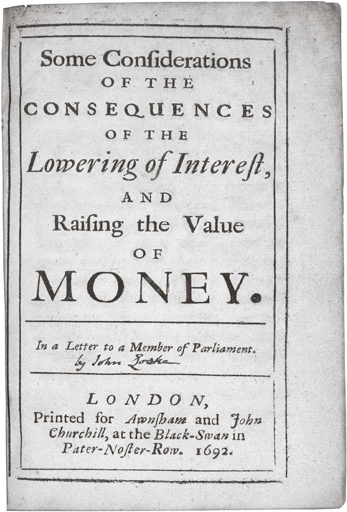

[5.](#section-8) John Locke’s pamphlet was the first attempt to consider the harm done by taking interest rates below their ‘natural’ level. Locke was opposed by the City of London merchant Sir Josiah Child, who stood to benefit from lower borrowing costs.

<!-- rl-section id="sec-list_of_illustrations" class="calibre2" -->

[5.](#section-8) John Locke’s pamphlet was the first attempt to consider the harm done by taking interest rates below their ‘natural’ level. Locke was opposed by the City of London merchant Sir Josiah Child, who stood to benefit from lower borrowing costs.

<!-- rl-section id="section-40" class="epub-section" kicker="Section 40" title="Section 40" -->

## Section 40

[6.](#section-8) John Law established a national bank in France in 1719, which printed paper money to bring down interest rates.

<!-- rl-section id="sec-list_of_illustrations" class="calibre2" -->

[6.](#section-8) John Law established a national bank in France in 1719, which printed paper money to bring down interest rates.

<!-- rl-section id="section-41" class="epub-section" kicker="Section 41" title="Section 41" -->

## Section 41

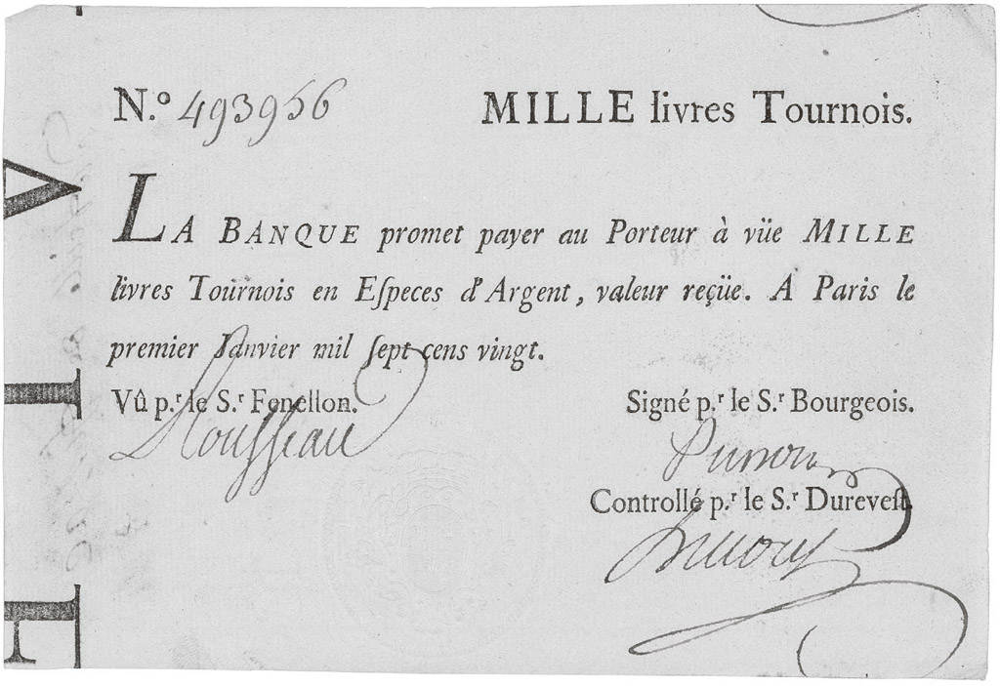

[7.](#section-8) And drive up the value of shares in his Mississippi Company. Law’s System, a giant Ponzi scheme, collapsed after inflation took off.

<!-- rl-section id="sec-list_of_illustrations" class="calibre2" -->

[7.](#section-8) And drive up the value of shares in his Mississippi Company. Law’s System, a giant Ponzi scheme, collapsed after inflation took off.

<!-- rl-section id="section-42" class="epub-section" kicker="Section 42" title="Section 42" -->

## Section 42

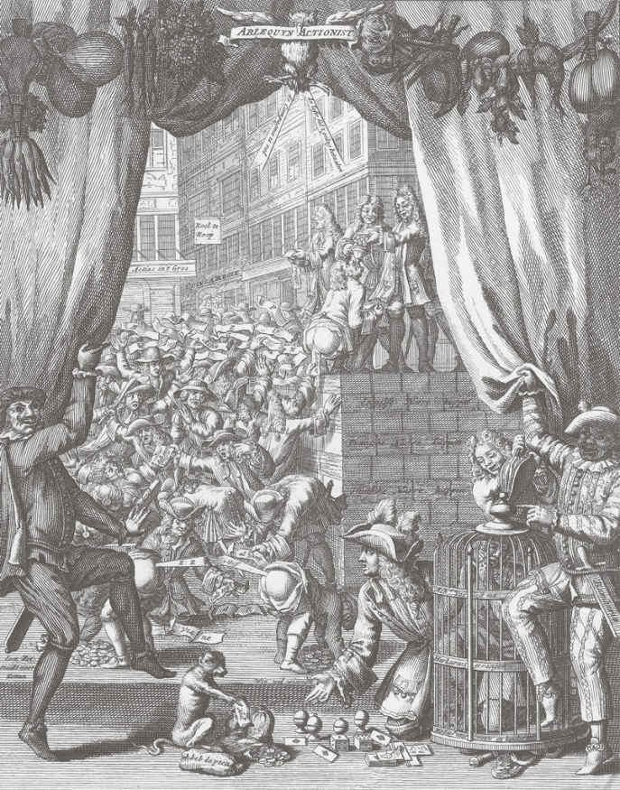

[8.](#section-8) A harlequin and a fool lift the curtains exposing frenzied trading in Mississippi shares in the open-air stock market of Paris’s rue Quincampoix. This print appeared in a 1720 satire entitled *The Great Mirror of Folly*.

<!-- rl-section id="sec-list_of_illustrations" class="calibre2" -->

[8.](#section-8) A harlequin and a fool lift the curtains exposing frenzied trading in Mississippi shares in the open-air stock market of Paris’s rue Quincampoix. This print appeared in a 1720 satire entitled *The Great Mirror of Folly*.

<!-- rl-section id="section-43" class="epub-section" kicker="Section 43" title="Section 43" -->

## Section 43

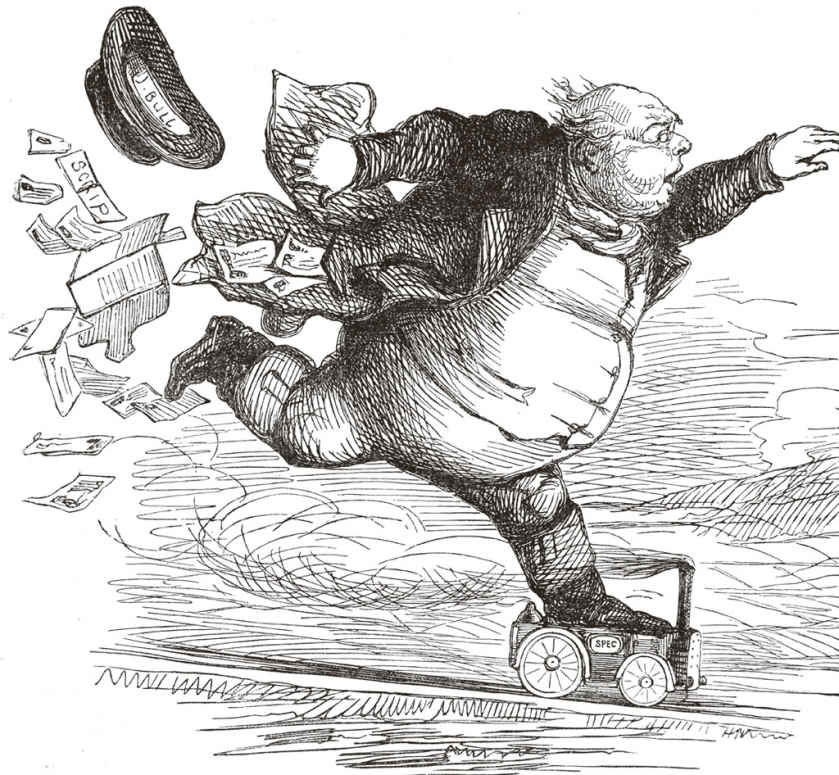

[9.](#section-8) The archetypal Englishman, John Bull, careens atop a steam engine, with railway ‘scrip’ pouring out of his pockets – a satire on Britain’s Railway Mania of 1845.

<!-- rl-section id="sec-list_of_illustrations" class="calibre2" -->

[9.](#section-8) The archetypal Englishman, John Bull, careens atop a steam engine, with railway ‘scrip’ pouring out of his pockets – a satire on Britain’s Railway Mania of 1845.

<!-- rl-section id="section-44" class="epub-section" kicker="Section 44" title="Section 44" -->

## Section 44

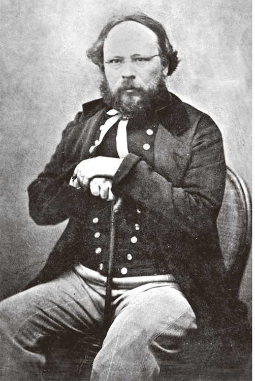

[10.](#section-8) In 1849, Pierre-Joseph Proudhon (*above*) and Frédéric Bastiat (*below*) debated the merits of dispensing with interest on loans.

<!-- rl-section id="sec-list_of_illustrations" class="calibre2" -->

[10.](#section-8) In 1849, Pierre-Joseph Proudhon (*above*) and Frédéric Bastiat (*below*) debated the merits of dispensing with interest on loans.

<!-- rl-section id="section-45" class="epub-section" kicker="Section 45" title="Section 45" -->

## Section 45

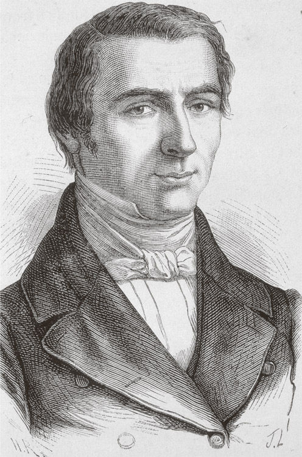

[11.](#section-8) The anarchist Proudhon claimed this would benefit the poor. But Bastiat argued that free credit was ‘a scientific absurdity, involving antagonism to established interests, class hatred and barbarity’.

<!-- rl-section id="sec-list_of_illustrations" class="calibre2" -->

[11.](#section-8) The anarchist Proudhon claimed this would benefit the poor. But Bastiat argued that free credit was ‘a scientific absurdity, involving antagonism to established interests, class hatred and barbarity’.

<!-- rl-section id="section-46" class="epub-section" kicker="Section 46" title="Section 46" -->

## Section 46

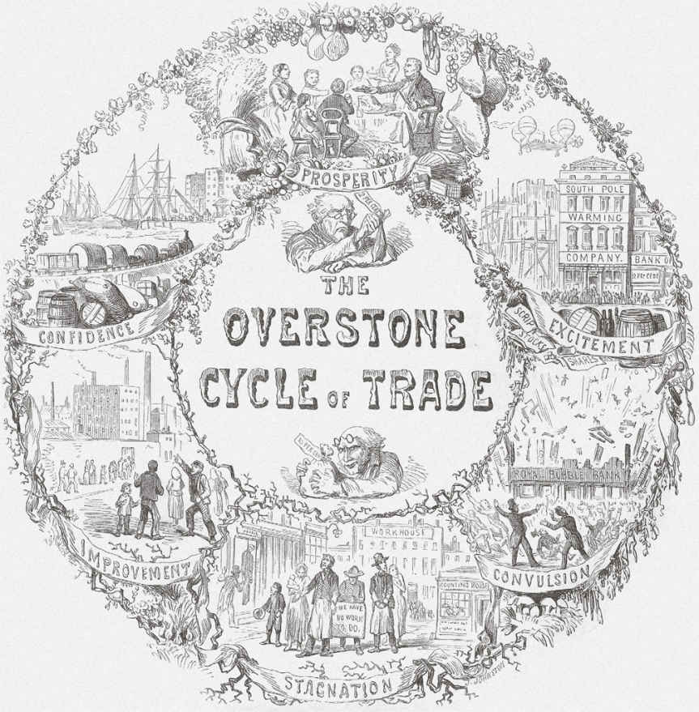

[12.](#section-8) The trade cycle depicted in this 1859 cartoon was firmly established by the nineteenth century. The Victorians observed that outbreaks of speculative ‘excitement’ coincided with periods of easy money.

<!-- rl-section id="sec-list_of_illustrations" class="calibre2" -->

[12.](#section-8) The trade cycle depicted in this 1859 cartoon was firmly established by the nineteenth century. The Victorians observed that outbreaks of speculative ‘excitement’ coincided with periods of easy money.

<!-- rl-section id="section-47" class="epub-section" kicker="Section 47" title="Section 47" -->

## Section 47

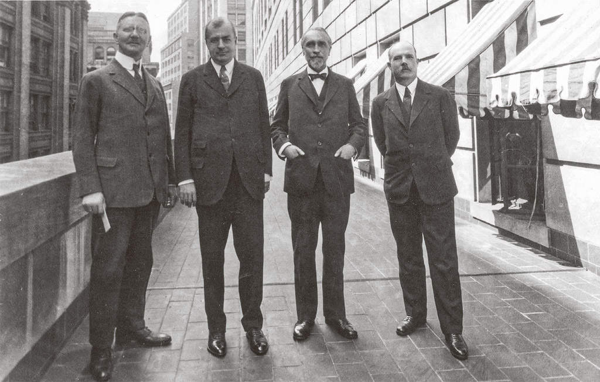

[13.](#section-8) Top central bankers – from left to right, Hjalmar Schacht (Germany), Benjamin Strong (United States), Montagu Norman (United Kingdom) and Charles Rist (France) – met in Long Island, New York, in July 1927. There Governor Strong agreed to British demands for lower US interest rates.

<!-- rl-section id="sec-list_of_illustrations" class="calibre2" -->

[13.](#section-8) Top central bankers – from left to right, Hjalmar Schacht (Germany), Benjamin Strong (United States), Montagu Norman (United Kingdom) and Charles Rist (France) – met in Long Island, New York, in July 1927. There Governor Strong agreed to British demands for lower US interest rates.

<!-- rl-section id="section-48" class="epub-section" kicker="Section 48" title="Section 48" -->

## Section 48

[14.](#section-8) After 2008, easy money fuelled a spectacular boom in the art market. In November 2017, Christie’s sold *Salvator Mundi*, a much-restored painting attributed to Leonardo da Vinci, for $450.3 million, making it the most expensive artwork ever sold at auction.

<!-- rl-section id="sec-list_of_illustrations" class="calibre2" -->

[14.](#section-8) After 2008, easy money fuelled a spectacular boom in the art market. In November 2017, Christie’s sold *Salvator Mundi*, a much-restored painting attributed to Leonardo da Vinci, for $450.3 million, making it the most expensive artwork ever sold at auction.

<!-- rl-section id="section-49" class="epub-section" kicker="Section 49" title="Acknowledgements" -->

## Acknowledgements

‘Interest theory must be one of the most abstruse aspects of economic analysis, with a discouragingly wide range of overlapping and contradictory theories,’ writes Paul Millett in *Lending and Borrowing in Ancient Greece*. ‘In no other fields of economics, perhaps, has so much been written with such divergent results,’ adds Father Thomas Divine in his intellectual history of interest. It’s no wonder, then, that the Victorian economist Henry Dunning Macleod should have concluded that ‘the study of monetary questions is one of the great causes of insanity.’

If I have managed to complete this book without being driven mad or, at least, hopelessly off-course, it is because I have received a great deal of help from my friends. First, I would like to thank those who have supplied me with research or data: Rui Antones, Charles Carter, Tim Congdon, Jamie Dannhauser, Charles Dumas, Albert Edwards, Marc Faber, James Ferguson, Martin Fridson, Julien Garran, Andrew Hunt, Seth Klarman, Andrew Lapthorne, Tim Lee, Andy Lees, Gerard Minack, Russell Napier, Stewart Paterson, Andrew Smithers, Jonathan Tepper, Gillem Tulloch, Peter Warburton and Al Wojnilower.

The seed was planted nearly two decades ago, when Crispin Odey commissioned me to write a report on the ongoing credit boom in Britain and the United States, which I completed under the guidance of Patrick Macaskie (and which was later published as ‘Crunch-Time for Credit?’). Over the years I have written countless articles on credit, interest rates and bubbles for Rob Cox, my editor at *Reuters Breakingviews*. My research into interest rates and bonds deepened during my time at GMO in Boston, and I owe a debt of gratitude to my friend and mentor James Grantham, along with former colleagues Anna Chetoukhina, Simon Harris, Anthony Hene, Eric Ikauniks, Ben Inker, Matt Kadnar, Jamie Lee, Ara Lovitt, James Montier, John Pease, Toby Rodes and Tina Vandersteel, to name but a few.

I have also benefitted from discussions with a number of people, including Richard Bernstein, Scott Bessent, Mike Biggs, Frank Brosens, Jim Chanos, Bernard Connolly, Charlene Chu, Yasheng Huang, Martin Hutchinson, Paul Isaacs, Henry Kaufman, Steve Keen, Alex Kinmont, Antoin Murphy, Doug Noland, Michael Panzner, Minxin Pei, Paul Singer, Jeremy Stein and the late Paul Volcker (whom Bevis Longstreth kindly put me in touch with). Over the years, *The Price of Time* has been through several drafts. My earliest attempts were read by Bill Bernstein, Jamie Lee, Felix Martin, Thomas Mayer and Baer Pettit. Andrew Odlyzko looked over the chapter on Bagehot, and Michael Pettis and Logan Wright gave me their comments on the China section.

I have been writing about finance, from both a historical and contemporary perspective, for more than a quarter of a century. During this time, no one has had more influence upon my thinking or been more supportive than Jim Grant, who, aside from writing several of the books cited in the bibliography, has also supplied me with a subscription to *Grant’s Interest Rate Observer*, invited me to his conferences, indulged my queries and corrected several howlers in a late draft. I have found Doug Noland’s *Credit Bubble Bulletin* an invaluable resource for financial news (as well as Doug’s own weekly commentary). Andy Lees supplied me with his ‘MacroStrategy News Review’. Obviously, this book owes a great deal to those brilliant and fearless economists from the Bank for International Settlements, William White and Claudio Borio, both of whom were kind enough to comment on the final draft. My wife and inhouse editor, Antonia Phillips, also read the final manuscript, along with Anthony Hene and Hamish Robinson. I thank all of you.

I would also like to thank my agent David Godwin for finding a home for this book, and Stuart Proffitt at Allen Lane and Morgan Entrekin at Grove Atlantic for providing not one but two of them. The book has been very professionally copy-edited by Charlotte Ridings and indexed by Mark Wells, while Alice Skinner and Richard Duguid at Allen Lane have smoothly overseen the production process. Annabelle Whitestone kindly helped select the illustrations. Stevie Shukman spent several weeks checking footnotes and compiling the bibliography. If after all this careful attention there are any serious errors left, you can guess who is responsible. Given the complexity and contentiousness of this subject, my interpretation won’t satisfy all readers. Nevertheless, I maintain, as John Locke did in his essay on interest, ‘if my notions are wrong, my intention, I am sure, is right.’

The impetus for this book came from Henry Maxey, who persuaded Jonathan Ruffer to subsidize the initial research. Over the years, Henry has not only fed me with his own ideas and corrected many of mine, but has also read multiple drafts. Having taken up so much of his time, it seems only fitting that *The Price of Time* should be dedicated to him.

<!-- rl-section id="sec-acknowledgment_001" class="titlepage" title="Acknowledgements" -->

## Acknowledgements

‘Interest theory must be one of the most abstruse aspects of economic analysis, with a discouragingly wide range of overlapping and contradictory theories,’ writes Paul Millett in *Lending and Borrowing in Ancient Greece*. ‘In no other fields of economics, perhaps, has so much been written with such divergent results,’ adds Father Thomas Divine in his intellectual history of interest. It’s no wonder, then, that the Victorian economist Henry Dunning Macleod should have concluded that ‘the study of monetary questions is one of the great causes of insanity.’

If I have managed to complete this book without being driven mad or, at least, hopelessly off-course, it is because I have received a great deal of help from my friends. First, I would like to thank those who have supplied me with research or data: Rui Antones, Charles Carter, Tim Congdon, Jamie Dannhauser, Charles Dumas, Albert Edwards, Marc Faber, James Ferguson, Martin Fridson, Julien Garran, Andrew Hunt, Seth Klarman, Andrew Lapthorne, Tim Lee, Andy Lees, Gerard Minack, Russell Napier, Stewart Paterson, Andrew Smithers, Jonathan Tepper, Gillem Tulloch, Peter Warburton and Al Wojnilower.

The seed was planted nearly two decades ago, when Crispin Odey commissioned me to write a report on the ongoing credit boom in Britain and the United States, which I completed under the guidance of Patrick Macaskie (and which was later published as ‘Crunch-Time for Credit?’). Over the years I have written countless articles on credit, interest rates and bubbles for Rob Cox, my editor at *Reuters Breakingviews*. My research into interest rates and bonds deepened during my time at GMO in Boston, and I owe a debt of gratitude to my friend and mentor James Grantham, along with former colleagues Anna Chetoukhina, Simon Harris, Anthony Hene, Eric Ikauniks, Ben Inker, Matt Kadnar, Jamie Lee, Ara Lovitt, James Montier, John Pease, Toby Rodes and Tina Vandersteel, to name but a few.

I have also benefitted from discussions with a number of people, including Richard Bernstein, Scott Bessent, Mike Biggs, Frank Brosens, Jim Chanos, Bernard Connolly, Charlene Chu, Yasheng Huang, Martin Hutchinson, Paul Isaacs, Henry Kaufman, Steve Keen, Alex Kinmont, Antoin Murphy, Doug Noland, Michael Panzner, Minxin Pei, Paul Singer, Jeremy Stein and the late Paul Volcker (whom Bevis Longstreth kindly put me in touch with). Over the years, *The Price of Time* has been through several drafts. My earliest attempts were read by Bill Bernstein, Jamie Lee, Felix Martin, Thomas Mayer and Baer Pettit. Andrew Odlyzko looked over the chapter on Bagehot, and Michael Pettis and Logan Wright gave me their comments on the China section.

I have been writing about finance, from both a historical and contemporary perspective, for more than a quarter of a century. During this time, no one has had more influence upon my thinking or been more supportive than Jim Grant, who, aside from writing several of the books cited in the bibliography, has also supplied me with a subscription to *Grant’s Interest Rate Observer*, invited me to his conferences, indulged my queries and corrected several howlers in a late draft. I have found Doug Noland’s *Credit Bubble Bulletin* an invaluable resource for financial news (as well as Doug’s own weekly commentary). Andy Lees supplied me with his ‘MacroStrategy News Review’. Obviously, this book owes a great deal to those brilliant and fearless economists from the Bank for International Settlements, William White and Claudio Borio, both of whom were kind enough to comment on the final draft. My wife and inhouse editor, Antonia Phillips, also read the final manuscript, along with Anthony Hene and Hamish Robinson. I thank all of you.

I would also like to thank my agent David Godwin for finding a home for this book, and Stuart Proffitt at Allen Lane and Morgan Entrekin at Grove Atlantic for providing not one but two of them. The book has been very professionally copy-edited by Charlotte Ridings and indexed by Mark Wells, while Alice Skinner and Richard Duguid at Allen Lane have smoothly overseen the production process. Annabelle Whitestone kindly helped select the illustrations. Stevie Shukman spent several weeks checking footnotes and compiling the bibliography. If after all this careful attention there are any serious errors left, you can guess who is responsible. Given the complexity and contentiousness of this subject, my interpretation won’t satisfy all readers. Nevertheless, I maintain, as John Locke did in his essay on interest, ‘if my notions are wrong, my intention, I am sure, is right.’

The impetus for this book came from Henry Maxey, who persuaded Jonathan Ruffer to subsidize the initial research. Over the years, Henry has not only fed me with his own ideas and corrected many of mine, but has also read multiple drafts. Having taken up so much of his time, it seems only fitting that *The Price of Time* should be dedicated to him.

<!-- rl-section id="section-50" class="epub-section" kicker="Section 50" title="Select Bibliography" -->

## Select Bibliography

Acharya, Viral V. and Steffen, Sascha, ‘The Banking Crisis as a Giant Carry Trade Gone Wrong’, *VoxEu*, 23 May 2013.

Acharya, Viral V., Crosignani, Matteo, Eisert, Tim and Eufinger, Christian, ‘Zombie Credit and (Dis-)Inflation: Evidence from Europe’, NBER Working Paper, May 2020.

Acharya, Viral V., Eisert, Tim, Eufinger, Christian and Hirsch, Christian, ‘Whatever It Takes: The Real Effects of Unconventional Monetary Policy’, SAFE Working Paper, 2017.

Adrian, Tobias and Shin, Hyun Song, ‘Financial Intermediaries and Monetary Economics’, Federal Reserve Bank of New York, Staff Report No. 398, May 2010.

Adrian, Tobias, Natalucci, Fabio and Piontek, Thomas, ‘Sounding the Alarm on Leveraged Lending’, IMF blog, 15 November 2018.

Ahamed, Liaquat, *Lords of Finance: The Bankers Who Broke the World* (New York, 2009).

Ahearne, A., Gagnon, J., Haltmaier, J. and Kamin, S., ‘Preventing Deflation: Lessons from Japan’s Experience in the 1990s’, Federal Reserve International Finance Discussion Paper, June 2002.

Aho, James, *Confessions and Bookkeeping: The Religious, Moral, and Rhetorical Roots of Modern Accounting* (Albany, NY, 2005).

Aizenman, Joshua and Jinjarak, Yothin, ‘Current Account Patterns and National Real Estate Markets’, *Journal of Urban Economics*, May 2009.

Aked, Michael, Mazzoleni, Michele and Shakernia, Omid, ‘Quest for the Holy Grail: The Fair Value of the Equity Market’, Research Affiliates, March 2017.

Allen, Frederick Lewis, *Only Yesterday: An Informal History of the 1920’s* (New York, 1957).

Altman, Edward and Kuehne, Brenda, ‘Defaults and Returns in the High-yield Bond Market: Third-quarter 2013 Review’, *Journal of Financial Management*, August–December 2013.

Altman, Edward and Kuehne, Brenda, ‘Special Commentary: A Note on Credit Market Bubbles,’ *International Journal of Banking, Accounting and Finance*, 5 (4), January 2015.

Anderson, Benjamin McAlester, *Economics and the Public Welfare* [1949] (Indianapolis, 1979).

Anderson, Jonathan, ‘China Real Estate – Final Destination’, UBS, 25 August 2011.

Andrew, A. Piatt, ‘The United States Treasury and the Money Market: The Partial Responsibility of Secretaries Gage and Shaw for the Crisis of 1907’, *American Economic Association Quarterly*, 9 (1), April 1908: 218–31.

Anon., *The Interest of Money Mistaken; or, A Treatise Proving That The Abatement of Interest is The Effect and Not The Cause of The Riches of A Nation* (London, 1668).

Ansar, Atif, Flyvbjerg, Bent, Budzier, Alexander and Lunn, Daniel, ‘Does Infrastructure Investment Lead to Economic Growth or Economic Fragility? Evidence from China’, *Oxford Review of Economic Policy*, 32 (3), Autumn 2016.

Appleby, Joyce, *Economic Thought and Ideology in Seventeenth-Century England* (Princeton, 1978).

Aristotle, *Politics*, in *Early Economic Thought: Selected Writings from Aristotle to Hume*, ed. Arthur E. Monroe (Mineola, NY, 2006).

Arkwright, Francis, *Memoirs of the Duke de Saint-Simon, An Abridged Translation* (London, 1918).

Arnott, Rob, Bernstein, William J. and Wu, Lillian, ‘The Myth of Dynastic Wealth: The Rich Get Poorer’, *Cato Journal*, 35 (3), October 2015.

Arnott, Rob, Cornell, Bradford and Shepherd, Shane, ‘Yes. It’s a Bubble. So What?’ Research Affiliates, April 2018.

Arslan, Yavuz, Contreras, Juan, Patel, Nikhil and Shu, Chang, ‘Globalisation and Deglobalisation in Emerging Market Economies: Facts and Trends’, BIS Working Paper, December 2018.

Ashton, T. S., *Economic Fluctuations in England 1700–1800* (Oxford, 1959).

Atkeson, Andrew and Kehoe, Patrick J., ‘Deflation and Depression: Is There an Empirical Link?’ NBER Working Paper, January 2004.

Bagehot, Walter, ‘Art. II – Principles of Political Economy’, *Prospective Review: A Quarterly Journal of Theology and Literature*, 4, 1848: 460–502.

Bagehot, Walter, *The Collected Works of Walter Bagehot*, ed. Norman St John-Stevas (London, 1978).

Balazs, Etienne, *Chinese Civilization and Bureaucracy: Variations on a Theme* (London, 1974).

Banerjee, Ryan, *et al*., ‘(Why) is Investment Weak?’, *BIS Quarterly Review*, March 2015.

Bank for International Settlements, ‘Chapter VI: Understanding Globalization’, in 87th Annual Report, BIS, 25 June 2017.

Baradaran, Mehrsa, *How the Other Half Banks: Exclusion, Exploitation, and the Threat to Democracy* (Cambridge, Mass., 2015).

Barbon, Nicholas, *A Discourse of Trade* (London, 1690).

Barbour, Violet, *Capitalism in Amsterdam in the Seventeenth Century* (Ann Arbor, Mich., 1963).

Baring, Sir Francis, *Observations on the Establishment of the Bank of England and on the Paper Circulation of the Country* [1797], reprinted in Forrest Capie and Geoffrey E. Wood, *The Lender of Last Resort* (London, 2007).

Bass, J. Kyle, ‘The $34 Trillion Experiment: China’s Banking System and the World’s Largest Macro Imbalance’, Hayman Capital Management, 10 February 2016.

Bastiat, Frédéric, *Economic Sophisms and ‘What is Seen and What is Not Seen’* [1873] (Indianapolis, 2016).

Bastiat, Frédéric, The Bastiat–Proudhon Debate on Interest [1849–50], <https://praxeology.net/FB-PJP-DOI-IV-14.htm>.

Baudino, Patrizia, *et al*., ‘The Banking Crisis in Iceland’, The Financial Stability Institute, BIS, March 2020.

Bean, Charles, *et al*., ‘Low For So Long? Causes and Consequences of Persistently Low Interest Rates’, International Center for Monetary and Banking Studies, *VoxEU*, 23 October 2015.

Beardson, Timothy, *Stumbling Giant: The Threats to China’s Future* (London, 2014).

Benigno, Gianluca and Fornaro, Luca, ‘The Financial Resource Curse’, *Scandinavian Journal of Economics*, 30 December 2013.

Bentham, Jeremy, *Defence of Usury* [1787] (London, 1816).

Bernanke, Ben, ‘A Perspective on Inflation Targeting’, speech at the Annual Washington Policy Conference of the National Association of Business Economists, 25 March 2003.

Bernanke, Ben, ‘Asset Price “Bubbles” and Monetary Policy’, speech before the New York Chapter of the National Association for Business Economics, 15 October 2002.

Bernanke, Ben, ‘Chairman Bernanke’s Press Conference’, Federal Reserve, 18 September 2013.

Bernanke, Ben, *Essays on the Great Depression* (Princeton, 2000).

Bernanke, Ben, ‘Monetary Policy and the Housing Bubble’, speech at the Annual Meeting of The American Economic Association, 3 January 2010.

Bernanke, Ben, ‘Monetary Policy and the State of The Economy’, hearing before the Committee on Financial Services, US House of Representatives, 2 March 2011.

Bernanke, Ben, *The Courage to Act: A Memoir of a Crisis and Its Aftermath* (New York, 2017).

Bernanke, Ben, ‘The Fed’s Shifting Perspective on the Economy and Its Implications for Monetary Policy’, Brookings, 8 August 2016.

Bernanke, Ben, ‘The Global Savings Glut and the U.S. Current Account Deficit’, speech at the Sandbridge Lecture, Virginia Association of Economists, 10 March 2005.

Bernanke, Ben, ‘Why are Interest Rates So Low?, Part 2: Secular Stagnation’, Brookings, 31 March 2015.

Bernard, H. and Bisignano, J., ‘Bubbles and Crashes: Hayek and Haberler Revisited’, *Asset Price Bubbles: Implications for Monetary and Regulatory Policies* (Amsterdam, 2001).

Bernstein, William, *The Delusion of Crowds* (New York, 2021).

Bernstein, William, ‘The Paradox of Wealth’, *Financial Analysts Journal*, 69 (5), September/October 2013.

Binder, Sarah and Spindel, Mark, *The Myth of Independence: How Congress Governs the Federal Reserve* (Princeton, 2017).

Blundell-Wignall, Adrian and Roulet, Caroline, ‘Long-Term Investment, the Cost of Capital and the Dividend and Buyback Puzzle’, OECD, 2013.

Böhm-Bawerk, Eugen von, *Capital and Interest: A Critical History of Economical Theory*, vol. I [1884] (South Holland, Ill., 1959).

Booth, Danielle Dimartino, *Fed* Up (London, 2017).

Borio, Claudio, ‘A Blind Spot in Today’s Macroeconomics?’, BIS speech, 10 January 2018.

Borio, Claudio, ‘BIS Quarterly Review September 2015 – Media Briefing’, 11 September 2015.

Borio, Claudio, ‘Central Banking Post-Crisis: What Compass for Uncharted Waters?’, BIS Working Paper, September 2011.

Borio, Claudio, ‘Macroprudential Policy and the Financial Cycle: Some Stylized Facts and Policy Suggestions’, paper presented at the Rethinking Macro Policy II: First Steps and Early Lessons Conference, IMF, 16–17 April 2013.

Borio, Claudio, ‘Monetary Policy and Financial Stability: What Role in Prevention and Recovery?’, BIS Working Paper, January 2014.

Borio, Claudio, ‘Persistent Unusually Low Interest Rates: Why? What Consequences?’, presentation to the 85th Annual General Meeting of the Bank for International Settlements, 28 June 2015.

Borio, Claudio, ‘The Financial Cycle and Macroeconomics: What Have We Learnt?’, BIS Working Paper, December 2012.

Borio, Claudio, ‘The International Monetary and Financial System: Its Achilles Heel and What to Do About It’, BIS Working Paper, August 2014.

Borio, Claudio and Disyatat, Piti, ‘Capital Flows and the Current Account: Taking Financing (More) Seriously’, BIS Working Paper, October 2015.

Borio, Claudio and Disyatat, Piti, ‘Global Imbalances and the Financial Crisis: Link or No Link?’, BIS Working Paper, May 2011.

Borio, Claudio and Disyatat, Piti, ‘Unconventional Monetary Policies: An Appraisal’, BIS Working Paper, November 2009.

Borio, Claudio and Hofmann, Boris, ‘Is Monetary Policy Less Effective When Interest Rates are Persistently Low?’, BIS Working Paper, April 2017.

Borio, Claudio and Lowe, Philip, ‘Asset Prices, Financial and Monetary Stability: Exploring the Nexus’, BIS Working Paper, July 2002.

Borio, Claudio and White, William, ‘Whither Monetary and Financial Stability? The Implications of Evolving Policy Regimes’, BIS Working Paper, February 2004.

Borio, Claudio, *et al*., ‘Labour Reallocation and Productivity Dynamics: Financial Causes, Real Consequences’, BIS Working Paper, December 2015.

Borio, Claudio, *et al*., ‘Monetary Policy in the Grip of a Pincer Movement’, BIS Working Paper, March 2018.

Borio, Claudio *et al*., ‘The Cost of Deflations: A Historical Perspective’, *BIS Quarterly Review*, March 2015.

Borio, Claudio, *et al*., ‘The International Monetary and Financial System: A Capital Account Historical Perspective’, BIS Working Paper, August 2014.

Borio, Claudio, *et al*., ‘Why So Low for So Long? A Long-Term View of Real Interest Rates’, BIS Working Paper, December 2017.

Boyle, Andrew, *Montagu Norman; A Biography* (New York, 1968).

Brandeis, Louis D., *Other People’s Money and How the Bankers Use It* (New York, 1914).

Braudel, Fernand, *Civilization and Capitalism 15th–18th Century: The Wheels of Commerce* (London, 1979).

Brenner, Ian, *The End of the Free Market: Who Wins the War between States and Corporations?* (London, 2010).

Bresnahan, Timothy and Raff, Daniel, ‘Intra-industry Heterogeneity and the Great Depression: The American Motor Vehicles Industry, 1929–1935’, *Journal of Economic History*, 51 (2), June 1991.

Brightman, Chris, Aked, Michael and Treussard, Jonathan, ‘Public Policy, Profits, and Populism’, Research Affiliates, June 2017.

Brosens, Frank, ‘Has Volatility Reached a Permanently Low Plateau?’, Presentation at Grant’s Conference, 10 October 2017.

Brown, Brendan, *A Global Monetary Plague: Asset Price Inflation and Federal Reserve Quantitative Easing* (London, 2015).

Brownstein, Andrew R., *et al*., ‘Mergers and Acquisitions – 2016’, Harvard Law School Forum on Corporate Governance, 10 February 2016; <https://corpgov.law.harvard.edu/2016/02/10/>.

Brunnermeier, Markus K. and Koby, Yann, ‘The Reversal Interest Rate’, NBER Working Paper, December 2018.

Bruno, Valentina and Shin, Hyun Song, ‘Capital Flows and the Risk-Taking Channel of Monetary Policy’, NBER Working Paper, April 2013.

Bruno, Valentina and Shin, Hyun Song, ‘Currency Depreciation and Emerging Market Corporate Distress’, BIS Working Paper, October 2018.

Bruno, Valentina, *et al*., ‘Exchange Rates and the Working Capital Channel of Trade Fluctuations’, *AEA Papers and Proceedings*, 108, May 2018: 531–6.

Buchan, James, *Frozen Desire* (London, 1997).

Buchan, James, *John Law: A Scottish Adventurer of the Eighteenth Century* (London, 2018).

Buchan, James, ‘Mississippi Dreaming’, *New Left Review*, 210, March 1995.

Bullard, James, ‘Permazero’, Cato Institute – 33rd Annual Monetary Conference, November 2015.

Bullard, James, Garriga, Carlos and Waller, Christopher J., ‘Demographics, Redistribution, and Optimal Inflation’, *Federal Reserve Bank of St Louis Review*, 94 (6), November/December 2012.

Bunn, Philip, Mizen, Paul and Smietanka, Pawel, ‘Growing Pension Deficits and the Expenditure Decisions of UK Companies’, Bank of England Staff Working Paper, February 2018.

Caballero, Ricardo and Hammour, Mohamad, ‘The Cleansing Effects of Recessions’, *American Economic Review*, 84 (5), December 1994: 1356–68.

Cain, Peter J. and Hopkins, Anthony G., *British Imperialism: Innovation and Expansion, 1688–1914* (London, 1993).

Caldwell, Bruce, *Hayek’s Challenge* (Chicago, 2004).

Cannadine, David, *Mellon: An American Life* (London, 2006).

Cantillon, Richard, *Essai Sur La Nature du Commerce en Général* [1755], trans. Henry Higgs (London, 1931).

Capie, Forrest and Wood, Geoffrey, eds., *The Lender of Last Resort* (London, 2007).

Case, Anne and Deaton, Angus, *Deaths of Despair and the Future of Capitalism* (New Haven, Conn., 2020).

Case, Bradford, *et al*., ‘Global Real Estate Markets – Cycles and Fundamentals’, NBER Working Paper, February 2000.

Cassel, Gustav, *The Nature and Necessity of Interest* (London, 1903).

Cecchetti, Stephen G. and Kharroubi, Enisse, ‘Why Does Financial Sector Growth Crowd Out Real Economic Growth?’, BIS Working Paper, February 2015.

Celarier, Michelle, ‘Eddie Lampert Shattered Sears, Sullied His Reputation, and Lost Billions of Dollars. Or Did He?’, *Institutional Investor*, 3 December 2018.

Chancellor, Edward, ed., *Capital Returns: Investing Through the Capital Cycle: A Money Manager’s Reports 2002–15* (London, 2016).

Chancellor, Edward, *Devil Take the Hindmost: A History of Financial Speculation* (New York, 1999).

Chancellor, Edward and Monnelly, Mike, ‘Feeding the Dragon: Why China’s Credit System Looks Vulnerable’, GMO White Paper, January 2013.

Chen, Kaiji and Wen, Yi, ‘The Great Housing Boom of China’, Working Paper Series, Federal Reserve Bank of St Louis, August 2014.

Chen Yufeng, Ye Zhipeng and Huang Guan, ‘The Financial Crisis in Wenzhou: an Unanticipated Consequence of China’s “four trillion yuan economic stimulus package”’, *China: An International Journal*, 16 (1), February 2018.

Child, Sir Josiah, *A New Discourse of Trade* (Glasgow, 1751).

Clapham, Sir John Harold, *The Bank of England: A History, 1797–1914*, vol. II (Cambridge, 1966).

Cochrane, John, ‘Lessons Learned’, The Grumpy Economist blog, 23 April 2016.

Cole, Christopher, ‘Volatility and the Alchemy of Risk’, Artemis Capital, October 2017.

Cole, Christopher, ‘Volatility and the Allegory of the Prisoner’s Dilemma: False Peace, Moral Hazard, and Shadow Convexity’, Artemis Capital, October 2015.

Conard, Joseph, *An Introduction to the Theory of Interest* (Berkeley, Calif., 1966).

Connolly, Bernard, ‘The Fed: Grim Lessons from 2007’, Connolly Insights, 2015.

Crosignani, Matteo, Faria-e-Castro, Miguel and Fonseca, Luis, ‘The (Unintended?) Consequences of the Largest Liquidity Injection Ever’, Finance and Economics Discussion Series, Federal Reserve Board, January 2017.

Csabai, Zoltán, ‘Chronologische Aspekte der babylonischen Zinsen’, in *Studies in Economic and Social History of the Ancient Near East in Memory of Péter Vargyas*, ed. Zoltán Csabai (Budapest, 2014).

Cui, David, ‘Be Wary’, BAML, 17 November 2017.

Culpeper, Thomas, ‘A Small Treatise Against Usury’, reprinted in Josiah Child, *A New Discourse of Trade* [1692] (Glasgow, 1751).

Dalio, Ray, ‘An In-Depth Look at Deleveragings’, Bridgewater Associates, February 2012.

Dalio, Ray, ‘Why and How Capitalism Needs to be Reformed’, Part 1, LinkedIn Pulse, 5 April 2019.

Dannhauser, Jamie, ‘What is the Normal Level of Real Rates …’, *The Ruffer Review*, September 2014.

Das, Satyajit, *The Age of Stagnation: Why Perpetual Growth is Unattainable and the Global Economy is in Peril* (Amherst, NY, 2016).

Davis, Andrew, ‘An Historical Study of Law’s System’, *Quarterly Journal of Economics*, April 1887: 420–52.

Davis, Gerald, *Managed by the Markets: How Finance Re-Shaped America* (Oxford, 2009).

Davis, Steven J. and Haltiwanger, John, ‘Labor Market Fluidity and Economic Performance’, NBER Working Paper, September 2014.

Dawson, Frank, *The First Latin American Debt Crisis: The City of London and the 1822–25 Loan Bubble* (London, 1990).

Defoe, Daniel, *Daniel Defoe: His Life, and Recently Discovered Writings: Extending from 1716 to 1729*, ed. William Lee (London, 1869).

Defoe, Daniel, *Political and Economic Writings of Daniel Defoe*, vol. VI, ed. William R. Owens (London, 2000).

Denby, Charles, ‘The National Debt of China – its Origin and its Security’, *Annals of the American Academy of Political and Social Science*, 66 (155), July 1916: 55–70.

De Roover, Raymond, *The Rise and Decline of the Medici Bank, 1397–1494* (Cambridge, Mass., 1963).

Di Maggio, Marco and Kacperczyk, Marcin, ‘The Unintended Consequences of the Zero Lower Bound Policy’, *Journal of Financial Economics*, 123 (1), January 2017.

‘The Distributional Effects of Asset Purchases’, *Bank of England Quarterly Bulletin*, 52 (3), 2012.

Divine, Thomas, *Interest: An Historic and Analytical Study in Economics and Modern Ethics* (Milwaukee, Wisc., 1959).

Dobbs, Richard, *et al*., ‘Poorer than Their Parents? Flat or Falling Incomes in Advanced Economies’, McKinsey Global Institute, July 2016.

Dokko, Jane, *et al*., ‘Monetary Policy and the Housing Bubble’, Finance and Economics Discussion Series, Federal Reserve Board, 22 December 2009.

Domanksi, Dietrich, *et al*., ‘Wealth Inequality and Monetary Policy’, *BIS Quarterly Review*, March 2016.

Draghi, Mario, ‘The European Central Bank’s Recent Monetary Policy Measures – Effectiveness and Challenges’, European Central Bank, 14 May 2015.

Drucker, Peter, *The Essential Drucker* (Oxford, 2011).

Easterly, William Russell, *The Elusive Quest for Growth: Economists’ Adventures and Misadventures in the Tropics* (Cambridge, Mass., 2002).

Edmunds, John C., ‘Securities: The New World Wealth Machine’, *Foreign Policy*, Autumn 1996: 118–33.

Edwards, George, *The Evolution of Finance Capitalism* (London, 1938).

Ehlers, Torsten, Kong, Steven and Zhu, Feng, ‘Mapping Shadow Banking in China: Structure and Dynamics’, BIS Working Paper, February 2018.

Eichengreen, Barry, *Hall of Mirrors: The Great Depression, the Great Recession, and the Uses-and-Misuses of History* (New York, 2015).

Eichengreen, Barry, ‘Secular Stagnation: A Review of the Issues’, in *Secular Stagnation, Facts, Causes and Cures*, eds. C. Teulings and R. Baldwin (London, 2014).

Eichengreen, Barry and Flandreau, Marc, *The Gold Standard in Theory and History* (London, 1985).

Eichengreen, Barry and Mitchener, Kris, ‘The Great Depression as a Credit Boom Gone Wrong’, BIS Working Paper, September, 2003.

Elliott, Geoffrey, *The Mystery of Overend and Gurney: A Financial Scandal in Victorian London* (London, 2006).

Elvin, Mark, *The Pattern of the Chinese Past: A Social and Economic Interpretation* (Stanford, Calif., 1973).

Emden, Paul, *Money Powers of Europe in the Nineteenth and Twentieth Centuries* (New York, 1937).

Engen, Eric, *et al*., ‘The Macroeconomic Effects of the Federal Reserve’s Unconventional Monetary Policy’, Finance and Economics Discussion Series, Federal Reserve Board, 14 January 2015.

Evans, David Morier, *Speculative Notes and Notes on Speculation, Ideal and Real* (London, 1864).

Evelyn, John, *The Diary of John Evelyn*, vol. III (London, 1906).

Farhi, Emmanuel and Tirole, Jean, ‘Leverage and the Central Bankers’ Put’, *American Economic Review*, 99 (2), 1 May 2009.

Faure, Edgar, *La Banqueroute de Law: 17 Juillet 1720* (Paris, 1977).

Feldstein, Martin, ‘The Deflation Bogeyman’, Project Syndicate, 28 February 2015.

Fenby, Jonathan, *Tiger Head, Snake Tails: China Today, How It Got There and Why It Has to Change* (London, 2012).

Ferri, Giovanni and Liu, Li-Gang, ‘Honor Thy Creditors before Thy Shareholders: Are the Profits of Chinese State-owned Enterprises Real?’, *Asian Economic Papers*, 9 (3), October 2010.

Fetter, Frank, ‘Interest theories, old and new’, *American Economic Review*, 4 (1), March 1914.

Field, Alexander, ‘The Adversity/Hysteresis Effect: Depression-era Productivity Growth in the US Railroad Sector’, in *The Rate and Direction of Inventive Activity Revisited*, eds. Josh Lerner and Scott Stern (Chicago, 2012).

Field, Alexander, *The Great Leap Forward* (New Haven, Conn., 2021).

Finley, Moses, ‘Debt Bondage and the Problem of Slavery’, in *Economy and Society in Ancient Greece* (London, 1981).

Fisher, Irving, *Appreciation and Interest* [1896] (New York, 1908).

Fisher, Irving, *Booms and Depressions and Related Writings*, in *The Works of Irving Fisher*, vol. X, ed. William Barber (London, 1997).

Fisher, Irving, *The Theory of Interest: As Determined by Impatience to Spend Income and Opportunity to Invest It* [New York, 1930], in *The Works of Irving Fisher*, vol. IX, ed. William Barber (London, 1997).

Folkerts-Landau, David, ‘The Dark Side of QE: Backdoor Socialization, Expropriated Savers and Asset Bubbles’, *Deutsche Bank Research*, 1 November 2016.

Foroohar, Rana, *Makers and Takers: How Wall Street Destroyed Main Street* (New York, 2016).

Fridson, Martin, *It Was a Very Good Year: Extraordinary Moments in Stock Market History* (New York, 1998).

Friedman, Milton and Schwartz, Anna, *The Great Contraction 1929–1932* [1965] (Princeton, 2009).

Fullarton, John, *On the Regulation of Currencies: Being an Examination of the Principles, on which it is Proposed to Restrict, Within Certain Fixed Limits, the Future Issues on Credit of the Bank of England, and of the Other Banking Establishments Throughout the Country* (London, 1845).

Gaitskell, Hugh, ‘Four Monetary Heretics’, in *What Everybody Wants to Know About Money: A Planned Outline of Monetary Problems*, ed. G. D. H. Cole (London, 1933).

Galbraith, James K., *Inequality and Instability: A Study of the World Economy Just Before the Great Crisis* (London, 2012).

Galbraith, John K., *The Great Crash 1929* (London, 1993).

Galston, William and Kamarck, Elaine, ‘More Builders and Fewer Traders: A Growth Strategy for the American Economy’, Brookings Paper, June 2015.

Gambacorta, Leonardo, ‘Monetary policy and the risk-taking channel’, *BIS Quarterly Review*, December 2009.

Garber, Peter, ‘Famous First Bubbles’, *Journal of Economic Perspectives*, 4 (2), Spring 1990: 34–55.

Garfinkle, Steven, ‘Shepherds, Merchants and Credit: Some Observations on Lending Practices in Ur III Mesopotamia’, *Journal of the Economic and Social History of the Orient*, 47 (1), 2004: 1–30.

Garibaldi, Pietro, ‘The Asymmetric Effects of Monetary Policy on Job Creation and Destruction’, IMF Working Paper, April 1997.

Garnaut, John, *The Rise and Fall of the House of Bo: How a Murder Exposed the Cracks in China’s Leadership* (London, 2012).

Gayer, Arthur, *et al*., *The Growth and Fluctuation of the British Economy, 1790–1850: An Historical, Statistical, and Theoretical Study of Britain’s Economic Development*, vol. I (Hassocks, 1975).

Gehringer, Agnieszka and Mayer, Thomas, ‘It’s the WACC, Stupid!’, Flossbach von Storch Research Institute, 13 February 2017.

Gehringer, Agnieszka and Mayer, Thomas, ‘Understanding Low Interest Rates’, Flossbach von Storch Research Institute, 23 October 2015.

George, Esther, ‘Supervisory Frameworks and Monetary Policy’, *Journal of Economic Dynamics and Control*, 49, December 2014.

George, Henry, *Progress and Poverty, an Inquiry into the Cause of Industrial Depressions and of Increase of Want with Increase of Wealth: The Remedy* (New York, 1923).

Glahn, Richard von, *Fountain of Fortune: Money and Monetary Policy in China, 1000–1700* (London, 1996).

Gleeson, Janet, *The Moneymaker* (London, 2012).

Glotz, Gustave, *Ancient Greece at Work* (New York, 1926).

Góes, Carlos, ‘Testing Piketty’s Hypothesis on the Drivers of Income Inequality: Evidence from Panel VARs with Heterogeneous Dynamics’, IMF Working Paper, August 2016.

Goetzmann, William, *Money Changes Everything: How Finance Made Civilization Possible* (Princeton, 2016).

Goodhart, Charles and Pradhan, Manoj, *The Great Demographic Reversal* (Cham, Switzerland, 2020).

Goodman, David S. G., ed., *The New Rich in China: Future Rulers, Present Lives* (London, 2009).

Goodman, David S. G., ‘The New Rich in China: Why There is No New Middle Class’, *Journal of the Sydney University Arts Association*, 32, 2010.

Gopinath, Gita, Kalemli-Ozcan, Sebnem, Karabarbounis, Loukas and Villegas-Sanchez, Carolina, ‘Low Interest Rates, Capital Flows and Declining Productivity in Southern Europe’, *VoxEU*, 28 September 2015.

Gordon, Josh, ‘Vancouver’s Housing Affordability Crisis: Cases, Consequences and Solutions’, Simon Fraser University, May 2016.

Gordon, Robert J., ‘Is U.S. Economic Growth Over? Faltering Innovation Confronts the Six Headwinds’, NBER Working Paper, August 2012.

Gordon, Robert J., *The Rise and Fall of American Growth: The U.S. Standard of Living since the Civil War* (Princeton, 2016).

Goschen, George, ‘Seven Per Cent.’, *Edinburgh Review, or Critical Journal*, 121, January–April 1865: 223–51.

Goschen, George, ‘Two per Cent.’, *Edinburgh Review, or Critical Journal*, 127, January–April 1868: 242–80.

Gourinchas, Pierre-Olivier and Obstfeld, Maurice, ‘Stories of the Twentieth Century for the Twenty-first’, *American Economic Journal*, 4 (1), January 2012.

Graeber, David, *Debt: The First 5,000 Years* (New York, 2011).

Grafton, Anthony, *Leon Battista Alberti* (London, 2001).

Graham, Benjamin and Dodds, David, *Security Analysis: Principles and Technique* [1940] (New York, 2009).

Grant, James, *Bagehot: The Life and Times of the Greatest Victorian* (New York, 2019).

Grant, James, *Grant’s Interest Rate Observer* (2008–2021).

Grant, James, *Money of the Mind: Borrowing and Lending in America from the Civil War to Michael Milken* (London, 1992).

Grant, James, *The Forgotten Depression: 1921: The Crash That Cured Itself* (New York, 2014).

Grantham, Jeremy, ‘This Time Seems Very, Very Different (Part 2 of Not With a Bang but a Whimper – A Thought Experiment)’, GMO Quarterly Letter, April 2017.

Grantham, Jeremy, ‘Time to Wake Up: Days of Abundant Resources and Falling Prices are Over Forever’, GMO Quarterly Letter, April 2011.

Green, Stephen, ‘China – Masterclass: Nick Lardy and the Consumption Thing’, Standard Chartered, 31 January 2012.

Greenspan, Alan, ‘Gold and Economic Freedom’, *Objectivist*, July 1966.

Greenspan, Alan, ‘Risk and Uncertainty in Monetary Policy’, speech at the Meetings of the American Economic Associations, 3 January 2004.

Greenwood, Robin and Scharfstein, David, ‘The Growth of Finance’, *Journal of Economic Perspectives*, Spring 2013: 3–28.

Gross, William, ‘Privates Eye’, PIMCO Insights, 1 August 2010.

Gross, William, ‘Wounded Heart’, PIMCO Insights, 4 June 2013.

Grullon, Gustavo, Larkin, Yelena and Michaely, Roni, ‘Are US Industries Becoming More Concentrated?’ *Review of Finance*, July 2019.

Haberler, Gottfried, ‘Money and the Business Cycle’, in *The Austrian Theory of the Trade Cycle and Other Essays* (Auburn, Ala., 1997).

Hadley, Arthur T., ‘Interest and Profits’, *The Annals of the American Academy of Political and Social Science*, 4, November 1893: 337–47.

Hadley, Arthur T., ‘The Relation between Interest and Profits’, *Publications of the American Economic Association*, 9 (1), January 1894: 56–7.

Haldane, Andrew, ‘Halfway Up the Stairs’, *Central Banking Journal*, 5 August 2014.

Haldane, Andrew, ‘How Low Can You Go?’, Bank of England speech, 18 September 2015.

Haldane, Andrew, ‘The Dog and the Frisbee’, speech at the Federal Reserve Bank of Kansas City’s 366th Economic Policy Symposium, 31 August 2012.

Haley, Usha C. V. and Haley, George T., *Subsidies to Chinese Industry: State Capitalism, Business Strategy, and Trade Policy* (Oxford, 2013).

Hamilton, Earl J., ‘Origin and Growth of the National Debt in Western Europe’, *American Economic Review*, May 1947: 118–30.

Hamilton, Earl J., ‘Prices and Wages at Paris under John Law’s System’, *Quarterly Journal of Economics*, November 1936: 42–70.

Hanif, Farooq *et al*., ‘The Coming Pensions Crisis: Recommendations for Keeping the Global Pensions System Afloat’, Citi GPS, March 2016.

Hansen, Alvin H., ‘Capital Goods and the Restoration of Purchasing Power’, *Proceedings of the Academy of Political Science*, 16 (1), April 1934: 11–19.

Hanson, Samuel and Stein, Jeremy, ‘Monetary Policy and Long-Term Real Rates’, Finance and Economics Discussion Series, Federal Reserve Board, July 2012.

Harper, Robert Francis, *The Code of Hammurabi, King of Babylon: About 2250 B.C.* [1904] (Eugene, Ore, 2007).

Hayek, F. A., *A Tiger by the Tail: A 40-Years’ Running Commentary on Keynesianism by Hayek, with an Essay on ‘The Outlook for the 1970s: Open or Repressed Inflation?’,* compiled by Sudha Raghunath Shenoy (London, 2009).

Hayek, F. A., *Contra Keynes and Cambridge: Essays, Correspondence. The Collected Works of F. A. Hayek*, vol. IX, ed. Bruce Caldwell (Indianapolis, 1995).

Hayek, F. A., *Monetary Theory and the Trade Cycle*, trans. N. Kaldor and H. M. Croome (London, 1933).

Hayek, F. A., *Money, Capital, and Fluctuations: Early Essays* (London, 1984).

Hayek, F. A., *Prices and Production and Other Works* (Auburn, Ala., 2008).

Hayek, F. A., *The Denationalisation of Money: An Analysis of the Theory and Practice of Concurrent Currencies* (London, 1990).

Hayek, F. A., ‘The Fate of the Gold Standard’ [1932], in *Good Money, Part 1: The New World. The Collected Works of F. A. Hayek*, vol. V, ed. Stephen Kresge (Indianapolis, 1999).

Hayek, F. A., ‘The “Paradox” of Saving’, *Economica*, 32, May 1931.

Hayek, F. A., ‘The Pretence of Knowledge’, lecture at the Sveriges Riksbank Prize in Economic Sciences in Memory of Alfred Nobel, 11 December 1974.

Hayek, F. A., *The Road to Serfdom. The Collected Works of F. A. Hayek*, vol. II, ed. Bruce Caldwell (Indianapolis, 2007).

Hazlitt, Henry, *Economics in One Lesson: The Shortest and Surest Way to Understand Basic Economics* (New York, 1979).

He, Dong and McCauley, Robert N., ‘Transmitting Global Liquidity to East Asia: Policy Rates, Bond Yields, Currencies and Dollar Credit’, BIS Working Paper, February 2014.

Herbener, Jeffrey, ed., *The Pure Time-Preference Theory of Interest* (Auburn, Ala., 2011).

Hilferding, Rudolf, *Finance Capital: A Study in the Latest Phase of Capitalist Development* [1910] (London, 2006).

Hobson, J. A., *The Evolution of Modern Capitalism: A Study of Machine Production* [1894] (London, 1954).

Hoenig, Thomas, ‘The High Cost of Exceptionally Low Rates’, Bartlesville Federal Reserve Forum, 3 June 2010.

Homer, Sidney and Sylla, Richard, *A History of Interest Rates*, 3rd edn (Hoboken, NJ, 1996).

Hong, Sheng and Nong, Zhao, *Chinese Economics Research, vol. 1. China’s State-Owned Enterprises: Nature, Performance and Reform* (Singapore, 2013).

Horan, Hubert, ‘Uber’s Path of Destruction’, *American Affairs*, 3 (2), Summer 2019.

Horwitz, Steven and Luther, William, ‘The Great Recession and Its Aftermath from a Monetary Equilibrium Theory Perspective’, Mercatus Center, October 2010.

Hoshi, Takeo and Kashyap, Anil, ‘Will the U.S. and Europe Avoid a Lost Decade? Lessons from Japan’s Postcrisis Experience’, *IMF Economic Review*, 63, 2015.

Hoyt, Homer, *One Hundred Years of Land Values in Chicago: The Relationship of the Growth of Chicago to the Rise of its Land Values, 1830–1933* [1933] (Washington, DC, 2000).

Huang, Yasheng, *Capitalism with Chinese Characteristics* (Cambridge, 2008).

Hudson, Michael, ‘How Interest Rates Were Set, 2500 BC to 10 AD: Máš, Tokos and Fœnus as Metaphors for Interest Accruals’, *Journal of the Economic and Social History of the Orient*, 2000: 132–61.

Hudson, Michael, *Killing the Host: How Financial Parasites and Debt Bondage Destroy the Global Economy* (Petrolia, Ontario, 2015).

Hudson, Michael, ‘Reconstructing the Origins of Interest-bearing Debt and the Logic of Clean Slates’, in *Debt and Economic Renewal in the Ancient Near East*, eds. Michael Hudson and Marc van der Mieroop (Bethesda, Md, 2002).

Hudson, Michael, *‘The Archaeology of Money’, Credit and State Theories of Money: The Contributions of A. Mitchell Innes*, ed. L. Randall Wray (Cheltenham, 2004).

Hume, David, ‘Of Interest’, *Selected Essays* (Oxford, 1993), pp. 177–87.

Hussman, John P., ‘Why a 60–65% Market Loss Would be Run-of-the-Mill’, Hussman Market Comment, May 2019.

Hutchinson, Martin, ‘The Bear’s Lair: What Liverpool Could Teach Today’s Fed’, True Blue Will Never Stain, 22 July 2019, [www.tbwns.com](http://www.tbwns.com).

*International Currency Experience*, League of Nations, Economic, Financial and Transit Department (London, 1944).

International Monetary Fund, *Global Financial Stability Report, April 2017: Getting the Policy Mix Right*, IMF, October 2017.

‘It’s Like Deja Vu All Over Again: The Ninth Inning of the High Yield Bubble’, Ellington Management Group, 12 November 2015.

Jenks, Leland, *The Migration of British Capital to 1875* (London, 1927).

Johnston, Jason Scott and Klick, Jonathan, ‘Fire Suppression Policy, Weather, and Western Wildland Fire Trends: An Empirical Analysis’, in *Wildfire Policy: Law and Economics Perspectives*, eds. Dean Lueck and Karen M. Bradshaw (New York, 2012), pp. 158–77.

Joplin, Thomas, *Case for Parliamentary Inquiry into the Circumstances of the Panic* [1835], reprinted in *The Lender of Last Resort*, eds. Forrest Capie and Geoffrey Wood (London, 2007).

Jordan, Virgil, ‘Inflation as a Political Must’, *American Affairs*, 10, January 1948.

Joslin, David, *A Century of Banking in Latin America: To Commemorate the Centenary in 1962 of the Bank of London & South America Limited* (London, 1963).

Juglar, Clément, *Des Crises Commerciales* (Paris, 1889).

Juselius, Mikael *et al*., ‘Can Demography Affect Inflation and Monetary Policy?’, BIS Working Paper, February 2015.

Kagan, Robert, ‘Is Democracy in Decline? The Weight of Geopolitics’, Brookings, 26 January 2015.

Kane, Edward J., ‘The High Cost of Incompletely Funding the FSLIC Shortage of Explicit Capital’, *Journal of Economic Perspectives*, Fall 1989: 31–47.

Katsenelson, Vitaliy, ‘Tesla’s Stock Price Discounts Temporal Wormhole into the Future’, Contrarian Edge, July 2020.

Kay, John and King, Mervyn, *Radical Uncertainty: Decision-making for an Unknowable Future* (London, 2020).

Kaya, Orçun and Mai, Heike, ‘Why Do Elderly Germans Save? Mainly to Bequeath and to Hedge Longevity Risk’, *Deutsche Bank Research*, 5 March 2019.

Keynes, John M., *A Treatise on Money* [London, 1930], in *The Collected Writings of John Maynard Keynes*, vol. V (Cambridge, 1971).

Keynes, John M., ‘An Economic Analysis of Unemployment’, University of Chicago, Harris Foundation Lectures, June 1931.

Keynes, John M., *Economic Articles and Correspondence: Investment and Editorial*, in *The Collected Writings of John Maynard Keynes*, vol. XII (Cambridge, 1983).

Keynes, John M., ‘Some Economic Consequences of a Declining Population’ [1937], *Population and Development Review*, 4 (3), September 1978: 517–23.

Keynes, John M., *The General Theory of Employment, Interest and Money* [1936], in *The Collected Writings of John Maynard Keynes*, vol. VII (Cambridge, 1973).

Kindleberger, Charles P., *The World in Depression, 1929–1939* (Berkeley, Calif., 1973).

King, Mervyn, *The End of Alchemy: Money, Banking, and the Future of the Global Economy* (New York, 2016).

King, Mervyn, ‘The World Turned Upside Down’, Per Jacobsson Foundation, October 2019.

King, Robert G. and Levine, Ross, ‘Finance and Growth: Schumpeter Might be Right’, *The Quarterly Journal of Economics*, 108 (3), August 1993: 717–37.

King, Wilfred Thomas Cousins, *History of the London Discount Market* (London, 1936).

Koo, Richard, *The Holy Grail of Macroeconomics: Lessons from Japan’s Great Recession* (Hoboken, NJ, 2009).

Kornai, János, *The Socialist System: The Political Economy of Communism* [1992] (Oxford, 2007).

Kotkin, Joel, *The Coming of Neo-Feudalism: A Warning to the Global Middle Class* (New York, 2020).

Krippner, Greta, *Capitalizing on Crisis: The Political Origins of the Rise of Finance* (London, 2011).

Krippner, Greta, ‘The Financialization of the American Economy’, *Socio-Economic Review*, 2005.

Krueger, Anne O., ‘The Political Economy of the Rent-seeking Society’, *American Economic Review*, 64 (3), June 1974: 291–303.

Krugman, Paul, ‘The Hangover Theory’, *Slate*, 3 December 1998.

Krugman, Paul, ‘The Myth of Asia’s Miracle’, *Foreign Affairs*, 73 (6), November/December 1994: 62–78.

Kumhof, Michael, Rancière, Romain and Winant, Pablo, ‘Inequality, Leverage and Crises: The Case of Endogenous Default’, IMF Working Paper, November 2013.

Kuroda, Haruhiko, ‘Ensuring Achievement of the Price Stability Target of 2 Percent’, speech at the Kisaragi-kai Meeting in Tokyo, Bank of Japan, 5 November 2014.

Kuroda, Haruhiko, ‘Introduction of Quantitative and Qualitative Monetary Easing with a Negative Interest Rate’, speech at the Kisaragi-kai Meeting in Tokyo, Bank of Japan, 3 February 2016.

Kynaston, David, *The City of London. Vol. I: A World of Its Own, 1815–1890* (London, 1994).

Kynaston, David, *The City of London. Vol. III: Illusions of Gold, 1914–1945* (London, 1999).

Kynaston, David, *Till Time’s Last Stand: A History of the Bank of England, 1694–2013* (London, 2017).

‘The Labour Share in G20 Economies’, OECD Report prepared for the G20 Employment Working Group, 26–27 February 2015.

Lanchester, John, *I.O.U.: Why Everyone Owes Everyone and No One Can Pay* (New York, 2010).

Landes, David S., *Revolution in Time* (Cambridge, 1983).

Landes, David S., *The Wealth and Poverty of Nations: Why Some are So Rich and Some So Poor* (London, 1998).

Lardy, Nicholas R., *China’s Unfinished Economic Revolution* (Washington, DC, 1998).

Lardy, Nicholas R., ‘Financial Repression in China’, Peterson Institute for International Economics, September 2008.

Lardy, Nicholas R., *Markets over Mao: The Rise of Private Business in China* (Washington, DC, 2014).

Lardy, Nicholas R., *Sustaining China’s Economic Growth after the Global Financial Crisis* (Washington, DC, 2012).

Law, John, *John Law’s ‘Essay on A Land Bank’*, ed. Antoin E. Murphy (London, 1994).

Law, John, *Oeuvres Completes*, vol. I, ed. Paul Harsin (Paris, 1934).

Lawson, Thomas William, *Frenzied Finance: The Story of Amalgamated* (New York, 1904).

Lee, Tim, Lee, Jamie and Coldiron, Kevin, *The Rise of Carry: The Dangerous Consequences of Volatility Suppression and the New Financial Order of Decaying Growth and Recurring Crisis* (New York, 2020).

Leemans, W. F., *The Old Babylonian Merchant: His Business and His Social Position* (Leiden, 1950).

Leemans, W. F., ‘The Rate of Interest in Old-Babylonian Times’, *Revue Internationale des droits de l’antiquité*, 1950.

Lees, Andrew, ‘The Intertemporal Accounting Error’, Macro Strategy Research, 4 April 2016.

Le Goff, Jacques, *Your Money or Your Life: Economy and Religion in the Middle Ages* [1986] (New York, 2004).

Leijonhufvud, Axel, ‘Monetary Policy and Financial Stability’, CEPR Policy Note, October 2007.

Leijonhufvud, Axel, *On Keynesian Economics and the Economics of Keynes: A Study in Monetary Theory* (New York, 1968).

Lenin, Vladimir, *Imperialism, The Highest Stage of Capitalism* [1917], in *Essential Works of Lenin*, ed. Henry Christman (New York, 1966).

Letwin, William, *The Origins of Scientific Economics: English Economic Thought, 1660–1776* (London, 1963).

Levenstein, Margaret C. and Suslow, Valerie Y., ‘Price-Fixing Hits Home: An Empirical Study of U.S. Price Fixing Conspiracies’, University of Michigan Working Paper, November 2015.

Leys, Simon, *Chinese Shadows* (New York, 1978).

Lindert, Peter H. and Williamson, Jeffrey G., *Unequal Gains: American Growth and Inequality since 1700* (Princeton, 2017).

Liu, Ernest, Mian, Atif and Sufi, Amir, ‘Could Ultra-Low Interest Rates be Contractionary?’, Project Syndicate, 17 September 2019.

Liu, Ernest, Mian, Atif and Sufi, Amir, ‘Low Interest Rates, Market Power, and Productivity Growth’, NBER Working Paper, January 2019.

Locke, John, *Some Considerations of the Consequences of the Lowering of Interest and the Raising of the Value of Money* [London, 1691], in *On Money*, vol. I, ed. Patrick Hyde Kelly (Oxford, 1991).

‘Long-Term Interest Rates: A Survey’, Council of Economic Advisers, July 2015.

Lowenstein, Roger, *Origins of the Crash: The Great Bubble and Its Undoing* (New York, 2004).

Loyd, S. J., *Tracts and Other Publications on Metallic and Paper Currency by Lord Overstone*, ed. J. R. McCulloch [1857] (London, 1972).

Lucca, David O. and Moench, Emanuel, ‘The Pre-FOMC Announcement Drift’, Federal Reserve Bank of New York, Staff Report No. 512, September 2011 (rev. August 2013).

Lund, Susan, Woetzel, Jonathan, Windhagen, Eckart, Dobbs, Richard and Goldstein, Diana, ‘Rising Corporate Debt: Peril or Promise’, McKinsey, June 2018.

Lüthy, Herbert, *La Banque Protestante en France: de la Révocation de l’Edit de Nantes à la Révolution* (Paris, 1959).

Lyons, Dan, *Disrupted: My Misadventure in the Start-Up Bubble* (New York, 2017).

Ma, Guonan and Yi, Wang, ‘China’s High Saving Rate: Myth and Reality’, BIS Working Paper, June 2010.

Ma, Yueran, and Zijlstra, Wilte, ‘A New Take on Low Interest Rates and Risk Taking’, *VoxEU*, 7 March 2018.

Magnus, George, *Red Flags: Why Xi’s China is in Jeopardy* (New Haven, Conn., 2018).

Marshall, Alfred, *Official Papers* (Cambridge, 1926).

Marx, Karl, *Capital: A Critique of Political Economy*, vol. III, ed. Friedrich Engels [1867], trans. Samuel Moore and Edward Aveling (London, 1974).

Mason, J. W., ‘Disgorge the Cash: The Disconnect between Corporate Borrowing and Investment’, The Roosevelt Institute, 25 February 2015.

Massie, John, *An Essay on the Governing Causes of the Natural Rate of Interest: Wherein the Sentiments of Sir William Petty and Mr. Locke, on That Head, are Considered* (London, 1750).

Mauss, Marcel, *The Gift: Forms and Functions of Exchange in Archaic Societies* [1925], trans. W. D. Halls (London, 1990).

Maxey, Henry, ‘Dismantling the Deflation Machine’, *The Ruffer Review*, January 2020.

Mayer, Thomas, ‘A Digital Euro to Save EMU’, *VoxEU*, 6 November 2019.

McCarthy, Jonathan and Peach, Richard W., ‘Are Home Prices the Next “Bubble”?’, Federal Reserve Bank of New York, December 2004.

McCauley, Robert N. *et al*., ‘Global Dollar Credit: Links to US Monetary Policy and Leverage’, BIS Working Paper, January 2015.

McGowan, Müge Adalet *et al*., ‘The Walking Dead? Zombie Firms and Productivity Performance in OECD Countries’, OECD Working Paper, January 2017.

McGregor, James, *No Ancient Wisdom, No Followers: The Challenges of Chinese Authoritarian Capitalism* (Westport, Conn., 2012).

McGregor, Richard, *The Party: The Secret World of China’s Communist Rulers* (New York, 2010).

McKinnon, Ronald, *Money and Capital in Economic Development* (Washington, DC, 1973).

McKinnon, Ronald, *The Unloved Dollar Standard: From Bretton Woods to the Rise of China* (New York, 2013).

McKinnon, Ronald and Liu, Zhao, ‘Hot Money Flows, Commodity Price Cycles, and Financial Repression in the US and the People’s Republic of China: The Consequences of Near Zero US Interest Rates’, ADB Working Paper, Regional Economic Integration No. 107, January 2013.

McMahon, Dinny, *China’s Great Wall of Debt: Shadow Banks, Ghost Cities, Massive Loans, and the End of the Chinese Miracle* (New York, 2018).

Mehrling, Perry, *The New Lombard Street: How the Fed Became the Dealer of Last Resort* (Princeton, 2011).

Meltzer, Allan H., *A History of the Federal Reserve, vol. I: 1913–1951* (Chicago, 2003).

Merrouche, Ouarda and Nier, Erlend, ‘What Caused the Global Financial Crisis? Evidence on the Drivers of Financial Imbalances 1999–2007’, IMF Working Paper, December 2010.

Mersch, Yves, ‘Low Interest Rate Environment – An Economic, Legal and Social Analysis’, speech at the ECB, 27 October 2016.

Mian, Atif and Sufi, Amir, *House of Debt: How They (and You) Caused the Great Recession, and How We Can Prevent It from Happening Again* (London, 2014).

Milanović, Branco, *Global Inequality: A New Approach for the Age of Globalization* (London, 2018).

Millett, Paul, *Lending and Borrowing in Ancient Athens* (Cambridge, 1991).

Mills, John, ‘On Credit Cycles and the Origin of Commercial Panics’, Manchester Statistical Society, 11 December 1867.

Mirowski, Philip, *Never Let a Serious Crisis Go to Waste: How Neoliberalism Survived the Financial Meltdown* (London, 2013).

Mischel, Walter, *The Marshmallow Test: Understanding Self-Control and How to Master It* (London, 2014).

Mises, Ludwig von, *Human Action: A Treatise on Economics* (Indianapolis, 2014).

Mises, Ludwig von, ‘Human Action: The Rate of Interest’, in *The Pure Time-Preference Theory of Interest*, ed. Jeffrey Herbener (Auburn, Ala., 2011).

Mokyr, Joel, ‘Secular stagnation? Not in your life’, in *Secular Stagnation, Facts, Causes and Cures*, eds. C. Teulings and R. Baldwin (London, 2014).

Monroe, Arthur E., *Early Economic Thought: Selected Writings from Aristotle to Hume* (Mineola, NY, 2006).

Moore, Jeffrey *et al*., ‘Estimating the Impacts of the U.S. LSAPs on Emerging Market Economies’ Local Currency Bond Markets’, Federal Reserve Bank of New York, Staff Report No. 595, January 2013.

Morgenstern, Oskar, *On the Accuracy of Economic Observations* (Princeton, 1973).

Mueller, Reinhold C., *The Venetian Money Market: Banks, Panics and the Public Debt, 1200–1500* (Baltimore, Md, 1997).

Muldrew, Craig, *The Economy of Obligation: The Culture of Credit and Social Relations in Early Modern England* (Basingstoke, 1998).

Mullan, Phil, *Creative Destruction: How to Start an Economic Renaissance* (Bristol, 2017).

Muller, Jerry, *The Tyranny of Metrics* (Princeton, 2018).

Muroi, Kazuo, ‘Interest Calculations in Babylonian Mathematics: New Interpretations of VAT 8521 and VAT 8528’, *Historia Scientiarum*, 1990.

Muroi, Kazuo, ‘The Oldest Example of Compound Interest in Sumer’, arXiv, 2015

Murphy, Antoin E., ‘John Law: A Twenty-first-century Banker in the 18th Century?’, Fondazione Banco di Napoli Conference, June 2017.

Murphy, Antoin E., *John Law: Economic Theorist and Policy-Maker* (Oxford, 1997).

Murphy, Antoin E., *Richard Cantillon, Entrepreneur and Economist* [1986] (Oxford, 2004).

Murphy, Antoin E., *The Genesis of Macroeconomics: New Ideas from Sir William Petty to Henry Thornton* (Oxford, 2008).

Musatov, Alex and Perez, Michael, ‘Shadow Banking Reemerges, Posing Challenges to Banks and Regulators’, *Dallas Fed Economic Letter*, 11 (10), July 2016.

Napier, Russell, ‘Capital Management in an Age of Financial Repression’, Orlock Advisors, September 2016.

Napier, Russell, ‘The Silent Revolution: How to Inflate Away Debt … with More Debt’, Orlock Advisors, June 2020.

Naughton, Barry, ‘China’s Economic Policy Today: The New State Activism’, *Eurasian Geography and Economics*, 52 (3), May 2011.

Neal, Larry, *The Rise of Financial Capitalism: International Capital Markets in the Age of Reason* (New York, 1990).

Needham, Joseph, *The Grand Titration: Science and Society in East and West* (London, 1969).

Needham, Joseph, Wang Ling and Lu Gwei-Djen, *Science and Civilisation in China: Vol. IV, Physics and Physical Technology* (Cambridge, 1971).

Neufeld, E., ‘The Rate of Interest and the Text of Nehemiah 5.11’, *Jewish Quarterly Review*, 44 (3), 1954: 194–204.

North, Dudley, *Discourses upon Trade* (London, 1691).

Novick, Barbara *et al*., ‘Corporate Bond Market Structure: The Time for Reform is Now’, ViewPoints, BlackRock, September 2014.

Nurske, Ragnar, *International Currency Experience: Lessons of the Inter-war Period* (New York, 1944).

Odlyzko, Andrew, ‘Bagehot’s Giant Bubble Failure’, Working Paper, University of Minnesota, 29 August 2019.

Odlyzko, Andrew, ‘Charles Mackay’s Own Extraordinary Popular Delusions and the Railway Mania’, University of Minnesota, February 2011.

Odlyzko, Andrew, ‘Collective Hallucinations and Inefficient Markets: The British Railway Mania of the 1840s’, University of Minnesota, January 2010.

Okina, Kunio *et al*., ‘The Asset Price Bubble and Monetary Policy: Japan’s Experience in the Late 1980s and the Lessons,’ *Monetary and Economic Studies*, February 2001.

Olson, Mancur, *The Rise and Decline of Nations: Economic Growth, Stagflation, and Social Rigidities* (New Haven, Conn., 1982).

Origo, Iris, *The Merchant of Prato* (New York, 2020).

Orlik, Thomas, *China: The Bubble That Never Pops* (New York, 2020).

Orphanides, Athanasios, ‘Monetary Policy in Deflation: The Liquidity Trap in History and Practice’, Finance and Economics Discussion Series, Federal Reserve Board, December 2003.

Osnos, Evan, *Age of Ambition: Chasing Fortune, Truth, and Faith in the New China* (New York, 2014).

‘Overcapacity in China: Causes, Impacts, and Recommendations’, European Chamber of Commerce, November 2009.

Paterson, Stewart, *China, Trade and Power: Why the West’s Economic Engagement Has Failed* (London, 2018).

Peach, Richard and Steindel, Charles, ‘Low Productivity Growth: The Capital Formation Link’, Liberty Street Economics, 26 June 2017.

Peek, Joe and Rosengren, Eric S., ‘Unnatural Selection: Perverse Incentives and the Misallocation of Credit in Japan’, NBER Working Paper, April 2003.

Pei, Minxin, *China’s Crony Capitalism: The Dynamics of Regime Decay* (Cambridge, Mass., 2016).

Perry, Emily and Weltewitz, Florian, ‘Wealth Management Products in China’, RBA Bulletin, Reserve Bank of Australia, June 2015.

Pettis, Michael, ‘China’s Economy Needs Institutional Reform rather than Additional Capital Deepening’, The Carnegie Endowment for International Peace, 24 July 2020.

Pettis, Michael, *The Great Rebalancing: Trade, Conflict, and the Perilous Road Ahead for the World Economy* (Princeton, 2013).

Pettis, Michael, ‘Why the Bezzle Matters to the Economy’, China Financial Markets, Carnegie Endowment for International Peace, 23 August 2021.

Petty, Sir William, *A Treatise of Taxes and Contributions* (London, 1662).

Petty, Sir William, ‘Quantulumcunque Concerning Money’ [1682] (London, 1695).

Peyrefitte, Alain, *The Immobile Empire* (New York, 1992).

Philippon, Thomas, ‘Has the US Finance Industry Become Less Efficient? On the Theory and Measurement of Financial Intermediation’, *American Economic Review*, April 2015: 1408–38.

Phillips, C. A., McManus, T. F. and Nelson, R. W., *Banking and the Business Cycle: A Study of the Great Depression in the United States* (New York, 1937).

Pigou, Arthur C., *The Veil of Money* [1949] (London, 1962).

Piketty, Thomas, *Capital in the Twenty-First Century* (Cambridge, Mass., 2014).

Polo, Marco, *The Travels of Marco Polo, A Venetian, in the Thirteenth Century: Being a Description, by That Early Traveller, of Remarkable Places and Things in the Eastern Parts of the World*, trans. William Marsden (London, 1818).

Popper, Nathaniel, *Digital Gold: Bitcoin and the Inside Story of the Misfits and Millionaires Trying to Reinvent Money* (New York, 2015).

Postan, M. M., *Medieval Trade and Finance* (Cambridge, 1973).

Powell, E. T., *The Evolution of the Money Market, 1385–1915: An Historical and Analytical Study of the Rise and Development of Finance as a Centralised, Coordinated Force* (London, 1966).

Powell, Jerome H., ‘Monetary Policy Influences on Global Financial Conditions and International Capital Flows’, speech at ‘Challenges for Monetary Policy and the GFSN in an Evolving Global Economy’ in Zurich, 8 May 2018.

Presnell, L. S., *Country Banking in the Industrial Revolution* (Oxford, 1956).

Price, Richard, *Observations on Reversionary Payments* [1783], from *The Works of Richard Price*, vol. V (London, 1816).

Rachel, Lukasz and Smith, Thomas D., ‘Secular Drivers of the Global Real Interest Rate’, Bank of England, December 2015.

Rae, John, *Statement of Some New Principles on the Subject of Political Economy, Exposing the Fallacies of the System of Free Trade, and of Some Other Doctrines Maintained in the ‘Wealth of Nations’* (Boston, Mass., 1834).

Rajan, Raghuram, ‘A Step in the Dark: Unconventional Monetary Policy after the Crisis’, Andrew Crockett Memorial Lecture, BIS, June 2013.

Rajan, Raghuram, *Fault Lines: How Hidden Fractures Still Threaten the World Economy* (Princeton, 2011).

Reinhardt, Dennis and Sowerbutts, Rhiannon, ‘Regulatory Arbitrage in Action: Evidence from Banking Flows and Macroprudential Policy’, Bank of England Working Paper, September 2015.

Reinhart, Carmen M. and Kirkegaard, Jacob F., ‘Financial Repression: Then and Now’, *VoxEU*, March 2012.

Reinhart, Carmen M., Kirkegaard, Jacob F. and Sbrancia, M. Belen, ‘Financial Repression Redux’, *IMF Finance and Development*, 48 (1), June 2011.

Rey, Hélène, ‘Dilemma not Trilemma: The Global Financial Cycle and Monetary Policy Independence’, NBER Working Paper, May 2015 (rev. February 2018).

Rifkin, Jeremy, *The Zero Marginal Cost Society: The Internet of Things, the Collaborative Commons, and the Eclipse of Capitalism* (New York, 2014).

Rist, Charles, *History of Monetary and Credit Theory: From John Law to the Present Day* (London, 1940).

Robbins, Lionel, *A History of Economic Thought: The LSE Lectures*, eds. Steven G. Medema and Warren J. Samuels (Princeton, 1998).

Robertson, Dennis, ‘Alternative Theories of Interest’, *Economic Journal*, 1937.

Robertson, Dennis, ‘How do We Want Gold to Behave?’, in *The International Gold Problem* (London, 1932).

Robinson, Joan, ‘The Rate of Interest’, *Econometrica*, 19 (2), April 1951: 92–111.

Rogoff, Kenneth, *The Curse of Cash: How Large-Denomination Bills Aid Crime and Tax Evasion and Constrain Monetary Policy* (Princeton, 2017).

Rogoff, Kenneth and Yang, Yuanchen, ‘Has China’s Housing Production Peaked?’, *China and the World Economy*, 21 (1), 2021.

Röpke, Wilhelm, *Crises and Cycles* (London, 1936).

Rosen, Daniel H. and Wright, Logan, ‘Credit and Credibility: Risks to China’s Economic Resilience’, Center for Strategic and International Studies, 3 October 2018.

Rothbard, Murray, *America’s Great Depression* [1963] (Auburn, Ala., 2000).

Rubin, Amir and Segal, Dan, ‘The Effect of Pay-for-Performance Compensation and Wealth Derived Income on the Growth–Income Inequality Relation in the US’, 1 July 2014. Available at <https://ssrn.com/abstract=1951485>.

Rueff, Jacques, *The Monetary Sin of the West*, trans. Roger Glémet (New York, 1972).

Ruskin, John, *The Works of John Ruskin*, vol. I, eds. Sir Edward Cook and Alexander Wedderburn (Cambridge, 2009).

Saint-Simon, Louis de Rouvroy, *Historical Memoirs of the Duc de Saint-Simon*, vol. III, ed. and trans. Lucy Norton (London, 1972).

Samuelson, Robert, *The Great Inflation and Its Aftermath: The Transformation of America’s Economy, Politics, and Society* (New York, 2008).

Sanderson, Henry and Forsythe, Michael, *China’s Superbank: Debt, Oil and Influence – How China Development Bank is Rewriting the Rules of Finance* (Hoboken, NJ, 2013).

Sbrancia, M. Belen, ‘Debt, Inflation and the Liquidation Effect’, University of Maryland, August 2011.

Scheidel, Walter, *The Great Leveler: Violence and the History of Inequality from the Stone Age to the Twenty-First Century* (Princeton, 2018).

Schumpeter, Joseph A., *Capitalism, Socialism and Democracy* [1942] (New York, 1975).

Schumpeter, Joseph A., *History of Economic Analysis* (New York, 1954).

Schumpeter, Joseph A., *Ten Great Economists: From Marx to Keynes* (Oxford, 1969).

Schumpeter, Joseph A., *Theory of Economic Development: An Inquiry into Profits, Capital, Credit, Interest, and the Business Cycle* (New Brunswick, NJ, 1983).

Schwartz, Anna, ‘Why Financial Stability Depends on Price Stability’, *Economic Affairs*, 15 (4), Autumn 1995.

Seabourne, Gwen, *Royal Regulation of Loans and Sales in Medieval England* (Woodbridge, 2003).

Sée, Henri Eugene, *Modern Capitalism* (New York, 1928).

Seneca, Lucius, ‘Epistle LXXXI’, in *The Epistles of Seneca*, trans. Thomas Morrell (London, 1786).

Shaw, Edward S., *Financial Deepening in Economic Development* (New York, 1973).

Shaxson, Nicholas, *The Finance Curse: How Global Finance is Making Us All Poorer* (New York, 2019).

Shepard, Wade, *Ghost Cities of China: The Story of Cities Without People in the World’s Most Populated Country* (London, 2015).

Shih, Victor, ‘“Goldilocks” Liberalization: The Uneven Path toward Interest Rate Reform in China’, *Journal of East Asian Studies*, 11 (3), September–December 2011: 437–65.

Shin, Hyun Song, ‘Global Savings Glut or Global Banking Glut?’, *VoxEU*, 20 December 2011.

Shin, Hyun Song, ‘The Second Phase of Global Liquidity and its Impact on Emerging Economies’, in *Volatile Capital Flows in Korea: Current Policies and Future Responses*, eds. Hyun Song Shin, Hail Park, Kyuil Chung, Soyoung Kim and Chong Ju Choi (New York, 2014).

Sayuri Shirai, ‘The Effectiveness of the Bank of Japan’s Large-scale Stock-buying Programme’, *VoxEU*, 16 October 2018.

Silver, Morris, *Economic Structures of Antiquity* (Westport, Conn., 1995).

Silver, Morris, ‘Modern Ancients’, in *Commerce and Monetary Systems in the Ancient World: Means of Transmission and Cultural Interaction*, eds. R. Rollinger and C. Ulf (Stuttgart, 2004).

Simpson, Herbert D., ‘Real Estate Speculation and the Depression’, *American Economic Review*, 23 (1), March 1933.

Smith, Adam, *An Inquiry into The Nature and Causes of the Wealth of Nations* [1776] (London, 1875).

Smithers, Andrew, *Productivity and the Bonus Culture* (Oxford 2019).

Soddy, Frederick, *Wealth, Virtual Wealth and Debt* (London, 1933).

Somary, Felix, *The Raven of Zürich: The Memoirs of Felix Somary* (London, 1986).

Sombart, Werner, *Der Bourgeois: zur Geistesgeschichte des Modernen Wirtschaftsmenschen* [1912] (Munich, 1920).

Spitznagel, Mark, *The Dao of Capital: Austrian Investing in a Distorted World* (Hoboken, NJ, 2013).

Spufford, Peter, *Money and Its Use in Medieval Europe* (New York, 1989).

Spufford, Peter, *Power and Profit: The Merchant in Medieval Europe* (London, 2002).

Stanley, Charles John, *Late Ch’ing Finance: Hu Kuang-Yung as an Innovator* (Cambridge, Mass., 1970).

Steaurt, Sir James, *An Inquiry into the Principles of Political Economy* [1767] (Edinburgh, 1966).

Stein, Jeremy, ‘Overheating in Credit Markets: Origins, Measurement, and Policy Responses’, speech at the Federal Reserve Board, 7 February 2013.

Stein, Jeremy and Sunderam, Adi, ‘The Fed, the Bond Market and Gradualism in Monetary Policy’, *Journal of Finance*, June 2018.

Stiglitz, Joseph E., *The Price of Inequality: How Today’s Divided Society Endangers Our Future* (New York, 2013).

Stoller, Matt, *Goliath: The 100-Year War between Monopoly Power and Democracy* (New York, 2019).

Studwell, Joe, *How Asia Works: Success and Failure in the World’s Most Dynamic Region* (New York, 2013).

Summers, Lawrence H., ‘U.S. Economic Prospects: Secular Stagnation, Hysteresis, and the Zero Lower Bound’, *Business Economics*, 49 (2), June 2014.

Sun, Yan, *Corruption and Market in Contemporary China* (Ithaca, NY, 2018).

Swetz, Frank J., *Capitalism and Arithmetic: The New Math of the 15th Century* (LaSalle, Ill., 1987).

Tang, M. K., ‘Muted “Bang for Buck” – Credit’s Boost to Growth Dulled by Falling Investment Efficiency’, Goldman Sachs, 17 October 2016.

Taniguchi, Tomohiko, ‘Japan’s Banks and the “Bubble Economy” of the Late 1980s’, *Center of International Studies*, No. 4 (Princeton, 1993).

Taylor, John B., ‘The Financial Crisis and the Policy Responses: An Empirical Analysis of What Went Wrong’, NBER Working Paper, January 2009.

Tepper, Jonathan and Hearn, Denise, *The Myth of Capitalism: Monopolies and the Death of Competition* (Hoboken, NJ, 2019).

Terborgh, George, *The Bogey of Economic Maturity* (Chicago, 1950).

Thiel, Peter A., ‘The Optimistic Thought Experiment’, Hoover Institution, 29 January 2008.

Thiers, Adolphe, *The Mississippi Bubble: A Memoir of John Law*, trans. F. S. Fiske (New York, 1859).

Thornton, Daniel L., ‘The Efficacy of the FOMC’s Zero Interest Rate Policy, Economic Synopses’, Federal Reserve Bank of St Louis, September 2012.

Thornton, Henry, *An Enquiry into the Nature and Effects of the Paper Credit of Great Britain* [1802] (London, 1939).

Thornton, Henry, *Substance of Two Speeches of Henry Thornton, ESQ. on the Bullion Report* (London, 1811).

Tooke, Thomas, *A History of Prices, and of the State of the Circulation, from 1793 to 1837*, vol. I [1838] (New York, 1972).

Tooze, Adam, *Crashed: How a Decade of Financial Crises Changed the World* (New York, 2018).

Toporowski, Jan, *Why the World Economy Needs a Financial Crash and Other Critical Essays on Finance and Financial Economics* (London, 2010).

Trichet, Jean-Claude, ‘Central Banking in the Crisis: Conceptual Convergence and Open Questions on Unconventional Monetary Policy’, Per Jacobsson Lecture, October 2013.

Tsai, Kellee S., *Back-Alley Banking: Private Entrepreneurs in China* (Ithaca, NY, 2002).

Tsai, Kellee S., *Capitalism without Democracy: The Private Sector in Contemporary China* (Ithaca, NY, 2007).

Tucker, G. S. L., *Progress and Profits in British Economic Thought, 1690–1850* (Cambridge, 1960).

Tulloch, Gillem, ‘China Long and Short: The Tyranny of Numbers’, GMT Research, 8 October 2014.

Turgot, A. R. J., ‘Reflections on the Formation and The Distribution of Riches’ [1770], in *The Turgot Collection: Writings, Speeches, and Letters of Anne Robert Jacques Turgot, Baron de Laune*, ed. David Gordon (Auburn, Ala., 2011).

*Turkey: Selected Issues*, IMF Country Report No. 16/105, April 2016.

Turner, Adair, *Between Debt and the Devil: Money, Credit, and Fixing Global Finance* (Oxford, 2016).

Turner, Philip, ‘Is the Long-Term Interest Rate a Policy Victim, a Policy Variable or a Policy Lodestar?’, BIS Working Paper, December 2011.

Usher, A. P., *The Early History of Deposit Banking in Mediterranean Europe* (New York, 1967).

Van de Mieroop, Marc, *A History of the Ancient Near East* (Oxford, 2007).

Van de Mieroop, Marc, ‘Old-Babylonian Interest Rates: Were They Annual?’, in *Immigration and Emigration within the Ancient Near East*, eds. K. van Lerberghe and A. Schoors (Leuven, 1995).

Van de Mieroop, Marc, *The Ancient Mesopotamian City* (Oxford, 1999).

Van de Mieroop, Marc, ‘The Invention of Interest’, in *The Origins of Value: The Financial Innovations that Created Modern Capital Markets*, eds. W. N. Goetzmann and K. G. Rouwenhorst (New York, 2005).

Vargyas, Péter, ‘Babylonian Interest Rates: Weren’t they Annual?’, in *Studi sul vicino Oriente Antico: Dedicati alla memoria di Luigi Cagni*, ed. Simonetta Graziani (Naples, 2000).

Veblen, Thorstein, *The Theory of Business Enterprise* (New York, 1965).

Vega, Joseph de la, *Confusion de Confusiones: Portions Descriptive of the Amsterdam Stock Exchange* [1688], trans. Hermann Kellenbenz (Boston, 1957).

Velde, François, ‘Government Equity and Money: John Law’s System in 1720 France’, Federal Reserve Bank of Chicago, December 2003.

Velde, François, ‘John Law’s System’, *American Economic Review*, 97 (2), 2007.

Volcker, Paul and Harper, Christine, *Keeping at It: The Quest for Sound Money and Good Government* (New York, 2018).

Waldman, Steve Randy, ‘Inequality and Demand’, Interfluidity blog, January 2013.

Walks, Alan, ‘Canada’s Housing Bubble Story: Mortgage Securitization, the State, and the Global Financial Crisis’, *International Journal of Urban and Regional Research*, January 2014.

Walter, Carl and Howie, Fraser, *Red Capitalism: The Fragile Financial Foundation of China’s Extraordinary Rise* (Singapore, 2011).

Ward, J. R., *The Finance of Canal Building in Eighteenth-Century England* (London, 1974).

Waugh, Alexander, *Time: From Micro-seconds to Millennia – The Search for the Right Time* (New York, 1999).

Wedeman, Andrew H., *Double Paradox: Rapid Growth and Rising Corruption in China* (Ithaca, NY, 2012).

Weir, Peter (dir.), *The Truman Show*, June 1998.

White, William, ‘Fault Lines in the Pursuit of Financial Stability’, Federal Reserve Bank of Dallas, Draft Paper, August 2019.

White, William, ‘Is Price Stability Enough?’, BIS, April 2006.

White, William, ‘Ultra Easy Monetary Policy and the Law of Unintended Consequences’, Federal Reserve Bank of Dallas, Working Paper No. 126, August 2012.

Whitrow, G. J., *Time in History: Views of Time from Prehistory to the Present Day* (New York, 1989).

Wicksell, Knut, *Interest and Prices* (London, 1936).

Williams, J. B., *The Theory of Investment Value* (Cambridge, Mass., 1938).

Wilson, Emily, *Seneca: A Life* (London, 2015).

Wilson, Thomas, *A Discourse Upon Usury*, with an Introduction by R. H. Tawney (London, 1925).

Wirth, Max, ‘The Crisis of 1890’, *Journal of Political Economy*, 1 (2), March 1893: 214–35.

Wolff, Edward, *A Century of Wealth in America* (Cambridge, Mass., 2017).

Wood, Christopher, *The Bubble Economy: Japan’s Extraordinary Speculative Boom of the ’80s and the Dramatic Bust of the ’90s* (Jakarta, 1993).

Wood, John Philip, *Memoirs of the Life of John Law of Lauriston: Including a Detailed Account of the Rise, Progress, and Termination of the Mississippi System* (Edinburgh, 1824).

Wu, Jing, Gyourko, Joseph and Deng, Yongheng, ‘Evaluating the Risk of Chinese Housing Markets: What We Know and What We Need to Know’, NBER Working Paper, July 2015.

*Wu Jinglian: Voice of Reform in China*, ed. Barry Naughton (Cambridge, Mass., 2013).

Wunsch, Cornelia, ‘Debt, Interest, Pledge and Forfeiture in Neo-Babylonian and Early Achaemenid Period: The Evidence from Private Archives’, in *Debt and Economic Renewal in the Ancient Near East*, eds. M. Hudson and M. Van de Mieroop (Bethesda, Md, 2002).

Xiaobo, Liu, ‘Behind the “China Miracle”’ (2008), in *No Enemies, No Hatred: Selected Essays and Poems*, eds. Perry Link, Tienchi Martin-Liao and Liu Xia (London, 2012).

Yamaguchi, Y., ‘Asset Prices and Monetary Policy: Japan’s Experience’, a paper for the New Challenges for Monetary Policy symposium sponsored by the Federal Reserve Bank of Kansas City, Jackson Hole, Wyoming, 26–29 August 1999.

Yang, Lien-sheng, *Money and Credit in China: A Short History* (Cambridge, Mass., 1952).

Yellen, Janet L., ‘Normalizing Monetary Policy: Prospects and Perspectives’, speech at the New Normal Monetary Policy research conference sponsored by the Federal Reserve Bank of San Francisco, San Francisco, 27 March 2015.

Yellen, Janet L., ‘What the Federal Reserve is Doing to Promote a Stronger Job Market’, speech at the 2014 National Interagency Community Reinvestment Conference, 31 March 2014.

Zhang, Joe, Cheng, Janet and Griffith, Glenn, *Inside China’s Shadow Banking: The Next Subprime Crisis?* (Singapore, 2014).

Zhu Rongji, *On the Record: The Road to Reform 1991–1997* (Washington, DC, 2013).

<!-- rl-section id="sec-bibligraphy_001" class="titlepage" title="Select Bibliography" -->

## Select Bibliography

Acharya, Viral V. and Steffen, Sascha, ‘The Banking Crisis as a Giant Carry Trade Gone Wrong’, *VoxEu*, 23 May 2013.

Acharya, Viral V., Crosignani, Matteo, Eisert, Tim and Eufinger, Christian, ‘Zombie Credit and (Dis-)Inflation: Evidence from Europe’, NBER Working Paper, May 2020.

Acharya, Viral V., Eisert, Tim, Eufinger, Christian and Hirsch, Christian, ‘Whatever It Takes: The Real Effects of Unconventional Monetary Policy’, SAFE Working Paper, 2017.

Adrian, Tobias and Shin, Hyun Song, ‘Financial Intermediaries and Monetary Economics’, Federal Reserve Bank of New York, Staff Report No. 398, May 2010.

Adrian, Tobias, Natalucci, Fabio and Piontek, Thomas, ‘Sounding the Alarm on Leveraged Lending’, IMF blog, 15 November 2018.

Ahamed, Liaquat, *Lords of Finance: The Bankers Who Broke the World* (New York, 2009).

Ahearne, A., Gagnon, J., Haltmaier, J. and Kamin, S., ‘Preventing Deflation: Lessons from Japan’s Experience in the 1990s’, Federal Reserve International Finance Discussion Paper, June 2002.

Aho, James, *Confessions and Bookkeeping: The Religious, Moral, and Rhetorical Roots of Modern Accounting* (Albany, NY, 2005).

Aizenman, Joshua and Jinjarak, Yothin, ‘Current Account Patterns and National Real Estate Markets’, *Journal of Urban Economics*, May 2009.

Aked, Michael, Mazzoleni, Michele and Shakernia, Omid, ‘Quest for the Holy Grail: The Fair Value of the Equity Market’, Research Affiliates, March 2017.

Allen, Frederick Lewis, *Only Yesterday: An Informal History of the 1920’s* (New York, 1957).

Altman, Edward and Kuehne, Brenda, ‘Defaults and Returns in the High-yield Bond Market: Third-quarter 2013 Review’, *Journal of Financial Management*, August–December 2013.

Altman, Edward and Kuehne, Brenda, ‘Special Commentary: A Note on Credit Market Bubbles,’ *International Journal of Banking, Accounting and Finance*, 5 (4), January 2015.

Anderson, Benjamin McAlester, *Economics and the Public Welfare* [1949] (Indianapolis, 1979).

Anderson, Jonathan, ‘China Real Estate – Final Destination’, UBS, 25 August 2011.

Andrew, A. Piatt, ‘The United States Treasury and the Money Market: The Partial Responsibility of Secretaries Gage and Shaw for the Crisis of 1907’, *American Economic Association Quarterly*, 9 (1), April 1908: 218–31.

Anon., *The Interest of Money Mistaken; or, A Treatise Proving That The Abatement of Interest is The Effect and Not The Cause of The Riches of A Nation* (London, 1668).

Ansar, Atif, Flyvbjerg, Bent, Budzier, Alexander and Lunn, Daniel, ‘Does Infrastructure Investment Lead to Economic Growth or Economic Fragility? Evidence from China’, *Oxford Review of Economic Policy*, 32 (3), Autumn 2016.

Appleby, Joyce, *Economic Thought and Ideology in Seventeenth-Century England* (Princeton, 1978).

Aristotle, *Politics*, in *Early Economic Thought: Selected Writings from Aristotle to Hume*, ed. Arthur E. Monroe (Mineola, NY, 2006).

Arkwright, Francis, *Memoirs of the Duke de Saint-Simon, An Abridged Translation* (London, 1918).

Arnott, Rob, Bernstein, William J. and Wu, Lillian, ‘The Myth of Dynastic Wealth: The Rich Get Poorer’, *Cato Journal*, 35 (3), October 2015.

Arnott, Rob, Cornell, Bradford and Shepherd, Shane, ‘Yes. It’s a Bubble. So What?’ Research Affiliates, April 2018.

Arslan, Yavuz, Contreras, Juan, Patel, Nikhil and Shu, Chang, ‘Globalisation and Deglobalisation in Emerging Market Economies: Facts and Trends’, BIS Working Paper, December 2018.

Ashton, T. S., *Economic Fluctuations in England 1700–1800* (Oxford, 1959).

Atkeson, Andrew and Kehoe, Patrick J., ‘Deflation and Depression: Is There an Empirical Link?’ NBER Working Paper, January 2004.

Bagehot, Walter, ‘Art. II – Principles of Political Economy’, *Prospective Review: A Quarterly Journal of Theology and Literature*, 4, 1848: 460–502.

Bagehot, Walter, *The Collected Works of Walter Bagehot*, ed. Norman St John-Stevas (London, 1978).

Balazs, Etienne, *Chinese Civilization and Bureaucracy: Variations on a Theme* (London, 1974).

Banerjee, Ryan, *et al*., ‘(Why) is Investment Weak?’, *BIS Quarterly Review*, March 2015.

Bank for International Settlements, ‘Chapter VI: Understanding Globalization’, in 87th Annual Report, BIS, 25 June 2017.

Baradaran, Mehrsa, *How the Other Half Banks: Exclusion, Exploitation, and the Threat to Democracy* (Cambridge, Mass., 2015).

Barbon, Nicholas, *A Discourse of Trade* (London, 1690).

Barbour, Violet, *Capitalism in Amsterdam in the Seventeenth Century* (Ann Arbor, Mich., 1963).

Baring, Sir Francis, *Observations on the Establishment of the Bank of England and on the Paper Circulation of the Country* [1797], reprinted in Forrest Capie and Geoffrey E. Wood, *The Lender of Last Resort* (London, 2007).

Bass, J. Kyle, ‘The $34 Trillion Experiment: China’s Banking System and the World’s Largest Macro Imbalance’, Hayman Capital Management, 10 February 2016.

Bastiat, Frédéric, *Economic Sophisms and ‘What is Seen and What is Not Seen’* [1873] (Indianapolis, 2016).

Bastiat, Frédéric, The Bastiat–Proudhon Debate on Interest [1849–50], <https://praxeology.net/FB-PJP-DOI-IV-14.htm>.

Baudino, Patrizia, *et al*., ‘The Banking Crisis in Iceland’, The Financial Stability Institute, BIS, March 2020.

Bean, Charles, *et al*., ‘Low For So Long? Causes and Consequences of Persistently Low Interest Rates’, International Center for Monetary and Banking Studies, *VoxEU*, 23 October 2015.

Beardson, Timothy, *Stumbling Giant: The Threats to China’s Future* (London, 2014).

Benigno, Gianluca and Fornaro, Luca, ‘The Financial Resource Curse’, *Scandinavian Journal of Economics*, 30 December 2013.

Bentham, Jeremy, *Defence of Usury* [1787] (London, 1816).

Bernanke, Ben, ‘A Perspective on Inflation Targeting’, speech at the Annual Washington Policy Conference of the National Association of Business Economists, 25 March 2003.

Bernanke, Ben, ‘Asset Price “Bubbles” and Monetary Policy’, speech before the New York Chapter of the National Association for Business Economics, 15 October 2002.

Bernanke, Ben, ‘Chairman Bernanke’s Press Conference’, Federal Reserve, 18 September 2013.

Bernanke, Ben, *Essays on the Great Depression* (Princeton, 2000).

Bernanke, Ben, ‘Monetary Policy and the Housing Bubble’, speech at the Annual Meeting of The American Economic Association, 3 January 2010.

Bernanke, Ben, ‘Monetary Policy and the State of The Economy’, hearing before the Committee on Financial Services, US House of Representatives, 2 March 2011.

Bernanke, Ben, *The Courage to Act: A Memoir of a Crisis and Its Aftermath* (New York, 2017).

Bernanke, Ben, ‘The Fed’s Shifting Perspective on the Economy and Its Implications for Monetary Policy’, Brookings, 8 August 2016.

Bernanke, Ben, ‘The Global Savings Glut and the U.S. Current Account Deficit’, speech at the Sandbridge Lecture, Virginia Association of Economists, 10 March 2005.

Bernanke, Ben, ‘Why are Interest Rates So Low?, Part 2: Secular Stagnation’, Brookings, 31 March 2015.

Bernard, H. and Bisignano, J., ‘Bubbles and Crashes: Hayek and Haberler Revisited’, *Asset Price Bubbles: Implications for Monetary and Regulatory Policies* (Amsterdam, 2001).

Bernstein, William, *The Delusion of Crowds* (New York, 2021).

Bernstein, William, ‘The Paradox of Wealth’, *Financial Analysts Journal*, 69 (5), September/October 2013.

Binder, Sarah and Spindel, Mark, *The Myth of Independence: How Congress Governs the Federal Reserve* (Princeton, 2017).

Blundell-Wignall, Adrian and Roulet, Caroline, ‘Long-Term Investment, the Cost of Capital and the Dividend and Buyback Puzzle’, OECD, 2013.

Böhm-Bawerk, Eugen von, *Capital and Interest: A Critical History of Economical Theory*, vol. I [1884] (South Holland, Ill., 1959).

Booth, Danielle Dimartino, *Fed* Up (London, 2017).

Borio, Claudio, ‘A Blind Spot in Today’s Macroeconomics?’, BIS speech, 10 January 2018.

Borio, Claudio, ‘BIS Quarterly Review September 2015 – Media Briefing’, 11 September 2015.

Borio, Claudio, ‘Central Banking Post-Crisis: What Compass for Uncharted Waters?’, BIS Working Paper, September 2011.

Borio, Claudio, ‘Macroprudential Policy and the Financial Cycle: Some Stylized Facts and Policy Suggestions’, paper presented at the Rethinking Macro Policy II: First Steps and Early Lessons Conference, IMF, 16–17 April 2013.

Borio, Claudio, ‘Monetary Policy and Financial Stability: What Role in Prevention and Recovery?’, BIS Working Paper, January 2014.

Borio, Claudio, ‘Persistent Unusually Low Interest Rates: Why? What Consequences?’, presentation to the 85th Annual General Meeting of the Bank for International Settlements, 28 June 2015.

Borio, Claudio, ‘The Financial Cycle and Macroeconomics: What Have We Learnt?’, BIS Working Paper, December 2012.

Borio, Claudio, ‘The International Monetary and Financial System: Its Achilles Heel and What to Do About It’, BIS Working Paper, August 2014.

Borio, Claudio and Disyatat, Piti, ‘Capital Flows and the Current Account: Taking Financing (More) Seriously’, BIS Working Paper, October 2015.

Borio, Claudio and Disyatat, Piti, ‘Global Imbalances and the Financial Crisis: Link or No Link?’, BIS Working Paper, May 2011.

Borio, Claudio and Disyatat, Piti, ‘Unconventional Monetary Policies: An Appraisal’, BIS Working Paper, November 2009.

Borio, Claudio and Hofmann, Boris, ‘Is Monetary Policy Less Effective When Interest Rates are Persistently Low?’, BIS Working Paper, April 2017.

Borio, Claudio and Lowe, Philip, ‘Asset Prices, Financial and Monetary Stability: Exploring the Nexus’, BIS Working Paper, July 2002.

Borio, Claudio and White, William, ‘Whither Monetary and Financial Stability? The Implications of Evolving Policy Regimes’, BIS Working Paper, February 2004.

Borio, Claudio, *et al*., ‘Labour Reallocation and Productivity Dynamics: Financial Causes, Real Consequences’, BIS Working Paper, December 2015.

Borio, Claudio, *et al*., ‘Monetary Policy in the Grip of a Pincer Movement’, BIS Working Paper, March 2018.

Borio, Claudio *et al*., ‘The Cost of Deflations: A Historical Perspective’, *BIS Quarterly Review*, March 2015.

Borio, Claudio, *et al*., ‘The International Monetary and Financial System: A Capital Account Historical Perspective’, BIS Working Paper, August 2014.

Borio, Claudio, *et al*., ‘Why So Low for So Long? A Long-Term View of Real Interest Rates’, BIS Working Paper, December 2017.

Boyle, Andrew, *Montagu Norman; A Biography* (New York, 1968).

Brandeis, Louis D., *Other People’s Money and How the Bankers Use It* (New York, 1914).

Braudel, Fernand, *Civilization and Capitalism 15th–18th Century: The Wheels of Commerce* (London, 1979).

Brenner, Ian, *The End of the Free Market: Who Wins the War between States and Corporations?* (London, 2010).

Bresnahan, Timothy and Raff, Daniel, ‘Intra-industry Heterogeneity and the Great Depression: The American Motor Vehicles Industry, 1929–1935’, *Journal of Economic History*, 51 (2), June 1991.

Brightman, Chris, Aked, Michael and Treussard, Jonathan, ‘Public Policy, Profits, and Populism’, Research Affiliates, June 2017.

Brosens, Frank, ‘Has Volatility Reached a Permanently Low Plateau?’, Presentation at Grant’s Conference, 10 October 2017.

Brown, Brendan, *A Global Monetary Plague: Asset Price Inflation and Federal Reserve Quantitative Easing* (London, 2015).

Brownstein, Andrew R., *et al*., ‘Mergers and Acquisitions – 2016’, Harvard Law School Forum on Corporate Governance, 10 February 2016; <https://corpgov.law.harvard.edu/2016/02/10/>.

Brunnermeier, Markus K. and Koby, Yann, ‘The Reversal Interest Rate’, NBER Working Paper, December 2018.

Bruno, Valentina and Shin, Hyun Song, ‘Capital Flows and the Risk-Taking Channel of Monetary Policy’, NBER Working Paper, April 2013.

Bruno, Valentina and Shin, Hyun Song, ‘Currency Depreciation and Emerging Market Corporate Distress’, BIS Working Paper, October 2018.

Bruno, Valentina, *et al*., ‘Exchange Rates and the Working Capital Channel of Trade Fluctuations’, *AEA Papers and Proceedings*, 108, May 2018: 531–6.

Buchan, James, *Frozen Desire* (London, 1997).

Buchan, James, *John Law: A Scottish Adventurer of the Eighteenth Century* (London, 2018).

Buchan, James, ‘Mississippi Dreaming’, *New Left Review*, 210, March 1995.

Bullard, James, ‘Permazero’, Cato Institute – 33rd Annual Monetary Conference, November 2015.

Bullard, James, Garriga, Carlos and Waller, Christopher J., ‘Demographics, Redistribution, and Optimal Inflation’, *Federal Reserve Bank of St Louis Review*, 94 (6), November/December 2012.

Bunn, Philip, Mizen, Paul and Smietanka, Pawel, ‘Growing Pension Deficits and the Expenditure Decisions of UK Companies’, Bank of England Staff Working Paper, February 2018.

Caballero, Ricardo and Hammour, Mohamad, ‘The Cleansing Effects of Recessions’, *American Economic Review*, 84 (5), December 1994: 1356–68.

Cain, Peter J. and Hopkins, Anthony G., *British Imperialism: Innovation and Expansion, 1688–1914* (London, 1993).

Caldwell, Bruce, *Hayek’s Challenge* (Chicago, 2004).

Cannadine, David, *Mellon: An American Life* (London, 2006).

Cantillon, Richard, *Essai Sur La Nature du Commerce en Général* [1755], trans. Henry Higgs (London, 1931).

Capie, Forrest and Wood, Geoffrey, eds., *The Lender of Last Resort* (London, 2007).

Case, Anne and Deaton, Angus, *Deaths of Despair and the Future of Capitalism* (New Haven, Conn., 2020).

Case, Bradford, *et al*., ‘Global Real Estate Markets – Cycles and Fundamentals’, NBER Working Paper, February 2000.

Cassel, Gustav, *The Nature and Necessity of Interest* (London, 1903).

Cecchetti, Stephen G. and Kharroubi, Enisse, ‘Why Does Financial Sector Growth Crowd Out Real Economic Growth?’, BIS Working Paper, February 2015.

Celarier, Michelle, ‘Eddie Lampert Shattered Sears, Sullied His Reputation, and Lost Billions of Dollars. Or Did He?’, *Institutional Investor*, 3 December 2018.

Chancellor, Edward, ed., *Capital Returns: Investing Through the Capital Cycle: A Money Manager’s Reports 2002–15* (London, 2016).

Chancellor, Edward, *Devil Take the Hindmost: A History of Financial Speculation* (New York, 1999).

Chancellor, Edward and Monnelly, Mike, ‘Feeding the Dragon: Why China’s Credit System Looks Vulnerable’, GMO White Paper, January 2013.

Chen, Kaiji and Wen, Yi, ‘The Great Housing Boom of China’, Working Paper Series, Federal Reserve Bank of St Louis, August 2014.

Chen Yufeng, Ye Zhipeng and Huang Guan, ‘The Financial Crisis in Wenzhou: an Unanticipated Consequence of China’s “four trillion yuan economic stimulus package”’, *China: An International Journal*, 16 (1), February 2018.

Child, Sir Josiah, *A New Discourse of Trade* (Glasgow, 1751).

Clapham, Sir John Harold, *The Bank of England: A History, 1797–1914*, vol. II (Cambridge, 1966).

Cochrane, John, ‘Lessons Learned’, The Grumpy Economist blog, 23 April 2016.

Cole, Christopher, ‘Volatility and the Alchemy of Risk’, Artemis Capital, October 2017.

Cole, Christopher, ‘Volatility and the Allegory of the Prisoner’s Dilemma: False Peace, Moral Hazard, and Shadow Convexity’, Artemis Capital, October 2015.

Conard, Joseph, *An Introduction to the Theory of Interest* (Berkeley, Calif., 1966).

Connolly, Bernard, ‘The Fed: Grim Lessons from 2007’, Connolly Insights, 2015.

Crosignani, Matteo, Faria-e-Castro, Miguel and Fonseca, Luis, ‘The (Unintended?) Consequences of the Largest Liquidity Injection Ever’, Finance and Economics Discussion Series, Federal Reserve Board, January 2017.

Csabai, Zoltán, ‘Chronologische Aspekte der babylonischen Zinsen’, in *Studies in Economic and Social History of the Ancient Near East in Memory of Péter Vargyas*, ed. Zoltán Csabai (Budapest, 2014).

Cui, David, ‘Be Wary’, BAML, 17 November 2017.

Culpeper, Thomas, ‘A Small Treatise Against Usury’, reprinted in Josiah Child, *A New Discourse of Trade* [1692] (Glasgow, 1751).

Dalio, Ray, ‘An In-Depth Look at Deleveragings’, Bridgewater Associates, February 2012.

Dalio, Ray, ‘Why and How Capitalism Needs to be Reformed’, Part 1, LinkedIn Pulse, 5 April 2019.

Dannhauser, Jamie, ‘What is the Normal Level of Real Rates …’, *The Ruffer Review*, September 2014.

Das, Satyajit, *The Age of Stagnation: Why Perpetual Growth is Unattainable and the Global Economy is in Peril* (Amherst, NY, 2016).

Davis, Andrew, ‘An Historical Study of Law’s System’, *Quarterly Journal of Economics*, April 1887: 420–52.

Davis, Gerald, *Managed by the Markets: How Finance Re-Shaped America* (Oxford, 2009).

Davis, Steven J. and Haltiwanger, John, ‘Labor Market Fluidity and Economic Performance’, NBER Working Paper, September 2014.

Dawson, Frank, *The First Latin American Debt Crisis: The City of London and the 1822–25 Loan Bubble* (London, 1990).

Defoe, Daniel, *Daniel Defoe: His Life, and Recently Discovered Writings: Extending from 1716 to 1729*, ed. William Lee (London, 1869).

Defoe, Daniel, *Political and Economic Writings of Daniel Defoe*, vol. VI, ed. William R. Owens (London, 2000).

Denby, Charles, ‘The National Debt of China – its Origin and its Security’, *Annals of the American Academy of Political and Social Science*, 66 (155), July 1916: 55–70.

De Roover, Raymond, *The Rise and Decline of the Medici Bank, 1397–1494* (Cambridge, Mass., 1963).

Di Maggio, Marco and Kacperczyk, Marcin, ‘The Unintended Consequences of the Zero Lower Bound Policy’, *Journal of Financial Economics*, 123 (1), January 2017.

‘The Distributional Effects of Asset Purchases’, *Bank of England Quarterly Bulletin*, 52 (3), 2012.

Divine, Thomas, *Interest: An Historic and Analytical Study in Economics and Modern Ethics* (Milwaukee, Wisc., 1959).

Dobbs, Richard, *et al*., ‘Poorer than Their Parents? Flat or Falling Incomes in Advanced Economies’, McKinsey Global Institute, July 2016.

Dokko, Jane, *et al*., ‘Monetary Policy and the Housing Bubble’, Finance and Economics Discussion Series, Federal Reserve Board, 22 December 2009.

Domanksi, Dietrich, *et al*., ‘Wealth Inequality and Monetary Policy’, *BIS Quarterly Review*, March 2016.

Draghi, Mario, ‘The European Central Bank’s Recent Monetary Policy Measures – Effectiveness and Challenges’, European Central Bank, 14 May 2015.

Drucker, Peter, *The Essential Drucker* (Oxford, 2011).

Easterly, William Russell, *The Elusive Quest for Growth: Economists’ Adventures and Misadventures in the Tropics* (Cambridge, Mass., 2002).

Edmunds, John C., ‘Securities: The New World Wealth Machine’, *Foreign Policy*, Autumn 1996: 118–33.

Edwards, George, *The Evolution of Finance Capitalism* (London, 1938).

Ehlers, Torsten, Kong, Steven and Zhu, Feng, ‘Mapping Shadow Banking in China: Structure and Dynamics’, BIS Working Paper, February 2018.

Eichengreen, Barry, *Hall of Mirrors: The Great Depression, the Great Recession, and the Uses-and-Misuses of History* (New York, 2015).

Eichengreen, Barry, ‘Secular Stagnation: A Review of the Issues’, in *Secular Stagnation, Facts, Causes and Cures*, eds. C. Teulings and R. Baldwin (London, 2014).

Eichengreen, Barry and Flandreau, Marc, *The Gold Standard in Theory and History* (London, 1985).

Eichengreen, Barry and Mitchener, Kris, ‘The Great Depression as a Credit Boom Gone Wrong’, BIS Working Paper, September, 2003.

Elliott, Geoffrey, *The Mystery of Overend and Gurney: A Financial Scandal in Victorian London* (London, 2006).

Elvin, Mark, *The Pattern of the Chinese Past: A Social and Economic Interpretation* (Stanford, Calif., 1973).

Emden, Paul, *Money Powers of Europe in the Nineteenth and Twentieth Centuries* (New York, 1937).

Engen, Eric, *et al*., ‘The Macroeconomic Effects of the Federal Reserve’s Unconventional Monetary Policy’, Finance and Economics Discussion Series, Federal Reserve Board, 14 January 2015.

Evans, David Morier, *Speculative Notes and Notes on Speculation, Ideal and Real* (London, 1864).

Evelyn, John, *The Diary of John Evelyn*, vol. III (London, 1906).

Farhi, Emmanuel and Tirole, Jean, ‘Leverage and the Central Bankers’ Put’, *American Economic Review*, 99 (2), 1 May 2009.

Faure, Edgar, *La Banqueroute de Law: 17 Juillet 1720* (Paris, 1977).

Feldstein, Martin, ‘The Deflation Bogeyman’, Project Syndicate, 28 February 2015.

Fenby, Jonathan, *Tiger Head, Snake Tails: China Today, How It Got There and Why It Has to Change* (London, 2012).

Ferri, Giovanni and Liu, Li-Gang, ‘Honor Thy Creditors before Thy Shareholders: Are the Profits of Chinese State-owned Enterprises Real?’, *Asian Economic Papers*, 9 (3), October 2010.

Fetter, Frank, ‘Interest theories, old and new’, *American Economic Review*, 4 (1), March 1914.

Field, Alexander, ‘The Adversity/Hysteresis Effect: Depression-era Productivity Growth in the US Railroad Sector’, in *The Rate and Direction of Inventive Activity Revisited*, eds. Josh Lerner and Scott Stern (Chicago, 2012).

Field, Alexander, *The Great Leap Forward* (New Haven, Conn., 2021).

Finley, Moses, ‘Debt Bondage and the Problem of Slavery’, in *Economy and Society in Ancient Greece* (London, 1981).

Fisher, Irving, *Appreciation and Interest* [1896] (New York, 1908).

Fisher, Irving, *Booms and Depressions and Related Writings*, in *The Works of Irving Fisher*, vol. X, ed. William Barber (London, 1997).

Fisher, Irving, *The Theory of Interest: As Determined by Impatience to Spend Income and Opportunity to Invest It* [New York, 1930], in *The Works of Irving Fisher*, vol. IX, ed. William Barber (London, 1997).

Folkerts-Landau, David, ‘The Dark Side of QE: Backdoor Socialization, Expropriated Savers and Asset Bubbles’, *Deutsche Bank Research*, 1 November 2016.

Foroohar, Rana, *Makers and Takers: How Wall Street Destroyed Main Street* (New York, 2016).

Fridson, Martin, *It Was a Very Good Year: Extraordinary Moments in Stock Market History* (New York, 1998).

Friedman, Milton and Schwartz, Anna, *The Great Contraction 1929–1932* [1965] (Princeton, 2009).

Fullarton, John, *On the Regulation of Currencies: Being an Examination of the Principles, on which it is Proposed to Restrict, Within Certain Fixed Limits, the Future Issues on Credit of the Bank of England, and of the Other Banking Establishments Throughout the Country* (London, 1845).

Gaitskell, Hugh, ‘Four Monetary Heretics’, in *What Everybody Wants to Know About Money: A Planned Outline of Monetary Problems*, ed. G. D. H. Cole (London, 1933).

Galbraith, James K., *Inequality and Instability: A Study of the World Economy Just Before the Great Crisis* (London, 2012).

Galbraith, John K., *The Great Crash 1929* (London, 1993).

Galston, William and Kamarck, Elaine, ‘More Builders and Fewer Traders: A Growth Strategy for the American Economy’, Brookings Paper, June 2015.

Gambacorta, Leonardo, ‘Monetary policy and the risk-taking channel’, *BIS Quarterly Review*, December 2009.

Garber, Peter, ‘Famous First Bubbles’, *Journal of Economic Perspectives*, 4 (2), Spring 1990: 34–55.

Garfinkle, Steven, ‘Shepherds, Merchants and Credit: Some Observations on Lending Practices in Ur III Mesopotamia’, *Journal of the Economic and Social History of the Orient*, 47 (1), 2004: 1–30.

Garibaldi, Pietro, ‘The Asymmetric Effects of Monetary Policy on Job Creation and Destruction’, IMF Working Paper, April 1997.

Garnaut, John, *The Rise and Fall of the House of Bo: How a Murder Exposed the Cracks in China’s Leadership* (London, 2012).

Gayer, Arthur, *et al*., *The Growth and Fluctuation of the British Economy, 1790–1850: An Historical, Statistical, and Theoretical Study of Britain’s Economic Development*, vol. I (Hassocks, 1975).

Gehringer, Agnieszka and Mayer, Thomas, ‘It’s the WACC, Stupid!’, Flossbach von Storch Research Institute, 13 February 2017.

Gehringer, Agnieszka and Mayer, Thomas, ‘Understanding Low Interest Rates’, Flossbach von Storch Research Institute, 23 October 2015.

George, Esther, ‘Supervisory Frameworks and Monetary Policy’, *Journal of Economic Dynamics and Control*, 49, December 2014.

George, Henry, *Progress and Poverty, an Inquiry into the Cause of Industrial Depressions and of Increase of Want with Increase of Wealth: The Remedy* (New York, 1923).

Glahn, Richard von, *Fountain of Fortune: Money and Monetary Policy in China, 1000–1700* (London, 1996).

Gleeson, Janet, *The Moneymaker* (London, 2012).

Glotz, Gustave, *Ancient Greece at Work* (New York, 1926).

Góes, Carlos, ‘Testing Piketty’s Hypothesis on the Drivers of Income Inequality: Evidence from Panel VARs with Heterogeneous Dynamics’, IMF Working Paper, August 2016.

Goetzmann, William, *Money Changes Everything: How Finance Made Civilization Possible* (Princeton, 2016).

Goodhart, Charles and Pradhan, Manoj, *The Great Demographic Reversal* (Cham, Switzerland, 2020).

Goodman, David S. G., ed., *The New Rich in China: Future Rulers, Present Lives* (London, 2009).

Goodman, David S. G., ‘The New Rich in China: Why There is No New Middle Class’, *Journal of the Sydney University Arts Association*, 32, 2010.

Gopinath, Gita, Kalemli-Ozcan, Sebnem, Karabarbounis, Loukas and Villegas-Sanchez, Carolina, ‘Low Interest Rates, Capital Flows and Declining Productivity in Southern Europe’, *VoxEU*, 28 September 2015.

Gordon, Josh, ‘Vancouver’s Housing Affordability Crisis: Cases, Consequences and Solutions’, Simon Fraser University, May 2016.

Gordon, Robert J., ‘Is U.S. Economic Growth Over? Faltering Innovation Confronts the Six Headwinds’, NBER Working Paper, August 2012.

Gordon, Robert J., *The Rise and Fall of American Growth: The U.S. Standard of Living since the Civil War* (Princeton, 2016).

Goschen, George, ‘Seven Per Cent.’, *Edinburgh Review, or Critical Journal*, 121, January–April 1865: 223–51.

Goschen, George, ‘Two per Cent.’, *Edinburgh Review, or Critical Journal*, 127, January–April 1868: 242–80.

Gourinchas, Pierre-Olivier and Obstfeld, Maurice, ‘Stories of the Twentieth Century for the Twenty-first’, *American Economic Journal*, 4 (1), January 2012.

Graeber, David, *Debt: The First 5,000 Years* (New York, 2011).

Grafton, Anthony, *Leon Battista Alberti* (London, 2001).

Graham, Benjamin and Dodds, David, *Security Analysis: Principles and Technique* [1940] (New York, 2009).

Grant, James, *Bagehot: The Life and Times of the Greatest Victorian* (New York, 2019).

Grant, James, *Grant’s Interest Rate Observer* (2008–2021).

Grant, James, *Money of the Mind: Borrowing and Lending in America from the Civil War to Michael Milken* (London, 1992).

Grant, James, *The Forgotten Depression: 1921: The Crash That Cured Itself* (New York, 2014).

Grantham, Jeremy, ‘This Time Seems Very, Very Different (Part 2 of Not With a Bang but a Whimper – A Thought Experiment)’, GMO Quarterly Letter, April 2017.

Grantham, Jeremy, ‘Time to Wake Up: Days of Abundant Resources and Falling Prices are Over Forever’, GMO Quarterly Letter, April 2011.

Green, Stephen, ‘China – Masterclass: Nick Lardy and the Consumption Thing’, Standard Chartered, 31 January 2012.

Greenspan, Alan, ‘Gold and Economic Freedom’, *Objectivist*, July 1966.

Greenspan, Alan, ‘Risk and Uncertainty in Monetary Policy’, speech at the Meetings of the American Economic Associations, 3 January 2004.

Greenwood, Robin and Scharfstein, David, ‘The Growth of Finance’, *Journal of Economic Perspectives*, Spring 2013: 3–28.

Gross, William, ‘Privates Eye’, PIMCO Insights, 1 August 2010.

Gross, William, ‘Wounded Heart’, PIMCO Insights, 4 June 2013.

Grullon, Gustavo, Larkin, Yelena and Michaely, Roni, ‘Are US Industries Becoming More Concentrated?’ *Review of Finance*, July 2019.

Haberler, Gottfried, ‘Money and the Business Cycle’, in *The Austrian Theory of the Trade Cycle and Other Essays* (Auburn, Ala., 1997).

Hadley, Arthur T., ‘Interest and Profits’, *The Annals of the American Academy of Political and Social Science*, 4, November 1893: 337–47.

Hadley, Arthur T., ‘The Relation between Interest and Profits’, *Publications of the American Economic Association*, 9 (1), January 1894: 56–7.

Haldane, Andrew, ‘Halfway Up the Stairs’, *Central Banking Journal*, 5 August 2014.

Haldane, Andrew, ‘How Low Can You Go?’, Bank of England speech, 18 September 2015.

Haldane, Andrew, ‘The Dog and the Frisbee’, speech at the Federal Reserve Bank of Kansas City’s 366th Economic Policy Symposium, 31 August 2012.

Haley, Usha C. V. and Haley, George T., *Subsidies to Chinese Industry: State Capitalism, Business Strategy, and Trade Policy* (Oxford, 2013).

Hamilton, Earl J., ‘Origin and Growth of the National Debt in Western Europe’, *American Economic Review*, May 1947: 118–30.

Hamilton, Earl J., ‘Prices and Wages at Paris under John Law’s System’, *Quarterly Journal of Economics*, November 1936: 42–70.

Hanif, Farooq *et al*., ‘The Coming Pensions Crisis: Recommendations for Keeping the Global Pensions System Afloat’, Citi GPS, March 2016.

Hansen, Alvin H., ‘Capital Goods and the Restoration of Purchasing Power’, *Proceedings of the Academy of Political Science*, 16 (1), April 1934: 11–19.

Hanson, Samuel and Stein, Jeremy, ‘Monetary Policy and Long-Term Real Rates’, Finance and Economics Discussion Series, Federal Reserve Board, July 2012.

Harper, Robert Francis, *The Code of Hammurabi, King of Babylon: About 2250 B.C.* [1904] (Eugene, Ore, 2007).

Hayek, F. A., *A Tiger by the Tail: A 40-Years’ Running Commentary on Keynesianism by Hayek, with an Essay on ‘The Outlook for the 1970s: Open or Repressed Inflation?’,* compiled by Sudha Raghunath Shenoy (London, 2009).

Hayek, F. A., *Contra Keynes and Cambridge: Essays, Correspondence. The Collected Works of F. A. Hayek*, vol. IX, ed. Bruce Caldwell (Indianapolis, 1995).

Hayek, F. A., *Monetary Theory and the Trade Cycle*, trans. N. Kaldor and H. M. Croome (London, 1933).

Hayek, F. A., *Money, Capital, and Fluctuations: Early Essays* (London, 1984).

Hayek, F. A., *Prices and Production and Other Works* (Auburn, Ala., 2008).

Hayek, F. A., *The Denationalisation of Money: An Analysis of the Theory and Practice of Concurrent Currencies* (London, 1990).

Hayek, F. A., ‘The Fate of the Gold Standard’ [1932], in *Good Money, Part 1: The New World. The Collected Works of F. A. Hayek*, vol. V, ed. Stephen Kresge (Indianapolis, 1999).

Hayek, F. A., ‘The “Paradox” of Saving’, *Economica*, 32, May 1931.

Hayek, F. A., ‘The Pretence of Knowledge’, lecture at the Sveriges Riksbank Prize in Economic Sciences in Memory of Alfred Nobel, 11 December 1974.

Hayek, F. A., *The Road to Serfdom. The Collected Works of F. A. Hayek*, vol. II, ed. Bruce Caldwell (Indianapolis, 2007).

Hazlitt, Henry, *Economics in One Lesson: The Shortest and Surest Way to Understand Basic Economics* (New York, 1979).

He, Dong and McCauley, Robert N., ‘Transmitting Global Liquidity to East Asia: Policy Rates, Bond Yields, Currencies and Dollar Credit’, BIS Working Paper, February 2014.

Herbener, Jeffrey, ed., *The Pure Time-Preference Theory of Interest* (Auburn, Ala., 2011).

Hilferding, Rudolf, *Finance Capital: A Study in the Latest Phase of Capitalist Development* [1910] (London, 2006).

Hobson, J. A., *The Evolution of Modern Capitalism: A Study of Machine Production* [1894] (London, 1954).

Hoenig, Thomas, ‘The High Cost of Exceptionally Low Rates’, Bartlesville Federal Reserve Forum, 3 June 2010.

Homer, Sidney and Sylla, Richard, *A History of Interest Rates*, 3rd edn (Hoboken, NJ, 1996).

Hong, Sheng and Nong, Zhao, *Chinese Economics Research, vol. 1. China’s State-Owned Enterprises: Nature, Performance and Reform* (Singapore, 2013).

Horan, Hubert, ‘Uber’s Path of Destruction’, *American Affairs*, 3 (2), Summer 2019.

Horwitz, Steven and Luther, William, ‘The Great Recession and Its Aftermath from a Monetary Equilibrium Theory Perspective’, Mercatus Center, October 2010.

Hoshi, Takeo and Kashyap, Anil, ‘Will the U.S. and Europe Avoid a Lost Decade? Lessons from Japan’s Postcrisis Experience’, *IMF Economic Review*, 63, 2015.

Hoyt, Homer, *One Hundred Years of Land Values in Chicago: The Relationship of the Growth of Chicago to the Rise of its Land Values, 1830–1933* [1933] (Washington, DC, 2000).

Huang, Yasheng, *Capitalism with Chinese Characteristics* (Cambridge, 2008).

Hudson, Michael, ‘How Interest Rates Were Set, 2500 BC to 10 AD: Máš, Tokos and Fœnus as Metaphors for Interest Accruals’, *Journal of the Economic and Social History of the Orient*, 2000: 132–61.

Hudson, Michael, *Killing the Host: How Financial Parasites and Debt Bondage Destroy the Global Economy* (Petrolia, Ontario, 2015).

Hudson, Michael, ‘Reconstructing the Origins of Interest-bearing Debt and the Logic of Clean Slates’, in *Debt and Economic Renewal in the Ancient Near East*, eds. Michael Hudson and Marc van der Mieroop (Bethesda, Md, 2002).

Hudson, Michael, *‘The Archaeology of Money’, Credit and State Theories of Money: The Contributions of A. Mitchell Innes*, ed. L. Randall Wray (Cheltenham, 2004).

Hume, David, ‘Of Interest’, *Selected Essays* (Oxford, 1993), pp. 177–87.

Hussman, John P., ‘Why a 60–65% Market Loss Would be Run-of-the-Mill’, Hussman Market Comment, May 2019.

Hutchinson, Martin, ‘The Bear’s Lair: What Liverpool Could Teach Today’s Fed’, True Blue Will Never Stain, 22 July 2019, [www.tbwns.com](http://www.tbwns.com).

*International Currency Experience*, League of Nations, Economic, Financial and Transit Department (London, 1944).

International Monetary Fund, *Global Financial Stability Report, April 2017: Getting the Policy Mix Right*, IMF, October 2017.

‘It’s Like Deja Vu All Over Again: The Ninth Inning of the High Yield Bubble’, Ellington Management Group, 12 November 2015.

Jenks, Leland, *The Migration of British Capital to 1875* (London, 1927).

Johnston, Jason Scott and Klick, Jonathan, ‘Fire Suppression Policy, Weather, and Western Wildland Fire Trends: An Empirical Analysis’, in *Wildfire Policy: Law and Economics Perspectives*, eds. Dean Lueck and Karen M. Bradshaw (New York, 2012), pp. 158–77.

Joplin, Thomas, *Case for Parliamentary Inquiry into the Circumstances of the Panic* [1835], reprinted in *The Lender of Last Resort*, eds. Forrest Capie and Geoffrey Wood (London, 2007).

Jordan, Virgil, ‘Inflation as a Political Must’, *American Affairs*, 10, January 1948.

Joslin, David, *A Century of Banking in Latin America: To Commemorate the Centenary in 1962 of the Bank of London & South America Limited* (London, 1963).

Juglar, Clément, *Des Crises Commerciales* (Paris, 1889).

Juselius, Mikael *et al*., ‘Can Demography Affect Inflation and Monetary Policy?’, BIS Working Paper, February 2015.

Kagan, Robert, ‘Is Democracy in Decline? The Weight of Geopolitics’, Brookings, 26 January 2015.

Kane, Edward J., ‘The High Cost of Incompletely Funding the FSLIC Shortage of Explicit Capital’, *Journal of Economic Perspectives*, Fall 1989: 31–47.

Katsenelson, Vitaliy, ‘Tesla’s Stock Price Discounts Temporal Wormhole into the Future’, Contrarian Edge, July 2020.

Kay, John and King, Mervyn, *Radical Uncertainty: Decision-making for an Unknowable Future* (London, 2020).

Kaya, Orçun and Mai, Heike, ‘Why Do Elderly Germans Save? Mainly to Bequeath and to Hedge Longevity Risk’, *Deutsche Bank Research*, 5 March 2019.

Keynes, John M., *A Treatise on Money* [London, 1930], in *The Collected Writings of John Maynard Keynes*, vol. V (Cambridge, 1971).

Keynes, John M., ‘An Economic Analysis of Unemployment’, University of Chicago, Harris Foundation Lectures, June 1931.

Keynes, John M., *Economic Articles and Correspondence: Investment and Editorial*, in *The Collected Writings of John Maynard Keynes*, vol. XII (Cambridge, 1983).

Keynes, John M., ‘Some Economic Consequences of a Declining Population’ [1937], *Population and Development Review*, 4 (3), September 1978: 517–23.

Keynes, John M., *The General Theory of Employment, Interest and Money* [1936], in *The Collected Writings of John Maynard Keynes*, vol. VII (Cambridge, 1973).

Kindleberger, Charles P., *The World in Depression, 1929–1939* (Berkeley, Calif., 1973).

King, Mervyn, *The End of Alchemy: Money, Banking, and the Future of the Global Economy* (New York, 2016).

King, Mervyn, ‘The World Turned Upside Down’, Per Jacobsson Foundation, October 2019.

King, Robert G. and Levine, Ross, ‘Finance and Growth: Schumpeter Might be Right’, *The Quarterly Journal of Economics*, 108 (3), August 1993: 717–37.

King, Wilfred Thomas Cousins, *History of the London Discount Market* (London, 1936).

Koo, Richard, *The Holy Grail of Macroeconomics: Lessons from Japan’s Great Recession* (Hoboken, NJ, 2009).

Kornai, János, *The Socialist System: The Political Economy of Communism* [1992] (Oxford, 2007).

Kotkin, Joel, *The Coming of Neo-Feudalism: A Warning to the Global Middle Class* (New York, 2020).

Krippner, Greta, *Capitalizing on Crisis: The Political Origins of the Rise of Finance* (London, 2011).

Krippner, Greta, ‘The Financialization of the American Economy’, *Socio-Economic Review*, 2005.

Krueger, Anne O., ‘The Political Economy of the Rent-seeking Society’, *American Economic Review*, 64 (3), June 1974: 291–303.

Krugman, Paul, ‘The Hangover Theory’, *Slate*, 3 December 1998.

Krugman, Paul, ‘The Myth of Asia’s Miracle’, *Foreign Affairs*, 73 (6), November/December 1994: 62–78.

Kumhof, Michael, Rancière, Romain and Winant, Pablo, ‘Inequality, Leverage and Crises: The Case of Endogenous Default’, IMF Working Paper, November 2013.

Kuroda, Haruhiko, ‘Ensuring Achievement of the Price Stability Target of 2 Percent’, speech at the Kisaragi-kai Meeting in Tokyo, Bank of Japan, 5 November 2014.

Kuroda, Haruhiko, ‘Introduction of Quantitative and Qualitative Monetary Easing with a Negative Interest Rate’, speech at the Kisaragi-kai Meeting in Tokyo, Bank of Japan, 3 February 2016.

Kynaston, David, *The City of London. Vol. I: A World of Its Own, 1815–1890* (London, 1994).

Kynaston, David, *The City of London. Vol. III: Illusions of Gold, 1914–1945* (London, 1999).

Kynaston, David, *Till Time’s Last Stand: A History of the Bank of England, 1694–2013* (London, 2017).

‘The Labour Share in G20 Economies’, OECD Report prepared for the G20 Employment Working Group, 26–27 February 2015.

Lanchester, John, *I.O.U.: Why Everyone Owes Everyone and No One Can Pay* (New York, 2010).

Landes, David S., *Revolution in Time* (Cambridge, 1983).

Landes, David S., *The Wealth and Poverty of Nations: Why Some are So Rich and Some So Poor* (London, 1998).

Lardy, Nicholas R., *China’s Unfinished Economic Revolution* (Washington, DC, 1998).

Lardy, Nicholas R., ‘Financial Repression in China’, Peterson Institute for International Economics, September 2008.

Lardy, Nicholas R., *Markets over Mao: The Rise of Private Business in China* (Washington, DC, 2014).

Lardy, Nicholas R., *Sustaining China’s Economic Growth after the Global Financial Crisis* (Washington, DC, 2012).

Law, John, *John Law’s ‘Essay on A Land Bank’*, ed. Antoin E. Murphy (London, 1994).

Law, John, *Oeuvres Completes*, vol. I, ed. Paul Harsin (Paris, 1934).

Lawson, Thomas William, *Frenzied Finance: The Story of Amalgamated* (New York, 1904).

Lee, Tim, Lee, Jamie and Coldiron, Kevin, *The Rise of Carry: The Dangerous Consequences of Volatility Suppression and the New Financial Order of Decaying Growth and Recurring Crisis* (New York, 2020).

Leemans, W. F., *The Old Babylonian Merchant: His Business and His Social Position* (Leiden, 1950).

Leemans, W. F., ‘The Rate of Interest in Old-Babylonian Times’, *Revue Internationale des droits de l’antiquité*, 1950.

Lees, Andrew, ‘The Intertemporal Accounting Error’, Macro Strategy Research, 4 April 2016.

Le Goff, Jacques, *Your Money or Your Life: Economy and Religion in the Middle Ages* [1986] (New York, 2004).

Leijonhufvud, Axel, ‘Monetary Policy and Financial Stability’, CEPR Policy Note, October 2007.

Leijonhufvud, Axel, *On Keynesian Economics and the Economics of Keynes: A Study in Monetary Theory* (New York, 1968).

Lenin, Vladimir, *Imperialism, The Highest Stage of Capitalism* [1917], in *Essential Works of Lenin*, ed. Henry Christman (New York, 1966).

Letwin, William, *The Origins of Scientific Economics: English Economic Thought, 1660–1776* (London, 1963).

Levenstein, Margaret C. and Suslow, Valerie Y., ‘Price-Fixing Hits Home: An Empirical Study of U.S. Price Fixing Conspiracies’, University of Michigan Working Paper, November 2015.

Leys, Simon, *Chinese Shadows* (New York, 1978).

Lindert, Peter H. and Williamson, Jeffrey G., *Unequal Gains: American Growth and Inequality since 1700* (Princeton, 2017).

Liu, Ernest, Mian, Atif and Sufi, Amir, ‘Could Ultra-Low Interest Rates be Contractionary?’, Project Syndicate, 17 September 2019.

Liu, Ernest, Mian, Atif and Sufi, Amir, ‘Low Interest Rates, Market Power, and Productivity Growth’, NBER Working Paper, January 2019.

Locke, John, *Some Considerations of the Consequences of the Lowering of Interest and the Raising of the Value of Money* [London, 1691], in *On Money*, vol. I, ed. Patrick Hyde Kelly (Oxford, 1991).

‘Long-Term Interest Rates: A Survey’, Council of Economic Advisers, July 2015.

Lowenstein, Roger, *Origins of the Crash: The Great Bubble and Its Undoing* (New York, 2004).

Loyd, S. J., *Tracts and Other Publications on Metallic and Paper Currency by Lord Overstone*, ed. J. R. McCulloch [1857] (London, 1972).

Lucca, David O. and Moench, Emanuel, ‘The Pre-FOMC Announcement Drift’, Federal Reserve Bank of New York, Staff Report No. 512, September 2011 (rev. August 2013).

Lund, Susan, Woetzel, Jonathan, Windhagen, Eckart, Dobbs, Richard and Goldstein, Diana, ‘Rising Corporate Debt: Peril or Promise’, McKinsey, June 2018.

Lüthy, Herbert, *La Banque Protestante en France: de la Révocation de l’Edit de Nantes à la Révolution* (Paris, 1959).

Lyons, Dan, *Disrupted: My Misadventure in the Start-Up Bubble* (New York, 2017).

Ma, Guonan and Yi, Wang, ‘China’s High Saving Rate: Myth and Reality’, BIS Working Paper, June 2010.

Ma, Yueran, and Zijlstra, Wilte, ‘A New Take on Low Interest Rates and Risk Taking’, *VoxEU*, 7 March 2018.

Magnus, George, *Red Flags: Why Xi’s China is in Jeopardy* (New Haven, Conn., 2018).

Marshall, Alfred, *Official Papers* (Cambridge, 1926).

Marx, Karl, *Capital: A Critique of Political Economy*, vol. III, ed. Friedrich Engels [1867], trans. Samuel Moore and Edward Aveling (London, 1974).

Mason, J. W., ‘Disgorge the Cash: The Disconnect between Corporate Borrowing and Investment’, The Roosevelt Institute, 25 February 2015.

Massie, John, *An Essay on the Governing Causes of the Natural Rate of Interest: Wherein the Sentiments of Sir William Petty and Mr. Locke, on That Head, are Considered* (London, 1750).

Mauss, Marcel, *The Gift: Forms and Functions of Exchange in Archaic Societies* [1925], trans. W. D. Halls (London, 1990).

Maxey, Henry, ‘Dismantling the Deflation Machine’, *The Ruffer Review*, January 2020.

Mayer, Thomas, ‘A Digital Euro to Save EMU’, *VoxEU*, 6 November 2019.

McCarthy, Jonathan and Peach, Richard W., ‘Are Home Prices the Next “Bubble”?’, Federal Reserve Bank of New York, December 2004.

McCauley, Robert N. *et al*., ‘Global Dollar Credit: Links to US Monetary Policy and Leverage’, BIS Working Paper, January 2015.

McGowan, Müge Adalet *et al*., ‘The Walking Dead? Zombie Firms and Productivity Performance in OECD Countries’, OECD Working Paper, January 2017.

McGregor, James, *No Ancient Wisdom, No Followers: The Challenges of Chinese Authoritarian Capitalism* (Westport, Conn., 2012).

McGregor, Richard, *The Party: The Secret World of China’s Communist Rulers* (New York, 2010).

McKinnon, Ronald, *Money and Capital in Economic Development* (Washington, DC, 1973).

McKinnon, Ronald, *The Unloved Dollar Standard: From Bretton Woods to the Rise of China* (New York, 2013).

McKinnon, Ronald and Liu, Zhao, ‘Hot Money Flows, Commodity Price Cycles, and Financial Repression in the US and the People’s Republic of China: The Consequences of Near Zero US Interest Rates’, ADB Working Paper, Regional Economic Integration No. 107, January 2013.

McMahon, Dinny, *China’s Great Wall of Debt: Shadow Banks, Ghost Cities, Massive Loans, and the End of the Chinese Miracle* (New York, 2018).

Mehrling, Perry, *The New Lombard Street: How the Fed Became the Dealer of Last Resort* (Princeton, 2011).

Meltzer, Allan H., *A History of the Federal Reserve, vol. I: 1913–1951* (Chicago, 2003).

Merrouche, Ouarda and Nier, Erlend, ‘What Caused the Global Financial Crisis? Evidence on the Drivers of Financial Imbalances 1999–2007’, IMF Working Paper, December 2010.

Mersch, Yves, ‘Low Interest Rate Environment – An Economic, Legal and Social Analysis’, speech at the ECB, 27 October 2016.

Mian, Atif and Sufi, Amir, *House of Debt: How They (and You) Caused the Great Recession, and How We Can Prevent It from Happening Again* (London, 2014).

Milanović, Branco, *Global Inequality: A New Approach for the Age of Globalization* (London, 2018).

Millett, Paul, *Lending and Borrowing in Ancient Athens* (Cambridge, 1991).

Mills, John, ‘On Credit Cycles and the Origin of Commercial Panics’, Manchester Statistical Society, 11 December 1867.

Mirowski, Philip, *Never Let a Serious Crisis Go to Waste: How Neoliberalism Survived the Financial Meltdown* (London, 2013).

Mischel, Walter, *The Marshmallow Test: Understanding Self-Control and How to Master It* (London, 2014).

Mises, Ludwig von, *Human Action: A Treatise on Economics* (Indianapolis, 2014).

Mises, Ludwig von, ‘Human Action: The Rate of Interest’, in *The Pure Time-Preference Theory of Interest*, ed. Jeffrey Herbener (Auburn, Ala., 2011).

Mokyr, Joel, ‘Secular stagnation? Not in your life’, in *Secular Stagnation, Facts, Causes and Cures*, eds. C. Teulings and R. Baldwin (London, 2014).

Monroe, Arthur E., *Early Economic Thought: Selected Writings from Aristotle to Hume* (Mineola, NY, 2006).

Moore, Jeffrey *et al*., ‘Estimating the Impacts of the U.S. LSAPs on Emerging Market Economies’ Local Currency Bond Markets’, Federal Reserve Bank of New York, Staff Report No. 595, January 2013.

Morgenstern, Oskar, *On the Accuracy of Economic Observations* (Princeton, 1973).

Mueller, Reinhold C., *The Venetian Money Market: Banks, Panics and the Public Debt, 1200–1500* (Baltimore, Md, 1997).

Muldrew, Craig, *The Economy of Obligation: The Culture of Credit and Social Relations in Early Modern England* (Basingstoke, 1998).

Mullan, Phil, *Creative Destruction: How to Start an Economic Renaissance* (Bristol, 2017).

Muller, Jerry, *The Tyranny of Metrics* (Princeton, 2018).

Muroi, Kazuo, ‘Interest Calculations in Babylonian Mathematics: New Interpretations of VAT 8521 and VAT 8528’, *Historia Scientiarum*, 1990.

Muroi, Kazuo, ‘The Oldest Example of Compound Interest in Sumer’, arXiv, 2015

Murphy, Antoin E., ‘John Law: A Twenty-first-century Banker in the 18th Century?’, Fondazione Banco di Napoli Conference, June 2017.

Murphy, Antoin E., *John Law: Economic Theorist and Policy-Maker* (Oxford, 1997).

Murphy, Antoin E., *Richard Cantillon, Entrepreneur and Economist* [1986] (Oxford, 2004).

Murphy, Antoin E., *The Genesis of Macroeconomics: New Ideas from Sir William Petty to Henry Thornton* (Oxford, 2008).

Musatov, Alex and Perez, Michael, ‘Shadow Banking Reemerges, Posing Challenges to Banks and Regulators’, *Dallas Fed Economic Letter*, 11 (10), July 2016.

Napier, Russell, ‘Capital Management in an Age of Financial Repression’, Orlock Advisors, September 2016.

Napier, Russell, ‘The Silent Revolution: How to Inflate Away Debt … with More Debt’, Orlock Advisors, June 2020.

Naughton, Barry, ‘China’s Economic Policy Today: The New State Activism’, *Eurasian Geography and Economics*, 52 (3), May 2011.

Neal, Larry, *The Rise of Financial Capitalism: International Capital Markets in the Age of Reason* (New York, 1990).

Needham, Joseph, *The Grand Titration: Science and Society in East and West* (London, 1969).

Needham, Joseph, Wang Ling and Lu Gwei-Djen, *Science and Civilisation in China: Vol. IV, Physics and Physical Technology* (Cambridge, 1971).

Neufeld, E., ‘The Rate of Interest and the Text of Nehemiah 5.11’, *Jewish Quarterly Review*, 44 (3), 1954: 194–204.

North, Dudley, *Discourses upon Trade* (London, 1691).

Novick, Barbara *et al*., ‘Corporate Bond Market Structure: The Time for Reform is Now’, ViewPoints, BlackRock, September 2014.

Nurske, Ragnar, *International Currency Experience: Lessons of the Inter-war Period* (New York, 1944).

Odlyzko, Andrew, ‘Bagehot’s Giant Bubble Failure’, Working Paper, University of Minnesota, 29 August 2019.

Odlyzko, Andrew, ‘Charles Mackay’s Own Extraordinary Popular Delusions and the Railway Mania’, University of Minnesota, February 2011.

Odlyzko, Andrew, ‘Collective Hallucinations and Inefficient Markets: The British Railway Mania of the 1840s’, University of Minnesota, January 2010.

Okina, Kunio *et al*., ‘The Asset Price Bubble and Monetary Policy: Japan’s Experience in the Late 1980s and the Lessons,’ *Monetary and Economic Studies*, February 2001.

Olson, Mancur, *The Rise and Decline of Nations: Economic Growth, Stagflation, and Social Rigidities* (New Haven, Conn., 1982).

Origo, Iris, *The Merchant of Prato* (New York, 2020).

Orlik, Thomas, *China: The Bubble That Never Pops* (New York, 2020).

Orphanides, Athanasios, ‘Monetary Policy in Deflation: The Liquidity Trap in History and Practice’, Finance and Economics Discussion Series, Federal Reserve Board, December 2003.

Osnos, Evan, *Age of Ambition: Chasing Fortune, Truth, and Faith in the New China* (New York, 2014).

‘Overcapacity in China: Causes, Impacts, and Recommendations’, European Chamber of Commerce, November 2009.

Paterson, Stewart, *China, Trade and Power: Why the West’s Economic Engagement Has Failed* (London, 2018).

Peach, Richard and Steindel, Charles, ‘Low Productivity Growth: The Capital Formation Link’, Liberty Street Economics, 26 June 2017.

Peek, Joe and Rosengren, Eric S., ‘Unnatural Selection: Perverse Incentives and the Misallocation of Credit in Japan’, NBER Working Paper, April 2003.

Pei, Minxin, *China’s Crony Capitalism: The Dynamics of Regime Decay* (Cambridge, Mass., 2016).

Perry, Emily and Weltewitz, Florian, ‘Wealth Management Products in China’, RBA Bulletin, Reserve Bank of Australia, June 2015.

Pettis, Michael, ‘China’s Economy Needs Institutional Reform rather than Additional Capital Deepening’, The Carnegie Endowment for International Peace, 24 July 2020.

Pettis, Michael, *The Great Rebalancing: Trade, Conflict, and the Perilous Road Ahead for the World Economy* (Princeton, 2013).

Pettis, Michael, ‘Why the Bezzle Matters to the Economy’, China Financial Markets, Carnegie Endowment for International Peace, 23 August 2021.

Petty, Sir William, *A Treatise of Taxes and Contributions* (London, 1662).

Petty, Sir William, ‘Quantulumcunque Concerning Money’ [1682] (London, 1695).

Peyrefitte, Alain, *The Immobile Empire* (New York, 1992).

Philippon, Thomas, ‘Has the US Finance Industry Become Less Efficient? On the Theory and Measurement of Financial Intermediation’, *American Economic Review*, April 2015: 1408–38.

Phillips, C. A., McManus, T. F. and Nelson, R. W., *Banking and the Business Cycle: A Study of the Great Depression in the United States* (New York, 1937).

Pigou, Arthur C., *The Veil of Money* [1949] (London, 1962).

Piketty, Thomas, *Capital in the Twenty-First Century* (Cambridge, Mass., 2014).

Polo, Marco, *The Travels of Marco Polo, A Venetian, in the Thirteenth Century: Being a Description, by That Early Traveller, of Remarkable Places and Things in the Eastern Parts of the World*, trans. William Marsden (London, 1818).

Popper, Nathaniel, *Digital Gold: Bitcoin and the Inside Story of the Misfits and Millionaires Trying to Reinvent Money* (New York, 2015).

Postan, M. M., *Medieval Trade and Finance* (Cambridge, 1973).

Powell, E. T., *The Evolution of the Money Market, 1385–1915: An Historical and Analytical Study of the Rise and Development of Finance as a Centralised, Coordinated Force* (London, 1966).

Powell, Jerome H., ‘Monetary Policy Influences on Global Financial Conditions and International Capital Flows’, speech at ‘Challenges for Monetary Policy and the GFSN in an Evolving Global Economy’ in Zurich, 8 May 2018.

Presnell, L. S., *Country Banking in the Industrial Revolution* (Oxford, 1956).

Price, Richard, *Observations on Reversionary Payments* [1783], from *The Works of Richard Price*, vol. V (London, 1816).

Rachel, Lukasz and Smith, Thomas D., ‘Secular Drivers of the Global Real Interest Rate’, Bank of England, December 2015.

Rae, John, *Statement of Some New Principles on the Subject of Political Economy, Exposing the Fallacies of the System of Free Trade, and of Some Other Doctrines Maintained in the ‘Wealth of Nations’* (Boston, Mass., 1834).

Rajan, Raghuram, ‘A Step in the Dark: Unconventional Monetary Policy after the Crisis’, Andrew Crockett Memorial Lecture, BIS, June 2013.

Rajan, Raghuram, *Fault Lines: How Hidden Fractures Still Threaten the World Economy* (Princeton, 2011).

Reinhardt, Dennis and Sowerbutts, Rhiannon, ‘Regulatory Arbitrage in Action: Evidence from Banking Flows and Macroprudential Policy’, Bank of England Working Paper, September 2015.

Reinhart, Carmen M. and Kirkegaard, Jacob F., ‘Financial Repression: Then and Now’, *VoxEU*, March 2012.

Reinhart, Carmen M., Kirkegaard, Jacob F. and Sbrancia, M. Belen, ‘Financial Repression Redux’, *IMF Finance and Development*, 48 (1), June 2011.

Rey, Hélène, ‘Dilemma not Trilemma: The Global Financial Cycle and Monetary Policy Independence’, NBER Working Paper, May 2015 (rev. February 2018).

Rifkin, Jeremy, *The Zero Marginal Cost Society: The Internet of Things, the Collaborative Commons, and the Eclipse of Capitalism* (New York, 2014).

Rist, Charles, *History of Monetary and Credit Theory: From John Law to the Present Day* (London, 1940).

Robbins, Lionel, *A History of Economic Thought: The LSE Lectures*, eds. Steven G. Medema and Warren J. Samuels (Princeton, 1998).

Robertson, Dennis, ‘Alternative Theories of Interest’, *Economic Journal*, 1937.

Robertson, Dennis, ‘How do We Want Gold to Behave?’, in *The International Gold Problem* (London, 1932).

Robinson, Joan, ‘The Rate of Interest’, *Econometrica*, 19 (2), April 1951: 92–111.

Rogoff, Kenneth, *The Curse of Cash: How Large-Denomination Bills Aid Crime and Tax Evasion and Constrain Monetary Policy* (Princeton, 2017).

Rogoff, Kenneth and Yang, Yuanchen, ‘Has China’s Housing Production Peaked?’, *China and the World Economy*, 21 (1), 2021.

Röpke, Wilhelm, *Crises and Cycles* (London, 1936).

Rosen, Daniel H. and Wright, Logan, ‘Credit and Credibility: Risks to China’s Economic Resilience’, Center for Strategic and International Studies, 3 October 2018.

Rothbard, Murray, *America’s Great Depression* [1963] (Auburn, Ala., 2000).

Rubin, Amir and Segal, Dan, ‘The Effect of Pay-for-Performance Compensation and Wealth Derived Income on the Growth–Income Inequality Relation in the US’, 1 July 2014. Available at <https://ssrn.com/abstract=1951485>.

Rueff, Jacques, *The Monetary Sin of the West*, trans. Roger Glémet (New York, 1972).

Ruskin, John, *The Works of John Ruskin*, vol. I, eds. Sir Edward Cook and Alexander Wedderburn (Cambridge, 2009).

Saint-Simon, Louis de Rouvroy, *Historical Memoirs of the Duc de Saint-Simon*, vol. III, ed. and trans. Lucy Norton (London, 1972).

Samuelson, Robert, *The Great Inflation and Its Aftermath: The Transformation of America’s Economy, Politics, and Society* (New York, 2008).

Sanderson, Henry and Forsythe, Michael, *China’s Superbank: Debt, Oil and Influence – How China Development Bank is Rewriting the Rules of Finance* (Hoboken, NJ, 2013).

Sbrancia, M. Belen, ‘Debt, Inflation and the Liquidation Effect’, University of Maryland, August 2011.

Scheidel, Walter, *The Great Leveler: Violence and the History of Inequality from the Stone Age to the Twenty-First Century* (Princeton, 2018).

Schumpeter, Joseph A., *Capitalism, Socialism and Democracy* [1942] (New York, 1975).

Schumpeter, Joseph A., *History of Economic Analysis* (New York, 1954).

Schumpeter, Joseph A., *Ten Great Economists: From Marx to Keynes* (Oxford, 1969).

Schumpeter, Joseph A., *Theory of Economic Development: An Inquiry into Profits, Capital, Credit, Interest, and the Business Cycle* (New Brunswick, NJ, 1983).

Schwartz, Anna, ‘Why Financial Stability Depends on Price Stability’, *Economic Affairs*, 15 (4), Autumn 1995.

Seabourne, Gwen, *Royal Regulation of Loans and Sales in Medieval England* (Woodbridge, 2003).

Sée, Henri Eugene, *Modern Capitalism* (New York, 1928).

Seneca, Lucius, ‘Epistle LXXXI’, in *The Epistles of Seneca*, trans. Thomas Morrell (London, 1786).

Shaw, Edward S., *Financial Deepening in Economic Development* (New York, 1973).

Shaxson, Nicholas, *The Finance Curse: How Global Finance is Making Us All Poorer* (New York, 2019).

Shepard, Wade, *Ghost Cities of China: The Story of Cities Without People in the World’s Most Populated Country* (London, 2015).

Shih, Victor, ‘“Goldilocks” Liberalization: The Uneven Path toward Interest Rate Reform in China’, *Journal of East Asian Studies*, 11 (3), September–December 2011: 437–65.

Shin, Hyun Song, ‘Global Savings Glut or Global Banking Glut?’, *VoxEU*, 20 December 2011.

Shin, Hyun Song, ‘The Second Phase of Global Liquidity and its Impact on Emerging Economies’, in *Volatile Capital Flows in Korea: Current Policies and Future Responses*, eds. Hyun Song Shin, Hail Park, Kyuil Chung, Soyoung Kim and Chong Ju Choi (New York, 2014).

Sayuri Shirai, ‘The Effectiveness of the Bank of Japan’s Large-scale Stock-buying Programme’, *VoxEU*, 16 October 2018.

Silver, Morris, *Economic Structures of Antiquity* (Westport, Conn., 1995).

Silver, Morris, ‘Modern Ancients’, in *Commerce and Monetary Systems in the Ancient World: Means of Transmission and Cultural Interaction*, eds. R. Rollinger and C. Ulf (Stuttgart, 2004).

Simpson, Herbert D., ‘Real Estate Speculation and the Depression’, *American Economic Review*, 23 (1), March 1933.

Smith, Adam, *An Inquiry into The Nature and Causes of the Wealth of Nations* [1776] (London, 1875).

Smithers, Andrew, *Productivity and the Bonus Culture* (Oxford 2019).

Soddy, Frederick, *Wealth, Virtual Wealth and Debt* (London, 1933).

Somary, Felix, *The Raven of Zürich: The Memoirs of Felix Somary* (London, 1986).

Sombart, Werner, *Der Bourgeois: zur Geistesgeschichte des Modernen Wirtschaftsmenschen* [1912] (Munich, 1920).

Spitznagel, Mark, *The Dao of Capital: Austrian Investing in a Distorted World* (Hoboken, NJ, 2013).

Spufford, Peter, *Money and Its Use in Medieval Europe* (New York, 1989).

Spufford, Peter, *Power and Profit: The Merchant in Medieval Europe* (London, 2002).

Stanley, Charles John, *Late Ch’ing Finance: Hu Kuang-Yung as an Innovator* (Cambridge, Mass., 1970).

Steaurt, Sir James, *An Inquiry into the Principles of Political Economy* [1767] (Edinburgh, 1966).

Stein, Jeremy, ‘Overheating in Credit Markets: Origins, Measurement, and Policy Responses’, speech at the Federal Reserve Board, 7 February 2013.

Stein, Jeremy and Sunderam, Adi, ‘The Fed, the Bond Market and Gradualism in Monetary Policy’, *Journal of Finance*, June 2018.

Stiglitz, Joseph E., *The Price of Inequality: How Today’s Divided Society Endangers Our Future* (New York, 2013).

Stoller, Matt, *Goliath: The 100-Year War between Monopoly Power and Democracy* (New York, 2019).

Studwell, Joe, *How Asia Works: Success and Failure in the World’s Most Dynamic Region* (New York, 2013).

Summers, Lawrence H., ‘U.S. Economic Prospects: Secular Stagnation, Hysteresis, and the Zero Lower Bound’, *Business Economics*, 49 (2), June 2014.

Sun, Yan, *Corruption and Market in Contemporary China* (Ithaca, NY, 2018).

Swetz, Frank J., *Capitalism and Arithmetic: The New Math of the 15th Century* (LaSalle, Ill., 1987).

Tang, M. K., ‘Muted “Bang for Buck” – Credit’s Boost to Growth Dulled by Falling Investment Efficiency’, Goldman Sachs, 17 October 2016.

Taniguchi, Tomohiko, ‘Japan’s Banks and the “Bubble Economy” of the Late 1980s’, *Center of International Studies*, No. 4 (Princeton, 1993).

Taylor, John B., ‘The Financial Crisis and the Policy Responses: An Empirical Analysis of What Went Wrong’, NBER Working Paper, January 2009.

Tepper, Jonathan and Hearn, Denise, *The Myth of Capitalism: Monopolies and the Death of Competition* (Hoboken, NJ, 2019).

Terborgh, George, *The Bogey of Economic Maturity* (Chicago, 1950).

Thiel, Peter A., ‘The Optimistic Thought Experiment’, Hoover Institution, 29 January 2008.

Thiers, Adolphe, *The Mississippi Bubble: A Memoir of John Law*, trans. F. S. Fiske (New York, 1859).

Thornton, Daniel L., ‘The Efficacy of the FOMC’s Zero Interest Rate Policy, Economic Synopses’, Federal Reserve Bank of St Louis, September 2012.

Thornton, Henry, *An Enquiry into the Nature and Effects of the Paper Credit of Great Britain* [1802] (London, 1939).

Thornton, Henry, *Substance of Two Speeches of Henry Thornton, ESQ. on the Bullion Report* (London, 1811).

Tooke, Thomas, *A History of Prices, and of the State of the Circulation, from 1793 to 1837*, vol. I [1838] (New York, 1972).

Tooze, Adam, *Crashed: How a Decade of Financial Crises Changed the World* (New York, 2018).

Toporowski, Jan, *Why the World Economy Needs a Financial Crash and Other Critical Essays on Finance and Financial Economics* (London, 2010).

Trichet, Jean-Claude, ‘Central Banking in the Crisis: Conceptual Convergence and Open Questions on Unconventional Monetary Policy’, Per Jacobsson Lecture, October 2013.

Tsai, Kellee S., *Back-Alley Banking: Private Entrepreneurs in China* (Ithaca, NY, 2002).

Tsai, Kellee S., *Capitalism without Democracy: The Private Sector in Contemporary China* (Ithaca, NY, 2007).

Tucker, G. S. L., *Progress and Profits in British Economic Thought, 1690–1850* (Cambridge, 1960).

Tulloch, Gillem, ‘China Long and Short: The Tyranny of Numbers’, GMT Research, 8 October 2014.

Turgot, A. R. J., ‘Reflections on the Formation and The Distribution of Riches’ [1770], in *The Turgot Collection: Writings, Speeches, and Letters of Anne Robert Jacques Turgot, Baron de Laune*, ed. David Gordon (Auburn, Ala., 2011).

*Turkey: Selected Issues*, IMF Country Report No. 16/105, April 2016.

Turner, Adair, *Between Debt and the Devil: Money, Credit, and Fixing Global Finance* (Oxford, 2016).

Turner, Philip, ‘Is the Long-Term Interest Rate a Policy Victim, a Policy Variable or a Policy Lodestar?’, BIS Working Paper, December 2011.

Usher, A. P., *The Early History of Deposit Banking in Mediterranean Europe* (New York, 1967).

Van de Mieroop, Marc, *A History of the Ancient Near East* (Oxford, 2007).

Van de Mieroop, Marc, ‘Old-Babylonian Interest Rates: Were They Annual?’, in *Immigration and Emigration within the Ancient Near East*, eds. K. van Lerberghe and A. Schoors (Leuven, 1995).

Van de Mieroop, Marc, *The Ancient Mesopotamian City* (Oxford, 1999).

Van de Mieroop, Marc, ‘The Invention of Interest’, in *The Origins of Value: The Financial Innovations that Created Modern Capital Markets*, eds. W. N. Goetzmann and K. G. Rouwenhorst (New York, 2005).

Vargyas, Péter, ‘Babylonian Interest Rates: Weren’t they Annual?’, in *Studi sul vicino Oriente Antico: Dedicati alla memoria di Luigi Cagni*, ed. Simonetta Graziani (Naples, 2000).

Veblen, Thorstein, *The Theory of Business Enterprise* (New York, 1965).

Vega, Joseph de la, *Confusion de Confusiones: Portions Descriptive of the Amsterdam Stock Exchange* [1688], trans. Hermann Kellenbenz (Boston, 1957).

Velde, François, ‘Government Equity and Money: John Law’s System in 1720 France’, Federal Reserve Bank of Chicago, December 2003.

Velde, François, ‘John Law’s System’, *American Economic Review*, 97 (2), 2007.

Volcker, Paul and Harper, Christine, *Keeping at It: The Quest for Sound Money and Good Government* (New York, 2018).

Waldman, Steve Randy, ‘Inequality and Demand’, Interfluidity blog, January 2013.

Walks, Alan, ‘Canada’s Housing Bubble Story: Mortgage Securitization, the State, and the Global Financial Crisis’, *International Journal of Urban and Regional Research*, January 2014.

Walter, Carl and Howie, Fraser, *Red Capitalism: The Fragile Financial Foundation of China’s Extraordinary Rise* (Singapore, 2011).

Ward, J. R., *The Finance of Canal Building in Eighteenth-Century England* (London, 1974).

Waugh, Alexander, *Time: From Micro-seconds to Millennia – The Search for the Right Time* (New York, 1999).

Wedeman, Andrew H., *Double Paradox: Rapid Growth and Rising Corruption in China* (Ithaca, NY, 2012).

Weir, Peter (dir.), *The Truman Show*, June 1998.

White, William, ‘Fault Lines in the Pursuit of Financial Stability’, Federal Reserve Bank of Dallas, Draft Paper, August 2019.

White, William, ‘Is Price Stability Enough?’, BIS, April 2006.

White, William, ‘Ultra Easy Monetary Policy and the Law of Unintended Consequences’, Federal Reserve Bank of Dallas, Working Paper No. 126, August 2012.

Whitrow, G. J., *Time in History: Views of Time from Prehistory to the Present Day* (New York, 1989).

Wicksell, Knut, *Interest and Prices* (London, 1936).

Williams, J. B., *The Theory of Investment Value* (Cambridge, Mass., 1938).

Wilson, Emily, *Seneca: A Life* (London, 2015).

Wilson, Thomas, *A Discourse Upon Usury*, with an Introduction by R. H. Tawney (London, 1925).

Wirth, Max, ‘The Crisis of 1890’, *Journal of Political Economy*, 1 (2), March 1893: 214–35.

Wolff, Edward, *A Century of Wealth in America* (Cambridge, Mass., 2017).

Wood, Christopher, *The Bubble Economy: Japan’s Extraordinary Speculative Boom of the ’80s and the Dramatic Bust of the ’90s* (Jakarta, 1993).

Wood, John Philip, *Memoirs of the Life of John Law of Lauriston: Including a Detailed Account of the Rise, Progress, and Termination of the Mississippi System* (Edinburgh, 1824).

Wu, Jing, Gyourko, Joseph and Deng, Yongheng, ‘Evaluating the Risk of Chinese Housing Markets: What We Know and What We Need to Know’, NBER Working Paper, July 2015.

*Wu Jinglian: Voice of Reform in China*, ed. Barry Naughton (Cambridge, Mass., 2013).

Wunsch, Cornelia, ‘Debt, Interest, Pledge and Forfeiture in Neo-Babylonian and Early Achaemenid Period: The Evidence from Private Archives’, in *Debt and Economic Renewal in the Ancient Near East*, eds. M. Hudson and M. Van de Mieroop (Bethesda, Md, 2002).

Xiaobo, Liu, ‘Behind the “China Miracle”’ (2008), in *No Enemies, No Hatred: Selected Essays and Poems*, eds. Perry Link, Tienchi Martin-Liao and Liu Xia (London, 2012).

Yamaguchi, Y., ‘Asset Prices and Monetary Policy: Japan’s Experience’, a paper for the New Challenges for Monetary Policy symposium sponsored by the Federal Reserve Bank of Kansas City, Jackson Hole, Wyoming, 26–29 August 1999.

Yang, Lien-sheng, *Money and Credit in China: A Short History* (Cambridge, Mass., 1952).

Yellen, Janet L., ‘Normalizing Monetary Policy: Prospects and Perspectives’, speech at the New Normal Monetary Policy research conference sponsored by the Federal Reserve Bank of San Francisco, San Francisco, 27 March 2015.

Yellen, Janet L., ‘What the Federal Reserve is Doing to Promote a Stronger Job Market’, speech at the 2014 National Interagency Community Reinvestment Conference, 31 March 2014.

Zhang, Joe, Cheng, Janet and Griffith, Glenn, *Inside China’s Shadow Banking: The Next Subprime Crisis?* (Singapore, 2014).

Zhu Rongji, *On the Record: The Road to Reform 1991–1997* (Washington, DC, 2013).

<!-- rl-section id="section-51" class="epub-section" kicker="Section 51" title="Notes" -->

## Notes

### INTRODUCTION

[**1.**](#section-11) Letter 3, Proudhon to Bastiat. All references to Bastiat–Proudhon correspondence in *La Voix du peuple* from the translation edited by Roderick Long, <https://praxeology.net/FB-PJP-DOI-Intro.htm>.

[**2.**](#section-11) Letter 5, Proudhon to Bastiat.

[**3.**](#section-11) Letter 7, Proudhon to Bastiat.

[**4.**](#section-11) Letter 9, Proudhon to Bastiat.

[**5.**](#section-11) Letter 11, Proudhon to Bastiat.

[**6.**](#section-11) Letter 7, Proudhon to Bastiat.

[**7.**](#section-11) Letter 9, Proudhon to Bastiat.

[**8.**](#section-11) Letter 12, Bastiat to Proudhon.

[**9.**](#section-11) Letter 1, Bastiat to Proudhon.

[**10.**](#section-11) Letter 4, Bastiat to Proudhon.

[**11.**](#section-11) Letter 6, Bastiat to Proudhon.

[**12.**](#section-11) Letter 14, Bastiat to Proudhon.

[**13.**](#section-11) Letter 9, Proudhon to Bastiat.

[**14.**](#section-11) Roderick Long’s comment.

[**15.**](#section-11) Letter 13, Proudhon to Bastiat.

[**16.**](#section-11) ‘What is Seen and What is Not Seen’, Frédéric Bastiat, from *Economic Sophisms* (Indianapolis, 2016), p. 403.

[**17.**](#section-11) Henry Hazlitt, *Economics in One Lesson* (New York, 1979), p. 16.

[**18.**](#section-11) Ibid., p. 17.

[**19.**](#section-11) Ibid., p. 102.

[**20.**](#section-11) Ibid., p. 114.

[**21.**](#section-11) Ibid., p. 186.

[**22.**](#section-11) Ibid., p. 195.

[**23.**](#section-11) Federal Reserve Bank of Dallas, Working Paper No. 126, August 2012.

[**24.**](#section-11) Introductory comments to Irving Fisher’s *The Theory of Interest* (1930).

[**25.**](#section-11) In their recent book *The Great Demographic Reversal* (Cham, Switzerland, 2020), Charles Goodhart and Manoj Pradhan claim that the mild deflation experienced by Japan in recent decades was caused not by the country’s ageing population, as many have argued, but by the impact of cheap Chinese exports, which undermined the profitability of Japanese manufacturing. Goodhart and Pradhan believe that as China’s own working population declines, this deflationary force will abate, and consumer prices and interest rates are likely to rise throughout the developed world.

[**26.**](#section-11) This argument forms the basis for the Swedish economist Knut Wicksell’s hugely influential book *Interest and Prices* (1898).

[**27.**](#section-11) Gustav Cassel, *The Nature and Necessity of Interest* (London, 1903), p. 95.

### 1. BABYLONIAN BIRTH

[**1.**](#section-13) Michael Hudson, ‘Reconstructing the Origins of Interest-bearing Debt and the Logic of Clean Slates’, in *Debt and Economic Renewal in the Ancient Near East*, eds. Michael Hudson and Marc van der Mieroop (Bethesda, Md, 2002), p. 11.

[**2.**](#section-13) Van der Mieroop translates *mas* as sheep (see Marc van de Mieroop, ‘The Invention of Interest: Sumerian Loans’, in *The Origins of Value: The Financial Innovations that Created Modern Capital Markets*, eds. W. N. Goetzmann and K. G. Rouwenhorst (New York, 2005), p. 24.

[**3.**](#section-13) Sidney Homer and Richard Sylla, *A History of Interest Rates*, 3rd edn (Hoboken, NJ, 1996), p. 18.

[**4.**](#section-13) Ibid.

[**5.**](#section-13) John Rae, *Statement of Some New Principles on the Subject of Political Economy, Exposing the Fallacies of the System of Free Trade, and of Some Other Doctrines Maintained in the ‘Wealth of Nations’* (Boston, Mass., 1834), p. 194.

[**6.**](#section-13) Irving Fisher, *The Theory of Interest: As Determined by Impatience to Spend Income and Opportunity to Invest It* [1930], from *The Works of Irving Fisher*, vol. IX, ed. William Barber (London, 1997), p. 193.

[**7.**](#section-13) *Oxford English Dictionary*, 1973 edn.

[**8.**](#section-13) Cornelia Wunsch, ‘Debt, Interest, Pledge and Forfeiture in Neo-Babylonian and Early Archaemenid Period: The Evidence from Private Archives’, in *Debt and Economic Renewal in the Ancient Near East*, eds. Michael Hudson and Marc van der Mieroop (Bethesda, Md, 2002).

[**9.**](#section-13) Mieroop, ‘The Invention of Interest’, p. 19.

[**10.**](#section-13) Morris Silver, *Economic Structures of Antiquity* (Westport, Conn., 1995), p. 110.

[**11.**](#section-13) Wunsch, ‘Debt, Interest, Pledge’.

[**12.**](#section-13) W. F. Leemans, *The Old-Babylonian Merchant: His Business and His Social Position* (Leiden, 1950), p. 3.

[**13.**](#section-13) Marc van de Mieroop, *The Ancient Mesopotamian City* (Oxford, 1999), p. 179.

[**14.**](#section-13) Alexander Waugh, *Time: From Micro-seconds to Millennia: The Search for the Right Time* (New York, 1999), p. 21.

[**15.**](#section-13) Marc van der Mieroop, ‘Old-Babylonian Interest Rates: Were They Annual?’, in *Immigration and Emigration within the Ancient Near East*, eds. K. van Lerberghe and A. Schoors (Leuven, 1995).

[**16.**](#section-13) Kazuo Muroi, ‘Interest Calculations in Babylonian Mathematics: New Interpretations of VAT 8521 and VAT 8528’, *Historia Scientiarum*, 1990.

[**17.**](#section-13) Silver, *Economic Structures of Antiquity,* p. *114*

[**18.**](#section-13) Ibid., p. 113.

[**19.**](#section-13) Leemans, *Old-Babylonian Merchant*, p. 20.

[**20.**](#section-13) Ibid., pp. 65–6.

[**21.**](#section-13) ‘In late third millennium Sumer, the wives of rulers made loans, owned sheep and participated in the clothing industry.’ (Morris Silver, *Economic Structures of the Ancient Near East* (Totowa, NJ, 1986), p. 42.)

[**22.**](#section-13) Silver, *Economic Structures of Antiquity*, p. 110.

[**23.**](#section-13) Ibid., p. 114.

[**24.**](#section-13) Ibid., p. 110.

[**25.**](#section-13) W. F. Leemans, ‘The Rate of Interest in Old-Babylonian Times’, *Revue internationale des droits de l’antiquité* (1950).

[**26.**](#section-13) Leemans, *Old-Babylonian Merchant*, p. 105.

[**27.**](#section-13) Gustave Glotz, *Ancient Greece at Work* (New York, 1926).

[**28.**](#section-13) Marc van de Mieroop, *A History of the Ancient Near East* (Oxford, 2007), p. 282. See also Wunsch, ‘Debt, Interest, Pledge’, pp. 245–8.

[**29.**](#section-13) See Mieroop, ‘Invention of Interest’, p. 29.

[**30.**](#section-13) Michael Hudson, *Killing the Host* (Petrolia, Ontario, 2015), p. 61. Also *mas ga-ga* cited in Steven Garfinkle, ‘Shepherds, Merchants and Credit: Some Observations on Lending Practices in Ur III Mesopotamia’, *Journal of the Economic and Social History of the Orient*, 2004. The Babylonians called compound interest *şibāt şibtim* (see Kazuo Muroi, ‘The Oldest Example of Compound Interest in Sumer’, arXiv, 2015).

[**31.**](#section-13) Richard Price, *Observations on Reversionary Payments* [1783], from *The Works of Richard Price*, vol. V (London, 1816), p. 22. The English chemist Frederick Soddy claimed that debt which compounded at interest was subject to the laws of mathematics rather than physics. ‘The process of compound interest is physically impossible,’ Soddy concluded, as it led over time to infinity, a mathematical quantity. See Frederick Soddy, *Wealth, Virtual Wealth and Debt* (London, 1933), p. 79.

[**32.**](#section-13) Thomas Divine, *Interest: An Historic and Analytical Study in Economics and Modern Ethics* (Milwaukee, Wisc., 1959), p. 19.

[**33.**](#section-13) *Constitution of Athens*, 2.2, cited by Moses Finley, *Economy and Society in Ancient Greece* (London, 1981), p. 156.

[**34.**](#section-13) ‘If a man owe a debt and Adad [the Storm God] inundate his field and carry away the produce, or, through lack of water, grain have not grown in the field, in that year he shall not make any return of grain to the creditor, he shall alter his contract-tablet and he shall not pay the interest for that year.’ Robert Francis Harper, *The Code of Hammurabi, King of Babylon* (Chicago, 1904), p. 27.

[**35.**](#section-13) Mieroop, ‘Old-Babylonian Interest Rates’, p. 362.

[**36.**](#section-13) Silver, *Economic Structures of Antiquity*, p. 111.

[**37.**](#section-13) Ibid.

[**38.**](#section-13) See Michael Hudson, ‘How Interest Rates Were Set, 2500 BC to 10 AD: Máš, Tokos and Fœnus as Metaphors for Interest Accruals’, *Journal of the Economic and Social History of the Orient*, 2000: 132–61.

[**39.**](#section-13) Paul Millett, *Lending and Borrowing in Ancient Athens* (Cambridge, 1991), p. 108. This is also referenced in Homer and Sylla, *History of Interest Rate*s, p. 43.

[**40.**](#section-13) Hudson, ‘How Interest Rates Were Set’. See also Mieroop, ‘Invention of Interest’. In 88 BC Sulla set a maximum rate of 12 per cent, another number in accord with the duodecimal system (Homer and Sylla, *History of Interest Rate*s, p. 47).

[**41.**](#section-13) Joan Robinson, ‘The Rate of Interest’, *Econometrica*, 19 (2), 1951: 93.

[**42.**](#section-13) Karl Marx, *Capital*, vol. III, ed. Friedrich Engels (London, 1894), p. 246.

[**43.**](#section-13) Homer and Sylla, *History of Interest Rates*, p. 58.

[**44.**](#section-13) See Chapter 9. Claudio Borio *et al.*, ‘Why So Low for So Long? A Long-term View of Real Interest Rates’, BIS Working Papers no. 685, 2017.

[**45.**](#section-13) Garfinkle, ‘Shepherds, Merchants and Credit’, p. 6. Barley loans can be viewed as futures contracts with the forward price at a steep discount to the spot price (i.e., in backwardation).

[**46.**](#section-13) In the Assyrian trade colonies of Cappadocia interest rates varied between 15 and 40 per cent, according to Leemans, ‘Rate of Interest’. Péter Vargyas finds a variety of Old-Babylonian rates for loans in shekels, ranging from an annualized 5 per cent to 15 per cent, and grain loans from 8.33 per cent (1/12) to 60 per cent. There is even an example of an interest rate expressed as a broken number (7.5 per cent); see Péter Vargyas, ‘Babylonian Interest Rates: Weren’t They Annual?’, in *Studi sul vicino Oriente Antico: Dedicati alla memoria di Luigi Cagni,* ed., Simonetta Graziani (Naples, 2000). Zoltán Csabai finds 20 different interest rates in the first millennium BC (see Zoltán Csabai, ‘Chronologische Aspekte der babylonischen Zinsen’, in *Studies in Economic and Social History of the Ancient Near East in Memory of P*é*ter Vargyas*, ed. Zoltán Csabai (Budapest, 2014), pp. 811–23).

[**47.**](#section-13) Wunsch, ‘Debt, Interest, Pledge’, p. 237.

[**48.**](#section-13) Morris Silver, ‘Modern Ancients’, in *Commerce and Monetary Systems in the Ancient World: Means of Transmission and Cultural Interaction*, eds. R. Rollinger and C. Ulf (Stuttgart, 2004).

[**49.**](#section-13) Leemans, ‘Rate of Interest’; Silver, *Economic Structures of Antiquity*, p. 105.

[**50.**](#section-13) Thomas Mayer, *Frankfurter Allgemeine Zeitung*, 17 September 2016.

[**51.**](#section-13) Thomas Piketty, *Capital in the Twenty-First Century* (Harvard, 2014), p. 80.

[**52.**](#section-13) David Hume, ‘Of Interest’, *Selected Essays* (Oxford, 1993), p. 181. See Chapter 9.

[**53.**](#section-13) Homer and Sylla, *History of Interest Rates*, p. 38.

[**54.**](#section-13) As Hume himself records, citing Dio Cassius (*Selected Essays*, p. 186). Hume maintains the effect was only temporary and that by the reign of Tiberius interest had returned to 6 per cent.

[**55.**](#section-13) Hume, *Selected Essays*, p. 48.

[**56.**](#section-13) Silver, ‘Modern Ancients’.

[**57.**](#section-13) Homer and Sylla, *History of Interest Rates*, p. 2.

[**58.**](#section-13) Csabai, ‘Chronologische Aspekte’.

[**59.**](#section-13) On the myth of barter see David Graeber, *Debt: The First 5,000 Years* (New York, 2011), pp. 33–62.

[**60.**](#section-13) William Goetzmann, *Money Changes Everything: How Finance Made Civilization Possible* (Princeton, 2016), p. 41.

[**61.**](#section-13) Mieroop, *Ancient Mesopotamian City*, p. 187.

[**62.**](#section-13) Nicholas Barbon, *A Discourse of Trade* (London, 1690), p. 31.

[**63.**](#section-13) James Buchan, *John Law: A Scottish Adventurer of the Eighteenth Century* (London, 2018), p. 11.

[**64.**](#section-13) Lionel Robbins, *A History of Economic Thought: The LSE Lectures* (Princeton, 1998), p. 102. See also G. S. L. Tucker, *Progress and Profits in British Economic Thought, 1690–1850* (Cambridge, 1960), p. 48.

[**65.**](#section-13) Eugen von Böhm-Bawerk, *Capital and Interest: A Critical History of Economical Theory*, vol. I (South Holland, Ill., 1959), p. 27.

[**66.**](#section-13) Fisher, *Theory of Interest*, in *Works*, IX, p. 3.

[**67.**](#section-13) Joseph Schumpeter, *Theory of Economic Development: An Inquiry into Profits, Capital, Credit, Interest*, *and the Business Cycle* (New Brunswick, NJ, 1983), p. 198.

[**68.**](#section-13) Cited by Jacques Le Goff, *Your Money or Your Life: Economy and Religion in the Middle Ages* (New York, 1986), p. x. See also Marx, *Capital*, ch. 36, pt 5.

### 2. SELLING TIME

[**1.**](#section-14) Thomas Divine, *Interest: An Historic and Analytical Study in Economics and Modern Ethics* (Milwaukee, Wisc., 1959), p. 6. Other Hebrew words for interest include *mashsha* (a loan) and *tarbit* (to increase).

[**2.**](#section-14) The book of Nehemiah shows interest being charged at 1/100th per month (an annual 12 per cent). See E. Neufeld, ‘The Rate of Interest and the Text of Nehemiah 5.11’, *Jewish Quarterly Review*, 44 (3), 1954: 198.

[**3.**](#section-14) Aristotle, *Politics*, in *Early Economic Thought: Selected Writings from Aristotle to Hume*, ed. Arthur E. Monroe (Mineola, NY, 2006), p. 20.

[**4.**](#section-14) Paul Millett, *Lending and Borrowing in Ancient Athens* (Cambridge, 1991), p. 179.

[**5.**](#section-14) Ibid., p. 193.

[**6.**](#section-14) Ibid., p. 197.

[**7.**](#section-14) Ibid., p. 49.

[**8.**](#section-14) Divine, *Interest*, p. 25.

[**9.**](#section-14) Jacques Le Goff, *Your Money or Your Life: Economy and Religion in the Middle Ages* (New York, 2004), pp. 25–6.

[**10.**](#section-14) Ibid., p. 29.

[**11.**](#section-14) Arthur E. Monroe, *Early Economic Thought: Selected Writings from Aristotle to Hume* (Mineola, NY, 2006), p. 69.

[**12.**](#section-14) Ibid., p. 76.

[**13.**](#section-14) See Le Goff, *Your Money or Your Life*, pp. 30–39.

[**14.**](#section-14) Lucius Seneca, *Epistle LXXXI*, in *The Epistles of Seneca*, trans. Thomas Morrell (London, 1786), p. 38. ‘The ungrateful are deceiv’d, in thinking they have done a great thing, when they have repaid a creditor somewhat more than his demands; and in supposing that benefits exact no interest. Whereas they [i.e. benefits] certainly encrease by delay of a return: and so much the more is to be paid the longer the payment has been neglected. He is ungrateful who returns a benefit, without some addition, when it is in his power.’

[**15.**](#section-14) Lucius Seneca, *On Benefits*, Bk 7, ed. Aubrey Stewart, Project Gutenberg, 2013.

[**16.**](#section-14) Emily Wilson, *Seneca: A Life* (London, 2015), p. 131.

[**17.**](#section-14) Anthony Grafton, *Leon Battista Albert*i (London, 2001), p. 184.

[**18.**](#section-14) Fernand Braudel, *Civilization and Capitalism 15th–18th Century: The Wheels of Commerce* (London, 1979), p. 580.

[**19.**](#section-14) Ibid., p. 184.

[**20.**](#section-14) See G. J. Whitrow, *Time in History: Views of Time from Prehistory to the Present Day* (New York, 1989), ch. 7 *passim*; David Landes, *Revolution in Time* (Cambridge, 1983); Werner Sombart, *Der Bourgeois: zur Geistesgeschichte des Modernen Wirtschaftsmenschen* (Munich, 1920), p. 421.

[**21.**](#section-14) Cited by Braudel, *Civilization and Capitalism*, p. 581.

[**22.**](#section-14) Grafton, *Alberti*, p. 184.

[**23.**](#section-14) Cited by Braudel, *Civilization and Capitalism*, p. 567.

[**24.**](#section-14) Iris Origo, *The Merchant of Prato* (New York, 2020), p. 179.

[**25.**](#section-14) Ibid., pp. 74–6.

[**26.**](#section-14) Peter Spufford, *Power and Profit: The Merchant in Medieval Europe* (London, 2002), p. 40.

[**27.**](#section-14) Gwen Seabourne, *Royal Regulation of Loans and Sales in Medieval England* (Woodbridge, 2003), p. 58. ‘Low interest rates have always given the edge to those who could raise money more cheaply,’ writes Peter Spufford (*Power and Profit*, p. 261).

[**28.**](#section-14) Sidney Homer and Richard Sylla, *A History of Interest Rates*, 3rd edn (Hoboken, NJ, 1996), p. 110.

[**29.**](#section-14) R. H. Tawney, introduction to Thomas Wilson, *A Discourse Upon Usury* (London, 1925), p. 132; M. M. Postan, *Medieval Trade and Finance* (Cambridge, 1973), p. 11.

[**30.**](#section-14) Reinhold C. Mueller, *The Venetian Money Market: Banks, Panics and the Public Debt, 1200–1500* (Baltimore, Md, 1997), p. 142; Frank J. Swetz, *Capitalism and Arithmetic: The New Math of the 15th Century* (LaSalle, Ill., 1987), p. 287; James Aho, *Confessions and Bookkeeping: The Religious, Moral, and Rhetorical Roots of Modern Accounting* (Albany, NY, 2005), p. 85.

[**31.**](#section-14) Raymond de Roover, *The Rise and Decline of the Medici Bank, 1397–1494* (Cambridge, Mass., 1963), p. 102.

[**32.**](#section-14) A. P. Usher, *The Early History of Deposit Banking in Mediterranean Europe* (New York, 1967), p. 141.

[**33.**](#section-14) Cited by Tawney, introduction to Wilson, *Discourse Upon Usury*, p. 73.

[**34.**](#section-14) Braudel, *Civilization and Capitalism*, p. 565.

[**35.**](#section-14) Title of Craig Muldrew’s 1998 book.

[**36.**](#section-14) E. T. Powell, *The Evolution of the Money Market, 1385–1915: An Historical and Analytical Study of the Rise and Development of Finance as a Centralised, Coordinated Force* (London, 1966), p. 52.

[**37.**](#section-14) Tawney, introduction to Wilson, *Discourse Upon Usury*, p. 23.

[**38.**](#section-14) Peter Spufford, *Money and Its Use in Medieval Europe* (New York, 1989), p. 260.

[**39.**](#section-14) Le Goff, *Your Money or Your Life*, p. 44.

[**40.**](#section-14) Ibid., p. 49

[**41.**](#section-14) Sir William Petty in his *A Treatise of Taxes and Contributions* (London, 1662) used this justification of interest.

[**42.**](#section-14) Divine, *Interest*, p. 56.

[**43.**](#section-14) Ibid., pp. 83–4.

[**44.**](#section-14) Ibid., p. 88.

[**45.**](#section-14) Ibid., p. 170.

[**46.**](#section-14) Thomas Wilson, *A Discourse Upon Usury* (London, 1925), p. 220.

[**47.**](#section-14) Craig Muldrew, *The Economy of Obligation: The Culture of Credit and Social Relations in Early Modern England* (Basingstoke, 1998), p. 140.

[**48.**](#section-14) Cited by Tawney, introduction to Wilson, *Discourse Upon Usury*, p. 155.

[**49.**](#section-14) See Albert Hirschmann, *Rival Views of Market Society and Other Recent Essays* (New York, 1986), p. 50.

[**50.**](#section-14) See Albert Hirschmann, *The Passions and the Interests: Political Arguments for Capitalism before Its Triumph* [1977] (Princeton, 2013), p. 46. This quote comes from Lord Shaftesbury’s *Characteristics* (1711).

[**51.**](#section-14) Adam Smith, *An Inquiry into The Nature and Causes of the Wealth of Nations* [1776] (London, 1875), bk IV, ch. 4, p. 400.

[**52.**](#section-14) See Muldrew, *Economy of Obligation*, p. 140. Muldrew writes about English credit networks in the sixteenth century, but, as we have seen, Datini and his fellow Italian merchants had their own credit networks more than two centuries earlier.

[**53.**](#section-14) From A. R. J. Turgot, ‘Reflections on the Formation and The Distribution of Riches’ (1770), in *The Turgot Collection: Writings, Speeches, and Letters of Anne Robert Jacques Turgot, Baron de Laune*, ed. David Gordon (Auburn, Ala., 2011), p. 63.

[**54.**](#section-14) Le Goff, *Your Money or Your Life*, p. 93.

[**55.**](#section-14) Walter Mischel, *The Marshmallow Test: Understanding Self-Control and How to Master It* (London, 2014), p. 17.

[**56.**](#section-14) Ibid., pp. 44–5.

[**57.**](#section-14) Ludwig von Mises, ‘Human Action: The Rate of Interest’, in *The Pure Time-Preference Theory of Interest*, ed. Jeffrey Herbener (Auburn, Ala., 2011), p. 67.

[**58.**](#section-14) Irving Fisher, *The Theory of Interest: As Determined by Impatience to Spend Income and Opportunity to Invest It* [1930], from *The Works of Irving Fisher*, vol. IX, ed. William Barber (London, 1997), p. 535

[**59.**](#section-14) Jeffrey Herbener (ed.), *The Pure Time-Preference Theory of Interest* (Auburn, Ala., 2011), p. 25.

[**60.**](#section-14) Gustav Cassel, *The Nature and Necessity of Interest* (London, 1903), p. 20.

[**61.**](#section-14) Jeremy Bentham, *Defence of Usury* [1787] (London, 1816), p. 13.

[**62.**](#section-14) Eugen von Böhm-Bawerk, *Capital and Interest: A Critical History of Economical Theory*, vol. I (South Holland, Ill., 1959), p. 290.

[**63.**](#section-14) Fisher, *Theory of Interest*, p. 52.

[**64.**](#section-14) Ibid., p. 102.

[**65.**](#section-14) Frank Fetter, ‘Interest Theories, Old and New’, *American Economic Review*, 4 (1), March 1914.

[**66.**](#section-14) John Rae, *Statement of Some New Principles on the Subject of Political Economy* (Boston, Mass., 1834), p. 118.

[**67.**](#section-14) Antoin E. Murphy, *John Law: Economic Theorist and Policy-Maker* (Oxford, 1997), p. 64.

[**68.**](#section-14) *A Treatise against Usury presented to the High Court of Parliament*, cited by Tawney, introduction to Wilson, *Discourse Upon Usury*, p. 42.

[**69.**](#section-14) Rae, *Statement of Some New Principles*, p. 119.

[**70.**](#section-14) Cassel, *Nature and Necessity of Interest*, p. 54.

[**71.**](#section-14) F. A. Hayek, ‘Das intertemporale Gleichgewichtssystem der Preise und die Bewegungen des “Geldwertes”’, *Welwirtschaftliches Archiv* 28. Translated as ‘Intertemporal Price Equilibrium and Movements in the Value of Money’ (1928).

### 3. THE LOWERING OF INTEREST

[**1.**](#section-15) William Letwin, *The Origins of Scientific Economics: English Economic Thought, 1660–1776* (London, 1963), p. 4.

[**2.**](#section-15) Gustav Cassel, *The Nature and Necessity of Interest* (London, 1903), p. 9.

[**3.**](#section-15) Joyce Appleby, *Economic Thought and Ideology in Seventeenth-Century England* (Princeton, 1978), p. 88.

[**4.**](#section-15) Cassel, *Nature and Necessity of Interest*, p. 10.

[**5.**](#section-15) Thomas Culpeper, ‘A Small Treatise Against Usury’, reprinted in Josiah Child, *A New Discourse of Trade* [1692] (Glasgow, 1751), p. 232.

[**6.**](#section-15) Culpeper, ‘A Small Treatise Against Usury’, p. 182. When Culpeper writes the usurers will have ‘land for their money’, he means that they will invest in land rather than put their money out at interest.

[**7.**](#section-15) G. S. L. Tucker, *Progress and Profits in British Economic Thought, 1690–1850* (Cambridge, 1960), p. 41.

[**8.**](#section-15) Josiah Child, *A New Discourse of Trade* (Glasgow, 1751), p. 14.

[**9.**](#section-15) Sidney Homer and Richard Sylla, *A History of Interest Rates*, 3rd edn (Hoboken, NJ, 1996), pp. 125–9.

[**10.**](#section-15) Child, *A New Discourse of Trade*, p. 6.

[**11.**](#section-15) Ibid., p. 22.

[**12.**](#section-15) Letwin, *Origins of Scientific Economics*, p. 37.

[**13.**](#section-15) Anon, *The Interest of Money Mistaken; or, A Treatise Proving That The Abatement of Interest is The Effect and Not The Cause of The Riches of A Nation* (London, 1668), p. 12.

[**14.**](#section-15) The statistician and early economist Sir William Petty went even further, stating that ‘As for Usury, the least that can be, is the Rent of so much Land as the money lent will buy, where the security is undoubted’ (Petty, *A Treatise of Taxes and Contributions* (London, 1662), p. 24).

[**15.**](#section-15) Cassel, *Nature and Necessity of Interest*, p. 11.

[**16.**](#section-15) Ibid., p. 12.

[**17.**](#section-15) Appleby, *Economic Thought*, p. 92.

[**18.**](#section-15) John Locke, *Some Considerations of the Consequences of the Lowering of Interest and the Raising of the Value of Money* [London, 1691], from *On Money*, vol. I, ed. Patrick Hyde Kelly (Oxford, 1991), p. 220.

[**19.**](#section-15) Ibid., p. 212.

[**20.**](#section-15) Ibid., p. 220.

[**21.**](#section-15) Ibid., p. 296.

[**22.**](#section-15) Ibid., p. 280.

[**23.**](#section-15) Ibid., p. 270.

[**24.**](#section-15) Anon, *The Interest of Money Mistaken*, p. 16.

[**25.**](#section-15) Locke, *On Money*, I, p. 285.

[**26.**](#section-15) Ibid., p. 279.

[**27.**](#section-15) Thomas Divine, *Interest: An Historic and Analytical Study in Economics and Modern Ethics* (Milwaukee, Wisc., 1959), p. 91.

[**28.**](#section-15) Tucker, *Progress and Profits*, p. 24.

[**29.**](#section-15) Definition of interest from Sir William Petty, ‘Quantulumcunque Concerning Money’ [1682], cited by Cassel, *Nature and Necessity of Interest*, p. 15 fn.

[**30.**](#section-15) Dudley North, *Discourses upon Trade* (London, 1691), p. 2.

[**31.**](#section-15) Locke, *On Money*, I, p. 293.

[**32.**](#section-15) John Massie, *An Essay on the Governing Causes of the Natural Rate of Interest: Wherein the Sentiments of Sir William Petty and Mr. Locke, on That Head, are Considered* (London, 1750), p. 51.

[**33.**](#section-15) See Henry Thornton, *An Enquiry into the Nature and Effects of the Paper Credit of Great Britain* [1802] (London, 1939), p. 212. In his 1811 speech on the Bullion Report, Thornton stated that, since the usury laws kept interest rates too low, commodity prices were rising faster than borrowing costs. Thornton distinguishes between the bank rate of interest and the ‘natural one’. Thornton’s insight was hugely influential on later generations of economists, including Knut Wicksell and Friedrich Hayek. Hayek wrote an introduction to the 1939 edition of Thornton’s *Paper Credit*.

[**34.**](#section-15) While modern monetary economists spend a lot of time talking about the natural rate of interest, or *r\**, it’s not clear that they are able to identify it. As Charles Goodhart and Manoj Pradhan write in *The Great Demographic Reversal* (Cham, Switzerland, 2020): ‘estimates of *r\** that are generated from the so-called unobservable components or Kalman filter models assume that the path of *r*\* and the path of potential growth are determined by a common factor, productivity. Empirical examination of the link between growth and real interest rates shows no such link … That makes the estimates themselves questionable at best.’

[**35.**](#section-15) Locke, *On Money*, I, p. 298.

### 4. THE CHIMERA

[**1.**](#section-16) John Evelyn, *The Diary of John Evelyn*, vol. III (London, 1906), p. 308.

[**2.**](#section-16) James Buchan, *John Law: A Scottish Adventurer of the Eighteenth Century* (London, 2018), p. 108.

[**3.**](#section-16) Daniel Defoe, *Daniel Defoe: His Life, and Recently Discovered Writings: Extending from 1716 to 1729*, ed. William Lee (London, 1869), p. 189.

[**4.**](#section-16) Joseph Schumpeter, *History of Economic Analysis* (New York, 1954), p. 295

[**5.**](#section-16) Ibid., p. 322.

[**6.**](#section-16) John Law, *Oeuvres Completes*, vol. I, ed. Paul Harsin (Paris, 1934), p. 56.

[**7.**](#section-16) Law Senior served as banker to the Scottish nobility and, after his death, his mother continued in the lending business (Buchan, *John Law*, p. 12).

[**8.**](#section-16) Daniel Defoe, *Political and Economic Writings of Daniel Defoe*, vol. VI, ed. William R. Owens (London, 2000), p. 4.

[**9.**](#section-16) Antoin E. Murphy, *John Law: Economic Theorist and Policy-Maker* (Oxford, 1997), pp. 146–7.

[**10.**](#section-16) Cited by James Buchan, ‘Mississippi Dreaming’, *New Left Review*, 210, March 1995.

[**11.**](#section-16) Buchan, *John Law*, p. 81.

[**12.**](#section-16) Antoin E. Murphy, *Richard Cantillon, Entrepreneur and Economist* [1986] (Oxford, 2004), p. 129.

[**13.**](#section-16) Adolphe Thiers, *The Mississippi Bubble: A Memoir of John Law*, trans. F. S. Fiske (New York, 1859), p. 86.

[**14.**](#section-16) Louis de Rouvroy, duc de Saint-Simon, *Historical Memoirs of the Duc de Saint-Simon*, vol. III, ed. and trans. Lucy Norton (London, 1972), p. 257.

[**15.**](#section-16) Ibid., p. 243.

[**16.**](#section-16) Buchan, *John Law*, p. 8.

[**17.**](#section-16) Edgar Faure, *La Banqueroute de Law: 17 Juillet 1720* (Paris, 1977), p. 248.

[**18.**](#section-16) Ibid., p. 339.

[**19.**](#section-16) Buchan, *John Law*, p. 155.

[**20.**](#section-16) Murphy, *Richard Cantillon*, p. 99.

[**21.**](#section-16) Ibid., p. 100.

[**22.**](#section-16) Janet Gleeson, *The Moneymaker* (London, 2012), p. 153.

[**23.**](#section-16) Figures from Andrew Davis, ‘An Historical Study of Law’s System’, *Quarterly Journal of Economics*, April 1887.

[**24.**](#section-16) Faure, *La Banqueroute de Law*, p. 334.

[**25.**](#section-16) *Memoirs of the Duke de Saint-Simon, An Abridged Translation*, by Francis Arkwright (London, 1918), p. 257*.*

[**26.**](#section-16) Murphy, *Richard Cantillon*, p. 131.

[**27.**](#section-16) François Velde writes that ‘Law set a target interest rate of 2% for his System’ (‘John Law’s System’, *American Economic Review*, 97 (2), 2007).

[**28.**](#section-16) Davis, ‘An Historical Study of Law’s System’, p. 41.

[**29.**](#section-16) Murphy, *Richard Cantillon*, p. 135. These buybacks were equivalent to 17 per cent of the outstanding issue.

[**30.**](#section-16) Herbert Lüthy, *La Banque Protestante en France: de la Révocation de l’Édit de Nantes à la Révolution* (Paris, 1959), p. xx.

[**31.**](#section-16) Sir James Steaurt, *An Inquiry into the Principles of Political Economy* [1767], vol. IV (Edinburgh, 1966), p. 558.

[**32.**](#section-16) John Philip Wood, *Memoirs of the Life of John Law of Lauriston: Including a Detailed Account of the Rise, Progress, and Termination of the Mississippi System* (Edinburgh, 1824), p. 66.

[**33.**](#section-16) Buchan, *John Law*, p. 227.

[**34.**](#section-16) Antoin E. Murphy, ‘John Law: A Twenty-first-century Banker in the 18th Century?’, Fondazione Banco di Napoli Conference, June 2017.

[**35.**](#section-16) Philip Yorke, Earl of Hardwicke, *Miscellaneous State Papers from 1501 to 1726*, vol. II (London, 1778), p. 589.

[**36.**](#section-16) James Buchan, ‘Even Apple Can’t Compare with Compagnie des Indes’, *Financial Times*, 14 August 2017.

[**37.**](#section-16) All details in this paragraph from Murphy, ‘John Law: A Twenty-first-century Banker in the 18th Century?’.

[**38.**](#section-16) Faure, *La Banqueroute de Law*, p. 250.

[**39.**](#section-16) Ibid., p. 253.

[**40.**](#section-16) Gleeson, *Moneymaker*, p. 121.

[**41.**](#section-16) Faure, *La Banqueroute de Law*, pp. 239–40.

[**42.**](#section-16) Law’s taste for absolutism in matters of finance is revealed in his statement that ‘[A] King is always in a better Capacity to remedy them [financial difficulties], than a Sovereign Council, whose Debates and Delays must of necessity take up Time before a majority of Votes can be obtain’d upon the most urgent Affairs … a King acting by himself, is capable of reducing the whole to one View, and of giving his Kingdom a general Credit, as the only one that can procure even the Confidence of Foreigners.’ From John Law, *The Present State of the French Revenues and Trade, and of the Controversy betwixt the Parliament of Paris and Mr. Law* (London, 1720).

[**43.**](#section-16) Earl of Hardwicke, *Miscellaneous State Papers*, II, p. 611.

[**44.**](#section-16) Defoe, ‘The Case of Mr Law, Truly Stated’ [1721], in *Political and Economic Writings of Daniel Defoe,* VI, p. 199.

[**45.**](#section-16) Buchan, *John Law*, p. 206.

[**46.**](#section-16) Ibid., p. 208.

[**47.**](#section-16) Earl J. Hamilton’s comment in ‘The Origin and Growth of the National Debt in Western Europe’, *American Economic Review*, May 1947: 118–30.

[**48.**](#section-16) Cited by Davis, ‘An Historical Study of Law’s System’, p. 444.

[**49.**](#section-16) Gleeson, *Moneymaker*, p. 160.

[**50.**](#section-16) Richard Cantillon, *Essai Sur La Nature du Commerce en Général* [1755], trans. Henry Higgs (London, 1931), p. 323.

[**51.**](#section-16) Ibid.

[**52.**](#section-16) Earl J. Hamilton, ‘Prices and Wages at Paris under John Law’s System’, *Quarterly Journal of Economics*, November 1936: 42–70.

[**53.**](#section-16) Velde, ‘John Law’s System’.

[**54.**](#section-16) François Velde, ‘Government Equity and Money: John Law’s System in 1720 France’, Federal Reserve Bank of Chicago, December 2003. Velde assumes that at fair value the Mississippi stock should have traded at 15 times earnings.

[**55.**](#section-16) James Buchan, *Frozen Desire* (London, 1997), pp. 110–11.

[**56.**](#section-16) John Law, *Essay on A Land Bank*, ed. Antoin E. Murphy (London, 1994), p. 47.

[**57.**](#section-16) See Larry Neal, *The Rise of Financial Capitalism: International Capital Markets in the Age of Reason* (New York, 1990), pp. 82–3.

[**58.**](#section-16) Velde, ‘Government Equity and Money’.

[**59.**](#section-16) Peter Garber, ‘Famous First Bubbles’, *Journal of Economic Perspectives*, 4 (2), 1990: 47.

[**60.**](#section-16) William Goetzmann, *Money Changes Everything: How Finance Made Civilization Possible* (Princeton, 2016), p. 354.

[**61.**](#section-16) Murphy, *John Law*, p. 325.

[**62.**](#section-16) Telephone conversation with Antoin Murphy, 30 January 2018. See also Murphy, ‘John Law: A Twenty-first-century Banker in the 18th Century?’, p. 12.

### 5. JOHN BULL CANNOT STAND TWO PER CENT

[**1.**](#section-17) T. S. Ashton, *Economic Fluctuations in England 1700–1800* (Oxford, 1959), p. 88.

[**2.**](#section-17) Ibid., p. 98.

[**3.**](#section-17) Violet Barbour, *Capitalism in Amsterdam in the Seventeenth Century* (Ann Arbor, Mich., 1963), p. 123.

[**4.**](#section-17) S. J. Loyd, *Tracts and Other Publications on Metallic and Paper Currency by Lord Overstone*, ed. J. R. McCulloch [1857] (London, 1972), p. 31.

[**5.**](#section-17) Walter Bagehot, *The Collected Works of Walter Bagehot*, ed. Norman St John-Stevas, vol. X (London, 1978), p. 32.

[**6.**](#section-17) Ibid., IX, p. 113.

[**7.**](#section-17) Ibid., IX, p. 127.

[**8.**](#section-17) Ibid., IX, p. 467.

[**9.**](#section-17) Thomas Joplin, *Case for Parliamentary Inquiry into the Circumstances of the Panic* (London, 1835), reprinted in Forrest Capie and Geoffrey Wood, *The Lender of Last Resort* (London, 2007), p. 61.

[**10.**](#section-17) L. S. Presnell, *Country Banking in the Industrial Revolution* (Oxford, 1956), p. 12.

[**11.**](#section-17) Edward Chancellor, *Devil Take the Hindmost: A History of Financial Speculation* (New York, 1999), p. 119.

[**12.**](#section-17) James Grant, *Bagehot: The Life and Times of the Greatest Victorian* (New York, 2019), p. xxviii fn.

[**13.**](#section-17) Ibid., p. 167.

[**14.**](#section-17) Bagehot, *Collected Works*, IX, p. 118.

[**15.**](#section-17) Ibid., IX, pp. 273–4.

[**16.**](#section-17) ‘Men will not always be content with a return of 1½ per cent. from their capital,’ wrote Fullarton. Bagehot rounded up the danger threshold to 2 per cent – it scanned better. In one of his first pieces of journalism, a review of J. S. Mill’s *Principles of Political Economy*, Bagehot cites and paraphrases Fullarton: ‘It is a fact of experience, that when the interest of money is two per cent, capital habitually emigrates, or, what is here the same thing, is wasted on foolish speculations, which never yield any adequate return.’ (Walter Bagehot, ‘Art. II – *Principles of Political Economy*’, *Prospective Review: A Quarterly Journal of Theology and Literature*, 4, 1848: 497.)

[**17.**](#section-17) John Fullarton, *On the Regulation of Currencies: Being an Examination of the Principles, on which it is Proposed to Restrict, Within Certain Fixed Limits, the Future Issues on Credit of the Bank of England, and of the Other Banking Establishments Throughout the Country* (London, 1845), p. 170.

[**18.**](#section-17) Ibid., p. 172.

[**19.**](#section-17) Walter Bagehot, *Lombard Street: A Description of the Money Market* (London, 1873), in *Collected Works*, IX, p. 114.

[**20.**](#section-17) Bagehot, *Collected Works*, IX, p. 300.

[**21.**](#section-17) Sidney Homer and Richard Sylla, *A History of Interest Rates*, 3rd edn (Hoboken, NJ, 1996), p. 137.

[**22.**](#section-17) Ibid., p. 125.

[**23.**](#section-17) Joseph de la Vega, *Confusion de Confusiones: Portions Descriptive of the Amsterdam Stock Exchange* [1688], trans. Hermann Kellenbenz (Boston, Mass., 1957), p. 13. Vega adds that liquidity also raises stock market prices: ‘The possibility of quick sales increases the value of the stocks in such a manner that the shares of the Amsterdam chamber [the main stock market] command a higher price than those of all other chambers, despite the fact that they pay the same dividend.’

[**24.**](#section-17) Bagehot, *Collected Works*, IX, pp. 116–17.

[**25.**](#section-17) Homer and Sylla, *History of Interest Rates*, p. 157.

[**26.**](#section-17) J. R. Ward, *The Finance of Canal Building in Eighteenth-Century England* (London, 1974). Ward notes that between 1790 and 1794 some 51 Acts for River Navigations and Canals were approved (compared to 48 in the previous half century) at a time when the yield on Consols had fallen below 4 per cent.

[**27.**](#section-17) Thomas Tooke, *A History of Prices, and of the State of the Circulation, from 1793 to 1837*, vol. I [1838] (London, 1972), p. 271.

[**28.**](#section-17) Henry Thornton, *An Enquiry into the Nature and Effects of the Paper Credit of Great Britain* [1802] (London, 1939), p. 212.

[**29.**](#section-17) Homer and Sylla, *History of Interest Rates*, p. 191.

[**30.**](#section-17) Sir John Clapham, *The Bank of England: A History, 1797–1914*, vol. II (Cambridge, 1966), p. 11.

[**31.**](#section-17) Ibid., II, p. 20.

[**32.**](#section-17) Arthur Gayer *et al*., *The Growth and Fluctuation of the British Economy, 1790–1850: An Historical, Statistical, and Theoretical Study of Britain’s Economic Development*, vol. I (Hassocks, 1975), p. 94.

[**33.**](#section-17) Ibid., I, p. 97.

[**34.**](#section-17) Tooke, *History of Prices*, I, p. 277.

[**35.**](#section-17) Ibid., I, p. 305.

[**36.**](#section-17) See Martin Hutchinson, ‘The Bear’s Lair: What Liverpool Could Teach Today’s Fed’, *True Blue Will Never Stain*, 22 July 2019, [www.tbwns.com](http://www.tbwns.com).

[**37.**](#section-17) Andrew Odlyzko writes that ‘an investigation of Mackay’s newspaper writings shows that he was one of the most ardent cheerleaders for the Railway Mania, the greatest and most destructive of these episodes of extreme investor exuberance’ (‘Charles Mackay’s Own Extraordinary Popular Delusions and the Railway Mania’, University of Minnesota, February 2011).

[**38.**](#section-17) Andrew Odlyzko, ‘Collective Hallucinations and Inefficient Markets: The British Railway Mania of the 1840s’, University of Minnesota, January 2010.

[**39.**](#section-17) Grant, *Bagehot*, p. 32.

[**40.**](#section-17) Ibid., p. 28.

[**41.**](#section-17) Gayer *et al*., *Growth and Fluctuation*, I, p. 300. Andrew Odlyzko points out that the Bank of England at the time didn’t drive interest rates down but was merely following the market.

[**42.**](#section-17) Grant, *Bagehot*, p. 31 fn.

[**43.**](#section-17) Economic historians arrive at a similar verdict: ‘The protracted period of easy money (1842–5) was certainly a considerable factor in encouraging the railway boom. It enveloped the long- as well as the short-term capital markets.’ See Gayer *et al*., *Growth and Fluctuation*, I, p. 329.

[**44.**](#section-17) Words of *The Times*’ correspondent, 12 May 1866.

[**45.**](#section-17) W. T. C. King, *History of the London Discount Market* (London, 1936), p. 243.

[**46.**](#section-17) *The Times*, 11 May 1866.

[**47.**](#section-17) David Kynaston, *The City of London, Volume I: A World of Its Own, 1815–1890* (London, 1994), p. 240.

[**48.**](#section-17) Geoffrey Elliott, *The Mystery of Overend and Gurney: A Financial Scandal in Victorian London* (London, 2006), p. 2.

[**49.**](#section-17) King, *London Discount Market*, p. 247.

[**50.**](#section-17) *The Times*, 12 May 1866.

[**51.**](#section-17) David Morier Evans, *Speculative Notes and Notes on Speculation, Ideal and Real* (London, 1864), p. 78.

[**52.**](#section-17) *The Economist*, 7 May 1864.

[**53.**](#section-17) Andrew Odlyzko, ‘Bagehot’s Giant Bubble Failure’. Working Paper, University of Minnesota, August 2019.

[**54.**](#section-17) Karl Marx, *Capital*, vol. III, ed. Friedrich Engels (London, 1894), p. 535.

[**55.**](#section-17) Bagehot, *Lombard Street*, in *Collected Works*, IX, p. 57.

[**56.**](#section-17) John Mills, ‘On Credit Cycles and the Origin of Commercial Panics’, Manchester Statistical Society, 11 December 1867.

[**57.**](#section-17) Sir Francis Baring, *Observations on the Establishment of the Bank of England and on the paper circulation of the country* [1797], reprinted in Forrest Capie and Geoffrey Wood, *The Lender of Last Resort* (London, 2007), p. 8.

[**58.**](#section-17) Fullarton, *On the Regulation of Currencies*, p. 157.

[**59.**](#section-17) Kynaston, *City of London*, I, p. 242.

[**60.**](#section-17) *The Times*, 15 May 1866.

[**61.**](#section-17) Cited by Bagehot, *Lombard Street*, in *Collected Works*, IX, p. 133.

[**62.**](#section-17) Grant, *Bageho*t, p. 177

[**63.**](#section-17) Ibid.

[**64.**](#section-17) Ibid., p. xiv.

[**65.**](#section-17) George Goschen, ‘Two per Cent’, *Edinburgh Review, or Critical Journal*, 127, January–April 1868: 248–9.

[**66.**](#section-17) Bagehot, *Collected Works*, X, p. 423.

[**67.**](#section-17) Leland Jenks, *The Migration of British Capital to 1875* (London, 1927), p. 292.

[**68.**](#section-17) Grant, *Bagehot*, p. 262.

[**69.**](#section-17) The yield on the Consols was set at 2.75 per cent until 1903 and 2.5 per cent thereafter.

[**70.**](#section-17) Clapham, *The Bank of England*, II, p. 319.

[**71.**](#section-17) Kynaston, *City of London*, I, p. 409.

[**72.**](#section-17) Ibid., I, p. 422. Another contemporary, the German economist Max Wirth, ascribed the ensuing crisis to, among other things, ‘the rising of the price of stocks, by which investors’ income was reduced, as well as by conversions and reductions of interest to an amount without example in history’. Max Wirth, ‘The Crisis of 1890’, *Journal of Political Economy*, 1 (2), March 1893: 217.

[**73.**](#section-17) Wirth, ‘The Crisis of 1890’, p. 218.

[**74.**](#section-17) David Joslin, *A Century of Banking in Latin America: To Commemorate the Centenary in 1962 of the Bank of London & South America Limited* (London, 1963), p. 116: ‘The country telescoped more progress into the decade beginning in 1880 than had been accomplished in all the preceding decades of the century.’

[**75.**](#section-17) Peter J. Cain and Anthony G. Hopkins, *British Imperialism: Innovation and Expansion, 1688–1914* (London, 1993), p. 293.

[**76.**](#section-17) Clapham, *The Bank of England*, II, p. 327. Sir John Clapham’s verdict is that Barings acted beyond the ‘bounds of prudence’ and ‘of honour’.

### 6. UN PETIT COUP DE WHISKY

[**1.**](#section-18) Sidney Homer and Richard Sylla, *A History of Interest Rates*, 3rd edn (Hoboken, NJ, 1996), p. 344.

[**2.**](#section-18) Matt Stoller, *Goliath: The 100-Year War between Monopoly Power and Democracy* (New York, 2019), p. 32.

[**3.**](#section-18) James Grant, *The Forgotten Depression: 1921: The Crash That Cured Itself* (New York, 2014), p. 112.

[**4.**](#section-18) Ibid., p. 200.

[**5.**](#section-18) Ibid., p. 122.

[**6.**](#section-18) Stoller, *Goliath*, p. 32.

[**7.**](#section-18) Resolution 9 of the Genoa meeting allowed for ‘savings in the use of gold by maintaining reserves in the form of foreign balances’. Jacques Rueff, *The Monetary Sin of the West*, trans. Roger Glémet (New York, 1972), p. 22.

[**8.**](#section-18) Ibid.

[**9.**](#section-18) David Kynaston, *Till Time’s Last Stand: A History of the Bank of England, 1694–2013* (London, 2017), p. 297.

[**10.**](#section-18) Ibid., p. 312.

[**11.**](#section-18) Ibid., p. 297.

[**12.**](#section-18) Barry J. Eichengreen and Marc Flandreau, *The Gold Standard in Theory and History* (London, 1985), p. 215.

[**13.**](#section-18) Knut Wicksell, *Interest and Prices* (London, 1936), p. 178.

[**14.**](#section-18) David Kynaston, *The City of London, Volume III: Illusions of Gold*, *1914–1945* (London, 1999), p. 80.

[**15.**](#section-18) Murray Rothbard, *America’s Great Depression* [1963] (Auburn, Ala., 2000), p. 155.

[**16.**](#section-18) Benjamin McAlester Anderson, *Economics and the Public Welfare* [1949] (Indianapolis, 1979), p. 127. The effect of these open market operations was to increase the reserves of member banks by 17 per cent over the following twelve months.

[**17.**](#section-18) Ibid., p. 182.

[**18.**](#section-18) Martin Fridson, *It Was a Very Good Year: Extraordinary Moments in Stock Market History* (New York, 1998), p. 50.

[**19.**](#section-18) Anderson, *Economics and Public Welfare*, p. 147.

[**20.**](#section-18) Fridson, *It Was a Very Good Year*, p. 64.

[**21.**](#section-18) Ibid.

[**22.**](#section-18) Anderson, *Economics and Public Welfare*, p. 209.

[**23.**](#section-18) James Grant, *Money of the Mind: Borrowing and Lending in America from the Civil War to Michael Milken* (London, 1992), pp. 184–5.

[**24.**](#section-18) Perry Mehrling, *The New Lombard Street: How the Fed Became the Dealer of Last Resort* (Princeton, 2011), pp. 41–2.

[**25.**](#section-18) See Irving Fisher, *Appreciation and Interest* [1896] (New York, 1908).

[**26.**](#section-18) See Homer Hoyt, *One Hundred Years of Land Values in Chicago: The Relationship of the Growth of Chicago to the Rise of Its Land Values, 1830–1933* [1933] (Washington, DC, 2000); also Herbert D. Simpson, ‘Real Estate Speculation and the Depression’, *American Economic Review*, 23 (1), March 1933.

[**27.**](#section-18) Barry Eichengreen, *Hall of Mirrors: The Great Depression, the Great Recession, and the Uses and Misuses of History* (New York, 2015), p. 26.

[**28.**](#section-18) Liaquat Ahamed, *Lords of Finance: The Bankers Who Broke the World* (New York, 2009), p. 323.

[**29.**](#section-18) Anderson, *Economics and Public Welfare*, p. 492.

[**30.**](#section-18) Frederick Lewis Allen, *Only Yesterday: An Informal History of the 1920’s* (New York, 1957), p. 292.

[**31.**](#section-18) Benjamin Graham and David Dodds, *Security Analysis: Principles and Technique* [1940] (New York, 2009), p. 215.

[**32.**](#section-18) Max Winkler, ‘Paying the Piper’, *North American Review*, 229 (1), January 1930: 49.

[**33.**](#section-18) Anderson, *Economics and Public Welfare*, p. 152.

[**34.**](#section-18) Ibid., p. 186.

[**35.**](#section-18) Eichengreen, *Hall of Mirrors*, p. 56.

[**36.**](#section-18) Chancellor, *Devil Take the Hindmost,* p. 200.

[**37.**](#section-18) Anderson, *Economics and Public Welfare*, pp. 178–9.

[**38.**](#section-18) Ibid., p. 181.

[**39.**](#section-18) C. A. Phillips, T. F. McManus and R. W. Nelson, *Banking and the Business Cycle: A Study of the Great Depression in the United States* (New York, 1937), p. 183.

[**40.**](#section-18) Ahamed, *Lords of Finance*, p. 299.

[**41.**](#section-18) Anderson, *Economics and Public Welfare*, p. 191.

[**42.**](#section-18) Ibid., p. 184.

[**43.**](#section-18) Ibid., p. 195; also Ahamed, *Lords of Finance*, p. 318.

[**44.**](#section-18) Allen, *Only Yesterday*, p. 290.

[**45.**](#section-18) Ahamed, *Lords of Finance*, p. 318.

[**46.**](#section-18) Ibid., p. 344.

[**47.**](#section-18) Andrew Boyle, *Montagu Norman: A Biography* (New York, 1968), p. 235.

[**48.**](#section-18) Ahamed, *Lords of Finance*, p. 313.

[**49.**](#section-18) Allan H. Meltzer, *A History of the Federal Reserve, 1913–1951*, vol. I (Chicago, 2003), p. 255 fn.

[**50.**](#section-18) See Charles Kindleberger’s summary of Warburg’s dilemma in *The World in Depression, 1929–1939* (Berkeley, 1973), p. 97.

[**51.**](#section-18) Ahamed, *Lords of Finance*, p. 339.

[**52.**](#section-18) No mention of this meeting is given in Keynes’s *Collected Writings* or Robert Skidelsky’s Keynes biography.

[**53.**](#section-18) Felix Somary, *The Raven of Zürich: The Memoirs of Felix Somary* (London, 1986), p. 153.

[**54.**](#section-18) John M. Keynes, *Economic Articles and Correspondence: Investment and Editorial*, in *The Collected Writings of John Maynard Keynes*, vol. XII (Cambridge, 1983), p. 11. Keynes’s losses going into the Great Crash didn’t cause him to change his mind about the futility of credit-cycle investment. In a ‘Post Mortem on Investment Policy’, 5 May 1938, he wrote: ‘I was the principal inventor of the credit cycle investment and have seen it tried by five different parties acting in detail on distinctly different lines over a period of nearly twenty years, which has been full of ups and downs; and I have not seen a single case of a success having been made of it’ (*Collected Writings*, XII, p. 100).

[**55.**](#section-18) As Hayek put it, the rate of interest keeps the supply of capital goods in equilibrium with the supply of consumption goods: F. A. Hayek, *Monetary Theory and the Trade Cycle*, trans. N. Kaldor and H. M. Croome (London, 1933), p. 75.

[**56.**](#section-18) Oskar Morgenstern, *On the Accuracy of Economic Observations* (Princeton, 1973), p. 190.

[**57.**](#section-18) In a 1925 article, ‘The Monetary Policy of the United States after the Recovery from the 1920 Financial Crisis’, Hayek objected to the Fed’s policy of targeting the price level, claiming that relative prices were more important. He accused America’s central bank of ‘symptomatology’. See introduction to F. A. Hayek, *Contra Keynes and Cambridge*, in *The Collected Works of F. A. Hayek*, vol. IX, ed. Bruce Caldwell (Chicago, 1995), and F. A. Hayek, ‘The Fate of the Gold Standard’ [1932] in *Good Money, Part 1*: *The New World,* in *The Collected Works of F. A. Hayek*, vol. V, ed. Stephen Kresge (Chicago, 1999).

[**58.**](#section-18) In ‘Intertemporal Price Equilibrium and Movements in the Value of Money’ (1928), Hayek writes that economic equilibrium requires that consumer prices decline over time: ‘Any failure of prices to fall must give rise to temporary disruptions of the equality between supply and demand.’ Reprinted in F. A. Hayek, *Money, Capital, and Fluctuations: Early Essays* (London, 1984).

[**59.**](#section-18) In his introduction to Hayek’s *Prices and Production* (1931), Lionel Robbins credits Hayek’s Institut für Konjunkturforschung as ‘one of the very few bodies of its kind which, in the spring of 1929, predicted a setback in America with injurious repercussions on European conditions. Most monetary theorists seem to have failed utterly to apprehend correctly the nature of the forces operative in America before the coming of depression, thinking apparently that the relative stability of the price level indicated a state of affairs necessarily free from injurious monetary influences.’

[**60.**](#section-18) Gottfried Haberler, ‘Money and the business cycle’, in *The Austrian Theory of the Trade Cycle and Other Essays* (Auburn, Ala., 1997), p. 19.

[**61.**](#section-18) See F. A. Hayek, ‘The “Paradox” of Saving’, *Economica*, 32, May 1931.

[**62.**](#section-18) Phillips *et al*., *Banking and the Business Cycle*, p. 201. ‘A policy which seeks to direct credit influences at any single index, whether it be of prices, either wholesale or retail, or production, or incomes, in the interests of stabilization, will result in unexpected and unforeseen repercussions which may be expected to prove disastrous in the long run.’

[**63.**](#section-18) Ibid., p. 176.

[**64.**](#section-18) Ibid.

[**65.**](#section-18) Dennis Robertson, ‘How Do We Want Gold to Behave?’, in *The International Gold Problem* (London, 1932), cited by Phillips *et al*., *Banking and the Business Cycle*, pp. 186–7. Robertson wrote in the 1928 edition of his book *Money* that the Fed’s policy of stabilizing the price of labour in the 1920s cannot ‘be wholly absolved from the charge of having burgled from the public in these years of rapidly advancing productivity’.

[**66.**](#section-18) Wilhelm Röpke, *Crises and Cycles* (London, 1936), p. 150.

[**67.**](#section-18) *International Currency Experience*, League of Nations, Economic, Financial and Transit Department (London, 1944), p. 106.

[**68.**](#section-18) Fed historian Allan Meltzer accuses senior Federal Reserve officials of falling for the unsound ‘real bills’ doctrine, which held that the bankers should consider whether loans were used for genuine commercial purposes or speculation. Meltzer, *History of the Federal Reserve,* I, ch. 1 *passim*.

[**69.**](#section-18) Milton Friedman and Anna Schwartz, *The Great Contraction 1929–1932* [1965] (Princeton, 2009), introduction.

[**70.**](#section-18) Ben Bernanke, *Essays on the Great Depression* (Princeton, 2000), preface.

[**71.**](#section-18) Charles Rist, *History of Monetary and Credit Theory: From John Law to the Present Day* (London, 1940), p. 184.

[**72.**](#section-18) Wicksell, *Interest and Prices*, p. 2.

[**73.**](#section-18) Alfred Marshall, *Official Papers* (Cambridge, 1926), p. 19.

[**74.**](#section-18) F. A. Hayek, *Prices and Production and Other Works* (Auburn, Ala., 2008), p. 5.

[**75.**](#section-18) Joseph Schumpeter, *Theory of Economic Development: An Inquiry into Profits, Capital, Credit, Interest*, *and the Business Cycle* (New Brunswick, NJ, 1983), p. 110.

[**76.**](#section-18) Röpke, *Crises and Cycles*, p. 120.

[**77.**](#section-18) F. A. Hayek, ‘The Fate of the Gold Standard’ (February 1932), reprinted in *Money, Capital, and Fluctuations: Early Essays* (London, 1984), p. 130.

[**78.**](#section-18) Professor Adolph Miller of Berkeley, the only economist on the board of the Federal Reserve at the time, took the position that deflation was ‘a necessary condition to the restoration of economic health’. Cited by Grant, *The Forgotten Depression*, p. 95.

[**79.**](#section-18) Claudio Borio *et al.*, ‘The Cost of Deflations: A Historical Perspective’, *BIS Quarterly Review*, March 2015: 39. See also Andrew Atkeson and Patrick J. Kehoe, ‘Deflation and Depression: Is There an Empirical Link?’ NBER Working Paper, January 2004.

### 7. GOODHART’S LAW

[**1.**](#section-20) Anna Schwartz, ‘Why Financial Stability Depends on Price Stability’, *Economic Affairs*, 15 (4), Autumn 1995.

[**2.**](#section-20) Low inflation in the late 1980s was ascribed to a number of factors: the appreciation of the yen against the dollar, changes in the labour market which dampened wage pressures, and rising productivity. The latter, in turn, was seen as due to superior Japanese business techniques (such as total quality management and just-in-time inventory management).

[**3.**](#section-20) H. Bernard and J. Bisignano, ‘Bubbles and Crashes: Hayek and Haberler Revisited’, *Asset Price Bubbles: Implications for Monetary and Regulatory Policies*, 13, 2001: 15.

[**4.**](#section-20) Y. Yamaguchi, ‘Asset Prices and Monetary Policy: Japan’s Experience’, New Challenges for Monetary Policy, Symposium Sponsored by the Federal Reserve Bank of Kansas City, Jackson Hole, Wyoming, 26–29 August 1999.

[**5.**](#section-20) The money supply was expanding at an annual average of over 10 per cent by the middle of 1987. Private non-financial borrowing grew at close to 14 per cent by the end of the decade, while loans to the property sector were rising by 20 per cent annually.

[**6.**](#section-20) In May 1989, the official discount rate was raised from 2.5 per cent to 3.25 per cent. The official announcement for all the rate increases in 1989 and 1990 declared that the Bank of Japan was taking preventive measures against inflation. See Kunio Okina *et al*., ‘The Asset Price Bubble and Monetary Policy: Japan’s Experience in the Late 1980s and the Lessons’, *Monetary and Economic Studies,* February 2001.

[**7.**](#section-20) Edward Chancellor, *Devil Take the Hindmost: A History of Financial Speculation* (New York, 1999), pp. 317–18.

[**8.**](#section-20) Yamaguchi, ‘Asset Prices and Monetary Policy’.

[**9.**](#section-20) Okina *et al*., ‘The Asset Price Bubble’, p. 433. ‘While the most orthodox rationale for a shift to monetary tightening is the existence of inflationary pressure, extremely stable price developments at the time considerably weakened the recognition of the need to raise interest rates.’

[**10.**](#section-20) Ibid., p. 444.

[**11.**](#section-20) Bernard and Bisignano, ‘Bubbles and Crashes’, p. 13.

[**12.**](#section-20) A. Ahearne, J. Gagnon, J. Haltmaier and S. Kamin, ‘Preventing Deflation: Lessons from Japan’s Experience in the 1990s’, Federal Reserve International Finance Discussion Paper, June 2002, p. 20. According to these authors, ‘Japanese monetary policy during 1991–95 appeared appropriate based on the expectations for the economy that prevailed at that time. However, inadequate allowance for downside risk was built into monetary policy, as evidenced by the fact that once actual inflation and growth numbers came in weaker than expected, interest rates ended up being higher than were called for under the Taylor rule.’

[**13.**](#section-20) According to this view, the BOJ was late to ease monetary policy after the economy slowed, possibly out of fear of re-inflating the bubble. The Bank of Japan is also accused of lacking boldness and imagination in addressing deflation. It could, for instance, have done more to bring down long-term interest rates. See Ahearne *et al*., ‘Preventing Deflation’; also, Athanasios Orphanides, ‘Monetary Policy in Deflation: The Liquidity Trap in History and Practice’, Federal Reserve Board, December 2003. It is not clear, however, that the Bank of Japan didn’t respond aggressively enough as its policy rate came down quickly and mild deflation only surfaced towards the end of the 1990s.

[**14.**](#section-20) Anna Schwartz in her essay ‘Why Financial Stability Depends on Price Stability’ fails to mention the case of Japan’s bubble economy. Likewise, Bernanke in his talk ‘Asset Price “Bubbles” and Monetary Policy’ before the New York Chapter of the National Association for Business Economics (2002) ignores Japan’s experience in the 1980s and 1990s when arguing that central banks should focus on price stability rather than attempt to prick asset price bubbles.

[**15.**](#section-20) Sidney Homer and Richard Sylla, *A History of Interest Rates*, 3rd edn (Hoboken, NJ, 1996), p. 385.

[**16.**](#section-20) Ibid., p. 386.

[**17.**](#section-20) Kenneth Rogoff, *The Curse of Cash: How Large-Denomination Bills Aid Crime and Tax Evasion and Constrain Monetary Policy* (Princeton, 2017), p. 119.

[**18.**](#section-20) Robert Samuelson, *The Great Inflation and Its Aftermath: The Transformation of America’s Economy, Politics, and Society* (New York, 2008), p. 128.

[**19.**](#section-20) Ibid., p. 132.

[**20.**](#section-20) In an article entitled ‘Gold and Economic Freedom’ (1966), Greenspan wrote that the Gold Standard provided the only reliable balancing mechanism in the banking system. He blamed the Federal Reserve for its loose monetary policy in 1927: ‘The excess credit which the Fed pumped into the economy spilled over into the stock market – triggering a fantastic speculative boom. Belatedly, Federal Reserve officials attempted to sop up the excess reserves and finally succeeded in braking the boom. But it was too late: by 1929 the speculative imbalances had become so overwhelming that the attempt precipitated a sharp retrenching and a consequent demoralizing of business confidence. As a result, the American economy collapsed.’ (Alan Greenspan, ‘Gold and Economic Freedom’, *The Objectivist*, July 1966. See also, Edward Chancellor, ‘Alan’s Bubble’, *Prospect Magazine*, November 1999.)

[**21.**](#section-20) In his paper ‘Monetary Policy and Financial Stability: What Role in Prevention and Recovery?’ (BIS Working Paper, January 2014), Claudio Borio suggests that the integration of the global economy from the early 1990s onwards constituted a positive supply shock, keeping inflation down. According to Greenspan’s own account, ‘As a consequence of the improving trend in structural productivity growth that was apparent from 1995 forward, we at the Fed were able to be much more accommodative to the rise in economic growth than our past experiences would have deemed prudent’ (Alan Greenspan, ‘Risk and Uncertainty in Monetary Policy’, Meeting of the American Economic Associations, 3 January 2004).

[**22.**](#section-20) In a speech on 25 March 2003, Bernanke described the inflation target framework as one of ‘constrained discretion’. The goal was to anchor inflation expectations and improve transparency in monetary policymaking, along with the credibility and accountability of central banking. Bernanke saw no conflict between the pursuit of an inflation target and maintaining financial stability. The control of inflation, he asserted, was the key element of successful monetary policy. (Ben Bernanke, ‘A Perspective on Inflation Targeting’, the Annual Washington Policy Conference of the National Association of Business Economists, 25 March 2003.)

[**23.**](#section-20) This phrase was coined by the Bank of England Governor Mervyn King. In 2007, King observed that the average deviation of inflation from target was running at ‘just minus 0.08 percentage points’.

[**24.**](#section-20) Greenspan, ‘Risk and Uncertainty in Monetary Policy’.

[**25.**](#section-20) Ben Bernanke, ‘Monetary Policy and the State of The Economy’, hearing before the Committee on Financial Services, US House of Representatives, 2 March 2011.

[**26.**](#section-20) Rather than identifying low interest rates and the accompanying credit boom as the main cause of the asset price bubble and other imbalances in the US economy (e.g. the record low savings rate and soaring trade deficit), Governor Bernanke suggested that ‘some of the observed correlation [between credit and asset prices] may reflect simply the tendency of both credit and asset prices to rise during economic booms’ (Bernanke, ‘Asset Price “Bubbles” and Monetary Policy’).

[**27.**](#section-20) Bernanke was repeating the findings of a December 2004 paper by researchers at the New York Fed that claimed that ‘a close analysis of the US housing market in recent years … finds little basis for such concerns. The marked upturn in home prices is largely attributable to strong market fundamentals … much of the volatility at the state level is the result of changing fundamentals rather than regional bubbles.’ (Jonathan McCarthy and Richard W. Peach, ‘Are Home Prices the Next “Bubble”?’ Federal Reserve Bank of New York, December 2004.)

[**28.**](#section-20) Cited by Philip Mirowski, *Never Let a Serious Crisis Go to Waste: How Neoliberalism Survived the Financial Meltdown* (London, 2013), p. 88.

[**29.**](#section-20) Estimate from Harvard economist Martin Feldstein.

[**30.**](#section-20) Cited by Doug Noland, ‘Inflation Accommodation’, *Credit Bubble Bulletin*, 20 May 2004. Back in 2000, McTeer had suggested that the economy’s problems would be cured ‘if everyone would hold hands and buy an SUV’.

[**31.**](#section-20) Nationwide, US home prices were more than two standard deviations above their long-term trend, both in real terms and relative to household income.

[**32.**](#section-20) Cited by John Lanchester, *I.O.U.: Why Everyone Owes Everyone and No One Can Pay* (New York, 2010).

[**33.**](#section-20) In a 2015 paper, Eric Engen *et al.* state that ‘movements in these [house] prices are estimated to be essentially independent of changes in interest rates, real activity, and other macroeconomic factors’ (Eric Engen *et al.*, ‘The Macroeconomic Effects of the Federal Reserve’s Unconventional Monetary Policy’, Federal Reserve Board, 14 January 2015, p. 25).

[**34.**](#section-20) Poole’s comments cited by Bernard Connolly, ‘The Fed: Grim Lessons from 2007’, Connolly Insight, 15 December 2015.

[**35.**](#section-20) Thomas Hoenig, President of the St Louis Fed, in a speech of 3 June 2010 stated that there was ‘strong supporting evidence’ for the argument that rates were too low in 2003–4, thus contributing to the housing and credit booms: ‘Such low interest rates encourage borrowing and a build-up of debt … In addition, low interest rates – especially with a commitment to keep them low – led banks and investors to feel “safe” in the search for yield, which involves investing in less liquid and more risky assets’ (Thomas Hoenig, ‘The High Cost of Exceptionally Low Rates’, Bartlesville Federal Reserve Forum, 3 June 2010).

[**36.**](#section-20) John B. Taylor, ‘The Financial Crisis and the Policy Responses: An Empirical Analysis of What Went Wrong’, NBER Working Paper, January 2009, p. 1. Taylor claimed that the Fed kept rates well below the Taylor Rule-specified level between 2002 and 2006. He found that countries which had the largest housing booms (and busts) in the 2000s, such as Ireland and Spain, had experienced policy rates with the greatest deviations from the Taylor Rule. In a later article in the *Wall Street Journal*, Taylor cited recent research from the St Louis Fed which found ‘evidence that monetary policy has significant effects on housing investment and house prices and that easy monetary policy designed to stave off perceived risks of deflation in 2002–04 has contributed to the boom in the housing market in 2004 and 2005.’ Taylor concluded that ‘an objective observer of all this evidence would have to at least admit the possibility that monetary policy was too easy and a possible contributor to the crisis’ (John B. Taylor, ‘The Fed and the Crisis: A Reply to Ben Bernanke’, *Wall Street Journal*, 10 January 2010).

[**37.**](#section-20) Mancur Olson, *The Rise and Decline of Nations: Economic Growth, Stagflation, and Social Rigidities* (New Haven, Conn., 1982).

[**38.**](#section-20) Jon Hilsenrath, ‘Bernanke Challenged on Rates’ Role in Bust’, *Wall Street Journal*, 14 January 2010.

[**39.**](#section-20) Mirowski, *Never Let a Serious Crisis Go to Waste*, p. 189.

[**40.**](#section-20) ‘The Euro Zone – the World’s Biggest Economic Problem’, *The Economist*, 23 October 2014.

[**41.**](#section-20) Although the Fed didn’t explicitly target inflation, some of its staff supported this policy. At a meeting of the Federal Open Markets Committee in July 1996 Governor Janet Yellen suggested that the Fed formally adopt a 2 per cent inflation target: Brendan Brown, *A Global Monetary Plague: Asset Price Inflation and Federal Reserve Quantitative Easing* (London, 2015), p. 149.

[**42.**](#section-20) In November 2014, BOJ Governor Kuroda announced that ‘aiming at 2 percent inflation has become a global standard, and this can be viewed as the result of knowledge gained from experience that prevents falling into deflation, taking into account that inflation changes in accordance with economic fluctuations’ (Haruhiko Kuroda, ‘Ensuring Achievement of the Price Stability Target of 2 Percent’, speech at the Kisaragi-kai Meeting in Tokyo, Bank of Japan, 5 November 2014, p. 13).

[**43.**](#section-20) John Kay and Mervyn King, *Radical Uncertainty: Decision-making for an Unknowable Future* (London, 2020), p. 36.

[**44.**](#section-20) Mervyn King, *The End of Alchemy*: *Money, Banking, and the Future of the Global Economy* (London, 2016), p. 175. King suggests that central banks should have taken responsibility for ‘guiding the economy to a new equilibrium’ – for instance, by aiming to bring savings and spending back into balance.

[**45.**](#section-20) Paul Volcker with Christine Harper, *Keeping At It: The Quest for Sound Money and Good Government* (New York, 2018), p. 224.

[**46.**](#section-20) Axel Leijonhufvud, ‘Monetary Policy and Financial Stability’, CEPR Policy Note, October 2007.

[**47.**](#section-20) Mario Draghi, ‘Introductory Statement to the Press Conference (with Q&A)’, European Central Bank, 2 October 2014.

[**48.**](#section-20) Mario Draghi, ‘Introductory Statement to the Press Conference (with Q&A)’, European Central Bank, 21 January 2016.

[**49.**](#section-20) *Wall Street Journal*, 26 January 2016.

[**50.**](#section-20) The Bank of Japan minutes of October 2014 state that, ‘when deciding additional monetary easing, it was necessary to thoroughly explain that this commitment remained unshakable, in order to convey the Bank’s unwavering determination to conquer deflation’ (‘Minutes of the Monetary Policy Meeting’, Bank of Japan, 31 October 2014, p. 11).

[**51.**](#section-20) Robin Harding, ‘“No limit” to Japan Easing, says Kuroda’, *Financial Times*, 2 February 2016.

[**52.**](#section-20) This is the suggestion of the late Martin Feldstein: ‘One possible explanation is that they [the central bankers] are concerned about the loss of credibility implied by setting an inflation target of 2 per cent and then failing to come close to it year after year.’ (‘The Deflation Bogeyman’, Project Syndicate, 28 February 2015.)

[**53.**](#section-20) Mario Draghi, ‘The European Central Bank’s Recent Monetary Policy Measures – Effectiveness and Challenges’, European Central Bank, 14 May 2015, p. 4.

### 8. SECULAR STAGNATION

[**1.**](#section-21) Simon Ward, ‘Global Industrial Recovery Following “Zarnowitz” Script’, *Money Moves Markets*, 13 November 2009.

[**2.**](#section-21) Lawrence H. Summers, ‘U.S. Economic Prospects: Secular Stagnation, Hysteresis, and the Zero Lower Bound’, *Business Economics*, 49 (2), 5 June 2014.

[**3.**](#section-21) The Fed’s balance sheet growth exceeded US nominal GDP growth between January 2009 and September 2014. Matthew Klecker, ‘Risk and Return at the Zero Bound’, *Klecker Capital Newsletter*, October 2014.

[**4.**](#section-21) Alvin H. Hansen, ‘Capital Goods and the Restoration of Purchasing Power’, *Proceedings of the Academy of Political Science*, 16 (1), April 1934.

[**5.**](#section-21) John M. Keynes, ‘Some Economic Consequences of a Declining Population’ [1937], *Population and Development Review*, 4 (3), September 1978: 523.

[**6.**](#section-21) George Terborgh, *The Bogey of Economic Maturity* (Chicago, 1950), p. 225. The real problem was lack of investment, said Terborgh, which he ascribed to unwarranted government interventions in the economy.

[**7.**](#section-21) Joseph A. Schumpeter, *Capitalism, Socialism and Democracy* [1942] (London, 2003), pp. 111–19.

[**8.**](#section-21) Warren Buffett, ‘Letter to Shareholders’, Berkshire Hathaway, February 2016. ‘For 240 years,’ Buffett writes, ‘it’s been a terrible mistake to bet against America, and now is no time to start.’

[**9.**](#section-21) Lukasz Rachel and Thomas D. Smith, ‘Secular Drivers of the Global Real Interest Rate’, Bank of England, December 2015.

[**10.**](#section-21) Thomas Piketty, *Capital in the Twenty-First Century*, p. 80.

[**11.**](#section-21) This point is made in ‘Long-Term Interest Rates: A Survey’, Council of Economic Advisers, July 2015.

[**12.**](#section-21) See Charles Goodhart and Manoj Pradhan, *The Great Demographic Reversal* (Cham, Switzerland, 2020); also, Mikael Juselius *et al*., ‘Can Demography Affect Inflation and Monetary Policy?’, BIS Working Paper, February 2015. The BIS researchers find that ‘older populations save less and demand more capital (and other resources) to finance retirement.’

[**13.**](#section-21) Agnieszka Gehringer and Thomas Mayer, ‘Understanding Low Interest Rates’, Flossbach von Storch Research Institute, 23 October 2015.

[**14.**](#section-21) William Gross, ‘Privates Eye’, PIMCO Insights, 1 August 2010.

[**15.**](#section-21) Summers, ‘U.S. Economic Prospects’.

[**16.**](#section-21) Jeremy Rifkin, *The Zero Marginal Cost Society: The Internet of Things, the Collaborative Commons, and the Eclipse of Capitalism* (New York, 2014).

[**17.**](#section-21) Charles Bean *et al*., ‘Low for So Long? Causes and Consequences of Persistently Low Interest Rates’, International Center for Monetary and Banking Studies (ICMB), *VoxEU*, 23 October 2015.

[**18.**](#section-21) Robert J. Gordon, ‘Is U.S. Economic Growth Over? Faltering Innovation Confronts the Six Headwinds’, NBER Working Paper, August 2012, p. 14.

[**19.**](#section-21) Joel Mokyr, ‘Secular Stagnation? Not in Your Life’, in *Secular Stagnation, Facts, Causes and Cures*, eds. C. Teulings and R. Baldwin (London, 2014).

[**20.**](#section-21) William Bernstein, ‘The Paradox of Wealth’, *Financial Analysts Journal*, 69 (5), September/October 2013.

[**21.**](#section-21) Ben Bernanke, ‘The Global Savings Glut and the U.S. Current Account Deficit’, speech at the Sandbridge Lecture, Virginia Association of Economists, 10 March 2005. The question of the ‘global savings glut’ is considered in chs. 17 and 18.

[**22.**](#section-21) John B. Taylor, ‘The Financial Crisis and the Policy Responses: An Empirical Analysis of What Went Wrong’, NBER Working Paper, January 2009. Barry Eichengreen also observes that global saving held stable for the first 15 years of the new millennium, at 23–24 per cent of GDP.

[**23.**](#section-21) Barry Eichengreen, ‘Secular Stagnation: A Review of the Issues’, in *Secular Stagnation, Facts, Causes and Cures*, eds. C. Teulings and R. Baldwin (London, 2014).

[**24.**](#section-21) When Hansen elaborated his secular stagnation hypothesis towards the end of the 1930s his earlier comments on ‘easy credit’ were dropped.

### 9. THE RAVEN OF BASEL

[**1.**](#section-22) David Hume, ‘Of Interest’, *Selected Essays* (Oxford, 1993), p. 181.

[**2.**](#section-22) For Hume’s financial conservatism see Antoin E. Murphy, *The Genesis of Macroeconomics: New Ideas from Sir William Petty to Henry Thornton* (Oxford, 2008).

[**3.**](#section-22) Arthur C. Pigou, *The Veil of Money* [1949] (London, 1962), p. 25.

[**4.**](#section-22) Philip Mirowski, *Never Let a Serious Crisis Go to Waste: How Neoliberalism Survived the Financial Meltdown* (London, 2013), p. 18.

[**5.**](#section-22) Ben Bernanke, ‘Chairman Bernanke’s Press Conference’, 18 September 2013, p. 14.

[**6.**](#section-22) In their paper, Borio and White observed a proliferation of credit and real estate booms around the world and called for ‘a paradigm shift in prevailing views about the dynamics of the economy. Such a shift would take financial factors, and financial imbalances, from the periphery to the core of our understanding of business fluctuations.’ See Claudio Borio and William White, ‘Whither Monetary and Financial Stability? The Implications of Evolving Policy Regimes’, BIS Working Paper, February 2004.

[**7.**](#section-22) Claudio Borio, ‘The Financial Cycle and Macroeconomics: What Have We Learnt?’, BIS Working Paper, December 2012, p. 2.

[**8.**](#section-22) Raghuram Rajan, *Fault Lines: How Hidden Fractures Still Threaten the World Economy* (Princeton, 2011), p. 104.

[**9.**](#section-22) Agnieszka Gehringer and Thomas Mayer, ‘Understanding Low Interest Rates’, Flossbach von Storch Research Institute, 23 October 2015.

[**10.**](#section-22) Ibid., p. 1*.*

[**11.**](#section-22) Claudio Borio, ‘Central Banking Post-Crisis: What Compass for Uncharted Waters?’, BIS Working Paper, September 2011, p. 4.

[**12.**](#section-22) Claudio Borio, ‘Persistent Unusually Low Interest Rates, Why? What Consequences?’, Presentation to the 85th Annual General Meeting of the Bank for International Settlements, 28 June 2015.

[**13.**](#section-22) Borio, ‘The Financial Cycle and Macroeconomics’, p. 18.

[**14.**](#section-22) Claudio Borio *et al*., ‘Labour Reallocation and Productivity Dynamics: Financial Causes, Real Consequences’, BIS Working Paper, December 2015, p. iii. This paper concludes (p. 26) that ‘loose monetary policy is a blunt tool to correct the resource misallocations that developed during the previous expansion, as it was a factor contributing to them in the first place.’

[**15.**](#section-22) Claudio Borio and Boris Hofmann, ‘Is Monetary Policy Less Effective When Interest Rates are Persistently Low?’, BIS Working Paper, April 2017, pp. 17–18. This paper finds that the lending capacity of banks is reduced when the yield curve flattens with short-term rates close to the zero lower bound. They conclude: ‘There is evidence that persistent low interest rates compress net interest margins and bank profitability, and that such a negative effect on bank profitability may in turn inhibit lending.’

[**16.**](#section-22) For evidence that low rates induce risk-taking, see Tobias Adrian and Hyun Song Shin, ‘Financial Intermediaries and Monetary Economics’, Federal Reserve Bank of New York, Staff Report No. 398, May 2010; Emmanuel Farhi and Jean Tirole, ‘Leverage and the Central Bankers’ Put’, *American Economic Review*, 99 (2), 1 May 2009; Leonardo Gambacorta, ‘Monetary Policy and the Risk-taking Channel’, *BIS Quarterly Review*, December 2009.

[**17.**](#section-22) Jack Ewing, ‘Central Bankers, Worried about Bubbles, Rebuke Markets’, *New York Times*, 29 June 2014.

[**18.**](#section-22) Claudio Borio and Philip Lowe, ‘Asset Prices, Financial and Monetary Stability: Exploring the Nexus’, BIS Working Paper, July 2002, pp. 25–6.

[**19.**](#section-22) Borio, ‘The Financial Cycle and Macroeconomics’.

[**20.**](#section-22) Claudio Borio, ‘The International Monetary and Financial System: Its Achilles Heel and What to Do About It’, BIS Working Paper, August 2014, p. i.

[**21.**](#section-22) Claudio Borio and Piti Disyatat, ‘Unconventional Monetary Policies: An Appraisal’, BIS Working Paper, November 2009, p. 25. In this paper, Borio and Disyatat suggest that ‘the main risk [of unconventional monetary policies] is arguably exiting too late and slowly’, which would result in the build-up of a new set of financial imbalances or inflationary pressures.

[**22.**](#section-22) Ambrose Evans-Pritchard, ‘US Interest Rate Rise Could Trigger Global Debt Crisis’, *Daily Telegraph*, 14 September 2015.

[**23.**](#section-22) Claudio Borio, ‘*BIS Quarterly Review* September 2015 – Media Briefing’, 11 September 2015.

<!-- rl-section id="notes" class="endnote_wrapper" title="Notes" -->

### INTRODUCTION

[**1.**](#section-11) Letter 3, Proudhon to Bastiat. All references to Bastiat–Proudhon correspondence in *La Voix du peuple* from the translation edited by Roderick Long, <https://praxeology.net/FB-PJP-DOI-Intro.htm>.

[**2.**](#section-11) Letter 5, Proudhon to Bastiat.

[**3.**](#section-11) Letter 7, Proudhon to Bastiat.

[**4.**](#section-11) Letter 9, Proudhon to Bastiat.

[**5.**](#section-11) Letter 11, Proudhon to Bastiat.

[**6.**](#section-11) Letter 7, Proudhon to Bastiat.

[**7.**](#section-11) Letter 9, Proudhon to Bastiat.

[**8.**](#section-11) Letter 12, Bastiat to Proudhon.

[**9.**](#section-11) Letter 1, Bastiat to Proudhon.

[**10.**](#section-11) Letter 4, Bastiat to Proudhon.

[**11.**](#section-11) Letter 6, Bastiat to Proudhon.

[**12.**](#section-11) Letter 14, Bastiat to Proudhon.

[**13.**](#section-11) Letter 9, Proudhon to Bastiat.

[**14.**](#section-11) Roderick Long’s comment.

[**15.**](#section-11) Letter 13, Proudhon to Bastiat.

[**16.**](#section-11) ‘What is Seen and What is Not Seen’, Frédéric Bastiat, from *Economic Sophisms* (Indianapolis, 2016), p. 403.

[**17.**](#section-11) Henry Hazlitt, *Economics in One Lesson* (New York, 1979), p. 16.

[**18.**](#section-11) Ibid., p. 17.

[**19.**](#section-11) Ibid., p. 102.

[**20.**](#section-11) Ibid., p. 114.

[**21.**](#section-11) Ibid., p. 186.

[**22.**](#section-11) Ibid., p. 195.

[**23.**](#section-11) Federal Reserve Bank of Dallas, Working Paper No. 126, August 2012.

[**24.**](#section-11) Introductory comments to Irving Fisher’s *The Theory of Interest* (1930).

[**25.**](#section-11) In their recent book *The Great Demographic Reversal* (Cham, Switzerland, 2020), Charles Goodhart and Manoj Pradhan claim that the mild deflation experienced by Japan in recent decades was caused not by the country’s ageing population, as many have argued, but by the impact of cheap Chinese exports, which undermined the profitability of Japanese manufacturing. Goodhart and Pradhan believe that as China’s own working population declines, this deflationary force will abate, and consumer prices and interest rates are likely to rise throughout the developed world.

[**26.**](#section-11) This argument forms the basis for the Swedish economist Knut Wicksell’s hugely influential book *Interest and Prices* (1898).

[**27.**](#section-11) Gustav Cassel, *The Nature and Necessity of Interest* (London, 1903), p. 95.

### 1. BABYLONIAN BIRTH

[**1.**](#section-13) Michael Hudson, ‘Reconstructing the Origins of Interest-bearing Debt and the Logic of Clean Slates’, in *Debt and Economic Renewal in the Ancient Near East*, eds. Michael Hudson and Marc van der Mieroop (Bethesda, Md, 2002), p. 11.

[**2.**](#section-13) Van der Mieroop translates *mas* as sheep (see Marc van de Mieroop, ‘The Invention of Interest: Sumerian Loans’, in *The Origins of Value: The Financial Innovations that Created Modern Capital Markets*, eds. W. N. Goetzmann and K. G. Rouwenhorst (New York, 2005), p. 24.

[**3.**](#section-13) Sidney Homer and Richard Sylla, *A History of Interest Rates*, 3rd edn (Hoboken, NJ, 1996), p. 18.

[**4.**](#section-13) Ibid.

[**5.**](#section-13) John Rae, *Statement of Some New Principles on the Subject of Political Economy, Exposing the Fallacies of the System of Free Trade, and of Some Other Doctrines Maintained in the ‘Wealth of Nations’* (Boston, Mass., 1834), p. 194.

[**6.**](#section-13) Irving Fisher, *The Theory of Interest: As Determined by Impatience to Spend Income and Opportunity to Invest It* [1930], from *The Works of Irving Fisher*, vol. IX, ed. William Barber (London, 1997), p. 193.

[**7.**](#section-13) *Oxford English Dictionary*, 1973 edn.

[**8.**](#section-13) Cornelia Wunsch, ‘Debt, Interest, Pledge and Forfeiture in Neo-Babylonian and Early Archaemenid Period: The Evidence from Private Archives’, in *Debt and Economic Renewal in the Ancient Near East*, eds. Michael Hudson and Marc van der Mieroop (Bethesda, Md, 2002).

[**9.**](#section-13) Mieroop, ‘The Invention of Interest’, p. 19.

[**10.**](#section-13) Morris Silver, *Economic Structures of Antiquity* (Westport, Conn., 1995), p. 110.

[**11.**](#section-13) Wunsch, ‘Debt, Interest, Pledge’.

[**12.**](#section-13) W. F. Leemans, *The Old-Babylonian Merchant: His Business and His Social Position* (Leiden, 1950), p. 3.

[**13.**](#section-13) Marc van de Mieroop, *The Ancient Mesopotamian City* (Oxford, 1999), p. 179.

[**14.**](#section-13) Alexander Waugh, *Time: From Micro-seconds to Millennia: The Search for the Right Time* (New York, 1999), p. 21.

[**15.**](#section-13) Marc van der Mieroop, ‘Old-Babylonian Interest Rates: Were They Annual?’, in *Immigration and Emigration within the Ancient Near East*, eds. K. van Lerberghe and A. Schoors (Leuven, 1995).

[**16.**](#section-13) Kazuo Muroi, ‘Interest Calculations in Babylonian Mathematics: New Interpretations of VAT 8521 and VAT 8528’, *Historia Scientiarum*, 1990.

[**17.**](#section-13) Silver, *Economic Structures of Antiquity,* p. *114*

[**18.**](#section-13) Ibid., p. 113.

[**19.**](#section-13) Leemans, *Old-Babylonian Merchant*, p. 20.

[**20.**](#section-13) Ibid., pp. 65–6.

[**21.**](#section-13) ‘In late third millennium Sumer, the wives of rulers made loans, owned sheep and participated in the clothing industry.’ (Morris Silver, *Economic Structures of the Ancient Near East* (Totowa, NJ, 1986), p. 42.)

[**22.**](#section-13) Silver, *Economic Structures of Antiquity*, p. 110.

[**23.**](#section-13) Ibid., p. 114.

[**24.**](#section-13) Ibid., p. 110.

[**25.**](#section-13) W. F. Leemans, ‘The Rate of Interest in Old-Babylonian Times’, *Revue internationale des droits de l’antiquité* (1950).

[**26.**](#section-13) Leemans, *Old-Babylonian Merchant*, p. 105.

[**27.**](#section-13) Gustave Glotz, *Ancient Greece at Work* (New York, 1926).

[**28.**](#section-13) Marc van de Mieroop, *A History of the Ancient Near East* (Oxford, 2007), p. 282. See also Wunsch, ‘Debt, Interest, Pledge’, pp. 245–8.

[**29.**](#section-13) See Mieroop, ‘Invention of Interest’, p. 29.

[**30.**](#section-13) Michael Hudson, *Killing the Host* (Petrolia, Ontario, 2015), p. 61. Also *mas ga-ga* cited in Steven Garfinkle, ‘Shepherds, Merchants and Credit: Some Observations on Lending Practices in Ur III Mesopotamia’, *Journal of the Economic and Social History of the Orient*, 2004. The Babylonians called compound interest *şibāt şibtim* (see Kazuo Muroi, ‘The Oldest Example of Compound Interest in Sumer’, arXiv, 2015).

[**31.**](#section-13) Richard Price, *Observations on Reversionary Payments* [1783], from *The Works of Richard Price*, vol. V (London, 1816), p. 22. The English chemist Frederick Soddy claimed that debt which compounded at interest was subject to the laws of mathematics rather than physics. ‘The process of compound interest is physically impossible,’ Soddy concluded, as it led over time to infinity, a mathematical quantity. See Frederick Soddy, *Wealth, Virtual Wealth and Debt* (London, 1933), p. 79.

[**32.**](#section-13) Thomas Divine, *Interest: An Historic and Analytical Study in Economics and Modern Ethics* (Milwaukee, Wisc., 1959), p. 19.

[**33.**](#section-13) *Constitution of Athens*, 2.2, cited by Moses Finley, *Economy and Society in Ancient Greece* (London, 1981), p. 156.

[**34.**](#section-13) ‘If a man owe a debt and Adad [the Storm God] inundate his field and carry away the produce, or, through lack of water, grain have not grown in the field, in that year he shall not make any return of grain to the creditor, he shall alter his contract-tablet and he shall not pay the interest for that year.’ Robert Francis Harper, *The Code of Hammurabi, King of Babylon* (Chicago, 1904), p. 27.

[**35.**](#section-13) Mieroop, ‘Old-Babylonian Interest Rates’, p. 362.

[**36.**](#section-13) Silver, *Economic Structures of Antiquity*, p. 111.

[**37.**](#section-13) Ibid.

[**38.**](#section-13) See Michael Hudson, ‘How Interest Rates Were Set, 2500 BC to 10 AD: Máš, Tokos and Fœnus as Metaphors for Interest Accruals’, *Journal of the Economic and Social History of the Orient*, 2000: 132–61.

[**39.**](#section-13) Paul Millett, *Lending and Borrowing in Ancient Athens* (Cambridge, 1991), p. 108. This is also referenced in Homer and Sylla, *History of Interest Rate*s, p. 43.

[**40.**](#section-13) Hudson, ‘How Interest Rates Were Set’. See also Mieroop, ‘Invention of Interest’. In 88 BC Sulla set a maximum rate of 12 per cent, another number in accord with the duodecimal system (Homer and Sylla, *History of Interest Rate*s, p. 47).

[**41.**](#section-13) Joan Robinson, ‘The Rate of Interest’, *Econometrica*, 19 (2), 1951: 93.

[**42.**](#section-13) Karl Marx, *Capital*, vol. III, ed. Friedrich Engels (London, 1894), p. 246.

[**43.**](#section-13) Homer and Sylla, *History of Interest Rates*, p. 58.

[**44.**](#section-13) See Chapter 9. Claudio Borio *et al.*, ‘Why So Low for So Long? A Long-term View of Real Interest Rates’, BIS Working Papers no. 685, 2017.

[**45.**](#section-13) Garfinkle, ‘Shepherds, Merchants and Credit’, p. 6. Barley loans can be viewed as futures contracts with the forward price at a steep discount to the spot price (i.e., in backwardation).

[**46.**](#section-13) In the Assyrian trade colonies of Cappadocia interest rates varied between 15 and 40 per cent, according to Leemans, ‘Rate of Interest’. Péter Vargyas finds a variety of Old-Babylonian rates for loans in shekels, ranging from an annualized 5 per cent to 15 per cent, and grain loans from 8.33 per cent (1/12) to 60 per cent. There is even an example of an interest rate expressed as a broken number (7.5 per cent); see Péter Vargyas, ‘Babylonian Interest Rates: Weren’t They Annual?’, in *Studi sul vicino Oriente Antico: Dedicati alla memoria di Luigi Cagni,* ed., Simonetta Graziani (Naples, 2000). Zoltán Csabai finds 20 different interest rates in the first millennium BC (see Zoltán Csabai, ‘Chronologische Aspekte der babylonischen Zinsen’, in *Studies in Economic and Social History of the Ancient Near East in Memory of P*é*ter Vargyas*, ed. Zoltán Csabai (Budapest, 2014), pp. 811–23).

[**47.**](#section-13) Wunsch, ‘Debt, Interest, Pledge’, p. 237.

[**48.**](#section-13) Morris Silver, ‘Modern Ancients’, in *Commerce and Monetary Systems in the Ancient World: Means of Transmission and Cultural Interaction*, eds. R. Rollinger and C. Ulf (Stuttgart, 2004).

[**49.**](#section-13) Leemans, ‘Rate of Interest’; Silver, *Economic Structures of Antiquity*, p. 105.

[**50.**](#section-13) Thomas Mayer, *Frankfurter Allgemeine Zeitung*, 17 September 2016.

[**51.**](#section-13) Thomas Piketty, *Capital in the Twenty-First Century* (Harvard, 2014), p. 80.

[**52.**](#section-13) David Hume, ‘Of Interest’, *Selected Essays* (Oxford, 1993), p. 181. See Chapter 9.

[**53.**](#section-13) Homer and Sylla, *History of Interest Rates*, p. 38.

[**54.**](#section-13) As Hume himself records, citing Dio Cassius (*Selected Essays*, p. 186). Hume maintains the effect was only temporary and that by the reign of Tiberius interest had returned to 6 per cent.

[**55.**](#section-13) Hume, *Selected Essays*, p. 48.

[**56.**](#section-13) Silver, ‘Modern Ancients’.

[**57.**](#section-13) Homer and Sylla, *History of Interest Rates*, p. 2.

[**58.**](#section-13) Csabai, ‘Chronologische Aspekte’.

[**59.**](#section-13) On the myth of barter see David Graeber, *Debt: The First 5,000 Years* (New York, 2011), pp. 33–62.

[**60.**](#section-13) William Goetzmann, *Money Changes Everything: How Finance Made Civilization Possible* (Princeton, 2016), p. 41.

[**61.**](#section-13) Mieroop, *Ancient Mesopotamian City*, p. 187.

[**62.**](#section-13) Nicholas Barbon, *A Discourse of Trade* (London, 1690), p. 31.

[**63.**](#section-13) James Buchan, *John Law: A Scottish Adventurer of the Eighteenth Century* (London, 2018), p. 11.

[**64.**](#section-13) Lionel Robbins, *A History of Economic Thought: The LSE Lectures* (Princeton, 1998), p. 102. See also G. S. L. Tucker, *Progress and Profits in British Economic Thought, 1690–1850* (Cambridge, 1960), p. 48.

[**65.**](#section-13) Eugen von Böhm-Bawerk, *Capital and Interest: A Critical History of Economical Theory*, vol. I (South Holland, Ill., 1959), p. 27.

[**66.**](#section-13) Fisher, *Theory of Interest*, in *Works*, IX, p. 3.

[**67.**](#section-13) Joseph Schumpeter, *Theory of Economic Development: An Inquiry into Profits, Capital, Credit, Interest*, *and the Business Cycle* (New Brunswick, NJ, 1983), p. 198.

[**68.**](#section-13) Cited by Jacques Le Goff, *Your Money or Your Life: Economy and Religion in the Middle Ages* (New York, 1986), p. x. See also Marx, *Capital*, ch. 36, pt 5.

### 2. SELLING TIME

[**1.**](#section-14) Thomas Divine, *Interest: An Historic and Analytical Study in Economics and Modern Ethics* (Milwaukee, Wisc., 1959), p. 6. Other Hebrew words for interest include *mashsha* (a loan) and *tarbit* (to increase).

[**2.**](#section-14) The book of Nehemiah shows interest being charged at 1/100th per month (an annual 12 per cent). See E. Neufeld, ‘The Rate of Interest and the Text of Nehemiah 5.11’, *Jewish Quarterly Review*, 44 (3), 1954: 198.

[**3.**](#section-14) Aristotle, *Politics*, in *Early Economic Thought: Selected Writings from Aristotle to Hume*, ed. Arthur E. Monroe (Mineola, NY, 2006), p. 20.

[**4.**](#section-14) Paul Millett, *Lending and Borrowing in Ancient Athens* (Cambridge, 1991), p. 179.

[**5.**](#section-14) Ibid., p. 193.

[**6.**](#section-14) Ibid., p. 197.

[**7.**](#section-14) Ibid., p. 49.

[**8.**](#section-14) Divine, *Interest*, p. 25.

[**9.**](#section-14) Jacques Le Goff, *Your Money or Your Life: Economy and Religion in the Middle Ages* (New York, 2004), pp. 25–6.

[**10.**](#section-14) Ibid., p. 29.

[**11.**](#section-14) Arthur E. Monroe, *Early Economic Thought: Selected Writings from Aristotle to Hume* (Mineola, NY, 2006), p. 69.

[**12.**](#section-14) Ibid., p. 76.

[**13.**](#section-14) See Le Goff, *Your Money or Your Life*, pp. 30–39.

[**14.**](#section-14) Lucius Seneca, *Epistle LXXXI*, in *The Epistles of Seneca*, trans. Thomas Morrell (London, 1786), p. 38. ‘The ungrateful are deceiv’d, in thinking they have done a great thing, when they have repaid a creditor somewhat more than his demands; and in supposing that benefits exact no interest. Whereas they [i.e. benefits] certainly encrease by delay of a return: and so much the more is to be paid the longer the payment has been neglected. He is ungrateful who returns a benefit, without some addition, when it is in his power.’

[**15.**](#section-14) Lucius Seneca, *On Benefits*, Bk 7, ed. Aubrey Stewart, Project Gutenberg, 2013.

[**16.**](#section-14) Emily Wilson, *Seneca: A Life* (London, 2015), p. 131.

[**17.**](#section-14) Anthony Grafton, *Leon Battista Albert*i (London, 2001), p. 184.

[**18.**](#section-14) Fernand Braudel, *Civilization and Capitalism 15th–18th Century: The Wheels of Commerce* (London, 1979), p. 580.

[**19.**](#section-14) Ibid., p. 184.

[**20.**](#section-14) See G. J. Whitrow, *Time in History: Views of Time from Prehistory to the Present Day* (New York, 1989), ch. 7 *passim*; David Landes, *Revolution in Time* (Cambridge, 1983); Werner Sombart, *Der Bourgeois: zur Geistesgeschichte des Modernen Wirtschaftsmenschen* (Munich, 1920), p. 421.

[**21.**](#section-14) Cited by Braudel, *Civilization and Capitalism*, p. 581.

[**22.**](#section-14) Grafton, *Alberti*, p. 184.

[**23.**](#section-14) Cited by Braudel, *Civilization and Capitalism*, p. 567.

[**24.**](#section-14) Iris Origo, *The Merchant of Prato* (New York, 2020), p. 179.

[**25.**](#section-14) Ibid., pp. 74–6.

[**26.**](#section-14) Peter Spufford, *Power and Profit: The Merchant in Medieval Europe* (London, 2002), p. 40.

[**27.**](#section-14) Gwen Seabourne, *Royal Regulation of Loans and Sales in Medieval England* (Woodbridge, 2003), p. 58. ‘Low interest rates have always given the edge to those who could raise money more cheaply,’ writes Peter Spufford (*Power and Profit*, p. 261).

[**28.**](#section-14) Sidney Homer and Richard Sylla, *A History of Interest Rates*, 3rd edn (Hoboken, NJ, 1996), p. 110.

[**29.**](#section-14) R. H. Tawney, introduction to Thomas Wilson, *A Discourse Upon Usury* (London, 1925), p. 132; M. M. Postan, *Medieval Trade and Finance* (Cambridge, 1973), p. 11.

[**30.**](#section-14) Reinhold C. Mueller, *The Venetian Money Market: Banks, Panics and the Public Debt, 1200–1500* (Baltimore, Md, 1997), p. 142; Frank J. Swetz, *Capitalism and Arithmetic: The New Math of the 15th Century* (LaSalle, Ill., 1987), p. 287; James Aho, *Confessions and Bookkeeping: The Religious, Moral, and Rhetorical Roots of Modern Accounting* (Albany, NY, 2005), p. 85.

[**31.**](#section-14) Raymond de Roover, *The Rise and Decline of the Medici Bank, 1397–1494* (Cambridge, Mass., 1963), p. 102.

[**32.**](#section-14) A. P. Usher, *The Early History of Deposit Banking in Mediterranean Europe* (New York, 1967), p. 141.

[**33.**](#section-14) Cited by Tawney, introduction to Wilson, *Discourse Upon Usury*, p. 73.

[**34.**](#section-14) Braudel, *Civilization and Capitalism*, p. 565.

[**35.**](#section-14) Title of Craig Muldrew’s 1998 book.

[**36.**](#section-14) E. T. Powell, *The Evolution of the Money Market, 1385–1915: An Historical and Analytical Study of the Rise and Development of Finance as a Centralised, Coordinated Force* (London, 1966), p. 52.

[**37.**](#section-14) Tawney, introduction to Wilson, *Discourse Upon Usury*, p. 23.

[**38.**](#section-14) Peter Spufford, *Money and Its Use in Medieval Europe* (New York, 1989), p. 260.

[**39.**](#section-14) Le Goff, *Your Money or Your Life*, p. 44.

[**40.**](#section-14) Ibid., p. 49

[**41.**](#section-14) Sir William Petty in his *A Treatise of Taxes and Contributions* (London, 1662) used this justification of interest.

[**42.**](#section-14) Divine, *Interest*, p. 56.

[**43.**](#section-14) Ibid., pp. 83–4.

[**44.**](#section-14) Ibid., p. 88.

[**45.**](#section-14) Ibid., p. 170.

[**46.**](#section-14) Thomas Wilson, *A Discourse Upon Usury* (London, 1925), p. 220.

[**47.**](#section-14) Craig Muldrew, *The Economy of Obligation: The Culture of Credit and Social Relations in Early Modern England* (Basingstoke, 1998), p. 140.

[**48.**](#section-14) Cited by Tawney, introduction to Wilson, *Discourse Upon Usury*, p. 155.

[**49.**](#section-14) See Albert Hirschmann, *Rival Views of Market Society and Other Recent Essays* (New York, 1986), p. 50.

[**50.**](#section-14) See Albert Hirschmann, *The Passions and the Interests: Political Arguments for Capitalism before Its Triumph* [1977] (Princeton, 2013), p. 46. This quote comes from Lord Shaftesbury’s *Characteristics* (1711).

[**51.**](#section-14) Adam Smith, *An Inquiry into The Nature and Causes of the Wealth of Nations* [1776] (London, 1875), bk IV, ch. 4, p. 400.

[**52.**](#section-14) See Muldrew, *Economy of Obligation*, p. 140. Muldrew writes about English credit networks in the sixteenth century, but, as we have seen, Datini and his fellow Italian merchants had their own credit networks more than two centuries earlier.

[**53.**](#section-14) From A. R. J. Turgot, ‘Reflections on the Formation and The Distribution of Riches’ (1770), in *The Turgot Collection: Writings, Speeches, and Letters of Anne Robert Jacques Turgot, Baron de Laune*, ed. David Gordon (Auburn, Ala., 2011), p. 63.

[**54.**](#section-14) Le Goff, *Your Money or Your Life*, p. 93.

[**55.**](#section-14) Walter Mischel, *The Marshmallow Test: Understanding Self-Control and How to Master It* (London, 2014), p. 17.

[**56.**](#section-14) Ibid., pp. 44–5.

[**57.**](#section-14) Ludwig von Mises, ‘Human Action: The Rate of Interest’, in *The Pure Time-Preference Theory of Interest*, ed. Jeffrey Herbener (Auburn, Ala., 2011), p. 67.

[**58.**](#section-14) Irving Fisher, *The Theory of Interest: As Determined by Impatience to Spend Income and Opportunity to Invest It* [1930], from *The Works of Irving Fisher*, vol. IX, ed. William Barber (London, 1997), p. 535

[**59.**](#section-14) Jeffrey Herbener (ed.), *The Pure Time-Preference Theory of Interest* (Auburn, Ala., 2011), p. 25.

[**60.**](#section-14) Gustav Cassel, *The Nature and Necessity of Interest* (London, 1903), p. 20.

[**61.**](#section-14) Jeremy Bentham, *Defence of Usury* [1787] (London, 1816), p. 13.

[**62.**](#section-14) Eugen von Böhm-Bawerk, *Capital and Interest: A Critical History of Economical Theory*, vol. I (South Holland, Ill., 1959), p. 290.

[**63.**](#section-14) Fisher, *Theory of Interest*, p. 52.

[**64.**](#section-14) Ibid., p. 102.

[**65.**](#section-14) Frank Fetter, ‘Interest Theories, Old and New’, *American Economic Review*, 4 (1), March 1914.

[**66.**](#section-14) John Rae, *Statement of Some New Principles on the Subject of Political Economy* (Boston, Mass., 1834), p. 118.

[**67.**](#section-14) Antoin E. Murphy, *John Law: Economic Theorist and Policy-Maker* (Oxford, 1997), p. 64.

[**68.**](#section-14) *A Treatise against Usury presented to the High Court of Parliament*, cited by Tawney, introduction to Wilson, *Discourse Upon Usury*, p. 42.

[**69.**](#section-14) Rae, *Statement of Some New Principles*, p. 119.

[**70.**](#section-14) Cassel, *Nature and Necessity of Interest*, p. 54.

[**71.**](#section-14) F. A. Hayek, ‘Das intertemporale Gleichgewichtssystem der Preise und die Bewegungen des “Geldwertes”’, *Welwirtschaftliches Archiv* 28. Translated as ‘Intertemporal Price Equilibrium and Movements in the Value of Money’ (1928).

### 3. THE LOWERING OF INTEREST

[**1.**](#section-15) William Letwin, *The Origins of Scientific Economics: English Economic Thought, 1660–1776* (London, 1963), p. 4.

[**2.**](#section-15) Gustav Cassel, *The Nature and Necessity of Interest* (London, 1903), p. 9.

[**3.**](#section-15) Joyce Appleby, *Economic Thought and Ideology in Seventeenth-Century England* (Princeton, 1978), p. 88.

[**4.**](#section-15) Cassel, *Nature and Necessity of Interest*, p. 10.

[**5.**](#section-15) Thomas Culpeper, ‘A Small Treatise Against Usury’, reprinted in Josiah Child, *A New Discourse of Trade* [1692] (Glasgow, 1751), p. 232.

[**6.**](#section-15) Culpeper, ‘A Small Treatise Against Usury’, p. 182. When Culpeper writes the usurers will have ‘land for their money’, he means that they will invest in land rather than put their money out at interest.

[**7.**](#section-15) G. S. L. Tucker, *Progress and Profits in British Economic Thought, 1690–1850* (Cambridge, 1960), p. 41.

[**8.**](#section-15) Josiah Child, *A New Discourse of Trade* (Glasgow, 1751), p. 14.

[**9.**](#section-15) Sidney Homer and Richard Sylla, *A History of Interest Rates*, 3rd edn (Hoboken, NJ, 1996), pp. 125–9.

[**10.**](#section-15) Child, *A New Discourse of Trade*, p. 6.

[**11.**](#section-15) Ibid., p. 22.

[**12.**](#section-15) Letwin, *Origins of Scientific Economics*, p. 37.

[**13.**](#section-15) Anon, *The Interest of Money Mistaken; or, A Treatise Proving That The Abatement of Interest is The Effect and Not The Cause of The Riches of A Nation* (London, 1668), p. 12.

[**14.**](#section-15) The statistician and early economist Sir William Petty went even further, stating that ‘As for Usury, the least that can be, is the Rent of so much Land as the money lent will buy, where the security is undoubted’ (Petty, *A Treatise of Taxes and Contributions* (London, 1662), p. 24).

[**15.**](#section-15) Cassel, *Nature and Necessity of Interest*, p. 11.

[**16.**](#section-15) Ibid., p. 12.

[**17.**](#section-15) Appleby, *Economic Thought*, p. 92.

[**18.**](#section-15) John Locke, *Some Considerations of the Consequences of the Lowering of Interest and the Raising of the Value of Money* [London, 1691], from *On Money*, vol. I, ed. Patrick Hyde Kelly (Oxford, 1991), p. 220.

[**19.**](#section-15) Ibid., p. 212.

[**20.**](#section-15) Ibid., p. 220.

[**21.**](#section-15) Ibid., p. 296.

[**22.**](#section-15) Ibid., p. 280.

[**23.**](#section-15) Ibid., p. 270.

[**24.**](#section-15) Anon, *The Interest of Money Mistaken*, p. 16.

[**25.**](#section-15) Locke, *On Money*, I, p. 285.

[**26.**](#section-15) Ibid., p. 279.

[**27.**](#section-15) Thomas Divine, *Interest: An Historic and Analytical Study in Economics and Modern Ethics* (Milwaukee, Wisc., 1959), p. 91.

[**28.**](#section-15) Tucker, *Progress and Profits*, p. 24.

[**29.**](#section-15) Definition of interest from Sir William Petty, ‘Quantulumcunque Concerning Money’ [1682], cited by Cassel, *Nature and Necessity of Interest*, p. 15 fn.

[**30.**](#section-15) Dudley North, *Discourses upon Trade* (London, 1691), p. 2.

[**31.**](#section-15) Locke, *On Money*, I, p. 293.

[**32.**](#section-15) John Massie, *An Essay on the Governing Causes of the Natural Rate of Interest: Wherein the Sentiments of Sir William Petty and Mr. Locke, on That Head, are Considered* (London, 1750), p. 51.

[**33.**](#section-15) See Henry Thornton, *An Enquiry into the Nature and Effects of the Paper Credit of Great Britain* [1802] (London, 1939), p. 212. In his 1811 speech on the Bullion Report, Thornton stated that, since the usury laws kept interest rates too low, commodity prices were rising faster than borrowing costs. Thornton distinguishes between the bank rate of interest and the ‘natural one’. Thornton’s insight was hugely influential on later generations of economists, including Knut Wicksell and Friedrich Hayek. Hayek wrote an introduction to the 1939 edition of Thornton’s *Paper Credit*.

[**34.**](#section-15) While modern monetary economists spend a lot of time talking about the natural rate of interest, or *r\**, it’s not clear that they are able to identify it. As Charles Goodhart and Manoj Pradhan write in *The Great Demographic Reversal* (Cham, Switzerland, 2020): ‘estimates of *r\** that are generated from the so-called unobservable components or Kalman filter models assume that the path of *r*\* and the path of potential growth are determined by a common factor, productivity. Empirical examination of the link between growth and real interest rates shows no such link … That makes the estimates themselves questionable at best.’

[**35.**](#section-15) Locke, *On Money*, I, p. 298.

### 4. THE CHIMERA

[**1.**](#section-16) John Evelyn, *The Diary of John Evelyn*, vol. III (London, 1906), p. 308.

[**2.**](#section-16) James Buchan, *John Law: A Scottish Adventurer of the Eighteenth Century* (London, 2018), p. 108.

[**3.**](#section-16) Daniel Defoe, *Daniel Defoe: His Life, and Recently Discovered Writings: Extending from 1716 to 1729*, ed. William Lee (London, 1869), p. 189.

[**4.**](#section-16) Joseph Schumpeter, *History of Economic Analysis* (New York, 1954), p. 295

[**5.**](#section-16) Ibid., p. 322.

[**6.**](#section-16) John Law, *Oeuvres Completes*, vol. I, ed. Paul Harsin (Paris, 1934), p. 56.

[**7.**](#section-16) Law Senior served as banker to the Scottish nobility and, after his death, his mother continued in the lending business (Buchan, *John Law*, p. 12).

[**8.**](#section-16) Daniel Defoe, *Political and Economic Writings of Daniel Defoe*, vol. VI, ed. William R. Owens (London, 2000), p. 4.

[**9.**](#section-16) Antoin E. Murphy, *John Law: Economic Theorist and Policy-Maker* (Oxford, 1997), pp. 146–7.

[**10.**](#section-16) Cited by James Buchan, ‘Mississippi Dreaming’, *New Left Review*, 210, March 1995.

[**11.**](#section-16) Buchan, *John Law*, p. 81.

[**12.**](#section-16) Antoin E. Murphy, *Richard Cantillon, Entrepreneur and Economist* [1986] (Oxford, 2004), p. 129.

[**13.**](#section-16) Adolphe Thiers, *The Mississippi Bubble: A Memoir of John Law*, trans. F. S. Fiske (New York, 1859), p. 86.

[**14.**](#section-16) Louis de Rouvroy, duc de Saint-Simon, *Historical Memoirs of the Duc de Saint-Simon*, vol. III, ed. and trans. Lucy Norton (London, 1972), p. 257.

[**15.**](#section-16) Ibid., p. 243.

[**16.**](#section-16) Buchan, *John Law*, p. 8.

[**17.**](#section-16) Edgar Faure, *La Banqueroute de Law: 17 Juillet 1720* (Paris, 1977), p. 248.

[**18.**](#section-16) Ibid., p. 339.

[**19.**](#section-16) Buchan, *John Law*, p. 155.

[**20.**](#section-16) Murphy, *Richard Cantillon*, p. 99.

[**21.**](#section-16) Ibid., p. 100.

[**22.**](#section-16) Janet Gleeson, *The Moneymaker* (London, 2012), p. 153.

[**23.**](#section-16) Figures from Andrew Davis, ‘An Historical Study of Law’s System’, *Quarterly Journal of Economics*, April 1887.

[**24.**](#section-16) Faure, *La Banqueroute de Law*, p. 334.

[**25.**](#section-16) *Memoirs of the Duke de Saint-Simon, An Abridged Translation*, by Francis Arkwright (London, 1918), p. 257*.*

[**26.**](#section-16) Murphy, *Richard Cantillon*, p. 131.

[**27.**](#section-16) François Velde writes that ‘Law set a target interest rate of 2% for his System’ (‘John Law’s System’, *American Economic Review*, 97 (2), 2007).

[**28.**](#section-16) Davis, ‘An Historical Study of Law’s System’, p. 41.

[**29.**](#section-16) Murphy, *Richard Cantillon*, p. 135. These buybacks were equivalent to 17 per cent of the outstanding issue.

[**30.**](#section-16) Herbert Lüthy, *La Banque Protestante en France: de la Révocation de l’Édit de Nantes à la Révolution* (Paris, 1959), p. xx.

[**31.**](#section-16) Sir James Steaurt, *An Inquiry into the Principles of Political Economy* [1767], vol. IV (Edinburgh, 1966), p. 558.

[**32.**](#section-16) John Philip Wood, *Memoirs of the Life of John Law of Lauriston: Including a Detailed Account of the Rise, Progress, and Termination of the Mississippi System* (Edinburgh, 1824), p. 66.

[**33.**](#section-16) Buchan, *John Law*, p. 227.

[**34.**](#section-16) Antoin E. Murphy, ‘John Law: A Twenty-first-century Banker in the 18th Century?’, Fondazione Banco di Napoli Conference, June 2017.

[**35.**](#section-16) Philip Yorke, Earl of Hardwicke, *Miscellaneous State Papers from 1501 to 1726*, vol. II (London, 1778), p. 589.

[**36.**](#section-16) James Buchan, ‘Even Apple Can’t Compare with Compagnie des Indes’, *Financial Times*, 14 August 2017.

[**37.**](#section-16) All details in this paragraph from Murphy, ‘John Law: A Twenty-first-century Banker in the 18th Century?’.

[**38.**](#section-16) Faure, *La Banqueroute de Law*, p. 250.

[**39.**](#section-16) Ibid., p. 253.

[**40.**](#section-16) Gleeson, *Moneymaker*, p. 121.

[**41.**](#section-16) Faure, *La Banqueroute de Law*, pp. 239–40.

[**42.**](#section-16) Law’s taste for absolutism in matters of finance is revealed in his statement that ‘[A] King is always in a better Capacity to remedy them [financial difficulties], than a Sovereign Council, whose Debates and Delays must of necessity take up Time before a majority of Votes can be obtain’d upon the most urgent Affairs … a King acting by himself, is capable of reducing the whole to one View, and of giving his Kingdom a general Credit, as the only one that can procure even the Confidence of Foreigners.’ From John Law, *The Present State of the French Revenues and Trade, and of the Controversy betwixt the Parliament of Paris and Mr. Law* (London, 1720).

[**43.**](#section-16) Earl of Hardwicke, *Miscellaneous State Papers*, II, p. 611.

[**44.**](#section-16) Defoe, ‘The Case of Mr Law, Truly Stated’ [1721], in *Political and Economic Writings of Daniel Defoe,* VI, p. 199.

[**45.**](#section-16) Buchan, *John Law*, p. 206.

[**46.**](#section-16) Ibid., p. 208.

[**47.**](#section-16) Earl J. Hamilton’s comment in ‘The Origin and Growth of the National Debt in Western Europe’, *American Economic Review*, May 1947: 118–30.

[**48.**](#section-16) Cited by Davis, ‘An Historical Study of Law’s System’, p. 444.

[**49.**](#section-16) Gleeson, *Moneymaker*, p. 160.

[**50.**](#section-16) Richard Cantillon, *Essai Sur La Nature du Commerce en Général* [1755], trans. Henry Higgs (London, 1931), p. 323.

[**51.**](#section-16) Ibid.

[**52.**](#section-16) Earl J. Hamilton, ‘Prices and Wages at Paris under John Law’s System’, *Quarterly Journal of Economics*, November 1936: 42–70.

[**53.**](#section-16) Velde, ‘John Law’s System’.

[**54.**](#section-16) François Velde, ‘Government Equity and Money: John Law’s System in 1720 France’, Federal Reserve Bank of Chicago, December 2003. Velde assumes that at fair value the Mississippi stock should have traded at 15 times earnings.

[**55.**](#section-16) James Buchan, *Frozen Desire* (London, 1997), pp. 110–11.

[**56.**](#section-16) John Law, *Essay on A Land Bank*, ed. Antoin E. Murphy (London, 1994), p. 47.

[**57.**](#section-16) See Larry Neal, *The Rise of Financial Capitalism: International Capital Markets in the Age of Reason* (New York, 1990), pp. 82–3.

[**58.**](#section-16) Velde, ‘Government Equity and Money’.

[**59.**](#section-16) Peter Garber, ‘Famous First Bubbles’, *Journal of Economic Perspectives*, 4 (2), 1990: 47.

[**60.**](#section-16) William Goetzmann, *Money Changes Everything: How Finance Made Civilization Possible* (Princeton, 2016), p. 354.

[**61.**](#section-16) Murphy, *John Law*, p. 325.

[**62.**](#section-16) Telephone conversation with Antoin Murphy, 30 January 2018. See also Murphy, ‘John Law: A Twenty-first-century Banker in the 18th Century?’, p. 12.

### 5. JOHN BULL CANNOT STAND TWO PER CENT

[**1.**](#section-17) T. S. Ashton, *Economic Fluctuations in England 1700–1800* (Oxford, 1959), p. 88.

[**2.**](#section-17) Ibid., p. 98.

[**3.**](#section-17) Violet Barbour, *Capitalism in Amsterdam in the Seventeenth Century* (Ann Arbor, Mich., 1963), p. 123.

[**4.**](#section-17) S. J. Loyd, *Tracts and Other Publications on Metallic and Paper Currency by Lord Overstone*, ed. J. R. McCulloch [1857] (London, 1972), p. 31.

[**5.**](#section-17) Walter Bagehot, *The Collected Works of Walter Bagehot*, ed. Norman St John-Stevas, vol. X (London, 1978), p. 32.

[**6.**](#section-17) Ibid., IX, p. 113.

[**7.**](#section-17) Ibid., IX, p. 127.

[**8.**](#section-17) Ibid., IX, p. 467.

[**9.**](#section-17) Thomas Joplin, *Case for Parliamentary Inquiry into the Circumstances of the Panic* (London, 1835), reprinted in Forrest Capie and Geoffrey Wood, *The Lender of Last Resort* (London, 2007), p. 61.

[**10.**](#section-17) L. S. Presnell, *Country Banking in the Industrial Revolution* (Oxford, 1956), p. 12.

[**11.**](#section-17) Edward Chancellor, *Devil Take the Hindmost: A History of Financial Speculation* (New York, 1999), p. 119.

[**12.**](#section-17) James Grant, *Bagehot: The Life and Times of the Greatest Victorian* (New York, 2019), p. xxviii fn.

[**13.**](#section-17) Ibid., p. 167.

[**14.**](#section-17) Bagehot, *Collected Works*, IX, p. 118.

[**15.**](#section-17) Ibid., IX, pp. 273–4.

[**16.**](#section-17) ‘Men will not always be content with a return of 1½ per cent. from their capital,’ wrote Fullarton. Bagehot rounded up the danger threshold to 2 per cent – it scanned better. In one of his first pieces of journalism, a review of J. S. Mill’s *Principles of Political Economy*, Bagehot cites and paraphrases Fullarton: ‘It is a fact of experience, that when the interest of money is two per cent, capital habitually emigrates, or, what is here the same thing, is wasted on foolish speculations, which never yield any adequate return.’ (Walter Bagehot, ‘Art. II – *Principles of Political Economy*’, *Prospective Review: A Quarterly Journal of Theology and Literature*, 4, 1848: 497.)

[**17.**](#section-17) John Fullarton, *On the Regulation of Currencies: Being an Examination of the Principles, on which it is Proposed to Restrict, Within Certain Fixed Limits, the Future Issues on Credit of the Bank of England, and of the Other Banking Establishments Throughout the Country* (London, 1845), p. 170.

[**18.**](#section-17) Ibid., p. 172.

[**19.**](#section-17) Walter Bagehot, *Lombard Street: A Description of the Money Market* (London, 1873), in *Collected Works*, IX, p. 114.

[**20.**](#section-17) Bagehot, *Collected Works*, IX, p. 300.

[**21.**](#section-17) Sidney Homer and Richard Sylla, *A History of Interest Rates*, 3rd edn (Hoboken, NJ, 1996), p. 137.

[**22.**](#section-17) Ibid., p. 125.

[**23.**](#section-17) Joseph de la Vega, *Confusion de Confusiones: Portions Descriptive of the Amsterdam Stock Exchange* [1688], trans. Hermann Kellenbenz (Boston, Mass., 1957), p. 13. Vega adds that liquidity also raises stock market prices: ‘The possibility of quick sales increases the value of the stocks in such a manner that the shares of the Amsterdam chamber [the main stock market] command a higher price than those of all other chambers, despite the fact that they pay the same dividend.’

[**24.**](#section-17) Bagehot, *Collected Works*, IX, pp. 116–17.

[**25.**](#section-17) Homer and Sylla, *History of Interest Rates*, p. 157.

[**26.**](#section-17) J. R. Ward, *The Finance of Canal Building in Eighteenth-Century England* (London, 1974). Ward notes that between 1790 and 1794 some 51 Acts for River Navigations and Canals were approved (compared to 48 in the previous half century) at a time when the yield on Consols had fallen below 4 per cent.

[**27.**](#section-17) Thomas Tooke, *A History of Prices, and of the State of the Circulation, from 1793 to 1837*, vol. I [1838] (London, 1972), p. 271.

[**28.**](#section-17) Henry Thornton, *An Enquiry into the Nature and Effects of the Paper Credit of Great Britain* [1802] (London, 1939), p. 212.

[**29.**](#section-17) Homer and Sylla, *History of Interest Rates*, p. 191.

[**30.**](#section-17) Sir John Clapham, *The Bank of England: A History, 1797–1914*, vol. II (Cambridge, 1966), p. 11.

[**31.**](#section-17) Ibid., II, p. 20.

[**32.**](#section-17) Arthur Gayer *et al*., *The Growth and Fluctuation of the British Economy, 1790–1850: An Historical, Statistical, and Theoretical Study of Britain’s Economic Development*, vol. I (Hassocks, 1975), p. 94.

[**33.**](#section-17) Ibid., I, p. 97.

[**34.**](#section-17) Tooke, *History of Prices*, I, p. 277.

[**35.**](#section-17) Ibid., I, p. 305.

[**36.**](#section-17) See Martin Hutchinson, ‘The Bear’s Lair: What Liverpool Could Teach Today’s Fed’, *True Blue Will Never Stain*, 22 July 2019, [www.tbwns.com](http://www.tbwns.com).

[**37.**](#section-17) Andrew Odlyzko writes that ‘an investigation of Mackay’s newspaper writings shows that he was one of the most ardent cheerleaders for the Railway Mania, the greatest and most destructive of these episodes of extreme investor exuberance’ (‘Charles Mackay’s Own Extraordinary Popular Delusions and the Railway Mania’, University of Minnesota, February 2011).

[**38.**](#section-17) Andrew Odlyzko, ‘Collective Hallucinations and Inefficient Markets: The British Railway Mania of the 1840s’, University of Minnesota, January 2010.

[**39.**](#section-17) Grant, *Bagehot*, p. 32.

[**40.**](#section-17) Ibid., p. 28.

[**41.**](#section-17) Gayer *et al*., *Growth and Fluctuation*, I, p. 300. Andrew Odlyzko points out that the Bank of England at the time didn’t drive interest rates down but was merely following the market.

[**42.**](#section-17) Grant, *Bagehot*, p. 31 fn.

[**43.**](#section-17) Economic historians arrive at a similar verdict: ‘The protracted period of easy money (1842–5) was certainly a considerable factor in encouraging the railway boom. It enveloped the long- as well as the short-term capital markets.’ See Gayer *et al*., *Growth and Fluctuation*, I, p. 329.

[**44.**](#section-17) Words of *The Times*’ correspondent, 12 May 1866.

[**45.**](#section-17) W. T. C. King, *History of the London Discount Market* (London, 1936), p. 243.

[**46.**](#section-17) *The Times*, 11 May 1866.

[**47.**](#section-17) David Kynaston, *The City of London, Volume I: A World of Its Own, 1815–1890* (London, 1994), p. 240.

[**48.**](#section-17) Geoffrey Elliott, *The Mystery of Overend and Gurney: A Financial Scandal in Victorian London* (London, 2006), p. 2.

[**49.**](#section-17) King, *London Discount Market*, p. 247.

[**50.**](#section-17) *The Times*, 12 May 1866.

[**51.**](#section-17) David Morier Evans, *Speculative Notes and Notes on Speculation, Ideal and Real* (London, 1864), p. 78.

[**52.**](#section-17) *The Economist*, 7 May 1864.

[**53.**](#section-17) Andrew Odlyzko, ‘Bagehot’s Giant Bubble Failure’. Working Paper, University of Minnesota, August 2019.

[**54.**](#section-17) Karl Marx, *Capital*, vol. III, ed. Friedrich Engels (London, 1894), p. 535.

[**55.**](#section-17) Bagehot, *Lombard Street*, in *Collected Works*, IX, p. 57.

[**56.**](#section-17) John Mills, ‘On Credit Cycles and the Origin of Commercial Panics’, Manchester Statistical Society, 11 December 1867.

[**57.**](#section-17) Sir Francis Baring, *Observations on the Establishment of the Bank of England and on the paper circulation of the country* [1797], reprinted in Forrest Capie and Geoffrey Wood, *The Lender of Last Resort* (London, 2007), p. 8.

[**58.**](#section-17) Fullarton, *On the Regulation of Currencies*, p. 157.

[**59.**](#section-17) Kynaston, *City of London*, I, p. 242.

[**60.**](#section-17) *The Times*, 15 May 1866.

[**61.**](#section-17) Cited by Bagehot, *Lombard Street*, in *Collected Works*, IX, p. 133.

[**62.**](#section-17) Grant, *Bageho*t, p. 177

[**63.**](#section-17) Ibid.

[**64.**](#section-17) Ibid., p. xiv.

[**65.**](#section-17) George Goschen, ‘Two per Cent’, *Edinburgh Review, or Critical Journal*, 127, January–April 1868: 248–9.

[**66.**](#section-17) Bagehot, *Collected Works*, X, p. 423.

[**67.**](#section-17) Leland Jenks, *The Migration of British Capital to 1875* (London, 1927), p. 292.

[**68.**](#section-17) Grant, *Bagehot*, p. 262.

[**69.**](#section-17) The yield on the Consols was set at 2.75 per cent until 1903 and 2.5 per cent thereafter.

[**70.**](#section-17) Clapham, *The Bank of England*, II, p. 319.

[**71.**](#section-17) Kynaston, *City of London*, I, p. 409.

[**72.**](#section-17) Ibid., I, p. 422. Another contemporary, the German economist Max Wirth, ascribed the ensuing crisis to, among other things, ‘the rising of the price of stocks, by which investors’ income was reduced, as well as by conversions and reductions of interest to an amount without example in history’. Max Wirth, ‘The Crisis of 1890’, *Journal of Political Economy*, 1 (2), March 1893: 217.

[**73.**](#section-17) Wirth, ‘The Crisis of 1890’, p. 218.

[**74.**](#section-17) David Joslin, *A Century of Banking in Latin America: To Commemorate the Centenary in 1962 of the Bank of London & South America Limited* (London, 1963), p. 116: ‘The country telescoped more progress into the decade beginning in 1880 than had been accomplished in all the preceding decades of the century.’

[**75.**](#section-17) Peter J. Cain and Anthony G. Hopkins, *British Imperialism: Innovation and Expansion, 1688–1914* (London, 1993), p. 293.

[**76.**](#section-17) Clapham, *The Bank of England*, II, p. 327. Sir John Clapham’s verdict is that Barings acted beyond the ‘bounds of prudence’ and ‘of honour’.

### 6. UN PETIT COUP DE WHISKY

[**1.**](#section-18) Sidney Homer and Richard Sylla, *A History of Interest Rates*, 3rd edn (Hoboken, NJ, 1996), p. 344.

[**2.**](#section-18) Matt Stoller, *Goliath: The 100-Year War between Monopoly Power and Democracy* (New York, 2019), p. 32.

[**3.**](#section-18) James Grant, *The Forgotten Depression: 1921: The Crash That Cured Itself* (New York, 2014), p. 112.

[**4.**](#section-18) Ibid., p. 200.

[**5.**](#section-18) Ibid., p. 122.

[**6.**](#section-18) Stoller, *Goliath*, p. 32.

[**7.**](#section-18) Resolution 9 of the Genoa meeting allowed for ‘savings in the use of gold by maintaining reserves in the form of foreign balances’. Jacques Rueff, *The Monetary Sin of the West*, trans. Roger Glémet (New York, 1972), p. 22.

[**8.**](#section-18) Ibid.

[**9.**](#section-18) David Kynaston, *Till Time’s Last Stand: A History of the Bank of England, 1694–2013* (London, 2017), p. 297.

[**10.**](#section-18) Ibid., p. 312.

[**11.**](#section-18) Ibid., p. 297.

[**12.**](#section-18) Barry J. Eichengreen and Marc Flandreau, *The Gold Standard in Theory and History* (London, 1985), p. 215.

[**13.**](#section-18) Knut Wicksell, *Interest and Prices* (London, 1936), p. 178.

[**14.**](#section-18) David Kynaston, *The City of London, Volume III: Illusions of Gold*, *1914–1945* (London, 1999), p. 80.

[**15.**](#section-18) Murray Rothbard, *America’s Great Depression* [1963] (Auburn, Ala., 2000), p. 155.

[**16.**](#section-18) Benjamin McAlester Anderson, *Economics and the Public Welfare* [1949] (Indianapolis, 1979), p. 127. The effect of these open market operations was to increase the reserves of member banks by 17 per cent over the following twelve months.

[**17.**](#section-18) Ibid., p. 182.

[**18.**](#section-18) Martin Fridson, *It Was a Very Good Year: Extraordinary Moments in Stock Market History* (New York, 1998), p. 50.

[**19.**](#section-18) Anderson, *Economics and Public Welfare*, p. 147.

[**20.**](#section-18) Fridson, *It Was a Very Good Year*, p. 64.

[**21.**](#section-18) Ibid.

[**22.**](#section-18) Anderson, *Economics and Public Welfare*, p. 209.

[**23.**](#section-18) James Grant, *Money of the Mind: Borrowing and Lending in America from the Civil War to Michael Milken* (London, 1992), pp. 184–5.

[**24.**](#section-18) Perry Mehrling, *The New Lombard Street: How the Fed Became the Dealer of Last Resort* (Princeton, 2011), pp. 41–2.

[**25.**](#section-18) See Irving Fisher, *Appreciation and Interest* [1896] (New York, 1908).

[**26.**](#section-18) See Homer Hoyt, *One Hundred Years of Land Values in Chicago: The Relationship of the Growth of Chicago to the Rise of Its Land Values, 1830–1933* [1933] (Washington, DC, 2000); also Herbert D. Simpson, ‘Real Estate Speculation and the Depression’, *American Economic Review*, 23 (1), March 1933.

[**27.**](#section-18) Barry Eichengreen, *Hall of Mirrors: The Great Depression, the Great Recession, and the Uses and Misuses of History* (New York, 2015), p. 26.

[**28.**](#section-18) Liaquat Ahamed, *Lords of Finance: The Bankers Who Broke the World* (New York, 2009), p. 323.

[**29.**](#section-18) Anderson, *Economics and Public Welfare*, p. 492.

[**30.**](#section-18) Frederick Lewis Allen, *Only Yesterday: An Informal History of the 1920’s* (New York, 1957), p. 292.

[**31.**](#section-18) Benjamin Graham and David Dodds, *Security Analysis: Principles and Technique* [1940] (New York, 2009), p. 215.

[**32.**](#section-18) Max Winkler, ‘Paying the Piper’, *North American Review*, 229 (1), January 1930: 49.

[**33.**](#section-18) Anderson, *Economics and Public Welfare*, p. 152.

[**34.**](#section-18) Ibid., p. 186.

[**35.**](#section-18) Eichengreen, *Hall of Mirrors*, p. 56.

[**36.**](#section-18) Chancellor, *Devil Take the Hindmost,* p. 200.

[**37.**](#section-18) Anderson, *Economics and Public Welfare*, pp. 178–9.

[**38.**](#section-18) Ibid., p. 181.

[**39.**](#section-18) C. A. Phillips, T. F. McManus and R. W. Nelson, *Banking and the Business Cycle: A Study of the Great Depression in the United States* (New York, 1937), p. 183.

[**40.**](#section-18) Ahamed, *Lords of Finance*, p. 299.

[**41.**](#section-18) Anderson, *Economics and Public Welfare*, p. 191.

[**42.**](#section-18) Ibid., p. 184.

[**43.**](#section-18) Ibid., p. 195; also Ahamed, *Lords of Finance*, p. 318.

[**44.**](#section-18) Allen, *Only Yesterday*, p. 290.

[**45.**](#section-18) Ahamed, *Lords of Finance*, p. 318.

[**46.**](#section-18) Ibid., p. 344.

[**47.**](#section-18) Andrew Boyle, *Montagu Norman: A Biography* (New York, 1968), p. 235.

[**48.**](#section-18) Ahamed, *Lords of Finance*, p. 313.

[**49.**](#section-18) Allan H. Meltzer, *A History of the Federal Reserve, 1913–1951*, vol. I (Chicago, 2003), p. 255 fn.

[**50.**](#section-18) See Charles Kindleberger’s summary of Warburg’s dilemma in *The World in Depression, 1929–1939* (Berkeley, 1973), p. 97.

[**51.**](#section-18) Ahamed, *Lords of Finance*, p. 339.

[**52.**](#section-18) No mention of this meeting is given in Keynes’s *Collected Writings* or Robert Skidelsky’s Keynes biography.

[**53.**](#section-18) Felix Somary, *The Raven of Zürich: The Memoirs of Felix Somary* (London, 1986), p. 153.

[**54.**](#section-18) John M. Keynes, *Economic Articles and Correspondence: Investment and Editorial*, in *The Collected Writings of John Maynard Keynes*, vol. XII (Cambridge, 1983), p. 11. Keynes’s losses going into the Great Crash didn’t cause him to change his mind about the futility of credit-cycle investment. In a ‘Post Mortem on Investment Policy’, 5 May 1938, he wrote: ‘I was the principal inventor of the credit cycle investment and have seen it tried by five different parties acting in detail on distinctly different lines over a period of nearly twenty years, which has been full of ups and downs; and I have not seen a single case of a success having been made of it’ (*Collected Writings*, XII, p. 100).

[**55.**](#section-18) As Hayek put it, the rate of interest keeps the supply of capital goods in equilibrium with the supply of consumption goods: F. A. Hayek, *Monetary Theory and the Trade Cycle*, trans. N. Kaldor and H. M. Croome (London, 1933), p. 75.

[**56.**](#section-18) Oskar Morgenstern, *On the Accuracy of Economic Observations* (Princeton, 1973), p. 190.

[**57.**](#section-18) In a 1925 article, ‘The Monetary Policy of the United States after the Recovery from the 1920 Financial Crisis’, Hayek objected to the Fed’s policy of targeting the price level, claiming that relative prices were more important. He accused America’s central bank of ‘symptomatology’. See introduction to F. A. Hayek, *Contra Keynes and Cambridge*, in *The Collected Works of F. A. Hayek*, vol. IX, ed. Bruce Caldwell (Chicago, 1995), and F. A. Hayek, ‘The Fate of the Gold Standard’ [1932] in *Good Money, Part 1*: *The New World,* in *The Collected Works of F. A. Hayek*, vol. V, ed. Stephen Kresge (Chicago, 1999).

[**58.**](#section-18) In ‘Intertemporal Price Equilibrium and Movements in the Value of Money’ (1928), Hayek writes that economic equilibrium requires that consumer prices decline over time: ‘Any failure of prices to fall must give rise to temporary disruptions of the equality between supply and demand.’ Reprinted in F. A. Hayek, *Money, Capital, and Fluctuations: Early Essays* (London, 1984).

[**59.**](#section-18) In his introduction to Hayek’s *Prices and Production* (1931), Lionel Robbins credits Hayek’s Institut für Konjunkturforschung as ‘one of the very few bodies of its kind which, in the spring of 1929, predicted a setback in America with injurious repercussions on European conditions. Most monetary theorists seem to have failed utterly to apprehend correctly the nature of the forces operative in America before the coming of depression, thinking apparently that the relative stability of the price level indicated a state of affairs necessarily free from injurious monetary influences.’

[**60.**](#section-18) Gottfried Haberler, ‘Money and the business cycle’, in *The Austrian Theory of the Trade Cycle and Other Essays* (Auburn, Ala., 1997), p. 19.

[**61.**](#section-18) See F. A. Hayek, ‘The “Paradox” of Saving’, *Economica*, 32, May 1931.

[**62.**](#section-18) Phillips *et al*., *Banking and the Business Cycle*, p. 201. ‘A policy which seeks to direct credit influences at any single index, whether it be of prices, either wholesale or retail, or production, or incomes, in the interests of stabilization, will result in unexpected and unforeseen repercussions which may be expected to prove disastrous in the long run.’

[**63.**](#section-18) Ibid., p. 176.

[**64.**](#section-18) Ibid.

[**65.**](#section-18) Dennis Robertson, ‘How Do We Want Gold to Behave?’, in *The International Gold Problem* (London, 1932), cited by Phillips *et al*., *Banking and the Business Cycle*, pp. 186–7. Robertson wrote in the 1928 edition of his book *Money* that the Fed’s policy of stabilizing the price of labour in the 1920s cannot ‘be wholly absolved from the charge of having burgled from the public in these years of rapidly advancing productivity’.

[**66.**](#section-18) Wilhelm Röpke, *Crises and Cycles* (London, 1936), p. 150.

[**67.**](#section-18) *International Currency Experience*, League of Nations, Economic, Financial and Transit Department (London, 1944), p. 106.

[**68.**](#section-18) Fed historian Allan Meltzer accuses senior Federal Reserve officials of falling for the unsound ‘real bills’ doctrine, which held that the bankers should consider whether loans were used for genuine commercial purposes or speculation. Meltzer, *History of the Federal Reserve,* I, ch. 1 *passim*.

[**69.**](#section-18) Milton Friedman and Anna Schwartz, *The Great Contraction 1929–1932* [1965] (Princeton, 2009), introduction.

[**70.**](#section-18) Ben Bernanke, *Essays on the Great Depression* (Princeton, 2000), preface.

[**71.**](#section-18) Charles Rist, *History of Monetary and Credit Theory: From John Law to the Present Day* (London, 1940), p. 184.

[**72.**](#section-18) Wicksell, *Interest and Prices*, p. 2.

[**73.**](#section-18) Alfred Marshall, *Official Papers* (Cambridge, 1926), p. 19.

[**74.**](#section-18) F. A. Hayek, *Prices and Production and Other Works* (Auburn, Ala., 2008), p. 5.

[**75.**](#section-18) Joseph Schumpeter, *Theory of Economic Development: An Inquiry into Profits, Capital, Credit, Interest*, *and the Business Cycle* (New Brunswick, NJ, 1983), p. 110.

[**76.**](#section-18) Röpke, *Crises and Cycles*, p. 120.

[**77.**](#section-18) F. A. Hayek, ‘The Fate of the Gold Standard’ (February 1932), reprinted in *Money, Capital, and Fluctuations: Early Essays* (London, 1984), p. 130.

[**78.**](#section-18) Professor Adolph Miller of Berkeley, the only economist on the board of the Federal Reserve at the time, took the position that deflation was ‘a necessary condition to the restoration of economic health’. Cited by Grant, *The Forgotten Depression*, p. 95.

[**79.**](#section-18) Claudio Borio *et al.*, ‘The Cost of Deflations: A Historical Perspective’, *BIS Quarterly Review*, March 2015: 39. See also Andrew Atkeson and Patrick J. Kehoe, ‘Deflation and Depression: Is There an Empirical Link?’ NBER Working Paper, January 2004.

### 7. GOODHART’S LAW

[**1.**](#section-20) Anna Schwartz, ‘Why Financial Stability Depends on Price Stability’, *Economic Affairs*, 15 (4), Autumn 1995.

[**2.**](#section-20) Low inflation in the late 1980s was ascribed to a number of factors: the appreciation of the yen against the dollar, changes in the labour market which dampened wage pressures, and rising productivity. The latter, in turn, was seen as due to superior Japanese business techniques (such as total quality management and just-in-time inventory management).

[**3.**](#section-20) H. Bernard and J. Bisignano, ‘Bubbles and Crashes: Hayek and Haberler Revisited’, *Asset Price Bubbles: Implications for Monetary and Regulatory Policies*, 13, 2001: 15.

[**4.**](#section-20) Y. Yamaguchi, ‘Asset Prices and Monetary Policy: Japan’s Experience’, New Challenges for Monetary Policy, Symposium Sponsored by the Federal Reserve Bank of Kansas City, Jackson Hole, Wyoming, 26–29 August 1999.

[**5.**](#section-20) The money supply was expanding at an annual average of over 10 per cent by the middle of 1987. Private non-financial borrowing grew at close to 14 per cent by the end of the decade, while loans to the property sector were rising by 20 per cent annually.

[**6.**](#section-20) In May 1989, the official discount rate was raised from 2.5 per cent to 3.25 per cent. The official announcement for all the rate increases in 1989 and 1990 declared that the Bank of Japan was taking preventive measures against inflation. See Kunio Okina *et al*., ‘The Asset Price Bubble and Monetary Policy: Japan’s Experience in the Late 1980s and the Lessons’, *Monetary and Economic Studies,* February 2001.

[**7.**](#section-20) Edward Chancellor, *Devil Take the Hindmost: A History of Financial Speculation* (New York, 1999), pp. 317–18.

[**8.**](#section-20) Yamaguchi, ‘Asset Prices and Monetary Policy’.

[**9.**](#section-20) Okina *et al*., ‘The Asset Price Bubble’, p. 433. ‘While the most orthodox rationale for a shift to monetary tightening is the existence of inflationary pressure, extremely stable price developments at the time considerably weakened the recognition of the need to raise interest rates.’

[**10.**](#section-20) Ibid., p. 444.

[**11.**](#section-20) Bernard and Bisignano, ‘Bubbles and Crashes’, p. 13.

[**12.**](#section-20) A. Ahearne, J. Gagnon, J. Haltmaier and S. Kamin, ‘Preventing Deflation: Lessons from Japan’s Experience in the 1990s’, Federal Reserve International Finance Discussion Paper, June 2002, p. 20. According to these authors, ‘Japanese monetary policy during 1991–95 appeared appropriate based on the expectations for the economy that prevailed at that time. However, inadequate allowance for downside risk was built into monetary policy, as evidenced by the fact that once actual inflation and growth numbers came in weaker than expected, interest rates ended up being higher than were called for under the Taylor rule.’

[**13.**](#section-20) According to this view, the BOJ was late to ease monetary policy after the economy slowed, possibly out of fear of re-inflating the bubble. The Bank of Japan is also accused of lacking boldness and imagination in addressing deflation. It could, for instance, have done more to bring down long-term interest rates. See Ahearne *et al*., ‘Preventing Deflation’; also, Athanasios Orphanides, ‘Monetary Policy in Deflation: The Liquidity Trap in History and Practice’, Federal Reserve Board, December 2003. It is not clear, however, that the Bank of Japan didn’t respond aggressively enough as its policy rate came down quickly and mild deflation only surfaced towards the end of the 1990s.

[**14.**](#section-20) Anna Schwartz in her essay ‘Why Financial Stability Depends on Price Stability’ fails to mention the case of Japan’s bubble economy. Likewise, Bernanke in his talk ‘Asset Price “Bubbles” and Monetary Policy’ before the New York Chapter of the National Association for Business Economics (2002) ignores Japan’s experience in the 1980s and 1990s when arguing that central banks should focus on price stability rather than attempt to prick asset price bubbles.

[**15.**](#section-20) Sidney Homer and Richard Sylla, *A History of Interest Rates*, 3rd edn (Hoboken, NJ, 1996), p. 385.

[**16.**](#section-20) Ibid., p. 386.

[**17.**](#section-20) Kenneth Rogoff, *The Curse of Cash: How Large-Denomination Bills Aid Crime and Tax Evasion and Constrain Monetary Policy* (Princeton, 2017), p. 119.

[**18.**](#section-20) Robert Samuelson, *The Great Inflation and Its Aftermath: The Transformation of America’s Economy, Politics, and Society* (New York, 2008), p. 128.

[**19.**](#section-20) Ibid., p. 132.

[**20.**](#section-20) In an article entitled ‘Gold and Economic Freedom’ (1966), Greenspan wrote that the Gold Standard provided the only reliable balancing mechanism in the banking system. He blamed the Federal Reserve for its loose monetary policy in 1927: ‘The excess credit which the Fed pumped into the economy spilled over into the stock market – triggering a fantastic speculative boom. Belatedly, Federal Reserve officials attempted to sop up the excess reserves and finally succeeded in braking the boom. But it was too late: by 1929 the speculative imbalances had become so overwhelming that the attempt precipitated a sharp retrenching and a consequent demoralizing of business confidence. As a result, the American economy collapsed.’ (Alan Greenspan, ‘Gold and Economic Freedom’, *The Objectivist*, July 1966. See also, Edward Chancellor, ‘Alan’s Bubble’, *Prospect Magazine*, November 1999.)

[**21.**](#section-20) In his paper ‘Monetary Policy and Financial Stability: What Role in Prevention and Recovery?’ (BIS Working Paper, January 2014), Claudio Borio suggests that the integration of the global economy from the early 1990s onwards constituted a positive supply shock, keeping inflation down. According to Greenspan’s own account, ‘As a consequence of the improving trend in structural productivity growth that was apparent from 1995 forward, we at the Fed were able to be much more accommodative to the rise in economic growth than our past experiences would have deemed prudent’ (Alan Greenspan, ‘Risk and Uncertainty in Monetary Policy’, Meeting of the American Economic Associations, 3 January 2004).

[**22.**](#section-20) In a speech on 25 March 2003, Bernanke described the inflation target framework as one of ‘constrained discretion’. The goal was to anchor inflation expectations and improve transparency in monetary policymaking, along with the credibility and accountability of central banking. Bernanke saw no conflict between the pursuit of an inflation target and maintaining financial stability. The control of inflation, he asserted, was the key element of successful monetary policy. (Ben Bernanke, ‘A Perspective on Inflation Targeting’, the Annual Washington Policy Conference of the National Association of Business Economists, 25 March 2003.)

[**23.**](#section-20) This phrase was coined by the Bank of England Governor Mervyn King. In 2007, King observed that the average deviation of inflation from target was running at ‘just minus 0.08 percentage points’.

[**24.**](#section-20) Greenspan, ‘Risk and Uncertainty in Monetary Policy’.

[**25.**](#section-20) Ben Bernanke, ‘Monetary Policy and the State of The Economy’, hearing before the Committee on Financial Services, US House of Representatives, 2 March 2011.

[**26.**](#section-20) Rather than identifying low interest rates and the accompanying credit boom as the main cause of the asset price bubble and other imbalances in the US economy (e.g. the record low savings rate and soaring trade deficit), Governor Bernanke suggested that ‘some of the observed correlation [between credit and asset prices] may reflect simply the tendency of both credit and asset prices to rise during economic booms’ (Bernanke, ‘Asset Price “Bubbles” and Monetary Policy’).

[**27.**](#section-20) Bernanke was repeating the findings of a December 2004 paper by researchers at the New York Fed that claimed that ‘a close analysis of the US housing market in recent years … finds little basis for such concerns. The marked upturn in home prices is largely attributable to strong market fundamentals … much of the volatility at the state level is the result of changing fundamentals rather than regional bubbles.’ (Jonathan McCarthy and Richard W. Peach, ‘Are Home Prices the Next “Bubble”?’ Federal Reserve Bank of New York, December 2004.)

[**28.**](#section-20) Cited by Philip Mirowski, *Never Let a Serious Crisis Go to Waste: How Neoliberalism Survived the Financial Meltdown* (London, 2013), p. 88.

[**29.**](#section-20) Estimate from Harvard economist Martin Feldstein.

[**30.**](#section-20) Cited by Doug Noland, ‘Inflation Accommodation’, *Credit Bubble Bulletin*, 20 May 2004. Back in 2000, McTeer had suggested that the economy’s problems would be cured ‘if everyone would hold hands and buy an SUV’.

[**31.**](#section-20) Nationwide, US home prices were more than two standard deviations above their long-term trend, both in real terms and relative to household income.

[**32.**](#section-20) Cited by John Lanchester, *I.O.U.: Why Everyone Owes Everyone and No One Can Pay* (New York, 2010).

[**33.**](#section-20) In a 2015 paper, Eric Engen *et al.* state that ‘movements in these [house] prices are estimated to be essentially independent of changes in interest rates, real activity, and other macroeconomic factors’ (Eric Engen *et al.*, ‘The Macroeconomic Effects of the Federal Reserve’s Unconventional Monetary Policy’, Federal Reserve Board, 14 January 2015, p. 25).

[**34.**](#section-20) Poole’s comments cited by Bernard Connolly, ‘The Fed: Grim Lessons from 2007’, Connolly Insight, 15 December 2015.

[**35.**](#section-20) Thomas Hoenig, President of the St Louis Fed, in a speech of 3 June 2010 stated that there was ‘strong supporting evidence’ for the argument that rates were too low in 2003–4, thus contributing to the housing and credit booms: ‘Such low interest rates encourage borrowing and a build-up of debt … In addition, low interest rates – especially with a commitment to keep them low – led banks and investors to feel “safe” in the search for yield, which involves investing in less liquid and more risky assets’ (Thomas Hoenig, ‘The High Cost of Exceptionally Low Rates’, Bartlesville Federal Reserve Forum, 3 June 2010).

[**36.**](#section-20) John B. Taylor, ‘The Financial Crisis and the Policy Responses: An Empirical Analysis of What Went Wrong’, NBER Working Paper, January 2009, p. 1. Taylor claimed that the Fed kept rates well below the Taylor Rule-specified level between 2002 and 2006. He found that countries which had the largest housing booms (and busts) in the 2000s, such as Ireland and Spain, had experienced policy rates with the greatest deviations from the Taylor Rule. In a later article in the *Wall Street Journal*, Taylor cited recent research from the St Louis Fed which found ‘evidence that monetary policy has significant effects on housing investment and house prices and that easy monetary policy designed to stave off perceived risks of deflation in 2002–04 has contributed to the boom in the housing market in 2004 and 2005.’ Taylor concluded that ‘an objective observer of all this evidence would have to at least admit the possibility that monetary policy was too easy and a possible contributor to the crisis’ (John B. Taylor, ‘The Fed and the Crisis: A Reply to Ben Bernanke’, *Wall Street Journal*, 10 January 2010).

[**37.**](#section-20) Mancur Olson, *The Rise and Decline of Nations: Economic Growth, Stagflation, and Social Rigidities* (New Haven, Conn., 1982).

[**38.**](#section-20) Jon Hilsenrath, ‘Bernanke Challenged on Rates’ Role in Bust’, *Wall Street Journal*, 14 January 2010.

[**39.**](#section-20) Mirowski, *Never Let a Serious Crisis Go to Waste*, p. 189.

[**40.**](#section-20) ‘The Euro Zone – the World’s Biggest Economic Problem’, *The Economist*, 23 October 2014.

[**41.**](#section-20) Although the Fed didn’t explicitly target inflation, some of its staff supported this policy. At a meeting of the Federal Open Markets Committee in July 1996 Governor Janet Yellen suggested that the Fed formally adopt a 2 per cent inflation target: Brendan Brown, *A Global Monetary Plague: Asset Price Inflation and Federal Reserve Quantitative Easing* (London, 2015), p. 149.

[**42.**](#section-20) In November 2014, BOJ Governor Kuroda announced that ‘aiming at 2 percent inflation has become a global standard, and this can be viewed as the result of knowledge gained from experience that prevents falling into deflation, taking into account that inflation changes in accordance with economic fluctuations’ (Haruhiko Kuroda, ‘Ensuring Achievement of the Price Stability Target of 2 Percent’, speech at the Kisaragi-kai Meeting in Tokyo, Bank of Japan, 5 November 2014, p. 13).

[**43.**](#section-20) John Kay and Mervyn King, *Radical Uncertainty: Decision-making for an Unknowable Future* (London, 2020), p. 36.

[**44.**](#section-20) Mervyn King, *The End of Alchemy*: *Money, Banking, and the Future of the Global Economy* (London, 2016), p. 175. King suggests that central banks should have taken responsibility for ‘guiding the economy to a new equilibrium’ – for instance, by aiming to bring savings and spending back into balance.

[**45.**](#section-20) Paul Volcker with Christine Harper, *Keeping At It: The Quest for Sound Money and Good Government* (New York, 2018), p. 224.

[**46.**](#section-20) Axel Leijonhufvud, ‘Monetary Policy and Financial Stability’, CEPR Policy Note, October 2007.

[**47.**](#section-20) Mario Draghi, ‘Introductory Statement to the Press Conference (with Q&A)’, European Central Bank, 2 October 2014.

[**48.**](#section-20) Mario Draghi, ‘Introductory Statement to the Press Conference (with Q&A)’, European Central Bank, 21 January 2016.

[**49.**](#section-20) *Wall Street Journal*, 26 January 2016.

[**50.**](#section-20) The Bank of Japan minutes of October 2014 state that, ‘when deciding additional monetary easing, it was necessary to thoroughly explain that this commitment remained unshakable, in order to convey the Bank’s unwavering determination to conquer deflation’ (‘Minutes of the Monetary Policy Meeting’, Bank of Japan, 31 October 2014, p. 11).

[**51.**](#section-20) Robin Harding, ‘“No limit” to Japan Easing, says Kuroda’, *Financial Times*, 2 February 2016.

[**52.**](#section-20) This is the suggestion of the late Martin Feldstein: ‘One possible explanation is that they [the central bankers] are concerned about the loss of credibility implied by setting an inflation target of 2 per cent and then failing to come close to it year after year.’ (‘The Deflation Bogeyman’, Project Syndicate, 28 February 2015.)

[**53.**](#section-20) Mario Draghi, ‘The European Central Bank’s Recent Monetary Policy Measures – Effectiveness and Challenges’, European Central Bank, 14 May 2015, p. 4.

### 8. SECULAR STAGNATION

[**1.**](#section-21) Simon Ward, ‘Global Industrial Recovery Following “Zarnowitz” Script’, *Money Moves Markets*, 13 November 2009.

[**2.**](#section-21) Lawrence H. Summers, ‘U.S. Economic Prospects: Secular Stagnation, Hysteresis, and the Zero Lower Bound’, *Business Economics*, 49 (2), 5 June 2014.

[**3.**](#section-21) The Fed’s balance sheet growth exceeded US nominal GDP growth between January 2009 and September 2014. Matthew Klecker, ‘Risk and Return at the Zero Bound’, *Klecker Capital Newsletter*, October 2014.

[**4.**](#section-21) Alvin H. Hansen, ‘Capital Goods and the Restoration of Purchasing Power’, *Proceedings of the Academy of Political Science*, 16 (1), April 1934.

[**5.**](#section-21) John M. Keynes, ‘Some Economic Consequences of a Declining Population’ [1937], *Population and Development Review*, 4 (3), September 1978: 523.

[**6.**](#section-21) George Terborgh, *The Bogey of Economic Maturity* (Chicago, 1950), p. 225. The real problem was lack of investment, said Terborgh, which he ascribed to unwarranted government interventions in the economy.

[**7.**](#section-21) Joseph A. Schumpeter, *Capitalism, Socialism and Democracy* [1942] (London, 2003), pp. 111–19.

[**8.**](#section-21) Warren Buffett, ‘Letter to Shareholders’, Berkshire Hathaway, February 2016. ‘For 240 years,’ Buffett writes, ‘it’s been a terrible mistake to bet against America, and now is no time to start.’

[**9.**](#section-21) Lukasz Rachel and Thomas D. Smith, ‘Secular Drivers of the Global Real Interest Rate’, Bank of England, December 2015.

[**10.**](#section-21) Thomas Piketty, *Capital in the Twenty-First Century*, p. 80.

[**11.**](#section-21) This point is made in ‘Long-Term Interest Rates: A Survey’, Council of Economic Advisers, July 2015.

[**12.**](#section-21) See Charles Goodhart and Manoj Pradhan, *The Great Demographic Reversal* (Cham, Switzerland, 2020); also, Mikael Juselius *et al*., ‘Can Demography Affect Inflation and Monetary Policy?’, BIS Working Paper, February 2015. The BIS researchers find that ‘older populations save less and demand more capital (and other resources) to finance retirement.’

[**13.**](#section-21) Agnieszka Gehringer and Thomas Mayer, ‘Understanding Low Interest Rates’, Flossbach von Storch Research Institute, 23 October 2015.

[**14.**](#section-21) William Gross, ‘Privates Eye’, PIMCO Insights, 1 August 2010.

[**15.**](#section-21) Summers, ‘U.S. Economic Prospects’.

[**16.**](#section-21) Jeremy Rifkin, *The Zero Marginal Cost Society: The Internet of Things, the Collaborative Commons, and the Eclipse of Capitalism* (New York, 2014).

[**17.**](#section-21) Charles Bean *et al*., ‘Low for So Long? Causes and Consequences of Persistently Low Interest Rates’, International Center for Monetary and Banking Studies (ICMB), *VoxEU*, 23 October 2015.

[**18.**](#section-21) Robert J. Gordon, ‘Is U.S. Economic Growth Over? Faltering Innovation Confronts the Six Headwinds’, NBER Working Paper, August 2012, p. 14.

[**19.**](#section-21) Joel Mokyr, ‘Secular Stagnation? Not in Your Life’, in *Secular Stagnation, Facts, Causes and Cures*, eds. C. Teulings and R. Baldwin (London, 2014).

[**20.**](#section-21) William Bernstein, ‘The Paradox of Wealth’, *Financial Analysts Journal*, 69 (5), September/October 2013.

[**21.**](#section-21) Ben Bernanke, ‘The Global Savings Glut and the U.S. Current Account Deficit’, speech at the Sandbridge Lecture, Virginia Association of Economists, 10 March 2005. The question of the ‘global savings glut’ is considered in chs. 17 and 18.

[**22.**](#section-21) John B. Taylor, ‘The Financial Crisis and the Policy Responses: An Empirical Analysis of What Went Wrong’, NBER Working Paper, January 2009. Barry Eichengreen also observes that global saving held stable for the first 15 years of the new millennium, at 23–24 per cent of GDP.

[**23.**](#section-21) Barry Eichengreen, ‘Secular Stagnation: A Review of the Issues’, in *Secular Stagnation, Facts, Causes and Cures*, eds. C. Teulings and R. Baldwin (London, 2014).

[**24.**](#section-21) When Hansen elaborated his secular stagnation hypothesis towards the end of the 1930s his earlier comments on ‘easy credit’ were dropped.

### 9. THE RAVEN OF BASEL

[**1.**](#section-22) David Hume, ‘Of Interest’, *Selected Essays* (Oxford, 1993), p. 181.

[**2.**](#section-22) For Hume’s financial conservatism see Antoin E. Murphy, *The Genesis of Macroeconomics: New Ideas from Sir William Petty to Henry Thornton* (Oxford, 2008).

[**3.**](#section-22) Arthur C. Pigou, *The Veil of Money* [1949] (London, 1962), p. 25.

[**4.**](#section-22) Philip Mirowski, *Never Let a Serious Crisis Go to Waste: How Neoliberalism Survived the Financial Meltdown* (London, 2013), p. 18.

[**5.**](#section-22) Ben Bernanke, ‘Chairman Bernanke’s Press Conference’, 18 September 2013, p. 14.

[**6.**](#section-22) In their paper, Borio and White observed a proliferation of credit and real estate booms around the world and called for ‘a paradigm shift in prevailing views about the dynamics of the economy. Such a shift would take financial factors, and financial imbalances, from the periphery to the core of our understanding of business fluctuations.’ See Claudio Borio and William White, ‘Whither Monetary and Financial Stability? The Implications of Evolving Policy Regimes’, BIS Working Paper, February 2004.

[**7.**](#section-22) Claudio Borio, ‘The Financial Cycle and Macroeconomics: What Have We Learnt?’, BIS Working Paper, December 2012, p. 2.

[**8.**](#section-22) Raghuram Rajan, *Fault Lines: How Hidden Fractures Still Threaten the World Economy* (Princeton, 2011), p. 104.

[**9.**](#section-22) Agnieszka Gehringer and Thomas Mayer, ‘Understanding Low Interest Rates’, Flossbach von Storch Research Institute, 23 October 2015.

[**10.**](#section-22) Ibid., p. 1*.*

[**11.**](#section-22) Claudio Borio, ‘Central Banking Post-Crisis: What Compass for Uncharted Waters?’, BIS Working Paper, September 2011, p. 4.

[**12.**](#section-22) Claudio Borio, ‘Persistent Unusually Low Interest Rates, Why? What Consequences?’, Presentation to the 85th Annual General Meeting of the Bank for International Settlements, 28 June 2015.

[**13.**](#section-22) Borio, ‘The Financial Cycle and Macroeconomics’, p. 18.

[**14.**](#section-22) Claudio Borio *et al*., ‘Labour Reallocation and Productivity Dynamics: Financial Causes, Real Consequences’, BIS Working Paper, December 2015, p. iii. This paper concludes (p. 26) that ‘loose monetary policy is a blunt tool to correct the resource misallocations that developed during the previous expansion, as it was a factor contributing to them in the first place.’

[**15.**](#section-22) Claudio Borio and Boris Hofmann, ‘Is Monetary Policy Less Effective When Interest Rates are Persistently Low?’, BIS Working Paper, April 2017, pp. 17–18. This paper finds that the lending capacity of banks is reduced when the yield curve flattens with short-term rates close to the zero lower bound. They conclude: ‘There is evidence that persistent low interest rates compress net interest margins and bank profitability, and that such a negative effect on bank profitability may in turn inhibit lending.’

[**16.**](#section-22) For evidence that low rates induce risk-taking, see Tobias Adrian and Hyun Song Shin, ‘Financial Intermediaries and Monetary Economics’, Federal Reserve Bank of New York, Staff Report No. 398, May 2010; Emmanuel Farhi and Jean Tirole, ‘Leverage and the Central Bankers’ Put’, *American Economic Review*, 99 (2), 1 May 2009; Leonardo Gambacorta, ‘Monetary Policy and the Risk-taking Channel’, *BIS Quarterly Review*, December 2009.

[**17.**](#section-22) Jack Ewing, ‘Central Bankers, Worried about Bubbles, Rebuke Markets’, *New York Times*, 29 June 2014.

[**18.**](#section-22) Claudio Borio and Philip Lowe, ‘Asset Prices, Financial and Monetary Stability: Exploring the Nexus’, BIS Working Paper, July 2002, pp. 25–6.

[**19.**](#section-22) Borio, ‘The Financial Cycle and Macroeconomics’.

[**20.**](#section-22) Claudio Borio, ‘The International Monetary and Financial System: Its Achilles Heel and What to Do About It’, BIS Working Paper, August 2014, p. i.

[**21.**](#section-22) Claudio Borio and Piti Disyatat, ‘Unconventional Monetary Policies: An Appraisal’, BIS Working Paper, November 2009, p. 25. In this paper, Borio and Disyatat suggest that ‘the main risk [of unconventional monetary policies] is arguably exiting too late and slowly’, which would result in the build-up of a new set of financial imbalances or inflationary pressures.

[**22.**](#section-22) Ambrose Evans-Pritchard, ‘US Interest Rate Rise Could Trigger Global Debt Crisis’, *Daily Telegraph*, 14 September 2015.

[**23.**](#section-22) Claudio Borio, ‘*BIS Quarterly Review* September 2015 – Media Briefing’, 11 September 2015.

<!-- rl-section id="section-52" class="epub-section" kicker="Section 52" title="10. UNNATURAL SELECTION" -->

### 10. UNNATURAL SELECTION

[**1.**](#section-23) Joseph A. Schumpeter, *Capitalism, Socialism and Democracy* (New York, 1975), p. 83.

[**2.**](#section-23) Arthur T. Hadley, ‘The Relation between Interest and Profits’, *Publications of the American Economic Association*, 9 (1), January 1894: 56–7.

[**3.**](#section-23) Joseph A. Schumpeter, *Ten Great Economists: From Marx to Keynes* (Oxford, 1969), p. 162.

[**4.**](#section-23) Joseph Schumpeter, *Theory of Economic Development: An Inquiry into Profits, Capital, Credit, Interest*, *and the Business Cycle* (New Brunswick, NJ, 1983), p. 210.

[**5.**](#section-23) James Grant, ‘Shot Clock for Capitalism’, *Grant’s Interest Rate Observer*, 31 (5), 8 March 2013.

[**6.**](#section-23) James Grant, *Grant’s Interest Rate Observer*, 33 (3), 20 February 2015.

[**7.**](#section-23) David Cannadine, *Mellon: An American Life* (London, 2006), p. 441.

[**8.**](#section-23) John M. Keynes, ‘An Economic Analysis of Unemployment’, University of Chicago, Harris Foundation Lectures, June 1931.

[**9.**](#section-23) Paul Krugman, ‘The Hangover Theory’, *Slate*, 3 December 1998.

[**10.**](#section-23) Timothy Bresnahan and Daniel Raff, ‘Intra-industry Heterogeneity and the Great Depression: The American Motor Vehicles Industry, 1929–1935’, *Journal of Economic History*, 51 (2), June 1991: 331. See also Ricardo Caballero and Mohamad Hammour, ‘The Cleansing Effects of Recessions’, *American Economic Review*, 84 (5), December 1994: 1356–68.

[**11.**](#section-23) Alexander Field, ‘The Adversity/Hysteresis Effect: Depression-era Productivity Growth in the US Railroad Sector’, in *The Rate and Direction of Inventive Activity Revisited*, eds. Josh Lerner and Scott Stern (Chicago, 2012), p. 604.

[**12.**](#section-23) James Grant, *The Forgotten Depression: 1921: The Crash That Cured Itself* (New York, 2014), p. 200.

[**13.**](#section-23) Clément Juglar, *Des Crises Commerciales* (Paris, 1889), pp. 44–5.

[**14.**](#section-23) Caballero and Hammour, ‘Cleansing Effects of Recessions’.

[**15.**](#section-23) Gita Gopinath, Sebnem Kalemli-Ozcan, Loukas Karabarbounis and Carolina Villegas-Sanchez, ‘Low Interest Rates, Capital Flows and Declining Productivity in Southern Europe’, *VoxEU*, 28 September 2015.

[**16.**](#section-23) Matteo Crosignani, Miguel Faria-e-Castro and Luis Fonseca, ‘The (Unintended?) Consequences of the Largest Liquidity Injection Ever’, Finance and Economics Discussion Series, Federal Reserve Board, January 2017. The unintended consequences of the LTROs (long-term refinancing operations) were to shorten the maturity of outstanding Eurozone sovereign debt (which was eligible as collateral for bank loans with the ECB) and to increase banks’ exposure to their domestic sovereign debt.

[**17.**](#section-23) Edward J. Kane, ‘The High Cost of Incompletely Funding the FSLIC Shortage of Explicit Capital’, *Journal of Economic Perspectives*, Fall 1989: 36–7.

[**18.**](#section-23) Joe Peek and Eric S. Rosengren, ‘Unnatural Selection: Perverse Incentives and the Misallocation of Credit in Japan’, NBER Working Paper, April 2003.

[**19.**](#section-23) Takeo Hoshi and Anil Kashyap, ‘Will the U.S. and Europe Avoid a Lost Decade? Lessons from Japan’s Postcrisis Experience’, *IMF Economic Review*, 63, April 2015.

[**20.**](#section-23) Viral Acharya *et al*., ‘Whatever It Takes: The Real Effects of Unconventional Monetary Policy’, SAFE Working Paper, 2017.

[**21.**](#section-23) *Grant’s Interest Rate Observer*, 12 February 2016.

[**22.**](#section-23) Anousha Sakoui, ‘Directors: When a Restructuring Comes Knocking at the Door’, *Financial Times*, 8 November 2010.

[**23.**](#section-23) Jonathan Moules, ‘Company Liquidations Hit Lowest since 2008’, *Financial Times*, 1 November 2013.

[**24.**](#section-23) Eric Sylvers and Tom Fairless, ‘A Specter is Haunting Europe’s Recovery: Zombie Companies’, *Wall Street Journal*, 15 November 2017.

[**25.**](#section-23) Andrew Lees, Macro Strategy News Review, 26 November 2015.

[**26.**](#section-23) The venerable Sienese bank Monte dei Paschi, founded in 1472, was so weighed down with bad debts that in the summer of 2017 it required a €5.4 billion capital injection by the Italian state.

[**27.**](#section-23) Müge Adalet McGowan *et al*., ‘The Walking Dead? Zombie Firms and Productivity Performance in OECD Countries’, OECD Working Paper, January 2017.

[**28.**](#section-23) David Folkerts-Landau, ‘The Dark Side of QE: Backdoor Socialization, Expropriated Savers and Asset Bubbles’, *Deutsche Bank Research*, 1 November 2016.

[**29.**](#section-23) Hoshi and Kashyap, ‘Will the U.S. and Europe Avoid a Lost Decade?’. Even Mario Draghi complained that Europe needed to engage in more structural reforms, rather than rely on monetary policy: Claire Jones, ‘Draghi Steps Up Call for Eurozone Reform to Cope with Ageing Crisis’, *Financial Times*, 9 June 2016.

[**30.**](#section-23) Hoshi and Kashyap, ‘Will the U.S. and Europe Avoid a Lost Decade?’.

[**31.**](#section-23) See William White, ‘Ultra Easy Monetary Policy and the Law of Unintended Consequences’, Federal Reserve Bank of Dallas, Working Paper 126, August 2012.

[**32.**](#section-23) Aileen Lee, ‘Welcome to the Unicorn Club: Learning from Billion-dollar Startups’, *TechCrunch*, 2 November 2013.

[**33.**](#section-23) Paul Glader, ‘Will 2016 be the Year of the Unicorn Apocalypse in Silicon Valley?’, *Forbes*, 16 January 2016.

[**34.**](#section-23) James Grant, ‘Standing on a Box’, *Grant’s Interest Rate Observer*, 37 (7), 5 April 2019.

[**35.**](#section-23) Dan Lyons, *Disrupted: My Misadventure in the Start-Up Bubble* (New York, 2017), p. 24.

[**36.**](#section-23) Details of the Theranos story from John Carreyrou, *Bad Blood: Secrets and Lies in a Silicon Valley Startup* (London, 2019).

[**37.**](#section-23) Hubert Horan, ‘Uber’s Path of Destruction’, *American Affairs*, 3 (2), Summer 2019. Uber was not the only loss-making ride-hailing app. Competitor Lyft came to the market in March 2019 with the largest loss, at $911 million, ever registered by an American start-up in the 12 months prior to its IPO. (Grant, ‘Standing on a Box’.)

[**38.**](#section-23) Robert Cyran, ‘WeWork Offers Convincing Case to Avoid Its IPO’, *Reuters Breakingviews*, 14 August 2019.

[**39.**](#section-23) Dr Niccolo Caldararo, ‘Unicorns Make Up Second Class of Zombie Companies’, *Financial Times*, 2 March 2018.

[**40.**](#section-23) This is the view of Marie-Josée Kravis in a *Wall Street Journal* op-ed. Given that the author was married to Henry Kravis, one of America’s foremost private equity barons and thus one of the prime beneficiaries of low interest rates, it would have been bad form for Ms Kravis to ascribe the lack of new business formations to mistaken monetary policies (Marie-Josée Kravis, ‘What’s Killing Jobs and Stalling the Economy’, *Wall Street Journal*, 4 June 2016).

[**41.**](#section-23) Chris Giles, ‘Zombies Seen to Hold Back Recovery’, *Financial Times*, 13 November 2012.

[**42.**](#section-23) Greg Ip, ‘Robots aren’t Destroying Enough Jobs’, *Wall Street Journal*, 10 May 2017. A study by the Information Technology and Innovation Foundation found that job creation and destruction caused by technology and other forces was at its lowest level since 1850.

[**43.**](#section-23) Steven J. Davis and John Haltiwanger, ‘Labor Market Fluidity and Economic Performance’, NBER Working Paper, September 2014, p. 14. ‘The loss of labor market fluidity suggests the U.S. economy became less dynamic and responsive in recent decades’ (p. 36). Davis and Haltiwanger blamed the decline in labour market ‘fluidity’ on increasing business regulations rather than monetary policy.

[**44.**](#section-23) In Q4 2017, Americans worked more hours as their output per hour declined; Justin Lahart, ‘America’s Productivity Problem’, *Wall Street Journal*, 6 November 2019.

[**45.**](#section-23) Seven years after Lehman’s bankruptcy, US capacity utilization was lower than at any time (outside a recession) since 1967.

[**46.**](#section-23) Ryan Banerjee *et al*., ‘(Why) is Investment Weak?’, *BIS Quarterly Review*, March 2015.

[**47.**](#section-23) According to the Bureau of Economic Analysis, the average age of US fixed assets increased by 10 per cent between 2007 and 2014: Bureau of Economic Analysis, <https://apps.bea.gov/iTable/index_FA.cfm>.

[**48.**](#section-23) Earlier research by Ben Bernanke and Refet Gurkanayak showed a strong statistical correlation between investment in physical capital and the growth rate of output per worker (cited by Phil Mullan, *Creative Destruction: How to Start an Economic Renaissance* (Bristol, 2017), p. 44).

[**49.**](#section-23) Richard Peach and Charles Steindel, ‘Low Productivity Growth: The Capital Formation Link’, Liberty Street Economics, 26 June 2017. The authors conclude: ‘There are surely many factors that have contributed to the pronounced slowdown of growth of labor productivity … Still, data suggest capital formation has played a role and the odds of a rebound in productivity are reduced if the weakness in investment spending continues.’

[**50.**](#section-23) Analysis from the Bank of England found that a third of the productivity slowdown in the UK since the financial crisis was due to the slower reallocation of resources between firms; Mullan, *Creative Destruction*, p. 159.

[**51.**](#section-23) Ibid., p. 42. The OECD claimed that ‘it has become relatively easier for firms that do not adopt the latest technologies to remain in market.’

[**52.**](#section-23) Ben Bernanke, ‘The Fed’s Shifting Perspective on the Economy and Its Implications for Monetary Policy’, Brookings, 8 August 2016.

[**53.**](#section-23) Lukasz Rachel and Thomas D. Smith, ‘Secular Drivers of the Global Real Interest Rate’, Bank of England, December 2015.

[**54.**](#section-23) Schumpeter, *Capitalism, Socialism and Democracy*, p. 82.

[**55.**](#section-23) Mark Spitznagel, *The Dao of Capital: Austrian Investing in a Distorted World* (Hoboken, NJ, 2013), p. 42.

[**56.**](#section-23) Jason Scott Johnston and Jonathan Klick, ‘Fire Suppression Policy, Weather, and Western Wildland Fire Trends: An Empirical Analysis’, in *Wildfire Policy: Law and Economics Perspectives*, eds. Dean Lueck and Karen M. Bradshaw (New York, 2012), pp. 158–77.

[**57.**](#section-23) Ben Bernanke, *The Courage to Act: A Memoir of a Crisis and Its Aftermath* (New York, 2017), p. 308.

[**58.**](#section-23) *Grant’s Interest Rate Observer*, 1 May 2015.

### 11. THE PROMOTER’S PROFIT

[**1.**](#section-24) Prior to the merger, Edison’s business was challenged by a more efficient English-patented technology for long-distance electricity transmission, licensed to Westinghouse and deployed by Thomson-Houston. See William Bernstein, *The Delusion of Crowds* (New York, 2021), p. 173.

[**2.**](#section-24) Thomas William Lawson, *Frenzied Finance: The Story of Amalgamated* (New York, 1904), p. 61.

[**3.**](#section-24) Louis D. Brandeis, *Other People’s Money and How the Bankers Use It* (New York, 1914), pp. 17–18.

[**4.**](#section-24) See Sidney Homer and Richard Sylla, *A History of Interest Rates*, 3rd edn (Hoboken, NJ, 1996), ch. 16 *passim*.

[**5.**](#section-24) See Arthur T. Hadley, ‘Interest and Profits’, *The Annals of the American Academy of Political and Social* Science, 4, November 1893: 342; and Arthur T. Hadley, ‘The relation between interest and profits’, *Publications of the American Economic Association*, 9 (1), January 1894.

[**6.**](#section-24) J. A. Hobson, *The Evolution of Modern Capitalism: A Study of Machine Production* [1894] (London, 1954), p. 190.

[**7.**](#section-24) George Edwards, *The Evolution of Finance Capitalism* (London, 1938), p. 186.

[**8.**](#section-24) See Lawson, *Frenzied Finance*.

[**9.**](#section-24) Ibid., p. 26.

[**10.**](#section-24) Thorstein Veblen, *The Theory of Business Enterprise* (New York, 1965), pp. 82–3.

[**11.**](#section-24) Rudolf Hilferding, *Finance Capital: A Study in the Latest Phase of Capitalist Development* [1910] (London, 2006), p. 6.

[**12.**](#section-24) Brandeis, *Other People’s Money*, p. 113.

[**13.**](#section-24) Edwards, *Evolution of Finance Capitalism*, p. 182.

[**14.**](#section-24) Ibid., p. 188.

[**15.**](#section-24) Ibid., p. 177.

[**16.**](#section-24) Hobson, *Evolution of Modern Capitalism*, p. 181.

[**17.**](#section-24) Ibid., p. 172.

[**18.**](#section-24) Vladimir Lenin, *Imperialism, the Highest Stage of Capitalism* [1917], in *Essential Works of Lenin*, ed. Henry Christman (New York, 1966), p. 225.

[**19.**](#section-24) Ibid., p. 212.

[**20.**](#section-24) Ibid., p. 250.

[**21.**](#section-24) Jonathan Tepper and Denise Hearn, *The Myth of Capitalism: Monopolies and the Death of Competition* (Hoboken, NJ, 2019), p. 161.

[**22.**](#section-24) Nabila Ahmed and Matt Robinson, ‘Bankers Prep Credit Markets for Mega Deal’, Bloomberg, 16 September 2014.

[**23.**](#section-24) Andrew R. Brownstein *et al*., ‘Mergers and Acquisitions – 2016’, Harvard Law School Forum on Corporate Governance, 10 February 2016, <https://corpgov.law.harvard.edu/2016/02/10/>.

[**24.**](#section-24) Financial data supplied by Morgan Stanley.

[**25.**](#section-24) During its takeover of Bausch & Lomb, Valeant promised to reduce operating expenses by 75 per cent.

[**26.**](#section-24) Like Enron, another company run by a former McKinseyite, Valeant was a model of complexity – a ‘financialized company for a financialized age’ (James Grant). Its drugs were distributed through a specialist pharmacy that the company controlled through an off-balance-sheet entity. Pearson presented bespoke financial statements to investors, which reduced the company’s leverage and increased its profits. Valeant not only diverted investors’ attention from conventional accounting expenses, such as amortization, it also anticipated gains from its acquisitions, using a practice known as ‘add backs’. See Tracy Alloway, ‘The Accounting Technique Valeant Used to Help It Buy Company After Company’, Bloomberg, 5 November 2015.

[**27.**](#section-24) Tepper and Hearn, *Myth of Capitalism*, p. 10.

[**28.**](#section-24) See Margaret C. Levenstein and Valerie Y. Suslow, ‘Price-Fixing Hits Home: An Empirical Study of U.S. Price-Fixing Conspiracies’, University of Michigan Working Paper, November 2015. This paper examines over 500 cases of price-fixing in the United States between 1961 and 2011 and finds that cartels were more likely to break up during periods of high real interest rates, presumably because high interest rates require more immediate returns from corporate collusion.

[**29.**](#section-24) Gustavo Grullon, Yelena Larkin and Roni Michaely, ‘Are US Industries Becoming More Concentrated?’, *Review of Finance*, 23 (4), July 2019.

[**30.**](#section-24) See Christine Idzelis, ‘Everything about Private Equity Reeks of Bubble. Party On!’, *Institutional Investor*, 22 July 2018.

[**31.**](#section-24) Nicholas Shaxson, *The Finance Curse: How Global Finance is Making Us All Poorer*, (New York, 2019), pp. 251–2.

[**32.**](#section-24) Peter Drucker, *The Essential Drucker* (Oxford, 2011), p. 18.

[**33.**](#section-24) Luke Kawa, ‘One Chart Shows Why the Buyback Bonanza Will Keep Going Despite Rising Yields’, Bloomberg, 28 November 2016. Citibank estimated the ‘funding gap’ between the corporate cost of capital and returns on capital averaged 2–3 percentage points between 2012 and late 2016.

[**34.**](#section-24) See Adrian Blundell-Wignall and Caroline Roulet, ‘Long-Term Investment, The Cost of Capital and the Dividend and Buyback Puzzle’, *OECD Journal: Financial Market Trends*, 2013, p. 1; Agnieszka Gehringer and Thomas Mayer, ‘It’s the WACC, Stupid!’, Flossbach von Storch Research Institute, 13 February 2017. These authors claim that corporate investment depends on the weighted-average cost of capital (WACC), which is relatively constant (as the Modigliani–Miller theorem suggests). Based on a study of 459 Euro-area companies, Gehringer and Mayer claim that WACC hasn’t come down by much in recent years despite the extreme actions from the ECB. ‘Both theory and empirical analysis,’ write Gehringer and Mayer, ‘suggest that the low interest rate policy of central banks has been ineffective in raising investment.’

[**35.**](#section-24) Rana Foroohar, *Makers and Takers: How Wall Street Destroyed Main Street* (New York, 2016), p. 11.

[**36.**](#section-24) A study of 1,900 listed companies by Reuters (Karen Brettell *et al*., ‘As Stock Buybacks Reach Historic Levels, Signs that Corporate America is Undermining Itself’, in ‘The Cannibalized Company (Part I)’, Reuters Special Report, 16 November 2015) finds that since 2010, aggregate buybacks and dividends amounted to 113 per cent of capital spending.

[**37.**](#section-24) J. W. Mason, ‘Disgorge the Cash: The Disconnect between Corporate Borrowing and Investment’, The Roosevelt Institute, 25 February 2015. After the Second World War, every additional dollar of borrowing produced around 50 cents of new investment. In recent decades, investment has fallen to below 10 cents for every dollar borrowed.

[**38.**](#section-24) Cited by Foroohar, *Makers and Takers*, p. 145.

[**39.**](#section-24) Transcripts of the Meeting of the Federal Open Market Committee, 12–13 September 2012, pp. 178–9.

[**40.**](#section-24) Data cited by Chuck Schumer and Bernie Sanders, ‘Schumer and Sanders: Limit Corporate Stock Buybacks’, *New York Times*, 3 February 2019. An article in *The Atlantic* claimed that total stock buybacks over the previous decade totalled $6.9 trillion; see Nick Hanauer, ‘Stock Buybacks are Killing the American Economy’, *The Atlantic*, 8 February 2015.

[**41.**](#section-24) Comment by Ed Yardeni, cited by Karen Brettell and Timothy Aeppel, ‘Buybacks Fueled by Cheap Credit Leave Workers Out of the Equation’, in ‘The Cannibalized Company (Part III)’, Reuters Special Report, 23 December 2015.

[**42.**](#section-24) EPS growth relative to GDP and net profit growth.

[**43.**](#section-24) Karen Brettell *et al*., ‘Stock Buybacks Enrich the Bosses Even When Business Sags’, in ‘The Cannibalized Company (Part II)’, Reuters Special Report, 10 December 2015. This article cites the cases of health insurer Huma and business services company Xerox, both of which used buybacks to boost EPS at a time when net income was falling. Needless to say, in both cases EPS was a metric used for executive compensation packages. Investor Stanley Druckenmiller (Grant’s Conference, 20 October 2015) stated that, between 2009 and 2013, US companies borrowed an extra $2 trillion to repurchase $2.2 trillion worth of shares. Albert Edwards, strategist at Société Générale, observed a tight link between net equity shrinkage, running at around an annualized $600 billion, and new corporate borrowing of $674 billion over the previous twelve months: *Global Strategy Weekly*, Société Générale, 12 November 2015.

[**44.**](#section-24) William Galston and Elaine Kamarck, ‘More Builders and Fewer Traders: A Growth Strategy for the American Economy’, Brookings Institute Paper, June 2015.

[**45.**](#section-24) Greta Krippner, ‘The Financialization of the American Economy’, *Socio-Economic Review*, 2005, states that the ratio of portfolio income to total cash flow for non-financial firms climbed fivefold from the 1960s to the early 2000s. See also Greta Krippner, *Capitalizing on Crisis: The Political Origins of the Rise of Finance* (London, 2011).

[**46.**](#section-24) Jan Toporowski, *Why the World Economy Needs a Financial Crash and Other Critical Essays on Finance and Financial Economics* (London, 2010), p. 57.

[**47.**](#section-24) Between 1986 and 2002, GM repurchased $20.4 billion worth of shares; <https://www.cnbc.com/2018/12/11/investors-should-be-furious-3-stock-buybacks-that-went-horribly-wrong.html>.

[**48.**](#section-24) <https://wolfstreet.com/2018/11/26/gm-after-14-bn-share-buybacks-prepares-for-carmageddon-shift-to-evs-cuts-workers-closes-8-plants/>.

[**49.**](#section-24) Jesse Newman and Bob Tita, ‘America’s Farmers Turn to Bank of John Deere’, *Wall Street Journal*, 18 July 2017. Deere’s financing operations, an agricultural economist told the *Wall Street Journal*, were ‘just prolonging the agony and potentially building up [farm] losses instead of cutting the pain, cauterizing the wound and staunching the flow of financial blood now’.

[**50.**](#section-24) Brettell and Aeppel, ‘Buybacks Fueled by Cheap Credit’.

[**51.**](#section-24) Craig Moffett, ‘AT&T and the Audacity of Debt’, talk to Grant’s Conference, New York, 9 October 2018.

[**52.**](#section-24) Gianluca Benigno and Luca Fornaro, ‘The Financial Resource Curse’, *Scandinavian Journal of Economics*, 30 December 2013.

[**53.**](#section-24) See David S. Landes, *The Wealth and Poverty of Nations: Why Some are So Rich and Some So Poor* (London, 1998), p. 172.

[**54.**](#section-24) Stephen G. Cecchetti and Enisse Kharroubi, ‘Why Does Financial Sector Growth Crowd Out Real Economic Growth?’, BIS Working Paper, February 2015, p. 25.

[**55.**](#section-24) Foroohar, *Makers and Takers*, p. 127

[**56.**](#section-24) See *Global Financial Stability Report, April 2017: Getting the Policy Mix Right* (IMF, 2017). The net leverage ratio of S&P 500 companies exceeded 1.5 in 2016, higher than in 2007 and on par with 1999/2000. The interest coverage ratio in 2016 was at the same level as 10 years earlier even though the prime lending rate was half the 2006 level.

[**57.**](#section-24) See ibid., p. 9. Between 2012 and 2016, 52 per cent of cash went on financial risk-taking for S&P 500 companies. The worst offenders were healthcare (66.7 per cent on financial risk-taking) and consumer staples (69 per cent).

[**58.**](#section-24) See Craig Giammona, ‘Kraft Heinz Plunges to Record Low on Writedown of Brands’ Value’, Bloomberg, 21 February 2019; and Michael Rapoport, ‘Has Kraft Heinz made $24 Billion since Merger or $6 billion? It Depends’, *Wall Street Journal*, 5 March 2019.

[**59.**](#section-24) Chris Bryant and Tara Lachapelle, ‘The $7 Trillion Hazard That Lies Beneath the M&A Boom’, Bloomberg, 11 April 2017. Bloomberg notes that corporate mergers during 2015/16 occurred at higher average multiples than in the past (11 times EBITDA compared to historic 7–9 times), which potentially increases the size of future goodwill write-downs.

[**60.**](#section-24) Miriam Gottfried and Lillian Rizzo, ‘Heavy Debt Crushed Owners of Toys “R” Us’, *Wall Street Journal*, 19 September 2017.

[**61.**](#section-24) See Lillian Rizzo, ‘Sears, a Onetime Retail Giant, Now Banks on Bankruptcy’, *Wall Street Journal*, 15 October 2018.

[**62.**](#section-24) Michelle Celarier, ‘Eddie Lampert Shattered Sears, Sullied his Reputation, and Lost Billions of Dollars. Or Did He?’, *Institutional Investor*, 3 December 2018. *Institutional Investor* arrived at this figure from its estimate of management and performance fees earned by Lampert’s hedge fund in the early years of its investment in Sears and Kmart, at a time when their shares soared. Hedge fund performance fees don’t typically have to be repaid when early profits later turn into losses.

[**63.**](#section-24) See Roger Lowenstein, *Origins of the Crash: The Great Bubble and Its Undoing* (New York, 2004), p. 56.

[**64.**](#section-24) The losses on GE’s buybacks are calculated by comparing how much the company spent on repurchasing its shares with what those shares were worth in late 2018. See Matt Egan, ‘GE’s $24 Billion Buyback Boondoggle’, CNN Business, 23 March 2018. Also Mitch Goldberg, ‘Investors Should be Furious: 3 Blue-chip Stock Buybacks that Went Horribly Wrong’, [CNBC.com](http://CNBC.com), 11 December 2018, who states that GE spent a total of $46 billion on buybacks between Q3 2009 and Q2 2018. For the decline of GE under Jeff Immelt, see Thomas Gryta and Ted Mann, ‘GE Powered the American Century – Then it Burned Out’, *Wall Street Journal*, 14 December 2018.

[**65.**](#section-24) Francesco Guerrera, ‘Welch Condemns Share Price Focus’, *Financial Times*, 12 March 2009.

### 12. A BIG FAT UGLY BUBBLE

[**1.**](#section-25) Brian Blackstone, ‘Why the Swiss Central Bank’s Stock is Up 150% in a Year’, *Wall Street Journal*, 12 January 2018.

[**2.**](#section-25) J. B. Williams, *The Theory of Investment Value* (Cambridge, Mass., 1938), p. vii.

[**3.**](#section-25) The synchronized performance of disparate property markets was a product of globalization, which facilitated capital flows and narrowed the disparity between national interest rates. See Joshua Aizenman and Yothin Jinjarak, ‘Current Account Patterns and National Real Estate Markets’, *Journal of Urban Economics*, May 2009. See also Bradford Case *et al*., ‘Global Real Estate Markets – Cycles and Fundamentals’, NBER Working Paper, February 2000.

[**4.**](#section-25) Nathan Brooker, ‘How the Financial Crash Made our Cities Unaffordable’, *Financial Times*, 14 March 2018.

[**5.**](#section-25) ‘UBS Global Real Estate Bubble Index’, UBS, 27 September 2018.

[**6.**](#section-25) ONS data showed that UK residential land valuations increased by £1.5 trillion between 2008 and 2017, while the value of ‘assets overlaying the land’ rose by just £250 billion. ‘The UK National Balance Sheet Estimates: 2019’, Office for National Statistics, 28 November 2019, <https://www.ons.gov.uk/economy/nationalaccounts/uksectoraccounts/bulletins/nationalbalancesheet/2019>.

[**7.**](#section-25) Nick Rigillo, ‘Denmark Faces “Out of Control” Housing Market’, Bloomberg, 21 July 2016. A 2015 report by Moody’s Analytics claimed that quantitative easing was fuelling housing bubbles across Europe; Kate Allen, ‘QE Feeding Europe House Price Bubble, Says Study’, *Financial Times*, 20 July 2015.

[**8.**](#section-25) ‘Liar loans’ are mortgages that require little or no documentation of income. Lenders merely take the borrower’s word. See Alan Walks, ‘Canada’s Housing Bubble Story: Mortgage Securitization, the State, and the Global Financial Crisis’, *International Journal of Urban and Regional Research*, January 2014. By 2018 Canadian household debt at 100 per cent of GDP was higher than in the United States. Mortgage lenders offered ‘“self-employed recognition” mortgages’, which allegedly encouraged borrowers to exaggerate income, and home loans were increasingly provided by trusts and credit unions, while mortgage investment corporations acquired securitized pools of short-term mortgages. The state-backed Canada Mortgage and Housing Corporation underwrote a large chunk of the country’s mortgages.

[**9.**](#section-25) Walks, ‘Canada’s Housing Bubble Story’, p. 275.

[**10.**](#section-25) ‘UBS Global Real Estate Bubble Index: For Housing Markets of Select Cities’, UBS, 2016. Vancouver’s price-to-income ratio in 2016 was nearly 3 standard deviations above the mean, according to UBS.

[**11.**](#section-25) Josh Gordon, ‘Vancouver’s Housing Affordability Crisis: Cases, Consequences and Solutions’, Simon Fraser University, May 2016, p. 5.

[**12.**](#section-25) Foreign demand for Australian housing tripled in the three years to 2016, according to UBS. ‘UBS Global Real Estate Bubble Index’, 2016.

[**13.**](#section-25) According to the *12th Annual Demographia International Housing Affordability Survey*, January 2016.

[**14.**](#section-25) Ibid. A bubble is defined here as the ratio of Australian home prices to household income 2 standard deviations or more above its historical average (findings from Grantham, Mayo, Van Otterloo & Co. (GMO) LLC).

[**15.**](#section-25) See Dr Edward Yardeni *et al*., ‘Stock Market Indicators: Bull/Bear Ratios’, Yardeni Research, 17 February 2021, <https://www.yardeni.com/pub/stmktbullbear.pdf>. By early 2018, the Investors Intelligence ratio of bulls to bears was at 5, its highest level since before the 1987 stock market crash. The Wells Fargo/Gallup Investor and Retirement Optimism Index was also at its highest level since the Dotcom bubble; see Rob Arnott, Bradford Cornell and Shane Shepherd, ‘Yes. It’s a Bubble. So What?’, Research Affiliates, April 2018.

[**16.**](#section-25) By the end of 2017, the US stock market was trading at a record 9.7 times tangible book value. A year later, US non-financial stocks were roughly two-thirds above their historic average on a valuation measure known as Tobin’s *q*, which compares share prices to the cost of building companies from scratch. The valuation of S&P 500 companies relative to their 10-year average earnings was at double its historic average level (<http://www.econ.yale.edu/~shiller/data.htm>). The median price-to-sales ratio for the US stock market was also higher than at any time in history; John P. Hussman, ‘Why a 60–65% Market Loss Would Be Run-Of-The-Mill’, Hussman Market Comment, May 2019.

[**17.**](#section-25) Matt Egan, ‘Market Milestone: This is the Longest Bull Run in History’, CNN Business, 22 August 2018, <https://money.cnn.com/2018/08/22/investing/bull-market-longest-stocks/index.html>.

[**18.**](#section-25) Figures from the University of Florida’s Jay Ritter, cited in Rani Molla, ‘Why Companies like Lyft and Uber are Going Public Without Having Profits’, [Vox.com](http://Vox.com), 6 March 2019. Many of the 2018 IPOs were biotech companies, lacking either revenues or products.

[**19.**](#section-25) In the first quarter of 2017, Tesla delivered 25,000 vehicles, compared with General Motors’ near 700,000 units. By April of that year, the loss-making Tesla was valued at over $50 billion, equivalent to more than 7 times sales.

[**20.**](#section-25) Vitaliy Katsenelson, ‘Tesla’s Stock Price Discounts Temporal Wormhole into the Future’, Contrarian Edge, July 2020.

[**21.**](#section-25) Canadian cannabis producer Tilray’s total sales in 2017 were less than $21 million, compared with American Airlines’ revenue of $42.6 billion and profits of $1.3 billion.

[**22.**](#section-25) Nathaniel Popper, *Digital Gold: Bitcoin and the Inside Story of the Misfits and Millionaires Trying to Reinvent Money* (New York, 2015), pp. 20–21. Email from ‘Satoshi Nakamoto’ to fellow cypherpunk Adam Back.

[**23.**](#section-25) Alison Sider and Stephanie Yang, ‘Good News! You are a Bitcoin Millionaire. Bad News! You Forgot Your Password’, *Wall Street Journal*, 19 December 2017.

[**24.**](#section-25) Daniel Shane, ‘A Crypto Exchange May Have Lost $145 Million after its CEO Suddenly Died’, CNN Business, 5 February 2019.

[**25.**](#section-25) Jon Sindreu, ‘Bitcoin Buzz Inspires Joke Cryptocurrencies – and Investors are Diving In’, *Wall Street Journal*, 17 January 2018.

[**26.**](#section-25) Eric Lam, ‘Hooters Franchisee Surges 41% on Cryptocurrency Rewards Program’, Bloomberg, 3 January 2018; Kevin Dugan, ‘CEO of Porn Cryptocurrency Disappears with Investor Money’, *New York Post*, 8 January 2018. The share price of Chanticleer, a Hooters franchisee based in Charlotte, North Carolina, rose 41 per cent after announcing a blockchain-based customer loyalty programme.

[**27.**](#section-25) ‘This Family Bet All on Bitcoin’, CNBC, 17 October 2017, <https://www.cnbc.com/2017/10/17/this-family-bet-it-all-on-bitcoin.html>.

[**28.**](#section-25) Jesse Colombo, ‘U.S. Household Wealth is Experiencing an Unsustainable Bubble’, *Forbes*, 24 August 2018.

[**29.**](#section-25) See Frederick Soddy, *Wealth, Virtual Wealth and Debt* (London, 1933), p. 73. See also William White, ‘Measured Wealth, Real Wealth and the Illusion of Saving’, keynote speech at the Irving Fisher Committee Conference on Measuring the Financial Position of the Household Sector, Basel, 30–31 August 2006. White cites Robert Merton’s definition of ‘real’ wealth as that which increases the capacity for future consumption.

[**30.**](#section-25) John Ruskin, *The Works of John Ruskin*, vol. I, eds. Sir Edward Cook and Alexander Wedderburn (Cambridge, 2010), p. 52.

[**31.**](#section-25) Soddy, *Wealth, Virtual Wealth and Debt*, p. 30.

[**32.**](#section-25) These words conclude the introduction to *The Wealth of Nations* (p. 19, 1875 edn).

[**33.**](#section-25) See John C. Edmunds, ‘Securities: The New World Wealth Machine’, *Foreign Policy*, Autumn 1996: 1–2.

[**34.**](#section-25) Ben Bernanke, ‘Aiding the Economy: What the Fed Did and Why’, *Washington Post*, 4 November 2010.

[**35.**](#section-25) Cited by Tomohiko Taniguchi, ‘Japan’s Banks and the “Bubble Economy” of the Late 1980s’, Center of International Studies, Princeton, No. 4, 1993: 9.

[**36.**](#section-25) See Christopher Wood, *The Bubble Economy: Japan’s Extraordinary Speculative Boom of the ’80s and the Dramatic Bust of the ‘90s* (Jakarta, 1993), p. 3.

[**37.**](#section-25) Comment by Tokunosuke Hasegawa, head of the Research Institute of Construction and Economy, cited by Elaine Kurtenbach, ‘Japanese are Facing Up to Land Inflation and Soaring Costs for Real Estate’, *Washington Post*, 21 April 1990.

[**38.**](#section-25) Gerald Davis, *Managed by the Markets: How Finance Re-Shaped America* (Oxford, 2009), p. 5.

[**39.**](#section-25) The FIRE sectors accounted for a third of US GDP growth between 2010 and 2015, compared to 14 per cent between 1998 and 2008. By 2018, the FIRE sectors contributed a record 20.5 per cent to GDP; <https://www.bea.gov/data/gdp/gdp-industry>.

[**40.**](#section-25) See Robin Greenwood and David Scharfstein, ‘The Growth of Finance’, *Journal of Economic Perspectives*, Spring 2013; Thomas Philippon, ‘Has the US Finance Industry Become Less Efficient? On the Theory and Measurement of Financial Intermediation’, *American Economic Review*, April 2015.

[**41.**](#section-25) Comment by Anthony Deden at Grant’s Conference, New York City, 9 October 2018.

[**42.**](#section-25) Chris Brightman *et al*., ‘Public Policy, Profits, and Populism’, Research Affiliates, June 2017.

[**43.**](#section-25) Virgil Jordan, ‘Inflation as a Political Must’, *American Affairs*, 10, January 1948: 12.

[**44.**](#section-25) Steve Holland, ‘Trump Says U.S. Interest Rates Must Change as Fed Weighs Rate Hike’, Reuters, 5 September 2016.

[**45.**](#section-25) Paul Singer, ‘Faking It’, reported by Zero Hedge, 4 November 2014.

[**46.**](#section-25) Peter Weir (director), *The Truman Show*, performances by Jim Carrey, Laura Linney, Noah Emmerich and Ed Harris (June 1998).

### 13. YOUR MOTHER NEEDS TO DIE

[**1.**](#section-26) Gustav Cassel, *The Nature and Necessity of Interest* (London, 1903), p. 38.

[**2.**](#section-26) Eugen von Böhm-Bawerk, *Capital and Interest: A Critical History of Economical Theory*, vol. I (South Holland, Ill., 1959), p. 183.

[**3.**](#section-26) Cassel, *Nature and Necessity of Interest*, p. 39.

[**4.**](#section-26) Cited by Joseph Schumpeter, *Theory of Economic Development: An Inquiry into Profits, Capital, Credit, Interest*, *and the Business Cycle* (New Brunswick, NJ, 1983), pp. 201–3; Irving Fisher, *Elementary Principles of Economics* (New York, 1916), p. 371.

[**5.**](#section-26) William Russell Easterly, *The Elusive Quest for Growth: Economists’ Adventures and Misadventures in the Tropics* (Cambridge, Mass., 2002), p. 146.

[**6.**](#section-26) Cassel, *Nature and Necessity of Interest*, pp. 146–8. Cassel writes that the difference between interest at 1 and 2 per cent is critical. Above 2 per cent income can hardly be doubled by consuming capital, but below 1 per cent income is tripled by consuming capital.

[**7.**](#section-26) By July 2005, the US personal savings rate had fallen to 2.2 per cent. US Bureau of Economic Analysis, ‘Personal Saving Rate [PSAVERT]’, retrieved from FRED, Federal Reserve Bank of St Louis, <https://fred.stlouisfed.org/series/PSAVERT>.

[**8.**](#section-26) In the third quarter of 2008, personal consumption climbed to a then record level of 68 per cent of GDP, up from 65 per cent a decade earlier. US Bureau of Economic Analysis, ‘Shares of Gross Domestic Product: Personal Consumption Expenditures [DPCERE1Q156NBEA]’, retrieved from FRED, Federal Reserve Bank of St Louis, <https://fred.stlouisfed.org/series/DPCERE1Q156NBEA>.

[**9.**](#section-26) The US current account deficit reached nearly 6 per cent of GDP in 2006. Cletus C. Coughlin *et al*., ‘How Dangerous is the U.S. Current Account Deficit?’, Federal Reserve Bank of St Louis, 1 April 2006.

[**10.**](#section-26) Phrase coined by Nomura economist Richard Koo, see Richard Koo, *The Holy Grail of Macroeconomics: Lessons from Japan’s Great Recession* (Hoboken, NJ, 2009).

[**11.**](#section-26) Atif Mian and Amir Sufi, *House of Debt: How They (and You) Caused the Great Recession, and How We Can Prevent It from Happening Again* (London, 2014), p. 36. Spending in four Californian counties with the largest fall in net worth saw consumer spending reduced by 30 per cent between 2006 and 2009, whereas counties with no net wealth collapse experienced no initial decline in consumer spending.

[**12.**](#section-26) In the decade following Lehman’s bankruptcy, US personal savings averaged 7.2 per cent of disposable income, nearly 40 per cent below average household savings in the 1960s and 1970s. Bureau of Economic Analysis, ‘Personal Saving Rate [PSAVERT]’.

[**13.**](#section-26) Bill Gross in his newsletter of March 2012 states that household income from interest went from $1.4 trillion in 2008 to $1 trillion in 2011.

[**14.**](#section-26) *Grant’s Interest Rate Observer*, 30 (9), 4 May 2012.

[**15.**](#section-26) In 2016, the UK current account deficit was a record 5.2 per cent of GDP. Craig Taylor, ‘Balance of Payments, UK: Quarter 4 (Oct to Dec) and Annual 2016’, Office for National Statistics, 31 March 2017, <https://www.ons.gov.uk/economy/nationalaccounts/balanceofpayments/bulletins/balanceofpayments/octtodecandannual2016>.

[**16.**](#section-26) In 2009/10, the household savings ratio was 10.7 per cent. By 2017, the UK household savings ratio was at 4.9 per cent, the lowest level since records began in 1963. Michael Rizzo, ‘Households (S.14): Households’ Saving Ratio (Per Cent): Current Price: £m: SA’, UK Economic Accounts Time Series (UKEA), Office for National Statistics, 22 December 2020, <https://www.ons.gov.uk/economy/grossdomesticproductgdp/timeseries/dgd8/ukea>.

[**17.**](#section-26) Paul Gold, ‘It’s No Wonder Savers Have Decided to Spend Instead’, *Financial Times*, 7 July 2017.

[**18.**](#section-26) The household savings rate in Canada averaged 7.25 per cent from 1981 until 2018. In the third quarter of 2018, it was at a record low of 0.80 per cent. Statistics Canada data, cited from ‘Canada Household Saving Rate’, Trading Economics, <https://tradingeconomics.com/canada/personal-savings>.

[**19.**](#section-26) Stephen Letts, ‘Households are Now Spending More than They are Earning – and That’s not Sustainable’, ABC News, 8 September 2018, <https://www.abc.net.au/news/2018-09-09/households-are-about-to-spend-more-than-than-they-earn/10214552>.

[**20.**](#section-26) ‘Household Savings Forecast (Indicator)’, OECD Data, 2021.

[**21.**](#section-26) Karen Petrou, ‘Low Interest Rates are the Scourge of the Poor and Vulnerable’, *Financial Times*, 19 August 2019.

[**22.**](#section-26) Daniel L. Thornton, ‘The Efficacy of the FOMC’s Zero Interest Rate Policy’, Federal Reserve Bank of St Louis, September 2012.

[**23.**](#section-26) Raghuram Rajan, ‘A Step in the Dark: Unconventional Monetary Policy after the Crisis’, Andrew Crockett Memorial Lecture, BIS, June 2013, p. 6.

[**24.**](#section-26) See Yves Mersch, ‘Low Interest Rate Environment – An Economic, Legal and Social Analysis’, speech at the ECB, 27 October 2016.

[**25.**](#section-26) In 2018, bank deposits made up the largest component of German financial assets, at 43 per cent of total, equivalent to €2,157 billion. Orçun Kaya and Heike Mai, ‘Why Do Elderly Germans Save? Mainly to Bequeath and to Hedge Longevity Risk’, *Deutsche Bank Research*, 5 March 2019.

[**26.**](#section-26) Gernot Heller and Paul Carrel, ‘ECB Policy Causing “Extraordinary Problems”, says Germany’s Schaeuble’, Reuters, 12 April 2016.

[**27.**](#section-26) In 2014, the European pensions regulator warned that a quarter of insurers would fail to meet obligations if interest rates remained low for a prolonged period. This problem was allayed in the short term by the regulator allowing insurers to apply an unrealistically high discount rate (known as the ‘ultimate forward rate’) to their liabilities. Had a market discount rate been applied, the European insurance industry would probably have been insolvent. Andy Lees, ‘The Intertemporal Accounting Error’, Macro Strategy Research, 4 April 2016.

[**28.**](#section-26) Patrick Jenkins, ‘Germany’s Life Assurers: The Next Crisis?’, *Financial Times*, 20 April 2015. At the time, the policies of German life assurers provided a guaranteed income of 3.2 per cent, when 10-year bonds yielded just 0.14 per cent. This problem was compounded by the short, 10-year lifespan of the assets with liabilities extending out, on average, to 20 years.

[**29.**](#section-26) Paul Arnold and Michael Shields, ‘Former Zurich Insurance Boss Martin Senn Kills Himself’, Reuters, 30 May 2016. ‘His failure to meet performance targets, in an insurance sector that has struggled since the financial crisis, meant he missed out on an extra stock payout,’ reported Reuters. This was the second suicide of a senior Zurich executive within a few years. In August 2013, chief financial officer Pierre Wautier had also killed himself.

[**30.**](#section-26) This figure assumes that the balanced portfolio is divided 60/40 between equities and Treasury bonds. The historic average return of US equities has been around 6 per cent and US Treasuries around 2 per cent. ‘Rebalancing’ the portfolio to maintain this asset allocation has historically provided some incremental gain.

[**31.**](#section-26) In late 2018, Boston money manager GMO forecast that the S&P 500 would have annual real returns of 4.4 per cent, assuming that valuations remained unchanged. Since the yield on US Treasuries was roughly in line with expected inflation, real bond returns might be expected to yield close to zero. Given these assumptions, a 60/40 portfolio would return around 2.5 per cent after inflation.

[**32.**](#section-26) Peter R. Fisher, ‘Undoing Extraordinary Monetary Policy’, Grant’s Interest Rate Observer Spring 2017 Conference, 15 March 2017, p. 5.

[**33.**](#section-26) Mervyn King, *The End of Alchemy: Money, Banking, and the Future of the Global Economy* (New York, 2016), p. 48.

[**34.**](#section-26) Ibid., p. 11.

[**35.**](#section-26) Cassel, *Nature and Necessity of Interest*, p. 147.

[**36.**](#section-26) See Philip Turner, ‘Is the Long-Term Interest Rate a Policy Victim, a Policy Variable or a Policy Lodestar?’, BIS Working Paper, December 2011, p. 11.

[**37.**](#section-26) For example, $100,000 invested before the crisis in an annuity by a 65-year-old male delivered a monthly income of $650. Ten years later, the same $100,000 annuity yielded just $500 a month. Estimates from ‘Annuity Rates and Trends’, Immediate [Annuities.com](https://Annuities.com), <https://www.immediateannuities.com/annuity-trends/>.

[**38.**](#section-26) Estimates from Farooq Hanif *et al*., ‘The Coming Pensions Crisis: Recommendations for Keeping the Global Pensions System Afloat’, Citi GPS, March 2016, p. 8.

[**39.**](#section-26) In September 2015, the aggregate deficit of UK corporate pension schemes was £311.7 billion. Estimate from the UK’s Pension Protection Fund: ‘PPF 7800 Index’, Pension Protection Fund, 30 September 2015, <https://www.ppf.co.uk/sites/default/files/file-2018-11/ppf_7800_october_15.pdf>.

[**40.**](#section-26) See Philip Bunn, Paul Mizen and Pawel Smietanka, ‘Growing Pension Deficits and the Expenditure Decisions of UK Companies’, Bank of England Staff Working Paper, February 2018. The Bank’s researchers state that analysis confirms the hypothesis that the decline in long-term interest rates was the primary cause of growing pension deficits. They also found a link between Bank of England asset purchases (quantitative easing) and the size of pension deficits.

[**41.**](#section-26) Karen Brettell and Timothy Aeppel, ‘Buybacks Fueled by Cheap Credit Leave Workers Out of the Equation’, in ‘The Cannibalized Company (Part III)’, Reuters Special Report, 23 December 2015.

[**42.**](#section-26) See Bunn *et al*., ‘Growing Pensions Deficits and Expenditure Decisions of UK Companies’.

[**43.**](#section-26) As James Grant points out, the largest US pension funds saw their funding status deteriorate in 2014 despite an average 9.2 per cent gain on assets.

[**44.**](#section-26) ‘Bull Market in Liabilities’, *Grant’s Interest Rate Observer*, 33 (20), 16 October 2015. Grant points out that at the end of 2013, 124 multi-employer pension plans, including that of the Teamsters Central States, had a collective deficit of $318 billion, leaving their plans roughly 50 per cent underfunded. These plans applied a 7.5 per cent discount rate to calculate the present value of their liabilities. A market discount rate would have reduced the funding status still further.

[**45.**](#section-26) Lees, ‘The Intertemporal Accounting Error’.

[**46.**](#section-26) Andrew Jack, ‘Why are UK University Lecturers Going On Strike?’, *Financial Times*, 23 November 2019.

[**47.**](#section-26) In August 2018, the Financial Oversight and Management Board for Puerto Rico reported the Commonwealth had $74 billion in bond debt and $49 billion in unfunded pension liabilities, as of May 2017. Hazel Bradford, ‘Puerto Rico Has “catastrophic” Levels of Debt – Report’, *Pensions & Investments*, 21 August 2018.

[**48.**](#section-26) Brian Chappatta, ‘Pension Funds Burn Cities as $1 Trillion Shortfall Set to Grow’, Bloomberg, 16 July 2015. Moody’s estimated that, if properly accounted, the pensions deficits at 56 US public schemes would amount to a collective $1.7 trillion (*Financial Times*, 17 March 2015).

[**49.**](#section-26) This was the case for the General Motors’ reorganization in early 2009, when pension entitlements of the UAW members took precedence over GM’s creditors – despite the creditors’ legal claims being superior. In Detroit’s 2013 bankruptcy, pensioners also fared better than bondholders (Darrell Preston, ‘Making U.S. Pensions Honest about Returns Means Bigger Deficits’, Bloomberg, 13 August 2015). New Jersey had 750,000 active and retired members in its three large state pension plans, and net pension liabilities of $58 billion. Despite the Garden State’s pension plans being continually underfunded, its general obligation bonds, with four years to maturity, yielded at the time a mere 1.2 per cent (James Grant, ‘Gov. Alejandro Christie’, *Grant’s Interest Rate Observer*, 32 (3), 7 February 2014).

[**50.**](#section-26) Sophie Evans, ‘Sir Philip Green Relaxes Aboard New £100m Superyacht *Lionheart* as First 20 BHS Stores Prepare to Close’, *Daily Mirror*, 18 July 2016.

[**51.**](#section-26) In 2015, the average assumed return for US public pension plans was 7.7 per cent. A more accurate expectation of returns would have been closer to 2 per cent in real terms or 4 per cent including inflation. See Lees, ‘The Intertemporal Accounting Error’.

[**52.**](#section-26) US public pensions applied an average discount rate of around 7.5 per cent to value liabilities. US corporate pension plans used a discount rate in the range of 4 to 4.5 per cent. At the time the market yield on 10-year Treasuries was around 2 per cent.

[**53.**](#section-26) ‘Bull Market in Liabilities’.

[**54.**](#section-26) Title of a report by Andy Lees of Macro Strategy, 4 April 2016.

[**55.**](#section-26) For instance, the state pension age in the UK has increased to 66 for both men and women. The government has planned further increases, which will raise the state pension age from 66 to 67 between 2026 and 2028.

[**56.**](#section-26) Tyler Cowen, ‘Why Trump’s Prosperous Supporters are Angry, Too’, Bloomberg, 19 July 2016.

[**57.**](#section-26) Jessica Pressler, ‘Michael Burry, Real-life Market Genius from *The Big Short*, Thinks Another Financial Crisis is Looming’, *Intelligencer – New York Magazine*, 28 December 2015.

[**58.**](#section-26) By early 2017, nearly a fifth of the US population aged 65 and older was working, according to the BLS. This age group’s employment-to-population ratio has never been higher in the 55 years since American retirees won better social security benefits. Macro Strategy News Review, 12 July 2017.

[**59.**](#section-26) Ben Steverman, ‘World’s Retirees Risk Running Out of Money a Decade before Death’, Bloomberg, 12 June 2019.

[**60.**](#section-26) ‘Financial Press Release’, Willis Towers Watson, 8 September 2015, <https://investors.willistowerswatson.com/news-releases/news-release-details/top-global-pension-fund-assets-exceed-15-trillion>.

[**61.**](#section-26) Elaine Moore, ‘UK Sells 50-year Bond at Record Low Rate’, *Financial Times*, 26 July 2016. In the summer of 2016, the British government sold 50-year index-linked debt at a real yield of -1.32 per cent. According to the *FT*, ‘long-dated, index-linked bonds are popular with pension funds and insurance companies in the UK keen to invest in assets that will guard against inflation and enable them to meet future payment obligations.’

[**62.**](#section-26) Rising interest rates in the late 1990s and in the mid-2000s were followed by stock market declines, which in turn produced record pensions deficits.

[**63.**](#section-26) Josephine Cumbo, ‘Life Expectancy Shift “could cut pension deficits by £310bn”’, *Financial Times*, 3 May 2017. After 2015, the projected life expectancy for a 65-year-old man and woman fell by four and six months, respectively. The decline in life expectancy improvements wiped £310 billion from pensions deficits for UK companies, according to PwC.

### 14. LET THEM EAT CREDIT

[**1.**](#section-27) Danielle Dimartino Booth, *Fed* Up (London, 2017), p. 114.

[**2.**](#section-27) Walter Scheidel, *The Great Leveler: Violence and the History of Inequality from the Stone Age to the Twenty-First Century* (Princeton, 2018), p. 54.

[**3.**](#section-27) Karl Marx, *Capital*, vol. III, ed. Friedrich Engels (London, 1894), p. 393.

[**4.**](#section-27) Ibid., III, p. 596.

[**5.**](#section-27) Introduction to Thomas Wilson, *A Discourse Upon Usury* (London, 1925), p. 121.

[**6.**](#section-27) Marx, *Capital*, III, p. 382.

[**7.**](#section-27) Irving Fisher, *The Theory of Interest: As Determined by Impatience to Spend Income and Opportunity to Invest It* [1930], from *The Works of Irving Fisher*, vol. IX, ed. William Barber (London, 1997), p. 372.

[**8.**](#section-27) Ludwig von Mises, ‘Human Action: The Rate of Interest’, in *The Pure Time-Preference Theory of Interest*, ed. Jeffrey Herbener (Auburn, Ala., 2011), p. 79.

[**9.**](#section-27) Keynes acknowledged that the rich hold less cash than the ‘lower middle classes [who] keep a great deal’; Lionel Robbins, *A History of Economic Thought: The LSE Lectures* (Princeton, 1998), p. 315.

[**10.**](#section-27) Thomas Divine, *Interest: An Historic and Analytical Study in Economics and Modern Ethics* (Milwaukee, Wisc., 1959), p. 190.

[**11.**](#section-27) Sidney Homer and Richard Sylla, *A History of Interest Rates*, 3rd edn (Hoboken, NJ, 1996), p. 118.

[**12.**](#section-27) Ibid., p. 117.

[**13.**](#section-27) Peter H. Lindert and Jeffrey G. Williamson, *Unequal Gains: American Growth and Inequality since 1700* (Princeton, 2017), pp. 138–9.

[**14.**](#section-27) Scheidel, *Great Leveler*, p. 109.

[**15.**](#section-27) Rachel Emma Silverman, ‘As Banks Join, the Morgans, Rockefellers aren’t On Board’, *Wall Street Journal*, 15 September 2000.

[**16.**](#section-27) Jonathan Ponciano, ‘Jeff Bezos Becomes the First Person Ever Worth $200 billion’, *Forbes*, 26 August 2020.

[**17.**](#section-27) Lindert and Williamson, *Unequal Gains*, p. 260.

[**18.**](#section-27) Ibid., p. 139.

[**19.**](#section-27) See Michael Kumhof, Romain Rancière and Pablo Winant, ‘Inequality, Leverage and Crises: The Case of Endogenous Default’, IMF Working Paper, November 2013, p. 12. These economists estimate that the financial sector’s share of US GDP rose from 2.8 per cent in 1920 to 4.3 per cent in 1928, an increase of nearly 50 per cent. During the same period, private sector debt relative to GDP nearly doubled. See also Thomas Piketty, *Capital in the Twenty-First Century* (Harvard, 2014), p. 24.

[**20.**](#section-27) According to Piketty’s data, capital gains accounted for 3 percentage points of the top decile’s income share of GDP in 1928. By comparison, the top decile of incomes enjoyed capital gains equivalent to 5 per cent of total income in 2000 and 4 per cent in 2006/7. The wealth share of the top percentile increased from 40 per cent in 1922 to 48 per cent in 1929; Edward Wolff, *A Century of Wealth in America* (Cambridge, Mass., 2017), p. 677.

[**21.**](#section-27) James K. Galbraith, *Inequality and Instability: A Study of the World Economy Just before the Great Crisis* (London, 2012), p. 13.

[**22.**](#section-27) Ibid., p. 41.

[**23.**](#section-27) Piketty, *Capital*, p. 24. In 1980, the top 10 per cent earned 35 per cent of total US incomes.

[**24.**](#section-27) See Dietrich Domanski *et al*., ‘Wealth Inequality and Monetary Policy’, *BIS Quarterly Review*, March 2016.

[**25.**](#section-27) Robert Lenzner, ‘The Top 25 Hedge Fund Managers Earn More Than All the 500 Top CEOs Together’, *Forbes*, 6 August 2013.

[**26.**](#section-27) Scheidel, *Great Leveler*, p. 420.

[**27.**](#section-27) Robert J. Gordon, *The Rise and Fall of American Growth: The U.S. Standard of Living since the Civil War* (Princeton, 2016), p. 616.

[**28.**](#section-27) Since the early 1980s the skills premium and top 1 per cent of income share have both moved in the same direction. However, the fit between the rise in the skills premium and movements in household wealth is not as tight as between the 1 per cent income share and household wealth.

[**29.**](#section-27) Scheidel, *Great Leveler*, p. 419.

[**30.**](#section-27) Raghuram Rajan, *Fault Lines: How Hidden Fractures Still Threaten the World Economy* (Princeton, 2011), p. 31.

[**31.**](#section-27) Piketty, *Capital*, p. 372.

[**32.**](#section-27) Robert J. Gordon, ‘Is U.S. Economic Growth Over? Faltering Innovation Confronts the Six Headwinds’, NBER Working Paper, August 2012, p. 17. Gordon observed that between 1993 and 2008, annual average real income growth was 1.3 per cent. While the top 1 per cent of the income distribution enjoyed more than half the total income gains, annual income growth for the bottom 99 per cent was only 0.75 per cent. Gordon suggested that the rise in inequality had reduced US trend economic growth by just over half a percentage point.

[**33.**](#section-27) Joseph E. Stiglitz, *The Price of Inequality: How Today’s Divided Society Endangers Our Future* (New York, 2013).

[**34.**](#section-27) See Lukasz Rachel and Thomas D. Smith, ‘Secular Drivers of the Global Real Interest Rate’, Bank of England, December 2015, p. 20. Rachel and Smith claim that the rise in inequality in the US had reduced the trend growth rate by 0.8 percentage points.

[**35.**](#section-27) Steve Randy Waldman, ‘Inequality and Demand’, Interfluidity, January 2013.

[**36.**](#section-27) Wolff, *Century of Wealth*, p. 208.

[**37.**](#section-27) World Inequality Database.

[**38.**](#section-27) Wolff, *Century of Wealth*, p. 682. The Gini coefficient for US wealth was at 0.871 in 2013 (a score of 1 signifying one person owning all wealth). See Scheidel, *Great Leveler*, p. 309.

[**39.**](#section-27) The top 1 per cent saw its income share fall by around 5 percentage points during the crisis (declining from 22.5 to 17.5 per cent of total income), but it soon recouped most of these losses.

[**40.**](#section-27) Wolff, *Century of Wealth*, p. 29. Wolff claims that inequality measures are more strongly correlated with profitability, which drives share prices and senior executive pay, than with the profit share of GDP.

[**41.**](#section-27) By 2014, Wall Street bonuses amounted to $28.5 billion – the third highest amount on record.

[**42.**](#section-27) Lenzner, ‘The Top 25 Hedge Fund Managers’.

[**43.**](#section-27) Scheidel, *Great Leveler*, p. 419. Between 1978 and 2012, American CEO compensation rose by 876 per cent (as measured in constant dollars), outstripping the 344 per cent gain in the S&P 500.

[**44.**](#section-27) Ibid., p. 420.

[**45.**](#section-27) Ben Protess and Michael Corkery, ‘Just How Much Do the Top Private Equity Earners Make?’, *New York Times*, 10 December 2016. Median pay for the buyout barons in 2015 was $138 million, compared with $23 million for top bankers according to the *New York Times*. Private equity executives were also helped by the fact that they paid a lower tax rate on fees charged as ‘carried interest’. This subsidy was estimated to have been worth $180 billion over the previous decade.

[**46.**](#section-27) Nouriel Roubini, ‘Public Losses for Private Gain’, *Guardian*, 18 September 2008.

[**47.**](#section-27) See Piketty, *Capital*, p. 135, and Galbraith, *Inequality and Instability*, p. 4.

[**48.**](#section-27) Anthony B. Atkinson, *Inequality: What Can Be Done?* (London, 2015), p. 5.

[**49.**](#section-27) Martin Wolf, ‘Lunch with the FT: Ben Bernanke’, *Financial Times*, 23 October 2015.

[**50.**](#section-27) Wolff, *Century of Wealth*, p. 677.

[**51.**](#section-27) In April 2014, JP Morgan economists suggested that the ‘wealth effect’ on consumption had fallen to 1.7 per cent per dollar of extra wealth, from 3.8 per cent historically. One explanation for the falling wealth effect is that capital gains induced by a falling discount rate have less impact on consumption than gains induced by a rise in expected future incomes. Perhaps the rich weren’t spending so much of their gains because they understood them to be illusory.

[**52.**](#section-27) James Grant, ‘Sell the Painting’, *Grant’s Interest Rate Observer*, 29 November 2013.

[**53.**](#section-27) Jonathan Burgos and Netty Ismail, ‘New York Apartments, Art Top Gold as Stores of Wealth, Says Fink’, Bloomberg, 21 April 2015.

[**54.**](#section-27) Knight Frank claimed that London houses and flats worth more than £1 million were up 21 per cent in the year to April 2010.

[**55.**](#section-27) Judith Evans and Miles Johnson, ‘Hedge Funds Short London Luxury Homes’, *Financial Times*, 8 February 2016.

[**56.**](#section-27) Oliver Wainwright, ‘Super-tall, Super-skinny, Super-expensive: The “pencil towers” of New York’s Super Rich’, *Guardian*, 5 February 2019.

[**57.**](#section-27) Peter Spufford, *Power and Profit: The Merchant in Medieval Europe* (London, 2002), p. 78.

[**58.**](#section-27) Wainwright, ‘Super-tall, Super-skinny’.

[**59.**](#section-27) Katherine Clarke, ‘L.A. Developers Have a Big Problem: Too Many New Megamansions’, *Wall Street Journal*, 30 May 2019.

[**60.**](#section-27) Rory Carroll, ‘America’s Costliest House: Developer Takes $500m Gamble on Bel Air Eyrie’, *Guardian*, 4 March 2018.

[**61.**](#section-27) Tommaso Ebhardt, Andreas Cremer and Ola Kinnander, ‘Ferrari Proves Recession Proof as Ultra-Luxury Sells Out: Cars’, Bloomberg, 14 September 2011.

[**62.**](#section-27) Tom Huddleston Jr., ‘Take a Look at the World’s Most Expensive New Car – It Just Sold for $19 Million’, [CNBC.com](https://CNBC.com), 23 March 2019, <https://www.cnbc.com/2019/03/22/take-a-look-bugattis-la-voiture-noire-car-just-sold-for-19-million.html>.

[**63.**](#section-27) Stephen Kahl, ‘Vintage Porsches’ 683% Gain Fuels Returns in Carmakers’ Home’, Bloomberg, 9 July 2018.

[**64.**](#section-27) Scheidel, *The Great Leveler*, p. 1; Piketty, *Capital*, p. 433.

[**65.**](#section-27) Scheidel, *The Great Leveler*, pp. 420–21.

[**66.**](#section-27) In early 2016, Oxfam estimated that the richest 62 people owned as much as half the world’s population (3.6 billion people), and that the wealth of these favoured few had risen by 44 per cent since 2010 (Alex Whiting, ‘Richest 62 People Own Same as Half World’s Population – Oxfam’, *Reuters*, 18 January 2016).

[**67.**](#section-27) ‘Unemployment Rate’, US Bureau of Labor Statistics, <https://data.bls.gov/timeseries/LNS14000000>.

[**68.**](#section-27) Sara Murray, ‘Nearly Half of U.S. Lives in Household Receiving Government Benefit’, *Wall Street Journal*, 5 October 2011.

[**69.**](#section-27) Doug Noland, ‘Delta One’, *Credit Bubble Bulletin*, 16 September 2011.

[**70.**](#section-27) Wolff, *Century of Wealth*, p. 657. Although the US housing market stabilized after 2012, the percentage share of private homes in negative equity remained elevated.

[**71.**](#section-27) In the five years after the US housing market peaked in 2006, 11 million properties were foreclosed: ATTOM Staff, ‘U.S. Foreclosure Activity Drops to 13-year Low in 2018’, ATTOM Data Solutions, 15 January 2019.

[**72.**](#section-27) Wolff, *Century of Wealth*, pp. 658–9. The percentage of American households owning stocks fell from 52 per cent in 2001 to 46 per cent in 2013. Wolff states that in 2013 the median American household had two-thirds of its wealth tied up in housing.

[**73.**](#section-27) Ibid., p. 668. Between 2007 and 2013, the median net worth of pension assets for those in the 47–64-year age group declined by 52 per cent.

[**74.**](#section-27) Ibid., p. 652.

[**75.**](#section-27) Ibid., p. 681.

[**76.**](#section-27) Corporate profits as a share of US GDP reached a post-war high of 14.5 per cent in 2013 (Wolff, *Century of Wealth*, p. 28).

[**77.**](#section-27) Amir Rubin and Dan Segal, ‘The Effect of Pay-for-Performance Compensation and Wealth Derived Income on the Growth–Income Inequality Relation in the US’, 1 July 2014.

[**78.**](#section-27) In August 2018, Deutsche Bank highlighted that, over the previous three years, low-wage employment had grown at about twice the pace of high-wage employment. Despite a tight labour market, real average hourly earnings fell 0.2 per cent in the first months of 2018. In the fourth quarter of 2018, employee pay and benefits as a share of GDP was at 52.7 per cent. Between 1960 and 2000, pay and benefits never dipped below 55 per cent. Paul Kiernan, ‘Despite Tight Job Market, Labor Force’s Income is Squeezed’, *Wall Street Journal*, 23 February 2019.

[**79.**](#section-27) Wolff, *Century of Wealth*, pp. 18–19. Wolff states that by 2013 the income share of the bottom quintile had fallen to 3.8 per cent, its lowest recorded level.

[**80.**](#section-27) Gerald F. Seib, ‘Economic Scars Help Explain Bizarre 2016 Race’, *Wall Street Journal*, 30 May 2016.

[**81.**](#section-27) A report from the Pew Research Center published in March 2016 found that housing, food, healthcare and transportation costs made up a larger share of US family budgets than at any time over the previous two decades: ‘Household Expenditures and Income’, The Pew Charitable Trust, 30 March 2016, <https://www.pewtrusts.org/en/research-and-analysis/issue-briefs/2016/03/household-expenditures-and-income>.

[**82.**](#section-27) ‘Living Paycheck to Paycheck is a Way of Life for Majority of U.S. Workers, According to New CareerBuilder Survey’, CareerBuilder, 24 August 2017.

[**83.**](#section-27) Wolff, *Century of Wealth*, p. 681.

[**84.**](#section-27) The hollowing out of the middle classes (defined as having personal disposable incomes 25 per cent above or below the median income) was evident in the UK and several other European countries, but less pronounced in Germany and Canada. See Branco Milanović, *Global Inequality: A New Approach for the Age of Globalization* (London, 2018), p. 195.

[**85.**](#section-27) Between 1970 and 2015, the wage share fell by 5 percentage points in France, Italy, Sweden, the US, the UK and the Netherlands. In the UK, it fell by 13 percentage points. Richard Dobbs *et al*., ‘Poorer Than Their Parents? Flat or Falling Incomes in Advanced Economies’, McKinsey Global Institute, July 2016.

[**86.**](#section-27) See ibid. This calculation is for incomes before taxes and government transfers.

[**87.**](#section-27) In November 2017, the Institute for Fiscal Studies predicted that UK real incomes in 2022 would be less than in 2008. ‘We are in danger of losing not just one but getting on for two decades of earnings growth,’ the IFS warned. Phillip Inman, ‘UK Faces Two Decades of No Earnings Growth and More Austerity, Says IFS’, *Guardian*, 23 November 2017. A year earlier, the IFS forecasted that real wages in the UK would be lower in 2020 than 2008, a situation without precedent since 1810.

[**88.**](#section-27) Joel Kotkin, *The Coming of Neo-Feudalism: A Warning to the Global Middle Class* (New York, 2020), p. 8. The odds of moving out of the bottom quintile of the income distribution declined from 23 per cent in the 1990s to 14 per cent in 2011. Ray Dalio, ‘Why and How Capitalism Needs to be Reformed’, Part 1, LinkedIn Pulse, 5 April 2019.

[**89.**](#section-27) A study by the Pew Research Center in 2018 likewise found that more than half of residents in advanced economies expected the next generation to do worse than they had done. Kotkin, *The Coming of Neo-Feudalism*, p. 8.

[**90.**](#section-27) James Bullard, Carlos Garriga and Christopher J. Waller, ‘Demographics, Redistribution, and Optimal Inflation’, *Federal Reserve Bank of St Louis Review*, 94 (6), November/December 2012.

[**91.**](#section-27) Chris Brightman *et al*., ‘Public Policy, Profits, and Populism’, Research Affiliates, June 2017.

[**92.**](#section-27) Justin Strehle and Richard Vedder, ‘The Diminishing Returns of a College Degree’, *Wall Street Journal*, 4 June 2017. On the college wage premium, the *Wall Street Journal* states that ‘census data show that the average annual earnings differential between high school and four-year college graduates rose sharply, to $32,900 in 2000 (expressed in 2015 dollars) from $19,776 in 1975 – only to fall to $29,867 by 2015.’

[**93.**](#section-27) Stefan Lembo Stolba, ‘Student Loan Debt Reaches Record High as Most Repayment is Paused’, Experian, 24 February 2021. Furthermore, another Experian study released in September 2014 showed that US student loans outstanding were up by 84 per cent since 2008: Carrie Janot, ‘Study Analyzes Student Loan Trends’, Experian, 26 September 2014. The number of Americans owing more than $100,000 in student debt quintupled in the 10 years to August 2015 (Doug Noland highlights). See also Zack Friedman, ‘Student Loan Debt Statistics in 2019: A $1.5 Trillion Crisis’, *Forbes*, 25 February 2019, <https://www.forbes.com/sites/zackfriedman/2019/02/25/student-loan-debt-statistics-2019/>.

[**94.**](#section-27) Josh Mitchell, ‘Nearly 5 Million Americans in Default on Student Loans’, *Wall Street Journal*, 13 December 2017. The number of student loan defaulters – those who had failed to make a payment for a year or more – doubled in the previous four years. Many of the defaulting students had attended for-profit colleges.

[**95.**](#section-27) Wolff, *Century of Wealth*, p. 657. The youngest cohort of homeowners experienced a 52 per cent decline in housing equity, while the oldest age group lost just 19 per cent. The relative size of mortgage debt explains most of this difference.

[**96.**](#section-27) ‘From roughly the end of 2000 to the end of 2017, median home prices rose 21% after adjusting for inflation, while median household income rose 2%, according to federal and industry data analyzed by Freddie Mac’ (Christina Rexrode, ‘Financial Crisis Yields a Generation of Renters’, *Wall Street Journal*, 27 July 2019).

[**97.**](#section-27) Kotkin, *The Coming of Neo-Feudalism*, p. 6.

[**98.**](#section-27) Rexrode, ‘Financial Crisis Yields a Generation of Renters’. The National Association of Realtors began keeping records on the median age of homebuyers in 1981.

[**99.**](#section-27) According to the Resolution Foundation, by 2018 some three times as many families with children were living in rented property as a decade earlier. Kamal Ahmed, ‘Up To a Third of Millennials “face renting their entire life”’, BBC, 17 April 2018.

[**100.**](#section-27) See Claer Barrett, ‘Commercial Property Crash Fears Loom Large’, *Financial Times*, 13 November 2015. See also Oscar Williams-Grut, ‘House Prices: Three Charts that Prove Only the Rich Can Afford to Buy Property in Britain’, *Independent*, 22 November 2015. The average first-time buyer in 2015 showed an income of £50,000 or more, putting him or her in the top 30 per cent of households, according to Savills.

[**101.**](#section-27) Kate Allen and Jim Pickard, ‘Help to Buy Has Pushed Up House Prices, Says Study’, *Financial Times*, 20 September 2015. Also, Kate Allen, ‘QE Feeding Europe House Price Bubble, Says Study’, *Financial Times*, 20 July 2015.

[**102.**](#section-27) Jill Ward, ‘The Only Solution to Britain’s Housing Crisis May be a Crash’, Bloomberg, 10 April 2017.

[**103.**](#section-27) John Ashmore, ‘How Britain’s Housing Market Has Created a Mobility Crisis’, CapX, 6 June 2019. Between 2000 and 2018, the number of people aged 25 to 34 moving home to start a new job fell by 40 per cent. This decline roughly coincides with the low interest-rate regime. This article claims that the UK government’s Help-to-Buy scheme further pumped up house prices, and further exacerbated the country’s mobility crisis.

[**104.**](#section-27) See Vivian Ho, ‘The Californians Forced to Live in Cars and RVs’, *Guardian*, 5 August 2019.

[**105.**](#section-27) Even though young women stated a wish to have more children, unaffordable housing helped to push fertility rates in America and Europe to near record lows (Kotkin, *The Coming of Neo-Feudalism*, p. 8). The European Bank for Reconstruction and Development ‘found that a 10 per cent increase in house prices increased the birth rate among homeowners in England by 2.8 per cent but decreased it by 4.9 per cent among renters. This implies an overall decline in birth rates of 1.3 per cent, or nearly 9,000 fewer births per year’ (Gemma Tetlow, ‘Rising House Prices Lift Birth Rates for Homeowners, Study Shows’, *Financial Times*, 11 April 2017). In the post-crisis decade, a record number of young Britons (aged 18–44) still lived with their parents; unable to buy a home they were also reluctant to start a family (Ben Ramanauskas, ‘Still Looking for Love? Blame the Planning System’, CapX, 14 February 2019).

[**106.**](#section-27) The average American born in 2015 was expected to live 78 years and 9 months. (Macro Strategy News Review, 9 December 2016).

[**107.**](#section-27) The mortality rate for males with high-school education or less doubled between 2000 and 2015, while the rate for college-educated Americans continued to fall. Anne Case and Angus Deaton blamed the rising death rate on globalization and automation. Shawn Donnan, ‘“Deaths of despair” Surge among US White Working Class’, *Financial Times*, 22 March 2017. See also Anne Case and Angus Deaton, *Deaths of Despair and the Future of Capitalism* (New Haven, Conn., 2020).

[**108.**](#section-27) Wolff, *Century of Wealth*, p. 680. Wolff blamed the rising death rate on economic insecurity.

[**109.**](#section-27) Satyajit Das, *The Age of Stagnation: Why Perpetual Growth is Unattainable and the Global Economy is in Peril* (Amherst, NY, 2016), p. 299.

[**110.**](#section-27) Galbraith, *Inequality and Instability*, p. 290.

[**111.**](#section-27) Wolff, *Century of Wealth*, p. 38.

[**112.**](#section-27) Yves-André Istel, ‘Behind the Inequality Cloud, Hope May Glimmer’, *Financial Times*, 1 January 2018. Istel’s hope was that ‘impending’ hikes in interest rates would disperse the inequality cloud. As it turned out, the US central bank started lowering its Fed funds rate in the following year.

[**113.**](#section-27) ‘The Distributional Effects of Asset Purchases’, *Bank of England Quarterly Bulletin*, 52, Third Quarter, 2012.

[**114.**](#section-27) Standard & Poor’s estimated that share of financial assets held by the top decile of the UK population increased from 56 per cent in 2008 to 65 per cent by 2015. Meanwhile, the poorest 20 per cent saw their share of financial wealth cut nearly in half. (‘QE And Economic Inequality: The U.K. Experience’, Standard & Poor’s Ratings Services, 10 February 2016).

[**115.**](#section-27) According to Ray Dalio, between late 1970s and 2012, the share of private wealth held by the richest 1 per cent in the United States nearly doubled; for the top 0.1 per cent it tripled, and for the top 0.01 per cent – one in ten thousand people – the wealth share quadrupled (Dalio, ‘Why and How Capitalism Needs to be Reformed’, Part 1, LinkedIn Pulse, 5 April 2019).

[**116.**](#section-27) Janet L. Yellen, ‘What the Federal Reserve is Doing to Promote a Stronger Job Market’, speech at the 2014 National Interagency Community Reinvestment Conference, 31 March 2014.

[**117.**](#section-27) See Board of Governors of the Federal Reserve System (US), ‘Commercial Bank Interest Rate on Credit Card Plans, All Accounts’, retrieved from FRED, Federal Reserve Bank of St Louis, <https://fred.stlouisfed.org/series/TERMCBCCALLNS>.

[**118.**](#section-27) Tim Lee, Jamie Lee and Kevin Coldiron, *The Rise of Carry: The Dangerous Consequences of Volatility Suppression and the New Financial Order of Decaying Growth and Recurring Crisis* (New York, 2020), p. 180.

[**119.**](#section-27) Transcript of Chairman Bernanke’s Press Conference, Federal Reserve, 2 November 2011.

[**120.**](#section-27) Christopher Cole, ‘Volatility and the Allegory of the Prisoner’s Dilemma: False Peace, Moral Hazard, and Shadow Convexity’, Artemis Capital, October 2015, p. 4.

[**121.**](#section-27) Scheidel, *The Great Leveler*, p. 425.

[**122.**](#section-27) Bill Gross, PIMCO Newsletter, March 2012.

[**123.**](#section-27) Mark Niquette, ‘Dalio Says Capitalism’s Income Inequality is a National Emergency’, Bloomberg, 8 April 2019.

[**124.**](#section-27) Nick Hanauer, ‘The Pitchforks are Coming … for Us Plutocrats’, Politico, July/August 2014. See also, Niquette, ‘Dalio Says Capitalism’s Income Inequality is National Emergency’.

[**125.**](#section-27) Jordan Ellenberg, ‘The Summer’s Most Unread Book is …’, *Wall Street Journal*, 3 July 2014. Ellenberg reported that most readers of Piketty’s book in the Kindle e-book version never made it past the introduction.

[**126.**](#section-27) Piketty, *Capital*, p. 305.

[**127.**](#section-27) Carlos Góes, ‘Testing Piketty’s Hypothesis on the Drivers of Income Inequality: Evidence from Panel VARs with Heterogeneous Dynamics’, IMF Working Paper, August 2016, p. 10. Góes found that a positive shock to the rate of return relative to growth leads to an expected decrease in the income share of the top 1 per cent in three-quarters of all countries.

[**128.**](#section-27) Lindert and Williamson, *Unequal Gains*, p. 139.

[**129.**](#section-27) See Rob Arnott, William J. Bernstein and Lillian Wu, ‘The Myth of Dynastic Wealth: The Rich Get Poorer’, *Cato Journal*, 35 (3), October 2015. This paper argues that most wealth is first-generation wealth and that family fortunes dissipate with the passing of time.

[**130.**](#section-27) Piketty, *Capital*, p. 172.

### 15. THE PRICE OF ANXIETY

[**1.**](#section-28) Brendan Brown, *A Global Monetary Plague: Asset Price Inflation and Federal Reserve Quantitative Easing* (London, 2015), p. 133.

[**2.**](#section-28) Arthur E. Monroe, *Early Economic Thought: Selected Writings from Aristotle to Hume* (Mineola, NY, 2006), p. 301.

[**3.**](#section-28) Joseph Schumpeter, *History of Economic Analysis* (New York, 1954), pp. 300–302.

[**4.**](#section-28) Monroe, *Early Economic Thought,* p. 304.

[**5.**](#section-28) Ibid., p. 306.

[**6.**](#section-28) Yueran Ma and Wilte Zijlstra, ‘A New Take on Low Interest Rates and Risk Taking’, V*oxEU*, 7 March 2018.

[**7.**](#section-28) ‘It’s Like Deja Vu All Over Again: The Ninth Inning of the High Yield Bubble’, Ellington Management Group, 12 November 2015.

[**8.**](#section-28) See Marco Di Maggio and Marcin Kacperczyk, ‘The Unintended Consequences of the Zero Lower Bound Policy’, *Journal of Financial Economics*, 123 (1), January 2017. According to this paper, money market funds shed around $1 trillion in assets (2008–13). The decline in MMF assets accelerated after the Fed gave guidance (in March 2009 and August 2011) that the zero interest rate policy would stay in place for a considerable period. The authors claim that zero interest rates drove many money market providers out of business, while some survived by taking on more credit risk and holding less diversified portfolios.

[**9.**](#section-28) Leslie Scism and Anupreeta Das, ‘The Insurance Industry Has Been Turned Upside Down by Catastrophe Bonds’, *Wall Street Journal*, 8 August 2016. The aggregate amount of catastrophe bonds increased more than threefold between 2008 and 2016, while global catastrophe reinsurance pricing was down by over 40 per cent (since 2006). Some companies, like Amtrak, were bypassing insurers and issuing cat bonds directly to investors. There was even a category of ‘cat-lite’ bonds that came with less documentation.

[**10.**](#section-28) Tim Lee, Jamie Lee and Kevin Coldiron, *The Rise of Carry: The Dangerous Consequences of Volatility Suppression and the New Financial Order of Decaying Growth and Recurring Crisis* (New York, 2020), p. 103.

[**11.**](#section-28) Doug Noland, ‘Favorable or Unfavorable’, *Credit Bubble Bulletin*, 4 March 2011.

[**12.**](#section-28) Edward Altman and Brenda Kuehne, ‘Defaults and Returns in the High-yield Bond Market: Third-quarter 2013 Review’, *Journal of Financial Management*, August–December 2013. In 2015, the average ratio of high-yield debt to operating cash flow (earnings before interest, tax, depreciation and amortization) was at 8, compared to a median of 3.7 since 1998.

[**13.**](#section-28) Edward Altman and Brenda Kuehne, ‘Special Commentary: A Note on Credit Market Bubbles’, *International Journal of Banking, Accounting and Finance*, 5 (4), January 2015.

[**14.**](#section-28) In January 2018, the Irish Ardagh Group, a metal and glass packaging business, issued $350 million-worth of ‘super-PIK’ bonds, which, like a Russian doll, were issued by a holding company above yet another holding company that had already issued €1.5 billion PIK debt. Money raised by the super-PIK went directly to shareholders, acting like a margin loan. According to the *Financial Times*, Ardagh’s super-PIK issue, priced to yield 8.75 per cent, was massively oversubscribed: Robert Smith, ‘Hot Market Greets “Super PIK” Bonds Sold by Irish Billionaire’, *Financial Times*, 15 January 2018.

[**15.**](#section-28) Buyout firms invested a record $40 billion of cash in the third quarter of 2010. Doug Noland, ‘Rebalancing the World’, *Credit Bubble Bulletin*, 22 October 2010. In April and May 2011, private equity firms sold $85 billion-worth of companies, exceeding the previous quarterly record for leveraged buyout disposals with a month to go. Doug Noland, ‘Throwing Good Money after Bad’, *Credit Bubble Bulletin*, 27 May 2011.

[**16.**](#section-28) Lower-rated corporate debt is more liable to default, while weak covenants predict lower levels of recovery in default. In April 2014, Martin Fridson, a veteran observer of the high-yield market, predicted that in the following downturn defaults on junk bonds and leveraged loans were likely to exceed $1.5 trillion (James Grant, ‘Cataclysm tomorrow’, *Grant’s Interest Rate Observer*, 32 (8), 18 April 2014).

[**17.**](#section-28) According to McKinsey’s, by the end of 2017 some 40 per cent of US corporate debt was rated BBB, up from 22 per cent in 1990. The leverage ratio for BBB issuers reached nearly 3, up from 1.7 at the turn of the century. Susan Lund *et al*., ‘Rising Corporate Debt: Peril or Promise’, McKinsey, June 2018.

[**18.**](#section-28) A decade after the crisis, triple-B-rated bonds accounted for around half of the corporate bond market in the United States and Europe. See William White, ‘Fault Lines in the Pursuit of Financial Stability’, Federal Reserve Bank of Dallas, Draft Paper, August 2019.

[**19.**](#section-28) Regulation of the US car loan market became the responsibility of the Consumer Financial Protection Bureau, the government agency set up in 2011 to prevent consumer credit excesses. As a result, the affordability of car loans was not stringently regulated.

[**20.**](#section-28) Mike Bird, ‘Duration Risk: The Bomb Ticking Inside Today’s Bond Market’, *Wall Street Journal*, 14 April 2016.

[**21.**](#section-28) See Samuel Hanson and Jeremy Stein, ‘Monetary Policy and Long-Term Real Rates’, Federal Reserve Board, July 2012. This paper finds that the duration of banks’ securities portfolios lengthens when rates decline. By 2014, the duration of banks’ securities holdings was near a historic high. See also Esther George, ‘Supervisory Frameworks and Monetary Policy’, *Journal of Economic Dynamics and Control*, 49, December 2014. Some 53 per cent of the securities held by smaller US commercial banks had maturities of more than three years (compared to 37 per cent in 2005). This exposed the banks to large losses if rates rose abruptly. It was estimated that a 3-percentage point rise in rates would lead to a 20 per cent market-to-market loss on banks’ securities holdings (Christopher Cole, ‘Volatility and the Allegory of the Prisoner’s Dilemma: False Peace, Moral Hazard, and Shadow Convexity’, Artemis Capital, October 2015, p. 15).

[**22.**](#section-28) Claire Jones, ‘Negative Rates Put Pressure on Central Banks to Take Risks’, *Financial Times*, 18 April 2016.

[**23.**](#section-28) Phil Kuntz, ‘Negative-Yielding Bonds Jump to Almost $12 Trillion After Ebbing’, Bloomberg, 3 October 2016.

[**24.**](#section-28) Wes Goodman and Garfield Clinton Reynolds, ‘End is Nigh for Japan Yield as Investors Chase 40-Year Toward 0%’, Bloomberg, 17 June 2016.

[**25.**](#section-28) Anchalee Worrachate and Anooja Debnath, ‘It’s Dangerous Out There in the Bond Market’, Bloomberg, 24 April 2016.

[**26.**](#section-28) Kate Allen, ‘Austria Sells Record Largest €3.5bn Century Bond’, *Financial Times*, 12 September 2017. The €3.5 billion Austrian loan was the Eurozone’s first 100-year syndicated bond issuance (the other 100-year issues were privately placed).

[**27.**](#section-28) Christopher Whittall, ‘The Very Long Bet: 100-year Bonds that Pay Peanuts’, *Wall Street Journal*, 11 May 2016.

[**28.**](#section-28) Worrachate and Debnath, ‘It’s Dangerous Out There in the Bond Market’.

[**29.**](#section-28) Gillian Tett, ‘A Debt to History?’, *Financial Times*, 16 January 2015.

[**30.**](#section-28) James Grant, ‘Remember the Shell Union Oil 2½s of 1971’, *Grant’s Interest Rate Observer*, 34 (14), 15 July 2016.

[**31.**](#section-28) Paul Singer, ‘Investment Perspectives’, June 2016.

[**32.**](#section-28) Oliver Renick and Liz McCormick, ‘Greenspan Sees No Stock Excess, Warns of Bond Market Bubble’, Bloomberg, 31 July 2017. Greenspan’s claim that there was no bubble in the stock market was based upon the observation that, at the time of his comments, the earnings yield on the S&P 500 was around 4 percentage points higher than the 10-year inflation-adjusted bond yield – a higher than average equity risk premium.

[**33.**](#section-28) John M. Keynes, *The General Theory of Employment, Interest and Money* [1936], in *The Collected Writings of John Maynard Keynes*, vol. VII (Cambridge, 1973), p. 167.

[**34.**](#section-28) See Daisy Maxey, ‘The Safety and the Risk in Ultrashort Bond Funds’, *Wall Street Journal*, 8 August 2014. Ultra-short bond funds lost an average of 8 per cent in 2008. Nevertheless, they attracted large inflows over the following years and proved popular, according to the *Wall Street Journal*, with older investors who needed income but possibly didn’t understand the risks. At the time, ultra-short bond funds yielded an average of 0.7 per cent.

[**35.**](#section-28) Sam Fleming, ‘Global Regulators Launch Inquiry into Leveraged Loans’, *Financial Times*, 6 March 2019.

[**36.**](#section-28) The Dallas Fed (in 2016) estimated that ‘nonbank intermediation’ accounted for nearly two-thirds of outstanding credit in the US, while the Financial Stability Board, an international body of financial regulators, reckoned that around $45 trillion worldwide was invested in shadow banking products. Alex Musatov and Michael Perez, ‘Shadow Banking Reemerges, Posing Challenges to Banks and Regulators’, *Dallas Fed Economic Letter*, 11 (10), July 2016. See also Caroline Binham, ‘Shadow Banking Grows to More than $45tn Assets Globally’, *Financial Times*, 5 March 2018.

[**37.**](#section-28) Asjylyn Loder, ‘Bond Exchange-traded Funds Pass $1 Trillion in Assets’, *Wall Street Journal*, 1 July 2019. Exchange-traded funds were supposed to report their value every 15 seconds, while some of their bond holdings didn’t trade for months.

[**38.**](#section-28) *Grant’s Interest Rate Observer* (13 June 2014) states that the corporate bond inventories of primary government bond dealers went from $200 billion in 2007 to around $50 billion in 2014.

[**39.**](#section-28) James Grant, ‘Bonds of Debt’, *Grant’s Interest Rate Observer*, 32 (19), 3 October 2014.

[**40.**](#section-28) Robin Wigglesworth, ‘Calm Needed after Third Avenue’s Debacle’, *Financial Times*, 15 December 2015.

[**41.**](#section-28) Robert Smith and Cynthia O’Murchu, ‘H2O Asset Management: illiquid love’, *Financial Times*, 17 June 2019.

[**42.**](#section-28) Laurence Fletcher, Katie Martin, Robert Smith and Jennifer Thompson, ‘Asset Management: Inside the Scandal that Rocked GAM’, *Financial Times*, 18 March 2019. Later that year, similar problems were exposed in the City of London, where star fund manager Neil Woodford was found to have invested heavily in unlisted securities (known as Level 3 Assets) while offering daily liquidity to clients. Woodford’s investors were ‘gated’ (i.e. redemptions were suspended) and his fund was liquidated.

[**43.**](#section-28) At the inception of QE1 the VIX was extremely elevated, spiking above 80; when QE2 started in 2010 the VIX was around 30; before QE3 commenced in 2012 the VIX was at 14.

[**44.**](#section-28) James Grant, ‘For the Repressed’, *Grant’s Interest Rate Observer*, 34 (8), 22 April 2016.

[**45.**](#section-28) Joe Ciolli, ‘A Pioneer of the Vix Says the Market is Looking at Volatility All Wrong’, *Business Insider*, 1 September 2017.

[**46.**](#section-28) Miles Johnson, ‘IMF Warns Volatility Products Loom as Next Big Market Shock’, *Financial Times*, 30 October 2017.

[**47.**](#section-28) Jean Eaglesham, Sarah Krouse and Ben Eisen, ‘Wall Street Re-engineers the CD – and Returns Suffer’, *Wall Street Journal*, 6 September 2016. Structured CDs were designed, according to Barclays, to ‘meet the needs of clients, investors and distributors seeking to navigate the continued challenges of a low interest rate environment’.

[**48.**](#section-28) See Frank Brosens, ‘Has Volatility Reached a Permanently Low Plateau?’, Presentation at Grant’s Conference, 10 October 2017. Brosens estimated at the time that the aggregate amount of market-directional trading strategies was roughly equivalent to that of portfolio insurance prior to the 1987 crash.

[**49.**](#section-28) William Gross, ‘Wounded Heart’, PIMCO Insights, 4 June 2013.

[**50.**](#section-28) *Grant’s Interest Rate Observer*, 8 March 2013.

[**51.**](#section-28) Cole, ‘Volatility and the Allegory of the Prisoner’s Dilemma’, p. 6.

[**52.**](#section-28) Jeremy Stein and Adi Sunderam, ‘The Fed, the Bond Market and Gradualism in Monetary Policy’, *Journal of Finance*, June 2018. As Stein and Sunderam point out, monetary policy had become a game of mirrors, with the Fed watching Wall Street and Wall Street watching the Fed. After the turn of the century, meetings of the Federal Open Market Committee became progressively more interested in potential market volatility. As the Fed’s financial concerns rose, the Fed fund rate trended downwards. William White adds that by signalling its intentions (with ‘measured’ interest rates increases), the Fed actively encouraged leverage even as it hiked rates.

[**53.**](#section-28) Michael Derby, ‘A Fed Insider Warns of the Risk of Low Rates’, *Wall Street Journal*, 19 September 2016.

[**54.**](#section-28) Tobias Adrian, Fabio Natalucci and Thomas Piontek, ‘Sounding the Alarm on Leveraged Lending’, IMF blog, 15 November 2018.

[**55.**](#section-28) Andrew Haldane, ‘The Dog and the Frisbee’, speech at the Federal Reserve Bank of Kansas City’s 366th Economic Policy Symposium, 31 August 2012, p. 8.

[**56.**](#section-28) Claudio Borio, ‘Macroprudential Policy and the Financial Cycle: Some Stylized Facts and Policy Suggestions’, paper presented at the Rethinking Macro Policy II: First Steps and Early Lessons Conference at the IMF, 16–17 April 2013.

[**57.**](#section-28) *Grant’s Interest Rate Observer*, 33 (16), 8 August 2015.

[**58.**](#section-28) In a speech on 10 July 2017, Sam Woods, chief executive of the UK’s Prudential Regulation Authority, complained that banks were using derivatives and swaps to reduce the amount of regulatory capital. They were also gaming the new leverage ratio requirements, manipulating holding periods to evade regulation, and making the most of rules that allowed them not to value liquid assets at market value (Neil Unmack, ‘Déjà Vu,’ *Reuters Breakingviews*, 11 July 2017).

[**59.**](#section-28) Andrew Haldane, ‘Halfway up the Stairs’, *Central Banking Journal*, 5 August 2014, p. 4.

<!-- rl-section id="section" class="endnote_wrapper" -->

### 10. UNNATURAL SELECTION

[**1.**](#section-23) Joseph A. Schumpeter, *Capitalism, Socialism and Democracy* (New York, 1975), p. 83.

[**2.**](#section-23) Arthur T. Hadley, ‘The Relation between Interest and Profits’, *Publications of the American Economic Association*, 9 (1), January 1894: 56–7.

[**3.**](#section-23) Joseph A. Schumpeter, *Ten Great Economists: From Marx to Keynes* (Oxford, 1969), p. 162.

[**4.**](#section-23) Joseph Schumpeter, *Theory of Economic Development: An Inquiry into Profits, Capital, Credit, Interest*, *and the Business Cycle* (New Brunswick, NJ, 1983), p. 210.

[**5.**](#section-23) James Grant, ‘Shot Clock for Capitalism’, *Grant’s Interest Rate Observer*, 31 (5), 8 March 2013.

[**6.**](#section-23) James Grant, *Grant’s Interest Rate Observer*, 33 (3), 20 February 2015.

[**7.**](#section-23) David Cannadine, *Mellon: An American Life* (London, 2006), p. 441.

[**8.**](#section-23) John M. Keynes, ‘An Economic Analysis of Unemployment’, University of Chicago, Harris Foundation Lectures, June 1931.

[**9.**](#section-23) Paul Krugman, ‘The Hangover Theory’, *Slate*, 3 December 1998.

[**10.**](#section-23) Timothy Bresnahan and Daniel Raff, ‘Intra-industry Heterogeneity and the Great Depression: The American Motor Vehicles Industry, 1929–1935’, *Journal of Economic History*, 51 (2), June 1991: 331. See also Ricardo Caballero and Mohamad Hammour, ‘The Cleansing Effects of Recessions’, *American Economic Review*, 84 (5), December 1994: 1356–68.

[**11.**](#section-23) Alexander Field, ‘The Adversity/Hysteresis Effect: Depression-era Productivity Growth in the US Railroad Sector’, in *The Rate and Direction of Inventive Activity Revisited*, eds. Josh Lerner and Scott Stern (Chicago, 2012), p. 604.

[**12.**](#section-23) James Grant, *The Forgotten Depression: 1921: The Crash That Cured Itself* (New York, 2014), p. 200.

[**13.**](#section-23) Clément Juglar, *Des Crises Commerciales* (Paris, 1889), pp. 44–5.

[**14.**](#section-23) Caballero and Hammour, ‘Cleansing Effects of Recessions’.

[**15.**](#section-23) Gita Gopinath, Sebnem Kalemli-Ozcan, Loukas Karabarbounis and Carolina Villegas-Sanchez, ‘Low Interest Rates, Capital Flows and Declining Productivity in Southern Europe’, *VoxEU*, 28 September 2015.

[**16.**](#section-23) Matteo Crosignani, Miguel Faria-e-Castro and Luis Fonseca, ‘The (Unintended?) Consequences of the Largest Liquidity Injection Ever’, Finance and Economics Discussion Series, Federal Reserve Board, January 2017. The unintended consequences of the LTROs (long-term refinancing operations) were to shorten the maturity of outstanding Eurozone sovereign debt (which was eligible as collateral for bank loans with the ECB) and to increase banks’ exposure to their domestic sovereign debt.

[**17.**](#section-23) Edward J. Kane, ‘The High Cost of Incompletely Funding the FSLIC Shortage of Explicit Capital’, *Journal of Economic Perspectives*, Fall 1989: 36–7.

[**18.**](#section-23) Joe Peek and Eric S. Rosengren, ‘Unnatural Selection: Perverse Incentives and the Misallocation of Credit in Japan’, NBER Working Paper, April 2003.

[**19.**](#section-23) Takeo Hoshi and Anil Kashyap, ‘Will the U.S. and Europe Avoid a Lost Decade? Lessons from Japan’s Postcrisis Experience’, *IMF Economic Review*, 63, April 2015.

[**20.**](#section-23) Viral Acharya *et al*., ‘Whatever It Takes: The Real Effects of Unconventional Monetary Policy’, SAFE Working Paper, 2017.

[**21.**](#section-23) *Grant’s Interest Rate Observer*, 12 February 2016.

[**22.**](#section-23) Anousha Sakoui, ‘Directors: When a Restructuring Comes Knocking at the Door’, *Financial Times*, 8 November 2010.

[**23.**](#section-23) Jonathan Moules, ‘Company Liquidations Hit Lowest since 2008’, *Financial Times*, 1 November 2013.

[**24.**](#section-23) Eric Sylvers and Tom Fairless, ‘A Specter is Haunting Europe’s Recovery: Zombie Companies’, *Wall Street Journal*, 15 November 2017.

[**25.**](#section-23) Andrew Lees, Macro Strategy News Review, 26 November 2015.

[**26.**](#section-23) The venerable Sienese bank Monte dei Paschi, founded in 1472, was so weighed down with bad debts that in the summer of 2017 it required a €5.4 billion capital injection by the Italian state.

[**27.**](#section-23) Müge Adalet McGowan *et al*., ‘The Walking Dead? Zombie Firms and Productivity Performance in OECD Countries’, OECD Working Paper, January 2017.

[**28.**](#section-23) David Folkerts-Landau, ‘The Dark Side of QE: Backdoor Socialization, Expropriated Savers and Asset Bubbles’, *Deutsche Bank Research*, 1 November 2016.

[**29.**](#section-23) Hoshi and Kashyap, ‘Will the U.S. and Europe Avoid a Lost Decade?’. Even Mario Draghi complained that Europe needed to engage in more structural reforms, rather than rely on monetary policy: Claire Jones, ‘Draghi Steps Up Call for Eurozone Reform to Cope with Ageing Crisis’, *Financial Times*, 9 June 2016.

[**30.**](#section-23) Hoshi and Kashyap, ‘Will the U.S. and Europe Avoid a Lost Decade?’.

[**31.**](#section-23) See William White, ‘Ultra Easy Monetary Policy and the Law of Unintended Consequences’, Federal Reserve Bank of Dallas, Working Paper 126, August 2012.

[**32.**](#section-23) Aileen Lee, ‘Welcome to the Unicorn Club: Learning from Billion-dollar Startups’, *TechCrunch*, 2 November 2013.

[**33.**](#section-23) Paul Glader, ‘Will 2016 be the Year of the Unicorn Apocalypse in Silicon Valley?’, *Forbes*, 16 January 2016.

[**34.**](#section-23) James Grant, ‘Standing on a Box’, *Grant’s Interest Rate Observer*, 37 (7), 5 April 2019.

[**35.**](#section-23) Dan Lyons, *Disrupted: My Misadventure in the Start-Up Bubble* (New York, 2017), p. 24.

[**36.**](#section-23) Details of the Theranos story from John Carreyrou, *Bad Blood: Secrets and Lies in a Silicon Valley Startup* (London, 2019).

[**37.**](#section-23) Hubert Horan, ‘Uber’s Path of Destruction’, *American Affairs*, 3 (2), Summer 2019. Uber was not the only loss-making ride-hailing app. Competitor Lyft came to the market in March 2019 with the largest loss, at $911 million, ever registered by an American start-up in the 12 months prior to its IPO. (Grant, ‘Standing on a Box’.)

[**38.**](#section-23) Robert Cyran, ‘WeWork Offers Convincing Case to Avoid Its IPO’, *Reuters Breakingviews*, 14 August 2019.

[**39.**](#section-23) Dr Niccolo Caldararo, ‘Unicorns Make Up Second Class of Zombie Companies’, *Financial Times*, 2 March 2018.

[**40.**](#section-23) This is the view of Marie-Josée Kravis in a *Wall Street Journal* op-ed. Given that the author was married to Henry Kravis, one of America’s foremost private equity barons and thus one of the prime beneficiaries of low interest rates, it would have been bad form for Ms Kravis to ascribe the lack of new business formations to mistaken monetary policies (Marie-Josée Kravis, ‘What’s Killing Jobs and Stalling the Economy’, *Wall Street Journal*, 4 June 2016).

[**41.**](#section-23) Chris Giles, ‘Zombies Seen to Hold Back Recovery’, *Financial Times*, 13 November 2012.

[**42.**](#section-23) Greg Ip, ‘Robots aren’t Destroying Enough Jobs’, *Wall Street Journal*, 10 May 2017. A study by the Information Technology and Innovation Foundation found that job creation and destruction caused by technology and other forces was at its lowest level since 1850.

[**43.**](#section-23) Steven J. Davis and John Haltiwanger, ‘Labor Market Fluidity and Economic Performance’, NBER Working Paper, September 2014, p. 14. ‘The loss of labor market fluidity suggests the U.S. economy became less dynamic and responsive in recent decades’ (p. 36). Davis and Haltiwanger blamed the decline in labour market ‘fluidity’ on increasing business regulations rather than monetary policy.

[**44.**](#section-23) In Q4 2017, Americans worked more hours as their output per hour declined; Justin Lahart, ‘America’s Productivity Problem’, *Wall Street Journal*, 6 November 2019.

[**45.**](#section-23) Seven years after Lehman’s bankruptcy, US capacity utilization was lower than at any time (outside a recession) since 1967.

[**46.**](#section-23) Ryan Banerjee *et al*., ‘(Why) is Investment Weak?’, *BIS Quarterly Review*, March 2015.

[**47.**](#section-23) According to the Bureau of Economic Analysis, the average age of US fixed assets increased by 10 per cent between 2007 and 2014: Bureau of Economic Analysis, <https://apps.bea.gov/iTable/index_FA.cfm>.

[**48.**](#section-23) Earlier research by Ben Bernanke and Refet Gurkanayak showed a strong statistical correlation between investment in physical capital and the growth rate of output per worker (cited by Phil Mullan, *Creative Destruction: How to Start an Economic Renaissance* (Bristol, 2017), p. 44).

[**49.**](#section-23) Richard Peach and Charles Steindel, ‘Low Productivity Growth: The Capital Formation Link’, Liberty Street Economics, 26 June 2017. The authors conclude: ‘There are surely many factors that have contributed to the pronounced slowdown of growth of labor productivity … Still, data suggest capital formation has played a role and the odds of a rebound in productivity are reduced if the weakness in investment spending continues.’

[**50.**](#section-23) Analysis from the Bank of England found that a third of the productivity slowdown in the UK since the financial crisis was due to the slower reallocation of resources between firms; Mullan, *Creative Destruction*, p. 159.

[**51.**](#section-23) Ibid., p. 42. The OECD claimed that ‘it has become relatively easier for firms that do not adopt the latest technologies to remain in market.’

[**52.**](#section-23) Ben Bernanke, ‘The Fed’s Shifting Perspective on the Economy and Its Implications for Monetary Policy’, Brookings, 8 August 2016.

[**53.**](#section-23) Lukasz Rachel and Thomas D. Smith, ‘Secular Drivers of the Global Real Interest Rate’, Bank of England, December 2015.

[**54.**](#section-23) Schumpeter, *Capitalism, Socialism and Democracy*, p. 82.

[**55.**](#section-23) Mark Spitznagel, *The Dao of Capital: Austrian Investing in a Distorted World* (Hoboken, NJ, 2013), p. 42.

[**56.**](#section-23) Jason Scott Johnston and Jonathan Klick, ‘Fire Suppression Policy, Weather, and Western Wildland Fire Trends: An Empirical Analysis’, in *Wildfire Policy: Law and Economics Perspectives*, eds. Dean Lueck and Karen M. Bradshaw (New York, 2012), pp. 158–77.

[**57.**](#section-23) Ben Bernanke, *The Courage to Act: A Memoir of a Crisis and Its Aftermath* (New York, 2017), p. 308.

[**58.**](#section-23) *Grant’s Interest Rate Observer*, 1 May 2015.

### 11. THE PROMOTER’S PROFIT

[**1.**](#section-24) Prior to the merger, Edison’s business was challenged by a more efficient English-patented technology for long-distance electricity transmission, licensed to Westinghouse and deployed by Thomson-Houston. See William Bernstein, *The Delusion of Crowds* (New York, 2021), p. 173.

[**2.**](#section-24) Thomas William Lawson, *Frenzied Finance: The Story of Amalgamated* (New York, 1904), p. 61.

[**3.**](#section-24) Louis D. Brandeis, *Other People’s Money and How the Bankers Use It* (New York, 1914), pp. 17–18.

[**4.**](#section-24) See Sidney Homer and Richard Sylla, *A History of Interest Rates*, 3rd edn (Hoboken, NJ, 1996), ch. 16 *passim*.

[**5.**](#section-24) See Arthur T. Hadley, ‘Interest and Profits’, *The Annals of the American Academy of Political and Social* Science, 4, November 1893: 342; and Arthur T. Hadley, ‘The relation between interest and profits’, *Publications of the American Economic Association*, 9 (1), January 1894.

[**6.**](#section-24) J. A. Hobson, *The Evolution of Modern Capitalism: A Study of Machine Production* [1894] (London, 1954), p. 190.

[**7.**](#section-24) George Edwards, *The Evolution of Finance Capitalism* (London, 1938), p. 186.

[**8.**](#section-24) See Lawson, *Frenzied Finance*.

[**9.**](#section-24) Ibid., p. 26.

[**10.**](#section-24) Thorstein Veblen, *The Theory of Business Enterprise* (New York, 1965), pp. 82–3.

[**11.**](#section-24) Rudolf Hilferding, *Finance Capital: A Study in the Latest Phase of Capitalist Development* [1910] (London, 2006), p. 6.

[**12.**](#section-24) Brandeis, *Other People’s Money*, p. 113.

[**13.**](#section-24) Edwards, *Evolution of Finance Capitalism*, p. 182.

[**14.**](#section-24) Ibid., p. 188.

[**15.**](#section-24) Ibid., p. 177.

[**16.**](#section-24) Hobson, *Evolution of Modern Capitalism*, p. 181.

[**17.**](#section-24) Ibid., p. 172.

[**18.**](#section-24) Vladimir Lenin, *Imperialism, the Highest Stage of Capitalism* [1917], in *Essential Works of Lenin*, ed. Henry Christman (New York, 1966), p. 225.

[**19.**](#section-24) Ibid., p. 212.

[**20.**](#section-24) Ibid., p. 250.

[**21.**](#section-24) Jonathan Tepper and Denise Hearn, *The Myth of Capitalism: Monopolies and the Death of Competition* (Hoboken, NJ, 2019), p. 161.

[**22.**](#section-24) Nabila Ahmed and Matt Robinson, ‘Bankers Prep Credit Markets for Mega Deal’, Bloomberg, 16 September 2014.

[**23.**](#section-24) Andrew R. Brownstein *et al*., ‘Mergers and Acquisitions – 2016’, Harvard Law School Forum on Corporate Governance, 10 February 2016, <https://corpgov.law.harvard.edu/2016/02/10/>.

[**24.**](#section-24) Financial data supplied by Morgan Stanley.

[**25.**](#section-24) During its takeover of Bausch & Lomb, Valeant promised to reduce operating expenses by 75 per cent.

[**26.**](#section-24) Like Enron, another company run by a former McKinseyite, Valeant was a model of complexity – a ‘financialized company for a financialized age’ (James Grant). Its drugs were distributed through a specialist pharmacy that the company controlled through an off-balance-sheet entity. Pearson presented bespoke financial statements to investors, which reduced the company’s leverage and increased its profits. Valeant not only diverted investors’ attention from conventional accounting expenses, such as amortization, it also anticipated gains from its acquisitions, using a practice known as ‘add backs’. See Tracy Alloway, ‘The Accounting Technique Valeant Used to Help It Buy Company After Company’, Bloomberg, 5 November 2015.

[**27.**](#section-24) Tepper and Hearn, *Myth of Capitalism*, p. 10.

[**28.**](#section-24) See Margaret C. Levenstein and Valerie Y. Suslow, ‘Price-Fixing Hits Home: An Empirical Study of U.S. Price-Fixing Conspiracies’, University of Michigan Working Paper, November 2015. This paper examines over 500 cases of price-fixing in the United States between 1961 and 2011 and finds that cartels were more likely to break up during periods of high real interest rates, presumably because high interest rates require more immediate returns from corporate collusion.

[**29.**](#section-24) Gustavo Grullon, Yelena Larkin and Roni Michaely, ‘Are US Industries Becoming More Concentrated?’, *Review of Finance*, 23 (4), July 2019.

[**30.**](#section-24) See Christine Idzelis, ‘Everything about Private Equity Reeks of Bubble. Party On!’, *Institutional Investor*, 22 July 2018.

[**31.**](#section-24) Nicholas Shaxson, *The Finance Curse: How Global Finance is Making Us All Poorer*, (New York, 2019), pp. 251–2.

[**32.**](#section-24) Peter Drucker, *The Essential Drucker* (Oxford, 2011), p. 18.

[**33.**](#section-24) Luke Kawa, ‘One Chart Shows Why the Buyback Bonanza Will Keep Going Despite Rising Yields’, Bloomberg, 28 November 2016. Citibank estimated the ‘funding gap’ between the corporate cost of capital and returns on capital averaged 2–3 percentage points between 2012 and late 2016.

[**34.**](#section-24) See Adrian Blundell-Wignall and Caroline Roulet, ‘Long-Term Investment, The Cost of Capital and the Dividend and Buyback Puzzle’, *OECD Journal: Financial Market Trends*, 2013, p. 1; Agnieszka Gehringer and Thomas Mayer, ‘It’s the WACC, Stupid!’, Flossbach von Storch Research Institute, 13 February 2017. These authors claim that corporate investment depends on the weighted-average cost of capital (WACC), which is relatively constant (as the Modigliani–Miller theorem suggests). Based on a study of 459 Euro-area companies, Gehringer and Mayer claim that WACC hasn’t come down by much in recent years despite the extreme actions from the ECB. ‘Both theory and empirical analysis,’ write Gehringer and Mayer, ‘suggest that the low interest rate policy of central banks has been ineffective in raising investment.’

[**35.**](#section-24) Rana Foroohar, *Makers and Takers: How Wall Street Destroyed Main Street* (New York, 2016), p. 11.

[**36.**](#section-24) A study of 1,900 listed companies by Reuters (Karen Brettell *et al*., ‘As Stock Buybacks Reach Historic Levels, Signs that Corporate America is Undermining Itself’, in ‘The Cannibalized Company (Part I)’, Reuters Special Report, 16 November 2015) finds that since 2010, aggregate buybacks and dividends amounted to 113 per cent of capital spending.

[**37.**](#section-24) J. W. Mason, ‘Disgorge the Cash: The Disconnect between Corporate Borrowing and Investment’, The Roosevelt Institute, 25 February 2015. After the Second World War, every additional dollar of borrowing produced around 50 cents of new investment. In recent decades, investment has fallen to below 10 cents for every dollar borrowed.

[**38.**](#section-24) Cited by Foroohar, *Makers and Takers*, p. 145.

[**39.**](#section-24) Transcripts of the Meeting of the Federal Open Market Committee, 12–13 September 2012, pp. 178–9.

[**40.**](#section-24) Data cited by Chuck Schumer and Bernie Sanders, ‘Schumer and Sanders: Limit Corporate Stock Buybacks’, *New York Times*, 3 February 2019. An article in *The Atlantic* claimed that total stock buybacks over the previous decade totalled $6.9 trillion; see Nick Hanauer, ‘Stock Buybacks are Killing the American Economy’, *The Atlantic*, 8 February 2015.

[**41.**](#section-24) Comment by Ed Yardeni, cited by Karen Brettell and Timothy Aeppel, ‘Buybacks Fueled by Cheap Credit Leave Workers Out of the Equation’, in ‘The Cannibalized Company (Part III)’, Reuters Special Report, 23 December 2015.

[**42.**](#section-24) EPS growth relative to GDP and net profit growth.

[**43.**](#section-24) Karen Brettell *et al*., ‘Stock Buybacks Enrich the Bosses Even When Business Sags’, in ‘The Cannibalized Company (Part II)’, Reuters Special Report, 10 December 2015. This article cites the cases of health insurer Huma and business services company Xerox, both of which used buybacks to boost EPS at a time when net income was falling. Needless to say, in both cases EPS was a metric used for executive compensation packages. Investor Stanley Druckenmiller (Grant’s Conference, 20 October 2015) stated that, between 2009 and 2013, US companies borrowed an extra $2 trillion to repurchase $2.2 trillion worth of shares. Albert Edwards, strategist at Société Générale, observed a tight link between net equity shrinkage, running at around an annualized $600 billion, and new corporate borrowing of $674 billion over the previous twelve months: *Global Strategy Weekly*, Société Générale, 12 November 2015.

[**44.**](#section-24) William Galston and Elaine Kamarck, ‘More Builders and Fewer Traders: A Growth Strategy for the American Economy’, Brookings Institute Paper, June 2015.

[**45.**](#section-24) Greta Krippner, ‘The Financialization of the American Economy’, *Socio-Economic Review*, 2005, states that the ratio of portfolio income to total cash flow for non-financial firms climbed fivefold from the 1960s to the early 2000s. See also Greta Krippner, *Capitalizing on Crisis: The Political Origins of the Rise of Finance* (London, 2011).

[**46.**](#section-24) Jan Toporowski, *Why the World Economy Needs a Financial Crash and Other Critical Essays on Finance and Financial Economics* (London, 2010), p. 57.

[**47.**](#section-24) Between 1986 and 2002, GM repurchased $20.4 billion worth of shares; <https://www.cnbc.com/2018/12/11/investors-should-be-furious-3-stock-buybacks-that-went-horribly-wrong.html>.

[**48.**](#section-24) <https://wolfstreet.com/2018/11/26/gm-after-14-bn-share-buybacks-prepares-for-carmageddon-shift-to-evs-cuts-workers-closes-8-plants/>.

[**49.**](#section-24) Jesse Newman and Bob Tita, ‘America’s Farmers Turn to Bank of John Deere’, *Wall Street Journal*, 18 July 2017. Deere’s financing operations, an agricultural economist told the *Wall Street Journal*, were ‘just prolonging the agony and potentially building up [farm] losses instead of cutting the pain, cauterizing the wound and staunching the flow of financial blood now’.

[**50.**](#section-24) Brettell and Aeppel, ‘Buybacks Fueled by Cheap Credit’.

[**51.**](#section-24) Craig Moffett, ‘AT&T and the Audacity of Debt’, talk to Grant’s Conference, New York, 9 October 2018.

[**52.**](#section-24) Gianluca Benigno and Luca Fornaro, ‘The Financial Resource Curse’, *Scandinavian Journal of Economics*, 30 December 2013.

[**53.**](#section-24) See David S. Landes, *The Wealth and Poverty of Nations: Why Some are So Rich and Some So Poor* (London, 1998), p. 172.

[**54.**](#section-24) Stephen G. Cecchetti and Enisse Kharroubi, ‘Why Does Financial Sector Growth Crowd Out Real Economic Growth?’, BIS Working Paper, February 2015, p. 25.

[**55.**](#section-24) Foroohar, *Makers and Takers*, p. 127

[**56.**](#section-24) See *Global Financial Stability Report, April 2017: Getting the Policy Mix Right* (IMF, 2017). The net leverage ratio of S&P 500 companies exceeded 1.5 in 2016, higher than in 2007 and on par with 1999/2000. The interest coverage ratio in 2016 was at the same level as 10 years earlier even though the prime lending rate was half the 2006 level.

[**57.**](#section-24) See ibid., p. 9. Between 2012 and 2016, 52 per cent of cash went on financial risk-taking for S&P 500 companies. The worst offenders were healthcare (66.7 per cent on financial risk-taking) and consumer staples (69 per cent).

[**58.**](#section-24) See Craig Giammona, ‘Kraft Heinz Plunges to Record Low on Writedown of Brands’ Value’, Bloomberg, 21 February 2019; and Michael Rapoport, ‘Has Kraft Heinz made $24 Billion since Merger or $6 billion? It Depends’, *Wall Street Journal*, 5 March 2019.

[**59.**](#section-24) Chris Bryant and Tara Lachapelle, ‘The $7 Trillion Hazard That Lies Beneath the M&A Boom’, Bloomberg, 11 April 2017. Bloomberg notes that corporate mergers during 2015/16 occurred at higher average multiples than in the past (11 times EBITDA compared to historic 7–9 times), which potentially increases the size of future goodwill write-downs.

[**60.**](#section-24) Miriam Gottfried and Lillian Rizzo, ‘Heavy Debt Crushed Owners of Toys “R” Us’, *Wall Street Journal*, 19 September 2017.

[**61.**](#section-24) See Lillian Rizzo, ‘Sears, a Onetime Retail Giant, Now Banks on Bankruptcy’, *Wall Street Journal*, 15 October 2018.

[**62.**](#section-24) Michelle Celarier, ‘Eddie Lampert Shattered Sears, Sullied his Reputation, and Lost Billions of Dollars. Or Did He?’, *Institutional Investor*, 3 December 2018. *Institutional Investor* arrived at this figure from its estimate of management and performance fees earned by Lampert’s hedge fund in the early years of its investment in Sears and Kmart, at a time when their shares soared. Hedge fund performance fees don’t typically have to be repaid when early profits later turn into losses.

[**63.**](#section-24) See Roger Lowenstein, *Origins of the Crash: The Great Bubble and Its Undoing* (New York, 2004), p. 56.

[**64.**](#section-24) The losses on GE’s buybacks are calculated by comparing how much the company spent on repurchasing its shares with what those shares were worth in late 2018. See Matt Egan, ‘GE’s $24 Billion Buyback Boondoggle’, CNN Business, 23 March 2018. Also Mitch Goldberg, ‘Investors Should be Furious: 3 Blue-chip Stock Buybacks that Went Horribly Wrong’, [CNBC.com](http://CNBC.com), 11 December 2018, who states that GE spent a total of $46 billion on buybacks between Q3 2009 and Q2 2018. For the decline of GE under Jeff Immelt, see Thomas Gryta and Ted Mann, ‘GE Powered the American Century – Then it Burned Out’, *Wall Street Journal*, 14 December 2018.

[**65.**](#section-24) Francesco Guerrera, ‘Welch Condemns Share Price Focus’, *Financial Times*, 12 March 2009.

### 12. A BIG FAT UGLY BUBBLE

[**1.**](#section-25) Brian Blackstone, ‘Why the Swiss Central Bank’s Stock is Up 150% in a Year’, *Wall Street Journal*, 12 January 2018.

[**2.**](#section-25) J. B. Williams, *The Theory of Investment Value* (Cambridge, Mass., 1938), p. vii.

[**3.**](#section-25) The synchronized performance of disparate property markets was a product of globalization, which facilitated capital flows and narrowed the disparity between national interest rates. See Joshua Aizenman and Yothin Jinjarak, ‘Current Account Patterns and National Real Estate Markets’, *Journal of Urban Economics*, May 2009. See also Bradford Case *et al*., ‘Global Real Estate Markets – Cycles and Fundamentals’, NBER Working Paper, February 2000.

[**4.**](#section-25) Nathan Brooker, ‘How the Financial Crash Made our Cities Unaffordable’, *Financial Times*, 14 March 2018.

[**5.**](#section-25) ‘UBS Global Real Estate Bubble Index’, UBS, 27 September 2018.

[**6.**](#section-25) ONS data showed that UK residential land valuations increased by £1.5 trillion between 2008 and 2017, while the value of ‘assets overlaying the land’ rose by just £250 billion. ‘The UK National Balance Sheet Estimates: 2019’, Office for National Statistics, 28 November 2019, <https://www.ons.gov.uk/economy/nationalaccounts/uksectoraccounts/bulletins/nationalbalancesheet/2019>.

[**7.**](#section-25) Nick Rigillo, ‘Denmark Faces “Out of Control” Housing Market’, Bloomberg, 21 July 2016. A 2015 report by Moody’s Analytics claimed that quantitative easing was fuelling housing bubbles across Europe; Kate Allen, ‘QE Feeding Europe House Price Bubble, Says Study’, *Financial Times*, 20 July 2015.

[**8.**](#section-25) ‘Liar loans’ are mortgages that require little or no documentation of income. Lenders merely take the borrower’s word. See Alan Walks, ‘Canada’s Housing Bubble Story: Mortgage Securitization, the State, and the Global Financial Crisis’, *International Journal of Urban and Regional Research*, January 2014. By 2018 Canadian household debt at 100 per cent of GDP was higher than in the United States. Mortgage lenders offered ‘“self-employed recognition” mortgages’, which allegedly encouraged borrowers to exaggerate income, and home loans were increasingly provided by trusts and credit unions, while mortgage investment corporations acquired securitized pools of short-term mortgages. The state-backed Canada Mortgage and Housing Corporation underwrote a large chunk of the country’s mortgages.

[**9.**](#section-25) Walks, ‘Canada’s Housing Bubble Story’, p. 275.

[**10.**](#section-25) ‘UBS Global Real Estate Bubble Index: For Housing Markets of Select Cities’, UBS, 2016. Vancouver’s price-to-income ratio in 2016 was nearly 3 standard deviations above the mean, according to UBS.

[**11.**](#section-25) Josh Gordon, ‘Vancouver’s Housing Affordability Crisis: Cases, Consequences and Solutions’, Simon Fraser University, May 2016, p. 5.

[**12.**](#section-25) Foreign demand for Australian housing tripled in the three years to 2016, according to UBS. ‘UBS Global Real Estate Bubble Index’, 2016.

[**13.**](#section-25) According to the *12th Annual Demographia International Housing Affordability Survey*, January 2016.

[**14.**](#section-25) Ibid. A bubble is defined here as the ratio of Australian home prices to household income 2 standard deviations or more above its historical average (findings from Grantham, Mayo, Van Otterloo & Co. (GMO) LLC).

[**15.**](#section-25) See Dr Edward Yardeni *et al*., ‘Stock Market Indicators: Bull/Bear Ratios’, Yardeni Research, 17 February 2021, <https://www.yardeni.com/pub/stmktbullbear.pdf>. By early 2018, the Investors Intelligence ratio of bulls to bears was at 5, its highest level since before the 1987 stock market crash. The Wells Fargo/Gallup Investor and Retirement Optimism Index was also at its highest level since the Dotcom bubble; see Rob Arnott, Bradford Cornell and Shane Shepherd, ‘Yes. It’s a Bubble. So What?’, Research Affiliates, April 2018.

[**16.**](#section-25) By the end of 2017, the US stock market was trading at a record 9.7 times tangible book value. A year later, US non-financial stocks were roughly two-thirds above their historic average on a valuation measure known as Tobin’s *q*, which compares share prices to the cost of building companies from scratch. The valuation of S&P 500 companies relative to their 10-year average earnings was at double its historic average level (<http://www.econ.yale.edu/~shiller/data.htm>). The median price-to-sales ratio for the US stock market was also higher than at any time in history; John P. Hussman, ‘Why a 60–65% Market Loss Would Be Run-Of-The-Mill’, Hussman Market Comment, May 2019.

[**17.**](#section-25) Matt Egan, ‘Market Milestone: This is the Longest Bull Run in History’, CNN Business, 22 August 2018, <https://money.cnn.com/2018/08/22/investing/bull-market-longest-stocks/index.html>.

[**18.**](#section-25) Figures from the University of Florida’s Jay Ritter, cited in Rani Molla, ‘Why Companies like Lyft and Uber are Going Public Without Having Profits’, [Vox.com](http://Vox.com), 6 March 2019. Many of the 2018 IPOs were biotech companies, lacking either revenues or products.

[**19.**](#section-25) In the first quarter of 2017, Tesla delivered 25,000 vehicles, compared with General Motors’ near 700,000 units. By April of that year, the loss-making Tesla was valued at over $50 billion, equivalent to more than 7 times sales.

[**20.**](#section-25) Vitaliy Katsenelson, ‘Tesla’s Stock Price Discounts Temporal Wormhole into the Future’, Contrarian Edge, July 2020.

[**21.**](#section-25) Canadian cannabis producer Tilray’s total sales in 2017 were less than $21 million, compared with American Airlines’ revenue of $42.6 billion and profits of $1.3 billion.

[**22.**](#section-25) Nathaniel Popper, *Digital Gold: Bitcoin and the Inside Story of the Misfits and Millionaires Trying to Reinvent Money* (New York, 2015), pp. 20–21. Email from ‘Satoshi Nakamoto’ to fellow cypherpunk Adam Back.

[**23.**](#section-25) Alison Sider and Stephanie Yang, ‘Good News! You are a Bitcoin Millionaire. Bad News! You Forgot Your Password’, *Wall Street Journal*, 19 December 2017.

[**24.**](#section-25) Daniel Shane, ‘A Crypto Exchange May Have Lost $145 Million after its CEO Suddenly Died’, CNN Business, 5 February 2019.

[**25.**](#section-25) Jon Sindreu, ‘Bitcoin Buzz Inspires Joke Cryptocurrencies – and Investors are Diving In’, *Wall Street Journal*, 17 January 2018.

[**26.**](#section-25) Eric Lam, ‘Hooters Franchisee Surges 41% on Cryptocurrency Rewards Program’, Bloomberg, 3 January 2018; Kevin Dugan, ‘CEO of Porn Cryptocurrency Disappears with Investor Money’, *New York Post*, 8 January 2018. The share price of Chanticleer, a Hooters franchisee based in Charlotte, North Carolina, rose 41 per cent after announcing a blockchain-based customer loyalty programme.

[**27.**](#section-25) ‘This Family Bet All on Bitcoin’, CNBC, 17 October 2017, <https://www.cnbc.com/2017/10/17/this-family-bet-it-all-on-bitcoin.html>.

[**28.**](#section-25) Jesse Colombo, ‘U.S. Household Wealth is Experiencing an Unsustainable Bubble’, *Forbes*, 24 August 2018.

[**29.**](#section-25) See Frederick Soddy, *Wealth, Virtual Wealth and Debt* (London, 1933), p. 73. See also William White, ‘Measured Wealth, Real Wealth and the Illusion of Saving’, keynote speech at the Irving Fisher Committee Conference on Measuring the Financial Position of the Household Sector, Basel, 30–31 August 2006. White cites Robert Merton’s definition of ‘real’ wealth as that which increases the capacity for future consumption.

[**30.**](#section-25) John Ruskin, *The Works of John Ruskin*, vol. I, eds. Sir Edward Cook and Alexander Wedderburn (Cambridge, 2010), p. 52.

[**31.**](#section-25) Soddy, *Wealth, Virtual Wealth and Debt*, p. 30.

[**32.**](#section-25) These words conclude the introduction to *The Wealth of Nations* (p. 19, 1875 edn).

[**33.**](#section-25) See John C. Edmunds, ‘Securities: The New World Wealth Machine’, *Foreign Policy*, Autumn 1996: 1–2.

[**34.**](#section-25) Ben Bernanke, ‘Aiding the Economy: What the Fed Did and Why’, *Washington Post*, 4 November 2010.

[**35.**](#section-25) Cited by Tomohiko Taniguchi, ‘Japan’s Banks and the “Bubble Economy” of the Late 1980s’, Center of International Studies, Princeton, No. 4, 1993: 9.

[**36.**](#section-25) See Christopher Wood, *The Bubble Economy: Japan’s Extraordinary Speculative Boom of the ’80s and the Dramatic Bust of the ‘90s* (Jakarta, 1993), p. 3.

[**37.**](#section-25) Comment by Tokunosuke Hasegawa, head of the Research Institute of Construction and Economy, cited by Elaine Kurtenbach, ‘Japanese are Facing Up to Land Inflation and Soaring Costs for Real Estate’, *Washington Post*, 21 April 1990.

[**38.**](#section-25) Gerald Davis, *Managed by the Markets: How Finance Re-Shaped America* (Oxford, 2009), p. 5.

[**39.**](#section-25) The FIRE sectors accounted for a third of US GDP growth between 2010 and 2015, compared to 14 per cent between 1998 and 2008. By 2018, the FIRE sectors contributed a record 20.5 per cent to GDP; <https://www.bea.gov/data/gdp/gdp-industry>.

[**40.**](#section-25) See Robin Greenwood and David Scharfstein, ‘The Growth of Finance’, *Journal of Economic Perspectives*, Spring 2013; Thomas Philippon, ‘Has the US Finance Industry Become Less Efficient? On the Theory and Measurement of Financial Intermediation’, *American Economic Review*, April 2015.

[**41.**](#section-25) Comment by Anthony Deden at Grant’s Conference, New York City, 9 October 2018.

[**42.**](#section-25) Chris Brightman *et al*., ‘Public Policy, Profits, and Populism’, Research Affiliates, June 2017.

[**43.**](#section-25) Virgil Jordan, ‘Inflation as a Political Must’, *American Affairs*, 10, January 1948: 12.

[**44.**](#section-25) Steve Holland, ‘Trump Says U.S. Interest Rates Must Change as Fed Weighs Rate Hike’, Reuters, 5 September 2016.

[**45.**](#section-25) Paul Singer, ‘Faking It’, reported by Zero Hedge, 4 November 2014.

[**46.**](#section-25) Peter Weir (director), *The Truman Show*, performances by Jim Carrey, Laura Linney, Noah Emmerich and Ed Harris (June 1998).

### 13. YOUR MOTHER NEEDS TO DIE

[**1.**](#section-26) Gustav Cassel, *The Nature and Necessity of Interest* (London, 1903), p. 38.

[**2.**](#section-26) Eugen von Böhm-Bawerk, *Capital and Interest: A Critical History of Economical Theory*, vol. I (South Holland, Ill., 1959), p. 183.

[**3.**](#section-26) Cassel, *Nature and Necessity of Interest*, p. 39.

[**4.**](#section-26) Cited by Joseph Schumpeter, *Theory of Economic Development: An Inquiry into Profits, Capital, Credit, Interest*, *and the Business Cycle* (New Brunswick, NJ, 1983), pp. 201–3; Irving Fisher, *Elementary Principles of Economics* (New York, 1916), p. 371.

[**5.**](#section-26) William Russell Easterly, *The Elusive Quest for Growth: Economists’ Adventures and Misadventures in the Tropics* (Cambridge, Mass., 2002), p. 146.

[**6.**](#section-26) Cassel, *Nature and Necessity of Interest*, pp. 146–8. Cassel writes that the difference between interest at 1 and 2 per cent is critical. Above 2 per cent income can hardly be doubled by consuming capital, but below 1 per cent income is tripled by consuming capital.

[**7.**](#section-26) By July 2005, the US personal savings rate had fallen to 2.2 per cent. US Bureau of Economic Analysis, ‘Personal Saving Rate [PSAVERT]’, retrieved from FRED, Federal Reserve Bank of St Louis, <https://fred.stlouisfed.org/series/PSAVERT>.

[**8.**](#section-26) In the third quarter of 2008, personal consumption climbed to a then record level of 68 per cent of GDP, up from 65 per cent a decade earlier. US Bureau of Economic Analysis, ‘Shares of Gross Domestic Product: Personal Consumption Expenditures [DPCERE1Q156NBEA]’, retrieved from FRED, Federal Reserve Bank of St Louis, <https://fred.stlouisfed.org/series/DPCERE1Q156NBEA>.

[**9.**](#section-26) The US current account deficit reached nearly 6 per cent of GDP in 2006. Cletus C. Coughlin *et al*., ‘How Dangerous is the U.S. Current Account Deficit?’, Federal Reserve Bank of St Louis, 1 April 2006.

[**10.**](#section-26) Phrase coined by Nomura economist Richard Koo, see Richard Koo, *The Holy Grail of Macroeconomics: Lessons from Japan’s Great Recession* (Hoboken, NJ, 2009).

[**11.**](#section-26) Atif Mian and Amir Sufi, *House of Debt: How They (and You) Caused the Great Recession, and How We Can Prevent It from Happening Again* (London, 2014), p. 36. Spending in four Californian counties with the largest fall in net worth saw consumer spending reduced by 30 per cent between 2006 and 2009, whereas counties with no net wealth collapse experienced no initial decline in consumer spending.

[**12.**](#section-26) In the decade following Lehman’s bankruptcy, US personal savings averaged 7.2 per cent of disposable income, nearly 40 per cent below average household savings in the 1960s and 1970s. Bureau of Economic Analysis, ‘Personal Saving Rate [PSAVERT]’.

[**13.**](#section-26) Bill Gross in his newsletter of March 2012 states that household income from interest went from $1.4 trillion in 2008 to $1 trillion in 2011.

[**14.**](#section-26) *Grant’s Interest Rate Observer*, 30 (9), 4 May 2012.

[**15.**](#section-26) In 2016, the UK current account deficit was a record 5.2 per cent of GDP. Craig Taylor, ‘Balance of Payments, UK: Quarter 4 (Oct to Dec) and Annual 2016’, Office for National Statistics, 31 March 2017, <https://www.ons.gov.uk/economy/nationalaccounts/balanceofpayments/bulletins/balanceofpayments/octtodecandannual2016>.

[**16.**](#section-26) In 2009/10, the household savings ratio was 10.7 per cent. By 2017, the UK household savings ratio was at 4.9 per cent, the lowest level since records began in 1963. Michael Rizzo, ‘Households (S.14): Households’ Saving Ratio (Per Cent): Current Price: £m: SA’, UK Economic Accounts Time Series (UKEA), Office for National Statistics, 22 December 2020, <https://www.ons.gov.uk/economy/grossdomesticproductgdp/timeseries/dgd8/ukea>.

[**17.**](#section-26) Paul Gold, ‘It’s No Wonder Savers Have Decided to Spend Instead’, *Financial Times*, 7 July 2017.

[**18.**](#section-26) The household savings rate in Canada averaged 7.25 per cent from 1981 until 2018. In the third quarter of 2018, it was at a record low of 0.80 per cent. Statistics Canada data, cited from ‘Canada Household Saving Rate’, Trading Economics, <https://tradingeconomics.com/canada/personal-savings>.

[**19.**](#section-26) Stephen Letts, ‘Households are Now Spending More than They are Earning – and That’s not Sustainable’, ABC News, 8 September 2018, <https://www.abc.net.au/news/2018-09-09/households-are-about-to-spend-more-than-than-they-earn/10214552>.

[**20.**](#section-26) ‘Household Savings Forecast (Indicator)’, OECD Data, 2021.

[**21.**](#section-26) Karen Petrou, ‘Low Interest Rates are the Scourge of the Poor and Vulnerable’, *Financial Times*, 19 August 2019.

[**22.**](#section-26) Daniel L. Thornton, ‘The Efficacy of the FOMC’s Zero Interest Rate Policy’, Federal Reserve Bank of St Louis, September 2012.

[**23.**](#section-26) Raghuram Rajan, ‘A Step in the Dark: Unconventional Monetary Policy after the Crisis’, Andrew Crockett Memorial Lecture, BIS, June 2013, p. 6.

[**24.**](#section-26) See Yves Mersch, ‘Low Interest Rate Environment – An Economic, Legal and Social Analysis’, speech at the ECB, 27 October 2016.

[**25.**](#section-26) In 2018, bank deposits made up the largest component of German financial assets, at 43 per cent of total, equivalent to €2,157 billion. Orçun Kaya and Heike Mai, ‘Why Do Elderly Germans Save? Mainly to Bequeath and to Hedge Longevity Risk’, *Deutsche Bank Research*, 5 March 2019.

[**26.**](#section-26) Gernot Heller and Paul Carrel, ‘ECB Policy Causing “Extraordinary Problems”, says Germany’s Schaeuble’, Reuters, 12 April 2016.

[**27.**](#section-26) In 2014, the European pensions regulator warned that a quarter of insurers would fail to meet obligations if interest rates remained low for a prolonged period. This problem was allayed in the short term by the regulator allowing insurers to apply an unrealistically high discount rate (known as the ‘ultimate forward rate’) to their liabilities. Had a market discount rate been applied, the European insurance industry would probably have been insolvent. Andy Lees, ‘The Intertemporal Accounting Error’, Macro Strategy Research, 4 April 2016.

[**28.**](#section-26) Patrick Jenkins, ‘Germany’s Life Assurers: The Next Crisis?’, *Financial Times*, 20 April 2015. At the time, the policies of German life assurers provided a guaranteed income of 3.2 per cent, when 10-year bonds yielded just 0.14 per cent. This problem was compounded by the short, 10-year lifespan of the assets with liabilities extending out, on average, to 20 years.

[**29.**](#section-26) Paul Arnold and Michael Shields, ‘Former Zurich Insurance Boss Martin Senn Kills Himself’, Reuters, 30 May 2016. ‘His failure to meet performance targets, in an insurance sector that has struggled since the financial crisis, meant he missed out on an extra stock payout,’ reported Reuters. This was the second suicide of a senior Zurich executive within a few years. In August 2013, chief financial officer Pierre Wautier had also killed himself.

[**30.**](#section-26) This figure assumes that the balanced portfolio is divided 60/40 between equities and Treasury bonds. The historic average return of US equities has been around 6 per cent and US Treasuries around 2 per cent. ‘Rebalancing’ the portfolio to maintain this asset allocation has historically provided some incremental gain.

[**31.**](#section-26) In late 2018, Boston money manager GMO forecast that the S&P 500 would have annual real returns of 4.4 per cent, assuming that valuations remained unchanged. Since the yield on US Treasuries was roughly in line with expected inflation, real bond returns might be expected to yield close to zero. Given these assumptions, a 60/40 portfolio would return around 2.5 per cent after inflation.

[**32.**](#section-26) Peter R. Fisher, ‘Undoing Extraordinary Monetary Policy’, Grant’s Interest Rate Observer Spring 2017 Conference, 15 March 2017, p. 5.

[**33.**](#section-26) Mervyn King, *The End of Alchemy: Money, Banking, and the Future of the Global Economy* (New York, 2016), p. 48.

[**34.**](#section-26) Ibid., p. 11.

[**35.**](#section-26) Cassel, *Nature and Necessity of Interest*, p. 147.

[**36.**](#section-26) See Philip Turner, ‘Is the Long-Term Interest Rate a Policy Victim, a Policy Variable or a Policy Lodestar?’, BIS Working Paper, December 2011, p. 11.

[**37.**](#section-26) For example, $100,000 invested before the crisis in an annuity by a 65-year-old male delivered a monthly income of $650. Ten years later, the same $100,000 annuity yielded just $500 a month. Estimates from ‘Annuity Rates and Trends’, Immediate [Annuities.com](https://Annuities.com), <https://www.immediateannuities.com/annuity-trends/>.

[**38.**](#section-26) Estimates from Farooq Hanif *et al*., ‘The Coming Pensions Crisis: Recommendations for Keeping the Global Pensions System Afloat’, Citi GPS, March 2016, p. 8.

[**39.**](#section-26) In September 2015, the aggregate deficit of UK corporate pension schemes was £311.7 billion. Estimate from the UK’s Pension Protection Fund: ‘PPF 7800 Index’, Pension Protection Fund, 30 September 2015, <https://www.ppf.co.uk/sites/default/files/file-2018-11/ppf_7800_october_15.pdf>.

[**40.**](#section-26) See Philip Bunn, Paul Mizen and Pawel Smietanka, ‘Growing Pension Deficits and the Expenditure Decisions of UK Companies’, Bank of England Staff Working Paper, February 2018. The Bank’s researchers state that analysis confirms the hypothesis that the decline in long-term interest rates was the primary cause of growing pension deficits. They also found a link between Bank of England asset purchases (quantitative easing) and the size of pension deficits.

[**41.**](#section-26) Karen Brettell and Timothy Aeppel, ‘Buybacks Fueled by Cheap Credit Leave Workers Out of the Equation’, in ‘The Cannibalized Company (Part III)’, Reuters Special Report, 23 December 2015.

[**42.**](#section-26) See Bunn *et al*., ‘Growing Pensions Deficits and Expenditure Decisions of UK Companies’.

[**43.**](#section-26) As James Grant points out, the largest US pension funds saw their funding status deteriorate in 2014 despite an average 9.2 per cent gain on assets.

[**44.**](#section-26) ‘Bull Market in Liabilities’, *Grant’s Interest Rate Observer*, 33 (20), 16 October 2015. Grant points out that at the end of 2013, 124 multi-employer pension plans, including that of the Teamsters Central States, had a collective deficit of $318 billion, leaving their plans roughly 50 per cent underfunded. These plans applied a 7.5 per cent discount rate to calculate the present value of their liabilities. A market discount rate would have reduced the funding status still further.

[**45.**](#section-26) Lees, ‘The Intertemporal Accounting Error’.

[**46.**](#section-26) Andrew Jack, ‘Why are UK University Lecturers Going On Strike?’, *Financial Times*, 23 November 2019.

[**47.**](#section-26) In August 2018, the Financial Oversight and Management Board for Puerto Rico reported the Commonwealth had $74 billion in bond debt and $49 billion in unfunded pension liabilities, as of May 2017. Hazel Bradford, ‘Puerto Rico Has “catastrophic” Levels of Debt – Report’, *Pensions & Investments*, 21 August 2018.

[**48.**](#section-26) Brian Chappatta, ‘Pension Funds Burn Cities as $1 Trillion Shortfall Set to Grow’, Bloomberg, 16 July 2015. Moody’s estimated that, if properly accounted, the pensions deficits at 56 US public schemes would amount to a collective $1.7 trillion (*Financial Times*, 17 March 2015).

[**49.**](#section-26) This was the case for the General Motors’ reorganization in early 2009, when pension entitlements of the UAW members took precedence over GM’s creditors – despite the creditors’ legal claims being superior. In Detroit’s 2013 bankruptcy, pensioners also fared better than bondholders (Darrell Preston, ‘Making U.S. Pensions Honest about Returns Means Bigger Deficits’, Bloomberg, 13 August 2015). New Jersey had 750,000 active and retired members in its three large state pension plans, and net pension liabilities of $58 billion. Despite the Garden State’s pension plans being continually underfunded, its general obligation bonds, with four years to maturity, yielded at the time a mere 1.2 per cent (James Grant, ‘Gov. Alejandro Christie’, *Grant’s Interest Rate Observer*, 32 (3), 7 February 2014).

[**50.**](#section-26) Sophie Evans, ‘Sir Philip Green Relaxes Aboard New £100m Superyacht *Lionheart* as First 20 BHS Stores Prepare to Close’, *Daily Mirror*, 18 July 2016.

[**51.**](#section-26) In 2015, the average assumed return for US public pension plans was 7.7 per cent. A more accurate expectation of returns would have been closer to 2 per cent in real terms or 4 per cent including inflation. See Lees, ‘The Intertemporal Accounting Error’.

[**52.**](#section-26) US public pensions applied an average discount rate of around 7.5 per cent to value liabilities. US corporate pension plans used a discount rate in the range of 4 to 4.5 per cent. At the time the market yield on 10-year Treasuries was around 2 per cent.

[**53.**](#section-26) ‘Bull Market in Liabilities’.

[**54.**](#section-26) Title of a report by Andy Lees of Macro Strategy, 4 April 2016.

[**55.**](#section-26) For instance, the state pension age in the UK has increased to 66 for both men and women. The government has planned further increases, which will raise the state pension age from 66 to 67 between 2026 and 2028.

[**56.**](#section-26) Tyler Cowen, ‘Why Trump’s Prosperous Supporters are Angry, Too’, Bloomberg, 19 July 2016.

[**57.**](#section-26) Jessica Pressler, ‘Michael Burry, Real-life Market Genius from *The Big Short*, Thinks Another Financial Crisis is Looming’, *Intelligencer – New York Magazine*, 28 December 2015.

[**58.**](#section-26) By early 2017, nearly a fifth of the US population aged 65 and older was working, according to the BLS. This age group’s employment-to-population ratio has never been higher in the 55 years since American retirees won better social security benefits. Macro Strategy News Review, 12 July 2017.

[**59.**](#section-26) Ben Steverman, ‘World’s Retirees Risk Running Out of Money a Decade before Death’, Bloomberg, 12 June 2019.

[**60.**](#section-26) ‘Financial Press Release’, Willis Towers Watson, 8 September 2015, <https://investors.willistowerswatson.com/news-releases/news-release-details/top-global-pension-fund-assets-exceed-15-trillion>.

[**61.**](#section-26) Elaine Moore, ‘UK Sells 50-year Bond at Record Low Rate’, *Financial Times*, 26 July 2016. In the summer of 2016, the British government sold 50-year index-linked debt at a real yield of -1.32 per cent. According to the *FT*, ‘long-dated, index-linked bonds are popular with pension funds and insurance companies in the UK keen to invest in assets that will guard against inflation and enable them to meet future payment obligations.’

[**62.**](#section-26) Rising interest rates in the late 1990s and in the mid-2000s were followed by stock market declines, which in turn produced record pensions deficits.

[**63.**](#section-26) Josephine Cumbo, ‘Life Expectancy Shift “could cut pension deficits by £310bn”’, *Financial Times*, 3 May 2017. After 2015, the projected life expectancy for a 65-year-old man and woman fell by four and six months, respectively. The decline in life expectancy improvements wiped £310 billion from pensions deficits for UK companies, according to PwC.

### 14. LET THEM EAT CREDIT

[**1.**](#section-27) Danielle Dimartino Booth, *Fed* Up (London, 2017), p. 114.

[**2.**](#section-27) Walter Scheidel, *The Great Leveler: Violence and the History of Inequality from the Stone Age to the Twenty-First Century* (Princeton, 2018), p. 54.

[**3.**](#section-27) Karl Marx, *Capital*, vol. III, ed. Friedrich Engels (London, 1894), p. 393.

[**4.**](#section-27) Ibid., III, p. 596.

[**5.**](#section-27) Introduction to Thomas Wilson, *A Discourse Upon Usury* (London, 1925), p. 121.

[**6.**](#section-27) Marx, *Capital*, III, p. 382.

[**7.**](#section-27) Irving Fisher, *The Theory of Interest: As Determined by Impatience to Spend Income and Opportunity to Invest It* [1930], from *The Works of Irving Fisher*, vol. IX, ed. William Barber (London, 1997), p. 372.

[**8.**](#section-27) Ludwig von Mises, ‘Human Action: The Rate of Interest’, in *The Pure Time-Preference Theory of Interest*, ed. Jeffrey Herbener (Auburn, Ala., 2011), p. 79.

[**9.**](#section-27) Keynes acknowledged that the rich hold less cash than the ‘lower middle classes [who] keep a great deal’; Lionel Robbins, *A History of Economic Thought: The LSE Lectures* (Princeton, 1998), p. 315.

[**10.**](#section-27) Thomas Divine, *Interest: An Historic and Analytical Study in Economics and Modern Ethics* (Milwaukee, Wisc., 1959), p. 190.

[**11.**](#section-27) Sidney Homer and Richard Sylla, *A History of Interest Rates*, 3rd edn (Hoboken, NJ, 1996), p. 118.

[**12.**](#section-27) Ibid., p. 117.

[**13.**](#section-27) Peter H. Lindert and Jeffrey G. Williamson, *Unequal Gains: American Growth and Inequality since 1700* (Princeton, 2017), pp. 138–9.

[**14.**](#section-27) Scheidel, *Great Leveler*, p. 109.

[**15.**](#section-27) Rachel Emma Silverman, ‘As Banks Join, the Morgans, Rockefellers aren’t On Board’, *Wall Street Journal*, 15 September 2000.

[**16.**](#section-27) Jonathan Ponciano, ‘Jeff Bezos Becomes the First Person Ever Worth $200 billion’, *Forbes*, 26 August 2020.

[**17.**](#section-27) Lindert and Williamson, *Unequal Gains*, p. 260.

[**18.**](#section-27) Ibid., p. 139.

[**19.**](#section-27) See Michael Kumhof, Romain Rancière and Pablo Winant, ‘Inequality, Leverage and Crises: The Case of Endogenous Default’, IMF Working Paper, November 2013, p. 12. These economists estimate that the financial sector’s share of US GDP rose from 2.8 per cent in 1920 to 4.3 per cent in 1928, an increase of nearly 50 per cent. During the same period, private sector debt relative to GDP nearly doubled. See also Thomas Piketty, *Capital in the Twenty-First Century* (Harvard, 2014), p. 24.

[**20.**](#section-27) According to Piketty’s data, capital gains accounted for 3 percentage points of the top decile’s income share of GDP in 1928. By comparison, the top decile of incomes enjoyed capital gains equivalent to 5 per cent of total income in 2000 and 4 per cent in 2006/7. The wealth share of the top percentile increased from 40 per cent in 1922 to 48 per cent in 1929; Edward Wolff, *A Century of Wealth in America* (Cambridge, Mass., 2017), p. 677.

[**21.**](#section-27) James K. Galbraith, *Inequality and Instability: A Study of the World Economy Just before the Great Crisis* (London, 2012), p. 13.

[**22.**](#section-27) Ibid., p. 41.

[**23.**](#section-27) Piketty, *Capital*, p. 24. In 1980, the top 10 per cent earned 35 per cent of total US incomes.

[**24.**](#section-27) See Dietrich Domanski *et al*., ‘Wealth Inequality and Monetary Policy’, *BIS Quarterly Review*, March 2016.

[**25.**](#section-27) Robert Lenzner, ‘The Top 25 Hedge Fund Managers Earn More Than All the 500 Top CEOs Together’, *Forbes*, 6 August 2013.

[**26.**](#section-27) Scheidel, *Great Leveler*, p. 420.

[**27.**](#section-27) Robert J. Gordon, *The Rise and Fall of American Growth: The U.S. Standard of Living since the Civil War* (Princeton, 2016), p. 616.

[**28.**](#section-27) Since the early 1980s the skills premium and top 1 per cent of income share have both moved in the same direction. However, the fit between the rise in the skills premium and movements in household wealth is not as tight as between the 1 per cent income share and household wealth.

[**29.**](#section-27) Scheidel, *Great Leveler*, p. 419.

[**30.**](#section-27) Raghuram Rajan, *Fault Lines: How Hidden Fractures Still Threaten the World Economy* (Princeton, 2011), p. 31.

[**31.**](#section-27) Piketty, *Capital*, p. 372.

[**32.**](#section-27) Robert J. Gordon, ‘Is U.S. Economic Growth Over? Faltering Innovation Confronts the Six Headwinds’, NBER Working Paper, August 2012, p. 17. Gordon observed that between 1993 and 2008, annual average real income growth was 1.3 per cent. While the top 1 per cent of the income distribution enjoyed more than half the total income gains, annual income growth for the bottom 99 per cent was only 0.75 per cent. Gordon suggested that the rise in inequality had reduced US trend economic growth by just over half a percentage point.

[**33.**](#section-27) Joseph E. Stiglitz, *The Price of Inequality: How Today’s Divided Society Endangers Our Future* (New York, 2013).

[**34.**](#section-27) See Lukasz Rachel and Thomas D. Smith, ‘Secular Drivers of the Global Real Interest Rate’, Bank of England, December 2015, p. 20. Rachel and Smith claim that the rise in inequality in the US had reduced the trend growth rate by 0.8 percentage points.

[**35.**](#section-27) Steve Randy Waldman, ‘Inequality and Demand’, Interfluidity, January 2013.

[**36.**](#section-27) Wolff, *Century of Wealth*, p. 208.

[**37.**](#section-27) World Inequality Database.

[**38.**](#section-27) Wolff, *Century of Wealth*, p. 682. The Gini coefficient for US wealth was at 0.871 in 2013 (a score of 1 signifying one person owning all wealth). See Scheidel, *Great Leveler*, p. 309.

[**39.**](#section-27) The top 1 per cent saw its income share fall by around 5 percentage points during the crisis (declining from 22.5 to 17.5 per cent of total income), but it soon recouped most of these losses.

[**40.**](#section-27) Wolff, *Century of Wealth*, p. 29. Wolff claims that inequality measures are more strongly correlated with profitability, which drives share prices and senior executive pay, than with the profit share of GDP.

[**41.**](#section-27) By 2014, Wall Street bonuses amounted to $28.5 billion – the third highest amount on record.

[**42.**](#section-27) Lenzner, ‘The Top 25 Hedge Fund Managers’.

[**43.**](#section-27) Scheidel, *Great Leveler*, p. 419. Between 1978 and 2012, American CEO compensation rose by 876 per cent (as measured in constant dollars), outstripping the 344 per cent gain in the S&P 500.

[**44.**](#section-27) Ibid., p. 420.

[**45.**](#section-27) Ben Protess and Michael Corkery, ‘Just How Much Do the Top Private Equity Earners Make?’, *New York Times*, 10 December 2016. Median pay for the buyout barons in 2015 was $138 million, compared with $23 million for top bankers according to the *New York Times*. Private equity executives were also helped by the fact that they paid a lower tax rate on fees charged as ‘carried interest’. This subsidy was estimated to have been worth $180 billion over the previous decade.

[**46.**](#section-27) Nouriel Roubini, ‘Public Losses for Private Gain’, *Guardian*, 18 September 2008.

[**47.**](#section-27) See Piketty, *Capital*, p. 135, and Galbraith, *Inequality and Instability*, p. 4.

[**48.**](#section-27) Anthony B. Atkinson, *Inequality: What Can Be Done?* (London, 2015), p. 5.

[**49.**](#section-27) Martin Wolf, ‘Lunch with the FT: Ben Bernanke’, *Financial Times*, 23 October 2015.

[**50.**](#section-27) Wolff, *Century of Wealth*, p. 677.

[**51.**](#section-27) In April 2014, JP Morgan economists suggested that the ‘wealth effect’ on consumption had fallen to 1.7 per cent per dollar of extra wealth, from 3.8 per cent historically. One explanation for the falling wealth effect is that capital gains induced by a falling discount rate have less impact on consumption than gains induced by a rise in expected future incomes. Perhaps the rich weren’t spending so much of their gains because they understood them to be illusory.

[**52.**](#section-27) James Grant, ‘Sell the Painting’, *Grant’s Interest Rate Observer*, 29 November 2013.

[**53.**](#section-27) Jonathan Burgos and Netty Ismail, ‘New York Apartments, Art Top Gold as Stores of Wealth, Says Fink’, Bloomberg, 21 April 2015.

[**54.**](#section-27) Knight Frank claimed that London houses and flats worth more than £1 million were up 21 per cent in the year to April 2010.

[**55.**](#section-27) Judith Evans and Miles Johnson, ‘Hedge Funds Short London Luxury Homes’, *Financial Times*, 8 February 2016.

[**56.**](#section-27) Oliver Wainwright, ‘Super-tall, Super-skinny, Super-expensive: The “pencil towers” of New York’s Super Rich’, *Guardian*, 5 February 2019.

[**57.**](#section-27) Peter Spufford, *Power and Profit: The Merchant in Medieval Europe* (London, 2002), p. 78.

[**58.**](#section-27) Wainwright, ‘Super-tall, Super-skinny’.

[**59.**](#section-27) Katherine Clarke, ‘L.A. Developers Have a Big Problem: Too Many New Megamansions’, *Wall Street Journal*, 30 May 2019.

[**60.**](#section-27) Rory Carroll, ‘America’s Costliest House: Developer Takes $500m Gamble on Bel Air Eyrie’, *Guardian*, 4 March 2018.

[**61.**](#section-27) Tommaso Ebhardt, Andreas Cremer and Ola Kinnander, ‘Ferrari Proves Recession Proof as Ultra-Luxury Sells Out: Cars’, Bloomberg, 14 September 2011.

[**62.**](#section-27) Tom Huddleston Jr., ‘Take a Look at the World’s Most Expensive New Car – It Just Sold for $19 Million’, [CNBC.com](https://CNBC.com), 23 March 2019, <https://www.cnbc.com/2019/03/22/take-a-look-bugattis-la-voiture-noire-car-just-sold-for-19-million.html>.

[**63.**](#section-27) Stephen Kahl, ‘Vintage Porsches’ 683% Gain Fuels Returns in Carmakers’ Home’, Bloomberg, 9 July 2018.

[**64.**](#section-27) Scheidel, *The Great Leveler*, p. 1; Piketty, *Capital*, p. 433.

[**65.**](#section-27) Scheidel, *The Great Leveler*, pp. 420–21.

[**66.**](#section-27) In early 2016, Oxfam estimated that the richest 62 people owned as much as half the world’s population (3.6 billion people), and that the wealth of these favoured few had risen by 44 per cent since 2010 (Alex Whiting, ‘Richest 62 People Own Same as Half World’s Population – Oxfam’, *Reuters*, 18 January 2016).

[**67.**](#section-27) ‘Unemployment Rate’, US Bureau of Labor Statistics, <https://data.bls.gov/timeseries/LNS14000000>.

[**68.**](#section-27) Sara Murray, ‘Nearly Half of U.S. Lives in Household Receiving Government Benefit’, *Wall Street Journal*, 5 October 2011.

[**69.**](#section-27) Doug Noland, ‘Delta One’, *Credit Bubble Bulletin*, 16 September 2011.

[**70.**](#section-27) Wolff, *Century of Wealth*, p. 657. Although the US housing market stabilized after 2012, the percentage share of private homes in negative equity remained elevated.

[**71.**](#section-27) In the five years after the US housing market peaked in 2006, 11 million properties were foreclosed: ATTOM Staff, ‘U.S. Foreclosure Activity Drops to 13-year Low in 2018’, ATTOM Data Solutions, 15 January 2019.

[**72.**](#section-27) Wolff, *Century of Wealth*, pp. 658–9. The percentage of American households owning stocks fell from 52 per cent in 2001 to 46 per cent in 2013. Wolff states that in 2013 the median American household had two-thirds of its wealth tied up in housing.

[**73.**](#section-27) Ibid., p. 668. Between 2007 and 2013, the median net worth of pension assets for those in the 47–64-year age group declined by 52 per cent.

[**74.**](#section-27) Ibid., p. 652.

[**75.**](#section-27) Ibid., p. 681.

[**76.**](#section-27) Corporate profits as a share of US GDP reached a post-war high of 14.5 per cent in 2013 (Wolff, *Century of Wealth*, p. 28).

[**77.**](#section-27) Amir Rubin and Dan Segal, ‘The Effect of Pay-for-Performance Compensation and Wealth Derived Income on the Growth–Income Inequality Relation in the US’, 1 July 2014.

[**78.**](#section-27) In August 2018, Deutsche Bank highlighted that, over the previous three years, low-wage employment had grown at about twice the pace of high-wage employment. Despite a tight labour market, real average hourly earnings fell 0.2 per cent in the first months of 2018. In the fourth quarter of 2018, employee pay and benefits as a share of GDP was at 52.7 per cent. Between 1960 and 2000, pay and benefits never dipped below 55 per cent. Paul Kiernan, ‘Despite Tight Job Market, Labor Force’s Income is Squeezed’, *Wall Street Journal*, 23 February 2019.

[**79.**](#section-27) Wolff, *Century of Wealth*, pp. 18–19. Wolff states that by 2013 the income share of the bottom quintile had fallen to 3.8 per cent, its lowest recorded level.

[**80.**](#section-27) Gerald F. Seib, ‘Economic Scars Help Explain Bizarre 2016 Race’, *Wall Street Journal*, 30 May 2016.

[**81.**](#section-27) A report from the Pew Research Center published in March 2016 found that housing, food, healthcare and transportation costs made up a larger share of US family budgets than at any time over the previous two decades: ‘Household Expenditures and Income’, The Pew Charitable Trust, 30 March 2016, <https://www.pewtrusts.org/en/research-and-analysis/issue-briefs/2016/03/household-expenditures-and-income>.

[**82.**](#section-27) ‘Living Paycheck to Paycheck is a Way of Life for Majority of U.S. Workers, According to New CareerBuilder Survey’, CareerBuilder, 24 August 2017.

[**83.**](#section-27) Wolff, *Century of Wealth*, p. 681.

[**84.**](#section-27) The hollowing out of the middle classes (defined as having personal disposable incomes 25 per cent above or below the median income) was evident in the UK and several other European countries, but less pronounced in Germany and Canada. See Branco Milanović, *Global Inequality: A New Approach for the Age of Globalization* (London, 2018), p. 195.

[**85.**](#section-27) Between 1970 and 2015, the wage share fell by 5 percentage points in France, Italy, Sweden, the US, the UK and the Netherlands. In the UK, it fell by 13 percentage points. Richard Dobbs *et al*., ‘Poorer Than Their Parents? Flat or Falling Incomes in Advanced Economies’, McKinsey Global Institute, July 2016.

[**86.**](#section-27) See ibid. This calculation is for incomes before taxes and government transfers.

[**87.**](#section-27) In November 2017, the Institute for Fiscal Studies predicted that UK real incomes in 2022 would be less than in 2008. ‘We are in danger of losing not just one but getting on for two decades of earnings growth,’ the IFS warned. Phillip Inman, ‘UK Faces Two Decades of No Earnings Growth and More Austerity, Says IFS’, *Guardian*, 23 November 2017. A year earlier, the IFS forecasted that real wages in the UK would be lower in 2020 than 2008, a situation without precedent since 1810.

[**88.**](#section-27) Joel Kotkin, *The Coming of Neo-Feudalism: A Warning to the Global Middle Class* (New York, 2020), p. 8. The odds of moving out of the bottom quintile of the income distribution declined from 23 per cent in the 1990s to 14 per cent in 2011. Ray Dalio, ‘Why and How Capitalism Needs to be Reformed’, Part 1, LinkedIn Pulse, 5 April 2019.

[**89.**](#section-27) A study by the Pew Research Center in 2018 likewise found that more than half of residents in advanced economies expected the next generation to do worse than they had done. Kotkin, *The Coming of Neo-Feudalism*, p. 8.

[**90.**](#section-27) James Bullard, Carlos Garriga and Christopher J. Waller, ‘Demographics, Redistribution, and Optimal Inflation’, *Federal Reserve Bank of St Louis Review*, 94 (6), November/December 2012.

[**91.**](#section-27) Chris Brightman *et al*., ‘Public Policy, Profits, and Populism’, Research Affiliates, June 2017.

[**92.**](#section-27) Justin Strehle and Richard Vedder, ‘The Diminishing Returns of a College Degree’, *Wall Street Journal*, 4 June 2017. On the college wage premium, the *Wall Street Journal* states that ‘census data show that the average annual earnings differential between high school and four-year college graduates rose sharply, to $32,900 in 2000 (expressed in 2015 dollars) from $19,776 in 1975 – only to fall to $29,867 by 2015.’

[**93.**](#section-27) Stefan Lembo Stolba, ‘Student Loan Debt Reaches Record High as Most Repayment is Paused’, Experian, 24 February 2021. Furthermore, another Experian study released in September 2014 showed that US student loans outstanding were up by 84 per cent since 2008: Carrie Janot, ‘Study Analyzes Student Loan Trends’, Experian, 26 September 2014. The number of Americans owing more than $100,000 in student debt quintupled in the 10 years to August 2015 (Doug Noland highlights). See also Zack Friedman, ‘Student Loan Debt Statistics in 2019: A $1.5 Trillion Crisis’, *Forbes*, 25 February 2019, <https://www.forbes.com/sites/zackfriedman/2019/02/25/student-loan-debt-statistics-2019/>.

[**94.**](#section-27) Josh Mitchell, ‘Nearly 5 Million Americans in Default on Student Loans’, *Wall Street Journal*, 13 December 2017. The number of student loan defaulters – those who had failed to make a payment for a year or more – doubled in the previous four years. Many of the defaulting students had attended for-profit colleges.

[**95.**](#section-27) Wolff, *Century of Wealth*, p. 657. The youngest cohort of homeowners experienced a 52 per cent decline in housing equity, while the oldest age group lost just 19 per cent. The relative size of mortgage debt explains most of this difference.

[**96.**](#section-27) ‘From roughly the end of 2000 to the end of 2017, median home prices rose 21% after adjusting for inflation, while median household income rose 2%, according to federal and industry data analyzed by Freddie Mac’ (Christina Rexrode, ‘Financial Crisis Yields a Generation of Renters’, *Wall Street Journal*, 27 July 2019).

[**97.**](#section-27) Kotkin, *The Coming of Neo-Feudalism*, p. 6.

[**98.**](#section-27) Rexrode, ‘Financial Crisis Yields a Generation of Renters’. The National Association of Realtors began keeping records on the median age of homebuyers in 1981.

[**99.**](#section-27) According to the Resolution Foundation, by 2018 some three times as many families with children were living in rented property as a decade earlier. Kamal Ahmed, ‘Up To a Third of Millennials “face renting their entire life”’, BBC, 17 April 2018.

[**100.**](#section-27) See Claer Barrett, ‘Commercial Property Crash Fears Loom Large’, *Financial Times*, 13 November 2015. See also Oscar Williams-Grut, ‘House Prices: Three Charts that Prove Only the Rich Can Afford to Buy Property in Britain’, *Independent*, 22 November 2015. The average first-time buyer in 2015 showed an income of £50,000 or more, putting him or her in the top 30 per cent of households, according to Savills.

[**101.**](#section-27) Kate Allen and Jim Pickard, ‘Help to Buy Has Pushed Up House Prices, Says Study’, *Financial Times*, 20 September 2015. Also, Kate Allen, ‘QE Feeding Europe House Price Bubble, Says Study’, *Financial Times*, 20 July 2015.

[**102.**](#section-27) Jill Ward, ‘The Only Solution to Britain’s Housing Crisis May be a Crash’, Bloomberg, 10 April 2017.

[**103.**](#section-27) John Ashmore, ‘How Britain’s Housing Market Has Created a Mobility Crisis’, CapX, 6 June 2019. Between 2000 and 2018, the number of people aged 25 to 34 moving home to start a new job fell by 40 per cent. This decline roughly coincides with the low interest-rate regime. This article claims that the UK government’s Help-to-Buy scheme further pumped up house prices, and further exacerbated the country’s mobility crisis.

[**104.**](#section-27) See Vivian Ho, ‘The Californians Forced to Live in Cars and RVs’, *Guardian*, 5 August 2019.

[**105.**](#section-27) Even though young women stated a wish to have more children, unaffordable housing helped to push fertility rates in America and Europe to near record lows (Kotkin, *The Coming of Neo-Feudalism*, p. 8). The European Bank for Reconstruction and Development ‘found that a 10 per cent increase in house prices increased the birth rate among homeowners in England by 2.8 per cent but decreased it by 4.9 per cent among renters. This implies an overall decline in birth rates of 1.3 per cent, or nearly 9,000 fewer births per year’ (Gemma Tetlow, ‘Rising House Prices Lift Birth Rates for Homeowners, Study Shows’, *Financial Times*, 11 April 2017). In the post-crisis decade, a record number of young Britons (aged 18–44) still lived with their parents; unable to buy a home they were also reluctant to start a family (Ben Ramanauskas, ‘Still Looking for Love? Blame the Planning System’, CapX, 14 February 2019).

[**106.**](#section-27) The average American born in 2015 was expected to live 78 years and 9 months. (Macro Strategy News Review, 9 December 2016).

[**107.**](#section-27) The mortality rate for males with high-school education or less doubled between 2000 and 2015, while the rate for college-educated Americans continued to fall. Anne Case and Angus Deaton blamed the rising death rate on globalization and automation. Shawn Donnan, ‘“Deaths of despair” Surge among US White Working Class’, *Financial Times*, 22 March 2017. See also Anne Case and Angus Deaton, *Deaths of Despair and the Future of Capitalism* (New Haven, Conn., 2020).

[**108.**](#section-27) Wolff, *Century of Wealth*, p. 680. Wolff blamed the rising death rate on economic insecurity.

[**109.**](#section-27) Satyajit Das, *The Age of Stagnation: Why Perpetual Growth is Unattainable and the Global Economy is in Peril* (Amherst, NY, 2016), p. 299.

[**110.**](#section-27) Galbraith, *Inequality and Instability*, p. 290.

[**111.**](#section-27) Wolff, *Century of Wealth*, p. 38.

[**112.**](#section-27) Yves-André Istel, ‘Behind the Inequality Cloud, Hope May Glimmer’, *Financial Times*, 1 January 2018. Istel’s hope was that ‘impending’ hikes in interest rates would disperse the inequality cloud. As it turned out, the US central bank started lowering its Fed funds rate in the following year.

[**113.**](#section-27) ‘The Distributional Effects of Asset Purchases’, *Bank of England Quarterly Bulletin*, 52, Third Quarter, 2012.

[**114.**](#section-27) Standard & Poor’s estimated that share of financial assets held by the top decile of the UK population increased from 56 per cent in 2008 to 65 per cent by 2015. Meanwhile, the poorest 20 per cent saw their share of financial wealth cut nearly in half. (‘QE And Economic Inequality: The U.K. Experience’, Standard & Poor’s Ratings Services, 10 February 2016).

[**115.**](#section-27) According to Ray Dalio, between late 1970s and 2012, the share of private wealth held by the richest 1 per cent in the United States nearly doubled; for the top 0.1 per cent it tripled, and for the top 0.01 per cent – one in ten thousand people – the wealth share quadrupled (Dalio, ‘Why and How Capitalism Needs to be Reformed’, Part 1, LinkedIn Pulse, 5 April 2019).

[**116.**](#section-27) Janet L. Yellen, ‘What the Federal Reserve is Doing to Promote a Stronger Job Market’, speech at the 2014 National Interagency Community Reinvestment Conference, 31 March 2014.

[**117.**](#section-27) See Board of Governors of the Federal Reserve System (US), ‘Commercial Bank Interest Rate on Credit Card Plans, All Accounts’, retrieved from FRED, Federal Reserve Bank of St Louis, <https://fred.stlouisfed.org/series/TERMCBCCALLNS>.

[**118.**](#section-27) Tim Lee, Jamie Lee and Kevin Coldiron, *The Rise of Carry: The Dangerous Consequences of Volatility Suppression and the New Financial Order of Decaying Growth and Recurring Crisis* (New York, 2020), p. 180.

[**119.**](#section-27) Transcript of Chairman Bernanke’s Press Conference, Federal Reserve, 2 November 2011.

[**120.**](#section-27) Christopher Cole, ‘Volatility and the Allegory of the Prisoner’s Dilemma: False Peace, Moral Hazard, and Shadow Convexity’, Artemis Capital, October 2015, p. 4.

[**121.**](#section-27) Scheidel, *The Great Leveler*, p. 425.

[**122.**](#section-27) Bill Gross, PIMCO Newsletter, March 2012.

[**123.**](#section-27) Mark Niquette, ‘Dalio Says Capitalism’s Income Inequality is a National Emergency’, Bloomberg, 8 April 2019.

[**124.**](#section-27) Nick Hanauer, ‘The Pitchforks are Coming … for Us Plutocrats’, Politico, July/August 2014. See also, Niquette, ‘Dalio Says Capitalism’s Income Inequality is National Emergency’.

[**125.**](#section-27) Jordan Ellenberg, ‘The Summer’s Most Unread Book is …’, *Wall Street Journal*, 3 July 2014. Ellenberg reported that most readers of Piketty’s book in the Kindle e-book version never made it past the introduction.

[**126.**](#section-27) Piketty, *Capital*, p. 305.

[**127.**](#section-27) Carlos Góes, ‘Testing Piketty’s Hypothesis on the Drivers of Income Inequality: Evidence from Panel VARs with Heterogeneous Dynamics’, IMF Working Paper, August 2016, p. 10. Góes found that a positive shock to the rate of return relative to growth leads to an expected decrease in the income share of the top 1 per cent in three-quarters of all countries.

[**128.**](#section-27) Lindert and Williamson, *Unequal Gains*, p. 139.

[**129.**](#section-27) See Rob Arnott, William J. Bernstein and Lillian Wu, ‘The Myth of Dynastic Wealth: The Rich Get Poorer’, *Cato Journal*, 35 (3), October 2015. This paper argues that most wealth is first-generation wealth and that family fortunes dissipate with the passing of time.

[**130.**](#section-27) Piketty, *Capital*, p. 172.

### 15. THE PRICE OF ANXIETY

[**1.**](#section-28) Brendan Brown, *A Global Monetary Plague: Asset Price Inflation and Federal Reserve Quantitative Easing* (London, 2015), p. 133.

[**2.**](#section-28) Arthur E. Monroe, *Early Economic Thought: Selected Writings from Aristotle to Hume* (Mineola, NY, 2006), p. 301.

[**3.**](#section-28) Joseph Schumpeter, *History of Economic Analysis* (New York, 1954), pp. 300–302.

[**4.**](#section-28) Monroe, *Early Economic Thought,* p. 304.

[**5.**](#section-28) Ibid., p. 306.

[**6.**](#section-28) Yueran Ma and Wilte Zijlstra, ‘A New Take on Low Interest Rates and Risk Taking’, V*oxEU*, 7 March 2018.

[**7.**](#section-28) ‘It’s Like Deja Vu All Over Again: The Ninth Inning of the High Yield Bubble’, Ellington Management Group, 12 November 2015.

[**8.**](#section-28) See Marco Di Maggio and Marcin Kacperczyk, ‘The Unintended Consequences of the Zero Lower Bound Policy’, *Journal of Financial Economics*, 123 (1), January 2017. According to this paper, money market funds shed around $1 trillion in assets (2008–13). The decline in MMF assets accelerated after the Fed gave guidance (in March 2009 and August 2011) that the zero interest rate policy would stay in place for a considerable period. The authors claim that zero interest rates drove many money market providers out of business, while some survived by taking on more credit risk and holding less diversified portfolios.

[**9.**](#section-28) Leslie Scism and Anupreeta Das, ‘The Insurance Industry Has Been Turned Upside Down by Catastrophe Bonds’, *Wall Street Journal*, 8 August 2016. The aggregate amount of catastrophe bonds increased more than threefold between 2008 and 2016, while global catastrophe reinsurance pricing was down by over 40 per cent (since 2006). Some companies, like Amtrak, were bypassing insurers and issuing cat bonds directly to investors. There was even a category of ‘cat-lite’ bonds that came with less documentation.

[**10.**](#section-28) Tim Lee, Jamie Lee and Kevin Coldiron, *The Rise of Carry: The Dangerous Consequences of Volatility Suppression and the New Financial Order of Decaying Growth and Recurring Crisis* (New York, 2020), p. 103.

[**11.**](#section-28) Doug Noland, ‘Favorable or Unfavorable’, *Credit Bubble Bulletin*, 4 March 2011.

[**12.**](#section-28) Edward Altman and Brenda Kuehne, ‘Defaults and Returns in the High-yield Bond Market: Third-quarter 2013 Review’, *Journal of Financial Management*, August–December 2013. In 2015, the average ratio of high-yield debt to operating cash flow (earnings before interest, tax, depreciation and amortization) was at 8, compared to a median of 3.7 since 1998.

[**13.**](#section-28) Edward Altman and Brenda Kuehne, ‘Special Commentary: A Note on Credit Market Bubbles’, *International Journal of Banking, Accounting and Finance*, 5 (4), January 2015.

[**14.**](#section-28) In January 2018, the Irish Ardagh Group, a metal and glass packaging business, issued $350 million-worth of ‘super-PIK’ bonds, which, like a Russian doll, were issued by a holding company above yet another holding company that had already issued €1.5 billion PIK debt. Money raised by the super-PIK went directly to shareholders, acting like a margin loan. According to the *Financial Times*, Ardagh’s super-PIK issue, priced to yield 8.75 per cent, was massively oversubscribed: Robert Smith, ‘Hot Market Greets “Super PIK” Bonds Sold by Irish Billionaire’, *Financial Times*, 15 January 2018.

[**15.**](#section-28) Buyout firms invested a record $40 billion of cash in the third quarter of 2010. Doug Noland, ‘Rebalancing the World’, *Credit Bubble Bulletin*, 22 October 2010. In April and May 2011, private equity firms sold $85 billion-worth of companies, exceeding the previous quarterly record for leveraged buyout disposals with a month to go. Doug Noland, ‘Throwing Good Money after Bad’, *Credit Bubble Bulletin*, 27 May 2011.

[**16.**](#section-28) Lower-rated corporate debt is more liable to default, while weak covenants predict lower levels of recovery in default. In April 2014, Martin Fridson, a veteran observer of the high-yield market, predicted that in the following downturn defaults on junk bonds and leveraged loans were likely to exceed $1.5 trillion (James Grant, ‘Cataclysm tomorrow’, *Grant’s Interest Rate Observer*, 32 (8), 18 April 2014).

[**17.**](#section-28) According to McKinsey’s, by the end of 2017 some 40 per cent of US corporate debt was rated BBB, up from 22 per cent in 1990. The leverage ratio for BBB issuers reached nearly 3, up from 1.7 at the turn of the century. Susan Lund *et al*., ‘Rising Corporate Debt: Peril or Promise’, McKinsey, June 2018.

[**18.**](#section-28) A decade after the crisis, triple-B-rated bonds accounted for around half of the corporate bond market in the United States and Europe. See William White, ‘Fault Lines in the Pursuit of Financial Stability’, Federal Reserve Bank of Dallas, Draft Paper, August 2019.

[**19.**](#section-28) Regulation of the US car loan market became the responsibility of the Consumer Financial Protection Bureau, the government agency set up in 2011 to prevent consumer credit excesses. As a result, the affordability of car loans was not stringently regulated.

[**20.**](#section-28) Mike Bird, ‘Duration Risk: The Bomb Ticking Inside Today’s Bond Market’, *Wall Street Journal*, 14 April 2016.

[**21.**](#section-28) See Samuel Hanson and Jeremy Stein, ‘Monetary Policy and Long-Term Real Rates’, Federal Reserve Board, July 2012. This paper finds that the duration of banks’ securities portfolios lengthens when rates decline. By 2014, the duration of banks’ securities holdings was near a historic high. See also Esther George, ‘Supervisory Frameworks and Monetary Policy’, *Journal of Economic Dynamics and Control*, 49, December 2014. Some 53 per cent of the securities held by smaller US commercial banks had maturities of more than three years (compared to 37 per cent in 2005). This exposed the banks to large losses if rates rose abruptly. It was estimated that a 3-percentage point rise in rates would lead to a 20 per cent market-to-market loss on banks’ securities holdings (Christopher Cole, ‘Volatility and the Allegory of the Prisoner’s Dilemma: False Peace, Moral Hazard, and Shadow Convexity’, Artemis Capital, October 2015, p. 15).

[**22.**](#section-28) Claire Jones, ‘Negative Rates Put Pressure on Central Banks to Take Risks’, *Financial Times*, 18 April 2016.

[**23.**](#section-28) Phil Kuntz, ‘Negative-Yielding Bonds Jump to Almost $12 Trillion After Ebbing’, Bloomberg, 3 October 2016.

[**24.**](#section-28) Wes Goodman and Garfield Clinton Reynolds, ‘End is Nigh for Japan Yield as Investors Chase 40-Year Toward 0%’, Bloomberg, 17 June 2016.

[**25.**](#section-28) Anchalee Worrachate and Anooja Debnath, ‘It’s Dangerous Out There in the Bond Market’, Bloomberg, 24 April 2016.

[**26.**](#section-28) Kate Allen, ‘Austria Sells Record Largest €3.5bn Century Bond’, *Financial Times*, 12 September 2017. The €3.5 billion Austrian loan was the Eurozone’s first 100-year syndicated bond issuance (the other 100-year issues were privately placed).

[**27.**](#section-28) Christopher Whittall, ‘The Very Long Bet: 100-year Bonds that Pay Peanuts’, *Wall Street Journal*, 11 May 2016.

[**28.**](#section-28) Worrachate and Debnath, ‘It’s Dangerous Out There in the Bond Market’.

[**29.**](#section-28) Gillian Tett, ‘A Debt to History?’, *Financial Times*, 16 January 2015.

[**30.**](#section-28) James Grant, ‘Remember the Shell Union Oil 2½s of 1971’, *Grant’s Interest Rate Observer*, 34 (14), 15 July 2016.

[**31.**](#section-28) Paul Singer, ‘Investment Perspectives’, June 2016.

[**32.**](#section-28) Oliver Renick and Liz McCormick, ‘Greenspan Sees No Stock Excess, Warns of Bond Market Bubble’, Bloomberg, 31 July 2017. Greenspan’s claim that there was no bubble in the stock market was based upon the observation that, at the time of his comments, the earnings yield on the S&P 500 was around 4 percentage points higher than the 10-year inflation-adjusted bond yield – a higher than average equity risk premium.

[**33.**](#section-28) John M. Keynes, *The General Theory of Employment, Interest and Money* [1936], in *The Collected Writings of John Maynard Keynes*, vol. VII (Cambridge, 1973), p. 167.

[**34.**](#section-28) See Daisy Maxey, ‘The Safety and the Risk in Ultrashort Bond Funds’, *Wall Street Journal*, 8 August 2014. Ultra-short bond funds lost an average of 8 per cent in 2008. Nevertheless, they attracted large inflows over the following years and proved popular, according to the *Wall Street Journal*, with older investors who needed income but possibly didn’t understand the risks. At the time, ultra-short bond funds yielded an average of 0.7 per cent.

[**35.**](#section-28) Sam Fleming, ‘Global Regulators Launch Inquiry into Leveraged Loans’, *Financial Times*, 6 March 2019.

[**36.**](#section-28) The Dallas Fed (in 2016) estimated that ‘nonbank intermediation’ accounted for nearly two-thirds of outstanding credit in the US, while the Financial Stability Board, an international body of financial regulators, reckoned that around $45 trillion worldwide was invested in shadow banking products. Alex Musatov and Michael Perez, ‘Shadow Banking Reemerges, Posing Challenges to Banks and Regulators’, *Dallas Fed Economic Letter*, 11 (10), July 2016. See also Caroline Binham, ‘Shadow Banking Grows to More than $45tn Assets Globally’, *Financial Times*, 5 March 2018.

[**37.**](#section-28) Asjylyn Loder, ‘Bond Exchange-traded Funds Pass $1 Trillion in Assets’, *Wall Street Journal*, 1 July 2019. Exchange-traded funds were supposed to report their value every 15 seconds, while some of their bond holdings didn’t trade for months.

[**38.**](#section-28) *Grant’s Interest Rate Observer* (13 June 2014) states that the corporate bond inventories of primary government bond dealers went from $200 billion in 2007 to around $50 billion in 2014.

[**39.**](#section-28) James Grant, ‘Bonds of Debt’, *Grant’s Interest Rate Observer*, 32 (19), 3 October 2014.

[**40.**](#section-28) Robin Wigglesworth, ‘Calm Needed after Third Avenue’s Debacle’, *Financial Times*, 15 December 2015.

[**41.**](#section-28) Robert Smith and Cynthia O’Murchu, ‘H2O Asset Management: illiquid love’, *Financial Times*, 17 June 2019.

[**42.**](#section-28) Laurence Fletcher, Katie Martin, Robert Smith and Jennifer Thompson, ‘Asset Management: Inside the Scandal that Rocked GAM’, *Financial Times*, 18 March 2019. Later that year, similar problems were exposed in the City of London, where star fund manager Neil Woodford was found to have invested heavily in unlisted securities (known as Level 3 Assets) while offering daily liquidity to clients. Woodford’s investors were ‘gated’ (i.e. redemptions were suspended) and his fund was liquidated.

[**43.**](#section-28) At the inception of QE1 the VIX was extremely elevated, spiking above 80; when QE2 started in 2010 the VIX was around 30; before QE3 commenced in 2012 the VIX was at 14.

[**44.**](#section-28) James Grant, ‘For the Repressed’, *Grant’s Interest Rate Observer*, 34 (8), 22 April 2016.

[**45.**](#section-28) Joe Ciolli, ‘A Pioneer of the Vix Says the Market is Looking at Volatility All Wrong’, *Business Insider*, 1 September 2017.

[**46.**](#section-28) Miles Johnson, ‘IMF Warns Volatility Products Loom as Next Big Market Shock’, *Financial Times*, 30 October 2017.

[**47.**](#section-28) Jean Eaglesham, Sarah Krouse and Ben Eisen, ‘Wall Street Re-engineers the CD – and Returns Suffer’, *Wall Street Journal*, 6 September 2016. Structured CDs were designed, according to Barclays, to ‘meet the needs of clients, investors and distributors seeking to navigate the continued challenges of a low interest rate environment’.

[**48.**](#section-28) See Frank Brosens, ‘Has Volatility Reached a Permanently Low Plateau?’, Presentation at Grant’s Conference, 10 October 2017. Brosens estimated at the time that the aggregate amount of market-directional trading strategies was roughly equivalent to that of portfolio insurance prior to the 1987 crash.

[**49.**](#section-28) William Gross, ‘Wounded Heart’, PIMCO Insights, 4 June 2013.

[**50.**](#section-28) *Grant’s Interest Rate Observer*, 8 March 2013.

[**51.**](#section-28) Cole, ‘Volatility and the Allegory of the Prisoner’s Dilemma’, p. 6.

[**52.**](#section-28) Jeremy Stein and Adi Sunderam, ‘The Fed, the Bond Market and Gradualism in Monetary Policy’, *Journal of Finance*, June 2018. As Stein and Sunderam point out, monetary policy had become a game of mirrors, with the Fed watching Wall Street and Wall Street watching the Fed. After the turn of the century, meetings of the Federal Open Market Committee became progressively more interested in potential market volatility. As the Fed’s financial concerns rose, the Fed fund rate trended downwards. William White adds that by signalling its intentions (with ‘measured’ interest rates increases), the Fed actively encouraged leverage even as it hiked rates.

[**53.**](#section-28) Michael Derby, ‘A Fed Insider Warns of the Risk of Low Rates’, *Wall Street Journal*, 19 September 2016.

[**54.**](#section-28) Tobias Adrian, Fabio Natalucci and Thomas Piontek, ‘Sounding the Alarm on Leveraged Lending’, IMF blog, 15 November 2018.

[**55.**](#section-28) Andrew Haldane, ‘The Dog and the Frisbee’, speech at the Federal Reserve Bank of Kansas City’s 366th Economic Policy Symposium, 31 August 2012, p. 8.

[**56.**](#section-28) Claudio Borio, ‘Macroprudential Policy and the Financial Cycle: Some Stylized Facts and Policy Suggestions’, paper presented at the Rethinking Macro Policy II: First Steps and Early Lessons Conference at the IMF, 16–17 April 2013.

[**57.**](#section-28) *Grant’s Interest Rate Observer*, 33 (16), 8 August 2015.

[**58.**](#section-28) In a speech on 10 July 2017, Sam Woods, chief executive of the UK’s Prudential Regulation Authority, complained that banks were using derivatives and swaps to reduce the amount of regulatory capital. They were also gaming the new leverage ratio requirements, manipulating holding periods to evade regulation, and making the most of rules that allowed them not to value liquid assets at market value (Neil Unmack, ‘Déjà Vu,’ *Reuters Breakingviews*, 11 July 2017).

[**59.**](#section-28) Andrew Haldane, ‘Halfway up the Stairs’, *Central Banking Journal*, 5 August 2014, p. 4.

<!-- rl-section id="section-53" class="epub-section" kicker="Section 53" title="16. RUSTING MONEY" -->

### 16. RUSTING MONEY

[**1.**](#section-29) Lawrence H. Summers, ‘How to Stabilize the Housing Market’, *Washington Post*, 23 October 2011.

[**2.**](#section-29) Lawrence H. Summers, comment on Twitter, 22 August 2019.

[**3.**](#section-29) Mark Carney, ‘Remarks Given by Mark Carney, Governor of the Bank of England’, Davos CBI British Business Leaders Lunch, 24 January 2014, p. 2.

[**4.**](#section-29) Bill Gross, Janus Newsletter, November 2015.

[**5.**](#section-29) Kenneth Rogoff, *The Curse of Cash: How Large-Denomination Bills Aid Crime and Tax Evasion and Constrain Monetary Policy* (Princeton, 2017), p. 115. Unlike Gross, Rogoff had no problem with interest rates below zero.

[**6.**](#section-29) William Gross, ‘Wounded Heart’, PIMCO Insights, 4 June 2013.

[**7.**](#section-29) Markus K. Brunnermeier and Yann Koby, ‘The Reversal Interest Rate’, NBER Working Paper, December 2018. Brunnermeier and Koby claim that a decline in interest rates both helps banks, by raising the value of their securities, and hurts them by reducing their net interest margins. They suggest that quantitative easing actually increases the ‘reversal rate’ and that banks suffer more when low interest rates are maintained for a long period, thereby pushing up the reversal interest rate.

[**8.**](#section-29) According to Fisher’s quantity theory of money, a decline in the velocity of money lowers the price level (*ceteris paribus*). If ultra-low rates reduce the velocity of money, then their effect must be deflationary. Stanford economist John Cochrane reached this conclusion by somewhat different reasoning. A fall in interest rates increases the current value of outstanding debt, he suggested, and raising the value of debt is deflationary. ‘Higher real interest rates would mean lower values of the debt, and would thus be inflationary if not accompanied by austerity,’ Cochrane concluded. Cochrane is an exponent of ‘neo-Fisherism’ – the proposition that raising interest rates increases the inflation rate, and vice versa. At the heart of the neo-Fisherian argument is the ‘neutrality of money’. That is, the real interest rate – the price of time as expressed in terms of real goods and services – is not in the long run affected by monetary policy. If the real interest rate is ultimately unaffected by monetary conditions, and, by definition, the real interest rate plus the inflation rate equals the nominal rate, then it must be the case that if the nominal rate rises then ultimately the inflation rate must rise too. See John Cochrane, ‘Lessons Learned’, The Grumpy Economist blog, 23 April 2016. James Bullard, President of the St Louis Fed, endorsed Cochrane’s neo-Fisherism in a Cato Institute speech, ‘Permazero’, Cato Institute, 33rd Annual Monetary Conference, November 2015.

[**9.**](#section-29) When the first dot plot was published in January 2012, the median FOMC member’s prediction for the Fed funds rate at the end of 2014 stood at 0.8 per cent. When that date arrived, however, the US policy rate remained at the zero lower bound. In January 2012 the median FOMC member’s forecast for the normal rate was 4.3 per cent. Six years later, the median forecast had slipped to 2.8 per cent. Given the Fed’s 2 per cent inflation assumption, the FOMC’s forecast for the normal rate in real terms went from 2.3 per cent to just 0.8 per cent.

[**10.**](#section-29) ‘Meeting of the Federal Open Market Committee’, Federal Reserve Board, 14 December 2010.

[**11.**](#section-29) In December 2008 the Federal Open Markets Committee stated that conditions would ‘warrant exceptionally low levels of the federal funds rate for some time’. ‘FOMC Statement’, Federal Reserve Board, 16 December 2008.

[**12.**](#section-29) Janet L. Yellen, ‘Normalizing Monetary Policy: Prospects and Perspectives’, speech at the New Normal Monetary Policy research conference sponsored by the Federal Reserve Bank of San Francisco, San Francisco, 27 March 2015.

[**13.**](#section-29) The Fed’s balance sheet increased by $1.6 trillion between October 2012 and October 2014, compared to an increase of $1.4 trillion in the two years after August 2008.

[**14.**](#section-29) Michael Derby, ‘Volcker: Fed “at edge of its lawful and implied power”’, *Wall Street Journal*, 8 April 2008. For Bernanke’s opinion, see ‘The Fed’s Exit Strategy’, *Wall Street Journal*, 21 July 2009.

[**15.**](#section-29) Jean-Claude Trichet’s phrase. See Jean-Claude Trichet, ‘Central Banking in the Crisis: Conceptual Convergence and Open Questions on Unconventional Monetary Policy’, Per Jacobsson Lecture, October 2013.

[**16.**](#section-29) Brian Blackstone and David Wessel, ‘Button-down Central Bank Bets it All’, *Wall Street Journal*, 8 January 2013.

[**17.**](#section-29) James Grant, *Grant’s Interest Rate Observer*, 32 (18), 19 September 2014.

[**18.**](#section-29) Haruhiko Kuroda, ‘Introduction of Quantitative and Qualitative Monetary Easing with a Negative Interest Rate’, speech at the Kisaragi-kai Meeting in Tokyo, 3 February 2016, p. 10.

[**19.**](#section-29) See Hugh Gaitskell, ‘Four Monetary Heretics’, in *What Everybody Wants to Know About Mon*ey: *A Planned Outline of Monetary Problems*, ed. G. D. H. Cole (London, 1933). This essay contains descriptions of Major Douglas, Silvio Gesell and Frederick Soddy. See also, David Clark, ‘Monetary Cranks’, in *The New Palgrave Dictionary of Economics*, eds. Steven N. Durlauf and Lawrence E. Blume, 2nd edn (Basingstoke, 2008), p. 699. Clark suggests that ‘cranks’ who come from outside professional economics appear at times of high unemployment, their ‘funny money’ beliefs provide an ideological release valve: ‘The simpler the panacea, the greater the chance the agitator will have of attracting a following.’

[**20.**](#section-29) Gaitskell, ‘Four Monetary Heretics’.

[**21.**](#section-29) See Irving Fisher, *The Works of Irving Fisher*, vol. IX, ed. William Barber (London, 1997), p. 37. And Irving Fisher, *Booms and Depressions and Related Writings*, in *The Works of Irving Fisher*, vol. X, ed. William Barber (London, 1997). Fisher argued that during a downturn, business won’t borrow until it is sure of buyers, while buyers wait for business to inspire confidence. A stamped dollar or ‘tax on hoarding’ broke through this impasse and offered the ‘speediest way out of depression’.

[**22.**](#section-29) ‘Deranged Central Bankers Blowing Up the World’, Burning Platform blog, 15 February 2016. Christopher Cole, ‘Volatility and the Allegory of the Prisoner’s Dilemma: False Peace, Moral Hazard, and Shadow Convexity’, Artemis Capital, October 2015.

[**23.**](#section-29) Rogoff, *The Curse of Cash*, p. 178.

[**24.**](#section-29) After Euribor rates – the rate at which most Spanish and Portuguese mortgages were pegged – turned negative, Portuguese central bank Governor Carlos Costa said that banks, which stood to lose hundreds of billions of euros, shouldn’t have to pay interest to borrowers. Patricia Kowsmann and Jeannette Neumann, ‘A Battle Brews over Negative Rates on Mortgages’, *Wall Street Journal*, 15 May 2016.

[**25.**](#section-29) Negative rates cost German banks €248 billion in 2015, according to the Bundesbank: James Shotter and Claire Jones, ‘Commerzbank Looks at Locking Up Spare Cash in Vaults’, *Financial Times*, 8 June 2016. Swedish banks reported a ‘cash burn’ on deposits. Skandinaviska Enskilda Banken claimed its cost of holding deposits was SEK1.2 billion in 2015, and Handelsbanken announced a loss of SEK1.42 billion on deposits in the first nine months of 2015: Andy Lees, Macro Strategy News Review, 11 January 2016.

[**26.**](#section-29) The capital adequacy of insurance companies was hurt by the further decline in bond yields. Dutch insurer Delta Lloyd warned in 2016 that if the discount rate used by regulators was cut by 1 percentage point its capital base would decline by a quarter: ‘the bottom line for insurers,’ wrote the *Wall Street Journal* (Paul J. Davies, ‘Negative rates and insurers: be afraid’, 3 March 2016), ‘– particularly in the big and badly structured markets of Germany and Japan – is that the more negative rates spread, the more painful life becomes.’ A few months earlier, the CEO of Allianz, Oliver Baete, told *Der Spiegel* that ‘We are nearing the point where the negative effect of monetary policy clearly outweighs its usefulness,’ adding that the current policy was damaging Allianz, its customers and the broader economy. Allianz had responded to adverse circumstances by reducing risk and laying off staff (‘Allianz CEO Sees 10 More Years of Low Interest Rates – *Der Spiegel*’, Reuters, 15 January 2016).

[**27.**](#section-29) The repo market, a major source of liquidity in the financial system, was further damaged by negative rates. In Europe, the repo market contracted further in 2016, owing partly to problems caused by the negative-rate policy and partly to the fact that the ECB had bought up much of the high-quality collateral used for repos. Thomas Hale, ‘Why is the European Repo Market under Pressure?’, *Financial Times*, 20 October 2016.

[**28.**](#section-29) Andy Lees, Macro Strategy News Review, 5 February 2016.

[**29.**](#section-29) Niklas Magnusson, ‘Negative Rates Fail to Spur Investment for Corporate Europe’, Bloomberg, 29 May 2016. A survey of nearly 10,000 European companies by Swedish debt collector Intrum Justitia found that a vast majority hadn’t changed their investment plans in the light of the negative-interest-rate policy. ‘A calculation of an investment includes assumptions of the future,’ wrote Intrum; ‘those assumptions need to include a belief in stability and prosperity in that future. Perhaps the negative interest rates do not signal that stability at all – rather that we are still in an extraordinary situation?’

[**30.**](#section-29) Peter Levring and Frances Schwartzkopff, ‘World’s Longest Negative Rate Experiment Shows Perversions Ahead’, Bloomberg, 1 May 2016. Danish private investment had declined by 16 per cent over the previous four years and the savings rate had climbed to 26 per cent (up 5 percentage points from the average level in the two decades before rates went negative). ‘Negative rates are counter-productive,’ Kasper Ullegard, head of fixed income at Sampension, told Bloomberg, since the policy ‘makes people save more to protect future purchasing power and even opt for less risky assets because there’s so little transparency on future returns and risks’. The article cited the case of Dong Energy, an alternative energy provider, which chose to redeem €650 million of senior debt to cut the cost of holding cash. Danske Bank also reported that negative rates had allowed it to write back impaired loans.

[**31.**](#section-29) Christian Wienberg, ‘Negative Rates Hit Global Shipping Market’, Bloomberg, 8 May 2016.

[**32.**](#section-29) Yuji Nakamura and Yuko Takeo, ‘Japanese Stocks Plunge Amid Global Equity Selloff, Stronger Yen’, Bloomberg, 5 February 2016. After negative rates came to Japan in early 2016, the yen appreciated and bank stocks fell – market movements normally associated with the onset of deflation. ‘Markets are seeing the negative side of minus rates, that it is weakening financial institutions and that it’s not a reflationary policy but is essentially planting a deflationary mindset in people,’ said Jun Kato, a senior fund manager in Tokyo at Shinkin Asset Management. ‘People are skeptical that further Monetary Policy Action Can Help Lift the Economy.’

[**33.**](#section-29) Jun Hongo and Miho Inada, ‘Japanese Seeking a Place to Stash Cash Start Snapping Up Safes’, *Wall Street Journal*, 22 February 2016. The paper reported that ‘Signs are emerging of higher demand for safes – a place where the interest rate on cash is always zero, no matter what the central bank does. Cash languishing in safes could thwart the Bank of Japan’s move to get money circulating more vigorously in the economy.’

[**34.**](#section-29) On the limits to monetary policy, see the opinion piece by Jim Edwards, ‘A Huge New Discovery in Economics: The Zero Bound \*is\* Absolute, After All’, *Business Insider*, 12 March 2016.

[**35.**](#section-29) Comment by David Hoag in ‘Sub-Zero World: Not Much Positive About Negative Rates’, Capital Group, 23 May 2016, p. 3.

[**36.**](#section-29) Fink wrote that ‘Not nearly enough attention has been paid to the toll these low rates – and now negative rates – are taking on the ability of investors to save and plan for the future.’ Stephen Foley and Shawn Donnan, ‘BlackRock’s Larry Fink Warns Negative Rates Could Hit Spending’, *Financial Times,* 10 April 2016.

[**37.**](#section-29) Paul Singer, Investment Perspectives, June 2016.

[**38.**](#section-29) Robin Wigglesworth and Joel Lewin, ‘Bill Gross Warns Over $10tn Negative-yield Bond Pile’, *Financial Times*, 10 June 2016.

[**39.**](#section-29) Robert Farago, ‘Not So Much a Supernova as Colliding Black Holes’, letter to the *Financial Times*, 13 June 2016.

[**40.**](#section-29) Wigglesworth and Lewin, ‘Bill Gross Warns Over $10tn Negative-yield Bond Pile’.

[**41.**](#section-29) Maria Tadeo, ‘Central Banks Make Global Economy Vulnerable, OECD’s White Says’, Bloomberg, 9 February 2016.

[**42.**](#section-29) Charles Goodhart, ‘Do Not Ignore the Impact of Central Banks’ Policies’, *Financial Times*, 26 May 2016. Goodhart says that central bank monetary policy failed to consider the transmission mechanism – namely the lending behaviour of banks: ‘This assumption of a world without financial frictions has been a fundamental weakness in much macroeconomic analysis.’

[**43.**](#section-29) William Poole, ‘Negative Interest Rates Are a Dead End’, *Wall Street Journal*, 8 February 2016. Maersk CEO Nils Andersen told Bloomberg that politicians weren’t making the necessary reforms but ‘leaving it to the monetary policymakers to solve the economic problems that many countries face with low competitiveness and low investment levels.’ See Wienberg, ‘Negative Rates Hit Global Shipping Market’.

[**44.**](#section-29) Henry George, *Progress and Poverty*, *an Inquiry Into the Cause of Industrial Depressions and of Increase of Want with Increase of Wealth: The Remedy* (New York, 1923), p. 195.

[**45.**](#section-29) Gustav Cassel, *The Nature and Necessity of Interest* (London, 1903), p. 109.

[**46.**](#section-29) Irving Fisher, *The Theory of Interest: As Determined by Impatience to Spend Income and Opportunity to Invest It* [1930], from *The Works of Irving Fisher*, vol. IX, ed. William Barber (London, 1997), p. 78.

[**47.**](#section-29) Ben Bernanke, ‘Why Are Interest Rates So Low, Part 2: Secular Stagnation’, Brookings, 31 March 2015.

[**48.**](#section-29) Axel Leijonhufvud, *On Keynesian Economics and the Economics of Keynes: A Study in Monetary Theory* (New York, 1968), p. 314.

[**49.**](#section-29) Andrew Ward and David Oakley, ‘Bankers Watch as Sweden Goes Negative’, *Financial Times*, 27 August 2009.

### 17. THE MOTHER AND FATHER OF ALL EVIL

[**1.**](#section-31) Title of a 2015 book by Brendan Brown.

[**2.**](#section-31) Patrizia Baudino *et al*., ‘The Banking Crisis in Iceland’, Financial Stability Institute, BIS, March 2020, p. 5.

[**3.**](#section-31) A country’s excess savings (that is, its surplus of savings over investment) are measured by its current account surplus. In the years prior to the crisis, foreign exchange reserves grew by more than cumulative current account surpluses, i.e., ‘excess savings’. Between January 2000 and June 2008, the foreign exchange reserves of the 19 largest holders grew by nearly $1.5 trillion more than their cumulative current account surpluses. Some of this difference can be explained by foreign direct investment and investment returns.

[**4.**](#section-31) Hyun Song Shin, ‘Global Savings Glut or Global Banking Glut?’, *VoxEU*, 20 December 2011.

[**5.**](#section-31) See Valentina Bruno and Hyun Song Shin, ‘Capital Flows and the Risk-Taking Channel of Monetary Policy’, NBER Working Paper, April 2013. Bruno and Shin argue that interest rate cuts by the Fed reduced volatility, as measured by the VIX index. Prior to the financial crisis, the decline in financial volatility encouraged US broker-dealers to increase leverage, and global banks to lend across borders. See also Hélène Rey, ‘Dilemma not Trilemma: The Global Financial Cycle and Monetary Policy Independence’, NBER Working Paper, May 2015 (revised February 2018). See also Ouarda Merrouche and Erlend Nier, ‘What Caused the Global Financial Crisis? Evidence on the Drivers of Financial Imbalances 1999–2007’, IMF Working Paper, December 2010, p. 28. These authors find that ‘High domestic rates relative to rates in the U.S. are associated with net capital inflows (a current account deficit) while low rates are associated with outflows.’ They conclude that the strength of capital inflows, rather than the local monetary policy stance, was the key determinant of the differences in the growth of financial imbalances (as measured by bank credit to deposits) across the OECD countries in the pre-crisis years.

[**6.**](#section-31) See Claudio Borio and Piti Disyatat, ‘Capital Flows and the Current Account: Taking Financing (More) Seriously’, BIS Working Paper, October 2015. The current account is a measure of net capital flows, while Borio and Disyatat argue that gross capital flows are a more important measure for analysing systemic risk. See also Claudio Borio and Piti Disyatat, ‘Global Imbalances and the Financial Crisis: Link or No Link?’ BIS Working Paper, May 2011. Gross capital flows into and out of the US climbed from under $1 trillion in 2002 to over $2.75 trillion by 2006 (BEA data); the US current account deficit in that year was less than a third of the size of its gross capital flows.

[**7.**](#section-31) Platon Monokroussos and Dimitrios D. Thomakos, ‘Can Greece Be Saved? Current Account, Fiscal Imbalances and Competitiveness’, Hellenic Observatory, June 2012. See also Pierre-Olivier Gourinchas and Maurice Obstfeld, ‘Stories of the Twentieth Century for the Twenty-first’, *American Economic Journal*, 4 (1), January 2012.

[**8.**](#section-31) Between 2000 and 2006, mortgage loans in emerging European countries expanded by over 40 per cent annually.

[**9.**](#section-31) See Adam Tooze, *Crashed: How a Decade of Financial Crises Changed the World* (London, 2018), ch. 8 *passim*.

[**10.**](#section-31) Rey, ‘Dilemma not Trilemma’. Rey found that the global liquidity cycle followed US financial market volatility – as measured by the VIX.

[**11.**](#section-31) Doug Noland, ‘Issues 2010’, *Credit Bubble Bulletin*, 8 January 2010. Inflows into emerging stock and bond funds during 2009 were $64.5 billion and $8 billion respectively.

[**12.**](#section-31) Vincent Fernando, ‘IMF: Dollar Carry-trade Creating Bubbles Around the World’, *Business Insider*, 9 November 2009.

[**13.**](#section-31) Nouriel Roubini, ‘Mother of all carry trades faces an inevitable bust’, *Financial Times*, 1 November 2009.

[**14.**](#section-31) After 2008, long-term interest rates in emerging markets became more correlated with bond yields in the developed world. A study by the New York Fed found that a 1 percentage point decline in 10-year US Treasury yields was associated with a 1.75 percentage point drop in emerging market (local currency) bond yields (Jeffrey Moore *et al*., ‘Estimating the Impacts of the U.S. LSAPs on Emerging Market Economies’ Local Currency Bond Markets’, Federal Reserve Bank of New York, Staff Report No. 595, January 2013).

[**15.**](#section-31) In the first quarter of 2010, Brazil’s GDP was up 9 per cent over the year. Over the same period, Malaysia’s economy grew by 10 per cent and Taiwan’s by 13 per cent. Doug Noland, ‘Dysfunctional Markets’, *Credit Bubble Bulletin*, 14 May 2010, and ‘Just the Facts’, *Credit Bubble Bulletin*, 21 May 2010.

[**16.**](#section-31) Doug Noland, ‘Rebalancing the World’, *Credit Bubble Bulletin*, 22 October 2010.

[**17.**](#section-31) Rami Zurayk, ‘Use Your Loaf: Why Food Prices were Crucial in the Arab Spring’, *Guardian*, 16 July 2011. The author states that the first protests in Tunisia in December 2010 were quickly dismissed as bread riots.

[**18.**](#section-31) Data from the UN Food and Agriculture Organization, <http://www.fao.org/worldfoodsituation/foodpricesindex/en/>.

[**19.**](#section-31) By 2010, China accounted for 40 per cent or more of global consumption of a number of commodities, including aluminium, lead, steel, coal, iron ore and zinc. Although its global share of copper consumption was only 38 per cent, China was responsible for more than 100 per cent of marginal demand.

[**20.**](#section-31) Ronald McKinnon and Zhao Liu, ‘Hot Money Flows, Commodity Price Cycles, and Financial Repression in the US and the People’s Republic of China: The Consequences of Near Zero US Interest Rates’, ADB Working Paper, Series on Regional Economic Integration, No. 107, January 2013, p. 6.

[**21.**](#section-31) In the five years after 2008, dollar loans outside the US climbed by 50 per cent, reaching a total of $8.5 trillion in 2015. By the latter date, emerging market borrowers owed more than $3 trillion in hard currency debt.

[**22.**](#section-31) Foreign holdings of emerging markets’ local currency debt rose from under $650 billion in 2008 to $2.5 trillion in 2013.

[**23.**](#section-31) Robert N. McCauley *et al*., ‘Global Dollar Credit: Links to US Monetary Policy and Leverage’, BIS Working Paper, January 2015.

[**24.**](#section-31) ‘Chapter VI: Understanding Globalization’, 87th Annual Report: 1 April 2016–31 March 2017, Bank for International Settlements, 25 June 2017. See Valentina Bruno and Hyun Song Shin, ‘Currency Depreciation and Emerging Market Corporate Distress’, BIS Working Paper, October 2018.

[**25.**](#section-31) Doug Noland, ‘Delta One’, *Credit Bubble Bulletin*, 16 September 2011. Noland refers to this *Wall Street Journal* article: John Lyons, ‘Dark Side of Brazil’s Rise’, *Wall Street Journal*, 13 September 2011.

[**26.**](#section-31) Juan Pablo Spinetto and Peter Millard, ‘Batista on Brink of $3.6 Billion Default as Talks Fail’, Bloomberg, 29 October 2013.

[**27.**](#section-31) According to Bloomberg, a third of Brazilian companies were spending more than half their earnings on paying down debt.

[**28.**](#section-31) Jonathan Watts, ‘Brazil Opens Impeachment Proceedings against President Dilma Rousseff’, *Guardian*, 3 December 2015.

[**29.**](#section-31) ‘Turkey: Selected Issues’, IMF Country Report No. 16/105, April 2016, p. 40.

[**30.**](#section-31) Benjamin Harvey and Taylan Bilgiç, ‘Turkish Yields Surge Most on Record as Protests Hit Lira, Stocks’, Bloomberg, 3 June 2013.

[**31.**](#section-31) Ali Kucukgocmen and Behiye Selin Taner, ‘Turkey’s Erdogan Calls Interest Rates “mother of all evil”; Lira Slides’, Reuters, 11 May 2018.

[**32.**](#section-31) Between 2009 and 2013, Turkish banks’ commercial loans averaged 5 per cent in US dollars and 11 per cent in the local currency. Over the same period, Turkish inflation (CPI) averaged 8 per cent and annual GDP growth averaged 6 per cent.

[**33.**](#section-31) Georgi Kantchev, ‘Building Boom Unravels, Deepening Turkey’s Economic Crisis’, *Wall Street Journal*, 11 September 2018.

[**34.**](#section-31) Debt as a share of GDP in US dollars at market exchange rates calculated by the Bank for International Settlements.

[**35.**](#section-31) The ratings agency Moody’s found that emerging market external debt nearly tripled between 2005 and 2015, from $3 trillion to $8.2 trillion – equivalent to 54 per cent of emerging market GDP (Karin Strohecker, ‘Emerging Market Debt Triples since 2005, Posing Threat, Moody’s Says’, Reuters, 20 July 2016).

[**36.**](#section-31) Bruno and Shin, ‘Currency Depreciation and Emerging Market Corporate Distress’.

[**37.**](#section-31) Valentina Bruno *et al*., ‘Exchange Rates and the Working Capital Channel of Trade Fluctuations’, *AEA Papers and Proceedings*, 108, May 2018: 1. As Valentina Bruno and colleagues write: ‘Long supply chains entail substantial financing needs, which increase in a non-linear way with the length of the supply chain.’ This paper cites Eugen von Böhm-Bawerk who first suggested that when interest rates decline companies would use more time and capital – or, as he put it, more ‘roundabout’ production methods.

[**38.**](#section-31) Yavuz Arslan *et al*., ‘Globalisation and Deglobalisation in Emerging Market Economies: Facts and Trends’, BIS Working Paper, December 2018, p. 21.

[**39.**](#section-31) John. M. Keynes, ‘National Self-sufficiency’, *Yale Review*, 22 (4), June 1933: 755–69.

[**40.**](#section-31) Ben Bernanke, *The Courage to Act: A Memoir of a Crisis and Its Aftermath* (New York, 2017), p. 493.

[**41.**](#section-31) Jerome H. Powell, ‘Monetary Policy Influences on Global Financial Conditions and International Capital Flows’, speech at Challenges for Monetary Policy and the GFSN in an Evolving Global Economy, Zurich, 8 May 2018.

[**42.**](#section-31) Claudio Borio, ‘The International Monetary and Financial System: Its Achilles Heel and What to Do About It’, BIS Working Paper, August 2014, p. 6.

[**43.**](#section-31) Peter Coy, ‘Taper Tantrums: Why Central Banking is Like Parenthood’, Bloomberg, 28 February 2014.

[**44.**](#section-31) Borio, ‘The International Monetary and Financial System: Its Achilles Heel and What to Do About It’, p. 20.

[**45.**](#section-31) Peter A. Thiel, ‘The Optimistic Thought Experiment’, Hoover Institution, 29 January 2008. Although Thiel doesn’t elaborate this thought, there is much to be said for it. Earlier periods of globalization have much in common with recent experience, being associated with large-scale foreign capital flows, declining interest rates, an expanding financial sector, stock market bubbles and rising inequality.

### 18. FINANCIAL REPRESSION WITH CHINESE CHARACTERISTICS

[**1.**](#section-32) See Ronald McKinnon, *Money and Capital in Economic Development* (Washington, DC, 1973), ch. 7 *passim*.

[**2.**](#section-32) Lien-sheng Yang, *Money and Credit in China: A Short History* (Cambridge, Mass., 1952), p. 95.

[**3.**](#section-32) Ibid., pp. 95–6. As in ancient Mesopotamia, the interest charge on grain loans was much higher than on money loans. Under the Tang, grain loans for a period of 6 to 7 months attracted interest of 50 per cent.

[**4.**](#section-32) Joseph Needham, *The Grand Titration: Science and Society in East and West* (London, 1969), p. 183.

[**5.**](#section-32) Cited by Mark Elvin, *The Pattern of the Chinese Past: A Social and Economic Interpretation* (Stanford, Calif., 1973), p. 249. A similar comment was made after the collapse of the Qing dynasty: ‘Wealth to the Chinese has meant lands, houses, cattle and accumulations of silver. When a merchant made more money he bought more lands and houses, and stored more silver bullion. Chinese capitalists have not become accustomed to capitalizing their lands and their business undertakings issuing share certificates against them.’ Charles Denby, ‘The National Debt of China – Its Origin and its Security’, *Annals of the American Academy of Political and Social Science*, 66 (155), July 1916: 55.

[**6.**](#section-32) Elvin, *Pattern of the Chinese Past*, p. 161.

[**7.**](#section-32) Alain Peyrefitte, *The Immobile Empire* (New York, 1992), p. 344.

[**8.**](#section-32) Carl Walter and Fraser Howie, *Red Capitalism: The Fragile Financial Foundation of China’s Extraordinary Rise* (Singapore, 2011), p. 3.

[**9.**](#section-32) In October 2010, the Industrial and Commercial Bank of China and the China Construction Bank were valued respectively at $244 billion and $219 billion.

[**10.**](#section-32) As measured by Deposit Money Bank Assets (St Louis Fed). World Bank, Deposit Money Bank Assets to GDP for China [DDDI02CNA156NWDB], retrieved from FRED, Federal Reserve Bank of St. Louis, <https://fred.stlouisfed.org/series/DDDI02CNA156NWDB>.

[**11.**](#section-32) See Edward S. Shaw, *Financial Deepening in Economic Development* (New York, 1973), p. vii.

[**12.**](#section-32) Robert G. King and Ross Levine, ‘Finance and Growth: Schumpeter Might be Right’, *Quarterly Journal of Economics*, 108 (3), August 1993. King and Levine conclude that ‘financial services stimulate economic growth by increasing the rate of capital accumulation and by improving the efficiency with which economies use that capital.’

[**13.**](#section-32) See Ronald McKinnon and Zhao Liu, ‘Hot Money Flows, Commodity Price Cycles, and Financial Repression in the US and the People’s Republic of China: The Consequences of Near Zero US Interest Rates’, ADB Working Paper, Series on Regional Economic Integration, No. 107, January 2013.

[**14.**](#section-32) James McGregor claims that Zhu Rongji, China’s Premier between 1998 and 2003, supported the Korean development model of monopolistic conglomerates backed by subsidies and preferential financing after visiting the country in 1995. See James McGregor, *No Ancient Wisdom, No Followers: The Challenges of Chinese Authoritarian Capitalism* (Westport, Conn., 2012).

[**15.**](#section-32) Joe Studwell, *How Asia Works: Success and Failure in the World’s Most Dynamic Region* (New York, 2013), pp. 149–52. Bank loans to Korean exporters typically carried negative real interest rates.

[**16.**](#section-32) Nicholas R. Lardy, ‘Financial Repression in China’, Peterson Institute for International Economics, September 2008, p. 4.

[**17.**](#section-32) Between 1997 and 2013, China’s share of global manufacturing climbed fourfold to reach 24 per cent. See Stewart Paterson, *China, Trade and Power: Why the West’s Economic Engagement Has Failed* (London, 2018).

[**18.**](#section-32) Nicholas R. Lardy, *Sustaining China’s Economic Growth after the Global Financial Crisis* (Washington, DC, 2012), p. 98.

[**19.**](#section-32) To some extent the inflationary impact of China’s foreign exchange operations was offset by the issuance of central bank bonds, known as ‘sterilization’ bonds, and by regulations that forced banks to maintain higher reserves of capital.

[**20.**](#section-32) ‘Rate Gap Drives China Central Bank Money Operations’, Business Recorder, 12 January 2007.

[**21.**](#section-32) See Daniel H. Rosen and Logan Wright, ‘Credit and Credibility: Risks to China’s Economic Resilience’, Center for Strategic and International Studies, 3 October 2018.

[**22.**](#section-32) See, ‘The Labour Share in G20 Economies’, OECD Report prepared for the G20 Employment Working Group, 26–27 February 2015. Stephen Green of Standard Chartered estimates that household disposable income fell by 10 percentage points of GDP between 1992 and 2008 (Stephen Green, ‘China – Masterclass: Nick Lardy and the Consumption Thing’, Standard Chartered, 31 January 2012). The decline in household disposable income was responsible for three-quarters of the fall in consumption share of GDP.

[**23.**](#section-32) Michael Pettis, *The Great Rebalancing: Trade, Conflict, and the Perilous Road Ahead for the World Economy* (Princeton, 2013), p. 85.

[**24.**](#section-32) Ibid., p. 59. See also Guonan Ma and Wang Yi, ‘China’s High Saving Rate: Myth and Reality’, BIS Working Paper, June 2010. This paper shows that between 1992 and 2007, interest payments by the non-financial corporate sector more than halved as a share of GDP, contributing to a 30 per cent rise in corporate savings.

[**25.**](#section-32) Ronald McKinnon, *The Unloved Dollar Standard: From Bretton Woods to the Rise of China* (New York, 2013), p. 204.

[**26.**](#section-32) The increase in government savings (1992–2008) amounted to 8 per cent of GDP, more than half the increase in the gross national savings rate during this period. This reflects growing receipts from land sales and increasing investment by government entities. Lower interest rates facilitated this expansion of government investment (saving).

[**27.**](#section-32) See for instance, Claudio Borio and Piti Disyatat, ‘Global Imbalances and the Financial Crisis: Link or No Link?’, BIS Working Paper, May 2011.

[**28.**](#section-32) Thomas Orlik, *China: The Bubble That Never Pops* (New York, 2020), p. 78.

[**29.**](#section-32) Ibid., p. 27.

[**30.**](#section-32) See Rosen and Wright, ‘Credit and Credibility’. The central bank also lowered the banks’ reserve ratio requirement (thereby freeing up banks to lend more).

[**31.**](#section-32) Orlik, *China*, p. 85.

[**32.**](#section-32) This estimate comes from the gap between China’s official foreign exchange reserves and its cumulative current account balances.

[**33.**](#section-32) Foreign currency (mostly US dollar) debt of Chinese firms climbed from $50 billion in 2008 to $225 billion in 2013. Hyun Song Shin, ‘The Second Phase of Global Liquidity and its Impact on Emerging Economies’, in *Volatile Capital Flows in Korea: Current Policies and Future Responses*, eds. Hyun Song Shin, Hail Park, Kyuil Chung, Soyoung Kim and Chong Ju Choi (New York, 2014).

[**34.**](#section-32) Charlene Chu, in a talk to Grant’s Conference, New York, 21 October 2014, citing BIS data. An earlier BIS report claims that foreign currency loans to China climbed from $270 billion in 2009 to $880 billion by March 2013, equivalent to 8.5 per cent of total loans: Dong He and Robert N. McCauley, ‘Transmitting Global Liquidity to East Asia: Policy Rates, Bond Yields, Currencies and Dollar Credit’, BIS Working Paper, February 2014.

[**35.**](#section-32) Orlik, *China*, p. 4.

[**36.**](#section-32) Pettis, *The Great Rebalancing*, p. 68.

[**37.**](#section-32) Peter Tasker, ‘Japan and Then Some’, *Newsweek*, 1 December 2007.

[**38.**](#section-32) The government also reduced trading fees and increased the number of brokerage accounts allowed per person (from one to twenty). BNP Paribas estimated that a fifth of the volume traded on the Shanghai Stock Exchange was funded with margin loans. See *Capital Returns: Investing through the Capital Cycle: A Money Manager’s Reports 2002–15*, ed. Edward Chancellor (London, 2016), pp. 176–83.

[**39.**](#section-32) Bloomberg News, ‘U.S. Dot-Com Bubble was Nothing Compared to Today’s China Prices’, Bloomberg, 7 April 2015.

[**40.**](#section-32) David Keohane, ‘This is Nuts. Revive the A Shares, Benefit the People?’, *Financial Times*, 9 July 2015.

[**41.**](#section-32) Orlik, *China*, p. 87.

[**42.**](#section-32) Doug Noland, ‘A Year in Reflation’, *Credit Bubble Bulletin*, 5 March 2010.

[**43.**](#section-32) Doug Noland, ‘Deficits and Private Sector Credit’, *Credit Bubble Bulletin*, 23 April 2010.

[**44.**](#section-32) Yawen Chen and Nicholas Heath, ‘China September Home Prices Rise at Record Rate, Stretching Affordability Further’, Reuters, 21 October 2016. New housing loans in September 2016 were up 76 per cent on the previous year.

[**45.**](#section-32) Jing Wu, Joseph Gyourko and Yongheng Deng, ‘Evaluating the Risk of Chinese Housing Markets: What We Know and What We Need to Know’, NBER Working Paper, July 2015.

[**46.**](#section-32) The subtitle of Tom Orlik’s 2020 book.

[**47.**](#section-32) Julien Garran, ‘Will China Inflate or Deflate the World?’, Macro Strategy Research, 14 September 2018.

[**48.**](#section-32) Dinny McMahon, *China’s Great Wall of Debt: Shadow Banks, Ghost Cities, Massive Loans, and the End of the Chinese Miracle* (New York, 2018), p. 127. Kenneth Rogoff and Yuanchen Yang, ‘Has China’s Housing Production Peaked?’, *China and the World Economy*, 21 (1), 2021: 1–31.

[**49.**](#section-32) Melissa Chan, ‘China’s Empty City’, Al Jazeera, 10 November 2009.

[**50.**](#section-32) [Hexun.com](http://Hexun.com) (15 July 2010) claimed that State Grid had found that 65 million homes had been produced.

[**51.**](#section-32) Kaiji Chen and Yi Wen, ‘The Great Housing Boom of China’, Working Paper Series, Federal Reserve Bank of St Louis, August 2014. The St Louis Fed put the vacancy rate in larger cities (tiers 1, 2 and 3) at 22.4 per cent in 2013, and claimed that among the top income decile, 40 per of households owned a second home. An estimate for December 2018 by Professor Gan Li, of Chengdu’s Southwestern University and author of the China Household Income Survey, held that 64 million homes, equivalent to 21.4 per cent of the housing stock, were empty: Kenji Kawase, Coco Liu and Nikki Sun, ‘China’s Housing Glut Casts Pall over the Economy’, *Nikkei Asian Review*, 13 February 2019.

[**52.**](#section-32) Orlik, *China*, p. 24.

[**53.**](#section-32) Mike Bird, ‘The Trouble with a Bubble that Just Won’t Burst’, *Wall Street Journal*, 16 July 2020. Research from Princeton and the Guanghua School of Management found an inverse relationship between Chinese land prices and total factor productivity. Cities with bigger land booms had more collateralized lending and tended to redirect activities towards real estate, crowding out productive firms and increasing their cost of financing.

[**54.**](#section-32) Yin Zhongqing, former Deputy Director of the Finance and Economics Committee of the National People’s Congress, cited by Gabriel Wildau, ‘Chinese Top Official Warns Economy “Kidnapped” by Property Bubble’, *Wall Street Journal*, 10 August 2017.

[**55.**](#section-32) Estimate of new homes sold to speculators by China Academy of Social Sciences, cited by Lingling Wei and Dominique Fong, ‘China’s Booming Housing Market Proves Impossible to Tame’, *Wall Street Journal*, 12 July 2017. Estimate of vacant property ownership from FT Confidential Research, cited in Tom Hancock and Gabriel Wildau, ‘Chinese Property Boom Props Up Xi’s Hopes for the Economy’, *Financial Times*, 18 October 2017.

[**56.**](#section-32) Wade Shepard, *Ghost Cities of China: The Story of Cities without People in the World’s Most Populated Country* (London, 2015), p. 180.

[**57.**](#section-32) Evan Osnos, *Age of Ambition: Chasing Fortune, Truth, and Faith in the New China* (New York, 2014), p. 236.

[**58.**](#section-32) McMahon, *China’s Great Wall of Debt*, p. 40.

[**59.**](#section-32) Atif Ansar *et al*., ‘Does Infrastructure Investment Lead to Economic Growth or Economic Fragility? Evidence from China’, *Oxford Review of Economic Policy*, 32 (3), Autumn 2016.

[**60.**](#section-32) Joseph Needham, Wang Ling and Lu Gwei-Djen, *Science and Civilisation in China: Vol. IV, Physics and Physical Technology* (Cambridge, 1971), p. 149.

[**61.**](#section-32) The Strategic Emerging Industries policy comprises 7 industrial sectors and 35 subsectors; see McGregor, *No Ancient Wisdom*, p. 23. See also Barry Naughton, ‘China’s Economic Policy Today: The New State Activism’, *Eurasian Geography and Economics*, 52 (3), May 2011.

[**62.**](#section-32) McGregor, *No Ancient Wisdom*, p. 4.

[**63.**](#section-32) Michael Pettis blog, 26 February 2009.

[**64.**](#section-32) ‘Overcapacity in China’, European Chamber of Commerce, November 2009. At the end of 2008, China’s steel industry, which was capable of producing up to 660 million tonnes, faced a shortfall in demand of around 200 million tonnes. Yet in 2009, new steel plants with additional capacity of 58 million tonnes were under construction.

[**65.**](#section-32) Ibid. See also Usha C. V. Haley and George T. Haley, *Subsidies to Chinese Industry: State Capitalism, Business Strategy, and Trade Policy* (Oxford, 2013).

[**66.**](#section-32) See Ana Swanson, ‘How China Used More Cement in 3 Years than the U.S. did in the Entire 20th Century’, *Washington Post*, 24 March 2015. Hong Kong-based analyst Gillem Tulloch observed that China’s cement consumption of 1.7 tonnes per capita was on a par with Spain’s during its recent construction boom; see Gillem Tulloch, ‘China Long and Short: The Tyranny of Numbers’, GMT Research, 8 October 2014.

[**67.**](#section-32) Sheng Hong and Zhao Nong, *Chinese Economics Research Series, Volume I: China’s State-Owned Enterprises: Nature, Performance and Reform* (Singapore, 2013), introduction.

[**68.**](#section-32) Gabriel Wildau, ‘China’s State-owned Zombie Economy’, *Financial Times*, 29 February 2016.

[**69.**](#section-32) Orlik, *China*, p. 120.

[**70.**](#section-32) Wildau, ‘China’s State-owned Zombie Economy’.

[**71.**](#section-32) Orlik, *China*, p. 121.

[**72.**](#section-32) Brian Spegele and John W. Miller, ‘China Continues to Prop Up its Ailing Factories, Adding to Global Glut’, *Wall Street Journal*, 9 May 2016.

[**73.**](#section-32) McMahon, *China’s Great Wall of Deb*t, p. 37.

[**74.**](#section-32) Ibid., p. 59.

[**75.**](#section-32) Data from 2016 and 2017. See Jeff Desjardins, ‘China’s Staggering Demand for Commodities’, Visual Capitalist, 2 March 2018, <https://www.visualcapitalist.com/chinas-staggering-demand-commodities/>.

[**76.**](#section-32) ‘Total greenhouse gas emissions (kt of CO2 equivalent) – China’, World Bank data, <https://data.worldbank.org/indicator/EN.ATM.GHGT.KT.CE?locations=CN>.

[**77.**](#section-32) Henry Maxey, ‘Dismantling the Deflation Machine’, The *Ruffer Review*, January 2020, p. 13.

[**78.**](#section-32) János Kornai, *The Socialist System: The Political Economy of Communism* [1992] (Oxford, 2007), p. 518.

[**79.**](#section-32) Paul Krugman, ‘The Myth of Asia’s Miracle’, *Foreign Affairs*, 73 (6), November/December 1994: 63.

[**80.**](#section-32) Comment by US investor James Chanos of Kynikos Associates: Shiyin Chen, ‘China on “treadmill to hell” Amid Bubble, Chanos Says’, Bloomberg, 7 April 2010.

[**81.**](#section-32) Orlik, *China*, p. 3.

[**82.**](#section-32) Between 2000 and 2014, China’s stock of debt grew from $2.1 trillion to $28.2 trillion, roughly in line with cumulative investment of $29 trillion; Ansar *et al*., ‘Does Infrastructure Investment Lead to Economic Growth or Economic Fragility?’.

[**83.**](#section-32) Between 1997 and 2007, Spain’s non-financial credit climbed from 159 to 251 per cent of GDP.

[**84.**](#section-32) Reported in Wolf Richter, ‘Debt Boom in China Could Lead to “Financial Crisis,” But Maybe Not Yet: New York Fed’, Wolf Street, 27 February 2017, <https://wolfstreet.com/2017/02/27/credit-boom-in-china-to-financial-crisis-but-not-yet/>.

[**85.**](#section-32) Doug Noland, ‘The Perils of a Resurgent China Credit Boom’, *Credit Bubble Bulletin*, 14 October 2016.

[**86.**](#section-32) Bloomberg News, ‘China Hidden Local Government Debt is Half of GDP, Goldman Says’, Bloomberg, 29 September 2021.

[**87.**](#section-32) Andy Lees, Macro Strategy News Report, 24 October 2017. In the twelve months to June 2017, interest payments exceeded nominal GDP growth by 8 trillion yuan. Lees estimates that nearly 70 per cent of new credit was needed to service existing debt.

[**88.**](#section-32) As Michael Pettis writes, ‘it was severe financial repression, in other words, that allowed borrowers and banks to “grow” their way back to solvency, but this growth occurred mainly because the real cost of debt servicing was transferred to household savers in the form of negative real rates.’

[**89.**](#section-32) Walter and Howie, *Red Capitalism*, ch. 5.

[**90.**](#section-32) Doug Noland, ‘Pro-bubble’, *Credit Bubble Bulletin*, 24 April 2015.

[**91.**](#section-32) Gabriel Wildau, ‘Prominent China Debt Bear Warns of $6.8tn in Hidden Losses’, *Financial Times*, 16 August 2017. See also Paul Panckhurst, ‘“Massive Bailout” Needed in China, Banking Analyst Chu Says’, Bloomberg, 23 May 2016. In October 2016, Andy Lees of Macro Strategy suggested that hidden losses in the banking system were between 16 and 34 per cent of GDP. Anne Stevenson-Yang of J-Capital (private email correspondence) estimated that Chinese non-performing loans were at around 20 per cent of non-financial debt, equivalent to 60 per cent of GDP.

[**92.**](#section-32) Gabriel Wildau and Don Weinland, ‘China Debt Load Reaches Record High as Risk to Economy Mounts’, *Financial Times*, 23 April 2016.

[**93.**](#section-32) Bloomberg News, ‘China Has a $1.2 Trillion Ponzi Finance Problem’, Bloomberg, 19 November 2015.

[**94.**](#section-32) As Michael Pettis writes, ‘If Chinese investment had been productive – meaning that if the value of the future benefits derived from the investment were equal to or exceeded its costs – increases in investment might have caused temporary increases in national debt ratios, but these increases would have soon been reversed as the growth generated by the investment caught up with and exceeded the associated debt-servicing cost. Yet in the past ten to fifteen years, Chinese debt has soared, and even accelerated, relative to GDP.’ (‘Why the Bezzle Matters to the Economy’, China Financial Markets, Carnegie Endowment for International Peace, 23 August 2021.)

[**95.**](#section-32) Orlik, *China*, p. 128.

[**96.**](#section-32) McMahon, *China’s Great Wall of Debt*, p. xix.

[**97.**](#section-32) BIS data.

[**98.**](#section-32) For details of Wenzhou’s informal credit system see Kellee Tsai, *Back-Alley Banking: Private Entrepreneurs in China* (Ithaca, NY, 2002), ch. 4 *passim*.

[**99.**](#section-32) Sun Lijian, ‘Booming Shadow Banks Undermine the Economy’, *Shanghai Daily*, 31 October 2011.

[**100.**](#section-32) Chen Yufeng, Ye Zhipeng and Huang Guan, ‘The Financial Crisis in Wenzhou: An Unanticipated Consequence of China’s “four trillion yuan economic stimulus package”’, *China: An International Journal*, 16 (1), February 2018.

[**101.**](#section-32) Jamil Anderlini, ‘Chinese Property: A Lofty Ceiling’, *Financial Times*, 13 December 2011.

[**102.**](#section-32) David Pierson, ‘Shaky Underground Banking System Raises Fears in China’, *Los Angeles Times*, 14 October 2011.

[**103.**](#section-32) Orlik, *China*, p. 45.

[**104.**](#section-32) Yu Ran, ‘Property Developer Going Underground’, *China Daily*, 19 September 2011.

[**105.**](#section-32) Yu Ran, ‘Farmers Allowed to Use Pigs, Cows as Collateral’, *China Daily*, 30 October 2012.

[**106.**](#section-32) Bloomberg News, ‘China Default Chain Reaction Threatens Products Worth 35% of GDP’, Bloomberg, 29 May 2016.

[**107.**](#section-32) Yuan Yang and Gabriel Wildau, ‘Chinese Banks Disguise Risky Loans as “Investments”’, *Financial Times*, 29 April 2016.

[**108.**](#section-32) Bonnie Cao, Ye Xie and Saijel Kishan, ‘Soros Says China’s Economy Looks Like the U.S. before the Crisis’, Bloomberg, 20 April 2016.

[**109.**](#section-32) Former Fitch China Bank analyst Charlene Chu, cited by Bloomberg News, ‘China Default Chain Reaction’.

[**110.**](#section-32) Wright and Rosen, ‘Credit and Credibility’, p. 29.

[**111.**](#section-32) Zhao Hongmei, Lucy Hornby and Aileen Wang, ‘China’s Huaxia Bank Says Rogue Employee Sold Troubled Wealth Product’, Reuters, 2 December 2012. See also, John Foley, ‘Shades of Grey’, *Reuters Breakingviews*, 6 December 2012.

[**112.**](#section-32) Edward Chancellor and Mike Monnelly, ‘Feeding the Dragon: Why China’s Credit System Looks Vulnerable’, GMO White Paper, January 2013.

[**113.**](#section-32) Christopher Balding, ‘Guest Post: Sizing Up NPL Risk in China’, *Financial Times*, 28 October 2015. See also Emily Perry and Florian Weltewitz, ‘Wealth Management Products in China’, *RBA Bulletin*, Reserve Bank of Australia, June 2015.

[**114.**](#section-32) Michael Pettis, ‘What does Evergrande Mean for China?’, *China Financial Markets*, 20 September 2021.

[**115.**](#section-32) Bloomberg News, ‘China’s Central Bank Chief Warns of “sudden, contagious and hazardous” Financial Risks’, Bloomberg, 4 November 2017.

[**116.**](#section-32) Wright and Rosen, ‘Credit and Credibility’, p. 95.

[**117.**](#section-32) Elias Glenn and Kevin Yao, ‘China Central Bank Warns against “Minsky Moment” Due to Excessive Optimism’, Reuters, 18 October 2017.

[**118.**](#section-32) Wright and Rosen, ‘Credit and Credibility’. Baoshan Bank finally closed its doors in the summer of 2020 – the first Chinese bank failure since the collapse of Shantou Commercial Bank in 2001.

[**119.**](#section-32) Estimate from Global Financial Integrity. Illicit capital outflows from China through trade mis-invoicing alone reached an estimated $343 billion in 2015. ‘Trade-Related Illicit Financial Flows: Data by Country’, Global Financial Integrity, <https://gfintegrity.org/data-by-country/>.

[**120.**](#section-32) Doug Noland, ‘Monetary Fiasco’, *Credit Bubble Bulletin*, 20 November 2015.

[**121.**](#section-32) Wei Gu and Chuin-Wei Yap, ‘China, Fighting Money Exodus, Squeezes Business’, *Wall Street Journal*, 8 March 2016.

[**122.**](#section-32) Jamil Anderlini, Ben Bland, Gloria Cheung and Lucy Hornby, ‘Chinese Billionaire Abducted from Hong Kong’, *Financial Times*, 31 January 2017.

[**123.**](#section-32) Shaw, *Financial Deepening*, p. 15.

[**124.**](#section-32) See Anne O. Krueger, ‘The Political Economy of the Rent-seeking Society’, *American Economic Review*, 64 (3), June 1974.

[**125.**](#section-32) Karl Marx, *Capital*, vol. III, ed. Friedrich Engels (London, 1894), p. 362 fn.

[**126.**](#section-32) John Kenneth Galbraith, *The Great Crash 1929* (London, 1993), pp. 152–3.

[**127.**](#section-32) Yan Sun, *Corruption and Market in Contemporary China* (Ithaca, NY, 2018), p. 75.

[**128.**](#section-32) Andrew Wedeman, *Double Paradox: Rapid Growth and Rising Corruption in China* (Ithaca, NY, 2012), p. 115.

[**129.**](#section-32) In 2011, Macau’s revenues were growing at an annual rate of 40 per cent. The combined turnover for Macau’s casinos approached $30 billion. Assuming a win rate of 2.8 per cent, this suggests that total turnover was around $1 trillion, or roughly one-sixth of Chinese GDP. The average bet size that year was HK$30,000 (author’s conversation with Citibank’s head of Asian equities, 16 May 2011).

[**130.**](#section-32) See Minxin Pei, *China’s Crony Capitalism: The Dynamics of Regime Decay* (Cambridge, Mass., 2016), pp. 21, 83. Pei comments that as the economic value of political power rose there was a huge increase in the amount of bribery paid to officials. Before 2001, the median value for the sale of a public office was 1.2 million yuan. After 2001, the median price of an office rose to 5.3 million yuan.

[**131.**](#section-32) This point is made by Australian journalist John Garnaut in his 2011 talk, ‘Is China Becoming a Mafia State?’, USC U.S.–China Institute, 23 February 2011, <https://www.youtube.com/watch?v=aa4oVHz32i4>.

[**132.**](#section-32) Wu Jinglian cites an estimate for total rent extraction of 20 per cent of GDP in 1987, rising to 32 per cent by 1992: *Wu Jinglian: Voice of Reform in China*, ed. Barry Naughton (Cambridge, Mass., 2013), p. 76.

[**133.**](#section-32) Doug Noland, ‘So Much for the Exit Strategy’, *Credit Bubble Bulletin*, 13 August 2010.

[**134.**](#section-32) John Garnaut, *The Rise and Fall of the House of Bo: How a Murder Exposed the Cracks in China’s Leadership* (London, 2012), ch. 9. The families of former premiers Li Peng and Zhu Ronghi, and of President Jiang Zemin, were all reported to have amassed great fortunes: Richard McGregor, *The Party: The Secret World of China’s Communist Rulers* (New York, 2010), p. 81.

[**135.**](#section-32) Published by Peking University’s Social Science Research Centre on 26 July 2014, cited by Tulloch, ‘China Long and Short’.

[**136.**](#section-32) Pei, *China’s Crony Capitalism*, p. 260.

[**137.**](#section-32) Henry Sanderson and Michael Forsythe, *China’s Superbank: Debt, Oil and Influence – How China Development Bank is Rewriting the Rules of Finance* (Hoboken, NJ, 2013). According to David Goodman, 12 of the 15 largest Shanghai developers were the children of senior CCP officials: David S. G. Goodman, ‘The New Rich in China: Why There is no New Middle Class’, *Journal of the Sydney University Arts Association*, 32, 2010.

[**138.**](#section-32) Comment by Victor Shih, see ‘50 Million Chinese Left Homeless by Developers’, *Sidney Morning Herald*, 24 October 2011.

[**139.**](#section-32) Etienne Balazs, *Chinese Civilization and Bureaucracy: Variations on a Theme* (London, 1974), p. 53. See also Shmuel Noah Eisenstadt, *The Decline of Empires* (Englewood Cliffs, NJ, 1967), p. 115.

[**140.**](#section-32) See Barry Naughton, ‘Loans, Firms, and Steel: Is the State Advancing at the Expense of the Private Sector?’, *China Leadership Monitor*, 2009. In fact, the advance of the state relative to the private sector was evident prior to the global financial crisis, as explained by Yasheng Huang in his *Capitalism with Chinese Characteristics* (Cambridge, 2008).

[**141.**](#section-32) Wright and Rosen, ‘Credit and Credibility’, p. 29.

[**142.**](#section-32) Financial repression lowered the cost to the PBOC of issuing central bank bills, which were used to sterilize its purchase of foreign exchange reserves. By 2010 there were some 4 trillion yuan of such bills outstanding. Low rates were also intended to reduce foreign capital (‘hot money’) inflows into China.

[**143.**](#section-32) ‘Principal Contradiction Facing Chinese Society has Evolved in New Era’, *Xinhua News*, 18 October 2017.

### CONCLUSION

[**1.**](#section-33) M. Belen Sbrancia, ‘Debt, Inflation and the Liquidation Effect’, University of Maryland, August 2011.

[**2.**](#section-33) Between December 2007 and December 2018, government debt as a share of GDP rose by 41 per cent in the US, 45 per cent in the UK, 32 per cent in the Eurozone and 62 per cent in Japan. Over the same period, total non-financial debt in these regions increased respectively by 23 per cent, 29 per cent, 31 per cent and 61 per cent (see Charles Goodhart and Manoj Pradhan, *The Great Demographic Reversal* (Cham, Switzerland, 2020), p. 167).

[**3.**](#section-33) Sidney Homer and Richard Sylla, *A History of Interest Rates*, 3rd edn (Hoboken, NJ, 1996), pp. 355–6.

[**4.**](#section-33) Sarah Binder and Mark Spindel, *The Myth of Independence: How Congress Governs the Federal Reserve* (Princeton, 2017), p. 136.

[**5.**](#section-33) Belen Sbrancia estimates that financial repression reduced UK government debt by 170 percentage points (relative to GDP).

[**6.**](#section-33) Russell Napier, ‘Capital Management in an Age of Financial Repression’, Orlock Advisors, 6 September 2016.

[**7.**](#section-33) Russell Napier, ‘The Silent Revolution: How to Inflate Away Debt … with More Debt’, Orlock Advisors, 24 June 2020.

[**8.**](#section-33) Carmen M. Reinhart *et al*., ‘Financial Repression Redux’, *IMF Finance & Development*, 48 (1), June 2011. The authors point out that over the previous four years, interest rates in 21 advanced economies had been negative in real terms for around half the time.

[**9.**](#section-33) Carmen M. Reinhart and Jacob F. Kirkegaard, ‘Financial Repression: Then and Now’, *VoxEU*, March 2012. Reinhart and Kirkegaard state that under the Basel III regulations, bank holdings of government debt required lower capital requirements. In the UK in 2008, British banks were required to boost their holdings of UK government bonds.

[**10.**](#section-33) Napier, ‘Capital Management in an Age of Financial Repression’. Napier states that after 2008, government-run pensions in France, Portugal, Ireland and Hungary had their assets taken over.

[**11.**](#section-33) Ray Dalio, ‘An In-Depth Look at Deleveragings’, Bridgewater Associates, February 2012, p. 2.

[**12.**](#section-33) See Goodhart and Pradhan, *The Great Demographic Reversal*, pp. 165–77.

[**13.**](#section-33) Raghuram Rajan, ‘The Dangers of Endless Quantitative Easing,’ Project Syndicate, 2 August 2021.

[**14.**](#section-33) Ian Brenner, *The End of the Free Market: Who Wins the War between States and Corporations?* (London, 2010), p. 53.

[**15.**](#section-33) In the West, the advance of the state is revealed superficially by the rising share of government expenditure in the aftermath of the crisis. In the US and the UK, the increased size of government spending relative to GDP was brief lived. In the Eurozone and Japan, the states’ share of national income remained elevated relative to pre-crisis levels.

[**16.**](#section-33) Gillian Tett, ‘Markets Insight: US Mortgage Market Depends on State Support’, *Financial Times*, 25 April 2013. As Tett wrote, ‘state support like this is unprecedented anywhere in the western world.’ She cites a finding by a Congressional Committee on Financial Services that ‘Investors have nearly completely abandoned the private label [mortgage-backed securities] market – the government is responsible for nearly 100 per cent of the securitization market.’

[**17.**](#section-33) Adair Turner, *Between Debt and the Devil: Money, Credit, and Fixing Global Finance* (Oxford, 2016), p. 11. Elsewhere, Turner writes: ‘We need to reject the idea that the quantity and allocation of private credit can be left to free market forces.’

[**18.**](#section-33) The ECB introduced ‘targeted longer-term refinancing operations’. The fact that this programme refers to itself as ‘targeted’ reveals that the ECB was seeking to direct credit.

[**19.**](#section-33) Initially, the ECB only purchased corporate bonds in the secondary market, but later it started buying new issues.

[**20.**](#section-33) Gavin Jackson, ‘Apple and McDonald’s on BoE’s Bond-buying List’, *Financial Times*, 12 September 2016.

[**21.**](#section-33) Ambrose Evans-Pritchard, ‘Italy’s Rebellious Rulers Take Aim at Central Bank in Guerrilla War with Brussels’, *Daily Telegraph*, 21 June 2019. As Evans-Pritchard writes: ‘The Bank of Italy under Mario Draghi played a central role in events that toppled the government of Silvio Berlusconi in 2011. It is alleged that the ECB switched bond purchases on and off to control the risk spread and hold Mr Berlusconi’s feet to the fire … Berlusconi said he was the victim of a “coup d’état”.’

[**22.**](#section-33) In 2010, the BOJ started acquiring Japanese real estate investment trusts to help the property market. Later, the central bank announced that it would only purchase equities in companies with remuneration and investment policies approved by the Tokyo Stock Exchange. The BOJ’s purchases of exchange-traded funds favoured stocks included in the price-weighted Nikkei 225 Stock Average, as compared with the market value-weighted TOPIX, distorting the relative performance of these indexes. See Sayuri Shirai, ‘The Effectiveness of the Bank of Japan’s Large-scale Stock-buying Programme’, *VoxEU*, 16 October 2018.

[**23.**](#section-33) Leo Lewis and Lucy Colback, ‘Japanese Stocks and the BoJ: A Study in Distortion’, *Financial Times*, 30 August 2016.

[**24.**](#section-33) Andrew Haldane, ‘How Low Can You Go?’, Bank of England speech, 18 September 2015.

[**25.**](#section-33) Kenneth Rogoff, *The Curse of Cash: How Large-Denomination Bills Aid Crime and Tax Evasion and Constrain Monetary Policy* (Princeton, 2017), p. 4.

[**26.**](#section-33) F. A. Hayek, *The Road to Serfdom*, in *The Collected Works of F. A. Hayek*, vol. II, ed. Bruce Caldwell (Chicago, 2007), p. 125.

[**27.**](#section-33) Fyodor Dostoyevsky, *The House of the Dead: A Novel in Two Parts* [1860] (New York, 1915), p. 16.

[**28.**](#section-33) The term ‘digital panopticon’ was used by Brett Scott, ‘The War on Cash’, The Long and Short, 19 August 2016.

[**29.**](#section-33) Hayek, *Road to Serfdom*, in *Collected Works*, II, p. 29.

[**30.**](#section-33) Ibid., II, p. 73.

[**31.**](#section-33) Ibid., II, p. 104.

[**32.**](#section-33) Ibid., II, p. 137.

[**33.**](#section-33) Ibid., II, p. 154.

[**34.**](#section-33) Ibid., II, p. 90.

[**35.**](#section-33) Ibid., II, p. 137.

[**36.**](#section-33) Ibid., II, p. 215.

[**37.**](#section-33) Ibid., II, p. 216.

[**38.**](#section-33) Joseph A. Schumpeter, *Capitalism, Socialism and Democracy* [1942] (London, 2003), p. 131.

[**39.**](#section-33) Ibid., p. 153.

[**40.**](#section-33) James Grant, *Grant’s Interest Rate Observer*, 37 (3), 8 February 2019.

[**41.**](#section-33) Jonathan Tepper and Denise Hearn, *The Myth of Capitalism: Monopolies and the Death of Competition* (Hoboken, NJ, 2019).

[**42.**](#section-33) In 2008, the Economics Intelligence Unit warned that a decades-long global trend in democratization had come to an end (Brenner, *The End of the Free Market,* p. 9). A Brookings report of 2015, ‘Is Democracy in Decline?’, confirmed that democracy worldwide had been in retreat for several years: Robert Kagan, ‘Is Democracy in Decline? The Weight of Geopolitics’, Brookings, 26 January 2015.

[**43.**](#section-33) Joel Kotkin claimed that the young were losing faith in democracy in the United States, across much of Europe and in Australia and New Zealand. Young Europeans were three times as likely as their parents to believe that democracy was failing. Joel Kotkin, *The Coming of Neo-Feudalism: A Warning to the Global Middle Class* (New York, 2020).

[**44.**](#section-33) Martin Wolf, ‘Negative Rates are Not the Fault of Central Banks’, *Financial Times*, 12 April 2016.

[**45.**](#section-33) Wilhelm Röpke, *Crises and Cycles* (London, 1936), pp. 9–10.

[**46.**](#section-33) The title of a collection of Hayek’s essays on inflation published by the Institute of Economic Affairs.

[**47.**](#section-33) The Icelandic Central Bank, ‘Ten Years Later – Iceland’s Crisis and Recovery’, *The Economy of Iceland*, 2018, ch. 6.

[**48.**](#section-33) Patrizia Baudino *et al*., ‘The Banking Crisis in Iceland’, The Financial Stability Institute, BIS, March 2020.

[**49.**](#section-33) ‘In subjects of great complexity,’ Hayek wrote, ‘theories are difficult to disprove, [and, thus,] the elimination of inferior rival theories will be a slow affair, bound up closely with argumentative skill and persuasiveness of those who employ them. There can be no crucial experiments which decide between them.’ (From *Studies in Philosophy, Politics and Economics*, cited by Bruce Caldwell, *Hayek’s Challenge* (Chicago, 2004), p. 370.)

[**50.**](#section-33) Hannes H. Gissurarson, ‘Hayek in Iceland’, 8 May 2021, <https://theconservative.online/article/hayek-in-iceland>.

### POSTSCRIPT

[**1.**](#section-34) Mervyn King, ‘The World Turned Upside Down’, Per Jacobsson Foundation, October 2019.

[**2.**](#section-34) Comment by hedge fund manager Bernie Eifert in a letter to clients, cited by Leanna Orr, ‘How to Lose a Billion Dollars without Really Trying’, Institutional Investor, 24 June 2020.

[**3.**](#section-34) Doug Noland, ‘The Loss of Moneyness’, *Credit Bubble Bulletin*, 14 March 2020.

[**4.**](#section-34) Colby Smith and Robin Wigglesworth, ‘US Treasuries: The Lessons from March’s Market Meltdown’, *Financial Times*, 29 July 2020.

[**5.**](#section-34) Matthew Boesler, ‘Federal Reserve’s Balance Sheet Tops $5 Trillion for First Time’, Bloomberg, 26 March 2020.

[**6.**](#section-34) Stephanie Kelton, ‘How We Think about the Deficit is Mostly Wrong’, *New York Times*, 5 October 2017.

[**7.**](#section-34) Richard Bernstein Advisors, ‘Bubble? 5 of 5’, Insights, June 2021.

[**8.**](#section-34) ‘This is “the most dramatic thing that’s almost ever happened in the entire world history of finance”, According to Warren Buffett’s Sidekick’, [Marketwatch.com](http://Marketwatch.com), 15 December 2020, <https://www.marketwatch.com/story/this-is-the-most-dramatic-thing-thats-almost-ever-happened-in-the-entire-world-history-of-finance-according-to-warren-buffetts-sidekick-11608061677>.

[**9.**](#section-34) <https://news.artnet.com/art-world/italian-artist-auctioned-off-invisible-sculpture-18300-literally-made-nothing-1976181>.

[**10.**](#section-34) Seth Klarman, 2020 Year End Letter, The Baupost Group, LLC.

[**11.**](#section-34) See J. B. Williams, *The Theory of Investment Value* (Cambridge, Mass., 1938), p. 274.

[**12.**](#section-34) Kate Andrews, ‘The True Cost of Cheap Money: An Interview with Andy Haldane’, *Spectator*, 19 June 2021.

[**13.**](#section-34) Charles Goodhart and Manoj Pradhan, *The Great Demographic Reversal* (Cham, Switzerland, 2020).

[**14.**](#section-34) Dennis Robertson, ‘Alternative Theories of Interest,’ *Economic Journal*, 1937.

[**15.**](#section-34) F. A. Hayek, *The Denationalisation of Money*: *An Analysis of the Theory and Practice of Concurrent Currencies* (London, 1976).

[**16.**](#section-34) This is the proposal of former Deutsche Bank chief economist Thomas Mayer; see ‘A Digital Euro to Save EMU’, *VoxEU*, 6 November 2019.

<!-- rl-section id="section" class="endnote_wrapper" -->

### 16. RUSTING MONEY

[**1.**](#section-29) Lawrence H. Summers, ‘How to Stabilize the Housing Market’, *Washington Post*, 23 October 2011.

[**2.**](#section-29) Lawrence H. Summers, comment on Twitter, 22 August 2019.

[**3.**](#section-29) Mark Carney, ‘Remarks Given by Mark Carney, Governor of the Bank of England’, Davos CBI British Business Leaders Lunch, 24 January 2014, p. 2.

[**4.**](#section-29) Bill Gross, Janus Newsletter, November 2015.

[**5.**](#section-29) Kenneth Rogoff, *The Curse of Cash: How Large-Denomination Bills Aid Crime and Tax Evasion and Constrain Monetary Policy* (Princeton, 2017), p. 115. Unlike Gross, Rogoff had no problem with interest rates below zero.

[**6.**](#section-29) William Gross, ‘Wounded Heart’, PIMCO Insights, 4 June 2013.

[**7.**](#section-29) Markus K. Brunnermeier and Yann Koby, ‘The Reversal Interest Rate’, NBER Working Paper, December 2018. Brunnermeier and Koby claim that a decline in interest rates both helps banks, by raising the value of their securities, and hurts them by reducing their net interest margins. They suggest that quantitative easing actually increases the ‘reversal rate’ and that banks suffer more when low interest rates are maintained for a long period, thereby pushing up the reversal interest rate.

[**8.**](#section-29) According to Fisher’s quantity theory of money, a decline in the velocity of money lowers the price level (*ceteris paribus*). If ultra-low rates reduce the velocity of money, then their effect must be deflationary. Stanford economist John Cochrane reached this conclusion by somewhat different reasoning. A fall in interest rates increases the current value of outstanding debt, he suggested, and raising the value of debt is deflationary. ‘Higher real interest rates would mean lower values of the debt, and would thus be inflationary if not accompanied by austerity,’ Cochrane concluded. Cochrane is an exponent of ‘neo-Fisherism’ – the proposition that raising interest rates increases the inflation rate, and vice versa. At the heart of the neo-Fisherian argument is the ‘neutrality of money’. That is, the real interest rate – the price of time as expressed in terms of real goods and services – is not in the long run affected by monetary policy. If the real interest rate is ultimately unaffected by monetary conditions, and, by definition, the real interest rate plus the inflation rate equals the nominal rate, then it must be the case that if the nominal rate rises then ultimately the inflation rate must rise too. See John Cochrane, ‘Lessons Learned’, The Grumpy Economist blog, 23 April 2016. James Bullard, President of the St Louis Fed, endorsed Cochrane’s neo-Fisherism in a Cato Institute speech, ‘Permazero’, Cato Institute, 33rd Annual Monetary Conference, November 2015.

[**9.**](#section-29) When the first dot plot was published in January 2012, the median FOMC member’s prediction for the Fed funds rate at the end of 2014 stood at 0.8 per cent. When that date arrived, however, the US policy rate remained at the zero lower bound. In January 2012 the median FOMC member’s forecast for the normal rate was 4.3 per cent. Six years later, the median forecast had slipped to 2.8 per cent. Given the Fed’s 2 per cent inflation assumption, the FOMC’s forecast for the normal rate in real terms went from 2.3 per cent to just 0.8 per cent.

[**10.**](#section-29) ‘Meeting of the Federal Open Market Committee’, Federal Reserve Board, 14 December 2010.

[**11.**](#section-29) In December 2008 the Federal Open Markets Committee stated that conditions would ‘warrant exceptionally low levels of the federal funds rate for some time’. ‘FOMC Statement’, Federal Reserve Board, 16 December 2008.

[**12.**](#section-29) Janet L. Yellen, ‘Normalizing Monetary Policy: Prospects and Perspectives’, speech at the New Normal Monetary Policy research conference sponsored by the Federal Reserve Bank of San Francisco, San Francisco, 27 March 2015.

[**13.**](#section-29) The Fed’s balance sheet increased by $1.6 trillion between October 2012 and October 2014, compared to an increase of $1.4 trillion in the two years after August 2008.

[**14.**](#section-29) Michael Derby, ‘Volcker: Fed “at edge of its lawful and implied power”’, *Wall Street Journal*, 8 April 2008. For Bernanke’s opinion, see ‘The Fed’s Exit Strategy’, *Wall Street Journal*, 21 July 2009.

[**15.**](#section-29) Jean-Claude Trichet’s phrase. See Jean-Claude Trichet, ‘Central Banking in the Crisis: Conceptual Convergence and Open Questions on Unconventional Monetary Policy’, Per Jacobsson Lecture, October 2013.

[**16.**](#section-29) Brian Blackstone and David Wessel, ‘Button-down Central Bank Bets it All’, *Wall Street Journal*, 8 January 2013.

[**17.**](#section-29) James Grant, *Grant’s Interest Rate Observer*, 32 (18), 19 September 2014.

[**18.**](#section-29) Haruhiko Kuroda, ‘Introduction of Quantitative and Qualitative Monetary Easing with a Negative Interest Rate’, speech at the Kisaragi-kai Meeting in Tokyo, 3 February 2016, p. 10.

[**19.**](#section-29) See Hugh Gaitskell, ‘Four Monetary Heretics’, in *What Everybody Wants to Know About Mon*ey: *A Planned Outline of Monetary Problems*, ed. G. D. H. Cole (London, 1933). This essay contains descriptions of Major Douglas, Silvio Gesell and Frederick Soddy. See also, David Clark, ‘Monetary Cranks’, in *The New Palgrave Dictionary of Economics*, eds. Steven N. Durlauf and Lawrence E. Blume, 2nd edn (Basingstoke, 2008), p. 699. Clark suggests that ‘cranks’ who come from outside professional economics appear at times of high unemployment, their ‘funny money’ beliefs provide an ideological release valve: ‘The simpler the panacea, the greater the chance the agitator will have of attracting a following.’

[**20.**](#section-29) Gaitskell, ‘Four Monetary Heretics’.

[**21.**](#section-29) See Irving Fisher, *The Works of Irving Fisher*, vol. IX, ed. William Barber (London, 1997), p. 37. And Irving Fisher, *Booms and Depressions and Related Writings*, in *The Works of Irving Fisher*, vol. X, ed. William Barber (London, 1997). Fisher argued that during a downturn, business won’t borrow until it is sure of buyers, while buyers wait for business to inspire confidence. A stamped dollar or ‘tax on hoarding’ broke through this impasse and offered the ‘speediest way out of depression’.

[**22.**](#section-29) ‘Deranged Central Bankers Blowing Up the World’, Burning Platform blog, 15 February 2016. Christopher Cole, ‘Volatility and the Allegory of the Prisoner’s Dilemma: False Peace, Moral Hazard, and Shadow Convexity’, Artemis Capital, October 2015.

[**23.**](#section-29) Rogoff, *The Curse of Cash*, p. 178.

[**24.**](#section-29) After Euribor rates – the rate at which most Spanish and Portuguese mortgages were pegged – turned negative, Portuguese central bank Governor Carlos Costa said that banks, which stood to lose hundreds of billions of euros, shouldn’t have to pay interest to borrowers. Patricia Kowsmann and Jeannette Neumann, ‘A Battle Brews over Negative Rates on Mortgages’, *Wall Street Journal*, 15 May 2016.

[**25.**](#section-29) Negative rates cost German banks €248 billion in 2015, according to the Bundesbank: James Shotter and Claire Jones, ‘Commerzbank Looks at Locking Up Spare Cash in Vaults’, *Financial Times*, 8 June 2016. Swedish banks reported a ‘cash burn’ on deposits. Skandinaviska Enskilda Banken claimed its cost of holding deposits was SEK1.2 billion in 2015, and Handelsbanken announced a loss of SEK1.42 billion on deposits in the first nine months of 2015: Andy Lees, Macro Strategy News Review, 11 January 2016.

[**26.**](#section-29) The capital adequacy of insurance companies was hurt by the further decline in bond yields. Dutch insurer Delta Lloyd warned in 2016 that if the discount rate used by regulators was cut by 1 percentage point its capital base would decline by a quarter: ‘the bottom line for insurers,’ wrote the *Wall Street Journal* (Paul J. Davies, ‘Negative rates and insurers: be afraid’, 3 March 2016), ‘– particularly in the big and badly structured markets of Germany and Japan – is that the more negative rates spread, the more painful life becomes.’ A few months earlier, the CEO of Allianz, Oliver Baete, told *Der Spiegel* that ‘We are nearing the point where the negative effect of monetary policy clearly outweighs its usefulness,’ adding that the current policy was damaging Allianz, its customers and the broader economy. Allianz had responded to adverse circumstances by reducing risk and laying off staff (‘Allianz CEO Sees 10 More Years of Low Interest Rates – *Der Spiegel*’, Reuters, 15 January 2016).

[**27.**](#section-29) The repo market, a major source of liquidity in the financial system, was further damaged by negative rates. In Europe, the repo market contracted further in 2016, owing partly to problems caused by the negative-rate policy and partly to the fact that the ECB had bought up much of the high-quality collateral used for repos. Thomas Hale, ‘Why is the European Repo Market under Pressure?’, *Financial Times*, 20 October 2016.

[**28.**](#section-29) Andy Lees, Macro Strategy News Review, 5 February 2016.

[**29.**](#section-29) Niklas Magnusson, ‘Negative Rates Fail to Spur Investment for Corporate Europe’, Bloomberg, 29 May 2016. A survey of nearly 10,000 European companies by Swedish debt collector Intrum Justitia found that a vast majority hadn’t changed their investment plans in the light of the negative-interest-rate policy. ‘A calculation of an investment includes assumptions of the future,’ wrote Intrum; ‘those assumptions need to include a belief in stability and prosperity in that future. Perhaps the negative interest rates do not signal that stability at all – rather that we are still in an extraordinary situation?’

[**30.**](#section-29) Peter Levring and Frances Schwartzkopff, ‘World’s Longest Negative Rate Experiment Shows Perversions Ahead’, Bloomberg, 1 May 2016. Danish private investment had declined by 16 per cent over the previous four years and the savings rate had climbed to 26 per cent (up 5 percentage points from the average level in the two decades before rates went negative). ‘Negative rates are counter-productive,’ Kasper Ullegard, head of fixed income at Sampension, told Bloomberg, since the policy ‘makes people save more to protect future purchasing power and even opt for less risky assets because there’s so little transparency on future returns and risks’. The article cited the case of Dong Energy, an alternative energy provider, which chose to redeem €650 million of senior debt to cut the cost of holding cash. Danske Bank also reported that negative rates had allowed it to write back impaired loans.

[**31.**](#section-29) Christian Wienberg, ‘Negative Rates Hit Global Shipping Market’, Bloomberg, 8 May 2016.

[**32.**](#section-29) Yuji Nakamura and Yuko Takeo, ‘Japanese Stocks Plunge Amid Global Equity Selloff, Stronger Yen’, Bloomberg, 5 February 2016. After negative rates came to Japan in early 2016, the yen appreciated and bank stocks fell – market movements normally associated with the onset of deflation. ‘Markets are seeing the negative side of minus rates, that it is weakening financial institutions and that it’s not a reflationary policy but is essentially planting a deflationary mindset in people,’ said Jun Kato, a senior fund manager in Tokyo at Shinkin Asset Management. ‘People are skeptical that further Monetary Policy Action Can Help Lift the Economy.’

[**33.**](#section-29) Jun Hongo and Miho Inada, ‘Japanese Seeking a Place to Stash Cash Start Snapping Up Safes’, *Wall Street Journal*, 22 February 2016. The paper reported that ‘Signs are emerging of higher demand for safes – a place where the interest rate on cash is always zero, no matter what the central bank does. Cash languishing in safes could thwart the Bank of Japan’s move to get money circulating more vigorously in the economy.’

[**34.**](#section-29) On the limits to monetary policy, see the opinion piece by Jim Edwards, ‘A Huge New Discovery in Economics: The Zero Bound \*is\* Absolute, After All’, *Business Insider*, 12 March 2016.

[**35.**](#section-29) Comment by David Hoag in ‘Sub-Zero World: Not Much Positive About Negative Rates’, Capital Group, 23 May 2016, p. 3.

[**36.**](#section-29) Fink wrote that ‘Not nearly enough attention has been paid to the toll these low rates – and now negative rates – are taking on the ability of investors to save and plan for the future.’ Stephen Foley and Shawn Donnan, ‘BlackRock’s Larry Fink Warns Negative Rates Could Hit Spending’, *Financial Times,* 10 April 2016.

[**37.**](#section-29) Paul Singer, Investment Perspectives, June 2016.

[**38.**](#section-29) Robin Wigglesworth and Joel Lewin, ‘Bill Gross Warns Over $10tn Negative-yield Bond Pile’, *Financial Times*, 10 June 2016.

[**39.**](#section-29) Robert Farago, ‘Not So Much a Supernova as Colliding Black Holes’, letter to the *Financial Times*, 13 June 2016.

[**40.**](#section-29) Wigglesworth and Lewin, ‘Bill Gross Warns Over $10tn Negative-yield Bond Pile’.

[**41.**](#section-29) Maria Tadeo, ‘Central Banks Make Global Economy Vulnerable, OECD’s White Says’, Bloomberg, 9 February 2016.

[**42.**](#section-29) Charles Goodhart, ‘Do Not Ignore the Impact of Central Banks’ Policies’, *Financial Times*, 26 May 2016. Goodhart says that central bank monetary policy failed to consider the transmission mechanism – namely the lending behaviour of banks: ‘This assumption of a world without financial frictions has been a fundamental weakness in much macroeconomic analysis.’

[**43.**](#section-29) William Poole, ‘Negative Interest Rates Are a Dead End’, *Wall Street Journal*, 8 February 2016. Maersk CEO Nils Andersen told Bloomberg that politicians weren’t making the necessary reforms but ‘leaving it to the monetary policymakers to solve the economic problems that many countries face with low competitiveness and low investment levels.’ See Wienberg, ‘Negative Rates Hit Global Shipping Market’.

[**44.**](#section-29) Henry George, *Progress and Poverty*, *an Inquiry Into the Cause of Industrial Depressions and of Increase of Want with Increase of Wealth: The Remedy* (New York, 1923), p. 195.

[**45.**](#section-29) Gustav Cassel, *The Nature and Necessity of Interest* (London, 1903), p. 109.

[**46.**](#section-29) Irving Fisher, *The Theory of Interest: As Determined by Impatience to Spend Income and Opportunity to Invest It* [1930], from *The Works of Irving Fisher*, vol. IX, ed. William Barber (London, 1997), p. 78.

[**47.**](#section-29) Ben Bernanke, ‘Why Are Interest Rates So Low, Part 2: Secular Stagnation’, Brookings, 31 March 2015.

[**48.**](#section-29) Axel Leijonhufvud, *On Keynesian Economics and the Economics of Keynes: A Study in Monetary Theory* (New York, 1968), p. 314.

[**49.**](#section-29) Andrew Ward and David Oakley, ‘Bankers Watch as Sweden Goes Negative’, *Financial Times*, 27 August 2009.

### 17. THE MOTHER AND FATHER OF ALL EVIL

[**1.**](#section-31) Title of a 2015 book by Brendan Brown.

[**2.**](#section-31) Patrizia Baudino *et al*., ‘The Banking Crisis in Iceland’, Financial Stability Institute, BIS, March 2020, p. 5.

[**3.**](#section-31) A country’s excess savings (that is, its surplus of savings over investment) are measured by its current account surplus. In the years prior to the crisis, foreign exchange reserves grew by more than cumulative current account surpluses, i.e., ‘excess savings’. Between January 2000 and June 2008, the foreign exchange reserves of the 19 largest holders grew by nearly $1.5 trillion more than their cumulative current account surpluses. Some of this difference can be explained by foreign direct investment and investment returns.

[**4.**](#section-31) Hyun Song Shin, ‘Global Savings Glut or Global Banking Glut?’, *VoxEU*, 20 December 2011.

[**5.**](#section-31) See Valentina Bruno and Hyun Song Shin, ‘Capital Flows and the Risk-Taking Channel of Monetary Policy’, NBER Working Paper, April 2013. Bruno and Shin argue that interest rate cuts by the Fed reduced volatility, as measured by the VIX index. Prior to the financial crisis, the decline in financial volatility encouraged US broker-dealers to increase leverage, and global banks to lend across borders. See also Hélène Rey, ‘Dilemma not Trilemma: The Global Financial Cycle and Monetary Policy Independence’, NBER Working Paper, May 2015 (revised February 2018). See also Ouarda Merrouche and Erlend Nier, ‘What Caused the Global Financial Crisis? Evidence on the Drivers of Financial Imbalances 1999–2007’, IMF Working Paper, December 2010, p. 28. These authors find that ‘High domestic rates relative to rates in the U.S. are associated with net capital inflows (a current account deficit) while low rates are associated with outflows.’ They conclude that the strength of capital inflows, rather than the local monetary policy stance, was the key determinant of the differences in the growth of financial imbalances (as measured by bank credit to deposits) across the OECD countries in the pre-crisis years.

[**6.**](#section-31) See Claudio Borio and Piti Disyatat, ‘Capital Flows and the Current Account: Taking Financing (More) Seriously’, BIS Working Paper, October 2015. The current account is a measure of net capital flows, while Borio and Disyatat argue that gross capital flows are a more important measure for analysing systemic risk. See also Claudio Borio and Piti Disyatat, ‘Global Imbalances and the Financial Crisis: Link or No Link?’ BIS Working Paper, May 2011. Gross capital flows into and out of the US climbed from under $1 trillion in 2002 to over $2.75 trillion by 2006 (BEA data); the US current account deficit in that year was less than a third of the size of its gross capital flows.

[**7.**](#section-31) Platon Monokroussos and Dimitrios D. Thomakos, ‘Can Greece Be Saved? Current Account, Fiscal Imbalances and Competitiveness’, Hellenic Observatory, June 2012. See also Pierre-Olivier Gourinchas and Maurice Obstfeld, ‘Stories of the Twentieth Century for the Twenty-first’, *American Economic Journal*, 4 (1), January 2012.

[**8.**](#section-31) Between 2000 and 2006, mortgage loans in emerging European countries expanded by over 40 per cent annually.

[**9.**](#section-31) See Adam Tooze, *Crashed: How a Decade of Financial Crises Changed the World* (London, 2018), ch. 8 *passim*.

[**10.**](#section-31) Rey, ‘Dilemma not Trilemma’. Rey found that the global liquidity cycle followed US financial market volatility – as measured by the VIX.

[**11.**](#section-31) Doug Noland, ‘Issues 2010’, *Credit Bubble Bulletin*, 8 January 2010. Inflows into emerging stock and bond funds during 2009 were $64.5 billion and $8 billion respectively.

[**12.**](#section-31) Vincent Fernando, ‘IMF: Dollar Carry-trade Creating Bubbles Around the World’, *Business Insider*, 9 November 2009.

[**13.**](#section-31) Nouriel Roubini, ‘Mother of all carry trades faces an inevitable bust’, *Financial Times*, 1 November 2009.

[**14.**](#section-31) After 2008, long-term interest rates in emerging markets became more correlated with bond yields in the developed world. A study by the New York Fed found that a 1 percentage point decline in 10-year US Treasury yields was associated with a 1.75 percentage point drop in emerging market (local currency) bond yields (Jeffrey Moore *et al*., ‘Estimating the Impacts of the U.S. LSAPs on Emerging Market Economies’ Local Currency Bond Markets’, Federal Reserve Bank of New York, Staff Report No. 595, January 2013).

[**15.**](#section-31) In the first quarter of 2010, Brazil’s GDP was up 9 per cent over the year. Over the same period, Malaysia’s economy grew by 10 per cent and Taiwan’s by 13 per cent. Doug Noland, ‘Dysfunctional Markets’, *Credit Bubble Bulletin*, 14 May 2010, and ‘Just the Facts’, *Credit Bubble Bulletin*, 21 May 2010.

[**16.**](#section-31) Doug Noland, ‘Rebalancing the World’, *Credit Bubble Bulletin*, 22 October 2010.

[**17.**](#section-31) Rami Zurayk, ‘Use Your Loaf: Why Food Prices were Crucial in the Arab Spring’, *Guardian*, 16 July 2011. The author states that the first protests in Tunisia in December 2010 were quickly dismissed as bread riots.

[**18.**](#section-31) Data from the UN Food and Agriculture Organization, <http://www.fao.org/worldfoodsituation/foodpricesindex/en/>.

[**19.**](#section-31) By 2010, China accounted for 40 per cent or more of global consumption of a number of commodities, including aluminium, lead, steel, coal, iron ore and zinc. Although its global share of copper consumption was only 38 per cent, China was responsible for more than 100 per cent of marginal demand.

[**20.**](#section-31) Ronald McKinnon and Zhao Liu, ‘Hot Money Flows, Commodity Price Cycles, and Financial Repression in the US and the People’s Republic of China: The Consequences of Near Zero US Interest Rates’, ADB Working Paper, Series on Regional Economic Integration, No. 107, January 2013, p. 6.

[**21.**](#section-31) In the five years after 2008, dollar loans outside the US climbed by 50 per cent, reaching a total of $8.5 trillion in 2015. By the latter date, emerging market borrowers owed more than $3 trillion in hard currency debt.

[**22.**](#section-31) Foreign holdings of emerging markets’ local currency debt rose from under $650 billion in 2008 to $2.5 trillion in 2013.

[**23.**](#section-31) Robert N. McCauley *et al*., ‘Global Dollar Credit: Links to US Monetary Policy and Leverage’, BIS Working Paper, January 2015.

[**24.**](#section-31) ‘Chapter VI: Understanding Globalization’, 87th Annual Report: 1 April 2016–31 March 2017, Bank for International Settlements, 25 June 2017. See Valentina Bruno and Hyun Song Shin, ‘Currency Depreciation and Emerging Market Corporate Distress’, BIS Working Paper, October 2018.

[**25.**](#section-31) Doug Noland, ‘Delta One’, *Credit Bubble Bulletin*, 16 September 2011. Noland refers to this *Wall Street Journal* article: John Lyons, ‘Dark Side of Brazil’s Rise’, *Wall Street Journal*, 13 September 2011.

[**26.**](#section-31) Juan Pablo Spinetto and Peter Millard, ‘Batista on Brink of $3.6 Billion Default as Talks Fail’, Bloomberg, 29 October 2013.

[**27.**](#section-31) According to Bloomberg, a third of Brazilian companies were spending more than half their earnings on paying down debt.

[**28.**](#section-31) Jonathan Watts, ‘Brazil Opens Impeachment Proceedings against President Dilma Rousseff’, *Guardian*, 3 December 2015.

[**29.**](#section-31) ‘Turkey: Selected Issues’, IMF Country Report No. 16/105, April 2016, p. 40.

[**30.**](#section-31) Benjamin Harvey and Taylan Bilgiç, ‘Turkish Yields Surge Most on Record as Protests Hit Lira, Stocks’, Bloomberg, 3 June 2013.

[**31.**](#section-31) Ali Kucukgocmen and Behiye Selin Taner, ‘Turkey’s Erdogan Calls Interest Rates “mother of all evil”; Lira Slides’, Reuters, 11 May 2018.

[**32.**](#section-31) Between 2009 and 2013, Turkish banks’ commercial loans averaged 5 per cent in US dollars and 11 per cent in the local currency. Over the same period, Turkish inflation (CPI) averaged 8 per cent and annual GDP growth averaged 6 per cent.

[**33.**](#section-31) Georgi Kantchev, ‘Building Boom Unravels, Deepening Turkey’s Economic Crisis’, *Wall Street Journal*, 11 September 2018.

[**34.**](#section-31) Debt as a share of GDP in US dollars at market exchange rates calculated by the Bank for International Settlements.

[**35.**](#section-31) The ratings agency Moody’s found that emerging market external debt nearly tripled between 2005 and 2015, from $3 trillion to $8.2 trillion – equivalent to 54 per cent of emerging market GDP (Karin Strohecker, ‘Emerging Market Debt Triples since 2005, Posing Threat, Moody’s Says’, Reuters, 20 July 2016).

[**36.**](#section-31) Bruno and Shin, ‘Currency Depreciation and Emerging Market Corporate Distress’.

[**37.**](#section-31) Valentina Bruno *et al*., ‘Exchange Rates and the Working Capital Channel of Trade Fluctuations’, *AEA Papers and Proceedings*, 108, May 2018: 1. As Valentina Bruno and colleagues write: ‘Long supply chains entail substantial financing needs, which increase in a non-linear way with the length of the supply chain.’ This paper cites Eugen von Böhm-Bawerk who first suggested that when interest rates decline companies would use more time and capital – or, as he put it, more ‘roundabout’ production methods.

[**38.**](#section-31) Yavuz Arslan *et al*., ‘Globalisation and Deglobalisation in Emerging Market Economies: Facts and Trends’, BIS Working Paper, December 2018, p. 21.

[**39.**](#section-31) John. M. Keynes, ‘National Self-sufficiency’, *Yale Review*, 22 (4), June 1933: 755–69.

[**40.**](#section-31) Ben Bernanke, *The Courage to Act: A Memoir of a Crisis and Its Aftermath* (New York, 2017), p. 493.

[**41.**](#section-31) Jerome H. Powell, ‘Monetary Policy Influences on Global Financial Conditions and International Capital Flows’, speech at Challenges for Monetary Policy and the GFSN in an Evolving Global Economy, Zurich, 8 May 2018.

[**42.**](#section-31) Claudio Borio, ‘The International Monetary and Financial System: Its Achilles Heel and What to Do About It’, BIS Working Paper, August 2014, p. 6.

[**43.**](#section-31) Peter Coy, ‘Taper Tantrums: Why Central Banking is Like Parenthood’, Bloomberg, 28 February 2014.

[**44.**](#section-31) Borio, ‘The International Monetary and Financial System: Its Achilles Heel and What to Do About It’, p. 20.

[**45.**](#section-31) Peter A. Thiel, ‘The Optimistic Thought Experiment’, Hoover Institution, 29 January 2008. Although Thiel doesn’t elaborate this thought, there is much to be said for it. Earlier periods of globalization have much in common with recent experience, being associated with large-scale foreign capital flows, declining interest rates, an expanding financial sector, stock market bubbles and rising inequality.

### 18. FINANCIAL REPRESSION WITH CHINESE CHARACTERISTICS

[**1.**](#section-32) See Ronald McKinnon, *Money and Capital in Economic Development* (Washington, DC, 1973), ch. 7 *passim*.

[**2.**](#section-32) Lien-sheng Yang, *Money and Credit in China: A Short History* (Cambridge, Mass., 1952), p. 95.

[**3.**](#section-32) Ibid., pp. 95–6. As in ancient Mesopotamia, the interest charge on grain loans was much higher than on money loans. Under the Tang, grain loans for a period of 6 to 7 months attracted interest of 50 per cent.

[**4.**](#section-32) Joseph Needham, *The Grand Titration: Science and Society in East and West* (London, 1969), p. 183.

[**5.**](#section-32) Cited by Mark Elvin, *The Pattern of the Chinese Past: A Social and Economic Interpretation* (Stanford, Calif., 1973), p. 249. A similar comment was made after the collapse of the Qing dynasty: ‘Wealth to the Chinese has meant lands, houses, cattle and accumulations of silver. When a merchant made more money he bought more lands and houses, and stored more silver bullion. Chinese capitalists have not become accustomed to capitalizing their lands and their business undertakings issuing share certificates against them.’ Charles Denby, ‘The National Debt of China – Its Origin and its Security’, *Annals of the American Academy of Political and Social Science*, 66 (155), July 1916: 55.

[**6.**](#section-32) Elvin, *Pattern of the Chinese Past*, p. 161.

[**7.**](#section-32) Alain Peyrefitte, *The Immobile Empire* (New York, 1992), p. 344.

[**8.**](#section-32) Carl Walter and Fraser Howie, *Red Capitalism: The Fragile Financial Foundation of China’s Extraordinary Rise* (Singapore, 2011), p. 3.

[**9.**](#section-32) In October 2010, the Industrial and Commercial Bank of China and the China Construction Bank were valued respectively at $244 billion and $219 billion.

[**10.**](#section-32) As measured by Deposit Money Bank Assets (St Louis Fed). World Bank, Deposit Money Bank Assets to GDP for China [DDDI02CNA156NWDB], retrieved from FRED, Federal Reserve Bank of St. Louis, <https://fred.stlouisfed.org/series/DDDI02CNA156NWDB>.

[**11.**](#section-32) See Edward S. Shaw, *Financial Deepening in Economic Development* (New York, 1973), p. vii.

[**12.**](#section-32) Robert G. King and Ross Levine, ‘Finance and Growth: Schumpeter Might be Right’, *Quarterly Journal of Economics*, 108 (3), August 1993. King and Levine conclude that ‘financial services stimulate economic growth by increasing the rate of capital accumulation and by improving the efficiency with which economies use that capital.’

[**13.**](#section-32) See Ronald McKinnon and Zhao Liu, ‘Hot Money Flows, Commodity Price Cycles, and Financial Repression in the US and the People’s Republic of China: The Consequences of Near Zero US Interest Rates’, ADB Working Paper, Series on Regional Economic Integration, No. 107, January 2013.

[**14.**](#section-32) James McGregor claims that Zhu Rongji, China’s Premier between 1998 and 2003, supported the Korean development model of monopolistic conglomerates backed by subsidies and preferential financing after visiting the country in 1995. See James McGregor, *No Ancient Wisdom, No Followers: The Challenges of Chinese Authoritarian Capitalism* (Westport, Conn., 2012).

[**15.**](#section-32) Joe Studwell, *How Asia Works: Success and Failure in the World’s Most Dynamic Region* (New York, 2013), pp. 149–52. Bank loans to Korean exporters typically carried negative real interest rates.

[**16.**](#section-32) Nicholas R. Lardy, ‘Financial Repression in China’, Peterson Institute for International Economics, September 2008, p. 4.

[**17.**](#section-32) Between 1997 and 2013, China’s share of global manufacturing climbed fourfold to reach 24 per cent. See Stewart Paterson, *China, Trade and Power: Why the West’s Economic Engagement Has Failed* (London, 2018).

[**18.**](#section-32) Nicholas R. Lardy, *Sustaining China’s Economic Growth after the Global Financial Crisis* (Washington, DC, 2012), p. 98.

[**19.**](#section-32) To some extent the inflationary impact of China’s foreign exchange operations was offset by the issuance of central bank bonds, known as ‘sterilization’ bonds, and by regulations that forced banks to maintain higher reserves of capital.

[**20.**](#section-32) ‘Rate Gap Drives China Central Bank Money Operations’, Business Recorder, 12 January 2007.

[**21.**](#section-32) See Daniel H. Rosen and Logan Wright, ‘Credit and Credibility: Risks to China’s Economic Resilience’, Center for Strategic and International Studies, 3 October 2018.

[**22.**](#section-32) See, ‘The Labour Share in G20 Economies’, OECD Report prepared for the G20 Employment Working Group, 26–27 February 2015. Stephen Green of Standard Chartered estimates that household disposable income fell by 10 percentage points of GDP between 1992 and 2008 (Stephen Green, ‘China – Masterclass: Nick Lardy and the Consumption Thing’, Standard Chartered, 31 January 2012). The decline in household disposable income was responsible for three-quarters of the fall in consumption share of GDP.

[**23.**](#section-32) Michael Pettis, *The Great Rebalancing: Trade, Conflict, and the Perilous Road Ahead for the World Economy* (Princeton, 2013), p. 85.

[**24.**](#section-32) Ibid., p. 59. See also Guonan Ma and Wang Yi, ‘China’s High Saving Rate: Myth and Reality’, BIS Working Paper, June 2010. This paper shows that between 1992 and 2007, interest payments by the non-financial corporate sector more than halved as a share of GDP, contributing to a 30 per cent rise in corporate savings.

[**25.**](#section-32) Ronald McKinnon, *The Unloved Dollar Standard: From Bretton Woods to the Rise of China* (New York, 2013), p. 204.

[**26.**](#section-32) The increase in government savings (1992–2008) amounted to 8 per cent of GDP, more than half the increase in the gross national savings rate during this period. This reflects growing receipts from land sales and increasing investment by government entities. Lower interest rates facilitated this expansion of government investment (saving).

[**27.**](#section-32) See for instance, Claudio Borio and Piti Disyatat, ‘Global Imbalances and the Financial Crisis: Link or No Link?’, BIS Working Paper, May 2011.

[**28.**](#section-32) Thomas Orlik, *China: The Bubble That Never Pops* (New York, 2020), p. 78.

[**29.**](#section-32) Ibid., p. 27.

[**30.**](#section-32) See Rosen and Wright, ‘Credit and Credibility’. The central bank also lowered the banks’ reserve ratio requirement (thereby freeing up banks to lend more).

[**31.**](#section-32) Orlik, *China*, p. 85.

[**32.**](#section-32) This estimate comes from the gap between China’s official foreign exchange reserves and its cumulative current account balances.

[**33.**](#section-32) Foreign currency (mostly US dollar) debt of Chinese firms climbed from $50 billion in 2008 to $225 billion in 2013. Hyun Song Shin, ‘The Second Phase of Global Liquidity and its Impact on Emerging Economies’, in *Volatile Capital Flows in Korea: Current Policies and Future Responses*, eds. Hyun Song Shin, Hail Park, Kyuil Chung, Soyoung Kim and Chong Ju Choi (New York, 2014).

[**34.**](#section-32) Charlene Chu, in a talk to Grant’s Conference, New York, 21 October 2014, citing BIS data. An earlier BIS report claims that foreign currency loans to China climbed from $270 billion in 2009 to $880 billion by March 2013, equivalent to 8.5 per cent of total loans: Dong He and Robert N. McCauley, ‘Transmitting Global Liquidity to East Asia: Policy Rates, Bond Yields, Currencies and Dollar Credit’, BIS Working Paper, February 2014.

[**35.**](#section-32) Orlik, *China*, p. 4.

[**36.**](#section-32) Pettis, *The Great Rebalancing*, p. 68.

[**37.**](#section-32) Peter Tasker, ‘Japan and Then Some’, *Newsweek*, 1 December 2007.

[**38.**](#section-32) The government also reduced trading fees and increased the number of brokerage accounts allowed per person (from one to twenty). BNP Paribas estimated that a fifth of the volume traded on the Shanghai Stock Exchange was funded with margin loans. See *Capital Returns: Investing through the Capital Cycle: A Money Manager’s Reports 2002–15*, ed. Edward Chancellor (London, 2016), pp. 176–83.

[**39.**](#section-32) Bloomberg News, ‘U.S. Dot-Com Bubble was Nothing Compared to Today’s China Prices’, Bloomberg, 7 April 2015.

[**40.**](#section-32) David Keohane, ‘This is Nuts. Revive the A Shares, Benefit the People?’, *Financial Times*, 9 July 2015.

[**41.**](#section-32) Orlik, *China*, p. 87.

[**42.**](#section-32) Doug Noland, ‘A Year in Reflation’, *Credit Bubble Bulletin*, 5 March 2010.

[**43.**](#section-32) Doug Noland, ‘Deficits and Private Sector Credit’, *Credit Bubble Bulletin*, 23 April 2010.

[**44.**](#section-32) Yawen Chen and Nicholas Heath, ‘China September Home Prices Rise at Record Rate, Stretching Affordability Further’, Reuters, 21 October 2016. New housing loans in September 2016 were up 76 per cent on the previous year.

[**45.**](#section-32) Jing Wu, Joseph Gyourko and Yongheng Deng, ‘Evaluating the Risk of Chinese Housing Markets: What We Know and What We Need to Know’, NBER Working Paper, July 2015.

[**46.**](#section-32) The subtitle of Tom Orlik’s 2020 book.

[**47.**](#section-32) Julien Garran, ‘Will China Inflate or Deflate the World?’, Macro Strategy Research, 14 September 2018.

[**48.**](#section-32) Dinny McMahon, *China’s Great Wall of Debt: Shadow Banks, Ghost Cities, Massive Loans, and the End of the Chinese Miracle* (New York, 2018), p. 127. Kenneth Rogoff and Yuanchen Yang, ‘Has China’s Housing Production Peaked?’, *China and the World Economy*, 21 (1), 2021: 1–31.

[**49.**](#section-32) Melissa Chan, ‘China’s Empty City’, Al Jazeera, 10 November 2009.

[**50.**](#section-32) [Hexun.com](http://Hexun.com) (15 July 2010) claimed that State Grid had found that 65 million homes had been produced.

[**51.**](#section-32) Kaiji Chen and Yi Wen, ‘The Great Housing Boom of China’, Working Paper Series, Federal Reserve Bank of St Louis, August 2014. The St Louis Fed put the vacancy rate in larger cities (tiers 1, 2 and 3) at 22.4 per cent in 2013, and claimed that among the top income decile, 40 per of households owned a second home. An estimate for December 2018 by Professor Gan Li, of Chengdu’s Southwestern University and author of the China Household Income Survey, held that 64 million homes, equivalent to 21.4 per cent of the housing stock, were empty: Kenji Kawase, Coco Liu and Nikki Sun, ‘China’s Housing Glut Casts Pall over the Economy’, *Nikkei Asian Review*, 13 February 2019.

[**52.**](#section-32) Orlik, *China*, p. 24.

[**53.**](#section-32) Mike Bird, ‘The Trouble with a Bubble that Just Won’t Burst’, *Wall Street Journal*, 16 July 2020. Research from Princeton and the Guanghua School of Management found an inverse relationship between Chinese land prices and total factor productivity. Cities with bigger land booms had more collateralized lending and tended to redirect activities towards real estate, crowding out productive firms and increasing their cost of financing.

[**54.**](#section-32) Yin Zhongqing, former Deputy Director of the Finance and Economics Committee of the National People’s Congress, cited by Gabriel Wildau, ‘Chinese Top Official Warns Economy “Kidnapped” by Property Bubble’, *Wall Street Journal*, 10 August 2017.

[**55.**](#section-32) Estimate of new homes sold to speculators by China Academy of Social Sciences, cited by Lingling Wei and Dominique Fong, ‘China’s Booming Housing Market Proves Impossible to Tame’, *Wall Street Journal*, 12 July 2017. Estimate of vacant property ownership from FT Confidential Research, cited in Tom Hancock and Gabriel Wildau, ‘Chinese Property Boom Props Up Xi’s Hopes for the Economy’, *Financial Times*, 18 October 2017.

[**56.**](#section-32) Wade Shepard, *Ghost Cities of China: The Story of Cities without People in the World’s Most Populated Country* (London, 2015), p. 180.

[**57.**](#section-32) Evan Osnos, *Age of Ambition: Chasing Fortune, Truth, and Faith in the New China* (New York, 2014), p. 236.

[**58.**](#section-32) McMahon, *China’s Great Wall of Debt*, p. 40.

[**59.**](#section-32) Atif Ansar *et al*., ‘Does Infrastructure Investment Lead to Economic Growth or Economic Fragility? Evidence from China’, *Oxford Review of Economic Policy*, 32 (3), Autumn 2016.

[**60.**](#section-32) Joseph Needham, Wang Ling and Lu Gwei-Djen, *Science and Civilisation in China: Vol. IV, Physics and Physical Technology* (Cambridge, 1971), p. 149.

[**61.**](#section-32) The Strategic Emerging Industries policy comprises 7 industrial sectors and 35 subsectors; see McGregor, *No Ancient Wisdom*, p. 23. See also Barry Naughton, ‘China’s Economic Policy Today: The New State Activism’, *Eurasian Geography and Economics*, 52 (3), May 2011.

[**62.**](#section-32) McGregor, *No Ancient Wisdom*, p. 4.

[**63.**](#section-32) Michael Pettis blog, 26 February 2009.

[**64.**](#section-32) ‘Overcapacity in China’, European Chamber of Commerce, November 2009. At the end of 2008, China’s steel industry, which was capable of producing up to 660 million tonnes, faced a shortfall in demand of around 200 million tonnes. Yet in 2009, new steel plants with additional capacity of 58 million tonnes were under construction.

[**65.**](#section-32) Ibid. See also Usha C. V. Haley and George T. Haley, *Subsidies to Chinese Industry: State Capitalism, Business Strategy, and Trade Policy* (Oxford, 2013).

[**66.**](#section-32) See Ana Swanson, ‘How China Used More Cement in 3 Years than the U.S. did in the Entire 20th Century’, *Washington Post*, 24 March 2015. Hong Kong-based analyst Gillem Tulloch observed that China’s cement consumption of 1.7 tonnes per capita was on a par with Spain’s during its recent construction boom; see Gillem Tulloch, ‘China Long and Short: The Tyranny of Numbers’, GMT Research, 8 October 2014.

[**67.**](#section-32) Sheng Hong and Zhao Nong, *Chinese Economics Research Series, Volume I: China’s State-Owned Enterprises: Nature, Performance and Reform* (Singapore, 2013), introduction.

[**68.**](#section-32) Gabriel Wildau, ‘China’s State-owned Zombie Economy’, *Financial Times*, 29 February 2016.

[**69.**](#section-32) Orlik, *China*, p. 120.

[**70.**](#section-32) Wildau, ‘China’s State-owned Zombie Economy’.

[**71.**](#section-32) Orlik, *China*, p. 121.

[**72.**](#section-32) Brian Spegele and John W. Miller, ‘China Continues to Prop Up its Ailing Factories, Adding to Global Glut’, *Wall Street Journal*, 9 May 2016.

[**73.**](#section-32) McMahon, *China’s Great Wall of Deb*t, p. 37.

[**74.**](#section-32) Ibid., p. 59.

[**75.**](#section-32) Data from 2016 and 2017. See Jeff Desjardins, ‘China’s Staggering Demand for Commodities’, Visual Capitalist, 2 March 2018, <https://www.visualcapitalist.com/chinas-staggering-demand-commodities/>.

[**76.**](#section-32) ‘Total greenhouse gas emissions (kt of CO2 equivalent) – China’, World Bank data, <https://data.worldbank.org/indicator/EN.ATM.GHGT.KT.CE?locations=CN>.

[**77.**](#section-32) Henry Maxey, ‘Dismantling the Deflation Machine’, The *Ruffer Review*, January 2020, p. 13.

[**78.**](#section-32) János Kornai, *The Socialist System: The Political Economy of Communism* [1992] (Oxford, 2007), p. 518.

[**79.**](#section-32) Paul Krugman, ‘The Myth of Asia’s Miracle’, *Foreign Affairs*, 73 (6), November/December 1994: 63.

[**80.**](#section-32) Comment by US investor James Chanos of Kynikos Associates: Shiyin Chen, ‘China on “treadmill to hell” Amid Bubble, Chanos Says’, Bloomberg, 7 April 2010.

[**81.**](#section-32) Orlik, *China*, p. 3.

[**82.**](#section-32) Between 2000 and 2014, China’s stock of debt grew from $2.1 trillion to $28.2 trillion, roughly in line with cumulative investment of $29 trillion; Ansar *et al*., ‘Does Infrastructure Investment Lead to Economic Growth or Economic Fragility?’.

[**83.**](#section-32) Between 1997 and 2007, Spain’s non-financial credit climbed from 159 to 251 per cent of GDP.

[**84.**](#section-32) Reported in Wolf Richter, ‘Debt Boom in China Could Lead to “Financial Crisis,” But Maybe Not Yet: New York Fed’, Wolf Street, 27 February 2017, <https://wolfstreet.com/2017/02/27/credit-boom-in-china-to-financial-crisis-but-not-yet/>.

[**85.**](#section-32) Doug Noland, ‘The Perils of a Resurgent China Credit Boom’, *Credit Bubble Bulletin*, 14 October 2016.

[**86.**](#section-32) Bloomberg News, ‘China Hidden Local Government Debt is Half of GDP, Goldman Says’, Bloomberg, 29 September 2021.

[**87.**](#section-32) Andy Lees, Macro Strategy News Report, 24 October 2017. In the twelve months to June 2017, interest payments exceeded nominal GDP growth by 8 trillion yuan. Lees estimates that nearly 70 per cent of new credit was needed to service existing debt.

[**88.**](#section-32) As Michael Pettis writes, ‘it was severe financial repression, in other words, that allowed borrowers and banks to “grow” their way back to solvency, but this growth occurred mainly because the real cost of debt servicing was transferred to household savers in the form of negative real rates.’

[**89.**](#section-32) Walter and Howie, *Red Capitalism*, ch. 5.

[**90.**](#section-32) Doug Noland, ‘Pro-bubble’, *Credit Bubble Bulletin*, 24 April 2015.

[**91.**](#section-32) Gabriel Wildau, ‘Prominent China Debt Bear Warns of $6.8tn in Hidden Losses’, *Financial Times*, 16 August 2017. See also Paul Panckhurst, ‘“Massive Bailout” Needed in China, Banking Analyst Chu Says’, Bloomberg, 23 May 2016. In October 2016, Andy Lees of Macro Strategy suggested that hidden losses in the banking system were between 16 and 34 per cent of GDP. Anne Stevenson-Yang of J-Capital (private email correspondence) estimated that Chinese non-performing loans were at around 20 per cent of non-financial debt, equivalent to 60 per cent of GDP.

[**92.**](#section-32) Gabriel Wildau and Don Weinland, ‘China Debt Load Reaches Record High as Risk to Economy Mounts’, *Financial Times*, 23 April 2016.

[**93.**](#section-32) Bloomberg News, ‘China Has a $1.2 Trillion Ponzi Finance Problem’, Bloomberg, 19 November 2015.

[**94.**](#section-32) As Michael Pettis writes, ‘If Chinese investment had been productive – meaning that if the value of the future benefits derived from the investment were equal to or exceeded its costs – increases in investment might have caused temporary increases in national debt ratios, but these increases would have soon been reversed as the growth generated by the investment caught up with and exceeded the associated debt-servicing cost. Yet in the past ten to fifteen years, Chinese debt has soared, and even accelerated, relative to GDP.’ (‘Why the Bezzle Matters to the Economy’, China Financial Markets, Carnegie Endowment for International Peace, 23 August 2021.)

[**95.**](#section-32) Orlik, *China*, p. 128.

[**96.**](#section-32) McMahon, *China’s Great Wall of Debt*, p. xix.

[**97.**](#section-32) BIS data.

[**98.**](#section-32) For details of Wenzhou’s informal credit system see Kellee Tsai, *Back-Alley Banking: Private Entrepreneurs in China* (Ithaca, NY, 2002), ch. 4 *passim*.

[**99.**](#section-32) Sun Lijian, ‘Booming Shadow Banks Undermine the Economy’, *Shanghai Daily*, 31 October 2011.

[**100.**](#section-32) Chen Yufeng, Ye Zhipeng and Huang Guan, ‘The Financial Crisis in Wenzhou: An Unanticipated Consequence of China’s “four trillion yuan economic stimulus package”’, *China: An International Journal*, 16 (1), February 2018.

[**101.**](#section-32) Jamil Anderlini, ‘Chinese Property: A Lofty Ceiling’, *Financial Times*, 13 December 2011.

[**102.**](#section-32) David Pierson, ‘Shaky Underground Banking System Raises Fears in China’, *Los Angeles Times*, 14 October 2011.

[**103.**](#section-32) Orlik, *China*, p. 45.

[**104.**](#section-32) Yu Ran, ‘Property Developer Going Underground’, *China Daily*, 19 September 2011.

[**105.**](#section-32) Yu Ran, ‘Farmers Allowed to Use Pigs, Cows as Collateral’, *China Daily*, 30 October 2012.

[**106.**](#section-32) Bloomberg News, ‘China Default Chain Reaction Threatens Products Worth 35% of GDP’, Bloomberg, 29 May 2016.

[**107.**](#section-32) Yuan Yang and Gabriel Wildau, ‘Chinese Banks Disguise Risky Loans as “Investments”’, *Financial Times*, 29 April 2016.

[**108.**](#section-32) Bonnie Cao, Ye Xie and Saijel Kishan, ‘Soros Says China’s Economy Looks Like the U.S. before the Crisis’, Bloomberg, 20 April 2016.

[**109.**](#section-32) Former Fitch China Bank analyst Charlene Chu, cited by Bloomberg News, ‘China Default Chain Reaction’.

[**110.**](#section-32) Wright and Rosen, ‘Credit and Credibility’, p. 29.

[**111.**](#section-32) Zhao Hongmei, Lucy Hornby and Aileen Wang, ‘China’s Huaxia Bank Says Rogue Employee Sold Troubled Wealth Product’, Reuters, 2 December 2012. See also, John Foley, ‘Shades of Grey’, *Reuters Breakingviews*, 6 December 2012.

[**112.**](#section-32) Edward Chancellor and Mike Monnelly, ‘Feeding the Dragon: Why China’s Credit System Looks Vulnerable’, GMO White Paper, January 2013.

[**113.**](#section-32) Christopher Balding, ‘Guest Post: Sizing Up NPL Risk in China’, *Financial Times*, 28 October 2015. See also Emily Perry and Florian Weltewitz, ‘Wealth Management Products in China’, *RBA Bulletin*, Reserve Bank of Australia, June 2015.

[**114.**](#section-32) Michael Pettis, ‘What does Evergrande Mean for China?’, *China Financial Markets*, 20 September 2021.

[**115.**](#section-32) Bloomberg News, ‘China’s Central Bank Chief Warns of “sudden, contagious and hazardous” Financial Risks’, Bloomberg, 4 November 2017.

[**116.**](#section-32) Wright and Rosen, ‘Credit and Credibility’, p. 95.

[**117.**](#section-32) Elias Glenn and Kevin Yao, ‘China Central Bank Warns against “Minsky Moment” Due to Excessive Optimism’, Reuters, 18 October 2017.

[**118.**](#section-32) Wright and Rosen, ‘Credit and Credibility’. Baoshan Bank finally closed its doors in the summer of 2020 – the first Chinese bank failure since the collapse of Shantou Commercial Bank in 2001.

[**119.**](#section-32) Estimate from Global Financial Integrity. Illicit capital outflows from China through trade mis-invoicing alone reached an estimated $343 billion in 2015. ‘Trade-Related Illicit Financial Flows: Data by Country’, Global Financial Integrity, <https://gfintegrity.org/data-by-country/>.

[**120.**](#section-32) Doug Noland, ‘Monetary Fiasco’, *Credit Bubble Bulletin*, 20 November 2015.

[**121.**](#section-32) Wei Gu and Chuin-Wei Yap, ‘China, Fighting Money Exodus, Squeezes Business’, *Wall Street Journal*, 8 March 2016.

[**122.**](#section-32) Jamil Anderlini, Ben Bland, Gloria Cheung and Lucy Hornby, ‘Chinese Billionaire Abducted from Hong Kong’, *Financial Times*, 31 January 2017.

[**123.**](#section-32) Shaw, *Financial Deepening*, p. 15.

[**124.**](#section-32) See Anne O. Krueger, ‘The Political Economy of the Rent-seeking Society’, *American Economic Review*, 64 (3), June 1974.

[**125.**](#section-32) Karl Marx, *Capital*, vol. III, ed. Friedrich Engels (London, 1894), p. 362 fn.

[**126.**](#section-32) John Kenneth Galbraith, *The Great Crash 1929* (London, 1993), pp. 152–3.

[**127.**](#section-32) Yan Sun, *Corruption and Market in Contemporary China* (Ithaca, NY, 2018), p. 75.

[**128.**](#section-32) Andrew Wedeman, *Double Paradox: Rapid Growth and Rising Corruption in China* (Ithaca, NY, 2012), p. 115.

[**129.**](#section-32) In 2011, Macau’s revenues were growing at an annual rate of 40 per cent. The combined turnover for Macau’s casinos approached $30 billion. Assuming a win rate of 2.8 per cent, this suggests that total turnover was around $1 trillion, or roughly one-sixth of Chinese GDP. The average bet size that year was HK$30,000 (author’s conversation with Citibank’s head of Asian equities, 16 May 2011).

[**130.**](#section-32) See Minxin Pei, *China’s Crony Capitalism: The Dynamics of Regime Decay* (Cambridge, Mass., 2016), pp. 21, 83. Pei comments that as the economic value of political power rose there was a huge increase in the amount of bribery paid to officials. Before 2001, the median value for the sale of a public office was 1.2 million yuan. After 2001, the median price of an office rose to 5.3 million yuan.

[**131.**](#section-32) This point is made by Australian journalist John Garnaut in his 2011 talk, ‘Is China Becoming a Mafia State?’, USC U.S.–China Institute, 23 February 2011, <https://www.youtube.com/watch?v=aa4oVHz32i4>.

[**132.**](#section-32) Wu Jinglian cites an estimate for total rent extraction of 20 per cent of GDP in 1987, rising to 32 per cent by 1992: *Wu Jinglian: Voice of Reform in China*, ed. Barry Naughton (Cambridge, Mass., 2013), p. 76.

[**133.**](#section-32) Doug Noland, ‘So Much for the Exit Strategy’, *Credit Bubble Bulletin*, 13 August 2010.

[**134.**](#section-32) John Garnaut, *The Rise and Fall of the House of Bo: How a Murder Exposed the Cracks in China’s Leadership* (London, 2012), ch. 9. The families of former premiers Li Peng and Zhu Ronghi, and of President Jiang Zemin, were all reported to have amassed great fortunes: Richard McGregor, *The Party: The Secret World of China’s Communist Rulers* (New York, 2010), p. 81.

[**135.**](#section-32) Published by Peking University’s Social Science Research Centre on 26 July 2014, cited by Tulloch, ‘China Long and Short’.

[**136.**](#section-32) Pei, *China’s Crony Capitalism*, p. 260.

[**137.**](#section-32) Henry Sanderson and Michael Forsythe, *China’s Superbank: Debt, Oil and Influence – How China Development Bank is Rewriting the Rules of Finance* (Hoboken, NJ, 2013). According to David Goodman, 12 of the 15 largest Shanghai developers were the children of senior CCP officials: David S. G. Goodman, ‘The New Rich in China: Why There is no New Middle Class’, *Journal of the Sydney University Arts Association*, 32, 2010.

[**138.**](#section-32) Comment by Victor Shih, see ‘50 Million Chinese Left Homeless by Developers’, *Sidney Morning Herald*, 24 October 2011.

[**139.**](#section-32) Etienne Balazs, *Chinese Civilization and Bureaucracy: Variations on a Theme* (London, 1974), p. 53. See also Shmuel Noah Eisenstadt, *The Decline of Empires* (Englewood Cliffs, NJ, 1967), p. 115.

[**140.**](#section-32) See Barry Naughton, ‘Loans, Firms, and Steel: Is the State Advancing at the Expense of the Private Sector?’, *China Leadership Monitor*, 2009. In fact, the advance of the state relative to the private sector was evident prior to the global financial crisis, as explained by Yasheng Huang in his *Capitalism with Chinese Characteristics* (Cambridge, 2008).

[**141.**](#section-32) Wright and Rosen, ‘Credit and Credibility’, p. 29.

[**142.**](#section-32) Financial repression lowered the cost to the PBOC of issuing central bank bills, which were used to sterilize its purchase of foreign exchange reserves. By 2010 there were some 4 trillion yuan of such bills outstanding. Low rates were also intended to reduce foreign capital (‘hot money’) inflows into China.

[**143.**](#section-32) ‘Principal Contradiction Facing Chinese Society has Evolved in New Era’, *Xinhua News*, 18 October 2017.

### CONCLUSION

[**1.**](#section-33) M. Belen Sbrancia, ‘Debt, Inflation and the Liquidation Effect’, University of Maryland, August 2011.

[**2.**](#section-33) Between December 2007 and December 2018, government debt as a share of GDP rose by 41 per cent in the US, 45 per cent in the UK, 32 per cent in the Eurozone and 62 per cent in Japan. Over the same period, total non-financial debt in these regions increased respectively by 23 per cent, 29 per cent, 31 per cent and 61 per cent (see Charles Goodhart and Manoj Pradhan, *The Great Demographic Reversal* (Cham, Switzerland, 2020), p. 167).

[**3.**](#section-33) Sidney Homer and Richard Sylla, *A History of Interest Rates*, 3rd edn (Hoboken, NJ, 1996), pp. 355–6.

[**4.**](#section-33) Sarah Binder and Mark Spindel, *The Myth of Independence: How Congress Governs the Federal Reserve* (Princeton, 2017), p. 136.

[**5.**](#section-33) Belen Sbrancia estimates that financial repression reduced UK government debt by 170 percentage points (relative to GDP).

[**6.**](#section-33) Russell Napier, ‘Capital Management in an Age of Financial Repression’, Orlock Advisors, 6 September 2016.

[**7.**](#section-33) Russell Napier, ‘The Silent Revolution: How to Inflate Away Debt … with More Debt’, Orlock Advisors, 24 June 2020.

[**8.**](#section-33) Carmen M. Reinhart *et al*., ‘Financial Repression Redux’, *IMF Finance & Development*, 48 (1), June 2011. The authors point out that over the previous four years, interest rates in 21 advanced economies had been negative in real terms for around half the time.

[**9.**](#section-33) Carmen M. Reinhart and Jacob F. Kirkegaard, ‘Financial Repression: Then and Now’, *VoxEU*, March 2012. Reinhart and Kirkegaard state that under the Basel III regulations, bank holdings of government debt required lower capital requirements. In the UK in 2008, British banks were required to boost their holdings of UK government bonds.

[**10.**](#section-33) Napier, ‘Capital Management in an Age of Financial Repression’. Napier states that after 2008, government-run pensions in France, Portugal, Ireland and Hungary had their assets taken over.

[**11.**](#section-33) Ray Dalio, ‘An In-Depth Look at Deleveragings’, Bridgewater Associates, February 2012, p. 2.

[**12.**](#section-33) See Goodhart and Pradhan, *The Great Demographic Reversal*, pp. 165–77.

[**13.**](#section-33) Raghuram Rajan, ‘The Dangers of Endless Quantitative Easing,’ Project Syndicate, 2 August 2021.

[**14.**](#section-33) Ian Brenner, *The End of the Free Market: Who Wins the War between States and Corporations?* (London, 2010), p. 53.

[**15.**](#section-33) In the West, the advance of the state is revealed superficially by the rising share of government expenditure in the aftermath of the crisis. In the US and the UK, the increased size of government spending relative to GDP was brief lived. In the Eurozone and Japan, the states’ share of national income remained elevated relative to pre-crisis levels.

[**16.**](#section-33) Gillian Tett, ‘Markets Insight: US Mortgage Market Depends on State Support’, *Financial Times*, 25 April 2013. As Tett wrote, ‘state support like this is unprecedented anywhere in the western world.’ She cites a finding by a Congressional Committee on Financial Services that ‘Investors have nearly completely abandoned the private label [mortgage-backed securities] market – the government is responsible for nearly 100 per cent of the securitization market.’

[**17.**](#section-33) Adair Turner, *Between Debt and the Devil: Money, Credit, and Fixing Global Finance* (Oxford, 2016), p. 11. Elsewhere, Turner writes: ‘We need to reject the idea that the quantity and allocation of private credit can be left to free market forces.’

[**18.**](#section-33) The ECB introduced ‘targeted longer-term refinancing operations’. The fact that this programme refers to itself as ‘targeted’ reveals that the ECB was seeking to direct credit.

[**19.**](#section-33) Initially, the ECB only purchased corporate bonds in the secondary market, but later it started buying new issues.

[**20.**](#section-33) Gavin Jackson, ‘Apple and McDonald’s on BoE’s Bond-buying List’, *Financial Times*, 12 September 2016.

[**21.**](#section-33) Ambrose Evans-Pritchard, ‘Italy’s Rebellious Rulers Take Aim at Central Bank in Guerrilla War with Brussels’, *Daily Telegraph*, 21 June 2019. As Evans-Pritchard writes: ‘The Bank of Italy under Mario Draghi played a central role in events that toppled the government of Silvio Berlusconi in 2011. It is alleged that the ECB switched bond purchases on and off to control the risk spread and hold Mr Berlusconi’s feet to the fire … Berlusconi said he was the victim of a “coup d’état”.’

[**22.**](#section-33) In 2010, the BOJ started acquiring Japanese real estate investment trusts to help the property market. Later, the central bank announced that it would only purchase equities in companies with remuneration and investment policies approved by the Tokyo Stock Exchange. The BOJ’s purchases of exchange-traded funds favoured stocks included in the price-weighted Nikkei 225 Stock Average, as compared with the market value-weighted TOPIX, distorting the relative performance of these indexes. See Sayuri Shirai, ‘The Effectiveness of the Bank of Japan’s Large-scale Stock-buying Programme’, *VoxEU*, 16 October 2018.

[**23.**](#section-33) Leo Lewis and Lucy Colback, ‘Japanese Stocks and the BoJ: A Study in Distortion’, *Financial Times*, 30 August 2016.

[**24.**](#section-33) Andrew Haldane, ‘How Low Can You Go?’, Bank of England speech, 18 September 2015.

[**25.**](#section-33) Kenneth Rogoff, *The Curse of Cash: How Large-Denomination Bills Aid Crime and Tax Evasion and Constrain Monetary Policy* (Princeton, 2017), p. 4.

[**26.**](#section-33) F. A. Hayek, *The Road to Serfdom*, in *The Collected Works of F. A. Hayek*, vol. II, ed. Bruce Caldwell (Chicago, 2007), p. 125.

[**27.**](#section-33) Fyodor Dostoyevsky, *The House of the Dead: A Novel in Two Parts* [1860] (New York, 1915), p. 16.

[**28.**](#section-33) The term ‘digital panopticon’ was used by Brett Scott, ‘The War on Cash’, The Long and Short, 19 August 2016.

[**29.**](#section-33) Hayek, *Road to Serfdom*, in *Collected Works*, II, p. 29.

[**30.**](#section-33) Ibid., II, p. 73.

[**31.**](#section-33) Ibid., II, p. 104.

[**32.**](#section-33) Ibid., II, p. 137.

[**33.**](#section-33) Ibid., II, p. 154.

[**34.**](#section-33) Ibid., II, p. 90.

[**35.**](#section-33) Ibid., II, p. 137.

[**36.**](#section-33) Ibid., II, p. 215.

[**37.**](#section-33) Ibid., II, p. 216.

[**38.**](#section-33) Joseph A. Schumpeter, *Capitalism, Socialism and Democracy* [1942] (London, 2003), p. 131.

[**39.**](#section-33) Ibid., p. 153.

[**40.**](#section-33) James Grant, *Grant’s Interest Rate Observer*, 37 (3), 8 February 2019.

[**41.**](#section-33) Jonathan Tepper and Denise Hearn, *The Myth of Capitalism: Monopolies and the Death of Competition* (Hoboken, NJ, 2019).

[**42.**](#section-33) In 2008, the Economics Intelligence Unit warned that a decades-long global trend in democratization had come to an end (Brenner, *The End of the Free Market,* p. 9). A Brookings report of 2015, ‘Is Democracy in Decline?’, confirmed that democracy worldwide had been in retreat for several years: Robert Kagan, ‘Is Democracy in Decline? The Weight of Geopolitics’, Brookings, 26 January 2015.

[**43.**](#section-33) Joel Kotkin claimed that the young were losing faith in democracy in the United States, across much of Europe and in Australia and New Zealand. Young Europeans were three times as likely as their parents to believe that democracy was failing. Joel Kotkin, *The Coming of Neo-Feudalism: A Warning to the Global Middle Class* (New York, 2020).

[**44.**](#section-33) Martin Wolf, ‘Negative Rates are Not the Fault of Central Banks’, *Financial Times*, 12 April 2016.

[**45.**](#section-33) Wilhelm Röpke, *Crises and Cycles* (London, 1936), pp. 9–10.

[**46.**](#section-33) The title of a collection of Hayek’s essays on inflation published by the Institute of Economic Affairs.

[**47.**](#section-33) The Icelandic Central Bank, ‘Ten Years Later – Iceland’s Crisis and Recovery’, *The Economy of Iceland*, 2018, ch. 6.

[**48.**](#section-33) Patrizia Baudino *et al*., ‘The Banking Crisis in Iceland’, The Financial Stability Institute, BIS, March 2020.

[**49.**](#section-33) ‘In subjects of great complexity,’ Hayek wrote, ‘theories are difficult to disprove, [and, thus,] the elimination of inferior rival theories will be a slow affair, bound up closely with argumentative skill and persuasiveness of those who employ them. There can be no crucial experiments which decide between them.’ (From *Studies in Philosophy, Politics and Economics*, cited by Bruce Caldwell, *Hayek’s Challenge* (Chicago, 2004), p. 370.)

[**50.**](#section-33) Hannes H. Gissurarson, ‘Hayek in Iceland’, 8 May 2021, <https://theconservative.online/article/hayek-in-iceland>.

### POSTSCRIPT

[**1.**](#section-34) Mervyn King, ‘The World Turned Upside Down’, Per Jacobsson Foundation, October 2019.

[**2.**](#section-34) Comment by hedge fund manager Bernie Eifert in a letter to clients, cited by Leanna Orr, ‘How to Lose a Billion Dollars without Really Trying’, Institutional Investor, 24 June 2020.

[**3.**](#section-34) Doug Noland, ‘The Loss of Moneyness’, *Credit Bubble Bulletin*, 14 March 2020.

[**4.**](#section-34) Colby Smith and Robin Wigglesworth, ‘US Treasuries: The Lessons from March’s Market Meltdown’, *Financial Times*, 29 July 2020.

[**5.**](#section-34) Matthew Boesler, ‘Federal Reserve’s Balance Sheet Tops $5 Trillion for First Time’, Bloomberg, 26 March 2020.

[**6.**](#section-34) Stephanie Kelton, ‘How We Think about the Deficit is Mostly Wrong’, *New York Times*, 5 October 2017.

[**7.**](#section-34) Richard Bernstein Advisors, ‘Bubble? 5 of 5’, Insights, June 2021.

[**8.**](#section-34) ‘This is “the most dramatic thing that’s almost ever happened in the entire world history of finance”, According to Warren Buffett’s Sidekick’, [Marketwatch.com](http://Marketwatch.com), 15 December 2020, <https://www.marketwatch.com/story/this-is-the-most-dramatic-thing-thats-almost-ever-happened-in-the-entire-world-history-of-finance-according-to-warren-buffetts-sidekick-11608061677>.

[**9.**](#section-34) <https://news.artnet.com/art-world/italian-artist-auctioned-off-invisible-sculpture-18300-literally-made-nothing-1976181>.

[**10.**](#section-34) Seth Klarman, 2020 Year End Letter, The Baupost Group, LLC.

[**11.**](#section-34) See J. B. Williams, *The Theory of Investment Value* (Cambridge, Mass., 1938), p. 274.

[**12.**](#section-34) Kate Andrews, ‘The True Cost of Cheap Money: An Interview with Andy Haldane’, *Spectator*, 19 June 2021.

[**13.**](#section-34) Charles Goodhart and Manoj Pradhan, *The Great Demographic Reversal* (Cham, Switzerland, 2020).

[**14.**](#section-34) Dennis Robertson, ‘Alternative Theories of Interest,’ *Economic Journal*, 1937.

[**15.**](#section-34) F. A. Hayek, *The Denationalisation of Money*: *An Analysis of the Theory and Practice of Concurrent Currencies* (London, 1976).

[**16.**](#section-34) This is the proposal of former Deutsche Bank chief economist Thomas Mayer; see ‘A Digital Euro to Save EMU’, *VoxEU*, 6 November 2019.

<!-- rl-section id="section-54" class="epub-section" kicker="Section 54" title="Index" -->

## Index

*The page references in this index correspond to the print edition from which this ebook was created, and clicking on them will take you to the location in the ebook where the equivalent print page would begin. To find a specific word or phrase from the index, please use the search feature of your ebook reader.*

3G Capital, [161](#section-24), [169](#section-24)

AEG (German company), [159](#section-24)

African American households, [211](#section-27)

AIG (insurance giant), [175](#section-25), [221](#section-28)

Alberti, Leon Battista, [21](#section-14)

Alexander the Great, [12](#section-13)

Alibaba, [283](#section-32)

Altman, Edward, [223](#section-28)

Amazon (company), [203](#section-27)

AmeriCredit Corp, [167\*](#section-24)

Amsterdam, [35–6](#section-15), [39](#section-15), [47](#section-16)

Anbang Insurance, [285–6](#section-32)

Anderson, Benjamin, [87](#section-18), [88](#section-18), [90](#section-18), [91](#section-18), [92](#section-18)

Anglo-Dutch Wars, [33](#section-15)

annuities, [26](#section-14), [69](#section-17), [195](#section-26), [197](#section-26), [229](#section-28)

Antiphanes (Athenian playwright), [18](#section-14)

Antiphon (Greek orator), [20](#section-14)

Apple, [54](#section-16), [149](#section-23), [166](#section-24), [176](#section-25), [241](#section-29)

Aquinas, Thomas, *Summa Theologica*, [19](#section-14), [25](#section-14)

Arab Spring (2011), [xxiii](#section-11), [255–6](#section-31)

Argentina, [79–80](#section-17), [79\*](#section-17), [242–3](#section-29), [263](#section-31)

aristocracy/landed classes: in Ancien Régime France, [49](#section-16), [51](#section-16); in ancient Mesopotamia, [200](#section-27); and price of land, [34–5](#section-15), [39](#section-15), [42](#section-15), [44](#section-15)

Aristotle, [9](#section-13), [18](#section-14), [19](#section-14), [20](#section-14), [28](#section-14), [40](#section-15)

Arnd, Karl, [4](#section-13)

art market, [180](#section-25), [208–9](#section-27), [271](#section-32)

Artemis Capital, [231](#section-28)

Asian economic development model, [267](#section-32), [278](#section-32); Asian crisis, [114](#section-20), [252](#section-31), [278](#section-32)

asset price bubbles: before 2008 crisis, [xxiii](#section-11), [32](#section-14), [44](#section-15), [111–19](#section-20), [204](#section-27); and Arab Spring, [255–6](#section-31); bond market in 2010s, [226](#section-28); and Borio’s financial cycle, [132–3](#section-22), [134](#section-22), [135](#section-22); bubble economy term, [184–7](#section-25); Cantillon’s view, [58](#section-16), [60–61](#section-16); Chinese real-estate bubble, [xxiii](#section-11), [271](#section-32), [272–4](#section-32), [282](#section-32), [288](#section-32), [289](#section-32); in commodities (from 2010), [173–4](#section-25), [255–6](#section-31), [257](#section-31); construction booms, [62–3](#section-17), [69](#section-17), [74](#section-17), [90](#section-18), [112](#section-20), [144](#section-23), [148](#section-23), [258–60](#section-31), [273–9](#section-32); crypto bubbles, [177–9](#section-25); Dotcom bubble, [111–12](#section-20), [136–7](#section-22), [176](#section-25), [204](#section-27); Everything Bubble in post-crisis decade, [44](#section-15), [138–9](#section-22), [173–80](#section-25), *[180](#section-25)*, [181–3](#section-25), [185](#section-25), [193–5](#section-26), [206–10](#section-27), [215](#section-27), [306–9](#section-34); expansive monetary policy as common feature, [xxiii](#section-11), [116\*](#section-20), [123](#section-20), [135](#section-22), [172–87](#section-25), *[180](#section-25)*, [220](#section-28); idea of creating a bubble to deal with, [113\*](#section-20); Japanese economy in 1980s, [xxiii](#section-11), [105–8](#section-20), [145](#section-23), [182](#section-25), [184](#section-25), [271](#section-32), [273](#section-32), [279](#section-32), [285–6](#section-32); misallocation of capital during, [43](#section-15), [114](#section-20), [148–50](#section-23), [266–81](#section-32), [289](#section-32); relation to real economy, [182–3](#section-25), [185](#section-25), [237](#section-29); stock market bubble in 1920s USA, [xxiii](#section-11), [87–91](#section-18), [90\*](#section-18), [92–4](#section-18), [96–8](#section-18), [98\*](#section-18), [112](#section-20), [203](#section-27); at times of low inflation, [xxiii](#section-11), [134](#section-22), [135](#section-22); *unstable* bubbles in China, [270](#section-32), [271–4](#section-32), [282](#section-32), [288](#section-32); vast investment boom in China, [xxiii](#section-11), [128](#section-21), [267–81](#section-32), [280\*](#section-32), [282–9](#section-32); and wealth illusion, [193–5](#section-26) *see also* [Mississippi bubble](#section-55)

asset-backed securities, [175](#section-25), [225](#section-28), [226–7](#section-28)

Assyrian empire, [12](#section-13)

AT&T, [167](#section-24), [168](#section-24)

Augsburg, [202](#section-27)

Augustus, Roman Emperor, [12](#section-13), [15](#section-13)

Australia, [175](#section-25), [192](#section-26), [239](#section-29)

Austria, [93](#section-18), [93\*](#section-18), [97](#section-18), [261](#section-31); Wörgl’s currency experiment, [243](#section-29), [294](#section-33)

Austrian economists, [32](#section-14), [94–6](#section-18), [100](#section-18), [108](#section-20) *see also* [Hayek, Friedrich](#section-54); [Schumpeter, Joseph](#section-55)

Ayr Bank, collapse of (1772), [63](#section-17)

Azerbaijan, [262](#section-31)

Babylonia, [3–4](#section-13), [5–8](#section-13), [9–12](#section-13), *[13](#section-13)*, [13](#section-13), [14–15](#section-13)

Bacon, Francis (artist), [208](#section-27)

Bacon, Sir Francis, ‘On Usury’ (1612), [34](#section-15), [35](#section-15), [40](#section-15), [43](#section-15), [44](#section-15)

Bagehot, Walter, [62](#section-17), [63–4](#section-17), [66–8](#section-17), [70–71](#section-17), [72](#section-17), [74](#section-17), [149](#section-23), [155](#section-23), [251](#section-31); Bagehot rule, [xxiii](#section-11), [74–6](#section-17), [80](#section-17); and dangers of foreign lending, [66](#section-17), [77](#section-17), [78](#section-17); on foreign lending craze, [78](#section-17); warnings over easy money, [64](#section-17), [66](#section-17), [67](#section-17), [68](#section-17), [69](#section-17), [72](#section-17), [78](#section-17), [80–81](#section-17), [220](#section-28), [233](#section-28); *Lombard Street* (1873), [69](#section-17), [74](#section-17), [75](#section-17), [76](#section-17), [81](#section-17)

Bain Capital, [163](#section-24)

Balding, Christopher, [277\*](#section-32)

Bank for International Settlements (BIS), [11](#section-13), [101](#section-18), [107](#section-20), [113–14](#section-20), [131–4](#section-22), [135–9](#section-22), [144](#section-23), [153](#section-23), [168](#section-24), [261](#section-31)

Bank of Amsterdam (*Wisselbank*), [47](#section-16), [68](#section-17)

Bank of England: during 1920s, [82–3](#section-18), [85–6](#section-18), [92](#section-18), [93](#section-18); acquires foreign corporate securities (2016), [241†](#section-29); Bagehot on role of, [xxiii](#section-11), [64](#section-17), [66](#section-17), [74](#section-17), [75–6](#section-17); Bank Charter Act (1844), [75–6](#section-17), [76\*](#section-17); ‘corset’ in Bretton Woods era, [291](#section-33); ‘credit easing’ policy, [242](#section-29); dominion over credit markets, [292–3](#section-33), [293\*](#section-33); and financialization, [168](#section-24); founding of (1694), [47](#section-16); and Gold Standard, [85](#section-18), [251](#section-31); inflation targeting, [119](#section-20), [121](#section-20), [241](#section-29); as lender of last resort, [66](#section-17), [74–6](#section-17), [80](#section-17); nationalization (1946), [172](#section-25); NICE (non-inflationary consistent expansion), [112](#section-20); in nineteenth-century, [42](#section-15), [65](#section-17), [66](#section-17), [70](#section-17), [71–2](#section-17), [75–6](#section-17), [79](#section-17), [80](#section-17); policies in post-crisis decade, [151](#section-23), [153](#section-23), [174](#section-25), [233](#section-28), [235](#section-29), [241](#section-29), [293](#section-33); and regulation, [232](#section-28), [233](#section-28); and secular stagnation narratives, [126](#section-21), [205–6](#section-27)

Bank of France, [82](#section-18), [83](#section-18), [92](#section-18), [93](#section-18)

Bank of Japan (BOJ), [105–8](#section-20), [119](#section-20), [122](#section-20), [146](#section-23), [192](#section-26), [224](#section-28), [241](#section-29), [242](#section-29), [244–5](#section-29), [271](#section-32), [294](#section-33)

Bank of Spain, [117](#section-20)

banking: 1825 crisis, [64–7](#section-17), [75](#section-17); back-alley banking in China, [281–3](#section-32); bankers as unpopular, [18](#section-14); Casa di San Giorgio, Genoa, [47–8](#section-16); development in Middle Ages, [22–4](#section-14), [35](#section-15); expansion in Britain during Napoleonic Wars, [69–70](#section-17); and fountain-pen money, [xxiv](#section-11), [42](#section-15), [269](#section-32), [312](#section-34); Law establishes General Bank (1716), [49–50](#section-16); merchant banks in ancient world, [7](#section-13), [8](#section-13); National Banking System in USA, [157](#section-24); ‘net interest margin’ eroded by ultra-low rates, [136](#section-22); pre-twentieth-century panics/crises, [63](#section-17), [64–8](#section-17), [69](#section-17), [70](#section-17), [72–6](#section-17), [79–81](#section-17); repo market, [236\*](#section-29), [239](#section-29), [245](#section-29); UK and US economies shift towards, [167–8](#section-24); vast expansion in China, [265–6](#section-32); and zombification, [147](#section-23), [148](#section-23) *see also* [financial sector](#section-54)

Baoding Tianwei Group, [280](#section-32)

Baoshang Bank, [285](#section-32)

Baradaran, Mehrsa, [215\*](#section-27)

Barbon, Nicholas, [15](#section-13)

Barcelona, [23](#section-14)

Baring, Alexander, [65](#section-17)

Baring, Sir Francis, [74–5](#section-17), [76](#section-17)

Baring Brothers, [74](#section-17), [76](#section-17), [80](#section-17)

Basel Committee, [232](#section-28)

basketball, shot clock, [141](#section-23)

Bastiat, Frédéric, [xvii](#section-11), [xviii–xx](#section-11), [xxi](#section-11), [xxii](#section-11), [xxv](#section-11), [9](#section-13), [188–9](#section-26), [215](#section-27), [306](#section-34)

Batista, Eike, [257](#section-31), [258](#section-31)

Bavarian Soviet Republic, [243](#section-29)

Bayer (German firm), [225](#section-28)

Bear Stearns, [175](#section-25)

behavioural research, [29](#section-14)

Belgium, [225](#section-28)

Benda, Julien, *La Trahison des Clercs* (1927), [297](#section-33)

Bentham, Jeremy, [30](#section-14), [189](#section-26)

Berkshire Hathaway, [161](#section-24)

Berlusconi, Silvio, [293](#section-33)

Bernanke, Ben: actions during 2008 crisis, [76](#section-17), [253–4](#section-31); on causes of 2008 crisis, [114](#section-20), [115–16](#section-20), [118](#section-20), [128–9](#section-21); and easy money before 2008 crisis, [111–12](#section-20), [113](#section-20), [115–17](#section-20), [115†](#section-20), [118–19](#section-20); evades consequences for 2008 crisis, [119](#section-20); and inflation targeting, [119](#section-20), [119\*](#section-20), [241](#section-29); joins Federal Reserve (2002), [111–12](#section-20); and legacy of John Law, [61](#section-16); on monetary policy, [98](#section-18), [98\*](#section-18), [115](#section-20), [115\*](#section-20), [131](#section-22), [155](#section-23), [207](#section-27), [230](#section-28), [238](#section-29); policy of dealing with aftermath of bubbles, [111–12](#section-20), [114](#section-20); and savings glut hypothesis, [128–9](#section-21), [191](#section-26); and taper tantrum (June 2013), [239](#section-29), [256–7](#section-31), [259](#section-31), [263](#section-31); and ultra-easy money after 2008 crisis, [124](#section-21), [131](#section-22), [133](#section-22), [137–8](#section-22), [153](#section-23), [155](#section-23), [181–3](#section-25), [207](#section-27), [215](#section-27), [230](#section-28), [238–40](#section-29), [243–4](#section-29), [262](#section-31); view of Great Depression, [98](#section-18), [98\*](#section-18), [99](#section-18), [100](#section-18), [101](#section-18)

Bernard, Samuel, [55\*](#section-16)

Bernardino of Siena, [25](#section-14)

Bernstein, Richard, [306](#section-34)

Bernstein, William, [128](#section-21)

Beyond Meat, [177](#section-25)

Bezos, Jeff, [203](#section-27)

bills of exchange, [22](#section-14), [23](#section-14), [24](#section-14), [47](#section-16), [50](#section-16), [65‡](#section-17), [71](#section-17), [130](#section-22)

Bitcoin, [177–9](#section-25), [307–8](#section-34)

BlackRock, [209](#section-27), [227](#section-28), [246](#section-29)

Blackstone Sir William, *Commentaries on the Laws of England* (1765), [17](#section-14)

BNP Paribas, [253†](#section-31)

Bo Xilai, [288](#section-32)

Böhm-Bawerk, Eugen von, [xxiii–xxiv](#section-11), [xxv](#section-11), [xxvi\*](#section-11), [13](#section-13), [16](#section-13), [19\*](#section-14), [29](#section-14), [30](#section-14), [31](#section-14), [95](#section-18), [246](#section-29)

Borio, Claudio, [132–4](#section-22), [135–9](#section-22), [153](#section-23), [232–3](#section-28), [240](#section-29), [262–3](#section-31), [269](#section-32), [311](#section-34)

Borman, Frank, [143](#section-23)

bottomry loans, [6](#section-13), [26](#section-14)

Bouazizi, Mohamed, [255](#section-31)

Bourbon, Duke of, [55](#section-16)

Brandeis, Justice Louis, [156](#section-24), [158](#section-24), [159](#section-24), [202](#section-27)

Branson, Richard, [213](#section-27)

Braudel, Fernand, [21](#section-14)

Brazil, [xxiii](#section-11), [225](#section-28), [254–5](#section-31), [257–8](#section-31), [291](#section-33)

Bretton Woods system, [133](#section-22), [251](#section-31), [290–91](#section-33), [302](#section-33)

Bridgewater Associates, [229](#section-28)

Britain: 1825 banking crisis, [64–7](#section-17), [75](#section-17); building boom in mid-eighteenth-century, [62–3](#section-17); calamities of 1660s, [33](#section-15); decision to leave EU, [187](#section-25), [241](#section-29), [262](#section-31); default on sovereign debt (1672), [33](#section-15), [38](#section-15); early twentieth century monopolies in, [159](#section-24); economy in Bretton Woods era, [291](#section-33), [302\*](#section-33); financial repression today, [292–3](#section-33); foreign lending manias (1860s-80s), [77–8](#section-17), [79–80](#section-17); housing affordability crisis in, [212–13](#section-27); loss of manufacturing jobs to China, [261\*](#section-31); low economic vitality in post-crisis decade, [124](#section-21), [150–51](#section-23), [153](#section-23), [192](#section-26); post-1571 debates on excessively high rates, [34–44](#section-15); Productive Finance Working Group, [293](#section-33), [293\*](#section-33); railway mania of 1840s, [70–72](#section-17), [73](#section-17); return to the Gold Standard (1920s), [43](#section-15), [82](#section-18), [85](#section-18), [86](#section-18); reversal of global capital flows (late-1920s), [93](#section-18); Revolutionary/Napoleonic Wars, [41–2](#section-15), [69–70](#section-17); shift from manufacturing towards services, [167–8](#section-24); South Sea Bubble (1720), [69](#section-17); trade cycle from early eighteenth century, [62–4](#section-17); usury in, [24](#section-14), [26](#section-14), [27](#section-14), [34](#section-15), [40](#section-15), [42](#section-15), [65‡](#section-17), [65](#section-17); zombification in, [146](#section-23) *see also* [Bank of England](#section-54)

British Association of Recovery Professionals, [146](#section-23)

British Home Stores (BHS), [196–7](#section-26)

Brown, Brendan, [218](#section-28)

Brown, Gordon, [112](#section-20)

Brunnermeier, Markus, [236](#section-29)

Bryan, William Jennings, [99](#section-18)

bubble economy term, [184–7](#section-25)

Buchan, James, [54](#section-16), [56\*](#section-16), [59](#section-16)

Buenos Aires Water Supply and Drainage Company, [80](#section-17)

Buffett, Warren, [126](#section-21), [161](#section-24), [225](#section-28), [307](#section-34), [308](#section-34), [308\*](#section-34)

Bullard, James, [239](#section-29)

Burry, Michael, [198](#section-26)

buyout firms, [160–63](#section-24), [183†](#section-25), [204](#section-27), [207](#section-27), [222](#section-28), [223](#section-28), [237](#section-29)

Byzantium, [25](#section-14)

Calvin, John, [26](#section-14)

Campbell, Donald, [120–21](#section-20)

Canada, [119](#section-20), [174–5](#section-25), [192](#section-26), [196\*](#section-26), [241](#section-29)

Canterbury, Justin Welby, Archbishop of, [17](#section-14), [201](#section-27)

Cantillon, Richard, [58](#section-16), [60–61](#section-16), [60\*](#section-16)

capital flows, global: in 1920s, [82](#section-18), [91](#section-18), [261](#section-31); Bretton Woods capital controls, [291](#section-33); capital controls return after 2008, [262](#section-31), [291](#section-33); ‘commodity super-cycle (from 2010), [173–4](#section-25), [255–6](#section-31), [257](#section-31); cross-border lending in Eurozone, [144–5](#section-23); and Dollar Standard, [251–2](#section-31), [253](#section-31), [261](#section-31), [262–3](#section-31); foreign lending manias (1860s-80s), [77–8](#section-17), [79–80](#section-17), [79†](#section-17); ‘global banking glut’ notion, [132](#section-22), [252–3](#section-31); global credit bubble in early 2000s, [252–3](#section-31), [261](#section-31); international carry trade, [137](#section-22), [237–8](#section-29), [252](#section-31), [253–4](#section-31), [256–7](#section-31), [258](#section-31); ‘persistent expansion bias’ of monetary system, [262](#section-31); post-crisis flows into emerging markets, [xxiii](#section-11), [253–9](#section-31), [262–3](#section-31); protectionism of 1930s, [261–2](#section-31); recirculation of in run-up to 2008 crisis, [115‡](#section-20); recording/measuring of, [137](#section-22); reversals of, [63](#section-17), [93](#section-18), [93\*](#section-18), [261](#section-31); and role of interest, [139](#section-22), [251–7](#section-31), [259–61](#section-31), [262–3](#section-31); ‘second phase of global liquidity’ after 2008 crisis, [253–9](#section-31), [262–3](#section-31); taper tantrum (June 2013), [xxiii](#section-11), [137](#section-22), [239](#section-29), [256–7](#section-31), [259](#section-31), [263](#section-31); Turkish debt, [258–60](#section-31); and US interest rates, [137](#section-22), [251–5](#section-31), [256–7](#section-31), [259–61](#section-31), [262–3](#section-31), [285](#section-32)

capitalism: Bastiat on broad consequences of actions, [xix–xx](#section-11); capital defined, [28](#section-14), [28\*](#section-14); distortions/disruptions by unicorns, [148–50](#section-23); distrust of in 1930s, [299](#section-33); Hayek on, [96](#section-18), [295–6](#section-33), [298](#section-33); Hazlitt on price system, [xx](#section-11); interest rates as at heart of, [xxii](#section-11), [xxv](#section-11), [16](#section-13), [28](#section-14), [141](#section-23), [297](#section-33); low marginal costs in New Economy, [127–8](#section-21); Marxist-Leninist critique of, [159–60](#section-24), [217\*](#section-27), [298](#section-33); primacy of finance in modern era, [138–9](#section-22); process of ‘creative destruction’, [xx](#section-11), [140–43](#section-23), [143\*](#section-23), [153](#section-23), [296–7](#section-33); Proudhon on, [xvii](#section-11); role of risk in, [220](#section-28), [298](#section-33); Schumpeter on, [140](#section-23), [153](#section-23), [296–7](#section-33); Adam Smith on mutual self-interest, [27–8](#section-14); state capitalism, [280](#section-32), [284](#section-32), [292–5](#section-33), [297](#section-33), [298](#section-33); takes off in medieval Italy, [21–3](#section-14), *[23](#section-14)*

Cappadocia, [12](#section-13)

Carillion (construction company), [197](#section-26)

Carnegie, Andrew, [157–8](#section-24)

Carney, Mark, [235](#section-29)

Carroll, Lewis, [309](#section-34), [311](#section-34)

carry trading, [220–22](#section-28), [227](#section-28), [229](#section-28), [233](#section-28), [234](#section-28), [236](#section-29); international, [137](#section-22), [237–8](#section-29), [252](#section-31), [253–5](#section-31), [256–7](#section-31), [258](#section-31); new regime emerges after 2008 crisis, [221–4](#section-28), [253–5](#section-31), [256–7](#section-31), [258](#section-31)

cars, [173](#section-25), [179](#section-25), [210](#section-27), [220](#section-28); manufacture of, [142](#section-23), [166–7](#section-24), [176–7](#section-25), [261](#section-31); and revival of subprime market, [215](#section-27), [224](#section-28)

Carstens, Agustín, [214\*](#section-27)

Carter, Jimmy, [108–9](#section-20)

Case, Anne, [213](#section-27)

Cassel, Gustav, [xxvi](#section-11), [36\*](#section-15), [88](#section-18), [190](#section-26), [192](#section-26), [195](#section-26), [246](#section-29)

Catholic church, [18–19](#section-14), [23–4](#section-14), [25–6](#section-14)

central banks: attitudes to risk, [230–31](#section-28); Bagehot rule, [xxiii](#section-11), [74–6](#section-17), [80](#section-17); direct involvement in stock market, [172–3](#section-25), [241–2](#section-29), [293–4](#section-33); dominion over credit markets, [xxii](#section-11), [292–3](#section-33), [293\*](#section-33); double standards in approach to bail outs, [215](#section-27); and duration risk, [225](#section-28); fuelling of asset price bubbles by, [43](#section-15), [60–61](#section-16), [88](#section-18), [110](#section-20), [113](#section-20), [115–16](#section-20), [118–19](#section-20), [132–6](#section-22), [174–6](#section-25), [181–2](#section-25), [185](#section-25), [194–5](#section-26); goal of stable price level, [xxiii](#section-11), [42](#section-15), [86–8](#section-18), [94](#section-18), [96–8](#section-18), [105–8](#section-20), [109–13](#section-20), [133](#section-22), [203](#section-27); influence on long-term rates, [133](#section-22), [134–5](#section-22); issuing of ‘fiat money’, [xxiv](#section-11), [13](#section-13), [312](#section-34); Long Island meeting (1927), [82–3](#section-18), [88](#section-18), [92](#section-18); and March 2020 crash, [305–6](#section-34); money supply targets in 1980s, [121](#section-20); move to ‘active’ monetary policy in 1920s, [84](#section-18), [85–8](#section-18), [85†](#section-18), [92–4](#section-18), [96–8](#section-18); and responsibility for inequality, [214–17](#section-27); ‘Taylor Rule’, [116–17](#section-20) *see also* quantitative easing and also entries for individual institutions

central planning: in Bretton Woods era, [291](#section-33), [292–5](#section-33); Hayek’s *The Road to Serfdom* (1944), [295–6](#section-33), [298](#section-33); and misallocation of capital, [264](#section-32), [266](#section-32), [269](#section-32); and problem of regulation, [232–3](#section-28); reappearance of, [297](#section-33), [298](#section-33), [302](#section-33); during Second World War, [295](#section-33), [302](#section-33), [311](#section-34); and ‘tyranny of metrics’, [120\*](#section-20)

da Certaldo, Paolo, [21](#section-14)

Chamberlain, Austen, [86](#section-18)

Chamberlen, Hugh, [59\*](#section-16)

Chan, Melissa, [274](#section-32)

Chang Ying, *Remarks on a Regular Livelihood*, [265](#section-32)

Chapman, D. W., [72](#section-17)

Charles II, King of England, [33](#section-15), [38](#section-15)

Chase National Bank, [87](#section-18), [88](#section-18)

Chaumont, the Widow, [54–5](#section-16)

Child, Sir Josiah, [xxii](#section-11), [33–4](#section-15), [35](#section-15), [36–7](#section-15), [37\*](#section-15), [38–40](#section-15), [41](#section-15), [43](#section-15), [44](#section-15), [202](#section-27)

China: authoritarian relapse in recent years, [288–9](#section-32); back-alley banking, [281–3](#section-32); capital controls in, [262](#section-31), [266](#section-32), [285](#section-32); capital flight from, [285–6](#section-32); and ‘commodity super-cycle (from 2010), [173–4](#section-25), [255–6](#section-31); corporate zombies in, [277](#section-32), [281](#section-32), [285](#section-32), [289](#section-32); corruption in, [270](#section-32), [274](#section-32), [275](#section-32), [287–8](#section-32), [287\*](#section-32); currency devaluation (2015), [227](#section-28); debt-deflation in, [280–81](#section-32); Deng’s reform era, [265](#section-32), [266](#section-32), [267](#section-32); and digital currencies concept, [294](#section-33); economic stimulus plan (2008/9), [270](#section-32), [271–81](#section-32), [282](#section-32), [289](#section-32), [292](#section-33); export driven expansion, [132](#section-22), [182](#section-25), [267–70](#section-32); and financial repression, [264–5](#section-32), [265\*](#section-32), [266–81](#section-32), [268\*](#section-32), [283](#section-32), [286–9](#section-32), [292](#section-33); foreign capital inflows, [254–5](#section-31), [256](#section-31), [265–6](#section-32), [267](#section-32), [270](#section-32), [270\*](#section-32); garlic bulb bubble, [173](#section-25), [271](#section-32), [282](#section-32); ‘great divergence’ from West, [288](#section-32); growing inequality in, [287–8](#section-32), [287†](#section-32); high occurrence of elevator accidents, [274](#section-32), [274\*](#section-32); high-speed rail expansion, [275](#section-32); housing boom during Covid pandemic, [310](#section-34); increased share of world trade, [260](#section-31); ‘iron rice bowl’ removed, [268](#section-32); joins WTO (2001), [267](#section-32); as leading producer of greenhouse gases, [277–8](#section-32); long tradition of impressive investments, [276](#section-32); ‘national team’ of state enterprises, [272](#section-32), [272\*](#section-32); and new technologies, [177](#section-25), [276](#section-32), [283](#section-32), [284](#section-32); paper money invented in, [265](#section-32); ‘Red Capitalism’, [280](#section-32), [284](#section-32), [292](#section-33); savings/current account surpluses, [129](#section-21), [268–9](#section-32), [270](#section-32); ‘shadow banks’ in, [266](#section-32), [270](#section-32), [282\*](#section-32), [283–5](#section-32), [286](#section-32); SHIBOR lending rate, [284](#section-32); and taper tantrum (June 2013), [256](#section-31), [284](#section-32); treatment of Uighurs, [288](#section-32); Trump’s trade wars with, [262](#section-31); *uncoordinated* investment in, [266](#section-32), [269](#section-32), [270](#section-32), [272–4](#section-32), [275–9](#section-32), [280–81](#section-32); undervalued exchange rate, [267–8](#section-32), [270](#section-32), [271](#section-32); *unscrupulous* vested interests, [270](#section-32), [286–9](#section-32); *unstable* bubbles in, [270](#section-32), [271–4](#section-32), [282](#section-32), [288](#section-32); *unsustainable* debt in, [270](#section-32), [279–81](#section-32), [282–5](#section-32), [289](#section-32); US loss of manufacturing jobs to, [261](#section-31), [261\*](#section-31); vast investment boom in, xxiii, [128](#section-21), [267–81](#section-32), [280\*](#section-32), [282–9](#section-32); wealth management product (WMP), [283–4](#section-32); Wenzhou’s credit crunch (2011), [282–3](#section-32)

Chu, Charlene, [280](#section-32)

Citigroup, [232†](#section-28)

Clapham, Sir John, [79](#section-17)

Clarida, Richard, [310](#section-34)

classical economists, [12](#section-13), [14](#section-13), [27–8](#section-14), [31](#section-14), [41](#section-15), [85\*](#section-18), [130–31](#section-22), [132–3](#section-22), [183](#section-25) *see also* [Smith, Adam](#section-55)

Clifford & Sons, [63](#section-17)

climate change, [255](#section-31), [277–8](#section-32)

cloth trade, [14–15](#section-13), [22](#section-14), [23](#section-14)

Cobham, Thomas of, [19–20](#section-14), [26](#section-14)

Coffin, Charles, [156](#section-24)

Cole, Christopher, [229\*](#section-28), [231](#section-28)

collateralized debt obligations (CDOs), [116](#section-20), [227](#section-28)

collateralized loan obligations (CLOs), [227](#section-28)

Commerzbank, Germany, [245](#section-29)

compound interest, [xvii](#section-11), [8–9](#section-13), [190](#section-26), [200](#section-27), [202](#section-27)

Conard, Joseph, [141\*](#section-23)

Connally, John, [251](#section-31), [262](#section-31)

Consols (British bonds), [62–3](#section-17), [65](#section-17), [65†](#section-17), [70](#section-17), [77](#section-17), [79](#section-17), [80](#section-17), [126](#section-21)

Conti, Louis Armand II, Prince of, [55](#section-16)

Coolidge, Calvin, [87](#section-18), [92–3](#section-18)

corporate sector: benefits of low interest rates for, [xxii](#section-11); the financialized firm, [166–7](#section-24); ‘good will’ on balance sheets, [169](#section-24), [180](#section-25); profits bubble in post-crisis USA, [183](#section-25), [185](#section-25), [211](#section-27); ‘shareholder value’ philosophy, [163–6](#section-24), [167](#section-24), [170–71](#section-24)

corruption, [63](#section-17), [258](#section-31), [274](#section-32), [275](#section-32), [287\*](#section-32), [288](#section-32); in China, [270](#section-32), [274](#section-32), [275](#section-32), [287–8](#section-32), [287\*](#section-32); Galbraith coins ‘bezzle’ term, [287](#section-32)

Coughlin, Father Charles, [242](#section-29)

Coupe, Mike, [160](#section-24)

‘coveitise’, practice of, [24](#section-14)

Covid-19 pandemic, [xxii](#section-11), [224\*](#section-28), [304](#section-34), [305–7](#section-34), [309–10](#section-34)

Cowen, Tyler, [198](#section-26)

Coxey’s Army, [201](#section-27)

credit: in ancient Near East, [3](#section-13), [5–10](#section-13), [11](#section-13), [15](#section-13); and Borio’s financial cycle, [132](#section-22), [134](#section-22), [135](#section-22); causes of booms, [42](#section-15), [43](#section-15), [44](#section-15), [118](#section-20), [176–7](#section-25), [220](#section-28); central bank dominion over markets, [xxii](#section-11), [292–3](#section-33), [293\*](#section-33); collapse in quality in post-crisis decade, [222–4](#section-28), [231](#section-28), [233](#section-28), [237–8](#section-29); decline in quality during booms, [112](#section-20), [116](#section-20), [135–6](#section-22); Defoe on, [28](#section-14); emergence of modern credit cycle, [62–4](#section-17); expansion in 1920s USA, [87–91](#section-18), [92–4](#section-18), [96–8](#section-18), [112](#section-20), [203](#section-27); growth before 2008 crisis, [112–13](#section-20), [114](#section-20), [115](#section-20), [116](#section-20); Law’s credit theory, [47](#section-16), [60](#section-16); in medieval Italy, [22–3](#section-14), [35](#section-15); poor quality in expanding China, [266](#section-32); as pre-dating barter, [3](#section-13), [14](#section-13); psychological elements, [64](#section-17); rationing under Bretton Woods system, [291](#section-33); strong growth of as red flag, [132](#section-22), [135](#section-22); unequal access to, [xxii](#section-11), [xxv](#section-11), [14](#section-13), [15](#section-13), [215](#section-27); vast investment boom in China, [xxiii](#section-11), [128](#section-21), [267–81](#section-32), [280\*](#section-32), [282–9](#section-32); Wenzhou’s credit crunch (2011), [282–3](#section-32)

Credit Suisse, [229](#section-28)

Creditanstalt, collapse of (1931), [93](#section-18), [93\*](#section-18), [243](#section-29), [261](#section-31)

Cruz, Gaspar da, [276](#section-32)

cryptocurrencies, [173](#section-25), [177–9](#section-25), [307–8](#section-34), [312](#section-34)

Culpeper, Sir Thomas, the Younger, [34–5](#section-15), [44](#section-15)

Culpeper, Sir Thomas, ‘Tract Against Usury’ (1621), [34](#section-15), [35](#section-15)

Cyprus, [262](#section-31)

Dalio, Ray, [217](#section-27), [229](#section-28), [291](#section-33)

Datini, Francesco, [21–3](#section-14), [24](#section-14)

Dawes Loan (1924), [91](#section-18)

Deaton, Angus, [213](#section-27)

debt: after 2008 crisis, [138–9](#section-22), [237](#section-29), [237†](#section-29); ancient debt tablets, [5–6](#section-13); ‘balance sheet recessions’, [191](#section-26); cancellation/jubilees/clean slates, [9](#section-13), [300](#section-33); dangers of cheap credit, [32](#section-14), [44](#section-15); debt bondage, [5](#section-13), [9](#section-13), [18](#section-14); ‘debt supercycle’, [135](#section-22); ‘debt trap’, [43](#section-15), [135](#section-22), [280](#section-32); debt-deflation, [98–9](#section-18), [100](#section-18), [119](#section-20), [280–81](#section-32); debt–service ratio, [135](#section-22); ‘evergreening’ of bad debts, [136](#section-22), [145–6](#section-23), [280](#section-32); late payment penalties, [10](#section-13), [14](#section-13), [25](#section-14); Lord King on (2019), [304](#section-34); as missing link in secular stagnation narrative, [135–6](#section-22), [138–9](#section-22); mortgage equity withdrawal, [112–13](#section-20), [191](#section-26), [205](#section-27); problem of compound interest, [8–9](#section-13); Proudhon on, [xvii](#section-11), xviii; revival of subprime market, [215](#section-27), [221](#section-28), [224](#section-28); student debt ‘bubble’, [212](#section-27), [213](#section-27); tax structures favour over equity, [164](#section-24); transferable/heritable in Babylon, [7](#section-13)

deflation: after 1929 Crash, [98–9](#section-18), [100](#section-18), [101](#section-18), [105](#section-20), [108](#section-20); Austrian economists’ view of, [100](#section-18), [101](#section-18), [105](#section-20), [113](#section-20), [133–4](#section-22); crisis of 2008 revives fears of, [119](#section-20), [122](#section-20); debt-deflation, [98–9](#section-18), [100](#section-18), [119](#section-20), [280–81](#section-32); in early-1920s Britain, [85–6](#section-18); and Fed’s post-2008 policies, [236–8](#section-29); ‘forgotten depression’ (1921), [84](#section-18), [86](#section-18), [100](#section-18), [143](#section-23); and high rates of interest, [42](#section-15), [43](#section-15), [64](#section-17); impact of zombies, [237](#section-29), [237†](#section-29); impact on working people, [99–100](#section-18); in Japan from 1990s, [100–101](#section-18), [107–8](#section-20), [114](#section-20), [119](#section-20), [135](#section-22), [136](#section-22), [145–6](#section-23), [147](#section-23), [148](#section-23), [182](#section-25), [191](#section-26), [193](#section-26); in late nineteenth century, [78–80](#section-17), [99](#section-18), [101](#section-18); in post-Great War period, [84](#section-18), [85–6](#section-18); as preoccupation of modern central bankers, [xxiii](#section-11), [xxv](#section-11), [76](#section-17), [112](#section-20), [115](#section-20), [115†](#section-20), [122](#section-20); Say’s view of, [99](#section-18); and Victorian era, [76](#section-17); view of as good/not harmful, [99–101](#section-18), [113–14](#section-20), [132](#section-22); and Wicksell’s view of interest, [42](#section-15)

Defoe, Daniel, [28](#section-14), [46](#section-16), [47](#section-16), [56](#section-16), [57](#section-16), [202](#section-27), [308](#section-34)

Del Monte Foods, [222](#section-28)

democracy, [293](#section-33), [293†](#section-33), [296](#section-33), [297](#section-33); the old as largest voting cohort, [211–12](#section-27); rise of populism, [xxii](#section-11), [299](#section-33); weakening support for, [299](#section-33)

demographics: ageing societies, [29](#section-14), [127](#section-21); ‘Bank of Mum and Dad’, [212](#section-27); generational impact of 2008 crisis, [211–12](#section-27), [213](#section-27); Alvin Hansen on, [126](#section-21); and interest, [xxiv](#section-11), [10](#section-13), [12](#section-13), [126–7](#section-21), [131](#section-22), [133](#section-22); largest voting cohort as old, [211–12](#section-27); life expectancy statistics, [198](#section-26), [213](#section-27); and secular stagnation argument, [125](#section-21), [126](#section-21), [129](#section-21); student debt ‘bubble’, [212](#section-27), [213](#section-27); and ‘time preference’ theory, [29](#section-14)

Demosthenes, [18†](#section-14)

Deng Xiaoping, [265](#section-32), [266](#section-32), [267](#section-32)

Denmark, [242](#section-29), [244](#section-29), [245](#section-29), [247](#section-29)

Deutsche Bank, [147\*](#section-23)

Dodd, David, [90–91](#section-18)

Dodd–Frank Act (2010), [232](#section-28)

Dogecoin, [308](#section-34)

Dollar Standard, [118](#section-20), [251–2](#section-31), [253](#section-31), [261](#section-31), [262–3](#section-31), [267](#section-32)

Dostoyevsky, Fyodor, [294](#section-33)

Dotcom bubble, [111–12](#section-20), [136–7](#section-22), [176](#section-25), [204](#section-27), [206](#section-27)

double-entry bookkeeping, [21–2](#section-14)

Douglas, C. H., [242](#section-29)

Draghi, Mario, [61](#section-16), [122–3](#section-20), [145](#section-23), [146](#section-23), [147](#section-23), [240](#section-29), [293](#section-33), [305](#section-34)

Drucker, Peter, [163](#section-24)

Dudley, William, [238](#section-29)

Dugas, Laurent, [56](#section-16)

Dumoulin, Charles, [25](#section-14)

Dutch Republic, [13](#section-13), [33](#section-15), [35–6](#section-15), [39](#section-15), [49](#section-16), [63](#section-17), [68](#section-17)

Dutot, Nicholas, [53–4](#section-16), [57](#section-16)

East India Company, [33](#section-15), [36–7](#section-15), [37\*](#section-15), [53](#section-16), [70](#section-17)

Easterly, William, [189–90](#section-26)

ecological systems, [154–5](#section-23)

economic growth: and Borio’s thinking, [134](#section-22), [135–9](#section-22); Brazilian ‘miracle’, [257–8](#section-31); and ‘bubble economy’ concept, [183–7](#section-25); during deflationary periods, [100–101](#section-18); and digital technologies, [127–8](#section-21), [151–2](#section-23), [176–7](#section-25); and Draghi’s policy at ECB, [146–8](#section-23); and Fed’s easy money policy, [111](#section-20), [112](#section-20), [115](#section-20), [124](#section-21), [152–3](#section-23), [182–3](#section-25), [238](#section-29); and global interest rates prior to crisis, [118](#section-20), [135](#section-22); and globalization, [260–61](#section-31); in Great Depression era, [142–3](#section-23); and Hayek, [296](#section-33), [298](#section-33); and inequality, [203–6](#section-27), [216–17](#section-27), [237](#section-29), [299](#section-33); and inflation, [108](#section-20), [108\*](#section-20); and inflation targeting, [123](#section-20); in Japan of 1980s, [105–8](#section-20); in Japan of 1990s, [100–101](#section-18), [146](#section-23), [147](#section-23); led by finance, [266](#section-32); and meaning of ‘wealth’, [179–82](#section-25), [193–5](#section-26); negative impact of building booms, [135–6](#section-22), [144–5](#section-23), [148](#section-23); and Piketty’s theory, [216–17](#section-27); in post-crisis Iceland, [300–301](#section-33); productivity collapse in post-crisis decade, [150–51](#section-23), [152–3](#section-23); and reduced interest rates after a bubble, [114](#section-20), [136](#section-22), [138](#section-22), [145–6](#section-23); relation to interest rates, [xxiv](#section-11), [xxv](#section-11), [10](#section-13), [12](#section-13), [44](#section-15), [89](#section-18), [124–9](#section-21), [141](#section-23), [162](#section-24), [237–8](#section-29); secular stagnation concept, [77](#section-17), [124–9](#section-21), [131](#section-22), [132–9](#section-22), [151](#section-23), [205–6](#section-27); slow recovery from Great Recession, [124–5](#section-21), [126–9](#section-21), [131–2](#section-22), [150–53](#section-23), [298–9](#section-33), [304](#section-34); in Soviet Union of 1950s, [278](#section-32); as strong after Second World War, [126](#section-21), [302](#section-33); as strong in 1920s USA, *[89](#section-18)*, [89–90](#section-18), [108](#section-20), [143](#section-23); as subordinated to financialization, [162–71](#section-24), [182–3](#section-25), [203–6](#section-27), [237](#section-29), [260](#section-31); vast expansion in China, [265–74](#section-32), [275–82](#section-32), [283–9](#section-32)

economic models: canonical model used by central banks, [118](#section-20), [131](#section-22), [153\*](#section-23), [207](#section-27); and demographics, [127](#section-21), [131](#section-22); distributional issues as suppressed in, [207](#section-27); ignoring of resource misallocations, [153\*](#section-23); no place for money and credit in, [118](#section-20); and perceptions of risk, [230](#section-28); and productivity puzzle, [151](#section-23); rational actors/perfect foresight assumptions, [118](#section-20); unreal reality of academic models, [138](#section-22), [207](#section-27)

*The Economist*, [63](#section-17), [67](#section-17), [71–2](#section-17), [73](#section-17), [77](#section-17)

EDF (French utility), [225](#section-28)

Edmunds, John C., [181](#section-25)

Egypt, [77](#section-17), [78](#section-17), [255](#section-31), [262](#section-31)

Einstein, Albert, [8](#section-13)

Elizabeth II, Queen, [114](#section-20)

Ellington Capital Management, [223](#section-28)

Emden, Paul, [80\*](#section-17)

emerging markets: Brazilian crash (2012–13), [257–8](#section-31); BRICs, [254–5](#section-31), [257–8](#section-31); capital controls return after 2008, [262](#section-31), [291](#section-33); capital flight from (starting 2015), [262](#section-31), [285–6](#section-32); demand for industrial commodities, [128](#section-21); epic corruption scandals, [258](#section-31); and extended supply chains, [261](#section-31); flooding across South East Asia (2010), [255](#section-31); ‘Fragile Five’, [258–9](#section-31); growth of foreign exchange reserves, [252](#section-31), [253](#section-31), [254–5](#section-31), [256](#section-31); impact of ultra-low interest rates on, [xxiii](#section-11), [253–60](#section-31), [262–3](#section-31); international carry Trade, [137](#section-22), [237–8](#section-29); overheating during 2010, [255](#section-31), [256](#section-31); post-crisis capital flows into, [xxiii](#section-11), [253–9](#section-31), [262–3](#section-31); and recent phase of globalization, [260–61](#section-31); recovery from 2008 crisis, [124](#section-21); and savings glut hypothesis, [129](#section-21), [268–9](#section-32); ‘second phase of global liquidity’ after 2008 crisis, [253–9](#section-31), [262–3](#section-31); and taper tantrum (June 2013), [xxiii](#section-11), [137](#section-22), [239](#section-29), [256–7](#section-31), [259](#section-31), [263](#section-31); Turkish debt, [258–60](#section-31); vulnerability to US monetary policy, [137](#section-22), [262–3](#section-31), [267–8](#section-32) *see also* [China](#section-54)

employment/labour markets, [xx](#section-11), [151–2](#section-23), [240](#section-29), [260–61](#section-31), [260\*](#section-31), [296](#section-33); after 2008 crisis, [210](#section-27), [211](#section-27); new insecurity, [211](#section-27), [298](#section-33)

Erdogan, Recep Tyyip, [259](#section-31)

European Central Bank (ECB), [144](#section-23), [145](#section-23), [147](#section-23), [239](#section-29), [240](#section-29), [293](#section-33); inflation targeting, [119](#section-20), [120](#section-20), [122–3](#section-20); and quantitative easing, [146](#section-23), [241](#section-29), [242](#section-29); sets negative rate, [147](#section-23), [192–3](#section-26), [244](#section-29), [299](#section-33)

European Union, [187](#section-25), [241](#section-29), [262](#section-31)

Eurozone, [124](#section-21), [150–51](#section-23), [226](#section-28); and political sovereignty, [293](#section-33), [293†](#section-33); sovereign debt crisis (from 2010), [144–8](#section-23), [226](#section-28), [238](#section-29), [239](#section-29), [241](#section-29), [273](#section-32), [293](#section-33)

Evans, David Morier, [73](#section-17)

Evelyn, John, [36](#section-15), [45](#section-16)

Evergrande (Chinese developer), [279](#section-32), [288](#section-32), [310](#section-34)

executive compensation schemes, [152](#section-23), [162](#section-24), [163–4](#section-24), [170](#section-24), [204](#section-27), [206](#section-27), [207](#section-27)

Extinction Rebellion, [201](#section-27)

ExxonMobil, [166](#section-24)

Fang’s Money House, Wenzhou, [281–2](#section-32)

farming: agricultural cycle, [11](#section-13), [14](#section-13), [88](#section-18); and ‘Bank of John Deere’, [167](#section-24); barley loans in ancient Mesopotamia, [5–6](#section-13), [6\*](#section-13), [7](#section-13), [8](#section-13), [10](#section-13), [11](#section-13), [14](#section-13); bubbles in post-crisis decade, [173](#section-25); in China, [283](#section-32); and language of interest, [4–5](#section-13); loans related to consumption, [6](#section-13), [25](#section-14); US deflation of 1890s, [99](#section-18)

Federal Reserve, US: asymmetrical approach to rates, [136–7](#section-22); as carry trader, [222](#section-28); cognitive dissonance in, [118–19](#section-20); Federal Reserve Act (1914), [83](#section-18); ‘forgotten depression’ (1921), [84](#section-18), [86](#section-18), [100](#section-18), [143](#section-23); forward guidance policy, [131\*](#section-22), [133](#section-22), [238](#section-29), [239](#section-29), [240](#section-29), [241](#section-29); and Gold Exchange Standard, [85](#section-18), [87](#section-18), [90\*](#section-18); the ‘Greenspan put’, [111](#section-20), [186](#section-25); impact on foreign countries, [137](#section-22), [239](#section-29), [240–41](#section-29), [255–6](#section-31), [259](#section-31), [262–3](#section-31), [267–8](#section-32), [285](#section-32); inflation targeting, [119](#section-20), [120](#section-20), [241](#section-29); Long Island meeting (1927), [82–3](#section-18), [88](#section-18), [92](#section-18); mandates of, [240](#section-29), [262](#section-31); and March 2020 crash, [305–6](#section-34); *Objectives of Monetary Policy* (1937), [97](#section-18); Open Market Committee (FOMC), [109](#section-20), [112–13](#section-20), [115†](#section-20), [120](#section-20), [164](#section-24), [228](#section-28), [238](#section-29), [239](#section-29), [240](#section-29); Operation Twist (2011), [131\*](#section-22), [238](#section-29); parallel with US Forest Service, [154–5](#section-23); and post-Great War inflation, [84](#section-18); as the ‘price of leverage’, [xxi–xxii](#section-11); quantitative easing by, [12\*](#section-13), [76](#section-17), [131\*](#section-22), [137](#section-22), [175](#section-25), [215](#section-27), [228](#section-28), [236](#section-29), [238](#section-29), [239–40](#section-29), [241](#section-29); raised rates announcement (2015), [138](#section-22), [239](#section-29); reaches ‘zero lower bound’ (2008), [243–4](#section-29); response to 1929 Crash, [98](#section-18), [100](#section-18), [101](#section-18), [108](#section-20); suggested as responsible for 2008 crisis, [116–17](#section-20), [118–19](#section-20), [155](#section-23), [204](#section-27), [226–7](#section-28); TALF fund, [175](#section-25); taper tantrum (June 2013), [xxiii](#section-11), [137](#section-22), [239](#section-29), [256–7](#section-31), [259](#section-31), [263](#section-31); ultra-easy money after 2008 crisis, [xxi](#section-11), [60](#section-16), [124](#section-21), [131–8](#section-22), [146](#section-23), [149](#section-23), [152–5](#section-23), [181–3](#section-25), [206–17](#section-27), [221–4](#section-28), [230](#section-28), [235–41](#section-29), [243–4](#section-29), [262](#section-31), [291–2](#section-33); Paul Volcker runs, [108–9](#section-20), [145](#section-23); Janet Yellen runs, [120](#section-20) *see also* [Bernanke, Ben](#section-54); [Greenspan, Alan](#section-54)

Feldstein, Martin, [119](#section-20)

Ferri, Giovanni, [277\*](#section-32)

Fetter, Frank, [30](#section-14)

Field, Alexander, *The Great Leap Forward*, [142–3](#section-23)

financial crisis (2008): accelerates financialization, [182–3](#section-25); and complex debt securities, [116](#section-20), [117–18](#section-20), [231](#section-28); ‘crunch porn’ on causes of, [114](#section-20); economists who anticipated crisis, [113–14](#section-20), [132](#section-22); failure of unconventional monetary policies after, [xxi](#section-11), [xxii](#section-11), [43–4](#section-15), [291–4](#section-33), [298–9](#section-33), [301–3](#section-33); Fed’s monetary policy as suggested cause, [116–17](#section-20), [118–19](#section-20), [155](#section-23), [204](#section-27), [226–7](#section-28); generational impact of, [211–12](#section-27), [213](#section-27); as ‘giant carry trade gone wrong’, [253–5](#section-31); global causes of, [117–18](#section-20); Icelandic recovery from, [301–2](#section-33); and inequality, [204](#section-27), [205–17](#section-27), [299](#section-33); interest at lowest level in five millennia during, [xxi](#section-11), [243–4](#section-29), [247](#section-29); Law’s System compared to, [49](#section-16), [60–61](#section-16); low/stable inflation at time of, [134](#section-22), [135](#section-22); monetary policy’s role in run-up downplayed, [115–16](#section-20), [115\*](#section-20), [115†](#section-20); and quoting of Bagehot, [76](#section-17); recovery of lost industrial output after, [124](#section-21); regulatory interpretation of, [114–15](#section-20), [117](#section-20); and return of the state, [292–5](#section-33), [297](#section-33), [298](#section-33); return to ‘yield-chasing’ after, [221–6](#section-28), [230–31](#section-28), [233–4](#section-28), [237–8](#section-29); the rich as chief beneficiaries of, [206–10](#section-27); savings glut hypothesis, [115–16](#section-20), [117](#section-20), [126](#section-21), [128–9](#section-21), [132](#section-22), [191](#section-26), [252](#section-31), [268–9](#section-32); ‘second phase of global liquidity’ after, [253–9](#section-31), [262–3](#section-31); unwinding of carry trades during, [221](#section-28), [227](#section-28); warnings from BIS economists before, [113–14](#section-20), [131–4](#section-22), [135–9](#section-22) *see also* [Great Recession](#section-54)

financial derivatives market, [225–6](#section-28)

financial engineering: buybacks, [53](#section-16), [152](#section-23), [163–6](#section-24), [167](#section-24), [169](#section-24), [170–71](#section-24), [183](#section-25), [224](#section-28); crowding out of real economy by, [158–9](#section-24), [160](#section-24), [166–71](#section-24), [182–3](#section-25), [185](#section-25), [237](#section-29); ‘funding gap’ as impetus, [164](#section-24), [176–7](#section-25), [291](#section-33); merger ‘tsunami’ after 2008 crisis, [160–63](#section-24), [161\*](#section-24), [168–70](#section-24), [237](#section-29), [298](#section-33); ‘promoter’s profit’ concept, [158–9](#section-24), [160](#section-24), [161](#section-24), [164](#section-24); and ‘shareholder value’, [163–6](#section-24), [167](#section-24), [170–71](#section-24); *Truman Show* as allegory for bubble economy, [185–7](#section-25); use of leverage, [111](#section-20), [116](#section-20), [149](#section-23), [155](#section-23), [158–71](#section-24), [204](#section-27), [207](#section-27), [223](#section-28), [237](#section-29), [291](#section-33); *zaitech* in Japan, [106](#section-20), [182](#section-25), [185](#section-25)

financial repression: in China, [264–5](#section-32), [265\*](#section-32), [266–81](#section-32), [268\*](#section-32), [283](#section-32), [286–9](#section-32), [292](#section-33); and inequality, [287–8](#section-32); McKinnon coins term, [264](#section-32); political aspects, [265](#section-32), [265\*](#section-32), [286–9](#section-32), [292](#section-33); returns to West after 2008 crisis, [291–3](#section-33); after Second World War, [290–91](#section-33), [302](#section-33)

financial sector: bond markets as ‘broken (2014), [227](#section-28); complex securitizations, [116](#section-20), [117–18](#section-20), [221](#section-28), [227](#section-28), [231](#section-28); decades-long bull market from early 1980s, [203–4](#section-27); economics as fundamentally monetary, [132](#section-22), [138–9](#section-22); Edmunds’ ‘New World Wealth Machine’, [181–2](#section-25); expansion in 1920s USA, [203](#section-27); finance as leading growth, [266](#section-32); financial mania of 1860s, [72–4](#section-17), [75–6](#section-17); fixed-income bonds, [68–9](#section-17), [193](#section-26), [219](#section-28), [222](#section-28), [225](#section-28), [226](#section-28); foreign securities/loans, [66](#section-17), [77–8](#section-17), [91](#section-18); investment trusts appear (1880s), [79](#section-17); liquidity traps, [114](#section-20); mighty borrowers within, [202](#section-27); profits bubble in post-crisis USA, [183](#section-25), [183†](#section-25), [185](#section-25), [211](#section-27); robber baron era in USA, [156–9](#section-24), [203](#section-27); stability as destabilizing, [82](#section-18), [143](#section-23), [233](#section-28), [263](#section-31), [285](#section-32); stock market bubble in post-crisis decade, [175–7](#section-25), [176\*](#section-25); trust companies in US, [83–4](#section-18), [84\*](#section-18); US bond market ‘flash crash’ (2014), [138](#section-22); and volatility, [153](#section-23), [228–30](#section-28), [233](#section-28), [234](#section-28), [254](#section-31), [304](#section-34), [305](#section-34); volatility as asset class, [229–30](#section-28), [229\*](#section-28), [233](#section-28), [234](#section-28), [304](#section-34), [305](#section-34); ‘Volmageddon’ (5 February 2018), [229–30](#section-28), [234](#section-28) *see also* banking and entries for individual institutions/events

financial system, international: Asian crisis, [114](#section-20), [252](#section-31), [278](#section-32); Basel banking rules, [232](#section-28); Borio on ‘persistent expansionary bias’, [262–3](#section-31); complex mortgage securities, [116](#section-20), [117–18](#section-20); crash (12 March 2020), [304–6](#section-34); ‘excess elasticity’ of, [137](#section-22); global financial imbalances, [137](#section-22), [138](#section-22); Louvre Accord (1987), [105–6](#section-20); stock market crash (October 1987), [106](#section-20), [110–11](#section-20), [229](#section-28)

financialization, [162–71](#section-24), [182–3](#section-25), [185](#section-25), [203–8](#section-27), [237](#section-29)

Fink, Larry, [209](#section-27), [246](#section-29)

Finley, Sir Moses, *Economy and Society in Ancient Greece* (1981), [18\*](#section-14)

fire-fighting services, [154–5](#section-23)

First World War, [84](#section-18), [85](#section-18)

Fisher, Irving: and debt-deflation, [98–9](#section-18), [100](#section-18), [119](#section-20), [280](#section-32); first to refer to ‘real’ interest rate, [88–9](#section-18), [219\*](#section-28); founds Stable Money League (1921), [87](#section-18), [96](#section-18); and Gesell’s rusting money, [243](#section-29), [246](#section-29); on interest, [29–30](#section-14), [82](#section-18), [189](#section-26), [189\*](#section-26), [201](#section-27); losses in 1929 crash, [94](#section-18); monetarist view of 1929 Crash, [98–9](#section-18), [100](#section-18), [101](#section-18), [108](#section-20); ‘money illusion’ concept, [87\*](#section-18); on nature’s production, [4–5](#section-13); on negative interest, [246](#section-29); *The Theory of Interest*, [xxiv](#section-11), [xxv](#section-11), [xxvi\*](#section-11), [16](#section-13), [173](#section-25)

Fisher, Peter, [194](#section-26)

Fisher, Richard, [164](#section-24)

Fitzgerald, F. Scott, [203](#section-27)

Florence, [21–3](#section-14)

‘Fordism’, [89](#section-18)

Fordyce, Alexander, [63](#section-17)

foreign exchanges, [xxv](#section-11); currencies pegged to the dollar, [251](#section-31), [252](#section-31), [253](#section-31); dollar as global reserve currency, [xxiii](#section-11), [118](#section-20), [239](#section-29), [251–2](#section-31), [253](#section-31), [261](#section-31), [262–3](#section-31), [267](#section-32); French currency during Mississippi bubble, [56–7](#section-16); growth of reserves, [252](#section-31), [253](#section-31), [254–5](#section-31), [256](#section-31); international bills of exchange, [24](#section-14); Louvre Accord (1987), [105–6](#section-20); printing of money to acquire reserves, [137](#section-22), [252](#section-31); Shanghai Accord (2016), [241](#section-29), [241\*](#section-29); undervalued Chinese yuan, [267–8](#section-32), [270](#section-32), [271](#section-32)

Forest Service, US, [154–5](#section-23)

France: 1848 Revolution, [xix](#section-11); allocation of capital in Bretton Woods era, [291](#section-33); French Louisiana, [50](#section-16), [52](#section-16); Law and depreciated government debt, [48](#section-16), [50](#section-16), [51–2](#section-16), [59](#section-16), [65](#section-17), [69](#section-17); Law and paper money, [xxii](#section-11), [47](#section-16), [52](#section-16), [55–8](#section-16); Law as Finance Minister, [46](#section-16), [57](#section-16); Law establishes General Bank (1716), [49–50](#section-16); Law’s Mississippi Company, [46](#section-16), [50–61](#section-16), [65](#section-17), [68](#section-17), [172–3](#section-25), [178](#section-25), [202–3](#section-27), [273](#section-32), [286](#section-32), [298](#section-33), [308](#section-34); *Les Trente Glorieuses*, [302](#section-33); and long-term bonds, [225](#section-28); Palais Mazarin, Paris, [54](#section-16), [54\*](#section-16); *rentier* term, [7](#section-13); Revolutionary/Napoleonic Wars, [41–2](#section-15), [69–70](#section-17); Royal Bank, [50](#section-16), [52](#section-16), [53](#section-16), [57](#section-16), [58](#section-16); war with England (1690s), [38](#section-15)

Francis, Pope, [201](#section-27), [213](#section-27)

Franklin, Benjamin, *Advice to a Young Tradesman* (1748), [xviii](#section-11), [22](#section-14), [28](#section-14), [190](#section-26)

fraud, [64](#section-17), [80](#section-17), [149](#section-23)

free market economics, [95–6](#section-18), [295–6](#section-33)

Freud, Lucien, [208](#section-27)

Frick, Henry, [157–8](#section-24)

Fridson, Martin, [146](#section-23)

Friedman, Milton, [98](#section-18), [99](#section-18), [101](#section-18), [131](#section-22)

Fugger, Jakob, [202](#section-27)

Fullarton, John, [67–8](#section-17), [71](#section-17), [75](#section-17)

Gage, Lyman, [83](#section-18), [311](#section-34)

Galai, Dan, [228–9](#section-28)

Galbraith, John Kenneth, [287](#section-32)

Galiani, Ferdinando, [218–19](#section-28), [220](#section-28), [221](#section-28), [222](#section-28), [233](#section-28)

GameStop (retailer), [307](#section-34)

Garber, Peter, [60](#section-16)

Gehringer, Agnieszka, [134–5](#section-22)

Geithner, Tim, [76](#section-17)

General Electric, [156](#section-24), [157](#section-24), [159](#section-24), [170–71](#section-24)

General Motors, [90](#section-18), [166–7](#section-24)

General Strike (UK, 1926), [86](#section-18)

Genoa, [22](#section-14), [23](#section-14), [35](#section-15), [47–8](#section-16), [49](#section-16)

George, Henry, [243](#section-29), [246](#section-29), [260\*](#section-31)

Gergy, Jacques Vincent, Count of, [60](#section-16)

Germany, [7](#section-13), [159](#section-24), [225](#section-28), [291](#section-33), [299](#section-33); economy in 1920s, [82](#section-18), [91](#section-18), [92](#section-18), [93](#section-18); and Eurozone crisis, [144–5](#section-23); negative interest rates in, [192–3](#section-26), [245](#section-29); *Wirtschaftswunder*, [302](#section-33)

Gesell, Silvio, [242–3](#section-29), [246](#section-29), [294](#section-33)

‘gig economy’, [149](#section-23)

Gladstone, William, [40](#section-15), [72](#section-17), [76\*](#section-17)

Glahn, Richard von, [265\*](#section-32)

Glass–Steagall Act, [232](#section-28)

Global Asset Management, [228](#section-28), [228\*](#section-28)

globalization: feedback loop with interest rates, [260–61](#section-31), [311](#section-34); first wave of (from 1860s), [260](#section-31), [311](#section-34); global aspect of inflation, [122](#section-20); and great bubbles of history, [263](#section-31); political backlash against in West, [261](#section-31); recent phase (from 1980), [260–61](#section-31), [311](#section-34)

Goetzmann, William, [8†](#section-13), [14](#section-13), [60](#section-16), [247](#section-29)

Gold Exchange Standard, [11](#section-13), [85](#section-18), [85\*](#section-18), [86](#section-18), [87](#section-18), [90\*](#section-18), [261](#section-31)

Gold Standard, [43](#section-15), [82](#section-18), [84–5](#section-18), [85\*](#section-18), [86](#section-18), [98](#section-18), [99](#section-18), [133](#section-22), [251](#section-31)

Goldman Sachs, [175](#section-25), [255](#section-31), [258](#section-31)

Goodhart, Charles, [105](#section-20), [121](#section-20), [127](#section-21), [246](#section-29)

Gopinath, Gita, [144](#section-23)

Gordon, Robert, [128](#section-21)

Goschen, George, [77](#section-17), [78–9](#section-17)

Goschen conversion (1888), [65\*](#section-17), [79](#section-17)

Graham, Benjamin, [90–91](#section-18)

Grant, Albert, [73](#section-17)

Grant, James, [82](#section-18), [118](#section-20), [141](#section-23), [148](#section-23), [191](#section-26), [194](#section-26), [230–31](#section-28), [297](#section-33); on Fed’s dual mandate, [155](#section-23); on negative-yielding bonds, [226](#section-28); on radical monetary gimmicks, [242](#section-29); on regulation, [232](#section-28); *The Forgotten Depression*, [100](#section-18)

Grantham, Jeremy, [183](#section-25)

Great Depression, [98–101](#section-18), [98\*](#section-18), [105](#section-20), [108](#section-20), [125–6](#section-21), [129](#section-21), [142–3](#section-23), [299](#section-33) *see also* [Wall Street Crash (October 1929)](#section-55)

Great Fire of London (1666), [33](#section-15)

the ‘Great Moderation’, [112](#section-20)

Great Recession, [146](#section-23), [152–3](#section-23), [181–2](#section-25), [206–17](#section-27), [221–4](#section-28); and secular stagnation argument, [124–5](#section-21), [126–8](#section-21), [131](#section-22); slow recovery in developed world, [124–5](#section-21), [126–9](#section-21), [131–2](#section-22), [150–53](#section-23), [298–9](#section-33), [304](#section-34); and support for democracy, [299](#section-33) *see also* [financial crisis (2008)](#section-54)

Greece, [144–5](#section-23), [147](#section-23), [148\*](#section-23), [253](#section-31), [262](#section-31), [293](#section-33); ancient/classical, [6](#section-13), [9](#section-13), [10–11](#section-13), [11\*](#section-13), *[13](#section-13)*, [13](#section-13), [17–18](#section-14), [18†](#section-14), [20](#section-14), [200](#section-27), [200\*](#section-27), [219](#section-28)

Green, Sir Philip, [197](#section-26)

Greensill, Lex, [228\*](#section-28)

Greenspan, Alan, [110](#section-20), [132](#section-22), [226](#section-28); Fed’s focus on near-term inflation, [110–14](#section-20); interest rates under, [110–15](#section-20), *[117](#section-20)*, [134–5](#section-22), [134\*](#section-22), [162](#section-24), [186](#section-25), [190–91](#section-26), [204](#section-27), [226–7](#section-28), [238](#section-29), [252–3](#section-31), [267](#section-32)

Gresham’s Law, [145–6](#section-23), [224](#section-28)

Griffin, Ken, [209](#section-27)

Gross, Bill, [217](#section-27), [221](#section-28), [235](#section-29), [236](#section-29), [246](#section-29)

Grotius, Hugo, [40](#section-15)

Guinness (Irish brewer), [79](#section-17)

Gundlach, Jeffrey, [246](#section-29)

Gupta, Sanjeev, [228\*](#section-28)

H2O (investment company), [228](#section-28)

Hadley, Arthur, [140](#section-23), [157](#section-24)

Haldane, Andrew, [168](#section-24), [232](#section-28), [233](#section-28), [311](#section-34)

Hamilton, Earl J., [48](#section-16), [58](#section-16), [58\*](#section-16)

Hammurabi’s Code, [9](#section-13)

Hanauer, Nick, [217](#section-27)

Hankey, Thomson, *Principles of Banking*, [75–6](#section-17)

Hansen, Alvin, [124–5](#section-21), [126](#section-21), [127](#section-21), [128](#section-21), [129](#section-21)

Harding, William, [84](#section-18)

Harman, Jeremiah, [66](#section-17)

Harriman, Edward H., [157](#section-24), [158](#section-24)

Hartnett, Michael, [200](#section-27)

Hawtrey, Ralph, [87](#section-18)

Hayek, Friedrich: and concept of time, [32](#section-14), [95](#section-18); critique of monetary policy in 1920s, [92](#section-18), [96](#section-18), [96\*](#section-18), [101](#section-18), [105](#section-20), [108](#section-20), [114](#section-20), [133](#section-22); and deflation/inflation, [100](#section-18), [101](#section-18), [105](#section-20), [113](#section-20), [133–4](#section-22), [302](#section-33); and inequality, [296](#section-33), [299](#section-33); interpretation of 1929 Crash, [101](#section-18), [105](#section-20); on money, [294](#section-33), [295](#section-33), [297\*](#section-33), [312](#section-34); and ‘natural rate’ of interest, [32](#section-14), [96](#section-18), [96\*](#section-18), [133](#section-22), [269](#section-32); rejects price stabilization policy, [92](#section-18), [96](#section-18), [96\*](#section-18), [108](#section-20), [133](#section-22); view of intellectuals, [297](#section-33), [302–3](#section-33); view of interest, [297–8](#section-33), [301](#section-33); *The Denationalisation of Money* (1990), [297\*](#section-33); *Monetary Theory and the Trade Cycle* (1929), [96](#section-18); ‘The Pretence of Knowledge’ (Nobel prize lecture), [302–3](#section-33); *The Road to Serfdom* (1944), [295–6](#section-33), [298](#section-33), [302](#section-33)

Haywood, Tim, [228\*](#section-28)

Hazlitt, Henry, *Economics in One Lesson* (1946), [xx](#section-11)

hedge funds, [166](#section-24), [169–70](#section-24), [183](#section-25), [207](#section-27), [209](#section-27), [229](#section-28), [304](#section-34)

Heinz, H. J. (ketchup-maker), [161](#section-24), [169](#section-24)

helicopter money, [112](#section-20), [131](#section-22)

Hilferding, Rudolf, *Finance Capital* (1910), [158](#section-24)

Hilton, Paris, [178](#section-25)

Hirst, Damian, ‘Golden Calf’, [208](#section-27)

Hoag, David, [246](#section-29)

Hoenig, Thomas, [116](#section-20)

Holland, Henry Lancelot, [75](#section-17)

Holmes, Elizabeth, [149](#section-23)

Homer, Sydney, [4](#section-13), [11](#section-13), [68](#section-17), [109](#section-20)

Hong Kong, [175](#section-25)

Hoover, Herbert, [92](#section-18), [100](#section-18), [141–2](#section-23)

Horan, Hubert, [149](#section-23)

d’Horn, Antoine-Joseph, Count, [51](#section-16)

Houellebecq, Michel, [309](#section-34)

Hudson, Michael, [9\*](#section-13)

Hume, David, [12](#section-13), [27](#section-14), [41](#section-15), [45](#section-16), [85\*](#section-18), [130–31](#section-22), [132–3](#section-22)

Hungary, [253](#section-31)

IBM, [166](#section-24)

Iceland, [252](#section-31), [253](#section-31), [253\*](#section-31), [262](#section-31), [300–301](#section-33)

Icelandic Central Bank (ICB), [300](#section-33)

Immelt, Jeff, [170–71](#section-24)

India, [254–5](#section-31), [258](#section-31)

Indonesia, [258](#section-31)

industrial sector: canal construction mania (1790s), [69](#section-17), [74](#section-17); Chinese dumping of surpluses, [277](#section-32), [280–81](#section-32); electrification, [89](#section-18); expansion from 1750s in Britain, [62–3](#section-17); extended supply chains, [261](#section-31); high demand in developing world, [128](#section-21); impact of Great Depression on, [142–3](#section-23); mining stocks, [79](#section-17); new technologies in 1920s, [89](#section-18), [90](#section-18), [96](#section-18), [100](#section-18); production gluts in China, [276–7](#section-32), [280–81](#section-32); time in production, [14–15](#section-13), [22](#section-14), [95](#section-18), [95†](#section-18)

inequality: Bastiat’s view, [xviii–xix](#section-11); central bankers and responsibility for, [214–17](#section-27); in China, [287–8](#section-32), [287†](#section-32); and Covid-19 pandemic, [309–10](#section-34); and elite displays of wealth, [209–10](#section-27), [212](#section-27); and ‘financial repression’, [287–8](#section-32); and financialization, [203–8](#section-27); good and bad types of, [299](#section-33); and Hayek, [296](#section-33), [299](#section-33); impact of crisis on the [99](#section-18) per cent, [210–13](#section-27), [215–17](#section-27), [237](#section-29); and inflation targeting, [123](#section-20); interest as always about justice, [202](#section-27); Marshall on deflation, [99–100](#section-18); moral arguments over interest, [17](#section-14), [201–2](#section-27); multi-decade decline in from Great Depression, [203](#section-27); multi-decade increase from early 1980s, [203–17](#section-27), [204\*](#section-27); Piketty’s theory on, [216–17](#section-27); in post-crisis Iceland, [301](#section-33); rich as benefitting from easy money, [12\*](#section-13), [44](#section-15), [202–5](#section-27), *[205](#section-27)*, [206–10](#section-27), [211](#section-27), [214–17](#section-27), [237](#section-29); as rising in post-crisis decade, [44](#section-15), [206–17](#section-27), and secular stagnation argument, [205–6](#section-27); seventeenth century writers on, [34](#section-15), [36](#section-15); stress levels after 2008 crisis, [210–11](#section-27); trickle-down effect, [55](#section-16); unequal access to credit, [xxii](#section-11), [xxv](#section-11), [14](#section-13), [15](#section-13), [215](#section-27); in USA of 1920s, [203](#section-27)

inflation, [xxiii](#section-11), [xxv](#section-11); and asset price bubbles, [xxiii](#section-11), [134](#section-22), [135](#section-22); ‘Cantillon effect’, [60\*](#section-16); case against, [108\*](#section-20); and Covid-19 pandemic, [310](#section-34); global aspect of, [122](#section-20); Greenspan’s focus on, [110–14](#section-20); Hayek on, [302](#section-33); inflation targeting, [119–20](#section-20), [121–3](#section-20), [241](#section-29); and Law’s ‘System’, [56–7](#section-16), [58](#section-16), [59–61](#section-16); and low rates of interest, [42](#section-15), [43](#section-15), [56–7](#section-16), [58](#section-16), [59–61](#section-16); and ‘natural rate’ of interest, [133–5](#section-22); in post-Great War period, [84](#section-18); purged by high interest rates, [84](#section-18); return of in 1960s, [302](#section-33); after Second World War, [311](#section-34); in USA during 1970s, [108–9](#section-20); Volcker’s ‘practical monetarism’, [109–10](#section-20); and Wicksell’s view of interest, [42](#section-15)

insurance: ‘catastrophe bonds’, [222](#section-28); credit default swaps (CDS), [219](#section-28), [221](#section-28); ever-escalating life premiums, [198–9](#section-26), [199\*](#section-26); and low-interest regimes, [xxi](#section-11), [193](#section-26), [195](#section-26), [196\*](#section-26), [245](#section-29); and moral hazard, [220](#section-28), [233](#section-28); underwriting, [219–20](#section-28), [219†](#section-28), [233](#section-28)

interest: ancient connection with rent, [7](#section-13); Austrian school’s view, [95–6](#section-18), [100](#section-18), [101](#section-18), [105](#section-20), [108](#section-20); calculating of how much due, [6](#section-13), [14](#section-13); central banks’ influence on long-term rates, [133](#section-22), [134–5](#section-22); concealed in bills of exchange, [24](#section-14); and ‘creative destruction’ idea, [140–43](#section-23), [143\*](#section-23); determining of rate level, [10–13](#section-13); feedback loop with globalization, [260–61](#section-31), [311](#section-34); as hard to predict, [310–11](#section-34); Hazlitt on price system, [xx](#section-11); as at heart of capitalism, [xxii](#section-11), [xxv](#section-11), [16](#section-13), [28](#section-14), [141](#section-23), [297](#section-33); high levels under Volcker at Fed, [109](#section-20); and inequality in modern capitalism, [17](#section-14); inversely related to capital value, [31](#section-14), [43](#section-15), [44](#section-15), [52–61](#section-16), [88](#section-18), [116\*](#section-20), [158](#section-24), [172–5](#section-25); and length of ‘time in production’, [xxiv](#section-11), [14–15](#section-13), [16](#section-13), [22](#section-14), [95](#section-18), [95†](#section-18); loans related to consumption, [6](#section-13), [9\*](#section-13), [25](#section-14), [28–9](#section-14), [30](#section-14); long-term rates in US (1945–2021), *[134](#section-22)*; *lucrum cessans* (foregone profit) concept, [25](#section-14); moral arguments over inequality, [17](#section-14), [201–2](#section-27); paid by taking possession of collateral, [6–7](#section-13); politicization of rate setting, [85–6](#section-18); rate of and cultural level of a nation, [13](#section-13), [29](#section-14); rates set by custom and law, [11](#section-13), [12](#section-13); ‘real’ and ‘monetary’ factors, [xxiv](#section-11), [10](#section-13), [12–13](#section-13), [41](#section-15), [131](#section-22), [132–3](#section-22), [133\*](#section-22), [138–9](#section-22); as the ‘time value of money’, [xxiv](#section-11), [xxv–xxvi](#section-11), [10](#section-13), [14–15](#section-13), [16](#section-13), [20](#section-14), [22](#section-14), [26–7](#section-14), [28–32](#section-14); variety of different rates, [xxv](#section-11), [12](#section-13), [13](#section-13), [14](#section-13); Thomas Wilson’s definition, [26–7](#section-14), [28](#section-14), [30](#section-14) *see also* [‘natural rate’ of interest](#section-55); [usury](#section-55)

interest, functions of, [xxiii–xxvi](#section-11); *allocation* of capital, [xxi](#section-11), [xxiv](#section-11), [xxv](#section-11), [11](#section-13), [15–16](#section-13), [32](#section-14), [139](#section-22), [141–50](#section-23), [151–5](#section-23), [264](#section-32), [266](#section-32); *capitalization* of wealth, [139](#section-22), [173–87](#section-25); discounted value of asset’s future income, [28](#section-14), [90–91](#section-18), [173](#section-25), [297](#section-33); *distribution* of wealth, [xxv](#section-11), [139](#section-22), [201–17](#section-27), [237](#section-29); *financing* of companies, [139](#section-22), [157–71](#section-24); level of *savings*, [xxiv](#section-11), [xxv](#section-11), [139](#section-22), [188–93](#section-26), [194–9](#section-26); measurement of *risk*, [xxv](#section-11), [139](#section-22), [176–7](#section-25), [218–19](#section-28), [220–34](#section-28); as the ‘price of leverage’, [xxiv](#section-11), [xxv](#section-11), [135](#section-22); regulation of *international capital flows*, [xxv](#section-11), [139](#section-22); Schumpeter’s view, [141](#section-23); valuing of long-lasting assets, [15](#section-13)

interest, history of, [xxii–xxiii](#section-11); 1825 banking crisis, [64–7](#section-17), [75](#section-17); anticretic interest, [6](#section-13); attitudes to usury, [17–24](#section-14), [25–6](#section-14), [200–201](#section-27), [219](#section-28); Babylonian origins, [3–4](#section-13), [14–15](#section-13); barter-to-money myth, [14](#section-13); Child’s abatement of interest proposals, [33–4](#section-15), [35](#section-15), [36–7](#section-15), [38–40](#section-15), [41](#section-15), [43](#section-15), [44](#section-15); consumer and commercial lending distinction, [6](#section-13), [9\*](#section-13), [25–6](#section-14); decline of rates in late Middle Ages, [35](#section-15), *[36](#section-15)*; defence of interest in seventeenth century, [37](#section-15), [38–41](#section-15), [42–4](#section-15), [236†](#section-29); emergence of modern credit cycle, [62–4](#section-17); etymologies of interest, [xvii–xviii](#section-11), [4–5](#section-13), [7](#section-13), [11](#section-13), [17](#section-14), [18](#section-14), [25](#section-14), [26](#section-14), [200](#section-27); European rates (1200–1800), *[36](#section-15)*; Fed’s tightening (1928), [108](#section-20), [261](#section-31); ‘forgotten depression’ (1921), [84](#section-18), [86](#section-18), [100](#section-18), [143](#section-23); gradual rate decline in early modern Europe, [49](#section-16); interest as much older than coined money, [3–4](#section-13), [14](#section-13); invention of compound interest, [8–9](#section-13); low rates in Amsterdam, [35–6](#section-15), [39](#section-15); low rates in late-nineteenth century USA, [157](#section-24), [158–9](#section-24); new concept of at start of modern era, [27–8](#section-14); post-1571 debates on excessively high rates, [34–40](#section-15); post-Great War period, [84](#section-18), [85–6](#section-18); Proudhon-Bastiat debate, [xvii–xix](#section-11), [xxi](#section-11), [xxii](#section-11), [xxv](#section-11), [9](#section-13); speculative manias (1630s-1890s), [64–6](#section-17), [67–72](#section-17), [73](#section-17), [74](#section-17), [75–6](#section-17), [77–8](#section-17), [79–80](#section-17); stability of rates in ancient world, [10–12](#section-13) *see also* [Mesopotamia, ancient](#section-55); [Middle Ages](#section-55); [Mississippi bubble](#section-55); [Near East, Ancient](#section-55); [price-stabilization policy of 1920s](#section-55)

interest, ultra-low/excessively low rates: and 1825 banking crisis, [64–7](#section-17), [75](#section-17); in 1980s/1990s Japan, [105–7](#section-20), *[106](#section-20)*; Bagehot’s views, [64](#section-17), [66](#section-17), [67](#section-17), [68](#section-17), [69](#section-17), [72](#section-17), [73](#section-17), [80–81](#section-17), [220](#section-28), [233](#section-28); under Bernanke after 2008 crisis, [124](#section-21), [131](#section-22), [133](#section-22), [137–8](#section-22), [153](#section-23), [155](#section-23), [181–3](#section-25), [207](#section-27), [215](#section-27), [230](#section-28), [238–9](#section-29), [240](#section-29), [243–4](#section-29), [262](#section-31); under Bernanke before 2008 crisis, [111–12](#section-20), [113](#section-20), [115–17](#section-20), [115†](#section-20), [118–19](#section-20); and British government debt conversions, [65](#section-17), [65\*](#section-17), [69](#section-17), [79](#section-17); Buffett on, [308\*](#section-34); buyout barons as beneficiaries of, [160–63](#section-24), [161\*](#section-24), [183†](#section-25), [204](#section-27), [207](#section-27), [222](#section-28), [237](#section-29); Cantillon’s warning over, [58](#section-16), [60–61](#section-16); and capital-intensive industries, [62–3](#section-17); as common feature of asset bubbles, [xxiii](#section-11), [116\*](#section-20), [123](#section-20), [135](#section-22), [172–87](#section-25), *[180](#section-25)*, [220](#section-28); consumer behaviour affected by, [32](#section-14); and ‘financial repression’ in China, [266–81](#section-32), [268\*](#section-32), [277\*](#section-32), [283](#section-32), [292](#section-33); ‘financial repression’ term, [191](#section-26); under Alan Greenspan, [111](#section-20), [112](#section-20), [113](#section-20), [114](#section-20), [115](#section-20), *[117](#section-20)*, [134–5](#section-22), [162](#section-24), [186](#section-25), [190–91](#section-26), [204](#section-27), [226–7](#section-28), [238](#section-29), [252–3](#section-31), [267](#section-32); Icelandic Counterfactual, [300–301](#section-33); impact on emerging markets, [xxiii](#section-11), [253–60](#section-31), [262–3](#section-31); impact on stock market/bond investors, [193–4](#section-26); and inequality, [205–17](#section-27), [299](#section-33); in late nineteenth century, [78–80](#section-17); and Law, [49](#section-16), [52–4](#section-16), [56\*](#section-16), [58–61](#section-16); ‘low rates beget lower rates’ thesis, [44](#section-15), [135](#section-22), [136](#section-22), [139](#section-22), [206](#section-27), [231](#section-28), [234](#section-28); low real rates in 1920s USA, [87–91](#section-18), *[89](#section-18)*, [92–4](#section-18), [96–8](#section-18), [203](#section-27); misallocation of capital by, [xxi](#section-11), [32](#section-14), [43](#section-15), [114](#section-20), [136](#section-22), [141–50](#section-23), [151–5](#section-23), [266–81](#section-32), [289](#section-32); during Napoleonic Wars, [69–70](#section-17); productivity collapse in post-crisis decade, [150–51](#section-23), [152–3](#section-23); ‘reversal interest rate’, [236](#section-29); rich as benefitting from, [44](#section-15), [202–10](#section-27), [211](#section-27), [214–17](#section-27), [237](#section-29); and rising profits in post-crisis USA, [183](#section-25), [185](#section-25), [211](#section-27); and risk taking, [xxi](#section-11), [52–61](#section-16), [64–73](#section-17), [77–81](#section-17), [121–2](#section-20), [135–9](#section-22), [145](#section-23), [149](#section-23), [176–9](#section-25), [220–34](#section-28), [283](#section-32), [285](#section-32), [291–2](#section-33); robber baron era in USA, [156–9](#section-24), [203](#section-27); and saving, [44](#section-15), [77](#section-17), [190–93](#section-26), [194–9](#section-26), [205–6](#section-27); and secular stagnation narratives, [126–7](#section-21), [129](#section-21), [131](#section-22), [132–9](#section-22); seventeenth-century debates on, [34–44](#section-15), [236†](#section-29); trouble exiting from policy, [xxi–xxii](#section-11), [57–9](#section-16), [60–61](#section-16); ‘unicorns’ feed on, [148–50](#section-23), [153](#section-23), [155](#section-23), [173](#section-25), [176–7](#section-25); unintended consequences, [xxi–xxii](#section-11), [32](#section-14), [44](#section-15), [137–9](#section-22), [238](#section-29), [297–8](#section-33); Paul Volcker’s view of, [108–9](#section-20); as warning sign, [13](#section-13), [114](#section-20); warnings from economists at BIS, [113–14](#section-20), [131–4](#section-22), [135–9](#section-22), [153](#section-23); William White on, [114](#section-20); and ‘yield-chasing’, [65–6](#section-17), [67–9](#section-17), [114](#section-20), [116](#section-20), [136](#section-22), [221–6](#section-28), [230–31](#section-28), [230\*](#section-28), [233–4](#section-28), [237–8](#section-29), [256](#section-31), [305](#section-34); zero interest rate policy (ZIRP), [xxi](#section-11), [123](#section-20), [131](#section-22), [137–8](#section-22), [141](#section-23), [146](#section-23), [172–3](#section-25), [191](#section-26), [192](#section-26); and zombification, [146–8](#section-23), [153](#section-23), [155](#section-23), [237](#section-29), [240](#section-29), [277](#section-32), [289](#section-32) *see also* [Mississippi bubble](#section-55); [negative interest rates](#section-55)

International Dynamite Trust, [159](#section-24)

International Monetary Fund, [119](#section-20), [144](#section-23), [147](#section-23), [168](#section-24)

investment: and China’s rapid expansion, [266–7](#section-32), [269–70](#section-32), [271–81](#section-32); Chinese stimulus plan (2008/9), [270](#section-32), [271–81](#section-32), [282](#section-32), [289](#section-32), [292](#section-33); collapse of in post-crisis decade, [152](#section-23); easy money as incentive for undue risks, [xxi](#section-11), [136](#section-22), [149](#section-23), [220](#section-28), [221–4](#section-28), [230–31](#section-28), [283](#section-32), [285](#section-32), [291–2](#section-33); ‘equity risk premium’, [176\*](#section-25); in listed ‘yieldcos, [222](#section-28); long-term bonds, [69](#section-17), [131\*](#section-22), [193](#section-26), [224–6](#section-28); ‘malinvestment’ term, [32](#section-14), [95](#section-18), [148](#section-23); meme stocks, [307](#section-34); and production gluts in China, [276–7](#section-32), [280–81](#section-32); with returns in distant future, [148–50](#section-23), [158](#section-24), [176–7](#section-25); Terborgh on, [125\*](#section-21); ‘unicorn’ start-up companies, [148–50](#section-23), [153](#section-23), [155](#section-23), [173](#section-25), [176–7](#section-25); valuation of by interest, [xxiv](#section-11), [xxv](#section-11), [30–31](#section-14), [173](#section-25); White on impact of low interest rates, [xxi](#section-11) *see also* [asset price bubbles](#section-54)

Ireland, [144–5](#section-23), [225](#section-28), [253](#section-31), [279](#section-32)

Irving, Washington, [55†](#section-16)

Israel, ancient, [9](#section-13), [17](#section-14), [200](#section-27)

Istel, Yves-André, [214](#section-27)

Italy, [21–3](#section-14), *[23](#section-14)*, [35](#section-15), [144–5](#section-23), [147–8](#section-23), [225](#section-28), [293](#section-33), [304](#section-34)

Japan: ageing population in, [xxiv](#section-11), [29](#section-14), [198](#section-26); deflation since the early 1990s, [100–101](#section-18), [107–8](#section-20), [114](#section-20), [119](#section-20), [135](#section-22), [136](#section-22), [145–6](#section-23), [147](#section-23), [148](#section-23), [182](#section-25), [191](#section-26), [193](#section-26); falling savings levels in, [192](#section-26); first foreign loan (1870), [78](#section-17); great bubble economy (1980s), [xxiii](#section-11), [105–8](#section-20), [145](#section-23), [182](#section-25), [184](#section-25), [271](#section-32), [273](#section-32), [279](#section-32), [285–6](#section-32); inflation targeting in, [119](#section-20), [122](#section-20), [241](#section-29); negative interest rates in, [xxi](#section-11), [29](#section-14), [122](#section-20), [224](#section-28), [225](#section-28), [242](#section-29), [244–5](#section-29); public debt in, [291\*](#section-33); quantitative easing in, [241](#section-29), [242](#section-29), [294](#section-33); ‘retirement gap’ in, [198](#section-26); *zaitech* practitioners, [106](#section-20), [182](#section-25), [185](#section-25); zombification of economy, [145–6](#section-23), [147](#section-23)

Jevons, W. S., [31](#section-14), [95†](#section-18)

Jews, [18](#section-14)

John Deere (American company), [167](#section-24)

Johnson, Lyndon B., [109\*](#section-20)

Joplin, Thomas, [64–5](#section-17)

Jordan, Virgil, [184–5](#section-25)

JP Morgan Chase, [232†](#section-28)

Juglar, Clément, [143](#section-23), [153](#section-23)

junk bonds, [222–3](#section-28), [305](#section-34), [306–7](#section-34)

Justinian, Code of, [25](#section-14)

Kane, Edward, [145](#section-23)

Katsenelson, Vitaliy, [177](#section-25)

Kaufman, Dr Henry, [109–10](#section-20)

Kay, John, [121](#section-20)

Keynes, John Maynard: advocates price stability, [87](#section-18), [94](#section-18), [97](#section-18); and demographics, [125](#section-21), [126](#section-21), [127](#section-21); and economic nationalism, [261–2](#section-31); *euthanasia of the rentier* ambition, [302](#section-33), [302\*](#section-33); fails to foresee 1929 crash, [94–5](#section-18); and Gesell’s rusting money, [243](#section-29), [294](#section-33); on Hayek and his fellow ‘liquidationists’, [100](#section-18); on investing in stock market, [239](#section-29); on liquidity risk, [226](#section-28), [227](#section-28); rejects ‘natural rate’ concept, [xxiv–xxv](#section-11), [42](#section-15), [97\*](#section-18), [142\*](#section-23); views on interest, [xxiv–xxv](#section-11), [11](#section-13), [42](#section-15), [86](#section-18), [97\*](#section-18), [125](#section-21), [142](#section-23), [142\*](#section-23), [195](#section-26), [245](#section-29), [311\*](#section-34); *General Theory*, [97\*](#section-18), [226](#section-28); *Treatise on Money* (1931), [11](#section-13), [97](#section-18), [142\*](#section-23)

King, Mervyn, [105](#section-20), [121](#section-20), [194](#section-26), [230\*](#section-28), [304](#section-34)

King, Robert, [266](#section-32)

Kippner, Greta, [110\*](#section-20)

KKR (buyout firm), [222](#section-28)

Klarman, Seth, [308](#section-34), [309](#section-34)

Klecker, Matthew, [141](#section-23)

<!-- rl-section id="sec-index_001" class="titlepage" title="Index" -->

## Index

*The page references in this index correspond to the print edition from which this ebook was created, and clicking on them will take you to the location in the ebook where the equivalent print page would begin. To find a specific word or phrase from the index, please use the search feature of your ebook reader.*

3G Capital, [161](#section-24), [169](#section-24)

AEG (German company), [159](#section-24)

African American households, [211](#section-27)

AIG (insurance giant), [175](#section-25), [221](#section-28)

Alberti, Leon Battista, [21](#section-14)

Alexander the Great, [12](#section-13)

Alibaba, [283](#section-32)

Altman, Edward, [223](#section-28)

Amazon (company), [203](#section-27)

AmeriCredit Corp, [167\*](#section-24)

Amsterdam, [35–6](#section-15), [39](#section-15), [47](#section-16)

Anbang Insurance, [285–6](#section-32)

Anderson, Benjamin, [87](#section-18), [88](#section-18), [90](#section-18), [91](#section-18), [92](#section-18)

Anglo-Dutch Wars, [33](#section-15)

annuities, [26](#section-14), [69](#section-17), [195](#section-26), [197](#section-26), [229](#section-28)

Antiphanes (Athenian playwright), [18](#section-14)

Antiphon (Greek orator), [20](#section-14)

Apple, [54](#section-16), [149](#section-23), [166](#section-24), [176](#section-25), [241](#section-29)

Aquinas, Thomas, *Summa Theologica*, [19](#section-14), [25](#section-14)

Arab Spring (2011), [xxiii](#section-11), [255–6](#section-31)

Argentina, [79–80](#section-17), [79\*](#section-17), [242–3](#section-29), [263](#section-31)

aristocracy/landed classes: in Ancien Régime France, [49](#section-16), [51](#section-16); in ancient Mesopotamia, [200](#section-27); and price of land, [34–5](#section-15), [39](#section-15), [42](#section-15), [44](#section-15)

Aristotle, [9](#section-13), [18](#section-14), [19](#section-14), [20](#section-14), [28](#section-14), [40](#section-15)

Arnd, Karl, [4](#section-13)

art market, [180](#section-25), [208–9](#section-27), [271](#section-32)

Artemis Capital, [231](#section-28)

Asian economic development model, [267](#section-32), [278](#section-32); Asian crisis, [114](#section-20), [252](#section-31), [278](#section-32)

asset price bubbles: before 2008 crisis, [xxiii](#section-11), [32](#section-14), [44](#section-15), [111–19](#section-20), [204](#section-27); and Arab Spring, [255–6](#section-31); bond market in 2010s, [226](#section-28); and Borio’s financial cycle, [132–3](#section-22), [134](#section-22), [135](#section-22); bubble economy term, [184–7](#section-25); Cantillon’s view, [58](#section-16), [60–61](#section-16); Chinese real-estate bubble, [xxiii](#section-11), [271](#section-32), [272–4](#section-32), [282](#section-32), [288](#section-32), [289](#section-32); in commodities (from 2010), [173–4](#section-25), [255–6](#section-31), [257](#section-31); construction booms, [62–3](#section-17), [69](#section-17), [74](#section-17), [90](#section-18), [112](#section-20), [144](#section-23), [148](#section-23), [258–60](#section-31), [273–9](#section-32); crypto bubbles, [177–9](#section-25); Dotcom bubble, [111–12](#section-20), [136–7](#section-22), [176](#section-25), [204](#section-27); Everything Bubble in post-crisis decade, [44](#section-15), [138–9](#section-22), [173–80](#section-25), *[180](#section-25)*, [181–3](#section-25), [185](#section-25), [193–5](#section-26), [206–10](#section-27), [215](#section-27), [306–9](#section-34); expansive monetary policy as common feature, [xxiii](#section-11), [116\*](#section-20), [123](#section-20), [135](#section-22), [172–87](#section-25), *[180](#section-25)*, [220](#section-28); idea of creating a bubble to deal with, [113\*](#section-20); Japanese economy in 1980s, [xxiii](#section-11), [105–8](#section-20), [145](#section-23), [182](#section-25), [184](#section-25), [271](#section-32), [273](#section-32), [279](#section-32), [285–6](#section-32); misallocation of capital during, [43](#section-15), [114](#section-20), [148–50](#section-23), [266–81](#section-32), [289](#section-32); relation to real economy, [182–3](#section-25), [185](#section-25), [237](#section-29); stock market bubble in 1920s USA, [xxiii](#section-11), [87–91](#section-18), [90\*](#section-18), [92–4](#section-18), [96–8](#section-18), [98\*](#section-18), [112](#section-20), [203](#section-27); at times of low inflation, [xxiii](#section-11), [134](#section-22), [135](#section-22); *unstable* bubbles in China, [270](#section-32), [271–4](#section-32), [282](#section-32), [288](#section-32); vast investment boom in China, [xxiii](#section-11), [128](#section-21), [267–81](#section-32), [280\*](#section-32), [282–9](#section-32); and wealth illusion, [193–5](#section-26) *see also* [Mississippi bubble](#section-55)

asset-backed securities, [175](#section-25), [225](#section-28), [226–7](#section-28)

Assyrian empire, [12](#section-13)

AT&T, [167](#section-24), [168](#section-24)

Augsburg, [202](#section-27)

Augustus, Roman Emperor, [12](#section-13), [15](#section-13)

Australia, [175](#section-25), [192](#section-26), [239](#section-29)

Austria, [93](#section-18), [93\*](#section-18), [97](#section-18), [261](#section-31); Wörgl’s currency experiment, [243](#section-29), [294](#section-33)

Austrian economists, [32](#section-14), [94–6](#section-18), [100](#section-18), [108](#section-20) *see also* [Hayek, Friedrich](#section-54); [Schumpeter, Joseph](#section-55)

Ayr Bank, collapse of (1772), [63](#section-17)

Azerbaijan, [262](#section-31)

Babylonia, [3–4](#section-13), [5–8](#section-13), [9–12](#section-13), *[13](#section-13)*, [13](#section-13), [14–15](#section-13)

Bacon, Francis (artist), [208](#section-27)

Bacon, Sir Francis, ‘On Usury’ (1612), [34](#section-15), [35](#section-15), [40](#section-15), [43](#section-15), [44](#section-15)

Bagehot, Walter, [62](#section-17), [63–4](#section-17), [66–8](#section-17), [70–71](#section-17), [72](#section-17), [74](#section-17), [149](#section-23), [155](#section-23), [251](#section-31); Bagehot rule, [xxiii](#section-11), [74–6](#section-17), [80](#section-17); and dangers of foreign lending, [66](#section-17), [77](#section-17), [78](#section-17); on foreign lending craze, [78](#section-17); warnings over easy money, [64](#section-17), [66](#section-17), [67](#section-17), [68](#section-17), [69](#section-17), [72](#section-17), [78](#section-17), [80–81](#section-17), [220](#section-28), [233](#section-28); *Lombard Street* (1873), [69](#section-17), [74](#section-17), [75](#section-17), [76](#section-17), [81](#section-17)

Bain Capital, [163](#section-24)

Balding, Christopher, [277\*](#section-32)

Bank for International Settlements (BIS), [11](#section-13), [101](#section-18), [107](#section-20), [113–14](#section-20), [131–4](#section-22), [135–9](#section-22), [144](#section-23), [153](#section-23), [168](#section-24), [261](#section-31)

Bank of Amsterdam (*Wisselbank*), [47](#section-16), [68](#section-17)

Bank of England: during 1920s, [82–3](#section-18), [85–6](#section-18), [92](#section-18), [93](#section-18); acquires foreign corporate securities (2016), [241†](#section-29); Bagehot on role of, [xxiii](#section-11), [64](#section-17), [66](#section-17), [74](#section-17), [75–6](#section-17); Bank Charter Act (1844), [75–6](#section-17), [76\*](#section-17); ‘corset’ in Bretton Woods era, [291](#section-33); ‘credit easing’ policy, [242](#section-29); dominion over credit markets, [292–3](#section-33), [293\*](#section-33); and financialization, [168](#section-24); founding of (1694), [47](#section-16); and Gold Standard, [85](#section-18), [251](#section-31); inflation targeting, [119](#section-20), [121](#section-20), [241](#section-29); as lender of last resort, [66](#section-17), [74–6](#section-17), [80](#section-17); nationalization (1946), [172](#section-25); NICE (non-inflationary consistent expansion), [112](#section-20); in nineteenth-century, [42](#section-15), [65](#section-17), [66](#section-17), [70](#section-17), [71–2](#section-17), [75–6](#section-17), [79](#section-17), [80](#section-17); policies in post-crisis decade, [151](#section-23), [153](#section-23), [174](#section-25), [233](#section-28), [235](#section-29), [241](#section-29), [293](#section-33); and regulation, [232](#section-28), [233](#section-28); and secular stagnation narratives, [126](#section-21), [205–6](#section-27)

Bank of France, [82](#section-18), [83](#section-18), [92](#section-18), [93](#section-18)

Bank of Japan (BOJ), [105–8](#section-20), [119](#section-20), [122](#section-20), [146](#section-23), [192](#section-26), [224](#section-28), [241](#section-29), [242](#section-29), [244–5](#section-29), [271](#section-32), [294](#section-33)

Bank of Spain, [117](#section-20)

banking: 1825 crisis, [64–7](#section-17), [75](#section-17); back-alley banking in China, [281–3](#section-32); bankers as unpopular, [18](#section-14); Casa di San Giorgio, Genoa, [47–8](#section-16); development in Middle Ages, [22–4](#section-14), [35](#section-15); expansion in Britain during Napoleonic Wars, [69–70](#section-17); and fountain-pen money, [xxiv](#section-11), [42](#section-15), [269](#section-32), [312](#section-34); Law establishes General Bank (1716), [49–50](#section-16); merchant banks in ancient world, [7](#section-13), [8](#section-13); National Banking System in USA, [157](#section-24); ‘net interest margin’ eroded by ultra-low rates, [136](#section-22); pre-twentieth-century panics/crises, [63](#section-17), [64–8](#section-17), [69](#section-17), [70](#section-17), [72–6](#section-17), [79–81](#section-17); repo market, [236\*](#section-29), [239](#section-29), [245](#section-29); UK and US economies shift towards, [167–8](#section-24); vast expansion in China, [265–6](#section-32); and zombification, [147](#section-23), [148](#section-23) *see also* [financial sector](#section-54)

Baoding Tianwei Group, [280](#section-32)

Baoshang Bank, [285](#section-32)

Baradaran, Mehrsa, [215\*](#section-27)

Barbon, Nicholas, [15](#section-13)

Barcelona, [23](#section-14)

Baring, Alexander, [65](#section-17)

Baring, Sir Francis, [74–5](#section-17), [76](#section-17)

Baring Brothers, [74](#section-17), [76](#section-17), [80](#section-17)

Basel Committee, [232](#section-28)

basketball, shot clock, [141](#section-23)

Bastiat, Frédéric, [xvii](#section-11), [xviii–xx](#section-11), [xxi](#section-11), [xxii](#section-11), [xxv](#section-11), [9](#section-13), [188–9](#section-26), [215](#section-27), [306](#section-34)

Batista, Eike, [257](#section-31), [258](#section-31)

Bavarian Soviet Republic, [243](#section-29)

Bayer (German firm), [225](#section-28)

Bear Stearns, [175](#section-25)

behavioural research, [29](#section-14)

Belgium, [225](#section-28)

Benda, Julien, *La Trahison des Clercs* (1927), [297](#section-33)

Bentham, Jeremy, [30](#section-14), [189](#section-26)

Berkshire Hathaway, [161](#section-24)

Berlusconi, Silvio, [293](#section-33)

Bernanke, Ben: actions during 2008 crisis, [76](#section-17), [253–4](#section-31); on causes of 2008 crisis, [114](#section-20), [115–16](#section-20), [118](#section-20), [128–9](#section-21); and easy money before 2008 crisis, [111–12](#section-20), [113](#section-20), [115–17](#section-20), [115†](#section-20), [118–19](#section-20); evades consequences for 2008 crisis, [119](#section-20); and inflation targeting, [119](#section-20), [119\*](#section-20), [241](#section-29); joins Federal Reserve (2002), [111–12](#section-20); and legacy of John Law, [61](#section-16); on monetary policy, [98](#section-18), [98\*](#section-18), [115](#section-20), [115\*](#section-20), [131](#section-22), [155](#section-23), [207](#section-27), [230](#section-28), [238](#section-29); policy of dealing with aftermath of bubbles, [111–12](#section-20), [114](#section-20); and savings glut hypothesis, [128–9](#section-21), [191](#section-26); and taper tantrum (June 2013), [239](#section-29), [256–7](#section-31), [259](#section-31), [263](#section-31); and ultra-easy money after 2008 crisis, [124](#section-21), [131](#section-22), [133](#section-22), [137–8](#section-22), [153](#section-23), [155](#section-23), [181–3](#section-25), [207](#section-27), [215](#section-27), [230](#section-28), [238–40](#section-29), [243–4](#section-29), [262](#section-31); view of Great Depression, [98](#section-18), [98\*](#section-18), [99](#section-18), [100](#section-18), [101](#section-18)

Bernard, Samuel, [55\*](#section-16)

Bernardino of Siena, [25](#section-14)

Bernstein, Richard, [306](#section-34)

Bernstein, William, [128](#section-21)

Beyond Meat, [177](#section-25)

Bezos, Jeff, [203](#section-27)

bills of exchange, [22](#section-14), [23](#section-14), [24](#section-14), [47](#section-16), [50](#section-16), [65‡](#section-17), [71](#section-17), [130](#section-22)

Bitcoin, [177–9](#section-25), [307–8](#section-34)

BlackRock, [209](#section-27), [227](#section-28), [246](#section-29)

Blackstone Sir William, *Commentaries on the Laws of England* (1765), [17](#section-14)

BNP Paribas, [253†](#section-31)

Bo Xilai, [288](#section-32)

Böhm-Bawerk, Eugen von, [xxiii–xxiv](#section-11), [xxv](#section-11), [xxvi\*](#section-11), [13](#section-13), [16](#section-13), [19\*](#section-14), [29](#section-14), [30](#section-14), [31](#section-14), [95](#section-18), [246](#section-29)

Borio, Claudio, [132–4](#section-22), [135–9](#section-22), [153](#section-23), [232–3](#section-28), [240](#section-29), [262–3](#section-31), [269](#section-32), [311](#section-34)

Borman, Frank, [143](#section-23)

bottomry loans, [6](#section-13), [26](#section-14)

Bouazizi, Mohamed, [255](#section-31)

Bourbon, Duke of, [55](#section-16)

Brandeis, Justice Louis, [156](#section-24), [158](#section-24), [159](#section-24), [202](#section-27)

Branson, Richard, [213](#section-27)

Braudel, Fernand, [21](#section-14)

Brazil, [xxiii](#section-11), [225](#section-28), [254–5](#section-31), [257–8](#section-31), [291](#section-33)

Bretton Woods system, [133](#section-22), [251](#section-31), [290–91](#section-33), [302](#section-33)

Bridgewater Associates, [229](#section-28)

Britain: 1825 banking crisis, [64–7](#section-17), [75](#section-17); building boom in mid-eighteenth-century, [62–3](#section-17); calamities of 1660s, [33](#section-15); decision to leave EU, [187](#section-25), [241](#section-29), [262](#section-31); default on sovereign debt (1672), [33](#section-15), [38](#section-15); early twentieth century monopolies in, [159](#section-24); economy in Bretton Woods era, [291](#section-33), [302\*](#section-33); financial repression today, [292–3](#section-33); foreign lending manias (1860s-80s), [77–8](#section-17), [79–80](#section-17); housing affordability crisis in, [212–13](#section-27); loss of manufacturing jobs to China, [261\*](#section-31); low economic vitality in post-crisis decade, [124](#section-21), [150–51](#section-23), [153](#section-23), [192](#section-26); post-1571 debates on excessively high rates, [34–44](#section-15); Productive Finance Working Group, [293](#section-33), [293\*](#section-33); railway mania of 1840s, [70–72](#section-17), [73](#section-17); return to the Gold Standard (1920s), [43](#section-15), [82](#section-18), [85](#section-18), [86](#section-18); reversal of global capital flows (late-1920s), [93](#section-18); Revolutionary/Napoleonic Wars, [41–2](#section-15), [69–70](#section-17); shift from manufacturing towards services, [167–8](#section-24); South Sea Bubble (1720), [69](#section-17); trade cycle from early eighteenth century, [62–4](#section-17); usury in, [24](#section-14), [26](#section-14), [27](#section-14), [34](#section-15), [40](#section-15), [42](#section-15), [65‡](#section-17), [65](#section-17); zombification in, [146](#section-23) *see also* [Bank of England](#section-54)

British Association of Recovery Professionals, [146](#section-23)

British Home Stores (BHS), [196–7](#section-26)

Brown, Brendan, [218](#section-28)

Brown, Gordon, [112](#section-20)

Brunnermeier, Markus, [236](#section-29)

Bryan, William Jennings, [99](#section-18)

bubble economy term, [184–7](#section-25)

Buchan, James, [54](#section-16), [56\*](#section-16), [59](#section-16)

Buenos Aires Water Supply and Drainage Company, [80](#section-17)

Buffett, Warren, [126](#section-21), [161](#section-24), [225](#section-28), [307](#section-34), [308](#section-34), [308\*](#section-34)

Bullard, James, [239](#section-29)

Burry, Michael, [198](#section-26)

buyout firms, [160–63](#section-24), [183†](#section-25), [204](#section-27), [207](#section-27), [222](#section-28), [223](#section-28), [237](#section-29)

Byzantium, [25](#section-14)

Calvin, John, [26](#section-14)

Campbell, Donald, [120–21](#section-20)

Canada, [119](#section-20), [174–5](#section-25), [192](#section-26), [196\*](#section-26), [241](#section-29)

Canterbury, Justin Welby, Archbishop of, [17](#section-14), [201](#section-27)

Cantillon, Richard, [58](#section-16), [60–61](#section-16), [60\*](#section-16)

capital flows, global: in 1920s, [82](#section-18), [91](#section-18), [261](#section-31); Bretton Woods capital controls, [291](#section-33); capital controls return after 2008, [262](#section-31), [291](#section-33); ‘commodity super-cycle (from 2010), [173–4](#section-25), [255–6](#section-31), [257](#section-31); cross-border lending in Eurozone, [144–5](#section-23); and Dollar Standard, [251–2](#section-31), [253](#section-31), [261](#section-31), [262–3](#section-31); foreign lending manias (1860s-80s), [77–8](#section-17), [79–80](#section-17), [79†](#section-17); ‘global banking glut’ notion, [132](#section-22), [252–3](#section-31); global credit bubble in early 2000s, [252–3](#section-31), [261](#section-31); international carry trade, [137](#section-22), [237–8](#section-29), [252](#section-31), [253–4](#section-31), [256–7](#section-31), [258](#section-31); ‘persistent expansion bias’ of monetary system, [262](#section-31); post-crisis flows into emerging markets, [xxiii](#section-11), [253–9](#section-31), [262–3](#section-31); protectionism of 1930s, [261–2](#section-31); recirculation of in run-up to 2008 crisis, [115‡](#section-20); recording/measuring of, [137](#section-22); reversals of, [63](#section-17), [93](#section-18), [93\*](#section-18), [261](#section-31); and role of interest, [139](#section-22), [251–7](#section-31), [259–61](#section-31), [262–3](#section-31); ‘second phase of global liquidity’ after 2008 crisis, [253–9](#section-31), [262–3](#section-31); taper tantrum (June 2013), [xxiii](#section-11), [137](#section-22), [239](#section-29), [256–7](#section-31), [259](#section-31), [263](#section-31); Turkish debt, [258–60](#section-31); and US interest rates, [137](#section-22), [251–5](#section-31), [256–7](#section-31), [259–61](#section-31), [262–3](#section-31), [285](#section-32)

capitalism: Bastiat on broad consequences of actions, [xix–xx](#section-11); capital defined, [28](#section-14), [28\*](#section-14); distortions/disruptions by unicorns, [148–50](#section-23); distrust of in 1930s, [299](#section-33); Hayek on, [96](#section-18), [295–6](#section-33), [298](#section-33); Hazlitt on price system, [xx](#section-11); interest rates as at heart of, [xxii](#section-11), [xxv](#section-11), [16](#section-13), [28](#section-14), [141](#section-23), [297](#section-33); low marginal costs in New Economy, [127–8](#section-21); Marxist-Leninist critique of, [159–60](#section-24), [217\*](#section-27), [298](#section-33); primacy of finance in modern era, [138–9](#section-22); process of ‘creative destruction’, [xx](#section-11), [140–43](#section-23), [143\*](#section-23), [153](#section-23), [296–7](#section-33); Proudhon on, [xvii](#section-11); role of risk in, [220](#section-28), [298](#section-33); Schumpeter on, [140](#section-23), [153](#section-23), [296–7](#section-33); Adam Smith on mutual self-interest, [27–8](#section-14); state capitalism, [280](#section-32), [284](#section-32), [292–5](#section-33), [297](#section-33), [298](#section-33); takes off in medieval Italy, [21–3](#section-14), *[23](#section-14)*

Cappadocia, [12](#section-13)

Carillion (construction company), [197](#section-26)

Carnegie, Andrew, [157–8](#section-24)

Carney, Mark, [235](#section-29)

Carroll, Lewis, [309](#section-34), [311](#section-34)

carry trading, [220–22](#section-28), [227](#section-28), [229](#section-28), [233](#section-28), [234](#section-28), [236](#section-29); international, [137](#section-22), [237–8](#section-29), [252](#section-31), [253–5](#section-31), [256–7](#section-31), [258](#section-31); new regime emerges after 2008 crisis, [221–4](#section-28), [253–5](#section-31), [256–7](#section-31), [258](#section-31)

cars, [173](#section-25), [179](#section-25), [210](#section-27), [220](#section-28); manufacture of, [142](#section-23), [166–7](#section-24), [176–7](#section-25), [261](#section-31); and revival of subprime market, [215](#section-27), [224](#section-28)

Carstens, Agustín, [214\*](#section-27)

Carter, Jimmy, [108–9](#section-20)

Case, Anne, [213](#section-27)

Cassel, Gustav, [xxvi](#section-11), [36\*](#section-15), [88](#section-18), [190](#section-26), [192](#section-26), [195](#section-26), [246](#section-29)

Catholic church, [18–19](#section-14), [23–4](#section-14), [25–6](#section-14)

central banks: attitudes to risk, [230–31](#section-28); Bagehot rule, [xxiii](#section-11), [74–6](#section-17), [80](#section-17); direct involvement in stock market, [172–3](#section-25), [241–2](#section-29), [293–4](#section-33); dominion over credit markets, [xxii](#section-11), [292–3](#section-33), [293\*](#section-33); double standards in approach to bail outs, [215](#section-27); and duration risk, [225](#section-28); fuelling of asset price bubbles by, [43](#section-15), [60–61](#section-16), [88](#section-18), [110](#section-20), [113](#section-20), [115–16](#section-20), [118–19](#section-20), [132–6](#section-22), [174–6](#section-25), [181–2](#section-25), [185](#section-25), [194–5](#section-26); goal of stable price level, [xxiii](#section-11), [42](#section-15), [86–8](#section-18), [94](#section-18), [96–8](#section-18), [105–8](#section-20), [109–13](#section-20), [133](#section-22), [203](#section-27); influence on long-term rates, [133](#section-22), [134–5](#section-22); issuing of ‘fiat money’, [xxiv](#section-11), [13](#section-13), [312](#section-34); Long Island meeting (1927), [82–3](#section-18), [88](#section-18), [92](#section-18); and March 2020 crash, [305–6](#section-34); money supply targets in 1980s, [121](#section-20); move to ‘active’ monetary policy in 1920s, [84](#section-18), [85–8](#section-18), [85†](#section-18), [92–4](#section-18), [96–8](#section-18); and responsibility for inequality, [214–17](#section-27); ‘Taylor Rule’, [116–17](#section-20) *see also* quantitative easing and also entries for individual institutions

central planning: in Bretton Woods era, [291](#section-33), [292–5](#section-33); Hayek’s *The Road to Serfdom* (1944), [295–6](#section-33), [298](#section-33); and misallocation of capital, [264](#section-32), [266](#section-32), [269](#section-32); and problem of regulation, [232–3](#section-28); reappearance of, [297](#section-33), [298](#section-33), [302](#section-33); during Second World War, [295](#section-33), [302](#section-33), [311](#section-34); and ‘tyranny of metrics’, [120\*](#section-20)

da Certaldo, Paolo, [21](#section-14)

Chamberlain, Austen, [86](#section-18)

Chamberlen, Hugh, [59\*](#section-16)

Chan, Melissa, [274](#section-32)

Chang Ying, *Remarks on a Regular Livelihood*, [265](#section-32)

Chapman, D. W., [72](#section-17)

Charles II, King of England, [33](#section-15), [38](#section-15)

Chase National Bank, [87](#section-18), [88](#section-18)

Chaumont, the Widow, [54–5](#section-16)

Child, Sir Josiah, [xxii](#section-11), [33–4](#section-15), [35](#section-15), [36–7](#section-15), [37\*](#section-15), [38–40](#section-15), [41](#section-15), [43](#section-15), [44](#section-15), [202](#section-27)

China: authoritarian relapse in recent years, [288–9](#section-32); back-alley banking, [281–3](#section-32); capital controls in, [262](#section-31), [266](#section-32), [285](#section-32); capital flight from, [285–6](#section-32); and ‘commodity super-cycle (from 2010), [173–4](#section-25), [255–6](#section-31); corporate zombies in, [277](#section-32), [281](#section-32), [285](#section-32), [289](#section-32); corruption in, [270](#section-32), [274](#section-32), [275](#section-32), [287–8](#section-32), [287\*](#section-32); currency devaluation (2015), [227](#section-28); debt-deflation in, [280–81](#section-32); Deng’s reform era, [265](#section-32), [266](#section-32), [267](#section-32); and digital currencies concept, [294](#section-33); economic stimulus plan (2008/9), [270](#section-32), [271–81](#section-32), [282](#section-32), [289](#section-32), [292](#section-33); export driven expansion, [132](#section-22), [182](#section-25), [267–70](#section-32); and financial repression, [264–5](#section-32), [265\*](#section-32), [266–81](#section-32), [268\*](#section-32), [283](#section-32), [286–9](#section-32), [292](#section-33); foreign capital inflows, [254–5](#section-31), [256](#section-31), [265–6](#section-32), [267](#section-32), [270](#section-32), [270\*](#section-32); garlic bulb bubble, [173](#section-25), [271](#section-32), [282](#section-32); ‘great divergence’ from West, [288](#section-32); growing inequality in, [287–8](#section-32), [287†](#section-32); high occurrence of elevator accidents, [274](#section-32), [274\*](#section-32); high-speed rail expansion, [275](#section-32); housing boom during Covid pandemic, [310](#section-34); increased share of world trade, [260](#section-31); ‘iron rice bowl’ removed, [268](#section-32); joins WTO (2001), [267](#section-32); as leading producer of greenhouse gases, [277–8](#section-32); long tradition of impressive investments, [276](#section-32); ‘national team’ of state enterprises, [272](#section-32), [272\*](#section-32); and new technologies, [177](#section-25), [276](#section-32), [283](#section-32), [284](#section-32); paper money invented in, [265](#section-32); ‘Red Capitalism’, [280](#section-32), [284](#section-32), [292](#section-33); savings/current account surpluses, [129](#section-21), [268–9](#section-32), [270](#section-32); ‘shadow banks’ in, [266](#section-32), [270](#section-32), [282\*](#section-32), [283–5](#section-32), [286](#section-32); SHIBOR lending rate, [284](#section-32); and taper tantrum (June 2013), [256](#section-31), [284](#section-32); treatment of Uighurs, [288](#section-32); Trump’s trade wars with, [262](#section-31); *uncoordinated* investment in, [266](#section-32), [269](#section-32), [270](#section-32), [272–4](#section-32), [275–9](#section-32), [280–81](#section-32); undervalued exchange rate, [267–8](#section-32), [270](#section-32), [271](#section-32); *unscrupulous* vested interests, [270](#section-32), [286–9](#section-32); *unstable* bubbles in, [270](#section-32), [271–4](#section-32), [282](#section-32), [288](#section-32); *unsustainable* debt in, [270](#section-32), [279–81](#section-32), [282–5](#section-32), [289](#section-32); US loss of manufacturing jobs to, [261](#section-31), [261\*](#section-31); vast investment boom in, xxiii, [128](#section-21), [267–81](#section-32), [280\*](#section-32), [282–9](#section-32); wealth management product (WMP), [283–4](#section-32); Wenzhou’s credit crunch (2011), [282–3](#section-32)

Chu, Charlene, [280](#section-32)

Citigroup, [232†](#section-28)

Clapham, Sir John, [79](#section-17)

Clarida, Richard, [310](#section-34)

classical economists, [12](#section-13), [14](#section-13), [27–8](#section-14), [31](#section-14), [41](#section-15), [85\*](#section-18), [130–31](#section-22), [132–3](#section-22), [183](#section-25) *see also* [Smith, Adam](#section-55)

Clifford & Sons, [63](#section-17)

climate change, [255](#section-31), [277–8](#section-32)

cloth trade, [14–15](#section-13), [22](#section-14), [23](#section-14)

Cobham, Thomas of, [19–20](#section-14), [26](#section-14)

Coffin, Charles, [156](#section-24)

Cole, Christopher, [229\*](#section-28), [231](#section-28)

collateralized debt obligations (CDOs), [116](#section-20), [227](#section-28)

collateralized loan obligations (CLOs), [227](#section-28)

Commerzbank, Germany, [245](#section-29)

compound interest, [xvii](#section-11), [8–9](#section-13), [190](#section-26), [200](#section-27), [202](#section-27)

Conard, Joseph, [141\*](#section-23)

Connally, John, [251](#section-31), [262](#section-31)

Consols (British bonds), [62–3](#section-17), [65](#section-17), [65†](#section-17), [70](#section-17), [77](#section-17), [79](#section-17), [80](#section-17), [126](#section-21)

Conti, Louis Armand II, Prince of, [55](#section-16)

Coolidge, Calvin, [87](#section-18), [92–3](#section-18)

corporate sector: benefits of low interest rates for, [xxii](#section-11); the financialized firm, [166–7](#section-24); ‘good will’ on balance sheets, [169](#section-24), [180](#section-25); profits bubble in post-crisis USA, [183](#section-25), [185](#section-25), [211](#section-27); ‘shareholder value’ philosophy, [163–6](#section-24), [167](#section-24), [170–71](#section-24)

corruption, [63](#section-17), [258](#section-31), [274](#section-32), [275](#section-32), [287\*](#section-32), [288](#section-32); in China, [270](#section-32), [274](#section-32), [275](#section-32), [287–8](#section-32), [287\*](#section-32); Galbraith coins ‘bezzle’ term, [287](#section-32)

Coughlin, Father Charles, [242](#section-29)

Coupe, Mike, [160](#section-24)

‘coveitise’, practice of, [24](#section-14)

Covid-19 pandemic, [xxii](#section-11), [224\*](#section-28), [304](#section-34), [305–7](#section-34), [309–10](#section-34)

Cowen, Tyler, [198](#section-26)

Coxey’s Army, [201](#section-27)

credit: in ancient Near East, [3](#section-13), [5–10](#section-13), [11](#section-13), [15](#section-13); and Borio’s financial cycle, [132](#section-22), [134](#section-22), [135](#section-22); causes of booms, [42](#section-15), [43](#section-15), [44](#section-15), [118](#section-20), [176–7](#section-25), [220](#section-28); central bank dominion over markets, [xxii](#section-11), [292–3](#section-33), [293\*](#section-33); collapse in quality in post-crisis decade, [222–4](#section-28), [231](#section-28), [233](#section-28), [237–8](#section-29); decline in quality during booms, [112](#section-20), [116](#section-20), [135–6](#section-22); Defoe on, [28](#section-14); emergence of modern credit cycle, [62–4](#section-17); expansion in 1920s USA, [87–91](#section-18), [92–4](#section-18), [96–8](#section-18), [112](#section-20), [203](#section-27); growth before 2008 crisis, [112–13](#section-20), [114](#section-20), [115](#section-20), [116](#section-20); Law’s credit theory, [47](#section-16), [60](#section-16); in medieval Italy, [22–3](#section-14), [35](#section-15); poor quality in expanding China, [266](#section-32); as pre-dating barter, [3](#section-13), [14](#section-13); psychological elements, [64](#section-17); rationing under Bretton Woods system, [291](#section-33); strong growth of as red flag, [132](#section-22), [135](#section-22); unequal access to, [xxii](#section-11), [xxv](#section-11), [14](#section-13), [15](#section-13), [215](#section-27); vast investment boom in China, [xxiii](#section-11), [128](#section-21), [267–81](#section-32), [280\*](#section-32), [282–9](#section-32); Wenzhou’s credit crunch (2011), [282–3](#section-32)

Credit Suisse, [229](#section-28)

Creditanstalt, collapse of (1931), [93](#section-18), [93\*](#section-18), [243](#section-29), [261](#section-31)

Cruz, Gaspar da, [276](#section-32)

cryptocurrencies, [173](#section-25), [177–9](#section-25), [307–8](#section-34), [312](#section-34)

Culpeper, Sir Thomas, the Younger, [34–5](#section-15), [44](#section-15)

Culpeper, Sir Thomas, ‘Tract Against Usury’ (1621), [34](#section-15), [35](#section-15)

Cyprus, [262](#section-31)

Dalio, Ray, [217](#section-27), [229](#section-28), [291](#section-33)

Datini, Francesco, [21–3](#section-14), [24](#section-14)

Dawes Loan (1924), [91](#section-18)

Deaton, Angus, [213](#section-27)

debt: after 2008 crisis, [138–9](#section-22), [237](#section-29), [237†](#section-29); ancient debt tablets, [5–6](#section-13); ‘balance sheet recessions’, [191](#section-26); cancellation/jubilees/clean slates, [9](#section-13), [300](#section-33); dangers of cheap credit, [32](#section-14), [44](#section-15); debt bondage, [5](#section-13), [9](#section-13), [18](#section-14); ‘debt supercycle’, [135](#section-22); ‘debt trap’, [43](#section-15), [135](#section-22), [280](#section-32); debt-deflation, [98–9](#section-18), [100](#section-18), [119](#section-20), [280–81](#section-32); debt–service ratio, [135](#section-22); ‘evergreening’ of bad debts, [136](#section-22), [145–6](#section-23), [280](#section-32); late payment penalties, [10](#section-13), [14](#section-13), [25](#section-14); Lord King on (2019), [304](#section-34); as missing link in secular stagnation narrative, [135–6](#section-22), [138–9](#section-22); mortgage equity withdrawal, [112–13](#section-20), [191](#section-26), [205](#section-27); problem of compound interest, [8–9](#section-13); Proudhon on, [xvii](#section-11), xviii; revival of subprime market, [215](#section-27), [221](#section-28), [224](#section-28); student debt ‘bubble’, [212](#section-27), [213](#section-27); tax structures favour over equity, [164](#section-24); transferable/heritable in Babylon, [7](#section-13)

deflation: after 1929 Crash, [98–9](#section-18), [100](#section-18), [101](#section-18), [105](#section-20), [108](#section-20); Austrian economists’ view of, [100](#section-18), [101](#section-18), [105](#section-20), [113](#section-20), [133–4](#section-22); crisis of 2008 revives fears of, [119](#section-20), [122](#section-20); debt-deflation, [98–9](#section-18), [100](#section-18), [119](#section-20), [280–81](#section-32); in early-1920s Britain, [85–6](#section-18); and Fed’s post-2008 policies, [236–8](#section-29); ‘forgotten depression’ (1921), [84](#section-18), [86](#section-18), [100](#section-18), [143](#section-23); and high rates of interest, [42](#section-15), [43](#section-15), [64](#section-17); impact of zombies, [237](#section-29), [237†](#section-29); impact on working people, [99–100](#section-18); in Japan from 1990s, [100–101](#section-18), [107–8](#section-20), [114](#section-20), [119](#section-20), [135](#section-22), [136](#section-22), [145–6](#section-23), [147](#section-23), [148](#section-23), [182](#section-25), [191](#section-26), [193](#section-26); in late nineteenth century, [78–80](#section-17), [99](#section-18), [101](#section-18); in post-Great War period, [84](#section-18), [85–6](#section-18); as preoccupation of modern central bankers, [xxiii](#section-11), [xxv](#section-11), [76](#section-17), [112](#section-20), [115](#section-20), [115†](#section-20), [122](#section-20); Say’s view of, [99](#section-18); and Victorian era, [76](#section-17); view of as good/not harmful, [99–101](#section-18), [113–14](#section-20), [132](#section-22); and Wicksell’s view of interest, [42](#section-15)

Defoe, Daniel, [28](#section-14), [46](#section-16), [47](#section-16), [56](#section-16), [57](#section-16), [202](#section-27), [308](#section-34)

Del Monte Foods, [222](#section-28)

democracy, [293](#section-33), [293†](#section-33), [296](#section-33), [297](#section-33); the old as largest voting cohort, [211–12](#section-27); rise of populism, [xxii](#section-11), [299](#section-33); weakening support for, [299](#section-33)

demographics: ageing societies, [29](#section-14), [127](#section-21); ‘Bank of Mum and Dad’, [212](#section-27); generational impact of 2008 crisis, [211–12](#section-27), [213](#section-27); Alvin Hansen on, [126](#section-21); and interest, [xxiv](#section-11), [10](#section-13), [12](#section-13), [126–7](#section-21), [131](#section-22), [133](#section-22); largest voting cohort as old, [211–12](#section-27); life expectancy statistics, [198](#section-26), [213](#section-27); and secular stagnation argument, [125](#section-21), [126](#section-21), [129](#section-21); student debt ‘bubble’, [212](#section-27), [213](#section-27); and ‘time preference’ theory, [29](#section-14)

Demosthenes, [18†](#section-14)

Deng Xiaoping, [265](#section-32), [266](#section-32), [267](#section-32)

Denmark, [242](#section-29), [244](#section-29), [245](#section-29), [247](#section-29)

Deutsche Bank, [147\*](#section-23)

Dodd, David, [90–91](#section-18)

Dodd–Frank Act (2010), [232](#section-28)

Dogecoin, [308](#section-34)

Dollar Standard, [118](#section-20), [251–2](#section-31), [253](#section-31), [261](#section-31), [262–3](#section-31), [267](#section-32)

Dostoyevsky, Fyodor, [294](#section-33)

Dotcom bubble, [111–12](#section-20), [136–7](#section-22), [176](#section-25), [204](#section-27), [206](#section-27)

double-entry bookkeeping, [21–2](#section-14)

Douglas, C. H., [242](#section-29)

Draghi, Mario, [61](#section-16), [122–3](#section-20), [145](#section-23), [146](#section-23), [147](#section-23), [240](#section-29), [293](#section-33), [305](#section-34)

Drucker, Peter, [163](#section-24)

Dudley, William, [238](#section-29)

Dugas, Laurent, [56](#section-16)

Dumoulin, Charles, [25](#section-14)

Dutch Republic, [13](#section-13), [33](#section-15), [35–6](#section-15), [39](#section-15), [49](#section-16), [63](#section-17), [68](#section-17)

Dutot, Nicholas, [53–4](#section-16), [57](#section-16)

East India Company, [33](#section-15), [36–7](#section-15), [37\*](#section-15), [53](#section-16), [70](#section-17)

Easterly, William, [189–90](#section-26)

ecological systems, [154–5](#section-23)

economic growth: and Borio’s thinking, [134](#section-22), [135–9](#section-22); Brazilian ‘miracle’, [257–8](#section-31); and ‘bubble economy’ concept, [183–7](#section-25); during deflationary periods, [100–101](#section-18); and digital technologies, [127–8](#section-21), [151–2](#section-23), [176–7](#section-25); and Draghi’s policy at ECB, [146–8](#section-23); and Fed’s easy money policy, [111](#section-20), [112](#section-20), [115](#section-20), [124](#section-21), [152–3](#section-23), [182–3](#section-25), [238](#section-29); and global interest rates prior to crisis, [118](#section-20), [135](#section-22); and globalization, [260–61](#section-31); in Great Depression era, [142–3](#section-23); and Hayek, [296](#section-33), [298](#section-33); and inequality, [203–6](#section-27), [216–17](#section-27), [237](#section-29), [299](#section-33); and inflation, [108](#section-20), [108\*](#section-20); and inflation targeting, [123](#section-20); in Japan of 1980s, [105–8](#section-20); in Japan of 1990s, [100–101](#section-18), [146](#section-23), [147](#section-23); led by finance, [266](#section-32); and meaning of ‘wealth’, [179–82](#section-25), [193–5](#section-26); negative impact of building booms, [135–6](#section-22), [144–5](#section-23), [148](#section-23); and Piketty’s theory, [216–17](#section-27); in post-crisis Iceland, [300–301](#section-33); productivity collapse in post-crisis decade, [150–51](#section-23), [152–3](#section-23); and reduced interest rates after a bubble, [114](#section-20), [136](#section-22), [138](#section-22), [145–6](#section-23); relation to interest rates, [xxiv](#section-11), [xxv](#section-11), [10](#section-13), [12](#section-13), [44](#section-15), [89](#section-18), [124–9](#section-21), [141](#section-23), [162](#section-24), [237–8](#section-29); secular stagnation concept, [77](#section-17), [124–9](#section-21), [131](#section-22), [132–9](#section-22), [151](#section-23), [205–6](#section-27); slow recovery from Great Recession, [124–5](#section-21), [126–9](#section-21), [131–2](#section-22), [150–53](#section-23), [298–9](#section-33), [304](#section-34); in Soviet Union of 1950s, [278](#section-32); as strong after Second World War, [126](#section-21), [302](#section-33); as strong in 1920s USA, *[89](#section-18)*, [89–90](#section-18), [108](#section-20), [143](#section-23); as subordinated to financialization, [162–71](#section-24), [182–3](#section-25), [203–6](#section-27), [237](#section-29), [260](#section-31); vast expansion in China, [265–74](#section-32), [275–82](#section-32), [283–9](#section-32)

economic models: canonical model used by central banks, [118](#section-20), [131](#section-22), [153\*](#section-23), [207](#section-27); and demographics, [127](#section-21), [131](#section-22); distributional issues as suppressed in, [207](#section-27); ignoring of resource misallocations, [153\*](#section-23); no place for money and credit in, [118](#section-20); and perceptions of risk, [230](#section-28); and productivity puzzle, [151](#section-23); rational actors/perfect foresight assumptions, [118](#section-20); unreal reality of academic models, [138](#section-22), [207](#section-27)

*The Economist*, [63](#section-17), [67](#section-17), [71–2](#section-17), [73](#section-17), [77](#section-17)

EDF (French utility), [225](#section-28)

Edmunds, John C., [181](#section-25)

Egypt, [77](#section-17), [78](#section-17), [255](#section-31), [262](#section-31)

Einstein, Albert, [8](#section-13)

Elizabeth II, Queen, [114](#section-20)

Ellington Capital Management, [223](#section-28)

Emden, Paul, [80\*](#section-17)

emerging markets: Brazilian crash (2012–13), [257–8](#section-31); BRICs, [254–5](#section-31), [257–8](#section-31); capital controls return after 2008, [262](#section-31), [291](#section-33); capital flight from (starting 2015), [262](#section-31), [285–6](#section-32); demand for industrial commodities, [128](#section-21); epic corruption scandals, [258](#section-31); and extended supply chains, [261](#section-31); flooding across South East Asia (2010), [255](#section-31); ‘Fragile Five’, [258–9](#section-31); growth of foreign exchange reserves, [252](#section-31), [253](#section-31), [254–5](#section-31), [256](#section-31); impact of ultra-low interest rates on, [xxiii](#section-11), [253–60](#section-31), [262–3](#section-31); international carry Trade, [137](#section-22), [237–8](#section-29); overheating during 2010, [255](#section-31), [256](#section-31); post-crisis capital flows into, [xxiii](#section-11), [253–9](#section-31), [262–3](#section-31); and recent phase of globalization, [260–61](#section-31); recovery from 2008 crisis, [124](#section-21); and savings glut hypothesis, [129](#section-21), [268–9](#section-32); ‘second phase of global liquidity’ after 2008 crisis, [253–9](#section-31), [262–3](#section-31); and taper tantrum (June 2013), [xxiii](#section-11), [137](#section-22), [239](#section-29), [256–7](#section-31), [259](#section-31), [263](#section-31); Turkish debt, [258–60](#section-31); vulnerability to US monetary policy, [137](#section-22), [262–3](#section-31), [267–8](#section-32) *see also* [China](#section-54)

employment/labour markets, [xx](#section-11), [151–2](#section-23), [240](#section-29), [260–61](#section-31), [260\*](#section-31), [296](#section-33); after 2008 crisis, [210](#section-27), [211](#section-27); new insecurity, [211](#section-27), [298](#section-33)

Erdogan, Recep Tyyip, [259](#section-31)

European Central Bank (ECB), [144](#section-23), [145](#section-23), [147](#section-23), [239](#section-29), [240](#section-29), [293](#section-33); inflation targeting, [119](#section-20), [120](#section-20), [122–3](#section-20); and quantitative easing, [146](#section-23), [241](#section-29), [242](#section-29); sets negative rate, [147](#section-23), [192–3](#section-26), [244](#section-29), [299](#section-33)

European Union, [187](#section-25), [241](#section-29), [262](#section-31)

Eurozone, [124](#section-21), [150–51](#section-23), [226](#section-28); and political sovereignty, [293](#section-33), [293†](#section-33); sovereign debt crisis (from 2010), [144–8](#section-23), [226](#section-28), [238](#section-29), [239](#section-29), [241](#section-29), [273](#section-32), [293](#section-33)

Evans, David Morier, [73](#section-17)

Evelyn, John, [36](#section-15), [45](#section-16)

Evergrande (Chinese developer), [279](#section-32), [288](#section-32), [310](#section-34)

executive compensation schemes, [152](#section-23), [162](#section-24), [163–4](#section-24), [170](#section-24), [204](#section-27), [206](#section-27), [207](#section-27)

Extinction Rebellion, [201](#section-27)

ExxonMobil, [166](#section-24)

Fang’s Money House, Wenzhou, [281–2](#section-32)

farming: agricultural cycle, [11](#section-13), [14](#section-13), [88](#section-18); and ‘Bank of John Deere’, [167](#section-24); barley loans in ancient Mesopotamia, [5–6](#section-13), [6\*](#section-13), [7](#section-13), [8](#section-13), [10](#section-13), [11](#section-13), [14](#section-13); bubbles in post-crisis decade, [173](#section-25); in China, [283](#section-32); and language of interest, [4–5](#section-13); loans related to consumption, [6](#section-13), [25](#section-14); US deflation of 1890s, [99](#section-18)

Federal Reserve, US: asymmetrical approach to rates, [136–7](#section-22); as carry trader, [222](#section-28); cognitive dissonance in, [118–19](#section-20); Federal Reserve Act (1914), [83](#section-18); ‘forgotten depression’ (1921), [84](#section-18), [86](#section-18), [100](#section-18), [143](#section-23); forward guidance policy, [131\*](#section-22), [133](#section-22), [238](#section-29), [239](#section-29), [240](#section-29), [241](#section-29); and Gold Exchange Standard, [85](#section-18), [87](#section-18), [90\*](#section-18); the ‘Greenspan put’, [111](#section-20), [186](#section-25); impact on foreign countries, [137](#section-22), [239](#section-29), [240–41](#section-29), [255–6](#section-31), [259](#section-31), [262–3](#section-31), [267–8](#section-32), [285](#section-32); inflation targeting, [119](#section-20), [120](#section-20), [241](#section-29); Long Island meeting (1927), [82–3](#section-18), [88](#section-18), [92](#section-18); mandates of, [240](#section-29), [262](#section-31); and March 2020 crash, [305–6](#section-34); *Objectives of Monetary Policy* (1937), [97](#section-18); Open Market Committee (FOMC), [109](#section-20), [112–13](#section-20), [115†](#section-20), [120](#section-20), [164](#section-24), [228](#section-28), [238](#section-29), [239](#section-29), [240](#section-29); Operation Twist (2011), [131\*](#section-22), [238](#section-29); parallel with US Forest Service, [154–5](#section-23); and post-Great War inflation, [84](#section-18); as the ‘price of leverage’, [xxi–xxii](#section-11); quantitative easing by, [12\*](#section-13), [76](#section-17), [131\*](#section-22), [137](#section-22), [175](#section-25), [215](#section-27), [228](#section-28), [236](#section-29), [238](#section-29), [239–40](#section-29), [241](#section-29); raised rates announcement (2015), [138](#section-22), [239](#section-29); reaches ‘zero lower bound’ (2008), [243–4](#section-29); response to 1929 Crash, [98](#section-18), [100](#section-18), [101](#section-18), [108](#section-20); suggested as responsible for 2008 crisis, [116–17](#section-20), [118–19](#section-20), [155](#section-23), [204](#section-27), [226–7](#section-28); TALF fund, [175](#section-25); taper tantrum (June 2013), [xxiii](#section-11), [137](#section-22), [239](#section-29), [256–7](#section-31), [259](#section-31), [263](#section-31); ultra-easy money after 2008 crisis, [xxi](#section-11), [60](#section-16), [124](#section-21), [131–8](#section-22), [146](#section-23), [149](#section-23), [152–5](#section-23), [181–3](#section-25), [206–17](#section-27), [221–4](#section-28), [230](#section-28), [235–41](#section-29), [243–4](#section-29), [262](#section-31), [291–2](#section-33); Paul Volcker runs, [108–9](#section-20), [145](#section-23); Janet Yellen runs, [120](#section-20) *see also* [Bernanke, Ben](#section-54); [Greenspan, Alan](#section-54)

Feldstein, Martin, [119](#section-20)

Ferri, Giovanni, [277\*](#section-32)

Fetter, Frank, [30](#section-14)

Field, Alexander, *The Great Leap Forward*, [142–3](#section-23)

financial crisis (2008): accelerates financialization, [182–3](#section-25); and complex debt securities, [116](#section-20), [117–18](#section-20), [231](#section-28); ‘crunch porn’ on causes of, [114](#section-20); economists who anticipated crisis, [113–14](#section-20), [132](#section-22); failure of unconventional monetary policies after, [xxi](#section-11), [xxii](#section-11), [43–4](#section-15), [291–4](#section-33), [298–9](#section-33), [301–3](#section-33); Fed’s monetary policy as suggested cause, [116–17](#section-20), [118–19](#section-20), [155](#section-23), [204](#section-27), [226–7](#section-28); generational impact of, [211–12](#section-27), [213](#section-27); as ‘giant carry trade gone wrong’, [253–5](#section-31); global causes of, [117–18](#section-20); Icelandic recovery from, [301–2](#section-33); and inequality, [204](#section-27), [205–17](#section-27), [299](#section-33); interest at lowest level in five millennia during, [xxi](#section-11), [243–4](#section-29), [247](#section-29); Law’s System compared to, [49](#section-16), [60–61](#section-16); low/stable inflation at time of, [134](#section-22), [135](#section-22); monetary policy’s role in run-up downplayed, [115–16](#section-20), [115\*](#section-20), [115†](#section-20); and quoting of Bagehot, [76](#section-17); recovery of lost industrial output after, [124](#section-21); regulatory interpretation of, [114–15](#section-20), [117](#section-20); and return of the state, [292–5](#section-33), [297](#section-33), [298](#section-33); return to ‘yield-chasing’ after, [221–6](#section-28), [230–31](#section-28), [233–4](#section-28), [237–8](#section-29); the rich as chief beneficiaries of, [206–10](#section-27); savings glut hypothesis, [115–16](#section-20), [117](#section-20), [126](#section-21), [128–9](#section-21), [132](#section-22), [191](#section-26), [252](#section-31), [268–9](#section-32); ‘second phase of global liquidity’ after, [253–9](#section-31), [262–3](#section-31); unwinding of carry trades during, [221](#section-28), [227](#section-28); warnings from BIS economists before, [113–14](#section-20), [131–4](#section-22), [135–9](#section-22) *see also* [Great Recession](#section-54)

financial derivatives market, [225–6](#section-28)

financial engineering: buybacks, [53](#section-16), [152](#section-23), [163–6](#section-24), [167](#section-24), [169](#section-24), [170–71](#section-24), [183](#section-25), [224](#section-28); crowding out of real economy by, [158–9](#section-24), [160](#section-24), [166–71](#section-24), [182–3](#section-25), [185](#section-25), [237](#section-29); ‘funding gap’ as impetus, [164](#section-24), [176–7](#section-25), [291](#section-33); merger ‘tsunami’ after 2008 crisis, [160–63](#section-24), [161\*](#section-24), [168–70](#section-24), [237](#section-29), [298](#section-33); ‘promoter’s profit’ concept, [158–9](#section-24), [160](#section-24), [161](#section-24), [164](#section-24); and ‘shareholder value’, [163–6](#section-24), [167](#section-24), [170–71](#section-24); *Truman Show* as allegory for bubble economy, [185–7](#section-25); use of leverage, [111](#section-20), [116](#section-20), [149](#section-23), [155](#section-23), [158–71](#section-24), [204](#section-27), [207](#section-27), [223](#section-28), [237](#section-29), [291](#section-33); *zaitech* in Japan, [106](#section-20), [182](#section-25), [185](#section-25)

financial repression: in China, [264–5](#section-32), [265\*](#section-32), [266–81](#section-32), [268\*](#section-32), [283](#section-32), [286–9](#section-32), [292](#section-33); and inequality, [287–8](#section-32); McKinnon coins term, [264](#section-32); political aspects, [265](#section-32), [265\*](#section-32), [286–9](#section-32), [292](#section-33); returns to West after 2008 crisis, [291–3](#section-33); after Second World War, [290–91](#section-33), [302](#section-33)

financial sector: bond markets as ‘broken (2014), [227](#section-28); complex securitizations, [116](#section-20), [117–18](#section-20), [221](#section-28), [227](#section-28), [231](#section-28); decades-long bull market from early 1980s, [203–4](#section-27); economics as fundamentally monetary, [132](#section-22), [138–9](#section-22); Edmunds’ ‘New World Wealth Machine’, [181–2](#section-25); expansion in 1920s USA, [203](#section-27); finance as leading growth, [266](#section-32); financial mania of 1860s, [72–4](#section-17), [75–6](#section-17); fixed-income bonds, [68–9](#section-17), [193](#section-26), [219](#section-28), [222](#section-28), [225](#section-28), [226](#section-28); foreign securities/loans, [66](#section-17), [77–8](#section-17), [91](#section-18); investment trusts appear (1880s), [79](#section-17); liquidity traps, [114](#section-20); mighty borrowers within, [202](#section-27); profits bubble in post-crisis USA, [183](#section-25), [183†](#section-25), [185](#section-25), [211](#section-27); robber baron era in USA, [156–9](#section-24), [203](#section-27); stability as destabilizing, [82](#section-18), [143](#section-23), [233](#section-28), [263](#section-31), [285](#section-32); stock market bubble in post-crisis decade, [175–7](#section-25), [176\*](#section-25); trust companies in US, [83–4](#section-18), [84\*](#section-18); US bond market ‘flash crash’ (2014), [138](#section-22); and volatility, [153](#section-23), [228–30](#section-28), [233](#section-28), [234](#section-28), [254](#section-31), [304](#section-34), [305](#section-34); volatility as asset class, [229–30](#section-28), [229\*](#section-28), [233](#section-28), [234](#section-28), [304](#section-34), [305](#section-34); ‘Volmageddon’ (5 February 2018), [229–30](#section-28), [234](#section-28) *see also* banking and entries for individual institutions/events

financial system, international: Asian crisis, [114](#section-20), [252](#section-31), [278](#section-32); Basel banking rules, [232](#section-28); Borio on ‘persistent expansionary bias’, [262–3](#section-31); complex mortgage securities, [116](#section-20), [117–18](#section-20); crash (12 March 2020), [304–6](#section-34); ‘excess elasticity’ of, [137](#section-22); global financial imbalances, [137](#section-22), [138](#section-22); Louvre Accord (1987), [105–6](#section-20); stock market crash (October 1987), [106](#section-20), [110–11](#section-20), [229](#section-28)

financialization, [162–71](#section-24), [182–3](#section-25), [185](#section-25), [203–8](#section-27), [237](#section-29)

Fink, Larry, [209](#section-27), [246](#section-29)

Finley, Sir Moses, *Economy and Society in Ancient Greece* (1981), [18\*](#section-14)

fire-fighting services, [154–5](#section-23)

First World War, [84](#section-18), [85](#section-18)

Fisher, Irving: and debt-deflation, [98–9](#section-18), [100](#section-18), [119](#section-20), [280](#section-32); first to refer to ‘real’ interest rate, [88–9](#section-18), [219\*](#section-28); founds Stable Money League (1921), [87](#section-18), [96](#section-18); and Gesell’s rusting money, [243](#section-29), [246](#section-29); on interest, [29–30](#section-14), [82](#section-18), [189](#section-26), [189\*](#section-26), [201](#section-27); losses in 1929 crash, [94](#section-18); monetarist view of 1929 Crash, [98–9](#section-18), [100](#section-18), [101](#section-18), [108](#section-20); ‘money illusion’ concept, [87\*](#section-18); on nature’s production, [4–5](#section-13); on negative interest, [246](#section-29); *The Theory of Interest*, [xxiv](#section-11), [xxv](#section-11), [xxvi\*](#section-11), [16](#section-13), [173](#section-25)

Fisher, Peter, [194](#section-26)

Fisher, Richard, [164](#section-24)

Fitzgerald, F. Scott, [203](#section-27)

Florence, [21–3](#section-14)

‘Fordism’, [89](#section-18)

Fordyce, Alexander, [63](#section-17)

foreign exchanges, [xxv](#section-11); currencies pegged to the dollar, [251](#section-31), [252](#section-31), [253](#section-31); dollar as global reserve currency, [xxiii](#section-11), [118](#section-20), [239](#section-29), [251–2](#section-31), [253](#section-31), [261](#section-31), [262–3](#section-31), [267](#section-32); French currency during Mississippi bubble, [56–7](#section-16); growth of reserves, [252](#section-31), [253](#section-31), [254–5](#section-31), [256](#section-31); international bills of exchange, [24](#section-14); Louvre Accord (1987), [105–6](#section-20); printing of money to acquire reserves, [137](#section-22), [252](#section-31); Shanghai Accord (2016), [241](#section-29), [241\*](#section-29); undervalued Chinese yuan, [267–8](#section-32), [270](#section-32), [271](#section-32)

Forest Service, US, [154–5](#section-23)

France: 1848 Revolution, [xix](#section-11); allocation of capital in Bretton Woods era, [291](#section-33); French Louisiana, [50](#section-16), [52](#section-16); Law and depreciated government debt, [48](#section-16), [50](#section-16), [51–2](#section-16), [59](#section-16), [65](#section-17), [69](#section-17); Law and paper money, [xxii](#section-11), [47](#section-16), [52](#section-16), [55–8](#section-16); Law as Finance Minister, [46](#section-16), [57](#section-16); Law establishes General Bank (1716), [49–50](#section-16); Law’s Mississippi Company, [46](#section-16), [50–61](#section-16), [65](#section-17), [68](#section-17), [172–3](#section-25), [178](#section-25), [202–3](#section-27), [273](#section-32), [286](#section-32), [298](#section-33), [308](#section-34); *Les Trente Glorieuses*, [302](#section-33); and long-term bonds, [225](#section-28); Palais Mazarin, Paris, [54](#section-16), [54\*](#section-16); *rentier* term, [7](#section-13); Revolutionary/Napoleonic Wars, [41–2](#section-15), [69–70](#section-17); Royal Bank, [50](#section-16), [52](#section-16), [53](#section-16), [57](#section-16), [58](#section-16); war with England (1690s), [38](#section-15)

Francis, Pope, [201](#section-27), [213](#section-27)

Franklin, Benjamin, *Advice to a Young Tradesman* (1748), [xviii](#section-11), [22](#section-14), [28](#section-14), [190](#section-26)

fraud, [64](#section-17), [80](#section-17), [149](#section-23)

free market economics, [95–6](#section-18), [295–6](#section-33)

Freud, Lucien, [208](#section-27)

Frick, Henry, [157–8](#section-24)

Fridson, Martin, [146](#section-23)

Friedman, Milton, [98](#section-18), [99](#section-18), [101](#section-18), [131](#section-22)

Fugger, Jakob, [202](#section-27)

Fullarton, John, [67–8](#section-17), [71](#section-17), [75](#section-17)

Gage, Lyman, [83](#section-18), [311](#section-34)

Galai, Dan, [228–9](#section-28)

Galbraith, John Kenneth, [287](#section-32)

Galiani, Ferdinando, [218–19](#section-28), [220](#section-28), [221](#section-28), [222](#section-28), [233](#section-28)

GameStop (retailer), [307](#section-34)

Garber, Peter, [60](#section-16)

Gehringer, Agnieszka, [134–5](#section-22)

Geithner, Tim, [76](#section-17)

General Electric, [156](#section-24), [157](#section-24), [159](#section-24), [170–71](#section-24)

General Motors, [90](#section-18), [166–7](#section-24)

General Strike (UK, 1926), [86](#section-18)

Genoa, [22](#section-14), [23](#section-14), [35](#section-15), [47–8](#section-16), [49](#section-16)

George, Henry, [243](#section-29), [246](#section-29), [260\*](#section-31)

Gergy, Jacques Vincent, Count of, [60](#section-16)

Germany, [7](#section-13), [159](#section-24), [225](#section-28), [291](#section-33), [299](#section-33); economy in 1920s, [82](#section-18), [91](#section-18), [92](#section-18), [93](#section-18); and Eurozone crisis, [144–5](#section-23); negative interest rates in, [192–3](#section-26), [245](#section-29); *Wirtschaftswunder*, [302](#section-33)

Gesell, Silvio, [242–3](#section-29), [246](#section-29), [294](#section-33)

‘gig economy’, [149](#section-23)

Gladstone, William, [40](#section-15), [72](#section-17), [76\*](#section-17)

Glahn, Richard von, [265\*](#section-32)

Glass–Steagall Act, [232](#section-28)

Global Asset Management, [228](#section-28), [228\*](#section-28)

globalization: feedback loop with interest rates, [260–61](#section-31), [311](#section-34); first wave of (from 1860s), [260](#section-31), [311](#section-34); global aspect of inflation, [122](#section-20); and great bubbles of history, [263](#section-31); political backlash against in West, [261](#section-31); recent phase (from 1980), [260–61](#section-31), [311](#section-34)

Goetzmann, William, [8†](#section-13), [14](#section-13), [60](#section-16), [247](#section-29)

Gold Exchange Standard, [11](#section-13), [85](#section-18), [85\*](#section-18), [86](#section-18), [87](#section-18), [90\*](#section-18), [261](#section-31)

Gold Standard, [43](#section-15), [82](#section-18), [84–5](#section-18), [85\*](#section-18), [86](#section-18), [98](#section-18), [99](#section-18), [133](#section-22), [251](#section-31)

Goldman Sachs, [175](#section-25), [255](#section-31), [258](#section-31)

Goodhart, Charles, [105](#section-20), [121](#section-20), [127](#section-21), [246](#section-29)

Gopinath, Gita, [144](#section-23)

Gordon, Robert, [128](#section-21)

Goschen, George, [77](#section-17), [78–9](#section-17)

Goschen conversion (1888), [65\*](#section-17), [79](#section-17)

Graham, Benjamin, [90–91](#section-18)

Grant, Albert, [73](#section-17)

Grant, James, [82](#section-18), [118](#section-20), [141](#section-23), [148](#section-23), [191](#section-26), [194](#section-26), [230–31](#section-28), [297](#section-33); on Fed’s dual mandate, [155](#section-23); on negative-yielding bonds, [226](#section-28); on radical monetary gimmicks, [242](#section-29); on regulation, [232](#section-28); *The Forgotten Depression*, [100](#section-18)

Grantham, Jeremy, [183](#section-25)

Great Depression, [98–101](#section-18), [98\*](#section-18), [105](#section-20), [108](#section-20), [125–6](#section-21), [129](#section-21), [142–3](#section-23), [299](#section-33) *see also* [Wall Street Crash (October 1929)](#section-55)

Great Fire of London (1666), [33](#section-15)

the ‘Great Moderation’, [112](#section-20)

Great Recession, [146](#section-23), [152–3](#section-23), [181–2](#section-25), [206–17](#section-27), [221–4](#section-28); and secular stagnation argument, [124–5](#section-21), [126–8](#section-21), [131](#section-22); slow recovery in developed world, [124–5](#section-21), [126–9](#section-21), [131–2](#section-22), [150–53](#section-23), [298–9](#section-33), [304](#section-34); and support for democracy, [299](#section-33) *see also* [financial crisis (2008)](#section-54)

Greece, [144–5](#section-23), [147](#section-23), [148\*](#section-23), [253](#section-31), [262](#section-31), [293](#section-33); ancient/classical, [6](#section-13), [9](#section-13), [10–11](#section-13), [11\*](#section-13), *[13](#section-13)*, [13](#section-13), [17–18](#section-14), [18†](#section-14), [20](#section-14), [200](#section-27), [200\*](#section-27), [219](#section-28)

Green, Sir Philip, [197](#section-26)

Greensill, Lex, [228\*](#section-28)

Greenspan, Alan, [110](#section-20), [132](#section-22), [226](#section-28); Fed’s focus on near-term inflation, [110–14](#section-20); interest rates under, [110–15](#section-20), *[117](#section-20)*, [134–5](#section-22), [134\*](#section-22), [162](#section-24), [186](#section-25), [190–91](#section-26), [204](#section-27), [226–7](#section-28), [238](#section-29), [252–3](#section-31), [267](#section-32)

Gresham’s Law, [145–6](#section-23), [224](#section-28)

Griffin, Ken, [209](#section-27)

Gross, Bill, [217](#section-27), [221](#section-28), [235](#section-29), [236](#section-29), [246](#section-29)

Grotius, Hugo, [40](#section-15)

Guinness (Irish brewer), [79](#section-17)

Gundlach, Jeffrey, [246](#section-29)

Gupta, Sanjeev, [228\*](#section-28)

H2O (investment company), [228](#section-28)

Hadley, Arthur, [140](#section-23), [157](#section-24)

Haldane, Andrew, [168](#section-24), [232](#section-28), [233](#section-28), [311](#section-34)

Hamilton, Earl J., [48](#section-16), [58](#section-16), [58\*](#section-16)

Hammurabi’s Code, [9](#section-13)

Hanauer, Nick, [217](#section-27)

Hankey, Thomson, *Principles of Banking*, [75–6](#section-17)

Hansen, Alvin, [124–5](#section-21), [126](#section-21), [127](#section-21), [128](#section-21), [129](#section-21)

Harding, William, [84](#section-18)

Harman, Jeremiah, [66](#section-17)

Harriman, Edward H., [157](#section-24), [158](#section-24)

Hartnett, Michael, [200](#section-27)

Hawtrey, Ralph, [87](#section-18)

Hayek, Friedrich: and concept of time, [32](#section-14), [95](#section-18); critique of monetary policy in 1920s, [92](#section-18), [96](#section-18), [96\*](#section-18), [101](#section-18), [105](#section-20), [108](#section-20), [114](#section-20), [133](#section-22); and deflation/inflation, [100](#section-18), [101](#section-18), [105](#section-20), [113](#section-20), [133–4](#section-22), [302](#section-33); and inequality, [296](#section-33), [299](#section-33); interpretation of 1929 Crash, [101](#section-18), [105](#section-20); on money, [294](#section-33), [295](#section-33), [297\*](#section-33), [312](#section-34); and ‘natural rate’ of interest, [32](#section-14), [96](#section-18), [96\*](#section-18), [133](#section-22), [269](#section-32); rejects price stabilization policy, [92](#section-18), [96](#section-18), [96\*](#section-18), [108](#section-20), [133](#section-22); view of intellectuals, [297](#section-33), [302–3](#section-33); view of interest, [297–8](#section-33), [301](#section-33); *The Denationalisation of Money* (1990), [297\*](#section-33); *Monetary Theory and the Trade Cycle* (1929), [96](#section-18); ‘The Pretence of Knowledge’ (Nobel prize lecture), [302–3](#section-33); *The Road to Serfdom* (1944), [295–6](#section-33), [298](#section-33), [302](#section-33)

Haywood, Tim, [228\*](#section-28)

Hazlitt, Henry, *Economics in One Lesson* (1946), [xx](#section-11)

hedge funds, [166](#section-24), [169–70](#section-24), [183](#section-25), [207](#section-27), [209](#section-27), [229](#section-28), [304](#section-34)

Heinz, H. J. (ketchup-maker), [161](#section-24), [169](#section-24)

helicopter money, [112](#section-20), [131](#section-22)

Hilferding, Rudolf, *Finance Capital* (1910), [158](#section-24)

Hilton, Paris, [178](#section-25)

Hirst, Damian, ‘Golden Calf’, [208](#section-27)

Hoag, David, [246](#section-29)

Hoenig, Thomas, [116](#section-20)

Holland, Henry Lancelot, [75](#section-17)

Holmes, Elizabeth, [149](#section-23)

Homer, Sydney, [4](#section-13), [11](#section-13), [68](#section-17), [109](#section-20)

Hong Kong, [175](#section-25)

Hoover, Herbert, [92](#section-18), [100](#section-18), [141–2](#section-23)

Horan, Hubert, [149](#section-23)

d’Horn, Antoine-Joseph, Count, [51](#section-16)

Houellebecq, Michel, [309](#section-34)

Hudson, Michael, [9\*](#section-13)

Hume, David, [12](#section-13), [27](#section-14), [41](#section-15), [45](#section-16), [85\*](#section-18), [130–31](#section-22), [132–3](#section-22)

Hungary, [253](#section-31)

IBM, [166](#section-24)

Iceland, [252](#section-31), [253](#section-31), [253\*](#section-31), [262](#section-31), [300–301](#section-33)

Icelandic Central Bank (ICB), [300](#section-33)

Immelt, Jeff, [170–71](#section-24)

India, [254–5](#section-31), [258](#section-31)

Indonesia, [258](#section-31)

industrial sector: canal construction mania (1790s), [69](#section-17), [74](#section-17); Chinese dumping of surpluses, [277](#section-32), [280–81](#section-32); electrification, [89](#section-18); expansion from 1750s in Britain, [62–3](#section-17); extended supply chains, [261](#section-31); high demand in developing world, [128](#section-21); impact of Great Depression on, [142–3](#section-23); mining stocks, [79](#section-17); new technologies in 1920s, [89](#section-18), [90](#section-18), [96](#section-18), [100](#section-18); production gluts in China, [276–7](#section-32), [280–81](#section-32); time in production, [14–15](#section-13), [22](#section-14), [95](#section-18), [95†](#section-18)

inequality: Bastiat’s view, [xviii–xix](#section-11); central bankers and responsibility for, [214–17](#section-27); in China, [287–8](#section-32), [287†](#section-32); and Covid-19 pandemic, [309–10](#section-34); and elite displays of wealth, [209–10](#section-27), [212](#section-27); and ‘financial repression’, [287–8](#section-32); and financialization, [203–8](#section-27); good and bad types of, [299](#section-33); and Hayek, [296](#section-33), [299](#section-33); impact of crisis on the [99](#section-18) per cent, [210–13](#section-27), [215–17](#section-27), [237](#section-29); and inflation targeting, [123](#section-20); interest as always about justice, [202](#section-27); Marshall on deflation, [99–100](#section-18); moral arguments over interest, [17](#section-14), [201–2](#section-27); multi-decade decline in from Great Depression, [203](#section-27); multi-decade increase from early 1980s, [203–17](#section-27), [204\*](#section-27); Piketty’s theory on, [216–17](#section-27); in post-crisis Iceland, [301](#section-33); rich as benefitting from easy money, [12\*](#section-13), [44](#section-15), [202–5](#section-27), *[205](#section-27)*, [206–10](#section-27), [211](#section-27), [214–17](#section-27), [237](#section-29); as rising in post-crisis decade, [44](#section-15), [206–17](#section-27), and secular stagnation argument, [205–6](#section-27); seventeenth century writers on, [34](#section-15), [36](#section-15); stress levels after 2008 crisis, [210–11](#section-27); trickle-down effect, [55](#section-16); unequal access to credit, [xxii](#section-11), [xxv](#section-11), [14](#section-13), [15](#section-13), [215](#section-27); in USA of 1920s, [203](#section-27)

inflation, [xxiii](#section-11), [xxv](#section-11); and asset price bubbles, [xxiii](#section-11), [134](#section-22), [135](#section-22); ‘Cantillon effect’, [60\*](#section-16); case against, [108\*](#section-20); and Covid-19 pandemic, [310](#section-34); global aspect of, [122](#section-20); Greenspan’s focus on, [110–14](#section-20); Hayek on, [302](#section-33); inflation targeting, [119–20](#section-20), [121–3](#section-20), [241](#section-29); and Law’s ‘System’, [56–7](#section-16), [58](#section-16), [59–61](#section-16); and low rates of interest, [42](#section-15), [43](#section-15), [56–7](#section-16), [58](#section-16), [59–61](#section-16); and ‘natural rate’ of interest, [133–5](#section-22); in post-Great War period, [84](#section-18); purged by high interest rates, [84](#section-18); return of in 1960s, [302](#section-33); after Second World War, [311](#section-34); in USA during 1970s, [108–9](#section-20); Volcker’s ‘practical monetarism’, [109–10](#section-20); and Wicksell’s view of interest, [42](#section-15)

insurance: ‘catastrophe bonds’, [222](#section-28); credit default swaps (CDS), [219](#section-28), [221](#section-28); ever-escalating life premiums, [198–9](#section-26), [199\*](#section-26); and low-interest regimes, [xxi](#section-11), [193](#section-26), [195](#section-26), [196\*](#section-26), [245](#section-29); and moral hazard, [220](#section-28), [233](#section-28); underwriting, [219–20](#section-28), [219†](#section-28), [233](#section-28)

interest: ancient connection with rent, [7](#section-13); Austrian school’s view, [95–6](#section-18), [100](#section-18), [101](#section-18), [105](#section-20), [108](#section-20); calculating of how much due, [6](#section-13), [14](#section-13); central banks’ influence on long-term rates, [133](#section-22), [134–5](#section-22); concealed in bills of exchange, [24](#section-14); and ‘creative destruction’ idea, [140–43](#section-23), [143\*](#section-23); determining of rate level, [10–13](#section-13); feedback loop with globalization, [260–61](#section-31), [311](#section-34); as hard to predict, [310–11](#section-34); Hazlitt on price system, [xx](#section-11); as at heart of capitalism, [xxii](#section-11), [xxv](#section-11), [16](#section-13), [28](#section-14), [141](#section-23), [297](#section-33); high levels under Volcker at Fed, [109](#section-20); and inequality in modern capitalism, [17](#section-14); inversely related to capital value, [31](#section-14), [43](#section-15), [44](#section-15), [52–61](#section-16), [88](#section-18), [116\*](#section-20), [158](#section-24), [172–5](#section-25); and length of ‘time in production’, [xxiv](#section-11), [14–15](#section-13), [16](#section-13), [22](#section-14), [95](#section-18), [95†](#section-18); loans related to consumption, [6](#section-13), [9\*](#section-13), [25](#section-14), [28–9](#section-14), [30](#section-14); long-term rates in US (1945–2021), *[134](#section-22)*; *lucrum cessans* (foregone profit) concept, [25](#section-14); moral arguments over inequality, [17](#section-14), [201–2](#section-27); paid by taking possession of collateral, [6–7](#section-13); politicization of rate setting, [85–6](#section-18); rate of and cultural level of a nation, [13](#section-13), [29](#section-14); rates set by custom and law, [11](#section-13), [12](#section-13); ‘real’ and ‘monetary’ factors, [xxiv](#section-11), [10](#section-13), [12–13](#section-13), [41](#section-15), [131](#section-22), [132–3](#section-22), [133\*](#section-22), [138–9](#section-22); as the ‘time value of money’, [xxiv](#section-11), [xxv–xxvi](#section-11), [10](#section-13), [14–15](#section-13), [16](#section-13), [20](#section-14), [22](#section-14), [26–7](#section-14), [28–32](#section-14); variety of different rates, [xxv](#section-11), [12](#section-13), [13](#section-13), [14](#section-13); Thomas Wilson’s definition, [26–7](#section-14), [28](#section-14), [30](#section-14) *see also* [‘natural rate’ of interest](#section-55); [usury](#section-55)

interest, functions of, [xxiii–xxvi](#section-11); *allocation* of capital, [xxi](#section-11), [xxiv](#section-11), [xxv](#section-11), [11](#section-13), [15–16](#section-13), [32](#section-14), [139](#section-22), [141–50](#section-23), [151–5](#section-23), [264](#section-32), [266](#section-32); *capitalization* of wealth, [139](#section-22), [173–87](#section-25); discounted value of asset’s future income, [28](#section-14), [90–91](#section-18), [173](#section-25), [297](#section-33); *distribution* of wealth, [xxv](#section-11), [139](#section-22), [201–17](#section-27), [237](#section-29); *financing* of companies, [139](#section-22), [157–71](#section-24); level of *savings*, [xxiv](#section-11), [xxv](#section-11), [139](#section-22), [188–93](#section-26), [194–9](#section-26); measurement of *risk*, [xxv](#section-11), [139](#section-22), [176–7](#section-25), [218–19](#section-28), [220–34](#section-28); as the ‘price of leverage’, [xxiv](#section-11), [xxv](#section-11), [135](#section-22); regulation of *international capital flows*, [xxv](#section-11), [139](#section-22); Schumpeter’s view, [141](#section-23); valuing of long-lasting assets, [15](#section-13)

interest, history of, [xxii–xxiii](#section-11); 1825 banking crisis, [64–7](#section-17), [75](#section-17); anticretic interest, [6](#section-13); attitudes to usury, [17–24](#section-14), [25–6](#section-14), [200–201](#section-27), [219](#section-28); Babylonian origins, [3–4](#section-13), [14–15](#section-13); barter-to-money myth, [14](#section-13); Child’s abatement of interest proposals, [33–4](#section-15), [35](#section-15), [36–7](#section-15), [38–40](#section-15), [41](#section-15), [43](#section-15), [44](#section-15); consumer and commercial lending distinction, [6](#section-13), [9\*](#section-13), [25–6](#section-14); decline of rates in late Middle Ages, [35](#section-15), *[36](#section-15)*; defence of interest in seventeenth century, [37](#section-15), [38–41](#section-15), [42–4](#section-15), [236†](#section-29); emergence of modern credit cycle, [62–4](#section-17); etymologies of interest, [xvii–xviii](#section-11), [4–5](#section-13), [7](#section-13), [11](#section-13), [17](#section-14), [18](#section-14), [25](#section-14), [26](#section-14), [200](#section-27); European rates (1200–1800), *[36](#section-15)*; Fed’s tightening (1928), [108](#section-20), [261](#section-31); ‘forgotten depression’ (1921), [84](#section-18), [86](#section-18), [100](#section-18), [143](#section-23); gradual rate decline in early modern Europe, [49](#section-16); interest as much older than coined money, [3–4](#section-13), [14](#section-13); invention of compound interest, [8–9](#section-13); low rates in Amsterdam, [35–6](#section-15), [39](#section-15); low rates in late-nineteenth century USA, [157](#section-24), [158–9](#section-24); new concept of at start of modern era, [27–8](#section-14); post-1571 debates on excessively high rates, [34–40](#section-15); post-Great War period, [84](#section-18), [85–6](#section-18); Proudhon-Bastiat debate, [xvii–xix](#section-11), [xxi](#section-11), [xxii](#section-11), [xxv](#section-11), [9](#section-13); speculative manias (1630s-1890s), [64–6](#section-17), [67–72](#section-17), [73](#section-17), [74](#section-17), [75–6](#section-17), [77–8](#section-17), [79–80](#section-17); stability of rates in ancient world, [10–12](#section-13) *see also* [Mesopotamia, ancient](#section-55); [Middle Ages](#section-55); [Mississippi bubble](#section-55); [Near East, Ancient](#section-55); [price-stabilization policy of 1920s](#section-55)

interest, ultra-low/excessively low rates: and 1825 banking crisis, [64–7](#section-17), [75](#section-17); in 1980s/1990s Japan, [105–7](#section-20), *[106](#section-20)*; Bagehot’s views, [64](#section-17), [66](#section-17), [67](#section-17), [68](#section-17), [69](#section-17), [72](#section-17), [73](#section-17), [80–81](#section-17), [220](#section-28), [233](#section-28); under Bernanke after 2008 crisis, [124](#section-21), [131](#section-22), [133](#section-22), [137–8](#section-22), [153](#section-23), [155](#section-23), [181–3](#section-25), [207](#section-27), [215](#section-27), [230](#section-28), [238–9](#section-29), [240](#section-29), [243–4](#section-29), [262](#section-31); under Bernanke before 2008 crisis, [111–12](#section-20), [113](#section-20), [115–17](#section-20), [115†](#section-20), [118–19](#section-20); and British government debt conversions, [65](#section-17), [65\*](#section-17), [69](#section-17), [79](#section-17); Buffett on, [308\*](#section-34); buyout barons as beneficiaries of, [160–63](#section-24), [161\*](#section-24), [183†](#section-25), [204](#section-27), [207](#section-27), [222](#section-28), [237](#section-29); Cantillon’s warning over, [58](#section-16), [60–61](#section-16); and capital-intensive industries, [62–3](#section-17); as common feature of asset bubbles, [xxiii](#section-11), [116\*](#section-20), [123](#section-20), [135](#section-22), [172–87](#section-25), *[180](#section-25)*, [220](#section-28); consumer behaviour affected by, [32](#section-14); and ‘financial repression’ in China, [266–81](#section-32), [268\*](#section-32), [277\*](#section-32), [283](#section-32), [292](#section-33); ‘financial repression’ term, [191](#section-26); under Alan Greenspan, [111](#section-20), [112](#section-20), [113](#section-20), [114](#section-20), [115](#section-20), *[117](#section-20)*, [134–5](#section-22), [162](#section-24), [186](#section-25), [190–91](#section-26), [204](#section-27), [226–7](#section-28), [238](#section-29), [252–3](#section-31), [267](#section-32); Icelandic Counterfactual, [300–301](#section-33); impact on emerging markets, [xxiii](#section-11), [253–60](#section-31), [262–3](#section-31); impact on stock market/bond investors, [193–4](#section-26); and inequality, [205–17](#section-27), [299](#section-33); in late nineteenth century, [78–80](#section-17); and Law, [49](#section-16), [52–4](#section-16), [56\*](#section-16), [58–61](#section-16); ‘low rates beget lower rates’ thesis, [44](#section-15), [135](#section-22), [136](#section-22), [139](#section-22), [206](#section-27), [231](#section-28), [234](#section-28); low real rates in 1920s USA, [87–91](#section-18), *[89](#section-18)*, [92–4](#section-18), [96–8](#section-18), [203](#section-27); misallocation of capital by, [xxi](#section-11), [32](#section-14), [43](#section-15), [114](#section-20), [136](#section-22), [141–50](#section-23), [151–5](#section-23), [266–81](#section-32), [289](#section-32); during Napoleonic Wars, [69–70](#section-17); productivity collapse in post-crisis decade, [150–51](#section-23), [152–3](#section-23); ‘reversal interest rate’, [236](#section-29); rich as benefitting from, [44](#section-15), [202–10](#section-27), [211](#section-27), [214–17](#section-27), [237](#section-29); and rising profits in post-crisis USA, [183](#section-25), [185](#section-25), [211](#section-27); and risk taking, [xxi](#section-11), [52–61](#section-16), [64–73](#section-17), [77–81](#section-17), [121–2](#section-20), [135–9](#section-22), [145](#section-23), [149](#section-23), [176–9](#section-25), [220–34](#section-28), [283](#section-32), [285](#section-32), [291–2](#section-33); robber baron era in USA, [156–9](#section-24), [203](#section-27); and saving, [44](#section-15), [77](#section-17), [190–93](#section-26), [194–9](#section-26), [205–6](#section-27); and secular stagnation narratives, [126–7](#section-21), [129](#section-21), [131](#section-22), [132–9](#section-22); seventeenth-century debates on, [34–44](#section-15), [236†](#section-29); trouble exiting from policy, [xxi–xxii](#section-11), [57–9](#section-16), [60–61](#section-16); ‘unicorns’ feed on, [148–50](#section-23), [153](#section-23), [155](#section-23), [173](#section-25), [176–7](#section-25); unintended consequences, [xxi–xxii](#section-11), [32](#section-14), [44](#section-15), [137–9](#section-22), [238](#section-29), [297–8](#section-33); Paul Volcker’s view of, [108–9](#section-20); as warning sign, [13](#section-13), [114](#section-20); warnings from economists at BIS, [113–14](#section-20), [131–4](#section-22), [135–9](#section-22), [153](#section-23); William White on, [114](#section-20); and ‘yield-chasing’, [65–6](#section-17), [67–9](#section-17), [114](#section-20), [116](#section-20), [136](#section-22), [221–6](#section-28), [230–31](#section-28), [230\*](#section-28), [233–4](#section-28), [237–8](#section-29), [256](#section-31), [305](#section-34); zero interest rate policy (ZIRP), [xxi](#section-11), [123](#section-20), [131](#section-22), [137–8](#section-22), [141](#section-23), [146](#section-23), [172–3](#section-25), [191](#section-26), [192](#section-26); and zombification, [146–8](#section-23), [153](#section-23), [155](#section-23), [237](#section-29), [240](#section-29), [277](#section-32), [289](#section-32) *see also* [Mississippi bubble](#section-55); [negative interest rates](#section-55)

International Dynamite Trust, [159](#section-24)

International Monetary Fund, [119](#section-20), [144](#section-23), [147](#section-23), [168](#section-24)

investment: and China’s rapid expansion, [266–7](#section-32), [269–70](#section-32), [271–81](#section-32); Chinese stimulus plan (2008/9), [270](#section-32), [271–81](#section-32), [282](#section-32), [289](#section-32), [292](#section-33); collapse of in post-crisis decade, [152](#section-23); easy money as incentive for undue risks, [xxi](#section-11), [136](#section-22), [149](#section-23), [220](#section-28), [221–4](#section-28), [230–31](#section-28), [283](#section-32), [285](#section-32), [291–2](#section-33); ‘equity risk premium’, [176\*](#section-25); in listed ‘yieldcos, [222](#section-28); long-term bonds, [69](#section-17), [131\*](#section-22), [193](#section-26), [224–6](#section-28); ‘malinvestment’ term, [32](#section-14), [95](#section-18), [148](#section-23); meme stocks, [307](#section-34); and production gluts in China, [276–7](#section-32), [280–81](#section-32); with returns in distant future, [148–50](#section-23), [158](#section-24), [176–7](#section-25); Terborgh on, [125\*](#section-21); ‘unicorn’ start-up companies, [148–50](#section-23), [153](#section-23), [155](#section-23), [173](#section-25), [176–7](#section-25); valuation of by interest, [xxiv](#section-11), [xxv](#section-11), [30–31](#section-14), [173](#section-25); White on impact of low interest rates, [xxi](#section-11) *see also* [asset price bubbles](#section-54)

Ireland, [144–5](#section-23), [225](#section-28), [253](#section-31), [279](#section-32)

Irving, Washington, [55†](#section-16)

Israel, ancient, [9](#section-13), [17](#section-14), [200](#section-27)

Istel, Yves-André, [214](#section-27)

Italy, [21–3](#section-14), *[23](#section-14)*, [35](#section-15), [144–5](#section-23), [147–8](#section-23), [225](#section-28), [293](#section-33), [304](#section-34)

Japan: ageing population in, [xxiv](#section-11), [29](#section-14), [198](#section-26); deflation since the early 1990s, [100–101](#section-18), [107–8](#section-20), [114](#section-20), [119](#section-20), [135](#section-22), [136](#section-22), [145–6](#section-23), [147](#section-23), [148](#section-23), [182](#section-25), [191](#section-26), [193](#section-26); falling savings levels in, [192](#section-26); first foreign loan (1870), [78](#section-17); great bubble economy (1980s), [xxiii](#section-11), [105–8](#section-20), [145](#section-23), [182](#section-25), [184](#section-25), [271](#section-32), [273](#section-32), [279](#section-32), [285–6](#section-32); inflation targeting in, [119](#section-20), [122](#section-20), [241](#section-29); negative interest rates in, [xxi](#section-11), [29](#section-14), [122](#section-20), [224](#section-28), [225](#section-28), [242](#section-29), [244–5](#section-29); public debt in, [291\*](#section-33); quantitative easing in, [241](#section-29), [242](#section-29), [294](#section-33); ‘retirement gap’ in, [198](#section-26); *zaitech* practitioners, [106](#section-20), [182](#section-25), [185](#section-25); zombification of economy, [145–6](#section-23), [147](#section-23)

Jevons, W. S., [31](#section-14), [95†](#section-18)

Jews, [18](#section-14)

John Deere (American company), [167](#section-24)

Johnson, Lyndon B., [109\*](#section-20)

Joplin, Thomas, [64–5](#section-17)

Jordan, Virgil, [184–5](#section-25)

JP Morgan Chase, [232†](#section-28)

Juglar, Clément, [143](#section-23), [153](#section-23)

junk bonds, [222–3](#section-28), [305](#section-34), [306–7](#section-34)

Justinian, Code of, [25](#section-14)

Kane, Edward, [145](#section-23)

Katsenelson, Vitaliy, [177](#section-25)

Kaufman, Dr Henry, [109–10](#section-20)

Kay, John, [121](#section-20)

Keynes, John Maynard: advocates price stability, [87](#section-18), [94](#section-18), [97](#section-18); and demographics, [125](#section-21), [126](#section-21), [127](#section-21); and economic nationalism, [261–2](#section-31); *euthanasia of the rentier* ambition, [302](#section-33), [302\*](#section-33); fails to foresee 1929 crash, [94–5](#section-18); and Gesell’s rusting money, [243](#section-29), [294](#section-33); on Hayek and his fellow ‘liquidationists’, [100](#section-18); on investing in stock market, [239](#section-29); on liquidity risk, [226](#section-28), [227](#section-28); rejects ‘natural rate’ concept, [xxiv–xxv](#section-11), [42](#section-15), [97\*](#section-18), [142\*](#section-23); views on interest, [xxiv–xxv](#section-11), [11](#section-13), [42](#section-15), [86](#section-18), [97\*](#section-18), [125](#section-21), [142](#section-23), [142\*](#section-23), [195](#section-26), [245](#section-29), [311\*](#section-34); *General Theory*, [97\*](#section-18), [226](#section-28); *Treatise on Money* (1931), [11](#section-13), [97](#section-18), [142\*](#section-23)

King, Mervyn, [105](#section-20), [121](#section-20), [194](#section-26), [230\*](#section-28), [304](#section-34)

King, Robert, [266](#section-32)

Kippner, Greta, [110\*](#section-20)

KKR (buyout firm), [222](#section-28)

Klarman, Seth, [308](#section-34), [309](#section-34)

Klecker, Matthew, [141](#section-23)

<!-- rl-section id="section-55" class="epub-section" kicker="Section 55" title="Section 55" -->

## Section 55

kleptocrats, [258](#section-31)

Kmart, [169–70](#section-24)

Knickerbocker Trust Company, [83–4](#section-18), [84\*](#section-18)

Koby, Yann, [236](#section-29)

Kohn, Donald, [112–13](#section-20)

Koons, Jeff, Balloon Dog (Orange), [208](#section-27)

Kornai, János, [278](#section-32)

Kraft Heinz Company, [161](#section-24), [169](#section-24)

Kravis, Henry, [222](#section-28)

Krugman, Paul, [113\*](#section-20), [142](#section-23), [278](#section-32)

Kuroda, Haruhiko, [119](#section-20), [120](#section-20), [122](#section-20)

Kynaston, David, [232\*](#section-28)

La Vega, Joseph de, [68–9](#section-17)

Lagarde, Christine, [119](#section-20)

Lagash (Mesopotamian city), [8](#section-13), [9](#section-13), [200](#section-27)

Laínez, Father Diego, [24](#section-14)

Lampert, Eddie, [169–70](#section-24)

land: China’s ‘land bubble’ economy, [272](#section-32), [273–4](#section-32), [288](#section-32); as collateral, [5](#section-13), [7](#section-13), [47](#section-16); fraudulently inflated values, [80](#section-17); and ‘fructification theory’, [xxiii\*](#section-11); interest and price of, [31](#section-14), [33](#section-15), [34–5](#section-15), [39](#section-15), [42](#section-15), [44](#section-15), [53–4](#section-16), [173](#section-25), [174](#section-25); land bank concept, [47](#section-16), [48](#section-16), [59](#section-16), [59\*](#section-16); as productive/income producing, [15](#section-13), [26](#section-14), [37](#section-15), [181](#section-25), [265](#section-32); value of in post-crisis decade, [173](#section-25), [174](#section-25)

Larsa (Babylonian city), [7](#section-13)

Lassalle, Ferdinand, [188](#section-26)

Latvia, [253](#section-31)

Law, John, [xxii](#section-11), [30–31](#section-14), [45–8](#section-16); establishes General Bank (1716), [49–50](#section-16); as French Finance Minister, [46](#section-16), [57](#section-16), [298](#section-33); land bank concept, [47](#section-16), [48](#section-16), [59](#section-16), [59\*](#section-16); pamphlets on nature of money, [47](#section-16), [49](#section-16), [55–6](#section-16), [59](#section-16); proposal to French Regent, [48–9](#section-16) *see also* [France](#section-54); [Mississippi bubble](#section-55)

Law, William, of Lauriston, [45](#section-16)

Lawson, Thomas, [156](#section-24)

Le Goff, Jacques, [28](#section-14)

Lee, Aileen, [148](#section-23)

Lee, Jamie, [215](#section-27)

Leffingwell, Russell, [93–4](#section-18)

Lehman Brothers bankruptcy (2008), [xxi](#section-11), [60](#section-16), [114](#section-20)

Leijonhufvud, Axel, [121](#section-20), [247](#section-29)

Lenin, V. I., *Imperialism, The Highest Stage of Capitalism* (1917), [159–60](#section-24), [298](#section-33)

leveraged loan market, [223](#section-28), [231](#section-28)

Levine, Ross, [266](#section-32)

Leviticus, Book of, [9](#section-13)

Lewis, Michael, *The Big Short*, [198](#section-26)

Li-Gang Liu, [277\*](#section-32)

Li Keqiang, [277](#section-32)

Libya, [255](#section-31)

Lidderdale, William, [79](#section-17)

Lindert, Peter, *Unequal Gains* (with Jeffrey Williamson), [203](#section-27), [216](#section-27)

Liu He, [277](#section-32)

Liu Zhijun, [275](#section-32)

Liverpool, Robert Banks Jenkinson, Earl of, [65](#section-17), [70](#section-17)

Locke, John, [xxii](#section-11), [xxiv–xxv](#section-11), [38–40](#section-15), [39\*](#section-15), [41](#section-15), [42](#section-15), [43–4](#section-15), [49](#section-16), [156](#section-24), [202](#section-27)

Long Term Capital Management, [111](#section-20), [186](#section-25)

Lou Jiwei, [281](#section-32)

Louis XIV, King of France, [38](#section-15), [48](#section-16), [60](#section-16)

Lubbock, Cecil, [93](#section-18)

Lula da Silva, Luiz Inácio, [258](#section-31)

Luther, Martin, [26](#section-14)

Ma, Yueran, [220](#section-28)

Macau, [285](#section-32), [287](#section-32)

MacGregor, Gregor, [65](#section-17)

Mackay, Charles, [71](#section-17)

Malaysia, [258](#section-31)

Mandeville, Bernard, *Fable of the Bees* (1714), [27](#section-14)

Mankiw, Greg, [244](#section-29)

Manley, Thomas, [37](#section-15)

Mantega, Guido, [254](#section-31), [257](#section-31)

Marcartney, Lord, [265](#section-32)

marginal utility theory, [95†](#section-18), [218](#section-28)

Marsh (insurance-broker), [220](#section-28)

Marshall, Alfred, [99–100](#section-18)

Martin, William McChesney, [109\*](#section-20), [109](#section-20)

Marx, Karl, [4†](#section-13), [9](#section-13), [17](#section-14), [19\*](#section-14), [141†](#section-23), [217\*](#section-27), [287](#section-32), [298](#section-33); on failure of Overend Gurney, [73–4](#section-17); on usury, [16](#section-13), [200–201](#section-27)

Massie, John, [41](#section-15)

Mauss, Marcel, *The Gift* (1925), [3–4](#section-13)

Mayer, Thomas, [134–5](#section-22)

Mayweather, Floyd ‘Crypto’, [178](#section-25)

McCain, John, [110](#section-20)

McCulley, Paul, [113\*](#section-20)

McKinnon, Ronald, [256](#section-31), [264](#section-32), [266](#section-32), [269](#section-32), [283](#section-32), [286](#section-32)

McManus, T. F., [96–7](#section-18)

McTeer, Robert, [113](#section-20)

measurements, standardized, [6](#section-13), [10–11](#section-13)

Mehrling, Perry, [88](#section-18), [90\*](#section-18), [143\*](#section-23)

Melchior, Carl, [94](#section-18)

Mellon, Andrew, [88](#section-18), [140](#section-23), [141–2](#section-23)

Menger, Carl, [95†](#section-18)

Mersch, Yves, [192](#section-26)

Mesopotamia, ancient, [3–4](#section-13), [5–8](#section-13), [10–12](#section-13), [13](#section-13), *[13](#section-13)*, [14–15](#section-13); attitudes to usury, [17–18](#section-14), [200](#section-27), [219](#section-28); Enmetena document, [8–9](#section-13); Hammurabi’s Code, [9–10](#section-13); ‘regulatory arbitrage’ in, [9–10](#section-13), [14](#section-13), [24](#section-14)

Messer (industrial gas supplier), [245\*](#section-29)

metals, precious, [64](#section-17), [168](#section-24), [174](#section-25), [255](#section-31); Law severs link with money, [47](#section-16), [49–50](#section-16), [55–6](#section-16), [55†](#section-16); and Locke’s view of money, [41](#section-15), [42](#section-15); money backed by, [41](#section-15), [42](#section-15), [49–50](#section-16), [57](#section-16), [85\*](#section-18); money supply in ancient world, [12–13](#section-13); silver loans in ancient world, [6\*](#section-13), [9\*](#section-13), [10](#section-13); from South America, [49](#section-16), [168](#section-24)

metrics/targets, [119–20](#section-20); Campbell’s Law, [120–21](#section-20); Goodhart’s Law, [105](#section-20), [121](#section-20); limitations of, [120–23](#section-20), [120\*](#section-20)

Mexico, [262](#section-31)

Middle Ages, [6](#section-13), [18](#section-14), [25](#section-14), [35](#section-15), *[36](#section-15)*; banking revolution in Italy, [22–3](#section-14), [35](#section-15); expansion of trade and industry, [19](#section-14), [21–3](#section-14), [25–6](#section-14); interest in medieval Italy, *[23](#section-14)*, [23](#section-14), [35](#section-15); ‘regulatory arbitrage’ in, [23–4](#section-14); scholastic attack on usury, [18–20](#section-14), [23–4](#section-14), [25](#section-14)

Mieno, Yasushi, [106–7](#section-20)

Milken, Michael, [204](#section-27)

Mill, John Stuart, [179–80](#section-25), [188](#section-26)

Miller, Adolph, [92](#section-18)

Mills, John, [74](#section-17)

Minsky, Hyman, [138–9](#section-22), [143](#section-23), [232‡](#section-28), [233](#section-28), [284](#section-32), [285](#section-32)

Mirowski, Philip, [119](#section-20), [131](#section-22), [206](#section-27), [206\*](#section-27)

Mischel, Walter, [29](#section-14)

Mises, Ludwig von, [29–30](#section-14), [31\*](#section-14), [32](#section-14), [95](#section-18)

Mississippi bubble: and advances in globalization, [263](#section-31); buybacks during, [53](#section-16); Company takes over French national debt, [50](#section-16), [53](#section-16), [60](#section-16); contemporary verdicts on, [57–8](#section-16), [60](#section-16); Defoe on, [46](#section-16), [56](#section-16), [57](#section-16), [60](#section-16), [308](#section-34); and depreciated government debt, [50](#section-16), [51–2](#section-16), [59](#section-16), [65](#section-17), [69](#section-17); and excessively low interest rates, [46](#section-16), [52–3](#section-16), [54](#section-16), [58–9](#section-16), [60–61](#section-16), [65](#section-17), [68](#section-17), [69](#section-17), [172–3](#section-25), [178](#section-25), [202–3](#section-27), [273](#section-32); and extreme volatility of share price, [178](#section-25); high living during, [54–5](#section-16); impact on French class system, [51](#section-16), [54–5](#section-16); and the ‘madness of crowds’, [46](#section-16), [50–51](#section-16); modern economists’ verdicts on, [59–61](#section-16); and money supply, [46](#section-16), [50–54](#section-16), [56–7](#section-16), [58](#section-16), [60–61](#section-16), [286](#section-32); *realizing* of profits, [55–6](#section-16), [56†](#section-16), reasons for collapse/failure, [55–9](#section-16); and Royal Bank, [50](#section-16), [52](#section-16), [53](#section-16), [57](#section-16), [58–9](#section-16), [172–3](#section-25), [273](#section-32); Adam Smith as fierce critic of, [298](#section-33)

Modern Monetary Theory, [306](#section-34)

Mokyr, Joel, [128](#section-21)

monetarism: Law as the original monetarist, [46](#section-16); narrative of Great Depression, [98–9](#section-18), [100](#section-18), [101](#section-18), [105](#section-20), [108](#section-20); Volcker’s ‘practical monetarism’, [109–10](#section-20)

monetary policy, [xxiv](#section-11); failure of unconventional policies after 2008 crisis, [xxi](#section-11), [xxii](#section-11), [43–4](#section-15), [291–4](#section-33), [298–9](#section-33), [300–301](#section-33); first experiment with pure paper (1656), [244](#section-29); Hayek’s *The Road to Serfdom* (1944), [295–6](#section-33); and ‘macroprudential’ regulation, [232–3](#section-28), [293](#section-33); and March 2020 crash, [305–6](#section-34); move to ‘active’ policies in 1920s, [84](#section-18), [85–8](#section-18), [85†](#section-18), [92–4](#section-18), [96–8](#section-18); as path dependent, [138–9](#section-22); role in run-up to 2008 crisis downplayed, [115–16](#section-20), [115\*](#section-20), [115†](#section-20); in Soviet Union, [278](#section-32); in USA of 1900s, [83–4](#section-18), [83\*](#section-18) *see also* central banks and entries for interest/interest rates

monetary regimes, [11](#section-13), [85–6](#section-18), [87](#section-18); dollar as global reserve currency, [xxiii](#section-11), [118](#section-20), [239](#section-29), [251–2](#section-31), [253](#section-31), [261](#section-31), [262–3](#section-31), [267](#section-32); influence on interest rates, [133](#section-22); system after Bretton Woods (from 1971), [133](#section-22), [251–2](#section-31) *see also* [Gold Exchange Standard](#section-54); [Gold Standard](#section-54)

money: backed by rare metals, [41](#section-15), [42](#section-15), [49–50](#section-16), [57](#section-16); barter-to-money myth, [14](#section-13); cashless society notion, [294](#section-33); digital currencies concept, [294](#section-33), [312](#section-34); emergence of coins, [3](#section-13); exchange value, [18](#section-14), [19](#section-14); Gesell’s rusting money, [242–3](#section-29), [246](#section-29), [294](#section-33); hoarding of, [12](#section-13), [15](#section-13), [37](#section-15), [39](#section-15), [43](#section-15), [44](#section-15), [55–6](#section-16), [75](#section-17), [142](#section-23), [226](#section-28), [236†](#section-29), [242–5](#section-29), [294](#section-33), [311\*](#section-34); Hume’s view of, [41](#section-15), [130–31](#section-22); as instrument of freedom, [294–5](#section-33); and intrinsic value notion, [41](#section-15), [47](#section-16); Law and paper money, [xxii](#section-11), [47](#section-16), [49–50](#section-16), [52](#section-16), [55–8](#section-16); Law’s pamphlets on, [47](#section-16), [49](#section-16), [55–6](#section-16), [59](#section-16); ‘neutrality of money’ notion, [131](#section-22); paper money, [xviii](#section-11), [xix](#section-11), [xxii](#section-11), [47](#section-16), [48†](#section-16), [49–50](#section-16), [52](#section-16), [55–8](#section-16), [70](#section-17), [265](#section-32); stored value, [19](#section-14), [179](#section-25)

money laundering, [258](#section-31)

money supply: in 1980s/1990s Japan, [106](#section-20), [107](#section-20), [108](#section-20); in ancient world, [12–13](#section-13); collapse after 1929 Crash, [98](#section-18), [99](#section-18); Law’s view on, [49](#section-16); Locke’s view on, [41](#section-15), [49](#section-16); measures of, [121](#section-20); and Mississippi bubble, [46](#section-16), [50–54](#section-16), [56–7](#section-16), [58](#section-16), [60–61](#section-16), [286](#section-32); and property markets, [15](#section-13); relentless growth in China, [286](#section-32); soars during Covid pandemic, [310](#section-34); targets in 1980s, [121](#section-20); and Volcker’s Fed, [109](#section-20)

monopolies *see* [trusts/monopolies](#section-55)

Monte dei Paschi di Siena (bank), [147](#section-23)

Montesquieu, Charles Louis de Secondat, [57](#section-16)

moral hazard, [75](#section-17), [76](#section-17), [136](#section-22), [220](#section-28), [226](#section-28), [233](#section-28), [284](#section-32), [298](#section-33)

Morgan, J. Pierpont, [84](#section-18), [156](#section-24), [157–9](#section-24), [203](#section-27)

Morgan Stanley, [175](#section-25)

Morgenstern, Oskar, [95](#section-18)

Mullan, Phil, [153](#section-23)

Muller, Jerry, [120–21](#section-20)

Mundell, Robert, [293†](#section-33)

Munger, Charlie, [307](#section-34)

Murphy, Antoin, [61](#section-16)

Musk, Elon, [176–7](#section-25), [304](#section-34)

*The Myth of Capitalism* (Tepper and Hearn, 2019), [161\*](#section-24), [298](#section-33)

Nakamoto, Satoshi, [177](#section-25)

Napier, Russell, [291](#section-33)

Narayan, R. K., *The Financial Expert* (1952), [3](#section-13)

National Bureau of Economic Research (NBER), [162](#section-24), [162\*](#section-24)

‘natural rate’ of interest, [89\*](#section-18), [142\*](#section-23), [238](#section-29), [311–12](#section-34); Austrians embrace concept, [95](#section-18); divergence from money rate, [41–3](#section-15), [83\*](#section-18); and Hayek, [32](#section-14), [96\*](#section-18), [96](#section-18), [133](#section-22), [269](#section-32); Keynes rejects concept, [xxiv–xxv](#section-11), [42](#section-15), [97\*](#section-18), [142\*](#section-23); and Locke, [xxiv](#section-11), [38](#section-15), [41](#section-15); notion that interest should find its own level, [40–41](#section-15); and stable price level, [133–5](#section-22); as unobservable, [42–3](#section-15), [89](#section-18); Wicksell’s view of, [42](#section-15), [86–7](#section-18), [88](#section-18), [89](#section-18), [95](#section-18), [96](#section-18), [183](#section-25)

Near East, Ancient, [xxii](#section-11), [3](#section-13), [5](#section-13), *[13](#section-13)*; attitudes to usury, [17–18](#section-14), [200](#section-27), [219](#section-28); credit transactions as commonplace, [5–6](#section-13), [15](#section-13); measurement systems in, [10](#section-13); palaces as credit sources, [8](#section-13), [13](#section-13), [14](#section-13); ‘regulatory arbitrage’ in, [9–10](#section-13), [14](#section-13), [24](#section-14); stability of interest rates, [10–12](#section-13); temples as main source of loans, [7–8](#section-13), [11](#section-13), [13](#section-13), [14](#section-13)

negative interest rates, *[244](#section-29)*; during 2008 crisis, [xxi](#section-11); aim/purpose of, [245](#section-29); of ECB, [147](#section-23), [192–3](#section-26), [244](#section-29), [299](#section-33); effects of, [245–7](#section-29), [294](#section-33); in Japan, [xxi](#section-11), [29](#section-14), [122](#section-20), [224](#section-28), [225](#section-28), [242](#section-29), [244–5](#section-29); in late nineteenth century, [157](#section-24), [247\*](#section-29); and negative bond yields, [xxiv](#section-11), [225](#section-28), [226](#section-28); and property markets, [174](#section-25), [245](#section-29); Swedish Riksbank leads the way (2009), [244](#section-29), [247](#section-29); in Switzerland, [172–3](#section-25), [174](#section-25), [244](#section-29); as ‘unnatural’, [30](#section-14), [246](#section-29); warnings from economists at BIS, [137–8](#section-22)

Nelson, R. W., [96–7](#section-18)

neo-Keynesian economists, [87\*](#section-18)

Nero, Roman Emperor, [20](#section-14)

New Haven Railroad, [159](#section-24)

New Paradigm (Goldilocks Economy), [111](#section-20)

new technologies: in 1920s, [89](#section-18), [90](#section-18), [96](#section-18), [100](#section-18); in 1930s USA, [142–3](#section-23); in China, [276](#section-32), [284](#section-32); and ‘creative destruction’ idea, [140](#section-23); and demand for capital, [125](#section-21), [126](#section-21), [127](#section-21); digital, [127–8](#section-21), [149–50](#section-23), [151–2](#section-23), [176](#section-25), [177](#section-25), [179](#section-25), [204](#section-27), [276](#section-32), [283](#section-32); digital currencies concept, [294](#section-33), [312](#section-34); Dotcom bubble, [111–12](#section-20), [136–7](#section-22), [176](#section-25), [204](#section-27); FAANGs, [176](#section-25); low marginal costs in New Economy, [127–8](#section-21); mass-production techniques, [142](#section-23); meme stocks, [307](#section-34); in robber baron era, [158–9](#section-24); ‘Second Machine Age’ narratives, [128](#section-21), [151–2](#section-23); and stock market bubbles, [176](#section-25); zombies slow adoption of, [153](#section-23)

New Zealand, [119](#section-20)

NFTs (‘nonfungible tokens’), [308](#section-34)

Nietzsche, Friedrich, [218](#section-28)

Nigeria, [262](#section-31)

Norman, Montagu, [82–3](#section-18), [86](#section-18), [87](#section-18), [92](#section-18), [93](#section-18), [110](#section-20), [232\*](#section-28)

North, Sir Dudley, [37](#section-15), [40](#section-15), [236†](#section-29)

Northern Rock, [253†](#section-31)

Norway, [239](#section-29)

Obama, Barack, [213](#section-27)

Office for Financial Research, US, [164](#section-24)

OGX Petróleo e Gás, [257](#section-31)

Olson, Mancur, [117](#section-20)

Ordos (Inner Mongolian city), [274](#section-32)

Organisation for Economic Co-operation and Development (OECD), [146](#section-23)

Origo, Iris, [21](#section-14), [22](#section-14)

Orléans, Elisabeth Charlotte, Duchess of, [51](#section-16), [56](#section-16)

Orlik, Tom, [89\*](#section-18), [270](#section-32)

OTX Classic Car Index, [210](#section-27)

Overend Gurney, collapse of (1866), [72–4](#section-17), [75–6](#section-17), [77](#section-17)

Overstone, Samuel Jones-Loyd, Lord, [63](#section-17)

Palmstruch, Johan, [244](#section-29)

Park Chung-hee, [267](#section-32)

Pearson, Michael, [161](#section-24), [169](#section-24)

Pension Benefits Guarantee Corporation, US, [197](#section-26)

pensions: ballooning deficits in post-crisis decade, [195–8](#section-26), [211](#section-27); defined benefit plans, [195–7](#section-26); defined contribution plans, [197](#section-26); liability hedging by corporate funds, [198](#section-26); and low-interest regimes, [xxi](#section-11), [190](#section-26), [194](#section-26), [195–8](#section-26), [211](#section-27), [237](#section-29), [245](#section-29); ‘retirement gaps’, [198](#section-26); state pensions, [197](#section-26); widespread use of dubious assumptions, [197](#section-26)

People’s Bank of China, [265](#section-32), [266](#section-32), [267–8](#section-32), [270](#section-32), [271](#section-32), [272](#section-32), [281](#section-32), [282](#section-32), [282\*](#section-32), [284–5](#section-32), [289](#section-32)

Petrobras, [225](#section-28), [257](#section-31), [258](#section-31)

Pettis, Michael, [269](#section-32), [278–9](#section-32), [278\*](#section-32), [287\*](#section-32)

Petty, Sir William, [31](#section-14), [40](#section-15), [173](#section-25)

Peyrefitte, Alain, [265](#section-32)

Philippe II, Duke of Orléans, [48](#section-16), [49–50](#section-16), [51](#section-16), [56](#section-16), [57](#section-16)

Phillips, Chester, [96–7](#section-18)

Pigou, Arthur, [131](#section-22)

Piketty, Thomas, [205](#section-27), [216–17](#section-27)

PIMCO, [113\*](#section-20), [217](#section-27), [221](#section-28), [235](#section-29), [236](#section-29)

plague, bubonic, [33](#section-15)

‘platform companies’, [161](#section-24)

Plato, [200\*](#section-27)

Plaza Accord (1985), [241\*](#section-29), [271](#section-32)

Poland, [253](#section-31)

Pole, Thornton & Company, [66](#section-17)

Ponzi, Carlo, [90](#section-18)

Ponzi schemes/structures, [166](#section-24), [230\*](#section-28), [284–5](#section-32), [284\*](#section-32), [312](#section-34)

Poole, William, [116](#section-20), [246](#section-29)

populism, resurgence of, [xxii](#section-11), [299](#section-33)

Portnoy, Dave, [308–9](#section-34)

Portugal, [144–5](#section-23), [245](#section-29)

Potter, William, [47](#section-16)

Powell, J. Enoch, [290](#section-33)

Powell, Jerome, [262](#section-31), [305](#section-34), [310](#section-34)

Price, Richard, [8–9](#section-13)

price-stabilization policy of 1920s, [86](#section-18), [87–91](#section-18), *[89](#section-18)*, [92–4](#section-18), [96–8](#section-18), [108](#section-20), [112](#section-20), [120](#section-20), [203](#section-27); contemporary criticisms of, [87](#section-18), [88](#section-18), [90–91](#section-18), [92](#section-18), [97–8](#section-18), [101](#section-18); Hayek’s critique of, [92](#section-18), [96](#section-18), [96\*](#section-18), [101](#section-18), [105](#section-20), [108](#section-20), [114](#section-20), [133](#section-22); rate cut after Long Island (1927), [83](#section-18), [88](#section-18), [92](#section-18), [98](#section-18); tightening (1928), [93](#section-18), [94](#section-18), [98](#section-18), [108](#section-20), [261](#section-31)

private equity firms, [xxii](#section-11), [162–3](#section-24), [166](#section-24), [204](#section-27), [207](#section-27), [223](#section-28)

‘promoter’s profit’ concept, [158–9](#section-24), [160](#section-24), [161](#section-24), [164](#section-24)

property markets: ‘Bank of Mum and Dad’, [212](#section-27); booms in Spain and Ireland, [253](#section-31); bubble in US before 2008 crisis, [112](#section-20), [114](#section-20), [115](#section-20), [115†](#section-20), [116](#section-20), *[117](#section-20)*, [148](#section-23), [191](#section-26), [205](#section-27); bubbles as red flags, [132](#section-22), [135](#section-22); bubbles in 1920s USA, [90](#section-18), [93](#section-18); bubbles in 1980s Japan, [106–7](#section-20), [108](#section-20); bubbles in post-crisis decade, [44](#section-15), [173](#section-25), [174–5](#section-25); Chinese bubble, [xxiii](#section-11), [271](#section-32), [272–4](#section-32), [282](#section-32), [288](#section-32), [289](#section-32); Fannie Mae and Freddie Mac, [292](#section-33); ‘Generation Rent’ in UK, [212](#section-27); housing affordability crisis in UK, [212–13](#section-27); housing crisis in UK, [174](#section-25); housing in ancient world, [15](#section-13); importance of interest rates, [15](#section-13), [44](#section-15), [173](#section-25), [174–5](#section-25); inequality after 2008 crisis, [210–11](#section-27), [212–13](#section-27); mortgage equity withdrawal, [112–13](#section-20), [191](#section-26), [205](#section-27); negative growth impact of building booms, [135–6](#section-22), [144–5](#section-23), [148](#section-23); and negative interest rates, [174](#section-25), [245](#section-29); New York’s pencil towers, [209](#section-27); post-2008 recovery in luxury real estate, [209–10](#section-27), [212](#section-27), [213](#section-27); and quantitative easing, [292](#section-33); skyscraper building in 1920s, [90](#section-18); Turkish bubble bursts, [259–60](#section-31); Xi’s ‘three red lines’, [310](#section-34)

protectionism, [261–2](#section-31)

Protestant Reformation, [26](#section-14)

Proudhon, Pierre-Joseph, [xvii–xviii](#section-11), [xix](#section-11), [xxi](#section-11), [xxv](#section-11), [9](#section-13), [306](#section-34)

‘public choice’ school, [286–7](#section-32)

Puerto Rico, [196](#section-26)

quantitative easing, [131\*](#section-22), [138](#section-22), [236](#section-29), [239–40](#section-29), [263](#section-31), [292](#section-33); and ECB, [146](#section-23), [241](#section-29), [242](#section-29); by Emperor Tiberius, [12](#section-13); Fed’s rounds of, [175](#section-25), [228](#section-28), [238](#section-29), [240](#section-29); and international carry trade, [137](#section-22); in Japan, [241](#section-29), [242](#section-29), [294](#section-33); Law anticipates, [xxii](#section-11); and market volatility, [228](#section-28), [237](#section-29); the rich as chief beneficiaries of, [12\*](#section-13), [214](#section-27), [215](#section-27); timeline for adoption of, [241](#section-29)

Quarles, Francis, [172](#section-25)

Radio Corporation of America, [90](#section-18)

Rae, John, [30](#section-14), [31](#section-14)

railways: in 1930s USA, [142–3](#section-23); amalgamations in robber baron era, [157](#section-24), [158](#section-24), [159](#section-24); in Argentina, [80](#section-17), [80\*](#section-17); China’s high-speed network, [275](#section-32); completion of US and European networks, [78](#section-17); nineteenth-century manias, [70–72](#section-17), [73–4](#section-17)

Rajan, Raghuram, [133](#section-22), [134](#section-22), [192](#section-26), [205](#section-27)

Rand, Ayn, [110](#section-20)

rare earth elements, [173](#section-25)

Razak, Najib, [258](#section-31)

regulation of financial markets: after 2008 crisis, [227](#section-28), [232](#section-28), [292–4](#section-33), [304](#section-34); in ancient Near East, [9–10](#section-13), [14](#section-13), [24](#section-14); Basel banking rules, [232](#section-28); under Bretton Woods, [291](#section-33); and causes of 2008 crisis, [114–15](#section-20), [117](#section-20); compliance staff, [232†](#section-28); and interest rates, [xxv](#section-11); ‘macroprudential’ regulation, [232–3](#section-28), [293](#section-33); National Banking System in USA, [157](#section-24); off-shore regulatory arbitrage, [65](#section-17); ‘regulatory arbitrage’, [9–10](#section-13), [14](#section-13), [23–4](#section-14), [65](#section-17), [232–3](#section-28)

Renaissance, Italian, [21–4](#section-14), [25](#section-14)

rent, [xxiii\*](#section-11), [7](#section-13), [15](#section-13), [26](#section-14), [31](#section-14), [37](#section-15), [212](#section-27), [237](#section-29), [299](#section-33)

Rifkin, Jeremy, *The Zero Marginal Cost Society* (2014), [127–8](#section-21)

Rigby, Edouard de, [56](#section-16)

risk: carry trading, [220–24](#section-28), [227](#section-28), [229](#section-28), [233](#section-28), [234](#section-28), [236](#section-29), [237–8](#section-29); and central banks, [230–31](#section-28); as central to capitalism, [220](#section-28), [298](#section-33); duration risk, [224–6](#section-28); insurance underwriting, [219–20](#section-28), [219†](#section-28), [233](#section-28); liquidity risk, [72–3](#section-17), [75](#section-17), [226–8](#section-28), [304–5](#section-34); measurement of, [xxv](#section-11), [139](#section-22), [176–7](#section-25), [218–19](#section-28), [220–34](#section-28); medieval Church acknowledges, [25–6](#section-14); mispricing of, [176–7](#section-25), [220](#section-28), [222](#section-28), [230–31](#section-28); moral hazard, [75](#section-17), [76](#section-17), [136](#section-22), [220](#section-28), [226](#section-28), [233](#section-28), [284](#section-32), [298](#section-33); ‘portfolio balance channel’, [222](#section-28); premiums, [xxv](#section-11), [12](#section-13), [13](#section-13), [14](#section-13); ‘risk parity’ strategy, [229](#section-28); and ultra-low interest rates, [xxi](#section-11), [52–61](#section-16), [64–73](#section-17), [77–81](#section-17), [121–2](#section-20), [135–9](#section-22), [145](#section-23), [149](#section-23), [176–9](#section-25), [220–34](#section-28), [283](#section-32), [285](#section-32), [291–2](#section-33); variety/types of, [219](#section-28), [224–8](#section-28); and volatility, [228–30](#section-28), [233](#section-28), [234](#section-28), [254](#section-31), [304](#section-34), [305](#section-34)

Rist, Charles, [82](#section-18), [83](#section-18), [92](#section-18)

Robertson, Dennis, [97](#section-18), [124](#section-21), [311](#section-34), [311\*](#section-34)

Robinhood Markets, [307](#section-34)

Robinson, Joan, [11](#section-13)

Robinson, William, [65](#section-17)

Rockefeller, John D., [157](#section-24), [203](#section-27)

Rogoff, Kenneth, [235–6](#section-29), [245](#section-29), [294](#section-33)

Romania, [253](#section-31)

Rome, ancient, [9](#section-13), [11](#section-13), [12](#section-13), [13](#section-13), *[13](#section-13)*, [15](#section-13), [25](#section-14); attitudes to usury, [17–18](#section-14), [20–21](#section-14), [200](#section-27), [219](#section-28)

Roosevelt, F. D., [163–4](#section-24)

Röpke, Wilhelm, [97](#section-18), [100](#section-18), [299](#section-33)

Rothbard, Murray, [30](#section-14)

Rothermere, Lord, [93](#section-18)

Roubini, Nouriel, [207](#section-27), [254](#section-31)

Rousseff, Dilma, [258](#section-31)

Rucellai, Giovanni, [21](#section-14)

Rueff, Jacques, [85](#section-18), [91](#section-18), [115‡](#section-20), [251](#section-31)

Ruskin, John, [180–81](#section-25)

Sainsbury’s (British grocery chain), [160](#section-24)

Saint-Simon, Louis de Rouvroy, Duke of, [50–51](#section-16), [52](#section-16), [57](#section-16)

Samuelson, Paul, [246–7](#section-29)

Sarkozy, Nicolas, [292](#section-33)

Savills (property consultants), [174](#section-25)

saving: bonus of compound interest, [190](#section-26); China’s savings glut, [268–9](#section-32); as deferred gratification, [29](#section-14), [188–90](#section-26); and interest, [xxiv](#section-11), [44](#section-15), [77](#section-17), [188–93](#section-26), [194–9](#section-26), [205–6](#section-27); interest as ‘wages of abstinence’, [xxiv](#section-11), [xxv](#section-11), [188–91](#section-26); savings glut hypothesis, [115–16](#section-20), [117](#section-20), [126](#section-21), [128–9](#section-21), [132](#section-22), [191](#section-26), [252](#section-31); Terborgh on, [125\*](#section-21)

savings & loan crisis, US, [111](#section-20), [145](#section-23)

Say, Jean-Baptiste, [99](#section-18)

Sbrancia, Maria Belen, [290](#section-33)

Scandinavian banking crisis (early 1990s), [136](#section-22)

Schacht, Hjalmar, [82](#section-18), [92](#section-18), [312](#section-34)

Schäuble, Wolfgang, [299](#section-33)

Scheidel, Walter, [204](#section-27)

Schumpeter, Joseph, [16](#section-13), [32](#section-14), [46](#section-16), [95](#section-18), [218](#section-28); *Capitalism, Socialism and Democracy* (1942), [126](#section-21), [140](#section-23), [296–7](#section-33); ‘creative destruction’ idea, [xx](#section-11), [140–43](#section-23), [153](#section-23), [296–7](#section-33); on deflation, [100](#section-18); *History of Economic Analysis*, xviii; view of intellectuals, [297](#section-33)

Schwartz, Anna, [98](#section-18), [99](#section-18), [105](#section-20), [116](#section-20)

Schwarzman, Steven, [207](#section-27)

Sears (department store), [169–70](#section-24)

secular stagnation, [77](#section-17), [124–8](#section-21), [131](#section-22), [132–9](#section-22), [151](#section-23), [205–6](#section-27)

Sée, Henri Eugene, *Modern Capitalism* (1928), [28\*](#section-14)

Seneca the Younger, [20–21](#section-14)

Senior, Nassau, [188](#section-26), [191](#section-26)

Senn, Martin, [193](#section-26)

shadow banks: in Canada, [174–5](#section-25); in China, [266](#section-32), [270](#section-32), [282\*](#section-32), [283–5](#section-32), [286](#section-32); collapse in subprime crisis, [221](#section-28), [283](#section-32); illiquid products, [226–7](#section-28); re-emergence after 2008 crisis, [221](#section-28), [227](#section-28), [231](#section-28), [233](#section-28); structured finance products, [116](#section-20), [227](#section-28), [283–5](#section-32); Trust companies as precursors of, [84\*](#section-18); types of, [221](#section-28); ‘Ultra-short’ bond exchange-traded funds (ETFs), [227](#section-28)

Shaftesbury, Anthony Ashley Cooper, Earl of, [27](#section-14)

‘shareholder value’ philosophy, [163–6](#section-24), [167](#section-24), [170–71](#section-24)

Shaw, Edward, [286](#section-32)

Shaw, Leslie, [83](#section-18), [83\*](#section-18)

Shiba Inu (cryptocurrency), [308](#section-34)

Shin, Hyun Song, [254](#section-31), [263](#section-31)

Shiyan, Hubei province, [275](#section-32)

Silicon Valley, [148](#section-23), [151](#section-23), [173](#section-25), [176](#section-25), [204](#section-27)

Silver, Morris, [7](#section-13), [11](#section-13)

Singer, Paul, [185](#section-25), [246](#section-29)

Smith, Adam, [14](#section-13), [174](#section-25); on monopolies, [162](#section-24), [298](#section-33); view of interest, [27](#section-14), [27\*](#section-14), [31](#section-14), [183](#section-25); on wealth, [181](#section-25); *The Wealth of Nations* (1776), [xxii](#section-11), [27–8](#section-14), [27\*](#section-14), [31](#section-14)

Smithers, Andrew, *Productivity and the Bonus Culture* (2019), [152\*](#section-23)

Smoot–Hawley Act (1930), [261](#section-31)

socialism, [188](#section-26), [297](#section-33), [298](#section-33)

Soddy, Frederick, [181](#section-25), [242](#section-29)

Solon the ‘Lawgiver’, [9](#section-13), [18](#section-14)

Solow, Bob, [128](#section-21)

Somary, Felix, [94–5](#section-18), [308](#section-34)

Sombart, Werner, *Modern Capitalism*, [22\*](#section-14)

Soros, George, [148\*](#section-23), [273](#section-32), [283](#section-32)

South Africa, [258](#section-31)

South America: loans/securities from, [77](#section-17), [79–80](#section-17); precious metals from, [49](#section-16), [168](#section-24); speculation in bonds from, [64](#section-17), [65–6](#section-17), [91](#section-18); trade during Napoleonic Wars, [70](#section-17)

South Korea, [267](#section-32)

South Sea Bubble (1720), [62](#section-17), [65\*](#section-17), [68](#section-17), [69](#section-17), [307](#section-34)

Soviet Union, [278](#section-32)

Spain, [144–5](#section-23), [147](#section-23), [168](#section-24), [213](#section-27), [253](#section-31), [279](#section-32); mortgage bonds (*cédulas*), [117](#section-20)

Special Purpose Acquisition Companies (SPACs), [307](#section-34)

speculative manias, [xxiii](#section-11); Borio on, [135](#section-22); and cryptocurrencies, [177–9](#section-25); ‘hyperbolic discounting’ during, [176–7](#section-25); in period from 1630s to 1840s, [64–6](#section-17), [67–72](#section-17), [73](#section-17), [74](#section-17), [75–6](#section-17), [77–8](#section-17), [79–80](#section-17); technology companies in post-crisis years, [176–9](#section-25); before Wall Street Crash (1929), [91](#section-18) *see also* [Mississippi bubble](#section-55)

Spencer, Grant, [177](#section-25)

Sraffa, Piero, [42](#section-15)

St Ambrose, [18](#section-14)

St Augustine, [18–19](#section-14), [202](#section-27)

St Bonaventure, [19](#section-14)

Stable Money League/Association, [87](#section-18), [96](#section-18)

Standard Oil, [157](#section-24)

state capitalism, [280](#section-32), [284](#section-32), [292–5](#section-33), [297](#section-33), [298](#section-33)

Stefanel (Italian clothing company), [147](#section-23)

Stein, Jeremy, [231](#section-28), [233](#section-28)

Steuart, Sir James, [53](#section-16), [273](#section-32)

‘sticky prices’ theory, [87\*](#section-18)

Strong, Benjamin, [82–3](#section-18), [86–8](#section-18), [90\*](#section-18), [92](#section-18), [93](#section-18), [98](#section-18), [112](#section-20)

Stuckey’s Bank, [63](#section-17), [66–7](#section-17)

subprime mortgage crisis, [xxii](#section-11), [114](#section-20), [116](#section-20), [117–18](#section-20), [131](#section-22), [211](#section-27), [292](#section-33); produces ‘dash for cash’, [227](#section-28); unwinding of carry trades during, [221](#section-28), [227](#section-28)

Suetonius, *The Twelve Caesars*, [12](#section-13)

Suez Canal, [78](#section-17)

Sumerian civilization, [4](#section-13), [6](#section-13), [8](#section-13), [15](#section-13)

Summers, Larry, [124–5](#section-21), [127](#section-21), [129](#section-21), [185](#section-25), [230](#section-28), [230\*](#section-28), [235](#section-29), [302](#section-33)

Sumner, William Graham, ‘Forgotten Man’, [xx](#section-11), [xxii](#section-11), [198](#section-26)

Susa, Henry of, [25](#section-14)

Svensson, Lars, [247](#section-29)

Sweden, [174](#section-25), [241](#section-29), [242](#section-29), [244](#section-29), [245](#section-29), [247](#section-29), [294](#section-33)

Sweezy, Paul, [156](#section-24)

Swiss National Bank, [172–3](#section-25), [293–4](#section-33)

Switzerland, [172](#section-25), [174](#section-25), [226](#section-28), [233](#section-28), [241](#section-29), [244](#section-29), [245](#section-29)

Sydney (Australia), [175](#section-25)

Sylla, Richard, [4](#section-13), [11](#section-13), [68](#section-17), [109](#section-20)

Tacitus, [20–21](#section-14)

Tasker, Peter, [271](#section-32)

Tawney, R.H., [201](#section-27)

tax structures, [164](#section-24); offshore tax havens, [210](#section-27)

Taylor, John, [116–17](#section-20), [129](#section-21), [252](#section-31)

Tencent, [283](#section-32)

Tencin, Claudine Alexandrine Guérin, Madame de, [51](#section-16)

Terborgh, George, [125–6](#section-21), [127](#section-21)

Tesla, [176–7](#section-25)

Theranos, [149](#section-23)

Thiel, Peter, [263](#section-31)

Third Avenue (investment company), [227–8](#section-28)

Thornton, Daniel, [192](#section-26)

Thornton, Henry, [41–2](#section-15), [66\*](#section-17), [70](#section-17), [75](#section-17)

Thornton, Henry Sykes, [66\*](#section-17)

Tiberius, Roman Emperor, [12](#section-13)

time, concept of, [xviii](#section-11); and act of saving, [188–90](#section-26); canonical ‘hours’, [21](#section-14); and Lewis Carroll, [309](#section-34); in era of ultra-low interest rates, [59](#section-16), [177](#section-25); Franklin on, [xviii](#section-11), [22](#section-14), [28](#section-14); and Hayek, [32](#section-14); interest as ‘time value of money’, [xxiv](#section-11), [xxv–xxvi](#section-11), [10](#section-13), [14–15](#section-13), [16](#section-13), [20](#section-14), [22](#section-14), [26–7](#section-14), [28–32](#section-14); Lord King’s ‘paradox of policy’, [194](#section-26), [230\*](#section-28); the Marshmallow Test, [29](#section-14), [189](#section-26); and medieval scholars, [19–20](#section-14); Renaissance writings on, [21](#section-14); secularization of, [21–2](#section-14); speculators’ misunderstanding of, [59](#section-16); and thought in ancient world, [20–21](#section-14); time as individual’s possession, [20](#section-14), [21](#section-14), [25](#section-14); ‘time in production’, [xxiv](#section-11), [14–15](#section-13), [16](#section-13), [22](#section-14), [95](#section-18), [95†](#section-18), [141](#section-23); ‘time preference’ theory, [xxiv\*](#section-11), [28–32](#section-14), [42](#section-15), [95](#section-18), [188–9](#section-26); Thomas Wilson’s ideas, [26–7](#section-14), [28](#section-14), [30](#section-14)

Time-Warner, [167](#section-24)

Tooke, Thomas, [69](#section-17)

Toporowski, Jan, [167](#section-24)

Torrens, Robert, [66](#section-17)

Toys ‘R’ Us, [169](#section-24)

trade and commerce: in ancient world, [6](#section-13), [7–8](#section-13), [12](#section-13), [14](#section-13), [15](#section-13); Atlantic trade, [59](#section-16); business partnerships (*commenda*, *societas*), [26](#section-14); commercial classes/interests, [35](#section-15), [36–7](#section-15), [38–40](#section-15), [41](#section-15), [43](#section-15), [44](#section-15), [66–7](#section-17); commercial importance of time, [xviii](#section-11), [15–16](#section-13), [21](#section-14), [22](#section-14); emergence of modern trade cycle, [62–4](#section-17); expansion of in Middle Ages, [19](#section-14), [21–3](#section-14), [25–6](#section-14); international trade, [6](#section-13), [15](#section-13), [23](#section-14), [24](#section-14), [59](#section-16), [252–3](#section-31), [261–2](#section-31); and Italian Renaissance, [21](#section-14); in medieval Italy, [21–3](#section-14); mercantile/shipping loans, [6](#section-13), [12](#section-13), [14](#section-13), [22–3](#section-14), [26](#section-14), [219](#section-28)

TransAmerica Life Insurance, [199\*](#section-26)

Trichet, Jean-Claude, [239](#section-29)

Trollope, Anthony, *The Way We Live Now*, [73](#section-17)

Truman, Harry, [84](#section-18)

*The Truman Show* (Peter Weir film, 1998), [185–7](#section-25)

Trump, Donald, [185](#section-25), [261](#section-31), [262](#section-31), [291–2](#section-33), [299](#section-33), [304](#section-34), [310](#section-34)

trusts/monopolies: in early twentieth century Europe, [159](#section-24); Lenin on, [159–60](#section-24); merger ‘tsunami’ after 2008 crisis, [160–63](#section-24), [161\*](#section-24), [168–70](#section-24), [182–3](#section-25), [237](#section-29), [298](#section-33); ‘platform companies’, [161](#section-24); Adam Smith on, [162](#section-24), [298](#section-33); in US robber baron era, [156](#section-24), [157–9](#section-24), [203](#section-27)

tulip mania (1630s), [68](#section-17)

Tunisia, [255](#section-31)

Turgot, Anne-Robert Jacques, [15](#section-13), [28–9](#section-14), [30](#section-14), [218](#section-28)

Turkey, [xxiii](#section-11), [252](#section-31), [258–60](#section-31), [263](#section-31)

Turkmenistan, [262](#section-31)

Turner, Adair, [292](#section-33)

TXU (energy company), [162](#section-24)

Uber, [149](#section-23), [150](#section-23)

‘unicorn’ start-up companies, [148–50](#section-23), [153](#section-23), [155](#section-23), [173](#section-25), [176–7](#section-25)

Union Pacific Railroad, [157](#section-24), [158](#section-24)

United States: as bubble economy, [184–7](#section-25); credit expansion of 1920s, [87–91](#section-18), [92–4](#section-18), [96–8](#section-18), [112](#section-20), [203](#section-27); Democrats’ Green New Deal policy, [302](#section-33); economic expansion (1929–41), [143](#section-23); economy in Bretton Woods era, [291](#section-33), [302](#section-33); financial crisis (1873), [157](#section-24); foreign securities/loans in 1920s, [91](#section-18); inflation in 1970s, [108–9](#section-20); Knickerbocker Panic (1907), [83–4](#section-18); large-scale immigration into, [78](#section-17); loan of farm animals in, [4](#section-13); long-term interest rates (1945–2021), *[134](#section-22)*; loss of manufacturing jobs to China, [261\*](#section-31), [261](#section-31); low economic vitality in post-crisis decade, [124](#section-21), [150–53](#section-23), [191](#section-26); monetary policy in 1900s, [83–4](#section-18), [83\*](#section-18); post-Second World War recovery, [126](#section-21); public debt today, [291–2](#section-33), [291\*](#section-33); recessions of early 1980s, [109–10](#section-20), [151](#section-23); reversal of global capital flows (late-1920s), [93](#section-18); robber baron era, [156–9](#section-24), [203](#section-27); shift from manufacturing towards services, [167–8](#section-24), [182](#section-25); and zombification, [146](#section-23), [152–3](#section-23), [155](#section-23) *see also* [Federal Reserve, US](#section-54)

United States Steel Corporation, [157–8](#section-24)

Universities Superannuation Scheme, UK, [196](#section-26)

Useless Ethereum Token, [178](#section-25)

usury: attacked from left and right, [17](#section-14); attitudes to in ancient world, [17–18](#section-14), [19](#section-14), [20–21](#section-14), [219](#section-28); in Britain, [24](#section-14), [26–7](#section-14), [34](#section-15), [40](#section-15), [42](#section-15), [65‡](#section-17), [65](#section-17); Church law forbids, [18–19](#section-14), [23–4](#section-14); definitions in Elizabethan era, [26–7](#section-14); etymology of word, [5](#section-13); Galiani on, [218–19](#section-28), [220](#section-28), [221](#section-28); and Jews, [18](#section-14); Marx on, [16](#section-13), [200–201](#section-27); medieval Church acknowledges risk, [25–6](#section-14); Old Testament restrictions on, [17](#section-14); Proudhon-Bastiat debate on, [xvii–xix](#section-11), [xxi](#section-11), [xxii](#section-11), [xxv](#section-11), [9](#section-13); in Renaissance world, [22–3](#section-14); scholastic attack on, [18–20](#section-14), [23–4](#section-14), [25](#section-14)

Valeant Pharmaceuticals, [161](#section-24), [168–9](#section-24)

Vancouver, [175](#section-25)

Veblen, Thorstein, *Theory of Business Enterprise* (1904), [158](#section-24), [159](#section-24), [166](#section-24)

Velde, François, [58\*](#section-16), [59](#section-16)

Venice, [22](#section-14), [23](#section-14)

Vinci, Leonardo da, *Salvator Mundi*, [208–9](#section-27)

VIX index, [228–9](#section-28), [254](#section-31)

*La Voix du Peuple*, [xvii–xix](#section-11)

volatility, [153](#section-23), [228–30](#section-28), [233](#section-28), [234](#section-28), [254](#section-31), [304](#section-34), [305](#section-34)

Volcker, Paul, [108–9](#section-20), [121](#section-20), [145](#section-23), [184](#section-25), [240](#section-29)

Voltaire, [57](#section-16)

Wainwright, Oliver, [209](#section-27)

Waldman, Steve, [206](#section-27)

Waldorf Astoria, New York, [285–6](#section-32)

Wall Street Crash (October 1929): Fed’s response to, [98](#section-18), [100](#section-18), [101](#section-18), [108](#section-20); Fisher and Keynes fail to foresee, [94–5](#section-18); Hayek’s interpretation of, [101](#section-18), [105](#section-20); low real rates in 1920s USA, [87–91](#section-18), *[89](#section-18)*, [92–4](#section-18), [96–8](#section-18), [203](#section-27); low/stable inflation at time of, [134](#section-22); monetarist view of, [98–9](#section-18), [101](#section-18), [105](#section-20), [108](#section-20); predictions/warnings of, [93–5](#section-18), [96](#section-18), [101](#section-18), [105](#section-20), [308](#section-34); reversal of international capital flows (late-1920s), [93](#section-18), [93\*](#section-18), [261](#section-31)

WallStreetBets, [307](#section-34), [309](#section-34)

Walpole, Horace, [62–3](#section-17)

Warburg, Paul, [94](#section-18)

Warsh, Kevin, [228](#section-28)

wealth: ‘Buddenbrooks effect’, [216](#section-27); conspicuous consumption by mega-rich, [54–5](#section-16), [208–10](#section-27), [212](#section-27); definitions of, [179–82](#section-25), [216](#section-27); elite displays as signs of inequality, [209–10](#section-27), [212](#section-27); virtual wealth bubbles, [179](#section-25), *[180](#section-25)*, [181–2](#section-25), [185](#section-25), [193–5](#section-26), [206](#section-27), [215](#section-27), [216–17](#section-27), [217†](#section-27), [229–30](#section-28), [237](#section-29); wealth illusion, [193–5](#section-26), [198](#section-26)

Welch, Jack, [170](#section-24), [171](#section-24)

Wells, H. G., [110](#section-20)

Wen Jiabao, [264](#section-32), [269](#section-32), [270](#section-32), [283](#section-32), [288](#section-32)

Wenzhou, Chinese city, [281–3](#section-32)

*Wergild* (blood money), [3](#section-13)

Westinghouse Electric, [156](#section-24)

WeWork, [149–50](#section-23)

White, William, [xxi–xxii](#section-11), [113–14](#section-20), [122](#section-20), [132](#section-22), [155\*](#section-23), [246](#section-29), [303\*](#section-33)

Wicksell, Knut, [42](#section-15), [58\*](#section-16), [86–7](#section-18), [88](#section-18), [89](#section-18), [95](#section-18), [96](#section-18), [99](#section-18), [183](#section-25)

Wilcoxe, Thomas, [24](#section-14)

Williams, John Burr, *The Theory of Investment Value* (1938), [173](#section-25)

Williamson, Jeffrey, *Unequal Gains* (with Peter Lindert), [203](#section-27), [216](#section-27)

Wilson, Charlie, [166](#section-24), [170](#section-24)

Wilson, Edward ‘Beau’, [45](#section-16)

Wilson, James, [71–2](#section-17)

Wilson, Thomas, *Discourse Upon Usury* (1572), [26–7](#section-14), [28](#section-14), [30](#section-14)

Wilson, Woodrow, [84](#section-18)

Winkler, Max, [91](#section-18)

Winklevoss twins, [178](#section-25)

Wolf, Martin, [188](#section-26)

*The Wolf of Wall Street* (Martin Scorsese film), [258](#section-31)

Wonga (financial firm), [17](#section-14), [201](#section-27)

Wool, Christopher, *Apocalypse Now* (painting), [208](#section-27)

working people/workers: Bastiat on interest, [xviii–xix](#section-11), [xxii](#section-11), [215](#section-27); impact of 2008 crisis, [210–13](#section-27), [237](#section-29); impact of deflation on, [99–100](#section-18); Proudhon on interest, [xvii](#section-11), [xviii](#section-11), [xix](#section-11)

World Trade Organization, [267](#section-32)

Wu Xiaohui, [286](#section-32)

Xi Jinping, [274](#section-32), [277](#section-32), [281](#section-32), [288](#section-32), [289](#section-32), [310](#section-34)

Xiao Jianhua, [286](#section-32)

Xu Jiayin, [288](#section-32)

Yellen, Janet, [61](#section-16), [120](#section-20), [184](#section-25), [224](#section-28), [240](#section-29)

Zarnowitz, Victor, [124](#section-21)

Zhou Xiaochuan, [284–5](#section-32)

Zhu Rongji, [287†](#section-32)

Zijlstra, Wilte, [220](#section-28)

zombie companies, [136](#section-22), [139](#section-22), [145–7](#section-23), [152–3](#section-23), [155](#section-23), [237](#section-29), [240](#section-29), [277](#section-32), [285](#section-32), [289](#section-32)

<!-- rl-section id="sec-index_001" class="titlepage" -->

kleptocrats, [258](#section-31)

Kmart, [169–70](#section-24)

Knickerbocker Trust Company, [83–4](#section-18), [84\*](#section-18)

Koby, Yann, [236](#section-29)

Kohn, Donald, [112–13](#section-20)

Koons, Jeff, Balloon Dog (Orange), [208](#section-27)

Kornai, János, [278](#section-32)

Kraft Heinz Company, [161](#section-24), [169](#section-24)

Kravis, Henry, [222](#section-28)

Krugman, Paul, [113\*](#section-20), [142](#section-23), [278](#section-32)

Kuroda, Haruhiko, [119](#section-20), [120](#section-20), [122](#section-20)

Kynaston, David, [232\*](#section-28)

La Vega, Joseph de, [68–9](#section-17)

Lagarde, Christine, [119](#section-20)

Lagash (Mesopotamian city), [8](#section-13), [9](#section-13), [200](#section-27)

Laínez, Father Diego, [24](#section-14)

Lampert, Eddie, [169–70](#section-24)

land: China’s ‘land bubble’ economy, [272](#section-32), [273–4](#section-32), [288](#section-32); as collateral, [5](#section-13), [7](#section-13), [47](#section-16); fraudulently inflated values, [80](#section-17); and ‘fructification theory’, [xxiii\*](#section-11); interest and price of, [31](#section-14), [33](#section-15), [34–5](#section-15), [39](#section-15), [42](#section-15), [44](#section-15), [53–4](#section-16), [173](#section-25), [174](#section-25); land bank concept, [47](#section-16), [48](#section-16), [59](#section-16), [59\*](#section-16); as productive/income producing, [15](#section-13), [26](#section-14), [37](#section-15), [181](#section-25), [265](#section-32); value of in post-crisis decade, [173](#section-25), [174](#section-25)

Larsa (Babylonian city), [7](#section-13)

Lassalle, Ferdinand, [188](#section-26)

Latvia, [253](#section-31)

Law, John, [xxii](#section-11), [30–31](#section-14), [45–8](#section-16); establishes General Bank (1716), [49–50](#section-16); as French Finance Minister, [46](#section-16), [57](#section-16), [298](#section-33); land bank concept, [47](#section-16), [48](#section-16), [59](#section-16), [59\*](#section-16); pamphlets on nature of money, [47](#section-16), [49](#section-16), [55–6](#section-16), [59](#section-16); proposal to French Regent, [48–9](#section-16) *see also* [France](#section-54); [Mississippi bubble](#section-55)

Law, William, of Lauriston, [45](#section-16)

Lawson, Thomas, [156](#section-24)

Le Goff, Jacques, [28](#section-14)

Lee, Aileen, [148](#section-23)

Lee, Jamie, [215](#section-27)

Leffingwell, Russell, [93–4](#section-18)

Lehman Brothers bankruptcy (2008), [xxi](#section-11), [60](#section-16), [114](#section-20)

Leijonhufvud, Axel, [121](#section-20), [247](#section-29)

Lenin, V. I., *Imperialism, The Highest Stage of Capitalism* (1917), [159–60](#section-24), [298](#section-33)

leveraged loan market, [223](#section-28), [231](#section-28)

Levine, Ross, [266](#section-32)

Leviticus, Book of, [9](#section-13)

Lewis, Michael, *The Big Short*, [198](#section-26)

Li-Gang Liu, [277\*](#section-32)

Li Keqiang, [277](#section-32)

Libya, [255](#section-31)

Lidderdale, William, [79](#section-17)

Lindert, Peter, *Unequal Gains* (with Jeffrey Williamson), [203](#section-27), [216](#section-27)

Liu He, [277](#section-32)

Liu Zhijun, [275](#section-32)

Liverpool, Robert Banks Jenkinson, Earl of, [65](#section-17), [70](#section-17)

Locke, John, [xxii](#section-11), [xxiv–xxv](#section-11), [38–40](#section-15), [39\*](#section-15), [41](#section-15), [42](#section-15), [43–4](#section-15), [49](#section-16), [156](#section-24), [202](#section-27)

Long Term Capital Management, [111](#section-20), [186](#section-25)

Lou Jiwei, [281](#section-32)

Louis XIV, King of France, [38](#section-15), [48](#section-16), [60](#section-16)

Lubbock, Cecil, [93](#section-18)

Lula da Silva, Luiz Inácio, [258](#section-31)

Luther, Martin, [26](#section-14)

Ma, Yueran, [220](#section-28)

Macau, [285](#section-32), [287](#section-32)

MacGregor, Gregor, [65](#section-17)

Mackay, Charles, [71](#section-17)

Malaysia, [258](#section-31)

Mandeville, Bernard, *Fable of the Bees* (1714), [27](#section-14)

Mankiw, Greg, [244](#section-29)

Manley, Thomas, [37](#section-15)

Mantega, Guido, [254](#section-31), [257](#section-31)

Marcartney, Lord, [265](#section-32)

marginal utility theory, [95†](#section-18), [218](#section-28)

Marsh (insurance-broker), [220](#section-28)

Marshall, Alfred, [99–100](#section-18)

Martin, William McChesney, [109\*](#section-20), [109](#section-20)

Marx, Karl, [4†](#section-13), [9](#section-13), [17](#section-14), [19\*](#section-14), [141†](#section-23), [217\*](#section-27), [287](#section-32), [298](#section-33); on failure of Overend Gurney, [73–4](#section-17); on usury, [16](#section-13), [200–201](#section-27)

Massie, John, [41](#section-15)

Mauss, Marcel, *The Gift* (1925), [3–4](#section-13)

Mayer, Thomas, [134–5](#section-22)

Mayweather, Floyd ‘Crypto’, [178](#section-25)

McCain, John, [110](#section-20)

McCulley, Paul, [113\*](#section-20)

McKinnon, Ronald, [256](#section-31), [264](#section-32), [266](#section-32), [269](#section-32), [283](#section-32), [286](#section-32)

McManus, T. F., [96–7](#section-18)

McTeer, Robert, [113](#section-20)

measurements, standardized, [6](#section-13), [10–11](#section-13)

Mehrling, Perry, [88](#section-18), [90\*](#section-18), [143\*](#section-23)

Melchior, Carl, [94](#section-18)

Mellon, Andrew, [88](#section-18), [140](#section-23), [141–2](#section-23)

Menger, Carl, [95†](#section-18)

Mersch, Yves, [192](#section-26)

Mesopotamia, ancient, [3–4](#section-13), [5–8](#section-13), [10–12](#section-13), [13](#section-13), *[13](#section-13)*, [14–15](#section-13); attitudes to usury, [17–18](#section-14), [200](#section-27), [219](#section-28); Enmetena document, [8–9](#section-13); Hammurabi’s Code, [9–10](#section-13); ‘regulatory arbitrage’ in, [9–10](#section-13), [14](#section-13), [24](#section-14)

Messer (industrial gas supplier), [245\*](#section-29)

metals, precious, [64](#section-17), [168](#section-24), [174](#section-25), [255](#section-31); Law severs link with money, [47](#section-16), [49–50](#section-16), [55–6](#section-16), [55†](#section-16); and Locke’s view of money, [41](#section-15), [42](#section-15); money backed by, [41](#section-15), [42](#section-15), [49–50](#section-16), [57](#section-16), [85\*](#section-18); money supply in ancient world, [12–13](#section-13); silver loans in ancient world, [6\*](#section-13), [9\*](#section-13), [10](#section-13); from South America, [49](#section-16), [168](#section-24)

metrics/targets, [119–20](#section-20); Campbell’s Law, [120–21](#section-20); Goodhart’s Law, [105](#section-20), [121](#section-20); limitations of, [120–23](#section-20), [120\*](#section-20)

Mexico, [262](#section-31)

Middle Ages, [6](#section-13), [18](#section-14), [25](#section-14), [35](#section-15), *[36](#section-15)*; banking revolution in Italy, [22–3](#section-14), [35](#section-15); expansion of trade and industry, [19](#section-14), [21–3](#section-14), [25–6](#section-14); interest in medieval Italy, *[23](#section-14)*, [23](#section-14), [35](#section-15); ‘regulatory arbitrage’ in, [23–4](#section-14); scholastic attack on usury, [18–20](#section-14), [23–4](#section-14), [25](#section-14)

Mieno, Yasushi, [106–7](#section-20)

Milken, Michael, [204](#section-27)

Mill, John Stuart, [179–80](#section-25), [188](#section-26)

Miller, Adolph, [92](#section-18)

Mills, John, [74](#section-17)

Minsky, Hyman, [138–9](#section-22), [143](#section-23), [232‡](#section-28), [233](#section-28), [284](#section-32), [285](#section-32)

Mirowski, Philip, [119](#section-20), [131](#section-22), [206](#section-27), [206\*](#section-27)

Mischel, Walter, [29](#section-14)

Mises, Ludwig von, [29–30](#section-14), [31\*](#section-14), [32](#section-14), [95](#section-18)

Mississippi bubble: and advances in globalization, [263](#section-31); buybacks during, [53](#section-16); Company takes over French national debt, [50](#section-16), [53](#section-16), [60](#section-16); contemporary verdicts on, [57–8](#section-16), [60](#section-16); Defoe on, [46](#section-16), [56](#section-16), [57](#section-16), [60](#section-16), [308](#section-34); and depreciated government debt, [50](#section-16), [51–2](#section-16), [59](#section-16), [65](#section-17), [69](#section-17); and excessively low interest rates, [46](#section-16), [52–3](#section-16), [54](#section-16), [58–9](#section-16), [60–61](#section-16), [65](#section-17), [68](#section-17), [69](#section-17), [172–3](#section-25), [178](#section-25), [202–3](#section-27), [273](#section-32); and extreme volatility of share price, [178](#section-25); high living during, [54–5](#section-16); impact on French class system, [51](#section-16), [54–5](#section-16); and the ‘madness of crowds’, [46](#section-16), [50–51](#section-16); modern economists’ verdicts on, [59–61](#section-16); and money supply, [46](#section-16), [50–54](#section-16), [56–7](#section-16), [58](#section-16), [60–61](#section-16), [286](#section-32); *realizing* of profits, [55–6](#section-16), [56†](#section-16), reasons for collapse/failure, [55–9](#section-16); and Royal Bank, [50](#section-16), [52](#section-16), [53](#section-16), [57](#section-16), [58–9](#section-16), [172–3](#section-25), [273](#section-32); Adam Smith as fierce critic of, [298](#section-33)

Modern Monetary Theory, [306](#section-34)

Mokyr, Joel, [128](#section-21)

monetarism: Law as the original monetarist, [46](#section-16); narrative of Great Depression, [98–9](#section-18), [100](#section-18), [101](#section-18), [105](#section-20), [108](#section-20); Volcker’s ‘practical monetarism’, [109–10](#section-20)

monetary policy, [xxiv](#section-11); failure of unconventional policies after 2008 crisis, [xxi](#section-11), [xxii](#section-11), [43–4](#section-15), [291–4](#section-33), [298–9](#section-33), [300–301](#section-33); first experiment with pure paper (1656), [244](#section-29); Hayek’s *The Road to Serfdom* (1944), [295–6](#section-33); and ‘macroprudential’ regulation, [232–3](#section-28), [293](#section-33); and March 2020 crash, [305–6](#section-34); move to ‘active’ policies in 1920s, [84](#section-18), [85–8](#section-18), [85†](#section-18), [92–4](#section-18), [96–8](#section-18); as path dependent, [138–9](#section-22); role in run-up to 2008 crisis downplayed, [115–16](#section-20), [115\*](#section-20), [115†](#section-20); in Soviet Union, [278](#section-32); in USA of 1900s, [83–4](#section-18), [83\*](#section-18) *see also* central banks and entries for interest/interest rates

monetary regimes, [11](#section-13), [85–6](#section-18), [87](#section-18); dollar as global reserve currency, [xxiii](#section-11), [118](#section-20), [239](#section-29), [251–2](#section-31), [253](#section-31), [261](#section-31), [262–3](#section-31), [267](#section-32); influence on interest rates, [133](#section-22); system after Bretton Woods (from 1971), [133](#section-22), [251–2](#section-31) *see also* [Gold Exchange Standard](#section-54); [Gold Standard](#section-54)

money: backed by rare metals, [41](#section-15), [42](#section-15), [49–50](#section-16), [57](#section-16); barter-to-money myth, [14](#section-13); cashless society notion, [294](#section-33); digital currencies concept, [294](#section-33), [312](#section-34); emergence of coins, [3](#section-13); exchange value, [18](#section-14), [19](#section-14); Gesell’s rusting money, [242–3](#section-29), [246](#section-29), [294](#section-33); hoarding of, [12](#section-13), [15](#section-13), [37](#section-15), [39](#section-15), [43](#section-15), [44](#section-15), [55–6](#section-16), [75](#section-17), [142](#section-23), [226](#section-28), [236†](#section-29), [242–5](#section-29), [294](#section-33), [311\*](#section-34); Hume’s view of, [41](#section-15), [130–31](#section-22); as instrument of freedom, [294–5](#section-33); and intrinsic value notion, [41](#section-15), [47](#section-16); Law and paper money, [xxii](#section-11), [47](#section-16), [49–50](#section-16), [52](#section-16), [55–8](#section-16); Law’s pamphlets on, [47](#section-16), [49](#section-16), [55–6](#section-16), [59](#section-16); ‘neutrality of money’ notion, [131](#section-22); paper money, [xviii](#section-11), [xix](#section-11), [xxii](#section-11), [47](#section-16), [48†](#section-16), [49–50](#section-16), [52](#section-16), [55–8](#section-16), [70](#section-17), [265](#section-32); stored value, [19](#section-14), [179](#section-25)

money laundering, [258](#section-31)

money supply: in 1980s/1990s Japan, [106](#section-20), [107](#section-20), [108](#section-20); in ancient world, [12–13](#section-13); collapse after 1929 Crash, [98](#section-18), [99](#section-18); Law’s view on, [49](#section-16); Locke’s view on, [41](#section-15), [49](#section-16); measures of, [121](#section-20); and Mississippi bubble, [46](#section-16), [50–54](#section-16), [56–7](#section-16), [58](#section-16), [60–61](#section-16), [286](#section-32); and property markets, [15](#section-13); relentless growth in China, [286](#section-32); soars during Covid pandemic, [310](#section-34); targets in 1980s, [121](#section-20); and Volcker’s Fed, [109](#section-20)

monopolies *see* [trusts/monopolies](#section-55)

Monte dei Paschi di Siena (bank), [147](#section-23)

Montesquieu, Charles Louis de Secondat, [57](#section-16)

moral hazard, [75](#section-17), [76](#section-17), [136](#section-22), [220](#section-28), [226](#section-28), [233](#section-28), [284](#section-32), [298](#section-33)

Morgan, J. Pierpont, [84](#section-18), [156](#section-24), [157–9](#section-24), [203](#section-27)

Morgan Stanley, [175](#section-25)

Morgenstern, Oskar, [95](#section-18)

Mullan, Phil, [153](#section-23)

Muller, Jerry, [120–21](#section-20)

Mundell, Robert, [293†](#section-33)

Munger, Charlie, [307](#section-34)

Murphy, Antoin, [61](#section-16)

Musk, Elon, [176–7](#section-25), [304](#section-34)

*The Myth of Capitalism* (Tepper and Hearn, 2019), [161\*](#section-24), [298](#section-33)

Nakamoto, Satoshi, [177](#section-25)

Napier, Russell, [291](#section-33)

Narayan, R. K., *The Financial Expert* (1952), [3](#section-13)

National Bureau of Economic Research (NBER), [162](#section-24), [162\*](#section-24)

‘natural rate’ of interest, [89\*](#section-18), [142\*](#section-23), [238](#section-29), [311–12](#section-34); Austrians embrace concept, [95](#section-18); divergence from money rate, [41–3](#section-15), [83\*](#section-18); and Hayek, [32](#section-14), [96\*](#section-18), [96](#section-18), [133](#section-22), [269](#section-32); Keynes rejects concept, [xxiv–xxv](#section-11), [42](#section-15), [97\*](#section-18), [142\*](#section-23); and Locke, [xxiv](#section-11), [38](#section-15), [41](#section-15); notion that interest should find its own level, [40–41](#section-15); and stable price level, [133–5](#section-22); as unobservable, [42–3](#section-15), [89](#section-18); Wicksell’s view of, [42](#section-15), [86–7](#section-18), [88](#section-18), [89](#section-18), [95](#section-18), [96](#section-18), [183](#section-25)

Near East, Ancient, [xxii](#section-11), [3](#section-13), [5](#section-13), *[13](#section-13)*; attitudes to usury, [17–18](#section-14), [200](#section-27), [219](#section-28); credit transactions as commonplace, [5–6](#section-13), [15](#section-13); measurement systems in, [10](#section-13); palaces as credit sources, [8](#section-13), [13](#section-13), [14](#section-13); ‘regulatory arbitrage’ in, [9–10](#section-13), [14](#section-13), [24](#section-14); stability of interest rates, [10–12](#section-13); temples as main source of loans, [7–8](#section-13), [11](#section-13), [13](#section-13), [14](#section-13)

negative interest rates, *[244](#section-29)*; during 2008 crisis, [xxi](#section-11); aim/purpose of, [245](#section-29); of ECB, [147](#section-23), [192–3](#section-26), [244](#section-29), [299](#section-33); effects of, [245–7](#section-29), [294](#section-33); in Japan, [xxi](#section-11), [29](#section-14), [122](#section-20), [224](#section-28), [225](#section-28), [242](#section-29), [244–5](#section-29); in late nineteenth century, [157](#section-24), [247\*](#section-29); and negative bond yields, [xxiv](#section-11), [225](#section-28), [226](#section-28); and property markets, [174](#section-25), [245](#section-29); Swedish Riksbank leads the way (2009), [244](#section-29), [247](#section-29); in Switzerland, [172–3](#section-25), [174](#section-25), [244](#section-29); as ‘unnatural’, [30](#section-14), [246](#section-29); warnings from economists at BIS, [137–8](#section-22)

Nelson, R. W., [96–7](#section-18)

neo-Keynesian economists, [87\*](#section-18)

Nero, Roman Emperor, [20](#section-14)

New Haven Railroad, [159](#section-24)

New Paradigm (Goldilocks Economy), [111](#section-20)

new technologies: in 1920s, [89](#section-18), [90](#section-18), [96](#section-18), [100](#section-18); in 1930s USA, [142–3](#section-23); in China, [276](#section-32), [284](#section-32); and ‘creative destruction’ idea, [140](#section-23); and demand for capital, [125](#section-21), [126](#section-21), [127](#section-21); digital, [127–8](#section-21), [149–50](#section-23), [151–2](#section-23), [176](#section-25), [177](#section-25), [179](#section-25), [204](#section-27), [276](#section-32), [283](#section-32); digital currencies concept, [294](#section-33), [312](#section-34); Dotcom bubble, [111–12](#section-20), [136–7](#section-22), [176](#section-25), [204](#section-27); FAANGs, [176](#section-25); low marginal costs in New Economy, [127–8](#section-21); mass-production techniques, [142](#section-23); meme stocks, [307](#section-34); in robber baron era, [158–9](#section-24); ‘Second Machine Age’ narratives, [128](#section-21), [151–2](#section-23); and stock market bubbles, [176](#section-25); zombies slow adoption of, [153](#section-23)

New Zealand, [119](#section-20)

NFTs (‘nonfungible tokens’), [308](#section-34)

Nietzsche, Friedrich, [218](#section-28)

Nigeria, [262](#section-31)

Norman, Montagu, [82–3](#section-18), [86](#section-18), [87](#section-18), [92](#section-18), [93](#section-18), [110](#section-20), [232\*](#section-28)

North, Sir Dudley, [37](#section-15), [40](#section-15), [236†](#section-29)

Northern Rock, [253†](#section-31)

Norway, [239](#section-29)

Obama, Barack, [213](#section-27)

Office for Financial Research, US, [164](#section-24)

OGX Petróleo e Gás, [257](#section-31)

Olson, Mancur, [117](#section-20)

Ordos (Inner Mongolian city), [274](#section-32)

Organisation for Economic Co-operation and Development (OECD), [146](#section-23)

Origo, Iris, [21](#section-14), [22](#section-14)

Orléans, Elisabeth Charlotte, Duchess of, [51](#section-16), [56](#section-16)

Orlik, Tom, [89\*](#section-18), [270](#section-32)

OTX Classic Car Index, [210](#section-27)

Overend Gurney, collapse of (1866), [72–4](#section-17), [75–6](#section-17), [77](#section-17)

Overstone, Samuel Jones-Loyd, Lord, [63](#section-17)

Palmstruch, Johan, [244](#section-29)

Park Chung-hee, [267](#section-32)

Pearson, Michael, [161](#section-24), [169](#section-24)

Pension Benefits Guarantee Corporation, US, [197](#section-26)

pensions: ballooning deficits in post-crisis decade, [195–8](#section-26), [211](#section-27); defined benefit plans, [195–7](#section-26); defined contribution plans, [197](#section-26); liability hedging by corporate funds, [198](#section-26); and low-interest regimes, [xxi](#section-11), [190](#section-26), [194](#section-26), [195–8](#section-26), [211](#section-27), [237](#section-29), [245](#section-29); ‘retirement gaps’, [198](#section-26); state pensions, [197](#section-26); widespread use of dubious assumptions, [197](#section-26)

People’s Bank of China, [265](#section-32), [266](#section-32), [267–8](#section-32), [270](#section-32), [271](#section-32), [272](#section-32), [281](#section-32), [282](#section-32), [282\*](#section-32), [284–5](#section-32), [289](#section-32)

Petrobras, [225](#section-28), [257](#section-31), [258](#section-31)

Pettis, Michael, [269](#section-32), [278–9](#section-32), [278\*](#section-32), [287\*](#section-32)

Petty, Sir William, [31](#section-14), [40](#section-15), [173](#section-25)

Peyrefitte, Alain, [265](#section-32)

Philippe II, Duke of Orléans, [48](#section-16), [49–50](#section-16), [51](#section-16), [56](#section-16), [57](#section-16)

Phillips, Chester, [96–7](#section-18)

Pigou, Arthur, [131](#section-22)

Piketty, Thomas, [205](#section-27), [216–17](#section-27)

PIMCO, [113\*](#section-20), [217](#section-27), [221](#section-28), [235](#section-29), [236](#section-29)

plague, bubonic, [33](#section-15)

‘platform companies’, [161](#section-24)

Plato, [200\*](#section-27)

Plaza Accord (1985), [241\*](#section-29), [271](#section-32)

Poland, [253](#section-31)

Pole, Thornton & Company, [66](#section-17)

Ponzi, Carlo, [90](#section-18)

Ponzi schemes/structures, [166](#section-24), [230\*](#section-28), [284–5](#section-32), [284\*](#section-32), [312](#section-34)

Poole, William, [116](#section-20), [246](#section-29)

populism, resurgence of, [xxii](#section-11), [299](#section-33)

Portnoy, Dave, [308–9](#section-34)

Portugal, [144–5](#section-23), [245](#section-29)

Potter, William, [47](#section-16)

Powell, J. Enoch, [290](#section-33)

Powell, Jerome, [262](#section-31), [305](#section-34), [310](#section-34)

Price, Richard, [8–9](#section-13)

price-stabilization policy of 1920s, [86](#section-18), [87–91](#section-18), *[89](#section-18)*, [92–4](#section-18), [96–8](#section-18), [108](#section-20), [112](#section-20), [120](#section-20), [203](#section-27); contemporary criticisms of, [87](#section-18), [88](#section-18), [90–91](#section-18), [92](#section-18), [97–8](#section-18), [101](#section-18); Hayek’s critique of, [92](#section-18), [96](#section-18), [96\*](#section-18), [101](#section-18), [105](#section-20), [108](#section-20), [114](#section-20), [133](#section-22); rate cut after Long Island (1927), [83](#section-18), [88](#section-18), [92](#section-18), [98](#section-18); tightening (1928), [93](#section-18), [94](#section-18), [98](#section-18), [108](#section-20), [261](#section-31)

private equity firms, [xxii](#section-11), [162–3](#section-24), [166](#section-24), [204](#section-27), [207](#section-27), [223](#section-28)

‘promoter’s profit’ concept, [158–9](#section-24), [160](#section-24), [161](#section-24), [164](#section-24)

property markets: ‘Bank of Mum and Dad’, [212](#section-27); booms in Spain and Ireland, [253](#section-31); bubble in US before 2008 crisis, [112](#section-20), [114](#section-20), [115](#section-20), [115†](#section-20), [116](#section-20), *[117](#section-20)*, [148](#section-23), [191](#section-26), [205](#section-27); bubbles as red flags, [132](#section-22), [135](#section-22); bubbles in 1920s USA, [90](#section-18), [93](#section-18); bubbles in 1980s Japan, [106–7](#section-20), [108](#section-20); bubbles in post-crisis decade, [44](#section-15), [173](#section-25), [174–5](#section-25); Chinese bubble, [xxiii](#section-11), [271](#section-32), [272–4](#section-32), [282](#section-32), [288](#section-32), [289](#section-32); Fannie Mae and Freddie Mac, [292](#section-33); ‘Generation Rent’ in UK, [212](#section-27); housing affordability crisis in UK, [212–13](#section-27); housing crisis in UK, [174](#section-25); housing in ancient world, [15](#section-13); importance of interest rates, [15](#section-13), [44](#section-15), [173](#section-25), [174–5](#section-25); inequality after 2008 crisis, [210–11](#section-27), [212–13](#section-27); mortgage equity withdrawal, [112–13](#section-20), [191](#section-26), [205](#section-27); negative growth impact of building booms, [135–6](#section-22), [144–5](#section-23), [148](#section-23); and negative interest rates, [174](#section-25), [245](#section-29); New York’s pencil towers, [209](#section-27); post-2008 recovery in luxury real estate, [209–10](#section-27), [212](#section-27), [213](#section-27); and quantitative easing, [292](#section-33); skyscraper building in 1920s, [90](#section-18); Turkish bubble bursts, [259–60](#section-31); Xi’s ‘three red lines’, [310](#section-34)

protectionism, [261–2](#section-31)

Protestant Reformation, [26](#section-14)

Proudhon, Pierre-Joseph, [xvii–xviii](#section-11), [xix](#section-11), [xxi](#section-11), [xxv](#section-11), [9](#section-13), [306](#section-34)

‘public choice’ school, [286–7](#section-32)

Puerto Rico, [196](#section-26)

quantitative easing, [131\*](#section-22), [138](#section-22), [236](#section-29), [239–40](#section-29), [263](#section-31), [292](#section-33); and ECB, [146](#section-23), [241](#section-29), [242](#section-29); by Emperor Tiberius, [12](#section-13); Fed’s rounds of, [175](#section-25), [228](#section-28), [238](#section-29), [240](#section-29); and international carry trade, [137](#section-22); in Japan, [241](#section-29), [242](#section-29), [294](#section-33); Law anticipates, [xxii](#section-11); and market volatility, [228](#section-28), [237](#section-29); the rich as chief beneficiaries of, [12\*](#section-13), [214](#section-27), [215](#section-27); timeline for adoption of, [241](#section-29)

Quarles, Francis, [172](#section-25)

Radio Corporation of America, [90](#section-18)

Rae, John, [30](#section-14), [31](#section-14)

railways: in 1930s USA, [142–3](#section-23); amalgamations in robber baron era, [157](#section-24), [158](#section-24), [159](#section-24); in Argentina, [80](#section-17), [80\*](#section-17); China’s high-speed network, [275](#section-32); completion of US and European networks, [78](#section-17); nineteenth-century manias, [70–72](#section-17), [73–4](#section-17)

Rajan, Raghuram, [133](#section-22), [134](#section-22), [192](#section-26), [205](#section-27)

Rand, Ayn, [110](#section-20)

rare earth elements, [173](#section-25)

Razak, Najib, [258](#section-31)

regulation of financial markets: after 2008 crisis, [227](#section-28), [232](#section-28), [292–4](#section-33), [304](#section-34); in ancient Near East, [9–10](#section-13), [14](#section-13), [24](#section-14); Basel banking rules, [232](#section-28); under Bretton Woods, [291](#section-33); and causes of 2008 crisis, [114–15](#section-20), [117](#section-20); compliance staff, [232†](#section-28); and interest rates, [xxv](#section-11); ‘macroprudential’ regulation, [232–3](#section-28), [293](#section-33); National Banking System in USA, [157](#section-24); off-shore regulatory arbitrage, [65](#section-17); ‘regulatory arbitrage’, [9–10](#section-13), [14](#section-13), [23–4](#section-14), [65](#section-17), [232–3](#section-28)

Renaissance, Italian, [21–4](#section-14), [25](#section-14)

rent, [xxiii\*](#section-11), [7](#section-13), [15](#section-13), [26](#section-14), [31](#section-14), [37](#section-15), [212](#section-27), [237](#section-29), [299](#section-33)

Rifkin, Jeremy, *The Zero Marginal Cost Society* (2014), [127–8](#section-21)

Rigby, Edouard de, [56](#section-16)

risk: carry trading, [220–24](#section-28), [227](#section-28), [229](#section-28), [233](#section-28), [234](#section-28), [236](#section-29), [237–8](#section-29); and central banks, [230–31](#section-28); as central to capitalism, [220](#section-28), [298](#section-33); duration risk, [224–6](#section-28); insurance underwriting, [219–20](#section-28), [219†](#section-28), [233](#section-28); liquidity risk, [72–3](#section-17), [75](#section-17), [226–8](#section-28), [304–5](#section-34); measurement of, [xxv](#section-11), [139](#section-22), [176–7](#section-25), [218–19](#section-28), [220–34](#section-28); medieval Church acknowledges, [25–6](#section-14); mispricing of, [176–7](#section-25), [220](#section-28), [222](#section-28), [230–31](#section-28); moral hazard, [75](#section-17), [76](#section-17), [136](#section-22), [220](#section-28), [226](#section-28), [233](#section-28), [284](#section-32), [298](#section-33); ‘portfolio balance channel’, [222](#section-28); premiums, [xxv](#section-11), [12](#section-13), [13](#section-13), [14](#section-13); ‘risk parity’ strategy, [229](#section-28); and ultra-low interest rates, [xxi](#section-11), [52–61](#section-16), [64–73](#section-17), [77–81](#section-17), [121–2](#section-20), [135–9](#section-22), [145](#section-23), [149](#section-23), [176–9](#section-25), [220–34](#section-28), [283](#section-32), [285](#section-32), [291–2](#section-33); variety/types of, [219](#section-28), [224–8](#section-28); and volatility, [228–30](#section-28), [233](#section-28), [234](#section-28), [254](#section-31), [304](#section-34), [305](#section-34)

Rist, Charles, [82](#section-18), [83](#section-18), [92](#section-18)

Robertson, Dennis, [97](#section-18), [124](#section-21), [311](#section-34), [311\*](#section-34)

Robinhood Markets, [307](#section-34)

Robinson, Joan, [11](#section-13)

Robinson, William, [65](#section-17)

Rockefeller, John D., [157](#section-24), [203](#section-27)

Rogoff, Kenneth, [235–6](#section-29), [245](#section-29), [294](#section-33)

Romania, [253](#section-31)

Rome, ancient, [9](#section-13), [11](#section-13), [12](#section-13), [13](#section-13), *[13](#section-13)*, [15](#section-13), [25](#section-14); attitudes to usury, [17–18](#section-14), [20–21](#section-14), [200](#section-27), [219](#section-28)

Roosevelt, F. D., [163–4](#section-24)

Röpke, Wilhelm, [97](#section-18), [100](#section-18), [299](#section-33)

Rothbard, Murray, [30](#section-14)

Rothermere, Lord, [93](#section-18)

Roubini, Nouriel, [207](#section-27), [254](#section-31)

Rousseff, Dilma, [258](#section-31)

Rucellai, Giovanni, [21](#section-14)

Rueff, Jacques, [85](#section-18), [91](#section-18), [115‡](#section-20), [251](#section-31)

Ruskin, John, [180–81](#section-25)

Sainsbury’s (British grocery chain), [160](#section-24)

Saint-Simon, Louis de Rouvroy, Duke of, [50–51](#section-16), [52](#section-16), [57](#section-16)

Samuelson, Paul, [246–7](#section-29)

Sarkozy, Nicolas, [292](#section-33)

Savills (property consultants), [174](#section-25)

saving: bonus of compound interest, [190](#section-26); China’s savings glut, [268–9](#section-32); as deferred gratification, [29](#section-14), [188–90](#section-26); and interest, [xxiv](#section-11), [44](#section-15), [77](#section-17), [188–93](#section-26), [194–9](#section-26), [205–6](#section-27); interest as ‘wages of abstinence’, [xxiv](#section-11), [xxv](#section-11), [188–91](#section-26); savings glut hypothesis, [115–16](#section-20), [117](#section-20), [126](#section-21), [128–9](#section-21), [132](#section-22), [191](#section-26), [252](#section-31); Terborgh on, [125\*](#section-21)

savings & loan crisis, US, [111](#section-20), [145](#section-23)

Say, Jean-Baptiste, [99](#section-18)

Sbrancia, Maria Belen, [290](#section-33)

Scandinavian banking crisis (early 1990s), [136](#section-22)

Schacht, Hjalmar, [82](#section-18), [92](#section-18), [312](#section-34)

Schäuble, Wolfgang, [299](#section-33)

Scheidel, Walter, [204](#section-27)

Schumpeter, Joseph, [16](#section-13), [32](#section-14), [46](#section-16), [95](#section-18), [218](#section-28); *Capitalism, Socialism and Democracy* (1942), [126](#section-21), [140](#section-23), [296–7](#section-33); ‘creative destruction’ idea, [xx](#section-11), [140–43](#section-23), [153](#section-23), [296–7](#section-33); on deflation, [100](#section-18); *History of Economic Analysis*, xviii; view of intellectuals, [297](#section-33)

Schwartz, Anna, [98](#section-18), [99](#section-18), [105](#section-20), [116](#section-20)

Schwarzman, Steven, [207](#section-27)

Sears (department store), [169–70](#section-24)

secular stagnation, [77](#section-17), [124–8](#section-21), [131](#section-22), [132–9](#section-22), [151](#section-23), [205–6](#section-27)

Sée, Henri Eugene, *Modern Capitalism* (1928), [28\*](#section-14)

Seneca the Younger, [20–21](#section-14)

Senior, Nassau, [188](#section-26), [191](#section-26)

Senn, Martin, [193](#section-26)

shadow banks: in Canada, [174–5](#section-25); in China, [266](#section-32), [270](#section-32), [282\*](#section-32), [283–5](#section-32), [286](#section-32); collapse in subprime crisis, [221](#section-28), [283](#section-32); illiquid products, [226–7](#section-28); re-emergence after 2008 crisis, [221](#section-28), [227](#section-28), [231](#section-28), [233](#section-28); structured finance products, [116](#section-20), [227](#section-28), [283–5](#section-32); Trust companies as precursors of, [84\*](#section-18); types of, [221](#section-28); ‘Ultra-short’ bond exchange-traded funds (ETFs), [227](#section-28)

Shaftesbury, Anthony Ashley Cooper, Earl of, [27](#section-14)

‘shareholder value’ philosophy, [163–6](#section-24), [167](#section-24), [170–71](#section-24)

Shaw, Edward, [286](#section-32)

Shaw, Leslie, [83](#section-18), [83\*](#section-18)

Shiba Inu (cryptocurrency), [308](#section-34)

Shin, Hyun Song, [254](#section-31), [263](#section-31)

Shiyan, Hubei province, [275](#section-32)

Silicon Valley, [148](#section-23), [151](#section-23), [173](#section-25), [176](#section-25), [204](#section-27)

Silver, Morris, [7](#section-13), [11](#section-13)

Singer, Paul, [185](#section-25), [246](#section-29)

Smith, Adam, [14](#section-13), [174](#section-25); on monopolies, [162](#section-24), [298](#section-33); view of interest, [27](#section-14), [27\*](#section-14), [31](#section-14), [183](#section-25); on wealth, [181](#section-25); *The Wealth of Nations* (1776), [xxii](#section-11), [27–8](#section-14), [27\*](#section-14), [31](#section-14)

Smithers, Andrew, *Productivity and the Bonus Culture* (2019), [152\*](#section-23)

Smoot–Hawley Act (1930), [261](#section-31)

socialism, [188](#section-26), [297](#section-33), [298](#section-33)

Soddy, Frederick, [181](#section-25), [242](#section-29)

Solon the ‘Lawgiver’, [9](#section-13), [18](#section-14)

Solow, Bob, [128](#section-21)

Somary, Felix, [94–5](#section-18), [308](#section-34)

Sombart, Werner, *Modern Capitalism*, [22\*](#section-14)

Soros, George, [148\*](#section-23), [273](#section-32), [283](#section-32)

South Africa, [258](#section-31)

South America: loans/securities from, [77](#section-17), [79–80](#section-17); precious metals from, [49](#section-16), [168](#section-24); speculation in bonds from, [64](#section-17), [65–6](#section-17), [91](#section-18); trade during Napoleonic Wars, [70](#section-17)

South Korea, [267](#section-32)

South Sea Bubble (1720), [62](#section-17), [65\*](#section-17), [68](#section-17), [69](#section-17), [307](#section-34)

Soviet Union, [278](#section-32)

Spain, [144–5](#section-23), [147](#section-23), [168](#section-24), [213](#section-27), [253](#section-31), [279](#section-32); mortgage bonds (*cédulas*), [117](#section-20)

Special Purpose Acquisition Companies (SPACs), [307](#section-34)

speculative manias, [xxiii](#section-11); Borio on, [135](#section-22); and cryptocurrencies, [177–9](#section-25); ‘hyperbolic discounting’ during, [176–7](#section-25); in period from 1630s to 1840s, [64–6](#section-17), [67–72](#section-17), [73](#section-17), [74](#section-17), [75–6](#section-17), [77–8](#section-17), [79–80](#section-17); technology companies in post-crisis years, [176–9](#section-25); before Wall Street Crash (1929), [91](#section-18) *see also* [Mississippi bubble](#section-55)

Spencer, Grant, [177](#section-25)

Sraffa, Piero, [42](#section-15)

St Ambrose, [18](#section-14)

St Augustine, [18–19](#section-14), [202](#section-27)

St Bonaventure, [19](#section-14)

Stable Money League/Association, [87](#section-18), [96](#section-18)

Standard Oil, [157](#section-24)

state capitalism, [280](#section-32), [284](#section-32), [292–5](#section-33), [297](#section-33), [298](#section-33)

Stefanel (Italian clothing company), [147](#section-23)

Stein, Jeremy, [231](#section-28), [233](#section-28)

Steuart, Sir James, [53](#section-16), [273](#section-32)

‘sticky prices’ theory, [87\*](#section-18)

Strong, Benjamin, [82–3](#section-18), [86–8](#section-18), [90\*](#section-18), [92](#section-18), [93](#section-18), [98](#section-18), [112](#section-20)

Stuckey’s Bank, [63](#section-17), [66–7](#section-17)

subprime mortgage crisis, [xxii](#section-11), [114](#section-20), [116](#section-20), [117–18](#section-20), [131](#section-22), [211](#section-27), [292](#section-33); produces ‘dash for cash’, [227](#section-28); unwinding of carry trades during, [221](#section-28), [227](#section-28)

Suetonius, *The Twelve Caesars*, [12](#section-13)

Suez Canal, [78](#section-17)

Sumerian civilization, [4](#section-13), [6](#section-13), [8](#section-13), [15](#section-13)

Summers, Larry, [124–5](#section-21), [127](#section-21), [129](#section-21), [185](#section-25), [230](#section-28), [230\*](#section-28), [235](#section-29), [302](#section-33)

Sumner, William Graham, ‘Forgotten Man’, [xx](#section-11), [xxii](#section-11), [198](#section-26)

Susa, Henry of, [25](#section-14)

Svensson, Lars, [247](#section-29)

Sweden, [174](#section-25), [241](#section-29), [242](#section-29), [244](#section-29), [245](#section-29), [247](#section-29), [294](#section-33)

Sweezy, Paul, [156](#section-24)

Swiss National Bank, [172–3](#section-25), [293–4](#section-33)

Switzerland, [172](#section-25), [174](#section-25), [226](#section-28), [233](#section-28), [241](#section-29), [244](#section-29), [245](#section-29)

Sydney (Australia), [175](#section-25)

Sylla, Richard, [4](#section-13), [11](#section-13), [68](#section-17), [109](#section-20)

Tacitus, [20–21](#section-14)

Tasker, Peter, [271](#section-32)

Tawney, R.H., [201](#section-27)

tax structures, [164](#section-24); offshore tax havens, [210](#section-27)

Taylor, John, [116–17](#section-20), [129](#section-21), [252](#section-31)

Tencent, [283](#section-32)

Tencin, Claudine Alexandrine Guérin, Madame de, [51](#section-16)

Terborgh, George, [125–6](#section-21), [127](#section-21)

Tesla, [176–7](#section-25)

Theranos, [149](#section-23)

Thiel, Peter, [263](#section-31)

Third Avenue (investment company), [227–8](#section-28)

Thornton, Daniel, [192](#section-26)

Thornton, Henry, [41–2](#section-15), [66\*](#section-17), [70](#section-17), [75](#section-17)

Thornton, Henry Sykes, [66\*](#section-17)

Tiberius, Roman Emperor, [12](#section-13)

time, concept of, [xviii](#section-11); and act of saving, [188–90](#section-26); canonical ‘hours’, [21](#section-14); and Lewis Carroll, [309](#section-34); in era of ultra-low interest rates, [59](#section-16), [177](#section-25); Franklin on, [xviii](#section-11), [22](#section-14), [28](#section-14); and Hayek, [32](#section-14); interest as ‘time value of money’, [xxiv](#section-11), [xxv–xxvi](#section-11), [10](#section-13), [14–15](#section-13), [16](#section-13), [20](#section-14), [22](#section-14), [26–7](#section-14), [28–32](#section-14); Lord King’s ‘paradox of policy’, [194](#section-26), [230\*](#section-28); the Marshmallow Test, [29](#section-14), [189](#section-26); and medieval scholars, [19–20](#section-14); Renaissance writings on, [21](#section-14); secularization of, [21–2](#section-14); speculators’ misunderstanding of, [59](#section-16); and thought in ancient world, [20–21](#section-14); time as individual’s possession, [20](#section-14), [21](#section-14), [25](#section-14); ‘time in production’, [xxiv](#section-11), [14–15](#section-13), [16](#section-13), [22](#section-14), [95](#section-18), [95†](#section-18), [141](#section-23); ‘time preference’ theory, [xxiv\*](#section-11), [28–32](#section-14), [42](#section-15), [95](#section-18), [188–9](#section-26); Thomas Wilson’s ideas, [26–7](#section-14), [28](#section-14), [30](#section-14)

Time-Warner, [167](#section-24)

Tooke, Thomas, [69](#section-17)

Toporowski, Jan, [167](#section-24)

Torrens, Robert, [66](#section-17)

Toys ‘R’ Us, [169](#section-24)

trade and commerce: in ancient world, [6](#section-13), [7–8](#section-13), [12](#section-13), [14](#section-13), [15](#section-13); Atlantic trade, [59](#section-16); business partnerships (*commenda*, *societas*), [26](#section-14); commercial classes/interests, [35](#section-15), [36–7](#section-15), [38–40](#section-15), [41](#section-15), [43](#section-15), [44](#section-15), [66–7](#section-17); commercial importance of time, [xviii](#section-11), [15–16](#section-13), [21](#section-14), [22](#section-14); emergence of modern trade cycle, [62–4](#section-17); expansion of in Middle Ages, [19](#section-14), [21–3](#section-14), [25–6](#section-14); international trade, [6](#section-13), [15](#section-13), [23](#section-14), [24](#section-14), [59](#section-16), [252–3](#section-31), [261–2](#section-31); and Italian Renaissance, [21](#section-14); in medieval Italy, [21–3](#section-14); mercantile/shipping loans, [6](#section-13), [12](#section-13), [14](#section-13), [22–3](#section-14), [26](#section-14), [219](#section-28)

TransAmerica Life Insurance, [199\*](#section-26)

Trichet, Jean-Claude, [239](#section-29)

Trollope, Anthony, *The Way We Live Now*, [73](#section-17)

Truman, Harry, [84](#section-18)

*The Truman Show* (Peter Weir film, 1998), [185–7](#section-25)

Trump, Donald, [185](#section-25), [261](#section-31), [262](#section-31), [291–2](#section-33), [299](#section-33), [304](#section-34), [310](#section-34)

trusts/monopolies: in early twentieth century Europe, [159](#section-24); Lenin on, [159–60](#section-24); merger ‘tsunami’ after 2008 crisis, [160–63](#section-24), [161\*](#section-24), [168–70](#section-24), [182–3](#section-25), [237](#section-29), [298](#section-33); ‘platform companies’, [161](#section-24); Adam Smith on, [162](#section-24), [298](#section-33); in US robber baron era, [156](#section-24), [157–9](#section-24), [203](#section-27)

tulip mania (1630s), [68](#section-17)

Tunisia, [255](#section-31)

Turgot, Anne-Robert Jacques, [15](#section-13), [28–9](#section-14), [30](#section-14), [218](#section-28)

Turkey, [xxiii](#section-11), [252](#section-31), [258–60](#section-31), [263](#section-31)

Turkmenistan, [262](#section-31)

Turner, Adair, [292](#section-33)

TXU (energy company), [162](#section-24)

Uber, [149](#section-23), [150](#section-23)

‘unicorn’ start-up companies, [148–50](#section-23), [153](#section-23), [155](#section-23), [173](#section-25), [176–7](#section-25)

Union Pacific Railroad, [157](#section-24), [158](#section-24)

United States: as bubble economy, [184–7](#section-25); credit expansion of 1920s, [87–91](#section-18), [92–4](#section-18), [96–8](#section-18), [112](#section-20), [203](#section-27); Democrats’ Green New Deal policy, [302](#section-33); economic expansion (1929–41), [143](#section-23); economy in Bretton Woods era, [291](#section-33), [302](#section-33); financial crisis (1873), [157](#section-24); foreign securities/loans in 1920s, [91](#section-18); inflation in 1970s, [108–9](#section-20); Knickerbocker Panic (1907), [83–4](#section-18); large-scale immigration into, [78](#section-17); loan of farm animals in, [4](#section-13); long-term interest rates (1945–2021), *[134](#section-22)*; loss of manufacturing jobs to China, [261\*](#section-31), [261](#section-31); low economic vitality in post-crisis decade, [124](#section-21), [150–53](#section-23), [191](#section-26); monetary policy in 1900s, [83–4](#section-18), [83\*](#section-18); post-Second World War recovery, [126](#section-21); public debt today, [291–2](#section-33), [291\*](#section-33); recessions of early 1980s, [109–10](#section-20), [151](#section-23); reversal of global capital flows (late-1920s), [93](#section-18); robber baron era, [156–9](#section-24), [203](#section-27); shift from manufacturing towards services, [167–8](#section-24), [182](#section-25); and zombification, [146](#section-23), [152–3](#section-23), [155](#section-23) *see also* [Federal Reserve, US](#section-54)

United States Steel Corporation, [157–8](#section-24)

Universities Superannuation Scheme, UK, [196](#section-26)

Useless Ethereum Token, [178](#section-25)

usury: attacked from left and right, [17](#section-14); attitudes to in ancient world, [17–18](#section-14), [19](#section-14), [20–21](#section-14), [219](#section-28); in Britain, [24](#section-14), [26–7](#section-14), [34](#section-15), [40](#section-15), [42](#section-15), [65‡](#section-17), [65](#section-17); Church law forbids, [18–19](#section-14), [23–4](#section-14); definitions in Elizabethan era, [26–7](#section-14); etymology of word, [5](#section-13); Galiani on, [218–19](#section-28), [220](#section-28), [221](#section-28); and Jews, [18](#section-14); Marx on, [16](#section-13), [200–201](#section-27); medieval Church acknowledges risk, [25–6](#section-14); Old Testament restrictions on, [17](#section-14); Proudhon-Bastiat debate on, [xvii–xix](#section-11), [xxi](#section-11), [xxii](#section-11), [xxv](#section-11), [9](#section-13); in Renaissance world, [22–3](#section-14); scholastic attack on, [18–20](#section-14), [23–4](#section-14), [25](#section-14)

Valeant Pharmaceuticals, [161](#section-24), [168–9](#section-24)

Vancouver, [175](#section-25)

Veblen, Thorstein, *Theory of Business Enterprise* (1904), [158](#section-24), [159](#section-24), [166](#section-24)

Velde, François, [58\*](#section-16), [59](#section-16)

Venice, [22](#section-14), [23](#section-14)

Vinci, Leonardo da, *Salvator Mundi*, [208–9](#section-27)

VIX index, [228–9](#section-28), [254](#section-31)

*La Voix du Peuple*, [xvii–xix](#section-11)

volatility, [153](#section-23), [228–30](#section-28), [233](#section-28), [234](#section-28), [254](#section-31), [304](#section-34), [305](#section-34)

Volcker, Paul, [108–9](#section-20), [121](#section-20), [145](#section-23), [184](#section-25), [240](#section-29)

Voltaire, [57](#section-16)

Wainwright, Oliver, [209](#section-27)

Waldman, Steve, [206](#section-27)

Waldorf Astoria, New York, [285–6](#section-32)

Wall Street Crash (October 1929): Fed’s response to, [98](#section-18), [100](#section-18), [101](#section-18), [108](#section-20); Fisher and Keynes fail to foresee, [94–5](#section-18); Hayek’s interpretation of, [101](#section-18), [105](#section-20); low real rates in 1920s USA, [87–91](#section-18), *[89](#section-18)*, [92–4](#section-18), [96–8](#section-18), [203](#section-27); low/stable inflation at time of, [134](#section-22); monetarist view of, [98–9](#section-18), [101](#section-18), [105](#section-20), [108](#section-20); predictions/warnings of, [93–5](#section-18), [96](#section-18), [101](#section-18), [105](#section-20), [308](#section-34); reversal of international capital flows (late-1920s), [93](#section-18), [93\*](#section-18), [261](#section-31)

WallStreetBets, [307](#section-34), [309](#section-34)

Walpole, Horace, [62–3](#section-17)

Warburg, Paul, [94](#section-18)

Warsh, Kevin, [228](#section-28)

wealth: ‘Buddenbrooks effect’, [216](#section-27); conspicuous consumption by mega-rich, [54–5](#section-16), [208–10](#section-27), [212](#section-27); definitions of, [179–82](#section-25), [216](#section-27); elite displays as signs of inequality, [209–10](#section-27), [212](#section-27); virtual wealth bubbles, [179](#section-25), *[180](#section-25)*, [181–2](#section-25), [185](#section-25), [193–5](#section-26), [206](#section-27), [215](#section-27), [216–17](#section-27), [217†](#section-27), [229–30](#section-28), [237](#section-29); wealth illusion, [193–5](#section-26), [198](#section-26)

Welch, Jack, [170](#section-24), [171](#section-24)

Wells, H. G., [110](#section-20)

Wen Jiabao, [264](#section-32), [269](#section-32), [270](#section-32), [283](#section-32), [288](#section-32)

Wenzhou, Chinese city, [281–3](#section-32)

*Wergild* (blood money), [3](#section-13)

Westinghouse Electric, [156](#section-24)

WeWork, [149–50](#section-23)

White, William, [xxi–xxii](#section-11), [113–14](#section-20), [122](#section-20), [132](#section-22), [155\*](#section-23), [246](#section-29), [303\*](#section-33)

Wicksell, Knut, [42](#section-15), [58\*](#section-16), [86–7](#section-18), [88](#section-18), [89](#section-18), [95](#section-18), [96](#section-18), [99](#section-18), [183](#section-25)

Wilcoxe, Thomas, [24](#section-14)

Williams, John Burr, *The Theory of Investment Value* (1938), [173](#section-25)

Williamson, Jeffrey, *Unequal Gains* (with Peter Lindert), [203](#section-27), [216](#section-27)

Wilson, Charlie, [166](#section-24), [170](#section-24)

Wilson, Edward ‘Beau’, [45](#section-16)

Wilson, James, [71–2](#section-17)

Wilson, Thomas, *Discourse Upon Usury* (1572), [26–7](#section-14), [28](#section-14), [30](#section-14)

Wilson, Woodrow, [84](#section-18)

Winkler, Max, [91](#section-18)

Winklevoss twins, [178](#section-25)

Wolf, Martin, [188](#section-26)

*The Wolf of Wall Street* (Martin Scorsese film), [258](#section-31)

Wonga (financial firm), [17](#section-14), [201](#section-27)

Wool, Christopher, *Apocalypse Now* (painting), [208](#section-27)

working people/workers: Bastiat on interest, [xviii–xix](#section-11), [xxii](#section-11), [215](#section-27); impact of 2008 crisis, [210–13](#section-27), [237](#section-29); impact of deflation on, [99–100](#section-18); Proudhon on interest, [xvii](#section-11), [xviii](#section-11), [xix](#section-11)

World Trade Organization, [267](#section-32)

Wu Xiaohui, [286](#section-32)

Xi Jinping, [274](#section-32), [277](#section-32), [281](#section-32), [288](#section-32), [289](#section-32), [310](#section-34)

Xiao Jianhua, [286](#section-32)

Xu Jiayin, [288](#section-32)

Yellen, Janet, [61](#section-16), [120](#section-20), [184](#section-25), [224](#section-28), [240](#section-29)

Zarnowitz, Victor, [124](#section-21)

Zhou Xiaochuan, [284–5](#section-32)

Zhu Rongji, [287†](#section-32)

Zijlstra, Wilte, [220](#section-28)

zombie companies, [136](#section-22), [139](#section-22), [145–7](#section-23), [152–3](#section-23), [155](#section-23), [237](#section-29), [240](#section-29), [277](#section-32), [285](#section-32), [289](#section-32)

<!-- rl-section id="section-56" class="epub-section" kicker="Section 56" title="Section 56" -->

## Section 56

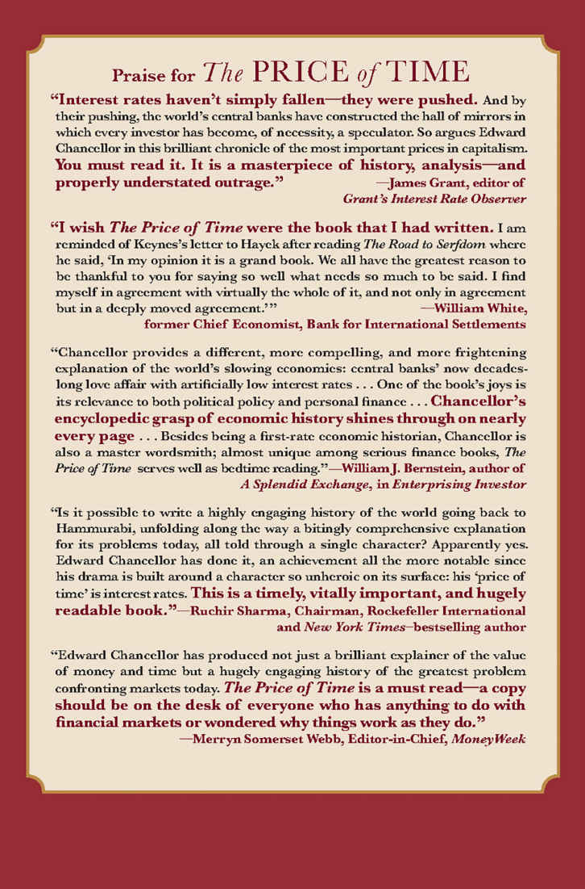

<!-- rl-section id="sec_follow_penguin" class="titlepage" -->

<!-- rl-section id="section-57" class="epub-section" kicker="Section 57" title="Section 57" -->

## Section 57

Copyright © 2022 by Edward Chancellor

Jacket design by David Plunkert   
Jacket artwork: The Money Changer and his Wife, 1514, Quentin Metsys.   
Musée du Louvre, Paris © agefotostock/Alamy

All rights reserved. No part of this book may be reproduced in any form or by any electronic or mechanical means, including information storage and retrieval systems, without permission in writing from the publisher, except by a reviewer, who may quote brief passages in a review. Scanning, uploading, and electronic distribution of this book or the facilitation of such without the permission of the publisher is prohibited. Please purchase only authorized electronic editions, and do not participate in or encourage electronic piracy of copyrighted materials. Your support of the author’s rights is appreciated. Any member of educational institutions wishing to photocopy part or all of the work for classroom use, or anthology, should send inquiries to Grove Atlantic, 154 West 14th Street, New York, NY 10011 or [permissions@groveatlantic.com.](mailto:permissions@groveatlantic.com)

First published in Great Britain in 2022 by Allen Lane, An imprint of Penguin Random House UK

*Published simultaneously in Canada   
Printed in the United States of America*

First Grove Atlantic hardcover editon: August 2022

Typeset in the UK by Jouve (UK), Milton Keynes

Library of Congress Cataloging-in-Publication data is available for this title.

ISBN 978-0-8021-6006-5   
eISBN 978-0-8021-6007-2

Atlantic Monthly Press   
an imprint of Grove Atlantic   
154 West 14th Street   
New York, NY 10011

Distributed by Publishers Group West

[groveatlantic.com](http://groveatlantic.com)

<!-- rl-section id="sec_copy001" class="calibre2" -->

Copyright © 2022 by Edward Chancellor

Jacket design by David Plunkert   
Jacket artwork: The Money Changer and his Wife, 1514, Quentin Metsys.   
Musée du Louvre, Paris © agefotostock/Alamy

All rights reserved. No part of this book may be reproduced in any form or by any electronic or mechanical means, including information storage and retrieval systems, without permission in writing from the publisher, except by a reviewer, who may quote brief passages in a review. Scanning, uploading, and electronic distribution of this book or the facilitation of such without the permission of the publisher is prohibited. Please purchase only authorized electronic editions, and do not participate in or encourage electronic piracy of copyrighted materials. Your support of the author’s rights is appreciated. Any member of educational institutions wishing to photocopy part or all of the work for classroom use, or anthology, should send inquiries to Grove Atlantic, 154 West 14th Street, New York, NY 10011 or [permissions@groveatlantic.com.](mailto:permissions@groveatlantic.com)

First published in Great Britain in 2022 by Allen Lane, An imprint of Penguin Random House UK

*Published simultaneously in Canada   
Printed in the United States of America*

First Grove Atlantic hardcover editon: August 2022

Typeset in the UK by Jouve (UK), Milton Keynes

Library of Congress Cataloging-in-Publication data is available for this title.

ISBN 978-0-8021-6006-5   
eISBN 978-0-8021-6007-2

Atlantic Monthly Press   
an imprint of Grove Atlantic   
154 West 14th Street   
New York, NY 10011

Distributed by Publishers Group West

[groveatlantic.com](http://groveatlantic.com)

<!-- rl-section id="section-58" class="epub-section" kicker="Section 58" title="Footnotes" -->

## Footnotes

### Introduction

[fn1](#section-11) Besides the ‘fructification theory’ (where interest is said to ‘derive’ from rent on land), there’s the surplus value (or profits) theory, productivity theory, ‘use theory’, ‘abstinence theory’ (spur to savings), ‘remuneration theories’, exploitation theory, reproductive theory and a number of Böhm-Bawerk’s ‘colourless theories’. To this list we should add Keynes’s notion, elaborated in his *General Theory*, that interest is required to discourage the hoarding of capital. Böhm-Bawerk rejected these explanations for interest, suggesting instead that interest arises because of man’s innate preference to enjoy present over future consumption. Needless to say, some economists deny the ‘time preference’ theory of interest.

[fn2](#section-11) Böhm-Bawerk was adamant on this point. Fisher, however, could conceive of situations when an individual’s time preference might turn negative. For instance, at times when incomes were declining rapidly, Fisher imagined that, if the stock of food was composed of spoiling figs, instead of hard tack, then the interest rate would be negative.

### 1: Babylonian Birth

[fn1](#section-13) Such folk, claims Mauss, were not motivated by ‘the cold reasoning of the merchant, the banker, and the capitalist … they repay with interest, but this is in order to humiliate the person initially making the gift or exchange, and not only to recompense him for loss caused to him by “deferred consumption”’ (Marcel Mauss, *The Gift: The Form and Reason for Exchange in Archaic Societies*, trans. W. D. Halls (London, 1990), pp. 96–7).

[fn2](#section-13) Marx calls Arnd’s theory the ‘primordial forest rate of interest’ (Marx, *Capital*, vol. III, trans. Samuel Moore and Edward Aveling (London, 1974), p. 363 fn).

[fn3](#section-13) Silver loans were made by weight, and barley loans by volume. One mina of barley was worth 60 shekels. Interest on silver was paid at the rate of one shekel per mina (1/60th per month or 20 per cent a year). There was a fixed exchange rate between barley and silver.

[fn4](#section-13) Assuming 20 per cent interest, paid annually and capitalized, Leemans calculates that the loan principal doubles with interest over 3 years and 283⅓ days (W. F. Leemans, *The Old Babylonian Merchant: His Business and His Social Position* (Leiden, 1950), p. 15).

[fn5](#section-13) There is no evidence that Einstein ever made this comment. The first known reference, according to the Quote Investigator website, is an advertisement for The Equity Savings & Loan Company published in the *Cleveland Plain Dealer* of Ohio in 1925: ‘The Eighth Wonder of the World – is compound interest. It does things to money. At the Equity it doubles your money every 14 years’ (<https://quoteinvestigator.com/2019/09/09/interest/>).

[fn6](#section-13) William Goetzmann comments that this is equivalent to 580 times the annual barley harvest of the United States (William Goetzmann, *Money Changes Everything: How Finance Made Civilization Possible* (Princeton, 2016), p. 35).

[fn7](#section-13) Clean slates limited the social disturbances that arose when borrowers fell into a state of debt bondage or had their lands foreclosed by creditors. *Misarum* acts only touched upon consumer (grain) loans, while commercial (silver) debts were unaffected. This suggests that the rulers were mostly concerned with the social consequences of excessive personal debt (Michael Hudson, ‘Reconstructing the origins of interest-bearing debt and the logic of clean slates’, in *Debt and Economic Renewal in the Ancient Near East*, eds. Michael Hudson and Marc van der Mieroop (Bethesda, Md, 2002), p. 7).

[fn8](#section-13) Morris Silver, *Economic Structures of Antiquity* (Westport, Conn., 1995), ch. 5 *passim*. Although it has been claimed that Ancient Greece lacked a true money market, a decree issued in the late fifth century BC by Plotheia, a district of Attica, calls for money to be lent out to borrowers offering the highest interest rate.

[fn9](#section-13) It is curious to note that the chief beneficiaries of Tiberius’ quantitative easing were patrician families. As we shall see, this was also the case when the Federal Reserve revived the practice in 2008.

### 2: Selling Time

[fn1](#section-14) ‘Debt was a deliberate device,’ writes Sir Moses Finley, ‘on the part of the creditor to obtain more dependent labour rather than a device for enrichment through interest’ (Finley, *Economy and Society in Ancient Greece* (London, 1981), p. 156).

[fn2](#section-14) Interest-free loans were available in Ancient Athens. Known as *eranos* loans, they were supplied by groups of lenders to be repaid when funds became available. Demosthenes claimed that the slave-prostitute Neara bought her freedom by raising *eranos* contributions from former clients.

[fn3](#section-14) Bonaventura’s comment contains the germ of Marx’s ‘labour theory of value’. In contradiction, Böhm-Bawerk pointed out that a bottle of wine, placed in the cellar, increases in value without any additional labour input.

[fn4](#section-14) Double-entry bookkeeping represents an extraordinary intellectual feat of quantification. Every asset and each exchange is given a monetary value and recorded in the same currency. The use of Arabic numerals enabled figures to be readily calculated. The German sociologist Werner Sombart, author of the six volume *Modern Capitalism* (first published in 1912), went so far as to claim that, by encouraging regular record-keeping, mathematical order and the reduction of events to numerical abstractions, double-entry contains the germ of the later Scientific Revolution.

[fn5](#section-14) Adam Smith, *An Inquiry into The Nature and Causes of the Wealth of Nations* [1776] (London, 1875), p. 44. Also, p. 285: ‘It may be laid down as a maxim, that wherever a great deal can be made by the use of money, a great deal will commonly be given for the use of it … Accordingly, therefore, as the usual market rate of interest varies in any country, we may be assured that the ordinary profits of stock must vary with it, must sink as it sinks, and rise as it rises.’

[fn6](#section-14) See Henri Eugene Sée, *Modern Capitalism* (New York, 1928), p. 125. Sée writes: ‘The present day meaning of *capital* was expressed, in the seventeenth century, by the word *principal*, or by the word *interest*. For example, such an expression as the following was used: “to take an interest of 5000 *livres* in a business.” Only in the course of the eighteenth century did the word capital really begin to take on its present meaning.’

[fn7](#section-14) Lionel Robbins, *A History of Economic Thought* (Princeton, 1998), p. 54. Ludwig von Mises made a similar point, writing in ‘Human Action: The Rate of Interest’ that anyone ‘who wants to “abolish” interest will have to induce people to value an apple available in a hundred years no less than a present apple’.

### 3: The Lowering of Interest

[fn1](#section-15) In *The Nature and Necessity of Interest* (London, 1903), Gustav Cassel calls Child’s comment an ‘evident absurdity’.

[fn2](#section-15) ‘As their critics pointed out, the directors [of the East India Company] maximized their return by refusing to issue more stock and trading on short-term, borrowed capital … they could profit, without investing more of their own capital, from the difference between the interest which they paid on bonds and the net profits of the trade. In 1683, however, a shortage of working capital created a temporary financial crisis. The stock fell in value and the company was forced to raise the rate on its bonds to 5 per cent in order to attract capital’ (extract from Sir Josiah Child’s entry in the *Oxford Dictionary of National Biography*).

[fn3](#section-15) Locke writes that ‘If lessening use [interest] to four per cent. should at all alter the quantity of money, and make it less, it would make money, as it has the nature of a commodity, dearer’ (*Some Considerations of the Consequences of the Lowering of Interest and the Raising of the Value of Money* [London, 1691], in *On Money*, vol. I (Oxford, 1991), p. 257).

[fn4](#section-15) Some of Child’s wilder ideas are still with us. ‘Low interest rates can cause a baby boom, Bank of England suggests’ ran the headline of an article in the *Daily Telegraph* on 23 December 2019.

### 4: The Chimera

[fn1](#section-16) The Genoese bank was created in 1407 by consolidating funded loans and distributing shares, *luoghi*, whose dividends varied with the tax yield. Law maintained an account with the Casa di San Giorgio, which he considered the ‘best governed [bank] in Italy’ (James Buchan, *John Law* (London, 2018), p. 81).

[fn2](#section-16) In Hamilton’s view, France’s ‘huge funded debt, the depreciated paper currency, and the acute commercial crisis were largely responsible for France’s acceptance of John Law’s scheme’. (See Earl J. Hamilton, ‘Prices and Wages at Paris under John Law’s System’, *Quarterly Journal of Economics*, 51(1), 1936, and ‘The Origin and Growth of the National Debt in Western Europe’, *American Economic Review*, 122, 1947.)

[fn3](#section-16) The issue at 500 livres in late 1718 was followed by another at 550 in the following June, rising to 1,000 in the next month, and 5,000 livres for the issues of September and October of 1719.

[fn4](#section-16) In the second half of 1719 only a 10 per cent down-payment was required on new issues. Subscribers were in effect buying options.

[fn5](#section-16) At this time a mason earned around 170 livres a year. The median US income is currently close to $59,000. Based on these relative incomes, Law paid close to $350 million in today’s currency for the Palais Mazarin. The building became the headquarters of the Company and the Royal Bank, and later housed France’s Bibliothèque Nationale.

[fn6](#section-16) When Law first approached the Regent with his scheme, the banker Samuel Bernard advised against it, saying there was ‘no foundation for the bank he proposes, in a country where everything depends on the King’s pleasure’ (Buchan, *John Law*, p. 111).

[fn7](#section-16) The definition of ‘realize’ is Washington Irving’s (from his 1825 essay, ‘The Great Mississippi Bubble’). An edict of December 1719 decreed that all public payments must be made in bank notes. The following February the import and wearing of precious metals, diamonds and pearls was banned and the Company was given the powers to search for hoarded coins. By the end of the month, only regulated goldsmiths were allowed to possess gold and silver.

[fn8](#section-16) Buchan writes that Law is invoking a ‘new species of property, where your capital is of use to the entire body of the nation’. Law’s autocratic desire to prevent money-hoarding foreshadows recent calls to abolish physical cash, to stop money being hoarded, at a time when central banks were attempting to impose negative interest rates (Buchan, *John Law*, p. 271).

[fn9](#section-16) ‘Law’s easy credit policy must have been largely responsible,’ wrote Hamilton, ‘for the failure of the market rate of interest to rise during the Bubble. In conformity with Wicksell’s theory, the disparity between the natural and the market rates of interest accentuated credit expansion and played an important role in the sharp upswing of prices’ (‘Prices and Wages at Paris under John Law’s System’, p. 63; see also François Velde, ‘John Law’s System’, *American Economic Review*, 97 (2), 2007).

[fn10](#section-16) In his ‘Essay on the Land Bank’ (written around 1704), Law criticized the rival land bank scheme of Hugh Chamberlen, who proposed supplying £10,000 of bank notes against land collateral, yielding an annual income of just £150 (i.e. a capitalization rate of 1.5 per cent), and attacked John Briscoe’s plan for a land bank which mooted an even lower lending rate.

[fn11](#section-16) That inflationary forces initially raise prices in some parts of the economy before becoming more widespread is known as the ‘Cantillon effect’.

### 5: John Bull Cannot Stand Two Per Cent

[fn1](#section-17) ‘Bad business takes time to grow – especially bad lending business, which is the most dangerous, because when discovered it saps credit, and destroys the spring of industry’ (Bagehot, *Collected Works*, vol. X, ed. Norman St John-Stevas (London, 1978), p. 37).

[fn2](#section-17) British government debt conversions at times of low interest were a coincident indicator of speculative booms and a leading indicator of financial crises, from the South Sea Company conversion of 1720 to the Goschen conversion of 1888.

[fn3](#section-17) ‘By freeing the funds of those who did not accept the new rate [on Consols] and by making current holders “restless” for a higher return on their funds, the conversion operations contributed somewhat to the floatation [sic] and Stock-Exchange boom,’ write Arthur Gayer, W. W. Rostow and Anna Jacobson Schwartz (*The Growth and Fluctuation of the British Economy, 1790–1850: An Historical, Statistical, and Theoretical Study of Britain’s Economic Development*, vol. I (Hassocks, 1975), p. 172).

[fn4](#section-17) The interest-rate cap on bills of exchange was abolished in 1833. In 1854, England’s usury laws were finally removed from the Statute Book.

[fn5](#section-17) Partner Henry Sykes Thornton, who was the eldest son of Henry Thornton, author of *Paper Credit*, took the whole affair on the chin, telling his sister: ‘what a great man breaking makes of me, I have had all these first-rate people trailing after me as if I had been Secretary of State. I always loved the character of a City Merchant and Banker, and it is delightful to see how they unite the powers of a man of business with the romantic effects of the heroes of fairy tales.’

[fn6](#section-17) The proposed railways included the Bristol & English Channels Direct Junction Railway, the Somerset & North Devon Junction Railway & Porlock Harbour & Docks, and the Bridgwater & Minehead Railway. None of these proposals got off the ground. In 1859, the West Somerset Mineral Railway opened to carry iron ore from the Brendon Hills to Watchet. It proved unprofitable. Watchet finally got its passenger line in 1862 with the opening of the West Somerset Railway. This line continues in operation to the current day.

[fn7](#section-17) This was standard practice for the time. After Overend’s failure, the Chancellor, Gladstone, advised by his ‘shadow chancellor’ Bagehot, allowed the Bank Act to be suspended on the condition that the bank rate was held at 10 per cent.

[fn8](#section-17) Argentina had been growing rapidly since 1870, following the ‘pacification of the Indians’ in the previous decade – between 1870 and 1890, its population doubled. In the 1880s, the country was under the stable rule of a strongman, General Roca. In the early 1880s, the currency was reformed – the new peso notes convertible into gold at par.

[fn9](#section-17) When it comes to lending to developing countries, the market’s capacity to recall past history varies in proportion to the domestic rate of interest: a low prevailing rate serves to fog the memory.

[fn10](#section-17) Paul Emden, *Money Powers of Europe in the Nineteenth and Twentieth Centuries* (New York, 1937), p. 279: ‘[Argentine] railways were built to cope with a traffic far beyond the bounds of probability for many years to come.’ Over the course of the 1880s, the Argentine rail network expanded from 2,500 miles to nearly 10,000 miles. By 1893, some 13,900 miles had been completed.

[fn11](#section-17) H. G. Anderson, the Buenos Aires manager of the London and River Plate Bank, had long expected a crisis. In 1886 he informed his superiors in London that, as long as the Argentines continued to borrow, and to pay interest on old debts, the day of reckoning could be postponed. Anderson blamed the flow of foreign loans on low rates of interest in London (David Joslin, *A Century of Banking in Latin America* (London, 1963), pp. 121–5).

### 6: Un Petit Coup de Whisky

[fn1](#section-18) Treasury Secretary Shaw, who served under Teddy Roosevelt between 1902 and 1907, was said to conceive of only three evils: ‘high interest rates, a decline in the prices of stocks, and a contraction of credit, but these evils, in his opinion, were so serious that they were to be corrected at whatever cost.’ The author of this comment blamed successive Treasury secretaries for resisting with ‘all the vast resources of the government treasury the natural tendency of interest rates to follow the rising level of prices. They had, in fact, succeeded in keeping the money rate of interest below the rate which would have been “normal” or “natural” with a depreciating currency. They had kept alive a continuously excessive demand for credit, by making it available at less than the normal cost.’ (See A. Piatt Andrew, ‘The United States Treasury and the Money Market: The Partial Responsibility of Secretaries Gage and Shaw for the Crisis of 1907’, *American Economic Association Quarterly*, 9 (1), 1908: 228.)

[fn2](#section-18) Trust companies, such as the Knickerbocker Trust, were unregulated Wall Street firms (what would now be called ‘shadow banks’) that paid higher interest rates than savings banks and invested their deposits in illiquid and often speculative ventures.

[fn3](#section-18) Under the classical Gold Standard, inflows of foreign gold automatically added to a country’s gold supply. Under the Gold Exchange Standard, however, gold inflows could be ‘sterilized’ by a central bank issuing bonds. Thus, the specie-flow mechanism described by David Hume in the mid-eighteenth century no longer functioned properly and countries which received large gold inflows, as France and the United States did in the 1920s, were able to hoard large amounts of the world’s limited supply of gold.

[fn4](#section-18) The first reference to an ‘active monetary policy’ comes from *The Economist* in 1925, in reference to a 1 percentage point reduction in interest rates by the Dutch central bank.

[fn5](#section-18) Fisher was motivated by his belief that people confused real and nominal price changes. According to Fisher, ‘money illusion’ was an important cause of business fluctuations because wages didn’t fall in nominal terms at times when consumer prices were declining. This later became the ‘sticky prices’ theory of neo-Keynesian economists (see Perry Mehrling, *The New Lombard Street: How the Fed Became the Dealer of Last Resort* (Princeton, 2011), p. 57).

[fn6](#section-18) This point is explained by Bloomberg chief economist Tom Orlik: ‘As a rule of thumb, loan rates should be roughly in line with the pace of nominal GDP growth – a proxy for the expected return on investment. If they’re too much higher, no one will borrow, hitting growth and employment. Too much lower and demand for credit will be too great, fueling inflation and asset price bubbles.’ Orlik is writing about interest rates in China in the twenty-first century, but the point holds also for the United States in the 1920s (Thomas Orlik, *China: The Bubble that Never Pops* (New York, 2020), p. 73).

[fn7](#section-18) See Barry J. Eichengreen and Kris Mitchener, ‘The Great Depression as a Credit Boom Gone Wrong’, BIS Working Paper, September, 2003. The Federal Reserve also sterilized gold inflows from abroad, which further suppressed inflationary pressures. Perry Mehrling claims that Strong’s policy of keeping interest rates low and stable while sterilizing temporary inflows of gold ‘was the fuel that fired the stock market bubble … Inadvertently, Strong’s interest rate policy proved to be the original stock market put’ (Mehrling, *The New Lombard Street*, p. 41).

[fn8](#section-18) Both the cyclically adjusted price–earnings ratio and Tobin’s *q* measure of market value relative to replacement cost suggest that the US stock market was extremely expensive relative to its historic average valuation by the late 1920s.

[fn9](#section-18) In early 1929, Creditanstalt took over another Austrian bank, the Bodenkreditanstalt, that had financed long-term investments with short-term English and American credit. The latter bank foundered after American lenders withdrew. This acquisition turned out to be fatal for the Creditanstalt’s own future.

[fn10](#section-18) Felix Somary, *The Raven of Zürich* (London, 1986), pp. 146–7. Keynes and Fisher were not the only economists to hold sanguine views at the time. Somary mentions an evening at his home, held around the same time, where a number of distinguished German economists ‘all agreed that no crisis was in the offing because prices of goods had not risen at all; that sounded exactly like Keynes’s own views’ (*Raven of Zürich*, p. 153).

[fn11](#section-18) The nineteenth-century English economist W. S. Jevons, who developed a theory of marginal utility independent of the Austrian economist Carl Menger, likewise held that the level of interest determines the length of production processes.

[fn12](#section-18) ‘The rate of interest at which, in an expanding economy, the amount of new money entering circulation is just sufficient to keep the price level stable, is always lower than the rate which would keep the amount of available loan-capital equal to the amount simultaneously saved by the public: and thus, despite the stability of the price level, it makes possible a development leading away from the equilibrium position’ (Hayek, *Monetary Theory and the Trade Cycle*, trans. N. Kaldor and H. M. Croome (London, 1933), p. 114).

[fn13](#section-18) By the date of the *General Theory* (1936), Keynes had lost faith in the notion of a natural rate of interest.

[fn14](#section-18) Ben Bernanke, ‘Asset Price “Bubbles” and Monetary Policy’, speech before the New York Chapter of the National Association for Business Economics, 15 October 2002. One question that Bernanke does not address is why the US economy was so much more vulnerable to high interest rates in the late 1920s than at the beginning of the decade. The answer is that intervening credit boom and various asset price bubbles had rendered its financial system unstable. History was to repeat itself during Bernanke’s time at the Fed in the early 2000s.

[fn15](#section-18) For further discussion see [Chapter 10](#section-23).

### 7: Goodhart’s Law

[fn1](#section-20) Although this book argues that price stability shouldn’t be the sole aim of monetary policy, this is not to say that inflation is desirable. The case against inflation is so well known it hardly needs recalling. Inflation damages economic growth by interfering with price signals and hindering long-term planning. It also distorts profits in myriad ways. Unanticipated inflation involves an unfair redistribution of income and wealth.

[fn2](#section-20) During his time at the Fed, Martin was bullied by President Lyndon B. Johnson to keep interest rates low. In December 1965, the Fed Chairman visited Johnson at his Texas ranch. The President took Martin for a fast drive in his jeep over a rough track in order to soften Martin up and induce him to cut interest rates. At an earlier meeting in the White House, President Johnson told Martin that raising rates would ‘amount to squeezing blood from the American working man in the interest of Wall Street’. In the end, Martin kept the punch bowl in place for too long and inflation took off under his watch (Paul Volcker and Christine Harper, *Keeping at It: The Quest for Sound Money and Good Government* (New York, 2018), p. 55).

[fn3](#section-20) Greta Kippner, *Capitalizing on Crisis: The Political Origins of the Rise of Finance* (London, 2011), p. 113. Kippner suggests that the Fed changed its policy after the October crash in order to use interest rates to support financial markets and to provide greater transparency and predictability. Henceforth, the Fed found that raising interest rates was politically more difficult.

[fn4](#section-20) The idea of creating a bubble to deal with a bubble had earlier been mooted by Paul Krugman in the *New York Times* in August 2002: ‘To fight this recession the Fed needs more than a snapback; it needs soaring household spending to offset moribund business investment. And to do that, as Paul McCulley of PIMCO put it, Alan Greenspan needs to create a housing bubble to replace the Nasdaq bubble …’ Krugman apparently found nothing wrong with this suggestion (Paul Krugman, ‘Dubya’s Double Dip?’, *New York Times*, 2 August 2002).

[fn5](#section-20) Ben Bernanke, ‘Monetary Policy and the Housing Bubble’, speech at the Annual Meeting of the American Economic Association, 3 January 2010. ‘Monetary policy following the 2001 recession appears to have been reasonably appropriate, at least in relation to a simple policy rule.’ This begs the question of whether the ‘simple policy rule’ was appropriate.

[fn6](#section-20) Bernanke, ‘Monetary Policy and the Housing Bubble’. Bernanke’s argument was based on a recently published paper by Fed researchers (Jane Dokko *et al.,* ‘Monetary Policy and the Housing Bubble’, Federal Reserve Board, 22 December 2009). The paper’s authors claim that low rates in 2003–4 were justified on a precautionary basis due to the ‘significant risk’ of deflation (although they admit that subsequent revisions to inflation statistics showed deflation risk was exaggerated). Besides, they say, the Fed was only acting in a conventional fashion: the ‘setting of monetary policy appeared to follow the broad contours that would be expected given conventional macroeconomic views … outside forecasters, on balance, saw the policy stance adopted by the FOMC as consistent with the FOMC’s objectives’ ([p. 13](#section-13)). They claim, rather disingenuously, that the US housing ‘boom’ started in 1998, long before the easy money policy commenced (as we’ve noted above, US house prices only exceeded 2 standard deviations above trend after 2002). The authors conclude that ‘all told, the evidence appears mixed at best on whether the policy stance of advanced economy central banks is among the significant factors contributing to the run-up in housing.’

[fn7](#section-20) In brief, the fall in Treasury yields after 2000 was due in large measure to the recirculation of international capital flows (Rueff’s ‘game of marbles’, in which the losses are returned by the winner), which took off after the Fed slashed rates at the turn of the century. This is discussed in more detail in [Chapter 17](#section-31).

[fn8](#section-20) In 2008, Schwartz wrote: ‘if you investigate individually the manias [of the past] … in every case, it was expansive monetary policy that generated the boom in an asset. The particular asset varied from one boom to another. But the basic underlying propagator was too-easy monetary policy and too-low interest rates.’ (Cited in Steven Horwitz and William Luther, ‘The Great Recession and Its Aftermath from a Monetary Equilibrium Theory Perspective’, Mercatus Center, October 2010, p. 5.)

[fn9](#section-20) For more on this theme, see [Chapter 17](#section-31).

[fn10](#section-20) In a 2003 speech, Bernanke had noted that inflation targeting was seen in the United States as something ‘foreign, impenetrable, and possibly slightly subversive’. Yet in his view, ‘low and stable inflation is a key element – perhaps I should say *the* key element – of successful monetary policy’ (‘A Perspective on Inflation Targeting’, p. 2).

[fn11](#section-20) Legend tells of a Soviet nail factory for which Moscow set quotas: when the quotas involved quantity, the factory churned out small useless nails, and when Moscow set a quota by weight, the managers produced railway spikes that weighed a pound each. The failure of central planning teaches that we should avoid the ‘tyranny of metrics’. In recent decades, however, the incautious use of performance indicators in universities and schools, healthcare, policing and business has produced a litany of errors. (See Jerry Muller, *The Tyranny of Metrics* (Princeton, 2018.))

[fn12](#section-20) See [Chapter 15](#section-28).

### 8: Secular Stagnation

[fn1](#section-21) George Terborgh, *The Bogey of Economic Maturity* (Chicago, 1950). Terborgh notes (p. 63) that the act of saving is not independent of investment (the purchase of a capital good). Thus, a decline in capital spending prompted by slowing population growth would automatically reduce saving. ‘Declining population growth tends to reduce both the volume of saving and the proportion of this reduced volume available for capital formation.’

[fn2](#section-21) The global savings glut hypothesis is examined in [chapters 17](#section-31) and [18](#section-32).

### 9: The Raven of Basel

[fn1](#section-22) After 2008, the Federal Reserve signalled to the market its intended future interest-rate moves (forward guidance), acquired large amounts of securities (quantitative easing), and swapped its portfolio holdings from short- to long-date bonds (Operation Twist). All these actions were intended to lower long-term bond yields.

[fn2](#section-22) ‘One should not ask what the real side of the equation means for its financial counterpart, but what the financial side means for its real counterpart’ (Claudio Borio *et al*., ‘The International Monetary and Financial System: A Capital Account Historical Perspective’, BIS Working Paper, August 2014, p. 20).

[fn3](#section-22) ‘Overall, the results point in the same direction: no single real factor, or combination of such factors, can consistently explain the long-term evolution of real interest rates. This holds at both the domestic and global levels. It suggests that the observed correlation between the saving-investment factors and the real interest rate in the latest sample is largely coincidental, mostly driven by temporary but unrelated trends in the variables.’ (Borio *et al*., ‘Why So Low for So Long? A Long-Term View of Real Interest Rates’, BIS Working Paper, December 2017. See also Borio *et al*., ‘Monetary Policy in the Grip of a Pincer Movement’, BIS Working Paper, March 2018.)

[fn4](#section-22) Until the late 1990s, the trend level of real long-term rates was in line with its post-war average of around 3 per cent. The subsequent trend decline in long-term rates roughly coincided with the start of the Greenspan Fed’s easy money policy. (See Jamie Dannhauser, ‘What is the Normal Level of Real Rates …’, *The Ruffer Review*, September 2014.)

[fn5](#section-22) ‘It is quite possible for inflation to remain stable while output is on an unsustainable path, owing to the build-up of financial imbalances and the distortions they mask in the real economy’ (Borio, ‘The Financial Cycle and Macroeconomics: What Have We Learnt?’, BIS Working Paper, December 2012, p. 9).

### 10: Unnatural Selection

[fn1](#section-23) Joseph Conard observes that interest rations capital on three dimensions: between the types of goods produced, between entrepreneurs and between methods of production (see Joseph Conard, *An Introduction to the Theory of Interest* (Berkeley, Calif., 1966), p. 95).

[fn2](#section-23) Karl Marx observed that ‘The rate of interest reaches its peak during crises, when money is borrowed at any cost to meet payments’ (Marx, *Capital*, vol. III, p. 361). Under the gold standard, the spike in interest rates during crises tended to be sharper as there was a scramble to convert a surplus of paper credit into a limited amount of bullion.

[fn3](#section-23) In his *Treatise on Money* (1931) Keynes wrote that the ‘most striking change in the investment factors of the post-war world compared with the pre-war world is to be found in the high level of the market-rate of interest’ ([p. 337](#section-51)). At the time, Keynes believed that the market rate of interest in the late 1920s was above the natural rate. He later jettisoned the idea of a natural rate of interest.

[fn4](#section-23) This viewpoint is forcefully expressed by Boston University’s Perry Mehrling: ‘Credit is critical for the process of “creative destruction” that is the source of capitalism’s dynamism, because it provides the crucial mechanism that allows the new to bid resources away from the old. *Instability is, from this point of view, inseparable from growth, and a central bank that intervenes to control instability runs the risk of killing off growth by stifling the new on the way up and coddling the old on the way down*’ (Mehrling, *The New Lombard Street* (Princeton, 2011), p. 12).

[fn5](#section-23) Deutsche Bank concluded that the ECB’s actions had ‘curtailed the prospect of significant reforms in labour markets, legal systems, welfare systems, and tax systems across the continent’ (David Folkerts-Landau, ‘The Dark Side of QE: Backdoor Socialization, Expropriated Savers and Asset Bubbles’, Deutsche Bank Research, 1 November 2016, p. 1).

[fn6](#section-23) As George Soros told the *New York Review of Books* in January 2016, the Greek crisis taught the Europeans to muddle through, ‘this practice is popularly known as kicking the can down the road, although it would be more accurate to describe it as kicking a ball uphill so that it keeps rolling back down’ (George Soros and Gregor Peter Schmitz, ‘“The EU is on the Verge of Collapse” – An Interview’, *New York Review of Books*, 11 February 2016).

[fn7](#section-23) An IMF paper found that ‘increases in interest rates significantly affect job destruction, while reductions in interest rates fail to stimulate job creation’ (Pietro Garibaldi, ‘The Asymmetric Effects of Monetary Policy on Job Creation and Destruction’, IMF Working Paper, April 1997, p. 580).

[fn8](#section-23) See Andrew Smithers, *Productivity and the Bonus Culture* (Oxford, 2019). Smithers argues that equity-linked incentives caused senior executives of listed companies to become overly obsessed with their current share price and reluctant to invest for the longer term.

[fn9](#section-23) Claudio Borio, ‘A Blind Spot in Today’s Macroeconomics?’, BIS speech, 10 January 2018. The blind spot to which Borio alludes is the tendency of macroeconomics to ignore resource misallocations. A misallocation of resources between sectors is not possible in the canonical model which contains only a single company, the ‘representative firm’.

[fn10](#section-23) As William White wrote in 2012, ‘by mitigating the purging of malinvestments in successive cycles, monetary easing thus raised the likelihood of an eventual downturn that would be much more severe than a normal one’ (White, ‘Ultra Easy Monetary Policy and the Law of Unintended Consequences’, Federal Reserve Bank of Dallas, Working Paper 126, August 2012, p. 25).

### 11: The Promoter’s Profit

[fn1](#section-24) An incomplete list of highly concentrated sectors in the United States includes: computer operating systems, mobile phones, social networks, search engines, milk, beer, soft drinks, railroads, seeds, microprocessors, funeral homes, supermarkets, payments systems, phone operating systems, online advertising, kidney dialysis, glasses, credit bureaus, tax preparation, airlines, banking, health insurance, medical care, group purchasing organizations, pharmacy benefit managers, drug wholesalers, meat and poultry, agriculture, media, title insurance, suppliers of exchange-traded funds and financial indexes. (See Jonathan Tepper and Denise Hearn, *The Myth of Capitalism: Monopolies and the Death of Competition* (Hoboken, NJ, 2019), pp. 115–16.)

[fn2](#section-24) The NBER authors conclude that ‘as the interest rate approaches zero, it is guaranteed that economy-wide measures of market concentration will rise and aggregate productivity growth will fall.’ (See Ernest Liu, Atif Mian and Amir Sufi, ‘Low Interest Rates, Market Power, and Productivity Growth’, NBER Working Paper, January 2019, pp. 1–2. Also Ernest Liu, Atif Mian and Amir Sufi, ‘Could Ultra-Low Interest Rates be Contractionary?’ Project Syndicate, 17 September 2019.)

[fn3](#section-24) According to Bloomberg, the purpose of GM’s acquisition of the subprime lender AmeriCredit Corp for $3.5 billion was to ‘reach more customers with leases and loans to borrowers with faulty credit records’ (Caroline Dye and Betty Liu, ‘Gabelli Says GM “Back in the Game” with AmeriCredit’, Bloomberg, 22 July 2010).

### 12: A Big Fat Ugly Bubble

[fn1](#section-25) The Riksbank noted that very low interest rates in Sweden were ‘contributing towards [rising] housing prices and indebtedness among households’. By 2015, Swedish household debt was close to 180 per cent of disposable income (up from 100 per cent in 2000) and average debt for households with mortgages was more than three times disposable income. Yet, interest payments by households had fallen to a record low of 3 per cent of GDP (*Financial Stability Report 2015,* Riksbank, 25 January 2016).

[fn2](#section-25) The gap between the earnings yield on stocks and the yield on risk-free government bonds is known as the ‘equity risk premium’. After 2008, the equity risk premium remained above average (i.e., it signalled that stocks were cheap) even as the stock market started to look extremely expensive on other valuation measures.

[fn3](#section-25) Grantham writes: ‘Pre-1997 real rates averaged 200 bps higher than now and leverage was 25 per cent lower. At the old average rate and leverage, profit margins on the S&P 500 would drop back 80 per cent of the way to their previous much lower pre-1997 average, leaving them a mere 6 per cent higher’ (Jeremy Grantham, ‘This Time Seems Very, Very Different’, GMO Quarterly Letter, First Quarter 2017).

[fn4](#section-25) Monetary policy raised finance profits in various ways: lower interest rates pushed up asset prices, thereby increasing bank fees and asset managers’ incomes; losses on bad loans were curtailed; and, thanks to low borrowing costs and rising asset values, leveraged buyouts proved extremely profitable. All this was welcome news on Wall Street.

[fn5](#section-25) At the meeting, Volcker publicly agreed with Fed Chair Yellen. But only a few months later I asked Volcker in person whether he stood by his words. ‘No,’ he replied, ‘of course there’s a bubble. My grandchildren can’t afford to buy apartments in New York City. I just didn’t want to say so in front of the *Wall Street Journal*.’

### 13: Your Mother Needs to Die

[fn1](#section-26) In a slightly different context, Irving Fisher wrote that ‘the bridge or link between income and capital is the rate of interest.’

[fn2](#section-26) In November 2015, Bloomberg reported that Canadian pension funds, finding no safe investments to meet their obligations, were ‘ramping up leverage’ – mortgaging buildings, investing in derivatives, etc. – to boost returns (Ari Altstedter, ‘Hedge Funds + Leverage are Hot Formula for Canada Pension Plans,’ Bloomberg, 10 November 2015). A few months earlier, the OECD warned about the rising share of pension and life insurance assets invested in hedge funds, junk bonds and commodities. This shift to riskier investments, the OECD suggested, could result in the solvency of pensions and insurers being ‘seriously compromised’ (Chris Flood, ‘OECD warns pension funds over “excessive search for yield”’, *Financial Times*, 4 July 2015).

[fn3](#section-26) The Georgia couple’s policy was with TransAmerica Life Insurance. According to the *New York Times*, this company had used complex transactions to shift a large share of its obligations to policyholders into off-balance-sheet vehicles, allowing it to pay an extraordinary $2 billion dividend to its parent company, Aegon. (Julie Creswell and Mary Williams Walsh, ‘Why some life insurance premiums are skyrocketing’, *New York Times*, 13 August 2016.)

### 14: Let Them Eat Credit

[fn1](#section-27) In *The Republic*, Plato described how usury set poor borrowers against rich lenders. In a state infected by the desire for wealth, Plato wrote, spendthrift youth are encouraged to take out loans at interest, families are ruined and those who have lost property are eager for revolution – ‘The evil blazes up like a fire.’ (Plato, *The Dialogues of Plato, vol. II: The Republic*, trans. B. Jowett, MA (New York, 1914), p. 324).

[fn2](#section-27) In the four decades after the Second World War this most privileged section of the population owned on average some 10 per cent of the nation’s household wealth. After the tech bubble burst, their wealth share stood at 15 per cent. Between 2003 and 2008, the super rich snaffled a further 4 percentage points of the total household wealth, taking their total share to nearly a fifth of total household assets (World Inequality Database).

[fn3](#section-27) Philip Mirowski claims that ‘the Fed was also bringing in politically favored individuals and hedge funds to buy derivatives and other securitized debt with government money and government guarantees … even wives of the rich and famous were bestowed enormous opportunities to enrich themselves off TALF, a program nominally instituted to support the rancid securities the Fed had permitted to proliferate over the previous decade’ (Mirowski, *Never Let a Serious Crisis Go to Waste* (London, 2013), p. 185).

[fn4](#section-27) Bernanke added that stock prices were high because ‘returns are low’. Yet after the crisis returns on equity and profits relative to GDP were both at very high levels.

[fn5](#section-27) This record was eclipsed by another Koons’ sculpture, *Rabbit*, which sold for $91.1 million at Christie’s in May 2019.

[fn6](#section-27) Griffin owned an impressive collection of residences, including a London town house (valued at $122 million), two storeys of Chicago’s Waldorf Astoria Hotel ($30 million), a Miami beach penthouse ($60 million) and sundry others.

[fn7](#section-27) A phrase coined by the Russian-American academic Peter Turchin.

[fn8](#section-27) Agustín Carstens, the general manager of the BIS, summed up the view of the central banking world: ‘Importantly, the trend in inequality is largely the outcome of long-run structural forces, widely explored and documented in the literature. Among those, technological change, globalisation and institutional changes have played a major role during the past decades. These forces are largely independent of and insensitive to monetary policy, so the trends to which they contribute are best corrected by public policies, particularly fiscal policies’ (Carstens, ‘Central banks and inequality, remarks’, BIS, 6 May 2021).

[fn9](#section-27) Mehrsa Baradaran claims that in the 2010s, at a time when the Fed funds rate was close to zero, American families on annual incomes of less than $25,000 still spent more on financial transactions than on food, while back-alley lenders who charged usurious rates (of up to 1,900 per cent) financed themselves with cheap bank loans. (See Baradaran, *How the Other Half Banks: Exclusion, Exploitation, and the Threat to Democracy* (Cambridge, Mass., 2015.)

### 15: The Price of Anxiety

[fn1](#section-28) Arthur Monroe, *Early Economic Thought* (Mineola, NY, 2006), p. 305. It’s not clear why Galiani thought interest rates under Law’s System were negative – at least in nominal terms. After subtracting for inflation, however, real interest rates in France in 1720 were extremely negative. Perhaps Galiani was anticipating the distinction between nominal and real (i.e. post-inflation) rates of interest later made by Irving Fisher at the end of the nineteenth century.

[fn2](#section-28) Insurers underwrite policies and bankers underwrite loans. In options terminology, a bank that makes a loan is ‘selling a put’ since it must absorb losses if the borrower defaults. Interest can be seen as the insurance premium which should be set at a level to protect the lender against the risk of loss and, at the same time, provide an adequate return on capital.

[fn3](#section-28) ‘It’s Déjà Vu All Over Again’, p. 1. Ellington’s suggestion that we were in the ‘ninth innings’ of the high-yield bubble turned out to be mistaken. After wobbling in late 2015 and early 2016, junk bonds over the following months put in one of their best performances on record.

[fn4](#section-28) The used car market was bailed out by the arrival of Covid-19, which produced a surge in demand. By April 2021, the Manheim Index for used vehicles in the United States was up a record 54 per cent over the previous twelve months.

[fn5](#section-28) In July 2018, Tim Haywood, the manager of GAM’s Absolute Return Bond Fund was suspended (and later sacked for ‘gross misconduct’) and the fund was closed down. Haywood had put a large chunk of his fund’s capital into illiquid debt securities linked to Indian steel magnate Sanjeev Gupta and Australian financier Lex Greensill. Greensill’s bank collapsed less than two years later.

[fn6](#section-28) For most of this period, the VIX futures curve was steeply upward-sloping, a sign that the market was anticipating some nasty shock in the near future. Volatility traders earned profits by selling the futures and ‘riding down the curve’ (see Christopher Cole, ‘Volatility and the Alchemy of Risk’, Artemis Capital, October 2017). Cole called the fashion for sell volatility a ‘bull market in fear’, and estimated that a total of $2 trillion globally was being wagered on volatility remaining low.

[fn7](#section-28) Summers’ observation that the interest rate consistent with full employment was not consistent with financial stability is akin to Mervyn King’s ‘paradox of policy’ (see [Chapter 13](#section-26)), both implicitly suggest that the economy and financial system were far from equilibrium. Summers added that ‘low nominal and real interest rates undermine financial stability in various ways. They increase risk-taking as investors reach for yield, promote irresponsible lending as coupon obligations become very low and easy to meet, and make Ponzi financial structures more attractive as interest rates look low relative to expected growth rates.’ (See L. Summers, ‘Reflections on the New Secular Stagnation Hypothesis’, in *Secular Stagnation, Facts, Causes and Cures*, eds. C. Teulings and R. Baldwin (London, 2014), pp. 32–3.)

[fn8](#section-28) According to Stein, ‘low interest rates increase the demand by agents to engage in below-the-radar forms of risk-taking, this demand may prompt innovations that facilitate this sort of risk-taking’ (Jeremy Stein, ‘Overheating in Credit Markets: Origins, Measurement, and Policy Responses’, speech at the Federal Reserve Board, 7 February 2013).

[fn9](#section-28) In *The City of London*, vol. III (p. 391), David Kynaston describes a meeting of the Committee of London Clearing Bankers in November 1936, held at the Bank of England, where Governor Montagu Norman raised his eyebrows: ‘The Governor referred to the recent rise in Stock Exchange prices and the possibility of the existence of a position of over-speculation. While there was, in his opinion, no need at the moment for action he asked the bankers to watch the position carefully and to report to him in a month or two.’

[fn10](#section-28) In 2013, JP Morgan Chase announced it would hire some 13,000 extra compliance staff, at a cost of $4 billion. By the end of 2014, Citigroup was expected to employ more than 30,000 compliance officers (Sital Patel, ‘Citi Will Have Almost 30,000 Employees in Compliance by Year-End’, *MarketWatch*, 14 July 2014).

[fn11](#section-28) As Hyman Minsky observed, most financial innovation is intended to get around the regulations put in place after the last crisis. In this way, financial regulation resembles the Maginot Line, built by the French after the Great War to protect against another German invasion. During the Second World War, the German army simply bypassed this massive fortification by going through the supposedly impenetrable forests of the Ardennes.

### 16: Rusting Money

[fn1](#section-29) Banks use ‘risk-free’ US Treasuries as collateral for financial transactions known as repos. As the Fed’s QE reduced the float of Treasuries, these bonds weren’t available to be lent out or rehypothecated to foster private credit growth (see Gross, ‘Wounded Heart’, PIMCO Insights, 4 June 2013).

[fn2](#section-29) The fact that interest is necessary to get people to lend was observed by the early economists. As the merchant-economist Sir Dudley North wrote in the 1690s, ‘high Interest will bring Money out from Hoards, Plate, &c., into Trade, when low Interest will keep it back.’

[fn3](#section-29) On the deflationary impact of zombies see Viral V. Acharya *et al*., ‘Zombie Credit and (Dis-)Inflation: Evidence from Europe’, NBER Working Paper, May 2020. This paper claims that providing loss-making firms with credit resulted in excess capacity, which, in turn, ‘puts downward pressure on markups and product prices and thereby lowers inflation’.

[fn4](#section-29) Changes in household debt varied by nation. Between 2000 and 2008, US household debt climbed by 25 percentage points relative to GDP, and fell by 20 percentage points over the following decade. UK household debt followed a similar trajectory. In both countries, household deleveraging created a deflationary headwind. In several other advanced economies (including Sweden, Canada and Australia) consumer debt rose to record levels after 2008 (data from the BIS).

[fn5](#section-29) Discussed in the following chapter.

[fn6](#section-29) The taper tantrum is discussed in more detail in [Chapter 17](#section-31).

[fn7](#section-29) The Fed’s justification for QE3 was that ‘without sufficient policy accommodation, economic growth might not be strong enough to generate sustained improvement in labor market conditions’ (‘Federal Reserve Issues FOMC Statement’, Federal Reserve Board, 12 December 2012).

[fn8](#section-29) A meeting of the G-20 took place in Shanghai in February 2016, where it was agreed for the first time that countries would consult closely on foreign exchange rates. The markets dubbed this supposed informal agreement between central banks the Shanghai Accord, after the Plaza Accord of 1985. However, its existence was not officially confirmed. (See Rich Miller, ‘Shades of Plaza Accord Seen in Barrage of Stimulus after G-20’, Bloomberg, 17 March 2016.)

[fn9](#section-29) The ostensible justification for the Bank of England acquiring bonds issued by Apple and McDonald’s was that many issuers of sterling corporate bonds were not British companies, and it would have been invidious and market-distorting to discriminate against their paper.

[fn10](#section-29) In keeping with the political fashions of the day, Douglas’s acolytes were known as ‘greenshirts’ after the colour of their uniforms.

[fn11](#section-29) The *Wall Street Journal* cited the chief financial officer of the German industrial gas supplier Messer, who claimed that negative rates were a sign that ‘the economic situation isn’t improving.’ At the time, Messer was cutting investment and reducing debt. (Georgi Kantchev *et al*., ‘Are Negative Rates Backfiring? Here’s Some Early Evidence’, *Wall Street Journal*, 8 August 2016.)

[fn12](#section-29) In the early 1880s, new US banking regulations created such a fierce demand for Treasury bonds that the redemption yields on certain bonds turned negative. In the late 1930s, some US Treasury bills sold at negative yields because they were exempted from the personal property tax levied by some states. (See Sidney Homer and Richard Sylla, *A History of Interest Rates*, 3rd edn (Hoboken, NJ, 1996), pp. 285, 354.)

### 17: The Mother and Father of All Evil

[fn1](#section-31) Cross-border lending financed an overseas acquisition spree by Icelandic bankers, which included a faded English football club, a famous London toy store and a second-tier UK supermarket (coincidentally named Iceland). After accounting for the value of its foreign assets, Iceland’s net foreign debts amounted to twice its national income. The influx of foreign capital funded a current account deficit equivalent to a quarter of Icelandic GDP.

[fn2](#section-31) On 7 August 2007, the French bank BNP Paribas suspended redemptions on three funds that owned US mortgage securities. Cut off from the international capital markets, Northern Rock, a mid-sized British bank, closed its doors a few months later. Northern Rock’s was the first English bank run since Overend Gurney’s collapse of 1866. (See Viral Acharya and Sascha Steffen, ‘The Banking Crisis as a Giant Carry Trade Gone Wrong’, *VoxEu*, 23 May 2013.)

[fn3](#section-31) Jeremy Grantham, ‘Time to Wake Up: Days of Abundant Resources and Falling Prices are Over Forever’, GMO Quarterly Letter, April 2011. At the time of publication, the following industrial commodities were more than two standard deviations above their long-term price trend: lead (2.4 s.d.), platinum (2.4), oil (2.5), gold (2.6), nickel (2.7), palladium (3.4), silver (3.7), copper (3.9), coal (4.1) and iron ore (4.9).

[fn4](#section-31) The radical economist Henry George saw a connection between interest rates and wages, which arose from the competition between capital and labour: ‘interest,’ wrote George, ‘cannot be increased without increasing wages; nor wages lowered without depressing interest. For if wages fall, interest must also fall in proportion, else it becomes more profitable to turn labor into capital than to apply it directly; while, if interest falls, wages must likewise proportionately fall, or else the increment of capital would be checked.’ This is a keen insight. (Henry George, *Progress and Poverty* (New York, 1923), p. 199.)

[fn5](#section-31) In the five years after China joined the Word Trade Organization in 2001, manufacturing employment in Britain and the United States declined by a third. Displaced workers appear to have found less-well-paid, lower productivity jobs elsewhere. See Stewart Paterson, *China, Trade and Power: Why the West’s Economic Engagement Has Failed* (London, 2018).

[fn6](#section-31) By 2018, the US had a negative net international investment position of $10 trillion, a fivefold increase since before the financial crisis.

### 18: Financial Repression with Chinese Characteristics

[fn1](#section-32) Lien-sheng Yang, *Money and Credit in China: A Short History* (Cambridge, Mass., 1952), p. 97. The traditional reluctance of the Chinese state to pay interest is summed up in the comment of a late Qing official who stated that ‘as the loan is one from people to officials, it is inexpedient that it should bear interest.’

[fn2](#section-32) Richard von Glahn, *Fountain of Fortune: Money and Monetary Policy in China, 1000–1700* (London, 1996), p. 1. Glahn writes that ‘The state exercised greater direct control over money than over virtually any other facet of the economy, particularly since Chinese political economy deemed monetary policy the single most important tool of economic management at the ruler’s disposal.’

[fn3](#section-32) Between 1997 and 2002, bank deposits paid on average 3 per cent above the level of inflation. Over the following decade, the 1-year bank deposit rate, in real terms, averaged -0.3 per cent.

[fn4](#section-32) A 2010 BIS report states that ‘The household income share has also been dragged down by its shrinking net interest income. As a share of GDP, the net interest income halved in the past 15 years [to 2010], accounting for a quarter of the decline in the household income share’ (Guonan Ma and Wang Yi, ‘China’s High Saving Rate: Myth and Reality’, BIS Working Paper, June 2010, p. 18).

[fn5](#section-32) During this period there was a strong relationship between foreign capital inflows and the growth of deposits in the Chinese banking system.

[fn6](#section-32) By early September, the ‘national team’ of state-owned enterprises (SOEs) had spent an estimated 1.5 trillion yuan supporting the stock market, taking ownership of 9 per cent of the tradable shares (free float) on the mainland, according to Goldman Sachs. Other measures to support the market included a ban on short sales, forcing companies to engage in buybacks, strong-arming brokers into buying stocks, the relaxation of collateral rules on margin loans, and a halt to further IPOs. (See Kana Nishizawa, ‘China’s Stock-Rescue Tab Surges to $236 Billion, Goldman Says’, Bloomberg, 7 September 2015.)

[fn7](#section-32) The high occurrence of elevator accidents was partly due to the fact there were no condo associations in China and residents on lower floors often didn’t contribute towards elevator costs.

[fn8](#section-32) China’s steel consumption compounded at an annual rate of 15 per cent from 2000 to 2008 and maintained this growth level after the financial crisis. In 2009, steel consumption climbed by an astonishing 157 million tons. In 2017, the steel industry was operating at 70 per cent of capacity. (Dinny McMahon, *China’s Great Wall of Debt* (New York, 2018), p. 42; Nicholas Lardy, *Sustaining China’s Economic Growth after the Global Financial Crisis* (Washington, DC, 2012), p. 21; Thomas Orlik, *China: The Bubble That Never Pops* (New York, 2020), p. 14.)

[fn9](#section-32) Hong Kong Monetary Institute researchers Giovanni Ferri and Li-Gang Liu claim that the entire profitability of China’s SOEs (between 2001 and 2005) would have been wiped out had they been made to pay the same interest rates as private companies. Professor Christopher Balding of Peking University found that listed Chinese companies paid an average of 1.6 per cent on their loans in the first half of 2015, at a time when government debt yielded over 3 per cent. Balding estimates that a 5 per cent interest charge would have reduced reported profits by nearly 40 per cent (Giovanni Ferri and Li-Gang Liu, ‘Honor thy Creditors before thy Shareholders: Are the Profits of Chinese State-owned Enterprises Real?’, *Asian Economic Papers*, 9 (3), October 2010; Christopher Balding, ‘Guest post: Sizing up NPL risk in China’, *Financial Times*, 28 October 2015; for other SOE subsidies, see Usha Haley and George Haley, *Subsidies to Chinese Industry* (Oxford, 2013), p. 45).

[fn10](#section-32) Michael Pettis argues that the situation was actually worse than it appeared since Chinese investments were carried at cost in the GDP figures. As a result, even the worst investments boosted GDP while also lowering China’s reported ratio of debt to GDP (see Michael Pettis, ‘China’s Economy Needs Institutional Reform Rather Than Additional Capital Deepening’, Carnegie Endowment for International Peace, 24 July 2020).

[fn11](#section-32) Reuters reported that Chinese companies owed a total of $18 trillion, equivalent to 169 per cent of the country’s GDP. Only a quarter of mainland companies listed in Hong Kong had sufficient profits to cover interest costs. An official at one of these companies told Reuters that ‘There’s a lot of liquidity in the market and the interest rate is low … Borrowing from banks has not been a problem. Being an SOE also helps’ (Umesh Desai, ‘Road to Stagnation? China Inc Gets a Break from Lenders’, Reuters, 4 October 2016).

[fn12](#section-32) By early 2011 inflation was running above target and the People’s Bank of China had hiked the 1-year deposit rate three times. This coincided with a crackdown on shadow banks, which further undermined confidence among borrowers and lenders. Towards the end of the year, a court in Lishui sentenced three pyramid scheme operators to death.

[fn13](#section-32) In late 2015, an internet lender, Ezubo, was exposed as a genuine Ponzi scheme, whose reported 50 billion-yuan’s worth of investments turned out to be less substantial than the 12 million yuan pink diamond ring gifted by Ezubo’s chief executive to his mistress (Orlik, *China*, p. 47).

[fn14](#section-32) See Michael Pettis, ‘Why the Bezzle Matters to the Economy’, China Financial Markets, Carnegie Endowment for International Peace, 23 August 2021. Pettis argues that China’s bezzle includes the real estate market, where market values exceeding fundamental values created what Galbraith called a ‘net increase in psychic wealth’, and wasteful infrastructure projects that are entered at cost in the national income accounts. The total size of China’s bezzle, Pettis suggests, is roughly indicated by the country’s rising stock of unpayable debt.

[fn15](#section-32) In 1978, China’s Gini coefficient was 0.22. In 2001, Premier Zhu Rongji suggested that it would be intolerable for the Gini coefficient to exceed 0.4. When inequality passed this threshold in 2012, Beijing stopped publishing the data. (Evan Osnos, *Age of Ambition: Chasing Fortune, Truth, and Faith in the New China* (New York, 2014), p. 18.)

### Conclusion

[fn1](#section-33) Even though US public debt climbed by over 40 per cent of GDP (2007–18), the government’s debt-service ratio was held at just over 2 per cent of GDP. In Japan, public debt doubled between 2000 and 2018, to reach nearly 250 per cent of GDP, but Japan’s debt-service ratio remained below 2 per cent of GDP. (See Charles Goodhart and Manoj Pradhan, *The Great Demographic Reversal* (Cham, Switzerland, 2020), p. 173.)

[fn2](#section-33) The Productive Finance Working Group was convened in November 2020 by the Bank of England, HM Treasury and the Financial Conduct Authority ‘to develop practical solutions to the barriers to investing in long-term, less liquid assets’.

[fn3](#section-33) Strangely enough, this is what the Canadian economist Robert Mundell, the ‘father of the Euro’, originally envisaged. Mundell claimed that the European single currency ‘puts monetary policy out of the reach of politicians’, with the effect that ‘[b]othersome democracy is removed from the economic system’ (Michael Hudson, *Killing the Host: How Financial Parasites and Debt Bondage Destroy the Global Economy* (Petrolia, Ontario, 2015), p. 326).

[fn4](#section-33) For instance, in *The Denationalisation of Money* (London, 1990), p. 104, Hayek writes that ‘loanable funds made artificially cheap by creating more money for lending them, not only help those to whom they are lent, though at the expense of others, but for a while have a general stimulating effect on business activity. That at the same time such issues have the effect of destroying the steering mechanism of the market is not so easily seen. But supplies of such funds for additional purchases of goods produce a distortion of the structure of relative prices which draws resources into activities that cannot be lastingly maintained and thereby become the cause of an inevitable later reaction.’

[fn5](#section-33) Keynes’s widow, Lydia, was one of the many rentiers whose fortune was swept away by the rising tide of post-war inflation.

[fn6](#section-33) F. A. Hayek, ‘The Pretence of Knowledge’, lecture given at the Sveriges Riksbank Prize in Economic Sciences in Memory of Alfred Nobel award ceremony, 11 December 1974. As William White comments (in a personal email to the author): central bankers make a profound epistemological error by failing to treat the economy as a complex adaptive system. All their other errors are derivative.

### Postscript

[fn1](#section-34) ‘Warren Buffett Wants to Make You Happier, Smarter and Richer’, Bloomberg, 2 May 2021. Three years earlier, Buffett had commented that ‘the most important item over time in valuation is obviously interest rates. If interest rates are destined to be at low levels … [i]t makes any stream of earnings from investments worth more money. The bogey is always what government bonds yield.’

[fn2](#section-34) Keynes had argued that people hoarded money because they expected a higher rate of interest in future. ‘Thus,’ wrote Robertson, ‘the rate of interest is what it is because it is expected to become other than it is; if it is not expected to become other than it is, there is nothing left to tell why it is – the organ which secretes it has been amputated, and yet somehow still exists – a grin without a cat.’

<!-- rl-section id="footnotes" class="endnote_wrapper" title="Footnotes" -->

### Introduction

[fn1](#section-11) Besides the ‘fructification theory’ (where interest is said to ‘derive’ from rent on land), there’s the surplus value (or profits) theory, productivity theory, ‘use theory’, ‘abstinence theory’ (spur to savings), ‘remuneration theories’, exploitation theory, reproductive theory and a number of Böhm-Bawerk’s ‘colourless theories’. To this list we should add Keynes’s notion, elaborated in his *General Theory*, that interest is required to discourage the hoarding of capital. Böhm-Bawerk rejected these explanations for interest, suggesting instead that interest arises because of man’s innate preference to enjoy present over future consumption. Needless to say, some economists deny the ‘time preference’ theory of interest.

[fn2](#section-11) Böhm-Bawerk was adamant on this point. Fisher, however, could conceive of situations when an individual’s time preference might turn negative. For instance, at times when incomes were declining rapidly, Fisher imagined that, if the stock of food was composed of spoiling figs, instead of hard tack, then the interest rate would be negative.

### 1: Babylonian Birth

[fn1](#section-13) Such folk, claims Mauss, were not motivated by ‘the cold reasoning of the merchant, the banker, and the capitalist … they repay with interest, but this is in order to humiliate the person initially making the gift or exchange, and not only to recompense him for loss caused to him by “deferred consumption”’ (Marcel Mauss, *The Gift: The Form and Reason for Exchange in Archaic Societies*, trans. W. D. Halls (London, 1990), pp. 96–7).

[fn2](#section-13) Marx calls Arnd’s theory the ‘primordial forest rate of interest’ (Marx, *Capital*, vol. III, trans. Samuel Moore and Edward Aveling (London, 1974), p. 363 fn).

[fn3](#section-13) Silver loans were made by weight, and barley loans by volume. One mina of barley was worth 60 shekels. Interest on silver was paid at the rate of one shekel per mina (1/60th per month or 20 per cent a year). There was a fixed exchange rate between barley and silver.

[fn4](#section-13) Assuming 20 per cent interest, paid annually and capitalized, Leemans calculates that the loan principal doubles with interest over 3 years and 283⅓ days (W. F. Leemans, *The Old Babylonian Merchant: His Business and His Social Position* (Leiden, 1950), p. 15).

[fn5](#section-13) There is no evidence that Einstein ever made this comment. The first known reference, according to the Quote Investigator website, is an advertisement for The Equity Savings & Loan Company published in the *Cleveland Plain Dealer* of Ohio in 1925: ‘The Eighth Wonder of the World – is compound interest. It does things to money. At the Equity it doubles your money every 14 years’ (<https://quoteinvestigator.com/2019/09/09/interest/>).

[fn6](#section-13) William Goetzmann comments that this is equivalent to 580 times the annual barley harvest of the United States (William Goetzmann, *Money Changes Everything: How Finance Made Civilization Possible* (Princeton, 2016), p. 35).

[fn7](#section-13) Clean slates limited the social disturbances that arose when borrowers fell into a state of debt bondage or had their lands foreclosed by creditors. *Misarum* acts only touched upon consumer (grain) loans, while commercial (silver) debts were unaffected. This suggests that the rulers were mostly concerned with the social consequences of excessive personal debt (Michael Hudson, ‘Reconstructing the origins of interest-bearing debt and the logic of clean slates’, in *Debt and Economic Renewal in the Ancient Near East*, eds. Michael Hudson and Marc van der Mieroop (Bethesda, Md, 2002), p. 7).

[fn8](#section-13) Morris Silver, *Economic Structures of Antiquity* (Westport, Conn., 1995), ch. 5 *passim*. Although it has been claimed that Ancient Greece lacked a true money market, a decree issued in the late fifth century BC by Plotheia, a district of Attica, calls for money to be lent out to borrowers offering the highest interest rate.

[fn9](#section-13) It is curious to note that the chief beneficiaries of Tiberius’ quantitative easing were patrician families. As we shall see, this was also the case when the Federal Reserve revived the practice in 2008.

### 2: Selling Time

[fn1](#section-14) ‘Debt was a deliberate device,’ writes Sir Moses Finley, ‘on the part of the creditor to obtain more dependent labour rather than a device for enrichment through interest’ (Finley, *Economy and Society in Ancient Greece* (London, 1981), p. 156).

[fn2](#section-14) Interest-free loans were available in Ancient Athens. Known as *eranos* loans, they were supplied by groups of lenders to be repaid when funds became available. Demosthenes claimed that the slave-prostitute Neara bought her freedom by raising *eranos* contributions from former clients.

[fn3](#section-14) Bonaventura’s comment contains the germ of Marx’s ‘labour theory of value’. In contradiction, Böhm-Bawerk pointed out that a bottle of wine, placed in the cellar, increases in value without any additional labour input.

[fn4](#section-14) Double-entry bookkeeping represents an extraordinary intellectual feat of quantification. Every asset and each exchange is given a monetary value and recorded in the same currency. The use of Arabic numerals enabled figures to be readily calculated. The German sociologist Werner Sombart, author of the six volume *Modern Capitalism* (first published in 1912), went so far as to claim that, by encouraging regular record-keeping, mathematical order and the reduction of events to numerical abstractions, double-entry contains the germ of the later Scientific Revolution.

[fn5](#section-14) Adam Smith, *An Inquiry into The Nature and Causes of the Wealth of Nations* [1776] (London, 1875), p. 44. Also, p. 285: ‘It may be laid down as a maxim, that wherever a great deal can be made by the use of money, a great deal will commonly be given for the use of it … Accordingly, therefore, as the usual market rate of interest varies in any country, we may be assured that the ordinary profits of stock must vary with it, must sink as it sinks, and rise as it rises.’

[fn6](#section-14) See Henri Eugene Sée, *Modern Capitalism* (New York, 1928), p. 125. Sée writes: ‘The present day meaning of *capital* was expressed, in the seventeenth century, by the word *principal*, or by the word *interest*. For example, such an expression as the following was used: “to take an interest of 5000 *livres* in a business.” Only in the course of the eighteenth century did the word capital really begin to take on its present meaning.’

[fn7](#section-14) Lionel Robbins, *A History of Economic Thought* (Princeton, 1998), p. 54. Ludwig von Mises made a similar point, writing in ‘Human Action: The Rate of Interest’ that anyone ‘who wants to “abolish” interest will have to induce people to value an apple available in a hundred years no less than a present apple’.

### 3: The Lowering of Interest

[fn1](#section-15) In *The Nature and Necessity of Interest* (London, 1903), Gustav Cassel calls Child’s comment an ‘evident absurdity’.

[fn2](#section-15) ‘As their critics pointed out, the directors [of the East India Company] maximized their return by refusing to issue more stock and trading on short-term, borrowed capital … they could profit, without investing more of their own capital, from the difference between the interest which they paid on bonds and the net profits of the trade. In 1683, however, a shortage of working capital created a temporary financial crisis. The stock fell in value and the company was forced to raise the rate on its bonds to 5 per cent in order to attract capital’ (extract from Sir Josiah Child’s entry in the *Oxford Dictionary of National Biography*).

[fn3](#section-15) Locke writes that ‘If lessening use [interest] to four per cent. should at all alter the quantity of money, and make it less, it would make money, as it has the nature of a commodity, dearer’ (*Some Considerations of the Consequences of the Lowering of Interest and the Raising of the Value of Money* [London, 1691], in *On Money*, vol. I (Oxford, 1991), p. 257).

[fn4](#section-15) Some of Child’s wilder ideas are still with us. ‘Low interest rates can cause a baby boom, Bank of England suggests’ ran the headline of an article in the *Daily Telegraph* on 23 December 2019.

### 4: The Chimera

[fn1](#section-16) The Genoese bank was created in 1407 by consolidating funded loans and distributing shares, *luoghi*, whose dividends varied with the tax yield. Law maintained an account with the Casa di San Giorgio, which he considered the ‘best governed [bank] in Italy’ (James Buchan, *John Law* (London, 2018), p. 81).

[fn2](#section-16) In Hamilton’s view, France’s ‘huge funded debt, the depreciated paper currency, and the acute commercial crisis were largely responsible for France’s acceptance of John Law’s scheme’. (See Earl J. Hamilton, ‘Prices and Wages at Paris under John Law’s System’, *Quarterly Journal of Economics*, 51(1), 1936, and ‘The Origin and Growth of the National Debt in Western Europe’, *American Economic Review*, 122, 1947.)

[fn3](#section-16) The issue at 500 livres in late 1718 was followed by another at 550 in the following June, rising to 1,000 in the next month, and 5,000 livres for the issues of September and October of 1719.

[fn4](#section-16) In the second half of 1719 only a 10 per cent down-payment was required on new issues. Subscribers were in effect buying options.

[fn5](#section-16) At this time a mason earned around 170 livres a year. The median US income is currently close to $59,000. Based on these relative incomes, Law paid close to $350 million in today’s currency for the Palais Mazarin. The building became the headquarters of the Company and the Royal Bank, and later housed France’s Bibliothèque Nationale.

[fn6](#section-16) When Law first approached the Regent with his scheme, the banker Samuel Bernard advised against it, saying there was ‘no foundation for the bank he proposes, in a country where everything depends on the King’s pleasure’ (Buchan, *John Law*, p. 111).

[fn7](#section-16) The definition of ‘realize’ is Washington Irving’s (from his 1825 essay, ‘The Great Mississippi Bubble’). An edict of December 1719 decreed that all public payments must be made in bank notes. The following February the import and wearing of precious metals, diamonds and pearls was banned and the Company was given the powers to search for hoarded coins. By the end of the month, only regulated goldsmiths were allowed to possess gold and silver.

[fn8](#section-16) Buchan writes that Law is invoking a ‘new species of property, where your capital is of use to the entire body of the nation’. Law’s autocratic desire to prevent money-hoarding foreshadows recent calls to abolish physical cash, to stop money being hoarded, at a time when central banks were attempting to impose negative interest rates (Buchan, *John Law*, p. 271).

[fn9](#section-16) ‘Law’s easy credit policy must have been largely responsible,’ wrote Hamilton, ‘for the failure of the market rate of interest to rise during the Bubble. In conformity with Wicksell’s theory, the disparity between the natural and the market rates of interest accentuated credit expansion and played an important role in the sharp upswing of prices’ (‘Prices and Wages at Paris under John Law’s System’, p. 63; see also François Velde, ‘John Law’s System’, *American Economic Review*, 97 (2), 2007).

[fn10](#section-16) In his ‘Essay on the Land Bank’ (written around 1704), Law criticized the rival land bank scheme of Hugh Chamberlen, who proposed supplying £10,000 of bank notes against land collateral, yielding an annual income of just £150 (i.e. a capitalization rate of 1.5 per cent), and attacked John Briscoe’s plan for a land bank which mooted an even lower lending rate.

[fn11](#section-16) That inflationary forces initially raise prices in some parts of the economy before becoming more widespread is known as the ‘Cantillon effect’.

### 5: John Bull Cannot Stand Two Per Cent

[fn1](#section-17) ‘Bad business takes time to grow – especially bad lending business, which is the most dangerous, because when discovered it saps credit, and destroys the spring of industry’ (Bagehot, *Collected Works*, vol. X, ed. Norman St John-Stevas (London, 1978), p. 37).

[fn2](#section-17) British government debt conversions at times of low interest were a coincident indicator of speculative booms and a leading indicator of financial crises, from the South Sea Company conversion of 1720 to the Goschen conversion of 1888.

[fn3](#section-17) ‘By freeing the funds of those who did not accept the new rate [on Consols] and by making current holders “restless” for a higher return on their funds, the conversion operations contributed somewhat to the floatation [sic] and Stock-Exchange boom,’ write Arthur Gayer, W. W. Rostow and Anna Jacobson Schwartz (*The Growth and Fluctuation of the British Economy, 1790–1850: An Historical, Statistical, and Theoretical Study of Britain’s Economic Development*, vol. I (Hassocks, 1975), p. 172).

[fn4](#section-17) The interest-rate cap on bills of exchange was abolished in 1833. In 1854, England’s usury laws were finally removed from the Statute Book.

[fn5](#section-17) Partner Henry Sykes Thornton, who was the eldest son of Henry Thornton, author of *Paper Credit*, took the whole affair on the chin, telling his sister: ‘what a great man breaking makes of me, I have had all these first-rate people trailing after me as if I had been Secretary of State. I always loved the character of a City Merchant and Banker, and it is delightful to see how they unite the powers of a man of business with the romantic effects of the heroes of fairy tales.’

[fn6](#section-17) The proposed railways included the Bristol & English Channels Direct Junction Railway, the Somerset & North Devon Junction Railway & Porlock Harbour & Docks, and the Bridgwater & Minehead Railway. None of these proposals got off the ground. In 1859, the West Somerset Mineral Railway opened to carry iron ore from the Brendon Hills to Watchet. It proved unprofitable. Watchet finally got its passenger line in 1862 with the opening of the West Somerset Railway. This line continues in operation to the current day.

[fn7](#section-17) This was standard practice for the time. After Overend’s failure, the Chancellor, Gladstone, advised by his ‘shadow chancellor’ Bagehot, allowed the Bank Act to be suspended on the condition that the bank rate was held at 10 per cent.

[fn8](#section-17) Argentina had been growing rapidly since 1870, following the ‘pacification of the Indians’ in the previous decade – between 1870 and 1890, its population doubled. In the 1880s, the country was under the stable rule of a strongman, General Roca. In the early 1880s, the currency was reformed – the new peso notes convertible into gold at par.

[fn9](#section-17) When it comes to lending to developing countries, the market’s capacity to recall past history varies in proportion to the domestic rate of interest: a low prevailing rate serves to fog the memory.

[fn10](#section-17) Paul Emden, *Money Powers of Europe in the Nineteenth and Twentieth Centuries* (New York, 1937), p. 279: ‘[Argentine] railways were built to cope with a traffic far beyond the bounds of probability for many years to come.’ Over the course of the 1880s, the Argentine rail network expanded from 2,500 miles to nearly 10,000 miles. By 1893, some 13,900 miles had been completed.

[fn11](#section-17) H. G. Anderson, the Buenos Aires manager of the London and River Plate Bank, had long expected a crisis. In 1886 he informed his superiors in London that, as long as the Argentines continued to borrow, and to pay interest on old debts, the day of reckoning could be postponed. Anderson blamed the flow of foreign loans on low rates of interest in London (David Joslin, *A Century of Banking in Latin America* (London, 1963), pp. 121–5).

### 6: Un Petit Coup de Whisky

[fn1](#section-18) Treasury Secretary Shaw, who served under Teddy Roosevelt between 1902 and 1907, was said to conceive of only three evils: ‘high interest rates, a decline in the prices of stocks, and a contraction of credit, but these evils, in his opinion, were so serious that they were to be corrected at whatever cost.’ The author of this comment blamed successive Treasury secretaries for resisting with ‘all the vast resources of the government treasury the natural tendency of interest rates to follow the rising level of prices. They had, in fact, succeeded in keeping the money rate of interest below the rate which would have been “normal” or “natural” with a depreciating currency. They had kept alive a continuously excessive demand for credit, by making it available at less than the normal cost.’ (See A. Piatt Andrew, ‘The United States Treasury and the Money Market: The Partial Responsibility of Secretaries Gage and Shaw for the Crisis of 1907’, *American Economic Association Quarterly*, 9 (1), 1908: 228.)

[fn2](#section-18) Trust companies, such as the Knickerbocker Trust, were unregulated Wall Street firms (what would now be called ‘shadow banks’) that paid higher interest rates than savings banks and invested their deposits in illiquid and often speculative ventures.

[fn3](#section-18) Under the classical Gold Standard, inflows of foreign gold automatically added to a country’s gold supply. Under the Gold Exchange Standard, however, gold inflows could be ‘sterilized’ by a central bank issuing bonds. Thus, the specie-flow mechanism described by David Hume in the mid-eighteenth century no longer functioned properly and countries which received large gold inflows, as France and the United States did in the 1920s, were able to hoard large amounts of the world’s limited supply of gold.

[fn4](#section-18) The first reference to an ‘active monetary policy’ comes from *The Economist* in 1925, in reference to a 1 percentage point reduction in interest rates by the Dutch central bank.

[fn5](#section-18) Fisher was motivated by his belief that people confused real and nominal price changes. According to Fisher, ‘money illusion’ was an important cause of business fluctuations because wages didn’t fall in nominal terms at times when consumer prices were declining. This later became the ‘sticky prices’ theory of neo-Keynesian economists (see Perry Mehrling, *The New Lombard Street: How the Fed Became the Dealer of Last Resort* (Princeton, 2011), p. 57).

[fn6](#section-18) This point is explained by Bloomberg chief economist Tom Orlik: ‘As a rule of thumb, loan rates should be roughly in line with the pace of nominal GDP growth – a proxy for the expected return on investment. If they’re too much higher, no one will borrow, hitting growth and employment. Too much lower and demand for credit will be too great, fueling inflation and asset price bubbles.’ Orlik is writing about interest rates in China in the twenty-first century, but the point holds also for the United States in the 1920s (Thomas Orlik, *China: The Bubble that Never Pops* (New York, 2020), p. 73).

[fn7](#section-18) See Barry J. Eichengreen and Kris Mitchener, ‘The Great Depression as a Credit Boom Gone Wrong’, BIS Working Paper, September, 2003. The Federal Reserve also sterilized gold inflows from abroad, which further suppressed inflationary pressures. Perry Mehrling claims that Strong’s policy of keeping interest rates low and stable while sterilizing temporary inflows of gold ‘was the fuel that fired the stock market bubble … Inadvertently, Strong’s interest rate policy proved to be the original stock market put’ (Mehrling, *The New Lombard Street*, p. 41).

[fn8](#section-18) Both the cyclically adjusted price–earnings ratio and Tobin’s *q* measure of market value relative to replacement cost suggest that the US stock market was extremely expensive relative to its historic average valuation by the late 1920s.

[fn9](#section-18) In early 1929, Creditanstalt took over another Austrian bank, the Bodenkreditanstalt, that had financed long-term investments with short-term English and American credit. The latter bank foundered after American lenders withdrew. This acquisition turned out to be fatal for the Creditanstalt’s own future.

[fn10](#section-18) Felix Somary, *The Raven of Zürich* (London, 1986), pp. 146–7. Keynes and Fisher were not the only economists to hold sanguine views at the time. Somary mentions an evening at his home, held around the same time, where a number of distinguished German economists ‘all agreed that no crisis was in the offing because prices of goods had not risen at all; that sounded exactly like Keynes’s own views’ (*Raven of Zürich*, p. 153).

[fn11](#section-18) The nineteenth-century English economist W. S. Jevons, who developed a theory of marginal utility independent of the Austrian economist Carl Menger, likewise held that the level of interest determines the length of production processes.

[fn12](#section-18) ‘The rate of interest at which, in an expanding economy, the amount of new money entering circulation is just sufficient to keep the price level stable, is always lower than the rate which would keep the amount of available loan-capital equal to the amount simultaneously saved by the public: and thus, despite the stability of the price level, it makes possible a development leading away from the equilibrium position’ (Hayek, *Monetary Theory and the Trade Cycle*, trans. N. Kaldor and H. M. Croome (London, 1933), p. 114).

[fn13](#section-18) By the date of the *General Theory* (1936), Keynes had lost faith in the notion of a natural rate of interest.

[fn14](#section-18) Ben Bernanke, ‘Asset Price “Bubbles” and Monetary Policy’, speech before the New York Chapter of the National Association for Business Economics, 15 October 2002. One question that Bernanke does not address is why the US economy was so much more vulnerable to high interest rates in the late 1920s than at the beginning of the decade. The answer is that intervening credit boom and various asset price bubbles had rendered its financial system unstable. History was to repeat itself during Bernanke’s time at the Fed in the early 2000s.

[fn15](#section-18) For further discussion see [Chapter 10](#section-23).

### 7: Goodhart’s Law

[fn1](#section-20) Although this book argues that price stability shouldn’t be the sole aim of monetary policy, this is not to say that inflation is desirable. The case against inflation is so well known it hardly needs recalling. Inflation damages economic growth by interfering with price signals and hindering long-term planning. It also distorts profits in myriad ways. Unanticipated inflation involves an unfair redistribution of income and wealth.

[fn2](#section-20) During his time at the Fed, Martin was bullied by President Lyndon B. Johnson to keep interest rates low. In December 1965, the Fed Chairman visited Johnson at his Texas ranch. The President took Martin for a fast drive in his jeep over a rough track in order to soften Martin up and induce him to cut interest rates. At an earlier meeting in the White House, President Johnson told Martin that raising rates would ‘amount to squeezing blood from the American working man in the interest of Wall Street’. In the end, Martin kept the punch bowl in place for too long and inflation took off under his watch (Paul Volcker and Christine Harper, *Keeping at It: The Quest for Sound Money and Good Government* (New York, 2018), p. 55).

[fn3](#section-20) Greta Kippner, *Capitalizing on Crisis: The Political Origins of the Rise of Finance* (London, 2011), p. 113. Kippner suggests that the Fed changed its policy after the October crash in order to use interest rates to support financial markets and to provide greater transparency and predictability. Henceforth, the Fed found that raising interest rates was politically more difficult.

[fn4](#section-20) The idea of creating a bubble to deal with a bubble had earlier been mooted by Paul Krugman in the *New York Times* in August 2002: ‘To fight this recession the Fed needs more than a snapback; it needs soaring household spending to offset moribund business investment. And to do that, as Paul McCulley of PIMCO put it, Alan Greenspan needs to create a housing bubble to replace the Nasdaq bubble …’ Krugman apparently found nothing wrong with this suggestion (Paul Krugman, ‘Dubya’s Double Dip?’, *New York Times*, 2 August 2002).

[fn5](#section-20) Ben Bernanke, ‘Monetary Policy and the Housing Bubble’, speech at the Annual Meeting of the American Economic Association, 3 January 2010. ‘Monetary policy following the 2001 recession appears to have been reasonably appropriate, at least in relation to a simple policy rule.’ This begs the question of whether the ‘simple policy rule’ was appropriate.

[fn6](#section-20) Bernanke, ‘Monetary Policy and the Housing Bubble’. Bernanke’s argument was based on a recently published paper by Fed researchers (Jane Dokko *et al.,* ‘Monetary Policy and the Housing Bubble’, Federal Reserve Board, 22 December 2009). The paper’s authors claim that low rates in 2003–4 were justified on a precautionary basis due to the ‘significant risk’ of deflation (although they admit that subsequent revisions to inflation statistics showed deflation risk was exaggerated). Besides, they say, the Fed was only acting in a conventional fashion: the ‘setting of monetary policy appeared to follow the broad contours that would be expected given conventional macroeconomic views … outside forecasters, on balance, saw the policy stance adopted by the FOMC as consistent with the FOMC’s objectives’ ([p. 13](#section-13)). They claim, rather disingenuously, that the US housing ‘boom’ started in 1998, long before the easy money policy commenced (as we’ve noted above, US house prices only exceeded 2 standard deviations above trend after 2002). The authors conclude that ‘all told, the evidence appears mixed at best on whether the policy stance of advanced economy central banks is among the significant factors contributing to the run-up in housing.’

[fn7](#section-20) In brief, the fall in Treasury yields after 2000 was due in large measure to the recirculation of international capital flows (Rueff’s ‘game of marbles’, in which the losses are returned by the winner), which took off after the Fed slashed rates at the turn of the century. This is discussed in more detail in [Chapter 17](#section-31).

[fn8](#section-20) In 2008, Schwartz wrote: ‘if you investigate individually the manias [of the past] … in every case, it was expansive monetary policy that generated the boom in an asset. The particular asset varied from one boom to another. But the basic underlying propagator was too-easy monetary policy and too-low interest rates.’ (Cited in Steven Horwitz and William Luther, ‘The Great Recession and Its Aftermath from a Monetary Equilibrium Theory Perspective’, Mercatus Center, October 2010, p. 5.)

[fn9](#section-20) For more on this theme, see [Chapter 17](#section-31).

[fn10](#section-20) In a 2003 speech, Bernanke had noted that inflation targeting was seen in the United States as something ‘foreign, impenetrable, and possibly slightly subversive’. Yet in his view, ‘low and stable inflation is a key element – perhaps I should say *the* key element – of successful monetary policy’ (‘A Perspective on Inflation Targeting’, p. 2).

[fn11](#section-20) Legend tells of a Soviet nail factory for which Moscow set quotas: when the quotas involved quantity, the factory churned out small useless nails, and when Moscow set a quota by weight, the managers produced railway spikes that weighed a pound each. The failure of central planning teaches that we should avoid the ‘tyranny of metrics’. In recent decades, however, the incautious use of performance indicators in universities and schools, healthcare, policing and business has produced a litany of errors. (See Jerry Muller, *The Tyranny of Metrics* (Princeton, 2018.))

[fn12](#section-20) See [Chapter 15](#section-28).

### 8: Secular Stagnation

[fn1](#section-21) George Terborgh, *The Bogey of Economic Maturity* (Chicago, 1950). Terborgh notes (p. 63) that the act of saving is not independent of investment (the purchase of a capital good). Thus, a decline in capital spending prompted by slowing population growth would automatically reduce saving. ‘Declining population growth tends to reduce both the volume of saving and the proportion of this reduced volume available for capital formation.’

[fn2](#section-21) The global savings glut hypothesis is examined in [chapters 17](#section-31) and [18](#section-32).

### 9: The Raven of Basel

[fn1](#section-22) After 2008, the Federal Reserve signalled to the market its intended future interest-rate moves (forward guidance), acquired large amounts of securities (quantitative easing), and swapped its portfolio holdings from short- to long-date bonds (Operation Twist). All these actions were intended to lower long-term bond yields.

[fn2](#section-22) ‘One should not ask what the real side of the equation means for its financial counterpart, but what the financial side means for its real counterpart’ (Claudio Borio *et al*., ‘The International Monetary and Financial System: A Capital Account Historical Perspective’, BIS Working Paper, August 2014, p. 20).

[fn3](#section-22) ‘Overall, the results point in the same direction: no single real factor, or combination of such factors, can consistently explain the long-term evolution of real interest rates. This holds at both the domestic and global levels. It suggests that the observed correlation between the saving-investment factors and the real interest rate in the latest sample is largely coincidental, mostly driven by temporary but unrelated trends in the variables.’ (Borio *et al*., ‘Why So Low for So Long? A Long-Term View of Real Interest Rates’, BIS Working Paper, December 2017. See also Borio *et al*., ‘Monetary Policy in the Grip of a Pincer Movement’, BIS Working Paper, March 2018.)

[fn4](#section-22) Until the late 1990s, the trend level of real long-term rates was in line with its post-war average of around 3 per cent. The subsequent trend decline in long-term rates roughly coincided with the start of the Greenspan Fed’s easy money policy. (See Jamie Dannhauser, ‘What is the Normal Level of Real Rates …’, *The Ruffer Review*, September 2014.)

[fn5](#section-22) ‘It is quite possible for inflation to remain stable while output is on an unsustainable path, owing to the build-up of financial imbalances and the distortions they mask in the real economy’ (Borio, ‘The Financial Cycle and Macroeconomics: What Have We Learnt?’, BIS Working Paper, December 2012, p. 9).

### 10: Unnatural Selection

[fn1](#section-23) Joseph Conard observes that interest rations capital on three dimensions: between the types of goods produced, between entrepreneurs and between methods of production (see Joseph Conard, *An Introduction to the Theory of Interest* (Berkeley, Calif., 1966), p. 95).

[fn2](#section-23) Karl Marx observed that ‘The rate of interest reaches its peak during crises, when money is borrowed at any cost to meet payments’ (Marx, *Capital*, vol. III, p. 361). Under the gold standard, the spike in interest rates during crises tended to be sharper as there was a scramble to convert a surplus of paper credit into a limited amount of bullion.

[fn3](#section-23) In his *Treatise on Money* (1931) Keynes wrote that the ‘most striking change in the investment factors of the post-war world compared with the pre-war world is to be found in the high level of the market-rate of interest’ ([p. 337](#section-51)). At the time, Keynes believed that the market rate of interest in the late 1920s was above the natural rate. He later jettisoned the idea of a natural rate of interest.

[fn4](#section-23) This viewpoint is forcefully expressed by Boston University’s Perry Mehrling: ‘Credit is critical for the process of “creative destruction” that is the source of capitalism’s dynamism, because it provides the crucial mechanism that allows the new to bid resources away from the old. *Instability is, from this point of view, inseparable from growth, and a central bank that intervenes to control instability runs the risk of killing off growth by stifling the new on the way up and coddling the old on the way down*’ (Mehrling, *The New Lombard Street* (Princeton, 2011), p. 12).

[fn5](#section-23) Deutsche Bank concluded that the ECB’s actions had ‘curtailed the prospect of significant reforms in labour markets, legal systems, welfare systems, and tax systems across the continent’ (David Folkerts-Landau, ‘The Dark Side of QE: Backdoor Socialization, Expropriated Savers and Asset Bubbles’, Deutsche Bank Research, 1 November 2016, p. 1).

[fn6](#section-23) As George Soros told the *New York Review of Books* in January 2016, the Greek crisis taught the Europeans to muddle through, ‘this practice is popularly known as kicking the can down the road, although it would be more accurate to describe it as kicking a ball uphill so that it keeps rolling back down’ (George Soros and Gregor Peter Schmitz, ‘“The EU is on the Verge of Collapse” – An Interview’, *New York Review of Books*, 11 February 2016).

[fn7](#section-23) An IMF paper found that ‘increases in interest rates significantly affect job destruction, while reductions in interest rates fail to stimulate job creation’ (Pietro Garibaldi, ‘The Asymmetric Effects of Monetary Policy on Job Creation and Destruction’, IMF Working Paper, April 1997, p. 580).

[fn8](#section-23) See Andrew Smithers, *Productivity and the Bonus Culture* (Oxford, 2019). Smithers argues that equity-linked incentives caused senior executives of listed companies to become overly obsessed with their current share price and reluctant to invest for the longer term.

[fn9](#section-23) Claudio Borio, ‘A Blind Spot in Today’s Macroeconomics?’, BIS speech, 10 January 2018. The blind spot to which Borio alludes is the tendency of macroeconomics to ignore resource misallocations. A misallocation of resources between sectors is not possible in the canonical model which contains only a single company, the ‘representative firm’.

[fn10](#section-23) As William White wrote in 2012, ‘by mitigating the purging of malinvestments in successive cycles, monetary easing thus raised the likelihood of an eventual downturn that would be much more severe than a normal one’ (White, ‘Ultra Easy Monetary Policy and the Law of Unintended Consequences’, Federal Reserve Bank of Dallas, Working Paper 126, August 2012, p. 25).

### 11: The Promoter’s Profit

[fn1](#section-24) An incomplete list of highly concentrated sectors in the United States includes: computer operating systems, mobile phones, social networks, search engines, milk, beer, soft drinks, railroads, seeds, microprocessors, funeral homes, supermarkets, payments systems, phone operating systems, online advertising, kidney dialysis, glasses, credit bureaus, tax preparation, airlines, banking, health insurance, medical care, group purchasing organizations, pharmacy benefit managers, drug wholesalers, meat and poultry, agriculture, media, title insurance, suppliers of exchange-traded funds and financial indexes. (See Jonathan Tepper and Denise Hearn, *The Myth of Capitalism: Monopolies and the Death of Competition* (Hoboken, NJ, 2019), pp. 115–16.)

[fn2](#section-24) The NBER authors conclude that ‘as the interest rate approaches zero, it is guaranteed that economy-wide measures of market concentration will rise and aggregate productivity growth will fall.’ (See Ernest Liu, Atif Mian and Amir Sufi, ‘Low Interest Rates, Market Power, and Productivity Growth’, NBER Working Paper, January 2019, pp. 1–2. Also Ernest Liu, Atif Mian and Amir Sufi, ‘Could Ultra-Low Interest Rates be Contractionary?’ Project Syndicate, 17 September 2019.)

[fn3](#section-24) According to Bloomberg, the purpose of GM’s acquisition of the subprime lender AmeriCredit Corp for $3.5 billion was to ‘reach more customers with leases and loans to borrowers with faulty credit records’ (Caroline Dye and Betty Liu, ‘Gabelli Says GM “Back in the Game” with AmeriCredit’, Bloomberg, 22 July 2010).

### 12: A Big Fat Ugly Bubble

[fn1](#section-25) The Riksbank noted that very low interest rates in Sweden were ‘contributing towards [rising] housing prices and indebtedness among households’. By 2015, Swedish household debt was close to 180 per cent of disposable income (up from 100 per cent in 2000) and average debt for households with mortgages was more than three times disposable income. Yet, interest payments by households had fallen to a record low of 3 per cent of GDP (*Financial Stability Report 2015,* Riksbank, 25 January 2016).

[fn2](#section-25) The gap between the earnings yield on stocks and the yield on risk-free government bonds is known as the ‘equity risk premium’. After 2008, the equity risk premium remained above average (i.e., it signalled that stocks were cheap) even as the stock market started to look extremely expensive on other valuation measures.

[fn3](#section-25) Grantham writes: ‘Pre-1997 real rates averaged 200 bps higher than now and leverage was 25 per cent lower. At the old average rate and leverage, profit margins on the S&P 500 would drop back 80 per cent of the way to their previous much lower pre-1997 average, leaving them a mere 6 per cent higher’ (Jeremy Grantham, ‘This Time Seems Very, Very Different’, GMO Quarterly Letter, First Quarter 2017).

[fn4](#section-25) Monetary policy raised finance profits in various ways: lower interest rates pushed up asset prices, thereby increasing bank fees and asset managers’ incomes; losses on bad loans were curtailed; and, thanks to low borrowing costs and rising asset values, leveraged buyouts proved extremely profitable. All this was welcome news on Wall Street.

[fn5](#section-25) At the meeting, Volcker publicly agreed with Fed Chair Yellen. But only a few months later I asked Volcker in person whether he stood by his words. ‘No,’ he replied, ‘of course there’s a bubble. My grandchildren can’t afford to buy apartments in New York City. I just didn’t want to say so in front of the *Wall Street Journal*.’

### 13: Your Mother Needs to Die

[fn1](#section-26) In a slightly different context, Irving Fisher wrote that ‘the bridge or link between income and capital is the rate of interest.’

[fn2](#section-26) In November 2015, Bloomberg reported that Canadian pension funds, finding no safe investments to meet their obligations, were ‘ramping up leverage’ – mortgaging buildings, investing in derivatives, etc. – to boost returns (Ari Altstedter, ‘Hedge Funds + Leverage are Hot Formula for Canada Pension Plans,’ Bloomberg, 10 November 2015). A few months earlier, the OECD warned about the rising share of pension and life insurance assets invested in hedge funds, junk bonds and commodities. This shift to riskier investments, the OECD suggested, could result in the solvency of pensions and insurers being ‘seriously compromised’ (Chris Flood, ‘OECD warns pension funds over “excessive search for yield”’, *Financial Times*, 4 July 2015).

[fn3](#section-26) The Georgia couple’s policy was with TransAmerica Life Insurance. According to the *New York Times*, this company had used complex transactions to shift a large share of its obligations to policyholders into off-balance-sheet vehicles, allowing it to pay an extraordinary $2 billion dividend to its parent company, Aegon. (Julie Creswell and Mary Williams Walsh, ‘Why some life insurance premiums are skyrocketing’, *New York Times*, 13 August 2016.)

### 14: Let Them Eat Credit

[fn1](#section-27) In *The Republic*, Plato described how usury set poor borrowers against rich lenders. In a state infected by the desire for wealth, Plato wrote, spendthrift youth are encouraged to take out loans at interest, families are ruined and those who have lost property are eager for revolution – ‘The evil blazes up like a fire.’ (Plato, *The Dialogues of Plato, vol. II: The Republic*, trans. B. Jowett, MA (New York, 1914), p. 324).

[fn2](#section-27) In the four decades after the Second World War this most privileged section of the population owned on average some 10 per cent of the nation’s household wealth. After the tech bubble burst, their wealth share stood at 15 per cent. Between 2003 and 2008, the super rich snaffled a further 4 percentage points of the total household wealth, taking their total share to nearly a fifth of total household assets (World Inequality Database).

[fn3](#section-27) Philip Mirowski claims that ‘the Fed was also bringing in politically favored individuals and hedge funds to buy derivatives and other securitized debt with government money and government guarantees … even wives of the rich and famous were bestowed enormous opportunities to enrich themselves off TALF, a program nominally instituted to support the rancid securities the Fed had permitted to proliferate over the previous decade’ (Mirowski, *Never Let a Serious Crisis Go to Waste* (London, 2013), p. 185).

[fn4](#section-27) Bernanke added that stock prices were high because ‘returns are low’. Yet after the crisis returns on equity and profits relative to GDP were both at very high levels.

[fn5](#section-27) This record was eclipsed by another Koons’ sculpture, *Rabbit*, which sold for $91.1 million at Christie’s in May 2019.

[fn6](#section-27) Griffin owned an impressive collection of residences, including a London town house (valued at $122 million), two storeys of Chicago’s Waldorf Astoria Hotel ($30 million), a Miami beach penthouse ($60 million) and sundry others.

[fn7](#section-27) A phrase coined by the Russian-American academic Peter Turchin.

[fn8](#section-27) Agustín Carstens, the general manager of the BIS, summed up the view of the central banking world: ‘Importantly, the trend in inequality is largely the outcome of long-run structural forces, widely explored and documented in the literature. Among those, technological change, globalisation and institutional changes have played a major role during the past decades. These forces are largely independent of and insensitive to monetary policy, so the trends to which they contribute are best corrected by public policies, particularly fiscal policies’ (Carstens, ‘Central banks and inequality, remarks’, BIS, 6 May 2021).

[fn9](#section-27) Mehrsa Baradaran claims that in the 2010s, at a time when the Fed funds rate was close to zero, American families on annual incomes of less than $25,000 still spent more on financial transactions than on food, while back-alley lenders who charged usurious rates (of up to 1,900 per cent) financed themselves with cheap bank loans. (See Baradaran, *How the Other Half Banks: Exclusion, Exploitation, and the Threat to Democracy* (Cambridge, Mass., 2015.)

### 15: The Price of Anxiety

[fn1](#section-28) Arthur Monroe, *Early Economic Thought* (Mineola, NY, 2006), p. 305. It’s not clear why Galiani thought interest rates under Law’s System were negative – at least in nominal terms. After subtracting for inflation, however, real interest rates in France in 1720 were extremely negative. Perhaps Galiani was anticipating the distinction between nominal and real (i.e. post-inflation) rates of interest later made by Irving Fisher at the end of the nineteenth century.

[fn2](#section-28) Insurers underwrite policies and bankers underwrite loans. In options terminology, a bank that makes a loan is ‘selling a put’ since it must absorb losses if the borrower defaults. Interest can be seen as the insurance premium which should be set at a level to protect the lender against the risk of loss and, at the same time, provide an adequate return on capital.

[fn3](#section-28) ‘It’s Déjà Vu All Over Again’, p. 1. Ellington’s suggestion that we were in the ‘ninth innings’ of the high-yield bubble turned out to be mistaken. After wobbling in late 2015 and early 2016, junk bonds over the following months put in one of their best performances on record.

[fn4](#section-28) The used car market was bailed out by the arrival of Covid-19, which produced a surge in demand. By April 2021, the Manheim Index for used vehicles in the United States was up a record 54 per cent over the previous twelve months.

[fn5](#section-28) In July 2018, Tim Haywood, the manager of GAM’s Absolute Return Bond Fund was suspended (and later sacked for ‘gross misconduct’) and the fund was closed down. Haywood had put a large chunk of his fund’s capital into illiquid debt securities linked to Indian steel magnate Sanjeev Gupta and Australian financier Lex Greensill. Greensill’s bank collapsed less than two years later.

[fn6](#section-28) For most of this period, the VIX futures curve was steeply upward-sloping, a sign that the market was anticipating some nasty shock in the near future. Volatility traders earned profits by selling the futures and ‘riding down the curve’ (see Christopher Cole, ‘Volatility and the Alchemy of Risk’, Artemis Capital, October 2017). Cole called the fashion for sell volatility a ‘bull market in fear’, and estimated that a total of $2 trillion globally was being wagered on volatility remaining low.

[fn7](#section-28) Summers’ observation that the interest rate consistent with full employment was not consistent with financial stability is akin to Mervyn King’s ‘paradox of policy’ (see [Chapter 13](#section-26)), both implicitly suggest that the economy and financial system were far from equilibrium. Summers added that ‘low nominal and real interest rates undermine financial stability in various ways. They increase risk-taking as investors reach for yield, promote irresponsible lending as coupon obligations become very low and easy to meet, and make Ponzi financial structures more attractive as interest rates look low relative to expected growth rates.’ (See L. Summers, ‘Reflections on the New Secular Stagnation Hypothesis’, in *Secular Stagnation, Facts, Causes and Cures*, eds. C. Teulings and R. Baldwin (London, 2014), pp. 32–3.)

[fn8](#section-28) According to Stein, ‘low interest rates increase the demand by agents to engage in below-the-radar forms of risk-taking, this demand may prompt innovations that facilitate this sort of risk-taking’ (Jeremy Stein, ‘Overheating in Credit Markets: Origins, Measurement, and Policy Responses’, speech at the Federal Reserve Board, 7 February 2013).

[fn9](#section-28) In *The City of London*, vol. III (p. 391), David Kynaston describes a meeting of the Committee of London Clearing Bankers in November 1936, held at the Bank of England, where Governor Montagu Norman raised his eyebrows: ‘The Governor referred to the recent rise in Stock Exchange prices and the possibility of the existence of a position of over-speculation. While there was, in his opinion, no need at the moment for action he asked the bankers to watch the position carefully and to report to him in a month or two.’

[fn10](#section-28) In 2013, JP Morgan Chase announced it would hire some 13,000 extra compliance staff, at a cost of $4 billion. By the end of 2014, Citigroup was expected to employ more than 30,000 compliance officers (Sital Patel, ‘Citi Will Have Almost 30,000 Employees in Compliance by Year-End’, *MarketWatch*, 14 July 2014).

[fn11](#section-28) As Hyman Minsky observed, most financial innovation is intended to get around the regulations put in place after the last crisis. In this way, financial regulation resembles the Maginot Line, built by the French after the Great War to protect against another German invasion. During the Second World War, the German army simply bypassed this massive fortification by going through the supposedly impenetrable forests of the Ardennes.

### 16: Rusting Money

[fn1](#section-29) Banks use ‘risk-free’ US Treasuries as collateral for financial transactions known as repos. As the Fed’s QE reduced the float of Treasuries, these bonds weren’t available to be lent out or rehypothecated to foster private credit growth (see Gross, ‘Wounded Heart’, PIMCO Insights, 4 June 2013).

[fn2](#section-29) The fact that interest is necessary to get people to lend was observed by the early economists. As the merchant-economist Sir Dudley North wrote in the 1690s, ‘high Interest will bring Money out from Hoards, Plate, &c., into Trade, when low Interest will keep it back.’

[fn3](#section-29) On the deflationary impact of zombies see Viral V. Acharya *et al*., ‘Zombie Credit and (Dis-)Inflation: Evidence from Europe’, NBER Working Paper, May 2020. This paper claims that providing loss-making firms with credit resulted in excess capacity, which, in turn, ‘puts downward pressure on markups and product prices and thereby lowers inflation’.

[fn4](#section-29) Changes in household debt varied by nation. Between 2000 and 2008, US household debt climbed by 25 percentage points relative to GDP, and fell by 20 percentage points over the following decade. UK household debt followed a similar trajectory. In both countries, household deleveraging created a deflationary headwind. In several other advanced economies (including Sweden, Canada and Australia) consumer debt rose to record levels after 2008 (data from the BIS).

[fn5](#section-29) Discussed in the following chapter.

[fn6](#section-29) The taper tantrum is discussed in more detail in [Chapter 17](#section-31).

[fn7](#section-29) The Fed’s justification for QE3 was that ‘without sufficient policy accommodation, economic growth might not be strong enough to generate sustained improvement in labor market conditions’ (‘Federal Reserve Issues FOMC Statement’, Federal Reserve Board, 12 December 2012).

[fn8](#section-29) A meeting of the G-20 took place in Shanghai in February 2016, where it was agreed for the first time that countries would consult closely on foreign exchange rates. The markets dubbed this supposed informal agreement between central banks the Shanghai Accord, after the Plaza Accord of 1985. However, its existence was not officially confirmed. (See Rich Miller, ‘Shades of Plaza Accord Seen in Barrage of Stimulus after G-20’, Bloomberg, 17 March 2016.)

[fn9](#section-29) The ostensible justification for the Bank of England acquiring bonds issued by Apple and McDonald’s was that many issuers of sterling corporate bonds were not British companies, and it would have been invidious and market-distorting to discriminate against their paper.

[fn10](#section-29) In keeping with the political fashions of the day, Douglas’s acolytes were known as ‘greenshirts’ after the colour of their uniforms.

[fn11](#section-29) The *Wall Street Journal* cited the chief financial officer of the German industrial gas supplier Messer, who claimed that negative rates were a sign that ‘the economic situation isn’t improving.’ At the time, Messer was cutting investment and reducing debt. (Georgi Kantchev *et al*., ‘Are Negative Rates Backfiring? Here’s Some Early Evidence’, *Wall Street Journal*, 8 August 2016.)

[fn12](#section-29) In the early 1880s, new US banking regulations created such a fierce demand for Treasury bonds that the redemption yields on certain bonds turned negative. In the late 1930s, some US Treasury bills sold at negative yields because they were exempted from the personal property tax levied by some states. (See Sidney Homer and Richard Sylla, *A History of Interest Rates*, 3rd edn (Hoboken, NJ, 1996), pp. 285, 354.)

### 17: The Mother and Father of All Evil

[fn1](#section-31) Cross-border lending financed an overseas acquisition spree by Icelandic bankers, which included a faded English football club, a famous London toy store and a second-tier UK supermarket (coincidentally named Iceland). After accounting for the value of its foreign assets, Iceland’s net foreign debts amounted to twice its national income. The influx of foreign capital funded a current account deficit equivalent to a quarter of Icelandic GDP.

[fn2](#section-31) On 7 August 2007, the French bank BNP Paribas suspended redemptions on three funds that owned US mortgage securities. Cut off from the international capital markets, Northern Rock, a mid-sized British bank, closed its doors a few months later. Northern Rock’s was the first English bank run since Overend Gurney’s collapse of 1866. (See Viral Acharya and Sascha Steffen, ‘The Banking Crisis as a Giant Carry Trade Gone Wrong’, *VoxEu*, 23 May 2013.)

[fn3](#section-31) Jeremy Grantham, ‘Time to Wake Up: Days of Abundant Resources and Falling Prices are Over Forever’, GMO Quarterly Letter, April 2011. At the time of publication, the following industrial commodities were more than two standard deviations above their long-term price trend: lead (2.4 s.d.), platinum (2.4), oil (2.5), gold (2.6), nickel (2.7), palladium (3.4), silver (3.7), copper (3.9), coal (4.1) and iron ore (4.9).

[fn4](#section-31) The radical economist Henry George saw a connection between interest rates and wages, which arose from the competition between capital and labour: ‘interest,’ wrote George, ‘cannot be increased without increasing wages; nor wages lowered without depressing interest. For if wages fall, interest must also fall in proportion, else it becomes more profitable to turn labor into capital than to apply it directly; while, if interest falls, wages must likewise proportionately fall, or else the increment of capital would be checked.’ This is a keen insight. (Henry George, *Progress and Poverty* (New York, 1923), p. 199.)

[fn5](#section-31) In the five years after China joined the Word Trade Organization in 2001, manufacturing employment in Britain and the United States declined by a third. Displaced workers appear to have found less-well-paid, lower productivity jobs elsewhere. See Stewart Paterson, *China, Trade and Power: Why the West’s Economic Engagement Has Failed* (London, 2018).

[fn6](#section-31) By 2018, the US had a negative net international investment position of $10 trillion, a fivefold increase since before the financial crisis.

### 18: Financial Repression with Chinese Characteristics

[fn1](#section-32) Lien-sheng Yang, *Money and Credit in China: A Short History* (Cambridge, Mass., 1952), p. 97. The traditional reluctance of the Chinese state to pay interest is summed up in the comment of a late Qing official who stated that ‘as the loan is one from people to officials, it is inexpedient that it should bear interest.’

[fn2](#section-32) Richard von Glahn, *Fountain of Fortune: Money and Monetary Policy in China, 1000–1700* (London, 1996), p. 1. Glahn writes that ‘The state exercised greater direct control over money than over virtually any other facet of the economy, particularly since Chinese political economy deemed monetary policy the single most important tool of economic management at the ruler’s disposal.’

[fn3](#section-32) Between 1997 and 2002, bank deposits paid on average 3 per cent above the level of inflation. Over the following decade, the 1-year bank deposit rate, in real terms, averaged -0.3 per cent.

[fn4](#section-32) A 2010 BIS report states that ‘The household income share has also been dragged down by its shrinking net interest income. As a share of GDP, the net interest income halved in the past 15 years [to 2010], accounting for a quarter of the decline in the household income share’ (Guonan Ma and Wang Yi, ‘China’s High Saving Rate: Myth and Reality’, BIS Working Paper, June 2010, p. 18).

[fn5](#section-32) During this period there was a strong relationship between foreign capital inflows and the growth of deposits in the Chinese banking system.

[fn6](#section-32) By early September, the ‘national team’ of state-owned enterprises (SOEs) had spent an estimated 1.5 trillion yuan supporting the stock market, taking ownership of 9 per cent of the tradable shares (free float) on the mainland, according to Goldman Sachs. Other measures to support the market included a ban on short sales, forcing companies to engage in buybacks, strong-arming brokers into buying stocks, the relaxation of collateral rules on margin loans, and a halt to further IPOs. (See Kana Nishizawa, ‘China’s Stock-Rescue Tab Surges to $236 Billion, Goldman Says’, Bloomberg, 7 September 2015.)

[fn7](#section-32) The high occurrence of elevator accidents was partly due to the fact there were no condo associations in China and residents on lower floors often didn’t contribute towards elevator costs.

[fn8](#section-32) China’s steel consumption compounded at an annual rate of 15 per cent from 2000 to 2008 and maintained this growth level after the financial crisis. In 2009, steel consumption climbed by an astonishing 157 million tons. In 2017, the steel industry was operating at 70 per cent of capacity. (Dinny McMahon, *China’s Great Wall of Debt* (New York, 2018), p. 42; Nicholas Lardy, *Sustaining China’s Economic Growth after the Global Financial Crisis* (Washington, DC, 2012), p. 21; Thomas Orlik, *China: The Bubble That Never Pops* (New York, 2020), p. 14.)

[fn9](#section-32) Hong Kong Monetary Institute researchers Giovanni Ferri and Li-Gang Liu claim that the entire profitability of China’s SOEs (between 2001 and 2005) would have been wiped out had they been made to pay the same interest rates as private companies. Professor Christopher Balding of Peking University found that listed Chinese companies paid an average of 1.6 per cent on their loans in the first half of 2015, at a time when government debt yielded over 3 per cent. Balding estimates that a 5 per cent interest charge would have reduced reported profits by nearly 40 per cent (Giovanni Ferri and Li-Gang Liu, ‘Honor thy Creditors before thy Shareholders: Are the Profits of Chinese State-owned Enterprises Real?’, *Asian Economic Papers*, 9 (3), October 2010; Christopher Balding, ‘Guest post: Sizing up NPL risk in China’, *Financial Times*, 28 October 2015; for other SOE subsidies, see Usha Haley and George Haley, *Subsidies to Chinese Industry* (Oxford, 2013), p. 45).

[fn10](#section-32) Michael Pettis argues that the situation was actually worse than it appeared since Chinese investments were carried at cost in the GDP figures. As a result, even the worst investments boosted GDP while also lowering China’s reported ratio of debt to GDP (see Michael Pettis, ‘China’s Economy Needs Institutional Reform Rather Than Additional Capital Deepening’, Carnegie Endowment for International Peace, 24 July 2020).

[fn11](#section-32) Reuters reported that Chinese companies owed a total of $18 trillion, equivalent to 169 per cent of the country’s GDP. Only a quarter of mainland companies listed in Hong Kong had sufficient profits to cover interest costs. An official at one of these companies told Reuters that ‘There’s a lot of liquidity in the market and the interest rate is low … Borrowing from banks has not been a problem. Being an SOE also helps’ (Umesh Desai, ‘Road to Stagnation? China Inc Gets a Break from Lenders’, Reuters, 4 October 2016).

[fn12](#section-32) By early 2011 inflation was running above target and the People’s Bank of China had hiked the 1-year deposit rate three times. This coincided with a crackdown on shadow banks, which further undermined confidence among borrowers and lenders. Towards the end of the year, a court in Lishui sentenced three pyramid scheme operators to death.

[fn13](#section-32) In late 2015, an internet lender, Ezubo, was exposed as a genuine Ponzi scheme, whose reported 50 billion-yuan’s worth of investments turned out to be less substantial than the 12 million yuan pink diamond ring gifted by Ezubo’s chief executive to his mistress (Orlik, *China*, p. 47).

[fn14](#section-32) See Michael Pettis, ‘Why the Bezzle Matters to the Economy’, China Financial Markets, Carnegie Endowment for International Peace, 23 August 2021. Pettis argues that China’s bezzle includes the real estate market, where market values exceeding fundamental values created what Galbraith called a ‘net increase in psychic wealth’, and wasteful infrastructure projects that are entered at cost in the national income accounts. The total size of China’s bezzle, Pettis suggests, is roughly indicated by the country’s rising stock of unpayable debt.

[fn15](#section-32) In 1978, China’s Gini coefficient was 0.22. In 2001, Premier Zhu Rongji suggested that it would be intolerable for the Gini coefficient to exceed 0.4. When inequality passed this threshold in 2012, Beijing stopped publishing the data. (Evan Osnos, *Age of Ambition: Chasing Fortune, Truth, and Faith in the New China* (New York, 2014), p. 18.)

### Conclusion

[fn1](#section-33) Even though US public debt climbed by over 40 per cent of GDP (2007–18), the government’s debt-service ratio was held at just over 2 per cent of GDP. In Japan, public debt doubled between 2000 and 2018, to reach nearly 250 per cent of GDP, but Japan’s debt-service ratio remained below 2 per cent of GDP. (See Charles Goodhart and Manoj Pradhan, *The Great Demographic Reversal* (Cham, Switzerland, 2020), p. 173.)

[fn2](#section-33) The Productive Finance Working Group was convened in November 2020 by the Bank of England, HM Treasury and the Financial Conduct Authority ‘to develop practical solutions to the barriers to investing in long-term, less liquid assets’.

[fn3](#section-33) Strangely enough, this is what the Canadian economist Robert Mundell, the ‘father of the Euro’, originally envisaged. Mundell claimed that the European single currency ‘puts monetary policy out of the reach of politicians’, with the effect that ‘[b]othersome democracy is removed from the economic system’ (Michael Hudson, *Killing the Host: How Financial Parasites and Debt Bondage Destroy the Global Economy* (Petrolia, Ontario, 2015), p. 326).

[fn4](#section-33) For instance, in *The Denationalisation of Money* (London, 1990), p. 104, Hayek writes that ‘loanable funds made artificially cheap by creating more money for lending them, not only help those to whom they are lent, though at the expense of others, but for a while have a general stimulating effect on business activity. That at the same time such issues have the effect of destroying the steering mechanism of the market is not so easily seen. But supplies of such funds for additional purchases of goods produce a distortion of the structure of relative prices which draws resources into activities that cannot be lastingly maintained and thereby become the cause of an inevitable later reaction.’

[fn5](#section-33) Keynes’s widow, Lydia, was one of the many rentiers whose fortune was swept away by the rising tide of post-war inflation.

[fn6](#section-33) F. A. Hayek, ‘The Pretence of Knowledge’, lecture given at the Sveriges Riksbank Prize in Economic Sciences in Memory of Alfred Nobel award ceremony, 11 December 1974. As William White comments (in a personal email to the author): central bankers make a profound epistemological error by failing to treat the economy as a complex adaptive system. All their other errors are derivative.

### Postscript

[fn1](#section-34) ‘Warren Buffett Wants to Make You Happier, Smarter and Richer’, Bloomberg, 2 May 2021. Three years earlier, Buffett had commented that ‘the most important item over time in valuation is obviously interest rates. If interest rates are destined to be at low levels … [i]t makes any stream of earnings from investments worth more money. The bogey is always what government bonds yield.’

[fn2](#section-34) Keynes had argued that people hoarded money because they expected a higher rate of interest in future. ‘Thus,’ wrote Robertson, ‘the rate of interest is what it is because it is expected to become other than it is; if it is not expected to become other than it is, there is nothing left to tell why it is – the organ which secretes it has been amputated, and yet somehow still exists – a grin without a cat.’
