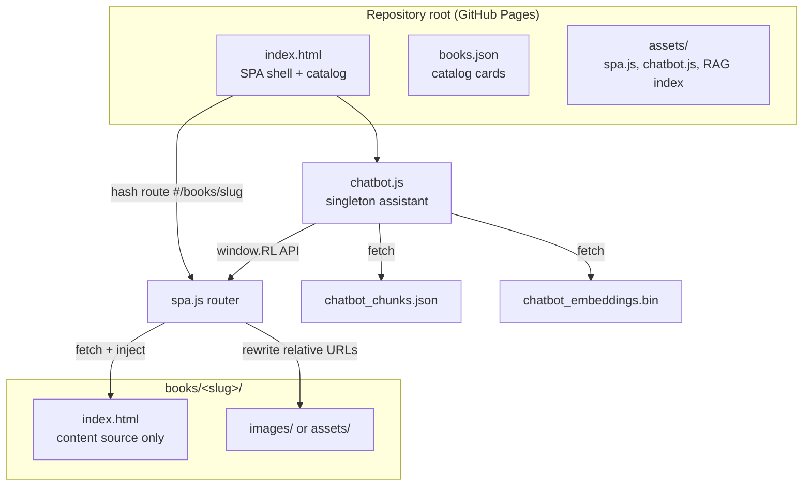
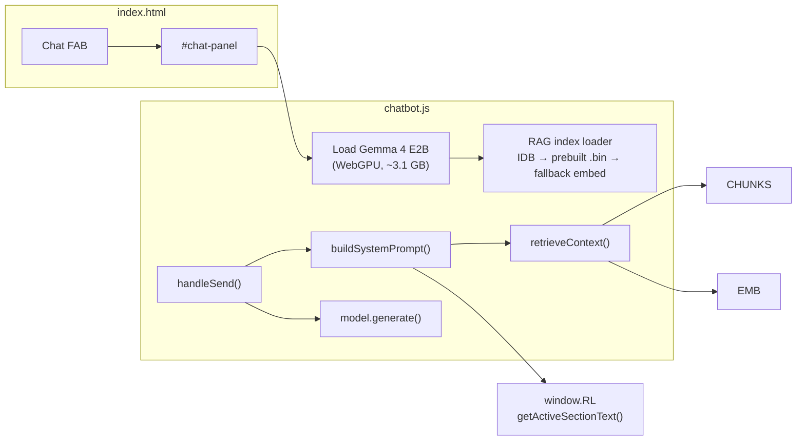
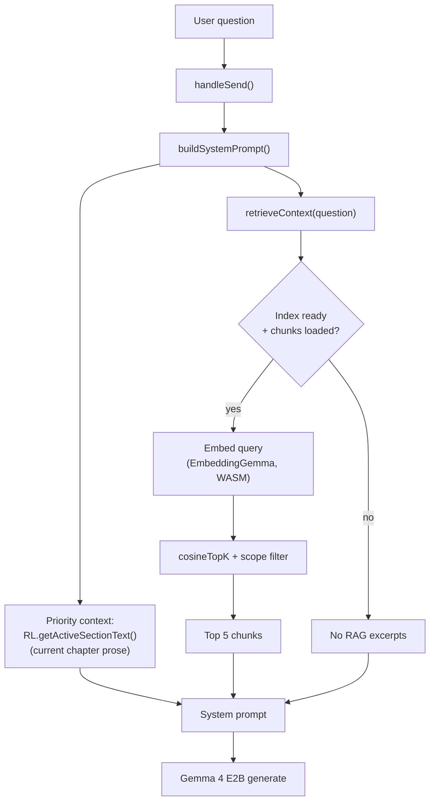

# Reading Library SPA & Chatbot Architecture

The Chanma Invest reading library is a **static single-page application** hosted from the repository root (`index.html`). Book content lives under `books/<slug>/index.html` as standalone HTML files; the SPA fetches and injects them at runtime without full page reloads. A singleton on-device chatbot (`assets/chatbot.js`) stays loaded across navigation and answers questions using the visible chapter plus optional cross-book retrieval (RAG).

---

## High-level layout



| Path | Role |
|------|------|
| `index.html` | Shell: catalog home, reader viewport, top bar, chat panel mount point |
| `books.json` | Catalog metadata (title, tags, `coverImage`, href) for home cards |
| `web_assets/spa.js` → `assets/spa.js` | Hash router, book loader, `window.RL` API |
| `web_assets/chatbot.js` → `assets/chatbot.js` | Gemma LLM + EmbeddingGemma RAG assistant |
| `assets/chatbot_chunks.json` | Per-section text chunks (built by `scripts/build_chatbot_index.py`) |
| `assets/chatbot_embeddings.bin` | Precomputed vectors (~99 MB, built by `scripts/build_chatbot_embeddings.mjs`) |
| `books/<slug>/index.html` | Monolithic book HTML; **no** chatbot scripts (content source only) |

`scripts/wire_chatbot.py` injects SPA + chatbot asset tags into **root** `index.html` only and strips stray chatbot/SPA tags from book pages so each book remains a clean fetch target.

---

## SPA routing and book loading

```mermaid
sequenceDiagram
    participant User
    participant Hash as Hash router (spa.js)
    participant Fetch as fetch()
    participant DOM as #reader-content
    participant RL as window.RL

    User->>Hash: #/books/antifragile
    Hash->>Fetch: GET books/antifragile/index.html
    Fetch-->>Hash: full book HTML
    Hash->>DOM: strip scripts, scope CSS, inject &lt;article&gt;
    Hash->>DOM: rewrite img/href/srcset to books/antifragile/...
    Hash->>RL: wireSectionObserver()
    RL-->>User: top bar title + active chapter
    Note over RL: IntersectionObserver on &lt;section&gt; elements
```

### Hash routes

| Route | View | Behavior |
|-------|------|----------|
| `#/` or empty | Home | Catalog grid from `books.json` |
| `#/books/<slug>` | Reader | Fetches `books/<slug>/index.html`, injects into `#reader-content` |

### `window.RL` (chatbot integration surface)

The chatbot never reads `window.location` for book context. It uses the SPA API:

| Method | Returns |
|--------|---------|
| `RL.getState()` | `{ view, slug, bookUrl, bookTitle, sectionId, sectionTitle }` |
| `RL.getActiveSectionText()` | Plain text of the active `<section>` (trimmed) |
| `RL.onSectionChange(cb)` | Fires when scroll changes the active section |
| `RL.navigate(slug)` | Programmatic navigation |

`bookUrl` matches chunk URLs in the RAG index, e.g. `books/antifragile/index.html`.

### Active section tracking

`spa.js` observes `section.epub-section` and `section.chapter` inside the reader scroller. The topmost intersecting section becomes `activeSection`; its `id` aligns with `sectionId` on RAG chunks.

---

## Chatbot wiring



### Script load order

Root `index.html` includes:

```html
<script type="module" src="assets/spa.js"></script>
<script type="module" src="assets/chatbot.js" defer></script>
```

`spa.js` registers `window.RL` on parse. `chatbot.js` (deferred) builds the FAB/panel on `DOMContentLoaded` and listens for `rl:sectionchange` to refresh the scope bar.

### Persistence (browser storage)

| Key | Storage | Purpose |
|-----|---------|---------|
| `chanma-rl-chat-scope` | `localStorage` | Scope toggle: `chapter` / `book` / `all` |
| `chanma-rl-chatbot-*` | `sessionStorage` / `localStorage` | Panel open, load flag, conversation history |
| `chanma-rl-chatbot-rag` (IDB) | IndexedDB | Cached embedding vectors per language |

---

## Question-answering pipeline



### Retrieval scopes

The status-bar toggle controls **which chunks** `cosineTopK` may return. The current section text is **always** injected as priority context.

| Scope | Filter | Enabled when |
|-------|--------|--------------|
| **This chapter** | `chunk.url === bookUrl` AND `chunk.sectionId === sectionId` | Book open + index ready |
| **This book** | `chunk.url === bookUrl` | Book open + index ready |
| **All books** | No filter | Index ready |

On the home view (no book), chapter/book scopes are disabled; the bar falls back to **All books**.

### RAG index load order

1. **IndexedDB cache** — instant if valid (same model + chunk hash).
2. **Prebuilt binary** — `assets/chatbot_embeddings.bin` (~99 MB); hash in header must match `chatbot_chunks.json`.
3. **Fallback** — embed every chunk in-browser (slow; only if bin missing/stale).

The embedder model (~300 MB) is still downloaded at runtime to embed **user queries**; only document vectors are precomputed.

### System prompt structure

1. Instructions (answer only from provided library material).
2. `CURRENT BOOK (priority)` — active section text (up to 6 K chars; 20 K in chapter scope).
3. `RELEVANT EXCERPTS` — up to 5 retrieved chunks, labeled with book title.

If neither layer covers the question, the model is instructed to say so honestly.

---

## Regenerating derived artifacts

After adding or changing book content:

```bash
# 1. Rebuild chunk index from every book's index.html
uv run python scripts/build_chatbot_index.py

# 2. Rebuild embedding cache (Node + GPU/CPU)
cd scripts && npm install && node build_chatbot_embeddings.mjs

# 3. Publish source assets to served location
cp web_assets/spa.css web_assets/spa.js web_assets/chatbot.css web_assets/chatbot.js assets/
uv run python scripts/wire_chatbot.py
```

---

## Troubleshooting

| Symptom | Likely cause |
|---------|----------------|
| Scope bar shows **Search not available** | Index not ready; wait for load or click the message to rebuild |
| **All books** always says “don’t know” | RAG index not ready, or `chatbot_chunks.json` failed to load |
| **This book** works for current chapter only | Expected without RAG; cross-chapter questions need a ready index |
| Prebuilt bin rejected in console | `stale (chunk text changed)` — rebuild embeddings after content change |
| Broken covers in reader | SPA must rewrite SVG `<image xlink:href>` as well as `` |

Open DevTools → Console and look for `prebuilt embeddings`, `chunks fetch`, or `retrieveContext failed` warnings.
